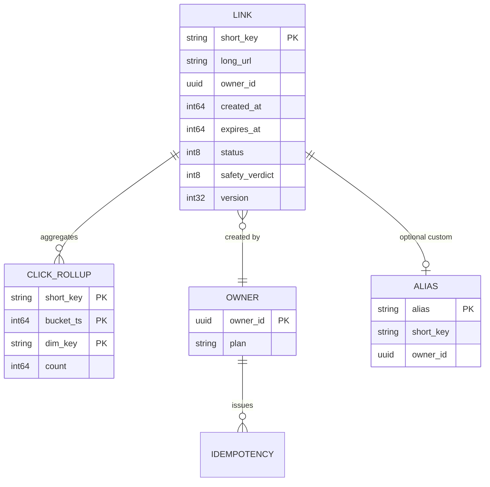
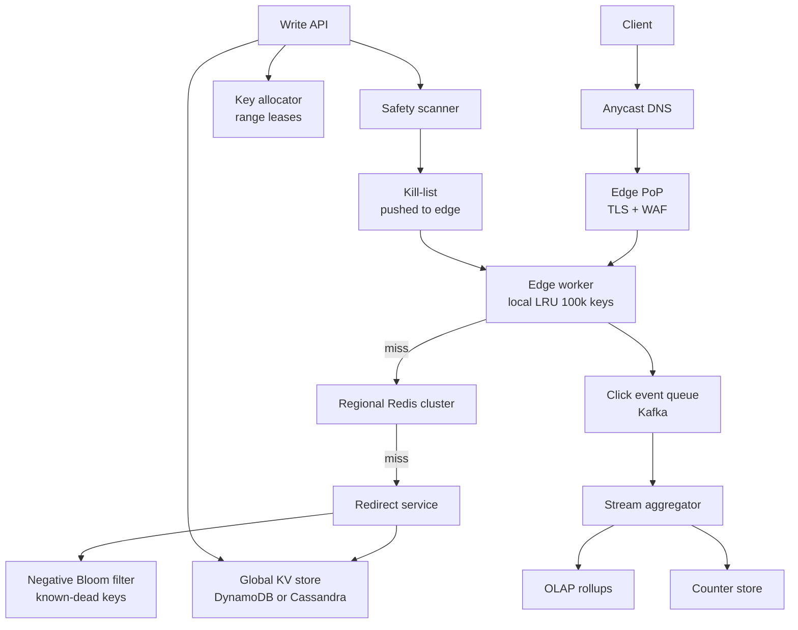
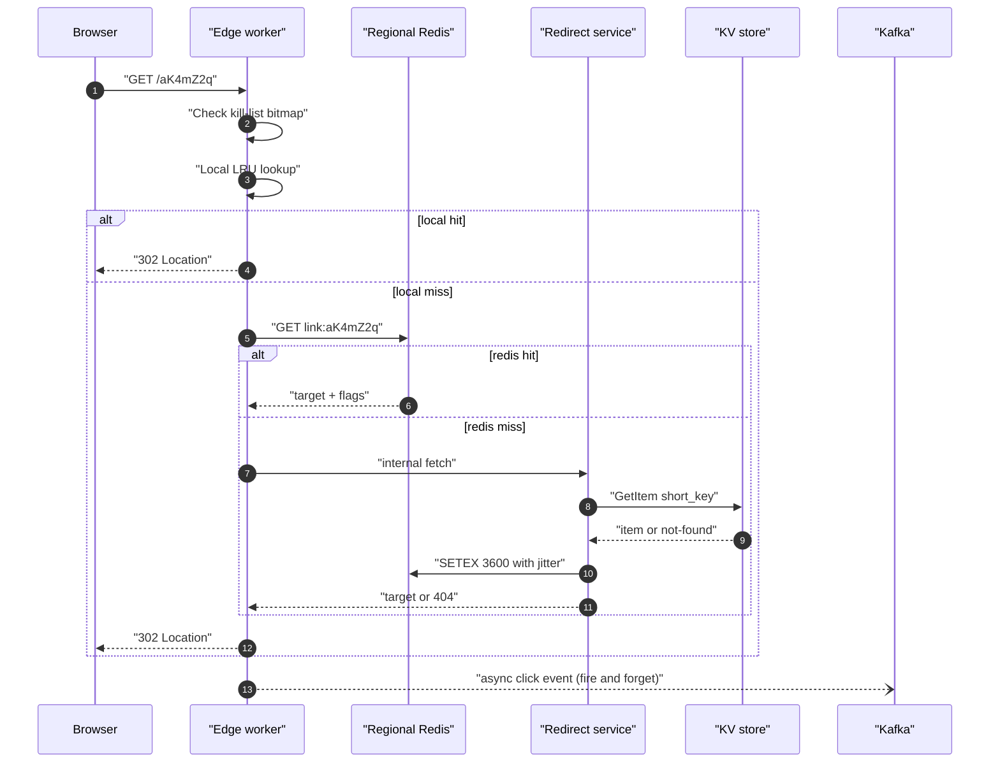
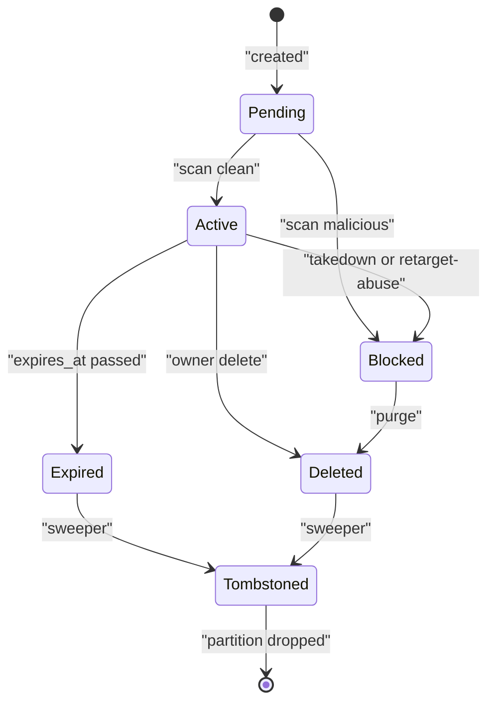

# 01 — URL Shortener (TinyURL / bit.ly)

<span class="pill pill-core">Core</span> <span class="pill pill-medium">Medium</span>

**A URL shortener is a globally distributed, write-once/read-billions immutable key-value lookup fronted by an HTTP redirect — and the single hardest thing is that the "trivial" key generation choice silently determines your collision cost, your enumeration exposure, your index write amplification and your ability to expire data years later.**

| | |
|---|---|
| **Commonly asked at** | Google, Meta, Stripe, Cloudflare, Amazon, Atlassian, Datadog |
| **Time budget** | 45 min |
| **Core tension** | Key opacity and non-enumerability versus cheap, coordination-free, collision-free generation at 100M keys/day |
| **Prerequisites** | [F04 Caching](../fundamentals/f04-caching.md) · [F06 Partitioning & Sharding](../fundamentals/f06-partitioning-sharding.md) · [F13 Storage Engines](../fundamentals/f13-storage-engines.md) · [F11 Idempotency](../fundamentals/f11-idempotency.md) · [F05 CDN & Edge](../fundamentals/f05-cdn-edge.md) · [F27 Security in Design](../fundamentals/f27-security-design.md) |

---

## 1. Problem Statement

Build a service that accepts a long URL and returns a short, durable HTTP link. Following the short link issues an HTTP redirect to the original target. The service must serve redirects with edge-CDN-class latency worldwide, support optional custom aliases, optional expiry, per-link click analytics, and must not become the internet's favourite phishing redirector.

The interview is *not* about hashing. It is about four decisions that a junior candidate makes implicitly and a senior candidate makes explicitly:

1. **How keys are minted** — determines collision handling, coordination cost, and whether an attacker can enumerate your entire corpus.
2. **Which redirect status code** — determines whether you ever see a second click, which determines your analytics fidelity, your cache hit ratio, and your origin QPS.
3. **Where the read path terminates** — edge cache, regional cache, or origin store; this is a 4-order-of-magnitude latency and cost decision.
4. **How links die** — deleting billions of rows is a storage-engine problem, not a `DELETE` statement.

---

## 2. Requirements

### Functional

| ID | Requirement | Notes |
|---|---|---|
| F1 | Create short link from a long URL | Returns canonical short URL; must be idempotent under client retry |
| F2 | Redirect short key to target | The 99.99% path; everything else is a rounding error |
| F3 | Optional custom alias | `short.io/blackfriday` — uniqueness, reserved words, profanity, homoglyphs |
| F4 | Optional expiry (absolute TTL or click budget) | Expired links return 410, not 404 |
| F5 | Per-link click analytics | Count, time series, referrer, geo, device class |
| F6 | Owner-scoped listing, edit target, soft delete | Editing a live link is a security-sensitive operation |
| F7 | Abuse detection and takedown | Safe Browsing / URLhaus / internal classifier; instant global kill |

### Non-functional

| ID | Requirement | Target |
|---|---|---|
| N1 | Redirect availability | 99.99% monthly (4.32 min budget) |
| N2 | Redirect latency | p50 < 10 ms, p99 < 40 ms measured at edge PoP |
| N3 | Creation latency | p99 < 200 ms |
| N4 | Durability | 11 nines; a lost link is a permanently broken URL printed on a billboard |
| N5 | Read:write ratio | 100:1 baseline, 10,000:1 for viral links |
| N6 | Key length | <= 7 base62 chars, non-sequential, non-guessable |
| N7 | Consistency | Read-your-writes for the creator; eventual (< 5 s) globally |
| N8 | Link immutability | Target URL changes must be auditable and revocable |

### Explicitly out of scope

| Out of scope | Why it is out of scope | What I would say if pushed |
|---|---|---|
| Link preview / OG-tag scraping | Separate crawler system with its own SSRF surface | "That's a crawler design; the SSRF containment is the interesting part" |
| Full BI dashboards | Analytics *serving* is an OLAP problem | "ClickHouse or Druid behind a materialised rollup" |
| Billing and plan enforcement | Orthogonal control plane | "Quota checks are a rate-limiter concern" |
| Vanity domains with customer TLS | ACME automation + SNI routing | "Real product requirement, 20 minutes on its own" |

---

## 3. Scale Estimation

Assume a bit.ly-class service.

**Writes.**

$$
\text{new links/day} = 100 \times 10^{6}
\qquad
\text{QPS}_{w,\text{avg}} = \frac{100 \times 10^{6}}{86400} \approx 1{,}157\ \text{/s}
$$

Diurnal peak factor of 3 (business hours across US + EU overlap):

$$
\text{QPS}_{w,\text{peak}} \approx 3{,}500\ \text{/s}
$$

**Reads.** At a 100:1 read:write ratio:

$$
\text{redirects/day} = 10^{10}
\qquad
\text{QPS}_{r,\text{avg}} = \frac{10^{10}}{86400} \approx 115{,}740\ \text{/s}
$$

$$
\text{QPS}_{r,\text{peak}} \approx 350{,}000\ \text{/s}
$$

**Storage.** Row footprint:

| Field | Bytes |
|---|---|
| `short_key` (7 char) | 7 |
| `long_url` (mean 180, p99 1024, cap 2048) | 180 |
| `owner_id` | 16 |
| `created_at`, `expires_at` | 16 |
| flags, status, `safety_verdict`, version | 12 |
| Row + index overhead (~1.6x on an LSM store) | ~150 |
| **Total** | **~380 B** |

$$
\text{daily} = 100\times10^{6} \times 380\,\text{B} = 38\ \text{GB/day}
$$

$$
\text{annual} = 38 \times 365 \approx 13.9\ \text{TB/yr (logical)}
$$

$$
\text{annual}_{\text{RF}=3} \approx 41.6\ \text{TB/yr}
$$

Over a 10-year retention horizon that is ~416 TB replicated — large but unremarkable; it is the *index* and the *compaction* that hurt, not the bytes.

**Keyspace.**

$$
62^{6} = 56{,}800{,}235{,}584 \approx 5.68\times10^{10}
$$

$$
62^{7} = 3{,}521{,}614{,}606{,}208 \approx 3.52\times10^{12}
$$

At $3.65\times10^{10}$ links/year, a 6-char keyspace is exhausted in **1.56 years**. A 7-char keyspace lasts:

$$
\frac{3.52\times10^{12}}{3.65\times10^{10}} \approx 96\ \text{years}
$$

7 characters it is. (8 chars buys 5,900 years and costs one byte per row — cheap insurance, but 7 is the product-visible sweet spot.)

**Collision math for random generation.** With $n$ keys already stored and keyspace $N$, the probability that a freshly drawn random key collides is $p = n/N$. Expected attempts per successful insert is $1/(1-p)$.

| Elapsed | $n$ | $p = n/N$ | Extra DB round-trips per insert |
|---|---|---|---|
| 1 year | $3.65\times10^{10}$ | 1.04% | 1.010 |
| 5 years | $1.83\times10^{11}$ | 5.19% | 1.055 |
| 10 years | $3.65\times10^{11}$ | 10.4% | 1.116 |
| 30 years | $1.10\times10^{12}$ | 31.2% | 1.453 |

Expected *pairs* of colliding draws after one year, by the birthday approximation:

$$
E[\text{collisions}] \approx \frac{n^{2}}{2N} = \frac{(3.65\times10^{10})^{2}}{2 \times 3.52\times10^{12}} \approx 1.9\times10^{8}
$$

189 million collisions in year one. Each one is a conditional-write failure and a retry. That is survivable but it is *not* "collisions are so rare we can ignore them" — the answer many candidates give.

**Bandwidth.** Redirect response is headers only, ~450 B including `Location`, `Cache-Control`, security headers:

$$
350{,}000 \times 450\,\text{B} \approx 158\ \text{MB/s} \approx 1.26\ \text{Gbps egress at peak}
$$

Ingress is larger because of cookies and User-Agent: ~900 B → **2.5 Gbps**.

**Connections.** With HTTP/2 keep-alive and a mean of 8 redirects per connection over its lifetime, and a 60 s idle timeout, concurrent connections at peak:

$$
C \approx \text{QPS} \times \text{mean conn lifetime} / \text{reqs per conn} \approx 350{,}000 \times 60 / 8 \approx 2.6\times10^{6}
$$

2.6M concurrent sockets across the edge fleet — ~40k per PoP-node at 64 nodes. This is a real constraint: it drives `nf_conntrack` sizing, ephemeral port ranges on the LB, and TLS session-ticket cache size. See [F01 Networking Foundations](../fundamentals/f01-networking-foundations.md).

**Analytics volume.** 10^10 click events/day at 200 B/event = **2 TB/day raw**, ~400 GB/day after columnar compression, 146 TB/yr. This dwarfs the link table by 10x and is the real storage bill.

---

## 4. API Design

### Create

```http
POST /v1/links HTTP/1.1
Host: api.short.io
Authorization: Bearer <token>
Idempotency-Key: 6f1d0a2e-9c53-4a4c-a2b3-1f0e5b8d7c91
Content-Type: application/json

{
  "long_url": "https://example.com/very/long/path?utm_source=x",
  "custom_alias": null,
  "expires_at": "2027-01-01T00:00:00Z",
  "tags": ["campaign:q1"]
}
```

```http
HTTP/1.1 201 Created
Location: https://short.io/aK4mZ2q
Content-Type: application/json

{
  "short_key": "aK4mZ2q",
  "short_url": "https://short.io/aK4mZ2q",
  "long_url": "https://example.com/very/long/path?utm_source=x",
  "created_at": "2026-08-31T09:14:02Z",
  "expires_at": "2027-01-01T00:00:00Z",
  "safety": {"verdict": "pending"}
}
```

**Idempotency.** `Idempotency-Key` is required for POST. The key is stored with the response body in a 24-hour TTL table; a replay returns the identical `short_key` with `Idempotency-Replayed: true`. Without this, a client retry after a gateway timeout mints a *second* short link for the same target — not incorrect, but it fragments analytics and burns keyspace. See [F11 Idempotency](../fundamentals/f11-idempotency.md).

**Deliberately not deduplicating by `long_url`.** Two users shortening the same URL must get different keys, because analytics, expiry and ownership are per-link. Global dedup would leak the existence of a link across tenants — a real privacy bug. Dedup is offered only as an opt-in *per-owner* flag.

### Redirect

```http
GET /aK4mZ2q HTTP/1.1
Host: short.io
```

```http
HTTP/1.1 302 Found
Location: https://example.com/very/long/path?utm_source=x
Cache-Control: private, max-age=0, no-store
Referrer-Policy: unsafe-url
X-Robots-Tag: noindex
Content-Length: 0
```

### Remaining surface

| Method | Path | Semantics | Notes |
|---|---|---|---|
| `GET` | `/v1/links/{key}` | Metadata read | Owner-scoped; 404 for non-owner (not 403 — do not confirm existence) |
| `PATCH` | `/v1/links/{key}` | Retarget | Requires re-scan; emits audit event; version increments |
| `DELETE` | `/v1/links/{key}` | Soft delete → 410 | Key is never recycled |
| `GET` | `/v1/links?cursor=&limit=` | Owner listing | Keyset pagination on `(created_at, short_key)`, never `OFFSET` |
| `GET` | `/v1/links/{key}/stats?granularity=hour&from=&to=&cursor=` | Time series | Served from pre-aggregated rollups only |
| `POST` | `/v1/links:batch` | Up to 1,000 per call | Partial success with per-item status array |

### Error codes

| Code | Condition | Client action |
|---|---|---|
| 400 | Malformed URL, unsupported scheme, > 2048 bytes | Fix and resend |
| 409 | Custom alias taken | Choose another |
| 410 | Link expired or deleted | Terminal; do not retry |
| 422 | Alias reserved / profane / homoglyph-confusable | Choose another |
| 429 | Quota exceeded | Honour `Retry-After` |
| 451 | Blocked for legal/abuse reasons | Terminal |
| 503 | Key allocator degraded | Retry with jitter; `Retry-After` present |

**Versioning.** `/v1` in the path for the management API. The redirect path is *unversioned and unversionable* — `short.io/{key}` is a permanent contract with the entire internet. Any change to redirect semantics must be additive.

---

## 5. Data Model



### Access patterns

| # | Pattern | Frequency | Latency budget | Index |
|---|---|---|---|---|
| A1 | `get(short_key)` → target | 350k/s peak | 5 ms at store, 1 ms at cache | Primary key, point read |
| A2 | `put_if_absent(short_key)` | 3.5k/s peak | 20 ms | Conditional write on PK |
| A3 | `put_if_absent(alias)` | 100/s | 20 ms | Separate table, PK on alias |
| A4 | List by owner, newest first | 50/s | 100 ms | LSI/GSI on `(owner_id, created_at desc)` |
| A5 | Stats by `(key, time range)` | 200/s | 300 ms | OLAP rollup table |
| A6 | Sweep expired | batch | n/a | Partition-by-expiry-epoch (see §7.4) |
| A7 | Kill by domain (abuse) | rare, urgent | < 60 s global | Inverted index `domain → keys` |

Every hot pattern is a **point read on an opaque key**. There is no join, no range scan on the hot path, no transaction spanning more than one item. That shape dictates the store.

### Store choice

| Option | Fit | Verdict |
|---|---|---|
| **DynamoDB / Cassandra (partition key = `short_key`)** | Point reads at any scale, conditional writes for collision handling, native TTL, linear horizontal growth, multi-region active-active | **Chosen.** Access pattern is 100% single-key; a KV store is not a compromise here, it is the correct model |
| Sharded MySQL/Postgres by `hash(short_key)` | Works; `INSERT ... ON CONFLICT DO NOTHING` handles collisions; strong single-row consistency | **Rejected.** Resharding 400 TB is an operational project; you inherit connection-pool fan-out at 350k QPS; you pay for a B-tree you never range-scan. Viable at 1/10th scale |
| Single Postgres + read replicas | Simplest; correct to 5–10k QPS | **Rejected at this scale**, but the right answer if the interviewer caps you at 1M links/day |
| Redis as system of record | 1 ms reads | **Rejected.** Durability is the product. AOF everysec still loses up to 1 s of link creations, and a lost link is a permanently dead URL |
| S3 object per key | Absurdly cheap storage | **Rejected.** ~50 ms p99 GET, no conditional-put ergonomics at the time this design targets, no TTL granularity |
| Etcd/ZooKeeper | Strong consistency | **Rejected.** Consensus store, ~GBs not TBs; wrong tool by three orders of magnitude. See [F09 Consensus](../fundamentals/f09-consensus.md) |

**Why not one table for aliases and generated keys?** They *are* one table — the alias reserves the same primary key space. A conditional `PutItem` on `short_key` with `attribute_not_exists(short_key)` handles both alias claims and generated-key collisions with the same code path. Keeping a separate `ALIAS` table would require a distributed transaction to keep them consistent. Collapsing them is the design that removes a whole class of bugs. See [F10 Distributed Transactions](../fundamentals/f10-distributed-transactions.md).

### DDL

```sql
-- Reference relational schema (used for the 1/10th-scale variant and as
-- the mental model for the KV item shape).
CREATE TABLE links (
    short_key       CHAR(7)      NOT NULL,
    long_url        VARCHAR(2048) NOT NULL,
    owner_id        UUID         NOT NULL,
    created_at      TIMESTAMPTZ  NOT NULL DEFAULT now(),
    expires_at      TIMESTAMPTZ  NULL,
    expiry_epoch    INTEGER      GENERATED ALWAYS AS
                        (CASE WHEN expires_at IS NULL THEN 0
                              ELSE (EXTRACT(EPOCH FROM expires_at)::BIGINT / 86400)::INT
                         END) STORED,
    status          SMALLINT     NOT NULL DEFAULT 1,   -- 1 active 2 disabled 3 deleted
    safety_verdict  SMALLINT     NOT NULL DEFAULT 0,   -- 0 pending 1 clean 2 suspicious 3 malicious
    target_host     TEXT         NOT NULL,             -- denormalised for domain-wide takedown
    version         INTEGER      NOT NULL DEFAULT 1,
    CONSTRAINT pk_links PRIMARY KEY (short_key)
) PARTITION BY LIST (expiry_epoch);

CREATE INDEX idx_links_owner ON links (owner_id, created_at DESC) INCLUDE (short_key);
CREATE INDEX idx_links_host  ON links (target_host) WHERE status = 1;

-- Idempotency ledger, TTL 24h.
CREATE TABLE idempotency (
    owner_id   UUID  NOT NULL,
    idem_key   TEXT  NOT NULL,
    short_key  CHAR(7) NOT NULL,
    created_at TIMESTAMPTZ NOT NULL DEFAULT now(),
    PRIMARY KEY (owner_id, idem_key)
);
```

---

## 6. High-Level Architecture



### Write path

1. **Auth + quota.** Edge validates the bearer token, applies per-owner rate limits ([F17 Rate Limiting](../fundamentals/f17-rate-limiting-load-shedding.md)).
2. **Idempotency probe.** Conditional read on `(owner_id, idem_key)`. Hit → return stored response, done.
3. **Validate.** Scheme allow-list (`http`, `https` only), length cap, IDN/punycode normalisation, reject links pointing at the shortener's own domain beyond depth 1 (redirect-loop prevention).
4. **Mint key.**
   - Custom alias → normalise (NFKC, casefold), check reserved/profanity/confusable sets, then conditional put.
   - Generated → take the next integer from the node's leased range, apply the Feistel permutation, base62-encode (§7.1). No collision is possible, so the conditional put is a *safety assertion*, not a retry loop.
5. **Durable write.** `PutItem` with `attribute_not_exists(short_key)`, quorum write, RF=3.
6. **Record idempotency** (same request, second item; a failure here is safe — worst case the client retry mints a new key).
7. **Emit `link.created`** to Kafka for the safety scanner and search index.
8. **Respond 201.** Total budget: 2 network hops + 1 quorum write ≈ 25 ms p50.

The link is **usable before it is scanned**. Safety verdict starts `pending`; the edge treats `pending` as "allow but log", and a malicious verdict arriving 10 s later pushes the key onto the kill-list. Blocking creation on a third-party scan would put a 300 ms p99 dependency on the write path and make the scanner's availability your availability.

### Read path



The click event is emitted **after** the response is written to the socket, on a non-blocking path with a bounded in-memory ring buffer. If Kafka is down, the buffer fills and events are dropped with a counter incremented. Analytics loss is acceptable; a redirect stall is not. This asymmetry is the entire operational philosophy of the service.

---

## 7. Deep Dives

### 7.1 Key generation: four strategies and the one that actually wins

=== "Random + retry"

    Draw 7 random base62 chars from a CSPRNG, conditional-put, retry on conflict.

    - **Pros:** zero coordination, keys are opaque and unguessable, trivially correct.
    - **Cons:** collision probability grows as $n/N$; at 10 years that is 10.4% and each retry is a full quorum write round-trip. Worse, the retry rate is *unbounded from the client's perspective* — a p99.9 insert can take 3 attempts.
    - **Verdict:** correct and often good enough. The failure is not correctness, it is that write latency degrades as the corpus grows, which nobody instruments until it hurts.

=== "Counter + base62"

    Global monotonic counter, base62-encode the integer.

    - **Pros:** zero collisions by construction, one write, shortest possible keys (early keys are 1–3 chars).
    - **Cons:** **fully enumerable**. `aB` → `aC` walks the corpus. Also leaks total link count and creation rate to any observer — a competitive-intelligence gift. Counter is a coordination point.
    - **Verdict:** rejected standalone. But it is the right *substrate*.

=== "Hash + truncate"

    `base62(truncate(SHA-256(long_url + salt), 42 bits))`.

    - **Pros:** deterministic dedup for free, no coordination.
    - **Cons:** truncation reintroduces the birthday problem at exactly the rate of random generation, so you still need retry-with-salt — and now the retry changes the hash input, killing the determinism you chose it for. Same-URL dedup across tenants is a privacy leak.
    - **Verdict:** rejected. It buys a property you do not want and keeps the cost you were trying to avoid.

=== "Pre-generated key pool (KGS)"

    A Key Generation Service pre-computes unused keys into a table with `used` flags; app servers lease blocks of 10,000.

    - **Pros:** collision-free at request time, no coordination in the hot path (1 lease per 10,000 links → $100\times10^{6}/10^{4} = 10^{4}$ leases/day ≈ 0.12/s).
    - **Cons:** you must *store* the pool. Pre-generating the full $3.52\times10^{12}$ keyspace at 7 B/key is 24.6 TB of keys you have not used yet, plus the used/unused bitmap. Leased-but-uncommitted blocks are lost on server crash (10k keys per crash — harmless). The KGS becomes a stateful singleton needing its own HA design.
    - **Verdict:** works, and it is the canonical textbook answer, but it solves collisions by paying storage and adding a component.

**The design I would actually present: counter + Feistel permutation.**

Take the coordination-free block-leased counter (the good part of KGS) and make the output opaque with a small **format-preserving encryption** over the key domain. A 3–4 round Feistel network with a keyed PRF is a bijection on $\{0, 1\}^{42}$, so:

- **Collisions are structurally impossible** — a bijection maps distinct counters to distinct keys.
- **Keys are non-enumerable** without the Feistel key: adjacent counters produce uncorrelated outputs.
- **No pool storage**, no `used` bitmap, no KGS table.
- **Reversible** for debugging: given a key, recover the counter and therefore the shard and creation order.

$2^{42} = 4.398\times10^{12}$ and $62^{7} = 3.522\times10^{12}$, so ~20% of the cipher's outputs fall outside the base62 domain. Handle with **cycle walking**: re-encrypt until the value is in range. Expected iterations:

$$
E[\text{iters}] = \frac{2^{42}}{62^{7}} = \frac{4.398\times10^{12}}{3.522\times10^{12}} \approx 1.249
$$

Each iteration is four HMAC/SipHash calls on 21-bit halves — sub-microsecond, in-process, no network.

```python
import hmac, hashlib

DOMAIN_BITS = 42
HALF = DOMAIN_BITS // 2          # 21 bits each side
MASK = (1 << HALF) - 1
MAXKEY = 62 ** 7                 # 3_521_614_606_208
ALPHABET = "0123456789abcdefghijklmnopqrstuvwxyzABCDEFGHIJKLMNOPQRSTUVWXYZ"

def _prf(key: bytes, rnd: int, x: int) -> int:
    msg = rnd.to_bytes(1, "big") + x.to_bytes(3, "big")
    return int.from_bytes(hmac.new(key, msg, hashlib.sha256).digest()[:3], "big") & MASK

def _feistel(key: bytes, n: int, rounds: int = 4) -> int:
    left, right = (n >> HALF) & MASK, n & MASK
    for r in range(rounds):
        left, right = right, left ^ _prf(key, r, right)
    return (left << HALF) | right

def encode(counter: int, key: bytes) -> str:
    """Bijective, opaque, collision-free 7-char base62 key."""
    n = _feistel(key, counter)
    while n >= MAXKEY:               # cycle walking, E[iters] ~= 1.25
        n = _feistel(key, n)
    out = []
    for _ in range(7):
        n, rem = divmod(n, 62)
        out.append(ALPHABET[rem])
    return "".join(reversed(out))    # fixed width, no leading-zero ambiguity
```

!!! tip "Why this is the strong answer"
    It collapses three separate problems — collisions, coordination, enumeration — into one primitive with a closed-form cost. The interviewer's follow-up ("what if the counter service is down?") has a clean answer: each app server holds a leased range of 10,000 and a warm second range; the allocator can be unavailable for hours before anyone notices.

**Counter allocation.** A single row `counters(name, next_value)` with `UPDATE ... RETURNING next_value + 10000`. At 0.12 leases/s this row is never contended. Multi-region: give each region a disjoint stride (region $i$ takes $c \equiv i \bmod R$) so no cross-region coordination is needed at all.

### 7.2 301 vs 302: the decision that determines whether your product has data

| | 301 Moved Permanently | 302 Found | 307/308 |
|---|---|---|---|
| Browser caches by default | **Yes, aggressively and near-permanently** | No | Mirrors 301/302 |
| Repeat clicks reach your servers | No | Yes | — |
| Analytics fidelity | First click per browser only | Every click | — |
| Origin/edge QPS | Much lower | Full | — |
| Retarget a live link | **Effectively impossible** — stale 301s persist for months | Immediate | — |
| Takedown of a malicious link | **Ineffective for already-poisoned clients** | Immediate | — |
| SEO link equity passed | Yes | Historically no | — |
| Method preservation on POST | No (rewrites to GET) | No | Yes |

**Choose 302 as the default.** The decisive argument is not analytics — it is **revocability**. A 301 is a cache-poisoning primitive you hand to attackers: create a benign link, get it 301-cached in a million browsers, then retarget it. The browsers never come back to ask. There is no takedown mechanism that reaches them.

Explicit headers on the 302 matter as much as the status code:

```http
HTTP/1.1 302 Found
Location: https://example.com/target
Cache-Control: private, no-store, max-age=0
Pragma: no-cache
Referrer-Policy: unsafe-url
X-Robots-Tag: noindex, nofollow
```

Without `Cache-Control: no-store`, a corporate forward proxy may cache the 302 body/headers under heuristic freshness and you lose both analytics and revocability anyway — the exact failure you chose 302 to avoid.

**When 301 is correct:** an explicit per-link opt-in for links whose target is genuinely permanent and where SEO equity matters (a brand's canonical vanity link). Gate it behind a confirmation and a hard "this cannot be undone" warning, and set `Cache-Control: public, max-age=86400` so it is at least bounded.

!!! example "The measurable cost of 302"
    Assume 60% of clicks are repeats from a browser that would have cached a 301. Choosing 302 over 301 therefore multiplies redirect QPS by $1/(1-0.6) = 2.5\times$ — from 140k/s to 350k/s. At the cost model in §10 that is roughly **+$12k/month**. That is the price of revocability and analytics, and it is worth stating out loud in the interview.

### 7.3 The read path: cache hierarchy and hit-ratio arithmetic

Three tiers, each absorbing an order of magnitude.

| Tier | Where | Size | TTL | Expected hit ratio | Latency |
|---|---|---|---|---|---|
| L1 in-process LRU | Edge worker | 100k entries, ~30 MB | 60 s | 45% | 20 µs |
| L2 regional Redis | Per-region cluster | 500M entries, ~155 GB | 1 h ± jitter | 92% of L1 misses | 0.6 ms |
| L3 KV store | Global | Everything | — | 100% | 6 ms p99 |

Effective origin QPS at peak:

$$
\text{QPS}_{L3} = 350{,}000 \times (1 - 0.45) \times (1 - 0.92) \approx 15{,}400\ \text{/s}
$$

Across 32 partitions that is ~480 QPS/partition — comfortably inside a single node's budget.

**L2 sizing.** Distinct links accessed per day ≈ 500M (heavy Zipf: the top 0.1% of links carry ~55% of clicks). Entry cost in Redis:

$$
7\,\text{B key} + 180\,\text{B value} + \sim 90\,\text{B overhead} \approx 277\,\text{B}
$$

$$
500\times10^{6} \times 277\,\text{B} \approx 139\ \text{GB} \Rightarrow \text{provision } 192\ \text{GB (12 } \times \text{ 16 GB shards)}
$$

**Negative caching is mandatory.** 404s are a large fraction of traffic (typos, expired links, and scanners walking the keyspace). Caching "not found" for 60 s in L1/L2 prevents a scanner from converting 100% of its requests into origin reads. Better still: maintain a **Bloom filter of all issued keys** at the edge. See [F21 Probabilistic Data Structures](../fundamentals/f21-probabilistic-data-structures.md).

$$
m = -\frac{n \ln p}{(\ln 2)^{2}},\quad n = 4\times10^{11},\ p = 0.01
\;\Rightarrow\; m \approx 3.83\times10^{12}\ \text{bits} \approx 479\ \text{GB}
$$

479 GB is too big for an edge worker. Two ways out: (a) shard the filter by key prefix so each PoP holds only the slice it routes, or (b) accept a coarser filter at $p = 0.1$ ($m \approx 239$ GB) — still too big. **The honest conclusion: a global negative Bloom filter does not fit at the edge for a 400-billion-key corpus.** Use it regionally for the *hot* subset (10^9 keys, $p=0.01$ → 1.2 GB) and rely on negative TTL caching plus rate limiting for the rest. Working through this and rejecting your own idea with numbers is exactly the senior signal.

### 7.4 Expiry and garbage-collecting billions of rows

At 100M links/day with a 30% TTL adoption rate, 30M rows/day become garbage — 11 billion rows/year.



| Strategy | Mechanism | Cost | Verdict |
|---|---|---|---|
| `DELETE WHERE expires_at < now()` | Scan + delete | Full-table scan, index churn, replication-lag spike, vacuum storm | **Rejected.** This is how you page yourself at 03:00 |
| Native TTL (DynamoDB TTL / Cassandra TTL) | Store-managed background delete | Free operationally, but **up to 48 h lag** on DynamoDB and tombstone accumulation on Cassandra | **Chosen for the KV store**, combined with a read-time check |
| Lazy deletion at read | Check `expires_at` on GET, return 410, enqueue delete | Zero background cost; correctness is immediate | **Chosen as the correctness guarantee** — never trust the sweeper for user-visible semantics |
| Partition by expiry epoch | `PARTITION BY LIST (expiry_epoch)` on day granularity; `DROP PARTITION` | O(1) reclamation, no tombstones, no vacuum | **Chosen for the relational variant** — the single best trick here |
| Rewrite compaction | Periodic SSTable rewrite excluding expired | Amortised, but doubles disk I/O | Fallback |

The composite answer: **lazy check for correctness, TTL/partition-drop for space, never a `DELETE` scan.**

!!! danger "Cassandra tombstone trap"
    TTL-expired rows in Cassandra become tombstones that live for `gc_grace_seconds` (default 10 days) and are *read* on every query touching that partition. With 30M expirations/day you can accumulate 300M live tombstones. A partition that accumulates thousands of tombstones will trip `tombstone_failure_threshold` (default 100k) and start returning read errors on *healthy* keys. Because each link is its own partition here, the blast radius is contained — but the moment someone adds a clustering column to store link versions inside a partition, this becomes a production incident.

**Keys are never recycled.** Reissuing an expired key means an old QR code on a physical poster now points at someone else's content. That is a security bug with a physical-world attack surface. Expired keys stay tombstoned forever; the 96-year keyspace budget already assumes zero reuse.

---

## 8. Scaling the Bottleneck

The bottleneck is **not** the store — it is the tail of the Zipf distribution collapsing onto a single cache shard when a link goes viral.

**Symptom.** One link (a celebrity tweet) takes 40% of global traffic: 140k QPS to a single Redis key, which lands on a single shard, which saturates a single CPU core (Redis is single-threaded per shard) at ~120k ops/s.

**Mitigation ladder, in order of when you reach for it:**

| Level | Technique | Effect | Cost |
|---|---|---|---|
| 0 | L1 in-process LRU at every edge worker | A hot key is served entirely from L1 after the first request per worker | Free; this alone solves 95% of hot-key cases |
| 1 | Promote to edge KV / CDN with `stale-while-revalidate` | Origin sees 1 req per PoP per TTL | Small |
| 2 | Key replication: store hot key as `link:X:0..15`, client picks a random suffix | Spreads across 16 shards | Write fan-out on invalidation |
| 3 | Dedicated "hot link" tier: small always-replicated in-memory set pushed to all edges | Zero cache miss possible | Control-plane complexity |
| 4 | Request coalescing / singleflight on miss | Thundering herd on TTL expiry collapses to 1 origin call per worker | Trivial to implement, huge win |

```go
// Singleflight collapses N concurrent misses for the same key into 1 origin call.
// Without this, a TTL expiry on a 140k-QPS key sends 140k simultaneous
// requests to one KV partition and takes it down.
var group singleflight.Group

func Resolve(ctx context.Context, key string) (*Link, error) {
    if l, ok := l1.Get(key); ok {
        return l, nil
    }
    v, err, _ := group.Do(key, func() (interface{}, error) {
        if l, ok := redisGet(ctx, key); ok {
            return l, nil
        }
        l, err := kvGet(ctx, key)
        if err == nil {
            // Jitter prevents synchronised expiry across the fleet.
            redisSetEx(ctx, key, l, 3600+rand.Intn(600))
        }
        return l, err
    })
    if err != nil {
        return nil, err
    }
    l := v.(*Link)
    l1.Add(key, l, 60*time.Second)
    return l, nil
}
```

**Secondary bottleneck: the click-event firehose.** 350k events/s at peak into Kafka. Do not send one message per click. Batch in the edge worker: accumulate for 200 ms or 4 KB, whichever first, and send a compressed batch. That reduces producer request rate by ~500x and turns a 350k msg/s problem into a 700 batch/s problem. Partition by `hash(short_key)` so a single consumer owns all counts for a key and can aggregate in local state without cross-partition coordination. See [F12 Queues & Streams](../fundamentals/f12-queues-streams.md).

---

## 9. Failure Modes

| Failure | Blast radius | Detection | Mitigation | Degraded behaviour |
|---|---|---|---|---|
| Redis shard down | 1/12 of L2 misses go to origin; origin QPS +8% | `redis_up`, L2 hit-ratio drop | Client-side consistent hashing routes around; origin absorbs | Latency p99 40 ms → 55 ms; no errors |
| Whole regional Redis cluster down | Origin QPS 15k → 190k | Hit ratio → 0 | Admission control at edge; L1 TTL extended 60 s → 600 s | Slower redirects, some 503 on cold keys |
| KV store partition unavailable | 1/32 of cold keys unresolvable | `GetItem` error rate by partition | Serve stale from L2 beyond TTL (`stale-if-error`) | Cold keys in that slice 503; hot keys unaffected |
| Key allocator down | New link creation | Lease-acquire errors | Servers hold a warm spare 10k range (~2.4 h of local supply) | Creation continues; alert but no page |
| Safety scanner down | Verdicts stay `pending` | Queue depth, verdict age | Fail-open: allow with `pending` and log | Malicious links live longer; abuse SLO burns |
| Kafka unavailable | Analytics only | Producer error rate | Bounded ring buffer, then drop with counter | Click counts undercount; redirects unaffected |
| Edge PoP loses transit | Users on that PoP | Anycast withdrawal, RUM | BGP withdrawal → traffic shifts to next PoP | +30 ms latency for affected users |
| Poisoned cache entry (wrong target) | Every user of that key | Verdict mismatch alarm, user reports | Global cache purge by key; version-tagged cache keys | Brief wrong redirects — the worst failure on this list |
| Counter range double-issued (allocator bug) | Duplicate keys | `ConditionalCheckFailed` rate spike above baseline zero | The conditional put is the tripwire; halt allocator, quarantine range | Some creations 503 |
| Retarget abuse (benign→malicious) | Everyone who trusted the link | Rescan on every `PATCH`; anomaly on target-host change | Rescan before activating new target; keep old target live until clean | New target blocked; old target served |

!!! warning "The conditional put is not redundant"
    With a Feistel bijection, `attribute_not_exists(short_key)` should *never* fail. Keep it anyway and alert on any non-zero rate. It is a free, always-on integrity check on your allocator, and it is the only thing that will catch a range double-issue before it silently overwrites live links.

---

## 10. SRE Lens

### SLIs and SLOs

| SLI | Definition | SLO | Window | Measured at |
|---|---|---|---|---|
| Redirect availability | non-5xx / total on `GET /{key}` | 99.99% | 30 d rolling | Edge access log |
| Redirect latency | p99 TTFB | < 40 ms | 30 d | Edge, per-PoP |
| Redirect correctness | sampled key→target matches store | 99.9999% | 30 d | Synthetic probes, 1 per key per hour on top 10k |
| Creation availability | non-5xx on `POST /v1/links` | 99.9% | 30 d | API gateway |
| Creation latency | p99 | < 200 ms | 30 d | API gateway |
| Durability | links present 24 h after 201 | 100% (zero tolerance) | continuous | Reconciliation job |
| Abuse containment | malicious link median time-to-block | < 15 min | 7 d | Safety pipeline |

**Error budget.** 99.99% over 30 days = $43{,}200 \times 0.0001 = 4.32$ minutes of full outage per month. Budget policy:

- Burn rate > 14.4x over 1 h **and** > 6x over 6 h → page (multi-window, multi-burn-rate alerting).
- Budget < 25% remaining → freeze all non-safety deploys.
- Budget exhausted → mandatory reliability sprint; only rollbacks and abuse takedowns ship.

See [F23 SLI/SLO & Error Budgets](../fundamentals/f23-slo-error-budgets.md).

### Rollout plan

1. Config and code are separate release trains. Kill-list updates ship in seconds; binaries ship in hours.
2. Binary rollout: 1 PoP (canary, 30 min bake) → 1 region → 25% → 100%, with automated rollback on redirect error rate or p99 regression > 20%.
3. **Schema/key-format changes are one-way doors.** Any change to key length or alphabet requires dual-read support forever. Treat `short_key` format as an immutable public API.
4. Cache-format changes use versioned cache key prefixes (`v3:link:{key}`) so a rollback does not read data written by the new format.

See [F25 Deployment & Release Safety](../fundamentals/f25-deployment-release-safety.md).

### Runbook notes

| Symptom | First check | Action |
|---|---|---|
| Redirect p99 spike, hit ratio normal | Origin latency, KV throttling metrics | Raise provisioned capacity; enable adaptive L1 TTL |
| Hit ratio collapse | Recent deploy changed cache key prefix? Redis failover? | Roll back; extend L1 TTL to shed origin load |
| `ConditionalCheckFailed` > 0 | Allocator lease log | Halt allocator immediately; do not restart it "to see" |
| Sudden 404 surge on one prefix | Enumeration scanner | Per-IP and per-ASN rate limits; tarpit with 200 ms delay |
| Analytics counts flat | Kafka consumer lag, edge ring-buffer drop counter | Analytics-only; do not page |

### Capacity model

$$
\text{edge nodes} = \frac{\text{QPS}_{peak}}{\text{per-node capacity}} \times (1 + \text{headroom}) = \frac{350{,}000}{20{,}000} \times 1.5 \approx 27
$$

Deployed as 64 nodes across 16 PoPs so that **losing any single PoP costs at most 6.25% of capacity** — the N+2 constraint dominates the throughput constraint. This is the usual outcome for edge services and worth saying explicitly. See [F24 Capacity Planning](../fundamentals/f24-capacity-planning.md).

### Cost

| Component | Monthly | Driver |
|---|---|---|
| KV writes (3e9/mo on-demand) | ~$3,750 | link creations |
| KV reads (1.8e10 eventually-consistent RRU) | ~$4,540 | cache misses |
| KV storage (18 TB) | ~$4,500 | corpus growth, grows monotonically |
| Redis 192 GB across 2 regions | ~$3,500 | working set |
| Edge compute (64 nodes) | ~$7,900 | peak QPS |
| Egress 150 TB | ~$7,500 | redirect responses |
| Kafka + stream aggregation | ~$6,000 | 2 TB/day click events |
| **Total** | **~$37,700** | |

$$
\text{cost per redirect} = \frac{37{,}700}{3\times10^{11}} \approx \$1.26\times10^{-7} \approx \$0.13\ \text{per million redirects}
$$

The two levers that actually move this number: L2 hit ratio (each point of hit ratio is ~$450/mo of KV reads) and analytics retention (dropping raw events after 7 days in favour of rollups saves ~40% of the Kafka/OLAP line). See [F28 Cost Engineering](../fundamentals/f28-cost-engineering.md).

---

## 11. Trade-offs & Alternatives

### At 1/10th scale (10M links/day, 1B redirects/day)

- Single Postgres primary with 3 read replicas handles it. `INSERT ... ON CONFLICT DO NOTHING` replaces conditional puts.
- One Redis cluster, no L1 needed initially (add it the first time a link goes viral).
- Skip Kafka: write click events to a local buffer, flush to Postgres in 1 s batches with `COPY`, roll up hourly.
- Keep the Feistel key generation — it costs nothing and it is the one decision that is expensive to change later.
- Estimated cost: ~$2,500/mo. Team: 2 engineers.

### At 10x scale (1B links/day, 100B redirects/day)

- Redirects must terminate **entirely at the edge**. A regional origin round-trip at 3.5M QPS is untenable; you need the full link table replicated to every PoP as an immutable, memory-mapped, periodically-rebuilt index (an ~800 GB read-only artifact with an SSTable/FST layout, streamed as deltas).
- Key length moves to 8 chars ($62^{8} = 2.18\times10^{14}$, 597 years) — plan this migration *before* you need it.
- Click events become a sampled + sketch problem: exact counts for the top 10^6 links, HyperLogLog for unique-visitor cardinality, sampled at 1:100 for the long tail.
- Multi-region active-active writes with region-strided counters (already designed in, §7.1). No conflict resolution needed because keys are disjoint by construction. See [F26 Multi-Region & DR](../fundamentals/f26-multi-region-dr.md).

### Alternative shapes

| Alternative | When it wins | When it loses |
|---|---|---|
| Stateless self-encoding links (encrypt the URL into the key) | Zero storage, zero lookup | Keys are 40+ chars; no analytics, no expiry, no revocation. Fails the product requirement |
| Client-side key choice with server verification | Removes allocator | Enumeration and squatting; users choose terrible keys |
| Blockchain/DHT-backed | Genuinely decentralised | Latency, cost, and no takedown story. Rejected for a commercial service |
| CDN-only with edge KV as system of record | Simplest operationally | Vendor lock-in; edge KV write consistency is typically ~60 s global, unacceptable for read-your-writes |

---

## 12. Gotchas & Corner Cases

!!! gotcha "Base62 leading-zero truncation silently shortens keys"
    **Symptom:** a fraction of issued keys are 5 or 6 characters instead of 7, and a later "validate key length == 7" check starts rejecting valid links.
    **Mechanism:** the naive `while n > 0: n, r = divmod(n, 62)` loop drops leading zeros, so counter values below $62^{6}$ produce short strings. With a Feistel permutation ~1.6% of outputs fall below $62^{6}$.
    **Mitigation:** always zero-pad to fixed width (`ALPHABET[0]` padding), and make the key column `CHAR(7)` not `VARCHAR`. Decide up front whether short keys are a separate legacy namespace or an error.

!!! gotcha "Case-insensitive storage collapses your keyspace by 4.6 orders of magnitude"
    **Symptom:** collision rate is thousands of times higher than your math predicted.
    **Mechanism:** someone stores `short_key` in a MySQL column with a `_ci` collation, or puts the key in a case-insensitive DNS-like path, or normalises to lowercase in a middleware. Base62 collapses to base36: $36^{7} = 7.8\times10^{10}$ versus $62^{7} = 3.5\times10^{12}$ — a **45x** smaller keyspace, exhausted in 2 years instead of 96.
    **Mitigation:** `COLLATE utf8mb4_bin` (or `CHAR(7) BINARY`), an explicit test asserting `aB4kZ9q != ab4kz9q`, and a synthetic probe that creates a case-differing pair daily.

!!! gotcha "Redirecting to `javascript:` or `data:` turns your domain into an XSS delivery vehicle"
    **Symptom:** security report showing script execution in your origin's context, or your domain on a browser blocklist.
    **Mechanism:** `Location: javascript:alert(document.domain)` is ignored by modern browsers, but `data:text/html;base64,...` and protocol-relative `//evil.com` still bite older clients and non-browser consumers (mobile WebViews, link previewers, email clients). Anything that follows your `Location` header without a scheme allow-list is a victim.
    **Mitigation:** parse the URL and allow-list `http`/`https` only, at *both* write time and read time. Read-time enforcement matters because rows written before the validation existed are still in the table.

!!! gotcha "Unicode homoglyph aliases enable perfect visual impersonation"
    **Symptom:** `short.io/pаypal` (Cyrillic а, U+0430) is issued and is visually indistinguishable from `short.io/paypal`.
    **Mechanism:** custom aliases accept UTF-8; NFKC normalisation does not fold Cyrillic а to Latin a because they are semantically distinct characters.
    **Mitigation:** restrict aliases to `[A-Za-z0-9_-]` — the boring answer that eliminates the entire class. If you must support Unicode, apply the UTS-39 confusable skeleton algorithm and reject an alias whose skeleton collides with an existing alias or with a brand list.

!!! gotcha "The safety scan verdict is trusted forever, but the target is not"
    **Symptom:** links scanned clean at creation are serving malware three weeks later.
    **Mechanism:** the attacker registers an expiring domain, or the target server serves benign content to your scanner's IP/User-Agent and malware to real users (cloaking), or the target itself 302s onward to a new destination that was never scanned.
    **Mitigation:** rescan on a schedule weighted by click volume; resolve and scan the *full redirect chain* with a browser-class fetcher from residential-looking egress; re-verify on `PATCH`; subscribe to domain-expiry and threat feeds and invalidate by `target_host` (this is why `target_host` is denormalised into the row and indexed).

!!! gotcha "Referrer leakage exposes the short key to the destination and everyone downstream"
    **Symptom:** private/unlisted links appear in third-party analytics dashboards.
    **Mechanism:** on redirect, the browser sends `Referer: https://short.io/aK4mZ2q` to the destination. The destination's analytics vendor, ad tags and log pipeline now all have your "unguessable" key. Sharing an unlisted link with one person effectively shares it with a dozen SaaS vendors.
    **Mitigation:** never treat key opacity as an access control. If a link is private, require auth on the redirect. If you must reduce leakage, set `Referrer-Policy: origin` or `no-referrer` — but accept that this breaks attribution for legitimate customers, so make it per-link policy.

!!! gotcha "TTL stampede: every cache entry created in the same minute expires in the same minute"
    **Symptom:** origin QPS shows a sawtooth with 1-hour period and 20x spikes, correlating exactly with a past cache-warm event or a Redis restart.
    **Mechanism:** a bulk cache-fill (post-failover warmup, or a viral campaign) writes millions of entries with identical `SETEX 3600`. One hour later they all expire within the same second.
    **Mitigation:** jitter every TTL (`3600 + rand(0, 600)`), plus singleflight on miss, plus `stale-while-revalidate` so an expired entry is served while exactly one worker refreshes it.

!!! gotcha "Analytics double-counting from browser prefetch and link scanners"
    **Symptom:** click counts are 2–4x what customers measure on their landing page, and the discrepancy is worst for links shared in Slack, iMessage and corporate email.
    **Mechanism:** Slack/Teams/Outlook unfurl links by fetching them. Chrome prefetches on hover. Enterprise email security products (Proofpoint, Mimecast) detonate every URL in every message — sometimes multiple times per recipient. None of these are humans.
    **Mitigation:** classify on User-Agent + ASN + `Sec-Purpose: prefetch` + `Purpose: prefetch` headers; count bot traffic in a separate dimension rather than discarding it (customers ask "why is your number different"); deduplicate by `(short_key, ip_hash, 60s bucket)` for the human-count metric. Publish both numbers.

!!! gotcha "URL fragments are never sent to your server, so you cannot log or preserve them yourself"
    **Symptom:** customers report that `short.io/aK4mZ2q#section-3` loses the fragment, or unexpectedly preserves it and breaks a SPA.
    **Mechanism:** the browser never transmits `#fragment`. On a 3xx, the browser re-attaches the *original request's* fragment to the `Location` target — unless the `Location` already contains its own fragment, in which case behaviour differs across browsers.
    **Mitigation:** know the rule, document it, and if the target URL has a fragment, be explicit in the response. Never build a feature that depends on server-side fragment visibility.

!!! gotcha "Sequential-ID leakage survives the switch to opaque keys if any other surface exposes ordering"
    **Symptom:** you deploy Feistel keys, then a competitor still publishes your daily link-creation volume.
    **Mechanism:** the `created_at` in the public metadata endpoint, an `X-Request-Id` containing the counter, an incrementing `Etag`, or an analytics endpoint that accepts a numeric internal ID. Any one of them re-derives the ordering you spent effort hiding.
    **Mitigation:** treat "the counter" as a secret with the same care as the Feistel key. Audit every field that crosses the trust boundary for monotonicity. Round `created_at` to the hour on public responses.

!!! gotcha "Open-redirect chaining makes you an authentication-bypass gadget"
    **Symptom:** your domain shows up in an OAuth `redirect_uri` bypass write-up.
    **Mechanism:** an OAuth provider allow-lists `*.short.io` (because a partner asked), and an attacker mints `short.io/xyz` → `attacker.com`, capturing the authorization code.
    **Mitigation:** you cannot fix the provider's policy, but you can refuse to redirect to targets carrying `code=`, `access_token=`, `id_token=` or `state=` query parameters unless the owner explicitly opts in; and publish a clear statement that your domain must never be allow-listed as a redirect target.

!!! gotcha "Soft-deleted links must return 410, and your CDN must not cache the 410 forever"
    **Symptom:** a link is restored after an erroneous takedown, but a fraction of users keep seeing "gone" for days.
    **Mechanism:** 410 Gone is, per RFC 9110, cacheable by default even without explicit freshness headers, and it is *stronger* than 404 — some caches and clients treat it as permanent.
    **Mitigation:** always emit `Cache-Control: no-store` on 410, and have a tested global purge-by-key path. Test the restore flow, not just the takedown flow.

---

## 13. Interview Angle

!!! interview "What the interviewer is actually testing"
    Nobody thinks a URL shortener is hard. This problem is used because it has a **very low floor and a very high ceiling**: every candidate can produce a working design in 5 minutes, so the entire signal comes from the next 40. The signal is in (1) whether you quantify the collision/keyspace trade-off instead of asserting it, (2) whether you connect 301/302 to revocability rather than just to analytics, (3) whether you can delete a billion rows without a table scan, and (4) whether you spontaneously raise abuse and enumeration. Candidates who never mention abuse are marked down at Cloudflare and Stripe specifically.

!!! interview "The 45-minute allocation I would use"
    - 0–4 min: clarify scale, read:write ratio, custom aliases, expiry, analytics fidelity. Write the numbers on the board.
    - 4–10 min: back-of-envelope. Get to 350k read QPS and $62^{7}$ explicitly.
    - 10–16 min: API + data model + store choice with one rejected alternative each.
    - 16–24 min: high-level architecture, write path, read path, cache tiers with hit-ratio arithmetic.
    - 24–38 min: **deep dives** — key generation with the collision table, 301/302, hot-key handling, expiry GC. This is where the grade is decided; do not let the earlier sections eat it.
    - 38–43 min: failure modes, SLOs, abuse.
    - 43–45 min: trade-offs at 10x, what you would build first.

??? note "Follow-up questions and answers"

    **Q1. Your key generation collides. Walk me through exactly what happens.**
    With the Feistel design it structurally cannot, because a bijection cannot map two counters to one key. The conditional put remains as an assertion. If it *ever* fires, the cause is not a collision — it is a duplicated counter range, meaning the allocator issued the same block twice. The response is: halt the allocator, quarantine the suspect range by writing it to a "burned" list, and reconcile by scanning the affected key range for rows whose stored counter does not round-trip through the inverse Feistel. If instead we had chosen random+retry, the answer is a bounded retry loop (3 attempts, then a 503 with `Retry-After`) and a monitored `collision_rate` metric that predicts when to move to 8 characters.

    **Q2. A single link is taking 40% of your global traffic. What breaks first, and what do you do?**
    The single Redis shard owning that key saturates first, at roughly 120k ops/s on one core — before the KV store, before network, before CPU on the app tier. The fix ladder, cheapest first: (a) in-process L1 LRU at every edge worker, which alone reduces that shard to one request per worker per TTL; (b) singleflight so TTL expiry does not produce a synchronised herd; (c) if still hot, replicate the key across 16 suffixed shards and have clients pick uniformly. I would *not* start with key replication — it adds invalidation fan-out to solve a problem L1 already solves.

    **Q3. Why not use a hash of the URL as the key? It gives you free deduplication.**
    Because the deduplication is a bug, not a feature. Two tenants shortening the same URL must get different keys, otherwise the second tenant inherits the first's analytics, expiry and takedown state, and can infer that someone else already shortened that URL — an information leak. Separately, truncating a hash to 42 bits reintroduces exactly the birthday collision rate you were trying to avoid, and the standard fix (retry with a salt) destroys determinism, which was the only reason to hash. Hashing gives you a property you do not want at the price you were trying not to pay.

    **Q4. How do you delete 11 billion expired rows per year?**
    Never with a `DELETE ... WHERE`. Three layers: read-time lazy check returning 410 for correctness (so semantics never depend on the sweeper); store-native TTL for background reclamation in the KV store; and, in the relational variant, list-partitioning by expiry day so reclamation is `DROP PARTITION` — an O(1) metadata operation with no tombstones, no index churn and no vacuum. The important framing is that expiry is a *storage-engine* problem: the question is really "do you understand what a delete costs in an LSM tree and in a B-tree", and the answers differ (tombstones plus compaction versus page splits plus bloat).

    **Q5. Should a redirect be 301 or 302, and does it matter?**
    302, and the decisive reason is revocability, not analytics. A 301 gets cached in browsers effectively permanently; that means a link you must take down for malware distribution keeps working for every client that already cached it, and you have no mechanism to reach them. It also means a retarget is a cache-poisoning primitive an attacker can weaponise: mint benign, get 301-cached widely, then retarget. The cost of 302 is quantifiable — if 60% of clicks would have been served from a browser 301 cache, choosing 302 multiplies origin QPS by 2.5x, about $12k/month at our scale. I would pay that. I would offer 301 as an explicit, irreversible, per-link opt-in for brands that want SEO equity, with `max-age` bounded to a day.

    **Q6. Someone is enumerating your keyspace. How do you detect and stop it?**
    Detection: 404 rate is the signal, not request rate. A legitimate client has a 404 rate under a few percent; a scanner is above 99% because $62^{7}$ is sparse relative to $4\times10^{11}$ issued keys — a random guess hits with probability about 0.01%. Alert on per-IP and per-ASN 404 ratio with a minimum-volume floor. Response: per-source rate limits keyed on 404s specifically, then a tarpit (200 ms artificial delay on 404 for flagged sources) which costs the scanner far more than it costs us, then challenge/block. Prevention is the real answer though: opaque non-sequential keys mean enumeration has negative expected value, and a proof-of-work or auth requirement on any bulk metadata endpoint closes the cheap oracle. Note that rate limiting alone is insufficient against a distributed scanner — the sparse keyspace is the actual defence.

    **Q7. How do you support read-your-writes for the creator across regions?**
    The creator's write goes to their home region's quorum. Their immediate read may land on a different region with async replication lag. Fix cheaply: the 201 response sets a short-lived signed cookie or returns a token encoding `(short_key, write_region, timestamp)`; the edge routes reads carrying that token to `write_region` for 10 seconds. This is a session-stickiness solution, not a consistency-model change, and it costs nothing on the 99.999% of traffic that is anonymous. See [F07 Replication & Consistency](../fundamentals/f07-replication-consistency.md).

    **Q8. Your Kafka cluster is down for six hours. What is the user impact?**
    None on redirects, by design — the click emit is after-response, non-blocking, into a bounded ring buffer that drops with a counter when full. Impact is on analytics: six hours of counts are lost for links whose events did not fit in the buffer. To reduce that, edge workers can spill batches to local disk with a size cap and replay on recovery, which turns a six-hour outage into a delay rather than a loss. Whether that is worth building depends on whether analytics has a contractual SLA; for most shorteners it does not, and I would not build it in v1.

!!! interview "Strong answer vs weak answer"
    | Dimension | Weak | Strong |
    |---|---|---|
    | Key generation | "Hash the URL and take the first 7 characters" | Compares four strategies with a collision-probability table, then proposes counter + Feistel and derives the 1.25 cycle-walking constant |
    | Collisions | "Collisions are rare, we retry" | "At 10 years, $p = n/N = 10.4\%$, so 1.12 expected round-trips per insert; here is when that stops being acceptable" |
    | 301 vs 302 | "302 so we can count clicks" | "302 for revocability; 301 is a cache-poisoning primitive; here is the 2.5x QPS cost of that choice in dollars" |
    | Caching | "Put Redis in front" | Three tiers with sizes, TTL jitter, singleflight, negative caching, and a computed 15.4k/s residual origin load |
    | Expiry | "Cron job deletes expired rows" | Lazy read check for correctness plus partition-drop for reclamation, with the tombstone failure mode named |
    | Abuse | Not mentioned | Async scan, rescan on retarget, cloaking, redirect-chain resolution, domain-wide kill via a denormalised indexed `target_host` |
    | Failure handling | "It's highly available" | Names the first component to saturate, its concrete limit, and the degraded mode for each dependency |
    | Scope discipline | Designs an analytics dashboard for 15 minutes | States analytics serving is out of scope in one sentence and spends the time on key generation |

---

## 14. Key Takeaways

1. **Key generation is the whole design.** Counter + block leases + a keyed Feistel permutation gives collision-freedom, coordination-freedom and non-enumerability simultaneously, with a closed-form 1.25x cycle-walking cost. Everything else in this system is standard caching.
2. **Do the collision arithmetic out loud.** $p = n/N$ and $n^2/2N$ turn "collisions are rare" into "1.12 round-trips per insert at year 10", which is a decision, not a hand-wave.
3. **302 buys revocability; that is worth 2.5x your origin QPS.** A 301 is an unrevocable cache-poisoning primitive. Quantify the cost and choose deliberately.
4. **The read path is a cache hierarchy problem.** L1 in-process + L2 regional + jitter + singleflight reduces 350k/s to 15k/s of origin work; the hot-key tail is solved by L1, not by sharding.
5. **Deleting billions of rows is a storage-engine question.** Lazy check for correctness, TTL or partition-drop for space, never a scan. Never recycle a key.
6. **Opacity is not access control.** `Referer` leaks the key to the destination and its entire vendor chain; private means authenticated.
7. **Abuse is a first-class subsystem**, not a footnote: async scan, rescan on retarget and on schedule, resolve full redirect chains, and index `target_host` so a domain-wide takedown is a query rather than a full scan.
8. **Design for the 99.99% path to be pure cache hits, and make everything else — analytics, scanning, expiry — asynchronous and independently failable.** Nothing outside the redirect should be able to make a redirect slow.
