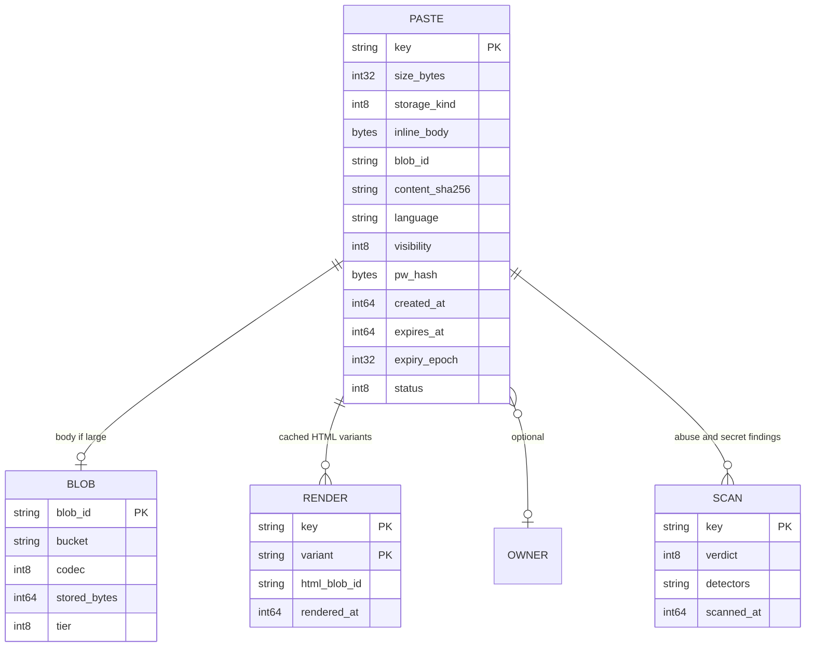
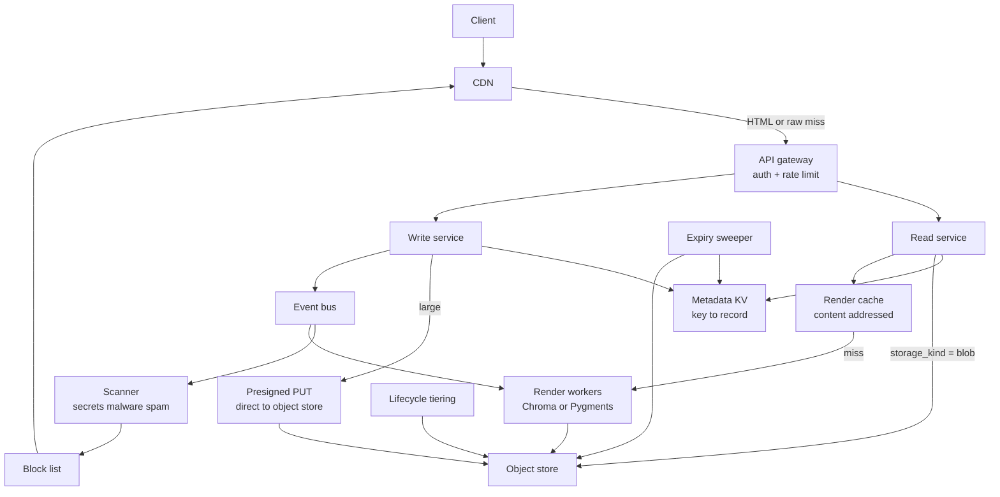
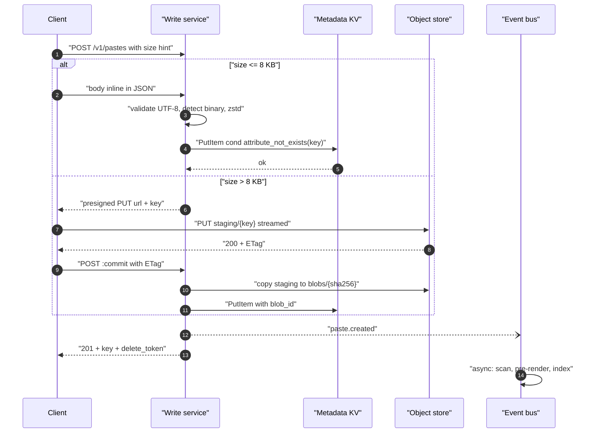
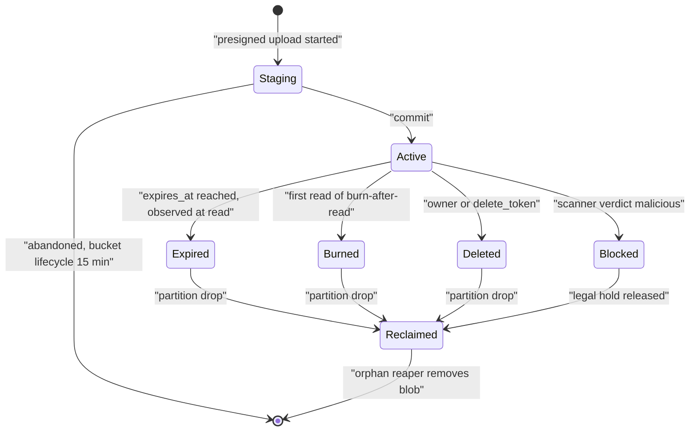
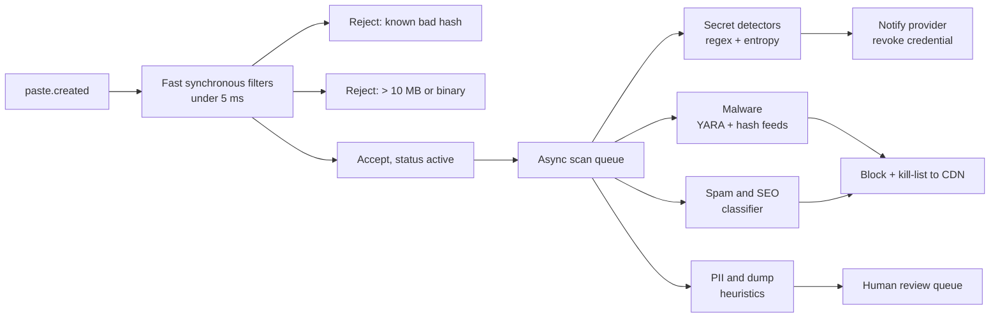

# 02 — Pastebin / Text Sharing

<span class="pill pill-core">Core</span> <span class="pill pill-easy">Easy</span>

**Pastebin is a URL shortener whose value is the payload, not the key — and the design collapses into one decision made twice: where the bytes live relative to the metadata, and when they stop living there at all.**

| | |
|---|---|
| **Commonly asked at** | Google, Meta, Stripe, Atlassian, Dropbox, Shopify, GitLab |
| **Time budget** | 45 min |
| **Core tension** | Single-round-trip reads for the small-paste majority versus unbounded object storage for the byte-heavy tail — one store cannot do both well |
| **Prerequisites** | [F15 Object & Blob Storage](../fundamentals/f15-object-storage.md) · [F04 Caching](../fundamentals/f04-caching.md) · [F13 Storage Engines](../fundamentals/f13-storage-engines.md) · [F05 CDN & Edge](../fundamentals/f05-cdn-edge.md) · [F27 Security in Design](../fundamentals/f27-security-design.md) · [F28 Cost Engineering](../fundamentals/f28-cost-engineering.md) |

---

## 1. Problem Statement

Build a service where a user submits a block of text (typically source code, logs, config, or a stack trace), receives a short URL, and anyone with that URL can read the text back, optionally with syntax highlighting, optionally password-protected, optionally expiring.

It looks like a URL shortener with a bigger value column. It is not, for four reasons:

1. **The value is 5,000x larger and wildly skewed.** Median paste is 2 KB; p99.9 is 8 MB. A single storage decision cannot serve both without either wasting a round trip on 80% of reads or blowing up your database.
2. **Rendering is expensive.** Syntax highlighting a 1 MB log file costs 100–800 ms of CPU and inflates the response 4–6x. This is a compute problem the shortener never has.
3. **Everything expires.** A shortener's links are mostly permanent; a pastebin's are mostly temporary. Reclamation is the dominant background workload, not an afterthought.
4. **You are hosting arbitrary user content on your domain.** That means malware, phishing kits, credential dumps, leaked secrets, and DMCA — and unlike a shortener, the content is *yours to serve*, not someone else's to host.

---

## 2. Requirements

### Functional

| ID | Requirement | Notes |
|---|---|---|
| F1 | Create a paste, return a short URL | Anonymous allowed; up to 10 MB |
| F2 | Read a paste as rendered HTML | Syntax highlighting for ~200 languages |
| F3 | Read a paste as raw text | `/raw/{key}` — the endpoint `curl` and CI actually use |
| F4 | Expiry: never, 10 min, 1 h, 1 d, 1 week, 1 month, burn-after-read | Burn-after-read has surprising semantics (§12) |
| F5 | Visibility: public, unlisted, private, password-protected | Four different security models, not four flags |
| F6 | Edit / fork a paste | Creates a new key and a lineage edge; originals are immutable |
| F7 | Owner listing, delete | Anonymous pastes get a delete token |
| F8 | Abuse, spam and secret-leak scanning | The operationally dominant subsystem |

### Non-functional

| ID | Requirement | Target |
|---|---|---|
| N1 | Read availability | 99.95% monthly |
| N2 | Read latency (paste ≤ 8 KB, cache hit) | p50 < 15 ms, p99 < 80 ms |
| N3 | Read latency (paste > 1 MB) | first byte < 200 ms, streamed thereafter |
| N4 | Write latency | p99 < 400 ms for ≤ 1 MB |
| N5 | Durability | 11 nines for the content bytes |
| N6 | Read:write ratio | 10:1 overall; 1000:1 for a paste that reaches Hacker News |
| N7 | Max paste size | 10 MB anonymous, 100 MB authenticated |
| N8 | Expiry punctuality | Content unreadable within 60 s of `expires_at`; bytes gone within 24 h |

### Explicitly out of scope

| Out of scope | Why | What I would say if pushed |
|---|---|---|
| Real-time collaborative editing | Different system entirely (OT/CRDT, presence, persistent connections) | "That's a collaborative editor design; the conflict resolution is the whole problem" |
| Full-text search over pastes | Search index sized to the corpus, plus a serious abuse vector (searchable credential dumps) | "Deliberately not building it — it makes leaked secrets discoverable" |
| Code execution / sandboxed run | Untrusted-code isolation is its own 45 minutes | "gVisor or Firecracker per execution, egress-denied by default" |
| Diff/version history UI | Product feature, storage implications are just N pastes | "Content-addressed chunks with a lineage DAG" |

---

## 3. Scale Estimation

**Writes.**

$$
\text{pastes/day} = 10\times10^{6}
\qquad
\text{QPS}_{w,\text{avg}} = \frac{10\times10^{6}}{86400} \approx 116\ \text{/s}
$$

$$
\text{QPS}_{w,\text{peak}} \approx 350\ \text{/s} \quad (3\times \text{diurnal})
$$

**Reads.** At 10:1:

$$
\text{reads/day} = 100\times10^{6}
\qquad
\text{QPS}_{r,\text{avg}} \approx 1{,}157\ \text{/s}
\qquad
\text{QPS}_{r,\text{peak}} \approx 3{,}500\ \text{/s}
$$

Modest QPS. This is a **bytes and CPU** problem, not a QPS problem — the opposite of the URL shortener, and worth saying explicitly to reframe the interview.

**Size distribution.** Empirically, paste sizes are close to log-normal with median 2 KB and mean 10 KB:

| Bucket | Share of pastes | Share of total bytes |
|---|---|---|
| ≤ 1 KB | 41% | 1.0% |
| ≤ 4 KB | 72% | 4.2% |
| ≤ 8 KB | 82% | 7.9% |
| ≤ 64 KB | 96% | 31% |
| ≤ 1 MB | 99.8% | 59% |
| > 1 MB | 0.2% | 41% |

The distribution is the design. **82% of pastes carry 8% of bytes.** That single fact justifies the hybrid store in §7.1.

**Storage.**

$$
\text{bytes/day} = 10\times10^{6} \times 10\ \text{KB} = 100\ \text{GB/day}
$$

Text compresses well; zstd level 3 on source code and logs gives ~4:1:

$$
\text{stored/day} \approx 25\ \text{GB/day} \Rightarrow 9.1\ \text{TB/yr}
$$

With 60% of pastes carrying a TTL averaging 30 days, the steady-state resident set is much smaller than cumulative:

$$
\text{resident} \approx \underbrace{0.4 \times 9.1}_{\text{permanent, per year}} + \underbrace{0.6 \times 25\,\text{GB/day} \times 30\,\text{d}}_{\text{TTL in flight}} = 3.64\ \text{TB/yr} + 450\ \text{GB}
$$

So the permanent corpus grows ~3.6 TB/yr and there is a rolling ~450 GB of expiring content. Over 10 years: ~36 TB logical, ~54 TB with erasure coding at 1.5x overhead. That is *small* — S3-class storage cost is a few hundred dollars a month. The cost driver is elsewhere (§10).

**Metadata.** ~400 B/row plus the inlined small-paste bodies:

$$
\text{metadata/day} = 10\times10^{6} \times 400\,\text{B} + \underbrace{0.079 \times 100\ \text{GB}}_{\text{inlined bytes}} = 4\ \text{GB} + 7.9\ \text{GB} \approx 12\ \text{GB/day}
$$

$$
\approx 4.3\ \text{TB/yr} \text{ logical}, \ \approx 1.1\ \text{TB/yr after compression}
$$

**Bandwidth.** Rendered HTML inflates source ~4.5x (every token wrapped in a `span`), gzip brings it back to ~1.3x of the raw source on the wire:

$$
\text{egress}_{\text{peak}} = 3{,}500\ \text{/s} \times 10\ \text{KB} \times 1.3 \approx 45.5\ \text{MB/s} \approx 364\ \text{Mbps}
$$

But peak is dominated by tail events: one 8 MB paste going viral at 2,000 QPS is $16\ \text{GB/s}$ — **350x the steady-state peak**. Provisioning for the mean and relying on the CDN for the tail is the only economical answer.

**Rendering CPU.** Server-side Pygments/Chroma throughput is roughly 8 MB/s/core for typical source:

$$
\text{cores}_{\text{render}} = \frac{3{,}500\ \text{/s} \times 10\ \text{KB}}{8\ \text{MB/s}} = \frac{35\ \text{MB/s}}{8\ \text{MB/s}} \approx 4.4\ \text{cores}
$$

Trivially cheap *if you cache*. Uncached, with a 1 MB paste at 2,000 QPS you need $2000 \times 1\,\text{MB} / 8\,\text{MB/s} = 250$ cores for one paste. Rendering must be cached; it must never be on the hot path twice for the same content.

---

## 4. API Design

### Create (small paste, inline body)

```http
POST /v1/pastes HTTP/1.1
Host: api.paste.io
Idempotency-Key: 2b9d1e77-6c1e-4a0a-9d7a-0c53b1e2f4aa
Content-Type: application/json

{
  "content": "def main():\n    print('hi')\n",
  "language": "python",
  "title": "quick repro",
  "visibility": "unlisted",
  "expires_in": 3600,
  "burn_after_read": false
}
```

```http
HTTP/1.1 201 Created
Location: https://paste.io/7Kq2mZa
Content-Type: application/json

{
  "key": "7Kq2mZa",
  "url": "https://paste.io/7Kq2mZa",
  "raw_url": "https://paste.io/raw/7Kq2mZa",
  "delete_token": "dt_9f2c...",
  "size_bytes": 30,
  "storage": "inline",
  "expires_at": "2026-08-31T10:14:02Z"
}
```

### Create (large paste, two-phase with presigned upload)

```http
POST /v1/pastes:init HTTP/1.1
Content-Type: application/json

{"size_bytes": 8388608, "content_type": "text/plain", "language": "text"}
```

```http
HTTP/1.1 200 OK

{
  "key": "9Pm4xTb",
  "upload_url": "https://blob.paste.io/staging/9Pm4xTb?X-Amz-Signature=...",
  "upload_method": "PUT",
  "expires_in": 900,
  "max_bytes": 10485760,
  "commit_url": "/v1/pastes/9Pm4xTb:commit"
}
```

The client `PUT`s the bytes **directly to object storage**, then calls `:commit`. The application tier never touches the 8 MB. This removes a 10 MB buffer from every API pod, removes a slow-loris amplification vector, and cuts p99 write latency because the upload goes to the nearest storage edge rather than through your gateway. The staging object has a 15-minute lifecycle rule so abandoned uploads self-clean.

### Read

| Method | Path | Returns | Cache policy |
|---|---|---|---|
| `GET` | `/{key}` | Rendered HTML page | `public, max-age=300, stale-while-revalidate=86400` if public + no TTL |
| `GET` | `/raw/{key}` | `text/plain; charset=utf-8` | Same, plus `X-Content-Type-Options: nosniff` |
| `GET` | `/v1/pastes/{key}` | JSON metadata + body if inline | `private, no-store` |
| `GET` | `/dl/{key}` | `Content-Disposition: attachment` | Supports `Range` |
| `POST` | `/v1/pastes/{key}:unlock` | Exchanges password for a short-lived read token | `no-store` |
| `DELETE` | `/v1/pastes/{key}` | 204 | Requires owner auth or `delete_token` |

### Error codes

| Code | Condition | Notes |
|---|---|---|
| 400 | Invalid UTF-8, unsupported language id | Reject non-UTF-8 at the boundary, do not transcode silently |
| 401 | Password required | `WWW-Authenticate` is deliberately *not* used; JSON body directs to `:unlock` |
| 403 | Private paste, wrong owner | Only for pastes the caller can prove they know of |
| 404 | Not found, or private-and-not-owner | Indistinguishable on purpose |
| 410 | Expired or burned | `Cache-Control: no-store` mandatory (see §12) |
| 413 | Body exceeds size class | Returned by the `:init` call, not after 10 MB of upload |
| 415 | Binary content detected | Pastebin is text; binary is a different (abuse-heavy) product |
| 429 | Rate limited | Anonymous creation is aggressively limited |
| 451 | Legal takedown | Terminal, with a transparency-report reference |

**Idempotency.** As with any create endpoint, `Idempotency-Key` maps to a stored `(key, response)` for 24 h. Uniquely relevant here: without it, a CI job retrying a failed `curl` upload creates a duplicate 8 MB object every attempt. See [F11 Idempotency](../fundamentals/f11-idempotency.md).

---

## 5. Data Model



### Access patterns

| # | Pattern | Frequency | Budget | Index |
|---|---|---|---|---|
| A1 | `get(key)` → metadata (+ inline body) | 3.5k/s peak | 5 ms | PK point read |
| A2 | `get(blob_id)` → body bytes | 630/s (18% of reads) | 40 ms first byte | Object store GET |
| A3 | `put(key)` metadata | 350/s peak | 15 ms | Conditional PK write |
| A4 | Rendered HTML lookup | 3.5k/s peak | 3 ms | CDN, then object store |
| A5 | Sweep `expiry_epoch = D` | 6M rows/day, batched | n/a | Partition / GSI on `expiry_epoch` |
| A6 | Owner listing | 20/s | 150 ms | `(owner_id, created_at desc)` |
| A7 | Scanner backlog by `scanned_at IS NULL` | 350/s | n/a | Queue, not a DB scan |

### Store choice

| Concern | Option | Verdict |
|---|---|---|
| Metadata + small bodies | **DynamoDB / Cassandra, PK = `key`** | **Chosen.** Pure point reads, conditional put for key claim, native TTL, item limit (400 KB) comfortably above the 8 KB inline threshold |
| Metadata + small bodies | Postgres with `TEXT` bodies | **Rejected at scale**, chosen at 1/10th scale. TOAST already implements exactly the inline/external split we are hand-rolling — a genuinely good argument for Postgres, defeated only by horizontal-scale operations |
| Metadata + small bodies | MongoDB | **Rejected.** No advantage over a KV store for point reads; 16 MB doc limit tempts you to store 10 MB bodies inline, which destroys your working set |
| Large bodies | **S3-class object store, key = content hash** | **Chosen.** 11 nines, lifecycle tiering built in, presigned direct upload/download, byte-range reads for streaming |
| Large bodies | HDFS / self-managed Ceph | **Rejected.** You are buying an ops team to save pennies on 36 TB |
| Large bodies | Store in the KV store as chunks | **Rejected.** Turns a 10 MB write into 25 item writes, blows up compaction, and gives you an object store with worse durability |
| Rendered HTML | **CDN + object store, keyed by `(content_sha256, renderer_version, theme)`** | **Chosen.** Content-addressed means a re-render after a renderer upgrade is a cache miss, not an invalidation campaign |
| Rendered HTML | Redis | **Rejected.** Rendered HTML is 4.5x the source; caching it in RAM is 10–40x the cost of caching it on CDN disk for no latency benefit at these QPS |

### DDL

```sql
CREATE TABLE pastes (
    key             CHAR(8)      NOT NULL,
    owner_id        UUID         NULL,
    title           VARCHAR(200) NULL,
    language        VARCHAR(32)  NOT NULL DEFAULT 'text',
    size_bytes      INTEGER      NOT NULL CHECK (size_bytes BETWEEN 0 AND 104857600),
    storage_kind    SMALLINT     NOT NULL,          -- 1 inline, 2 blob
    inline_body     BYTEA        NULL,              -- zstd-compressed, NULL when storage_kind = 2
    blob_id         TEXT         NULL,              -- sha256 content address
    content_sha256  BYTEA        NOT NULL,
    codec           SMALLINT     NOT NULL DEFAULT 1,-- 0 none, 1 zstd
    visibility      SMALLINT     NOT NULL DEFAULT 1,-- 1 public 2 unlisted 3 private 4 password
    pw_hash         BYTEA        NULL,              -- argon2id, NULL unless visibility = 4
    burn_after_read BOOLEAN      NOT NULL DEFAULT false,
    created_at      TIMESTAMPTZ  NOT NULL DEFAULT now(),
    expires_at      TIMESTAMPTZ  NULL,
    expiry_epoch    INTEGER      NOT NULL,          -- floor(epoch/3600), 0 = never
    status          SMALLINT     NOT NULL DEFAULT 1,-- 1 active 2 expired 3 deleted 4 blocked
    scan_verdict    SMALLINT     NOT NULL DEFAULT 0,
    CONSTRAINT pk_pastes PRIMARY KEY (key),
    CONSTRAINT ck_storage CHECK (
        (storage_kind = 1 AND inline_body IS NOT NULL AND blob_id IS NULL) OR
        (storage_kind = 2 AND inline_body IS NULL AND blob_id IS NOT NULL)
    )
) PARTITION BY RANGE (expiry_epoch);

-- One partition per day of expiry; reclamation is DROP PARTITION.
CREATE TABLE pastes_never PARTITION OF pastes FOR VALUES FROM (0) TO (1);
-- ... plus rolling daily partitions created by a scheduled job, 30 days ahead.

CREATE INDEX idx_pastes_owner ON pastes (owner_id, created_at DESC) WHERE owner_id IS NOT NULL;
CREATE INDEX idx_pastes_hash  ON pastes (content_sha256);  -- dedup + mass-abuse takedown
```

The `CHECK` constraint on `storage_kind` is not decoration. It is the thing that stops a future migration from producing rows where both `inline_body` and `blob_id` are set and the two disagree — a class of bug that surfaces as "some users see stale content" months later.

---

## 6. High-Level Architecture



### Write path



Two things deserve emphasis. First, the **size threshold is decided by the client's declared size and re-verified server-side** — a client that lies and streams 9 MB into the "inline" path is cut off at the first byte past the limit by a hard `MaxBytesReader`, not by an after-the-fact length check. Second, the **object key is the content hash**, not the paste key. Two identical pastes share one object. Given that the top 100 pastes on any pastebin are the same handful of malware droppers and homework assignments re-pasted thousands of times, content-addressed dedup saves 10–20% of bytes for free, and — more valuably — makes abuse takedown a single-object operation covering every copy.

### Read path

1. Request hits CDN. Public, non-expiring, clean-verdict pastes are cached at edge for 300 s with `stale-while-revalidate=86400`; a hit never touches origin. Expected edge hit ratio: **~78%** (bots and repeat viral traffic dominate).
2. Miss → read service does one point read on the metadata KV.
3. `status != active` or `expires_at < now` → 410 with `no-store`. This lazy check is the authoritative expiry semantics; the sweeper is only a space reclaimer.
4. `storage_kind = inline` (82% of pastes) → decompress and respond. **One round trip.**
5. `storage_kind = blob` → look up the render cache by `(content_sha256, renderer_version, theme)`. Hit → stream. Miss → fetch object, render, write back, stream.
6. For `/raw/` and `/dl/`, skip rendering entirely and issue a **302 to a short-lived presigned object URL** for anything above ~256 KB, so the bytes never traverse the app tier.

---

## 7. Deep Dives

### 7.1 The inline/blob split and where the threshold goes

This is the central decision and it is quantifiable, not aesthetic.

**Cost of a threshold $T$:**

- Reads served in one round trip: $F(T)$, the CDF at $T$.
- Bytes added to the metadata store: $\int_0^T x f(x)\,dx$ — the partial mean.
- Extra latency for the rest: one object-store GET, ~25–40 ms p99.

| Threshold $T$ | % pastes inline | % bytes in metadata store | Metadata growth/yr (compressed) | 2-hop read share |
|---|---|---|---|---|
| 1 KB | 41% | 1.0% | 0.5 TB | 59% |
| 4 KB | 72% | 4.2% | 0.8 TB | 28% |
| **8 KB** | **82%** | **7.9%** | **1.1 TB** | **18%** |
| 64 KB | 96% | 31% | 3.6 TB | 4% |
| 400 KB (item cap) | 99.5% | 51% | 5.8 TB | 0.5% |

**8 KB chosen.** Above it, marginal single-hop reads get expensive fast: going from 8 KB to 64 KB buys 14 percentage points of single-hop reads and costs 3.3x the metadata storage — and worse, it inflates the *item size* the KV store must move on every read, which degrades the 82% of requests that were already fast. The 64 KB row is where a candidate who only optimises "round trips" lands; the 8 KB row is where a candidate who also thinks about read amplification on the common case lands.

!!! note "This is exactly what Postgres TOAST does, and it is worth saying so"
    Postgres stores a row inline until it exceeds `TOAST_TUPLE_THRESHOLD` (~2 KB), then moves the large attribute to a side table with its own chunked storage, transparently. Our 8 KB threshold is a hand-rolled TOAST tuned for the fact that our "side table" is S3 with 30 ms latency rather than a local heap with 0.1 ms. If the interviewer proposes "just use Postgres", the correct response is not to reject it — it is to say "then I get this split for free at 2 KB, and I would raise `toast_tuple_target` to 8 KB to match the analysis above."

**Do not make the threshold dynamic per-request.** A tempting optimisation is "inline if hot, blob if cold." It creates a mutable `storage_kind`, which means a paste can be in two places during migration, which means the `CHECK` constraint above becomes a bug report. Immutable storage placement decided once at write time is worth more than the few percent it costs.

### 7.2 Expiry: sweeper design versus lazy deletion

6M pastes expire per day. Three mechanisms, all three needed, each for a different reason.

=== "Lazy check at read"

    ```go
    func (s *Reader) Get(ctx context.Context, key string) (*Paste, error) {
        p, err := s.md.Get(ctx, key)
        if err != nil { return nil, err }
        // Authoritative expiry. Never trust the sweeper for user-visible semantics.
        if p.ExpiresAt != 0 && time.Now().Unix() >= p.ExpiresAt {
            s.reclaim.Enqueue(key)          // best-effort hint to the sweeper
            return nil, ErrGone             // 410, Cache-Control: no-store
        }
        if p.BurnAfterRead {
            // Atomic: exactly one reader wins. Losers get 410.
            if !s.md.CompareAndSetStatus(ctx, key, Active, Burned) {
                return nil, ErrGone
            }
            s.reclaim.Enqueue(key)
        }
        return p, nil
    }
    ```

    **Why:** correctness is immediate and independent of any background job's health. This is the only mechanism that satisfies N8's 60-second requirement.
    **Does not:** reclaim any space.

=== "Partitioned sweeper"

    Rows are partitioned by `expiry_epoch` (hour or day granularity). Reclamation for a whole epoch is:

    ```sql
    -- O(1) metadata operation. No row scan, no index churn, no vacuum, no tombstones.
    ALTER TABLE pastes DETACH PARTITION pastes_20260830 CONCURRENTLY;
    DROP TABLE pastes_20260830;
    ```

    In the KV variant, the equivalent is a GSI on `expiry_epoch` scanned in bounded batches, or simply native TTL.

    **Why:** reclaims metadata rows at constant cost regardless of volume.
    **Does not:** delete the blobs.

=== "Object lifecycle + orphan reaper"

    Blobs are content-addressed and possibly shared, so you cannot delete on paste expiry. Maintain a refcount, or — simpler and far more robust — run a **mark-and-sweep**: enumerate live `blob_id`s from metadata into a Bloom filter, list the bucket, delete objects absent from the filter *and* older than a safety horizon (7 days).

    $$
    m = -\frac{n\ln p}{(\ln 2)^2},\quad n = 5\times10^{8},\ p = 10^{-6} \Rightarrow m \approx 1.44\times10^{10}\ \text{bits} \approx 1.8\ \text{GB}
    $$

    A 1.8 GB filter fits in one machine's RAM. A false positive means a dead object survives one cycle — harmless. A false negative is impossible, so **no live object is ever deleted**. That asymmetry is why a Bloom filter is the right structure here. See [F21 Probabilistic Data Structures](../fundamentals/f21-probabilistic-data-structures.md).

    **Why:** reclaims bytes safely under sharing and under races with in-flight writes.



!!! warning "Do not use a priority queue of expiry timestamps"
    A common proposal is a Redis sorted set keyed by `expires_at`, polled by a worker. At 6M expirations/day the ZSET holds ~180M members (30-day horizon) at ~80 B each = **14 GB of Redis**, it is a single-shard hot spot for both the writer and the poller, and losing it loses your reclamation schedule. The partition-by-epoch scheme stores the same information in the row you were already writing, for zero extra bytes.

### 7.3 Rendering: the CPU problem the shortener does not have

Syntax highlighting is a lexer over the whole document. Cost is linear in bytes with a large constant, and the output is 4–6x larger than the input.

| Strategy | Origin CPU | TTFB | Bytes on wire | Verdict |
|---|---|---|---|---|
| Render per request, server-side | 4.4 cores steady, 250 cores on a viral 1 MB paste | 40 ms + render | 1.3x raw (gzipped HTML) | **Rejected** — unbounded tail |
| Render once, cache by `(sha256, renderer_ver, theme)` | ~0 amortised | 15 ms cache hit | 1.3x raw | **Chosen** |
| Client-side (highlight.js / Prism) | 0 | Fast first paint | 1.0x raw + 90 KB JS | **Chosen for > 1 MB** — server refuses to render, ships raw + worker-based highlighter |
| No highlighting above a size cap | 0 | Fastest | 1.0x | **Chosen for > 4 MB** — plain `<pre>`, with a UI notice |

Three regimes by size, and the boundaries are explicit product behaviour:

$$
\text{render}(s) = \begin{cases}
\text{server-side, cached} & s \le 1\ \text{MB} \\
\text{client-side in a Web Worker} & 1\ \text{MB} < s \le 4\ \text{MB} \\
\text{plain text, no highlighting} & s > 4\ \text{MB}
\end{cases}
$$

**Content-addressed render keys are the important detail.** Keying the render cache by `content_sha256` rather than by paste `key` means: identical pastes share one render; a renderer version bump invalidates everything by changing the key rather than by a purge campaign; and a rollback of the renderer instantly restores the previously-cached output because its key still exists. Cache invalidation is replaced by cache *addressing*.

**Rendering must be sandboxed.** A syntax highlighter is a parser processing hostile input. Regex-based lexers have catastrophic backtracking cases — a crafted 50 KB file can hang a Pygments lexer for minutes (a ReDoS). Run render workers in a separate pool with a hard 2-second CPU deadline and a memory cap, isolated from the request-serving tier, so a ReDoS costs one worker and one 503 on one paste rather than the read path.

### 7.4 Visibility, passwords and what "private" actually means

Four visibility levels, three genuinely different security models.

| Level | Mechanism | Threat model it defeats | Threat model it does **not** defeat |
|---|---|---|---|
| Public | Listed in recent-pastes, crawlable | Nothing | Everything |
| Unlisted | Not listed, `X-Robots-Tag: noindex`, key is 8 random base62 chars ($62^8 = 2.18\times10^{14}$) | Casual discovery, search engines | `Referer` leakage, browser history sync, corporate proxy logs, anyone the URL is forwarded to |
| Private | Requires authenticated owner/ACL check on every read; 404 for non-owners | Anyone without credentials | Nothing meaningful, assuming auth is sound |
| Password | See below | Depends entirely on which of the two designs you pick | — |

Password protection has two implementations that look identical to the user and are worlds apart:

=== "Server-side password check"

    Server stores `argon2id(password, salt)`. Read requires a POST to `:unlock`; server compares and issues a 10-minute signed read token.

    - Server can read the plaintext at all times.
    - Subpoena, insider access, and any database compromise expose the content.
    - Works with `/raw/` and `curl` (via the token), works with server-side rendering, works with search/scanning.
    - **Chosen as the default**, because secret-leak scanning (§7.5) is a legal and reputational requirement and it is impossible on content you cannot read.

=== "Client-side zero-knowledge encryption"

    Client generates a random 256-bit key, encrypts with AES-GCM, uploads ciphertext, and puts the key in the **URL fragment**: `paste.io/9Pm4xTb#k=base64key`. The fragment is never transmitted to the server.

    - Server genuinely cannot read the content. This is PrivateBin's model.
    - Consequences you must state: no server-side rendering (client decrypts then highlights), no `/raw/` for `curl`, no secret scanning, no abuse scanning, no preview, and **no recovery** if the fragment is lost.
    - Anyone with the URL has the key — so it is not access control, it is at-rest confidentiality against *you*.
    - **Offered as an explicit mode**, not the default.

!!! danger "Unlisted is not private, and the confusion is a real breach vector"
    Users paste production credentials into "unlisted" pastes believing they are secret. They are not: the full URL including the key travels in the `Referer` header to any linked resource, sits in browser history synced to a vendor cloud, is logged by every corporate TLS-inspecting proxy in the path, and is forwarded in Slack where a link unfurler fetches it. Design response: label it "unlisted (anyone with the link can read)" in the UI, never call it private, and — most effectively — **scan for secrets and warn the user at paste time** (§7.5).

### 7.5 Abuse, spam and secret-leak scanning

Every pastebin becomes, within weeks of launch, a CDN for malware droppers, phishing kits, credential stuffing lists, and exfiltrated data. This is not a hypothetical; it is the dominant operational reality of the product.



**Secret detection** is the highest-value detector and the one candidates forget. Two complementary techniques:

1. **Structured detectors.** Provider-specific patterns with checksums: AWS access keys (`AKIA` + 16 base32 chars, with a CRC), GitHub PATs (`ghp_` + 36 chars with a base62 checksum), Stripe keys (`sk_live_`), Google API keys, private key PEM headers, JWTs with decodable `alg`/`iss`. These have near-zero false-positive rates *because of the checksums* — a fact that makes automated action safe.
2. **Entropy heuristics** for unknown formats: Shannon entropy over sliding 40-char windows. For a base64-ish alphabet, random secrets sit near $\log_2(64) = 6$ bits/char while English prose sits near 4.1 and source-code identifiers near 3.4. Threshold at 4.5 bits/char with a length floor. High false-positive rate — use it to *warn the user*, never to auto-block.

For structured detections, the industry-correct action is **partner revocation**: forward the detected credential to the issuing provider's secret-scanning endpoint so they revoke it. This turns your abuse problem into a security service. It also means the fastest path to safety is measured in seconds, so the detector must run on the async path with a p99 under 30 seconds, not on a nightly batch.

**Rate limiting the abuse economy.** Anonymous creation is limited per IP, per /24, and per ASN, with a much tighter limit for pastes containing URLs. Content-hash dedup means a bot re-pasting the same dropper 10,000 times produces one object and 10,000 metadata rows — so also limit by `content_sha256` seen count, which catches the campaign in one signal. See [F17 Rate Limiting & Load Shedding](../fundamentals/f17-rate-limiting-load-shedding.md).

**Serving domain isolation.** Raw user content must never be served from the same origin as the application. `paste.io` serves the app; `pasteusercontent.io` serves `/raw/` with `Content-Type: text/plain`, `X-Content-Type-Options: nosniff`, `Content-Security-Policy: sandbox`, and `Content-Disposition: attachment` for anything that could be interpreted. Otherwise a paste containing HTML is a stored XSS with your session cookies in scope. This is why GitHub uses `raw.githubusercontent.com` and Google uses `googleusercontent.com`.

---

## 8. Scaling the Bottleneck

The steady-state bottleneck is nothing — 3.5k QPS and 45 MB/s is a small service. The **event-driven** bottleneck is egress and render CPU when one paste goes viral, and the growth bottleneck is cumulative storage.

**Viral paste.** An 8 MB log file linked from the top of Hacker News at 2,000 QPS:

$$
2{,}000 \times 8\ \text{MB} = 16\ \text{GB/s} = 128\ \text{Gbps}
$$

| Level | Technique | Effect |
|---|---|---|
| 0 | CDN caching with long `s-maxage` for immutable public content | Origin sees ~1 request per PoP per TTL. Content is immutable, so `max-age=31536000, immutable` is legitimate for non-expiring public pastes |
| 1 | `stale-while-revalidate` + origin shield | Collapses PoP-level misses into one origin fetch |
| 2 | Serve `/raw/` above 256 KB as a 302 to a presigned object URL | Bytes leave the app tier entirely; the object store's bandwidth becomes the CDN's problem |
| 3 | Render cache is content-addressed and pre-warmed on `paste.created` | A viral paste is already rendered before the first reader arrives |
| 4 | Per-paste egress budget with graceful degradation to raw-only | A single paste cannot consume the whole month's CDN commit |

Level 4 deserves a note: an **egress budget per paste** (say 5 TB, then downgrade to raw-text-only and eventually to a "this paste exceeded free bandwidth" page) is not a technical necessity but a cost-control necessity. At $0.05/GB, an unbounded viral 8 MB paste at 2,000 QPS for one hour costs $0.05 \times 57{,}600\ \text{GB} = \$2{,}880$ **per hour**. Free-tier services that skip this get destroyed by exactly one incident.

**Storage growth.** 3.6 TB/yr of permanent content grows monotonically forever. Tiering (§10) keeps the bill flat-ish, but the real lever is that ~40% of "permanent" pastes have received zero reads in 12 months. Policy options, in increasing order of user hostility: tier to cold storage (transparent, adds ~100 ms on first read), compress harder with a slower codec (zstd-19 buys another ~15%), or expire never-read anonymous pastes after 2 years with notice. State the trade-off; do not pretend storage is free.

---

## 9. Failure Modes

| Failure | Blast radius | Detection | Mitigation | Degraded behaviour |
|---|---|---|---|---|
| Object store unavailable in one region | 18% of reads (blob-backed) | Elevated GET error rate, `storage_kind=2` error split | Cross-region replicated bucket, read failover | Small pastes fully served; large pastes 503 |
| Metadata KV partition throttled | Reads and writes for that key range | Throttle metric per partition | Adaptive capacity + client backoff; CDN absorbs repeats | Cold pastes slow, hot pastes unaffected |
| Render worker pool saturated (ReDoS) | Rendering only | Render p99, worker CPU-deadline kills | Hard 2 s CPU cap, separate pool, circuit-break to raw | Pastes served unhighlighted |
| Sweeper stopped for 5 days | Storage growth, no correctness impact | Partition count, oldest un-dropped epoch | Lazy read check already returns 410 | Bill grows; users see nothing |
| Orphan reaper bug deletes live blobs | **Catastrophic and unrecoverable** | Post-delete verification sample; 404 rate on `storage_kind=2` | Bloom filter has no false negatives; 7-day age floor; bucket versioning + 30-day soft delete; dry-run mode with diff reporting | Restore from versions; this is the one failure to over-engineer against |
| Scanner backlog > 30 min | Malicious content live longer | Queue depth, verdict age p99 | Shed low-signal detectors first, keep secret + malware detectors | Spam visible; secrets still caught |
| CDN misconfiguration caches a private paste | Confidentiality breach | Synthetic probe fetching a private paste from an unauthenticated edge | `Cache-Control: private, no-store` on every non-public response; Vary on auth header; automated pre-deploy assertion | Purge + rotate + disclose |
| Presigned upload URL leaked | Attacker writes to staging | Unexpected staging objects | 15-minute expiry, single-use via `Content-MD5` binding, size-capped policy | Staged object never commits |
| Burn-after-read raced by two readers | Both see content, or neither | `burn_race_total` counter | Compare-and-set on status; exactly one winner | Loser gets 410 |
| Legal takedown request | One paste or one uploader's corpus | Manual | Block by `key` and by `content_sha256` (kills all copies) | 451 with transparency reference |

---

## 10. SRE Lens

### SLIs and SLOs

| SLI | Definition | SLO | Window |
|---|---|---|---|
| Read availability | non-5xx on `GET /{key}` and `/raw/{key}` | 99.95% | 30 d |
| Read latency, inline | p99 TTFB for `storage_kind = 1` | < 80 ms | 30 d |
| Read latency, blob | p99 time-to-first-byte for `storage_kind = 2` | < 200 ms | 30 d |
| Write availability | non-5xx on create + commit | 99.9% | 30 d |
| Durability | committed pastes readable at T+24 h | 100% | continuous |
| Expiry punctuality | fraction readable after `expires_at + 60 s` | < 0.01% | 7 d |
| Secret detection latency | p99 `created_at` → verdict | < 30 s | 7 d |
| Render correctness | sampled render matches renderer reference | 99.99% | 7 d |

**Error budget.** 99.95% = $43{,}200 \times 0.0005 = 21.6$ minutes/month. Deliberately looser than the URL shortener's 99.99% because a failed paste read is an inconvenience, whereas a failed redirect breaks printed material. Different SLOs for different consequences is itself the point — a uniform "four nines everywhere" answer is a weak one. See [F23 SLI/SLO & Error Budgets](../fundamentals/f23-slo-error-budgets.md).

Two SLOs are **not** availability SLOs and that is deliberate: expiry punctuality is a *correctness/privacy* SLO with a much tighter tolerance, and secret-detection latency is a *security* SLO. Both should page independently of the availability budget.

### Rollout plan

- Renderer upgrades are the riskiest change (hostile-input parser). Ship behind a version key: new renderer writes to `(sha256, v_new, theme)` cache keys, old entries stay valid, and a flag flips read traffic per-percentage. Rollback is a flag flip with zero cache cold-start.
- Storage-threshold changes are **write-path only and non-retroactive**. Never rewrite existing rows to a new `storage_kind`; let the old ones age out.
- Sweeper and reaper changes ship in dry-run mode for a full cycle, emitting what they *would* delete, with a human diff review before enabling. The reaper is the only component that can cause permanent data loss.

See [F25 Deployment & Release Safety](../fundamentals/f25-deployment-release-safety.md).

### Runbook notes

| Symptom | Check | Action |
|---|---|---|
| Egress spike 10x | Top pastes by bytes served | Apply per-paste egress budget; downgrade to raw-only |
| Render p99 > 2 s | Worker CPU-deadline kill counter | Identify the paste; blacklist that `sha256` from server rendering |
| 410 rate spike | Recent sweeper deploy; clock skew on read nodes | Compare node clocks; a node 2 h fast expires everything early |
| Storage growth off-trend | Sweeper lag, reaper lag, orphan ratio | Never "fix" by widening the reaper's age floor under pressure |
| Secret detector false-positive flood | Detector version, entropy threshold | Roll back the detector; never mass-block on entropy alone |

### Capacity model

$$
\text{app pods} = \frac{3{,}500\ \text{QPS} \times 0.22\ \text{origin miss}}{600\ \text{QPS/pod}} \times 1.5 \approx 2
$$

$$
\text{render cores} = \frac{35\ \text{MB/s} \times 0.05\ \text{render miss}}{8\ \text{MB/s per core}} \times 3 \approx 1
$$

Both round up to "the minimum viable HA deployment": 6 app pods and 4 render workers across 2 AZs. **Capacity here is dictated by availability topology, not by load** — an honest and common outcome that candidates rarely state. See [F24 Capacity Planning](../fundamentals/f24-capacity-planning.md).

### Cost and tiering

Storage tiering over a 3-year-old corpus (~11 TB permanent + 0.45 TB in-flight), given that reads decay sharply with age:

| Age | Share of bytes | Share of reads | Tier | $/GB-mo | Monthly |
|---|---|---|---|---|---|
| < 30 d | 8% (0.9 TB) | 91% | Standard | 0.023 | $21 |
| 30 d – 1 y | 25% (2.9 TB) | 8% | Infrequent Access | 0.0125 | $36 |
| > 1 y | 67% (7.7 TB) | 1% | Glacier Instant Retrieval | 0.004 | $31 |

$$
\text{blended} = \frac{21+36+31}{11{,}500\ \text{GB}} \approx \$0.0077\ \text{/GB-mo} \quad (\text{vs } \$0.023 \text{ flat} = 3\times \text{ cheaper})
$$

| Component | Monthly | Note |
|---|---|---|
| Object storage (tiered) | ~$88 | Trivial |
| Object store requests | ~$110 | 630 GET/s at $0.0004/1k |
| Metadata KV | ~$1,900 | Writes dominate; 10M/day creates |
| CDN egress 4 TB/day at $0.03/GB | ~$3,600 | **The bill** |
| Compute (app + render + scan) | ~$900 | |
| Scanning (feeds, YARA infra) | ~$600 | |
| **Total** | **~$7,200** | |

$$
\text{cost per paste-lifetime} \approx \frac{7{,}200}{10\times10^{6}\times30} \approx \$2.4\times10^{-5}
$$

Egress is 50% of cost, so the highest-leverage engineering work is CDN hit ratio and the per-paste egress budget — not database optimisation. Knowing *which* line item to optimise is the senior signal. See [F28 Cost Engineering](../fundamentals/f28-cost-engineering.md).

---

## 11. Trade-offs & Alternatives

### At 1/10th scale (1M pastes/day)

- One Postgres primary + 2 replicas. TOAST handles the inline/external split natively at 2 KB; raise `toast_tuple_target` to 8 KB and you have implemented §7.1 with a config change.
- Blobs still in S3 — never build your own blob store, at any scale.
- Skip the render worker pool: render in-process with a semaphore of `NumCPU()` and a 2 s deadline.
- Skip the event bus: scan inline for fast detectors, plus a `LISTEN/NOTIFY`-driven worker for slow ones.
- Sweeper is a nightly `DROP PARTITION`. Reaper is a weekly script with dry-run.
- Cost: ~$700/mo, one engineer part-time.

### At 10x scale (100M pastes/day, 1B reads/day)

- Egress becomes ~$36k/mo; negotiate a CDN commit or peer directly. This is now a business-terms problem, not an engineering one.
- Metadata KV needs multi-region active-active. Keys are generated with disjoint per-region strides so writes never conflict; reads are region-local with a fallback. See [F26 Multi-Region & DR](../fundamentals/f26-multi-region-dr.md).
- Content-addressed dedup becomes materially valuable (bot campaigns dominate); add a global dedup index and refcounting, replacing mark-and-sweep with precise reclamation — accepting the refcount-correctness burden you avoided at 1x.
- Rendering moves to the edge as WASM so the render cache and the CDN cache are the same cache.
- Scanner becomes the largest service by cost and headcount.

### Alternative shapes

| Alternative | Wins when | Loses because |
|---|---|---|
| Everything in object storage, metadata in the object's user-metadata | Simplest possible; one system | Cannot query by owner or expiry without a `LIST`; 40 ms on 100% of reads instead of 18% |
| Everything in the database (no blob store) | One system, transactional | 10 MB rows destroy buffer-cache hit ratio, replication throughput, and backup windows |
| Git repository per user | Free versioning and dedup | Packfile maintenance at 10M objects/day; `gc` becomes the bottleneck |
| Fully client-side encrypted (PrivateBin model) | Strongest privacy story; no content liability | No scanning, so you become a preferred malware host; no rendering; no `curl` support |
| IPFS / content-addressed P2P | Natural fit for content addressing | No takedown, no expiry guarantee, unpredictable latency |

---

## 12. Gotchas & Corner Cases

!!! gotcha "Serving user content from the app origin is stored XSS with your cookies in scope"
    **Symptom:** a paste containing `<script>fetch('/api/me').then(...)</script>` executes with the victim's session when opened via `/raw/`.
    **Mechanism:** browsers sniff content types when `Content-Type` is wrong or absent, and even `text/plain` was historically sniffed to HTML by some clients. Served from `paste.io`, the script is same-origin with your authenticated app.
    **Mitigation:** a separate content origin (`pasteusercontent.io`), `X-Content-Type-Options: nosniff`, `Content-Security-Policy: sandbox`, `Content-Disposition: attachment` for anything not explicitly whitelisted, and no cookies scoped to the content domain. This is non-negotiable and is why every large provider does it.

!!! gotcha "Burn-after-read burns on the link preview, not on the human"
    **Symptom:** the recipient opens the link and sees "this paste has been consumed" — they never saw the content.
    **Mechanism:** the sender pasted the URL into Slack/Teams/iMessage/Outlook. The unfurler fetched it within milliseconds and consumed the single read. Enterprise mail security products detonate every URL in every message, sometimes several times.
    **Mitigation:** burn on an explicit `POST /reveal` after a client-side confirmation click, not on `GET`. Treat `GET` as a landing page that reveals nothing. Additionally exclude known unfurler User-Agents and `Sec-Purpose: prefetch` from consuming. This bug has shipped in production at multiple well-known services.

!!! gotcha "410 Gone is cacheable by default and your CDN will honour it for a long time"
    **Symptom:** you restore an erroneously-blocked paste and a fraction of users still get "gone" for hours or days.
    **Mechanism:** RFC 9110 lists 410 as heuristically cacheable without explicit freshness headers, and some intermediaries treat it as permanent because the semantics say "no forwarding address is known".
    **Mitigation:** always emit `Cache-Control: no-store` on every 410 and 404, and test the *restore* path in CI, not just the takedown path.

!!! gotcha "Compressing user-controlled content and returning it over TLS is a compression-oracle risk"
    **Symptom:** an attacker recovers a secret embedded in a page that also reflects attacker-controlled text.
    **Mechanism:** BREACH-class attacks: if a response body contains both a secret (CSRF token, session identifier) and attacker-influenced content, gzip's shared dictionary makes response length leak information about the secret. A pastebin renders attacker-controlled content by definition.
    **Mitigation:** never include CSRF tokens or any secret in a response body that also contains paste content. Serve content pages from a cookieless, tokenless origin. If a token must be present, add per-response random padding or disable compression for that response.

!!! gotcha "Invalid UTF-8 silently becomes U+FFFD and corrupts the content hash"
    **Symptom:** a user pastes a Latin-1 log file; the retrieved bytes differ from what they sent; a `sha256` check on their side fails.
    **Mechanism:** the JSON decoder or a string conversion replaces invalid sequences with the replacement character. The content hash is then computed over the *replaced* bytes, so dedup and integrity checks silently operate on corrupted data.
    **Mitigation:** treat the body as opaque bytes end-to-end. Validate UTF-8 and **reject with 400** rather than replace. Compute `content_sha256` over the exact received bytes before any transformation, and store the declared charset separately.

!!! gotcha "Content-addressed dedup leaks the existence of other users' pastes"
    **Symptom:** an attacker can determine whether a specific document was previously pasted by anyone.
    **Mechanism:** if the create response is measurably faster (no upload needed) or returns a "duplicate detected" hint when the hash already exists, the response time itself is an oracle. This is the same class of bug as cross-user deduplication in cloud storage.
    **Mitigation:** never expose dedup status to the client, always perform the same work from the client's perspective (accept the upload, discard it server-side), and constant-pad the response timing. If the content space is low-entropy — a password list, a short config — dedup confirmation is a full content-disclosure oracle.

!!! gotcha "A single slow reader on a 10 MB paste pins a request thread for minutes"
    **Symptom:** thread pool exhaustion and cascading 503s during an otherwise low-QPS period.
    **Mechanism:** a client on a 100 kbps mobile link downloading 10 MB holds a connection for 800 seconds. With a thread-per-request server and 200 threads, 200 such clients take down the tier. Deliberate slow-reader attacks (slow-loris on the response side) exploit this directly.
    **Mitigation:** redirect large reads to a presigned object URL so the object store, which is event-driven and built for this, holds the connection. If you must proxy, use an async runtime, enforce a minimum transfer rate, and cap concurrent large transfers per IP.

!!! gotcha "The expiry sweeper's clock is the privacy boundary"
    **Symptom:** pastes remain readable long past `expires_at`, or vanish an hour early.
    **Mechanism:** the sweeper node's clock drifts, or the sweeper compares a UTC timestamp against a local-time value, or a DST transition shifts a `TIMESTAMP WITHOUT TIME ZONE` column by an hour. Because the read path in many implementations trusts `status` rather than re-checking `expires_at`, a sweeper problem becomes a silent data-exposure problem.
    **Mitigation:** store `expires_at` as an absolute epoch integer, never a wall-clock local timestamp; do the authoritative check at read time on the serving node; monitor clock offset on every node and alert above 100 ms; add a synthetic probe that creates a 60-second paste and asserts it is gone at T+70 s. See [F20 Time, Clocks & Ordering](../fundamentals/f20-time-clocks-ordering.md).

!!! gotcha "Crawler traffic is 40% of reads and it warms your cache with content nobody wants"
    **Symptom:** CDN hit ratio looks great, origin load is fine, but cache storage cost climbs and human-perceived latency does not improve.
    **Mechanism:** search engines, security scanners, LLM training crawlers and archivers walk every public paste exactly once each. Every fetch is a cache *miss* that populates an entry no human will ever request. You pay origin cost, render cost and cache-fill cost for zero user value.
    **Mitigation:** `robots.txt` plus `X-Robots-Tag: noindex` on paste pages (unlisted pastes must never be indexed anyway); segment cache classes so bot-driven fills go to a short-TTL tier; measure hit ratio and latency SLIs on human traffic only, otherwise your dashboards are describing a robot's experience.

!!! gotcha "The orphan reaper's Bloom filter must be built from a consistent snapshot"
    **Symptom:** blobs for pastes created during the reaper's run are deleted, producing permanent 404s on brand-new pastes.
    **Mechanism:** the reaper builds its live-set filter by scanning metadata, then lists the bucket and deletes anything absent. A paste created *after* the scan started but *before* the delete phase is not in the filter.
    **Mitigation:** the 7-day age floor exists precisely for this — never delete an object younger than the maximum possible reaper cycle time plus a large margin. Also enable bucket versioning with a 30-day noncurrent-version expiry so a mistake is recoverable rather than terminal.

!!! gotcha "Syntax-highlighter regexes are a denial-of-service surface"
    **Symptom:** one paste pins a CPU at 100% for minutes; render queue backs up; unrelated pastes stop rendering.
    **Mechanism:** many lexers use backtracking regexes with nested quantifiers. Crafted input triggers exponential backtracking (ReDoS). A 20 KB file can cost minutes of CPU.
    **Mitigation:** hard wall-clock and CPU deadlines per render (2 s), isolated worker pool, kill-and-fallback-to-plain-text on timeout, and permanently blacklist the offending `content_sha256` from server-side rendering so a retry loop cannot re-trigger it.

!!! gotcha "Password-protected pastes still leak length, language and existence"
    **Symptom:** an attacker without the password learns the paste is 4.2 KB of Python created at 14:03.
    **Mechanism:** the metadata endpoint returns `size_bytes`, `language` and `created_at` before authentication because those fields render the "locked" page.
    **Mitigation:** decide explicitly what the pre-auth response contains. For genuinely sensitive pastes, return nothing but "password required" and pad the response. Note that with client-side encryption, the ciphertext length still leaks the plaintext length within the block-size granularity — pad to a size class if that matters.

---

## 13. Interview Angle

!!! interview "What the interviewer is actually testing"
    Pastebin is graded as an easier problem, which means the bar for "adequate" is high and differentiation comes from the parts most candidates skip. Specifically: (1) do you notice this is a bytes-and-CPU problem rather than a QPS problem and reframe accordingly; (2) do you quantify the inline/blob threshold instead of asserting "small in DB, large in S3"; (3) do you have a deletion story that is not `DELETE WHERE`; (4) do you spontaneously raise the user-content origin isolation. A candidate who says "we'll serve raw content from a separate domain because otherwise it's stored XSS" in minute 12 has effectively passed the security bar for the round.

!!! interview "Reframing move that earns points early"
    Say out loud, after the estimation: "3,500 read QPS is small — this is not a throughput problem. The interesting constraints are the 5,000x spread in object size, the CPU cost of rendering, and the fact that 6 million objects expire every day. I'll spend my depth there." Interviewers reward candidates who identify which dimension is hard rather than mechanically applying the shortener template.

??? note "Follow-up questions and answers"

    **Q1. Where exactly do you put the size threshold between inline and blob storage, and why?**
    8 KB. The reasoning is a two-column trade: at 8 KB, 82% of pastes are single-round-trip reads while only 7.9% of total bytes land in the metadata store, which is ~1.1 TB/year compressed. Moving to 64 KB buys 14 more percentage points of single-hop reads but triples metadata storage *and* inflates the item size the KV store transfers on the common path, which slows down the reads that were already fast. Moving down to 1 KB saves storage that was never the constraint and pushes 59% of reads to two hops. The threshold is also bounded above by the store's item limit — 400 KB in DynamoDB — but that limit is not the binding constraint here, the read-amplification curve is.

    **Q2. Six million pastes expire every day. Delete them.**
    Three mechanisms with three different jobs. Correctness comes from a lazy check at read time — compare `expires_at` on the serving node and return 410 — which is immediate and independent of any background job's health, and it is the only thing that meets a 60-second privacy requirement. Metadata reclamation comes from partitioning by `expiry_epoch` and dropping whole partitions, an O(1) metadata operation with no row scan, no index churn, no tombstones and no vacuum. Blob reclamation is separate because blobs are content-addressed and shared, so it is a mark-and-sweep: build a Bloom filter of live `blob_id`s (1.8 GB for 500M blobs at $p=10^{-6}$), list the bucket, delete anything absent from the filter and older than a 7-day safety floor. Bloom filters have no false negatives, so no live object can ever be deleted — that asymmetry is why it is the right structure.

    **Q3. A paste hits the front page of Hacker News. Walk me through what happens.**
    If it is public and non-expiring, the content is immutable, so it is served with `Cache-Control: public, max-age=31536000, immutable` and the CDN absorbs essentially all of it — origin sees one request per PoP. The render cache is content-addressed and was warmed asynchronously at creation, so there is no render storm. The real risk is cost, not availability: an 8 MB paste at 2,000 QPS is 128 Gbps, which is $2,880 per hour at $0.05/GB. That is why there is a per-paste egress budget that degrades to raw-text-only and eventually to a bandwidth notice. The failure mode of a free pastebin is a bill, not an outage, and designing for that is the point.

    **Q4. What's the difference between "unlisted" and "private", and why does it matter?**
    Unlisted means the key is unguessable — $62^8 = 2.2\times10^{14}$, so enumeration has negative expected value. It is not access control. The full URL leaks through the `Referer` header to any resource the page links to, through browser history sync, through corporate TLS-inspecting proxies, and through every link unfurler in every chat app it is forwarded to. Private means an authenticated ACL check on every read and a 404 (not 403) for non-owners so existence is not confirmed. The design consequence is that we must label unlisted honestly in the UI and, more usefully, scan for secrets at paste time and warn the user — because the actual failure mode is a human pasting production credentials into an "unlisted" paste believing it is secret.

    **Q5. Should you support client-side end-to-end encryption?**
    As an explicit opt-in mode, yes; as the default, no. The mechanism is a client-generated AES-GCM key placed in the URL fragment, which browsers never transmit, so the server stores only ciphertext. The cost is that you lose everything that depends on reading the content: server-side rendering, `/raw/` for `curl`, previews, and — critically — secret and malware scanning. A pastebin that cannot scan becomes a preferred malware distribution channel within weeks, and that is a legal and reputational exposure, not just an abuse-metrics problem. So: offer it, label it, and keep it off the default path. Also note that it is confidentiality against the operator, not access control: anyone with the URL has the key.

    **Q6. How do you stop the service becoming a malware CDN?**
    Layered. Synchronous cheap filters at write (known-bad content hash, size, binary detection) so the obvious cases never land. Async scanning within 30 seconds p99: YARA and hash feeds for malware, structured detectors with checksums for credentials, an entropy heuristic for unknown secrets, and a spam classifier. Structured credential hits get forwarded to the issuing provider for revocation, which is the highest-value action available. Content-addressed storage means one takedown by `content_sha256` kills every copy of a campaign simultaneously. Rate limits keyed on IP, /24, ASN and repeated `content_sha256` catch the campaign shape. And the block list pushes to the CDN edge so a takedown is effective in seconds rather than after every cached copy expires.

    **Q7. Why not just put everything in Postgres?**
    At 1/10th scale I would, and I would point out that TOAST is exactly the inline/external split I designed by hand — I would raise `toast_tuple_target` to 8 KB and be done. It fails at 10M pastes/day for two reasons: 10 MB values in the heap destroy buffer-cache hit ratio for the point reads that constitute 99% of traffic, and they make replication, backup and restore windows unmanageable. The blob store also gives lifecycle tiering, presigned direct upload and 11-nines durability that I would otherwise have to build. The split is not "SQL versus NoSQL", it is "small hot records versus large cold bytes", and those want different engines regardless of query language. See [F14 SQL vs NoSQL](../fundamentals/f14-sql-vs-nosql.md).

    **Q8. Your CDN cached a private paste. What now?**
    Immediate: global purge by URL, then verify from multiple PoPs with unauthenticated requests. Then rotate — treat the content as disclosed and notify the owner, because you cannot know who fetched it. Root cause is almost always a response missing `Cache-Control: private, no-store`, or a `Vary` header that omits `Authorization`, or a 302-to-presigned-URL path where the presigned URL itself got cached. Prevention that actually works: an automated pre-deploy assertion that fetches a private paste from an unauthenticated client through the real CDN and fails the deploy on a 200, plus a continuous synthetic probe doing the same. Cache-control correctness is not reviewable by humans reliably; it has to be tested.

!!! interview "Strong answer vs weak answer"
    | Dimension | Weak | Strong |
    |---|---|---|
    | Framing | Applies the URL-shortener template unchanged | "3.5k QPS is small; the hard parts are size spread, render CPU and 6M daily expirations" |
    | Storage split | "Small pastes in the DB, big ones in S3" | Threshold table with CDF, partial means, and the read-amplification argument for 8 KB |
    | Postgres | Dismisses it as "won't scale" | Notes TOAST implements the same split natively and says exactly when it stops working |
    | Deletion | "A cron job deletes expired rows" | Lazy check for correctness, partition drop for metadata, Bloom mark-and-sweep for shared blobs, with the false-negative argument |
    | Rendering | Not mentioned, or "we highlight the code" | Three size regimes, content-addressed render cache, ReDoS sandbox with CPU deadline |
    | Security | "We hash the password" | Separate content origin, nosniff, CSP sandbox, BREACH-safe response composition, unlisted-is-not-private |
    | Abuse | Not mentioned | Sync + async layers, credential revocation partnerships, hash-based campaign takedown |
    | Cost | "S3 is cheap" | Egress is 50% of the bill; per-paste budget; tiering math showing 3x |
    | Operational realism | Assumes background jobs work | Names the orphan reaper as the one component that can destroy data and over-engineers only that |

---

## 14. Key Takeaways

1. **Reframe first.** This is a bytes-and-CPU problem with modest QPS. The 5,000x spread between the median and p99.9 paste size is the single fact that drives the architecture.
2. **The inline/blob threshold is a computable trade-off**, not a convention. At 8 KB you get 82% single-hop reads for 8% of bytes; justify it with the CDF and the partial mean, and note that Postgres TOAST is the same idea with different constants.
3. **Content-address everything.** Blobs keyed by `sha256` give free dedup, single-operation campaign takedown, and a render cache whose invalidation is replaced by addressing.
4. **Expiry needs three mechanisms**: lazy read check for correctness, partition drop for metadata space, Bloom-filter mark-and-sweep for shared blobs. Only the first is on the correctness path.
5. **Rendering is untrusted-input parsing.** Cache it by content hash, sandbox it with a CPU deadline, and refuse to do it above a size cap.
6. **Serve user content from a separate origin.** No exceptions. This one decision eliminates the largest class of vulnerabilities in the product.
7. **Unlisted is not private.** The URL leaks through `Referer`, history sync, proxies and unfurlers. Label it honestly and warn users about secrets at paste time.
8. **Egress dominates the bill**, so per-paste bandwidth budgets and CDN hit ratio are the highest-leverage engineering work — not database tuning.
9. **Abuse handling is the operationally dominant subsystem** of any text-hosting product, and secret detection with partner revocation is the highest-value detector you can build.
