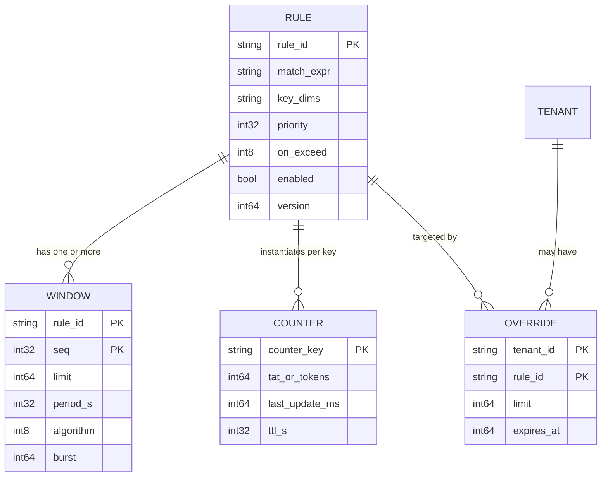
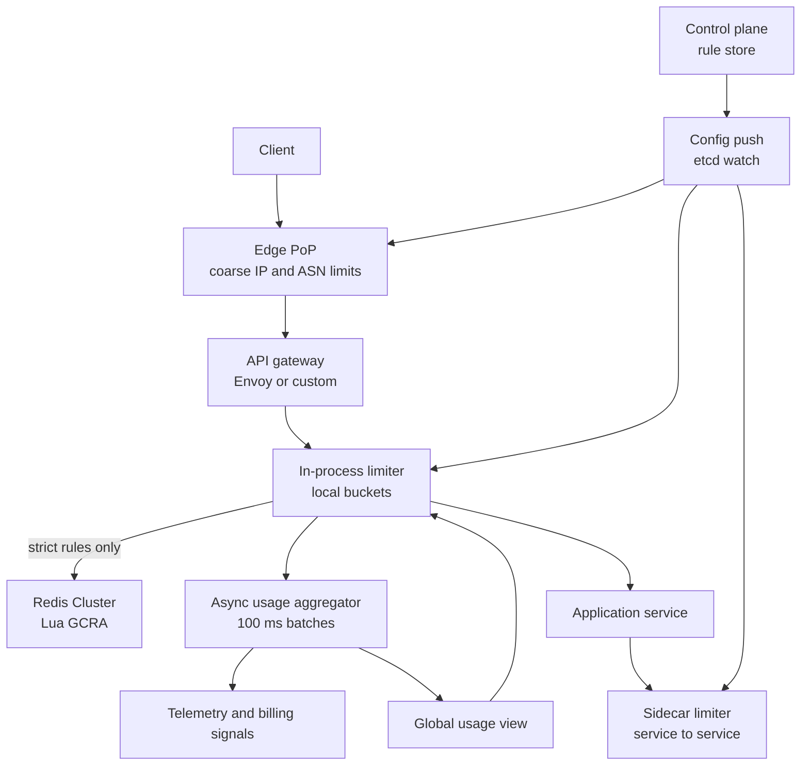
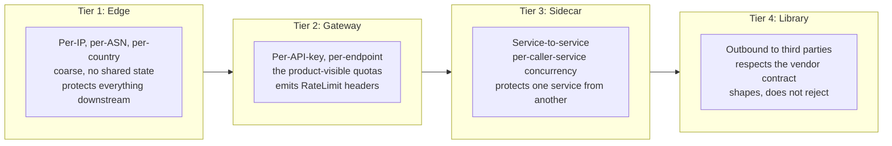
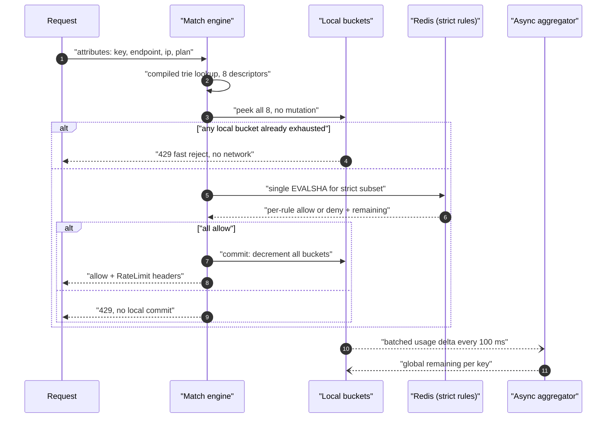
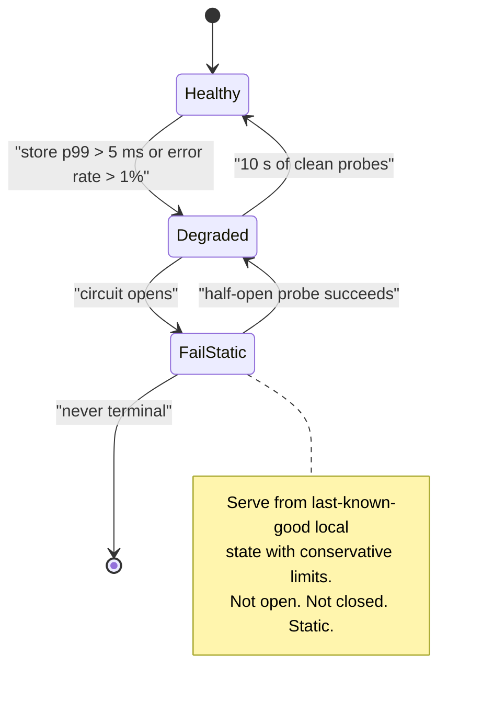

# 03 — Distributed Rate Limiter

<span class="pill pill-core">Core</span> <span class="pill pill-medium">Medium</span>

**A rate limiter is a distributed counter that must answer in under a millisecond, on the critical path of every request in the company, while being wrong in a bounded and deliberately-chosen direction — and the hardest thing is that its own failure mode is a policy decision, not an engineering one.**

| | |
|---|---|
| **Commonly asked at** | Stripe, Cloudflare, Google, Meta, Shopify, Twilio, Datadog, Fastly |
| **Time budget** | 45 min |
| **Core tension** | Global accuracy requires coordination; coordination costs a network round trip on 100% of requests. Every design here is a point on that curve |
| **Prerequisites** | [F17 Rate Limiting & Load Shedding](../fundamentals/f17-rate-limiting-load-shedding.md) · [F18 Resilience Patterns](../fundamentals/f18-resilience-patterns.md) · [F20 Time, Clocks & Ordering](../fundamentals/f20-time-clocks-ordering.md) · [F06 Partitioning & Sharding](../fundamentals/f06-partitioning-sharding.md) · [F19 Concurrency Control](../fundamentals/f19-concurrency-control.md) · [F23 SLI/SLO](../fundamentals/f23-slo-error-budgets.md) |

---

## 1. Problem Statement

Build a service that decides, for every inbound request across a global fleet, whether the caller is within its permitted rate. Limits are defined per tenant, per API key, per IP, per endpoint, per user, and by arbitrary combinations of those. The decision must be fast enough that nobody notices it, accurate enough that customers do not get charged for requests they were denied, and available enough that it never becomes the reason the platform is down.

Four decisions define the design and every one of them is a trade-off with no free option:

1. **Which algorithm** — determines memory per key, burst semantics, and boundary accuracy.
2. **Where it runs** — edge, gateway, sidecar, or in-process library — determines your latency budget by two orders of magnitude and determines what you can enforce at all.
3. **How state is shared** — centralized store, local with async reconciliation, or consistent-hash ownership — determines accuracy versus a round trip.
4. **What happens when it breaks** — fail-open or fail-closed — is a *security* decision that engineers routinely make by accident, in a `catch` block, at 2am.

---

## 2. Requirements

### Functional

| ID | Requirement | Notes |
|---|---|---|
| F1 | Allow/deny decision for a request against N applicable rules | Mean 8 rules per request |
| F2 | Limits on arbitrary dimension tuples | `(api_key)`, `(api_key, endpoint)`, `(ip)`, `(tenant, user, endpoint)` |
| F3 | Weighted cost per request | A bulk endpoint costs 50 tokens; a health check costs 0 |
| F4 | Multiple concurrent windows per rule | "100/s AND 2000/min AND 50000/hour" |
| F5 | Rule management: create, update, dry-run, emergency override | Config propagation < 10 s globally |
| F6 | Standard response headers and `Retry-After` | Clients must be able to self-regulate |
| F7 | Shadow mode | Evaluate and record without enforcing — mandatory for launching any limit |
| F8 | Per-decision observability | Which rule denied, current usage, remaining |

### Non-functional

| ID | Requirement | Target |
|---|---|---|
| N1 | Added latency | p50 < 300 µs, p99 < 2 ms, p99.9 < 5 ms |
| N2 | Availability of the *request path* | 99.999% — the limiter must never be the cause of an outage |
| N3 | Accuracy | Steady-state error < 1%; bounded transient overshoot with a stated bound |
| N4 | Throughput | 2M requests/s peak → 16M rule evaluations/s |
| N5 | Active key cardinality | 50M keys, 150M key-rule pairs |
| N6 | Rule propagation | < 10 s p99 globally; emergency block < 3 s |
| N7 | Memory | < 16 GB per region for all counter state |
| N8 | Fairness | One tenant cannot degrade another's decision latency |

### Explicitly out of scope

| Out of scope | Why | Response if pushed |
|---|---|---|
| Adaptive/load-based shedding | Different control loop, different setpoint, different SLI — it is admission control, not quota | "Shares a code path, must be separately tunable; see the distinction in F17" |
| DDoS mitigation at L3/L4 | Volumetric attacks never reach the L7 limiter | "Anycast + scrubbing + SYN cookies upstream" |
| Billing and metering | Needs exactly-once accounting; rate limiting is deliberately approximate | "Different durability requirement entirely" |
| WAF / bot detection | Classification problem, not a counting problem | "Feeds the limiter a risk score as an input dimension" |
| Per-request authentication | Assumed upstream | "The limiter consumes an authenticated principal" |

---

## 3. Scale Estimation

**Request volume.**

$$
\text{RPS}_{\text{avg}} = 800{,}000 \qquad \text{RPS}_{\text{peak}} = 2{,}000{,}000
$$

**Decisions.** Each request is evaluated against every matching rule. With a mean of 8 applicable rules (global IP, per-key second/minute/hour, per-endpoint, per-tenant, per-user, one custom):

$$
\text{decisions}_{\text{peak}} = 2\times10^{6} \times 8 = 1.6\times10^{7}\ \text{/s}
$$

Sixteen million counter operations per second. That number alone rules out a single centralized store without sharding, and it is worth computing early to kill the "just use Redis" answer before it takes root.

**Memory.** Token-bucket state is `(tokens float64, last_ts int64)` = 16 B, or 8 B with GCRA. With key strings and hashmap overhead:

| Component | Bytes/entry |
|---|---|
| Key string (`rl:v1:key:{sha1}:{rule_id}`, interned) | 40 |
| Counter state (GCRA: one int64 TAT) | 8 |
| Hashmap bucket + pointer overhead | 48 |
| **Total** | **~96 B** |

$$
150\times10^{6}\ \text{key-rule pairs} \times 96\ \text{B} \approx 14.4\ \text{GB}
$$

In Redis, per-key overhead is much higher (~90–110 B for a small string plus the key, plus cluster metadata):

$$
150\times10^{6} \times 190\ \text{B} \approx 28.5\ \text{GB} \Rightarrow \text{42.8 GB with a 1.5x fragmentation allowance}
$$

**Centralized Redis sizing.** A Redis shard sustains roughly 80k `EVALSHA` calls/s per core for a small Lua script (script overhead dominates over the O(1) work). Batching all 8 rules for a request into **one** Lua call reduces the call rate from 16M/s to 2M/s:

$$
\text{shards} = \frac{2\times10^{6}}{80{,}000} = 25 \quad\Rightarrow\quad 25 \text{ primaries} + 25 \text{ replicas} = 50\ \text{nodes/region}
$$

**Internal network cost of centralization.**

$$
2\times10^{6}\ \text{/s} \times (220\ \text{B req} + 120\ \text{B resp}) = 680\ \text{MB/s} = 5.4\ \text{Gbps}
$$

5.4 Gbps of east-west traffic that exists solely to decide whether to serve requests. This is the hidden cost of the centralized design and candidates almost never quantify it.

**Latency budget.** If the platform's p99 API SLO is 150 ms and the limiter is allotted 1.5% of it:

| Placement | Mechanism | p50 | p99 | Verdict at 2 ms budget |
|---|---|---|---|---|
| In-process library | Function call, local memory | 0.5 µs | 3 µs | Fits trivially |
| Sidecar over Unix socket | IPC | 90 µs | 250 µs | Fits |
| Sidecar over localhost TCP | Loopback | 140 µs | 400 µs | Fits |
| Redis, same AZ | 1 RTT + eval | 350 µs | 900 µs | Fits, uses half the budget |
| Redis, cross-AZ | 1 RTT + eval | 800 µs | 2.4 ms | **Exceeds** at p99 |
| Redis, cross-region (US↔EU) | 1 RTT | 80 ms | 95 ms | Absurd; 60x the budget |

The cross-region row is the decisive one: **a globally-accurate limit is physically impossible to enforce synchronously.** Speed of light in fibre gives ~76 ms round trip for the 11,000 km New York–Frankfurt path at $c/1.47$. No amount of engineering removes it. Any "global" limit is therefore per-region limits plus reconciliation, and saying so early is a strong signal.

**Config scale.** 500 rules, ~2 KB each = 1 MB of config, pushed to 400 gateway nodes globally. Trivial to distribute; the hard part is atomic activation, not bandwidth.

---

## 4. API Design

### The decision RPC (internal)

```protobuf
service RateLimiter {
  // Two-phase: Check reserves, Commit or Release settles. See §7.6.
  rpc Check(CheckRequest) returns (CheckResponse);
  rpc Release(ReleaseRequest) returns (ReleaseResponse);
}

message Descriptor {
  string rule_id = 1;
  map<string, string> entries = 2;  // {"api_key":"ak_9f", "endpoint":"POST /charges"}
  uint32 cost = 3;                  // weighted cost, default 1
}

message CheckRequest {
  repeated Descriptor descriptors = 1;  // all applicable rules, one round trip
  bool dry_run = 2;
  uint64 client_time_unix_ms = 3;       // advisory only; server time is authoritative
}

message CheckResponse {
  enum Code { OK = 0; OVER_LIMIT = 1; ERROR = 2; }
  Code overall = 1;
  repeated Status statuses = 2;
  string reservation_id = 3;            // for Release on upstream failure
}

message Status {
  string rule_id = 1;
  Code code = 2;
  uint32 limit = 3;
  uint32 remaining = 4;
  uint32 reset_after_s = 5;
  uint32 retry_after_ms = 6;            // ms precision on purpose; see §7.7
}
```

**One RPC carries all descriptors.** Eight separate calls would multiply the network cost by 8 and — more importantly — make atomicity across rules impossible.

### Client-visible response

```http
HTTP/1.1 429 Too Many Requests
Retry-After: 3
RateLimit-Limit: 100
RateLimit-Remaining: 0
RateLimit-Reset: 3
RateLimit-Policy: 100;w=1, 2000;w=60, 50000;w=3600
X-RateLimit-Rule: tenant-endpoint-burst
Content-Type: application/problem+json

{
  "type": "https://api.example.com/errors/rate-limited",
  "title": "Too Many Requests",
  "status": 429,
  "detail": "Exceeded 100 requests per second on POST /charges for key ak_9f...",
  "limit": 100,
  "window_seconds": 1,
  "retry_after_ms": 2400,
  "request_id": "req_01J8..."
}
```

Successful responses carry the same `RateLimit-*` headers so a well-behaved client can pace itself **before** being denied. That single design choice reduces 429 volume more than any server-side change.

### Rule definition

```yaml
- id: tenant-endpoint-burst
  match:
    endpoint: "POST /v1/charges"
    plan: ["pro", "enterprise"]
  key: ["tenant_id", "endpoint"]
  windows:
    - limit: 100
      period: 1s
      algorithm: gcra          # burst tolerance via tau
      burst: 150
    - limit: 2000
      period: 60s
      algorithm: sliding_window_counter
  cost: "$request.body_size_kb > 256 ? 5 : 1"
  on_exceed: reject            # reject | shadow | delay | tarpit
  priority: 100
  enabled: true
  shadow_until: "2026-09-15T00:00:00Z"
```

### Error semantics

| Code | Condition | Client action |
|---|---|---|
| 429 | Over limit | Honour `Retry-After`, back off with jitter |
| 503 + `Retry-After` | Load shedding (not quota) | Different from 429; retry sooner |
| 200 with `RateLimit-Remaining: 0` | At limit but this request allowed | Slow down now |
| 500 | Limiter failed **and** policy is fail-closed | Escalate; this should be near-zero |

---

## 5. Data Model



### Access patterns

| # | Pattern | Rate | Budget | Notes |
|---|---|---|---|---|
| A1 | Read-modify-write counter, atomic | 16M/s | 50 µs local, 900 µs Redis | The only hot path |
| A2 | Rule set lookup by request attributes | 2M/s | 5 µs | Pre-compiled match trie in process memory |
| A3 | Override lookup | 2M/s | 1 µs | Merged into the compiled rule set at config build |
| A4 | Rule CRUD | < 1/s | 100 ms | Control plane |
| A5 | Counter expiry | passive | — | TTL only; never scan |
| A6 | Usage telemetry export | 16M events/s → sampled | — | Sketches, not raw events |

### Store choice

| Layer | Option | Verdict |
|---|---|---|
| Counters | **Process-local memory + async gossip** | **Chosen for the default path.** 3 µs, no network, no shared failure domain |
| Counters | **Redis Cluster with Lua** | **Chosen for strict rules** (auth, payments, per-user quotas) where accuracy is worth 900 µs |
| Counters | Memcached with `incr` | **Rejected.** No atomic compare-and-set across multiple keys, no scripting, so multi-window rules need multiple round trips |
| Counters | DynamoDB conditional update | **Rejected.** 5–10 ms and $0.60 per million writes → 16M/s is $25M/month. Absurd for data that is worthless in 60 seconds |
| Counters | Postgres row locks | **Rejected.** A single hot row is a serialization point; 16M/s is four orders of magnitude beyond it |
| Counters | Consistent-hash owner nodes (custom) | **Considered.** Exact and cheap, but adds a hop plus a hot-key and rebalancing problem you now own. Chosen only by teams that have outgrown Redis |
| Rules | **Etcd/Consul → push → in-process compiled trie** | **Chosen.** Reads must never touch the network |
| Rules | Redis, read per request | **Rejected.** Doubles the round trips for data that changes hourly |

**Counters are deliberately not durable.** Losing all counter state means every caller gets a fresh allowance — at worst one window's worth of over-admission. Persisting them would cost more than the damage they prevent. Say this explicitly: it is the clearest example in the whole problem of matching durability to value.

---

## 6. High-Level Architecture



### The four placement tiers, and why all four exist



| Tier | Enforces | State model | Accuracy | Added latency | Why it cannot be merged upward |
|---|---|---|---|---|---|
| Edge | IP, ASN, geo, TLS fingerprint | Node-local, no sharing | Loose | ~5 µs | Must reject before you pay for TLS + routing; has no idea who the tenant is |
| Gateway | API key, tenant, endpoint | Local + async global, or Redis for strict | Tight | 3 µs – 900 µs | Only place that knows the authenticated principal *and* sees all traffic for it |
| Sidecar | Caller service identity, concurrency | Node-local | Loose | ~200 µs | Gateway cannot see internal service-to-service calls at all |
| Library | Outbound third-party QPS | Process-local, shaping | Exact per-process | ~1 µs | Nothing else is on the outbound path |

### Decision path



Two properties of this path matter. **Peek-then-commit** (§7.6) prevents rules earlier in the evaluation order from consuming tokens when a later rule denies. **Local-first fast reject** means an abusive caller who is already far over their limit is rejected in 3 µs without touching Redis — which is exactly the caller most likely to be generating the load that would otherwise overwhelm Redis.

---

## 7. Deep Dives

### 7.1 Algorithm selection

| Algorithm | State/key | Burst | Boundary exact | Ops per decision | Memory for 150M keys | Chosen for |
|---|---|---|---|---|---|---|
| Fixed window | 1 counter, 8 B | Up to **2x** at boundary | No | 1 `INCR` | 1.2 GB | **Rejected** for anything protecting a downstream |
| Sliding window log | $O(L)$ timestamps | Exact | Yes | `ZREMRANGEBYSCORE` + `ZADD` + `ZCARD` | 100 req limit → **240 GB** | **Rejected** — memory is 200x the alternatives |
| Sliding window counter | 2 counters, 16 B | Bounded, < 1% error | Approximate | 2 reads + 1 write | 2.4 GB | **Chosen** for minute/hour windows |
| Token bucket | tokens + ts, 16 B | Yes, tunable | Yes | 1 CAS or Lua | 2.4 GB | Good default |
| **GCRA** | 1 TAT int64, 8 B | Yes, via $\tau$ | Yes | 1 Lua eval | **1.2 GB** | **Chosen** for second-granularity windows |

GCRA is a token bucket expressed as a single timestamp. With emission interval $T = 1/r$ and burst tolerance $\tau = (B-1)T$:

$$
\text{allow} \iff t_{\text{now}} \ge \mathrm{TAT} - \tau
\qquad
\mathrm{TAT}' = \max(t_{\text{now}}, \mathrm{TAT}) + T \cdot \text{cost}
$$

It is exactly equivalent to a token bucket, uses half the memory, and — crucially — has **no clamping bugs**. Token-bucket implementations get `min(burst, tokens + elapsed*rate)` wrong in subtle ways under concurrency; GCRA has one arithmetic expression with no branches.

The sliding-window-counter error bound is worth stating:

$$
\hat{c} = c_{\text{cur}} + c_{\text{prev}} \cdot \frac{W - t_{\text{elapsed}}}{W}
$$

This assumes uniform arrival within the previous window. Published measurements on production traffic put the error under 1% at ~0.003% of the memory of an exact log. That is the correct trade for a quota; it is the wrong trade for a login-attempt limiter, where you want the log's exactness because the limit is 5, not 5,000, and $O(L)$ memory is negligible.

### 7.2 Three architectures for sharing state

=== "Centralized store"

    Every gateway node calls Redis; Redis holds the single counter per key.

    **Accuracy:** exact (single copy, atomic script).
    **Latency:** +350 µs p50, +900 µs p99 same-AZ; +2.4 ms p99 cross-AZ.
    **Availability:** the limiter's availability is now Redis's availability, on the critical path of every request.
    **Throughput ceiling:** 25 shards at 80k evals/s. A single hot key is capped at one shard's single-threaded core, ~120k ops/s.
    **Cost:** 50 nodes/region plus 5.4 Gbps east-west.

    **Chosen for:** strict, low-limit, security-relevant rules — login attempts, password reset, payment creation, per-user write quotas. These are a small fraction of decisions (~8%), so the Redis fleet sizes down to 3 shards, not 25.

=== "Local buckets + async sync"

    Each node keeps local counters and periodically exchanges deltas with an aggregator (or gossips peer-to-peer).

    **Accuracy:** bounded overshoot, derived below.
    **Latency:** +3 µs. No network on the request path at all.
    **Availability:** no shared failure domain. The aggregator can be down for minutes with graceful degradation.
    **Throughput:** unbounded; scales with the fleet.

    **Chosen as the default** for the ~92% of decisions that are ordinary quota enforcement.

    **Overshoot bound.** Let $N$ nodes, sync period $T$, true arrival rate $r$, limit $L$. Between syncs, nodes act on stale global state. In the worst case a caller bursting at rate $r \gg L$ is admitted by all nodes until the update propagates:

    $$
    \text{overshoot} \le \min\big(r \cdot T,\; N \cdot \text{remaining}_{\text{last sync}}\big)
    $$

    With $T = 100$ ms and a caller bursting at $10L$ against $L = 1000$/s:

    $$
    \text{overshoot} \le 10{,}000 \times 0.1 = 1{,}000 \Rightarrow \text{2x the limit for one 100 ms interval, then convergence}
    $$

    A stated, bounded 2x transient overshoot is an acceptable engineering answer. "It's eventually consistent" is not.

=== "Static division (share the limit N ways)"

    Each of $N$ nodes independently enforces $L/N$. No coordination at all.

    **This is the trap.** It is the obvious simplification and it is catastrophically wrong for small limits, because of load-balancer variance.

    Consider $L = 100$/s, $N = 100$ nodes, each allowing 1/s, and a client sending exactly 100 requests/s spread uniformly at random. This is balls-in-bins with $n = m = 100$. The expected number of requests that land in a bin already occupied is

    $$
    n - m\left(1 - \left(1 - \tfrac{1}{m}\right)^{n}\right) = 100 - 100\left(1 - 0.366\right) = 36.6
    $$

    **36.6% of a perfectly compliant client's requests are rejected.** The client is exactly at its documented limit and sees a 37% error rate. This produces exactly the support ticket that ends "your rate limiter is broken", and it is.

    **Rejected**, except when $L/N \gg 10$ (large limits, few nodes), where the same formula shows the false-reject rate falling below 1%.

=== "Consistent-hash ownership"

    Each key is owned by exactly one node in the fleet; requests for that key are forwarded to the owner.

    **Accuracy:** exact, with no shared store.
    **Latency:** +400 µs same-AZ, +1.2 ms cross-AZ, for the forwarded fraction $(N-1)/N \approx 100\%$.
    **New problems you now own:** rebalancing on membership change (a rebalance resets counters for moved keys — a free allowance for those callers), hot-key concentration on one owner, and a full mesh of $N^2$ connections at $N = 400$.

    **Rejected here** because it has the latency of the centralized design and the operational complexity of a custom distributed system. It becomes correct at very large scale where the Redis fleet itself is the bottleneck, and it is what several large infrastructure companies actually run.

**The composite design: tiered by rule strictness.**

$$
\text{decision} = \begin{cases}
\text{local buckets, async sync} & \text{ordinary quotas (92\% of decisions)} \\
\text{Redis + Lua, synchronous} & \text{strict/security rules (8\%)} \\
\text{local only, no sync} & \text{edge IP limits, sidecar concurrency}
\end{cases}
$$

Sizing follows: Redis handles $0.08 \times 2\times10^{6} = 160{,}000$ evals/s → **2 shards plus replicas**, not 25. Recognising that most rules do not need exactness is what turns a 50-node fleet into a 6-node one.

### 7.3 The Lua atomicity pattern

The reason Lua exists in this design: a rate-limit decision is a read-modify-write, and doing it as `GET` then `SET` from the client is a lost-update race. At 2M RPS, a race with a 1-in-10,000 window happens 200 times per second.

```lua
-- KEYS: one per window. ARGV: cost, then (limit, period_ms, burst) triplets.
-- Returns: {allowed, {remaining_1, retry_after_ms_1}, {remaining_2, ...}, ...}
-- Atomicity: Redis runs the whole script single-threaded. No interleaving is possible.

local cost = tonumber(ARGV[1])

-- Server time, not client time. This is the single most important line in the script.
local t = redis.call('TIME')                       -- {seconds, microseconds}
local now_ms = (tonumber(t[1]) * 1000) + math.floor(tonumber(t[2]) / 1000)

local results = {}
local allowed = 1

-- Phase 1: evaluate every window WITHOUT mutating. All-or-nothing semantics.
local plans = {}
for i = 1, #KEYS do
  local limit     = tonumber(ARGV[(i-1)*3 + 2])
  local period_ms = tonumber(ARGV[(i-1)*3 + 3])
  local burst     = tonumber(ARGV[(i-1)*3 + 4])

  local emission = period_ms / limit               -- T
  local tau      = emission * (burst - 1)          -- burst tolerance
  local tat      = tonumber(redis.call('GET', KEYS[i])) or now_ms
  local new_tat  = math.max(tat, now_ms) + (emission * cost)
  local allow_at = new_tat - tau - emission        -- earliest time this cost fits

  if now_ms < allow_at then
    allowed = 0
    results[i] = { 0, math.ceil(allow_at - now_ms) }
  else
    plans[i] = new_tat
    local remaining = math.floor((now_ms - (new_tat - tau - emission)) / emission)
    results[i] = { remaining, 0 }
  end
end

-- Phase 2: commit only if every window allowed. Prevents phantom consumption.
if allowed == 1 then
  for i = 1, #KEYS do
    -- TTL must outlive the theoretical arrival time or state is lost mid-window.
    local ttl_ms = math.ceil(plans[i] - now_ms) + tonumber(ARGV[(i-1)*3 + 3])
    redis.call('SET', KEYS[i], plans[i], 'PX', ttl_ms)
  end
end

return { allowed, results }
```

Four non-obvious details:

1. **`redis.call('TIME')` instead of a client-supplied timestamp.** Client clocks disagree by tens of milliseconds across a fleet. Using the server's clock makes all decisions for a key consistent with each other, because all requests for that key hit the same shard. This converts a distributed clock problem into a single-node one — the key insight of §7.4.
2. **Two-phase evaluate-then-commit.** Consuming tokens from window 1 before discovering window 2 denies is "phantom consumption": the caller is charged for a request that never happened. Over a busy minute this silently reduces the effective limit.
3. **All keys must hash to the same slot.** In Redis Cluster a script may only touch keys in one slot. Use a hash tag: `rl:{ak_9f2c}:sec`, `rl:{ak_9f2c}:min`, `rl:{ak_9f2c}:hour` all hash on `ak_9f2c`. Forget this and the script fails with `CROSSSLOT` under cluster mode while working perfectly in single-node tests.
4. **TTL derived from the TAT, not from the period.** A naive `EXPIRE period` drops state for a key whose TAT extends beyond the period, granting a free burst.

!!! warning "Redis scripts are not replicated as scripts by default in modern versions, and that is what you want"
    Older Redis replicated the script itself to replicas, so a script using `TIME` or `math.random` produced *different results* on the replica — silent primary/replica divergence. Modern Redis uses effect replication (the resulting commands are replicated). If you are on an old version or a Redis-compatible service, verify this, because a diverged replica becomes the truth after a failover.

### 7.4 Clock skew, and why it is smaller than it looks here

Rate limiting is a time-window problem, so clocks matter — but the exposure is narrower than candidates assume, and knowing *why* is the differentiator.

| Design | Clock exposure | Failure if skewed by $\delta$ |
|---|---|---|
| Redis + `TIME` | **One clock per key** (the owning shard) | None while the shard is stable. A failover to a replica whose clock is $\delta$ behind rewinds the window |
| Redis + client-supplied timestamp | $N$ clocks per key | A node $\delta$ fast pushes TAT forward, denying everyone for $\delta$; a node $\delta$ slow grants a free window |
| Local buckets | One clock per node, and **monotonic** | None — see below |
| Consistent-hash owner | One clock per key | Same as Redis, plus rebalancing moves the key to a different clock |

**Local buckets are immune if you use a monotonic clock.** `time.monotonic()` / `CLOCK_MONOTONIC` measures elapsed time, not wall time. NTP adjustments, leap seconds, DST and manual clock sets do not affect it. A token bucket only needs *elapsed* time:

```go
// Correct: monotonic. Immune to NTP steps, leap seconds, VM migration wall-clock jumps.
elapsed := time.Since(b.last)          // Go's time.Time carries a monotonic reading
b.tokens = math.Min(b.burst, b.tokens+elapsed.Seconds()*b.rate)
b.last = time.Now()

// Wrong: wall clock. An NTP step backwards makes elapsed negative and tokens shrink;
// a step forward instantly refills the bucket, granting an unbounded burst.
elapsed := time.Now().Unix() - b.lastUnix
```

**NTP step versus slew.** `ntpd`/`chronyd` correct small offsets by *slewing* — adjusting the clock's rate by up to 500 ppm so it converges without discontinuity. Above a threshold (128 ms by default for `ntpd`) they *step*, jumping the clock discontinuously. A 10-second backward step on a wall-clock-based limiter grants every key a free 10-second window simultaneously across the affected node. Configure `-x` (slew always) on rate-limiting infrastructure, and monitor `chrony` offset and step counts as a first-class metric.

**VM live migration** freezes a guest for 50–500 ms and can leave the guest clock behind by the freeze duration until the next NTP correction. On a monotonic-clock design, the effect is that time appears to pass normally — the bucket simply did not refill during the freeze, which is correct. On a wall-clock design, the post-migration NTP step creates the free-burst behaviour above. This is a real, frequently-observed production issue in cloud environments and naming it is a strong signal. See [F20 Time, Clocks & Ordering](../fundamentals/f20-time-clocks-ordering.md).

### 7.5 Fail-open versus fail-closed

When the counter store is unreachable, the limiter must decide without state. This is a **security policy decision expressed in code**, and the right answer is per-rule, not global.



| Rule class | Policy | Reasoning |
|---|---|---|
| Public API quota | **Fail open** | Denying paying customers to protect a counter is strictly worse than over-admitting for 30 seconds |
| Login / password reset / MFA | **Fail closed** | Fail-open here *is* the attack. An attacker who can DoS your Redis has unlocked unlimited credential stuffing — a two-step exploit that has appeared in real incident reports |
| Payment creation | **Fail closed**, with a static local allowance | Financial exposure; over-admission is unbounded loss |
| Expensive analytics endpoints | **Fail static** at 10% of normal | Protects the backend that the limiter existed to protect |
| Internal service-to-service | **Fail open** | The caller is trusted; availability wins |

!!! danger "Fail-open on authentication endpoints is a documented attack chain"
    The chain is: (1) attacker floods the rate-limiter's Redis or exploits a dependency to make it unavailable; (2) the login endpoint's limiter fails open; (3) unlimited credential stuffing proceeds against a now-unprotected login. The limiter's availability has become an authentication control. If you fail open on auth, your account-takeover protection is only as strong as your cache's uptime. The correct design is fail-closed with a **conservative local static limit** so a Redis outage degrades login to, say, 3 attempts per IP per minute enforced node-locally — restrictive but not a total outage.

**Fail static is almost always better than either extreme.** Keep the last-known-good local bucket state and continue enforcing against it. It is neither open (unbounded) nor closed (total outage): it is stale-but-bounded, and it degrades exactly as much as the staleness warrants. See [F18 Resilience Patterns](../fundamentals/f18-resilience-patterns.md).

### 7.6 Multi-dimensional limits and evaluation order

A single request may match: global IP limit, per-key second/minute/hour, per-key-per-endpoint, per-tenant aggregate, per-user, and a plan-specific override. Seven counters, seven possible denials.

**Ordering has three competing objectives** and they conflict:

| Objective | Implied order | Conflict |
|---|---|---|
| Reject as cheaply as possible | Cheapest (local) rules first | May report a less relevant rule to the client |
| Report the most actionable rule | Most specific rule first | Requires evaluating expensive rules even when a cheap one denies |
| Never consume tokens for a denied request | Evaluate all, then commit | Doubles the work on the allow path |

The resolution: **peek all, decide, commit once.**

```python
def check(request, rules):
    descriptors = match_engine.compile(request)     # ~5 us, pre-compiled trie

    # Phase 1: cheap local peeks, no mutation. Sorted cheapest-first.
    local_plans, denied = [], []
    for d in sorted(descriptors, key=lambda d: d.cost_class):
        plan = local.peek(d)                         # returns would-be new state
        if not plan.allowed:
            denied.append((d, plan))
            if d.short_circuit:                      # edge IP limits: reject immediately
                return Deny(rule=d, retry_ms=plan.retry_ms)
        local_plans.append((d, plan))

    # Phase 2: one network call for the strict subset, only if locals all passed.
    if not denied:
        strict = [d for d in descriptors if d.strict]
        if strict:
            resp = redis.evalsha(SCRIPT, keys(strict), args(strict, request.cost))
            denied.extend(resp.denied)

    if denied:
        # Report the MOST SPECIFIC denying rule (highest key-dimension count),
        # tie-broken by longest retry_after. Never report the global IP limit
        # to a customer whose per-endpoint limit is the real constraint.
        worst = max(denied, key=lambda dp: (dp[0].specificity, dp[1].retry_ms))
        return Deny(rule=worst[0], retry_ms=worst[1].retry_ms, all=denied)

    # Phase 3: commit. Nothing was consumed until this line.
    for d, plan in local_plans:
        local.commit(d, plan)
    return Allow(headers=render_headers(local_plans))
```

**Which rule to report.** Reporting the *first* denying rule tells a customer "you exceeded the global IP limit" when the actual constraint is their per-endpoint quota — unactionable and infuriating. Report the most specific rule, and include all denials in the JSON body for support tooling. The `RateLimit-Policy` header should list every applicable policy so a sophisticated client can pace against the binding one.

**Cost classes and short-circuiting.** Edge IP rules are marked `short_circuit` because an IP-level flood should never reach the point of evaluating tenant rules — that would let an attacker force expensive work with cheap requests, which is itself an amplification vector.

### 7.7 Hot tenant keys

One key, one shard, one core. A tenant doing 400k RPS against a single `(tenant_id)` key exceeds a Redis shard's ~120k ops/s ceiling.

| Technique | Mechanism | Accuracy cost | When |
|---|---|---|---|
| Local-first fast reject | An over-limit caller is denied in-process without touching Redis | None — they are over anyway | Always. This alone handles most abuse |
| Key splitting | Store as `rl:{tenant:0..K}`; each node picks a fixed shard index; effective limit $L/K$ per subkey | Reintroduces the balls-in-bins problem at scale $K$ (small $K$, so tolerable) | $K = 8$ or 16 for known-large tenants |
| Dedicated shard | Route whale tenants to their own Redis shard | None | Top 20 tenants by volume |
| Promote to local-only | Very large limits have small relative error under async sync | Bounded overshoot | $L > 10{,}000$/s |
| Probabilistic admission | Once over limit, drop with probability $p$ computed locally, no counter write at all | Approximate | Extreme overload |

The counter-intuitive result: **the largest tenants need the *least* accurate limiting.** A tenant with a limit of 100,000/s does not care about a 500-request overshoot; a tenant with a limit of 5 login attempts does. Accuracy requirements scale inversely with limit size, so route high-limit keys to the cheap local path and reserve Redis for low-limit keys. This inverts the naive instinct to give big customers the "better" infrastructure.

### 7.8 Client behaviour and the retry storm

The limiter's job is not finished when it returns 429. A badly designed response *creates* the next overload.

!!! danger "Synchronised retry at the window boundary"
    `RateLimit-Reset: 3` tells every throttled client that capacity returns in exactly 3 seconds. Ten thousand clients read the same value and all retry at the same instant. The result is a periodic 10,000-request spike every window — a self-inflicted DDoS with a period equal to your window. Mitigations: (a) return `retry_after_ms` with per-client jitter baked in server-side, e.g. $\text{reset} \times (1 + U(0, 0.3))$; (b) document and enforce exponential backoff with full jitter; (c) for repeat offenders, escalate `Retry-After` superlinearly.

The `Retry-After` value should be the **actual time until one token is available**, which GCRA gives exactly: $\lceil \text{allow\_at} - t_{\text{now}} \rceil$. A fixed "retry in 60 seconds" wastes 59 seconds of a client's throughput and is the most common way a technically-correct limiter produces a terrible developer experience.

**Full jitter** is the client-side counterpart:

$$
\text{sleep} = U\big(0,\ \min(\text{cap},\ \text{base} \cdot 2^{n})\big)
$$

not the "equal jitter" or "decorrelated" variants, and definitely not fixed backoff. Publish a reference client that implements it.

---

## 8. Scaling the Bottleneck

The bottleneck is **the synchronous Redis call on the request path**, and it is a bottleneck in three distinct ways simultaneously: throughput ceiling per shard, latency added to every request, and a shared failure domain across the whole platform.

**Removal ladder:**

| Step | Change | Effect on Redis load | Cost |
|---|---|---|---|
| 1 | Batch all rules for a request into one `EVALSHA` | 16M → 2M evals/s (8x) | Requires hash-tagged keys |
| 2 | Move ordinary quotas to local buckets with async sync | 2M → 160k evals/s (12.5x) | Bounded 2x transient overshoot |
| 3 | Local-first fast reject for already-over callers | Removes the abusive traffic entirely | None |
| 4 | Negative caching: remember "this key is over limit until $t$" for 100 ms | Removes repeat calls during a burst | Up to 100 ms of stale denial |
| 5 | Client-side pacing via `RateLimit-*` on 200s | Reduces total request volume | Requires client cooperation |

Steps 1–3 together take 16M ops/s to 160k — a **100x reduction** — and turn a 50-node Redis fleet into 6 nodes. That is the whole scaling story, and it comes from *reducing what needs to be exact*, not from making the exact path faster.

**Secondary bottleneck: the async aggregator.** 400 nodes × 8 rules × 50M keys is not a fan-in you can do naively. Each node sends only its *deltas for keys it saw* in the last 100 ms — typically a few thousand keys, not 50M. Aggregate hierarchically (node → AZ aggregator → region aggregator) so the top-level fan-in is 3, not 400, and use a count-min sketch for the long tail of low-volume keys where exactness is worthless.

$$
\text{sketch: } w = \lceil e/\varepsilon \rceil,\ d = \lceil \ln(1/\delta) \rceil;\quad \varepsilon = 0.001,\ \delta = 0.01 \Rightarrow w = 2719,\ d = 5
$$

$$
\text{memory} = 2719 \times 5 \times 8\ \text{B} \approx 109\ \text{KB for the entire key tail}
$$

See [F21 Probabilistic Data Structures](../fundamentals/f21-probabilistic-data-structures.md).

---

## 9. Failure Modes

| Failure | Blast radius | Detection | Mitigation | Degraded behaviour |
|---|---|---|---|---|
| Redis shard unavailable | Strict rules on that slot (~4% of keys) | Client error rate per slot | Circuit breaker → fail static from local state | Conservative local limits for those keys |
| Whole Redis cluster down | All strict rules | Cluster health, error rate | Fail static globally; auth rules fail closed to a tight local limit | Login limited to 3/IP/min; quotas fail open |
| Async aggregator down | Global view goes stale | Aggregator lag metric | Nodes fall back to static division with a **generous** share ($2L/N$) | Overshoot up to 2x; no false rejects |
| Config push breaks (bad rule) | **Every request, globally** | Deny-rate step change; canary assertion | Versioned config, canary 1% for 60 s, automatic rollback on deny-rate delta > 3σ | Rollback within 60 s |
| Clock step backwards on a node | That node's wall-clock rules | `chrony` step counter, offset gauge | Monotonic clocks everywhere; `chronyd -x` | None if monotonic |
| Redis failover to a lagging replica | Keys on that shard | Failover event + counter discontinuity | Accept it: at most one window of free allowance | Brief over-admission |
| Hot key saturates one shard | That tenant + shard neighbours | Per-slot ops/s and CPU | Local fast reject, key splitting, dedicated shard | Neighbours see latency; tenant over-admitted |
| Limiter latency regression (e.g. new rule with regex match) | **Every request** | Limiter self-latency SLI | Hard 5 ms deadline on the limiter call, then allow | Requests allowed unmetered for the duration |
| Counter memory growth (unbounded key cardinality) | Node OOM | Key count, RSS | Bound cardinality: hash unbounded dimensions into 2^20 buckets; TTL everything | Collisions cause shared limits |
| Rule matches nothing due to attribute rename | Silent loss of enforcement | Per-rule evaluation counter must be non-zero | Alert on any enabled rule with zero evaluations in 5 min | Unlimited traffic on that rule |

!!! warning "The most dangerous failure is silent non-enforcement"
    Every failure above except one is loud. A rule that stops matching — because an upstream renamed `api_key` to `apiKey`, or a plan tier was retired — produces *no errors, no latency, no alerts*. Traffic simply becomes unlimited. The only defence is a per-rule `evaluations_total` counter with an alert on it hitting zero. Build this on day one; it is the single highest-value alert in the system.

---

## 10. SRE Lens

### SLIs and SLOs

A rate limiter is a shared dependency of everything, so its SLO must be **stricter than any consumer's**, and it needs an SLI that most services do not have: *decision correctness*.

| SLI | Definition | SLO | Window | Why |
|---|---|---|---|---|
| Path availability | Fraction of requests where the limiter did not cause a failure | 99.999% | 30 d | It is in the path of every request; 99.99% here caps the whole platform at 99.99% |
| Decision latency | p99 added latency | < 2 ms | 30 d | 1.5% of the 150 ms API budget |
| Decision latency tail | p99.9 added latency | < 5 ms | 30 d | Tail matters more than mean for a per-request tax |
| Correctness — false reject | 429s issued to callers provably under limit | < 0.1% of 429s | 7 d | Directly customer-visible; measured by replaying sampled decisions against an exact offline counter |
| Correctness — overshoot | p99 of $(\text{admitted} - \text{limit})/\text{limit}$ per key-window | < 2.0 | 7 d | The stated bound from §7.2 becomes a monitored SLO |
| Config propagation | p99 push-to-active | < 10 s | 30 d | Emergency blocks must be fast |
| Enforcement coverage | Rules with non-zero evaluations | 100% | continuous | Catches silent non-enforcement |

**Error budget.** 99.999% = $43{,}200 \times 0.00001 = 26$ seconds/month. That is an extremely tight budget, and it is only achievable because "availability" here means "did not break the request path" — a fail-open decision is *available* even though the store was down. Defining the SLI that way is deliberate and should be stated: it aligns the metric with the actual user impact rather than with component health. See [F23 SLI/SLO & Error Budgets](../fundamentals/f23-slo-error-budgets.md).

**Burn-rate alerting.** Multi-window: page on 14.4x burn over 1 h *and* 6x over 6 h. Correctness SLOs get a separate, slower alert (ticket, not page) because a 0.3% false-reject rate is a bug to fix on Monday, not an outage.

### Rollout plan

Every new limit ships in three stages, and skipping any stage has caused a production incident somewhere:

1. **Shadow (7 days minimum).** Evaluate, record `would_have_denied`, enforce nothing. Analyse: which tenants would be affected, at what volume, and what is the p99.9 usage per key? Most proposed limits are wrong by an order of magnitude and shadow mode is where you find out.
2. **Enforce for a canary cohort.** 1% of tenants, or internal tenants only, for 48 hours.
3. **Ramp with automatic rollback.** 1% → 10% → 50% → 100% of traffic, with rollback triggered by deny-rate deviation beyond 3σ from the shadow-predicted rate.

Config is a separate release train from code, propagating in under 10 seconds. Both are versioned; a rule set is an immutable, signed artifact with a monotonically increasing version, and nodes reject a version lower than their current one to prevent an old push from resurrecting. See [F25 Deployment & Release Safety](../fundamentals/f25-deployment-release-safety.md).

### Runbook notes

| Symptom | First check | Action |
|---|---|---|
| Global 429 spike | Recent config version; diff against previous | Roll back config first, investigate second |
| Limiter p99 up, Redis fine | GC pause on gateway nodes, or a rule with a backtracking regex | Disable the newest rule; check match-engine CPU |
| One tenant reports false 429s | Their key's distribution across nodes; is a static-division fallback active? | Check aggregator lag; a stale global view causes exactly this |
| Redis CPU pinned on one shard | `redis-cli --hotkeys`, per-slot ops | Split the key or move the tenant to a dedicated shard |
| Deny rate drops to zero for a rule | `evaluations_total` for that rule | An attribute rename broke matching — treat as a security incident |
| Aggregator lag climbing | Fan-in topology, sketch memory | Fall back to generous static division; do not tighten under lag |

**Emergency levers**, all of which must be pre-built and tested, because you will need them under pressure:

- Global kill switch → limiter allows everything (fail-open by fiat).
- Per-rule disable → surgical.
- Emergency block rule → deny a key/IP/ASN globally in < 3 s.
- Multiply-all-limits factor → a single dial to relax 2x or tighten 0.5x during an incident.

### Capacity model

$$
\text{gateway nodes} = \frac{2\times10^{6}}{20{,}000\ \text{RPS/node}} \times 1.5 = 150
$$

$$
\text{Redis shards} = \frac{0.08 \times 2\times10^{6}}{80{,}000} \times 2\ (\text{headroom}) = 4 \text{ primaries} + 4 \text{ replicas}
$$

$$
\text{counter memory} = 150\times10^{6} \times 96\ \text{B} = 14.4\ \text{GB per node? No —}
$$

That last line is the trap: local buckets hold only the keys **that node has seen recently**, not all 150M. With 150 nodes and a 60-second key TTL, each node holds roughly the active key set it observed:

$$
\text{keys/node} \approx \frac{50\times10^{6}\ \text{active keys}}{150} \times \text{overlap factor } 4 \approx 1.33\times10^{6} \Rightarrow 128\ \text{MB/node}
$$

The overlap factor accounts for the same key being seen by multiple nodes via load balancing. 128 MB per node is comfortable. Getting this wrong — assuming every node holds every key — is a common sizing error that leads teams to reject the local-bucket design for the wrong reason. See [F24 Capacity Planning](../fundamentals/f24-capacity-planning.md).

### Cost

| Component | Monthly | Note |
|---|---|---|
| Redis 8 nodes (r6g.xlarge) | ~$1,500 | Down from ~$9,000 for the naive 50-node design |
| Aggregator fleet (12 nodes) | ~$1,100 | |
| Control plane (etcd 5 nodes) | ~$700 | |
| Incremental gateway CPU (~4% for local limiting) | ~$3,200 | The real cost, and it is invisible on any dashboard |
| Telemetry (sampled decisions + sketches) | ~$2,400 | Full-fidelity decision logging would be ~$120k; sample at 1:1000 plus sketches |
| **Total** | **~$8,900** | |

$$
\text{cost per million decisions} = \frac{8{,}900}{16\times10^{6} \times 2.59\times10^{6}\ \text{s/mo} / 10^{6}} \approx \$0.00021
$$

The line worth arguing about is telemetry. Emitting one structured log per decision at 16M/s is 1.4 trillion events/month; nobody can afford it and nobody reads it. Sample allowed decisions at 1:1000, keep **all** denied decisions (they are 0.5% of volume and 100% of the support tickets), and use sketches for per-key usage. See [F28 Cost Engineering](../fundamentals/f28-cost-engineering.md) and [F22 Observability](../fundamentals/f22-observability-fundamentals.md).

---

## 11. Trade-offs & Alternatives

### At 1/10th scale (200k RPS peak, 5M keys)

- One Redis cluster of 3 shards handles all decisions synchronously. Skip the local/async tier entirely — the added latency is affordable and exactness is simpler to reason about and to explain to customers.
- Skip the aggregator, skip the sketches, skip hierarchical fan-in.
- Keep: the Lua two-phase script, monotonic clocks, shadow mode, per-rule evaluation counters, and per-rule fail-open/closed policy. These are cheap and they are what actually prevents incidents.
- Cost: ~$900/mo.

### At 10x scale (20M RPS, 500M keys)

- Redis becomes the bottleneck even for the 8% strict subset. Move to consistent-hash ownership within the gateway fleet, eliminating the separate store — you now own rebalancing and hot keys, which is the trade.
- Counter state moves to a purpose-built in-memory service with a fixed-size open-addressed table and no per-key allocation; 96 B/entry becomes 24 B.
- The aggregator becomes a streaming system in its own right (Kafka + a windowed aggregation job), and the "global view" becomes a genuinely eventually-consistent replicated dataset with per-region authority. See [F26 Multi-Region & DR](../fundamentals/f26-multi-region-dr.md).
- Rule matching moves to a compiled decision tree or a generated state machine; at 20M RPS, 5 µs of matching is 100 cores.
- Cross-region limits are abandoned as a concept and replaced by per-region allocations with periodic rebalancing based on observed regional traffic split.

### Alternative shapes

| Alternative | Wins when | Loses because |
|---|---|---|
| Envoy's built-in local + global rate limit service | You already run Envoy | Global RLS is a network hop with the same trade-offs; local is static division with its false-reject problem |
| `redis-cell` module (GCRA in C) | You control the Redis build | Not available on managed Redis services; ties you to self-hosting |
| Sticky routing by key at the LB | Makes local counters exact | Destroys load balancing; one whale tenant pins one node; rebalancing resets counters |
| Rate limiting at the database (per-connection quotas) | Protects the actual scarce resource | Far too late — you have already paid for TLS, auth, parsing and routing |
| Concurrency limiting instead of rate limiting | Self-tuning; directly protects the resource | Different semantics; customers cannot reason about it or plan against it |
| Token issuance (client pre-purchases tokens) | Zero per-request coordination | Requires client cooperation; useless against adversaries |

!!! tip "Rate limiting versus concurrency limiting"
    If the interviewer asks "wouldn't a concurrency limit be better?", the answer is: for *protecting your own backend*, yes — a limit on in-flight requests directly bounds the scarce resource (threads, connections, memory) and self-tunes as latency changes. For *selling a quota*, no — a customer cannot reason about "8 concurrent" in a contract, and it does not bound total work over time. Production systems run both: a concurrency limit for self-protection and a rate limit for policy, with separate metrics and separate response codes (503 versus 429).

---

## 12. Gotchas & Corner Cases

!!! gotcha "Static division makes a compliant client see a 37% error rate"
    **Symptom:** a customer sending exactly their documented 100 req/s receives thousands of 429s per minute and opens a P1.
    **Mechanism:** with the limit divided across $N=100$ nodes, each node allows 1/s, and load-balancer randomness puts two requests on the same node far more often than intuition suggests. Balls-in-bins gives $n - m(1-(1-1/m)^n) = 36.6$ of 100 requests landing in an already-used bin, so 36.6% are rejected.
    **Mitigation:** never use static division when $L/N < 10$. Use local buckets with async global reconciliation, or route low-limit keys to the exact centralized path. If you must divide, divide *generously* ($2L/N$) and accept overshoot rather than false rejects — over-admitting a compliant client is invisible; falsely rejecting them is a support ticket.

!!! gotcha "Redis Cluster CROSSSLOT errors appear only in production"
    **Symptom:** the Lua script works perfectly in dev against a single Redis, then fails with `CROSSSLOT Keys in request don't hash to the same slot` the moment it hits the clustered production deployment.
    **Mechanism:** a script touching `rl:ak_9f:sec`, `rl:ak_9f:min` and `rl:ak_9f:hour` hashes each key independently to different slots. Cluster mode forbids multi-slot scripts. Single-node Redis has one slot, so the bug is invisible locally.
    **Mitigation:** hash tags — `rl:{ak_9f}:sec` — force all three into the same slot. Test against a 3-node cluster in CI, not against a single container. This also means all windows for a key share one shard, which is what makes `redis.call('TIME')` a consistent clock for that key.

!!! gotcha "Phantom token consumption silently shrinks every limit"
    **Symptom:** customers hit their limits at 80–90% of the documented rate, consistently, and nobody can reproduce it.
    **Mechanism:** rules are evaluated in order and each consumes a token as it is checked. When rule 5 denies, rules 1–4 have already consumed tokens for a request that was never served. With 8 rules and a 5% denial rate, roughly 4% of every limit is consumed by requests that returned 429.
    **Mitigation:** two-phase peek-then-commit — evaluate every window without mutating, and commit only if all allow. This is the primary reason the Lua script has two loops instead of one.

!!! gotcha "Wall-clock time in the bucket turns an NTP step into a free burst"
    **Symptom:** a synchronised burst of allowed traffic across a subset of nodes, correlated with nothing in your application logs.
    **Mechanism:** the bucket computes `elapsed = now_wall - last_wall`. `ntpd` steps the clock forward by 10 seconds after a long disconnection, or a VM resumes from live migration and NTP corrects the freeze. `elapsed` is suddenly 10 s, so `tokens += 10 * rate` refills the bucket completely. A backward step makes `elapsed` negative, which in some implementations underflows an unsigned type into a gigantic refill.
    **Mitigation:** `CLOCK_MONOTONIC` everywhere in local buckets; `redis.call('TIME')` for the centralized path; `chronyd -x` (slew-only) on limiter hosts; alert on `chrony` step count and offset. Clamp `elapsed` to $[0, \text{window}]$ as a belt-and-braces guard.

!!! gotcha "Unbounded key cardinality OOMs the limiter, and it is trivially attacker-triggered"
    **Symptom:** gateway nodes OOM under an attack that is not even high-volume.
    **Mechanism:** a rule keyed on a request-controlled dimension — `user_agent`, a path segment, an arbitrary header — creates one counter per distinct value. An attacker sends 10M requests with 10M distinct User-Agents at a modest 5k RPS and creates 10M counters in a few minutes. Memory, not throughput, is the attack surface.
    **Mitigation:** never key on an unbounded, unauthenticated dimension. If you must, hash into a fixed bucket space ($2^{20}$) and accept that unrelated values share a limit. Cap total key count per node with an LRU and a `keys_evicted` metric. Set aggressive TTLs. Treat "which dimensions may be keys" as a reviewed security control, not a config option.

!!! gotcha "RateLimit-Reset creates a synchronised retry storm with a period equal to your window"
    **Symptom:** a perfectly periodic traffic spike every N seconds, arriving in a burst tight enough to trip your own limiter again — a stable oscillation.
    **Mechanism:** every throttled client receives the same `Retry-After: 3` and every client's timer fires at the same instant. Well-behaved clients that carefully honour your header are the ones causing it.
    **Mitigation:** jitter server-side — return $\text{reset} \times (1 + U(0, 0.3))$ so clients naturally spread; publish and ship a reference client with full-jitter exponential backoff; for repeat offenders, escalate `Retry-After` superlinearly so persistent hammering costs the client more each time.

!!! gotcha "Fail-open on login turns a cache outage into an account-takeover window"
    **Symptom:** a spike in successful logins from unusual geographies during and after a Redis incident.
    **Mechanism:** the login limiter's `catch` block returns `allow` on any store error. An attacker who can degrade the store — or who simply waits for your next incident — gets unlimited credential-stuffing attempts. The rate limiter's availability has silently become an authentication control.
    **Mitigation:** per-rule failure policy, defaulting to closed for anything security-relevant. Better than closed: **fail static** — enforce a tight local limit (3/IP/minute) from node-local memory, so an outage degrades login rather than disabling protection or disabling login. Test the failure policy in game days; nobody's `catch` block is correct by inspection.

!!! gotcha "A rule that stops matching produces no signal at all"
    **Symptom:** discovered weeks later, during an incident or an audit, that a limit has not been enforced since a deploy in March.
    **Mechanism:** an upstream service renames `api_key` to `apiKey`, or a plan tier `"pro"` becomes `"professional"`, or a path changes from `/v1/charges` to `/v2/charges`. The rule's match predicate now matches nothing. There is no error, no latency change, no log line — evaluation count silently goes to zero and traffic becomes unlimited.
    **Mitigation:** emit `ratelimit_rule_evaluations_total{rule_id}` and alert on any *enabled* rule with zero evaluations over 5 minutes. Also assert in CI that every rule matches at least one recorded production request sample. This is the highest-value alert in the system and it costs almost nothing.

!!! gotcha "Counting the request before knowing its cost undercharges expensive calls"
    **Symptom:** a caller stays within their request-per-second limit while consuming 50x the intended backend resources.
    **Mechanism:** the limiter runs before the body is parsed, so it charges 1 token for a batch endpoint carrying 1,000 items. The quota measures requests; the backend cost is per item.
    **Mitigation:** two-phase charging — reserve 1 token at entry, then `Release`/`Charge` the true cost after parsing, adjusting the bucket. This is why the API has a `Release` RPC and a `reservation_id`. The alternative, charging by `Content-Length` at entry, is cheaper and usually good enough. Either way, decide explicitly, because "requests per second" on an endpoint with unbounded batch size is not a limit.

!!! gotcha "Retries and idempotent replays are counted as new requests"
    **Symptom:** a client with automatic retries hits its limit at a third of the documented rate whenever the backend is slow.
    **Mechanism:** the backend times out at 30 s; the client retries; each retry is a fresh request to the limiter. During a backend degradation, every logical request becomes three, so the effective limit is $L/3$ exactly when the customer most needs throughput. The limiter amplifies the incident.
    **Mitigation:** do not charge retries carrying the same `Idempotency-Key` within the retry window; do not charge requests that the backend failed with 5xx (release the reservation). This makes the limiter measure *work performed* rather than *packets received*, which is what the quota was supposed to mean. See [F11 Idempotency](../fundamentals/f11-idempotency.md).

!!! gotcha "IPv6 per-IP limits are meaningless because everyone has a /64"
    **Symptom:** an attacker trivially evades per-IP limits over IPv6 while legitimate IPv4 users behind a corporate NAT are throttled collectively.
    **Mechanism:** a single IPv6 subscriber is typically allocated a /64 — $1.8\times10^{19}$ addresses — so per-address limiting bounds nothing. Meanwhile a large employer NATs thousands of users behind one IPv4 address, so a per-IPv4 limit punishes them all together.
    **Mitigation:** key IPv6 limits on the /64 (or /56 for the subscriber prefix), never the /128. For IPv4, layer per-ASN limits and prefer authenticated principals over IP wherever a principal exists. Accept that IP-based limiting is a coarse pre-filter, never a quota.

!!! gotcha "The limiter's own latency is unbounded because nothing enforces a deadline on it"
    **Symptom:** a Redis latency blip becomes a full platform outage; every request waits on a limiter call that eventually times out at the default 30 s.
    **Mechanism:** the limiter client has no explicit deadline, or has one far larger than its SLO. Threads block, connection pools exhaust, and the limiter — the component designed to protect you from overload — becomes the source of it.
    **Mitigation:** a hard deadline equal to the limiter's own p99.9 SLO (5 ms), a circuit breaker on top of it, and a fail-static path behind that. The limiter must be the *most* aggressively deadlined dependency in the stack precisely because it is on every path.

---

## 13. Interview Angle

!!! interview "What the interviewer is actually testing"
    This problem is a proxy for "do you understand distributed state under a hard latency budget". The algorithm comparison is table stakes — every candidate produces it. Differentiation comes from four things: (1) recognising that a globally-accurate limit is physically impossible across regions and saying so with the speed-of-light number; (2) quantifying the accuracy/latency trade instead of asserting it, especially the balls-in-bins false-reject result; (3) treating fail-open versus fail-closed as a per-rule security decision rather than a global `catch` block; (4) knowing that the limiter is a shared dependency whose SLO must exceed every consumer's. At Cloudflare and Stripe specifically, the fail-open-on-auth question is asked deliberately and the answer is scored.

!!! interview "The framing move that separates candidates"
    Early on, say: "There are three architectures — centralized, local-with-sync, and ownership-based — and they sit on a curve trading accuracy for a network round trip. I'm going to pick per-rule rather than globally, because 92% of my decisions tolerate a bounded 2x transient overshoot and 8% do not." Choosing *per rule class* rather than picking one architecture for everything is the design insight that most candidates miss, and it is also what real systems do.

??? note "Follow-up questions and answers"

    **Q1. Your Redis cluster goes down. What happens to every request in the company?**
    Nothing catastrophic, by construction, because 92% of decisions never touch Redis — they are local buckets with async reconciliation, and the aggregator being down only makes the global view stale. For the 8% of strict rules that do use Redis, a circuit breaker opens after the store's p99 exceeds 5 ms or its error rate exceeds 1%, and we move to fail-static: enforce against the last-known-good local state with conservative limits. The policy is per rule class: public API quotas fail open because denying paying customers to protect a counter is strictly worse; login, password reset and payment creation fail closed to a tight node-local limit, because fail-open there means unlimited credential stuffing during exactly the window when an attacker may have caused the outage. The critical implementation detail is a hard 5 ms deadline on every limiter call, so a slow store can never turn into thread-pool exhaustion.

    **Q2. Why not just divide the limit by the number of nodes?**
    Because of load-balancer variance, and it is quantifiable. Take a 100 req/s limit across 100 nodes, so each node allows 1/s, and a perfectly compliant client sending exactly 100 req/s spread uniformly. That is balls into bins: the expected number of requests landing in an already-occupied bin is $n - m(1-(1-1/m)^n) = 36.6$. So a client at exactly their documented limit sees a 37% rejection rate. Static division only works when $L/N$ is comfortably above 10, which for a 400-node fleet means limits above 4,000/s. For everything else, use local buckets with async reconciliation, and if you must divide, divide generously — over-admitting a compliant client is invisible, falsely rejecting them is a P1.

    **Q3. How accurate is your limiter, exactly? Give me a number.**
    Steady state, under 1% error, dominated by the sliding-window-counter approximation. Transient, bounded by $\min(r \cdot T, N \cdot \text{remaining})$ where $T$ is the 100 ms sync period. Concretely, a caller bursting at 10x a 1,000/s limit can be over-admitted by up to 1,000 requests within one sync interval — 2x the limit for 100 ms, then convergence. That bound is a monitored SLO, not an aspiration: we compute $(\text{admitted} - \text{limit})/\text{limit}$ per key-window offline and alert if p99 exceeds 2.0. For strict rules on the Redis path, the error is zero apart from Redis failover, where a replica promotion can rewind at most one window.

    **Q4. Walk me through the Lua script and tell me why each part has to be there.**
    Redis executes a script single-threaded and atomically, which is the only reason a multi-window read-modify-write is race-free — doing `GET` then `SET` from the client loses updates, and at 2M RPS a one-in-ten-thousand race happens 200 times a second. Inside, four things matter. `redis.call('TIME')` gives the server's clock, so every decision for a key uses one clock rather than 400 disagreeing client clocks; that works because hash tags force all windows for a key onto one shard. The script has two loops, not one: the first evaluates every window without mutating, the second commits only if all allowed, which prevents phantom consumption where early rules charge tokens for a request a later rule denies. Keys use hash tags `rl:{key}:sec` because Redis Cluster forbids multi-slot scripts — a bug that only appears in production. And the TTL is derived from the computed arrival time rather than the window period, because a key whose TAT extends past the period would otherwise lose state and grant a free burst.

    **Q5. Clocks drift. Does that break you?**
    Less than you would expect, and the reason is architectural. Local buckets use `CLOCK_MONOTONIC`, which measures elapsed time, so NTP steps, leap seconds, DST and manual clock changes have no effect — a token bucket only ever needs a duration. The Redis path uses the server's clock via `TIME`, and because hash tags pin all of a key's windows to one shard, there is exactly one clock per key; a distributed clock problem becomes a single-node one. The remaining exposures are a Redis failover to a replica with a different clock, which costs at most one window of free allowance, and wall-clock use anywhere in the code, which is why we run `chronyd -x` for slew-only correction and alert on step counts. VM live migration is worth calling out: a 300 ms freeze plus the subsequent NTP correction is exactly the scenario that produces a free burst on a wall-clock design and no effect at all on a monotonic one.

    **Q6. A single customer is sending 400k requests per second at one key. What breaks?**
    A Redis shard tops out around 120k ops/s because it is single-threaded per shard, so if that key is on the strict path, that shard saturates and its slot neighbours suffer latency. The first-line mitigation is free: local-first fast reject means a caller who is already far over their limit is denied in 3 µs in-process without touching Redis at all — and that is precisely the caller generating the load. Beyond that, key splitting into $K=16$ subkeys spreads across shards at the cost of reintroducing a small balls-in-bins effect, and whale tenants get a dedicated shard. The counter-intuitive point worth making is that large-limit keys need the *least* accuracy: a tenant with a 100,000/s limit does not care about 500 requests of overshoot, so route them to the cheap local path and reserve exact enforcement for the low-limit keys where a single request matters.

    **Q7. What headers do you return, and why does it matter?**
    `RateLimit-Limit`, `RateLimit-Remaining`, `RateLimit-Reset` and `RateLimit-Policy` on *every* response, not just 429s — that is the single change that reduces 429 volume most, because clients can pace themselves before being denied. `Retry-After` on 429, computed as the actual time until one token is available, which GCRA gives exactly; a fixed "retry in 60 seconds" wastes 59 seconds of the client's throughput and is the most common way a correct limiter produces a terrible developer experience. The response body is `application/problem+json` naming the specific rule that denied, because "you exceeded a limit" without saying which one is unactionable. And critically, jitter the reset value server-side, otherwise ten thousand clients read the same `Retry-After: 3` and retry in the same millisecond — a self-inflicted periodic DDoS caused entirely by clients correctly honouring your header.

    **Q8. This thing is in the path of every request in the company. How do you deploy a change to it?**
    Config and code are separate trains with separate risk profiles. Every new *limit* goes through shadow mode for at least a week — evaluate and record `would_have_denied` without enforcing — because most proposed limits are wrong by an order of magnitude and shadow is where you find out which tenants you are about to break. Then canary on internal tenants, then a 1/10/50/100 ramp with automatic rollback if the observed deny rate deviates more than 3σ from what shadow predicted. Rule sets are immutable signed artifacts with monotonic versions, and nodes reject a lower version so a stale push cannot resurrect. For *code*, the limiter gets the same treatment as any critical service plus one extra: a pre-built, tested global kill switch that makes it allow everything, because the worst outcome is not an incorrect limit, it is the limiter being the reason nothing works.

    **Q9. How do you know it is actually working?**
    Three classes of signal. Availability and latency are ordinary. Correctness needs an offline job that replays sampled decisions against an exact counter and reports false-reject rate and overshoot — without it you have no idea whether your approximations are within their stated bounds. And coverage: `ratelimit_rule_evaluations_total` per rule, alerting on any enabled rule that has evaluated zero requests in five minutes. That last one is the highest-value alert in the system, because a rule that stops matching due to an upstream attribute rename produces no errors, no latency change and no logs — traffic just silently becomes unlimited. Every other failure in this system is loud; that one is not.

!!! interview "Strong answer vs weak answer"
    | Dimension | Weak | Strong |
    |---|---|---|
    | Architecture choice | Picks one (usually centralized Redis) and defends it | Picks per rule class: 92% local with a stated 2x bound, 8% exact, and shows the resulting 100x Redis reduction |
    | Accuracy | "It's eventually consistent, close enough" | Gives $\min(r T, N \cdot \text{rem})$, computes 2x for concrete inputs, and makes it a monitored SLO |
    | Static division | Proposes it as the simple solution | Derives the 36.6% false-reject rate from balls-in-bins and rejects it with the condition $L/N > 10$ |
    | Global limits | "Replicate counters across regions" | "76 ms round trip at the speed of light — synchronous global limits are physically impossible; here's the per-region allocation instead" |
    | Atomicity | "Use INCR, it's atomic" | Explains why multi-window needs a script, shows two-phase commit, names CROSSSLOT and effect replication |
    | Clocks | "We'll use NTP" | Monotonic locally, `TIME` server-side, hash tags giving one clock per key, `chronyd -x`, VM-migration scenario |
    | Failure policy | "Fail open so we stay available" | Per-rule policy; fail-open-on-auth is an account-takeover chain; fail-static beats both extremes |
    | Rule ordering | Evaluates in order, returns first denial | Peek-then-commit to prevent phantom consumption; reports the most specific rule |
    | Operations | "We'll monitor it" | Shadow mode mandatory, canary with 3σ rollback, kill switch, and the zero-evaluations alert for silent non-enforcement |
    | Cost awareness | Not mentioned | Notes that full-fidelity decision logging costs 13x the entire service and samples accordingly |

---

## 14. Key Takeaways

1. **Accuracy versus a round trip is the only real axis.** Centralized is exact and costs 900 µs; local-with-sync is 3 µs with a bounded 2x transient overshoot; ownership is exact but you inherit rebalancing and hot keys. Choose per rule class, not globally — that choice alone is a 100x reduction in shared-store load.
2. **Static division is a trap with a number attached.** Balls-in-bins gives a 36.6% false-reject rate for a compliant client at $L=N=100$. Only divide when $L/N \gg 10$, and divide generously.
3. **Global limits are physically impossible.** 76 ms round trip New York–Frankfurt at the speed of light in fibre. Every "global" limit is per-region allocation plus reconciliation; say so early.
4. **Lua exists for atomicity across multiple windows**, and the script's non-obvious parts are `TIME` for a single clock per key, hash tags for CROSSSLOT, two-phase commit for phantom consumption, and TTL derived from the TAT.
5. **Use monotonic clocks locally and the server's clock centrally.** That combination reduces a distributed clock problem to a single-node one and makes NTP steps and VM migration irrelevant.
6. **Fail-open versus fail-closed is a per-rule security decision.** Fail-open on authentication is a documented account-takeover chain. Fail-static — conservative local limits from last-known-good state — is usually better than either extreme.
7. **Large limits need less accuracy than small ones.** Route high-limit keys to the cheap path and spend exactness on the 5-attempts-per-hour rules where a single request matters.
8. **A rate limiter is a shared dependency**, so its SLO must exceed every consumer's, its deadline must be the tightest in the stack, and it must have a pre-tested kill switch.
9. **The most dangerous failure is silent non-enforcement.** Alert on any enabled rule with zero evaluations. Everything else in this system fails loudly; that one does not.
10. **Return `RateLimit-*` headers on success, not just on 429**, compute `Retry-After` exactly, and jitter it — otherwise well-behaved clients synchronise into a periodic self-inflicted DDoS.
