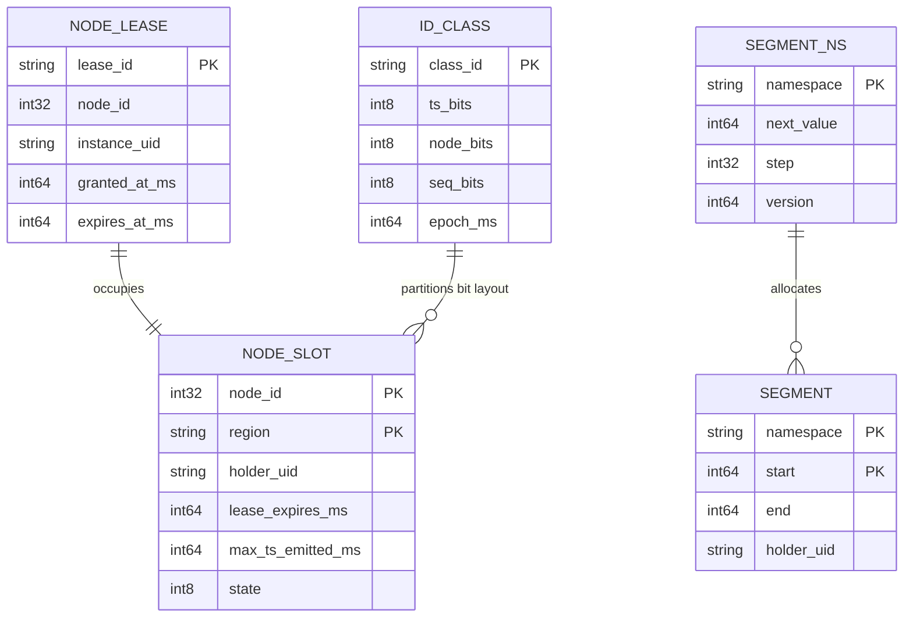
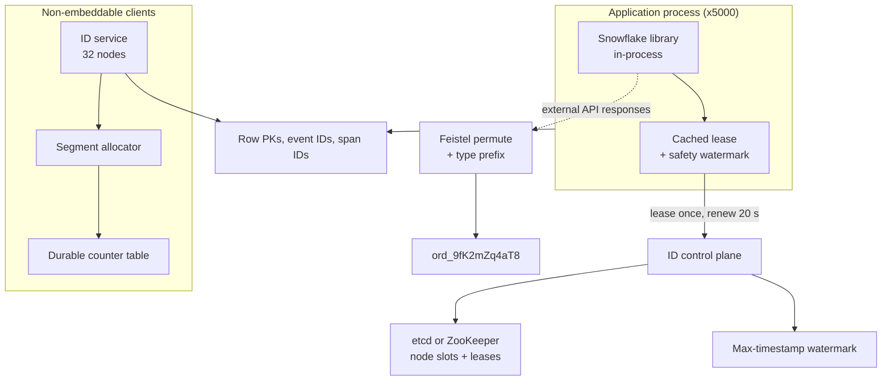
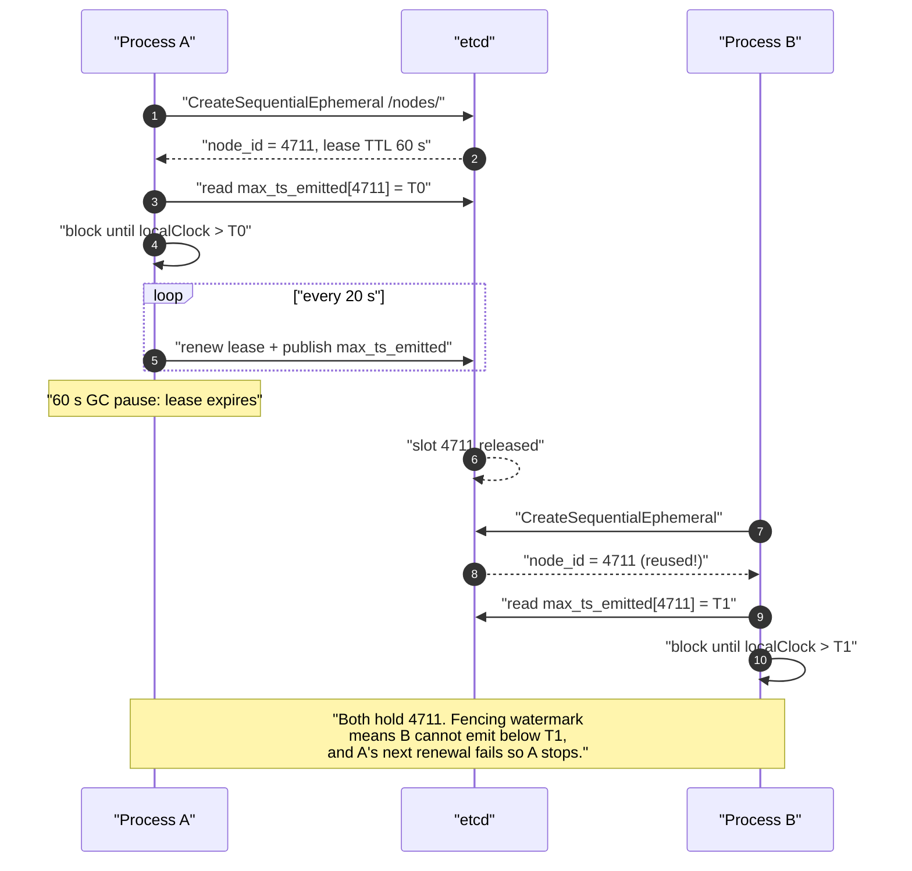
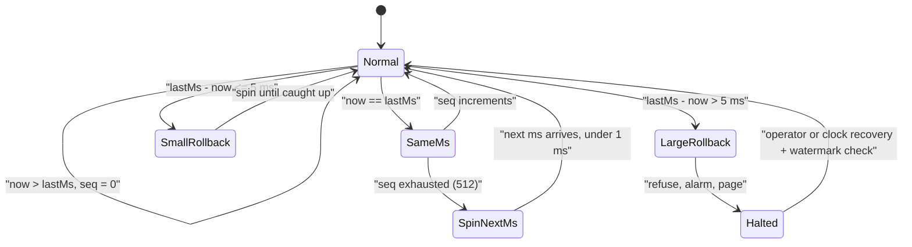
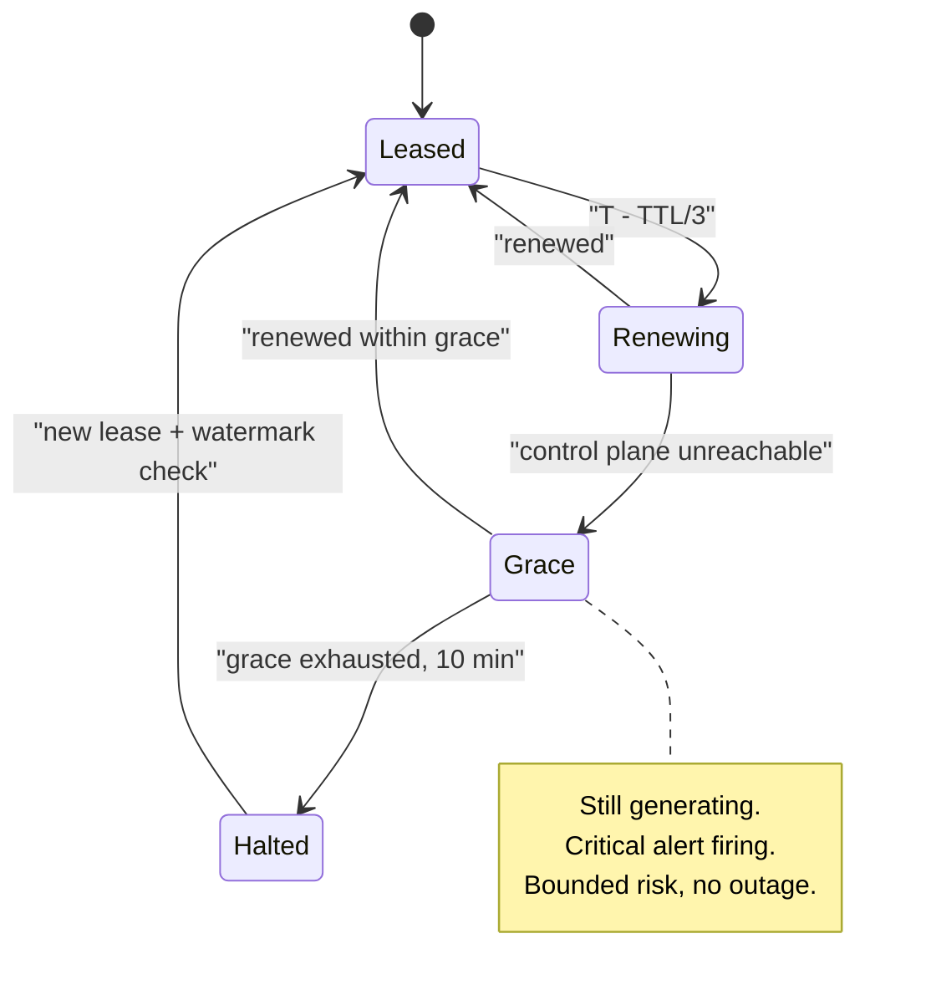

# 04 — Distributed Unique ID Generator

<span class="pill pill-core">Core</span> <span class="pill pill-medium">Medium</span>

**Generating unique 64-bit identifiers without coordination is trivial arithmetic; the hard part is that the identifier is simultaneously a primary key, a sort order, a public API surface and a bet on your machines' clocks — and every one of those roles pulls the design in a different direction.**

| | |
|---|---|
| **Commonly asked at** | Google, Meta, Stripe, Cloudflare, Twitter/X, Discord, Instagram, Shopify |
| **Time budget** | 45 min |
| **Core tension** | Time-sortable IDs give B-tree write locality and free ordering, but they leak creation time, create hot shards in distributed stores, and make you depend on wall-clock correctness on every node |
| **Prerequisites** | [F20 Time, Clocks & Ordering](../fundamentals/f20-time-clocks-ordering.md) · [F13 Storage Engines](../fundamentals/f13-storage-engines.md) · [F09 Consensus](../fundamentals/f09-consensus.md) · [F06 Partitioning & Sharding](../fundamentals/f06-partitioning-sharding.md) · [F27 Security in Design](../fundamentals/f27-security-design.md) · [F19 Concurrency Control](../fundamentals/f19-concurrency-control.md) |

---

## 1. Problem Statement

Design a system that issues unique identifiers to every service in a large distributed platform: for rows, messages, events, orders, spans, uploads. Millions per second, across thousands of processes, in multiple regions, with no duplicates ever.

"No duplicates ever" is the easy requirement — `uuid4()` satisfies it in one line. The interview is about the six *other* properties nobody states up front:

1. **Sortability.** Is the ID's byte order the same as creation order? This determines whether "recent items" is an index scan or a sort.
2. **Size.** 64 bits versus 128 bits, multiplied by every row, every secondary index entry, every cache key, every log line, every network message.
3. **Coordination.** How much distributed agreement is needed per ID, and what happens when that agreement is unavailable?
4. **Opacity.** What does the ID tell an outsider who collects a few of them?
5. **Monotonicity.** Guaranteed within a node? Across nodes? Neither?
6. **Index locality.** Where does the next insert land in a B-tree, and how much write amplification does that cost?

Every scheme in §7.1 is a different point in that six-dimensional space. There is no dominant option, and saying so early is the correct framing.

---

## 2. Requirements

### Functional

| ID | Requirement | Notes |
|---|---|---|
| F1 | Issue globally unique IDs | Across regions, processes, restarts, and clones |
| F2 | Roughly time-ordered | Byte order approximates creation order to within bounded skew |
| F3 | Batch allocation | A bulk import needs 100k IDs; one call, not 100k |
| F4 | Multiple ID *classes* | 64-bit for internal rows, opaque external IDs for API responses |
| F5 | Decode for debugging | Given an ID, recover timestamp, node, sequence |
| F6 | Work embedded in-process | A library, not a network hop, for the common case |
| F7 | Node identity lifecycle | Assign, lease, renew, revoke; survive restarts and autoscaling |

### Non-functional

| ID | Requirement | Target |
|---|---|---|
| N1 | Uniqueness | Absolute. Not "probabilistically". A duplicate primary key is a data-corruption incident |
| N2 | Throughput | 2M IDs/s aggregate peak; 500k/s per generating process |
| N3 | Latency | p99 < 1 µs embedded; p99 < 2 ms if a service call is unavoidable |
| N4 | Availability | 99.9999% — nothing can be created without an ID |
| N5 | Size | 64 bits for internal identifiers |
| N6 | Monotonic per node | Strictly increasing within a single generator instance |
| N7 | Lifespan | > 50 years before bit exhaustion |
| N8 | Clock-fault tolerance | Never emit a duplicate under NTP step, VM migration, or snapshot restore |

### Explicitly out of scope

| Out of scope | Why | Response if pushed |
|---|---|---|
| Total global ordering | Requires consensus per ID; ~10 ms and a quorum dependency | "That is a sequencer with Raft; throughput drops by three orders of magnitude" |
| Causal ordering / happens-before | IDs are not vector clocks | "Hybrid logical clocks, and I would not encode them in the primary key" |
| Human-friendly IDs | Product concern | "Feistel-permuted base32 with a check digit, derived from the internal ID" |
| Cryptographic unpredictability of internal IDs | Internal IDs are not secrets, external IDs are | "Separate the two; §7.6" |

---

## 3. Scale Estimation

**Throughput.**

$$
\text{IDs/s}_{\text{avg}} = 5\times10^{5}, \qquad \text{IDs/s}_{\text{peak}} = 2\times10^{6}
$$

$$
\text{IDs/day} = 5\times10^{5} \times 86400 = 4.32\times10^{10}
$$

43.2 billion IDs per day, 15.8 trillion per year.

**Snowflake capacity, and the surprise.** With the classic layout (41-bit ms timestamp, 10-bit node, 12-bit sequence):

$$
\text{per node} = 4096\ \text{IDs/ms} = 4.096\times10^{6}\ \text{IDs/s}
$$

$$
\text{total} = 1024 \times 4.096\times10^{6} = 4.19\times10^{9}\ \text{IDs/s}
$$

Peak demand is 2M/s. **A single node covers the entire company's throughput twice over.** Throughput is not the constraint — which means every minute spent on "how do we scale ID generation" is a minute wasted. The actual constraint is different:

$$
\text{generating processes} = 5{,}000 \quad\text{but}\quad 2^{10} = 1024\ \text{node IDs available}
$$

**The node ID space is the binding constraint, not throughput.** This is the single most important number in the estimation and almost no candidate finds it. Two ways out:

=== "Re-partition the bits"

    $$
    1\ \text{sign} + 41\ \text{ts} + 13\ \text{node} + 9\ \text{seq} = 64
    $$

    $8192$ nodes, $512$ IDs/ms/node $= 512{,}000$/s/node. Aggregate $4.19\times10^{9}$/s — unchanged, because moving a bit between node and sequence is throughput-neutral in aggregate.

=== "Dedicated ID service"

    Run 32 generator nodes behind the fleet; 5,000 clients call them (or, better, lease blocks from them). Node ID space is never stressed, but you have added a network hop or a lease protocol.

**Timestamp exhaustion.**

$$
2^{41}\ \text{ms} = 2.199\times10^{12}\ \text{ms} = \frac{2.199\times10^{12}}{1000 \times 86400 \times 365.25} = 69.7\ \text{years}
$$

With a custom epoch of 2020-01-01, the scheme dies in **2089**. With the Unix epoch it dies in 2039 — inside the working life of systems being written today. Choosing a custom epoch is free and buys 50 years; forgetting to is a Y2K-class bug with a known date.

**Size impact on storage.** Comparing a 64-bit ID to a 128-bit UUID as a primary key. In InnoDB, every secondary index entry stores the primary key:

$$
\Delta_{\text{PK}} = 8\ \text{B} \times 4.32\times10^{10}\ \text{rows/day} = 345\ \text{GB/day}
$$

With 3 secondary indexes per table:

$$
\Delta_{\text{total}} = 8\ \text{B} \times (1 + 3) \times 4.32\times10^{10} = 1.38\ \text{TB/day} = 505\ \text{TB/yr}
$$

Half a petabyte per year of pure identifier overhead, before considering that it also halves the number of index entries per 16 KB page and therefore roughly doubles index depth pressure. Choosing 128 bits is a defensible decision; choosing it *without knowing this number* is not.

**Centralized service cost.** If IDs came from a network service:

$$
2\times10^{6}\ \text{/s} \times (80\ \text{B} + 80\ \text{B}) = 320\ \text{MB/s} = 2.56\ \text{Gbps}
$$

plus 0.4 ms added to the critical path of **every entity creation in the company**. Batch allocation of 1,000 IDs per call reduces this to 2,000 RPS and 3.2 Mbps — a 1000x reduction that costs only the IDs abandoned when a process dies (at most 1,000 per crash, which is nothing against a $2^{41}$-millisecond keyspace).

**Collision math for the random schemes.** For $b$ random bits and target collision probability $p$:

$$
n \approx \sqrt{2 \cdot 2^{b} \cdot p}
$$

| Scheme | Random bits | Scope | $n$ at $p=10^{-9}$ |
|---|---|---|---|
| UUIDv4 | 122 | global, all time | $1.03\times10^{14}$ IDs |
| UUIDv7 | 74 | per millisecond | $6.1\times10^{6}$ IDs/ms |
| ULID | 80 | per millisecond | $4.9\times10^{7}$ IDs/ms |
| KSUID | 128 | per second | $8.2\times10^{14}$ IDs/s |

All comfortably safe **given a correct CSPRNG**. That caveat is doing enormous work; see the fork-safety gotcha in §12.

---

## 4. API Design

### Embedded library (the default, 99% of usage)

```go
// No network. No allocation. No lock contention beyond one atomic CAS.
package snowflake

type Generator struct {
    mu       sync.Mutex
    epoch    int64  // custom epoch, ms
    nodeID   int64  // 13 bits, leased
    lastMs   int64
    seq      int64  // 9 bits
    monoBase time.Time
}

func (g *Generator) Next() (int64, error)          // p99 < 1 us
func (g *Generator) NextBatch(n int) ([]int64, error)
func (g *Generator) Decode(id int64) Parts          // {TimeMs, NodeID, Seq}
```

### Node ID lease (control plane, called once per process lifetime)

```http
POST /v1/nodes:lease HTTP/1.1
Content-Type: application/json

{
  "service": "orders-api",
  "instance_uid": "i-0a1b2c3d4e5f-pid-4412-boot-1725091200",
  "region": "us-east-1",
  "requested_ttl_s": 60
}
```

```http
HTTP/1.1 200 OK

{
  "node_id": 4711,
  "lease_id": "lease_01J8XQ",
  "expires_at_unix_ms": 1756633260000,
  "renew_before_unix_ms": 1756633240000,
  "min_safe_timestamp_ms": 1756633198412,
  "epoch_ms": 1577836800000,
  "bits": {"timestamp": 41, "node": 13, "sequence": 9}
}
```

`min_safe_timestamp_ms` is the important field: the control plane records the highest timestamp ever observed from this node ID, and a new lease-holder must refuse to emit IDs until its own clock passes that value. This makes a node-ID handover safe even if the new holder's clock is behind the old holder's — which is the failure that produces duplicates. It is one extra field and it eliminates a whole category of disaster.

### Segment/ticket allocation (for services that cannot embed the library)

```http
POST /v1/segments HTTP/1.1
{"namespace": "order_id", "count": 1000}
```

```http
HTTP/1.1 200 OK
{"namespace": "order_id", "start": 8412000000, "end": 8412001000, "step": 1}
```

### External, opaque IDs

```http
GET /v1/orders/ord_9fK2mZq4aT8 HTTP/1.1
```

External IDs are **never** the internal 64-bit ID. They are a keyed bijection of it plus a type prefix (§7.6). The type prefix (`ord_`, `cus_`, `evt_`) is Stripe's convention and it is worth adopting: it makes every ID self-describing in logs, makes "wrong ID type passed" a validation error rather than a mysterious 404, and costs four bytes.

### Errors

| Code | Condition | Behaviour |
|---|---|---|
| `ErrClockRollback` | Clock moved backwards beyond tolerance | Refuse to generate; alarm; do **not** guess |
| `ErrSequenceExhausted` | > 512 IDs in one ms on this node | Spin to next ms (bounded ~1 ms) |
| `ErrLeaseExpired` | Node ID lease not renewed | Refuse to generate; the process must not emit IDs it cannot prove are safe |
| `ErrNotYetSafe` | Local clock < `min_safe_timestamp_ms` | Block until safe, with a hard timeout |
| 503 on `:lease` | Control plane down | Client uses cached lease until expiry; then hard-fails |

---

## 5. Data Model



### Access patterns

| # | Pattern | Rate | Store requirement |
|---|---|---|---|
| A1 | Generate an ID | 2M/s | **In-process. No store at all** |
| A2 | Acquire node ID lease | ~1/min (churn) | Linearizable, fault-tolerant |
| A3 | Renew lease | 5,000 per 20 s = 250/s | Linearizable |
| A4 | Record `max_ts_emitted` | on lease release/renew | Durable, monotonic |
| A5 | Allocate segment | 2,000/s | Atomic increment, durable |
| A6 | Decode ID | offline | None |

### Store choice

| Purpose | Option | Verdict |
|---|---|---|
| Node ID registry | **ZooKeeper / etcd (sequential ephemeral nodes)** | **Chosen.** This is the textbook use of a coordination service: small data, linearizable, needs leases with automatic expiry. See [F09 Consensus](../fundamentals/f09-consensus.md) |
| Node ID registry | Static config / Kubernetes StatefulSet ordinal | **Chosen as the simpler alternative** when the deployment model guarantees uniqueness. A StatefulSet gives stable ordinals 0..N-1 for free, and that *is* a node ID — with the caveat in §7.3 |
| Node ID registry | Derive from MAC address or IP | **Rejected.** Catastrophic; see the birthday math in §7.3 |
| Node ID registry | Redis `INCR` | **Rejected.** Not durable across failover; a lost `INCR` reissues live node IDs |
| Segment allocator | **MySQL/Postgres row with `UPDATE ... RETURNING`** | **Chosen.** 2,000 TPS on a single row is trivially served; durability is what matters, not throughput |
| Segment allocator | DynamoDB atomic counter | Fine alternative; same properties |
| Max-timestamp watermark | **Same coordination store as leases** | **Chosen.** Must be in the same linearizable store as the lease or the two can disagree |

**Note what is absent: the ID generation path has no store.** That is the design. Every store in this model is on the control plane, called once per process lifetime or once per 1,000 IDs.

### DDL

```sql
-- Segment allocator: the Flickr/Leaf "segment" pattern.
CREATE TABLE id_segments (
    namespace   VARCHAR(64)  NOT NULL,
    next_value  BIGINT       NOT NULL,
    step        INTEGER      NOT NULL DEFAULT 1000,
    max_value   BIGINT       NOT NULL DEFAULT 9223372036854775807,
    updated_at  TIMESTAMPTZ  NOT NULL DEFAULT now(),
    version     BIGINT       NOT NULL DEFAULT 0,
    PRIMARY KEY (namespace)
);

-- Atomic allocation of a block. One statement, one row lock, no read-then-write race.
UPDATE id_segments
   SET next_value = next_value + step,
       version    = version + 1,
       updated_at = now()
 WHERE namespace = 'order_id'
   AND next_value + step <= max_value
RETURNING next_value - step AS block_start, next_value AS block_end;

-- Node slot registry, with the safety watermark.
CREATE TABLE node_slots (
    region            VARCHAR(32) NOT NULL,
    node_id           INTEGER     NOT NULL CHECK (node_id BETWEEN 0 AND 8191),
    holder_uid        TEXT        NULL,
    lease_expires_ms  BIGINT      NOT NULL DEFAULT 0,
    max_ts_emitted_ms BIGINT      NOT NULL DEFAULT 0,   -- never decreases
    PRIMARY KEY (region, node_id)
);
```

---

## 6. High-Level Architecture



### Bit layout

```text
 63     62                                   22        9         0
+---+------------------------------------+-----------+---------+
| 0 |     timestamp_ms - epoch (41)      | node (13) | seq (9) |
+---+------------------------------------+-----------+---------+
  ^                  ^                        ^           ^
  |                  |                        |           +-- 512 IDs per ms per node
  |                  |                        +-------------- 8192 concurrent generators
  |                  +--------------------------------------- 69.7 years from epoch
  +---------------------------------------------------------- always 0: keeps the value
                                                               positive in Java/Go int64
                                                               and preserves sort order
```

The sign bit is not wasted, it is *spent deliberately*. Languages without unsigned 64-bit integers (Java, and historically many JSON consumers) will interpret a set high bit as negative, breaking both comparison and display. Setting it to zero costs 50% of the keyspace and buys correctness in every consumer.

### Generation path

```mermaid
sequenceDiagram
    autonumber
    participant A as "App thread"
    participant G as "Generator"
    participant C as "Monotonic clock"

    A->>G: "Next()"
    G->>C: "now_ms via monotonic base + elapsed"
    alt "now < lastMs (rollback)"
        G->>G: "delta = lastMs - now"
        alt "delta <= 5 ms"
            G->>G: "spin-wait until now >= lastMs"
        else "delta > 5 ms"
            G-->>A: "ErrClockRollback + alarm"
        end
    else "now == lastMs"
        G->>G: "seq = (seq + 1) & 0x1FF"
        alt "seq wrapped to 0"
            G->>G: "wait for next ms"
        end
    else "now > lastMs"
        G->>G: "seq = 0; lastMs = now"
    end
    G-->>A: "packed id from ts, node, seq"
```

### Startup path

1. Read cached lease from local disk (if any), including the last timestamp this process emitted.
2. Call `:lease`. Receive `node_id` and `min_safe_timestamp_ms`.
3. **Block until local clock exceeds `min_safe_timestamp_ms`.** If the wait exceeds 30 s, fail startup loudly rather than proceeding.
4. Initialise `monoBase` = (wall clock now, monotonic now) pair. All subsequent time is `wallAtBase + (monoNow - monoAtBase)`.
5. Start a lease-renewal goroutine at 1/3 of the TTL.
6. Only now accept traffic.

Step 3 and step 4 are the two lines that separate a correct implementation from one that will emit duplicates in production.

---

## 7. Deep Dives

### 7.1 The requirements matrix and the scheme comparison

| Property | Why it matters | Cheap to get? |
|---|---|---|
| Uniqueness | Duplicate PK = data corruption | Yes, several ways |
| Sortability | "Newest first" becomes an index scan; B-tree inserts stay local | Yes, but leaks time |
| Size | 8 vs 16 bytes × every row × every index × every log line | Yes, but constrains everything else |
| Coordination | Determines availability floor and failure modes | Trade against size and sortability |
| Opacity | Prevents enumeration and business-intelligence leakage | Conflicts directly with sortability |
| Monotonicity | Cursor pagination, dedup, ordering guarantees | Free per-node; expensive globally |

| Scheme | Bits | Sortable | Coordination | Opaque | Rate ceiling | Chosen / rejected |
|---|---|---|---|---|---|---|
| **UUIDv4** | 128 | No | None | Yes (122 random bits) | Unbounded | **Rejected as a PK** — destroys index locality (§7.7). **Chosen** for opaque tokens and idempotency keys |
| **UUIDv1** | 128 | Byte order is wrong for sorting (time_low first) | MAC address | No — leaks MAC and 100 ns timestamp | 10M/s/node | **Rejected.** Worst of both: not sortable as bytes, and leaks hardware identity |
| **UUIDv6** | 128 | Yes | MAC or random | Partially | 10M/s/node | Reordered v1; acceptable but superseded by v7 |
| **UUIDv7** | 128 | Yes (lexicographic) | **None** | Leaks ms timestamp | $6.1\times10^{6}$/ms at $p=10^{-9}$ | **Chosen** when 128 bits is acceptable and you want zero coordination. The best default for most new systems |
| **ULID** | 128 | Yes | None | Leaks ms timestamp | $4.9\times10^{7}$/ms | Equivalent to v7 with a nicer 26-char Crockford base32 text form; **chosen** where the string form is user-visible |
| **KSUID** | 160 | Yes | None | Leaks second | Enormous | Rejected — 20 bytes for 1-second resolution is a bad trade |
| **MongoDB ObjectId** | 96 | Yes | None (5 random bytes/process) | Leaks second + process identity | 16.7M/s/process | Reasonable; 12 bytes is an awkward width |
| **Snowflake** | 64 | Yes | Node ID assignment only | No — leaks ms, node, sequence | 512–4096/ms/node | **Chosen** for internal primary keys |
| **Flickr ticket server** | 64 | Yes | Central, per ID | No | ~10k/s per server | **Rejected** as primary mechanism; brilliant for its era |
| **DB sequence** | 64 | Yes | Central, cached blocks | No | ~50k/s with caching | **Chosen** for the segment allocator fallback |
| **Instagram sharded PL/pgSQL** | 64 | Yes | Per-shard only | No | 1024/ms/shard | **Chosen** as the pattern when the DB shard *is* the natural node ID |

??? note "Flickr's ticket server, and why it is still worth knowing"
    Flickr needed 64-bit sequential IDs before Snowflake existed. Their solution was a MySQL table with a single row and the `REPLACE INTO` trick:

    ```sql
    CREATE TABLE Tickets64 (
      id     BIGINT UNSIGNED NOT NULL AUTO_INCREMENT,
      stub   CHAR(1) NOT NULL DEFAULT '',
      PRIMARY KEY (id),
      UNIQUE KEY stub (stub)
    ) ENGINE=MyISAM;

    REPLACE INTO Tickets64 (stub) VALUES ('a');
    SELECT LAST_INSERT_ID();
    ```

    `REPLACE` deletes and reinserts the single row, incrementing `AUTO_INCREMENT`, and `LAST_INSERT_ID()` is connection-scoped so it is race-free. The table never grows. To avoid a single point of failure they ran two servers with `auto_increment_increment = 2` and offsets 1 and 2 — odd IDs from one, even from the other.

    **Why it matters today:** it is the cleanest possible illustration of trading a network round trip for perfect sequentiality, and the odd/even trick is the ancestor of every "partition the ID space by generator" scheme including Snowflake's node bits. **Why it was replaced:** ~10k IDs/s ceiling, a network hop on every entity creation, and an availability floor equal to MySQL's.

??? note "Instagram's sharded PL/pgSQL generator"
    Instagram wanted Snowflake's properties without running a separate service, and they already had logical shards. So they put the generator *inside* the database, one function per shard schema:

    ```sql
    CREATE OR REPLACE FUNCTION insta5.next_id(OUT result bigint) AS $$
    DECLARE
        our_epoch  bigint := 1314220021721;   -- custom epoch, ms
        seq_id     bigint;
        now_millis bigint;
        shard_id   int   := 5;                -- this schema's shard, 13 bits
    BEGIN
        SELECT nextval('insta5.table_id_seq') % 1024 INTO seq_id;
        SELECT FLOOR(EXTRACT(EPOCH FROM clock_timestamp()) * 1000) INTO now_millis;
        result := (now_millis - our_epoch) << 23;
        result := result | (shard_id << 10);
        result := result | (seq_id);
    END;
    $$ LANGUAGE PLPGSQL;
    ```

    41 bits timestamp, 13 bits shard, 10 bits sequence. The elegance is that **the shard ID is the node ID** — it already exists, it is already unique, it is already durable, and it never needs a coordination service. The sequence comes from a Postgres sequence, so it survives restarts without a clock check. And because the shard ID is embedded, any ID tells you which shard to route to without a lookup table.

    **The trade:** IDs can only be generated by the database, so you cannot mint one before the write, which makes optimistic client-side ID assignment and idempotent retries harder. It also couples your ID scheme to your shard map, so resharding is now an ID-scheme problem.

### 7.2 Snowflake bit layout and exhaustion arithmetic

Three quantities to size, and each trade is exact:

$$
\underbrace{41}_{\text{timestamp}} + \underbrace{n}_{\text{node}} + \underbrace{s}_{\text{sequence}} = 63, \qquad n + s = 22
$$

| $n$ (node bits) | Nodes | $s$ | IDs/ms/node | IDs/s/node | Aggregate/s |
|---|---|---|---|---|---|
| 8 | 256 | 14 | 16,384 | $1.64\times10^{7}$ | $4.19\times10^{9}$ |
| 10 (classic) | 1,024 | 12 | 4,096 | $4.10\times10^{6}$ | $4.19\times10^{9}$ |
| **13 (chosen)** | **8,192** | **9** | **512** | **5.12$\times10^{5}$** | $4.19\times10^{9}$ |
| 16 | 65,536 | 6 | 64 | $6.4\times10^{4}$ | $4.19\times10^{9}$ |

Aggregate throughput is invariant at $2^{22}$ IDs/ms $= 4.19\times10^{9}$/s regardless of the split — moving a bit between node and sequence only changes *how* the capacity is distributed. The choice is therefore purely about fleet size versus per-process burst rate, and the constraint is:

$$
n \ge \lceil \log_2(\text{max concurrent generators}) \rceil, \qquad 2^{s} \ge \text{per-process peak IDs/ms}
$$

With 5,000 processes: $n = 13$. With a per-process peak of 512k/s: $s = 9$ gives exactly 512/ms. Both fit, with headroom for 8,192 processes.

**Timestamp resolution trade:**

| Unit | Bits for 69 years | Node+seq left | Note |
|---|---|---|---|
| 1 s | 31 | 32 | Huge sequence space, but 1-second sort granularity is useless for feeds |
| **1 ms** | **41** | **22** | **Chosen.** Matches the granularity people actually reason about |
| 100 µs | 45 | 18 | Marginal ordering benefit, big cost |
| 1 µs | 51 | 12 | Only 12 bits left; clock precision is not that good anyway |

**Epoch exhaustion.** With epoch $E$ and 41 bits of milliseconds, the scheme dies at $E + 69.7$ years. Two mitigations, both of which must be designed in now:

1. **Custom epoch** at the project's start date. Free, buys the full 69.7 years from *today* rather than from 1970.
2. **A documented, tested migration path.** At year 60, either widen to 128 bits (a schema migration on every table) or — cheaper — repurpose the sign bit for a 10th decade, accepting that all consumers must be unsigned-safe. Write this down in the design doc; it is the most confidently-deferred problem in computing and it does eventually arrive.

!!! warning "Do not let the timestamp be `time.Now()` directly"
    The generator must derive its time from a monotonic base:
    ```go
    // Established once at startup, after the safety check.
    g.wallAtBase = time.Now()
    g.monoAtBase = time.Now()  // Go's time.Time carries a monotonic reading

    func (g *Generator) nowMs() int64 {
        elapsed := time.Since(g.monoAtBase)          // monotonic delta
        return g.wallAtBase.Add(elapsed).UnixMilli() // wall time that cannot go backwards
    }
    ```
    This gives wall-clock-anchored timestamps that are immune to NTP steps, leap seconds and VM-resume corrections *for the lifetime of the process*. It drifts from true wall time at the hardware oscillator's rate (typically < 50 ppm ≈ 4 s/day), which is irrelevant for ordering and detectable by comparing against `time.Now()` on a schedule.

### 7.3 Node ID assignment, and the disasters

The node ID is the *only* coordination in the whole design, which makes it the only place a duplicate can come from.

| Mechanism | Uniqueness guarantee | Failure mode | Verdict |
|---|---|---|---|
| **ZooKeeper/etcd sequential ephemeral** | Linearizable; slot auto-released on session loss | Session expiry during a GC pause releases a slot still in use | **Chosen** with a fencing watermark |
| **K8s StatefulSet ordinal** | Stable ordinal per pod name | Two clusters, two namespaces, or a blue/green deploy produce two pods with ordinal 0 | **Chosen** only with a namespace-scoped bit prefix |
| **Static config file** | As good as your config management | Copy-paste; a rolled-back config resurrects an old assignment | Acceptable at small fleet sizes with review |
| **Derived from IP address (last octets)** | None | Reused IPs, overlapping VPCs, IPv6 | **Rejected** |
| **Derived from MAC address (hashed to 10 bits)** | **None** | See below | **Rejected — this is the classic trap** |
| **Random on startup** | None | See below | **Rejected** |

**The MAC/random hashing disaster, quantified.** Hashing any identifier into $2^{n}$ slots is a birthday problem. Probability that $k$ nodes have at least one collision among $N = 2^{n}$ slots:

$$
P(\text{collision}) \approx 1 - e^{-k(k-1)/(2N)}
$$

| Nodes $k$ | $N = 1024$ (10 bits) | $N = 8192$ (13 bits) |
|---|---|---|
| 10 | 4.3% | 0.55% |
| 20 | 16.9% | 2.3% |
| 50 | 69.9% | 14.0% |
| **100** | **99.2%** | 45.4% |
| 500 | ~100% | 99.998% |

**At 100 nodes with 10 bits, a duplicate node ID is essentially certain.** Not "unlikely". Certain. And the failure is silent: two generators with the same node ID emitting in the same millisecond with the same sequence value produce *byte-identical IDs*. Your database rejects the second insert with a duplicate-key error at some random future moment, or — far worse — if the ID is used as a document key in an upsert-style store, one record silently overwrites the other.



**Three defences, all required:**

1. **Fencing on renewal.** The generator checks its lease before every batch (cheaply, against a locally cached expiry) and *refuses to generate* once the lease is past its expiry. A process that cannot prove it still owns its node ID must stop, not continue optimistically.
2. **Max-timestamp watermark.** The control plane records the highest timestamp emitted per slot. A new holder blocks until its clock exceeds it. Even if two processes briefly hold the same slot, their emitted ID ranges cannot overlap in the timestamp field.
3. **Duplicate detection as a tripwire.** A unique constraint on the ID column, with an alert on any violation. This should fire never; if it fires once, treat it as a data-integrity incident and stop the fleet.

!!! danger "The VM clone / container image bake disaster"
    A team bakes an AMI or container image *after* the application has started and cached its node ID lease to local disk. Every instance launched from that image starts with the same cached node ID and the same cached state, all of them believing they hold slot 4711. Autoscaling to 50 instances produces 50 generators with identical node IDs. The same happens with VM snapshot-restore for disaster recovery testing, and with `docker commit` on a running container.
    **Mitigation:** the cached lease must be keyed by a boot-unique identifier — instance ID plus boot time plus PID — and must be discarded if any of them changed. Never treat a persisted node ID as valid without revalidating against the control plane.

### 7.4 Clock rollback: block, borrow, or alarm

Wall clocks move backwards. The question is what the generator does in the microsecond it notices.



| Strategy | Mechanism | Correct? | Cost | Verdict |
|---|---|---|---|---|
| **Block (spin-wait)** | Busy-wait until `now >= lastMs` | Yes | Unavailable for the rollback duration | **Chosen for rollbacks ≤ 5 ms.** A 2-hour rollback would mean a 2-hour outage, so it must be bounded |
| **Borrow / extend** | On rollback, increment a generation counter held in stolen sequence bits | Yes, until the borrowed bits exhaust | Reduces sequence space; complex | Considered; rejected for complexity, but it is what several production forks do |
| **Alarm and refuse** | Return an error, emit a critical alert | Yes | Hard failure of entity creation on that node | **Chosen for rollbacks > 5 ms.** Original Twitter Snowflake behaviour |
| **Ignore and continue** | Keep emitting with the lower timestamp | **No** | Silent duplicate IDs | **Never.** This is the bug that ships |
| **Use a monotonic clock** | Derive time from a monotonic base (§7.2) | Yes, prevents the problem entirely within a process | Drifts from true wall time | **Chosen as the primary defence** |

```go
func (g *Generator) Next() (int64, error) {
    g.mu.Lock()
    defer g.mu.Unlock()

    if time.Now().UnixMilli() > g.leaseExpiresMs {
        return 0, ErrLeaseExpired          // fencing: cannot prove we own the node ID
    }

    now := g.nowMs()                       // monotonic-derived; see 7.2

    if now < g.lastMs {
        delta := g.lastMs - now
        if delta > maxRollbackMs {         // 5 ms
            metrics.ClockRollback.Add(float64(delta))
            return 0, fmt.Errorf("%w: %d ms", ErrClockRollback, delta)
        }
        for now < g.lastMs {               // bounded spin, at most 5 ms
            now = g.nowMs()
        }
    }

    if now == g.lastMs {
        g.seq = (g.seq + 1) & seqMask      // 0x1FF
        if g.seq == 0 {                    // 512 IDs consumed in this ms
            for now <= g.lastMs {          // wait for the next millisecond
                now = g.nowMs()
            }
        }
    } else {
        g.seq = 0
    }

    g.lastMs = now
    if now > g.maxEmittedMs {
        g.maxEmittedMs = now               // published to the control plane on renewal
    }
    return ((now - g.epochMs) << 22) | (g.nodeID << 9) | g.seq, nil
}
```

Note that `g.seq = 0` on a new millisecond is a subtle information leak: an observer collecting IDs sees sequence numbers starting at 0 and can infer throughput exactly (§7.6). Some implementations randomise the starting sequence within the millisecond to blur this, at the cost of losing a fraction of the per-ms capacity.

### 7.5 NTP, VM migration, and what actually moves clocks

| Event | Magnitude | Direction | Mitigated by monotonic clock? |
|---|---|---|---|
| NTP slew (normal) | ≤ 500 ppm rate adjustment | Either | Yes — and harmless anyway |
| NTP step (offset > 128 ms) | Unbounded; seconds to years | Either | **Yes** |
| First NTP sync after boot | Often minutes to years (dead CMOS battery, no RTC in containers) | Usually forward | Yes, but the *base* must be captured after sync |
| Leap second (step implementation) | 1 s backwards | Backwards | Yes |
| Leap second (smear, Google/AWS style) | ±11.6 ppm over 24 h | Either | Yes |
| VM live migration | 50–500 ms freeze, then correction | Effectively forward jump on resume | Yes |
| VM snapshot restore | Hours to months | Backwards | Yes for elapsed time, **no** for the safety watermark — this is why the watermark exists |
| Manual `date -s` / `hwclock` | Anything | Either | Yes |
| Container start with host clock skewed | Anything | Either | Base is captured at start, so consistent |

**Slew versus step is the operational control.** `chronyd` and `ntpd` slew small offsets (adjusting the clock's rate so it converges smoothly) and step large ones (discontinuous jump). Configure ID-generating hosts with:

```bash
# /etc/chrony/chrony.conf
# Never step after startup. Slew everything, however long it takes.
makestep 1.0 3          # allow stepping only in the first 3 updates after boot
maxslewrate 100         # ppm
rtcsync
# Alert on: chrony offset > 50 ms, any step after boot, unreachable sources.
```

`makestep 1.0 3` permits a step only during the first three updates after boot — which is exactly when you need it, because a container may start with a wildly wrong clock — and forbids it afterwards, which is exactly when a step would corrupt IDs. The generator's safety-watermark check at startup covers the boot-time window.

!!! gotcha "The first NTP sync happens after your process starts"
    A container starts with the host's clock, which may be correct. But on bare metal after a power event, or in an environment where `chronyd` starts in parallel with your application, the generator can capture a monotonic base from a clock that is minutes wrong, and then hold that error for the entire process lifetime because it is monotonic-anchored and never re-reads wall time. Mitigation: block startup until `chronyc tracking` reports a synchronised state with a bounded offset, and periodically compare the derived time against `time.Now()`, alarming (not correcting) on divergence beyond 1 second.

### 7.6 Monotonicity guarantees, and what IDs do not promise

| Guarantee | Holds? | Mechanism | Caveat |
|---|---|---|---|
| Strictly increasing within one generator instance | **Yes** | Sequence within ms; monotonic clock across ms | Broken by a process restart with a rolled-back clock, unless the watermark check runs |
| Increasing within one node ID across restarts | **Yes** | `min_safe_timestamp_ms` watermark | Requires the control plane to have durably recorded it |
| Ordered across nodes | **No** | — | Only ordered to within maximum clock skew $\varepsilon$ |
| Reflects causality (A caused B ⟹ $ID_A < ID_B$) | **No** | — | Requires logical clocks; a network round trip can be faster than $\varepsilon$ |
| Gapless | **No** | — | Sequence resets, unused segments, discarded blocks |
| Unique | **Yes** | Node ID uniqueness + watermark | The entire design reduces to this one property |

**The skew bound is the honest statement.** If nodes are NTP-synchronised to within $\varepsilon = 50$ ms (a realistic figure for a well-run fleet; badly-run fleets are at seconds), then for two IDs generated on different nodes:

$$
ID_A < ID_B \implies t_A < t_B + \varepsilon
$$

Two events 30 ms apart on different nodes may sort in either order. Consequences that must be stated to the interviewer:

- **Do not** use ID order for financial sequencing, audit ordering, or anything where "which happened first" has legal or correctness meaning. Use an explicit sequencer or a logical clock.
- **Do** use ID order for feed pagination, cursor-based iteration, and "roughly recent" queries, where a 50 ms inversion is invisible.
- **Cursor pagination is safe** if the cursor is `(id)` and the query is `WHERE id > cursor ORDER BY id`, *provided* writes are not concurrent with the scan across nodes. If they are, a row with a smaller ID can be inserted after you have passed that point — the classic missed-row bug in cursor pagination over clock-derived IDs. The fix is a lag window: never paginate closer than $\varepsilon + \text{max write latency}$ to the present.

!!! danger "The cursor pagination gap that eats records"
    A consumer polls `SELECT * FROM events WHERE id > :last ORDER BY id LIMIT 1000`, tracking `:last`. Node A's clock is 40 ms behind node B's. B writes event $X$ at wall time $T$ with ID encoding $T$. A writes event $Y$ at wall time $T+20\text{ms}$ with ID encoding $T-20\text{ms}$. If the consumer read past $X$'s ID before $Y$ committed, $Y$ is **permanently skipped** — no error, no gap detectable in the ID sequence (IDs are not gapless anyway), just a missing record found weeks later in a reconciliation. Mitigation: never tail closer than $\varepsilon$ + max commit latency to now, or tail a log with a real sequence (Kafka offsets, a transaction log LSN) instead of a clock-derived ID.

### 7.7 Index locality: what random IDs cost a B-tree

This is the most quantifiable part of the whole problem and the one that most directly affects production.

**Setup.** InnoDB, 16 KB pages, clustered primary key, 200-byte rows, $10^{9}$ rows, buffer pool 64 GB.

$$
\text{rows/page} = \frac{16384 \times \text{fill}}{200}, \qquad \text{leaf pages} = \frac{10^{9}}{\text{rows/page}}
$$

=== "Sequential PK (Snowflake / auto-increment)"

    Inserts always land on the rightmost leaf page. That page stays in the buffer pool. When it fills, it splits *at the right edge* — InnoDB detects the ascending pattern and splits 100/0 rather than 50/50, so fill factor approaches 15/16 ≈ 94%.

    $$
    \text{rows/page} = \frac{16384 \times 0.94}{200} = 77, \qquad \text{leaf pages} = 1.30\times10^{7}, \qquad \text{size} = 213\ \text{GB}
    $$

    **Dirty pages per insert:** one page is dirtied per 77 inserts → write amplification ≈ $16384/(77 \times 200) = 1.06$.
    **Buffer pool requirement:** one page. The working set for writes is a few hundred KB.

=== "Random PK (UUIDv4)"

    Every insert targets a uniformly random leaf page out of 13 million. Pages split at 50/50 because there is no ascending pattern; the steady-state fill factor of a randomly-inserted B-tree is the classic $\ln 2 \approx 69\%$.

    $$
    \text{rows/page} = \frac{16384 \times 0.69}{216} = 52, \qquad \text{leaf pages} = 1.92\times10^{7}, \qquad \text{size} = 315\ \text{GB}
    $$

    (216 bytes/row because the 16-byte PK replaces the 8-byte one and appears in the row header.)

    **Index is 48% larger.** But the real cost is I/O:

    - Buffer pool holds $64\ \text{GB}/16\ \text{KB} = 4.19\times10^{6}$ pages out of $1.92\times10^{7}$ → **21.8% hit probability** for a random target page.
    - So 78% of inserts require a synchronous read of a 16 KB page before the 200-byte write.
    - **Write amplification:** each insert dirties a full 16 KB page that will be flushed carrying (on average) very few new rows.

    $$
    \text{read amplification} = 0.78 \times \frac{16384\ \text{B}}{216\ \text{B}} \approx 59\times
    $$

    Published benchmarks consistently show **5–10x lower insert throughput** for UUIDv4 primary keys versus sequential ones at table sizes exceeding the buffer pool, and the gap widens as the table grows because the hit probability falls.

=== "UUIDv7 / ULID (time-prefixed 128-bit)"

    Byte-lexicographic order equals time order, so insert locality is identical to Snowflake's. You pay the 8 extra bytes per row and per secondary index entry — the 505 TB/year from §3 — but you recover **all** of the locality.

    $$
    \text{rows/page} = \frac{16384 \times 0.94}{216} = 71, \qquad \text{size} = 231\ \text{GB}, \qquad \text{write amp} \approx 1.07
    $$

    This is why UUIDv7 exists and why it should be the default for any new system that has already decided on 128-bit IDs.

| Metric | Sequential 64-bit | UUIDv7 128-bit | UUIDv4 128-bit |
|---|---|---|---|
| Clustered index size | 213 GB | 231 GB | 315 GB |
| Fill factor | 94% | 94% | 69% |
| Write amplification | 1.06x | 1.07x | ~59x (buffer-pool-limited) |
| Insert throughput (relative) | 1.00 | 0.97 | 0.10–0.20 |
| Per secondary index overhead | baseline | +8 B/entry | +8 B/entry |

!!! gotcha "The opposite is true in an LSM tree used as a distributed store"
    Everything above assumes a B-tree with a single write point. In Cassandra, DynamoDB, HBase or any hash-partitioned LSM store, a **monotonic key is the pathology, not the cure**: every write for a given time window goes to the same partition, creating a hot shard that caps your write throughput at one node's capacity while the rest of the cluster idles. The correct pattern there is to use the sortable ID as the *clustering* key within a partition and something high-cardinality as the *partition* key — or to prefix the ID with a hash bucket. Getting this backwards is one of the most common scaling failures in production and it comes directly from applying B-tree intuition to an LSM store. See [F06 Partitioning & Sharding](../fundamentals/f06-partitioning-sharding.md) and [F13 Storage Engines](../fundamentals/f13-storage-engines.md).

### 7.8 Enumeration and business-intelligence leakage

A Snowflake ID is a **structured disclosure**. Decoding is trivial:

```python
EPOCH_MS = 1577836800000  # 2020-01-01

def decode(id: int) -> dict:
    return {
        "timestamp_ms": ((id >> 22) & 0x1FFFFFFFFFF) + EPOCH_MS,
        "node_id":      (id >> 9) & 0x1FFF,
        "sequence":     id & 0x1FF,
    }
```

From a handful of IDs an outsider learns:

| Observable | Inference | Real-world example |
|---|---|---|
| Exact ms timestamp | When the entity was created, to the millisecond | Every Twitter/X and Discord ID publicly encodes its creation time |
| Node ID distribution | Your fleet size, its growth, and deployment topology | Counting distinct node IDs across scraped IDs |
| Sequence values within one ms on one node | Instantaneous per-node throughput | Two IDs with the same `(ts, node)` and sequences 3 and 41 imply ≥ 38 creations in that millisecond |
| Two IDs from the same account | Elapsed time between actions | Session analytics on your users, by third parties |

**Sequential IDs are worse.** The German tank problem: from $k$ observed IDs with maximum $m$, the minimum-variance unbiased estimate of the total population is

$$
\hat{N} = m\left(1 + \frac{1}{k}\right) - 1
$$

Sign up twice a month, note your user IDs, and you have a precise monthly signup rate. This has been used repeatedly to publish competitors' growth numbers.

**The fix: separate internal and external identifiers.**

```python
import hmac, hashlib, struct

# 64-bit Feistel permutation. Bijective, so no collisions and no lookup table.
# Reversible with the key, so support tooling can still decode.
def _prf(key: bytes, rnd: int, x: int) -> int:
    d = hmac.new(key, bytes([rnd]) + struct.pack(">I", x), hashlib.sha256).digest()
    return struct.unpack(">I", d[:4])[0]

def obfuscate(internal_id: int, key: bytes, rounds: int = 4) -> int:
    lo, hi = internal_id & 0xFFFFFFFF, (internal_id >> 32) & 0xFFFFFFFF
    for r in range(rounds):
        lo, hi = hi, lo ^ _prf(key, r, hi)
    return (hi << 32) | lo

def external_id(internal_id: int, key: bytes, prefix: str = "ord") -> str:
    return f"{prefix}_{base62(obfuscate(internal_id, key))}"
```

| Property | Internal (Snowflake) | External (Feistel-permuted) |
|---|---|---|
| Sortable | Yes — needed for index locality | No — by design |
| Reveals creation time | Yes | No |
| Reveals throughput | Yes | No |
| Enumerable | Yes | No |
| Collision-free | Yes | Yes (bijection) |
| Reversible for support tooling | Yes | Yes, with the key |
| Stored in the database | Yes, as the PK | No — derived on the fly |

The external ID is computed at serialisation time and parsed at deserialisation time; nothing is stored twice and nothing can drift. The cost is four HMAC calls per API response, roughly 2 µs — negligible against any network operation.

!!! tip "Do not encrypt with a random IV"
    A tempting alternative is AES-encrypting the ID. But a random IV makes the external ID non-deterministic, so the same order has a different public ID on every request — breaking caching, idempotency and customer support. A Feistel permutation (or AES in a format-preserving, deterministic mode) gives a stable one-to-one mapping, which is what you actually need. Note the trade-off you are accepting: a deterministic mapping means an attacker who obtains one internal/external pair learns nothing extra, but the mapping itself is stable, so external IDs are stable secrets rather than rotating ones.

---

## 8. Scaling the Bottleneck

There is no throughput bottleneck: $4.19\times10^{9}$ IDs/s aggregate against a 2M/s requirement is 2,000x headroom. The bottlenecks are elsewhere and each is qualitatively different.

**Bottleneck 1: node ID space.** $2^{13} = 8192$ slots against a 5,000-process fleet with autoscaling churn. At 20% daily churn, slots are acquired and released 1,000 times/day. If leases have a 60 s TTL and a crashed process's slot is unavailable for that long, the effective capacity is reduced. Mitigations: shorter TTL (30 s) with faster renewal, region-scoped slot pools (each region has its own 8,192), and — the real answer — **do not embed the generator in every process**. Embed it in every *pod*, and have co-located processes share via a Unix socket, or accept 32 dedicated generator nodes and have everything else use segment allocation.

**Bottleneck 2: the control plane's availability.** Every generator depends on lease renewal. If etcd is unavailable for longer than the lease TTL, every generator in the company stops. That is a 99.9999% availability requirement on a consensus system, which is not achievable.

The resolution is **lease extension under partition**: if the control plane is unreachable but the lease has not yet expired, keep generating. If it expires, enter a grace period during which generation continues but a critical alert fires, and only hard-stop after a much longer window (say 10 minutes). This trades a small, bounded window of theoretical duplicate risk against a guaranteed total outage — and the risk is not really duplicate IDs, because the watermark mechanism means a new holder of that slot cannot emit overlapping timestamps anyway.



**Bottleneck 3: sequence exhaustion under burst.** 512 IDs/ms per node = 512k/s. A bulk import loop generating IDs as fast as a CPU can run will exceed this and spin-wait, capping the loop at 512k IDs/s per process. That is correct behaviour but surprising. Mitigation: `NextBatch(n)` which grabs a contiguous run across multiple milliseconds without re-locking, and for genuine bulk work, the segment allocator, which hands out a million IDs in one call with no clock involvement.

**Bottleneck 4: lock contention in the library.** A single mutex around `Next()` serialises all threads in a process. At 512k/s with a ~100 ns critical section, utilisation is only 5%, so contention is not a throughput problem — but it is a *tail latency* problem under many-core contention. Mitigation: per-P (per-core) generators with the sequence space partitioned among them, or a lock-free CAS loop on a packed `(lastMs, seq)` int64. Both are premature until measured.

---

## 9. Failure Modes

| Failure | Blast radius | Detection | Mitigation | Degraded behaviour |
|---|---|---|---|---|
| Duplicate node ID (MAC hashing, cloned image) | **Silent data corruption across every table** | Unique-constraint violations; ID collision canary | Coordination-service assignment; boot-unique lease keys; watermark | Halt fleet; this is an all-hands incident |
| Clock steps backwards > 5 ms | That node stops issuing IDs | `ErrClockRollback` counter | Refuse + alarm; monotonic clock prevents most cases | Entity creation fails on that node; LB routes elsewhere |
| Clock steps backwards < 5 ms | Sub-5 ms latency spike | Spin-wait duration histogram | Bounded spin | Invisible |
| etcd/ZooKeeper unavailable | Lease renewals fail | Renewal error rate, lease age | Grace period: keep generating for 10 min with alarm | None for 10 min; then total creation outage |
| Lease expires during a long GC pause | One process | Lease-age metric exceeding TTL | Fencing check before generation; watermark on the next holder | That process stops until it re-leases |
| Sequence exhausted | Latency, not errors | Spin-wait counter | Batch API; segment allocator for bulk | Throughput capped at 512k/s/process |
| Timestamp epoch exhaustion (year 2089) | Everything | Calendar | Documented migration; sign-bit repurposing | Total, if unaddressed |
| Segment allocator DB down | Non-embedded clients | Allocation error rate | Clients hold a pre-fetched spare segment (~1,000 IDs) | Continue for minutes; then fail |
| Feistel key rotated | **All external IDs change** | Customer reports; 404 rate | Never rotate; if you must, dual-read both keys forever | Old links break permanently |
| Node ID slot leaked (crash without release) | Slot unavailable for TTL | Slot utilisation gauge | Ephemeral nodes auto-release; reaper for stale non-ephemeral rows | Reduced slot pool |
| CSPRNG not reseeded after fork | UUIDv4/v7 duplicates across processes | Duplicate-key errors | Use the OS CSPRNG (`getrandom`), never a userspace PRNG cached across `fork()` | Corruption |

!!! danger "The only failure that matters is a silent duplicate"
    Every other row in that table is loud: an error, a latency spike, a metric. A duplicate ID produces a database error at some arbitrary later time, in a different service, with no connection to the cause — or, in an upsert-style store, no error at all, just a silently overwritten record. Build the tripwire: a unique constraint on every ID column and an alert on any violation. It should fire zero times per year, and the first time it fires is a stop-the-line event.

---

## 10. SRE Lens

### SLIs and SLOs

| SLI | Definition | SLO | Window |
|---|---|---|---|
| Generation availability | Fraction of `Next()` calls returning an ID | 99.9999% | 30 d |
| Generation latency | p99.9 of `Next()` | < 10 µs | 30 d |
| **Uniqueness** | Observed duplicate IDs | **0, absolute** | all time |
| Monotonicity per node | IDs from one node strictly increasing | 100% | continuous |
| Clock health | Fraction of nodes with NTP offset < 50 ms | 99.9% | 30 d |
| Lease health | Fraction of generators with a valid lease | 99.99% | 30 d |
| Slot utilisation | Leased slots / total slots | < 70% | continuous |
| Sortedness error | p99 of $\lvert t_{\text{ID}} - t_{\text{actual}} \rvert$ | < 50 ms | 7 d |

**Uniqueness is not an SLO with a budget.** Availability has an error budget because a failed request can be retried; a duplicate primary key cannot be un-issued and may have already overwritten data. Making this distinction explicitly — some properties are budgeted, some are absolute — is a strong signal, because it shows you understand what error budgets are *for*.

$$
\text{99.9999\% over 30 days} = 43{,}200 \times 10^{-6}\ \text{min} = 2.6\ \text{seconds/month}
$$

That is only achievable because generation is in-process with no network dependency on the hot path. It would be impossible for a network service, and that impossibility is the entire justification for the embedded-library design. See [F23 SLI/SLO & Error Budgets](../fundamentals/f23-slo-error-budgets.md).

### Rollout plan

The ID scheme is the hardest thing in any system to change, because IDs are **immutable, externally visible, and stored in every table, log, cache, backup and partner integration**. Treat every parameter as permanent:

| Change | Difficulty | Approach |
|---|---|---|
| Epoch | **Impossible after launch** | New IDs would sort before old ones. Choose once |
| Bit layout (node/seq split) | Hard — all decoders must handle both | Version the layout in a reserved bit, or accept dual decoders forever |
| Adding node bits | Impossible without shrinking sequence bits | Plan the fleet size at design time with 4x headroom |
| Feistel key for external IDs | **Impossible** — all published IDs break | Never rotate. Dual-read both keys if forced |
| Widening 64 → 128 bits | Full schema migration everywhere | Multi-year programme; start when 20 years of epoch remain |
| Library version | Easy | Standard rollout, with a canary that asserts no duplicates |

Library rollout specifics: run the new and old generators side by side in a shadow process for 24 hours, asserting that no ID from either appears twice and that both are monotonic. Canary on 1% of hosts for a week. The failure mode is silent, so the validation must be active.

See [F25 Deployment & Release Safety](../fundamentals/f25-deployment-release-safety.md).

### Runbook notes

| Symptom | Check | Action |
|---|---|---|
| Duplicate-key errors in one service | Decode the colliding IDs; compare node IDs | Same node ID from two hosts → cloned image or hashed assignment. Halt those hosts |
| `ErrClockRollback` on one host | `chronyc tracking`, `dmesg` for VM migration | Drain the host; do not restart the process into a bad clock |
| `ErrClockRollback` fleet-wide | NTP server health; a bad upstream stratum-1 | This is an NTP incident, not an ID incident |
| Slot utilisation > 70% | Autoscaling churn; leaked slots | Shorten TTL; run the stale-slot reaper; consider region-scoped pools |
| IDs from the future | A host's clock is ahead | Those IDs are permanently in the index and will sort wrongly forever. Quarantine and reconcile — you cannot fix this after the fact |
| Lease renewal failures | Control plane health | Verify the grace period is active before escalating; you likely have 10 minutes |

**Diagnostic tooling that must exist before you need it:** an `idtool decode <id>` binary that prints timestamp, node, sequence, and cross-references the node ID against the lease history for that millisecond. Debugging a duplicate without this is guesswork.

### Capacity model

$$
\text{node slots needed} = \text{processes} \times (1 + \text{churn overlap}) = 5{,}000 \times 1.4 = 7{,}000
$$

$$
\text{utilisation} = \frac{7{,}000}{8{,}192} = 85\% \quad \text{— above the 70\% target}
$$

That computation says 13 bits is **too tight**, and the fix is region-scoped slot pools: each of 4 regions gets its own 8,192, giving 32,768 total at 21% utilisation. Region scoping is free because a region identifier is already implicit in the deployment, and it also means a region can lease slots without a cross-region round trip. Reaching this conclusion by computing utilisation rather than by asserting "8,192 is plenty" is the difference between a design and a guess. See [F24 Capacity Planning](../fundamentals/f24-capacity-planning.md).

### Cost

| Component | Monthly | Note |
|---|---|---|
| Generation compute | **$0** | In-process; a few hundred nanoseconds per ID |
| etcd cluster (5 nodes) | ~$700 | Also serves other coordination needs |
| Segment allocator DB | ~$300 | A single small instance |
| ID service (32 nodes, for non-embeddable clients) | ~$2,100 | Would be $0 if everything embedded the library |
| **Total direct** | **~$3,100** | |
| *Storage cost of the ID choice* | *~$29,000* | 505 TB/yr of index overhead if 128-bit is chosen over 64-bit, at $0.10/GB-mo amortised |

The last line is the point. **The ID service costs almost nothing; the ID *format* costs an order of magnitude more than the service.** A design conversation about which generator to run is far less consequential than the one-line decision about how many bits the identifier has, and framing it that way is worth doing explicitly. See [F28 Cost Engineering](../fundamentals/f28-cost-engineering.md).

---

## 11. Trade-offs & Alternatives

### At 1/10th scale (50k IDs/s, 200 processes)

- **Use UUIDv7 and stop.** No control plane, no leases, no clock-rollback handling, no node IDs, no coordination service to operate. You get sortability, index locality, and zero operational surface for the cost of 8 bytes per row.
- If 64 bits is genuinely required (a mobile protocol, an embedded constraint, a legacy schema), use database sequences with a 1,000-value cache — 200 processes at 50k/s is 50 allocations/s against a single row, which is nothing.
- Skip everything in §7.3–7.5. The whole complexity of Snowflake exists to avoid coordination at a scale you do not have.
- This is the correct answer for the overwhelming majority of systems, and saying so demonstrates judgement rather than ignorance.

### At 10x scale (20M IDs/s, 50,000 processes)

- Node ID space must be re-partitioned or hierarchically scoped: `(region: 3 bits, zone: 3 bits, node: 10 bits)` = 65,536 slots, with only the 10-bit node portion requiring coordination and only within a zone. This removes the global coordination dependency entirely.
- Per-core generators with a partitioned sequence space, to remove mutex tail latency.
- The segment allocator becomes a real service with per-namespace sharding.
- Clock health becomes a first-class fleet SLI with its own dashboards and paging, because at 50,000 hosts the probability that *some* host has a bad clock at any moment approaches 1. Design for continuous partial clock failure rather than for clock correctness.
- Consider abandoning wall-clock timestamps for a hybrid logical clock, which gives you a bounded, causally-consistent ordering that does not depend on NTP quality. See [F20 Time, Clocks & Ordering](../fundamentals/f20-time-clocks-ordering.md).

### Alternative shapes

| Alternative | Wins when | Loses because |
|---|---|---|
| UUIDv7 everywhere | Small/medium scale, no coordination appetite | 2x storage; still leaks ms timestamps |
| UUIDv4 + separate sort column | Opacity is paramount | Extra column and index; loses the free ordering |
| Consensus sequencer (Raft) | Total order is genuinely required | ~10 ms per ID, quorum dependency, ~10k/s ceiling |
| Content-addressed IDs (`sha256(payload)`) | Natural dedup; immutable content | No ordering, 32 bytes, and identical payloads collide *by design* — sometimes correct, usually a bug |
| Client-generated IDs | Enables offline creation and idempotent retries | Must trust the client for uniqueness; use a client-random UUIDv7 with a server-side uniqueness check |
| Composite `(shard_id, local_seq)` | Simple, no clocks at all | Not globally sortable; resharding rewrites identities |
| Hi/Lo pattern (Hibernate) | Reduces DB round trips 1000x | Same as segment allocation, with worse gap behaviour on restart |

!!! tip "If the interviewer says 'why not just use UUIDs?'"
    Do not defend Snowflake reflexively. The correct answer distinguishes versions: UUIDv4 as a clustered primary key costs 5–10x insert throughput and 48% index size once the table exceeds the buffer pool, so it is genuinely bad — but UUIDv7 has identical locality to Snowflake and needs no coordination whatsoever. The remaining argument for 64 bits is purely the size: 8 bytes × every row × every secondary index × every log line, which at our scale is 505 TB/year. That is a real number and a legitimate reason, but it is the *only* reason, and if the interviewer's scale is smaller, the honest answer is "use UUIDv7."

---

## 12. Gotchas & Corner Cases

!!! gotcha "Hashing MAC addresses into 10 bits gives you a duplicate with 99% probability at 100 nodes"
    **Symptom:** intermittent duplicate-key violations across unrelated tables, days apart, impossible to reproduce.
    **Mechanism:** birthday collisions. $P \approx 1 - e^{-k(k-1)/2N}$; with $k=100$ nodes and $N=1024$ slots, that is 99.2%. Two nodes sharing a node ID emit byte-identical IDs whenever they generate in the same millisecond at the same sequence value — which at 500k IDs/s happens constantly.
    **Mitigation:** node IDs must come from a coordination service that guarantees uniqueness, or from a deployment-guaranteed ordinal. Never derive them by hashing anything. If you inherit such a system, the tell is that collisions cluster on specific node-ID values.

!!! gotcha "Baking a container image or AMI after startup clones the node ID onto every instance"
    **Symptom:** a new autoscaling group launches and duplicate IDs appear immediately at high volume.
    **Mechanism:** the application cached its node ID lease to disk for fast restarts. Someone created an image from a running instance. Every instance from that image starts believing it owns slot 4711. The same happens with VM snapshot-restore during DR drills and with `docker commit`.
    **Mitigation:** key the cached lease by a boot-unique tuple — instance ID plus boot time plus PID — and discard it if any element changed. Always revalidate against the control plane before emitting the first ID. Add a build-time check that no ID-generator state exists in the image.

!!! gotcha "Using wall-clock time directly means one NTP step emits duplicates"
    **Symptom:** a burst of duplicate-key errors on exactly one host, correlated with an `ntpd` log line.
    **Mechanism:** `time.Now()` steps backwards by 800 ms. The generator now produces timestamps it has already used. With the same node ID and a sequence that restarts at 0, the next 512 IDs in each of those 800 milliseconds are exact repeats of IDs already issued.
    **Mitigation:** derive time from a monotonic base captured at startup (`wallAtBase + (monoNow - monoAtBase)`), which is immune to steps; refuse to generate on any detected rollback beyond 5 ms; configure `chronyd` with `makestep 1.0 3` so steps are only permitted in the first three updates after boot.

!!! gotcha "A GC pause longer than the lease TTL releases your node ID while you are still using it"
    **Symptom:** two processes hold the same node ID for a few seconds; a handful of duplicates.
    **Mechanism:** a 60-second stop-the-world pause (large heap, or a swapping host) exceeds the ZooKeeper session timeout. The ephemeral node is deleted and the slot is reissued. The paused process resumes with no knowledge that it lost its lease and continues generating.
    **Mitigation:** check the cached lease expiry *before every generation batch*, not on a timer — a timer thread is paused too. Combine with the max-timestamp watermark so the new holder cannot emit IDs that overlap the old holder's range regardless. This is the same fencing-token problem as any distributed lock, and the same solution applies. See [F09 Consensus](../fundamentals/f09-consensus.md).

!!! gotcha "`fork()` without reseeding the CSPRNG duplicates every random ID"
    **Symptom:** a pre-forking server (uWSGI, Gunicorn with `preload_app`, Unicorn) generates the same sequence of UUIDs in every worker.
    **Mechanism:** a userspace PRNG is seeded in the parent before forking. Each child inherits the identical internal state and produces an identical stream. Every worker's first UUIDv4 is byte-identical to every other worker's first UUIDv4.
    **Mitigation:** use the OS CSPRNG (`getrandom(2)`, `/dev/urandom`, `crypto/rand`) which handles fork correctly via `MADV_WIPEONFORK` or by reading from the kernel each time. Never cache PRNG state across fork. Test by forking 100 workers and asserting 100 distinct first IDs — a five-line test that catches a catastrophic bug.

!!! gotcha "Snowflake IDs sort correctly as int64 and incorrectly as strings"
    **Symptom:** an API returns IDs as JSON strings (necessary, because JavaScript's `Number` loses precision above $2^{53}$), and a client sorting them lexicographically produces nonsense: `"1000"` sorts before `"999"`.
    **Mechanism:** decimal string representations of integers have variable length, so lexicographic order is not numeric order.
    **Mitigation:** either sort numerically after parsing to a big-integer type, or serialise as a fixed-width zero-padded string, or use a base that produces fixed-width output. Note that this is precisely the problem ULID solves with its 26-character Crockford base32 encoding, which *is* lexicographically sortable — one of the few genuine advantages of 128-bit schemes.

!!! gotcha "JavaScript silently corrupts any ID above 2^53"
    **Symptom:** IDs returned by an API differ from those in the database by a few units, seemingly at random, and only for some clients.
    **Mechanism:** JSON numbers are IEEE-754 doubles in JavaScript, exactly representable only up to $2^{53}-1 = 9{,}007{,}199{,}254{,}740{,}991$. A 64-bit Snowflake ID like `1756633198412034561` is silently rounded to the nearest representable double on parse. No error, no warning — the ID is simply wrong.
    **Mitigation:** serialise all 64-bit IDs as JSON **strings**, always, in every API, from day one. Retrofitting this is a breaking change. Twitter hit this exactly and had to add a parallel `id_str` field to every object in their API, which they carried forever.

!!! gotcha "Clock-derived IDs create a permanent hot shard in a hash-partitioned store"
    **Symptom:** a Cassandra or DynamoDB cluster where one partition takes all writes and the rest idle; throttling despite low aggregate utilisation.
    **Mechanism:** a monotonic key means all writes in a given time window map to the same partition. This is the exact opposite of the B-tree case, where monotonicity is the desirable property. Applying B-tree intuition to an LSM store produces this.
    **Mitigation:** use the sortable ID as the *clustering* key within a partition and a high-cardinality attribute as the *partition* key. If time-ordered partitions are genuinely needed, prefix with a hash bucket (`bucket = hash(id) % 32`) and scatter-gather on read.

!!! gotcha "An ID from a host whose clock is ahead is permanently wrong and cannot be repaired"
    **Symptom:** a table contains rows with IDs encoding timestamps months in the future; they sort at the end of every query forever.
    **Mechanism:** one host's clock was ahead by three months for an hour before anyone noticed. Every ID it issued encodes a future timestamp. Those IDs are foreign keys in a dozen tables, in customer-facing URLs, in partner integrations and in backups.
    **Mitigation:** prevention only — refuse to generate if the local clock is more than a bounded amount ahead of the control plane's clock at lease time, and alert on any ID whose timestamp exceeds `now + 1 s`. After the fact, there is no clean repair: the IDs are immutable and referenced. This asymmetry — backwards clock movement is detectable and refusable, forwards movement is not — is the reason the safety watermark only guards one direction and why fleet clock monitoring matters.

!!! gotcha "Segment allocation loses a block on every process restart, and the gaps are large"
    **Symptom:** accountants or auditors ask why invoice numbers jump from 8,412,000 to 8,413,000.
    **Mechanism:** a process leases 1,000 IDs, uses 40, and is redeployed. The remaining 960 are never issued. With rolling deploys three times a day across 200 processes, that is 576,000 abandoned IDs per day.
    **Mitigation:** technically none is needed — the 64-bit space absorbs it trivially. But if the ID is *externally meaningful* (invoice numbers, order numbers, anything a regulator counts), never use segment allocation. Gapless sequences require a transactional counter with the associated contention, and that constraint should be surfaced as a product requirement, not discovered during an audit.

!!! gotcha "Leap second smearing means your clock disagrees with a partner's for 24 hours"
    **Symptom:** IDs generated during a leap-second event sort inconsistently against a partner's timestamps; reconciliation reports spurious mismatches.
    **Mechanism:** Google and AWS smear the leap second over ~24 hours (±11.6 ppm); others step by a full second at midnight UTC; some do nothing. Two systems using different strategies disagree by up to 1 second for a day.
    **Mitigation:** monotonic clocks make this a non-issue for uniqueness. For cross-organisation reconciliation, never compare wall-clock timestamps at sub-second precision across administrative boundaries; use explicit sequence numbers or accept a 1-second tolerance band.

!!! gotcha "Reusing a node ID immediately after release lets a slow clock rewind the timeline"
    **Symptom:** duplicate IDs after a routine autoscaling event, with no clock alarm on either host.
    **Mechanism:** host A holds slot 4711 and its clock is 200 ms fast. It terminates. Host B immediately acquires slot 4711 with a clock that is correct — therefore 200 ms *behind* A's. B generates IDs with timestamps A already used. Both clocks are within normal NTP tolerance; nothing looks wrong.
    **Mitigation:** the `min_safe_timestamp_ms` watermark. The control plane records the maximum timestamp ever emitted for each slot, and a new holder blocks until its own clock passes it. This is the single mechanism that makes node ID reuse safe, and it is the field most implementations omit.

---

## 13. Interview Angle

!!! interview "What the interviewer is actually testing"
    This looks like a 10-minute problem and it is used as a 45-minute one precisely because the obvious answer arrives immediately. The signal is entirely in the second-order reasoning: (1) do you notice that throughput is not the constraint and node ID space is; (2) can you quantify the index-locality cost of random keys rather than asserting it; (3) do you treat clock rollback as a correctness problem with a named strategy rather than "we'll use NTP"; (4) do you separate the internal identifier from the external one. Candidates who spend the session on "how do we generate IDs fast enough" have missed the problem — one Snowflake node covers 2,000x the requirement.

!!! interview "The reframe that earns the round"
    After the estimation, say: "A single node produces 4.1 billion IDs per second and we need 2 million, so throughput is irrelevant. The binding constraint is that 10 bits gives 1,024 node IDs and we have 5,000 processes. And the largest *cost* in this design isn't the service at all — it's that choosing 128 bits over 64 adds about 500 TB per year of index overhead. So the two decisions worth the next 30 minutes are node ID assignment and identifier width." That reframe converts a rote problem into a design conversation, and it is exactly what a tech lead should do.

??? note "Follow-up questions and answers"

    **Q1. Two machines end up with the same node ID. Walk me through exactly what goes wrong.**
    They emit byte-identical IDs whenever they generate in the same millisecond at the same sequence value. At 500k IDs/s that is not a rare race, it is continuous — with 512 sequence slots per millisecond and both nodes starting each millisecond at sequence 0, they collide on essentially every low sequence number. The failure surfaces as a duplicate-key violation in some unrelated service hours later, or, in an upsert-style store like DynamoDB or Cassandra, as one record silently overwriting the other with no error at all. That second case is the genuinely dangerous one: data loss with no signal. Prevention is a coordination service assigning slots with linearizable uniqueness, boot-unique lease keys so a cloned image cannot reuse a cached ID, and a max-timestamp watermark so even a transient double-hold cannot produce overlapping timestamp ranges. Detection is a unique constraint on every ID column with an alert that should fire zero times per year.

    **Q2. Why not derive the node ID from the MAC address? It's already unique.**
    It is unique in 48 bits, and we have 10 or 13. Hashing 48 bits into 1,024 slots is a birthday problem: $P \approx 1 - e^{-k(k-1)/2N}$, so at 100 nodes into 1,024 slots the probability of at least one collision is 99.2%. It is not a risk, it is a certainty. At 13 bits and 100 nodes it is still 45%. The only correct sources of node ID are a coordination service that guarantees uniqueness, or a deployment mechanism that already guarantees it — a StatefulSet ordinal, or Instagram's approach of using the database shard number, which is unique by construction and needs no new infrastructure at all.

    **Q3. The clock on a node jumps backwards by two seconds. What does your generator do?**
    First, it probably does not notice, because time is derived from a monotonic base captured at startup rather than from `time.Now()` — an NTP step does not affect `CLOCK_MONOTONIC`. If a rollback is nevertheless detected — say the process restarted and re-read a bad wall clock — the policy is bounded: rollbacks up to 5 ms spin-wait, because that is cheap and invisible; anything larger returns `ErrClockRollback`, increments a critical metric, and pages. It never continues generating with a rewound timestamp, because that emits exact duplicates of IDs already issued. Blocking for two seconds would also be wrong at larger magnitudes: a two-hour rollback would become a two-hour outage, so the strategy must be bounded-block-then-refuse, not block-indefinitely. Load balancing then routes around the failed host, which is the right degraded behaviour.

    **Q4. Why not use UUIDv4? It needs no coordination at all.**
    Because of index locality, and the number is large. UUIDv4 as a clustered primary key means every insert targets a uniformly random leaf page. Once the index exceeds the buffer pool — at a billion rows, a 315 GB index against a 64 GB pool — about 78% of inserts require a synchronous 16 KB page read before writing 200 bytes, which is roughly 59x read amplification. Random insertion also drives B-tree fill factor to the theoretical $\ln 2 \approx 69\%$ instead of the 94% that ascending inserts achieve, so the index is 48% larger. Measured insert throughput is typically 5–10x worse. However — and this matters — UUIDv7 fixes all of that: it is time-prefixed, so byte order equals time order and locality is identical to Snowflake's. The remaining argument for 64 bits is purely size: 8 extra bytes per row and per secondary index entry is 505 TB per year at our volume. At a tenth of this scale I would use UUIDv7 and skip the entire control plane.

    **Q5. Are Snowflake IDs globally ordered?**
    No, and it is important to be precise about what they do guarantee. Within a single generator, strictly increasing — the sequence handles same-millisecond, the monotonic clock handles across-millisecond. Within a node ID across restarts, increasing, but only because of the max-timestamp watermark. Across nodes, ordered only to within maximum clock skew: if NTP holds nodes within 50 ms, then $ID_A < ID_B$ implies $t_A < t_B + 50\text{ms}$, so two events 30 ms apart on different nodes can sort in either order. That is fine for feed pagination and "roughly recent" queries and completely unacceptable for financial sequencing or audit ordering, which need an explicit sequencer or a logical clock. The subtle trap is cursor pagination: a consumer tailing `WHERE id > cursor` can permanently skip a row written by a slow-clocked node after the consumer has passed that point. The fix is to never tail closer than the skew bound plus commit latency to the present, or to tail a real log with actual sequence numbers instead.

    **Q6. What does a Snowflake ID leak, and does it matter?**
    Exact creation time to the millisecond, the node that created it, and the sequence number within that millisecond. From a handful of IDs an outsider derives your fleet size, its growth rate, and — by comparing sequence numbers within the same millisecond on the same node — your instantaneous per-node throughput. Twitter and Discord IDs publicly encode creation timestamps and people rely on it. Sequential IDs are worse: the German tank problem gives $\hat{N} = m(1+1/k)-1$, so signing up twice a month yields a precise signup rate, which has been used repeatedly to publish competitors' growth. Whether it matters is a business question, but the fix is cheap and should be default: keep the sortable ID internal for index locality, and expose a keyed Feistel permutation of it externally with a type prefix. A Feistel network is a bijection, so no collisions and no lookup table, and it is reversible with the key so support tooling still works. About 2 µs per serialisation.

    **Q7. Your ZooKeeper cluster is down. Can anyone create anything?**
    Yes, for a bounded window, and that is a deliberate design decision. Generators cache their lease and keep generating while it is valid. If the control plane is unreachable past expiry, they enter a grace period — say ten minutes — during which they continue generating while a critical alert fires, and only then hard-stop. The alternative, halting immediately on lease expiry, means a consensus system's availability becomes the availability of every entity creation in the company, and no consensus system achieves the six nines we need. The risk we accept is bounded rather than theoretical: even if a slot were double-issued during the outage, the max-timestamp watermark prevents the new holder from emitting overlapping timestamps, so the actual duplicate exposure is close to zero. Trading an unbounded outage for a bounded, mitigated risk is the correct call, and stating that trade explicitly is the point.

    **Q8. How would you change this design for 10x the scale?**
    Three changes. The node ID space becomes hierarchical — region, zone, node — so coordination is only needed within a zone and the global consensus dependency disappears; that also gives 65,536 slots without touching the sequence bits. Second, clock health becomes a first-class fleet SLI with its own paging, because at 50,000 hosts the probability that some host has a bad clock at any instant approaches one, so you design for continuous partial clock failure rather than for correctness. Third, I would seriously evaluate replacing wall-clock timestamps with a hybrid logical clock, which gives a bounded causally-consistent ordering that degrades gracefully when NTP is poor instead of failing hard. What I would *not* change is throughput capacity — $4.19\times10^{9}$ per second is already 200x the 10x requirement, and the aggregate is invariant under any node/sequence bit split.

    **Q9. What would you do differently if this were a greenfield system today?**
    Start with UUIDv7 and only move to 64-bit Snowflake when the storage arithmetic justifies it — which for most companies is never. UUIDv7 gives sortability, index locality identical to Snowflake, and zero coordination: no node IDs, no leases, no clock-rollback handling, no coordination service to run, no on-call surface. Everything in sections 7.3 through 7.5 exists solely to avoid coordination, and UUIDv7 avoids it for free by spending 64 more bits. The threshold to compute is when 8 bytes per row times your row count times your index count starts to matter against the cost of operating a control plane and being paged for clock incidents. At 43 billion rows a day it does; at 43 million it does not, and choosing complexity you do not need is the more common failure in practice.

!!! interview "Strong answer vs weak answer"
    | Dimension | Weak | Strong |
    |---|---|---|
    | Framing | Optimises throughput | "One node covers 2,000x our need; the constraint is 1,024 node IDs against 5,000 processes" |
    | Node ID | "Derive it from the MAC or IP" | Derives $1-e^{-k(k-1)/2N}$, gets 99.2% at 100 nodes, and rejects it with the number |
    | Clock rollback | "NTP keeps clocks in sync" | Monotonic base as primary defence, bounded spin under 5 ms, refuse-and-alarm above, plus `makestep 1.0 3` |
    | Node ID reuse | Not considered | Names the max-timestamp watermark as the mechanism that makes reuse safe, and notes most implementations omit it |
    | UUID comparison | "UUIDs are bad, they're random" | Distinguishes v1/v4/v6/v7, quantifies 59x read amplification and 69% fill factor, then concedes v7 is the better default at smaller scale |
    | Ordering | "IDs are sortable so they're ordered" | "Ordered to within clock skew $\varepsilon$; here is the cursor-pagination bug that eats records" |
    | Storage cost | Not mentioned | 505 TB/year for the extra 8 bytes, which is 10x the cost of the entire service |
    | Opacity | Not mentioned | Separates internal sortable from external Feistel-permuted, with the German tank problem as motivation |
    | LSM vs B-tree | Applies one model everywhere | Notes monotonic keys are the cure in a B-tree and the pathology in a hash-partitioned LSM store |
    | Judgement | Builds the full control plane regardless | "At a tenth of this scale, use UUIDv7 and delete all of this" |

---

## 14. Key Takeaways

1. **Throughput is never the constraint.** $2^{22}$ IDs/ms is 4.19 billion/second regardless of how you split node and sequence bits. The binding constraints are node ID space, clock correctness, and identifier width.
2. **Node ID assignment is the only coordination in the system, and therefore the only source of duplicates.** Hashing MAC addresses into 10 bits collides with 99.2% probability at 100 nodes. Use a coordination service or a deployment-guaranteed ordinal, never a hash.
3. **The `min_safe_timestamp_ms` watermark is the field everyone omits.** It is what makes node ID reuse safe when the new holder's clock is behind the old holder's — a scenario entirely within normal NTP tolerance.
4. **Derive time from a monotonic base**, not from `time.Now()`. That single change makes NTP steps, leap seconds, VM live migration and manual clock changes irrelevant for the process's lifetime.
5. **Clock rollback needs a bounded policy**: spin under 5 ms, refuse and alarm above. Never continue with a rewound timestamp, and never block unboundedly.
6. **Random primary keys cost 5–10x insert throughput and 48% index size** once the index exceeds the buffer pool — from a 69% fill factor and roughly 59x read amplification. UUIDv7 recovers all of it for 8 extra bytes per row.
7. **The same monotonicity that helps a B-tree destroys a hash-partitioned LSM store.** Sortable IDs belong in the clustering key, not the partition key.
8. **Sortable is not ordered.** IDs are ordered only to within clock skew. Do not use them for financial sequencing, and beware the cursor-pagination gap that silently skips records.
9. **Separate internal from external identifiers.** A keyed Feistel permutation gives an opaque, collision-free, reversible public ID for about 2 µs, and closes off timestamp leakage, enumeration, and the German tank problem.
10. **The format costs more than the service.** Choosing 128 bits over 64 is roughly 500 TB/year of index overhead — ten times the entire operating cost of the generator. And at a tenth of this scale, the right answer is UUIDv7 and none of this machinery.
