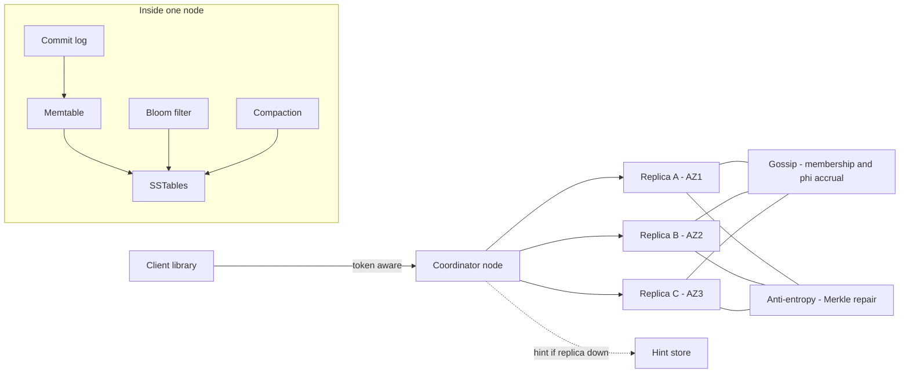
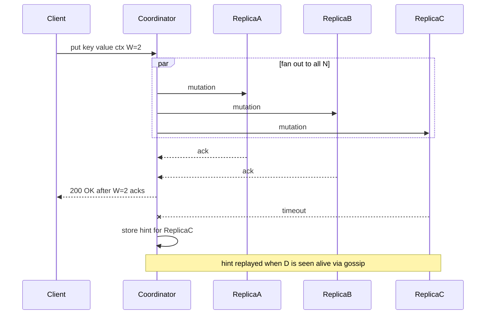
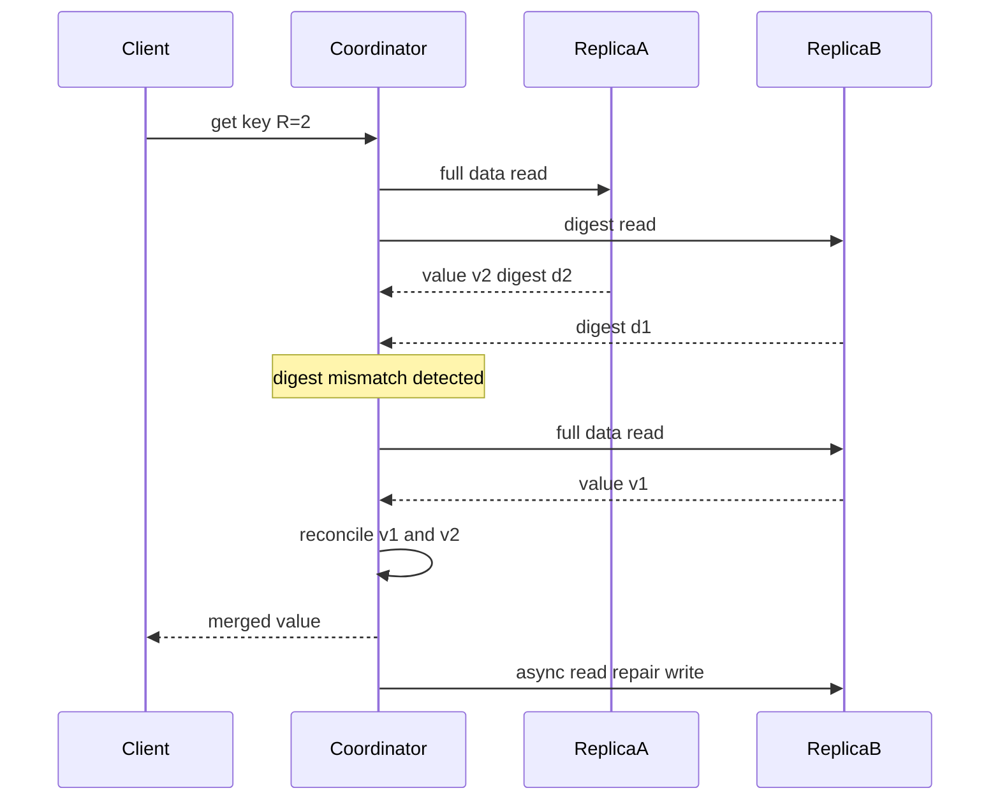
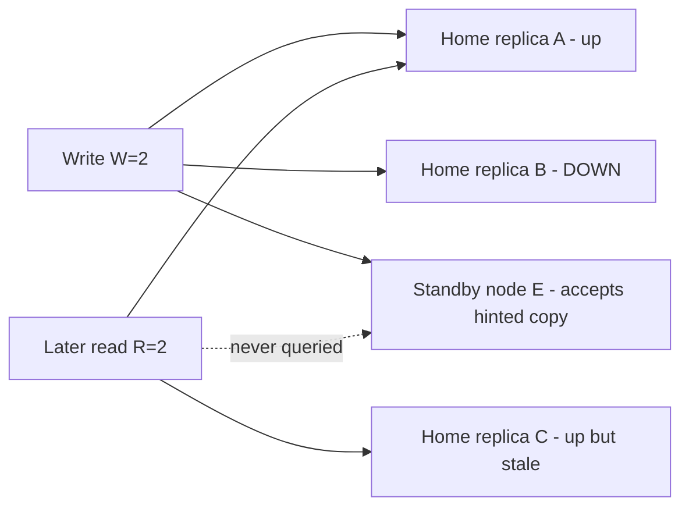
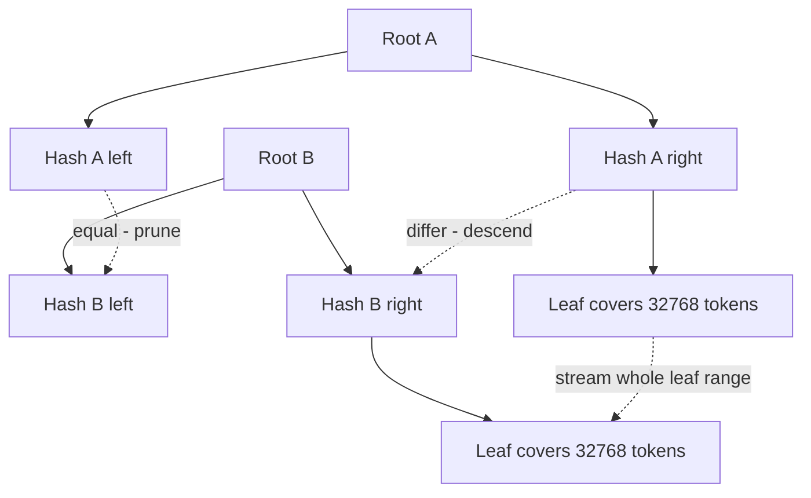

# 05 — Distributed Key-Value Store (Dynamo-style)

<span class="pill pill-core">Core</span> <span class="pill pill-hard">Hard</span>

**A leaderless, always-writable hash table spread over hundreds of machines — the hard part is not storing the data, it is that every node accepts writes, so the system cannot prevent divergence and must instead detect and reconcile it.**

| | |
|---|---|
| **Commonly asked at** | Amazon, Meta, Netflix, Apple, Datadog, Snowflake, Databricks, Confluent |
| **Time budget** | 45 min |
| **Core tension** | Write availability during partition versus a single agreed value per key — you can have one or the other, and choosing availability means shipping conflict resolution to the application |
| **Prerequisites** | [Partitioning & Sharding](../fundamentals/f06-partitioning-sharding.md) · [Replication & Consistency](../fundamentals/f07-replication-consistency.md) · [CAP & PACELC](../fundamentals/f08-cap-pacelc.md) · [Storage Engines](../fundamentals/f13-storage-engines.md) · [Time, Clocks & Ordering](../fundamentals/f20-time-clocks-ordering.md) · [Consensus](../fundamentals/f09-consensus.md) |

## 1. Problem Statement

Build the storage layer that sits under a shopping cart, a session store, a user-profile service, or a feature-flag store. The contract is deliberately narrow:

```text
get(key)            -> value, version_context
put(key, value, ctx) -> ack
delete(key, ctx)     -> ack
```

The interesting constraints are operational, not functional:

- **The write must succeed.** An "add to cart" that returns 503 is lost revenue. Amazon's original framing was that the shopping cart must be writable even when a data centre is on fire and half the ring is unreachable.
- **Nobody is on the critical path.** No leader election per key, no coordinator that can become a single point of failure, no schema migration that requires downtime.
- **Growth is horizontal and incremental.** Adding the 181st node must be a routine, boring operation, not a resharding project.
- **Everything is p99.** A store that is fast on average and 400 ms at p99 will destroy the latency budget of every service that calls it, because a single page view fans out to 50 of these calls and the slowest one defines the response.

The system we are designing is the Dynamo / Cassandra / Riak / Voldemort family: **consistent hashing + leaderless replication + tunable quorums + anti-entropy**. The explicit non-goal is transactions across keys.

!!! note "Why this design shows up in interviews"
    It forces you to reason about a system with **no authority**. There is no leader to ask "what is the current value", no log to replay in order, no lock to take. Every mechanism — quorums, vector clocks, Merkle trees, gossip — exists to compensate for the absence of a single decision-maker. If you can explain why each one is necessary and what it fails to guarantee, you have demonstrated distributed systems depth.

## 2. Requirements

### Functional

| # | Requirement | Notes |
|---|---|---|
| F1 | `get` / `put` / `delete` by opaque binary key | Key ≤ 256 bytes, value ≤ 1 MB (soft cap 64 KB) |
| F2 | Tunable consistency per operation | Caller passes `ONE`, `QUORUM`, `LOCAL_QUORUM`, `ALL` |
| F3 | Conflict surface | `get` may return multiple siblings with a causal context |
| F4 | TTL per item | Expiry handled by the storage engine, not a sweeper job |
| F5 | Conditional write (compare-and-set) | Rare path; served by a separate consensus round, not the quorum path |
| F6 | Partition-local ordered range scan | Ordered on a clustering key **within** a partition only |
| F7 | Full-keyspace scan by token range | For backups, analytics, and re-indexing |

### Non-functional

| # | Requirement | Target |
|---|---|---|
| N1 | Availability for writes | 99.99% measured at the coordinator, including during single-AZ loss |
| N2 | Read latency | p50 ≤ 2 ms, p99 ≤ 10 ms, p99.9 ≤ 40 ms (in-region, 1.5 KB value) |
| N3 | Write latency | p99 ≤ 12 ms at `QUORUM` with N=3 |
| N4 | Durability | ≤ 1 lost item per $10^{11}$ writes; survives loss of any one AZ with zero data loss |
| N5 | Elasticity | Add or remove a node without a client-visible error; bootstrap ≤ 2 h |
| N6 | Convergence | Any two replicas of a key converge within 3 h of the last write, absent further failures |
| N7 | Ops footprint | No manual resharding, no stop-the-world rebalance |

### Explicitly out of scope

| Not doing | Why | What you would use instead |
|---|---|---|
| Multi-key ACID transactions | Requires cross-partition coordination that destroys the availability property | Spanner / CockroachDB / TiKV (Raft per range + 2PC) |
| Secondary indexes with global consistency | A global index is a second partitioning of the same data; keeping it consistent needs a transaction | Application-maintained index tables, or a search cluster |
| Server-side joins or aggregation | Turns a bounded per-key operation into an unbounded one | Export to a columnar warehouse |
| Strict serializability | Directly contradicts leaderless writes | Consensus-per-shard design |
| Cross-region synchronous replication | Adds 60–150 ms to every write | Async replication + per-region `LOCAL_QUORUM` |

## 3. Scale Estimation

Target workload — a large multi-tenant internal store:

$$
\text{keys} = 10^{10}, \quad \overline{\text{value}} = 1.5\ \text{KB}, \quad
\text{peak reads} = 1.2 \times 10^6\ \text{ops/s}, \quad \text{peak writes} = 3 \times 10^5\ \text{ops/s}
$$

**Logical and physical data.**

$$
D_{\text{logical}} = 10^{10} \times 1.5\ \text{KB} = 1.5 \times 10^{13}\ \text{B} = 15\ \text{TB}
$$

$$
D_{\text{replicated}} = 15\ \text{TB} \times N = 15 \times 3 = 45\ \text{TB}
$$

Add per-cell metadata (write timestamp, TTL, row/partition index, Bloom filters) at roughly 25%, and LSM space amplification of ~1.3 under size-tiered compaction:

$$
D_{\text{physical}} = 45 \times 1.25 \times 1.3 \approx 73\ \text{TB}
$$

**Backend operation rate.** A read at `QUORUM` with N=3 sends one full data request and one digest request, plus ~10% speculative retries; a write is sent to all N replicas regardless of W.

$$
\text{ops}_{\text{backend}} = \underbrace{1.2\times10^6 \times 2.2}_{2.64\times10^6\ \text{reads}} + \underbrace{3\times10^5 \times 3}_{9\times10^5\ \text{writes}} = 3.54 \times 10^6\ \text{ops/s}
$$

**Node count.** Budget 30 K mixed ops/s per node to hold p99 (NVMe, LSM reads touching 1–2 SSTables after Bloom filtering):

$$
S_{\text{iops}} = \frac{3.54 \times 10^6}{3 \times 10^4} = 118\ \text{nodes}
$$

Then survive the loss of one AZ out of three — the remaining $2/3$ of the fleet must carry full peak:

$$
S = \frac{118}{2/3} = 177 \rightarrow \mathbf{180\ nodes},\ 60\ \text{per AZ}
$$

**The revealing ratio.** Each node stores $73\ \text{TB} / 180 = 405\ \text{GB}$. On a 7.5 TB NVMe instance that is 5% disk utilisation — **this cluster is IOPS-bound, not capacity-bound**, which is the normal state for an online KV store and the single biggest cost lever (see §10).

**Network.**

$$
B_{\text{internal}} = 3.54\times10^6 \times 1.5\ \text{KB} \approx 5.3\ \text{GB/s} = 42\ \text{Gbps aggregate} \approx 0.24\ \text{Gbps/node}
$$

Cross-AZ write traffic, assuming the coordinator is co-located with one of the three replicas:

$$
B_{\text{xaz}} = 3\times10^5 \times 1.5\ \text{KB} \times 2 = 0.9\ \text{GB/s} \Rightarrow 78\ \text{TB/day at peak}
$$

**Bloom filter memory per node.** Keys per node $= 10^{10} \times 3 / 180 = 1.67 \times 10^8$. At a 1% false-positive rate, 9.6 bits/key:

$$
M_{\text{bloom}} = 1.67\times10^8 \times 9.6\ \text{bits} = 200\ \text{MB/node}
$$

Drop to 0.1% FP and it is 300 MB — cheap, and worth it because every false positive is a wasted disk seek.

| Quantity | Value | Sanity check |
|---|---|---|
| Nodes | 180 across 3 AZs | Sized for AZ loss, not steady state |
| Data per node | 405 GB | Small nodes ⇒ fast bootstrap and repair |
| Peak client ops | 1.5 M/s | 3.54 M/s at the storage layer |
| Aggregate internal network | 42 Gbps | 0.24 Gbps/node — not a constraint |
| Cross-AZ bytes/day (peak rate) | 78 TB | The dominant marginal cost |

## 4. API Design

The wire protocol is binary in production; the HTTP form below is what you sketch on the whiteboard.

```http
GET /v1/keys/cart%3Auser-8891?consistency=QUORUM HTTP/1.1
Host: kv.internal
Accept: application/json
```

```json
{
  "key": "cart:user-8891",
  "siblings": [
    { "value_b64": "eyJpdGVtcyI6W119", "context": "g4VyaWFrAAABkQ==" }
  ],
  "context": "g4VyaWFrAAABkQ==",
  "replicas_responded": 2,
  "coordinator": "10.4.19.7"
}
```

```http
PUT /v1/keys/cart%3Auser-8891 HTTP/1.1
X-KV-Context: g4VyaWFrAAABkQ==
X-KV-Consistency: QUORUM
X-KV-TTL-Seconds: 2592000
Content-Type: application/octet-stream
```

| Aspect | Decision | Rationale |
|---|---|---|
| Versioning | Path prefix `/v1`, plus a byte in the binary frame header | Wire format changes are rolling upgrades; the header byte lets old and new nodes coexist |
| Idempotency | `put` is naturally idempotent under LWW; under vector clocks the **context echo** makes a retry a no-op instead of a new sibling | See [Idempotency](../fundamentals/f11-idempotency.md) |
| Pagination | Partition-local scans use an opaque `page_state` cursor encoding `(last_clustering_key, remaining_page_size)` | Offset paging is impossible on an LSM |
| Full scans | `GET /v1/tokens/{start}/{end}` returns items whose token falls in the half-open range | Lets a batch job parallelise over the ring |
| Conditional write | `PUT ... If-Match: <version>` routed to a Paxos/Raft path, not the quorum path | Explicitly 4–8× slower; documented as such |

### Error codes that actually matter

| Code | Meaning | Client action |
|---|---|---|
| `200` | W replicas acked | Done |
| `202` | Accepted at a *sloppy* quorum — hints outstanding | Same as 200, but note it in metrics; the write is not yet on its home replicas |
| `409` | Siblings returned on read, caller must resolve | Merge and write back with the returned context |
| `412` | CAS precondition failed | Re-read, re-evaluate, retry |
| `429` | Per-partition or per-tenant throttle | Back off with jitter; do **not** retry immediately |
| `503 UnavailableException` | Fewer than W replicas alive *before* the write was attempted | Safe to retry — nothing was written |
| `504 WriteTimeout` | W acks not received in time; **some replicas may have applied it** | Ambiguous. Retry only if the write is idempotent |

!!! gotcha "503 and 504 are not interchangeable, and clients get this wrong"
    `UnavailableException` is raised *before* any mutation is sent — retrying is free. `WriteTimeout` means the mutation was dispatched and an unknown subset of replicas applied it. A client library that lumps them into one `RetryableError` will silently double-apply non-idempotent operations such as counter increments or list appends. Surface them as distinct types and make the caller opt in to retrying timeouts.

## 5. Data Model

**Entities.**

```text
Item := (partition_key, clustering_key?, value, write_time, ttl?, tombstone?, causal_context)
```

The causal context is either a **vector clock** (Dynamo, Riak) or a **per-cell wall-clock timestamp** (Cassandra LWW). That single choice propagates through the whole design; §7.3 covers it.

Concrete schema for the cart use case, expressed in CQL because it makes the partition/clustering split explicit:

```sql
CREATE TABLE cart (
    user_id     uuid,          -- partition key: determines the token, hence the node
    item_id     uuid,          -- clustering key: ordered WITHIN the partition
    qty         int,
    added_at    timestamp,
    PRIMARY KEY ((user_id), item_id)
) WITH CLUSTERING ORDER BY (item_id ASC)
  AND compaction = { 'class': 'LeveledCompactionStrategy' }
  AND gc_grace_seconds = 259200          -- 3 days: must exceed max repair interval
  AND default_time_to_live = 2592000;    -- 30 days
```

### Access patterns

| # | Pattern | Frequency | Shape | Served by |
|---|---|---|---|---|
| A1 | Read one item by key | 1.2 M/s | Point lookup | Partition key → token → preference list |
| A2 | Write/overwrite one item | 300 K/s | Point write | Same |
| A3 | Read all items in a partition | 90 K/s | Ordered scan within one partition | Clustering key order inside one SSTable set |
| A4 | Delete an item | 20 K/s | Tombstone write | Same as A2 |
| A5 | Scan the entire keyspace | 2/day | Token-range parallel scan | Ring-order iteration by batch job |
| A6 | Find items by a non-key attribute | — | Not supported | Application-maintained inverted table |

### Store choice

| Option | Verdict | Why |
|---|---|---|
| **Leaderless quorum store on LSM (chosen)** | **Chosen** | Writes are append-only and survive any single-node loss with no failover step; ring membership changes are incremental; every access pattern above is a point or partition-local operation |
| Sharded MySQL with async replicas | Rejected | Every shard has a leader; leader failure means 10–30 s of write unavailability for $1/S$ of the keyspace, and resharding is a project |
| Raft group per shard (TiKV / CockroachDB style) | Rejected *for this contract* | Gives linearizability, but a write requires a live leader plus a majority — a partition that isolates the leader stalls writes. Correct choice if the requirement were "no siblings, ever" |
| Redis Cluster | Rejected | Memory cost at 15 TB logical is prohibitive; failover is not seamless; durability is best-effort |
| B-tree store (InnoDB) as the engine | Rejected | Random-write amplification at 300 K writes/s on 4 KB pages; LSM converts random writes to sequential ones. See [Storage Engines](../fundamentals/f13-storage-engines.md) |

## 6. High-Level Architecture



### Write path

1. The client library hashes the partition key with MurmurHash3 to a 64-bit token and looks up the **preference list** — the first N distinct-rack nodes clockwise from that token — using its local copy of the ring. It sends the write directly to one of them, so the coordinator is usually also a replica (zero extra hop).
2. The coordinator forwards the mutation to **all N** replicas in parallel, regardless of W. Sending to only W would guarantee that the other replicas are permanently stale.
3. Each replica appends to the commit log (`fsync` batched, ~10 ms window or per-write depending on config), applies to the memtable, and acks.
4. The coordinator returns success as soon as **W** acks arrive. Late acks are ignored; the write is already durable on W nodes.
5. If a replica is down, the coordinator stores a **hint** locally and returns success anyway if the remaining acks reach W (or, under a sloppy quorum, sends the write to the next healthy node on the ring).



### Read path

1. Coordinator picks the **closest** replica by the dynamic snitch (a rolling p99 latency estimate per peer, blended with AZ locality) and sends it a full data read.
2. It sends **digest** reads (a hash of the value plus its version metadata) to the remaining $R-1$ replicas. Digests are ~32 bytes, so cross-AZ read bytes stay small.
3. If all digests match the data response, return immediately.
4. On mismatch: issue full reads to the disagreeing replicas, reconcile (vector-clock merge or highest-timestamp wins), return the merged value, and asynchronously write the reconciled value back — **read repair**.
5. If the chosen replica does not answer within the speculative-retry threshold (typically p99 of that replica's recent latencies), fire a redundant read at another replica and take whichever returns first.



## 7. Deep Dives

### 7.1 Consistent hashing, virtual nodes, and the load-variance math

Naive consistent hashing places one token per node on a $2^{64}$ ring. Each node owns the arc from the previous token to its own. With $S$ nodes and uniformly random tokens, arc lengths follow an exponential distribution: the coefficient of variation of a node's share is $1$ — meaning it is entirely ordinary for one node to own 3× the mean.

Assign $V$ **virtual nodes** (tokens) per physical node and each node's share is the sum of $V$ independent exponential arcs. The sum of $V$ i.i.d. exponentials is Erlang-distributed, so:

$$
\frac{\sigma}{\mu} = \frac{1}{\sqrt{V}}
$$

| $V$ | CV of load | Practical max/mean over 180 nodes |
|---|---|---|
| 1 | 100% | 5–6× |
| 16 | 25% | ~1.9× |
| 64 | 12.5% | ~1.45× |
| 256 | 6.25% | ~1.22× |
| 1024 | 3.1% | ~1.11× |

More vnodes is not free:

- **Repair fan-out.** With $V$ tokens, each node shares data with up to $V \times (N-1)$ distinct peers. A full repair with $V=256$, $N=3$, $S=180$ touches essentially the whole cluster, and one slow node stalls it.
- **Availability under multi-node failure.** With random tokens and high $V$, the chance that some replica set loses all N members rises sharply — with $V=256$ almost every pair of nodes shares at least one range, so any two simultaneous failures degrade *some* range to N−1 and any three risk data unavailability.
- **Gossip and ring-state size.** $S \times V$ tokens must be gossiped and kept sorted in every client.

=== "Random tokens, high V"

    Cassandra ≤ 3.x default (`num_tokens: 256`). Balanced by the law of large numbers, terrible for repair fan-out and multi-failure survivability. Bootstrap streams from many peers, so it is fast.

=== "Few tokens with allocation algorithm"

    Cassandra 4.x default (`num_tokens: 16` + `allocate_tokens_for_local_replication_factor: 3`). New tokens are chosen to *minimise* the variance of the resulting ownership rather than at random, achieving ~10% variance with 16 tokens. This is the modern answer.

=== "Fixed Q partitions"

    Dynamo "strategy 3": divide the ring into $Q$ equal partitions ($Q \gg S$, e.g. 4096) and assign $Q/S$ partitions to each node. Ownership is exact, partition boundaries never move, and rebalancing is a pure assignment problem. This is what Riak and most modern designs do — and it makes the Merkle-tree-per-partition model clean, because partition boundaries are stable.

!!! tip "The senior answer"
    Say "virtual nodes, and I would use fixed-Q partitioning rather than random tokens, because stable partition boundaries make anti-entropy and rebalancing tractable — random tokens give you balance at the cost of every operational procedure."

### 7.2 Preference lists, rack awareness, and what quorums actually guarantee

Walking the ring clockwise for N nodes can land all three replicas in one rack or one AZ. The preference list must **skip** candidates whose rack is already represented:

```python
def preference_list(ring, token, n, replication_per_az):
    chosen, seen_per_az = [], {}
    for node in ring.walk_clockwise(token):      # yields vnode owners in order
        if node in chosen:                        # a physical node can own many vnodes
            continue
        if seen_per_az.get(node.az, 0) >= replication_per_az.get(node.az, 0):
            continue
        chosen.append(node)
        seen_per_az[node.az] = seen_per_az.get(node.az, 0) + 1
        if len(chosen) == n:
            return chosen
    return chosen   # fewer than N: cluster is under-provisioned for this policy
```

**Quorum arithmetic.** With N replicas, R read acks, W write acks:

$$
R + W > N \implies \text{every read set intersects every write set}
$$

$$
W > N/2 \implies \text{no two concurrent writes can both succeed on disjoint majorities}
$$

| Config | R+W>N | Read latency | Write latency | Fails when |
|---|---|---|---|---|
| N=3, W=3, R=1 | Yes | Fastest | Slowest | Any replica down blocks writes |
| N=3, W=2, R=2 | Yes | Balanced | Balanced | Two replicas down |
| N=3, W=1, R=1 | **No** | Fastest | Fastest | Reads routinely miss recent writes |
| N=3, W=1, R=3 | Yes | Slow | Fastest | Any replica down blocks reads |
| N=5, W=3, R=3 | Yes | Balanced | Balanced | Tolerates 2 failures — use for critical data |

!!! danger "R + W > N does not give you linearizability"
    The intersection property guarantees the read set *contains* a replica that saw the latest completed write. It does **not** give: (a) atomicity of the write across replicas — a write that reaches 1 of 3 and then the coordinator dies is neither committed nor rolled back, and a later read repair may promote it to "committed"; (b) monotonic reads across coordinators; (c) any ordering for concurrent writes. Quorums give you *staleness bounds*, not consensus. If you need linearizability, you need a consensus round per operation ([Consensus](../fundamentals/f09-consensus.md)).

**Sloppy quorum.** When a home replica is unreachable, the coordinator sends the write to the next healthy node on the ring instead, and counts its ack toward W. The write succeeds — but the ack came from a node that is *not in the preference list*, so a subsequent read that queries the preference list can miss it entirely.



Both W=2 and R=2 were satisfied, $R+W>N$ held, and the read still returned a stale value. **Sloppy quorum trades the intersection property for write availability.** Say this explicitly in an interview; most candidates recite `R+W>N` without noticing that the sloppy variant voids it.

### 7.3 Conflict resolution: vector clocks vs LWW vs CRDT

Two clients write concurrently to different coordinators during a partition. Both writes succeed. Now there are two values. Something must decide.

=== "Vector clocks"

    Each write carries a set of `(node_id, counter)` pairs. A clock $V_1$ dominates $V_2$ if every counter in $V_1$ is ≥ the corresponding counter in $V_2$. If neither dominates, the writes are **concurrent** and both are retained as siblings, returned to the client on read.

    ```text
    put(k, v1) at node A  ->  clock { A:1 }
    put(k, v2) at node B  ->  clock { B:1 }        # concurrent, neither dominates
    read(k) -> siblings [v1, v2], ctx { A:1, B:1 }
    client merges -> put(k, v_merged, ctx)  ->  clock { A:1, B:1, C:1 }   # dominates both
    ```

    - **Correct**: never silently loses a write.
    - **Costly**: the clock grows with the number of distinct coordinators that ever wrote the key. Dynamo truncates at 10 entries with an LRU timestamp — which can make two causally related clocks look concurrent, producing false siblings.
    - **Sibling explosion**: a client that reads-modifies-writes without echoing the context creates a new sibling every time. A cart under a retry storm can reach thousands of siblings; each read then transfers megabytes and the partition becomes a latency bomb. **Dotted version vectors** fix the specific case where one coordinator writes multiple times for the same client, keeping sibling count proportional to actual concurrency rather than write count.

=== "Last-write-wins"

    Each cell carries a wall-clock microsecond timestamp; on conflict, the higher timestamp wins. Cassandra does this at *cell* granularity, so two writers touching different columns of the same row both survive.

    - **Free**: 8 bytes per cell, no siblings, no client-side merge logic, no unbounded metadata.
    - **Lossy by design**: if node clocks differ by 200 ms, a write issued *later* in real time can lose to an earlier one. NTP with a step correction can move a clock backwards and make new writes invisible until wall-clock catches up.
    - **The delete/write tie**: a delete and a write with identical timestamps resolve by a deterministic tiebreak (deletion wins in Cassandra), which can make a legitimate write vanish.

=== "CRDT"

    Encode the value in a type whose merge is commutative, associative, and idempotent — G-counter, PN-counter, OR-set, LWW-register-set, RGA for sequences. Merge is automatic and always correct.

    - **No siblings, no client merge, no lost updates.** Riak Data Types and Redis CRDT productise this.
    - **Metadata cost**: an OR-set stores a unique tag per element addition, and removed-element tombstones must be retained until causal stability is proven. A set with heavy churn grows without bound unless you run a causal-stability protocol.
    - **Only works if the semantics fit.** A shopping cart maps beautifully onto an OR-set. A bank balance does not — "add 10" and "add 10" concurrently is fine for a counter but you cannot express "withdraw if balance ≥ 10" as a CRDT.

| Strategy | Write lost silently? | Metadata growth | Client complexity | Chosen |
|---|---|---|---|---|
| Vector clocks + client merge | No | O(coordinators) per key | High — must merge | Chosen for cart-like semantic data |
| LWW per cell | Yes, under clock skew | O(1) — 8 bytes | None | Chosen for profile/session data where last write really is intended |
| CRDT | No | O(operations) until stability | Low | Chosen for counters, sets, flags |
| Application-level "read then CAS" | No | O(1) | Very high, and slow | Rejected — needs consensus per write |

!!! gotcha "LWW plus a 200 ms clock skew is a silent data-loss machine"
    Symptom: a user updates their profile, sees the change, refreshes, and the old value is back — permanently, not transiently. Mechanism: the coordinator for the second write had a clock 200 ms *behind*, so the newer write carries a lower timestamp and loses at compaction time. Nothing is logged, no error is raised, and repair propagates the *wrong* value everywhere. Mitigation: monitor per-node clock offset as a first-class SLI, page above 50 ms drift, use `chrony` with multiple stratum-2 sources, and prefer client-supplied monotonic timestamps for hot single-writer keys.

### 7.4 Anti-entropy: Merkle trees, hinted handoff, read repair

Three independent mechanisms push replicas toward convergence, and they cover different holes:

| Mechanism | Triggers on | Covers | Does **not** cover |
|---|---|---|---|
| Read repair | A read that sees a digest mismatch | Frequently-read keys | Anything nobody reads — cold data diverges forever |
| Hinted handoff | Replica unreachable at write time | Short outages within the hint window | Coordinator crash (hints die with it), outages longer than the window, hint-store overflow |
| Merkle anti-entropy repair | Scheduled, or after a node returns | Everything | Nothing — but it is expensive and slow |

**Hinted handoff guarantees nothing.** The hint lives on the coordinator's disk. If the coordinator dies before replaying it, the hint is gone. If the target stays down past `max_hint_window_in_ms` (default 3 h), hints stop being collected and are discarded. If write volume during the outage exceeds the hint store, hints are dropped. So hinted handoff is a **latency optimisation for repair**, not a durability mechanism. The only thing that actually guarantees convergence is a completed repair.

**Merkle trees.** Each replica builds a binary hash tree over a token range: leaves hash the rows in a sub-range, internal nodes hash their children. Two replicas exchange root hashes; if they differ, they descend only into differing subtrees. Comparison cost is $O(\text{differences} \times \log(\text{leaves}))$ instead of $O(\text{rows})$.



The cost model that matters:

- **Building the tree requires reading the data.** A 405 GB node at 300 MB/s of repair-throttled read is ~22 minutes of pure I/O per full repair pass, competing with live traffic.
- **Leaf granularity causes over-streaming.** With $2^{15}$ leaves over a range holding 100 M rows, each leaf covers ~3,000 rows. One divergent row streams all 3,000. A node that was down for an hour and missed 1 M scattered writes can trigger tens of GB of streaming.
- **Repair must complete within `gc_grace_seconds`.** Otherwise deleted data resurrects (see §12).
- **Incremental repair** marks repaired SSTables so subsequent passes skip them — but it historically caused SSTable-pool fragmentation and mis-marked data on failure. **Subrange repair** (repair one token range at a time, scripted, continuously) is the boring, reliable production answer.

### 7.5 Gossip membership and phi-accrual failure detection

Every second, each node picks a small random set of peers and exchanges a digest of `(node, generation, version)` state; differences are reconciled. Information spreads in $O(\log S)$ rounds — for 180 nodes with fanout 3, full propagation in roughly 5–6 seconds.

Binary failure detectors force an impossible choice: a short timeout produces false positives during a GC pause; a long one delays failover. **Phi-accrual** outputs a suspicion level instead. Maintain a sliding window of heartbeat inter-arrival times, fit a distribution, and compute:

$$
\varphi(t_{\text{now}}) = -\log_{10}\bigl(P_{\text{later}}(t_{\text{now}} - t_{\text{last}})\bigr)
$$

where $P_{\text{later}}(\Delta)$ is the probability that a heartbeat arrives more than $\Delta$ after the previous one, given the observed distribution. $\varphi = 8$ means "the chance we are wrong to call this node down is about $10^{-8}$".

```python
import math

def phi(now_ms, last_hb_ms, window_mean_ms, window_stddev_ms):
    delta = now_ms - last_hb_ms
    # exponential approximation: P(arrival later than delta)
    p_later = math.exp(-delta / max(window_mean_ms, 1.0))
    return -math.log10(max(p_later, 1e-300))
```

The property that matters operationally: **the threshold adapts to the network**. On a congested link where heartbeats normally arrive every 1.5 s with 400 ms jitter, a 3-second gap yields low $\varphi$ and no false alarm; on a quiet link where they arrive every 1.0 s ± 20 ms, the same 3-second gap yields high $\varphi$ and prompt detection.

!!! warning "A long GC pause looks exactly like a dead node — because it is one"
    A 12-second stop-the-world pause makes the node unresponsive to heartbeats *and* to reads. Phi-accrual will mark it down, peers will start hinting, and when it resumes it will find itself marked down, flush a backlog, and trigger a second pause. Tune the JVM (or use an off-heap/native store) before tuning the failure detector.

### 7.6 The storage engine and range scans

Underneath every node is an LSM tree: commit log → memtable → immutable SSTables → compaction. See [Storage Engines](../fundamentals/f13-storage-engines.md) for the general model; here is what the KV layer must care about.

| Compaction strategy | Write amp | Read amp | Space amp | Use when |
|---|---|---|---|---|
| Size-tiered (STCS) | ~4× | High — many SSTables per read | Up to 2× transiently | Write-heavy, whole-row overwrites |
| Leveled (LCS) | ~10–20× | Low — ~1 SSTable per level | ~1.1× | Read-heavy, partial-row updates, tight p99 |
| Time-windowed (TWCS) | ~2× | Low for time-range reads | ~1.1× | Strictly TTL'd time-series; never overwrite |

**Range scans on a hash-partitioned store.** Hashing the partition key destroys global ordering. Consequences:

- `WHERE user_id > 'x'` is **not** a range scan — it is a full-ring scan with a filter, and it must be refused or explicitly opted into.
- Ordering exists only *within* a partition, via clustering keys. Design the partition key so that everything you need in order lives inside one partition.
- Global ordered iteration requires either an order-preserving partitioner (which reintroduces hotspots — the reason it was abandoned) or a separate ordered index table.
- Analytics scans should iterate **token ranges in parallel**, one task per range, reading at `LOCAL_ONE` to avoid multiplying load by R:

```python
SPLITS = 4096
step = (2**64) // SPLITS
for i in range(SPLITS):
    start = -2**63 + i * step
    end   = start + step
    yield f"SELECT * FROM cart WHERE token(user_id) >= {start} AND token(user_id) < {end}"
```

## 8. Scaling the Bottleneck

The bottleneck is **not** capacity, throughput, or network. It is the **coupling between node count and repair/rebalance cost**, plus **hot partitions**, which no amount of sharding fixes.

### Adding and removing nodes

| State | Serves reads? | Serves writes? | Transition trigger |
|---|---|---|---|
| `JOINING` | No | No | Operator adds the node; it claims tokens and gossips its intent |
| `BOOTSTRAPPING` | No | **Yes** — for its future ranges, in addition to current owners | Streaming starts from the current owners |
| `NORMAL` | Yes | Yes | Streaming complete; old owners still hold the data until `cleanup` |
| `LEAVING` | Yes | Yes | Operator decommission; streams its ranges to the new owners |
| `DOWN` | No | No — coordinator stores hints | Phi-accrual threshold exceeded |
| `REPLACING` | No | Yes | Started with `replace_address`; rebuilds a dead node's ranges from peers |

While a node bootstraps it is a **write target but not a read target**: writes for its future ranges are sent to it *in addition to* the current owners, so that when streaming finishes it is already caught up on new mutations. The moment it flips to `NORMAL`, the old owner still holds the data — it must be `cleanup`ed to reclaim disk, which is a full compaction pass.

Bootstrap time is the key operational number: $405\ \text{GB} / 200\ \text{MB/s} \approx 34$ minutes of streaming, spread across many source nodes. This is the payoff for small nodes. A design with 20 nodes × 3.6 TB each would take 5+ hours per bootstrap and hold a much larger fraction of the ring degraded during it.

!!! danger "Never bootstrap two nodes at once with random tokens"
    Two simultaneously joining nodes can claim overlapping ranges and each stream from the *pre-existing* owner without knowing about the other. The result is ranges with fewer than N live copies, and in the worst case data that exists only on a node that is subsequently decommissioned. Add nodes one at a time, waiting for `Normal` state plus a settle period. The fixed-Q partition scheme removes this hazard, which is another reason to prefer it.

### Hot partitions

Consistent hashing distributes *keys*. It cannot distribute *one* key. A celebrity user, a viral product ID, or a monotonically increasing bucket key sends 100% of its traffic to exactly N nodes, and no rebalance helps.

| Mitigation | Mechanism | Cost |
|---|---|---|
| Key salting | Write to `key#{0..k}`, read all k and merge | Read amplification ×k; needs the app to know a key is hot |
| Dynamic replication | Detect heavy hitters with a count-min sketch at the coordinator; replicate that key to $N' \gg N$ nodes and read at `ONE` | Extra write cost for hot keys only; needs a hot-key control plane |
| Client-side cache with short TTL | 200 ms TTL absorbs 99% of reads on a key served 50 K/s | Staleness window; cache stampede on expiry — use request coalescing |
| Per-partition rate limits | Reject beyond X ops/s/partition with 429 | Protects the cluster, moves the problem to the caller. See [Rate Limiting](../fundamentals/f17-rate-limiting-load-shedding.md) |
| Fix the key design | Bucket by `(entity, time_window)` or add a random suffix | Only possible before launch |

The detection side matters as much as the mitigation: emit **per-partition** request counters sampled through a heavy-hitters sketch, not just per-node counters. Per-node metrics show "node 41 is hot" and send you hunting for a hardware fault when the real answer is one key.

## 9. Failure Modes

| Failure | Blast radius | Detection | Mitigation | Degraded behaviour |
|---|---|---|---|---|
| Single node crash | ~$1/S$ of ranges at N−1 | Phi-accrual within ~5 s; gossip propagates in ~6 s | Coordinator routes to remaining replicas; hints accumulate | None visible at `QUORUM`; `ALL` reads fail |
| Whole AZ loss | 1/3 of replicas for every key | AZ health metrics, mass phi-accrual trips | `LOCAL_QUORUM` in surviving AZs; cluster was sized for 2/3 capacity | Elevated latency; `EACH_QUORUM` unavailable |
| Network partition splitting the ring | Both sides accept writes | Gossip shows disjoint membership views | Both sides keep serving; siblings created and merged later | Divergence — reconciliation on heal |
| Coordinator dies mid-write after 1 of 3 acks | One key | `WriteTimeout` at client | Partial write is neither committed nor rolled back; read repair may later promote it | Client cannot tell whether the write took |
| Hint store overflows or window expires | Ranges written during the outage | `HintsDropped` metric, hint directory size | Full repair required before the node is trusted | Silent staleness until repair |
| Repair not run within `gc_grace_seconds` | Deleted rows on any replica that missed the tombstone | Repair-age metric per keyspace | Run subrange repair continuously; alert on `time_since_last_repair` | **Deleted data resurrects** |
| Clock skew > 50 ms with LWW | Any key written from the skewed node | NTP offset metric | Page and drain the node from coordinator duty | Silent lost updates |
| Compaction falls behind | One node's read latency, then the whole p99 via fan-out | Pending compactions gauge, SSTable count per read | Throttle writes to that node, increase compaction throughput, temporarily remove from read set | Read amplification climbs, p99 blows out |
| Long GC pause | One node, ~10 s | Phi-accrual + GC pause histogram | Speculative retry hides it from clients | Occasional p99.9 spikes |
| Tombstone-heavy partition | One partition, then the coordinator's heap | Tombstone-scanned histogram, `TombstoneOverwhelming` errors | Reject the query, fix the access pattern, `TWCS` + TTL | Read of that partition fails outright |
| Hot partition | N nodes saturated, cluster-wide latency via shared coordinators | Per-partition heavy-hitters sketch | Cache, salt, dynamic replication, 429 | Throttled tenant |
| Two nodes bootstrapped concurrently | Overlapping range ownership | Ring inspection; often found only after data loss | One-at-a-time procedure enforced by automation | Potential permanent data loss |

## 10. SRE Lens

### SLIs and SLOs

| SLI | Definition | SLO |
|---|---|---|
| Read availability | Non-5xx coordinator responses / total reads, per minute | 99.99% over 28 d |
| Write availability | Same for writes | 99.995% over 28 d — writes are the product requirement |
| Read latency | p99 of coordinator-observed read duration, 1.5 KB values | ≤ 10 ms over 28 d |
| Write latency | p99 at `LOCAL_QUORUM` | ≤ 12 ms |
| Convergence | max over keyspaces of `time_since_successful_repair` | ≤ 3 h; hard alert at 24 h |
| Durability | Rows lost per $10^{11}$ writes, measured by a continuous checksum canary | ≤ 1 |

**Error budget.** 99.99% over 28 days = $0.0001 \times 28 \times 24 \times 60 = 4.03$ minutes. A single unplanned full-AZ failover that costs 90 seconds of elevated errors consumes 37% of the month's budget. That number is the argument for the AZ-loss headroom in §3 — you cannot buy back the budget after the fact.

**Canary for durability.** Write a known key per token range every minute with a checksum; read it back at `ALL` from a separate probe fleet; alert on mismatch. This detects silent LWW loss and repair gaps that no server-side metric will show you.

### Rollout plan

Stages: build and unit tests → one canary node → one rack in one AZ → full AZ 1 → AZ 2 → AZ 3, with automatic rollback if the availability or latency SLI starts burning budget at the canary or rack stage.

Rules that are non-negotiable:

- **One rack at a time, never more.** With N=3 and rack-aware placement, restarting a whole rack takes exactly one replica of every key offline — `QUORUM` still works. Restarting two racks takes two, and `QUORUM` fails for everything.
- **Drain before restart**: stop accepting new coordinator work, flush the memtable, then restart. A cold restart replays the commit log and can take minutes with a large memtable.
- **Bake time ≥ one full compaction cycle**, because storage-engine bugs surface at compaction, not at write time.
- Mixed-version clusters must be supported for the length of the rollout; never run schema changes during one. See [Deployment & Release Safety](../fundamentals/f25-deployment-release-safety.md).

### Runbook notes

```bash
# Is the ring healthy and balanced?
nodetool status | awk '{print $1, $2, $6, $8}'      # state, load, owns, rack

# What is actually slow: disk, compaction, or GC?
nodetool tpstats            # dropped MUTATION/READ counters => overload, not network
nodetool compactionstats    # pending > 100 sustained => losing the compaction race
nodetool proxyhistograms    # coordinator-level p99, the number clients feel

# Node was down longer than the hint window: repair its ranges only.
nodetool repair -pr -st <start_token> -et <end_token> <keyspace>

# Emergency: take a node out of the read path without decommissioning it.
nodetool disablebinary && nodetool disablethrift   # stops it coordinating
```

### Capacity model

$$
S_{\text{required}} = \max\left(
\underbrace{\frac{\text{ops}_{\text{backend}}}{\text{ops per node}} \cdot \frac{1}{1 - f_{\text{az}}}}_{\text{throughput}},\ \
\underbrace{\frac{D_{\text{physical}}}{\text{usable bytes per node}}}_{\text{capacity}}
\right)
$$

with $f_{\text{az}} = 1/3$. Usable bytes per node must assume ≤ 60% disk fill, because size-tiered compaction needs room to write the merged output before deleting the inputs. Alert at 55%; a node at 85% cannot compact and will spiral.

### Cost

| Line item | Monthly (order of magnitude) | Lever |
|---|---|---|
| 180 × storage-optimised instances | $190 K | Move to compute-optimised + smaller NVMe: this cluster uses 5% of its disk |
| Cross-AZ replication traffic | $19 K at 40% average utilisation | Cannot remove without giving up AZ-fault tolerance; reduce by compressing mutations |
| Backups to object storage | $8 K | Incremental snapshots + lifecycle to infrequent-access. See [Object Storage](../fundamentals/f15-object-storage.md) |
| Repair I/O | Indirect — forces ~20% headroom | Continuous subrange repair smooths it instead of nightly spikes |

The single highest-leverage observation: **the fleet is provisioned for IOPS and pays for 810 TB of NVMe to store 73 TB.** Switching to instances with the same CPU/network but a third of the disk cuts the bill materially with no performance change. Interviewers love this because it shows you read the utilisation numbers rather than the spec sheet. See [Cost Engineering](../fundamentals/f28-cost-engineering.md).

## 11. Trade-offs & Alternatives

| Dimension | Choice | Alternative | When the alternative wins |
|---|---|---|---|
| Coordination | Leaderless quorums | Raft group per shard | You need read-your-writes and linearizable CAS more than you need partition-time writes |
| Conflict handling | Siblings + client merge | LWW | The data is genuinely last-writer-intended and clock discipline is good |
| Partitioning | Fixed Q partitions | Random vnodes | Never, in my opinion — random tokens only win on bootstrap parallelism |
| Engine | LSM | B-tree | Read-dominated with in-place updates and no write-amplification concern |
| Repair | Continuous subrange | Nightly full repair | Small clusters where a nightly window exists |

### At 10× scale (1,800 nodes, 150 TB logical)

- **Gossip stops scaling.** $O(S)$ ring state in every client and $O(S \log S)$ gossip traffic; ring updates take tens of seconds to converge. Move to a separate membership service backed by a small Raft group, with clients subscribing to ring versions.
- **Full repair becomes impossible.** Never repair the cluster; repair token ranges on a rolling schedule with a scheduler that tracks per-range repair age as a first-class SLI.
- **Multi-region becomes mandatory**, which means `LOCAL_QUORUM` per region plus async cross-region replication, and conflict resolution now spans regions where clock skew is worse. See [Multi-Region & DR](../fundamentals/f26-multi-region-dr.md).
- **Tenancy isolation** becomes the top operational problem: one tenant's hot partition degrades everyone. You need per-tenant quotas at the coordinator and probably separate rings for the largest tenants.

### At 1/10 scale (18 nodes, 1.5 TB logical)

- 15 TB of data on 18 nodes is 83 GB/node — **buy RAM instead**. A three-node replicated Redis or a single Postgres primary with two replicas serves 150 K ops/s and gives you transactions, secondary indexes, and joins for free.
- The honest interview answer: "at this scale I would not build this. The Dynamo design pays a large complexity tax — siblings, repair, gossip — that only makes sense when a single-leader system can no longer hold the write rate or the failure domain."
- If you keep the leaderless design anyway, drop to N=3, W=2, R=2 on a single AZ, skip anti-entropy scheduling and just repair nightly.

## 12. Gotchas & Corner Cases

!!! gotcha "Zombie deletes: repair later than `gc_grace_seconds` resurrects data"
    **Symptom.** A row a user deleted three weeks ago reappears after a node returns from a long outage. **Mechanism.** Deletes are tombstones, not removals. After `gc_grace_seconds` (default 10 days, often lowered to 3), compaction physically purges the tombstone. If a replica was down when the delete happened and comes back *after* the purge, it still holds the original row; the surviving replicas hold nothing at all, and "nothing" loses to "a row" during read repair — so the deleted row is replicated back to everyone. **Mitigation.** `gc_grace_seconds` must be strictly greater than your worst-case repair interval, enforced by an alert on `max(time_since_repair) / gc_grace_seconds > 0.5`. If a node is down longer than the grace period, do not restart it — wipe it and rebuild it as a replacement node.

!!! gotcha "Sloppy quorum silently voids the R + W > N guarantee"
    **Symptom.** A read at `QUORUM` returns a value older than a write that returned 200, with no failures reported anywhere. **Mechanism.** The write's second ack came from a fallback node outside the preference list; the read only queries the preference list. **Mitigation.** Return `202` rather than `200` when any ack came from a non-home replica, expose a `sloppy_write_ratio` SLI, and if the application genuinely requires read-your-writes, use `ALL` or a consensus path for those keys — do not pretend the quorum math covers it.

!!! gotcha "Hints die with the coordinator that holds them"
    **Symptom.** After a coordinator's disk fails, some keys are permanently stale on one replica and nothing reports an error. **Mechanism.** Hints are local files on the coordinator; there is no replication of hints. Losing the coordinator loses every un-replayed hint. **Mitigation.** Treat hinted handoff purely as an optimisation; the correctness mechanism is repair. Alert on `hints_delivered` dropping to zero while `hints_created` is non-zero — that means the replay path is stuck, not that the cluster is healthy.

!!! gotcha "Vector clock truncation manufactures false conflicts"
    **Symptom.** A key that only one client ever writes starts returning siblings. **Mechanism.** Dynamo caps the clock at 10 `(node, counter)` entries and evicts the oldest by timestamp. Once an entry is evicted, a clock that genuinely dominates another can no longer be proven to dominate, so both are kept as concurrent. Under a coordinator-churning load balancer, every key eventually accumulates more than 10 coordinators. **Mitigation.** Pin a client to a coordinator per key (token-aware routing does this naturally), or use dotted version vectors, whose size is bounded by actual concurrent client count rather than coordinator count.

!!! gotcha "Sibling explosion turns one key into a multi-megabyte read"
    **Symptom.** p99 read latency for one tenant is 4 seconds; the coordinator's heap is full of one partition. **Mechanism.** A client retries a failing write in a loop without echoing the causal context. Each attempt is concurrent with all previous ones, so each creates a new sibling. 5,000 siblings × 1.5 KB = 7.5 MB returned on *every read* of that key, and each read must deserialise all of them. **Mitigation.** Hard-cap siblings per key at the server (reject writes beyond, say, 100 siblings with a 429), alert on sibling-count histograms, and make the client library refuse to write without a context on a key that already has siblings.

!!! gotcha "Using the store as a queue destroys it with tombstones"
    **Symptom.** `SELECT * FROM queue WHERE shard = 7 LIMIT 10` starts timing out; the tombstone-scanned histogram shows 300,000 tombstones per read. **Mechanism.** Insert-then-delete workloads leave a tombstone per deleted row *in the same partition*. A range read must scan and discard every tombstone before the grace period purges them. Reading 10 live rows can require scanning a quarter-million tombstones. **Mitigation.** Do not build queues on a KV store — use a log ([Queues & Streams](../fundamentals/f12-queues-streams.md)). If you must, use TWCS with per-row TTL and time-bucketed partitions so whole SSTables expire and drop without ever being read.

!!! gotcha "Counters are not idempotent, and every retry double-counts"
    **Symptom.** View counts drift upward by 2–5% versus the source-of-truth log. **Mechanism.** A counter increment is a relative mutation. A `WriteTimeout` means "unknown"; the client retries; the increment applies twice. There is no way to make this safe with a distributed counter that does not store per-request identity. **Mitigation.** Never retry a counter write on timeout. Better: do not use distributed counters — write immutable event rows with a unique event ID and aggregate in a stream job, which is idempotent by construction.

!!! gotcha "Read repair writes at a different consistency level than the read"
    **Symptom.** A read at `ONE` mysteriously increases write load and can *undo* a recent delete. **Mechanism.** Blocking read repair issues a write of the reconciled value back to lagging replicas. If the reconciliation chose a stale-but-higher-timestamp value (LWW plus clock skew), read repair actively propagates the wrong value to healthy replicas — it converts a localised inconsistency into a cluster-wide one. **Mitigation.** Keep clock discipline tight, prefer digest-mismatch repair over probabilistic repair, and understand that read repair amplifies whichever value the conflict resolver picked, correct or not.

!!! gotcha "Speculative retry becomes a retry storm under load"
    **Symptom.** A cluster at 70% utilisation goes to 100% and stays there after a brief latency blip. **Mechanism.** Speculative retry fires when a replica exceeds its p99. Under global slowdown, *every* request exceeds p99, so every request is duplicated, which raises load, which raises latency, which fires more retries. Classic metastable failure. **Mitigation.** Cap speculative retries as a fraction of total requests (e.g. ≤ 5%), use a token bucket for retry budget rather than a per-request rule, and shed load at the coordinator before the retry path engages. See [Resilience Patterns](../fundamentals/f18-resilience-patterns.md).

!!! gotcha "A large partition is a node-killer, not a slow query"
    **Symptom.** One node OOMs repeatedly and its replacements OOM too. **Mechanism.** Partitions must be compacted, repaired, and often read as a unit. A 5 GB partition means compaction buffers, Merkle leaf hashing, and read paths all touching gigabytes at once. Because partition size follows the data, the *replicas* of that partition die too — replacing the node does not help. **Mitigation.** Alert on partition-size percentiles at write time (`compaction_large_partition_warning_threshold`), and design a composite partition key with a bucket component from day one: `((user_id, bucket_month), item_id)`.

!!! gotcha "`nodetool cleanup` is not optional after adding nodes"
    **Symptom.** Disk usage does not drop after doubling the cluster, and repair keeps streaming ranges nodes no longer own. **Mechanism.** When ranges move, the old owner keeps its copy — the data is only logically reassigned. **Mitigation.** Run `cleanup` node by node after every topology change, off-peak, and treat it as part of the expansion runbook rather than a follow-up ticket.

## 13. Interview Angle

!!! interview "Open by naming the trade you are making, in the first 60 seconds"
    "This is an AP system in CAP terms and a PA/EL system in PACELC: I am choosing availability under partition, and I am also choosing latency over consistency in the normal case, because the caller is a shopping cart. That means writes never block on agreement, and the cost is that I must handle divergent replicas explicitly — vector clocks and siblings, plus anti-entropy. If the requirement changes to 'a balance that must never be wrong', I would throw this design away and use consensus per shard." That sentence tells the interviewer you understand the design *as a choice* rather than a recipe.

!!! interview "The question behind the question"
    "Design a KV store" is really four probes: (1) do you understand consistent hashing beyond the phrase; (2) do you know that quorums bound staleness rather than provide consensus; (3) can you name what happens to divergent data if nobody reads it; (4) do you know what breaks operationally at 180 nodes. Structure your time as roughly 5 min requirements, 5 min estimation, 8 min ring and replication, 12 min conflicts and anti-entropy, 10 min failure and operations, 5 min buffer.

!!! interview "Draw the ring once and reuse it"
    Draw a single circle with 6 tokens, mark a key's position, and circle the preference list. Every subsequent topic — sloppy quorum, hinted handoff, repair, bootstrap, hot partition — is an annotation on that one picture. Candidates who redraw the topology per topic burn five minutes on whiteboard work.

??? note "Follow-up 1: A write returns success, then a read returns the old value. R + W > N was satisfied. Explain."
    Four possible causes, in order of likelihood. **(a) Sloppy quorum**: one of the W acks came from a fallback node outside the preference list, so the read set and write set did not actually intersect. **(b) Partial write plus coordinator death**: the write reached only 1 of 3 replicas and the coordinator died before returning; a client-side retry saw success from a different path, but the "successful" write was never on a quorum. **(c) LWW clock skew**: the newer write carries a lower timestamp than an older one and loses at reconciliation. **(d) Read at `ONE`** after the client library silently downgraded the consistency level on timeout — a real behaviour in some drivers. The diagnostic is to look at the `sloppy_write_ratio` and per-node clock offset metrics, not to re-derive the quorum math.

??? note "Follow-up 2: How many vnodes would you pick, and why not more?"
    With random token assignment, load CV is $1/\sqrt{V}$, so V=256 gives ~6% and V=16 gives 25%. But high V means each node shares ranges with nearly every other node, which makes repair fan-out cluster-wide and raises the probability that any two simultaneous node failures degrade some range to a single replica. My answer is V=16 with a variance-minimising token allocator, which achieves ~10% imbalance with a small number of neighbours — or better, drop random tokens entirely and use a fixed set of Q partitions with Q/S assigned per node, so ownership is exact and partition boundaries never move.

??? note "Follow-up 3: Vector clocks or last-write-wins? Defend the choice."
    It depends entirely on whether a silently lost write is acceptable for the data. For a shopping cart or a collaborative document, no — vector clocks or a CRDT, and the application merges. For a user profile or a session blob where the last write genuinely is the intended state, LWW is correct and enormously cheaper: 8 bytes per cell instead of unbounded metadata, no client merge logic, no sibling explosion risk. What I would not do is pick LWW *and* claim no data is lost. If I pick LWW, I commit to monitoring clock offset as a durability SLI, because clock skew is the failure mode that produces silent loss.

??? note "Follow-up 4: A node has been down for six hours. Your hint window is three hours. What do you do?"
    It cannot rejoin as itself. Hints were dropped at the three-hour mark, so it holds a stale copy of every range it owns, and if I bring it back it will serve stale reads and — worse — if any tombstone was purged during the outage its stale rows will resurrect deleted data through read repair. The procedure is: keep it out of the ring, then either (a) wipe its data directories and start it with `replace_address` so it bootstraps a fresh copy from peers, or (b) if `gc_grace_seconds` has definitively not elapsed, start it in a non-serving mode and run a full repair of its ranges before enabling client traffic. The general rule: downtime beyond the grace period means rebuild, not restart.

??? note "Follow-up 5: One key is receiving 200,000 reads per second. Rebalance the cluster?"
    No — rebalancing does nothing, because consistent hashing maps that key to exactly N nodes no matter how the ring is arranged. Three layers of fix. Immediately: a client-side cache with a 200 ms TTL plus request coalescing absorbs ~99.9% of the traffic and is deployable in minutes. Structurally: detect heavy hitters at the coordinator with a count-min sketch and dynamically replicate that key to many more nodes than N, serving it at `ONE`. Longest-term: change the key design so the entity is bucketed, or move that entity out to a purpose-built cache tier. Also add a per-partition rate limit so that the next hot key degrades one tenant rather than the cluster.

??? note "Follow-up 6: Why is Merkle-tree repair expensive if the tree comparison is logarithmic?"
    The comparison is cheap; everything around it is not. Building the tree requires a full read of the range from disk — hundreds of GB per node — competing with live traffic for IOPS and page cache. Leaf granularity means a single differing row causes the entire leaf range (thousands of rows) to be streamed. And repair is $N$-way: with N=3, every range is compared and reconciled between three replicas, so streaming volume can far exceed the actual divergence. The practical consequence is that you never run "repair the cluster"; you run continuous subrange repair with a scheduler that tracks repair age per range and throttles to a fixed I/O budget.

??? note "Follow-up 7: The product team now needs 'transfer item from cart A to cart B, atomically'. What changes?"
    That is a multi-key transaction, and this architecture cannot provide it. Three honest options. **(1) Change the data model** so both sides live in one partition — possible if A and B share a natural parent, in which case it becomes a single-partition batch and is atomic for free. **(2) Add a consensus path** (Paxos/Raft) for those specific operations, accepting 4–8× the latency and unavailability during partition — this is lightweight transactions, and they do not compose across partitions. **(3) Make it a saga** — model the transfer as two idempotent steps with a compensating action and accept a visible intermediate state. My default is (1), then (3). Bolting general 2PC onto a leaderless store gives you the latency of consensus and the availability of the weakest participant, which is the worst of both.

### Strong answer vs weak answer

| Topic | Weak | Strong |
|---|---|---|
| Consistent hashing | "Use consistent hashing with virtual nodes for even distribution" | "Virtual nodes give $1/\sqrt{V}$ load CV, but high V makes repair fan-out cluster-wide and hurts multi-failure survivability — so few tokens with a variance-minimising allocator, or fixed-Q partitions" |
| Quorums | "R + W > N gives consistency" | "R + W > N gives an intersection guarantee, not linearizability, and sloppy quorum voids even that — here is the exact sequence where it fails" |
| Conflicts | "Use vector clocks" | "Vector clocks for cart-like data with a sibling cap and dotted version vectors; LWW for profiles with clock offset as a durability SLI; CRDTs where the semantics fit" |
| Failure handling | "Hinted handoff replays the writes when the node comes back" | "Hinted handoff is a repair optimisation with three ways to silently fail; the only convergence guarantee is a completed repair within `gc_grace_seconds`" |
| Hot keys | "Add more shards" | "Sharding cannot help a single key; heavy-hitter detection, short-TTL caching with coalescing, dynamic replication, and per-partition quotas" |
| Operations | "It scales horizontally" | "Bootstrap is 34 minutes at 405 GB/node, which is why I chose small nodes; add one at a time; cleanup afterwards; rolling restart one rack at a time so `QUORUM` survives" |
| Cost | Not mentioned | "The fleet is IOPS-bound and uses 5% of its NVMe — switching instance families cuts the bill with no performance change" |

## 14. Key Takeaways

1. **Leaderless means no authority, and every mechanism in the design exists to compensate for that.** Quorums bound staleness, vector clocks detect concurrency, Merkle trees find divergence, gossip agrees on membership. None of them is consensus.
2. **`R + W > N` is an intersection property, not a consistency guarantee** — and sloppy quorum, partial writes, and clock skew each break it in a different way.
3. **Virtual nodes trade load variance ($1/\sqrt{V}$) against repair fan-out and multi-failure survivability.** Fixed-Q partitioning wins on every operational axis.
4. **Hinted handoff guarantees nothing.** Anti-entropy repair completing within `gc_grace_seconds` is the only thing that guarantees convergence, and missing that deadline resurrects deleted data.
5. **Conflict resolution is a product decision, not a storage decision.** Vector clocks push merge complexity to the application; LWW hides data loss behind clock discipline; CRDTs are free when the semantics fit and impossible when they do not.
6. **Consistent hashing distributes keys, never a key.** Hot partitions need caching, heavy-hitter detection, dynamic replication, and quotas.
7. **Small nodes are an operational feature**: 405 GB per node means 34-minute bootstraps and repairs that finish, which is what actually keeps the cluster convergent.
8. **The fleet is usually sized for IOPS and failure headroom, not bytes** — and noticing that is often the highest-value observation you can make about the design.
