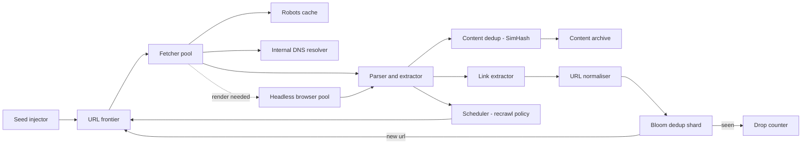
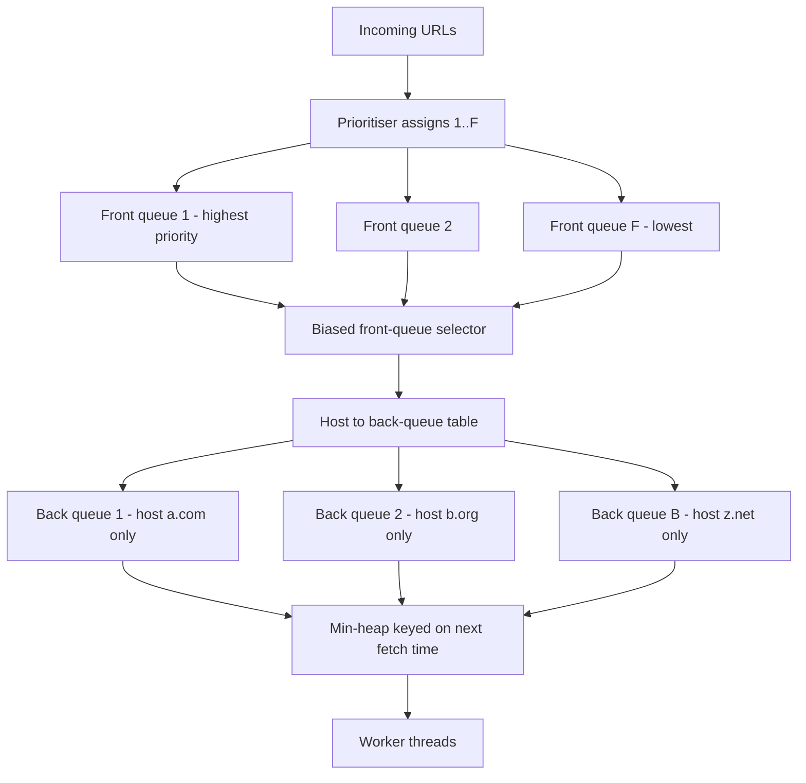
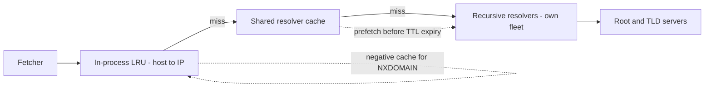
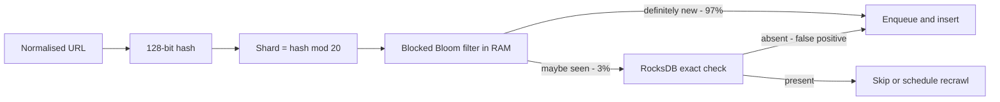
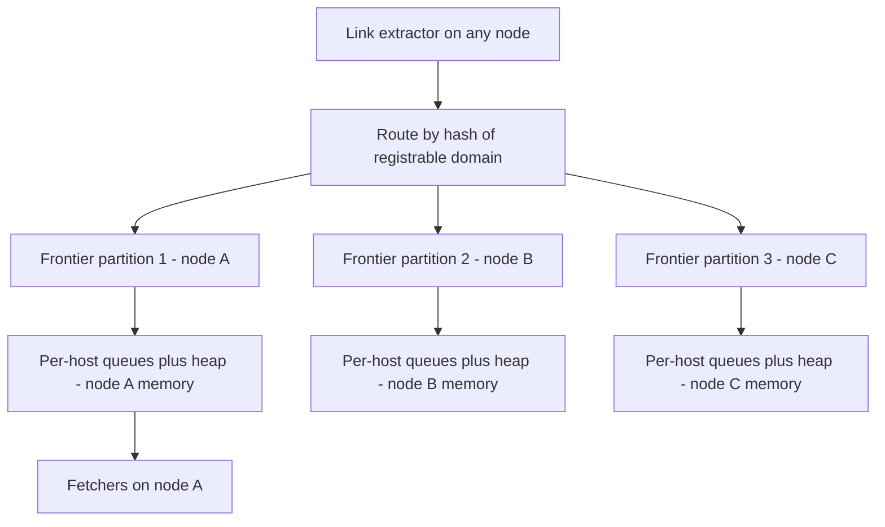

# 06 — Web Crawler

<span class="pill pill-core">Core</span> <span class="pill pill-hard">Hard</span>

**A crawler is a politeness-constrained scheduler wrapped around a distributed set — the fetching is trivial, and the entire design collapses into "which URL next, without being rude, without crawling the same thing twice, and without falling into an infinite hole".**

| | |
|---|---|
| **Commonly asked at** | Google, Microsoft/Bing, Amazon, Cloudflare, Apple, Databricks, Stripe (for scraping-adjacent systems) |
| **Time budget** | 45 min |
| **Core tension** | Throughput demands massive parallelism; politeness demands at most ~1 request/second/host — so the frontier must be simultaneously a global priority queue and a per-host rate limiter |
| **Prerequisites** | [DNS & Global Traffic](../fundamentals/f02-dns-traffic-management.md) · [Queues & Streams](../fundamentals/f12-queues-streams.md) · [Probabilistic Structures](../fundamentals/f21-probabilistic-data-structures.md) · [Object Storage](../fundamentals/f15-object-storage.md) · [Rate Limiting](../fundamentals/f17-rate-limiting-load-shedding.md) · [Partitioning & Sharding](../fundamentals/f06-partitioning-sharding.md) |

## 1. Problem Statement

Fetch, parse, and store a large fraction of the public web, continuously, and keep it fresh. Concretely: 1 billion pages/day sustained, a corpus of ~100 billion known URLs, feeding a downstream index.

The naive loop is four lines:

```python
while frontier:
    url = frontier.pop()
    html = fetch(url)
    store(html)
    frontier.extend(extract_links(html))
```

Every one of those four lines is a distributed systems problem at scale:

| Line | What actually happens |
|---|---|
| `frontier.pop()` | A priority queue over $10^{11}$ items that must also enforce a per-host rate limit, survive machine loss, and not starve any host |
| `fetch(url)` | A DNS lookup (the real bottleneck), a TCP+TLS handshake, robots.txt enforcement, redirect chains, body-size caps, and 40 ways to be trapped |
| `store(html)` | 25 TB/day of compressed content, with 30%+ near-duplicates that must be detected in sublinear time |
| `extract_links()` | 100 billion link emissions/day that must be deduplicated against a set of $10^{11}$ URLs without touching disk for most of them |

!!! note "Why this is a great interview problem"
    It is the purest test of whether you can find the real bottleneck. Candidates who say "I'll use a distributed queue and 10,000 workers" have not noticed that politeness caps a host at 1 req/s, so hitting 25 K pages/s requires **at least 25,000 distinct hosts in flight simultaneously** — which dictates the entire frontier data structure. The design falls out of that one number.

## 2. Requirements

### Functional

| # | Requirement | Notes |
|---|---|---|
| F1 | Seed-driven crawl with link discovery | Seeds from a curated list plus sitemaps |
| F2 | Respect `robots.txt` and `Crawl-delay` | RFC 9309 semantics, cached with TTL |
| F3 | Politeness: bounded request rate per host and per IP | Default 1 req/s/host, adaptive |
| F4 | Exact-URL dedup at $10^{11}$ scale | Must not re-fetch the same normalised URL |
| F5 | Near-duplicate content detection | Suppress mirrors, boilerplate, printer-friendly variants |
| F6 | Priority crawling | High-PageRank and news hosts crawled sooner and more often |
| F7 | Adaptive recrawl | Revisit interval learned from observed change rate |
| F8 | Optional JS rendering | For a small allow-listed fraction of URLs |
| F9 | Content archive with fetch metadata | Status, headers, fetch time, redirect chain, checksum |

### Non-functional

| # | Requirement | Target |
|---|---|---|
| N1 | Throughput | 1 B pages/day sustained ≈ 11.6 K/s average, 25 K/s peak |
| N2 | Politeness compliance | Zero hosts exceeding their configured rate over any 10 s window; < 0.01% robots violations |
| N3 | Frontier durability | No URL loss on machine failure; at-least-once fetch is acceptable, silent drop is not |
| N4 | Freshness | p50 news URL recrawled within 15 min; p90 of the corpus within 30 days |
| N5 | Efficiency | ≥ 85% of fetch attempts yield a usable, non-duplicate document |
| N6 | Blast radius | A single crawler node failure loses ≤ 1/S of in-flight work and no committed state |
| N7 | Citizenship | Identifiable UA, published contact, honours `429`/`503 Retry-After`, immediate opt-out path |

### Explicitly out of scope

| Not doing | Why | Instead |
|---|---|---|
| Ranking / index construction | Separate system with separate scaling properties | Downstream indexer consumes the archive |
| Crawling behind auth | Legal and ethical exposure | Only public, robots-permitted content |
| Deep-web form submission | Unbounded state space | Sitemap and API ingestion |
| Bypassing bot protection | Explicitly hostile behaviour | Honour blocks; use official APIs or partner feeds |
| Full JS rendering of everything | Cost is 30–100× HTML parsing | Allow-listed rendering only |

## 3. Scale Estimation

**Fetch rate.**

$$
\lambda_{\text{avg}} = \frac{10^9\ \text{pages}}{86{,}400\ \text{s}} = 11{,}574\ \text{pages/s}, \qquad \lambda_{\text{peak}} \approx 25{,}000\ \text{pages/s}
$$

**Concurrency, via Little's law.** With an average fetch duration (DNS + connect + TLS + transfer) of $W = 1.5$ s:

$$
L = \lambda W = 25{,}000 \times 1.5 = 37{,}500\ \text{concurrent fetches}
$$

Tail matters more than the mean: p99 fetch time is ~10 s, so slow hosts occupy sockets disproportionately. Provision for ~60,000 concurrent connections. Across 120 fetcher nodes that is 500 sockets each — comfortable for an async event loop, impossible for a thread-per-connection model.

**Politeness floor.** At 1 req/s/host:

$$
H_{\text{active}} \geq \frac{\lambda_{\text{peak}}}{1\ \text{req/s/host}} = 25{,}000\ \text{distinct hosts in flight at all times}
$$

This is the single most important derived number in the design.

**Bandwidth.** Average on-the-wire transfer 100 KB (compressed HTML + a little overhead):

$$
B = 11{,}574 \times 100\ \text{KB} \approx 1.16\ \text{GB/s} = 9.3\ \text{Gbps average}, \quad \approx 20\ \text{Gbps peak}
$$

**Storage.** Store gzip'd HTML at ~25 KB/page plus ~3 KB of extracted text and metadata:

$$
S_{\text{day}} = 10^9 \times 28\ \text{KB} = 2.8\times10^{13}\ \text{B} = 28\ \text{TB/day}
$$

$$
S_{\text{year}} = 28\ \text{TB} \times 365 \approx 10.2\ \text{PB}, \quad \text{after ~30\% near-dup suppression} \approx 7.2\ \text{PB/yr}
$$

**Link extraction and frontier growth.** ~100 outlinks/page:

$$
L_{\text{day}} = 10^9 \times 100 = 10^{11}\ \text{link emissions/day}
$$

Of those, empirically ~2–5% are URLs never seen before:

$$
U_{\text{new}} \approx 10^{11} \times 0.03 = 3\times10^9\ \text{new URLs/day}
$$

So the dedup filter must answer **1.16 million membership queries per second** on average ($10^{11}/86400$), 2.5 M/s at peak. That rate is what forces an in-memory probabilistic filter in front of any disk-backed store.

### Bloom filter sizing for URL dedup

For $n$ elements and false-positive probability $p$, the optimal bit count and hash count are:

$$
m = -\frac{n \ln p}{(\ln 2)^2}, \qquad k = \frac{m}{n}\ln 2 = -\log_2 p
$$

Bits per element is $-1.44 \log_2 p$, independent of $n$. With $n = 10^{11}$ URLs:

| $p$ | bits/element | $k$ | Total memory | URLs silently never crawled |
|---|---|---|---|---|
| $10^{-2}$ | 9.6 | 7 | 120 GB | $10^9$ — unacceptable |
| $10^{-4}$ | 19.2 | 13 | 240 GB | $10^7$ |
| $10^{-6}$ | 28.8 | 20 | **360 GB** | $10^5$ — acceptable |
| $10^{-9}$ | 43.1 | 30 | 539 GB | 100 |

Worked at $p = 10^{-6}$:

$$
m = -\frac{10^{11} \times \ln(10^{-6})}{(\ln 2)^2} = \frac{10^{11} \times 13.8155}{0.4805} = 2.875\times10^{12}\ \text{bits} = 359\ \text{GB}
$$

$$
k = -\log_2(10^{-6}) = 19.93 \approx 20\ \text{hash functions}
$$

!!! danger "A Bloom false positive is a permanent, silent crawl omission"
    Unlike a cache miss, there is no recovery path: the crawler concludes it has already seen the URL and drops it forever. At $p=10^{-2}$ that is a billion pages you will never know are missing. Size for $10^{-6}$ or lower, and shard the filter so each shard's $n$ is bounded.

Sharded over 20 machines by `hash(url) mod 20`, each holds 18 GB of bitmap — fits in RAM with room for the OS page cache. The cost is **20 random memory probes per query**, each an almost-guaranteed cache miss: at ~80 ns per miss that is 1.6 µs of pure memory latency per lookup, so a single core sustains ~600 K lookups/s. Use a **blocked Bloom filter** (all $k$ probes confined to one 512-bit cache line) to cut this to ~1 cache miss and 10× the throughput at a slightly worse $p$ for the same memory.

| Quantity | Value |
|---|---|
| Peak fetch rate | 25 K pages/s |
| Concurrent connections | ~60 K |
| Hosts in flight (politeness floor) | ≥ 25 K |
| Peak bandwidth | ~20 Gbps |
| Storage/year after dedup | ~7.2 PB |
| Dedup queries/s | 1.16 M avg, 2.5 M peak |
| Bloom memory at $p=10^{-6}$ | 359 GB sharded |

## 4. API Design

A crawler's "API" is mostly internal control plane plus the outbound HTTP contract. Both matter in an interview.

### Control plane

```http
POST /v1/crawl-jobs HTTP/1.1
Content-Type: application/json
Idempotency-Key: 7c1f0d2a-9b8e-4c33-a0b1-5f7d9e2c4a11

{
  "seeds": ["https://example.com/", "https://news.example.org/"],
  "scope": { "include_hosts": ["*.example.com"], "max_depth": 6 },
  "priority": 3,
  "politeness": { "max_rps_per_host": 0.5, "respect_crawl_delay": true },
  "render_js": false,
  "recrawl_policy": { "mode": "adaptive", "min_interval_s": 3600, "max_interval_s": 2592000 }
}
```

```json
{ "job_id": "job_01HQ...", "state": "ACCEPTED", "estimated_urls": null }
```

| Endpoint | Purpose | Notes |
|---|---|---|
| `POST /v1/crawl-jobs` | Submit seeds and scope | `Idempotency-Key` required; replays return the original `job_id` |
| `GET /v1/crawl-jobs/{id}` | Progress: fetched, queued, errored, dropped by reason | Counters are eventually consistent — say so in the response |
| `DELETE /v1/crawl-jobs/{id}` | Stop and drain | Must purge frontier entries, which is asynchronous |
| `POST /v1/hosts/{host}/hold` | Emergency per-host stop | Takes effect within one frontier lease interval (≤ 30 s) — this is the abuse-response lever |
| `GET /v1/urls?prefix=&cursor=` | Inspect frontier/archive state | Keyset pagination on `(host_shard, url_hash)`; never offset |
| `GET /v1/documents/{url_hash}` | Fetch stored content and metadata | Redirects to a signed object-storage URL |

| Aspect | Decision |
|---|---|
| Versioning | `/v1` path prefix; the internal frontier RPC uses protobuf with reserved field numbers |
| Idempotency | Job submission keyed by `Idempotency-Key`; URL enqueue is naturally idempotent because the dedup set absorbs repeats |
| Pagination | Keyset only — offsets over $10^{11}$ rows are meaningless |
| Errors | `202` accepted, `409` job already exists with different body, `422` seed outside allowed scope, `429` tenant quota |

### Outbound HTTP contract

```http
GET /path/page.html HTTP/1.1
Host: example.com
User-Agent: ExampleBot/2.1 (+https://example.com/bot; crawl-ops@example.com)
Accept-Encoding: gzip, br
If-None-Match: "a1b2c3d4"
If-Modified-Since: Tue, 12 Aug 2025 09:14:22 GMT
Accept: text/html,application/xhtml+xml
```

Conditional requests are not a nicety — a `304 Not Modified` costs ~300 bytes instead of 100 KB. If 60% of recrawls return 304, recrawl bandwidth drops by roughly the same factor, which is worth more than any compression tuning.

## 5. Data Model

| Entity | Key | Contents | Store |
|---|---|---|---|
| `url_state` | `url_hash` (128-bit) | normalised URL, host_id, first_seen, last_fetch, last_status, etag, last_modified, content_hash, simhash, change_estimate, next_fetch_at, priority | Sharded LSM KV |
| `frontier_entry` | `(host_bucket, next_fetch_at, url_hash)` | priority, depth, discovery source | Log + per-host queues |
| `host_state` | `host_id` | robots (parsed + expiry), crawl_delay, resolved IPs + TTL, consecutive errors, backoff_until, politeness overrides | KV, hot in memory on the owning node |
| `document` | `content_hash` | gzip body, headers, fetch metadata | Object storage, content-addressed |
| `link_graph` | `(src_url_hash, dst_url_hash)` | anchor text, rel attributes | Columnar files in object storage |

```sql
-- url_state, expressed relationally to make the access patterns explicit.
CREATE TABLE url_state (
    url_hash        BYTEA PRIMARY KEY,          -- 128-bit hash of the normalised URL
    url             TEXT        NOT NULL,
    host_id         BIGINT      NOT NULL,
    first_seen_at   TIMESTAMPTZ NOT NULL,
    last_fetch_at   TIMESTAMPTZ,
    last_status     SMALLINT,
    etag            TEXT,
    last_modified   TIMESTAMPTZ,
    content_hash    BYTEA,                      -- exact-content dedup
    simhash         BIGINT,                     -- near-dup detection, 64 bits
    change_lambda   REAL        NOT NULL DEFAULT 0.0,  -- estimated changes/day
    fetch_count     INT         NOT NULL DEFAULT 0,
    change_count    INT         NOT NULL DEFAULT 0,
    next_fetch_at   TIMESTAMPTZ NOT NULL,
    priority        SMALLINT    NOT NULL DEFAULT 5,
    trap_score      REAL        NOT NULL DEFAULT 0.0
);
CREATE INDEX ON url_state (host_id, next_fetch_at);
```

### Access patterns

| # | Pattern | Rate | Served by |
|---|---|---|---|
| A1 | "Have I seen this URL?" | 2.5 M/s peak | Sharded blocked-Bloom filter, then KV on a positive |
| A2 | "Give me the next URL for host H" | 25 K/s | In-memory per-host FIFO on the owning fetcher node |
| A3 | "Which host is due next?" | 25 K/s | Min-heap keyed on `next_fetch_time` |
| A4 | Record fetch outcome | 25 K/s | KV write to `url_state`, batched |
| A5 | "Is this content a near-dup?" | 25 K/s | SimHash index probe |
| A6 | robots.txt for host H | 25 K/s, ~99.9% cache hit | In-process LRU + shared cache |
| A7 | Recrawl sweep: URLs due now | Batch, hourly | Range scan on `(host_id, next_fetch_at)` |

### Store choice

| Need | Chosen | Rejected and why |
|---|---|---|
| URL dedup at 2.5 M qps | Sharded blocked Bloom filter in RAM, backed by RocksDB for the authoritative set | Pure RocksDB: 2.5 M random reads/s over 2 TB means disk-bound, ~10× the hardware. Pure Bloom: cannot store per-URL metadata or ever delete |
| Frontier | Durable log (Kafka) partitioned by `hash(host)` + per-node in-memory queues | A single global priority queue: no data structure serves 25 K pops/s with per-host rate limits. Redis sorted sets: workable to ~5 K hosts, then the single-threaded core saturates |
| Content archive | Content-addressed object storage with 1 GB packed shards | One object per page: $10^{11}$ objects × request cost is more expensive than the bytes; small-object overhead dominates |
| `url_state` | Sharded LSM KV | Postgres: $10^{11}$ rows with 25 K writes/s of random updates exceeds a single primary; sharding it manually reinvents the KV store |
| Link graph | Columnar files, rebuilt in batch | A graph database: the access pattern is bulk analytical, not traversal-per-request |

## 6. High-Level Architecture



### The fetch path, step by step

1. **Frontier pop.** A fetcher node owns a set of host buckets. It pops from the per-host queue whose `next_fetch_time` is soonest and is now due.
2. **Host gate.** Check `backoff_until`, robots cache (fetch and parse if expired), and the per-IP concurrency budget. Multiple hosts can share one IP; politeness must apply to both.
3. **DNS.** Resolve via the internal resolver; on cache hit this is ~0 ms, on miss 20–150 ms.
4. **Fetch.** Conditional GET with `ETag`/`If-Modified-Since`, hard caps on body size (5 MB), redirect depth (5), and total time (20 s).
5. **Classify.** `304` → bump `next_fetch_at`, done. `200` → hash content; if `content_hash` unchanged, it is a no-op change and the recrawl interval grows. `4xx/5xx` → error accounting and host backoff.
6. **Parse and extract.** Boilerplate strip, text extraction, SimHash, link extraction.
7. **Near-dup check.** SimHash probe; if within Hamming distance 3 of an existing document, store only a pointer.
8. **Link emission.** Normalise each link, probe the Bloom shard, and enqueue misses to the frontier partition owned by `hash(host)`.
9. **Reschedule.** Update `change_lambda` and compute `next_fetch_at`.

### The read path (downstream consumers)

Indexers consume the archive as an append-only stream of `(url_hash, content_hash, fetch_time)` records plus content-addressed blobs. Because storage is content-addressed, a recrawl that yields identical content emits a metadata record and zero new bytes — which is why 60%+ of recrawls cost almost nothing.

## 7. Deep Dives

### 7.1 The URL frontier: Mercator front queues and back queues

The frontier must satisfy two contradictory requirements at once:

- **Priority**: crawl important pages first (global ordering).
- **Politeness**: at most one request per host per delay interval (per-host ordering with time constraints).

The Mercator design solves this with **two queue layers**.



**Front queues (priority).** $F$ FIFO queues, one per priority level (typically 10). A prioritiser assigns each URL a level from a static host score (PageRank-ish), page depth, discovery context, and job priority. The selector picks a front queue with a bias toward higher priority — for example, sample level $i$ with probability $\propto 2^{-i}$, which gives the top level ~50% of slots while guaranteeing the bottom level is never fully starved.

**Back queues (politeness).** $B$ FIFO queues, and the crucial invariants are:

1. Each back queue holds URLs from **exactly one host**.
2. A host appears in **exactly one** back queue.
3. Every back queue is kept non-empty as long as URLs exist for its host.

A **min-heap** holds one entry per back queue: `(next_fetch_time, back_queue_id)`. A worker pops the heap root, waits until that time, takes the head URL from that back queue, fetches it, then reinserts the heap entry at `now + delay(host)`.

```python
def worker(heap, back_queues, host_of, mapping_table, front_selector):
    while True:
        t, bq_id = heap.pop_min()
        sleep_until(t)
        url = back_queues[bq_id].pop()          # invariant 3: never empty
        host = host_of[bq_id]
        result = fetch(url)                      # blocking or async
        if back_queues[bq_id].empty():
            # Refill: pull from front queues until we find a URL whose host is
            # either this one, or a host not currently owned by any back queue.
            while True:
                candidate = front_selector.next()          # biased by priority
                h = host_of_url(candidate)
                if h in mapping_table and mapping_table[h] != bq_id:
                    back_queues[mapping_table[h]].push(candidate)   # goes elsewhere
                    continue
                mapping_table.pop(host, None)               # this queue changes host
                mapping_table[h] = bq_id
                host_of[bq_id] = h
                back_queues[bq_id].push(candidate)
                break
        heap.push((now() + delay(host), bq_id))
```

**Sizing $B$.** The classic rule of thumb is $B \approx 3 \times$ worker count, so that workers rarely block on the heap. Our politeness floor gives the real constraint:

$$
B \geq \lambda_{\text{peak}} \times \text{delay} = 25{,}000 \times 1\ \text{s} = 25{,}000\ \text{back queues}
$$

In practice run $B \approx 100{,}000$ per cluster (spread across nodes) so that slow and delayed hosts do not idle workers. Each back queue is cheap — a head pointer into a durable log plus a small in-memory buffer.

!!! gotcha "The refill loop is where frontier designs deadlock"
    If the front queues contain only URLs for hosts already owned by other back queues, the refill loop spins forever. Real implementations bound the loop, and on failure park the back queue with a future heap timestamp and move on. Watch for the pathological case: a crawl scoped to 50 hosts with $B = 100{,}000$ leaves 99,950 back queues permanently empty, and naive implementations burn CPU refilling them.

**Durability.** In-memory queues die with the node. Back the frontier with a partitioned log keyed by `hash(host)`: the in-memory structures are a *materialised view* of the log, and a restarting node replays its partitions. A URL is only removed from the log once its fetch outcome is committed — at-least-once, with the dedup set making the duplicate harmless.

### 7.2 Politeness, robots.txt, and DNS — the hidden bottleneck

**robots.txt.** Fetched once per host, parsed, cached. The details that catch people:

| Case | Correct behaviour (RFC 9309) |
|---|---|
| `2xx` | Parse and apply; cache 24 h |
| `4xx` (including 404, 403) | Treat as "full allow"; cache 24 h |
| `5xx` or timeout | Treat as **full disallow** for at least 12 h; a server erroring is not permission |
| Unreachable > 30 days | May treat as full allow, with caution |
| Body > 500 KiB | Parse only the first 500 KiB |
| Longest match wins | `Allow`/`Disallow` matching is by longest path pattern, not first-match |
| `Crawl-delay` | Non-standard but widely used; honour it, cap at some maximum (e.g. 30 s) or the host effectively opts out |

Cache hit rate must be > 99.9%, otherwise robots fetches become a second full crawl. With 50 M active hosts and a 24 h TTL:

$$
\text{robots fetches/s} = \frac{5\times10^7}{86{,}400} = 579/\text{s} \quad \text{(5\% of total fetch capacity — not free)}
$$

**DNS is the bottleneck nobody plans for.** A naive crawler does one resolution per fetch:

- 25 K resolutions/s against a stub resolver that handles maybe 10 K/s.
- Each miss takes 20–150 ms, and the OS resolver (`getaddrinfo`) is **synchronous and often globally locked** — a thread blocked in DNS is a thread not fetching.
- Public resolvers rate-limit and will block you.

The fix is a purpose-built resolver in the crawler:



Design points, all of which are asked about:

- **Async resolution only.** Use an event-driven DNS client; never `getaddrinfo` on the fetch path.
- **Cache beyond TTL, deliberately.** Many hosts publish 60 s TTLs. Honouring them exactly means re-resolving popular hosts constantly. Crawlers commonly clamp TTL to `[300 s, 24 h]` and refresh asynchronously before expiry. This is a knowing deviation from the spec, justified by the fact that a stale A record costs one failed fetch and a retry.
- **Negative caching.** Dead hosts are extremely common in a link graph; cache NXDOMAIN for hours or you will hammer TLD servers.
- **Resolve to IP and pin per fetch.** Politeness must be enforced per IP as well as per host, because 500 hosts can live on one shared-hosting IP. Crawling all 500 at 1 req/s means 500 req/s at that server — a de facto DoS.
- **Prefetch.** When a host enters a back queue, resolve it before its first fetch is due.

$$
\text{With 99\% hit rate: } 25{,}000 \times 0.01 = 250\ \text{resolutions/s} \Rightarrow \text{trivially served by 3 resolver nodes}
$$

### 7.3 Dedup: URLs at $10^{11}$ and content via SimHash

**URL normalisation must happen before dedup, and it is lossy.**

```python
def normalise(url: str) -> str:
    u = urlsplit(url)
    scheme = u.scheme.lower()
    host = u.hostname.lower().rstrip(".").encode("idna").decode()   # punycode
    port = "" if (scheme, u.port) in (("http", 80), ("https", 443)) else f":{u.port}"
    path = remove_dot_segments(percent_normalise(u.path)) or "/"
    q = [(k, v) for k, v in parse_qsl(u.query, keep_blank_values=True)
         if k.lower() not in TRACKING_PARAMS]          # utm_*, fbclid, gclid, msclkid
    query = urlencode(sorted(q))                        # see the warning below
    return urlunsplit((scheme, host + port, path, query, ""))        # fragment dropped
```

| Rule | Safe? | Note |
|---|---|---|
| Lowercase scheme and host | Yes | Path is case-sensitive on most servers — never lowercase it |
| Drop fragment | Yes | Unless the site uses `#!` hashbang routing, which changes content |
| Remove default port | Yes | — |
| Resolve `.` and `..` segments | Yes | RFC 3986 |
| Normalise percent-encoding | Yes | Decode unreserved characters, uppercase remaining hex |
| Strip known tracking params | Mostly | A hand-maintained list; stripping an unknown param can merge distinct pages |
| **Sort query parameters** | **No** | Some servers are order-sensitive and repeated keys carry meaning. Sorting increases dedup but risks fetching the wrong page. Many crawlers sort anyway and accept the error rate — state the trade-off |
| Add/remove trailing slash | No | `/a` and `/a/` are genuinely different resources per spec, though usually identical in practice |

**Two-tier dedup.** Bloom filter in front (§3), authoritative sharded KV behind:



Because 97% of link emissions are *repeats* of known URLs, the filter's "definitely new" branch is the rare one; the value of the Bloom filter is that a "maybe seen" answer for a truly-seen URL still requires a disk check only when we care about recrawl metadata. An alternative arrangement — filter the *repeats* out cheaply — inverts the ratio: 97% of queries hit the "possibly present" path, so the filter saves little. **The design that wins is to combine the Bloom filter with a large RocksDB block cache**, or to shard so aggressively that the whole authoritative set is RAM-resident.

Exact KV cost: $10^{11}$ URLs × (16-byte hash + ~40 bytes metadata + LSM overhead) ≈ 7 TB across 20 nodes = 350 GB/node — SSD-resident with a hot working set in RAM.

**Content dedup: exact then near.**

- **Exact**: SHA-256 of the normalised body. Free, catches mirrors and unchanged recrawls, and enables content-addressed storage.
- **Near**: 30–40% of the web is near-duplicate — printer views, session-id variants, syndicated articles, boilerplate-heavy templates.

**SimHash** (Charikar) produces a 64-bit fingerprint where cosine-similar documents have small Hamming distance:

```python
def simhash(tokens, weights, bits=64):
    v = [0] * bits
    for tok, w in zip(tokens, weights):        # tokens = 5-word shingles
        h = hash64(tok)
        for i in range(bits):
            v[i] += w if (h >> i) & 1 else -w
    out = 0
    for i in range(bits):
        if v[i] > 0:
            out |= 1 << i
    return out
```

Documents are near-duplicates if Hamming distance ≤ 3. Finding all such pairs among $10^{11}$ fingerprints is the hard part. **Pigeonhole trick (Manku et al.):** split the 64 bits into 6 blocks. Any 3-bit difference can corrupt at most 3 blocks, so at least 3 blocks are identical. Build $\binom{6}{3} = 20$ tables, each sorted by a distinct 3-block (≈32-bit) key; probe all 20 and check candidates exactly.

$$
\text{Storage} = 10^{11} \times 8\ \text{B} \times 20\ \text{tables} = 16\ \text{TB}
$$

$$
\text{Candidates per probe} \approx \frac{10^{11}}{2^{32}} = 23\ \text{per table} \Rightarrow \sim 470\ \text{exact comparisons per lookup}
$$

That is a real, tractable number: 25 K lookups/s × 20 probes = 500 K index probes/s across a sharded table.

| Approach | Bytes/doc | Detects | Verdict |
|---|---|---|---|
| SHA-256 of body | 32 | Byte-identical only | Chosen as the first tier |
| SimHash 64-bit + 20 tables | 160 (amortised) | Cosine-similar, Hamming ≤ 3 | **Chosen** for near-dup |
| MinHash sketch, 64 hashes | 512 | Jaccard similarity, tunable | Rejected: 51 TB of sketches and slower LSH probing for marginal accuracy gain at this scale |
| Full shingle sets | ~10 KB | Exact Jaccard | Rejected: 1 PB of sketches |

### 7.4 Traps, freshness, and adaptive recrawl

**Crawler traps** are URL spaces that are infinite, near-infinite, or worthless.

| Trap | Mechanism | Detection | Mitigation |
|---|---|---|---|
| Infinite calendar | `?month=2027-04` links to `2027-05` forever | URL-pattern depth explodes on one host with near-identical content | Cap per-host URL budget; SimHash equality across sibling URLs; path-pattern frequency cap |
| Session-ID URLs | `;jsessionid=` or `?sid=` regenerates per fetch | Same content hash under many URLs | Strip known session params; if $k$ distinct URLs share one content hash, learn the varying param and blacklist it |
| Faceted navigation | $2^n$ filter combinations | Combinatorial growth of query-param sets on one path | Limit distinct param-set cardinality per path prefix |
| Soft 404 | Returns `200` with "Page not found" | Content nearly identical to a probe of a random nonexistent URL | Probe two random URLs per host; fingerprint the error page; treat matches as 404 |
| Redirect loop | A→B→A | Redirect chain length | Hard cap at 5 hops, record the terminal URL as canonical |
| Tarpit | Response drips 1 byte/s to hold your socket | Throughput below a floor | Enforce a minimum transfer rate and an absolute deadline, not just a connect timeout |
| Zip bomb / huge file | 10 GB body or a 1000:1 decompression ratio | Content-Length, decompressed-size counter | Cap body at 5 MB **decompressed**, streaming abort |
| Random link generator | Every fetch yields new URLs | New-URL ratio per host stays at 100% | Per-host novelty ratio: if 100% of links are new after 10 K pages, deprioritise the host hard |
| Case/encoding variants | `/A` vs `/a` vs `/%41` | Explosion of URLs with one content hash | Normalisation plus content-hash collapsing |

The generalised defence is a **per-host budget with a trap score**: every host starts with a URL budget proportional to its quality score; hosts whose fetches yield duplicate content, soft 404s, or 100% novel links have their budget and priority decayed. This converts an unbounded correctness problem into a bounded resource-allocation one.

**Freshness and adaptive recrawl.** Model page changes as a Poisson process with rate $\lambda$ per page. Observing $n$ fetches with $c$ observed changes gives a naive estimate $\hat\lambda = c/n \cdot (1/\Delta t)$ — but this is biased downward, because two changes between fetches look like one. Cho and Garcia-Molina's estimator corrects it:

$$
\hat{\lambda} = -\frac{1}{\Delta t}\ln\left(\frac{n - c + 0.5}{n + 0.5}\right)
$$

The counter-intuitive result worth quoting: **allocating recrawls proportionally to change rate is not optimal**. Pages that change constantly (a stock ticker) are stale again immediately no matter how often you crawl, so budget spent on them is wasted. Uniform allocation beats proportional allocation, and the true optimum allocates *less* than proportional at the extremes — you deliberately give up on the most volatile pages.

Practical policy blending that theory with product needs:

```python
def next_interval(u):
    base = 1.0 / max(u.change_lambda, 1e-4)              # days
    base *= (1.0 + 0.5 * (5 - u.priority))               # importance boost
    if u.consecutive_no_change >= 3:
        base *= 2.0 ** min(u.consecutive_no_change - 2, 5)   # exponential backoff, capped 32x
    if u.change_lambda > 4.0:                            # changes multiple times per day
        base = max(base, 0.25)                           # stop chasing; cap at 4x/day
    return clamp(base, MIN_INTERVAL, MAX_INTERVAL)
```

Sitemaps with `<lastmod>` and HTTP `ETag`/`Last-Modified` short-circuit all of this when publishers provide them — always prefer a `304` over a heuristic.

### 7.5 JS rendering and the cost explosion

Roughly 20–30% of the modern web needs JS execution to yield meaningful content. Rendering is catastrophically more expensive than parsing:

| Path | CPU per page | Memory | Wall time |
|---|---|---|---|
| HTML parse + extract | ~30–50 ms | ~5 MB | ~0 (already fetched) |
| Headless browser render | ~1.5–2.5 CPU-seconds | 250–500 MB per tab | 3–5 s including subresources |

Render 5% of the crawl — 50 M pages/day:

$$
\lambda_{\text{render}} = \frac{5\times10^7}{86{,}400} = 579\ \text{renders/s}
$$

$$
\text{Cores} = 579 \times 2\ \text{CPU-s} = 1{,}158\ \text{cores} \approx 36 \times 32\text{-core machines}
$$

$$
\text{Concurrent tabs} = 579 \times 4\ \text{s} = 2{,}316 \Rightarrow 2{,}316 \times 300\ \text{MB} = 695\ \text{GB RAM}
$$

And subresources multiply the fetch count: a rendered page pulls 30–80 additional requests (JS, CSS, fonts, XHR), so 50 M renders generate ~2.5 B extra HTTP requests/day — **2.5× the entire crawl's request volume for 5% of the pages**. Those subresource fetches must also respect politeness for their hosts, including third-party CDNs.

Mitigations that make it viable:

- **Render only when necessary.** Heuristic: fetch the HTML first; render only if the extracted text is below a threshold while the page has substantial script content, or if the host is on an allow-list learned from prior render-vs-parse deltas.
- **Cache subresources aggressively** in a shared HTTP cache; the same framework bundle appears on millions of pages.
- **Block by resource type**: refuse images, fonts, media, and analytics beacons at the browser's network layer. Typically cuts render cost by 50%+.
- **Hard deadline** on `networkidle`; take whatever the DOM contains at T+5 s.
- **Recycle browser contexts, not processes** — process spawn is ~300 ms, context creation ~20 ms — but recycle the *process* every N pages because renderers leak.

## 8. Scaling the Bottleneck

The bottleneck is the **frontier**: it is stateful, must enforce per-host serialisation, and is the thing that cannot be trivially replicated.

**Partition by host, not by URL.** All politeness state (`crawl_delay`, robots, backoff, in-flight count, DNS) is per-host, so if two nodes could fetch the same host they would need distributed coordination on every request. Assign `owner_node = consistent_hash(registrable_domain) → node`, giving:



- Use the **registrable domain** (eTLD+1 via the Public Suffix List), not the full hostname, so `a.blogspot.com` and `b.blogspot.com` do not each get a full politeness budget against shared infrastructure.
- **Rebalancing**: consistent hashing with virtual nodes; on node loss its partitions are reassigned and the new owner replays the durable log. In-flight fetches are lost and re-fetched — harmless, because fetching is idempotent.
- **Skew is inherent.** Host size follows a power law: one node may own a domain with 500 M URLs. Detect skewed partitions and split *within* a host by sub-path hash, accepting that politeness for that host must then be coordinated by a small lease service (one lease token per host, held briefly).

**Scaling the other components:**

| Component | Scaling axis | Note |
|---|---|---|
| Fetchers | Stateless; scale with connection count | Bounded by egress bandwidth and NAT/port exhaustion (65 K ports per source IP — needs many source IPs) |
| DNS resolvers | Cache hit rate, not node count | 3 nodes serve 25 K/s at 99% hit rate |
| Bloom shards | `n` per shard; add shards and rehash | Rehashing is expensive — over-shard from day one |
| Parser pool | CPU-bound; scale linearly | Isolate: a malformed document must not take down a fetcher |
| SimHash index | 20 tables sharded by key prefix | Read-heavy, append-mostly; rebuild offline |
| Archive | Object storage; effectively unbounded | Pack small objects; per-request cost dominates |

**Bandwidth reality check.** 20 Gbps sustained egress/ingress is a serious commitment: it needs multiple 25 GbE-attached nodes, peering, and a source-IP pool large enough that no single IP looks like an attacker. Port exhaustion is real — 60 K concurrent connections across a handful of source IPs will hit the ephemeral port limit; plan for one source IP per ~20 K connections.

## 9. Failure Modes

| Failure | Blast radius | Detection | Mitigation | Degraded behaviour |
|---|---|---|---|---|
| Frontier node dies | Its host partitions stall | Heartbeat loss; partition lag metric | Reassign partitions; new owner replays the log | Those hosts pause for ~30 s; in-flight URLs re-fetched |
| Bloom shard lost (no persistence) | Dedup for that shard resets | Shard restart counter | Rebuild from the authoritative KV in the background; run in "always check KV" mode meanwhile | Temporary 20× load on that KV shard; some re-crawling |
| DNS resolver fleet degraded | All fetching | Resolution p99, error rate | Serve from stale cache well past TTL; shed new-host work first | Crawl continues on known hosts only |
| Target site returns 429/503 | One host | Status-code rate per host | Exponential backoff honouring `Retry-After`; halve the host's rate permanently | That host crawled slower |
| We get IP-blocked | All hosts behind that CDN/WAF | Sudden 403 spike correlated by ASN or CDN | Stop immediately, contact the operator, reduce rate globally for that ASN | Whole segments of the web become uncrawlable |
| Crawler trap | One host consumes unbounded budget | Per-host novelty ratio, dup-content ratio, path depth | Per-host budget cap and trap score | Wasted capacity until detection fires |
| Parser crash on malformed input | One document, or a pool if unguarded | Crash-loop detection | Parse in a sandboxed worker with timeouts and memory caps; quarantine the document | One document dropped |
| Archive write failures | Recent fetches | Write error rate | Buffer to local disk, retry; block fetching if the buffer fills | Backpressure to fetchers — correct behaviour |
| Renderer pool exhausted | Render-eligible URLs | Queue depth, tab count | Shed to HTML-only extraction | Reduced content quality, no outage |
| Clock skew between nodes | Politeness timing | NTP offset metric | Politeness times are computed locally per owning node, so skew is contained | Minor |
| Frontier growth outpaces fetch rate | Whole crawl | Frontier size trend | Raise the priority threshold: crawl less of the long tail | Coverage shrinks, freshness preserved |
| robots.txt fetch failing site-wide | Hosts on that provider | Robots 5xx rate | Fail closed — do not crawl | Coverage loss (correct choice) |

## 10. SRE Lens

### SLIs and SLOs

| SLI | Definition | SLO |
|---|---|---|
| Crawl throughput | Successful non-duplicate fetches/hour | ≥ 40 M/h averaged over 24 h |
| Politeness violations | Hosts exceeding configured rate in any 10 s window / hosts crawled | < 0.001% |
| Robots compliance | Fetches of disallowed paths / total fetches | 0 tolerated; any occurrence is an incident |
| Fetch success ratio | `2xx` + `304` / attempts (excluding known-dead) | ≥ 92% |
| Freshness p50 (news tier) | Median age of the stored copy for tier-1 hosts | ≤ 15 min |
| Freshness p90 (corpus) | 90th percentile recrawl age | ≤ 30 days |
| Frontier lag | Time from URL discovery to fetch, for priority ≤ 2 | p95 ≤ 60 min |
| Waste ratio | Bytes fetched that were duplicate or trap content / total | ≤ 15% |

**Error budget framing is unusual here.** A crawler has no external users, so availability is not the SLO that matters — *coverage and freshness* are. Frame the budget as: "we may fall below 40 M pages/h for at most 2% of hours in a month". A politeness or robots violation is not a budget item at all; it is a hard stop, because the consequence is being blocked or sued rather than degraded.

**Observability that pays for itself:**

```text
crawl_fetch_total{status, host_tier, render}          counter
crawl_fetch_duration_seconds{phase}                   histogram  # dns|connect|tls|ttfb|transfer
crawl_frontier_size{priority}                         gauge
crawl_frontier_lag_seconds{priority}                  histogram
crawl_dedup_bloom_fp_estimated                        gauge      # from periodic KV sampling
crawl_dns_cache_hit_ratio                             gauge
crawl_host_budget_exhausted_total{reason}             counter
crawl_novelty_ratio{host}                             gauge      # trap signal
crawl_robots_disallow_hits_total                      counter
```

Break `crawl_fetch_duration_seconds` down by phase. "Fetches are slow" is useless; "DNS p99 went from 5 ms to 400 ms because the resolver cache hit rate dropped after a deploy" is actionable, and phase-level histograms are the only way to see it.

### Rollout plan

1. **Shadow tier**: new fetcher/parser versions run against a 0.1% sample and results are diffed against production output (link counts, extracted text length, SimHash distance). Content extraction regressions are invisible in system metrics — only diffing catches them.
2. **One partition** at a time, monitoring politeness violations and fetch success.
3. **One region**, then global.
4. **Automatic rollback** trigger on any robots violation, or a >2% drop in fetch success ratio.
5. **Never deploy a normalisation change without a backfill plan.** Changing URL normalisation invalidates the dedup set: URLs already crawled normalise differently and will be re-crawled. Run the new normaliser in shadow, measure the collision delta, and plan a bounded re-crawl. See [Deployment & Release Safety](../fundamentals/f25-deployment-release-safety.md).

### Runbook notes

```bash
# A host is complaining we are hammering them.
curl -XPOST /v1/hosts/example.com/hold          # takes effect within one lease interval
grep -c 'example\.com' /var/log/crawl/fetch.log  # verify actual rate we applied

# Throughput dropped. Which phase?
promql: histogram_quantile(0.99, sum by (le, phase)
        (rate(crawl_fetch_duration_seconds_bucket[5m])))

# Frontier exploding: which host?
promql: topk(20, crawl_frontier_size_by_host)
# then check novelty_ratio for those hosts -> almost always a trap
```

### Capacity model

$$
N_{\text{fetch}} = \left\lceil \frac{L_{\text{conn}}}{c_{\text{node}}} \right\rceil,\quad
N_{\text{parse}} = \left\lceil \frac{\lambda \times t_{\text{parse}}}{\text{cores/node}} \right\rceil,\quad
N_{\text{bloom}} = \left\lceil \frac{m(n, p)}{\text{RAM/node}} \right\rceil
$$

With $L_{\text{conn}} = 60{,}000$, $c_{\text{node}} = 500$ → 120 fetcher nodes. Parsing: $11{,}574 \times 0.04\ \text{s} = 463$ cores → 15 nodes. Bloom: 359 GB / 24 GB usable → 15–20 nodes.

### Cost (order of magnitude, monthly)

| Line | Estimate | Lever |
|---|---|---|
| Egress/ingress bandwidth at ~9 Gbps average | $60–150 K | Conditional GETs (a 60% 304 rate cuts recrawl bytes 60%); compression; refuse non-HTML content types by `Accept` and by `Content-Type` sniffing before download |
| Compute: fetchers + parsers | $80 K | Async I/O keeps fetcher count low; parsing is the CPU floor |
| Headless rendering (5% of pages) | $45 K | The most expensive 5% of the crawl by far — allow-list only |
| Storage: 7.2 PB/yr, tiered | $90 K/mo growing | Near-dup suppression saves ~30%; lifecycle old crawls to cold storage |
| Bloom + KV dedup fleet | $25 K | — |

The headline: **rendering 5% of pages costs about a third of what fetching 100% of pages costs.** That ratio is the argument for a render allow-list, and it is a great line to have ready. See [Cost Engineering](../fundamentals/f28-cost-engineering.md).

## 11. Trade-offs & Alternatives

| Decision | Chosen | Alternative | Alternative wins when |
|---|---|---|---|
| Frontier | Mercator two-tier + durable log | Redis sorted set per host | < 5 K active hosts and a single node suffices |
| Dedup | Bloom + sharded KV | Pure sharded KV | You need per-URL metadata on every check anyway and can afford the IOPS |
| Near-dup | SimHash 64-bit | MinHash LSH | You need tunable similarity thresholds, not a fixed one |
| Partitioning | By registrable domain | By URL hash | Never — it destroys per-host politeness locality |
| Rendering | Allow-list | Render everything | Your corpus is small and JS-heavy (e.g. a vertical crawler over SPAs) |
| Storage | Content-addressed packs in object storage | HDFS-style cluster | You need co-located compute over the raw corpus |

### At 10× (10 B pages/day)

- Multi-datacentre by geography: crawl hosts from the nearest region to cut RTT and be a better citizen. Frontier partitioning becomes region-aware, and the dedup set becomes globally sharded with regional caches.
- The Bloom filter no longer fits comfortably: $10^{12}$ URLs at $p=10^{-6}$ is 3.6 TB. Move to a **partitioned/rotating filter** by discovery epoch, so old epochs can be dropped, or to a hierarchical scheme where a small hot filter fronts a cold on-disk exact set.
- Politeness becomes a global coordination problem, because two regions must not independently crawl the same host. A per-host lease service (single owner, short lease) becomes mandatory.
- Frontier growth outpaces fetch capacity permanently — the crawl becomes explicitly **selection-driven**: quality models decide what never gets crawled, and the frontier is pruned rather than drained.

### At 1/10 (100 M pages/day) or a vertical crawler

- Drop the Bloom filter entirely: $10^9$ URLs fit in a single RocksDB instance or even a Postgres table with a hash index. Exact dedup is simpler and has no silent-omission failure mode.
- Frontier can be a Redis sorted set per host plus a global `ZSET` of due times, on one node.
- Politeness at 100–1,000 active hosts means a single-process scheduler with a priority queue is sufficient — no distributed anything.
- **The honest answer**: for a site-scoped crawler, the whole Mercator apparatus is over-engineering. Use `scrapy` with a per-domain delay and spend your time on extraction quality instead.

## 12. Gotchas & Corner Cases

!!! gotcha "Politeness per hostname is not politeness per server"
    **Symptom.** A shared-hosting provider blocks your entire ASN even though every host was crawled at 1 req/s. **Mechanism.** 500 hostnames resolve to one IP; 500 × 1 req/s = 500 req/s at one physical server, which is indistinguishable from an attack. **Mitigation.** Enforce a second rate limit keyed on resolved IP (and ideally on the /24), maintain the IP→hosts reverse mapping in the resolver cache, and when the IP budget binds, spread the host's slots over time rather than dropping them.

!!! gotcha "A Bloom false positive is an unrecoverable, invisible omission"
    **Symptom.** Coverage metrics look perfect; a specific page is simply never in the index and nobody can explain why. **Mechanism.** The filter said "seen" for a URL never fetched, so it was dropped before ever reaching the authoritative store — there is no record it was considered. **Mitigation.** Size for $p \le 10^{-6}$, log a sampled 0.1% of "seen" verdicts to the exact store for continuous FP-rate measurement, and never let a filter serve a set whose $n$ exceeds its design point (add shards long before saturation).

!!! gotcha "The OS resolver quietly caps your entire crawl"
    **Symptom.** Throughput plateaus at ~2 K pages/s no matter how many fetcher threads you add, and CPU is idle. **Mechanism.** `getaddrinfo` is synchronous and serialised through a small number of file descriptors and, in glibc, a lock; every thread that resolves is a thread parked. **Mitigation.** Use an async DNS client (c-ares, `trust-dns`) with your own recursive resolvers and cache, prefetch on host admission to a back queue, and negative-cache NXDOMAIN — dead hosts are 5–15% of link targets.

!!! gotcha "Honouring 60-second DNS TTLs makes you your own DDoS"
    **Symptom.** Authoritative nameservers for popular hosts start rate-limiting you. **Mechanism.** Crawling a host continuously with a 60 s TTL means one resolution per minute per host across 25 K active hosts = 400 lookups/s of pure TTL churn, concentrated on a few nameservers. **Mitigation.** Clamp TTLs to a floor of ~300 s and refresh asynchronously ahead of expiry. Accept that a stale A record costs one failed fetch and a retry — a deliberate, documented spec deviation.

!!! gotcha "Sorting query parameters increases dedup and silently fetches the wrong pages"
    **Symptom.** A small fraction of stored documents do not match what a browser shows for that URL. **Mechanism.** Normalisation sorted `?b=2&a=1` to `?a=1&b=2`; the origin treats parameter order as significant, or repeated keys (`?f=x&f=y`) carry positional meaning. **Mitigation.** Either do not sort, or sort and measure: sample URLs where sorted and unsorted forms yield different content hashes. If the rate is under ~0.1%, sorting is worth it; if not, keep the original order and rely on content-hash collapsing instead.

!!! gotcha "Soft 404s poison both the index and the freshness model"
    **Symptom.** Millions of "Sorry, that page is gone" documents in the corpus, all being recrawled forever because they never change. **Mechanism.** The origin returns `200 OK` with an error body. Nothing in the HTTP layer signals failure, so the crawler treats it as a stable, valid page and schedules polite recrawls indefinitely. **Mitigation.** Per host, fetch two URLs guaranteed not to exist; if they return `200`, fingerprint the response (SimHash) and treat any page matching that fingerprint as a 404. Re-probe weekly, since templates change.

!!! gotcha "A tarpit exhausts sockets without ever tripping a timeout"
    **Symptom.** Concurrency is pinned at the limit, throughput collapses, no timeouts fire. **Mechanism.** The server sends one byte every few seconds. Connect and read timeouts both reset on each byte, so the connection can live for hours. **Mitigation.** Enforce three independent limits: absolute wall-clock deadline per fetch (20 s), a minimum sustained transfer rate (abort below 1 KB/s over any 10 s window), and a maximum decompressed body size. All three, not any one.

!!! gotcha "Content-Length lies, and decompression bombs use that"
    **Symptom.** A parser worker OOMs, and the container restarts in a loop. **Mechanism.** The response declares 10 KB, but the gzip stream expands to 10 GB. Checking `Content-Length` before download does nothing because the limit must apply to the *decompressed* stream. **Mitigation.** Decompress incrementally with a hard output-byte counter, abort at 5 MB, and also cap the compression ratio (abort above ~100:1) since legitimate HTML rarely exceeds 10:1.

!!! gotcha "The frontier grows faster than you can drain it, forever"
    **Symptom.** Frontier size grows monotonically for months; low-priority URLs are never fetched. **Mechanism.** Each page yields ~100 links; if even 3% are new, one fetch produces 3 new URLs — a branching factor above 1, so the queue diverges by construction. **Mitigation.** Accept it. The frontier is not a work queue to be emptied; it is a *candidate pool to be selected from*. Enforce a per-host URL budget, apply a quality threshold at admission (not at pop time, or you pay to store the junk), and monitor per-priority frontier lag instead of total size.

!!! gotcha "Changing URL normalisation silently re-crawls the web"
    **Symptom.** Fetch volume doubles after a "small cleanup" deploy, with no new seeds. **Mechanism.** The dedup set is keyed on the *normalised* form. Change the normaliser and every previously-seen URL hashes differently, so the entire corpus reads as new. **Mitigation.** Version the normaliser and store the version alongside each URL; when it changes, run a controlled migration that re-normalises existing keys in the background rather than letting the crawl discover the change. Shadow-run the new normaliser first and measure the key-collision delta.

!!! gotcha "Redirect chains destroy your canonical URL and your politeness accounting"
    **Symptom.** The same content is stored under a dozen URLs, and one host's rate limit is exceeded even though the frontier is polite. **Mechanism.** URL A on host X redirects to host Y — the fetch was scheduled against X's budget but consumed Y's capacity. And whether the canonical is A or the final target determines dedup behaviour. **Mitigation.** Charge each redirect hop against the *target* host's budget and re-check robots at every hop (an allowed URL can redirect into a disallowed path). Store the final URL as canonical, keep the chain for the link graph, and cap depth at 5.

!!! gotcha "Rendering a page fetches 50 more URLs that you never scheduled"
    **Symptom.** Politeness violations against CDNs and analytics providers that you never crawled deliberately. **Mechanism.** A headless browser issues subresource requests directly, bypassing your frontier and its rate limits entirely. **Mitigation.** Route all browser network traffic through your own proxy that enforces the same politeness, robots, and blocklist rules — and block image, font, media, and beacon requests outright, which also halves render cost.

## 13. Interview Angle

!!! interview "Lead with the politeness-throughput contradiction — it is the whole design"
    In the first two minutes: "The target is 25 K pages/s peak. Politeness caps a host at ~1 req/s. So I need at least 25,000 distinct hosts being fetched at any instant, which means the frontier cannot be a single priority queue — it has to be a priority layer feeding a per-host politeness layer, with a min-heap on next-fetch time. Everything else follows from that." That single derivation separates candidates who have thought about crawlers from those reciting an architecture diagram.

!!! interview "Name DNS before the interviewer does"
    Almost nobody mentions DNS unprompted, and interviewers at search companies specifically listen for it. "The hidden bottleneck is DNS: the OS resolver is synchronous and will cap you around 2 K fetches/s regardless of fetcher count, so I run my own recursive resolvers with an async client, clamp TTLs to a floor, negative-cache NXDOMAIN, and prefetch when a host enters a back queue."

!!! interview "Do the Bloom filter math out loud"
    Write $m = -n\ln p/(\ln 2)^2$ on the board and plug in $n=10^{11}$, $p=10^{-6}$ → 359 GB, $k=20$. Then say the thing that matters: "and a false positive here is not a cache miss, it is a URL that will never be crawled and will never appear in any error log." Showing the formula is table stakes; explaining the *consequence* of the error is the signal.

!!! interview "Have one trap story ready and make it mechanistic"
    Pick soft 404s or infinite calendars and explain detection concretely — random-URL probing and response fingerprinting, or per-host novelty ratio. Generic answers ("I'd add a depth limit") are weak; depth limits do not stop a calendar that generates a new page one link deeper each time forever.

??? note "Follow-up 1: Why not just use one big priority queue with 40,000 workers?"
    Because the queue's head is almost always the wrong URL. Suppose the highest-priority 10 K URLs are all on `nytimes.com`; a global priority queue hands all 40 K workers URLs for that one host, and either you violate politeness or 39,999 workers block. You need a structure where "next work item" means "next item from a host that is *due*", which is a per-host queue plus a min-heap on due time. The priority layer sits in front and decides which host gets a back queue at all. The two concerns are genuinely two data structures; merging them is the mistake.

??? note "Follow-up 2: How do you dedup 100 billion URLs, and what breaks?"
    Two tiers. A sharded blocked Bloom filter in RAM sized at $p=10^{-6}$ — 359 GB and 20 hash functions, or one cache line per query with the blocked variant — fronting an authoritative sharded RocksDB holding the hash plus per-URL metadata (~7 TB). What breaks: (a) a false positive is a permanent, silent omission with no log line, so I sample 0.1% of "seen" verdicts against the exact store to measure the real FP rate; (b) Bloom filters cannot delete, so a URL space that should be re-admitted (a normalisation change, a policy change) requires a rebuild — hence versioned normalisation and epoch-partitioned filters; (c) each shard's $n$ must stay under its design point, so I over-shard early because rehashing is a full rebuild.

??? note "Follow-up 3: Which is more valuable, crawling more pages or crawling fresher pages?"
    It depends on the tail of the query distribution, but the useful framing is marginal value per fetch. For a news host, a page's value decays with a half-life of hours, so a recrawl within 15 minutes is worth far more than a new long-tail page. For a static reference page, a recrawl is worth almost nothing and a new page is worth a lot. So I model both: $\hat\lambda$ per URL from the Cho–Garcia-Molina estimator, and an importance prior per host. The non-obvious result is that allocation should be *sub-proportional* to change rate — a page that changes hourly is stale again immediately regardless, so uniform allocation beats proportional and I deliberately cap the recrawl rate of the most volatile pages.

??? note "Follow-up 4: A large site emails saying you are hurting their servers. Walk me through the next 15 minutes."
    First, stop: `POST /v1/hosts/{host}/hold`, which propagates within one lease interval — that is a capability I build on day one precisely for this call. Second, measure what we actually did: pull the fetch log for that host, compute requests/s over 1 s, 10 s, and 60 s windows, and check whether we hit one hostname or many hostnames on one IP. Third, find the cause: usually either an IP-level aggregation problem (many vhosts, one server), a redirect chain charging a different host's budget, or a renderer pulling subresources outside the frontier. Fourth, reply to them with numbers and the new rate, and offer a `Crawl-delay` they control. Fifth, add a regression test or alert for that class. The organisational point: a crawler needs a published contact address and a human who answers it, or the next escalation is a legal one.

??? note "Follow-up 5: How do you detect near-duplicate content without comparing every pair?"
    SimHash with the pigeonhole trick. Compute a 64-bit fingerprint per document from weighted 5-word shingles; near-duplicates land within Hamming distance 3. To find them without $O(n^2)$ comparisons, split the 64 bits into 6 blocks: at most 3 blocks can be corrupted by 3 bit-flips, so at least 3 blocks match exactly. Build $\binom{6}{3}=20$ tables keyed on distinct 3-block combinations; probe all 20 and verify candidates exactly. At $10^{11}$ documents with ~32-bit keys, each probe returns ~23 candidates, so ~470 exact comparisons per lookup and 16 TB of index. I would reject MinHash here — 512 bytes per document is 51 TB of sketches for accuracy I do not need.

??? note "Follow-up 6: What happens to your crawl when a node holding a frontier partition dies?"
    Nothing durable is lost, because the in-memory back queues and heap are a materialised view of a partitioned durable log keyed by registrable domain. Consistent hashing reassigns the dead node's partitions; the new owner replays from the last committed offset and rebuilds its per-host queues, robots cache, and heap. In-flight fetches are lost and re-fetched — harmless, since fetching is idempotent and the dedup set absorbs the duplicate. Two subtleties: politeness timers reset on the new owner, so I persist `last_fetch_time` per host to avoid a burst on takeover; and I must not let two nodes believe they own the same host, so ownership changes go through a short lease rather than pure gossip.

??? note "Follow-up 7: Would you render JavaScript, and how do you decide?"
    Only for an allow-list, because rendering costs 30–100× a parse: ~2 CPU-seconds and 300 MB per page versus 40 ms and 5 MB, plus 30–80 extra subresource fetches. At 5% of a 1 B/day crawl that is ~1,150 cores, ~700 GB of RAM, and 2.5 B extra HTTP requests per day — roughly a third of total crawl cost for 5% of pages. The decision rule is empirical: fetch HTML first, and render only when extracted text is thin while script weight is high, or when the host has historically shown a large render-vs-parse content delta. I also block images, fonts, media, and beacons at the browser network layer, route all browser traffic through my politeness-enforcing proxy, and impose a hard 5-second `networkidle` deadline.

### Strong answer vs weak answer

| Topic | Weak | Strong |
|---|---|---|
| Frontier | "A distributed queue like Kafka with many consumers" | "Mercator two-tier: F priority front queues feeding B ≥ 25,000 single-host back queues, selected by a min-heap on next-fetch time, backed by a log partitioned on registrable domain" |
| Politeness | "Respect robots.txt and add a delay" | "Rate limit per host *and* per resolved IP, honour `Retry-After`, fail closed on robots 5xx, and treat any robots violation as an incident rather than an SLO burn" |
| Dedup | "Use a Bloom filter" | "$m=-n\ln p/(\ln 2)^2$ → 359 GB at $p=10^{-6}$, blocked layout for one cache miss per query, sharded, fronting an exact KV — and a false positive is a permanent silent omission" |
| DNS | Not mentioned | "The single biggest hidden bottleneck; own resolvers, async client, clamped TTLs, negative caching, prefetch on host admission" |
| Traps | "Limit crawl depth" | "Per-host budget with a trap score driven by novelty ratio and duplicate-content ratio; random-URL probing to fingerprint soft 404s; minimum transfer rate to escape tarpits" |
| Freshness | "Recrawl popular pages more often" | "Poisson change-rate estimation with bias correction, sub-proportional allocation because the most volatile pages are unwinnable, and conditional GETs so 60% of recrawls cost 300 bytes" |
| Scale | "Add more crawler machines" | "Fetchers are stateless and bounded by ports and bandwidth; the frontier is the stateful bottleneck and must partition on registrable domain to keep politeness state local" |

## 14. Key Takeaways

1. **Politeness dictates the architecture.** 25 K pages/s at 1 req/s/host means ≥ 25 K hosts in flight, which forces the two-tier frontier. Derive this number first and the rest of the design follows.
2. **The frontier is the only truly stateful component** — partition it by registrable domain so politeness, robots, and DNS state stay node-local, and back it with a durable log so node loss costs seconds, not data.
3. **DNS is the hidden ceiling.** The OS resolver will cap you an order of magnitude below target; run your own resolvers, async, with clamped TTLs and negative caching.
4. **Bloom filter math is interview table stakes**: $m=-n\ln p/(\ln 2)^2$, 359 GB at $10^{11}$ URLs and $p=10^{-6}$ — but the insight is that a false positive is a permanent, unlogged omission, not a retryable miss.
5. **30–40% of the web is near-duplicate.** SimHash plus the $\binom{6}{3}$ pigeonhole index finds them in ~470 comparisons per document instead of $O(n^2)$.
6. **Traps are a resource-allocation problem, not a correctness problem.** Per-host budgets with a trap score fed by novelty and duplicate ratios bound the damage without needing to enumerate every trap type.
7. **The frontier never empties** — branching factor exceeds 1 by construction. Treat it as a candidate pool to select from, and measure per-priority lag rather than total size.
8. **Rendering 5% of pages costs roughly a third of the entire crawl.** Allow-list it, block subresources, and route browser traffic through your own politeness proxy or you will violate rate limits you never scheduled.
