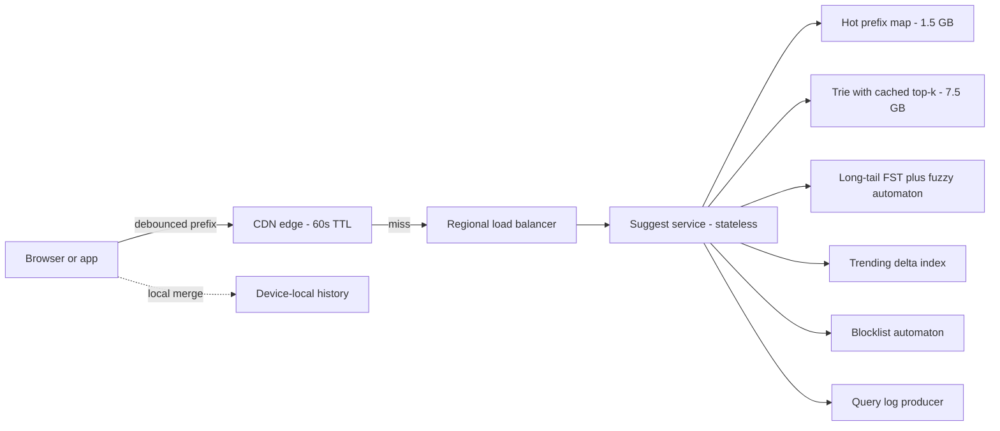
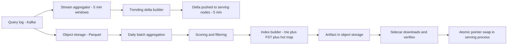
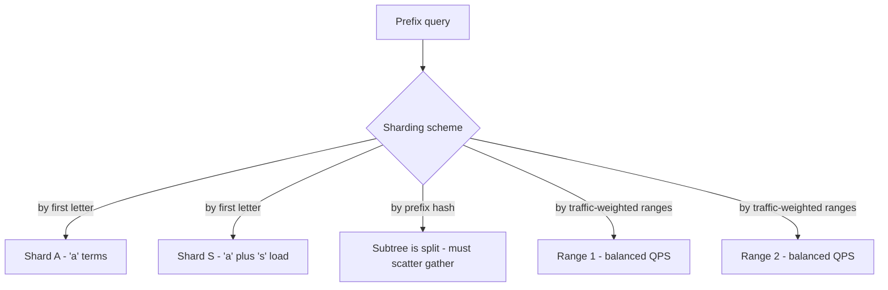
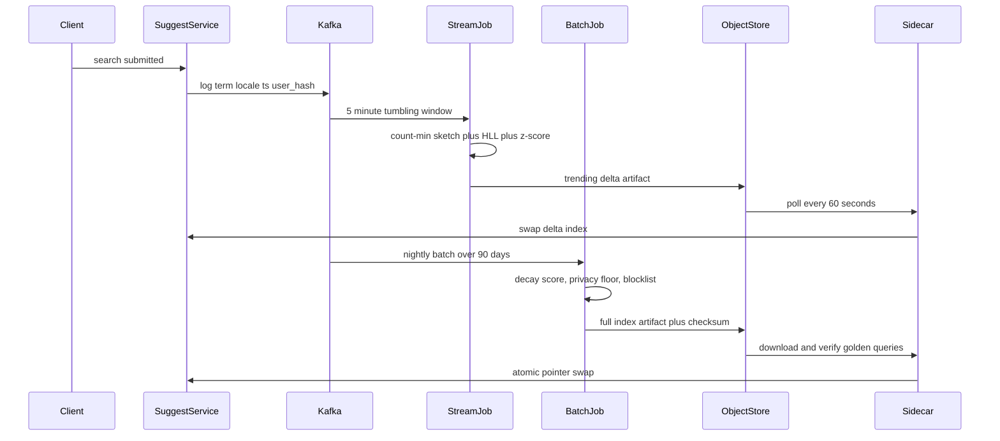
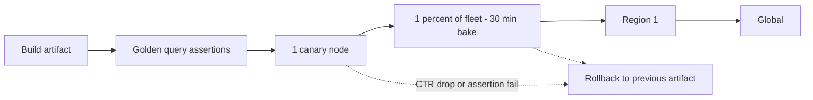

# 07 — Typeahead / Search Autocomplete

<span class="pill pill-core">Core</span> <span class="pill pill-medium">Medium</span>

**Every keystroke is a distributed query with a sub-100 ms budget that includes the user's network RTT — so the real design problem is not "how do I find completions for a prefix" but "how do I answer without leaving the edge".**

| | |
|---|---|
| **Commonly asked at** | Google, Meta, Amazon, LinkedIn, Uber, Airbnb, Elastic, Algolia |
| **Time budget** | 45 min |
| **Core tension** | Personalisation and freshness make every response unique, which destroys cacheability — and cacheability is the only thing that makes the latency budget and the QPS achievable |
| **Prerequisites** | [Caching](../fundamentals/f04-caching.md) · [CDN & Edge](../fundamentals/f05-cdn-edge.md) · [Search & Indexing](../fundamentals/f16-search-indexing.md) · [Partitioning & Sharding](../fundamentals/f06-partitioning-sharding.md) · [Queues & Streams](../fundamentals/f12-queues-streams.md) · [Networking Foundations](../fundamentals/f01-networking-foundations.md) |

## 1. Problem Statement

As a user types into a search box, show the top 5–10 completions, updating on every keystroke, fast enough that the suggestions feel like part of the keyboard rather than a network round trip.

Three facts define the whole system:

1. **The query rate is a multiple of the search rate.** A 20-character query generates up to 20 requests. Debouncing cuts that, but typeahead QPS still exceeds actual search QPS by roughly 5–10×.
2. **The latency budget includes the user's network.** "Feels instant" is roughly 100 ms end-to-end. Mobile RTT alone is 40–80 ms. The server portion of that budget is single-digit milliseconds.
3. **The data is Zipfian and mostly static.** The top 10 M queries cover the overwhelming majority of prefix traffic, and yesterday's top completions are almost certainly today's — except for the handful of terms that are trending right now, which are the ones users notice most.

The design lives entirely in the space created by those three facts: precompute aggressively, cache at the edge, and treat the small fresh/personalised slice as a separate, cheap overlay.

!!! note "What makes this deceptively hard"
    A trie is a first-year data structure, so candidates often finish the "algorithm" in three minutes and then have nothing to say. The depth is elsewhere: the memory math that decides whether the index is replicated or sharded, the pipeline that rebuilds it, the millisecond-by-millisecond latency budget, and the fact that personalisation and CDN caching are in direct conflict.

## 2. Requirements

### Functional

| # | Requirement | Notes |
|---|---|---|
| F1 | Return top-$k$ completions for a prefix | $k = 10$, ranked by a popularity score |
| F2 | Update on every keystroke | Subject to client-side debouncing |
| F3 | Minimum prefix length | 2 characters (1 for CJK) |
| F4 | Typo tolerance | Edit distance ≤ 2 for prefixes ≥ 4 characters |
| F5 | Trending terms | A term spiking now must appear within ~5 minutes |
| F6 | Offensive/blocked suggestions filtered | Per-locale blocklists, applied at build **and** serve time |
| F7 | Multi-language including CJK | Segmentation, romanised input, IME composition |
| F8 | Optional personalisation | Recent user queries surface first |
| F9 | Locale/market scoping | Suggestions differ by `en-US`, `en-GB`, `ja-JP` |

### Non-functional

| # | Requirement | Target |
|---|---|---|
| N1 | End-to-end latency | p50 ≤ 60 ms, p99 ≤ 100 ms including network |
| N2 | Server-side latency | p99 ≤ 10 ms at the origin, ≤ 2 ms at the edge |
| N3 | Availability | 99.95% — degrade to empty suggestions, never to an error page |
| N4 | Freshness (batch tier) | Index rebuilt daily; trending overlay ≤ 5 min |
| N5 | Cache hit ratio | ≥ 85% at the CDN for anonymous traffic |
| N6 | Correctness | Zero blocked terms served; any leak is a P1 |
| N7 | Cost | Suggestion serving must cost materially less per request than search itself |

### Explicitly out of scope

| Not doing | Why | Instead |
|---|---|---|
| Serving actual search results | Different index, different budget | The search backend |
| Semantic / embedding-based suggestions | 50–200 ms of ANN lookup blows the budget | A reranking layer behind the search box, not in front |
| Query understanding / entity linking | Belongs downstream | — |
| Cross-device personal history sync | A separate identity/sync problem | Personal terms stored locally per device |
| Suggesting arbitrary documents | This is query completion, not document search | [Search & Indexing](../fundamentals/f16-search-indexing.md) |

## 3. Scale Estimation

Assume 300 M DAU issuing 12 searches/day.

**Search rate.**

$$
Q_{\text{search}} = \frac{300\times10^6 \times 12}{86{,}400} = 41{,}667\ \text{searches/s (average)}
$$

**Prefix query amplification.** Average query length is ~20 characters. Without debouncing that is 20 requests per search. With a 120 ms debounce and a 2-character minimum, a typical typist (~4 chars/s) emits a request roughly every 2–3 characters:

$$
Q_{\text{prefix}} = Q_{\text{search}} \times 6 = 250{,}000\ \text{req/s (average)}, \qquad Q_{\text{peak}} \approx 3\times = 750{,}000\ \text{req/s}
$$

**After caching.** With an 85% CDN hit ratio on anonymous traffic (which is ~80% of it):

$$
Q_{\text{origin}} = 750{,}000 \times \bigl(0.8 \times 0.15 + 0.2 \times 1.0\bigr) = 750{,}000 \times 0.32 = 240{,}000\ \text{req/s}
$$

Personalised traffic bypassing the cache is a fifth of requests but two-thirds of origin load — the single most important number for capacity, and the reason personalisation gets pushed to the client (§7.4).

**Response size.** 10 suggestions × ~30 bytes + JSON framing ≈ 500 B, ~200 B gzipped.

$$
B = 750{,}000 \times 200\ \text{B} = 150\ \text{MB/s} = 1.2\ \text{Gbps at the edge}
$$

**Index memory — the number that decides the architecture.** Take the head of the query distribution: 10 M distinct queries, average 25 characters.

Distinct prefixes (nodes in a character trie) for 10 M phrases with heavy prefix sharing:

$$
P \approx 10^7 \times 25 \times 0.24 \approx 6\times10^7\ \text{nodes}
$$

Per node with cached top-10: 10 × (4-byte id + 4-byte score) = 80 B, plus ~40 B of node overhead (child map, flags):

$$
M_{\text{trie}} = 6\times10^7 \times 120\ \text{B} = 7.2\ \text{GB}
$$

Plus the phrase strings themselves: $10^7 \times 25\ \text{B} = 250\ \text{MB}$.

$$
\boxed{M_{\text{trie}} \approx 7.5\ \text{GB} \text{ — fits in RAM on a single commodity node}}
$$

That result changes everything: **the index does not need to be sharded, it needs to be replicated.** Sharding a 7.5 GB structure across machines adds a network hop to a 0.5 ms lookup and creates a load-balance problem; replicating it removes both.

Alternative structures at the same corpus:

| Structure | Memory | Lookup | Build | Verdict |
|---|---|---|---|---|
| Character trie, top-10 cached per node | 7.5 GB | ~0.3 µs, one traversal | Minutes | **Chosen** |
| Radix/compressed trie, top-10 cached | ~3 GB | ~0.3 µs | Minutes | Chosen if memory-constrained; more complex |
| FST (Lucene), weights as outputs | 60–120 MB | ~1 µs + top-k traversal | Minutes | Chosen for the *long tail* index (100 M terms) |
| Precomputed prefix→results hash map, all prefixes | $6\times10^7 \times 300\ \text{B} = 18\ \text{GB}$ raw, ~30 GB in Redis | O(1), ~0.1 ms over network | Hours | Rejected at full depth |
| Precomputed map, prefixes ≤ 6 chars only | ~5 M keys × 300 B = 1.5 GB | O(1) | Minutes | **Chosen as the edge/hot tier** |

The last row is the practical trick: **short prefixes carry almost all the traffic**. Prefixes of ≤ 6 characters are a small fraction of distinct prefixes but the large majority of requests, so a 1.5 GB hash map handles the hot path with O(1) lookups and no traversal, while longer prefixes fall through to the trie.

**Storage for the aggregation pipeline.** 41,667 searches/s × 100 B of log = 4.2 MB/s = 360 GB/day of raw query logs, reduced to a ~300 MB aggregated counts table.

| Quantity | Value |
|---|---|
| Prefix QPS | 250 K avg, 750 K peak |
| Origin QPS after CDN | ~240 K peak |
| Head index memory | 7.5 GB trie (replicated, not sharded) |
| Hot prefix map (≤ 6 chars) | ~1.5 GB |
| Long-tail FST | ~100 MB per 100 M terms |
| Edge bandwidth | ~1.2 Gbps |
| Raw log volume | 360 GB/day → 300 MB aggregated |

## 4. API Design

```http
GET /v1/suggest?q=distr&locale=en-US&market=US&k=10&ctx=web HTTP/1.1
Host: ac.example.com
Accept-Encoding: br
```

```json
{
  "q": "distr",
  "suggestions": [
    { "text": "distributed systems", "score": 9821, "type": "popular" },
    { "text": "distributed database", "score": 7734, "type": "popular" },
    { "text": "district court", "score": 6610, "type": "popular" },
    { "text": "distributed lock redis", "score": 210, "type": "trending" }
  ],
  "index_version": "2026-08-30T04:11Z",
  "truncated": false
}
```

| Aspect | Decision | Rationale |
|---|---|---|
| Method | `GET` | Cacheable at the CDN; a `POST` would not be. This alone justifies squeezing every parameter into the query string |
| Cache key | `(normalised_q, locale, market, k, ctx)` — nothing else | Any header or cookie in the key shatters the hit ratio. Strip cookies at the edge |
| Cache control | `Cache-Control: public, max-age=60, stale-while-revalidate=300` | 60 s TTL bounds trending lag; `stale-while-revalidate` means an expiry never costs a user a slow response |
| Versioning | `/v1` path; `index_version` echoed for debugging | Clients pin nothing; the response shape is additive-only |
| Pagination | None. $k \le 25$ enforced server-side | Nobody paginates autocomplete; an unbounded $k$ is a cache-key explosion and a DoS vector |
| Idempotency | Pure read, trivially idempotent | Retries are free — clients should retry once at 40 ms rather than wait |
| Compression | Brotli, with a static dictionary of common terms | Responses are tiny and highly repetitive; a shared dictionary roughly halves them again |

### `truncated` and the client-side filtering contract

If `truncated` is `false`, the client knows the response contains **every** match for that prefix. It can then answer all extensions of that prefix locally — typing `distri` after `distr` requires no request at all. This one boolean removes a large share of requests for narrow prefixes, and it is a design detail that consistently impresses.

### Error codes

| Code | Meaning | Client behaviour |
|---|---|---|
| `200` | Suggestions, possibly empty | Render; empty is a valid answer |
| `204` | No suggestions, definitively | Render nothing, and suppress requests for extensions of this prefix |
| `304` | `ETag` match | Use cached |
| `429` | Per-client rate limit | Increase debounce interval; **never** retry immediately |
| `503` | Origin unhealthy | Fall back to local history; the search box must keep working |

!!! tip "The failure contract is 'no suggestions', never 'error'"
    Typeahead is an enhancement to a text input. A 500 must render as an empty dropdown, not a toast. Make that explicit in the client SDK — it is the difference between an incident and a blip.

## 5. Data Model

| Entity | Key | Contents | Store |
|---|---|---|---|
| `query_term` | `term_id` | text, normalised form, locale, global score, blocked flag, first/last seen | Columnar (build-time), immutable |
| `term_stats` | `(term_id, hour)` | count, distinct users, CTR | Time-series / warehouse |
| `trie_node` | implicit (in-memory) | children map, `is_terminal`, cached top-$k$ `(term_id, score)` | Process memory, memory-mapped |
| `hot_prefix` | `prefix` (≤ 6 chars) | serialised top-10 payload | In-memory map / Redis |
| `blocklist` | `(locale, pattern)` | pattern, type (exact/substring/regex), severity | Config store, pushed to every node |
| `user_recent` | `user_id` | last 50 queries with timestamps | Client-local storage; server copy optional |

```sql
-- Build-time aggregation output; consumed by the index builder, never queried online.
CREATE TABLE term_daily (
    term            TEXT        NOT NULL,
    term_normalised TEXT        NOT NULL,   -- casefold, NFKC, trim, collapse spaces
    locale          TEXT        NOT NULL,
    day             DATE        NOT NULL,
    impressions     BIGINT      NOT NULL,
    selections      BIGINT      NOT NULL,   -- times a user picked this suggestion
    searches        BIGINT      NOT NULL,   -- times typed in full
    distinct_users  BIGINT      NOT NULL,   -- HyperLogLog cardinality
    PRIMARY KEY (term_normalised, locale, day)
);

-- Final scoring blends volume, engagement, and recency.
CREATE VIEW term_score AS
SELECT term_normalised, locale,
       SUM(searches * EXP(-LN(2) * (CURRENT_DATE - day) / 7.0))     AS volume_score,
       SUM(selections)::FLOAT / NULLIF(SUM(impressions), 0)          AS ctr,
       MIN(distinct_users)                                           AS reach
FROM term_daily
WHERE day > CURRENT_DATE - 90
GROUP BY term_normalised, locale
HAVING SUM(distinct_users) >= 25;   -- privacy k-anonymity floor, see section 12
```

### Access patterns

| # | Pattern | Rate | Served by |
|---|---|---|---|
| A1 | Top-$k$ for a prefix | 240 K/s origin | Hot prefix map, else trie traversal |
| A2 | Fuzzy match for a misspelled prefix | ~5% of A1 | Levenshtein automaton over the FST |
| A3 | Trending terms for a prefix | Merged into every A1 | Small in-memory delta index |
| A4 | Personal recent terms | Client-side | Local storage |
| A5 | Blocklist check | Every response | In-memory set + Aho–Corasick automaton |
| A6 | Aggregate raw logs | Continuous | Stream job |
| A7 | Build index | Daily | Batch job |

### Store choice

| Need | Chosen | Rejected and why |
|---|---|---|
| Online index | In-process memory-mapped trie/FST, replicated on every serving node | Redis: adds a 0.3–1 ms network hop to a 0.3 µs lookup, and 30 GB of RAM per replica set. Elasticsearch completion suggester: works, but 5–20 ms p99 and heavy JVM ops for a problem solvable with a hash map |
| Hot prefix tier | In-process map, built at index-build time | External cache: same hop objection |
| Aggregation | Stream (Flink) for trending + batch (Spark) for the daily index | Pure streaming: a full index rebuild every 5 minutes wastes compute for data that barely changes. Pure batch: trending terms take 24 h to appear, which users notice immediately |
| Raw logs | Kafka → object storage (Parquet) | Direct-to-warehouse: no replay, and the stream job needs the same feed |
| Blocklist | Config pushed to every node, versioned | Runtime service lookup: adds a hop and a dependency to a path that must never fail open |

## 6. High-Level Architecture





### Read path (a single keystroke)

1. Client debounces 120 ms, cancels any in-flight request, checks its local prefix cache and the `truncated` shortcut. If it can answer locally, no request is made.
2. Request hits the nearest CDN PoP. Cache key is the normalised query plus locale/market. ~85% of anonymous requests stop here at ~1 ms of server time.
3. On a miss, the regional LB routes to any suggest node — every node has a full copy of the index, so there is no routing logic.
4. Node normalises the prefix (NFKC, casefold, trim), checks the hot map (≤ 6 chars) for an O(1) hit; otherwise traverses the trie to the prefix node and reads its cached top-$k$.
5. Merges the trending delta index (a small map of recently spiking terms).
6. Applies the blocklist automaton to both the prefix and every candidate.
7. Serialises, sets cache headers, returns. Server time budget: 2 ms p99.
8. The client merges device-local personal history on top before rendering.

### Write path (how a query becomes a suggestion)

1. Every search and every suggestion selection emits a log record to Kafka.
2. The stream job maintains 5-minute tumbling windows with a Count-Min Sketch for heavy hitters, plus HyperLogLog for distinct users, and emits candidate trending terms.
3. A trending gate requires: distinct users ≥ 25 (privacy floor), a z-score above threshold versus the 7-day baseline, and a blocklist pass. Survivors go into the delta index and are pushed to serving nodes within 5 minutes.
4. Nightly, the batch job aggregates 90 days of logs with exponential time decay, applies the same privacy floor and blocklists, scores, and builds the artifact.
5. Sidecars on each serving node download the artifact, verify its checksum and a set of golden-query assertions, memory-map it, and swap the active pointer atomically. Old index stays resident until in-flight requests drain.

## 7. Deep Dives

### 7.1 Index structure: trie vs FST vs precomputed map

**Trie with cached top-$k$.** The key insight is that a plain trie requires a subtree traversal per query — for the prefix `a` that is potentially millions of nodes. Precomputing the top-$k$ *at every node* converts the query into a pure descent:

```python
class Node:
    __slots__ = ("children", "topk", "terminal_id")

def build_topk(node, k=10):
    """Post-order: each node's top-k is the merge of its children's top-k plus itself."""
    heap = []
    if node.terminal_id is not None:
        heap.append((score_of(node.terminal_id), node.terminal_id))
    for child in node.children.values():
        build_topk(child, k)
        heap.extend(child.topk)                 # each already ≤ k entries
    node.topk = heapq.nlargest(k, heap)          # merge of ≤ (k * fanout + 1) items
    return node.topk

def lookup(root, prefix, k=10):
    node = root
    for ch in prefix:
        node = node.children.get(ch)
        if node is None:
            return []            # also lets the client suppress all extensions
    return node.topk[:k]
```

Build cost is $O(P \cdot k \cdot \log(k \cdot \text{fanout}))$ — a few minutes for 60 M nodes — and it is done offline, so it costs nothing at serve time.

**Memory, precisely.** The naive `dict` per node in a managed runtime is the killer: a Python dict is ~200 B empty, a Java `HashMap` ~48 B plus entries. For 60 M nodes that is 12–30 GB of pure overhead. Real implementations use a **flat array layout**: nodes in one contiguous array, children as a sorted range of `(char, child_index)` pairs in a second array, top-$k$ as fixed-width slots in a third. That structure is memory-mappable, has no pointer chasing across pages, and can be built once and shipped as a file.

$$
M = \underbrace{6\times10^7 \times 8\ \text{B}}_{\text{node records}} + \underbrace{7\times10^7 \times 6\ \text{B}}_{\text{edges}} + \underbrace{6\times10^7 \times 80\ \text{B}}_{\text{top-10 slots}} \approx 5.7\ \text{GB}
$$

=== "Trie with cached top-k"

    **Wins on**: lookup simplicity (one descent, zero allocation), trivial top-$k$, easy to reason about.
    **Loses on**: memory — the top-$k$ slots dominate and scale with $k$. Immutable once built, so trending needs a separate delta.
    **Use when**: the head index is your primary structure. This is the default answer.

=== "FST"

    A finite-state transducer shares **suffixes** as well as prefixes and stores an output (the weight) on transitions. Lucene's implementation packs 10 M terms into 60–120 MB — roughly 60× smaller than the trie.

    **Wins on**: memory, and it holds the entire long tail (100 M+ terms) in the space the trie uses for the head.
    **Loses on**: top-$k$ requires an actual traversal with a priority queue, because outputs are on edges rather than cached per node — an order of magnitude slower, though still ~50 µs. Building is more complex, and it must be built in sorted order.
    **Use when**: serving the long tail and for fuzzy matching, where a Levenshtein automaton intersects naturally with an FST.

=== "Precomputed prefix map"

    A flat hash map from prefix string to a serialised result payload.

    **Wins on**: O(1) lookup with zero traversal and trivially shardable/cacheable; can be pushed to the CDN or even into a client bundle.
    **Loses on**: memory grows with the number of *distinct prefixes* times payload size — 18 GB for full depth. Rebuilds are all-or-nothing.
    **Use when**: capped at short prefixes. 6-character cap → ~5 M entries → 1.5 GB, covering most traffic at O(1). This is the hot tier.

**The chosen combination**: hot prefix map (≤ 6 chars) → trie for the head → FST for the long tail and fuzzy → delta index for trending. Each layer exists because the layer above it does not cover a specific case.

### 7.2 Sharding, or why you should not

At 7.5 GB, the index fits on one machine, so the correct answer is **replicate to every serving node**. State that first, because most candidates jump straight to sharding and create problems that do not exist.

But interviewers will push: "what if the index were 500 GB?" Then the sharding strategies and their failure modes matter:



| Scheme | Balance | Correctness | Verdict |
|---|---|---|---|
| First character | Terrible — English first-letter frequency spans ~15× between `s` and `z`; `q`, `x`, `z` are near-empty | Correct: all completions of a prefix share its first character | Rejected on balance |
| Hash of the full prefix | Excellent | **Broken**: completions of `dis` live under `dist`, `disc`, `disp`, which hash elsewhere. A prefix query becomes a scatter-gather across all shards | Rejected on correctness |
| Traffic-weighted prefix ranges | Good, and rebalanceable at each build | Correct: ranges are contiguous in prefix order, so a subtree stays whole | **Chosen if sharding is required** |
| Shard by locale/market | Naturally balanced by market size | Correct, and locales are independent indexes anyway | **Chosen first** — it is free |
| Full replication | Perfect | Correct | **Chosen at this scale** |

The traffic-weighted approach assigns prefix ranges so each shard receives equal *QPS*, not equal *terms*. Because query traffic is Zipfian while term counts are not, equal-term sharding produces 10× QPS imbalance. Boundaries are recomputed at each index build from the previous day's traffic histogram, and the routing table ships with the index — so routing and data are always the same version.

!!! gotcha "Sharding by first character is the most common wrong answer in this problem"
    It sounds balanced ("26 shards, one per letter") and is not remotely so: the `s` shard holds roughly 12% of English queries while `z` holds under 0.3%, a 40× spread. Worse, the imbalance is in *both* memory and QPS simultaneously, so you cannot fix it by adding replicas of one shard without wasting the rest.

### 7.3 The aggregation and build pipeline



**Two tiers because the alternatives are both bad.** Rebuilding a full 7.5 GB index every 5 minutes wastes enormous compute to change ~0.1% of entries; waiting 24 hours for a trending term means missing the event entirely. So: batch for the stable 99.9%, stream for the volatile 0.1%.

**Scoring.** Raw counts are the wrong signal — they are gameable, stale-biased, and ignore engagement:

$$
\text{score}(t) = \underbrace{\sum_{d} c_{t,d}\, e^{-\lambda (T-d)}}_{\text{time-decayed volume}} \times \underbrace{\left(\frac{s_t + \alpha}{i_t + \beta}\right)}_{\text{smoothed CTR}} \times \underbrace{\min\!\left(1, \frac{u_t}{u_{\min}}\right)}_{\text{reach gate}}
$$

with a 7-day half-life ($\lambda = \ln 2 / 7$), Bayesian smoothing on CTR so a term with 3 impressions and 3 clicks does not outrank one with 100 K impressions, and a reach gate that suppresses terms driven by few users (both bot traffic and a privacy requirement).

**Trending detection.** Count-Min Sketch gives approximate counts for heavy hitters in bounded memory:

$$
\text{width } w = \left\lceil \frac{e}{\varepsilon} \right\rceil,\quad \text{depth } d = \left\lceil \ln \frac{1}{\delta} \right\rceil
$$

For $\varepsilon = 10^{-5}$ (error ≤ 0.001% of stream size) and $\delta = 10^{-4}$: $w = 271{,}829$, $d = 10$ → 2.7 M counters × 4 B = **11 MB per window**. Compare that to a hash map of every distinct query in a 5-minute window (tens of millions of entries, gigabytes). Then flag terms whose window count exceeds a z-score threshold against a 7-day, same-hour-of-week baseline — not against the overall mean, or every weekday morning looks like a spike.

**Shipping.** The artifact is immutable, checksummed, and versioned. The sidecar:

1. Downloads to a scratch path and verifies the checksum.
2. Runs **golden query assertions** — a fixed list of ~500 prefixes with expected top results. If `["a"] → []` or the blocklist is empty, abort.
3. Memory-maps the new file and atomically swaps a pointer.
4. Keeps the previous index resident for the duration of in-flight requests, then unmaps.
5. Exposes `index_version` and `index_age_seconds` as metrics; alerts fire when age exceeds 36 hours.

Rollout is staged: 1 node → 1% of the fleet → one region → global, with automatic rollback on a drop in suggestion CTR, which is the only metric that catches a *semantically* broken index. Latency and error rate look perfect when the index is subtly wrong.

### 7.4 The latency budget, client behaviour, and the personalisation conflict

**Budget, hop by hop** (mobile, cache miss, worst realistic case):

| Hop | p50 | p99 | Notes |
|---|---|---|---|
| Keystroke → debounce fires | 120 ms | 120 ms | Not latency — but it is in the user's perception, so keep it ≤ 150 ms |
| Client → CDN PoP RTT | 25 ms | 60 ms | The single largest term. Only anycast + more PoPs reduce it |
| TLS (amortised, connection reused) | 0 ms | 5 ms | Requires connection reuse; a cold TLS handshake adds a full extra RTT |
| CDN processing on hit | 1 ms | 3 ms | 85% of requests end here |
| CDN → origin RTT | 15 ms | 35 ms | Only on miss |
| LB + service overhead | 0.5 ms | 2 ms | Includes queueing |
| Normalise + hot-map or trie lookup | 0.05 ms | 0.3 ms | The "algorithm" is 0.3% of the budget |
| Trending merge + blocklist | 0.1 ms | 0.5 ms | Aho–Corasick over ≤ 10 candidates |
| Serialise + compress | 0.2 ms | 1 ms | Brotli with a shared dictionary |
| Response transfer | 2 ms | 8 ms | 200 B gzipped |
| Client render | 3 ms | 10 ms | Avoid layout thrash; a synchronous reflow can exceed the network cost |
| **Total (cache hit)** | **~31 ms** | **~82 ms** | Meets the SLO |
| **Total (cache miss)** | **~48 ms** | **~120 ms** | Exceeds p99 — hence the 85% hit-ratio requirement |

The conclusion is stark: **the index lookup is a rounding error and the network is everything.** Any design discussion that spends its time on trie micro-optimisation while ignoring cache hit ratio has optimised the wrong 0.3%.

**Client behaviour is a first-class part of the design:**

```javascript
const cache = new Map();                 // prefix -> {items, truncated}
let controller = null;
let timer = null;

function onInput(prefix) {
  if (prefix.length < 2) return render([]);

  // 1. Exact local hit.
  const hit = cache.get(prefix);
  if (hit) return render(merge(hit.items, localHistory(prefix)));

  // 2. Prefix-closure: a complete (non-truncated) parent answer covers all children.
  for (let i = prefix.length - 1; i >= 2; i--) {
    const parent = cache.get(prefix.slice(0, i));
    if (parent && !parent.truncated) {
      const filtered = parent.items.filter(s => s.text.startsWith(prefix));
      cache.set(prefix, { items: filtered, truncated: false });
      return render(merge(filtered, localHistory(prefix)));
    }
    if (parent && parent.items.length === 0) {           // 204 propagates downward
      return render(localHistory(prefix));
    }
  }

  // 3. Debounce, and cancel the in-flight request — an older prefix's answer is
  //    not just wasted, it can arrive after the newer one and overwrite it.
  clearTimeout(timer);
  timer = setTimeout(async () => {
    controller?.abort();
    controller = new AbortController();
    try {
      const r = await fetch(url(prefix), { signal: controller.signal });
      const body = await r.json();
      cache.set(prefix, { items: body.suggestions, truncated: body.truncated });
      render(merge(body.suggestions, localHistory(prefix)));
    } catch (e) {
      render(localHistory(prefix));          // never surface an error
    }
  }, 120);
}
```

Measured effect of these four techniques together: **request volume drops 60–75%** versus a naive per-keystroke implementation. That is a bigger capacity win than any server-side change available.

**The personalisation conflict.** Personalised responses are unique per user, so:

- CDN hit ratio for personalised traffic is 0%.
- Origin QPS is dominated by the personalised minority (§3: 20% of traffic → 67% of origin load).
- Per-user index state at 300 M users is a large, low-value dataset.

=== "Server-side personalisation (rejected)"

    Look up the user's history server-side and blend. Correct results, but `Cache-Control: private`, zero edge caching, a per-request user-store lookup adding 2–5 ms and a hard dependency, and origin capacity sized for 100% of peak traffic.

=== "Client-side merge (chosen)"

    Server returns the **global, cacheable** answer. The client keeps the last 50 queries in local storage and merges them on top before rendering, boosting exact prefix matches to the top.

    - Cache hit ratio stays high for all traffic.
    - Personal data never leaves the device — a meaningful privacy and compliance win.
    - Zero added server latency and no new dependency.
    - Limitation: no cross-device history, and no collaborative signal ("people like you searched for..."). For autocomplete specifically, recent-personal-history captures the large majority of the value.

=== "Hybrid segment personalisation"

    Bucket users into ~50 coarse cohorts (locale × market × broad interest) and cache per cohort. Hit ratio ≈ $1/50$ of the fully global one but still high in absolute terms, and it recovers some collaborative signal. Use when the product genuinely needs cross-user personalisation.

### 7.5 Fuzzy matching, spell correction, and CJK

**Fuzzy matching.** A prefix with a typo (`distrubuted`) must still return something. Three approaches:

| Approach | Memory | Latency | Verdict |
|---|---|---|---|
| Levenshtein automaton ∩ FST | ~0 extra (reuses the FST) | 0.5–3 ms for distance ≤ 2 | **Chosen**. Lucene's `FuzzyQuery` model: build a DFA accepting all strings within edit distance $d$, intersect with the FST, walk both |
| SymSpell delete-neighbourhood index | Explosive: for a 25-char term, $\binom{25}{1}+\binom{25}{2} = 325$ deletes; ×10 M terms = 3.25 B entries ≈ 100 GB | ~0.1 ms | Rejected at this term length. Viable for short vocabularies (≤ 10 chars) |
| Character n-gram inverted index | ~2 GB for trigrams over 10 M terms | 2–5 ms plus scoring | Fallback for CJK and for substring (not just prefix) matching |
| BK-tree | ~1 GB | 10–50 ms | Rejected: too slow, poor cache locality |

Policy details that matter more than the algorithm:

- **Never fuzzy-match short prefixes.** At 3 characters, edit distance 2 matches essentially everything. Gate: distance 1 allowed at ≥ 4 characters, distance 2 at ≥ 7.
- **Try exact first, always.** Only fall back to fuzzy when the exact result count is below a threshold, so the common path never pays for it.
- **Rank exact above fuzzy**, and mark fuzzy results in the response so the UI can show "did you mean".
- **Keyboard-aware costs**: substituting `a`→`s` (adjacent keys) should cost less than `a`→`p`. A weighted edit distance measurably improves suggestion quality on mobile.

**CJK and IME input.** This is where most designs fall apart, and mentioning it is a strong differentiator:

| Issue | Mechanism | Handling |
|---|---|---|
| No word delimiters | Chinese and Japanese text has no spaces, so "prefix" means character prefix, not word prefix | Index at character granularity; also build an n-gram index for substring matching, which users expect |
| IME composition | Typing Japanese produces romaji → kana → kanji. Intermediate states are not real queries | Listen for `compositionstart`/`compositionend`; suppress requests during composition **but** also support romaji-prefix matching, since users expect suggestions while composing |
| Pinyin input | A Chinese user types `beijing` expecting 北京 | Maintain a pinyin→hanzi index; query both the pinyin trie and the hanzi trie and merge. Also handle abbreviated pinyin (`bj` → 北京) |
| Korean jamo | Hangul syllables decompose into jamo; partial syllables are valid input | Normalise with NFD for matching, NFC for display |
| Normalisation | Full-width vs half-width, hiragana vs katakana, traditional vs simplified | NFKC at both build and query time, plus explicit kana folding and a simplified/traditional mapping table |
| Short prefixes | One CJK character carries far more information than one Latin character | Minimum prefix length is 1 for CJK, 2 for Latin — a per-script parameter, not a global constant |

!!! warning "Normalisation must be byte-identical between build and query"
    If the builder applies NFKC and the server applies NFC, every non-ASCII prefix misses. This class of bug is invisible in aggregate metrics (overall hit rate barely moves) and total for the affected locale. Extract normalisation into a shared library with a version number, ship the version in the index artifact, and have the server refuse to load an index whose normaliser version it does not implement.

## 8. Scaling the Bottleneck

The bottleneck is **origin QPS driven by cache misses**, not the index. Attack it in this order:

1. **Reduce requests at the client** (§7.4): debounce, cancel, local prefix cache, prefix-closure, `204` propagation. 60–75% reduction, costs nothing, ships in one release.
2. **Raise the CDN hit ratio.** Strip cookies, normalise the query string (lowercase, trim, drop unknown params, canonical parameter order), cap `k` to a small set of allowed values, and use `stale-while-revalidate` so expiry never costs a user latency. Every extra dimension in the cache key divides the hit ratio.
3. **Push the hot tier to the edge.** The ≤ 6-character prefix map is 1.5 GB — small enough to run inside an edge compute runtime. Then most misses never reach the region at all.
4. **Replicate the origin, do not shard it.** Every node is identical and stateless apart from the memory-mapped index, so scaling is `replicas += n` behind a load balancer.
5. **Only then consider sharding**, using traffic-weighted prefix ranges (§7.2).

**Capacity per node.** With the hot map and trie in memory, a lookup is ~0.3 µs of CPU and the rest is I/O and serialisation. A 16-core node handles roughly 40 K RPS at p99 ≤ 2 ms, bounded by syscalls and serialisation rather than the data structure:

$$
N_{\text{nodes}} = \frac{240{,}000}{40{,}000} \times 1.5\ \text{(headroom)} = 9\ \text{per region} \Rightarrow 27\ \text{across 3 regions}
$$

Each node needs ~12 GB RAM (7.5 GB trie + 1.5 GB hot map + FST + working set + room for two index generations during a swap). **The two-generation requirement is why nodes are provisioned at 2× index size** — a detail that gets missed until a swap OOMs the fleet.

## 9. Failure Modes

| Failure | Blast radius | Detection | Mitigation | Degraded behaviour |
|---|---|---|---|---|
| Index build job fails | Global freshness | `index_age_seconds` alert at 36 h | Keep serving yesterday's index — it is 99.9% correct | Trending terms stale; users barely notice for a day |
| Corrupt index shipped | Global correctness | Golden-query assertions in the sidecar; CTR drop alert | Sidecar refuses the swap; automatic rollback to previous artifact | Previous index continues serving |
| Blocklist not applied at build | Offensive suggestions live | Serve-time blocklist automaton is the second gate; abuse reports | Two independent gates (build + serve); emergency blocklist push in < 5 min | Contained by the serve-time gate |
| CDN PoP outage | One region's users | Edge health checks, origin QPS spike | Anycast reroutes; origin must absorb a 6× QPS spike from that region | Higher latency; possible shedding |
| Origin overload | All cache misses | RPS, queue depth, p99 | Load shedding: return `204` rather than queue. An empty dropdown beats a slow one | Suggestions disappear for some users |
| Trending pipeline stalls | Freshness only | Delta age metric | Serve the batch index alone | No trending terms; core suggestions unaffected |
| Poisoned trending term | Global, reputational | Distinct-user floor, z-score gate, blocklist, human review queue for the top-N new terms | Kill-switch removes a term from the delta within 60 s | — |
| Memory swap during index reload | One node, severe latency | RSS, page-fault rate, p99 | Provision 2× index size; `mlock` the mapping; drain the node before swapping | That node's p99 spikes to seconds — drain it |
| Normaliser version mismatch | One locale, total | Golden queries per locale; per-locale hit-rate alarm | Version the normaliser in the artifact; refuse to load on mismatch | That locale returns nothing |
| Client debounce regression | Global QPS | Requests-per-search ratio metric | Alert on the ratio, not just raw QPS; server-side per-client rate limit as a backstop | 3–5× origin load; shedding engages |
| Locale/market misrouting | One market | Suggestion CTR per market | Cache key includes market; contract tests | Wrong-language suggestions — very visible |

## 10. SRE Lens

### SLIs and SLOs

| SLI | Definition | SLO |
|---|---|---|
| Availability | Non-5xx / total suggest requests | 99.95% over 28 d |
| Edge latency | p99 client-observed time to render, cache hit | ≤ 100 ms |
| Origin latency | p99 server processing time | ≤ 10 ms |
| Cache hit ratio | CDN hits / total, anonymous traffic | ≥ 85% |
| Index freshness | `now - index_build_time` | ≤ 30 h at p99 |
| Trending lag | Time from term spike to serve | ≤ 5 min at p95 |
| Suggestion quality | Selections / impressions (CTR) | ≥ baseline − 5% relative |
| Safety | Blocked terms served | 0 — any occurrence is a P1 |

**Error budget.** 99.95% over 28 days = 20 minutes. But the meaningful budget here is the **quality** budget: a 5% relative CTR drop is invisible to every availability metric and is a genuine product regression. Treat CTR as a release gate with automatic rollback, because it is the only SLI that detects "the index built successfully and is wrong".

### Rollout plan



- Every artifact keeps its previous three generations in object storage; rollback is a pointer change plus a sidecar poll, measured in under two minutes.
- Code and index roll out independently. Never ship a serving-code change and an index-format change together, or a rollback becomes ambiguous.
- Blocklist updates bypass the staged rollout and push globally within 5 minutes — safety changes must be faster than feature changes. See [Deployment & Release Safety](../fundamentals/f25-deployment-release-safety.md).

### Runbook notes

```bash
# p99 spiked. Cache or origin?
promql: sum(rate(cdn_requests_total{status="HIT"}[5m])) / sum(rate(cdn_requests_total[5m]))
# If hit ratio dropped, look for a new cache-key dimension shipped by a client release.

# Origin QPS doubled with no traffic change: client debounce regression.
promql: sum(rate(suggest_requests_total[5m])) / sum(rate(search_submitted_total[5m]))
# Healthy ratio is ~6. Above 12 means debouncing broke in a client build.

# Emergency: remove a term everywhere within 5 minutes.
curl -XPOST /admin/blocklist -d '{"pattern":"<term>","locale":"*","severity":"hard"}'
# Verify propagation:
promql: min(blocklist_version) by (region)
```

### Capacity model

$$
N = \left\lceil \frac{Q_{\text{peak}} \times (1 - h)}{c_{\text{node}}} \times \frac{1}{1 - f_{\text{region}}} \right\rceil
$$

where $h$ is the cache hit ratio and $f_{\text{region}}$ is the fraction of capacity that must survive losing one region. At $Q=750$ K/s, $h=0.68$ blended, $c=40$ K/s, $f=1/3$: $N = 9$ per region. **The dominant lever is $h$**: moving the hit ratio from 85% to 70% nearly doubles the fleet. Cache ratio is a capacity metric, not a performance nicety.

### Cost

| Line | Estimate/month | Lever |
|---|---|---|
| CDN requests + bandwidth | $40 K | Higher TTL and better key normalisation; Brotli with a shared dictionary |
| Origin compute (27 nodes, memory-heavy) | $18 K | Client-side request reduction is 3× cheaper than adding nodes |
| Log ingestion + storage (360 GB/day) | $12 K | Sample low-value events; aggregate at the edge |
| Batch + stream pipelines | $8 K | Daily rebuild, not hourly |
| **Per-request cost** | ~$0.003 per 1,000 requests | Compare to search itself at ~$0.5 per 1,000 |

The reason typeahead is economically viable at 6× the QPS of search is that its per-request cost is ~150× lower — entirely because of precomputation and edge caching. If either of those breaks, the economics invert immediately. See [Cost Engineering](../fundamentals/f28-cost-engineering.md).

## 11. Trade-offs & Alternatives

| Decision | Chosen | Alternative | Alternative wins when |
|---|---|---|---|
| Index | Trie + hot map + FST | Elasticsearch completion suggester | You already run ES, QPS is under ~5 K, and 20 ms p99 is acceptable |
| Distribution | Full replication | Sharding | Index exceeds node memory — then traffic-weighted prefix ranges |
| Personalisation | Client-side merge | Server-side blend | Cross-device history is a hard product requirement |
| Freshness | Batch + stream delta | Pure streaming index | Content is genuinely real-time, e.g. a live-events search box |
| Fuzzy | Levenshtein automaton over FST | SymSpell | Vocabulary is short-token (product SKUs, usernames) |
| Ranking | Popularity + CTR + decay | Learned ranker (LTR) | You have the data and can afford 5–10 ms of inference — but usually not inside this budget |

### At 10× (7.5 M prefix QPS)

- Edge compute becomes mandatory: run the hot-prefix tier inside the CDN so the majority of misses never reach a region.
- The head index grows to ~50 M terms and ~35 GB; still replicable on large-memory nodes, but the two-generation rule now means 96 GB machines.
- Log volume hits 3.6 TB/day: pre-aggregate at the edge (each PoP emits per-window counts rather than raw events), reducing central ingestion by ~100×.
- Trending detection needs per-region sharding of the sketch, with a merge step — Count-Min Sketches merge by element-wise addition, which makes this clean.

### At 1/10 (25 K prefix QPS, 1 M terms)

- One node, one process, no CDN required. A 400 MB trie in memory with a `Cache-Control` header in front handles all of it.
- Skip the streaming tier entirely: rebuild the whole index every 10 minutes from a Postgres aggregate query. It takes seconds.
- Skip the FST, skip sharding, skip cohort personalisation.
- **The honest answer**: "at this scale I would use the completion suggester in whatever search engine I already run, and spend my effort on ranking quality and the client-side request reduction, which is where the user-visible wins are."

## 12. Gotchas & Corner Cases

!!! gotcha "Out-of-order responses overwrite newer suggestions with older ones"
    **Symptom.** The user types `distr` and the dropdown briefly shows completions for `dis`, or worse, settles on them. **Mechanism.** Requests for `dis` and `distr` are in flight concurrently; `dis` was issued first but returns second (different CDN node, retry, TCP retransmit), and the handler renders whatever arrived last. **Mitigation.** Abort in-flight requests on each new keystroke *and* stamp each response with the prefix that produced it, discarding any response whose prefix is not the current input. Do both — `AbortController` does not guarantee the callback will not fire.

!!! gotcha "Every added cache-key dimension halves your capacity"
    **Symptom.** A client release adds an A/B experiment ID to the request; origin QPS triples overnight with no traffic change. **Mechanism.** The CDN key now includes the experiment bucket, so a formerly shared cache entry is split N ways and the hit ratio collapses. **Mitigation.** Treat the cache key as a governed interface: an explicit allow-list of parameters at the edge, everything else stripped before the key is computed, and an automated test that fails CI if a client sends unrecognised parameters. Alert on hit ratio, not just on QPS.

!!! gotcha "Debouncing on a timer breaks for fast typists and for paste"
    **Symptom.** Users who type quickly see no suggestions until they stop, and pasting a full query fires a request for a prefix nobody typed. **Mechanism.** A fixed trailing debounce only fires after silence; a fast typist produces no silence until the end. **Mitigation.** Use a leading-plus-trailing debounce (fire immediately on the first character past the minimum, then at most every 150 ms), and detect paste events to fire once immediately with the full string rather than treating it as a prefix.

!!! gotcha "The blocklist must run at serve time, not only at build time"
    **Symptom.** An offensive term appears in production hours after being reported, despite being on the blocklist. **Mechanism.** The blocklist was applied during the nightly build; the term entered through the trending delta index, which bypassed that gate. **Mitigation.** Two independent gates — build-time filtering and a serve-time Aho–Corasick pass over every returned candidate — plus a blocklist push channel that propagates globally in under five minutes independent of index builds. The serve-time gate costs ~0.1 ms and is not optional.

!!! gotcha "Substring blocklists create the Scunthorpe problem"
    **Symptom.** Legitimate queries about a UK town, or the surname Cockburn, return no suggestions and generate support tickets. **Mechanism.** Naive substring matching flags any term containing a blocked sequence. **Mitigation.** Match on word boundaries with locale-aware tokenisation, maintain an explicit allow-list that overrides the blocklist, and classify blocklist entries by type — exact phrase, whole word, substring — with substring reserved for terms where it is genuinely warranted. Test with a fixed corpus of known false positives in CI.

!!! gotcha "Autocomplete leaks other users' private queries"
    **Symptom.** Typing a person's name or a partial credit-card-like string yields a completion that is obviously one specific user's private query. **Mechanism.** A term typed by a single user still meets a low count threshold and enters the index. This is a real, litigated problem, and it is a privacy incident, not a quality bug. **Mitigation.** Enforce a k-anonymity floor at build time — a term must be searched by at least ~25 *distinct* users (HyperLogLog cardinality, not raw count) before it can ever be suggested. Additionally suppress terms matching PII patterns (email, phone, card-like digit runs) and never suggest completions on named-person prefixes in jurisdictions where that carries legal exposure.

!!! gotcha "A term with 3 impressions and 3 clicks outranks one with a million"
    **Symptom.** Nonsense suggestions appear at the top of common prefixes right after a scoring change. **Mechanism.** Raw CTR is $3/3 = 1.0$ and beats a mature term's $0.15$. Ratios computed on tiny denominators are noise. **Mitigation.** Bayesian smoothing — $(s + \alpha)/(i + \beta)$ with $\alpha, \beta$ set from the global prior — plus a hard minimum-impression threshold before a term is eligible for the top slots at all.

!!! gotcha "Index reload doubles memory and OOM-kills the fleet in a rolling wave"
    **Symptom.** Nodes start OOM-killing one by one during a nightly index swap; the fleet degrades progressively rather than all at once. **Mechanism.** The new index is mapped before the old one is released, so peak RSS is 2× steady-state. Nodes sized at 1.2× index size die, and the traffic they were serving shifts to the remaining nodes, which are now also swapping. **Mitigation.** Provision at ≥ 2× index size, drain a node from the load balancer before swapping, stagger swap times across the fleet with jitter, and alert on `rss / index_size` rather than on absolute memory.

!!! gotcha "NFKC in the builder and NFC in the server silently kills one locale"
    **Symptom.** Japanese suggestions return empty; every other locale is fine; no errors anywhere. **Mechanism.** Full-width and half-width characters normalise differently under NFC versus NFKC, so query strings never match index keys for that script. Overall hit rate moves less than a percentage point, so no global alarm fires. **Mitigation.** One shared, versioned normalisation library used by builder and server; the artifact records the normaliser version and the server refuses to load an index it cannot match; per-locale golden queries and a per-locale non-empty-response-rate alarm.

!!! gotcha "Suggestions become a self-fulfilling popularity loop"
    **Symptom.** The same ten queries dominate every prefix for months and new terms never break through. **Mechanism.** Suggested terms get clicked, which raises their count, which raises their rank, which increases impressions. The system is training on its own output. **Mitigation.** Weight *typed-in-full* searches higher than *selected-from-suggestions* in the score, log impressions so CTR is computed against exposure rather than raw counts, and inject a small exploration slot — reserve the last of the ten positions for a high-potential term chosen by an exploration policy.

!!! gotcha "Empty results are not cached, so the cheapest queries hit the origin hardest"
    **Symptom.** Origin load is dominated by prefixes with no matches — random keyboard mashing, bot traffic, malformed input. **Mechanism.** Many CDN configurations do not cache `204` or empty `200` bodies by default, so the most trivially answerable requests all become origin traffic. **Mitigation.** Explicitly cache negative results with a longer TTL than positive ones (they change less), and have the client propagate the negative answer to all extensions of that prefix — if `xqz` has no matches, `xqzw` cannot either.

!!! gotcha "Trending detection fires every weekday at 09:00"
    **Symptom.** The trending list fills with mundane terms each morning and each evening. **Mechanism.** The z-score baseline is the overall mean, so normal diurnal and weekly seasonality looks like a spike. **Mitigation.** Baseline against the same hour-of-week over the previous 4–8 weeks, not the global mean; require both a relative spike and an absolute volume floor; and hold new trending terms in a short quarantine (2–5 min) with a human-reviewable queue for the top N, since trending terms are exactly the ones an attacker wants to plant.

## 13. Interview Angle

!!! interview "Kill the sharding discussion in the first three minutes"
    Do the memory math out loud — 10 M head queries, ~60 M trie nodes, top-10 cached at ~120 B/node, **7.5 GB** — then say: "that fits in RAM on one machine, so I replicate the index to every stateless serving node rather than sharding it. Sharding would add a network hop to a 0.3 microsecond lookup and create a load-balance problem I do not currently have." Most candidates spend ten minutes designing a shard scheme for a structure that fits on a laptop. Getting this right immediately buys you time for the parts that actually differentiate.

!!! interview "Break down the latency budget hop by hop"
    Write the table: 25 ms network RTT, 1 ms CDN, 0.05 ms lookup, 2 ms transfer. Then deliver the conclusion: "the index lookup is 0.3% of the budget and the network is 80% of it, so the design problem is cache hit ratio, not data structures." This reframes the entire interview toward the things senior engineers care about and demonstrates that you optimise where the time actually is.

!!! interview "Raise the personalisation-vs-cacheability conflict before you are asked"
    "If I personalise server-side, `Cache-Control` becomes `private`, my hit ratio goes to zero for that traffic, and origin capacity has to triple. So I return the global cacheable answer and merge the user's last 50 queries client-side. It keeps the edge cache effective, adds zero latency, and keeps personal search history on the device — which is also the better privacy answer." Naming a tension and resolving it is the clearest senior-level signal available in this problem.

!!! interview "Have the privacy answer ready, because it is a real incident class"
    "A term must be searched by at least 25 distinct users before it is eligible to be suggested." Autocomplete leaking an individual's private query is a well-documented failure with legal consequences, and very few candidates mention it unprompted.

??? note "Follow-up 1: How would you make a new trending term appear within five minutes without rebuilding the index?"
    A two-tier index. The batch tier — trie plus FST — is immutable and rebuilt nightly; that covers 99.9% of the data, which barely changes day to day. A separate small delta index holds terms detected as trending by a stream job using 5-minute tumbling windows, a Count-Min Sketch for heavy hitters, and HyperLogLog for distinct users. Candidates must clear a z-score threshold against a same-hour-of-week baseline, a distinct-user floor of 25, and the blocklist. The delta is a few thousand entries, ships as a tiny artifact every minute, and is merged into the top-$k$ at serve time. The reason for two tiers rather than one: rebuilding 7.5 GB every five minutes burns enormous compute to change 0.1% of entries, and waiting 24 hours means missing the event entirely.

??? note "Follow-up 2: How do you shard the trie if it does not fit in memory?"
    First, avoid it — shard by locale, since locales are independent indexes anyway, and that is free. If a single locale still does not fit, shard by **traffic-weighted prefix ranges**: contiguous ranges in prefix order so that all completions of a prefix stay on one shard, with boundaries chosen so each shard receives equal QPS rather than an equal number of terms. Query traffic is Zipfian while term counts are not, so equal-term sharding gives roughly 10× QPS imbalance. Boundaries are recomputed at each build from the previous day's traffic histogram, and the routing table ships inside the index artifact so routing and data are never out of sync. What I would not do is shard by hash of the prefix — that scatters a subtree across every shard and turns a point lookup into a scatter-gather.

??? note "Follow-up 3: Every keystroke is a query. How do you not melt the origin?"
    Five layers, in order of leverage. (1) Client debouncing at ~120 ms with leading-plus-trailing behaviour and a 2-character minimum. (2) Cancel in-flight requests on each keystroke, and discard any response whose prefix is stale. (3) A client-side prefix cache plus the prefix-closure trick: if a response is marked `truncated: false`, every extension of that prefix can be answered locally by filtering. (4) Propagate negative results downward — if `xqz` returns nothing, no extension of it can match. (5) CDN caching with a tightly governed cache key. Together, (1)–(4) remove 60–75% of requests before the network is touched, and (5) removes 85% of what remains. Only after all of that do I add origin capacity, because it is roughly 3× more expensive per unit of relief.

??? note "Follow-up 4: The suggestion index built successfully but the results are subtly wrong. How do you catch that?"
    No infrastructure metric will show it — latency, error rate, and availability are all perfect. Three defences. First, **golden query assertions** in the sidecar: ~500 prefixes with expected results, checked before the atomic swap, including trivial sanity assertions like "prefix `a` returns 10 results" and "the blocklist is non-empty". Second, **CTR as a release gate**: suggestion click-through is the only SLI that measures whether the results are *good*, so a canary that drops CTR by more than 5% relative rolls back automatically. Third, **index diffing**: compare the new artifact's top-10 for a sample of 100 K prefixes against the previous build and alert if the churn rate exceeds a threshold — a scoring bug typically changes far more entries than a normal day's data would.

??? note "Follow-up 5: A user types 'distrubuted'. What happens?"
    Exact prefix lookup first — that always runs and costs 0.3 µs. If the exact result count is below a threshold, fall back to fuzzy: build a Levenshtein DFA for edit distance 2 and intersect it with the FST, walking both automata together. This is Lucene's approach and it costs 0.5–3 ms, which is affordable precisely because it is on the rare path. Policy matters as much as the algorithm: distance 1 only at ≥ 4 characters and distance 2 only at ≥ 7, because at 3 characters an edit distance of 2 matches almost the entire vocabulary. Keyboard-adjacency-weighted edit costs improve mobile quality noticeably. Exact matches always rank above fuzzy ones, and fuzzy results are flagged in the response so the UI can present them as a correction.

??? note "Follow-up 6: What changes for Japanese or Chinese users?"
    Four things. **Segmentation**: there are no spaces, so a prefix is a character prefix, and users also expect substring matching, which needs an n-gram index alongside the trie. **IME composition**: typing Japanese passes through romaji and kana before producing kanji, so I suppress requests between `compositionstart` and `compositionend` while still supporting romaji-prefix matching, because users expect suggestions mid-composition. **Pinyin**: a Chinese user typing `beijing` or even `bj` expects 北京, which requires a pinyin→hanzi index queried in parallel with the hanzi index. **Normalisation**: NFKC plus explicit kana folding and simplified/traditional mapping, applied identically at build and query time — a mismatch here silently zeroes out an entire locale while global metrics barely move. Also, minimum prefix length becomes 1 rather than 2, because one CJK character carries far more information than one Latin letter.

??? note "Follow-up 7: How do you stop someone from planting a malicious suggestion?"
    Four gates, because any single one is bypassable. **Distinct-user floor**: HyperLogLog cardinality ≥ 25, so a botnet needs 25 credible distinct identities rather than 25 requests. **Rate and identity weighting**: queries from unauthenticated, new, or datacentre-IP clients are heavily down-weighted or excluded from the aggregation entirely. **Statistical gating**: require both a relative z-score spike against a same-hour-of-week baseline *and* an absolute volume floor, so a small coordinated push cannot clear the bar. **Human review with quarantine**: new trending terms sit in a short quarantine and the top N per hour go to a review queue, with a kill switch that removes a term globally in under 60 seconds. And the blocklist runs at serve time as well as build time, so the trending path cannot bypass it.

### Strong answer vs weak answer

| Topic | Weak | Strong |
|---|---|---|
| Data structure | "Use a trie" | "Trie with top-$k$ cached at every node, flat-array layout so it is memory-mappable — 7.5 GB, which means replicate rather than shard — plus an FST for the long tail and a hot map for short prefixes" |
| Sharding | "Shard the trie by first letter" | "Do not shard: it fits in RAM. If forced, traffic-weighted prefix ranges — first-letter sharding gives a 40× QPS spread between `s` and `z`" |
| Latency | "It should be fast, so keep everything in memory" | "Hop-by-hop budget: 25 ms RTT, 1 ms CDN, 0.05 ms lookup. The lookup is 0.3% of the budget; the design problem is cache hit ratio" |
| Freshness | "Rebuild the index periodically" | "Batch tier nightly for the stable 99.9%, plus a streaming delta with Count-Min Sketch and a distinct-user floor for trending, merged at serve time" |
| Personalisation | "Add the user's history to the results" | "Server-side personalisation sets `Cache-Control: private` and triples origin capacity — so return the global cacheable answer and merge the last 50 queries client-side" |
| Client | Not mentioned | "Debounce, cancel stale requests, local prefix cache, prefix-closure via a `truncated` flag, negative-result propagation — 60–75% fewer requests before anything is served" |
| Safety | "Filter bad words" | "Two independent gates at build and serve time, word-boundary matching with an allow-list to avoid the Scunthorpe problem, and a k-anonymity floor of 25 distinct users so we never surface one person's private query" |

## 14. Key Takeaways

1. **Do the memory math first.** A 7.5 GB head index means replication, not sharding — and that decision removes an entire category of complexity from the design.
2. **The lookup is 0.3% of the latency budget.** Network RTT dominates, so cache hit ratio at the edge is the real performance and capacity lever.
3. **Layer the index deliberately**: hot prefix map for O(1) on short prefixes, trie for the head, FST for the long tail and fuzzy matching, delta index for trending. Each layer exists because the one above it does not cover a specific case.
4. **Two-tier freshness is the right shape**: nightly batch for the stable 99.9% plus a five-minute streaming delta for the volatile 0.1%. Pure streaming wastes compute; pure batch misses every trend.
5. **Personalisation and cacheability are in direct conflict.** Resolve it by returning the global cacheable answer and merging personal history on the client — better latency, better privacy, and three times less origin capacity.
6. **The client is part of the system.** Debouncing, request cancellation, local prefix caching, and negative-result propagation remove more load than any server-side optimisation available.
7. **Safety and privacy are hard requirements, not features**: a k-anonymity floor of ~25 distinct users, and blocklists enforced at both build and serve time because the trending path bypasses the build.
8. **Only CTR detects a semantically broken index.** Availability and latency look perfect while the results are wrong, so quality must be a release gate with automatic rollback.
