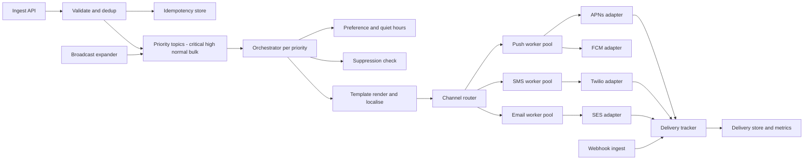
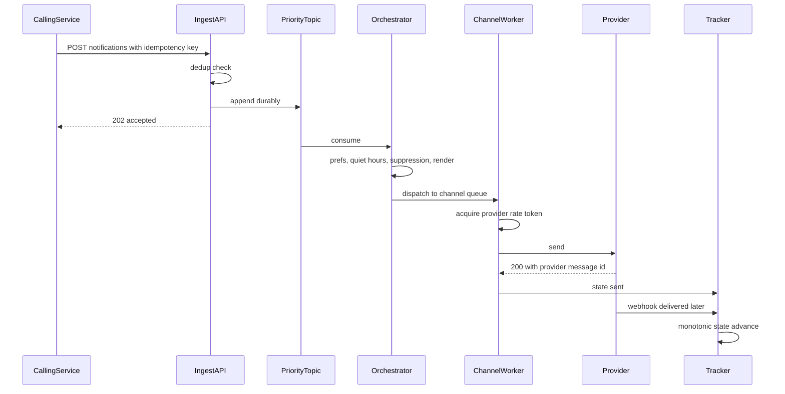
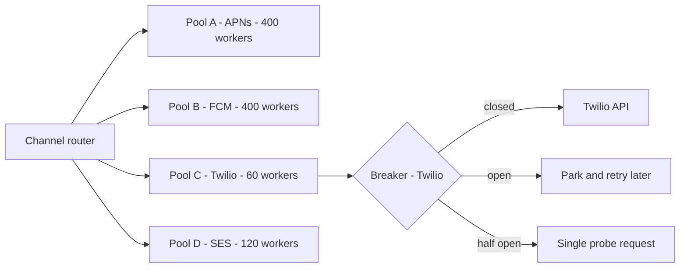
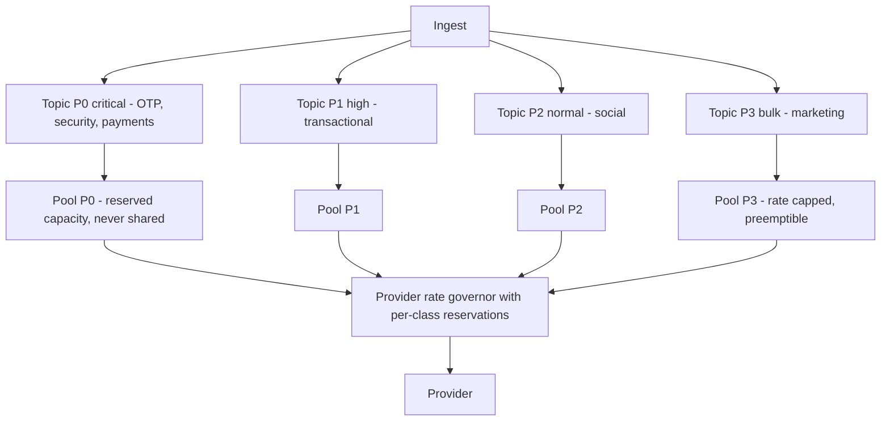
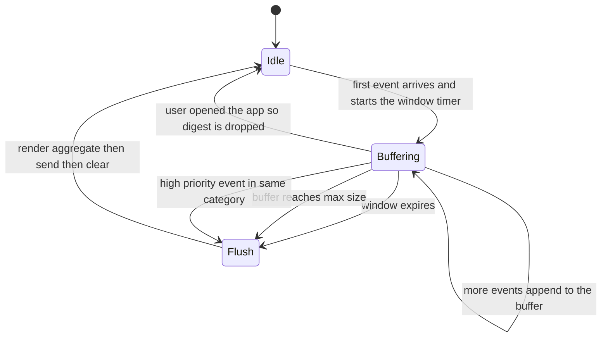

# 08 — Notification System (push / SMS / email)

<span class="pill pill-core">Core</span> <span class="pill pill-medium">Medium</span>

**A notification system is a fan-out engine bolted to a set of third-party providers you do not control — the hard part is that every provider will rate-limit you, fail partially, and lie about delivery, while your users cannot tolerate a duplicate OTP or a marketing blast at 3 a.m.**

| | |
|---|---|
| **Commonly asked at** | Uber, Airbnb, DoorDash, Stripe, Twilio, Meta, Amazon, Atlassian, Shopify |
| **Time budget** | 45 min |
| **Core tension** | Transactional notifications need seconds-level latency and near-perfect delivery; marketing blasts need enormous throughput — and they share the same providers, whose rate limits are global to your account |
| **Prerequisites** | [Queues & Streams](../fundamentals/f12-queues-streams.md) · [Idempotency](../fundamentals/f11-idempotency.md) · [Resilience Patterns](../fundamentals/f18-resilience-patterns.md) · [Rate Limiting](../fundamentals/f17-rate-limiting-load-shedding.md) · [Time, Clocks & Ordering](../fundamentals/f20-time-clocks-ordering.md) · [Security in Design](../fundamentals/f27-security-design.md) |

## 1. Problem Statement

Build the platform that every other service calls when a human needs to be told something: order shipped, driver arrived, password reset code, someone commented on your post, your subscription renews tomorrow, and "50% off this weekend" to forty million people.

The functional surface is trivial — `send(user, template, data, channel)`. Everything hard lives in three places:

1. **You do not own delivery.** APNs, FCM, Twilio, and SES sit between you and the user. They rate-limit, they have outages, they return ambiguous responses, and their notion of "delivered" is weaker than yours.
2. **The traffic shape is bimodal.** A steady trickle of latency-critical transactional messages, punctuated by broadcasts that are five orders of magnitude larger and completely latency-insensitive. Running both on one pipeline means the OTP queues behind the blast.
3. **Every failure is user-visible and some are legally actionable.** A duplicate push is annoying. A duplicate SMS costs money and erodes trust. A message to a user who unsubscribed is a regulatory violation. A push delivered to the wrong device after an account switch is a privacy incident.

!!! note "The framing that separates senior candidates"
    Junior answers describe a queue and some workers. Senior answers start from the observation that **the third-party provider is the system's most important component and the one you have least control over**, and design the whole thing — bulkheads, circuit breakers, per-provider rate governors, idempotency, delivery reconciliation — around that fact.

## 2. Requirements

### Functional

| # | Requirement | Notes |
|---|---|---|
| F1 | Send via push (iOS/Android/web), SMS, email, in-app | One API, per-channel adapters |
| F2 | Transactional and broadcast sends | Different priority classes, different SLOs |
| F3 | Templates with localisation | ICU MessageFormat, per-locale fallback chain |
| F4 | User preferences | Per-category, per-channel opt-in/out |
| F5 | Quiet hours and timezone awareness | Delivery in the user's local time |
| F6 | Digest batching | Collapse N similar events into one notification |
| F7 | Scheduled and recurring sends | "Remind me tomorrow at 09:00 local" |
| F8 | Delivery tracking | Queued → sent → delivered → opened/clicked → failed |
| F9 | Device token lifecycle | Register, refresh, invalidate |
| F10 | Unsubscribe and suppression | Honoured before every send, not at enqueue |

### Non-functional

| # | Requirement | Target |
|---|---|---|
| N1 | Transactional latency | p99 ≤ 5 s from API call to provider accept (OTP: p99 ≤ 2 s) |
| N2 | Broadcast throughput | 50 M recipients within 30 min |
| N3 | Availability | 99.95% for the ingest API; the API must accept even when providers are down |
| N4 | Duplicate rate | < 0.01% of sends; **zero tolerance** for duplicate OTP/payment messages |
| N5 | Durability | Zero loss of accepted transactional requests |
| N6 | Isolation | A broadcast must not delay a transactional message by more than 1 s |
| N7 | Compliance | 100% suppression-list enforcement; unsubscribe honoured within seconds |

### Explicitly out of scope

| Not doing | Why | Instead |
|---|---|---|
| Building our own SMS/push transport | Carrier relationships and APNs/FCM protocols are not our business | Provider adapters |
| In-app real-time messaging / chat | Persistent connections, presence, ordering — a different system | A chat/WebSocket service |
| Campaign audience segmentation | Belongs to marketing tooling | The campaign tool calls us with a recipient list or a query handle |
| Content personalisation ML | Different scaling profile | Ranking service supplies content; we render and deliver |
| Analytics warehouse | We emit events; we do not host BI | Downstream warehouse |

## 3. Scale Estimation

Assume 500 M registered users, 200 M MAU.

**Volume by channel.**

$$
V_{\text{total}} = 2\times10^9\ \text{notifications/day}
$$

| Channel | Share | Volume/day | Avg rate | Peak rate |
|---|---|---|---|---|
| Push | 85% | $1.7\times10^9$ | 19.7 K/s | 200 K/s |
| Email | 14% | $2.8\times10^8$ | 3.2 K/s | 40 K/s |
| SMS | 1% | $2\times10^7$ | 231/s | 3 K/s |

$$
\lambda_{\text{avg}} = \frac{2\times10^9}{86{,}400} = 23{,}148/\text{s}, \qquad \lambda_{\text{peak}} \approx 250{,}000/\text{s}
$$

Peak is ~11× average, and it is not diurnal — it is a broadcast. A 50 M-recipient campaign delivered in 30 minutes:

$$
\lambda_{\text{blast}} = \frac{5\times10^7}{1{,}800\ \text{s}} = 27{,}778/\text{s}\ \text{sustained, on top of everything else}
$$

**Worker concurrency, via Little's law.** Provider round-trip is ~50 ms for push, ~200 ms for SMS, ~120 ms for email:

$$
L_{\text{push}} = 200{,}000 \times 0.05 = 10{,}000\ \text{concurrent in-flight sends}
$$

With an async runtime at 500 concurrent sends per worker process, that is 20 worker processes for push at peak — the concurrency is cheap; the **provider's rate limit** is the real constraint.

**Device tokens.** ~2.4 devices per active user:

$$
T = 2\times10^8 \times 2.4 = 4.8\times10^8\ \text{tokens} \times 200\ \text{B} \approx 96\ \text{GB}
$$

Small enough to shard across a handful of KV nodes, and hot enough that the working set stays cached.

**Delivery tracking storage.** One row per send attempt, ~400 B:

$$
S = 2\times10^9 \times 400\ \text{B} = 800\ \text{GB/day} = 292\ \text{TB/yr}
$$

Retention is a design decision, not an accident: 30 days hot for support and debugging (24 TB), then aggregate to per-campaign/per-day counters and drop the row-level data — which is also what GDPR erasure requires (§7.5).

**Cost — the number that reframes the design.**

$$
C_{\text{sms}} = 2\times10^7/\text{day} \times \$0.0075 = \$150{,}000/\text{day} = \$4.5\text{M/month}
$$

$$
C_{\text{email}} = 2.8\times10^8/\text{day} \times \$0.0001 = \$28{,}000/\text{day} = \$840\text{K/month}
$$

$$
C_{\text{push}} \approx \$0\ \text{in provider fees; only our own compute}
$$

SMS is 1% of volume and roughly 80% of spend. Every design decision that avoids an SMS — channel fallback ordering, dedup, preference enforcement, retry caps — is worth thousands of dollars a day. Mention this unprompted; it demonstrates you think about the business, not just the architecture.

| Quantity | Value |
|---|---|
| Notifications/day | 2 B |
| Peak rate | ~250 K/s (broadcast-driven) |
| Device tokens | 480 M, ~96 GB |
| Delivery records | 800 GB/day, 30-day hot retention |
| SMS spend | ~$4.5 M/month at 1% of volume |
| Concurrent provider connections at peak | ~10 K |

## 4. API Design

```http
POST /v1/notifications HTTP/1.1
Content-Type: application/json
Idempotency-Key: order-88213-shipped-v1
Authorization: Bearer <service-token>

{
  "recipient": { "user_id": "u_9931" },
  "template_id": "order_shipped",
  "locale_hint": "en-GB",
  "data": { "order_id": "88213", "eta": "2026-09-02T17:00:00Z", "items": 3 },
  "category": "transactional.order",
  "priority": "high",
  "channels": ["push", "email"],
  "channel_strategy": "fallback",
  "expires_at": "2026-09-02T17:00:00Z",
  "collapse_key": "order-88213"
}
```

```json
{
  "notification_id": "ntf_01HQZK8...",
  "state": "ACCEPTED",
  "channels": [
    { "channel": "push", "state": "QUEUED" },
    { "channel": "email", "state": "PENDING_FALLBACK" }
  ]
}
```

| Field | Why it exists |
|---|---|
| `Idempotency-Key` | **Required** on all transactional sends. Scoped to the caller, 24 h retention. A retry returns the original `notification_id` and sends nothing |
| `channel_strategy` | `fallback` (try push, then email if push fails) vs `all` (send everywhere). Fallback is the money-saver; `all` is what people accidentally choose |
| `expires_at` | A "your driver is 2 minutes away" push delivered 40 minutes later is worse than no push. The worker drops expired work instead of sending it |
| `collapse_key` | Passed to APNs `apns-collapse-id` / FCM `collapse_key` so the newest replaces the older on-device |
| `priority` | Selects the queue *and the worker pool*, not just an ordering hint (§7.3) |
| `category` | The unit of user preference and unsubscribe, not the template |

### Broadcast

```http
POST /v1/broadcasts HTTP/1.1
Idempotency-Key: campaign-autumn-2026-wave-1

{
  "audience": { "segment_id": "seg_lapsed_30d", "estimated_size": 48000000 },
  "template_id": "autumn_promo",
  "category": "marketing.promotions",
  "priority": "bulk",
  "channels": ["push"],
  "delivery_window": { "start_local": "10:00", "end_local": "20:00", "spread_minutes": 90 },
  "rate_limit_per_second": 30000
}
```

`delivery_window` is in **local time per recipient**, and `spread_minutes` smears the send across a window rather than firing 40 M pushes at exactly 10:00:00 in each timezone (§7.4).

| Endpoint | Purpose | Notes |
|---|---|---|
| `POST /v1/notifications` | Single send | Returns `202` after durable enqueue, not after delivery |
| `POST /v1/notifications:batch` | Up to 1,000 in one call | Per-item results; partial success is normal and must be represented |
| `POST /v1/broadcasts` | Fan-out job | Returns a job handle; progress is polled |
| `GET /v1/notifications/{id}` | Delivery state | Eventually consistent; say so |
| `PUT /v1/users/{id}/preferences` | Category × channel matrix | Versioned with `If-Match` to avoid lost updates |
| `POST /v1/devices` | Register/refresh a token | Idempotent on `(user_id, token)` |
| `POST /v1/webhooks/{provider}` | Provider delivery callbacks | Signature-verified, idempotent |
| `POST /v1/suppressions` | Add to the do-not-contact list | Takes effect at send time, globally, within seconds |

### Error codes

| Code | Meaning | Caller action |
|---|---|---|
| `202` | Durably enqueued | Done. Delivery is asynchronous |
| `200` | Idempotency-Key replay | Same `notification_id`; nothing new was sent |
| `207` | Batch partial success | Inspect per-item results |
| `409` | Same `Idempotency-Key`, different body | Fix the caller — this is a bug, not a retry |
| `422` | Recipient suppressed, unsubscribed, or has no valid channel | **Not an error to retry.** Terminal |
| `429` | Caller quota exceeded | Back off with jitter; `Retry-After` provided |
| `503` | Ingest degraded | Retry with backoff; the API is designed to accept even when providers are down |

!!! tip "`202` must mean 'durably enqueued', never 'probably sent'"
    Return only after the request is committed to the log with an offset. If you ack before durability, a broker failover silently loses accepted OTPs and the caller has no way to know. The whole contract with callers rests on this one guarantee.

## 5. Data Model

| Entity | Key | Purpose | Store |
|---|---|---|---|
| `notification` | `notification_id` | Logical request, immutable | Sharded relational / KV |
| `delivery_attempt` | `(notification_id, channel, attempt_no)` | Per-attempt outcome | Time-partitioned table |
| `device_token` | `(user_id, token_hash)` | Push routing | Sharded KV |
| `user_preference` | `(user_id, category)` | Opt-in matrix, quiet hours, timezone | Sharded KV, heavily cached |
| `suppression` | `(channel, address_hash)` | Hard do-not-contact | Replicated, read on every send |
| `template` | `(template_id, version, locale)` | Rendering | Config store, cached in-process |
| `idempotency` | `(caller_id, key)` | Dedup, 24 h TTL | KV with TTL |
| `digest_buffer` | `(user_id, category, window)` | Pending collapsible events | KV with TTL |

```sql
CREATE TABLE notification (
    notification_id   UUID PRIMARY KEY,
    caller_id         TEXT        NOT NULL,
    idempotency_key   TEXT        NOT NULL,
    user_id           TEXT        NOT NULL,
    category          TEXT        NOT NULL,
    template_id       TEXT        NOT NULL,
    template_version  INT         NOT NULL,
    priority          SMALLINT    NOT NULL,      -- 0 critical .. 3 bulk
    payload           JSONB       NOT NULL,
    created_at        TIMESTAMPTZ NOT NULL DEFAULT now(),
    expires_at        TIMESTAMPTZ,
    UNIQUE (caller_id, idempotency_key)
);

CREATE TABLE delivery_attempt (
    notification_id   UUID        NOT NULL,
    channel           TEXT        NOT NULL,      -- push|sms|email|inapp
    attempt_no        SMALLINT    NOT NULL,
    provider          TEXT        NOT NULL,      -- apns|fcm|twilio|ses
    provider_msg_id   TEXT,                      -- for webhook correlation
    state             TEXT        NOT NULL,      -- queued|sent|delivered|bounced|failed|expired
    state_rank        SMALLINT    NOT NULL,      -- monotonic guard, see section 7.4
    error_code        TEXT,
    attempted_at      TIMESTAMPTZ NOT NULL,
    updated_at        TIMESTAMPTZ NOT NULL,
    PRIMARY KEY (notification_id, channel, attempt_no)
) PARTITION BY RANGE (attempted_at);

CREATE TABLE device_token (
    user_id        TEXT        NOT NULL,
    token_hash     BYTEA       NOT NULL,        -- hash, not the raw token
    token_enc      BYTEA       NOT NULL,        -- encrypted at rest
    platform       TEXT        NOT NULL,        -- ios|android|web
    app_version    TEXT,
    locale         TEXT,
    registered_at  TIMESTAMPTZ NOT NULL,
    last_seen_at   TIMESTAMPTZ NOT NULL,
    invalid_at     TIMESTAMPTZ,                  -- set on 410 Gone / UNREGISTERED
    PRIMARY KEY (user_id, token_hash)
);
CREATE INDEX ON device_token (token_hash);       -- reverse lookup: whose token is this?

CREATE TABLE user_preference (
    user_id          TEXT        NOT NULL,
    category         TEXT        NOT NULL,       -- '*' row holds global defaults
    push_enabled     BOOLEAN     NOT NULL DEFAULT true,
    email_enabled    BOOLEAN     NOT NULL DEFAULT true,
    sms_enabled      BOOLEAN     NOT NULL DEFAULT false,
    quiet_start_local TIME,
    quiet_end_local   TIME,
    timezone         TEXT        NOT NULL DEFAULT 'UTC',   -- IANA, never a UTC offset
    digest_mode      TEXT        NOT NULL DEFAULT 'instant', -- instant|hourly|daily
    version          BIGINT      NOT NULL DEFAULT 1,
    PRIMARY KEY (user_id, category)
);
```

### Access patterns

| # | Pattern | Rate | Served by |
|---|---|---|---|
| A1 | Enqueue a notification | 250 K/s peak | Append to partitioned log |
| A2 | Look up preferences for a user+category | 250 K/s | KV, ~95% cache hit |
| A3 | Look up device tokens for a user | 200 K/s | KV by `user_id` |
| A4 | Suppression check | 250 K/s | In-memory Bloom filter + KV confirm on hit |
| A5 | Record attempt outcome | 300 K/s (includes retries) | Batched writes to a time-partitioned table |
| A6 | Ingest provider webhook | 100 K/s | Idempotent upsert keyed on `provider_msg_id` |
| A7 | Expand a broadcast segment | Bursty, 50 M rows | Batch read from the warehouse → chunked jobs |
| A8 | User views notification history | 5 K/s | Read from the hot partition by `(user_id, created_at)` |

### Store choice

| Need | Chosen | Rejected and why |
|---|---|---|
| Ingest buffer | Partitioned durable log (Kafka) with a topic per priority class | RabbitMQ: better at true priority queues but weaker at replay and at broadcast-scale throughput. SQS: no ordering or replay, and per-message cost at 2 B/day is significant |
| Notification records | Sharded relational, partitioned by time | Single Postgres: 800 GB/day of writes exceeds one primary. Pure KV: loses the ad-hoc support queries that on-call actually needs |
| Preferences and tokens | Sharded KV with aggressive caching | Relational: the access pattern is pure point lookup at 250 K/s |
| Suppression list | Bloom filter in-process + replicated KV | KV-only: 250 K/s of remote reads on a path that must never fail open |
| Idempotency keys | KV with native TTL | Relational: 250 K/s of inserts plus a cleanup job you will forget to run |
| Digest buffers | KV with TTL + a time-wheel scheduler | Relational polling: a "SELECT ... WHERE due < now()" sweep at this rate is a lock-contention machine |

## 6. High-Level Architecture



### Write path (a transactional notification)

1. **Ingest.** Authenticate the caller, validate against the template schema, check `Idempotency-Key`. A replay returns the original ID immediately.
2. **Durable enqueue.** Append to the topic for this priority class, partitioned by `hash(user_id)` so that all of a user's notifications are ordered relative to each other. Return `202` only after the append is acknowledged by a quorum of brokers.
3. **Orchestrate.** A consumer for that priority class reads the record and evaluates, in order:
   - suppression list (hard stop, terminal `422`)
   - user preference for `(category, channel)`
   - quiet hours in the user's local timezone → defer or drop by policy
   - digest mode → buffer instead of sending
   - `expires_at` → drop if already past
4. **Render.** Resolve template version and locale, render with ICU MessageFormat, enforce per-channel size limits (APNs 4 KB, SMS 160 GSM-7 characters per segment).
5. **Route.** For `fallback` strategy, attempt channels in order and only continue on terminal failure. For `all`, dispatch to every enabled channel in parallel.
6. **Dispatch.** The channel worker pulls from its own queue, acquires a token from the per-provider rate governor, and calls the provider through a circuit-breaker-wrapped adapter.
7. **Record.** Write the attempt with `provider_msg_id`, which is what later webhooks correlate against.

### Read path (delivery state)

Providers report asynchronously and unreliably: APNs returns a status inline and reports invalid tokens via `410 Gone`; FCM returns per-message results in a batch response; Twilio and SES POST webhooks minutes later. The tracker is a **monotonic state machine** — a state can only advance in rank, never regress — because webhooks arrive out of order and more than once (§7.4).



## 7. Deep Dives

### 7.1 Provider adapters and the unreliable-dependency problem

Every provider is different in ways that leak into your architecture:

| Provider | Protocol | Rate model | Invalid-recipient signal | Idempotency support |
|---|---|---|---|---|
| APNs | HTTP/2, long-lived connections, multiplexed streams | Per-connection stream concurrency; effectively unlimited with enough connections | `410 Gone` + `BadDeviceToken` | `apns-id` (dedup within a window) and `apns-collapse-id` |
| FCM | HTTP/1.1 or HTTP/2 REST | Per-project quota, ~600 K messages/min typical | `UNREGISTERED` / `INVALID_ARGUMENT` | `message_id`, `collapse_key` |
| Twilio | REST | Per-number: ~1 msg/s long code, ~100/s short code, per-account concurrency | Error 21610 (unsubscribed), 21614 (not mobile) | **None** — you must dedup yourself |
| SES | REST or SMTP | Account send rate (e.g. 14/s default, raised on request) + daily quota | Bounce/complaint via SNS | None; use your own `Message-ID` |

Three architectural consequences:

**(a) An adapter interface that normalises the differences, and nothing else.**

```go
type Adapter interface {
    // Send returns a provider message id on acceptance. The error is classified
    // so the caller can decide retry policy without knowing the provider.
    Send(ctx context.Context, msg Message) (providerMsgID string, err error)
    // Limits returns the rate governor configuration this provider currently allows.
    Limits() RateLimits
}

type FailureClass int

const (
    Transient   FailureClass = iota // 5xx, timeout, connection reset  -> retry
    RateLimited                     // 429 with Retry-After            -> retry after delay
    Permanent                       // bad token, unsubscribed, 4xx    -> do NOT retry, invalidate
    Ambiguous                       // timeout AFTER request was sent  -> may have been delivered
)
```

The `Ambiguous` class is the one people forget and the one that causes duplicate OTPs. A timeout on a `POST` to Twilio means the SMS may or may not have been sent. Retrying is a coin flip between "user gets no code" and "user gets two codes and one charge". Policy: **retry ambiguous failures only for channels where a duplicate is cheap** (push), and never for SMS on a critical category — instead surface a resend button to the user.

**(b) Per-provider bulkheads and circuit breakers.** A failing provider must not consume the shared worker pool. Each provider gets its own pool, its own queue, and its own breaker:



Without bulkheads, Twilio timing out at 30 s each will occupy every worker in a shared pool within seconds, and push notifications stop flowing because SMS is broken. This is the classic thread-pool-exhaustion cascade, and it is the single most likely real outage in this system. See [Resilience Patterns](../fundamentals/f18-resilience-patterns.md).

**(c) A rate governor that is global, not per-worker.** Provider limits apply to your whole account, so a token bucket local to each worker guarantees violation. Use a distributed token bucket (Redis with an atomic Lua script, or a lease-based scheme where workers check out capacity slices for a second at a time):

```lua
-- Distributed token bucket. KEYS[1]=bucket, ARGV: now_ms, rate_per_sec, burst, requested
local state = redis.call('HMGET', KEYS[1], 'tokens', 'ts')
local tokens = tonumber(state[1]) or tonumber(ARGV[3])
local ts     = tonumber(state[2]) or tonumber(ARGV[1])
local elapsed = math.max(0, tonumber(ARGV[1]) - ts) / 1000.0
tokens = math.min(tonumber(ARGV[3]), tokens + elapsed * tonumber(ARGV[2]))
local want = tonumber(ARGV[4])
if tokens < want then
  redis.call('HMSET', KEYS[1], 'tokens', tokens, 'ts', ARGV[1])
  return -1                                   -- caller sleeps and retries
end
redis.call('HMSET', KEYS[1], 'tokens', tokens - want, 'ts', ARGV[1])
redis.call('PEXPIRE', KEYS[1], 60000)
return math.floor(tokens - want)
```

Workers should lease capacity in blocks (e.g. 50 sends at a time) rather than one token per send, or the governor itself becomes the bottleneck at 200 K/s.

**Adaptive limits.** Providers rarely publish accurate numbers, and limits change. Run the governor as a **congestion controller**: additive increase on sustained success, multiplicative decrease on any `429`. This finds the real limit without a config change and survives the provider silently lowering it.

### 7.2 Retries, duplicates, and idempotency

Retries are mandatory (providers fail transiently) and dangerous (they duplicate). Four layers of defence:

**Layer 1 — Caller idempotency key.** Required on transactional sends, stored 24 h. A retry of the API call returns the original `notification_id` and sends nothing. This handles the most common duplicate source by far: the calling service retrying because *our* response was lost.

**Layer 2 — Exponential backoff with full jitter.** Fixed backoff synchronises retries into a thundering herd that arrives exactly when the provider is recovering:

$$
\text{delay}_n = \text{random}\bigl(0,\ \min(\text{cap},\ \text{base} \cdot 2^{n})\bigr)
$$

with `base = 1 s`, `cap = 300 s`, max 5 attempts for push, 3 for email, and **1 attempt for critical SMS**. Full jitter (not "equal jitter" or fixed) is what actually decorrelates the herd.

**Layer 3 — Provider-side dedup where it exists.** Pass a stable `apns-id` / `collapse_key` derived from `hash(notification_id, channel)`. APNs will discard a duplicate `apns-id` seen recently. This costs nothing and catches the case where our request succeeded but the response was lost.

**Layer 4 — Send-time dedup fingerprint.** For providers with no idempotency support:

```python
fingerprint = sha256(f"{user_id}|{category}|{template_id}|{stable_hash(payload)}|{bucket_5min}")
if not kv.set(f"dedup:{fingerprint}", notification_id, nx=True, ex=3600):
    metrics.inc("dedup.suppressed", channel=channel)
    return Suppressed(reason="duplicate_within_window")
```

The 5-minute bucket collapses semantically identical sends regardless of which retry path produced them — including duplicates created by two different callers reacting to the same upstream event, which no idempotency key would catch.

!!! danger "The ambiguous-timeout duplicate is unavoidable in general, so choose per channel"
    A timeout after the request was transmitted leaves you unable to distinguish "not sent" from "sent, response lost". Retrying risks a duplicate; not retrying risks a lost notification. Decide **per category**: for `transactional.otp` over SMS, do not retry — a user who gets no code can press resend, whereas a user who gets two codes and two charges will complain and one of the codes may be the one that works, creating support ambiguity. For push notifications, always retry — a duplicate push costs nothing.

**Where retries live.** Not in-memory in the worker. A parked message goes back to a delay topic (or a scheduled-retry table keyed on `next_attempt_at`), so a worker crash does not lose the retry. In-memory retry loops mean a deploy silently drops everything mid-backoff.

### 7.3 Priority isolation and broadcast fan-out

**The failure this prevents:** a marketing team schedules a 50 M-recipient blast; the password-reset codes for the next 40 minutes queue behind it; users cannot log in; the incident is attributed to "the notification system is slow".

**Why priority within one queue is not enough.** A Kafka partition is strictly FIFO — there is no priority ordering inside it. Even with a priority field, a consumer must read messages in order. The only real fix is **separate topics with separate consumer groups and separate worker pools**:



Three isolation mechanisms, all necessary:

1. **Separate worker pools** so a bulk backlog cannot occupy critical workers.
2. **Reserved provider capacity.** The rate governor holds back a fraction (say 20%) of the provider budget that only P0/P1 can draw on. Otherwise the blast consumes the entire provider quota and OTPs get `429`ed by the provider itself — isolation inside your system does not help if the shared external resource is exhausted.
3. **Preemptible bulk.** When P0 queue lag exceeds a threshold, the bulk pool's rate limit is automatically reduced. Bulk traffic is by definition latency-insensitive, so this is free.

**Broadcast fan-out mechanics.** Do not materialise 50 M messages in one transaction or one worker:

```python
def expand_broadcast(job):
    # 1. Segment resolution runs in the warehouse and writes chunk manifests to
    #    object storage. Never stream 50M rows through a single process.
    chunks = warehouse.export_segment(job.segment_id, chunk_size=10_000)   # 5,000 chunks

    for chunk_uri in chunks:
        # 2. One durable task per chunk, idempotent on (job_id, chunk_id).
        tasks.publish("bulk-expand", {
            "job_id": job.id, "chunk_uri": chunk_uri,
            "template_id": job.template_id, "rate_limit": job.rate_limit_per_second,
        })

def process_chunk(task):
    # 3. Checkpoint per 1,000 recipients so a crash resumes rather than restarts.
    start = checkpoint.get(task.job_id, task.chunk_id) or 0
    for i, user in enumerate(read_chunk(task.chunk_uri, offset=start)):
        if suppressed(user) or not opted_in(user, task.category):
            continue                                    # checked HERE, not at enqueue
        enqueue_bulk(render(task.template_id, user), user)
        if i % 1000 == 0:
            checkpoint.set(task.job_id, task.chunk_id, i)
```

The crucial detail is step 3's comment: **preference and suppression are evaluated at send time, per recipient**. A blast that materialises 50 M messages up front and then takes 90 minutes to drain will send to users who unsubscribed 60 minutes ago — a regulatory violation with a paper trail.

**Throughput math.** 5,000 chunks × 10,000 recipients, with 200 chunk workers each doing ~150 recipients/s:

$$
\lambda = 200 \times 150 = 30{,}000/\text{s} \Rightarrow \frac{5\times10^7}{30{,}000} = 1{,}667\ \text{s} \approx 28\ \text{minutes}
$$

which meets N2 — provided the provider governor grants 30 K/s to the bulk class, which it will only do when P0/P1 are healthy.

### 7.4 Timezones, quiet hours, digests, and delivery tracking

**Timezone handling.**

- Store an **IANA zone name** (`Europe/London`), never a UTC offset. Offsets change twice a year; zones do not.
- Compute the send time by converting the user's local target into UTC **at scheduling time using the current tzdata**, and re-validate at send time. A rule change (governments do this with weeks of notice) invalidates anything scheduled far in advance.
- **DST gaps and overlaps** are real: on a spring-forward day, 02:30 local does not exist — a naive conversion either throws or silently shifts. On a fall-back day, 01:30 occurs twice — a daily digest can fire twice. Policy: for a nonexistent local time, use the next valid instant; for an ambiguous one, use the first occurrence and record which was chosen.

**Quiet hours** must handle the wrap-around case, which is the common one:

```python
def in_quiet_hours(now_utc, pref):
    tz = ZoneInfo(pref.timezone)
    local = now_utc.astimezone(tz).time()
    start, end = pref.quiet_start_local, pref.quiet_end_local
    if start is None:
        return False
    if start <= end:                 # e.g. 13:00-15:00, same day
        return start <= local < end
    return local >= start or local < end   # e.g. 22:00-07:00, spans midnight
```

The policy question is what to do when quiet hours apply, and it must be per category:

| Category | Quiet-hours behaviour |
|---|---|
| `transactional.otp`, `security.*` | **Ignore quiet hours.** The user asked for this right now |
| `transactional.*` | Deliver silently (no sound/vibration) rather than defer |
| `social.*` | Defer to the end of quiet hours, collapsing duplicates |
| `marketing.*` | Never send during quiet hours; drop rather than defer if the campaign window closes |

**The 09:00-local thundering herd.** Scheduling 50 M users for "09:00 local" produces ~24 spikes as each populous timezone crosses the hour, each concentrated into seconds. Smear it:

$$
t_{\text{send}} = t_{\text{local target}} + \text{hash}(\text{user\_id}) \bmod \text{spread\_minutes}
$$

A deterministic hash keeps the offset stable across retries (so the same user is not sent twice at different offsets) and flattens a 90-second spike into a 90-minute plateau.

**Digest batching.** Collapse "Alice liked your post", "Bob liked your post" ×47 into one notification:



Implement the window with a **time wheel or a scheduled-task store keyed on `flush_at`**, not a polling `SELECT ... WHERE due < now()` — at this scale a polling sweep is a lock-contention machine. The "user opened the app" transition is the highest-value one: it turns the digest into a no-op and is a large part of why digests improve engagement rather than just reducing volume.

**Delivery tracking and webhook ingestion.** Providers report asynchronously, out of order, and more than once. The state machine must be monotonic:

```sql
-- State ranks: queued=10, sent=20, delivered=30, opened=40, clicked=50,
--              bounced=60, failed=70 (terminal states rank highest).
UPDATE delivery_attempt
   SET state = $1, state_rank = $2, updated_at = $3, error_code = $4
 WHERE notification_id = $5 AND channel = $6 AND attempt_no = $7
   AND state_rank < $2;                 -- never regress; late 'sent' cannot undo 'delivered'
```

Webhook endpoint requirements, all of which are asked about:

- **Verify the signature** (Twilio `X-Twilio-Signature`, SES via SNS message signature). An unauthenticated webhook endpoint lets anyone mark messages delivered or, worse, inject bounces that add addresses to your suppression list — a denial-of-service against your own users.
- **Idempotent on `(provider, provider_msg_id, event_type)`** — providers retry webhooks, sometimes for days.
- **Return `200` fast, process asynchronously.** Providers disable endpoints that time out. Write to a queue and ack immediately.
- **Tolerate unknown message IDs**: a webhook can arrive before your own write commits. Buffer and retry rather than dropping.

### 7.5 Tokens, templates, and compliance

**Device token lifecycle** is a bigger source of waste and of privacy incidents than people expect.

| Event | Signal | Required action |
|---|---|---|
| App installed | Client registers token | Upsert on `(user_id, token_hash)` |
| App reinstalled / device restored | New token, old one still "valid" for a while | Reverse-lookup by `token_hash`: if the token is now bound to a different `user_id`, **delete the old binding** |
| User logs out | Client should deregister | Also invalidate server-side on logout events — clients often fail to call |
| User B logs in on user A's device | Same token, new user | Token must be exclusively bound to the newest user. Otherwise A's notifications go to B — a privacy incident |
| Token invalid | APNs `410 Gone`, FCM `UNREGISTERED` | Mark `invalid_at` and stop sending immediately |
| Silent staleness | No delivery confirmations for 90 days | Age out; stale tokens are pure waste |

!!! danger "The account-switch privacy bug"
    If two users share a device and the token is not exclusively re-bound on login, the previous user's private notifications — order details, message previews, security alerts — get delivered to whoever is now using the device. This is a reportable data incident, not a bug. Enforce it structurally: a unique index on `token_hash` alone (not on `(user_id, token_hash)`) makes exclusive binding a database invariant rather than a code path someone can forget.

**Template rendering and localisation.**

```json
{
  "template_id": "order_shipped",
  "version": 7,
  "locales": {
    "en-GB": {
      "push": {
        "title": "Your order is on its way",
        "body": "{items, plural, one {# item} other {# items}} arriving by {eta, time, short}."
      }
    },
    "ja-JP": {
      "push": { "title": "ご注文を発送しました", "body": "{items}点の商品が{eta, time, short}までに届きます。" }
    }
  },
  "fallback_chain": ["en-GB", "en-US", "en"],
  "constraints": { "push_title_max": 40, "push_body_max": 160, "payload_max_bytes": 4096 }
}
```

- **ICU MessageFormat** for plurals and gender — English's two plural forms are not universal; Arabic has six, Polish has four. String concatenation is guaranteed to be wrong somewhere.
- **Versioned and immutable.** A notification records the `template_version` it rendered with, so a support ticket about "what did we actually send?" is answerable. Editing a template in place destroys that.
- **Size limits are per channel and per script.** APNs caps the payload at 4 KB; SMS is 160 GSM-7 characters per segment but only **70 characters** for UCS-2 (any emoji or non-Latin character switches the whole message to UCS-2 and can silently double the cost).
- **Localise on the client where possible.** APNs `loc-key` lets the payload carry a key and arguments rather than rendered text, which sidesteps the size limit and lets the app render in the device's current language rather than the language stored in the profile.
- **CI gate**: every locale must render every template with representative data without exceeding constraints. A translator adding a 90-character German title will otherwise truncate mid-word in production.

**Compliance.** These are hard requirements with legal consequences, not features:

| Requirement | Mechanism |
|---|---|
| Email unsubscribe | `List-Unsubscribe` and `List-Unsubscribe-Post` headers (RFC 8058) for one-click, plus a visible link. Honour within seconds, not the 10 days CAN-SPAM allows |
| SMS opt-out | Handle inbound `STOP`, `UNSUBSCRIBE`, `CANCEL` (and localised variants) via the provider's inbound webhook; add to suppression immediately; TCPA requires prior express consent for marketing SMS in the US |
| Consent record | Store when, how, and from what IP consent was captured, per category. "We think they opted in" is not a defence |
| GDPR erasure | Delete PII from `notification` and `delivery_attempt`; keep pseudonymised aggregate counters for legitimate-interest reporting. Design retention up front: 30 days hot with PII, then aggregate-only |
| Data minimisation | Store `token_hash` for lookups and the encrypted token for sending; never log full tokens, phone numbers, or email addresses in plaintext |
| Suppression precedence | Suppression is checked **at send time, immediately before dispatch** — never only at enqueue. A 90-minute blast will otherwise send to users who unsubscribed 60 minutes ago |

## 8. Scaling the Bottleneck

The bottleneck is **not** your compute — it is provider throughput and the coupling between traffic classes.

| Layer | Scaling approach | Ceiling |
|---|---|---|
| Ingest API | Stateless, horizontal | Log write throughput; partition by `hash(user_id)` |
| Priority topics | Partition count per topic | Rebalance cost; over-partition early |
| Orchestrators | One consumer group per priority class | Preference/token KV read rate — solved by caching |
| Channel workers | Async I/O, ~500 in-flight per process | Provider rate limit, not CPU |
| **Providers** | **Multiple accounts, multiple vendors, negotiated limits** | **The real ceiling** |
| Delivery store | Time-partitioned, drop old partitions | Write rate; batch and buffer |

**Raising the provider ceiling** — the answers in order of preference:

1. **Negotiate.** SES starts at 14/s and goes to thousands with a support ticket. FCM quotas are raisable. This is a procurement task, and mentioning it shows operational maturity.
2. **Multiple accounts / sender identities.** Multiple Twilio numbers or messaging services multiply the per-number cap. Multiple APNs connections multiply stream concurrency.
3. **Multi-vendor with health-based routing.** Twilio primary, a secondary SMS provider for overflow and failover. Route by a rolling health score (success rate, latency, cost) rather than a static config, and always keep a small trickle on the secondary so it is proven working — a failover path that has never carried traffic will not work when you need it.
4. **Shift channels.** Push is free and unlimited compared to SMS. Aggressive fallback ordering (push first, SMS only if no valid token) is both a scaling and a cost strategy.

**Load shedding at the ingest API** is the last resort and must be class-aware: shed `bulk` first, then `normal`, and never `critical`. Shedding by uniform sampling would drop OTPs at the same rate as marketing, which is exactly backwards.

## 9. Failure Modes

| Failure | Blast radius | Detection | Mitigation | Degraded behaviour |
|---|---|---|---|---|
| Provider full outage (e.g. APNs down) | One channel, all users | Adapter error rate, breaker state | Breaker opens; park messages in a delay topic; fall back to another channel for high-priority categories | Push delayed; transactional falls back to email |
| Provider partial failure (one region) | Subset of users | Error rate segmented by provider region | Retry via a different endpoint or vendor | Elevated latency |
| Provider rate limit hit | All sends on that provider | `429` rate | Adaptive governor backs off multiplicatively; reserved capacity protects P0 | Bulk slows; critical unaffected |
| Broadcast starves transactional | All transactional users | P0 queue lag | Separate topics and pools; bulk preempted when P0 lag rises | Marketing delayed — correct choice |
| Duplicate notifications | Users receiving them; money for SMS | Dedup-suppression counter, user reports | Four-layer dedup (§7.2); alert when the suppression rate spikes | Some duplicates escape |
| Webhook endpoint down | Delivery-state accuracy only | Webhook error rate; provider dashboards | Buffer and let the provider retry; reconcile from provider APIs | States stale, sends unaffected |
| Token store unavailable | All push | KV error rate | Serve from a local cache with a stale TTL; queue rather than fail | Push delayed |
| Template render error | All notifications using that template | Render error rate per template | Fail closed for that template only; canary new versions | One template's notifications blocked |
| Preference store stale after opt-out | Compliance exposure | Preference propagation lag | Suppression list is a separate, strongly-consistent path checked at send time | Compliance risk if this path fails |
| Poison message | One partition, blocks the consumer group | Consumer lag on a single partition | Bounded retries then DLQ; never block a partition indefinitely | One partition stalls briefly |
| Timezone data change | Scheduled sends near the change | tzdata version monitoring | Recompute scheduled sends when tzdata updates | Some sends off by an hour |
| Retry storm after provider recovery | The recovering provider | Send-rate spike at recovery | Full jitter backoff + rate-limited breaker half-open probes | Slower recovery, no re-collapse |
| Clock skew across schedulers | Quiet hours and windows | NTP offset | Schedule decisions from a single authoritative time source | Sends at slightly wrong local times |

## 10. SRE Lens

### SLIs and SLOs

| SLI | Definition | SLO |
|---|---|---|
| Ingest availability | Non-5xx / total API requests | 99.95% over 28 d |
| Critical delivery latency | p99 API-accept → provider-accept for P0 | ≤ 2 s |
| Transactional delivery latency | p99 for P1 | ≤ 5 s |
| Delivery success rate | Provider-confirmed delivered / attempted, per channel | Push ≥ 92%, Email ≥ 99%, SMS ≥ 97% |
| Duplicate rate | Duplicate sends / total, from the dedup fingerprint | < 0.01%; **0 for `*.otp`** |
| Suppression correctness | Sends to suppressed recipients | 0 — any occurrence is a P1 |
| Broadcast completion | Time from job start to last recipient | ≤ 30 min for 50 M |
| Bulk isolation | P0 p99 latency during an active blast | Within 1 s of the no-blast baseline |

**Error budget.** 99.95% = 20 minutes/month of ingest unavailability. But the more useful budget is per class: P0 delivery latency has essentially no budget, because a late OTP is a failed login. Structure it as an availability budget for ingest plus a **latency budget for P0** — for example, at most 0.1% of P0 notifications may exceed 5 s over 28 days.

**Observability.**

```text
notif_ingest_requests_total{caller, priority, result}         counter
notif_delivery_latency_seconds{priority, channel}             histogram   # accept -> provider accept
notif_provider_requests_total{provider, status_class}         counter
notif_provider_latency_seconds{provider}                      histogram
notif_breaker_state{provider}                                 gauge       # 0 closed 1 half 2 open
notif_rate_governor_wait_seconds{provider, priority}          histogram
notif_queue_lag_seconds{priority}                             gauge       # THE isolation SLI
notif_dedup_suppressed_total{layer}                           counter
notif_token_invalidated_total{platform, reason}               counter
notif_suppressed_send_attempts_total{reason}                  counter     # must be 0 for 'unsubscribed'
notif_sms_cost_dollars_total{provider, category}              counter     # cost as a first-class metric
```

Two of these are unusual and both earn credit: `notif_queue_lag_seconds{priority="critical"}` measured *during* a bulk blast is the direct measurement of whether isolation works, and `notif_sms_cost_dollars_total` makes a runaway retry loop visible as money rather than as a graph nobody watches.

### Rollout plan

Stages: build → shadow mode (render only, never dispatch) → canary on 1% of P2 traffic → 10% across all classes → full. Rollback is automatic on a duplicate-rate or delivery-rate regression, and every channel and template also has an independent feature flag.

- **Shadow mode first.** Render the notification and record what *would* have been sent without dispatching. Catches template, localisation, and size regressions with zero user impact — the only safe way to change rendering.
- **Canary on P2 (social) traffic**, never P0. A bug in the critical path is not something to discover in canary.
- **Per-channel and per-template kill switches** independent of deploys. The most common production action is "stop sending template X right now", and it must not require a release.
- **Rollback triggers**: duplicate rate above baseline, delivery success drop > 2 points, P0 latency regression. See [Deployment & Release Safety](../fundamentals/f25-deployment-release-safety.md).

### Runbook notes

```bash
# Users report duplicate OTPs.
promql: sum(rate(notif_dedup_suppressed_total[5m])) by (layer)
# Suppression at layer 4 spiking => callers are double-sending, not our retry logic.
promql: sum(rate(notif_provider_requests_total{status_class="ambiguous"}[5m])) by (provider)
# Ambiguous spiking => provider timeouts; disable SMS retry for otp categories now.

# A blast is delaying transactional messages.
promql: notif_queue_lag_seconds{priority="critical"}
curl -XPOST /admin/broadcasts/{job_id}/throttle -d '{"rate_limit_per_second": 5000}'

# Provider degraded: check breaker and governor wait time.
promql: notif_breaker_state{provider="twilio"}
promql: histogram_quantile(0.99, rate(notif_rate_governor_wait_seconds_bucket[5m]))

# Emergency stop for one template across all channels.
curl -XPOST /admin/templates/order_shipped/disable -d '{"reason":"INC-4417"}'
```

### Capacity model

$$
W_{\text{channel}} = \left\lceil \frac{\lambda_{\text{peak}} \times t_{\text{provider}}}{c_{\text{worker}}} \right\rceil, \qquad
\text{Provider budget} = \max\left(\lambda_{\text{peak}},\ \frac{V_{\text{blast}}}{T_{\text{window}}}\right) \times (1 + r)
$$

where $r$ is the retry multiplier (typically 1.15). For push at 200 K/s, 50 ms RTT, 500 in-flight per worker: 20 workers. The provider budget must be negotiated to $200{,}000 \times 1.15 = 230$ K/s, and **20% of it reserved for P0/P1**.

### Cost

| Line | Monthly | Lever |
|---|---|---|
| SMS provider fees | ~$4.5 M | Channel fallback ordering (push first), dedup, retry caps, GSM-7-safe templates to avoid UCS-2 segment doubling |
| Email provider fees | ~$840 K | Suppress bounces aggressively; a high bounce rate also damages sender reputation and deliverability |
| Push provider fees | $0 | — |
| Compute (workers, orchestrators) | ~$60 K | Async I/O; concurrency is cheap |
| Delivery-record storage | ~$45 K | 30-day hot retention then aggregate — also the GDPR-compliant choice |
| Broker + KV | ~$70 K | Partition count sized for peak, not average |

**80% of spend is SMS at 1% of volume.** The highest-leverage engineering work in this system is anything that avoids sending an SMS: valid push tokens, correct fallback ordering, and preventing duplicate sends. See [Cost Engineering](../fundamentals/f28-cost-engineering.md).

## 11. Trade-offs & Alternatives

| Decision | Chosen | Alternative | Alternative wins when |
|---|---|---|---|
| Queueing | Kafka topic per priority class | RabbitMQ with real priority queues | Volume is modest and true priority ordering within a queue matters more than replay |
| Isolation | Separate pools + reserved provider capacity | Single pool with weighted fair queueing | You control the downstream and there is no shared external quota |
| Dedup | Four layers | Caller idempotency only | Callers are all internal, well-behaved, and you accept ambiguous-timeout duplicates |
| Personal state | Per-user preference KV | Preferences embedded in each request | Callers genuinely know user preferences — they never do |
| Providers | Multi-vendor with health routing | Single vendor | Volume is low; a single vendor's outage is an acceptable risk |
| Digest | Server-side buffering | Client-side collapse | The app is always running and can aggregate locally — true only for desktop |

### At 10× (20 B notifications/day)

- Provider limits become the binding constraint everywhere: multiple accounts per provider, multi-vendor routing with cost-and-health-based selection, and direct carrier relationships for SMS in the largest markets.
- Regionalise the whole pipeline: run ingest, orchestration, and dispatch in-region so the data (phone numbers, tokens) stays local for data-residency reasons and provider RTT drops.
- Delivery records at 8 TB/day stop being row-storable in a hot store: keep 7 days hot, stream the rest to columnar object storage, and serve user-facing history from a per-user materialised view.
- Broadcasts become continuous rather than discrete — the "bulk" class is permanently saturated, so bulk scheduling becomes a fair-share allocation problem across marketing teams with per-team quotas.

### At 1/10 (200 M/day) or a startup

- One service, one Postgres, one queue. Use a `notifications` table with `SELECT ... FOR UPDATE SKIP LOCKED` as the queue — it handles thousands per second and removes an entire operational dependency.
- Two priority levels, not four: transactional and bulk.
- One provider per channel; add the adapter abstraction anyway, because switching providers is the most likely near-term change and the interface costs a day.
- Skip digest batching and cohort personalisation until users ask.
- **The honest answer**: "at this scale I would use a managed provider's own scheduling and templating and write the preference/suppression layer myself, because that is the part no vendor gets right for your product."

## 12. Gotchas & Corner Cases

!!! gotcha "One slow provider takes down every channel"
    **Symptom.** SMS provider latency rises to 30 s; within a minute, push and email stop flowing too. **Mechanism.** A shared worker pool. Each SMS send occupies a worker for 30 s, and at even a modest SMS rate every worker in the pool is parked on SMS. Push work sits in the queue behind nothing at all — there is simply no worker free. **Mitigation.** Bulkheads: a dedicated pool, queue, and connection limit per provider, sized independently, plus a circuit breaker that fails fast once the error rate crosses a threshold. Verify it with a fault-injection test that adds 30 s of latency to one adapter and asserts the others' p99 is unchanged.

!!! gotcha "A timeout after the request was sent is not a failure, and retrying it double-charges the user"
    **Symptom.** Users receive two OTP SMS messages and you are billed twice. **Mechanism.** The HTTP client timed out at 10 s, but the provider received and processed the request; the response was lost. Classifying this as `Transient` triggers a retry. **Mitigation.** Classify `Ambiguous` separately from `Transient`. Never auto-retry ambiguous failures on SMS for critical categories — surface a resend affordance to the user instead. For push, always retry, because the cost of a duplicate is zero. Reconcile ambiguous attempts later against the provider's message API to close the tracking record.

!!! gotcha "Suppression checked at enqueue means you email people who unsubscribed an hour ago"
    **Symptom.** A user unsubscribes and still receives campaign email for the next hour; a regulator asks about it and your logs prove it. **Mechanism.** The blast materialised 50 M messages at T+0, including the suppression check, then took 90 minutes to drain. Anyone unsubscribing at T+10 was already in the queue. **Mitigation.** Evaluate suppression and preferences **immediately before dispatch**, per recipient, at the worker — not during expansion. It costs one cached KV lookup per send and it is the difference between compliant and not.

!!! gotcha "The 09:00-local schedule creates 24 thundering herds"
    **Symptom.** Every hour on the hour, provider `429`s spike and P0 latency degrades. **Mechanism.** 50 M users scheduled for "09:00 local" means every populous timezone fires simultaneously as it crosses the hour, compressing millions of sends into seconds. **Mitigation.** Deterministic jitter: `send_at = local_target + hash(user_id) mod spread_minutes`. Deterministic so retries do not move the user to a different slot, and wide enough (60–120 minutes) to flatten the curve. Marketing will object to "not exactly 09:00"; the counter-argument is that provider `429`s mean nobody gets it at 09:00 either.

!!! gotcha "Two users sharing a device receive each other's notifications"
    **Symptom.** A user sees another person's order details or message previews in their notification tray. **Mechanism.** Device tokens are bound per `(user_id, token)`. When user B logs in on user A's device, the token is registered for B while A's binding remains. Both users' notifications now route to that device. **Mitigation.** Make exclusive binding a database invariant: a unique index on `token_hash` alone, so registering a token for a new user necessarily removes any prior binding. Also invalidate server-side on logout, since clients frequently fail to deregister. This is a reportable privacy incident, not a bug.

!!! gotcha "One emoji doubles your SMS bill and truncates the message"
    **Symptom.** A campaign's SMS cost is 2× the estimate and users report cut-off text. **Mechanism.** SMS uses GSM-7 encoding at 160 characters per segment. A single character outside GSM-7 — an emoji, a curly quote auto-inserted by a CMS, an accented character — forces the entire message to UCS-2, which fits only **70** characters per segment. A 150-character message goes from one segment to three. **Mitigation.** Validate templates against the GSM-7 charset at build time, normalise smart quotes and dashes, count segments (not characters) in the CI size check, and surface projected cost per message in the campaign UI before send.

!!! gotcha "Webhook endpoints without signature verification let anyone poison your suppression list"
    **Symptom.** Legitimate users stop receiving email; their addresses appear on the suppression list as hard bounces. **Mechanism.** The webhook endpoint accepts any POST. An attacker submits forged bounce events for a list of addresses, and each one is added to suppression — a targeted denial of service that is invisible until users complain. **Mitigation.** Verify provider signatures on every webhook, reject unsigned requests outright, rate-limit the endpoint, and require a bounce to correlate with a `provider_msg_id` you actually issued. Suppression additions from webhooks should also be reversible with an audit trail.

!!! gotcha "Retries live in memory and vanish on every deploy"
    **Symptom.** After each rolling deploy, a batch of notifications is silently never delivered, and no error appears anywhere. **Mechanism.** The worker held failed messages in an in-process retry loop with exponential backoff. SIGTERM kills the process; anything mid-backoff is gone, and the log offset was already committed. **Mitigation.** Retries must be durable: republish to a delay topic or write a scheduled-retry row with `next_attempt_at`. Never commit the source offset until the message reaches a terminal state or a durable retry record exists. Test this explicitly by killing a worker during an induced provider outage.

!!! gotcha "A poison message blocks an entire partition indefinitely"
    **Symptom.** One partition's consumer lag grows linearly while every other partition is healthy; a subset of users receives nothing. **Mechanism.** A malformed payload throws during render; the consumer retries forever without committing the offset, so nothing behind it is processed. Because partitioning is by `hash(user_id)`, a deterministic slice of users is affected. **Mitigation.** Bounded retries per message, then dead-letter with full context, then commit and move on. Alert on per-partition lag rather than aggregate lag — aggregate lag hides a single stuck partition entirely.

!!! gotcha "Storing UTC offsets instead of IANA zones breaks twice a year"
    **Symptom.** Quiet hours are off by an hour for half your users for a few weeks each spring and autumn, and the affected set differs by country. **Mechanism.** `+01:00` is a fact about an instant, not about a place. DST transitions happen on different dates in different jurisdictions, and governments change rules with weeks of notice. **Mitigation.** Store IANA zone names, keep tzdata current in every service image (a stale tzdata is its own outage), recompute scheduled sends when tzdata updates, and handle the two DST edge cases explicitly: a nonexistent local time maps to the next valid instant; an ambiguous one uses the first occurrence and records the choice.

!!! gotcha "Delivered does not mean seen, and providers define it differently"
    **Symptom.** Dashboards show 99% delivery while support handles a wave of "I never got it". **Mechanism.** APNs "delivered" means accepted by Apple, not shown on a device that may be off, in Low Power Mode, or has notifications disabled at the OS level. Carrier SMS DLRs are frequently faked or aggregated. Email "delivered" means the receiving MTA accepted it, after which it may land in spam. **Mitigation.** Track engagement (open/click/app-launch attribution) as a separate SLI from provider-reported delivery, never conflate them in reporting, and for genuinely critical messages provide an in-app fallback that does not depend on any push provider.

!!! gotcha "Editing a template in place makes every past notification unexplainable"
    **Symptom.** A support ticket asks what was sent to a user last Tuesday and nobody can answer. **Mechanism.** Templates were mutable, so the current text has no relationship to what was rendered then. **Mitigation.** Templates are immutable and versioned; each notification records `template_version`; the render pipeline can reproduce any past message from `(template_version, payload, locale)`. This is also what makes shadow-mode diffing possible during rollout.

## 13. Interview Angle

!!! interview "Frame the provider as the system's centre of gravity in the first two minutes"
    "The interesting part of this system is that I do not control delivery. APNs, FCM, Twilio, and SES all rate-limit against my whole account, fail partially, and return ambiguous responses. So the architecture is really: a durable ingest that always accepts, priority-isolated pipelines, and per-provider bulkheads with adaptive rate governors and circuit breakers in front of every one of them." That framing tells the interviewer you have operated something like this rather than diagrammed it.

!!! interview "Name the marketing-blast-starves-OTP failure before you are asked"
    It is the canonical incident for this system. "A 50 million recipient campaign and a password-reset code cannot share a pipeline. Separate topics, separate consumer groups, separate worker pools — and critically, reserved provider capacity, because isolation inside my system is useless if the blast burns the shared external quota and the provider starts 429ing my OTPs." The second sentence is what distinguishes a good answer from a great one.

!!! interview "Lead the cost discussion with the SMS number"
    "SMS is 1% of volume and about 80% of spend — $4.5 million a month at 20 million messages a day. So channel fallback ordering, token hygiene, and duplicate prevention are not hygiene tasks, they are the cheapest cost-reduction lever available." Very few candidates connect the architecture to the invoice, and it is a strong senior signal.

!!! interview "Have a crisp answer for the ambiguous timeout"
    "A timeout after the request was transmitted is not a failure — it is unknown. I classify it separately from transient errors, and the retry policy is per category: never for critical SMS, because a duplicate code costs money and creates support ambiguity; always for push, because a duplicate costs nothing. Then I reconcile against the provider's message API to close the record." Most candidates say "retry with backoff" and stop.

??? note "Follow-up 1: A marketing campaign to 50 million users is running and OTP delivery slows. What went wrong and how do you fix it permanently?"
    Something is shared that should not be. Three candidates, and I check them in this order. First, **shared worker pool** — bulk sends occupy the workers and transactional messages wait; fixed by separate pools per priority class. Second, **shared queue** — a Kafka partition is strictly FIFO, so a priority field inside one topic does nothing; fixed by separate topics with separate consumer groups. Third, and the one people miss, **shared provider quota** — even with perfect internal isolation, the blast consumes the account-level rate limit and the provider itself starts returning 429 for OTPs. Fixed by reserving a fraction of the provider budget that only P0/P1 can draw on, plus automatic preemption that throttles bulk when P0 queue lag rises. The permanent verification is a metric: P0 p99 latency measured during an active blast compared to the no-blast baseline, alerting if the gap exceeds one second.

??? note "Follow-up 2: How do you guarantee a user never gets the same notification twice?"
    You cannot guarantee it, and claiming otherwise is the wrong answer — exactly-once delivery is impossible over an unreliable network. What I do is drive the rate below 0.01% with four independent layers. **Caller idempotency key**, required on transactional sends, catching the most common cause: the calling service retrying because our response was lost. **Provider-side dedup** where it exists — `apns-id`, FCM `collapse_key` — which catches our request succeeding while the response was lost. **A send-time fingerprint** of `(user, category, template, payload hash, 5-minute bucket)` in a KV with `SET NX`, which catches semantically identical sends from different code paths, including two callers reacting to the same upstream event. And **retry policy by failure class**, never retrying ambiguous timeouts on channels where a duplicate is expensive. For OTP specifically I would rather under-deliver and offer a resend button than double-send.

??? note "Follow-up 3: Walk me through what happens when APNs is down for two hours."
    The adapter's error rate crosses the threshold and the circuit breaker opens within seconds, so we stop burning workers on timeouts — that is the immediate priority, because without it the push pool exhausts and starts affecting anything sharing it. Messages are parked in a delay topic rather than dropped or held in memory. The breaker probes with a single request periodically for half-open transitions. Meanwhile, category-dependent behaviour: `security.*` and `transactional.otp` fall back to SMS or email immediately, since the whole point of those is timeliness; ordinary transactional messages wait, because a duplicate on both channels is worse than a delay; `marketing.*` messages simply expire via `expires_at` and are dropped, since a promo delivered two hours late has negative value. When APNs recovers, the drain is rate-limited with full-jitter backoff, or two hours of parked messages will re-collapse the provider the moment it comes back. Throughout, the ingest API keeps returning `202` — accepting work when downstream is broken is precisely why the durable log exists.

??? note "Follow-up 4: A user in Tokyo has quiet hours 22:00–07:00. It is 23:00 there. What do you send?"
    It depends entirely on category, and this is a policy table, not a single rule. A password-reset code or a security alert goes immediately and ignores quiet hours — the user initiated it seconds ago and suppressing it breaks the product. An order-shipped notification is delivered but silently, with no sound or vibration, using the push priority flag rather than being deferred, because deferring makes it stale. A social notification is buffered and flushed at 07:00 local, collapsed into a digest with anything else that accumulated. A marketing message is dropped, not deferred, if its campaign window has closed. Two mechanics matter: the quiet-hours comparison must handle the wrap-around case (22:00 > 07:00 means the window spans midnight), and the timezone must be an IANA name resolved at send time, not a stored UTC offset that is wrong for half the year.

??? note "Follow-up 5: How do you handle device tokens becoming invalid?"
    Reactively and proactively. **Reactively**: APNs `410 Gone` with `BadDeviceToken` and FCM `UNREGISTERED` are definitive — mark `invalid_at` immediately and stop sending. Continuing to send to dead tokens wastes capacity and, for some providers, damages your reputation score. **Proactively**: age out tokens with no successful delivery confirmation in 90 days. The subtle and more important case is **re-binding**: when a token appears for a different `user_id` — app reinstall, device restore, or a second user logging in on a shared device — the old binding must be removed atomically. I enforce that with a unique index on `token_hash` alone rather than on `(user_id, token_hash)`, so exclusivity is a database invariant instead of a code path someone can forget. Getting this wrong delivers one user's private notifications to another, which is a reportable privacy incident rather than a bug.

??? note "Follow-up 6: How would you implement digest batching for 'X people liked your post'?"
    A per-`(user, category)` buffer in a KV store with a TTL, plus a scheduled flush. The first event creates the buffer and schedules a flush via a time wheel or a scheduled-task store keyed on `flush_at` — not a polling `SELECT ... WHERE due < now()`, which becomes a lock-contention problem at this rate. Subsequent events append. Flush triggers are: window expiry, buffer reaching a maximum size (so "1,247 people liked your post" does not accumulate for an hour), a high-priority event arriving in the same category, and — the most valuable one — the user opening the app, which cancels the digest entirely because they have already seen it. The window length is per user and per category: `instant`, `hourly`, or `daily` from preferences. The rendering must use ICU MessageFormat plurals with the actor names of the first two or three plus a count, and it must handle the degenerate single-event case without saying "1 people".

??? note "Follow-up 7: How do you support GDPR erasure when you have 800 GB/day of delivery records?"
    By designing retention up front rather than bolting deletion on. Delivery records are time-partitioned with 30 days of hot retention containing PII — recipient address, rendered content — after which a job aggregates them into per-campaign, per-day, per-channel counters with no personal data and drops the partition. That satisfies the storage-limitation principle by default and means most erasure requests need no targeted deletion at all. For a request inside the 30-day window, I delete by `user_id` from `notification`, `delivery_attempt`, `device_token`, and `user_preference`, and pseudonymise rather than delete the aggregate counters, since those have a legitimate-interest basis. Two things stay: the **suppression list** entry, because I must keep an unsubscribe honoured after erasure — I store a salted hash of the address, not the address, precisely so this is defensible — and the consent audit record. I would also confirm that provider-side logs are covered by a data processing agreement with matching retention, since their copies are outside my deletion pipeline.

### Strong answer vs weak answer

| Topic | Weak | Strong |
|---|---|---|
| Architecture | "API, queue, workers, providers" | "Durable ingest that accepts even when providers are down; priority-isolated topics and pools; per-provider bulkhead, breaker, and adaptive rate governor" |
| Priority | "Use a priority queue" | "Kafka partitions are FIFO with no priority — separate topics, separate consumer groups, separate pools, plus reserved provider quota, because the shared external limit is the real coupling" |
| Retries | "Retry with exponential backoff" | "Classify failures as transient, rate-limited, permanent, or ambiguous; full-jitter backoff; durable retries in a delay topic; never auto-retry ambiguous SMS on critical categories" |
| Duplicates | "Use an idempotency key" | "Four layers — caller key, provider dedup id, send-time fingerprint over a 5-minute bucket, and failure-class-aware retry policy — because exactly-once is impossible and each layer catches a different cause" |
| Preferences | "Check preferences before sending" | "Check suppression and preferences at dispatch time per recipient, not at enqueue — a 90-minute blast otherwise sends to people who unsubscribed 60 minutes ago" |
| Timezones | "Store the user's timezone" | "IANA zone names, not offsets; explicit handling for nonexistent and ambiguous local times on DST days; deterministic jitter to break the 09:00-local herd" |
| Tokens | "Store device tokens per user" | "Exclusive binding enforced by a unique index on the token hash, invalidation on 410/UNREGISTERED, 90-day ageing — because a stale binding delivers one user's notifications to another" |
| Cost | Not mentioned | "SMS is 1% of volume and 80% of spend; fallback ordering and dedup are the cheapest cost levers, and GSM-7 vs UCS-2 encoding silently doubles segment count" |

## 14. Key Takeaways

1. **The provider is the system.** Rate limits, partial failures, and ambiguous responses drive the architecture — per-provider bulkheads, circuit breakers, and adaptive rate governors are load-bearing, not optional hardening.
2. **Priority isolation needs three things**: separate queues, separate worker pools, and reserved provider capacity. The third is the one people miss, and without it the blast starves your OTPs at the provider rather than in your own system.
3. **Exactly-once delivery is impossible; drive duplicates below a threshold with independent layers** — caller idempotency key, provider dedup id, send-time fingerprint, and failure-class-aware retry policy.
4. **An ambiguous timeout is not a transient failure.** Classify it separately and choose the retry policy per channel and category, because the cost of a duplicate push is zero and the cost of a duplicate OTP is money plus support ambiguity.
5. **Preferences and suppression are evaluated at dispatch time, per recipient.** Checking at enqueue turns a long-running broadcast into a compliance violation with a written record.
6. **Timezones are IANA names, never offsets**, and scheduled local-time sends need deterministic jitter or you build 24 thundering herds per day.
7. **Device tokens must be exclusively bound**, enforced as a database invariant, or your system will eventually deliver one user's private notifications to another.
8. **SMS is 1% of volume and ~80% of cost.** Anything that avoids an SMS — valid push tokens, correct fallback ordering, duplicate prevention, GSM-7-safe templates — is the highest-leverage work available.
