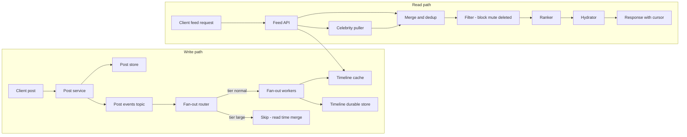
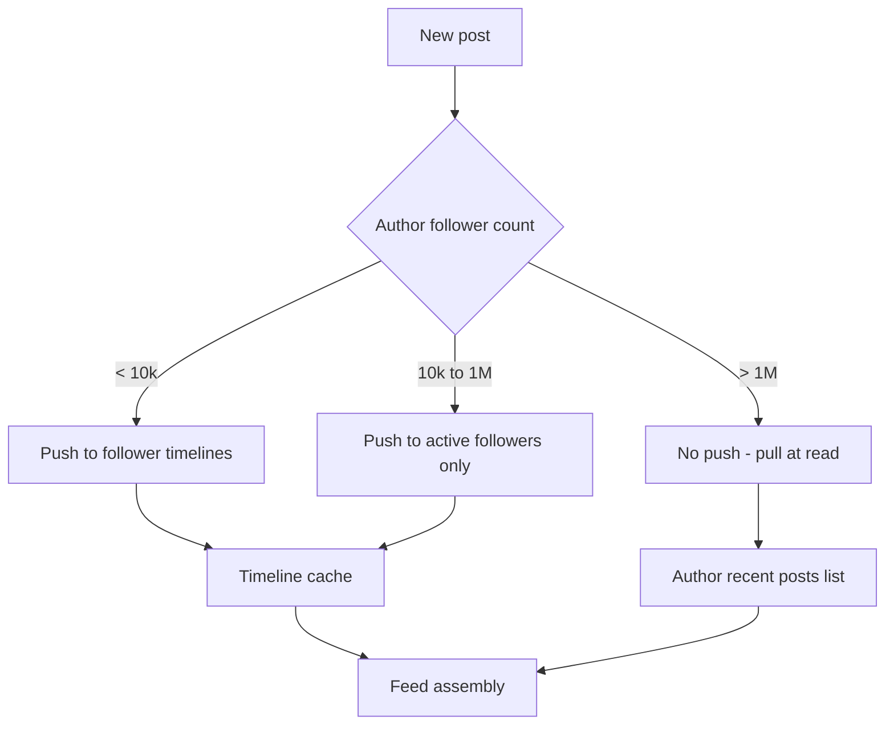
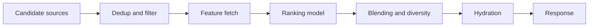
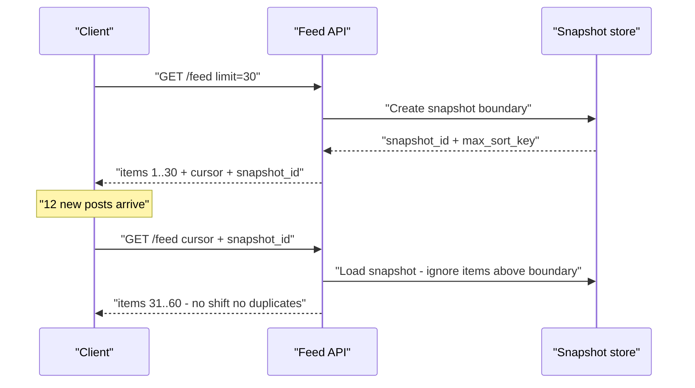
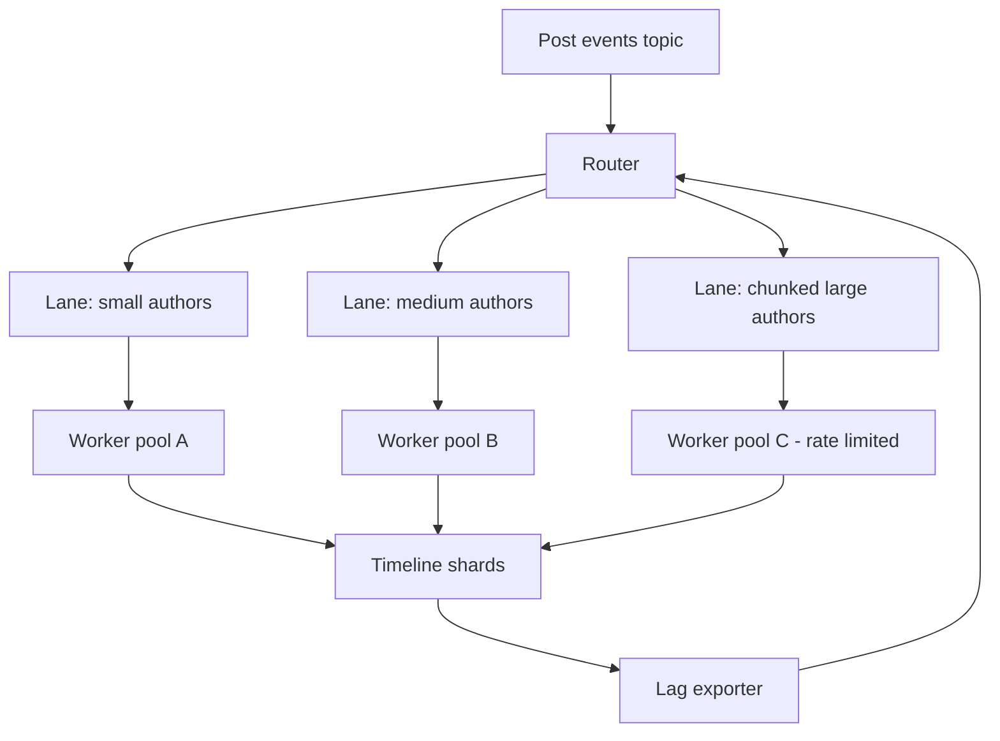

# 09 — News Feed / Timeline

<span class="pill pill-core">Core</span> <span class="pill pill-hard">Hard</span>

**A news feed is a per-user materialised view over a social graph, and the cost of maintaining that view scales with the follower count of whoever just posted — not with the number of people reading.**

| | |
|---|---|
| **Commonly asked at** | Meta, X/Twitter, LinkedIn, Instagram, Pinterest, Reddit, TikTok, Snap |
| **Time budget** | 45 min |
| **Core tension** | Precompute per-reader timelines (cheap reads, unbounded write amplification) vs assemble at read time (cheap writes, expensive and unpredictable reads) |
| **Prerequisites** | [Caching](../fundamentals/f04-caching.md) · [Partitioning & Sharding](../fundamentals/f06-partitioning-sharding.md) · [Queues & Streams](../fundamentals/f12-queues-streams.md) · [SQL vs NoSQL](../fundamentals/f14-sql-vs-nosql.md) · [Storage Engines](../fundamentals/f13-storage-engines.md) · [Time, Clocks & Ordering](../fundamentals/f20-time-clocks-ordering.md) · [Capacity Planning](../fundamentals/f24-capacity-planning.md) |

## 1. Problem Statement

Design the home timeline for a social network: when a user opens the app, show a ranked, paginated, personalised list of posts from accounts they follow, blended with a small amount of recommended content. Posting must feel instantaneous to the author, and the feed must be fresh enough that a post from a friend two minutes ago is visible.

The system is defined by three uncomfortable asymmetries:

1. **Follower distribution is a power law.** The median account has ~50 followers. The p99.9 account has millions. A single design cannot serve both without special-casing.
2. **Read:write ratio is roughly 50:1** at the API level, but the *fan-out* work inverts it — one post can generate tens of millions of writes.
3. **The feed is mutating while the user paginates.** New posts arrive, old posts get deleted, and the ranking model re-scores. Naive pagination shows duplicates and silently drops items.

!!! note "What the interviewer is actually testing"
    Nobody is testing whether you know the phrase "fan-out on write". They are testing whether you can (a) do the write-amplification arithmetic out loud, (b) identify that the celebrity tail dominates that arithmetic, and (c) design the hybrid without hand-waving the merge step, the cursor, or the backlog.

## 2. Requirements

**Functional**

- `GET /feed` returns a ranked page of posts from followed accounts plus injected recommendations.
- Publish a post (text, media refs, mentions, visibility scope).
- Follow / unfollow; block / mute, applied to feed content.
- Delete and edit a post; both must reflect in feeds that already contain it.
- Stable pagination: scrolling never shows the same post twice, never skips a post that existed at session start.

**Non-functional**

| Requirement | Target |
|---|---|
| Feed read latency | p50 < 80 ms, p99 < 250 ms server-side |
| Post visibility (normal accounts) | p99 < 5 s from publish to appearing in a follower's feed |
| Post visibility (celebrity accounts) | p99 < 1 s (read-time merge, no fan-out delay) |
| Availability (read path) | 99.95% |
| Availability (write/publish path) | 99.9% |
| Durability of posts | 11 nines (object + replicated store) |
| Feed correctness | Deleted / blocked content must never render; eventual consistency of ordering is acceptable |

**Explicitly out of scope:** the recommendation model itself, media transcoding, notifications, DMs, ads auction.

**Deliberate consistency stance:** the feed is an [eventually consistent](../fundamentals/f07-replication-consistency.md) materialised view. The *source of truth* (posts, graph) is strongly consistent per entity; the timeline is best-effort and rebuildable. Losing a timeline shard is an availability event, not a data-loss event.

## 3. Scale Estimation

### Traffic

$$
\text{DAU} = 3 \times 10^{8}, \qquad \text{posts/day} = 6 \times 10^{7}
$$

$$
\text{write QPS}_{avg} = \frac{6\times10^{7}}{86400} \approx 694/\text{s},
\qquad \text{write QPS}_{peak} = 3\times \approx 2{,}100/\text{s}
$$

Each DAU opens the feed ~10 times per day:

$$
\text{read QPS}_{avg} = \frac{3\times10^{8}\times 10}{86400} \approx 34{,}700/\text{s},
\qquad \text{peak} \approx 104{,}000/\text{s}
$$

Read:write at the API boundary is ~50:1. That ratio is what naively pushes you toward fan-out-on-write. Now compute what fan-out actually costs.

### Write amplification — the number that decides the design

Split authors into two tiers using follower count:

| Tier | Share of posts | Posts/day | Avg followers | Timeline inserts/day |
|---|---|---|---|---|
| Normal (< 10k followers) | 99.5% | $5.97\times10^{7}$ | 180 | $1.07\times10^{10}$ |
| Large (≥ 10k followers) | 0.5% | $3\times10^{5}$ | 250,000 | $7.5\times10^{10}$ |
| **Total** | 100% | $6\times10^{7}$ | — | $\mathbf{8.57\times10^{10}}$ |

$$
\text{fan-out writes}_{avg} = \frac{8.57\times10^{10}}{86400} \approx 9.9\times10^{5}/\text{s} \approx 1\text{M inserts/s}
$$

Peak is 3–5× that during a global event: **3–5 M timeline inserts/s**. That is a fleet of write-optimised nodes doing nothing but appending 30-byte rows.

Now apply the hybrid rule — do not fan out posts from Tier B:

$$
\text{fan-out writes}_{hybrid} = \frac{1.07\times10^{10}}{86400} \approx 1.24\times10^{5}/\text{s}
$$

**An 87.5% reduction in fan-out volume by excluding 0.5% of posts.** This single table is the strongest thing you can put on the whiteboard: the celebrity tail is not an edge case, it *is* the workload.

### Storage

Timeline entry, packed: `post_id` 8 B + `author_id` 8 B + `score/ts` 8 B + flags 4 B ≈ **28 B** on disk, ~80 B in a Redis sorted set once skiplist and allocator overhead are counted.

Materialise timelines only for **warm** users (opened the app in the last 7 days ≈ 30% of MAU ≈ 90M), capped at 400 entries:

$$
90\times10^{6} \times 400 \times 80\,\text{B} = 2.88\ \text{TB} \xrightarrow{\times 2 \text{ replicas}} 5.76\ \text{TB}
$$

At ~200 GB usable RAM per cache node: $5.76\ \text{TB} / 200\ \text{GB} \approx 29$ nodes, provision **36** for headroom and failure domains.

Post content store:

$$
6\times10^{7}\ \text{posts/day} \times 1\ \text{KB} = 60\ \text{GB/day} \Rightarrow 21.9\ \text{TB/yr} \xrightarrow{\times 3 \text{ RF}} 65.7\ \text{TB/yr}
$$

Media (20% of posts, 300 KB average after transcode) goes to [object storage](../fundamentals/f15-object-storage.md):

$$
1.2\times10^{7} \times 300\,\text{KB} = 3.6\ \text{TB/day} = 1.31\ \text{PB/yr}
$$

### Bandwidth

A feed page is 30 hydrated items at ~1.5 KB JSON = 45 KB:

$$
34{,}700\ \text{rps} \times 45\ \text{KB} \approx 1.56\ \text{GB/s} \approx 12.5\ \text{Gbps}
$$

Media bytes dwarf this and are served entirely from the [CDN](../fundamentals/f05-cdn-edge.md) — API egress is a rounding error next to it, which matters for the cost model in §10.

!!! tip "Sanity check to state out loud"
    1 M timeline inserts/s at 28 bytes is only ~28 MB/s of logical payload. The cost is not bytes, it is *operations* — 1 M independent key-space mutations per second. That is why the timeline store is a partitioned in-memory structure, not a disk-backed OLTP database.

## 4. API Design

```http
GET /v1/feed?limit=30&cursor=eyJ0IjoxNzE0NTIzMjAwMDAwLCJwIjoiOTQxMjM0In0
Authorization: Bearer <token>
X-Client-Session: 8f2c1d9e-...
```

```json
{
  "items": [
    {
      "post_id": "941234567890",
      "author": { "id": "88123", "handle": "rmartin", "avatar": "https://cdn/..." },
      "created_at": "2026-08-31T09:14:02Z",
      "text": "shipping the new consensus layer today",
      "media": [{ "type": "image", "url": "https://cdn/...", "w": 1080, "h": 1350 }],
      "counters": { "likes": 412, "replies": 33, "reposts": 18 },
      "reason": "followed",
      "rank_score": 0.8214
    }
  ],
  "next_cursor": "eyJ0IjoxNzE0NTIzMTAwMDAwLCJwIjoiOTQxMjMwIn0",
  "snapshot_id": "s_01J9F3K2",
  "has_more": true
}
```

| Endpoint | Method | Notes |
|---|---|---|
| `/v1/feed` | GET | Cursor-paginated. `snapshot_id` pins the read-time boundary. |
| `/v1/feed/refresh` | GET | Explicit pull-to-refresh; returns items newer than `snapshot_id`, issues a new snapshot. |
| `/v1/posts` | POST | `Idempotency-Key` header required — see [Idempotency](../fundamentals/f11-idempotency.md). |
| `/v1/posts/{id}` | DELETE / PATCH | Emits a tombstone / revision event onto the post-mutation stream. |
| `/v1/graph/follow` | POST | Async: enqueues backfill/purge work, returns 202. |
| `/v1/feed/seen` | POST | Batched client telemetry for dedup and ranking feedback. |

!!! warning "Never expose an offset"
    `?page=3&size=30` is an invitation to a bug report. Offsets are computed against a list that changed since page 2 was served. Cursors are the only safe contract on a mutating collection, and the cursor must encode the *sort key*, not a position.

## 5. Data Model

### Entities

- **Post** — immutable body + mutable counters + revision chain.
- **Edge** (`follower → followee`) — the social graph.
- **Timeline entry** — `(owner_id, sort_key, post_id, author_id, flags)`.
- **User profile / settings** — visibility, block list, mute list.

### Access patterns

| # | Access pattern | Rate | Latency need | Store |
|---|---|---|---|---|
| A1 | Fetch top-N timeline entries for a user, descending | 104k/s peak | < 5 ms | Redis sorted set (`ZREVRANGEBYSCORE`) |
| A2 | Append entry to N follower timelines | 1M/s peak (pre-hybrid) | < 20 ms, async | Redis pipelined + Cassandra durable copy |
| A3 | Hydrate 30 post bodies by ID | 3M post-reads/s peak | < 15 ms batched | Post cache (Memcached) → Cassandra |
| A4 | List followee IDs for a user | 104k/s | < 5 ms | Graph cache; Cassandra partition per user |
| A5 | List follower IDs for an author, paged | 700/s | seconds acceptable | Cassandra wide row, paged by clustering key |
| A6 | Check block/mute relation for 30 authors | 104k/s × 30 | < 2 ms | Bloom filter + Redis set per viewer |
| A7 | Rebuild a cold user's timeline | 5k/s | < 400 ms | Read-time merge over A4 + per-author recent posts |

### Store selection

| Component | Chosen | Rejected alternatives and why |
|---|---|---|
| Timeline index | **Redis Cluster sorted sets**, capped at 400 entries via `ZREMRANGEBYRANK` | *Cassandra-only:* 1 M writes/s is affordable but p99 reads become 10–30 ms under compaction, blowing the budget. *Kafka topic per user:* topic-per-user does not scale past ~200k partitions. |
| Timeline durable copy | **Cassandra** (`(owner_id) PARTITION, (bucket, post_id) CLUSTERING`) | *None needed:* rejected — losing all of Redis with no durable copy means 90 M rebuilds at once, a self-inflicted thundering herd. |
| Post bodies | **Cassandra** + Memcached read-through | *Postgres sharded:* workable, but the access pattern is pure key-value with no joins; you pay for MVCC, vacuum, and connection limits you do not use. See [SQL vs NoSQL](../fundamentals/f14-sql-vs-nosql.md). |
| Social graph | **Sharded MySQL/Vitess** by `follower_id`, plus a reverse index sharded by `followee_id` | *Native graph DB (Neo4j):* the queries are one-hop adjacency lists, not traversals; you would pay graph-engine cost for a hash lookup. |
| Counters | **Redis + async rollup to Cassandra counters** | *Row-level `UPDATE ... SET likes = likes + 1`:* hot-row contention on viral posts, thousands of conflicting writes per second on one key. |
| Media | **Object storage + CDN** | *Blobs in the DB:* destroys page cache locality and replication cost. |

```sql
-- Social graph shard (Vitess, sharded by follower_id)
CREATE TABLE edges (
  follower_id  BIGINT UNSIGNED NOT NULL,
  followee_id  BIGINT UNSIGNED NOT NULL,
  created_at   BIGINT UNSIGNED NOT NULL,
  state        TINYINT NOT NULL DEFAULT 1,   -- 1=active 2=muted 3=blocked
  PRIMARY KEY (follower_id, followee_id),
  KEY idx_followee (followee_id, created_at)
) ENGINE=InnoDB;

-- Author cardinality cache: drives the fan-out routing decision
CREATE TABLE author_stats (
  user_id         BIGINT UNSIGNED PRIMARY KEY,
  follower_count  BIGINT UNSIGNED NOT NULL,
  tier            TINYINT NOT NULL,          -- 0=normal 1=large 2=global
  updated_at      BIGINT UNSIGNED NOT NULL
) ENGINE=InnoDB;
```

```sql
-- Cassandra: durable timeline mirror. Bucketed to bound partition size.
CREATE TABLE timeline (
  owner_id   bigint,
  bucket     int,        -- floor(epoch_day / 7)
  sort_key   bigint,     -- snowflake-ish: (ms << 22) | seq
  post_id    bigint,
  author_id  bigint,
  flags      int,
  PRIMARY KEY ((owner_id, bucket), sort_key)
) WITH CLUSTERING ORDER BY (sort_key DESC)
  AND default_time_to_live = 2592000            -- 30 days
  AND compaction = { 'class': 'TimeWindowCompactionStrategy',
                     'compaction_window_unit': 'DAYS',
                     'compaction_window_size': 1 };
```

!!! gotcha "Unbounded partitions kill Cassandra, not row count"
    Without the `bucket` column, a user who follows 5,000 accounts accumulates a multi-hundred-MB partition. Cassandra reads a partition through a single coordinator and materialises index summaries per partition; > 100 MB partitions cause GC pressure, repair timeouts, and streaming failures during bootstrap. Bucket by time and always query the two most recent buckets.

## 6. High-Level Architecture



### Write path walkthrough

1. `POST /v1/posts` with an `Idempotency-Key`. The post service writes the body to Cassandra with a snowflake ID (see [Time, Clocks & Ordering](../fundamentals/f20-time-clocks-ordering.md)) and returns **immediately**. Author-perceived latency is one durable write, ~15 ms.
2. A `post.created` event is appended to a Kafka topic partitioned by `author_id` — this preserves per-author ordering, which matters for edit/delete events arriving after the create.
3. The **fan-out router** reads `author_stats.tier`. Tier 0 → enqueue fan-out jobs. Tier 1/2 → do nothing; the post will be merged at read time.
4. Fan-out workers page the follower list (A5) in chunks of 1,000, and for each chunk issue a pipelined `ZADD` + `ZREMRANGEBYRANK` to the timeline cache and a batched insert to the durable mirror. Only **warm** followers are written; cold followers are skipped entirely (their timeline is built on demand at next login).

### Read path walkthrough

1. Feed API resolves the viewer, loads their cursor/snapshot, and issues three concurrent fetches: (a) `ZREVRANGEBYSCORE` on the materialised timeline, (b) recent posts from each **followed Tier 1/2 author** (typically 3–20 such accounts, each a single sorted-set read on the author's own post list), (c) the recommendation candidate source.
2. **Merge and dedup** by `post_id`, keeping the highest-precedence copy (a repost by a friend beats a raw recommendation).
3. **Filter** — drop tombstoned posts, authors the viewer blocked or muted, posts whose visibility scope no longer includes the viewer, and anything in the viewer's recently-seen set.
4. **Rank** — score the ~600 surviving candidates, take the top 30 for this page.
5. **Hydrate** — batch-fetch bodies, author profiles, counters, and viewer-specific state (`liked_by_me`) from caches.

!!! note "The read path is over-fetch then trim"
    Steps 1–3 fetch 3–10× more candidates than the page size because filtering is *lossy and unpredictable*. If you fetch exactly 30 and 11 are filtered, you must go back for more — a second round trip inside your latency budget. Fetch 300–600, filter, rank, return 30.

## 7. Deep Dives

### 7.1 Fan-out on write vs read vs hybrid



| Strategy | Write cost per post | Read cost per feed | Freshness | Chosen / rejected |
|---|---|---|---|---|
| Fan-out on write | $O(F)$ — up to $10^{8}$ inserts | $O(1)$ — one range read | Delayed by queue depth | **Chosen for the 99.5% tail of normal authors** |
| Fan-out on read | $O(1)$ | $O(\text{followees})$ — 200 sorted-set reads + merge, p99 dominated by the slowest of 200 | Perfectly fresh | **Rejected as the primary path**: 200-way scatter-gather at 104k rps is 20 M backend reads/s, and tail latency amplification makes p99 unacceptable |
| Hybrid | $O(F)$ for small $F$, $O(1)$ for large $F$ | $O(1) + O(k)$ where $k$ = followed celebrities, typically 3–20 | Fresh for celebrities, ~seconds for normals | **Chosen** |

The hybrid's read cost is bounded because $k$ — the number of Tier 1/2 accounts a given user follows — is small and *cacheable per viewer*. Compute it once at login, keep it in the session, refresh on follow/unfollow.

$$
\text{read fan-out} = 1 + k, \qquad \mathbb{E}[k] \approx 8, \qquad p99(k) \approx 60
$$

For the p99 user following 60 celebrities, cap it: pull only the 15 most-engaged-with celebrity accounts per request and rely on fan-out or recommendation injection for the rest.

??? note "Why not fan-out on write to *everyone* and just buy the hardware"
    At 5 M inserts/s peak you need roughly 100 Redis primaries at 50k writes/s each *just for fan-out*, plus the durable mirror, plus the network. But the real objection is not cost — it is *latency of the tail*. A 100 M-follower post takes $10^{8} / (100 \times 50{,}000) = 20$ seconds of pure fan-out even at full fleet throughput, during which the timeline of every other user on those shards is queued behind it. The celebrity post does not just cost a lot; it **blocks everyone else's posts**, producing the delayed-post symptom in §8.

### 7.2 The celebrity threshold and the routing heuristic

The threshold is not a constant, it is a policy with three inputs:

```python
# Fan-out routing decision, evaluated per post.
NORMAL_MAX = 10_000          # below this, always push
GLOBAL_MIN = 1_000_000       # above this, never push
BACKLOG_SHED_MS = 30_000     # queue lag at which we tighten the threshold

def fanout_mode(author, queue_lag_ms, post):
    f = author.follower_count

    # Adaptive: under backlog, demote borderline authors to pull.
    threshold = NORMAL_MAX
    if queue_lag_ms > BACKLOG_SHED_MS:
        threshold = max(1_000, NORMAL_MAX // (queue_lag_ms // BACKLOG_SHED_MS + 1))

    if f <= threshold:
        return "push_all"
    if f >= GLOBAL_MIN:
        return "pull_only"
    # Middle tier: push only to followers active in the last 3 days.
    return "push_active"
```

| Input | Why it matters |
|---|---|
| Follower count | Primary cost driver; must be a *cached, slightly stale* value — reading the true count per post is itself a hot query |
| Active-follower ratio | An account with 500k followers of whom 4% are weekly-active costs 20k writes, not 500k |
| Current queue lag | The threshold must tighten under pressure; a static threshold guarantees the backlog wins |

!!! gotcha "The threshold creates a discontinuity that users feel"
    An author at 9,998 followers is pushed (visible in ~2 s). At 10,002 followers they are pulled (visible instantly for followers, but *absent* from any follower who is not on the celebrity-pull path — e.g. a user whose client is on an old API version). Crossing the threshold changes observable behaviour. Mitigate with **hysteresis**: push until 12,000, pull below 8,000, and dual-write in the band so no post is ever in neither path.

### 7.3 The ranking pipeline and its latency budget



**Candidate generation** produces 600–1,500 items from: materialised timeline (400), celebrity pull (up to 150), out-of-network recommendations (200), and re-surfaced items the user did not scroll past.

**Feature extraction** is the latency villain. Per candidate you need author affinity, post age, engagement velocity, media type, viewer's topic embedding, and ~100 more. That is a batched lookup of thousands of features across a feature store.

| Stage | Budget (p99) | Notes |
|---|---|---|
| Edge + auth + routing | 15 ms | TLS terminated at edge, see [Load Balancing](../fundamentals/f03-load-balancing.md) |
| Candidate generation (parallel) | 40 ms | Bounded by slowest of ~10 concurrent reads |
| Filter (block/mute/seen/tombstone) | 15 ms | Bloom filters in-process, refreshed every 60 s |
| Feature fetch | 60 ms | Batched; single RPC per feature-store shard |
| Model inference | 30 ms | 600 candidates × a two-tower + GBDT re-ranker, batched on CPU or a small GPU pool |
| Blending / diversity / policy | 15 ms | Author diversity cap, ad slots, integrity demotions |
| Hydration | 45 ms | 30 posts × ~6 entities, all batched multi-get |
| Serialisation + network | 15 ms | |
| **Slack** | 15 ms | |
| **Total** | **250 ms** | |

!!! danger "Ranking must be able to fail open"
    If the model service is unhealthy, the feed must still render. Fall back in this order: (1) cached score from the last successful ranking of the same candidate, (2) a lightweight heuristic score `recency × author_affinity`, (3) pure reverse-chronological. Each fallback is a separate circuit breaker — see [Resilience Patterns](../fundamentals/f18-resilience-patterns.md). A feed that returns 500 because a GBDT pod OOMed is an outage; a chronological feed is a minor degradation nobody files a ticket about.

### 7.4 Pagination over a mutating, re-ranked feed

The feed changes between page 1 and page 2 in four ways: new posts arrive at the head, posts are deleted, the ranker re-scores, and the timeline is truncated at the tail. Offset pagination breaks under all four.



The cursor is an opaque, signed encoding of the sort key of the last item returned, plus the snapshot boundary:

```python
import base64, hmac, hashlib, json

def encode_cursor(last_sort_key: int, snapshot_max: int, seen_bloom: bytes, key: bytes) -> str:
    payload = json.dumps({
        "k": last_sort_key,      # exclusive lower bound for the next page
        "s": snapshot_max,       # exclusive upper bound: items newer than this are hidden
        "b": base64.b64encode(seen_bloom).decode(),  # 2 KB bloom of ids already shown
        "v": 2,
    }, separators=(",", ":")).encode()
    sig = hmac.new(key, payload, hashlib.sha256).digest()[:16]
    return base64.urlsafe_b64encode(payload + sig).decode()
```

| Approach | Duplicates | Missing items | Cost | Chosen / rejected |
|---|---|---|---|---|
| `OFFSET n` | Yes — every insert at head shifts the window | Yes — every delete shifts it the other way | Cheap | **Rejected**: provably broken on a mutating list |
| Sort-key cursor | Only on score ties | Only for items inserted below the cursor | Cheap | **Chosen** for chronological ordering |
| Sort-key cursor + snapshot boundary | None | None for the session | One extra field | **Chosen** for ranked feeds |
| Server-side materialised session (full result set cached per session) | None | None | 300 M sessions × 600 ids × 8 B = 1.4 TB, plus session affinity | **Rejected**: cost and stickiness, but used for the first 2 pages only in some designs |
| Client-side bloom of seen IDs | None | Small false-positive drop rate | 2 KB per request | **Chosen as a backstop** for the ranked path |

!!! gotcha "Ranked feeds need a tie-break or the cursor is not a total order"
    If two candidates score `0.8214` and you paginate on score alone, the boundary is ambiguous and items straddling it are duplicated or dropped. The cursor key must be a **total order**: `(score, post_id)` lexicographically, or a pre-quantised `sort_key = (score_bucket << 40) | post_id`. Never paginate on a float alone.

## 8. Scaling the Bottleneck

The bottleneck is the **fan-out worker pool**, and its failure signature is the *delayed post*: users report "my friend posted 20 minutes ago and I only just saw it", while every dashboard is green because CPU, error rate, and API latency are all normal. The queue is the only place the pain is visible.



**Fixes, in the order you should propose them:**

1. **Chunk the unit of work.** A fan-out job must never be "one post → all followers". It is "one post → followers `[i, i+1000)`". A 5 M-follower post becomes 5,000 independent, retryable, parallelisable jobs. Without this, one job holds a worker for minutes and a retry redoes the whole thing.
2. **Separate lanes.** Small-author jobs must not queue behind celebrity chunks. Three topics, three consumer groups, independently scaled. This is head-of-line blocking mitigation — see [Queues & Streams](../fundamentals/f12-queues-streams.md).
3. **Skip cold users.** 70% of followers have not opened the app in a week. Writing to their timeline is pure waste; their feed is rebuilt on demand at next login. This alone cuts fan-out volume by ~65%.
4. **Adaptive threshold.** Wire `consumer_lag` back into the routing decision (§7.2) so pressure automatically converts push work into pull work.
5. **Shard-aware batching.** Group the 1,000 follower IDs by timeline shard before writing, so each shard sees one pipelined command with 40 members instead of 40 round trips.
6. **Backpressure at the producer.** If lag exceeds 5 minutes, start rejecting *scheduled/bulk* posting APIs (third-party clients, cross-posters) with 429 while keeping human posting paths open. See [Rate Limiting & Load Shedding](../fundamentals/f17-rate-limiting-load-shedding.md).

!!! example "Deletes and edits after fan-out"
    Once a post is in 5 M timelines, you cannot go back and delete 5 M rows — that is a second fan-out storm triggered by a *deletion*, which is exactly what you do not want during an abuse takedown.

    **Do this instead:** write a tombstone to a small, densely-cached `post_state` table (`post_id → {visible|deleted|restricted|revision}`), and have the read path filter against it. Every feed read already batch-fetches post bodies; join state into that same multi-get so it costs zero extra round trips. A bloom filter of deleted IDs in every feed-API process (rebuilt every 60 s, ~50 MB for 30 days of deletions) removes even the cache lookup for the 99.9% of posts that are fine.

    Edits use the same mechanism with a `revision` counter: the timeline entry references `post_id`, hydration always fetches the current revision. Timelines store *pointers*, never *content*. This is the single most important structural decision in the whole design.

## 9. Failure Modes

| Failure | Blast radius | Detection | Mitigation | Degraded behaviour |
|---|---|---|---|---|
| Timeline cache shard loss | 1/36 of warm users lose their materialised feed | Redis cluster events; `feed_source=rebuild` ratio spikes | Serve from Cassandra mirror; async re-warm; consistent hashing limits movement | Feed p99 rises to ~400 ms for affected users |
| Entire timeline cache cold (region restart) | All users in region | Cache hit ratio → 0 | Rebuild-on-read with a concurrency limiter and per-user single-flight; prioritise by last-active | 30–60 min of elevated latency, no errors |
| Fan-out consumer lag > 15 min | All followers of normal authors | `kafka_consumergroup_lag` per lane | Scale workers; flip borderline authors to pull; shed bulk producers | Posts appear late; celebrity posts still instant |
| Celebrity posts during a global event | Fan-out lane C saturated | Lane C lag; timeline shard write latency | Rate-limit lane C; increase chunk parallelism; force pull-only above 200k | Some medium authors temporarily pull-only |
| Ranker service down | All feeds | Circuit breaker open rate | Fall back to cached scores → heuristic → chronological | Less relevant but complete feed |
| Feature store shard slow | Feeds containing candidates on that shard | Per-shard p99; hedge rate | Hedged request at p95; serve candidates with default features | Slight ranking quality drop |
| Graph shard unavailable | Users whose `follower_id` hashes there | 5xx from graph service | Serve cached followee list (TTL 24 h); block follow writes | Feed works, follow/unfollow returns 503 |
| Post store partition unavailable | Posts on that partition unhydratable | Hydration miss rate | Drop unhydratable items from the page and backfill from the next candidate | Page still returns 30 items |
| Deletion tombstone propagation lag | Deleted content visible | Compare `post_state` write ts vs feed render ts | Synchronous tombstone write to a global, replicated, tiny store before returning 200 on DELETE | Brief visibility of deleted content — a legal/trust risk, treat as SEV2 |
| Block list stale in filter | Blocked content shown to a victim | Sampled audit job | Write-through invalidation of the viewer's block bloom on block; never cache blocks longer than 60 s | Treat as SEV1 for trust and safety |

## 10. SRE Lens

### SLIs and SLOs

| SLI | Definition | SLO |
|---|---|---|
| Feed availability | non-5xx `/v1/feed` responses / total, measured at the edge | 99.95% over 28 d |
| Feed latency | p99 server-side duration | < 250 ms, 99% of 1-min windows |
| Feed completeness | fraction of responses returning ≥ 25 of 30 requested items | > 99.5% |
| Publish acknowledgement | p99 latency of `POST /v1/posts` | < 300 ms |
| Fan-out freshness | p99 seconds from post commit to presence in a warm follower's timeline | < 5 s |
| Deletion propagation | p99 seconds from DELETE to non-visibility | < 2 s |
| Ranking quality guard | fraction of feeds served by fallback path | < 0.5% |

**Error budget:** 99.95% over 28 days = 20.2 minutes. A regional cache flush that costs 40 minutes of elevated-but-successful latency burns *zero* availability budget but should burn latency budget — which is why feed latency needs its own SLO, not just an alert threshold. See [SLI/SLO & Error Budgets](../fundamentals/f23-slo-error-budgets.md).

**Golden signal that is unique to this system:** `fanout_lag_seconds` by lane. It is the only place where "the product is broken" is visible before users complain, because latency and error rate stay green during a backlog.

### Rollout plan

```yaml
# Ranking model rollout - four gates, each with an automatic rollback trigger
stages:
  - name: shadow
    traffic: 100%          # scored but not served
    duration: 48h
    guard: [inference_p99 < 30ms, feature_null_rate < 0.5%]
  - name: canary
    traffic: 1%
    duration: 24h
    guard: [feed_p99 < 250ms, session_length_delta > -2%, fallback_rate < 0.5%]
  - name: expand
    traffic: 10% -> 50%
    step_duration: 6h
    guard: [error_budget_burn_rate_1h < 2.0]
  - name: full
    traffic: 100%
    holdback: 1%           # permanent control group for quality measurement
```

Timeline schema changes follow expand/contract: add the new field, dual-write, backfill, flip reads behind a flag, verify, then stop writing the old field. Never change the meaning of `sort_key` in place — cursors issued before the change are still in flight on clients.

??? note "Runbook: fan-out backlog"
    **Symptom:** `fanout_lag_seconds{lane="small"} > 300`, user reports of late posts, all other dashboards green.

    1. Identify the lane. Small-author lag means capacity; large-author lag means a single viral post.
    2. `SELECT author_id, count(*) FROM fanout_jobs_inflight GROUP BY 1 ORDER BY 2 DESC LIMIT 10` — find whether one author dominates.
    3. If one author dominates: force `tier=2` for that author (`UPDATE author_stats SET tier=2`), which converts them to pull-only immediately for future posts, and drain the outstanding chunks at reduced parallelism.
    4. If broadly distributed: scale the consumer group (partitions are pre-provisioned at 4× current consumers precisely for this).
    5. If lag > 15 min and growing: enable `SKIP_COLD_FOLLOWERS_AGGRESSIVE` (7 d → 24 h active window). Expect a 40% additional reduction and a rise in read-time rebuilds.
    6. Do **not** purge the queue. A dropped fan-out job is a permanently missing post for those followers; the durable mirror will not have it either.

### Capacity model

$$
N_{\text{feed-api}} = \frac{\text{peak rps}}{\text{rps per node} \times U} = \frac{104{,}000}{450 \times 0.6} \approx 385\ \text{nodes}
$$

$$
N_{\text{fanout}} = \frac{\text{peak inserts/s}}{\text{inserts/s per worker}} = \frac{373{,}000}{8{,}000} \approx 47\ \text{workers (provision 96 for burst)}
$$

Headroom rule: every tier runs at ≤ 60% of measured saturation point at peak so that losing one of three availability zones does not exceed 90%.

### Cost sketch

| Component | Driver | Relative share |
|---|---|---|
| Timeline cache (RAM) | 5.76 TB replicated | ~25% |
| Feed API compute | 385 nodes at peak, autoscaled | ~20% |
| Ranking inference | 600 candidates × 104k rps | ~25% |
| Post + graph storage | 66 TB/yr, growing | ~10% |
| Media CDN egress | 1.3 PB/yr stored, far more served | ~15% |
| Fan-out pipeline | Kafka + workers | ~5% |

The lever with the best cost/benefit: shrinking the materialised timeline from 400 to 200 entries halves the largest RAM line item and affects only users who scroll past page 6, who are < 3% of sessions — those fall through to the durable mirror. Quantify before proposing; see [Cost Engineering](../fundamentals/f28-cost-engineering.md).

## 11. Trade-offs & Alternatives

| Decision | Chosen | Alternative | Why the alternative loses |
|---|---|---|---|
| Timeline contents | Post ID pointers | Denormalised post bodies | Edits/deletes would require rewriting millions of copies; storage 30× larger |
| Materialisation scope | Warm users only | All users | 3× the RAM for feeds nobody reads |
| Ordering | Ranked, with chronological fallback | Strict chronological | Chronological is simpler and defensible, but engagement drops sharply and the celebrity problem gets *worse* (no way to demote spam volume) |
| Celebrity handling | Read-time pull | Dedicated high-throughput fan-out cluster | Still 20 s of fan-out for 100 M followers; freshness worse than pull |
| Pagination | Cursor + snapshot | Server-side session materialisation | 1.4 TB of session state and sticky routing |
| Dedup | Client bloom + server seen-set | Server-only seen-set | Server-only requires storing every impression for every user: $3\times10^{8} \times 300$ ids/day = $9\times10^{10}$ writes/day |
| Filtering (block/mute) | Read time | Write time (skip during fan-out) | Blocks change after fan-out; write-time filtering leaks content retroactively |
| Counter storage | Redis + async rollup | Transactional counters | Hot-key contention on viral posts |
| Consistency model | Eventual for timelines | Strong | Timelines are rebuildable derived data; strong consistency buys nothing a user can perceive and costs coordination on every write |

!!! note "The reverse-chronological escape hatch"
    If the interviewer pushes back on ranking complexity, offer the simplification honestly: "A purely chronological feed removes the feature store, the model service, and 105 ms of the latency budget. It also removes the ability to demote low-quality content, which means the celebrity/spam problem lands directly on the user. I'd ship chronological first and add ranking as a re-order over the same candidate set."

## 12. Gotchas & Corner Cases

!!! gotcha "Offset pagination shows duplicates and hides posts"
    **Symptom:** users report seeing the same post twice while scrolling, and analytics shows posts with near-zero impressions despite high follower counts.
    **Mechanism:** `LIMIT 30 OFFSET 30` is evaluated against a list that gained $n$ items at the head since page 1. Every new item shifts the window down by one, re-showing the last $n$ items of page 1. Deletions shift the other way and *skip* items entirely, which is invisible to the user and therefore never reported.
    **Mitigation:** cursor on a total-order sort key plus a snapshot boundary that hides items newer than session start. Add a small client-side bloom of shown IDs as a backstop for the ranked path.

!!! gotcha "The celebrity fan-out storm blocks everyone else's posts"
    **Symptom:** during a major event, ordinary users' posts take 20 minutes to appear. Fan-out CPU is not saturated; queue depth is enormous.
    **Mechanism:** a single job "post → 80 M followers" occupies a worker for minutes and, more importantly, sits at the head of a partition. Every post behind it in that partition waits. This is classic head-of-line blocking, made worse if you partitioned the topic by `author_id` without lanes.
    **Mitigation:** chunk jobs to ≤ 1,000 followers, separate lanes per author tier, rate-limit the celebrity lane, and make the routing threshold adaptive to lag.

!!! gotcha "Deleting a post does not delete it from feeds"
    **Symptom:** a post removed for policy violation continues to render for hours in already-materialised timelines, or in clients that cached the page.
    **Mechanism:** the timeline holds a `post_id` reference; deletion only marked the post row. If deletion state is not consulted at hydration, or is cached with a long TTL, the content survives.
    **Mitigation:** tombstone in a tiny globally-replicated `post_state` store, joined into the existing hydration multi-get; an in-process bloom of recent deletions; a hard rule that hydration cache TTL for state ≤ 5 s. For legal takedowns, additionally purge CDN media by cache key.

!!! gotcha "Unfollow leaves the ex-followee's posts in your timeline"
    **Symptom:** "I unfollowed them an hour ago and I'm still seeing their posts."
    **Mechanism:** unfollow removes a graph edge, which stops *future* fan-out. It does nothing about the 40 entries already sitting in the sorted set.
    **Mitigation:** either (a) apply an author-allowlist filter at read time using the viewer's cached followee set — cheap, correct, and also fixes block/mute; or (b) enqueue a purge job. Choose (a). The read-time filter must be the authority; purge jobs are an optimisation.

!!! gotcha "Blocked-user content leaks through reposts and quotes"
    **Symptom:** a user who blocked someone sees that person's content because a mutual friend reposted it.
    **Mechanism:** the filter checks `entry.author_id` against the block list, but the *embedded* post inside a repost has a different author, and quote-tweets nest another level.
    **Mitigation:** filtering must walk the entire authorship chain of the rendered object — outer author, inner author, quoted author, and any mentioned author if mention-blocking is a feature. Write a property test that generates nested repost chains.

!!! gotcha "Timeline truncation makes infinite scroll hit a wall"
    **Symptom:** users who scroll deeply see "no more posts" after ~13 pages even though they follow thousands of accounts with years of history.
    **Mechanism:** `ZREMRANGEBYRANK key 0 -401` caps the materialised timeline at 400 entries, and the durable mirror has a 30-day TTL.
    **Mitigation:** make the cap explicit in the design and fall through to a read-time merge past the cap. Communicate the boundary honestly — deep scroll switches to a chronological, unranked, higher-latency path rather than pretending the feed ended.

!!! gotcha "Rebuild-on-read is a thundering herd waiting for a trigger"
    **Symptom:** after a cache restart or a mass re-login (app update, token expiry wave), the timeline rebuild path saturates the graph and post stores, and latency goes to seconds for everyone.
    **Mechanism:** every cold user triggers a 200-way scatter-gather rebuild simultaneously, and multiple concurrent requests from the same user each trigger their own.
    **Mitigation:** per-user single-flight (a short-lived lock, e.g. `SET key NX EX 10`), a global concurrency limiter on rebuilds with a queue and shed, and serving a partial chronological feed while the full rebuild completes in the background.

!!! gotcha "Score ties make the cursor non-deterministic"
    **Symptom:** intermittent duplicates only on ranked feeds, only for users with lots of similar-scoring content, and only in production.
    **Mechanism:** two items scored identically (common with quantised model outputs) straddle the cursor boundary. `WHERE score < 0.8214` excludes both; `<=` includes both.
    **Mitigation:** the cursor key must be a total order — `(score, post_id)` compared lexicographically, or a packed integer. Also pin scores for the session: re-scoring on page 2 with a newer model version reorders everything.

!!! gotcha "Follower count used for routing is itself a hot read"
    **Symptom:** a spike in graph-service load correlated exactly with posting volume, with a hot key on a handful of accounts.
    **Mechanism:** the fan-out router reads the live follower count for every post, and celebrity accounts post frequently.
    **Mitigation:** `author_stats` is a denormalised, asynchronously-updated table with a 5-minute staleness budget, cached in-process in the router with a 60 s TTL. Staleness is harmless — it only affects a routing decision that has hysteresis anyway.

!!! gotcha "Backfilling a new follow floods one timeline shard"
    **Symptom:** a user follows 500 accounts via an "import contacts" flow; their timeline shard sees a burst of tens of thousands of writes and its p99 spikes for everyone on that shard.
    **Mechanism:** naive backfill fetches recent posts from all 500 authors and writes them all into one sorted set.
    **Mitigation:** do not backfill on follow. Mark the timeline stale and let the next read-time merge include the new authors, or backfill at a throttled rate with a cap of ~20 posts per newly-followed author.

!!! gotcha "Clock skew across fan-out workers reorders the feed"
    **Symptom:** a reply appears above the post it replies to.
    **Mechanism:** the sort key was derived from each worker's local wall clock rather than from the post's ID assigned at commit time. See [Time, Clocks & Ordering](../fundamentals/f20-time-clocks-ordering.md).
    **Mitigation:** the sort key is assigned exactly once, by the post service, embedded in the snowflake ID, and copied verbatim by every downstream writer. Workers never call `time.now()`.

!!! gotcha "The seen-set grows without bound and becomes the expensive part"
    **Symptom:** Redis memory grows linearly with engaged users; the top memory consumers are `seen:*` keys, not timelines.
    **Mechanism:** storing every impression forever to avoid re-showing content is $O(\text{impressions})$, which is 10–30× the post volume.
    **Mitigation:** a per-user rotating bloom filter (two 8 KB filters, swap daily) with an accepted ~1% false-positive rate — occasionally hiding a post the user never saw is far cheaper than perfect recall. See [Probabilistic Data Structures](../fundamentals/f21-probabilistic-data-structures.md).

## 13. Interview Angle

!!! interview "Open with the arithmetic, not the architecture"
    The first 90 seconds should be: "60 M posts/day, average 180 followers for normal accounts, but the follower distribution is power-law — so total fan-out is 86 B writes/day, of which 87% comes from 0.5% of posts. That asymmetry is the entire problem, so I'll design a hybrid." You have now framed every subsequent decision, and the interviewer knows you have seen this at scale.

!!! interview "The pivot question is almost always the celebrity"
    Expect "what happens when a user with 100 M followers posts?" within 10 minutes. A weak answer scales the fan-out fleet. A strong answer says: fan-out is $O(F)$, so at 100 M followers even a perfect fleet takes tens of seconds and blocks other authors — therefore the post must not be fanned out at all, and the read path must merge it. Then explain the threshold, the hysteresis, and the adaptive backpressure.

!!! interview "Volunteer the pagination bug before you are asked"
    Very few candidates raise cursor-vs-offset unprompted. Saying "note that offset pagination is broken here — the list mutates between pages, so page 2 will repeat items; I'll use a cursor with a snapshot boundary" signals production experience more strongly than any diagram.

??? note "Follow-up questions with answers"
    **Q: How do you keep a deleted post from appearing in 5 M timelines without 5 M deletes?**
    Timelines store IDs, not content. Deletion writes a tombstone to a small, densely-replicated `post_state` store which the hydration step already reads. In-process bloom filters of recent deletions avoid the lookup for the 99.9% of posts that are fine. Purging the timelines themselves is a lazy background optimisation, never the correctness mechanism.

    **Q: A user follows 5,000 accounts and 300 of them are celebrities. Your read-time merge is now 300-way. What now?**
    Cap the pull at the top $k$ celebrities by historical engagement affinity (typically 15). The rest are covered by two things: a shared "recent posts by popular accounts" cache that serves multiple viewers, and the recommendation candidate source which surfaces high-engagement content anyway. Also note the tail-latency argument: 300 concurrent reads means the request's p99 is the max of 300 samples, which is far worse than any individual p99.

    **Q: Timeline cache loses an entire shard. Walk me through the next 10 minutes.**
    Consistent hashing means only $1/N$ of users are affected. Reads for those users miss and fall through to the Cassandra durable mirror — correct but ~5× slower. A limiter caps concurrent rebuilds so the fallback does not become a stampede. We re-warm in last-active order. SLO impact is latency, not availability; the availability error budget is untouched. If the mirror also had a problem, we degrade to read-time merge, which is slower again but still correct.

    **Q: How do you make posting feel instant when fan-out takes seconds?**
    Two independent tricks. First, the author's *own* view is optimistically updated client-side and the author's own timeline is written synchronously in the request path — self-visibility is a read-your-writes requirement and is cheap because it is one write. Second, the API returns as soon as the post is durably committed and the event is appended to Kafka; fan-out is fully asynchronous. Perceived latency is one durable write.

    **Q: How would you A/B test a new ranking model without wrecking the latency SLO?**
    Shadow-score at 100% but serve the old ranking, comparing distributions offline and measuring inference p99 under real load. Only then canary at 1%. Guard rails abort on inference p99, feature null rate, and end-to-end feed p99, not on engagement alone — engagement metrics are noisy at 1% and will not catch a latency regression fast enough. Keep a permanent 1% holdback to measure long-run quality.

    **Q: Multi-region. Where do timelines live?**
    Posts and the graph replicate globally (async, with per-entity ordering). Timelines are *derived* and are materialised **per region** by a regional fan-out consumer reading from a globally-replicated post topic. Never replicate timelines across regions — they are large, rebuildable, and region-local by definition. A user travelling to another region gets a read-time rebuild, which is exactly the cold-user path you already built. See [Multi-Region & DR](../fundamentals/f26-multi-region-dr.md).

    **Q: What if the interviewer insists on strictly chronological, no ranking?**
    Then the design simplifies substantially: no feature store, no model service, 105 ms of budget freed, and the cursor is just a snowflake ID. But state the cost honestly — you lose the ability to demote spam and low-quality volume, so a single high-volume account can dominate a user's feed. That is a product decision, not an engineering one.

    **Q: How do you handle a user with zero follows opening the app?**
    The materialised timeline is empty, so 100% of the feed comes from the recommendation candidate source. This is the cold-start path and it must be a first-class code path, not an error case — it is the experience for every new user, which is the most important cohort in the product.

### Strong answer vs weak answer

| Dimension | Weak | Strong |
|---|---|---|
| Framing | "Fan-out on write, fan-out on read, or hybrid — I'll use hybrid" | Derives the 86 B writes/day figure, shows 87% comes from 0.5% of posts, then concludes hybrid is forced |
| Celebrity | "We special-case celebrities" | Defines the threshold as adaptive policy with hysteresis, explains the discontinuity users feel, and wires queue lag into the decision |
| Timeline contents | Stores denormalised post bodies | Stores IDs only, and explicitly ties that choice to edits, deletes, and privacy filtering |
| Pagination | Ignores it, or says "use limit/offset" | Raises the mutating-list problem unprompted, designs a signed cursor with snapshot boundary and a tie-break key |
| Failure | "Redis is highly available" | Names the exact degradation ladder: cache → durable mirror → read-time merge → chronological, with a rebuild limiter at each step |
| Observability | Watches CPU and error rate | Identifies `fanout_lag_seconds` as the only signal that catches the delayed-post failure, since all conventional signals stay green |
| Ranking | Treats the model as free | Budgets 105 ms across feature fetch, inference, and blending, and designs three fallback tiers |
| Privacy | Filters at fan-out time | Filters at read time and explains why write-time filtering leaks retroactively when blocks change |

## 14. Key Takeaways

1. **The follower distribution is the design.** Average follower count is a lie; the p99.9 tail generates the majority of the work. Do the tiered arithmetic explicitly.
2. **Hybrid fan-out is not a compromise, it is the only correct answer.** Push for the many, pull for the few, and make the threshold adaptive to queue lag rather than a constant.
3. **Timelines store pointers, never content.** This single decision makes edits, deletes, privacy changes, and counter updates tractable, and shrinks the hottest storage tier by 30×.
4. **Filter at read time.** Blocks, mutes, unfollows, tombstones, and visibility scopes all change after fan-out, so write-time filtering is structurally incapable of being correct.
5. **The feed is a mutating collection, so pagination needs a cursor plus a snapshot boundary plus a total-order tie-break.** Offsets are provably broken here.
6. **Materialise only for warm users.** Most of your users are not reading right now; building their feed is pure waste, and rebuild-on-read is a path you need anyway.
7. **The fan-out backlog is invisible to conventional monitoring.** Latency, errors, and saturation all stay green while the product is broken. Alert on queue lag per lane.
8. **Every expensive part must have a degradation ladder** — ranked → cached scores → heuristic → chronological; cache → mirror → live merge. A feed that renders slightly worse always beats a feed that returns 500.
