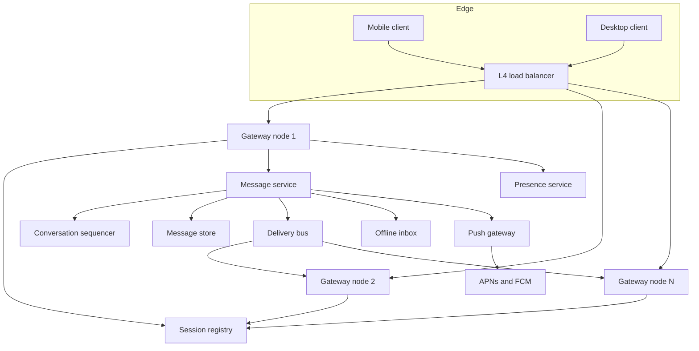
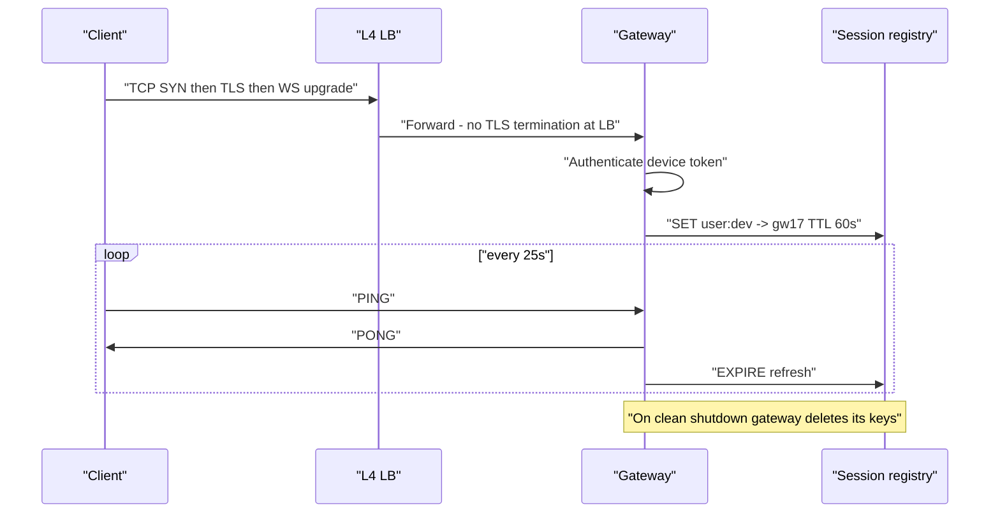
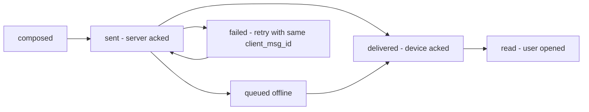
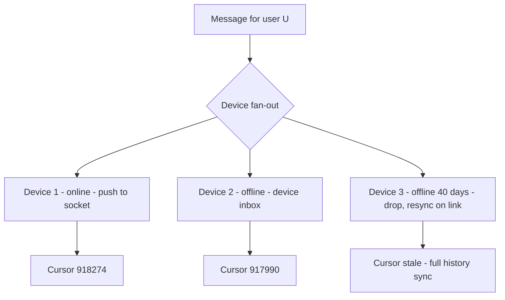
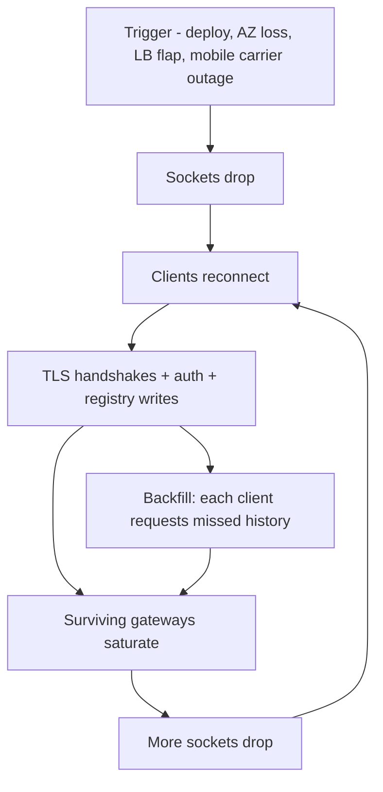

# 10 — Chat System (WhatsApp / Slack)

<span class="pill pill-core">Core</span> <span class="pill pill-hard">Hard</span>

**A chat system is a stateful connection problem wearing a messaging problem's clothes: the messages are small and easy, but holding tens of millions of long-lived TCP sessions, knowing which node holds each one, and rebuilding all of them after a failure is what actually breaks.**

| | |
|---|---|
| **Commonly asked at** | Meta/WhatsApp, Slack, Discord, Microsoft Teams, Snap, LINE, Signal |
| **Time budget** | 45 min |
| **Core tension** | Long-lived stateful connections give you sub-100 ms delivery and presence, but they make every deploy, every node loss, and every network blip a mass-reconnect event |
| **Prerequisites** | [Networking Foundations](../fundamentals/f01-networking-foundations.md) · [Load Balancing](../fundamentals/f03-load-balancing.md) · [Queues & Streams](../fundamentals/f12-queues-streams.md) · [Idempotency](../fundamentals/f11-idempotency.md) · [Time, Clocks & Ordering](../fundamentals/f20-time-clocks-ordering.md) · [Partitioning & Sharding](../fundamentals/f06-partitioning-sharding.md) · [Security in Design](../fundamentals/f27-security-design.md) · [Capacity Planning](../fundamentals/f24-capacity-planning.md) |

## 1. Problem Statement

Design a messaging service supporting 1:1 chat, group chat, multiple devices per user, delivery/read receipts, presence, typing indicators, offline delivery, media attachments, and optional end-to-end encryption. Target ~50 M concurrent connections and ~100 B messages per day.

Three things make this hard and everything else is detail:

1. **Connection state is the scaling unit.** Throughput is trivial (100 B messages/day is only ~1.2 M msg/s of tiny payloads). Holding 50 M sockets, and knowing where each one is, is not.
2. **Ordering must be established by the server**, because client clocks are wrong, adversarial, or offline for days.
3. **Presence costs more than messaging.** It is the feature most likely to take down the fleet, and the one users notice least when it degrades.

!!! note "Two products, two designs"
    WhatsApp-style: 2-person and small-group chats, E2EE, mobile-first, aggressive server-side message deletion after delivery. Slack-style: large channels, full server-side history and search, desktop-heavy, no E2EE. Ask which one in the first minute — the storage model, the fan-out model, and the moderation story all invert.

## 2. Requirements

**Functional**

- Send/receive 1:1 and group messages with per-conversation ordering.
- Delivery receipts (sent / delivered / read) per recipient device.
- Offline queueing; a user offline for 30 days receives everything on reconnect.
- Multi-device: up to 4 linked devices per account, all in sync.
- Presence (online/offline/last-seen) and typing indicators.
- Media attachments up to 100 MB.
- Push notification when no socket is available.

**Non-functional**

| Requirement | Target |
|---|---|
| Message delivery latency (both online) | p50 < 80 ms, p99 < 300 ms end-to-end |
| Send acknowledgement | p99 < 150 ms |
| Message durability | No acknowledged message is ever lost — 11 nines |
| Ordering | Total order per conversation; no global order required |
| Availability | 99.99% for send/receive |
| Reconnect after node loss | p99 < 30 s including backoff |
| Presence propagation | < 30 s, best-effort, explicitly droppable |

**Non-goals:** voice/video transport (WebRTC/SFU is its own design), spam classification internals, contact discovery privacy.

## 3. Scale Estimation

### Connections and messages

$$
\text{MAU} = 2\times10^{9},\quad \text{DAU} = 6\times10^{8},\quad C_{\text{peak}} = 5\times10^{7}\ \text{concurrent sockets}
$$

$$
\text{messages/day} = 10^{11} \Rightarrow \frac{10^{11}}{86400} \approx 1.16\times10^{6}\ \text{msg/s avg},\quad \text{peak} \approx 2.9\times10^{6}\ \text{msg/s}
$$

Deliveries are what the fan-out layer actually does. Average recipients per message ≈ 1.7 (mix of 1:1 and groups), average devices per recipient ≈ 1.8:

$$
\text{deliveries}_{peak} = 2.9\times10^{6} \times 1.7 \times 1.8 \approx 8.9\times10^{6}\ \text{deliveries/s}
$$

### Memory per connection — derive it, do not guess

| Component | Naive default | Tuned | Notes |
|---|---|---|---|
| Kernel `sock` + `tcp_sock` structs | ~2 KB | ~2 KB | Fixed |
| Receive buffer (idle, `tcp_rmem` min) | 6 KB | 4 KB | Autotuned; idle sockets stay at min |
| Send buffer (idle, `tcp_wmem` min) | 16 KB | 4 KB | Lower `tcp_wmem` min for tiny messages |
| TLS record buffers (OpenSSL) | 32 KB | 1.5 KB | `SSL_MODE_RELEASE_BUFFERS` frees the 16 KB read + 16 KB write buffers between records |
| TLS session state | 1 KB | 1 KB | |
| Goroutine/thread stacks | 16 KB (2 × 8 KB) | 8 KB | One reader goroutine; writes via a shared epoll writer pool |
| App connection struct + write queue + subscriptions | 6 KB | 4 KB | Bounded outbound queue of 32 messages |
| conntrack entry (if stateful firewall in path) | 0.3 KB | 0 | Bypass conntrack with `NOTRACK` on the gateway path |
| **Total** | **~79 KB** | **~24.5 KB** | |

Plan at **32 KB per connection** to leave allocator and GC headroom.

$$
M_{\text{node}} = 64\ \text{GB} \times 0.75 = 48\ \text{GB usable}
\quad\Rightarrow\quad
c_{\text{mem}} = \frac{48\times10^{9}}{32\times10^{3}} = 1.5\times10^{6}\ \text{connections}
$$

### File descriptors and ports

Each socket is one FD. For 500 k connections per node:

```bash
# Required kernel and process limits — all four, or you get EMFILE at ~1024
sysctl -w fs.nr_open=2097152                 # per-process ceiling for RLIMIT_NOFILE
sysctl -w fs.file-max=4194304                # system-wide open files
ulimit -n 1048576                            # process soft/hard limit (also LimitNOFILE= in systemd)
sysctl -w net.core.somaxconn=65535           # accept backlog
sysctl -w net.ipv4.tcp_max_syn_backlog=262144
sysctl -w net.netfilter.nf_conntrack_max=1048576   # only if conntrack is unavoidable
sysctl -w net.ipv4.tcp_rmem="4096 4096 6291456"
sysctl -w net.ipv4.tcp_wmem="4096 4096 4194304"
```

FD table cost itself is negligible: $5\times10^{5} \times 8\ \text{B} = 4\ \text{MB}$ of pointer array plus a bitmap. The memory is in the socket buffers, not the descriptors.

!!! gotcha "The 65,535-connection myth"
    A *listening server* is not limited to 65 k connections per port. The kernel demultiplexes on the full 5-tuple `(src IP, src port, dst IP, dst port, proto)`, so one listening port accepts millions of connections from distinct clients. Ephemeral port exhaustion applies to the **initiating** side: an L7 proxy or gateway opening connections to a backend is capped at ~28 k–64 k per `(proxy IP → backend IP:port)` pair. Fix it with multiple backend ports, multiple proxy source IPs, or connection multiplexing (HTTP/2, gRPC) so 500 k client sockets ride over 100 backend streams.

### Deriving node count

The binding constraint is **not** memory — it is blast radius. A node holding 1.5 M connections dumps 1.5 M TLS handshakes on the fleet when it dies. Cap at 500 k and run at 60% utilisation:

$$
N = \frac{C_{\text{peak}}}{c_{\text{node}} \times U} = \frac{5\times10^{7}}{5\times10^{5} \times 0.6} \approx 167 \Rightarrow \mathbf{180\ nodes}\ (60\ \text{per AZ})
$$

Steady state: $5\times10^{7}/180 = 278\text{k}$ connections/node.

**Reconnect storm from losing one AZ:** 60 nodes × 278 k = 16.7 M sockets must re-establish. With jittered backoff spreading them over 120 s:

$$
\text{handshakes/s} = \frac{1.67\times10^{7}}{120} \approx 1.39\times10^{5}/\text{s}
$$

At ~2,500 full ECDHE-ECDSA P-256 handshakes/s/core, that is $1.39\times10^{5}/2500 \approx 56$ cores spread over the 120 surviving nodes — under half a core each. With RSA-2048 it is ~174 cores. **TLS 1.3 session resumption (PSK)** cuts this by roughly 10×, which is why resumption tickets must survive a node change (shared ticket key, rotated hourly).

### Steady-state per-node event rate

$$
\frac{8.9\times10^{6}\ \text{deliveries/s}}{180} \approx 49{,}000/\text{s}
+ \underbrace{\frac{5\times10^{7}}{30\ \text{s} \times 180}}_{\text{heartbeats}} \approx 9{,}300/\text{s}
\approx 58\text{k events/s per node}
$$

Comfortable for an epoll/kqueue event loop, which handles 200 k+ small events/s per core when the work per event is a buffer copy and a write.

### Storage

| Model | Retention | Math | Result |
|---|---|---|---|
| WhatsApp-style | Delete after delivery to all devices; 30-day cap for undelivered | ~2% undelivered at any time × 400 B | ~0.8 TB/day steady queue |
| Slack-style | Forever, searchable | $10^{11} \times 400\ \text{B}$ | **40 TB/day, 14.6 PB/yr** before replication |

Media: 8% of messages carry media, 400 KB average →
$8\times10^{9} \times 400\ \text{KB} = 3.2\ \text{PB/day}$ ingested to [object storage](../fundamentals/f15-object-storage.md), aggressively lifecycle-tiered.

## 4. API Design

Transport is a persistent WebSocket carrying a small binary/JSON frame protocol. HTTP endpoints exist only for bootstrap, media, and history.

```json
// client -> server: send
{ "t": "SEND", "cid": "c_9f21", "client_msg_id": "01J9F3K2P7-a8f2",
  "body_ct": "base64...", "media": [{"id":"m_77","key_ct":"base64..."}] }

// server -> client: authoritative ack, assigns the ordering key
{ "t": "ACK", "client_msg_id": "01J9F3K2P7-a8f2",
  "msg_id": "0000018f2a1c-0009", "cid": "c_9f21", "seq": 918274, "server_ts": 1756628042113 }

// server -> client: delivery
{ "t": "MSG", "cid": "c_9f21", "msg_id": "0000018f2a1c-0009", "seq": 918274,
  "from": "u_331", "from_device": 2, "server_ts": 1756628042113, "body_ct": "base64..." }

// client -> server: cursor advance, both an ack and a receipt
{ "t": "RECEIPT", "cid": "c_9f21", "upto_seq": 918274, "state": "read" }
```

| Endpoint | Purpose | Notes |
|---|---|---|
| `GET /v1/connect` (Upgrade: websocket) | Establish session | Returns assigned gateway; token bound to device ID |
| `POST /v1/devices` | Link a device | Triggers key bundle publication and history sync policy |
| `GET /v1/conversations/{cid}/messages?after_seq=&limit=` | History backfill | Server-ordered, cursor is `seq` |
| `POST /v1/media/upload-url` | Pre-signed upload | Client encrypts before upload; server never sees plaintext |
| `GET /v1/keys/{user}/bundle` | Fetch prekey bundle | One-time prekeys are consumed atomically |
| `POST /v1/presence/subscribe` | Subscribe to a bounded set of peers | Explicitly capped; see §7.3 |

!!! warning "`client_msg_id` is mandatory, not optional"
    Mobile networks retransmit. A client that sends, loses the socket before the ACK, reconnects and re-sends will produce a duplicate unless the server deduplicates on a client-generated ID scoped to `(sender_device, client_msg_id)` with a 7-day TTL. This is the single most common source of "my message sent twice". See [Idempotency](../fundamentals/f11-idempotency.md).

## 5. Data Model

### Entities

- **Conversation** — id, type (dm/group), member list, current `seq` counter, settings.
- **Message** — `(cid, seq)` primary key, sender, ciphertext, server timestamp, media refs.
- **Device inbox** — per `(user, device)` queue cursor over conversations.
- **Session registry** — `(user, device) → gateway node`, ephemeral.
- **Receipt state** — per `(cid, user, device)`: `delivered_upto`, `read_upto`.

### Access patterns

| # | Pattern | Rate | Latency | Store |
|---|---|---|---|---|
| B1 | Append message, assign next `seq` for a conversation | 2.9 M/s peak | < 20 ms | Cassandra + per-conversation sequencer |
| B2 | Look up gateway for `(user, device)` | 8.9 M/s peak | < 2 ms | Redis Cluster / in-memory registry with gossip |
| B3 | Read messages in a conversation after `seq` | 200 k/s | < 30 ms | Cassandra clustering key scan |
| B4 | Enqueue to offline inbox | ~1 M/s | < 20 ms | Cassandra per-device queue table |
| B5 | Advance receipt cursor | 3 M/s | < 20 ms, lossy OK | Redis, async-flushed |
| B6 | Group member list for fan-out | 2.9 M/s | < 2 ms | Cached in gateway, invalidated on change |
| B7 | Presence subscribe/notify | 3.5 M/s | best-effort | Dedicated presence service, in-memory |

### Store selection

| Component | Chosen | Rejected alternatives and why |
|---|---|---|
| Message store | **Cassandra**, partition `(cid, bucket)`, clustering `seq DESC` | *Postgres sharded by cid:* workable and gives you a real sequence, but 2.9 M writes/s means thousands of shards and the operational cost of thousands of primaries. *Kafka as the message store:* excellent log, terrible random access by `(cid, seq)` for history backfill. |
| Sequencer | **Single-writer-per-conversation** partition owner, `seq` in a replicated in-memory counter with periodic checkpoint | *Cassandra LWT (Paxos) per message:* correct but ~4 round trips and ~10× the latency; at 2.9 M/s it is a non-starter. *Snowflake IDs only:* gives a total order but not a **gapless** one, and gaps break "did I miss a message?" detection. |
| Session registry | **Redis Cluster** with 60 s TTL + heartbeat refresh, plus a local negative cache | *ZooKeeper/etcd:* a consensus store cannot absorb 50 M ephemeral entries with sub-second churn; watch fan-out alone would melt it. See [Consensus](../fundamentals/f09-consensus.md). |
| Offline inbox | **Per-device queue table in Cassandra**, TTL 30 d | *Per-device Kafka topic:* topic-per-device is impossible at 3.6 B devices. |
| Presence | **Dedicated in-memory service, sharded by user, no durability** | *Store in the main DB:* presence writes would exceed message writes by 3×, for data that is worthless 30 s later. |
| Receipts | **Redis cursors, async-flushed to Cassandra** | *One row per (message, recipient):* $10^{11} \times 1.7$ receipt rows/day. Store a cursor, not per-message state. |
| Media | **Object storage + CDN**, client-side encrypted | *Inline in message:* 100 MB attachments through the WebSocket blocks the connection's write queue for other messages. |

```sql
-- Messages: bucketed so a busy channel does not create an unbounded partition
CREATE TABLE messages (
  cid         uuid,
  bucket      int,          -- floor(seq / 50000)
  seq         bigint,
  msg_id      timeuuid,
  sender      bigint,
  sender_dev  smallint,
  body_ct     blob,
  media_refs  list<text>,
  server_ts   bigint,
  PRIMARY KEY ((cid, bucket), seq)
) WITH CLUSTERING ORDER BY (seq DESC);

-- Per-device offline queue. Deleted by cursor advance, TTL as a backstop.
CREATE TABLE device_inbox (
  user_id    bigint,
  device_id  smallint,
  seq_global bigint,         -- monotonic per device, not per conversation
  cid        uuid,
  cid_seq    bigint,
  PRIMARY KEY ((user_id, device_id), seq_global)
) WITH CLUSTERING ORDER BY (seq_global ASC)
  AND default_time_to_live = 2592000;

-- Receipts as cursors, one row per (conversation, member, device)
CREATE TABLE receipts (
  cid            uuid,
  user_id        bigint,
  device_id      smallint,
  delivered_upto bigint,
  read_upto      bigint,
  updated_at     bigint,
  PRIMARY KEY ((cid), user_id, device_id)
);
```

## 6. High-Level Architecture



### Write path

1. Client sends `SEND` over its existing socket to gateway A.
2. Gateway A forwards to the **message service** shard that owns the conversation, keyed by `cid`. Single-writer ownership is what makes gapless sequencing cheap.
3. The sequencer assigns `seq = ++counter[cid]` in memory, and the message is written to Cassandra with `QUORUM`.
4. `ACK` returns to the sender immediately after the durable write. The sender's UI moves from "sending" to "sent".
5. The message is published to the **delivery bus** partitioned by `cid`.
6. For each `(recipient, device)`: look up the session registry. Socket present → push to that gateway. Socket absent → write to `device_inbox` and hand to the push gateway.

### Read / delivery path

1. Gateway B receives the delivery, writes the frame to that connection's bounded outbound queue.
2. On flush, the client receives `MSG`, renders it, and sends `RECEIPT{state:"delivered", upto_seq}`.
3. The receipt updates the Redis cursor and is fanned back to the sender's devices (coalesced, at most one per conversation per second).
4. On reconnect, the client sends its last known `seq` per conversation and its device inbox cursor; the gateway streams the gap.

!!! note "Why the gateway is dumb and the message service is smart"
    Gateways hold sockets and nothing else — no conversation state, no membership, no sequencing. That makes them interchangeable, restartable, and horizontally trivial. Every piece of state you let creep into the gateway becomes something that must be rebuilt during a mass reconnect.

## 7. Deep Dives

### 7.1 The connection layer and the session registry



**Routing.** The L4 LB is deliberately dumb: it does *not* terminate TLS (that would double the memory per connection and add a hop's worth of buffers), and it does *not* need affinity, because a client may land on any gateway. The registry, not the LB, resolves "where is this device now".

**Registry consistency.** The registry is allowed to be wrong in one direction only. A **stale entry** (points to a dead gateway) is safe: the delivery attempt fails fast, the sender falls back to the offline inbox and push. A **missing entry** for a live socket is unsafe: the message goes to push while the user is staring at the app. So TTLs are refreshed aggressively (every heartbeat) and expire slowly (60 s), and gateways publish a **negative** event on clean disconnect.

**Heartbeats.** 25 s client ping is not arbitrary: carrier-grade NAT and stateful firewalls commonly expire idle UDP/TCP mappings at 30–300 s. A 25 s interval keeps the mapping alive, and the missed-pong detector declares death after 2 misses (~75 s). Lower it and you burn battery and 4× the fleet-wide event rate; raise it and dead-socket detection lags.

??? note "Deploys are the most dangerous routine operation"
    Restarting 180 gateways naively means 50 M reconnects. The safe procedure:

    1. **Drain, do not kill.** The node stops accepting new connections, then sends a `GOAWAY`-style frame instructing clients to reconnect after a random delay in `[0, 600 s]`.
    2. **Rate-limit the drain** to ~2,000 disconnects/s per node, giving a 140 s drain for 278 k connections.
    3. **One node at a time per AZ**, with a bake period. 180 nodes at ~3 min each is a long deploy — this is the real cost of stateful connections, and it is why gateway code should change rarely and be tiny.
    4. **Never** rely on clients reconnecting "eventually"; without server-directed jitter they synchronise on the same backoff schedule and produce a thundering herd every retry round.

### 7.2 Ordering, sequence numbers, and untrusted clocks

There is exactly one correct authority for message order: the server that owns the conversation.

| Ordering scheme | Guarantee | Failure mode | Chosen / rejected |
|---|---|---|---|
| Client wall-clock timestamp | None | Skew of minutes is routine; messages sort before messages they reply to; a malicious client can pin itself to the top forever | **Rejected** |
| Server wall-clock timestamp | Approximate | Two servers, two clocks; NTP step backwards creates duplicate or inverted timestamps | **Rejected as the sort key**, kept as a display hint |
| Snowflake ID (time + node + counter) | Total order, not gapless | Client cannot detect a missing message; gaps look identical to "not yet delivered" | **Rejected alone**, used as `msg_id` |
| **Per-conversation gapless `seq` from a single writer** | Total order + gap detection + idempotent replay | Requires single-writer ownership and failover machinery | **Chosen** |
| Lamport/vector clocks | Causal order | Metadata grows with participants; still needs a tiebreak for display | **Rejected**: users expect one linear transcript, not a partial order |

Gaplessness is what buys you correctness on reconnect: a client holding `seq=918274` that receives `seq=918276` knows with certainty that it is missing exactly one message and requests it. With snowflake IDs it cannot know.

**Sequencer failover** is the price. The conversation shard owner keeps `counter[cid]` in memory and checkpoints every 1,000 increments. On failover the new owner resumes at `checkpoint + 1000` — it **burns** the un-checkpointed range rather than risking reuse.

!!! gotcha "Gapless is a lie if you allow gap-burning silently"
    After a sequencer failover, clients see `...918274, 919274, ...` and conclude they lost 1,000 messages, triggering 1,000 history refetches per client per conversation. Emit an explicit `SEQ_JUMP{from, to}` control frame on failover so clients advance their cursor without a backfill storm.

**Display order vs storage order.** Store by `seq`. Display by `seq`. Show the *sender's* local time as a hint only, clamped to `[server_ts - 5 min, server_ts]` so a client with a broken clock cannot render "sent in 2031". See [Time, Clocks & Ordering](../fundamentals/f20-time-clocks-ordering.md).

### 7.3 Delivery semantics, receipts, and the offline queue



The state machine is **per recipient device**, and the aggregate shown in the UI is a fold over devices:

- 1:1 chat: `delivered` when *any* of the recipient's devices acks; `read` when any device reports read.
- Group chat: `delivered` when all members have at least one device acked; the UI usually shows the minimum.

| Guarantee | Where it comes from |
|---|---|
| At-least-once delivery | Server retries until the device advances its cursor |
| No duplicates visible to the user | Client dedupes on `(cid, seq)`; server dedupes sends on `(sender_device, client_msg_id)` |
| No loss after ACK | Durable QUORUM write **before** the ACK is returned; the ACK is a promise |
| Ordered replay | Device inbox is a monotonic queue; the cursor is the only delete mechanism |

**The offline queue is a cursor, not a mailbox.** Storing one row per undelivered message per device and deleting on ack produces tombstone-heavy tables and read amplification in Cassandra. Storing a monotonic `seq_global` per device and advancing a cursor lets you range-delete whole prefixes.

**Receipt volume is the hidden cost.** Naively, every message generates one delivered receipt and one read receipt per recipient device: $2.9\times10^{6} \times 1.7 \times 1.8 \times 2 \approx 1.8\times10^{7}$ receipt events/s — six times the message rate. Mitigations, in order of impact:

1. **Cursor semantics**: `RECEIPT{upto_seq}` covers all messages up to that point, so reading 40 messages emits one receipt.
2. **Coalescing**: at most one receipt frame per conversation per second per device.
3. **Suppression in large groups**: above ~64 members, per-member read receipts are aggregated to a count or disabled entirely.

### 7.4 Presence, typing, and multi-device — the expensive extras

**Presence is the most expensive feature in the product.** The cost is a cross-product, not a sum:

$$
\text{presence events/s} = U_{\text{active}} \times t_{\text{transitions/day}} \times \bar{s}_{\text{subscribers}} / 86400
$$

With $6\times10^{8}$ DAU, 20 transitions/day (app foreground/background is a transition), and 50 subscribers watching each user:

$$
\frac{6\times10^{8} \times 20 \times 50}{86400} \approx 6.9\times10^{5}/\text{s}\ \text{avg},\quad \text{peak} \approx 2\times10^{6}/\text{s}
$$

That rivals total message volume, for data that is stale in seconds. Controls:

| Technique | Effect |
|---|---|
| Subscribe only to *visible* peers (open conversation list, ~20 entries) not the whole address book | 5–20× reduction |
| Debounce transitions: do not publish "offline" until 45 s of silence | Kills the background/foreground flapping that dominates event count |
| Coarsen granularity: `online / recently / last-seen-today / long-ago` | Allows caching and removes most updates |
| Pull-on-open instead of push | Converts a fan-out into a batched read |
| Hard rate limit per publisher | Bounds abuse and buggy clients |

**Typing indicators** follow the same logic but are never persisted, never queued for offline users, never retried, and are dropped first under load. They are sent to the conversation's *currently connected* members only, throttled to one event per 3 s per sender, with an implicit 6 s client-side expiry so a lost "stopped typing" event self-heals.

**Multi-device** multiplies everything by ~1.8 and introduces the sync problem:



Each device has an independent cursor. The sender's own devices must also receive their own outgoing messages (self-fan-out), or the desktop client will not show what the phone just sent. Under E2EE this is not free: the sender must encrypt the message separately for each of its own devices, which is why "linked devices" are capped.

### 7.5 End-to-end encryption and what it costs the server

| Server-side feature | With transport-only TLS | With E2EE | Workaround under E2EE |
|---|---|---|---|
| Full-text search | Server-side index | Impossible | On-device index; server returns encrypted blobs by conversation |
| Content moderation | Server classifiers on content | Impossible | Metadata signals, user reports with a signed decryption of the reported message, on-device classifiers |
| Server-side spam/abuse | Content-based | Metadata-based only | Rate, graph, and reputation signals |
| Multi-device | Trivial re-fan-out | Per-device session keys | Sender-key / pairwise sessions per device; sender encrypts $n_{\text{devices}}$ times |
| Cloud backup | Server-readable | Requires a client-held key | Key derived from a user passphrase, escrowed in an HSM-backed vault with rate-limited attempts |
| History for a newly linked device | Server replays | Server cannot decrypt | Device-to-device transfer, or re-encrypt history on the existing device |
| Group membership change | Server updates a row | Requires key rotation | New sender key distributed to all members on every add/remove |

$$
\text{ciphertexts per group message} = \sum_{m \in \text{members}} n_{\text{devices}}(m) \approx 256 \times 1.8 \approx 460
$$

For a 256-member group that is 460 encryption operations and 460 stored ciphertexts per message. This is why E2EE products cap group size in the hundreds while non-E2EE products (Slack) support 100 k-member channels with a single stored copy.

!!! danger "Key change on a compromised or reinstalled device"
    When a contact's identity key changes, the honest options are: block sending until the user verifies (maximally secure, terrible UX), or warn and continue (WhatsApp's default). There is no third option, and the choice is a *product* decision with real safety consequences. Say this out loud in an interview — it demonstrates you understand E2EE is not a feature toggle.

## 8. Scaling the Bottleneck

The bottleneck is the **connection layer under mass reconnect**, and every incident in this system is a variant of it.



The amplifier that people miss is **backfill**: 16.7 M reconnecting clients do not just handshake, they each ask "what did I miss?", producing a burst of history reads against Cassandra that is far heavier than the handshakes.

**Mitigations, in the order to propose them:**

1. **Server-directed jittered backoff.** The reconnect delay is chosen by the *server* in the goodbye frame, not by the client's own exponential backoff — clients synchronise, servers can spread.
2. **Connection admission control.** Gateways accept at most $k$ new sessions/s (e.g. 2,000/s). Excess gets an immediate `503 Retry-After` before the TLS handshake completes, which is 100× cheaper than accepting and failing later. See [Rate Limiting & Load Shedding](../fundamentals/f17-rate-limiting-load-shedding.md).
3. **TLS session resumption with a fleet-wide ticket key.** A resumed handshake costs ~10% of a full one and survives landing on a different gateway.
4. **Backfill throttling and prioritisation.** Return the last 50 messages per active conversation immediately; deep history is a separate, rate-limited, lower-priority request.
5. **Bounded outbound queues with drop policy.** Each connection's write queue holds 32 frames. Overflow drops presence and typing first, then coalesces receipts, and only then disconnects the client — a slow consumer must never grow server memory without bound.
6. **Group fan-out limits.** A 100 k-member Slack channel message is 180 k device deliveries from one write. Fan out through a per-channel topic that gateways *subscribe* to, so the message crosses the network once per gateway (180 copies) rather than once per device (180 k copies).

$$
\text{cross-node messages} = \min(n_{\text{devices}},\ N_{\text{gateways}}) = \min(1.8\times10^{5},\ 180) = 180
$$

That substitution — fan out to *nodes*, let nodes fan out to *sockets* — is the single most important scaling trick in the delivery path.

**Push handoff.** When the registry shows no socket, the message goes to APNs/FCM. Practical requirements: collapse keys so 200 queued messages produce one notification; a silent/high-priority push to wake the app and let it reconnect and pull; per-device token lifecycle handling (`Unregistered` responses must delete the token or you will be rate-limited by the provider); and never put message content in the push payload under E2EE — send a wake signal and let the client fetch and decrypt.

## 9. Failure Modes

| Failure | Blast radius | Detection | Mitigation | Degraded behaviour |
|---|---|---|---|---|
| Gateway node crash | 278 k sockets | Health check + registry TTL expiry | Clients reconnect with server-directed jitter; messages route to inbox meanwhile | ~10–30 s of delivery via push instead of socket |
| Whole AZ loss | 16.7 M sockets | AZ-level health, connection count cliff | Admission control + resumption + backfill throttling | Elevated reconnect latency for ~3 min |
| Session registry unavailable | All routing | Registry error rate | Fail **closed to the inbox**: treat every device as offline, deliver via inbox + push | Everything still delivered, just via push; latency seconds not milliseconds |
| Registry stale (points to dead node) | Individual messages | Delivery attempt failure rate | Fail fast, fall through to inbox, delete the entry | Single-message latency bump |
| Sequencer failover | One conversation shard | Shard ownership change events | Burn 1,000 seq numbers, emit `SEQ_JUMP` | Brief send stall (< 2 s) for that conversation |
| Cassandra partition unavailable | Conversations on that partition | Write timeouts | Retry at `LOCAL_QUORUM`; if unavailable, reject the send with a retryable error | Sends fail *visibly* — never ACK an undurable message |
| Delivery bus lag | Messages delayed but not lost | Consumer lag | Scale consumers; shed presence/typing traffic from the same bus | Messages arrive late; receipts later |
| Presence service overload | Presence + typing only | Presence event queue depth | Drop presence entirely via a feature flag | Users show as "last seen a while ago"; messaging unaffected |
| Push provider (APNs) outage | Offline users only | Provider error rate | Queue with exponential backoff; do not drop; alert | Offline users get messages on next app open |
| Thundering-herd reconnect after LB config change | Everything | Handshake rate spike | Admission control; freeze LB changes during incidents | Slow reconnect, no data loss |
| Client with a corrupt cursor requesting full history in a loop | One shard | Per-device read rate anomaly | Per-device history-read rate limit and a circuit breaker | That client backs off |

## 10. SRE Lens

### SLIs and SLOs

| SLI | Definition | SLO |
|---|---|---|
| Send success | ACKed sends / attempted sends, measured client-side | 99.99% over 28 d |
| Delivery latency (both online) | p99 send-ACK to recipient render | < 300 ms |
| Connection establishment | p99 time from TCP SYN to authenticated WS | < 1.5 s on LTE |
| Reconnect success within 30 s | after any disconnect | 99.9% |
| Message loss | messages ACKed but never delivered or retrievable | 0 — this is a hard invariant, not a percentage |
| Ordering violations | out-of-order `seq` observed client-side | 0 |
| Push delivery | notifications accepted by provider / attempted | 99.5% |
| Presence freshness | p95 staleness | < 30 s (explicitly a *soft* SLO with no paging) |

**Error budget.** 99.99% over 28 days is 4.03 minutes. Because a rolling deploy of 180 stateful gateways inherently disconnects everyone once, the disconnect itself must not count as an error — the SLI is defined on *send success measured at the client*, which survives a reconnect. This is the crucial modelling choice: **measure the user's outcome, not the connection's lifetime.** See [SLI/SLO & Error Budgets](../fundamentals/f23-slo-error-budgets.md).

### Rollout plan

```yaml
gateway_rollout:
  strategy: rolling
  max_unavailable: 1          # one node at a time, fleet-wide
  pre_stop:
    - send_goaway_with_jitter: { min_s: 0, max_s: 600 }
    - drain_rate_per_s: 2000
    - wait_until: connections < 1000 || elapsed > 300s
  post_start:
    - accept_rate_ramp: [200/s, 1000/s, 2000/s]   # 60s per step
  abort_if:
    - fleet_handshake_rate > 250000/s
    - send_success_1m < 99.95%
    - registry_write_p99 > 20ms
```

Protocol changes are versioned in the connect handshake and must be **backward compatible for two full client-release cycles** (mobile clients live for months). Never require a client update to keep messaging working.

??? note "Runbook: connection count cliff"
    **Symptom:** `gateway_connections_total` drops by more than 5% in 60 s.

    1. Is it a *drop* or a *failure to reconnect*? Compare `handshakes_started` vs `handshakes_completed`. A cliff with high starts and low completes is admission control or CPU saturation, not client-side.
    2. Check whether the drop is one AZ (infrastructure) or uniform (LB, cert, or a bad deploy). A uniform drop right after a deploy is the deploy.
    3. **Do not** disable admission control to "let clients in faster". That converts a slow recovery into a non-recovery.
    4. Verify send success rate. If sends still succeed at 99.9%+ via reconnects, this is a latency event, not an availability event — resist the urge to take emergency action.
    5. If reconnects are failing on auth, check the token-validation dependency; the standard mitigation is a short-lived "grace mode" that accepts recently-expired tokens for 15 minutes.
    6. Confirm the offline inbox is absorbing traffic — `inbox_writes_per_s` should spike to roughly the delivery rate. If it does not, messages are being dropped and this is a SEV1.

### Capacity model

$$
N_{\text{gateway}} = \frac{C_{\text{peak}}}{c_{\text{node}} \times U} = \frac{5\times10^{7}}{5\times10^{5}\times0.6} \approx 167 \to 180
$$

$$
N_{\text{msgsvc}} = \frac{2.9\times10^{6}\ \text{msg/s}}{12{,}000\ \text{msg/s/node}} \approx 242 \to 300\ \text{nodes}
$$

$$
\text{Cassandra nodes} \approx \frac{8.9\times10^{6}\ \text{writes/s}}{20{,}000\ \text{writes/s/node}} \times \text{RF}\,3 \times \frac{1}{0.6} \approx 740
$$

Growth planning tracks **concurrent connections**, not DAU — a market where users leave the app backgrounded shifts the ratio dramatically. See [Capacity Planning](../fundamentals/f24-capacity-planning.md).

### Cost

| Component | Driver | Note |
|---|---|---|
| Gateway fleet | Concurrent connections | Memory-bound; the cheapest optimisation in the system is TLS buffer tuning (79 KB → 24 KB per connection is a 3× fleet reduction) |
| Message storage | Retention policy | Slack model is 14.6 PB/yr; the single biggest cost lever is a retention tier, not compression |
| Media | 3.2 PB/day ingest | Lifecycle to cold storage after 30 days; dedupe identical forwards by content hash |
| Push | Free from providers, but engineering cost of token lifecycle | |
| Cross-AZ network | Delivery bus fan-out | Node-level fan-out (180 copies) instead of device-level (180 k) is a 1000× saving |

## 11. Trade-offs & Alternatives

| Decision | Chosen | Alternative | Why the alternative loses |
|---|---|---|---|
| Transport | WebSocket over TLS | Long polling | 3× the request overhead, worse battery, no server push, and mobile radios stay hot |
| Transport | WebSocket | MQTT | MQTT is genuinely good here (Facebook Messenger used it) and lighter on mobile; rejected only for ecosystem/tooling reasons, and worth naming as a strong alternative |
| TLS termination | At the gateway | At the LB | LB termination doubles buffers, breaks per-connection auth context, and makes the LB the memory bottleneck |
| Routing | Session registry lookup | Consistent hashing of user → gateway | Hash routing removes the registry but forces reconnects on every scale event and cannot honour a user's existing connection |
| Ordering | Per-conversation gapless seq | Snowflake IDs | No gap detection, so clients cannot distinguish "lost" from "not yet sent" |
| Offline storage | Per-device cursor queue | Per-message per-device rows | Tombstone explosion in Cassandra, and read amplification proportional to backlog |
| Presence | Best-effort in-memory, droppable | Durable, guaranteed | 3× messaging volume for data with a 30 s shelf life |
| Group fan-out | Node-level subscribe | Device-level fan-out from the message service | 1000× more cross-node traffic on large channels |
| E2EE | Product-dependent | Always on / always off | E2EE removes server search and moderation; that is a business decision with real trade-offs, not a technical default |
| Media | Out-of-band, pre-signed, client-encrypted | Inline in the message stream | A 100 MB upload would block that socket's write queue for every other message |

## 12. Gotchas & Corner Cases

!!! gotcha "Ephemeral port exhaustion on the wrong side of the connection"
    **Symptom:** at ~28,000 backend connections per gateway, new upstream calls fail with `EADDRNOTAVAIL`, while inbound client connections are fine.
    **Mechanism:** the *server* side is not port-limited (the 5-tuple includes the client's IP and port), but any component that **initiates** connections — gateway → message service, LB doing SNAT — is limited to `net.ipv4.ip_local_port_range` per `(src IP, dst IP, dst port)` tuple, default ~28k.
    **Mitigation:** multiplex upstream traffic over a small pool of HTTP/2 or gRPC connections; widen `ip_local_port_range`; add source IPs or destination ports; enable `tcp_tw_reuse` for outbound. Do not "fix" it by enabling `tcp_tw_recycle` — it is removed and was always broken behind NAT.

!!! gotcha "TLS buffers triple your per-connection memory"
    **Symptom:** a gateway sized for 500 k connections OOMs at 180 k, and RSS does not match your per-connection model.
    **Mechanism:** OpenSSL allocates a 16 KB read buffer and 16 KB write buffer per `SSL` object and holds them for the connection's life. 32 KB × 180 k = 5.8 GB of pure TLS buffers.
    **Mitigation:** `SSL_CTX_set_mode(ctx, SSL_MODE_RELEASE_BUFFERS)` frees them between records, taking idle cost to ~1.5 KB. Also cap `tcp_wmem`/`tcp_rmem` minimums — the kernel autotuner will happily hold hundreds of KB per socket after a burst.

!!! gotcha "Clients synchronise their exponential backoff and DDoS you every 30 seconds"
    **Symptom:** after an outage, connection attempts arrive in sharp spikes at 1 s, 2 s, 4 s, 8 s… and the fleet never stabilises.
    **Mechanism:** every client implements the *same* deterministic backoff and was disconnected at the *same* instant, so their retries are phase-locked.
    **Mitigation:** full jitter — `sleep = random(0, min(cap, base * 2^attempt))` — plus a server-chosen reconnect delay in the goodbye frame. Servers know the fleet state; clients do not.

!!! gotcha "The session registry says online, the socket is a zombie"
    **Symptom:** messages are marked delivered but the user never sees them until they force-restart the app.
    **Mechanism:** a TCP connection whose path has silently died (NAT mapping expired, radio switched) stays `ESTABLISHED` on the server for minutes. Writes succeed into the send buffer.
    **Mitigation:** application-level heartbeats with a strict missed-pong deadline are the only reliable liveness signal — `TCP_KEEPALIVE` defaults to 2 hours and is useless here. Treat "message written to socket" as *nothing*; delivery is only confirmed by the client's receipt.

!!! gotcha "Duplicate messages after a network blip"
    **Symptom:** the same message appears twice, always with different `msg_id`s.
    **Mechanism:** client sent, socket dropped before the ACK, client retried on reconnect. Both reached the server and both got a `seq`.
    **Mitigation:** dedupe server-side on `(sender_device_id, client_msg_id)` with a 7-day window; return the *original* ACK for a duplicate so the client's state converges. The client must reuse the same `client_msg_id` on retry — a client that generates a fresh UUID per attempt makes server-side dedup impossible.

!!! gotcha "Read receipts amplify to 6× message volume"
    **Symptom:** the receipt path saturates before the message path, and Cassandra is dominated by tiny receipt writes.
    **Mechanism:** per-message, per-recipient, per-device receipts for both `delivered` and `read`.
    **Mitigation:** receipts are cursors (`upto_seq`), coalesced to at most one per conversation per second, stored in Redis and flushed asynchronously, and suppressed above a group-size threshold.

!!! gotcha "A 100k-member channel message becomes 180k cross-node sends"
    **Symptom:** posting in a large channel spikes cross-AZ network and stalls unrelated conversations on the same message-service shard.
    **Mechanism:** the message service resolved every member device and pushed individually.
    **Mitigation:** publish once per *gateway node* that has at least one subscribed member; the gateway does local fan-out to its own sockets. Cross-node sends collapse from $O(\text{devices})$ to $O(\text{nodes})$.

!!! gotcha "Presence flapping from app foreground/background is most of your presence traffic"
    **Symptom:** presence event rate is 10× your model, dominated by a small set of users toggling state every few seconds.
    **Mechanism:** mobile OSes background and foreground apps constantly; each transition publishes.
    **Mitigation:** debounce offline transitions by 45 s, coarsen the state machine, and rate-limit per publisher. Also stop treating "socket connected" as "user present" — they are different facts.

!!! gotcha "Push notifications leak message content under E2EE"
    **Symptom:** the notification preview shows plaintext the server was never supposed to read, or the feature silently breaks when E2EE ships.
    **Mechanism:** the push payload was populated server-side from message content, which only worked because the server could read it.
    **Mitigation:** send a content-free wake push; the client fetches the ciphertext, decrypts locally, and renders the notification itself (iOS notification service extension / Android high-priority FCM). Budget for the extra round trip in the notification latency SLO.

!!! gotcha "A newly linked device requests all history and melts a shard"
    **Symptom:** linking a desktop client produces a multi-GB backfill and a per-conversation read storm.
    **Mechanism:** the device's cursor starts at zero, so "everything I missed" means everything.
    **Mitigation:** a linked device starts at `now`, then backfills lazily per conversation, rate-limited, newest-first, with a configurable horizon (e.g. 30 days). Under E2EE this is forced anyway, since only the existing device can re-encrypt history.

!!! gotcha "A slow client grows server memory until the node dies"
    **Symptom:** one gateway's RSS climbs steadily; the top consumers are a few hundred connections' outbound queues.
    **Mechanism:** a client on a poor network stops reading; the server keeps appending to an unbounded per-connection queue.
    **Mitigation:** bounded outbound queue (e.g. 32 frames). On overflow, drop by class — typing first, presence next, coalesce receipts, and finally disconnect the client with a resumable cursor. Never let a remote peer's behaviour dictate your memory usage.

!!! gotcha "Sequencer failover reuses a sequence number"
    **Symptom:** two different messages share `(cid, seq)`; one silently overwrites the other in Cassandra.
    **Mechanism:** the new shard owner resumed from the last checkpoint, but the old owner had already issued numbers past it — a classic split-brain during a partition.
    **Mitigation:** fence the sequencer with a monotonically increasing epoch from the coordination service; writes carry `(epoch, seq)` and the store rejects a write from a stale epoch. On failover, always resume at `checkpoint + reservation_window`, never at `checkpoint + 1`. See [Consensus](../fundamentals/f09-consensus.md).

!!! gotcha "Deploying the gateway takes hours and nobody planned for it"
    **Symptom:** an urgent security patch to the gateway cannot be rolled out quickly without disconnecting the entire user base at once.
    **Mechanism:** safe drain rates (2,000 disconnects/s/node) × 180 nodes serialised = hours.
    **Mitigation:** keep the gateway minimal and stable so it changes rarely; support an "accelerated drain" mode with a documented, pre-approved reconnect-storm plan and pre-scaled capacity; and separate the frequently-changing business logic into the message service, which is stateless and deploys in minutes.

## 13. Interview Angle

!!! interview "Lead with connections, not messages"
    Most candidates start with "messages go into Kafka". The differentiating opener is: "100 B messages/day is only 1.2 M small writes/s, which is not the hard part. The hard part is 50 M concurrent stateful sockets — so let me size a gateway node first." Then do the per-connection memory table live. Almost nobody does this, and it immediately reads as operational experience.

!!! interview "Be ready to defend why client timestamps are unusable"
    The strong framing: client clocks are wrong (skew), adversarial (a client can pin its message to the top of everyone's transcript), and irrelevant (a message composed offline three days ago must not sort three days back). Therefore the sort key is a server-assigned, per-conversation, gapless sequence, and the client's clock is a display hint clamped to a sane range.

!!! interview "Name presence as the most expensive feature before they ask"
    "Presence is a cross-product — users × transitions × subscribers — and at our scale it exceeds message volume. I'd make it best-effort, debounced, coarse-grained, subscribed only to visible peers, and the first thing shed under load." This shows you can rank features by cost, which is what a tech lead does.

??? note "Follow-up questions with answers"
    **Q: How does the sender's message reach a recipient connected to a different gateway?**
    The message service looks up `(recipient, device)` in the session registry, gets a gateway ID, and publishes onto the delivery bus with that gateway as the routing key — or, for large groups, publishes once per gateway that has any subscribed member. The gateway writes to the local socket. The registry is the indirection layer that makes gateways stateless and interchangeable.

    **Q: The session registry goes down entirely. What happens?**
    Fail closed to the offline path: treat every device as offline, write to the device inbox, and send a wake push. Every message is still delivered and durable; latency degrades from ~100 ms to seconds. That is a correct and acceptable degradation. The wrong answer is failing open (dropping messages) or blocking sends — an unavailable routing hint must never cost durability.

    **Q: How do you guarantee no message is lost while allowing at-least-once delivery?**
    Durability and delivery are separate. The ACK is only returned after a `QUORUM` write to the message store, so an ACKed message exists regardless of what happens to any socket. Delivery is then a retry loop driven by the recipient's cursor: the server keeps re-offering until the device advances it. Duplicates are made invisible by client-side dedup on `(cid, seq)`.

    **Q: A user has been offline for 40 days with 20,000 pending messages. What happens on reconnect?**
    The inbox has a 30-day TTL, so some messages are gone from the queue — but they still exist in the conversation store. On reconnect the client sends its per-conversation `seq` cursors; the server serves the most recent 50 per active conversation immediately so the app is usable in under a second, then backfills older ranges lazily and rate-limited. Never attempt a 20,000-message synchronous replay: it blocks the socket and starves live traffic.

    **Q: How do you roll out a change to the gateway fleet without a global outage?**
    One node at a time, drain rather than kill, server-directed jittered reconnect windows up to 10 minutes, admission control on the receiving nodes, and abort gates on fleet-wide handshake rate and client-observed send success. It is slow by design, and that slowness is the true operational cost of stateful connections — which is why the gateway should contain as little logic as possible.

    **Q: Slack channel with 100,000 members. What breaks first?**
    Device-level fan-out: 180 k deliveries per message. Fix by fanning out to gateway nodes (≈180 sends) and letting each node fan out locally. Second, read receipts — disable per-member receipts above a threshold and show an aggregate. Third, presence for the member list — do not compute presence for 100 k members; compute it for the ~50 visible in the viewport, on demand.

    **Q: Where does E2EE make your design worse, and would you still ship it?**
    It removes server-side search (must be on-device), removes content-based moderation (leaving metadata signals and user reports), makes multi-device a per-device key problem, makes group fan-out $O(\text{members} \times \text{devices})$ ciphertexts, and makes cloud backup a key-management problem. It is the right default for a personal messenger and usually the wrong default for an enterprise collaboration tool with compliance and eDiscovery requirements. The answer is product-dependent, and saying so is stronger than picking one.

    **Q: How would you detect that messages are being silently dropped?**
    Gapless sequence numbers make it directly observable: clients report any `seq` gap that persists beyond a timeout, and that metric is aggregated server-side. Plus an end-to-end synthetic prober that sends messages between canary accounts across regions and asserts delivery and ordering. Never rely on server-side error rates to detect loss — the dangerous losses are the ones no component reported as an error.

### Strong answer vs weak answer

| Dimension | Weak | Strong |
|---|---|---|
| Framing | Starts with the message pipeline | Starts by sizing a connection: memory, FDs, node count, reconnect storm |
| Connection limits | "Each server handles 65 k connections because of ports" | Explains the 5-tuple, and correctly locates port exhaustion on the initiating side |
| Ordering | Sorts by timestamp | Server-assigned gapless per-conversation sequence, with a documented failover gap-burn and a `SEQ_JUMP` control frame |
| Routing | "Use sticky sessions" | Session registry with TTL, explicit reasoning about which direction of staleness is safe |
| Group chat | Fan out to every device | Fan out to gateway *nodes*, collapsing $O(\text{devices})$ to $O(\text{nodes})$ |
| Presence | Treats it as a small feature | Derives that it exceeds message volume, then designs it as droppable |
| Receipts | One row per message per recipient | Cursor-based, coalesced, suppressed in large groups |
| Failure | "It's highly available" | Names fail-closed-to-inbox for registry loss, and defends why that preserves durability |
| Deploys | Not mentioned | Identifies rolling stateful deploys as the dominant operational risk and designs the drain protocol |
| Backpressure | Not mentioned | Bounded per-connection queues with a class-based drop ladder |

## 14. Key Takeaways

1. **Sizing a chat system starts at one connection.** Per-connection memory (kernel buffers + TLS buffers + stacks + app state), FDs, and heartbeat cost determine node count far more than message throughput does.
2. **The 65 k port limit does not apply to accepting servers.** It applies to whatever initiates connections — proxies, gateways calling backends, and SNAT.
3. **Order is a server-side fact.** Per-conversation gapless sequence numbers give total order, gap detection, and idempotent replay; client clocks give none of these.
4. **Durability and delivery are separate promises.** ACK after a durable write; deliver with at-least-once retries driven by a per-device cursor; dedupe on the client.
5. **Store cursors, not per-message state.** Offline queues, receipts, and sync all collapse from $O(\text{messages} \times \text{recipients})$ to $O(\text{conversations} \times \text{devices})$.
6. **Fan out to nodes, not to sockets.** Large groups are only tractable when cross-node traffic is $O(\text{gateways})$.
7. **Presence is the most expensive feature and the first to shed.** Debounce, coarsen, scope to visible peers, and make it explicitly best-effort in the SLO.
8. **Every incident is a reconnect storm.** Server-directed jitter, admission control, TLS resumption, and backfill throttling are not optimisations — they are the difference between a 3-minute recovery and one that never converges.
9. **E2EE is a product decision with system-wide consequences**: no server search, no content moderation, per-device key fan-out, and a hard cap on group size.
