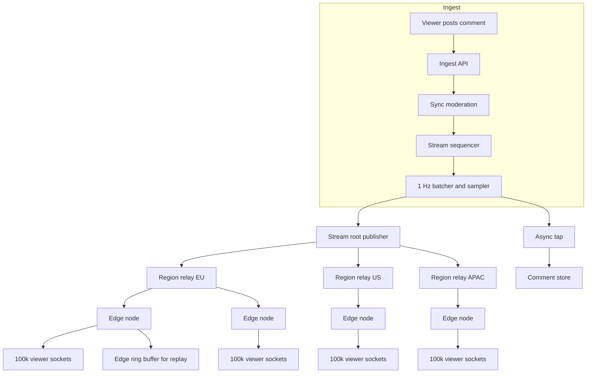
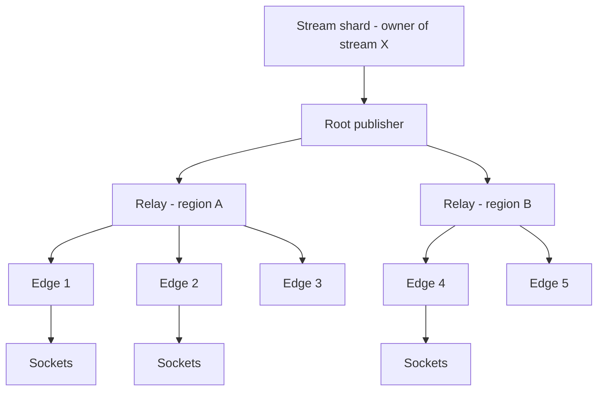
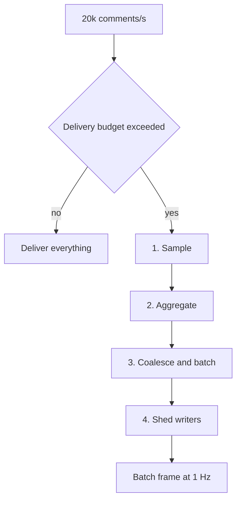
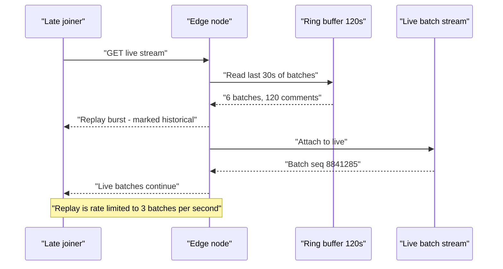
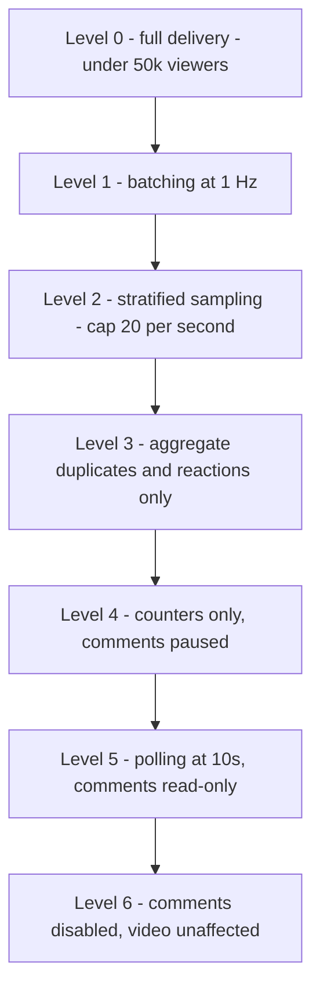

# 11 — Live Comments & Reactions at Scale

<span class="pill pill-core">Core</span> <span class="pill pill-hard">Hard</span>

**Live comments invert every assumption in a normal system: one write must be delivered ten million times within a second, which means the design is not about how to deliver everything — it is about deciding what to throw away.**

| | |
|---|---|
| **Commonly asked at** | Meta (Facebook Live), YouTube Live, Twitch, TikTok Live, Twitter Spaces, LinkedIn Live |
| **Time budget** | 45 min |
| **Core tension** | Every viewer wants every message instantly, but total delivery volume is $O(\text{writers} \times \text{readers})$ — so the only viable designs are lossy, and the engineering is in choosing a loss policy users cannot perceive |
| **Prerequisites** | [Queues & Streams](../fundamentals/f12-queues-streams.md) · [CDN & Edge](../fundamentals/f05-cdn-edge.md) · [Rate Limiting & Load Shedding](../fundamentals/f17-rate-limiting-load-shedding.md) · [Resilience Patterns](../fundamentals/f18-resilience-patterns.md) · [Caching](../fundamentals/f04-caching.md) · [Partitioning & Sharding](../fundamentals/f06-partitioning-sharding.md) · [Observability](../fundamentals/f22-observability-fundamentals.md) |

## 1. Problem Statement

Design the live comment and reaction layer for a video streaming platform. When a stream is live, viewers post short comments and tap reactions; every viewer sees a scrolling comment feed and a live reaction counter. A normal stream has a few hundred viewers. A viral stream — a product launch, a sports final, a political event — has ten million concurrent viewers on a single stream.

The defining property is the **read amplification per write**:

$$
\text{delivery events} = \text{writes/s} \times \text{concurrent viewers}
$$

On a 10 M-viewer stream with 20 k comments/s, that is $2\times10^{11}$ delivery events per second. There is no fleet that does that. The entire design is a sequence of legitimate techniques for reducing that product without users noticing.

!!! note "This is not a chat system"
    Chat is $N$ conversations of ~3 participants: fan-out is tiny, durability is mandatory, ordering is mandatory. Live comments are 1 conversation of $10^{7}$ participants: fan-out is enormous, durability is optional, and ordering is negotiable. If you reuse a chat design here you will get the wrong answer, and vice versa.

## 2. Requirements

**Functional**

- Post a comment on a live stream; see it appear in your own feed immediately.
- Receive a live stream of other viewers' comments while watching.
- Tap a reaction (like/heart/laugh); see an aggregate live counter and a floating-reaction animation.
- Late joiners see recent context, not an empty pane.
- Moderation: block banned words, banned users, and flagged content before it is broadly delivered.
- Creator/moderator comments and pinned comments are always delivered.

**Non-functional**

| Requirement | Target |
|---|---|
| Comment delivery latency | p99 < 2 s from post to render (relative to the video's own 5–20 s glass-to-glass delay) |
| Reaction counter freshness | Updated at 1 Hz; exact value never required |
| Availability | 99.9% — the video must never fail because comments failed |
| Comment durability | Best-effort; a lost comment on a 10 M viewer stream is acceptable, a lost *video segment* is not |
| Own-comment visibility | 100% — the author must always see their own comment (read-your-writes) |
| Capacity | 10 M concurrent viewers on one stream; 60 M platform-wide across 50 k concurrent streams |

**Explicit non-goals:** video transport, transcoding, DVR, monetisation. Threaded replies (this is a flat firehose by design).

!!! tip "State the loss budget early"
    "I am going to design a system that intentionally drops the majority of comment *deliveries* on very large streams. Below a threshold, delivery is complete; above it, each viewer receives a representative sample plus everything from people they follow, moderators, and themselves." Saying this in minute three reframes the whole interview. Candidates who try to deliver everything spend 40 minutes failing arithmetic.

## 3. Scale Estimation

### The viral stream

$$
V = 10^{7}\ \text{concurrent viewers},\quad
W_{c} = 2\times10^{4}\ \text{comments/s},\quad
W_{r} = 2\times10^{5}\ \text{reactions/s}
$$

Naive complete delivery:

$$
D_{\text{naive}} = V \times W_{c} = 10^{7} \times 2\times10^{4} = 2\times10^{11}\ \text{deliveries/s}
$$

At 200 bytes on the wire per delivered comment:

$$
2\times10^{11} \times 200\ \text{B} = 4\times10^{13}\ \text{B/s} = 40\ \text{TB/s} = 320\ \text{Tbps}
$$

For comparison, the entire global CDN capacity of a large provider is on the order of a few hundred Tbps. **One stream's comment feed would consume the internet.** This number is the centrepiece of the whole answer.

### After the loss policy

Cap per-viewer delivery at $R = 20$ comments/s (already far more than a human can read — a comment pane scrolls ~4 legible lines/s), and batch them into one frame per second:

$$
D_{\text{capped}} = V \times R = 10^{7} \times 20 = 2\times10^{8}\ \text{deliveries/s}
$$

Batching 20 comments into a single ~1.6 KB frame at 1 Hz:

$$
B = V \times 1\ \text{frame/s} \times 1.6\ \text{KB} = 1.6\times10^{10}\ \text{B/s} = 16\ \text{GB/s} = 128\ \text{Gbps}
$$

**A 2,500× reduction, from impossible to a large-but-normal CDN workload.** Spread across edge nodes holding 100 k connections each:

$$
N_{\text{edge}} = \frac{10^{7}}{10^{5}} = 100\ \text{nodes},\qquad
\text{egress/node} = \frac{128\ \text{Gbps}}{100} = 1.28\ \text{Gbps}
$$

### Cross-node fan-out cost

The key structural win: publish to *nodes*, not to *viewers*.

$$
\text{cross-node msgs/s} = \underbrace{1\ \text{batch/s}}_{\text{per stream}} \times N_{\text{edge}} = 100/\text{s}
$$

The comment ingest rate (20 k/s) is absorbed once at the stream's owning shard; the fan-out tree distributes 1 batch/s to 100 nodes. Cross-node traffic is a rounding error. **All the cost is in the last hop from edge node to viewer.**

### Reactions

Reactions are pure counters, so they compress far harder:

$$
W_{r} = 2\times10^{5}/\text{s} \xrightarrow{\text{edge-local aggregation}} N_{\text{edge}} \times 1\ \text{delta/s} = 100\ \text{writes/s}
$$

A **2,000× write reduction** before the counter store sees anything. Downstream the counter is broadcast at 1 Hz as a single integer in the same batch frame; clients interpolate and animate floating hearts locally from the delta, so the *visual* density of reactions is client-generated.

### Platform-wide

$$
60\times10^{6}\ \text{viewers} \Rightarrow N_{\text{edge,total}} = \frac{6\times10^{7}}{10^{5}} = 600\ \text{nodes}
$$

Storage, if comments are persisted for VOD replay (30-day retention, 50 k streams/day × 2 h × mixed rates ≈ $2\times10^{10}$ comments/day at 150 B):

$$
2\times10^{10} \times 150\ \text{B} = 3\ \text{TB/day} \Rightarrow 90\ \text{TB}\ \text{at 30-day retention}
$$

!!! example "The ratio to quote"
    On the viral stream the write-to-read ratio is $1 : 10^{7}$. In a normal web system it is roughly $1 : 100$. Five orders of magnitude of difference is why none of the usual patterns transfer.

## 4. API Design

```http
GET /v1/streams/{id}/live?since_seq=8841203&reactions=1
Accept: text/event-stream
Last-Event-ID: 8841203
```

```text
event: batch
id: 8841284
data: {"seq":8841284,"t":1756628042,
data:  "c":[{"i":"c9f1","u":"kai","n":"Kai R","x":"this is wild","f":1},
data:      {"i":"c9f2","u":"lin","n":"Lin","x":"same"}],
data:  "r":{"like":48210331,"heart":9930112,"d":{"like":41200,"heart":8800}},
data:  "s":0.004,"dropped":19870}

event: control
data: {"mode":"sampled","rate_hint":1.0,"replay_available":true}
```

| Field | Meaning |
|---|---|
| `seq` | Monotonic batch sequence for the stream; enables resume via `Last-Event-ID` |
| `c` | Sampled comment array; `f:1` marks "from someone you follow" (never sampled out) |
| `r` | Absolute reaction totals plus per-second deltas for client-side animation |
| `s` | Sampling fraction actually applied — clients render "showing a sample of comments" honestly |
| `dropped` | Count of comments in this window not delivered to you |

| Endpoint | Method | Notes |
|---|---|---|
| `/v1/streams/{id}/comments` | POST | `Idempotency-Key`; returns the comment immediately for the author regardless of sampling |
| `/v1/streams/{id}/reactions` | POST | Batched client-side: one request per second carrying a count, not one per tap |
| `/v1/streams/{id}/live` | GET (SSE) | The firehose; `Last-Event-ID` resumes |
| `/v1/streams/{id}/replay?from=&to=` | GET | Ring-buffer replay for late joiners, served from edge cache |
| `/v1/streams/{id}/pinned` | GET | Tiny, heavily cached, always delivered |

!!! warning "Reactions must be batched on the client"
    A user tapping the heart button rapidly generates 10 taps/s. Sending 10 HTTP requests is 10× the ingest load for zero additional information. The client accumulates and sends `{"like": 14}` once per second. This single client-side decision removes an order of magnitude from the ingest tier — and it is the sort of cross-layer optimisation interviewers look for.

## 5. Data Model

### Entities

- **Stream** — id, state (live/ended), owner, moderation policy, current mode (full/sampled/aggregate).
- **Comment** — `(stream_id, seq)`, author, text, flags (follower-of, moderator, pinned), moderation verdict.
- **Reaction counter** — per stream, per reaction type; a monotonically increasing total.
- **Ring buffer** — last $T$ seconds of accepted comments per stream, held at every edge node.
- **Viewer session** — connection, subscribed stream, sampling state, follow-set bloom.

### Access patterns

| # | Pattern | Rate | Latency | Store |
|---|---|---|---|---|
| C1 | Append comment, assign stream seq | 20 k/s per hot stream | < 50 ms | In-memory sequencer on the stream's owning shard |
| C2 | Broadcast a batch to all edges subscribed to a stream | 1/s per stream | < 200 ms | Pub/sub bus (Redis Streams / Kafka / custom gossip) |
| C3 | Push a batch to each connected viewer | 10 M/s | < 100 ms local | Edge node memory, no external call |
| C4 | Increment reaction counters | 200 k/s pre-aggregation, 100/s post | < 1 s, lossy OK | Edge-local counters → sharded Redis |
| C5 | Serve replay window to a late joiner | 50 k/s during a surge | < 300 ms | Edge ring buffer, memory only |
| C6 | Persist comments for VOD | 20 k/s | async | Cassandra, bucketed |
| C7 | Check author ban / moderation verdict | 20 k/s | < 5 ms | Bloom filter in the ingest process + Redis |

### Store selection

| Component | Chosen | Rejected alternatives and why |
|---|---|---|
| Live fan-out path | **In-memory pub/sub with per-stream topics, edge-local ring buffers** | *Kafka topic per stream:* 50 k live streams means 50 k topics with rapid create/delete churn — controller metadata pressure and rebalance storms. Kafka is fine as the *durable* tap, not as the live fan-out. |
| Reaction counters | **Edge-local aggregation → sharded Redis `INCRBY` → 1 Hz broadcast** | *Per-tap durable write:* 200 k writes/s for a number nobody verifies. *CRDT counters across regions:* correct and elegant, but the merge cost and metadata are unjustified when a ±0.1% error is invisible. |
| Comment durability | **Async tap to Cassandra**, off the delivery path | *Synchronous write before delivery:* puts a 20 ms dependency in a 2 s budget and makes a storage hiccup a comment outage. |
| Replay buffer | **Edge memory ring buffer, 120 s** | *Query the database on join:* a viral stream produces a join rate of tens of thousands/s, each doing a range scan. Memory at the edge is the only place this is cheap. |
| Sequencing | **Per-stream single writer, in-memory counter** | *Global ordering service:* an unnecessary coordination point for data that is explicitly allowed to be approximately ordered. |
| Moderation state | **Bloom filter of banned users + Redis for verdicts** | *Synchronous DB check per comment:* 20 k lookups/s per hot stream on the critical path. |

```sql
-- Durable tap for VOD replay. Bucketed by 10k-seq windows.
CREATE TABLE stream_comments (
  stream_id  uuid,
  bucket     int,           -- floor(seq / 10000)
  seq        bigint,
  author_id  bigint,
  body       text,
  flags      int,           -- bit 0 pinned, 1 moderator, 2 auto-flagged
  verdict    tinyint,       -- 0 allow, 1 shadow, 2 removed
  created_at bigint,
  PRIMARY KEY ((stream_id, bucket), seq)
) WITH CLUSTERING ORDER BY (seq ASC)
  AND default_time_to_live = 2592000
  AND compaction = {'class':'TimeWindowCompactionStrategy',
                    'compaction_window_unit':'HOURS',
                    'compaction_window_size':6};

-- Reaction rollups, written once per second per edge node then compacted.
CREATE TABLE stream_reactions_rollup (
  stream_id     uuid,
  minute        int,
  reaction_type tinyint,
  count         counter,
  PRIMARY KEY ((stream_id), minute, reaction_type)
);
```

## 6. High-Level Architecture



### Write path

1. Viewer POSTs a comment. Ingest applies per-user rate limits (3 comments/10 s), a banned-user bloom check, and a fast text classifier — total budget 30 ms.
2. The stream's **owning shard** assigns `seq` from an in-memory counter and appends to the current 1-second batch window.
3. At the window boundary the batcher performs **sampling**: it selects up to $R$ comments using the policy in §7.2, computes the reaction deltas, and emits one batch object.
4. The batch is published once to the fan-out tree root and asynchronously tapped to Cassandra (full, unsampled).

### Read path

1. A viewer's SSE connection is terminated at an edge node in their region, chosen by [DNS/anycast steering](../fundamentals/f02-dns-traffic-management.md).
2. The edge node holds one subscription per stream it serves, regardless of how many local viewers watch that stream. It receives ~1 batch/s.
3. For each local connection it writes the batch, optionally personalising it: substituting in comments from accounts the viewer follows (kept in a per-connection bloom filter) and their own comments.
4. The batch is also appended to the node's per-stream ring buffer so a late joiner gets instant context without touching any backend.

!!! note "One subscription per node, not per viewer"
    This is the single structural decision that makes the system possible. 100 k viewers of the same stream on one node cost **one** upstream subscription. The cost of a viewer is memory and egress, not fan-out. Any design where the backend knows about individual viewers is dead on arrival at $10^{7}$.

## 7. Deep Dives

### 7.1 Fan-out topology and connection sharding



**Why a tree, not a flat broadcast.** A flat topology has the root publisher maintaining connections to all 600 edge nodes and sending 600 copies of every batch across region boundaries. Cross-region bandwidth is the most expensive network you buy. With regional relays, the batch crosses each region boundary **once** and is replicated cheaply inside the region:

$$
\text{cross-region bytes} = n_{\text{regions}} \times \text{batch size},\qquad
\text{intra-region} = n_{\text{edges/region}} \times \text{batch size}
$$

For 6 regions and 100 edges each: 6 expensive copies instead of 600.

**Sharding by stream, not by user.** The unit of partitioning is `stream_id`, because all fan-out state is per-stream. But this creates the classic hot-partition problem: one stream can be 20% of platform load.

| Sharding key | Consequence | Chosen / rejected |
|---|---|---|
| `hash(stream_id)` | Simple; one viral stream saturates one shard | **Rejected** as the only mechanism |
| `hash(stream_id)` + dedicated isolation pool for hot streams | Viral streams get their own shards and edge pool | **Chosen** |
| `hash(viewer_id)` | Even load, but every edge node subscribes to every stream — 50 k subscriptions per node | **Rejected** |
| `hash(stream_id, sub_shard)` for hot streams | Splits ingest across $k$ sub-sequencers; ordering becomes per-sub-shard | **Chosen for ingest only**, with the batcher merging |

**Hot-stream isolation** is a control-plane function: a stream crossing 500 k viewers is migrated to a dedicated pool with its own sequencer, its own relay capacity, and its own rate limits, so that its blast radius is itself. This is the [bulkhead pattern](../fundamentals/f18-resilience-patterns.md) applied to a data-plane topology.

### 7.2 Backpressure: you must drop, and the design is *how*

There is no configuration of hardware that delivers $2\times10^{11}$ messages/s. Accepting that early leads to a better design than pretending otherwise. There are exactly four levers:



**1. Sample (drop reads).** Deliver $R$ of $W_c$ comments per second. Uniform random sampling is the wrong policy — it makes the feed feel like noise and destroys the social signal. The correct policy is **stratified**:

```python
def build_batch(window, viewer, R=20):
    out = []
    out += window.pinned                      # always, unbounded but tiny
    out += window.from_moderators             # always
    out += [c for c in window if c.author in viewer.follow_bloom]   # always
    out += [c for c in window if c.author_id == viewer.id]          # read-your-writes
    remaining = R - len(out)
    if remaining > 0:
        # Weighted by author reputation and text quality, not uniform.
        out += weighted_sample(window.rest, k=remaining)
    return dedupe(out)[:R + len(window.pinned)]
```

The personalised part (follows, own comments) is applied **at the edge node**, not centrally — the shared batch carries a larger candidate set (say 100 comments) and each node trims to 20 per viewer using local state. This preserves the one-subscription-per-node property while still personalising.

**2. Aggregate (change the data type).** Reactions become a counter; identical comments ("GOAL!" × 40,000) become `{"text":"GOAL!","n":40000}`. Aggregation is lossless in information terms and reduces volume by orders of magnitude — always prefer it to sampling where the data type permits.

**3. Coalesce and batch.** One frame per second instead of 20 frames per second removes 95% of per-message framing overhead (SSE/WebSocket framing + TLS record + TCP/IP headers ≈ 100–150 bytes) and 95% of syscalls. On a 100 k-connection node, going from 20 writes/s/conn to 1 is the difference between 2 M and 100 k `write()` calls per second.

**4. Shed writers.** Per-user comment rate limits (3 per 10 s) and, above a stream-level threshold, admission control on posting itself: 429 with `Retry-After` for a fraction of writers. Shedding writes is the **last** lever because it is the most user-visible — a viewer who cannot post notices immediately, whereas one whose comment is not shown to strangers usually does not.

!!! danger "Unbounded per-connection queues are how this system dies"
    A slow mobile client stops reading. The edge node keeps appending batches to its socket buffer. At 1.6 KB/s per connection and 100 k connections, an hour of a stalled fleet is 576 GB of buffered garbage nobody will ever read. Every connection has a **1-slot** outbound queue: if the previous batch has not flushed, the new batch **replaces** it. For a live feed, the newest state is the only state that matters — this is a "last value wins" queue, not a FIFO.

### 7.3 Ordering vs latency, and the transport choice

**Ordering.** A global total order over 20 k comments/s from a distributed ingest tier requires funnelling every comment through one sequencer, which caps throughput and adds a network hop to every write. The honest design:

| Guarantee | Cost | Chosen / rejected |
|---|---|---|
| Total order across the stream | Single sequencer, ~50 ms added latency, throughput ceiling | **Rejected** for hot streams |
| Batch-level order (batches strictly ordered; comments within a batch unordered) | Free | **Chosen** — the 1 s batch window is well inside human perception of "live" |
| Causal order (reply appears after its parent) | Requires parent tracking | **Chosen for the narrow case** of replies, which are rare on live streams |
| No order at all | Free | **Rejected** — batch skew would let the same feed jump backwards in time |

The insight to state: **the video itself is 5–20 s behind reality**, so a 1-second comment batching window is invisible. Perfect ordering of comments would be more precise than the medium they are commenting on.

**Transport.**

| Transport | Server cost/conn | Bidirectional | Resume | Proxy/CDN friendliness | Chosen / rejected |
|---|---|---|---|---|---|
| **SSE (`text/event-stream`)** | Lowest — plain HTTP response, no upgrade, no per-message framing state | No (POST separately for writes) | Native via `Last-Event-ID` | Excellent — it is just HTTP, works through every CDN and corporate proxy | **Chosen for the read path** |
| WebSocket | Higher — upgrade handshake, framing, ping/pong state | Yes | Manual | Good, but blocked by some corporate proxies | **Rejected for read**, kept as a fallback and used where a truly bidirectional low-latency channel is needed |
| Long polling | Highest — a new request per message, full header overhead, connection churn | Emulated | Manual | Universal | **Rejected except as a last-resort fallback** for ancient clients |
| HTTP/3 datagrams | Very low, loss-tolerant | Yes | Complex | Emerging | **Rejected** for maturity; genuinely interesting for reactions |

SSE wins because the workload is **overwhelmingly one-directional** (writes are 1 per 500 viewers), and because "it is just an HTTP response" means the existing CDN, edge TLS termination, and HTTP routing layers work unchanged. Comment posting is a normal `POST`. Using WebSockets here buys bidirectionality you do not need at the cost of infrastructure that does not natively support it.

### 7.4 Replay for late joiners, and moderation in the path



A viral stream's join rate can exceed 50 k/s. If each join triggers a backend query, that is 50 k range scans/s against a store also absorbing 20 k writes/s. The **edge ring buffer** eliminates the backend entirely: the node already receives every batch, so it keeps the last 120 s in a fixed-size array (120 batches × ~2 KB = 240 KB per stream per node — trivial). Joins are served from local memory at zero marginal cost.

Two rules: replay is **rate-limited** (a burst of 30 s of history dumped instantly makes the pane unreadable and defeats batching), and replayed items are **marked historical** so the client renders them without the "new comment" animation.

**Moderation** sits on the critical write path with a hard budget:

| Stage | Budget | Action |
|---|---|---|
| Banned-user bloom filter (in-process) | < 0.1 ms | Reject silently — shadowban, so the author still sees their own comment |
| Rate limit (token bucket per user per stream) | < 0.5 ms | 429 |
| Blocklist / regex / hash match on text | < 2 ms | Reject or hold |
| Fast ML classifier (small model, in-process or sidecar) | < 25 ms | Allow / shadow / remove |
| Expensive classifier (image, LLM, cross-reference) | async | Retro-removal via a tombstone in a later batch |
| Human moderator queue | seconds to minutes | Retro-removal + author action |

!!! gotcha "Retro-removal must be able to unsay something already delivered"
    A comment approved by the fast classifier and rejected 4 seconds later by the slow one has already reached 10 M screens. The batch protocol therefore carries a `remove: [seq...]` field, and clients must delete rendered comments by sequence ID. Without this, your only remedy is removing it from the VOD, which does nothing for the live audience. Design the removal channel at the same time as the delivery channel, not after the first incident.

## 8. Scaling the Bottleneck

The bottleneck is **edge egress and per-connection write syscalls** on a single hot stream, and the mitigation is a formal degradation ladder rather than an unbounded scale-up.



| Level | Trigger | Viewer experience | Load reduction |
|---|---|---|---|
| 0 | < 50 k viewers | Every comment, sub-second | baseline |
| 1 | > 50 k viewers | 1 s batching | 20× fewer writes |
| 2 | > 500 k viewers | "Showing a sample" label | 100–1000× |
| 3 | > 3 M viewers | Duplicates collapsed, reaction counter only | 5× more |
| 4 | Edge egress > 80% | Comment pane freezes, counters live | 10× more |
| 5 | Edge saturation or partial outage | Poll every 10 s | 10× more |
| 6 | Comment subsystem failure | Comment pane hidden with an explanatory message | Total |

**The rule that matters:** every level is reached **automatically** by a controller watching edge egress, connection count, and batch queue depth — not by a human in an incident. And every level is **reversible** with hysteresis, so a stream hovering at 500 k viewers does not oscillate between modes every 10 seconds.

Additional scaling levers, in order:

1. **Move termination to the edge PoP.** Egress from a CDN PoP is cheaper and closer than from origin regions; the SSE response is cacheable-adjacent infrastructure the CDN already understands.
2. **Compress the batch.** Comment text compresses ~3× with a per-stream shared dictionary (Zstandard dictionary trained on that stream's vocabulary, since live-stream comment vocabulary is extremely repetitive).
3. **Delta-encode reaction counters.** Send the delta, not the 9-digit absolute, except once every 60 s for resync.
4. **Split the hot stream across a dedicated pool.** Isolation prevents one event from degrading the other 49,999 concurrent streams.
5. **Regional origin.** A stream with 60% of its viewers in one region gets a regional root publisher there, halving cross-region hops.

## 9. Failure Modes

| Failure | Blast radius | Detection | Mitigation | Degraded behaviour |
|---|---|---|---|---|
| Edge node crash | 100 k viewers of assorted streams | Connection count cliff; health check | Clients reconnect with jitter; `Last-Event-ID` resumes from ring buffer on the new node | 2–10 s comment gap; video unaffected |
| Regional relay loss | All viewers in a region | Relay heartbeat missing | Edges fail over to the root publisher directly (degraded cross-region cost, accepted temporarily) | Higher latency, brief gap |
| Stream sequencer failover | One stream | Ownership change event | New owner resumes at `checkpoint + reservation`; emits a seq-jump control frame | Brief posting stall; delivery continues from buffer |
| Viral stream saturates its shard | One stream + co-tenants | Batch queue depth, egress | Auto-migrate to isolation pool; step the degradation ladder | Sampling kicks in earlier than usual |
| Moderation classifier slow | All comments on all streams | Classifier p99 | Circuit-break to blocklist-only mode; queue for async review | More questionable content briefly live — an explicit risk decision |
| Moderation classifier down (fail-open vs fail-closed) | All streams | Error rate | **Fail closed for high-risk streams** (politics, minors' content), **fail open for low-risk** | Comments disabled on high-risk streams |
| Reaction counter shard loss | Counter accuracy | Counter regression / staleness | Serve last known value; resync from rollup table | Counter freezes then jumps |
| Comment store (durable tap) unavailable | VOD replay only | Write error rate | Buffer to local disk and replay; **never** block live delivery | No VOD comments for that window |
| Client clock skew | Rendering order | Client telemetry | Server-supplied `seq` is authoritative; client `t` is a hint | None if `seq` is used |
| Thundering-herd join at stream start | Ingest + edge | Join rate spike | Pre-warm edges from the stream schedule; admission control on join with `Retry-After` | Some viewers see comments 5–15 s after video starts |
| Bot flood on a stream | One stream | Comments/s anomaly, entropy of text | Per-user + per-IP rate limits, shadowban, aggregate identical text | Feed quality preserved via aggregation |

!!! warning "Comments must never be able to take down video"
    The single most important architectural constraint: the comment subsystem is a **separate failure domain** from video delivery, with separate deployment, separate capacity, separate on-call rotation, and a client-side kill switch. A viewer with a broken comment pane is mildly annoyed; a viewer with broken video leaves.

## 10. SRE Lens

### SLIs and SLOs

| SLI | Definition | SLO |
|---|---|---|
| Comment post success | 2xx on POST / attempts (excluding intentional rate-limit 429s) | 99.9% |
| Own-comment visibility | author sees own comment within 2 s | 99.99% — a hard product invariant |
| Delivery latency | p99 post-accept to render, for comments that *are* selected for delivery | < 2 s |
| Stream connect success | SSE established within 3 s | 99.5% |
| Delivery mode | fraction of viewer-seconds served at Level 0–2 | > 99% (Levels 3+ are visible degradation) |
| Reaction counter staleness | p95 | < 3 s |
| Moderation latency | p99 from post to verdict for the sync path | < 50 ms |
| Retro-removal propagation | p99 from moderator action to client deletion | < 5 s |

**Note what is deliberately *not* an SLI:** "fraction of comments delivered to each viewer". That number is intentionally low on large streams and would be a meaningless target. Measuring it would push the team to optimise the wrong thing. Instead, measure **delivery mode** — the user-visible fact is "am I seeing everything or a sample", not the sample ratio. See [SLI/SLO & Error Budgets](../fundamentals/f23-slo-error-budgets.md).

**Error budget:** 99.9% on post success is 43 minutes over 28 days. Because the comment subsystem is explicitly non-critical relative to video, its error budget policy is more permissive: budget exhaustion pauses comment-feature launches, not platform-wide launches.

### Rollout plan

```yaml
edge_fanout_rollout:
  # Edge nodes hold long-lived SSE connections: same stateful-deploy problem as any
  # connection tier, but far cheaper because clients resume with Last-Event-ID.
  strategy: rolling
  batch: 5%                       # 30 of 600 nodes at a time
  pre_stop:
    - send_control: { reconnect_after_s: "random(0,45)" }
    - drain_rate_per_s: 5000
  guard:
    - platform_delivery_latency_p99 < 2s
    - stream_connect_success_5m > 99.0%
    - degradation_level_max <= 2
  auto_rollback_on: [guard_breach, error_rate_5m > 1%]

sampling_policy_change:
  # Sampling policy changes alter what millions of people see - treat as a product change
  strategy: per_stream_canary
  stages: [ "streams < 1k viewers: 100%", "streams < 100k: 10%", "all: 1% -> 100%" ]
  metrics: [comments_posted_per_viewer, session_length, report_rate, moderator_queue_depth]
```

??? note "Runbook: a stream is going viral right now"
    **Symptom:** `stream_viewers{stream_id=X}` doubling every 90 s; edge egress climbing; batch queue depth rising on one shard.

    1. Confirm the auto-isolation controller has fired (`stream_pool{stream_id=X} == "isolated"`). If not, trigger manually — this is a one-command control-plane action and should be pre-authorised for on-call.
    2. Check the current degradation level and its trajectory. Levels stepping up on their own is the system working, not an incident.
    3. Verify co-tenant streams on the original shard have recovered. If not, the isolation did not fully take effect; check for lingering subscriptions.
    4. Watch `own_comment_visibility` — this is the invariant that must not break. If it drops, sampling is incorrectly applied to authors; roll back the sampling policy immediately.
    5. Check moderator queue depth. Viral streams attract abuse at a superlinear rate; pre-emptively raise the sensitivity threshold for that stream and page the trust-and-safety on-call.
    6. Do **not** scale the shared edge pool to chase one stream. That converts a single-stream problem into a fleet-wide capacity event and increases blast radius.

### Capacity model

$$
N_{\text{edge}} = \frac{V_{\text{platform,peak}}}{c_{\text{node}} \times U}
= \frac{6\times10^{7}}{10^{5} \times 0.6} = 1000\ \text{nodes}
$$

Per-node limits to measure, not assume: connection memory (~12 KB per SSE connection — much cheaper than a WebSocket, since there is no inbound framing state), egress NIC saturation (usually the real ceiling), and `write()` syscall rate.

Reserve a **surge pool** of 15% held out of rotation specifically for viral-stream isolation. That pool is idle most of the time; that idleness is the product. See [Capacity Planning](../fundamentals/f24-capacity-planning.md).

### Cost

| Component | Driver | Lever |
|---|---|---|
| Edge egress | $V \times$ batch size $\times$ frequency | Batching frequency is the single biggest lever: 1 Hz → 0.5 Hz halves egress and is barely perceptible |
| Edge compute | connections × write rate | Batch coalescing; `writev` / `sendmmsg`; io_uring |
| Cross-region transit | regions × batch rate | Relay tree, regional origin placement |
| Comment storage | 3 TB/day at 30 d retention | Retention tiering; drop non-delivered comments from VOD entirely on huge streams |
| Moderation inference | 20 k classifications/s per hot stream | Small distilled models inline, expensive models sampled |

The counterintuitive cost fact: **the reaction feature is nearly free** (it is one integer per batch) while the comment feature is nearly all the cost. Interviewers like this observation because it inverts the intuition that "reactions are 10× the volume".

## 11. Trade-offs & Alternatives

| Decision | Chosen | Alternative | Why the alternative loses |
|---|---|---|---|
| Delivery completeness | Stratified sampling above a threshold | Deliver everything | 320 Tbps for one stream — arithmetically impossible |
| Sampling policy | Stratified (follows, moderators, self always) | Uniform random | Uniform makes the feed feel like noise and breaks the social contract of "my friend's comment appeared" |
| Transport | SSE | WebSocket | Bidirectionality is unused; WS costs more memory, more framing state, and worse proxy traversal |
| Batching | 1 Hz windows | Per-message push | 20× the syscalls and ~95% framing overhead for imperceptible latency gain |
| Ordering | Batch-level | Total order | A sequencer bottleneck for precision finer than the video's own delay |
| Reactions | Aggregate counters, client-side animation | Individual reaction events | 200 k events/s for information fully captured by one integer |
| Replay | Edge ring buffer | DB query on join | 50 k joins/s × range scan; also couples the live path to a store |
| Fan-out | Per-node subscription | Per-viewer subscription | $O(10^{7})$ backend subscriptions per stream |
| Persistence | Async tap | Sync write before delivery | Puts storage availability in the live path for data whose loss is acceptable |
| Hot streams | Dedicated isolation pool | Uniform sharding + scale up | One event degrades all 50 k concurrent streams |
| Moderation failure | Fail closed on high-risk, open on low-risk | Uniform policy | Uniform fail-open is a trust incident; uniform fail-closed disables comments for the whole platform on a classifier bug |

## 12. Gotchas & Corner Cases

!!! gotcha "Uniform random sampling destroys the product"
    **Symptom:** engagement drops sharply after sampling is introduced; users say the comments feel "fake" or "like bots". Comment posting rate collapses.
    **Mechanism:** with uniform sampling at 0.1%, a user's friend comments and the user never sees it. Worse, *conversation* is impossible — replies are sampled independently of their parents, so the feed is a stream of context-free fragments.
    **Mitigation:** stratify. Always include the viewer's own comments, comments from accounts they follow, moderator and creator comments, and pinned items. Sample only the anonymous remainder, and weight by author reputation. Personalisation happens at the edge over a shared larger candidate set.

!!! gotcha "The author cannot see their own comment"
    **Symptom:** users repeatedly re-post the same comment, amplifying ingest load exactly when the system is most stressed.
    **Mechanism:** the author's comment was sampled out of the batch delivered to the author.
    **Mitigation:** optimistic client-side render on POST success, plus an unconditional server-side rule that a viewer's own comments bypass sampling. Read-your-writes is not a nicety here — violating it creates a positive feedback loop of retries during overload.

!!! gotcha "Per-connection queues grow without bound on slow clients"
    **Symptom:** edge node RSS climbs steadily during a big stream; the heap is dominated by outbound buffers for a few thousand connections.
    **Mechanism:** the node appends every batch to every connection's queue regardless of whether the socket is draining.
    **Mitigation:** a 1-slot "last value wins" queue per connection — a new batch overwrites an undelivered one. For a live feed, stale batches have negative value. Disconnect any connection that cannot flush for 30 s and let it resume with `Last-Event-ID`.

!!! gotcha "Reaction taps sent one HTTP request each"
    **Symptom:** ingest QPS is 10× the model, dominated by tiny reaction POSTs, and mobile battery complaints rise.
    **Mechanism:** the client fires a request per tap; enthusiastic users tap 10 times/s.
    **Mitigation:** client-side accumulation with a 1 s flush carrying a count. Server-side, apply a sanity cap per flush so a modified client cannot report 10^6 likes.

!!! gotcha "The reaction counter goes backwards"
    **Symptom:** the live counter jumps from 48,210,331 to 48,180,004 and users screenshot it.
    **Mechanism:** the counter is a sum of edge-local aggregates read from different Redis shards or replicas at different moments, or a shard restarted and lost un-flushed deltas.
    **Mitigation:** clamp client-side — never render a value lower than the last one shown. Server-side, make the broadcast counter monotone by taking `max(previous, computed)` per stream, and reconcile from the durable rollup table at a low frequency. An approximate, monotone counter beats an accurate, jittery one.

!!! gotcha "Late joiners get a 30-second burst that makes the pane unreadable"
    **Symptom:** on join, hundreds of comments scroll past instantly and then the feed appears to stall.
    **Mechanism:** the replay window is delivered as fast as the socket allows, then live traffic arrives at the normal 1 Hz.
    **Mitigation:** rate-limit replay to ~3 batches/s, mark replayed items as historical so the client renders them without animation, and cap the replay window at ~15 s of context rather than the full 120 s buffer.

!!! gotcha "Removed content stays on ten million screens"
    **Symptom:** a comment removed by a moderator remains visible to everyone who already received it, sometimes for the rest of the stream.
    **Mechanism:** delivery is fire-and-forget; removal only updated the durable store and the VOD.
    **Mitigation:** a `remove: [seq...]` field in every batch and a client contract to delete by sequence ID. Keep a per-stream removal set for the last 5 minutes so reconnecting clients also apply removals. Test this path — it is used rarely and therefore rots silently.

!!! gotcha "Every viewer reconnects at once when a node dies"
    **Symptom:** losing one edge node causes a cascade: the surviving nodes take the load, one of them tips over, and the failure walks the fleet.
    **Mechanism:** 100 k clients reconnect immediately and simultaneously, each requesting a replay window.
    **Mitigation:** server-directed jittered reconnect delays in the control event, admission control on join, replay served from local memory (so a join is cheap), and — crucially — capacity headroom sized for $N-1$ nodes at peak, not $N$.

!!! gotcha "One viral stream degrades the other 49,999 streams"
    **Symptom:** unrelated small streams show comment lag during a major event.
    **Mechanism:** the viral stream shares shards, relays, and edge nodes with everything else, and saturates shared queues.
    **Mitigation:** hot-stream detection and automatic migration to an isolated pool, with per-stream quotas on shared resources so that even before migration, one stream cannot consume more than its share of a relay's queue.

!!! gotcha "Identical comments from a bot farm look like organic volume"
    **Symptom:** comments/s triples but the text entropy collapses; the feed is 80% the same 5 strings.
    **Mechanism:** coordinated spam, or an organic pile-on ("GOAL!"), both of which are wasteful to deliver individually.
    **Mitigation:** aggregate identical (normalised) text within a batch window into `{"text": "...", "n": 40000}` and render it as a single row with a count. This is lossless for the user, cuts bytes dramatically, and doubles as a spam signal — a sudden spike in duplicate ratio is a reliable bot indicator.

!!! gotcha "Sampling telemetry is itself unaffordable"
    **Symptom:** the observability pipeline costs more than the feature, because each of $2\times10^{8}$ delivery events emits a metric or log line.
    **Mechanism:** instrumenting per-delivery instead of per-batch.
    **Mitigation:** instrument at batch granularity, use counters not events, and sample traces at $10^{-6}$ on this path. Emit per-stream aggregates from the edge at 1 Hz, not per-connection. See [Observability](../fundamentals/f22-observability-fundamentals.md).

!!! gotcha "Degradation modes oscillate at the threshold"
    **Symptom:** a stream hovering near 500 k viewers flips between "full" and "sampled" every few seconds; users see the mode label flicker and comment density pulse.
    **Mechanism:** a single threshold with no hysteresis and a fast-moving input.
    **Mitigation:** asymmetric thresholds (enter sampling at 500 k, exit at 350 k), a minimum dwell time per level (60 s), and smoothing of the input signal over a 30 s window. Never let a control loop react faster than the thing it is controlling.

## 13. Interview Angle

!!! interview "Do the impossible-number calculation in the first five minutes"
    Write $10^{7} \times 2\times10^{4} = 2\times10^{11}$ deliveries/s, convert to 320 Tbps, and say "that exceeds global CDN capacity, so complete delivery is not a design option — the design is a loss policy." Everything after that is you making principled choices, rather than you being cornered by an interviewer who noticed the arithmetic before you did.

!!! interview "Rank the four levers explicitly"
    Aggregate first (lossless), batch second (imperceptible), sample third (perceptible but tolerable if stratified), shed writes last (immediately visible). Applying them in that order shows you optimise for user-perceived quality per unit of load removed, which is the actual skill being tested.

!!! interview "Name the failure-domain constraint unprompted"
    "The comment subsystem must be a separate failure domain from video, with a client-side kill switch, because a viewer tolerates a broken comment pane and does not tolerate broken video." One sentence, and it demonstrates you think about product-level blast radius rather than component-level uptime.

??? note "Follow-up questions with answers"
    **Q: How do you decide which comments to show when you can only show 20 per second?**
    Stratified selection with a fixed precedence: pinned and creator comments, moderator comments, comments from accounts the viewer follows, the viewer's own comments, and only then a weighted sample of the anonymous remainder — weighted by author reputation, text quality signals, and recency. The personalised strata are applied at the edge node from a larger shared candidate set, so we keep one upstream subscription per node while still personalising per viewer.

    **Q: Why SSE rather than WebSocket, given everyone uses WebSocket?**
    The workload is ~500:1 read-to-write, so bidirectionality buys nothing; writes are ordinary POSTs. SSE is a plain HTTP response, so it costs less memory per connection (no inbound framing state), traverses corporate proxies and CDNs unchanged, and has native resumption via `Last-Event-ID`, which is exactly what we need after an edge node dies. I would keep WebSocket as a fallback for environments where SSE is buffered by an intermediary.

    **Q: A moderator removes a comment that has already been delivered to 10 million clients. What happens?**
    The delivery protocol carries a `remove` array of sequence IDs in each batch, and clients delete by ID. A per-stream removal set covering the last 5 minutes is included in the replay window so reconnecting or late-joining clients also apply it. The durable store is updated for VOD. The key point is that the removal channel must be designed alongside the delivery channel — retrofitting it after a trust-and-safety incident is how teams end up with no live remedy at all.

    **Q: The reaction counter must be exact. How does that change your design?**
    It changes it a lot, and I would push back on the requirement first. Exactness requires every tap to be durably recorded and counted once, which means idempotency keys per tap, a durable log, and deduplication at 200 k events/s — roughly a 100× cost increase for a number no user can verify. If exactness is genuinely required (a vote, not a like), then it is not a reaction, it is a transaction: separate API, per-user uniqueness constraint, durable write, and a read path that is allowed to lag.

    **Q: How do you keep one viral stream from hurting all the others?**
    Hot-stream detection on viewer count and batch queue depth, automatic migration to a dedicated shard and edge pool, per-stream quotas on any shared queue or relay so pre-migration blast radius is bounded, and a held-out surge pool of ~15% of edge capacity. Bulkheads, not scale-up — scaling the shared pool to absorb one stream just enlarges the blast radius.

    **Q: What happens when an edge node dies with 100k connections?**
    Clients reconnect with server-directed jitter and resume via `Last-Event-ID`. Because replay is served from the new node's in-memory ring buffer, a reconnect is cheap and touches no backend, which is what prevents a reconnect storm from becoming a backend storm. Capacity is sized for $N-1$ at peak. Viewers see a 2–10 s gap in comments; video is untouched because it is a different failure domain.

    **Q: Would you ever deliver comments over the video stream itself, as in-band metadata?**
    It is genuinely attractive: the video already reaches every viewer through the CDN, so in-band timed metadata (ID3/EMSG in HLS/DASH segments) gives you fan-out for free and perfect sync with the video timeline. The costs are latency granularity (bounded by segment duration, typically 2–6 s), no personalisation whatsoever (every viewer gets the identical segment), and no way to deliver a viewer's own comment. A reasonable hybrid: the anonymous sampled firehose in-band via the CDN, and a thin personalised SSE channel for follows, self, and moderation events. Raising this option unprompted is a strong signal.

    **Q: How do you test this before a big event?**
    Load-test with real connection counts, not synthetic RPS — the failure modes are memory and syscall rate, which only appear with millions of real sockets. Run game-day exercises that kill edge nodes at peak, force each degradation level manually, and verify the retro-removal path end to end. Pre-warm and pre-scale from the event schedule; a scheduled event is the rare case where you know the surge is coming, and not exploiting that is a wasted advantage.

### Strong answer vs weak answer

| Dimension | Weak | Strong |
|---|---|---|
| Framing | Designs a pub/sub system and hopes it scales | Computes 320 Tbps in minute three and declares the problem to be a loss policy |
| Fan-out | Backend pushes to each viewer | One subscription per edge node; edge does the last hop |
| Loss | "We'll drop messages if overloaded" | Ranked levers — aggregate, batch, sample, shed — with stratified sampling that preserves the social signal |
| Ordering | Insists on total order | Batch-level order, justified by the video's own 5–20 s delay |
| Transport | "WebSockets, obviously" | Picks SSE with an explicit table, and explains resumption via `Last-Event-ID` |
| Reactions | Treats as small messages | Recognises them as counters, aggregates at the edge, notes they are nearly free |
| Late joiners | Query the database | Edge ring buffer, rate-limited replay, marked historical |
| Moderation | Mentions a classifier | Budgets the sync path at 30 ms, designs the async retro-removal channel, and picks a fail-open/fail-closed policy per risk tier |
| Degradation | Ad hoc | A documented, automatic, hysteretic ladder with per-level triggers and user-visible semantics |
| Blast radius | Component uptime | Comment subsystem is a separate failure domain from video, with a client kill switch |

## 14. Key Takeaways

1. **Compute the delivery product first.** $\text{writes} \times \text{readers}$ is the whole problem; at $2\times10^{11}$/s the answer cannot be "deliver everything", and admitting that early is the difference between a good and a bad design.
2. **Fan out to nodes, not to viewers.** One upstream subscription per edge node makes cross-node traffic $O(\text{nodes})$ instead of $O(\text{viewers})$. Everything else is last-hop egress.
3. **Rank your loss levers by perceptibility**: aggregate (lossless) → batch (imperceptible) → sample (tolerable if stratified) → shed writes (immediately visible).
4. **Sampling must be stratified, never uniform.** Own comments, follows, moderators, and pinned items bypass sampling; only the anonymous remainder is sampled.
5. **Read-your-writes is a hard invariant.** Violating it makes users re-post, which adds load precisely when you are overloaded.
6. **Reactions are counters, not messages.** Aggregate at the edge, broadcast one integer at 1 Hz, animate on the client, and clamp to monotone.
7. **Serve replay from edge memory.** A join rate of tens of thousands per second must not touch a database.
8. **Design the removal channel with the delivery channel.** Content you cannot un-deliver is a trust-and-safety liability, not a technical detail.
9. **Isolate hot streams with bulkheads and a held-out surge pool.** Scaling shared capacity to chase one stream enlarges the blast radius instead of containing it.
10. **The degradation ladder is the product spec.** Automatic, hysteretic, reversible, and honest to the user about what mode they are in.
