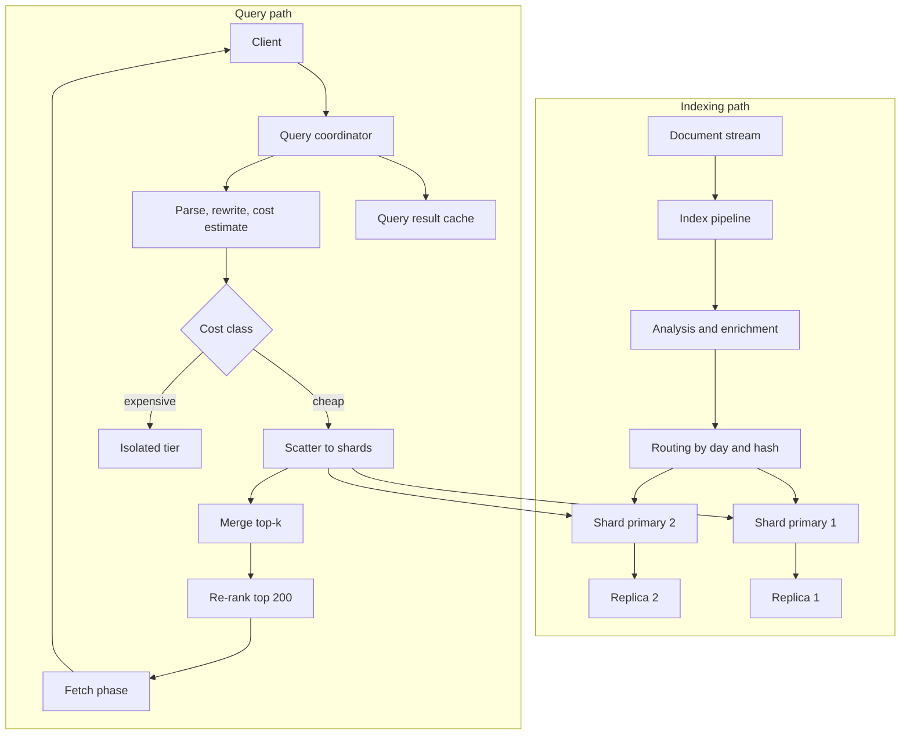
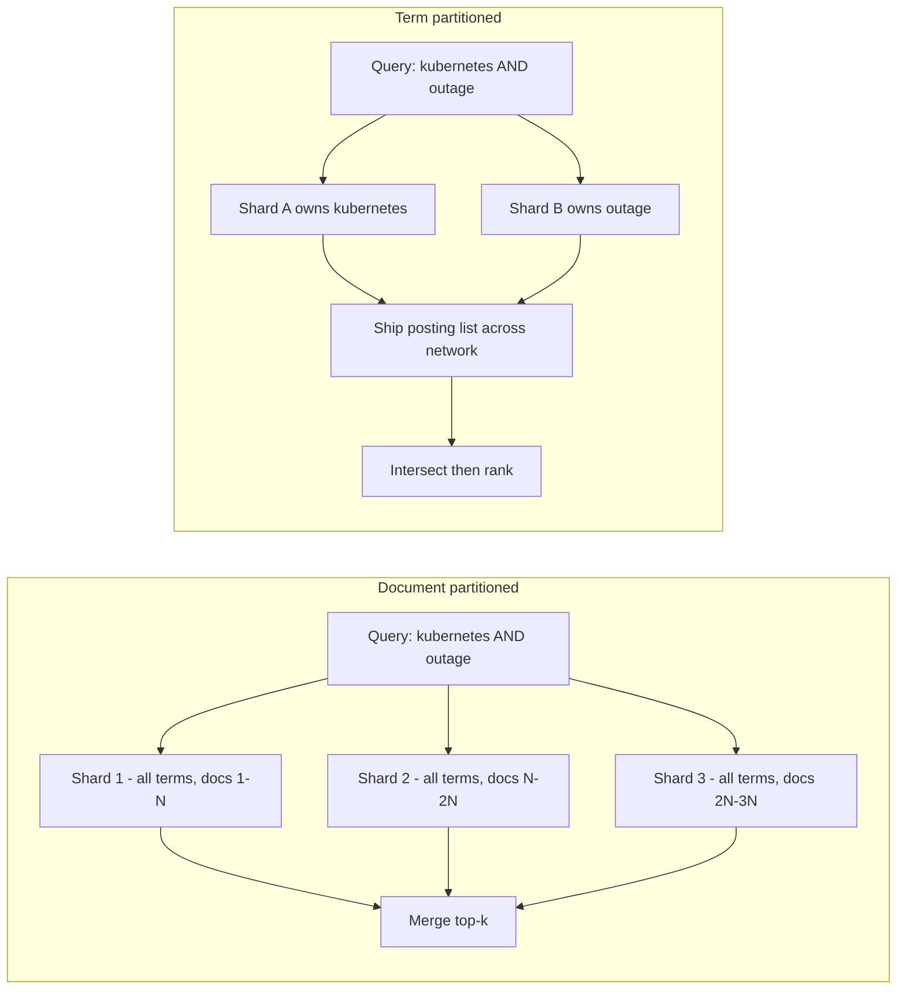
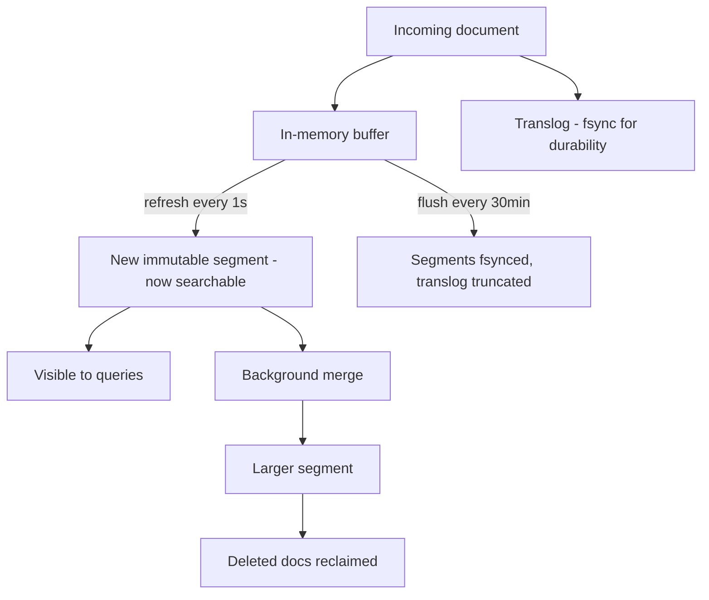
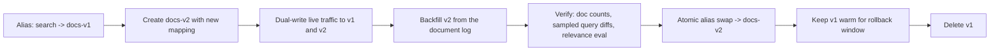
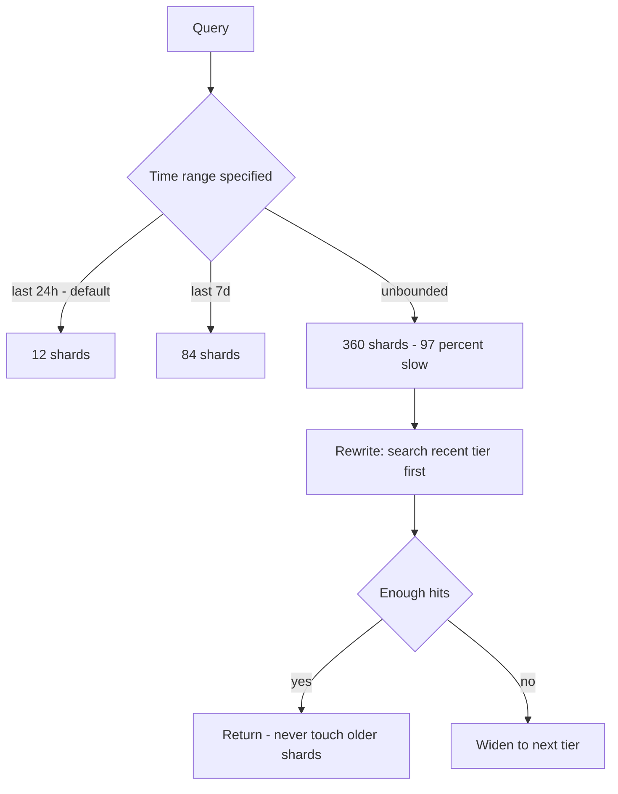

# 12 — Distributed Search Engine (Twitter Search)

<span class="pill pill-core">Core</span> <span class="pill pill-hard">Hard</span>

**Search is a scatter-gather problem pretending to be an information-retrieval problem: the index design is textbook, but fanning every query to sixty shards means your p99 is the maximum of sixty samples, and that arithmetic dictates every other decision.**

| | |
|---|---|
| **Commonly asked at** | X/Twitter, Elastic, Google, Meta, LinkedIn, Amazon, Datadog, Algolia |
| **Time budget** | 45 min |
| **Core tension** | Document partitioning makes indexing and updates trivial but forces every query to touch every shard; term partitioning touches few shards but makes intersection and indexing pathological |
| **Prerequisites** | [Search & Indexing](../fundamentals/f16-search-indexing.md) · [Partitioning & Sharding](../fundamentals/f06-partitioning-sharding.md) · [Storage Engines](../fundamentals/f13-storage-engines.md) · [Caching](../fundamentals/f04-caching.md) · [Resilience Patterns](../fundamentals/f18-resilience-patterns.md) · [Rate Limiting & Load Shedding](../fundamentals/f17-rate-limiting-load-shedding.md) · [Capacity Planning](../fundamentals/f24-capacity-planning.md) · [Deployment & Release Safety](../fundamentals/f25-deployment-release-safety.md) |

## 1. Problem Statement

Design real-time search over short documents: 500 M new documents per day, searchable within seconds of creation, queried with free text plus filters (author, language, date range, media type, engagement thresholds), ranked by a blend of relevance and recency, with 30 days of hot retention and years of colder archive.

Four properties make this different from a general-purpose database:

1. **The query touches everything.** A term can appear in any document, so with document partitioning every query fans out to every shard in the searched time range.
2. **Indexing is continuous and heavy.** 500 M documents/day is ~5,800 writes/s sustained, each requiring tokenisation, analysis, and posting-list updates — while queries run against the same files.
3. **Freshness and query performance are in direct conflict.** Making documents searchable in one second means creating a new segment every second, and every extra segment costs every query.
4. **Query cost varies by four orders of magnitude.** `from:me` is microseconds; a leading-wildcard regex over 30 days is minutes. They arrive on the same endpoint.

## 2. Requirements

**Functional**

- Full-text search with boolean operators, phrases, and field filters.
- Real-time: p99 indexing lag < 10 s from document creation to searchable.
- Ranked results (relevance × recency × engagement) and a "latest" mode (pure reverse chronological).
- Pagination to a bounded depth; a separate export/scroll API for deep traversal.
- Filters on structured fields; date-range restriction.
- Typeahead is a different system and out of scope.

**Non-functional**

| Requirement | Target |
|---|---|
| Search latency | p50 < 60 ms, p95 < 200 ms, p99 < 500 ms |
| Availability | 99.95% for search, 99.9% for indexing |
| Indexing lag | p99 < 10 s |
| Result completeness | > 99.9% of queries served with all shards responding; the rest served **partial and labelled** |
| Retention | 30 days hot, 18 months warm, archive beyond |
| Correctness | Deleted documents must disappear within 30 s |

!!! note "Two query classes, one endpoint"
    "Top" (ranked, cacheable, tolerant of a 2 s delay) and "Latest" (chronological, must be seconds-fresh, uncacheable). They have opposite caching and freshness profiles. Splitting them early in the interview lets you apply aggressive caching to one and aggressive freshness to the other, instead of compromising on both.

## 3. Scale Estimation

### Ingest and index size

$$
D = 5\times10^{8}\ \text{docs/day} \Rightarrow \frac{5\times10^{8}}{86400} \approx 5{,}800\ \text{docs/s avg},\quad \text{peak} \approx 17{,}400\ \text{docs/s}
$$

Per-document index footprint: postings (~90 B after delta + variable-byte compression), stored source (~110 B compressed), doc values for sorting and filtering (~50 B) ≈ **250 B**.

$$
\text{index growth} = 5\times10^{8} \times 250\ \text{B} = 125\ \text{GB/day}
$$

$$
\text{hot tier (30 d)} = 3.75\ \text{TB primary} \xrightarrow{\text{RF}=2} 7.5\ \text{TB}
$$

### Shard layout

One index per day, 12 primary shards each:

$$
\text{shard size} = \frac{125\ \text{GB}}{12} \approx 10.4\ \text{GB},\qquad
\text{hot shard copies} = 30 \times 12 \times 2 = 720
$$

Shard size is a design parameter, not an accident: too large and recovery/merge times explode and per-shard p99 rises; too small and fan-out $n$ grows, which — as the next section shows — is the thing that actually hurts.

### Query volume and fan-out

$$
Q_{\text{peak}} = 2\times10^{4}\ \text{QPS at the API},\qquad
\text{cache hit ratio} = 0.70 \Rightarrow Q_{\text{index}} = 6{,}000\ \text{QPS}
$$

Default queries are restricted to the recent tier (today + yesterday), so $n = 24$ shards; unrestricted queries reach $n = 360$.

$$
\text{shard queries/s} = 6{,}000 \times 24 = 1.44\times10^{5}/\text{s}
$$

Per node: 12 cores, ~3 ms CPU per shard query → 4,000 shard-queries/s saturated, 2,000 at 50% utilisation.

$$
N_{\text{data}} = \frac{1.44\times10^{5}}{2{,}000} = 72\ \text{nodes}
$$

Index per node $= 7.5\ \text{TB} / 72 = 104\ \text{GB}$ against 64 GB RAM — an index:RAM ratio of ~1.6:1, far more comfortable than the 10:1 guideline. **The fleet is CPU-bound on fan-out, not RAM-bound on index size.** Stating that inverts the usual assumption and is worth calling out.

### Tail-latency amplification — the central arithmetic

Let $p$ be the probability that a single shard exceeds its p99 latency on any given request. A scatter-gather query completes only when the **slowest** shard responds, so:

$$
P(\text{query is slow}) = 1 - (1-p)^{n}
$$

With $p = 0.01$:

| Fan-out $n$ | $1-(0.99)^n$ | Interpretation |
|---|---|---|
| 5 | 4.9% | Fine |
| 12 | 11.4% | Noticeable |
| **24** (default recent tier) | **21.4%** | 1 in 5 queries hits a p99-slow shard |
| 60 | 45.3% | Nearly half |
| **360** (unrestricted range) | **97.4%** | Essentially every query hits a slow shard |

**Your service p99 is not your shard p99.** To get a 500 ms service p99 at $n = 24$ you need each shard's p99.96 — not its p99 — under 500 ms:

$$
1 - (1-p)^{24} = 0.01 \;\Rightarrow\; p = 1 - 0.99^{1/24} \approx 4.2\times10^{-4}
$$

Two structural conclusions follow immediately: **restrict $n$** (time-tiered indices so a query touches 24 shards, not 360) and **break the "slowest shard" dependency** (hedged requests, §7.3).

### Bandwidth and coordinator cost

Each shard returns its top $k$ candidates (doc ID + score + sort values ≈ 40 B). For `size=20` with `from=0`:

$$
24 \times 20 \times 40\ \text{B} = 19.2\ \text{KB per query} \Rightarrow 6{,}000 \times 19.2\ \text{KB} = 115\ \text{MB/s}
$$

Trivial — until deep pagination changes the $k$ term (see §7.5), at which point it is not.

## 4. API Design

```http
GET /v1/search?q=kubernetes%20outage&mode=top&lang=en&since=2026-08-01
    &size=20&cursor=eyJzIjpbMC44ODEsIjE4ODIzNCJdfQ&timeout=400ms
```

```json
{
  "hits": [
    { "id": "1882341", "score": 0.881, "author": "u_9931",
      "created_at": "2026-08-30T18:02:11Z",
      "highlight": ["<em>kubernetes</em> control plane <em>outage</em> postmortem"] }
  ],
  "total": { "value": 41822, "relation": "gte" },
  "next_cursor": "eyJzIjpbMC44MTIsIjE4ODIwOSJdfQ",
  "shards": { "total": 24, "successful": 23, "failed": 1, "skipped": 0 },
  "partial": true,
  "took_ms": 138
}
```

| Endpoint | Method | Notes |
|---|---|---|
| `/v1/search` | GET | Bounded depth; `cursor` is `search_after`-style, never an offset |
| `/v1/search/export` | POST | Point-in-time + cursor scroll for bulk traversal; separate quota and thread pool |
| `/v1/index/documents` | POST (bulk) | Batched 1,000 docs per request; returns per-doc status |
| `/v1/index/documents/{id}` | DELETE | Writes a tombstone; space reclaimed at merge |
| `/v1/admin/aliases` | POST | Atomic alias swap for rebuilds |

Two response fields carry disproportionate weight:

- **`shards.failed` + `partial`** — the honest contract that this result may be incomplete. Callers that need completeness can retry or fail; callers that need speed proceed. Hiding partiality is how you get silent, undetectable result loss.
- **`total.relation: "gte"`** — counting exact matches beyond a threshold requires evaluating every matching document on every shard. Capping the count at 10,000 and reporting a lower bound is a large latency saving for a number users do not act on.

!!! warning "The client-supplied `timeout` is a budget, not a suggestion"
    The coordinator must enforce it by returning whatever it has when the budget expires, and cancelling the outstanding shard requests. A timeout that only aborts the coordinator while shards keep burning CPU converts a latency problem into a capacity problem — the classic path from "slow" to "down".

## 5. Data Model

### Entities

- **Document** — id (snowflake, time-ordered), author, text, language, timestamps, engagement counters, media flags.
- **Segment** — an immutable Lucene-style file set: term dictionary (FST), postings, doc values, stored fields, deletion bitset.
- **Shard** — a set of segments plus a translog; the unit of routing and recovery.
- **Index alias** — the stable name queries use; points at a set of concrete indices.

### Access patterns

| # | Pattern | Rate | Latency | Mechanism |
|---|---|---|---|---|
| S1 | Term/phrase lookup within a shard | 144 k/s | < 5 ms | Postings intersection over segments |
| S2 | Filter by author/lang/date | co-occurs with S1 | < 1 ms | Cached bitset per segment |
| S3 | Sort by recency | most queries | < 1 ms | Doc values + doc IDs assigned in time order |
| S4 | Fetch top-20 source documents | 6 k/s × 20 | < 10 ms | Stored fields, fetch phase only for winners |
| S5 | Index a document | 17.4 k/s peak | async | In-memory buffer + translog append |
| S6 | Delete a document | 500/s | < 30 s visible | Tombstone bitset, reclaimed at merge |
| S7 | Bulk export | 50/s | seconds | PIT + `search_after`, isolated pool |

### Store selection

| Component | Chosen | Rejected alternatives and why |
|---|---|---|
| Index engine | **Lucene-style inverted index**, document-partitioned, time-tiered daily indices | *Postgres full-text (`tsvector` + GIN):* excellent to ~100 M docs, but GIN update cost and the lack of native distributed scatter-gather make 500 M/day untenable. *Building your own:* segment merge policy, FST term dictionaries, and codec compatibility are years of work. |
| Partitioning | **Document (local index)** | *Term (global index):* analysed in §7.1 — fewer shards touched per query, but intersection requires shipping multi-million-entry posting lists and indexing one document writes to dozens of shards. |
| Routing | **Time-based indices + hash within day** | *Route by author:* makes `from:user` queries single-shard but destroys every other query (still $n$-way) and creates hot shards for prolific authors. Worth mentioning as a *co-routing* optimisation, not a base layout. |
| Durability | **Translog fsync + replica shard** | *Rely on segment flush alone:* up to a flush interval of unacknowledged writes lost on crash. |
| Source of truth | **External document store (Cassandra/Kafka), not the index** | *Index as source of truth:* you must be able to rebuild the index from scratch — mapping changes, analyser changes, and corruption all require it. An index that cannot be rebuilt is a liability. |
| Cold tier | **Object storage with searchable snapshots** | *Keep everything hot:* 18 months hot is 67 TB primary, ~9× the hot fleet, for a query tail nobody uses. See [Object Storage](../fundamentals/f15-object-storage.md). |

```json
{
  "settings": {
    "number_of_shards": 12,
    "number_of_replicas": 1,
    "refresh_interval": "1s",
    "sort.field": ["created_at"],
    "sort.order": ["desc"],
    "codec": "best_compression"
  },
  "mappings": {
    "properties": {
      "id":         { "type": "keyword", "doc_values": true },
      "text":       { "type": "text", "analyzer": "social_en",
                      "index_options": "positions", "norms": true },
      "author_id":  { "type": "keyword", "doc_values": true },
      "lang":       { "type": "keyword", "doc_values": true },
      "created_at": { "type": "date", "format": "epoch_millis" },
      "likes":      { "type": "integer", "index": false, "doc_values": true },
      "has_media":  { "type": "boolean" },
      "text_raw":   { "type": "text", "analyzer": "keyword_lowercase", "norms": false }
    }
  }
}
```

!!! note "Index-sorting is a real optimisation, not a flag"
    Setting the index sort to `created_at DESC` lets the engine terminate early on chronological queries: once $k$ hits are collected in sorted order, the remaining segments cannot contribute. On a recency-dominated corpus this cuts "Latest" query cost by an order of magnitude. It costs a little indexing throughput because documents must be sorted into position at merge time.

## 6. High-Level Architecture



### Indexing path

1. Documents arrive on a durable log ([Kafka](../fundamentals/f12-queues-streams.md)) partitioned by document ID. The log — not the index — is the recovery source.
2. The pipeline analyses text (tokenise, lowercase, fold, stem, n-gram for some fields) and enriches with language detection and spam scores.
3. Routing selects `index = docs-YYYY.MM.DD` from the document's own timestamp and `shard = hash(id) % 12`.
4. The primary appends to the in-memory buffer and the translog, then replicates to the replica shard. Acknowledgement after the replica's translog write.
5. **Refresh** (every 1 s) turns the buffer into a new searchable segment. **Flush** (every 30 min or 512 MB of translog) fsyncs segments and truncates the translog. **Merge** continuously combines small segments into larger ones.

### Query path

1. The coordinator parses, rewrites (synonyms, field expansion), and **estimates cost** — this determines routing and thread pool.
2. Query cache lookup on the canonicalised request. Hit → return.
3. **Query phase**: scatter to $n$ shards; each returns its top-$k$ doc IDs and scores only — not documents.
4. Merge into a global top-$k$; apply hedging and partial-result rules.
5. **Re-rank**: the top ~200 get expensive features and a learned model.
6. **Fetch phase**: retrieve stored fields and highlights for the final 20 only, from the shards that own them.

!!! note "Query-then-fetch exists to save bandwidth"
    A naive design returns full documents from every shard: $24 \times 20 \times 1\ \text{KB} = 480\ \text{KB}$ per query, of which 96% is discarded at the merge. Two phases reduce that to 19 KB plus a 20-document fetch. The cost is a second round trip — accept it; it is a fixed ~5 ms against a variable hundreds-of-KB transfer.

## 7. Deep Dives

### 7.1 Document partitioning vs term partitioning



| Dimension | Document-partitioned | Term-partitioned |
|---|---|---|
| Shards touched per query | **All $n$** in range | Only shards owning the query terms — typically 2–4 |
| Tail amplification | High: $1-(1-p)^n$ | Low: $1-(1-p)^{3}$ |
| Multi-term intersection | Local to each shard, cheap | Requires shipping posting lists; a common term has $10^{8}$ entries ≈ 90 MB compressed |
| Indexing one document | Writes to **1** shard | Writes to **one shard per unique term** — 15–30 shards for a short document |
| Load balance | Even by construction | Zipfian: the shard owning `the` or a trending hashtag is permanently hot |
| Adding capacity | Add shards for new days; no data movement | Rebalancing terms moves enormous posting lists |
| Recency / real-time | Natural — new day, new index | Every new document scatters writes fleet-wide |
| Failure blast radius | Lose a shard → lose a fraction of *documents*, all queries degrade slightly | Lose a shard → lose *terms entirely*, some queries return nothing |
| Chosen / rejected | **Chosen** | **Rejected** as a primary layout |

The decisive argument is not query fan-out — term partitioning genuinely wins there — it is the combination of **intersection network cost** and **indexing write amplification**. At 17,400 docs/s with ~20 unique terms each, term partitioning implies ~350,000 shard-writes/s scattered fleet-wide, and every multi-term query becomes a distributed join over lists that can be tens of megabytes. Document partitioning turns the intersection into a local operation over sequential, compressed, cache-friendly postings.

??? note "When term partitioning actually wins"
    It wins when queries are single-term or rare-term dominated, the corpus is static (offline-built index), and concurrency matters more than latency — classic batch IR and some log-analytics systems. A pragmatic hybrid: document-partition the corpus, but co-route by a high-selectivity field (e.g. `author_id`) so that `from:user` queries can be answered by a single shard. That gives you term-partition-like fan-out for the queries that most benefit, without the write amplification.

### 7.2 Real-time indexing: segments, refresh, and merge



Three independent cycles, frequently confused:

| Operation | Frequency | Makes documents searchable | Provides durability | Cost |
|---|---|---|---|---|
| Translog append + fsync | Per bulk request | No | **Yes** | Sequential IO |
| Refresh | 1 s | **Yes** | No | Creates a segment; invalidates caches |
| Flush | 30 min / 512 MB | No | Consolidates | fsync + translog truncation |
| Merge | Continuous | No (changes layout) | No | Heavy IO + CPU; reclaims deletes |

**The refresh trade-off.** Each refresh creates a segment, and every query must search every segment. At 1 s refresh a shard accumulates segments quickly; if merges cannot keep up, segment count climbs and per-query cost climbs linearly with it. The counterintuitive but correct control: on the current day's index refresh at 1 s (freshness matters); on all older indices set `refresh_interval: -1` — they never change, so refreshing is pure waste and disabling it makes their caches permanently valid.

**Merges are the hidden latency source.** A large merge reads and rewrites gigabytes, saturating disk IO and evicting the page cache the queries depend on. Symptoms: p99 spikes with no change in query rate, correlated with merge activity. Controls: throttle merge IO (`max_merge_bytes_per_sec`), force-merge yesterday's index to a single segment once during a low-traffic window, and never force-merge an index still receiving writes.

**Deletes are tombstones.** A delete flips a bit in a per-segment bitset; the document remains in the postings and is filtered at query time. Space and query cost are reclaimed only at merge. A shard with 40% deleted documents does 40% wasted work on every query — track `deleted_docs_ratio` as a first-class metric and force-merge when it crosses a threshold.

### 7.3 Scatter-gather, tail amplification, hedging, and partial results

The service latency is the maximum over shards:

$$
L_{\text{query}} = \max_{i \in [1,n]} L_i + L_{\text{merge}}
$$

$$
P(L_{\text{query}} > t) = 1 - \prod_{i=1}^{n} P(L_i \le t) = 1-(1-p)^n
$$

**Hedged requests.** Send the request to one replica; if no response by the shard's p95, send a duplicate to the *other* replica and take the first answer. Extra load is bounded by the hedge rate — roughly 5% if you hedge at p95:

$$
P(\text{both slow}) \approx p^2 \Rightarrow P(\text{query slow}) \approx 1-(1-p^2)^n
$$

With $p = 0.01$ and $n = 24$: $1 - (1 - 10^{-4})^{24} = 0.24\%$, down from 21.4%. **Two orders of magnitude of tail improvement for 5% more load** — the best latency-per-dollar trade in the whole system.

!!! danger "Hedging assumes independence, and correlated slowness breaks it"
    If the shard is slow because the *query* is expensive, both replicas will be slow and you have doubled the cost of your worst queries at your worst moment. If it is slow because of a fleet-wide GC pattern or a saturated disk tier, hedging adds load to an already-saturated fleet and accelerates collapse. Guard it: hedge only queries whose estimated cost is below a threshold, cap the fleet-wide hedge rate at ~5% with a token bucket, and disable hedging automatically when fleet utilisation exceeds 70%. See [Resilience Patterns](../fundamentals/f18-resilience-patterns.md).

**Partial results.** When the budget expires with 23 of 24 shards answered, the choices are:

| Policy | Result | Chosen / rejected |
|---|---|---|
| Fail the query | Correct-or-nothing | **Rejected** — a 4% data gap becomes a 100% outage for the user |
| Return partial, silently | Fast, but callers cannot distinguish "no results" from "shard down" | **Rejected** — this is how silent data loss ships |
| **Return partial with `shards.failed` and `partial: true`** | Caller decides | **Chosen** |
| Retry the missing shard | Correct but doubles the latency you were already over | **Chosen only for `size`-1 exact-lookup queries** |

The client contract matters more than the mechanism: an analytics caller computing a total must treat `partial: true` as an error; a UI showing a result list should render what it has.

### 7.4 Distributed scoring: the IDF skew problem

BM25 scores a document using **inverse document frequency**, which is a *corpus-wide* statistic:

$$
\text{IDF}(t) = \ln\!\left(1 + \frac{N - n_t + 0.5}{n_t + 0.5}\right)
$$

where $N$ is the number of documents and $n_t$ the number containing $t$. In a document-partitioned index, each shard computes IDF from **its own** $N$ and $n_t$. If the term is evenly distributed across large shards, the local estimate approximates the global one closely. When it is not, ranking breaks:

- **Small shards.** A shard with 1,000 documents where a term appears twice yields a wildly different IDF from one with 10 M documents.
- **Skewed routing.** Routing by author means an author's vocabulary concentrates on one shard, deflating that term's IDF exactly where its documents live.
- **Time-tiered indices.** A term that trended yesterday has a very different $n_t$ in yesterday's index than in today's — so the *same* document scores differently depending on which day's index it lives in. This is the version of the problem that actually bites in this design.

| Fix | Cost | Chosen / rejected |
|---|---|---|
| Ignore it; rely on large, evenly-hashed shards | Free | **Chosen as the default** — with 10 GB shards and hash routing, error is small and uniform |
| DFS query-then-fetch: pre-round to gather global term stats, then score | **One extra network round trip on every query** — roughly +40% latency | **Rejected for interactive**, enabled for evaluation/relevance tests |
| Broadcast global term statistics periodically (every 60 s) into a shared table each shard reads | Small memory, slight staleness | **Chosen for the top ~1 M terms** |
| Score locally, re-rank globally with a model using true global features | Re-rank is already in the pipeline | **Chosen** — the learned re-ranker over the top 200 sees consistent global features and corrects local scoring error |

The layered answer is the strong one: cheap approximate local retrieval to get candidates, then an expensive globally-consistent re-rank over a small candidate set.

**Ranking overall** is two-phase for exactly this reason:

```text
Phase 1 (per shard, cheap):   BM25 x recency decay -> top 1000 per shard
Phase 2 (coordinator, rich):  top 200 candidates
                              + global term stats
                              + engagement velocity
                              + author reputation
                              + viewer personalisation
                              -> learned ranker -> top 20
```

Recency decay for a social corpus, applied inside the shard so it can prune early:

$$
\text{score} = \text{BM25}(q,d) \times e^{-\lambda \Delta t}, \qquad \lambda = \frac{\ln 2}{t_{1/2}},\ t_{1/2} = 12\ \text{h}
$$

### 7.5 Deep pagination, index rebuilds, cost classes, and caching

**Deep pagination is quadratic and must be refused.** To serve `from=10000&size=20`, every shard must return its top 10,020 and the coordinator must merge them:

$$
\text{docs at coordinator} = n \times (\text{from} + \text{size}) = 24 \times 10{,}020 = 240{,}480
$$

At $n = 360$ this is 3.6 M documents merged to return 20. Memory, CPU, and network all scale with `from`, which the client controls for free.

| Approach | Cost at depth | Chosen / rejected |
|---|---|---|
| `from` / `size` | $O(n \times \text{from})$ | **Rejected beyond depth 1,000** — hard-capped with a 400 error |
| `search_after` cursor on `(score, doc_id)` or `(created_at, doc_id)` | $O(n \times \text{size})$, constant with depth | **Chosen** for user pagination |
| Point-in-time + `search_after` | Constant, plus a pinned index view | **Chosen** for export; the PIT prevents result drift across pages |
| Scroll (stateful snapshot) | Holds segment files open, blocks merges | **Rejected** for user traffic; retained for controlled bulk jobs only |

**Index rebuild and alias swap.** Analyser changes, mapping changes, and shard-count changes all require a full rebuild. The safe procedure:



The alias is what makes the swap atomic and instant from the client's perspective, and what makes rollback a one-line operation rather than a rebuild. Two rules that are learned the hard way: never delete the old index until the rollback window has passed, and never swap without a **relevance diff** — a mapping change can leave document counts identical while silently changing what ranks first. See [Deployment & Release Safety](../fundamentals/f25-deployment-release-safety.md).

**Query cost classes and isolation.**

| Class | Example | Relative cost | Handling |
|---|---|---|---|
| Trivial | `id:1882341` | 1× | Routed to one shard |
| Cheap | `kubernetes lang:en` | 10× | Default pool |
| Moderate | `"control plane outage"` (phrase, needs positions) | 50× | Default pool, tighter timeout |
| Expensive | `kube*` prefix over 30 days | 1,000× | Isolated pool |
| Pathological | `*outage*` leading wildcard, or an unbounded regex | 100,000× | **Rejected at parse time** |
| Aggregation | cardinality over a high-cardinality field | 1,000×+ | Isolated pool, sampled, hard memory circuit breaker |

Isolation mechanisms, layered: separate thread pools with bounded queues (a full queue rejects rather than blocks); a dedicated replica set for expensive queries so they cannot evict the interactive tier's page cache; per-query memory circuit breakers that abort before OOM; static analysis at parse time that rejects leading wildcards and unbounded regexes outright; and per-tenant quotas measured in **estimated cost units**, not request counts. Rate limiting by QPS alone is meaningless when one request can cost 100,000× another — see [Rate Limiting & Load Shedding](../fundamentals/f17-rate-limiting-load-shedding.md).

**Caching, and why refresh destroys it.**

| Cache | Key | Granularity | Invalidation |
|---|---|---|---|
| Query result cache | canonicalised request | **Shard** | **Any refresh of that shard** |
| Filter/bitset cache | filter clause | **Segment** | Only when that segment is merged away |
| Field data / doc values | field | Segment | Segment lifecycle |
| Coordinator result cache | full query + user context | Global | TTL, typically 10–60 s |

The critical interaction: the shard-level query cache is invalidated on **every refresh**. On an index refreshing at 1 s, the cache lifetime is 1 s and the hit rate is near zero — you pay the bookkeeping and get nothing. The filter cache survives, because it is keyed per **segment** and segments are immutable; a refresh adds a segment rather than invalidating existing ones.

The design follows directly: **disable the query cache on the hot index, enable it on frozen historical indices** (where `refresh_interval: -1` makes it permanently valid), and put a short-TTL result cache at the coordinator to absorb the Zipfian head of repeated queries — that is where the 70% hit ratio in §3 comes from, not from the shard cache.

## 8. Scaling the Bottleneck

The bottleneck is **fan-out $n$**, because it multiplies both CPU cost and tail probability. Everything below reduces $n$ or breaks the max-over-shards dependency.



1. **Time-tiered early termination.** Most queries are satisfied by recent data. Search today first; widen only if the result set is short. This turns a typical $n = 360$ query into $n = 12$ and is the single largest win available.
2. **Shard-count discipline.** Halving shard count halves $n$ and roughly halves tail probability, at the cost of larger shards (slower recovery, longer merges). The optimum is where per-shard p99 starts rising — measure it, do not guess. Fewer, larger shards is almost always the right direction for a fleet that is CPU-bound rather than RAM-bound.
3. **Hedged requests** (§7.3) with a fleet-wide hedge budget.
4. **Adaptive replica selection.** Route each shard request to the replica with the best recent latency and lowest outstanding-request count, not round-robin. This alone removes the "one degraded node poisons everything" pattern, because a slow node stops receiving traffic automatically.
5. **Rollup/pre-aggregated indices** for common filter combinations so that heavy aggregations do not scan raw documents.
6. **Coordinator-side result cache** to keep the Zipfian head off the index tier entirely.
7. **Separate the "Latest" and "Top" paths.** "Latest" needs $n$ = today only and can terminate early thanks to index sorting; "Top" tolerates a 30 s cached result. Serving both from the same code path forces the worst of each.

## 9. Failure Modes

| Failure | Blast radius | Detection | Mitigation | Degraded behaviour |
|---|---|---|---|---|
| One data node slow (disk, GC, noisy neighbour) | Every query touching its shards — with $n=24$, most queries | Per-node shard p99; hedge rate spike | Adaptive replica selection; hedging; eject from rotation | Slight latency rise, no errors |
| Node loss | Shards it held; replicas promote | Cluster health yellow | Replica promotion; recovery from translog + peer copy | Reduced redundancy during recovery; queries unaffected |
| Two nodes with the same shard's primary and replica | Those shards unavailable | Cluster health red; `shards.failed` | Serve partial results; restore from snapshot | Queries return `partial: true` with a documented gap |
| Merge storm | Whole node's queries | Merge IO + p99 correlation with no QPS change | Throttle merge IO; defer force-merge to off-peak | Latency spike for minutes |
| Segment count explosion (merges falling behind) | One shard, then its node | `segments_count` per shard | Throttle indexing; increase merge threads; raise refresh interval | Query cost grows linearly with segment count |
| Indexing lag | Freshness SLO | Consumer lag on the document log | Scale index pipeline; temporarily raise refresh interval to 5 s | "Latest" results stale by minutes |
| Expensive query storm | Whole cluster | Thread-pool queue depth, rejections | Bounded queues reject early; isolated pool; per-tenant cost quotas | Expensive queries rejected, interactive queries unaffected |
| Deep pagination abuse | Coordinator memory | `from` distribution; coordinator heap | Hard cap at depth 1,000; force `search_after` | 400 with a documented alternative |
| Hot shard from skewed routing | One shard | Per-shard request rate | Re-route with a salt; split the index | That shard's p99 dominates |
| Mapping change without rebuild | Silent relevance regression | Relevance eval suite; query diff | Rebuild + alias swap; never mutate an analyser in place | Wrong results with no error signal — the most dangerous failure here |
| Cold tier restore during a query | That query only | Frozen-tier latency | Route archive queries to a separate endpoint with a longer SLO | Seconds instead of milliseconds |

!!! danger "The most dangerous failure produces no errors"
    An analyser or mapping change that silently degrades relevance returns HTTP 200 with plausible-looking results. No dashboard catches it. The only defence is an automated relevance evaluation suite — a golden set of queries with judged results, scored by nDCG, run in CI on every index-configuration change and again after every alias swap.

## 10. SRE Lens

### SLIs and SLOs

| SLI | Definition | SLO |
|---|---|---|
| Search availability | non-5xx `/v1/search` / total | 99.95% over 28 d |
| Search latency | p95 / p99 coordinator duration, `mode=top` | < 200 ms / < 500 ms |
| Result completeness | queries with `shards.failed == 0` | > 99.9% |
| Indexing lag | p99 seconds from document creation to searchable | < 10 s |
| Indexing success | documents indexed / documents produced | 99.99% (the gap must be explainable, not assumed) |
| Deletion propagation | p99 delete to invisible | < 30 s |
| Relevance | nDCG@10 on the golden query set | no regression > 1% per release |

**Error budget:** 99.95% over 28 days is 20 minutes. The subtlety is that partial results are *successes* by the availability SLI and *failures* by the completeness SLI. Keeping them separate is what lets you degrade gracefully without either lying to yourself or paging for a 4% data gap. See [SLI/SLO & Error Budgets](../fundamentals/f23-slo-error-budgets.md).

**The one SLI most teams miss:** indexing *success*, measured as documents-produced versus documents-searchable. A pipeline that silently drops 0.1% of documents shows perfect latency and perfect availability. Reconcile counts from the source log against the index every 5 minutes.

### Rollout plan

```yaml
mapping_or_analyzer_change:
  # Never mutate in place. Always rebuild behind an alias.
  steps:
    - create_index: docs-v2                      # new mapping
    - dual_write: [docs-v1, docs-v2]             # from the document log
    - backfill: { source: kafka, from: -30d, rate_limit: 20000/s }
    - verify:
        - doc_count_delta_pct < 0.01
        - relevance_ndcg10_delta_pct > -1.0      # golden query set
        - query_diff_sample: 5000                # top-10 overlap per query
    - shadow_read: { percent: 5, compare_only: true, duration: 4h }
    - alias_swap: { atomic: true }
    - hold_rollback_window: 48h
    - delete_index: docs-v1

cluster_upgrade:
  strategy: rolling
  constraints:
    - one_node_at_a_time
    - wait_for: cluster_health == green
    - disable_shard_allocation_during_restart: true   # avoids needless rebalancing
  abort_if: [search_p99 > 700ms, shards_failed_rate > 0.5%]
```

??? note "Runbook: search p99 spiked, QPS unchanged"
    1. **Is it one node or all?** Break p99 down by data node. One node → hardware, GC, or merge on that node. All nodes → a query-shape change or a cluster-wide event.
    2. **Check merge activity.** Merge IO correlating with the spike is the most common cause. Throttle merges; do not force-merge to "fix" it.
    3. **Check segment counts.** A shard with hundreds of segments means merges are behind; every query pays for it.
    4. **Check the query mix.** A client that started sending prefix or wildcard queries can move fleet p99 with a tiny fraction of traffic. Group by query cost class, not by request count.
    5. **Check `deleted_docs_ratio`.** Above ~30%, queries are doing substantial wasted work; schedule a force-merge on frozen indices only.
    6. **Check hedge rate.** A hedge rate above the budget means shards are broadly slow; hedging is now adding load. Disable hedging before it turns a latency incident into a saturation incident.
    7. **Verify GC and page cache.** Sudden page-cache eviction (a large restore, a snapshot, or a log-rotation job) makes a RAM-comfortable cluster suddenly disk-bound.

### Capacity model

$$
N_{\text{data}} = \frac{Q_{\text{index}} \times n}{\text{shard-queries/s/node} \times U}
= \frac{6{,}000 \times 24}{4{,}000 \times 0.5} = 72\ \text{nodes}
$$

$$
\text{RAM check:}\quad \frac{\text{index bytes/node}}{\text{RAM/node}} = \frac{104\ \text{GB}}{64\ \text{GB}} = 1.6:1 \ \ (\text{target} \le 10:1)
$$

$$
\text{disk} = 7.5\ \text{TB} \times \underbrace{1.3}_{\text{merge headroom}} \times \underbrace{1.25}_{\text{free-space floor}} \approx 12.2\ \text{TB}
$$

Merge headroom is not optional: a merge can temporarily require space equal to the segments being merged, and a full disk puts the index into read-only mode — a failure that looks like a search outage and is resolved by an operator, not by the system. Alert at 70% disk, not 90%.

Growth is driven by **retention × ingest**, both of which grow independently. Model them separately, and treat retention as the primary cost lever. See [Capacity Planning](../fundamentals/f24-capacity-planning.md).

### Cost

| Component | Driver | Lever |
|---|---|---|
| Hot data nodes | fan-out × QPS | Time-tiering and early termination reduce $n$; coordinator cache reduces QPS |
| Storage | retention × ingest | Tier to warm/cold; `best_compression` on frozen indices; drop `_source` for fields never returned |
| Indexing pipeline | 17.4 k docs/s peak | Bulk sizing; disable analysis for fields never searched |
| Re-ranking | top-200 per query | Only for `mode=top`; skip entirely for chronological |
| Cold tier | archive size | Searchable snapshots on object storage: ~10× cheaper, ~100× slower, and that is the right trade for 18-month-old data |

The largest single lever is **retention policy**, not compression or hardware. Reducing hot retention from 30 to 14 days is a ~53% cut in the most expensive tier, and the queries it affects are a measurable minority — measure that minority before proposing it.

## 11. Trade-offs & Alternatives

| Decision | Chosen | Alternative | Why the alternative loses |
|---|---|---|---|
| Partitioning | Document | Term | Intersection ships huge posting lists; indexing writes to 20+ shards per document; Zipfian hot shards |
| Index layout | Daily time-tiered | One large rolling index | Cannot drop old data cheaply, cannot freeze old data, and every query is $n = $ everything |
| Freshness | 1 s refresh on hot index only | 1 s everywhere | Refreshing immutable historical indices costs cache validity for zero benefit |
| Query protocol | Query-then-fetch | Fetch-all-then-merge | 25× the network for results that are discarded |
| Tail control | Hedging + adaptive replica selection | Bigger machines | Bigger machines lower $p$ slightly; hedging attacks the $n$ exponent, which is where the damage is |
| Deep pagination | `search_after` cursor, depth cap | `from`/`size` | $O(n \times \text{from})$ merge cost controlled by the client |
| Scoring | Local BM25 + global re-rank | DFS query-then-fetch | An extra round trip on every query for a correction the re-ranker already makes |
| Result completeness | Partial + explicit flag | All-or-nothing | A 4% shard gap should not be a 100% outage |
| Source of truth | External log | The index itself | Mapping/analyser changes and corruption both require a rebuild; without a log you cannot do one |
| Expensive queries | Isolated pool + cost-based quotas | QPS rate limiting | One request can be 100,000× another; QPS is not a unit of load here |
| Cold data | Searchable snapshots on object storage | Keep hot | 9× the fleet for a tiny query fraction |

## 12. Gotchas & Corner Cases

!!! gotcha "Your p99 is the max of n samples, and you sized for the mean"
    **Symptom:** every shard reports a healthy 20 ms p99, yet service p99 is 400 ms and nobody can find the slow component.
    **Mechanism:** $P(\text{slow}) = 1-(1-p)^n$. At $n=24$ and $p=0.01$, 21% of queries hit at least one p99-slow shard — by construction, not by fault.
    **Mitigation:** reduce $n$ (time-tiering, fewer/larger shards), break the max dependency (hedging, adaptive replica selection), and monitor the **distribution of the slowest shard per query**, not the average shard latency. Alert on `slowest_shard_p99`, which is the number that actually determines user experience.

!!! gotcha "Deep pagination lets any client OOM your coordinator"
    **Symptom:** the coordinator heap spikes and the process dies, triggered by a single crawler or an over-eager UI.
    **Mechanism:** `from=100000&size=20` makes every one of $n$ shards return 100,020 hits, and the coordinator merges $n \times 100{,}020$ entries.
    **Mitigation:** hard cap `from + size` at 1,000 with a 400 and a link to the cursor API; expose `search_after` for user pagination and PIT-scroll for exports with its own quota. This must be enforced server-side — a client-side cap is not a control.

!!! gotcha "The shard query cache does nothing on a 1-second-refresh index"
    **Symptom:** cache hit ratio near zero despite highly repetitive queries; enabling the cache makes things marginally worse.
    **Mechanism:** the shard-level request cache is invalidated by any refresh of that shard. At 1 s refresh, entries live ~1 s.
    **Mitigation:** disable it on the hot index; enable it on frozen indices with `refresh_interval: -1`; put a short-TTL result cache at the coordinator where invalidation is time-based rather than refresh-based. Know which of your caches is segment-scoped (survives refresh) and which is shard-scoped (does not).

!!! gotcha "A merge storm looks exactly like a traffic spike, except traffic did not change"
    **Symptom:** p99 doubles, disk IO saturates, QPS is flat.
    **Mechanism:** a large background merge is reading and rewriting gigabytes, saturating IO and evicting the page cache that queries rely on.
    **Mitigation:** throttle merge IO, schedule force-merges on frozen indices during low-traffic windows only, and never force-merge an index still being written to — you will produce one enormous segment that must later be merged again. Correlate merge metrics with latency on the same dashboard so the diagnosis takes seconds instead of an hour.

!!! gotcha "Deleted documents keep costing you until a merge happens"
    **Symptom:** query latency grows steadily on an index whose document count is stable.
    **Mechanism:** deletes are bitset tombstones. The postings still contain the documents and are still traversed and filtered on every query. A shard at 40% deletes does 40% wasted work.
    **Mitigation:** track `deleted_docs_ratio` per shard; force-merge frozen indices past a threshold; for update-heavy corpora, prefer append-only modelling with a "current version" filter over in-place updates, which are delete + insert underneath.

!!! gotcha "The same document ranks differently depending on which shard holds it"
    **Symptom:** relevance evaluation is unstable; two near-identical documents get very different scores; results shift after a rebuild changes shard assignment.
    **Mechanism:** IDF is computed per shard from local document frequencies. Small shards, skewed routing, or time-tiered indices with different term distributions all distort it.
    **Mitigation:** keep shards large and hash-routed; broadcast global term statistics for the top ~1 M terms; and rely on a coordinator-side re-rank with globally consistent features for the final ordering. Reserve DFS query-then-fetch for offline relevance evaluation, where its extra round trip is free.

!!! gotcha "One wildcard query takes down the cluster"
    **Symptom:** a handful of requests per second saturate every node; thread pools fill; unrelated queries are rejected.
    **Mechanism:** a leading wildcard (`*outage*`) or an unbounded regex forces a scan of the entire term dictionary on every segment of every shard — five orders of magnitude more work than a term lookup, on the same endpoint with the same rate limit.
    **Mitigation:** reject leading wildcards and unbounded regexes at parse time; estimate cost before execution and route expensive classes to an isolated pool with bounded queues; quota tenants in cost units rather than request counts; and set per-query memory circuit breakers that abort before the JVM does.

!!! gotcha "Changing an analyser without a rebuild silently breaks search"
    **Symptom:** users report that searches which used to work now return nothing, with no errors anywhere and normal-looking dashboards.
    **Mechanism:** the analyser is applied at index time *and* query time. Change it and existing documents remain tokenised the old way while queries are tokenised the new way — the two no longer match. Document counts are unchanged, so every count-based check passes.
    **Mitigation:** analyser and mapping changes always mean a new index, dual-write, backfill, relevance diff, and an atomic alias swap. Enforce it in CI by rejecting any change to an existing index's analysis settings.

!!! gotcha "Hedging saves you until the day it kills you"
    **Symptom:** during an overload incident, enabling or leaving hedging on makes recovery impossible; load stays pinned even as traffic drops.
    **Mechanism:** hedging assumes slowness is independent and rare. When everything is slow, the hedge rate approaches 100% and you have doubled the offered load at the worst possible moment.
    **Mitigation:** cap hedging with a fleet-wide token bucket (5% of requests), disable it automatically above 70% utilisation, and never hedge queries whose estimated cost exceeds a threshold — an expensive query is slow on every replica.

!!! gotcha "Partial results are silently wrong for aggregation callers"
    **Symptom:** a dashboard shows a count that dropped 4% overnight and nobody can reproduce it; the drop corresponds to a node that was briefly out of rotation.
    **Mechanism:** the query returned `shards.failed: 1` and the caller ignored the field, treating the partial sum as complete.
    **Mitigation:** partial results must be *loud*: the flag in the response, a metric, and client libraries that raise by default for aggregation queries and require an explicit opt-in to accept partial data. Defaults decide behaviour; make the safe behaviour the default.

!!! gotcha "Disk hits the flood-stage watermark and the index goes read-only"
    **Symptom:** all indexing stops; writes fail with a read-only block; queries still work, so monitoring says "search is fine".
    **Mechanism:** the cluster applies a protective read-only block at ~95% disk. Merges need transient free space equal to the segments being merged, so a cluster at 80% can hit the wall during a large merge.
    **Mitigation:** alert at 70%, keep 25–30% free for merge headroom, automate old-index deletion by retention policy, and pre-verify that the read-only block auto-clears once space is recovered (it does not always, and manual intervention during an incident is a poor surprise).

!!! gotcha "Shard count was chosen once and can never be changed"
    **Symptom:** a rapidly growing index has 5 shards of 200 GB each; recovery takes hours, merges are enormous, and per-shard p99 is terrible.
    **Mechanism:** the number of primary shards is fixed at index creation because routing is `hash(id) % shards`. Changing it requires a full reindex.
    **Mitigation:** time-tiered daily indices sidestep this entirely — tomorrow's index can have a different shard count, and today's is small enough to reindex if needed. If you must use a single rolling index, size shards for 2–3 years of growth and accept over-sharding early, or use routing-aware splitting from day one.

## 13. Interview Angle

!!! interview "Put $1-(1-p)^n$ on the whiteboard in the first ten minutes"
    Derive it, plug in $p=0.01$ and $n=24$, get 21%, then plug in $n=360$ and get 97%. Then say: "so the design has two jobs — keep $n$ small with time-tiered indices, and break the max-over-shards dependency with hedging." That single line reframes the entire problem from "how do I build an index" to "how do I control a tail", which is the senior view.

!!! interview "Do the term-partitioning analysis properly rather than dismissing it"
    Weak candidates say "everyone uses document partitioning". Strong candidates concede that term partitioning genuinely wins on fan-out — which is the metric we just said matters most — and then explain why it still loses: intersection ships posting lists of tens of megabytes across the network, indexing one document writes to 20+ shards, and term frequency is Zipfian so load is permanently skewed. Acknowledging the alternative's strength before rejecting it is what makes the rejection credible.

!!! interview "Name the invisible failures"
    Two failures here produce HTTP 200 and green dashboards: an analyser change that breaks matching, and an indexing pipeline that silently drops documents. Volunteering both — plus their detection mechanisms (a golden-set relevance suite in CI, and source-versus-index count reconciliation) — demonstrates operational maturity that pure design discussion cannot.

??? note "Follow-up questions with answers"
    **Q: A query must search all 30 days. What do you do?**
    First, try not to. Search the recent tier and terminate early if the result set is satisfied — most "all time" queries are satisfied by recent data. If a genuinely unbounded search is required, accept a different SLO for it: route it to a dedicated tier with its own thread pool, a longer timeout, mandatory cursor pagination, and a lower quota. The mistake is serving a 360-shard query on the same path and SLO as a 12-shard one; they are different products.

    **Q: How do you make a document searchable in one second without destroying query performance?**
    Refresh creates a new immutable segment every second, and every query searches every segment — so the cost is paid on the read side and grows with segment count. Merges must keep up, which is why merge throughput, not refresh interval, is the real constraint. Two mitigations: apply 1 s refresh only to the current day's index and disable it entirely on frozen historical indices, and monitor `segments_count` per shard as a leading indicator of query cost. If freshness pressure exceeds merge capacity, the honest lever is to relax refresh to 2–5 s, which is usually imperceptible.

    **Q: Relevance is worse in production than in your offline evaluation. Why?**
    Most likely distributed IDF skew: offline evaluation runs against a single index where term statistics are global, while production computes IDF per shard across time-tiered indices with different term distributions. Secondary causes: the re-ranker sees production features (engagement velocity, personalisation) that offline evaluation lacks, and the fetch phase applies filters the offline harness does not. Fix the first with broadcast global term statistics and a globally-consistent re-rank; fix the second by evaluating against the real serving stack with shadow traffic, not against a single-node index.

    **Q: How do you change the analyser for the text field on a live system?**
    Never in place — the analyser is applied at both index and query time, so changing it desynchronises existing documents from new queries with zero error signal. Create a new index with the new mapping, dual-write from the document log, backfill 30 days, verify with document counts *and* an nDCG relevance diff on a golden query set, shadow-read 5% for a few hours comparing top-10 overlap, then atomically swap the alias and keep the old index for a 48-hour rollback window.

    **Q: A single tenant is sending prefix queries and degrading everyone. What now?**
    Immediate: reject the pathological shapes at parse time and move the remaining expensive class to an isolated pool with a bounded queue, so rejection happens at the edge instead of resource starvation happening in the middle. Structural: quota tenants in estimated cost units rather than QPS, because one request can be 100,000× another; add a per-query memory circuit breaker; and give expensive queries a dedicated replica set so they cannot evict the interactive tier's page cache.

    **Q: How do hedged requests interact with an already-overloaded cluster?**
    Badly, if unguarded. Hedging assumes slowness is independent and rare; under fleet-wide overload the hedge rate approaches 100% and you double the offered load exactly when you can least afford it. Guard it with a fleet-wide hedge budget (about 5% of requests), automatic disablement above 70% utilisation, and a cost threshold so expensive queries are never hedged.

    **Q: Would you ever shard by author to make `from:user` queries cheap?**
    Not as the base layout — it makes every non-author query still $n$-way while creating permanently hot shards for prolific authors and skewing IDF. But co-routing is a legitimate refinement: keep hash-based document partitioning and add a routing key so a user's documents concentrate on a small set of shards, letting `from:user` queries target 1–2 shards instead of 12. You get the benefit for the queries that want it without paying the skew cost on everything else.

    **Q: How do you know the index actually contains everything it should?**
    Continuous reconciliation: compare document counts from the source log against the index in 5-minute windows, alert on any persistent gap, and run a sampling job that picks random document IDs from the source and verifies they are retrievable and correctly analysed. Availability and latency metrics cannot detect silent drops — the pipeline reports success for documents it never wrote, so you need an external observer comparing two independent counts.

### Strong answer vs weak answer

| Dimension | Weak | Strong |
|---|---|---|
| Framing | "Use Elasticsearch, shard the index" | Derives $1-(1-p)^n$, shows 21% at $n=24$ and 97% at $n=360$, and makes fan-out control the organising principle |
| Partitioning | "Document partitioning, that's what everyone does" | Concedes term partitioning wins on fan-out, then rejects it on intersection network cost, write amplification, and Zipfian skew |
| Freshness | "Set refresh to 1 second" | Explains the segment/merge/cache consequences and applies 1 s only to the hot index while freezing the rest |
| Tail | "Add more replicas" | Hedged requests with an explicit budget, adaptive replica selection, and the correlated-slowness caveat |
| Partial results | Not considered | Explicit `shards.failed` contract, with different client semantics for UI versus aggregation callers |
| Pagination | `from`/`size` | Cursor-based `search_after`, a hard depth cap, and PIT-scroll on a separate quota for exports |
| Scoring | "BM25" | Names distributed IDF skew, quantifies the DFS round-trip cost, and solves it with global term stats plus a coordinator re-rank |
| Rebuilds | "Reindex it" | Dual-write, backfill, relevance diff, shadow read, atomic alias swap, rollback window |
| Cost classes | One rate limit | Cost-unit quotas, parse-time rejection, isolated pools, memory circuit breakers |
| Failure detection | Latency and error rate | Identifies the two silent failures — analyser desync and pipeline drops — and gives a detection mechanism for each |

## 14. Key Takeaways

1. **Fan-out is the whole problem.** $P(\text{slow}) = 1-(1-p)^n$ means service p99 is governed by shard p99.96 at $n=24$. Reduce $n$ with time-tiered indices, and break the max dependency with hedging.
2. **Document partitioning wins despite losing on fan-out**, because term partitioning's intersection network cost, per-document write amplification, and Zipfian load skew are all worse.
3. **Freshness is paid on the read side.** Every refresh creates a segment, and every query searches every segment. Refresh the hot index only, and freeze the rest.
4. **Hedging is the best latency-per-dollar trade available** — two orders of magnitude of tail reduction for ~5% extra load — but it must be budgeted, disabled under saturation, and never applied to expensive queries.
5. **Partial results should be normal, explicit, and loud.** A 4% shard gap must not become a 100% outage, and it must not be silently absorbed into an aggregation.
6. **Deep pagination is a client-controlled $O(n \times \text{from})$ cost.** Cap it server-side and offer cursors and PIT-scroll instead.
7. **IDF is a global statistic computed locally.** Keep shards large and hash-routed, broadcast global term stats, and let a coordinator-side re-rank over a small candidate set produce the final order.
8. **QPS is not a unit of load** when one query can cost 100,000× another. Quota in estimated cost units, reject pathological shapes at parse time, and isolate expensive classes in their own pool.
9. **The index is never the source of truth.** Analyser changes, mapping changes, and corruption all require a rebuild, so a durable document log plus alias-based atomic swaps is a design requirement, not an operational nicety.
10. **The dangerous failures return HTTP 200.** Analyser desync and silent pipeline drops need a golden-set relevance suite and count reconciliation; no latency or error dashboard will ever catch them.
