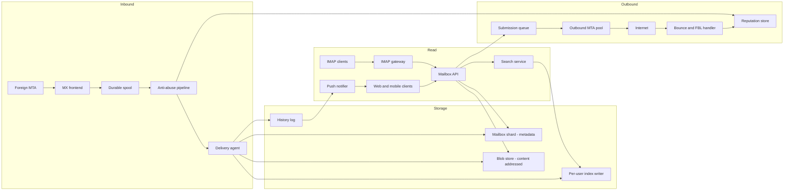
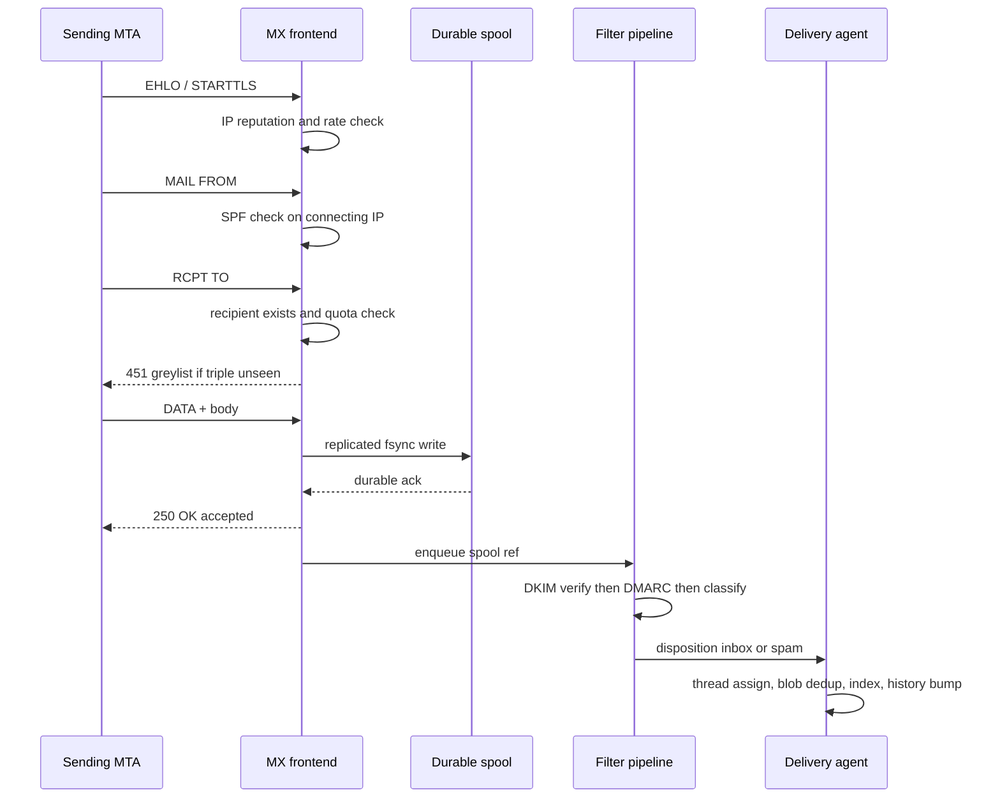
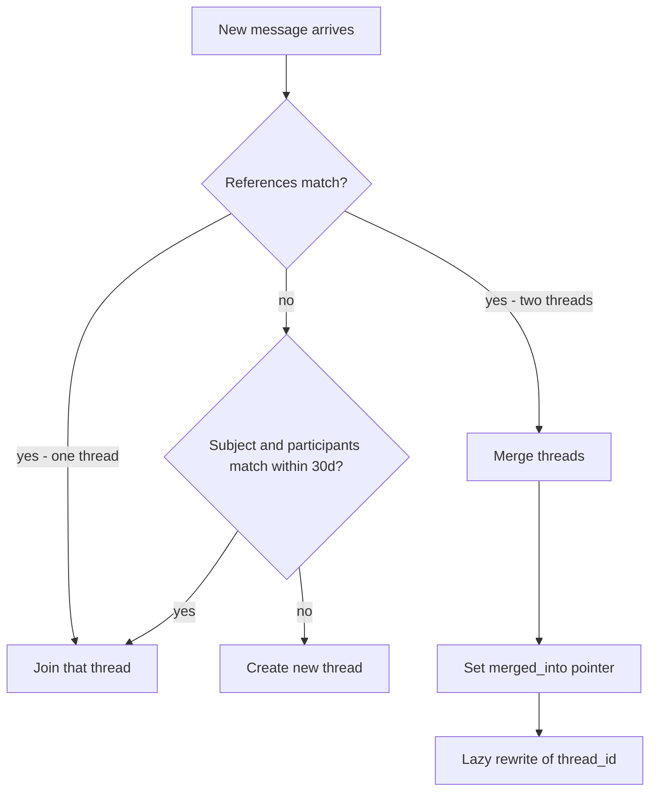
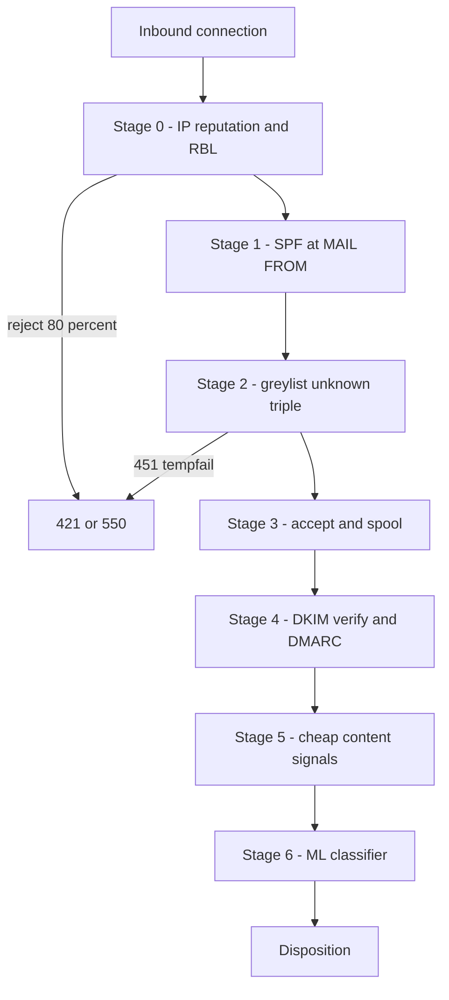
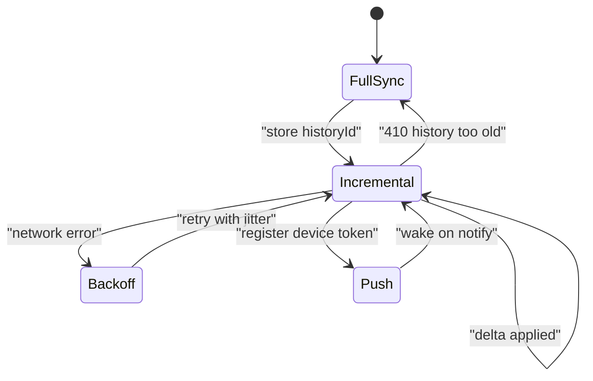
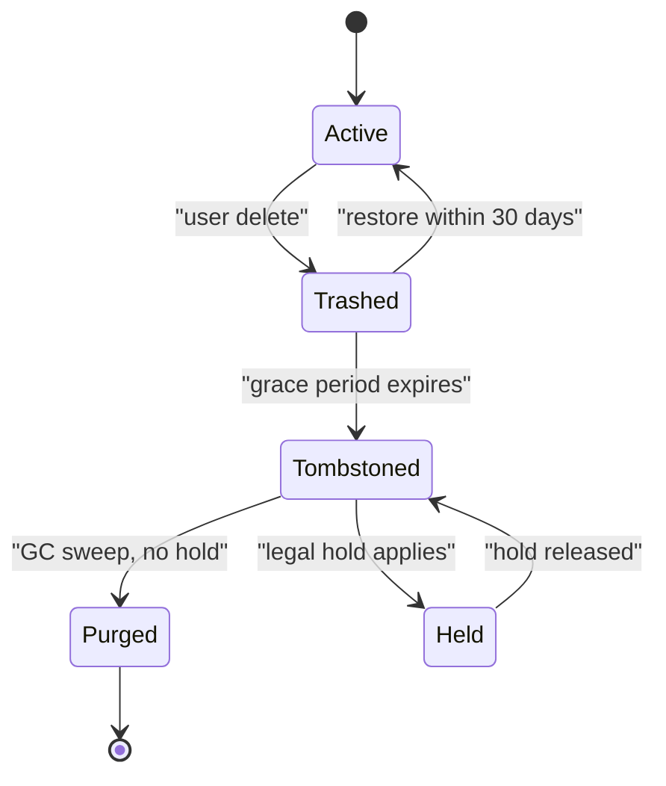

# 13 — Email Service (Gmail-like)

<span class="pill pill-core">Core</span> <span class="pill pill-hard">Hard</span>

**A mailbox is a private, append-mostly, per-user database with its own full-text index — which makes email trivially partitionable and brutally expensive, because the hard part is not storing mail but deciding, in under a second and for two million inbound connections per second, whether the mail should exist at all.**

| | |
|---|---|
| **Commonly asked at** | Google, Microsoft, Yahoo/Apollo, Zoho, Proton, Fastmail, Salesforce, Atlassian |
| **Time budget** | 45 min |
| **Core tension** | Email is *embarrassingly partitionable* (one user, one shard) but its two dominant costs — the per-user full-text index and the anti-abuse pipeline — are exactly the parts that refuse to stay inside the shard |
| **Prerequisites** | [F06 Partitioning & Sharding](../fundamentals/f06-partitioning-sharding.md) · [F13 Storage Engines](../fundamentals/f13-storage-engines.md) · [F15 Object Storage](../fundamentals/f15-object-storage.md) · [F16 Search & Indexing](../fundamentals/f16-search-indexing.md) · [F12 Queues & Streams](../fundamentals/f12-queues-streams.md) · [F11 Idempotency](../fundamentals/f11-idempotency.md) · [F02 DNS & Traffic](../fundamentals/f02-dns-traffic-management.md) · [F27 Security in Design](../fundamentals/f27-security-design.md) |

---

## 1. Problem Statement

Design a consumer/enterprise email service: it must accept mail from the public internet over SMTP, filter abuse, store messages durably for the lifetime of the account, present them as *conversations* rather than a flat list, let a user search a decade of mail in under a second, sync incrementally to phones and desktop clients, and send outbound mail that the rest of the internet actually accepts.

Three things make this different from "a database with a UI":

1. **The ingest path is adversarial.** Roughly 60–85% of connection attempts are abuse. You cannot accept-then-filter at that ratio; you must reject during the SMTP conversation, before you pay storage cost.
2. **The read path is search, not lookup.** Users do not remember message IDs. They remember "that attachment from Priya about the Q3 budget." Full-text search over a personal corpus is the product.
3. **You do not control the protocol.** SMTP (RFC 5321), MIME (RFC 2045), IMAP (RFC 3501/9051), SPF/DKIM/DMARC and the retry behaviour of ten million foreign MTAs are fixed. You design *inside* those constraints.

!!! note "The single structural insight"
    A mailbox is only ever read and written by one principal. There is no cross-user join, no global secondary index the product needs, no distributed transaction in the common path. **The natural shard key is `user_id`, and it is nearly perfect.** Everything hard in this design is a consequence of the few things that escape that shard: the anti-abuse reputation model (global), attachment dedup (global), and the SMTP ingest tier (stateless but enormous).

---

## 2. Requirements

### Functional

| # | Requirement | Notes |
|---|---|---|
| F1 | Receive mail via SMTP on port 25 from arbitrary internet MTAs | Must honour 4xx/5xx semantics correctly |
| F2 | Send mail via SMTP with DKIM signing, bounce and complaint handling | Reputation-critical |
| F3 | Store messages with full MIME structure preserved byte-for-byte | Required for DKIM re-verification and forensics |
| F4 | Group messages into conversations/threads | Not a display trick — a stored, stable grouping |
| F5 | Full-text search across the entire mailbox with operators (`from:`, `has:attachment`, `before:`) | p99 < 500 ms |
| F6 | Labels (many-to-many) with folder emulation for IMAP clients | |
| F7 | Incremental sync for mobile/desktop, with push notification of new mail | Battery and bandwidth constrained |
| F8 | Per-user quota enforcement | Enforced at SMTP time, not after storage |
| F9 | Spam/phishing classification with a user-visible Spam folder and feedback loop | |
| F10 | Deletion with a trash grace period, plus legal/compliance hold that overrides deletion | |

### Non-functional

| # | Requirement | Target |
|---|---|---|
| N1 | Durability of accepted mail | 11 nines; **once you emit `250 OK` you own that message forever** |
| N2 | Mailbox read availability | 99.99% |
| N3 | SMTP ingest availability | 99.9% is acceptable — senders retry for days; this is the cheapest SLO on the page |
| N4 | Inbound delivery latency (accept → visible in mailbox) | p50 < 2 s, p99 < 30 s |
| N5 | Spam false-positive rate | < 0.05% of ham (a lost legitimate mail is far worse than a spam that got through) |
| N6 | Search latency | p50 < 120 ms, p99 < 500 ms on a cold mailbox |
| N7 | Retention | Indefinite while account is active; 30-day recoverable trash |

!!! warning "N1 is the requirement that shapes everything"
    SMTP has no application-level dedup and no idempotency key you can trust. The moment your MX emits `250 2.0.0 OK`, the sending MTA deletes its copy. If your write to durable storage was only in a page cache, that mail is gone and no one can tell you it existed. **The `250` must come after a durable, replicated write — not before.** This single rule forces the "spool first, process later" architecture in section 6.

---

## 3. Scale Estimation

Target: a large consumer provider.

### Accounts and traffic

$$
U_{\text{total}} = 1.5\times10^9 \text{ mailboxes} \qquad U_{\text{DAU}} = 4\times10^8
$$

Delivered inbound mail, 25 messages per mailbox per day averaged over all mailboxes (heavy users get hundreds, dormant accounts get one):

$$
M_{\text{delivered}} = 1.5\times10^9 \times 25 = 3.75\times10^{10}\ \text{msg/day}
$$

$$
\text{QPS}_{\text{deliver,avg}} = \frac{3.75\times10^{10}}{86400} \approx 4.34\times10^{5}\ \text{msg/s}
$$

If 60% of inbound *attempts* are rejected during the SMTP conversation, the connection tier sees:

$$
C_{\text{attempt}} = \frac{4.34\times10^5}{0.40} \approx 1.09\times10^{6}\ \text{SMTP transactions/s}
$$

Diurnal peak factor is mild for machine-driven traffic — call it $2.5\times$ — because bulk senders and other timezones smear the curve:

$$
C_{\text{peak}} \approx 2.7\times10^{6}\ \text{transactions/s}
$$

At 8k transactions/s per MX front-end (TLS handshake plus a multi-round-trip SMTP conversation is expensive), that is $\approx 340$ MX nodes at peak, times a $2\times$ headroom and geographic spread: **~700 MX front-ends worldwide**. This is a small fleet. The MX tier is *not* the expensive part.

### Storage

Average stored size after MIME parsing, per-message compression, and attachment dedup: 50 KB.

$$
S_{\text{day}} = 3.75\times10^{10} \times 50\text{ KB} = 1.875\ \text{PB/day}
$$

$$
S_{\text{year}} = 1.875 \times 365 \approx 684\ \text{PB/yr (logical)}
$$

With erasure coding at $1.4\times$ overhead for the blob tier and $3\times$ replication for the small metadata tier (metadata is ~2% of bytes):

$$
S_{\text{year,physical}} \approx 684 \times (0.98 \times 1.4 + 0.02 \times 3) \approx 984\ \text{PB/yr} \approx 0.98\ \text{EB/yr}
$$

!!! example "Where the bytes actually are"
    Roughly 70% of stored bytes are attachments, 20% is HTML body plus the quoted-reply tails, and under 10% is headers and structured metadata. Attachment dedup and quoted-text compression are therefore the only two levers that move the storage bill. Deduping attachments globally typically recovers **15–25%** of total bytes; deduping the quoted-reply chain within a thread recovers another 5–10%.

### Search index

Per message: ~800 unique terms after stopword removal and normalization; delta-varint postings with positions cost ~4 bytes/posting after compression.

$$
I_{\text{msg}} \approx 800 \times 4\ \text{B} \approx 3.2\ \text{KB}
$$

$$
I_{\text{day}} = 3.75\times10^{10} \times 3.2\ \text{KB} \approx 120\ \text{TB/day} \Rightarrow \approx 44\ \text{PB/yr logical}
$$

Now the number that matters — **per user**:

$$
\text{mailbox of }50{,}000\text{ messages} \Rightarrow 50{,}000 \times 3.2\ \text{KB} = 160\ \text{MB of index}
$$

$$
\text{RAM to hold every index hot} = 1.5\times10^9 \times 160\ \text{MB} = 240\ \text{PB}
$$

!!! danger "240 PB of RAM is not a thing you can buy"
    This single calculation kills the naive design. The per-user index **must** live on SSD in the same shard as the mailbox, be paged in lazily, and be sized so that a cold search touches a bounded number of segment files. Only the working set of currently-active sessions (~2% of accounts at any instant, so ~5 PB) can be warm, and even that is served by the OS page cache on local NVMe rather than by a dedicated RAM tier.

### Read and search QPS

$$
\text{QPS}_{\text{read,avg}} = \frac{4\times10^8 \times 60\ \text{ops}}{86400} \approx 2.8\times10^{5}\ \text{ops/s},\quad \text{peak } \approx 8.3\times10^{5}
$$

$$
\text{QPS}_{\text{search,avg}} = \frac{4\times10^8 \times 2}{86400} \approx 9.3\times10^{3}/\text{s},\quad \text{peak } \approx 3\times10^{4}/\text{s}
$$

Search is only 3% of read traffic but consumes a disproportionate share of IOPS because each cold query is a scatter of random SSD reads across segment files.

### Shard count

Target 4 TB of logical mailbox data per shard replica set (bounded so a shard rebuild finishes in under 2 hours at 1 GB/s):

$$
N_{\text{shards}} = \frac{684\ \text{PB} \times 8\ \text{yr avg retention}}{4\ \text{TB}} \dots
$$

which is absurd, so instead shard by user with a per-shard *user count* cap and let the tail of huge mailboxes be handled by splitting a single user across multiple index generations:

$$
N_{\text{shards}} = \frac{1.5\times10^9\ \text{users}}{20{,}000\ \text{users/shard}} = 75{,}000 \text{ shard groups}
$$

!!! gotcha "Sharding by user count and sharding by bytes are different problems"
    **Symptom:** shard 4471 is at 96% disk while the fleet median is 38%. **Mechanism:** you sharded by user count, but mailbox size follows a power law — the top 0.1% of accounts hold 15% of the bytes. **Mitigation:** shard placement must be driven by a *bytes* signal with periodic rebalancing, and single-user-too-large must be a supported case (split the user's message store across generations, keyed by time range). Pick the split boundary on time, never on message ID, so search can prune whole generations by date range.

---

## 4. API Design

Two surfaces: the protocol surface you do not control (SMTP, IMAP) and the app surface you do.

### App API

```http
GET /v1/threads?label=INBOX&pageToken=CggIABC...&maxResults=50
200 OK
{
  "threads": [
    {
      "threadId": "t_01HZX9",
      "snippet": "Re: Q3 budget - I attached the revised model",
      "messageCount": 7,
      "unread": true,
      "labelIds": ["INBOX", "L_work"],
      "lastMessageAt": "2026-08-31T09:14:02Z",
      "hasAttachment": true
    }
  ],
  "nextPageToken": "CggIABC...",
  "historyId": "8841203"
}
```

```http
POST /v1/messages/send
Idempotency-Key: 7c1f4e0a-3b9d-4f21-9a5c-11ce2f0a9b33
Content-Type: application/json

{ "threadId": "t_01HZX9", "to": ["priya@example.com"], "subject": "Re: Q3 budget",
  "bodyHtml": "<p>...</p>", "attachmentRefs": ["blob_sha256:9f2a..."] }
```

```http
GET /v1/history?startHistoryId=8830119&maxResults=500
200 OK
{
  "history": [
    {"id":"8830120","messagesAdded":[{"messageId":"m_9AB","threadId":"t_01HZX9"}]},
    {"id":"8830121","labelsRemoved":[{"messageId":"m_77Q","labelIds":["UNREAD"]}]}
  ],
  "historyId": "8841203"
}
```

```http
GET /v1/history?startHistoryId=6100000
410 Gone
{ "error": "historyIdTooOld", "action": "FULL_RESYNC" }
```

| Endpoint | Idempotency strategy | Why |
|---|---|---|
| `POST /messages/send` | Client-supplied `Idempotency-Key`, stored 7 days | Double-send on a flaky mobile network is user-visible and unrecoverable |
| `POST /messages/import` (SMTP delivery) | Server-generated dedup key `SHA256(Message-ID + recipient + envelope-from)` with a 72-hour window | Foreign MTAs retry after timeouts; see [F11](../fundamentals/f11-idempotency.md) |
| `POST /threads/{id}/modify` | Natural idempotence — label add/remove is a set operation | Retries are free |
| `DELETE /messages/{id}` | Tombstone with `deleted_at`; repeat is a no-op | |

!!! tip "`historyId` is the whole sync API"
    A monotonically increasing per-mailbox sequence number, bumped on every mutation, with a bounded-retention change log. The client stores the last one it saw. This is a *log-based* delta protocol, not a diff protocol, and it is strictly better than IMAP's `UIDNEXT`/flag-scan because it captures label changes and deletes in the same stream. The `410 Gone` case — the client was offline longer than the log retention — is the interesting one and is discussed in section 7.4.

---

## 5. Data Model

Metadata lives in a per-user-sharded relational or LSM store; bodies and attachments live in an object store keyed by content hash.

```sql
-- All tables are physically partitioned by user_id. No query ever crosses a shard.

CREATE TABLE mailbox (
    user_id           BIGINT PRIMARY KEY,
    quota_bytes       BIGINT      NOT NULL,
    used_bytes        BIGINT      NOT NULL DEFAULT 0,   -- approximate; reconciled nightly
    history_id        BIGINT      NOT NULL DEFAULT 1,   -- monotonic, bumped on every mutation
    history_floor     BIGINT      NOT NULL DEFAULT 1,   -- oldest retained change-log entry
    legal_hold_until  TIMESTAMPTZ,                       -- NULL = no hold; blocks all hard delete
    shard_generation  SMALLINT    NOT NULL DEFAULT 0
);

CREATE TABLE message (
    user_id        BIGINT      NOT NULL,
    message_id     BIGINT      NOT NULL,     -- internal, monotonic per user
    thread_id      BIGINT      NOT NULL,
    rfc822_msgid   TEXT        NOT NULL,     -- the RFC 5322 Message-ID header, as received
    received_at    TIMESTAMPTZ NOT NULL,
    internal_date  TIMESTAMPTZ NOT NULL,     -- what the user sees; may differ from received_at
    from_addr      TEXT        NOT NULL,
    subject_norm   TEXT        NOT NULL,     -- "re:"/"fwd:" stripped, whitespace collapsed
    size_bytes     INT         NOT NULL,
    raw_blob_ref   TEXT        NOT NULL,     -- object store key for the full RFC 822 bytes
    spam_score     SMALLINT    NOT NULL,
    dmarc_result   SMALLINT    NOT NULL,     -- 0 none 1 pass 2 fail 3 quarantine-policy
    deleted_at     TIMESTAMPTZ,              -- tombstone; hard-deleted by GC after grace period
    PRIMARY KEY (user_id, message_id)
) PARTITION BY HASH (user_id);

CREATE INDEX message_by_thread ON message (user_id, thread_id, internal_date);
CREATE INDEX message_by_rfc822 ON message (user_id, rfc822_msgid);   -- threading lookups
CREATE INDEX message_gc        ON message (user_id, deleted_at) WHERE deleted_at IS NOT NULL;

CREATE TABLE thread (
    user_id         BIGINT      NOT NULL,
    thread_id       BIGINT      NOT NULL,
    subject_norm    TEXT        NOT NULL,
    participants    TEXT[]      NOT NULL,
    message_count   INT         NOT NULL,
    last_message_at TIMESTAMPTZ NOT NULL,
    merged_into     BIGINT,                  -- non-NULL if this thread was merged away
    PRIMARY KEY (user_id, thread_id)
);

-- Labels are many-to-many. Folders are the degenerate case enforced at the application layer.
CREATE TABLE label (
    user_id     BIGINT NOT NULL,
    label_id    INT    NOT NULL,
    name        TEXT   NOT NULL,
    kind        SMALLINT NOT NULL,           -- 0 system 1 user 2 imap-folder-shadow
    PRIMARY KEY (user_id, label_id)
);

CREATE TABLE message_label (
    user_id    BIGINT NOT NULL,
    label_id   INT    NOT NULL,
    message_id BIGINT NOT NULL,
    PRIMARY KEY (user_id, label_id, message_id)
);
-- The reverse direction is needed to render a message's chips without a scan:
CREATE INDEX message_label_rev ON message_label (user_id, message_id);

-- Content-addressed attachment store; global, NOT per user.
CREATE TABLE blob (
    content_sha256 BYTEA PRIMARY KEY,
    size_bytes     BIGINT NOT NULL,
    storage_class  SMALLINT NOT NULL,        -- 0 hot 1 warm 2 cold
    refcount       BIGINT NOT NULL,          -- advisory only; GC is mark-and-sweep, not refcount
    wrapped_dek    BYTEA  NOT NULL,
    created_at     TIMESTAMPTZ NOT NULL
);

CREATE TABLE message_blob (
    user_id        BIGINT NOT NULL,
    message_id     BIGINT NOT NULL,
    part_index     SMALLINT NOT NULL,
    content_sha256 BYTEA  NOT NULL,
    filename       TEXT   NOT NULL,
    mime_type      TEXT   NOT NULL,
    PRIMARY KEY (user_id, message_id, part_index)
);

-- Bounded change log powering delta sync.
CREATE TABLE history (
    user_id    BIGINT NOT NULL,
    history_id BIGINT NOT NULL,
    op         SMALLINT NOT NULL,            -- 0 add 1 delete 2 label_add 3 label_remove
    message_id BIGINT NOT NULL,
    label_id   INT,
    at         TIMESTAMPTZ NOT NULL,
    PRIMARY KEY (user_id, history_id)
);
```

| Modelling decision | Chosen | Rejected | Why |
|---|---|---|---|
| Thread membership | `thread_id` column on `message`, assigned at delivery | Compute threads at read time from `References` | Read-time threading is $O(\text{mailbox})$ and unstable across pagination; stored grouping is stable and cacheable |
| Labels | Many-to-many join table, both directions indexed | One folder column | IMAP folders are a *view*; the underlying model must be many-to-many or you cannot represent "Inbox + Important + Work" |
| Message bytes | Full RFC 822 blob preserved verbatim + parsed metadata | Store only parsed structure | You need the original bytes to re-verify DKIM, to serve "Show original", and for legal discovery. Reconstructing byte-exact MIME is impossible |
| Attachments | Global content-addressed store | Per-user copies | 15–25% byte savings; see the dedup deep-dive for the privacy caveat |
| Quota counter | Denormalized `used_bytes`, eventually reconciled | Sum on read | `SUM(size_bytes)` over 200k rows on every SMTP RCPT is not viable at $10^6$/s |
| Delete | Tombstone + async GC | Immediate delete | Undo, 30-day trash, and legal hold all require the bytes to still be there |

---

## 6. High-Level Architecture



### Write path (inbound delivery)

1. Foreign MTA resolves your `MX` records, connects to a front-end via anycast or GeoDNS ([F02](../fundamentals/f02-dns-traffic-management.md)).
2. MX applies **connection-time** defences: IP reputation, rate limit per source /24, RBL lookup, TLS negotiation. A bad reputation IP gets a `421` and never reaches `DATA`.
3. `MAIL FROM` triggers SPF evaluation against the connecting IP. `RCPT TO` triggers recipient existence and quota checks — reject unknown users here with `550 5.1.1`, never accept-then-bounce.
4. Optional **greylisting**: unknown `(ip, from, rcpt)` triple gets `451 4.7.1 try again later`.
5. `DATA` streams the message to a **durable, replicated spool** (3 replicas across failure domains, `fsync` before ack). Only then does the MX emit `250 2.0.0 OK`.
6. An async pipeline reads the spool: MIME parse → DKIM verify → DMARC evaluate → content classification → final disposition (Inbox / Spam / reject-silently for the worst class).
7. Delivery agent writes metadata to the user's shard, uploads deduped attachment blobs, appends to the index writer, and appends a `history` row — all inside one shard-local transaction plus one idempotent blob upload.
8. Push notifier fans out to the user's connected devices.

### Read path

1. Client opens a session, sends its last known `historyId`.
2. API reads the history log; if `startHistoryId < history_floor` it returns `410` and the client does a full resync.
3. Thread list is served from `message_by_thread` plus a small per-mailbox cache. Bodies stream from the blob store through a signed, short-lived URL.
4. Search goes to the search service, which pins the request to the shard that owns the user, opens the user's index segments from local NVMe, and runs the query.



---

## 7. Deep Dives

### 7.1 Threading and conversation grouping

RFC 5322 gives you three headers: `Message-ID`, `In-Reply-To`, and `References`. In theory `References` is a complete ancestry chain and threading is a forest-building exercise (the classic JWZ algorithm). In practice:

- Outlook historically dropped `References` on reply.
- Mailing lists rewrite `Message-ID`.
- Users "reply" to an old mail to start an unrelated conversation.
- Forwards break the chain entirely.

So real threading is **reference-chain-first with a heuristic fallback**:

```python
def assign_thread(user_id, msg):
    # 1. Strongest signal: any ancestor Message-ID already in this mailbox.
    for ref in reversed(msg.references + [msg.in_reply_to]):
        if ref and (t := lookup_thread_by_rfc822(user_id, ref)):
            return t

    # 2. Fallback: normalized subject + participant overlap + recency window.
    subj = normalize_subject(msg.subject)   # strip re:/fwd:/aw:/sv: prefixes, collapse ws
    if subj:
        cand = find_threads(user_id, subject_norm=subj,
                            since=msg.internal_date - timedelta(days=30))
        for t in cand:
            if jaccard(t.participants, msg.participants) >= 0.5:
                return t.thread_id

    # 3. New thread.
    return new_thread(user_id, subj, msg.participants)
```

The recency window is not cosmetic. Without it, every "Hi" or "Lunch?" in a ten-year mailbox collapses into one 4,000-message thread.

**Thread merging.** A message can arrive whose `References` chain links two threads that were previously separate (you got the reply before the original, out of order). You must merge. Merging rewrites `thread_id` on N messages, which is why `thread.merged_into` exists: you rewrite lazily and leave a forwarding pointer so in-flight clients holding the old ID still resolve.



!!! gotcha "Concurrent delivery of two messages in the same new thread creates two threads"
    **Symptom:** a two-message conversation appears as two separate one-message threads. **Mechanism:** both deliveries ran the "no match, create new thread" branch concurrently. **Mitigation:** serialize thread assignment per mailbox — the mailbox shard is single-writer anyway, so take a shard-local row lock on `mailbox`, or route delivery for a user through a single-partition queue. This is one of the very few places email needs [concurrency control](../fundamentals/f19-concurrency-control.md).

### 7.2 Per-user full-text search

The design decision is stated crisply: **document-partitioned by user, never term-partitioned globally.**

| Option | Query cost | Write cost | Verdict |
|---|---|---|---|
| One global term-partitioned index, filter by `user_id` | Scatter to all term shards, gather, filter — 99.9999% of postings discarded | Cheap | **Rejected.** Fanout for a single user's query is absurd, and postings lists for common terms are billions long |
| Global document-partitioned index, users spread randomly | Scatter to all doc shards | Cheap | **Rejected.** Same fanout problem |
| Per-user index co-located with the mailbox shard | **One shard, zero fanout** | Many tiny indexes; merge pressure | **Chosen** |

The per-user index is an LSM-style structure ([F13](../fundamentals/f13-storage-engines.md)):

- New messages go into a small in-memory segment, flushed on size or time.
- Segments merge on a tiered schedule; a mailbox converges to $O(\log n)$ segments.
- A query opens every live segment, seeks each term, and merges postings.

$$
\text{cold query IOPS} \approx N_{\text{segments}} \times N_{\text{terms}} \times (\text{dictionary seek} + \text{postings read})
$$

With 8 segments and a 3-term query that is ~48 random NVMe reads, roughly 5 ms of device time — comfortably inside the 500 ms p99. The p99 is dominated by *segment file open* and page-cache misses on the term dictionary, not by postings traversal. Keep the term dictionary as an FST loaded per segment and cache it aggressively.

!!! gotcha "Millions of tiny indexes destroy your file descriptor and inode budget"
    **Symptom:** shard nodes die with `EMFILE` or spend 40% of CPU in `open`/`close`. **Mechanism:** 20,000 users per shard × 8 segments × 4 files per segment = 640,000 files. **Mitigation:** pack many users' segments into a small number of large container files with an offset directory (the same trick Haystack uses for photos), and keep a bounded LRU of open handles. Never let "one user, one directory" reach production.

**Operators.** `from:`, `to:`, `subject:`, `has:attachment`, `filename:`, `larger:`, `before:`/`after:`, `label:` are all cheap because they are structured fields indexed as synthetic terms (e.g. `__from:priya@example.com`) rather than separate B-trees. Date range is the exception: index a coarse `__ym:2026-08` term so a date filter can prune segments before postings are touched.

**Cost.** The index is ~6% of stored bytes but consumes ~35% of the shard's write IOPS because of merge amplification. Write amplification for tiered merging is roughly $O(\log_T n)$ per level; with $T=4$ and 8 levels that is about $8\times$. Budget for it explicitly in [capacity planning](../fundamentals/f24-capacity-planning.md).

### 7.3 The anti-abuse pipeline

Abuse defence is a **cascade ordered by cost per item**, and each stage exists to keep items away from the next one.



| Stage | Cost per item | Rejection share | Notes |
|---|---|---|---|
| IP reputation / RBL | ~10 µs, cached | 70–80% of attempts | Cheapest possible rejection: no bytes transferred |
| SPF | one DNS lookup, cached | 2–5% | Authorizes the *envelope* sender, not the visible `From:` |
| Greylisting | zero compute | 5–15% of remaining | Kills naive bots that never retry |
| DKIM | ~1 ms crypto per signature | ~1% | Verifies the message body was not modified in transit |
| DMARC | policy lookup | ~2% | Ties `From:` domain to an SPF or DKIM *aligned* pass; this is the only one that protects the *visible* sender |
| Content ML | 5–20 ms GPU/CPU | remainder | Most expensive; must never see more than a few percent of raw volume |

!!! warning "SPF and DKIM alone do not stop phishing"
    A spammer can trivially publish valid SPF and DKIM for `paypa1-security.com` and pass both. **DMARC alignment** is what matters: it requires that the domain in the visible `From:` header matches the SPF or DKIM domain. Without DMARC, authentication proves only "some domain vouched for this", which is not the question users care about. Your policy engine must treat `dmarc=pass` on a *newly registered domain* as almost worthless — combine authentication with domain age and sending-history reputation.

**Greylisting economics.** As a *receiver*, greylisting costs you a first-mail delay (typically 5–15 minutes) and buys a large rejection rate at zero compute. That delay is a real product cost for one-time-password emails, so real deployments exempt high-reputation senders and known transactional patterns. As a *sender*, greylisting means your outbound MTA must retry from a **stable IP** — rotating IPs on retry means you restart the greylist clock forever and your mail never arrives.

**Feedback loops.** "Report spam" is your highest-value training signal and your highest-value abuse vector. A coordinated group marking a competitor's newsletter as spam is a real attack. Weight user reports by account age, engagement history, and agreement with other reporters; never let a single account's reports move a global reputation score.

### 7.4 Sync protocols and delta sync

| Protocol | Delta mechanism | Weakness |
|---|---|---|
| IMAP baseline | Client scans flags for all UIDs in a folder | $O(\text{folder size})$ per sync; catastrophic on mobile |
| IMAP + CONDSTORE/QRESYNC (RFC 7162) | `MODSEQ` per message, `HIGHESTMODSEQ` per folder; client asks "what changed since MODSEQ X" | Per-folder, not per-mailbox; label model must be shoehorned into folders |
| Proprietary history log | Single per-mailbox monotonic `historyId` over a typed change stream | Requires bounded log retention and a full-resync fallback |
| IMAP IDLE / push | Server holds the connection and notifies | One TCP connection per device per folder; expensive at $10^8$ devices |

The chosen design is the history log, with the IMAP gateway *synthesizing* `MODSEQ` from `historyId` and folders from labels.



The `410` path is the dangerous one. History log retention is typically 7–30 days. A device offline for six weeks triggers a full resync of a 200,000-message mailbox. If a regional outage takes a million devices offline past the retention horizon simultaneously, they *all* full-resync when connectivity returns — a self-inflicted thundering herd that can exceed normal read traffic by 50x.

!!! danger "The correlated full-resync stampede"
    Mitigations, in order of importance: (1) jittered resync scheduling with a server-issued token bucket — the server tells the client *when* it may resync; (2) resync in priority order (last 30 days first, then backfill) so the user sees a usable mailbox in seconds; (3) extend history retention during and after any large outage; (4) admission control that sheds resync traffic before it sheds interactive traffic. See [F17](../fundamentals/f17-rate-limiting-load-shedding.md).

### 7.5 Attachment storage and dedup

Content-addressed: key is `SHA-256` of the plaintext part. Upload is idempotent — a `PUT` of an existing hash is a metadata-only operation.

$$
\text{savings} = 1 - \frac{\text{unique bytes}}{\text{total attachment bytes}}
$$

The savings come almost entirely from broadcast patterns: one 8 MB deck sent to 500 recipients is stored once instead of 500 times. Measured dedup ratios of 1.2–1.4 on the attachment corpus are typical.

=== "Dedup with encryption — the naive approach"

    Derive the key from the content (convergent encryption): $K = \text{KDF}(\text{plaintext})$. Identical plaintexts produce identical ciphertexts, so dedup works on ciphertext and the server never sees plaintext.

    **This leaks.** An attacker who guesses a file's contents can compute the ciphertext and check whether it already exists — a confirmation-of-file attack. For low-entropy documents (a templated termination letter with a name filled in) this is a practical break.

=== "Dedup with encryption — the workable approach"

    Dedup server-side on the plaintext hash *after* decrypting the transport layer, store one ciphertext under one randomly generated DEK, and wrap that DEK once per referencing mailbox with the mailbox key. The server is trusted with plaintext (which it already is, since it runs spam filtering and search on it), and no cross-user oracle exists because reference existence is never exposed to a client.

    **Chosen.** The moment you promise end-to-end encryption, you lose server-side search and spam filtering — that is a product decision, not an implementation detail.

!!! gotcha "Refcounting a globally shared blob store will eventually corrupt"
    **Symptom:** users report "attachment not found" on old mail. **Mechanism:** a refcount decrement was applied twice, or a crash lost an increment, and GC deleted a live blob. Refcounts are a distributed counter with no transaction spanning the metadata shard and the blob store. **Mitigation:** treat `refcount` as a *hint* only. Real GC is mark-and-sweep: scan all `message_blob` rows across all shards into a Bloom filter or a sorted key set, then delete blobs absent from it and older than a safety horizon (e.g. 14 days) so in-flight uploads are never collected. See [F21](../fundamentals/f21-probabilistic-data-structures.md) — and note the Bloom filter must be sized so false positives cause *retention*, never deletion.

### 7.6 Outbound reputation and IP warming

Deliverability is not a technical property of your system; it is a *relationship* with a handful of large receivers. Every receiver scores you on:

- Per-IP and per-domain sending history
- Complaint rate (spam reports per delivered message) — the single strongest signal
- Bounce rate to non-existent addresses (proves a purchased list)
- Spam-trap hits (addresses that only exist to catch list scrapers)
- Authentication posture (SPF, DKIM, DMARC with `p=reject`)
- Engagement (opens, replies, moves-out-of-spam)

A new IP with no history is treated as hostile. **Warming** ramps volume so reputation accumulates:

```yaml
warmup_schedule:            # per (ip, receiving_domain) pair
  - {day: 1,  max_messages: 50}
  - {day: 2,  max_messages: 100}
  - {day: 3,  max_messages: 500}
  - {day: 5,  max_messages: 2000}
  - {day: 8,  max_messages: 10000}
  - {day: 12, max_messages: 50000}
  - {day: 20, max_messages: 250000}
abort_conditions:
  complaint_rate_gt: 0.001        # 0.1 percent
  hard_bounce_rate_gt: 0.02
  deferral_rate_gt: 0.10          # receiver is throttling us
on_abort: halve_volume_and_hold_72h
```

| Practice | Reason |
|---|---|
| Separate IP pools for transactional, notification, and bulk | A marketing blast must not be able to damage password-reset deliverability |
| One `d=` DKIM domain per pool, subdomains of the corporate domain | Domain reputation is inherited; subdomain isolation limits blast radius |
| Honour `4xx` deferrals with exponential backoff per receiver | Hammering a throttling receiver converts a soft deferral into a block |
| Suppression list is authoritative and global | Sending again to a hard bounce or a complainer is the fastest way to a blocklist |
| Publish DMARC `p=reject` on your own domains | Prevents others spoofing you, which protects your reputation |

!!! gotcha "A single compromised account can burn a shared IP pool in twenty minutes"
    **Symptom:** overall delivery rate to a major receiver collapses; deferrals spike. **Mechanism:** one hijacked account sent 400,000 spam messages from the shared transactional pool. **Mitigation:** per-account outbound rate limits *and* per-account anomaly detection (sudden change in recipient-domain entropy, message similarity, or hour-of-day pattern) with automatic suspension, plus the ability to instantly quarantine an account's queued outbound mail. Recovery from a blocklist takes days; prevention is the only real answer.

### 7.7 Quota, deletion, retention and holds

**Quota** is enforced at `RCPT TO` with the denormalized `used_bytes`. Because that counter drifts, allow a soft overage band (say 10%) before hard-rejecting with `552 5.2.2 Mailbox full`, and reconcile nightly with an authoritative sum. Rejecting at `RCPT` is important: accepting a message you cannot store and then generating a bounce makes you a backscatter source and damages your own outbound reputation.

**Deletion** is a three-stage state machine:



**Legal hold is a veto, not a state.** It must be evaluated at purge time, not at delete time, because a hold can be applied *after* a user deletes. This creates a direct conflict with a GDPR erasure request, and the conflict is legal, not technical — your system's job is to represent both states faithfully and refuse to purge while a hold exists, surfacing the conflict to a human.

**Crypto-shredding** is the practical erasure mechanism for cold tiers: destroy the per-mailbox key-wrapping key and the ciphertext becomes unrecoverable, without needing to locate and overwrite every replica and backup. Document that backups made before shredding still contain the wrapped DEK, so key destruction must propagate to the key store's own backups.

---

## 8. Scaling the Bottleneck

Rank the bottlenecks by what actually breaks first:

| Rank | Bottleneck | Symptom at the limit | Scaling move |
|---|---|---|---|
| 1 | **Shard write IOPS from index merges** | Delivery latency p99 climbs from 3 s to 90 s; merge backlog grows unboundedly | Throttle merges below a write-IOPS reservation for foreground delivery; move to leveled merge for large mailboxes; split hot users across generations |
| 2 | **ML classifier capacity** | Spam pipeline backs up; either latency grows or you fail open (spam reaches inbox) | Widen the cheap-stage rejection so fewer items reach ML; batch inference; distil the model; degrade to a cheaper model under load rather than failing open |
| 3 | **Blob store egress for attachments** | Attachment download p99 degrades | CDN in front of signed URLs; tier cold blobs; range requests for previews |
| 4 | **MX connection tier** | `421` rate rises; senders queue | Trivially horizontal; add nodes. Genuinely the easy one |
| 5 | **Push fanout** | Notification delay | Shard the notifier by user; collapse notifications within a window |

The mailbox shard itself scales linearly by adding shard groups and rebalancing users. There is no global write lock, no cross-shard transaction, no leader that everyone talks to. **This is the payoff of a perfect shard key** — and it is why interviewers use email to test whether you *recognize* a perfect shard key when you see one, rather than reflexively reaching for consensus.

!!! note "The rebalance is the operationally interesting part"
    Moving a user between shards is a live migration of a mailbox that is simultaneously receiving mail: (1) copy metadata + index at a consistent snapshot; (2) tail the history log to the destination; (3) when lag is under a threshold, freeze writes for that single user (tens of milliseconds — you are locking one row, not a shard); (4) flip the directory entry; (5) unfreeze. Inbound mail during the freeze sits in the spool and is delivered a moment later, which is invisible to everyone because email has no latency expectation below seconds. **Email's loose latency contract is what makes its migrations easy.**

---

## 9. Failure Modes

| Failure | Blast radius | Detection | Mitigation | Degraded behaviour |
|---|---|---|---|---|
| MX front-end fleet loses a region | Senders in that region retry elsewhere | MX accept rate per region; synthetic SMTP probes from outside | Multiple MX records at equal priority across regions; anycast withdrawal | Delivery delayed by sender retry interval (minutes); **zero mail loss** |
| Durable spool loses quorum | Cannot ack any new mail | Spool write latency, quorum health | Stop emitting `250`, emit `451` instead | Senders queue and retry; no loss. **Never emit `250` on a degraded spool** |
| Filter pipeline backlog | All new mail delayed | Queue depth and oldest-message age | Autoscale workers; shed the most expensive stage first | Mail lands late; if you must fail open, fail open to *quarantine*, not inbox |
| Single mailbox shard unavailable | 20,000 users cannot read mail | Per-shard availability SLI | Replica promotion; inbound mail parks in spool | Those users see an error on read; **inbound continues to be accepted** |
| Index corruption on a shard | Search broken for those users | Index checksum on open; query error rate | Rebuild index from message metadata (index is derived, not source of truth) | Search unavailable; message list and read still work |
| Blob store partial unavailability | Attachments fail to load | Blob GET error rate | Cross-region replication of hot blobs; retry to secondary | Message text renders; attachment shows retry affordance |
| Reputation store unavailable | Filter loses its strongest signal | Lookup error rate | Serve last-known-good snapshot from local cache | Slightly worse filtering — **fail to the cached value, never to "allow"** |
| Outbound IP added to a major blocklist | All outbound to that receiver | Per-receiver deferral and rejection rate | Drain that IP, route via a warm alternate, begin delisting | Outbound to one receiver delayed hours |
| Compromised account mass-sending | Shared IP pool reputation | Per-account send-rate and entropy anomaly | Auto-suspend, quarantine queued mail, rotate pool | Legitimate mail on that pool deferred |
| History log GC too aggressive | Mass `410` responses | Rate of `410` per minute | Retention floor alarm; never GC below N days | Correlated full-resync stampede — see 7.4 |
| DNS for your MX records misconfigured | **Total inbound outage** | External DNS synthetic checks, not internal | Change review on DNS, staged TTL reduction before changes | Senders queue for up to 5 days, then bounce. This is the highest-severity failure on the page |

!!! danger "The only failure that loses mail is the one where you lied about durability"
    Every other row degrades into "slow". SMTP's retry semantics give you days of slack — an unmatched luxury. The failure modes that actually lose data are: acking before durable write, GC deleting live blobs, and purging under a hold you failed to evaluate. Design reviews should spend disproportionate time on exactly those three.

---

## 10. SRE Lens

### SLIs and SLOs

| SLI | Definition | SLO | Window |
|---|---|---|---|
| Ingest acceptance | SMTP transactions ending in `250` or a *correct* `5xx`, over all transactions not ending in `421`/`451` due to our fault | 99.9% | 28d |
| Delivery latency | `250` ack → message visible in mailbox | p50 < 2 s, p99 < 30 s, p99.9 < 5 min | 28d |
| Mailbox read availability | Non-5xx on `GET /threads` | 99.99% | 28d |
| Search latency | p99 of `GET /search` | < 500 ms | 28d |
| Spam false-positive rate | Ham classified as spam, measured on a human-labelled sample | < 0.05% | 7d |
| Spam catch rate | Spam correctly classified, same sample | > 99.5% | 7d |
| Outbound deliverability | Messages accepted by receiver / attempted, per major receiver | > 99% per receiver | 24h |
| Durability | Accepted messages retrievable | 1 − 10⁻¹¹ | annual |

$$
\text{Error budget at }99.99\% = 0.0001 \times 28 \times 24 \times 60 \approx 4.03\ \text{minutes per 28 days}
$$

!!! tip "Set the ingest SLO lower than the read SLO on purpose"
    Ingest failures are absorbed by sender retries; read failures are absorbed by an angry user. Spending engineering effort to move ingest from 99.9% to 99.99% is close to worthless. Explicitly saying so in an interview demonstrates that you understand SLOs are a *budget allocation* exercise, not a scoreboard. See [F23](../fundamentals/f23-slo-error-budgets.md).

### Rollout plan

Filter model changes are the highest-risk deploys in the system, because a bad model silently destroys mail rather than throwing errors.

1. **Shadow mode** — new classifier scores every message; disposition still comes from the old model. Compare disagreements offline for at least 72 hours (you need a full weekly cycle; Monday mail does not look like Saturday mail).
2. **Canary at 0.1%** of mailboxes, chosen to include a representative mix of consumer and enterprise, with an explicit opt-out list for high-value accounts.
3. **Automated rollback trigger** on false-positive rate measured against a continuously-refreshed golden set, not on error rate — a misclassifying model has a perfect error rate.
4. Ramp 1% → 10% → 50% → 100% with a minimum 24 hours per step.
5. **Kill switch** that reverts disposition to the previous model within 60 seconds without a deploy. See [F25](../fundamentals/f25-deployment-release-safety.md).

### Runbook notes

```bash
# Delivery backlog: is it the spool, the filter, or the shard?
$ mailq-stat --by-stage
stage=spool      depth=12,400,000  oldest=00:00:41   # normal
stage=filter     depth=98,200,000  oldest=00:14:22   # BACKLOG HERE
stage=deliver    depth=   410,000  oldest=00:00:09

# Which filter stage is the constraint?
$ filter-stat --p99 --by-stage
stage=dkim        p99=3ms     util=0.11
stage=content_ml  p99=1840ms  util=0.99            # saturated
```

Standard actions, in order: (1) raise the cheap-stage rejection threshold to reduce ML input volume; (2) switch ML to the distilled fallback model; (3) route the overflow to quarantine rather than inbox; (4) scale the inference fleet. Note that (3) is a *product* degradation and requires a documented pre-authorization, or the on-call will not take it at 3 a.m.

### Capacity model

$$
N_{\text{shard groups}} = \max\left(\frac{U_{\text{total}}}{20{,}000},\ \frac{S_{\text{logical}}}{4\ \text{TB}},\ \frac{\text{IOPS}_{\text{peak}}}{\text{IOPS}_{\text{node}} \times 0.6}\right)
$$

Three independent constraints; the binding one changes over the life of the service. Early on it is user count, later it is bytes, and after any index format change it is IOPS. Track all three on the same dashboard.

### Cost

| Component | Share of cost | Dominant driver | Lever |
|---|---|---|---|
| Bulk storage | ~45% | Bytes retained forever | Attachment dedup, quoted-text compression, cold tiering, EC over replication |
| Shard compute + NVMe | ~25% | Index merge IOPS | Merge policy tuning; only index what is searchable |
| ML inference | ~15% | Items reaching the expensive stage | Push rejection earlier in the cascade |
| Egress + CDN | ~10% | Attachment downloads | Cache; range requests; thumbnail generation |
| MX + outbound MTA | ~5% | Connection count | Already cheap |

The most powerful cost lever is counter-intuitive: **rejecting more mail earlier**. Every message rejected at stage 0 avoids storage forever, index cost forever, and inference cost once. See [F28](../fundamentals/f28-cost-engineering.md).

---

## 11. Trade-offs & Alternatives

| Decision | Chosen | Alternative | Why chosen / why rejected |
|---|---|---|---|
| Shard key | `user_id` | Hash of `message_id` | Message-sharding destroys locality: rendering one thread becomes a scatter-gather. **Rejected outright** |
| Threading | Stored at delivery | Computed at read | Read-time is $O(n)$ and unstable across pages. Rejected |
| Search index | Per-user, co-located | Global cluster (Elasticsearch-style) | A global cluster with 1.5B tenants hits shard-count and mapping-explosion limits long before it hits data limits. Rejected |
| Body storage | Object store, blob per message | Rows in the metadata store | 50 KB blobs in an LSM tree cause enormous write amplification and compaction cost. Rejected. See [F15](../fundamentals/f15-object-storage.md) |
| Delivery consistency | Strong within the user's shard | Eventually consistent multi-master | Users notice "message appeared then disappeared" instantly. Single-writer per mailbox is free here — take it. See [F07](../fundamentals/f07-replication-consistency.md) |
| Spam filtering | Server-side on plaintext | Client-side / E2EE | E2EE eliminates server-side spam filtering, search, and virus scanning. A legitimate product (Proton) but a different product. Rejected for the mainstream case |
| Sync | History log | IMAP QRESYNC as the native model | QRESYNC is per-folder and cannot express labels. IMAP is supported as a *gateway*, not as the core model |
| Dedup | Server-side plaintext hash | Convergent encryption | Convergent encryption enables confirmation-of-file attacks. Rejected |
| Quota check | At `RCPT TO` | After acceptance, then bounce | Post-acceptance bounces make you a backscatter source. Rejected |
| Multi-region | Mailbox homed in one region, spool accepted anywhere | Active-active mailbox writes | Active-active buys nothing (single writer per mailbox) and costs conflict resolution. Rejected. See [F26](../fundamentals/f26-multi-region-dr.md) |

---

## 12. Gotchas & Corner Cases

!!! gotcha "Emitting 250 before the write is durable"
    **Symptom:** silent, unreported mail loss after a node crash; you find out from a customer weeks later. **Mechanism:** the MX acked from a buffered write; the sending MTA immediately discarded its copy, and SMTP has no receipt mechanism to detect the gap. **Mitigation:** `250` strictly after a replicated `fsync` quorum. Add a continuous end-to-end canary: send mail from an external MTA every 30 seconds and assert it appears. This is the only detector that would have caught it.

!!! gotcha "Accepting mail for a non-existent recipient, then bouncing"
    **Symptom:** your outbound IPs get blocklisted for spam you never sent. **Mechanism:** spammers forge the `From:` of a real victim and send to thousands of invalid addresses at your domain. You accept, then send bounces to the victim — you are the spammer now (backscatter). **Mitigation:** reject unknown recipients at `RCPT TO` with `550 5.1.1`. Never generate a bounce for a message you could have rejected in-conversation.

!!! gotcha "The message you re-verify DKIM on is not the message you received"
    **Symptom:** DKIM passes at ingest and fails when re-checked later. **Mechanism:** you normalized line endings, re-encoded a MIME part, or stripped a header before storing. DKIM signs bytes. **Mitigation:** store the original octets verbatim and immutably; do all parsing on a copy. This is also what makes "Show original" and legal discovery correct.

!!! gotcha "Subject-based threading merges a decade of one-word emails"
    **Symptom:** a thread with 4,000 unrelated messages titled "Hi". **Mechanism:** the subject heuristic fired without a recency window or participant check. **Mitigation:** require reference-chain evidence OR (normalized non-empty subject AND participant Jaccard ≥ 0.5 AND within a 30-day window). Blocklist degenerate subjects. Cap thread size and force a split beyond it.

!!! gotcha "Unicode normalization mismatch between indexer and query parser"
    **Symptom:** searching for a name with a diacritic returns nothing, but the message is visibly there. **Mechanism:** the indexer applied NFKC folding and the query path did not (or two different library versions disagreed). **Mitigation:** a single shared analysis chain, version-stamped into the segment header. On analyzer version change, the index is *incompatible* — either reindex or run dual analysis during migration. Never silently change an analyzer.

!!! gotcha "Timezone and the internal date"
    **Symptom:** a message sorts to 1970 or to next year; date-range search misses it. **Mechanism:** you trusted the `Date:` header, which is attacker-controlled and frequently garbage or absent. **Mitigation:** store both `received_at` (your clock, authoritative for ordering, sharding and GC) and `internal_date` (display), and clamp `internal_date` into a sane band around `received_at`. Index and paginate on `received_at`, never on `Date:`. See [F20](../fundamentals/f20-time-clocks-ordering.md).

!!! gotcha "Attachment GC racing an in-flight upload"
    **Symptom:** a just-sent message has a broken attachment. **Mechanism:** the blob was uploaded, then mark-and-sweep ran before the referencing `message_blob` row committed, saw zero references, and deleted it. **Mitigation:** GC only considers blobs older than a safety horizon that exceeds the maximum possible upload-to-commit window, and the mark phase reads a snapshot taken *before* the sweep begins. Order matters: upload blob, then commit the reference — never the reverse.

!!! gotcha "IMAP UID must be strictly increasing and never reused, forever"
    **Symptom:** clients show duplicate or missing mail after a shard migration or index rebuild. **Mechanism:** IMAP `UID`s were re-derived from a re-numbered internal sequence, or `UIDVALIDITY` was not bumped when they changed. **Mitigation:** persist the UID mapping as durable state, not a derived value. If you truly must renumber, bump `UIDVALIDITY` — which forces every client to discard its cache and full-resync, so treat it as an incident-grade action.

!!! gotcha "A single user's 2 TB mailbox breaks every per-shard assumption"
    **Symptom:** one shard node is permanently in compaction; backups for that shard never finish. **Mechanism:** per-shard operations assume a bounded per-user size. **Mitigation:** support splitting a user across generations by time range, make backup and index rebuild per-generation, and enforce a hard quota ceiling with a documented enterprise escape hatch. Discover these accounts before they discover you: alert on any mailbox exceeding 20× the p99 size.

!!! gotcha "Auto-forwarding loops between two providers"
    **Symptom:** exponential message amplification, both providers throttling each other. **Mechanism:** A forwards to B, B forwards to A, and neither honours loop-detection headers. **Mitigation:** enforce `Received:` header count limits (reject above ~30 hops), add and check your own `X-Loop`/`Auto-Submitted` markers, and rate-limit per-account forwarding. Also: forwarding *breaks SPF* for the forwarded mail, which is what SRS and ARC exist to patch — expect forwarded mail to be misclassified without them.

!!! gotcha "Marking a message as read is a write to a hot row"
    **Symptom:** contention on `mailbox.history_id` when a user opens 50 messages by scrolling. **Mechanism:** every read receipt bumps the mailbox's monotonic counter, serializing on one row. **Mitigation:** batch flag mutations client-side over a short window, and allocate `historyId` ranges rather than incrementing per operation. Alternatively make read-state a CRDT-style set that merges without ordering — read state genuinely does not need linearizability.

!!! gotcha "Search results must be filtered by deletion state at query time"
    **Symptom:** deleted mail appears in search results, or worse, in another user's results after a shard reuse. **Mechanism:** the index is asynchronous relative to the tombstone, and index segments do not know about deletions until the next merge. **Mitigation:** maintain a live deletion bitset per segment applied at query time, and always post-filter search hits against the authoritative metadata store before rendering. The index is a *candidate generator*, never the source of truth.

---

## 13. Interview Angle

!!! interview "What the interviewer is actually testing"
    Email looks like a storage problem and is really three problems wearing a trench coat: a shard-key recognition test, an adversarial-systems test, and a cost test. The candidates who do badly spend 30 minutes on "how do I store a message" — which is the easy part. The candidates who do well say, within the first five minutes, "the shard key is `user_id` and it is nearly perfect, so let me spend our time on the parts that escape the shard: the abuse pipeline, the per-user index, and attachment dedup."

!!! interview "The three numbers to have ready"
    (1) **240 PB of RAM** if you tried to keep every user's index hot — this justifies the SSD-resident, lazily-paged design in one sentence. (2) **60% of inbound is rejected before `DATA`** — this justifies the cascade ordering. (3) **`250` means you own it forever** — this justifies spool-before-ack. Each of these turns a design choice into an inevitability, which is what senior signal sounds like.

!!! interview "The trap: reaching for consensus"
    Many candidates instinctively add Raft, distributed transactions, or a global coordination layer. Email needs almost none of it. The correct senior move is to *notice the absence of a distributed systems problem* and say so out loud. If the interviewer pushes ("but what about consistency across regions?"), the answer is that a mailbox has exactly one writer, so you home it in one region and replicate asynchronously for DR — active-active buys nothing.

??? note "Follow-up 1 — How do you handle a user with 500,000 messages searching for a common word?"
    The postings list for a common term in that mailbox is ~500k entries, roughly 2 MB compressed. You never materialize it. Use (a) impact-ordered / early-termination postings so you can stop after collecting the top-50 by the ranking signal, (b) a WAND or block-max-WAND skip structure to jump over blocks that cannot contribute, and (c) recency as the dominant ranking signal so the traversal order is already close to the answer order. Deep pagination ("page 40 of results") is deliberately not supported beyond a bounded depth — it is a rare query with unbounded cost, so cap it and tell the user to refine.

??? note "Follow-up 2 — A regulator requires all mail for 10,000 employees to be retained for 7 years and produced on demand. How does that change the design?"
    Three additions. (1) **Journaling**: a synchronous copy of every inbound and outbound message for those accounts is written to a separate, append-only, WORM-mode store at delivery time — you cannot reconstruct this from mailboxes because users delete. (2) **Hold evaluation at purge time**, as in section 7.7, so a hold applied after deletion still works. (3) **eDiscovery search** is a *different* system: it is cross-user, so it violates the per-user shard model. Build it as an offline index over the journal store, accept minutes-to-hours latency, and heavily audit every query — including who ran it, because the ability to search everyone's mail is the most dangerous capability in the company.

??? note "Follow-up 3 — Your spam false-positive rate doubles overnight. Walk me through the response."
    First, confirm it is real: is the golden-set sample big enough for the change to be significant, or did the sample composition shift? Then bisect by dimension — is it concentrated in one sender domain, one language, one classifier version, one region? The most common causes, in frequency order: a model rollout, a reputation-store staleness (the filter is serving a cached snapshot from before a major sender's IP change), a feature-pipeline break (a feature is now always null, and the model's learned behaviour for null is "spammy"), and a coordinated feedback-loop attack. Mitigation is the kill switch to the previous model within 60 seconds; *then* investigate. Then the harder work: identify the affected mail and move it back to the inbox, which requires that quarantine decisions are reversible and logged with enough context to replay.

??? note "Follow-up 4 — Why not just use Elasticsearch for search?"
    Because the tenancy model does not fit. Elasticsearch's unit of isolation is an index, and 1.5 billion indexes is far beyond cluster-state limits — cluster state is replicated to every node and becomes the bottleneck at tens of thousands of indexes. The alternative, one big index with a `user_id` filter, means every query scatters to every shard and discards essentially all postings, and it makes per-user deletion (a legal requirement) a mass-update problem. The per-user, shard-co-located index is the same *data structure* as Lucene, just with a different unit of deployment: many small indexes packed into container files, addressed by user, never scattered. It is worth saying explicitly that you are not rejecting Lucene, you are rejecting the cluster topology.

??? note "Follow-up 5 — How do you migrate 100 million mailboxes to a new storage format with zero downtime?"
    Dual-write, backfill, verify, cut over, clean up — and the interesting parts are the verify and rollback. Concretely: (1) deploy the new format behind a per-user feature flag, dual-writing to old and new; (2) backfill historical data with a rate-limited job that respects a fixed IOPS budget so it cannot degrade foreground traffic; (3) run a continuous *shadow read* comparison — serve from old, read from both, and alarm on divergence, sampling enough traffic to catch a 1-in-10⁵ discrepancy; (4) flip reads per user in a ramp with the flag; (5) keep the old format writable for a defined bake period so rollback is a flag flip, not a restore. The migration's duration is set by the backfill IOPS budget, and you should state that budget as a number. See [F25](../fundamentals/f25-deployment-release-safety.md).

??? note "Follow-up 6 — A user reports that a message they definitely received is gone. How do you investigate?"
    Trace the message identity end to end. Start from the sender's `Message-ID` if they have it, otherwise `(from, rcpt, approximate time)`. Check, in order: (1) did the MX log a transaction, and what was the response code — if `5xx`, we rejected it and the sender should have a bounce; (2) did the spool record it durably; (3) what disposition did the filter assign, and what was the model version and top contributing features; (4) is there a `message` row, possibly with `deleted_at` set; (5) is there a `history` entry showing a client-initiated delete or a filter rule the user themselves created (user-defined filters that auto-delete are a very common root cause); (6) is the message present but not in the index, which makes it invisible to search but visible in the thread list. The key design implication: **you need per-message decision logging retained long enough to answer this**, which is typically 30–90 days, and it is a meaningful cost line item.

??? note "Follow-up 7 — How do you prevent your service from being used to send spam in the first place?"
    Layered, and the ordering is about cost per intervention. Signup friction (phone verification, rate-limited account creation per IP/ASN) is cheapest. Then per-account outbound rate limits that start low for new accounts and grow with tenure and engagement. Then content and behavioural signals on the *outbound* path — recipient-domain entropy, message-body similarity across recipients, sudden pattern change relative to the account's own baseline. Then a hard cap on recipients per message and per day. Then automated suspension with an appeals path, because you will suspend legitimate users and a suspension with no appeal is a product failure. The critical architectural point is that outbound abuse detection must be able to **quarantine already-queued mail**, not just block new sends — by the time you detect it, 200,000 messages are already in the outbound queue.

### Strong answer vs weak answer

| Dimension | Weak | Strong |
|---|---|---|
| Opening | Draws boxes for "email service, database, storage" | States the shard key in the first two minutes and explains why it is nearly perfect, then names the three things that escape it |
| Durability | "We store it in a replicated database" | "`250` is a promise. The ack comes after a replicated `fsync`. Here is what we return when the spool is degraded, and here is the external canary that detects a lie" |
| Spam | "We run an ML model on incoming mail" | Presents the cascade with cost per stage and rejection share, explains why ML must see under 5% of raw volume, and gives the FP/FN cost asymmetry with a concrete SLO |
| Search | "We use Elasticsearch" | Computes the 240 PB RAM number, rejects global indexing on fanout grounds, chooses per-user co-located LSM indexes, and pre-empts the file-descriptor problem |
| Scale numbers | Quotes DAU only | Derives ingest QPS from delivery QPS via the rejection ratio, derives shard count from three independent constraints, and says which one binds today |
| Failure handling | "We have replicas" | Observes that SMTP retry gives days of slack, so almost every failure degrades to "slow"; then identifies the three that actually lose data |
| Cost | Not mentioned | Identifies "reject earlier" as the dominant lever because it avoids storage forever, index cost forever, and inference once |
| Deletion | "Soft delete" | Full state machine including hold-as-veto-at-purge-time, the GDPR conflict, and crypto-shredding for cold tiers |

---

## 14. Key Takeaways

1. **Recognize the perfect shard key.** `user_id` gives single-writer semantics, zero cross-shard queries, and trivially linear scaling. The entire design's difficulty lives in the three things that escape it: reputation, attachment dedup, and the stateless ingest tier.
2. **`250 OK` is a durability contract with the entire internet.** Ack after a replicated `fsync`, never before. Everything else can be slow; this cannot be wrong.
3. **The abuse pipeline is a cost-ordered cascade.** Reject 80% at 10 µs, so the 20 ms model only ever sees a few percent. Rejecting earlier saves storage forever, index cost forever, and inference cost once — it is simultaneously the security lever and the cost lever.
4. **Per-user indexes, on SSD, packed into container files.** 240 PB of RAM is the calculation that forecloses every alternative. Global indexes lose on fanout, not on size.
5. **Threading is stored, not computed**, with a reference chain first, a bounded heuristic second, and a merge path with forwarding pointers for out-of-order arrival.
6. **Delta sync is a bounded log with a full-resync fallback**, and the correlated stampede when a million clients cross the retention horizon at once is a real, designed-for failure mode.
7. **Deliverability is a relationship, not a feature.** IP warming, pool isolation by traffic class, suppression lists, and per-account outbound anomaly detection are the difference between mail arriving and mail vanishing.
8. **Deletion is a state machine and legal hold is a veto evaluated at purge time**, because holds can arrive after deletes. The GDPR-versus-hold conflict is legal, not technical — represent both truthfully and escalate.
9. **SMTP's retry semantics are a gift.** They convert almost every availability failure into a latency failure, which is why the ingest SLO should be deliberately lower than the read SLO.
10. **The index is a candidate generator, never the source of truth.** Always post-filter against authoritative metadata, or deleted mail surfaces in search.
