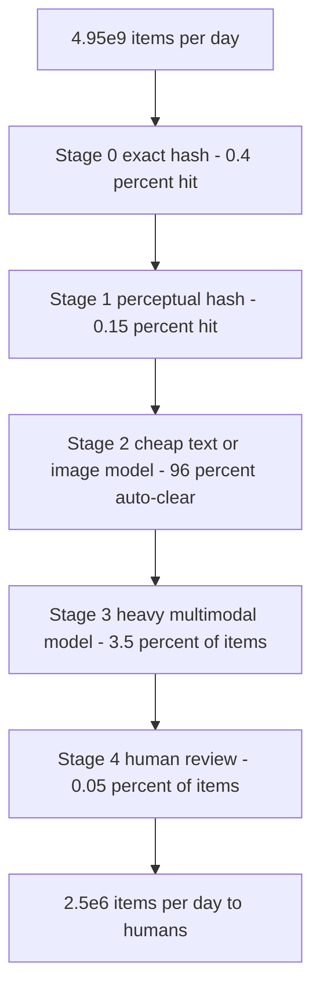
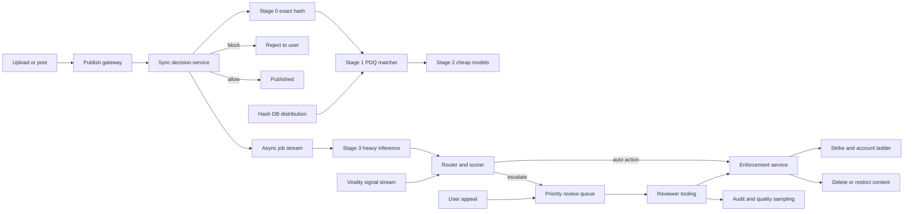
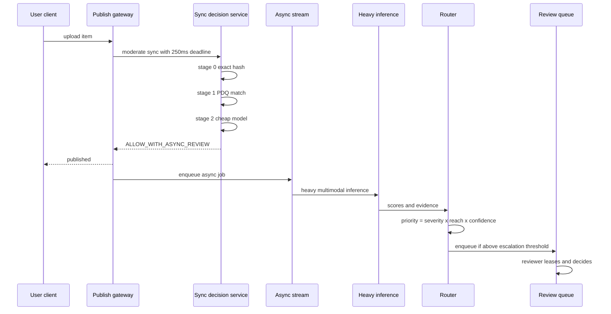
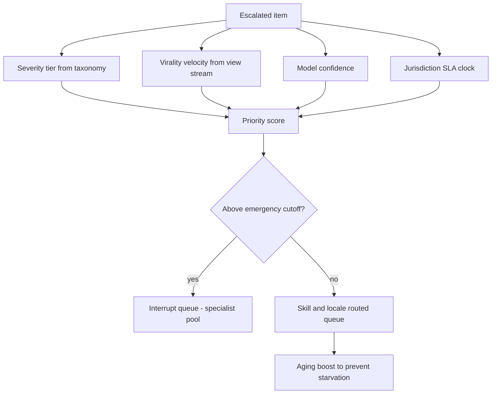
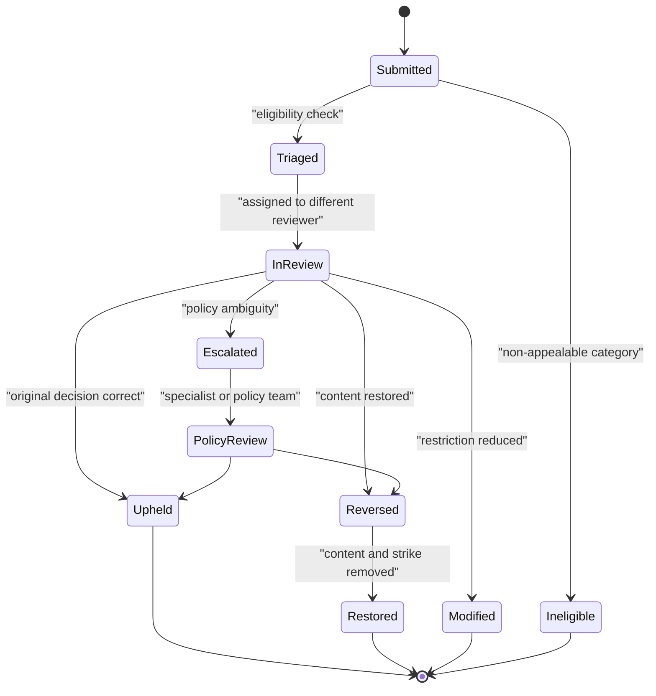

# 14 — Content Moderation Pipeline

<span class="pill pill-core">Core</span> <span class="pill pill-hard">Hard</span>

**A moderation system is a cost-ordered classifier cascade whose final stage is a human being who can review roughly 250 items an hour — which means the entire architecture exists to keep items away from that human, and every design decision is really a decision about the asymmetric cost of being wrong in each direction.**

| | |
|---|---|
| **Commonly asked at** | Meta, TikTok, YouTube, Reddit, Discord, Roblox, Cloudflare, Stripe (risk), OpenAI |
| **Time budget** | 45 min |
| **Core tension** | Blocking before publish prevents harm but adds latency to every post and guarantees false positives on innocent content; reviewing after publish keeps the product fast but means some harm is always delivered before it is removed |
| **Prerequisites** | [F12 Queues & Streams](../fundamentals/f12-queues-streams.md) · [F17 Rate Limiting & Load Shedding](../fundamentals/f17-rate-limiting-load-shedding.md) · [F18 Resilience Patterns](../fundamentals/f18-resilience-patterns.md) · [F21 Probabilistic Structures](../fundamentals/f21-probabilistic-data-structures.md) · [F24 Capacity Planning](../fundamentals/f24-capacity-planning.md) · [F23 SLI/SLO & Error Budgets](../fundamentals/f23-slo-error-budgets.md) · [F27 Security in Design](../fundamentals/f27-security-design.md) · [F11 Idempotency](../fundamentals/f11-idempotency.md) |

---

## 1. Problem Statement

Design the system that decides, for every piece of user-generated content on a large platform, whether it may be published, whether it must be removed, whether it should be restricted (age-gated, geo-blocked, demoted in ranking), and whether the account behind it should face action — and that does this at billions of items per day, in over 100 legal jurisdictions, against adversaries who actively probe your classifiers.

The system has four distinct customers with conflicting requirements:

| Customer | Wants | Conflicts with |
|---|---|---|
| The uploading user | Instant publish, no false removal, clear appeal | Pre-publish blocking |
| The consuming user | Never see harmful content | Post-publish review |
| The reviewer | Bounded exposure to traumatic content, clear policy, sane throughput | Unbounded queue growth |
| The regulator | Statutory removal windows, transparency reports, auditability | Everything moving fast |

!!! note "This is a capacity planning problem wearing a machine learning costume"
    The reviewer fleet is a fixed, slow-to-scale resource with a hard throughput ceiling and a human cost per item roughly $10^6$ times that of a hash lookup. Every architectural choice — cascade ordering, sampling rates, thresholds, queue priority — is ultimately about allocating that scarce resource to the items where a human judgement changes the most outcomes. If you cannot state the reviewer-hours-per-day number, you have not designed the system.

---

## 2. Requirements

### Functional

| # | Requirement |
|---|---|
| F1 | Classify every uploaded item (text, image, video, audio, live stream) against a policy taxonomy |
| F2 | Synchronously block a small, high-confidence set of categories before publish |
| F3 | Asynchronously review the rest, with removal, restriction, or no-action outcomes |
| F4 | Match against known-bad perceptual hash databases (CSAM, terrorist content, known-violating media) |
| F5 | Route escalations to human reviewers via a prioritized queue |
| F6 | Support user appeals with a defined state machine and SLA |
| F7 | Apply region-specific policy: an item may be legal in one country and unlawful in another |
| F8 | Take account-level action (strike, restriction, ban) with a graduated enforcement ladder |
| F9 | Produce auditable decision records: who/what decided, on which model version, with which evidence |
| F10 | Continuously measure precision and recall on a human-labelled golden set, and measure *prevalence* on a random sample of views |

### Non-functional

| # | Requirement | Target |
|---|---|---|
| N1 | Pre-publish blocking latency | p99 < 300 ms added to the publish path |
| N2 | Post-publish time-to-action for the highest severity tier | p50 < 60 s, p99 < 5 min from upload |
| N3 | Statutory removal windows | Germany NetzDG: 24 h for manifestly unlawful; India IT Rules: 36 h; EU DSA orders: without undue delay |
| N4 | Availability of the moderation decision service | 99.95% — but see the fail-open/fail-closed discussion, which matters more than the number |
| N5 | Reviewer exposure limits | Bounded graphic-content minutes per shift, enforced by the system |
| N6 | Decision auditability retention | 3+ years, immutable |
| N7 | Appeal resolution | p95 < 72 h |

!!! warning "N4 is a trick requirement"
    "The moderation service is down" has two possible behaviours and you must choose per category. Fail-open (publish anyway) for low-severity categories keeps the product alive at the cost of some harm. Fail-closed (block publish) for the highest-severity categories is correct even though it means an outage in the classifier becomes an outage in publishing. **A single global availability SLO papers over the fact that these are different systems with different consequences.** Say this out loud in an interview.

---

## 3. Scale Estimation

### Item volume

$$
\text{MAU} = 2\times10^9,\qquad \text{DAU} = 6\times10^8
$$

| Item type | Items/day | Share |
|---|---|---|
| Text (posts, comments, messages, bios) | $4.4\times10^9$ | 88% |
| Images | $5.0\times10^8$ | 10% |
| Videos | $5.0\times10^7$ | 1% |
| Live stream minutes | $2.0\times10^8$ min | — |
| **Total discrete items** | $\mathbf{4.95\times10^9}$ | |

$$
\text{QPS}_{\text{avg}} = \frac{4.95\times10^9}{86400} \approx 5.7\times10^{4}/\text{s},\qquad \text{QPS}_{\text{peak}} \approx 1.7\times10^{5}/\text{s}
$$

### The cascade funnel



### Human review capacity — the binding constraint

$$
I_{\text{human}} = 4.95\times10^9 \times 0.0005 \approx 2.5\times10^{6}\ \text{items/day}
$$

Reviewer throughput varies enormously by content type. Take a blended 250 items/reviewer-hour (a text comment is 10 seconds; a 20-minute video with a nuanced policy question is 15 minutes):

$$
H_{\text{day}} = \frac{2.5\times10^6}{250} = 10{,}000\ \text{reviewer-hours/day}
$$

An 8-hour shift yields ~6.5 productive hours after breaks, calibration, wellbeing time, and training:

$$
\text{Shifts/day} = \frac{10{,}000}{6.5} \approx 1{,}540
$$

Apply a 1.4 coverage factor for leave, attrition, ramp time, and 24/7 language coverage:

$$
N_{\text{reviewers}} \approx 1{,}540 \times 1.4 \approx 2{,}160\ \text{FTE}
$$

$$
\text{Cost}_{\text{human}} = 10{,}000\ \text{hr/day} \times \$18/\text{hr} \times 365 \approx \$65.7\text{M/yr}
$$

### ML inference capacity

Video is the whole story, because a video is not one inference — it is one inference per sampled frame plus audio transcription.

$$
\text{Frames}_{\text{day}} = 5\times10^7\ \text{videos} \times 300\ \text{sampled frames} = 1.5\times10^{10}\ \text{frame inferences/day}
$$

At 4 ms per frame on an accelerator with batch size 32:

$$
\text{GPU-seconds/day} = 1.5\times10^{10} \times 0.004 = 6\times10^{7}\ \Rightarrow\ \frac{6\times10^7}{86400} \approx 694\ \text{GPUs continuously}
$$

With a $2.5\times$ peak factor and $1.3\times$ redundancy: **~2,250 accelerators**. Images add:

$$
\frac{5\times10^8 \times 0.004}{86400} \approx 23\ \text{GPUs continuous} \Rightarrow \approx 75\ \text{provisioned}
$$

$$
\text{Cost}_{\text{GPU}} \approx 2{,}325 \times \$1.50/\text{hr} \times 8760 \approx \$30.6\text{M/yr}
$$

!!! example "Frame sampling is the single biggest cost lever in the ML tier"
    Dropping from 1 frame/second to scene-change-driven sampling typically cuts sampled frames by 5–8× on real video, because most video is visually static between cuts. That converts a \$30M/yr GPU bill into a \$5M/yr GPU bill. The recall cost is small — violating content that appears for under one scene is rare — but it is *not zero*, and the recall regression must be measured on the golden set before the change ships, not assumed.

### Cost per item by stage

| Stage | Latency | Cost per item | Relative to stage 0 | Share of items |
|---|---|---|---|---|
| 0 — exact hash (SHA-256 set membership) | 50 µs | $2\times10^{-8}$ | 1× | 100% |
| 1 — perceptual hash (PDQ, multi-index) | 800 µs | $1\times10^{-7}$ | 5× | ~99.6% |
| 2 — cheap text/image classifier (CPU) | 3 ms | $3\times10^{-6}$ | 150× | ~99.4% |
| 3 — heavy multimodal model (GPU) | 60–400 ms | $6\times10^{-3}$ (video) | 300,000× | ~3.5% |
| 4 — human review | 14 s median | $7.2\times10^{-2}$ | **3,600,000×** | ~0.05% |

$$
\text{Cost}_{\text{total/day}} \approx \underbrace{99}_{\text{stage 0-1}} + \underbrace{14{,}850}_{\text{stage 2}} + \underbrace{84{,}000}_{\text{stage 3}} + \underbrace{180{,}000}_{\text{stage 4}} \approx \$279\text{k/day}
$$

!!! danger "The 3.6-million-to-one ratio is the entire design"
    If your cascade lets 1% of items reach a human instead of 0.05%, human cost goes from \$66M to \$1.3B per year and you need 43,000 reviewers you cannot hire. Conversely, if you tighten thresholds so only 0.01% reach humans, you save \$40M and lose recall on exactly the ambiguous cases where human judgement was the point. **The threshold on the stage-3-to-stage-4 escalation is simultaneously a budget decision, a safety decision, and a hiring decision.**

### Storage

Decision records: ~2 KB per item (features, scores, model versions, outcome, actor).

$$
4.95\times10^9 \times 2\ \text{KB} \approx 9.9\ \text{TB/day} \approx 3.6\ \text{PB/yr}
$$

Retained 3 years for audit, tiered to cold storage after 90 days. Hash databases are tiny by comparison: 10M PDQ hashes × 32 B = 320 MB, which fits in RAM on every matcher.

---

## 4. API Design

```http
POST /v1/moderate/sync
Content-Type: application/json
Idempotency-Key: post_8a91f2c0

{
  "itemId": "post_8a91f2c0",
  "authorId": "u_4471",
  "surface": "feed_post",
  "jurisdiction": "DE",
  "content": {"type": "image", "blobRef": "s3://uploads/8a91f2c0", "text": "check this out"},
  "deadlineMs": 250
}
```

```http
200 OK
{
  "decision": "ALLOW_WITH_ASYNC_REVIEW",
  "blockingCategories": [],
  "signals": {"pdq_match": false, "nudity": 0.11, "violence": 0.04},
  "modelVersions": {"img_v": "img-2026.08.3", "txt_v": "txt-2026.07.9"},
  "decisionId": "d_01J9X...",
  "asyncJobId": "j_01J9X..."
}
```

```http
200 OK
{
  "decision": "BLOCK",
  "blockingCategories": ["CSAM_HASH_MATCH"],
  "userFacingReason": "This content violates our policies.",
  "appealable": false,
  "decisionId": "d_01J9Y..."
}
```

```http
POST /v1/appeals
{ "decisionId": "d_01J9Y...", "userStatement": "This is a medical education image." }
201 Created
{ "appealId": "a_01J9Z...", "state": "SUBMITTED", "slaDeadline": "2026-09-03T09:00:00Z" }
```

```http
GET /v1/review/next?queue=graphic_violence&reviewerId=r_882&locale=pt-BR
200 OK
{
  "leaseId": "lease_01JA0...",
  "leaseExpiresAt": "2026-08-31T09:22:00Z",
  "item": {"itemId":"vid_77", "renderHints":{"blur":true,"grayscale":true,"audioMuted":true}},
  "priorityScore": 8814.2,
  "policyContext": {"taxonomyNode":"V.2.a", "guidelineVersion":"2026.08"}
}
```

| Design choice | Rationale |
|---|---|
| `deadlineMs` on the sync call | The publish path must be able to give up. The caller states its budget; the service returns the best decision it has when the budget expires |
| `Idempotency-Key` = item ID | A retried publish must not create a second review job or a second strike. See [F11](../fundamentals/f11-idempotency.md) |
| Decision is an enum, not a boolean | `ALLOW`, `ALLOW_WITH_ASYNC_REVIEW`, `RESTRICT`, `AGE_GATE`, `GEO_BLOCK`, `BLOCK`, `BLOCK_AND_ESCALATE` — the space of outcomes is far richer than remove/keep |
| `userFacingReason` differs from internal categories | Telling an adversary exactly which classifier fired is a free evasion oracle |
| Review items are **leased**, not dequeued | A reviewer who closes their laptop must not black-hole an item; leases expire and the item returns to the queue |

---

## 5. Data Model

```sql
CREATE TABLE moderation_decision (
    decision_id      UUID PRIMARY KEY,
    item_id          TEXT        NOT NULL,
    author_id        BIGINT      NOT NULL,
    surface          TEXT        NOT NULL,
    jurisdiction     CHAR(2)     NOT NULL,
    decided_at       TIMESTAMPTZ NOT NULL,
    decided_by       TEXT        NOT NULL,   -- 'stage0' | 'stage2:txt-2026.07.9' | 'human:r_882'
    outcome          SMALLINT    NOT NULL,   -- see outcome enum
    categories       TEXT[]      NOT NULL,
    scores           JSONB       NOT NULL,   -- raw model outputs, for replay and audit
    policy_version   TEXT        NOT NULL,
    supersedes       UUID,                   -- appeal reversals chain to the original
    immutable        BOOLEAN     NOT NULL DEFAULT TRUE
);
CREATE INDEX md_by_item   ON moderation_decision (item_id, decided_at DESC);
CREATE INDEX md_by_author ON moderation_decision (author_id, decided_at DESC);

CREATE TABLE review_task (
    task_id          UUID PRIMARY KEY,
    item_id          TEXT        NOT NULL,
    queue            TEXT        NOT NULL,   -- routing: category x locale x skill
    severity         SMALLINT    NOT NULL,   -- 1 (lowest) .. 5 (imminent harm)
    priority_score   DOUBLE PRECISION NOT NULL,
    predicted_reach  BIGINT      NOT NULL,
    created_at       TIMESTAMPTZ NOT NULL,
    sla_deadline     TIMESTAMPTZ NOT NULL,   -- statutory or internal
    lease_holder     TEXT,
    lease_expires_at TIMESTAMPTZ,
    state            SMALLINT    NOT NULL,   -- 0 queued 1 leased 2 done 3 expired
    required_reviews SMALLINT    NOT NULL DEFAULT 1  -- 2+ for high-severity or low-confidence
);
CREATE INDEX rt_queue ON review_task (queue, state, priority_score DESC)
    WHERE state = 0;
CREATE INDEX rt_sla   ON review_task (sla_deadline) WHERE state IN (0,1);

CREATE TABLE reviewer_shift (
    reviewer_id        TEXT        NOT NULL,
    shift_start        TIMESTAMPTZ NOT NULL,
    graphic_seconds    INT         NOT NULL DEFAULT 0,  -- enforced exposure budget
    items_reviewed     INT         NOT NULL DEFAULT 0,
    agreement_rate     REAL,                            -- vs golden set, rolling
    PRIMARY KEY (reviewer_id, shift_start)
);

CREATE TABLE appeal (
    appeal_id     UUID PRIMARY KEY,
    decision_id   UUID        NOT NULL REFERENCES moderation_decision(decision_id),
    submitted_at  TIMESTAMPTZ NOT NULL,
    state         SMALLINT    NOT NULL,
    sla_deadline  TIMESTAMPTZ NOT NULL,
    resolved_at   TIMESTAMPTZ,
    outcome       SMALLINT,                 -- upheld | reversed | modified
    reviewer_id   TEXT                      -- must NOT equal the original reviewer
);

CREATE TABLE golden_item (
    item_id       TEXT PRIMARY KEY,
    sampled_from  TEXT NOT NULL,            -- 'random_views' | 'random_items' | 'targeted'
    sample_weight DOUBLE PRECISION NOT NULL,
    gold_labels   TEXT[] NOT NULL,          -- consensus of 3+ expert reviewers
    labelled_at   TIMESTAMPTZ NOT NULL,
    policy_version TEXT NOT NULL
);
```

!!! note "`moderation_decision` is append-only and immutable"
    An appeal does not update the original row; it writes a new decision with `supersedes` pointing at it. This gives you a complete, replayable history — essential for regulatory transparency reports, for retraining without label leakage, and for answering "what did we know at the time?" during an incident. Mutable decision rows are how moderation systems become unauditable.

---

## 6. High-Level Architecture



### Write path (publish)

1. Client uploads; the gateway holds the item in a pending state and calls the sync decision service with a hard deadline (250 ms).
2. Stage 0 computes SHA-256 and probes a Bloom-filter-fronted set of exact known-bad hashes. A hit on the highest-severity list is an immediate, non-appealable block plus a mandatory external report.
3. Stage 1 computes a PDQ perceptual hash and probes the multi-index structure. A near-match within the Hamming threshold blocks.
4. Stage 2 runs the cheap models. If the deadline is close to expiring, it returns the best available decision and defers the rest.
5. If not blocked, publish immediately and enqueue an async job.

### Async path

6. Stage 3 runs heavy multimodal inference: frame-sampled video, audio transcription plus text classification, OCR on embedded text, and cross-modal fusion.
7. The router combines model scores, account history, and **virality velocity** into a priority score, then either auto-actions, ignores, or enqueues for human review.
8. Reviewers lease items, decide, and the enforcement service applies content and account actions.
9. A sampled stream of every path feeds the audit and quality system.



---

## 7. Deep Dives

### 7.1 Synchronous blocking versus asynchronous review

This is the defining trade and it must be resolved **per category**, never globally.

| | Synchronous pre-publish | Asynchronous post-publish |
|---|---|---|
| Harm delivered | Zero for caught items | Everything viewed before removal |
| Latency added to publish | 100–300 ms p99 | Zero |
| Availability coupling | Classifier outage = publish outage | Classifier outage = backlog |
| False positive experience | User is blocked at creation time; feels like censorship, immediate outrage | Content is removed later; still bad, but the user already had the publish experience |
| Compute budget per item | Bounded by the deadline; only cheap stages fit | Unbounded; heavy models are allowed |
| Suitable for | Deterministic, near-zero-FP signals | Everything requiring judgement |

The rule that falls out: **only put a stage in the synchronous path if its false positive rate is low enough that blocking on it is defensible without human review, and its p99 latency fits inside the deadline.** In practice that means exact and perceptual hash matches on the most severe categories, plus a very high-confidence band of the cheap classifiers. Everything else is asynchronous.

$$
\text{Expected harm}_{\text{async}} = \sum_i p_i \cdot V_i(t_{\text{action},i}) \cdot S_i
$$

where $V_i(t)$ is views accumulated before action. Since views on viral content grow super-linearly early, halving time-to-action removes much more than half the harm — which is exactly why the priority queue in 7.4 sorts by predicted future reach and not by age.

!!! gotcha "A synchronous classifier turns its own latency into your publish latency, including its tail"
    **Symptom:** publish p99 jumps from 180 ms to 2.4 s after a model rollout with no change to the model's *median* latency. **Mechanism:** the new model has a longer tail on large images, and the sync path had no deadline enforcement — it waited. **Mitigation:** hard deadline with a defined default outcome, enforced as a timeout on the client side of the call, plus a circuit breaker so that when the classifier is slow you stop calling it entirely and take the default. The default must be a *policy* decision recorded in config, per category, not a code default. See [F18](../fundamentals/f18-resilience-patterns.md).

### 7.2 Perceptual hashing and hash database distribution

Exact hashing (SHA-256) catches byte-identical re-uploads and nothing else — a single re-encode defeats it. Perceptual hashing survives re-encoding, resizing, mild cropping, and recompression.

**PDQ** produces a 256-bit hash from a normalized luminance image via a DCT, with a match threshold around Hamming distance 31. Naive matching against $N=10^7$ hashes is $10^7$ XOR+popcount operations per query — about 3 ms of CPU, times $5\times10^8$ images/day, which is 1,500 cores. Multi-index hashing removes almost all of it.

**Multi-index hashing (MIH)** exploits the pigeonhole principle. Split the 256-bit hash into $m=16$ chunks of 16 bits. If two hashes are within Hamming distance $d=31$, then at least one chunk differs by at most $\lfloor d/m \rfloor = 1$ bit.

$$
\text{probes} = m \times (1 + 16) = 16 \times 17 = 272 \text{ hash table lookups}
$$

```python
CHUNKS, CHUNK_BITS = 16, 16          # 256-bit PDQ hash
TABLES = [dict() for _ in range(CHUNKS)]   # chunk_value -> list of hash ids

def index(h_id, h):
    for i in range(CHUNKS):
        c = (h >> (i * CHUNK_BITS)) & 0xFFFF
        TABLES[i].setdefault(c, []).append(h_id)

def query(h, max_dist=31):
    candidates = set()
    for i in range(CHUNKS):
        c = (h >> (i * CHUNK_BITS)) & 0xFFFF
        candidates.update(TABLES[i].get(c, ()))          # exact chunk
        for b in range(CHUNK_BITS):                       # 1-bit neighbours
            candidates.update(TABLES[i].get(c ^ (1 << b), ()))
    return [x for x in candidates if popcount(h ^ HASHES[x]) <= max_dist]
```

272 lookups plus a few hundred verifications is ~50 µs — a 60× reduction, and the whole structure (320 MB of hashes plus ~1 GB of index) fits in RAM on every matcher node. That is what makes stage 1 cheap enough to run on 100% of images.

**Distribution.** Hash lists come from external authorities (NCMEC, GIFCT, IWF) and from your own confirmed removals. They are simultaneously the most valuable and most dangerous artifact in the system.

| Distribution model | Pro | Con | Verdict |
|---|---|---|---|
| Ship the hash DB to every matcher node | Fast, no network hop, works offline | A compromised node leaks the entire list; an adversary with the list can test candidate content offline until it evades | Chosen for the *non-sensitive* lists |
| Centralized match-as-a-service; callers send only a hash | List never leaves the vault | Adds a network hop to the sync path; the service itself is an oracle if unrate-limited | Chosen for the most sensitive lists |
| Hash DB in a hardware enclave on each node | Local speed, no plaintext exposure | Operational complexity, attestation, key rotation | Considered; usually not worth it |

!!! danger "A leaked hash database is an evasion oracle"
    With the list in hand, an adversary can iterate perturbations locally until the PDQ distance exceeds the threshold, verifying success offline with zero signal to you. Mitigations: never expose match/no-match with useful granularity to end users (a block message must be indistinguishable from other blocks), rate-limit and anomaly-detect on accounts that appear to be probing (many near-miss uploads from one account is a strong signal), rotate thresholds, and layer a learned embedding-similarity model behind the hash so that defeating the hash does not defeat detection. Also: an adversary who can submit content and observe the outcome always has *some* oracle — the goal is to make each probe expensive and detectable, not impossible.

### 7.3 ML inference capacity and batching

Accelerator throughput is dominated by batching, and batching trades latency for throughput. The sync path and the async path therefore need **different serving tiers running the same models**.

| Tier | Batch size | Queue wait | p99 latency | Throughput vs batch 1 |
|---|---|---|---|---|
| Sync (low latency) | 1–4, dynamic with 5 ms window | ≤ 5 ms | 40 ms | 2.5× |
| Async (high throughput) | 64–256, window up to 2 s | ≤ 2 s | 2.5 s | 22× |

$$
\text{Throughput} = \frac{B}{T_{\text{fixed}} + B \cdot T_{\text{marginal}}}
$$

The fixed cost per batch (kernel launch, memory transfer, Python overhead) is what batching amortizes; once $B \cdot T_{\text{marginal}} \gg T_{\text{fixed}}$, further batching buys nothing and only adds queue wait. Find that knee empirically and stop there.

**Multi-stage within stage 3.** Not every item needs the largest model. A two-tier arrangement — a distilled model on everything, then the full model only on items in an uncertainty band — typically reduces heavy-model volume by 70% at a small recall cost:

$$
\text{escalate to full model if } |s - \tau| < \delta
$$

**Backpressure.** When the async queue grows, you have four levers and they must be pre-authorized because on-call will not invent them at 3 a.m.:

1. Reduce video frame sampling density (recall cost: small, measurable).
2. Switch to the distilled model for low-severity categories only.
3. Prioritize by severity — process tier 5 items and shed tier 1 to a later batch window.
4. Fail open for low-severity categories, fail closed for high.

!!! gotcha "Autoscaling on GPU utilization is meaningless"
    **Symptom:** utilization sits at 95% while the queue grows without bound; the autoscaler does nothing. **Mechanism:** a batching server keeps the accelerator busy by definition; utilization saturates long before capacity does. **Mitigation:** scale on **queue depth and oldest-item age**, which are the signals that actually correlate with the SLO. Utilization is a cost metric, not a capacity metric. See [F24](../fundamentals/f24-capacity-planning.md).

### 7.4 Review queue prioritization

Reviewer-hours are the scarcest resource in the system, so the queue is not FIFO. It is a priority queue over *expected harm prevented per reviewer-minute*.

$$
\text{Priority} = \underbrace{S}_{\text{severity } 1..5\ (\text{exponential})} \times \underbrace{\hat{R}}_{\text{predicted future reach}} \times \underbrace{p(\text{violating})}_{\text{model confidence}} \times \underbrace{U}_{\text{SLA urgency}}
$$

with predicted future reach estimated from virality velocity:

$$
\hat{R} = v(t)\cdot \frac{1}{\lambda}\left(1 - e^{-\lambda \Delta t}\right),\qquad v(t) = \frac{\text{views in last 5 min}}{300}
$$

and SLA urgency growing sharply as a statutory deadline approaches:

$$
U = 1 + \left(\frac{t_{\text{elapsed}}}{t_{\text{sla}}}\right)^{4}
$$



Three properties the queue must have:

- **Starvation guard.** A pure priority queue never serves the bottom. The aging term $U$ does this, but you also need an explicit floor: a fixed fraction of reviewer capacity (say 10%) always pulls the oldest item regardless of score. Without it, low-severity items sit forever, and "forever" eventually becomes a regulatory finding.
- **Skill and locale routing.** A Portuguese-language political-speech judgement cannot be made by an English-only reviewer. Queues are `(category × locale × certification level)`, which fragments capacity and makes staffing a bin-packing problem — this is why a global reviewer headcount number understates the real requirement by 20–40%.
- **Leases, not dequeues.** Items are leased with an expiry. This is the standard visibility-timeout pattern from [F12](../fundamentals/f12-queues-streams.md), and it is the difference between a reviewer's crashed browser costing 90 seconds versus losing an item silently.

!!! gotcha "Reviewer throughput is not a number you can scale on demand"
    **Symptom:** a coordinated attack or a breaking news event triples escalation volume; the queue grows to 40 hours of backlog. **Mechanism:** hiring and certifying a reviewer takes weeks. There is no autoscaling group for humans. **Mitigation:** design for a *surge protocol* in advance — pre-trained surge pools that can be activated within hours, automatic threshold tightening that reduces escalation volume (accepting a recall hit that you have measured), overtime authorization paths, and the explicit ability to auto-action a category that would normally be human-reviewed. Every one of these has a documented quality cost, and the decision of which to pull belongs to a named owner, not the on-call engineer.

### 7.5 Appeals

An appeal is not "review it again." It is a distinct workflow with a different reviewer, richer context, and a different quality bar.



| Rule | Reason |
|---|---|
| The appeal reviewer must never be the original reviewer | Anchoring bias makes self-review nearly worthless as an error correction mechanism |
| Appeal reversal rate is a **quality signal about the original decision process**, not just a case outcome | A queue with a 30% reversal rate has a policy or training problem, and that is the actionable finding |
| Reversal must undo *all* downstream effects | Content restored, strike removed, account-level ladder recalculated, ranking demotion lifted. Partial reversal is a common and infuriating bug |
| High-severity categories have a mandatory appeal path even when auto-actioned | Regulatory requirement in the EU under the DSA; also the only way you find systematic classifier failures |
| Reversals feed the training set with high weight | They are the most informative labels you have — they are, by construction, the cases the system got wrong |

!!! gotcha "Reversal creates a training feedback loop that can amplify a bad reviewer"
    **Symptom:** classifier precision degrades slowly over months in one category. **Mechanism:** appeal reversals are used as training labels, but a subset of reversals came from reviewers with low agreement rates, so the model learned their errors. **Mitigation:** weight training labels by the labeller's measured agreement rate on golden items, require multi-reviewer consensus for any label that enters the training set, and hold out an independent expert-labelled evaluation set that is *never* used for training and never sourced from the production reviewer pool.

### 7.6 Error cost asymmetry and thresholds

There is no single operating point. Each policy category sits at a different place on the precision/recall curve because the costs differ by orders of magnitude.

| Category | Cost of false positive | Cost of false negative | Bias | Typical operating point |
|---|---|---|---|---|
| CSAM | Severe (wrongful report, account destruction) | Catastrophic and irreversible | **Recall** | Hash match auto-blocks; ML at very high recall with mandatory human confirmation before reporting |
| Terrorist / violent extremism | High (suppressing journalism, counter-speech, documentation of atrocities) | Very high | Recall, with expert review | Auto-block on hash; human review on ML |
| Spam / scams | Low (annoyance) | Moderate (financial loss) | Precision-ish, high automation | Fully automated, threshold tuned to a fixed FP budget |
| Adult nudity | Moderate (art, breastfeeding, medical) | Low-moderate | Balanced, with age-gating as the middle outcome | Restrict rather than remove |
| Hate speech | Very high (censorship of the group being discussed; reclaimed slurs; quotation) | High | Human-heavy, context-dependent | Low automation rate; heavy escalation |
| Misinformation | Very high (legitimate dissent, evolving science) | Contested | Label and demote, rarely remove | Almost never auto-remove |
| Copyright | Moderate (fair use, criticism) | Legal exposure | Rights-holder driven, counter-notice mandatory | Notice-and-takedown workflow |

$$
\mathbb{E}[\text{cost}] = C_{FP}\cdot(1-\text{precision})\cdot N_{\text{actioned}} + C_{FN}\cdot(1-\text{recall})\cdot N_{\text{violating}}
$$

Minimizing this per category gives a different threshold per category — which is the mathematically obvious result that organizations nonetheless routinely fail to implement, shipping one global threshold because it is simpler to operate.

!!! warning "The middle outcomes are where the real design lives"
    Remove-or-keep is a false binary. Age-gate, geo-block, interstitial warning, demote in ranking, disable sharing, disable comments, and label-with-context are all lower-cost interventions that let you act on lower-confidence signals without paying the full false-positive cost of removal. A candidate who only discusses remove/keep has missed most of the design space.

### 7.7 Adversarial evasion

Your classifiers are under continuous, deliberate attack. Assume the adversary can submit content and observe the outcome — that is an oracle, and it is unavoidable.

| Evasion | Mechanism | Countermeasure |
|---|---|---|
| Re-encode, resize, mirror, add borders | Defeats exact hash; may defeat naive perceptual hash | PDQ with normalization; mirror-invariant variants; embedding similarity as a second layer |
| Adversarial perturbation | Imperceptible noise crafted to flip a specific model | Ensembles of differently-trained models; input transformations before inference; adversarial training; do not expose per-category scores |
| Embedded text in images / memes | Text classifier never sees the text | OCR into the text pipeline; treat OCR text as first-class |
| Leetspeak, homoglyphs, zero-width joiners, algospeak | Token-level string matching fails | Unicode confusable normalization (UTS #39), subword models, embedding-level matching, continuous slang-term mining |
| Harm in audio only | Vision-only pipeline is blind | Transcribe audio; classify the transcript; classify audio directly for non-speech signals |
| Harm in a 2-second segment of a 40-minute video | Sparse frame sampling misses it | Scene-change sampling; densify sampling on items with any elevated signal; second-pass on flagged videos |
| Content in a link or a QR code | Nothing in-frame is violating | Crawl and classify link destinations; decode QR codes; treat outbound destination reputation as a signal |
| Account cycling / burner farms | Per-item classification never sees the pattern | Behavioural and graph signals: registration clustering, device fingerprints, coordinated posting timing — often stronger than content signals |
| Slow ramp to find the threshold | Probing with near-miss content | Detect probing behaviour itself: many near-threshold submissions from one actor is a high-signal pattern |
| Live stream that turns violating mid-broadcast | Pre-publish checks passed | Continuous sampling during broadcast, with viewer-count-driven sampling density and a hard kill path |

!!! note "Behavioural signals often beat content signals"
    A network of 4,000 accounts created from the same ASN within an hour, all posting near-identical content, is trivially detectable from metadata even when each individual item is genuinely ambiguous. The most effective moderation systems treat *coordinated inauthentic behaviour* as a separate detection problem with its own pipeline, because it scales down the content problem enormously.

### 7.8 Regional legal differences

The same item can require different outcomes in different jurisdictions, and the *architecture* must express that.

| Requirement | Jurisdiction | Design implication |
|---|---|---|
| 24 h removal for manifestly unlawful content | Germany (NetzDG) | SLA clock must start at *report receipt*, be per-jurisdiction, and drive queue priority |
| 36 h for content removal orders | India (IT Rules) | Separate legal-order intake path with its own guaranteed queue |
| Notice-and-action, statement of reasons, appeal | EU (DSA) | Every action needs a machine-generated, user-readable reason and a mandatory appeal route |
| Nazi symbolism unlawful | DE, AT, FR | Geo-block rather than global removal; item stays visible elsewhere |
| Right to be forgotten delisting | EU | Delist for EU users; the item itself may remain |
| Local data residency for review | Multiple | Reviewer tooling must render content in-region; content may not be exportable for review |
| Transparency reporting | EU, others | Aggregate decision counts by category, jurisdiction, and outcome must be queryable and defensible |

The clean model: **decisions are `(item, jurisdiction) → outcome`, and global removal is the special case where the outcome is the same everywhere.** Store it that way from day one, because retrofitting geo-scoped enforcement onto a global boolean is a multi-year migration.

!!! gotcha "Geo-blocking by IP is trivially bypassed, and regulators know it"
    **Symptom:** a regulator demonstrates the "blocked" content is reachable from within their jurisdiction via a VPN. **Mechanism:** IP geolocation is your only signal and it is user-controllable. **Mitigation:** layer signals — account-declared country, SIM/carrier, payment instrument country, historical location — and document the limits honestly in your compliance posture. There is no technical answer that fully satisfies "this content must not be viewable in country X"; the honest answer is a defensible best effort, and pretending otherwise in an interview is a red flag.

### 7.9 Reviewer wellbeing and audit

This is a systems requirement, not an HR footnote, and it appears in the architecture:

- **Exposure budgets** enforced by the task assigner: a reviewer has a per-shift budget of graphic-content seconds, tracked in `reviewer_shift`, and the router refuses to assign more once exhausted. It must be enforced server-side, because a reviewer under throughput pressure will not self-limit.
- **Default-safe rendering**: grayscale, blurred, muted, no autoplay, click-to-reveal. Reviewers reveal only what they need. This measurably reduces harm and costs a few percent of throughput.
- **Rotation** across queues so no one spends a whole shift in the worst category.
- **Never route an item to a reviewer connected to it** — same country as the victim in a doxxing case, same language community in a targeted harassment case, or the reviewer's own content.

Audit and quality:

- **Double-review sampling**: a random 2–5% of decisions are independently re-reviewed. Inter-rater agreement (Cohen's $\kappa$) below a threshold in a queue means the *policy is ambiguous*, not that the reviewers are bad — the corrective action is a guideline change, not retraining individuals.
- **Golden item injection**: known-labelled items are injected into live queues at a low rate to measure individual and fleet accuracy continuously. Reviewers know this happens; it must be framed as calibration, not surveillance, or it distorts behaviour.
- **Every decision is attributable** — reviewer ID, guideline version, time spent, evidence viewed — because a regulatory challenge to a single decision is a real, routine event.

---

## 8. Scaling the Bottleneck

| Rank | Bottleneck | Why it binds | Scaling move |
|---|---|---|---|
| 1 | **Human reviewer throughput** | Weeks to hire, cannot autoscale, hard ceiling of ~250 items/hr | Reduce escalation volume (raise stage-3 thresholds), automate the highest-agreement categories entirely, improve tooling ergonomics (30% throughput gains from UI work are real), pre-trained surge pools |
| 2 | **Video frame inference** | 300 frames per video dominates all GPU cost | Scene-change sampling, distilled first pass, cache by content hash so re-uploads skip inference entirely |
| 3 | **Sync path latency budget** | Every ms is publish latency for 100% of users | Only hash stages plus a distilled classifier in-band; everything else async |
| 4 | **Queue depth during spikes** | Breaking news and coordinated attacks are 5–10× | Severity-tiered shedding with pre-authorized degradation; separate queues so a spam flood cannot starve the violence queue |
| 5 | **Hash DB probe fanout** | Grows with list size | MIH keeps it $O(1)$-ish; shard the list by media type |

!!! tip "The highest-leverage optimization is deduplication by content hash"
    A viral image is uploaded 400,000 times. If stage 0 resolves a re-upload to a *cached decision* rather than re-running the pipeline, you eliminate almost all inference cost on exactly the content that matters most. Cache the decision keyed on `(content_hash, policy_version, jurisdiction)` — and invalidate on policy version change, or you will serve a stale decision after a policy update and it will be the one the press writes about.

---

## 9. Failure Modes

| Failure | Blast radius | Detection | Mitigation | Degraded behaviour |
|---|---|---|---|---|
| Sync decision service down | All publishes | Publish-path error rate; circuit breaker state | Per-category fail-open/fail-closed policy in config; local cached hash set as a last resort | High-severity categories block publish; low-severity publish with async-only review |
| Hash DB update pipeline stalls | New known-bad content not caught | Age of newest hash entry, per source | Alert on staleness > 6 h; fall back to previous snapshot, never to an empty set | Recall loss on newly-catalogued content |
| Heavy inference fleet loses capacity | Async backlog grows | Queue depth, oldest-item age | Distilled model fallback; reduce sampling density; severity-tiered shedding | Lower-severity items reviewed late |
| Model deploys with a systematic bias | Mass wrongful removals in one demographic or language | Per-slice precision on golden set; appeal rate spike per slice | Automated rollback on slice-level metric regression, not just aggregate | Requires bulk reversal — must be a supported, tested operation |
| Review queue starvation | Low-severity items never reviewed | Oldest-queued-item age per queue | Aging term plus 10% capacity floor for oldest-first | Some items age out; must be logged, not silently dropped |
| Coordinated mass false reporting | Innocent creator removed | Report-to-action ratio per target; reporter clustering | Weight reports by reporter credibility; require independent signal before action on report volume alone | Targeted creators need a fast-track appeal |
| Reviewer tooling outage | Zero human throughput | Reviewer heartbeat, decisions per minute | Multi-region tooling, offline queue drain | Backlog grows at the full escalation rate — this is a 2.5M items/day accumulation |
| Enforcement service partially applies an action | Content removed but strike not applied, or vice versa | Reconciliation job comparing decisions to effects | Idempotent enforcement with a reconciler; outbox pattern from decision to effect | Inconsistent user state; appeals become unresolvable |
| Appeal SLA breach at scale | Regulatory exposure | Appeals past deadline, per jurisdiction | Dedicated appeal capacity reservation that spikes cannot consume | Statutory violation; reportable |
| Golden set becomes stale after a policy change | All quality metrics silently wrong | Golden set age vs policy version | Re-label golden items on every policy version bump | You are flying blind and do not know it — the worst failure on this table |

!!! danger "The worst failure mode is silent: a broken quality measurement"
    Every other row here produces a symptom. A stale or contaminated golden set produces *confident, wrong numbers* — precision looks like 0.94 while real precision is 0.71, and nobody investigates because the dashboard is green. Guard it: version the golden set against the policy version, re-label on every policy change, keep an expert-labelled holdout that never touches training, and alarm when the golden set's age exceeds the policy's.

---

## 10. SRE Lens

### SLIs and SLOs

| SLI | Definition | SLO |
|---|---|---|
| Sync decision latency | p99 of the blocking call | < 300 ms |
| Sync decision availability | Non-error responses within deadline | 99.95% |
| Time-to-action, severity 5 | Upload → enforcement | p50 < 60 s, p99 < 5 min |
| Time-to-action, severity 2 | Upload → enforcement | p95 < 24 h |
| Statutory SLA compliance | Legal orders actioned within the jurisdiction's window | > 99.9% |
| Appeal resolution | Submitted → resolved | p95 < 72 h |
| Precision, per category | On the golden set | Category-specific: 0.95+ for automated-action categories |
| Recall, per category | On the golden set | Category-specific: 0.99+ for severity 5 |
| **Prevalence** | Violating views ÷ total views, from a randomly-view-sampled panel | The real north star; target set per category |

$$
\text{Prevalence} = \frac{\sum_{i \in \text{sample}} w_i \cdot \mathbb{1}[\text{violating}_i]}{\sum_{i \in \text{sample}} w_i}
$$

!!! tip "Precision and recall are engineering metrics; prevalence is the product metric"
    Precision and recall are computed over *items you actioned or considered*. Prevalence is computed over *views users actually had*, sampled uniformly at random from the view stream and human-labelled. They differ radically: a system with excellent recall on items can still have terrible prevalence if the misses are concentrated in the highest-reach content. Sample by view, not by item — this is the single most important measurement design decision on the page, and most candidates never mention it.

Sample size for prevalence at target precision $\pm 0.1\%$ absolute with 95% confidence around a small $p$:

$$
n \approx \frac{1.96^2 \cdot p(1-p)}{0.001^2} \approx \frac{3.84 \times 0.001 \times 0.999}{10^{-6}} \approx 3{,}840\ \text{labelled views}
$$

per category per period — which is affordable, and is why prevalence measurement is universally the right investment.

### Error budget

At 99.95% on the sync path:

$$
0.0005 \times 30 \times 24 \times 60 \approx 21.6 \text{ minutes per 30 days}
$$

But the moderation-specific budget that matters more is the **quality budget**: an allowance of wrongful removals per million actions, tracked per category. Burning it stops model rollouts exactly the way an availability budget stops feature rollouts.

### Rollout plan for a model change

1. **Offline eval** on the frozen holdout, sliced by language, region, and demographic proxy. Aggregate metrics hide the failure that will make the news.
2. **Shadow** in production for 7+ days: score everything, action nothing, diff against the incumbent. Sample and human-label the disagreements — those are the only items that carry information.
3. **Canary at 1%** of traffic with automated rollback on per-slice precision regression, appeal-rate spike, or escalation-volume change beyond a band.
4. Ramp 1% → 5% → 25% → 100%, minimum 24 h per step, never during a major news event or election period.
5. **Explicit escalation-volume check** at each step: a model that escalates 3× more items does not "just" cost money — it exceeds reviewer capacity and creates a backlog you cannot recover from.

!!! warning "Model rollback must include remediation"
    Rolling back the model stops new bad decisions. It does not undo the 400,000 wrongful removals already made. You need a supported bulk-reversal operation: identify decisions made by version X in the affected window, re-run with the previous model, restore where they differ, remove strikes, recompute account ladders, and notify the users. If you have never tested this, you do not have it. See [F25](../fundamentals/f25-deployment-release-safety.md).

### Runbook notes

```bash
# Backlog triage: where is the queue growing?
$ modq stat --by-queue --sort=oldest
queue=violence_en   depth=  412,000  oldest=03:41:12  sla_breach=1,204   # PROBLEM
queue=spam_global   depth=8,900,000  oldest=00:12:03  sla_breach=0       # auto-actioned, fine
queue=hate_pt-BR    depth=   31,000  oldest=11:02:44  sla_breach=8,912   # STAFFING GAP

# Is the escalation rate anomalous, or is it volume?
$ modq rate --window=1h --compare=7d
escalation_rate  now=0.13%  baseline=0.05%   ratio=2.6x   # model change or attack
item_volume      now=1.02x baseline                        # volume is normal -> model
```

Decision tree: escalation rate up with flat volume implies a model or threshold change — check recent deploys first. Volume up with flat escalation rate implies an external event — activate surge protocol. One queue breaching with others healthy implies a staffing or routing problem, not a systems problem.

### Capacity model

$$
N_{\text{reviewers}} = \frac{V_{\text{items}} \times r_{\text{escalate}}}{\text{throughput} \times h_{\text{productive}}} \times f_{\text{coverage}} \times f_{\text{locale fragmentation}}
$$

The two multipliers organizations consistently forget are $f_{\text{coverage}}$ (leave, training, attrition — 1.3 to 1.5) and $f_{\text{locale fragmentation}}$ (you cannot pool a Portuguese queue with an English one — 1.2 to 1.4). Together they are close to a 2× understatement if omitted.

### Cost

| Component | Annual | Share | Primary lever |
|---|---|---|---|
| Human review | \$65.7M | 62% | Escalation rate; tooling throughput; automation of high-agreement categories |
| Heavy GPU inference | \$30.6M | 29% | Frame sampling; distillation; decision cache on content hash |
| Cheap classifiers (CPU) | \$5.4M | 5% | Already cheap |
| Storage + audit | \$3.2M | 3% | Tiering after 90 days |
| Hash matching | \$0.8M | 1% | Negligible |

$$
\frac{\partial \text{Cost}}{\partial r_{\text{escalate}}} \approx \$1.3\text{B per unit} \Rightarrow \text{+0.01\% escalation} = +\$13\text{M/yr}
$$

That derivative is the number to put on the whiteboard. See [F28](../fundamentals/f28-cost-engineering.md).

---

## 11. Trade-offs & Alternatives

| Decision | Chosen | Alternative | Why |
|---|---|---|---|
| Blocking scope | Sync for hash matches only; async for everything else | Sync for all classifiers | Sync-everything adds the full model tail to publish latency and couples publish availability to model availability. Rejected |
| Cascade | Cost-ordered, 5 stages | Single large multimodal model on everything | One model on $5\times10^9$ items/day is roughly \$30B/yr of inference. Rejected on arithmetic alone |
| Hash algorithm | PDQ (open, 256-bit) + PhotoDNA for restricted lists | Only exact SHA-256 | Exact hashing is defeated by a re-encode. Rejected |
| Hash lookup | Multi-index hashing | Brute-force Hamming scan | 60× cost difference at 10M hashes. Rejected |
| Queue discipline | Priority by expected harm, with aging floor | FIFO | FIFO reviews a dead post before a video going viral right now. Rejected |
| Task handoff | Lease with expiry | Dequeue | Dequeue loses items on reviewer crash. Rejected |
| Decision store | Append-only with `supersedes` | Mutable rows | Mutable decisions are unauditable and break regulatory reporting. Rejected |
| Enforcement outcomes | Rich enum incl. age-gate, geo-block, demote | Boolean remove/keep | The middle outcomes let you act on lower-confidence signals cheaply. Rejected the binary |
| Jurisdiction | `(item, jurisdiction)` decisions from day one | Global boolean, retrofit later | Retrofitting geo-scope is a multi-year migration. Rejected |
| Quality measurement | Prevalence on view-sampled panel + golden set | Precision/recall on actioned items only | Actioned-only metrics are blind to the misses that matter most. Rejected |
| Reviewer wellbeing | Server-enforced exposure budgets | Policy guidance to reviewers | Under throughput pressure, unenforced guidance is ignored. Rejected |
| Failure default | Per-category fail-open/fail-closed | One global default | A single default is wrong for at least one end of the severity range by construction. Rejected |

---

## 12. Gotchas & Corner Cases

!!! gotcha "The decision cache serves a stale verdict after a policy change"
    **Symptom:** content that the new policy permits is still auto-removed, or vice versa; the removal is public and embarrassing. **Mechanism:** the `(content_hash) → decision` cache was keyed without the policy version, so a re-upload got yesterday's verdict. **Mitigation:** key on `(content_hash, policy_version, jurisdiction, model_major_version)` and treat a policy bump as a cache namespace change. Also expire cached *allow* decisions faster than cached *block* decisions — a wrongly-cached allow is the direction that lets harmful content through indefinitely.

!!! gotcha "Aggregate model metrics hide catastrophic per-slice failure"
    **Symptom:** the model ships with 0.96 aggregate precision and immediately produces a wave of wrongful removals against one language community. **Mechanism:** that slice is 0.8% of volume, so a precision of 0.31 on it moves the aggregate by 0.005. **Mitigation:** gate rollouts on the *worst* slice, not the mean, with a minimum sample size per slice; and define the slices in advance (language, region, content type, account age) so nobody has to think of them during an incident.

!!! gotcha "Sampling by item instead of by view makes your prevalence metric meaningless"
    **Symptom:** measured prevalence is 0.02% while user complaints imply something far worse. **Mechanism:** 99% of items get under 10 views; sampling uniformly by item measures the invisible long tail, not what people saw. **Mitigation:** sample from the *view* stream so each sampled item is weighted by its actual reach. This changes the number by one to two orders of magnitude and changes which failures you prioritize.

!!! gotcha "The reviewer queue becomes a denial-of-service target"
    **Symptom:** the queue fills with 2 million near-threshold items and real violations sit behind them. **Mechanism:** an adversary discovered the escalation threshold and mass-produces content just above it — a cheap attack on your most expensive resource. **Mitigation:** per-account and per-cluster escalation rate limits, treat "many near-threshold submissions from one actor" as its own high-priority signal, and make the priority score depend on account reputation so a burner farm cannot buy reviewer attention.

!!! gotcha "Enforcement is applied but the strike is not, or the reverse"
    **Symptom:** a user's content is gone but their account shows no violation, so the appeal flow has nothing to appeal. **Mechanism:** content removal and account-ladder update are separate services with no transaction between them, and one call failed. **Mitigation:** transactional outbox from the decision store to enforcement effects, idempotent effect application keyed by `decision_id`, plus a reconciler that periodically diffs decisions against realized effects and repairs. See [F11](../fundamentals/f11-idempotency.md).

!!! gotcha "Deleting content destroys the evidence needed for appeals and law enforcement"
    **Symptom:** an appeal cannot be adjudicated because the content is unrecoverable; or a preservation request arrives after deletion. **Mechanism:** removal was implemented as a hard delete. **Mitigation:** removal means "unpublish and quarantine", with the bytes retained in an access-controlled store for a defined period. The most severe categories additionally require preservation and reporting obligations that are legally mandatory and must be automated, not manual.

!!! gotcha "Timezone and clock skew break statutory SLA calculations"
    **Symptom:** a compliance report shows 99.99% on-time, and the regulator's own measurement shows breaches. **Mechanism:** the SLA clock started at *processing* time rather than *report receipt* time, or a worker's clock was skewed. **Mitigation:** the SLA clock starts at the externally-observable event (report receipt, order service), stored in UTC with the source timestamp preserved, and compliance metrics are computed from that field only. Never let an internal timestamp define a legal deadline. See [F20](../fundamentals/f20-time-clocks-ordering.md).

!!! gotcha "Reviewers learn to game their own quality metric"
    **Symptom:** agreement rates rise while real quality falls. **Mechanism:** reviewers under throughput pressure learn to identify injected golden items (they look different — unusual age, no engagement, odd queue position) and treat them carefully while rushing everything else. **Mitigation:** golden items must be statistically indistinguishable from live items — same age distribution, same engagement metadata, same queue path. If you cannot make them indistinguishable, your measurement is measuring the wrong thing.

!!! gotcha "A viral item is reviewed 50,000 times because each report creates a task"
    **Symptom:** reviewer capacity is consumed by duplicates of one item. **Mechanism:** the task creator is report-driven rather than item-driven. **Mitigation:** deduplicate tasks by `(content_hash, policy_version)`; report volume becomes a *priority input*, never a task multiplier. Cache the resulting decision so subsequent reports resolve instantly and the reporters still get a response.

!!! gotcha "Blurring and grayscaling the reviewer UI silently changes decisions"
    **Symptom:** agreement between the reviewer pool and the expert holdout drops after a wellbeing-motivated UI change. **Mechanism:** graphic detail that is policy-relevant is no longer visible by default and reviewers do not always reveal it. **Mitigation:** measure decision quality as part of any wellbeing UI change, make reveal frictionless and mandatory for specific policy questions, and accept a small throughput cost. Both wellbeing and accuracy are requirements; treating either as free is how you lose the other.

!!! gotcha "The appeals queue is starved by the main queue during a surge"
    **Symptom:** appeal SLA breaches spike exactly when wrongful-removal volume is highest — the worst possible correlation. **Mechanism:** appeals and primary review draw from a shared reviewer pool with primary prioritized. **Mitigation:** hard-reserve a fraction of reviewer capacity for appeals that surge traffic cannot borrow. The correlation is not incidental: a model regression causes both the surge and the appeals, so the two must be capacity-isolated.

!!! gotcha "Cross-jurisdiction removal orders leak into global enforcement"
    **Symptom:** content lawfully published in most of the world disappears globally because one country ordered its removal. **Mechanism:** the enforcement path defaulted to global scope when the order's jurisdiction field was absent or unmapped. **Mitigation:** jurisdiction is a required, non-nullable field on every legal-order-driven action, and the default scope for an unmapped jurisdiction is *reject the request for clarification*, never "global". Fail closed on scope, not open.

---

## 13. Interview Angle

!!! interview "What is really being tested"
    Whether you can identify and reason about a **hard, non-elastic capacity constraint** — human reviewers — and design the entire system around protecting it. Candidates who treat this as "call an ML model on each post" have missed the problem. The strong signal is stating early: "the final stage is a human at 250 items/hour costing 3.6 million times a hash lookup, so the architecture is a funnel and every threshold is a budget decision."

!!! interview "Lead with the cost cascade table"
    Cost per item across the five stages, with the ratio between the ends, does more work than any diagram. It immediately justifies the cascade ordering, explains why heavy models cannot run on everything, motivates the escalation threshold discussion, and sets up the capacity calculation. Draw it in the first ten minutes.

!!! interview "Name the asymmetry explicitly, per category"
    Saying "false positives and false negatives have different costs" is table stakes. Saying "CSAM is recall-biased with mandatory human confirmation before reporting, spam is fully automated to a fixed FP budget, and hate speech has such a high FP cost that we mostly demote rather than remove" demonstrates that you understand moderation is a portfolio of different problems sharing infrastructure.

!!! interview "Do not forget that this system has a regulator"
    Statutory windows, appeal rights, transparency reports, and per-jurisdiction scoping are not compliance garnish — they are functional requirements that change the data model (`(item, jurisdiction)` decisions), the queue (SLA-driven priority), and the storage (immutable, 3-year-retained decision records). Mentioning them unprompted separates senior from mid-level.

??? note "Follow-up 1 — A politician's post is reported 500,000 times in ten minutes. What happens?"
    Three things must be true. (1) **Report volume must not create 500,000 tasks** — dedupe by content hash into one task; report volume feeds the priority score only. (2) **Report volume alone must never trigger action** — mass reporting is the most common coordinated attack, so require independent classifier or reviewer signal before any enforcement; otherwise you have built a censorship button anyone can press. (3) **High-profile accounts route to a specialist queue** with more experienced reviewers, mandatory dual review, and often policy-team escalation, because the false-positive cost is enormous and the decision will be publicly scrutinized. The uncomfortable part to name honestly: this is a differentiated review path for prominent users, which is defensible on error-cost grounds and is also exactly the thing that gets criticized as a double standard. The right answer discusses the trade-off rather than pretending it does not exist.

??? note "Follow-up 2 — How would you moderate live streams, where content changes after publication?"
    Continuous rather than one-shot classification. Sample frames and audio on a schedule whose density scales with concurrent viewers — a stream with 4 viewers gets one frame every 30 seconds; a stream with 400,000 viewers gets several per second, because expected harm scales with reach. Maintain per-stream state so a rising signal over time escalates even when no single frame crosses a threshold. Provide a hard kill path with sub-second latency at the CDN and ingest layers, since removing the origin does not stop already-distributed segments. Prioritize the review queue by concurrent viewers rather than predicted future reach, because live has no long tail. And handle the VOD artifact separately: the recording is a new item requiring its own decision, and the highest-risk window is the replay, not the broadcast.

??? note "Follow-up 3 — Your classifier has 99% precision and 95% recall. Is that good?"
    Unanswerable without three more numbers: the base rate, the category, and the volume. At 0.1% prevalence over $5\times10^9$ items/day, there are $5\times10^6$ violating items; 95% recall misses 250,000 per day. Meanwhile 99% precision on $4.95\times10^6$ actioned items means 49,500 wrongful actions per day. Whether that is acceptable depends entirely on category: for spam, both numbers are fine. For hate speech, 49,500 wrongful removals per day is an unacceptable, newsworthy harm. For CSAM, 250,000 misses per day is catastrophic. The senior answer converts rates into daily absolute counts and then asks what each error costs — because rates near a small base rate are systematically misleading, and the conversion is where the real conversation starts.

??? note "Follow-up 4 — How do you prevent the training data feedback loop from degrading the model?"
    The loop: the model flags items, humans label the flagged items, those labels train the next model — so the model only ever learns about the region of the input space it already flags, and its blind spots become permanent and invisible. Mitigations: (1) always label a **random sample** of unflagged items, which is expensive and is the only way to measure and correct recall blind spots; (2) maintain an expert-labelled holdout that never enters training and is sourced independently of production flagging; (3) weight labels by labeller agreement rate so a low-quality reviewer cannot teach the model their errors; (4) inject exploration — deliberately escalate a small random fraction of below-threshold items; (5) monitor the input distribution the model actually sees for drift. The random-sample point is the one candidates miss, and it is the one that matters.

??? note "Follow-up 5 — A new law requires removal within 1 hour instead of 24. What changes?"
    Almost everything, and the honest answer starts by saying the constraint is human, not technical. At 24 hours you can batch, queue, and route by skill. At 1 hour, the queue must be near-empty at all times for that jurisdiction, which means provisioning reviewer capacity for *peak* rather than average — roughly a 3–4× headcount increase for the affected queues, with 24/7 in-locale coverage. Architecturally: a dedicated jurisdiction queue that nothing else can starve, SLA-driven preemption, and pre-computed decisions so a legal order becomes a lookup rather than a review. Practically, you will be forced to automate more aggressively in that jurisdiction, accepting a higher false-positive rate — which is itself a regulatory and reputational risk, and is the predictable second-order effect of short statutory windows. Saying that out loud is the senior move.

??? note "Follow-up 6 — How do you handle content that is violating only in context?"
    Context-dependence is the hardest class and mostly defeats per-item classification. A photo of a wounded child is a war-crimes documentation, a news report, or gratuitous violence depending on caption, account, audience, and intent. Approaches, in increasing capability: (1) classify the *unit users experience* — post plus caption plus thread — rather than the raw media; (2) incorporate account-level context as features (is this a verified news organization?); (3) use conversation-level signals for harassment, where the violating thing is the pattern of replies, not any single reply; (4) route these categories to humans with the full context rendered, which is why context-heavy categories have low automation rates. The design implication is that **the moderation unit is not always the upload unit**, and your data model must be able to represent a decision about a composite object.

??? note "Follow-up 7 — Reviewer attrition is 40% annually. How does that affect the system?"
    It makes quality a moving target and turns onboarding into a capacity line item. Concretely: at 2,160 FTE and 40% attrition you are hiring and certifying ~865 people a year, and a new reviewer takes 4–8 weeks to reach full throughput and accuracy — so roughly 8–12% of your fleet is below full productivity at any time, which is a real multiplier on the headcount formula. It also means guideline quality matters more than reviewer experience: you cannot rely on institutional knowledge that walks out the door, so policy must be written to be executable by someone who started three weeks ago. Systems responses: aggressively encode policy into the tooling as decision trees and examples rather than prose; measure per-reviewer ramp curves and treat a lengthening ramp as a guideline-quality alarm; invest in wellbeing because exposure is a primary attrition driver; and route the highest-ambiguity queues to the most tenured pool so attrition hits the categories where it matters least.

### Strong answer vs weak answer

| Dimension | Weak | Strong |
|---|---|---|
| Framing | "Run an ML classifier on every post" | "Cost-ordered cascade; the last stage is a human at 3.6 million times the cost of the first; the whole design protects that resource" |
| Capacity | Talks about servers | Computes 10,000 reviewer-hours/day, 2,160 FTE, \$66M/yr, and notes humans cannot autoscale |
| Sync vs async | Picks one globally | Resolves it per category on false-positive rate and latency budget, with explicit fail-open/fail-closed defaults |
| Hashing | "Hash the image and compare" | Distinguishes exact from perceptual, specifies PDQ with a Hamming threshold, uses multi-index hashing, and raises the leaked-DB evasion oracle |
| Queue | FIFO | Priority = severity × predicted reach × confidence × SLA urgency, with an anti-starvation floor and leases |
| Errors | "Minimize false positives" | Per-category cost asymmetry with different operating points, and the middle outcomes (age-gate, geo-block, demote) as a way to act on weaker signals |
| Measurement | "Track accuracy" | Golden set for precision/recall, plus **view-sampled prevalence** as the north star, plus the sample-size arithmetic |
| Adversaries | Not mentioned | Treats evasion as continuous, names specific techniques, and notes behavioural signals often beat content signals |
| Legal | Not mentioned | Per-jurisdiction decisions in the data model, statutory clocks driving priority, immutable audit records |
| Humans | Treated as an API | Exposure budgets enforced server-side, rotation, calibration, attrition as a capacity input |

---

## 14. Key Takeaways

1. **The cascade is the architecture.** Five stages spanning a $3.6\times10^6$ cost ratio; each stage exists solely to keep items away from the next. Get the funnel percentages right and everything else follows.
2. **Human reviewers are a hard, non-elastic capacity constraint.** 250 items/hour, weeks to hire, ~2,160 FTE at \$66M/yr. Design a surge protocol in advance, because there is no autoscaling group for people.
3. **Sync versus async is decided per category**, on false-positive rate and latency budget — with an explicit, config-driven fail-open/fail-closed default for each.
4. **Perceptual hashing with multi-index lookup** makes stage 1 cheap enough for 100% coverage; the hash database is simultaneously your best defence and your biggest evasion risk if it leaks.
5. **Prioritize by expected harm, not by age.** Severity × predicted future reach × confidence × SLA urgency, with an anti-starvation floor and leased tasks.
6. **Error costs are asymmetric and category-specific.** One global threshold is provably wrong for at least one category. The middle outcomes — age-gate, geo-block, demote, label — let you act on weaker signals cheaply.
7. **Measure prevalence on a view-sampled panel**, not just precision and recall on actioned items. Sampling by item measures the invisible long tail; sampling by view measures what users experienced.
8. **Decisions are immutable, scoped to `(item, jurisdiction)`, and retained for years.** Appeals write new decisions that supersede. This is what makes the system auditable and regulator-defensible.
9. **Adversaries are continuous, not occasional.** Assume an oracle; make probing expensive and detectable; use behavioural and graph signals, which frequently outperform content signals.
10. **Reviewer wellbeing is an architectural requirement** — server-enforced exposure budgets, safe default rendering, rotation — and it interacts measurably with decision quality, so both must be measured together.
