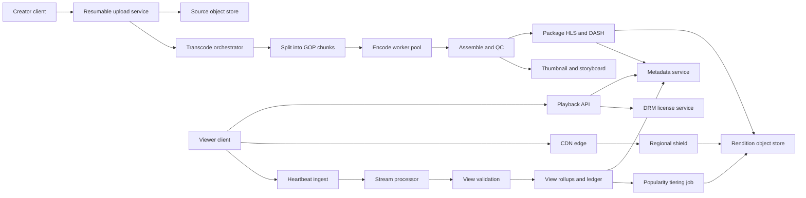
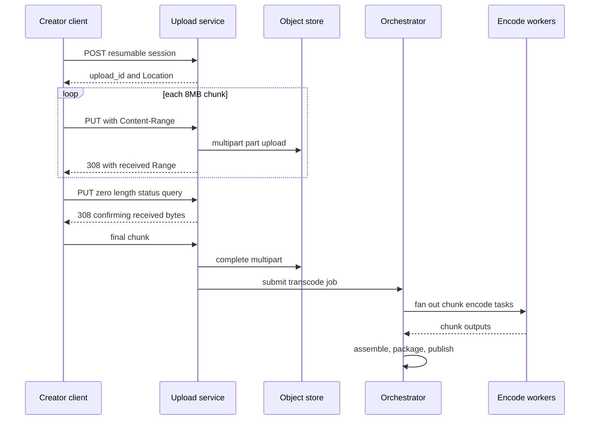
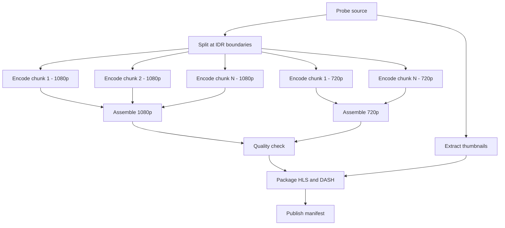
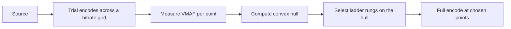
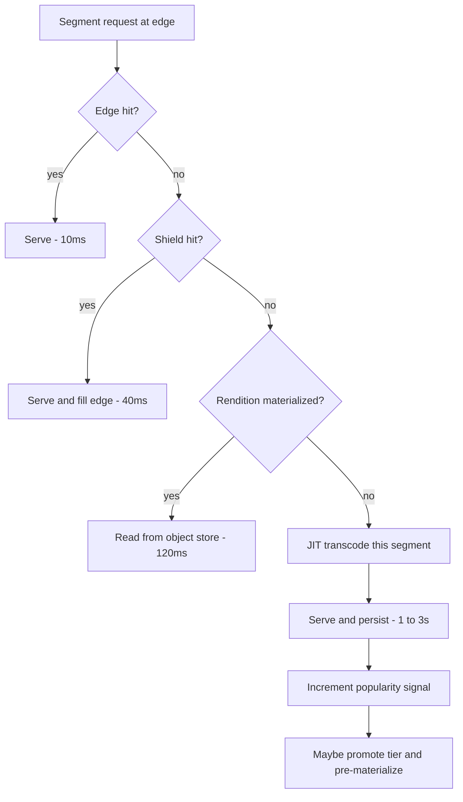
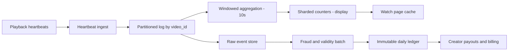

# 15 — YouTube / Video Platform

<span class="pill pill-core">Core</span> <span class="pill pill-hard">Hard</span>

**A video platform is a bandwidth company with a database attached: 100+ Tbps of egress, an exabyte-scale storage tier, and a transcoding fleet large enough to justify designing custom silicon — all governed by a popularity distribution so extreme that 1% of the catalog generates 80% of the traffic and 90% of it is almost never watched but must never be lost.**

| | |
|---|---|
| **Commonly asked at** | Google/YouTube, Meta, TikTok/ByteDance, Amazon (Prime Video), Twitch, Vimeo, Cloudflare, Akamai |
| **Time budget** | 45 min |
| **Core tension** | The head of the distribution wants every rendition pre-encoded and pinned at every edge; the tail wants nothing pre-encoded and nothing cached — and you must serve both from one system without paying head-costs for tail content |
| **Prerequisites** | [F05 CDN & Edge](../fundamentals/f05-cdn-edge.md) · [F15 Object Storage](../fundamentals/f15-object-storage.md) · [F04 Caching](../fundamentals/f04-caching.md) · [F12 Queues & Streams](../fundamentals/f12-queues-streams.md) · [F06 Partitioning & Sharding](../fundamentals/f06-partitioning-sharding.md) · [F24 Capacity Planning](../fundamentals/f24-capacity-planning.md) · [F28 Cost Engineering](../fundamentals/f28-cost-engineering.md) · [F11 Idempotency](../fundamentals/f11-idempotency.md) |

---

## 1. Problem Statement

Design a platform that accepts video uploads from hundreds of millions of creators, transcodes each one into a ladder of renditions and codecs, distributes them globally so that playback starts in under two seconds anywhere, tracks view counts accurately enough to pay creators, and does all of this at a unit cost low enough that advertising revenue covers it.

Four properties make this unlike any other system in this collection:

1. **Bandwidth dominates everything.** Egress is measured in hundreds of Tbps and is both the largest cost line and the hardest capacity constraint. Every caching, tiering, and codec decision is ultimately a bandwidth decision.
2. **The write path is a batch compute job, not a request.** An upload triggers minutes-to-hours of CPU work across a DAG of encoding tasks. This is closer to a data pipeline than to an API.
3. **Popularity is Zipfian and brutal.** The top 1% of videos take 80%+ of views; the bottom 90% average a handful of views per month. Uniform treatment of the catalog is financially impossible.
4. **The read path never touches your servers.** In steady state, 95–99% of bytes are served by a CDN edge. Your origin exists to fill caches, not to serve users.

!!! note "The one number that frames the interview"
    $10^9$ hours watched per day at a blended 2.5 Mbps is roughly **104 Tbps average, ~208 Tbps peak**. Everything downstream — CDN topology, cache hit ratio targets, codec investment, ABR ladder design — is an attempt to make that number smaller or cheaper. Compute it in the first five minutes and refer back to it constantly.

---

## 2. Requirements

### Functional

| # | Requirement |
|---|---|
| F1 | Resumable chunked upload of files up to 256 GB over unreliable networks |
| F2 | Transcode into an ABR ladder across multiple codecs; package as HLS and DASH |
| F3 | Adaptive streaming playback with fast start, seek, and quality switching |
| F4 | Global delivery with sub-2-second startup at p95 |
| F5 | Video metadata: title, description, tags, channel, visibility, monetization state |
| F6 | View counting accurate enough for creator payouts and advertiser billing |
| F7 | Automatic thumbnail generation plus creator-uploaded custom thumbnails and scrub previews |
| F8 | Live streaming with low-latency delivery and automatic VOD archival |
| F9 | DRM and access control for licensed and paid content |
| F10 | Search, recommendations, and channel browse over the catalog |

### Non-functional

| # | Requirement | Target |
|---|---|---|
| N1 | Playback startup latency | p50 < 800 ms, p95 < 2 s |
| N2 | Rebuffer ratio | < 0.4% of playback time |
| N3 | Playback availability | 99.99% of sessions start successfully |
| N4 | Upload durability | 11 nines on the source file; the source is irreplaceable |
| N5 | Time from upload complete to first playable rendition | p50 < 90 s, p95 < 8 min |
| N6 | Metadata read availability | 99.99% |
| N7 | View count for monetization | Exact and auditable, within 24 h |
| N8 | Content retained | Indefinitely while the channel exists |

!!! warning "N4 and N7 are the two 'must be exact' requirements, and they are the only ones"
    Playback can degrade, view counts on the watch page can be approximate, recommendations can be stale. But losing a creator's source file is unrecoverable, and getting the monetized view count wrong is a financial and legal problem. Identify these two early — the rest of the system is allowed to be sloppy in useful ways, and knowing *where* sloppiness is permitted is the senior skill.

---

## 3. Scale Estimation

### Consumption and egress — the dominant number

$$
\text{Watch time} = 10^9\ \text{hours/day} = 10^9 \times 3600 = 3.6\times10^{12}\ \text{seconds/day}
$$

Blended delivered bitrate across the device mix (mobile 360p/480p at 0.4–0.75 Mbps, desktop 1080p at 4.5 Mbps, TV 4K at 18 Mbps):

$$
\bar{b} = 2.5\ \text{Mbps}
$$

$$
\text{Bits/day} = 3.6\times10^{12} \times 2.5\times10^{6} = 9\times10^{18}\ \text{bits/day}
$$

$$
\boxed{\text{Egress}_{\text{avg}} = \frac{9\times10^{18}}{86400} = 1.04\times10^{14}\ \text{bps} = 104\ \text{Tbps}}
$$

$$
\boxed{\text{Egress}_{\text{peak}} \approx 104 \times 2.0 = 208\ \text{Tbps}}
$$

In bytes: $9\times10^{18}/8 = 1.125\times10^{18}$ B $= 1.125$ EB delivered **per day**.

$$
\text{Egress/year} = 1.125 \times 365 \approx 411\ \text{EB/yr}
$$

At a commercial CDN rate of \$0.005/GB (deeply discounted at this volume), that is:

$$
411\times10^{9}\ \text{GB} \times \$0.005 = \$2.06\text{B/yr}
$$

!!! danger "This single number explains why every large video platform builds its own CDN"
    \$2B/yr of commercial CDN spend buys an enormous amount of owned infrastructure: servers in ISP facilities, private backbone, and settlement-free peering. Once egress is measured in hundreds of Tbps, the make-versus-buy calculation stops being close. Peering and embedded caches drive the marginal cost of a delivered byte toward the cost of the hardware and power, which is one to two orders of magnitude below list CDN pricing.

### Ingest volume

$$
\text{Uploads} = 500\ \text{hours/minute} = 500 \times 60 \times 24 = 7.2\times10^{5}\ \text{hours/day}
$$

At an average source bitrate of 8 Mbps (dominated by phone-shot 1080p):

$$
\text{Source bytes/hour} = \frac{8\times10^6 \times 3600}{8} = 3.6\ \text{GB/hour}
$$

$$
S_{\text{source}} = 7.2\times10^5 \times 3.6\ \text{GB} = 2.59\ \text{PB/day}
$$

### ABR ladder storage — computed explicitly

| Rendition | Resolution | Video bitrate | Notes |
|---|---|---|---|
| 144p | 256×144 | 0.08 Mbps | Constrained mobile networks |
| 240p | 426×240 | 0.15 Mbps | |
| 360p | 640×360 | 0.40 Mbps | The global default floor |
| 480p | 854×480 | 0.75 Mbps | |
| 720p | 1280×720 | 2.50 Mbps | |
| 1080p | 1920×1080 | 4.50 Mbps | |
| 1440p | 2560×1440 | 9.00 Mbps | |
| 2160p | 3840×2160 | 18.00 Mbps | |
| Audio | — | 0.19 Mbps | 128k stereo + 64k fallback |

Full ladder to 2160p:

$$
\sum b_i = 0.08+0.15+0.40+0.75+2.50+4.50+9.00+18.00+0.19 = 35.57\ \text{Mbps}
$$

Ladder capped at 1080p: $0.08+0.15+0.40+0.75+2.50+4.50+0.19 = 8.57$ Mbps.
Ladder capped at 720p: $0.08+0.15+0.40+0.75+2.50+0.19 = 4.07$ Mbps.

Catalog mix: 10% reaches 2160p, 30% caps at 1080p, 60% caps at 720p:

$$
\bar{b}_{\text{ladder}} = 0.10(35.57) + 0.30(8.57) + 0.60(4.07) = 3.557 + 2.571 + 2.442 = 8.57\ \text{Mbps}
$$

Now multiply by the codec matrix. H.264 for universal compatibility (factor 1.0), VP9 at ~0.65 of H.264 bitrate for the same quality, AV1 at ~0.50 — but AV1 is only produced for content that earns it:

$$
f_{\text{codec}} = 1.0 + 0.65 + (0.15 \times 0.50) = 1.725
$$

(AV1 on only the 15% of content that accumulates enough views to repay the encode cost.)

$$
\bar{b}_{\text{stored}} = 8.57 \times 1.725 = 14.78\ \text{Mbps}
$$

$$
\text{Encoded bytes/hour} = \frac{14.78\times10^6 \times 3600}{8} = 6.65\ \text{GB/hour}
$$

$$
S_{\text{encoded}} = 7.2\times10^5 \times 6.65\ \text{GB} = 4.79\ \text{PB/day}
$$

$$
\boxed{S_{\text{total}} = 2.59 + 4.79 = 7.38\ \text{PB/day} \Rightarrow 2.69\ \text{EB/yr logical}}
$$

With erasure coding at $1.4\times$:

$$
S_{\text{physical}} \approx 3.77\ \text{EB/yr}
$$

!!! example "The ladder costs 1.85× the source, and the codec matrix nearly doubles it again"
    Encoded output is $4.79/2.59 = 1.85\times$ the source bytes even though every individual rendition is smaller than the source. This is the counter-intuitive result that surprises candidates: *you are storing the same content eight times over*. It is also why just-in-time transcoding for the cold tail (section 7.5) is such a large lever — it removes most of that 1.85× for 90% of the catalog.

### Transcoding compute

Encoding cost, expressed in core-hours per content-hour, summed over the ladder:

| Codec | Core-hours per content-hour (full ladder) | Applied to |
|---|---|---|
| H.264 (x264, fast preset) | 4 | 100% of content |
| VP9 (libvpx) | 12 | 100% of content |
| AV1 (SVT-AV1) | 40 | 15% of content |

$$
C_{\text{blend}} = 4 + 12 + (0.15 \times 40) = 22\ \text{core-hours per content-hour}
$$

$$
\text{Core-hours/day} = 7.2\times10^5 \times 22 = 1.58\times10^{7}
$$

$$
\text{Cores continuously} = \frac{1.58\times10^7}{24} \approx 6.6\times10^{5} = 660{,}000\ \text{cores}
$$

$$
\text{Cost} \approx 6.6\times10^5 \times \$0.02/\text{core-hr} \times 8760 \approx \$116\text{M/yr}
$$

!!! note "660,000 cores is why video platforms build ASICs"
    Google's Argos video coding units exist precisely because this number crossed the threshold where custom silicon pays back. A hardware transcoder delivers roughly an order of magnitude better performance per TCO than software encoding on general-purpose cores. In an interview, arriving at "660k cores continuously" and then saying "at this point you evaluate dedicated encoding hardware" is a strong, concrete demonstration that you followed the arithmetic to its conclusion.

### Views and counter QPS

Average video length ~6 minutes = 0.1 hour:

$$
\text{Views/day} = \frac{10^9\ \text{hours}}{0.1} = 10^{10}\ \text{views/day}
$$

$$
\text{QPS}_{\text{view,avg}} = \frac{10^{10}}{86400} \approx 1.16\times10^{5}/\text{s},\qquad \text{peak} \approx 2.3\times10^{5}/\text{s}
$$

A single video going viral can take 10M views in an hour:

$$
\frac{10^7}{3600} \approx 2{,}800\ \text{increments/s on one key}
$$

which is far beyond what a single row or single Redis key can sustain — the write-hot-counter problem of section 7.6.

### CDN economics

$$
\text{Origin egress} = \text{Total} \times (1-h)
$$

| Hit ratio $h$ | Origin egress (avg) | Origin egress (peak) |
|---|---|---|
| 90% | 10.4 Tbps | 20.8 Tbps |
| 95% | 5.2 Tbps | 10.4 Tbps |
| 99% | 1.04 Tbps | 2.08 Tbps |
| 99.5% | 0.52 Tbps | 1.04 Tbps |

Moving from 95% to 99% halves the origin fleet twice over. Because origin egress is expensive (cross-region transit, origin storage IOPS) and edge egress is cheap (peered), **cache hit ratio is the highest-leverage cost metric in the system.** See [F05](../fundamentals/f05-cdn-edge.md).

---

## 4. API Design

### Resumable upload

```http
POST /upload/v1/videos?uploadType=resumable HTTP/1.1
Content-Type: application/json
X-Upload-Content-Type: video/mp4
X-Upload-Content-Length: 8589934592

{"title":"Trip to Ladakh","channelId":"c_9917","visibility":"private"}
```

```http
200 OK
Location: https://upload.example.com/upload/v1/videos?upload_id=AEnB2Ur7...
```

```http
PUT /upload/v1/videos?upload_id=AEnB2Ur7... HTTP/1.1
Content-Length: 8388608
Content-Range: bytes 0-8388607/8589934592
```

```http
308 Resume Incomplete
Range: bytes=0-8388607
```

```http
PUT /upload/v1/videos?upload_id=AEnB2Ur7... HTTP/1.1
Content-Length: 0
Content-Range: bytes */8589934592
```

```http
308 Resume Incomplete
Range: bytes=0-411041791
```

The zero-length `PUT` with `Content-Range: bytes *​/total` is the **status query**: after a network failure, the client asks the server how much it actually received rather than guessing. This is the entire resumability protocol in one request, and candidates who describe upload without it have not thought about mobile networks.

### Playback

```http
GET /v1/videos/dQw4w9/playback?deviceClass=tv&drm=widevine&maxHeight=2160
200 OK
{
  "manifests": {
    "hls":  "https://cdn.example.com/v/dQw4w9/master.m3u8?tk=...",
    "dash": "https://cdn.example.com/v/dQw4w9/manifest.mpd?tk=..."
  },
  "drm": {"licenseUrl":"https://lic.example.com/widevine","token":"eyJhbGci..."},
  "cdnHints": [{"host":"edge-blr1.cdn.example.com","weight":80},
               {"host":"edge-blr2.cdn.example.com","weight":20}],
  "sessionId": "ps_01JA1...",
  "storyboard": "https://cdn.example.com/v/dQw4w9/sb.vtt"
}
```

```http
POST /v1/playback/heartbeat
{ "sessionId":"ps_01JA1...", "positionMs": 184000, "watchedMs": 30000,
  "bitrateBps": 2500000, "rebufferMs": 0, "droppedFrames": 2 }
204 No Content
```

| Design choice | Why |
|---|---|
| Manifest served from CDN with a signed token, not from origin | The manifest is requested once per session — $10^{10}$/day. It must be cacheable and must not touch a stateful service |
| CDN hints returned as weighted candidates | Lets the control plane steer traffic without DNS changes; the client fails over locally in milliseconds instead of waiting for a TTL |
| Heartbeat carries QoE telemetry, not just position | Rebuffer and bitrate data must come from the client; the server cannot observe playback quality any other way |
| View counting driven by heartbeat, not manifest fetch | A manifest fetch is not a view. Watch duration is the only defensible definition |

---

## 5. Data Model

```sql
CREATE TABLE video (
    video_id        TEXT PRIMARY KEY,           -- base62 of a snowflake-style id
    channel_id      BIGINT      NOT NULL,
    title           TEXT        NOT NULL,
    description     TEXT,
    duration_ms     BIGINT,
    visibility      SMALLINT    NOT NULL,       -- 0 private 1 unlisted 2 public
    state           SMALLINT    NOT NULL,       -- 0 uploading 1 processing 2 ready 3 failed
    uploaded_at     TIMESTAMPTZ NOT NULL,
    published_at    TIMESTAMPTZ,
    source_blob     TEXT,                       -- object key of the mezzanine
    source_sha256   BYTEA,
    popularity_tier SMALLINT    NOT NULL DEFAULT 3,  -- 0 hot 1 warm 2 cool 3 cold
    monetized       BOOLEAN     NOT NULL DEFAULT FALSE,
    drm_required    BOOLEAN     NOT NULL DEFAULT FALSE
);
CREATE INDEX video_by_channel ON video (channel_id, published_at DESC);
CREATE INDEX video_by_tier    ON video (popularity_tier, published_at DESC);

CREATE TABLE rendition (
    video_id       TEXT     NOT NULL REFERENCES video(video_id),
    codec          TEXT     NOT NULL,           -- 'avc1' | 'vp09' | 'av01'
    height         INT      NOT NULL,
    bitrate_bps    INT      NOT NULL,
    frame_rate     REAL     NOT NULL,
    segment_count  INT      NOT NULL,
    total_bytes    BIGINT   NOT NULL,
    storage_class  SMALLINT NOT NULL,           -- 0 hot 1 warm 2 archive 3 not-materialized
    manifest_key   TEXT     NOT NULL,
    materialized_at TIMESTAMPTZ,                -- NULL means JIT-transcode on demand
    PRIMARY KEY (video_id, codec, height)
);

-- Transcode DAG state. One row per task; tasks reference their dependencies.
CREATE TABLE transcode_task (
    job_id        UUID     NOT NULL,
    task_id       UUID     PRIMARY KEY,
    video_id      TEXT     NOT NULL,
    kind          SMALLINT NOT NULL,   -- 0 probe 1 split 2 encode 3 assemble 4 package 5 thumb
    chunk_index   INT,
    codec         TEXT,
    height        INT,
    depends_on    UUID[]   NOT NULL DEFAULT '{}',
    state         SMALLINT NOT NULL,   -- 0 pending 1 running 2 done 3 failed
    attempt       SMALLINT NOT NULL DEFAULT 0,
    lease_expires TIMESTAMPTZ,
    output_key    TEXT,
    worker_class  TEXT     NOT NULL    -- 'cpu-hi' | 'cpu-lo' | 'vcu' | 'gpu'
);
CREATE INDEX tt_ready ON transcode_task (worker_class, state) WHERE state = 0;
CREATE INDEX tt_job   ON transcode_task (job_id, state);

-- View counting: sharded counters for display, plus an auditable ledger for money.
CREATE TABLE view_counter_shard (
    video_id  TEXT     NOT NULL,
    shard     SMALLINT NOT NULL,        -- 0..255, chosen by hash(session_id)
    count     BIGINT   NOT NULL DEFAULT 0,
    PRIMARY KEY (video_id, shard)
);

CREATE TABLE view_rollup (
    video_id     TEXT        NOT NULL,
    bucket_start TIMESTAMPTZ NOT NULL,  -- 1-minute buckets from the stream processor
    raw_views    BIGINT      NOT NULL,
    valid_views  BIGINT      NOT NULL,  -- after fraud filtering, may lag by hours
    watch_ms     BIGINT      NOT NULL,
    PRIMARY KEY (video_id, bucket_start)
);

CREATE TABLE monetized_view_ledger (
    ledger_id    BIGINT PRIMARY KEY,
    video_id     TEXT        NOT NULL,
    day          DATE        NOT NULL,
    valid_views  BIGINT      NOT NULL,
    computed_at  TIMESTAMPTZ NOT NULL,
    pipeline_ver TEXT        NOT NULL,
    immutable    BOOLEAN     NOT NULL DEFAULT TRUE
);
```

| Modelling decision | Chosen | Rejected | Why |
|---|---|---|---|
| Rendition existence | Row with `materialized_at` nullable | Row only when the file exists | The manifest must be able to advertise a rendition that will be produced on first request; nullable materialization expresses "known but not built" |
| DAG state | Rows with `depends_on` arrays | External workflow engine only | You want the task graph queryable in SQL for debugging a stuck job at 3 a.m. The engine drives it; the table is the source of truth |
| View counting | Two paths: sharded approximate + batch-exact ledger | One exact counter | An exact counter cannot absorb 2,800 writes/s on a hot key; an approximate one cannot pay creators. You need both, and saying so is the point |
| Popularity tier | Denormalized column, recomputed hourly | Compute from view history at read time | Tier drives storage class and CDN pre-positioning; it must be a cheap lookup |
| Video ID | Opaque base62 of a time-ordered ID | Auto-increment | Sequential IDs leak upload volume and enable enumeration of private videos |

---

## 6. High-Level Architecture



### Write path

1. Client obtains a resumable upload session; bytes stream in 8 MB chunks directly to the upload service, which writes through to the source object store as a multipart upload.
2. On completion the service verifies the SHA-256, marks the video `processing`, and submits a transcode job.
3. The orchestrator probes the file (codec, resolution, frame rate, HDR metadata, audio layout), then materializes a task DAG.
4. Split, parallel encode, assemble, package, thumbnail — see 7.2.
5. As soon as the *lowest* rendition is packaged, the video flips to `ready` and becomes playable; higher renditions are added to the manifest as they complete.
6. Metadata is published; the video enters the tiering system at the cold tier and is promoted as views arrive.

### Read path

1. Client calls the playback API, receives manifest URLs, DRM token, and CDN hints.
2. Client fetches the master manifest from the edge (cache hit, ~10 ms).
3. Client picks a starting rendition from its bandwidth estimate, fetches the media playlist and the init segment, then segments.
4. ABR logic adjusts rendition per segment based on measured throughput and buffer level.
5. Heartbeats stream QoE telemetry and drive view counting.



---

## 7. Deep Dives

### 7.1 Resumable chunked upload

The requirements are unglamorous and unforgiving: a creator on a hotel wifi uploading a 40 GB file must be able to lose the connection twenty times and still finish.

| Property | Implementation |
|---|---|
| Resumability | Server tracks received byte ranges per `upload_id`; a status query returns the committed offset |
| Idempotency | A re-`PUT` of an already-received range is acknowledged, not appended. Ranges are absolute, never relative |
| Integrity | Per-chunk CRC32C checked on arrival; whole-file SHA-256 verified before accepting |
| Parallelism | Multipart object upload allows out-of-order parts; the ordering constraint is only at completion |
| Session lifetime | 7 days, then garbage collected. Long enough for a genuinely bad connection, short enough to bound storage |
| Backpressure | Per-channel concurrent upload limits, since a single creator can otherwise saturate an ingest PoP |

!!! gotcha "Resuming from a client-tracked offset instead of a server-confirmed one"
    **Symptom:** rare, silent file corruption — the transcode fails with a decode error, or worse, produces a video with a glitch in the middle. **Mechanism:** the client believed a chunk was delivered because the socket write succeeded, but the server never committed it; on resume, the client continued past the gap. **Mitigation:** resume *only* from the server-reported `Range`, never from client state, and make the status query mandatory after any error. The whole-file hash check at completion is the backstop that turns silent corruption into a loud failure.

### 7.2 Transcoding as a DAG

A single upload becomes a directed acyclic graph of tasks. The critical design decision is **splitting the source into independently encodable chunks** so that a 3-hour video does not take 3 hours of wall clock on one core.



**Chunk sizing** is a trade-off:

$$
T_{\text{wall}} \approx \frac{N_{\text{chunks}} \cdot t_{\text{chunk}}}{\min(N_{\text{chunks}}, W)} + t_{\text{fixed}}
$$

Smaller chunks parallelize better but hurt compression (each chunk starts with an IDR frame, which is expensive, and rate control cannot see across the boundary) and increase scheduling overhead. Typical chunk length is 10–60 seconds, always cut at a source IDR boundary.

**Two constraints that cannot be violated:**

1. **Every rendition must have IDR frames at the same presentation timestamps.** ABR switching works by the player fetching segment $n$ from a different rendition; if the renditions are not aligned, the switch produces a visible glitch or an outright decode failure. Force keyframes at fixed intervals with `-force_key_frames expr:gte(t,n_forced*4)` and align chunk boundaries to that grid.
2. **Rate control must be coordinated across chunks.** Independent per-chunk encoding produces visible quality pulsing at boundaries as each chunk's rate controller independently converges. The fix is to run a cheap first pass over the whole file, distribute the complexity statistics to the chunk encoders, and use a global target with per-chunk CRF adjustments.

```yaml
transcode_job:
  chunking:
    target_seconds: 20
    align_to: source_idr
    keyframe_interval_seconds: 4       # must match segment duration
  rate_control:
    mode: capped_crf                    # per-title CRF with a bitrate ceiling
    first_pass: complexity_only         # shared across all chunk workers
  worker_classes:
    - {name: vcu,     codecs: [avc1, vp09], priority: 1}
    - {name: cpu-hi,  codecs: [av01],       priority: 2}
    - {name: cpu-lo,  codecs: [avc1],       priority: 3, preemptible: true}
  failure_policy:
    chunk_retries: 3
    fallback: {preset: faster, worker_class: cpu-hi}
    partial_publish: lowest_rendition_first
```

**Orchestration.** Tasks are leased, not assigned. A worker that dies mid-chunk loses at most one chunk's work, and the lease expiry returns it to the queue. Because chunk encoding is deterministic and idempotent (same input, same parameters, same output), duplicate execution is harmless — which means at-least-once delivery is sufficient and you never need distributed transactions here. See [F11](../fundamentals/f11-idempotency.md).

**Priority.** Not all uploads deserve equal latency. A large channel's premiere is time-critical; a first upload from a new account is not. Priority classes with reserved capacity prevent a bulk-upload bot from delaying everyone, and preemptible workers on the low-priority tier cut cost substantially.

!!! gotcha "Chunked parallel encoding produces visible pulsing at chunk boundaries"
    **Symptom:** viewers report the video "breathing" — quality visibly improving and degrading on a regular cycle. **Mechanism:** each chunk was encoded with an independent rate controller that ramps in over its first second. **Mitigation:** shared complexity statistics from a global first pass, plus overlapping look-ahead where each chunk encoder is given a few seconds of the preceding chunk as context and discards those frames from its output. Verify with an automated VMAF-per-second check in the QC stage: a sawtooth pattern in per-second VMAF is the fingerprint of this bug.

### 7.3 Per-title and per-scene encoding

A fixed bitrate ladder is wrong for almost every video. An animated talking-head at 1080p looks perfect at 1.2 Mbps; a 60 fps handheld shot of foliage needs 8 Mbps for the same perceptual quality. A fixed ladder wastes bytes on the former and delivers bad quality for the latter.

**Per-title encoding** runs a set of trial encodes at various resolution/bitrate points, measures quality (VMAF), and computes the *convex hull* of the quality-versus-bitrate curve. The ladder is then chosen as points on that hull.



| Approach | Bitrate saving at equal VMAF | Extra encode cost | Verdict |
|---|---|---|---|
| Fixed ladder | baseline | 0 | Baseline; still correct for the cold tail |
| Per-title (one hull per video) | 15–30% | ~1.5× (trial encodes) | **Chosen for warm and hot tiers** |
| Per-shot / per-scene (hull per shot) | 25–40% | ~3× | **Chosen for the hot tier only**, where delivery savings dwarf encode cost |

The break-even is straightforward. Extra encode cost is paid once; bandwidth savings scale with views:

$$
V_{\text{breakeven}} = \frac{\Delta C_{\text{encode}}}{\bar{b} \cdot t_{\text{watch}} \cdot c_{\text{egress}}}
$$

For a 6-minute video, ~\$0.30 of extra encode, and \$0.005/GB egress at 2.5 Mbps:

$$
\text{bytes per view} = \frac{2.5\times10^6 \times 360}{8} = 112.5\ \text{MB} \Rightarrow \text{saving at 25\%} = 28\ \text{MB} = \$0.00014
$$

$$
V_{\text{breakeven}} = \frac{0.30}{0.00014} \approx 2{,}100\ \text{views}
$$

!!! tip "The break-even view count is the entire tiering policy in one number"
    Roughly 2,000 views justifies per-title encoding; per-shot needs closer to 6,000; AV1 needs tens of thousands because its encode cost is 10× H.264. Since the view distribution is Zipfian, the vast majority of the catalog never reaches any of these thresholds — so the right architecture **encodes cheaply by default and re-encodes better as content proves itself.** This is the single most elegant idea in the design, and it maps directly onto the popularity tiers.

### 7.4 ABR ladder, HLS/DASH packaging, and manifests

**Master playlist (HLS):**

```text
#EXTM3U
#EXT-X-VERSION:7
#EXT-X-INDEPENDENT-SEGMENTS

#EXT-X-MEDIA:TYPE=AUDIO,GROUP-ID="aac-128k",NAME="English",LANGUAGE="en",DEFAULT=YES,AUTOSELECT=YES,CHANNELS="2",URI="a/en-128k/index.m3u8"
#EXT-X-MEDIA:TYPE=SUBTITLES,GROUP-ID="subs",NAME="English",LANGUAGE="en",AUTOSELECT=YES,FORCED=NO,URI="s/en/index.m3u8"

#EXT-X-STREAM-INF:BANDWIDTH=592000,AVERAGE-BANDWIDTH=530000,CODECS="avc1.42c01e,mp4a.40.2",RESOLUTION=640x360,FRAME-RATE=30.000,AUDIO="aac-128k",SUBTITLES="subs"
v/avc1-360p/index.m3u8

#EXT-X-STREAM-INF:BANDWIDTH=2820000,AVERAGE-BANDWIDTH=2690000,CODECS="avc1.4d401f,mp4a.40.2",RESOLUTION=1280x720,FRAME-RATE=30.000,AUDIO="aac-128k",SUBTITLES="subs"
v/avc1-720p/index.m3u8

#EXT-X-STREAM-INF:BANDWIDTH=4890000,AVERAGE-BANDWIDTH=4690000,CODECS="avc1.640028,mp4a.40.2",RESOLUTION=1920x1080,FRAME-RATE=30.000,AUDIO="aac-128k",SUBTITLES="subs"
v/avc1-1080p/index.m3u8

#EXT-X-STREAM-INF:BANDWIDTH=3120000,AVERAGE-BANDWIDTH=2960000,CODECS="av01.0.08M.08,mp4a.40.2",RESOLUTION=1920x1080,FRAME-RATE=30.000,AUDIO="aac-128k",SUBTITLES="subs"
v/av01-1080p/index.m3u8

#EXT-X-I-FRAME-STREAM-INF:BANDWIDTH=180000,CODECS="avc1.42c01e",RESOLUTION=640x360,URI="v/avc1-360p/iframe.m3u8"
```

**Media playlist (VOD, CMAF fMP4 segments):**

```text
#EXTM3U
#EXT-X-VERSION:7
#EXT-X-TARGETDURATION:4
#EXT-X-MEDIA-SEQUENCE:0
#EXT-X-PLAYLIST-TYPE:VOD
#EXT-X-MAP:URI="init.mp4"
#EXT-X-KEY:METHOD=SAMPLE-AES-CTR,KEYFORMAT="urn:uuid:edef8ba9-79d6-4ace-a3c8-27dcd51d21ed",KEYFORMATVERSIONS="1",URI="data:text/plain;base64,AAAAY3Bzc2gAAAAA7e..."
#EXTINF:4.00000,
seg-00000.m4s
#EXTINF:4.00000,
seg-00001.m4s
#EXTINF:4.00000,
seg-00002.m4s
#EXTINF:2.53333,
seg-00003.m4s
#EXT-X-ENDLIST
```

| Manifest design decision | Rationale |
|---|---|
| CMAF fMP4 segments shared between HLS and DASH | One set of media files, two manifests. Halves storage versus separate TS-for-HLS and MP4-for-DASH |
| 4-second segments | Trade-off: shorter segments mean faster ABR adaptation and lower live latency but more requests and worse compression. 2–6 s is the practical band; 4 s is the common default for VOD |
| `AVERAGE-BANDWIDTH` in addition to `BANDWIDTH` | `BANDWIDTH` is the peak; players that only use peak over-estimate and select too low a rendition |
| I-frame playlist | Enables trick-play (scrubbing thumbnails and fast-forward) without downloading full segments |
| Separate audio group | Avoids re-downloading audio when switching video rendition — a significant bandwidth saving on unstable networks |
| Manifest is a static file on the CDN | $10^{10}$ manifest fetches per day cannot touch a dynamic service |

!!! gotcha "The manifest is cached but the segments were replaced"
    **Symptom:** playback fails with 404s on segment fetches for a subset of users, minutes after a re-encode. **Mechanism:** the manifest was cached at the edge with a long TTL, the underlying segments were regenerated with different names or durations, and cached manifests now point at objects that no longer exist. **Mitigation:** never mutate a published rendition in place. New encodes get a new version path, and the master manifest — the only mutable object — carries a short TTL (30–60 s) while segments and media playlists are immutable with a one-year TTL. Immutability at the leaf and mutability only at the root is the general pattern for cacheable content graphs.

### 7.5 CDN strategy, hit ratio economics, and the cold tail

The popularity distribution drives everything:

| Tier | Share of catalog | Share of views | Storage policy | CDN policy |
|---|---|---|---|---|
| Hot | 0.1% | ~55% | All renditions, all codecs, SSD | Pre-positioned at every edge; pinned |
| Warm | 2% | ~30% | Full ladder, HDD | Cached on demand, long TTL, shield-backed |
| Cool | 8% | ~12% | Reduced ladder (no 1440p/2160p, no AV1) | Cached on demand, short TTL |
| Cold | ~90% | ~3% | Source + 360p + 720p only; higher renditions JIT | Not pre-positioned; may miss to origin every time |

**The cold tail problem.** 90% of the catalog is essentially never watched, but:

- It cannot be deleted (creator content, indefinite retention).
- It must play correctly and reasonably quickly when someone does watch it.
- Every byte of the full ladder stored for it is pure waste.

The resolution is **just-in-time transcoding**: for cold content, materialize only the low renditions. If someone requests 1080p, the origin transcodes that rendition on demand (from the source or from a higher-quality intermediate), serves it, and caches it. The first viewer pays a few seconds of extra startup latency; subsequent viewers hit cache.

$$
\text{Storage saved} = 0.90 \times \left(1 - \frac{b_{360}+b_{720}+b_{\text{audio}}}{\bar{b}_{\text{stored}}}\right) = 0.90 \times \left(1 - \frac{3.09}{14.78}\right) \approx 0.71
$$

**A 71% reduction in encoded storage** — roughly 3.4 PB/day, or 1.24 EB/yr. That is the single largest storage lever in the design.



!!! gotcha "Just-in-time transcoding turns a cold-content view spike into a self-inflicted outage"
    **Symptom:** an old video is linked from a major news site; the JIT transcode fleet saturates and playback fails for *everyone*, not just for that video. **Mechanism:** thousands of concurrent viewers all miss on the same unmaterialized rendition, and each miss creates a transcode task — a classic cache stampede with an extremely expensive fill. **Mitigation:** request coalescing at the shield so only one transcode runs per `(video, rendition, segment)`, a bounded JIT worker pool isolated from the main transcode fleet ([bulkheading](../fundamentals/f18-resilience-patterns.md)), and an immediate tier-promotion trigger on the first burst so the full ladder is materialized in the background while the low rendition serves the surge. When the JIT pool is saturated, degrade by serving a lower rendition rather than failing.

**Tiered caching.** With $N$ edge PoPs, a cold object missing at every edge causes $N$ origin fetches. A regional shield collapses this:

$$
\text{Effective offload} = 1 - (1-h_{\text{edge}})(1-h_{\text{shield}})
$$

At $h_{\text{edge}}=0.95$ and $h_{\text{shield}}=0.70$: $1 - 0.05 \times 0.30 = 0.985$. The shield is what makes the long tail survivable.

### 7.6 View counting — the write-hot-counter problem

Three requirements that pull in opposite directions:

1. The watch page must show a count that updates quickly (users notice staleness).
2. A viral video generates 2,800 increments/second on **one key**.
3. Creator payouts and advertiser billing require an exact, auditable, fraud-filtered number.

The resolution is two entirely separate paths.



**Display path.** Heartbeats land in a partitioned log keyed by `video_id`; a stream processor aggregates in 10-second tumbling windows and writes a delta. Two mechanisms handle the hot key:

- **Counter sharding**: `view_counter_shard(video_id, shard)` with `shard = hash(session_id) % 256`. Reads sum 256 rows, which is one range scan. Writes spread across 256 keys, reducing 2,800/s on a single key to 11/s per key.
- **Pre-aggregation in the stream processor**: 2,800 events/s over a 10-second window becomes one write of `+28000`. This alone reduces the write rate by $10^3$; sharding is the belt-and-braces for the case where a single window is still too hot.

Reads are served from a cache with a 10–30 second TTL, and the displayed number is deliberately rounded above a threshold (`1.2M views`) so that staleness is invisible.

**Money path.** Raw heartbeat events are retained and processed in daily batches:

| Validity rule | Purpose |
|---|---|
| Minimum watched duration (e.g. 30 s or 50% of a short video) | A page load is not a view |
| One valid view per `(user or device, video)` per rolling window | Refresh loops and autoplay reloads |
| Session must have a valid signed playback token | Prevents synthetic heartbeats from a script |
| Heartbeat cadence must be plausible | Real playback emits at a regular interval; bots emit bursts |
| IP, ASN, and device reputation | Datacenter ASNs, known bot fleets, view farms |
| Behavioural clustering | Thousands of "viewers" with identical watch curves is not a coincidence |

The output is written to `monetized_view_ledger` as an immutable daily row with the pipeline version. Restating a day requires a new row and an explicit adjustment record — you never overwrite a number that money was paid against.

!!! gotcha "The display counter and the ledger diverge, and creators notice"
    **Symptom:** a creator's dashboard shows 1.2M views while the public page shows 1.35M, and they file a complaint. **Mechanism:** these are two different numbers by design — one is raw and fast, one is fraud-filtered and slow — but nobody told the creator. **Mitigation:** this is a product problem with an architectural cause. Label them distinctly ("views" vs "monetized views"), publish the definitional difference, and make the display counter *converge* to the validated number once the batch completes rather than remaining permanently higher. A silently-diverging pair of counters is a permanent support burden.

### 7.7 Thumbnails, storyboards, live, and DRM

**Thumbnails.** Extract candidate frames (avoiding black frames, transitions, and near-duplicates), score them with a quality/attractiveness model, generate three or four sizes in AVIF and WebP with JPEG fallback, and serve from the CDN. Thumbnails are requested far more often than videos are played — a feed of 40 videos is 40 thumbnail fetches and zero video fetches — so thumbnail delivery is a meaningful share of total request volume even though it is a trivial share of bytes.

**Storyboards** (scrub previews) are sprite sheets: a grid of small frames sampled every few seconds, plus a WebVTT file mapping timestamps to sprite coordinates. One or two HTTP requests give the player the entire scrub preview for a video.

**Live versus VOD.**

| Dimension | VOD | Live |
|---|---|---|
| Transcode parallelism | Split across time; embarrassingly parallel | **Cannot split across time.** Parallelism only across renditions; each must run faster than realtime |
| Failure handling | Retry the chunk | No retry — the moment is gone. Redundant parallel encoders with automatic failover |
| Manifest | Static, `EXT-X-ENDLIST` | Rolling window, no endlist, updated every segment; short TTL, high request rate |
| Latency target | Startup latency only | End-to-end glass-to-glass; LL-HLS with partial segments gets to 2–5 s |
| Segment duration | 4 s | 1–2 s, with 200–500 ms parts for LL-HLS |
| CDN behaviour | Cache-friendly, immutable segments | Manifest requests dominate; blocking playlist reload is essential to avoid polling storms |
| Archival | N/A | The VOD artifact is a separate item requiring its own transcode and its own moderation pass |

**DRM.** Three ecosystems (Widevine, PlayReady, FairPlay) with three key systems but, thanks to CMAF `cbcs` common encryption, **one set of encrypted media files**. Package once, generate three PSSH boxes, and let the client request a license from the appropriate service.

| Layer | Mechanism |
|---|---|
| Content encryption | CENC `cbcs` on CMAF segments; one content key per rendition group |
| Key delivery | License server validates an entitlement token, returns a key wrapped for the device CDM |
| Robustness | HDCP level required for high renditions; L1/L3 Widevine level gates 4K |
| Key rotation | Periodic rotation for live; per-title keys for VOD |
| URL protection | Signed, short-lived, IP- and path-scoped tokens on segment URLs, independent of DRM |

!!! warning "DRM protects the content; token signing protects the bandwidth"
    These are different threats. DRM stops a viewer from extracting a decrypted file. Signed URLs stop someone hotlinking your segments from a third-party site and making you pay for their bandwidth. A system with DRM and unsigned URLs can be bandwidth-leeched at scale; a system with signed URLs and no DRM satisfies most non-licensed content just fine. Know which problem you are solving. See [F27](../fundamentals/f27-security-design.md).

---

## 8. Scaling the Bottleneck

| Rank | Bottleneck | Binding constraint | Scaling move |
|---|---|---|---|
| 1 | **Egress bandwidth** | 208 Tbps peak; physical fiber and peering capacity | Own the CDN; embed caches in ISPs; peer settlement-free; better codecs (AV1 saves 30–50% of bytes on the hot tier); per-title encoding |
| 2 | **Cache hit ratio** | Every point below 99% multiplies origin load | Shield tiering; consistent hashing at the edge so the same object lands on the same cache node; segment-level cache keys; pre-positioning for the hot tier |
| 3 | **Encoded storage** | 2.7 EB/yr logical growth | JIT transcoding for the cold tail (71% reduction); reduced ladders by tier; codec pruning for old content |
| 4 | **Transcode compute** | 660k cores continuously | Hardware encoders; preemptible capacity for low-priority jobs; encode cheaply first and upgrade on demand |
| 5 | **View counter writes** | 2,800/s on a single key during virality | Stream pre-aggregation then counter sharding |
| 6 | **Metadata reads** | $10^{10}$ watch-page loads/day | Aggressive read-through cache; the watch page is 99% cacheable except for the counter |

!!! note "The scaling story is 'move work to where bandwidth is free'"
    A byte served from a cache inside an ISP costs you the amortized hardware and power. The same byte served from a cloud region costs 10–100× more and consumes transit capacity you have to buy. Every architectural move — shields, pre-positioning, better codecs, JIT for the tail — is a variation on getting bytes closer to users or making there be fewer of them.

---

## 9. Failure Modes

| Failure | Blast radius | Detection | Mitigation | Degraded behaviour |
|---|---|---|---|---|
| CDN PoP fails | All viewers homed to that PoP | Per-PoP error rate and throughput; synthetic playback probes | Client-side failover via `cdnHints`; BGP/anycast withdrawal; DNS as a slower backstop | Sub-second re-request to an alternate edge; a brief rebuffer at worst |
| Origin object store degraded in one region | Cache misses fail | Origin 5xx rate; shield fill failure | Cross-region replication of hot and warm tiers; shield retries to a secondary origin | Cold content unavailable; hot content unaffected because it is already at the edge |
| Transcode fleet loses capacity | New uploads queue | Job queue depth, oldest-job age | Priority classes; preemptible capacity; degrade to a shorter ladder | New uploads playable late; existing content unaffected |
| JIT transcode stampede on a viral cold video | Can starve the whole JIT pool | JIT queue depth; per-video miss rate | Request coalescing; bounded isolated pool; immediate tier promotion | Serve a lower rendition instead of failing |
| Manifest service or playback API down | No new playback sessions start | Session start rate vs baseline | Manifests are static on the CDN; cache the playback API response client-side; long-lived tokens | **Sessions already playing continue**; new sessions fail unless a cached manifest exists |
| DRM license service down | All protected content | License request error rate | Multi-region license service; client caches licenses for the session duration | In-progress playback continues until the license expires; new starts fail |
| View counting pipeline stalls | Counts freeze | Consumer lag on the heartbeat log | Log retention long enough to replay; idempotent aggregation keyed by session and window | Counts stale, then catch up. **Never double-count on replay** — this is why aggregation must be idempotent |
| Upload service loses a partial upload | One creator's in-flight upload | Upload completion rate | Server-confirmed ranges; 7-day session retention | Client resumes; no data loss |
| A bad encode ships (wrong colour space, wrong aspect) | Every viewer of that video | Automated QC: VMAF floor, colour metadata check, aspect ratio check | Block publish on QC failure; re-encode | Video stays in `processing` rather than publishing broken |
| Popularity tiering job fails | Storage and CDN policy stops adapting | Job success; tier distribution drift | Last-known-good tiers persist | Cost drifts up slowly; no user impact — a good example of a failure that should not page |
| Segment cache key collision after a re-encode | Wrong or missing video content | 404 rate on segments; user reports | Version paths; immutable segments; short-TTL master manifest only | Covered in 7.4 |

---

## 10. SRE Lens

### SLIs and SLOs

| SLI | Definition | SLO |
|---|---|---|
| Playback start success | Sessions where the first frame renders | 99.95% |
| Startup latency | Play click → first frame | p50 < 800 ms, p95 < 2 s |
| **Rebuffer ratio** | $\dfrac{\text{rebuffer ms}}{\text{rebuffer ms} + \text{playing ms}}$ | < 0.4% |
| Average delivered bitrate | Bytes ÷ playing seconds, per device class | ≥ 80% of the device's ladder ceiling at p50 |
| Manifest availability | Non-error manifest fetches | 99.99% |
| Upload success | Sessions completing without user-visible failure | 99.9% |
| Time to first playable rendition | Upload complete → `state = ready` | p50 < 90 s, p95 < 8 min |
| View ledger accuracy | Ledger vs a manually-audited sample | > 99.9% agreement |
| Cache hit ratio (byte) | Edge-served bytes ÷ total | > 98% |

$$
\text{Error budget at } 99.95\% = 0.0005 \times 30 \times 24 \times 60 \approx 21.6\ \text{min per 30 days}
$$

!!! tip "Rebuffer ratio is the SLI that correlates with the business"
    Startup latency and rebuffer ratio both predict session abandonment, but rebuffer ratio predicts it most strongly and is the one users describe in their own words. Measure it client-side, aggregate by ISP, device class, region, and CDN node, and alert on *slices* — a 0.4% global rebuffer ratio can hide a 12% rebuffer ratio on one ISP, and that ISP's users are churning. See [F23](../fundamentals/f23-slo-error-budgets.md).

### Rollout plan

Encoder and player changes are the risky ones because they degrade quality silently.

1. **Encoder changes**: run on a fixed corpus offline, compare VMAF/PSNR/SSIM per title and per shot, and reject on any regression at the low end of the distribution — the mean is useless here.
2. **Shadow encode** in production: encode a sample of real uploads with both versions, compare, do not publish the new one.
3. **Player/ABR changes**: A/B test with QoE metrics as the success criteria, not engagement. A player that aggressively picks high bitrates looks great on "average bitrate" and terrible on rebuffer ratio.
4. **Canary by CDN PoP**, not by user, for delivery changes — this isolates blast radius geographically and makes rollback a routing change.
5. **Never deploy encoder or player changes during a major live event.** Freeze windows are a real and correct practice. See [F25](../fundamentals/f25-deployment-release-safety.md).

### Runbook notes

```bash
# Rebuffer spike: is it us, a CDN, or an ISP?
$ qoe slice --metric=rebuffer_ratio --window=15m --by=cdn_pop,isp,device
cdn_pop=blr1  isp=AS9498  device=android  rebuffer=0.121  sessions=884k   # PROBLEM
cdn_pop=blr1  isp=AS55836 device=android  rebuffer=0.004  sessions=1.2M   # fine
# Same PoP, one ISP bad -> peering or transit issue with AS9498, not our fleet.

# Transcode backlog: which stage?
$ tjob stat --by-kind
kind=encode   pending=412,000  oldest=00:41:02  worker_class=cpu-hi   # saturated
kind=package  pending=  1,900  oldest=00:00:12
```

The single most useful operational discipline is **slicing every QoE metric by CDN PoP × ISP × device class**. Nearly every real video incident is confined to one cell of that cube, and a global dashboard will show nothing.

### Capacity model

$$
N_{\text{edge servers}} = \frac{\text{Egress}_{\text{peak}}}{\text{throughput per server} \times u_{\max}}
$$

At 200 Gbps per server and 60% max sustained utilization:

$$
N = \frac{208\times10^{12}}{200\times10^{9} \times 0.6} \approx 1{,}733\ \text{edge servers}
$$

before redundancy, geographic distribution, and the requirement that any single PoP failure be absorbable — call it **~3,000 servers** across 150+ PoPs. Note that the constraint is *bandwidth per server*, not CPU: video serving is a `sendfile`/`kTLS` workload and the NIC saturates long before the CPU does. See [F24](../fundamentals/f24-capacity-planning.md).

$$
N_{\text{transcode cores}} = \frac{H_{\text{upload/day}} \times C_{\text{blend}}}{24 \times u} = \frac{7.2\times10^5 \times 22}{24 \times 0.75} \approx 8.8\times10^{5}
$$

### Cost

| Component | Estimate | Share | Primary lever |
|---|---|---|---|
| Egress / CDN | \$400M–\$2B (owned vs commercial) | 60–75% | Own the CDN; peer; better codecs; per-title encoding |
| Storage | \$3.77 EB/yr at \$6/TB/month ≈ \$270M/yr | 15% | JIT for the cold tail; reduced ladders; EC over replication |
| Transcode compute | \$116M/yr software; far less with ASICs | 8% | Hardware encoders; preemptible; encode-on-demand |
| Metadata + counting | \$30M/yr | 2% | Caching |

$$
\text{Cost per watch hour} \approx \frac{\$700\text{M}}{365\times10^9\ \text{hours}} \approx \$0.0019
$$

That number — roughly two-tenths of a cent per watch hour — is the one to compare against ad revenue per hour. It is also the number that every optimization on this page is trying to reduce. See [F28](../fundamentals/f28-cost-engineering.md).

---

## 11. Trade-offs & Alternatives

| Decision | Chosen | Alternative | Why |
|---|---|---|---|
| CDN | Own infrastructure with ISP embedding | Commercial CDN | At 200 Tbps, commercial pricing is ~\$2B/yr. Owned infrastructure pays back in months. Rejected commercial as the primary (kept as overflow) |
| Transcode topology | Split-parallel DAG | Single-worker sequential encode | A 3-hour video would take hours of wall clock. Rejected |
| Ladder | Per-title for warm/hot, fixed for cold | Per-title for everything | Trial encodes cost ~1.5×; below ~2,000 views it never pays back. Rejected universal per-title |
| Cold tail | JIT transcode high renditions | Pre-encode the full ladder for everything | 71% of encoded storage is spent on content nobody watches. Rejected |
| Cold tail | JIT transcode | Delete unwatched content | Creator trust is the product. Not an option |
| Packaging | CMAF fMP4 shared by HLS and DASH | Separate TS for HLS, MP4 for DASH | Doubles storage for zero benefit on modern clients. Rejected |
| Segment length | 4 s VOD, 1–2 s live | 10 s | Long segments delay ABR adaptation and inflate live latency. Rejected |
| View counting | Split display path and money path | One exact counter | An exact counter cannot take 2,800 writes/s on a key; an approximate one cannot pay creators |
| Counter hot key | Stream pre-aggregation + 256-way sharding | Single row with a lock | Rejected on throughput |
| Codec strategy | H.264 everywhere, VP9 broadly, AV1 on the hot tier | AV1 everywhere | AV1 encode is ~10× H.264; only content with tens of thousands of views repays it. Rejected |
| Publishing | Publish as soon as the lowest rendition is ready | Wait for the full ladder | Creators care enormously about time-to-publish; the ladder can fill in behind |
| Manifest hosting | Static object on the CDN | Dynamic service per request | $10^{10}$ requests/day cannot hit a stateful service. Rejected |

---

## 12. Gotchas & Corner Cases

!!! gotcha "Renditions with misaligned keyframes make ABR switching glitch or fail"
    **Symptom:** a visible stutter, a frozen frame, or a decoder error exactly when the player changes quality. **Mechanism:** each rendition was encoded independently with its own scene-detection-driven keyframe placement, so segment $n$ of the 720p rendition does not start at the same presentation timestamp as segment $n$ of the 1080p rendition. **Mitigation:** force keyframes on a fixed time grid across all renditions (`-force_key_frames expr:gte(t,n_forced*4)`), disable scene-cut keyframe insertion, and add an automated check in QC that asserts identical segment boundary timestamps across the whole ladder. This bug is invisible in single-rendition testing and appears only under network variation.

!!! gotcha "Variable frame rate source video produces audio/video desync"
    **Symptom:** lip sync drifts progressively, typically worse later in the video, and only for phone-recorded uploads. **Mechanism:** screen recorders and phone cameras emit VFR; the encoder assumed CFR and accumulated timestamp error. **Mitigation:** detect VFR in the probe stage and explicitly convert to CFR with proper timestamp handling before chunking, or preserve accurate per-frame timestamps end to end. Add a desync check to QC by comparing audio and video durations after assembly — they must match within a frame.

!!! gotcha "HDR content transcoded to SDR without tone mapping looks washed out"
    **Symptom:** the SDR renditions of an HDR upload are grey and low-contrast, and the creator complains that the platform ruined their video. **Mechanism:** the encoder treated PQ or HLG transfer-function values as if they were sRGB. **Mitigation:** read colour primaries, transfer characteristics, and matrix coefficients from the source, apply proper tone mapping when downconverting, and carry the correct colour metadata into every output. Then verify: a colour-metadata check in QC catches this deterministically, which matters because it is nearly invisible on an SDR monitor.

!!! gotcha "The thumbnail is generated from the first frame, which is black"
    **Symptom:** a large fraction of the catalog has black or near-black thumbnails, and click-through collapses. **Mechanism:** naive frame extraction at $t=0$, and most videos open on a fade-in. **Mitigation:** sample many candidate frames across the video, discard low-variance and near-duplicate frames, and rank the survivors with a quality model. This is a small feature with an outsized business impact, and it is the kind of practical detail that distinguishes someone who has operated a video platform.

!!! gotcha "A rendition is deleted while a manifest still advertises it"
    **Symptom:** intermittent playback failures for a small set of users, hours after a storage cleanup job. **Mechanism:** the tiering job demoted a video and removed 1440p/2160p files, but cached manifests still list those variants and some players had already selected one. **Mitigation:** manifest updates must precede file deletion, with a delay exceeding the manifest TTL plus the maximum session length. The safe ordering is always: update the pointer, wait out the caches, then delete the data — the same rule as in any cache-invalidation problem. See [F04](../fundamentals/f04-caching.md).

!!! gotcha "Signed segment URLs expire mid-playback on long videos"
    **Symptom:** a 3-hour video plays fine for an hour and then fails with 403s. **Mechanism:** the segment token had a one-hour lifetime and the player has no mechanism to refresh URLs it already parsed from a media playlist. **Mitigation:** token lifetime must exceed the maximum plausible session, or the player must support manifest refresh with re-signed URLs, or you scope the signature to a path prefix with a long lifetime and rely on other controls for abuse. Test explicitly with a pause-for-two-hours-then-resume scenario, which is exactly how real users watch long content.

!!! gotcha "View counting double-counts on stream reprocessing"
    **Symptom:** after replaying the heartbeat log to fix a bug, view counts for the affected window double. **Mechanism:** the aggregation was not idempotent — it added deltas rather than computing an absolute value for a window. **Mitigation:** aggregation writes an *absolute* value per `(video_id, window)` computed from the events in that window, so replay is naturally idempotent, and downstream rollups sum windows. Never build an event-sourced counter out of blind increments if you will ever need to reprocess. See [F11](../fundamentals/f11-idempotency.md).

!!! gotcha "The CDN caches a 404 or a partial object"
    **Symptom:** a video is permanently broken for users in one region while working elsewhere, long after the underlying problem was fixed. **Mechanism:** the edge fetched a segment before it was fully written and cached the resulting 404 or truncated body with the default TTL. **Mitigation:** never publish a manifest before all its segments are durably readable; set a negative-cache TTL of a few seconds at most; validate `Content-Length` on cache fill and refuse to store truncated responses. Include a "purge one video everywhere" runbook, because you will need it.

!!! gotcha "A single huge upload monopolizes a transcode queue"
    **Symptom:** thousands of short videos wait behind one 12-hour 8K upload. **Mechanism:** head-of-line blocking with per-job rather than per-task scheduling, or chunks so large that a single video's tasks fill the fleet. **Mitigation:** schedule at task granularity with fair-share by channel, cap the concurrent chunk fan-out per job, and route very long sources to a separate queue. Fair queueing at the task level is what keeps the p95 upload-to-playable metric honest.

!!! gotcha "Cache key includes the query string, so signed URLs destroy the hit ratio"
    **Symptom:** origin egress is 20× the expected value; the hit ratio sits near 5% despite everything being cacheable. **Mechanism:** each viewer receives a uniquely-signed segment URL, and the default cache key includes the full query string, so every viewer is a unique object. **Mitigation:** strip the signature parameters from the cache key while still validating them at the edge. This is the single most common and most expensive CDN misconfiguration in video, and it is worth naming explicitly.

!!! gotcha "Live stream ends but the manifest never gets its ENDLIST"
    **Symptom:** players spin forever at the end of a broadcast, continuously re-requesting a manifest that never changes, and the manifest request rate stays at live-event levels for hours. **Mechanism:** the encoder disconnected abnormally and the packager never received a clean end-of-stream. **Mitigation:** a watchdog that finalizes the manifest after a timeout with no new segments, plus client-side logic that stops polling after a bounded number of unchanged manifests. The cost of getting this wrong is a self-inflicted request flood.

!!! gotcha "Popularity-based tiering is too slow for a video that goes viral in ten minutes"
    **Symptom:** exactly the content that most needs to be at the edge is served from origin during its peak. **Mechanism:** the tiering job runs hourly and uses a trailing view window. **Mitigation:** a fast path that reacts to *velocity* rather than *totals* — a video whose per-minute view rate crosses a threshold triggers immediate pre-materialization and edge pre-positioning, independent of the slow tiering job. Batch tiering optimizes cost; the fast path prevents outages. You need both.

---

## 13. Interview Angle

!!! interview "Lead with the bandwidth number and never let go of it"
    104 Tbps average, 208 Tbps peak, 1.125 EB delivered per day, ~\$2B/yr at commercial CDN pricing. Derive it in the first five minutes. Every subsequent decision — build-your-own CDN, codec strategy, per-title encoding, cache hit ratio targets, JIT for the tail — should be justified by pointing back at that number. Candidates who treat this as a storage problem or an API problem have chosen the wrong axis.

!!! interview "The 80/20 distribution is the load-bearing idea"
    State it early and apply it everywhere: hot content gets AV1, per-shot encoding, and edge pre-positioning; cold content gets a two-rung ladder and just-in-time transcoding. The 71% encoded-storage reduction from JIT is a concrete, calculable result of that single insight, and computing it live is a strong signal.

!!! interview "Transcoding is a DAG, and the interesting parts are the constraints"
    Anyone can say "split, encode in parallel, join". The senior answer names the two constraints that make it hard: keyframe alignment across renditions (or ABR switching breaks) and rate-control coordination across chunks (or quality pulses). Those two details demonstrate that you have actually thought about video rather than about generic batch processing.

!!! interview "Show that you know which numbers must be exact"
    Source durability and monetized view counts. Everything else — display counters, recommendations, tier assignments, even individual rendition availability — is allowed to be approximate, stale, or temporarily wrong. Explicitly partitioning the system into "must be exact" and "allowed to be sloppy" is a hallmark of senior design thinking, and this problem has an unusually clean split.

??? note "Follow-up 1 — A video goes from 100 views to 50 million in two hours. Walk me through what happens."
    Four things must react at four different speeds. (1) **Seconds**: the CDN naturally handles it — the object becomes hot at each edge on first miss, and the shield collapses the origin fetches to one per region. This is the CDN doing its job and requires no action. (2) **Tens of seconds**: the view counter must not melt. Stream pre-aggregation turns ~7,000 events/s into one write per 10-second window; counter sharding is the backstop. The display value is cached with a short TTL and rounded, so staleness is invisible. (3) **Minutes**: the velocity-triggered fast path fires, pre-materializes the full ladder including AV1, and pre-positions to edges in the regions where the traffic is concentrated. Note this is a *different* mechanism from the hourly tiering job, which is far too slow. (4) **Hours**: batch validity processing determines how many of those views were real — a spike of this shape is also the signature of a view-farm attack, so the money path must not simply trust it. The failure mode to name explicitly: if the video was in the cold tier with unmaterialized high renditions, the JIT stampede is the real risk, and request coalescing plus a bounded isolated pool is what prevents it from taking down JIT for everyone.

??? note "Follow-up 2 — How do you decide the ABR ladder rungs?"
    Start from the constraint that rungs exist to give the ABR algorithm useful choices. Too few rungs and the player has to make large quality jumps that are visually jarring and waste bandwidth; too many and you pay storage and encode cost for rungs nobody selects. The practical heuristic is roughly a 1.5–2× bitrate ratio between adjacent rungs, so a step is meaningful but not shocking. The bottom rung is set by the worst network you intend to serve — if you want playback on a 200 kbps connection, you need a rung below that with headroom. The top rung is set by device capability and by whether the extra bytes buy perceptible quality, which per-title analysis answers directly: if VMAF is already 96 at 4.5 Mbps, a 9 Mbps rung is pure cost. Then per-title encoding replaces the fixed grid with points chosen from the convex hull of the quality-bitrate curve, which is why two videos on the platform can have genuinely different ladders. Finally, measure which rungs are actually selected in production — rungs with under 1% selection share should be removed.

??? note "Follow-up 3 — How does live streaming change the architecture?"
    The fundamental change is that you lose time-parallelism. In VOD you split a 3-hour video into 540 chunks and encode them simultaneously; in live, segment $n+1$ does not exist yet, so your only parallelism is across renditions and each encoder must sustain faster-than-realtime throughput with no retry opportunity. That drives redundancy: run parallel encoder instances on separate hardware with automatic failover, because a crashed encoder means lost content, not a delayed job. The manifest becomes a hot, mutable, frequently-requested object with a rolling window — the request rate on the manifest can exceed the segment request rate, which is the opposite of VOD, and blocking playlist reload (the player's request hangs until a new segment exists) is essential to prevent polling storms. Low-latency HLS adds partial segments and chunked transfer to get glass-to-glass under 5 seconds. Origin must be pull-through with tight coalescing since every viewer wants the same newest segment at the same instant — the ultimate thundering herd, and the one case where a CDN's request-collapsing behaviour is load-bearing. And the VOD archive is a completely separate item: new transcode, new moderation pass, new manifest.

??? note "Follow-up 4 — Your CDN cache hit ratio drops from 98% to 89% overnight. How do you debug it?"
    The 9-point drop means origin egress went from 2 Tbps to 11 Tbps — a 5.5× increase that will saturate origin, so first mitigate (rate-limit origin fills, shed the cold tail) and then diagnose. Diagnosis follows the cache key: (1) did anything change the cache key — a new query parameter on segment URLs, a new `Vary` header, a signature parameter that stopped being stripped? This is the most common cause by a wide margin. (2) Did TTLs change, or did a deploy start emitting `Cache-Control: no-store` on a code path? (3) Did the content mix shift — a large migration or re-encode invalidated a lot of objects at once, or a bot is crawling the cold tail and polluting caches with content nobody will request again? (4) Did edge capacity shrink, so working sets no longer fit and eviction rates spiked? (5) Did the shield tier lose nodes, so edges are missing to origin directly? The diagnostic that resolves it fastest is comparing the distribution of cache keys before and after — a sudden increase in unique keys for the same content is the fingerprint of a cache key regression. See [F05](../fundamentals/f05-cdn-edge.md).

??? note "Follow-up 5 — How would you reduce bandwidth cost by 30% without hurting quality?"
    Four levers, in order of effectiveness. (1) **Codec migration**: AV1 delivers equivalent quality at roughly half the H.264 bitrate. Since the hot tier is 55% of traffic and is exactly where AV1's encode cost is repaid, shifting the hot tier to AV1 for capable clients is close to a 25% total-bytes reduction on its own. The constraint is client support, so you need per-device capability negotiation and you keep H.264 as the fallback. (2) **Per-shot encoding on the hot tier** adds another 10–15% on that same traffic. (3) **ABR tuning**: many players over-select bitrate relative to what the display can resolve — capping the ladder by actual viewport size rather than device capability (a 1080p stream on a 360-pixel-wide phone window is waste) is a large, low-risk saving. (4) **Peering and cache embedding**: this does not reduce bytes but reduces cost per byte by an order of magnitude, which is usually the biggest financial lever even though it is not an engineering-elegance lever. The honest framing: the first three reduce bytes, the fourth reduces price, and a 30% cost target is usually met by the fourth.

??? note "Follow-up 6 — A creator claims their view count is wrong. How do you investigate and what does that imply about the design?"
    The investigation requires that you retained enough raw data to reconstruct the number, which is itself the design implication. Steps: reconcile the display counter against the ledger and confirm whether the discrepancy is just the definitional difference between raw and validated views. If it is a real discrepancy, pull the raw heartbeat events for the video and day, re-run the validity rules, and compare rule-by-rule which filter removed views — usually one rule dominates, and often it is device dedup or an ASN reputation rule that misfired. Check for a pipeline version change on the relevant day. The design implications are concrete: raw events must be retained long enough to answer these questions (90 days is typical and it is a real cost line), the ledger must record the pipeline version so you can tell whether a rule change caused the shift, and the validity rules must be individually attributable so you can say *which* filter removed the views rather than just "fraud filtering". Without per-rule attribution, this investigation is unanswerable and you will be reduced to telling the creator to trust you, which is not a viable answer when money is involved.

??? note "Follow-up 7 — Why not store just the source and transcode everything on demand?"
    Because the cost structure inverts on the hot tier. For a video with 50 million views, transcoding on demand would mean either transcoding 50 million times (absurd) or transcoding once and caching — which is exactly pre-encoding, just with worse first-viewer latency and less control over when the work happens. The real answer is that JIT is correct precisely where pre-encoding is wasteful (the cold tail) and wrong precisely where pre-encoding pays (the hot head), and since the distribution is Zipfian you want both, selected by popularity tier. There is also a latency argument: JIT adds 1–3 seconds to startup for the first viewer of a rendition, which is acceptable for a video with 12 lifetime views and unacceptable for a premiere. And an availability argument: a JIT-only architecture makes your transcode fleet a hard dependency of the playback path, converting a batch system into a tier-0 serving system with completely different SLOs. Naming that last point — that JIT moves transcoding onto the critical path — is the strongest version of this answer.

### Strong answer vs weak answer

| Dimension | Weak | Strong |
|---|---|---|
| Opening | Draws upload → storage → CDN → player | Computes 104 Tbps average / 208 Tbps peak in the first five minutes and frames everything as bandwidth reduction |
| Storage | "Store the video in S3" | Computes the ladder sum (8.57 Mbps blended), the codec multiplier (1.725×), 2.69 EB/yr, and then shows JIT removes 71% of it |
| Transcoding | "Use a queue of workers" | DAG with split/encode/assemble, names keyframe alignment and rate-control coordination as the hard constraints, computes 660k cores and concludes with ASICs |
| Ladder | Fixed 240p–1080p list | Per-title convex hull with a computed ~2,000-view break-even, applied by popularity tier |
| CDN | "Put a CDN in front" | Hit-ratio economics table, shield tiering with the multiplicative offload formula, and the cache-key-with-signature failure |
| Cold content | Ignored | Identifies 90% of catalog / 3% of views, applies JIT, and pre-empts the JIT stampede with coalescing and bulkheads |
| View counts | "Increment a counter in Redis" | 2,800 writes/s on one key, stream pre-aggregation, 256-way sharding, and a separate immutable ledger for money |
| Manifests | Not discussed | Writes real HLS, explains segment duration trade-offs, CMAF sharing between HLS and DASH, and immutable-leaf/mutable-root TTL strategy |
| SLIs | "Uptime" | Rebuffer ratio, startup latency, delivered bitrate — sliced by CDN PoP × ISP × device |
| Cost | Not mentioned | \$0.0019 per watch hour, with the four levers ranked by effect |

---

## 14. Key Takeaways

1. **This is a bandwidth business.** 104 Tbps average, 208 Tbps peak, 1.125 EB/day. That number justifies owning the CDN, investing in codecs, and treating cache hit ratio as the primary cost metric.
2. **The ABR ladder costs 1.85× the source, and the codec matrix nearly doubles it again.** Compute the ladder sum explicitly; it is the number that makes storage tiering obviously necessary rather than merely prudent.
3. **The Zipfian distribution is the design.** Hot content gets AV1, per-shot encoding, and edge pre-positioning; cold content gets two rungs and just-in-time transcoding — a 71% reduction in encoded storage.
4. **Transcoding is a DAG with two non-negotiable constraints**: keyframe alignment across renditions, and rate-control coordination across chunks. Violate either and playback breaks in ways that unit tests never catch.
5. **Per-title encoding pays back at roughly 2,000 views.** Encode cheaply by default and upgrade content as it proves itself — the elegant consequence of a break-even calculation.
6. **660,000 cores of continuous transcoding is where custom silicon starts to make sense.** Following the arithmetic to that conclusion is the point of the estimation section.
7. **Split the view counter into two systems**: a sharded, pre-aggregated, approximate counter for display, and an immutable, fraud-filtered, batch-computed ledger for money. Neither can do the other's job.
8. **Manifests are the mutable root of an immutable content graph.** Short TTL on the master, one-year TTL on everything below, and never mutate a published rendition in place.
9. **Rebuffer ratio is the SLI that matters**, measured client-side and sliced by CDN PoP × ISP × device class, because every real video incident lives in one cell of that cube.
10. **Only two things must be exact**: the source file and the monetized view count. Knowing precisely where a system is allowed to be approximate is what lets you make it fast and cheap everywhere else.
