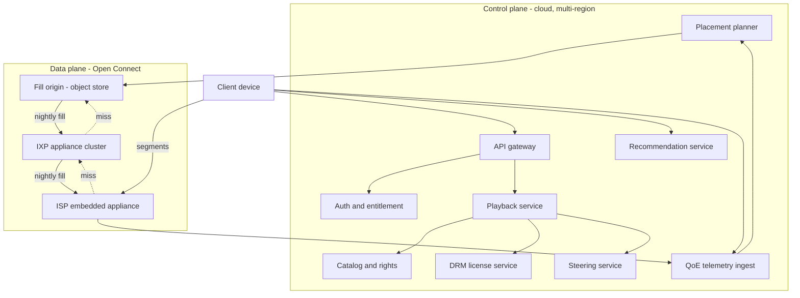
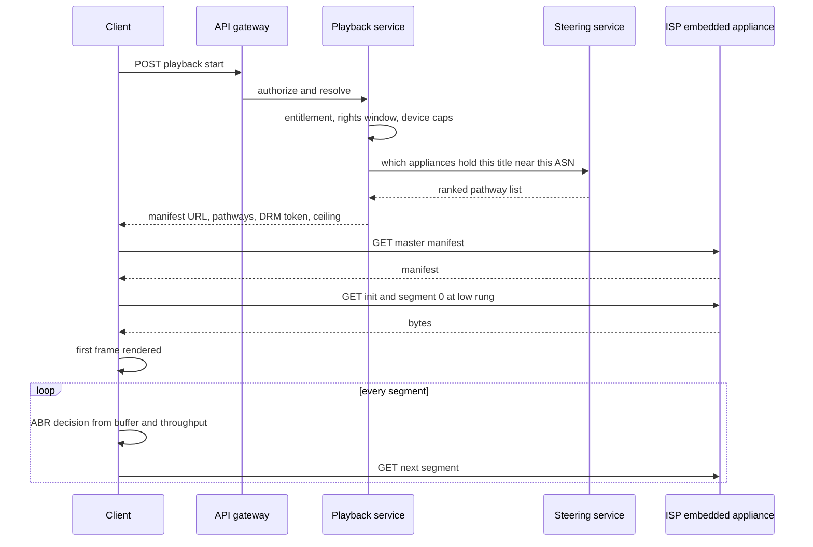
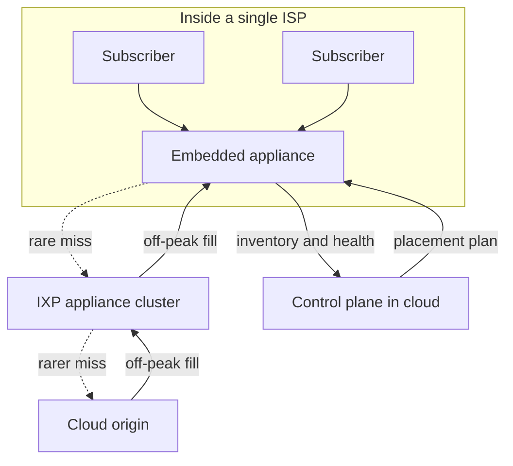
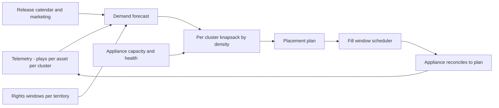
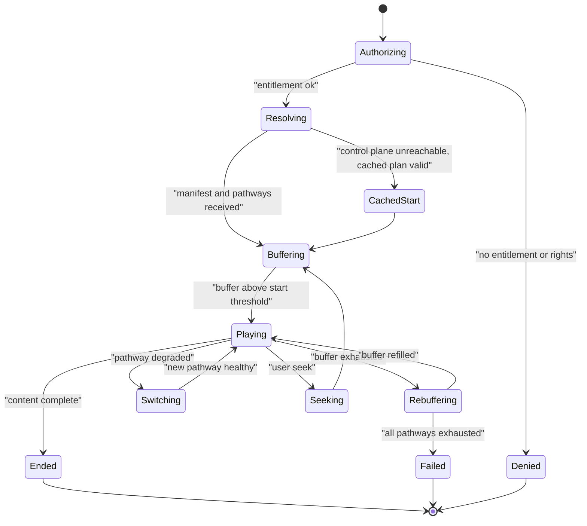
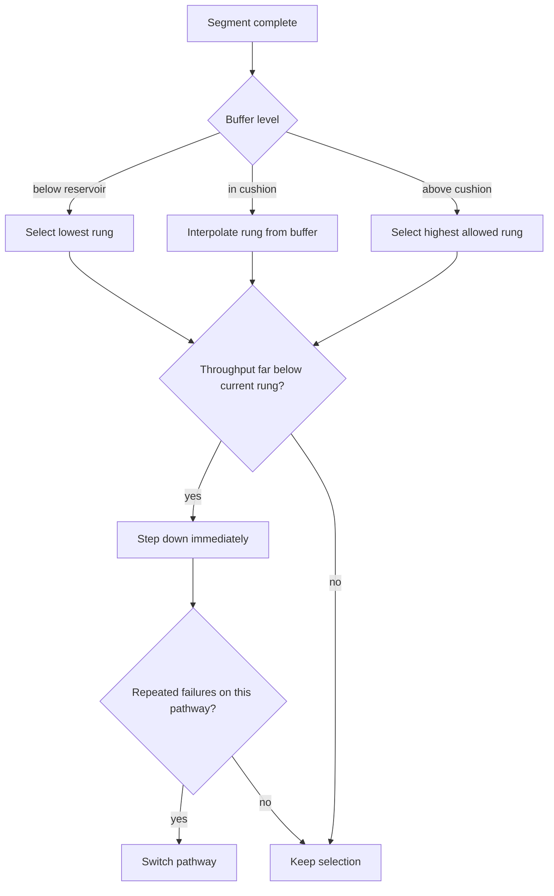

# 16 — Netflix-style Streaming

<span class="pill pill-core">Core</span> <span class="pill pill-hard">Hard</span>

**A subscription streaming service is the inverse of a user-generated video platform: the catalog is small enough to fit on a single rack, the audience is enormous, and demand is perfectly predictable — which means you can stop caching reactively and instead ship the bytes into the viewer's own ISP the night before they are watched.**

| | |
|---|---|
| **Commonly asked at** | Netflix, Disney+, Amazon Prime Video, Hulu, HBO/Max, Spotify (same shape), Apple, Akamai, Fastly |
| **Time budget** | 45 min |
| **Core tension** | Push-based pre-positioning is dramatically cheaper and faster than pull-through caching, but it demands accurate demand prediction, a fill window that ISPs will grant you, and enough appliance storage — get any of those wrong and you have paid for a CDN that misses |
| **Prerequisites** | [F05 CDN & Edge](../fundamentals/f05-cdn-edge.md) · [F02 DNS & Global Traffic](../fundamentals/f02-dns-traffic-management.md) · [F26 Multi-Region & DR](../fundamentals/f26-multi-region-dr.md) · [F18 Resilience Patterns](../fundamentals/f18-resilience-patterns.md) · [F04 Caching](../fundamentals/f04-caching.md) · [F23 SLI/SLO & Error Budgets](../fundamentals/f23-slo-error-budgets.md) · [F24 Capacity Planning](../fundamentals/f24-capacity-planning.md) · [F28 Cost Engineering](../fundamentals/f28-cost-engineering.md) · [F01 Networking Foundations](../fundamentals/f01-networking-foundations.md) |

---

## 1. Problem Statement

Design a global subscription video service: a curated catalog of professionally produced content, delivered to 300 million paying members on televisions, phones, browsers, and set-top boxes, with playback quality good enough that people watch on a 65-inch screen and never think about the network.

The problem looks similar to a user-generated video platform — the same codecs, the same ABR ladders, the same manifests — and is architecturally almost opposite:

| Dimension | User-generated platform | Subscription streaming |
|---|---|---|
| Catalog size | Exabytes, growing 7 PB/day | **~3 PB, growing slowly** |
| Content velocity | 500 hours uploaded per minute | Tens of titles per week |
| Demand predictability | A video can go from 0 to 50M views in two hours | A release date is known months in advance |
| Popularity distribution | Zipfian over billions of items | Concentrated over thousands of items |
| Delivery model | Pull-through caching; the edge learns what is hot | **Push pre-positioning; the edge is told what will be hot** |
| Peak-to-average | ~2× (global, smeared) | **~2.8× (regional prime time)** |
| Rights | Uniform globally | **Per-territory, per-window, with expiry dates** |

!!! note "The insight that unlocks the whole design"
    A 3 PB catalog on a 300 TB appliance means one appliance holds **10% of everything ever made**. Because popularity is concentrated, that 10% serves 90–95% of requests. There is no cache miss to optimize, no origin fetch to shield, no cold-start latency — the bytes are already inside the viewer's ISP before anyone presses play. You cannot do this on an exabyte catalog, and you do not need to do it on a small one. Everything else on this page follows from that single ratio.

---

## 2. Requirements

### Functional

| # | Requirement |
|---|---|
| F1 | Stream the licensed catalog to authenticated members on 1,000+ device types |
| F2 | Per-territory catalog: a title's availability is a function of country and date |
| F3 | Adaptive bitrate playback with fast startup, seek, and quality switching |
| F4 | Multiple audio languages, subtitle tracks, and accessibility descriptions per title |
| F5 | Resume playback across devices; per-profile watch state |
| F6 | Personalized home page: rows, ranking, and per-user artwork selection |
| F7 | DRM with studio-mandated robustness levels tied to resolution tiers |
| F8 | Concurrent-stream limits per plan; device registration |
| F9 | Pre-position content into ISP-embedded appliances during off-peak windows |
| F10 | Offline downloads with expiry and rights enforcement |

### Non-functional

| # | Requirement | Target |
|---|---|---|
| N1 | Time to first frame | p50 < 700 ms, p95 < 1.8 s |
| N2 | Rebuffer ratio | < 0.15% of playback time |
| N3 | Playback start success | 99.97% |
| N4 | **In-progress playback survives a total control-plane outage** | Mandatory |
| N5 | Regional evacuation time | < 45 min to shift all traffic out of a failed region |
| N6 | Rights enforcement | A title must become unavailable at its licence expiry, globally, on time |
| N7 | Delivered quality | ≥ 90% of sessions at the device's top achievable ladder rung at p50 |

!!! danger "N4 is the requirement that defines the architecture"
    "Playback continues when the control plane is down" is not a nice-to-have; it is the reason the manifest carries the full session plan, the reason CDN selection is client-side with a pre-fetched fallback list, and the reason the entire data plane has no synchronous dependency on any stateful service. This property is called **static stability**: the data plane's steady-state behaviour does not require the control plane to be reachable. If you take one idea from this page into an interview, take this one.

---

## 3. Scale Estimation

### Members and viewing

$$
\text{Members} = 3\times10^{8},\qquad \text{Watch hours} = 4\times10^{8}\ \text{hours/day}
$$

$$
= 4\times10^{8} \times 3600 = 1.44\times10^{12}\ \text{seconds of playback/day}
$$

Blended delivered bitrate is higher than a UGC platform because the device mix skews to televisions:

$$
\bar{b} = 4.5\ \text{Mbps}
$$

$$
\text{Bits/day} = 1.44\times10^{12} \times 4.5\times10^{6} = 6.48\times10^{18}\ \text{bits/day}
$$

$$
\boxed{\text{Egress}_{\text{avg}} = \frac{6.48\times10^{18}}{86400} = 7.5\times10^{13}\ \text{bps} = 75\ \text{Tbps}}
$$

Peak-to-average is **worse** than for a global UGC platform, because subscription viewing is concentrated in regional prime time (roughly 20:00–23:00 local) and the regions do not fully offset each other:

$$
\boxed{\text{Egress}_{\text{peak}} = 75 \times 2.8 = 210\ \text{Tbps}}
$$

In bytes: $6.48\times10^{18}/8 = 8.1\times10^{17}$ B $= 810$ PB delivered per day, or $296$ EB/year.

### Catalog storage across the ABR ladder — computed explicitly

Catalog size: roughly 6,000 films at ~1.8 h plus 4,000 series averaging 30 episodes at ~0.75 h:

$$
H_{\text{catalog}} = (6{,}000 \times 1.8) + (4{,}000 \times 30 \times 0.75) = 10{,}800 + 90{,}000 \approx 10^{5}\ \text{content-hours}
$$

Now the per-title stored bitrate. Unlike a UGC platform, a premium title carries multiple codecs, multiple dynamic ranges, and — critically — **many audio languages**.

| Component | Bitrate | Notes |
|---|---|---|
| H.264 ladder, SDR, up to 1080p | 20.2 Mbps | Sum of 10 rungs: 235, 375, 560, 750, 1050, 1750, 2350, 3000, 4300, 5800 kbps |
| HEVC ladder, SDR, up to 1080p | 12.1 Mbps | ~0.6× H.264 at equal quality |
| HEVC ladder, HDR10, up to 2160p | 40.0 Mbps | Includes 8 / 12 / 16 Mbps 4K rungs |
| Dolby Vision ladder, up to 2160p | 40.0 Mbps | Separate track set; premium titles only |
| AV1 ladder, SDR, up to 1080p | 10.0 Mbps | |
| AV1 ladder, HDR, up to 2160p | 28.0 Mbps | ~0.7× HEVC |
| Audio: 5 × AAC 128k | 0.64 Mbps | |
| Audio: 3 × DD+ 448k | 1.34 Mbps | |
| Audio: 2 × Atmos 768k | 1.54 Mbps | |
| Subtitles: 30 languages | ~0.01 Mbps | Negligible in bytes, significant in operational complexity |
| **Premium title total** | **153.8 Mbps** | |

Converting to storage, where 1 Mbps of stored ladder $= \dfrac{1\times10^6 \times 3600}{8 \times 10^9} = 0.45$ GB per content-hour:

$$
\text{Premium} = 153.8 \times 0.45 = 69.2\ \text{GB per content-hour}
$$

Catalog mix — 20% premium 4K HDR multi-codec, 50% 1080p multi-codec (~45 Mbps), 30% licensed HD-only legacy (~25 Mbps):

$$
\bar{b}_{\text{stored}} = 0.20(153.8) + 0.50(45) + 0.30(25) = 30.8 + 22.5 + 7.5 = 60.8\ \text{Mbps}
$$

$$
\text{GB per content-hour} = 60.8 \times 0.45 = 27.4\ \text{GB}
$$

$$
\boxed{S_{\text{catalog}} = 10^{5}\ \text{hours} \times 27.4\ \text{GB} = 2.74\ \text{PB}}
$$

!!! example "2.74 PB. That is the number that makes push-based delivery possible."
    A UGC platform stores 7 PB **per day**. This entire catalog — every rendition, every codec, every language, every subtitle — is under three petabytes. A single appliance with 300 TB of flash holds 11% of it. Two racks hold all of it. This is why the delivery model can be *push* instead of *pull*, and it is the single most important number to compute in this interview.

### Appliance fleet sizing

$$
N_{\text{appliances}} = \frac{\text{Egress}_{\text{peak}}}{\text{throughput per appliance} \times u_{\max}}
$$

A flash-based appliance sustains roughly 100 Gbps; a storage-heavy spinning-disk appliance perhaps 40 Gbps at much higher capacity. Blended at 60 Gbps usable and 70% max sustained utilization:

$$
N = \frac{210\times10^{12}}{60\times10^{9} \times 0.70} = 5{,}000\ \text{appliances}
$$

before redundancy and geographic granularity — real deployments run several times that, in the high tens of thousands, because each ISP location needs at least a redundant pair regardless of how little traffic it serves. The binding constraint at the tail of the distribution is **not throughput but presence**: you need a box in that ISP at all.

### Fill traffic

Nightly refresh of a few TB per appliance during a six-hour window:

$$
\text{Fill rate per appliance} = \frac{3\times10^{12}\ \text{B} \times 8}{6 \times 3600} \approx 1.1\ \text{Gbps}
$$

Across 18,000 appliances: $\approx 20$ Tbps of fill traffic — but spread across the trough hours when both your network and the ISP's network are near-idle, and much of it served appliance-to-appliance within a cluster rather than from a distant origin.

$$
\frac{\text{Fill}}{\text{Serve}} = \frac{20\ \text{Tbps} \times 6\ \text{h}}{75\ \text{Tbps} \times 24\ \text{h}} = \frac{120}{1800} \approx 6.7\%
$$

!!! tip "Fill is 6.7% of delivery, and it happens when capacity is free"
    This ratio is the economic argument for pre-positioning in one line. You spend under 7% additional bytes, entirely during hours when the marginal cost of bandwidth is near zero, and in exchange you get a ~95% local-serve rate at peak with no cache-miss latency. A pull-through CDN spends those same bytes *during peak*, on the expensive path, and only after a user has already waited for the miss.

### Control-plane QPS

Playback session starts:

$$
\text{Sessions/day} \approx \frac{4\times10^{8}\ \text{hours}}{0.7\ \text{hours per session}} \approx 5.7\times10^{8}
$$

$$
\text{QPS}_{\text{avg}} = \frac{5.7\times10^8}{86400} \approx 6{,}600/\text{s},\qquad \text{QPS}_{\text{peak}} \approx 2.6\times10^{4}/\text{s}
$$

Home page loads and browse traffic are perhaps 5× that. Note the striking asymmetry: **the control plane peaks at tens of thousands of QPS while the data plane peaks at 210 Tbps.** These are different systems with different failure characteristics, and conflating them is the classic mistake.

---

## 4. API Design

### Playback session start

```http
POST /v1/playback/start
Authorization: Bearer eyJhbGci...
{
  "profileId": "p_88213",
  "titleId": "t_80100172",
  "deviceId": "dev_5f2a",
  "deviceCaps": {"maxHeight":2160,"codecs":["av01","hvc1","avc1"],
                 "hdr":["dolbyvision","hdr10"],"audio":["atmos","eac3"],
                 "drm":{"system":"widevine","level":"L1"},"hdcp":"2.2"},
  "startPositionMs": 1842000
}
```

```http
200 OK
Cache-Control: private, max-age=0
{
  "sessionId": "ps_01JA7...",
  "manifestUrl": "https://oca-blr-as9498-03.example.net/m/t80100172/v7/master.m3u8?t=...",
  "pathways": [
    {"id":"OCA-EMBEDDED","host":"oca-blr-as9498-03.example.net","priority":1,"weight":90},
    {"id":"OCA-IXP",     "host":"oca-nixi-blr-11.example.net","priority":2,"weight":10},
    {"id":"CLOUD-ORIGIN","host":"origin-ap-south-1.example.com","priority":3,"weight":0}
  ],
  "steeringUrl": "https://steer.example.com/v1/s?sid=ps_01JA7...",
  "drm": {"licenseUrl":"https://lic.example.com/wv","token":"eyJ...","expiresIn":86400},
  "ladderCeiling": {"height":2160,"maxBitrateBps":16000000},
  "entitlementExpiresAt": "2026-09-01T09:00:00Z",
  "fallbackTtlSeconds": 604800
}
```

| Field | Why it exists |
|---|---|
| `pathways` (plural, ranked, weighted) | The client can fail over between CDNs in milliseconds without asking anyone. This is the mechanism that makes the data plane statically stable |
| `steeringUrl` | Optional mid-session re-steering. If it is unreachable, the client keeps using the pathway list it already has — degradation, not failure |
| `entitlementExpiresAt` | Long enough that a control-plane outage does not interrupt a 3-hour film |
| `fallbackTtlSeconds` | The client persists this response and may reuse it to start playback if the control plane is unreachable — a stale manifest is far better than a black screen |
| `ladderCeiling` computed server-side | Device capability, plan tier, DRM robustness, and licensing constraints resolve to one number the client can obey |

### HLS content steering

The master playlist advertises pathways; a small JSON document reorders them without a manifest reload:

```text
#EXTM3U
#EXT-X-VERSION:12
#EXT-X-INDEPENDENT-SEGMENTS
#EXT-X-CONTENT-STEERING:SERVER-URI="https://steer.example.com/v1/s?sid=ps_01JA7",PATHWAY-ID="OCA-EMBEDDED"

#EXT-X-MEDIA:TYPE=AUDIO,GROUP-ID="atmos",NAME="English Atmos",LANGUAGE="en",CHANNELS="16/JOC",DEFAULT=YES,URI="a/en-atmos/index.m3u8"
#EXT-X-MEDIA:TYPE=AUDIO,GROUP-ID="aac2",NAME="Hindi",LANGUAGE="hi",CHANNELS="2",AUTOSELECT=YES,URI="a/hi-aac/index.m3u8"
#EXT-X-MEDIA:TYPE=SUBTITLES,GROUP-ID="subs",NAME="English CC",LANGUAGE="en",FORCED=NO,CHARACTERISTICS="public.accessibility.transcribes-spoken-dialog",URI="s/en-cc/index.m3u8"

#EXT-X-STREAM-INF:BANDWIDTH=4640000,AVERAGE-BANDWIDTH=4300000,CODECS="hvc1.2.4.L123.B0,ec-3",RESOLUTION=1920x1080,FRAME-RATE=23.976,VIDEO-RANGE=PQ,AUDIO="atmos",SUBTITLES="subs",PATHWAY-ID="OCA-EMBEDDED"
v/hevc-hdr-1080p/index.m3u8

#EXT-X-STREAM-INF:BANDWIDTH=17200000,AVERAGE-BANDWIDTH=16000000,CODECS="av01.0.13M.10.0.110.09.16.09.0,ec-3",RESOLUTION=3840x2160,FRAME-RATE=23.976,VIDEO-RANGE=PQ,AUDIO="atmos",SUBTITLES="subs",PATHWAY-ID="OCA-EMBEDDED"
v/av1-hdr-2160p/index.m3u8
```

```json
{
  "VERSION": 1,
  "TTL": 300,
  "RELOAD-URI": "https://steer.example.com/v1/s?sid=ps_01JA7&v=2",
  "PATHWAY-PRIORITY": ["OCA-EMBEDDED", "OCA-IXP", "CLOUD-ORIGIN"],
  "PATHWAY-CLONES": []
}
```

!!! note "Steering is advisory; the client is the decision maker"
    If the steering document fails to load, the HLS spec requires the client to keep using its current pathway order. That is not a workaround — it is the correct design. Every control-plane input to playback is a *hint with a safe default*, never a *precondition*.

### Client QoE telemetry

```http
POST /v1/qoe/batch
{"sessionId":"ps_01JA7","events":[
  {"t":0,     "type":"play_request"},
  {"t":612,   "type":"first_frame", "bitrateBps":1050000, "pathway":"OCA-EMBEDDED"},
  {"t":18000, "type":"switch_up",   "bitrateBps":4300000},
  {"t":91400, "type":"rebuffer",    "durationMs":840, "bufferMs":0},
  {"t":91500, "type":"pathway_switch","from":"OCA-EMBEDDED","to":"OCA-IXP","reason":"throughput"}
]}
```

---

## 5. Data Model

```sql
-- Rights are the defining entity. A title does not "exist"; it exists in a territory, in a window.
CREATE TABLE title (
    title_id       BIGINT PRIMARY KEY,
    canonical_name TEXT        NOT NULL,
    runtime_ms     BIGINT,
    kind           SMALLINT    NOT NULL,   -- 0 film 1 episode 2 trailer
    series_id      BIGINT,
    season_no      SMALLINT,
    episode_no     SMALLINT,
    maturity       SMALLINT    NOT NULL,
    created_at     TIMESTAMPTZ NOT NULL
);

CREATE TABLE title_availability (
    title_id     BIGINT      NOT NULL REFERENCES title(title_id),
    country      CHAR(2)     NOT NULL,
    window_start TIMESTAMPTZ NOT NULL,
    window_end   TIMESTAMPTZ,             -- NULL = perpetual (rare, and worth flagging)
    max_height   INT         NOT NULL,    -- some licences cap resolution
    drm_required BOOLEAN     NOT NULL DEFAULT TRUE,
    download_ok  BOOLEAN     NOT NULL DEFAULT FALSE,
    PRIMARY KEY (title_id, country, window_start)
);
CREATE INDEX ta_expiry ON title_availability (window_end)
    WHERE window_end IS NOT NULL;

CREATE TABLE asset (                        -- one row per encoded stream
    asset_id      BIGINT PRIMARY KEY,
    title_id      BIGINT   NOT NULL,
    kind          SMALLINT NOT NULL,       -- 0 video 1 audio 2 subtitle
    codec         TEXT     NOT NULL,       -- 'avc1' | 'hvc1' | 'av01' | 'ec-3' | 'ac-4'
    video_range   TEXT,                    -- 'SDR' | 'HDR10' | 'PQ-DV'
    height        INT,
    bitrate_bps   INT      NOT NULL,
    language      CHAR(3),                 -- ISO 639-2 for audio and subtitles
    bytes         BIGINT   NOT NULL,
    content_hash  BYTEA    NOT NULL,       -- immutable identity; drives fill dedup
    UNIQUE (title_id, kind, codec, video_range, height, language)
);

-- The placement plan: what should live on which appliance tonight.
CREATE TABLE placement_plan (
    plan_date     DATE     NOT NULL,
    cluster_id    INT      NOT NULL,       -- an ISP site or IXP cluster
    asset_id      BIGINT   NOT NULL,
    predicted_bytes BIGINT NOT NULL,       -- expected bytes served if resident
    asset_bytes   BIGINT   NOT NULL,
    density       DOUBLE PRECISION
        GENERATED ALWAYS AS (predicted_bytes::float8 / NULLIF(asset_bytes,0)) STORED,
    action        SMALLINT NOT NULL,       -- 0 keep 1 add 2 evict
    PRIMARY KEY (plan_date, cluster_id, asset_id)
);
CREATE INDEX pp_fill ON placement_plan (plan_date, cluster_id, density DESC)
    WHERE action = 1;

CREATE TABLE appliance (
    appliance_id  BIGINT PRIMARY KEY,
    cluster_id    INT         NOT NULL,
    asn           INT         NOT NULL,
    site_code     TEXT        NOT NULL,
    capacity_bytes BIGINT     NOT NULL,
    used_bytes     BIGINT     NOT NULL,
    link_gbps      INT        NOT NULL,
    fill_window    TSTZRANGE  NOT NULL,    -- negotiated with the ISP
    health         SMALLINT   NOT NULL,    -- 0 healthy 1 degraded 2 draining 3 down
    last_report_at TIMESTAMPTZ NOT NULL
);

CREATE TABLE appliance_content (
    appliance_id BIGINT NOT NULL REFERENCES appliance(appliance_id),
    asset_id     BIGINT NOT NULL,
    filled_at    TIMESTAMPTZ NOT NULL,
    verified_at  TIMESTAMPTZ,
    PRIMARY KEY (appliance_id, asset_id)
);

-- Watch state. High write rate, low consistency requirement, per-profile shard key.
CREATE TABLE playback_bookmark (
    profile_id   BIGINT      NOT NULL,
    title_id     BIGINT      NOT NULL,
    position_ms  BIGINT      NOT NULL,
    updated_at   TIMESTAMPTZ NOT NULL,
    device_id    TEXT        NOT NULL,
    PRIMARY KEY (profile_id, title_id)
);
```

| Modelling decision | Chosen | Rejected | Why |
|---|---|---|---|
| Availability | `(title, country, window)` rows | `available: bool` on the title | Rights are inherently territorial and time-bounded. A boolean cannot express "leaves Japan on 30 September but stays in Brazil" |
| Asset identity | `content_hash` as immutable identity | Path-based identity | Fill dedup, verification, and the "same encode used by many titles" case (trailers, recaps) all need content addressing |
| Placement | A dated plan table, not imperative commands | Push commands to appliances | A declarative plan is diffable, auditable, replayable, and lets an appliance reconcile itself after being offline |
| Bookmarks | Per-profile shard, last-write-wins | Strongly consistent across devices | Two devices racing on a bookmark is genuinely rare and the cost of getting it wrong is 30 seconds of rewatching. Not worth a consensus round. See [F07](../fundamentals/f07-replication-consistency.md) |
| Expiry | Indexed `window_end` driving a scheduled job | Check at read time only | You must *proactively* evict expiring content from appliances and caches, or it remains servable after the licence ends |

---

## 6. High-Level Architecture



### Playback start (the control-plane path)

1. Client authenticates and calls `POST /v1/playback/start`.
2. Playback service resolves entitlement (plan tier, concurrent streams), rights (`title_availability` for the member's country and the current time), and device capability into a `ladderCeiling`.
3. Steering service maps the client's IP to an ASN and a geography, then to a ranked list of pathways — embedded appliance in that ISP first, IXP cluster second, cloud origin last — filtered by which appliances actually hold this title's assets and by their health and load.
4. DRM token is minted. The full response is returned and **cached on the client**.
5. Client fetches the manifest and segments directly from the chosen appliance. **The control plane is now out of the picture for the rest of the session.**

### Fill (the pre-positioning path)

6. Overnight, the planner ingests yesterday's telemetry, forecasts per-cluster demand for each asset, and solves a knapsack per cluster.
7. During each ISP's negotiated fill window, appliances pull the assets in their plan — preferentially from a peer appliance in the same cluster, then from an IXP cluster, then from the fill origin.
8. Appliances verify content hashes and report inventory. Assets whose licence window has ended are evicted.



---

## 7. Deep Dives

### 7.1 Open Connect: push pre-positioning versus pull-through caching

A conventional CDN is **reactive**: an object becomes resident at an edge because a user requested it and missed. A pre-positioning network is **proactive**: the object is resident because you predicted the request.

| Property | Pull-through CDN | Push pre-positioning |
|---|---|---|
| First request for an object | Cache miss: full origin round trip, often 100–300 ms extra plus origin egress cost | Hit: content is already local |
| Bytes crossing expensive links | During peak, when they cost the most | During the trough, when they cost near zero |
| Cache efficiency | Bounded by working-set size versus cache size, and by the tail | Bounded only by prediction accuracy |
| Applicability | Any catalog size | **Only when catalog ≪ aggregate edge storage** |
| Failure when prediction is wrong | N/A — it self-corrects | Miss, falling back through the pathway list |
| ISP relationship | You are a customer of transit | You are a partner: the ISP hosts your hardware because it saves them transit |
| Operational burden | Low | High: hardware in thousands of third-party facilities |



The commercial logic is what makes this possible: an ISP hosts your appliance for free — often providing power, rack space, and settlement-free peering — because every byte served locally is a byte they do not buy transit for. The alignment of interests is genuine, and it is why the model is durable.

$$
\text{Local serve ratio} = \frac{\text{bytes served from embedded appliances}}{\text{total bytes}} \to 0.90\text{–}0.95
$$

$$
\text{Transit bytes} = \text{Total} \times (1 - 0.93) = 210\ \text{Tbps} \times 0.07 \approx 14.7\ \text{Tbps at peak}
$$

!!! gotcha "Pre-positioning fails silently when the fill window is too small for the catalog delta"
    **Symptom:** local serve ratio degrades over weeks from 94% to 81%; nobody notices until transit costs spike. **Mechanism:** a batch of new releases plus an AV1 re-encode of the back catalog produced a fill backlog larger than the nightly window could drain, so appliances are perpetually running an outdated plan. **Mitigation:** alarm on *plan convergence* — the fraction of the planned asset set actually resident on each appliance — not just on hit ratio. Hit ratio degrades slowly and is confounded by content mix; plan convergence is a direct, early signal. Also prioritize the fill queue by predicted density so a partially-completed fill is still the *most valuable* partial fill.

### 7.2 Predictive content placement

For each cluster and each night, choose which assets to hold. This is a knapsack:

$$
\max \sum_{i} v_i x_i \quad \text{subject to} \quad \sum_{i} s_i x_i \le S_{\text{cluster}},\quad x_i \in \{0,1\}
$$

where $v_i$ is the predicted bytes served locally if asset $i$ is resident and $s_i$ is its size. The greedy solution by **density** $v_i / s_i$ is within a factor of two of optimal and is what you actually run — the marginal gain from an exact solver is far smaller than the error in the demand forecast.

The forecast $v_i$ combines:

| Signal | Weight | Notes |
|---|---|---|
| Trailing 7-day plays of this asset in this cluster | High | The strongest single predictor |
| Global trend of the title (rising / falling) | High | Catches a title accelerating before it hits this cluster |
| Scheduled release calendar | **Very high** | A launch has zero history and enormous demand. Pure history-based prediction fails catastrophically here |
| Marketing pushes and homepage promotion | High | You control this and therefore know it in advance |
| Local language and regional affinity | Medium | Regional catalogs diverge strongly |
| Day-of-week and seasonality | Medium | Weekend patterns differ materially |
| Rendition-level demand | Medium | The 4K rung of a title may be worth holding while the 240p rung is not — this is a *multi-choice* knapsack, not a per-title one |

!!! warning "Popularity prediction and the release calendar are two different mechanisms"
    Most of the catalog is predicted statistically. A launch title is *scheduled*: you know the date, the marketing spend, and the territories, and you push it to every relevant appliance days in advance regardless of what history says. A design that only has the statistical path will miss every launch, which is exactly the traffic that matters most. Say this explicitly — it is the most common gap in candidate answers about pre-positioning.

**Rendition-level granularity matters a lot.** Holding all renditions of a title costs 27 GB per content-hour; holding only the rungs actually selected in that ISP might cost 6 GB. If an ISP's subscribers are predominantly on 1080p televisions, the 240p and 4K rungs are nearly dead weight there.



!!! gotcha "Filling content into a territory where it is not licensed"
    **Symptom:** an audit finds a title resident on appliances in a country where the rights window has expired, or never existed. **Mechanism:** the placement planner optimized on predicted demand and never joined against `title_availability`. **Mitigation:** rights filtering must be a *hard constraint applied before* the optimizer, not a post-filter, and eviction on window expiry must be a scheduled, verified job with an inventory audit — not a lazy TTL. The consequence of getting this wrong is contractual, not technical, and contractual failures do not get fixed by a rollback.

### 7.3 Playback session lifecycle and the steering service



The **steering service** answers one question: given this client's network position, which pathway should it use? Inputs:

- Client IP → ASN and geographic region.
- Which clusters serve that ASN, and which hold the requested assets (`appliance_content`).
- Appliance health, current load, and link headroom.
- Historical QoE for this `(ASN, cluster)` pair — the empirically best choice, not the topologically nearest one.
- Manual overrides for maintenance and drains.

Its output is a **ranked list with weights**, not a single answer. That distinction is the whole point: the client can move down the list on its own when throughput degrades, without a round trip.

| Steering design choice | Chosen | Rejected | Why |
|---|---|---|---|
| Selection mechanism | Client-side from a server-provided ranked list | DNS-based steering | DNS is cached at the resolver, is coarse (resolver IP ≠ client IP), and is far too slow to react — TTLs are minutes, failover needs to be sub-second. See [F02](../fundamentals/f02-dns-traffic-management.md) |
| Failure behaviour | Client keeps its current list | Client blocks until steering responds | Blocking makes steering a hard dependency of playback, which violates static stability |
| Granularity | Per session, refreshable mid-session | Per request | Per-request steering would put a control-plane call in front of every segment fetch |
| Health input | Real client-measured QoE per `(ASN, cluster)` | Server-side health checks only | A server can be perfectly healthy while the path to a particular ISP is congested. Only clients can see that |

### 7.4 Client-side ABR and buffer management

The ABR algorithm runs entirely on the client and is the largest single determinant of measured quality.

**Rate-based ABR** picks the highest rung below estimated throughput. Its weakness is that throughput estimation is biased: segment downloads are bursty and ON-OFF, so a naive estimate systematically under-reads available bandwidth, and competing flows make it oscillate.

**Buffer-based ABR** ignores throughput estimation almost entirely and maps buffer occupancy directly to a rung:

$$
R(B) = \begin{cases}
R_{\min} & B \le r \\[4pt]
R_{\min} + (R_{\max}-R_{\min})\dfrac{B-r}{c} & r < B < r + c \\[6pt]
R_{\max} & B \ge r + c
\end{cases}
$$

with a reservoir $r$ (say 15 s) below which you always take the lowest rung, and a cushion $c$ (say 45 s) over which you ramp. The buffer is a *measurement* of throughput integrated over time, so it is far more stable than an instantaneous estimate. Buffer dynamics:

$$
\frac{dB}{dt} = \frac{C(t)}{R} - 1
$$

The buffer grows while delivered throughput $C(t)$ exceeds the selected bitrate $R$ and drains otherwise. A rebuffer occurs exactly when $B$ reaches zero.



Practical rules that matter more than the algorithm choice:

| Rule | Reason |
|---|---|
| Start at a low rung, ramp up within seconds | Time to first frame dominates perceived quality; nobody notices the first two seconds were 480p, everybody notices a three-second wait |
| Buffer deep for VOD (up to ~240 s) | Deep buffers absorb transient congestion entirely. This is a luxury live streaming does not have and is a major reason VOD quality is better |
| Step down fast, step up slowly | The cost asymmetry is severe: a rebuffer is far worse than one segment at a lower rung |
| Cap by *rendered* size, not device capability | Streaming 4K into a 400-pixel-wide window wastes bandwidth invisibly |
| Never switch pathways on a single failure | One 500 could be a transient. Two consecutive failures or a sustained throughput collapse is a signal |
| Keep the audio track constant across video switches | Separate audio groups mean a video switch does not re-download audio |

!!! gotcha "The ABR algorithm optimizes the wrong thing and looks great on the dashboard"
    **Symptom:** average delivered bitrate improves 12% after an ABR change, engagement drops, and rebuffer ratio quietly triples. **Mechanism:** the new algorithm is more aggressive about stepping up, so it wins on bitrate and loses on stability — and bitrate was the headline metric. **Mitigation:** ABR changes must be evaluated on a composite QoE objective with rebuffering weighted heavily, A/B tested against real members, and gated on the *worst* network deciles rather than the mean. Users on good networks are indifferent to ABR quality; users on bad networks are the entire population that ABR exists to serve.

### 7.5 Per-title encoding and the quality metric

A fixed ladder assigns the same bitrate to a slow animated film and a 60 fps action sequence. Per-title encoding fits the ladder to the content by running trial encodes, measuring perceptual quality, and selecting points on the convex hull of the quality-versus-bitrate curve.

The measurement is the hard part. PSNR and SSIM correlate poorly with human judgement, particularly across resolutions. **VMAF** — a learned fusion of several elementary metrics, trained on subjective scores — is what makes the optimization meaningful, because "equal quality" has to mean equal *perceived* quality for the ladder comparison to be valid.

| Approach | Bitrate at equal VMAF | Encode cost | Applied to |
|---|---|---|---|
| Fixed ladder | Baseline | 1× | Nothing, once you have the alternative |
| Per-title convex hull | −20% to −30% | ~1.5× | Entire catalog |
| Per-shot optimization | −30% to −40% | ~3× | Entire catalog |

Unlike a UGC platform, **every title here is worth the expensive treatment**, because every title in a curated catalog gets meaningful viewership and the catalog is small. The break-even calculation that dominates UGC encoding decisions simply does not bind:

$$
V_{\text{breakeven}} \approx 2{,}000\ \text{views}, \qquad V_{\text{typical title}} \gg 10^{6}
$$

That is a genuine architectural simplification, and it is worth calling out: a small curated catalog means you can afford to do the most expensive possible thing to every single asset. There is no tiering policy for encoding here — only for placement.

$$
\text{Egress saved at 30\%} = 210\ \text{Tbps} \times 0.30 = 63\ \text{Tbps of peak capacity}
$$

Sixty-three terabits per second of avoided peak capacity is worth an enormous amount of encoding compute, and the encoding is a one-time cost against permanent savings.

### 7.6 Multi-region control plane with a decoupled data plane

The control plane runs active-active in three regions. Members are assigned to a region by geography with weighted routing; any region can serve any member, and no region is a leader for anything in the playback path.

| Property | Implementation |
|---|---|
| Data replication | Asynchronous multi-master with last-write-wins on per-profile keys. Watch state and bookmarks tolerate this trivially |
| What is *not* replicated synchronously | Everything. There is no cross-region consensus in the playback path |
| Evacuation | Shift routing weights; drain a region in under 45 minutes. Practised regularly, not theoretically |
| Capacity | Each region provisioned to absorb a share of another's traffic — N+1 across three regions means ~50% headroom, which is expensive and is the price of the property |
| Data plane coupling | **None.** Appliances serve from local storage and do not call the control plane per request |

The crucial point is the last row. Because the data plane has no synchronous dependency on the control plane, **a full control-plane region loss does not stop a single byte of video from flowing.** In-progress sessions have everything they need; new sessions in that region fail over to another region's control plane, and if that also fails, cached playback plans still start playback. See [F26](../fundamentals/f26-multi-region-dr.md).

### 7.7 Static stability and graceful degradation

Rank every dependency by what happens when it is unavailable, and design the fallback explicitly:

| Dependency | If unavailable | Degradation | Acceptable? |
|---|---|---|---|
| Recommendation service | Home page shows a static, pre-computed popular-titles list per region | Personalization lost | Yes — and this must be tested, not assumed |
| Per-user artwork selection | Default artwork | Cosmetic | Yes |
| Search | Browse still works | Reduced discovery | Yes |
| Steering service | Client keeps its existing pathway list | Suboptimal CDN choice | Yes |
| Bookmark service | Playback starts at position 0 or a locally cached position | Annoying | Yes |
| Playback service | Client uses its cached playback plan | New titles cannot start | Partially |
| DRM license service | Cached licences allow in-progress and recent titles | New protected starts fail | Partially — cache licences for the session and beyond |
| Auth | Cached session token valid for hours | New logins fail | Partially |
| **Appliance fleet** | Fall through to IXP, then cloud origin | Higher latency and cost | Yes, at reduced capacity |
| **All pathways for a title** | Playback fails | None | **No — this is the only true outage** |

!!! tip "Static stability is a property you must design in, and it is cheap here"
    The general form: *the data plane's steady-state behaviour must not require the control plane*. Concretely — hand the client everything it needs up front (manifest, pathway list, DRM token, ceiling) with generous expiry; make every subsequent control-plane interaction a refresh of something the client already has; and make the failure of any refresh a no-op rather than an error. The client keeps working on stale-but-valid data. This costs a slightly larger response payload and buys immunity to control-plane outages, which is one of the best trades in distributed systems.

### 7.8 Chaos engineering as a first-class practice

Static stability claims are worthless unless continuously verified, because dependencies creep back in. Someone adds a synchronous call to a "quick lookup service" in the playback path, and six months later a control-plane blip becomes a playback outage. The only reliable defence is to break things on purpose, continuously, in production.

| Practice | Scope | What it validates |
|---|---|---|
| Random instance termination | One instance | Instances are cattle; restarts are safe; there is no snowflake state |
| Dependency failure injection | One service call, for a small share of traffic | The fallback path exists, is correct, and is *fast* — a fallback with a 30 s timeout is not a fallback |
| Latency injection | One service call | Timeouts are set correctly, and slow is handled as well as down |
| Regional evacuation exercise | An entire region | Failover mechanics, capacity headroom, and the runbook all still work |
| Automated experiments with control and canary groups | Small traffic share, continuous | Regression detection: a fallback that broke last week is caught this week |

The mature version is an **automated experimentation platform**: a canary group receives injected failures while a control group does not; both are monitored on a business KPI (playback starts per second is ideal — it is fast-moving, high-volume, and unambiguous); if the canary deviates beyond a bound, the experiment aborts itself within seconds. This converts chaos engineering from a scary quarterly event into a continuous, low-risk regression test.

!!! danger "Chaos engineering without automated abort is just an outage you scheduled"
    **The prerequisites are non-negotiable**: a KPI that moves within seconds, blast radius limited to a small traffic share, an automatic abort on KPI deviation, and a manual kill switch that does not require a deploy. Without all four, you are not running an experiment; you are causing an incident and calling it learning. In an interview, stating the prerequisites is what distinguishes someone who has run this from someone who has read about it.

### 7.9 Rights, regional catalogs, and expiry

Rights are the most under-appreciated source of complexity in this system, and they touch nearly every component.

| Consequence | Component affected |
|---|---|
| A title exists in some countries and not others | Catalog service, search index, recommendations, home page rows |
| A title's licence expires on a date | Scheduled eviction from appliances, cache purge, manifest invalidation, download revocation |
| Some licences cap resolution or forbid 4K | Ladder ceiling computed per `(title, country, plan)` |
| Some licences forbid offline download | Download eligibility per title per territory |
| A member travelling abroad | Which catalog applies — home country or current location? Contractual, varies by agreement, and must be a policy the code can express |
| Content is added to a territory at a specific hour | Coordinated global publish with clock discipline. See [F20](../fundamentals/f20-time-clocks-ordering.md) |

!!! gotcha "Expired content remains playable because eviction was lazy"
    **Symptom:** a title that left the catalog last night still plays for some users, and the studio notices before you do. **Mechanism:** the catalog service correctly stopped listing it, but the manifest was cached, the appliance still held the assets, and a direct manifest URL still resolved. **Mitigation:** expiry must be enforced at *entitlement* time in the playback service (which the client cannot bypass because it needs a DRM licence), *and* by scheduled eviction from appliances, *and* by cache purge. Defence in depth is required because a single missed layer is a contract breach. The strongest single control is the DRM licence service refusing to issue keys — make that the authoritative gate.

---

## 8. Scaling the Bottleneck

| Rank | Bottleneck | Binding constraint | Scaling move |
|---|---|---|---|
| 1 | **Peak egress at 210 Tbps** | Physical link capacity inside ISPs at prime time | More embedded appliances; better codecs (AV1 cuts bytes ~30%); per-shot encoding; viewport-aware ladder capping |
| 2 | **Appliance storage per site** | 300 TB against a 2.74 PB catalog | Rendition-level placement rather than whole-title; regional catalog pruning; tiered appliances (flash for hot, disk for depth) |
| 3 | **Fill window duration** | ISPs grant a bounded off-peak window | Peer-to-peer fill within a cluster; delta encoding for re-encodes; prioritize by density so partial fills are still optimal |
| 4 | **Prediction accuracy** | Every miss becomes transit | Release-calendar-driven pushes; faster feedback from telemetry; conservative over-provisioning for launches |
| 5 | Control plane QPS | Only ~26k QPS at peak | Genuinely not a problem. Say so — recognizing what *isn't* the bottleneck is as valuable as finding what is |

!!! note "The bottleneck is physical, and that changes how you scale"
    You cannot autoscale a rack in an ISP facility in Jakarta. Capacity growth requires hardware procurement, shipping, installation by a partner, and peering negotiation — a lead time measured in months. This makes the capacity model a *forecasting* problem with a long horizon rather than a reactive scaling problem, and it means over-provisioning is rational in a way it rarely is in cloud infrastructure. See [F24](../fundamentals/f24-capacity-planning.md).

---

## 9. Failure Modes

| Failure | Blast radius | Detection | Mitigation | Degraded behaviour |
|---|---|---|---|---|
| Embedded appliance fails | Subscribers of one ISP site | Appliance heartbeat; per-cluster QoE | Redundant pair per site; client falls to the next pathway within seconds | Traffic shifts to IXP cluster; slightly higher latency; ISP pays transit |
| Entire ISP cluster down | One ISP's subscribers | Cluster health; QoE by ASN | Steering removes the cluster; IXP absorbs | Higher latency, transit cost spike; playback continues |
| **Control-plane region loss** | New sessions in that region | Session start rate by region | Route to another region; 45-minute evacuation drill | **In-progress playback entirely unaffected.** New sessions succeed via failover or cached plans |
| Steering service down | Nothing immediately | Steering request error rate | Clients retain their pathway list | Suboptimal CDN choice drifts over hours |
| Recommendation service down | Home page personalization | Row-render error rate | Pre-computed regional fallback rows | Everyone sees the same popular list — noticeable, not fatal |
| DRM license service down | New starts on protected content | License issuance rate | Multi-region; client caches licences for hours | In-progress playback continues; new starts fail after cache expiry |
| Fill origin unavailable | Nightly fill stalls | Fill job success; plan convergence | Peer-to-peer fill within clusters; multi-region fill origin | Appliances serve yesterday's plan — a near-perfect degradation |
| Placement plan is wrong (bad forecast) | Elevated transit cost, mild latency | Local serve ratio; transit egress | Fall through to IXP and origin | Costs rise, quality barely moves. This is a **cost incident, not an availability incident** — and treating it as such is the correct triage |
| Launch title not pre-positioned | Massive miss traffic at launch hour | Pre-launch inventory verification | Verify inventory *before* the release, and gate the launch on it | Origin and IXP saturate; poor QoE for the highest-visibility content of the quarter |
| Rights expiry not enforced | Contractual breach | Availability audit job | DRM gate as the authoritative control | Legal, not technical, and not fixable by rollback |
| Client ABR regression | Global quality degradation | Rebuffer ratio by app version | Staged app rollout; server-side kill switch for ABR parameters | Must be able to change ABR behaviour **without an app release** — app store review is measured in days |

!!! warning "The failure mode that hurts most is a launch you did not pre-position"
    Every other row degrades gracefully. A tentpole release that is not resident on appliances at 00:01 on launch day produces the worst possible correlation: maximum demand, maximum press attention, and zero cache benefit — all at once. The mitigation is procedural, not architectural: pre-launch inventory verification with a hard gate, treated with the same seriousness as a production deploy freeze.

---

## 10. SRE Lens

### SLIs and SLOs — QoE is the SLI

| SLI | Definition | SLO |
|---|---|---|
| **Rebuffer ratio** | $\dfrac{\text{rebuffer ms}}{\text{rebuffer ms} + \text{playing ms}}$ | < 0.15% |
| **Time to first frame** | Play request → first rendered frame | p50 < 700 ms, p95 < 1.8 s |
| **Playback start success** | Sessions reaching first frame ÷ play requests | > 99.97% |
| Delivered quality | Fraction of playing seconds at the device's top achievable rung | > 90% at p50 |
| Pathway failover rate | Sessions switching pathway mid-stream | < 2% |
| Local serve ratio | Bytes from embedded appliances ÷ total | > 92% |
| Plan convergence | Resident planned assets ÷ planned assets, per appliance | > 98% |
| Control-plane availability | Non-error playback-start responses | 99.95% (deliberately *lower* than playback start success) |

$$
\text{Error budget at } 99.97\% = 0.0003 \times 30 \times 24 \times 60 \approx 13\ \text{minutes per 30 days}
$$

!!! tip "Note that playback start success has a tighter SLO than the control plane"
    This looks impossible — how can a dependent service be more available than its dependency? It is exactly what static stability buys you. Cached plans, long-lived tokens, and client-side pathway failover mean playback succeeds through control-plane failures. Stating this inversion explicitly is one of the most compelling things you can say in this interview, because it demonstrates that you understand availability composition is not simply multiplicative when fallbacks exist. See [F23](../fundamentals/f23-slo-error-budgets.md).

Every QoE metric must be sliced. The cube that matters:

$$
\text{ASN} \times \text{cluster} \times \text{device class} \times \text{app version} \times \text{title}
$$

A global rebuffer ratio of 0.15% routinely conceals 8% on one ISP in one city on one device type. Alert on slice deviation from the slice's own baseline, not on the global aggregate.

### Rollout plan

| Change type | Strategy |
|---|---|
| Control-plane service | Canary by instance, then by region, with automatic rollback on playback-start-rate deviation |
| Client app | Staged rollout by percentage, with every risky behaviour behind a **server-controlled flag** — app store review makes client rollback take days, so the real rollback mechanism must be server-side |
| ABR parameters | Server-delivered config, A/B tested on composite QoE, gated on the worst network deciles |
| Encoder changes | Offline VMAF comparison on a fixed corpus, then shadow encode, then a subset of the catalog. Never re-encode the whole catalog in one pass |
| Appliance software | Rolling by cluster, never more than one appliance per redundant pair at a time, with automatic halt on cluster QoE regression |
| Placement algorithm | Shadow the plan against the incumbent, compare predicted local serve ratio, then roll out by cluster |

!!! warning "The client is the part you cannot roll back"
    A bad server deploy is reverted in minutes. A bad client release is on millions of televisions — many of which update slowly or not at all — for weeks. Therefore: every client behaviour that could plausibly need changing (ABR constants, buffer targets, timeout values, retry policy, feature enablement) must be server-configurable, and the client must handle a config fetch failure by using safe compiled-in defaults. See [F25](../fundamentals/f25-deployment-release-safety.md).

### Runbook notes

```bash
# QoE alert: find the slice.
$ qoe slice --metric=rebuffer_ratio --window=10m --by=asn,cluster,device --min-sessions=5000
asn=AS9498 cluster=blr-01 device=tv-webos  rebuffer=0.081  sessions=142k   # PROBLEM
asn=AS9498 cluster=blr-02 device=tv-webos  rebuffer=0.002  sessions=138k   # fine
# Same ASN, same device, different cluster -> cluster blr-01, not the ISP or the app.

$ oca status --cluster=blr-01
appliance=blr-01-a  health=degraded  link=100G  util=0.97  disk_errors=41    # <-- here
appliance=blr-01-b  health=healthy   link=100G  util=0.62

$ oca drain --appliance=blr-01-a --reason="disk errors" --confirm
# Steering removes it within one TTL (300s); in-flight clients fail over locally in seconds.
```

Triage discipline: slice first, and only escalate to a global hypothesis once at least two independent slices are affected. Almost every real incident here is confined to a cell of the QoE cube, and the global dashboard will look completely normal while a million people have a bad evening.

### Capacity model

$$
N_{\text{appliances,cluster}} = \left\lceil \frac{P_{\text{cluster}} \times (1 + h)}{\text{Gbps}_{\text{appliance}} \times u_{\max}} \right\rceil + 1
$$

where $P_{\text{cluster}}$ is forecast peak demand, $h$ is growth headroom over the procurement lead time (6–12 months, so $h$ is often 0.5 or more), and the trailing $+1$ is the redundancy that makes single-appliance failure a non-event. Note the storage constraint is separate and often binds first:

$$
S_{\text{cluster}} \ge \sum_{i \in \text{plan}} s_i \quad\text{with plan chosen to hit a target local serve ratio}
$$

### Cost

| Component | Share | Lever |
|---|---|---|
| Content licensing and production | **Dominant** — far larger than all infrastructure combined | Not an engineering lever, but it is why infrastructure efficiency is measured against it |
| Appliance hardware and logistics | ~40% of infrastructure | Longer refresh cycles; density; right-sizing by cluster |
| Transit and peering for the 7% that misses | ~20% | Better placement prediction directly reduces this |
| Cloud control plane and data stores | ~25% | Reserved capacity; the multi-region headroom is the expensive part |
| Encoding | ~15%, one-time per title | Already worth doing maximally given the catalog size |

$$
\text{Delivery cost per watch hour} \approx \frac{\text{infrastructure}}{4\times10^{8} \times 365} \ll \text{content cost per watch hour}
$$

!!! note "The cost framing is different from a UGC platform"
    On a UGC platform, infrastructure *is* the cost structure. Here, content licensing dwarfs it, which changes the optimization target: the goal of delivery engineering is not primarily to minimize cost but to maximize the quality of experience per licensed hour, because retention is what pays for the content. That reframing is worth stating — it explains why a pre-positioning network with expensive idle capacity is rational here and would not be elsewhere. See [F28](../fundamentals/f28-cost-engineering.md).

---

## 11. Trade-offs & Alternatives

| Decision | Chosen | Alternative | Why |
|---|---|---|---|
| Delivery model | Own network, push pre-positioning into ISPs | Commercial pull-through CDN | Only viable because the catalog is 2.74 PB. Delivers better QoE and radically lower marginal cost. Rejected commercial as primary (retained as overflow) |
| CDN selection | Client-side from a ranked pathway list | DNS-based steering | DNS is coarse, cached, and slow. Sub-second failover is impossible with it. Rejected |
| Control-plane coupling | Data plane has no synchronous dependency | Per-request authorization at the edge | Would make every control-plane blip a playback outage. Rejected — this is N4 |
| Session plan | Everything handed to the client up front, with generous expiry | Fetch each piece as needed | Incremental fetching creates many chances to fail mid-session. Rejected |
| Encoding | Per-shot optimization on the whole catalog | Per-title only, or fixed ladders | Small catalog means the expensive option is affordable for everything. Rejected the cheaper options |
| Quality metric | VMAF | PSNR / SSIM | PSNR correlates poorly with perception, especially across resolutions, which invalidates cross-rung comparison. Rejected |
| Multi-region | Active-active across three regions, async replication | Active-passive with a warm standby | Passive standbys are never actually ready; active-active is continuously proven. Costs ~50% headroom, which is the price of the property. Rejected passive |
| Consistency for watch state | Last-write-wins per profile | Strong consistency | A bookmark conflict costs 30 seconds of rewatching. Not worth a consensus round. Rejected |
| ABR | Buffer-based with throughput as a secondary signal | Pure rate-based | Throughput estimation is biased and oscillates under competing flows. Rejected |
| Client behaviour | Server-controlled configuration | Compiled-in constants | Client rollback takes days. Rejected |
| Rights enforcement | Defence in depth, with DRM as the authoritative gate | Catalog filtering alone | Catalog filtering is bypassable via a direct manifest URL. Rejected |
| Chaos | Continuous automated experiments with auto-abort | Scheduled manual game days | Manual exercises catch regressions quarterly; automation catches them the day they appear. Rejected manual-only |

---

## 12. Gotchas & Corner Cases

!!! gotcha "A synchronous control-plane call creeps back into the playback path"
    **Symptom:** a control-plane deploy causes a playback outage, which the architecture is supposed to make impossible. **Mechanism:** somebody added a "quick" call to a profile or experimentation service in the session-start path without a fallback, and it became load-bearing. **Mitigation:** continuous dependency-failure injection on every service in the playback path, so a missing fallback is detected within days rather than during an incident. Additionally, enforce it structurally: the playback path should have an explicit, reviewed allowlist of permitted synchronous dependencies, and adding to it should require the same scrutiny as a schema change.

!!! gotcha "Appliance inventory drifts from the placement plan without anyone noticing"
    **Symptom:** local serve ratio decays over months; transit spend creeps up; QoE is only marginally worse so no alarm fires. **Mechanism:** fills partially failed, evictions ran when they should not have, or disk errors silently removed content, and nothing compared actual inventory against the plan. **Mitigation:** appliances report a content inventory digest; a reconciler diffs it against the plan and alarms on convergence below a threshold. Verify by content hash, not by filename — a truncated or corrupted asset has the right name and the wrong bytes, and it will serve broken segments to real users.

!!! gotcha "A launch title is pre-positioned to the wrong renditions"
    **Symptom:** launch night has good local serve ratio by *title* but terrible QoE, with heavy origin traffic. **Mechanism:** the plan filled the SDR 1080p ladder but the audience for a tentpole release skews heavily to 4K HDR televisions — a demand mix the historical model had no way to know. **Mitigation:** placement must be rendition-level and launch plans must use the *expected device mix for that content*, not the cluster's historical average. Marquee content is watched on better hardware than the median, and this is systematic enough to model.

!!! gotcha "The client caches a playback plan containing a now-drained appliance"
    **Symptom:** a small trickle of sessions keeps hitting an appliance that was drained hours ago, failing and retrying. **Mechanism:** the cached plan's fallback TTL is a week, and those clients never successfully refreshed steering. **Mitigation:** the appliance itself must return a redirect or an explicit "not serving" response rather than errors, so the client learns immediately; and the client must demote a pathway locally after consecutive failures rather than retrying it indefinitely. Cached plans are the right design, but they require the data plane to be able to *reject* politely.

!!! gotcha "Time to first frame regresses because the ladder starts too high"
    **Symptom:** startup time p95 doubles after a change that improved average bitrate. **Mechanism:** the player now starts at a higher rung, so the first segment is bigger and takes longer to arrive before the first frame can render. **Mitigation:** start low and ramp — the first two seconds at a lower rung are imperceptible while a one-second startup delay is extremely perceptible. Better still, keep a tiny low-rung "startup segment" and switch up immediately after the first frame. Always evaluate startup time and average bitrate together; optimizing either alone reliably damages the other.

!!! gotcha "Concurrent-stream limits are enforced in a way that breaks on failover"
    **Symptom:** a member is told they have too many streams while watching on one device, right after a control-plane region failover. **Mechanism:** stream-count state was regional and asynchronously replicated, so the failover region saw stale sessions that had actually ended. **Mitigation:** treat concurrency limits as a soft, eventually-consistent control with a generous grace margin and a short session heartbeat TTL, and fail *open* when the state store is uncertain. Wrongly blocking a paying member is far more costly than briefly allowing one extra stream — a clean example of choosing the correct failure direction.

!!! gotcha "Offline downloads outlive the licence window"
    **Symptom:** content remains playable on a device after it left the catalog. **Mechanism:** the DRM licence for the download was issued with a long expiry and there is no online check before playback. **Mitigation:** download licences carry an expiry no later than the rights window end, plus a periodic online renewal requirement (typically every 7–30 days). Downloads are the hardest rights-enforcement surface precisely because the device may be offline by design, so the expiry must be baked into the licence rather than checked at play time.

!!! gotcha "Fill traffic saturates the ISP link and the ISP throttles you"
    **Symptom:** fill jobs slow dramatically or fail; the ISP complains; in a bad case, they ask for the appliance to be removed. **Mechanism:** fill ran outside the agreed window, or a large catalog delta caused it to overrun into morning peak. **Mitigation:** the fill window is a contract, enforced client-side by the appliance with hard stop times, plus adaptive rate limiting based on measured link utilization so fill yields to real traffic instantly. The appliance must be a good tenant; the entire model depends on ISPs wanting you there.

!!! gotcha "VMAF is optimized directly and the encoder learns to game it"
    **Symptom:** VMAF scores improve while viewers report worse quality. **Mechanism:** encoder settings were tuned to maximize the metric — sharpening filters and similar tricks raise VMAF without raising perceived quality, and in some cases lower it. **Mitigation:** treat VMAF as a proxy that must be periodically re-validated against subjective testing, use multiple metrics as a guard, and be suspicious of any change that improves the metric substantially with no plausible perceptual mechanism. Any metric used as an optimization target eventually stops measuring what it was built to measure.

!!! gotcha "Regional catalog differences leak into a globally cached response"
    **Symptom:** a member in one country sees titles that are not licensed there, or a title vanishes for everyone when it expires in one territory. **Mechanism:** a catalog or recommendation response was cached without country in the cache key. **Mitigation:** country (and often plan tier) must be part of the cache key for every catalog-derived response, and this must be tested — it is a category of bug that is invisible in single-region development and appears immediately in production. See [F04](../fundamentals/f04-caching.md).

!!! gotcha "Chaos experiments run during a major release event"
    **Symptom:** an experiment perturbs exactly the traffic that is under maximum scrutiny. **Mechanism:** the chaos platform had no awareness of the content release calendar. **Mitigation:** integrate the release calendar as a first-class blackout input to the chaos scheduler, alongside deploy freezes. This is the same discipline as not deploying during peak, and it is routinely forgotten because chaos tooling is usually built by a different team than release tooling.

!!! gotcha "Steering optimizes for topological proximity rather than measured quality"
    **Symptom:** clients are directed to the "nearest" appliance and experience worse quality than they would from a further one. **Mechanism:** steering uses IP geolocation and AS-path length as a proxy for quality, but the nearest path is congested, or the geolocation is wrong (mobile carriers and CGNAT make client IP a poor location signal). **Mitigation:** steering decisions must be driven primarily by *measured* QoE per `(ASN, cluster)` pair from real client telemetry, with topology as a prior for cold pairs only. The network's actual behaviour repeatedly disagrees with its map.

---

## 13. Interview Angle

!!! interview "Compute the catalog size early and let it reframe the entire problem"
    2.74 PB. Once that number is on the whiteboard, push-based pre-positioning stops being an exotic idea and becomes the obvious one — a 300 TB appliance holds 11% of everything, and 11% chosen well serves 93% of requests. Candidates who skip this arrive at "put a CDN in front of it" and never find the interesting design. The contrast with a UGC platform's 7 PB *per day* is the sharpest possible framing.

!!! interview "Static stability is the idea that most impresses in this problem"
    "Playback continues through a total control-plane outage" is a specific, testable architectural property with concrete mechanisms behind it: the full session plan is handed to the client up front, pathway failover is client-side, licences and tokens outlive plausible outages, and every control-plane interaction is a refresh whose failure is a no-op. The consequence — that playback start success can carry a *tighter* SLO than the control plane it depends on — is genuinely surprising and demonstrates real depth.

!!! interview "Separate the control plane from the data plane out loud, early"
    26,000 QPS versus 210 Tbps. These are different systems with different scaling laws, different failure modes, different SLOs, and different deployment cadences. Drawing them as two boxes and stating that there is no synchronous edge between them organizes the entire rest of the discussion, and it is the structural insight the interviewer is listening for.

!!! interview "Know the two things that make this different from YouTube"
    First, the catalog is small and demand is predictable, so you push instead of pull. Second, rights are territorial and time-bounded, which touches the data model, the placement planner, the caching keys, and the DRM gate. If you can articulate those two differences crisply, you have demonstrated that you are reasoning about *this* system rather than replaying a generic video-platform answer.

??? note "Follow-up 1 — Why not just use a commercial CDN?"
    At small scale you should — the operational burden of hardware in thousands of third-party facilities is enormous and only pays back above a threshold. Above it, three things change. Cost: 296 EB/year at even deeply discounted commercial rates is well into the billions, while owned appliances plus settlement-free peering reduce marginal cost by an order of magnitude or more. Control: a commercial CDN gives you a pull-through cache with limited ability to pre-position, and pre-positioning is the specific capability that this catalog size makes uniquely valuable — you would be paying for a general-purpose tool while unable to use the technique that fits your workload. Quality: an embedded appliance is inside the subscriber's ISP, typically one or two network hops away, which is closer than any commercial CDN edge and eliminates the miss path entirely. The honest caveat: you keep commercial CDN capacity as overflow and for regions where you have no presence, so this is a "primarily own, partially buy" answer rather than a pure one.

??? note "Follow-up 2 — How do you handle a global simultaneous release of a major title?"
    This is the hardest capacity event in the system and it is entirely predictable, which is what saves you. Weeks ahead: encode everything including all audio and subtitle languages, and verify assets are complete. Days ahead: push to every relevant appliance in every licensed territory, with rendition mix weighted for the expected device profile — tentpole audiences skew to large screens, so the 4K HDR rungs matter disproportionately. Hours ahead: run an inventory verification that hard-gates the launch; if appliances in a region do not hold the assets, you know before the release rather than after. At the moment of release, the risk is not bytes but the control plane — everyone hits play in the same few minutes, so playback-start QPS spikes far above the egress spike proportionally. Pre-scale the control plane, and make sure the home page and detail page are heavily cached. Afterward, the placement plan should hold the title in place for weeks regardless of what the trailing-demand model says, because the decay curve of a launch is steep but the absolute volume stays high. The single most important control is the pre-launch inventory gate, and it is procedural rather than architectural.

??? note "Follow-up 3 — A whole cloud region goes down. Walk me through it."
    First, and most importantly: **no video stops playing.** Every in-progress session already holds its manifest, its pathway list, and its DRM licence, and the appliances serving it have no dependency on that region. That is the property the architecture exists to provide, so lead with it. What actually breaks is new session starts and control-plane operations for members routed to that region. Detection is a drop in playback starts per second for that region, which is a fast-moving, high-volume signal — usually within seconds. Response is to shift routing weights so those members are served by another region; because replication is asynchronous and multi-master, their profile and watch state are already present, possibly a few seconds stale, which is harmless for bookmarks. The capacity question is whether the remaining regions can absorb the load, which is why each is provisioned with roughly 50% headroom, and why the evacuation is practised rather than theorized. Residual effects: bookmarks written just before the failure may be lost (acceptable), and any control-plane batch job homed in that region needs to resume elsewhere. The whole procedure should complete inside 45 minutes, and the fact that it can be exercised in production without a customer-visible impact is the strongest possible evidence that it works.

??? note "Follow-up 4 — How do you decide what to pre-position when appliance storage is only 10% of the catalog?"
    A per-cluster knapsack maximizing predicted locally-served bytes subject to the storage constraint, solved greedily by density (predicted bytes per stored byte), because the forecast error dwarfs the optimality gap. Three refinements matter more than the algorithm. First, the unit is a *rendition*, not a title: holding the 1080p rungs of a hundred titles usually beats holding every rung of thirty. Second, the forecast is two mechanisms, not one — statistical prediction from trailing demand for the back catalog, and calendar-driven scheduling for launches and promotions, since a launch has no history and is the most important traffic you will serve. Third, rights are a hard constraint applied before optimization, never a post-filter. Operationally, the thing to monitor is not hit ratio but *plan convergence* — the fraction of the planned set actually resident — because hit ratio degrades slowly and is confounded by content mix, while convergence is a direct signal that fills are failing.

??? note "Follow-up 5 — Your rebuffer ratio jumps from 0.12% to 0.6% globally. How do you debug it?"
    Slice immediately; a global QoE number is almost never globally caused. Cut by ASN, cluster, device class, app version, and title, and look for a slice large enough to move the aggregate. The common patterns and their signatures: a single cluster with degraded appliances (one cluster bad, its neighbours fine — drain it); an ISP with a congested or re-routed path (one ASN bad across multiple clusters — steer away and talk to the ISP); a client app version regression (one app version bad across all ASNs — this is why ABR must be server-configurable, so you can revert behaviour without an app release); a new title with a bad encode (one title bad everywhere — check VMAF and ladder shape, and consider pulling the title); and a placement miss causing widespread fallback to origin (local serve ratio drops in step with rebuffering). The diagnostic that separates these fastest is a two-dimensional pivot of ASN against cluster: a bad row means the ISP, a bad column means the cluster, and a uniformly elevated table means something global like an app or encoder change.

??? note "Follow-up 6 — What exactly does chaos engineering buy you here, and what are its prerequisites?"
    What it buys is protection against dependency creep. Static stability is not a property you achieve once; it is a property that erodes every time someone adds a call to the playback path without a fallback. Only continuous, automated failure injection catches that erosion within days instead of during an incident. It also validates the things that are otherwise untestable: that fallbacks are correct *and fast* (a fallback behind a 30-second timeout is not a fallback), that timeouts are set sensibly, that regional evacuation capacity is really there. The prerequisites are strict and worth naming: a business KPI that moves within seconds (playback starts per second is close to ideal — high volume, fast, unambiguous); blast radius limited to a small, controlled traffic share; a control group to compare against, so you are measuring the injection rather than the weather; automatic abort when the canary deviates beyond a bound; a kill switch that does not require a deploy; and calendar awareness so you are not running experiments during a major release. Without all of those, you have scheduled an outage and given it a nicer name.

??? note "Follow-up 7 — How would this design change for live sports?"
    Almost every advantage disappears at once, which makes it a good stress test of whether you understand *why* the design works. Pre-positioning becomes impossible because the content does not exist until the moment it is watched, so you revert to pull-through with aggressive request coalescing at every tier — and the coalescing is load-bearing, because every viewer wants the same newest segment at the same instant, which is the most extreme thundering herd in streaming. Deep client buffers are no longer allowed: 240 seconds of buffer means being 240 seconds behind, which is unacceptable when neighbours are cheering, so buffers shrink to a handful of seconds and every bit of network variance turns into a rebuffer. Transcoding must run in real time with no retry, requiring redundant parallel encoders with automatic failover instead of a retryable batch DAG. Peak concurrency is extraordinary and instantaneous rather than smoothly distributed across an evening. Rights are often exclusive and time-boxed to the minute. About the only thing that carries over unchanged is the control-plane/data-plane separation and static stability, which matter even more because there is no opportunity to fix anything after the fact. The honest summary is that live sports is a different system that happens to share codecs and player code.

### Strong answer vs weak answer

| Dimension | Weak | Strong |
|---|---|---|
| Opening | "Video platform: upload, transcode, CDN, play" | Computes the 2.74 PB catalog and immediately contrasts push pre-positioning with pull-through caching |
| Delivery | "Use a CDN" | Explains embedded appliances, the ISP incentive alignment, fill windows, and the 6.7% fill-to-serve ratio |
| Placement | "Cache popular content" | Formulates the knapsack, uses density-greedy, works at rendition granularity, and separates statistical prediction from calendar-driven launch pushes |
| Availability | "Multi-region with failover" | Names static stability, shows the mechanisms, and points out playback start success can have a tighter SLO than the control plane |
| Steering | "DNS routing to the nearest edge" | Client-side selection from a ranked pathway list, with steering as an advisory refresh whose failure is a no-op, and QoE-measured rather than topology-guessed |
| ABR | "Adaptive bitrate based on bandwidth" | Buffer-based control with reservoir and cushion, the buffer dynamics equation, and the start-low-ramp-up rule with its startup-time justification |
| Encoding | "Multiple bitrates" | Per-shot optimization on the whole catalog, VMAF as the enabling metric, and why the small catalog removes the break-even constraint entirely |
| Chaos | "We run Chaos Monkey" | States what it protects against (dependency creep), and enumerates the prerequisites including automatic abort and calendar awareness |
| Rights | Not mentioned | Territorial, time-bounded availability in the data model, as a hard constraint on placement, in the cache key, and with DRM as the authoritative gate |
| SLIs | "Uptime and latency" | Rebuffer ratio, time to first frame, playback start success, local serve ratio, plan convergence — all sliced by ASN × cluster × device × version |

---

## 14. Key Takeaways

1. **Compute the catalog size first: 2.74 PB.** A small catalog plus predictable demand is what makes push pre-positioning possible, and it is the single fact that separates this design from a user-generated video platform.
2. **Push beats pull when you can afford it.** Bytes move during the trough at near-zero marginal cost, arrive before they are requested, and eliminate the miss path entirely — for about 7% of additional traffic.
3. **The ISP relationship is the product.** Appliances are hosted for free because locally-served bytes save the ISP transit. Being a good tenant — hard fill windows, adaptive rate limiting, clean failure behaviour — is an engineering requirement, not a business one.
4. **Static stability is the defining architectural property.** Hand the client the full session plan up front; make every subsequent control-plane call a refresh whose failure is a no-op. The result is that playback survives a total control-plane outage, and its SLO can be tighter than its dependency's.
5. **Control plane and data plane are different systems.** 26k QPS against 210 Tbps, with no synchronous edge between them. Draw them separately and keep them that way — dependency creep across that boundary is the failure this design is built to prevent.
6. **Placement is a per-cluster, rendition-level knapsack** driven by two distinct mechanisms: statistical forecasting for the back catalog and calendar-driven scheduling for launches. Monitor plan convergence, not just hit ratio.
7. **The client owns the fast decisions.** CDN selection and ABR run locally from server-provided hints, so failover happens in milliseconds rather than DNS-TTL minutes — but every client behaviour must be server-configurable, because client rollback takes days.
8. **A small catalog means every title deserves the most expensive encoding.** Per-shot optimization with VMAF saves 30%+ of bytes, which at 210 Tbps peak is 63 Tbps of avoided capacity.
9. **Chaos engineering is a regression test for static stability**, not a stunt. Its prerequisites — a fast KPI, a control group, bounded blast radius, automatic abort, calendar awareness — are what make it safe enough to run continuously.
10. **Quality of experience is the SLI.** Rebuffer ratio, time to first frame, and delivered quality, sliced by ASN × cluster × device × app version. Every real incident lives in one cell of that cube, and the global dashboard will look fine while it happens.
