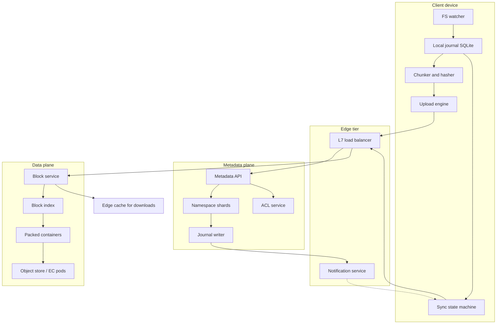
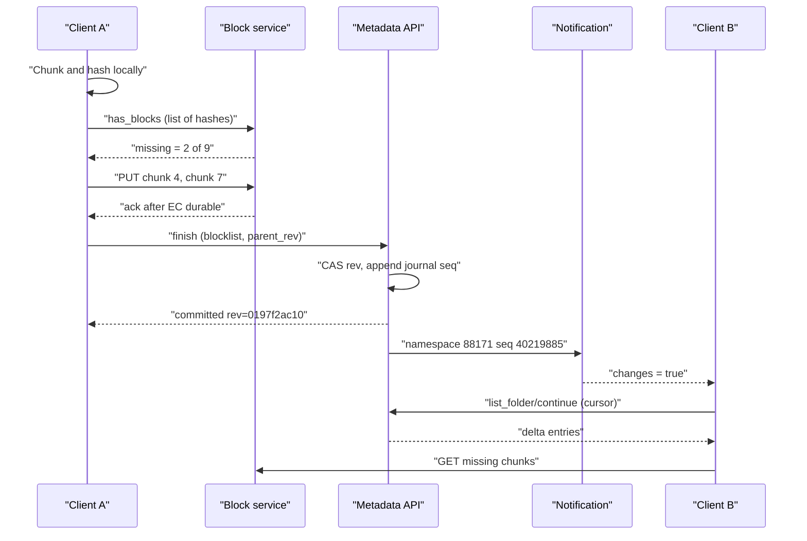
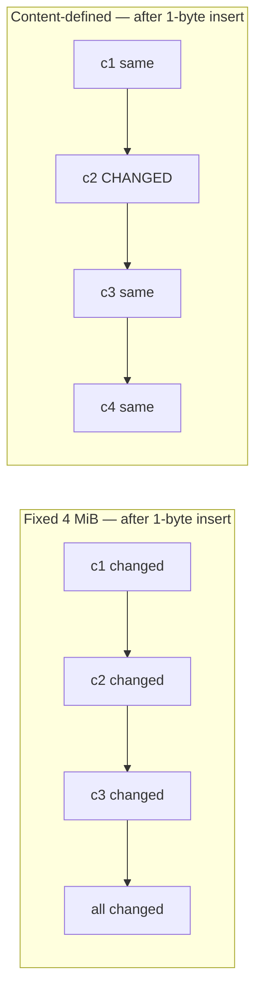
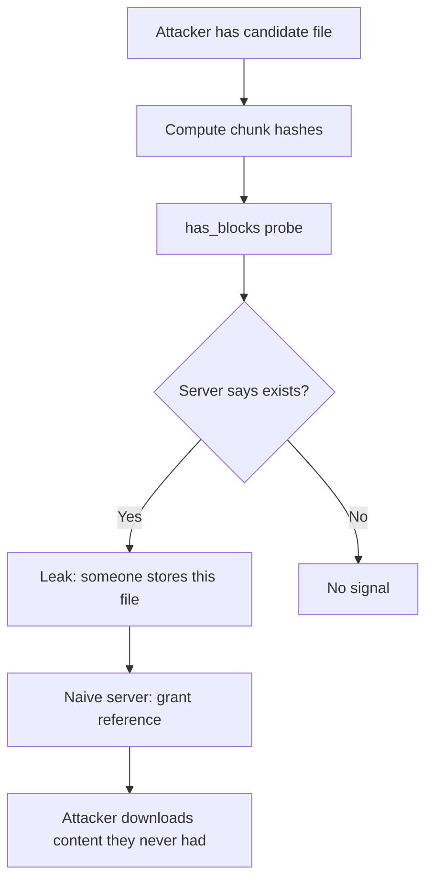
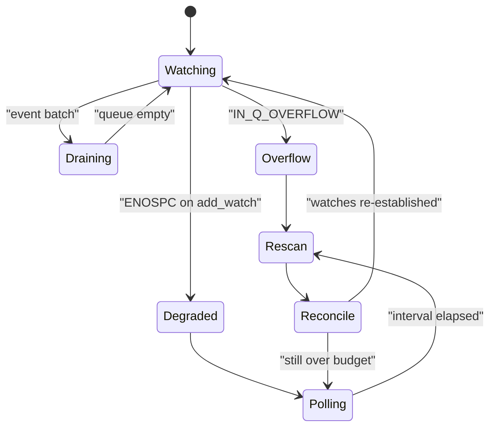
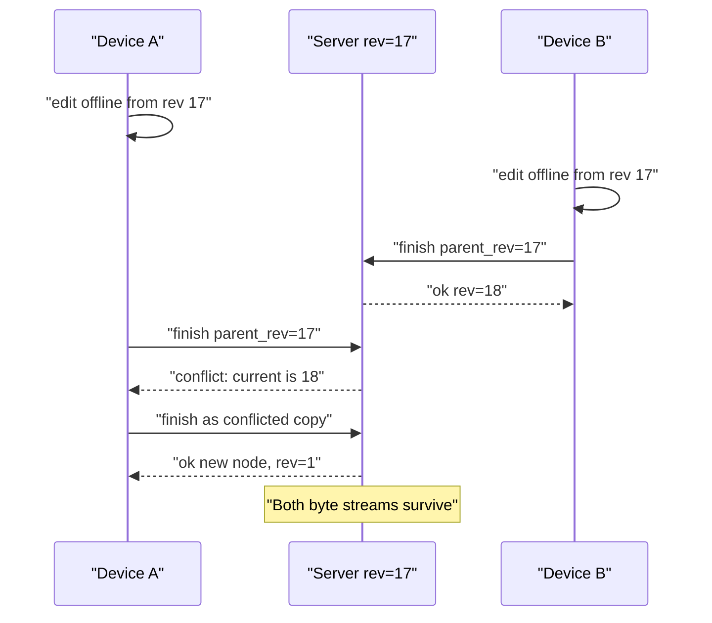
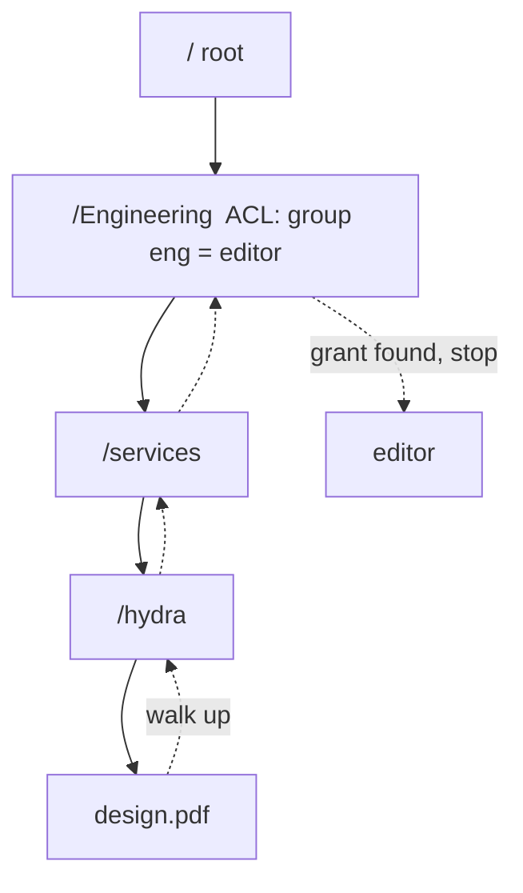

# 17 — Google Drive / Dropbox (File Sync)

<span class="pill pill-core">Core</span> <span class="pill pill-hard">Hard</span>

**A file sync service is not a storage problem — the blobs are the easy part. It is a distributed, partially-connected, eventually-consistent replicated filesystem whose hardest component is the metadata journal that must serialise every namespace mutation from every device without ever losing a user's edit.**

| | |
|---|---|
| **Commonly asked at** | Google, Dropbox, Microsoft, Box, Apple, Atlassian, Snowflake |
| **Time budget** | 45 min |
| **Core tension** | Bandwidth and storage efficiency (chunking, dedup, delta sync) versus metadata correctness and privacy — every byte you avoid re-uploading costs you an index entry, a cross-user information leak, or a conflict you now have to resolve |
| **Prerequisites** | [F06 Partitioning & Sharding](../fundamentals/f06-partitioning-sharding.md), [F07 Replication & Consistency](../fundamentals/f07-replication-consistency.md), [F11 Idempotency](../fundamentals/f11-idempotency.md), [F13 Storage Engines](../fundamentals/f13-storage-engines.md), [F15 Object & Blob Storage](../fundamentals/f15-object-storage.md), [F19 Concurrency Control](../fundamentals/f19-concurrency-control.md), [F20 Time, Clocks & Ordering](../fundamentals/f20-time-clocks-ordering.md), [F27 Security in Design](../fundamentals/f27-security-design.md) |

---

## 1. Problem Statement

Build a service that keeps a set of files and folders identical across an arbitrary number of devices belonging to a user, plus any devices belonging to users they have shared with. Devices go offline, edit concurrently, come back with divergent state, run out of disk, and occasionally contain two million files in a single directory.

The naive framing — "upload the file, download the file" — misses the four things that actually make this hard:

1. **Bandwidth is the user-visible cost.** Re-uploading a 4 GB VM image because someone changed a byte in the middle is the difference between a product and a toy. This forces chunking, and the choice of chunking algorithm determines whether an *insertion* in the middle of a file costs one chunk or every chunk after the insertion point.
2. **The metadata plane is the bottleneck, not the data plane.** Blob storage scales horizontally and trivially — it is a hash-keyed, immutable, append-only workload. The namespace is a mutable tree with ordering requirements, cross-entity invariants (you cannot move a folder into its own descendant), and per-user serialisation. That is a database problem, and it is the one that pages you.
3. **Every device is a replica with an unreliable local agent.** The client watcher is a distributed systems component running on hardware you do not control, on filesystems that lie about change notification, with a user who can `rm -rf` a synced folder and expect it back.
4. **Dedup across users is a privacy boundary.** Global content-addressed dedup is enormously efficient and directly enables the confirmation-of-file attack. You have to decide, explicitly, where the dedup boundary sits.

### Out of scope

Real-time collaborative editing of document *content* (that is OT/CRDT territory — a different problem where the unit of sync is an operation, not a file version), full-text search over file contents, and DLP classification. We sync opaque bytes.

---

## 2. Requirements

### Functional

| # | Requirement | Notes |
|---|---|---|
| F1 | Upload, download, rename, move, delete files and folders | Move must be a metadata-only operation, not copy-then-delete |
| F2 | Bidirectional sync to N devices per user | Convergence, not instantaneous consistency |
| F3 | Delta sync — transfer only changed regions | Both upload and download directions |
| F4 | Version history with restore | Default 30 days, 180 days on business tiers |
| F5 | Sharing: per-file and per-folder, with roles (viewer, commenter, editor, owner) | Must propagate to a subtree |
| F6 | Offline edits that reconcile on reconnect | Including offline deletes and offline moves |
| F7 | Conflict detection with a deterministic, non-destructive resolution | Never silently lose a user's bytes |
| F8 | Selective sync / streaming placeholders | A 4 TB corpus on a 256 GB laptop |
| F9 | Trash with restore, and permanent delete | Soft delete for a retention window |
| F10 | Bandwidth throttling, configurable, with LAN sync | Corporate networks will otherwise ban you |

### Non-functional

| # | Requirement | Target |
|---|---|---|
| N1 | Durability of committed data | 11 nines; no acknowledged write is ever lost |
| N2 | Sync propagation latency, small file, both clients online | p50 < 2 s, p99 < 15 s, edge to edge |
| N3 | Metadata API availability | 99.95% monthly |
| N4 | Download availability | 99.99% monthly (served from CDN/edge) |
| N5 | Convergence guarantee | All online replicas of a namespace converge within bounded time; no permanent divergence |
| N6 | No silent data loss | Conflicts materialise as visible files, never as overwrites |
| N7 | Client resource ceiling | < 300 MB RSS, < 5% sustained CPU on a 4-core laptop, even with 2M files |

!!! note "N5 is the real correctness statement"
    "Strong consistency" is the wrong word for a sync system. Devices are offline; you cannot be linearizable across a disconnected replica. The contract you can actually make is: **the metadata journal per namespace is a totally-ordered log, every device converges to the log's terminal state, and no acknowledged content is unreachable.** State that early in an interview and the rest of the design follows.

---

## 3. Scale Estimation

Assume a mature consumer-plus-business service.

**Users and devices**

$$
\begin{aligned}
\text{registered users} &= 7 \times 10^{8} \\
\text{DAU} &= 1.5 \times 10^{8} \\
\text{devices per active user} &= 2.5 \\
\text{concurrent connected devices at peak} &\approx 1.5 \times 10^{8} \times 0.25 \times 2.5 = 9.4 \times 10^{7}
\end{aligned}
$$

Ninety-four million long-lived notification connections. At ~10 KB of kernel and userspace state per idle connection and 400k connections per notification node, that is **235 notification nodes** minimum, call it 400 with headroom and multi-region spread. This is the cheapest tier in the whole system and the one people forget to size.

**Namespace size**

$$
\begin{aligned}
\text{files per user (mean)} &= 1{,}500 \\
\text{total file entries} &= 7 \times 10^{8} \times 1{,}500 = 1.05 \times 10^{12} \\
\text{mean file size} &= 20\ \text{MB (mean is dragged up by media and archives)} \\
\text{logical bytes} &= 1.05 \times 10^{12} \times 20\ \text{MB} = 21\ \text{EB}
\end{aligned}
$$

**Metadata storage** — a file row with path component, size, mtime, blob list pointer, ACL pointer, version pointer is ~400 B; with secondary indexes assume 900 B amortised.

$$
1.05 \times 10^{12} \times 900\ \text{B} \approx 945\ \text{TB}
$$

Sharded 2,000 ways gives ~470 GB per shard — comfortably in the working set of an NVMe node with a decent page cache. That sizing is why 2,000 shards, not 200.

**Chunk mapping** — mean file is 20 MB, mean chunk 4 MB, so ~5 chunk references per file:

$$
5.25 \times 10^{12}\ \text{rows} \times 64\ \text{B} = 336\ \text{TB}
$$

**Physical bytes after dedup** — measured dedup plus compression on a mixed consumer corpus lands around 3.5x for whole-file dedup of shared media and 1.6x for compression of the rest. Take a blended 3x:

$$
\frac{21\ \text{EB}}{3} = 7\ \text{EB logical-unique}
$$

With Reed-Solomon 10-of-14 erasure coding (overhead 1.4x) plus a second geographic copy for the top tier only (say 15% of bytes):

$$
7\ \text{EB} \times 1.4 \times (1 + 0.15) \approx 11.3\ \text{EB physical}
$$

**Mutation rate**

$$
\begin{aligned}
\text{file mutations per DAU per day} &= 20 \\
\text{total} &= 1.5 \times 10^{8} \times 20 = 3 \times 10^{9}\ \text{/day} \\
\text{mean} &= \frac{3 \times 10^{9}}{86400} \approx 34{,}700\ \text{/s} \\
\text{peak (3x diurnal)} &\approx 104{,}000\ \text{/s}
\end{aligned}
$$

Each mutation is a journal append plus an index update plus a fan-out notification to on average 2.5 devices plus shared collaborators. Notification fan-out at peak: ~400k messages/s.

**Metadata reads** — clients call `list_folder/continue` on wake, on network change, and on every notification.

$$
1.5 \times 10^{8} \times 200\ \text{reads/day} = 3 \times 10^{10}\ \text{/day} \approx 347{,}000\ \text{/s mean}, \approx 1 \times 10^{6}\ \text{/s peak}
$$

**Ingest bandwidth**

$$
\begin{aligned}
\text{raw bytes offered per day} &= 1.5 \times 10^{8} \times 100\ \text{MB} = 15\ \text{PB/day} \\
\text{after client-side dedup and delta (75\% eliminated)} &= 3.75\ \text{PB/day} \\
&= \frac{3.75 \times 10^{15}}{86400} \approx 43\ \text{GB/s} \approx 350\ \text{Gbps}
\end{aligned}
$$

!!! tip "The number that wins the interview"
    Say out loud: *"75% of offered bytes never leave the client."* Client-side hashing and `has_block` probes are the single highest-leverage optimisation in the system — they cut ingress cost, storage cost, and user-visible upload time simultaneously. Then immediately note the cost: that probe is exactly the confirmation-of-file oracle, and you have to close it.

---

## 4. API Design

Two distinct planes, deliberately on different endpoints, different auth scopes, and different scaling policies.

### Metadata plane

```http
POST /2/files/list_folder HTTP/1.1
Host: api.sync.example.com
Authorization: Bearer <token>
Content-Type: application/json

{
  "path": "/Projects/hydra",
  "recursive": true,
  "include_deleted": false,
  "limit": 2000
}
```

```json
{
  "entries": [
    {
      "type": "file",
      "id": "fid:AAB2c9",
      "name": "design.pdf",
      "path_lower": "/projects/hydra/design.pdf",
      "size": 8241664,
      "content_hash": "sha256:9f2a...c11d",
      "rev": "0197f2ab3c",
      "server_modified": "2026-08-30T11:02:44Z",
      "parent_id": "fid:AAB0k1"
    }
  ],
  "cursor": "cur:ns=88171:seq=40219884",
  "has_more": true
}
```

`cursor` is the client's position in the namespace journal. Everything else in sync is built on it.

```http
POST /2/files/list_folder/continue   # long-poll delta since cursor
POST /2/files/get_metadata
POST /2/files/create_folder_v2
POST /2/files/move_v2                # atomic within a namespace
POST /2/files/delete_v2              # soft delete
POST /2/files/restore                # to a specific rev
POST /2/sharing/add_folder_member
POST /2/sharing/list_folder_members
```

### Notification plane

Separate hostname so it can be scaled, rate-limited and drained independently, and so a metadata outage does not also blow up 94 million reconnects.

```http
POST /2/files/list_folder/longpoll HTTP/1.1
Host: notify.sync.example.com
Content-Type: application/json

{ "cursor": "cur:ns=88171:seq=40219884", "timeout": 480 }
```

```json
{ "changes": true, "backoff": 0 }
```

The response carries only a boolean. It is a doorbell, not a payload — this is essential. If the notification carried the change itself you would need auth, ordering and durability in the notification tier, and it would become a second metadata system.

### Content plane

```http
POST /2/content/upload_session/start
POST /2/content/upload_session/append_v2    # offset-addressed, resumable
POST /2/content/upload_session/finish       # commits to the namespace journal
POST /2/content/has_blocks                  # dedup probe (rate-limited, see §7.2)
GET  /2/content/download
```

```json
// upload_session/finish
{
  "cursor": { "session_id": "sess:7ac1", "offset": 8241664 },
  "commit": {
    "path": "/Projects/hydra/design.pdf",
    "mode": { ".tag": "update", "update": "0197f2ab3c" },
    "autorename": false,
    "client_modified": "2026-08-30T11:02:41Z",
    "content_hash": "sha256:9f2a...c11d"
  }
}
```

!!! note "`mode: update` with a parent rev is the whole conflict story"
    This is a compare-and-swap on the file's revision. If the server's current rev is not `0197f2ab3c`, the write does not silently win — the server either rejects it or, with `autorename`, materialises a conflicted copy. Optimistic concurrency at the API boundary is what makes conflict handling deterministic rather than timing-dependent. See [F19 Concurrency Control](../fundamentals/f19-concurrency-control.md).

---

## 5. Data Model

Sharded by `namespace_id`. A namespace is a user's root or a shared folder — the unit of journal ordering and the unit of ACL evaluation.

```sql
-- Shard key: namespace_id. Every table below lives in the same shard.

CREATE TABLE namespace (
  namespace_id      BIGINT       PRIMARY KEY,
  kind              SMALLINT     NOT NULL,      -- 0=user root, 1=shared folder, 2=team space
  owner_user_id     BIGINT       NOT NULL,
  root_node_id      BIGINT       NOT NULL,
  journal_seq       BIGINT       NOT NULL,      -- monotonic, per namespace
  quota_bytes       BIGINT       NOT NULL,
  used_bytes        BIGINT       NOT NULL
);

CREATE TABLE fs_node (
  namespace_id      BIGINT       NOT NULL,
  node_id           BIGINT       NOT NULL,      -- stable across renames and moves
  parent_id         BIGINT       NOT NULL,
  name              VARCHAR(255) NOT NULL,
  name_lower        VARCHAR(255) NOT NULL,      -- NFC-normalised, case-folded
  kind              SMALLINT     NOT NULL,      -- 0=file, 1=folder
  size_bytes        BIGINT       NOT NULL DEFAULT 0,
  content_hash      BYTEA,                      -- sha256 of the whole file
  blocklist_id      BIGINT,                     -- FK to blocklist
  current_rev       BIGINT       NOT NULL,
  client_mtime      TIMESTAMPTZ,
  server_mtime      TIMESTAMPTZ  NOT NULL,
  deleted_at        TIMESTAMPTZ,                -- soft delete
  PRIMARY KEY (namespace_id, node_id)
);

-- The directory-listing index. This is the hot index and the one that
-- degrades on the 2M-files-in-one-folder pathology.
CREATE UNIQUE INDEX fs_node_dir
  ON fs_node (namespace_id, parent_id, name_lower)
  WHERE deleted_at IS NULL;

-- Immutable version chain. Never updated, only appended.
CREATE TABLE fs_revision (
  namespace_id      BIGINT       NOT NULL,
  node_id           BIGINT       NOT NULL,
  rev               BIGINT       NOT NULL,
  blocklist_id      BIGINT       NOT NULL,
  size_bytes        BIGINT       NOT NULL,
  content_hash      BYTEA        NOT NULL,
  author_device_id  BIGINT,
  created_at        TIMESTAMPTZ  NOT NULL,
  PRIMARY KEY (namespace_id, node_id, rev DESC)
);

-- Ordered list of chunk hashes making up one file version.
CREATE TABLE blocklist (
  namespace_id      BIGINT       NOT NULL,
  blocklist_id      BIGINT       NOT NULL,
  ordinal           INT          NOT NULL,
  block_hash        BYTEA        NOT NULL,      -- sha256 of chunk plaintext
  block_size        INT          NOT NULL,
  PRIMARY KEY (namespace_id, blocklist_id, ordinal)
);

-- The journal. Clients read this, in order, via cursor.
CREATE TABLE ns_journal (
  namespace_id      BIGINT       NOT NULL,
  seq               BIGINT       NOT NULL,
  op                SMALLINT     NOT NULL,      -- add/edit/delete/move/rename/acl
  node_id           BIGINT       NOT NULL,
  payload           JSONB        NOT NULL,
  actor_device_id   BIGINT,
  created_at        TIMESTAMPTZ  NOT NULL,
  PRIMARY KEY (namespace_id, seq)
);

CREATE TABLE acl_entry (
  namespace_id      BIGINT       NOT NULL,
  node_id           BIGINT       NOT NULL,      -- mount point of the shared folder
  principal_id      BIGINT       NOT NULL,      -- user or group
  role              SMALLINT     NOT NULL,      -- 0=viewer 1=commenter 2=editor 3=owner
  inherited_from    BIGINT,
  granted_at        TIMESTAMPTZ  NOT NULL,
  PRIMARY KEY (namespace_id, node_id, principal_id)
);

CREATE TABLE device_cursor (
  device_id         BIGINT       NOT NULL,
  namespace_id      BIGINT       NOT NULL,
  seq               BIGINT       NOT NULL,
  last_seen_at      TIMESTAMPTZ  NOT NULL,
  PRIMARY KEY (device_id, namespace_id)
);
```

Global, not per-namespace — the content-addressed block store index:

```sql
CREATE TABLE block_index (
  block_hash        BYTEA        PRIMARY KEY,   -- sharded by hash prefix
  container_id      BIGINT       NOT NULL,      -- which packed container holds it
  offset_in_cont    INT          NOT NULL,
  length            INT          NOT NULL,
  refcount          BIGINT       NOT NULL,      -- see §12 on refcount races
  first_seen_at     TIMESTAMPTZ  NOT NULL,
  storage_class     SMALLINT     NOT NULL       -- 0=hot 1=warm 2=cold
);
```

!!! warning "`node_id` is stable, `path` is derived"
    Storing the full path in `fs_node` and updating it on rename turns a folder rename into an $O(\text{subtree})$ write. Store `parent_id` only; materialise paths on read, cache them, and invalidate by subtree. A rename of a 2-million-node folder must be one row update, not two million.

---

## 6. High-Level Architecture



### Write path walkthrough

1. The watcher observes a close-after-write on `design.pdf`. It debounces for 500 ms (editors write-truncate-rewrite; you do not want three uploads for one save).
2. The client reads the file, chunks it, and computes a SHA-256 per chunk plus a whole-file hash. It records the result in the local SQLite journal so a crash does not force a re-hash.
3. The client calls `has_blocks` with the chunk hash list. The server answers which hashes it already holds. Typically 60-90% for a modified file, 100% for a file copied from a colleague.
4. Missing chunks are uploaded to the **block service**, which verifies the hash server-side (never trust a client-supplied hash — see §12), packs the chunk into an open container, writes the container to erasure-coded storage, and inserts into `block_index` with `refcount = 0`.
5. The client calls `upload_session/finish` with the ordered blocklist and the parent rev. This is the commit point.
6. The metadata API opens a transaction on the namespace shard: validate the ACL, CAS the `current_rev`, insert `fs_revision`, insert `blocklist`, increment chunk refcounts, append to `ns_journal` with `seq = journal_seq + 1`, update `journal_seq`. **Commit.** Only now is the write acknowledged.
7. The journal writer tails the commit and publishes `(namespace_id, seq)` to the notification service, which rings the doorbell on every long-poll connection registered for that namespace.



### Read path walkthrough

1. Client B's long-poll returns `changes: true`.
2. B calls `list_folder/continue` with its cursor. The server reads `ns_journal` from `seq+1` forward, coalesces (an add followed by a delete of the same node collapses), and returns entries plus a new cursor.
3. B diffs the incoming blocklist against the blocklist it already has for that node. Chunks it already holds — from the previous version of the file, or from any other file in its local content-addressed cache — are reused from disk.
4. Missing chunks are fetched. Downloads go through a CDN with signed, short-TTL URLs keyed on the chunk hash. Because chunk content is immutable and hash-addressed, cache TTL can be effectively infinite and the hit rate on popular shared content is very high. See [F05 CDN & Edge](../fundamentals/f05-cdn-edge.md).
5. B assembles the file into a temp file **on the same filesystem**, verifies the whole-file hash, then `rename()`s it into place — an atomic operation that ensures no application ever sees a torn file.
6. B advances its cursor **only after** the rename succeeds and is fsynced. Cursor advancement is the client's commit point.

---

## 7. Deep Dives

### 7.1 Content-defined chunking versus fixed-size chunking

Fixed-size chunking splits at every 4 MiB boundary. It is trivially fast, gives perfectly uniform chunk sizes, and produces a compact blocklist. It also has a catastrophic failure mode: the **boundary-shift problem**.

Insert one byte at offset 0 of a 4 GB file. With fixed 4 MiB chunks, every subsequent chunk boundary shifts by one byte, so all 1,024 chunks have new content and new hashes. Dedup yield: zero. You re-upload 4 GB.



Content-defined chunking (CDC) picks boundaries by content, not by offset. Slide a window over the byte stream, compute a rolling hash, and cut where the hash matches a mask. An insertion perturbs only the chunks whose windows overlap the edit; boundaries **resynchronise** within one expected chunk length.

The classic rolling hash is Rabin fingerprinting over $\mathrm{GF}(2)$ polynomials. Modern implementations use the cheaper **gear hash** (a table lookup and a shift per byte) or FastCDC, which adds normalised chunking to tighten the size distribution.

```python
# Gear-hash CDC with normalised chunking (FastCDC-style).
# GEAR is a fixed table of 256 random 64-bit values.

MIN_SIZE  = 2 * 1024 * 1024      # 2 MiB  - never emit smaller
NORM_SIZE = 4 * 1024 * 1024      # 4 MiB  - target
MAX_SIZE  = 8 * 1024 * 1024      # 8 MiB  - hard cut, bounds worst case

MASK_HARD = 0x0000_1F03_0100_0000   # ~22 bits set: cuts rarely (before target)
MASK_EASY = 0x0000_0180_0300_0000   # ~18 bits set: cuts often  (after target)

def next_boundary(buf: bytes, start: int) -> int:
    n = len(buf)
    end = min(start + MAX_SIZE, n)
    norm = min(start + NORM_SIZE, end)
    i = start + MIN_SIZE            # skip: no boundary can occur before MIN
    if i >= end:
        return end
    fp = 0
    # Phase 1: strict mask, biases against short chunks.
    while i < norm:
        fp = ((fp << 1) + GEAR[buf[i]]) & 0xFFFF_FFFF_FFFF_FFFF
        if fp & MASK_HARD == 0:
            return i
        i += 1
    # Phase 2: relaxed mask, biases against long chunks.
    while i < end:
        fp = ((fp << 1) + GEAR[buf[i]]) & 0xFFFF_FFFF_FFFF_FFFF
        if fp & MASK_EASY == 0:
            return i
        i += 1
    return end                      # hard cut at MAX_SIZE
```

With a mask of $b$ bits, the cut probability per byte is $2^{-b}$ and chunk length is geometric with mean $2^{b}$. Unbounded, the distribution has a long tail in both directions — which is why every practical implementation clamps with `MIN_SIZE` and `MAX_SIZE`, and why FastCDC's two-mask normalisation exists: it pulls the distribution toward the target without the variance blow-up.

| Approach | Insert resilience | CPU cost | Chunk size variance | Blocklist size | Chosen / rejected and why |
|---|---|---|---|---|---|
| Fixed 4 MiB | None | Negligible | Zero | Minimal | **Chosen for the common case.** Dropbox ships this. Most real edits are append (logs, media) or in-place same-length overwrite (databases, Office save-in-place is actually rewrite), where fixed blocks dedup fine, and the CPU saving on mobile matters |
| Rabin CDC, 4 MiB target | Excellent | ~200 MB/s/core | High without clamps | +0 (same count) | Rejected as default: 3-5x the CPU of a memcpy-bound hash on battery-powered clients |
| Gear/FastCDC, 2/4/8 MiB | Excellent | ~1.5 GB/s/core | Controlled | +0 | **Chosen for large files (> 64 MiB) and for the backup-style tier.** Cheap enough to justify |
| Whole-file hash only | None | Cheapest | n/a | 1 entry | Kept as a fast path: identical-file detection short-circuits everything before chunking |

!!! example "Concrete yield"
    A 1 GB Outlook PST file where the user received one email. Fixed 4 MiB: the mail store rewrites internal pages scattered through the file — measured yield about 12% new blocks, so 120 MB uploaded. CDC at 4 MiB target: about 4%, so 40 MB. But a 4 GB `.tar` where a file was *inserted* near the front: fixed 4 MiB uploads 3.9 GB, CDC uploads ~30 MB. That two-orders-of-magnitude gap on a real workload is the argument for CDC on large files.

??? note "Why not just use rsync's algorithm?"
    rsync computes weak rolling checksums over the *receiver's* file and has the sender scan for matches. It is superb for two known endpoints, but it requires the server to hold and read the previous version's raw bytes at request time, and it produces a per-pair delta that cannot be shared across users. CDC produces globally content-addressed chunks that dedup across every file and every user, and the server never has to read the old version to compute a delta. Different tool, different problem. We do use an rsync-style delta *within* a chunk for the specific case of a very large chunk with a tiny modification, gated behind a size heuristic.

### 7.2 Content-addressed storage, cross-user dedup, and the confirmation-of-file attack

Chunks are keyed by `SHA-256(plaintext)`. This gives:

- Automatic dedup at every level: within a file, across versions, across users.
- Immutability, so caching is trivial and infinite-TTL CDN caching is safe.
- Self-verifying reads: a corrupt chunk fails its own hash check.

And it gives an attacker an oracle.

**The attack.** The dedup probe `has_blocks(hash)` answers "does this content already exist in the system?" An attacker who possesses a candidate file can hash it and learn whether *anyone* on the service has that file. If the file is a leaked document, a specific build of malware, an illegal image, or a draft press release, the answer is a real information leak. Worse, in the naive design where the server grants you a reference to a chunk merely because you presented its hash, the attacker can **download** content they never had, given only its hash. That is not an information leak, that is unauthorised access. Dropbox's 2011 "Dropship" demonstrated exactly this.



**Mitigations, in increasing order of strength:**

| Mitigation | Closes the download vector | Closes the existence oracle | Dedup yield retained | Chosen / rejected |
|---|---|---|---|---|
| Per-user dedup only | Yes | Yes | ~40% of global | Rejected as global policy: gives up the biggest storage win, but **chosen for encrypted/business tiers** |
| Proof of ownership (PoW) challenge | Yes | Mostly | ~95% | **Chosen.** Server challenges the client to return hashes of random byte ranges within the claimed chunk. Cheap for a client that has the data, impossible for one that has only the hash |
| Rate limit + anomaly detect on `has_blocks` | No | Partially | 100% | **Chosen as defence in depth.** A client probing thousands of unrelated hashes it never uploads is a strong signal |
| Randomised threshold dedup | No | Yes, statistically | ~90% | Considered. Dedup only after the $k$-th independent upload of a chunk, $k$ randomised; below threshold, store a private copy. Removes the single-user existence signal |
| Client-side encryption with per-user keys | Yes | Yes | ~0% cross-user | Correct for zero-knowledge products; incompatible with cross-user dedup by construction |

!!! danger "Convergent encryption does not save you"
    The obvious fix — encrypt each chunk with a key derived from its own plaintext hash, $K = H(P)$, so identical plaintext yields identical ciphertext and dedup still works — reintroduces the same oracle at the ciphertext layer. Anyone who can guess the plaintext can derive the key and confirm the guess. For low-entropy content (a tax form template with a name filled in, a standard contract, a photo from a known set) this is a practical attack, not a theoretical one. See case study 20 for the full treatment.

**Where we land:** global dedup with mandatory proof-of-ownership before granting a reference, aggressive rate limiting on the probe endpoint, and a policy switch that downgrades to per-namespace dedup for tenants who ask for it contractually. State the trade-off explicitly rather than pretending it does not exist — that is what senior looks like here.

### 7.3 The client watcher, inotify limits, and the polling fallback

The watcher is the least glamorous and most incident-generating component.

**Linux — inotify.** One watch descriptor per *directory*, recursively. Kernel memory is roughly 1 KB per watch on 64-bit. The relevant sysctls:

```bash
# Max watch descriptors per user. Distro defaults vary wildly:
# 8192 (old), 65536, or 1048576 (recent Ubuntu/Fedora).
cat /proc/sys/fs/inotify/max_user_watches
# Max queued events before the queue overflows and IN_Q_OVERFLOW is delivered.
cat /proc/sys/fs/inotify/max_queued_events   # default 16384
# Max inotify instances per user.
cat /proc/sys/fs/inotify/max_user_instances  # default 128
```

Two hard failures:

1. **`ENOSPC` on `inotify_add_watch`** when the user's watch budget is exhausted. A user with 300,000 directories on a box where `max_user_watches` is 65,536 simply cannot be fully watched. You cannot silently degrade — you must fall back and tell the user.
2. **`IN_Q_OVERFLOW`** when events arrive faster than you drain them (`git checkout` of a large repo, an unpack of a 500k-file tarball). The kernel drops events and hands you one overflow marker. **Every event after that point is untrustworthy.** The only correct response is a full rescan of the watched subtree.

**macOS — FSEvents** gives you coalesced directory-level events with a persistent event ID, which is genuinely better: after a crash or reboot you replay from your last event ID. The catch is that events are directory-granular and coalesced, so you still need to `stat` the directory contents to know what changed.

**Windows — `ReadDirectoryChangesW`** with a user-supplied buffer. If the buffer overflows, you get a single overflow notification and, again, must rescan. Buffer size above 64 KB fails on network shares.



The polling fallback walks the tree and compares `(size, mtime, inode)` against the local journal. On a 2-million-file tree a full `stat` walk is 2 million syscalls — roughly 20-60 seconds of wall time on NVMe, minutes on a spinning disk or a network mount, with real IO pressure. So polling is tiered: hot directories (recently changed) every 30 s, warm every 10 min, cold every 6 h, with a full pass daily during idle.

!!! gotcha "mtime granularity and the 1-second window"
    **Symptom:** a file is edited twice within the same second, size unchanged; the second edit is never synced.
    **Mechanism:** many filesystems and network mounts expose 1-second `mtime` granularity. Two writes in the same second with identical size are indistinguishable to a `(size, mtime)` comparison.
    **Mitigation:** include the inode change time `ctime` and, where the platform provides it, nanosecond `mtim`. For any file that changed within the last 2 seconds, re-hash rather than trusting the stat tuple. On network mounts with coarse timestamps, always hash.

### 7.4 The metadata service is the bottleneck

The blob tier is embarrassingly parallel and stateless-ish: hash in, bytes out. The metadata tier has to totally order mutations per namespace, enforce tree invariants, and serve a million reads per second.

**Partitioning.** Shard by `namespace_id`, hash-partitioned into 2,000 logical shards mapped onto physical nodes so shards can be moved without rehashing. Every operation in the write path touches exactly one shard — that is the design constraint that keeps you out of two-phase commit. See [F06 Partitioning & Sharding](../fundamentals/f06-partitioning-sharding.md).

**The cross-namespace problem.** Moving a file from your personal root into a shared folder crosses namespaces. Options:

| Option | Consistency | Complexity | Chosen / rejected |
|---|---|---|---|
| 2PC across shards | Atomic | High; coordinator failure blocks both shards | Rejected — a stuck coordinator holds locks on two hot shards |
| Copy-then-delete, non-atomic | Window where the file exists twice | Low | Rejected — visible duplicates, and a crash leaves both |
| Saga with a tombstone-and-claim protocol | Eventually atomic, always exactly-once visible | Medium | **Chosen.** Write an intent record in the source, create in the destination with a `pending_from` marker, then finalise. Idempotent, retryable, and the intermediate state is renderable as "moving" |

**Ordering.** `seq` is allocated inside the shard transaction from `namespace.journal_seq`. That gives a gapless, monotonic per-namespace sequence with no distributed clock involved — the cursor is meaningful precisely because it is a local counter, not a timestamp. Do not use wall-clock time as a cursor; see [F20 Time, Clocks & Ordering](../fundamentals/f20-time-clocks-ordering.md).

**Read scaling.** `list_folder/continue` is 95% of read volume and is almost always "nothing changed". Serve it from followers with a bounded staleness contract, and short-circuit the common case entirely: the notification tier already knows the namespace's latest `seq`, so if the client's cursor equals the latest `seq`, return an empty delta without touching the database at all. This alone removes the majority of metadata reads.

### 7.5 Conflict resolution and conflicted-copy semantics

Two devices edit the same file while partitioned. Both come back. There is no correct merge for opaque bytes — the only choice is which *kind* of wrong you prefer.

| Strategy | Data loss | User confusion | Chosen / rejected |
|---|---|---|---|
| Last-writer-wins by server receipt time | Yes, silent | Low until it bites, then catastrophic | Rejected. Violates N6 |
| Last-writer-wins by client mtime | Yes, and non-deterministic (client clocks skew) | Low | Rejected. Clock skew makes the loser arbitrary |
| Reject the second write, force manual resolve | No | High; blocks sync until a human acts | Rejected for consumer, offered for locked business files |
| **Conflicted copy** | No | Medium; a second file appears | **Chosen** |
| CRDT merge | No | None | Rejected for opaque bytes; correct only when you understand the format |

**The rule:** the write whose `parent_rev` matches the server's `current_rev` wins the path. The other becomes `design (Alice's conflicted copy 2026-08-30).pdf`, a normal file in the same folder, with its own node id and its own journal entry.



The naming must be deterministic and idempotent. If device A retries after a network timeout and the conflicted copy already committed, retrying must not create a *second* conflicted copy. Key the creation on `(node_id, content_hash, device_id)` and make it an upsert. See [F11 Idempotency](../fundamentals/f11-idempotency.md).

**Harder conflict classes**, in rough order of nastiness:

- **Edit vs delete.** A deletes the file, B edits it. Resolution: the edit resurrects the file. Deletes are weaker than edits — you can always delete again, you cannot un-lose bytes.
- **Move vs move.** A moves `/x` to `/a/x`, B moves `/x` to `/b/x`. Journal order decides; the loser gets a no-op. Both devices converge.
- **Move-into-own-descendant.** A moves `/a` into `/a/b`, B moves `/a/b` into `/a/b/c`... applied naively you orphan a cycle from the tree. The server must detect the cycle at commit time (walk the ancestor chain, bounded by tree depth) and reject. This is the single most-missed invariant in interviews.
- **Case and Unicode collisions.** A creates `README.md` on Linux, B has `readme.md` on macOS (case-insensitive). Store `name_lower` normalised to NFC and case-folded, unique-index on it, and force a conflicted copy. Also: macOS historically stored filenames in NFD, so `café` from macOS and `café` from Linux are different byte sequences for the same displayed name. Normalise at the API boundary, always.

### 7.6 Sharing and ACL propagation on a deep tree

A user shares `/Engineering` — 400,000 nodes, 12 levels deep — with a 200-person group.

**Do not** write 400,000 ACL rows. Store the grant **once**, at the mount point, and evaluate by walking ancestors at read time. A 12-level walk is 12 cached lookups.



The reality is more subtle. A shared folder becomes its own **namespace** in the recipient's account: it is mounted into their tree, gets its own journal, and its own cursor. That is what makes "shared folder appears instantly, 400k files stream in over the next hour" possible, and it is also why a shared folder counts against the *owner's* quota, not the recipient's.

**Revocation** is the hard direction. Removing a member must:

1. Delete the `acl_entry` — immediate, one row.
2. Invalidate every cached ACL decision for that principal on that subtree. Use an epoch counter on the namespace; bump it and all cached decisions for the namespace become stale. Cheap and correct. See [F04 Caching](../fundamentals/f04-caching.md).
3. Revoke outstanding signed download URLs. Signed URLs with a 15-minute TTL mean up to 15 minutes of residual access. For sensitive tenants, bind the signature to a token whose validity is checked at the edge against the epoch.
4. Instruct the ex-member's devices to unmount and delete the local copy. This is advisory — the bytes are already on their disk. Say so plainly; pretending otherwise is a red flag.

!!! warning "The permission-check amplification trap"
    `list_folder` on a folder with 200,000 children must not do 200,000 ancestor walks. Evaluate the ACL **once for the folder**, and only re-evaluate for children that carry their own `acl_entry` — which is a tiny minority you can find with a single indexed lookup. Naive per-row permission checks are the most common cause of a metadata tier melting under a legitimate request.

---

## 8. Scaling the Bottleneck

The bottleneck is per-namespace journal write throughput, and it fails in two distinct shapes.

**Shape 1: the hot shared namespace.** A 5,000-person company's `/Shared` namespace where a CI job writes build artefacts. Every write serialises on one namespace's `journal_seq`, and every write fans out a notification to 5,000 devices which all immediately call `list_folder/continue`. One write causes 5,000 reads. A 100 writes/s job causes 500,000 reads/s against one shard.

Mitigations, applied in order:

1. **Coalesce notifications.** Do not ring the doorbell per commit. Ring at most once per namespace per 2 seconds. A client that gets one bell and reads 40 journal entries is strictly better than 40 bells.
2. **Coalesce the delta.** `list_folder/continue` collapses redundant ops before serialising: create-then-delete vanishes, N edits to a node become one, a move plus a rename becomes one.
3. **Jitter the client wake-up.** Without jitter, 5,000 clients wake within the same 50 ms window. With uniform jitter over the coalescing interval, the read burst flattens by two orders of magnitude. See [F18 Resilience Patterns](../fundamentals/f18-resilience-patterns.md).
4. **Serve deltas from a read replica plus a per-namespace delta cache.** The journal tail is tiny and identical for every reader at the same cursor — cache the serialised response keyed by `(namespace_id, from_seq, to_seq)`. Hit rate above 99% on hot namespaces.
5. **Split the namespace.** If a single shared folder genuinely needs more than a few hundred writes/s, sub-namespace it: give each top-level child its own journal. Costs you cross-subtree atomicity, which those workloads do not need.

**Shape 2: the pathological client.** One user with 2,000,000 files in a single folder. Symptoms across the stack:

- `list_folder` with `limit=2000` requires 1,000 paginated round trips holding a consistent snapshot.
- The `(namespace_id, parent_id, name_lower)` index has 2M entries under one `parent_id` — a single index range that no longer fits in cache, so every insert is a disk seek.
- The client's local journal and its in-memory directory model blow past the 300 MB RSS budget.
- Any full rescan is 2M `stat` calls.

Mitigations:

- **Hard limits, enforced early and visibly.** Cap children per folder (e.g. 500,000) with a clear error, not silent truncation.
- **Cursor-based pagination over `(name_lower, node_id)`**, never `OFFSET`. Offset pagination on 2M rows is quadratic.
- **Snapshot isolation for the paginated walk** so a folder mutating during a 1,000-page listing does not skip or duplicate entries. A repeatable-read snapshot, or serve the listing from the journal at a fixed `seq`.
- **Streaming/placeholder mode** on the client: materialise directory entries as sparse placeholder files, hydrate content on first open. This decouples "number of files in the namespace" from "bytes and inodes on this disk".
- **Bounded-memory client model.** The client cannot hold 2M nodes in memory; it must page its own SQLite journal. Design for this from the start.

---

## 9. Failure Modes

| Failure | Blast radius | Detection | Mitigation | Degraded behaviour |
|---|---|---|---|---|
| Namespace shard primary loss | All users whose namespaces live on that shard (~0.05% of users) | Health check + replication lag alarm | Automatic failover to a synchronous replica; leases prevent split brain | Writes fail for 10-30 s with retryable 503; reads served from followers; clients back off and retry |
| Journal `seq` gap (bug or manual repair) | One namespace, permanently — clients cannot trust the cursor | Continuous gap-scan auditor over `ns_journal` | Invalidate all cursors for the namespace, force a full re-list | Clients do a full reconcile; minutes of extra traffic, no data loss |
| Block index shard unavailable | All uploads/downloads whose chunk hashes land on that prefix (~1% of chunks) | Error rate on `has_blocks` and `GET /block` | Hash-prefix sharding with 3-way replication; read from any replica | Uploads skip dedup and write the chunk anyway (correct, just less efficient); downloads for affected chunks fail and retry |
| Erasure-coded pod loses more than $m$ shards | Objects placed on that pod | Continuous scrubber + placement audit | Placement across independent failure domains; proactive rebuild at first shard loss | Affected chunk reads fail; recovery from the geo copy if the object is in the replicated tier |
| Notification tier outage | All clients lose push; nobody loses data | Connection count cliff, doorbell publish lag | Clients fall back to periodic polling with exponential backoff and jitter | Sync latency degrades from seconds to the poll interval (5 min); everything still converges |
| Thundering-herd reconnect after notification restart | Metadata tier (1M+ req/s spike) | Connection rate, metadata p99 | Server-supplied `backoff` field in the long-poll response; staggered reconnect windows; admission control | Some clients told to wait up to 5 min; sync latency degrades, service survives |
| Client clock skew (device set to 2019) | That user's files | Server compares `client_modified` against receipt time | Never order by client time; `client_modified` is display metadata only | Slightly wrong "modified" timestamps shown; ordering unaffected |
| Client disk full mid-download | One device | `ENOSPC` on write | Download to temp, verify, atomic rename; never truncate the existing file | Sync pauses with a clear message; existing local files intact |
| Refcount underflow on a chunk (GC race) | Potentially many files reference a deleted chunk | Chunk-read hash mismatch or 404; blocklist auditor | Never delete on refcount 0 alone — require a grace period plus a mark-and-sweep confirmation | Reads fail; restore from geo copy. This is the worst bug class in the system |
| Malicious client uploads chunk whose content mismatches its hash | Every user who dedups against that hash | Server-side hash verification on ingest | **Always** recompute the hash server-side before inserting into the index | Upload rejected. If verification is skipped, this is a catastrophic content-poisoning vector |
| Ransomware encrypts a synced folder | All the user's devices, then all shared collaborators | Anomaly detection: mass rewrite with high-entropy content and extension changes | Version history + "rewind folder to timestamp"; alert on mass-change events | Encrypted files sync everywhere; recovery is a bulk restore to a prior point |

---

## 10. SRE Lens

### SLIs and SLOs

| SLI | Definition | SLO |
|---|---|---|
| Metadata write availability | Non-5xx, non-timeout `finish` and mutation calls / total | 99.95% over 28 days |
| Metadata write latency | p99 of commit-path duration | < 400 ms |
| Sync propagation latency | Time from `finish` commit on device A to file materialised on an online device B, small file | p50 < 2 s, p95 < 8 s, p99 < 15 s |
| Download availability | Non-5xx chunk GETs / total | 99.99% |
| Notification delivery lag | Commit `seq` to doorbell rung | p99 < 1 s |
| Durability | Committed content hashes readable and hash-verified | 11 nines, measured by continuous sampling |
| Convergence | Fraction of namespaces where all connected devices' cursors reach head within 60 s of last write | > 99.9% |

Propagation latency is the SLI users actually feel, and it is the hardest to instrument because it spans two clients. Measure it with a synthetic prober fleet: paired agents in each region writing a 4 KB canary file every 30 s and reporting edge-to-edge time. Do not try to reconstruct it from server-side spans alone — that misses the client's own scheduling delay, which is often the dominant term.

### Error budget

99.95% monthly on metadata writes gives $0.0005 \times 43{,}200 \approx 21.6$ minutes per month. A single shard failover costs ~30 s of writes for 0.05% of users; weighted by user-minutes that is negligible, which is the point of fine-grained sharding. The budget is really consumed by correlated events: a bad deploy to the metadata tier, a control-plane change, a dependency outage.

Policy: at 50% burn, freeze non-essential metadata deploys. At 75%, all changes to the commit path require a second reviewer and a staged rollout with a 24 h soak per stage. At 100%, feature work stops until the budget recovers. See [F23 SLI/SLO & Error Budgets](../fundamentals/f23-slo-error-budgets.md).

### Rollout

The client is the scary part: you cannot roll it back. A released binary on 94 million devices with a sync bug is a data-loss event with a multi-week tail.

- **Server-side kill switches for every client feature.** The client asks for its feature config on startup and on a timer. A misbehaving code path must be disableable without a new binary.
- **Staged client rollout:** internal dogfood (1 week) → 0.1% → 1% → 10% → 50% → 100%, with a minimum 48 h soak per stage and automatic halt on regression in crash rate, conflict-copy creation rate, or bytes uploaded per user.
- **The conflict-copy rate is your best client canary.** A sudden rise means the new client is misjudging revisions. It is a leading indicator of data-integrity bugs and it moves before crash rate does.
- **Metadata schema changes** follow expand-migrate-contract: add nullable column, dual-write, backfill, switch reads, wait a full release cycle, drop. Never in one deploy. See [F25 Deployment & Release Safety](../fundamentals/f25-deployment-release-safety.md).

### Runbook notes

```text
ALERT: sync_propagation_p99 > 60s for 10m
  1. Check notification tier: connection count, publish lag, restart events.
     If connections dropped, herd is likely; confirm metadata QPS spike.
  2. Check per-shard journal write latency. One hot shard or global?
     Hot shard -> identify namespace via top-N writer dashboard; consider
     emergency notification coalescing bump for that namespace.
  3. Check block service p99. If uploads are slow, finish is slow, and
     propagation follows.
  4. If herd: raise long-poll `backoff` field to 120s server-side. This is
     the single most effective lever and it is instant.
  5. Do NOT restart the notification fleet to "clear it". That re-creates
     the herd you are trying to shed.

ALERT: conflict_copy_rate > 3x 7-day baseline
  1. Segment by client version. New version -> halt rollout immediately.
  2. Segment by platform. macOS-only -> suspect FSEvents/normalisation.
  3. Segment by namespace kind. Shared folders only -> suspect ACL or
     cross-namespace move path.
  4. This alert is data-integrity adjacent. Page, do not ticket.
```

### Capacity model

Drivers, in order of cost sensitivity: physical bytes stored, egress bytes, metadata IOPS, notification connections.

$$
\text{shards needed} = \left\lceil \frac{\text{peak namespace write/s}}{\text{write/s per shard}} \right\rceil = \left\lceil \frac{104{,}000}{80} \right\rceil = 1{,}300
$$

at a conservative 80 sustained commit/s per shard (each commit is a multi-row transaction with an fsync). We provision 2,000 for headroom and for the 2-3x hot-shard skew that always exists. Growth is driven by DAU, and shard splits must be a routine, automated, no-downtime operation — practise them monthly. See [F24 Capacity Planning](../fundamentals/f24-capacity-planning.md).

### Cost

Rough monthly at the scale in §3, using commodity cloud list prices as an upper bound:

| Component | Quantity | Unit | Monthly |
|---|---|---|---|
| Physical storage (blended hot/warm/cold) | 11.3 EB | $0.009/GB-mo blended | ~$102M |
| Egress to internet | 40 PB | $0.02/GB (committed rate) | ~$800K |
| Metadata fleet | 2,000 shards, 3 replicas | $600/node-mo | ~$3.6M |
| Notification fleet | 400 nodes | $300/node-mo | ~$120K |
| Block service + EC compute | 3,000 nodes | $500/node-mo | ~$1.5M |

Storage dominates by two orders of magnitude, which is why dedup and tiering are not micro-optimisations — a 10% improvement in dedup ratio is worth more than the entire compute fleet. It is also why every serious player at this scale owns hardware rather than renting it. See [F28 Cost Engineering](../fundamentals/f28-cost-engineering.md).

**Cold tiering.** Access probability decays sharply with age. Empirically, ~85% of reads target content under 30 days old, and content untouched for 12 months has a monthly access probability under 1%. Policy: hot (SSD-backed, EC 10-of-14) for 90 days, warm (HDD, EC 10-of-14) to 12 months, cold (high-density HDD or tape-like, EC 20-of-28 for lower overhead) beyond. Tier the *chunk*, not the file — a chunk shared by a hot file and a cold file stays hot, decided by the maximum access recency across referencing files.

---

## 11. Trade-offs & Alternatives

| Decision | Chosen | Alternative | Why |
|---|---|---|---|
| Chunking | Fixed 4 MiB default, CDC above 64 MiB | CDC everywhere | Mobile CPU and battery; fixed blocks dedup adequately on the dominant workloads. CDC where the payoff justifies it |
| Dedup scope | Global, gated by proof-of-ownership | Per-user | Global is worth ~2.5x storage. PoW closes the download vector; rate limiting and randomised thresholds blunt the oracle |
| Metadata store | Sharded RDBMS with per-namespace journal | Globally distributed SQL (Spanner-class) | Every write touches one namespace; we do not need cross-shard transactions, so we should not pay for them. Spanner-class would remove the saga but add commit latency to every write |
| Ordering | Per-namespace monotonic counter | Global timestamp / HLC | A local counter is gapless, cheap, and gives an exact cursor. Timestamps introduce skew and ambiguity for zero benefit here |
| Notification | Doorbell only, long-poll | Push the change payload over WebSocket | Doorbell keeps the tier stateless, unauthenticated-ish, and cheap. Payload push needs auth, ordering and durability — a second metadata system |
| Conflict | Conflicted copy | LWW, or block-and-prompt | Never lose bytes. Users understand a second file; they do not forgive a vanished one |
| ACL | Grant at mount point, evaluate by ancestor walk | Materialise per-node | Materialising means a subtree write on every share change. The walk is 12 cached lookups |
| Transport | HTTPS with resumable sessions | Custom UDP/QUIC protocol | Corporate proxies and captive portals. QUIC is worth adding as an opportunistic fast path with TCP fallback, not as the only path |
| Blob durability | EC 10-of-14 within region, replication for hot tier | 3x replication everywhere | 1.4x overhead versus 3x at equal or better durability; see case study 18 for the math |
| Delete | Soft delete + retention window + async GC | Immediate hard delete | Undo is a product requirement, and synchronous refcount decrement on delete of a 100k-file folder is a latency disaster |

??? note "What would change if this were a zero-knowledge product?"
    End-to-end encryption with client-held keys eliminates cross-user dedup entirely (identical plaintext yields different ciphertext under different keys), so storage cost rises roughly 2.5x. Server-side delta computation becomes impossible. Sharing requires per-recipient key wrapping, and revocation requires re-keying the content, which means re-uploading it. Search over content moves entirely client-side. The metadata plane can still see the tree shape unless you also encrypt filenames, which then breaks server-side sorted listing and forces the client to hold the whole namespace index. Every one of those is a real product regression — which is why most consumer sync products are encrypted at rest with provider-held keys, not end-to-end.

---

## 12. Gotchas & Corner Cases

!!! gotcha "Never trust a client-supplied content hash"
    **Symptom:** users report a file downloading as garbage, or as *someone else's* content. Possibly years after the upload.
    **Mechanism:** the client claims chunk hash $H$ and uploads bytes whose real hash is $H'$. If the server indexes by the claimed hash, every future file that legitimately dedups against $H$ now resolves to attacker-controlled bytes. This is content poisoning and it is silent.
    **Mitigation:** recompute the hash server-side on ingest, before insert, always. It costs ~1 GB/s/core with hardware SHA extensions — cheap relative to the storage write you are about to do. Additionally verify on read at the client, which catches it even if ingest verification regresses.

!!! gotcha "Refcount decrement races delete the chunk you are still writing"
    **Symptom:** a just-uploaded file is unreadable; a chunk 404s minutes after a successful upload.
    **Mechanism:** chunk $C$ has refcount 1 from file X. User deletes X, refcount drops to 0, GC queues it. Concurrently user Y uploads a file containing $C$, the dedup probe says "exists", so no bytes are uploaded, and the metadata commit increments refcount 0 to 1 — but GC already read 0 and deletes the container region.
    **Mitigation:** refcounts alone are insufficient. Require a minimum age since `last_referenced_at` (e.g. 7 days) before a zero-refcount chunk is eligible, re-verify refcount inside the deletion transaction with the chunk row locked, and back the whole thing with a periodic mark-and-sweep that recomputes reachability from live blocklists. Treat refcount as an optimisation hint, not as truth.

!!! gotcha "Rename of a large folder becomes a subtree write"
    **Symptom:** renaming a folder takes 40 seconds and pins a metadata shard at 100% for the duration; other users on that shard see timeouts.
    **Mechanism:** the schema stores a materialised full path per node, so a rename must rewrite every descendant row and emit a journal entry per descendant.
    **Mitigation:** store `parent_id` only; a rename is one row update and one journal entry. Clients derive paths locally. If you must materialise paths for a listing index, keep them in a separate derived table rebuilt asynchronously, and never on the commit path.

!!! gotcha "Unicode normalisation splits one file into two"
    **Symptom:** a macOS user and a Linux user each see a `café/` folder, but each sees only their own files inside it.
    **Mechanism:** macOS historically stores filenames in NFD (`e` + combining acute), Linux applications typically produce NFC (precomposed `é`). Different byte sequences, so different `name_lower` values, so two distinct nodes that render identically.
    **Mitigation:** normalise to NFC at the API boundary before computing `name_lower`, store the original bytes separately for round-tripping, and enforce the uniqueness constraint on the normalised form. Also handle the reverse: when writing to a macOS filesystem, expect the OS to hand the name back in NFD and do not treat that as a change.

!!! gotcha "Case-insensitive filesystems create phantom conflicts"
    **Symptom:** a Windows or macOS client goes into an infinite sync loop between `Report.docx` and `report.docx`.
    **Mechanism:** the server namespace is case-preserving and case-sensitive; the local filesystem is case-insensitive. Both files map to one local path. The client downloads A, the watcher sees a change, the client uploads it as B, and around it goes.
    **Mitigation:** detect the collision server-side using the case-folded unique index and refuse to create the second name on case-insensitive platforms — surface it as a conflicted copy with a disambiguating suffix. The client must also detect that the local filesystem is case-insensitive at setup time (create `a` and stat `A`) and record it in its capability profile.

!!! gotcha "Editors that save by rename make one edit look like a delete plus a create"
    **Symptom:** version history is destroyed — every save creates a brand new file with no ancestry, and sharing links to the old node break.
    **Mechanism:** many editors (vim with `backupcopy=no`, Office, many IDEs) write to a temp file and `rename()` it over the target. At the inotify layer this is `IN_MOVED_FROM` on the temp name and `IN_MOVED_TO` on the target — the target's inode has changed entirely.
    **Mitigation:** the client must correlate `IN_MOVED_FROM`/`IN_MOVED_TO` pairs by cookie within a short window and by resulting path, and treat "new inode at an existing synced path" as an *edit of the existing node*, not a delete-plus-create. Also debounce: ignore files matching known temp patterns (`.~lock.*`, `~$*`, `*.swp`, `.goutputstream-*`) until they settle.

!!! gotcha "Symlinks, hardlinks and sparse files are not files"
    **Symptom:** a synced symlink to `/etc/passwd` materialises as a copy of the target on another machine; a 4 TB sparse file consumes 4 TB of quota; a hardlinked build tree uploads the same content N times and restores as N independent copies.
    **Mechanism:** the sync model assumes a node is a name plus a byte stream. Symlinks are a name plus a *target string*, hardlinks are N names sharing one inode, sparse files report a logical size far larger than their allocated size.
    **Mitigation:** sync symlinks as a distinct node kind carrying the target string, and never follow them during a tree walk (following them is also a directory-cycle and a path-traversal hazard). Detect hardlinks by `(device, inode)` and represent them as multiple nodes sharing a blocklist. For sparse files, chunk by allocated extents (`SEEK_HOLE`/`SEEK_DATA`) so holes cost nothing; a hole chunks to the all-zeros chunk which dedups to a single stored block anyway.

!!! gotcha "The 15-minute signed URL outlives the revocation"
    **Symptom:** a user removed from a shared folder can still download a file for a quarter of an hour after removal, and the audit log shows it.
    **Mechanism:** download URLs are signed and stateless by design, so the CDN can serve them without calling back to auth. Statelessness means unrevocable.
    **Mitigation:** shorten the TTL for sensitive namespaces (60 s, accepting the extra signing round trips), and for tenants that require hard revocation, put an edge auth hook in front that validates a per-namespace epoch on every request. That trades CDN offload for control — make it a per-tenant policy, not a global default, and be explicit that the cheap path has a residual-access window.

!!! gotcha "Quota is checked before the upload, enforced after the commit"
    **Symptom:** a user goes 30 GB over quota; or a user with free space gets "quota exceeded" on a file they already have.
    **Mechanism:** `used_bytes` is updated at commit. With N concurrent uploads from N devices each passing a pre-check against the same starting value, all N can pass and all N can commit. Conversely, dedup means an upload may consume zero new physical bytes but still counts logically against quota — users find this deeply confusing when they "copy" a shared file.
    **Mitigation:** enforce quota inside the commit transaction against the current `used_bytes`, not in a pre-flight check. Allow a bounded overshoot (say 5%) rather than failing a commit for bytes already uploaded, then block new uploads. Bill logical bytes, not physical, and document it — physical billing would leak dedup information about other users' content.

!!! gotcha "A client that runs out of local disk can delete the user's cloud data"
    **Symptom:** a user's laptop fills up, sync fails partway, and files start disappearing from the server and from every other device.
    **Mechanism:** the client's reconciler sees "file exists on server, not present locally" and, without distinguishing "never downloaded" from "user deleted it", emits a delete. A partial local state plus a naive diff equals mass deletion.
    **Mitigation:** the reconciler must be driven by the *local journal*, never by a bare filesystem diff. A file is only a delete if the local journal previously recorded it as present and synced. On any suspicious signal — `ENOSPC`, the sync root missing, an unmounted external volume, more than X% of the namespace apparently deleted — halt sync, do not propagate, and require explicit user confirmation. This safety valve has saved every mature sync product at least once.

!!! gotcha "Bandwidth throttling starves the metadata connection"
    **Symptom:** a user sets a 100 KB/s upload cap; sync appears to hang entirely, not merely slow down, and the client shows "connecting" forever.
    **Mechanism:** the throttle is applied to the whole process socket pool, so the long-poll and metadata calls queue behind a multi-gigabyte chunk transfer.
    **Mitigation:** two separate connection pools with separate token buckets. The metadata and notification pool is never throttled — it is a few KB/s. Only the content pool is shaped. Additionally, cap in-flight chunk uploads so a throttled client does not hold connections open for hours and exhaust server-side connection budget.

!!! gotcha "Timezone and DST make version history non-monotonic"
    **Symptom:** version history shows edits out of order; a "restore to yesterday 3pm" restores the wrong version twice a year.
    **Mechanism:** `client_modified` is client wall-clock, subject to timezone, DST transitions and manual clock changes. Sorting or filtering history by it is unsound.
    **Mitigation:** order history strictly by `rev` (which is derived from the namespace journal sequence). Store `server_modified` in UTC for display and for retention decisions. `client_modified` is display-only metadata that you round-trip and never trust.

---

## 13. Interview Angle

!!! interview "The opening move that separates senior from mid"
    Almost everyone starts with "user uploads a file to S3, we store metadata in a database". That is not wrong, it is just not the problem. Open instead with the framing: **"There are two planes here with completely different properties. The data plane is immutable, content-addressed, hash-partitioned and trivially scalable. The metadata plane is a mutable tree that needs per-namespace total ordering, and that is where every hard problem lives. I want to spend most of our time there."** You have now set the agenda, demonstrated you know where the difficulty is, and given yourself permission to skip the boring parts.

!!! interview "Drive the chunking discussion to the insertion case yourself"
    Do not wait to be asked. Say: "Fixed-size chunking is simpler and I would default to it — but let me show you where it breaks." Then walk the one-byte-insert-into-a-4GB-tar example and the boundary shift. Interviewers are specifically listening for whether you understand *why* content-defined boundaries resynchronise. If you can also mention that the naive rolling-hash chunk length is geometrically distributed and needs min/max clamping, and that FastCDC's two-mask normalisation exists to tame that variance, you are visibly past textbook level.

!!! interview "Raise the security implication of dedup before they do"
    The moment you say "we dedup globally by content hash", follow immediately with: "which gives an attacker a confirmation-of-file oracle, and in the naive version, a way to download content they never had — this is the Dropship attack." Then give the mitigation ladder: proof-of-ownership challenges, rate limiting on the probe, randomised dedup thresholds, and per-tenant opt-out. Candidates who surface the security consequence of their own optimisation, unprompted, land in a different bucket. This is doubly true when interviewing for an SRE or infrastructure lead role, where the job is partly to be the person who notices.

!!! interview "Have a crisp answer for 'what breaks first'"
    "The per-namespace journal, on a large shared folder with automated writers. One commit fans out to thousands of devices which all immediately read. My first three levers are notification coalescing, client-side jitter, and a delta cache keyed on the cursor range — in that order, because they are cheap, instant, and do not require a data migration. If those are exhausted, I split the namespace and give up cross-subtree atomicity, which those workloads do not need." That answer has a mechanism, an ordering, a cost justification and an escape hatch.

??? question "Follow-up 1: How do you handle a user who moves a 500,000-file folder?"
    **Answer.** It is one row update: change `parent_id` on the folder node, one journal entry. Because paths are derived rather than materialised, no descendant is touched. The clients receive one journal entry and perform a local `rename()`, which is also O(1) on every major filesystem — provided the move stays within the same mount point. The subtleties: (a) the server must validate the move is not into its own descendant, which is an ancestor walk bounded by tree depth, done inside the commit transaction; (b) if the move crosses namespaces (personal into shared), it is no longer one shard, so it becomes the tombstone-and-claim saga, and until it finalises the folder renders as "moving"; (c) quota moves with it if it crossed an ownership boundary, which needs a background recount; (d) any cached materialised paths for the subtree must be invalidated, which is why the path cache is keyed by subtree epoch rather than by individual path.

??? question "Follow-up 2: Two devices are offline for a week and both edit the same 2 GB video. What happens?"
    **Answer.** Both come online and each attempts `finish` with `parent_rev = R`. The first to commit wins the CAS and becomes rev $R{+}1$. The second gets a conflict response. The client then re-commits the same already-uploaded blocklist as a *new node* named `video (Bob's conflicted copy 2026-08-30).mp4` in the same folder. Crucially, no bytes are re-uploaded — the chunks are already in the block store from the failed attempt, and the conflicted-copy commit is metadata-only, so it is fast even for 2 GB. The creation must be idempotent, keyed on `(node_id, content_hash, device_id)`, so a retry after a network timeout does not create a second copy. Both users now see both files and resolve it socially, which for opaque binary content is the only honest answer. If the file format were understood — say a text file — you could offer a three-way merge using the common ancestor rev, which you have, because version history is a chain.

??? question "Follow-up 3: A user has 2 million files in one directory. Walk me through every place that hurts."
    **Answer.** Server side: the `(namespace_id, parent_id, name_lower)` index has 2M entries under one key prefix, so it no longer fits in cache and every insert becomes a random IO; a full `list_folder` is 1,000 paginated round trips that must hold a consistent snapshot for potentially minutes; `OFFSET`-based pagination would be quadratic so it must be keyset pagination on `(name_lower, node_id)`. Client side: the in-memory directory model exceeds the RSS budget so the client must page from its own SQLite; a full rescan is 2M `stat` syscalls, tens of seconds at best; inotify needs a watch on the directory but not per-file, so watches are fine, though the event queue will overflow on any bulk operation. Filesystem side: some filesystems degrade badly on huge directories, and `readdir` order is not sorted so you cannot stream-merge against a sorted server listing without buffering. Mitigations: hard cap on children per folder with a visible error, keyset pagination, snapshot-isolated listing served from the journal at a fixed `seq`, placeholder/streaming mode on the client, and a bounded-memory reconciler. The meta-point: this is a long-tail case that will absolutely happen at 700M users, so it must be designed for, not discovered in an incident.

??? question "Follow-up 4: How do you delete a file so it is really gone, for GDPR?"
    **Answer.** Two different questions are tangled here. Removing the *reference* is easy: soft-delete the node, and after the retention window purge the row and decrement chunk refcounts. Removing the *bytes* is hard, because of dedup: if another user's file references the same chunk, you cannot delete it, and you should not — that chunk is also their data, and deleting it would be data loss for them. The honest position is that GDPR erasure applies to personal data associated with the data subject: you delete the namespace entries, the version history, the sharing records, the audit trail entries containing the identifier, and you release the reference. If the content is genuinely unique to that user, refcount reaches zero and the mark-and-sweep reclaims it within the GC cycle — which you must be able to state as a bounded number, e.g. 30 days. If the content is shared, it persists because it is also someone else's. For tenants who require guaranteed byte-level erasure you disable cross-user dedup for their namespace, which is exactly the per-tenant policy switch from §7.2. Also: crypto-shredding — per-namespace encryption keys, destroy the key, the bytes become unreadable — works only if dedup is per-namespace, which closes the circle.

??? question "Follow-up 5: The notification tier just restarted and 90 million clients are reconnecting. What do you do?"
    **Answer.** First, this is a predictable event, so the design must anticipate it rather than react. Preventatively: never restart the whole fleet at once — drain nodes in waves of a few percent with connection handover, and send a `Retry-After` with jittered values on graceful close so clients spread themselves. Reactively, in priority order: (1) turn up the server-supplied `backoff` field in the long-poll response, which is instant, requires no deploy, and directly shapes client behaviour; (2) enable admission control at the edge — accept connections up to a target rate and reject the rest with a retryable status and a jittered backoff hint, because it is far better to serve 60% of clients well than to serve 100% badly and collapse the metadata tier behind you; (3) short-circuit `list_folder/continue` at the notification tier for cursors already at head, which removes the majority of the reconnect read load without touching the database; (4) shed the lowest-value traffic first — a client that has been idle for a week can wait five minutes. The failure to avoid is restarting things to "clear" the herd, which just re-creates it. See [F17 Rate Limiting & Load Shedding](../fundamentals/f17-rate-limiting-load-shedding.md).

??? question "Follow-up 6: Why is the notification only a boolean? Why not push the change?"
    **Answer.** Three reasons. Correctness: the change payload would need to be ordered and durable, so the notification tier becomes a second metadata system with its own consistency requirements — and a client that missed a push would have no way to know. With a doorbell plus a cursor, a missed notification costs latency, never correctness, because the client's next poll picks up everything since its cursor. Security: a payload contains file names and paths, so it needs full authorisation on the push path; a boolean does not, which means the notification tier can hold 94 million connections with almost no per-connection state and no access to user data. Cost: at 400k doorbells per second, the payload version would multiply notification-tier bandwidth and CPU by orders of magnitude and would still be redundant, because the client has to call the metadata API anyway to get a consistent snapshot at a cursor. The general principle — **make the push a hint and the pull authoritative** — applies far beyond file sync.

??? question "Follow-up 7: How do you make the client's sync loop crash-safe?"
    **Answer.** Model it as an explicit state machine with a durable local journal (SQLite with WAL and `synchronous=FULL` on the commit records), where every transition is idempotent and every partial state is recoverable. Downloads go to a temp file on the same filesystem, are hash-verified, then atomically renamed — so a crash mid-download leaves a temp file that is garbage-collected, never a truncated real file. Uploads use resumable sessions keyed by `session_id` with an explicit offset, so a crash resumes at the last acknowledged offset rather than restarting. The cursor advances only after the local effect is durably applied and fsynced, so a crash between "applied" and "cursor advanced" causes a replay, which is safe precisely because the operations are idempotent. On startup, run a reconciliation pass: compare the journal against the filesystem for entries in a non-terminal state. And the safety valve from §12: if reconciliation wants to delete more than a threshold percentage of the namespace, stop and ask a human.

### Strong answer versus weak answer

| Dimension | Weak | Strong |
|---|---|---|
| Framing | "Client uploads to blob storage, metadata in a database" | "Two planes with different scaling properties; the metadata journal is the bottleneck and the interesting part" |
| Chunking | "We chunk the file into blocks" | "Fixed blocks by default for CPU reasons; CDC above 64 MiB because a mid-file insert shifts every fixed boundary and yields zero dedup; boundaries resynchronise within one expected chunk length; clamp min/max because the length distribution is geometric" |
| Dedup | "We hash the content and skip duplicates — saves storage" | Same, plus: "this is a confirmation-of-file oracle and, unguarded, a download vector; here is the proof-of-ownership mitigation and the per-tenant opt-out" |
| Conflicts | "Last writer wins" | "CAS on parent rev; loser becomes a deterministically-named conflicted copy created idempotently; here is edit-vs-delete, move-vs-move, and the move-into-own-descendant cycle check" |
| Client | Treated as a thin HTTP caller | Treated as an unreliable replica: inotify budgets, queue overflow forcing rescan, save-by-rename correlation, the mass-delete safety valve |
| Ordering | "Sort by timestamp" | "Per-namespace monotonic counter allocated inside the commit transaction; client clocks are display metadata only" |
| Failure | "It has replicas so it is fine" | Names the specific worst bug: refcount underflow racing GC, and explains why refcount is a hint and mark-and-sweep is truth |
| Operations | Not mentioned | Conflict-copy rate as the client canary; kill switches because you cannot roll back a client; long-poll backoff as the instant herd lever |

---

## 14. Key Takeaways

1. **The metadata plane is the system.** Blobs are content-addressed, immutable and hash-partitioned — genuinely easy. The mutable, ordered, invariant-bearing namespace is where scaling, correctness and incidents live. Structure your whole answer around that.
2. **A per-namespace monotonic journal plus a cursor is the entire sync protocol.** Push is a hint; pull at a cursor is authoritative. This makes missed notifications cost latency, never correctness.
3. **Fixed-size chunking is fine until someone inserts a byte.** Content-defined boundaries resynchronise after an edit; fixed boundaries all shift. Know the mechanism, know the CPU cost, and know why you would still default to fixed on a phone.
4. **Every dedup optimisation is a privacy decision.** Global content-addressed dedup creates a confirmation-of-file oracle and, unguarded, an unauthorised download path. Proof of ownership, probe rate limiting, and a per-tenant escape hatch.
5. **Never lose bytes.** Conflicted copies are ugly and correct; last-writer-wins is elegant and unforgivable. The conflict-copy rate is also your best leading indicator of a bad client release.
6. **The client is a distributed systems component you cannot roll back.** Server-side kill switches, staged rollouts gated on integrity metrics, a durable local journal, and a hard safety valve against mass deletion.
7. **Refcounts are a hint, mark-and-sweep is the truth.** The GC-versus-dedup race is the most dangerous bug class in the system because it destroys data silently and long after the fact.
8. **Design for the long tail explicitly.** At hundreds of millions of users, the 2-million-file folder, the case-insensitive filesystem, the NFD filename and the clock set to 2019 are not edge cases — they are daily traffic.
