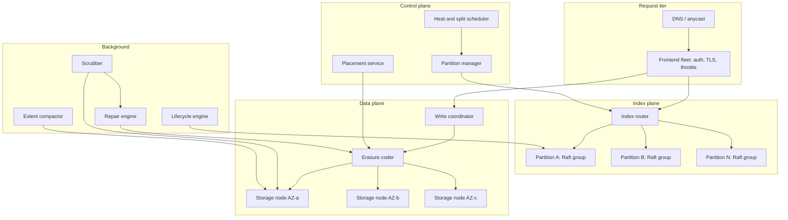
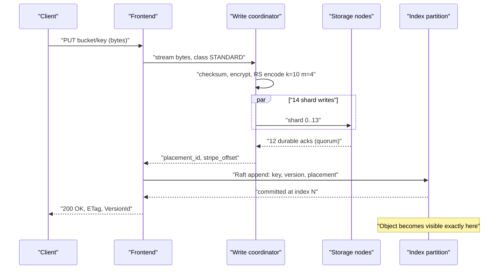
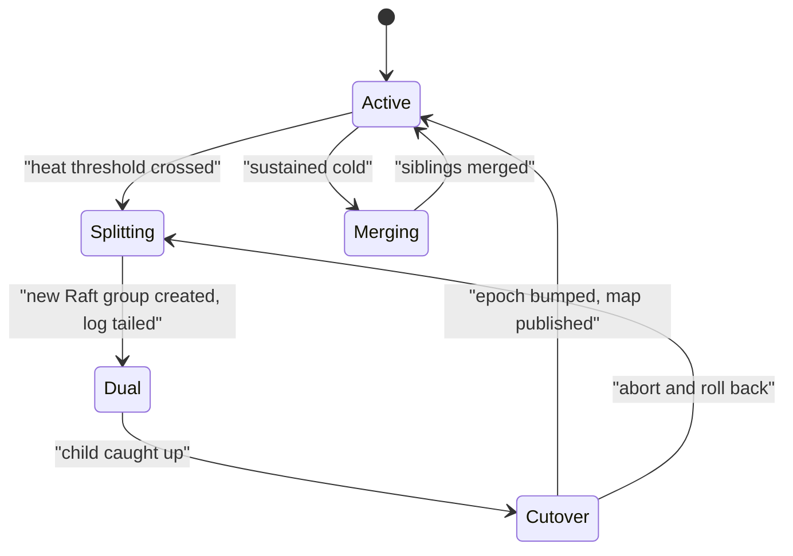
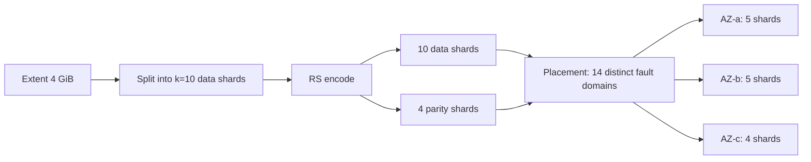
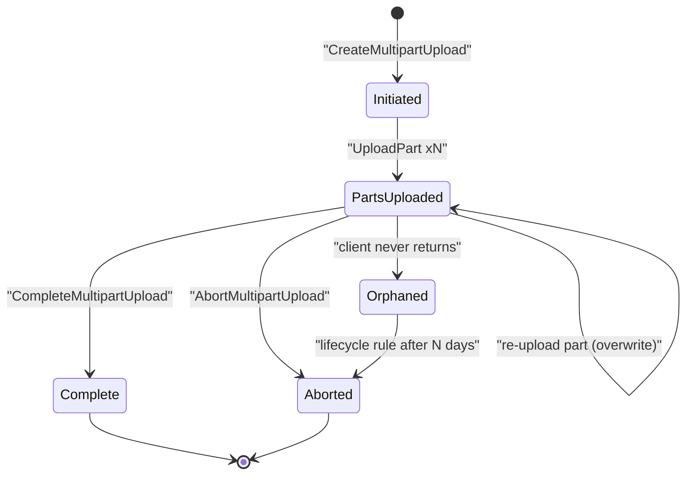
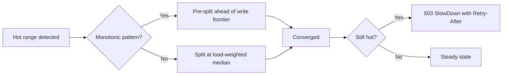

# 18 — S3-style Object Store

<span class="pill pill-core">Core</span> <span class="pill pill-hard">Hard</span>

**An object store is two completely different distributed systems wearing one API: a planet-scale sorted index that must be strongly consistent and infinitely splittable, and a dumb, immutable, erasure-coded byte warehouse that must never lose a bit. Confusing the two is how designs fail.**

| | |
|---|---|
| **Commonly asked at** | Amazon, Google, Microsoft, Meta, Snowflake, Databricks, Cloudflare, Backblaze |
| **Time budget** | 45 min |
| **Core tension** | Durability and cost are set by the data plane's redundancy scheme, but availability, consistency and scalability are set by the index plane — and the two have opposite failure characteristics, opposite scaling axes, and opposite operational rhythms |
| **Prerequisites** | [F06 Partitioning & Sharding](../fundamentals/f06-partitioning-sharding.md), [F07 Replication & Consistency](../fundamentals/f07-replication-consistency.md), [F09 Consensus](../fundamentals/f09-consensus.md), [F11 Idempotency](../fundamentals/f11-idempotency.md), [F13 Storage Engines](../fundamentals/f13-storage-engines.md), [F15 Object & Blob Storage](../fundamentals/f15-object-storage.md), [F17 Rate Limiting & Load Shedding](../fundamentals/f17-rate-limiting-load-shedding.md), [F24 Capacity Planning](../fundamentals/f24-capacity-planning.md), [F26 Multi-Region & DR](../fundamentals/f26-multi-region-dr.md) |

---

## 1. Problem Statement

Build a durable, highly available, HTTP-addressable store for immutable objects. Objects range from 1 byte to 5 TiB. The namespace is flat within a bucket: keys are opaque UTF-8 strings up to 1,024 bytes, and `/` is a display convention, not a directory.

The hard requirements that shape everything:

- **Eleven nines of durability.** Not "we have backups" — a mathematical property of the redundancy scheme, continuously verified, and the number the entire business rests on.
- **Strong read-after-write consistency** for every operation including overwrites, deletes, and LIST, in every region, with no latency penalty. S3 only achieved this in December 2020; before that, an entire ecosystem of workarounds existed.
- **No provisioning.** A customer creates a bucket and immediately writes 200,000 objects per second into it without telling anyone. The system must adapt automatically.
- **Arbitrary key distributions.** Customers will use timestamps as key prefixes. They will put a trillion objects under one prefix. They will `LIST` a bucket with 50 billion objects and expect it to work.

### What makes it genuinely hard

The index is the interesting part and the part that people skip. A flat key space with a trillion-plus entries, requiring sorted iteration (for LIST), strong consistency (for read-after-write), and automatic, online, load-driven repartitioning — while serving hundreds of millions of operations per second — is a harder database problem than most databases solve. The data plane, by contrast, is an immutable append-only workload with no consistency requirements at all beyond "the bytes you wrote are the bytes you read".

### Out of scope

Block storage semantics (partial writes, append), POSIX, filesystem gateways, and the analytics layer (S3 Select, table formats). We build the storage primitive.

---

## 2. Requirements

### Functional

| # | Requirement | Notes |
|---|---|---|
| F1 | `PUT`, `GET`, `HEAD`, `DELETE` on `bucket/key` | Whole-object semantics only; no partial writes |
| F2 | Ranged `GET` | Byte ranges, essential for large-object and analytics workloads |
| F3 | Multipart upload | Parts 5 MiB to 5 GiB, up to 10,000 parts, atomic commit |
| F4 | `LIST` with prefix and delimiter, paginated | Lexicographic order, continuation tokens |
| F5 | Versioning, with delete markers | Overwrite creates a new version, delete creates a tombstone |
| F6 | Lifecycle transitions and expiry | Age-based class transition and deletion |
| F7 | Storage classes: standard, infrequent-access, archive | Different redundancy, different placement, different retrieval latency |
| F8 | Object lock / WORM with retention and legal hold | Compliance mode must be un-deletable even by root |
| F9 | Server-side encryption, per-object keys | Provider-managed, customer-managed KMS, or customer-supplied |
| F10 | Cross-region replication | Asynchronous, with replication status per object |

### Non-functional

| # | Requirement | Target |
|---|---|---|
| N1 | Durability | 99.999999999% (11 nines) annual, per object |
| N2 | Availability | 99.99% for standard class (SLA credits below), 99.9% for IA |
| N3 | Consistency | Strong read-after-write for PUT, overwrite, DELETE and LIST |
| N4 | GET latency | p50 < 25 ms first byte, p99 < 200 ms |
| N5 | PUT latency | p50 < 40 ms for objects under 1 MiB, p99 < 300 ms |
| N6 | Per-prefix throughput | 5,500 GET/s and 3,500 PUT/s minimum, auto-scaling upward |
| N7 | Scale ceiling | No documented limit on objects per bucket or bytes per bucket |
| N8 | Silent corruption | Zero tolerance; every read is checksum-verified end to end |

!!! note "Durability and availability are different failures with different budgets"
    Losing an object is unrecoverable and existential. Being unable to serve an object for four minutes is an SLA credit. This asymmetry justifies designing the data plane to sacrifice availability for durability — refuse the write if you cannot make it durable — while designing the index plane the other way, because an unavailable index makes durable data useless. Say this explicitly; it drives half the design decisions.

---

## 3. Scale Estimation

**Objects and bytes**

$$
\begin{aligned}
\text{objects} &= 1 \times 10^{14}\ (100\ \text{trillion}) \\
\text{mean object size} &= 1\ \text{MB (heavily bimodal: a huge tail of sub-64 KB objects)} \\
\text{logical bytes} &= 1 \times 10^{14} \times 10^{6} = 1 \times 10^{20}\ \text{B} = 100\ \text{EB}
\end{aligned}
$$

**Index size** — an index entry is key (mean ~90 B), version id, size, etag, storage class, encryption key id, placement pointer, timestamps. Call it 300 B with index overhead.

$$
1 \times 10^{14} \times 300\ \text{B} = 3 \times 10^{16}\ \text{B} = 30\ \text{PB of index}
$$

Thirty petabytes of index is itself a top-tier distributed database. At 2 TB of usable data per partition replica (an LSM tree on NVMe with acceptable compaction behaviour):

$$
\text{index partitions} = \frac{3 \times 10^{16}}{2 \times 10^{12}} = 15{,}000\ \text{partitions} \times 3\text{-way replication} = 45{,}000\ \text{replicas}
$$

At 20 partitions per host, roughly **2,250 index hosts per region**. This is the number that makes people realise the index is not a side concern.

**Request rate**

$$
\begin{aligned}
\text{peak requests} &= 1 \times 10^{8}\ \text{/s} \\
\text{index operations per request} &\approx 1.4\ (\text{GET}{=}1, \text{PUT}{=}2, \text{LIST}{=}\text{range scan}) \\
\text{index ops/s} &\approx 1.4 \times 10^{8}
\end{aligned}
$$

Spread over 15,000 partitions that is ~9,300 ops/s per partition *if perfectly uniform*, which it never is. Real skew is 100x or worse, which is the entire justification for automatic splitting (§7.1).

**Prefix budget.** A single partitioned prefix sustains ~5,500 GET/s. To serve $10^8$ req/s you need

$$
\left\lceil \frac{10^{8}}{5500} \right\rceil \approx 18{,}200\ \text{well-distributed hot prefixes}
$$

as an absolute floor, and in practice millions, because traffic is not evenly distributed across the prefixes that exist.

**Physical bytes.** With Reed-Solomon 10-of-14 within a region for the standard class:

$$
100\ \text{EB} \times 1.4 = 140\ \text{EB raw}
$$

At 24 TB per drive:

$$
\frac{1.4 \times 10^{20}}{2.4 \times 10^{13}} \approx 5.8 \times 10^{6}\ \text{drives}
$$

Almost six million spinning disks. At an annualised failure rate of 2%:

$$
5.8 \times 10^{6} \times 0.02 = 116{,}000\ \text{drive failures per year} \approx 318\ \text{per day} \approx 13\ \text{per hour}
$$

**A drive dies every five minutes.** Repair is not an exceptional path; it is a permanently-running background workload with its own capacity plan. This single number reframes the whole design.

**Rebuild bandwidth.** Reconstructing one 24 TB drive requires reading $k=10$ shards' worth of data, so 24 TB read to write 2.4 TB... more precisely, to rebuild the lost shards you read 10 surviving shards per stripe. Aggregate steady-state repair read bandwidth:

$$
318\ \text{drives/day} \times 24\ \text{TB} \times 10 = 7.6 \times 10^{16}\ \text{B/day} = \frac{7.6 \times 10^{16}}{86400} \approx 880\ \text{GB/s}
$$

Seven terabits per second of internal network dedicated purely to repair, before any customer traffic. Declustered placement (spreading each drive's stripes across thousands of peers) is what keeps per-drive rebuild time in the tens of minutes instead of days.

**Scrub bandwidth.** To verify every byte every 14 days:

$$
\frac{1.4 \times 10^{20}\ \text{B}}{14 \times 86400\ \text{s}} \approx 1.16 \times 10^{14}\ \text{B/s} \approx 116\ \text{TB/s}
$$

Per drive that is 24 TB read over 14 days, about 20 MB/s sustained — roughly 10-15% of a drive's sequential capability, which is affordable but must be explicitly throttled and scheduled, not left to run free.

---

## 4. API Design

```http
PUT /photos/2026/08/sunset.jpg HTTP/1.1
Host: my-bucket.s3.example.com
x-amz-content-sha256: 9f2ae1...c11d
Content-Length: 4194304
Content-Type: image/jpeg
x-amz-server-side-encryption: aws:kms
x-amz-storage-class: STANDARD
```

```http
HTTP/1.1 200 OK
ETag: "d41d8cd98f00b204e9800998ecf8427e"
x-amz-version-id: 3sL4kqtJlcpXroDTDmJ.rNVaGYs
x-amz-server-side-encryption: aws:kms
```

```http
GET /photos/2026/08/sunset.jpg HTTP/1.1
Range: bytes=0-65535
If-None-Match: "d41d8cd98f00b204e9800998ecf8427e"
```

**Multipart:**

```http
POST /big.tar?uploads                       -> UploadId
PUT  /big.tar?partNumber=1&uploadId=...     -> ETag per part
PUT  /big.tar?partNumber=2&uploadId=...
POST /big.tar?uploadId=...                  -> CompleteMultipartUpload (atomic)
DELETE /big.tar?uploadId=...                -> AbortMultipartUpload
```

```xml
<CompleteMultipartUpload>
  <Part><PartNumber>1</PartNumber><ETag>"a54357..."</ETag></Part>
  <Part><PartNumber>2</PartNumber><ETag>"0c78c1..."</ETag></Part>
</CompleteMultipartUpload>
```

**Listing:**

```http
GET /?list-type=2&prefix=photos/2026/08/&delimiter=/&max-keys=1000&continuation-token=1ueGc...
```

```json
{
  "Contents": [
    { "Key": "photos/2026/08/sunset.jpg", "Size": 4194304,
      "ETag": "\"d41d8c...\"", "LastModified": "2026-08-30T11:02:44Z",
      "StorageClass": "STANDARD" }
  ],
  "CommonPrefixes": [ { "Prefix": "photos/2026/08/raw/" } ],
  "IsTruncated": true,
  "NextContinuationToken": "1ueGcxLPRx1Tr..."
}
```

**Conditional writes** — the primitive that turns an object store into a coordination substrate:

```http
PUT /table/metadata/v42.json HTTP/1.1
If-None-Match: *
```

```http
HTTP/1.1 412 Precondition Failed
```

!!! tip "`If-None-Match: *` is a compare-and-swap and it changes what the system is for"
    Without it, publishing a table format commit (Iceberg, Delta) requires an external lock service — DynamoDB, ZooKeeper, a database. With it, the object store itself provides the atomic pointer swap. Mentioning that conditional PUT eliminates an entire class of external dependency shows you understand what customers actually build on top.

---

## 5. Data Model

### Index plane

Range-partitioned, sorted by `(bucket_id, key, version_id DESC)`. Sorted order is non-negotiable: it is what makes prefix LIST a range scan instead of a full table scan.

```sql
-- Logical schema. Physically an LSM tree with range partitions,
-- each partition a Raft/Paxos group of 3-5 replicas.

CREATE TABLE object_index (
  bucket_id        BIGINT       NOT NULL,
  key              VARBINARY(1024) NOT NULL,
  version_id       BINARY(16)   NOT NULL,     -- monotonic; newest sorts first
  is_delete_marker BOOLEAN      NOT NULL DEFAULT FALSE,
  size_bytes       BIGINT       NOT NULL,
  etag             BINARY(16)   NOT NULL,
  content_type     VARCHAR(128),
  storage_class    SMALLINT     NOT NULL,
  placement_id     BIGINT       NOT NULL,     -- points into the data plane
  stripe_offset    BIGINT       NOT NULL,
  ec_scheme        SMALLINT     NOT NULL,     -- 0=RS(10,4) 1=RS(8,4) 2=3x-repl
  checksum_algo    SMALLINT     NOT NULL,
  checksum         BINARY(32)   NOT NULL,     -- whole-object, end to end
  sse_key_id       BIGINT,
  created_at       TIMESTAMPTZ  NOT NULL,
  lock_until       TIMESTAMPTZ,               -- object lock retention
  legal_hold       BOOLEAN      NOT NULL DEFAULT FALSE,
  PRIMARY KEY (bucket_id, key, version_id DESC)
);

-- Partition map, held in the control plane and cached everywhere.
CREATE TABLE index_partition (
  partition_id     BIGINT       PRIMARY KEY,
  bucket_id        BIGINT       NOT NULL,
  key_start        VARBINARY(1024) NOT NULL,  -- inclusive
  key_end          VARBINARY(1024) NOT NULL,  -- exclusive
  replica_set      JSONB        NOT NULL,
  epoch            BIGINT       NOT NULL,     -- bumped on every split/move
  state            SMALLINT     NOT NULL,     -- active/splitting/migrating
  heat_score       DOUBLE PRECISION NOT NULL,
  bytes            BIGINT       NOT NULL
);

-- Multipart upload state: a separate, TTL'd namespace.
CREATE TABLE mpu_session (
  bucket_id        BIGINT       NOT NULL,
  upload_id        BINARY(16)   NOT NULL,
  key              VARBINARY(1024) NOT NULL,
  initiated_at     TIMESTAMPTZ  NOT NULL,
  storage_class    SMALLINT     NOT NULL,
  sse_key_id       BIGINT,
  PRIMARY KEY (bucket_id, upload_id)
);

CREATE TABLE mpu_part (
  bucket_id        BIGINT       NOT NULL,
  upload_id        BINARY(16)   NOT NULL,
  part_number      INT          NOT NULL,
  etag             BINARY(16)   NOT NULL,
  size_bytes       BIGINT       NOT NULL,
  placement_id     BIGINT       NOT NULL,
  uploaded_at      TIMESTAMPTZ  NOT NULL,
  PRIMARY KEY (bucket_id, upload_id, part_number)
);
```

### Data plane

Objects are not stored as files. Small objects are packed into large append-only **extents**; large objects are split into stripes. The unit of erasure coding is the extent or stripe, never the object.

```sql
CREATE TABLE extent (
  extent_id        BIGINT       PRIMARY KEY,
  ec_scheme        SMALLINT     NOT NULL,
  size_bytes       BIGINT       NOT NULL,     -- typically 1-4 GiB, sealed
  state            SMALLINT     NOT NULL,     -- open/sealed/repairing/draining
  created_at       TIMESTAMPTZ  NOT NULL,
  live_bytes       BIGINT       NOT NULL,     -- decays as objects are deleted
  storage_class    SMALLINT     NOT NULL
);

CREATE TABLE shard_placement (
  extent_id        BIGINT       NOT NULL,
  shard_index      SMALLINT     NOT NULL,     -- 0..n-1 for RS(k,m), n=k+m
  node_id          BIGINT       NOT NULL,
  drive_id         BIGINT       NOT NULL,
  fault_domain     JSONB        NOT NULL,     -- {az, room, row, rack, psu, drive_batch}
  shard_checksum   BINARY(32)   NOT NULL,
  last_scrubbed_at TIMESTAMPTZ  NOT NULL,
  state            SMALLINT     NOT NULL,     -- healthy/missing/corrupt/rebuilding
  PRIMARY KEY (extent_id, shard_index)
);
```

!!! warning "The extent indirection is what makes small objects viable"
    A 4 KB object erasure-coded on its own into 14 shards produces 14 sub-KB writes to 14 different drives, plus a metadata entry per shard. At $10^{14}$ objects that is a filesystem catastrophe — the same small-file problem that drove Facebook to build Haystack. Packing into multi-GiB extents converts $10^{14}$ tiny random writes into a manageable number of large sequential writes, at the cost of making deletion a garbage-collection problem rather than a free operation.

---

## 6. High-Level Architecture



### Write path walkthrough

1. Frontend terminates TLS, authenticates via SigV4, evaluates the bucket policy and IAM, and applies per-bucket and per-prefix throttles.
2. Frontend consults its cached partition map to find the index partition owning `(bucket_id, key)`. The map is cached aggressively; a stale map produces a redirect with the current epoch, never a wrong answer.
3. The write coordinator allocates a placement: an open extent in the correct storage class, with a placement group whose shards are spread across independent fault domains.
4. Bytes stream in. The coordinator computes the object checksum, encrypts with a per-object data key (itself wrapped by the bucket's KMS key), splits into $k$ data shards, computes $m$ parity shards, and dispatches all $n = k+m$ shard writes in parallel.
5. **Quorum acknowledgement.** The coordinator waits for a durable write acknowledgement (data on stable media or in power-protected cache, plus a journal record) from a configured quorum of shards. For RS(10,4) the write quorum is $k + \lceil m/2 \rceil = 12$: enough that any subsequent read of any $k$ surviving shards succeeds even after one more failure, without waiting for the slowest two shards. The remaining shards complete asynchronously and are backfilled by the repair engine if they fail.
6. Only after the data is durable does the coordinator hand a `placement_id` back to the frontend, which performs the index commit: a consensus write to the partition's Raft group inserting the new `(key, version_id)` row.
7. The index commit is the **linearisation point**. The object exists at the instant that Raft entry is applied, and not one moment before.



### Read path walkthrough

1. Frontend authenticates and locates the index partition from the cached map.
2. Index read must be **linearizable**: served by the Raft leader using a read lease, or by a follower that has confirmed it is caught up to the leader's commit index. A stale follower read would break read-after-write, which is the entire point of §7.4.
3. The index returns `placement_id`, `stripe_offset`, `size`, `ec_scheme`, `checksum`, `sse_key_id`.
4. The read coordinator issues reads for the $k$ data shards. In the common case all $k$ are healthy, no decoding is needed, and the object is a simple concatenation. If a shard is missing or slow, it issues a **hedged read** to parity shards and reconstructs — RS decoding of a 1 MB stripe is microseconds on modern SIMD, so degraded reads are a latency event, not a functional one.
5. Every shard read verifies its own stored checksum. The assembled object is verified against the whole-object checksum from the index. A mismatch is never returned to the client; it triggers reconstruction from parity and a repair task.
6. Decrypt, and stream to the client.

!!! note "Hedging is why the p99 is not the slowest disk"
    With $k=10$ shards per read, the read latency without hedging is $\max$ of 10 disk latencies — the p99 of the object read is roughly the p99.9 of a single disk read. Issuing $k+2$ requests and reconstructing from the first $k$ to arrive converts the tail from "slowest of ten" to "tenth-fastest of twelve", which is dramatically better. The cost is ~20% extra read IOPS, which is almost always worth it. This is the single most effective latency technique in the whole system.

---

## 7. Deep Dives

### 7.1 Namespace partitioning and automatic prefix splitting

The index is range-partitioned over the sorted key space. Hash partitioning is off the table because it destroys sorted order, and sorted order is what makes `LIST` with a prefix a bounded range scan rather than a scatter-gather across every partition.

Range partitioning gives you sorted scans and gives you **hotspots for free**, because customers write keys like this:

```text
logs/2026-08-30T14:00:00Z-0001.json
logs/2026-08-30T14:00:00Z-0002.json
logs/2026-08-30T14:00:01Z-0003.json
```

Every new key sorts immediately after the last one. All write traffic lands on the single partition owning the tail of the range. This is the monotonic-key antipattern and it is the number one cause of `503 SlowDown` in production.

**Automatic splitting** is the mechanism that saves you. The partition manager tracks per-partition heat (requests/s, bytes/s, and stored size) and splits when a threshold is crossed:

```python
def should_split(p):
    return (p.requests_per_sec > 6000
            or p.bytes > 2 * TB
            or p.write_ops_per_sec > 4000)

def choose_split_point(p):
    # Median by *load*, not by key count. A partition where 99% of
    # traffic hits the last 0.1% of the range must split near the tail,
    # otherwise the hot half stays hot and you split again immediately.
    return p.load_weighted_median_key()
```

The split itself must be online and non-blocking:



Cutover is the delicate moment. It must be atomic with respect to clients: the parent stops accepting writes, the child confirms it has applied the parent's full log, the partition map epoch is bumped, and the new map is published. A frontend holding a stale map sends a request to the parent, which responds `NotOwner` with the new epoch, and the frontend refreshes and retries. **The map is a cache with a version, never a source of truth.**

Splitting is not instant. Creating a Raft group, bulk-transferring or log-tailing the range, and cutting over takes seconds to minutes depending on partition size — which is precisely why a customer who ramps from 0 to 100,000 req/s on a cold prefix gets throttled for several minutes before the splits catch up.

| Partitioning strategy | LIST support | Hotspot behaviour | Chosen / rejected and why |
|---|---|---|---|
| Range partition on key | Native range scan | Bad by default, fixed by auto-split | **Chosen.** Sorted LIST is a hard requirement and only range partitioning provides it |
| Hash partition on key | Scatter-gather to all partitions | Perfect distribution | Rejected. `LIST` over 15,000 partitions per call is untenable |
| Hash partition + separate sorted index | Range scan on the secondary | Perfect on data, bad on index | Rejected. Two systems to keep consistent, and the secondary index has the same hotspot problem |
| Range partition with a hashed key prefix injected by the service | Broken: user's prefix no longer contiguous | Perfect | Rejected. Silently changes the customer-visible ordering contract |

!!! tip "Why the customer-side fix still matters"
    Auto-splitting works, but it is reactive. A customer who puts a high-cardinality component first — `a91f/2026-08-30/...` or `tenant=8817/dt=...` — spreads across partitions from the first request with no split latency at all. The service-side advice "add entropy to your key prefix" is not the service failing to scale; it is the customer choosing to pay a several-minute warm-up on every new hot range.

### 7.2 Erasure coding versus replication, with the durability math

This is the section that decides both the cost structure and the headline durability number. Do the arithmetic.

**Model.** Treat shard loss within a repair window as independent. Let:

$$
\begin{aligned}
\text{AFR} &= 0.02\ \text{(2\% annualised drive failure rate)} \\
\lambda_{\text{hour}} &= \frac{0.02}{8760} = 2.283 \times 10^{-6}\ \text{per drive-hour} \\
T &= 2\ \text{hours (declustered rebuild window)} \\
p &= \lambda_{\text{hour}} \cdot T = 4.566 \times 10^{-6}
\end{aligned}
$$

where $p$ is the probability a given shard is lost during a repair window.

**Three-way replication.** Data is lost if all 3 copies fail within the window:

$$
P_{\text{loss/window}} = p^{3} = (4.566 \times 10^{-6})^{3} = 9.52 \times 10^{-17}
$$

There are $8760/2 = 4380$ windows per year:

$$
P_{\text{loss/year}} = 4380 \times 9.52 \times 10^{-17} = 4.17 \times 10^{-13}
$$

$$
\text{durability} = 1 - 4.17 \times 10^{-13} = 99.999999999958\% \approx \textbf{12.4 nines}
$$

**Reed-Solomon 10-of-14.** Data is lost if more than $m = 4$ of $n = 14$ shards are lost, i.e. at least 5:

$$
P_{\text{loss/window}} \approx \binom{14}{5} p^{5} = 2002 \times (4.566 \times 10^{-6})^{5}
$$

$$
(4.566 \times 10^{-6})^{5} = 1.983 \times 10^{-27}
$$

$$
P_{\text{loss/window}} = 2002 \times 1.983 \times 10^{-27} = 3.97 \times 10^{-24}
$$

$$
P_{\text{loss/year}} = 4380 \times 3.97 \times 10^{-24} = 1.74 \times 10^{-20}
$$

$$
\text{durability} \approx 1 - 1.74 \times 10^{-20} \approx \textbf{19.8 nines}
$$

**Side by side:**

| Scheme | Storage overhead | Usable fraction | Tolerates | Modelled durability | Repair read amplification |
|---|---|---|---|---|---|
| 3x replication | 3.00x (200%) | 33.3% | 2 losses | 12.4 nines | 1x (copy one replica) |
| 2x replication | 2.00x (100%) | 50% | 1 loss | 8.3 nines | 1x |
| RS(6,3), n=9 | 1.50x (50%) | 66.7% | 3 losses | 15.6 nines | 6x |
| RS(8,4), n=12 | 1.50x (50%) | 66.7% | 4 losses | 19.6 nines | 8x |
| RS(10,4), n=14 | 1.40x (40%) | 71.4% | 4 losses | 19.8 nines | 10x |
| RS(20,8), n=28 | 1.40x (40%) | 71.4% | 8 losses | > 30 nines | 20x |
| LRC(12,2,2) | 1.33x (33%) | 75% | 3, plus cheap single repair | ~18 nines | 6x for single-shard repair |

Read the table carefully. **RS(10,4) delivers roughly seven orders of magnitude more durability than 3x replication while using less than half the storage.** That is the entire argument, and it is why every serious object store is erasure coded.

The cost of erasure coding is **read amplification during repair**. Losing one replica in a 3x scheme requires reading one replica's worth of data. Losing one shard in RS(10,4) requires reading 10 shards to reconstruct 1. At 318 drive failures per day that amplification is the 880 GB/s of repair bandwidth computed in §3. Local Reconstruction Codes (LRC, as in Azure) add local parity groups so that the common case — a single lost shard — is repaired by reading only its local group, cutting repair traffic by more than half at a small overhead cost.



!!! danger "The independence assumption is the whole model, and it is false"
    Nineteen nines is what the arithmetic says. The published number is **eleven**, and the eight-order-of-magnitude gap is entirely correlated and non-modelled failure: a firmware bug that bricks a whole drive model in the same week, a bad batch of drives from one manufacturing lot landing in one rack, a power event taking a room, a software bug in the repair engine that deletes live shards, an operator running the wrong command, a rolling deploy corrupting data faster than the scrubber finds it. Eleven nines is a *conservative engineering claim* that leaves headroom for the things the model cannot see. In an interview, computing 19 nines and then explaining why the published figure is 11 is worth more than either number alone.

**Cross-AZ placement changes the arithmetic.** If 14 shards spread over 3 AZs, one AZ holds at least $\lceil 14/3 \rceil = 5$ shards. Losing that AZ loses 5 shards, which exceeds $m = 4$: the data is unavailable. To survive a full AZ you need

$$
m \geq \left\lceil \frac{n}{\text{number of AZs}} \right\rceil
$$

With 3 AZs and RS(8,4), $n = 12$, 4 shards per AZ, and $m = 4$ exactly covers one AZ loss — but with zero remaining tolerance during that outage, which is unacceptable because AZ outages last hours and drives keep dying. RS(9,6) with $n = 15$ gives 5 per AZ and tolerates a full AZ plus one more failure, at 1.67x overhead. **AZ tolerance costs you roughly 20% more storage than intra-AZ coding.** That is exactly the price difference between S3 Standard and S3 One Zone-IA, and knowing why is a good signal.

### 7.3 Multipart upload state and the write commit

Multipart exists because a 5 TiB single PUT cannot be retried. It also creates the single largest silent cost leak in object storage.



Key properties:

- Parts are stored in the data plane immediately and **are billed immediately**, but they are invisible to `LIST` and to `GET`. A client that starts a 5 TiB upload and crashes leaves 5 TiB of billed, invisible, un-deletable-by-normal-means storage. Forever, unless a lifecycle rule cleans it up.
- `CompleteMultipartUpload` is a single index-plane transaction. It reads the `mpu_part` rows, validates the supplied part list and ETags, constructs the object's placement manifest, and commits one `object_index` row. That commit is atomic — the object appears whole or not at all.
- The response to `CompleteMultipartUpload` can be a `200 OK` that later contains an error in the body, because the operation may take minutes for very large objects and the connection must be kept alive with whitespace. **Clients that check only the HTTP status code will treat a failed completion as a success.** This is a real and widely-encountered trap.
- Re-uploading the same part number replaces it. The old part's bytes must be garbage collected, which is another silent leak if the implementation forgets.

```bash
# The lifecycle rule every bucket should have and most do not.
aws s3api put-bucket-lifecycle-configuration --bucket my-bucket \
  --lifecycle-configuration '{
    "Rules": [{
      "ID": "abort-incomplete-mpu",
      "Status": "Enabled",
      "Filter": {"Prefix": ""},
      "AbortIncompleteMultipartUpload": {"DaysAfterInitiation": 7}
    }]
  }'
```

### 7.4 Strong read-after-write consistency and how it was achieved

Until December 2020, S3 offered read-after-write consistency only for PUTs of *new* objects, and eventual consistency for overwrites, deletes and LIST. Whole ecosystems existed to paper over it: Hadoop's S3Guard, Netflix's s3mper, EMRFS consistent view — all of which maintained a separate strongly-consistent index (usually DynamoDB) alongside S3 and consulted it to decide whether S3's answer was trustworthy.

The reason it was eventually consistent is the reason most systems are: the index was itself a distributed, replicated, cached structure, and a GET could be served by a replica or a cache that had not yet seen the latest write.

**How you get to strong consistency without a latency penalty:**

1. **Make the index the single linearisation point.** There is exactly one authoritative index partition for a key. Not a cache, not a quorum of independent nodes with different views — one Raft group whose committed log defines the order of operations on that key.
2. **Serve index reads linearizably.** The Raft leader holds a time-bounded lease; while the lease is valid it can serve reads from local state without a round trip, because no other node can have become leader. On lease expiry it falls back to a `ReadIndex` round trip. This gives linearizable reads at roughly the cost of a local read in the steady state. See [F09 Consensus](../fundamentals/f09-consensus.md).
3. **Never cache negative results, and version-stamp everything you do cache.** A `404` cached for even 100 ms breaks read-after-write for a client that just created the object. The frontend caches the *partition map*, which is versioned by epoch, and never caches object existence.
4. **Order the commit after durability.** The data is durable before the index entry is committed. Therefore any read that sees the index entry can read the data. The reverse ordering would produce dangling index entries pointing at bytes that were never persisted.
5. **Make LIST read from the same partitions.** LIST is a range scan over the same index rows through the same leases, so list-after-write follows from the same mechanism, for free. This is why the fix landed for LIST and GET simultaneously.

```mermaid
sequenceDiagram
  participant C1 as "Writer"
  participant I as "Index Raft group"
  participant C2 as "Reader (different client)"
  C1->>I: "commit PUT key v2"
  I->>I: "replicate, apply at log index N"
  I-->>C1: "200 OK"
  C2->>I: "GET key"
  I->>I: "leader lease valid, read local state at >= N"
  I-->>C2: "v2"
  Note over I: "No stale replica can answer; there is one leader"
```

!!! warning "Strong consistency is per object, not across objects"
    Each object is linearizable. There is no transaction spanning objects. A job that writes 500 data files and then a manifest is not atomic, and a reader can observe any intermediate state. The fix is the same as always: publish through a single atomic pointer — one manifest object written last, with `If-None-Match` for the swap — and never treat "the files should all be there by now" as a contract. Table formats exist precisely because this needed a standard answer.

### 7.5 Background repair, scrubbing, bit rot, and correlated failure

At six million drives, you are not operating a storage system; you are operating a continuous repair pipeline that happens to serve reads.

**Bit rot is not hypothetical.** Enterprise drives quote an unrecoverable read error rate (UBER) around $1$ in $10^{15}$ bits. Reading a 24 TB drive end to end is

$$
2.4 \times 10^{13}\ \text{B} \times 8 = 1.92 \times 10^{14}\ \text{bits}
$$

$$
P(\text{at least one URE during a full read}) \approx \frac{1.92 \times 10^{14}}{10^{15}} = 0.19
$$

A **19% chance** of hitting an unrecoverable read error while reading one drive completely. This is why RAID-5 rebuilds fail on large drives, and why every shard carries its own checksum: you must be able to detect the error, not merely be surprised by it. Silent corruption that is not detected is corruption that gets *encoded into the parity* during the next repair, permanently.

**Three layers of verification:**

| Layer | What it catches | Cost |
|---|---|---|
| Per-shard checksum verified on every read | Corruption on the read path, immediately | Negligible with hardware CRC |
| Whole-object checksum verified before returning to client | Reassembly bugs, wrong-placement bugs, coordinator bugs | One hash over the object |
| Background scrubber reading every shard on a cycle | Latent corruption on cold data before it accumulates | 116 TB/s aggregate; see §3 |

The scrubber matters most for cold data. A shard nobody reads for three years accumulates corruption unnoticed; if $m$ shards of a stripe silently rot, the data is gone and you find out during a restore. The scrub cycle must be short enough that the probability of accumulating $m+1$ undetected corruptions between scrubs is negligible. Fourteen days is a common target.

```python
# Scrub scheduling: prioritise by risk, not round-robin.
def scrub_priority(shard):
    age_days     = (now() - shard.last_scrubbed_at).days
    stripe_health = 1.0 - (shard.stripe.missing_shards / shard.stripe.m)
    coldness     = 1.0 if shard.stripe.last_read_days > 90 else 0.3
    drive_risk   = smart_risk_score(shard.drive_id)   # reallocated sectors, etc.
    return age_days * coldness * drive_risk / max(stripe_health, 0.1)
```

**Correlated failure is what actually kills you.** The independence assumption in §7.2 breaks in specific, enumerable ways:

- **Same rack / same PSU / same top-of-rack switch.** Placement must treat these as one fault domain. Fourteen shards on fourteen drives in one rack is one power event away from total loss.
- **Same drive model and manufacturing batch.** Drives from the same lot fail at correlated times, and firmware bugs are perfectly correlated. Placement should deliberately mix vendors and batches within a stripe. This is unglamorous and it is exactly the kind of thing that separates a real design from a whiteboard one.
- **Same software version.** A rolling deploy of a storage-node bug that corrupts on write can destroy every shard it touches. Mitigation: never deploy to more than one fault domain per stripe concurrently, and hold at least one shard of every stripe on a node running the previous version during a rollout.
- **Correlated repair storms.** A large failure triggers mass rebuild, which saturates the network, which makes healthy nodes appear unhealthy, which triggers more rebuilds. Repair must be rate-limited with a global budget and must prioritise stripes closest to the durability cliff.

```python
# Repair priority: stripes with the fewest surviving shards first, always.
def repair_priority(stripe):
    surviving = stripe.k + stripe.m - stripe.lost_shards
    margin    = surviving - stripe.k          # 0 means one more loss is fatal
    return (margin, -stripe.bytes)            # ascending margin, then largest first
```

!!! danger "Repair must be rate limited or it becomes the outage"
    A node returning from a 30-minute reboot looks, to a naive system, like a permanently lost node whose data must be rebuilt. Rebuilding a 500-drive node's worth of data is petabytes of network traffic that will saturate the fabric and take down healthy traffic. Mitigations: a grace period (do not rebuild for the first 15-30 minutes of absence), a global repair bandwidth budget expressed as a percentage of fabric capacity, and prioritisation by durability margin so the scarce budget goes where it prevents actual data loss.

### 7.6 LIST at scale, and why it is not GET

`GET` is a point lookup on an indexed key: one partition, one seek, bounded work, and it is trivially cacheable because the answer is immutable.

`LIST` is a range scan whose cost is proportional to the number of keys *examined*, which can be wildly larger than the number returned. It is unbounded, it is not cacheable (the answer changes on every write to the range), and it can span many partitions.

**Where it goes wrong:**

- `prefix=logs/2026/08/30/` with a `delimiter=/` over a range containing 50 billion keys must scan the whole range to identify common prefixes. The response is 24 entries; the work is 50 billion row reads. Delimiter-based listing is a group-by disguised as a lookup.
- With versioning enabled and a directory-like prefix full of delete markers, the scan reads millions of tombstone rows and returns nothing. A customer who deleted 100 million objects sees `LIST` performance collapse and cannot understand why, because the bucket "is empty".
- A LIST spanning 50 partitions is a scatter-gather with a merge, and its latency is the max over 50 partitions.

**Mitigations:**

| Technique | Effect | Trade-off |
|---|---|---|
| Hard cap `max-keys` at 1,000 and require continuation tokens | Bounds per-request work | Client must paginate; a full listing of a large bucket is many round trips |
| Bound *keys examined*, not keys returned; return an empty page with a continuation token | Prevents a single request scanning billions of rows | Clients that stop on an empty page are broken; the contract must be "continue until `IsTruncated` is false" |
| Separate throttle class for LIST | Stops LIST from starving GET on the same partition | Listing-heavy customers see lower throughput |
| Offer an asynchronous inventory report (daily CSV/Parquet of the whole bucket) | Turns O(bucket) listing into a bulk file read | Up to 24 h stale; unsuitable for read-after-write |
| Compact delete markers in the background | Restores scan performance on tombstone-heavy ranges | Cannot compact below the versioning retention window |

!!! tip "The senior answer to 'how do I list a bucket with 50 billion objects'"
    You do not. You read the inventory report, which the service generates once a day by doing a full, throttled, offline scan and writing it as a set of Parquet files. Then you diff against yesterday's inventory to find changes, or you subscribe to event notifications for real-time deltas. Anyone who answers "just paginate through LIST" has not operated this. Fifty billion keys at 1,000 per page is 50 million round trips.

---

## 8. Scaling the Bottleneck

The bottleneck is the index plane, and specifically the **split latency of a hot range**.

Everything else scales by adding hardware. Data-plane throughput is the sum of independent drives. Frontend capacity is stateless. But a single hot key range is served by a single Raft group, and no amount of hardware makes one Raft group faster than its leader's fsync rate. The only fix is to split, and splitting takes time.

**The scaling ladder, in the order you would actually apply it:**

1. **Reactive splitting** (baseline). Detect heat, split, converge in seconds to minutes. Adequate for gradual growth, inadequate for step functions.
2. **Predictive splitting.** For monotonic key patterns — detect that writes are clustering at the tail of a range — pre-split ahead of the write frontier. This is the single highest-value optimisation for the dominant antipattern, because it turns a several-minute throttle into no throttle at all.
3. **Split-on-create heuristics.** A new bucket created by a customer whose other buckets are high-throughput can be pre-split into N partitions at creation. Cheap, and removes cold-start throttling.
4. **Load-aware split points.** Split at the load-weighted median, not the key-count median. Splitting a skewed partition at the middle key leaves the hot half exactly as hot.
5. **Followers for read-heavy ranges.** A range that is 99% GET can serve from lease-verified followers, multiplying read capacity without splitting. Does nothing for writes.
6. **Frontend request collapsing.** Identical concurrent GETs for the same key collapse into one index lookup and one data read. Extremely effective for the "everyone reads the same config object" pattern.
7. **Admission control as the floor.** When splits cannot keep up, throttle with `503 SlowDown` and a `Retry-After`. This is not a failure of the system; it is the system protecting the other million customers on that fleet. See [F17 Rate Limiting & Load Shedding](../fundamentals/f17-rate-limiting-load-shedding.md).



**Heat management on the data plane** is a different problem with a different fix. A single object going viral — one 10 MB file requested 500,000 times per second — cannot be served by the 14 drives holding its shards. Solutions: replicate hot extents to additional placement groups on demand, serve from a frontend cache tier, or push it to a CDN. Detection is a decaying counter per extent; promotion is asynchronous and reverts when heat drops.

---

## 9. Failure Modes

| Failure | Blast radius | Detection | Mitigation | Degraded behaviour |
|---|---|---|---|---|
| Single drive failure | Shards on that drive (thousands of stripes) | SMART, IO errors, heartbeat | Declustered rebuild from parity; grace period before starting | None visible; reads reconstruct from parity with slightly higher latency |
| Storage node failure (500 drives) | ~0.01% of stripes lose one shard | Node heartbeat loss | Grace period, then prioritised rebuild; rate-limited | None visible; repair bandwidth consumption rises |
| Rack / PSU / ToR failure | All stripes with a shard in that rack | Fault-domain-aware health signal | Placement guarantees at most one shard per stripe per rack | None; single-shard reconstruction |
| Full AZ loss | All stripes with shards in that AZ | Regional health monitoring | AZ-tolerant EC scheme with $m \geq n/\text{AZs}$; index Raft groups have a majority outside any one AZ | Higher latency; reduced durability margin until AZ returns; no data loss |
| Index partition leader loss | All keys in that range (~0.007% of namespace) | Raft election timeout | Automatic election, typically 1-3 s | Writes and linearizable reads to that range fail with retryable 503 for a few seconds |
| Index partition loses quorum | That range is read-write unavailable | Quorum health alarm | 5-replica groups for high-value ranges; cross-AZ replica placement | That key range is unavailable; the other 99.99% of the namespace is fine |
| Stale partition map on frontend | Requests routed to the wrong partition | Epoch mismatch on the request | Partition responds `NotOwner` with the current epoch; frontend refreshes and retries | One extra round trip |
| Silent shard corruption (bit rot) | One shard; escalates if undetected | Per-shard checksum on read; background scrubber | Reconstruct from parity, rewrite shard, quarantine drive | None if caught; catastrophic if the corrupt shard is used as a repair source |
| Correlated firmware bug across a drive batch | Potentially many shards of the same stripe simultaneously | Anomalous failure rate correlated by model/batch | Batch-diverse placement; halt rebuilds and freeze the fleet when correlation is detected | Potential unavailability; this is the realistic path to actual data loss |
| Repair storm saturating the fabric | Region-wide latency | Fabric utilisation, repair queue depth | Global repair bandwidth budget; durability-margin prioritisation | Elevated p99 across the region; repair backlog grows |
| Hot prefix from a monotonic key pattern | One customer, one prefix | Per-partition heat metrics | Auto-split, predictive pre-split, then throttle | `503 SlowDown` until splits converge, typically minutes |
| Orphaned multipart parts | Customer's bill, and capacity planning | Inventory of MPU sessions older than N days | Default lifecycle rule to abort incomplete uploads | Silent cost accumulation; invisible to LIST, which is why nobody notices |
| Delete of an object under legal hold | Compliance exposure | Policy evaluation at the index commit | Object lock checked inside the index transaction, not at the frontend | Delete rejected with 403; must be enforced below any bypass path |

---

## 10. SRE Lens

### SLIs and SLOs

| SLI | Definition | SLO |
|---|---|---|
| GET availability | Non-5xx GETs / total GETs, per region | 99.99% monthly |
| PUT availability | Non-5xx PUTs / total PUTs | 99.99% monthly |
| GET first-byte latency | Time to first byte, objects < 1 MiB | p50 < 25 ms, p99 < 200 ms |
| PUT latency | Request start to 200 OK, objects < 1 MiB | p50 < 40 ms, p99 < 300 ms |
| Throttle rate | `503 SlowDown` / total requests | < 0.01% globally; per-customer alerting at 0.1% |
| Durability | Objects readable and checksum-valid | 11 nines annual, evidenced by continuous sampling |
| Repair margin | Fraction of stripes with $\text{surviving} - k \geq 2$ | > 99.999% at all times |
| Scrub coverage | Fraction of shards scrubbed within 14 days | > 99.9% |
| Index consistency violations | Reads returning a version older than a committed write | Zero, alarmed on any occurrence |

!!! note "Durability cannot be measured directly, so measure its leading indicators"
    You will never observe an 11-nines event; the expected count is essentially zero. What you *can* observe and must alarm on: the distribution of stripe durability margin (how many stripes are one failure from loss), scrub coverage and scrub-detected corruption rate, repair queue depth and repair latency, placement-constraint violations, and the count of stripes where placement rules were relaxed under capacity pressure. **Durability is an engineering process metric, not an outcome metric.**

### Error budget

99.99% monthly is 4.32 minutes per month per region. That is a strikingly small budget and it dictates the operating model:

- No manual changes to the request path. Ever. All changes are code, reviewed, and deployed by automation.
- Deployments are one cell at a time, where a cell is an independent instance of the whole stack serving a subset of buckets. A bad deploy affects one cell's customers, not the region.
- Automatic rollback on SLI regression, with a bake time per cell measured in hours.
- The data plane and index plane deploy on separate schedules with a mandatory gap, so a bad day cannot corrupt both.

**Durability has no error budget.** Any confirmed loss of a committed object is a company-level incident. The correct posture is that durability-affecting changes (placement, EC parameters, repair, GC) get a fundamentally different review bar than latency-affecting changes: formal verification of the deletion logic, shadow-mode runs of any GC change comparing against the existing decision for weeks, and a hard invariant that no code path deletes data without an independent confirmation of unreachability. See [F25 Deployment & Release Safety](../fundamentals/f25-deployment-release-safety.md).

### Runbook notes

```text
ALERT: 503_SlowDown rate > 0.1% for bucket B
  1. Identify the hot partition: top-N by requests/s within B.
  2. Check partition state. If `splitting`, check split progress and ETA.
     Splits in progress -> this is self-healing, note ETA and communicate.
  3. If `active` and hot, force a split at the load-weighted median.
  4. Inspect the key pattern. Monotonic (timestamp/sequential prefix)?
     -> Enable predictive pre-splitting for the bucket.
     -> Customer-facing guidance: add a high-cardinality leading component.
  5. Do NOT raise the global throttle ceiling. It protects every other
     tenant on the same partitions and fleet.

ALERT: stripes_with_margin_lt_2 > 0.001%
  This is a durability alert. Page immediately.
  1. Is repair progressing? Check repair queue depth and drain rate.
  2. Is repair bandwidth-starved? Check fabric utilisation and the repair
     budget setting. Raise the budget, accepting customer latency impact.
     Durability outranks latency, always.
  3. Are failures correlated? Group by drive model, firmware, batch, rack,
     software version. Correlation -> freeze the affected population and
     escalate; this is the path to real data loss.
  4. If margin is still falling, halt all non-essential background work
     (scrub, compaction, lifecycle, replication) to free bandwidth.

ALERT: scrub_detected_corruption_rate > 3x baseline
  1. Group by drive model, firmware version, node software version, and
     write date of the affected shards.
  2. Correlation with a recent storage-node deploy -> halt the rollout and
     assess whether shards written by that version are trustworthy. Shards
     written by a corrupting version must NOT be used as repair sources.
  3. Quarantine affected drives; do not repair from any shard on them.
```

### Capacity model

Four independent axes that must be planned separately, because they saturate at different times:

$$
\begin{aligned}
\text{drives} &= \frac{\text{logical bytes} \times \text{EC overhead}}{\text{drive capacity} \times \text{target utilisation}} \\[4pt]
\text{index hosts} &= \max\!\left(\frac{\text{index bytes}}{\text{bytes per host}},\ \frac{\text{peak index ops/s}}{\text{ops/s per host}}\right) \\[4pt]
\text{fabric} &= \text{customer traffic} + \text{repair} + \text{scrub} + \text{compaction} + \text{replication} \\[4pt]
\text{IOPS} &= \frac{\text{peak req/s} \times k}{\text{IOPS per drive}}
\end{aligned}
$$

The trap is the IOPS axis. A fleet sized for capacity on 24 TB drives has far fewer spindles per petabyte than one sized on 8 TB drives, so **IOPS per stored terabyte falls as drive capacity rises**. A workload with many small random reads can be IOPS-bound on a fleet that is only 40% full by bytes. This is why storage classes exist: cold data goes on high-density, low-IOPS media, freeing spindles for hot data.

Target utilisation must stay below ~80%. Above that, placement cannot satisfy fault-domain constraints (there is nowhere left to put the 14th shard that is not already holding one of the other 13), and the system begins relaxing constraints — silently reducing durability. **Placement-constraint relaxation events are a capacity alarm, not a placement alarm.**

### Cost

| Component | Basis | Notes |
|---|---|---|
| Drives | ~5.8M drives at ~$12/TB purchase, ~5 year life | The dominant capital line; EC choice moves it by 2x |
| Power and cooling | ~6 W per idle drive plus overhead | At 5.8M drives, tens of megawatts; a real constraint on where you can build |
| Network fabric | Sized for customer traffic plus ~900 GB/s repair plus ~116 TB/s scrub | Repair and scrub are not free and are frequently under-budgeted |
| Index fleet | ~2,250 NVMe hosts per region | Small in absolute terms, enormous in operational importance |
| Frontend fleet | Scales with request rate, not bytes | The reason per-request pricing exists |

Customer-facing pricing reflects this exactly: per-GB-month for the drives, per-request for the index and frontend, per-GB egress for the network. **Small objects are disproportionately expensive to the provider** because they consume index entries and request capacity while consuming almost no bytes — which is why IA and archive classes charge a minimum billable object size (128 KB) and a minimum storage duration. Those are not arbitrary fees; they are the index and transition costs made visible. See [F28 Cost Engineering](../fundamentals/f28-cost-engineering.md).

---

## 11. Trade-offs & Alternatives

| Decision | Chosen | Alternative | Why |
|---|---|---|---|
| Redundancy | RS(10,4) intra-AZ, RS(9,6) for AZ-tolerant classes | 3x replication | 7 orders of magnitude more durability at less than half the storage; the cost is repair read amplification |
| Small-object layout | Pack into multi-GiB extents | Erasure code each object | 14 sub-KB writes per 4 KB object is unworkable at $10^{14}$ objects; packing shifts the problem to GC, which is tractable |
| Index partitioning | Range on sorted key | Hash | Sorted LIST is a hard requirement; auto-split solves the hotspot problem that range partitioning creates |
| Index consistency | Raft per partition, leader-lease reads | Quorum reads on a Dynamo-style store | Linearizability is a product requirement post-2020; leases make it nearly free in the steady state |
| Commit ordering | Data durable, then index commit | Index first, data async | Index-first creates dangling pointers to bytes that may never land. Data-first can leave orphaned bytes, which GC reclaims — an orphan costs money, a dangling pointer costs data |
| Write acknowledgement | Quorum of $k + \lceil m/2 \rceil$ shards | All $n$ shards | All-shard waiting makes p99 the slowest of 14 drives. Quorum plus async backfill plus repair gives the same durability at a far better tail |
| Read strategy | Hedged reads to $k+2$ shards | Read exactly $k$ | ~20% more IOPS converts the tail from "slowest of 10" to "10th of 12"; the best latency-per-dollar lever in the system |
| Delete | Tombstone plus background extent compaction | In-place erase | Extents are immutable and shared by millions of objects; you cannot punch a hole. Compaction rewrites when live-byte ratio drops below a threshold |
| Versioning | Additional rows with descending version sort | Separate version table | Same-partition locality means listing versions of a key is one seek, and the newest version is the first row |
| Cross-region | Asynchronous replication with per-object status | Synchronous multi-region writes | Synchronous cross-region adds 50-150 ms to every PUT for a benefit almost no customer wants by default |
| Throttling | `503 SlowDown` with `Retry-After`, per partitioned prefix | Hard per-bucket quota | Prefix-level throttling scales with the customer automatically; a bucket quota would require provisioning, which contradicts the product |

??? note "What about a single global namespace instead of per-region buckets?"
    A globally-consistent namespace would mean cross-region consensus on every mutation: 100-200 ms of commit latency minimum, and a partition between regions makes writes unavailable rather than merely un-replicated. Regional buckets with asynchronous replication give you 40 ms writes and independent regional failure domains, at the cost of pushing conflict resolution to the customer for active-active setups. Since the overwhelming majority of workloads are regionally local, and multi-region workloads generally want explicit control over placement anyway, regional-with-async-replication is correct. Systems that do offer global namespaces (Cloudflare R2's approach, or Spanner-backed stores) accept the latency in exchange for the simpler mental model. See [F26 Multi-Region & DR](../fundamentals/f26-multi-region-dr.md).

---

## 12. Gotchas & Corner Cases

!!! gotcha "Deleting an object does not free the bytes"
    **Symptom:** a customer deletes 500 TB and the storage bill does not move for weeks; internal capacity dashboards show no reclamation.
    **Mechanism:** objects are packed into immutable multi-GiB extents shared by millions of other objects. Deletion writes a tombstone in the index and decrements the extent's `live_bytes`. The bytes are only reclaimed when the compactor rewrites the extent's surviving objects into a new extent and drops the old one — which it only bothers to do once the live-byte ratio falls below a threshold, because rewriting is expensive.
    **Mitigation:** compact on a live-byte ratio threshold (typically 50-60%), prioritise extents by reclaimable bytes per byte rewritten, and expose the reclamation lag in capacity planning. Never promise customers immediate space reclamation. Critically, GC must verify unreachability from the authoritative index inside the deletion transaction — never from a cached or replicated view.

!!! gotcha "The lost-object problem is almost always a GC bug, not a hardware failure"
    **Symptom:** an object that has existed for two years returns 404 or a checksum mismatch. The hardware is healthy.
    **Mechanism:** erasure coding makes hardware-driven loss astronomically improbable — that is the point of §7.2. What actually deletes data is software: a compactor that mis-computes reachability, a repair job that treats a returning node's shards as garbage, a lifecycle rule with an off-by-one on the age comparison, a version-cleanup job that races a concurrent write.
    **Mitigation:** treat every deletion path as a durability-critical code path. Two-phase deletion (mark unreachable, wait a mandatory quarantine period, then reclaim), shadow-mode runs of any GC change compared against production decisions for weeks, an independent auditor that samples index entries and verifies readability continuously, and a hard rule that no single job can delete more than a small fraction of the fleet's data per hour without human approval.

!!! gotcha "Fault-domain placement silently degrades as the fleet fills"
    **Symptom:** durability is unchanged on paper, but a single rack failure takes out data that should have survived.
    **Mechanism:** placing 14 shards across 14 independent fault domains requires enough domains with free space. Above ~80% utilisation, the placement engine cannot always satisfy the constraint. Most implementations relax it rather than reject the write — placing two shards in one rack — because rejecting writes is a visible outage and relaxed placement is invisible.
    **Mitigation:** make constraint relaxation a loud, counted, alarmed event, not a debug log. Track the distribution of "maximum shards per fault domain" per stripe as a first-class metric. Keep target utilisation below 80% specifically to preserve placement freedom, and run a background re-placement job that fixes historically-relaxed stripes when capacity permits.

!!! gotcha "CompleteMultipartUpload returns 200 and then fails"
    **Symptom:** a client believes a 3 TB upload succeeded; the object does not exist. Data pipelines silently skip files.
    **Mechanism:** completion of a very large multipart upload can take minutes. To avoid client and proxy timeouts, the service returns `200 OK` immediately and streams whitespace to keep the connection alive, then writes the real outcome — success or an error document — in the response body.
    **Mitigation:** clients must parse the response body, not the status code. Server-side, this is a case for making the pathological behaviour hard to get wrong: return an explicit completion token that must be polled, or fail loudly on clients that close the connection early. Every SDK handles this; every hand-rolled HTTP client gets it wrong.

!!! gotcha "Versioning plus a delete-heavy workload destroys LIST performance"
    **Symptom:** `LIST` on an apparently empty prefix takes 30 seconds and returns nothing.
    **Mechanism:** with versioning on, a delete does not remove rows — it inserts a delete marker. A prefix where 100 million objects were created and deleted contains 200 million index rows, all of which must be scanned and filtered to produce a current-version listing that is empty.
    **Mitigation:** bound *rows examined* per request and return an empty page with a continuation token when the budget is exhausted (and document that clients must loop on `IsTruncated`, not on empty pages). Background-compact delete markers once the retention window has passed. Give customers a lifecycle rule to expire non-current versions, and make it a default suggestion when versioning is enabled.

!!! gotcha "Eventually-consistent LIST workarounds are still in production and now cost money"
    **Symptom:** a data pipeline is slow and expensive, with huge request counts on a job that writes few files.
    **Mechanism:** legacy commit protocols such as Hadoop's `FileOutputCommitter` v1 write to a temporary prefix and then "rename" to the final location. Object stores have no rename — it is a server-side COPY plus DELETE, billed per request and per byte, for every file. This existed to work around eventual consistency that has not applied since 2020.
    **Mitigation:** on the customer side, move to a table format with atomic metadata commits, or a committer that writes directly to the final location. On the service side, this is why `If-None-Match: *` matters: it gives customers a real atomic primitive so they stop simulating one badly.

!!! gotcha "Request rate limits are per partitioned prefix, not per bucket"
    **Symptom:** a customer with 500 buckets is throttled on one bucket while another bucket with 10x the traffic is fine. The documentation says 5,500 GET/s and they are "only doing 4,000".
    **Mechanism:** the limit applies to a *partition*, and partitions are defined by the current, dynamic split state of the key range — which is invisible to the customer. Four thousand requests per second all landing in one narrow key range hits the limit; the same rate spread over 50 ranges does not.
    **Mitigation:** on the service side, publish the mechanism clearly and expose per-prefix metrics so customers can see their own distribution. Implement predictive pre-splitting for monotonic patterns. On the customer side, put a high-cardinality component early in the key. Four hex characters of hash gives 65,536 prefixes and costs nothing.

!!! gotcha "A returning node triggers a rebuild of data that was never lost"
    **Symptom:** a 20-minute maintenance reboot of one storage rack causes hours of fabric saturation and elevated latency across the region.
    **Mechanism:** the repair engine cannot distinguish "temporarily absent" from "permanently lost". Without a grace period it immediately starts reconstructing every shard on the absent node — petabytes of reads and writes — and when the node returns, its data is redundant and must be discarded.
    **Mitigation:** a grace period before rebuild (15-30 minutes), integration with the maintenance system so planned reboots suppress rebuild entirely, and prioritisation by durability margin so that even during a large absence the scarce repair budget goes to stripes that are actually near the cliff rather than to stripes that merely lost one of fourteen shards.

!!! gotcha "Checksums must be end to end or they verify the wrong thing"
    **Symptom:** an object is corrupted in transit through the write coordinator. Every shard checksum is valid. The scrubber is happy. The client gets garbage.
    **Mechanism:** shard checksums are computed *after* the coordinator has the bytes. Corruption that happens in the coordinator's memory, on the network before it, or in the encoder is faithfully checksummed and stored as if correct. The system verifies the corruption.
    **Mitigation:** the client supplies a checksum of the original bytes (`Content-MD5`, `x-amz-checksum-sha256`), the service verifies it on ingest before acknowledging, stores it, and verifies the reassembled object against it on every read. That closes the loop from the client's memory to the client's memory. Anything less verifies only the segment of the path you happened to instrument.

!!! gotcha "Object lock in compliance mode really cannot be bypassed, including by you"
    **Symptom:** a customer sets a 7-year compliance-mode retention on a 5 PB bucket by accident and asks support to remove it. Support cannot. The customer is billed for 7 years.
    **Mechanism:** compliance mode is a regulatory feature (SEC 17a-4 and similar) whose entire value is that no principal — not the account root, not the provider — can shorten the retention. If a support path existed, the feature would be worthless for its purpose.
    **Mitigation:** enforce the check inside the index commit transaction, below every administrative path, so there is no bypass to find. Product-side, gate the feature behind explicit multi-step confirmation, default new buckets to governance mode (which a privileged principal can override), and make the difference impossible to miss in the UI. This is a case where the correct engineering answer creates a guaranteed support burden, and both facts must be accepted.

!!! gotcha "Cross-region replication does not replicate what you assume"
    **Symptom:** a DR failover reveals missing objects, missing versions, or objects at the wrong storage class.
    **Mechanism:** replication is asynchronous with no ordering guarantee across objects, does not by default replicate objects that existed before replication was enabled, does not replicate delete markers unless explicitly configured, does not chain (A to B to C requires explicit configuration), and skips objects that fail KMS decryption in the destination region.
    **Mitigation:** treat replication status as a first-class per-object SLI with an alarm on replication lag and on failed-replication counts. Run a periodic inventory diff between source and destination rather than trusting the replication metric. Explicitly backfill pre-existing objects. And test failover against the replica, because the first real test of a DR copy should not be during a disaster.

!!! gotcha "The minimum billable object size makes small objects cost 30x their bytes"
    **Symptom:** a customer moves 200 million 4 KB objects to an infrequent-access class to save money and their bill goes up.
    **Mechanism:** IA and archive classes bill a minimum of 128 KB per object plus a minimum storage duration (30-90 days) plus a per-object transition request. A 4 KB object billed at 128 KB is a 32x overcharge on bytes, and the transition request often costs more than a month of storage.
    **Mitigation:** service-side, make lifecycle rules refuse or warn on filters that would transition objects below the minimum size, and expose an object-size histogram per bucket. This is not a hidden fee; it is the index and per-object cost surfacing. The real fix is architectural: aggregate small objects into larger ones before storing them.

---

## 13. Interview Angle

!!! interview "Split the system in the first two minutes"
    Open with: **"This is two systems. The data plane is immutable, append-only, erasure-coded bytes — no consistency requirements, scales linearly with drives, and its hard problem is durability under correlated failure. The index plane is a sorted, range-partitioned, strongly-consistent database with a trillion-plus entries that must repartition itself online under load — and that is where availability, consistency and scaling difficulty live. I'll design both but spend most of the time on the index."** Interviewers who have built this will visibly relax, because most candidates spend the whole session on blob storage and never mention the index at all.

!!! interview "Do the erasure coding arithmetic on the whiteboard"
    Do not say "erasure coding is more space efficient than replication". Derive it. AFR gives a per-hour failure rate, times the repair window gives $p$, the binomial tail gives loss probability per window, times windows per year gives annual durability. Then put RS(10,4) at 1.4x and ~20 nines next to 3x replication at 3.0x and ~12 nines, and state the conclusion: *more durability, less than half the storage*. Then — and this is the part that separates strong from very strong — explain why the published number is 11 nines and not 20: the independence assumption is false, and correlated failure (firmware, batch, power, software, operators) dominates by eight orders of magnitude. That sequence demonstrates you can do the modelling *and* that you know what modelling is worth.

!!! interview "Have the 'why was S3 eventually consistent' answer ready"
    It is a favourite because it separates people who have read a blog post from people who understand consistency. The answer: the index was a distributed, cached, replicated structure and a read could hit a replica that had not seen the write. Getting to strong consistency required one authoritative linearisation point per key (a Raft group), linearizable reads via leader leases so the common case does not pay a round trip, eliminating negative caching, and ordering the index commit strictly after data durability. And then the punchline: this is why LIST became consistent at the same moment — it is a range scan over the same rows through the same mechanism.

!!! interview "Bring up the operational reality unprompted"
    Say: *"At six million drives with a 2% AFR, a drive dies every five minutes. Repair is not an exception path, it is a permanently-running 900 GB/s workload with its own capacity plan and its own ability to cause an outage."* Then: *"And the thing that actually loses data is not the drives — it's a GC bug. Hardware loss is $10^{-20}$; a compactor with a wrong reachability check is $10^{-3}$."* This is the single most senior-sounding thing you can say about an object store, and it is true.

??? question "Follow-up 1: A customer says they are getting 503 SlowDown but are only doing 4,000 GET/s. Explain and fix."
    **Answer.** The 5,500 GET/s figure is per *partitioned prefix*, and partitions are a dynamic, internal, invisible property of the key range — not per bucket. Four thousand requests per second all landing in one narrow lexicographic range hits one partition; the same rate spread over 50 ranges does not. I would first pull the per-partition heat metrics for that bucket to confirm the concentration, then look at the key pattern. The overwhelmingly common cause is a monotonic prefix — a timestamp or a sequence number leading the key — so every new object sorts at the tail of one range. Immediate fixes: force a split at the load-weighted median (not the key-count median, which would leave the hot half hot), and enable predictive pre-splitting ahead of the write frontier for that bucket. Durable fix on the customer side: put a high-cardinality component first, e.g. four hex characters of a hash of the key, giving 65,536 prefixes. What I would *not* do is raise the global throttle ceiling, because that limit protects every other tenant sharing the fleet.

??? question "Follow-up 2: Walk me through what happens when a whole availability zone goes dark."
    **Answer.** Two separate stories. **Index plane:** each partition's Raft group has replicas spread so that no AZ holds a majority. Losing one AZ costs each group at most one or two of its three-to-five replicas, so quorum survives; groups whose leader was in the failed AZ hold an election and recover in one to three seconds. Clients see a brief spike of retryable 503s. **Data plane:** it depends entirely on the EC scheme. With intra-AZ RS(10,4), objects whose stripe lived in that AZ are unavailable — that is the One Zone storage class and it is the documented behaviour. With AZ-tolerant coding you need $m \geq \lceil n/\text{AZs}\rceil$; RS(9,6) with 15 shards puts 5 per AZ and survives the AZ loss plus one additional failure, at 1.67x overhead. Every read for affected stripes is now a degraded read requiring reconstruction, so latency rises and CPU on the read path rises. Critically, I would **suppress rebuild** for the duration: reconstructing an entire AZ's worth of data into the remaining two AZs would saturate the fabric, would probably not fit, and the AZ is coming back. Instead I would freeze repair, alarm loudly on the reduced durability margin, and treat any *additional* failure during the window as a top-priority repair. The uncomfortable truth to state out loud: during an AZ outage you are running with reduced durability margin and the correct response is to reduce risk elsewhere, not to rebuild.

??? question "Follow-up 3: How do you actually delete a customer's bytes when objects share extents?"
    **Answer.** You cannot punch a hole in a sealed, erasure-coded extent — the parity covers the whole extent, so modifying any byte invalidates it. Deletion is therefore: (1) index-plane tombstone, immediate and cheap, which is what makes the object disappear from GET and LIST instantly; (2) decrement the extent's `live_bytes`; (3) when the live-byte ratio drops below a threshold, the compactor reads the surviving objects, writes them into a new extent, updates their index pointers transactionally, and only then drops the old extent. Two subtleties. First, the pointer update and the old-extent drop must be ordered such that no index entry ever points at a dropped extent — commit the new pointers, wait for a quarantine period, then drop. Second, for genuine cryptographic erasure (GDPR, or a customer who needs the bytes provably gone before the compactor gets around to it), encrypt each object with its own data key wrapped by a customer key; destroying the wrapped key makes the bytes unreadable immediately, regardless of whether they are still physically present. That is crypto-shredding, and it is the honest answer to "delete it right now" in a packed-extent system.

??? question "Follow-up 4: Why quorum-acknowledge at 12 of 14 shards instead of all 14?"
    **Answer.** Waiting for all 14 makes the write latency the maximum of 14 independent disk latencies, so the p99 of a PUT is roughly the p99.99 of a single drive — dominated by whichever drive is doing a garbage-collection pass or has a reallocated sector. Acknowledging at $k + \lceil m/2 \rceil = 12$ means the write is durable enough that even one more shard loss still leaves at least $k=10$ readable shards, so the durability property holds at acknowledgement time. The remaining two shards complete asynchronously; if they fail, the repair engine backfills them from parity, which is a routine operation it performs constantly anyway. The trade-off is that a stripe sits at reduced margin for a short window after every write, which is fine as long as the backfill is prompt and monitored. This is the same reasoning as hedged reads applied to the write path: pay a little redundancy to avoid being held hostage by the slowest device.

??? question "Follow-up 5: How would you support a customer that needs a strongly consistent 'list objects created in the last hour'?"
    **Answer.** LIST is lexicographic on key, not on time, so unless the customer's keys embed time as a leading component (which reintroduces the monotonic hotspot), this is a query the index cannot answer efficiently — it would be a full scan with a filter. Three real options. **Event notifications:** every mutation emits an event to a queue or stream at commit time, giving the customer a real-time, ordered-per-key change feed. This is the right answer for almost every use case and it costs the service one publish per mutation. **Inventory reports:** a daily offline full scan written as Parquet, which the customer diffs. Cheap for the service, up to 24 hours stale. **A secondary index on `(bucket, created_at)`:** technically possible, but it is a monotonically-increasing index, which means a permanent hotspot on the tail partition, plus a second consistency problem to keep in sync with the primary index. I would reject it. The general principle: an object store gives you exactly one sort order, and requests for a second one should be answered with a change feed rather than a second index.

??? question "Follow-up 6: A background job has a bug and deleted 10 million objects. What now, and what should have prevented it?"
    **Answer.** Immediately: halt the job and every job sharing its code path, and freeze the compactor so the deleted objects' extents are not rewritten (the bytes are almost certainly still physically present — deletion is a tombstone, not an erase). Then, if versioning is enabled, the previous versions still exist and recovery is deleting the delete markers, which is fast and complete. If versioning is not enabled, recovery depends on whether the index tombstones can be rolled back from the Raft log or a point-in-time index snapshot, and on whether the extents have been compacted. Communicate a preliminary blast radius early and precisely — customers can tolerate bad news, not vague news. Prevention, in order of value: (1) a rate limit on any deletion path, so no job can delete more than a small fraction of the fleet per hour without human approval — this converts a catastrophe into an annoyance; (2) two-phase deletion with a mandatory quarantine period between "marked unreachable" and "reclaimed", giving a recovery window by construction; (3) shadow mode for every change to deletion logic, running the new decision alongside the old for weeks and alarming on divergence; (4) an independent auditor that continuously samples index entries and verifies readability, so the detection time is minutes rather than a customer complaint. The meta-answer: the durability of an object store is bounded not by its erasure code but by the quality of its deletion-path engineering.

??? question "Follow-up 7: Design the storage class transition. What is genuinely hard about it?"
    **Answer.** The naive view is "copy the object to cheaper media and update a pointer". The hard parts are all economic and operational. First, transition is not free: it is a read of the object plus a re-encode at a different EC scheme plus a write, and at $10^{14}$ objects the transition engine is one of the largest workloads in the system — it must be throttled against the same fabric budget as repair and scrub, and it must lose to repair every time. Second, the per-object cost dominates for small objects, which is exactly why minimum billable sizes and minimum durations exist; a lifecycle rule that transitions 200 million 4 KB objects costs more in requests than it saves in storage, and the service should warn rather than silently execute it. Third, the transition must be atomic with respect to readers: the object must remain readable at its old location until the index pointer flips, and the old copy must be quarantined rather than immediately reclaimed. Fourth, colder classes use denser media and wider EC — say RS(20,8) — which has better overhead but much worse repair amplification, so a drive failure in the archive tier is 20x the repair reads of one in the hot tier; the archive tier needs its own repair budget. Fifth, restore from archive is a queued, capacity-constrained operation with hours of latency, and a customer restoring a petabyte can starve every other restore in the region, so restores need fair queueing and per-customer rate limits. The through-line: tiering is a cost optimisation that creates new capacity, latency and fairness problems, and the transition engine itself is a first-class distributed system.

### Strong answer versus weak answer

| Dimension | Weak | Strong |
|---|---|---|
| Decomposition | One system: "store blobs, keep metadata in a database" | Two planes with opposite properties; index is the hard one and gets most of the time |
| Durability | "Replicate 3x across AZs" | Derives EC durability from AFR and repair window, compares to replication on both axes, then explains why the published number is 11 not 20 |
| Consistency | "S3 is strongly consistent now" | Explains the mechanism: one Raft group per range, leader leases, no negative caching, data-before-index ordering, and why LIST came along for free |
| Partitioning | "Shard by hash of the key" | Range partitioning because LIST demands sorted order; auto-split with load-weighted split points; predictive pre-split for monotonic keys |
| Small objects | Not considered | Extent packing, and the GC/compaction problem it creates as the deliberate trade |
| Failure model | "Disks fail, we have redundancy" | Names correlated failure (batch, firmware, rack, software) as the dominant term and designs placement against it |
| LIST | Treated as a variant of GET | Explains that cost is proportional to keys examined, that it cannot be cached, that tombstones destroy it, and that inventory reports are the real answer at scale |
| Operations | Not mentioned | A drive every five minutes; repair as a budgeted permanent workload; durability alarms on margin and scrub coverage, not on loss |
| Biggest risk | "An AZ goes down" | "A GC bug. Hardware loss is $10^{-20}$; a bad reachability check is $10^{-3}$" |

---

## 14. Key Takeaways

1. **It is two systems.** An immutable, erasure-coded, embarrassingly-parallel data plane, and a sorted, strongly-consistent, self-repartitioning index plane. Availability and consistency come from the index; durability and cost come from the data plane. Design them separately and say so.
2. **Erasure coding wins on both axes.** RS(10,4) gives roughly seven orders of magnitude more modelled durability than 3x replication at 1.4x storage instead of 3.0x. The price is repair read amplification, which becomes a permanent, budgeted, several-hundred-GB/s background workload.
3. **The independence assumption is the weak point of every durability model.** Twenty nines on paper, eleven nines published. The gap is firmware bugs, drive batches, power domains, software rollouts and operators — which is why placement diversity and deployment discipline matter more than adding parity shards.
4. **Range partitioning plus automatic splitting is what makes a flat namespace scale.** Sorted order is mandatory for LIST; hotspots are the price; splitting is the answer; split *latency* is the residual problem, and predictive pre-splitting for monotonic keys is the highest-value fix.
5. **Strong consistency came from making the index the single linearisation point.** One Raft group per key range, linearizable reads via leases, no negative caching, and index commit strictly after data durability. Per object, never across objects.
6. **LIST is not GET.** Its cost is proportional to keys examined, not returned; it is uncacheable; tombstones destroy it. At scale the answer is a change feed or an inventory report, never pagination.
7. **A drive dies every five minutes.** Repair, scrub, compaction and tiering are permanent workloads with capacity plans, priorities and the ability to cause outages. Repair must be rate-limited, grace-periodded, and prioritised by durability margin.
8. **The thing that actually loses data is software.** Hardware loss is $10^{-20}$; a garbage collector with a wrong reachability check is not. Two-phase deletion, mandatory quarantine, shadow-mode validation, deletion rate limits, and an independent readability auditor are worth more than another parity shard.
