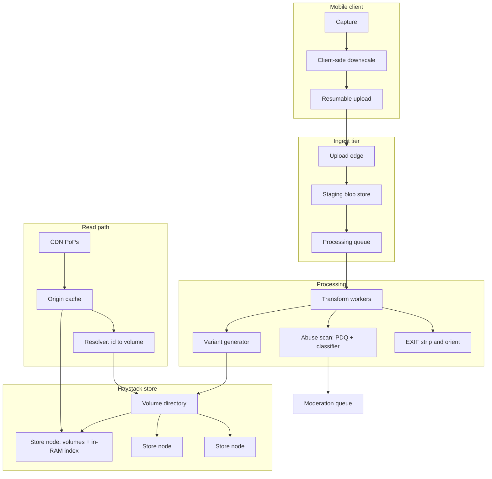
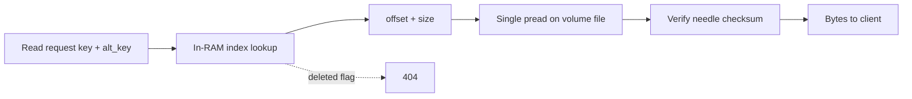
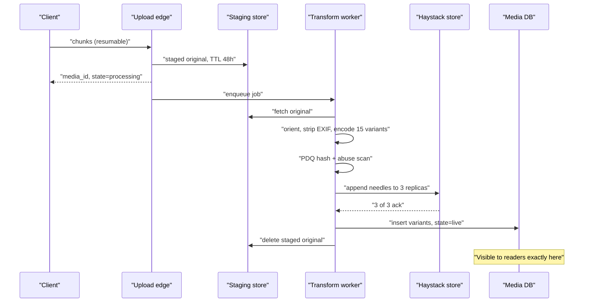
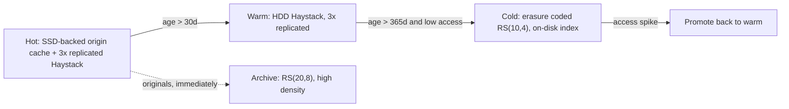
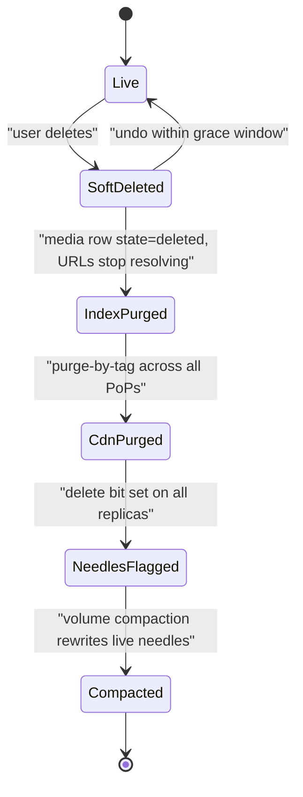

# 19 — Photo / Media Store (Instagram)

<span class="pill pill-core">Core</span> <span class="pill pill-medium">Medium</span>

**Storing a hundred million photos a day is not a bytes problem — it is a metadata problem. A photo is 200 KB but a POSIX file costs you an inode, a directory entry and two or three disk seeks before you touch the data, and at a trillion files that overhead is the system.**

| | |
|---|---|
| **Commonly asked at** | Meta, Google, Pinterest, Snap, Reddit, Shopify, Cloudflare, Discord |
| **Time budget** | 45 min |
| **Core tension** | Pre-generating every variant makes reads cheap and predictable but multiplies storage and write cost by an order of magnitude; generating on demand at the edge inverts that and buys you a cold-start latency cliff and a thundering herd on every viral post |
| **Prerequisites** | [F04 Caching](../fundamentals/f04-caching.md), [F05 CDN & Edge](../fundamentals/f05-cdn-edge.md), [F12 Queues & Streams](../fundamentals/f12-queues-streams.md), [F13 Storage Engines](../fundamentals/f13-storage-engines.md), [F15 Object & Blob Storage](../fundamentals/f15-object-storage.md), [F17 Rate Limiting & Load Shedding](../fundamentals/f17-rate-limiting-load-shedding.md), [F21 Probabilistic Structures](../fundamentals/f21-probabilistic-data-structures.md), [F27 Security in Design](../fundamentals/f27-security-design.md), [F28 Cost Engineering](../fundamentals/f28-cost-engineering.md) |

---

## 1. Problem Statement

Build the media storage and delivery layer behind a photo-sharing product: upload, transform, store, and serve images at a scale where a single photo is viewed hundreds of times and the aggregate is millions of reads per second.

The observation that reframes this problem — and the one Facebook's Haystack paper made in 2010 — is that **a general-purpose filesystem is the wrong tool for a billion small immutable files**. NFS and POSIX filesystems are built for mutable files with rich metadata, permissions, hard links, and directory hierarchies. None of that is needed for a photo. All of it costs you:

- An inode per file (256 bytes on XFS) that must be read from disk before the data.
- A directory entry, and directories that degrade badly past a few thousand entries.
- Two to three disk seeks per cold read: directory lookup, inode read, data read.
- Metadata that cannot fit in RAM at scale, so the seeks cannot be avoided by caching.

At 500 billion media objects, the per-file metadata is larger than most companies' entire datasets, and the seek amplification means you need three times the spindles you would otherwise need. Haystack's contribution was to collapse this to **one seek and about 20 bytes of RAM per photo** by abandoning the filesystem abstraction: pack photos into huge append-only files and keep the offset index entirely in memory.

The other half of the problem is the read path, which is overwhelmingly a CDN problem, and the transformation pipeline, which is where the storage multiplier and the operational complexity live.

### Out of scope

Video (a genuinely different problem: transcoding ladders, ABR packaging, per-title encoding), the social graph, feed ranking, and the recommendation system. We store and serve images.

---

## 2. Requirements

### Functional

| # | Requirement | Notes |
|---|---|---|
| F1 | Upload an image, get back a stable media id | Resumable for poor mobile networks |
| F2 | Serve the image at multiple sizes and aspect ratios | Feed, grid, story, profile, notification thumbnail |
| F3 | Format negotiation | AVIF, WebP, JPEG fallback, based on client capability |
| F4 | Private and restricted media | Signed, expiring URLs; not all content is public |
| F5 | Delete media, with a bounded propagation guarantee | Including from CDN caches |
| F6 | Strip privacy-sensitive metadata on ingest | GPS, camera serial, owner name |
| F7 | Abuse scanning before content becomes visible | Hash matching, classifier scoring |
| F8 | Reprocess historical media | New formats, new sizes, encoder upgrades |
| F9 | Cold tier for old content | Age-driven, transparent to readers |

### Non-functional

| # | Requirement | Target |
|---|---|---|
| N1 | Upload p95 latency, 3 MB image on LTE | < 4 s to "posted" |
| N2 | Read latency, CDN hit | p50 < 30 ms, p99 < 150 ms |
| N3 | Read latency, CDN miss to origin | p99 < 400 ms |
| N4 | CDN hit ratio | > 96% by request, > 92% by byte |
| N5 | Availability of reads | 99.99% |
| N6 | Durability | 11 nines for the canonical copy |
| N7 | Cost per stored photo per year | Bounded and measured; storage is the dominant line |
| N8 | Abuse scan coverage | 100% of media scanned before public visibility |

!!! note "The read/write ratio dictates everything"
    Roughly 1,000 reads per write, and the distribution over content age is brutally skewed. Design the read path for cache hits and the write path for throughput, and accept that they are almost entirely separate systems that share only a blob store. Optimising the write path for latency at the expense of the read path is the classic mistake here.

---

## 3. Scale Estimation

**Traffic**

$$
\begin{aligned}
\text{MAU} &= 2 \times 10^{9},\quad \text{DAU} = 5 \times 10^{8} \\
\text{uploads} &= 1 \times 10^{8}\ \text{photos/day} \\
\text{upload rate} &= \frac{10^{8}}{86400} \approx 1{,}160\ \text{/s mean},\ \approx 3{,}500\ \text{/s peak}
\end{aligned}
$$

**Read rate**

$$
\begin{aligned}
\text{photo views per DAU per day} &= 300 \\
\text{total views} &= 5 \times 10^{8} \times 300 = 1.5 \times 10^{11}\ \text{/day} \\
\text{mean} &= \frac{1.5 \times 10^{11}}{86400} \approx 1.74 \times 10^{6}\ \text{/s} \\
\text{peak (3x)} &\approx 5.2 \times 10^{6}\ \text{/s}
\end{aligned}
$$

At a 96% CDN hit ratio, origin sees

$$
5.2 \times 10^{6} \times 0.04 \approx 208{,}000\ \text{/s}
$$

Every point of hit ratio is worth 52,000 origin requests per second at peak. **Hit ratio is the single most valuable number in the system**, which is why §7.6's cache-key discipline matters so much.

**Storage per photo.** Variants generated at ingest, three formats:

| Variant | Use | JPEG | WebP | AVIF |
|---|---|---|---|---|
| 1080 w | Full feed view | 200 KB | 140 KB | 100 KB |
| 750 w | Feed on smaller devices | 110 KB | 78 KB | 55 KB |
| 640 w | Legacy / low bandwidth | 85 KB | 60 KB | 42 KB |
| 320 w | Grid | 25 KB | 18 KB | 13 KB |
| 150 sq | Avatar, notification | 8 KB | 6 KB | 4 KB |
| **Subtotal** | | **428 KB** | **302 KB** | **214 KB** |

$$
\text{served variants} = 428 + 302 + 214 = 944\ \text{KB per photo}
$$

Plus the normalised original retained for reprocessing (downscaled to 2048 px, high quality, ~1.6 MB), archived cold:

$$
\text{total per photo} \approx 944\ \text{KB} + 1.6\ \text{MB} \approx 2.5\ \text{MB}
$$

**A 200 KB photo costs 2.5 MB of storage — a 12.5x multiplier.** This is the number to put on the board, because it makes the pre-generate versus on-demand argument concrete rather than abstract.

**Daily and cumulative**

$$
\begin{aligned}
\text{daily logical} &= 10^{8} \times 2.5\ \text{MB} = 250\ \text{TB/day} \\
\text{annual logical} &= 91\ \text{PB/year} \\
\text{annual raw at RS(10,4)} &= 91 \times 1.4 = 128\ \text{PB/year}
\end{aligned}
$$

Cumulative over 8 years of similar volume: roughly **700 PB logical, 1 EB raw**, across ~500 billion media objects and ~2.5 trillion individual stored variants.

**The needle index — why Haystack works.** Per-variant in-memory index entry:

```text
key (media_id)         8 B
alt_key (variant)      4 B
flags                  1 B
offset (in volume)     5 B
size                   4 B
padding/alignment      2 B
---------------------- 24 B
```

A store node with 36 x 20 TB drives holds ~500 TB usable after erasure coding. At a 380 KB mean stored variant size:

$$
\frac{5 \times 10^{14}}{3.8 \times 10^{5}} \approx 1.32 \times 10^{9}\ \text{needles per node}
$$

$$
1.32 \times 10^{9} \times 24\ \text{B} \approx 32\ \text{GB of RAM}
$$

**Thirty-two gigabytes of RAM indexes half a petabyte of photos.** That fits on a node with 128 GB, leaving plenty for page cache. Compare with the POSIX alternative: 1.32 billion inodes at 256 B is 338 GB of metadata that cannot be cached, guaranteeing a metadata seek before every data seek and roughly tripling the required spindle count.

**Fleet sizing**

$$
\text{store nodes} = \frac{1\ \text{EB raw}}{720\ \text{TB raw per node}} \approx 1{,}400\ \text{nodes}
$$

**Origin read IOPS.** 208,000 origin req/s at one seek each, against a fleet whose hot tier holds maybe 15% of the data. If the hot tier is 210 nodes with 36 drives each at 120 IOPS:

$$
210 \times 36 \times 120 = 907{,}000\ \text{IOPS available}
$$

Comfortable at one seek per read. At the two-to-three seeks a POSIX layout would require, the same fleet is at 70% IOPS utilisation before any background work. **That is the entire Haystack argument, in one calculation.**

---

## 4. API Design

### Upload

```http
POST /v1/media/upload_session HTTP/1.1
Host: upload.media.example.com
Authorization: Bearer <token>
Content-Type: application/json

{ "byte_size": 3145728, "mime": "image/heic", "sha256": "9f2ae1...c11d",
  "client_upload_id": "0f31c2a7-4b9e-4a1e-9f7b-8c2d3e4f5a6b" }
```

```json
{ "upload_id": "up_7ac1f9", "upload_url": "https://upload-edge-3.media.example.com/u/up_7ac1f9",
  "chunk_size": 1048576, "expires_at": "2026-08-30T12:02:44Z" }
```

```http
PUT /u/up_7ac1f9 HTTP/1.1
Content-Range: bytes 2097152-3145727/3145728
```

```http
POST /v1/media/finalize
{ "upload_id": "up_7ac1f9", "client_upload_id": "0f31c2a7-...", "strip_location": true }
```

```json
{ "media_id": "3ZkQpR7nA2", "state": "processing",
  "poll_after_ms": 500,
  "placeholder_url": "https://cdn.example.com/p/3ZkQpR7nA2/blur.jpg" }
```

`client_upload_id` is the idempotency key. A mobile client that retries `finalize` after a timeout must get the same `media_id`, not a duplicate post. See [F11 Idempotency](../fundamentals/f11-idempotency.md).

### Delivery

```text
https://cdn.example.com/v/{media_id}/{variant}/{sig}.{ext}

  media_id  base62, 10 chars
  variant   w1080 | w750 | w640 | w320 | s150
  sig       HMAC over (media_id, variant, exp, viewer_scope) for private media
  ext       avif | webp | jpg
```

```http
GET /v/3ZkQpR7nA2/w1080/-.avif HTTP/1.1
Host: cdn.example.com
Accept: image/avif,image/webp,image/*
```

```http
HTTP/1.1 200 OK
Content-Type: image/avif
Cache-Control: public, max-age=31536000, immutable
ETag: "3ZkQpR7nA2:w1080:avif:v3"
Timing-Allow-Origin: *
```

!!! tip "Put the format in the path, not in Vary"
    The naive design serves one URL and uses `Vary: Accept` to pick AVIF or JPEG. That is correct HTTP and a cache-efficiency disaster — see §7.6. Encoding the format in the URL means one URL, one representation, one cache object, and `Cache-Control: immutable` with a one-year TTL. The client (or a tiny edge worker) decides the extension. This single decision is worth several points of hit ratio.

---

## 5. Data Model

```sql
-- Media metadata. Sharded by media_id. This is small and hot.
CREATE TABLE media (
  media_id        BIGINT       PRIMARY KEY,   -- time-ordered id, see below
  owner_id        BIGINT       NOT NULL,
  state           SMALLINT     NOT NULL,      -- 0=uploading 1=processing 2=live
                                              -- 3=blocked 4=deleted
  mime_original   VARCHAR(32)  NOT NULL,
  width           INT          NOT NULL,
  height          INT          NOT NULL,
  orientation     SMALLINT     NOT NULL,      -- applied to pixels, see §12
  perceptual_hash BINARY(32),                 -- PDQ, for dedup and abuse matching
  content_sha256  BINARY(32)   NOT NULL,      -- of the normalised original
  visibility      SMALLINT     NOT NULL,      -- 0=public 1=followers 2=private
  created_at      TIMESTAMPTZ  NOT NULL,
  deleted_at      TIMESTAMPTZ,
  blurhash        VARCHAR(64)                 -- inline placeholder, no fetch needed
);

-- One row per stored variant. This is the big table.
CREATE TABLE media_variant (
  media_id        BIGINT       NOT NULL,
  variant         SMALLINT     NOT NULL,      -- w1080, w750, ...
  format          SMALLINT     NOT NULL,      -- avif, webp, jpeg
  volume_id       BIGINT       NOT NULL,      -- Haystack logical volume
  needle_offset   BIGINT       NOT NULL,
  needle_size     INT          NOT NULL,
  byte_size       INT          NOT NULL,
  cookie          INT          NOT NULL,      -- anti-enumeration, see §12
  storage_tier    SMALLINT     NOT NULL,      -- 0=hot 1=warm 2=cold
  created_at      TIMESTAMPTZ  NOT NULL,
  PRIMARY KEY (media_id, variant, format)
);

-- Logical volume directory: the only mutable mapping in the data plane.
CREATE TABLE volume (
  volume_id       BIGINT       PRIMARY KEY,
  state           SMALLINT     NOT NULL,      -- 0=writable 1=read-only 2=compacting
  logical_bytes   BIGINT       NOT NULL,
  live_bytes      BIGINT       NOT NULL,      -- drops as media is deleted
  replica_nodes   JSONB        NOT NULL,      -- physical placement
  storage_tier    SMALLINT     NOT NULL,
  sealed_at       TIMESTAMPTZ
);

-- Upload sessions, TTL'd aggressively. Source of orphan detection.
CREATE TABLE upload_session (
  upload_id        BINARY(16)  PRIMARY KEY,
  client_upload_id BINARY(16)  NOT NULL,
  owner_id         BIGINT      NOT NULL,
  media_id         BIGINT,                    -- set on finalize
  staged_blob_key  VARCHAR(128),
  state            SMALLINT    NOT NULL,
  created_at       TIMESTAMPTZ NOT NULL,
  expires_at       TIMESTAMPTZ NOT NULL
);
CREATE UNIQUE INDEX ux_client_upload ON upload_session (owner_id, client_upload_id);

-- Deletion work queue: the bridge between "user deleted it" and "bytes gone".
CREATE TABLE deletion_task (
  media_id        BIGINT       PRIMARY KEY,
  requested_at    TIMESTAMPTZ  NOT NULL,
  index_purged_at TIMESTAMPTZ,
  cdn_purged_at   TIMESTAMPTZ,
  needles_flagged_at TIMESTAMPTZ,
  compacted_at    TIMESTAMPTZ,
  attempts        INT          NOT NULL DEFAULT 0
);
```

**`media_id` is time-ordered.** A Snowflake-style 64-bit id with a timestamp in the high bits gives you, for free: chronological sort without a secondary index, a cheap age predicate for tiering and lifecycle (`media_id < f(cutoff_time)` is a primary-key range), and rough temporal locality when packing variants into volumes — which is exactly the locality that makes age-based cold migration a sequential volume move rather than a random scatter.

---

## 6. High-Level Architecture



### The Haystack store, in detail

A **logical volume** is a 100 GB append-only file replicated to three physical **store nodes** in different failure domains. Photos are appended as **needles**:

```text
+--------------------------------------------------------------+
| Volume superblock: volume_id, format version, checksum        |
+--------------------------------------------------------------+
| Needle 0                                                      |
|   magic (4) | key (8) | alt_key (4) | flags (1) | size (4)    |
|   data (size bytes)                                           |
|   footer: magic (4) | checksum (4) | padding to 8-byte align  |
+--------------------------------------------------------------+
| Needle 1 ...                                                  |
+--------------------------------------------------------------+
```

Every store node holds an **in-memory hash map** from `(key, alt_key)` to `(offset, size, flags)`. That map is the entire index. On process start it is rebuilt by scanning a compact on-disk **index file** written lazily alongside the volume — not by scanning the volume itself, which would take hours.

Reading a photo is: hash lookup in RAM (nanoseconds), one `pread` at a known offset (one seek), verify the checksum, return. **One seek. No inode. No directory. No filesystem metadata in the critical path.**

Writing is: append to the open volume, update the in-memory map, append to the index file. Sequential writes only, which is why a fleet of spinning disks can absorb thousands of writes per second without collapsing.

Deleting is: set a flag bit in the in-memory map and asynchronously in the needle header. **The bytes stay.** They are reclaimed only when the volume is compacted — copied to a new volume, live needles only — which happens when the live-byte ratio drops below a threshold.



### Write path walkthrough

1. The client downscales to 2048 px before upload. This is the highest-leverage optimisation on the entire write path: it cuts upload bytes by 5-10x, cuts perceived upload time proportionally, and cuts server transform CPU. A 12 MP phone photo is 4-6 MB; nobody's feed needs it.
2. The client creates an upload session and PUTs chunks to an upload edge close to it, resumable by byte range. Mobile networks drop; a non-resumable upload of 3 MB on LTE fails often enough to matter.
3. On `finalize`, the edge verifies the SHA-256, writes the original to a **staging blob store** with a 48-hour TTL, and enqueues a processing job. The client gets `media_id` and `state: processing` immediately, plus a BlurHash placeholder so the UI can render something instantly.
4. A transform worker: decodes, applies EXIF orientation to the actual pixels, strips all other EXIF, generates every variant in every format, computes a PDQ perceptual hash, and runs abuse scanning.
5. Variants are written to the Haystack store. The worker asks the volume directory for a writable volume, appends the needle to **all three replicas synchronously**, and only considers the write successful when all three acknowledge. Replication is synchronous here because there is no parity to reconstruct from — a needle exists on three nodes or it does not exist.
6. The worker commits `media_variant` rows and flips `media.state` to `live` in one transaction. **That commit is the visibility point.**
7. The staging blob is deleted; the normalised 2048 px original is written to the cold tier for future reprocessing.



### Read path walkthrough

1. The client builds a URL from `media_id`, the variant its layout needs, and the best format it supports. No round trip is required to discover the URL — it is derivable, which removes an entire metadata service from the read path.
2. The CDN serves 96% of requests from a PoP cache. Because URLs are immutable and content-addressed by `(media_id, variant, format)`, `Cache-Control: max-age=31536000, immutable` is safe and revalidation never happens.
3. On a miss, the PoP goes to a regional shield cache, which absorbs the fan-in from dozens of PoPs. Without a shield tier, a cold viral photo generates one origin request per PoP; with it, one per region. This is the cheapest tail-load protection available.
4. On a shield miss, the origin cache (a large SSD-backed cache in front of Haystack) is consulted. It holds the hot working set — recent and viral content — and absorbs most of what escapes the CDN.
5. On an origin cache miss, the resolver maps `(media_id, variant, format)` to a logical volume, picks a healthy replica (preferring the least loaded, or the local rack), and issues the read.
6. The store node does the RAM lookup and one `pread`, verifies the checksum, and returns.

!!! note "Why the URL is derivable and not looked up"
    If reading a photo required a metadata lookup to find its URL, you would have a database in the path of five million requests per second. Making the URL a pure function of `(media_id, variant, format)` plus an HMAC eliminates that entirely. The resolver still exists, but it sits behind three cache layers and sees only the ~1% of traffic that reaches origin. Structuring identifiers so that the hot path needs no lookup is a general technique worth naming out loud.

---

## 7. Deep Dives

### 7.1 The small-file problem and why Haystack exists

Facebook's pre-Haystack architecture used NFS-mounted NAS appliances, one file per photo. The failure mode was not capacity; it was **metadata IOPS**.

Reading one photo from a POSIX filesystem, cold:

| Step | Disk operations | Why it cannot be cached at scale |
|---|---|---|
| Resolve directory path | 1 or more | Directory blocks for a trillion files exceed any plausible RAM |
| Read the inode | 1 | 256 B per file, 128 TB total at 500 B photos |
| Read the data | 1 (or more if fragmented) | Unavoidable |
| **Total** | **3+ seeks** | |

Three seeks per photo, on a 7,200 RPM drive delivering ~120 IOPS, means **40 photos per second per drive**. Haystack's one seek gives 120. That is a 3x reduction in fleet size for the same read rate — hundreds of millions of dollars at this scale.

The trick is that a photo does not need what a filesystem provides:

| POSIX feature | Photo requirement | Cost of providing it anyway |
|---|---|---|
| Mutable content | Immutable | Journaling, block allocation, fragmentation |
| Rich permissions | Handled at the app layer | Inode fields, ACL blocks |
| Hierarchical names | A flat 64-bit id | Directory blocks, path resolution seeks |
| Hard links, symlinks | Never | Link counts, indirection |
| Arbitrary size | 4 KB to 500 KB | Indirect block chains |
| `stat` metadata | Stored in the app database | An inode read per access |

Haystack throws all of it away and keeps exactly what is needed: a key, an offset, a size, and a delete flag — 24 bytes, in RAM.

| Approach | Seeks/read | RAM per object | Delete cost | Chosen / rejected and why |
|---|---|---|---|---|
| One file per photo on NFS/NAS | 3+ | Effectively unbounded | Free | Rejected. The original design; the metadata IOPS wall is exactly what motivated Haystack |
| One file per photo on local XFS with a huge dentry cache | 1-2 warm, 3 cold | ~500 B | Free | Rejected. Works to a few hundred million files, falls over beyond that |
| **Haystack: packed volumes, RAM index** | **1** | **24 B** | Flag now, compact later | **Chosen.** The read path becomes one `pread`; RAM cost is trivial |
| Packed volumes with an on-disk LSM index | 1-2 | ~0 | Flag + LSM delete | Rejected for hot data (the index lookup can itself seek), **chosen for the cold tier** where RAM per byte must be minimised |
| General object store (S3-style) | 1-2, plus a network hop | 0 (remote) | Free | **Chosen for the cold tier and the archived originals.** Higher latency is fine when the access probability is under 1% per month |

!!! example "The RAM budget is what makes this work, and it is small"
    Half a petabyte of photos indexed by 32 GB of RAM. The index-to-data ratio is roughly $1 : 15{,}000$. Any design where the index-to-data ratio approaches $1 : 1000$ stops fitting in RAM and reintroduces the seek you were trying to eliminate. This ratio is the number to check when someone proposes adding fields to the index.

### 7.2 Variant generation: pre-generate versus on-demand

Fifteen stored representations per photo (5 sizes x 3 formats) is a 12.5x storage multiplier. The alternative is storing one canonical high-quality image and generating variants at request time.

| Strategy | Storage | Write CPU | Read latency | Cold-start risk | Chosen / rejected and why |
|---|---|---|---|---|---|
| Pre-generate all 15 | 12.5x | High, but offline and batchable | Minimal, pure cache-or-seek | None | Rejected as a blanket policy. Most variants are never requested |
| Generate all on demand at the edge | 1.6x (original only) | Zero upfront | +200-800 ms on every cold miss | Severe: a viral post cold-misses at every PoP simultaneously | Rejected as a blanket policy. The tail latency and the herd are unacceptable |
| **Hybrid: pre-generate the hot set, derive the rest on demand and cache** | **~4x** | **Moderate** | **Minimal for 95%+ of requests** | **Bounded** | **Chosen** |
| Pre-generate lazily on first request, then persist | 1.6x growing to ~4x | Amortised | First request pays | Moderate | A refinement of the hybrid, used for rare variants |

The hybrid, concretely:

- **Always pre-generate:** `w1080` and `s150`, in AVIF and WebP and JPEG. These cover the feed view and every thumbnail context, and they are close to 90% of requests. Six representations, ~660 KB.
- **Derive on demand, then persist:** `w750`, `w640`, `w320`. Generated at the edge from the pre-generated `w1080` — downscaling is fast and quality loss from a good downscale of a 1080 px source is imperceptible at those sizes. Written back to the store on first generation so the second request is a hit.
- **Never store, always derive:** exotic crops, arbitrary widths from a `?w=` parameter. Rate-limited hard, because an unbounded parameter space is both a cache-key explosion and a CPU amplification attack (§12).

**Herd protection is mandatory** on any on-demand path. A viral photo requested at 200,000 req/s that is not yet in cache will, without protection, spawn 200,000 concurrent transform jobs.

```python
# Single-flight at the edge: one generation per key, everyone else waits.
async def get_or_generate(key):
    if (blob := cache.get(key)) is not None:
        return blob
    # Distributed lock, short TTL, holder identity so we can detect abandonment.
    lock = await locks.acquire(f"gen:{key}", ttl=10, owner=self.id)
    if lock is None:
        # Someone else is generating. Wait briefly, then serve a fallback
        # rather than piling up - a slightly larger variant is better than
        # a 500, and far better than an unbounded queue.
        blob = await cache.wait_for(key, timeout=2.0)
        return blob if blob is not None else await serve_nearest_variant(key)
    try:
        blob = await transform(key)
        await cache.set(key, blob, ttl=YEAR)
        await store.persist_variant(key, blob)
        return blob
    finally:
        await lock.release()
```

!!! warning "Encoder upgrades are a reprocessing bill, not a config change"
    Switching to a better AVIF encoder that saves 12% of bytes means re-encoding every photo you want the saving on. At 500 billion media objects that is a multi-month, fleet-scale batch job competing with live traffic for CPU. Decide up front whether reprocessing is a supported operation — which requires keeping the normalised original forever, at 1.6 MB each — or whether old content simply keeps its old encoding. Both are defensible; drifting into the answer by accident is not. Keeping the originals is what makes the answer optional rather than forced, which is why they are worth their 64% share of stored bytes.

### 7.3 EXIF stripping, privacy, and the orientation trap

A phone photo's EXIF carries: GPS coordinates to a few metres, the exact capture timestamp with timezone, camera make, model and **serial number**, lens data, and sometimes the owner's name and copyright string. Publishing that with the image is a location-disclosure vulnerability and, via the serial number, a cross-account correlation vector — the same camera serial across two supposedly unrelated accounts links them.

**Strip everything on ingest.** Not at serve time — at ingest, before the bytes are ever stored in a servable form. Serve-time stripping means the unstripped bytes exist somewhere, and something will eventually serve them: a debug endpoint, a data export, a backup, a CDN that cached the pre-strip response during a rollout.

What to keep:

| Field | Keep? | Why |
|---|---|---|
| Orientation | **Apply to pixels, then discard** | See the trap below |
| Colour profile (ICC) | Keep, or convert to sRGB | Dropping it makes wide-gamut photos look washed out or oversaturated |
| Capture timestamp | Keep in the database, strip from the file | Product needs it; the file does not |
| GPS | Strip, and store separately only with explicit user consent | Highest-risk field |
| Make, model, serial, lens | Strip entirely | No product value, real correlation risk |
| Copyright, artist | Strip from the served file | Product-level attribution instead |

!!! danger "The orientation trap"
    EXIF `Orientation` says "the sensor was rotated; rotate the pixels 90 degrees clockwise before display". If you strip EXIF **without first applying the rotation to the pixel data**, every portrait photo from a large fraction of phones is served sideways. This is one of the most common production bugs in image pipelines and it is entirely silent in testing, because the test images are usually landscape or already normalised. Always: decode, apply orientation to the pixels, re-encode with orientation set to 1, then strip.

There is a second, subtler leak: **the original file's byte-level fingerprint**. Encoder version, quantisation tables and chroma subsampling choices form a signature that identifies the capture device model, and sometimes the specific editing software. Re-encoding from decoded pixels with your own encoder settings normalises all of it away — which is another reason the pipeline should never pass through the client's bytes untouched.

### 7.4 Cold migration and the age-based access distribution

Access probability decays sharply and predictably with content age:

| Age | Share of stored objects | Share of read requests | Requests per object relative to day 0 |
|---|---|---|---|
| 0-1 day | 0.1% | 42% | 1.0 |
| 1-7 days | 0.6% | 24% | ~0.1 |
| 7-30 days | 2.5% | 14% | ~0.02 |
| 1-12 months | 22% | 15% | ~0.002 |
| > 12 months | 74% | 5% | ~0.0002 |

**Seventy-four percent of the bytes serve five percent of the requests.** Storing them on the same hardware as the hot 0.1% is the single largest cost error available in this design.

Tiering policy:



Three things make this work in practice and are worth stating:

1. **Migrate whole volumes, not individual photos.** Because `media_id` is time-ordered and volumes are filled sequentially, a volume's contents share an age. Moving a sealed 100 GB volume is one large sequential transfer. Moving a billion individual photos by age predicate would be a random-read nightmare that would take longer than the data's remaining lifetime.
2. **Change the redundancy scheme at the tier boundary.** Hot needs 3x replication for read parallelism (three nodes can serve the same needle) and simple recovery. Cold does not need read parallelism, so RS(10,4) at 1.4x is strictly better on cost. The migration is therefore also a re-encode, which is a real CPU and network cost that must be budgeted.
3. **Promotion must exist and must be automatic.** Old content goes viral — a decade-old photo resurfaces. Detect with a decaying access counter per volume; promote by copying the volume back to a warm tier, or more cheaply by pulling the specific hot needles into the origin cache with a long TTL. Without promotion, one nostalgic viral post pins a cold-tier node at 100% IOPS.

$$
\begin{aligned}
\text{cost}_{\text{flat hot}} &= 700\ \text{PB} \times 3.0 \times \$0.021/\text{GB-mo} = \$44.1\text{M/mo} \\
\text{cost}_{\text{tiered}} &= \underbrace{21 \times 3.0 \times 0.021}_{\text{hot 3\%}} + \underbrace{154 \times 3.0 \times 0.010}_{\text{warm 22\%}} + \underbrace{525 \times 1.4 \times 0.004}_{\text{cold 75\%}} \\
&= \$1.32\text{M} + \$4.62\text{M} + \$2.94\text{M} = \$8.9\text{M/mo}
\end{aligned}
$$

(costs in millions per month, PB converted to GB). **Tiering saves roughly 80% of the storage bill.** That is the argument, and it is why this section is not an afterthought.

### 7.5 Deletion, orphans, and eventually-consistent garbage collection

Deletion in this system is a distributed, multi-stage, eventually-consistent process, and pretending otherwise causes both privacy incidents and cost leaks.



Each stage has a different latency and a different guarantee:

| Stage | Latency | What is actually guaranteed |
|---|---|---|
| Index purge | < 1 s | New requests get 404 from the origin |
| CDN purge | Seconds to minutes | Cached copies invalidated; in-flight responses may still complete |
| Needle flag | Minutes | The store will not serve it even if the index is wrong |
| Volume compaction | Days to weeks | The bytes are physically gone |

The honest statement to a user is: "the photo is unreachable within seconds and the bytes are erased within N days." Claiming immediate byte-level erasure is false, and the gap between the claim and the reality is a compliance problem.

**Why compaction is slow.** A 100 GB volume with 92% live bytes is not worth rewriting — you would move 92 GB to reclaim 8 GB. Compaction triggers when the live ratio drops below ~60%, so the reclamation delay depends on how fast the volume's contents get deleted, which for old volumes can be months.

**Crypto-shredding** closes the gap when it matters: encrypt each media object with a per-object key wrapped by a per-user key. Destroying the user's key makes every one of their objects unreadable immediately, regardless of physical presence. Cost: a key management operation per object and the loss of cross-object dedup (which was marginal for photos anyway, since re-encoding makes identical uploads produce different bytes).

**Orphaned blobs** come from three sources, and all three are real:

1. **Upload succeeded, finalize never arrived.** The client crashed, the network died, the user force-quit. The staged blob sits in the staging store forever unless the TTL removes it. This is why the staging store has an aggressive 48-hour TTL and is a separate system from the permanent store.
2. **Variants written, metadata commit failed.** The worker appended 15 needles and then the database transaction failed. The needles have no `media_variant` row pointing at them, so nothing will ever read them and nothing will ever delete them.
3. **Partial replica writes.** Two of three replicas got the needle before the worker died. The volume directory does not know they are there.

```python
# Orphan reaper. Runs continuously, compares the store against the index.
# This is a reconciliation job, and reconciliation jobs are the only way
# to keep two systems honest.
def reap_orphans(volume_id):
    for needle in scan_volume_index(volume_id):     # index file, not the volume
        if needle.age < GRACE_PERIOD:               # 72h: never race a live write
            continue
        if not media_db.variant_exists(needle.key, needle.alt_key):
            # No metadata row. Flag as deleted; compaction reclaims later.
            metrics.increment("orphan_needles_found")
            flag_deleted(volume_id, needle)

# And the reverse direction, which is the dangerous one.
def find_dangling_references():
    for row in media_variant.scan():
        if not store.needle_exists(row.volume_id, row.media_id, row.variant):
            # Metadata says it exists, storage says it does not.
            # This is DATA LOSS, not a cost leak. Page.
            alert.page("dangling_variant_reference", row)
```

!!! warning "The two reconciliation directions have opposite severities"
    A needle with no metadata row is wasted money — reap it on a schedule, log the count, move on. A metadata row with no needle is **lost user data** — page immediately, because it means either a write acknowledged something that was not durable or something deleted a live needle. Conflating the two directions into one "consistency checker" with one alert threshold is a mistake; they need different code paths, different severities and different on-call responses.

### 7.6 Format negotiation and the cache-key explosion

Serving AVIF to clients that support it and JPEG to those that do not saves 40-50% of image bytes. The naive implementation destroys your cache hit ratio.

**The trap.** One URL, `Vary: Accept`. The `Accept` header from real browsers is a long, highly-variable string:

```text
image/avif,image/webp,image/apng,image/svg+xml,image/*,*/*;q=0.8
image/webp,image/apng,image/*,*/*;q=0.8
image/avif,image/webp,image/*,*/*;q=0.8
image/*,*/*;q=0.8
```

Each distinct string is a distinct cache key. Dozens of variations across browser versions means dozens of cache entries for one image, each with a fraction of the hit rate. Add `Vary: Accept, DPR, Width, Save-Data` and the cache-key space is combinatorial:

$$
|K| = |Accept| \times |DPR| \times |Width| \times |Save\text{-}Data| \approx 30 \times 4 \times 20 \times 2 = 4{,}800
$$

Forty-eight hundred cache entries per logical image, and the cache stores 4,800 copies of nearly identical bytes while achieving a hit rate close to zero on all but a handful.

**The fix, in three layers:**

1. **Put the format in the URL.** `/{id}/{variant}.avif` and `/{id}/{variant}.jpg` are different resources with different URLs and no `Vary` at all. Each has a full-strength cache entry and `Cache-Control: immutable`.
2. **If you must negotiate, normalise the header at the edge before it becomes a cache key.** Collapse the raw `Accept` into a tiny enum and vary on that instead:

```javascript
// Edge worker: normalise before the cache lookup.
function normaliseAccept(accept) {
  if (accept.includes("image/avif")) return "a";
  if (accept.includes("image/webp")) return "w";
  return "j";
}
// Cache key becomes /{id}/{variant}#a|w|j  -> exactly 3 entries, not 30.
```

3. **Quantise every continuous dimension.** Never accept an arbitrary `?w=` value. Snap to a fixed ladder — 150, 320, 640, 750, 1080 — and redirect or serve the nearest. An unbounded width parameter is simultaneously a cache-key explosion, a storage-growth vector, and a CPU amplification attack: `?w=1`, `?w=2`, `?w=3` are three million distinct cache misses each triggering a transform.

| Approach | Cache entries per image | Hit ratio impact | Chosen / rejected and why |
|---|---|---|---|
| `Vary: Accept` raw | 20-40 | Severe: hit ratio collapses | Rejected. Correct HTTP, wrong engineering |
| `Vary` on a normalised 3-value token | 3 | Minimal | Acceptable when URLs cannot be changed |
| Format in the path, no `Vary` | 1 per format, all fully warm | None | **Chosen.** Also enables `immutable` and removes revalidation entirely |
| Content negotiation via a 302 redirect | 1 per format, plus a redirect RTT | Adds latency on every request | Rejected. The extra round trip costs more than it saves |

!!! gotcha "A missing Vary is worse than a bad Vary"
    **Symptom:** Safari users see broken images, or Chrome users get JPEG while Firefox gets AVIF at random.
    **Mechanism:** if you negotiate on `Accept` but forget to declare `Vary: Accept`, a shared cache stores whichever representation it saw first and serves it to everyone — including clients that cannot decode it. The bug is intermittent and depends on which client warmed the cache, which makes it maddening to reproduce.
    **Mitigation:** if you negotiate, you must `Vary`. The better answer is not to negotiate at all: distinct URLs per format make the problem structurally impossible.

### 7.7 Abuse scanning in the upload path

Every uploaded image must be scanned before it becomes publicly visible. The scan has three tiers with very different cost and latency profiles.

| Tier | Method | Latency | Placement | Action |
|---|---|---|---|---|
| Hash match | PDQ / PhotoDNA against a known-bad database | 5-20 ms | **Synchronous, blocking** | Block, preserve evidence, report |
| Fast classifier | Small on-device-class CNN for nudity, gore, weapons | 30-80 ms | **Synchronous, blocking** for high-confidence | Block or shadow-restrict |
| Deep classifier / human review | Large model, ensemble, plus human queue | Seconds to hours | **Asynchronous** | Retro-remove, restrict, escalate |

The design tension is **fail-open versus fail-closed**. If the scanner is down, do you publish unscanned content or block all uploads?

The answer is neither, and the fact that there is a third option is the interesting part: **publish in a restricted state**. The media becomes visible only to the uploader and, optionally, their immediate followers, with distribution suppressed — no discovery surface, no recommendations, no hashtag pages. When the scanner recovers, the backlog is processed and content is either promoted to full visibility or removed. This bounds the harm without taking the product offline, and it is the pattern every mature platform converges on.

```python
def publish_decision(media, scan_result, scanner_healthy):
    if scan_result and scan_result.hash_match:
        return Decision.BLOCK_AND_REPORT          # never fail open on known-bad
    if scan_result and scan_result.confidence > 0.95:
        return Decision.BLOCK
    if not scanner_healthy:
        # Degrade the blast radius, not the product.
        return Decision.PUBLISH_RESTRICTED        # author-visible, no distribution
    if scan_result and scan_result.confidence > 0.60:
        return Decision.PUBLISH_PENDING_REVIEW    # visible, queued for humans
    return Decision.PUBLISH
```

The hash-match tier must never fail open. It matches against known illegal content, the false-positive rate is essentially zero, and the check is cheap. If the hash service is unavailable, uploads queue rather than publish. That is the one place where blocking the product is the correct trade.

**Perceptual hashing also earns its keep on the dedup side.** PDQ is robust to resizing, re-compression and minor crops, so a photo re-uploaded a million times during a meme cycle can be recognised as the same content. That enables cross-upload variant reuse (store one set of variants, many media rows pointing at it) and, more importantly, lets a moderation decision on one copy propagate to all near-duplicates instead of being re-litigated a million times.

---

## 8. Scaling the Bottleneck

There are two bottlenecks and they move as the system grows.

**Bottleneck 1: origin read IOPS during a CDN cold event.** The steady state is comfortable — 208,000 origin req/s against ~900,000 available IOPS. The failure mode is a **CDN cache flush**: a configuration error, a certificate rotation gone wrong, or a purge-by-tag with too broad a tag. Hit ratio drops from 96% to near zero and origin demand jumps from 208,000 to 5,200,000 requests per second — a **25x spike** against a fleet with 4x headroom.

Defences, in the order they engage:

1. **Shield tier.** A regional cache between PoPs and origin. During a PoP-level flush, the shield still holds the working set and absorbs the entire event. This is the single most important structural defence and it is cheap.
2. **Origin cache with an independent eviction policy.** A large SSD cache in front of Haystack whose contents are not correlated with CDN state. A CDN flush does not flush it.
3. **Request collapsing at every layer.** N concurrent requests for the same object become one upstream fetch. During a cold event the request stream is highly duplicated, so collapsing is enormously effective — often a 50x reduction on its own.
4. **Admission control at origin.** Above a threshold, serve a smaller pre-generated variant (which is likelier to be cached and cheaper to fetch) instead of the requested one, or return a BlurHash placeholder. **Degrading image quality is almost always better than degrading availability**, and users barely notice. This is the highest-value degradation lever in the design.
5. **Staged cache warming after any flush.** Never let a cold cache take full traffic at once. Ramp with a token bucket at origin.

**Bottleneck 2: transform CPU during a reprocessing campaign or an upload spike.** AVIF encoding at good quality is expensive — roughly 400-900 ms of CPU for a 1080 px image, an order of magnitude more than JPEG. At 3,500 uploads/s peak with 15 variants each, the sustained requirement is thousands of cores, and a reprocessing campaign over 500 billion objects is a different order of magnitude again.

- Separate the fleets: live uploads and batch reprocessing must never share a queue or a scheduler pool. Batch work runs on preemptible capacity at a hard-capped share.
- Tier encoder effort by expected popularity: use a fast preset for everything, and re-encode with a slow, high-effort preset only for content that crosses a view threshold. Most photos are viewed a handful of times and never justify the expensive encode.
- Encode `w1080` first and publish as soon as it exists. The remaining variants can complete over the following seconds without the user waiting.
- Hardware acceleration for the hot formats where available; it changes the cost per image by 5-10x.

---

## 9. Failure Modes

| Failure | Blast radius | Detection | Mitigation | Degraded behaviour |
|---|---|---|---|---|
| Store node loss | Volumes on that node lose one of three replicas | Heartbeat, IO error rate | Reads served by the other two replicas; re-replicate to a new node | None visible; replication traffic rises |
| Two of three replicas lost for a volume | That volume is one failure from loss | Volume health monitor | Emergency re-replication at top priority; volume marked read-only | Reads still served; writes redirected to other volumes |
| In-memory needle index corrupted or lost | That node cannot serve until rebuilt | Checksum mismatch on read; startup validation | Rebuild from the on-disk index file (minutes), not from the volume (hours) | Node removed from rotation; peers absorb the load |
| CDN cache flush | Global; origin sees 25x traffic | Hit ratio cliff, origin QPS spike | Shield tier, origin cache, request collapsing, quality degradation, staged warming | Slower loads and lower-quality variants for minutes |
| Viral photo, cold | One object, but it can pin a node | Per-object request-rate counter | Promote into origin cache and shield with a long TTL; replicate the needle to more nodes | Brief elevated latency for that object |
| Transform worker fleet saturated | New uploads stuck in `processing` | Queue depth, oldest-message age | Autoscale; shed batch work; publish `w1080` first and defer the rest | Uploads appear as placeholders for longer |
| Abuse scanner unavailable | All new uploads | Scanner health and latency | Publish-restricted mode; hash-match tier fails closed | New content is author-visible only until the backlog clears |
| Metadata commit fails after needles are written | Orphaned needles, invisible cost | Orphan reaper reconciliation counts | Reaper flags them after a 72 h grace period | None user-visible; wasted storage until compaction |
| Needle missing but metadata row present | Broken images for specific media | Dangling-reference auditor; origin 404 rate | Page immediately; restore from replica or regenerate from the archived original | Broken image; this is data loss and must be treated as such |
| Signed URL secret leaked | All private media becomes fetchable | Anomalous access patterns; secret scanning | Versioned signing keys with rapid rotation; short TTLs | Forced re-signing; brief elevated origin load |
| EXIF stripping regression | Every photo uploaded during the window carries GPS | Automated ingest assertion on a sample | Block the release; reprocess affected media; the CDN has already cached the leaky bytes | Privacy incident with a cached-copy tail; requires CDN purge |
| Compaction bug drops live needles | Every media object in the compacted volumes | Post-compaction verification against the metadata index | Two-phase compaction: write the new volume, verify every live needle is present and checksums match, only then drop the old | Data loss if verification is skipped. This is the highest-severity bug class |

---

## 10. SRE Lens

### SLIs and SLOs

| SLI | Definition | SLO |
|---|---|---|
| Image availability | Non-5xx, non-404 responses for live media / total | 99.99% monthly |
| CDN hit ratio | Cache hits / total edge requests | > 96% by request, > 92% by byte |
| Read latency, edge hit | Time to last byte, `w1080` | p50 < 30 ms, p99 < 150 ms |
| Read latency, origin miss | Time to last byte | p99 < 400 ms |
| Upload-to-visible | `finalize` to `state=live` | p50 < 2 s, p95 < 8 s, p99 < 30 s |
| Abuse scan coverage | Media publicly visible with a completed scan / total | > 99.99%, alarmed at any drop |
| Durability | Media objects readable and checksum-valid | 11 nines |
| Dangling references | `media_variant` rows with no readable needle | Zero; page on any occurrence |
| EXIF leakage | Sampled served images containing GPS or serial | Zero; continuously asserted |

!!! note "Two SLIs here are not availability metrics and must not be treated as such"
    **Abuse scan coverage** and **EXIF leakage** are safety and privacy invariants. They have no error budget, they do not get traded against latency, and a regression in either is a stop-the-line event regardless of how healthy the rest of the system looks. Encoding them as SLIs with dashboards and alerts — rather than as "things the pipeline does" — is what makes them survive a year of refactoring.

### Error budget

99.99% monthly is 4.32 minutes. Practically all of it is consumed by CDN and edge events rather than by origin, which is why:

- CDN configuration changes are treated as production deploys: staged by PoP, with automatic rollback on hit-ratio or error-rate regression.
- Purge operations are rate-limited and scoped. A purge-by-tag that matches too broadly is functionally a self-inflicted cache flush, and it is the most common cause of a large origin spike. Purges above a size threshold require a second approver.
- Certificate rotation is automated and staged, because a cert failure at a PoP is indistinguishable from a total outage to the users behind it.

### Rollout

The transform pipeline is the risky component, because its bugs are **silent and permanent**: a bad encode, a stripped colour profile, an unrotated portrait photo, an unstripped GPS tag. The output is written once and served for years, and by the time anyone notices, millions of objects are affected and cached globally.

Controls:

- **Golden-image regression suite** on every pipeline change: a fixed corpus covering EXIF orientations 1 through 8, CMYK JPEGs, wide-gamut P3, animated formats, progressive JPEGs, HEIC with depth maps, 16-bit PNGs, truncated files, and known decoder-exploit samples. Assert on output dimensions, orientation, colour, byte size within a band, and the absence of every stripped EXIF field.
- **Shadow processing**: run the new pipeline alongside the old for a percentage of uploads, store both outputs, compare perceptual difference and metadata. Only promote when divergence is understood.
- **Canary by upload percentage**, never by worker percentage — a worker-based canary gives you a random subset of image types, whereas an upload-percentage canary gives you a representative one.
- **Bounded blast radius through the archived original.** Because the normalised original is retained, any pipeline bug is *recoverable* by reprocessing. This is the strongest argument for keeping originals and worth stating explicitly: it converts a permanent data-quality incident into an expensive batch job.

### Runbook notes

```text
ALERT: cdn_hit_ratio < 90% for 5m
  1. Global or single PoP/region? Single -> check that PoP's health and
     recent config pushes; consider steering traffic away.
  2. Global -> check for a recent CDN config deploy or a purge event.
     Correlate with the purge audit log. Broad purge is the usual cause.
  3. Check origin QPS and IOPS headroom. Approaching limits ->
     enable quality degradation (serve w750 for w1080 requests) NOW.
     This buys roughly 45% of origin bytes and is instantly reversible.
  4. Enable staged warming: rate-limit origin fetches so the cache
     refills without saturating the store fleet.
  5. Do NOT purge anything else while recovering.

ALERT: dangling_variant_references > 0
  This is data loss. Page.
  1. Group by volume_id and by created_at. Clustered in one volume ->
     suspect compaction. Clustered in a time window -> suspect a bad
     worker deploy that acked before durability.
  2. Halt compaction fleet-wide immediately.
  3. Attempt recovery from the other two replicas, then from the
     archived original by re-running the transform.
  4. Establish the exact set of affected media_ids before communicating.

ALERT: upload_to_visible_p95 > 30s
  1. Queue depth and oldest-message age on the transform queue.
  2. Scanner latency - a slow abuse scanner blocks the whole pipeline.
     Consider publish-restricted mode to unblock.
  3. Batch reprocessing running? It must be capped; verify the cap is
     applied and drop its share to zero.
  4. Enable w1080-first publishing so users see content while the
     remaining variants complete.
```

### Capacity model

$$
\begin{aligned}
\text{store nodes} &= \frac{\text{cumulative logical bytes} \times \text{tier-weighted redundancy}}{\text{usable bytes per node}} \\[4pt]
\text{origin IOPS} &= \text{peak req/s} \times (1 - \text{hit ratio}) \times \text{seeks per read} \\[4pt]
\text{transform cores} &= \text{peak uploads/s} \times \sum_{v} \text{cpu\_seconds}(v) \\[4pt]
\text{egress} &= \text{peak req/s} \times \text{mean served bytes}
\end{aligned}
$$

Worked, at peak: transform cores $= 3{,}500 \times (6 \times 0.35 + \text{deferred}) \approx 7{,}350$ cores for the synchronous set alone, before reprocessing. Origin IOPS $= 5.2\text{M} \times 0.04 \times 1 = 208{,}000$.

The number to protect is **origin IOPS at a degraded hit ratio**. Size for a hit ratio of 80%, not 96%, because the 96% figure is a steady-state assumption and every incident violates it. Sizing for the steady state means the fleet is exactly wrong at the moment it matters most.

### Cost

| Line | Driver | Relative scale |
|---|---|---|
| Storage | Cumulative bytes x redundancy x tier | Largest. Tiering saves ~80% (§7.4) |
| CDN egress | Served bytes | Second largest. AVIF over JPEG saves ~45% of image bytes |
| Origin egress to CDN | Miss rate x bytes | Directly proportional to $(1 - \text{hit ratio})$ |
| Transform compute | Uploads x variants x encoder effort | Spiky; dominated by reprocessing campaigns |
| Store fleet | Nodes for IOPS, not just for bytes | Hot tier is IOPS-bound, cold tier is byte-bound |

Three levers dominate, in order: **tiering** (80% of storage), **format** (45% of egress bytes), and **hit ratio** (each point is 52,000 origin req/s at peak). Everything else is rounding. See [F28 Cost Engineering](../fundamentals/f28-cost-engineering.md).

---

## 11. Trade-offs & Alternatives

| Decision | Chosen | Alternative | Why |
|---|---|---|---|
| Storage layer | Haystack-style packed volumes with a RAM index | One object per photo in an S3-style store | 1 seek versus 2-3, 24 B of RAM per object versus none-but-remote. For the hot tier the seek reduction is a 3x fleet saving. The cold tier does use an object store, where latency does not matter |
| Redundancy, hot | 3x replication | Erasure coding | Replication gives read parallelism (three nodes serve the same needle) and trivial recovery. EC would save storage on data that is only 3% of the corpus |
| Redundancy, cold | RS(10,4) | 3x replication | 1.4x versus 3.0x on 75% of the bytes is the largest single cost lever available |
| Variants | Hybrid: pre-generate the hot 6, derive the rest | Pre-generate all 15, or all on demand | 4x storage instead of 12.5x, without the cold-start cliff of pure on-demand |
| Format selection | Format in the URL path | `Vary: Accept` | Preserves cache-key cardinality and enables `immutable`; see §7.6 |
| Metadata stripping | At ingest, applied to pixels then discarded | At serve time | Serve-time stripping means unstripped bytes exist and something will eventually serve them |
| URL construction | Derivable from `media_id` plus HMAC | Metadata lookup per view | Removes a database from a 5M req/s path |
| Deletion | Soft delete, flag, async compaction | Immediate physical erase | Volumes are shared, immutable and packed. Crypto-shredding covers the cases where immediacy is required |
| Upload | Resumable chunked sessions with a client idempotency key | Single POST | Mobile networks; a 3 MB non-resumable upload on LTE has an unacceptable failure rate |
| Original retention | Keep a normalised 2048 px original forever | Discard after processing | 64% of stored bytes, and it is what makes reprocessing and bug recovery possible at all |
| Abuse scanning | Hash-match fails closed, classifiers fail to restricted | Fail open, or block all uploads | Publish-restricted bounds harm without taking the product down |
| Placeholder | BlurHash string in the metadata row | Fetch a tiny thumbnail | ~30 bytes inline versus a network round trip on every feed item |

??? note "Would you build Haystack today, or just use S3?"
    Honestly: for most companies, use the object store. The Haystack argument is entirely about the metadata-IOPS wall, and you only hit that wall past roughly a billion objects with a hot random-read workload. Below that, a modern object store's own internal packing (§18 of this series covers extents doing exactly this) already solves the small-file problem for you, and it does so without you operating 1,400 storage nodes. The reason Haystack is still the right answer to this *interview* question is that it forces you to articulate why a filesystem is the wrong abstraction — and that reasoning transfers directly to log-structured storage, LSM trees, and the extent packing inside every object store. Know the mechanism even if you would buy the solution.

---

## 12. Gotchas & Corner Cases

!!! gotcha "Stripping EXIF without applying orientation serves every portrait photo sideways"
    **Symptom:** photos from certain phone models display rotated 90 or 180 degrees, but only for some users and only for some images. Test images look fine.
    **Mechanism:** the EXIF `Orientation` tag instructs the decoder to rotate before display. Stripping metadata removes the instruction while leaving the pixels in their original sensor orientation. Clients that would have rotated no longer do.
    **Mitigation:** decode, apply the orientation transform to the actual pixel buffer, re-encode with orientation set to 1, then strip everything else. Include all eight EXIF orientation values in the golden-image regression suite — orientations 5 through 8 involve mirroring and are the ones implementations get wrong.

!!! gotcha "Sequential media ids let anyone enumerate every photo ever uploaded"
    **Symptom:** a scraper harvests millions of private or unlisted images by incrementing an integer in the URL.
    **Mechanism:** a time-ordered `media_id` is excellent for storage locality and terrible as a public identifier, because it is guessable. If the URL is `/v/1000001/w1080.jpg`, so is `/v/1000002/w1080.jpg`.
    **Mitigation:** never expose the raw id. Publish an opaque external identifier — the internal id encrypted with a format-preserving cipher, or the id plus a per-media random `cookie` that must match. Haystack's needle `cookie` field exists for exactly this: the read is rejected unless the supplied cookie matches the stored one, so guessing the id is not enough. For non-public media, add an HMAC over `(media_id, variant, expiry, viewer_scope)`.

!!! gotcha "Deleting a photo does not delete it from the CDN, and may not delete it from anywhere"
    **Symptom:** a user deletes an embarrassing photo; it remains fetchable by direct URL for hours. Journalists notice.
    **Mechanism:** the index purge is instant, but cached copies live in hundreds of PoPs, in shield caches, in the origin cache, and in browser caches with a one-year `max-age`. Purge is asynchronous and best-effort, and browser caches cannot be purged at all.
    **Mitigation:** purge-by-surrogate-key across all PoPs on delete, and design URLs so a purge is possible (surrogate keys tagged with `media_id`). Accept and communicate that browser-cached copies persist until their TTL. For high-sensitivity deletions, rotate the signing key scope so existing signed URLs stop validating — that works even where purge does not, because it changes the authorisation rather than the cache.

!!! gotcha "An unbounded resize parameter is a CPU amplification attack"
    **Symptom:** origin transform CPU saturates from a modest request rate; the CDN hit ratio collapses; the bill spikes.
    **Mechanism:** an endpoint accepting `?w=` with any integer offers an attacker millions of distinct cache keys, each of which misses and each of which triggers a decode-resize-encode. A few hundred requests per second can consume thousands of cores. The same applies to arbitrary crop rectangles and quality parameters.
    **Mitigation:** allow only a fixed ladder of widths, and reject or snap anything else. Sign the parameters so only URLs you generated are honoured. Rate-limit by miss rate rather than by request rate, because misses are what cost money. This applies to every image-transformation service, and it has taken down several commercial ones.

!!! gotcha "Compaction can silently drop live needles"
    **Symptom:** a scattered set of images across many accounts becomes permanently broken, discovered weeks later via user reports.
    **Mechanism:** compaction rewrites a volume's live needles into a new volume and drops the old one. A bug in the live-set determination — a race with a concurrent delete, an off-by-one in the offset arithmetic, a needle whose flag was updated on one replica but not another — means a live needle is not copied. The old volume is then deleted and the bytes are gone.
    **Mitigation:** two-phase compaction with mandatory verification. Write the new volume, then verify **every** `media_variant` row pointing into the old volume resolves in the new one with a matching checksum, then quarantine the old volume for a retention period before deleting. Never delete the source in the same operation that creates the destination. This is the highest-severity code path in the system and deserves the review bar to match.

!!! gotcha "Vary on Accept-Encoding for already-compressed images wastes CPU and cache"
    **Symptom:** the CDN stores two copies of every JPEG and gzip CPU shows up on the edge fleet.
    **Mechanism:** a blanket "compress all responses" rule applies gzip or brotli to JPEG, WebP and AVIF payloads, which are already entropy-coded. The compression achieves under 1%, costs CPU on both ends, and adds `Accept-Encoding` to the cache key, doubling the entry count.
    **Mitigation:** disable content-encoding for image MIME types explicitly. Only SVG among image formats benefits from transport compression.

!!! gotcha "The same photo uploaded twice produces different bytes, so naive dedup finds nothing"
    **Symptom:** a meme shared a million times consumes a million times the storage, despite a content-hash dedup layer that reports a near-zero hit rate.
    **Mechanism:** each upload passes through a client-side downscale and a server-side re-encode with slightly different inputs — different source resolution, different JPEG quantisation, a one-pixel crop difference. The decoded images are perceptually identical and the bytes are entirely different, so SHA-256 dedup never matches.
    **Mitigation:** dedup on a perceptual hash (PDQ), not a cryptographic one. Match within a Hamming distance threshold, verify with a cheap structural similarity check to avoid false positives, and point multiple `media` rows at one shared variant set. Note the ownership subtlety: shared variants mean one user's delete must not remove another user's photo, so the shared set needs its own reference count.

!!! gotcha "Progressive JPEG and interlaced PNG break byte-range and partial-render assumptions"
    **Symptom:** images render as blurry and never sharpen, or a partial download shows a full-size grey rectangle instead of the top of the image.
    **Mechanism:** a progressive JPEG stores multiple quality passes over the whole image rather than scanlines top to bottom. A client that receives 60% of the bytes has a full but low-quality image, not the top 60%. Some clients handle this well and some display the first pass and never repaint.
    **Mitigation:** choose deliberately and be consistent. Progressive is generally better for perceived performance on slow connections and is what most platforms serve. But test the partial-download and cancelled-request paths, and never mix progressive and baseline within a variant, because downstream caches and clients will behave differently on the same logical resource.

!!! gotcha "The abuse scanner becomes the upload path's availability ceiling"
    **Symptom:** upload success rate tracks the scanner's availability exactly. A scanner deploy causes an uploads outage.
    **Mechanism:** placing a synchronous call to an ML service in the critical path means the upload path inherits its availability, its latency distribution and its deploy risk. A 99.9% scanner caps a 99.99% upload path at 99.9%.
    **Mitigation:** split the tiers by risk. The hash-match check is cheap, fast and must fail closed. Classifiers are expensive and slow and should fail to publish-restricted rather than fail open or fail closed. Run classifiers asynchronously with a short synchronous timeout, and treat a timeout as "restricted", not as "clean". The architectural point: an availability-critical path should depend synchronously only on things with equal or better availability.

!!! gotcha "Client-side downscaling silently destroys quality for a minority of uploads"
    **Symptom:** professional or high-detail photos look noticeably worse than the same file uploaded from the web, and users complain about "compression".
    **Mechanism:** the mobile client downscales to 2048 px and re-encodes at quality 80 before upload. The server then downscales and re-encodes again. Double lossy compression compounds artefacts, and detail lost on the client is unrecoverable no matter what the server does.
    **Mitigation:** upload at a higher intermediate quality (90+) even though the final served variant is lower, since the client's output is a *source* for further processing, not a final artefact. Offer a high-fidelity upload path on good networks. And measure it: track the client-side encode parameters as a field on the media row so quality regressions can be attributed rather than guessed at.

!!! gotcha "A CDN purge-by-tag with too broad a tag is a self-inflicted DDoS"
    **Symptom:** origin traffic jumps 25x seconds after a routine content-removal operation.
    **Mechanism:** surrogate keys are hierarchical and easy to over-scope. Purging tag `user:12345` when the tagging scheme accidentally applied that tag to a shared variant set, or purging `variant:w1080` instead of `media:3ZkQpR7nA2`, invalidates a huge fraction of the cache at once.
    **Mitigation:** rate-limit purge operations by estimated affected-object count, require a second approver above a threshold, and simulate the purge scope before executing it. Keep the origin's admission control and quality-degradation levers ready, since a large purge is operationally identical to a cache flush.

!!! gotcha "Storage tiering by media age is wrong for a minority that matters"
    **Symptom:** a cold-tier node is pinned at 100% IOPS; specific old photos load slowly or time out.
    **Mechanism:** age is a good predictor of access probability in aggregate and a poor one for individuals. A profile photo from 2016 is fetched on every profile view. An old post resurfaces and goes viral. Age-based demotion moved both to cold storage where the access pattern is now pathological.
    **Mitigation:** tier on a decaying access counter, with age only as a prior for content that has no access history. Exempt structurally-hot categories (profile images, pinned posts) from demotion entirely. Implement automatic promotion triggered by access rate, and make sure promotion is faster than the viral cycle — a promotion that completes in six hours is useless for a spike that lasts four.

---

## 13. Interview Angle

!!! interview "Lead with the metadata argument, not the storage argument"
    The first thing to say is not "we store photos in S3". It is: **"A photo is 200 KB, but a POSIX file costs an inode, a directory entry and two to three seeks. At a trillion files the metadata is larger than the data and the seeks triple my fleet size. So I am going to stop using a filesystem and pack photos into append-only volumes with a 24-byte-per-photo index in RAM — one seek per read."** That reframes the problem from "storage" to "metadata IOPS", which is the actual insight, and it takes twenty seconds.

!!! interview "Put the 12.5x storage multiplier on the board early"
    Compute it explicitly: 5 sizes times 3 formats is 428 + 302 + 214 KB of variants, plus a 1.6 MB retained original, equals 2.5 MB for a 200 KB photo. Now the pre-generate versus on-demand discussion has stakes, and your hybrid answer (pre-generate the 6 that serve 90% of requests, derive the rest and persist on first use, ~4x instead of 12.5x) sounds like a decision rather than a hedge. Interviewers reward a candidate whose trade-offs are anchored to a number they derived in front of them.

!!! interview "The 74/5 split is the cost conversation in one line"
    "Seventy-four percent of the bytes serve five percent of the requests." Then: hot on replicated SSD-backed storage, cold on erasure-coded high-density disk, migrate whole volumes rather than individual photos because time-ordered ids give volumes a shared age, and always have an automatic promotion path because old content goes viral. That is a complete tiering design in four sentences, with the justification first.

!!! interview "Volunteer the privacy and safety invariants"
    Say, unprompted: **"EXIF stripping happens at ingest, not at serve time, and I apply the orientation to the pixels before stripping or every portrait photo comes out sideways. Abuse scanning has a hash-match tier that fails closed and a classifier tier that fails to publish-restricted — never fail open on known-bad content, but never take uploads offline for a classifier either."** Candidates who treat privacy and safety as invariants with their own SLIs, rather than as features someone else owns, read as significantly more senior — particularly for an SRE or infrastructure lead role where the job includes being the person who notices.

??? question "Follow-up 1: A photo from 2015 suddenly goes viral. Walk me through what happens."
    **Answer.** It is in the cold tier: erasure-coded, high-density disk, on-disk index rather than in-RAM, possibly in a different region. The first requests miss every cache layer and land on a cold node, where each read costs an index lookup plus a data seek plus possibly a reconstruction if a shard is slow — so latency is hundreds of milliseconds instead of tens. As the rate climbs, that node's IOPS saturate and it starts affecting every other object it holds, which is the real danger: one viral object degrading a petabyte of unrelated content. Detection is a per-object decaying counter maintained at the origin cache, tripping at a threshold like 100 req/s sustained. The response is layered: immediately pin the object in the origin cache and the shield tier with a long TTL, which caps origin load at roughly one request per shield per TTL regardless of demand; concurrently, start an asynchronous promotion of the containing volume back to the warm tier. Request collapsing at every layer means the concurrent-miss storm becomes a handful of upstream fetches rather than thousands. The thing to get right is that **promotion must be faster than the viral cycle** — a promotion completing in six hours is useless for a four-hour spike, so the cache pin is the real mitigation and the promotion is the follow-up. I would also make sure the cold tier has per-node admission control so a hot object cannot starve its neighbours.

??? question "Follow-up 2: How do you roll out AVIF without breaking anything or blowing up cost?"
    **Answer.** Four phases. **Phase 1, new uploads only:** generate AVIF alongside WebP and JPEG for newly uploaded media. Zero risk to existing content, and it immediately covers the highest-traffic segment, since 42% of requests target content under a day old. Serve it only to clients that advertise support, via a distinct URL path so there is no `Vary` and no cache-key explosion. **Phase 2, measure:** compare byte size, SSIM or a perceptual metric against the WebP baseline, and watch decode-time telemetry from clients, because AVIF decode is slower than JPEG and on low-end Android it can be slow enough that the byte saving is a net user-experience loss. That measurement decides whether to proceed. **Phase 3, backfill by value:** do not reprocess 500 billion objects. Reprocess in descending order of expected future egress, which is roughly descending order of recent request rate, and stop when the marginal egress saving no longer covers the encode cost. In practice a small fraction of the corpus captures most of the benefit. Run it on preemptible capacity at a capped share, strictly isolated from the live upload pipeline. **Phase 4, tune effort:** use a fast preset universally and a slow, high-effort preset only for content above a popularity threshold, since encode cost is superlinear in effort and most photos never justify it. Throughout, the fallback is structural: distinct URLs per format mean a client that cannot decode AVIF simply requests the `.jpg` and there is no negotiation to get wrong.

??? question "Follow-up 3: Someone uploads a 50,000 x 50,000 pixel PNG. What happens?"
    **Answer.** Without defences, a decompression bomb: 2.5 billion pixels at 4 bytes each is 10 GB of decoded pixel buffer from a PNG that might be a few megabytes on the wire, because a uniform-colour image compresses almost arbitrarily well. The worker OOMs, is killed, the job is retried, the next worker OOMs, and a single upload becomes a rolling outage of the transform fleet. This is a classic and it is exploited in practice. Defences, in layers: (1) parse the header first and reject on declared dimensions before allocating anything — a hard cap like 100 megapixels, enforced before decode; (2) set explicit decoder limits (libpng and ImageMagick both support pixel and memory limits, and they must be configured, since the defaults are generous); (3) run every decode in a sandboxed subprocess with a hard memory cgroup limit and a wall-clock timeout, so a bomb kills one subprocess rather than a worker; (4) make the job non-retryable after N failures with a poison-message path, so a bad input cannot loop forever; (5) cap the compression ratio between the wire bytes and the decoded bytes, which catches bombs that slip past a dimension check. And more broadly: image decoders are a historically rich source of memory-corruption CVEs, so the decode step should be treated as executing untrusted input — sandboxed, least-privileged, no network access, and aggressively patched.

??? question "Follow-up 4: How do you guarantee a deleted photo is actually gone?"
    **Answer.** I would not guarantee immediate physical erasure, because in a packed-volume system it is not true and a false guarantee is worse than an honest bound. What I guarantee is: unreachable within seconds, and physically erased within N days. The stages are index purge (sub-second, URLs stop resolving), CDN purge by surrogate key (seconds to minutes, best-effort), needle delete flag on all replicas (minutes, so the store refuses to serve even if the index is wrong), and volume compaction (days to weeks, which is when the bytes actually go — and it is slow because rewriting a 100 GB volume to reclaim 8 GB is not worth doing until the live ratio drops). Browser caches with a one-year `max-age` cannot be purged at all, which must be stated. Where an immediate guarantee is genuinely required — a regulatory erasure request, a high-sensitivity takedown — the answer is crypto-shredding: encrypt each object with a per-object key wrapped by a per-user key, and destroy the key. The bytes remain but are unrecoverable, immediately and provably, and it works uniformly across every replica, every tier and every backup. The cost is a key-management operation per object and the loss of cross-user dedup, which for re-encoded photos was marginal anyway.

??? question "Follow-up 5: The CDN's cache is flushed globally. Describe the next ten minutes."
    **Answer.** Hit ratio goes from 96% to near zero, so origin demand goes from 208,000 to 5.2 million requests per second — a 25x spike against a fleet with about 4x headroom. Without defences, the store fleet saturates, latency goes vertical, timeouts cause client retries, and the retries make it worse. What actually saves it, in the order the layers engage: the **shield tier** absorbs the fan-in from hundreds of PoPs so origin sees one request per region rather than one per PoP; the **origin cache** is a separate system with its own eviction and was not flushed, so it still holds the hot working set; **request collapsing** at every layer turns the highly-duplicated cold stream into a small number of upstream fetches — often a 50x reduction by itself. If that is not enough, I pull the degradation lever: serve `w750` in place of `w1080`, which cuts origin bytes by about 45% and is likely already cached, and if things are still bad, serve the BlurHash placeholder. **Degrading image quality is dramatically better than degrading availability, and users barely notice.** Then staged warming: rate-limit origin fetches with a token bucket so the cache refills without saturating the fleet, accepting a longer recovery for a controlled one. The prevention side matters more than the response: CDN config changes are staged deploys with automatic rollback, purges are rate-limited and scoped with a second approver above a threshold, and — critically — capacity is sized for an 80% hit ratio rather than 96%, because 96% is a steady-state assumption that every incident violates.

??? question "Follow-up 6: Why three replicas for hot photos instead of erasure coding, when you argued for EC in the object store design?"
    **Answer.** Because the hot tier optimises for a different variable. Erasure coding wins decisively on cost per durable byte, which is why the cold tier and the archive use it. But in the hot tier three things favour replication. First, **read parallelism**: three full copies mean three nodes can independently serve the same needle, so a hot object gets 3x the IOPS for free, whereas an EC stripe must gather $k$ shards from $k$ nodes for every read — turning one seek into ten and inverting the entire Haystack argument. Second, **latency**: a replicated read is one `pread` on one node; an EC read is a scatter-gather whose latency is the max over $k$ nodes, so the p99 is much worse. Third, **recovery cost**: re-replicating a lost copy is a straight sequential copy, whereas EC reconstruction reads $k$ shards to rebuild one. Against that, replication costs 3.0x instead of 1.4x — but the hot tier is about 3% of the corpus, so the absolute cost difference is small, while the IOPS and latency benefits apply to nearly all of the traffic. That is the whole trade: **pay for redundancy where the bytes are, pay for parallelism where the requests are.** The tiering boundary is exactly where those two curves cross, and choosing different redundancy schemes per tier is the point, not an inconsistency.

### Strong answer versus weak answer

| Dimension | Weak | Strong |
|---|---|---|
| Framing | "Upload to S3, put the URL in a database, front it with a CDN" | "The metadata IOPS wall is the problem: 3 seeks and an inode per photo at a trillion photos. Pack into volumes, index in RAM, one seek" |
| Variants | "Resize to a few sizes" | Derives the 12.5x multiplier, then picks a hybrid that lands at 4x, with named herd protection on the on-demand path |
| Read path | "Use a CDN" | Shield tier, origin cache, request collapsing, derivable URLs with no metadata lookup, quality degradation as the load-shed lever |
| Format | "Serve WebP with `Vary: Accept`" | Explains the cache-key explosion, puts the format in the path, quantises every continuous dimension, notes that a missing `Vary` is worse than a bad one |
| Cost | "Storage is cheap" | 74% of bytes serve 5% of requests; tiering by volume not by photo; ~80% storage saving with the arithmetic shown |
| Privacy | Not mentioned, or "we strip EXIF" | Strip at ingest not at serve; apply orientation to pixels first; camera serial as a correlation vector; EXIF leakage as a zero-budget SLI |
| Deletion | "Delete the row and the file" | Four-stage eventually-consistent pipeline with honest per-stage guarantees, plus crypto-shredding for the immediate case |
| Failure | "Replicas handle it" | Names compaction dropping live needles as the top-severity bug and specifies two-phase compaction with verification |
| Reconciliation | Not mentioned | Two directions with opposite severities: orphaned needles cost money, dangling references are data loss |

---

## 14. Key Takeaways

1. **This is a metadata problem wearing a storage problem's clothes.** A filesystem charges an inode, a directory entry and two or three seeks for something that needs a key, an offset and a size. Packed volumes with a 24-byte in-RAM index give one seek per read and cut the fleet by 3x.
2. **Derive the storage multiplier before arguing about variants.** Fifteen representations plus a retained original turns a 200 KB photo into 2.5 MB. That number turns "pre-generate or generate on demand" from a preference into a calculation, and the answer is a hybrid at roughly 4x.
3. **Seventy-four percent of the bytes serve five percent of the requests.** Tier by volume rather than by object (time-ordered ids make volumes age-homogeneous), change the redundancy scheme at the tier boundary, and always build automatic promotion — because old content goes viral and a slow promotion is no promotion.
4. **Cache hit ratio is the most valuable number in the system.** Each point is 52,000 origin requests per second at peak. Protect it with derivable immutable URLs, format in the path instead of `Vary`, quantised dimensions, and a shield tier. Size origin for a degraded hit ratio, never the steady-state one.
5. **Degrade quality, not availability.** Serving a smaller variant or a BlurHash placeholder under load is nearly invisible to users and buys enormous origin headroom. It is the single best load-shedding lever available here.
6. **Privacy and safety are invariants with SLIs, not features.** Strip EXIF at ingest and apply orientation to the pixels first. Hash-match abuse scanning fails closed; classifiers fail to publish-restricted. Neither gets an error budget.
7. **Deletion is a four-stage eventually-consistent pipeline.** Be precise about what each stage guarantees and when. Crypto-shredding is the honest answer when "immediately" is a real requirement.
8. **Reconcile in both directions and treat them differently.** Needles without metadata are wasted money; metadata without needles is lost data. And the highest-severity code path in the whole system is volume compaction, which must verify before it deletes.
