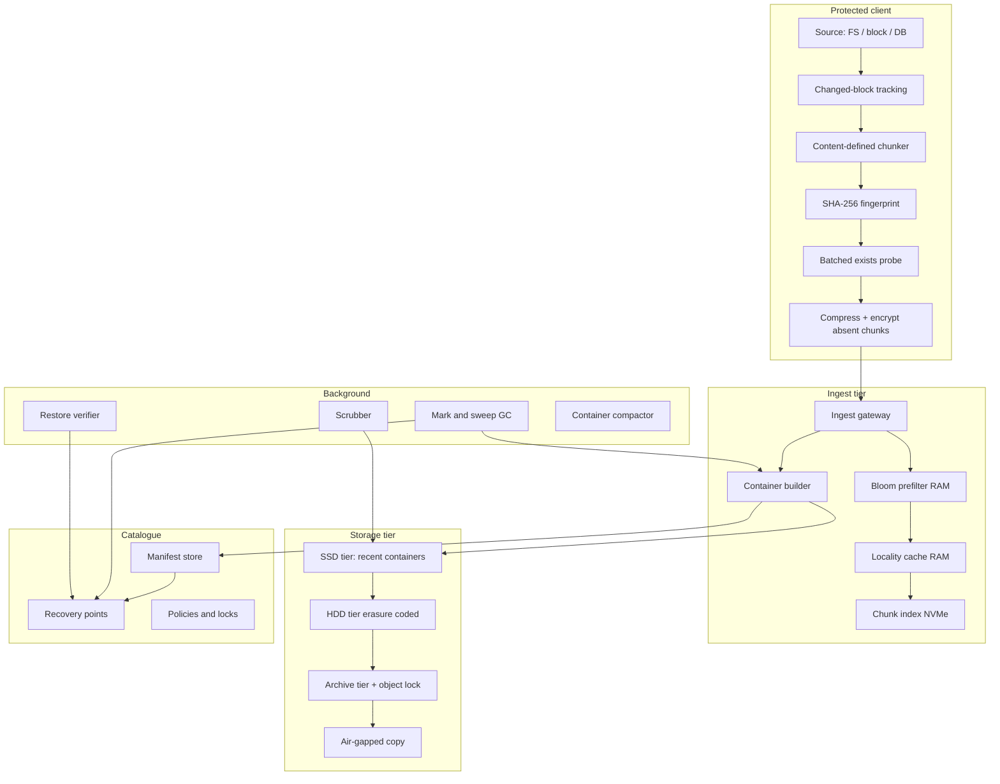
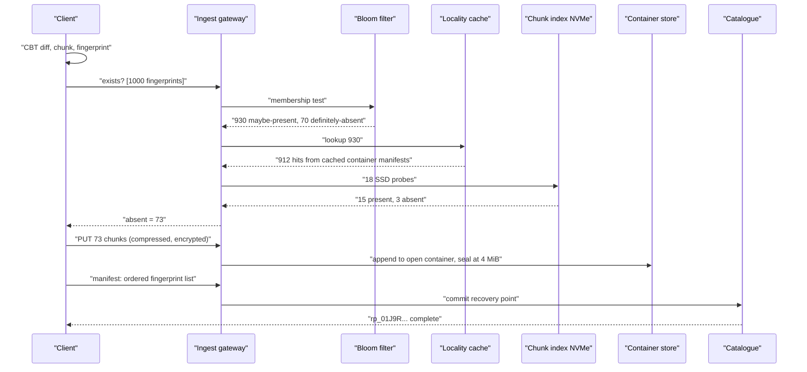
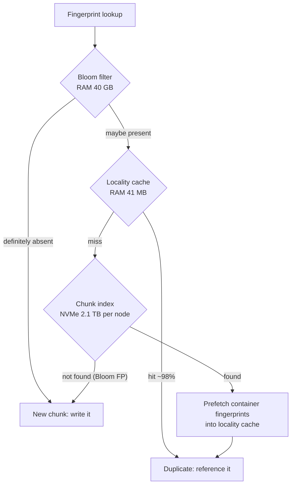
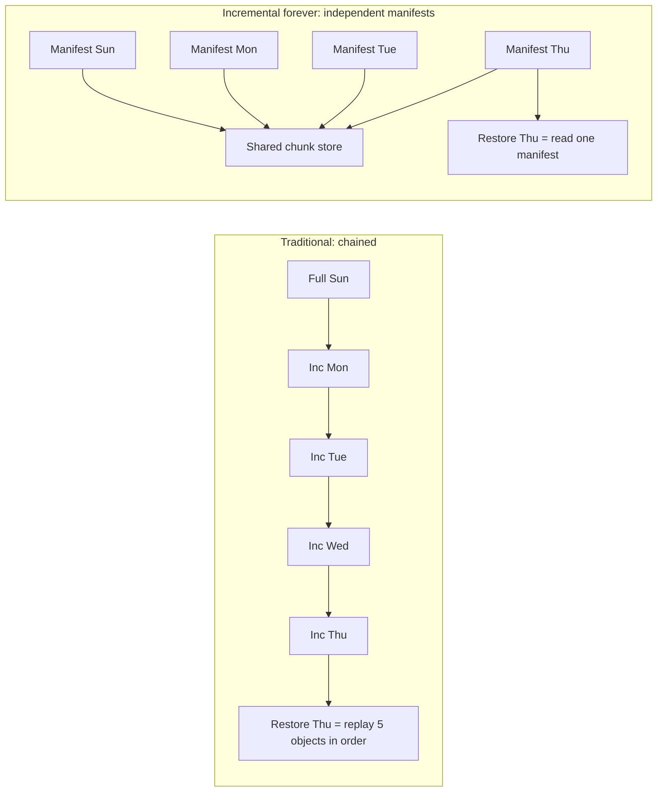
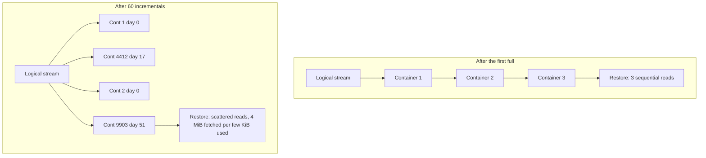
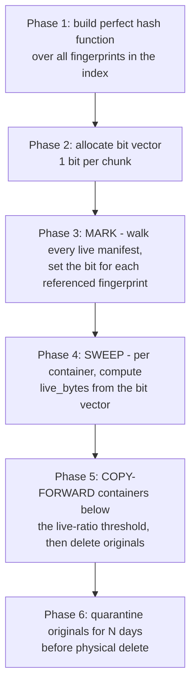
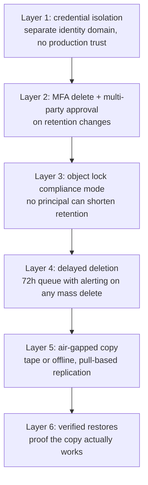
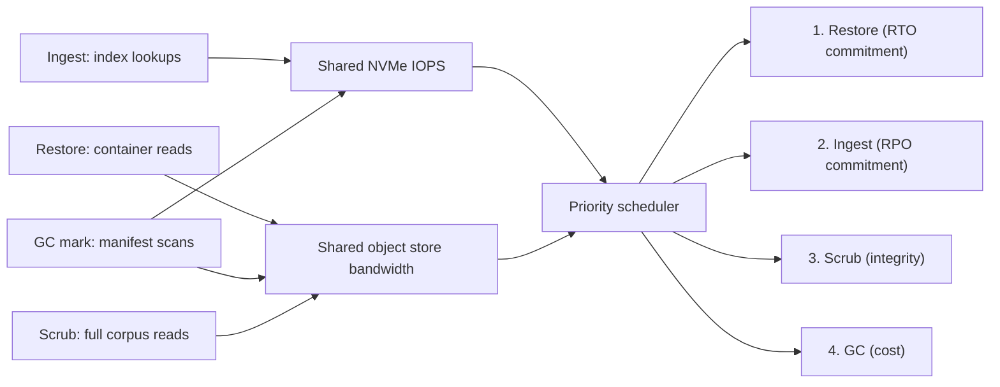

# 20 — Backup & Deduplication System

<span class="pill pill-core">Core</span> <span class="pill pill-hard">Hard</span>

**Everyone designs the backup path and nobody designs the restore path — which is backwards, because backup is a background job that can retry and restore is a business-critical operation under a deadline, and deduplication makes backups fast by making restores fragmented and slow.**

| | |
|---|---|
| **Commonly asked at** | Amazon, Google, Rubrik, Cohesity, Veeam, Druva, Dell/EMC, NetApp, Snowflake, Databricks |
| **Time budget** | 45 min |
| **Core tension** | Deduplication is a write-path optimisation that is a read-path pessimisation. Every byte you avoid storing scatters the remaining bytes further apart, and restore throughput — the thing you are actually buying — degrades in direct proportion to how good your dedup ratio is |
| **Prerequisites** | [F11 Idempotency](../fundamentals/f11-idempotency.md), [F13 Storage Engines](../fundamentals/f13-storage-engines.md), [F15 Object & Blob Storage](../fundamentals/f15-object-storage.md), [F18 Resilience Patterns](../fundamentals/f18-resilience-patterns.md), [F21 Probabilistic Structures](../fundamentals/f21-probabilistic-data-structures.md), [F23 SLI/SLO & Error Budgets](../fundamentals/f23-slo-error-budgets.md), [F24 Capacity Planning](../fundamentals/f24-capacity-planning.md), [F26 Multi-Region & DR](../fundamentals/f26-multi-region-dr.md), [F27 Security in Design](../fundamentals/f27-security-design.md), [F28 Cost Engineering](../fundamentals/f28-cost-engineering.md) |

---

## 1. Problem Statement

Build a backup system that protects tens of thousands of production systems — VMs, databases, filesystems, object stores — with a retention policy spanning years, and that can restore any of them to any retained point in time within a bounded recovery objective.

The naive framing is "copy the data somewhere else". The four things that make it a real distributed systems problem:

1. **Redundancy across time is enormous.** Yesterday's backup of a 1 TB server is 99% identical to today's. Storing 365 daily fulls of 1 TB is 365 TB to protect 1 TB. Deduplication collapses that by 20-50x, and doing so is the entire economic basis of the product.
2. **The dedup index does not fit in RAM.** Hundreds of billions of chunk fingerprints, tens of terabytes of index, against an ingest path that needs a lookup per 8 KiB chunk. This is *the* central engineering problem, and §7.2 is where the interview is won or lost.
3. **Restore is the product; backup is the cost.** Nobody buys a backup system. They buy the ability to be running again in four hours. Dedup fragments the data, so the restore read pattern is random where the backup write pattern was sequential.
4. **The adversary is now inside the threat model.** Ransomware operators specifically target backup infrastructure before encrypting production, because a working backup makes the extortion fail. A backup system that a compromised domain admin can delete is not a backup system.

### Out of scope

Application-consistent quiescing internals (VSS, database log truncation), continuous data protection with sub-minute RPO, and the backup catalogue's search and e-discovery layer. We build the storage and data-movement engine.

---

## 2. Requirements

### Functional

| # | Requirement | Notes |
|---|---|---|
| F1 | Full and incremental backup of files, block devices and databases | Incremental-forever after the first full |
| F2 | Point-in-time restore of any retained recovery point | Full system, single file, or a range of blocks |
| F3 | Global deduplication across clients and across time | The economic basis of the system |
| F4 | Synthetic full backups | Constructed without re-reading the source |
| F5 | Configurable retention: GFS (daily/weekly/monthly/yearly) | With legal hold override |
| F6 | Encryption at rest and in flight, with customer-managed keys | Per-tenant key isolation |
| F7 | Immutable recovery points | WORM, cannot be deleted before expiry by any principal |
| F8 | Automated restore verification | Because an unverified backup is a rumour |
| F9 | Bandwidth-constrained initial seeding | Physical seeding appliance for large first fulls |
| F10 | Air-gapped or logically-isolated secondary copy | Ransomware defence |

### Non-functional

| # | Requirement | Target |
|---|---|---|
| N1 | Backup window | A 1 TB incremental completes in < 30 min |
| N2 | Ingest throughput per node | > 2 GB/s post-dedup-decision |
| N3 | Restore throughput | > 700 MB/s sustained for a single stream, > 5 GB/s aggregate |
| N4 | RTO | Tier 1 systems restored and serving within 4 h |
| N5 | RPO | 1 h for Tier 1, 24 h for Tier 3 |
| N6 | Dedup ratio | > 15:1 on mixed enterprise data, > 40:1 on VM fleets |
| N7 | Durability of a recovery point | 11 nines, verified continuously |
| N8 | Data integrity | Every restored byte cryptographically verified against its recorded hash |
| N9 | Immutability | No principal, including the vendor, can shorten a compliance-mode retention |

!!! danger "N8 is not optional and it is not the same as N7"
    Durability says the bytes are still there. Integrity says they are the *right* bytes. A dedup system amplifies integrity failures catastrophically: one corrupted chunk that is referenced by 40,000 recovery points corrupts 40,000 recovery points. In a non-deduplicated backup, corruption is contained to one file in one backup. **Deduplication converts independent failures into correlated ones**, and that is the price you pay for the 20:1 ratio. Every chunk must carry a checksum, every read must verify it, and a background scrubber must verify everything on a cycle.

---

## 3. Scale Estimation

**Protected estate**

$$
\begin{aligned}
\text{clients} &= 20{,}000 \\
\text{mean protected data per client} &= 500\ \text{GB} \\
\text{front-end logical (one full)} &= 20{,}000 \times 500\ \text{GB} = 10\ \text{PB}
\end{aligned}
$$

**Logical retained.** GFS retention of 30 daily, 12 weekly, 12 monthly, 7 yearly is 61 recovery points. In an incremental-forever system every recovery point is a logically-complete full:

$$
\text{logical retained} = 10\ \text{PB} \times 61 = 610\ \text{PB}
$$

**Physical after dedup.** Daily change rate on enterprise data is 1-3%; take 2%. Plus compression of ~2:1 on the unique chunks.

$$
\begin{aligned}
\text{unique after first full} &= 10\ \text{PB} \\
\text{new unique per day} &= 10\ \text{PB} \times 0.02 = 200\ \text{TB} \\
\text{unique over 61 retained points} &\approx 10\ \text{PB} + (60 \times 200\ \text{TB}) = 22\ \text{PB} \\
\text{after 2:1 compression} &= 11\ \text{PB} \\
\text{effective dedup + compression ratio} &= \frac{610}{11} \approx \mathbf{55:1}
\end{aligned}
$$

Call the unique physical corpus **11 PB**, and note that the ratio being large is exactly what makes restore hard.

### The dedup index sizing math

This is the calculation that defines the architecture.

$$
\begin{aligned}
\text{mean chunk size} &= 8\ \text{KiB} = 8192\ \text{B} \\
\text{unique chunks} &= \frac{11 \times 10^{15}}{8192} = 1.34 \times 10^{12}
\end{aligned}
$$

**1.34 trillion unique chunks.** An index entry must hold enough to identify the chunk and locate it:

```text
fingerprint (SHA-256, truncated to 20 B)   20 B
container_id                                8 B
offset_in_container                         4 B
length                                      4 B
refcount / generation                       4 B
------------------------------------------ 40 B
open-addressed hash table at 65% load      x1.55
------------------------------------------ 62 B effective
```

$$
1.34 \times 10^{12} \times 62\ \text{B} = 8.3 \times 10^{13}\ \text{B} = \mathbf{83\ TB\ of\ index}
$$

**Eighty-three terabytes of index for eleven petabytes of data.** Even sharded across 40 ingest nodes that is 2.1 TB per node — far beyond any plausible RAM budget. The full index lives on SSD, and the entire art of the system is avoiding SSD lookups.

**Why avoiding them matters.** At 2 GB/s of ingest:

$$
\frac{2 \times 10^{9}}{8192} = 244{,}000\ \text{chunk lookups per second, per node}
$$

An NVMe SSD delivers ~500,000 random 4 KiB reads per second. A single ingest node would consume half a dedicated NVMe drive's entire IOPS budget on index lookups alone, at one lookup per chunk, with zero margin for the actual data writes. Multiply by 40 nodes and the index becomes the most expensive component in the system.

**The three-layer solution, sized.**

*Layer 1 — Bloom filter prefilter.* Most lookups on a normal incremental backup are for chunks that **do** exist, but on a first full or on new data the majority are misses, and a miss is the expensive case: it costs a full SSD probe to learn nothing. A Bloom filter answers "definitely not present" in RAM.

$$
\frac{m}{n} = \frac{-\ln p}{(\ln 2)^2} \approx 1.44 \log_2 \frac{1}{p}
$$

At a 1% false-positive rate, $m/n = 9.6$ bits. Per ingest node holding $1.34 \times 10^{12} / 40 = 3.35 \times 10^{10}$ chunks:

$$
3.35 \times 10^{10} \times 9.6\ \text{bits} = 3.2 \times 10^{11}\ \text{bits} = 40\ \text{GB}
$$

**40 GB of RAM per node eliminates 99% of the wasted probes for absent chunks.** See [F21 Probabilistic Structures](../fundamentals/f21-probabilistic-data-structures.md).

*Layer 2 — Locality-preserving cache.* The key empirical fact behind every production dedup system: **chunks that were written together before will be written together again.** Today's backup of a filesystem walks it in roughly the same order as yesterday's. So when a fingerprint lookup hits container $C$, prefetch $C$'s entire fingerprint list — a few thousand entries stored in the container's own metadata section — into a RAM cache. The next few thousand lookups then hit RAM.

Measured hit rates on real backup streams are 97-99%. Cache size:

$$
2{,}000\ \text{containers} \times 512\ \text{fingerprints} \times 40\ \text{B} = 41\ \text{MB}
$$

Forty megabytes of cache removes 98% of the remaining SSD lookups. This is the highest return-on-RAM in the entire design, and it comes from an observation about workload behaviour rather than from an algorithm.

*Layer 3 — Sparse indexing, for when even the Bloom filter is too big.* Keep only a sampled subset of fingerprints in RAM as "hooks" — say 1 in 128, selected by the low bits of the fingerprint itself so the sampling is deterministic and consistent.

$$
\frac{1.34 \times 10^{12}}{128} \times 40\ \text{B} = 4.2 \times 10^{11}\ \text{B} = 420\ \text{GB total},\ \mathbf{10.5\ GB\ per\ node}
$$

The incoming stream is cut into ~10 MB segments; the hooks in a segment are looked up to find "champion" segments already stored that share the most hooks; only those champions' full manifests are loaded and deduplicated against. This trades a few percent of dedup ratio (you miss duplicates that share no sampled hook) for an order of magnitude less RAM.

**The full ladder:**

| Layer | RAM per node | Eliminates | Residual SSD lookups per second at 2 GB/s |
|---|---|---|---|
| None | 0 | — | 244,000 |
| Bloom filter (1% FPR) | 40 GB | ~99% of true misses | ~120,000 on a first full |
| + locality cache | +41 MB | ~98% of hits | **~2,400** |
| + sparse index (instead of Bloom) | 10.5 GB | Most of both | ~5,000, at ~3% dedup loss |

From 244,000 SSD lookups per second down to about 2,400. **That is a 100x reduction bought with 40 GB of RAM and one observation about workload locality**, and it is the difference between a system that works and one that does not.

**Restore arithmetic**

$$
\begin{aligned}
\text{restore size} &= 10\ \text{TB} \\
\text{RTO budget for data movement} &= 4\ \text{h} - 1\ \text{h overhead} = 3\ \text{h} \\
\text{required throughput} &= \frac{10 \times 10^{12}}{10{,}800} \approx 926\ \text{MB/s}
\end{aligned}
$$

With a chunk-fragmentation read amplification of 5x (see §7.4), the backend must deliver

$$
926\ \text{MB/s} \times 5 = 4.6\ \text{GB/s}
$$

From object storage with 4 MB container reads at 100 ms latency, Little's law gives the required concurrency:

$$
\text{requests/s} = \frac{4.6 \times 10^{9}}{4 \times 10^{6}} = 1{,}150,\qquad \text{concurrency} = 1{,}150 \times 0.1 = \mathbf{115\ in\text{-}flight\ requests}
$$

A restore engine that fetches containers one at a time achieves 40 MB/s and misses the RTO by a factor of twenty. **Restore parallelism is a design requirement, not a tuning knob.**

**Initial seeding**

$$
\text{time} = \frac{10\ \text{PB}}{1\ \text{Gbps}} = \frac{10^{16} \times 8}{10^{9}} \ \text{s} = 8 \times 10^{7}\ \text{s} \approx \mathbf{2.5\ years}
$$

At 10 Gbps dedicated it is 93 days. **The first full backup cannot go over the wire.** §7.7.

---

## 4. API Design

```http
POST /v1/backups HTTP/1.1
Content-Type: application/json

{
  "client_id": "clt_88171",
  "source": { "type": "block", "device": "/dev/vg0/data", "size_bytes": 549755813888 },
  "policy_id": "pol_tier1_hourly",
  "consistency": "application",
  "idempotency_key": "clt_88171:2026-08-30T14:00:00Z"
}
```

```json
{ "backup_id": "bk_01J9Q...", "state": "running",
  "recovery_point_id": null, "started_at": "2026-08-30T14:00:03Z" }
```

The dedup probe, batched — one round trip per thousand chunks, never one per chunk:

```http
POST /v1/chunks/exists
{ "fingerprints": ["9f2ae1...", "3c81b0...", "..."] }
```

```json
{ "present": [0, 1, 4, 5, 6], "absent": [2, 3, 7],
  "proof_required": [2],
  "challenge": { "index": 2, "ranges": [[1024,64],[6000,64]] } }
```

```http
POST /v1/chunks/batch          # only the absent ones, compressed and encrypted
POST /v1/backups/{id}/manifest # ordered fingerprint list, commits the recovery point
```

```http
POST /v1/restores
{
  "recovery_point_id": "rp_01J9R...",
  "target": { "type": "block", "device": "/dev/vg0/restore" },
  "mode": "instant_mount",
  "parallelism": 128
}
```

```json
{ "restore_id": "rs_01J9S...", "state": "mounting",
  "mount_path": "/mnt/rs_01J9S", "eta_seconds": 45,
  "hydration": { "state": "background", "percent": 0 } }
```

```http
PUT /v1/recovery-points/{id}/lock
{ "mode": "compliance", "retain_until": "2033-08-30T00:00:00Z" }
```

!!! tip "`mode: instant_mount` is the answer to the RTO problem, and you should raise it unprompted"
    Restoring 10 TB before the application can start means the RTO is bounded by 10 TB of data movement. Instead, present the recovery point as a read-only block device backed by the dedup store, boot the workload against it in under a minute, and hydrate the blocks in the background — prioritising blocks the workload actually touches. **RTO drops from hours to minutes and becomes independent of dataset size.** The cost is degraded IO performance during hydration and a hard dependency on the backup system being available and fast while production runs on it, which is a real risk that must be stated.

---

## 5. Data Model

```sql
-- A recovery point is a manifest: an ordered list of chunk references.
-- It is metadata only. Creating one moves zero data.
CREATE TABLE recovery_point (
  rp_id            BIGINT       PRIMARY KEY,
  client_id        BIGINT       NOT NULL,
  source_id        BIGINT       NOT NULL,
  parent_rp_id     BIGINT,                     -- lineage, not dependency
  kind             SMALLINT     NOT NULL,      -- 0=full 1=incremental 2=synthetic
  logical_bytes    BIGINT       NOT NULL,
  unique_bytes     BIGINT       NOT NULL,      -- newly stored by this backup
  manifest_id      BIGINT       NOT NULL,
  created_at       TIMESTAMPTZ  NOT NULL,
  expires_at       TIMESTAMPTZ  NOT NULL,
  lock_mode        SMALLINT     NOT NULL,      -- 0=none 1=governance 2=compliance
  lock_until       TIMESTAMPTZ,
  legal_hold       BOOLEAN      NOT NULL DEFAULT FALSE,
  verified_at      TIMESTAMPTZ,                -- last successful restore test
  state            SMALLINT     NOT NULL       -- 0=building 1=complete 2=expired
);

-- The manifest itself is far too large for a row per chunk at 1.34e12 chunks.
-- It is stored as a chunked, compressed, content-addressed blob and is
-- ITSELF deduplicated - consecutive backups share most manifest segments.
CREATE TABLE manifest (
  manifest_id      BIGINT       PRIMARY KEY,
  segment_count    INT          NOT NULL,
  total_chunks     BIGINT       NOT NULL,
  blob_container   BIGINT       NOT NULL,
  blob_offset      BIGINT       NOT NULL,
  blob_bytes       BIGINT       NOT NULL,
  checksum         BINARY(32)   NOT NULL
);

-- Containers: the unit of IO, placement, replication and GC.
CREATE TABLE container (
  container_id     BIGINT       PRIMARY KEY,
  state            SMALLINT     NOT NULL,      -- 0=open 1=sealed 2=compacting
  bytes            BIGINT       NOT NULL,      -- ~4 MiB sealed
  chunk_count      INT          NOT NULL,
  live_bytes       BIGINT       NOT NULL,      -- decays as recovery points expire
  storage_tier     SMALLINT     NOT NULL,      -- 0=ssd 1=hdd 2=archive
  immutable_until  TIMESTAMPTZ,                -- max lock_until of any referencing rp
  object_key       VARCHAR(160) NOT NULL,
  ec_scheme        SMALLINT     NOT NULL,
  sealed_at        TIMESTAMPTZ
);

-- The dedup index. Sharded by fingerprint prefix. Lives on NVMe, not in RAM.
-- 1.34e12 rows. This table is the system.
CREATE TABLE chunk_index (
  fingerprint      BINARY(20)   PRIMARY KEY,   -- truncated SHA-256
  container_id     BIGINT       NOT NULL,
  offset_in_cont   INT          NOT NULL,
  length           INT          NOT NULL,      -- compressed, on-disk length
  plain_length     INT          NOT NULL,
  generation       INT          NOT NULL       -- for GC epochs, see 7.6
);

CREATE TABLE backup_policy (
  policy_id        BIGINT       PRIMARY KEY,
  schedule_cron    VARCHAR(64)  NOT NULL,
  keep_daily       INT          NOT NULL,
  keep_weekly      INT          NOT NULL,
  keep_monthly     INT          NOT NULL,
  keep_yearly      INT          NOT NULL,
  lock_mode        SMALLINT     NOT NULL,
  lock_days        INT          NOT NULL,
  secondary_copy   BOOLEAN      NOT NULL,      -- air-gapped tier
  verify_cadence_d INT          NOT NULL       -- automated restore test interval
);
```

!!! warning "Notice what is missing: a per-chunk reference count"
    A refcount column on a 1.34-trillion-row table means every backup increments a billion counters and every expiry decrements a billion counters, transactionally, or you get silent data loss. Production dedup systems do not do this. They use epoch-based mark-and-sweep over a perfect-hash bit vector — §7.6 — precisely because refcounting at this cardinality is both a performance disaster and a correctness hazard.

---

## 6. High-Level Architecture



### Backup path walkthrough

1. **Change detection.** Changed-block tracking (a hypervisor CBT bitmap, a filesystem snapshot diff, a database WAL position) identifies what moved since the last recovery point. This is the single biggest win on the backup path — it means an incremental reads 2% of the source, not 100%.
2. **Chunk.** The changed regions are run through a content-defined chunker (§7.1), producing variable-length chunks averaging 8 KiB.
3. **Fingerprint.** SHA-256 of each chunk's plaintext. On modern CPUs with SHA extensions this is ~2 GB/s per core and is not the bottleneck; without them it is, and you would use BLAKE3.
4. **Probe, batched.** One request per ~1,000 fingerprints. A per-chunk round trip at 8 KiB chunks and 1 ms RTT caps throughput at 8 MB/s, which is the most common naive-implementation failure.
5. **Transfer only the absent chunks.** Compress (LZ4 or zstd) then encrypt, in that order — encrypting first makes the data incompressible.
6. **Container assembly.** The ingest node appends incoming chunks to an open 4 MiB container **in stream order**, so chunks that arrived together are stored together. This is what creates the locality that both the index cache and the restore path depend on.
7. **Seal and place.** The sealed container gets a metadata section listing every fingerprint it holds, is erasure coded, and is written to the storage tier. Its fingerprints are inserted into the index.
8. **Commit the manifest.** The ordered fingerprint list is written and the `recovery_point` row flips to `complete`. **That commit is the point at which the backup exists**; before it, nothing is recoverable.



### Restore path walkthrough

1. Read the manifest — the ordered fingerprint list for the recovery point.
2. Resolve each fingerprint to `(container_id, offset, length)` via the index. Because the manifest is ordered and containers were filled in stream order, consecutive fingerprints often share a container.
3. **Group by container and fetch with high concurrency.** This is the step that separates a system meeting its RTO from one that does not: build a fetch plan that coalesces all chunks needed from each container into one read, and keep 100+ container reads in flight (per the Little's law calculation in §3).
4. Decrypt, decompress, **verify each chunk against its fingerprint**, and write to the target in manifest order.
5. Verify the assembled object against a whole-object hash recorded at backup time.

For `instant_mount`, steps 3 through 5 happen lazily behind a block device: reads are served on demand from the dedup store with a read-through cache, while a background hydrator walks the manifest sequentially. The workload is running from second one.

---

## 7. Deep Dives

### 7.1 Content-defined chunking and the chunk size trade-off

Fixed-size chunking fails on insertion: adding one byte at the front of a file shifts every subsequent boundary, so every chunk hash changes and dedup yields nothing. For backup this matters more than for file sync, because backup sources include databases and archives where in-place growth and record insertion are the normal mutation pattern.

Content-defined chunking cuts where a rolling hash over a sliding window matches a mask, so boundaries are determined by content and **resynchronise within one expected chunk length after any edit**.

```python
# FastCDC-style boundary detection using a gear hash.
# Two masks implement "normalised chunking": biased against short chunks
# before the target size, biased against long chunks after it. This pulls
# the length distribution toward the target instead of leaving it geometric.

MIN_SIZE, NORM_SIZE, MAX_SIZE = 2048, 8192, 32768
MASK_HARD = 0x0000_D930_0353_0000   # ~15 bits: cuts rarely
MASK_EASY = 0x0000_0003_5903_0000   # ~11 bits: cuts often

def next_boundary(buf, start):
    end  = min(start + MAX_SIZE, len(buf))
    norm = min(start + NORM_SIZE, end)
    i, fp = start + MIN_SIZE, 0
    if i >= end:
        return end
    while i < norm:
        fp = ((fp << 1) + GEAR[buf[i]]) & MASK64
        if fp & MASK_HARD == 0:
            return i
        i += 1
    while i < end:
        fp = ((fp << 1) + GEAR[buf[i]]) & MASK64
        if fp & MASK_EASY == 0:
            return i
        i += 1
    return end
```

With a $b$-bit mask, the cut probability per byte is $2^{-b}$ and the unclamped chunk length is geometric with mean $2^{b}$ — a distribution with enormous variance in both directions. `MIN_SIZE` and `MAX_SIZE` clamp the tails; the two-mask normalisation reduces the variance in the middle. Without both, you get pathological 64-byte chunks (destroying the index) and pathological 2 MB chunks (destroying the dedup ratio).

**Chunk size is the master dial of the whole system.** Everything trades against it:

| Mean chunk | Chunks for 11 PB unique | Index at 62 B/chunk | Index as % of data | Relative dedup ratio | Restore locality | Chosen / rejected |
|---|---|---|---|---|---|---|
| 1 KiB | $1.1 \times 10^{13}$ | 664 TB | 6.1% | ~1.30 | Very poor | Rejected. Index cost exceeds the dedup benefit |
| 2 KiB | $5.5 \times 10^{12}$ | 332 TB | 3.0% | ~1.20 | Poor | Rejected |
| 4 KiB | $2.7 \times 10^{12}$ | 166 TB | 1.5% | ~1.10 | Fair | **Chosen for database and VM workloads** where 4 KiB page alignment makes small chunks pay |
| **8 KiB** | $1.34 \times 10^{12}$ | **83 TB** | **0.76%** | **1.00 (baseline)** | **Good** | **Chosen as the default** |
| 16 KiB | $6.7 \times 10^{11}$ | 42 TB | 0.38% | ~0.92 | Better | Reasonable if index cost dominates |
| 64 KiB | $1.7 \times 10^{11}$ | 10 TB | 0.09% | ~0.75 | Best | **Chosen for the archive tier and for media-heavy sources**, where dedup yield is low anyway |

Read the two ends. Halving the chunk size from 8 KiB to 4 KiB buys roughly 10% more dedup and **doubles an 83 TB index to 166 TB**. Doubling to 16 KiB gives up 8% of dedup and halves the index. The 8 KiB default sits where the marginal index cost starts to exceed the marginal dedup benefit — and the right answer is workload-dependent, which is why a serious system supports per-policy chunk sizes.

!!! note "Chunk size also sets your restore fragmentation"
    Smaller chunks mean more chunks per megabyte of restored data, which means more distinct containers touched per megabyte, which means worse read amplification on restore. The chunk-size dial simultaneously controls dedup ratio, index size, and restore throughput — three things you care about, moving in different directions. Saying that out loud is worth more than picking any particular value.

### 7.2 The dedup index at scale

Section 3 established the problem: 83 TB of index, 244,000 lookups per second per node, and no possibility of holding it in RAM. Here is the resolution in architectural terms.



**Why the locality cache works so well** is worth understanding rather than memorising. Backup streams are not random access over the fingerprint space; they are a near-repeat of a previous stream. If chunk $F_i$ was stored in container $C$, then $F_{i+1}, F_{i+2}, \dots$ are overwhelmingly likely to be in $C$ too, because the previous backup wrote them consecutively into $C$. So one SSD probe yields a container id, and loading that container's fingerprint list (which is stored inside the container itself, at no extra IO cost when you are reading it anyway) pre-answers the next several hundred lookups.

This is Data Domain's "Stream-Informed Segment Layout" and it is the single most important idea in production deduplication. **The system is fast because the workload has locality, not because the data structure is clever.**

**Where the locality assumption breaks**, and what to do:

| Scenario | Why locality fails | Mitigation |
|---|---|---|
| First full backup of a new client | Nothing is cached; every lookup is a true miss | Bloom filter absorbs it: 99% of misses never touch SSD |
| Highly concurrent ingest from 200 clients | Interleaved streams thrash a single shared cache | Per-stream cache partitions; pin a working set per active stream |
| Source reorganised (defrag, filesystem migration, database VACUUM FULL) | Chunk order changed completely | Accept a slow backup; the dedup ratio survives, only the lookup path degrades |
| Small random-write database backup | No stream order to exploit | Use CBT-ordered rather than file-ordered traversal, restoring locality artificially |

**Fingerprint truncation and collisions.** Storing a full 32-byte SHA-256 in the index costs 43 TB in fingerprints alone. Truncating to 20 bytes (160 bits) saves 27% of the index. Is that safe? Birthday bound for $n$ chunks and a $b$-bit hash:

$$
P_{\text{collision}} \approx \frac{n^{2}}{2^{b+1}} = \frac{(1.34 \times 10^{12})^{2}}{2^{161}} = \frac{1.8 \times 10^{24}}{2.9 \times 10^{48}} \approx 6 \times 10^{-25}
$$

Utterly negligible — many orders of magnitude below the probability of an undetected memory error. Truncating to 20 bytes is safe. Truncating to 8 bytes (64 bits) gives $P \approx 0.049$: **a 5% chance of a collision somewhere in the corpus**, which would mean silently substituting one chunk's data for another's during a restore. That is the single worst failure this system can produce, and it is why the "just use a short hash to save RAM" suggestion must be rejected explicitly.

??? note "Should you verify bytes on a fingerprint match, rather than trusting the hash?"
    Some systems read the stored chunk and compare it byte-for-byte with the incoming chunk on every dedup hit, eliminating hash-collision risk entirely. At $6 \times 10^{-25}$ collision probability this buys nothing and costs a read per duplicate chunk — which is 98% of chunks — turning a metadata-only fast path into a full-read path and destroying ingest throughput. The correct posture is: use a cryptographic hash with enough bits that collision is not the dominant failure mode (it is not even close), and spend the effort on the failures that actually happen — bit rot, GC bugs, and software defects.

### 7.3 Incremental-forever and synthetic fulls

Traditional backup: a weekly full plus daily incrementals. Restoring Thursday means applying the Sunday full plus four incrementals in order, and losing any one of them breaks the chain.

**Incremental-forever** takes one full, ever, then only incrementals. The chain problem is solved not by re-reading the source but by the manifest structure: every recovery point stores a **complete ordered fingerprint list**, not a diff. So:

- Every recovery point is independently restorable. There is no chain, no dependency, no "apply these in order".
- A **synthetic full** is created by writing a new manifest that references existing chunks. **Zero bytes are moved.** It is a metadata operation that takes seconds regardless of dataset size.
- Expiring an old recovery point deletes only its manifest. The chunks survive as long as any other manifest references them, which GC determines.



| Model | Restore complexity | Storage | Backup window | Chain fragility | Chosen / rejected |
|---|---|---|---|---|---|
| Periodic full + incrementals | O(number of incrementals) | High without dedup | Long on full days | One lost incremental breaks everything after it | Rejected |
| Incremental + reverse-incremental synthesis | O(1) for the latest, O(n) for older | Medium | Short | Medium | Rejected: optimises only the newest point |
| **Incremental-forever with full manifests** | **O(1) for every point** | **Lowest, dedup does the work** | **Short always** | **None** | **Chosen** |

The cost is that the manifest is large: a 500 GB source at 8 KiB chunks is $6.1 \times 10^{7}$ fingerprints, at 20 bytes each is **1.2 GB of manifest per recovery point**. With 61 retained points per client and 20,000 clients that is 1.5 PB of manifests — more than 13% of the physical corpus.

The fix: **deduplicate the manifests too.** Consecutive backups share the vast majority of their fingerprint sequence, so chunking the manifest with the same CDC algorithm and storing it in the same content-addressed store collapses it by 30-50x. The manifest is just another byte stream, and treating it as one is both elegant and necessary.

### 7.4 Restore latency, and why dedup fragments reads

Here is the central irony of the system. During the first full backup, chunks are written to containers in stream order, so a restore of that backup reads containers sequentially — perfect locality. Every subsequent backup writes only its *new* chunks into *new* containers. After 60 daily incrementals, a restore of the latest recovery point pulls chunks from containers written across 60 different days, interleaved.



**Quantifying it.** A 4 MiB container holds ~512 chunks of 8 KiB. If a restore needs $u$ useful chunks from a container it must fetch the whole container (object storage has no sub-object read that helps when the chunks are scattered within it, and issuing 30 ranged GETs is worse than one full GET):

$$
\text{read amplification} = \frac{512}{u}
$$

| Chunks used per fetched container | Read amplification | Effective restore throughput at 4.6 GB/s backend |
|---|---|---|
| 512 (fresh full, perfect locality) | 1.0x | 4.6 GB/s |
| 128 | 4.0x | 1.15 GB/s |
| 51 (typical aged recovery point) | 10.0x | 460 MB/s |
| 10 (severely fragmented) | 51x | 90 MB/s |
| 1 (pathological) | 512x | 9 MB/s |

**Restore throughput degrades roughly linearly with backup age**, and the better your dedup ratio, the worse it gets — because a high ratio means each container is shared by more recovery points and contributes fewer contiguous chunks to any one of them. This is the tension in the page's header, made concrete.

**Mitigations, in order of value:**

1. **Massive read parallelism.** 100+ concurrent container fetches. This alone recovers most of the loss because the amplified reads are independent and object storage has effectively unlimited aggregate bandwidth. It is the difference between a design that meets RTO and one that does not.
2. **Container caching during restore.** A container fetched for chunk 40,000 will very likely be needed again for chunk 41,200. An LRU of a few thousand containers turns a 10x amplification into a 2-3x one, and it costs a few gigabytes of RAM.
3. **Selective rewrite during backup (defragmentation).** Detect during ingest that a duplicate chunk lives in a container from which this stream will need very few chunks, and **store a redundant copy anyway** in the current container. You give up a little dedup ratio to buy back restore locality. Data Domain calls this Stream-Informed Segment Layout with selective rewrite; a typical policy rewrites ~1-2% of duplicate chunks and recovers most of the restore throughput. This is the most important non-obvious technique in the whole design.
4. **Periodic materialised fulls.** For Tier 1 systems, once a month write a genuinely contiguous copy of the current state to its own container set. It costs full-size storage for one point, and it gives a guaranteed fast restore path.
5. **Instant mount.** Sidestep the problem: run from the backup while hydrating. Makes RTO independent of dataset size at the cost of degraded IO and a hard runtime dependency on the backup system.

!!! danger "Restore throughput must be an SLI, measured on real recovery points"
    A benchmark restore of a freshly-written backup measures the best case and will be 5-10x faster than restoring a 60-day-old recovery point of a busy database. If your capacity model and your RTO commitment are based on the benchmark number, you will discover the truth during an outage. Measure restore throughput continuously against *aged, production* recovery points chosen at random, and alarm when the trend crosses the level that threatens the RTO.

### 7.5 Encryption versus deduplication

The two requirements are in direct opposition. Deduplication requires that identical plaintext produce identical stored bytes. Semantic security requires that identical plaintext produce *different* ciphertext.

| Scheme | Dedup scope | Security | Chosen / rejected and why |
|---|---|---|---|
| Server-side encryption, provider keys | Global | Provider can read plaintext | **Chosen as the default.** Global dedup is the economics of the product; the trust model is explicit |
| Per-tenant keys, server-side | Within a tenant only | Provider holds keys; tenant isolation | **Chosen for regulated tenants.** Dedup ratio drops from ~55:1 to ~20:1 — still worthwhile |
| Convergent encryption, $K = H(P)$ | Global | Vulnerable to dictionary and LRI attacks | Rejected as a general solution. See below |
| Server-aided convergent (DupLESS) | Global | Dictionary attack becomes online and rate-limitable | Viable when global dedup with client-held keys is genuinely required; adds a key server as a hard dependency |
| Client-side encryption, per-client keys | None | Strongest; provider is zero-knowledge | **Chosen for the highest tier.** Dedup collapses to within-client-only, roughly 8:1. Priced accordingly |

**Convergent encryption**, in detail, because it is the answer everyone reaches for and it is subtly broken. Derive the key from the plaintext, $K = H(P)$, and encrypt $C = E_K(P)$. Identical plaintext produces identical ciphertext, so the server can dedup without ever seeing plaintext. Elegant. Its failures:

1. **Dictionary / confirmation-of-file attack.** For any plaintext an attacker can guess, they compute $K = H(P)$, compute $C = E_K(P)$, and check whether the server already stores $C$. This confirms whether *anyone* holds that file. For predictable content — a standard contract, a known document, a file from a set the attacker possesses — this is a practical attack, not a theoretical one.
2. **Learn-the-remaining-information (LRI) attack.** Far worse. If the attacker knows the *template* and only a few fields are unknown — a tax form with a name and a number, a payroll record, a medical form — they brute-force the unknown fields offline. A 9-digit identifier is $10^{9}$ candidates, which is minutes of GPU time. Convergent encryption on low-entropy plaintext offers **essentially no confidentiality**.
3. **Duplicate-faking / poisoning.** A malicious client claims fingerprint $F$ and uploads garbage. Every later client whose real data hashes to $F$ dedups against the poisoned chunk and silently receives corrupt data on restore. Mitigation: the server must verify that the uploaded ciphertext decrypts to plaintext hashing to the claimed fingerprint — which it cannot do without the key, which is the whole point of the scheme.
4. **Side channels.** Even without ciphertext access, an attacker observes that their upload transferred no bytes and concludes the content already existed.

**DupLESS** repairs (1) and (2) by making key derivation server-aided: $K = \text{OPRF}(\text{key server secret}, H(P))$, using an oblivious pseudorandom function so the key server never learns $H(P)$ and the client never learns the secret. Offline brute force becomes impossible, because deriving a candidate key requires an online query the key server can rate-limit and audit. The cost is a new hard dependency in the write path and a new component whose compromise breaks everything.

**Where this design lands:** per-tenant server-side keys as the default, with client-side per-client keys available for tenants who need zero-knowledge and are willing to pay for a ~7x worse dedup ratio. Convergent encryption is not offered, and the reason is documented. The general principle — **state your dedup boundary and your trust boundary explicitly, because they are the same boundary** — is what an interviewer is listening for.

### 7.6 Retention, GC, and why reference counting loses

Expiring a recovery point deletes a manifest. Reclaiming space requires determining which of 1.34 trillion chunks are no longer referenced by *any* live manifest.

**Reference counting** is the obvious approach and it is wrong at this scale:

- A single 500 GB backup increments 61 million counters. At 20,000 clients daily, that is $1.2 \times 10^{12}$ counter updates per day.
- Every update must be transactional with the manifest commit, or a crash between them leaves the count wrong forever.
- **The errors are asymmetric and both are bad.** A count that is too low means a live chunk is deleted — silent, unrecoverable data loss discovered only during a restore, possibly years later. A count that is too high means space is never reclaimed — a slow, invisible leak.
- Counts drift. There is no way to detect drift without a full recomputation, which is mark-and-sweep, which means you built two systems.

**Mark-and-sweep over a perfect-hash bit vector** is what production systems use. The insight: you do not need a *count*, only a *bit*. Reachable or not.



Sizing the bit vector:

$$
1.34 \times 10^{12}\ \text{bits} = 1.68 \times 10^{11}\ \text{B} = \mathbf{168\ GB}
$$

168 GB of bit vector for a corpus whose full index is 83 TB. It fits in the RAM of a handful of machines, or on one NVMe drive with sequential access patterns. A perfect hash function over the fingerprint set costs roughly 2.5 bits per key to store — another 420 GB — and maps each fingerprint to a unique bit position with no collisions and no stored keys.

Mark cost: walking every live manifest is $20{,}000 \times 61 \times 6.1 \times 10^{7} = 7.4 \times 10^{13}$ fingerprint references. At 100 million bit-sets per second per node across 40 nodes, that is roughly 5 hours. **GC is a scheduled, multi-hour, fleet-wide operation**, not a background trickle, and it must be planned for in the capacity model.

**Safety rules that are not optional:**

1. **Epoch fencing.** Any chunk written after the mark phase began is automatically live, regardless of the bit vector, because the mark phase could not have seen it. Without this, a backup running concurrently with GC has its brand-new chunks deleted. Track it with the `generation` column.
2. **Quarantine before delete.** A container whose bit vector says it is dead is moved to a quarantine state for 7-30 days before physical deletion. If the GC was wrong, you have a window to notice.
3. **Verify before copy-forward.** Compaction rewrites live chunks into a new container and deletes the old one. Verify every live chunk is present in the new container with a matching checksum **before** deleting the source, and never in the same transaction.
4. **Immutability wins over GC, always.** A container referenced by any compliance-locked recovery point cannot be deleted or compacted until the lock expires. This is enforced by `container.immutable_until`, which is the maximum lock expiry over all referencing recovery points, checked at the storage layer rather than in application logic.
5. **Rate limit deletion.** No GC run may delete more than a small percentage of the corpus without human approval. This converts a catastrophic bug into an annoying one, and it is the single highest-value safety control in the system.

!!! danger "The GC is the most dangerous code in the system, by a wide margin"
    Erasure coding gives $10^{-20}$ hardware-driven loss probability. A garbage collector with a wrong reachability computation gives you whatever its bug rate is, and it deletes data that was correctly stored, durably, with every checksum valid. Every production dedup vendor has had at least one GC incident. Treat this code path with formal review, extended shadow-mode validation against production decisions, mandatory quarantine, and deletion rate limits — and do not let it share a deploy with anything else.

### 7.7 Immutability, ransomware, and the untested-restore problem

Modern ransomware operators follow a consistent playbook: gain domain admin, spend days to weeks enumerating and **destroying backups**, then encrypt production. Encrypting production is trivially recoverable if the backups survive, so the backups are the actual target. A backup system reachable with production credentials provides no protection against the threat it exists to protect against.

**The defence is layered, and each layer assumes the previous one failed:**



| Control | Stops | Does not stop |
|---|---|---|
| Credential isolation | Lateral movement from a compromised production domain | Compromise of the backup admin identity |
| MFA delete plus two-person rule | A single compromised admin | Coordinated insiders |
| Object lock, governance mode | Accidents and ordinary attackers | A privileged principal who can bypass governance |
| **Object lock, compliance mode** | **Everyone, including the vendor and the account root** | Deletion of the whole account, if that is possible |
| Delayed deletion with alerting | Fast destruction; buys detection time | Slow, patient destruction |
| Air-gapped copy | Everything online | Physical access; also has the worst RTO |
| Verified restore | The failure mode where backups exist but do not work | Nothing else, but this is the one everybody skips |

**The 3-2-1-1-0 rule** is the accepted framing and is worth stating in an interview because it compresses a lot of design into one line: **3** copies of the data, on **2** different media types, with **1** offsite, **1** offline or immutable, and **0** errors after automated verification.

**Pull-based replication for the air-gapped tier** is the detail that matters. If the primary site pushes to the secondary, then compromising the primary gives you a credential that writes to (and can therefore destroy) the secondary. If the secondary *pulls*, the primary holds no credential for the secondary at all, and compromising the primary gives the attacker no path to the isolated copy. This inverts the trust direction and it is cheap.

**The untested-restore problem.** Survey after survey finds that a large fraction of organisations discover their backups do not restore — at the moment they need them. Causes: the backup captured a crash-inconsistent database, the encryption keys were themselves only backed up inside the encrypted backup, the restore procedure requires infrastructure that is also down, nobody has ever run it, or the retention policy silently expired the point they need.

The only defence is automation:

```python
# Continuous restore verification. This is a first-class product feature,
# not a test. It runs in production, forever, against real recovery points.
def verify_cycle():
    for rp in sample_recovery_points(
            strategy="stratified",       # by tier, age, client, source type
            include_oldest=True,         # the oldest point is the least tested
            rate=TARGET_VERIFY_RATE):
        sandbox = isolated_network_and_compute()   # no route to production
        try:
            restore(rp, target=sandbox, verify_chunk_hashes=True)
            assert boot_succeeds(sandbox)          # it powers on
            assert app_health_check(sandbox)       # the app answers
            assert data_assertions(sandbox)        # row counts, checksums,
                                                   # a known canary record
            mark_verified(rp, at=now())
        except Exception as e:
            page("restore_verification_failed", rp=rp, error=e)
        finally:
            destroy(sandbox)
```

Then make it visible: **`verified_at` is a column on `recovery_point`, and "oldest unverified recovery point age" is an SLI with a target.** A recovery point that has never been restore-tested should be treated as unproven, and the dashboard should say so. That reframing — from "we run restore tests" to "unverified backups are a tracked liability" — is what makes it survive contact with a busy quarter.

---

## 8. Scaling the Bottleneck

The bottleneck moves depending on which workload dominates, and a good answer identifies all three and says which one is binding.

**Bottleneck 1: index lookups during a first-full storm.** Onboarding 500 new clients simultaneously means every chunk is a genuine miss. The Bloom filter absorbs 99% of them, but the remaining 1% plus the container-write path saturates NVMe. Mitigations: admission control on new-client onboarding (stagger the first fulls), a dedicated ingest pool for seeding traffic so it cannot starve incremental backups, and physical seeding for anything large (§3 showed 10 PB over 1 Gbps is 2.5 years).

**Bottleneck 2: restore throughput on aged recovery points.** As established in §7.4, this degrades with backup age and with dedup ratio. Mitigations in order: read parallelism, container caching, selective rewrite during ingest, periodic materialised fulls for Tier 1, instant mount. The structural point is that **restore capacity must be provisioned separately from backup capacity**, because a disaster means many simultaneous restores and the backup schedule does not pause for it.

**Bottleneck 3: GC mark phase.** A 5-hour fleet-wide operation that competes with ingest. Mitigations: run during the backup-window trough, partition the mark by fingerprint range so it can be incremental and resumable, use epoch fencing so a partial run is still safe, and — critically — never let GC and a large restore run concurrently, because they compete for exactly the same random-read capacity.



**The priority order is the design decision**, and it should be stated explicitly: restore beats backup, backup beats scrub, scrub beats GC. A missed GC cycle costs money. A missed backup costs RPO. A failed restore costs the business. Any scheduler that lets GC delay a restore has its priorities inverted.

---

## 9. Failure Modes

| Failure | Blast radius | Detection | Mitigation | Degraded behaviour |
|---|---|---|---|---|
| Chunk corrupted on disk | **Every recovery point referencing it** — potentially tens of thousands | Checksum on read; background scrubber | Erasure coding reconstructs; scrub cycle bounds exposure | Restore of affected points fails until repaired. Correlated blast radius is the price of dedup |
| Index shard lost | Chunks in that fingerprint range become unfindable | Index health check; lookup error rate | Index is rebuildable from container metadata sections — slow (hours) but complete | Ingest degrades to "write everything" (correct, just inefficient); restore blocked for affected chunks |
| GC deletes a live chunk | Silent data loss across many recovery points, discovered at restore time | Restore verification; quarantine-window audit | Epoch fencing, quarantine before delete, deletion rate limits, shadow-mode validation | Catastrophic if quarantine has expired. The worst outcome in the system |
| Manifest corrupted or lost | One recovery point unrecoverable | Manifest checksum on read | Manifests are themselves chunked, deduped and erasure coded; replicate manifest metadata more aggressively than data | That recovery point is lost; neighbouring points are unaffected |
| Ingest node crash mid-backup | One backup incomplete | Job heartbeat timeout | Manifest commit is the atomic visibility point; resume from the last sealed container | Backup retried; already-uploaded chunks are deduped, so the retry is fast |
| Client clock wrong | Retention computed against the wrong date; premature expiry | Server-side timestamping | **Never** trust client time for retention; the server stamps `created_at` and `expires_at` | Correct behaviour; client time is display metadata only |
| Ransomware compromises the backup admin account | Potentially the entire backup estate | Anomalous deletion or retention-change patterns | Compliance-mode object lock, MFA delete, delayed deletion, pull-based air-gapped copy | Online copies may be destroyed; the immutable and air-gapped copies survive |
| Source is crash-inconsistent | Backups exist but the database will not start | Restore verification with an application health check | Application-consistent quiescing; verification that actually boots the workload | Discovered during verification rather than during a disaster, which is the entire point |
| Encryption key lost | All data encrypted with it, permanently | Key inventory audit | Key escrow **outside** the backup system; keys must never be backed up only inside the encrypted backup | Total, unrecoverable loss. A depressingly common real-world failure |
| Dedup ratio collapses (source encryption enabled, or a compression change) | Capacity forecast invalidated; storage fills | Per-client dedup ratio monitoring with change detection | Alert on ratio change, not just on absolute capacity | Capacity exhaustion, which stops all backups. Ratio is a leading indicator |
| Restore storm (site disaster, 500 clients at once) | Restore throughput divided across all of them; every RTO missed | Concurrent restore count | Tiered restore admission: Tier 1 first, with reserved capacity; instant mount for the rest | Lower tiers wait. Without prioritisation, everyone gets an equal share and everyone misses |
| Container compaction drops live chunks | Every recovery point referencing them | Post-compaction verification | Verify all live chunks present in the destination before deleting the source; quarantine | Data loss if verification is skipped. Same class as the GC bug |

---

## 10. SRE Lens

### SLIs and SLOs

| SLI | Definition | SLO |
|---|---|---|
| Backup success rate | Recovery points completed / scheduled, per tier | > 99.5% Tier 1, > 99% overall |
| RPO attainment | Fraction of protected sources whose newest verified recovery point is within the policy RPO | > 99.9% Tier 1 |
| Backup window adherence | Backups completing within their window | > 99% |
| **Restore success rate** | Verified restores succeeding / attempted | **> 99.9%** |
| **Restore throughput, aged points** | Sustained MB/s restoring a randomly-chosen 30+ day-old recovery point | **> 700 MB/s p50, > 400 MB/s p95** |
| RTO attainment | Simulated Tier 1 restores completing within 4 h | > 99% |
| Oldest unverified recovery point | Max age of any Tier 1 recovery point never restore-tested | < 30 days |
| Scrub coverage | Chunks verified within the scrub cycle | > 99.9% within 30 days |
| Immutability violations | Recovery points deleted before `lock_until` | **Zero**, alarmed on any occurrence |
| Dedup ratio | Logical retained / physical stored | > 15:1, alerted on a change of more than 20% |

!!! note "Two of these are not like the others"
    **Restore throughput on aged recovery points** and **oldest unverified recovery point** are the SLIs that make this a real backup system rather than a data-copying service. Backup success rate is easy to make green and tells you almost nothing — a system that successfully backs up crash-inconsistent garbage every night will report 100%. Measure the thing the customer actually buys, and measure it against the hardest case rather than the easiest.

### Error budget

Backup success rate at 99.5% over 30 days for a client backed up hourly (720 backups) allows 3.6 failures — comfortable, because a failed backup retries and the next one succeeds. **The RPO budget is what actually binds**, because consecutive failures compound: two failed hourly backups is a 3-hour RPO against a 1-hour target.

**Restore has effectively no error budget.** A failed restore during a disaster is a business-ending event for the customer, so restore-path changes get a fundamentally different bar: mandatory shadow validation, restore verification against a broad sample before and after every deploy, and no correlated rollout across the fleet. See [F23 SLI/SLO & Error Budgets](../fundamentals/f23-slo-error-budgets.md).

### Rollout

- **Never deploy the ingest and restore paths in the same change.** A bug that writes subtly-wrong chunks *and* a change to how they are read makes the corruption undetectable until both are in production.
- **Chunking algorithm changes are effectively irreversible.** Changing the chunker means new backups do not dedup against old ones, so the storage footprint jumps until old points expire. Version the chunker per policy, run old and new in parallel during transition, and model the capacity impact before shipping.
- **Any change to GC, compaction or retention runs in shadow mode for a minimum of four weeks**, logging what it *would* delete and diffing against the incumbent. Zero divergence is the promotion criterion.
- **Restore verification is the canary.** Any deploy that touches the data path is followed by an accelerated verification cycle across a stratified sample before the rollout continues.
- Deploy by cell, where a cell is an independent stack serving a subset of clients, so a bad change affects one cell's customers rather than all of them.

### Runbook notes

```text
ALERT: restore_throughput_p50 < 400 MB/s
  1. Which recovery points? Aged and heavily-deduped -> expected
     fragmentation. Check read amplification metric (containers fetched
     per GB restored).
  2. Restore parallelism actually applied? A regression to serial fetch
     is the classic cause and shows as low concurrency with low bandwidth.
  3. Container cache hit rate during restore. Low -> increase cache size,
     it is cheap.
  4. Competing background load? GC or scrub running concurrently must be
     suspended. Restore outranks both.
  5. Longer term: enable selective rewrite for affected policies and
     schedule a materialised full for Tier 1 clients.

ALERT: immutability_violation_detected
  Treat as a security incident, not a bug. Page security AND storage.
  1. Do NOT assume a software bug. Assume compromise until disproven.
  2. Identify the principal and the API path used.
  3. Freeze all deletion fleet-wide immediately.
  4. Verify the air-gapped copy is intact and disconnect its pull agent
     if there is any doubt.
  5. Preserve audit logs before anything else; they are the evidence.

ALERT: dedup_ratio dropped > 20% for client C
  1. Source-side encryption or compression newly enabled? Encrypted
     source data is incompressible and undeduplicable by construction.
     This is the most common cause and it is not a system fault.
  2. Chunker version changed for this policy?
  3. Source reorganised (VM migration, filesystem rebuild, database
     VACUUM FULL)? Expect a one-time ratio hit that recovers.
  4. Recompute the capacity forecast immediately. A ratio change is a
     capacity event, and capacity exhaustion stops ALL backups.
```

### Capacity model

$$
\begin{aligned}
\text{physical bytes} &= \frac{\text{logical retained}}{\text{dedup ratio} \times \text{compression ratio}} \times \text{EC overhead} \\[4pt]
\text{index bytes} &= \frac{\text{physical bytes}}{\text{mean chunk size}} \times 62\ \text{B} \\[4pt]
\text{ingest nodes} &= \frac{\text{daily change bytes}}{\text{backup window} \times \text{per-node throughput}} \\[4pt]
\text{restore capacity} &= \text{concurrent restores} \times \text{required MB/s} \times \text{read amplification}
\end{aligned}
$$

The dangerous coupling: **index size scales with physical bytes, which scales inversely with dedup ratio.** A ratio improvement reduces storage and reduces index. A ratio collapse increases both simultaneously, and the index is on expensive NVMe. This is why per-client dedup ratio is a monitored leading indicator rather than something you check quarterly. See [F24 Capacity Planning](../fundamentals/f24-capacity-planning.md).

Restore capacity is the axis most often forgotten. A site disaster means hundreds of simultaneous restores, and provisioning for the steady state of "a few restores a day" leaves you unable to execute the thing the system exists for. Provision for a **disaster-scenario restore rate**, or be explicit in the RTO commitment that it applies to isolated restores only — one or the other, never silently neither.

### Cost

| Line | Driver | Lever |
|---|---|---|
| Capacity storage | Physical bytes x EC overhead x tier | Dedup ratio, chunk size, retention policy, tiering |
| Index storage (NVMe) | Chunk count | Chunk size is the direct dial; 8 KiB to 16 KiB halves it |
| Ingest compute | Chunking, hashing, compression | SHA and compression hardware acceleration |
| Restore egress | Bytes read x read amplification | Selective rewrite, container caching |
| Air-gapped tier | Second full copy | Tier 1 only, not the whole estate |

Retention policy is by far the largest lever and it is a business decision, not an engineering one: going from 7 yearly to 3 yearly retained points removes a large fraction of unique chunks. **Show the customer the cost of their retention policy per tier**, because it is the only way that conversation ever happens. See [F28 Cost Engineering](../fundamentals/f28-cost-engineering.md).

---

## 11. Trade-offs & Alternatives

| Decision | Chosen | Alternative | Why |
|---|---|---|---|
| Chunking | CDC, 8 KiB target, min 2 KiB max 32 KiB | Fixed-size blocks | Fixed blocks yield nothing on insertion, and databases and archives insert constantly |
| Chunk size | 8 KiB default, per-policy override | One global size | 4 KiB doubles an 83 TB index for ~10% more dedup; 64 KiB is right for media. One size is wrong for someone |
| Dedup scope | Global by default, per-tenant for regulated | Per-client only | Global is roughly 7x better; the trust boundary is stated explicitly rather than assumed |
| Index | On-NVMe, with Bloom + locality cache + optional sparse index | Full in-RAM index | 83 TB does not fit in RAM at any price. The layered approach gets 100x fewer SSD lookups for 40 GB |
| Fingerprint | SHA-256 truncated to 160 bits | Full 256-bit, or 64-bit | 160 bits gives $6\times10^{-25}$ collision probability and saves 27% of index. 64 bits gives 5% and is disqualifying |
| Backup model | Incremental-forever with complete per-point manifests | Periodic full + chained incrementals | O(1) restore for every point, no chain fragility, synthetic fulls are free metadata operations |
| Reference tracking | Epoch-fenced mark-and-sweep over a perfect-hash bit vector | Per-chunk reference counting | $1.2\times10^{12}$ transactional counter updates per day, with silent data loss as the failure mode |
| Encryption | Per-tenant server-side keys; client-side available | Convergent encryption | Convergent is broken on low-entropy plaintext via the LRI attack, and enables duplicate-faking |
| Immutability | Compliance-mode object lock enforced at the storage layer | Application-level retention checks | Application-level checks are bypassable by whoever compromises the application |
| Air-gapped replication | Pull from the isolated side | Push from the primary | Push means the primary holds a credential that can destroy the isolated copy |
| Restore for large datasets | Instant mount with background hydration | Full restore before start | Makes RTO independent of dataset size; the cost is degraded IO and a runtime dependency |
| Restore fragmentation | Selective rewrite of ~1-2% of duplicate chunks | Accept fragmentation | Gives up a little ratio to protect the thing customers actually buy |
| Verification | Continuous automated restore into an isolated sandbox | Periodic manual DR tests | Annual manual tests find last year's bugs. `verified_at` as a tracked column is what makes it survive |

??? note "Where does source-side versus target-side dedup belong?"
    Source-side (dedup at the client, before the wire) saves network bandwidth and is essential for remote sites and cloud egress. It costs client CPU and requires the client to hold or query enough index to decide, which means either a chatty probe protocol or a local cache that can go stale. Target-side (send everything, dedup at ingest) is simpler, keeps the client dumb and cheap, and is fine on a fast LAN. This design is source-side with **batched** probes — one round trip per thousand chunks — because the bandwidth saving is enormous (98% of chunks are duplicates on a typical incremental) and batching removes the latency amplification that makes naive source-side dedup slower than sending the data. The failure to avoid is a per-chunk synchronous probe, which caps throughput at roughly 8 MB/s on a 1 ms RTT link and is the single most common implementation mistake.

---

## 12. Gotchas & Corner Cases

!!! gotcha "The encryption keys are backed up inside the encrypted backup"
    **Symptom:** total, permanent, unrecoverable data loss. The backups are perfect and completely useless.
    **Mechanism:** the key management system's own database is protected by the backup system, and the backup system encrypts everything with keys from the KMS. Restoring the KMS requires the keys that are inside the backup of the KMS. This circular dependency is invisible until the day you need it, and it is one of the most common catastrophic failures in real deployments.
    **Mitigation:** key escrow outside the system entirely — an HSM in a different trust domain, or a documented offline procedure with split-knowledge shares held by multiple people. Explicitly test the bootstrap restore path: "we have lost everything including the KMS; here are the steps." If that runbook does not exist and has not been executed, the encryption is a liability rather than a control.

!!! gotcha "Source-side encryption or compression silently destroys the dedup ratio"
    **Symptom:** storage consumption jumps 10x for one client with no change in their data volume. Capacity forecasts break.
    **Mechanism:** someone enabled full-disk encryption, database transparent data encryption, or compressed filesystem storage on the source. Encrypted bytes are maximum-entropy: identical plaintext produces different ciphertext on every block, so CDC finds no matching chunks and compression achieves nothing. The dedup ratio falls from 55:1 to about 1:1.
    **Mitigation:** monitor per-client dedup ratio as a leading indicator with change detection, not just aggregate capacity. Where possible, back up from a layer *below* the encryption (a hypervisor snapshot of the guest sees ciphertext; an in-guest agent sees plaintext). And make the trade-off explicit with the customer, because it is genuinely their call — they may well prefer the encryption.

!!! gotcha "Restore throughput measured on fresh backups is 5-10x the real number"
    **Symptom:** the RTO commitment is missed during an actual disaster, by a wide margin, and nobody can explain why the benchmark said otherwise.
    **Mechanism:** a freshly-written backup has perfect container locality — chunks were written sequentially, so restore reads sequentially. A 60-day-old recovery point pulls chunks from containers written across 60 days, with 5-15x read amplification. The benchmark measured the best case; the disaster is the worst case.
    **Mitigation:** measure restore throughput continuously against randomly-selected *aged* recovery points and make it the SLI, not the fresh-backup number. Track containers-fetched-per-GB-restored as the underlying driver. Alarm on the trend, because it degrades gradually and you want to know before it crosses the RTO line.

!!! gotcha "Reference count drift silently deletes live chunks, years later"
    **Symptom:** a restore fails with "chunk not found" for a recovery point that has been sitting healthy for three years.
    **Mechanism:** a crash between the manifest commit and the refcount increment leaves the count one too low. Over years, other references expire, the count reaches zero while a live reference remains, and GC deletes a chunk that is still needed. The error is invisible at the time it occurs and only manifests when someone actually restores that point.
    **Mitigation:** do not use reference counting. Use mark-and-sweep, which recomputes reachability from the authoritative manifests every cycle and therefore self-heals rather than accumulating drift. If a refcount exists as an optimisation hint, never allow deletion on the hint alone — require a mark-and-sweep confirmation plus a quarantine period.

!!! gotcha "A backup running during GC has its brand-new chunks deleted"
    **Symptom:** a backup reports success and its restore fails immediately afterward.
    **Mechanism:** GC's mark phase enumerates live manifests at time $T$. A backup that commits its manifest at $T + \Delta$ wrote chunks that the mark phase never saw, so the sweep classifies them as unreachable and deletes them. The manifest exists and points at nothing.
    **Mitigation:** epoch fencing. Every chunk carries the generation in which it was written; any chunk whose generation is at or after the mark-phase start is unconditionally live, regardless of the bit vector. Combine with quarantine so even a fencing bug is recoverable. This is the single most important correctness rule in the GC, and it is easy to omit because everything works in testing where nothing runs concurrently.

!!! gotcha "The backup is crash-consistent when the application needed application-consistent"
    **Symptom:** the restore completes, the volume mounts, and the database refuses to start or starts with corrupt indexes.
    **Mechanism:** a block-level snapshot captures the disk as it was at an instant, including in-flight writes and dirty buffers that the application had not yet flushed or ordered. Databases survive this via their own crash recovery *if* write ordering was preserved — but a snapshot taken across multiple volumes without coordination breaks ordering, and any database whose log and data files are on different volumes can be captured in an inconsistent relative state.
    **Mitigation:** quiesce the application before the snapshot (VSS on Windows, `FLUSH TABLES WITH READ LOCK` or a native snapshot API for databases, filesystem freeze for others), and snapshot all volumes of a consistency group atomically. Then verify by actually starting the application in the sandbox — which is the only way to know, and is exactly what §7.7's verification does.

!!! gotcha "Deleting a client's data does not delete their chunks"
    **Symptom:** a GDPR erasure request is marked complete; the customer's data is still physically present months later.
    **Mechanism:** global dedup means a chunk written by client A may be referenced by clients B and C. Deleting A's manifests removes A's *references*, but the chunk survives as long as anyone else references it — and it must, because it is also B's and C's data.
    **Mitigation:** be precise about what erasure means. Deleting the manifests removes all of that client's ability to access the data, and any chunk unique to them is reclaimed at the next GC cycle — a bound you must be able to state, e.g. 30 days. For guaranteed immediate erasure, use per-tenant encryption keys and crypto-shred: destroy the key and the chunks become unreadable for that tenant regardless of physical presence. That is also why regulated tenants get per-tenant keys and per-tenant dedup scope, which closes the loop with §7.5.

!!! gotcha "Compliance-mode object lock means you are billed for data you cannot delete"
    **Symptom:** a misconfigured policy applies a 7-year compliance lock to a 5 PB test dataset. Nobody, including the vendor, can remove it. The bill is fixed for seven years.
    **Mechanism:** compliance mode's entire value is that it cannot be bypassed by any principal. A support escape hatch would make it useless for the regulatory purpose it exists to serve.
    **Mitigation:** default new policies to governance mode (bypassable by a privileged principal with an audit trail), require explicit multi-step confirmation plus a second approver to enable compliance mode, cap the lock duration configurable at the policy level, and show a projected cost before applying. Accept that the correct engineering answer creates a guaranteed support burden. Both facts are true simultaneously.

!!! gotcha "A restore storm gives everyone an equal share of nothing"
    **Symptom:** a site disaster triggers 500 concurrent restores. Each gets 1/500th of the available bandwidth. Every single one misses its RTO, including the Tier 1 systems that were supposed to be back in four hours.
    **Mechanism:** fair queuing is the wrong policy for disaster recovery. Fairness maximises the number of restores in progress and minimises the number *completed* within their deadline.
    **Mitigation:** tiered restore admission with reserved capacity. Tier 1 gets a guaranteed share and runs to completion; lower tiers queue. Offer instant mount to the queued tiers so they are at least *running* while waiting for hydration. And rehearse it: the restore-storm scenario is the one that matters and the one nobody tests, because testing it requires deliberately consuming a lot of capacity.

!!! gotcha "Changing the chunking algorithm resets your dedup ratio to zero"
    **Symptom:** storage consumption doubles over a month following a routine upgrade, with no change in protected data.
    **Mechanism:** new chunk boundaries produce entirely different fingerprints, so new backups dedup only against each other, not against the existing corpus. You are effectively running two independent dedup domains until the old recovery points expire — which, with 7-year yearly retention, is seven years.
    **Mitigation:** version the chunker per policy and treat a change as a capacity event with a modelled forecast, not a code change. If a change is genuinely necessary, roll it out per policy as old points naturally expire, and consider a re-chunking migration for large clients. Also: any parameter of the chunker — the mask, the window size, the min/max clamps, the gear table — is part of the algorithm. Changing a constant "for tuning" has the same effect as changing the algorithm.

!!! gotcha "The backup catalogue is not backed up"
    **Symptom:** the chunk store is intact, containing every byte, and none of it can be found or reassembled.
    **Mechanism:** manifests, the chunk index and the recovery-point catalogue are metadata, and metadata systems are frequently excluded from the backup policy because they are "part of the backup system". Without the catalogue, 11 PB of containers is an undifferentiated pile of encrypted blobs.
    **Mitigation:** back up the catalogue to a separate system with its own retention and its own trust domain, and — critically — make the chunk store self-describing so the catalogue can be rebuilt from it. Each container carries a metadata section listing its fingerprints, so the index is reconstructible by scanning containers (slow, but complete). Manifests must be stored in the chunk store itself so they inherit its durability. Test the rebuild path; it is the difference between a long day and a total loss.

!!! gotcha "The verification sandbox has a route to production"
    **Symptom:** a restore verification of a domain controller or a database rejoins the production environment, causing replication conflicts, duplicate identities, or in the worst case a split-brain in a production cluster.
    **Mechanism:** restored systems come up believing they are the production instance, because they are a byte-for-byte copy of it. They will register in DNS, join clusters, connect to message brokers, and start processing.
    **Mitigation:** the verification sandbox must be network-isolated with no route to production, use a separate DNS domain, block outbound traffic by default, and never share credentials with production. Verify the isolation itself as part of the verification job — an isolation regression turns your safety net into an outage source, and it is exactly the sort of thing that breaks quietly during an unrelated network change.

---

## 13. Interview Angle

!!! interview "Open by inverting the question"
    Say: **"Backup is a background job that can retry. Restore is a business-critical operation under a deadline. So I am going to design for restore and treat backup as the cost of enabling it — and I want to flag up front that deduplication, which is what makes backup economically viable, is precisely what makes restore slow, because it scatters your data. That tension is the design."** This does two things in fifteen seconds: it shows you know what the product is for, and it sets up every subsequent trade-off. Most candidates design an ingest pipeline and never mention restore throughput at all.

!!! interview "Do the index sizing math out loud — this is the load-bearing calculation"
    11 PB unique, 8 KiB chunks, so $1.34 \times 10^{12}$ chunks; 62 bytes per index entry, so **83 TB of index**. State clearly that it cannot fit in RAM and that at 2 GB/s ingest you need 244,000 lookups per second per node. Then build the ladder: a Bloom filter at 40 GB per node removes 99% of true misses, a 41 MB locality cache removes 98% of the hits because backup streams repeat their previous order, and sparse indexing at 10.5 GB per node is the fallback when even the Bloom filter is too large. **244,000 SSD lookups per second down to about 2,400.** This calculation is the interview. Everything else is context.

!!! interview "Name the fragmentation problem before you are asked"
    "One more thing about dedup: the better my ratio, the worse my restore. A fresh full restores sequentially. A 60-day-old recovery point pulls chunks from containers written across 60 days, so I fetch a 4 MiB container to use 50 KiB of it — 10x read amplification. My mitigations are, in order: 100+ concurrent container fetches, a container cache during restore, selective rewrite of about 1-2% of duplicate chunks during ingest to buy back locality, materialised fulls for Tier 1, and instant mount to make RTO independent of dataset size." Volunteering the downside of your own optimisation, with quantified mitigations, is the strongest single move available in this problem.

!!! interview "Treat ransomware as a first-class requirement, not a security afterthought"
    Say: **"The threat model has changed. Ransomware operators destroy backups before encrypting production, because a working backup makes the extortion fail. So a backup system reachable with production credentials provides no protection against the thing it exists for."** Then the layers: separate identity domain, MFA delete, compliance-mode object lock that no principal including the vendor can bypass, delayed deletion with alerting on mass-delete patterns, and a **pull-based** air-gapped copy so the primary holds no credential that can reach the isolated tier. Finish with 3-2-1-1-0. This is a domain where the security design *is* the system design, and treating it as such reads as very senior.

??? question "Follow-up 1: Restores are taking three times longer than they did a year ago. Diagnose it."
    **Answer.** The first hypothesis is chunk fragmentation, and it is almost always right. A year ago the recovery points being restored were young, with good container locality. Now they are aged: their chunks live in containers written across hundreds of backup sessions, so restoring them fetches a 4 MiB container to use a few tens of kilobytes. The metric that confirms it is **containers fetched per GB restored** — if that has tripled, the diagnosis is done. I would then rule out the alternatives: restore parallelism regressed to serial fetching (shows as low concurrency *and* low bandwidth, whereas fragmentation shows as high bandwidth with low goodput), the container cache is undersized or its hit rate has dropped, containers have been tiered to archive storage with much higher first-byte latency, or GC and scrubbing are competing for the same random-read capacity. Fixes in order of speed: suspend background work during restores and raise the priority (immediate), increase container cache size (minutes, cheap), raise fetch concurrency (immediate if it is a config), then the structural ones — enable selective rewrite so future backups trade ~1-2% of dedup ratio for locality, and schedule periodic materialised fulls for Tier 1 clients. Longer term, instant mount removes the dependency on restore throughput entirely for the RTO. The lesson to state: this degrades gradually and predictably, so it should have been caught by an SLI on aged-recovery-point restore throughput rather than by a customer.

??? question "Follow-up 2: A customer wants zero-knowledge encryption. What breaks?"
    **Answer.** Global dedup, immediately and completely. With client-held keys, identical plaintext from two clients produces different ciphertext, so cross-client dedup finds nothing. The ratio falls from roughly 55:1 to whatever within-client dedup achieves — around 8:1 for a typical client, since most of the win is still across time rather than across clients. Storage cost rises about 7x, which has to be priced. Second, server-side compression becomes useless, because ciphertext is maximum entropy; the client must compress before encrypting, which it can do, but that moves CPU to the client. Third, the server can no longer verify chunk integrity in any meaningful sense — it can checksum the ciphertext, but it cannot detect that the plaintext is wrong, so integrity verification moves to the client and restore-time verification becomes the only real check. Fourth, key management becomes the customer's existential risk: losing the key is total, unrecoverable loss, and this must be stated explicitly and in writing. Fifth, server-side restore verification (§7.7) becomes impossible, so the customer must run their own verification, which most will not. The tempting middle ground is convergent encryption — derive the key from the plaintext so dedup still works — and I would reject it, because on low-entropy plaintext the learn-the-remaining-information attack breaks it completely: an attacker who knows the template of a form and needs to guess a nine-digit field brute-forces it in minutes. DupLESS repairs that with a server-aided oblivious PRF that makes brute force online and rate-limitable, but it adds a key server as a hard dependency in the write path whose compromise breaks everything. My recommendation: per-tenant keys server-side as the default (dedup within the tenant, roughly 20:1, provider holds keys), with true client-side keys available as a priced premium tier for the small number of customers who genuinely need it.

??? question "Follow-up 3: How do you seed 10 PB when the customer has a 1 Gbps link?"
    **Answer.** You do not send it over the wire — that is 2.5 years, and even at 10 Gbps dedicated it is 93 days during which the customer is unprotected. The answer is physical seeding: ship a storage appliance (or several), have the customer perform the first full backup to it locally at LAN speed, ship it back, and ingest it directly into the storage tier. Three things make this work correctly rather than being a hack. First, **the appliance must run the identical chunker and produce identical fingerprints**, so that when the customer's subsequent incrementals arrive over the wire they dedup against the seeded corpus — a version mismatch here means the seed is worthless and you have shipped a truck for nothing. Second, **start incremental protection immediately, in parallel with the seeding**: the appliance captures the point-in-time full, and from that moment the customer runs normal incrementals to the cloud, which are small enough for 1 Gbps. Those incrementals are stored as manifests referencing chunks that do not exist yet, in a pending state, and become restorable the moment the seed lands. This closes the protection gap, which is the real risk. Third, chain of custody and encryption: the appliance leaves the customer's premises with their data on it, so it must be encrypted with a key the shipper never has, and it needs tamper-evident handling and a documented custody chain. I would also do the arithmetic in front of the interviewer, because "10 PB at 1 Gbps is 2.5 years" is the line that makes the answer obviously correct rather than merely plausible.

??? question "Follow-up 4: Why not reference counting for garbage collection? Be specific."
    **Answer.** Four reasons, in increasing severity. **Volume:** a single 500 GB backup touches 61 million chunk references; across 20,000 clients daily that is about $1.2 \times 10^{12}$ counter updates per day. Even at a million updates per second per node that is a significant fraction of the fleet doing nothing but arithmetic. **Transactionality:** each increment must be atomic with the manifest commit that creates the reference, or a crash between them corrupts the count. Making a billion counter updates transactional with a manifest write is either impossibly slow or quietly non-atomic. **Asymmetric failure:** a count that drifts *high* leaks space, which is invisible and merely expensive. A count that drifts *low* deletes a live chunk — silent data loss discovered years later, during a restore, when it is unrecoverable. **Undetectability:** there is no way to detect drift except by recomputing reachability from the manifests, which *is* mark-and-sweep — so you end up building it anyway, and now you have two systems and the refcount is just a bug surface. Mark-and-sweep over a perfect-hash bit vector avoids all of this: you need a bit, not a count, so 1.34 trillion chunks is 168 GB of bit vector; the mark phase recomputes truth from the authoritative manifests every cycle, so drift self-heals rather than accumulating; and the cost is a scheduled multi-hour job rather than a permanent tax on the write path. The two rules that make it safe are epoch fencing (chunks written after the mark began are unconditionally live) and quarantine before physical delete. And a deletion rate limit on top, because the failure mode you are protecting against is a bug in this exact code.

??? question "Follow-up 5: The customer says their backups have been green for two years. Why are you not reassured?"
    **Answer.** Because "backup succeeded" measures that a job finished, not that the data is recoverable. There are at least six ways to be green and unrecoverable, and I have seen all of them. **Crash-inconsistent capture:** the snapshot was taken without quiescing, so the database will not start — the backup job has no idea, because writing bytes succeeded. **Circular key dependency:** the KMS is protected by the backup system and the backup system needs the KMS to decrypt, so restoring anything requires restoring the KMS, which requires the keys inside it. **Wrong scope:** the policy protects the volumes that existed when it was written and someone added a volume in 2024 that has never been backed up. **Silent chunk corruption:** a chunk referenced by 40,000 recovery points rotted and nobody read it, and in a deduplicated system that one chunk corrupts all 40,000 — dedup converts independent failures into correlated ones. **Untested restore path:** the procedure requires infrastructure that is also down in the disaster scenario, or requires a person who has left. **Retention drift:** the point they actually need expired last month because the policy was misread. So what would reassure me is not the backup success rate but three other numbers: **restore** success rate against randomly-sampled aged recovery points, the **oldest unverified recovery point** age with a target under 30 days, and scrub coverage. That is why `verified_at` is a column on the recovery point table rather than a line in a test report — it reframes an unverified backup from "fine, probably" to "a tracked liability", and that reframing is what makes verification survive a busy quarter.

??? question "Follow-up 6: An attacker has domain admin. Walk me through what they can and cannot destroy."
    **Answer.** I will assume they have full production domain admin and have been resident for weeks, which is the realistic scenario. **What they get:** every production system, every production credential, and any backup infrastructure that trusts the production domain. If the backup system authenticates against production Active Directory, it is gone — that is the single most common fatal design error, and it is why credential isolation is layer one. **What stops them, layer by layer.** With a separate identity domain, they need a second compromise to touch backups at all. With MFA delete and a two-person rule on retention changes, a single compromised backup admin is insufficient. With **compliance-mode object lock**, even a fully compromised backup admin — even the vendor — cannot shorten a retention period; the lock is enforced at the storage layer below every administrative path, so there is no bypass to find. With delayed deletion, any mass-delete attempt sits in a 72-hour queue and alarms, giving detection time. With a **pull-based** air-gapped copy, the primary site holds no credential that can reach the isolated tier at all, so compromising the primary gives them nothing there — this is the layer that assumes all the others failed. **What they can still do:** destroy every online copy, which costs you RTO because recovering from the air-gapped tier is slow; encrypt the production sources so that fresh backups capture ciphertext, which is why detecting a dedup-ratio collapse is a security signal and not just a capacity signal; and, if they are patient, poison backups slowly for months so that even old recovery points contain their implant — which is the argument for long retention and for verification that checks application behaviour rather than just bytes. **What I would rehearse:** restoring Tier 1 from the air-gapped copy with production assumed hostile, because that is the actual disaster and it is the one nobody practises.

### Strong answer versus weak answer

| Dimension | Weak | Strong |
|---|---|---|
| Framing | "Chunk the data, hash it, skip duplicates" | "Restore is the product; dedup is a write-path win that is a read-path loss, and that tension is the design" |
| Index | "Keep a hash table of chunk fingerprints" | 83 TB computed, cannot fit in RAM, 244k lookups/s; Bloom + locality cache + sparse index takes it to 2,400 |
| Locality | Not mentioned | "Backup streams repeat their previous order, so one SSD probe pre-answers the next few hundred lookups. The system is fast because the workload has locality" |
| Chunk size | "About 8 KB" | Table showing dedup ratio, index size and restore locality moving in different directions; per-policy override |
| Restore | "Read the chunks back" | Read amplification quantified, Little's law for concurrency, selective rewrite, instant mount |
| GC | "Reference count the chunks" | Mark-and-sweep over a 168 GB perfect-hash bit vector, epoch fencing, quarantine, deletion rate limit — with the specific failure refcounting causes |
| Encryption | "Encrypt everything, use convergent encryption for dedup" | Names the LRI attack and duplicate-faking; lands on per-tenant keys with the ratio cost priced |
| Security | "Access control on the backup system" | Ransomware as the primary threat model; compliance lock, pull-based air gap, credential isolation, 3-2-1-1-0 |
| Verification | "We test restores periodically" | `verified_at` as a column, oldest-unverified-point as an SLI, isolated sandbox that boots the app and asserts on data |
| Biggest risk | "Losing a disk" | "The GC. Hardware loss is $10^{-20}$; a wrong reachability computation deletes correctly-stored data" |

---

## 14. Key Takeaways

1. **Design for restore, cost for backup.** Nobody buys backups; they buy an RTO. Every dedup decision that improves ingest should be evaluated against what it does to restore throughput on an aged recovery point, which is the only number that matters when it matters.
2. **The dedup index is the system.** 1.34 trillion chunks, 83 TB of index, 244,000 lookups per second. The resolution is a three-layer ladder — Bloom prefilter, locality-preserving cache, sparse index — that takes SSD lookups down by 100x. Derive these numbers; they are the interview.
3. **Locality is a property of the workload, not of the data structure.** Backup streams repeat their previous order, so caching a container's fingerprint list pre-answers hundreds of subsequent lookups. Forty megabytes of cache does more than any amount of algorithmic cleverness.
4. **Chunk size is one dial controlling three things that move in opposite directions:** dedup ratio, index size, and restore locality. There is no globally correct value, which is why it must be per-policy.
5. **Dedup converts independent failures into correlated ones.** One corrupted chunk can corrupt tens of thousands of recovery points. Checksums on every chunk, verification on every read, and a bounded scrub cycle are the price of the 55:1 ratio.
6. **Reference counting loses at this cardinality.** Epoch-fenced mark-and-sweep over a perfect-hash bit vector, with quarantine before delete and a hard rate limit on deletion, because the garbage collector is the most dangerous code in the system by a wide margin.
7. **Convergent encryption is broken on low-entropy plaintext.** The learn-the-remaining-information attack recovers the unknown fields of any known template. State your dedup boundary and your trust boundary together, because they are the same boundary.
8. **Ransomware made immutability a functional requirement.** Compliance-mode locks enforced below every administrative path, credential isolation, delayed deletion, and a pull-based air-gapped copy so the primary holds no credential that can destroy the last resort.
9. **An unverified backup is a rumour.** Continuous automated restore into an isolated sandbox that boots the application and asserts on the data, with `verified_at` tracked per recovery point and "oldest unverified point" as an SLI with a target.
