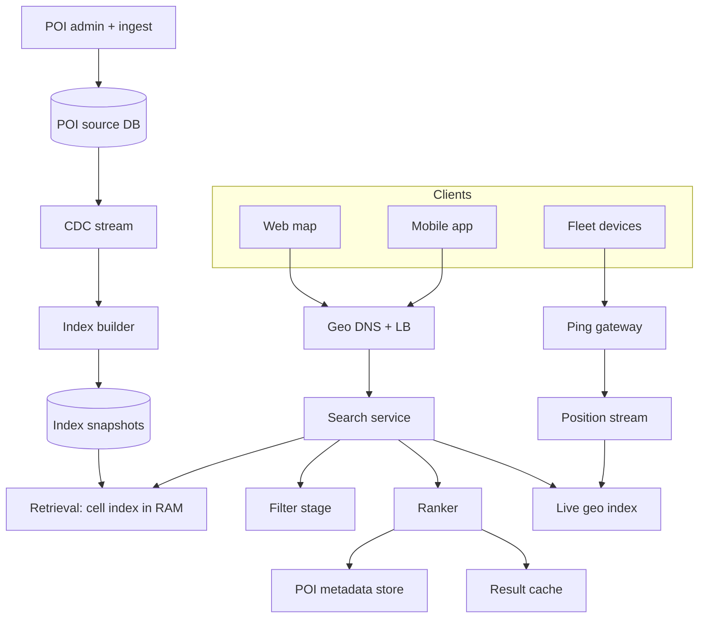
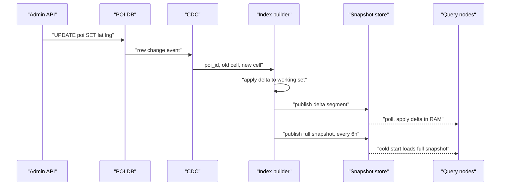
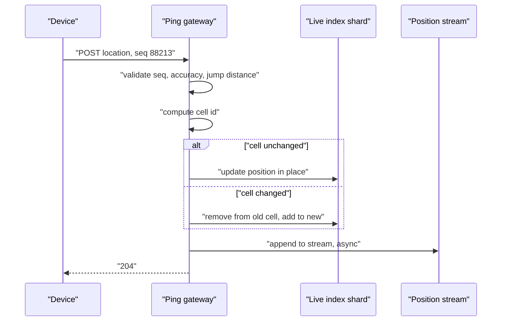
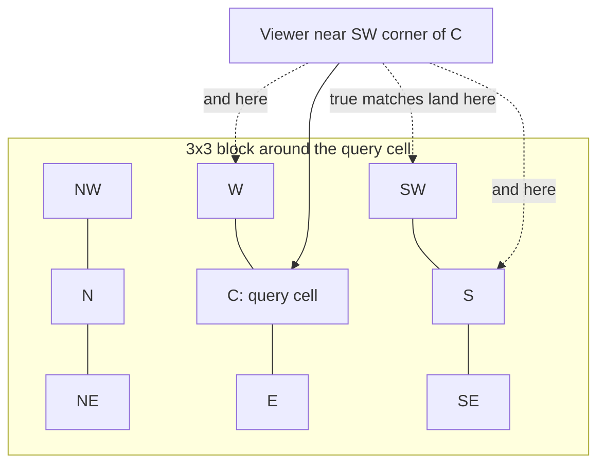
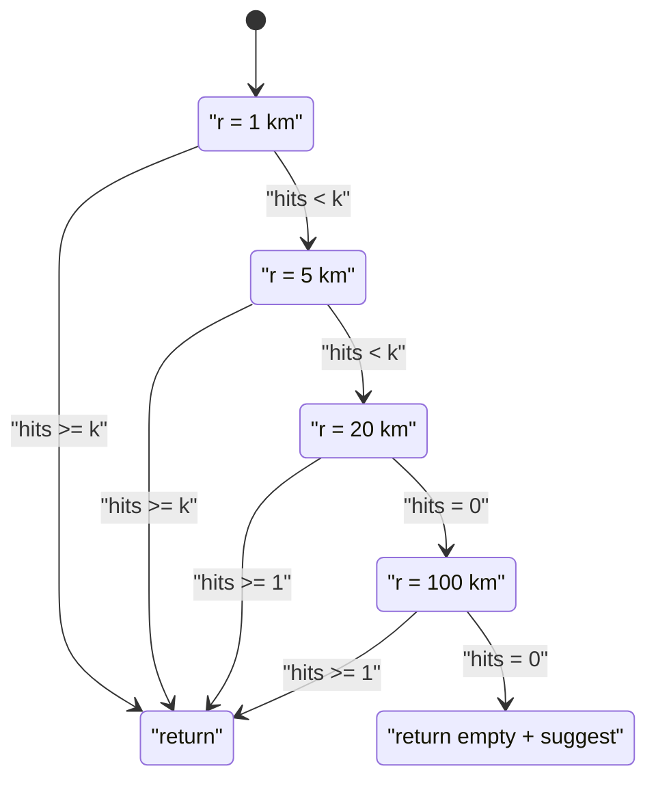

# 21 — Proximity Service (Yelp Nearby)

<span class="pill pill-core">Core</span> <span class="pill pill-medium">Medium</span>

**"Find things near me" is a 2-D range query, and every practical answer is the same trick: collapse two dimensions onto one with a space-filling curve so an ordinary B-tree or hash can serve it. The hard part is that the collapse is lossy exactly at cell boundaries, and the data is a thousand times denser in Manhattan than in Montana.**

| | |
|---|---|
| **Commonly asked at** | Google, Uber, Lyft, DoorDash, Instacart, Yelp, Airbnb, Meta, Snap |
| **Time budget** | 45 min |
| **Core tension** | A coarse grid means a small fan-out but enormous candidate sets in dense areas; a fine grid means small candidate sets but a large fan-out and a boundary problem that grows with every cell you union. Every indexing decision is a position on that curve, and the correct position is different in Manhattan and Montana inside the same deployment |
| **Prerequisites** | [F04 Caching](../fundamentals/f04-caching.md), [F06 Partitioning & Sharding](../fundamentals/f06-partitioning-sharding.md), [F07 Replication & Consistency](../fundamentals/f07-replication-consistency.md), [F12 Queues & Streams](../fundamentals/f12-queues-streams.md), [F13 Storage Engines](../fundamentals/f13-storage-engines.md), [F14 SQL vs NoSQL](../fundamentals/f14-sql-vs-nosql.md), [F16 Search & Indexing](../fundamentals/f16-search-indexing.md), [F17 Rate Limiting & Load Shedding](../fundamentals/f17-rate-limiting-load-shedding.md), [F22 Observability](../fundamentals/f22-observability-fundamentals.md), [F24 Capacity Planning](../fundamentals/f24-capacity-planning.md) |

---

## 1. Problem Statement

Given a viewer's coordinates $(\phi, \lambda)$, a radius $r$, and a set of business filters, return the $k$ best matching entities ranked by a blend of distance and quality, at tens of thousands of queries per second, globally.

The naive formulation is a full scan with a haversine computation per row. At 200 million points of interest that is 200 million trigonometric evaluations per query, which is not a latency problem so much as an arithmetic impossibility. Every real system therefore does the same two-stage thing:

1. **Retrieval.** Use a spatial index to turn "within $r$ metres" into "in this small set of integer keys", producing a candidate set that is a superset of the true answer and small enough to hold in memory.
2. **Refinement.** Compute the exact distance for each candidate, drop the false positives introduced by the cell approximation, apply business filters, rank, and truncate.

Everything interesting in the design lives in the gap between those two stages: how much over-fetch the retrieval stage produces, how badly that over-fetch varies with population density, and what happens when the viewer stands one metre from a cell boundary.

There is a second, quieter reframing that matters. **The index is small; the churn is what is large.** Two hundred million POIs, keyed by cell, is roughly 5 GB — it fits in RAM on a single machine. What forces a distributed design is the query rate, the ranking metadata, and — in the moving-entity variant — an update rate measured in millions per second against an index that must stay queryable throughout.

### Out of scope

Turn-by-turn routing and road-network distance (covered in the Maps design), the review and rating subsystem, payments, and the recommendation model itself. We build the retrieval and ranking substrate that a recommender sits on.

---

## 2. Requirements

### Functional

| # | Requirement | Notes |
|---|---|---|
| F1 | `search(lat, lng, radius, filters)` returns ranked entities | Radius options: 500 m, 1 km, 2 km, 5 km, 20 km |
| F2 | Filters combine with the geo predicate | Category, price band, rating floor, open-now, delivery availability |
| F3 | Stable pagination through a result set | Cursor-based, must not duplicate or skip on page 2 |
| F4 | CRUD on POIs | Create, update location, update attributes, delete |
| F5 | Results include exact distance and bearing | Computed, not approximated from the cell |
| F6 | Expand the radius automatically when results are sparse | Rural users must not get an empty page |
| F7 | Viewport search, not only radius search | Map panning sends a bounding box, not a circle |
| F8 | Moving-entity mode | High-frequency position updates for a fleet, same query API |

### Non-functional

| # | Requirement | Target |
|---|---|---|
| N1 | Search latency | p50 < 40 ms, p99 < 150 ms server-side |
| N2 | Search availability | 99.95% |
| N3 | POI attribute propagation | < 60 s from edit to visible |
| N4 | Moving-entity position freshness | p99 < 5 s from device to queryable |
| N5 | Result correctness | Zero false negatives inside the radius; false positives eliminated before response |
| N6 | Read scalability | 20k QPS steady, 60k QPS peak, growing 40% YoY |
| N7 | Cost | Sublinear in POI count; must not scale with grid cell count |

!!! note "N5 is the requirement that kills naive grid designs"
    "Zero false negatives inside the radius" sounds obvious and is violated by almost every first-pass whiteboard answer, because the candidate author queries the single cell containing the viewer. A viewer standing 3 m inside a cell boundary with a 1 km radius is missing roughly half the true answer set and the API returns 200 OK. **There is no error signal for this bug.** It is found by users, not by monitoring, which is precisely why it is the thing interviewers probe.

---

## 3. Scale Estimation

### Corpus and query volume

$$
\begin{aligned}
\text{POIs} &= 2 \times 10^{8} \\
\text{POI attribute edits} &= 1\%\ \text{per day} = 2 \times 10^{6}/\text{day} \approx 23\ \text{/s} \\
\text{DAU} &= 6 \times 10^{7},\quad \text{searches per DAU} = 8 \\
\text{searches} &= 4.8 \times 10^{8}/\text{day} \Rightarrow \frac{4.8\times10^{8}}{86400} \approx 5{,}600\ \text{/s mean}
\end{aligned}
$$

Proximity traffic is strongly diurnal and meal-locked: a lunchtime peak at roughly $3.5\times$ mean, restricted to a narrow band of longitudes.

$$
\text{peak} \approx 5{,}600 \times 3.5 \approx 20{,}000\ \text{QPS}
$$

### Index size — the number that reframes the problem

A geo index entry needs the cell key, the entity id, and the exact position for refinement:

$$
\underbrace{8}_{\text{cell id}} + \underbrace{8}_{\text{poi id}} + \underbrace{8}_{\text{lat/lng as 2}\times\text{int32}} = 24\ \text{bytes}
$$

$$
2 \times 10^{8} \times 24\ \text{B} = 4.8\ \text{GB}
$$

With per-cell posting-list overhead and an ordered structure, call it 12 GB. **The entire planet's static geo index fits in RAM on one commodity machine.** Nothing about the retrieval stage requires a distributed system. What requires one is the ranking metadata (names, hours, photos, embeddings — hundreds of GB), the query rate, and geographic latency.

!!! tip "Say this out loud in the interview"
    "The spatial index is 5 GB. I am going to replicate it in full to every query node rather than shard it, because a full replica removes the scatter-gather entirely and a scatter-gather is what would make my p99 bad." That single decision — replicate, do not shard, for the static variant — is worth more than any amount of geohash trivia, and it inverts for the moving-entity variant, which is the interesting contrast.

### Geohash precision arithmetic

A geohash of $b$ bits interleaves longitude and latitude bits, longitude first, so it uses $\lceil b/2 \rceil$ longitude bits and $\lfloor b/2 \rfloor$ latitude bits. Base-32 encoding gives 5 bits per character, so precision $p$ means $b = 5p$.

$$
w = \frac{360^\circ}{2^{\lceil b/2 \rceil}} \cdot 111.32 \cos\phi \ \text{km}, \qquad
h = \frac{180^\circ}{2^{\lfloor b/2 \rfloor}} \cdot 111.32\ \text{km}
$$

| $p$ | bits | lon bits | lat bits | width at equator | height | area |
|---|---|---|---|---|---|---|
| 4 | 20 | 10 | 10 | 39.1 km | 19.5 km | 762 km² |
| 5 | 25 | 13 | 12 | 4.89 km | 4.89 km | 23.9 km² |
| 6 | 30 | 15 | 15 | 1.22 km | 610 m | 0.74 km² |
| 7 | 35 | 18 | 17 | 153 m | 153 m | 0.023 km² |
| 8 | 40 | 20 | 20 | 38.2 m | 19.1 m | 730 m² |

Note the **aspect-ratio oscillation**: odd precisions give near-square cells, even precisions give cells twice as wide as they are tall, because the extra bit alternates between axes. This is not cosmetic — it means the guaranteed coverage radius of a 3×3 block is governed by the *smaller* dimension, so precision 6 buys you 610 m of vertical guarantee while wasting 1.22 km horizontally.

### Density imbalance

Mean density is meaningless here. Compare:

$$
\begin{aligned}
\text{Manhattan} &: \approx 10^{5}\ \text{POIs} / 59\ \text{km}^2 = 1{,}695\ \text{POIs/km}^2 \\
\text{Wyoming} &: \approx 3 \times 10^{4}\ \text{POIs} / 2.5\times10^{5}\ \text{km}^2 = 0.12\ \text{POIs/km}^2
\end{aligned}
$$

A ratio of roughly $1.4 \times 10^{4}$. Per geohash-6 cell (0.74 km²):

$$
\text{Manhattan} \approx 1{,}250\ \text{POIs/cell}, \qquad \text{Wyoming} \approx 0.09\ \text{POIs/cell}
$$

A 3×3 block in Manhattan returns ~11,000 candidates for a query that will keep 20. A 3×3 block in Wyoming returns zero. **A single global precision is wrong everywhere.** Section 7.3 fixes this.

### Moving-entity variant

$$
\begin{aligned}
\text{concurrent entities} &= 5 \times 10^{6} \\
\text{ping interval} &= 4\ \text{s} \\
\text{ingest rate} &= \frac{5\times10^{6}}{4} = 1.25 \times 10^{6}\ \text{updates/s} \\
\text{payload} &\approx 100\ \text{B} \Rightarrow 125\ \text{MB/s} \approx 1\ \text{Gbit/s before framing}
\end{aligned}
$$

Live position state is $5\times10^{6} \times 64\ \text{B} = 320\ \text{MB}$ — again trivially small. **The state is tiny and the rate is enormous.** That asymmetry defines the whole write-heavy design: it is a throughput problem, not a storage problem, which means durability requirements collapse (a lost ping is superseded in 4 seconds) and in-memory structures become not just viable but correct.

### Index update rate, and why it is not the ingest rate

An index mutation is only required when a ping crosses a cell boundary. For an entity moving at speed $v$ with ping interval $\Delta t$ in a grid of characteristic width $w$, the probability that consecutive pings fall in different cells is approximately $v\Delta t / w$ while $v\Delta t \ll w$.

$$
v = 50\ \text{km/h} = 13.9\ \text{m/s},\quad \Delta t = 4\ \text{s} \Rightarrow v\Delta t = 55.6\ \text{m}
$$

At H3 resolution 9 (edge 174 m, face-to-face ≈ 301 m):

$$
P(\text{cell change}) \approx \frac{55.6}{301} = 0.185
$$

$$
\text{index mutations/s} = 1.25\times10^{6} \times 0.185 \times 2 \ (\text{remove} + \text{add}) = 4.6 \times 10^{5}\ \text{/s}
$$

versus $2.5\times10^{6}$/s for a naive unconditional remove-and-add. **A 5.4x reduction from one `if` statement** comparing the new cell id to the cached previous one. This is the single highest-leverage optimisation in the write-heavy variant and it costs nothing.

---

## 4. API Design

```http
GET /v1/search?lat=40.7580&lng=-73.9855&radius=1000&limit=20
    &category=restaurant&price=2,3&open_now=true&min_rating=4.0
    &sort=relevance&cursor=eyJzIjowLjg3MSwiaWQiOiJwXzkxMjM0In0
Accept: application/json
```

```json
{
  "results": [
    {
      "poi_id": "p_91234",
      "name": "Gramercy Tavern",
      "distance_m": 412,
      "bearing_deg": 137,
      "rating": 4.6,
      "review_count": 8213,
      "price_band": 3,
      "open_now": true,
      "score": 0.871
    }
  ],
  "next_cursor": "eyJzIjowLjg1NCwiaWQiOiJwXzQ0MTkwIn0",
  "meta": {
    "effective_radius_m": 1000,
    "expansion_steps": 0,
    "cells_scanned": 9,
    "candidates_examined": 1183,
    "index_version": "2026-03-12T04:00:00Z"
  }
}
```

!!! tip "Return the retrieval telemetry in the response"
    `cells_scanned`, `candidates_examined` and `expansion_steps` cost nothing to include and turn every production query into a debugging sample. When a user reports "the app missed the place across the street", `cells_scanned: 1` in their trace answers the question instantly. Most teams add these fields after the first boundary incident; add them on day one.

### Viewport search

Map panning is a bounding-box query, not a radius query, and treating it as a radius query centred on the viewport with a radius equal to the diagonal over-fetches by $4/\pi \approx 1.27$ at best and much more for non-square viewports.

```http
GET /v1/search/bbox?sw=40.700,-74.020&ne=40.760,-73.960&zoom=14&limit=200
```

Bounding boxes also need **zoom-aware result thinning**: at zoom 14 a client cannot render 5,000 pins, so the server returns the top-$n$ by score per sub-cell, giving a spatially even sample rather than 200 pins clustered on one block.

### Moving-entity ingest

```http
POST /v1/entities/d_77301/location
Content-Type: application/json

{"lat": 40.7141, "lng": -74.0060, "ts": 1774608000123,
 "accuracy_m": 8, "heading": 214, "speed_mps": 11.2, "seq": 88213}
```

Response is `204 No Content`. No body, no read-back, no transaction. The `seq` counter lets the server drop out-of-order pings without consulting a clock — see [F20 Time, Clocks & Ordering](../fundamentals/f20-time-clocks-ordering.md) for why the device timestamp alone is not trustworthy.

### Cursor design

A naive `offset` cursor breaks under concurrent index updates: a POI inserted between page 1 and page 2 shifts everything down and the user sees a duplicate. Encode the sort key instead:

```json
{"s": 0.8541, "id": "p_44190", "iv": "2026-03-12T04:00:00Z", "r": 1000}
```

Pin `index_version` into the cursor so the whole pagination session reads one snapshot. This matters more than it seems: without it, a POI whose rating changes mid-session can move across the page boundary and be either duplicated or skipped, and the user-visible symptom is indistinguishable from a ranking bug.

---

## 5. Data Model

```sql
-- Canonical POI record. Source of truth, not the query path.
CREATE TABLE poi (
    poi_id          BIGINT PRIMARY KEY,
    name            TEXT        NOT NULL,
    lat             DOUBLE PRECISION NOT NULL,
    lng             DOUBLE PRECISION NOT NULL,
    category_id     INT         NOT NULL,
    price_band      SMALLINT,
    rating          REAL,
    review_count    INT         NOT NULL DEFAULT 0,
    status          SMALLINT    NOT NULL DEFAULT 1,   -- 1 live, 2 closed, 3 hidden
    tz              TEXT        NOT NULL,             -- IANA zone, needed for open_now
    updated_at      TIMESTAMPTZ NOT NULL DEFAULT now(),
    CONSTRAINT lat_range CHECK (lat BETWEEN -90 AND 90),
    CONSTRAINT lng_range CHECK (lng BETWEEN -180 AND 180)
);

-- Denormalised cell membership, one row per POI per index scheme.
-- Kept as a table so it can be rebuilt and diffed; the serving copy is in RAM.
CREATE TABLE poi_cell (
    scheme          SMALLINT    NOT NULL,   -- 1 geohash, 2 s2, 3 h3
    level           SMALLINT    NOT NULL,
    cell_id         BIGINT      NOT NULL,
    poi_id          BIGINT      NOT NULL,
    lat_e7          INT         NOT NULL,   -- degrees * 1e7, fits int32
    lng_e7          INT         NOT NULL,
    score_static    REAL        NOT NULL,   -- popularity prior, for early truncation
    PRIMARY KEY (scheme, level, cell_id, poi_id)
);

CREATE INDEX poi_cell_by_poi ON poi_cell (poi_id);

-- Opening hours, separate because it is multi-row and rarely joined.
CREATE TABLE poi_hours (
    poi_id          BIGINT NOT NULL REFERENCES poi(poi_id),
    dow             SMALLINT NOT NULL,      -- 0 = Monday
    open_min        SMALLINT NOT NULL,      -- minutes since local midnight
    close_min       SMALLINT NOT NULL,      -- may exceed 1440 for past-midnight
    PRIMARY KEY (poi_id, dow, open_min)
);
```

!!! warning "`close_min` exceeding 1440 is deliberate"
    A bar open until 02:00 has `open_min = 1080, close_min = 1560`. Storing it as two rows (Friday 18:00–24:00 and Saturday 00:00–02:00) makes "open now at 01:00 Saturday" a different query than "open now at 23:00 Friday", and one of the two will be wrong. Allowing overflow past 1440 makes the predicate uniform. This is the single most common correctness bug in `open_now`, and it is always found by a user at 1 a.m.

### Serving structure

The RAM-resident index is not a table. It is a sorted array of `(cell_id, poi_id, lat_e7, lng_e7, score_static)` packed into 24-byte records, sorted by `cell_id`, with a side hash from `cell_id` to `(offset, count)`.

```go
type CellIndex struct {
    dir  map[uint64]span      // cell_id -> [start, end) in recs
    recs []Rec                // sorted by cell_id, then by score_static desc
}

type Rec struct {
    PoiID  uint64
    LatE7  int32
    LngE7  int32
    Score  float32
}

type span struct{ start, end uint32 }
```

Sorting **within** a cell by `score_static` descending is what makes dense cells survivable: a Manhattan cell with 1,250 POIs can be truncated at the top 200 by popularity prior before exact distance is computed, because the tail is statistically never in the top 20 of the final ranking. That truncation is an approximation and must be measured (§7.4), not assumed.

### Moving-entity structure

```go
// Sharded to avoid a single lock. shardOf(entityID) selects the stripe.
type LiveIndex struct {
    shards [256]struct {
        mu       sync.RWMutex
        pos      map[uint64]Position  // entity -> current position + cell
        byCell   map[uint64]*roaring.Bitmap
        _pad     [64]byte             // keep locks off the same cache line
    }
}
```

Two maps, both in RAM, both rebuildable from 4 seconds of the ping stream. No WAL, no fsync, no replication for durability — replication factor 2 exists only so a node loss does not blind a city for the 4 seconds it takes the stream to repopulate.

---

## 6. High-Level Architecture



### Read path — static POI search

1. Gateway resolves the caller to the nearest region via geo DNS ([F02 DNS & Traffic Management](../fundamentals/f02-dns-traffic-management.md)) and terminates TLS.
2. Search service **snaps the query**: the raw coordinate is quantised to a ~50 m grid and the radius to the allowed ladder. This is a cache-key decision, not a precision decision (§7.5).
3. Result cache lookup on `(snapped_cell, radius, filter_hash, index_version)`. Hit ratio in dense metros runs 45–65% because thousands of users search the same block for the same category at the same hour.
4. On miss: choose the index level from the **density map** for the viewer's region (§7.3), compute the covering cell set, and scan.
5. Truncate each cell's posting list at the top $N$ by static score, compute exact haversine for the union, drop points outside $r$.
6. Apply filters. Cheap integer predicates first (category, price band, status), then the expensive ones (`open_now`, which needs a timezone conversion per POI).
7. Rank, fetch display metadata for the surviving top $k$ only, and return.

!!! note "Fetch metadata for $k$, never for the candidate set"
    The candidate set is 1,000–10,000 entries; the result page is 20. Fetching names, photos and hours for the candidate set is the most common way to turn a 30 ms query into a 300 ms one. Retrieval and ranking operate purely on the packed 24-byte records; the metadata store is touched once, with 20 keys, after truncation.

### Write path — POI update



The query nodes never write. They load a full snapshot at start-up and then apply an append-only stream of deltas, which makes them trivially replaceable, trivially scalable, and immune to the class of bugs where a serving node's local state diverges. A node that falls behind on deltas reports its lag as a health signal and is removed from rotation past a threshold rather than serving stale results silently.

### Write path — moving entity



The stream append is asynchronous and off the response path. The device gets its `204` as soon as the in-memory index is updated, because the durability requirement is zero and the latency requirement is real. The stream exists for analytics, trip reconstruction and index rebuild — none of which the device is waiting on.

---

## 7. Deep Dives

### 7.1 Geohash vs quadtree vs S2 vs H3

All four solve "map a point to an integer such that nearby points get nearby integers". They differ in cell shape, adaptivity, and how honestly they handle the sphere.

**Geohash** interleaves latitude and longitude bits and base-32 encodes them. Its great virtue is that it is a *string prefix*: `dr5ru7` is inside `dr5ru`, so a range scan on `LIKE 'dr5ru%'` — or, better, a `BETWEEN` on the integer form — retrieves a whole cell from any ordinary B-tree. No special index type, no extension, works in MySQL, Postgres, Redis sorted sets, DynamoDB sort keys, everything. Its defects are the aspect-ratio oscillation shown in §3, the fact that precision only moves in 5-bit (32×) steps when encoded as base-32, and a curve with poor locality at the seams between top-level cells.

**Quadtree** subdivides a node into four children when it exceeds a capacity threshold, so cell size adapts to density automatically — the one property the fixed schemes lack. The cost is that the structure is a pointer graph rather than a key, which means it must be held in a process that owns it, is awkward to shard, and requires rebalancing on write. For a **static** corpus rebuilt offline this is entirely fine and gives the best candidate-set discipline of any option. For a write-heavy fleet it is the wrong shape: node splits under a 460k/s mutation rate are a lock-contention nightmare.

**S2** projects the sphere onto the six faces of a circumscribed cube and orders cells along a Hilbert curve, giving 31 levels and a 64-bit cell id whose level is encoded in the trailing bits. Two properties make it the pragmatic default for serious systems. First, the Hilbert curve has better locality than the Z-order curve underlying geohash, so a region needs fewer contiguous ranges to cover. Second, `S2RegionCoverer` produces a **mixed-level covering** of an arbitrary region under a cell budget — give it a 1 km cap and `max_cells = 20` and it returns large cells for the interior and small cells for the boundary, which is exactly the right answer and which no fixed-grid scheme can express.

**H3** uses a hexagonal grid on an icosahedron, 16 resolutions. Hexagons buy one genuinely important property: **all six neighbours are equidistant from the centre**. In a square grid the diagonal neighbours are $\sqrt2$ farther than the edge neighbours, so a "ring of neighbours" is not a ring — it is a square, and any distance-decay function applied over grid steps is anisotropic. For flow analysis, surge zones, supply-demand balancing and heatmaps, that isotropy is worth a lot. The cost is that hexagons do not tile hierarchically: an H3 parent is not exactly the union of its children, so containment is approximate across resolutions, and the icosahedron forces exactly 12 pentagons into the grid at every resolution, which are real and which break the assumption that `kRing(1)` has 7 members.

| Scheme | Cell | Adaptive | Neighbour query | Hierarchy | Chosen / rejected and why |
|---|---|---|---|---|---|
| Geohash | Rectangle, oscillating aspect | No | 8 neighbours, string arithmetic at the same precision | Exact prefix containment | **Chosen for the portable/compat path.** Works in any B-tree or sorted set with no library. Used where the index must live inside an existing datastore |
| Quadtree | Square, variable depth | Yes | Tree walk, awkward across parents | Exact | **Chosen for offline static build.** Best candidate discipline; rejected for the live fleet index because splits under high write rates contend badly |
| S2 | Quadrilateral on cube face, Hilbert order | Via mixed-level covering | Native `RegionCoverer` | Exact | **Chosen for the primary serving index.** Mixed-level covering directly solves both the boundary problem and the density problem in one call |
| H3 | Hexagon, fixed per resolution | No | `kRing(k)`, isotropic | Approximate only | **Chosen for the analytics and surge layer.** Isotropic neighbours make spatial smoothing correct; rejected as the primary index because non-nesting complicates rollups |

??? note "Cell size reference, S2 and H3"
    S2 average cell area is $510.1\times10^{6}\,\text{km}^2 / (6 \cdot 4^{L})$. Within a level, the max/min area ratio is about 2.08, an artefact of the cube projection.

    | S2 level | cells | avg area | rough edge |
    |---|---|---|---|
    | 10 | 6.3 M | 81.1 km² | 9.0 km |
    | 12 | 100.7 M | 5.07 km² | 2.25 km |
    | 13 | 402.7 M | 1.27 km² | 1.13 km |
    | 14 | 1.61 B | 0.32 km² | 563 m |
    | 15 | 6.44 B | 0.079 km² | 281 m |
    | 16 | 25.8 B | 0.020 km² | 141 m |

    H3 has $2 + 120 \cdot 7^{r}$ cells at resolution $r$.

    | H3 res | cells | avg area | edge |
    |---|---|---|---|
    | 6 | 14.1 M | 36.1 km² | 3.23 km |
    | 7 | 98.6 M | 5.16 km² | 1.22 km |
    | 8 | 690 M | 0.737 km² | 461 m |
    | 9 | 4.84 B | 0.105 km² | 174 m |
    | 10 | 33.9 B | 0.0150 km² | 65.9 m |

### 7.2 The boundary problem

A single-cell query is wrong, and wrong silently. Consider a viewer at the south-west corner of a geohash-6 cell searching within 1 km. The cell extends 1.22 km east and 610 m north of them. Everything south, west, and most of what is more than 610 m north is in a different cell and will not be returned.



**The fix and its guarantee.** Query the cell plus its eight neighbours. The disc of radius $r$ centred anywhere inside cell $C$ is fully contained in the 3×3 block around $C$ **if and only if**

$$
r \le \min(w, h)
$$

where $w$ and $h$ are the cell width and height. Not $\max$, and not the diagonal — the binding case is a viewer on an edge, who has only $\min(w,h)$ of guaranteed margin in the perpendicular direction.

This turns precision selection into a derived quantity rather than a taste question:

$$
\text{choose the finest level } L \text{ such that } \min(w_L, h_L) \ge r
$$

For $r = 1000$ m and the geohash table in §3: precision 6 gives $\min(1220, 610) = 610 < 1000$ — **insufficient**. Precision 5 gives $\min(4890, 4890) = 4890 \ge 1000$ — sufficient, but the 3×3 block now covers 215 km² for a 3.14 km² disc, an over-fetch factor of 68.

=== "3x3 at a coarse level"

    ```text
    r = 1000 m, geohash-5 (4.89 km square)
      block area    = 9 x 23.9 = 215 km^2
      disc area     = pi r^2   = 3.14 km^2
      over-fetch    = 68x
      cells scanned = 9
    ```
    Small fan-out, enormous candidate set. In Manhattan that is
    215 km² × 1,695 POIs/km² ≈ 364,000 candidates. Unusable.

=== "5x5 at a finer level"

    ```text
    r = 1000 m, geohash-6 (1.22 x 0.61 km)
      need ceil(r / min(w,h)) = ceil(1000/610) = 2 rings
      block         = 5 x 5 = 25 cells
      block area    = 25 x 0.74 = 18.6 km^2
      over-fetch    = 5.9x
      cells scanned = 25
    ```
    11x less over-fetch for 2.8x the fan-out. Usually the better trade,
    because candidate examination dominates cell lookup cost.

=== "S2 mixed-level covering"

    ```text
    coverer.max_cells = 24
    coverer.min_level = 12; coverer.max_level = 16
    cover(S2Cap(center, 1000 m)) ->
      3 cells at L13 (interior)
      9 cells at L15 (boundary)
      12 cells at L16 (boundary detail)
      covered area  = 4.8 km^2
      over-fetch    = 1.5x
      cells scanned = 24
    ```
    The correct answer. Large cells inside, small cells at the rim.

The general ring rule for a square grid: you need $k = \lceil r / \min(w,h) \rceil$ rings, giving $(2k+1)^2$ cells. For H3, `kRing(k)` with $k = \lceil r / (1.5 \cdot \text{edge}) \rceil$ gives $3k^2+3k+1$ cells.

```python
def cover_disc_geohash(lat, lng, radius_m, level):
    """Cells whose union is guaranteed to contain the disc."""
    w, h = cell_dims_m(level, lat)
    k = math.ceil(radius_m / min(w, h))
    center = geohash_encode(lat, lng, level)
    return ring_block(center, k)          # (2k+1)^2 cells

def cover_disc_s2(lat, lng, radius_m, budget=24):
    cap = s2.Cap.from_axis_angle(
        s2.LatLng.from_degrees(lat, lng).to_point(),
        s2.Angle.from_radians(radius_m / EARTH_RADIUS_M))
    coverer = s2.RegionCoverer()
    coverer.min_level, coverer.max_level, coverer.max_cells = 12, 16, budget
    return coverer.get_covering(cap)      # mixed-level, ~1.5x over-fetch
```

!!! danger "The 3x3 fix has a second failure mode nobody mentions"
    Geohash neighbour computation at the poles and across the antimeridian is not simple arithmetic. At longitude 180 the "east" neighbour wraps to longitude −180 and the base-32 arithmetic does not do that for you unless the library is careful. At the pole, "north" of the top row does not exist and a naive implementation either throws or silently returns the query cell, producing a result set that is missing everything on the other side of the pole. Almost no one has POIs at the pole; almost everyone has a bug there, and if you ever run a fleet in Fiji you will find the antimeridian one. S2 and H3 both handle this natively because their grids close on the sphere; geohash does not because its grid is a flattened rectangle.

### 7.3 Density-adaptive levels

A single global level is wrong because density spans four orders of magnitude. Three approaches, in increasing order of how much they actually help:

**(a) Density map with per-region level selection.** Precompute, offline, the POI count in every level-10 S2 cell. At query time, look up the viewer's coarse cell, read its density class, and select the serving level from a table:

```yaml
level_policy:
  - { density_per_km2: ">1000", radius_m: 1000, level: 16, rings: 2 }
  - { density_per_km2: "100-1000", radius_m: 1000, level: 15, rings: 2 }
  - { density_per_km2: "10-100",  radius_m: 1000, level: 14, rings: 1 }
  - { density_per_km2: "<10",     radius_m: 1000, level: 12, rings: 1 }
```

Cheap, stateless, and it captures most of the win. The density map is ~6 M entries, refreshed daily, a few MB.

**(b) Quadtree during offline index construction.** Split any node exceeding 100 POIs. Cells are then equal-*population* rather than equal-*area*, which makes candidate-set size roughly constant everywhere. The index stores, per POI, the id of the leaf it landed in plus the leaf's level, and the query resolves the viewer's leaf by descending the tree. This is the cleanest answer for a static corpus and is what a rebuild-nightly pipeline should do.

For 200 M POIs at 50 per leaf on average:

$$
\text{leaves} = \frac{2\times10^{8}}{50} = 4\times10^{6}, \qquad \text{internal} \approx \frac{4\times10^{6}}{3} \approx 1.3\times10^{6}
$$

A 5.3 M node tree at 32 bytes per node is 170 MB — again, one machine.

**(c) Per-cell secondary partitioning for the fleet index.** For moving entities you cannot rebuild a tree, so keep the grid fixed and split the *posting list* instead: a cell whose membership exceeds a threshold is stored as $m$ sub-lists keyed by `(cell_id, hash(entity_id) % m)`, spread across shards. Reads fan out to $m$ sub-lists; writes contend on $1/m$ of the lock. This converts a hot-cell problem into a fan-out problem, which is the correct direction because fan-out is parallelisable and lock contention is not.

!!! example "Why equal-population beats equal-area, concretely"
    With a fixed grid tuned for the median, the Times Square query examines 364,000 candidates and the Laramie query examines 4. The p99 latency of the service is set entirely by Times Square, and the capacity model is set by the worst metro, not the average one. With equal-population cells, both queries examine roughly 1,000 candidates and p99 collapses toward p50. **Adaptivity is not an optimisation here; it is what makes the latency distribution have a usable shape.**

### 7.4 Ranking and filtering

Retrieval gives a superset. What happens next is a funnel with strictly increasing per-item cost, and the whole art is ordering the stages so that expensive work runs on the fewest items.


| Stage | Cost per item | Manhattan items in | Items out |
|---|---|---|---|
| Posting-list scan | ~2 ns | 24 cells | 11,000 |
| Static-score truncate | 0 (pre-sorted) | 11,000 | 2,000 |
| Haversine | ~25 ns | 2,000 | 2,000 |
| Radius cut | ~1 ns | 2,000 | 1,180 |
| Category / price / status | ~2 ns | 1,180 | 240 |
| `open_now` | ~200 ns (tz conversion) | 240 | 150 |
| Scoring | ~500 ns | 150 | 150 |
| Metadata hydrate | ~1 ms (network) | 20 | 20 |

Two orderings matter and are both counter-intuitive:

- **Distance before filters.** Distance is cheaper per item than `open_now` and cuts harder. Computing `open_now` on 2,000 candidates when 820 of them are outside the radius is 164 µs of pure waste per query.
- **`open_now` last among predicates.** It requires a timezone lookup and a local-time conversion per POI. Precompute a bitmap instead: for each POI, a 168-bit vector of "open during this hour of the week in local time", refreshed hourly. That turns a 200 ns conversion into a 1 ns bit test, at a cost of 21 bytes per POI — 4.2 GB across the corpus, or keep it only for the categories where `open_now` is actually used.

**Scoring.** The blend is domain-specific but the shape is universal: a monotone decreasing function of distance multiplied by quality terms, never a linear sum of raw distance and raw rating.

$$
\text{score} = \underbrace{e^{-d/\tau}}_{\text{distance decay}} \cdot \underbrace{\left(\frac{R \cdot n + \mu \cdot m}{n + m}\right)}_{\text{Bayesian rating}} \cdot \underbrace{(1 + \beta \log(1 + p))}_{\text{popularity}} \cdot \underbrace{\gamma_{\text{personal}}}_{\text{affinity}}
$$

$\tau$ is a decay constant that must vary by context: $\tau \approx 400$ m for walking in a dense metro, $\tau \approx 8000$ m for driving in a rural area. A fixed $\tau$ makes rural results look random (everything is equally far) and urban results look indifferent to distance.

The Bayesian rating term with prior mean $\mu$ and pseudo-count $m$ (typically 20–50) exists to stop a single 5-star review outranking 8,000 reviews averaging 4.6. This is the most frequently omitted piece of a ranking answer and the most frequently observed bug in real products.

!!! warning "Static-score truncation is a recall regression waiting to happen"
    Cutting a posting list at the top 200 by popularity prior means a genuinely nearby but obscure POI can be dropped before its distance is ever computed. The failure is invisible: the API returns a full page of plausible results. **Measure it.** Run a shadow job that computes the untruncated result for 0.1% of queries and reports `recall@20`. Alarm below 0.99. If you cannot state the recall cost of your truncation, you do not know whether your search works.

### 7.5 Caching, replicas and staleness

**Result caching** depends entirely on making cache keys collide. Raw coordinates have effectively infinite cardinality — a 7-decimal-place latitude is 1 cm of resolution and every user has a unique key. Snap to a ~50 m grid (geohash 7 / S2 level 16) and thousands of users on the same block share a key:

$$
\text{keyspace reduction} \approx \left(\frac{50\ \text{m}}{0.01\ \text{m}}\right)^2 = 2.5\times10^{7}\times
$$

The correctness cost is bounded and explicit: a result computed for a point up to 35 m away (half the diagonal) is served to you, so distances shown can be off by up to 35 m and an entity exactly at radius $r$ may flicker in and out. For a 1 km radius that is a 3.5% boundary uncertainty, which is acceptable for a restaurant list and **not** acceptable for "is this driver within 50 m of you", where snapping must be disabled.

**Read replicas and geo-distribution.** POI data is near-static (23 edits/s globally), so full replication to every region is cheap and staleness of 60 s is invisible. The interesting part is what *cannot* be replicated:

| Data | Replication | Acceptable staleness | Why |
|---|---|---|---|
| POI location and attributes | Full, all regions | 60 s | 23 writes/s globally; replication cost is nil |
| Opening-hours bitmaps | Full, all regions | 1 h | Recomputed hourly anyway |
| Ratings and review counts | Full, all regions | 5 min | Ranking input; small drift is imperceptible |
| Personalisation features | Home region, read-through cache elsewhere | 10 min | Per-user, large, low reuse |
| Live entity positions | **None across regions** | 5 s within region | 1.25 M/s cross-region is 1 Gbit/s of replication for data that is worthless in 4 s |

That last row is the decision to defend. Replicating a 1.25 M/s position stream across three regions costs more bandwidth than the ingest itself and delivers positions that are already stale on arrival. Instead, **shard the entire fleet stack by city**: ingest, index, query and dispatch for a city all live in the region nearest that city, and a query for drivers in Chicago is routed to the Chicago shard from wherever it originates. A user in Chicago is never served by Frankfurt. The failure domain becomes a city, which is also the correct operational blast radius.

### 7.6 Read-heavy and write-heavy are different systems

The same API, the same cell math, and almost no shared infrastructure.

| Dimension | Read-heavy (restaurant search) | Write-heavy (fleet positions) |
|---|---|---|
| Update rate | 23/s | 1.25 M/s |
| Query rate | 20 k/s | 15 k/s dispatch queries |
| Index mutability | Immutable snapshot + delta stream | Mutated in place, continuously |
| Durability | Full; the POI DB is the record | None; state rebuilds in 4 s |
| Structure | Sorted packed array, rebuilt offline | Sharded hash + bitmaps, mutated under stripe locks |
| Sharding | **None** — replicate the whole index everywhere | **By city** — no cross-region replication at all |
| Consistency | Eventual, 60 s | Read-your-recent-ping within the shard |
| Cell level | Adaptive by density | Fixed per city, tuned to fleet density |
| Dominant cost | Query CPU and metadata fan-out | Connection handling and lock contention |
| Scaling lever | Add stateless replicas | Add stripes and cities |

!!! tip "The one-sentence contrast worth memorising"
    **Read-heavy proximity is a replication problem with an immutable index; write-heavy proximity is a partitioning problem with a disposable index.** Getting that sentence out early tells the interviewer you understand that "proximity service" names two systems, and the rest of the discussion becomes much faster.

### 7.7 Radius expansion

A rural user searching 1 km finds nothing. Returning an empty page is a product failure, so the service expands — but expansion is a per-query cost multiplier and must be bounded.



Three rules make this behave:

1. **Expand by a factor, not an increment.** $1 \to 5 \to 20 \to 100$ km. Each step multiplies area by 25, 16 and 25, so at most three steps are needed anywhere on Earth that has POIs at all. Incrementing by 1 km would need 99 steps in Wyoming.
2. **Predict the expansion, do not iterate into it.** The density map already knows this region has 0.12 POIs/km². Solve for the radius that yields $k$ results *before* the first scan: $r \approx \sqrt{k / (\pi \rho)}$. With $k=20$ and $\rho = 0.12$: $r \approx 7.3$ km. One scan instead of three. Iteration remains as the fallback when the prediction is wrong.
3. **Re-rank at the final radius, not incrementally.** Merging results from three concentric scans with three different $\tau$ values produces a ranking with visible discontinuities at the ring boundaries. Pick the radius, then rank once.

And tell the user. `effective_radius_m` in the response lets the client render "nearest results within 7 km" rather than silently implying these places are close.

---

## 8. Scaling the Bottleneck

The bottleneck moves as you scale, and naming the sequence is more valuable than naming any single fix.

**Stage 1 — single Postgres with PostGIS.** A GiST index on `geography` handles `ST_DWithin` well up to roughly 10 M rows and a few hundred QPS. It is the correct starting architecture and the correct answer to "how would you build this in a week". It dies on read QPS long before it dies on row count, because each query is an index scan plus a per-row distance computation inside the database process, competing with every other query for the same buffer pool.

**Stage 2 — read replicas + result cache.** Scales reads 10–20x. Now the bottleneck is replication lag on POI writes (irrelevant, 23/s) and cache hit ratio (the real lever). Cache hit ratio is where the coordinate-snapping work in §7.5 pays for itself.

**Stage 3 — dedicated in-RAM index, sharded by nothing.** Pull retrieval out of the database into purpose-built stateless nodes each holding the full 12 GB index. Query latency drops an order of magnitude because there is no scatter-gather, no buffer-pool contention, and no row-format overhead. **Scaling is now horizontal and embarrassingly parallel**: each node is an independent replica.

At this point the bottleneck is metadata hydration, not retrieval — 20 keys per query at 20k QPS is 400k key lookups/s against the metadata store. Fix with a local LRU on the query node (display metadata is small and Zipf-distributed; a 2 GB LRU covers the top few million POIs and hits 90%+).

**Stage 4 — dense-cell CPU.** With retrieval in RAM and metadata cached, the remaining cost is candidate examination in dense metros. Fixes, in order of leverage: density-adaptive levels (§7.3) cuts candidates 10x; static-score truncation cuts another 5x with a measured recall cost; SIMD haversine over the packed `int32` lat/lng array processes 8 points per instruction.

$$
\text{candidates/s at peak} = 20{,}000 \times 2{,}000 = 4\times10^{7}
$$

At 25 ns per haversine that is 1 core-second per second — trivially parallel, and the reason this design works at all is that the per-candidate cost is nanoseconds, not a database round trip.

**Stage 5 — the fleet variant.** Different bottleneck entirely: 5 M persistent connections. At 50k connections per gateway node that is 100 gateway nodes purely for socket handling, before any indexing work. Levers: raise the ping interval adaptively (a stationary vehicle does not need 4-second pings — sending only on movement above a threshold cuts total ingest 30–50% because a meaningful fraction of a fleet is idle at any moment), batch pings at the device when the app is backgrounded, and use a binary framing rather than JSON over HTTP.

---

## 9. Failure Modes

| Failure | Blast radius | Detection | Mitigation | Degraded behaviour |
|---|---|---|---|---|
| Neighbour-cell query bug | Global, silent, permanent | Shadow recall job comparing against brute force on a sample | Assert coverage in unit tests with points placed at every cell corner | None — results are silently incomplete. This is the worst failure in the system |
| Hot cell in a dense metro | One metro's p99 | Per-cell candidate-count histogram | Density-adaptive level; sub-list partitioning; static-score truncate | Latency spike, then truncated recall in that metro only |
| Index snapshot corrupt | All query nodes that load it | Checksum + row count + spot-check queries in the build pipeline | Refuse to load; nodes stay on the previous snapshot | Serving frozen at the last good snapshot; stale but correct |
| Delta stream stalls | Increasing staleness everywhere | Per-node `index_lag_seconds` gauge | Remove nodes past a lag threshold from rotation | Stale POI attributes; new POIs invisible |
| Metadata store down | All searches lose display data | Hydration error rate | Serve from the query-node LRU; degrade to id + distance + name only | Cached POIs render fully, cold ones render minimally |
| Result cache down | Latency and backend load | Cache error rate, backend QPS step | Fail open to the index path; admission control on the index tier | 3–5x latency, shed low-priority traffic |
| Ping gateway node loss | ~50k entities blind | Connection-count drop, per-shard ping rate | Clients reconnect via LB; stream replays last 10 s | Those entities missing from results for a few seconds |
| Live index shard loss | One city's fleet | Shard heartbeat | Warm standby replays the last 10 s of the position stream | Dispatch in that city degraded for seconds |
| Clock skew on devices | Ordering of pings | `seq` regressions, `ts` vs arrival-time delta | Use monotonic `seq` for ordering, server time for staleness | Occasional stale position accepted |
| GPS jump / spoofing | Ranking and dispatch integrity | Implausible speed between pings | Reject pings implying more than 60 m/s; flag repeat offenders | Position held at last plausible point |
| Antimeridian / polar query | A handful of users, total failure | Synthetic probes at $\pm 180^\circ$ and $\pm 85^\circ$ | Use S2/H3, or explicitly wrap geohash neighbours | Empty or wrong results in that region |
| Region failover | All users of one region | Health checks, error rate | Geo DNS reroutes reads; **fleet shards do not fail over** | Search works from another region; dispatch in affected cities unavailable until shards restart |

!!! danger "The failure with no detection signal"
    Every other row in that table has a metric that moves. A missing-neighbour bug does not: latency is fine, error rate is zero, the response is well-formed. The only way to catch it is an **independent oracle** — a job that takes a sample of production queries, computes the answer by brute force over the full corpus, and compares. Budget for it. At 0.1% sampling of 20k QPS that is 20 brute-force queries per second, which is cheap insurance against a class of bug that otherwise ships to production and stays there for years.

---

## 10. SRE Lens

### SLIs and SLOs

| SLI | Definition | SLO |
|---|---|---|
| Search availability | Non-5xx responses / total | 99.95% monthly |
| Search latency | Server-side, cache-miss path | p50 < 40 ms, p99 < 150 ms, p99.9 < 500 ms |
| Retrieval recall | `recall@20` vs brute-force oracle on a 0.1% sample | > 0.99, alarm < 0.995 |
| Empty-result rate | Searches returning zero after expansion / total | < 0.5% |
| POI freshness | p99 edit-to-visible | < 60 s |
| Position freshness | p99 device-to-queryable | < 5 s |
| Index lag | Max `index_lag_seconds` across serving nodes | < 120 s |
| Candidate-set size | p99 candidates examined per query | < 5,000 |

!!! note "Recall is an SLI, not a test"
    Retrieval recall belongs on the SLO dashboard next to availability, because it degrades continuously and silently under exactly the changes teams make most often: raising a truncation limit to cut latency, coarsening a level to cut cost, adding a filter that runs too early. Treating it as a one-off correctness test means the first person to trade recall for latency does so without anyone noticing. Making it an SLI means that trade shows up on a graph the same day.

### Error budget

99.95% monthly is 21.6 minutes. Proximity search is a read-only, stateless, fully-replicated service, so budget consumption almost never comes from the query tier. It comes from:

- **Index build pipeline failures** that push a bad snapshot. Mitigated by making snapshot loading refuse-on-validation-failure rather than best-effort, so a bad build freezes serving rather than breaking it.
- **Dependency latency** on the metadata store, which is why the query-node LRU exists and why hydration has an aggressive timeout with a partial-result fallback.
- **Regional events**, where geo DNS failover is the mitigation for search and is explicitly *not* available for fleet shards.

### Rollout

The index build is the dangerous component because its bugs are silent and global.

- **Dual-build and diff.** Every build runs the previous and the candidate version, then diffs cell assignments. A change that moves more than 0.01% of POIs between cells without an explicit schema-version bump blocks the build.
- **Oracle gate.** Before publication, run 10,000 sampled production queries against the new snapshot and against brute force. `recall@20 < 0.995` blocks publication.
- **Canary by query percentage.** Route 1% of production queries to nodes running the new snapshot and compare result-set overlap, latency and candidate counts against the control. Overlap below a threshold blocks promotion. See [F25 Deployment & Release Safety](../fundamentals/f25-deployment-release-safety.md).
- **Level-policy changes are deploys.** Changing the density-to-level table alters both latency and recall everywhere. It ships through the same canary as code, never as a hot-reloaded config.

### Runbook notes

```text
ALERT: search_p99 > 150ms for 5m
  1. Break down by metro. Single metro -> hot cell.
     Check candidate_count_p99 by cell. If one cell dominates,
     lower its level in the density-map override table (takes
     effect at the next snapshot; the override table IS hot-reloadable
     for exactly this reason).
  2. Global -> check result_cache_hit_ratio first. A drop here is
     the usual cause and usually means a cache fleet event or a
     filter_hash cardinality explosion from a new client version.
  3. Check metadata_hydrate_p99. If that is the driver, cut the
     hydrate timeout and serve partial results; correctness is
     unaffected, only display richness.
  4. Last resort: enable aggressive static-score truncation globally
     (limit 200 -> 50). Records the recall cost in the audit log.

ALERT: retrieval_recall < 0.995
  Treat as sev-2 even though nothing is erroring.
  1. Compare against the last snapshot publication and the last
     level-policy change. Roll back the most recent of the two.
  2. Check whether truncation limits were lowered by an
     auto-mitigation (see above). If so, that is your answer.
  3. Group failing samples by geohash prefix. Clustering near
     +/-180 longitude or above 66 degrees latitude means a
     neighbour-wrap bug, not a tuning problem.

ALERT: index_lag_seconds > 120 on N nodes
  1. N == all -> the delta publisher is broken. Serving is stale
     but correct; do NOT restart query nodes, they will cold-load
     a snapshot and lose more freshness.
  2. N == few -> those nodes are unhealthy; drain them.
  3. Verify snapshot publication is still succeeding; if deltas
     are stalled but snapshots are fine, staleness is capped at 6h.

ALERT: ping_ingest_rate drop > 20% in one city
  1. Gateway node loss vs a real fleet drop vs a client release.
     Check connection counts and client-version breakdown.
  2. If gateway loss: confirm LB is redistributing; entities
     reconnect within seconds.
  3. Do NOT fail the city over to another region. Fleet shards are
     region-pinned by design; a cross-region failover moves the
     data but not the latency budget.
```

### Capacity model

$$
\begin{aligned}
\text{query nodes} &= \frac{\text{peak QPS} \times \text{CPU-s per query}}{\text{cores per node} \times U} \\[4pt]
\text{CPU-s per query} &= \frac{C_{\text{cand}} \times 25\ \text{ns} + C_{\text{cells}} \times 2\ \mu\text{s} + \text{rank}}{1} \\[4pt]
\text{gateway nodes} &= \frac{\text{concurrent entities}}{\text{connections per node}} \\[4pt]
\text{index RAM per node} &= 24\ \text{B} \times N_{\text{poi}} \times 2.5\ (\text{overhead}) + \text{LRU}
\end{aligned}
$$

Worked: at 20k QPS with 2,000 candidates and 24 cells, CPU per query ≈ 50 µs + 48 µs + 75 µs ≈ 0.17 ms. At 32 cores and 60% utilisation: $20{,}000 \times 0.00017 / (32 \times 0.6) \approx 0.18$ nodes for compute. **Capacity here is driven by RAM and redundancy, not CPU** — you run 12+ nodes per region for availability and cache warmth, not because you need the cores. Recognising that inverts the usual capacity conversation and is worth saying explicitly.

### Cost

| Line | Driver | Relative scale |
|---|---|---|
| Query-node RAM | Index size × replica count × regions | Largest for the static variant |
| Fleet gateway fleet | Concurrent connections | Largest for the write-heavy variant |
| Metadata store | Corpus size and hydration QPS | Second; LRU cuts it 10x |
| Position stream | 1.25 M/s × retention | Meaningful; retention policy is the lever |
| Cross-region bandwidth | POI deltas only | Negligible by design — and that is the design |

The dominant cost lever for the static variant is **replica count**, which is a function of how many regions you serve and how much redundancy you want, not of corpus size. For the fleet variant it is **ping interval**, which is quadratic in effect: halving the interval doubles ingest, doubles gateway CPU, and nearly doubles index mutations. Adaptive ping rates keyed to speed and app state are the highest-value cost optimisation available. See [F28 Cost Engineering](../fundamentals/f28-cost-engineering.md).

---

## 11. Trade-offs & Alternatives

| Decision | Chosen | Alternative | Why |
|---|---|---|---|
| Primary index | S2 with `RegionCoverer` | Geohash fixed precision | Mixed-level covering gives 1.5x over-fetch versus 6–68x, and handles poles and antimeridian natively |
| Analytics grid | H3 | S2 | Isotropic neighbours make spatial smoothing, surge zones and heatmaps correct; non-nesting is tolerable when rollups are recomputed rather than aggregated |
| Static index topology | Full replica per node, no sharding | Shard by cell prefix | 12 GB fits in RAM; sharding would add a scatter-gather to every query for zero benefit |
| Fleet index topology | Shard by city, no cross-region replication | Global replicated index | 1.25 M/s of positions that are worthless in 4 s must not cross an ocean |
| Adaptivity | Density map + offline quadtree | Single global level | Four orders of magnitude of density variance; a single level makes p99 a function of the worst metro |
| Boundary handling | Ring cover sized from $\min(w,h)$ | Query one cell, accept the error | Silent false negatives with no detection signal are not an acceptable failure mode |
| Cache key | Snapped to ~50 m | Raw coordinates | $2.5\times10^7$ reduction in keyspace; 45–65% hit ratio in metros versus effectively 0% |
| `open_now` | Precomputed 168-bit weekly bitmap | Timezone conversion per candidate | 200x cheaper per candidate; 21 B per POI |
| Rating in ranking | Bayesian shrinkage toward a prior | Raw mean rating | Stops one 5-star review outranking 8,000 at 4.6 |
| Distance decay | Exponential with context-dependent $\tau$ | Linear distance penalty | Linear makes rural results indifferent to distance and urban results dominated by it |
| Expansion | Predict $r$ from density, iterate as fallback | Iterate $1,2,3,\dots$ km | One scan instead of many; factor-of-5 steps bound iteration at 3 |
| Position durability | None; rebuild from 4 s of stream | WAL + fsync per ping | Durability for data with a 4-second half-life is pure cost |
| Ping ordering | Monotonic device `seq` | Device wall-clock timestamp | Device clocks are wrong, adjusted, and occasionally malicious |

??? note "Would you just use PostGIS?"
    For most companies, yes, and you should say so. A GiST index over `geography` with `ST_DWithin` is correct, handles the boundary problem for you (because the index is an R-tree over actual bounding boxes, not a grid approximation), supports arbitrary polygons, and scales comfortably to millions of rows and hundreds of QPS. You outgrow it when read QPS exceeds what replicas can serve, when the ranking model needs features that do not belong in a relational row, or when per-query latency must be tens of milliseconds at the p99 rather than the p50. The reason this question is asked with grids and space-filling curves in mind is that **the grid discussion forces you to reason explicitly about the approximation you are making**, and that reasoning is what transfers to the fleet variant, where PostGIS is genuinely not an option at 1.25 M writes per second.

??? note "Redis GEO — what it actually is"
    `GEOADD` stores a 52-bit geohash as the score in a sorted set, and `GEOSEARCH` does a 9-cell scan plus exact filtering — precisely the algorithm in §7.2, implemented for you. It is excellent for a single city's fleet: sub-millisecond, atomic, and the sorted set gives you free ordering. Its limits are that the keyspace is one Redis shard (so a city, not a planet), that there is no adaptivity, and that the 9-cell scan is fixed, so recall depends on Redis choosing an appropriate internal precision for your radius — which it does, but you inherit its choice. Knowing that `GEOSEARCH` is "9-cell geohash plus haversine" rather than magic is a good thing to demonstrate.

---

## 12. Gotchas & Corner Cases

!!! gotcha "Querying only the containing cell silently loses half the answer"
    **Symptom:** users report that a place across the street does not appear, while places farther away do. Latency and error rates are perfect. Reproduces for some users and not others at the same location.
    **Mechanism:** a point near a cell edge has most of its search disc in adjacent cells. The API cannot tell the difference between "there is nothing there" and "I did not look there", so it returns 200 with an incomplete list.
    **Mitigation:** cover with $\lceil r / \min(w,h) \rceil$ rings, or use `S2RegionCoverer`. Unit-test by placing the query point at all four corners and all four edge midpoints of a cell and asserting that a planted POI just across each boundary is returned. Add the brute-force recall oracle described in §9 so a regression is caught by monitoring rather than by users.

!!! gotcha "Using max(width, height) to size the ring leaves a gap on the short axis"
    **Symptom:** the boundary bug persists after "fixing" it with a 3×3 query, but only for north-south-adjacent POIs.
    **Mechanism:** at even geohash precisions the cell is twice as wide as tall. Sizing the ring from the 1.22 km width satisfies $r=1$ km, but the 610 m height means a viewer on a north edge has only 610 m of northward margin. East-west works; north-south does not.
    **Mitigation:** the guarantee is governed by $\min(w,h)$. Better, prefer odd precisions (near-square cells) or use a scheme whose cells are not systematically anisotropic. Best, use a coverer that takes the geometry as input rather than a hand-rolled ring.

!!! gotcha "Geohash neighbours wrap incorrectly at the antimeridian and break at the poles"
    **Symptom:** searches in Fiji, eastern Russia or New Zealand's Chatham Islands return partial results; polar queries throw or return only the containing cell.
    **Mechanism:** geohash flattens the sphere into a rectangle. The east neighbour of a cell at longitude $+180^\circ$ should be at $-180^\circ$, and naive base-32 increment arithmetic either overflows or produces a nonexistent cell. North of the top row there is no cell at all, and many libraries return the input unchanged rather than raising.
    **Mitigation:** use S2 or H3, whose grids close on the sphere. If geohash is forced by the datastore, wrap longitude explicitly and special-case latitudes above 85 degrees. Add synthetic probes at $\pm 179.99^\circ$ longitude and $\pm 84^\circ$ latitude to the monitoring set, because no real user will report this until one does.

!!! gotcha "Sorting by cell id is not sorting by distance"
    **Symptom:** results are geographically scattered even though they come from a Z-order or Hilbert-ordered index; "nearest first" is visibly wrong.
    **Mechanism:** space-filling curves preserve locality *statistically*, not exactly. Two points 10 m apart can sit on opposite sides of a major curve seam and have wildly different cell ids; two points with adjacent ids can be kilometres apart. Hilbert is better than Z-order but neither is a distance metric.
    **Mitigation:** cell id is a retrieval key and nothing else. Always compute exact haversine (or Vincenty for high precision) on the candidate set before ordering. If someone proposes skipping the refinement step to save CPU, that is the bug.

!!! gotcha "A viral venue turns one cell into a hotspot that no amount of sharding fixes"
    **Symptom:** one shard at 100% CPU during a stadium event; the rest of the fleet idle. Adding shards does not help.
    **Mechanism:** cell-keyed partitioning maps a geographic hotspot onto a single partition. A concert means 60,000 people all querying the same three cells, and consistent hashing by cell id concentrates rather than spreads that load.
    **Mitigation:** three layers. Replicate hot cells across multiple shards with read fan-out (the index is immutable, so replication is free). Cache aggressively at the snapped coordinate, since 60,000 people in a stadium share a handful of snapped keys and hit ratio approaches 99%. For the fleet index, split the hot cell's posting list into $m$ sub-lists across shards. Detect hot cells with a per-cell request counter and a decaying threshold rather than waiting for the CPU alarm.

!!! gotcha "GPS accuracy is not a number you can ignore in the ranking"
    **Symptom:** a user standing still sees results reorder every few seconds; distances shown jitter by 50 m.
    **Mechanism:** consumer GPS has 5–50 m error, far worse in urban canyons where multipath off buildings routinely produces 100 m+ errors and the reported `accuracy_m` understates it. The ranking function is deterministic, so a jittering input produces a jittering output, and the jitter is most visible exactly where users are densest.
    **Mitigation:** snap the query coordinate to a grid coarser than the error (the 50 m snap in §7.5 does double duty here), hysteresis on the result set so an item must improve by a margin before it moves up, and never display distances at finer precision than the position accuracy — "0.4 km" not "412 m" when `accuracy_m` is 30.

!!! gotcha "Filtering before distance computation looks cheaper and is not"
    **Symptom:** p99 latency is dominated by timezone conversions in the `open_now` predicate.
    **Mechanism:** an intuitive funnel applies "cheap-sounding" business filters first. But `open_now` requires a per-POI timezone lookup and a local-time conversion — roughly 200 ns — while haversine is 25 ns and eliminates 40% of the candidate set. Running the expensive filter on candidates that distance was about to discard wastes most of its cost.
    **Mitigation:** order stages by *cost per unit of selectivity*, not by intuition, and measure the funnel in production with per-stage in/out counters. Then eliminate the problem entirely by precomputing a 168-bit weekly open-hours bitmap so `open_now` becomes a single bit test.

!!! gotcha "Result caching by raw coordinate achieves a zero percent hit ratio"
    **Symptom:** an enormous cache with no hits and a bill to match.
    **Mechanism:** seven decimal places of latitude is roughly 1 cm. Every user is at a unique coordinate, every cache key is unique, and the cache is a write-only store.
    **Mitigation:** snap coordinates and quantise every continuous query dimension — radius to a fixed ladder, ratings floor to half-stars, price to bands. Then hash the *canonicalised* filter set so `category=a&category=b` and `category=b&category=a` are the same key. Include `index_version` so publication invalidates cleanly rather than requiring a purge.

!!! gotcha "Truncating posting lists by popularity silently drops the local gem"
    **Symptom:** a well-reviewed but low-traffic venue 100 m away never appears; a chain restaurant 800 m away always does. No errors, no latency anomaly.
    **Mechanism:** cutting each cell's posting list at the top $N$ by static popularity score removes low-popularity POIs *before* distance is considered. In a dense cell with 1,250 entries and $N=200$, an obscure venue next door loses to 200 popular venues that may all be farther away.
    **Mitigation:** truncate by a blend that already includes a coarse distance term (cell-centre distance is enough), or truncate to a larger $N$ in the cells nearest the query and a smaller $N$ in the outer ring. Whatever the scheme, measure `recall@k` against an untruncated oracle and treat it as an SLI with an alarm, not as a tuning parameter someone can quietly change.

!!! gotcha "Radius expansion changes the ranking, not just the result count"
    **Symptom:** a user expands from 1 km to 5 km and items that were ranked 1 and 2 disappear from the first page entirely.
    **Mechanism:** the distance-decay constant $\tau$ is tuned per radius. Re-running at 5 km with a larger $\tau$ flattens the distance term, so quality dominates and a 4.8-star place at 4 km outranks a 4.1-star place at 200 m. From the user's perspective the nearby results vanished.
    **Mitigation:** when expanding because the inner ring was sparse, preserve the inner results at the top of the ranking and append the expanded set below, rather than re-ranking the union with a single $\tau$. Surface `effective_radius_m` so the client can render a visual separator. The underlying principle: expansion is a *fallback*, and a fallback should add to the answer, not replace it.

!!! gotcha "Moving an entity between cells non-atomically makes it briefly invisible or duplicated"
    **Symptom:** dispatch occasionally reports zero available drivers in a busy city for a few milliseconds; or the same driver appears twice in one candidate set.
    **Mechanism:** the update is `remove(old_cell)` then `add(new_cell)`. Between the two, the entity exists in neither list. If the order is reversed, it exists in both. Under 460k mutations/s, a window of even 50 µs produces a continuous stream of these.
    **Mitigation:** make the transition atomic with respect to readers. Simplest: order the two operations as add-then-remove so the entity is transiently duplicated rather than transiently absent, and dedupe by entity id in the reader — a duplicate is a cosmetic bug and an absence is a correctness bug. Better: keep the authoritative `entity -> position` map as the source of truth and treat cell membership as a hint that readers validate against the position map.

!!! gotcha "Soft-deleted and permanently-closed POIs stay in the index long after they close"
    **Symptom:** users are routed to businesses that shut down months ago; ratings look stale; support tickets accumulate.
    **Mechanism:** the index build reads `WHERE status = 1`, but "permanently closed" is often recorded as an attribute edit rather than a status change, or is flagged by user reports that require moderation and sit in a queue. The index is only as fresh as the closure signal.
    **Mitigation:** treat closure as a first-class, fast-path signal with its own pipeline that bypasses the normal 6-hour build — a closure delta applies within 60 s. Add a decay: a POI with no check-ins, no reviews and no edits for 18 months gets a ranking penalty rather than waiting for a definitive closure signal. And expose "report closed" prominently, because your users are the only sensor you have for this.

---

## 13. Interview Angle

!!! interview "Open with the two-stage framing, not with geohash"
    Say: **"This is retrieve-then-refine. A spatial index turns 'within r metres' into a small set of integer keys that over-fetches by a bounded factor, then I compute exact distance on the candidates. Every design decision is about controlling that over-fetch factor, and the two things that blow it up are cell boundaries and density variance."** You have now named both deep dives in one sentence, before drawing anything. Candidates who open by explaining what a geohash is have spent 90 seconds on background instead of on framing.

!!! interview "Volunteer the boundary problem before you are asked"
    Draw the 3×3 block unprompted and state the guarantee as an inequality: $r \le \min(w, h)$. Then say the part that separates seniors from mids: **"And the reason this matters operationally is that a missing-neighbour bug has no error signal — no 5xx, no latency spike, no alarm. I would run a brute-force recall oracle on a 0.1% sample and put `recall@20` on the SLO dashboard."** Connecting a correctness bug to a monitoring strategy is the single highest-signal thing you can do in this question.

!!! interview "Put the density ratio on the board"
    "Manhattan is 1,695 POIs per km². Wyoming is 0.12. That is a ratio of fourteen thousand." Then: a fixed grid means Times Square examines 364,000 candidates and Laramie examines four, so service p99 is set by the worst metro and the capacity model is set by the worst metro. Adaptivity is not an optimisation, it is what gives the latency distribution a usable shape. This is the argument that makes quadtrees and `S2RegionCoverer` sound like conclusions rather than vocabulary.

!!! interview "Name the read-heavy / write-heavy split explicitly"
    **"Read-heavy proximity is a replication problem with an immutable index. Write-heavy proximity is a partitioning problem with a disposable index."** Follow with the numbers: 23 writes/s versus 1.25 M/s, and a 5 GB index that fits in RAM versus 320 MB of state that rebuilds in four seconds. Then the conclusion that surprises interviewers: for the static variant, do not shard at all — replicate the whole index and delete the scatter-gather from your p99.

??? question "Follow-up 1: A user stands exactly on a cell boundary. Walk me through what your system returns."
    **Answer.** With a single-cell query, an incomplete result set and a 200 OK — which is the failure mode I most want to avoid because nothing in my monitoring moves. The fix is to cover the search disc, not the point. The guarantee I need is that the disc of radius $r$ centred anywhere in cell $C$ is contained in the covering set, and for a square grid that means $\lceil r / \min(w,h) \rceil$ rings around $C$, giving $(2k+1)^2$ cells. The $\min$ matters: at even geohash precisions cells are twice as wide as tall, so sizing from the width leaves a north-south gap, and that gap produces a bug that looks intermittent and location-dependent. In practice I would not hand-roll the ring at all — I would use `S2RegionCoverer` with a cell budget, which produces a mixed-level covering with large cells in the interior and small cells at the rim, roughly 1.5x over-fetch instead of 6x for a uniform ring or 68x for a coarse 3×3. The covering is still approximate, so exact haversine on the candidate set remains mandatory; the covering guarantees no false negatives and the refinement removes the false positives. And I would verify it rather than assert it: unit tests that plant a POI just across each of the eight boundaries with the query point at every corner and edge midpoint, plus a production recall oracle sampling 0.1% of queries against brute force, alarmed at 0.995.

??? question "Follow-up 2: Now make it handle 5 million drivers each sending a position every 4 seconds."
    **Answer.** That is 1.25 million updates per second, and it changes the system from a replication problem into a partitioning problem. Four things change. **Durability goes away**: a position has a four-second half-life, so no WAL, no fsync, no synchronous replication; state lives in RAM and rebuilds from a few seconds of the ping stream, and replication factor 2 exists for availability, not durability. **Sharding becomes mandatory and becomes geographic**: the whole stack — gateways, index, dispatch — is partitioned by city and pinned to the region nearest that city, because replicating a 1 Gbit/s position stream across oceans costs more than the ingest and delivers data that is stale on arrival. **Write amplification becomes the thing to optimise**: naively every ping is a remove plus an add, 2.5 M index ops/s, but a ping only needs an index mutation if it crossed a cell boundary. At 50 km/h with 4-second pings you move 56 m, and at H3 resolution 9 the cell is about 300 m across, so only 18.5% of pings change cells — a 5.4x reduction from caching the previous cell id and comparing. **Connection handling becomes a first-class cost**: 5 M persistent connections at 50k per node is 100 gateway nodes before any indexing work, so binary framing, adaptive ping intervals keyed to speed and app state, and batching while backgrounded are the levers. The in-cell transition must also be ordered add-then-remove so an entity is transiently duplicated rather than transiently invisible, with reader-side dedup — a duplicate is cosmetic, an absence is a correctness bug in dispatch.

??? question "Follow-up 3: Geohash, quadtree, S2 or H3 — pick one and defend it."
    **Answer.** S2 for the serving index, and the deciding factor is `RegionCoverer` rather than anything about the curve. Geohash's virtue is portability: it is a prefix, so a plain B-tree or a Redis sorted set indexes it and you need no library on the query side. Its defects are that precision moves in 32x steps when base-32 encoded, that cells oscillate in aspect ratio so the coverage guarantee is governed by the short axis, and that it does not close on the sphere, so poles and the antimeridian are special cases you will get wrong. Quadtrees give equal-population cells, which is the property that fixes the density problem, and they are the right structure for an offline build — but they are a pointer graph, not a key, which makes them awkward to shard and hostile to high write rates because splits contend. H3's hexagons give isotropic neighbours, which genuinely matters for surge zones, supply-demand smoothing and heatmaps because in a square grid a "ring" is a square and distance-over-grid-steps is anisotropic; the cost is that hexagons do not nest, so a parent is not exactly the union of its children and hierarchical rollups are approximate, plus there are twelve pentagons at every resolution that break the assumption that `kRing(1)` has seven members. S2 wins for serving because the mixed-level covering solves the boundary problem and the density problem in a single call with a cell budget, and because a 64-bit cell id encodes its own level, so one index can hold multiple resolutions. In a real deployment I would use both: S2 for retrieval, H3 for the analytics and pricing layer. That is not fence-sitting — they are answering different questions.

??? question "Follow-up 4: Rural user, 1 km radius, zero results. What happens?"
    **Answer.** An empty page is a product failure, so the service expands — but I want to predict rather than iterate. The density map already knows the region's POI density $\rho$, so solving $k = \pi r^2 \rho$ for $r$ gives the radius likely to return $k$ results in one scan: at $\rho = 0.12$ per km² and $k = 20$, that is about 7.3 km. Iteration remains as a fallback when the prediction misses, and it expands by factors — 1, 5, 20, 100 km — so it terminates in at most three steps anywhere on Earth; incrementing by a kilometre would need ninety-nine steps in Wyoming. Two subtleties. First, the index level must change with the radius: at 100 km a fine grid means an absurd number of cells, so the coverer needs a coarser `min_level`, which is another argument for a scheme that supports mixed levels natively. Second, and this is the one people miss, **expansion changes the ranking, not just the count**. The distance-decay constant is tuned per radius, so re-ranking the union at 100 km flattens the distance term and a high-rated place 40 km away can outrank a decent place 500 m away — from the user's perspective the nearby results vanished. So I preserve the inner results at the top and append the expanded set below, and I return `effective_radius_m` so the client can say "nearest results within 7 km" rather than silently implying these places are close. I would also alarm on `empty_result_rate`, because a spike there usually means an index build problem, not a genuine absence of restaurants.

??? question "Follow-up 5: Your p99 is 400 ms and p50 is 30 ms. Diagnose it."
    **Answer.** A 13x spread with a healthy p50 means a small subset of queries is doing far more work, and in a proximity service there are four usual suspects, checkable in order. **First, dense-metro candidate sets.** Break p99 down by metro and look at the `candidates_examined` histogram — if Manhattan and Tokyo dominate, a fixed grid is returning tens of thousands of candidates there while the median query returns hundreds, and the fix is density-adaptive levels plus per-cell truncation with a measured recall cost. **Second, radius expansion.** Expanded queries do two or three scans; if `expansion_steps > 0` correlates with the tail, the fix is prediction from the density map rather than iteration. **Third, metadata hydration.** If `metadata_hydrate_p99` tracks the overall p99, the tail is a dependency, and the fix is a larger query-node LRU plus an aggressive timeout with partial results — display richness degrades, correctness does not. **Fourth, cache-miss amplification**: if the result cache hit ratio dropped, every miss pays full cost and the tail is just the miss path becoming visible; check for a client release that changed filter parameter ordering and exploded `filter_hash` cardinality, which is a surprisingly common cause. The structural point I would make is that a good p50 with a bad p99 in this system almost always means **the work per query is not bounded**, and the durable fix is to bound it — cap candidates examined, cap expansion steps, cap hydration time — rather than to make each unit of work faster. Bounded work turns a long tail into a recall trade-off you can measure and reason about.

??? question "Follow-up 6: How do you serve this from three regions without the data going stale in a way that matters?"
    **Answer.** By splitting the data by how fast it changes and how much its staleness costs. POI locations and attributes change 23 times a second globally, so I replicate the entire index to every region and accept 60 seconds of staleness — nobody notices a restaurant's phone number being a minute old, and the replication bandwidth is a rounding error. Ratings and review counts are ranking inputs with continuous small drift, so five minutes is fine. Opening-hours bitmaps are recomputed hourly anyway. Personalisation features are per-user, large, and have low cross-user reuse, so they stay in the user's home region with a read-through cache elsewhere. The one thing I will not replicate is live entity positions: 1.25 M/s across three regions is roughly a gigabit per second of replication for data that is worthless in four seconds, and the replica is stale the moment it lands. Instead the entire fleet stack is sharded by city and pinned to the nearest region, and a query about Chicago drivers is routed to the Chicago shard from wherever it originates. That has a consequence I want to state rather than hide: **fleet shards do not fail over across regions.** A region loss means dispatch for its cities is down until shards restart elsewhere, and the recovery path is "restart the shard and replay ten seconds of stream", not "serve from the replica". I would rather have a fast, honest, city-scoped failure domain than a globally replicated system whose positions are wrong everywhere. Search, by contrast, does fail over — it is stateless over an immutable replicated index, so geo DNS just points elsewhere. See [F26 Multi-Region & DR](../fundamentals/f26-multi-region-dr.md).

### Strong answer versus weak answer

| Dimension | Weak | Strong |
|---|---|---|
| Framing | "Use geohash and query the cell" | "Retrieve-then-refine; every decision controls the over-fetch factor; boundaries and density are what blow it up" |
| Boundary | Not mentioned, or "query neighbours too" | States $r \le \min(w,h)$, derives the ring count, notes that $\max$ leaves a gap, ties it to a recall oracle because there is no error signal |
| Index choice | Lists geohash/quadtree/S2/H3 as vocabulary | Picks S2 for mixed-level covering, H3 for isotropic analytics, and says why quadtrees lose under high write rates |
| Density | "Add more shards" | 1,695 vs 0.12 POIs/km²; equal-population cells; explains that p99 is otherwise set by the worst metro |
| Topology | Shards the static index by cell | "The index is 5 GB — replicate it everywhere and delete the scatter-gather from my p99" |
| Write-heavy | Same design with more capacity | Durability drops to zero, sharding becomes geographic, write amplification cut 5.4x by a cell-id comparison |
| Ranking | "Sort by distance" | Cost-ordered funnel with measured per-stage selectivity; exponential decay with context-dependent $\tau$; Bayesian rating shrinkage |
| Caching | "Cache the results" | Snaps coordinates for a $2.5\times10^{7}$ keyspace reduction and states the 35 m correctness cost explicitly |
| Expansion | "Increase the radius until we find something" | Predicts $r$ from density in one scan; notes that expansion reorders results and preserves the inner set |
| Failure | "Replicas handle it" | Names the silent-recall bug as the top-severity failure and proposes an independent oracle as the only detector |

---

## 14. Key Takeaways

1. **Retrieve then refine.** Every proximity system converts a 2-D range query into a set of integer keys that over-fetches by a bounded factor, then computes exact distance. Name the over-fetch factor for your design; if you cannot, you do not have a design.
2. **The boundary problem has an exact guarantee: $r \le \min(w, h)$.** Not $\max$, not the diagonal. It is the constraint that turns "which precision?" from taste into arithmetic, and getting it wrong produces silent false negatives with no error signal anywhere in your monitoring.
3. **Density varies by four orders of magnitude and a single global cell size is wrong everywhere.** Equal-population cells — via an offline quadtree or an S2 mixed-level covering — are what give the latency distribution a usable shape, because otherwise p99 and your capacity model are both set by your densest metro.
4. **The index is small; the churn is large.** Two hundred million POIs is 5 GB and fits in RAM, so replicate rather than shard and delete the scatter-gather. Five million moving entities is 320 MB of state and 1.25 M updates per second, so shard by city and drop durability entirely.
5. **One comparison collapses write amplification 5.4x.** An index mutation is only needed when a ping crosses a cell boundary, which at 50 km/h with 4-second pings and 300 m cells is 18.5% of pings. Cache the previous cell id.
6. **Order the ranking funnel by cost per unit of selectivity.** Exact distance is 25 ns and cuts 40%; `open_now` is 200 ns and cuts less. Precompute a weekly open-hours bitmap and it becomes a bit test.
7. **Truncation and caching are recall trades — measure them.** Static-score truncation and coordinate snapping are both correct engineering and both silently reduce correctness. Put `recall@20` against a brute-force oracle on the SLO dashboard so the next person to trade recall for latency does it visibly.
8. **Read-heavy and write-heavy proximity share an API and almost nothing else.** One is a replication problem with an immutable index; the other is a partitioning problem with a disposable one. Saying that early reframes the entire conversation.
