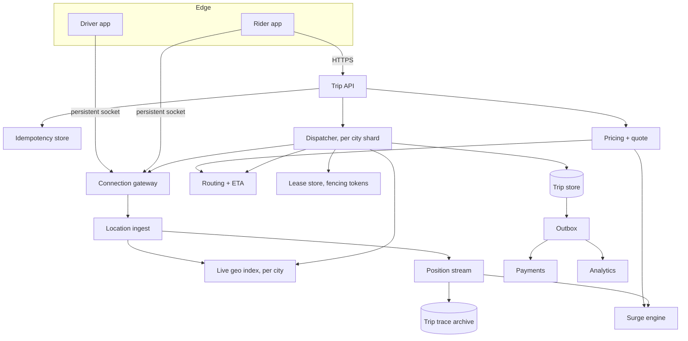
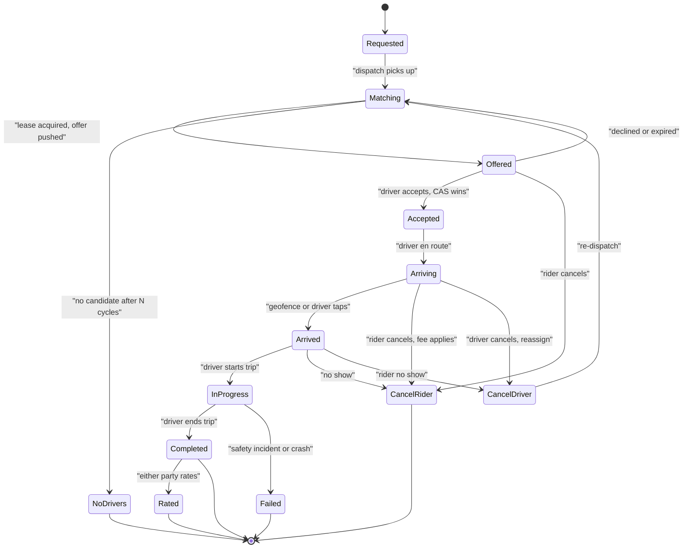
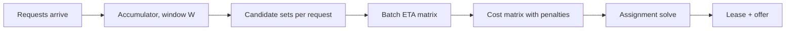
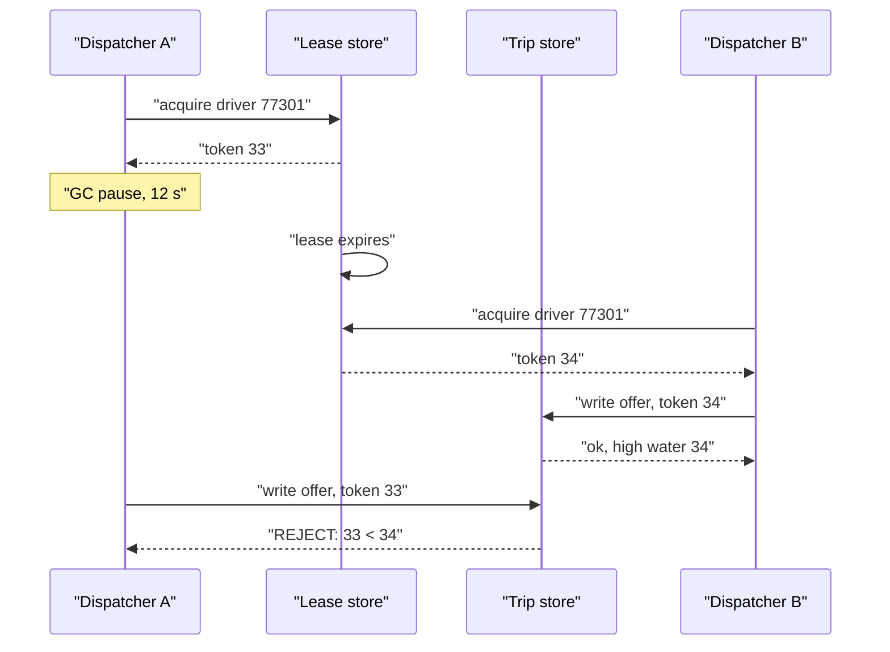
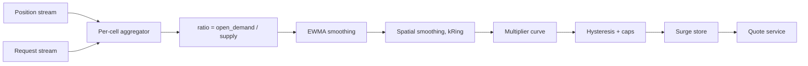

# 22 — Uber / Ride-Hailing Dispatch

<span class="pill pill-core">Core</span> <span class="pill pill-hard">Hard</span>

**A marketplace where both sides move, inventory expires in seconds, and the core operation — assigning a driver to a rider — must happen exactly once across a distributed fleet of dispatchers while the two parties are on flaky mobile networks and the entire thing is physically constrained by traffic.**

| | |
|---|---|
| **Commonly asked at** | Uber, Lyft, DoorDash, Grab, Bolt, Instacart, Google, Meta, Stripe |
| **Time budget** | 45 min |
| **Core tension** | Matching greedily on arrival gives a fast, simple, independently-scalable dispatch with globally poor assignments; batching into a short window gives measurably better assignments and a much better marketplace, at the cost of added latency, a stateful accumulator, and a much harder exactly-once story. Every ride-hailing system is a position on that dial, and the correct position changes with supply density |
| **Prerequisites** | [F03 Load Balancing](../fundamentals/f03-load-balancing.md), [F06 Partitioning & Sharding](../fundamentals/f06-partitioning-sharding.md), [F09 Consensus](../fundamentals/f09-consensus.md), [F10 Distributed Transactions](../fundamentals/f10-distributed-transactions.md), [F11 Idempotency](../fundamentals/f11-idempotency.md), [F12 Queues & Streams](../fundamentals/f12-queues-streams.md), [F17 Rate Limiting & Load Shedding](../fundamentals/f17-rate-limiting-load-shedding.md), [F18 Resilience Patterns](../fundamentals/f18-resilience-patterns.md), [F19 Concurrency Control](../fundamentals/f19-concurrency-control.md), [F20 Time, Clocks & Ordering](../fundamentals/f20-time-clocks-ordering.md), [F24 Capacity Planning](../fundamentals/f24-capacity-planning.md), [F26 Multi-Region & DR](../fundamentals/f26-multi-region-dr.md) |

---

## 1. Problem Statement

Build the real-time dispatch system for a ride-hailing marketplace: ingest driver positions continuously, accept ride requests, assign a driver to each request exactly once, track the trip through its lifecycle, and price it dynamically according to local supply and demand.

Three properties make this genuinely hard and distinguish it from every other matching system:

**Inventory moves and expires.** A driver is not a seat or a SKU. Their value to a given request is a function of where they are *right now* and decays continuously — a driver who was 2 minutes away when the candidate set was built may be 4 minutes away by the time the offer is delivered. There is no stable inventory to lock.

**The assignment is not final until a human agrees.** Dispatch produces an *offer*, not an assignment. The driver has 10 seconds to accept or the offer expires and the whole thing runs again. So the system holds a soft, expiring claim on a piece of moving inventory across an unreliable mobile network, and must never convert that soft claim into two hard assignments.

**The physical world is the backpressure.** You cannot scale your way out of "there are no drivers in this neighbourhood at 3 a.m.". The only levers are price (surge), wait time, and geographic expansion of the search — all of which are product decisions expressed as system behaviour.

The consequence of the second property is the invariant everything else serves: **a driver is assigned to at most one active trip, and a request results in at most one charged trip.** Violating the first strands a rider; violating the second is a financial incident.

### Out of scope

Payments processing internals, driver onboarding and background checks, the fraud system, the routing engine's internals (see the Maps design), and food delivery's multi-pickup batching.

---

## 2. Requirements

### Functional

| # | Requirement | Notes |
|---|---|---|
| F1 | Continuous driver location ingest | Sub-5-second freshness for on-duty drivers |
| F2 | Ride request with upfront price quote | Quote must be honoured for a bounded window |
| F3 | Dispatch: select and offer to a driver | Exactly-once assignment is the hard invariant |
| F4 | Driver accept / decline / timeout | 10-second offer window, re-dispatch on expiry |
| F5 | Full trip lifecycle with all terminal states | Including every cancellation and failure edge |
| F6 | Live ETA to pickup and to destination | Updated as the trip progresses |
| F7 | Surge pricing per geographic cell | Smoothed, capped, hysteretic |
| F8 | Rider and driver live tracking | Position stream to the counterparty |
| F9 | Reconnect and state resynchronisation | Both apps, at any point in the lifecycle |
| F10 | Post-trip fare finalisation and rating | Fare may differ from quote on route deviation |

### Non-functional

| # | Requirement | Target |
|---|---|---|
| N1 | Request-to-offer-delivered latency | p50 < 1 s, p99 < 3 s |
| N2 | Location freshness at dispatch time | p99 < 5 s |
| N3 | Double-assignment rate | **Zero.** Not an SLO with a budget; an invariant |
| N4 | Dispatch availability | 99.95% per city |
| N5 | Trip state durability | No lost trips; state survives any single-node failure |
| N6 | Surge computation freshness | < 30 s from demand shift to price change |
| N7 | Peak absorption | 10x spike within 60 s without shedding paid requests |
| N8 | Match quality | p50 pickup ETA < 4 min in covered zones |

!!! danger "N3 is not an availability target"
    Double-assignment has no error budget. If two riders are assigned the same driver, one of them is stranded with an app showing a car that is driving away from them, and the support cost, refund cost and trust cost are all far larger than the trip. Any design that says "we use a lock, and if the lock service is down we proceed optimistically" has failed this requirement. **The correct degradation is to stop dispatching in the affected shard, not to dispatch unsafely.** Being unable to match is a bad minute; double-matching is a bad week.

---

## 3. Scale Estimation

### Location ingest and write amplification

$$
\begin{aligned}
\text{online drivers at peak} &= 5 \times 10^{6} \\
\text{ping interval} &= 4\ \text{s} \\
\text{ingest} &= \frac{5\times10^{6}}{4} = 1.25\times10^{6}\ \text{updates/s} \\
\text{payload} &\approx 100\ \text{B} \Rightarrow 125\ \text{MB/s} \approx 1\ \text{Gbit/s}
\end{aligned}
$$

Now the amplification, which is where naive designs die. Consider the cost of each ping under three policies:

| Policy | Ops per ping | Ops/s | Verdict |
|---|---|---|---|
| Persist every ping to a replicated DB | 1 write × 3 replicas | $3.75\times10^{6}$ | Impossible at reasonable cost |
| In-memory index, unconditional cell move | 1 remove + 1 add | $2.5\times10^{6}$ | Works, wasteful |
| In-memory index, move only on cell change | $2 \times P(\text{change})$ | $4.6\times10^{5}$ | **Chosen** |

The cell-change probability, for speed $v$, interval $\Delta t$, cell width $w$:

$$
P(\text{change}) \approx \frac{v\,\Delta t}{w} = \frac{13.9 \times 4}{301} = 0.185
$$

using 50 km/h and an H3 resolution-9 cell (edge 174 m, face-to-face 301 m).

$$
1.25\times10^{6} \times 0.185 \times 2 = 4.6\times10^{5}\ \text{index ops/s}
$$

**A 5.4x reduction from caching the previous cell id and comparing before mutating.** Three lines of code, and it is the difference between one index fleet and six.

Durable persistence is limited to pings that belong to an *active trip*, which is a small fraction:

$$
\begin{aligned}
\text{concurrent trips} &\approx 1.2\times10^{6} \\
\text{trip pings} &= \frac{1.2\times10^{6}}{4} = 3\times10^{5}\ \text{/s} \\
\text{bytes} &= 3\times10^{5} \times 100\ \text{B} = 30\ \text{MB/s} \rightarrow \text{batched to object storage}
\end{aligned}
$$

Those are needed for fare disputes, insurance and safety review. The other 950k pings per second are transient and are never written to durable storage at all.

### Trip volume and dispatch rate

$$
\begin{aligned}
\text{trips/day} &= 3\times10^{7} \\
\text{mean} &= \frac{3\times10^{7}}{86400} \approx 347\ \text{trips/s} \\
\text{peak (Friday 18:00 local, aggregated)} &\approx 1{,}200\ \text{trips/s}
\end{aligned}
$$

But dispatch does more work than trips, because of declines and expiries:

$$
\text{dispatch attempts} = \text{trips} \times \frac{1}{\text{accept rate}} = 1{,}200 \times \frac{1}{0.7} \approx 1{,}700\ \text{/s}
$$

And ride *requests* exceed trips because of unfilled and cancelled requests:

$$
\text{requests} \approx 1{,}200 \times 1.35 \approx 1{,}600\ \text{/s at peak}
$$

Compared to 1.25 M location updates per second, **dispatch is numerically insignificant.** Ingest is a throughput problem solved with sharding and cheap in-memory structures; dispatch is a correctness problem solved with careful state machines. Sizing them together is the mistake.

### Dispatch latency budget

Target: p99 under 3 seconds from `POST /trips` to a push notification on a driver's phone.

| Stage | p50 | p99 | Notes |
|---|---|---|---|
| Gateway, auth, idempotency check | 8 ms | 25 ms | |
| Load request context, rider eligibility | 10 ms | 40 ms | Cached |
| Geo candidate retrieval | 6 ms | 20 ms | In-memory, `kRing` on the live index |
| Eligibility filter | 4 ms | 15 ms | Vehicle class, driver state, exclusions |
| **Batch ETA for candidates** | **90 ms** | **400 ms** | Dominant. See §7.3 |
| Scoring and assignment solve | 5 ms | 30 ms | Hungarian on a small matrix |
| Lease acquisition with fencing | 8 ms | 35 ms | Quorum write |
| Offer write + push enqueue | 12 ms | 50 ms | |
| **Server-side subtotal** | **143 ms** | **615 ms** | |
| Push delivery to device | 300 ms | 1,800 ms | APNs/FCM, or persistent socket |
| **Total** | **443 ms** | **2,415 ms** | Inside budget with 585 ms of slack |

Two observations that matter. **ETA is 63% of the server-side p50**, which makes it the first optimisation target and a dangerous dependency. And **push delivery is 75% of the p99 total** and is not under your control, which is the argument for a persistent connection to on-duty driver apps rather than relying on platform push — you already need that socket for location ingest.

With batched matching (§7.2) a window of $W$ seconds is added, but only for the batched path; see the hybrid policy there.

### Connection and shard sizing

$$
\begin{aligned}
\text{gateway nodes} &= \frac{5\times10^{6}\ \text{drivers} + 2\times10^{6}\ \text{active riders}}{5\times10^{4}\ \text{conns/node}} = 140 \\
\text{live index RAM} &= 5\times10^{6} \times 96\ \text{B} \approx 480\ \text{MB} \\
\text{NYC concurrent drivers} &\approx 3\times10^{4} \Rightarrow \text{one shard, comfortably}
\end{aligned}
$$

A whole large city fits in one process's memory. **Sharding is for failure isolation and write-lock contention, not for capacity.** That is a different justification than most systems and leads to a different partition key: city, not hash.

### Surge event spike

New Year's midnight, or a stadium emptying:

$$
\begin{aligned}
\text{baseline in metro} &= 40\ \text{requests/s} \\
\text{peak within 60 s} &= 400\ \text{requests/s} \\
\text{autoscale time to ready} &= 180\text{–}300\ \text{s (boot + warm + register)}
\end{aligned}
$$

The spike is fully over before reactive autoscaling delivers a single useful instance. §7.7 covers what actually works.

---

## 4. API Design

### Quote then request

```http
POST /v1/quotes
Content-Type: application/json

{
  "pickup":  {"lat": 40.7128, "lng": -74.0060},
  "dropoff": {"lat": 40.7484, "lng": -73.9857},
  "product": "x",
  "rider_id": "r_5512"
}
```

```json
{
  "quote_id": "q_01HXZ8",
  "product": "x",
  "fare_cents": 2340,
  "currency": "USD",
  "surge_multiplier": 1.4,
  "surge_cell": "8a2a1072b59ffff",
  "eta_pickup_s": 240,
  "eta_trip_s": 1080,
  "expires_at": "2026-03-12T18:04:31Z"
}
```

```http
POST /v1/trips
Idempotency-Key: 9f3c1e2a-7d41-4c8b-9f0a-1b2c3d4e5f60
Content-Type: application/json

{"quote_id": "q_01HXZ8", "payment_method_id": "pm_881", "note": "black gate"}
```

!!! tip "The quote is the idempotency anchor, not just a price"
    Separating quote from request does four jobs at once: it lets the rider see a price before committing, it pins the surge multiplier so the price cannot change between tapping and confirming, it gives the server a server-generated token to key the request on, and it moves the expensive route/ETA computation off the dispatch critical path — by the time `POST /trips` arrives, the route is already computed and cached under `quote_id`. A design that prices at request time has put a routing-engine call inside its dispatch latency budget for no benefit.

### Driver-side offer protocol

Delivered over the persistent socket, with HTTP fallback:

```json
{
  "type": "offer",
  "offer_id": "o_01HXZ9",
  "trip_id": "t_01HXZ9",
  "expires_at": "2026-03-12T18:04:41.500Z",
  "fence_token": 88213,
  "pickup": {"lat": 40.7128, "lng": -74.0060, "eta_s": 235},
  "dropoff_area": "Midtown East",
  "est_earnings_cents": 1810,
  "est_duration_s": 1320
}
```

```http
POST /v1/offers/o_01HXZ9/accept
X-Fence-Token: 88213
X-Offer-Version: 3
```

Responses are `200` (you have the trip), `409 OFFER_EXPIRED`, `409 OFFER_REASSIGNED`, or `410 TRIP_CANCELLED`. **The driver app must handle all four**; treating a non-200 as a retryable network error is how drivers end up believing they have a trip they do not have.

### Trip state read, for reconnect

```http
GET /v1/trips/t_01HXZ9/state?since_seq=41
```

```json
{
  "trip_id": "t_01HXZ9",
  "state": "in_progress",
  "seq": 47,
  "driver": {"id": "d_77301", "lat": 40.7301, "lng": -73.9912, "heading": 41},
  "eta_dropoff_s": 620,
  "events_since": [
    {"seq": 42, "type": "driver_arrived", "ts": "..."},
    {"seq": 47, "type": "trip_started",  "ts": "..."}
  ]
}
```

A monotonically increasing `seq` per trip is the reconnection primitive. The client stores the last `seq` it processed; on reconnect it asks for everything after. **The server is the sole authority on trip state and the client never asserts a transition** — it requests one, and the server decides.

### Location ingest

```http
POST /v1/drivers/d_77301/location
{"lat":40.7301,"lng":-73.9912,"ts":1774608000123,"seq":88213,
 "accuracy_m":6,"heading":41,"speed_mps":9.4,"battery":0.62}
```

`204 No Content`. Batched as an array when the app has been backgrounded or offline.

---

## 5. Data Model

```sql
CREATE TYPE trip_state AS ENUM (
  'requested','matching','offered','accepted','arriving','arrived',
  'in_progress','completed','rated',
  'cancelled_rider','cancelled_driver','no_drivers','failed'
);

CREATE TABLE trip (
    trip_id         BIGINT PRIMARY KEY,
    city_id         INT         NOT NULL,          -- shard key
    rider_id        BIGINT      NOT NULL,
    driver_id       BIGINT,
    state           trip_state  NOT NULL,
    seq             INT         NOT NULL DEFAULT 0,
    quote_id        TEXT        NOT NULL,
    idem_key        TEXT        NOT NULL,
    pickup_lat      DOUBLE PRECISION NOT NULL,
    pickup_lng      DOUBLE PRECISION NOT NULL,
    dropoff_lat     DOUBLE PRECISION NOT NULL,
    dropoff_lng     DOUBLE PRECISION NOT NULL,
    surge_mult      NUMERIC(4,2) NOT NULL,
    quoted_cents    INT         NOT NULL,
    final_cents     INT,
    requested_at    TIMESTAMPTZ NOT NULL,
    matched_at      TIMESTAMPTZ,
    started_at      TIMESTAMPTZ,
    ended_at        TIMESTAMPTZ,
    version         INT         NOT NULL DEFAULT 0,
    UNIQUE (rider_id, idem_key)
);

-- Enforces the core invariant in the database, not only in application logic.
CREATE UNIQUE INDEX one_active_trip_per_driver
    ON trip (driver_id)
    WHERE state IN ('offered','accepted','arriving','arrived','in_progress');

CREATE UNIQUE INDEX one_active_trip_per_rider
    ON trip (rider_id)
    WHERE state IN ('requested','matching','offered','accepted',
                    'arriving','arrived','in_progress');

CREATE TABLE trip_event (
    trip_id     BIGINT   NOT NULL,
    seq         INT      NOT NULL,
    type        TEXT     NOT NULL,
    actor       TEXT     NOT NULL,       -- rider | driver | system
    payload     JSONB    NOT NULL,
    at          TIMESTAMPTZ NOT NULL DEFAULT now(),
    PRIMARY KEY (trip_id, seq)
);

CREATE TABLE driver_lease (
    driver_id     BIGINT PRIMARY KEY,
    holder        TEXT        NOT NULL,   -- dispatcher instance id
    fence_token   BIGINT      NOT NULL,   -- strictly monotonic, global per driver
    trip_id       BIGINT,
    acquired_at   TIMESTAMPTZ NOT NULL,
    expires_at    TIMESTAMPTZ NOT NULL
);

CREATE TABLE surge_cell (
    city_id       INT    NOT NULL,
    cell_id       BIGINT NOT NULL,       -- H3 res 8
    multiplier    NUMERIC(4,2) NOT NULL,
    raw_ratio     REAL   NOT NULL,
    smoothed      REAL   NOT NULL,
    computed_at   TIMESTAMPTZ NOT NULL,
    PRIMARY KEY (city_id, cell_id)
);
```

!!! example "The partial unique index is the best line in this schema"
    `one_active_trip_per_driver` turns the system's central invariant into a database constraint that no application bug, no race between dispatchers, and no retry storm can violate. It costs one index and it converts an entire class of catastrophic correctness failure into a constraint violation that surfaces as an exception with a stack trace. Application-level locking is still needed — you want to *avoid* the conflict, not just detect it — but the constraint is the backstop that means the worst case is a failed dispatch rather than a stranded rider. **Say this in the interview.** Defence in depth on the invariant, with the last line of defence in the storage engine, reads as very senior.

### In-memory structures

```go
type DriverState struct {
    ID         uint64
    Pos        Position       // lat/lng e7, cell id, ts
    PrevCell   uint64         // the 5.4x optimisation
    Status     uint8          // offline|available|offered|on_trip|paused
    Product    uint16         // bitmask of eligible vehicle classes
    LeaseUntil int64          // nanos; 0 if unleased
    FenceToken uint64
    Score      float32        // acceptance rate, rating, recency
}
```

96 bytes per driver, 480 MB for the global fleet, ~3 MB for New York. The entire matching input for a city fits in L3-adjacent memory, which is why match solves take single-digit milliseconds.

---

## 6. High-Level Architecture



### Write path — a ride request

1. Rider taps "request". `POST /trips` with `Idempotency-Key` and `quote_id`.
2. Trip API checks the idempotency store. A replay returns the existing trip, unchanged. This is not optional — mobile clients retry on network timeouts constantly, and the retry arrives while the original is still being processed ([F11 Idempotency](../fundamentals/f11-idempotency.md)).
3. Validate the quote: not expired, belongs to this rider, surge multiplier still within tolerance.
4. Insert `trip` row in `requested`, which the rider partial unique index enforces as "this rider has no other open trip".
5. Publish to the city's dispatcher. Routing is by `city_id`, which is derived from the pickup point — **not** the rider's home city, because airport-to-city trips cross boundaries.
6. Dispatcher runs the matching cycle (§7.2), acquires a lease with a fencing token (§7.4), writes an `offered` state transition, and pushes the offer over the driver's socket.
7. Driver accepts. The accept is a compare-and-set on `(trip.state = 'offered', trip.version = v)` carrying the fence token. Winner gets `accepted`; anyone else gets `409`.
8. Trip proceeds through the state machine (§7.1), with every transition appending to `trip_event` and bumping `seq`.

### Read path — live tracking

Both apps hold a socket. Driver position updates for an active trip are forwarded to the rider's socket by the gateway, throttled to about 1 Hz — the rider's map interpolates between points, so higher frequency is wasted bandwidth on a mobile connection.

On reconnect, the client does not replay from the socket. It calls `GET /trips/{id}/state?since_seq=N` and receives the authoritative current state plus any events it missed. **The socket is a latency optimisation; the HTTP state endpoint is the correctness mechanism.** Systems that make the socket authoritative spend years fixing state-divergence bugs.

---

## 7. Deep Dives

### 7.1 The trip state machine

Every interesting bug in ride-hailing is a missing edge in this diagram. The happy path is eight states; the real machine is the failure edges.



The edges that get forgotten, and what each one costs:

| Edge | Why it exists | Cost of omitting it |
|---|---|---|
| `Offered -> Matching` on expiry | Driver ignores the phone | Trip hangs forever in `offered`; rider watches a spinner |
| `Offered -> CancelRider` | Rider cancels during the offer window | Driver accepts a trip that no longer exists; must handle `410` |
| `CancelDriver -> Matching` | Driver cancels after accepting | Rider is silently abandoned mid-pickup |
| `Arrived -> CancelDriver` (rider no-show) | Happens constantly | Driver is stuck; support ticket per occurrence |
| `InProgress -> Failed` | Crash, safety, app termination | Trip never terminates, never bills, never releases the driver |
| `Accepted -> Arriving` as a distinct state | Driver accepted but has not moved | Cannot distinguish "accepted and stationary" from "en route", which is the main source of rider anxiety |

!!! warning "Timeouts are transitions and need an owner"
    Every state with a time limit needs something that fires when the limit expires. In-process timers do not survive a dispatcher restart and are the most common source of stuck trips. Use a durable timer: a sorted set keyed by expiry time in a replicated store, swept by a leader-elected worker per shard. The sweeper must itself be idempotent and must use compare-and-set — a sweeper firing "expire offer" at $t=10.000$ while the driver's accept lands at $t=9.998$ is a real race, and **only one of them may win**. The one that loses must produce a clean, user-comprehensible outcome, not an exception.

### 7.2 Matching: greedy versus batched

**Greedy (first-come-first-served).** Each request is matched on arrival to the best available driver. Simple, stateless, horizontally scalable, and minimal latency. The problem is that it makes locally optimal decisions that are globally poor.

The canonical example: rider A requests, and the nearest driver D1 is 3 minutes away. Greedy assigns D1. Two seconds later rider B requests from a point 200 m from D1's current position, but D1 is taken, so B gets D2 at 9 minutes.

$$
\text{greedy total wait} = 3 + 9 = 12\ \text{min}
$$

Had the system waited 2 seconds and solved both together: D1 to B (1 min), D2 to A (5 min).

$$
\text{batched total wait} = 1 + 5 = 6\ \text{min}
$$

**Batched matching.** Accumulate requests over a window $W$, build a cost matrix over requests × eligible drivers, and solve the assignment problem.



The cost matrix entry is not just ETA:

$$
c_{ij} = \underbrace{\text{eta}_{ij}}_{\text{pickup time}} + \underbrace{\alpha \cdot w_i}_{\text{ageing}} + \underbrace{\beta \cdot (1 - a_j)}_{\text{accept risk}} + \underbrace{\gamma \cdot \text{detour}_{ij}}_{\text{driver direction}} - \underbrace{\delta \cdot u_j}_{\text{utilisation fairness}}
$$

where $w_i$ is how long request $i$ has already waited, $a_j$ is driver $j$'s historical accept rate, and $u_j$ is a fairness term that prevents the same high-rated driver from taking every good trip.

The ageing term $\alpha \cdot w_i$ is what prevents starvation. Without it, a request in a poorly-served corner of the map can lose every batch indefinitely, because there is always someone better-positioned. With it, waiting monotonically increases a request's priority until it wins.

**Choosing $W$.** This is the central tuning decision and it is a direct trade of latency for quality:

| $W$ | Added p50 latency | Typical pickup-ETA improvement | Notes |
|---|---|---|---|
| 0 s (greedy) | 0 | baseline | Best latency, worst marketplace |
| 2 s | +1 s mean | 4–7% | Good default in dense supply |
| 5 s | +2.5 s mean | 10–15% | Diminishing returns begin |
| 15 s | +7.5 s mean | 12–17% | Rider-perceptible delay, minimal extra gain |

**Complexity.** The Hungarian algorithm is $O(n^3)$. In a city batch with 150 requests and 400 candidate drivers, $150^3 \approx 3.4\times10^{6}$ operations — under 10 ms. The algorithm is not the bottleneck. **The cost matrix is**: 150 × 400 = 60,000 ETA computations, and at even 1 ms each that is a minute of work. §7.3 is how that gets solved, and it is the actual engineering content of batched matching.

For very large batches, replace the exact solve with a min-cost-flow formulation or a greedy assignment followed by local 2-opt swaps, which reaches within a few percent of optimal in a fraction of the time.

=== "Greedy"

    ```python
    def dispatch_greedy(req):
        cands = live_index.k_ring(req.cell, k=2, product=req.product,
                                  status=AVAILABLE)
        cands = [d for d in cands if eligible(d, req)][:30]
        etas  = eta_service.batch(req.pickup, [d.pos for d in cands])
        best  = min(zip(cands, etas), key=lambda p: cost(p, req))
        return offer(best[0], req)
    ```
    One request, one solve. No shared state. Scales by adding workers.

=== "Batched"

    ```python
    def dispatch_batch(window_requests):
        drivers = union_candidates(window_requests)          # dedup
        matrix  = eta_service.matrix([r.pickup for r in window_requests],
                                     [d.pos for d in drivers])
        cost    = build_cost(matrix, window_requests, drivers)
        pairs   = hungarian(cost)                            # O(n^3)
        for req, drv in pairs:
            if cost[req][drv] > MAX_ACCEPTABLE:
                continue          # leave unmatched, ages into the next batch
            offer(drv, req)
    ```
    Requires a single accumulator per city per product, which means
    **one active dispatcher per shard** and therefore leader election.

!!! tip "The hybrid is what production systems actually run"
    Run both, selected per request. If the nearest available driver is under about 90 seconds away, dispatch greedily and immediately — there is no assignment a batch could find that is meaningfully better, and the rider gets a car now. Otherwise put the request into the batch. This captures most of the marketplace gain while keeping the p50 latency of the common dense-supply case at greedy levels. State it as a policy with a threshold, not as a binary choice, and you have answered the question better than the question was asked.

### 7.3 ETA and the routing-engine dependency

ETA is 63% of the server-side dispatch latency and it is the input that determines match quality. It is also a dependency on a completely different system with its own failure modes, which makes it the most dangerous edge in the architecture.

**The scaling problem is quadratic.** A batch of 150 requests against 400 drivers needs a 60,000-entry matrix, at peak, per city, every $W$ seconds. A full routing-engine query per cell is out of the question.

The solution is a **three-tier cascade**, where each tier is more accurate and more expensive than the last, and each tier's job is to shrink the input to the next:

| Tier | Method | Cost | Error | Used for |
|---|---|---|---|---|
| 1 | Haversine × road-circuity factor × current-speed factor | ~50 ns | ±30% | Pruning 400 drivers to 30 |
| 2 | Cached cell-to-cell matrix, bucketed by time of day | ~1 µs | ±12% | Building the cost matrix |
| 3 | Live routing-engine query | ~30 ms | ±5% | The chosen driver only, and the rider-facing ETA |

Tier 2 is the interesting one. Precompute travel time between H3 resolution-7 cell centroids within a city for each of 168 hour-of-week buckets, refreshed from live traffic:

$$
\text{cells in NYC at H3 res 7} \approx \frac{1{,}200\ \text{km}^2}{5.16\ \text{km}^2} \approx 233
$$

$$
\text{pairs} = 233^2 = 54{,}289,\quad \times 168\ \text{buckets} \times 4\ \text{B} = 36\ \text{MB per city}
$$

**A complete travel-time oracle for New York in 36 MB of RAM, answering in a microsecond.** That single structure is what makes batched matching tractable, and it is the kind of precomputation that separates a design that works from one that merely sounds right.

**Isolating the dependency.** The routing engine must never be able to take dispatch down:

```python
ETA_BUDGET_MS = 120

def eta_for_candidates(pickup, drivers):
    try:
        with deadline(ETA_BUDGET_MS):
            return routing.matrix(pickup, drivers)
    except (Timeout, CircuitOpen):
        metrics.incr("eta.degraded")
        return [cell_matrix.lookup(pickup.cell, d.cell) or
                haversine_eta(pickup, d.pos) for d in drivers]
```

Degradation ladder: live routing → cached cell matrix → haversine heuristic. **Dispatch continues at every rung.** Match quality degrades measurably — pickup ETAs get worse by 10–20% on the heuristic tier — but riders still get cars, and that is unambiguously the right trade. See [F18 Resilience Patterns](../fundamentals/f18-resilience-patterns.md).

!!! gotcha "The ETA you show the rider and the ETA you match on are different numbers, and must be"
    Matching uses a fast approximate ETA over hundreds of candidates. The rider sees a precise ETA from the routing engine for one driver. If you show the matching ETA, it is wrong by up to 30% and riders learn not to trust it. If you use the routing ETA for matching, you have put 60,000 routing calls in your dispatch path. Use both, label them differently in the code, and never let one leak into the other's role. The number of production bugs caused by a single `eta` field serving two purposes is remarkable.

### 7.4 Exactly-once dispatch: leases and fencing tokens

The invariant: **at most one active trip per driver.** The threat: two dispatchers, a network partition, a GC pause, a retried message.

A naive mutex fails in a specific and well-known way. Dispatcher A acquires a lock on driver D with a 10-second TTL, then suffers a 12-second stop-the-world pause. The lock expires. Dispatcher B acquires it and offers D to rider 2. A wakes up, still believing it holds the lock, and writes "D is offered to rider 1". **The lock service did everything correctly and the invariant is still violated**, because a lock with a timeout cannot prevent a holder that does not know it has lost the lock from acting.

**Fencing tokens fix this.** Every lease acquisition returns a strictly monotonically increasing token. Every write that depends on the lease carries the token. The storage layer rejects any write whose token is lower than the highest it has seen for that resource.



```sql
-- Acquisition: atomic, monotonic, and safe to call concurrently.
INSERT INTO driver_lease (driver_id, holder, fence_token, trip_id,
                          acquired_at, expires_at)
VALUES ($1, $2, nextval('fence_seq'), $3, now(), now() + interval '12 seconds')
ON CONFLICT (driver_id) DO UPDATE
   SET holder      = EXCLUDED.holder,
       fence_token = EXCLUDED.fence_token,
       trip_id     = EXCLUDED.trip_id,
       acquired_at = now(),
       expires_at  = EXCLUDED.expires_at
 WHERE driver_lease.expires_at < now()      -- only steal an expired lease
RETURNING fence_token;
```

```sql
-- Every dependent write is guarded.
UPDATE trip
   SET state = 'offered', driver_id = $driver, version = version + 1
 WHERE trip_id = $trip
   AND state   = 'matching'
   AND version = $expected_version
   AND $fence_token >= (SELECT fence_token FROM driver_lease
                        WHERE driver_id = $driver);
```

**A better answer than distributed locking: single-writer partitioning.** Partition drivers by `driver_id` across dispatcher shards with an ownership protocol, so that all assignment decisions for a given driver flow through exactly one process at a time. Now the mutual exclusion is a *local* mutex inside one process — microseconds, no network, no TTL — and the distributed problem reduces to leader election for shard ownership, which is a well-understood problem with a well-understood answer ([F09 Consensus](../fundamentals/f09-consensus.md)).

You still need fencing, because shard ownership can change and the old owner can be slow to notice. But you need it once per shard handover rather than once per dispatch, and the common path costs nothing.

**Defence in depth, three layers:**

1. Single-writer per driver via shard ownership — *avoids* the conflict.
2. Fencing tokens on every lease-dependent write — *prevents* a stale owner from acting.
3. Partial unique index in the database — *catches* anything that gets through.

!!! interview "This is the question behind the question"
    When an interviewer asks "how do you avoid double-assigning a driver", they are checking whether you know that a distributed lock with a TTL is not mutual exclusion. Name the GC-pause scenario explicitly, name fencing tokens, and then say the thing most candidates never get to: **"But the better design avoids the distributed lock entirely by partitioning so there is only one writer per driver, and uses fencing only across ownership handovers."** Then add the database constraint as the backstop. Three layers, each one cheaper and more reliable than the last.

### 7.5 Surge pricing

Surge exists because supply and demand cannot be equalised any other way in a market with a 2-minute reaction time. The computation is a per-cell control loop.



$$
\rho_{c}(t) = \frac{D_c(t)}{S_c(t) + \epsilon}, \qquad
\tilde\rho_c(t) = \lambda \rho_c(t) + (1-\lambda)\tilde\rho_c(t-1)
$$

$$
\hat\rho_c = \frac{\sum_{n \in \text{kRing}(c,1)} w_n \tilde\rho_n}{\sum_n w_n}, \qquad w_{\text{self}} = 3,\ w_{\text{neighbour}} = 1
$$

$$
m_c = \mathrm{clamp}\!\left(1 + k(\hat\rho_c - \rho_0)^{+},\ 1.0,\ m_{\max}\right)
$$

Four mechanisms, each fixing a specific observed failure:

- **EWMA over 60–120 seconds** ($\lambda \approx 0.1$) stops a single burst of three requests from a 2 a.m. cell producing a 3x multiplier.
- **Spatial smoothing over the H3 ring** is why the grid is hexagonal: neighbours are equidistant, so the smoothing kernel is isotropic. Without it, price has a cliff at every cell boundary and users discover that walking across the street halves the fare. Uber's early surge maps had exactly this artefact and it was extremely visible.
- **Hysteresis**: require the multiplier to move by at least 0.2 and to persist for at least 60 seconds before republishing. Prevents a cell oscillating between 1.4x and 1.6x every 15 seconds, which destroys user trust more than a high price does.
- **Caps**, absolute and regulatory. Many jurisdictions cap surge during declared emergencies, and this must be a hard, per-city, config-driven ceiling — not a business rule someone remembers to apply. Getting this wrong is a regulatory and reputational incident, not a bug.

!!! warning "Supply must count the right drivers"
    $S_c$ is not "drivers in cell $c$". It is "drivers who could plausibly serve a request in cell $c$ in the near future", which includes available drivers in neighbouring cells and drivers currently on trips that will drop off nearby within a few minutes. Counting only in-cell available drivers makes surge spike in any cell that happens to be momentarily empty while three cars are 400 m away, and the resulting price map looks like static noise. The forward-looking supply estimate is what makes the surge map readable.

### 7.6 Disconnects, reconnects and the mobile reality

Drivers spend their day moving through tunnels, parking garages and dead zones. Disconnection is the normal state of affairs, not an exception, and the protocol must assume it.

**Driver-side.**

| Event | Server behaviour |
|---|---|
| Socket drops, no active offer | Keep `available` for a 30 s grace period. Exclude from dispatch after 10 s of no pings — a driver whose position is 10 s stale is a bad match |
| Socket drops, offer outstanding | Offer continues to its expiry. If the driver accepts on reconnect within the window, honour it; the CAS decides |
| Socket drops, on an active trip | Do **not** cancel. Keep the trip alive, buffer position updates on the device, flush on reconnect. Notify the rider that tracking is temporarily unavailable |
| Offline > 5 min with an active trip | Escalate: attempt SMS, notify rider, flag for support. Still do not auto-cancel a trip in progress |
| Reconnect | Client sends `last_seq` per active trip; server replies with authoritative state plus missed events |

**Rider-side.** Simpler, because the rider is not doing anything the system depends on. On reconnect, fetch state. Never resume from a cached local state.

```python
# Driver app reconnect. The server is the authority; the client reconciles.
async def on_reconnect(ws):
    local = store.active_trip()
    remote = await api.get(f"/v1/trips/{local.id}/state?since_seq={local.seq}")

    if remote.state in TERMINAL:
        ui.show_trip_ended(remote)          # possibly cancelled while offline
        store.clear()
    elif remote.driver_id != me.id:
        ui.show_reassigned()                # offer expired, someone else has it
        store.clear()
    else:
        store.apply(remote.events_since)    # replay, then continue
    await ws.send(batched_locations.drain())
```

!!! danger "Never let a client assert a state transition"
    The app must not send "I am now on trip X". It sends "the driver tapped Start Trip", and the server decides whether that transition is legal from the current state. The difference matters because an app that has been offline for four minutes has a stale view, and honouring its assertion overwrites four minutes of authoritative history — including, potentially, a rider cancellation and a reassignment. Every transition is a request evaluated against server-side state, guarded by a version check. This single rule eliminates an entire category of "the app and the backend disagree" incidents.

### 7.7 City sharding and the 3 a.m. spike

**Shard by city, and shard the whole stack.** Not just the database — the live index, the dispatcher, the surge engine, the timer sweeper, and the connection gateway affinity. The justification is not capacity (New York's 30,000 drivers fit in 3 MB) but four other properties:

1. **Failure isolation.** A bad deploy or a runaway query takes down one city. The blast radius matches the operational and regulatory boundary, which is also how the business is organised and how incidents are communicated.
2. **Locality.** Dispatch decisions need the live index, the surge map and the trip store, all for the same city. Co-locating them means dispatch never makes a cross-region call.
3. **Single-writer-per-driver** falls out naturally, since a driver belongs to one city at a time.
4. **Independent scaling.** São Paulo's peak and Chicago's peak are 3 hours apart; independent shards let capacity follow the sun.

The cost is cross-city trips. An airport run from San Francisco to San Jose starts in one shard and ends in another. Resolve it by **pinning the trip to the pickup city for its entire lifetime** — the shard that owns the trip owns it to completion, even when the car is physically 60 km outside its boundary. The driver's *availability* re-registers in the destination city after drop-off. Trying to hand a live trip between shards is a distributed transaction in exchange for nothing.

**The spike.** Bar close, a stadium emptying, New Year's midnight: 10x demand inside 60 seconds in a small area.

$$
\text{autoscale latency} = \underbrace{60\ \text{s}}_{\text{metric + decision}} + \underbrace{90\ \text{s}}_{\text{boot}} + \underbrace{60\ \text{s}}_{\text{warm + register}} \approx 210\ \text{s}
$$

The spike is over before the first new instance serves a request. **Reactive autoscaling is structurally the wrong tool for a 60-second spike**, and saying so is the point of this section.

What works, in order:

1. **Scheduled pre-scaling from a known-events calendar.** Concerts, sports, holidays, and the recurring 2 a.m. Saturday bar-close pattern are all on a calendar. Scale up 30 minutes early. This covers the large majority of spikes because the large majority of spikes are predictable.
2. **Headroom as policy.** Run dispatch at 40% steady-state utilisation rather than 70%. Dispatch compute is a small fraction of total cost (the connection fleet and data plane dominate), so the headroom is cheap insurance on the component whose failure is most expensive.
3. **Surge as the primary load shedder.** This is the elegant part: surge pricing is admission control with a revenue side effect. As $\hat\rho$ rises, price rises, marginal demand self-selects out, and the request rate falls — a negative-feedback loop with a 30-second time constant, far faster than any scaling action.
4. **Graceful degradation, in a fixed order.** Widen the batch window from 2 s to 5 s (fewer, larger solves). Shrink candidate sets from 30 to 10. Drop to the tier-2 cached ETA matrix. Queue requests with a visible position indicator instead of failing them.
5. **Shed by class, never uniformly.** Under extreme load, protect in-progress trips absolutely, then accepts, then new requests, then quote/browse traffic. A rider mid-trip losing tracking is far worse than a rider who has not yet committed seeing a spinner. See [F17 Rate Limiting & Load Shedding](../fundamentals/f17-rate-limiting-load-shedding.md).

---

## 8. Scaling the Bottleneck

The bottleneck migrates in a predictable order, and knowing the order is more useful than knowing any single fix.

**Bottleneck 1 — connection handling.** At 7 M concurrent sockets and 140 gateway nodes, this is the largest fleet in the system and it does the least interesting work. Levers: binary framing instead of JSON over HTTP (60% byte reduction on a 100-byte payload where headers dominate), adaptive ping intervals (stationary drivers at 15 s instead of 4 s cuts total ingest 30–50%, because a meaningful fraction of any fleet is parked at any moment), and client-side batching while backgrounded.

**Bottleneck 2 — live index mutation rate.** 460k mutations/s after the cell-change optimisation. Sharded by city, so no city sees more than a few thousand per second. Within a shard, stripe the locks by driver id across 256 stripes with cache-line padding. This bottleneck essentially disappears once sharded — which is the point.

**Bottleneck 3 — ETA computation.** The quadratic cost of the batch cost matrix. Solved by the three-tier cascade in §7.3, and specifically by the 36 MB precomputed cell-to-cell matrix that answers in a microsecond. Without tier 2, batched matching is not viable at all.

**Bottleneck 4 — the trip store.** 1,700 dispatch attempts/s each doing several conditional updates, plus event appends, is on the order of 15k writes/s globally. Sharded by city this is small. It becomes a bottleneck only through **lock contention on hot drivers** in dense areas, where many dispatchers try to lease the same well-positioned driver simultaneously. Fixed by the single-writer partitioning in §7.4, which converts contention on a distributed lock into a queue inside one process.

**Bottleneck 5 — the matching solve.** Only under batching with very large windows in very large cities. $O(n^3)$ at $n = 1{,}000$ is $10^9$ operations, roughly a second, which blows the window. Mitigations in order: partition the batch geographically (a request in Brooklyn will never be matched to a driver in the Bronx, so solve them separately — this is nearly free and reduces $n$ dramatically), cap $n$ by taking the top candidates per request, and replace the exact Hungarian solve with greedy plus 2-opt local search, which lands within a few percent of optimal at a fraction of the cost.

$$
\text{partitioned: } 4 \times \left(\frac{n}{4}\right)^3 = \frac{n^3}{16}
$$

**A 16x reduction from geographic partitioning of the batch alone**, with no loss of solution quality because the cross-partition assignments were never viable.

---

## 9. Failure Modes

| Failure | Blast radius | Detection | Mitigation | Degraded behaviour |
|---|---|---|---|---|
| Double assignment | Two riders, one stranded | Unique-index violation; `active_trips_per_driver > 1` audit | Single-writer sharding + fencing + DB constraint | Dispatch fails safe; one rider is re-dispatched |
| Routing/ETA engine down | All cities' match quality | Circuit-breaker state, `eta.degraded` rate | Cascade to cached cell matrix, then haversine | Pickup ETAs 10–20% worse; **dispatch continues** |
| Lease store unavailable | One city's dispatch | Lease acquisition errors | Halt dispatch in that shard | No new matches in that city. **Correct and deliberate** |
| Dispatcher shard leader loss | One city, seconds | Lease/heartbeat timeout | Re-elect; new leader has a higher fence token | Brief dispatch pause; in-flight offers expire naturally |
| Position stream lag | Stale matches, wrong surge | Per-shard `ingest_lag_seconds` | Exclude drivers with stale positions from candidacy | Fewer candidates, longer pickup ETAs |
| Surge engine stalls | One city's pricing | `surge_computed_at` age | Freeze at last value; alarm; hard-cap the frozen value | Prices stale, not absent. Never fail open to 1.0x |
| Push delivery degraded | Offer delivery | Offer-delivery latency p99 | Persistent socket is primary; platform push is fallback | Offer expiries rise, accept rate falls |
| Driver app offline mid-trip | One trip | No pings for > 60 s | Keep trip alive, buffer on device, notify rider | Tracking unavailable; trip completes on reconnect |
| Timer sweeper stops | Trips stuck in timed states | Count of trips past their deadline | Leader-elected sweeper with a standby; idempotent sweeps | Offers never expire; riders hang. High severity |
| Payment authorisation fails | One trip, post-hoc | Auth failure rate | Complete the trip, pursue collection async | Trip is never blocked by payment at drop-off time |
| City shard total loss | One city | Health checks | Restart shard elsewhere; replay recent position stream | Dispatch down for that city for minutes; active trips continue on-device |
| Clock skew between dispatchers | Lease correctness | NTP offset monitoring | Fencing tokens are a counter, not a clock | Leases may expire early or late; **fencing keeps it safe** |
| Retry storm after an outage | Thundering herd on recovery | Request rate on recovery | Exponential backoff with jitter; staged client reconnect | Slower recovery, no second collapse |

!!! danger "The surge engine must never fail open"
    If the surge service is unavailable and the quote service defaults to 1.0x, then during exactly the demand spike that caused the failure you are pricing at base rate, demand is not being shed, supply is not being attracted, and the entire marketplace-balancing mechanism is inverted at its moment of maximum importance. **Freeze at the last computed value and alarm.** A stale 1.8x is far better than a fresh 1.0x. This same reasoning applies to any pricing or admission-control component whose failure correlates with load: fail to the last known state, never to the permissive default.

---

## 10. SRE Lens

### SLIs and SLOs

| SLI | Definition | SLO |
|---|---|---|
| Dispatch availability | Requests receiving an offer or an honest `no_drivers` / total | 99.95% per city, monthly |
| Request-to-offer latency | `POST /trips` to offer delivered on device | p50 < 1 s, p99 < 3 s |
| Match rate | Requests resulting in an accepted trip / total | > 95% in covered zones |
| Pickup ETA accuracy | $\lvert$actual − predicted$\rvert$ / predicted | p50 < 15%, p90 < 35% |
| Position freshness at match | Age of the winning driver's last ping | p99 < 5 s |
| Double-assignment count | Drivers with > 1 active trip | **0.** Page on any occurrence |
| Stuck trips | Trips past their state deadline with no transition | < 0.01%, page above |
| Surge freshness | Age of the serving multiplier | p99 < 60 s |
| Trip completion integrity | Trips reaching a terminal state within 24 h | > 99.99% |

!!! note "Two of these are invariants, not SLOs"
    Double-assignment count and trip completion integrity have no error budget to spend. They are correctness assertions expressed as metrics so they can be alarmed on, and a regression in either is a stop-the-line event. Mixing them into a general availability budget lets them be traded away, which is exactly what must not happen. Distinguishing invariants from objectives is one of the clearer markers of SRE seniority. See [F23 SLOs & Error Budgets](../fundamentals/f23-slo-error-budgets.md).

### Error budget

99.95% per city per month is 21.6 minutes. The budget is spent almost entirely on:

- **Dispatcher deploys**, since dispatch is stateful (batch accumulator, shard ownership) and a restart pauses matching for that city. Mitigation: ownership handover before shutdown, drain the accumulator, and deploy one city at a time during that city's trough.
- **Dependency degradation**, mainly routing/ETA. The cascade means this costs match quality rather than availability, which is the entire point of building it.
- **Deliberate halts**, when the lease store is unavailable. These consume the budget and should — the alternative is spending trust instead.

### Rollout

Dispatch changes are the highest-risk deploys in the company because a matching bug is a marketplace bug: it is not an error, it is a worse answer, and it shows up as a slow drift in metrics rather than a spike in alerts.

- **Shadow matching.** Run the candidate algorithm alongside production on live traffic, compute its assignments, discard them, and compare cost-matrix outcomes. Detects regressions with zero rider impact. This is the single most valuable safety mechanism for this system.
- **City-by-city canary**, smallest markets first, with a minimum 24-hour soak so a full demand cycle is observed. A matching change that looks fine at 14:00 can be catastrophic at 02:00 when supply is thin.
- **Switchback experiments** rather than user-level A/B. Randomising riders between algorithms is invalid here, because both arms draw from the same driver pool and interfere. Randomise *time windows per city* instead: alternate the algorithm every 30 minutes across a city. This is the standard marketplace-experiment design and naming it signals you have thought about this domain specifically.
- **Guardrail auto-rollback** on pickup ETA p50, match rate, and cancellation rate — not just on error rate, which will not move.

### Runbook notes

```text
ALERT: double_assignment_count > 0
  Sev-1. Correctness invariant violated.
  1. Identify the driver_id and both trip_ids from the audit query.
  2. IMMEDIATELY halt dispatch for that city shard. Do not debug live.
  3. Determine which trip is genuinely active (check trip_event
     ordering and the fence tokens on each write).
  4. Cancel the loser with a no-fault reason, comp the rider,
     re-dispatch.
  5. Root cause is one of: shard ownership handover without fencing,
     a code path writing without the token, or the partial unique
     index being absent on that shard. Check the third one FIRST --
     a missing index on a newly provisioned shard is the most common
     cause and the easiest to miss.

ALERT: request_to_offer_p99 > 3s
  1. Break down by city. Single city -> shard health, leader
     churn, batch accumulator depth.
  2. Global -> check eta_service latency first. It is 63% of the
     server-side budget and the usual cause.
     If eta p99 is elevated, confirm the circuit breaker opened;
     if it did not, open it manually. Match quality degrades,
     latency recovers.
  3. Check push delivery latency separately. Platform push
     degradation is invisible in server metrics -- look at the
     offer_delivered_at timestamps reported by the device.
  4. Widen the batch window only as a last resort; it trades
     the metric you are fixing for the one you are not watching.

ALERT: stuck_trips > threshold
  1. Is the timer sweeper's leader alive? Check lease heartbeat.
     A dead sweeper is the cause ~80% of the time.
  2. Group stuck trips by state. All in 'offered' -> offer expiry
     sweeper. All in 'arrived' -> no-show sweeper. Mixed -> the
     sweeper process itself, not a specific rule.
  3. Manual sweep is safe: the sweeper is idempotent and uses CAS.
     Run it with a dry-run flag first and eyeball the transitions.

ALERT: surge_computed_at age > 120s in city C
  1. Do NOT restart the quote service. Stale surge is being served
     and that is the correct degraded behaviour.
  2. Check the position and request stream consumers for that city.
  3. If the freeze will exceed ~15 min, consider manually clamping
     the frozen multiplier downward -- a frozen high surge during a
     demand collapse is a customer-trust problem.
```

### Capacity model

$$
\begin{aligned}
\text{gateway nodes} &= \frac{C_{\text{drivers}} + C_{\text{riders}}}{50{,}000} \times 1.4\ (\text{headroom}) \\[4pt]
\text{dispatcher cores per city} &= \frac{\text{req/s} \times (\text{cand} \times t_{\text{eta}} + n^3 t_{\text{solve}})}{U},\quad U = 0.4 \\[4pt]
\text{live index RAM per city} &= 96\ \text{B} \times \text{drivers} \times 2\ (\text{replica}) \\[4pt]
\text{ETA matrix RAM per city} &= 4\ \text{B} \times \text{cells}^2 \times 168
\end{aligned}
$$

The utilisation target $U = 0.4$ for dispatchers is a deliberate and defensible choice: dispatch compute is a rounding error against the connection fleet and the data plane, while a dispatch brownout during a surge event costs a city's evening. **Spend money on headroom where the marginal cost is low and the marginal risk is high.**

### Cost

| Line | Driver | Relative scale |
|---|---|---|
| Connection gateway fleet | Concurrent sockets × ping rate | Largest |
| Position stream + archive | Trip-pings retained for disputes and insurance | Second; retention policy is the lever |
| Routing/ETA service | Tier-3 queries per dispatch | Third; the cascade cuts it ~100x |
| Trip store | Writes/s and retention | Modest |
| Dispatcher compute | Batch solves × cities | Small, deliberately over-provisioned |

The dominant lever is **ping interval**, and it is close to linear in total system cost: it drives gateway CPU, bandwidth, index mutations, stream volume and archive size simultaneously. Adaptive rates — 15 s when stationary, 4 s when moving, 2 s when on an active trip near pickup — cut total ingest 30–50% with no user-visible effect. The second lever is **archive retention**, which is a legal question before it is an engineering one. See [F28 Cost Engineering](../fundamentals/f28-cost-engineering.md).

---

## 11. Trade-offs & Alternatives

| Decision | Chosen | Alternative | Why |
|---|---|---|---|
| Matching | Hybrid: greedy under 90 s, batched otherwise | Pure greedy, or pure batched | Captures most of the marketplace gain while keeping p50 at greedy levels in dense supply |
| Batch window | 2–5 s, tuned per city by supply density | Fixed 10 s everywhere | Gains flatten past ~5 s while rider-perceived latency keeps rising |
| Assignment solver | Hungarian on geographically partitioned batches | Global min-cost flow; or greedy + 2-opt | $n^3/16$ from partitioning alone; exact solve is affordable at the resulting $n$ |
| Mutual exclusion | Single-writer per driver via shard ownership | Distributed lock per dispatch | Removes a network round trip and a TTL from the hot path; reduces the distributed problem to leader election |
| Stale-holder safety | Fencing tokens on every lease-dependent write | Lock TTL alone | A TTL cannot stop a paused holder from acting; fencing can |
| Backstop | Partial unique index on active states | Application checks only | Converts a catastrophic correctness failure into a constraint violation |
| Sharding | By city, whole stack | By driver-id hash, or a global cluster | Failure isolation matches the operational and regulatory boundary; locality removes cross-region calls |
| Cross-city trips | Pinned to the pickup shard for their lifetime | Hand off at the boundary | A live handoff is a distributed transaction bought for nothing |
| Position durability | In-memory; only trip pings archived | Persist every ping | 1.25 M/s × 3 replicas is unaffordable for data with a 4-second half-life |
| Write amplification | Mutate index only on cell change | Unconditional remove-and-add | 5.4x reduction for an integer comparison |
| ETA | Three-tier cascade with a 36 MB cell matrix | Routing engine for every candidate | 60,000 routing calls per batch is not viable; cascade also provides the degradation path |
| Surge grid | H3 with ring smoothing and hysteresis | Per-cell raw ratio | Isotropic neighbours; no price cliff at cell boundaries; no oscillation |
| Surge failure mode | Freeze at last value | Default to 1.0x | Failing open removes demand shedding exactly when it is needed most |
| Spike handling | Scheduled pre-scaling + surge as admission control | Reactive autoscaling | 210 s to ready versus a 60 s spike; reactive scaling arrives after the event |
| Trip state authority | Server-side state machine; clients request transitions | Clients assert state | An offline client has a stale view; honouring it overwrites authoritative history |
| Offer delivery | Persistent socket, platform push as fallback | Platform push only | Push is 75% of the p99 and is not under your control |

??? note "Why not run one global dispatcher with a global optimum?"
    Because the optimum is local by construction. A driver in Chicago is never a viable match for a rider in Berlin, so the global assignment problem decomposes exactly into per-city problems — solving it globally computes an enormous cost matrix that is almost entirely infinite entries. Worse, a single global dispatcher has a global blast radius, a global deploy risk, cross-region latency inside its critical path, and a scaling story with no partition key. The only genuinely global concerns are policy (pricing rules, safety flags, fraud signals) and long-horizon supply planning, both of which are control-plane problems on minute-to-hour timescales, not data-plane problems on second timescales. **Push the fast loop to the smallest correct failure domain and keep the slow loop global.**

??? note "Could you do this without a batch accumulator at all?"
    Yes, and many systems do — greedy dispatch with a good candidate scorer gets you a working marketplace. The measurable gap is on the order of 10–15% on pickup ETA, which compounds into driver utilisation, rider conversion and supply retention, so at scale it is worth a great deal of money. But the cost is real and worth naming: the accumulator makes the dispatcher **stateful**, which means leader election per shard, careful deploy handling to drain in-flight batches, a new class of stuck-state bugs, and a harder exactly-once story because one solve now holds claims on many drivers at once. If a candidate says "greedy, and here is what I would measure before adding batching", that is a defensible senior answer. If they say "batched, obviously" without naming the statefulness cost, it is not.

---

## 12. Gotchas & Corner Cases

!!! gotcha "A lock with a TTL is not mutual exclusion"
    **Symptom:** two riders assigned the same driver despite a correctly functioning distributed lock service.
    **Mechanism:** dispatcher A holds a 10-second lease, then experiences a 12-second GC pause. The lease expires; B acquires it legitimately and offers the driver to rider 2. A resumes, still believing it holds the lease, and writes its own offer. No component malfunctioned. The lock service cannot prevent this, because it cannot reach into A and stop it.
    **Mitigation:** fencing tokens. Every acquisition returns a strictly increasing token; every dependent write carries it; the storage layer rejects tokens below its high-water mark for that resource. Better, avoid the distributed lock entirely by partitioning so one process owns each driver, and use fencing only across ownership handovers. Backstop with a partial unique index so the database itself refuses the second write.

!!! gotcha "The offer-expiry sweeper and the driver's accept race, and both can win"
    **Symptom:** a driver's app shows an accepted trip while the backend has reassigned it to another driver. The driver drives to a pickup that is not theirs.
    **Mechanism:** the offer expires at $t = 10.000$. The driver taps accept at $t = 9.998$, but the request takes 30 ms to arrive. The sweeper fires concurrently. Two writers, one resource, no ordering.
    **Mitigation:** both paths must be compare-and-set on the same `(state, version)` tuple, so exactly one commits and the other gets a conflict. Then handle the loser properly: the driver app must treat `409 OFFER_EXPIRED` as an authoritative terminal outcome and clear its local state, not as a retryable network error. Add a small grace period on the server (accept up to 500 ms past expiry) to absorb network latency, and — critically — make the expiry deadline evaluated server-side, never against the client's clock.

!!! gotcha "Driver position is stale at exactly the moment you match on it"
    **Symptom:** assigned pickup ETAs are systematically optimistic; drivers arrive later than promised; rider trust in the ETA erodes.
    **Mechanism:** the match uses the last ping, up to 4 seconds old. On a highway at 100 km/h that is 111 m of error, and if the driver just took an exit ramp the road-network distance error is far larger than the straight-line error. Then add offer delivery and the accept window: by the time the driver starts moving, the position the match was based on is 15+ seconds old.
    **Mitigation:** dead-reckon forward using the last heading and speed for the elapsed time, which recovers most of the error for free. Exclude drivers whose last ping is older than a threshold from candidacy entirely. Compute the rider-facing ETA *after* the accept, from the driver's then-current position, and treat the pre-accept number as an estimate labelled as such.

!!! gotcha "Surge cell boundaries create a visible price cliff pedestrians can exploit"
    **Symptom:** users learn to walk one block before requesting; the surge map looks like a checkerboard; social media notices.
    **Mechanism:** independent per-cell computation means two adjacent cells can legitimately compute 1.0x and 2.2x. The boundary is invisible in the real world but sharply visible in price.
    **Mitigation:** spatially smooth each cell's ratio over its ring of neighbours with a weighted kernel before applying the multiplier curve — this is the specific reason to use a hexagonal grid, since all six neighbours are equidistant and the kernel is therefore isotropic. Cap the gradient between adjacent cells. And accept that some gradient must exist: the goal is a smooth field, not a uniform one, because a uniform field cannot steer supply.

!!! gotcha "Rider cancels during the offer window and the driver accepts anyway"
    **Symptom:** a driver is dispatched to a pickup for a trip that no longer exists; they arrive and wait.
    **Mechanism:** the cancel and the accept are concurrent operations on the same trip from different clients over different network paths. Neither client can see the other.
    **Mitigation:** both transitions CAS on `(state, version)`. If cancel wins, accept returns `410 TRIP_CANCELLED` and the driver app must show an unambiguous "this trip was cancelled" screen — not an error toast. Release the lease immediately so the driver is instantly re-dispatchable. And pay the driver a cancellation fee if the cancel landed after the accept was committed, because from the driver's side the trip was real; getting this wrong is a driver-trust problem that shows up in supply, not in your dashboards.

!!! gotcha "A driver at a city boundary belongs to two shards, or to none"
    **Symptom:** drivers near a boundary receive no offers, or receive offers from two cities and can accept both.
    **Mechanism:** shard assignment is derived from position, and a driver parked on a boundary oscillates between cells with every GPS jitter. If assignment is recomputed per ping, ownership flaps; if two shards each think they own the driver, the single-writer guarantee is gone.
    **Mitigation:** make city ownership sticky with hysteresis — a driver moves shards only after being unambiguously inside the new city for 60 seconds and not while holding an offer or an active trip. Define city polygons with explicit overlap zones where one shard is the designated primary. Never derive ownership from the instantaneous ping.

!!! gotcha "Autoscaling on CPU actively makes a demand spike worse"
    **Symptom:** during a surge event, instances are added, and latency gets worse before it gets better.
    **Mechanism:** new instances start with cold caches, empty connection pools, unwarmed JIT, and they immediately receive their full share of traffic from a round-robin load balancer. Each cold instance serves slowly, raising p99 and triggering the scaling policy again. Meanwhile the added instances open new connections to shared downstream dependencies, adding load exactly where it is already tight.
    **Mitigation:** pre-scale from a calendar rather than reacting. Use slow-start ramping at the load balancer so new instances receive a linearly increasing share. Warm caches before registering as healthy. Scale on queue depth or request-rate derivative rather than CPU, which is a lagging indicator. And recognise that with a 210-second scale-out time and a 60-second spike, the scaling decision is fundamentally the wrong tool — surge pricing shedding demand in 30 seconds is the actual mechanism.

!!! gotcha "The driver went into a tunnel and you cancelled their trip"
    **Symptom:** trips cancel spontaneously in specific geographic locations; drivers lose earnings and trust the platform less.
    **Mechanism:** a health check treats "no position update for 60 s" as "driver is gone" and cancels. Tunnels, underground garages, dense urban canyons and rural dead zones all produce multi-minute gaps that are entirely normal.
    **Mitigation:** never cancel an in-progress trip for connectivity reasons. Buffer positions on the device and flush on reconnect. Distinguish sharply between "not dispatchable" (exclude from candidacy after 10 s of staleness — cheap and reversible) and "trip is dead" (requires explicit human action or a very long timeout with escalation). Notify the rider that live tracking is temporarily unavailable rather than implying something is wrong. Overload a connectivity signal as a liveness signal and you will cancel trips inside the Lincoln Tunnel every day.

!!! gotcha "Batched matching starves requests at the geographic edge"
    **Symptom:** requests from the outskirts of a city wait far longer than the median, sometimes never matching, while the centre is served instantly.
    **Mechanism:** the assignment solver minimises total cost. A peripheral request has high cost against every driver, so the optimiser consistently prefers to serve central requests instead. Each individual batch makes a defensible decision; the aggregate is systematic starvation.
    **Mitigation:** an ageing term $\alpha \cdot w_i$ in the cost function that monotonically increases a request's priority with its wait, guaranteeing it eventually wins. Enforce a hard maximum wait after which the request is force-assigned to the best available driver regardless of cost. **Monitor the p99 of wait time by geography, not globally** — a global p99 hides a suburb that is systematically failing, and the affected users are exactly the ones least likely to complain and most likely to churn.

!!! gotcha "Idempotency keys that expire before the client stops retrying"
    **Symptom:** a rider is charged for two trips after a period of poor connectivity.
    **Mechanism:** the server caches idempotency keys with a 5-minute TTL. A mobile client on a bad connection retries with backoff for 10 minutes. Past the TTL, the retry is treated as a fresh request, and a second trip is created.
    **Mitigation:** the key TTL must exceed the client's maximum total retry duration, with margin — 24 hours is a reasonable default and the storage cost is negligible. Also anchor idempotency in durable state rather than only in a cache: the `UNIQUE (rider_id, idem_key)` constraint on the trip table means even a total cache loss cannot produce a duplicate. And enforce the "one active trip per rider" partial index, which catches the case where the key differs but the intent does not.

!!! gotcha "Surge computed on in-cell supply only produces a noise map"
    **Symptom:** the surge map flickers between cells; adjacent cells show 1.0x and 2.5x with no real difference in conditions.
    **Mechanism:** a cell with three open requests and zero drivers *inside it* computes an enormous ratio, even when four drivers are 300 m away in the next cell and will be available within a minute. Supply measured as a point-in-time in-cell count is a high-variance estimator of a low-variance quantity.
    **Mitigation:** count supply as "drivers who could serve this cell soon" — available drivers within a travel-time radius, plus drivers on trips forecast to drop off nearby within a few minutes. Then smooth temporally with an EWMA and spatially over the ring. The resulting field is smooth enough to be legible and still responsive enough to steer supply, which is the only thing surge is actually for.

!!! gotcha "Payment failure at drop-off blocks the driver from their next trip"
    **Symptom:** driver utilisation drops; drivers sit idle at the end of trips waiting for a payment spinner.
    **Mechanism:** the trip-completion flow synchronously calls payment authorisation, and a card decline or a payment-provider timeout blocks the state transition to `completed`, which is what releases the driver.
    **Mitigation:** decouple them. Completing the trip and releasing the driver is a local state transition that must never depend on an external payment call. Fare finalisation and charging happen asynchronously via the outbox, with retries, dunning and collection handled entirely out of band. The driver is paid by you regardless; recovering from the rider is your receivables problem, not the driver's idle time. **The general rule: never put a third-party synchronous call on the path that releases a physical resource.**

---

## 13. Interview Angle

!!! interview "Lead with the three properties that make this different"
    Before any boxes: **"Three things make this harder than a normal matching system. Inventory moves and its value decays continuously, so there is nothing stable to lock. The assignment is not final until a human accepts within ten seconds, so I am holding a soft expiring claim on moving inventory across a flaky mobile network. And the physical world is the backpressure — I cannot scale my way out of no cars at 3 a.m., so price and wait time are my only levers."** That framing tells the interviewer you have identified what is actually hard, and every deep dive afterwards has a reason to exist.

!!! interview "The exactly-once question is really a fencing-token question"
    When they ask about double-assignment, go straight at it: **"A distributed lock with a TTL is not mutual exclusion. If my dispatcher GC-pauses past the TTL, the lock expires, someone else takes it, and my process wakes up and writes anyway — no component malfunctioned and the invariant is broken. So: fencing tokens on every lease-dependent write. But the better design removes the distributed lock from the hot path entirely by partitioning so exactly one process owns each driver, and fences only across ownership handovers. Then a partial unique index on active trip states as the backstop."** Three layers, each cheaper than the last. Very few candidates get past layer one.

!!! interview "Put the write-amplification arithmetic on the board"
    "1.25 million pings per second. Persisting each one with three replicas is 3.75 million writes per second, which is not a system, it is a bill. In memory with an unconditional cell move it is 2.5 million index ops. But a ping only needs an index mutation if it crossed a cell boundary — at 50 km/h with 4-second pings you move 56 metres, cells are 300 metres, so 18.5% of pings. That is 460 thousand, a 5.4x reduction from one integer comparison." Deriving a 5.4x win from a two-line change, live, is exactly the kind of thing that gets remembered.

!!! interview "Say the thing about surge being admission control"
    **"Surge pricing is load shedding with a revenue side effect. It is a negative-feedback loop with a 30-second time constant, which is seven times faster than my autoscaler can deliver an instance. So for a 60-second 10x spike, surge is the primary mitigation and scaling is not a mitigation at all — it is scheduled capacity I provision from a calendar in advance."** This reframes surge from a pricing feature into a control-systems component, and it is the observation that makes the 3 a.m. spike section coherent rather than a list of tips.

??? question "Follow-up 1: Two dispatchers pick the same driver at the same instant. Walk me through exactly what happens."
    **Answer.** In the designed system it mostly cannot happen, because drivers are partitioned by shard ownership and all assignment decisions for a given driver flow through one process, where mutual exclusion is a local mutex costing nanoseconds. The interesting case is an ownership handover: shard 7 is being rebalanced, dispatcher A still thinks it owns driver D, and dispatcher B has just been granted ownership. Both attempt an offer. **Fencing resolves it.** B's lease acquisition returned token 34; A holds token 33. Both write to the trip store with their token; the store keeps a high-water mark per driver and rejects anything below it, so A's write fails with a conflict and A's dispatch path cleanly re-enters matching for its rider. Note what makes this work: the token is a counter, not a timestamp, so it is immune to clock skew between the two dispatchers — that is precisely why a lease expiry time alone is insufficient. Below that, the partial unique index on `trip(driver_id) WHERE state IN (active states)` means even a code path that somehow skipped the token check gets a constraint violation instead of a stranded rider. And I would have an audit query running continuously for drivers with more than one active trip, paging on any nonzero result, because this is an invariant with no error budget and I want to know within seconds, not from a support ticket.

??? question "Follow-up 2: Greedy or batched matching? Convince me."
    **Answer.** Hybrid, with the threshold as the actual design decision. The case for batching is concrete: rider A requests and gets the nearest driver at 3 minutes; two seconds later rider B requests from 200 metres away from that same driver and gets 9 minutes, total 12. Solving both together gives 1 and 5, total 6. That is a 50% improvement on a realistic pair, and in aggregate batching buys 10–15% on pickup ETA, which compounds into driver utilisation and rider conversion. The cost is not mainly latency — a 3-second window adds 1.5 seconds on average — it is **statefulness**. A batch accumulator means one active dispatcher per city, which means leader election, careful deploy draining, a new class of stuck-state bugs, and a harder exactly-once story because a single solve now holds claims on many drivers simultaneously. So: if the nearest available driver is under about 90 seconds away, dispatch greedily and immediately, because no batch could find a meaningfully better answer and the rider gets a car now. Otherwise batch. That captures most of the gain in the thin-supply cases where it matters and keeps p50 at greedy levels in dense supply where it does not. Two implementation notes I would raise unprompted: the cost matrix, not the Hungarian solve, is the expensive part — 150 requests times 400 drivers is 60,000 ETA computations, which is why the three-tier ETA cascade exists — and the cost function needs an ageing term on request wait time or peripheral requests starve, because the optimiser will always prefer to serve the centre.

??? question "Follow-up 3: It is New Year's midnight. Demand goes 10x in 60 seconds. What happens?"
    **Answer.** Autoscaling does nothing useful, and I want to say that first. Metric window plus decision plus boot plus warm plus register is roughly 210 seconds; the spike peaks and decays before the first new instance serves a request. Worse, cold instances behind a round-robin balancer serve slowly and push p99 up, which triggers more scaling. So the mitigations are, in order of what actually fires. **Surge**, within 30 seconds: the demand-to-supply ratio spikes, the multiplier rises, marginal demand self-selects out, and the request rate falls. This is a negative-feedback control loop and it is seven times faster than the autoscaler — surge is my primary load shedder and the revenue is a side effect. **Pre-scaled capacity**, provisioned 30 minutes earlier from a known-events calendar, because New Year's midnight, stadium emptying and Saturday 2 a.m. bar close are all on a calendar; the large majority of spikes are predictable and should never involve a scaling decision at all. **Headroom as policy**: dispatch runs at 40% steady-state utilisation, not 70%, because dispatch compute is a rounding error against the connection fleet while a dispatch brownout costs a city's evening. **Graceful degradation in a fixed order**: widen the batch window so there are fewer larger solves, shrink candidate sets from 30 to 10, drop to the cached ETA matrix tier, and queue requests with a visible position rather than failing them. **Shed by class, never uniformly**: protect in-progress trips absolutely, then accepts, then new requests, then browse and quote traffic. A rider mid-trip losing tracking is far worse than a rider who has not yet committed seeing a spinner. The thing I would not do is relax the dispatch safety mechanisms under load — the lease and fencing path stays exactly as it is, because a double-assignment during New Year's midnight is the worst possible time to have one.

??? question "Follow-up 4: The routing engine that produces ETAs goes down completely. Now what?"
    **Answer.** Dispatch continues, with measurably worse match quality, and that is a deliberate design outcome rather than luck. ETA is 63% of my server-side dispatch latency and it is an external dependency, so I built a three-tier cascade specifically so I could survive this. Tier 3 is the live routing query at about 30 milliseconds and ±5% error, used only for the finally-chosen driver and the rider-facing number. Tier 2 is a precomputed cell-to-cell travel-time matrix at H3 resolution 7, bucketed by hour-of-week, refreshed from live traffic — for New York that is 233 cells, so 54,000 pairs times 168 buckets times 4 bytes, which is 36 megabytes of RAM answering in a microsecond with about ±12% error. Tier 1 is haversine times a road-circuity factor times a current-speed factor, 50 nanoseconds and ±30%, used only to prune 400 candidates to 30. When tier 3's circuit breaker opens, matching falls back to tier 2 and everything keeps working: pickup ETAs degrade 10–20%, riders wait somewhat longer, and nobody is told "no cars available" — which would be a lie and a far worse outcome. The rider-facing ETA falls back to the tier-2 number with a wider displayed range, because showing a precise number I cannot support is how you destroy trust in the ETA permanently. I would alarm on the `eta.degraded` rate and on pickup-ETA accuracy rather than on availability, since availability will not move. And I would exercise this path deliberately — a degradation path that is never tested is not a degradation path, it is a hypothesis.

??? question "Follow-up 5: A driver accepts a trip and immediately loses connectivity for four minutes. Trace it."
    **Answer.** Nothing is cancelled, and that is the most important design decision in the whole scenario. The accept committed server-side, so the trip is in `accepted` and the driver is authoritatively assigned. The driver's app buffers positions locally and keeps navigating, because the route was delivered with the offer and does not need the network. Server-side, I stop receiving pings, so after about 10 seconds the driver is excluded from any future dispatch candidacy — cheap, reversible, and correct. But the active trip is untouched. The rider's app shows "live tracking temporarily unavailable" rather than something alarming, and the last known position with a staleness indicator. At around 60 seconds I might send the rider a reassurance notification. At five minutes I escalate: attempt SMS to the driver, surface to support, possibly offer the rider a no-fee cancellation — **but I still do not auto-cancel**, because tunnels, underground garages and urban canyons produce multi-minute gaps every single day, and a system that cancels on connectivity loss will cancel trips inside the Lincoln Tunnel forever. On reconnect the app does not assert its state. It sends `GET /trips/{id}/state?since_seq=N` and reconciles against the server's authoritative view, which may say the rider cancelled two minutes ago, in which case the app shows a clear cancellation screen and the driver gets a cancellation fee. Then it flushes the buffered positions as a batch, which also gives me the trip trace for fare calculation. The general principle I would state: **distinguish "not dispatchable" from "dead"**. The first is a cheap reversible exclusion on a 10-second timer; the second requires either explicit human action or a very long timeout with escalation. Conflating them is one of the most common and most damaging design errors in this domain.

??? question "Follow-up 6: How do you roll out a change to the matching algorithm safely?"
    **Answer.** The core difficulty is that a matching bug is not an error — it is a *worse answer*. Error rates stay flat, latency stays flat, and the damage shows up as a slow drift in pickup ETA and match rate that is easy to miss and hard to attribute. So the rollout is built entirely around detecting quality regressions rather than failures. **Shadow matching first**: run the new algorithm in parallel on live traffic, compute its assignments, discard them, and compare cost outcomes against production. Zero rider impact, and it catches most regressions before anything ships. **Then switchback experiments, not user-level A/B.** This is the part specific to marketplaces and worth stating explicitly: randomising riders between algorithms is statistically invalid here because both arms draw from the same driver pool and interfere with each other — the treatment arm taking a driver changes the control arm's options. The correct design randomises *time windows per city*, alternating the algorithm every 30 minutes, which cleanly separates the arms because supply is shared within a window and not across. **Then city-by-city canary, smallest markets first, with a minimum 24-hour soak**, because a matching change that looks fine at 14:00 with abundant supply can be catastrophic at 02:00 when supply is thin and every assignment matters. **Guardrails with automatic rollback on business metrics** — pickup ETA p50 and p90, match rate, cancellation rate, driver acceptance rate — not on error rate, which will not move. And a **kill switch to greedy**: any complex matching path must have a tested fallback to the simple algorithm that can be flipped in seconds without a deploy. Finally, since dispatch is stateful, the deploy itself must hand over shard ownership and drain in-flight batch accumulators before terminating, or every deploy drops a window of requests, which looks exactly like a matching regression and will waste a day of investigation.

### Strong answer versus weak answer

| Dimension | Weak | Strong |
|---|---|---|
| Framing | "Riders request, we find the nearest driver" | Names moving decaying inventory, the human-in-the-loop soft claim, and physical-world backpressure |
| Ingest | "Write locations to a database" | Derives 3.75 M writes/s as impossible, then 5.4x amplification reduction from a cell-change check |
| Exactly-once | "Use a distributed lock" | GC-pause scenario, fencing tokens, single-writer partitioning to remove the lock, DB constraint as backstop |
| Matching | "Nearest driver" | Works the 12-minute vs 6-minute example, picks a hybrid with a threshold, names the ageing term against starvation |
| ETA | "Call the routing service" | Three-tier cascade, 36 MB cell matrix, degradation ladder, separates match-ETA from display-ETA |
| State machine | Happy path only | Enumerates failure edges and what omitting each one costs; durable timers with CAS |
| Surge | "Raise prices when busy" | EWMA plus isotropic ring smoothing plus hysteresis plus caps; surge as admission control with a 30 s time constant |
| Spike | "Autoscale" | 210 s to ready vs a 60 s spike; scheduled pre-scaling; surge as the real shedder; class-based shedding |
| Disconnects | "Cancel after a timeout" | Separates not-dispatchable from dead; server-authoritative state; reconcile on reconnect via `since_seq` |
| Sharding | "Shard the database by city" | Shards the whole stack; justifies it by failure isolation and single-writer, not capacity; handles cross-city pinning |
| Rollout | "Canary it" | Shadow matching, switchback experiments with the interference argument, business-metric guardrails, kill switch to greedy |

---

## 14. Key Takeaways

1. **Ingest and dispatch are different problems and must be sized separately.** 1.25 million location updates per second is a throughput problem solved with in-memory structures and sharding; 1,700 dispatches per second is a correctness problem solved with state machines and fencing. Conflating them produces a design that is over-engineered on one side and unsafe on the other.
2. **A distributed lock with a TTL is not mutual exclusion.** Fencing tokens are the standard fix; single-writer partitioning is the better design because it removes the lock from the hot path; a partial unique index is the backstop that turns a catastrophe into an exception.
3. **One integer comparison cuts write amplification 5.4x.** An index mutation is only needed when a ping crosses a cell boundary, which is 18.5% of pings at typical urban speeds and cell sizes.
4. **The cost matrix, not the solver, is what makes batched matching hard.** The Hungarian algorithm on a geographically partitioned batch is milliseconds; 60,000 ETA computations are not. A 36 MB precomputed cell-to-cell travel-time matrix is what makes the whole approach viable.
5. **Every interesting bug is a missing edge in the trip state machine.** Enumerate the failure transitions explicitly, give every timed state a durable timer with a leader-elected sweeper, and make every transition a compare-and-set so concurrent actors produce one winner and one comprehensible loser.
6. **Surge is admission control that happens to generate revenue.** It sheds demand in 30 seconds, which is seven times faster than an autoscaler can deliver capacity. It must never fail open to 1.0x, because its failure correlates exactly with the load it exists to shed.
7. **Shard the whole stack by city, for isolation rather than capacity.** A large city's entire fleet state fits in a few megabytes. The partition exists to bound blast radius, to keep dispatch decisions local, and to make single-writer-per-driver fall out for free.
8. **The server owns trip state; clients request transitions and reconcile on reconnect.** Never cancel an in-progress trip because of connectivity, and never let a third-party synchronous call sit on the path that releases a physical resource.
