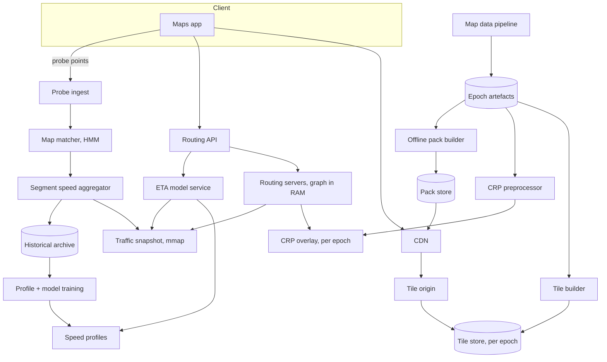
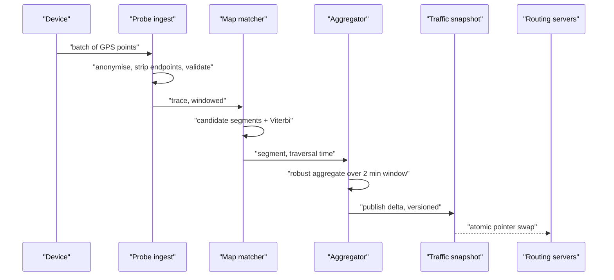
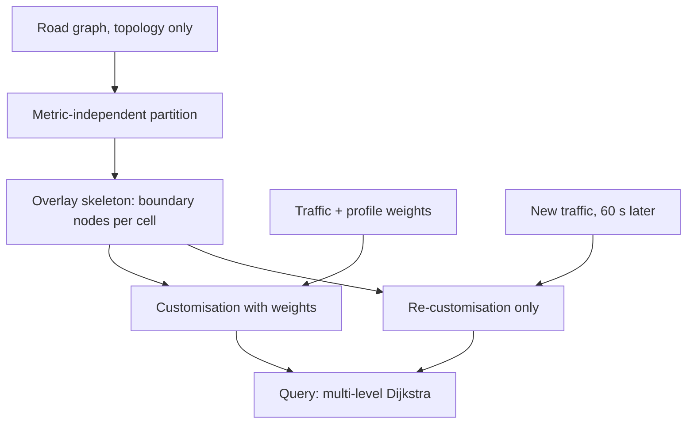
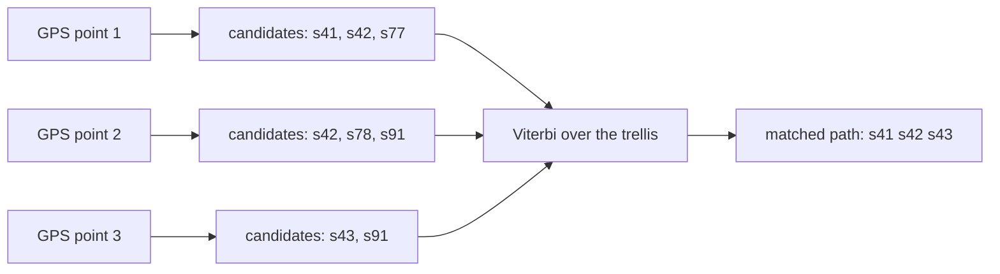
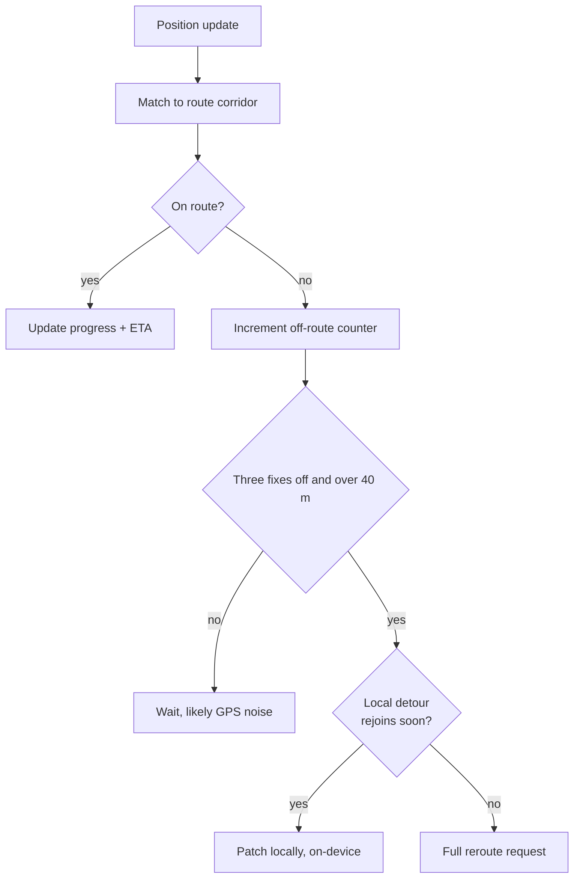
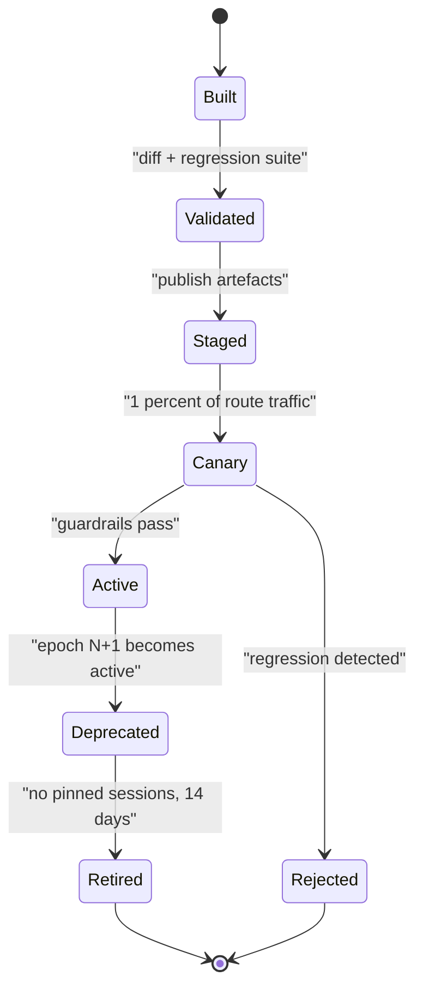

# 23 — Google Maps / Routing

<span class="pill pill-core">Core</span> <span class="pill pill-hard">Hard</span>

**A planet-scale graph with half a billion edges whose weights change every minute, queried a hundred thousand times a second with a sub-100 ms budget — which means the answer is never "run Dijkstra", it is "precompute an overlay structure that makes Dijkstra unnecessary, and design that structure so live traffic can update it without rebuilding it."**

| | |
|---|---|
| **Commonly asked at** | Google, Apple, Uber, Lyft, Mapbox, Meta, Amazon, DoorDash, Tesla |
| **Time budget** | 45 min |
| **Core tension** | The preprocessing that makes planet-scale routing fast assumes static edge weights, and live traffic violates that assumption every sixty seconds. Contraction Hierarchies give a million-fold query speedup and take hours to rebuild; a metric-independent overlay gives a thousand-fold speedup and re-customises in minutes. Choosing between them is choosing between query latency and traffic freshness, and every serious routing system has made that choice explicitly |
| **Prerequisites** | [F04 Caching](../fundamentals/f04-caching.md), [F05 CDN & Edge](../fundamentals/f05-cdn-edge.md), [F06 Partitioning & Sharding](../fundamentals/f06-partitioning-sharding.md), [F12 Queues & Streams](../fundamentals/f12-queues-streams.md), [F13 Storage Engines](../fundamentals/f13-storage-engines.md), [F15 Object & Blob Storage](../fundamentals/f15-object-storage.md), [F16 Search & Indexing](../fundamentals/f16-search-indexing.md), [F18 Resilience Patterns](../fundamentals/f18-resilience-patterns.md), [F20 Time, Clocks & Ordering](../fundamentals/f20-time-clocks-ordering.md), [F24 Capacity Planning](../fundamentals/f24-capacity-planning.md), [F25 Deployment & Release Safety](../fundamentals/f25-deployment-release-safety.md), [F28 Cost Engineering](../fundamentals/f28-cost-engineering.md) |

---

## 1. Problem Statement

Build the map rendering and routing platform: serve the visual map at every zoom level worldwide, compute driving, walking, cycling and transit routes in under 100 ms, incorporate live traffic, produce accurate ETAs, support offline use, and reroute in real time when a driver deviates — all while the underlying map data is continuously being corrected and republished beneath in-flight navigation sessions.

Four independent hard problems sit inside that sentence, and a good answer separates them immediately:

**Rendering** is a static-content delivery problem with a brutal cardinality: the tile pyramid to zoom 20 has $1.5\times10^{12}$ addresses. It is solved with pre-generation up to a cutoff, client-side overzoom past it, and a CDN.

**Routing** is a shortest-path problem on a graph too large for any online algorithm to traverse. Dijkstra from San Francisco to New York settles essentially the entire United States road network — tens of millions of nodes — which is seconds of CPU. The entire field exists to avoid doing that.

**Traffic** is a stream-processing and inference problem: take hundreds of thousands of noisy GPS points per second, determine which road segment each one is actually on, estimate speeds, and feed those into the routing weights.

**ETA** is a prediction problem, not a summation problem. Adding up current segment speeds is wrong because by the time the driver reaches segment 400, the conditions there will have changed.

The thread connecting them is **the ID space**. Every one of these subsystems refers to road segments by identifier, and the map is republished continuously. If those identifiers are unstable, every cached route, every in-flight navigation session, every traffic aggregate and every offline map pack breaks simultaneously.

### Out of scope

The map data production pipeline itself (imagery, Street View, conflation of authoritative sources, human editing tooling), place search and geocoding, and the ads/local business layer.

---

## 2. Requirements

### Functional

| # | Requirement | Notes |
|---|---|---|
| F1 | Serve map tiles at zoom 0–20 worldwide | Multiple styles, languages, display densities |
| F2 | Point-to-point routing with turn-by-turn directions | Driving, walking, cycling, transit |
| F3 | Alternate routes | 2–3 meaningfully different options, ranked |
| F4 | Live-traffic-aware routing and ETA | Traffic no older than ~2 minutes |
| F5 | Reroute on deviation | Detect within seconds, recompute without a round trip when possible |
| F6 | Departure-time and arrival-time routing | "Leave at 08:00" must use predicted, not current, traffic |
| F7 | Offline map packs | Download a region, route and search fully offline |
| F8 | Transit routing with schedules and live vehicle positions | Distinct graph model, time-dependent |
| F9 | Route constraints | Avoid tolls, highways, ferries; vehicle height/weight/hazmat |
| F10 | Continuous map data updates | Weekly full epoch, daily incremental, urgent closures within minutes |

### Non-functional

| # | Requirement | Target |
|---|---|---|
| N1 | Tile latency | p50 < 50 ms, p99 < 200 ms (CDN hit) |
| N2 | Route latency, metropolitan | p50 < 40 ms, p99 < 120 ms |
| N3 | Route latency, continental | p99 < 250 ms |
| N4 | ETA accuracy | MAPE < 10% at 30 min horizon; systematic bias slightly pessimistic |
| N5 | Traffic freshness | p99 < 120 s from probe to routing weight |
| N6 | Reroute detection | < 5 s from deviation |
| N7 | Routing availability | 99.99% |
| N8 | Map version compatibility | In-flight sessions survive a republication; N−2 versions servable |

!!! note "N4's bias requirement is deliberate and counter-intuitive"
    An ETA model optimised for symmetric error will be early half the time. But arriving 5 minutes early and arriving 5 minutes late are not equally bad — one is a pleasant surprise, the other makes you miss a flight. So the loss function is asymmetric: penalise under-prediction more than over-prediction, and accept a slightly worse MAPE in exchange for a distribution skewed toward pessimism. Stating this shows you understand that the metric serves the user, not the other way round.

---

## 3. Scale Estimation

### The tile pyramid

Web Mercator tiling: zoom $z$ has $4^z$ tiles, each nominally 256×256.

$$
\text{tiles}(0 \ldots Z) = \sum_{z=0}^{Z} 4^{z} = \frac{4^{Z+1}-1}{3}
$$

$$
Z = 20 \Rightarrow \frac{4^{21}-1}{3} \approx 1.47\times10^{12}\ \text{tiles}
$$

Ground resolution at the equator:

$$
r(z) = \frac{156{,}543.03}{2^{z}}\ \text{m/px}
\quad\Rightarrow\quad r(14) = 9.55,\ \ r(20) = 0.149\ \text{m/px}
$$

Pre-generating $1.5\times10^{12}$ tiles is out of the question. The standard resolution is to **pre-generate to zoom 14 and let the client overzoom**:

$$
\text{tiles}(0 \ldots 14) = \frac{4^{15}-1}{3} \approx 3.58\times10^{8}
$$

Most of those are ocean and are either empty or trivially compressed. At ~30 KB per populated vector tile and roughly 25% populated:

$$
3.58\times10^{8} \times 0.25 \times 30\ \text{KB} \approx 2.7\ \text{TB per style-neutral tileset}
$$

### Vector versus raster, quantified

This is the decisive arithmetic of the rendering half.

| | Raster (PNG/WebP) | Vector (MVT/protobuf) |
|---|---|---|
| Tile payload | 15–30 KB | 20–100 KB |
| Style variants | One tileset **per style** | One tileset, styled on the client |
| Language variants | One tileset **per language** | One tileset, labels selected on the client |
| Display density | 1x and 2x tilesets | One tileset, rendered at device DPI |
| Rotation / tilt | Impossible without re-render | Free |
| Client cost | Blit a bitmap | GPU tessellation and text layout |

$$
\text{raster multiplier} = \underbrace{4}_{\text{styles}} \times \underbrace{40}_{\text{languages}} \times \underbrace{2}_{\text{DPI}} = 320
$$

$$
2.7\ \text{TB} \times 320 \approx 864\ \text{TB}
$$

versus one 2.7 TB vector tileset. **A 320x storage reduction, and a corresponding 320x improvement in CDN cache hit ratio**, because all 320 variants now share a cache key. That last point is the one people miss and it matters more than the storage: with raster, a French user on a 2x display in dark mode gets a completely different cache entry from an English user on a 1x display in light mode, so the effective working set at the edge is 320 times larger.

### Road graph

$$
\begin{aligned}
\text{road length} &\approx 6.4\times10^{7}\ \text{km globally} \\
\text{mean segment} &\approx 200\ \text{m} \Rightarrow 3.2\times10^{8}\ \text{directed segments} \\
\text{nodes (junctions)} &\approx 2.5\times10^{8}
\end{aligned}
$$

Compressed adjacency-array representation:

$$
\begin{aligned}
\text{edge} &= \underbrace{4}_{\text{head node}} + \underbrace{4}_{\text{weight}} + \underbrace{4}_{\text{flags, class, restrictions}} = 12\ \text{B} \\
\text{node} &= \underbrace{4}_{\text{edge offset}} + \underbrace{8}_{\text{lat/lng e7}} = 12\ \text{B} \\
\text{total} &= 3.2\times10^{8}\times12 + 2.5\times10^{8}\times12 \approx 6.8\ \text{GB}
\end{aligned}
$$

With CRP overlay structures (§7.3) adding roughly 40% and geometry for rendering the result held separately:

$$
\text{routable planet} \approx 10\text{–}15\ \text{GB in RAM}
$$

!!! tip "Say the 15 GB number out loud"
    "The entire planet's routable road graph is about fifteen gigabytes in a compressed adjacency array. It fits in RAM on one machine." That single fact reframes the problem: **routing is not a sharding problem, it is an algorithms problem.** Every routing server holds a full continental graph; you scale by replication, not partitioning. Candidates who spend ten minutes designing a distributed graph store have solved a problem that does not exist and have not started on the one that does.

### Query volume

$$
\begin{aligned}
\text{tile requests} &= 5\times10^{9}/\text{day} \Rightarrow 5.8\times10^{4}\ \text{/s mean},\ 1.75\times10^{5}\ \text{/s peak} \\
\text{route requests} &= 2\times10^{9}/\text{day} \Rightarrow 2.3\times10^{4}\ \text{/s mean},\ 7\times10^{4}\ \text{/s peak} \\
\text{active navigation sessions} &\approx 5\times10^{6}\ \text{concurrent}
\end{aligned}
$$

Navigation sessions are the expensive traffic: each one reroutes on deviation, requests ETA refreshes every 30–60 s, and streams probe data back.

$$
\text{ETA refresh load} = \frac{5\times10^{6}}{45} \approx 1.1\times10^{5}\ \text{/s}
$$

— larger than the fresh-route QPS, and a strong argument for computing ETA refreshes incrementally along the already-known route rather than re-routing.

### Routing CPU

| Algorithm | Nodes settled, SF to NYC | Time | Usable? |
|---|---|---|---|
| Dijkstra | $\approx 5\times10^{7}$ | 2–10 s | No |
| A* with great-circle heuristic | $\approx 5\times10^{6}$ | 0.3–1 s | No |
| A* with landmarks (ALT) | $\approx 5\times10^{5}$ | 30–80 ms | Marginal |
| Contraction Hierarchies | $\approx 500$ | 0.1–1 ms | Yes, but static weights |
| CRP / multi-level overlay | $\approx 5{,}000$ | 1–5 ms | **Yes, and re-customisable** |

At 70k peak QPS, 3 alternates, 3 ms each:

$$
7\times10^{4} \times 3 \times 0.003 = 630\ \text{core-seconds/s} \approx 630\ \text{cores}
$$

Across replicas holding a 15 GB graph each, that is a few dozen large machines per region. **Memory, not CPU, sets the fleet size** — the same inversion as the proximity service.

### Probe data and traffic

$$
\begin{aligned}
\text{contributing devices} &= 1\times10^{8} \\
\text{motion time} &\approx 1\ \text{h/day},\quad \text{sample} = 5\ \text{s} \\
\text{probes} &= 10^{8} \times \frac{3600}{5} = 7.2\times10^{10}/\text{day} \\
&\Rightarrow 8.3\times10^{5}\ \text{probes/s}
\end{aligned}
$$

At 40 bytes per probe after binary encoding: 33 MB/s ingest, and a map-matching stage that must keep up with 833k points/s.

---

## 4. API Design

### Tiles

```http
GET /v1/tiles/v2026.11/14/4823/6160.mvt
Accept-Encoding: gzip
If-None-Match: "a91f3c7e"
```

```text
Cache-Control: public, max-age=604800, immutable
ETag: "a91f3c7e"
X-Map-Epoch: 2026.11
```

The epoch is **in the path**, not a query parameter or a header, so a new map version is a new URL and requires no cache invalidation anywhere on Earth. This is the same discipline as putting an image format in the path rather than using `Vary`, and for the same reason: purging a global CDN of a trillion objects is not a thing you can do.

### Routing

```http
POST /v1/routes
Content-Type: application/json

{
  "origin":      {"lat": 37.7749, "lng": -122.4194},
  "destination": {"lat": 37.3382, "lng": -121.8863},
  "mode": "drive",
  "departure_time": "now",
  "alternatives": 3,
  "avoid": ["tolls"],
  "vehicle": {"height_cm": 210, "weight_kg": 2400},
  "map_epoch": "2026.11"
}
```

```json
{
  "map_epoch": "2026.11",
  "traffic_as_of": "2026-03-12T18:02:41Z",
  "routes": [
    {
      "route_id": "rt_01HY2",
      "summary": "US-101 S",
      "distance_m": 77400,
      "duration_s": 3480,
      "duration_no_traffic_s": 2940,
      "duration_range_s": [3180, 3960],
      "polyline": "yqleFvxejVn@...",
      "segments": ["s:9912841:f", "s:9912842:f", "..."],
      "steps": [
        {"instruction": "Merge onto US-101 S", "distance_m": 2100,
         "duration_s": 95, "maneuver": "merge-right"}
      ],
      "warnings": ["toll_road_avoided"]
    }
  ]
}
```

!!! tip "`duration_range_s` is not decoration"
    A single ETA number is a point estimate of a distribution with a long right tail. Returning the 10th and 90th percentiles lets the client render "58 min, typically 53–66" and, more importantly, lets a downstream system (a delivery promise, a ride quote) reason about risk. Any ETA model worth having produces a distribution; throwing away everything but the mean is a design decision that should be made deliberately, not by accident.

### Navigation session

```http
POST /v1/nav/sessions
{"route_id": "rt_01HY2", "map_epoch": "2026.11"}
```

```json
{"session_id": "ns_77Q", "pinned_epoch": "2026.11",
 "epoch_valid_until": "2026-03-19T00:00:00Z"}
```

```http
POST /v1/nav/sessions/ns_77Q/progress
{"lat":37.4102,"lng":-122.0631,"heading":148,"speed_mps":29.1,
 "ts":1774608142000,"accuracy_m":4,"matched_segment":"s:9912987:f",
 "offset_m":412}
```

Response carries either `{"on_route": true, "eta_s": 2140}` or a reroute directive. **The session pins a map epoch for its lifetime**, which is the mechanism that makes continuous map republication safe (§7.7).

### Transit

```http
GET /v1/routes/transit?origin=...&destination=...
    &arrive_by=2026-03-12T19:30:00-07:00&max_walk_m=1200
```

Transit is time-dependent in a way driving is not: the answer depends discontinuously on departure time because vehicles leave at discrete moments. The API therefore takes `arrive_by` or `depart_at` as a first-class input, never "now".

---

## 5. Data Model

```sql
-- Stable identity across map epochs. This table is the contract
-- between every other subsystem in the platform.
CREATE TABLE segment_identity (
    segment_id      BIGINT PRIMARY KEY,   -- permanent, never reused
    first_epoch     TEXT   NOT NULL,
    last_epoch      TEXT,                 -- NULL while live
    successor_ids   BIGINT[],             -- on split
    predecessor_ids BIGINT[]              -- on merge
);

CREATE TABLE segment_geometry (
    segment_id   BIGINT NOT NULL,
    epoch        TEXT   NOT NULL,
    from_node    BIGINT NOT NULL,
    to_node      BIGINT NOT NULL,
    geom         GEOMETRY(LineString, 4326) NOT NULL,
    length_m     REAL   NOT NULL,
    road_class   SMALLINT NOT NULL,   -- 0 motorway .. 7 service
    speed_limit  SMALLINT,
    oneway       BOOLEAN NOT NULL,
    access_mask  INT    NOT NULL,     -- car|truck|bike|foot|bus bitmask
    max_height_cm SMALLINT,
    max_weight_kg INT,
    PRIMARY KEY (segment_id, epoch)
);

-- Turn restrictions live on node/edge pairs, not on segments.
CREATE TABLE turn_restriction (
    epoch       TEXT   NOT NULL,
    via_node    BIGINT NOT NULL,
    from_seg    BIGINT NOT NULL,
    to_seg      BIGINT NOT NULL,
    kind        SMALLINT NOT NULL,   -- 0 prohibited, 1 only-allowed
    time_window TEXT,                -- e.g. "Mo-Fr 07:00-09:00"
    PRIMARY KEY (epoch, via_node, from_seg, to_seg)
);

-- Historical speed profiles: the ETA baseline.
-- 168 hour-of-week buckets, quantised speeds.
CREATE TABLE speed_profile (
    segment_id  BIGINT   NOT NULL,
    profile_id  INT      NOT NULL,   -- clustered; many segments share one
    PRIMARY KEY (segment_id)
);

CREATE TABLE profile_curve (
    profile_id  INT       NOT NULL,
    bucket      SMALLINT  NOT NULL,  -- 0..167
    speed_kph   SMALLINT  NOT NULL,
    p10_kph     SMALLINT  NOT NULL,
    p90_kph     SMALLINT  NOT NULL,
    PRIMARY KEY (profile_id, bucket)
);
```

!!! example "Profile clustering is a 100x storage win"
    Storing a 168-bucket speed curve per segment is $3.2\times10^{8} \times 168 \times 6\ \text{B} \approx 320\ \text{GB}$. But road segments have highly repetitive temporal patterns — a residential street in a suburb looks like ten million other residential streets. Cluster segments into a few thousand archetypal profiles and store `segment_id -> profile_id` plus the profile table: $3.2\times10^{8}\times4\ \text{B} + 5000\times168\times6\ \text{B} \approx 1.3\ \text{GB}$. Segments whose behaviour is genuinely unusual (a bridge, a stadium approach, a school zone) get a dedicated profile. This is standard practice and it is the difference between the ETA baseline fitting in RAM and not.

### Live traffic (in-memory, not SQL)

```go
// One entry per directed segment. Read on every routing weight lookup.
type TrafficCell struct {
    SpeedKph   uint16   // current estimate
    Confidence uint8    // 0-255, from probe count and recency
    UpdatedAt  uint32   // seconds since epoch start
    Flags      uint8    // closure, incident, jam-head
}   // 8 bytes
```

$$
3.2\times10^{8} \times 8\ \text{B} = 2.6\ \text{GB}
$$

A complete planet-wide live traffic snapshot in 2.6 GB, mmap-able, versioned, and swappable atomically.

---

## 6. High-Level Architecture



### Read path — a route request

1. Request hits the routing API, which resolves the caller's region and selects a routing server holding that continent's graph.
2. **Snap origin and destination to the graph.** A coordinate is not a node; it is a point near a segment. Find candidate segments within ~50 m, choose by heading and access mask, and create virtual start/end nodes at the correct offset along the segment.
3. Run the multi-level overlay query (§7.3) on the CRP structure, reading weights from the mmap'd traffic snapshot blended with the time-dependent profile.
4. Unpack the shortcut edges into a concrete segment sequence.
5. Generate alternates via penalty-based re-runs (§7.6) and rank them.
6. Compute ETA with the model service (§7.5), not by summing edge weights.
7. Fetch geometry for the chosen segments, encode the polyline, generate turn instructions from the node-level turn geometry.

### Write path — a probe point becomes a routing weight



End to end target: **under 120 seconds** from a car passing a sensor point to that observation influencing someone else's route.

---

## 7. Deep Dives

### 7.1 Tiles, pyramids and the serving decision

A vector tile is a protobuf containing layers of geometry in **tile-local integer coordinates** (typically a 4096-unit extent), with feature attributes. The client tessellates and styles it on the GPU.

Three consequences that are not obvious:

**Geometry must be simplified per zoom level.** A coastline at zoom 4 rendered from full-resolution vertices is megabytes of data for a few hundred visible pixels. Apply Douglas-Peucker (or Visvalingam) with a tolerance tied to the zoom's ground resolution:

$$
\epsilon(z) = \frac{156{,}543.03}{2^{z}} \times 256 / 4096 \times k
$$

so that simplification error stays below the tile's coordinate quantisation. Simplification is done **once at build time per zoom**, never at request time.

**Features must be dropped per zoom, and the drop order is a product decision.** At zoom 8 you show motorways; at zoom 14 you show residential streets; at zoom 17 you show building footprints and footpaths. This is encoded as a per-feature `min_zoom` computed during the build, often with a ranking so that the most important $n$ features per tile survive — which prevents a dense city tile from containing 50,000 features while a rural tile contains 12.

**Labels cross tile boundaries and this is the hardest rendering problem.** A city name centred on a tile edge must not be drawn twice, must not be clipped, and must not collide with another label in the adjacent tile. The standard solution is to include label anchor points in *every* tile whose rendered extent could contain the label (a buffer zone around each tile, typically 64 of 4096 units), plus a deterministic priority so both tiles independently decide the same winner. Getting this wrong produces the classic doubled or half-missing labels at tile seams.

=== "Pre-generate everything"

    ```text
    z0..z20 = 1.47e12 tiles.  Not feasible.
    z0..z14 = 3.58e8 tiles, ~2.7 TB.  Feasible.
    Build time: hours on a large batch cluster, per epoch.
    Serving: pure static objects behind a CDN. ~99% hit ratio.
    ```

=== "Generate on demand"

    ```text
    Origin renders from a spatial database per request.
    Pros: no build step, always current, arbitrary zoom.
    Cons: CPU on the origin, cold-start latency cliff,
          cache poisoning risk from unbounded parameters,
          a viral location becomes an origin hotspot.
    Used for: overlays that change faster than the epoch
          (traffic tiles, live incidents), never for base map.
    ```

=== "Hybrid, chosen"

    ```text
    Base map: pre-generated to z14, client overzooms to z20.
    Traffic overlay: generated on demand, 60 s TTL, small tiles.
    Labels/POI: separate tileset, different update cadence.
    Result: base map is immutable and infinitely cacheable;
            only the volatile layer pays origin cost.
    ```

The separation in the third option is the real design: **layers with different mutation rates must be different tilesets**, because a single tileset can only have one cache policy, and mixing a weekly-updating base map with a 60-second traffic layer forces the base map down to a 60-second TTL.

### 7.2 Graph representation and partitioning

The routing graph is stored as a **compressed adjacency array**, not as objects or as a database:

```text
node_offsets: [0, 3, 3, 7, 11, ...]      // node i's edges are
edges:        [(head, weight, flags), ...] //   edges[offsets[i]..offsets[i+1]]
```

Nodes are renumbered so that spatially adjacent nodes have adjacent indices, typically along a space-filling curve or by the CRP partition order. This is not cosmetic: a graph search touches nodes that are geographically near each other, so spatial locality in the array is **cache locality**, and a well-ordered graph can be 2–3x faster to search than a randomly-ordered one with identical structure.

**Turn restrictions** are the modelling subtlety. "No left turn from Main onto Oak" is not a property of any edge; it is a property of a path of length two through a node. Two standard encodings:

| Encoding | How | Cost | Chosen? |
|---|---|---|---|
| Edge-based graph | Nodes become edges; edges become turns | Graph grows ~3x; restrictions become simple edge removals | **Chosen** — the growth is affordable at 15 GB and it makes turn costs first-class |
| Node-based + restriction table | Check a side table during expansion | Smaller graph, but a lookup on every expansion and awkward interaction with contraction | Rejected — the lookup is on the hottest path and it breaks shortcut correctness |

Edge-based expansion also gives you turn *costs* for free (a left turn across traffic genuinely takes longer than a right turn), which measurably improves both route quality and ETA accuracy in dense grids.

**Partitioning.** The graph is replicated per continent, not sharded. Continental boundaries are natural cut points because cross-continental driving routes are rare and mostly nonsensical. Within a continent, the CRP partition (§7.3) divides the graph into cells of a few thousand nodes using a multi-level graph partitioner that minimises boundary nodes — because the overlay size is quadratic in boundary nodes per cell, and that is the structure's dominant cost.

### 7.3 Hierarchical routing: CH versus CRP

**Why plain Dijkstra fails.** Dijkstra settles every node closer than the target. For a 4,000 km route that is essentially a continent: $\approx 5\times10^{7}$ nodes, each with a priority-queue operation. Seconds, not milliseconds. A* with a great-circle heuristic helps by roughly 10x, which is still two orders of magnitude short.

**Contraction Hierarchies.** Order nodes by "importance". Contract them one at a time from least important: remove the node, and for every pair of neighbours whose shortest path went through it, insert a *shortcut* edge preserving that distance. Query time becomes a bidirectional search that only ever moves **upward** in the importance order, which touches a few hundred nodes.

$$
\text{speedup over Dijkstra} \approx 10^{4}\text{–}10^{6},\qquad
\text{query} \approx 0.1\text{–}1\ \text{ms continental}
$$

The catch is fatal for live traffic: **the node ordering and the shortcut set are functions of the edge weights.** Change the weights and the shortcuts are no longer correct shortest paths. Rebuilding CH for a continent takes tens of minutes to hours. Traffic updates every 60 seconds. CH cannot serve live traffic.

**Customizable Route Planning.** Split preprocessing into two phases with a deliberate boundary:



- **Phase 1, metric-independent (hours, done per map epoch).** Partition the graph into nested cells. For each cell, identify its boundary nodes and lay out the *skeleton* of a clique connecting them. This depends only on topology, so it survives every weight change.
- **Phase 2, customisation (seconds to minutes, done per traffic update).** For each cell, run small searches inside the cell to fill in the clique's edge weights. Cells are independent, so this is embarrassingly parallel.
- **Query.** A bidirectional Dijkstra that uses the finest level near the endpoints and progressively coarser overlay levels in the middle — the algorithmic analogue of "take local streets to the highway, take the highway, take local streets to the destination".

$$
\text{cells at level } \ell,\ \text{cell size } s:\quad \text{customisation} = O\!\left(\frac{n}{s}\cdot b^2\right)
$$

where $b$ is boundary nodes per cell — which is exactly why the partitioner minimises boundary nodes rather than balancing cell sizes.

| | Contraction Hierarchies | CRP / multi-level overlay |
|---|---|---|
| Preprocessing | Hours, weight-dependent | Hours once (topology) + minutes per metric |
| Query time | 0.1–1 ms | 1–5 ms |
| Weight update | Full rebuild | Re-customise, parallel, seconds–minutes |
| Multiple metrics (car/bike/truck/toll-free) | One full structure each | One skeleton, one customisation each |
| Turn costs | Awkward | Natural |
| Chosen / rejected | **Rejected for live traffic**; retained for the offline packs where weights are static | **Chosen.** Slightly slower queries buy the ability to incorporate traffic at all, plus cheap multi-metric support |

!!! interview "The CH-versus-CRP trade is the whole question"
    If you say "use Contraction Hierarchies" and stop, a good interviewer will immediately ask "now add live traffic" and you have nothing. The sentence that lands is: **"CH is faster but its preprocessing is weight-dependent, so a traffic update means a full rebuild — hours against a sixty-second update cycle. CRP separates a metric-independent partition from a per-metric customisation, so traffic re-customisation is a parallel job over independent cells taking seconds. I give up maybe 3 ms of query time to make live traffic possible at all, and I get cheap per-vehicle-profile metrics as a bonus."** That is the senior answer and it takes twenty seconds.

### 7.4 Probe ingestion and map matching

A raw GPS point is not on a road. In an urban canyon it can be 50 m off, on the wrong side of a divided highway, or apparently inside a building. **Map matching** is the inference problem of assigning a sequence of noisy points to a sequence of road segments, and the standard formulation is a Hidden Markov Model (Newson and Krupka, 2009).



**Emission probability** — how likely is this observation given the vehicle is on segment $s$? Gaussian in the perpendicular distance $d$ from the point to the segment:

$$
P(o \mid s) = \frac{1}{\sqrt{2\pi}\sigma} \exp\!\left(-\frac{d^{2}}{2\sigma^{2}}\right),\quad \sigma \approx 4.07\ \text{m}
$$

**Transition probability** — how likely is a move from segment $s_i$ to segment $s_j$ between consecutive observations? Exponential in the discrepancy between the straight-line distance and the on-road route distance:

$$
P(s_j \mid s_i) = \frac{1}{\beta}\exp\!\left(-\frac{\left|\,\lVert o_t - o_{t+1}\rVert - d_{\text{route}}(s_i, s_j)\,\right|}{\beta}\right)
$$

This term is what does the real work. A point that looks 30 m closer to the frontage road than to the highway will still be matched to the highway, because matching it to the frontage road would require a route discrepancy of several hundred metres given where the vehicle was one second earlier and one second later. **Map matching is not nearest-segment assignment; it is a path-consistency problem**, and saying that distinguishes a real answer from a hand-wave.

Viterbi over the trellis gives the maximum-likelihood path:

$$
\text{cost} = O(T \cdot S^{2}),\quad T \approx 100\ \text{points},\ S \approx 8\ \text{candidates} \Rightarrow 6{,}400\ \text{ops per trace}
$$

At 833k points/s in traces of ~100 points, that is ~8,300 traces/s × 6,400 ops ≈ $5\times10^{7}$ ops/s — trivial. **Map matching is cheap; the expensive parts are the candidate search and the route-distance computations inside the transition probability**, which is why those use a small local CH built over the neighbourhood rather than a full routing query.

**Aggregation.** Matched traversals become segment speeds:

- Bucket by segment and by a 2-minute window.
- Use a **robust aggregate** — trimmed mean or median — not the mean. One car that parked mid-segment produces a 90-second traversal of a 200 m road and destroys a mean.
- Weight by recency inside the window and attach a confidence derived from probe count.
- Fall back explicitly: no probes in this window → decay toward the historical profile for this hour-of-week, rather than holding the last value forever or dropping to the speed limit.

!!! warning "Privacy is a design constraint here, not a compliance checkbox"
    A probe trace is a record of where a specific person went. Three mechanisms are mandatory and should be volunteered, not extracted: **trip-endpoint trimming** (discard the first and last few hundred metres, which are home and work), **trace fragmentation with identifier rotation** (split each trace into short pieces with unlinkable ids, so no single record spans a journey), and **k-anonymity thresholds on aggregation** (never publish a segment speed derived from fewer than $k$ distinct vehicles, because with one contributor the "aggregate" is that person's speed). On low-volume rural roads this means falling back to the historical profile rather than publishing, and that is the correct trade. See [F27 Security in Design](../fundamentals/f27-security-design.md).

### 7.5 ETA modelling

The naive ETA is the sum of segment lengths over current speeds. It is wrong in a specific, systematic way: **by the time the driver reaches a segment, conditions there have changed.** For a 60-minute route, the last segment is traversed 60 minutes from now, and using its current speed is a one-hour-stale prediction.

The correct formulation is a **time-dependent traversal**:

$$
T = \sum_{i} \frac{\ell_i}{v_i(t_i)},\qquad t_{i+1} = t_i + \frac{\ell_i}{v_i(t_i)}
$$

where $v_i(t)$ is the *predicted* speed on segment $i$ at the time the vehicle will arrive there. This is a fixed-point computation done in one forward pass, and it is why departure-time routing is genuinely different from "now" routing rather than a parameter.

The predicted speed blends three sources:

$$
v_i(t) = \alpha(t - t_0)\, v_i^{\text{live}} + \big(1 - \alpha(t - t_0)\big)\, v_i^{\text{hist}}(\text{bucket}(t)) + \Delta_i^{\text{model}}
$$

with $\alpha$ decaying over a horizon of 15–30 minutes: live traffic dominates the next few minutes, historical profiles dominate the far end of a long route. The decay constant is itself learned per road class, because a motorway jam persists far longer than a surface-street one.

$\Delta^{\text{model}}$ is where machine learning enters, and the shape matters more than the algorithm. The production-grade approach operates on **supersegments** — sequences of consecutive segments that are habitually traversed together — rather than on individual segments, because errors on adjacent segments are strongly correlated and a per-segment model systematically under-estimates variance. A graph neural network over the supersegment adjacency structure, with features for time-of-week, weather, live speeds, road class, historical variance and event calendars, predicts a *residual* against the analytic baseline.

Predicting a residual rather than the ETA itself is the important architectural choice: the analytic model is interpretable, debuggable and always available, and the ML layer can be disabled instantly without the system losing the ability to produce an ETA.

**Loss function.** Asymmetric, per N4:

$$
L(\hat{y}, y) = \begin{cases}
w_{\text{under}} \cdot (y - \hat{y}) & \hat{y} < y \quad \text{(arrived late)} \\
w_{\text{over}} \cdot (\hat{y} - y) & \hat{y} \ge y
\end{cases}
\qquad w_{\text{under}} \approx 2 w_{\text{over}}
$$

**What to add that most answers omit:** the ETA must include non-driving time. Parking search at a dense destination is routinely 3–8 minutes and is invisible in the road graph. A pickup ETA that ends when the vehicle reaches the destination coordinate is systematically optimistic in exactly the places where accuracy matters most.

### 7.6 Alternates, rerouting and the deviation problem

**Alternate routes.** The naive approach — $k$-shortest-paths — produces $k$ routes that differ by one block and are useless. The user wants *meaningfully different* options. The standard approach is **penalty-based iteration**:

1. Compute the optimal route $R_1$.
2. Multiply the weights of $R_1$'s edges by a penalty factor (1.3–2.0).
3. Recompute to get $R_2$. Repeat.
4. Filter candidates by three criteria: **bounded stretch** (no more than ~25% longer than optimal), **limited sharing** (under ~70% overlap with any accepted route), and **local optimality** (every subpath of the alternate is itself a shortest path, which is what stops a route that takes a pointless detour).

Then rank by a blend the user actually cares about: predicted time, time *variance* (a route that is 2 minutes slower but far more predictable is often better, and a system that only ranks on the mean will never surface it), turn count, road class, and toll cost. Label them with what distinguishes them — "via I-280, fewer tolls" — because an unlabelled alternate is noise.

**Rerouting.** Deviation detection is a geometric question with a hysteresis requirement:



Three things make rerouting good rather than annoying:

- **Hysteresis.** Require several consecutive off-route fixes *and* a distance threshold. A single noisy fix under an overpass must not trigger a reroute, and users perceive spurious rerouting as the app being broken.
- **On-device local patching.** The device holds the route corridor's local graph (a few hundred KB downloaded with the route). Most deviations — a missed turn, a wrong exit — are resolved by a short local search that rejoins the original route, with zero network round trips and sub-100 ms response. This is essential because deviations frequently happen exactly where connectivity is poor.
- **Server reroute only for genuine divergence.** When the driver is far off or the original route is no longer viable (a closure appeared), request a fresh route — pinned to the same map epoch as the session.

**The oscillation problem.** Traffic-aware rerouting mid-journey can flip between two near-equal routes as their estimates cross, each flip re-announcing turns and destroying trust. Fix with a **switching cost**: only reroute if the new route is better by a margin that grows with how recently you last rerouted, e.g. require a 5% improvement plus 2 minutes, doubling after each switch within 10 minutes.

### 7.7 Map versioning and the ID space

The map changes constantly. A weekly epoch is published; urgent closures go out in minutes. Meanwhile 5 million navigation sessions are in flight, each holding a route expressed as a list of segment ids.

**The failure mode if you get this wrong:** epoch $N+1$ renumbers segments, or deletes one that was split into two. A session pinned to a route containing `s:9912841` requests an ETA refresh, the server resolves that id against the new epoch, finds a different road or nothing, and the navigation session either silently reroutes the user somewhere wrong or crashes. At scale this happens to hundreds of thousands of users simultaneously at publication time.

**The rules that prevent it:**

1. **Segment ids are permanent and never reused.** A deleted segment's id is retired forever. A tombstone in `segment_identity` records the last epoch it was valid in.
2. **Splits and merges are recorded explicitly.** When a segment is split, both new segments get new ids and the old one records `successor_ids`. This makes cross-epoch translation possible rather than guesswork.
3. **Sessions pin an epoch at creation** and hold it for their lifetime. The routing fleet serves epoch $N$, $N-1$ and $N-2$ concurrently, which costs memory and is unambiguously worth it.
4. **Epochs are in the URL path** for tiles and packs, so publication never requires cache invalidation.
5. **Traffic is keyed by a stable id**, so probe observations made under epoch $N$ remain meaningful under $N+1$ for every segment that did not change.



**Urgent updates cannot wait for an epoch.** A road closure from a crash must reach routing within minutes. These are applied as a **live overlay** on top of the active epoch — a small, separately-versioned set of edge weight overrides and hard closures, distributed on the same channel as traffic and applied at weight-lookup time. They never modify the graph structure, only the weights, which is precisely why the CRP customisation phase can absorb them cheaply.

!!! danger "Offline packs make the versioning problem much worse"
    A device can hold a map pack that is months old, and it will happily route the user onto a road that no longer exists. Three mitigations: **version the pack and refuse to use one past a maximum age** for safety-relevant modes, **ship a small high-priority closure delta** (a few hundred KB) that updates far more often than the full pack, and **prefer online routing when connectivity exists**, using the pack as a fallback rather than a default. Full packs are large enough that delta updates keyed to the epoch diff are mandatory: a country pack is hundreds of megabytes, and pushing that weekly to a hundred million devices is a bandwidth bill that dwarfs the rest of the system.

### 7.8 Multi-modal routing

Driving, walking, cycling and transit are **not one graph with different weights.** They are different graphs with different algorithms, and pretending otherwise produces routes that are subtly wrong in ways users notice immediately.

| Mode | Graph | Algorithm | Why it is different |
|---|---|---|---|
| Drive | Edge-based road graph, turn costs, restrictions | CRP over live + predicted weights | Time-dependent but continuous |
| Walk | Footpaths, crossings, stairs, plazas, indoor links; most turn restrictions void | Plain CH — weights barely change | Pedestrians ignore one-way streets and cut through open space; the road graph alone gives wrong answers |
| Bike | Road subset + cycleways, with elevation and a safety/comfort cost | CH with a comfort metric | Elevation asymmetry matters enormously; a "shortest" route up a 15% grade is not a route anyone will ride |
| Transit | Timetable model — stops, trips, stop-times, transfers | RAPTOR or CSA, not Dijkstra | Departures are **discrete events**, so the answer is discontinuous in departure time |

Transit deserves its own note because Dijkstra is genuinely the wrong tool. RAPTOR (Round-bAsed Public Transit Optimized Router) operates in rounds, where round $k$ computes the earliest arrival at every stop using at most $k$ trips. It is naturally multi-criteria (arrival time and number of transfers, which is exactly what users care about), requires no priority queue, and handles the "wait 11 minutes for a faster train" reasoning that a time-independent shortest-path algorithm cannot express at all.

**Mixed-mode journeys** (walk → train → bike-share → walk) are modelled as a layered graph with explicit **transfer edges** carrying a time cost and a mode change. The layers are connected only at transfer points, which keeps each layer's algorithm intact and confines the combinatorial explosion to the transfer set.

---

## 8. Scaling the Bottleneck

**Bottleneck 1 — tile serving bandwidth.** 175k tile requests/s at ~40 KB is 7 GB/s of egress. The lever is cache hit ratio, and vector tiles are what make it achievable: because style, language and DPI are client-side concerns, all users share the same tile objects and the edge working set shrinks by the 320x multiplier from §3. Immutable epoch-in-path URLs give `max-age` of a week with no invalidation. Steady-state origin load approaches zero.

**Bottleneck 2 — CRP customisation throughput.** A full continental customisation must finish well inside the traffic cycle. It parallelises perfectly across cells:

$$
\text{cells} = \frac{2.5\times10^{8}\ \text{nodes}}{2{,}000\ \text{nodes/cell}} = 1.25\times10^{5}
$$

Each cell's customisation is small local searches over its boundary clique. Two multipliers make the steady state cheap: **only cells containing changed weights need re-customisation**, and traffic changes are spatially concentrated, so a typical cycle touches a few percent of cells. Incremental customisation turns a minutes-long job into a seconds-long one.

**Bottleneck 3 — routing server memory.** 15 GB of graph plus 2.6 GB of traffic plus multiple live epochs:

$$
3\ \text{epochs} \times 15\ \text{GB} + 2.6\ \text{GB} \approx 48\ \text{GB per node}
$$

This is what sets the machine type and therefore the cost. Levers: share immutable structures between epochs where topology is unchanged (most of it), mmap the traffic snapshot so it is page-cache backed and swappable without a copy, and retire deprecated epochs promptly once no pinned session references them.

**Bottleneck 4 — map matching throughput.** 833k probes/s. The HMM itself is cheap; the cost is candidate lookup and the route-distance term. Mitigations: a spatial index over segment bounding boxes with a k-nearest query, a small precomputed local CH per region for the transition distances, and batching traces so the index is warm. This stage is embarrassingly parallel by trace, so it scales by adding consumers to the stream partition set ([F12 Queues & Streams](../fundamentals/f12-queues-streams.md)).

**Bottleneck 5 — ETA refresh QPS.** 110k/s from active navigation sessions, which exceeds fresh-route QPS. The fix is not more capacity but a different operation: an ETA refresh for a session whose route is known does **not** re-route. It re-runs the time-dependent traversal over the remaining segments, which is a linear pass over a few hundred entries reading the mmap'd traffic snapshot — microseconds, no graph search at all. Recognising that the refresh path and the routing path are different operations is a 100x capacity difference.

---

## 9. Failure Modes

| Failure | Blast radius | Detection | Mitigation | Degraded behaviour |
|---|---|---|---|---|
| Bad map epoch published | Global routing quality | Diff gates, canary route-metric regression | Never promote past canary; instant pin back to $N-1$ | Routes revert to last epoch; new roads missing |
| Customisation pipeline stalls | Traffic staleness everywhere | `traffic_age_seconds` on the serving snapshot | Serve last good snapshot; decay confidence toward historical | Routes use historical profiles; quality drops, service lives |
| Traffic snapshot corrupt | Wrong routes at scale | Checksum + sanity bounds on speed distribution | Refuse to swap; keep previous mmap | Stale traffic, correct routes |
| Map matcher regression | Traffic data poisoned | Match-rate and confidence distribution shift | Quarantine output; do not publish to the snapshot | Traffic falls back to historical |
| Probe ingest flood or spoofing | Fabricated jams or clear roads | Outlier detection, per-device rate limits, plausibility checks | Reputation weighting; require $k$ distinct devices per segment | Some segments fall back to historical |
| Routing server OOM | One node | Memory gauge, restart loop | Retire old epochs; cap concurrent epochs at 3 | Capacity loss; LB routes around |
| CDN tile cache flush | Tile origin overload | Origin QPS step, hit-ratio collapse | Shield tier, request collapsing, serve lower zoom | Blurrier map while warming |
| Offline pack too old | Individual users, safety-relevant | Pack age telemetry | Hard max age; forced closure-delta update | Prompt to update; prefer online routing |
| Transit feed stale or broken | One agency's routes | Feed freshness and parse-error monitors | Fall back to scheduled-only, drop live vehicle positions | Schedule-based routes without real-time adjustment |
| Epoch retired with live sessions | Those sessions | Pinned-epoch reference counter | Never retire with nonzero references; 14-day floor | Session would fail to refresh; prevented by the counter |
| Reroute oscillation | Individual drivers, high annoyance | Reroutes-per-session histogram | Switching cost with escalating margin | Fewer reroutes, occasionally a slightly worse route |
| Elevation/restriction data missing | Trucks and cyclists specifically | Constraint-violation reports | Fail closed: refuse a truck route rather than route under a low bridge | No route returned for constrained vehicles in that area |

!!! danger "Failing open on vehicle restrictions is a physical-safety failure"
    If height, weight or hazmat data is missing for a region, the system must **refuse to produce a truck route** rather than produce one that ignores the constraint. A routing engine that silently drops a restriction it has no data for will eventually route a lorry under a low bridge. This is the one place in the entire design where "no answer" is unambiguously better than "a plausible answer", and treating it as such is the difference between an engineer who thinks about availability and one who thinks about consequences.

---

## 10. SRE Lens

### SLIs and SLOs

| SLI | Definition | SLO |
|---|---|---|
| Tile availability | Non-5xx tile responses / total | 99.99% |
| Tile latency | TTLB, CDN hit | p50 < 50 ms, p99 < 200 ms |
| Route availability | Routes returned or an honest `no_route` / total | 99.99% |
| Route latency | Server-side, metro / continental | p99 < 120 ms / < 250 ms |
| Traffic freshness | Age of the serving snapshot | p99 < 120 s |
| ETA accuracy | MAPE at the 30-min horizon | < 10%, with negative-bias skew |
| Map-match rate | Probes matched with confidence above threshold | > 92% |
| Epoch canary pass rate | Epochs promoted without rollback | > 95% |
| Reroutes per session | p90 count for sessions over 20 min | < 2 |

!!! note "ETA accuracy is a quality SLI and must be alarmed like an availability SLI"
    Every other component here fails loudly. ETA degrades silently: the API returns 200, the route is valid, the number is just wrong. A model regression, a traffic pipeline stall, or a seasonal shift the model has not seen will all show up as MAPE drift with nothing else moving. Compute accuracy continuously by comparing predictions against the actual arrival times reported by completed navigation sessions — that ground truth is free and flows in at millions per day. Alarm on both MAPE and the bias direction separately, because a model that becomes symmetric has regressed even if MAPE is unchanged.

### Error budget

99.99% is 4.32 minutes monthly, and it is spent on:

- **Epoch promotions.** The riskiest recurring operation. Mitigated by canary-by-traffic-percentage with route-quality guardrails and an instant pin-back, and by serving three epochs concurrently so rollback is a pointer change rather than a rebuild.
- **Traffic pipeline events.** These consume quality, not availability, because the degradation path to historical profiles keeps routes flowing. That is the point of building it.
- **CDN events for tiles.** Immutable URLs make these recoverable by warming rather than by invalidation.

### Rollout

```text
Map epoch promotion:
  1. Build artefacts: graph, CRP skeleton, tiles, packs, profiles.
  2. Automated diff: segment count delta, connectivity delta,
     count of segments whose class changed, orphaned-node count.
     Any metric beyond its band blocks the build.
  3. Regression suite: 100k stored (origin, destination, mode,
     time) tuples with expected route characteristics. Compare
     distance, duration and segment-sequence similarity against
     the previous epoch. Investigate every route that changed by
     more than a threshold -- most will be legitimate map fixes,
     and the point is to see them, not to prevent them.
  4. Connectivity assertion: every node reachable from the
     continental core. A partition introduced by a bad edit
     silently makes a whole town unroutable.
  5. Canary: 1 percent of route traffic for 24 hours. Guardrails
     on route latency, no-route rate, reroute rate and ETA MAPE.
  6. Ramp 1 -> 10 -> 50 -> 100 percent over 72 hours.
  7. Previous epoch stays resident and servable for 14 days.
```

**Traffic model rollout** uses shadow scoring: the candidate model scores live requests, its predictions are logged but not served, and accuracy is compared against production on the same requests with the same ground truth. Only then does it move to a traffic split. Because ground truth arrives 20–60 minutes after the prediction, the evaluation loop is slow and must not be rushed — a model promoted on four hours of data has been evaluated on one traffic pattern.

### Runbook notes

```text
ALERT: traffic_age_seconds > 300
  1. Which stage? Check probe ingest rate, matcher output rate,
     aggregator publish timestamp, customisation job status.
  2. Matcher stalled -> usually a bad epoch's spatial index or a
     poison trace. Check the dead-letter queue first.
  3. Customisation stalled -> check cell job failures. A single
     failing cell must not block the publish; publish partial with
     that cell's weights carried forward, and alarm separately.
  4. Do NOT publish a partial snapshot as if it were complete.
     Confidence values must reflect what is actually fresh, or
     routing will trust stale data.
  5. Degradation is automatic: confidence decays, weights blend
     toward historical. Verify that it is happening rather than
     assuming it.

ALERT: eta_mape > 12% sustained
  1. Global or regional? Regional -> check that region's probe
     volume and match rate. A probe-volume collapse in one country
     is usually a client release or a regulatory block.
  2. Global and sudden -> suspect a model deploy or a feature
     pipeline break. Check feature freshness first; a stale
     feature silently defaults and the model degrades smoothly.
  3. Global and gradual -> seasonal or behavioural drift.
     Retrain, do not roll back.
  4. Emergency lever: disable the ML residual and serve the
     analytic baseline. Accuracy drops but stays bounded, and
     the system remains explainable.

ALERT: no_route_rate > 0.1% in region R
  1. Run the connectivity assertion for R against the active
     epoch. A bad edit can partition a town.
  2. Check for an over-broad closure overlay -- an urgent closure
     applied to a whole road class instead of a segment will
     disconnect a region instantly. This is the most likely cause
     and the fastest to revert.
  3. Pin R back to epoch N-1 if the assertion fails.

ALERT: reroutes_per_session_p90 > 4
  1. Almost always traffic oscillation on near-equal alternates.
  2. Verify the switching-cost margin is actually applied; a
     config regression here is common and invisible otherwise.
  3. Check whether a traffic publish is flapping a major
     corridor's weights between two values.
```

### Capacity model

$$
\begin{aligned}
\text{tile egress} &= \text{peak req/s} \times \text{mean tile bytes} \times (1-\text{hit}) \\[4pt]
\text{routing nodes} &= \max\!\left(\frac{\text{QPS}\times\text{alts}\times t_q}{\text{cores}\times U},\ \frac{\text{epochs}\times G + T}{\text{RAM/node}}\right) \\[4pt]
\text{customisation cores} &= \frac{\text{cells touched} \times t_{\text{cell}}}{\text{cycle seconds}} \\[4pt]
\text{matcher consumers} &= \frac{\text{probes/s}}{\text{probes/s per consumer}}
\end{aligned}
$$

The $\max$ in the routing-node formula is the interesting part: the CPU term gives ~630 cores globally, while the memory term gives dozens of machines at 48 GB each. **Memory dominates, so routing nodes run at low CPU utilisation by construction** — which is convenient, because it means traffic spikes and expensive queries have enormous headroom for free.

### Cost

| Line | Driver | Relative scale |
|---|---|---|
| Tile CDN egress | Requests × bytes | Largest. Vector tiles cut it via hit ratio, not just size |
| Probe ingest + storage | 7.2e10 points/day × retention | Second. Retention policy is the main lever and is also a privacy control |
| Routing fleet | RAM × epochs × replicas × regions | Third. Retiring epochs promptly matters |
| Offline pack distribution | Pack bytes × devices × update frequency | Spiky; delta updates are mandatory |
| Map build + customisation | Batch compute per epoch and per traffic cycle | Bursty; preemptible capacity suits it |

Two levers dominate. **Vector over raster** removes a 320x multiplier from both storage and edge working set. **Delta packs over full packs** turns a hundreds-of-megabytes-times-hundreds-of-millions-of-devices weekly push into a few megabytes, which is often the single largest line in a maps product's bill. See [F28 Cost Engineering](../fundamentals/f28-cost-engineering.md).

---

## 11. Trade-offs & Alternatives

| Decision | Chosen | Alternative | Why |
|---|---|---|---|
| Tile format | Vector (MVT) | Raster | 320x fewer variants; one cache key across styles, languages and DPI; rotation and tilt for free |
| Tile generation | Pre-generate to z14, client overzooms | Pre-generate to z20, or fully on demand | z20 is $1.5\times10^{12}$ objects; on demand puts render CPU on the origin and creates a hotspot on every viral location |
| Layer separation | Base map, labels and traffic as separate tilesets | One combined tileset | A tileset has one cache policy; mixing a weekly base map with 60-second traffic forces the base map to a 60-second TTL |
| Routing algorithm | CRP / multi-level overlay | Contraction Hierarchies | CH preprocessing is weight-dependent; a traffic update would mean an hours-long rebuild against a 60-second cycle |
| CH usage | Retained for offline packs and local map-matching searches | Discarded entirely | Weights are static offline, so CH's faster queries are pure gain there |
| Graph model | Edge-based (turns are nodes) | Node-based with a restriction table | Turn restrictions and turn costs become first-class; the ~3x size growth is affordable at 15 GB |
| Graph topology | Replicate per continent | Shard the graph | 15 GB fits in RAM; sharding a graph search across the network would add hops inside the inner loop |
| Node ordering | Spatially coherent renumbering | Arbitrary | Graph search has spatial locality; cache locality is a 2–3x query win for free |
| Map matching | HMM + Viterbi | Nearest-segment snapping | Nearest-segment fails at parallel roads, overpasses and urban canyons, which is where the traffic actually matters |
| Traffic aggregation | Trimmed mean with $k$-anonymity floor | Simple mean | One parked car destroys a mean; publishing a $k=1$ aggregate publishes a person's speed |
| ETA | Time-dependent traversal, historical + live blend, ML residual | Sum of current speeds | Current speed on the last segment of a 60-minute route is a one-hour-stale prediction |
| ML architecture | Predict a residual on supersegments | Predict the ETA end to end | Residual keeps an interpretable, always-available baseline and makes the model instantly disableable |
| ETA loss | Asymmetric, penalising lateness ~2x | Symmetric MSE | Arriving early and arriving late are not equally bad to a user |
| Alternates | Penalty iteration + stretch/sharing/local-optimality filters | k-shortest paths | k-shortest returns $k$ trivially similar routes |
| Reroute | Hysteresis + on-device local patch + switching cost | Reroute on every off-route fix | Spurious reroutes from GPS noise, and oscillation between near-equal routes, both read as a broken app |
| Versioning | Permanent ids, session-pinned epochs, epoch in the URL path | Renumber per build, latest-only | Renumbering breaks every cached route, in-flight session, traffic aggregate and offline pack simultaneously |
| Urgent updates | Weight-overlay on top of the active epoch | Emergency full rebuild | A closure must land in minutes; structure changes are what make rebuilds slow, and a closure is only a weight change |
| Transit | RAPTOR on a timetable model | Dijkstra on a time-expanded graph | Departures are discrete; RAPTOR is naturally multi-criteria on arrival time and transfer count |
| Restriction gaps | Fail closed for constrained vehicles | Route anyway | Routing a lorry under a low bridge is a physical-safety failure, not an availability one |

??? note "Could you just use PostGIS and pgRouting?"
    For a city, or even a small country, absolutely — and it is the right first version. `pgr_dijkstra` over a few hundred thousand edges is fine, you get spatial queries and routing in one system, and the operational burden is one database. It breaks at three specific points. **Scale**: a planet-scale graph search inside a relational engine, with row overhead and buffer-pool contention, is orders of magnitude off the latency target. **Live traffic**: updating weights means updating rows, and a routing query then has to read current weights transactionally, which is enormous write and read amplification for data that is a 2.6 GB array. **Preprocessing**: there is nowhere to put a CRP overlay. The transition point is roughly when you need sub-100 ms continental routes with live traffic, and the honest framing is that the specialised in-memory engine exists because the problem is algorithmic, not relational.

??? note "Why not use OSRM or Valhalla off the shelf?"
    You should, for most purposes — they are excellent, and Valhalla in particular has a tiled graph model that handles dynamic weights and multi-modal routing well. The reasons a hyperscaler builds its own are specific and worth naming rather than assuming: proprietary map data with a different ID and versioning model, a probe fleet large enough that traffic inference is a first-class system rather than a plugin, ETA models trained on billions of completed journeys, and latency targets that assume a co-designed graph layout and serving stack. The interview value of the question is not "which library" — it is whether you can explain what CRP is doing and why CH cannot absorb live traffic, because that reasoning is what you would need to operate, tune or debug any of these systems.

---

## 12. Gotchas & Corner Cases

!!! gotcha "Contraction Hierarchies silently become incorrect when weights change"
    **Symptom:** after wiring live traffic into the edge weights, routes are occasionally bizarre — a 40 km detour, or a route that ignores an obviously faster highway. No errors, no latency change.
    **Mechanism:** CH shortcuts encode shortest paths *under the weights used during preprocessing*. A shortcut asserts "the shortest path from $u$ to $v$ has cost $c$". If a jam raises the real cost, the query still uses $c$ and the bidirectional upward search prunes the genuinely better path because the stale shortcut looks cheaper. The structure is not detecting an error; it is answering a question about a different graph.
    **Mitigation:** do not mutate weights under CH. Either rebuild fully (hours — unusable for traffic) or use a metric-independent structure like CRP where customisation is the only weight-dependent phase. If you must use CH with time-dependent weights, the correct variant is time-dependent CH with profile-valued shortcuts, which is substantially more complex and much larger.

!!! gotcha "Map matching by nearest segment fails exactly where it matters"
    **Symptom:** traffic data shows a highway jammed while the parallel frontage road is clear, or vice versa, and routing sends everyone onto the wrong one.
    **Mechanism:** a highway and its frontage road are often within 20 m — inside GPS error. Nearest-segment assignment splits a single vehicle's trace between them essentially at random, and both segments' speed estimates become a blend of two different roads. The same happens on overpasses, divided carriageways and multi-level interchanges.
    **Mitigation:** HMM map matching with a transition probability based on route-distance consistency, so the assignment is chosen for path plausibility across the whole trace rather than point-by-point proximity. Add heading as an emission feature (it separates the two directions of a divided road cleanly) and use segment connectivity to reject physically impossible transitions. Monitor the match-confidence distribution per region, because a drop there is the leading indicator of traffic data going bad.

!!! gotcha "Summing current segment speeds gives a systematically optimistic ETA"
    **Symptom:** ETAs on long routes are consistently short, and the error grows with route length. Short-route ETAs look fine.
    **Mechanism:** the last segment of a 60-minute route is traversed 60 minutes from now, but its "current" speed describes conditions right now. On a route that begins before rush hour and ends inside it, every distant segment is priced at pre-rush speeds. The error is not random; it is a systematic bias with the sign that annoys users most.
    **Mitigation:** time-dependent traversal — propagate arrival time forward through the route and look up each segment's *predicted* speed at its predicted arrival time, blending live toward historical with a decay over a 15–30 minute horizon. This also makes departure-time routing a natural capability rather than an approximation.

!!! gotcha "The reroute oscillates between two near-identical routes"
    **Symptom:** the app re-announces directions every couple of minutes, flipping between two highways, and the driver loses confidence entirely.
    **Mechanism:** two routes have predicted durations within noise of each other. Each traffic update flips which one is momentarily better. Any rule of the form "reroute if a better route exists" will fire on every flip, because a better route always exists by an epsilon.
    **Mitigation:** a switching cost. Require the new route to beat the current one by a margin — say 5% and at least 2 minutes — and escalate that margin after each switch within a short window. Also distinguish "better route" from "current route is no longer valid": a closure ahead must trigger an immediate reroute regardless of margin. The general principle is that any control loop over a noisy estimate needs hysteresis, and routing is a control loop.

!!! gotcha "A map epoch renumbers segments and every in-flight session breaks"
    **Symptom:** at publication time, hundreds of thousands of active navigations simultaneously lose their route, reroute unexpectedly, or show wrong progress.
    **Mechanism:** the route handed to a client is a list of segment ids. If the new epoch assigns different ids to the same physical roads — which happens naturally if ids are derived from build-time ordering rather than being persistent — then every stored id resolves to a different road or to nothing.
    **Mitigation:** permanent, never-reused segment ids with explicit split/merge lineage. Sessions pin an epoch at creation; the fleet serves $N$, $N-1$ and $N-2$ concurrently; epochs are retired only when the pinned-session reference count reaches zero and a minimum age has passed. Put the epoch in the tile and pack URL path so publication is a new URL rather than a cache invalidation.

!!! gotcha "Probe data reveals individual journeys unless you actively prevent it"
    **Symptom:** a privacy review finds that traffic aggregates on a quiet rural road are derived from a single vehicle, and the "aggregate" is one person's speed and timing outside their house.
    **Mechanism:** aggregation provides anonymity only when there is a crowd to hide in. On low-volume roads there is not. Endpoint data is worse: the start and end of a trace are home and work with high probability.
    **Mitigation:** trim trip endpoints by several hundred metres before any processing. Fragment traces into short, unlinkable pieces with rotating identifiers so no single record spans a journey. Enforce a $k$-anonymity floor per segment per window, falling back to the historical profile rather than publishing below it. These are design constraints, not a compliance layer bolted on afterwards, and the correct behaviour on a rural road is to have no live traffic data at all.

!!! gotcha "Ferry, seasonal and time-restricted edges break naive routing"
    **Symptom:** the router sends a driver to a ferry terminal for a service that ran last at 18:00, or routes over a mountain pass that is closed for the winter, or through a street that is pedestrian-only between 07:00 and 09:00.
    **Mechanism:** the edge exists in the graph with a plausible traversal time. Its availability is a function of time, which a static weight cannot express, and turn restrictions with `time_window` are frequently ignored by simpler engines.
    **Mitigation:** model these as time-dependent edges with an availability function, not a scalar weight, and evaluate availability at the *predicted arrival time* rather than the departure time — a ferry reachable at 17:50 from your current position is not reachable if you arrive at 18:10. Seasonal closures need a calendar with an explicit source and an expiry, so that a pass that reopens in April does not stay closed because nobody updated a flag. Surface the constraint in the response (`warnings: ["ferry_departure_18:00"]`) so the client can render it rather than silently producing a route that cannot be driven.

!!! gotcha "Alternate routes that differ by one block are worse than no alternates"
    **Symptom:** the app offers three routes, all visually identical, and users ignore the feature entirely.
    **Mechanism:** k-shortest-paths algorithms return the $k$ lowest-cost paths, and in a dense road network the second, third and fourth lowest-cost paths differ from the optimum by a single block. They are mathematically distinct and practically identical.
    **Mitigation:** generate by penalising the previous route's edges and re-running, then filter on three explicit criteria — bounded stretch (within ~25% of optimal), limited sharing (under ~70% edge overlap with any accepted route), and local optimality (every subpath is itself a shortest path, which rejects routes containing a pointless detour). Then label each alternate by what distinguishes it, and rank on a blend that includes **time variance**, because a route that is 2 minutes slower and far more predictable is frequently the one the user wants and will never surface if you rank on the mean alone.

!!! gotcha "Tile labels get drawn twice or clipped at tile seams"
    **Symptom:** city names appear duplicated or half-rendered exactly along tile boundaries, visible whenever the map is panned.
    **Mechanism:** a label anchored near a tile edge extends into the neighbour. Each tile is rendered independently, so either both render it (duplicate) or each clips it at its own boundary (half-label).
    **Mitigation:** include label anchors in every tile whose *rendered* extent could contain them, using a buffer zone around each tile, and give every label a deterministic global priority and identity so both tiles independently reach the same decision about which wins a collision. The client then deduplicates by label id across tiles. This is a build-time and client-contract problem, not something fixable by adjusting the renderer.

!!! gotcha "The offline pack routes the user onto a road that no longer exists"
    **Symptom:** a user in a low-connectivity area is directed onto a permanently closed road or through a demolished junction.
    **Mechanism:** the device holds a months-old pack. It has no way to know the map changed and no connectivity to find out, and it fails silently into confident wrong guidance.
    **Mitigation:** version packs, record their build epoch, and enforce a maximum age past which safety-relevant modes refuse to use them. Ship a small, high-frequency closure-and-restriction delta that updates far more often than the full pack — a few hundred kilobytes against hundreds of megabytes, which means it can be pushed on any connection including a brief cellular window. Prefer online routing whenever connectivity exists and treat the pack as a fallback, not a default. And surface the pack's age in the UI, because a user who knows their map is three months old behaves differently.

!!! gotcha "A single urgent closure applied too broadly disconnects a region"
    **Symptom:** `no_route` rate spikes for an entire metropolitan area minutes after an incident is reported.
    **Mechanism:** the urgent-closure overlay is applied by matching a rule against the graph. A rule scoped to a road name or a road class rather than to specific segment ids can match hundreds of segments across a region. Applied as hard closures, this partitions the graph.
    **Mitigation:** closures are expressed as explicit segment id lists, never as predicates over attributes. Every closure publication runs a connectivity assertion against the resulting graph before it is distributed, and a closure that would disconnect any populated component is rejected automatically. Rate-limit closure publications and require a second approver above a segment-count threshold — closures are production changes with global reach and deserve the same controls as a deploy.

!!! gotcha "The ETA is accurate right up to the moment the driver has to park"
    **Symptom:** ride-hailing pickup ETAs and delivery ETAs are systematically 3–8 minutes optimistic in dense city centres, and the error is largest exactly where volume is highest.
    **Mechanism:** the road graph models driving to a coordinate. It does not model circling for parking, entering a structure, walking from the car, or navigating a one-way system to reach the correct side of the street. All of that is real elapsed time invisible to the router.
    **Mitigation:** model the last leg explicitly. Learn a per-area "arrival overhead" distribution from the gap between the router's arrival time and the observed completion time of real journeys — that ground truth already flows in from completed sessions. Add it as a term with its own variance rather than inflating the driving estimate, so it can be attributed, monitored and improved separately. For destinations with known access complexity (airports, malls, large campuses, stadiums), model specific entrances as separate graph nodes rather than routing to a centroid, which is the single highest-value fix for the worst cases.

---

## 13. Interview Angle

!!! interview "Split the problem into four in the first thirty seconds"
    **"This is four systems. Rendering is static content delivery with a trillion-address keyspace. Routing is a shortest-path problem on a graph too big for any online algorithm. Traffic is stream processing plus inference on noisy GPS. ETA is prediction, not summation. They are connected by one thing — the segment ID space — and if identifiers are unstable, all four break at once."** That opening buys you the whole interview, because everything you say afterwards has an obvious slot to go in.

!!! interview "The 15 GB fact reframes the routing half"
    "The planet's routable graph is about fifteen gigabytes in a compressed adjacency array — it fits in RAM on one machine. So routing is not a sharding problem, it is an algorithms problem, and I scale by replicating continental graphs rather than partitioning one." Candidates who spend ten minutes designing a distributed graph database have solved a problem that does not exist. This also sets up the real capacity insight: memory sets the fleet size, CPU is nowhere near the constraint.

!!! interview "CH versus CRP is the question behind the question"
    Anyone can name Contraction Hierarchies. The discriminating statement is: **"CH gives a million-fold speedup but its preprocessing is weight-dependent, so a live traffic update means a full rebuild — hours against a sixty-second cycle. CRP separates a metric-independent partition from a per-metric customisation, so a traffic update re-customises independent cells in parallel in seconds. I trade a few milliseconds of query time for the ability to have live traffic at all, and I get cheap per-vehicle metrics for free."** Then note that you keep CH for offline packs, where weights are static and it is pure gain.

!!! interview "Say why vector tiles win on cache keys, not on bytes"
    Most candidates say "vector tiles are smaller" — which is often false; a vector tile can be larger than the raster it renders. The real argument is the multiplier: **"Styles times languages times DPI is a 320x variant explosion with raster. With vector, all of those are client-side, so every user shares one cache key. It is a 320x reduction in storage and, more importantly, a 320x reduction in the edge working set, which is what actually determines my hit ratio."** Reasoning about cache cardinality rather than payload size is a senior tell.

??? question "Follow-up 1: Live traffic just changed on ten thousand road segments. What has to happen before the next query sees it?"
    **Answer.** Four stages, and the whole design is arranged so none of them touches the graph structure. First, **aggregation**: matched traversals for those segments in the current 2-minute window are reduced to a robust speed estimate — a trimmed mean, not a mean, because one car that parked mid-segment produces a 90-second traversal of a 200-metre road — plus a confidence derived from the distinct-vehicle count, subject to a $k$-anonymity floor below which I publish nothing and fall back to the historical profile. Second, **snapshot publication**: the 8-byte-per-segment traffic array is 2.6 GB for the planet, so a delta is applied to a new version and the routing servers swap an mmap pointer atomically. No graph mutation, no lock, no partial visibility. Third, **CRP re-customisation**: only cells containing changed segments need it, and traffic changes are spatially concentrated so a typical cycle touches a few percent of the 125,000 cells. Each cell's customisation is independent — small searches over its boundary clique — so this parallelises perfectly and completes in seconds. This is the step CH cannot do; it would require a full rebuild. Fourth, **query-time blending**: the routing weight is not the raw live speed, it is the time-dependent blend of live and historical evaluated at the predicted arrival time on that segment, so a jam five minutes ahead is weighted differently from a jam fifty minutes ahead. End to end, under 120 seconds from probe to route influence. And the degradation path matters as much as the happy path: if customisation stalls, confidence decays and weights blend toward historical automatically, so routes keep flowing with worse traffic awareness rather than failing.

??? question "Follow-up 2: A driver's GPS says they are on the highway, but they are actually on the frontage road 20 metres away. How do you know?"
    **Answer.** From the rest of the trace, not from this point. This is the canonical map-matching failure and it is why nearest-segment snapping is wrong in exactly the places that matter. The HMM formulation has two terms. The **emission probability** is Gaussian in perpendicular distance with sigma around 4 metres, so on its own it slightly favours the frontage road. The **transition probability** is exponential in the discrepancy between the straight-line distance between consecutive observations and the on-road route distance between the candidate segments — and that term dominates. To be on the frontage road at time $t$ having been unambiguously on the highway at $t-5\text{s}$ and $t+5\text{s}$, the vehicle would have had to exit and re-enter, which is a route distance of several hundred metres against a straight-line distance of a hundred. That discrepancy makes the frontage-road hypothesis exponentially unlikely, and Viterbi selects the highway path even though the individual point was closer to the frontage road. Two features materially improve this in practice: **heading**, as an additional emission term, which separates the two directions of a divided carriageway cleanly, and **connectivity pruning**, rejecting transitions between segments with no legal path between them. The operational consequence is what I would emphasise: match confidence is a monitored distribution, and a drop in it for a region is the leading indicator that traffic data is about to go bad — I would catch it there rather than downstream when routes start looking strange.

??? question "Follow-up 3: You publish a new map epoch. Five million people are mid-navigation. What breaks?"
    **Answer.** Nothing, and the reason is a discipline decision made long before publication. A route handed to a client is a list of segment ids; if those ids are derived from build-time ordering, the new epoch renumbers everything and five million sessions simultaneously resolve their route against roads that are now something else. So: **segment ids are permanent and never reused.** When a segment is split, both halves get new ids and the original records `successor_ids`; when segments merge, `predecessor_ids`. A retired id is tombstoned with the last epoch it was valid in, never recycled. **Sessions pin an epoch at creation** and hold it for their lifetime, and the routing fleet keeps epoch $N$, $N-1$ and $N-2$ resident and servable — that costs about 45 GB of RAM per node and is unambiguously worth it, because it also makes rollback a pointer change rather than a rebuild. **Tiles and offline packs carry the epoch in the URL path**, so publication creates new URLs and never requires invalidating a CDN holding hundreds of billions of objects. An epoch is retired only when its pinned-session reference count hits zero and a fourteen-day floor has passed. The related case worth raising unprompted is urgent updates: a closure from a crash cannot wait a week for the next epoch, so it is applied as a weight overlay on top of the active epoch — never a structural change — which is exactly why the CRP customisation phase can absorb it in seconds. And every closure publication runs a connectivity assertion first, because a closure scoped to a road class instead of a segment list will partition a metropolitan area in one command.

??? question "Follow-up 4: How accurate is your ETA and how do you know?"
    **Answer.** MAPE under 10% at a 30-minute horizon, with a deliberate skew toward pessimism, and I know because I measure it continuously against free ground truth. Every completed navigation session reports actual arrival time against what was predicted at every point during the journey — that is millions of labelled examples per day arriving automatically, which is an unusually good position to be in. So ETA accuracy is a monitored SLI, alarmed like an availability SLI, and that matters because ETA degrades **silently**: the API returns 200, the route is valid, the number is just wrong, and nothing else in the system moves. I alarm on MAPE and on bias direction separately, because a model that drifts from asymmetric to symmetric has regressed even at constant MAPE. On the model itself, three points. The baseline is a **time-dependent traversal**, propagating arrival time forward and pricing each segment at its predicted speed on arrival rather than its current speed — summing current speeds is systematically optimistic on long routes and the error grows with length. The ML layer predicts a **residual** on supersegments rather than the ETA end to end, which keeps an interpretable always-available baseline and means I can disable the model instantly during an incident and still produce bounded-accuracy ETAs. And the loss is **asymmetric**, penalising under-prediction about twice as heavily, because arriving five minutes early and five minutes late are not equally bad to a user. The gap I would raise unprompted is arrival overhead: parking, entering a structure, walking from the car. That is 3–8 minutes in a dense city centre, entirely invisible to the road graph, and it is the largest single source of ETA error in exactly the places with the most volume. I model it as a separate learned term with its own variance, and for airports and stadiums I model specific entrances as graph nodes rather than routing to a centroid.

??? question "Follow-up 5: The user is driving through a tunnel with no signal and misses a turn. Walk me through the next ten seconds."
    **Answer.** Mostly on-device, which is the design goal, because deviations disproportionately happen where connectivity is poor. The device continues dead-reckoning from the last fix using heading and speed, and — critically — it already holds the **route corridor graph**, a few hundred kilobytes of local road network downloaded with the route precisely for this case. When GPS reacquires, the device map-matches the new position and finds it off-corridor. It does not immediately reroute: it applies **hysteresis**, requiring several consecutive off-route fixes and a distance threshold of around 40 metres, because a single noisy fix under an overpass must not trigger anything and users read spurious rerouting as the app being broken. Once the deviation is confirmed, the device runs a **local search on the corridor graph** to find a path rejoining the original route. For a missed turn or a wrong exit this succeeds in well under 100 milliseconds with no network at all, and the user hears a correction almost immediately. Only if the local search fails — the driver is genuinely far off, or the original route is no longer viable because a closure appeared — does it request a full server reroute, pinned to the session's map epoch. Two subtleties worth stating. **The reroute must have a switching cost**, otherwise traffic noise will flip between near-equal routes every couple of minutes and destroy confidence; I require the new route to beat the current one by roughly 5% and 2 minutes, escalating after each switch. And **"route invalid" bypasses the margin entirely** — a closure ahead triggers an immediate reroute regardless. The design principle underneath both is that rerouting is a control loop over a noisy estimate, and every such loop needs hysteresis plus an explicit override for the case where the current state is not merely suboptimal but wrong.

??? question "Follow-up 6: Add transit. Does it just fall out of the same graph?"
    **Answer.** No, and that is the most important thing to say. Transit is not a road graph with different weights, because departures are **discrete events**, which makes the answer discontinuous in departure time. Leaving at 08:59 and leaving at 09:01 can produce completely different journeys with a 25-minute difference in arrival, and no time-independent shortest-path formulation can express that. The data model is a timetable — stops, routes, trips, stop-times, transfers, calendars — not nodes and edges, and the algorithm is RAPTOR or Connection Scan rather than Dijkstra. RAPTOR works in rounds, where round $k$ gives the earliest arrival at every stop using at most $k$ trips; it needs no priority queue, it is naturally **multi-criteria** on arrival time and transfer count, which is exactly the trade-off users actually make, and it handles "wait eleven minutes here for a faster train" reasoning that a scalar shortest-path cannot represent. Walking and cycling are also separate graphs, for different reasons: pedestrians ignore one-way restrictions and cut across plazas, so the road graph alone gives wrong answers, and cycling needs elevation with directional asymmetry plus a safety and comfort cost, because the shortest route up a 15% grade is not a route anyone will ride. Mixed-mode journeys — walk, train, bike-share, walk — are a **layered graph connected only by explicit transfer edges** carrying a time cost and a mode change, which keeps each layer's native algorithm intact and confines the combinatorial blow-up to the transfer set. Operationally, transit adds a dependency class the rest of the system does not have: hundreds of agency feeds of wildly varying quality, each of which can go stale or break its schema independently. So each agency is its own failure domain, with freshness monitoring per feed and an explicit fallback from live vehicle positions to scheduled times — degraded and honest, rather than confidently wrong.

### Strong answer versus weak answer

| Dimension | Weak | Strong |
|---|---|---|
| Framing | "Store map tiles, run Dijkstra for routes" | Four subsystems, connected by the segment ID space, each with a different shape |
| Routing | "Use A* with a distance heuristic" | Quantifies why A* is still 100x short; picks CRP and explains why CH cannot absorb live traffic |
| Graph topology | Designs a distributed graph database | "It is 15 GB, it fits in RAM, replicate per continent — this is an algorithms problem, not a sharding problem" |
| Tiles | "Vector tiles are smaller" | 320x variant multiplier, cache-key cardinality, layer separation by mutation rate |
| Traffic | "Collect GPS and average it" | HMM map matching with the route-consistency argument; robust aggregates; $k$-anonymity floors |
| ETA | "Sum the segment travel times" | Time-dependent traversal, live/historical decay, ML residual on supersegments, asymmetric loss, arrival overhead |
| Versioning | Not mentioned | Permanent ids with lineage, session-pinned epochs, epoch in the URL path, weight-overlay for urgent closures |
| Alternates | "Return the k shortest paths" | Penalty iteration with stretch, sharing and local-optimality filters; ranks on variance as well as mean |
| Rerouting | "Recompute when off route" | Hysteresis, on-device corridor patching, switching cost against oscillation, override when the route is invalid |
| Multi-modal | "Same graph, different weights" | Separate graphs and separate algorithms; RAPTOR for transit; layered model with transfer edges |
| Privacy | Not mentioned | Endpoint trimming, trace fragmentation, $k$-anonymity, and accepting no data on rural roads as the correct outcome |
| Safety | Not mentioned | Fails closed on missing vehicle restrictions rather than producing a plausible unsafe route |

---

## 14. Key Takeaways

1. **This is four systems sharing an ID space.** Rendering, routing, traffic inference and ETA prediction have different shapes, different failure modes and different scaling properties. The segment identifier is the contract between them, and if it is not permanent, everything breaks at once on every republication.
2. **The routable planet is about 15 GB.** It fits in RAM, so routing is an algorithms problem solved by replication, not a sharding problem. Memory, not CPU, sets the fleet size.
3. **Hierarchical preprocessing is what makes routing possible, and its weight-dependence is what makes live traffic hard.** CH gives a million-fold speedup with weight-dependent preprocessing; CRP gives a thousand-fold speedup with a metric-independent partition and a per-metric customisation that re-runs in seconds. Trading a few milliseconds of query time for traffic freshness is the central decision of the design.
4. **Vector tiles win on cache-key cardinality, not on payload size.** Styles times languages times DPI is a 320x variant explosion under raster; moving all three to the client collapses it to one object that every user shares.
5. **Map matching is path inference, not nearest-segment assignment.** The transition term — route distance versus straight-line distance across consecutive observations — is what correctly separates a highway from its frontage road, and that separation is where traffic data quality is won or lost.
6. **ETA is prediction, not summation.** Propagate arrival time forward, blend live toward historical over a 15–30 minute horizon, predict a residual so the baseline stays available, use an asymmetric loss because lateness hurts more, and model the arrival overhead the road graph cannot see.
7. **Every control loop over a noisy estimate needs hysteresis.** Reroute detection needs consecutive off-route fixes; reroute decisions need a switching cost; surge-like flapping between near-equal alternates is a trust-destroying bug with no error signal.
8. **Failing closed is sometimes the correct availability answer.** If vehicle-restriction data is missing, refuse the truck route. A routing engine that returns a plausible answer where it has no data will eventually route a lorry under a low bridge.
