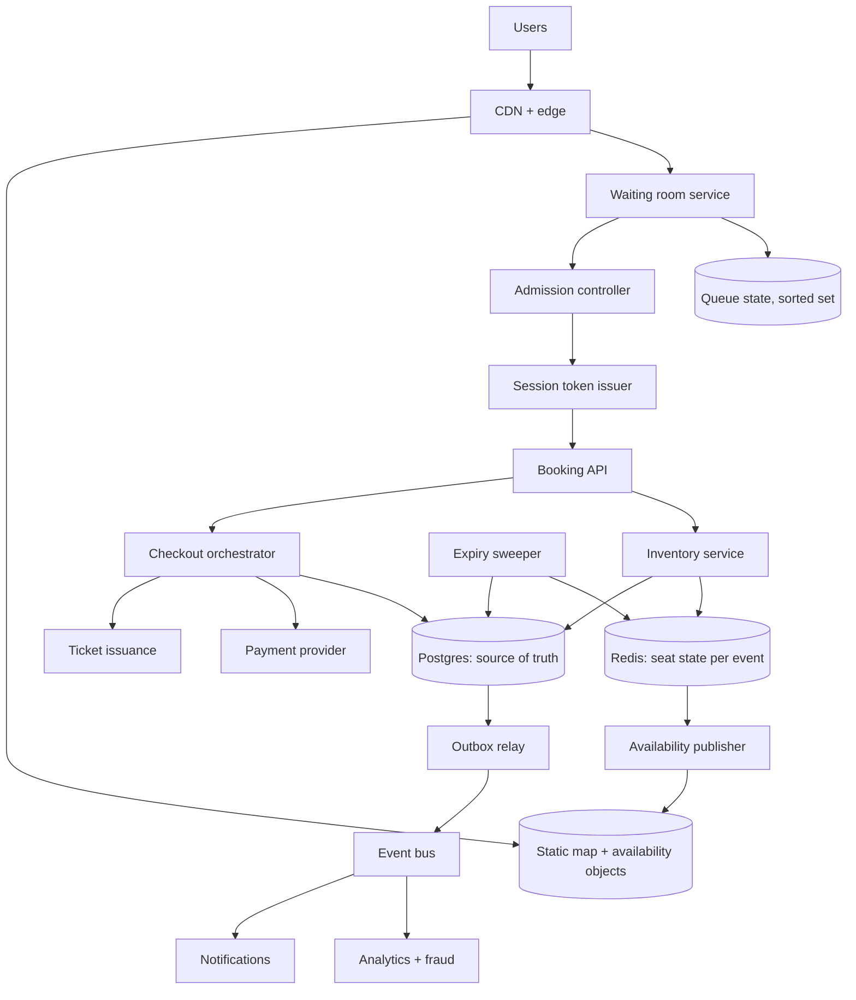
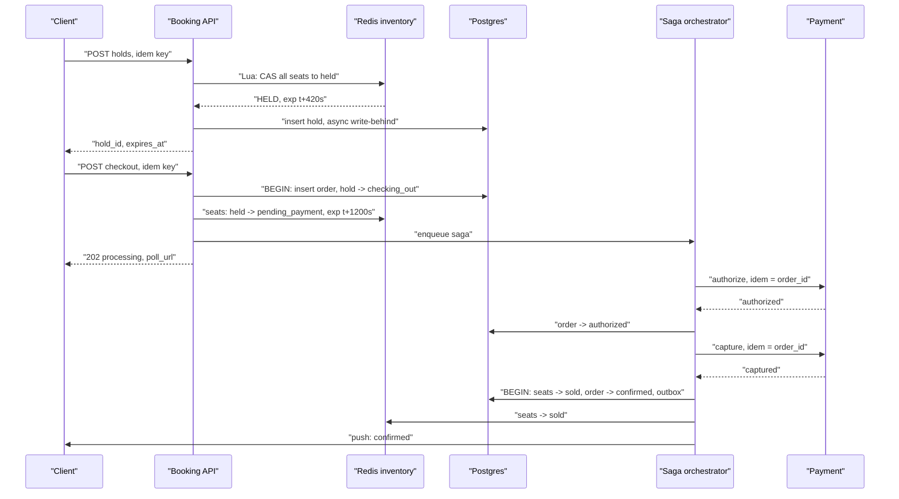
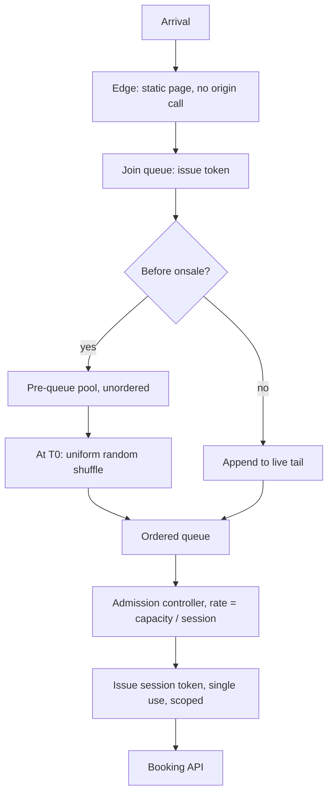
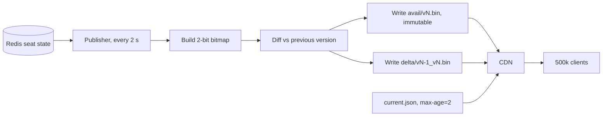
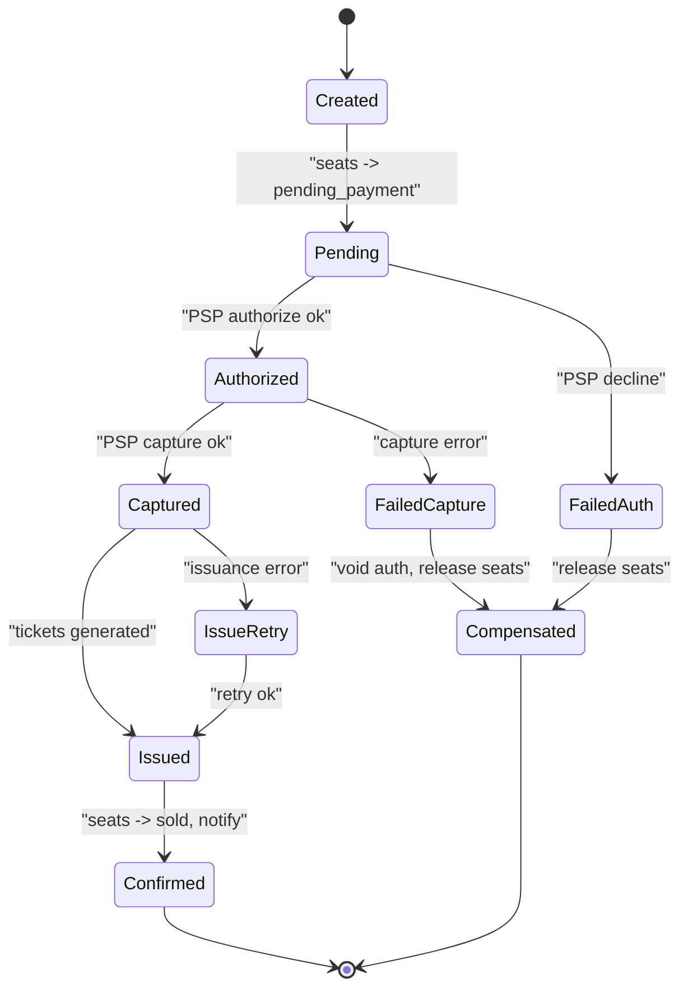

# 24 — Ticketmaster / Event Booking

<span class="pill pill-core">Core</span> <span class="pill pill-hard">Hard</span>

**Sixty thousand unique, non-substitutable items sold to two million people who all arrive in the same ten seconds — a system whose steady state is trivial and whose peak is a four-orders-of-magnitude contention spike on a correctness invariant that cannot be relaxed.**

| | |
|---|---|
| **Commonly asked at** | Stripe, Uber, Amazon, Booking.com, Airbnb, Shopify, StubHub, Google, Cloudflare |
| **Time budget** | 45 min |
| **Core tension** | Every mechanism that makes the sale *fast* — optimistic concurrency, short holds, first-come-first-served admission — rewards whoever has the fastest automation, and every mechanism that makes it *fair* — queues, lotteries, identity verification, rate limits — adds latency and friction for legitimate users. The overselling problem is solvable in an afternoon; the fairness problem is an adversarial game you can only ever win structurally |
| **Prerequisites** | [F04 Caching](../fundamentals/f04-caching.md), [F05 CDN & Edge](../fundamentals/f05-cdn-edge.md), [F06 Partitioning & Sharding](../fundamentals/f06-partitioning-sharding.md), [F10 Distributed Transactions](../fundamentals/f10-distributed-transactions.md), [F11 Idempotency](../fundamentals/f11-idempotency.md), [F12 Queues & Streams](../fundamentals/f12-queues-streams.md), [F13 Storage Engines](../fundamentals/f13-storage-engines.md), [F17 Rate Limiting & Load Shedding](../fundamentals/f17-rate-limiting-load-shedding.md), [F18 Resilience Patterns](../fundamentals/f18-resilience-patterns.md), [F19 Concurrency Control](../fundamentals/f19-concurrency-control.md), [F24 Capacity Planning](../fundamentals/f24-capacity-planning.md), [F25 Deployment & Release Safety](../fundamentals/f25-deployment-release-safety.md), [F27 Security in Design](../fundamentals/f27-security-design.md) |

---

## 1. Problem Statement

Build the inventory, reservation and checkout system behind a high-demand ticketing platform: publish a seat map, let users hold specific seats, take payment, issue tickets, and never sell the same seat twice — under a load pattern where demand exceeds supply by 30x and arrives within seconds.

Three properties make this different from ordinary e-commerce and are worth naming immediately:

**The inventory is non-fungible.** Amazon selling 60,000 identical widgets can decrement a counter, shard the counter, and reconcile later. Seat 14-A in Section 112 is one item, and the buyer specifically wants *that one*. There is no aggregate counter to shard, no substitutability to exploit, and no way to sell "a seat" without deciding which.

**The contention is adversarial and concentrated.** Not only do two million people want 60,000 seats, but they disproportionately want the *same* seats. Front-row and aisle seats attract thousands of simultaneous reservation attempts. Any per-item concurrency control degenerates on exactly the items people care about most.

**A meaningful fraction of the demand is automated.** Scalpers operate thousands of accounts behind residential proxy networks with CAPTCHA-solving farms. A system optimised purely for speed is optimised for them, and "first come, first served" means "first bot, first served". This is the part most candidates skip and it is the part that defines whether the product succeeds.

The invariant everything serves: **a seat is sold to at most one order, and an order that was charged always yields tickets.** Violating the first is an oversell — a person with a valid ticket and no seat, at a venue, on the night. Violating the second is taking money without delivering.

### Out of scope

Secondary market and resale, dynamic pricing algorithms, venue seat-map authoring tools, access control at the gate, and the payment processor's internals.

---

## 2. Requirements

### Functional

| # | Requirement | Notes |
|---|---|---|
| F1 | Render an interactive seat map with live availability | Up to ~100,000 seats, 500k concurrent viewers |
| F2 | Hold specific seats with a TTL | Exclusive; expires automatically |
| F3 | Extend a hold during active checkout | The hold must not die while a card is being processed |
| F4 | Complete purchase: charge, confirm, issue tickets | Exactly one charge per order |
| F5 | Release holds on abandonment or failure | Inventory returns to the pool promptly |
| F6 | Virtual waiting room with position and wait estimate | Fair admission, not speed-based |
| F7 | Enforce purchase limits | Per identity, per payment instrument, per event |
| F8 | Best-available selection | "Give me 4 together in the lower bowl under $200" |
| F9 | General-admission tiers alongside reserved seats | Counter semantics, not seat semantics |
| F10 | Order lookup, transfer and refund | Post-sale lifecycle |

### Non-functional

| # | Requirement | Target |
|---|---|---|
| N1 | Oversell count | **Zero.** Not an SLO |
| N2 | Charged-without-tickets count | **Zero.** Not an SLO |
| N3 | Hold acquisition latency | p99 < 300 ms |
| N4 | Checkout completion | p99 < 5 s excluding payment processor |
| N5 | Seat map availability staleness | < 5 s |
| N6 | Waiting room admission fairness | Position independent of network latency and client speed |
| N7 | Peak absorption | 100k arrivals/s for 60 s without shedding admitted users |
| N8 | Bot share of completed orders | Measured and reported; driven down over time |

!!! danger "N1 and N2 are invariants, and they point in opposite directions"
    Preventing oversell pushes you toward holding locks longer and being conservative about release. Preventing charged-without-tickets pushes you toward releasing inventory aggressively so it can be resold. **The tension between them lives entirely in the hold TTL**, and §7.5 is about resolving it. A design that only discusses one of the two has not understood the problem: the hard case is not "two people want one seat", it is "the payment succeeded and the hold had already expired".

---

## 3. Scale Estimation

### The arrival spike

A stadium tour on-sale, 10:00:00 local:

$$
\begin{aligned}
\text{interested users} &= 2\times10^{6} \\
\text{seats} &= 6\times10^{4} \\
\text{demand ratio} &= \frac{2\times10^{6}}{6\times10^{4}} \approx 33{:}1
\end{aligned}
$$

Arrival distribution is not Poisson; it is a step function against a wall clock everyone can see.

$$
\begin{aligned}
\text{first 10 s} &\approx 50\%\ \text{of arrivals} = 10^{6} \\
\text{peak arrival rate} &\approx \frac{10^{6}}{10} = 10^{5}\ \text{arrivals/s} \\
\text{steady state, same platform} &\approx 200\ \text{req/s}
\end{aligned}
$$

$$
\text{spike factor} = \frac{10^{5}}{200} = 500\times
$$

**Nothing scales 500x reactively.** The entire architecture is a response to this number: absorb at the edge, admit at a controlled rate, and make the expensive path see a load that is decoupled from arrivals.

### Contention, not throughput, is the problem

$$
\begin{aligned}
\text{sales} &= 6\times10^{4}\ \text{seats} \approx 4\times10^{4}\ \text{orders (1.5 seats each)} \\
\text{sell-out window} &\approx 600\ \text{s} \\
\text{sustained order rate} &= \frac{4\times10^{4}}{600} \approx 67\ \text{orders/s}
\end{aligned}
$$

Sixty-seven writes per second is nothing. A single Postgres instance does that half asleep. But:

$$
\frac{\text{reservation attempts}}{\text{successful reservations}} \approx \frac{10^{5}}{67} \approx 1{,}500{:}1
$$

And the attempts are not uniformly spread over 60,000 seats. Front-row and aisle seats attract orders of magnitude more attempts than an upper-tier corner.

!!! tip "The sentence that reframes this interview"
    **"This system's throughput requirement is sixty-seven writes per second. Its contention requirement is a thousand-to-one failure ratio on the hottest rows. Those need completely different solutions, and almost everything I build is for the second one."** Say it early. It stops you from designing a high-throughput write path that was never needed and directs the whole conversation at admission control and concurrency, which is where the actual difficulty is.

### Seat map payload

Naive JSON with a seat object per seat:

$$
6\times10^{4}\ \text{seats} \times 120\ \text{B} \approx 7.2\ \text{MB}
$$

Split static from dynamic. Geometry, labels and pricing tiers never change during a sale; only availability does.

$$
\begin{aligned}
\text{static map (once, immutable, CDN)} &\approx 1.5\ \text{MB gzipped, cached forever} \\
\text{availability bitmap: 2 bits/seat} &= \frac{6\times10^{4}\times2}{8} = 15\ \text{KB} \\
\text{gzipped, sparse early in the sale} &\approx 2\ \text{KB}
\end{aligned}
$$

### Push versus poll for availability

$$
\begin{aligned}
\text{concurrent viewers of one event} &= 5\times10^{5} \\
\text{seat state changes during sale} &\approx 2\times10^{5}\ (\text{holds, releases, sales}) \\
\text{naive broadcast messages} &= 5\times10^{5} \times 2\times10^{5} = 10^{11}
\end{aligned}
$$

A hundred billion messages for one event. Now the poll-through-CDN alternative:

$$
\begin{aligned}
\text{poll interval} &= 3\ \text{s} \\
\text{requests} &= \frac{5\times10^{5}}{3} \approx 1.67\times10^{5}\ \text{req/s} \\
\text{object size} &= 2\ \text{KB} \Rightarrow 334\ \text{MB/s of edge egress} \\
\text{origin load, 200 PoPs, 3 s TTL} &= \frac{200}{3} \approx 67\ \text{req/s}
\end{aligned}
$$

**Sixty-seven origin requests per second to keep half a million people's seat maps current**, versus a hundred billion websocket messages. The CDN's job here is fan-out, and it is enormously better at it than your application is. This inversion — polling a cacheable object beating a push fan-out — is one of the most useful results in the whole design.

### Waiting room arithmetic

Admission rate is set by downstream capacity, not by demand:

$$
\text{admission rate} = \frac{\text{concurrent checkout capacity}}{\text{mean session duration}}
= \frac{3\times10^{4}}{120\ \text{s}} = 250\ \text{/s}
$$

$$
\text{wait for position } p = \frac{p}{250}\ \text{seconds}
$$

| Position | Estimated wait |
|---|---|
| 10,000 | 40 s |
| 250,000 | 17 min |
| 1,000,000 | 67 min |
| 2,000,000 | 2 h 13 min |

And the honest truth the product must surface:

$$
\text{positions that can possibly succeed} \approx 4\times10^{4}\ \text{orders} \Rightarrow \text{position} > 60{,}000 \text{ is almost certainly futile}
$$

Telling someone at position 1.4 million that their wait is 93 minutes, when the event will be sold out in 10, is a design failure. §7.2 covers what to show instead.

---

## 4. API Design

### Waiting room

```http
POST /v1/events/evt_88/queue
Content-Type: application/json

{"pre_registration_token": "prt_9f21c...", "device_attestation": "..."}
```

```json
{
  "queue_token": "qt_01HY7...",
  "position": 412883,
  "estimated_wait_s": 1652,
  "admission_rate_per_s": 250,
  "poll_after_s": 30,
  "likelihood": "unlikely",
  "shuffle_at": "2026-04-02T10:00:00Z"
}
```

```http
GET /v1/events/evt_88/queue/status
Authorization: Bearer qt_01HY7...
```

On admission the response carries a short-lived, single-use **session token** scoped to this event:

```json
{
  "status": "admitted",
  "session_token": "st_01HY7...",
  "expires_at": "2026-04-02T10:22:00Z",
  "purchase_limit": 4
}
```

### Seat map

```http
GET /v1/events/evt_88/map/static.json        # immutable, cached forever
GET /v1/events/evt_88/map/avail/v1893.bin    # 2 KB, max-age=3
```

The availability object's URL contains a **monotonic version**, published every few seconds, so each version is immutable and infinitely cacheable while the "current version" pointer is a tiny, separately-cached document. This avoids the failure mode where a short TTL on a large object produces a revalidation storm at every expiry boundary.

### Hold

```http
POST /v1/events/evt_88/holds
Authorization: Bearer st_01HY7...
Idempotency-Key: c1a2b3d4-...

{"seats": ["s:112:14:A", "s:112:14:B"], "quantity": 2}
```

```json
{
  "hold_id": "h_01HY7...",
  "seats": ["s:112:14:A", "s:112:14:B"],
  "expires_at": "2026-04-02T10:14:32Z",
  "ttl_s": 420,
  "price_total_cents": 47800,
  "fees_cents": 9560
}
```

`409 SEATS_UNAVAILABLE` returns which specific seats failed and suggests alternatives, because a bare 409 forces the client to re-fetch the whole map and retry blindly, which is exactly the retry storm you are trying to avoid.

### Checkout

```http
POST /v1/holds/h_01HY7/checkout
Authorization: Bearer st_01HY7...
Idempotency-Key: c1a2b3d4-...

{"payment_method_id": "pm_44", "delivery": "mobile",
 "accept_fees_cents": 9560}
```

```json
{
  "order_id": "o_01HY7...",
  "state": "processing",
  "poll_url": "/v1/orders/o_01HY7",
  "hold_extended_until": "2026-04-02T10:20:00Z"
}
```

!!! warning "Checkout must be asynchronous and the hold must be extended by the act of starting it"
    A synchronous checkout that blocks on the payment processor couples your p99 to theirs, and a processor timeout at 25 seconds against a 7-minute hold is survivable — but a processor *retry* sequence is not. Returning `202`-style with a poll URL, and simultaneously converting the hold into a payment-pending lock with a much longer bound, is what prevents the single worst outcome in this system: a successful charge against an expired hold. The hold extension happens in the same transaction that creates the order, not as a follow-up call.

---

## 5. Data Model

```sql
CREATE TYPE seat_state AS ENUM ('available','held','pending_payment','sold','blocked');

CREATE TABLE event (
    event_id        BIGINT PRIMARY KEY,
    venue_id        BIGINT NOT NULL,
    onsale_at       TIMESTAMPTZ NOT NULL,
    prequeue_opens  TIMESTAMPTZ NOT NULL,
    purchase_limit  SMALLINT NOT NULL DEFAULT 4,
    total_seats     INT NOT NULL,
    map_version     INT NOT NULL DEFAULT 1
);

-- One row per physical seat. The hot table.
CREATE TABLE seat_inventory (
    event_id     BIGINT      NOT NULL,
    seat_id      TEXT        NOT NULL,      -- "s:112:14:A"
    section      TEXT        NOT NULL,
    price_tier   SMALLINT    NOT NULL,
    state        seat_state  NOT NULL DEFAULT 'available',
    hold_id      BIGINT,
    order_id     BIGINT,
    expires_at   TIMESTAMPTZ,               -- for held / pending_payment
    version      BIGINT      NOT NULL DEFAULT 0,
    PRIMARY KEY (event_id, seat_id)
) PARTITION BY HASH (event_id);

CREATE INDEX seat_expiry ON seat_inventory (event_id, expires_at)
    WHERE state IN ('held','pending_payment');

CREATE TABLE hold (
    hold_id     BIGINT PRIMARY KEY,
    event_id    BIGINT NOT NULL,
    session_id  TEXT   NOT NULL,
    user_id     BIGINT NOT NULL,
    seats       TEXT[] NOT NULL,
    state       TEXT   NOT NULL,   -- active|checking_out|consumed|expired|released
    created_at  TIMESTAMPTZ NOT NULL DEFAULT now(),
    expires_at  TIMESTAMPTZ NOT NULL,
    idem_key    TEXT   NOT NULL,
    UNIQUE (user_id, idem_key)
);

CREATE TABLE "order" (
    order_id        BIGINT PRIMARY KEY,
    event_id        BIGINT NOT NULL,
    user_id         BIGINT NOT NULL,
    hold_id         BIGINT NOT NULL,
    state           TEXT   NOT NULL,  -- processing|authorized|captured|
                                      -- confirmed|failed|refunded|compensated
    amount_cents    INT    NOT NULL,
    payment_intent  TEXT,
    idem_key        TEXT   NOT NULL,
    saga_step       SMALLINT NOT NULL DEFAULT 0,
    created_at      TIMESTAMPTZ NOT NULL DEFAULT now(),
    updated_at      TIMESTAMPTZ NOT NULL DEFAULT now(),
    UNIQUE (user_id, idem_key)
);

-- Enforces the purchase limit at the storage layer, not in app logic.
CREATE TABLE purchase_ledger (
    event_id   BIGINT NOT NULL,
    identity   TEXT   NOT NULL,   -- hashed identity key, not just user_id
    qty        SMALLINT NOT NULL,
    PRIMARY KEY (event_id, identity),
    CONSTRAINT within_limit CHECK (qty <= 8)
);

CREATE TABLE outbox (
    id          BIGSERIAL PRIMARY KEY,
    aggregate   TEXT   NOT NULL,
    payload     JSONB  NOT NULL,
    published   BOOLEAN NOT NULL DEFAULT false,
    created_at  TIMESTAMPTZ NOT NULL DEFAULT now()
);
```

!!! example "`pending_payment` is a distinct state and that is the whole trick"
    Most designs have `available`, `held`, `sold`. Adding `pending_payment` — entered atomically when checkout starts — separates two things that look similar and behave completely differently. A `held` seat expires on a short, aggressive TTL because abandonment is common and inventory must recirculate. A `pending_payment` seat expires only when the payment outcome is known or a much longer reconciliation bound elapses, because releasing it while a charge is in flight is how you produce a charged customer with no seat. One extra enum value eliminates the highest-severity failure mode in the system.

### Hot-path inventory in Redis

The database is the source of truth; the hot path runs against an in-memory structure that can absorb 100k contended attempts per second.

```lua
-- hold_seats.lua : KEYS = seat keys, ARGV = {hold_id, ttl_ms, now_ms}
-- Atomic all-or-nothing. Redis is single-threaded, so this is
-- a serialisable transaction over exactly the seats involved.
for i = 1, #KEYS do
  local st = redis.call('HGET', KEYS[i], 'state')
  if st and st ~= 'available' then
    return {err = 'UNAVAILABLE:' .. KEYS[i]}
  end
end
for i = 1, #KEYS do
  redis.call('HSET', KEYS[i], 'state', 'held',
             'hold', ARGV[1], 'exp', ARGV[3] + ARGV[2])
end
redis.call('ZADD', 'exp:' .. ARGV[4], ARGV[3] + ARGV[2], ARGV[1])
return {ok = 'HELD'}
```

All seats for one event live on one shard, so the script is atomic without cross-shard coordination. Since an event has at most ~100,000 seats and a few hundred bytes each, **one event fits comfortably in one Redis shard**, and events are distributed across shards by `event_id`. Contention is therefore bounded by a single-threaded engine doing 100k+ simple operations per second, which is exactly what it is good at.

---

## 6. High-Level Architecture



### Read path — a user opens the seat map

1. The page shell, static seat geometry and all assets come from the CDN. **Zero origin calls** before admission — this is what lets you absorb 100k arrivals per second.
2. The client fetches `/queue/status` with its queue token, at a server-dictated poll interval with jitter. This request is tiny and is served by an edge-deployed service reading from a replicated sorted set.
3. Once admitted, the client fetches the current availability version pointer, then the immutable availability object for that version, both from the CDN.
4. The client renders locally by overlaying the 15 KB bitmap onto the cached static geometry.
5. It re-polls the version pointer every 3 seconds. Almost every such request is a cache hit at the edge.

### Write path — hold, checkout, confirm



Note the ordering discipline: **inventory is claimed before money moves, and money moves before inventory is finalised.** The window where a charge exists against a non-final claim is bounded by the `pending_payment` TTL, which is deliberately much longer than any payment timeout.

---

## 7. Deep Dives

### 7.1 Overselling prevention: three mechanisms compared

The invariant is that a seat transitions `available -> held` at most once until it is released. Three standard mechanisms, and the choice is not obvious.

=== "Pessimistic row lock"

    ```sql
    BEGIN;
    SELECT seat_id, state FROM seat_inventory
     WHERE event_id = $1 AND seat_id = ANY($2)
       FOR UPDATE;                      -- blocks concurrent txns

    -- verify all available, then:
    UPDATE seat_inventory
       SET state = 'held', hold_id = $3, expires_at = now() + interval '7 min'
     WHERE event_id = $1 AND seat_id = ANY($2);
    COMMIT;
    ```
    **Correct and simple.** Serialises access per seat.
    **Fails at scale:** 5,000 transactions queue on the front-row seat.
    Each holds a connection and a lock for the transaction's duration.
    Lock wait times cascade, the connection pool exhausts, and
    unrelated queries — including the availability publisher — stall.
    Add `NOWAIT` or `SKIP LOCKED` and it degrades to optimistic
    behaviour with extra steps.
    **Deadlock risk:** two users selecting overlapping seat sets in
    different orders deadlock unless you sort the seat list.

=== "Optimistic version check"

    ```sql
    UPDATE seat_inventory
       SET state = 'held', hold_id = $3, version = version + 1,
           expires_at = now() + interval '7 min'
     WHERE event_id = $1 AND seat_id = ANY($2)
       AND state = 'available'
       AND version = ANY($4);           -- versions read earlier
    -- rowcount < requested  =>  someone won; roll back and report
    ```
    **No locks held across round trips.** Scales far better.
    **Fails on hot rows:** with 5,000 concurrent attempts on one seat,
    4,999 fail. Clients retry, so the attempt rate *rises* after each
    failure — a retry storm driven by the contention it is reacting to.
    **Multi-seat atomicity is awkward:** a partial success must be
    rolled back, and the rollback is itself contended.

=== "Reservation token, chosen"

    ```text
    Hot path runs in a single-threaded in-memory engine (Redis)
    holding all seats for one event on one shard.
    A Lua script performs check-all-then-set-all atomically.
    No lock waits, no retries against a queue, no connection held.
    Result is a HOLD TOKEN with a TTL.
    Postgres is updated write-behind and is the durable record.
    ```
    **Why it wins:** the contention is resolved by a single-threaded
    serialiser at ~100k ops/s rather than by a lock manager designed
    for a different workload. Multi-seat atomicity is free. Failures
    are immediate and informative (which seat lost), so the client can
    pick differently rather than retry blindly.
    **The cost is durability:** Redis is not the source of truth, so
    you need reconciliation (below) and a clear recovery story.

| Mechanism | Hot-seat behaviour | Multi-seat atomicity | Durability | Chosen / rejected |
|---|---|---|---|---|
| Pessimistic lock | Queues, exhausts connections | Natural, needs sorted acquisition | Full | Rejected for the hot path; **used for administrative and settlement operations** |
| Optimistic CAS | 99.9% failure, retry storm | Manual rollback, contended | Full | Rejected alone; **used as the write-behind guard in Postgres** |
| Reservation token | Serialised at ~100k ops/s, immediate answers | Free, one script | Needs reconciliation | **Chosen for the hot path** |

**Making the token approach safe.** The concern is "what if Redis loses state?" Three mechanisms:

1. **Postgres holds the durable state for anything `sold` or `pending_payment`.** Those transitions are written synchronously in the saga; only the short-lived `held` state is Redis-only, and losing a `held` state simply releases seats early — annoying, never incorrect.
2. **Rebuild from Postgres on Redis failure.** The `sold` and `pending_payment` sets are the truth; everything else becomes `available`. Rebuilding a 100k-seat event is a single query and under a second.
3. **Continuous reconciliation** compares Redis and Postgres in both directions and alarms on divergence. The two directions differ in severity: a seat `sold` in Postgres but `available` in Redis is an **oversell risk** and must page; a seat `held` in Redis with nothing in Postgres is **lost inventory** and merely costs money.

!!! warning "Sort the seat list before acquiring anything, always"
    Two users selecting `{A, B}` and `{B, A}` will deadlock under pessimistic locking and will livelock under naive optimistic retry. Canonically ordering the seat identifiers before any acquisition eliminates the cycle. This applies to the Lua script too, not because Redis can deadlock, but because it makes failure reporting deterministic — the same contended set always reports the same losing seat, which makes production debugging far easier.

### 7.2 The virtual waiting room

The waiting room exists to convert an uncontrollable arrival process into a controllable admission process. Its three jobs are **absorb**, **meter** and **inform**, and it must do all three without itself becoming the bottleneck.



**Absorb.** Everything before admission must be servable from the edge. The landing page, the assets, and the queue-status endpoint are all designed so that 100k arrivals per second never reach the booking tier. The queue-status endpoint is the only dynamic call and it is a single read against a replicated sorted set, deployable close to users.

**Meter.** The admission rate is derived from downstream capacity, not chosen:

$$
\lambda_{\text{admit}} = \frac{C_{\text{concurrent sessions}}}{\bar{T}_{\text{session}}}
$$

and it is **closed-loop**: measure actual concurrent active sessions and checkout latency, and reduce admission when they degrade. An open-loop fixed rate will over-admit the moment anything downstream slows, which is precisely when you can least afford it.

**The shuffle is the fairness mechanism.** This is the most important design decision in the section. If the queue is strictly first-come-first-served from the instant the pre-queue opens, then position is determined by network latency and client automation, and bots win deterministically. Instead:

- The pre-queue opens well before the on-sale (30–60 minutes).
- Everyone who joins before $T_0$ goes into an **unordered pool**.
- At $T_0$, the pool is shuffled uniformly at random to produce positions.
- Arrivals after $T_0$ append to the tail in arrival order.

$$
P(\text{position} \le k) = \frac{k}{N}\ \text{for every member of the pool, independent of join time}
$$

**Joining one millisecond after the pre-queue opens confers no advantage over joining 29 minutes later.** That single property removes the entire speed dimension from the competition, which is the only durable defence against automation — everything else is an arms race.

**Inform, honestly.** Position and estimated wait are easy. The hard part is telling someone their wait is 93 minutes when the event sells out in 10. Show a `likelihood` field — `likely`, `possible`, `unlikely` — computed from position against remaining inventory and observed conversion. Users leaving voluntarily at position 1.4 million is a *good* outcome: it reduces load and it is honest. A system that lets two million people queue for 60,000 seats without telling them the odds is optimising a metric nobody cares about.

**Session tokens.** Admission issues a token that is signed, single-use, scoped to one event, bound to the identity, and short-lived (15–20 minutes). It must be bound to the identity, or tokens become a tradeable commodity and a secondary market in queue positions appears within hours of launch.

### 7.3 Thundering herd and fair load shedding

The arrival step function produces four distinct herd problems, and each needs a different answer.

| Herd | Mechanism | Mitigation |
|---|---|---|
| Arrival at $T_0$ | Everyone refreshes against a wall clock | Pre-queue opened earlier; static edge content; shuffle removes the reward for precision |
| Poll synchronisation | All clients poll on the same interval and drift into lockstep | Server-dictated `poll_after_s` with per-client jitter; exponential backoff by position |
| Cache expiry | A short TTL on a hot object expires everywhere at once | Immutable versioned URLs plus a tiny pointer object; stale-while-revalidate; request collapsing at the edge |
| Retry after failure | A 409 or 503 triggers immediate client retry, raising load | Retry-After headers, jittered backoff, and **429 with a queue position rather than a bare failure** |

**Jitter is not optional and is frequently forgotten.** If 500,000 clients poll every 3 seconds, and a brief origin stall causes them all to retry at the same moment, they synchronise into a 500,000-request pulse every 3 seconds thereafter — a self-organising DDoS that persists long after the original cause. Every polling interval must be $t \cdot (1 + U(-0.3, 0.3))$, and this is enforced server-side by dictating the interval rather than trusting clients.

**Fair shedding.** When you must reject, *how* you choose matters enormously:

| Policy | Who survives | Verdict |
|---|---|---|
| Random drop | Uniformly random | Fair but wasteful — drops users mid-checkout |
| First-come-first-served | Fastest clients and bots | **The default, and the wrong answer** |
| Priority by session state | Users furthest along in checkout | **Chosen for the booking tier** |
| Lottery on admission | Uniformly random among pre-queue | **Chosen for the queue tier** |

The booking tier sheds by session state, in a fixed order: never shed a request from a session with an active `pending_payment` (they are mid-charge), then protect active holds, then protect admitted browsing sessions, then shed new admissions. **Shedding a user who is 30 seconds from completing is strictly worse than not admitting a new one**, because it wastes all the capacity already spent on them and produces the worst possible user experience. See [F17 Rate Limiting & Load Shedding](../fundamentals/f17-rate-limiting-load-shedding.md).

### 7.4 Seat map delivery at half a million concurrent viewers

Recall §3: naive broadcast is $10^{11}$ messages. The design instead treats availability as **a small, cacheable, versioned object**.



Four decisions make this work:

**Two bits per seat, not a JSON object.** `available | held | sold | blocked` fits in 2 bits. 60,000 seats is 15 KB raw, ~2 KB gzipped early in the sale when the array is mostly one value. The client already has the geometry cached and permanently immutable.

**Immutable versioned objects plus a tiny pointer.** `avail/v1893.bin` never changes and carries `max-age=31536000, immutable`. `current.json` is ~50 bytes with `max-age=2`. The expiry storm therefore hits a 50-byte object, not a 2 KB one, and request collapsing at the edge means the origin sees one request per PoP per interval.

**Deltas for the common case.** A client holding v1892 fetches `delta/v1892_v1893.bin` — a list of changed seat indices, typically a few hundred bytes. It falls back to the full object if it has fallen too far behind or the delta is missing.

**Accept staleness and resolve at reserve time.** The seat map is a hint, not a contract. A user *will* click a seat that was taken 1.5 seconds ago. The fix is not a fresher map — it is a good failure: the hold attempt returns `409` naming the specific seats that failed, the client greys them out immediately and suggests the nearest equivalents. **Optimistic UI with a graceful, informative rejection beats any amount of engineering to make the map perfectly current**, and trying for perfect currency is how you end up designing the $10^{11}$-message fan-out.

For the minority of clients that genuinely need lower latency — an actively-zoomed section during the final minute of a sell-out — a websocket carrying only that section's changes is a reasonable addition, scoped to a few hundred seats. But it is an optimisation on top of the polling design, never a replacement for it.

### 7.5 Checkout as a saga

Checkout spans an inventory service, a payment provider and a ticket issuer. There is no distributed transaction available across them, so it is a saga: a sequence of local transactions with compensating actions ([F10 Distributed Transactions](../fundamentals/f10-distributed-transactions.md)).



| Step | Forward action | Compensation | Idempotency key |
|---|---|---|---|
| 1 | Seats `held -> pending_payment`, order created | Seats back to `available` | `order_id` |
| 2 | Authorize payment | Void authorization | `order_id` (sent to the PSP) |
| 3 | Capture payment | Refund | `order_id:capture` |
| 4 | Issue tickets | Revoke tickets | `order_id:issue` |
| 5 | Seats `pending_payment -> sold`, confirm | n/a — terminal | `order_id:confirm` |

Three properties are non-negotiable:

**Every step is idempotent and keyed on the order id.** The orchestrator can crash and resume at any point. Re-running step 2 with the same key returns the existing authorization rather than creating a second one — this is exactly what PSP idempotency keys are for, and using the order id rather than a random per-attempt value is what makes a crashed-and-resumed saga safe.

**Compensations are ordered in reverse and must themselves be idempotent and retryable.** A compensation that fails goes to a dead-letter queue with an alert, never silently. A failed refund is a customer-visible financial error and must be worked by a human.

**Authorize and capture are separated deliberately.** Authorization is fast and reversible (a void, not a refund). Capture is slow and its reversal is a refund with a visible statement entry. Separating them means the common failure — a declined card — costs nothing and leaves no trace on the customer's statement.

**Step 5 is where the two invariants meet.** Seats go to `sold` only after the money is captured *and* the tickets exist. Before that they sit in `pending_payment`, which is exclusive but not final. The `pending_payment` TTL must satisfy:

$$
\text{TTL}_{\text{pending}} > T_{\text{psp\_max}} + T_{\text{retries}} + T_{\text{issuance}} + \text{margin}
$$

In practice 15–20 minutes against a payment path that normally completes in 3 seconds. **The asymmetry is deliberate:** holding a seat unnecessarily for 20 minutes costs you one potential sale; releasing it while a charge lands costs you a customer, a refund, a support case and a public complaint.

### 7.6 Partial failure mid-checkout

The scenario every interviewer eventually asks about: **payment succeeded, the seat is gone.**

How it happens, in order of likelihood:

1. The hold TTL expired during a slow payment. The sweeper released the seat. Someone else bought it. The charge then succeeded.
2. The saga orchestrator crashed after capture and before confirmation; the seat sat in `pending_payment` and a too-aggressive reconciliation released it.
3. Redis and Postgres diverged; the seat was `pending_payment` in one and `available` in the other.
4. A manual operation (a support agent releasing a stuck hold) raced with a live checkout.

**Prevention, which is most of the answer:**

- The `pending_payment` state, entered in the **same transaction** that creates the order. There is no window where an order exists and the seats are merely `held`.
- A TTL sized against the worst-case payment path with margin, not against user attention span.
- The expiry sweeper **never touches `pending_payment` on its own authority.** Only the saga orchestrator or a reconciliation job with an explicit payment-outcome check may transition out of it.
- Hold extension is automatic on entering checkout and is part of the same atomic operation.

**Resolution, when prevention fails anyway:**

```python
def resolve_charged_without_seats(order):
    # Ordered by decreasing customer value.
    if inventory.try_reacquire(order.seats, order.id):
        return complete(order)                      # best case, often works

    equiv = inventory.best_available(
        event=order.event_id, tier=order.tier,
        qty=len(order.seats), same_section=True)
    if equiv and price_delta(equiv, order) <= 0:
        return substitute_and_notify(order, equiv)  # equal or better, free upgrade

    refund(order, reason="inventory_unavailable")
    compensate_goodwill(order)                      # credit + priority on next onsale
    alert_oncall(order, severity="high")
```

The ladder is: **re-acquire, substitute upward, refund with compensation.** Never substitute *downward* without consent — a customer who paid for the front row and receives an upper-tier seat has been wronged in a way a partial refund does not address.

And it must be **loudly alarmed**, not silently handled. A rising rate of this path means the prevention layer is broken, and the failure is invisible in ordinary availability metrics because every individual request succeeded.

### 7.7 Bots, scalpers and the arms race

State the framing first, because it determines every subsequent decision: **any mechanism that rewards speed will be won by automation.** A bot's round-trip is 20 ms; a human's is 3 seconds plus a decision. No amount of rate limiting closes a 150x gap when the adversary controls thousands of accounts and residential IPs.

**Tactical measures, and their realistic half-life:**

| Measure | Effect | How it is defeated | Half-life |
|---|---|---|---|
| IP rate limits | Blocks the naive case | Residential proxy networks, millions of IPs at cents each | Days |
| Account rate limits | Blocks single-account abuse | Thousands of aged accounts, bought or farmed | Weeks |
| CAPTCHA | Adds a few seconds | Solver farms at roughly $1–2 per 1,000; ML solvers | Weeks |
| Proof of work | Costs the client CPU | Cheap at scale; penalises low-end mobile devices most | Weeks |
| Device attestation (App Attest, Play Integrity) | Strong on native apps | Excludes web entirely; jailbreak bypasses exist | Months |
| Behavioural ML scoring | Catches obvious automation | Adversary trains against your signal; false positives hurt real users | Ongoing |
| Purchase limits per identity | Caps damage per account | Account farms; stolen identities | Weeks |
| Payment-instrument and address limits | Harder to farm than accounts | Virtual cards, mail forwarding | Months |

**Structural measures, which actually work:**

1. **Randomised admission (the shuffle).** Removes speed from the competition entirely. A bot that joins the pre-queue one millisecond after it opens has the same expected position as a human who joins twenty minutes later. This is the single highest-leverage anti-bot measure and it is a *queue design decision*, not a security feature.
2. **Pre-registration with identity verification and a lottery.** Verified-fan programmes move the contest from "who is fastest" to "who registered", and identity verification makes account farming expensive rather than free.
3. **Identity-bound, non-transferable tickets** with the purchaser's ID required at entry. This destroys the resale value that funds the entire scalping industry. It is the most effective measure available and the most operationally burdensome — it needs gate infrastructure and a legitimate transfer mechanism, or you punish the person who genuinely cannot attend.
4. **Post-hoc cancellation.** Detect and cancel bulk purchases after the fact, with the inventory returned to a second-chance pool. The adversary's cost of capital goes up and the economics degrade. This works because you have hours or days to analyse, while they had seconds to act.
5. **Price discovery.** Scalping profits from the gap between face value and market value. Narrowing that gap — auctions, dynamic pricing, platform-run resale with price caps — removes the incentive. This is a business decision with real customer-perception costs, and it is the only measure that attacks the root cause.

!!! interview "Say the structural sentence"
    **"Every tactical anti-bot measure has a half-life measured in weeks, because they all target the symptom and the adversary iterates faster than I can. The only durable fixes change the game: randomised admission removes the speed advantage, identity-bound tickets remove the resale value, and price discovery removes the arbitrage. I would ship the tactical layer because it raises cost, but I would be explicit with the business that it buys time, not a solution."** Very few candidates reach this framing, and it is the difference between describing a feature list and reasoning about an adversarial system.

---

## 8. Scaling the Bottleneck

**Bottleneck 1 — the arrival wall.** 100k req/s against a steady state of 200. Absorbed entirely at the edge: static shell, static assets, a queue-join endpoint that is a single write to a replicated sorted set, and a status endpoint that is a single read. **Nothing before admission touches the booking tier**, which is what makes a 500x spike survivable at all.

**Bottleneck 2 — per-seat contention.** Resolved by moving the hot path into a single-threaded engine that serialises at ~100k ops/s, with all seats for one event on one shard so multi-seat atomicity is free. The database never sees contended traffic; it sees the ~67/s of durable transitions that actually matter.

**Bottleneck 3 — availability fan-out.** Inverted from push to poll-through-CDN: $10^{11}$ messages becomes 67 origin req/s. Immutable versioned objects plus a tiny pointer prevent the revalidation storm that a short TTL on a large object would create.

**Bottleneck 4 — checkout concurrency.** This is the real capacity limit and it sets the admission rate:

$$
\lambda_{\text{admit}} = \frac{C}{\bar{T}} \quad\text{where } C \text{ is bounded by the payment provider's concurrency}
$$

The PSP is usually the binding constraint. Negotiate the rate limit in advance for a known on-sale; a payment provider that throttles you at $T_0$ turns a successful sale into an incident. Buffer with an internal queue rather than rejecting, and make the client's poll loop tolerant of a multi-second processing state.

**Bottleneck 5 — the expiry sweeper.** Holds expire continuously; a naive per-hold timer is unmanageable. Use a sorted set keyed by expiry time, swept in batches by a leader-elected worker:

$$
\text{expirations/s} \approx \frac{\text{holds created/s} \times \text{abandonment rate}}{1} \approx 250 \times 0.4 = 100\ \text{/s}
$$

Batch every 500 ms, cap the batch size, and make each expiry a compare-and-set so a sweep racing with a checkout produces one winner. **The sweeper must never expire `pending_payment`** — that state belongs to the saga, and a sweeper that "helpfully" cleans it up is the most direct route to charging a customer for a seat they do not have.

**Bottleneck 6 — the source-of-truth database.** Partitioned by `event_id`, so a mega-event is one partition and its load never touches other events. Within an event, 67 writes/s is trivial. The genuine risk is the *read* load from support tooling, analytics and admin queries during a high-profile sale — route all of it to replicas and be prepared to disable non-essential reporting during a major on-sale.

---

## 9. Failure Modes

| Failure | Blast radius | Detection | Mitigation | Degraded behaviour |
|---|---|---|---|---|
| Oversell | One customer, at the venue, on the night | Continuous invariant audit: seats with >1 non-terminal claim | Single-shard atomic claim + DB constraint + reconciliation | None acceptable. Halt sales for the event and reconcile |
| Charged without tickets | One customer, financial | Orders in `captured` past a deadline without `confirmed` | `pending_payment` state, long TTL, sweeper exclusion | Auto re-acquire, substitute upward, or refund with goodwill |
| Redis shard loss for an event | That event's hot path | Health check, connection errors | Rebuild from Postgres `sold` + `pending_payment`; all else available | Sales pause ~60 s; active holds lost (users must re-select) |
| Redis/Postgres divergence | Potentially an oversell | Bidirectional reconciliation job | Postgres wins for `sold`; Redis wins for `held` | Some seats briefly unsellable — the safe direction |
| PSP throttles or degrades | All checkouts | Auth latency and error rate | Reduce admission rate; internal queue; extend `pending_payment` | Slower checkout, no lost inventory |
| PSP timeout with unknown outcome | One order | Missing terminal state | Query by idempotency key before any retry; never blind-retry a charge | Order sits in `processing` until resolved |
| Saga orchestrator crash | In-flight orders | Orders stalled at a saga step | Durable saga state; resume from `saga_step` on restart | Delayed confirmation; inventory stays held |
| Expiry sweeper stalls | Inventory not recirculating | Count of expired-but-not-released holds | Leader election with standby; idempotent CAS sweeps | Event appears sold out while seats are abandoned |
| Expiry sweeper too aggressive | Multiple charged-without-seats | Spike in the resolution path | Hard exclusion of `pending_payment` from sweeps | High-severity customer impact |
| Waiting room state loss | Everyone's position | Queue length discontinuity | Replicated queue state; positions rebuildable from tokens | Re-shuffle and communicate; better than silent reordering |
| Admission over-rate | Booking tier collapse | Concurrent sessions vs capacity | Closed-loop admission driven by measured downstream health | Slower admission; queue grows |
| Poll synchronisation | Self-inflicted DDoS | Periodic request-rate pulses | Server-dictated jittered intervals | Smoothed load |
| Bot surge | Legitimate users lose out | Bot-share metric on completed orders | Shuffle, purchase limits, post-hoc cancellation | Second-chance pool from cancelled orders |
| Event-level hot partition | One event's DB partition | Per-partition latency | Partition by `event_id`; isolate mega-events onto dedicated capacity | That event slows; others unaffected |

!!! danger "The invariant audit must run continuously, not at the end"
    A query for "seats with more than one non-terminal claim" and "orders captured but not confirmed past a deadline" should run every few seconds during an on-sale and page on any nonzero result. Both failures are **invisible in availability metrics** — every individual request returned 200 — and both get dramatically more expensive with time. An oversell discovered during the sale is a seat you stop selling; an oversell discovered on the night is a person turned away at a gate with a valid ticket in their hand.

---

## 10. SRE Lens

### SLIs and SLOs

| SLI | Definition | SLO |
|---|---|---|
| Oversell count | Seats with more than one confirmed order | **0.** Page on any occurrence |
| Charged-without-tickets | Captured orders unconfirmed past 30 min | **0.** Page on any occurrence |
| Hold acquisition latency | `POST /holds` server-side | p99 < 300 ms |
| Hold success rate | Holds granted / attempted, excluding genuine unavailability | > 99.5% |
| Checkout success | Confirmed / initiated, excluding card declines | > 99% |
| Queue status latency | `GET /queue/status` at the edge | p99 < 100 ms |
| Admission fairness | KL divergence of position vs uniform within the pre-queue pool | < 0.01 |
| Availability staleness | Publish time to edge-visible | p99 < 5 s |
| Inventory reconciliation drift | Seats disagreeing between Redis and Postgres | 0 sustained; alarm on any |
| Bot share | Orders scored as automated / total | Tracked per on-sale, driven down |

!!! note "Admission fairness is measurable and should be measured"
    The shuffle is a correctness property, not a vibe. Compare the distribution of assigned positions against join timestamps within the pre-queue pool: if the shuffle is working, position and join time are independent. A regression — someone "optimises" the shuffle into a partial sort, or a sharded queue accidentally orders by shard — reintroduces the speed advantage silently, and the only people who will notice are the ones running bots. Monitoring it turns a property everyone assumes into one that is actually enforced. See [F23 SLOs & Error Budgets](../fundamentals/f23-slo-error-budgets.md).

### Error budget

The availability SLO applies to browsing and queueing. The two invariants have no budget.

The notable property of this system is that **the error budget is spent in minutes, not months**: a single major on-sale can consume an entire quarter's budget in one bad ten-minute window. That changes the operational posture:

- Major on-sales are treated as **launches**, with a named incident commander, a pre-brief, a war room and a rollback plan.
- A change freeze applies for 48 hours before a major on-sale. No deploys, no config changes, no dependency upgrades.
- A **load-test rehearsal against production capacity** precedes every mega-event, replaying a previous on-sale's traffic shape. The rehearsal is not optional; the arrival pattern is too unusual for ordinary load testing to be representative.

### Rollout

```text
Pre-onsale checklist (T-48h):
  1. Change freeze active. Verify no scheduled jobs overlap T0.
  2. Capacity: Redis shard for the event isolated and sized.
     Booking tier pre-scaled to target admission rate x 1.5.
     Edge/CDN pre-warmed with static map and page shell.
  3. PSP: confirm the negotiated rate limit and that they know
     the date and expected peak. This call gets skipped and
     then becomes the incident.
  4. Admission rate computed from measured session duration of
     a comparable prior event, not from a guess.
  5. Rehearsal: replay a prior on-sale's arrival curve at full
     scale. Verify the shuffle, the admission loop, the sweeper
     and the availability publisher under real load.
  6. Kill switches verified by exercising them:
       - pause admissions
       - extend all hold TTLs globally
       - disable non-essential reads (analytics, admin dashboards)
       - switch availability publishing to a longer interval
       - freeze inventory entirely (sell nothing, break nothing)
  7. Invariant audit queries running and alerting.
```

Feature changes to the booking path ship behind flags, with a canary on low-demand events first. **A change that is safe on a 300-seat club show can be catastrophic on a stadium on-sale**, because the contention regime is completely different — so the canary ladder must include a medium-contention event before anything touches a mega-event. See [F25 Deployment & Release Safety](../fundamentals/f25-deployment-release-safety.md).

### Runbook notes

```text
ALERT: oversell_detected
  Sev-1.
  1. FREEZE SALES for that event immediately. Kill switch, not a deploy.
  2. Identify affected seats and the competing orders from
     order.created_at and the saga audit trail.
  3. Earliest confirmed order wins. Later orders: refund plus
     substitution upward if inventory exists, plus goodwill.
  4. Contact affected customers BEFORE they contact you. An
     oversell found on the night is a categorically worse event
     than one found during the sale.
  5. Root cause is almost always one of: Redis/Postgres divergence,
     a sweeper releasing pending_payment, or a manual admin action
     racing a live checkout. Check the admin audit log first --
     it is the fastest to confirm or eliminate.

ALERT: captured_orders_unconfirmed > 0
  Sev-1. Money taken, tickets not issued.
  1. Group by saga_step. All stuck at the same step means a
     dependency is down -- fix the dependency, the saga resumes.
  2. Scattered across steps means the orchestrator is unhealthy.
  3. Do NOT retry captures blind. Query the PSP by idempotency
     key to establish the true state first. A blind retry on an
     already-captured payment is a double charge.
  4. Run the resolution ladder: re-acquire, substitute upward,
     refund with goodwill.

ALERT: admission_rate causing downstream degradation
  1. Reduce admission rate immediately. It is a dial, use it.
  2. Do NOT pause admission entirely unless the booking tier is
     failing -- a stalled queue is highly visible and generates
     more support load than a slow one.
  3. Check checkout p99 and PSP latency. A slow PSP raises mean
     session duration, which means the admission rate formula's
     input changed and the rate must come down proportionally.
  4. Extend hold TTLs globally if checkout is slow, so users are
     not timed out by your degradation.

ALERT: redis_postgres_divergence > 0
  1. Determine direction. sold-in-PG-but-available-in-Redis is an
     OVERSELL RISK: freeze the event and repair Redis from PG.
  2. held-in-Redis-with-nothing-in-PG is lost inventory only:
     safe to release, log, and investigate without freezing.
  3. Never auto-repair in the unsafe direction.
```

### Capacity model

$$
\begin{aligned}
\text{edge capacity} &= \text{peak arrivals/s} \times \text{bytes per pre-admission request} \\[4pt]
\text{admission rate} &= \frac{C_{\text{concurrent}}}{\bar{T}_{\text{session}}},\quad C_{\text{concurrent}} = \min(C_{\text{app}}, C_{\text{psp}}) \\[4pt]
\text{redis ops/s} &= \text{hold attempts/s} \times \text{seats per attempt} \\[4pt]
\text{sweeper rate} &= \text{holds/s} \times \text{abandonment rate} \\[4pt]
\text{sellout time} &= \frac{\text{orders}}{\lambda_{\text{admit}} \times \text{conversion}}
\end{aligned}
$$

That last equation is worth running before every major on-sale, because it predicts the event's shape. At $\lambda = 250$/s and 30% conversion, 40,000 orders take $40{,}000 / 75 \approx 533$ s — nine minutes. If the modelled sellout time is far shorter than the modelled queue drain time, you know in advance that most of the queue is futile and you can plan the messaging rather than discover it live.

### Cost

| Line | Driver | Relative scale |
|---|---|---|
| Edge/CDN | Arrival spike × pre-admission bytes | Largest during on-sales, near-zero otherwise |
| Booking tier | Pre-scaled for peak, idle otherwise | Second; the spiky profile is the cost problem |
| Redis | One shard per concurrent mega-event | Modest; sized for contention, not data |
| Payment processing | Per-transaction fees | Largest overall, but revenue-proportional |
| Source-of-truth DB | Low write volume, high durability | Small |

The defining cost characteristic is a **duty cycle near zero**: the system is provisioned for a peak that occurs for ten minutes a week. Levers: scale on a schedule from the on-sale calendar (every peak is known days in advance, which is an enormous advantage over systems with unpredictable spikes), use burstable or spot capacity for the non-critical tiers, and push as much of the spike as possible onto the CDN where you pay per request rather than per provisioned instance. See [F28 Cost Engineering](../fundamentals/f28-cost-engineering.md).

---

## 11. Trade-offs & Alternatives

| Decision | Chosen | Alternative | Why |
|---|---|---|---|
| Hot-path concurrency | Reservation token via single-threaded Lua CAS | Pessimistic row locks; optimistic version CAS | Locks exhaust connections on hot seats; optimistic CAS produces a 99.9% failure rate and a retry storm. Single-threaded serialisation gives immediate, informative answers at ~100k ops/s |
| Source of truth | Postgres, with Redis as the hot path | Redis as truth; Postgres as truth | Losing a `held` state is harmless; losing a `sold` state is not. Split by severity |
| Inventory sharding | All seats for an event on one shard | Shard seats within an event | Multi-seat atomicity becomes free; 100k seats fit trivially |
| Seat states | Adds `pending_payment` distinct from `held` | `held` and `sold` only | The single highest-value schema decision: it eliminates charged-without-seats as a structural possibility |
| Hold TTL | Short for `held`, long for `pending_payment` | One uniform TTL | The two states have opposite risk profiles; one TTL must be wrong for one of them |
| Availability delivery | Versioned immutable objects polled through the CDN | Websocket broadcast to all viewers | $10^{11}$ messages versus 67 origin req/s |
| Map freshness | Accept ~3 s staleness, fail informatively on hold | Push for real-time accuracy | Perfect currency is unattainable and unnecessary; a good 409 beats a fresher map |
| Queue ordering | Random shuffle of the pre-queue pool at $T_0$ | Strict first-come-first-served | FCFS is a latency contest, and bots win latency contests by 150x |
| Admission control | Closed-loop from measured downstream health | Fixed rate | An open-loop rate over-admits exactly when the system is degrading |
| Checkout | Async saga with a poll URL | Synchronous request | Couples your p99 to the PSP's and makes a processor retry sequence fatal |
| Payment | Authorize then capture, separated | Single charge | A decline costs nothing and leaves no statement entry; reversal is a void, not a refund |
| Idempotency scope | Keyed on `order_id` all the way to the PSP | Per-attempt random key | A crashed-and-resumed saga must not create a second charge |
| Shedding policy | By session state, protecting the furthest along | Random, or FCFS | Shedding a user 30 seconds from completion wastes all capacity already spent on them |
| Expiry | Sorted-set sweeper with CAS, excluding `pending_payment` | Per-hold timers; lazy expiry on read | Timers do not survive restarts; lazy expiry leaves inventory invisible |
| Bot defence | Structural (shuffle, identity binding, post-hoc cancellation) plus a tactical layer | Tactical only | Tactical measures have a half-life of weeks; structural measures change the game |
| DB partitioning | By `event_id` | By seat or by time | A mega-event is naturally one partition and its load is isolated from every other event |

??? note "Why not just sell general admission and avoid the whole problem?"
    Because assigned seating is the product for most of this inventory, and it is worth substantially more per unit. But the observation underneath the question is correct and worth making explicitly: **general admission is a counter, and a counter is a fundamentally easier distributed systems problem.** You can shard it (give each of 20 shards 3,000 of the 60,000 units and rebalance as they drain), you can be eventually consistent about it until the last few percent, and you can oversell slightly and compensate. None of that is available with assigned seats, because seat 14-A cannot be sharded, substituted or approximated. The right answer in an interview is to note that a real platform runs **both models side by side in the same event** — GA floor, reserved bowl — with completely different inventory mechanics, and that the GA tier is where you can absorb load when the reserved tier is contended.

??? note "Could you use a message queue to serialise all reservations instead?"
    Yes, and it is a legitimate design worth discussing. Push every reservation request onto a per-event partition and have a single consumer process them in order — this gives perfect serialisation with no locks, natural ordering, and a durable audit log for free. Two costs decide against it as the primary mechanism. **Latency**: the user now waits for enqueue, dequeue and processing, plus a response path, which is hundreds of milliseconds against tens for a direct CAS, and the queue depth grows unboundedly under a 100k/s arrival spike so latency degrades exactly when it matters. **Backpressure visibility**: with a direct CAS the user learns immediately that seat 14-A is gone and can pick another; with a queue they wait, and then learn. That said, the pattern is excellent for the *durable* path — the write-behind from Redis to Postgres is exactly this, a per-event ordered stream consumed by a single writer — and using a queue there while keeping the user-facing path direct gets both properties.

---

## 12. Gotchas & Corner Cases

!!! gotcha "The hold expires while the payment is in flight and you charge for a seat you sold to someone else"
    **Symptom:** a customer's card is charged, the order fails, and the seat belongs to another person. Every individual request in the trace returned 200.
    **Mechanism:** the hold carries a 7-minute TTL sized for user attention. The payment path — including a slow issuer, a 3-D Secure challenge, and a provider retry — takes 8 minutes. The sweeper releases the seat at minute 7, someone else buys it at minute 7.5, and the capture succeeds at minute 8.
    **Mitigation:** a distinct `pending_payment` state entered in the same transaction that creates the order, with a TTL sized against the worst-case payment path plus margin (15–20 minutes), and a sweeper that is categorically forbidden from touching that state. Only the saga orchestrator, or a reconciliation job that has explicitly checked the payment outcome, may transition out of `pending_payment`.

!!! gotcha "Two users selecting the same seats in different orders deadlock or livelock"
    **Symptom:** under load, a small percentage of reservation attempts hang and then time out. The rate scales superlinearly with concurrency.
    **Mechanism:** user A locks seat 14-A then waits for 14-B; user B locks 14-B then waits for 14-A. Under pessimistic locking this is a textbook deadlock; under optimistic retry it is a livelock where both keep failing and retrying in the same interleaving.
    **Mitigation:** canonically sort seat identifiers before acquiring anything, so all acquisition follows one global order and no cycle can form. Do this even where the engine cannot deadlock, because it also makes failure reporting deterministic — the same contended set always names the same losing seat, which makes production debugging tractable.

!!! gotcha "The retry on a 409 makes the contention worse than the original request"
    **Symptom:** hold failure rate climbs during the first 30 seconds of a sale and keeps climbing even as seats are sold and contention should be falling.
    **Mechanism:** a failed reservation triggers an immediate client retry. With 5,000 users contending for one seat, 4,999 fail and all retry within milliseconds, so the attempt rate after the first round is higher than before it. The system is generating its own load, amplified by each failure.
    **Mitigation:** never return a bare 409. Return the specific seats that failed plus concrete alternatives, so the client re-selects rather than re-tries. Enforce `Retry-After` with jitter. Rate-limit per session on *failed* attempts specifically, since a client failing repeatedly is either unlucky or automated and both warrant slowing down.

!!! gotcha "Every client polls on the same interval and self-organises into a DDoS"
    **Symptom:** origin request rate shows sharp periodic pulses at exactly the poll interval, with near-zero traffic between them.
    **Mechanism:** clients start polling at slightly different times but a single brief stall causes them all to retry together. From then on they are phase-locked, and 500,000 clients arrive as one pulse every 3 seconds. The mean rate is fine and the instantaneous rate is fatal.
    **Mitigation:** the server dictates the poll interval and includes randomised jitter of at least ±30% in every response. Never let the client choose. Use `stale-while-revalidate` so an expired cache entry serves immediately while refreshing, which removes the synchronised expiry boundary entirely.

!!! gotcha "First-come-first-served hands the entire allocation to bots"
    **Symptom:** an event sells out in 90 seconds and appears on resale sites at 4x face value within the hour. Legitimate users report never seeing an available seat.
    **Mechanism:** a bot's request round-trip is ~20 ms; a human's is seconds plus a decision. In a strict FCFS queue from the instant the pre-queue opens, position is a pure function of automation quality. Rate limits do not close a 150x gap against an adversary with thousands of accounts and residential proxies.
    **Mitigation:** open a pre-queue well before the on-sale and **shuffle it uniformly at random at $T_0$**, so joining at millisecond 1 and joining at minute 29 have identical expected positions. This removes speed from the competition entirely and is the single highest-leverage anti-bot measure available. Layer purchase limits, identity binding and post-hoc cancellation on top, and treat the tactical measures as cost-raising rather than as solutions.

!!! gotcha "The seat map says available, the reservation says taken, and users think the site is broken"
    **Symptom:** a flood of support reports that "the site let me click a seat and then said it was gone".
    **Mechanism:** the map is a cached snapshot a few seconds old. Someone else took the seat in that window. This is unavoidable at any cache TTL above zero, and a TTL of zero is a $10^{11}$-message fan-out.
    **Mitigation:** design the failure rather than trying to eliminate the staleness. Grey the seat out instantly on the client with a clear "just taken" message, auto-suggest the nearest equivalent seats at the same price, and pre-fetch a fresh delta on any failure. Frame the map in the UI as live-updating rather than authoritative. **The quality of the rejection matters more than the freshness of the map**, and teams that do not accept this spend enormous effort chasing a currency guarantee they cannot have.

!!! gotcha "The expiry sweeper and the checkout race, and the sweeper wins"
    **Symptom:** a user clicks "pay" and receives "your hold has expired" — but their card was charged.
    **Mechanism:** the sweeper selects expired holds at $t$, and the user's checkout transaction begins at $t + 5\ \text{ms}$. Without a compare-and-set, both proceed: the sweeper releases the seat while the checkout transitions it to `pending_payment`, and the final state depends on commit order.
    **Mitigation:** the sweeper's release must be a conditional update — `WHERE state = 'held' AND hold_id = $x AND expires_at < now()` — so it fails cleanly if the state has moved on. Checkout's transition is likewise conditional on `state = 'held'`. Exactly one commits. Add a grace period so a hold within a few seconds of expiry is still checkoutable, because the user pressed the button before the deadline and the network took time.

!!! gotcha "A blind retry on a timed-out payment double-charges the customer"
    **Symptom:** duplicate charges on statements; a spike in refund requests after an on-sale.
    **Mechanism:** the payment call times out at 25 seconds. The outcome is *unknown* — the charge may well have succeeded. The orchestrator retries, and if the idempotency key differs (or none was sent), the provider creates a second charge.
    **Mitigation:** send a deterministic idempotency key derived from `order_id`, so a retry with the same key returns the original result rather than creating a new charge. On any timeout, **query the provider by that key before doing anything else** — establish the true state, never assume failure. A timeout is not a failure; it is an absence of information, and treating the two as equivalent is the most expensive mistake in payments integration.

!!! gotcha "Releasing a hold puts the seat back at the front of everyone's map simultaneously"
    **Symptom:** a burst of contention and failures every time a batch of holds expires, minutes into a sale.
    **Mechanism:** the sweeper releases 400 holds in one batch. The next availability publish shows 400 seats appearing at once. Every one of the 500,000 viewers sees them in the same second, and thousands of simultaneous attempts hit a handful of newly-freed seats.
    **Mitigation:** release in a smoothed trickle rather than in batches — spread a batch of expirations over a few seconds. Consider routing released inventory to the front of the queue (users who are already admitted and actively looking) rather than republishing it to everyone at once. This also improves fairness: seats freed by abandonment should go to people who are actually present.

!!! gotcha "Redis restarts and everything becomes available again"
    **Symptom:** seats that were sold reappear as available; an oversell follows within seconds.
    **Mechanism:** the hot-path state lives in memory. A restart, a failover to an unreplicated replica, or a flushed keyspace loses it. If the rebuild is naive — or absent — the system happily sells seats that already have confirmed orders.
    **Mitigation:** Postgres is the source of truth for `sold` and `pending_payment`, and those transitions are written synchronously during the saga. On any Redis loss, **freeze sales for that event first**, rebuild the keyspace from a single Postgres query over non-terminal and terminal claims, verify the counts, then resume. Never let the booking tier serve from an empty or partially-rebuilt inventory. Run bidirectional reconciliation continuously so divergence is caught before a restart, and remember that the two divergence directions have very different severities.

!!! gotcha "The purchase limit is enforced per account and account farms are free"
    **Symptom:** the four-ticket limit is respected perfectly and one operator still acquires 800 tickets.
    **Mechanism:** the limit is keyed on `user_id`. Creating accounts is free and automatable. Two hundred accounts times four tickets is 800, with every individual check passing.
    **Mitigation:** key limits on the scarcest identity signal available, not the cheapest. Payment instrument fingerprint, verified phone, verified identity document, delivery address, device attestation — in increasing order of both effectiveness and friction. Enforce it as a database constraint in a `purchase_ledger` table rather than as application logic, so concurrent checkouts across sessions cannot both pass the check. And accept that this is damage limitation, not prevention: the structural fixes are the shuffle and identity-bound tickets.

!!! gotcha "Support tooling and analytics take the database down during the on-sale"
    **Symptom:** the booking tier degrades ten minutes into a major sale, with database load far above what the 67 writes/s could explain.
    **Mechanism:** a high-profile on-sale draws attention. Support agents run lookups, business stakeholders refresh dashboards, and an analytics job scans the order table for live reporting. All of it lands on the primary, competing with the transactional path for the same buffer pool and connections.
    **Mitigation:** route every non-transactional read to replicas, with a hard rule that nothing but the booking path may connect to the primary. Have an explicit kill switch to disable live dashboards and non-essential admin queries during a major on-sale, and exercise it during the rehearsal. This failure is entirely self-inflicted, entirely predictable, and extremely common.

---

## 13. Interview Angle

!!! interview "Separate throughput from contention in your first two sentences"
    **"The sustained write rate is about sixty-seven orders per second — a single database handles that half asleep. The contention rate is a thousand attempts per success on the hottest seats, arriving as a five-hundred-times spike against steady state. Those are different problems and almost everything I build is for the second one."** This stops you from designing a high-throughput write path that was never needed, and it tells the interviewer you have identified the actual difficulty rather than pattern-matching to "high scale e-commerce".

!!! interview "Introduce `pending_payment` as a deliberate schema decision"
    Most candidates model `available / held / sold`. Say: **"I want a fourth state, `pending_payment`, entered in the same transaction that creates the order. `held` expires aggressively because abandonment is common and inventory must recirculate. `pending_payment` expires only when the payment outcome is known, because releasing a seat while a charge is in flight is how you charge someone for a seat that belongs to another person. One extra enum value eliminates the highest-severity failure in the system."** This is concrete, mechanistic, and it pre-empts the follow-up they were going to ask.

!!! interview "Do the push-versus-poll arithmetic out loud"
    "Five hundred thousand viewers times two hundred thousand seat state changes is ten to the eleventh messages — that is not a fan-out, that is a denial of service I built myself. Instead: two bits per seat is fifteen kilobytes, two kilobytes gzipped, published as an immutable versioned object with a fifty-byte pointer document. Half a million clients polling that every three seconds is sixty-seven origin requests per second, because the CDN does the fan-out." Inverting push to poll, with the numbers, is a genuinely surprising result and it lands well.

!!! interview "Name the arms race and then refuse to play it"
    **"Every tactical anti-bot measure — IP limits, CAPTCHAs, proof of work, behavioural scoring — has a half-life of weeks, because the adversary iterates faster than I deploy. The durable fixes change the game rather than the score: randomise admission so speed stops mattering, bind tickets to identity so resale value disappears, and close the price gap so the arbitrage disappears. I would still ship the tactical layer, because raising cost has value, but I would tell the business it buys time and not a solution."** Very few candidates reach this, and it demonstrates adversarial thinking rather than feature listing.

??? question "Follow-up 1: Two users click the same seat at the same millisecond. Walk me through it."
    **Answer.** Both requests land on the booking tier and both issue an atomic claim against the in-memory inventory for that event. All seats for one event live on one shard, and the claim runs as a Lua script that checks every requested seat and only then sets them — so it is a serialisable transaction over exactly the seats involved, on a single-threaded engine. One request arrives first in that engine's execution order and wins; the other sees `state != available` and fails immediately with the specific seat named. Three things matter about that. **The loser gets an immediate, informative answer**, not a lock wait and not a generic 409, so the client can grey out that seat and suggest neighbours rather than blindly retrying — which matters enormously because blind retries are how you amplify contention into a storm. **Multi-seat atomicity is free**: a request for four adjacent seats either gets all four or none, with no partial state to roll back, which under optimistic CAS in a relational database would require a contended rollback. **Seat identifiers are canonically sorted before acquisition**, so overlapping requests cannot form a cycle and failure reporting is deterministic. I would also say what I rejected and why: pessimistic `SELECT FOR UPDATE` is correct but queues five thousand transactions on the front-row seat, each holding a connection, which exhausts the pool and stalls unrelated queries including the availability publisher. Optimistic version CAS avoids the lock but produces a 99.9% failure rate on hot seats and the retry storm that follows. And underneath all of it, Postgres holds the durable truth for `sold` and `pending_payment`, with a continuous bidirectional reconciliation job — because the two divergence directions have very different severities, and only one of them is an oversell risk.

??? question "Follow-up 2: The payment succeeded but the seat hold had already expired. What do you do?"
    **Answer.** First, this should be structurally impossible, and most of my answer is why. When checkout starts, the seats move from `held` to a distinct `pending_payment` state **in the same transaction that creates the order** — there is no window where an order exists and the seats are merely held. The `pending_payment` TTL is sized against the worst case of the payment path, including a slow issuer, a 3-D Secure challenge, provider retries and ticket issuance, with margin — so fifteen to twenty minutes against a path that normally completes in three seconds. And the expiry sweeper is categorically forbidden from touching `pending_payment`; only the saga orchestrator, or a reconciliation job that has explicitly checked the payment outcome with the provider, may transition out of it. The asymmetry is deliberate: holding a seat unnecessarily for twenty minutes costs me one potential sale, while releasing it during a live charge costs me a customer, a refund, a support case and a public complaint. But it will still happen sometimes — a Redis/Postgres divergence, an orchestrator bug, a support agent manually releasing a stuck hold and racing a live checkout. So there is a resolution ladder, ordered by decreasing customer value. **Try to re-acquire the exact seats**, which frequently succeeds because the release was recent and the seats may not have been resold. **Substitute upward**: find equivalent-or-better seats in the same section at the same or lower price and notify the customer — never substitute downward without consent, because someone who paid for the front row and receives the upper tier has been wronged in a way a partial refund does not fix. **Otherwise refund with goodwill**: credit plus priority access on a future on-sale. Critically, this path is **loudly alarmed, not silently handled** — every individual request in the trace returned 200, so it is invisible in availability metrics, and a rising rate means my prevention layer has broken.

??? question "Follow-up 3: Two million people hit the site in ten seconds. How do you not fall over?"
    **Answer.** By making sure that essentially none of them reach the booking tier. The arrival rate is around a hundred thousand per second against a steady state of two hundred — a five-hundred-fold spike, and nothing scales five hundred times reactively, so the architecture has to absorb rather than scale. **Everything before admission is edge-served**: the page shell, the static seat geometry, all assets. The only dynamic call is joining the queue and polling its status, which is one write and one read against a replicated sorted set, deployable close to users and trivially cheap. **Admission is metered from downstream capacity**, not from demand: concurrent checkout capacity divided by mean session duration gives about two hundred and fifty per second, and it is closed-loop — if checkout p99 degrades or the payment provider slows, mean session duration rises and the admission rate comes down automatically. An open-loop fixed rate over-admits exactly when the system is already struggling. **The queue is shuffled, not ordered by arrival**, which I would raise here even though the question is about load, because it is what makes the spike less sharp: a pre-queue opening thirty minutes early with a uniform random shuffle at $T_0$ removes any reward for hitting the site at the exact second, so the arrival curve flattens on its own. **Polling is jittered and server-dictated**, because five hundred thousand clients on a fixed interval will phase-lock after any brief stall and become a self-organising pulse every three seconds. And **shedding, when it is necessary, is by session state**: never shed a session with a payment in flight, then protect active holds, then admitted sessions, then new admissions — because shedding someone thirty seconds from completing wastes all the capacity already spent on them. One more thing I would volunteer: the peak is on a calendar. Unlike most systems, I know the exact second of every spike days in advance, so pre-scaling, a change freeze, a rehearsal replaying a prior on-sale's arrival curve, and a call to the payment provider to confirm the negotiated rate limit are all straightforward — and that last one is the item that gets skipped and then becomes the incident.

??? question "Follow-up 4: How do you stop scalpers?"
    **Answer.** I would start by being clear that I mostly cannot, and that the honest framing is what makes the rest of the answer useful. Any mechanism that rewards speed will be won by automation: a bot's round trip is twenty milliseconds, a human's is seconds plus a decision, and no rate limit closes a hundred-and-fifty-fold gap against an adversary with thousands of aged accounts behind residential proxies. So the tactical layer — IP limits, account limits, CAPTCHA, proof of work, behavioural scoring — is worth shipping because it raises cost, but every item on it has a half-life measured in weeks. CAPTCHA solver farms cost a dollar or two per thousand. Residential proxies cost cents per IP. Device attestation is genuinely strong but excludes the web entirely. The measures that actually work change the game. **Randomised admission** is the biggest one and it is a queue design decision rather than a security feature: open a pre-queue thirty minutes early, pool everyone who joins before the on-sale without ordering them, and shuffle uniformly at $T_0$. Joining at millisecond one and joining at minute twenty-nine have identical expected positions, so speed stops being a competitive dimension at all. **Identity-bound, non-transferable tickets** destroy the resale value that funds the entire industry — it is the most effective measure available and the most operationally burdensome, because you need gate infrastructure and a legitimate transfer path or you punish the person who genuinely cannot attend. **Post-hoc cancellation** exploits an asymmetry in my favour: they had seconds to act and I have days to analyse, so detecting bulk purchases afterwards and returning that inventory to a second-chance pool degrades their economics considerably. And **price discovery** — auctions, dynamic pricing, platform resale with caps — attacks the root cause, which is the arbitrage gap, though it has real customer-perception costs and is a business decision rather than an engineering one. Two operational notes: I would measure bot share of completed orders as a first-class metric per on-sale, because you cannot manage what you do not measure, and I would enforce purchase limits on the scarcest identity signal available — payment instrument, verified phone, delivery address — as a database constraint rather than application logic, because `user_id` is free to create and concurrent sessions will otherwise both pass an application-level check.

??? question "Follow-up 5: Half a million people are staring at the same seat map. How do you keep it current?"
    **Answer.** I do not, and that is the design. The naive approach is a websocket fan-out: five hundred thousand viewers times roughly two hundred thousand seat state changes over the sale is ten to the eleventh messages, which is a denial of service I would be building against myself. Instead I treat availability as a small cacheable object. **Two bits per seat** — available, held, sold, blocked — so sixty thousand seats is fifteen kilobytes raw and about two kilobytes gzipped early in the sale when the array is mostly one value. The geometry, labels and pricing are a separate static object cached permanently, because they never change during a sale. **Immutable versioned URLs plus a tiny pointer**: `avail/v1893.bin` never changes and gets a one-year immutable cache header, while `current.json` is fifty bytes with a two-second TTL. That matters because a short TTL on a large object produces a revalidation storm at every expiry boundary; here the storm hits fifty bytes and request collapsing at the edge means the origin sees roughly one request per PoP per interval. Half a million clients polling every three seconds is a hundred and sixty-seven thousand requests per second at the edge and about **sixty-seven at the origin** — the CDN is doing the fan-out, and it is enormously better at it than my application would be. Clients fetch deltas between versions, typically a few hundred bytes, falling back to the full object if they have fallen behind. Then the part that matters most: **I accept the staleness and design the failure.** A user will click a seat that was taken 1.5 seconds ago. The hold attempt returns a 409 naming exactly which seats failed, the client greys them out instantly with a "just taken" message and suggests the nearest equivalents at the same price. The quality of that rejection matters more than the freshness of the map, and teams that refuse to accept this spend enormous effort chasing a currency guarantee they cannot have. For the genuine edge case — someone zoomed into one section during the final minute of a sell-out — a websocket scoped to a few hundred seats is a reasonable optimisation on top, but never a replacement for the polling design.

??? question "Follow-up 6: Design the checkout so a crash anywhere leaves no money-without-tickets and no tickets-without-money."
    **Answer.** A saga with durable state and idempotent steps, because there is no distributed transaction available across my inventory, a third-party payment provider and a ticket issuer. Five steps, each with a compensation, and the current step persisted on the order row so the orchestrator resumes exactly where it stopped. **Step one**: move seats from `held` to `pending_payment` and create the order, in one local transaction — compensation is releasing the seats. **Step two**: authorize the payment, with the idempotency key derived from `order_id` — compensation is a void, which is fast and leaves nothing on the customer's statement. **Step three**: capture — compensation is a refund, which is slow and visible, which is precisely why authorize and capture are separated so that the common failure, a declined card, costs nothing. **Step four**: issue tickets — compensation is revocation. **Step five**: seats to `sold`, order confirmed, outbox event written, all in one local transaction. Three properties make it safe. **Every step is idempotent keyed on `order_id`**, including the key sent to the payment provider, so a crashed-and-resumed saga re-running step two gets the existing authorization back rather than creating a second charge. **A timeout is not a failure** — it is an absence of information — so on any payment timeout the orchestrator queries the provider by idempotency key to establish the true state before doing anything, because a blind retry on an already-captured payment is a double charge and that is the single most expensive mistake in payments integration. **Compensations are themselves idempotent and retryable**, applied in reverse order, and a compensation that fails goes to a dead-letter queue with an alert rather than being swallowed — a failed refund is a customer-visible financial error that needs a human. Two things hold the invariants together. Seats reach `sold` only after money is captured and tickets exist; before that they are in `pending_payment`, which is exclusive but not final, with a TTL exceeding the worst-case payment path and a sweeper that is forbidden from touching it. And there is a continuous audit query for orders that are captured but unconfirmed past a deadline, paging on any nonzero result — because that failure returns 200 on every request and is completely invisible in availability metrics.

### Strong answer versus weak answer

| Dimension | Weak | Strong |
|---|---|---|
| Framing | "High-traffic e-commerce, scale the write path" | "Sixty-seven writes per second; a thousand-to-one contention ratio; those need different solutions" |
| Concurrency | "Use a transaction with `SELECT FOR UPDATE`" | Compares all three mechanisms with failure modes, picks single-shard atomic claim, keeps the DB as durable truth |
| Seat states | `available / held / sold` | Adds `pending_payment` and explains that it eliminates charged-without-seats structurally |
| Hold TTL | "Five minutes" | Two TTLs with opposite risk profiles; sized against the payment path, not user attention |
| Seat map | "Websockets for real-time updates" | Derives $10^{11}$ messages, inverts to poll-through-CDN at 67 origin req/s, designs the 409 instead of chasing freshness |
| Queue | "A queue so people wait their turn" | Pre-queue with a uniform shuffle at $T_0$; closed-loop admission from measured capacity; honest likelihood messaging |
| Fairness | "First come, first served" | Names FCFS as a latency contest bots win by 150x; makes randomised admission the anti-bot mechanism |
| Checkout | "Charge the card and confirm" | Saga with reverse-ordered compensations, order-id idempotency to the PSP, authorize/capture split, timeout ≠ failure |
| Partial failure | "Refund them" | Re-acquire, substitute upward, refund with goodwill — and alarms it because it is invisible in availability metrics |
| Bots | "CAPTCHA and rate limits" | Half-lives per measure; structural fixes that change the game; bot share as a tracked metric |
| Operations | "Autoscale for the spike" | The peak is on a calendar: pre-scale, change freeze, rehearsal, PSP rate-limit confirmation, exercised kill switches |
| Failure detection | "Monitor error rates" | Continuous invariant audits, because both catastrophic failures return 200 on every request |

---

## 14. Key Takeaways

1. **Throughput is trivial; contention is the whole problem.** Sixty-seven writes per second against fifteen hundred attempts per success on the hottest seats. Designing a high-throughput write path solves a problem this system does not have.
2. **Add a `pending_payment` state distinct from `held`.** Entered in the same transaction that creates the order, with a TTL sized against the worst-case payment path, and explicitly excluded from the expiry sweeper. One enum value eliminates the highest-severity failure mode.
3. **Resolve contention with a single-threaded serialiser, keep durability in the database.** All seats for an event on one shard makes multi-seat atomicity free and gives losers an immediate, informative answer instead of a lock wait — which is what prevents blind retries from amplifying contention into a storm.
4. **Invert push to poll.** A hundred billion broadcast messages become sixty-seven origin requests per second when availability is a two-bit-per-seat immutable versioned object behind a CDN. Then accept the staleness and design an excellent rejection, because perfect currency is both unattainable and unnecessary.
5. **Randomised admission is the anti-bot mechanism, and it is a queue design decision.** First-come-first-served is a latency contest that automation wins by two orders of magnitude. Shuffling a pre-queue at the on-sale moment removes speed from the competition entirely, and every tactical measure has a half-life of weeks.
6. **Checkout is a saga keyed on the order id all the way to the payment provider.** A timeout is an absence of information, not a failure — query before you retry, or you will double-charge. Separate authorize from capture so the common failure leaves no trace.
7. **Shed by session state, never uniformly or first-come.** A user thirty seconds from completing represents capacity you have already spent; discarding them is strictly worse than not admitting someone new.
8. **Both catastrophic failures return 200 on every request.** Oversells and charged-without-tickets are invisible in availability metrics, so they need continuous invariant audits that page on any nonzero result — and the peak that produces them is on a calendar, so rehearse it.
