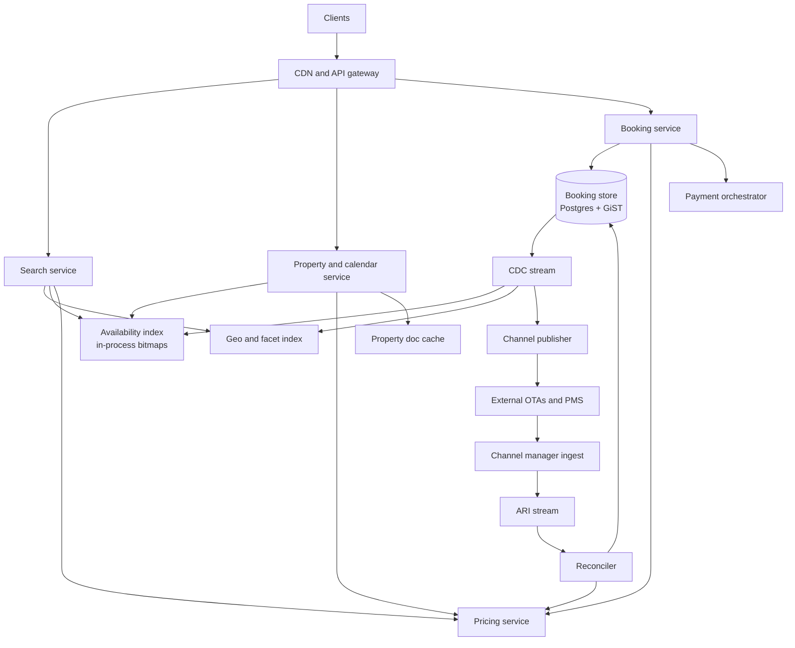
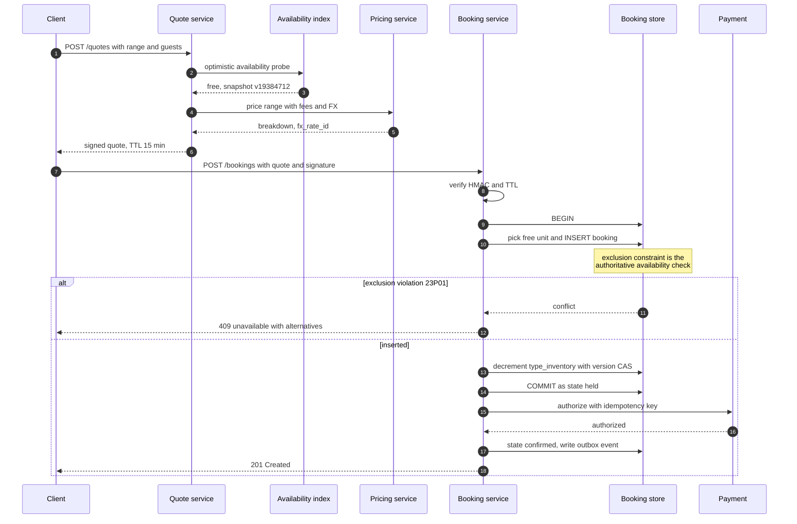
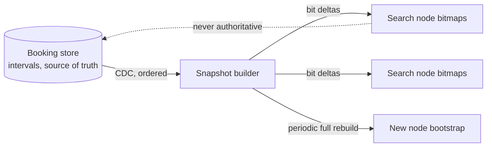
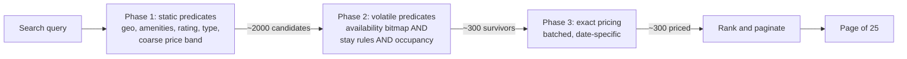
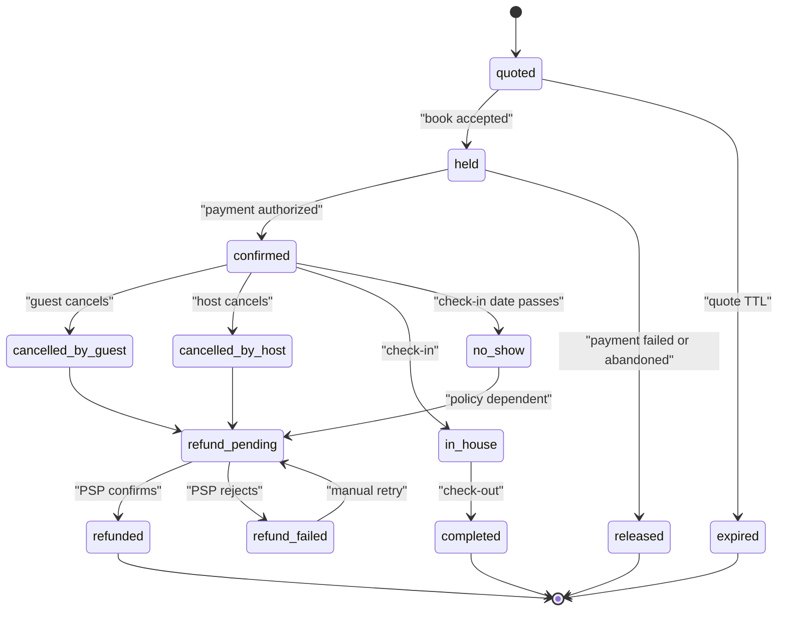
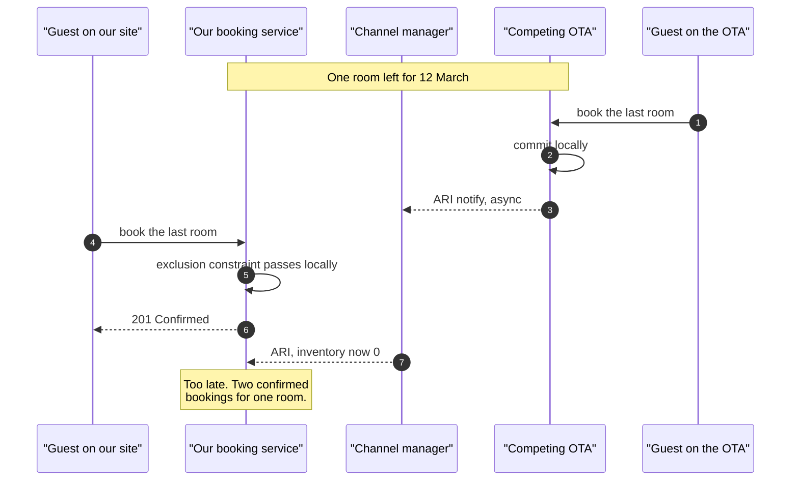

# 25 — Hotel / Airbnb Reservation

<span class="pill pill-core">Core</span> <span class="pill pill-hard">Hard</span>

**An inventory system whose unit of sale is a single room-night but whose unit of purchase is a contiguous range of them — so every correctness question becomes an overlapping-interval question, and the hardest part is that the truth about availability lives partly inside systems you do not own.**

| | |
|---|---|
| **Commonly asked at** | Booking.com, Airbnb, Expedia, Agoda, Marriott, Amazon, Uber, Stripe, Google, Tripadvisor |
| **Time budget** | 45 min |
| **Core tension** | Search must answer "what is available in Paris, 12–15 March, under €200, with a pool" across millions of properties in under 300 ms, which forces a denormalised, precomputed, deliberately stale index. Booking must answer "is room 412 free on every one of those three nights, right now" with serialisable certainty. Those two answers will disagree, and the entire design is about making the stale path cheap, the authoritative path narrow, and the disagreement a good user experience rather than a double-booking |
| **Prerequisites** | [F04 Caching](../fundamentals/f04-caching.md), [F06 Partitioning & Sharding](../fundamentals/f06-partitioning-sharding.md), [F07 Replication & Consistency](../fundamentals/f07-replication-consistency.md), [F08 CAP & PACELC](../fundamentals/f08-cap-pacelc.md), [F10 Distributed Transactions](../fundamentals/f10-distributed-transactions.md), [F11 Idempotency](../fundamentals/f11-idempotency.md), [F12 Queues & Streams](../fundamentals/f12-queues-streams.md), [F13 Storage Engines](../fundamentals/f13-storage-engines.md), [F14 SQL vs NoSQL](../fundamentals/f14-sql-vs-nosql.md), [F16 Search & Indexing](../fundamentals/f16-search-indexing.md), [F18 Resilience Patterns](../fundamentals/f18-resilience-patterns.md), [F19 Concurrency Control](../fundamentals/f19-concurrency-control.md), [F20 Time, Clocks & Ordering](../fundamentals/f20-time-clocks-ordering.md), [F24 Capacity Planning](../fundamentals/f24-capacity-planning.md), [F28 Cost Engineering](../fundamentals/f28-cost-engineering.md) |

---

## 1. Problem Statement

Build the availability, search and reservation system behind a global accommodation marketplace: index millions of properties, answer date-constrained geo searches with facets, show a per-property calendar of prices and open dates, and take bookings that span a range of nights without ever selling the same room twice.

Four properties make this materially different from the seat-selling problem in a ticketing system, and naming them early is what separates a good answer from a generic one.

**The unit of purchase is a range, not an item.** A three-night stay is an all-or-nothing claim over three consecutive room-nights. There is no partial fulfilment — a guest with nights one and three and not night two has nothing. Every concurrency mechanism has to operate over a set of adjacent units atomically, and every availability query is an *overlap* query rather than an equality lookup.

**Availability is a function of the query, not an attribute of the object.** "Is this property available?" is meaningless. "Is this property available for 12–15 March for two adults with a two-night minimum stay?" is a different question with a different answer for every date range a user might type. You cannot index a boolean `is_available` field, which is why naive search designs collapse the moment the date picker appears.

**Inventory is multi-homed and you are frequently not the source of truth.** The same physical room is simultaneously on sale on your site, on two competing OTAs, on the hotel's own website, and inside the hotel's property management system. Availability arrives over an asynchronous channel-manager feed with minutes of propagation delay. Double-bookings originate *outside* your transaction boundary, which means no amount of local locking prevents them.

**Search volume dwarfs booking volume by two to three orders of magnitude.** This is a read system with a transactional core the size of a rounding error — but the rounding error is where all the correctness lives, and the read system is where all the cost lives.

The invariant everything serves: **for any physical unit and any night, at most one active reservation exists** — and its corollary, **a booking either covers every night of the requested stay or does not exist at all.**

### Out of scope

Payment processing internals (see the payment system case study), host–guest messaging, reviews and ranking models, loyalty programmes, and the machine-learned relevance layer on top of search. Pricing *strategy* is out of scope; pricing as an architectural component is very much in.

---

## 2. Requirements

### Functional

| # | Requirement | Notes |
|---|---|---|
| F1 | Search by geography, date range, guest count and facets | Map viewport or city; price, amenity, rating, property-type filters |
| F2 | Property detail with a 12-month availability and price calendar | Per-night price, min-stay, check-in restrictions |
| F3 | Quote a stay at a fixed, signed price for a short TTL | Price must not move between review and payment |
| F4 | Book atomically across the entire date range | All nights or none |
| F5 | Cancel according to a policy, with a computed refund | Policy evaluated against booking time, not cancel time |
| F6 | Modify a booking (dates, guests, room) | A date change is an atomic release-and-reacquire |
| F7 | Host-side calendar control | Block dates, set min-stay, set nightly rates, set availability rules |
| F8 | Bidirectional sync with external channels | Ingest ARI from a channel manager; publish our sales back out |
| F9 | Overbooking policy for hotel room types | Deliberate, bounded, with a documented walk procedure |
| F10 | Group and multi-room bookings | N rooms for the same range in one transaction |

### Non-functional

| # | Requirement | Target |
|---|---|---|
| N1 | Double-booking of a physical unit | **Zero.** An invariant, not an SLO |
| N2 | Partial-range bookings | **Zero.** Structurally impossible, not merely rare |
| N3 | Search latency | p99 < 300 ms end-to-end |
| N4 | Calendar render latency | p99 < 200 ms for a 12-month calendar |
| N5 | Booking commit latency | p99 < 1.5 s excluding the payment provider |
| N6 | Search-result availability accuracy | > 98% of clicked results still bookable |
| N7 | Channel sync propagation | p95 < 60 s from external sale to our index |
| N8 | Read availability | 99.99%; browse and search survive a booking-tier outage |
| N9 | Price consistency | Quoted price honoured for the full quote TTL, 100% |

!!! danger "N1 and N7 are in direct conflict and one of them has to give"
    A room sold on a competing OTA at $t$ becomes unsellable on your site somewhere between $t + 2\,\text{s}$ and $t + 120\,\text{s}$, depending on the channel manager. During that window your system will cheerfully confirm a booking for a room that no longer exists. **No local concurrency control fixes this**, because the conflicting write never enters your database. The honest design position is: eliminate double-booking within your own boundary absolutely, bound and absorb it across the channel boundary with inventory buffers and a walk policy, and never claim to have solved a problem that is structurally outside your transaction. A candidate who says "row-level locking prevents double-booking" has not understood where the bookings come from.

---

## 3. Scale Estimation

### Inventory shape

$$
\begin{aligned}
\text{properties (listings)} &= 5\times10^{6} \\
\text{rentable units (physical rooms)} &\approx 2\times10^{7}\ (\text{avg 4 per property}) \\
\text{calendar horizon} &= 500\ \text{days} \\
\text{room-nights in the calendar} &= 2\times10^{7} \times 500 = 10^{10}
\end{aligned}
$$

Ten billion room-nights is the number that decides the entire storage design. Consider the three candidate representations:

$$
\begin{aligned}
\text{row per room-night (Postgres)} &: 10^{10} \times \sim70\ \text{B} \approx 700\ \text{GB} + \text{index} \approx 1.5\ \text{TB} \\[4pt]
\text{interval row per booking} &: 1.5\times10^{6}\ \text{bookings/day} \times 400\ \text{days retained} \times 200\ \text{B} \approx 120\ \text{GB} \\[4pt]
\text{one bit per room-night} &: \frac{10^{10}}{8} = 1.25\times10^{9}\ \text{B} = \mathbf{1.25\ GB}
\end{aligned}
$$

!!! tip "The number to say out loud"
    **"The complete global availability of twenty million rooms across a 500-day horizon is 1.25 gigabytes as a bitmap. That fits in the RAM of a laptop, let alone a search node."** This single fact is why the search path does not touch a database at all, and it reframes the problem from "how do I query availability at scale" to "how do I keep a small in-memory structure fresh". Most candidates never do this arithmetic and end up designing a date-range query against a sharded relational store, which is 10,000× more expensive for the same answer.

### Traffic

$$
\begin{aligned}
\text{searches/day} &= 5\times10^{8} &\Rightarrow\ \text{avg} \approx 5{,}800\ \text{req/s} \\
\text{peak multiplier (evening, seasonal)} &= 3\times &\Rightarrow\ \text{peak} \approx 17{,}000\ \text{req/s} \\
\text{property detail views/day} &= 2\times10^{8} &\Rightarrow\ \text{peak} \approx 7{,}000\ \text{req/s} \\
\text{bookings/day} &= 1.5\times10^{6} &\Rightarrow\ \text{avg} \approx 17\ \text{/s},\ \text{peak} \approx 60\ \text{/s}
\end{aligned}
$$

$$
\frac{\text{searches}}{\text{bookings}} = \frac{5\times10^{8}}{1.5\times10^{6}} \approx 330{:}1
$$

Sixty writes per second at peak. A single well-provisioned Postgres primary handles that with capacity to spare. **The transactional core is not a scale problem; it is a correctness problem.** All the machinery goes into the read path and the sync path.

### The search fan-out — where the real load is

A geo search does not evaluate one property; it evaluates a candidate set.

$$
\begin{aligned}
\text{candidates per search (city viewport)} &\approx 2{,}000 \\
\text{availability checks/s at peak} &= 1.7\times10^{4} \times 2\times10^{3} = 3.4\times10^{7}\ \text{/s}
\end{aligned}
$$

Thirty-four million availability evaluations per second. Now price each candidate implementation:

$$
\begin{aligned}
\text{SQL range query} &\approx 200\ \mu\text{s} &\Rightarrow&\ 3.4\times10^{7} \times 2\times10^{-4} = 6{,}800\ \text{CPU-seconds/s} \\
\text{sorted-list interval scan} &\approx 1\ \mu\text{s} &\Rightarrow&\ 34\ \text{CPU-seconds/s} \\
\text{bitmap word AND} &\approx 5\ \text{ns} &\Rightarrow&\ 0.17\ \text{CPU-seconds/s}
\end{aligned}
$$

6,800 CPU-seconds per second means roughly 6,800 dedicated cores doing nothing but answering "is it free". The bitmap needs a fraction of one core. **This is the arithmetic that forces the representation choice**, and it is worth doing on the whiteboard rather than asserting the conclusion.

### Stay-length distribution matters for the data structure

$$
\begin{aligned}
P(\text{nights} \le 7) &\approx 0.85 \\
P(\text{nights} \le 30) &\approx 0.98 \\
P(\text{nights} > 64) &\approx 0.002
\end{aligned}
$$

With 64-bit words and one bit per night, **85% of stays fit inside one or two machine words**, and a stay of $n \le 64$ nights is at most two word-masked comparisons. Only long-term rentals cross more, and those are 0.2% of traffic and can take a slower path.

### Channel sync volume

$$
\begin{aligned}
\text{ARI messages/day} &\approx 5\times10^{7} &\Rightarrow&\ \text{avg} \approx 580\ \text{/s} \\
\text{burst (chain-wide rate push)} &\approx 5{,}000\ \text{/s for minutes}
\end{aligned}
$$

A single hotel chain repricing its entire portfolio for a season generates a multi-million-message burst. The ingest path must be a buffered stream, not a synchronous API, or a partner's batch job becomes your outage.

### Storage and cost sketch

$$
\begin{aligned}
\text{search index (ES, 5M docs} \times 4\ \text{KB)} &\approx 20\ \text{GB} \times 3\ \text{replicas} = 60\ \text{GB} \\
\text{availability bitmap (hot, in-process)} &\approx 1.25\ \text{GB} \times N_{\text{search nodes}} \\
\text{price cache (per room-night, 4 B)} &\approx 10^{10} \times 4\ \text{B} = 40\ \text{GB} \\
\text{booking store (5 y retention)} &\approx 1.5\times10^{6} \times 365 \times 5 \times 1\ \text{KB} \approx 2.7\ \text{TB}
\end{aligned}
$$

The price cache is 32× the availability bitmap because prices are 32-bit integers and availability is one bit. That asymmetry is the reason pricing is a separate service with a separate scaling story (§7.3).

---

## 4. API Design

### Search

```http
GET /v1/search
    ?bbox=48.80,2.25,48.90,2.42
    &check_in=2026-03-12
    &check_out=2026-03-15
    &adults=2&children=0
    &price_max=200&currency=EUR
    &amenities=pool,wifi
    &sort=relevance&cursor=eyJvZmZzZXQiOjQwfQ
```

```json
{
  "results": [
    {
      "property_id": 8841023,
      "name": "Hôtel des Grands Boulevards",
      "lat": 48.8712, "lng": 2.3435,
      "thumb": "https://cdn.example.com/p/8841023/hero_640.webp",
      "rating": 8.9,
      "price": { "total_minor": 51000, "nightly_minor": 17000,
                 "currency": "EUR", "includes_taxes": false },
      "availability_snapshot_version": 19384712,
      "available_units": 3
    }
  ],
  "next_cursor": "eyJvZmZzZXQiOjQwfQ",
  "snapshot_age_ms": 4200
}
```

!!! note "`snapshot_age_ms` is a contract, not decoration"
    Returning the age of the availability snapshot in the response makes staleness an explicit, measurable part of the API rather than a hidden property. The client uses it to decide whether to re-check before rendering a "Book" button; monitoring uses it as an SLI; and in an incident you can tell instantly whether stale results are a sync problem or a query problem. Free to add, and it converts a whole class of "the site is lying to me" support tickets into a diagnosable metric.

### Calendar

```http
GET /v1/properties/8841023/calendar?start=2026-03-01&end=2027-02-28&units=1&adults=2
```

```json
{
  "property_id": 8841023,
  "currency": "EUR",
  "horizon": { "start": "2026-03-01", "end": "2027-02-28" },
  "availability_bitmap_b64": "AAAA8H8AAAD///8B...",
  "nightly_price_minor": [17000, 17000, 19500, 24000, "..."],
  "min_stay": [1, 1, 2, 2, "..."],
  "closed_to_arrival": [],
  "version": 19384712
}
```

Returning a base64 bitmap plus parallel arrays rather than 365 JSON objects is a 20× payload reduction and lets the client answer "is 12–15 March bookable" locally as the user drags across the date picker — no round trip per hover.

### Quote — availability and price, frozen

```http
POST /v1/quotes
Idempotency-Key: 5b4e2a10-7c1d-4b3f-9a2e-1f0c8d3a7b61
Content-Type: application/json

{
  "property_id": 8841023,
  "room_type_id": 55,
  "check_in": "2026-03-12",
  "check_out": "2026-03-15",
  "units": 1,
  "adults": 2,
  "currency": "EUR"
}
```

```json
{
  "quote_id": "qt_01HWX2K9",
  "expires_at": "2026-02-10T14:39:00Z",
  "breakdown": {
    "nightly": [17000, 17000, 19500],
    "subtotal_minor": 53500,
    "cleaning_fee_minor": 4000,
    "service_fee_minor": 6420,
    "tax_minor": 5980,
    "total_minor": 69900,
    "currency": "EUR",
    "fx_rate_id": "fx_2026021014"
  },
  "cancellation_policy": "flexible_48h",
  "signature": "v1.HMAC-SHA256.d41d8cd98f00b204e98..."
}
```

The signature is the important part: the quote is a **signed, self-describing, server-authenticated price token**, so the booking endpoint can verify it without a database read and without trusting a client-supplied amount. See [F27 Security in Design](../fundamentals/f27-security-design.md).

### Book

```http
POST /v1/bookings
Idempotency-Key: 5b4e2a10-7c1d-4b3f-9a2e-1f0c8d3a7b61
Content-Type: application/json

{
  "quote_id": "qt_01HWX2K9",
  "signature": "v1.HMAC-SHA256.d41d8cd98f00b204e98...",
  "guest": { "id": 99201, "name": "A. Dupont" },
  "payment_method_token": "pm_1QaBcDeF"
}
```

| Status | Meaning | Client action |
|---|---|---|
| `201 Created` | Booked; body contains `booking_id` and assigned unit | Show confirmation |
| `409 unavailable` | Some night in the range is taken; body names which | Re-render calendar with alternatives |
| `409 price_changed` | Quote expired or underlying rate moved | Re-quote and show the diff before charging |
| `422 policy_violation` | Min-stay, closed-to-arrival, max-occupancy | Explain the specific rule |
| `202 Accepted` | Payment in flight; poll `Location` | Poll, do not resubmit |

The `Idempotency-Key` is deliberately the **same value** used on the quote, scoped to the user's booking attempt. A client retrying after a timeout gets the original booking back rather than a second one. See [F11 Idempotency](../fundamentals/f11-idempotency.md).

### Host and channel

```http
PUT  /v1/rooms/{room_id}/availability      # block or open a date range
PUT  /v1/rate-plans/{id}/rates             # bulk nightly rates over a range
POST /v1/channel/ari                        # inbound availability/rate/inventory
POST /v1/channel/stop-sell                  # emergency close-out, highest priority
GET  /v1/channel/sync-state?property_id=    # per-channel sequence and drift
```

---

## 5. Data Model

The booking store is relational, sharded by `property_id`, and holds the authoritative interval data.

```sql
CREATE EXTENSION IF NOT EXISTS btree_gist;

-- A physical, assignable unit. For vacation rentals, one per listing.
-- For hotels, one per room, grouped under a room_type.
CREATE TABLE room (
    room_id        bigint PRIMARY KEY,
    property_id    bigint      NOT NULL,
    room_type_id   bigint      NOT NULL,
    label          text        NOT NULL,        -- '412'
    max_occupancy  smallint    NOT NULL,
    active         boolean     NOT NULL DEFAULT true
);
CREATE INDEX ON room (property_id, room_type_id);

CREATE TABLE booking (
    booking_id     uuid PRIMARY KEY,
    property_id    bigint      NOT NULL,
    room_id        bigint      NOT NULL REFERENCES room(room_id),
    room_type_id   bigint      NOT NULL,
    guest_id       bigint      NOT NULL,
    -- HALF-OPEN interval: [check_in, check_out). The guest occupies
    -- the night OF check_in and does NOT occupy the night of check_out.
    stay           daterange   NOT NULL,
    state          text        NOT NULL,
    units          smallint    NOT NULL DEFAULT 1,
    total_minor    bigint      NOT NULL,        -- integer minor units, never float
    currency       char(3)     NOT NULL,
    policy_id      text        NOT NULL,
    source_channel text        NOT NULL,        -- 'direct' | 'ota_x' | 'pms'
    external_ref   text,                        -- id in the originating system
    created_at     timestamptz NOT NULL DEFAULT now(),
    version        integer     NOT NULL DEFAULT 1,

    CONSTRAINT stay_non_empty CHECK (NOT isempty(stay)),

    -- THE constraint. Two ACTIVE bookings for the same physical room
    -- may not overlap on any night. Enforced by the GiST index itself,
    -- so no application-level locking is required.
    CONSTRAINT no_double_booking EXCLUDE USING gist (
        room_id WITH =,
        stay    WITH &&
    ) WHERE (state IN ('held', 'confirmed', 'in_house'))
);

CREATE INDEX booking_by_property_date
    ON booking USING gist (property_id, stay)
    WHERE state IN ('held', 'confirmed', 'in_house');
```

!!! example "Why `daterange` and not `tstzrange`"
    `daterange` is over a **discrete** type, so Postgres canonicalises every literal to the half-open form `[a, b)`. `'[2026-03-12, 2026-03-14]'::daterange` is silently stored as `[2026-03-12, 2026-03-15)`. That canonicalisation is a feature: it removes an entire class of inclusive/exclusive bugs at the type level. `tstzrange` is over a continuous type and does **not** canonicalise, so `[t1, t2]` and `[t1, t2)` are genuinely different values and `&&` gives different answers for them. A night is a calendar date at the property's local timezone, not an instant — see §12 for why conflating the two produces off-by-one-night bookings at exactly the wrong moment.

```sql
-- Host-side blocks (maintenance, owner stay, manual close-out).
CREATE TABLE host_block (
    block_id    bigserial PRIMARY KEY,
    room_id     bigint    NOT NULL,
    blocked     daterange NOT NULL,
    reason      text      NOT NULL,
    created_by  text      NOT NULL,
    created_at  timestamptz NOT NULL DEFAULT now(),
    CONSTRAINT no_overlapping_blocks EXCLUDE USING gist (
        room_id WITH =, blocked WITH &&
    )
);

-- Per-room-type inventory counters for hotels, which sell TYPES not rooms.
CREATE TABLE type_inventory (
    room_type_id bigint   NOT NULL,
    night        date     NOT NULL,
    total_units  smallint NOT NULL,
    sold_units   smallint NOT NULL DEFAULT 0,
    overbook_allowance smallint NOT NULL DEFAULT 0,
    version      integer  NOT NULL DEFAULT 1,
    PRIMARY KEY (room_type_id, night),
    CONSTRAINT not_oversold CHECK
        (sold_units <= total_units + overbook_allowance)
);

-- Stay restrictions, sparse: only rows that differ from the default.
CREATE TABLE stay_rule (
    room_type_id bigint NOT NULL,
    nights       daterange NOT NULL,
    min_stay     smallint,
    max_stay     smallint,
    closed_to_arrival   boolean DEFAULT false,
    closed_to_departure boolean DEFAULT false,
    PRIMARY KEY (room_type_id, nights)
);
```

### Pricing, deliberately elsewhere

```sql
-- Separate store, separate service, separate failure domain.
CREATE TABLE rate (
    rate_plan_id bigint   NOT NULL,
    room_type_id bigint   NOT NULL,
    night        date     NOT NULL,
    amount_minor bigint   NOT NULL,   -- integer minor units
    currency     char(3)  NOT NULL,
    updated_at   timestamptz NOT NULL,
    PRIMARY KEY (rate_plan_id, room_type_id, night)
);
```

### The search-side availability snapshot

Not a table — an in-process structure rebuilt from a change stream.

```text
AvailabilityIndex (per search node, ~1.25 GB resident)
  epoch_date       : 2026-01-01          # bit 0 of every bitmap
  horizon_days     : 512                 # 8 x 64-bit words per room
  room_bits        : dense array, room_id -> [8]uint64   (1 = occupied)
  type_counters    : room_type_id -> [512]uint16 (free units per night)
  property_index    : property_id -> room_id slice
  version          : monotonically increasing, from the CDC stream offset
```

| Store | Technology | Sharding | Consistency | Why |
|---|---|---|---|---|
| Bookings and blocks | Postgres with `btree_gist` | Hash on `property_id` | Serialisable via exclusion constraint | Interval correctness is a database feature here; re-implementing it in application code is strictly worse |
| Type inventory | Same shard as bookings | `room_type_id` colocated with property | Row-level OCC on `version` | Counter semantics for hotels; must commit in the same local transaction as the booking |
| Rates | Separate Postgres or Cassandra | `room_type_id` | Eventual | Rate churn is 100× booking churn; isolating it prevents rate pushes from contending with bookings |
| Search index | Elasticsearch / OpenSearch | Geo-sharded by region | Eventual, seconds | Facets and geo only; availability is deliberately excluded |
| Availability snapshot | In-process bitmaps fed by CDC | Replicated to every search node | Eventual, single-digit seconds | 1.25 GB globally; replication is cheaper than partitioning |
| Quote tokens | Signed, stateless; optional Redis for revocation | n/a | n/a | No shared state on the hot path |

---

## 6. High-Level Architecture



### Read path — a user searches

1. The gateway resolves the viewport to a set of geohash cells and forwards to the nearest search cluster.
2. The **geo and facet index** returns up to a few thousand candidate `property_id`s matching everything that does *not* depend on dates: location, rating, amenities, property type, and a coarse price band derived from the property's min and max nightly rate over the horizon.
3. The **availability index** filters that candidate list in-process. For each candidate property, for each of its rooms, mask the bit range corresponding to the requested nights and test for zero. For a 3-night stay this is one word AND per room. Properties with no free unit are dropped.
4. Surviving candidates go to the **pricing service** for an exact total over the specific range, including fees, taxes and currency conversion. Pricing is called with a batch of (room type, range) tuples, not one call per property.
5. Results are ranked, truncated to a page, and returned with `snapshot_age_ms` and a `version`.

The critical structural property: **steps 2, 3 and 4 never touch the booking database.** A total outage of the booking store degrades the site to browse-only, which is the correct degradation for a marketplace where 330 searches happen per booking.

### Read path — a user opens a property

The property document (photos, description, amenities, geometry) is a cache-friendly immutable-ish blob served from a CDN with a version in the URL. The calendar overlay — bitmap, nightly prices, min-stay — is a small, separately-cached object with a short TTL, exactly the same immutable-object-plus-pointer pattern used for live inventory in high-contention systems.

### Write path — quote, recheck, book



!!! note "The authoritative availability check is the `INSERT`, not a preceding `SELECT`"
    Every "check then act" sequence has a race between the check and the act. Here the check *is* the act: the exclusion constraint evaluates overlap atomically inside the index during insertion, and a conflicting concurrent transaction gets a `23P01 exclusion_violation` rather than a stale success. There is no `SELECT ... FOR UPDATE`, no advisory lock, and no application-level ordering to get wrong. The earlier probe against the availability index is a *latency optimisation* — it lets you reject 99% of doomed attempts before opening a transaction — and it is explicitly allowed to be wrong.

---

## 7. Deep Dives

### 7.1 Modelling the availability calendar

Three representations, and the choice is not global — you use different ones in different tiers.

=== "Row per room-night"

    ```sql
    CREATE TABLE availability_day (
        room_id bigint NOT NULL,
        night   date   NOT NULL,
        state   smallint NOT NULL,   -- 0 free, 1 held, 2 booked, 3 blocked
        booking_id uuid,
        PRIMARY KEY (room_id, night)
    );
    ```

    **Strengths.** Trivially understandable. Point updates are simple. Enforcing "one booking per room-night" is a primary key. Range availability is `SELECT count(*) ... WHERE night >= a AND night < b AND state = 0`, which a composite index serves well.

    **Weaknesses.** $10^{10}$ rows. A host opening a year of dates writes 365 rows. Booking a 3-night stay is 3 row locks and 3 updates, and the transaction must cover all of them. Worst of all, availability is *materialised*, so the calendar and the bookings can diverge — you now have two sources of truth for the same fact and a reconciliation job forever.

    **Verdict.** Rejected as the source of truth; excellent as a **derived, per-property materialised view** used for host-facing calendar editing where point semantics are what the user actually manipulates.

=== "Interval per booking with an exclusion constraint"

    ```sql
    CONSTRAINT no_double_booking EXCLUDE USING gist (
        room_id WITH =, stay WITH &&
    ) WHERE (state IN ('held','confirmed','in_house'))
    ```

    **Strengths.** One row per booking, so ~120 GB instead of 1.5 TB. Availability is *derived*, so it cannot diverge from the bookings — there is exactly one source of truth. The overlap check is enforced by the storage engine at serialisable strength with no application locking. A multi-night stay is a single row, so range atomicity is free.

    **Weaknesses.** GiST index maintenance is more expensive than a B-tree. "Find a free room in this property for this range" is a `NOT EXISTS` anti-join, which needs care to plan well. Conflicts surface as an error code your application must translate, and a naive ORM will surface it as a 500.

    **Verdict.** **Chosen as the source of truth.** The insight worth stating: *you do not store availability; you store occupancy and derive availability.* One fact, one place.

=== "Bitmap per room"

    ```text
    room 4412  epoch 2026-01-01  512 days  = 8 x uint64
    word 0 : 0000 0000 0000 0000 0000 0000 0111 0000 ...
                                            ^^^ nights 68,69,70 occupied
    ```

    **Strengths.** 1 bit per room-night; the entire global calendar is 1.25 GB. A range query for $n \le 64$ nights is one or two masked ANDs — around 5 ns. Intersecting "free for this range" across thousands of candidate properties is a tight loop with perfect cache behaviour. Set operations (free in A *and* free in B) are free.

    **Weaknesses.** No durability, no transactions, no booking identity — a set bit does not tell you *whose* booking it is. Fixed horizon requires periodic re-basing. Updates must be applied in order or the structure corrupts silently.

    **Verdict.** **Chosen for the read path only**, rebuilt from the booking store's change stream. Explicitly a cache. Never the thing a booking is validated against.



#### The overlapping-range query, precisely

Two half-open intervals $[a_1, a_2)$ and $[b_1, b_2)$ overlap if and only if:

$$
a_1 < b_2 \ \wedge\ b_1 < a_2
$$

Strict inequalities on both sides. This is the whole thing, and getting it wrong in either direction is the most common bug in this domain:

- Using $\le$ on either side makes a checkout on 15 March conflict with a check-in on 15 March, so you lose a sale on every single turnover day. At 70% occupancy that is a multi-percent revenue error.
- Using closed intervals $[a_1, a_2]$ and storing `check_out` as the last occupied night means a one-night stay has $a_1 = a_2$, and every arithmetic expression involving stay length is now off by one somewhere.

In Postgres, `&&` on `daterange` implements exactly the expression above, on canonicalised `[)` values. **Use the type; do not hand-roll the comparison.**

#### Finding a free unit efficiently

```sql
-- One round trip: pick an assignable room and insert, atomically.
WITH candidate AS (
    SELECT r.room_id
    FROM room r
    WHERE r.property_id = $1
      AND r.room_type_id = $2
      AND r.active
      AND r.max_occupancy >= $5
      AND NOT EXISTS (
            SELECT 1 FROM booking b
            WHERE b.room_id = r.room_id
              AND b.state IN ('held','confirmed','in_house')
              AND b.stay && daterange($3, $4, '[)')
      )
      AND NOT EXISTS (
            SELECT 1 FROM host_block hb
            WHERE hb.room_id = r.room_id
              AND hb.blocked && daterange($3, $4, '[)')
      )
    ORDER BY r.room_id          -- deterministic, not random
    LIMIT 1
)
INSERT INTO booking (booking_id, property_id, room_id, room_type_id,
                     guest_id, stay, state, total_minor, currency, policy_id)
SELECT $6, $1, candidate.room_id, $2, $7,
       daterange($3, $4, '[)'), 'held', $8, $9, $10
FROM candidate
RETURNING booking_id, room_id;
```

Two concurrent transactions can select the same `room_id` in the CTE — the `NOT EXISTS` sees a snapshot. That is fine: the exclusion constraint rejects the second insert. The application catches `23P01`, re-runs the statement (which now sees the room as taken and picks the next one), and gives up after a small bounded number of attempts. **Retry-on-constraint-violation replaces locking**, and for a property with $k$ free rooms the expected retry count under concurrency $c$ is tiny as long as $c \ll k$; when $c \gg k$ the property is genuinely sold out and failing fast is correct.

!!! warning "Zero rows returned is not the same as a conflict"
    If the CTE finds no candidate, the `INSERT ... SELECT` inserts zero rows and **commits successfully**. An application that checks only for exceptions will report a booking that does not exist. Always check the affected-row count and treat zero as `409 unavailable`. This bug is silent, passes every unit test that uses an empty database, and shows up in production as customers arriving at hotels with a confirmation email and no reservation.

### 7.2 Search at scale: geo, dates, price and facets

The fundamental obstacle: **you cannot put availability into the inverted index.** To make "available 12–15 March" a searchable term you would need a document per (property, date-range) combination:

$$
\text{documents} = 5\times10^{6} \times \binom{500}{2}\text{-ish} \approx 5\times10^{6} \times 1.2\times10^{5} = 6\times10^{11}
$$

Six hundred billion documents, and every booking invalidates thousands of them. Even indexing a per-night boolean — 500 fields per document — means a single booking triggers a document update that ripples through segment merges, and at 60 bookings/s with 5M documents the index is in permanent rewrite.

So the architecture is a **two-phase filter** that splits query predicates by volatility:



| Predicate | Phase | Why there |
|---|---|---|
| Geo bounding box / radius | 1 | Immutable; the most selective single predicate |
| Amenities, property type, star rating | 1 | Changes monthly at most |
| Review score | 1 | Changes slowly; approximate is fine |
| **Coarse price band** (min/max nightly over horizon) | 1 | A conservative superset filter; never excludes a valid result |
| **Availability over the exact range** | 2 | Changes 60×/s globally; bitmap makes it nanoseconds |
| Min-stay, closed-to-arrival, max occupancy | 2 | Date-dependent rules, same structure as availability |
| **Exact total price** including fees, taxes, FX | 3 | Requires the specific range; expensive; only on survivors |

#### Why the coarse price band in phase 1 must be conservative

Indexing `min_nightly_over_horizon` and `max_nightly_over_horizon` lets a `price_max=200` query drop properties whose cheapest night exceeds 200. That is a **superset filter**: it never removes a property that could match, only ones that definitely cannot. Get this backwards — index the *average* price and filter on it — and you silently hide valid cheap-in-March properties from users, an error nobody notices because there is no negative signal for a result that was never shown.

#### The candidate-set explosion problem

A search over "France, flexible dates, any price" matches hundreds of thousands of properties. Phase 2 cannot evaluate them all inside a 300 ms budget.

$$
\text{budget}_{\text{phase 2}} = 80\ \text{ms},\quad \text{cost/candidate} \approx 250\ \text{ns (incl. rules and units)}
$$

$$
\Rightarrow\ \text{max candidates} \approx \frac{80\times10^{-3}}{250\times10^{-9}} = 320{,}000
$$

Comfortable — but only because the evaluation is a bitmap operation. At SQL cost (200 µs) the same budget buys **400 candidates**, which is not enough to fill one page of results after filtering. The bitmap is not an optimisation; it is what makes date-filtered search possible at all.

Beyond that ceiling, three levers, applied in order:

1. **Tighten phase 1** with geo cell subdivision — search the viewport's cells, not the country.
2. **Pre-rank in phase 1** and evaluate availability in relevance order, stopping once the page plus a margin is filled. This is a top-$k$ early-exit, and it is correct as long as availability is uncorrelated with relevance, which it is not — so use a generous margin and measure the resulting bias.
3. **Precompute a coarse availability bloom** per property: a 512-bit summary answering "does this property have *any* free unit on night $d$". Properties fully sold out for any night in the range are dropped before the per-room loop. See [F21 Probabilistic Data Structures](../fundamentals/f21-probabilistic-data-structures.md) for the false-positive analysis — false positives are harmless here (they cost a wasted per-room check), false negatives would be a correctness bug, so the summary must be exact-zero-safe.

#### Flexible dates and "anywhere" search

"A weekend in April, anywhere in Europe, under €150" multiplies the query by every candidate range. The bitmap makes this tractable in a way nothing else does: for a fixed stay length $n$, "is there any free window of length $n$ in this month" is a shift-and-AND cascade:

```python
MASK64 = (1 << 64) - 1

def has_free_window(word: int, n: int) -> bool:
    """True if `word` (1 = occupied) contains n consecutive zero bits."""
    free = (~word) & MASK64
    # Repeated halving: log2(n) shifts instead of n.
    k = 1
    while k < n:
        step = min(k, n - k)
        free &= (free >> step)
        k += step
    return free != 0
```

$\log_2 n$ operations instead of $n$, per 64-night window. That is what lets a flexible-date search over a whole continent return in under a second.

### 7.3 Pricing as a separate concern from availability

The single most consequential architectural decision on this page after the exclusion constraint: **price and availability are different data with different change rates, different consistency needs and different blast radii, so they get different services.**

| Dimension | Availability | Price |
|---|---|---|
| Change rate | ~60 writes/s globally (bookings) | ~5,000 writes/s (rate pushes, dynamic repricing) |
| Size | 1 bit per room-night → 1.25 GB | 32+ bits per room-night-rateplan → 40 GB to 1 TB |
| Consistency requirement | Strong at booking time; a wrong answer is a double-booking | Strong *within a quote*; a wrong answer is a revenue or trust error |
| Correct failure mode | Fail closed — refuse the booking | Fail open — serve last-known price and honour it |
| Blast radius of staleness | Overbooking or lost sales | Mispricing, recoverable via the quote contract |

If you merge them, a dynamic-pricing job repricing a chain's portfolio contends with the booking write path, and a pricing outage takes down bookings. Separating them means a pricing failure degrades to "show cached prices, honour signed quotes", which is a business decision you can actually make.

#### The quote token — freezing price without holding inventory

```json
{
  "v": 1,
  "quote_id": "qt_01HWX2K9",
  "room_type_id": 55,
  "stay": "2026-03-12/2026-03-15",
  "units": 1,
  "total_minor": 69900,
  "currency": "EUR",
  "fx_rate_id": "fx_2026021014",
  "policy_id": "flexible_48h",
  "iat": 1770732000,
  "exp": 1770732900
}
```

HMAC-signed with a rotating key. Properties worth naming:

- **Stateless.** No database row, no Redis entry, no cleanup job. A million outstanding quotes cost nothing.
- **Tamper-evident.** The client cannot change `total_minor` to 1. Never, under any circumstances, accept a client-supplied price.
- **Short-lived.** 15 minutes, matched to observed checkout duration, so an unbounded stale-price liability does not accumulate.
- **Decoupled from inventory.** A quote is **not a hold.** Issuing a quote reserves nothing. This is the right default for accommodation, where conversion is 1–3% and holding inventory for every quote would sterilise the entire supply.

!!! tip "Quote is not hold — say this explicitly"
    In ticketing, a hold is mandatory because a specific seat has thousands of contenders. In accommodation the contention ratio is closer to 1.02:1, so holding on quote destroys far more availability than it protects. **Match the reservation strength to the contention ratio.** The exception is high-demand inventory — a single ski chalet during a school holiday — where a short hold on quote is justified, and a good answer proposes making holding a *per-listing, demand-driven policy* rather than a global one.

#### Currency, fees and taxes

Every monetary value is an integer in the currency's minor unit, with an explicit currency code. Never floating point. The FX rate used is captured by `fx_rate_id` on the quote so the same rate is used at booking, at refund, and in reconciliation — a refund computed at a different rate than the charge produces a residual that lands in a suspense account and eventually on someone's desk.

Fees decompose into:

$$
\text{total} = \underbrace{\sum_{d \in [\text{in},\text{out})} r_d}_{\text{nightly subtotal}} + \underbrace{f_{\text{clean}}}_{\text{per stay}} + \underbrace{f_{\text{service}}}_{\text{percentage}} + \underbrace{\tau(\text{jurisdiction}, \text{nights}, \text{guests})}_{\text{tax, sometimes per-person-per-night}}
$$

Tax is the nasty one: many jurisdictions levy a per-person-per-night tourist tax with caps, exemptions by age, and different treatment for stays over a threshold. It is a rules engine, it changes by local ordinance, and it must be versioned so a booking made under last year's rules can be re-derived exactly during an audit.

### 7.4 Preventing overbooking: three mechanisms

| Mechanism | How | Throughput under contention | Verdict |
|---|---|---|---|
| Pessimistic row locks | `SELECT ... FROM availability_day WHERE room_id = $1 AND night BETWEEN ... FOR UPDATE`, ordered | Serialises all bookings for a property; holds locks across the whole transaction, including any remote call | **Rejected.** Correct, but a slow downstream call inside the transaction converts a 60 ms booking into a 3 s lock hold, and connection pools die |
| Optimistic concurrency on a version column | Read `version`, compute, `UPDATE ... WHERE version = $v`, retry on zero rows | Excellent at low contention; degrades at high contention, retry storms on scarce inventory | **Chosen for `type_inventory` counters** where the row is a counter and contention is bounded |
| Exclusion constraint on the interval | Insert and let GiST reject overlaps | The index does the serialisation at the granularity of the actual conflict; no lock held outside the insert | **Chosen for physical-room bookings.** The conflict granularity matches the business conflict exactly |

The unifying rule: **hold no lock across a network call you do not control.** The booking transaction covers exactly the insert and the counter decrement, commits in state `held`, and only then calls the payment provider. Payment outcome moves `held` to `confirmed` or releases it. This is the same structural decision as separating hold from pending-payment in ticketing, and for the same reason.

#### Hotels sell types, not rooms — and that changes everything

A guest booking a "Deluxe King" does not get room 412 at booking time; they get *a* Deluxe King, assigned by the front desk at check-in. This is not a detail, it is a different concurrency problem:

- The constraint is a **counter** per (room type, night): $\text{sold} \le \text{total} + \text{allowance}$.
- Counters shard, tolerate OCC, and permit *deliberate* overselling.
- Deliberate overbooking is standard practice and rational: with a no-show rate $\nu \approx 0.05$ and a cancellation rate $\gamma$, selling $\lceil N/(1-\nu) \rceil$ units maximises expected revenue against the cost of a walk.

$$
\text{allowance} = \arg\max_{k}\ \Big[ (N + k)\,p\,(1-\nu) - \mathbb{E}[\text{walks}(k)] \cdot c_{\text{walk}} \Big]
$$

where $c_{\text{walk}}$ is the cost of relocating a guest (alternative hotel, transport, compensation, reputational damage) and is typically 2–4× the nightly rate. A candidate who *proposes* bounded overbooking for hotel types, with a walk policy, and contrasts it with the absolute no-overbooking rule for whole-property vacation rentals, is demonstrating domain understanding rather than just distributed systems mechanics.

### 7.5 Multi-night atomicity, and the fragmentation it causes

A stay is a single `daterange` row, so atomicity across nights is structural rather than coordinated — there is no two-phase anything. Two harder cases:

**Multi-room bookings.** Four rooms for the same range, all or nothing. Four inserts in one local transaction; the exclusion constraint may reject any of them; the whole transaction rolls back. Because all rooms of a property live on the same shard (that is *why* we shard on `property_id`), this stays a single-node transaction. Cross-property group bookings — a wedding block across three hotels — genuinely need a saga with compensations, and the right answer is to make each property's booking independently cancellable and expose partial success to the organiser rather than pretending to offer atomicity you cannot deliver.

**Split-stay and room moves.** A guest wants seven nights and no single room is free for all seven, but room 412 is free for nights 1–3 and room 415 for nights 4–7. Model this as two linked bookings with a `stay_group_id`, atomic within one transaction, and surface it in the UI as "room change on Wednesday". Represented as intervals this is natural; represented as a single row with one `room_id` it is impossible.

#### Fragmentation is a real cost

Occupancy measured as booked-nights over available-nights hides the problem. A month with alternating booked and free nights is 50% occupied and nearly 100% unsellable, because the modal stay is 2–3 nights and a one-night gap between two bookings can only be filled by a one-night booking.

$$
\text{sellable fraction} = \frac{\sum_{\text{gaps } g}\ \max(0,\ |g| - \text{min stay} + 1)}{\text{free nights}}
$$

Mitigations, in increasing order of sophistication: gap-aware minimum stays (auto-set min-stay to the gap length when a gap of 1–2 nights appears), orphan-night discounting, and — for hotels — **room reassignment**, which is only possible because the guest bought a type rather than a unit. Reshuffling assignments nightly to consolidate free blocks can recover several points of sellable inventory and is a batch optimisation, not a request-path concern.

### 7.6 Cancellation, refunds and the policy state machine



The states that **occupy inventory** are `held`, `confirmed`, `in_house`. Every other state does not — and that set is exactly the predicate in the exclusion constraint's `WHERE` clause. **The state machine and the constraint must be edited together**; adding a state without updating the predicate either creates phantom occupancy or, far worse, allows a double-booking.

!!! danger "Adding a state to the enum without updating the exclusion predicate is a silent correctness break"
    Suppose you add `pending_verification` between `held` and `confirmed`. If it is not in the constraint's `WHERE` list, a booking sitting in that state does not block anyone, and a second guest books the same room. Nothing errors. The two bookings coexist happily until check-in. Defend against this with a migration test that asserts the constraint predicate equals the set of inventory-occupying states derived from the same source as the application enum, so the two cannot drift.

#### Refund computation is evaluated against booking-time policy

```python
from dataclasses import dataclass
from datetime import date, datetime

@dataclass(frozen=True)
class PolicyTier:
    days_before_checkin: int      # tier applies at or beyond this many days
    refund_bps: int               # basis points of the accommodation subtotal

# Snapshotted onto the booking at creation time, NOT looked up at cancel time.
FLEXIBLE_48H = (
    PolicyTier(days_before_checkin=2,  refund_bps=10_000),  # 100%
    PolicyTier(days_before_checkin=0,  refund_bps=5_000),   # 50%
)

def refund_minor(subtotal_minor: int, fees_minor: int,
                 tiers: tuple[PolicyTier, ...],
                 now: datetime, check_in: date, tz: str) -> int:
    days = (check_in - local_date(now, tz)).days
    bps = 0
    for tier in tiers:                        # tiers sorted descending
        if days >= tier.days_before_checkin:
            bps = tier.refund_bps
            break
    # Banker-free, deterministic: integer arithmetic with explicit rounding.
    refund = (subtotal_minor * bps + 5_000) // 10_000
    # Service fees are non-refundable below the top tier.
    if bps == 10_000:
        refund += fees_minor
    return refund
```

Three things this encodes that are easy to get wrong:

1. **The policy is snapshotted onto the booking.** A host changing their cancellation policy must not retroactively change the terms of an existing booking. Store `policy_id` *and* the resolved tiers, versioned.
2. **"Days before check-in" is computed in the property's local timezone**, not the guest's and not UTC. A guest in Auckland cancelling a Paris hotel at 09:00 NZDT is cancelling at 21:00 the previous day in Paris, and that can cross a refund tier boundary. Getting this wrong produces refund disputes that are individually small and collectively constant.
3. **Rounding is explicit and integral.** `(x * bps + 5000) // 10000` is half-up rounding on integers with no floating point anywhere. The refund plus the retained amount must equal the original charge exactly; if they do not, the difference accumulates in a clearing account.

Refund and inventory release are two different systems and must not be coupled synchronously. Release the inventory in the local transaction that moves the booking out of an occupying state — it is free and reversible. Issue the refund asynchronously through the payment orchestrator with retries and a dead-letter queue, because a failed refund is a customer-visible financial error that needs a human, not a rollback of the cancellation.

### 7.7 Channel sync: where double-bookings actually come from

The same physical room is sold through your site, two competing OTAs, the hotel's brand site, and walk-ins at the front desk. A channel manager sits between the property management system and all distribution channels, exchanging **ARI** messages — Availability, Rates, Inventory.



**No local mechanism prevents this**, because the competing write never entered your database. The propagation window is typically 2–120 seconds and occasionally minutes when a partner batches. Available responses, in the order you should present them:

| Strategy | Mechanism | Cost | When |
|---|---|---|---|
| **Allocation split** | Each channel gets a fixed quota of units per night; no channel can sell another's | Zero double-booking; badly underutilises small properties (a 1-unit listing cannot be split) | Large hotels, high season |
| **Pooled with last-unit protection** | All channels see pooled inventory, but the final $k$ units are withheld from slow-syncing channels | Small revenue loss; simple; tunable per partner by measured sync latency | **Chosen default** |
| **Stop-sell broadcast** | On selling the last unit, push a high-priority close-out ahead of all queued ARI traffic | Shrinks but does not close the window | Always, as a complement |
| **Synchronous check against the PMS** | Call the property's system in the booking path | Actually correct; adds 200–2000 ms and a hard dependency on a partner's uptime | Only for high-value or high-conflict properties |
| **Accept and absorb** | Confirm, detect the conflict later, walk or relocate the guest with compensation | Unavoidable residual; needs a funded, documented procedure | The honest backstop |

#### Making the ingest path safe

```json
{
  "message_id": "cm-9f31a7-0041",
  "property_id": 8841023,
  "source": "channel_manager_x",
  "sequence": 88213,
  "emitted_at": "2026-02-10T14:22:11.440Z",
  "updates": [
    { "room_type_id": 55, "night": "2026-03-12", "available_units": 0 },
    { "room_type_id": 55, "night": "2026-03-13", "available_units": 2 }
  ]
}
```

- **Per-source monotonic sequence numbers**, and reject or park anything out of order. ARI messages are not commutative: "set units to 0" followed by "set units to 2" is very different from the reverse, and networks reorder.
- **Absolute state, not deltas.** `available_units = 2` is idempotent under redelivery; `decrement by 1` is not. Partners that only emit deltas require a periodic full-sync to re-anchor, which is a strictly worse contract — say so when negotiating the integration.
- **Never trust the partner's clock** for ordering. `emitted_at` is for observability and lag measurement; the sequence number is for ordering. See [F20 Time, Clocks & Ordering](../fundamentals/f20-time-clocks-ordering.md).
- **Full reconciliation on a schedule.** Pull the complete 90-day ARI snapshot per property nightly and diff against local state. Alarm on drift; auto-repair only in the safe direction (make something *less* available without human review; making something *more* available requires confirmation, because that direction creates overbooking).
- **Buffer the ingest.** A partner's batch job at 03:00 pushing five million messages must land on a stream with backpressure, not on your synchronous API. See [F12 Queues & Streams](../fundamentals/f12-queues-streams.md).

### 7.8 Search staleness and the recheck-on-click

The search result set is built from a snapshot that is seconds old. Between rendering and clicking, some results become unbookable.

$$
\begin{aligned}
\text{global booking rate} &= 60\ \text{/s} \\
\text{snapshot lag}\ L &\approx 5\ \text{s} \\
\text{room-nights sold during } L &= 300 \\
P(\text{a specific result is stale}) &\approx \frac{300}{2\times10^{7}} \approx 1.5\times10^{-5}
\end{aligned}
$$

Negligible **in aggregate** — and deeply misleading, because bookings are not uniformly distributed. For a single scarce listing in a hot market on a peak weekend, the conditional probability is orders of magnitude higher, and those are precisely the results users click.

The mitigation ladder:

1. **Recheck on click.** Opening a property detail page issues a fresh availability read against the primary booking store for that one property. One property, one indexed range query: sub-millisecond, and at 7,000 detail views/s entirely affordable. **This is the highest-value single mitigation**, because it converts a stale search result into a correct detail page before the user invests any effort.
2. **Recheck at quote.** The quote probes availability again. Still advisory.
3. **Authoritative check at booking.** The exclusion constraint. Never advisory.
4. **Design the 409.** When the insert conflicts, do not return a bare error. Return the specific conflicting nights, the nearest available ranges for the same property, and two or three similar properties at a comparable price — computed in the same request from the already-warm availability index. A great rejection retains more revenue than a marginally fresher index.

!!! tip "The freshness/correctness split stated in one sentence"
    **"Search is allowed to be wrong, the detail page rechecks, the quote rechecks again, and the booking is the only thing that is authoritative — so I spend my engineering effort on making the authoritative check cheap and the rejection excellent, not on making the index fresher."** This inverts the instinct most candidates have (push freshness everywhere) and it is the correct posture for any system with a 330:1 read-to-write ratio.

---

## 8. Scaling the Bottleneck

**Bottleneck 1 — availability evaluation in search.** $3.4\times10^{7}$ checks/s. Solved by representation, not by capacity: bitmaps turn a 200 µs query into a 5 ns word operation, a 40,000× improvement that no amount of hardware buys. The index is 1.25 GB, so it is *replicated to every search node* rather than partitioned — replication is cheaper than the network hop a partitioned design would require on every candidate.

**Bottleneck 2 — pricing fan-out.** Phase 3 prices ~300 survivors per search at 17,000 searches/s, so $5\times10^{6}$ price computations/s. Batched calls (one request per search carrying 300 tuples), a per-room-type-per-night rate cache with a short TTL, and precomputed totals for the most common stay lengths (2 and 3 nights, ~60% of queries) on popular properties. The cache hit ratio is what makes this affordable; the miss path is a Cassandra read.

**Bottleneck 3 — the booking store's GiST indexes.** 60 writes/s globally is trivial, but GiST insert cost grows with index size and page splits are more expensive than B-tree splits. Partition `booking` by `property_id` hash **and** by stay year, so the hot partition holds only the current and next year's intervals and historical data never participates in index maintenance. Aggressive autovacuum on the booking table; GiST index bloat on a high-churn `held` state is real and shows up as a slow creep in insert latency over weeks.

**Bottleneck 4 — ARI ingest bursts.** 5,000 msg/s bursts against a 580/s average. A partitioned log keyed by `property_id` preserves per-property ordering while parallelising across properties. Consumer lag per partition is the SLI. A partner emitting a five-million-message batch consumes their own partitions and does not delay anyone else — **isolate noisy partners onto dedicated partitions by key prefix**, because the alternative is one integration's batch window degrading global sync freshness.

**Bottleneck 5 — CDC to snapshot propagation.** Every booking must reach every search node's bitmap. At 60 bookings/s and $N$ search nodes this is $60N$ small messages — trivial. The real constraint is **bootstrap**: a new search node needs 1.25 GB of bitmap plus the delta since the snapshot was taken. Ship a periodically-built compressed snapshot to object storage (roughly 200 MB compressed), have new nodes fetch and then replay the log tail, and refuse to serve traffic until lag is under threshold. See [F15 Object Storage](../fundamentals/f15-object-storage.md).

**Bottleneck 6 — calendar reads for popular properties.** A property featured in a newsletter takes a 100× read spike on a 12-month calendar object. Because the calendar is a versioned immutable object plus a small pointer, this is absorbed entirely by the CDN at the cost of a few seconds of staleness. The pointer document is ~60 bytes with a 5 s TTL; the bitmap payload is immutable with a one-year TTL. See [F05 CDN & Edge](../fundamentals/f05-cdn-edge.md).

---

## 9. Failure Modes

| Failure | Blast radius | Detection | Mitigation | Degraded behaviour |
|---|---|---|---|---|
| Double-booking within our boundary | One guest at a property, at night | Continuous invariant audit: overlapping active bookings per room | Exclusion constraint; the audit should never fire | None acceptable. Page immediately; relocate the later booking |
| Double-booking via channel race | One guest; partner-dependent frequency | Post-hoc conflict detector across our bookings and ARI state | Last-unit protection, stop-sell priority, allocation split for high-conflict partners | Walk procedure with funded compensation |
| Availability snapshot lag | All search results for the lagging window | CDC consumer lag per search node | Node refuses traffic above a lag threshold; load balancer drains it | Fewer search nodes, higher latency, correct results |
| Availability snapshot corruption | Silently wrong search results — the worst failure class | Periodic full rebuild compared bit-for-bit against the store | Version every delta; checksum the structure; rebuild on mismatch | Fall back to a slower store-backed availability filter |
| Pricing service down | All quotes | Error rate and timeout budget on phase 3 | Serve last-known cached prices; honour outstanding signed quotes | Search and booking continue at cached prices; new dynamic pricing paused |
| Booking store shard down | All bookings for properties on that shard | Connection errors; per-shard success rate | Read replicas serve browse; writes fail fast | Browse-only for affected properties; explicit "try again shortly" |
| Exclusion violations spiking | Users see 409s on booking | `23P01` rate as a first-class metric | Usually an upstream staleness problem; check snapshot lag first | Recheck-on-click already catches most; surface alternatives |
| ARI partner outage | That partner's properties drift | Per-source message rate versus baseline; sequence gaps | Freeze inventory for that partner's properties at last-known-safe; do not assume availability | Properties become conservatively less available, never more |
| ARI out-of-order delivery | Wrong availability for specific nights | Sequence-number gap and regression detection | Reject and park out-of-order; trigger a full resync for that property | Property temporarily excluded from search |
| Quote signing key rotation error | All quotes rejected | Quote verification failure rate | Overlapping key validity windows; verify against N and N-1 | Users re-quote; no financial exposure |
| Refund failure at the PSP | One guest, financial | Refunds stuck in `refund_pending` past SLA | Retry with backoff; dead-letter to a human queue | Inventory already released; only the money is pending |
| Timezone or DST calculation bug | Systematic, affects every booking near a boundary | Canary bookings across DST transitions in CI | Store dates as local calendar dates; never derive nights from instants | Off-by-one-night errors; extremely expensive to unwind after the fact |
| Cache stampede on a featured property | One property, high visibility | Origin request rate spike for one key | Immutable versioned calendar objects; request collapsing at the edge | Slightly staler calendar |
| Search candidate explosion | Search latency SLO for broad queries | p99 by query breadth | Bloom prefilter, top-$k$ early exit, geo cell subdivision | Broader queries return fewer but valid results |

!!! danger "The invariant audit must run continuously, and it must cover the channel boundary"
    Two queries, every minute. First: any room with two active bookings whose `stay` ranges overlap — this should be structurally impossible and a nonzero result means the constraint has been dropped, bypassed by a migration, or the state enum has drifted from the constraint predicate. Second: any (room type, night) where `sold_units > total_units + overbook_allowance`, joined against the latest ARI state per property. The second one **will** fire occasionally, and its rate is the true measure of your channel integration quality — it belongs on the partner scorecard, not just the ops dashboard.

---

## 10. SRE Lens

### SLIs and SLOs

| SLI | Definition | SLO |
|---|---|---|
| Internal double-booking count | Overlapping active bookings on one room | **0.** Page on any occurrence |
| Cross-channel conflict rate | Conflicts detected per 10k bookings, by partner | < 2 per 10k; tracked per partner |
| Search latency | Server-side, gateway to response | p99 < 300 ms; p50 < 60 ms |
| Search availability accuracy | Clicked results still bookable at detail-page recheck | > 98% |
| Calendar latency | 12-month calendar object, edge-measured | p99 < 200 ms |
| Booking commit latency | `POST /bookings` excluding PSP | p99 < 1.5 s |
| Booking conflict rate | `23P01` and zero-row inserts over attempts | < 1.5% |
| Snapshot lag | Booking commit to visible in search bitmap | p95 < 5 s; p99 < 15 s |
| ARI ingest lag | Partner `emitted_at` to applied | p95 < 60 s per partner |
| Quote honour rate | Bookings completed at the quoted total | 100%. Any deviation is a Sev-2 |
| Refund completion | `refund_pending` to `refunded` | p95 < 24 h; 99.9% within 5 days |

!!! note "Availability accuracy is a user-facing SLI and should be published internally"
    "Percentage of clicked search results that were still bookable" is the metric that actually correlates with user trust, and it is the one that degrades first when the CDC pipeline slows or a partner's sync breaks. Ordinary latency and error-rate SLOs are all green during that failure, because every request returns 200. See [F23 SLOs & Error Budgets](../fundamentals/f23-slo-error-budgets.md) — this is the canonical example of an SLI that must be derived from *outcomes*, not from responses.

### Error budget

The 99.99% target applies to search and browse. Booking gets 99.95%, which is a deliberate asymmetry: a failed search costs a session, a failed booking costs a transaction, but there are 330 searches per booking so the aggregate user impact of search unavailability is far larger.

The two invariants — no internal double-booking, no partial-range bookings — have **no budget**. They are not availability properties.

Budget consumption is dominated by two sources in practice, and both are worth naming in a design review: search snapshot staleness after a CDC incident, and pricing-service degradation during repricing bursts. Neither shows up as an error rate, which is why the SLI set above includes accuracy and lag as first-class measures.

### Rollout

```text
Changes to the exclusion constraint or booking state enum:
  1. NEVER in a single migration. The constraint predicate and the
     application enum must be changed in separate, ordered deploys.
     a. Add the new state to the constraint predicate first (widening
        it is always safe: it makes MORE things block).
     b. Deploy code that can write the new state.
     c. Only after full rollout, narrow the predicate if required.
  2. Migration test asserts: set(states in constraint predicate) ==
     set(states marked occupies_inventory in application code).
     This test failing blocks the deploy. It is the single highest-value
     test in the repository.

Changes to availability snapshot format:
  1. Version the structure. Nodes serve only if version matches.
  2. Dual-build old and new formats during rollout.
  3. Shadow-compare: for 1% of searches, evaluate both and diff.
     Any disagreement is a hard stop, not a warning.

Changes to pricing or tax rules:
  1. Shadow-price 100% of quotes against the new rules for 48 h.
  2. Diff distribution reviewed by finance, not only by engineering.
  3. Ramp by market, since tax rules are jurisdictional.

Channel integration changes:
  1. New partner starts in observe-only: ingest ARI, compare against
     our state, alarm on drift, apply nothing.
  2. Promote to apply-only-restrictions (can reduce availability,
     cannot increase it) for two weeks.
  3. Full bidirectional only after conflict rate is measured.
```

See [F25 Deployment & Release Safety](../fundamentals/f25-deployment-release-safety.md).

### Runbook notes

```text
ALERT: internal_double_booking_detected
  Sev-1. This should be impossible.
  1. Identify the room and the overlapping bookings. Earliest
     created_at wins.
  2. Check FIRST whether the exclusion constraint still exists:
       SELECT conname, pg_get_constraintdef(oid)
       FROM pg_constraint WHERE conrelid = 'booking'::regclass;
     A migration that rebuilt the table without it is the most
     common root cause, and it is a one-query check.
  3. Second most common: a new state was added to the application
     enum without being added to the constraint predicate.
  4. Relocate the later booking: same property upgrade first, then
     comparable nearby property at our cost. Contact the guest
     BEFORE they arrive. A conflict found at the front desk at
     23:00 is a categorically worse event than one found today.

ALERT: snapshot_lag > 30s
  1. Do NOT restart search nodes. They are serving stale-but-valid
     results; restarting makes them serve nothing.
  2. Check CDC consumer lag per partition. A single hot partition
     usually means one property with pathological churn -- find it
     with a per-key rate query, it is almost always a partner
     integration in a retry loop.
  3. If lag exceeds the node's threshold it drains itself. Verify
     enough nodes remain to carry traffic before adding capacity.
  4. Recheck-on-click is still protecting correctness. This is a
     quality degradation, not a correctness incident.

ALERT: ari_sequence_gap partner=<X>
  1. Park subsequent messages for affected properties. Do NOT apply
     out-of-order ARI -- these messages are not commutative.
  2. Trigger a full 90-day resync for the affected properties.
  3. Until resynced, freeze those properties at last-known-safe
     availability. Safe means LESS available, never more.
  4. If the partner's gap rate is chronic, move them to
     allocation-split inventory. This is a commercial conversation
     as much as a technical one.

ALERT: quote_honour_violation
  Sev-2, financial and trust impact.
  1. Identify whether the quote was tampered with (signature failed
     and was wrongly accepted) or the pricing rules changed mid-TTL.
  2. HONOUR THE QUOTE. Take the loss on the individual booking.
  3. Then find the rule change and ramp it correctly.

ALERT: refund_pending_breach
  1. Group by PSP error code. Systematic codes mean an integration
     change; scattered codes mean individual card issues.
  2. Never re-issue a refund without querying the PSP by
     idempotency key first. A duplicate refund is a real loss.
```

### Capacity model

$$
\begin{aligned}
\text{search nodes} &= \left\lceil \frac{\lambda_{\text{search}} \times (t_{\text{phase1}} + n_{\text{cand}} \cdot t_{\text{check}})}{\text{cores/node} \times u} \right\rceil \\[6pt]
\text{snapshot RAM/node} &= \frac{R \times H}{8} + \text{type counters} + \text{overhead} \approx 1.25\ \text{GB} \times 1.6 \\[6pt]
\text{booking shards} &= \left\lceil \frac{\lambda_{\text{book}}}{\text{writes/s per shard} \times 0.3} \right\rceil \quad (\text{30\% headroom target}) \\[6pt]
\text{ARI partitions} &= \left\lceil \frac{\text{burst msg/s}}{\text{per-consumer throughput}} \right\rceil \times \text{partner isolation factor}
\end{aligned}
$$

The term that dominates search sizing is $n_{\text{cand}} \cdot t_{\text{check}}$, and $t_{\text{check}}$ is a **design constant, not an operational one** — changing the availability representation changes capacity by four orders of magnitude, which no autoscaler can do. Size for candidate-set breadth, not for QPS. See [F24 Capacity Planning](../fundamentals/f24-capacity-planning.md).

### Cost

| Line | Driver | Relative scale |
|---|---|---|
| Search compute | Candidate-set size × QPS | Largest; the 330:1 read ratio lands here |
| Search index storage and replication | 5M docs × replicas × regions | Moderate; grows with facet richness |
| Pricing service | Rate churn and cache miss ratio | Second; dominated by dynamic repricing writes |
| CDN egress | Photos, then calendar and property objects | Large in absolute terms, cheap per request |
| Booking store | Durability and multi-region replication, not throughput | Small; 60 writes/s |
| ARI ingest | Partner message volume | Small compute, non-trivial operational cost |

The cost lever nobody reaches for first but which has the biggest effect: **reduce candidate-set breadth**. Tightening default geo radius and applying the bloom prefilter cuts $n_{\text{cand}}$ by more than half on broad queries, and search compute scales linearly in it. Photo egress is the other big line and is addressed with modern formats, responsive sizes and long-lived immutable URLs. See [F28 Cost Engineering](../fundamentals/f28-cost-engineering.md).

---

## 11. Trade-offs & Alternatives

| Decision | Chosen | Alternative | Why |
|---|---|---|---|
| Source-of-truth availability | Intervals with a GiST exclusion constraint | Row per room-night | Availability is *derived* from occupancy, so there is exactly one source of truth and nothing to reconcile. 120 GB instead of 1.5 TB |
| Search-side availability | In-memory bitmaps rebuilt from CDC | Query the booking store | 5 ns versus 200 µs per check, against $3.4\times10^{7}$ checks/s. The arithmetic is not close |
| Bitmap distribution | Replicated to every search node | Partitioned by region | 1.25 GB global; replication removes a network hop from the inner loop |
| Availability in the inverted index | Excluded entirely | Per-night boolean fields | 500 fields per doc with 60 updates/s puts the index in permanent rewrite |
| Concurrency for physical rooms | Exclusion constraint, retry on `23P01` | `SELECT FOR UPDATE`; application locks | Conflict granularity matches business conflict; no lock held across a network call |
| Concurrency for hotel room types | OCC on a version column | Same exclusion approach | A type is a counter, not an interval; counters shard and tolerate bounded oversell |
| Quote semantics | Price lock, not inventory hold | Hold inventory on quote | 1–3% conversion means holding sterilises supply. Match reservation strength to contention ratio |
| Quote storage | Stateless signed token | Redis-backed quote records | No hot-path shared state, no cleanup job, tamper-evident by construction |
| Pricing | Separate service and store | Same store as availability | Price churn is ~80× booking churn; colocating lets repricing contend with bookings |
| Interval type | `daterange` (`[)`, canonicalised) | `tstzrange`; two date columns | Canonicalisation eliminates inclusive/exclusive bugs at the type level |
| Sharding key | `property_id` | `booking_id`; geography | Keeps multi-room and group bookings inside one local transaction |
| Channel inventory | Pooled with last-unit protection | Strict allocation split | Allocation is impossible for one-unit listings and wastes inventory at small properties |
| ARI semantics | Absolute state with per-source sequence | Deltas | Absolute state is idempotent under redelivery; deltas are not |
| Overbooking (hotels) | Deliberate, bounded, with a walk policy | Never oversell | Expected-value positive against a measured no-show rate; refusing it leaves real revenue unclaimed |
| Overbooking (whole-home) | Never | Same bounded policy | There is no equivalent unit to walk a guest to, and the guest booked *that specific home* |
| Search correctness posture | Stale index, recheck at detail, authoritative at insert | Strongly consistent search | Consistency at 17,000 searches/s over 20M rooms costs more than the errors it prevents |

??? note "Why not put availability in Elasticsearch with a nested date-range field?"
    It can be made to work and it is worth being able to discuss. Model each booking as a nested document with a date range and use a `bool must_not` over a range intersection. Two things kill it at this scale. **Update cost**: Lucene segments are immutable, so every booking rewrites a document and the refresh interval becomes a hard floor on freshness; at 60 bookings/s spread over 5M documents you are continuously invalidating the very documents users are querying, and merge pressure dominates the cluster. **Query cost**: nested queries with range intersections are 10–100× a term filter, so the phase-1 candidate budget collapses from hundreds of thousands to hundreds. The hybrid — static predicates in Lucene, volatile predicates in a purpose-built in-memory structure — beats it on both axes. The general lesson is to **split query predicates by change rate, not by which system you already have**.

??? note "Could you use a single global counter per property per night and skip room identity entirely?"
    For hotels, essentially yes, and that is what `type_inventory` is. The counter model is strictly easier: shardable, OCC-friendly, and tolerant of deliberate oversell. It breaks for whole-home rentals, where the unit *is* the product and there is no substitutability — a guest booked that specific house. It also breaks for any feature that depends on unit identity before check-in: accessible rooms, connecting rooms, specific floors, pet-friendly units. The right answer is that **both models coexist in one system**, selected per room type, and that the interval model is the general case with the counter model as an optimisation for fungible inventory. Being able to say which one applies to which inventory, and why, is a strong signal.

??? note "Why not hold inventory during checkout like a ticketing system does?"
    Because the contention ratio is two orders of magnitude lower. Ticketing has thousands of contenders per seat; accommodation has roughly 1.02 attempts per successful booking in aggregate. Holding on every quote at a 1–3% conversion rate would make 97–99% of held inventory unsellable for the hold duration, which is a far larger revenue loss than the occasional booking conflict it prevents. The correct generalisation: **the strength of a reservation should scale with the contention ratio of the inventory**. So: no hold by default; a short hold for listings whose measured conflict rate exceeds a threshold; and a real hold plus a queue for genuinely scarce inventory such as a single chalet during a school holiday. Making that a per-listing, demand-driven policy rather than a global constant is the answer that shows judgement.

---

## 12. Gotchas & Corner Cases

!!! gotcha "The check-out night is not an occupied night, and treating it as one costs you every turnover day"
    **Symptom:** properties show as unavailable for stays that start on another guest's departure date. Occupancy plateaus a few points below what the calendar suggests is possible, and nobody can explain the gap.
    **Mechanism:** the stay is stored as a closed interval `[check_in, check_out]`, or the overlap test uses `<=` on one side. Guest A departs on 15 March and Guest B wishes to arrive on 15 March. These do not conflict — A occupies the nights of the 12th, 13th and 14th; B occupies the 15th onward — but a closed-interval overlap test says they do.
    **Mitigation:** half-open intervals `[check_in, check_out)` everywhere, enforced by using `daterange`, which canonicalises to `[)` for you. The overlap predicate is $a_1 < b_2 \wedge b_1 < a_2$ with strict inequalities on both sides. Write a property-based test that generates adjacent stays and asserts they do not conflict; it is three lines and it permanently closes the highest-frequency bug in this domain.

!!! gotcha "A night is a local calendar date, and deriving it from a UTC instant produces off-by-one-night bookings"
    **Symptom:** a small, persistent stream of bookings for the wrong dates, clustered among guests booking from timezones far from the property. Reproduces only at certain times of day.
    **Mechanism:** the client sends `2026-03-12T00:00:00+13:00` for a Paris hotel. Converted to UTC that is `2026-03-11T11:00:00Z`, and `date_trunc('day', ...)` yields 11 March. The guest arrives on the 12th to find a booking that started — and in a strict system, ended — a day early.
    **Mitigation:** dates in the reservation domain are **local calendar dates at the property**, not instants. Accept and store `date` types, never timestamps, for `check_in` and `check_out`. Convert to instants only at the boundary where a real clock time matters, such as a 15:00 check-in cutoff, and do that conversion in the property's timezone using a current IANA database. Cancellation deadlines are computed the same way, which is why §7.6 takes `tz` as a parameter rather than assuming UTC.

!!! gotcha "The `INSERT ... SELECT` commits zero rows and reports success"
    **Symptom:** confirmation emails for bookings that do not exist in the database. Guests arrive with a booking reference the front desk cannot find.
    **Mechanism:** the single-round-trip pattern in §7.1 uses a CTE to pick a free room. When no room is free, the CTE yields no rows, the `INSERT ... SELECT` inserts nothing, and the transaction **commits successfully**. Code that only catches exceptions sees no error and proceeds to the confirmation path.
    **Mitigation:** always assert on the affected-row count, and treat zero as `409 unavailable`. Better, use `RETURNING` and require exactly one row. Add an integration test that books into a fully-occupied property and asserts a 409 — it fails against any database seeded only with free inventory, which is why it is so often missed.

!!! gotcha "Adding a booking state without updating the exclusion-constraint predicate silently permits double-booking"
    **Symptom:** double-bookings begin appearing shortly after a release that added a new booking status. The constraint is still there and the query plan still uses it.
    **Mechanism:** the constraint's `WHERE (state IN ('held','confirmed','in_house'))` clause defines which states occupy inventory. A new state — `pending_verification`, `awaiting_host_approval` — added to the application enum but not to the predicate means bookings in that state block nobody. A second guest books the same room and nothing errors.
    **Mitigation:** derive both from one source. A migration test asserts that the set of states in the live constraint predicate equals the set marked `occupies_inventory` in application code, and fails the deploy on mismatch. Widen the predicate in a separate, earlier deploy than the one that starts writing the state — widening is always safe, narrowing never is.

!!! gotcha "Out-of-order ARI messages set availability backwards and you sell a sold room"
    **Symptom:** a room becomes available again minutes after being sold externally, gets rebooked by you, and produces a conflict at check-in.
    **Mechanism:** the channel manager emits "units = 0" at $t_1$ and "units = 2" at $t_0 < t_1$ for a different night. Network retries or parallel consumers deliver them in the wrong order. ARI messages are **not commutative**: applying them out of order leaves the calendar in a state that never existed.
    **Mitigation:** per-source monotonic sequence numbers, strict in-order application per property, and park-and-resync on any gap. Never order by the partner's wall-clock timestamp — their clock is not yours and is frequently wrong by minutes. Partition the ingest stream by `property_id` so ordering is preserved per property while still parallelising globally. When repair is needed, auto-apply only in the safe direction: reducing availability needs no approval, increasing it does.

!!! gotcha "Cancelling a booking in the middle of a run creates an orphan night nobody can book"
    **Symptom:** occupancy looks healthy but revenue underperforms. The calendar is a comb of single free nights between bookings.
    **Mechanism:** a 3-night booking is cancelled between two adjacent bookings, leaving a 1-night gap. The property's minimum stay is 2 nights, so the gap is structurally unbookable — and it stays that way until an adjacent booking also cancels.
    **Mitigation:** gap-aware minimum stays. When a release creates a gap shorter than the current min-stay, automatically relax min-stay **for that specific gap only** to the gap length, and optionally apply an orphan-night discount. For hotels, run a nightly room-reassignment pass to consolidate fragmented free blocks across units of the same type — possible only because the guest bought a type, not a unit. Measure *sellable* free nights, not free nights; the two diverge badly and only one of them is revenue.

!!! gotcha "The price the user saw moved before they paid, and both ways of handling it are wrong"
    **Symptom:** either a stream of "the price changed" interruptions at the payment step, or a quiet margin leak where bookings complete below the current rate.
    **Mechanism:** dynamic pricing repriced the room between search and checkout. Re-reading the price at booking time produces the interruption; trusting the client-supplied amount produces the leak, and also a trivially exploitable vulnerability.
    **Mitigation:** the signed quote. The server, not the client, asserts the price; the signature makes it tamper-evident; the TTL bounds the liability window. Honour the quote for its full TTL unconditionally — the occasional loss is far cheaper than the trust damage from a price that moves during checkout. Set the TTL from the measured p95 of quote-to-book duration, not from a round number. And make "quote honour violation" a paging alert, because it is invisible in every other metric.

!!! gotcha "The host blocks dates that already have a confirmed booking"
    **Symptom:** either the block silently fails and the host believes the dates are closed, or the block succeeds and the guest's reservation is quietly invalidated. Both end badly at the front door.
    **Mechanism:** `host_block` and `booking` are separate tables with separate constraints. Nothing in the schema prevents a block from overlapping an active booking, because the exclusion constraints are per-table.
    **Mitigation:** validate blocks against active bookings explicitly, inside the same transaction, and reject with a specific error naming the conflicting booking. Never let a block invalidate a confirmed reservation implicitly. If the host genuinely must cancel — a burst pipe — route it through an explicit host-cancellation flow with its own compensation, penalties and guest-relocation path. The general rule: **two tables that can each occupy the same resource need a cross-table check, because a per-table constraint cannot see the other table.**

!!! gotcha "A refund computed at today's FX rate does not equal the charge, and the residue accumulates"
    **Symptom:** a slowly growing imbalance in a clearing account, and occasional guest complaints about receiving a few cents or a few euros less than they paid.
    **Mechanism:** the guest was charged 69,900 EUR-minor converted from a USD-denominated payout at one rate; the refund is computed months later at the current rate. Compounded by percentage-based partial refunds evaluated in floating point.
    **Mitigation:** capture `fx_rate_id` on the booking and reuse that exact rate for every downstream monetary operation on it. Compute partial refunds with integer arithmetic and explicit rounding, and assert that refunded plus retained equals charged exactly. Any residual is a real number that must be booked to a defined account rather than allowed to vanish — see the payment system case study for why this is a ledger problem, not an application problem.

!!! gotcha "The availability bitmap drifts from the database and search lies confidently"
    **Symptom:** search shows properties that cannot be booked, or — far worse and much harder to notice — omits properties that are available. There is no error anywhere.
    **Mechanism:** a dropped CDC message, an out-of-order delta application, or a bug in the bit-index arithmetic after the epoch date rolls over. The bitmap is a lossy derived structure with no internal consistency check, so it diverges silently and stays diverged.
    **Mitigation:** rebuild the full snapshot on a schedule and compare bit-for-bit against the store, alarming on any difference; version every delta with the CDC stream offset and refuse to apply a delta whose predecessor was not applied; shadow-compare a small percentage of live searches against a store-backed evaluation. The omission direction deserves specific attention — **there is no negative signal for a result that was never shown**, so only an explicit audit will ever find it.

!!! gotcha "Someone books 400 nights and the fast path silently takes 12 milliseconds"
    **Symptom:** a latency long tail on the booking and calendar paths that correlates with nothing in the request rate, appearing a few times an hour.
    **Mechanism:** the bitmap fast path assumes stays fit in one or two 64-bit words. A 400-night long-term rental spans seven words for a single room, and the flexible-date shift-and-AND cascade degrades similarly. It is 0.2% of traffic but it lands in the p999 and, if the code path was written assuming two words, it may be outright wrong rather than merely slow.
    **Mitigation:** handle the general multi-word case correctly from the start — it is ten lines — and route stays beyond a threshold to a store-backed path with a separate latency budget. Test explicitly at the boundaries: 63, 64, 65 and 128 nights, and stays straddling a word boundary. Word-boundary bugs are invisible in tests that always start ranges at index zero.

!!! gotcha "The DST transition gives a 23-hour day and a nightly-rate loop that iterates on instants gets it wrong"
    **Symptom:** stays crossing a DST boundary are charged for one night too few or too many, in exactly one direction, twice a year.
    **Mechanism:** code that computes nights by adding 86,400-second increments between two instants. On the spring-forward day the increment overshoots into the next calendar date; on the autumn day it undershoots. The bug is real, seasonal, and passes every test written in a UTC-only CI environment.
    **Mitigation:** iterate over calendar dates, never over durations. `for d in date_range(check_in, check_out)` on `date` objects is immune by construction. Pin CI to a timezone with DST and include the two transition weekends in a fixture set. This class of bug is entirely mechanical and entirely preventable, and it keeps recurring because the naive version is correct 363 days a year.

---

## 13. Interview Angle

!!! interview "Lead with the read-to-write ratio and the representation arithmetic"
    **"There are 330 searches per booking, and 60 bookings per second globally — the transactional core is trivial throughput and pure correctness. The load is entirely in evaluating availability during search: seventeen thousand searches per second against two thousand candidates each is thirty-four million availability checks per second. At SQL cost that is 6,800 cores; as a bitmap word AND it is a fraction of one core, and the whole global calendar is 1.25 gigabytes. So availability lives in memory on every search node, and the database is only ever consulted at the moment of truth."** This does the two most valuable things in the first thirty seconds: it separates the read problem from the correctness problem, and it justifies the central data-structure decision with arithmetic instead of assertion.

!!! interview "Say that you derive availability rather than storing it"
    **"I don't have an availability table. I store occupancy as intervals and derive availability from it, because the moment availability is materialised separately from bookings I have two sources of truth for the same fact and a reconciliation job forever. The exclusion constraint on `(room_id =, stay &&)` makes the database enforce non-overlap at serialisable strength, so the authoritative availability check is the INSERT itself — there is no check-then-act window to lose a race in."** Most candidates reach for a `room_night` table because it is the obvious model. Explaining why you rejected it, in terms of source-of-truth duplication rather than storage size, is a distinctly senior framing.

!!! interview "Name the channel-sync problem before you are asked"
    **"Everything I've described prevents double-booking inside my transaction boundary. The double-bookings that actually happen come from outside it — the same room is on two other OTAs and the hotel's own PMS, and availability arrives over an asynchronous feed with a two-to-120-second propagation window. No local locking touches that. I bound it with last-unit protection and priority stop-sell, I measure conflict rate per partner because it is really a partner-quality metric, and I fund a walk procedure for the residual."** Volunteering the limits of your own mechanism is one of the strongest signals available in a system design interview, and this particular limit is the one that defines the real-world problem.

!!! interview "Distinguish hotel inventory from whole-home inventory"
    "Hotels sell a room *type* and assign the physical room at check-in, so the constraint is a counter and deliberate bounded overbooking against a measured no-show rate is expected-value positive. Whole-home rentals sell a specific unit with no substitute, so overbooking is never acceptable and the interval model is mandatory. Both coexist in one system, selected per room type." This shows you understand the business well enough to know that the same platform runs two different concurrency models on purpose.

??? question "Follow-up 1: Two guests book the last room for overlapping dates at the same instant. Walk me through exactly what happens."
    **Answer.** Both requests arrive at the booking service and open a transaction against the same shard, because I shard on `property_id` and every room of a property is colocated. Each runs a statement that selects a free unit with a `NOT EXISTS` anti-join against active bookings, then inserts. Under snapshot isolation both can select the same `room_id` — the anti-join sees a snapshot taken before the other transaction committed — so the select is explicitly *not* where safety comes from. Safety comes from the exclusion constraint `EXCLUDE USING gist (room_id WITH =, stay WITH &&) WHERE state IN ('held','confirmed','in_house')`. When the first transaction commits its insert, the GiST index holds the interval. The second insert attempts to place an overlapping interval for the same room; the index detects the conflict, blocks until the first transaction resolves, and on commit raises `23P01 exclusion_violation`. Exactly one succeeds, at serialisable strength, with the conflict granularity matching the business conflict exactly — two bookings for different rooms or non-overlapping dates never interact at all. The application catches `23P01` and retries the whole statement a bounded number of times; the retry re-evaluates the anti-join, now sees the room as taken, and either picks the next free room or returns zero rows. **Zero rows is the case people miss** — `INSERT ... SELECT` with an empty CTE commits successfully having inserted nothing, so I assert on the affected-row count and translate zero into a 409, otherwise I send a confirmation email for a booking that does not exist. Three things I would add unprompted. I hold **no lock across any network call**: the transaction covers the insert and the counter decrement only, commits in state `held`, and the payment provider is called afterwards, because a 2-second PSP call inside a transaction turns a 60 ms booking into a connection-pool outage. I rejected `SELECT ... FOR UPDATE` over per-night rows for the same reason, plus it serialises every booking for the property. And I rejected pure optimistic version-column CAS for physical rooms because the version granularity does not match the conflict granularity — two guests booking non-overlapping dates on the same room would conflict on the version and retry pointlessly.

??? question "Follow-up 2: How does search answer availability without querying the booking database?"
    **Answer.** It does not query it; it queries an in-memory bitmap rebuilt from the booking store's change stream, and the arithmetic is what forces that. Seventeen thousand searches per second, roughly two thousand candidates each after the geo and facet phase, is thirty-four million availability evaluations per second. A SQL range query at 200 microseconds needs about 6,800 dedicated cores; a bitmap word-AND at five nanoseconds needs a fraction of one. That is a 40,000× difference and no amount of hardware or caching closes it — it is a representation decision, not a capacity decision. The structure is one bit per room-night, one meaning occupied, with a fixed epoch date and a 512-day horizon, so each room is eight 64-bit words. Twenty million rooms is 1.25 gigabytes for the entire global calendar, which is small enough to **replicate to every search node** rather than partition — partitioning would put a network hop in the inner loop, which is absurd when the operation itself is five nanoseconds. A three-night stay is one masked AND because 85% of stays fit inside a single word, and even a 30-night stay is two. Flexible-date queries use a shift-and-AND cascade that finds any free window of length $n$ in $\log_2 n$ operations rather than $n$. Search is organised as a two-phase filter split by **change rate**, not by which system I already run: static predicates — geo, amenities, rating, and a deliberately conservative min/max price band — go in the inverted index; volatile predicates — availability, min-stay, closed-to-arrival, occupancy — go in the bitmap; exact pricing runs last on the few hundred survivors because it is expensive and date-specific. I would explicitly say why availability cannot go in Lucene: a document per property-daterange is $6\times10^{11}$ documents, and per-night boolean fields mean 500 fields per document with 60 invalidating writes per second globally, which puts the index into permanent segment rewrite. The bitmap is a **cache with no durability and no transactions**, fed by ordered CDC, versioned per delta, and rebuilt and diffed bit-for-bit on a schedule — because the failure mode that scares me is not staleness, it is silent divergence in the omission direction, where an available property is simply never shown and there is no negative signal anywhere to tell me.

??? question "Follow-up 3: Search said available, the user clicked, and the booking failed. How do you handle that?"
    **Answer.** I accept it as structural and spend the effort on the ladder rather than on the index. The aggregate probability is tiny — 60 bookings per second times a 5-second snapshot lag is 300 room-nights sold, against twenty million, so about $1.5\times10^{-5}$ per result — but that number is misleading because bookings are wildly non-uniform. A scarce listing in a hot market on a peak weekend has a conditional probability orders of magnitude higher, and those are exactly the results people click. So there are four layers, each cheaper than making the one below it unnecessary. **Recheck on click**: opening a property detail page issues a fresh, indexed range query against the primary for that one property. One property, sub-millisecond, and at 7,000 detail views per second it is entirely affordable — this is the highest-value single mitigation because it corrects the stale result before the user invests any effort. **Recheck at quote**, still advisory. **The authoritative check at insert**, which is the exclusion constraint and is the only thing that is ever trusted. And then **designing the 409 properly**, which is where the revenue actually is: on conflict I return the specific conflicting nights, the nearest available ranges for the same property, and two or three comparable properties at a similar price — all computed in the same request from the already-warm availability index, so it costs nothing. A bare 409 loses the session; a good one converts it. I would also say what I *don't* do: I don't try to make the index strongly consistent. At 17,000 searches per second over twenty million rooms, consistency costs far more than the errors it prevents, and the users who would benefit are a tiny minority of a tiny minority. What I do instead is **measure it as a first-class SLI** — percentage of clicked results still bookable at detail-page recheck, target above 98% — because that number correlates with user trust and it degrades during exactly the incidents where latency and error rate are all green.

??? question "Follow-up 4: A hotel sells the same room on Booking.com and on your site. How do you prevent the double-booking?"
    **Answer.** I mostly cannot, and saying so is the useful part of the answer. The conflicting write never enters my database — it commits inside a competitor's system and reaches me asynchronously through a channel manager somewhere between two seconds and two minutes later. My exclusion constraint is perfect and completely irrelevant to this failure. So the honest framing is: eliminate double-booking absolutely within my boundary, bound and absorb it across the channel boundary, and never claim to have solved it. The mechanisms, in the order I would present them. **Pooled inventory with last-unit protection** is my default: all channels see the same pool, but the final one or two units per night are withheld from channels whose measured sync latency exceeds a threshold. It costs a little revenue and it removes the dominant conflict case, which is everyone racing for the last room. **Priority stop-sell**: when the last unit goes, a close-out message jumps every queued ARI message on the outbound path, because a rate update delayed by thirty seconds costs nothing and a close-out delayed by thirty seconds costs a conflict. **Strict allocation split** — each channel gets a fixed per-night quota — is genuinely conflict-free and I would use it for large properties in high season, but it is useless for a one-unit listing and wastes inventory at small properties, so it is a per-property policy rather than a default. **Synchronous PMS check in the booking path** is actually correct and I would reserve it for high-value or chronically-conflicting properties, because it adds hundreds of milliseconds and makes my booking path depend on a partner's uptime. And then the backstop, which must be funded rather than improvised: **accept, detect, and walk** — relocate the guest to an equivalent or better property at our cost, with compensation, and contact them before they arrive rather than at the front desk at 23:00. On the ingest side, three non-negotiables: absolute state rather than deltas, so redelivery is idempotent; per-source monotonic sequence numbers with park-and-resync on gaps, because ARI messages are not commutative and out-of-order application leaves a calendar state that never existed; and nightly full reconciliation with auto-repair permitted only in the safe direction — reducing availability needs no human, increasing it does. Finally, I would track cross-channel conflict rate **per partner** and put it on the commercial scorecard, because at that point it is an integration-quality problem and the lever is a conversation, not code.

??? question "Follow-up 5: Model the cancellation policy and the refund. Where does it go wrong?"
    **Answer.** The booking is a state machine, and the states that occupy inventory — `held`, `confirmed`, `in_house` — are exactly the predicate in the exclusion constraint. That coupling is the first thing I would emphasise, because it is the most dangerous: adding a state to the application enum without adding it to the constraint predicate means bookings in that state block nobody, a second guest books the same room, and **nothing errors** until check-in. I defend that with a migration test asserting the two sets are equal, derived from one source, and I widen the predicate in an earlier deploy than the one that starts writing the state, because widening is always safe and narrowing never is. The policy itself is **snapshotted onto the booking at creation**, tiers and all, not looked up at cancellation time — a host changing their policy must not retroactively change the terms of an existing booking, and the audit trail has to be able to re-derive the exact computation years later. The refund calculation has three sharp edges. **Timezone**: "days before check-in" is evaluated in the *property's* local calendar, not the guest's and not UTC, so a guest in Auckland cancelling a Paris hotel at 09:00 local is cancelling at 21:00 the previous day in Paris, which can cross a tier boundary. **Rounding**: integer minor units with explicit half-up arithmetic, `(subtotal * bps + 5000) // 10000`, never floating point, and an assertion that refunded plus retained equals charged exactly. **FX**: the rate captured at booking, referenced by `fx_rate_id`, is reused for the refund — recomputing at today's rate produces a residual that has to be booked somewhere, and "somewhere" ends up being a clearing account nobody owns. Structurally, the most important decision is that **inventory release and refund are decoupled**. Releasing inventory happens in the local transaction that moves the booking out of an occupying state: it is free, immediate, and reversible. The refund goes asynchronously through the payment orchestrator with retries, idempotency keyed on the booking, and a dead-letter queue — because a failed refund is a customer-visible financial error that needs a human, and rolling back the cancellation to "fix" it would be absurd. Two corner cases I would raise unprompted: cancelling a stay in the middle of a run can create an orphan night shorter than the minimum stay, which is structurally unbookable, so I auto-relax min-stay for that specific gap; and I never re-issue a refund without first querying the PSP by idempotency key, because a duplicate refund is an unrecoverable real loss rather than a retryable error.

??? question "Follow-up 6: The property is a 40-room hotel rather than a single apartment. What changes?"
    **Answer.** The concurrency model changes from intervals to counters, and it is a genuinely different problem rather than a bigger one. A hotel sells a **room type**, not a room: the guest books a Deluxe King and the front desk assigns 412 at check-in. So the constraint is per (room type, night): `sold_units <= total_units + overbook_allowance`, a single row updated with optimistic concurrency on a version column. Counters shard, tolerate OCC cleanly, and — crucially — permit *deliberate* oversell, which the interval model cannot express at all. That unlocks the thing the business actually wants: with a measured no-show rate around 5% plus late cancellations, selling more units than exist is expected-value positive as long as the allowance is chosen against the real cost of a walk, which is typically two to four times the nightly rate once you include the alternative hotel, transport, compensation and the reputational cost. Refusing to overbook leaves real revenue unclaimed, and a candidate who says "never oversell" has applied a ticketing intuition to a domain where the industry has priced this out over decades. Room identity still matters, just later and for different reasons: accessible rooms, connecting rooms, specific floors and pet-friendly units are all assignment-time constraints, so I keep the physical `room` table and the interval model underneath and treat the counter as the booking-time gate with assignment happening asynchronously before arrival. That also unlocks **room reassignment as a batch optimisation** — reshuffling assignments nightly to consolidate fragmented free blocks can recover several points of sellable inventory, and it is only possible because the guest bought a type. The other things that change: group bookings become normal rather than exotic, so N units in one local transaction matters and is another reason to shard on `property_id`; rate plans multiply, since the same room type sells at a dozen different rates with different cancellation terms, which makes the pricing service's cardinality much larger than the availability service's; and the channel-sync problem intensifies, because a 40-room hotel is distributed across far more channels than a private apartment and its PMS is usually the real source of truth, not me. The summary I would give is that **both models coexist in one system, selected per room type** — the interval model is the general case, the counter model is an optimisation available whenever inventory is fungible, and knowing which applies where is the actual design skill.

### Strong answer versus weak answer

| Dimension | Weak | Strong |
|---|---|---|
| Framing | "Booking site, needs search and a reservations table" | "330:1 read-to-write; 60 writes/s is trivial, 34M availability checks/s is the load, and the truth partly lives outside my boundary" |
| Availability model | A `room_night` row per date with a status column | Intervals as the source of truth with availability *derived*; bitmaps as an explicit read-path cache |
| Overlap logic | "Check if the dates conflict" | Half-open intervals, $a_1 < b_2 \wedge b_1 < a_2$, `daterange` canonicalisation, and the turnover-day bug named |
| Concurrency | `SELECT FOR UPDATE` over the nights | Exclusion constraint so the check *is* the act; retry on `23P01`; no lock held across a network call |
| Search | "Put availability in Elasticsearch" | $6\times10^{11}$ documents derived; two-phase split by predicate change rate; conservative superset price band |
| Why bitmaps | "For speed" | 5 ns vs 200 µs against $3.4\times10^{7}$/s; 1.25 GB global so replicate rather than partition |
| Pricing | Same service and table as availability | Separate service, store and failure domain; signed stateless quote; fail-open versus fail-closed contrasted |
| Quotes | "Hold the room for 15 minutes" | Quote is a price lock, not a hold; reservation strength scales with contention ratio |
| Staleness | "Use a cache with a short TTL" | Four-layer ladder; recheck-on-click as the highest-value step; accuracy as a first-class SLI |
| Channels | Not mentioned | Named as the actual source of double-bookings; last-unit protection, stop-sell priority, conflict rate per partner, funded walk policy |
| Hotels vs homes | One model for everything | Counters with bounded deliberate oversell for types; intervals with zero oversell for whole-home; both in one system |
| Money | "Store the price as a decimal" | Integer minor units, `fx_rate_id` reused for refunds, explicit rounding, refunded + retained = charged |
| Failure detection | "Monitor error rates" | Continuous invariant audits plus omission-direction auditing, because the worst failures return 200 |

---

## 14. Key Takeaways

1. **Store occupancy, derive availability.** One source of truth, one place. A materialised `room_night` table is a second copy of a fact you already have, and every second copy buys you a permanent reconciliation job.
2. **Half-open intervals, strict inequalities on both sides.** $[check\_in, check\_out)$ with overlap as $a_1 < b_2 \wedge b_1 < a_2$. Use `daterange` so the database canonicalises for you. The turnover-day bug costs a multi-percent revenue error and hides in plain sight.
3. **Let the database enforce non-overlap.** An exclusion constraint makes the authoritative check *be* the insert, at serialisable strength, at exactly the conflict granularity the business has — with no check-then-act window and no lock held across a network call.
4. **Availability evaluation in search is a representation problem, not a capacity problem.** 34 million checks per second is 6,800 cores as SQL and a fraction of one core as bitmap words. The whole global calendar is 1.25 GB, so replicate it to every node.
5. **Split query predicates by change rate.** Geo, amenities and a conservative price band in the inverted index; availability and stay rules in memory; exact pricing on the survivors. Availability can never live in Lucene, and the document-count arithmetic proves it in one line.
6. **Price and availability are different problems and belong in different services.** Different change rates, different sizes, and opposite correct failure modes — availability fails closed, pricing fails open. Freeze price with a signed stateless quote, and remember that a quote is not a hold.
7. **Match reservation strength to the contention ratio.** Ticketing holds because thousands contend per seat; accommodation should not, because 1–3% conversion means holding sterilises supply. Make holding a per-listing, demand-driven policy.
8. **The double-bookings that actually happen come from outside your transaction.** Channel sync has a multi-second-to-multi-minute window that no local mechanism closes. Bound it with last-unit protection and priority stop-sell, absolute-state idempotent ARI with per-source sequencing, and a funded walk policy for the residual.
9. **Hotels sell types, whole-homes sell units, and both run in the same system.** Counters permit bounded deliberate oversell against a measured no-show rate, which is expected-value positive; intervals permit none. Knowing which applies where is the domain skill.
10. **The dangerous failures all return 200.** A silently divergent bitmap, a constraint predicate that drifted from the state enum, an ARI message applied out of order, an `INSERT ... SELECT` that committed zero rows. Continuous invariant audits — including for the omission direction, where an available property is simply never shown — are the only thing that finds them.
