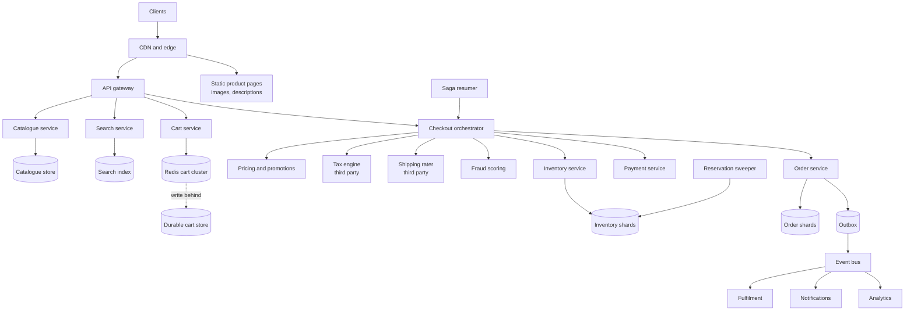
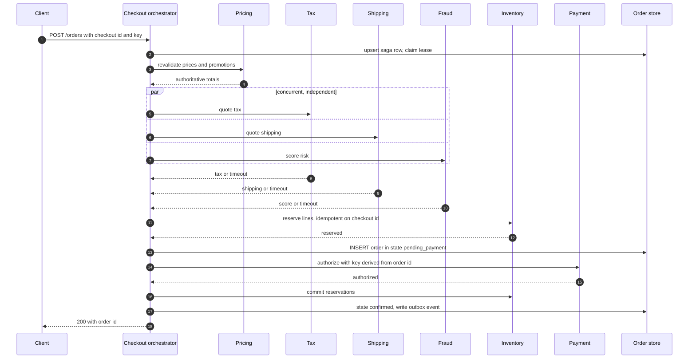
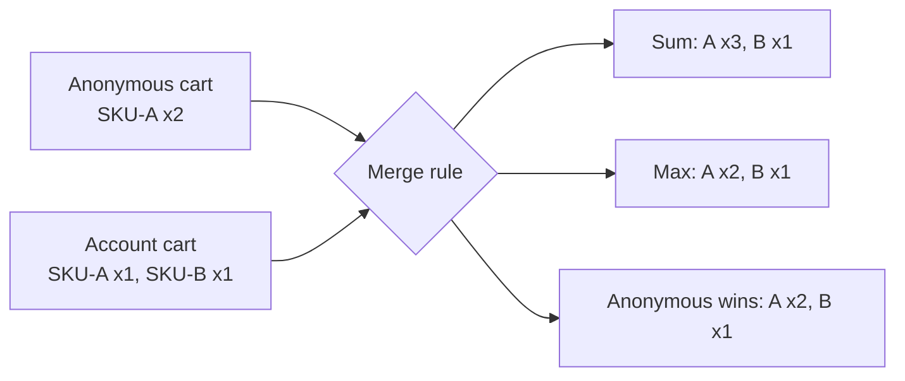
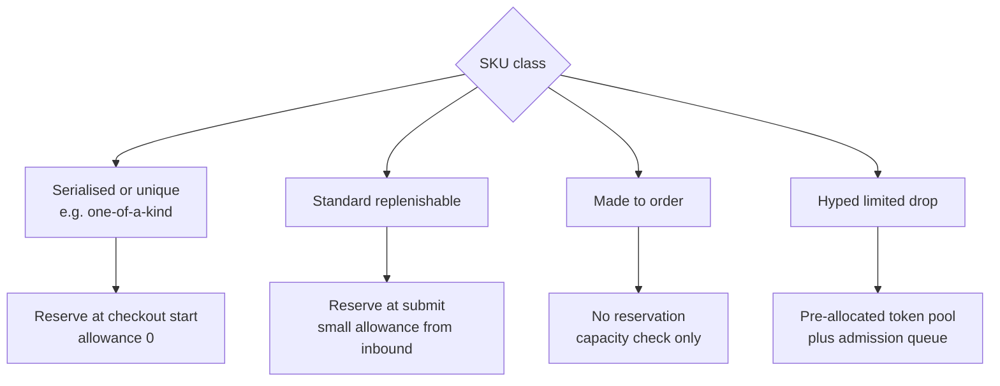
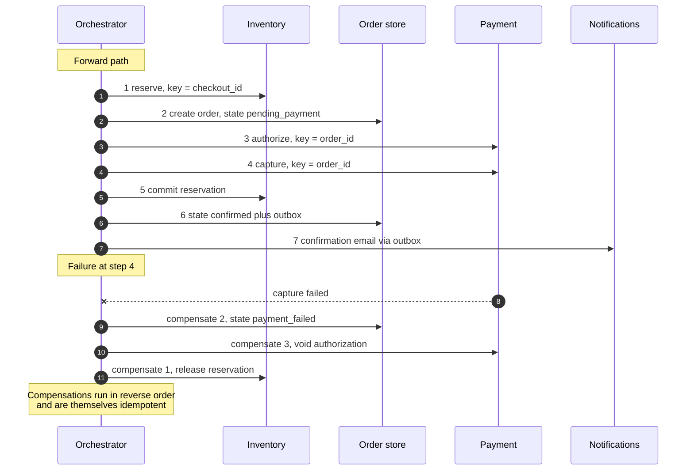
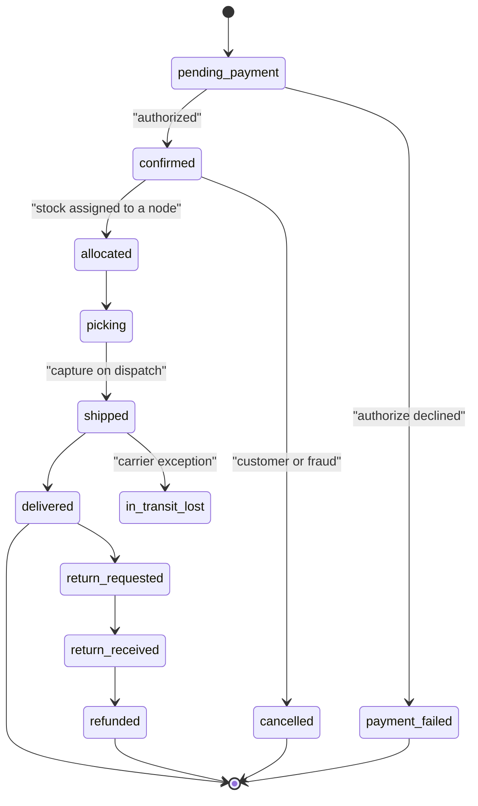
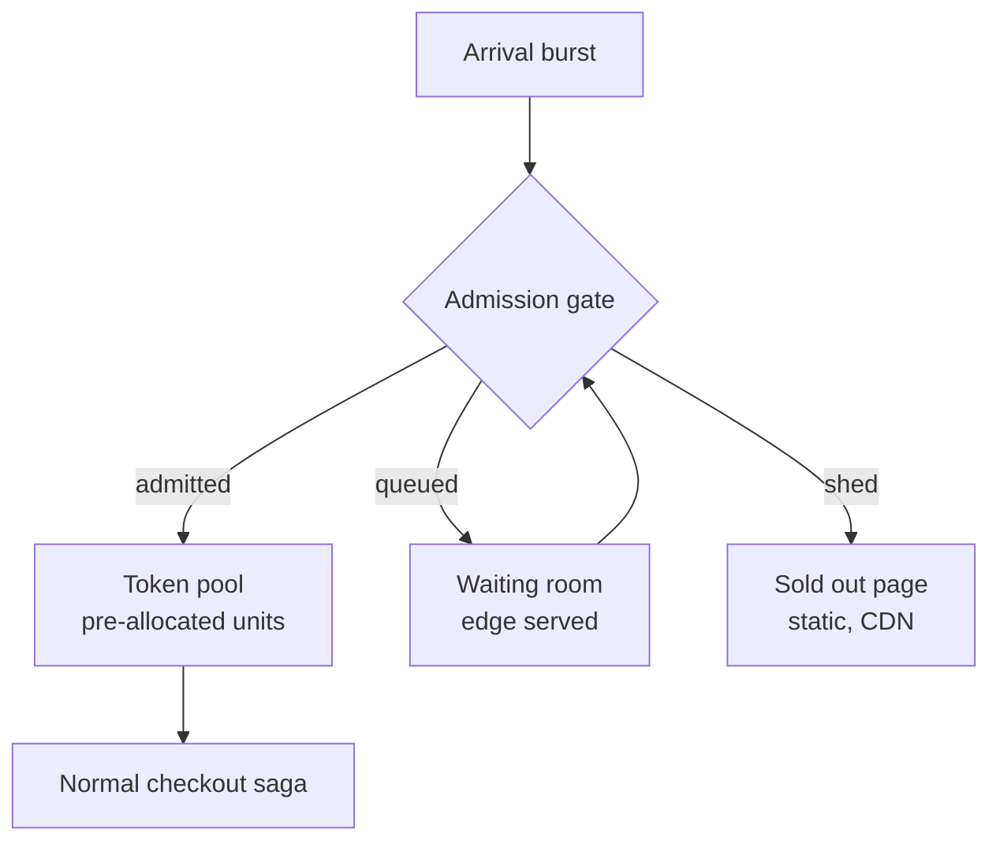
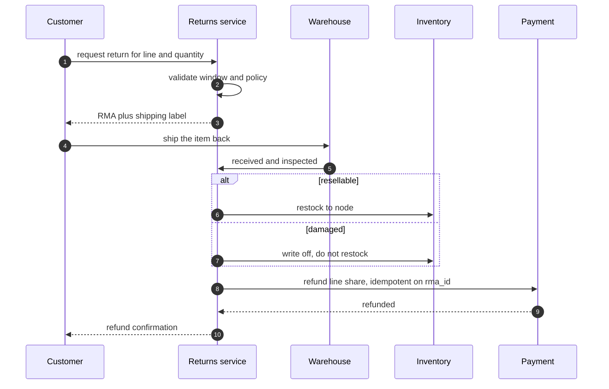

# 26 — E-commerce Checkout & Inventory

<span class="pill pill-core">Core</span> <span class="pill pill-hard">Hard</span>

**A single user-visible button that fans out into a distributed transaction across a cart, an inventory ledger, a tax engine, a shipping rater, a fraud scorer and a payment processor — four of which you do not own, none of which can participate in a two-phase commit, and any of which can time out after having already done the work.**

| | |
|---|---|
| **Commonly asked at** | Amazon, Shopify, Stripe, Walmart, Flipkart, Instacart, DoorDash, Zalando, Uber, Google, Meta |
| **Time budget** | 45 min |
| **Core tension** | Every checkout step you make *safe* — hard inventory reservation, synchronous tax, pre-auth fraud checks, strict price re-validation — adds latency and failure surface to the one request in the funnel that converts money. Every step you make *fast* — optimistic inventory, cached tax, async fraud — converts latency into a bounded rate of business errors: oversells, undercollected tax, and chargebacks. The design is not "prevent errors"; it is **choosing which errors to buy and pricing them deliberately** |
| **Prerequisites** | [F04 Caching](../fundamentals/f04-caching.md), [F05 CDN & Edge](../fundamentals/f05-cdn-edge.md), [F06 Partitioning & Sharding](../fundamentals/f06-partitioning-sharding.md), [F07 Replication & Consistency](../fundamentals/f07-replication-consistency.md), [F10 Distributed Transactions](../fundamentals/f10-distributed-transactions.md), [F11 Idempotency](../fundamentals/f11-idempotency.md), [F12 Queues & Streams](../fundamentals/f12-queues-streams.md), [F13 Storage Engines](../fundamentals/f13-storage-engines.md), [F14 SQL vs NoSQL](../fundamentals/f14-sql-vs-nosql.md), [F16 Search & Indexing](../fundamentals/f16-search-indexing.md), [F17 Rate Limiting & Load Shedding](../fundamentals/f17-rate-limiting-load-shedding.md), [F18 Resilience Patterns](../fundamentals/f18-resilience-patterns.md), [F19 Concurrency Control](../fundamentals/f19-concurrency-control.md), [F23 SLOs & Error Budgets](../fundamentals/f23-slo-error-budgets.md), [F24 Capacity Planning](../fundamentals/f24-capacity-planning.md), [F25 Deployment & Release Safety](../fundamentals/f25-deployment-release-safety.md) |

---

## 1. Problem Statement

Build the cart, inventory and checkout system for a large marketplace: tens of millions of SKUs across dozens of fulfilment nodes, millions of orders a day, and a Black Friday peak that is twenty to fifty times steady state with flash drops that concentrate a hundred thousand buyers onto a single SKU inside a minute.

Four properties define the problem, and each one points at a design decision.

**Inventory is fungible and counted, which changes the nature of "correct".** Unlike a seat or a hotel room, one unit of SKU-41983 is interchangeable with any other. That makes inventory a *counter*, which shards, tolerates optimistic concurrency, and — critically — makes overselling a **business decision with a price attached** rather than an absolute correctness violation. A bookstore that oversells a paperback by three units backorders them and apologises. That flexibility is the single biggest structural difference from ticketing or accommodation, and a candidate who treats oversell as a hard invariant has imported the wrong intuition.

**The transaction spans systems you do not own and cannot coordinate.** Tax, shipping rates, fraud scoring and payment are all third parties, none of which will enlist in your transaction manager. There is no two-phase commit available, so checkout is a saga: a sequence of locally-committed steps, each with an explicit compensating action, driven by a durable orchestrator, with every step idempotent. See [F10 Distributed Transactions](../fundamentals/f10-distributed-transactions.md).

**There are two completely different load regimes in one system.** Steady state is a long-tail read workload over tens of millions of SKUs, where caching works beautifully because access is Zipfian. Flash sales are the opposite: the entire load lands on one key, caching cannot help because the value changes on every request, and the bottleneck is a single database row.

**The money leg is irreversible in one direction only.** You can release a reservation for free. You can cancel an unshipped order for free. You cannot un-charge a card for free: a refund is visible on a statement, costs processing fees, and generates a support contact. This asymmetry orders the saga — **reserve inventory before charging, always** — and it is the reason the charge step comes last among the steps that can fail.

The invariants everything serves: **no money is captured without a corresponding order record**, **no order ships without inventory committed to it**, and **every reservation is eventually either committed or released** — no reservation leaks forever.

### Out of scope

Payment processor internals and ledger design (see the payment system case study), warehouse management and pick-pack-ship, carrier integration beyond rate quoting, recommendation and personalisation models, and seller onboarding.

---

## 2. Requirements

### Functional

| # | Requirement | Notes |
|---|---|---|
| F1 | Browse and search the catalogue | Faceted, category-navigable, tens of millions of SKUs |
| F2 | Cart for anonymous and authenticated users | Persists across devices once logged in |
| F3 | Merge an anonymous cart into an account cart on login | Deterministic, no silent quantity doubling |
| F4 | Checkout: address, shipping option, tax, promotions | Totals must be exact and explainable line by line |
| F5 | Place an order atomically across inventory, payment and order | Saga with compensations |
| F6 | Order lifecycle: confirm, allocate, ship, deliver | Observable to the customer |
| F7 | Cancel, return, refund — including partial | Line-level, with correct discount re-allocation |
| F8 | Flash sales and limited drops | Bounded oversell, fair admission |
| F9 | Split shipments across fulfilment nodes and sellers | One order, N shipments, N payment captures |
| F10 | Backorder and pre-order | Explicitly communicated, never silent |

### Non-functional

| # | Requirement | Target |
|---|---|---|
| N1 | Money captured without an order | **Zero.** An invariant, not an SLO |
| N2 | Orders shipped without allocated inventory | **Zero** |
| N3 | Reservation leak (held past TTL, never resolved) | **Zero sustained**; alarm on any |
| N4 | Oversell rate | Per-SKU-class policy: 0% for serialised goods, < 0.1% for standard, unbounded for made-to-order |
| N5 | Catalogue / PDP latency | p99 < 200 ms |
| N6 | Cart operation latency | p99 < 100 ms |
| N7 | Checkout submit latency | p99 < 3 s including all third parties |
| N8 | Browse availability | 99.99% |
| N9 | Checkout availability | 99.95% |
| N10 | Peak absorption | 50× steady state for 6 hours; 1,000× on a single SKU for 60 s |

!!! danger "N1 and N7 pull in opposite directions and the 3-second budget is the constraint that breaks naive designs"
    Doing everything safely and sequentially — tax, then shipping, then fraud, then reserve, then authorise — has a p99 that is the *sum* of five p99s plus network, which lands around 6–8 seconds. Doing it fast means running steps concurrently, capping each with a timeout well below its own p99, and having a defined answer for every timeout. **A timeout on the tax engine and a timeout on the payment processor require opposite responses**: you can ship with an estimated tax and reconcile, but you can never assume a payment failed just because the call timed out. §7.7 works the budget out in full; most candidates never do it and consequently never discover that the naive ordering cannot meet the SLO.

---

## 3. Scale Estimation

### Catalogue and inventory shape

$$
\begin{aligned}
\text{SKUs} &= 5\times10^{7} \\
\text{fulfilment nodes} &= 20 \\
\text{inventory rows (SKU} \times \text{node)} &= 10^{9} \\
\text{catalogue document size} &\approx 2\ \text{KB} \Rightarrow 100\ \text{GB} \\
\text{search index (denormalised)} &\approx 4\ \text{KB} \times 5\times10^{7} = 200\ \text{GB}
\end{aligned}
$$

A billion inventory rows at ~80 bytes each is 80 GB plus indexes — small enough for a modest sharded cluster. **Inventory is not a storage problem; it is a contention problem**, and the contention is concentrated on a few thousand rows out of a billion.

### Traffic

$$
\begin{aligned}
\text{product page views/day} &= 5\times10^{8} &\Rightarrow& \ \text{avg } 5{,}800\ \text{/s},\ \text{peak } \approx 1.7\times10^{4}\ \text{/s} \\
\text{searches/day} &= 2\times10^{8} &\Rightarrow& \ \text{avg } 2{,}300\ \text{/s} \\
\text{cart mutations/day} &= 5\times10^{7} &\Rightarrow& \ \text{avg } 580\ \text{/s},\ \text{peak } \approx 2{,}000\ \text{/s} \\
\text{orders/day} &= 5\times10^{6} &\Rightarrow& \ \text{avg } 58\ \text{/s}
\end{aligned}
$$

Funnel ratios, which are the numbers that actually drive the design:

$$
\frac{\text{views}}{\text{orders}} = \frac{5\times10^{8}}{5\times10^{6}} = 100{:}1,\qquad
\frac{\text{cart adds}}{\text{orders}} = 10{:}1
$$

So **90% of everything that enters a cart never becomes an order.** That single ratio is the entire argument against hard-reserving inventory at add-to-cart: doing so would sterilise nine units for every one sold.

### Black Friday

$$
\begin{aligned}
\text{peak multiplier (sustained, 6 h)} &= 20\times &\Rightarrow&\ \approx 1{,}160\ \text{orders/s} \\
\text{peak multiplier (spike, minutes)} &= 50\times &\Rightarrow&\ \approx 2{,}900\ \text{orders/s} \\
\text{page views at peak} &&\Rightarrow&\ \approx 3.5\times10^{5}\ \text{/s}
\end{aligned}
$$

At 350,000 page views per second, the only tier that can serve them is the CDN. Origin capacity is sized for the *uncacheable* fraction, so the design question becomes "how small can I make the uncacheable fraction of a product page" rather than "how many app servers do I need".

### The flash drop — a single-row problem

$$
\begin{aligned}
\text{units} &= 10^{5} \\
\text{interested buyers} &= 2\times10^{6} \\
\text{arrival window} &= 60\ \text{s} \\
\text{attempt rate} &\approx \frac{2\times10^{6}}{60} \approx 3.3\times10^{4}\ \text{/s on ONE SKU}
\end{aligned}
$$

A single Postgres row sustains roughly $5\times10^{2}$ to $10^{3}$ conflicting updates per second before lock waits dominate — each update serialises on the row lock and produces a new MVCC version.

$$
\text{shards required} = \left\lceil \frac{3.3\times10^{4}}{7\times10^{2}} \right\rceil \approx 48
$$

!!! tip "The number that reframes the flash sale"
    **"Thirty-three thousand attempts per second onto one database row, which sustains about seven hundred. That is a factor of fifty, and it is not a capacity problem — adding servers makes it worse, because they all queue on the same row. I either shard the counter roughly fifty ways or I stop the requests before they reach it."** Saying this early moves the conversation to admission control and counter sharding, which is where the real answer is, instead of to horizontal scaling, which actively harms this workload.

### Storage and cart sizing

$$
\begin{aligned}
\text{active carts} &\approx 10^{7} \times 3\ \text{KB} = 30\ \text{GB (fits in a Redis cluster)} \\
\text{orders retained 7 y} &= 5\times10^{6} \times 365 \times 7 \times 3\ \text{KB} \approx 38\ \text{TB} \\
\text{order events (event-sourced)} &\approx 12\ \text{events/order} \times 400\ \text{B} \approx 60\ \text{TB}
\end{aligned}
$$

Order data is the long-lived asset here: it is queried by customers, by support, by finance, and by tax authorities for seven years. That argues for an append-only event log in cheap storage plus a compact queryable projection, not for keeping 38 TB of mutable rows hot.

---

## 4. API Design

### Cart

```http
POST /v1/carts/{cart_id}/items
Idempotency-Key: 9f2b1c74-3a8e-4d51-b0aa-6e1c7f2d9033
Content-Type: application/json

{ "sku": "41983-BLK-M", "quantity": 2, "seller_id": 771 }
```

```json
{
  "cart_id": "ct_01HX9",
  "version": 14,
  "items": [
    { "line_id": "ln_3", "sku": "41983-BLK-M", "quantity": 2,
      "unit_price_minor": 4999, "currency": "USD",
      "price_observed_at": "2026-02-10T14:02:11Z",
      "availability": "in_stock", "max_orderable": 8 }
  ],
  "estimated_subtotal_minor": 9998
}
```

Note `estimated_subtotal_minor` and `price_observed_at`. The cart deliberately presents prices as **observations with a timestamp**, not as commitments. That one naming decision pre-empts the entire "the price changed in my cart" class of disputes and makes the staleness explicit in the contract.

### Checkout session

```http
POST /v1/checkouts
{ "cart_id": "ct_01HX9", "shipping_address_id": "ad_88", "currency": "USD" }
```

```json
{
  "checkout_id": "co_01HXA",
  "expires_at": "2026-02-10T14:32:00Z",
  "shipping_options": [
    { "id": "std", "eta_days": 5, "price_minor": 0 },
    { "id": "exp", "eta_days": 2, "price_minor": 1299 }
  ],
  "totals": {
    "subtotal_minor": 9998,
    "discount_minor": -1000,
    "shipping_minor": 0,
    "tax_minor": 742,
    "total_minor": 9740,
    "currency": "USD",
    "tax_basis": "computed",
    "tax_quote_id": "tq_5512"
  },
  "signature": "v1.HMAC-SHA256.7a9f..."
}
```

`tax_basis` distinguishes `computed` (the tax engine answered) from `estimated` (it timed out and a fallback rate was applied). That field flows to the order, and it is what lets finance find every order that needs post-hoc tax reconciliation with a single indexed query instead of a forensic exercise.

### Place order

```http
POST /v1/orders
Idempotency-Key: co_01HXA:submit:1
Content-Type: application/json

{
  "checkout_id": "co_01HXA",
  "signature": "v1.HMAC-SHA256.7a9f...",
  "shipping_option": "std",
  "payment_method_token": "pm_1QaBcDeF"
}
```

| Status | Meaning | Client action |
|---|---|---|
| `202 Accepted` | Saga started; poll `Location` | Poll; **never** resubmit |
| `200 OK` | Idempotent replay of a completed submit | Show the existing order |
| `409 price_changed` | Signature valid but underlying price moved past tolerance | Show a diff and require explicit re-confirmation |
| `409 out_of_stock` | Reservation failed; body names the lines | Offer substitutes or backorder |
| `402 payment_declined` | Authorisation refused | Offer another instrument; reservation held briefly |
| `422 invalid_address` | Address validation or tax jurisdiction failure | Correct the address |

!!! note "The idempotency key is derived, not random"
    `co_01HXA:submit:1` is deterministic from the checkout session plus an attempt counter that only increments on an **explicit user-initiated retry after a terminal failure**. A network retry of the same submit reuses the same key and returns the original outcome. A client that generates a fresh UUID per HTTP attempt has no idempotency at all — it has a unique-request-id header with a misleading name. See [F11 Idempotency](../fundamentals/f11-idempotency.md).

### Returns

```http
POST /v1/orders/{order_id}/returns
{ "lines": [{ "line_id": "ln_3", "quantity": 1, "reason": "size" }] }
```

---

## 5. Data Model

### Cart — Redis-backed, durable behind it

```json
{
  "cart_id": "ct_01HX9",
  "owner": { "type": "session", "id": "sess_7x2" },
  "version": 14,
  "updated_at": "2026-02-10T14:02:11Z",
  "items": {
    "41983-BLK-M::771": {
      "line_id": "ln_3",
      "quantity": 2,
      "added_at": "2026-02-10T13:58:02Z",
      "price_observed_minor": 4999,
      "price_observed_at": "2026-02-10T14:02:11Z"
    }
  },
  "applied_promotions": ["SPRING10"]
}
```

The item key is `sku::seller_id`, which makes add-to-cart naturally idempotent on the *item identity* and makes merge (§7.1) a well-defined map operation rather than a list concatenation with duplicates.

### Inventory

```sql
CREATE TABLE inventory (
    sku          text     NOT NULL,
    node_id      smallint NOT NULL,      -- fulfilment node
    shard        smallint NOT NULL,      -- counter shard, 0 for cold SKUs
    on_hand      integer  NOT NULL,      -- physically present and sellable
    reserved     integer  NOT NULL DEFAULT 0,   -- promised to open carts/orders
    inbound      integer  NOT NULL DEFAULT 0,   -- purchase orders en route
    oversell_allowance integer NOT NULL DEFAULT 0,
    version      bigint   NOT NULL DEFAULT 0,
    updated_at   timestamptz NOT NULL DEFAULT now(),
    PRIMARY KEY (sku, node_id, shard),

    -- The invariant, enforced by the storage engine, not by application code.
    CONSTRAINT not_oversold CHECK
        (reserved <= on_hand + inbound + oversell_allowance),
    CONSTRAINT no_negative CHECK (on_hand >= 0 AND reserved >= 0)
);

CREATE TABLE reservation (
    reservation_id uuid PRIMARY KEY,
    order_id       uuid,                 -- null until the order exists
    checkout_id    text NOT NULL,
    sku            text NOT NULL,
    node_id        smallint NOT NULL,
    shard          smallint NOT NULL,
    quantity       integer  NOT NULL CHECK (quantity > 0),
    state          text     NOT NULL,    -- held | committed | released | expired
    expires_at     timestamptz NOT NULL,
    created_at     timestamptz NOT NULL DEFAULT now()
);
CREATE INDEX reservation_expiry ON reservation (expires_at)
    WHERE state = 'held';
CREATE UNIQUE INDEX reservation_by_checkout
    ON reservation (checkout_id, sku, node_id);
```

!!! example "Why `available` is derived and never stored"
    $\text{available} = \text{on\_hand} + \text{inbound} - \text{reserved}$. Storing it as a fourth column creates a value that can disagree with its own inputs, and it will, because three different code paths update the inputs. Derive it in the query or in a generated column. This is the same principle as deriving availability from occupancy in the accommodation case: **one fact, one place.** The `CHECK` constraint then makes the invariant a property of the database rather than a property of every code path that touches it, which is the difference between "we reviewed the code carefully" and "it cannot happen".

The reservation claim is a single conditional statement — no read, no lock, no application-level check:

```sql
UPDATE inventory
   SET reserved = reserved + $qty,
       version  = version + 1,
       updated_at = now()
 WHERE sku = $sku AND node_id = $node AND shard = $shard
   AND on_hand + inbound + oversell_allowance - reserved >= $qty
RETURNING version;
```

Zero rows returned means insufficient stock. One row means the claim succeeded. The predicate in the `WHERE` clause and the `CHECK` constraint say the same thing deliberately — the predicate gives a clean business answer, the constraint guarantees no other code path can violate it.

### Orders

```sql
CREATE TABLE "order" (
    order_id      uuid PRIMARY KEY,
    customer_id   bigint      NOT NULL,
    state         text        NOT NULL,
    currency      char(3)     NOT NULL,
    subtotal_minor bigint     NOT NULL,
    discount_minor bigint     NOT NULL,
    shipping_minor bigint     NOT NULL,
    tax_minor      bigint     NOT NULL,
    total_minor    bigint     NOT NULL,
    tax_basis      text       NOT NULL,   -- computed | estimated
    tax_quote_id   text,
    idempotency_key text      NOT NULL,
    placed_at     timestamptz NOT NULL DEFAULT now(),
    version       integer     NOT NULL DEFAULT 1,
    CONSTRAINT totals_balance CHECK (
        total_minor = subtotal_minor + discount_minor
                    + shipping_minor + tax_minor
    ),
    CONSTRAINT uniq_idem UNIQUE (idempotency_key)
);

CREATE TABLE order_line (
    order_id     uuid    NOT NULL REFERENCES "order"(order_id),
    line_id      text    NOT NULL,
    sku          text    NOT NULL,
    seller_id    bigint  NOT NULL,
    quantity     integer NOT NULL CHECK (quantity > 0),
    unit_price_minor bigint NOT NULL,
    -- Discounts allocated to the line so returns are computable exactly.
    allocated_discount_minor bigint NOT NULL DEFAULT 0,
    allocated_tax_minor      bigint NOT NULL DEFAULT 0,
    PRIMARY KEY (order_id, line_id)
);

-- Append-only. The order row above is a projection of this.
CREATE TABLE order_event (
    order_id   uuid        NOT NULL,
    seq        integer     NOT NULL,
    type       text        NOT NULL,
    payload    jsonb       NOT NULL,
    occurred_at timestamptz NOT NULL DEFAULT now(),
    actor      text        NOT NULL,
    PRIMARY KEY (order_id, seq)
);
```

!!! warning "`allocated_discount_minor` is not optional and it must sum exactly"
    An order-level discount of $-1000$ across three lines has to be split into per-line integer amounts that sum to exactly $-1000$, because a return of one line must refund that line's share. Allocate proportionally with integer arithmetic and give the remainder to the largest line: $\sum_i d_i = D$ must hold exactly. If you instead recompute the discount at return time, a partial return of a multi-buy promotion produces a refund that is wrong in a direction the customer will notice, and the residual lands in a clearing account. See §7.8.

### The saga

```sql
CREATE TABLE checkout_saga (
    checkout_id   text PRIMARY KEY,
    order_id      uuid,
    step          text        NOT NULL,   -- current step
    step_state    text        NOT NULL,   -- pending | done | compensating | failed
    attempt       integer     NOT NULL DEFAULT 0,
    payload       jsonb       NOT NULL,   -- accumulated step outputs
    last_error    text,
    updated_at    timestamptz NOT NULL DEFAULT now(),
    lease_until   timestamptz
);
CREATE INDEX saga_resumable ON checkout_saga (lease_until)
    WHERE step_state IN ('pending', 'compensating');
```

| Store | Technology | Sharding | Why |
|---|---|---|---|
| Cart | Redis cluster, write-behind to DynamoDB | Hash on `cart_id` | Sub-ms reads, 90% never convert, so durability is nice-to-have not must-have |
| Inventory | Postgres, sharded | Hash on `sku` | Counter semantics plus a `CHECK` constraint; needs real transactions |
| Reservations | Same shard as inventory | Colocated with `sku` | Claim and reservation must commit together, locally |
| Orders and events | Postgres, sharded by `customer_id`, archived to object storage | `customer_id` | Customer-centric read patterns dominate; 7-year retention goes cold |
| Saga state | Same shard as the order | `checkout_id` hashed to order shard | Orchestrator resume must be a local read |
| Catalogue | Document store + CDN-fronted static docs | `sku` | Read-mostly, cacheable, Zipfian |
| Search | Elasticsearch / OpenSearch | Category + geo aware | Facets, relevance, typo tolerance |

---

## 6. High-Level Architecture



### Read path — a product page at 350,000 requests per second

A product page is split by cacheability, and the split is the whole trick:

| Fragment | Volatility | Where it is served | TTL |
|---|---|---|---|
| Images, description, specs, reviews | Hours to days | CDN, immutable versioned URLs | 1 year on the versioned object |
| Price and promotion badge | Minutes | CDN, short TTL, keyed by currency and market | 30–60 s |
| Availability badge | Seconds | Edge-cached aggregate, or client-side fetch | 5–10 s |
| Personalised blocks (recommendations, your price) | Per user | Client-side fetch, never in the shared cache | none |

$$
\text{origin req/s} = \lambda_{\text{views}} \times (1 - h)
$$

At $\lambda = 3.5\times10^{5}$/s and a cache hit ratio $h = 0.995$ on the shared fragments, origin sees $1{,}750$ req/s. At $h = 0.95$ it sees $17{,}500$ — a 10× difference from half a percent of hit ratio. **Every uncacheable byte you add to a shared fragment is multiplied by 350,000**, which is why "just put the user's name in the header server-side" is a capacity decision disguised as a UI decision.

### Write path — the checkout saga



Ordering rationale, which is worth stating explicitly in an interview:

- **Pricing first** because everything downstream depends on the authoritative amount, and a price change is a cheap failure at this point.
- **Tax, shipping and fraud concurrently** because they are mutually independent; running them in series would blow the latency budget on its own (§7.7).
- **Reserve before authorising** because releasing a reservation is free and refunding a charge is not. This ordering is forced by the asymmetry of the compensations, and it is the single most important structural decision in the saga.
- **Order row before authorisation** so that a charge can never exist without an order record to attach it to. The order starts in `pending_payment`, which is a state that exists precisely to make N1 structurally impossible rather than merely unlikely.
- **Commit reservations after authorisation** so that a decline releases inventory immediately.

---

## 7. Deep Dives

### 7.1 The cart: session, persistent, and the merge problem

=== "Session-only (client or edge)"

    Cart lives in a cookie, `localStorage`, or an edge KV keyed by session.

    **Strengths.** Zero backend cost. Works when logged out. No write amplification from the 90% of carts that never convert. Survives a backend outage entirely.

    **Weaknesses.** Lost on device change, cookie clear, or private browsing. No cross-device continuity, which is a measurable conversion loss — a meaningful share of sessions add on mobile and buy on desktop. Unusable for abandoned-cart recovery, which is a large revenue line.

    **Verdict.** Kept as the **anonymous tier only**, backed by a server-side cart keyed on an anonymous id so it is recoverable, with the cookie holding only that id.

=== "Server-persistent"

    A durable cart row per user, updated on every mutation.

    **Strengths.** Cross-device. Recoverable. Enables abandoned-cart flows and inventory-aware notifications ("the item in your cart is nearly out of stock").

    **Weaknesses.** Write amplification: 50M mutations a day for 5M orders. Needs eviction policy, or carts accumulate forever. Becomes a hot path that must stay up for browsing to feel healthy.

    **Verdict.** **Chosen**, but with the hot copy in Redis and a write-behind to durable storage. A lost cart is an annoyance; a lost order is an incident. Matching the durability of each to its actual cost is where the money is.

=== "CRDT / operation log"

    Store the cart as an ordered log of operations and fold them on read.

    **Strengths.** Concurrent mutations from two devices merge without a lost update. Natural audit trail. Offline-friendly.

    **Weaknesses.** Materially more complex. Quantity semantics are still ambiguous under concurrency: two `set quantity to 3` operations from two tabs are *not* the same as `add 3` twice, and no CRDT decides which the user meant.

    **Verdict.** **Rejected as the default**, adopted only for the specific concurrency-sensitive field. Use last-writer-wins with a version for the cart as a whole, and treat add-to-cart as an operation with a client-supplied idempotency key so a double-tap does not become a quantity of 4.

#### Merge-on-login is a semantics problem, not a data problem

A user has an anonymous cart with 2× SKU-A, and an account cart from last week with 1× SKU-A and 1× SKU-B. What is the merged cart?



| Rule | Result for SKU-A | Problem |
|---|---|---|
| Sum quantities | 3 | Log in twice and you have 5. Quantity inflation is the single most common cart bug and it reaches checkout before anyone notices |
| Max quantity | 2 | Intuitive, idempotent, and matches user intent ("I wanted 2") |
| Anonymous wins wholesale | A×2 only | Silently discards SKU-B, which the user deliberately saved |
| Account wins wholesale | A×1, B×1 | Silently discards the work the user just did while logged out |

**Chosen: union of item keys, `max` on quantity, and explicitly surface the merge to the user.** `max` is idempotent, which means a retried or duplicated merge is harmless — and merges *are* retried, because login is exactly the moment when clients reconnect and replay. Then clamp every merged quantity against `max_orderable` and current availability, because a cart assembled over two weeks will contain things that are no longer purchasable.

!!! tip "State the idempotency property, not just the rule"
    **"I merge with `max` rather than `sum`, and the reason is idempotency: login flows get retried, tabs get duplicated, and the merge endpoint will be called more than once for the same pair of carts. `max` is idempotent, `sum` is not, and non-idempotent merge shows up in production as customers receiving four of something they wanted two of."** This turns a product-opinion answer into a distributed-systems answer, which is what is actually being tested.

#### Cart is not inventory

The cart holds **no claim on stock**. It records intent and a price observation. With a 10:1 cart-to-order ratio, reserving at add-to-cart would hold nine units hostage for every one sold — a catastrophic sterilisation of inventory for a benefit (never seeing "out of stock" at checkout) that a well-designed availability badge mostly delivers anyway.

### 7.2 Inventory reservation strategies

This is the decision that most defines the business behaviour of the system, and there is no universally right answer — there is a right answer **per SKU class**.

| Strategy | Mechanism | Oversell risk | Inventory utilisation | Best for |
|---|---|---|---|---|
| **Hard reserve at add-to-cart** | Increment `reserved` when the item enters the cart, TTL 30–60 min | Zero | Terrible: 90% of reservations never convert | Never, as a default. Occasionally for a single hyped SKU during a drop |
| **Hard reserve at checkout start** | Reserve when the checkout session opens | Near zero | Moderate: ~30% of checkouts abandon | High-value, low-stock, long-checkout flows |
| **Hard reserve at order submit** | Reserve inside the saga, before payment | Near zero within your boundary | Excellent | **Chosen default.** Reservation lifetime is seconds, not minutes |
| **Sell then check (async)** | Accept the order, decrement asynchronously, cancel if short | Real and unbounded | Maximal | Extremely high-throughput drops where latency beats accuracy |
| **Oversell with backorder** | Allow `reserved` to exceed `on_hand` up to an allowance | Deliberate and bounded | Above 100% of on-hand | Replenishable commodity goods with reliable inbound |



#### Why reserve at submit is the default

$$
\begin{aligned}
\text{reservation lifetime at add-to-cart} &\approx 30\ \text{min} \\
\text{reservation lifetime at checkout start} &\approx 6\ \text{min} \\
\text{reservation lifetime at submit} &\approx 3\ \text{s} \ (\text{payment auth})
\end{aligned}
$$

Sterilised inventory is proportional to $\lambda_{\text{reserve}} \times \bar{T}_{\text{hold}}$ by Little's Law. Moving the reservation from add-to-cart to submit cuts $\bar{T}$ by a factor of 600 **and** cuts $\lambda$ by a factor of 10 (only submits reserve, not every cart add). That is a 6,000× reduction in held-but-unsold inventory for the same sales volume. Nothing else in this design has a lever that large.

#### The reservation TTL must exceed the payment path, not the user's patience

The reservation is created inside the saga and released either on commit or on failure. But the orchestrator can crash, and the payment call can hang. So the TTL exists for exactly one reason: to bound the damage from a saga that stopped running.

$$
T_{\text{TTL}} = p99(\text{payment auth}) + p99(\text{3DS challenge}) + \text{orchestrator resume interval} + \text{margin}
$$

Typically 15–20 minutes, not 2. **A TTL shorter than the payment path is how you charge a customer for something you already sold to someone else** — the exact same failure as releasing a ticket hold mid-charge, and it has the same fix: the sweeper must never release a reservation whose saga is past the authorisation step. Encode that as a state, not as a timestamp comparison.

#### Hot-key sharding for a single SKU

```python
import random

SHARDS_HOT = 64   # for a flash-drop SKU
SHARDS_COLD = 1   # for the other 49,999,999 SKUs

def pick_shard(sku: str, hot: bool, attempt: int) -> int:
    if not hot:
        return 0
    # Random start so load spreads; sequential probe so the tail drains.
    return (random.randrange(SHARDS_HOT) + attempt) % SHARDS_HOT
```

Sharding a counter trades a serialisation bottleneck for a **fragmentation problem**: 64 shards each holding 3 units cannot satisfy a request for 4, even though 192 units exist. Mitigations, in order: keep shard counts proportional to expected demand rather than fixed; rebalance by moving units between shards as they drain; and as the total approaches zero, **collapse to a single shard** so the last units are allocated exactly rather than stranded. The collapse threshold is where most implementations get it wrong — they shard for the peak and never un-shard, leaving a few hundred units permanently unsellable across the catalogue.

### 7.3 The checkout saga, compensations and idempotency



| Step | Forward action | Compensation | Cost of compensation |
|---|---|---|---|
| 1 | Reserve inventory | Release reservation | Free |
| 2 | Create order `pending_payment` | Mark `payment_failed` | Free; row retained for audit |
| 3 | Authorise payment | **Void** the authorisation | Near-free; no statement entry for the customer |
| 4 | Capture payment | **Refund** | Real fee, visible on the statement, generates a support contact |
| 5 | Commit reservation | Release committed stock | Free before allocation; a restock task after |
| 6 | Confirm order | Cancel order | Free before shipment; a return after |

!!! tip "Separating authorise from capture is what makes the common failure free"
    The overwhelmingly common failure is a declined card, and it happens at authorisation. A void leaves nothing on the customer's statement and costs nothing. If you use a single combined charge, every one of those failures becomes a refund: a fee, a statement entry, a pending-then-reversed amount that confuses the customer, and a support contact. **Order the saga so the cheap compensations are the likely ones.** Additionally, for split shipments you *must* separate them, because you capture per shipment as goods leave the warehouse — in many jurisdictions capturing before shipment is not permitted at all.

#### Idempotency scoping — three levels, all required

```python
# 1. Client-to-orchestrator: derived, stable across network retries.
key_submit = f"{checkout_id}:submit:{attempt}"

# 2. Orchestrator-to-inventory: stable across saga resumes.
key_reserve = f"{checkout_id}:reserve"

# 3. Orchestrator-to-PSP: derived from the ORDER, never from the attempt.
key_auth = f"{order_id}:auth"
key_capture = f"{order_id}:capture"
```

The scoping rule that matters: **the key must be stable across every retry that should be deduplicated, and different across every attempt that should genuinely create new work.** A crashed orchestrator resuming at step 3 must re-send `{order_id}:auth` and get the existing authorisation back. A customer who legitimately retries with a different card after a decline must produce a *different* key, or the PSP will return the cached decline forever and the customer can never pay you. That second case is the one that gets missed, and it presents as "our repeat-payment success rate is zero".

#### Resuming a crashed saga

```python
def resume_stalled_sagas(now, batch=100):
    rows = db.query("""
        SELECT checkout_id, step, attempt, payload
          FROM checkout_saga
         WHERE step_state IN ('pending','compensating')
           AND (lease_until IS NULL OR lease_until < %s)
         ORDER BY updated_at
         LIMIT %s
         FOR UPDATE SKIP LOCKED
    """, (now, batch))
    for r in rows:
        claim_lease(r.checkout_id, now + LEASE)
        try:
            run_from(r.step, r.payload)
        except Terminal as e:
            begin_compensation(r.checkout_id, reason=str(e))
```

`FOR UPDATE SKIP LOCKED` gives competing resumers disjoint work without coordination. The lease means a resumer that dies does not block the row forever. And crucially: **on resume, never assume the previous attempt failed.** If the saga stopped at "authorise", the first action on resume is to *query* the PSP by idempotency key to establish the true state. A timeout is an absence of information, not a failure, and treating the two as equivalent is how double charges are created.

### 7.4 The order state machine and the event-sourcing option



Two states carry disproportionate weight. **`pending_payment` exists so that money can never be captured without an order row to attach it to** — it is written before the PSP is ever called, which makes invariant N1 structural rather than aspirational. **`allocated`** separates "we promised you this" from "a specific unit at a specific node is yours", which is what makes split shipments, node rebalancing and backorders expressible.

#### Event sourcing: worth it here, and here is the honest trade

=== "Chosen: append-only event log with a projection"

    `order_event` is the source of truth; the `order` row is a projection maintained in the same transaction.

    **Why it earns its complexity in this specific domain.** Orders are queried by customers, support, finance, fraud analysts and tax authorities for seven years, and every one of those audiences asks a *temporal* question: what did this order look like when the customer was charged? Who changed the address, and when? Why is the refund this amount? A mutable row answers none of those. The event log also gives you the outbox for free — the same append that records the state change publishes it — which removes the dual-write problem between the database and the event bus.

    **What it costs.** Roughly 12 events per order at 400 bytes is 60 TB over seven years. Projection rebuilds must be exercised, or they rot. Schema evolution on events is permanent: you can never change the meaning of an old event type, only add new ones. Engineers unfamiliar with the pattern will write queries against the projection and be surprised when it lags.

=== "Rejected: mutable order row plus a separate audit table"

    **Why it is tempting.** Simpler queries. No projection lag. Every engineer already knows how to do it.

    **Why it loses.** The audit table is a second write that can fail independently, so the audit is *sometimes wrong* — which makes it worthless precisely when it matters, in a dispute or an audit. Reconstructing historical state requires replaying the audit against the current row and hoping nobody wrote directly. And you still need an outbox for the event bus, so you have not avoided the append-only table, you have only made it non-authoritative.

!!! warning "Event sourcing does not remove the need for a transactional outbox — it *is* one, if you let it"
    The common mistake is event sourcing the order *and* separately publishing to Kafka from application code. That is a dual write and it will diverge. Instead, make the event log the outbox: a single relay tails `order_event` by `(order_id, seq)` and publishes with at-least-once delivery, tracking its position. Consumers are idempotent on `(order_id, seq)`. One append, one source of truth, no divergence. See [F12 Queues & Streams](../fundamentals/f12-queues-streams.md).

### 7.5 Catalogue, search and category browse at scale

Three distinct read workloads with three different shapes:

| Workload | Query shape | Cacheability | Backing store |
|---|---|---|---|
| Product detail (PDP) | Point lookup by SKU | Extremely high; Zipfian access | Document store behind a CDN |
| Category browse | Filtered, sorted, paginated over a stable set | High; the result set changes slowly | Precomputed, paginated category lists |
| Search | Free text plus facets, relevance-ranked | Low; long-tail queries are unique | Inverted index |

**Category browse is not a search problem and should not be served by the search cluster.** "Women's running shoes, size 8, under $120, sorted by popularity" over a stable category is a *precomputable* list: materialise the ordered SKU list per (category, facet-combination, sort) for the top few hundred popular combinations, cache it, and paginate by offset into the cached list. The long tail of rare facet combinations falls through to the search cluster. This routinely removes 80% of load from the search tier for a fraction of the cost.

**Deep pagination is a trap.** `from=10000&size=24` makes every shard collect 10,024 documents and the coordinator merge them. Cost grows linearly with offset while user value collapses — almost nobody goes past page 5. Cap offset-based pagination at a few hundred results, use `search_after` cursors for anything deeper, and return a clear "refine your search" affordance instead of an expensive page nobody will read. See [F16 Search & Indexing](../fundamentals/f16-search-indexing.md).

**Availability in search is the same problem as in accommodation, with an easier answer.** Do not index exact stock counts — at thousands of inventory mutations per second every count change invalidates a document and the index enters permanent rewrite. Index a coarse `in_stock` boolean updated with hysteresis (flip to false only when stock has been zero for N seconds; flip to true immediately), and let the PDP fetch the exact count. Hysteresis matters: without it, a SKU oscillating around zero during a drop produces a storm of index updates on the single hottest document in the cluster.

### 7.6 Flash sales and Black Friday

Two different problems that get conflated. **Black Friday is a sustained 20× on everything** and is a capacity and cost problem. **A flash drop is a 1,000× on one key for 60 seconds** and is a contention problem. They need different answers.



#### Pre-allocation converts a write contention problem into a read

Before the drop, mint $N$ single-use tokens into a Redis list or a sharded key space, where $N$ equals the units on sale. A buyer's first action is `RPOP` — an $O(1)$ operation on a single-threaded engine, hundreds of thousands per second, with no database involvement. Holding a token entitles the buyer to a normal checkout with a generous window. When the list is empty, the answer is "sold out" and it is delivered from a static page at the edge.

$$
\begin{aligned}
\text{DB writes without pre-allocation} &= 3.3\times10^{4}\ \text{/s of contended updates} \\
\text{DB writes with pre-allocation} &= \text{one per actual sale} \approx 1.7\times10^{3}\ \text{/s, uncontended}
\end{aligned}
$$

The contended 33,000/s becomes an uncontended 1,700/s, and the uncontended part is the only part the database sees. **The token pool is the inventory for the duration of the drop**, and it is reconciled back to the inventory table afterwards — unclaimed tokens return to stock.

#### The rest of the Black Friday checklist

- **Static asset offload.** Everything shared goes to the CDN with immutable versioned URLs. The target is a shared-fragment hit ratio above 99.5%, because origin load is $\lambda(1-h)$ and the difference between 95% and 99.5% is 10× at the origin.
- **Pre-scale on a calendar, not reactively.** Autoscaling reacts in minutes; the spike arrives in seconds. The peak is a known date — this is an enormous advantage over systems with unpredictable spikes and it should be used.
- **Change freeze** for 72 hours before, and a rehearsal at full projected load, replaying last year's arrival curve.
- **Shed by funnel position, never uniformly.** Protect, in order: sessions with a payment in flight, sessions in checkout, sessions with a non-empty cart, then browsers. Shedding someone thirty seconds from converting wastes all the capacity already spent on them. See [F17 Rate Limiting & Load Shedding](../fundamentals/f17-rate-limiting-load-shedding.md).
- **Degrade non-essential features deliberately.** Recommendations, "customers also bought", live review counts, personalised ranking — all have kill switches, all are exercised during the rehearsal, and all are turned off before checkout degrades, not after.
- **Freeze the catalogue.** Price and content changes during peak invalidate caches at the worst possible moment. Batch them into windows or forbid them outright.

### 7.7 Price consistency and third-party timeout budgets

#### Price must be re-validated, and the cart must never be the authority

The cart stores `price_observed_minor` and `price_observed_at` as a *display* value. The authoritative price is computed at checkout by the pricing service and frozen into a signed checkout token. Three rules:

1. **Never accept a client-supplied amount.** Ever. This is the most commonly exploited vulnerability in e-commerce systems and it is entirely prevented by signing server-side totals. See [F27 Security in Design](../fundamentals/f27-security-design.md).
2. **Honour a price drop silently; surface a price rise explicitly.** If the current price is lower than observed, charge the lower one and say so. If it is higher, do not silently charge more — show a diff and require explicit confirmation. Silently charging more than displayed is, in several jurisdictions, illegal.
3. **Define a tolerance band.** A rise of a few cents from an FX refresh should not interrupt a checkout. Absorb changes under a small threshold, surface anything above it. The threshold is a business decision with a measurable cost on each side.

#### The latency budget, worked

Sequential execution of the third parties:

$$
p99_{\text{seq}} \approx 80 + 400 + 300 + 200 + 50 + 1200 = 2{,}230\ \text{ms}
$$

That is the sum of *typical* p99s and already consumes 74% of the 3-second budget before any network, retry or GC pause. Now the real constraint: the p99 of a sequence is worse than the sum of p99s under tail correlation, and one retry anywhere blows it entirely.

| Dependency | Typical p99 | Timeout | On timeout | Rationale |
|---|---|---|---|---|
| Pricing (internal) | 80 ms | 250 ms | **Fail the checkout** | Cannot charge without an authoritative price |
| Tax engine | 400 ms | 800 ms | **Estimate and flag** `tax_basis=estimated` | Better to complete the sale and reconcile than to lose it |
| Shipping rater | 300 ms | 600 ms | **Fall back to a static rate table** | Rates change slowly; a cached table is close enough |
| Fraud scoring | 200 ms | 400 ms | **Accept and review asynchronously** | Blocking on fraud converts a small loss rate into a total conversion loss |
| Inventory reserve | 50 ms | 300 ms | **Fail the checkout** | Cannot promise goods you have not claimed |
| Payment authorise | 1,200 ms | 2,500 ms | **Never assume failure — query by key** | A timeout is an absence of information |

Running tax, shipping and fraud concurrently:

$$
p99_{\text{par}} \approx 80 + \max(400, 300, 200) + 50 + 1200 = 1{,}730\ \text{ms}
$$

$$
\text{worst case with timeouts} \approx 250 + 800 + 300 + 2500 = 3{,}850\ \text{ms}
$$

The worst case still exceeds the budget, which is why the submit endpoint returns `202 Accepted` with a poll URL rather than blocking. **The client's experience is decoupled from the saga's duration**, which also means a slow PSP degrades a progress indicator instead of producing a 504 that the user responds to by pressing the button again.

!!! danger "Deadline propagation, or your timeouts are decorative"
    Each hop must pass its remaining budget downstream, and each hop must refuse work it cannot finish in the time remaining. Without this, a request that has already spent 2.8 s of a 3 s budget still issues a 2.5 s payment call, the client has long since given up, and the PSP happily authorises a charge that nobody will ever attach to an order. That is the exact mechanism behind "we charged them and there is no order" — **an orphaned charge created by a hop that did not know it was already too late.**

#### Fail-open versus fail-closed, decided per dependency

The table above is the whole answer, and the principle is: **fail closed when the dependency establishes an obligation (price, inventory), fail open when it establishes an optimisation (tax precision, shipping precision, fraud confidence).** Candidates who apply one policy uniformly either lose revenue needlessly or create obligations they cannot honour.

### 7.8 Returns, refunds and partial reversals

A return is not a reverse order; it is a new business event with its own money movement and its own inventory movement, and they resolve on different timelines.



#### The partial-refund arithmetic is where this goes wrong

An order with three lines, a $10 order-level discount, and tax. The customer returns one line. The refund for that line is:

$$
\text{refund}_i = \underbrace{q_i \cdot p_i}_{\text{line subtotal}} + \underbrace{d_i}_{\text{allocated discount, negative}} + \underbrace{t_i}_{\text{allocated tax}}
$$

This only works if $d_i$ and $t_i$ were **allocated and persisted at order time** such that $\sum_i d_i = D$ and $\sum_i t_i = T$ exactly. Allocate proportionally with integer arithmetic:

```python
def allocate(total_minor: int, weights: list[int]) -> list[int]:
    """Split total across lines proportionally, exactly, in integer minor units."""
    w_sum = sum(weights)
    raw = [total_minor * w // w_sum for w in weights]
    remainder = total_minor - sum(raw)
    # Give the remainder to the largest weights, deterministically.
    order = sorted(range(len(weights)), key=lambda i: (-weights[i], i))
    for k in range(abs(remainder)):
        raw[order[k % len(raw)]] += 1 if remainder > 0 else -1
    assert sum(raw) == total_minor
    return raw
```

The `assert` is not decoration — it is the invariant. Recomputing the discount at return time instead produces refunds that do not sum to the charge, and the residual has to be booked somewhere.

#### Inventory and money move on different clocks

Restock when the item is **physically received and inspected**, not when the return is requested. Refund policy is a business choice: refund-on-receipt is safe; refund-on-label-scan is friendlier and costs a bounded fraud rate. Whichever you choose, the two legs are independent, both are idempotent on the RMA id, and a failed refund goes to a human queue rather than rolling back the restock. **Never re-issue a refund without first querying the PSP by idempotency key** — a duplicate refund is an unrecoverable real loss, not a retryable error.

---

## 8. Scaling the Bottleneck

**Bottleneck 1 — product page reads at $3.5\times10^{5}$/s.** Solved entirely by cacheability engineering, not capacity. Split the page by volatility; put personalised content behind a client-side fetch so it never poisons the shared cache; use immutable versioned URLs so the long-TTL fragments never revalidate. Origin load is $\lambda(1-h)$, so the entire engineering effort goes into $h$, and the difference between 95% and 99.5% is a factor of ten in origin fleet size.

**Bottleneck 2 — the hot inventory row.** $3.3\times10^{4}$/s of contended updates against a single-row ceiling of ~700/s. Two mechanisms, applied together: **counter sharding** for the general hot-SKU case, and **token pre-allocation** for planned drops, which removes the database from the contended path entirely. Collapse shards as stock drains so the last units are not stranded.

**Bottleneck 3 — checkout orchestrator throughput.** At 2,900 orders/s peak, each saga holds state across several seconds of third-party calls. Use async, non-blocking I/O so a waiting saga costs a state machine and not a thread; persist state after every step so the orchestrator is stateless and horizontally scalable; and cap in-flight sagas as an explicit admission control — an orchestrator that accepts more sagas than its downstream can absorb converts a slow dependency into a total outage.

**Bottleneck 4 — the payment provider.** Almost always the binding constraint at peak. Negotiate the rate limit in advance for a known peak date; buffer internally rather than rejecting; run a secondary PSP behind a circuit breaker for failover; and make the client's poll loop tolerant of multi-second processing. A PSP that throttles you at 20:00 on Black Friday turns a successful peak into an incident, and that call is the one that gets skipped.

**Bottleneck 5 — the reservation sweeper.** $\lambda_{\text{expire}} = \lambda_{\text{reserve}} \times P(\text{abandon or crash})$. Sweep from an index on `expires_at` in bounded batches with a leader lease, and make every release a conditional update so a sweep racing a commit yields exactly one winner. The sweeper must be **categorically forbidden** from releasing a reservation whose saga is past authorisation.

**Bottleneck 6 — search during peak.** Query volume rises 20× while the index is also taking inventory-driven updates. Freeze catalogue content changes during peak; serve precomputed category lists for the head of the distribution; apply hysteresis to `in_stock` flips; and cap deep pagination. If search must shed, shed *relevance quality* (fewer facets, shallower re-ranking) before shedding availability.

---

## 9. Failure Modes

| Failure | Blast radius | Detection | Mitigation | Degraded behaviour |
|---|---|---|---|---|
| Charge without an order | One customer, financial and trust | Continuous audit: PSP charges with no matching order row | Order row in `pending_payment` written *before* the PSP call; deadline propagation | None acceptable. Page; auto-reconcile or refund |
| Order confirmed without reservation committed | One customer; ships or does not | Audit: confirmed orders with no committed reservation | Commit reservations inside the saga before confirming | Order held for manual allocation |
| Reservation leak | Inventory silently disappears | Count of `held` reservations past TTL | Sweeper with conditional release; alarm on nonzero | Stock appears unavailable; revenue loss |
| Oversell beyond allowance | N customers per SKU | `reserved > on_hand + inbound + allowance` audit | `CHECK` constraint makes it impossible in-database | Backorder with explicit communication, or cancel with compensation |
| Duplicate charge | One customer | Multiple PSP charges for one order id | Derived idempotency keys; query-before-retry on timeout | Immediate automated refund of the duplicate |
| Saga orchestrator crash | In-flight checkouts | Sagas past lease with no progress | Durable saga state, leases, `SKIP LOCKED` resumers | Delayed confirmation; reservations held by TTL |
| Tax engine down | All checkouts in affected jurisdictions | Timeout rate and error rate | Estimate, flag `tax_basis=estimated`, reconcile after | Slightly wrong tax, corrected within days |
| Shipping rater down | Shipping option accuracy | Timeout rate | Static fallback rate table by zone and weight | Rates may be marginally off |
| Fraud service down | Fraud loss rate | Timeout rate | Accept and review asynchronously | Higher short-term fraud loss, no conversion loss |
| PSP degraded or throttling | All checkouts | Auth latency and error rate | Secondary PSP behind a breaker; internal buffering; reduce admission | Slower checkout; no lost inventory |
| Cart Redis cluster loss | All active carts | Connection errors | Rebuild from the durable write-behind store | Some recent cart edits lost; orders unaffected |
| Price cache serving stale prices | Revenue or trust, depending on direction | Diff between cached and authoritative at checkout | Authoritative revalidation at checkout; signed totals | Customer sees an old price and gets a diff prompt |
| Hot shard fragmentation | Units stranded and unsellable | Sum of shard counters versus sellable count | Rebalance and collapse shards as stock drains | Apparent stock-out with real stock present |
| Search index update storm | Search latency for everyone | Indexing queue depth | Hysteresis on `in_stock`; batch updates; freeze content at peak | Staler availability badges |
| Deep pagination abuse | Search cluster CPU | p99 by offset | Cap offset; `search_after` cursors | "Refine your search" instead of page 400 |

!!! danger "Three audits, running continuously, that no ordinary metric will ever surface"
    **(1)** PSP charges in the last hour with no matching order row. **(2)** Orders in `confirmed` or later with no committed reservation. **(3)** Reservations in `held` past their TTL. All three represent real money or real inventory, all three return HTTP 200 on every individual request that caused them, and all three are invisible in latency and error-rate dashboards. They must be queries on a schedule that page on any nonzero result — and they get more expensive with time, because a leaked reservation compounds and an orphaned charge becomes a chargeback.

---

## 10. SRE Lens

### SLIs and SLOs

| SLI | Definition | SLO |
|---|---|---|
| Orphaned charges | PSP charges with no order row | **0.** Page on any occurrence |
| Duplicate charges | More than one charge per order id | **0.** Page on any occurrence |
| Reservation leak | `held` reservations past TTL | **0 sustained.** Alarm on nonzero for 5 min |
| Oversell rate | Units sold beyond allowance / units sold | < 0.1% for standard SKUs; 0% for serialised |
| Checkout success rate | Confirmed / submitted, excluding genuine declines | > 99.5% |
| Checkout latency | Submit to terminal saga state | p99 < 3 s; p50 < 900 ms |
| PDP latency | Edge-measured, full page | p99 < 200 ms |
| Cart operation latency | Server-side | p99 < 100 ms |
| Cart merge correctness | Merged quantity equals `max`, verified by sampling | 100% |
| `tax_basis=estimated` rate | Orders with fallback tax | < 0.5%; every one reconciled within 7 days |
| Inventory accuracy | System count versus physical cycle count | > 99.5% per node |
| Refund completion | Request to PSP-confirmed | p95 < 48 h |

!!! note "Checkout success rate must exclude genuine declines, or the metric is useless"
    A card declined for insufficient funds is a correct outcome, not a failure. Mixing declines into the success SLI means the metric moves with the macroeconomy rather than with your system, and it will be flat during a real incident because declines dominate the denominator. Split it: **technical success rate** (did the saga complete without a system error) as the SLO, and **conversion rate** (did the customer end up with an order) as the business metric. Alarm on the first, report the second. See [F23 SLOs & Error Budgets](../fundamentals/f23-slo-error-budgets.md).

### Error budget

Browse gets 99.99%, checkout gets 99.95% — a deliberate asymmetry, but note that it runs the *opposite* way to the volume ratio. There are 100 page views per order, yet checkout gets the *looser* target, because checkout depends on four third parties whose own availability multiplies:

$$
A_{\text{checkout}} \le \prod_i A_i = 0.9995 \times 0.999 \times 0.999 \times 0.9995 \approx 0.997
$$

Without fail-open handling, the achievable ceiling is 99.7%, which is *below* the target. **The fail-open policy per dependency is not a nicety; it is what makes the SLO mathematically attainable.** Being able to show this multiplication and then explain that graceful degradation is what buys back the difference is a strong senior signal.

The two invariants — no orphaned charge, no duplicate charge — have no budget.

Budget consumption in practice is dominated by Black Friday weekend and by PSP incidents, neither of which is reduced by ordinary reliability work on your own code. That justifies investing in multi-PSP failover ahead of, say, shaving latency off the cart service.

### Rollout

```text
Changes to the checkout saga:
  1. Saga step definitions are versioned. An in-flight saga ALWAYS
     completes on the version it started with. Never migrate a
     running saga to a new step graph -- it is the fastest route to
     a compensation that does not match its forward action.
  2. New steps are added in "shadow" first: executed, result
     recorded, result IGNORED. Run for 48 h, compare distributions.
  3. Compensations are tested by fault injection in staging with a
     real PSP sandbox, not by unit tests with mocks. The failure
     mode you care about is "the PSP said something unexpected",
     and a mock cannot produce that.

Changes to inventory reservation policy:
  1. Roll out per SKU class, never globally. Start with the class
     whose oversell cost is lowest.
  2. Shadow-compute the new policy's would-be reservations for 24 h
     and diff against actual. Review with merchandising, not only
     with engineering.
  3. Oversell allowance changes need a named owner in the business.
     This is a commercial parameter living in an engineering system.

Black Friday specific:
  T-30d  Capacity model reviewed against last year's actuals.
         PSP rate limits renegotiated and CONFIRMED IN WRITING.
  T-14d  Full-scale rehearsal replaying last year's arrival curve.
         Kill switches exercised, not merely verified to exist.
  T-7d   Catalogue and pricing change freeze window agreed.
  T-72h  Code freeze. No deploys, no config changes, no dependency
         upgrades. Exceptions require an executive approver.
  T-0    War room, named incident commander, shed-order runbook
         printed and on the wall.
```

See [F25 Deployment & Release Safety](../fundamentals/f25-deployment-release-safety.md).

### Runbook notes

```text
ALERT: orphaned_charge_detected
  Sev-1. Money taken, no order.
  1. Do NOT refund immediately. First determine whether a saga is
     still in flight -- a slow saga looks identical to an orphan
     for its duration, and refunding under it creates a second
     problem on top of the first.
  2. If a saga exists and is resumable, resume it. The charge
     attaches to the order and the customer gets what they paid for,
     which is a far better outcome than a refund.
  3. If no saga exists: refund with the idempotency key derived
     from the PSP charge id, notify the customer proactively, and
     capture the trace.
  4. Root cause is almost always a deadline that was not propagated:
     a hop issued a payment call with less remaining budget than
     the call needed. Check the span durations against the deadline
     header first -- it is the fastest confirm or eliminate.

ALERT: reservation_leak > 0
  1. Identify whether the sagas are stalled or finished. Stalled
     means the resumer is unhealthy -- fix that FIRST, do not
     release reservations belonging to live sagas.
  2. Never bulk-release without checking saga step. A reservation
     for a saga past authorization must NOT be released: releasing
     it is how you sell something you have already charged for.
  3. Release only reservations whose saga is terminal or absent.

ALERT: oversell_rate breach on SKU class
  1. Confirm the CHECK constraint still exists on the inventory
     table. A migration that rebuilt the table without it is the
     most common root cause and is a one-query check.
  2. Check for shard fragmentation and for a stale oversell
     allowance left elevated after a promotion.
  3. If inbound stock was cancelled, the allowance derived from it
     is now wrong. Recompute allowances from confirmed inbound only.

ALERT: psp_error_rate high
  1. Distinguish declines (business, expected) from errors
     (technical). Only the second is an incident.
  2. Trip the breaker to the secondary PSP. Verify the secondary's
     idempotency keys are namespaced separately -- a key collision
     across providers is worse than the outage you are mitigating.
  3. Extend reservation TTLs globally so customers are not timed
     out by your degradation.
  4. Do NOT retry timed-out authorizations blind. Query by
     idempotency key first.

ALERT: checkout_latency p99 breach
  1. Identify which dependency. The budget table names the expected
     p99 for each; the one that moved is the one to look at.
  2. Apply the documented fail-open for that dependency if it is
     fail-open eligible. Tax, shipping and fraud are; pricing,
     inventory and payment are not.
  3. If pricing or inventory is the cause, shed load rather than
     degrade correctness.
```

### Capacity model

$$
\begin{aligned}
\text{origin PDP fleet} &= \frac{\lambda_{\text{views}} \times (1 - h)}{\text{req/s per instance}} \\[6pt]
\text{orchestrator instances} &= \frac{\lambda_{\text{submit}} \times \bar{T}_{\text{saga}}}{\text{concurrent sagas per instance}} \\[6pt]
\text{inventory shards for a SKU} &= \left\lceil \frac{\lambda_{\text{claims}}}{\text{sustained updates/s per row}} \right\rceil \\[6pt]
\text{sterilised inventory} &= \lambda_{\text{reserve}} \times \bar{T}_{\text{hold}} \quad (\text{Little's Law}) \\[6pt]
\text{PSP concurrency needed} &= \lambda_{\text{auth}} \times p99_{\text{auth}}
\end{aligned}
$$

The last one is the number to compute before the PSP conversation: at 2,900 auths/s and a 1.2 s p99, you need roughly 3,500 concurrent in-flight authorisations. If your contract is written in requests per second rather than concurrency, confirm which one they actually enforce — the two differ by a factor of the latency and people routinely discover this at peak. See [F24 Capacity Planning](../fundamentals/f24-capacity-planning.md).

### Cost

| Line | Driver | Relative scale |
|---|---|---|
| CDN egress | Images and shared page fragments | Largest infrastructure line; dominated by image bytes |
| Search and catalogue compute | Query volume and facet richness | Second; deep pagination is a silent multiplier |
| Payment processing fees | Percentage of GMV | Largest overall, but revenue-proportional |
| Orchestrator and app fleet | Peak-sized, idle most of the year | Third; the duty cycle is the cost problem |
| Order and event storage | 7-year retention | Modest with tiering to object storage |
| Fraud and tax vendors | Per-call pricing | Non-trivial; caching identical tax quotes is a real saving |

Two levers with disproportionate effect. **Image optimisation** — modern formats, responsive sizes, immutable URLs — attacks the largest infrastructure line directly. **Caching tax quotes** on (jurisdiction, line composition, price) is worth real money at per-call vendor pricing and is safe for a short TTL because tax rules change on legislative timescales, not on request timescales. See [F28 Cost Engineering](../fundamentals/f28-cost-engineering.md).

---

## 11. Trade-offs & Alternatives

| Decision | Chosen | Alternative | Why |
|---|---|---|---|
| Reservation point | At order submit | At add-to-cart; at checkout start | Little's Law: a 600× shorter hold and a 10× lower rate is 6,000× less sterilised inventory |
| Oversell posture | Per-SKU-class policy with an explicit allowance | Zero oversell everywhere | Fungible goods make oversell a priced business decision; refusing it leaves real revenue unclaimed |
| Inventory invariant | `CHECK` constraint in the database | Application-level validation | A constraint holds for every code path including the ones written next year by someone else |
| `available` column | Derived, never stored | Materialised column | A stored derived value will disagree with its inputs; three code paths guarantee it |
| Hot SKU handling | Counter sharding plus token pre-allocation | Vertical scaling; more app servers | More servers queue on the same row; pre-allocation removes the database from the contended path |
| Transaction model | Saga with explicit compensations | Two-phase commit | Four participants are third parties and will not enlist. There is no 2PC to have |
| Saga ordering | Reserve, then order row, then authorise, then capture | Charge first, then reserve | Compensation cost is asymmetric: release is free, refund is not |
| Payment | Authorise and capture separated | Single combined charge | Makes the *common* failure (decline) free, and is required for split shipments |
| Idempotency scoping | Derived keys per logical operation | Random UUID per HTTP attempt | A random-per-attempt key provides no deduplication at all |
| Cart storage | Redis hot copy with durable write-behind | Fully durable synchronous cart | 90% of carts never convert; match durability to actual cost |
| Cart merge | Union with `max` quantity | Sum quantities | `max` is idempotent and merges get retried; `sum` inflates quantities |
| Order storage | Event-sourced log with a projection | Mutable row plus audit table | Every consumer asks temporal questions, and the log is the outbox for free |
| Outbox | The event log itself | Separate publish from app code | A separate publish is a dual write and will diverge |
| Category browse | Precomputed lists for popular facet combinations | Serve everything from the search cluster | Removes ~80% of load from the most expensive tier |
| Search availability | Coarse `in_stock` with hysteresis | Exact counts in the index | Exact counts put the hottest document in permanent rewrite |
| Third-party failures | Fail-open or fail-closed decided per dependency | One uniform policy | Uniform fail-closed makes the SLO mathematically unattainable; uniform fail-open creates obligations you cannot honour |
| Submit response | `202` plus poll | Synchronous `200` | Decouples user experience from saga duration and prevents resubmit-on-504 |
| Deep pagination | Capped, cursor-based beyond a threshold | Unbounded offset | Cost grows linearly with offset; value collapses after page 5 |

??? note "Why not use two-phase commit across inventory, payment and orders?"
    Because three of the participants are third parties and none of them exposes a prepare phase. Even if they did, 2PC would be the wrong choice here. The coordinator becomes a single point of failure whose loss leaves participants blocked holding locks; the protocol requires all participants to be available simultaneously, which multiplies their unavailability into yours; and the lock hold time spans the slowest participant — a 2.5-second payment authorisation would hold an inventory lock for 2.5 seconds, which at 2,900 orders/s means thousands of concurrently locked rows. The saga gives up atomicity and buys availability and bounded lock duration, and it compensates with business-level reversals that map onto operations the participants actually support: void, refund, release, cancel. The honest statement is that **the saga does not make the system atomic — it makes the non-atomic windows short, bounded, detectable and reversible**, which is the best available property in a system spanning organisational boundaries. See [F10 Distributed Transactions](../fundamentals/f10-distributed-transactions.md).

??? note "Should inventory be eventually consistent?"
    For *display* — the availability badge on a product page — absolutely yes, and trying to make it strongly consistent at 350,000 page views per second is a waste of a very large amount of money to prevent a small number of disappointments. For *claiming* — the reservation inside the saga — absolutely not: the claim is a conditional update against a row with a `CHECK` constraint and it is the only thing standing between you and unbounded oversell. The general shape applies far beyond e-commerce: **eventual consistency for reads that inform a decision, strong consistency for the write that commits it.** The badge can say "in stock" when there are two units left and forty people looking; the claim decides which two of them get it. What matters is that the eventually-consistent path is *conservative in the right direction* and that the failure at claim time is a good experience — name the specific line, offer a substitute, offer a backorder with a date.

??? note "Could you skip the cart entirely and go straight to one-click checkout?"
    For a meaningful share of traffic, yes, and it is worth discussing because it changes the risk profile rather than removing it. One-click collapses the funnel: no cart, no merge problem, no price-drift window, and reservation-to-payment is under a second. But it moves risk rather than eliminating it. The price shown on the product page becomes the authoritative price, so the signing and revalidation problem moves to the PDP where cache hit ratio is paramount — and personalising price per user destroys that hit ratio. The idempotency problem gets *worse*, because a double-tap on a mobile device is now two orders rather than two cart increments, so client-supplied idempotency keys become mandatory rather than advisable. And the returns rate rises, which is a real cost that lands in a different budget from the conversion improvement. The right answer is that both coexist: one-click for repeat purchases of known items with a stored instrument and a short cancellation window, cart for everything else.

---

## 12. Gotchas & Corner Cases

!!! gotcha "The client generates a fresh idempotency key on every HTTP retry, so there is no idempotency"
    **Symptom:** duplicate orders and duplicate charges appear in bursts, correlated with elevated latency rather than with errors.
    **Mechanism:** the HTTP client library generates a UUID per *request attempt*. A timeout triggers an automatic retry with a new UUID. The server sees two unrelated requests and honours both. The header is present, the code review passed, and the system has no deduplication whatsoever.
    **Mitigation:** derive the key from the logical operation, not the transport attempt: `{checkout_id}:submit:{attempt}`, where `attempt` increments only on an explicit user-initiated retry after a *terminal* failure. Enforce it server-side with a unique constraint on `idempotency_key` in the orders table, so the database rejects the duplicate even if every layer above it is wrong. And validate the property in an integration test that retries the same submit ten times and asserts exactly one order.

!!! gotcha "The reservation TTL is shorter than the payment path and you sell the last unit twice"
    **Symptom:** a customer is charged, the order fails with "out of stock", and the unit has gone to someone else. Every request in the trace returned 200.
    **Mechanism:** the reservation TTL is set to 2 minutes, sized by intuition about user patience. The payment path with a slow issuer and a 3-D Secure challenge takes 4 minutes. The sweeper releases the reservation at minute 2, another buyer claims the unit, and the capture succeeds at minute 4.
    **Mitigation:** size the TTL against the worst case of the *payment path plus the orchestrator resume interval plus margin* — 15 to 20 minutes, not 2 — and make the sweeper categorically forbidden from releasing a reservation whose saga has passed the authorisation step. Encode that as a state on the reservation, not as a timestamp comparison, because timestamps race and states do not.

!!! gotcha "Cart merge sums quantities and the customer receives four of something they wanted two of"
    **Symptom:** support reports of doubled quantities, concentrated among users who log in mid-session or who have multiple tabs open.
    **Mechanism:** the merge endpoint sums the anonymous and account quantities. Login flows retry — an expired token refreshes and replays, a second tab fires its own merge — so the merge runs twice and the quantity doubles again. Nothing errors and the inflated quantity reaches checkout looking entirely legitimate.
    **Mitigation:** merge as a union of item keys with `max` on quantity. `max` is idempotent, so N merges of the same pair produce the same cart. Then clamp against current `max_orderable` and availability, because a cart assembled over two weeks contains items that are no longer purchasable at that quantity. Surface the merge result to the user rather than silently mutating their cart.

!!! gotcha "A timeout on the payment call is treated as a failure and the customer is charged twice"
    **Symptom:** duplicate charges on statements, a spike in refund volume hours after a latency incident.
    **Mechanism:** the authorisation call times out at 2.5 s. The outcome is *unknown* — the PSP may well have authorised. The orchestrator's error handler treats the exception as a decline, compensates, and then the customer retries. If the second attempt uses a different idempotency key, there are now two authorisations.
    **Mitigation:** treat a timeout as an absence of information, never as a failure. On timeout, the *only* permitted next action is to query the PSP by idempotency key to establish the true state. Derive the key from `order_id`, never from the attempt, so a resumed saga re-sends the same key and receives the original result. Encode this as a distinct `payment_unknown` state in the saga so the code cannot accidentally take the failure branch.

!!! gotcha "Deadline propagation is missing and a hop creates a charge nobody is waiting for"
    **Symptom:** orphaned charges — money taken with no order row — clustered during periods of elevated latency.
    **Mechanism:** the request has a 3-second budget. Tax and shipping consume 2.8 s. The orchestrator still issues a payment authorisation with its own independent 2.5-second timeout. The client has already given up and the gateway has already returned 504, but the PSP authorises anyway. The charge exists and nothing will ever attach it to an order.
    **Mitigation:** propagate a deadline header on every hop, and have every hop refuse work it cannot complete within the remaining budget. A payment call with 200 ms of budget left must not be attempted at all. Combined with writing the order row in `pending_payment` *before* the PSP is called, this makes the orphan structurally impossible rather than merely rare — there is always a row to reconcile against.

!!! gotcha "The `CHECK` constraint is dropped by a migration and inventory goes negative"
    **Symptom:** negative `on_hand` values, oversells far beyond any allowance, discovered days later by a finance report rather than by monitoring.
    **Mechanism:** a schema migration recreates the inventory table — a column type change, a partitioning change, a framework-generated migration — and does not recreate the `CHECK` constraints. Every application code path still behaves correctly, so nothing fails, until one concurrent path that relied on the constraint rather than on its own validation lets a decrement through.
    **Mitigation:** assert the presence of constraints in a post-migration test that queries `pg_constraint` and compares against a checked-in expected set. Treat constraints as versioned artefacts, not as incidental schema. Run the invariant audit continuously and independently, so the database-level guarantee and the monitoring-level guarantee fail independently rather than together.

!!! gotcha "Counter sharding strands inventory and the SKU shows sold out with hundreds of units on hand"
    **Symptom:** a popular SKU reports out of stock while a physical count finds inventory. Across the catalogue it aggregates into a persistent, unexplained few percent of unsellable stock.
    **Mechanism:** 64 shards each holding 2 or 3 units cannot satisfy a request for 4, so every request fails despite 180 units existing. The sharding was enabled for a drop and never disabled, so the fragmentation persists indefinitely.
    **Mitigation:** make shard count dynamic and proportional to observed demand; rebalance units between shards on a schedule; and **collapse to a single shard once the total falls below a threshold**, so the tail is allocated exactly. Monitor the gap between summed shard counters and sellable count as a first-class metric — it is the only thing that surfaces this, because every individual request correctly returns "insufficient stock".

!!! gotcha "A single-use promotion code is redeemed by two concurrent checkouts"
    **Symptom:** promotion redemption counts exceed their configured limits, sometimes substantially, and the discrepancy correlates with bot traffic rather than organic traffic.
    **Mechanism:** the code validates the promotion by reading a redemption count and comparing to a limit, then increments it later in the saga. Two concurrent checkouts both read the same count and both pass. Under deliberate abuse, hundreds of parallel requests share one code.
    **Mitigation:** make redemption a conditional update in the same local transaction that creates the order — `UPDATE promotion SET used = used + 1 WHERE code = $1 AND used < max_uses` — and treat zero affected rows as invalid. For per-customer limits, use a unique constraint on `(code, customer_id)` so the database enforces it. Never validate promotions in a step separate from the step that consumes them; the gap between them is the vulnerability.

!!! gotcha "The tax service times out, you estimate, and nobody ever reconciles"
    **Symptom:** a tax audit finds thousands of orders with incorrect tax, months after the incident that caused them.
    **Mechanism:** the fail-open path applies a fallback rate and completes the sale — which is the correct decision. But the fallback is not recorded distinguishably, so the affected orders are indistinguishable from correctly-taxed ones and the reconciliation that was supposed to happen never does.
    **Mitigation:** persist `tax_basis = 'estimated'` and the `tax_quote_id` on the order. Make "count of estimated-tax orders older than 7 days" a paging alert with an owner. Fail-open is only acceptable if the resulting obligation is **recorded, queryable and time-bounded** — an unrecorded fail-open is not graceful degradation, it is a deferred incident with no scheduled resolution.

!!! gotcha "Order-level discounts are not allocated to lines and partial refunds are wrong"
    **Symptom:** partial returns refund an amount that does not match customer expectation in either direction, and a clearing account accumulates a residual that grows monotonically.
    **Mechanism:** a $10 order-level discount is stored only at the order level. When one of three lines is returned, the refund is computed by recomputing the promotion against the remaining lines — which may no longer qualify for it at all, as with a buy-two-get-one offer. The refund does not equal the customer's share of what they paid.
    **Mitigation:** allocate discount and tax to lines **at order creation**, with integer arithmetic, asserting $\sum_i d_i = D$ and $\sum_i t_i = T$ exactly, with a deterministic remainder rule. The refund for a line is then simply that line's persisted share. Recomputation at return time is not a simplification; it is a different and wrong calculation that happens to coincide for the trivial cases in your test suite.

!!! gotcha "Personalised content poisons the shared CDN cache and origin load goes up 20x"
    **Symptom:** origin request rate rises sharply after a release, with no change in traffic. Cache hit ratio drops from 99.5% to 92%.
    **Mechanism:** someone adds the user's name, a personalised price, or a loyalty-tier badge to the server-rendered product page. The page now varies per user, so it is either uncacheable or cached per user with a hit ratio near zero. Because origin load is $\lambda(1-h)$, a hit-ratio drop from 99.5% to 92% is a **16× increase** in origin requests.
    **Mitigation:** hard architectural rule — the shared, cacheable fragment contains nothing that varies per user. Personalisation is a client-side fetch against a separate, small, uncacheable endpoint, or an edge-side include with a per-user fragment. Enforce it with a CI check that fails the build if a response for the shared fragment contains a `Vary` on anything user-specific or a `Set-Cookie`. This failure is trivially introduced by a well-meaning product change and it is a capacity incident, not a UI change.

!!! gotcha "The secondary PSP shares an idempotency key namespace with the primary"
    **Symptom:** after failing over to a backup payment provider, some charges silently do nothing and some customers are charged twice.
    **Mechanism:** the orchestrator uses `{order_id}:auth` for both providers. Idempotency keys are provider-scoped, so the key means nothing to the secondary — which is fine — but the *state tracking* on your side records "authorised with key X" without recording which provider, so a subsequent resume queries the wrong provider, gets "not found", and re-authorises on the other one.
    **Mitigation:** namespace keys and stored payment state by provider: `{provider}:{order_id}:auth`, with the provider recorded on the saga row. A failover must never leave ambiguity about *where* a charge lives. Test the failover path end to end against both sandboxes, including a mid-saga failover, because that is the case that actually occurs during an incident.

---

## 13. Interview Angle

!!! interview "Open with the funnel ratios, because they determine the architecture"
    **"A hundred page views per order and ten cart adds per order. Ninety percent of everything that enters a cart never converts, which immediately rules out reserving inventory at add-to-cart — that would sterilise nine units for every one sold. And a hundred-to-one read ratio means the page-view tier is a CDN problem and the order tier is a correctness problem. Those are completely different systems and I'd design them separately."** Two ratios, and you have justified both the reservation policy and the read architecture before drawing anything.

!!! interview "Say that oversell is a priced business decision, not a correctness violation"
    **"Unlike a seat or a hotel room, one unit of a SKU is interchangeable with any other, so inventory is a counter. That means oversell has a price rather than being an absolute failure: the cost is a backorder email and a bounded cancellation rate, and for replenishable goods with reliable inbound stock, a small oversell allowance is expected-value positive. I'd make the allowance a per-SKU-class parameter with a named business owner — zero for serialised goods, small for standard replenishable, unbounded for made-to-order."** Most candidates import a zero-oversell intuition from ticketing. Naming the difference, and attaching an owner to the parameter, shows you understand the system as a business rather than as a puzzle.

!!! interview "Show that the checkout SLO is unattainable without fail-open, with the multiplication"
    "Checkout depends on tax, shipping, fraud and payment. Multiply their availabilities — 0.999 times 0.999 times 0.9995 times 0.9995 — and the ceiling is about 99.7%, which is below my 99.95% target. So graceful degradation isn't a nicety, it's the only thing that makes the SLO mathematically attainable. Tax, shipping and fraud fail open with recorded obligations; pricing, inventory and payment fail closed, because those establish obligations rather than refine them." Very few candidates do this multiplication, and it converts "we should have fallbacks" from a platitude into a derivation.

!!! interview "Order the saga by compensation cost and say why out loud"
    **"I reserve before I charge, because releasing a reservation is free and refunding a charge is not — there's a fee, a statement entry, and a support contact. And I separate authorise from capture so that the *common* failure, a declined card, is a void that leaves no trace, rather than a refund. The general principle is to order the saga so the cheap compensations are the likely ones."** This is a genuinely transferable principle and it demonstrates that you are reasoning about the saga rather than reciting it.

??? question "Follow-up 1: The payment succeeded but the order write failed. Walk me through the recovery."
    **Answer.** First, this should be structurally impossible, and most of my answer is the structure. The order row is written in state `pending_payment` **before** the payment provider is ever called, in a local transaction, with a unique constraint on the idempotency key. So there is always a row for a charge to attach to, and invariant N1 — no money captured without an order — is enforced by ordering rather than by hope. The saga step is persisted before and after the payment call, so a crash at any point leaves a durable record of exactly where it stopped. Given that, the recovery is just resumption: the resumer picks up sagas past their lease with `FOR UPDATE SKIP LOCKED`, and the critical rule on resume is that **it never assumes the previous attempt failed**. If the saga stopped at "authorise", the first action is to query the PSP by the idempotency key `{provider}:{order_id}:auth` to establish the true state. A timeout is an absence of information, not a failure; treating them as equivalent is the single most expensive mistake in payments integration. If the charge exists, the saga moves forward and commits reservations and confirms the order — the customer gets what they paid for, which is a far better outcome than a refund. If it does not, the saga takes the failure branch, voids nothing, and releases the reservation. Now the case where it genuinely happens anyway — a database partition, an exhausted disk, a bug. There is a continuous audit that queries PSP charges in the last hour with no matching order row, and it pages. The runbook's first instruction is deliberately **"do not refund immediately"**, because a slow saga looks identical to an orphan for its duration and refunding under a live saga creates a second problem on top of the first. Determine whether a resumable saga exists; if yes, resume; if no, refund with a key derived from the charge id and contact the customer proactively. Finally the root cause I'd check first: **deadline propagation**. The mechanism behind almost every real orphan is a hop that issued a 2.5-second payment call with 200 milliseconds of budget remaining — the client had given up, the gateway had returned 504, and the PSP authorised anyway. Every hop must pass its remaining budget downstream and refuse work it cannot finish.

??? question "Follow-up 2: A hundred thousand people want the last ten units. What happens?"
    **Answer.** Roughly 33,000 attempts per second onto a single inventory row, which sustains about 700 conflicting updates per second before lock waits dominate — each update serialises on the row lock and creates a new MVCC version. That's a factor of fifty, and crucially it is **not a capacity problem**: adding application servers makes it strictly worse, because they all queue on the same row. There are two mechanisms and I'd use both. For unplanned hot SKUs, **counter sharding**: split the row into N shards, pick one at random on first attempt and probe sequentially on retry. The cost is fragmentation — 64 shards holding 2 units each cannot satisfy a request for 4 even though 128 units exist — so shard count must be proportional to demand rather than fixed, units get rebalanced as they drain, and once the total drops below a threshold the shards **collapse back to one** so the tail is allocated exactly. The failure mode people miss is leaving a SKU sharded forever after a drop, which strands a few percent of inventory permanently and is invisible because every individual request correctly returns "insufficient stock". For a planned drop, **token pre-allocation**, which is strictly better: before the sale, mint exactly N single-use tokens into a Redis structure. A buyer's first action is an O(1) pop on a single-threaded engine — hundreds of thousands per second, no database involvement at all. Holding a token entitles them to a normal checkout with a generous window; when the list is empty the answer is "sold out" served as a static page from the CDN. The contended 33,000 writes per second becomes an uncontended 1,700 — one per actual sale — and unclaimed tokens are reconciled back to inventory afterwards. Around both, the things that matter as much as the mechanism: **admission control** at the edge so most of the burst never reaches the application; **static sold-out pages** so the failure case costs nothing; **shedding by funnel position**, never uniformly, because discarding someone thirty seconds from converting wastes capacity already spent; and **jittered, server-dictated retry intervals**, because a hundred thousand clients retrying on a fixed interval phase-lock into a self-inflicted DDoS after the first stall.

??? question "Follow-up 3: When do you reserve inventory, and what does each choice cost?"
    **Answer.** At order submit, inside the saga, immediately before payment authorisation — and Little's Law is the argument. Sterilised inventory equals reservation rate times mean hold time. At add-to-cart, the hold is around thirty minutes and the rate is ten times the order rate, because ninety percent of cart adds never convert. At submit, the hold is about three seconds — the payment authorisation — and the rate equals the order rate. That's a 600× reduction in hold time and a 10× reduction in rate: **six thousand times less inventory sterilised for the same sales volume**. Nothing else in the design has a lever that size. What I give up is that a customer can reach the payment step and be told the item is gone, and the answer to that is not to reserve earlier, it's to make the availability badge good enough that it rarely happens and to make the failure excellent when it does — name the specific line, offer a substitute, offer a backorder with a date. There are exceptions and they're per-SKU-class, not global. **High-value, low-stock items with long checkout flows** justify reserving at checkout-session start, because the conversion rate from checkout start is high and the disappointment cost is large. **Serialised or one-of-a-kind goods** reserve early with a zero oversell allowance, because there is no substitute. **Made-to-order** reserves nothing and checks production capacity instead. **Hyped drops** don't use the inventory table at all during the sale; they use a pre-allocated token pool. The TTL deserves its own sentence, because it's the classic mistake: it must be sized against the **payment path plus the orchestrator resume interval plus margin**, so fifteen to twenty minutes, not two minutes sized by intuition about user patience. And the sweeper must be categorically forbidden from releasing a reservation whose saga is past authorisation — releasing one mid-charge is how you sell the last unit twice, and it's the same structural failure as expiring a ticket hold during payment.

??? question "Follow-up 4: Design the checkout so a crash anywhere leaves no money-without-goods and no goods-without-money."
    **Answer.** A saga with durable state and idempotent steps, because there's no distributed transaction available across my inventory, a third-party tax engine, a shipping rater, a fraud service and a payment provider — none of them expose a prepare phase, and even if they did, 2PC would hold an inventory lock for the duration of a 2.5-second payment call, which at peak means thousands of concurrently locked rows. Six steps, each with an explicit compensation, and the current step persisted on a saga row so a resumer picks up exactly where it stopped. The ordering is chosen by **compensation cost**, which is the principle I'd state first: reserve inventory (compensation: release, free), create the order in `pending_payment` (compensation: mark failed, free, row retained for audit), authorise (compensation: void — near-free, no statement entry), capture (compensation: refund — a real fee, a visible statement entry, a support contact), commit reservations, confirm and write the outbox event. Authorise and capture are separated precisely so the *common* failure, a declined card, costs nothing; with a single combined charge every decline becomes a refund. Three properties make it safe. **Every step is idempotent under a derived key** — `{checkout_id}:reserve` for inventory, `{provider}:{order_id}:auth` for payment — stable across resumes, and different only when an attempt should genuinely create new work. The subtlety there is that a customer legitimately retrying with a different card must produce a *different* key, or the PSP returns the cached decline forever and they can never pay you. **A timeout is never a failure**: on any ambiguous payment outcome the saga enters an explicit `payment_unknown` state whose only permitted transition is to query the provider by key. **Compensations run in reverse order, are themselves idempotent, and a failed compensation goes to a dead-letter queue with an alert** rather than being swallowed, because a failed refund is a customer-visible financial error that needs a human. Two more things hold the invariants. The order row exists before the PSP is called, so a charge always has something to attach to. And saga step definitions are versioned, with in-flight sagas always completing on the version they started with — migrating a running saga to a new step graph is the fastest route to a compensation that doesn't match its forward action.

??? question "Follow-up 5: The price changed between browse and checkout. What do you do?"
    **Answer.** The cart is never the authority. It stores `price_observed_minor` and `price_observed_at` as an explicitly-named *display* value, and the authoritative price is computed at checkout by the pricing service and frozen into an HMAC-signed checkout token with a short TTL. Three rules follow. **Never accept a client-supplied amount** — that's the most commonly exploited vulnerability in e-commerce and it's entirely prevented by signing server-side totals; the signature makes the token tamper-evident and stateless, so a million outstanding checkouts cost nothing to store. **Honour a price drop silently** and tell the customer they got a better price. **Surface a price rise explicitly** with a diff and require confirmation — silently charging more than displayed is, in several jurisdictions, illegal, and it's a trust failure everywhere else. And **define a tolerance band**, because a few cents of movement from an FX refresh should not interrupt a checkout; absorb below a threshold, surface above it, and recognise that the threshold is a business decision with a measurable cost on each side. The related failure I'd raise unprompted is the CDN one, because it's how price staleness actually gets bad in production. Product pages are served from the edge, and the price fragment has a short TTL while images and descriptions have a long one. The moment someone adds a personalised element — the user's name, a loyalty-tier price — to the shared fragment, the hit ratio collapses. Origin load is lambda times one-minus-h, so going from 99.5% to 92% is a **sixteen-fold** increase in origin requests, and at 350,000 page views per second that's a capacity incident introduced by a UI change. So the hard rule is that the shared cacheable fragment contains nothing user-varying, personalisation is a separate client-side fetch, and CI fails the build if the shared fragment response carries a user-specific `Vary` or a `Set-Cookie`. Finally, I'd make "quote honour violation" a paging alert, because a customer charged more than the token said is invisible in every latency and error metric.

??? question "Follow-up 6: Black Friday is twenty times normal load. What do you actually do differently?"
    **Answer.** The most important thing is that **the peak is on a calendar**, which is an enormous advantage over systems with unpredictable spikes, so almost all of the work happens before the day. Thirty days out, the capacity model is rebuilt from last year's actuals and the PSP rate limit is renegotiated and confirmed in writing — and I'd specifically confirm whether their limit is expressed in requests per second or in concurrency, because those differ by a factor of the latency and people discover that at peak. At 2,900 authorisations per second with a 1.2-second p99, I need about 3,500 concurrent in-flight authorisations, and that's the number in the contract discussion. Fourteen days out, a **full-scale rehearsal** replaying last year's arrival curve, with kill switches exercised rather than merely verified to exist. Seven days out, a catalogue and pricing change freeze, because content changes invalidate caches at the worst possible moment. Seventy-two hours out, a code freeze with an executive-level exception path. On the day, the architecture doesn't change; the operating posture does. **Shed by funnel position, never uniformly**: protect sessions with a payment in flight, then sessions in checkout, then sessions with a cart, then browsers — discarding someone thirty seconds from converting wastes all the capacity already spent on them. **Degrade non-essential features deliberately and early**: recommendations, live review counts, personalised ranking all have kill switches and all get turned off before checkout degrades, not after. **Extend reservation TTLs globally** if the PSP slows, so customers aren't timed out by my degradation. And **pre-scale on the schedule**, because autoscaling reacts in minutes and the spike arrives in seconds. I'd also separate the two problems that get conflated. Black Friday is a sustained twenty-times on *everything*, which is a capacity and cost problem solved by CDN hit ratio and pre-scaling — origin load is lambda times one-minus-h, so the engineering effort goes into h. A **flash drop is a thousand-times on one key for sixty seconds**, which is a contention problem that capacity actively worsens, and it's solved by token pre-allocation and admission control. Treating the second like the first is how teams add servers and watch the problem get worse.

### Strong answer versus weak answer

| Dimension | Weak | Strong |
|---|---|---|
| Framing | "E-commerce site: catalogue, cart, orders" | 100:1 views-to-orders and 10:1 carts-to-orders, which determine the read architecture and the reservation point |
| Oversell | "Must never oversell" | A priced per-SKU-class decision with an explicit allowance and a named business owner |
| Reservation point | "Reserve when they add to cart" | Little's Law: 6,000× less sterilised inventory reserving at submit, with named exceptions |
| Reservation TTL | "Five minutes" | Sized against the payment path plus resume interval; sweeper forbidden from touching post-auth reservations |
| Transaction | "Use a transaction across the services" | Saga with reverse-ordered compensations, ordered by compensation cost, versioned step graph |
| Payment | "Charge the card" | Authorise/capture separated so the common failure is a free void; capture per shipment |
| Idempotency | "Send an idempotency key" | Derived keys per logical operation, provider-namespaced, stable across resumes, different across genuine retries |
| Timeouts | "Set timeouts on the calls" | Per-dependency budget table, deadline propagation, fail-open vs fail-closed decided by whether the dependency creates an obligation |
| SLO feasibility | "We'll target four nines" | Multiplies dependency availabilities, shows the 99.7% ceiling, derives that fail-open is what makes the target attainable |
| Hot SKU | "Scale out the service" | Names that scale-out makes it worse; counter sharding with collapse, or token pre-allocation |
| Cart merge | "Combine the two carts" | `max` not `sum`, justified by idempotency under retried merges |
| Cart durability | "Store carts in the database" | Redis hot copy with write-behind, justified by 90% non-conversion |
| Order storage | "An orders table" | Event-sourced log that doubles as the outbox, with the dual-write trap named |
| Refunds | "Refund the line price" | Discount and tax allocated to lines at order time with an exact integer sum |
| Black Friday | "Autoscale" | Calendar-driven pre-scale, rehearsal, freeze, shed-by-funnel-position, and flash drops treated as a different problem |
| Failure detection | "Monitor errors" | Three continuous audits for orphaned charges, uncommitted reservations and leaked holds — all invisible to ordinary metrics |

---

## 14. Key Takeaways

1. **The funnel ratios set the architecture.** 100 views per order makes the read tier a CDN problem; 10 cart adds per order makes hard reservation at add-to-cart indefensible. Compute both before designing anything.
2. **Oversell is a priced business decision, not a correctness violation.** Fungible inventory is a counter, so the allowance is a per-SKU-class parameter with a named owner — zero for serialised goods, small for replenishable, unbounded for made-to-order.
3. **Reserve at order submit.** Little's Law gives a 6,000× reduction in sterilised inventory versus reserving at add-to-cart, and the TTL is sized against the payment path, not user patience — with the sweeper categorically forbidden from touching post-authorisation reservations.
4. **Order the saga by compensation cost.** Release is free, void is near-free, refund is not. Reserve before you charge, write the order row before you call the PSP, and separate authorise from capture so the common failure leaves no trace.
5. **Idempotency keys are derived, not random, and scoped per logical operation.** Stable across resumes, provider-namespaced, and genuinely different when a retry should create new work — otherwise a customer who retries with a new card can never pay you.
6. **A timeout is an absence of information.** Query by key before you retry. Propagate deadlines on every hop and refuse work you cannot finish, because a payment call issued with no budget left is how orphaned charges are created.
7. **Decide fail-open versus fail-closed per dependency, and show the multiplication.** Four dependencies at three-and-a-half nines cap you at 99.7%; graceful degradation is what makes a 99.95% target mathematically attainable. Fail closed for obligations, fail open for refinements — and always record the resulting obligation so it is queryable and time-bounded.
8. **Hot keys get worse with capacity.** 33,000 attempts per second onto a 700/s row is a contention problem: shard the counter and collapse it as stock drains, or pre-allocate tokens and keep the database out of the contended path entirely.
9. **Cacheability is a capacity decision.** Origin load is $\lambda(1-h)$, so a hit-ratio drop from 99.5% to 92% is a 16× incident — and it is introduced by putting one personalised element into a shared fragment.
10. **The dangerous failures all return 200.** Orphaned charges, uncommitted reservations on confirmed orders, leaked holds, stranded shard inventory, unreconciled estimated tax. Continuous invariant audits that page on any nonzero result are the only thing that finds them.
