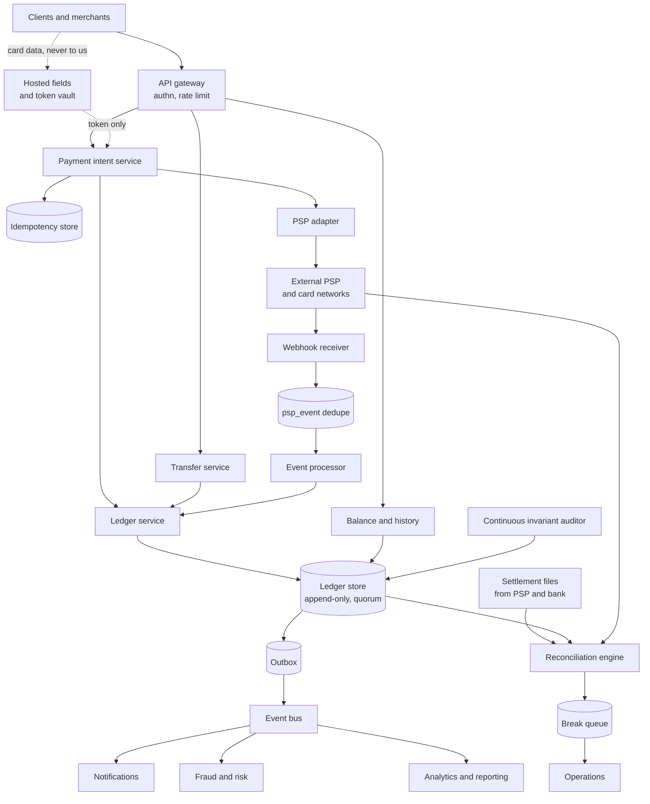
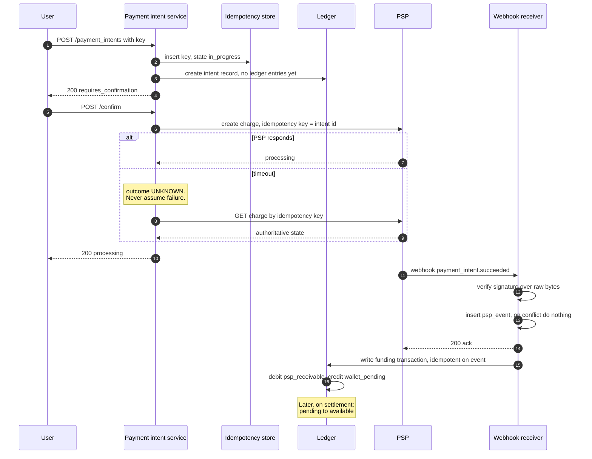
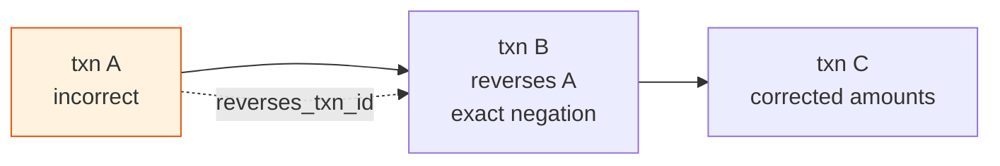
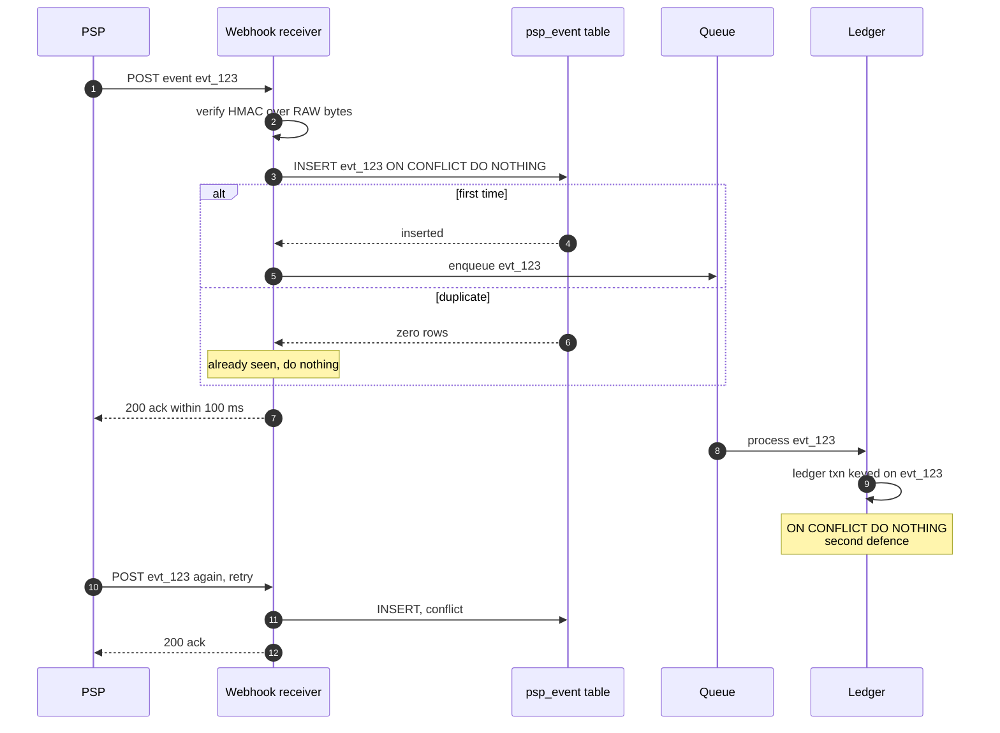
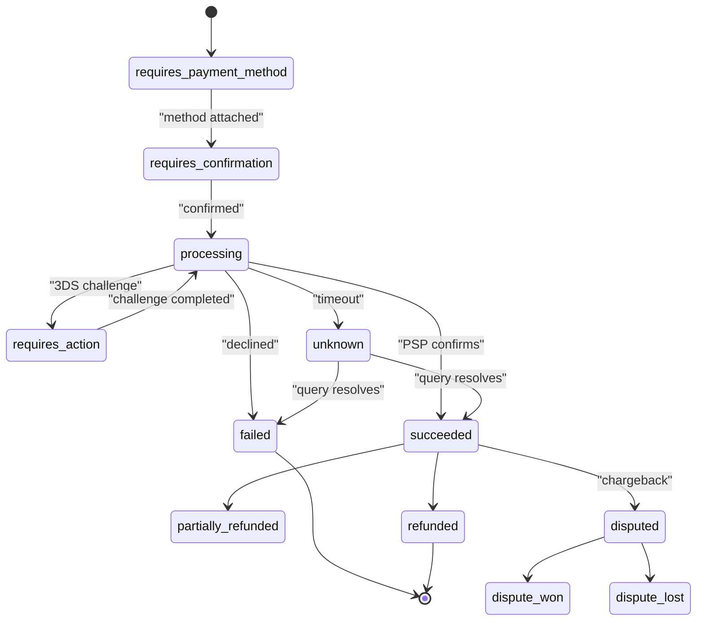
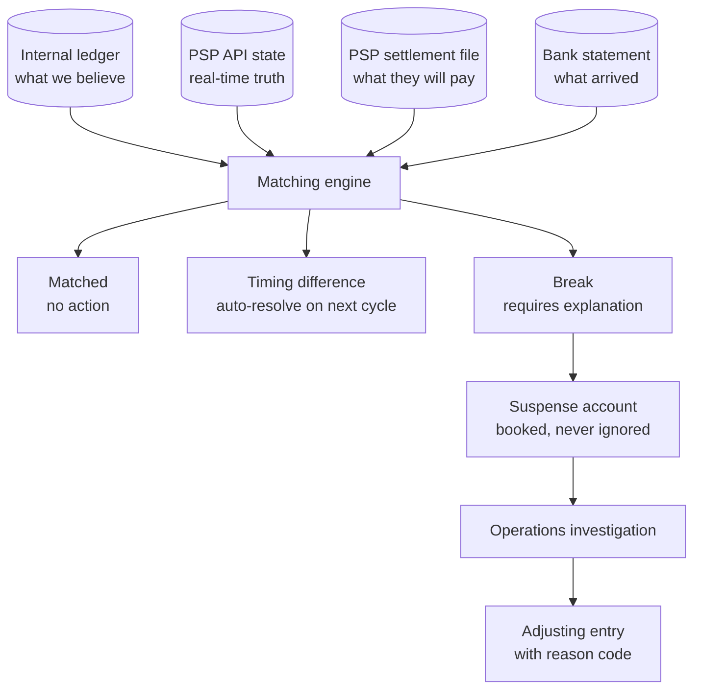
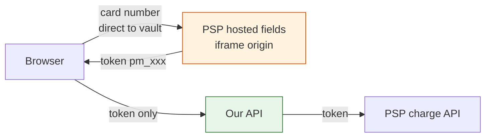
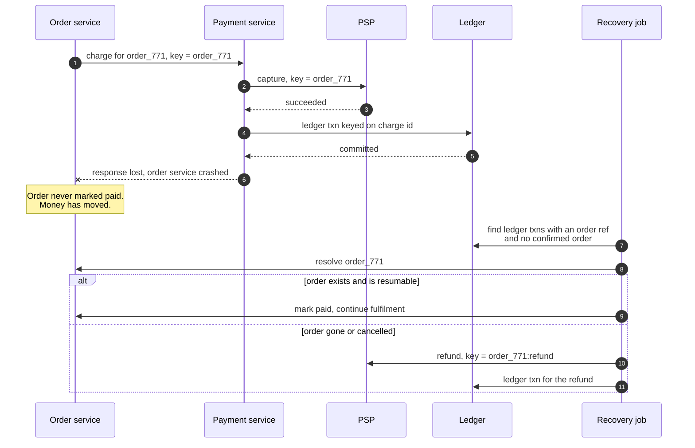
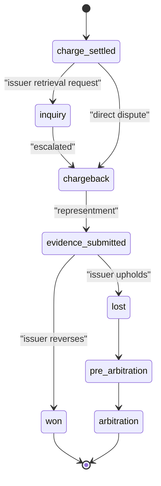

# 27 — Payment System / Digital Wallet

<span class="pill pill-core">Core</span> <span class="pill pill-hard">Hard</span>

**A system whose central invariant is an accounting identity rather than an availability target — every movement of value must sum to zero, be recorded exactly once, and remain provable years later, while the authoritative record of whether the money actually moved lives inside a third party that tells you asynchronously, out of order, and more than once.**

| | |
|---|---|
| **Commonly asked at** | Stripe, Adyen, Block, PayPal, Revolut, Wise, Coinbase, Amazon, Uber, Shopify, Goldman Sachs, Google |
| **Time budget** | 45 min |
| **Core tension** | Exactly-once money movement is impossible at the transport layer — networks time out, webhooks are delivered at-least-once, and the payment processor's answer may arrive after you have already given up. So exactly-once has to be manufactured at the **data** layer, out of idempotent keys, unique constraints and immutable append-only entries. Every shortcut that makes the system faster or simpler — a mutable balance column, a floating-point amount, a webhook handler that trusts its input, a "correction" that updates a row — trades a correctness property you cannot get back for a convenience you did not need |
| **Prerequisites** | [F07 Replication & Consistency](../fundamentals/f07-replication-consistency.md), [F08 CAP & PACELC](../fundamentals/f08-cap-pacelc.md), [F09 Consensus](../fundamentals/f09-consensus.md), [F10 Distributed Transactions](../fundamentals/f10-distributed-transactions.md), [F11 Idempotency](../fundamentals/f11-idempotency.md), [F12 Queues & Streams](../fundamentals/f12-queues-streams.md), [F13 Storage Engines](../fundamentals/f13-storage-engines.md), [F14 SQL vs NoSQL](../fundamentals/f14-sql-vs-nosql.md), [F18 Resilience Patterns](../fundamentals/f18-resilience-patterns.md), [F19 Concurrency Control](../fundamentals/f19-concurrency-control.md), [F20 Time, Clocks & Ordering](../fundamentals/f20-time-clocks-ordering.md), [F22 Observability Fundamentals](../fundamentals/f22-observability-fundamentals.md), [F23 SLOs & Error Budgets](../fundamentals/f23-slo-error-budgets.md), [F26 Multi-region & DR](../fundamentals/f26-multi-region-dr.md), [F27 Security in Design](../fundamentals/f27-security-design.md) |

---

## 1. Problem Statement

Build the ledger and payment orchestration behind a digital wallet: users fund balances from cards and bank accounts, send money to each other, pay merchants, withdraw, get refunded, and dispute charges — across currencies, with a complete and immutable audit trail, and with no money created or destroyed.

Four properties define this system, and each one rules out a design that would be perfectly reasonable elsewhere.

**The central invariant is conservation, not availability.** For every currency, the sum of all ledger entries across all accounts is exactly zero. Money is never created and never destroyed; it only moves between accounts, and every movement has two sides. This is not a style preference — it is the property that makes the system *auditable*, and auditability is the actual product. A system that can tell you a balance but cannot tell you how it got there is not a payment system, it is a counter.

**The truth about whether money moved lives somewhere else.** Your ledger records your *belief*. The card network, the acquiring bank and the payment service provider hold the reality, and they tell you about it through webhooks that are delivered at-least-once, potentially out of order, sometimes hours late, and occasionally not at all. Reconciliation is not an operational chore bolted on at the end; it is the mechanism by which your belief is corrected, and it belongs in the architecture from the first diagram.

**Nothing can ever be mutated or deleted.** A ledger entry is a historical claim about what happened at a moment in time. Correcting a mistake means appending a reversing entry, not editing the original. This single rule eliminates a whole category of bugs, makes every balance reconstructible at any past instant, and is a hard regulatory requirement in most jurisdictions.

**Exactly-once is unattainable at the transport layer, so it must be built at the data layer.** Networks time out. Retries happen. Webhooks duplicate. The only reliable construction is: a deterministic idempotency key, a unique constraint that makes the second write fail, and an operation that is safe to attempt any number of times. Every "exactly-once" claim in this design bottoms out in a unique index.

The invariants everything serves:

- **I1.** For every ledger transaction and every currency within it, $\sum \text{amount} = 0$.
- **I2.** Globally, for every currency, $\sum \text{amount} = 0$ across the entire ledger.
- **I3.** Ledger entries are append-only. No `UPDATE`, no `DELETE`, ever.
- **I4.** Every external money movement maps to exactly one ledger transaction, and every ledger transaction that claims an external movement can be matched to one.

### Out of scope

Card issuing and the four-party scheme's internals, KYC/AML onboarding and sanctions screening (named where they touch the flow), lending and credit products, and the merchant-side checkout experience.

---

## 2. Requirements

### Functional

| # | Requirement | Notes |
|---|---|---|
| F1 | Fund a wallet from a card or bank transfer | Async confirmation; funds pending until settled |
| F2 | Peer-to-peer transfer | Instant, internal, no external money movement |
| F3 | Pay a merchant | Split into merchant payout, platform fee, tax withholding |
| F4 | Withdraw or pay out to a bank account | Irreversible once submitted to the rails |
| F5 | Authorisation holds | Pending balance distinct from available balance |
| F6 | Full and partial refunds | Refunds are new transactions, never deletions |
| F7 | Multi-currency balances with FX | Explicit rate, explicit spread, explicit rounding account |
| F8 | Chargebacks and dispute lifecycle | Evidence submission, representment, final outcome |
| F9 | Statements, entry history and audit export | Reconstructible balance at any past instant |
| F10 | Fraud hold, manual review, release or seize | Funds frozen without leaving the ledger |

### Non-functional

| # | Requirement | Target |
|---|---|---|
| N1 | Ledger imbalance | **Zero.** Any nonzero value is a Sev-1, always |
| N2 | Duplicate money movement | **Zero.** Enforced by unique constraints, not by code review |
| N3 | Lost money movement (PSP charged, no ledger entry) | **Zero sustained**; detected within one reconciliation cycle |
| N4 | Durability of a committed ledger write | RPO = 0. Synchronous quorum replication, no exceptions |
| N5 | Balance read latency | p99 < 50 ms |
| N6 | Internal transfer latency | p99 < 200 ms end to end |
| N7 | Payment intent creation latency | p99 < 300 ms excluding the PSP |
| N8 | Webhook ingestion | Accept and durably persist in < 100 ms; process asynchronously |
| N9 | Reconciliation completeness | 100% of settlement lines matched or explicitly broken within 24 h |
| N10 | Audit retention | 7–10 years, immutable, exportable |
| N11 | PCI-DSS scope | SAQ A. Card numbers never touch our infrastructure |

!!! danger "N4 is the requirement that rules out most of the fun architecture"
    RPO = 0 means a committed ledger write survives the loss of a data centre. That forbids asynchronous replication for the ledger, which in turn forbids active-active multi-region writes to the same account without consensus, which means cross-region write latency is bounded below by the speed of light between your quorum members. **You cannot have a globally distributed, low-latency, strongly-durable ledger with a single global account namespace** — something has to give, and the thing that gives is usually locality: accounts are homed to a region, and cross-region movement is an explicit two-step transfer through a clearing account. Say this out loud early; it is the constraint that shapes the topology and most candidates never surface it.

---

## 3. Scale Estimation

### Transaction and entry volume

$$
\begin{aligned}
\text{users} &= 5\times10^{7},\quad \text{DAU} = 2\times10^{7} \\
\text{payments/day} &= 10^{8} &\Rightarrow&\ \text{avg } 1{,}160\ \text{/s},\ \text{peak } \approx 5{,}000\ \text{/s} \\
\text{ledger entries per payment} &\approx 5 &&(\text{gross, fee, tax, net, receivable}) \\
\text{ledger entries/day} &= 5\times10^{8} &\Rightarrow&\ \text{avg } 5{,}800\ \text{/s},\ \text{peak } \approx 2.5\times10^{4}\ \text{/s}
\end{aligned}
$$

### Storage — and why it is the easy part

$$
\begin{aligned}
\text{entry row} &\approx 120\ \text{B (id, txn, account, amount, currency, seq)} \\
\text{per day} &= 5\times10^{8} \times 120\ \text{B} = 60\ \text{GB} \\
\text{per year} &\approx 22\ \text{TB} \\
\text{7-year retention} &\approx 153\ \text{TB} + \text{indexes} \approx 250\ \text{TB}
\end{aligned}
$$

A quarter of a petabyte of append-only, never-updated, overwhelmingly cold data. That is a tiering problem, not a scaling problem: the last 90 days are hot, everything older is queried rarely and can live in columnar object storage with the same immutability guarantees. **The hard part of this system is not storage, it is that every one of those rows must be correct forever.**

### Balance computation — the number that forces snapshots

Deriving a balance by summing all entries is $O(n)$ in the account's history.

$$
\begin{aligned}
\text{typical consumer account} &: \sim 500\ \text{entries/year} \Rightarrow\ \text{sum is trivial} \\
\text{large merchant account} &: 10^{6}\ \text{entries/month} \Rightarrow\ 8.4\times10^{7}\ \text{entries over 7 years} \\
\text{scan at } 10^{7}\ \text{rows/s} &\Rightarrow\ 8.4\ \text{s per balance read}
\end{aligned}
$$

Eight seconds against a 50 ms SLO. So balances are **materialised in the same ACID transaction as the entries**, with a checkpoint (`last_entry_id`) that makes the materialised value verifiable by summing only the entries since the last snapshot. The entries remain the source of truth; the balance is a derived cache that happens to be transactionally consistent with it.

$$
\text{verification cost} = \sum_{\text{entries since snapshot}} \approx \frac{10^{6}}{30} \approx 3.3\times10^{4}\ \text{rows for a daily snapshot}
$$

### Webhooks and duplicates

$$
\begin{aligned}
\text{webhook events/payment} &\approx 3\ (\text{created, succeeded, settled}) \\
\text{base volume} &= 3\times10^{8}\ \text{/day} \\
\text{duplicate factor (at-least-once + retries)} &\approx 1.05\text{–}1.30 \\
\text{received events/day} &\approx 3.2\times10^{8}\ \text{to}\ 3.9\times10^{8} \\
\text{peak ingestion} &\approx 1.5\times10^{4}\ \text{/s}
\end{aligned}
$$

Between 5% and 30% of webhook deliveries are duplicates under normal operation, and the ratio spikes during a PSP incident precisely when your handler is already under stress. **Deduplication is a hot-path requirement, not a background cleanup.**

### Reconciliation

$$
\begin{aligned}
\text{settlement file lines/day} &\approx 10^{8} \\
\text{matching window} &= 4\ \text{h} \Rightarrow \approx 7{,}000\ \text{lines/s to match} \\
\text{expected break rate} &\approx 10^{-4} \Rightarrow 10^{4}\ \text{breaks/day} \\
\text{auto-resolvable} &\approx 99\% \Rightarrow \sim100\ \text{manual breaks/day}
\end{aligned}
$$

A hundred manual investigations a day is a staffed operations function. The engineering goal is not zero breaks — timing differences guarantee breaks exist — it is **maximising the auto-match rate and making the residue explainable**.

!!! tip "The sentence that frames the whole interview"
    **"Storage is a quarter of a petabyte of cold append-only rows, which is easy. The hard requirement is that the sum of every entry in every currency is exactly zero, forever, while the system that actually knows whether the money moved tells me asynchronously, more than once, and sometimes out of order. So the architecture is: an immutable double-entry ledger, exactly-once enforced by unique constraints, and continuous reconciliation against the external source of truth."** Say this in the first two minutes. It replaces the throughput conversation most candidates have with the correctness conversation the interviewer wants.

---

## 4. API Design

### Payment intent — the two-phase public contract

```http
POST /v1/payment_intents
Idempotency-Key: pi_req_4f2a9c31b7d84e60
Content-Type: application/json

{
  "amount_minor": 12500,
  "currency": "USD",
  "destination_account": "acct_user_88213",
  "payment_method": "pm_1QaBcDeF",
  "description": "Wallet top-up",
  "metadata": { "order_id": "ord_771" }
}
```

```json
{
  "id": "pi_3Qx7Kf2LmN",
  "object": "payment_intent",
  "status": "requires_confirmation",
  "amount_minor": 12500,
  "currency": "USD",
  "client_secret": "pi_3Qx7Kf2LmN_secret_9aVb",
  "created_at": "2026-02-10T14:02:11.442Z"
}
```

```http
POST /v1/payment_intents/pi_3Qx7Kf2LmN/confirm
Idempotency-Key: pi_req_4f2a9c31b7d84e60:confirm
```

| Status | Meaning | Caller action |
|---|---|---|
| `200` with `status: succeeded` | Money moved and the ledger is written | Done |
| `200` with `status: processing` | Submitted to the rails; outcome unknown | Poll or wait for your own webhook. **Do not resubmit** |
| `200` with `status: requires_action` | 3-D Secure or similar challenge | Redirect the user to `next_action` |
| `402` with `status: failed` | Declined, with a decline code | Offer another instrument with a **new** idempotency key |
| `409 idempotency_key_reuse` | Same key, different request body | Fix the client. This is a bug or an attack |

!!! danger "The 409 on key reuse is a security control, not an ergonomic nicety"
    If a request arrives with an idempotency key that has been seen before but a **different request body**, the correct response is to reject it — not to return the cached result and not to process the new amount. Returning the cached result silently succeeds with the wrong amount from the caller's perspective; processing the new amount defeats idempotency entirely and enables the retry-with-different-amount attack described in §7.2. Store a hash of the canonicalised request body alongside the key and compare. This is three lines of code and it closes a real vulnerability class.

### Internal transfer

```http
POST /v1/transfers
Idempotency-Key: tr_8817d0e2

{
  "from_account": "acct_user_88213",
  "to_account": "acct_user_44109",
  "amount_minor": 2500,
  "currency": "USD",
  "reason": "p2p"
}
```

An internal transfer is synchronous and either fully succeeds or fully fails, because it is a single local ACID transaction writing two ledger entries. **No external system participates**, which is exactly why it can offer a guarantee that card funding cannot.

### Balance and history

```http
GET /v1/accounts/acct_user_88213/balance
```

```json
{
  "account_id": "acct_user_88213",
  "currency": "USD",
  "available_minor": 41250,
  "pending_minor": 2000,
  "reserved_minor": 0,
  "as_of_entry_id": 99814772301,
  "as_of": "2026-02-10T14:02:11.442Z"
}
```

`as_of_entry_id` is a monotonic cursor into the ledger. A client that reads a balance and then reads history can detect whether it saw a consistent snapshot, and support tooling can reproduce exactly the balance a user saw at a moment in time — which is the first question in every dispute.

### Inbound webhook

```http
POST /webhooks/psp/v1
PSP-Signature: t=1770732131,v1=5257a869e7ecebeda32affa62cdca3fa...
Content-Type: application/json

{
  "id": "evt_1Nx8Kf2LmN",
  "type": "payment_intent.succeeded",
  "created": 1770732131,
  "data": { "object": { "id": "pi_ext_9931", "amount": 12500, "currency": "usd" } }
}
```

The handler's entire job is: verify the signature over the **raw bytes**, insert the event id into a dedupe table, return `200`. Processing happens asynchronously. See §7.3.

---

## 5. Data Model

### The chart of accounts

```sql
CREATE TABLE account (
    account_id     bigint PRIMARY KEY,
    owner_type     text    NOT NULL,   -- user | merchant | platform | external
    owner_id       text,
    kind           text    NOT NULL,   -- asset | liability | equity | revenue | expense
    purpose        text    NOT NULL,   -- wallet_available | wallet_pending |
                                       -- psp_receivable | bank_operating |
                                       -- fee_revenue | fx_position | rounding |
                                       -- merchant_reserve | suspense
    currency       char(3) NOT NULL,   -- ISO 4217
    -- +1 for debit-normal (asset, expense), -1 for credit-normal
    -- (liability, equity, revenue). Presentation only; the ledger
    -- itself is always signed debit-positive.
    normal_side    smallint NOT NULL CHECK (normal_side IN (1, -1)),
    allow_negative boolean NOT NULL DEFAULT false,
    opened_at      timestamptz NOT NULL DEFAULT now(),
    closed_at      timestamptz,
    UNIQUE (owner_type, owner_id, purpose, currency)
);
```

Every user has **at least three** accounts per currency: `wallet_available`, `wallet_pending` (authorisation holds, unsettled funding) and, where applicable, `wallet_reserved` (fraud or dispute freezes). Moving money between a user's own sub-accounts is a normal balanced transaction, which is how a hold, a freeze or a release becomes an ordinary ledger operation rather than a special case with its own code path.

### The ledger

```sql
CREATE TABLE ledger_transaction (
    txn_id          uuid PRIMARY KEY,
    kind            text        NOT NULL,   -- transfer | funding | payout |
                                            -- refund | fee | fx | chargeback |
                                            -- reversal | adjustment
    idempotency_key text        NOT NULL,
    external_ref    text,                   -- PSP charge id, bank reference
    reverses_txn_id uuid REFERENCES ledger_transaction(txn_id),
    metadata        jsonb       NOT NULL DEFAULT '{}',
    occurred_at     timestamptz NOT NULL,   -- when the event happened
    recorded_at     timestamptz NOT NULL DEFAULT now(),  -- when we learned of it
    CONSTRAINT uniq_idem UNIQUE (kind, idempotency_key)
);

CREATE TABLE ledger_entry (
    entry_id     bigint  GENERATED ALWAYS AS IDENTITY PRIMARY KEY,
    txn_id       uuid    NOT NULL REFERENCES ledger_transaction(txn_id),
    account_id   bigint  NOT NULL REFERENCES account(account_id),
    -- SIGNED INTEGER MINOR UNITS. Positive = debit, negative = credit.
    -- NEVER a float. NEVER a string. NEVER nullable.
    amount_minor bigint  NOT NULL,
    currency     char(3) NOT NULL,
    seq          smallint NOT NULL,
    CONSTRAINT nonzero_amount CHECK (amount_minor <> 0),
    CONSTRAINT uniq_txn_seq   UNIQUE (txn_id, seq)
);

CREATE INDEX entry_by_account ON ledger_entry (account_id, entry_id);
CREATE INDEX entry_by_txn     ON ledger_entry (txn_id);

-- I3: append-only, enforced by the database and by permissions.
CREATE RULE ledger_entry_no_update AS ON UPDATE TO ledger_entry DO INSTEAD NOTHING;
CREATE RULE ledger_entry_no_delete AS ON DELETE TO ledger_entry DO INSTEAD NOTHING;
REVOKE UPDATE, DELETE ON ledger_entry FROM app_user;
```

### I1 enforced by the database, per currency

```sql
CREATE OR REPLACE FUNCTION assert_txn_balanced() RETURNS trigger AS $$
DECLARE
    imbalance bigint;
BEGIN
    SELECT COALESCE(sum(amount_minor), 0)
      INTO imbalance
      FROM ledger_entry
     WHERE txn_id = NEW.txn_id
       AND currency = NEW.currency;

    IF imbalance <> 0 THEN
        RAISE EXCEPTION
          'unbalanced transaction % currency % imbalance %',
          NEW.txn_id, NEW.currency, imbalance
          USING ERRCODE = 'check_violation';
    END IF;
    RETURN NULL;
END;
$$ LANGUAGE plpgsql;

CREATE CONSTRAINT TRIGGER ledger_entry_balanced
    AFTER INSERT ON ledger_entry
    DEFERRABLE INITIALLY DEFERRED
    FOR EACH ROW EXECUTE FUNCTION assert_txn_balanced();
```

`DEFERRABLE INITIALLY DEFERRED` is load-bearing: the check runs at `COMMIT`, after every entry of the transaction has been inserted, so a partially-written transaction is never evaluated. The balance check is **per currency within the transaction**, which is what makes FX expressible: a currency-converting transaction has USD entries summing to zero and EUR entries summing to zero, with an `fx_position` account absorbing the difference in each. See §7.5.

### Materialised balances

```sql
CREATE TABLE account_balance (
    account_id     bigint PRIMARY KEY REFERENCES account(account_id),
    -- Signed, same convention as entries (debit-positive).
    balance_minor  bigint NOT NULL DEFAULT 0,
    last_entry_id  bigint NOT NULL DEFAULT 0,
    version        bigint NOT NULL DEFAULT 0,
    updated_at     timestamptz NOT NULL DEFAULT now()
);

CREATE TABLE account_balance_snapshot (
    account_id     bigint NOT NULL,
    as_of_entry_id bigint NOT NULL,
    balance_minor  bigint NOT NULL,
    taken_at       timestamptz NOT NULL DEFAULT now(),
    PRIMARY KEY (account_id, as_of_entry_id)
);
```

```sql
-- Inside the SAME transaction that inserts the entries.
UPDATE account_balance
   SET balance_minor = balance_minor + $delta,
       last_entry_id = $entry_id,
       version       = version + 1,
       updated_at    = now()
 WHERE account_id = $account
   AND (  $delta >= 0
       OR balance_minor + $delta >= 0
       OR (SELECT allow_negative FROM account WHERE account_id = $account));
```

Zero affected rows means insufficient funds. The check lives in the `WHERE` clause so it is evaluated under the row lock, which makes it correct under concurrency without a separate read.

!!! example "The materialised balance is a cache, and it is verifiable — that is the whole point"
    The objection to storing a balance is that it can drift. The answer is not to avoid storing it, but to make drift *detectable in $O(\text{recent entries})$*. `last_entry_id` is a checkpoint: to verify, take the newest snapshot at or before it and sum only the entries since. For a merchant with a million entries a month and a daily snapshot, that is ~33,000 rows instead of 84 million. Run the verification continuously on a sample and nightly across everything. **A stored balance is fine; a stored balance that is the only record of how it got there is not.**

### Idempotency and webhook dedupe

```sql
CREATE TABLE idempotency_record (
    scope          text        NOT NULL,   -- 'payment_intent' | 'transfer' | ...
    key            text        NOT NULL,
    request_hash   bytea       NOT NULL,   -- SHA-256 of the canonical body
    state          text        NOT NULL,   -- in_progress | completed
    response_code  smallint,
    response_body  jsonb,
    txn_id         uuid,
    created_at     timestamptz NOT NULL DEFAULT now(),
    expires_at     timestamptz NOT NULL,
    PRIMARY KEY (scope, key)
);

CREATE TABLE psp_event (
    psp_event_id   text PRIMARY KEY,      -- provider's event id
    provider       text        NOT NULL,
    type           text        NOT NULL,
    payload        jsonb       NOT NULL,
    signature_ok   boolean     NOT NULL,
    received_at    timestamptz NOT NULL DEFAULT now(),
    processed_at   timestamptz,
    processing_result text
);
```

| Store | Technology | Sharding | Why |
|---|---|---|---|
| Ledger (hot, 90 d) | Postgres with synchronous quorum replication | By `account_id` range within a region; accounts homed to a region | RPO = 0 is non-negotiable; real transactions and constraints are the enforcement mechanism |
| Ledger (cold) | Columnar files in object storage, write-once | By month | 250 TB of immutable cold data; object-lock gives immutability for free |
| Balances | Same shard, same transaction as entries | Colocated with the account | Must be transactionally consistent with the entries |
| Idempotency records | Same shard as the resulting transaction | By key hash to the txn's shard | The unique constraint and the write must be in one local transaction |
| PSP events | Append-only table plus a queue | By event id | Dedupe on arrival; process asynchronously |
| Settlement files | Object storage plus a staging table | By file and date | Bulk-loaded, matched, then archived |
| Card data | **Nowhere.** A third-party vault | n/a | PCI scope reduction; see §7.6 |

---

## 6. High-Level Architecture



### Write path — an internal transfer (the easy case)

One local ACID transaction on one shard:

1. Insert the `idempotency_record` with `(scope, key)`. A unique-violation means this is a replay — return the stored response.
2. Insert the `ledger_transaction` row.
3. Insert two `ledger_entry` rows: debit the sender's `wallet_available`, credit the recipient's.
4. Update both `account_balance` rows with the sufficiency check in the `WHERE` clause.
5. Insert an outbox row.
6. `COMMIT` — at which point the deferred trigger asserts I1.

**Sender and recipient must be on the same shard for this to be one transaction.** When they are not, the transfer becomes a two-step movement through a per-shard clearing account, with a saga covering the two legs. That is a real design decision with real consequences, and it is why account-to-shard assignment is worth discussing: homing by user works, but a popular merchant becomes a hot shard.

### Write path — card funding (the hard case)



Three structural properties of that flow:

- **No ledger entries exist until the PSP confirms.** An intent is a record of an attempt, not a movement of money. Writing entries optimistically and reversing them on failure doubles your entry volume and makes every balance temporarily wrong.
- **The webhook is acknowledged before it is processed.** The receiver's only job is verify-dedupe-persist-ack in under 100 ms. If processing is inline and slow, the PSP times out, retries, and you have manufactured your own duplicate storm.
- **A timeout triggers a query, never a retry.** The single most expensive mistake in payments integration is treating "I did not hear back" as "it did not happen".

---

## 7. Deep Dives

### 7.1 Double-entry ledger design

#### Why a single balance column is wrong

```sql
-- The design that looks obvious and is unrecoverable.
UPDATE wallet SET balance = balance - 2500 WHERE user_id = 'alice';
UPDATE wallet SET balance = balance + 2500 WHERE user_id = 'bob';
```

Even wrapped in a transaction, this is wrong for reasons that have nothing to do with atomicity:

| Failure | Why the balance column cannot answer |
|---|---|
| "Why is my balance 412.50?" | There is no record of how it got there. The history, if any, is a separate table that can disagree |
| "Was this transfer applied twice?" | A balance of 387.50 is consistent with one 25.00 transfer or with many other histories. Unanswerable |
| "What was the balance on 3 March?" | Requires replaying an audit log that was not the source of truth and may be incomplete |
| "Do our books balance?" | There is no global invariant to check. Money can be created by a bug and nothing detects it |
| "A bug ran for six hours. What is the blast radius?" | Unknowable without a complete, trustworthy history of every mutation |
| Regulatory audit | An auditable trail of every movement, immutable, is generally a legal requirement |

The deepest problem is the fourth. With balance columns, **a bug that credits without debiting creates money and nothing in the system notices.** With double-entry, the same bug produces an unbalanced transaction that the database refuses to commit, and if it somehow got in, a global sum that is nonzero and alarms within a minute.

#### The chosen representation: signed integer minor units, debit-positive

Every entry has a signed `amount_minor`. Positive is a debit, negative is a credit. Every transaction sums to zero per currency. The accounting semantics come from the account's `kind`:

| Account kind | Debit (positive entry) | Credit (negative entry) |
|---|---|---|
| Asset (bank, PSP receivable) | Increases | Decreases |
| Liability (user wallet balances) | Decreases | Increases |
| Revenue (fees earned) | Decreases | Increases |
| Expense (PSP fees paid) | Increases | Decreases |

!!! note "User balances are liabilities, and understanding why demonstrates domain literacy"
    A user's wallet balance is money **you owe them**. It is a liability on your balance sheet, offset by an asset — the cash sitting in your operating or custodial bank account. This is not pedantry: it is why a funding transaction touches an asset account *and* a liability account, why an internal transfer touches neither the bank nor total liabilities, and why "where is the money actually held" has an answer the ledger can express. A candidate who models user balances as assets has the sign of the entire business backwards.

#### Worked example 1 — a peer-to-peer transfer, two balanced rows

Alice sends Bob $25.00. No money leaves the platform's bank account; only the composition of the platform's liabilities changes.

```sql
BEGIN;

INSERT INTO ledger_transaction (txn_id, kind, idempotency_key, occurred_at)
VALUES ('9f2e...c1', 'transfer', 'tr_8817d0e2', now());

INSERT INTO ledger_entry (txn_id, account_id, amount_minor, currency, seq) VALUES
  -- Debit Alice's wallet: our liability to Alice DECREASES by 25.00
  ('9f2e...c1', 2001,  2500, 'USD', 1),
  -- Credit Bob's wallet:  our liability to Bob INCREASES by 25.00
  ('9f2e...c1', 2002, -2500, 'USD', 2);

COMMIT;  -- deferred trigger asserts 2500 + (-2500) = 0
```

```text
txn 9f2e...c1   kind=transfer   currency=USD

  account                         kind        amount_minor
  ------------------------------  ----------  ------------
  2001 user:alice:wallet          liability         +2500   (debit)
  2002 user:bob:wallet            liability         -2500   (credit)
  ------------------------------  ----------  ------------
                                  SUM                   0   <-- I1 holds

  Alice available: 10000 -> 7500   (liability down, presented as balance down)
  Bob   available:  4000 -> 6500
  Platform bank account:           UNCHANGED
  Total platform liabilities:      UNCHANGED
```

That last pair of lines is the point. The money never moved externally, so no asset account appears. A design that debits a "cash" account here is describing a movement that did not happen.

#### Worked example 2 — card funding with fees, across three transactions

Alice tops up $100.00 with a card. The PSP charges 2.9% + $0.30 = $3.20 and settles the net two days later.

```text
T1  (on webhook payment_intent.succeeded)  kind=funding  currency=USD
  1101 platform:psp_receivable     asset        +10000   (debit: they owe us)
  2001 user:alice:wallet_pending   liability    -10000   (credit: we owe Alice)
                                   SUM               0

T2  (on webhook charge.updated with fee)   kind=fee      currency=USD
  5001 platform:psp_fee_expense    expense        +320   (debit: cost incurred)
  1101 platform:psp_receivable     asset          -320   (credit: they owe us less)
                                   SUM               0

T3  (on settlement file match)             kind=payout   currency=USD
  1001 platform:bank_operating     asset         +9680   (debit: cash arrived)
  1101 platform:psp_receivable     asset         -9680   (credit: receivable cleared)
                                   SUM               0

T4  (when funds clear risk hold)            kind=transfer currency=USD
  2001 user:alice:wallet_pending   liability    +10000
  2002 user:alice:wallet_available liability    -10000
                                   SUM               0
```

After all four, the platform holds $96.80 in cash, owes Alice $100.00, and has recognised $3.20 of expense. The books balance, every stage is separately timestamped, and each transaction is attributable to the specific external event that caused it.

#### The global invariant

```sql
-- Run every 60 seconds. Any nonzero row is a Sev-1, always, no exceptions.
SELECT currency, sum(amount_minor) AS imbalance
  FROM ledger_entry
 GROUP BY currency
HAVING sum(amount_minor) <> 0;
```

On the hot partition this is a fast aggregate; over 250 TB it is not, so it runs incrementally against partition-level sums maintained as entries are written. The property being tested is the strongest one the system has: **if this query returns a row, money has been created or destroyed.**

#### Corrections are reversals, never edits



A reversal is a new transaction whose entries are the exact negation of the original, linked by `reverses_txn_id`. The original remains visible forever. This is why `UPDATE` and `DELETE` are revoked at the permission level rather than merely discouraged by convention: **the day someone "fixes" a row by hand is the day the ledger stops being evidence.**

### 7.2 Exactly-once money movement

Exactly-once delivery does not exist. Exactly-once *effect* does, and it is constructed from three ingredients:

1. A **deterministic key** identifying the logical operation.
2. A **unique constraint** so the second attempt fails at the storage layer.
3. An **operation that is safe to attempt repeatedly**, because failure is indistinguishable from success from the caller's side.

```python
import hashlib, json
from psycopg.errors import UniqueViolation

def canonical_hash(body: dict) -> bytes:
    payload = json.dumps(body, sort_keys=True, separators=(",", ":"))
    return hashlib.sha256(payload.encode()).digest()

def execute_idempotent(scope, key, body, do_work):
    h = canonical_hash(body)
    with db.transaction() as tx:
        try:
            tx.execute(
                """INSERT INTO idempotency_record
                       (scope, key, request_hash, state, expires_at)
                   VALUES (%s, %s, %s, 'in_progress', now() + interval '24 hours')""",
                (scope, key, h))
        except UniqueViolation:
            rec = tx.execute(
                "SELECT * FROM idempotency_record WHERE scope=%s AND key=%s "
                "FOR UPDATE", (scope, key)).one()
            if rec.request_hash != h:
                # Same key, different body. Reject -- do not process, do not
                # return the cached result. This is the attack in the next box.
                raise IdempotencyKeyReuse(409)
            if rec.state == 'completed':
                return rec.response_code, rec.response_body
            raise RequestInProgress(409)   # caller should retry shortly

        result = do_work(tx)               # ledger writes in the SAME transaction
        tx.execute(
            """UPDATE idempotency_record
                  SET state='completed', response_code=%s,
                      response_body=%s, txn_id=%s
                WHERE scope=%s AND key=%s""",
            (200, result.body, result.txn_id, scope, key))
        return 200, result.body
```

The critical structural property: **the idempotency record and the ledger writes commit in one transaction.** Two separate transactions produce a window where the work is done and the key is not recorded, so a retry does it again. This is the single most common way idempotency implementations are wrong, and it is invisible until it is load-tested with induced crashes.

!!! danger "The retry-with-different-amount attack"
    **Attack.** The client sends `POST /payment_intents` with key `K` and `amount_minor: 100`. It completes. The attacker then resends key `K` with `amount_minor: 10000000`.
    **What a naive implementation does.** Many implementations look up the key, find it, and return the cached response — which describes a 1.00 charge. If the handler instead *processes* the new body because "the key already succeeded so this must be a retry", the attacker has just moved 100,000.00 under a key that the audit trail will show as a legitimate idempotent retry.
    **The subtler variant.** The attacker guesses or replays *another user's* key. If keys are scoped globally rather than per authenticated caller, a collision lets one caller read another's cached response body, leaking transaction details and amounts.
    **Mitigation.** Three rules, all required. **Scope the key to the authenticated caller** — the primary key is `(api_key_id, scope, key)`, so cross-caller collisions are impossible by construction. **Store a hash of the canonicalised body** and return `409` if it differs; never return the cached result for a different body and never process the new one. **Expire keys** on a fixed window (24 hours is the industry norm) so the namespace does not grow forever — and make the client aware, because a retry after expiry will create a second charge, which is itself a gotcha worth designing around.

#### Key scoping rules, stated precisely

| Operation | Key derived from | Stable across | Different across |
|---|---|---|---|
| Client-to-API payment intent | Client-supplied, scoped to the API key | Network retries of the same request | A genuinely new payment |
| API-to-PSP charge | `payment_intent_id` | Every internal retry and saga resume | A new intent, including a retry with a different card |
| Webhook event processing | Provider's `event.id` | All redeliveries of that event | Distinct events |
| Ledger transaction write | `(kind, external_ref)` or the event id | Any replay of the same source event | Distinct source events |
| Refund | `refund_id` | Retries | Each distinct refund, including partials |

The rule that trips people up: **a customer retrying a failed payment with a different card must use a NEW key.** If the client reuses the original key, the PSP returns the cached decline forever and the customer can never pay. Presented in production as "our retry-after-decline success rate is exactly zero".

#### Versioned ledger entries instead of distributed transactions

There is no 2PC across your ledger and a card network. Exactly-once across that boundary is achieved by making the ledger write **derivable from, and keyed on, the external event**:

```sql
-- The PSP event id becomes the ledger transaction's idempotency key.
INSERT INTO ledger_transaction (txn_id, kind, idempotency_key, external_ref, ...)
VALUES ($uuid, 'funding', $psp_event_id, $psp_charge_id, ...)
ON CONFLICT (kind, idempotency_key) DO NOTHING
RETURNING txn_id;
```

Zero rows returned means this event has already been applied. The processor logs and moves on. A webhook delivered five times produces one ledger transaction, and the enforcement is a unique index rather than a carefully-reviewed code path.

### 7.3 PSP integration and the webhook problem

Webhook delivery is **at-least-once, unordered, and unauthenticated until you verify it**. Every one of those three properties produces a distinct failure mode.



```python
def handle_webhook(raw_body: bytes, headers: dict) -> tuple[int, str]:
    # 1. Verify over the RAW bytes. Parsing then re-serialising changes
    #    whitespace and key order and the signature will never match --
    #    which teams then "fix" by skipping verification.
    if not verify_hmac(raw_body, headers.get("PSP-Signature", ""), WEBHOOK_SECRET):
        return 401, "bad signature"

    # 2. Reject stale timestamps to bound replay.
    ts = parse_signature_timestamp(headers["PSP-Signature"])
    if abs(time.time() - ts) > 300:
        return 400, "stale"

    event = json.loads(raw_body)

    # 3. Dedupe on arrival. This is the hot path, not a cleanup job.
    rows = db.execute(
        """INSERT INTO psp_event (psp_event_id, provider, type, payload, signature_ok)
           VALUES (%s, %s, %s, %s, true)
           ON CONFLICT (psp_event_id) DO NOTHING""",
        (event["id"], "psp_x", event["type"], Json(event)))

    if rows.rowcount:
        enqueue(event["id"])          # process asynchronously

    # 4. Always 200, even for duplicates. A non-2xx triggers more retries.
    return 200, "ok"
```

#### The four webhook failure modes and their fixes

| Failure | Mechanism | Fix |
|---|---|---|
| **Duplicate delivery** | The PSP did not receive your ack within its timeout — often because your handler was doing the work inline — so it retries. Also occurs on PSP-side failover | Dedupe on `event.id` at the storage layer, ack fast, process async. Second line of defence: the ledger write is itself keyed on the event id |
| **Out-of-order delivery** | `charge.refunded` arrives before `charge.succeeded` because they took different paths or the first was retried | Never assume ordering. Each handler is a guarded state transition; an event for a state you have not reached yet is **parked and retried**, not discarded. Reconcile by polling the PSP for the object's current state |
| **Missing delivery** | Your endpoint was down beyond the retry window, or the PSP dropped it | Periodic polling backstop: list objects changed in the last N hours and diff against your ledger. **Webhooks are an optimisation; polling is the guarantee** |
| **Forged delivery** | Anyone can POST to a public URL. Without verification, an attacker credits their own wallet | HMAC over raw bytes with a timestamp inside the signed payload, constant-time comparison, short replay window. Never trust the event body's own claim about amounts — refetch the object from the PSP API before writing money |

!!! warning "Never write money based on the webhook payload alone"
    A signed webhook proves the message came from the PSP. It does not prove the message is current — a replayed older event, delivered inside the freshness window, describes a state that may since have changed. For any event that moves money, **refetch the object from the PSP's API by id and act on the API's response**, using the webhook purely as a trigger. This costs one extra call per money-moving event and removes an entire class of replay and staleness bugs. For high-volume non-financial events, acting on the payload is fine.

#### The payment intent state machine



`unknown` is the state most designs omit and the one that prevents the most expensive bug. A timeout is not a decline — it is an absence of information. Modelling it explicitly means the code **cannot** take the failure branch by accident, because the only transitions out of `unknown` require a successful query to the provider.

### 7.4 Reconciliation and the source-of-truth problem

Your ledger records what you believe. The PSP's settlement file records what they will actually pay you. The bank statement records what arrived. **These three will disagree, and reconciliation is the process of explaining every disagreement.**



#### Break taxonomy

| Break type | Meaning | Typical cause | Resolution |
|---|---|---|---|
| **In ledger, not in settlement** | We think money moved; they have not paid it | Timing — the transaction falls after the file's cutoff | Auto-resolve on the next cycle. Alarm only if it persists beyond N cycles |
| **In settlement, not in ledger** | **They moved money we never recorded.** The dangerous one | A missed webhook, a crashed processor, or an out-of-band operation | Book to suspense immediately, investigate, then write the missing ledger transaction keyed on the settlement line |
| **Amount mismatch** | Both know the transaction; the amounts differ | FX applied at a different rate, an unanticipated fee, partial capture | Book the delta to the appropriate fee, FX or rounding account with a reason code |
| **Duplicate in settlement** | The same charge appears twice | PSP-side error, or a genuine duplicate charge we created | Determine which. A genuine duplicate needs a refund, not a ledger adjustment |
| **Status mismatch** | We say succeeded, they say refunded | A missed or out-of-order event | Refetch from the API, apply the correct terminal state |

!!! danger "Direction matters enormously and the two directions have opposite severities"
    **"In our ledger but not theirs"** is usually benign — a timing difference that resolves on the next cycle. **"In theirs but not ours"** means money moved in the real world and your books do not know about it, which means your balances are wrong, your customer may be missing funds, and your exposure is unbounded until it is found. Alarm thresholds must be asymmetric: the second direction pages on a single occurrence; the first pages only after it persists. Treating them symmetrically produces either alert fatigue or a silent hole, and usually both.

#### The suspense account

Every unexplained amount is booked to `platform:suspense` with a reason code, which keeps the ledger balanced while the investigation proceeds. The suspense balance is a **directly observable measure of how much money the system cannot currently explain**, and it is one of the highest-signal metrics in the business:

```sql
SELECT reason_code,
       sum(amount_minor) AS unexplained_minor,
       count(*)          AS items,
       min(recorded_at)  AS oldest
  FROM ledger_entry e
  JOIN ledger_transaction t USING (txn_id)
  JOIN account a USING (account_id)
 WHERE a.purpose = 'suspense'
 GROUP BY reason_code
 ORDER BY abs(sum(amount_minor)) DESC;
```

Alarm on both magnitude and **age**. A growing suspense balance is bad; an *old* suspense balance is worse, because unexplained money that has sat for thirty days will not explain itself and is usually the visible edge of a systematic defect.

#### Who is the source of truth?

| Question | Authority | Why |
|---|---|---|
| Did the card network authorise? | **PSP** | They are the only party in the authorisation path |
| Will we actually be paid, and how much? | **Settlement file** | Contractually binding; includes fees and adjustments we could not know |
| Did cash arrive? | **Bank statement** | The final word on the asset side |
| What do we owe this user? | **Our ledger** | We own the liability; nobody else records it |
| What did the user see at 14:02? | **Our ledger** | Reconstructible from immutable entries plus `as_of_entry_id` |

The answer is not "one system is the source of truth" — it is **"different facts have different authorities, and reconciliation is where they are joined."** Saying that clearly is the mark of someone who has operated a payment system rather than only designed one.

### 7.5 Currency, rounding and FX

#### Integer minor units, always

Every amount is a signed integer in the currency's smallest unit, stored alongside its ISO 4217 code. The exponent is **per currency** and looking it up rather than assuming two decimals is not optional:

| Currency | Exponent | 1 unit in minor units | Note |
|---|---|---|---|
| USD, EUR, GBP | 2 | 100 | The assumption everyone bakes in |
| JPY, KRW | 0 | 1 | Dividing by 100 makes every yen amount 100× too small |
| KWD, BHD, JOD | 3 | 1000 | Multiplying by 100 makes every dinar 10× too small |
| CLF, UYW | 4 | 10000 | Rare but real |

```python
from decimal import Decimal, ROUND_HALF_UP

EXPONENT = {"USD": 2, "EUR": 2, "JPY": 0, "KWD": 3}

def to_minor(amount: str, currency: str) -> int:
    """'12.34' USD -> 1234.  '1234' JPY -> 1234.  '12.345' KWD -> 12345."""
    e = EXPONENT[currency]                       # KeyError beats a wrong answer
    q = Decimal(1).scaleb(-e)                    # 0.01, 1, 0.001
    d = Decimal(amount).quantize(q, rounding=ROUND_HALF_UP)
    return int(d.scaleb(e))

def format_minor(minor: int, currency: str) -> str:
    e = EXPONENT[currency]
    return str(Decimal(minor).scaleb(-e).quantize(Decimal(1).scaleb(-e)))
```

`Decimal` appears only at the string boundary, for parsing and formatting. Inside the system every amount is an `int`. There is no arithmetic path on which a float can appear.

#### FX as a balanced transaction

Alice converts $100.00 to EUR at a mid-market rate of 0.9210 with a 50 bps spread, giving a customer rate of 0.9164.

$$
\begin{aligned}
\text{EUR (customer rate)} &= \left\lfloor 10000 \times 0.9164 + 0.5 \right\rfloor = 9164 \\
\text{EUR (mid rate)} &= \left\lfloor 10000 \times 0.9210 + 0.5 \right\rfloor = 9210 \\
\text{spread revenue (EUR)} &= 9210 - 9164 = 46
\end{aligned}
$$

```text
txn f4a1   kind=fx   rate_id=fx_2026021014   rate=0.9210   spread_bps=50

  USD leg
  2001 user:alice:wallet USD        liability   +10000   (debit)
  1201 platform:fx_position USD     asset       -10000   (credit)
                                    SUM USD          0

  EUR leg
  1202 platform:fx_position EUR     asset        +9210   (debit)
  2003 user:alice:wallet EUR        liability    -9164   (credit)
  4002 platform:fx_revenue EUR      revenue        -46   (credit)
                                    SUM EUR          0
```

Both currency legs balance independently. The `fx_position` accounts hold the resulting currency exposure, which is a real financial position that the treasury function hedges — and the ledger makes that exposure directly queryable rather than something reconstructed from a report.

#### Allocating a rounding remainder, exactly

Splitting 100.00 three ways yields 33.33 three times and loses a cent. That cent is real money and must land somewhere deliberate.

```python
def split_exact(total_minor: int, weights: list[int]) -> list[int]:
    """Largest-remainder allocation. Sums to total_minor exactly."""
    w_sum = sum(weights)
    base = [total_minor * w // w_sum for w in weights]
    remainder = total_minor - sum(base)
    order = sorted(
        range(len(weights)),
        key=lambda i: (-((total_minor * weights[i]) % w_sum), -weights[i], i),
    )
    step = 1 if remainder > 0 else -1
    for k in range(abs(remainder)):
        base[order[k % len(base)]] += step
    assert sum(base) == total_minor          # the invariant, not decoration
    return base

split_exact(10000, [1, 1, 1])   # -> [3334, 3333, 3333]
```

Deterministic, integral, exactly summing. Where no recipient can legitimately absorb the remainder, it is booked to a dedicated `platform:rounding` account — whose balance is then a monitorable quantity rather than a mystery.

### 7.6 PCI-DSS scope reduction via tokenisation

PCI-DSS applies to every system component that **stores, processes or transmits** cardholder data. The compliance cost difference between touching a card number and never touching one is enormous:

| Posture | Validation | Controls in scope | Practical burden |
|---|---|---|---|
| Card data enters your servers | SAQ D / full RoC | ~300 requirements across all systems handling it | Quarterly scans, annual penetration testing, network segmentation, a QSA engagement, encryption key management, and every system in the CDE inherits the scope |
| Your page includes a script that posts to the PSP | SAQ A-EP | ~150 | Your web servers are in scope because they serve the page that captures the card |
| Card fields are an iframe served entirely by the PSP | **SAQ A** | ~20 | Your servers never see a PAN. This is the target |



Design rules that keep you at SAQ A, and each one has a way of being violated by accident:

- **The card number never transits your network.** Hosted fields or a redirect. Not a form you post to your backend "just to forward it".
- **Tokens are useless elsewhere.** A PSP token is typically merchant-scoped, so a leaked token cannot be replayed against another merchant.
- **Network tokens** for stored credentials mean even the PSP holds a network-issued surrogate rather than the PAN, and they survive card reissuance — fewer failed recurring payments as a side benefit.
- **Never log the raw body of anything that could contain a PAN.** Redact at the logging library, not at the call site, because the call site you forget is the one that matters.
- **Assume any structured log or trace is in scope** if a PAN could reach it. Debug logging added during an incident is how card data ends up in a log aggregator.
- **A 16-digit-number detector on the log pipeline** that alerts on Luhn-valid strings is cheap insurance and catches the accident before the auditor does.

!!! tip "Frame PCI as an architectural boundary, not a compliance checkbox"
    **"I'd use hosted fields so the card number goes from the browser straight to the vault and never touches my infrastructure. That keeps me at SAQ A — roughly twenty controls instead of three hundred — and, more importantly, it means a compromise of my application servers cannot leak card numbers, because they were never there. Tokenisation is a blast-radius decision that happens to also be a compliance decision."** This reframing lands much better than reciting requirement numbers, and it is the actual reason to do it.

### 7.7 Partial failures: charged but no order

The canonical cross-system failure: the PSP captured, and the write that records *why* failed.



The design rules that make this recoverable rather than a forensic exercise:

1. **The ledger transaction carries the business reference.** `metadata->>'order_id'` is indexed, so "charges with no matching confirmed order" is a query, not an investigation.
2. **The order row exists before the charge.** Written in `pending_payment` before the PSP is called, so there is always something to reconcile against. Ordering makes the orphan structurally rare.
3. **Both sides are idempotent on the same business key.** `order_771` is the key to the PSP, and a derivation of it keys the ledger transaction. A replay from either side converges.
4. **The recovery job runs continuously, and resolving forward is preferred over refunding.** A customer who receives what they paid for is a far better outcome than one who gets a refund and an apology, so the job attempts to complete the order before it attempts to reverse the money.
5. **Refund only after establishing the true state**, with a key derived from the charge, and never blind. A duplicate refund is an unrecoverable loss, not a retryable error.

### 7.8 Fraud holds and chargebacks

#### A hold is an ordinary balanced transaction

Freezing funds moves them between a user's own sub-accounts. No special state flag, no nullable column, no "is_frozen" boolean that four code paths must remember to check:

```text
txn h001  kind=adjustment  reason=fraud_review
  2001 user:alice:wallet_available  liability  +5000   (debit)
  2004 user:alice:wallet_reserved   liability  -5000   (credit)
                                    SUM            0
```

Available balance drops; total liability to Alice is unchanged, because the money is still hers unless and until a decision is made. Release is the exact reverse. Seizure is a different transaction that moves from `wallet_reserved` to a platform account, with its own authorisation trail. **Representing every state change as a movement between accounts is what keeps the ledger the single explanation for every number in the system.**

#### The chargeback lifecycle



Ledger treatment at the moment the chargeback lands — funds are taken back immediately, before any adjudication:

```text
txn cb01  kind=chargeback  external_ref=dp_77213
  2010 merchant:acme:wallet_available  liability   +12500   (debit: claw back)
  1101 platform:psp_receivable         asset       -12500   (credit: PSP took it)
                                       SUM              0

txn cb02  kind=fee
  2010 merchant:acme:wallet_available  liability    +1500   (debit: dispute fee)
  4001 platform:fee_revenue            revenue      -1500   (credit)
                                       SUM              0
```

If the merchant later wins, a **new** transaction reverses `cb01` — the original is never edited. If the merchant's balance is insufficient at claw-back time, the account goes negative (which is why `allow_negative` exists on merchant accounts) and becomes a receivable the platform must collect. That risk is why platforms hold a `merchant_reserve` account funded from a percentage of volume: it is a ledger-native representation of credit risk, and the reserve balance is queryable rather than modelled in a spreadsheet.

---

## 8. Scaling the Bottleneck

**Bottleneck 1 — the hot account row.** A popular merchant's balance row is updated on every sale, and row updates serialise. At thousands of sales per second, the balance row is the bottleneck, not the entry inserts. Two mechanisms: **shard the balance** into N sub-rows summed on read (accepting that "available balance" becomes a sum rather than a single read), or **defer** the balance materialisation for high-volume platform accounts and compute from entries plus a recent snapshot. Entry inserts themselves are append-only and scale linearly with shards.

**Bottleneck 2 — ledger write durability.** RPO = 0 forces synchronous quorum replication, so commit latency is bounded below by the round trip to a quorum. Within a region across availability zones that is ~1–2 ms and fine. Across continents it is 80–150 ms and not fine. Hence: **accounts are homed to a region**, cross-region movement is an explicit two-leg transfer through a clearing account, and the clearing account is reconciled continuously. This is a real product constraint, not an implementation detail. See [F26 Multi-region & DR](../fundamentals/f26-multi-region-dr.md).

**Bottleneck 3 — balance reads on long-lived accounts.** $O(n)$ over history is untenable at $10^{8}$ entries. Solved with transactionally-maintained balances plus periodic snapshots, so verification is $O(\text{entries since snapshot})$. Snapshot frequency is the tuning knob: daily for high-volume accounts, monthly for consumer accounts.

**Bottleneck 4 — webhook ingestion at $1.5\times10^{4}$/s with a 5–30% duplicate rate.** The receiver must do only verify-dedupe-persist-ack. The dedupe insert is a single primary-key write on a table partitioned by day, so old partitions drop cheaply. **Inline processing is the trap**: a slow handler misses the PSP's ack timeout, which triggers retries, which increases load, which makes the handler slower. That feedback loop turns a minor slowdown into a self-sustaining duplicate storm.

**Bottleneck 5 — reconciliation over $10^{8}$ settlement lines.** Bulk-load into a staging table, match by indexed `external_ref` first (catches ~99.9%), then by a composite of amount, date and last-four for the residue. Match in parallel by file partition. The expensive part is never the matching, it is the **fuzzy matching of the residue**, so invest in making `external_ref` propagate end to end — every break you can match on an exact key is a break a human never sees.

**Bottleneck 6 — the global invariant query.** Summing 250 TB is not a per-minute operation. Maintain per-partition, per-currency running sums updated as entries are written, so the global check is a sum over a few thousand partition rows. Full recomputation runs weekly against cold storage as a defence against the incremental sums themselves being wrong.

---

## 9. Failure Modes

| Failure | Blast radius | Detection | Mitigation | Degraded behaviour |
|---|---|---|---|---|
| Ledger imbalance | Entire system's integrity | Per-currency sum every 60 s | Deferred balance trigger makes it near-impossible to write | **Halt writes for the affected currency.** Never "fix" by adjusting a balance |
| Duplicate money movement | One user or merchant, financial | Unique-violation rate; duplicate `external_ref` audit | Unique constraints on `(kind, idempotency_key)` and on the event id | Automated reversal with a linked reversal transaction |
| PSP charged, no ledger entry | Unbounded until detected | "In settlement, not in ledger" break | Polling backstop plus reconciliation | Book to suspense, write the missing entry, investigate |
| Ledger entry, no PSP charge | Overstated balances | "In ledger, not in settlement" persisting beyond N cycles | Reconciliation | Investigate before reversing; usually a timing difference |
| Webhook duplicate storm | Ingestion tier | Event insert conflict rate | Ack fast, process async, dedupe on arrival | Queue depth grows; ledger unaffected |
| Webhook endpoint down | Delayed ledger updates | Delivery failure rate at the PSP; event gap detection | PSP retries with backoff; polling backstop closes the gap | Balances lag; reconciliation catches everything |
| Out-of-order events | Wrong terminal state | Guarded transitions rejecting impossible moves | Park and retry; refetch object state from the API | Event parked, resolved within minutes |
| Forged webhook | Potentially unbounded theft | Signature failure rate; anomaly on credits | HMAC over raw bytes, timestamp window, refetch before writing money | Reject with 401; alert on any sustained failures |
| Balance drift from entries | One account, wrong balance | Continuous sampled verification against entries | Transactional update in the same commit as the entries | Recompute from snapshot; investigate the code path |
| Idempotency key expiry then retry | Duplicate charge | Two charges with the same business ref | Long-lived business-key dedupe in addition to the PSP's 24 h window | Automated refund of the duplicate |
| FX rate stale or wrong | Every conversion in the window | Rate age monitoring; spread anomaly detection | Rate `id` on every FX transaction; reject conversions on stale rates | Refuse FX rather than convert at an unknown rate |
| Chargeback exceeds merchant balance | Platform credit exposure | Negative merchant balance monitoring | `merchant_reserve` funded from volume; collection workflow | Account negative; payouts suspended |
| Cross-region clearing drift | Two regions' books | Clearing account balance should trend to zero | Continuous clearing reconciliation | Halt cross-region transfers; resolve before resuming |
| Suspense balance growth | Unexplained money | Magnitude **and age** of suspense entries | Reconciliation with reason codes | Investigate oldest first; aged suspense is a systematic defect |
| PAN in logs | PCI scope explosion | Luhn-valid 16-digit detector on the log pipeline | Redaction at the logging library; hosted fields upstream | Purge, rotate, report. Treat as a security incident |

!!! danger "The three audits that define operational integrity"
    **(1)** Per-currency global sum, every 60 seconds, page on any nonzero. **(2)** Sampled balance verification against entries since snapshot, continuously, full sweep nightly. **(3)** Settlement lines with no ledger transaction, every reconciliation cycle, page on any occurrence in that direction. Every one of these detects a condition where **every individual HTTP request returned 200** — none of them will ever be surfaced by a latency or error-rate dashboard, and all of them get more expensive with time.

---

## 10. SRE Lens

### SLIs and SLOs

| SLI | Definition | SLO |
|---|---|---|
| Ledger imbalance | Per-currency global sum | **0.** Page immediately, always |
| Duplicate money movements | Distinct movements sharing a business key | **0.** Page on any occurrence |
| Unrecorded settlements | Settlement lines with no ledger transaction | **0** after one reconciliation cycle |
| Suspense balance | Absolute value and age of unexplained entries | Under a fixed threshold; **nothing older than 7 days** |
| Balance read latency | `GET /accounts/{id}/balance` | p99 < 50 ms |
| Internal transfer latency | End to end, synchronous | p99 < 200 ms |
| Payment intent creation | Excluding the PSP | p99 < 300 ms |
| Webhook ack latency | Receipt to 200 | p99 < 100 ms |
| Webhook processing lag | Receipt to ledger write | p95 < 30 s |
| Webhook signature failures | Failed verifications | Near zero; any sustained rate is an attack or a key rotation error |
| Reconciliation completeness | Settlement lines matched or explicitly broken | 100% within 24 h |
| Auto-match rate | Breaks resolved without a human | > 99% |
| Ledger write durability | Confirmed writes lost | **0.** RPO = 0 |

!!! note "Correctness SLIs have no error budget, and that changes how you operate"
    Availability SLOs have budgets you deliberately spend on change. Correctness invariants do not: a single ledger imbalance is a Sev-1 regardless of how many you had last month, because the cost is not proportional to frequency. **The response to an imbalance is to halt writes for the affected currency, not to log it and continue.** Continuing to write into a ledger you know is wrong turns a bounded, explainable incident into an unbounded one — every subsequent transaction is built on a foundation you cannot vouch for. See [F23 SLOs & Error Budgets](../fundamentals/f23-slo-error-budgets.md).

### Error budget

The availability SLO covers API endpoints: 99.99% for reads, 99.95% for payment initiation. Budget is spent overwhelmingly by PSP incidents and by deploys touching the payment path, which is why the rollout discipline below is unusually strict for what is, in throughput terms, a small system.

Two deliberate asymmetries. **Reads get a tighter target than writes**, because a user who cannot see their balance loses trust immediately while a user whose payment is delayed by thirty seconds usually does not notice. And **the ledger write path gets the strictest change control in the organisation** despite being the least frequently changed component, because its failures are the only ones that are not self-correcting.

### Rollout

```text
Ledger schema and write-path changes:
  1. NEVER modify the meaning of an existing entry, account purpose,
     or transaction kind. Add new ones. Old data was written under
     the old meaning and reinterpreting it silently rewrites history.
  2. New transaction kinds ship in shadow: computed, entries written
     to a shadow ledger, compared, NOT used for balances. 7 days
     minimum, and the comparison is reviewed by finance.
  3. Any migration touching ledger_entry requires:
       - a full per-currency sum before and after, byte-identical
       - the append-only rules and REVOKEs re-asserted and verified
       - a signed-off rollback that is itself append-only
  4. Balance materialisation changes are validated by recomputing
     every account from entries in a staging replica and diffing.
     Zero tolerance -- a single mismatch blocks the release.

Idempotency and webhook handling:
  1. Test with induced crashes between every pair of steps, not with
     mocks. The bug you are looking for is "the work committed and
     the key did not", and only a real crash produces it.
  2. Replay the last 24 h of production webhooks (redacted) against
     the new handler in shadow and assert zero ledger differences.
  3. Signature key rotation uses overlapping validity windows and is
     rehearsed. A botched rotation rejects every webhook, which looks
     exactly like a PSP outage and wastes the first hour of the
     incident on the wrong hypothesis.

PSP changes:
  1. New provider runs in shadow for 30 days: real calls on a small
     traffic percentage, full reconciliation, no primary traffic.
  2. Idempotency keys are namespaced per provider. A key collision
     across providers is worse than the outage you are mitigating.
  3. Failover is rehearsed mid-transaction, not only at the edges.
```

See [F25 Deployment & Release Safety](../fundamentals/f25-deployment-release-safety.md).

### Runbook notes

```text
ALERT: ledger_imbalance currency=<X>
  Sev-1. Highest severity in the system.
  1. HALT WRITES for that currency. Kill switch, not a deploy.
     Reads continue. This is not optional and not negotiable.
  2. Bisect by partition and by time window to find the first
     unbalanced transaction:
       SELECT txn_id, sum(amount_minor)
         FROM ledger_entry WHERE currency = 'X'
        GROUP BY txn_id HAVING sum(amount_minor) <> 0;
  3. DO NOT "fix" by inserting a plug entry. Find the mechanism.
     A plug hides the bug and the bug keeps running.
  4. Check FIRST whether the deferred constraint trigger still
     exists. A migration that recreated the table without it is
     the most common root cause and is a one-query check:
       SELECT tgname FROM pg_trigger
        WHERE tgrelid = 'ledger_entry'::regclass;
  5. Second most common: a code path writing entries outside the
     ledger service, bypassing the trigger via a superuser role.
  6. Only after the mechanism is understood, append a correcting
     transaction with a reason code and an approver recorded.

ALERT: settlement_line_without_ledger_entry
  Sev-1. Money moved in the real world; our books do not know.
  1. Book to suspense immediately with a reason code. This keeps
     the ledger balanced while you investigate.
  2. Determine whether a webhook was missed or processing failed.
     Check psp_event for the id; if absent, it was never delivered.
  3. Write the missing ledger transaction keyed on the settlement
     line id so it is idempotent if the webhook later arrives.
  4. If the pattern repeats, the polling backstop is not working.
     That is the actual defect -- webhooks are an optimisation,
     polling is the guarantee.

ALERT: webhook_signature_failures elevated
  1. Rule out key rotation FIRST. A botched rotation looks exactly
     like an attack and wastes the first hour on the wrong theory.
  2. If not rotation: an attacker is probing. Confirm no unsigned
     event has ever reached the ledger path. Rate-limit the source.
  3. Never disable verification to "unblock" processing. The
     polling backstop exists precisely for this case -- use it.

ALERT: duplicate_charge_detected
  1. Confirm from the PSP API, not from our records.
  2. Refund the duplicate with a key derived from the charge id.
     Query by that key first -- a duplicate refund is an
     unrecoverable real loss, not a retryable error.
  3. Contact the customer BEFORE they contact you.
  4. Root cause is almost always one of: idempotency record and
     ledger write in separate transactions; a random per-attempt
     key; or a retry after the PSP's 24 h key expiry window.

ALERT: suspense_balance_aged > 7d
  Not urgent, but never ignore it. Aged suspense is the visible
  edge of a systematic defect. Group by reason_code and attack the
  largest cohort -- individual investigation of aged items is
  almost always the wrong use of time.
```

### Capacity model

$$
\begin{aligned}
\text{ledger write IOPS} &= \lambda_{\text{txn}} \times (\bar{e} + \bar{a} + 2) \quad (\bar{e}\text{ entries},\ \bar{a}\text{ balance updates}) \\[6pt]
\text{commit latency floor} &= \text{RTT to quorum} \times 1.5 \\[6pt]
\text{balance verify cost} &= \frac{\lambda_{\text{entries/account}}}{\text{snapshot frequency}} \\[6pt]
\text{webhook tier} &= \frac{\lambda_{\text{events}} \times (1 + d)}{\text{acks/s per instance}},\quad d \in [0.05, 0.30] \\[6pt]
\text{recon window} &= \frac{\text{settlement lines}}{\text{match rate}} \le 4\ \text{h}
\end{aligned}
$$

The term people forget is $\bar{a}$: balance updates are **contended row updates**, unlike the append-only entry inserts, so they dominate the write cost on hot accounts even though there are fewer of them. Size for the hottest merchant account, not for the average. See [F24 Capacity Planning](../fundamentals/f24-capacity-planning.md).

### Cost

| Line | Driver | Relative scale |
|---|---|---|
| Interchange and scheme fees | Percentage of volume | Overwhelmingly largest; revenue-proportional and mostly not yours to optimise |
| PSP processing fees | Per transaction plus percentage | Second; negotiable at volume, and routing between PSPs is a real lever |
| Ledger storage (hot) | 90 days of entries with quorum replication and indexes | Moderate |
| Ledger storage (cold) | 250 TB immutable, object-locked | Small per byte; large in aggregate |
| Compute | Modest throughput, high durability requirements | Small |
| Reconciliation and operations | Break volume and manual investigation rate | **Often the largest controllable line** |
| Compliance | PCI scope, audits, penetration testing | Step function; SAQ A versus SAQ D is a very large gap |

The two genuinely controllable levers: **raise the auto-match rate**, because each percentage point removes human investigations from a function that scales with volume; and **stay at SAQ A**, because letting card data into your environment even once is a step-change in cost that persists for years. Both are engineering decisions with direct operating-expense consequences. See [F28 Cost Engineering](../fundamentals/f28-cost-engineering.md).

---

## 11. Trade-offs & Alternatives

| Decision | Chosen | Alternative | Why |
|---|---|---|---|
| Balance representation | Immutable double-entry entries; balance derived and materialised | A single mutable `balance` column | A balance column cannot answer "how", "when", "twice?" or "do the books balance" — and a bug that creates money is undetectable |
| Amount type | Signed `bigint` in minor units | Float or double; decimal string; `NUMERIC` everywhere | Floats lose cents non-deterministically; integers are exact, fast and comparable |
| Sign convention | Signed, debit-positive, sums to zero | Unsigned amount plus a `direction` enum | One column, one check, and the invariant is a `sum() = 0` rather than a join between two subsets. Both are valid; signed is simpler to enforce |
| Balance invariant | Deferred constraint trigger per currency | Application-level validation | A constraint holds for every code path, including the one written next year by someone who has not read this page |
| Immutability | `UPDATE`/`DELETE` revoked and ruled out | Convention plus code review | Convention fails exactly once, and once is enough |
| Corrections | Reversing transactions linked by `reverses_txn_id` | Editing the original | An edited ledger is not evidence, and edits are unauditable by construction |
| Exactly-once | Unique constraints on derived keys | Message-broker exactly-once semantics | Broker guarantees do not extend across a third-party boundary; a unique index does |
| Idempotency scope | `(api_key_id, scope, key)` plus a body hash | Global key namespace, no body check | Prevents cross-caller collisions and the retry-with-different-amount attack |
| Cross-system atomicity | Idempotent, keyed ledger writes plus reconciliation | Two-phase commit with the PSP | No PSP offers a prepare phase. 2PC would also hold locks across a 2-second network call |
| Webhook handling | Ack fast, dedupe on arrival, process async | Process inline then ack | Inline processing misses the ack window, triggers retries, and manufactures a duplicate storm |
| Money-moving events | Refetch the object from the PSP API | Trust the signed payload | A signature proves origin, not currency. Refetching removes replay and staleness bugs |
| Webhooks as a guarantee | Polling backstop is the guarantee | Webhooks only | Webhooks can be dropped entirely; a missed one is silent forever without polling |
| Multi-region | Accounts homed to a region; clearing account for cross-region | Active-active global writes | RPO = 0 forces synchronous quorum; cross-continent quorum latency is 80–150 ms |
| Card data | Hosted fields; PAN never reaches us | Collect and tokenise server-side | SAQ A versus SAQ D is ~20 controls versus ~300, and a compromise cannot leak what was never there |
| FX | Explicit rate id, position accounts, separate spread revenue | Convert inline at a fetched rate | Makes currency exposure a queryable ledger fact and the spread an auditable revenue line |
| Rounding remainders | Largest-remainder allocation to a dedicated account | Let the last party absorb it; ignore it | Remainders are real money; an unmonitored remainder account is where unexplained drift hides |
| Reconciliation authority | Per-fact authority, joined by reconciliation | "The PSP is the source of truth" | Different facts have different authorities; no single system knows everything |

??? note "Why not event sourcing with a generic event store instead of a ledger?"
    A double-entry ledger *is* event sourcing, specialised to a domain that has had four hundred years to work out the right event schema. The specialisation is what makes it valuable: the events are constrained to balance, which turns "did we process this correctly" from an application-level assertion into a database-level one. A generic event store gives you append-only history and replay but no domain invariant — you can still write an event that creates money, and nothing stops you. The other practical difference is queryability: a ledger's balance projection is a single well-understood aggregation that every accountant, auditor and regulator already knows how to interrogate, whereas a bespoke projection over generic events has to be explained and trusted. **Use the ledger for money and a generic event store for everything else in the system**, which is exactly what the architecture above does: `order_event`-style streams for workflow, ledger entries for value.

??? note "Could you use a distributed SQL database and get global strong consistency?"
    Yes, and for a single-region deployment a distributed SQL engine is an excellent fit — it gives horizontal write scaling with real transactions and constraints, which is precisely what a ledger needs. The honest limit is physics, not the product. A globally-replicated strongly-consistent write requires a quorum round trip across continents, which is 80–150 ms, so an internal transfer between two users on opposite sides of the world has a floor well above the 200 ms SLO once you include everything else. Some engines offer geo-partitioning that homes rows to a region, which is exactly the "accounts homed to a region" design above with the mechanism pushed into the database — a legitimate and often better implementation of the same idea. What no product gives you is a way to have single-digit-millisecond globally-consistent writes to the same row from two continents. **The architectural decision — regional homing with an explicit clearing account for cross-region movement — is the same regardless of which engine you pick**, and being able to say that shows you are reasoning about the constraint rather than shopping for a product.

??? note "Is a signed amount better than an explicit debit/credit column?"
    Both are used in serious production systems and the trade is real. **Signed** gives you a one-column representation, an invariant expressible as `sum(amount) = 0`, and trivially composable arithmetic — summing a range of entries gives a balance directly. **Explicit direction** with an unsigned amount is closer to how accountants describe the world, makes the debit and credit totals separately reportable without a filter, and prevents the specific bug where a sign is inverted somewhere in the application and produces a plausible-looking but wrong entry. The signed form's weakness is exactly that: a sign error is easy to make and the transaction still balances if you invert both sides. The mitigation is to never construct entries by hand in application code — every transaction goes through a small set of reviewed, tested builder functions per transaction kind, and arbitrary entry construction is not exposed. **Pick one, enforce it at the type level, and never mix them**, because a system containing both conventions will eventually have a boundary where one is interpreted as the other.

---

## 12. Gotchas & Corner Cases

!!! gotcha "Using floating point for money silently destroys cents, and the loss is not reproducible"
    **Symptom:** balances that are off by one cent, totals that disagree with the sum of their parts, and reconciliation breaks of trivial size and enormous volume. The errors do not reproduce reliably, which sends teams hunting for concurrency bugs that do not exist.
    **Mechanism:** IEEE 754 binary floating point cannot represent most decimal fractions. `0.1 + 0.2 == 0.30000000000000004`. A charge of `19.99` stored as a double is actually `19.989999999999998436...`, and $19.99 \times 3 = 59.96999999999999886$, which rounds to 59.97 here and 59.96 there depending on the order of operations and the compiler. Worse, above $2^{53}$ minor units integers are no longer exactly representable, and JSON parsers in most languages deserialise numeric literals to doubles by default — so an amount can be corrupted **in transit** even if both your database and your application use integers. A JSON body containing `"amount": 12345678901234567` is silently mangled by a default parser.
    **Mitigation:** signed integers in the currency's minor unit, everywhere, end to end. `Decimal` appears only at the string parsing and formatting boundary, never in arithmetic paths. Serialise amounts as integers *or* as strings in JSON, and configure the parser to reject or preserve large integers rather than coercing to double. Enforce it structurally: a money type that wraps `(int, currency)` with no float constructor and no implicit conversion, plus a lint rule banning `float` in any module under the ledger package. And add a test that multiplies and divides representative amounts a million times and asserts exactness — floating point passes small hand-written tests and fails at volume, which is why this bug reaches production so reliably.

!!! gotcha "The same webhook is delivered five times and you credit the wallet five times"
    **Symptom:** a user's balance is a multiple of what it should be. It correlates with periods of elevated latency on your own webhook endpoint, not with anything the PSP did wrong.
    **Mechanism:** webhook delivery is **at-least-once by design**. The PSP sends the event and waits for a 2xx within its ack timeout, commonly 5–20 seconds. If your handler processes the event inline — verify, look up the intent, write ledger entries, update balances, publish a notification — and that takes longer than the timeout, the PSP times out and retries. Your first attempt *did* complete and write the entries; the retry writes them again. Under load this becomes self-sustaining: retries add load, load increases handler latency, higher latency causes more retries. A modest slowdown becomes a duplicate storm that multiplies balances. Additional duplicate sources that are not your fault at all: PSP-side infrastructure failover replaying a delivery queue, and at-least-once semantics inside their own event pipeline.
    **Mitigation:** three independent layers, because any one of them can be bypassed by a future change. **Layer 1 — ack fast:** the handler verifies the signature over the raw bytes, inserts `event.id` into a dedupe table with `ON CONFLICT DO NOTHING`, enqueues if the insert affected a row, and returns 200. Target under 100 ms. All real work happens asynchronously. **Layer 2 — key the ledger write on the event id:** `INSERT INTO ledger_transaction (kind, idempotency_key, ...) VALUES ('funding', $psp_event_id, ...) ON CONFLICT (kind, idempotency_key) DO NOTHING`. Even if the dedupe table is bypassed or wiped, the ledger refuses the second write. **Layer 3 — continuous audit:** alarm on any two ledger transactions sharing an `external_ref`. Also: **always return 200 for a duplicate.** Returning 409 or 500 because "we've seen this" tells the PSP delivery failed and triggers *more* retries — a surprisingly common own goal.

!!! gotcha "A retry with the same idempotency key but a different amount is processed"
    **Symptom:** a charge for an amount the customer never authorised, appearing in the audit trail as a legitimate idempotent retry.
    **Mechanism:** the handler looks up the key, finds an existing record, and — depending on which wrong branch it takes — either returns the cached response describing a different amount, or processes the new body on the reasoning that "the key exists so this is a retry". The second is exploitable directly: send key `K` with amount 1.00, let it succeed, then resend `K` with amount 100,000.00. A related variant: if keys are scoped globally rather than per authenticated caller, one caller can guess or replay another's key and receive their cached response body, leaking amounts and transaction identifiers.
    **Mitigation:** the primary key is `(api_key_id, scope, key)`, so cross-caller collision is impossible by construction. Store a SHA-256 of the canonicalised request body with the record and return `409 idempotency_key_reuse` when it differs — never return the cached result for a different body, and never process the new one. Expire keys on a fixed window so the namespace is bounded, and document that window to clients, because a retry after expiry creates a second charge.

!!! gotcha "The idempotency record and the ledger write are in different transactions"
    **Symptom:** duplicate charges appearing only under crash or failover conditions, undetectable in normal testing, and impossible to reproduce on a healthy system.
    **Mechanism:** the handler writes the ledger entries, commits, then writes the idempotency record in a second transaction. A crash between the two leaves work done and no record of the key. The client retries, the key lookup finds nothing, and the work is done again. The window is milliseconds and the code reads as obviously correct.
    **Mitigation:** the idempotency record insert and the ledger writes must be **one transaction on one shard**. That requirement drives the sharding scheme: the idempotency record lives on the shard of the resulting ledger transaction. Verify it with crash-injection testing that kills the process between every pair of steps — mocks cannot produce this failure, only a real crash can.

!!! gotcha "The PSP's idempotency key expires and the retry creates a second charge"
    **Symptom:** a duplicate charge days after the original, typically triggered by a recovery job or a manual replay.
    **Mechanism:** PSP idempotency keys have a TTL, commonly 24 hours. After expiry the key is forgotten and the same key on a new request creates a **new** charge rather than returning the original. A retry job with a long backoff, a manual replay during an incident, or a queue that was paused for a day all hit this.
    **Mitigation:** maintain your own long-lived dedupe on the business key — a unique index on `(kind, external_ref)` in the ledger — that has no expiry. Before any retry older than the PSP's window, **query the provider by business reference** to establish the true state rather than relying on key semantics that have already expired. Encode the window in the retry policy so jobs cannot silently cross it.

!!! gotcha "A timeout on the charge call is treated as a decline"
    **Symptom:** duplicate charges clustered during latency incidents; customers charged twice for one purchase.
    **Mechanism:** the charge call exceeds its client timeout. The outcome is *unknown* — the PSP may have authorised and captured successfully; only the response was lost. Generic error handling catches the exception, takes the failure branch, tells the customer it declined, and the customer retries. If the new attempt uses a different key, there are now two charges.
    **Mitigation:** model `unknown` as an explicit state whose only outgoing transitions require a successful query to the provider by idempotency key. Make it impossible for the code to reach the `failed` branch from a timeout — enforce it in the type system if the language allows, so the compiler prevents the mistake rather than a reviewer catching it. **A timeout is an absence of information, never a negative result**, and this is the single most expensive misunderstanding in payments engineering.

!!! gotcha "The webhook signature is verified after parsing and re-serialising the body"
    **Symptom:** signature verification fails intermittently or for a specific provider, and the fix applied under time pressure is to disable verification.
    **Mechanism:** the framework parses JSON into a dictionary before the handler runs. The handler re-serialises to compute the HMAC. Re-serialisation changes key order, whitespace and number formatting — `1.0` becomes `1`, unicode escapes normalise — so the bytes differ from what was signed and the HMAC never matches.
    **Mitigation:** capture the **raw request body bytes** before any parsing and verify against those. Most frameworks require explicit configuration to make raw bytes available, and this is why. Then: constant-time comparison to avoid a timing oracle, a timestamp inside the signed payload with a short acceptance window to bound replay, and an alarm on sustained verification failures. Never disable verification to unblock processing — the polling backstop exists for exactly that situation.

!!! gotcha "Assuming two decimal places and getting every JPY and KWD amount wrong by 100x"
    **Symptom:** yen amounts a hundred times too small, dinar amounts ten times too large. Caught late because the primary market's currency happens to have two decimals.
    **Mechanism:** code does `int(amount * 100)` everywhere. JPY has exponent 0, so ¥1000 becomes 100,000 minor units, which is ¥100,000. KWD has exponent 3, so a 100× multiplier produces one tenth of the correct value. ISO 4217 defines 0-, 2-, 3- and 4-decimal currencies, and the two-decimal assumption is baked in by muscle memory.
    **Mitigation:** an explicit exponent table keyed by currency code, with a lookup that **raises on an unknown currency** rather than defaulting to 2 — a loud failure on an unsupported currency is vastly better than a silently wrong amount. Never let a bare integer amount travel without its currency code; make the money type `(amount_minor, currency)` and refuse arithmetic between different currencies at the type level.

!!! gotcha "FX rounding creates a residue that has nowhere to go"
    **Symptom:** FX transactions fail the balance check, or an engineer "fixes" the trigger to tolerate small imbalances — which destroys the invariant permanently.
    **Mechanism:** converting 100.00 USD at 0.9164 gives 91.64 EUR exactly, but the platform's own position is measured at the mid rate, and the spread is a fraction of a minor unit at small amounts. Rounding each leg independently leaves a sub-unit residue that has no home.
    **Mitigation:** the balance invariant is **per currency within the transaction**, so each leg must balance on its own, with an `fx_position` account absorbing the platform's exposure and an `fx_revenue` account taking the spread. Any residue that cannot be attributed goes to a dedicated `rounding` account, whose balance is then a monitored quantity. **Never relax the balance check to accommodate rounding** — an invariant that tolerates small violations tolerates large ones the moment a bug scales up.

!!! gotcha "Someone fixes a bad entry with an UPDATE and the audit trail becomes fiction"
    **Symptom:** a balance that matches the entries but does not match any history anyone can reconstruct; an auditor asking a question with no answer.
    **Mechanism:** an engineer with production database access corrects an obviously wrong entry with an `UPDATE`. The balance now looks right. But the change is not in the ledger, the event stream, or any replica's history, and every downstream consumer that already read the old value is now inconsistent with the new one.
    **Mitigation:** `REVOKE UPDATE, DELETE ON ledger_entry` from every application and human role, plus rules that make the statements no-ops. Corrections are reversing transactions linked by `reverses_txn_id`, with a reason code and a recorded approver. Alert on any DDL or privilege change touching ledger tables. **The controls must be technical, not procedural** — a policy that says "do not update the ledger" fails exactly once, and once is enough to end the ledger's value as evidence.

!!! gotcha "Reconciliation matches on amount alone and produces confident false matches"
    **Symptom:** reconciliation reports 100% matched while real breaks exist. Two genuinely different transactions have been matched to each other, and both underlying problems are now invisible.
    **Mechanism:** the `external_ref` was not propagated end to end, so the matcher falls back to amount and date. In a system with thousands of 9.99 charges per day, amount-and-date matching produces arbitrary pairings that look like successes.
    **Mitigation:** propagate the PSP's reference into `ledger_transaction.external_ref` and match on it first — that should catch upwards of 99.9%. Fall back to composite matching (amount, date, last-four, merchant) only for the residue, and **flag fuzzy matches distinctly** so they are reviewed rather than counted as clean. Track the exact-match rate as an SLI: a falling exact-match rate means reference propagation has broken somewhere, which is a defect to fix rather than a threshold to lower.

!!! gotcha "A chargeback arrives against an empty merchant balance and the clawback silently fails"
    **Symptom:** a chargeback marked processed with no corresponding ledger movement; platform loss discovered weeks later in a financial report.
    **Mechanism:** the clawback transaction debits the merchant's wallet, but the merchant already withdrew everything and the balance-update guard rejects the negative result. The handler treats zero affected rows as "nothing to do" and marks the dispute processed.
    **Mitigation:** merchant accounts carry `allow_negative = true`, so the clawback always posts and the negative balance becomes an explicit, visible receivable that feeds a collections workflow. Fund a `merchant_reserve` from a percentage of volume as a ledger-native representation of credit risk. And make **zero affected rows on a money-moving update a hard error**, never a silent no-op — the pattern of treating an empty result as success is the mechanism behind several distinct failures on this page.

!!! gotcha "Card numbers reach the logs during an incident and PCI scope explodes"
    **Symptom:** an auditor finds PANs in a log aggregator. Scope expands to every system that log data touched, which is essentially all of them.
    **Mechanism:** during an incident someone adds debug logging of full request and response bodies to a payment integration. The change is temporary in intent and permanent in effect, and log data has already been replicated to a search cluster, a data warehouse and backups.
    **Mitigation:** hosted fields so a PAN never reaches your servers at all — this is the structural fix and everything else is defence in depth. Redaction at the **logging library** level, not at the call site, so a new call site inherits it. A Luhn-valid-16-digit detector on the log ingestion pipeline that alerts immediately. And a rule that debug logging in payment paths requires a second approver even during an incident, because incidents are exactly when this control gets bypassed.

---

## 13. Interview Angle

!!! interview "Open with the invariant, not the architecture"
    **"The defining property of this system is that for every currency, the sum of every ledger entry across every account is exactly zero — forever. That's an accounting identity, not an availability target, and it has no error budget. Everything else follows: entries are immutable and append-only, balances are derived, corrections are reversing entries, and exactly-once is manufactured from unique constraints rather than from anything the network gives me."** This sets the frame as correctness rather than throughput, which is the conversation the interviewer wants and the one most candidates avoid by talking about sharding.

!!! interview "Explain why a balance column is wrong in terms of questions it cannot answer"
    **"A `balance` column can tell me the balance. It cannot tell me how it got there, whether a transfer was applied twice, what the balance was last Tuesday, or — most importantly — whether the books balance at all. With a balance column, a bug that credits without debiting creates money and nothing in the system notices. With double-entry, the same bug produces an unbalanced transaction that the database refuses to commit."** Framing it as a set of unanswerable questions is far stronger than "double-entry is best practice", and the money-creation point is the one that lands.

!!! interview "Say that exactly-once is built at the data layer, and name the three ingredients"
    "Exactly-once delivery doesn't exist. Exactly-once *effect* does, and it's always the same three things: a deterministic key for the logical operation, a unique constraint so the second attempt fails at the storage layer, and an operation that's safe to attempt repeatedly. Every exactly-once claim I'll make bottoms out in a unique index — and critically, the idempotency record and the ledger write have to commit in the *same* transaction, or there's a window where the work is done and the key isn't recorded."

!!! interview "Volunteer that webhooks are an optimisation and polling is the guarantee"
    **"Webhook delivery is at-least-once, unordered and can be dropped entirely. So I ack in under a hundred milliseconds, dedupe on the event id at the storage layer, process asynchronously, and key the ledger write on the event id as a second line of defence. But the actual guarantee is a polling backstop that lists objects changed in the last N hours and diffs against my ledger, because a webhook that's never delivered is silent forever."** Naming the limits of your own mechanism is one of the strongest signals available.

??? question "Follow-up 1: Why not just store a balance and update it in a transaction?"
    **Answer.** Because atomicity isn't the problem I'm solving. A transaction around two balance updates is perfectly atomic and still wrong for four reasons. **It can't answer "how".** A balance of 412.50 has no history; the audit trail, if it exists, is a separate table that can disagree with the balance, which means it's worthless precisely when it matters — in a dispute or an audit. **It can't answer "twice?"** A balance of 387.50 is consistent with one 25.00 transfer or with an enormous number of other histories. Given a duplicate-charge report I have no way to determine what happened. **It can't answer "when".** "What was my balance on 3 March" requires replaying a log that was never the source of truth. And the deepest one: **it has no global invariant.** With balance columns, a bug that credits without debiting *creates money* and nothing in the system notices — not the database, not the tests, not monitoring. With double-entry, that same bug produces a transaction that doesn't sum to zero, which the deferred constraint trigger refuses to commit, and if it somehow got past that, a global per-currency sum running every sixty seconds pages within a minute. What I actually build is both: immutable entries as the source of truth, and a materialised balance updated **in the same transaction** as the entries, with a `last_entry_id` checkpoint. The objection to storing a balance is drift, and the answer isn't to avoid storing it — it's to make drift detectable in time proportional to *recent* entries rather than to all of history. For a merchant with a million entries a month and a daily snapshot, verification sums about thirty-three thousand rows instead of eighty-four million. The rule is: **a stored balance is fine; a stored balance that is the only record of how it got there is not.** I'd also note that derivation alone doesn't scale — summing an account with 10^8 entries takes about eight seconds against a 50 ms SLO — so anyone who says "just derive it" hasn't done that arithmetic either.

??? question "Follow-up 2: A webhook is delivered three times. Walk me through what happens."
    **Answer.** Nothing happens twice, and there are three independent layers making that true, because any single layer can be defeated by a future change. **Layer one, at the edge.** The receiver verifies the HMAC over the *raw request bytes* — raw, because parsing and re-serialising changes key order and whitespace and the signature will never match, which teams then "fix" by disabling verification. It checks the signed timestamp is within a five-minute window to bound replay. Then it does one write: `INSERT INTO psp_event (psp_event_id, ...) ON CONFLICT DO NOTHING`. If that affected a row, it enqueues for async processing. Either way it returns **200 in under a hundred milliseconds**. That speed is not a performance nicety — it's the mechanism. The dominant cause of duplicates is your own handler doing the work inline, exceeding the PSP's ack timeout, and triggering a retry of work that actually succeeded. Under load it's self-sustaining: retries add load, load adds latency, latency causes retries. And I always return 200 for a duplicate, never a 409 or 500, because a non-2xx tells the PSP delivery failed and causes *more* retries. **Layer two, at the ledger.** The ledger transaction is keyed on the PSP event id: `INSERT INTO ledger_transaction (kind, idempotency_key, ...) ON CONFLICT (kind, idempotency_key) DO NOTHING RETURNING txn_id`. Zero rows means already applied; log and move on. So even if the dedupe table were wiped or bypassed, the ledger refuses the second write — the guarantee is a unique index, not a code path someone has to remember. **Layer three, audit.** An alarm fires on any two ledger transactions sharing an `external_ref`. Two more things I'd raise unprompted. **Out-of-order** is a separate failure from duplication: `charge.refunded` can arrive before `charge.succeeded`. So each handler is a guarded state transition and an event for a state I haven't reached is *parked and retried*, never discarded. And **for anything that moves money I refetch the object from the PSP's API by id** rather than trusting the payload — a signature proves origin, not currency, and a replayed older event inside the freshness window describes a state that may have changed. Finally: webhooks are an optimisation. The guarantee is a polling backstop that lists objects changed in the last N hours and diffs against the ledger, because a webhook that's never delivered at all is silent forever.

??? question "Follow-up 3: We charged the card and the order write failed. What now?"
    **Answer.** First, the structure that makes this rare, then the recovery. **The order row is written before the PSP is ever called**, in state `pending_payment`, so there's always a record for a charge to attach to — the orphan is structurally rare rather than merely unlikely. **The ledger transaction carries the business reference** in indexed metadata, so "charges with an order reference and no confirmed order" is a query I can run every minute, not a forensic exercise. **Both sides are idempotent on the same business key**: `order_771` is the idempotency key to the PSP and a derivation of it keys the ledger transaction, so a replay from either direction converges on the same single outcome. The recovery job runs continuously and its first preference is always to **resolve forward**: if the order exists and is resumable, mark it paid and continue fulfilment. A customer who receives what they paid for is a dramatically better outcome than one who gets a refund and an apology, and this ordering is deliberate — I've seen recovery jobs that refund first because it's easier to reason about, and they destroy conversion. Only if the order is genuinely gone or cancelled does it refund, with a key derived from the charge id, and **it queries the PSP by that key first** because a duplicate refund is an unrecoverable real loss rather than a retryable error. The root cause I'd check first in production is **deadline propagation**. The mechanism behind almost every real orphan isn't a crash — it's a hop that issued a payment call with less remaining budget than the call needed. The client gave up, the gateway returned 504, and the PSP authorised anyway. So every hop passes its remaining budget downstream and refuses work it can't complete in the time left. And the meta-point: this failure returns 200 on every individual request that caused it, so it will never appear in a latency or error-rate dashboard. It's found by a continuous audit comparing PSP charges against ledger transactions, and the runbook's first instruction is deliberately **"do not refund immediately"**, because a slow saga looks identical to an orphan for its duration.

??? question "Follow-up 4: How do you reconcile with the PSP, and who is the source of truth?"
    **Answer.** There isn't one source of truth, and saying so is the useful part. **Different facts have different authorities.** Did the card network authorise — the PSP, because they're the only party in that path. Will we actually be paid and how much — the settlement file, because it's contractually binding and includes fees and adjustments I couldn't have known. Did cash arrive — the bank statement. What do we owe this user — **my ledger**, because I own that liability and nobody else records it. What did the user see at 14:02 — my ledger again, reconstructible from immutable entries plus the `as_of_entry_id` cursor. Reconciliation is where those authorities are joined, and it's a four-way match: ledger against PSP API state, against the settlement file, against the bank statement. Matching is `external_ref` first, which should catch north of 99.9%; composite fallback on amount, date, last-four and merchant for the residue, **flagged distinctly as fuzzy** so it's reviewed rather than counted clean. I track exact-match rate as an SLI, because a falling exact-match rate means reference propagation has broken somewhere — that's a defect to fix, not a threshold to lower. The breaks classify into a small taxonomy, and the crucial point is that **direction matters and the two directions have opposite severities**. "In my ledger, not in their settlement" is usually a timing difference — the transaction fell after the file cutoff — and it auto-resolves next cycle, so it should only page if it persists. "**In their settlement, not in my ledger**" means money moved in the real world and my books don't know: balances are wrong, a customer may be missing funds, and exposure is unbounded until found. That pages on a single occurrence. Treating the two symmetrically gives you either alert fatigue or a silent hole, and usually both. Everything unexplained is booked to a **suspense account** with a reason code, which keeps the ledger balanced while investigation proceeds and makes "how much money can we not currently explain" a directly queryable number. I alarm on suspense *magnitude* and on **age** — aged suspense is worse than growing suspense, because money sitting unexplained for thirty days will not explain itself and is usually the visible edge of a systematic defect. The engineering goal isn't zero breaks; timing differences guarantee they exist. It's maximising auto-match rate, because at a hundred million settlement lines a day each percentage point is a measurable amount of human investigation in a function that otherwise scales with volume.

??? question "Follow-up 5: How do you keep PCI scope small?"
    **Answer.** By ensuring a card number never touches my infrastructure at all, which is an architectural decision that happens to also be a compliance one — and I'd frame it that way rather than reciting requirement numbers. PCI-DSS applies to every component that stores, processes or transmits cardholder data, so the whole game is making that set empty. **Hosted fields**: the card input is an iframe served from the PSP's origin, so the PAN goes from the browser directly to their vault and comes back to my page as a token. My servers never see it. That's SAQ A — roughly twenty controls — versus SAQ D at around three hundred if card data enters my environment, with quarterly scans, annual penetration testing, network segmentation, a QSA engagement and key management, and every system the data touches inheriting the scope. The intermediate posture, where I serve a page that includes their script, is SAQ A-EP and pulls my web servers back in, so the iframe boundary specifically matters. **Tokens are merchant-scoped**, so a leaked token can't be replayed against another merchant — the blast radius of a token breach is bounded in a way a PAN breach never is. **Network tokens** for stored credentials mean even the PSP holds a network-issued surrogate rather than the real number, and they survive card reissuance, so recurring payment failure rates drop as a side benefit. The failure mode I'd guard hardest against is **accidental scope creep through logging**. During an incident someone adds full request and response body logging to a payment integration; the change is temporary in intent and permanent in effect, and by the time anyone notices, the data has replicated to a search cluster, a warehouse and backups. So: redaction at the **logging library**, not at the call site, because the call site you forget is the one that matters; a Luhn-valid-sixteen-digit detector on the log ingestion pipeline that alerts immediately; and a rule that debug logging in payment paths needs a second approver even during an incident, because incidents are exactly when controls get bypassed. The framing I'd leave them with: **tokenisation is a blast-radius decision first and a compliance decision second.** A compromise of my application servers cannot leak card numbers, because they were never there.

??? question "Follow-up 6: Design the ledger schema and show me a transfer."
    **Answer.** Three tables. `account` is the chart of accounts — an id, an owner, a `kind` of asset, liability, equity, revenue or expense, a `purpose` like `wallet_available` or `psp_receivable`, a currency, and a `normal_side` for presentation. Every user has at least three accounts per currency: available, pending and reserved, so a hold or a fraud freeze is an ordinary balanced transfer between a user's own sub-accounts rather than a boolean flag that four code paths have to remember to check. `ledger_transaction` groups entries and carries the `kind`, the `idempotency_key` with a unique constraint on `(kind, idempotency_key)`, an `external_ref` for reconciliation, a `reverses_txn_id` for corrections, and **two timestamps** — `occurred_at` for when the event happened and `recorded_at` for when we learned of it, which matters because webhooks arrive late and out of order. `ledger_entry` is the atom: transaction id, account id, `amount_minor` as a **signed bigint in the currency's minor unit** — positive is a debit, negative a credit, never zero, never a float — plus currency and a sequence number. The invariant is enforced by a **deferred constraint trigger** that asserts the per-currency sum within a transaction is zero, and `DEFERRABLE INITIALLY DEFERRED` is load-bearing: it fires at COMMIT, after every entry is inserted, so a partially-written transaction is never evaluated. It's per-currency rather than global-within-transaction because that's what makes FX expressible — a conversion has a USD leg summing to zero and a EUR leg summing to zero, with `fx_position` accounts absorbing the exposure and an `fx_revenue` account taking the spread. And `UPDATE` and `DELETE` are revoked at the permission level with rules making them no-ops, because a policy that says "don't edit the ledger" fails exactly once and once is enough. Now Alice sends Bob 25.00. Two rows, one transaction:

    ```text
    txn 9f2e...c1   kind=transfer   currency=USD
      2001 user:alice:wallet   liability   +2500   (debit)
      2002 user:bob:wallet     liability   -2500   (credit)
                               SUM             0
    ```

    A user balance is a **liability** — money I owe them — which is why both entries are liability accounts. Debiting Alice decreases what I owe her; crediting Bob increases what I owe him. **No asset account appears**, and that's the whole point: the money never left my bank account, so total liabilities and total assets are both unchanged and only the composition of the liability moved. A design that debits a "cash" account here is describing a movement that did not happen. Contrast that with card funding, which is three transactions — debit `psp_receivable` and credit `wallet_pending` on the success webhook; debit `psp_fee_expense` and credit `psp_receivable` when the fee is reported; debit `bank_operating` and credit `psp_receivable` when the settlement file matches — so the receivable-to-cash journey is separately timestamped and each stage is attributable to the specific external event that caused it. The global check is one query: `SELECT currency, sum(amount_minor) FROM ledger_entry GROUP BY currency`, which must be zero for every currency. If it returns a row, money has been created or destroyed, and that's a Sev-1 that halts writes for the affected currency — because continuing to write into a ledger you know is wrong turns a bounded incident into an unbounded one.

### Strong answer versus weak answer

| Dimension | Weak | Strong |
|---|---|---|
| Framing | "Payments service with a wallet table" | "The invariant is that every currency sums to zero forever; it has no error budget" |
| Balance | A `balance` column updated in a transaction | Immutable entries as truth, balance materialised in the same commit, verifiable from a checkpoint |
| Why double-entry | "It's the standard for finance" | Four questions a balance column cannot answer, with money-creation-goes-undetected as the clincher |
| Amounts | "Use decimal" | Signed integer minor units end to end; per-currency exponents; JSON parsers coerce to double |
| Idempotency | "Send an idempotency key" | Scoped to the caller, body-hashed, `409` on reuse, key and ledger write in one transaction |
| Exactly-once | "Use a queue with exactly-once semantics" | Deterministic key plus unique constraint plus a safely-repeatable operation; broker guarantees stop at the PSP boundary |
| Webhooks | "Handle the callback and update the balance" | Ack in 100 ms, dedupe on event id, process async, key the ledger write on the event id, refetch before moving money |
| Timeouts | "Retry the charge" | An explicit `unknown` state whose only exits require querying the provider |
| Source of truth | "The PSP is the source of truth" | Per-fact authority; reconciliation is the join; direction of breaks has asymmetric severity |
| Corrections | "Update the row and log it" | Reversing transactions linked by `reverses_txn_id`; `UPDATE`/`DELETE` revoked technically |
| FX | "Convert at the current rate" | Per-currency balance within a transaction, position and spread accounts, explicit rate id, rounding account |
| PCI | "We'll be PCI compliant" | Hosted fields for SAQ A; ~20 controls vs ~300; logging as the accidental scope-creep vector |
| Multi-region | "Replicate globally for low latency" | RPO = 0 forces synchronous quorum; accounts homed to a region; clearing account for cross-region |
| Failure detection | "Monitor error rates" | Three continuous audits — global sum, balance verification, settlements without entries — all invisible to ordinary metrics |
| Incident response | "Fix the balance and move on" | Halt writes for the currency, find the mechanism, never plug an imbalance |

---

## 14. Key Takeaways

1. **The invariant is conservation, and it has no error budget.** For every currency, every entry in the ledger sums to zero. A single imbalance is a Sev-1 regardless of frequency, and the correct response is to halt writes for that currency — not to log it and continue building on a foundation you cannot vouch for.
2. **A single balance column cannot answer how, when, twice, or whether the books balance.** Worse, it makes a money-creating bug undetectable. Immutable double-entry entries are the source of truth; the materialised balance is a transactionally-consistent cache with a checkpoint that makes drift detectable in $O(\text{recent entries})$.
3. **Never floating point.** Signed integers in the currency's minor unit, end to end, with per-currency ISO 4217 exponents looked up rather than assumed — and remember that default JSON parsers coerce large integers to doubles, so amounts can be corrupted in transit even when both ends use integers.
4. **Exactly-once is built at the data layer from three ingredients:** a deterministic key, a unique constraint, and a safely-repeatable operation. The idempotency record and the ledger write must commit in the **same transaction**, or there is a window where the work is done and the key is not recorded.
5. **Scope idempotency keys to the caller and hash the body.** Same key with a different body is a `409`, never a cached result and never new work — that is the retry-with-different-amount attack, and a global key namespace additionally leaks one caller's results to another.
6. **Webhooks are at-least-once, unordered, droppable and unauthenticated until verified.** Ack in under 100 ms, dedupe on the event id, process asynchronously, key the ledger write on the event id as a second defence, and treat the polling backstop as the actual guarantee.
7. **A timeout is an absence of information, never a failure.** Model `unknown` as an explicit state whose only exits require querying the provider by key. Treating a timeout as a decline is the most expensive misunderstanding in payments engineering.
8. **There is no single source of truth — different facts have different authorities.** Reconciliation is where they are joined, and the two break directions have opposite severities: money in your books but not theirs is usually timing; money in theirs but not yours is unbounded exposure until found.
9. **Corrections are reversing entries, enforced technically.** `UPDATE` and `DELETE` revoked at the permission level, because a procedural rule fails exactly once and once ends the ledger's value as evidence.
10. **Tokenisation is a blast-radius decision that happens to also be a compliance decision.** Hosted fields keep you at roughly twenty controls instead of three hundred, and — more importantly — a compromise of your servers cannot leak card numbers that were never there.
11. **RPO = 0 has a topology consequence people skip.** Synchronous quorum durability makes globally-consistent low-latency writes physically impossible, so accounts are homed to a region and cross-region movement is an explicit two-leg transfer through a continuously-reconciled clearing account.
12. **Every catastrophic failure here returns 200 on every request.** Imbalance, duplicate movement, a settlement with no ledger entry, a drifting balance, aged suspense. Continuous invariant audits that page on any nonzero result are the only thing that will ever find them.
