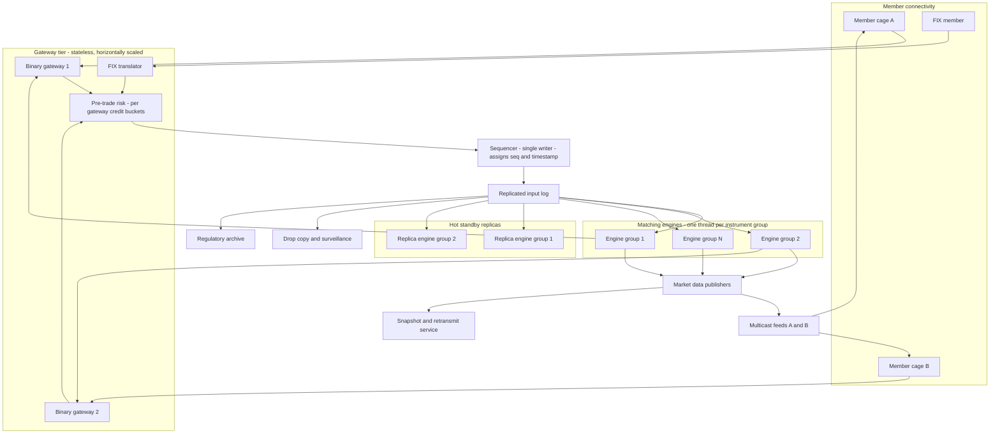
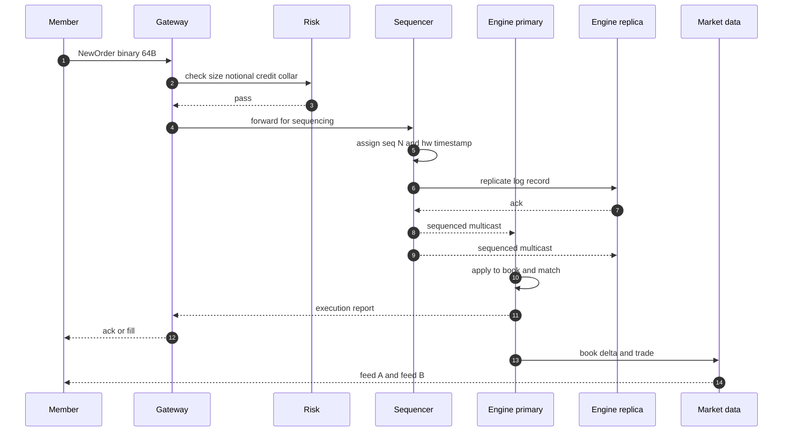
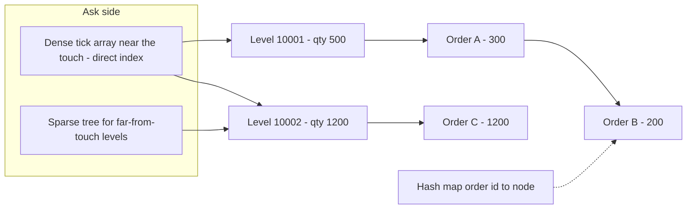
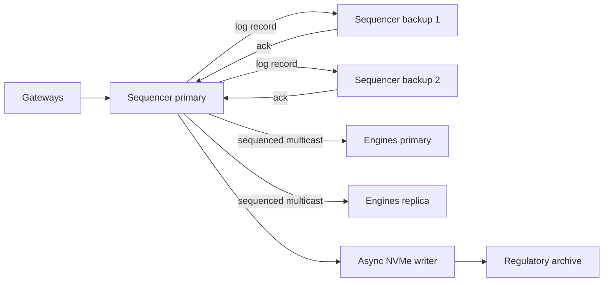
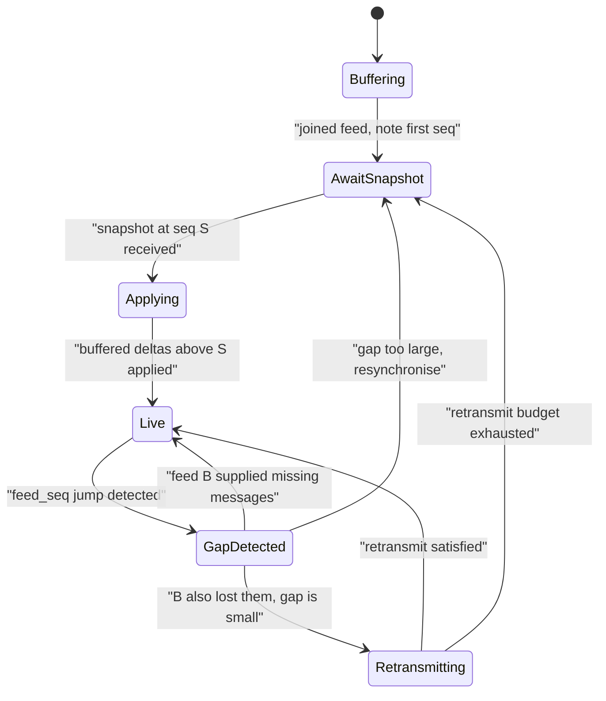
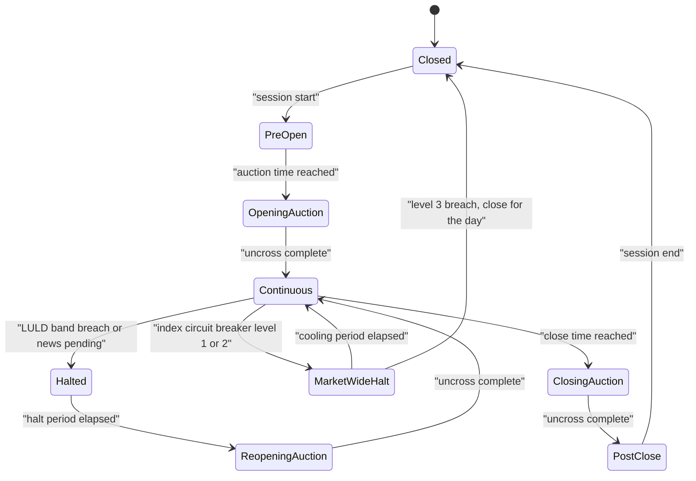
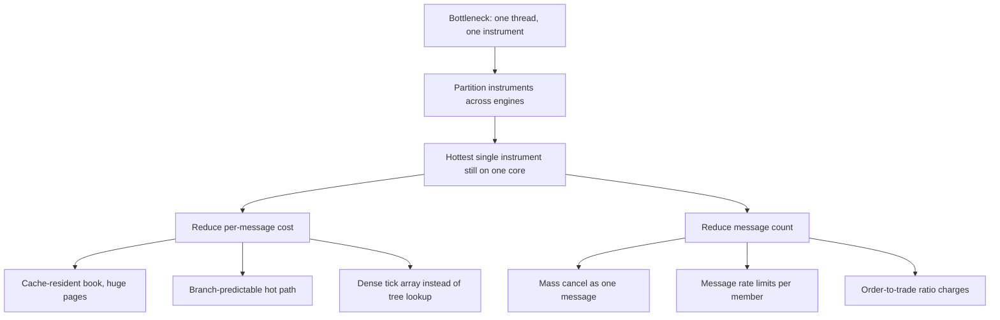

# 28 — Stock Exchange / Matching Engine

<span class="pill pill-core">Core</span> <span class="pill pill-hard">Hard</span>

**An exchange is a single deterministic state machine that must be replicated without losing or reordering one message, answer in tens of microseconds, and prove afterwards — to a regulator, with nanosecond timestamps — that it treated every participant in exactly the order they arrived.**

| | |
|---|---|
| **Commonly asked at** | Jane Street, Citadel Securities, HRT, Jump, Optiver, IMC, Two Sigma, LSEG, Nasdaq, CME, Coinbase, Robinhood, Databento |
| **Time budget** | 45 min |
| **Core tension** | Every technique that buys you throughput in a normal distributed system — sharding a symbol across threads, concurrent data structures, eventual consistency, retry-on-timeout — destroys either determinism or fairness here. You buy correctness by *removing* parallelism from the hot path, and then you have to make a single core fast enough |
| **Prerequisites** | [F01 Networking Foundations](../fundamentals/f01-networking-foundations.md), [F07 Replication & Consistency](../fundamentals/f07-replication-consistency.md), [F09 Consensus](../fundamentals/f09-consensus.md), [F11 Idempotency](../fundamentals/f11-idempotency.md), [F12 Queues & Streams](../fundamentals/f12-queues-streams.md), [F18 Resilience Patterns](../fundamentals/f18-resilience-patterns.md), [F19 Concurrency Control](../fundamentals/f19-concurrency-control.md), [F20 Time, Clocks & Ordering](../fundamentals/f20-time-clocks-ordering.md), [F22 Observability Fundamentals](../fundamentals/f22-observability-fundamentals.md), [F24 Capacity Planning](../fundamentals/f24-capacity-planning.md), [F25 Deployment & Release Safety](../fundamentals/f25-deployment-release-safety.md)|

---

## 1. Problem Statement

Build the core of a regulated electronic exchange: accept orders from member firms, match them against a central limit order book under a published priority rule, publish the resulting book changes to every participant simultaneously, and survive hardware failure without ever losing, duplicating, or reordering a single order.

The framing that unlocks the whole design: **this is not a database problem, it is a replicated deterministic state machine problem.** The order book is small — a few hundred megabytes for an entire venue — and fits comfortably in RAM. Nothing needs to be queried ad hoc. What matters is that a sequence of input messages $m_1, m_2, \ldots, m_n$ applied to an initial state $S_0$ produces exactly one possible final state $S_n$, on every replica, forever, bit for bit. If that property holds you get failover, audit, replay, testing, and regulatory reconstruction essentially for free. If it does not hold, none of those are achievable at any price.

Three consequences fall directly out of that:

1. **The matching engine for a given instrument runs on one thread.** Not "mostly one thread" — one. Any concurrency inside the book introduces a scheduling-dependent interleaving, and a scheduling-dependent interleaving is nondeterminism.
2. **Ordering is decided before matching, by a separate component.** A single sequencer stamps each inbound message with a monotonic sequence number and a timestamp. Everything downstream — matching engines, market data, risk, surveillance, the audit log — derives from that one totally ordered stream.
3. **Latency is a fairness property, not just a performance property.** If your p99 is 40x your p50, some participants systematically get worse fills than others for reasons unrelated to their strategy. Jitter is a regulatory concern, not only an engineering one.

### Out of scope

Clearing and settlement (T+1, CCP novation, margin), the retail brokerage stack, order routing across venues (SOR, Reg NMS order protection), and the derivatives lifecycle. We build the venue: order entry, matching, market data, and the operational machinery around them.

---

## 2. Requirements

### Functional

| # | Requirement | Notes |
|---|---|---|
| F1 | Accept, amend, and cancel orders over a low-latency session protocol | Binary order entry plus a FIX gateway for slower members |
| F2 | Match under published price-time priority | Deterministic, publicly documented, auditable |
| F3 | Support limit, market, stop, stop-limit, IOC, FOK, post-only, iceberg | Each with precise, specified semantics |
| F4 | Publish order book deltas and trades to all subscribers | Equal treatment; no subscriber sees an update before another by design |
| F5 | Periodic book snapshots plus a retransmit path | Gap recovery without restarting the session |
| F6 | Pre-trade risk checks on every order before it reaches the book | Market access obligations; broker and exchange level |
| F7 | Trading session state machine | Pre-open, opening auction, continuous, halt, closing auction, post-close |
| F8 | Halts and circuit breakers | Single-instrument bands and market-wide levels |
| F9 | Drop copy and full audit trail | Every message, sequenced and timestamped, retained for years |
| F10 | Mass cancel and kill switch | Per-member, per-instrument, exchange-wide |

### Non-functional

| # | Requirement | Target |
|---|---|---|
| N1 | Order-to-acknowledgement latency, gateway ingress to egress | p50 < 15 µs, p99 < 30 µs, p99.99 < 120 µs |
| N2 | Latency jitter | p99/p50 ratio < 3 |
| N3 | Determinism | Zero divergence between primary and replica, ever. Verified continuously |
| N4 | Message loss or reorder on the sequenced stream | Zero |
| N5 | Failover time, primary sequencer loss | < 5 s to resumed trading, no order lost |
| N6 | Market data publication delay after match | < 2 µs from match to first byte on the wire |
| N7 | Timestamp accuracy vs UTC | < 100 µs divergence, 1 µs or finer granularity |
| N8 | Availability during regulated trading hours | Measured in *seconds of halted trading per year*, not percent |
| N9 | Single-engine throughput headroom | Sustained utilisation < 30% of single-thread capacity |

!!! danger "Availability here is not a percentage"
    "Four nines" is 52 minutes a year. An exchange that is down for 52 minutes during regulated trading hours has had a reportable incident, a press cycle, and a regulator asking for a written explanation. The internal SLO is phrased as **seconds of unplanned trading interruption**, and the budget for a year is comparable to the budget a normal service spends in a bad afternoon. This single fact drives the architecture more than any throughput number.

---

## 3. Scale Estimation

**Message volume**

$$
\begin{aligned}
\text{instruments} &= 8{,}000 \\
\text{regular trading hours} &= 6.5\ \text{h} = 23{,}400\ \text{s} \\
\text{inbound order messages} &= 4 \times 10^{9}\ \text{per day} \\
\text{mean rate} &= \frac{4 \times 10^{9}}{23{,}400} \approx 1.71 \times 10^{5}\ \text{msg/s} \\
\text{open/close burst factor} &= 12 \Rightarrow \text{peak} \approx 2.05 \times 10^{6}\ \text{msg/s}
\end{aligned}
$$

Order-to-trade ratio is roughly $40{:}1$ — the overwhelming majority of messages are quotes being placed and immediately cancelled by market makers, never traded. Design for cancel throughput, not trade throughput.

**Concentration on the hottest instrument.** Volume follows a steep power law; the single busiest symbol takes about 3% of venue messages:

$$
\text{peak}_{\text{hot symbol}} = 0.03 \times 2.05 \times 10^{6} \approx 6.2 \times 10^{4}\ \text{msg/s}
$$

But the one-second average lies. At 1 ms granularity, microbursts reach 10x the one-second peak, so the instantaneous arrival rate at the hottest engine touches $6.2 \times 10^{5}$ msg/s.

**Single-thread budget.** If the matching engine spends $1\ \mu s$ of CPU per message, the service rate is $\mu = 10^{6}$ msg/s. Utilisation at the one-second peak is $\rho = 0.062$. That sounds like absurd over-provisioning until you look at what queueing does. For a deterministic service time (M/D/1):

$$
W_q = \frac{\rho}{2\mu(1-\rho)}
$$

| $\rho$ | $W_q$ (queueing delay) | Comment |
|---|---|---|
| 0.06 | 0.03 µs | Normal operation |
| 0.50 | 0.50 µs | Still invisible |
| 0.90 | 4.50 µs | Now comparable to the entire matching step |
| 0.99 | 49.5 µs | Latency SLO destroyed |
| 0.999 | 499 µs | Queue is effectively unbounded |

!!! tip "This table is the whole capacity argument"
    Latency is not linear in utilisation; it is hyperbolic. An exchange runs its engines at single-digit percent utilisation **on purpose**, because the product being sold is the tail, and the tail is $1/(1-\rho)$. Any capacity conversation that ends with "we have 20% headroom" has misunderstood the business.

**Latency budget, order in to acknowledgement out.** Every microsecond is allocated:

| Stage | p50 | p99 | What dominates |
|---|---|---|---|
| Cross-connect fibre, customer cage to gateway, ~10 m | 0.1 µs | 0.1 µs | $c$ in glass: ~5 ns/m |
| NIC RX, kernel-bypass DMA to userspace ring | 1.0 µs | 2.0 µs | PCIe round trip, no syscall, no interrupt |
| Decode binary order message | 0.3 µs | 0.6 µs | Fixed-offset fields, zero copy, no allocation |
| Pre-trade risk checks | 0.8 µs | 1.5 µs | 6-8 array lookups in L1/L2 |
| Gateway to sequencer hop | 2.5 µs | 5.0 µs | One switch, cut-through, ~350 ns per hop |
| Sequencer stamp, log append, replicate to 2 backups | 4.0 µs | 9.0 µs | **The single largest line item** |
| Matching engine apply and match | 0.7 µs | 2.0 µs | Cache-resident book, no branches on cold data |
| Encode execution report and market data delta | 0.5 µs | 1.2 µs | Pre-sized buffers |
| NIC TX plus switch back to customer | 1.2 µs | 2.5 µs | |
| **Total** | **11.1 µs** | **23.9 µs** | |

$$
\text{jitter ratio} = \frac{23.9}{11.1} = 2.15 \quad\text{(target} < 3\text{)}
$$

**Market data fan-out**

$$
\begin{aligned}
\text{outbound MD messages} &\approx 1.2 \times \text{inbound} = 2.46 \times 10^{6}\ \text{msg/s peak} \\
\text{mean message size} &= 40\ \text{bytes (binary, fixed layout)} \\
\text{feed bandwidth} &= 2.46 \times 10^{6} \times 40 \approx 98\ \text{MB/s} \approx 790\ \text{Mbps} \\
\text{subscribers} &= 3{,}000 \\
\text{unicast cost} &= 790\ \text{Mbps} \times 3{,}000 \approx 2.4\ \text{Tbps} \\
\text{multicast cost} &= 790\ \text{Mbps replicated in switch ASICs}
\end{aligned}
$$

That 2.4 Tbps number is the entire justification for multicast. It is not a preference.

**Snapshot and log sizing**

$$
\begin{aligned}
\text{full book snapshot} &= 8{,}000 \times 200\ \text{levels} \times 24\ \text{B} \approx 38\ \text{MB} \\
\text{sequenced log} &= 4 \times 10^{9} \times 64\ \text{B} = 256\ \text{GB/day} \\
\text{7-year retention, compressed } 4{:}1 &\approx 256\ \text{GB} \times 252 \times 7 / 4 \approx 113\ \text{TB}
\end{aligned}
$$

The regulatory archive is a rounding error in cost terms. Nobody has ever regretted keeping the full input log.

---

## 4. API Design

### Order entry — binary session protocol

FIX is the lingua franca but it is a tagged ASCII protocol: parsing it costs microseconds and allocates. Latency-sensitive members get a fixed-layout binary protocol; everyone else gets a FIX gateway that translates into the same internal message.

```text
NewOrder message, 64 bytes, little-endian, naturally aligned, no padding surprises

offset  size  field
  0      2    msg_type          = 0x0001
  2      2    msg_len           = 64
  4      8    client_order_id   uint64, unique per session per day
 12      4    instrument_id     uint32
 16      1    side              0 = buy, 1 = sell
 17      1    order_type        0=LIMIT 1=MARKET 2=STOP 3=STOP_LIMIT
 18      1    tif               0=DAY 1=IOC 2=FOK 3=GTC 4=AT_THE_OPEN
 19      1    flags             bit0 post_only, bit1 hidden, bit2 self_trade_prevent
 20      8    price_ticks       int64, PRICE IN INTEGER TICKS, never a float
 28      8    quantity          int64, in lot units
 36      8    display_quantity  int64, iceberg peak; 0 = fully displayed
 44      4    account_id        uint32
 48      8    sending_time      uint64, nanoseconds since epoch, client clock
 56      8    session_seq       uint64, monotonic per session, gap = session kill
```

!!! warning "Prices are integers. Always."
    A price is `int64` in ticks, never a float or a decimal string. IEEE-754 cannot represent 0.01 exactly, and a matching engine that compares floating-point prices will, eventually and unreproducibly, decide that two equal prices are not equal. Worse for us: floating-point behaviour can differ between compiler versions, optimisation levels, and CPU microarchitectures (x87 80-bit intermediates, FMA contraction, different `-ffast-math` settings on a replica). **Floating point is a determinism hazard before it is a precision hazard.** Store ticks, publish a tick size per instrument, and let the client render the decimal.

**Acknowledgement semantics.** The gateway returns one of:

| Response | Meaning | Emitted by |
|---|---|---|
| `Reject` | Failed validation or pre-trade risk | Gateway, **before** sequencing |
| `OrderAccepted` | Sequenced, assigned an exchange order id | After the sequencer, deterministic |
| `Executed` | Fully or partially matched | Matching engine |
| `Cancelled` / `CancelRejected` | Cancel outcome; reject means already filled | Matching engine |
| `Expired` | IOC/FOK remainder killed, or day order at close | Matching engine |

The `Reject` path is the only one that bypasses the sequencer, and that asymmetry matters: a rejected order never entered the deterministic stream, so it does not appear in the replica's state and does not need to. Everything that *can* change book state goes through the sequencer, without exception.

### Market data — multicast feeds

```text
Feed A  (primary)     239.10.0.1:31001   full order book deltas, sequenced
Feed B  (redundant)   239.10.1.1:31001   byte-identical, different switch path
Snapshot feed         239.10.2.1:31101   cyclic full-book refresh, ~1 Hz per group
Retransmit request    TCP 31201          bounded, rate-limited, per-member quota
```

Every message on A and B carries the same `feed_seq`, a single gap-free `uint64` per multicast group. This is the only thing a client needs to detect loss.

```text
BookDelta, 32 bytes
  feed_seq        uint64   gap-free per group
  instrument_id   uint32
  action          uint8    0=ADD 1=MODIFY 2=DELETE 3=TRADE 4=CLEAR
  side            uint8
  level_index     uint16   0 = top of book
  price_ticks     int64
  quantity        int64
  exch_timestamp  uint64   nanoseconds, set by the sequencer
```

### Administrative API

```json
POST /admin/v1/halt
{ "instrument_id": 4412, "reason": "LULD_PAUSE", "resume_mode": "AUCTION",
  "expected_resume_ts": "2026-09-25T14:35:00Z" }

POST /admin/v1/kill-switch
{ "scope": "MEMBER", "member_id": 881, "cancel_open_orders": true,
  "block_new_orders": true, "authorised_by": ["ops-lead", "compliance-officer"] }
```

The kill switch requires two-person authorisation and is the loudest, most-rehearsed control in the building.

---

## 5. Data Model

The authoritative state is entirely in memory. Nothing in the hot path touches a disk or a database.

```text
Instrument (static, loaded at session start, immutable during the session)
  instrument_id, symbol, tick_size, lot_size, price_band_pct,
  max_order_qty, auction_schedule, matching_algo

OrderBook (one per instrument, owned by exactly one engine thread)
  bids: price-level container, descending
  asks: price-level container, ascending
  order_index: hash map exchange_order_id -> *OrderNode    (O(1) cancel/amend)
  best_bid, best_ask: cached pointers
  last_trade_price, session_high, session_low, state

PriceLevel
  price_ticks, total_quantity, order_count,
  head, tail: *OrderNode          (intrusive FIFO = time priority)

OrderNode (intrusive, pool-allocated, never malloc'd in the hot path)
  exchange_order_id, client_order_id, account_id,
  remaining_qty, display_qty, hidden_qty, flags,
  prev, next: *OrderNode          (intrusive list links)
  parent_level: *PriceLevel       (O(1) unlink)

SequencedMessage (the replicated log record, 64 B fixed)
  seq: uint64, exch_timestamp_ns: uint64, gateway_id, payload
```

**Persistence model.** The only thing persisted synchronously is the sequencer's input log. State is *never* checkpointed to disk in the hot path; it is reconstructed by replaying the log. A periodic in-memory snapshot on a *replica* (never the primary) bounds replay time at start-of-day.

| Candidate for book storage | Chosen / rejected and why |
|---|---|
| In-memory intrusive structures, log for durability | **Chosen.** One seek-free structure, replayable, deterministic, no allocator in the hot path |
| Embedded KV store (RocksDB, LMDB) | Rejected. Microsecond budget cannot absorb a write path with compaction, and compaction threads inject jitter |
| Relational database with ACID transactions | Rejected. Two to three orders of magnitude too slow; also the wrong consistency model — we want a total order, not serialisable isolation |
| Distributed in-memory grid | Rejected. Network hop per operation and a nondeterministic membership protocol inside the hot path |

---

## 6. High-Level Architecture



### Write path walkthrough

1. A member's order arrives on a cross-connect into the gateway's NIC. The NIC DMAs it into a userspace ring buffer; **no kernel, no syscall, no interrupt.**
2. The gateway validates the session sequence number, decodes fixed offsets in place, and runs pre-trade risk against per-gateway credit buckets held in L1/L2 cache. A failure here produces a `Reject` and the message dies — it never enters the deterministic stream.
3. The gateway forwards the message to the **sequencer** over a single switch hop.
4. The sequencer assigns `seq = N+1` and an `exch_timestamp_ns` from a PTP-disciplined hardware clock, appends to the input log, and multicasts the sequenced message. It replicates to two backup sequencers and waits for one acknowledgement before publishing. This is the largest single line in the latency budget and the reason it exists.
5. Every matching engine and every replica receives the same multicast stream. Each engine filters to its own instrument group and applies messages **strictly in sequence order**. Because the engine is deterministic and single-threaded, primary and replica reach identical state.
6. The engine matches, mutates the book, and emits execution reports back to the originating gateway and book deltas to the market data publishers.
7. Market data publishers encode and send on feeds A and B simultaneously, over physically disjoint paths.

### Read path walkthrough

There is effectively no synchronous read path. Members do not query the book; they **reconstruct** it from the multicast feed. That inversion is the point: a pull API for book state would be a per-client fan-in against the hot engine thread, which is exactly the thing you cannot allow.

1. On connect, a client joins feed A and feed B and begins buffering, noting the first `feed_seq` it sees.
2. It requests a snapshot (or waits for the next cyclic snapshot). The snapshot carries the `feed_seq` it was taken at.
3. It applies the snapshot, discards buffered deltas with a lower sequence, and applies the rest. The book is now live.
4. Steady state: apply each delta, assert `feed_seq == last + 1`. On a gap, arbitrate against feed B; if B also has the gap, issue a bounded retransmit request; if the gap is too large, drop back to snapshot recovery.



---

## 7. Deep Dives

### 7.1 Why the matching engine is single-threaded, and what that forces everywhere else

The naive instinct is to parallelise: partition the book by price range, use a lock-free skip list, run matching on a thread pool. Every one of these is wrong here, and understanding *why* is the highest-signal thing you can say in this interview.

**The determinism argument.** A replicated state machine needs $\text{apply}(S, m)$ to be a pure function. The moment two threads touch the book concurrently, the resulting state depends on the interleaving chosen by the OS scheduler, the cache coherence protocol, and the memory-ordering behaviour of the specific CPU. That interleaving is not recorded anywhere, so:

- The hot standby, replaying the same input, can reach a *different* state. Failover then silently corrupts the book.
- You cannot reproduce a production incident by replaying the log.
- You cannot prove to a regulator that the published priority rule was followed.
- Your test suite becomes flaky in a way that no amount of effort fixes.

**The fairness argument.** Price-time priority is a *promise*. If two orders arrive 200 ns apart and a concurrent structure lets the later one win because it happened to acquire a lock first, you have broken the published rule. Not "introduced a performance anomaly" — broken the rule you sell access to.

**The performance argument, which is the surprising one.** Single-threaded is also *faster* for this workload:

| Cost avoided | Magnitude |
|---|---|
| Uncontended lock acquire/release | 20-40 ns each, and there are several per operation |
| Contended cache line bouncing between cores | 100-200 ns per transfer, unpredictable |
| Atomic RMW on a shared counter | 20-50 ns, serialises anyway |
| Memory barriers constraining the compiler and CPU | Loses instruction-level parallelism |
| Cross-core cache misses on book nodes | ~80 ns each vs ~1 ns for L1 |

A single thread that owns the entire book keeps it in L1/L2 and never pays a coherence penalty. LMAX measured this a decade ago: their single-threaded business logic processor handled 6 million transactions per second on one core, comfortably beating the concurrent version they replaced. The book for one instrument is tens of kilobytes; it lives in cache.

**What "single-threaded" actually means in practice:**

```text
Core 0   isolcpus, nohz_full, rcu_nocbs   ->  gateway RX poll loop
Core 2   isolcpus, nohz_full              ->  matching engine, instrument group 1
Core 4   isolcpus, nohz_full              ->  matching engine, instrument group 2
Core 6   isolcpus, nohz_full              ->  market data encode and TX
Core 1,3 housekeeping, logging, metrics, admin, everything else
```

Each engine thread is pinned, runs a busy-spin loop, never blocks, never sleeps, never takes a lock, and never allocates. IRQs are steered away from isolated cores. Hyper-threading is disabled on the isolated cores because a sibling thread steals execution units nondeterministically.

**Scaling out is by instrument, never within an instrument.** Symbols are partitioned across engine threads. Cross-instrument atomicity does not exist — and does not need to, because a central limit order book for one instrument has no interaction with another. This is the rare case where the domain hands you a perfect sharding key.

!!! warning "The rules of determinism are absolute and mostly about what you must not do"
    In the hot path: no wall-clock reads (timestamps come from the sequencer, in the message), no `rand()`, no reading process IDs or memory addresses, no iteration over a hash map whose order depends on insertion history or a seed, no floating point, no dynamic allocation (allocator behaviour varies with history), no system calls, no threads, no timers. A single `gettimeofday()` in the matching path makes the entire replication scheme unsound — and it will not fail loudly. It will diverge quietly, and you will discover it during a failover.

### 7.2 The order book data structure

The workload shape dictates the structure, and the workload shape is not what people assume:

| Operation | Share of messages | Required complexity |
|---|---|---|
| Add order (mostly near the touch) | ~40% | O(1) at an existing level, O(log n) for a new level |
| Cancel order | ~55% | **O(1)** — this dominates |
| Match at best price | ~2.5% | **O(1)** |
| Amend (price or quantity) | ~2.5% | O(1) for down-quantity, cancel/replace otherwise |
| Query top of book | Every message | **O(1)** |

The standard exposition says "a red-black tree or skip list keyed by price". That is right for the general case and wrong for the 99% case, because **prices cluster within a handful of ticks of the touch**. The production answer is a hybrid.



```python
# Order book: hybrid dense array near the touch, tree for the tails,
# intrusive FIFO per price level, hash index for O(1) cancel.
# Prices are INTEGER TICKS throughout.

WINDOW = 4096          # ticks covered by the dense array per side

class OrderNode:
    __slots__ = ("oid", "client_oid", "account", "qty", "display_qty",
                 "prev", "next", "level")

class PriceLevel:
    __slots__ = ("price", "total_qty", "count", "head", "tail")

class Book:
    def __init__(self, base_tick):
        self.base = base_tick                      # anchor for the dense window
        self.dense_bid = [None] * WINDOW           # PriceLevel or None
        self.dense_ask = [None] * WINDOW
        self.sparse_bid = SkipList(descending=True)   # far levels only
        self.sparse_ask = SkipList(descending=False)
        self.index = {}                            # oid -> OrderNode, O(1) cancel
        self.best_bid = None                       # cached PriceLevel
        self.best_ask = None
        self.pool = NodePool(capacity=2_000_000)   # pre-allocated; no malloc

    # ---- O(1) at an existing level, O(log n) only when creating a new one ----
    def add_limit(self, oid, side, price, qty, seq_ts):
        level = self._level_for(side, price, create=True)
        node = self.pool.acquire()
        node.oid, node.qty, node.level = oid, qty, level
        node.prev, node.next = level.tail, None
        if level.tail:
            level.tail.next = node
        else:
            level.head = node
        level.tail = node                 # append = time priority, by construction
        level.total_qty += qty
        level.count += 1
        self.index[oid] = node
        self._maybe_update_touch(side, level)

    # ---- O(1). This is the most frequent operation in the system. ----
    def cancel(self, oid):
        node = self.index.pop(oid, None)
        if node is None:
            return CANCEL_REJECT_UNKNOWN     # already filled, or never existed
        lvl = node.level
        if node.prev: node.prev.next = node.next
        else:         lvl.head = node.next
        if node.next: node.next.prev = node.prev
        else:         lvl.tail = node.prev
        lvl.total_qty -= node.qty
        lvl.count -= 1
        self.pool.release(node)
        if lvl.count == 0:
            self._remove_level(lvl)          # may advance the cached touch
        return CANCEL_ACK

    # ---- O(1) per fill at the best price; O(k) for k levels swept ----
    def match(self, incoming):
        fills = []
        opposite = self.best_ask if incoming.side == BUY else self.best_bid
        while incoming.qty > 0 and opposite is not None \
              and self._crosses(incoming, opposite.price):
            resting = opposite.head          # FIFO head = oldest = highest priority
            traded = min(incoming.qty, resting.qty)
            resting.qty -= traded
            incoming.qty -= traded
            opposite.total_qty -= traded
            fills.append(Fill(incoming.oid, resting.oid, opposite.price, traded))
            if resting.qty == 0:
                self._unlink_head(opposite)
                if opposite.count == 0:
                    opposite = self._advance_touch(incoming.side)
        return fills
```

**Why an intrusive doubly-linked list per level.** Time priority is FIFO, so the level needs cheap append and cheap head removal. The `prev` pointer plus the `parent_level` back-pointer makes an arbitrary cancel O(1) — which matters enormously, because cancels are the majority operation. A vector per level would give better locality for matching but O(n) cancel or tombstone bloat; the cancel rate settles the argument.

**Why the dense array near the touch.** A direct-indexed array at `price - base` turns "find the level for this price" into one subtraction, one bounds check, and one load. That is roughly 1 ns instead of the 6-10 pointer chases (each a potential cache miss, ~80 ns) a tree lookup costs. Orders far from the touch are rare and latency-insensitive, so they go in a skip list or red-black tree and nobody cares.

??? note "Skip list versus red-black tree for the sparse tail"
    **Skip list:** simpler to implement correctly, cache-unfriendly (each level is a separate allocation), and — critically for us — the classic implementation uses randomised level assignment, which is **nondeterministic**. If you use one, you must seed the RNG from the message sequence number, not from time or entropy, or replicas will build different structures. They will still *behave* identically for matching purposes, but any code that depends on traversal order will diverge. **Red-black tree:** deterministic by construction, better cache behaviour, harder to get right. For a replicated state machine, prefer the red-black tree, or a B-tree with a high fan-out for locality. The point of the answer is not which one — it is noticing that a randomised structure is a determinism hazard.

**Memory layout matters as much as complexity class.** `PriceLevel` objects are allocated from a contiguous pool so that sweeping adjacent levels is a sequential scan the hardware prefetcher can predict. `OrderNode`s come from a slab keyed by instrument so that one book's nodes share pages. Pad the hot fields of the engine's per-instrument state so `best_bid` and `best_ask` are on the same cache line as `last_trade_price` — they are read together on every single message.

```text
Latency cost of getting the layout wrong (typical server CPU):
  L1 hit        ~1 ns      book fits here for a normal instrument
  L2 hit        ~4 ns
  L3 hit        ~15 ns     shared; a noisy neighbour on another core evicts you
  DRAM          ~80 ns     80x the cost of your entire matching step
  TLB miss      ~100 ns    mitigate with 1 GB huge pages for the node pool
  Page fault    ~2-50 us   mitigate with mlockall and pre-faulting at startup
```

A single DRAM miss is 80 ns. Your matching step budget is 700 ns. Ten unnecessary misses and you have spent the budget on nothing.

### 7.3 The sequencer, the replicated log, and failover without losing an order

The sequencer is the heart of the system and also its most uncomfortable component: it is a deliberate single point of serialisation in an architecture where everything else is replicated.

**What it does.** It receives messages from all gateways, assigns a gap-free monotonic `seq` and an authoritative `exch_timestamp_ns`, appends to a log, replicates that log, and publishes. It performs **no business logic** — it does not know what an order book is. That is deliberate: the less it does, the faster it is and the less there is to get wrong.

**Why a separate component rather than "the matching engine decides order".** Three reasons. First, there are many engines and one order; a global order needs a global point. Second, the sequenced stream is what the replicas consume, so ordering must be decided *before* the fork. Third, it lets you replace, test, and reason about the ordering decision independently of matching.

**Why not off-the-shelf Raft.** The pattern is exactly Raft's replicated log, but the constants are wrong:

| Raft as normally deployed | What an exchange needs |
|---|---|
| Leader election on a 150-300 ms randomised timeout | Failover budget of single-digit seconds, detection in microseconds |
| `fsync` to durable media before acknowledging | `fsync` is 50-500 µs on NVMe; the entire budget is 24 µs |
| TCP round trips per append | One multicast send, hardware-replicated |
| Batching to amortise round trips | Batching adds latency, and latency is the product |
| Followers can lag arbitrarily | Followers must be applying in real time to be promotable |

So the pattern is kept and the implementation is rebuilt: in-memory replication over reliable multicast (Aeron-style, with NAK-based retransmit), acknowledgement from a majority of *memory* rather than a majority of *disks*, and a separate asynchronous writer that persists the log to NVMe behind the acknowledgement path.



!!! example "The durability trade being made, stated honestly"
    Acknowledging on two in-memory replicas rather than an `fsync` means a simultaneous power loss to all three sequencer hosts loses the tail of the log. That risk is accepted, and it is accepted because the three hosts are on separate power feeds, separate racks, separate UPS, with generator backup — and because the alternative costs 100 µs per message, which is four times the entire end-to-end budget. **This is a real trade-off with a real residual risk, and saying so out loud is what separates a senior answer from a textbook one.**

**Failover, step by step.**

1. **Detection.** Each backup listens for the primary's heartbeat at, say, 100 µs intervals plus the sequenced stream itself. Silence for N intervals (a few milliseconds) triggers the failover path. Detection is cheap and fast; the expensive part is being *sure*.
2. **Fencing, which is the part everyone skips.** Before backup 1 can assign `seq = N+1`, the old primary must be provably incapable of also assigning `seq = N+1`. Two sequencers both assigning is not "a conflict to resolve later" — it is an unrecoverable divergence of the entire venue. The mechanism is an external arbiter holding a monotonically increasing epoch: the new primary bumps the epoch, and every gateway and engine rejects any message carrying an epoch lower than the highest it has seen. Combined with a hardware fence (switch ACL drop, or power fence via the BMC), the old primary is silenced whether or not it agrees.
3. **Catch-up.** The new primary must have applied every record up to $N$. Because backups were consuming the same multicast in real time, this is normally already true; if not, it retransmits from the log.
4. **Resume.** The new primary publishes an epoch-change message on the sequenced stream. Engines and gateways switch. Sequence numbering continues from $N+1$ — **it does not restart**, because a restarted sequence is indistinguishable from a replay to every downstream consumer.
5. **In-flight order recovery.** Orders sent by a member but not yet sequenced when the primary died are in an unknown state. This is where `client_order_id` earns its keep: on reconnect, the member replays unacknowledged orders with the same client order id, and the gateway deduplicates against the sequenced stream. **The exchange's idempotency guarantee is what makes member-side retry safe**, and without it every failover would produce double-sent orders and a day of trade breaks. See [F11 Idempotency](../fundamentals/f11-idempotency.md).

**Continuous determinism verification.** This is the operational practice that makes the whole scheme trustworthy. Primary and replica each emit a rolling hash of their book state every $k$ messages (say every 100,000, or at every session boundary). A comparator process — off the hot path — checks them.

```python
# Emitted by both primary and replica, compared out of band.
# Any divergence is a P1. There is no "small" divergence.
def book_digest(book, seq):
    h = xxhash64(seed=seq)
    for side in (book.bids, book.asks):
        for level in side.iterate_deterministic():     # fixed order, always
            h.update(level.price, level.total_qty, level.count)
            for node in level.iterate_fifo():
                h.update(node.oid, node.qty)
    return h.digest()
```

A divergence alert means the replica cannot be trusted for failover, so the correct response is to **rebuild the replica from the log immediately** and treat the venue as running without a standby until it is verified — which is itself an incident, because you are one failure from a halt.

### 7.4 Market data fan-out, gap detection, and snapshot-plus-delta recovery

Three thousand subscribers, 2.5 million messages per second, and a regulatory obligation of fair access. The 2.4 Tbps unicast number from section 3 settles the transport question: **UDP multicast**, replicated by switch ASICs, one copy on the wire per link.

Multicast has no retransmission, no ordering guarantee, and no delivery guarantee. Every one of those has to be rebuilt in the protocol:

**1. Gap-free sequence numbers per multicast group.** Not per instrument — per *group*. A client detecting `feed_seq` jumping from 8,412,003 to 8,412,007 knows immediately that it lost four messages, without needing to understand which instruments they were for. This single field is the entire loss-detection mechanism and it is why an exchange feed is trivially self-checking in a way that most streaming systems are not.

**2. A and B feeds over disjoint paths.** Identical bytes, identical sequence numbers, different NICs, switches, and fibre runs. Clients arbitrate: take whichever arrives first, use the other to fill gaps. This converts an independent-loss model into an $p^2$ model. If each path loses one packet in $10^6$, arbitrated loss is one in $10^{12}$ — roughly once a decade.

**3. Snapshot plus delta recovery.** A client that falls too far behind cannot catch up by retransmission; it needs to resynchronise.



The cyclic snapshot feed walks the instrument universe continuously, publishing each instrument's full book with the `feed_seq` it was consistent at. With 8,000 instruments and a 38 MB full snapshot, a complete cycle at 200 Mbps takes about 1.5 seconds — so worst-case resynchronisation is a couple of seconds, which is the number to quote.

**4. Retransmit as a rate-limited, bounded service.** This is where exchanges get hurt. A transient switch problem causes 500 clients to detect the same gap and all request retransmission simultaneously, at the exact moment the network is already unhealthy. The retransmit service — which is not on the hot path but shares the network — melts.

!!! danger "The NAK storm is the classic market data outage"
    **Symptom:** a brief packet loss event turns into minutes of feed degradation affecting everyone, including clients who never lost anything.
    **Mechanism:** correlated loss produces correlated retransmit requests, which produce retransmit traffic on the same congested links, which causes more loss.
    **Mitigation:** a per-member retransmit quota (requests per minute and messages per request); a hard cap on gap size beyond which the answer is always "use the snapshot feed"; randomised backoff in the client SDK so requests do not synchronise; and — the important one — **serving retransmits from a replica on a separate network path**, so recovery traffic cannot worsen the primary feed. Publish the quota in the client spec so that conformant clients behave correctly by default.

**5. Fair publication.** If one subscriber's data reaches them 5 µs before another's, that is an advantage with monetary value, and regulators care. Exchanges equalise fibre lengths inside the data centre — literally coiling extra fibre so every cage has the same cable length to the feed handler — and publish to all multicast groups from the same send call. This sounds absurd until you remember that 5 µs is 1,000 m of fibre and the difference between the near and far cage is real.

### 7.5 Pre-trade risk: correctness on a microsecond budget

Market access rules make the venue responsible for controls that prevent erroneous or unauthorised orders reaching the book. Every check costs latency on every order, so each one has to justify itself.

| Check | Cost | Where it lives | Why there |
|---|---|---|---|
| Max order quantity / notional | ~30 ns | Gateway, array lookup by account | Stateless per-order, no shared state |
| Price collar, e.g. ±10% of reference | ~40 ns | Gateway, cached reference price | Reference updates lag by microseconds, acceptable |
| Duplicate client order id | ~50 ns | Gateway, per-session open-addressing table | Session-scoped, no cross-gateway state |
| Restricted / halted instrument | ~20 ns | Gateway, bitmap by instrument id | Bitmap fits in L1 |
| Self-trade prevention | ~60 ns | **Engine** | Needs book state; must be deterministic |
| Short sale locate | ~40 ns | Gateway, pre-loaded locate table | Loaded at session start |
| **Aggregate credit / position limit** | **The hard one** | See below | Cross-order shared state |

**The aggregate credit problem.** A member's exposure limit is a single number decremented by every order from every gateway. That is a distributed counter with strong consistency, read-modify-write, on the hot path. A cross-host round trip to a central credit service is 5-10 µs — which would be the largest item in the latency budget, for a check that passes 99.999% of the time.

The solution is **pre-allocated credit buckets**, a leaky-bucket sharding pattern you will recognise from distributed rate limiting ([F17 Rate Limiting & Load Shedding](../fundamentals/f17-rate-limiting-load-shedding.md)):

```python
# Central allocator hands each gateway a slice of the member's limit.
# The gateway decrements locally at L1 speed. No hot-path network round trip.

class GatewayCreditBucket:
    def __init__(self, member_id, allocation):
        self.remaining = allocation          # e.g. 10% of the member's limit
        self.low_water = allocation // 4

    def reserve(self, notional):             # ~15 ns, single core, no atomics
        if notional > self.remaining:
            return REJECT_INSUFFICIENT_CREDIT   # conservative: reject, then refill
        self.remaining -= notional
        if self.remaining < self.low_water:
            request_async_refill(self)       # off hot path, never blocks
        return OK

# The allocator continuously rebalances: gateways that are not using their
# slice have it reclaimed; hot gateways get larger slices.
```

The trade: a member can be rejected while global credit remains, because their limit is fragmented across gateways. That is a **deliberately conservative failure** — you never over-extend credit, you occasionally under-use it. The mitigation is aggressive async rebalancing plus routing a member's sessions to a small number of gateways so fragmentation stays bounded.

!!! gotcha "Risk checks that fail open are worse than no risk checks"
    **Symptom:** the credit service is unreachable; orders flow through unchecked; a member's runaway algorithm accumulates a position far beyond its limit before anyone notices.
    **Mechanism:** someone wrote `if credit_service.unreachable(): allow()` to protect availability, because rejecting all orders felt like an outage.
    **Mitigation:** fail closed on risk, always. If the allocator is unreachable, gateways keep operating on their existing buckets and simply stop refilling — trading degrades gracefully to whatever credit was already allocated, then rejects. That is the correct behaviour and it requires no special-case code, which is why the bucket design is the right one.

### 7.6 Where every microsecond goes

**Kernel bypass.** A standard `recvmsg()` path costs 5-15 µs and, worse, varies wildly: interrupt coalescing, softirq scheduling, and the socket buffer all add jitter. Kernel bypass (Solarflare Onload, DPDK, or an RDMA-capable NIC with userspace verbs) DMAs the packet straight into a userspace ring the application polls.

| Path | Latency | Jitter | Why |
|---|---|---|---|
| Standard sockets, interrupt-driven | 5-15 µs | High | Syscall, context switch, softirq, copy |
| Standard sockets, busy-poll (`SO_BUSY_POLL`) | 3-8 µs | Medium | Removes interrupt latency, keeps the syscall |
| Kernel bypass, userspace TCP/UDP stack | 1-2 µs | Low | One DMA, one poll, zero copies |
| FPGA in the NIC, feed handling in hardware | 100-300 ns | Very low | No CPU at all; used for risk gates and feed decode |

**Garbage collection is disqualifying in the hot path.** A 10 ms GC pause is 400 times the entire end-to-end budget. Two viable strategies:

=== "C++ / Rust"

    No runtime GC at all. Allocate everything at startup from pools, `mlockall(MCL_CURRENT|MCL_FUTURE)` to prevent paging, 1 GB huge pages to eliminate TLB misses, and a strict no-`malloc`-after-init rule enforced by overriding the allocator to abort if called from an isolated thread.

=== "Java, zero-allocation style"

    LMAX and Aeron demonstrate this works. Pre-allocate every object at startup, use flyweight objects over off-heap `ByteBuffer`s, never create garbage in the steady state, so the collector never has cause to run. Verified by asserting that allocation counters are flat under load. Epsilon GC in testing will abort the JVM the moment anything allocates, which is exactly the feedback you want.

=== "Go"

    Possible but awkward. The GC is concurrent with sub-millisecond pauses, which is still 40x the budget. Escape analysis can keep the hot path allocation-free, but the write barrier is always on during a GC cycle and adds unpredictable cost. Usually relegated to gateways and control plane rather than the engine.

**Everything else that produces jitter, and its fix:**

```bash
# Kernel command line
isolcpus=2,4,6 nohz_full=2,4,6 rcu_nocbs=2,4,6 intel_pstate=disable \
  processor.max_cstate=1 idle=poll mce=ignore_ce audit=0 nosoftlockup

# Disable frequency scaling: a core waking from a low P-state costs tens of us
cpupower frequency-set -g performance
# Disable C-states: exit latency from C6 is ~50-100 us
# Disable hyper-threading on isolated cores: sibling steals execution units
# Disable transparent huge page defrag: khugepaged stalls are milliseconds
echo never > /sys/kernel/mm/transparent_hugepage/defrag
# Steer IRQs away from isolated cores
# Disable NIC interrupt coalescing on the latency-critical path
ethtool -C eth0 rx-usecs 0 rx-frames 1
# Disable TCP Nagle on order entry sessions: TCP_NODELAY, always
```

!!! tip "Measure with hardware timestamps or do not bother"
    Application-level `clock_gettime()` measures your code and nothing else. The interesting latency is often *outside* the process: NIC queueing, switch buffering, an IRQ that landed on the wrong core. Use NIC hardware timestamps on RX and TX, and capture with a passive tap or port mirror so measurement does not perturb the thing being measured. The difference between "our p99 is 12 µs" (application clock) and "our p99 is 31 µs" (wire to wire) is where the incidents live.

### 7.7 Halts, circuit breakers, and the session state machine

Trading state is itself a deterministic state machine, and every transition must be applied through the sequencer like any other message — otherwise the replica's view of whether the market is open diverges from the primary's.



**Single-instrument bands.** A price band is computed from a rolling reference price (typically a 5-minute mean of eligible trades). An order that would trade outside the band is not rejected — it is *repriced or paused*, depending on the rule. If the best bid or offer sits outside the band for a specified dwell time, the instrument goes into a short pause and reopens with an auction. The auction exists to re-establish a price through volume aggregation rather than letting a thin book set the level.

**Market-wide circuit breakers.** Tiered on a reference index: a level 1 breach pauses the whole market for a fixed period, level 2 repeats it, level 3 closes for the day. Implementation detail that bites: the index is computed from prices the exchange is currently publishing, so the halt logic has an input from its own output. That loop must be broken by computing the index on a separate, slower path and applying the halt as an ordinary sequenced message.

**Auction uncrossing.** The opening and closing auctions do not use price-time priority; they solve an optimisation: find the price that maximises executable volume, break ties by minimising imbalance, then by proximity to the reference price. Concretely, build the cumulative demand and supply curves over price and take the crossing point.

```python
def uncross(bids, asks):
    # Candidate prices are the distinct limit prices present in the book.
    best = None
    for p in candidate_prices(bids, asks):
        demand = sum(o.qty for o in bids if o.price >= p)
        supply = sum(o.qty for o in asks if o.price <= p)
        volume = min(demand, supply)
        imbalance = abs(demand - supply)
        key = (volume, -imbalance, -abs(p - reference_price))   # lexicographic
        if best is None or key > best[0]:
            best = (key, p, volume)
    return best[1], best[2]         # auction price, executed volume
```

The imbalance is published during the pre-auction period so participants can supply liquidity to offset it — the transparency is the mechanism, not a nicety.

!!! gotcha "A halt that does not cancel or freeze resting orders creates a cliff on reopen"
    **Symptom:** the instrument reopens and instantly trades through several price levels against stale orders nobody intended to leave resting.
    **Mechanism:** orders placed before the halt reflect pre-halt information. Traders could not cancel during the halt (or the cancel path was also halted). On reopen, continuous trading resumes against a book full of stale quotes.
    **Mitigation:** allow cancels during a halt even though new orders and matching are suspended — cancellation is risk-reducing and should essentially never be blocked. And reopen with an auction rather than straight into continuous trading, so price discovery happens through aggregation rather than a race.

### 7.8 Clock synchronisation and regulatory timestamps

Timestamps here are not telemetry. They are the evidence used to reconstruct market events, to establish which order arrived first in a dispute, and to demonstrate compliance. Regimes differ, but the tight end of the range — for venues and high-frequency participants — is **maximum divergence from UTC of 100 µs with 1 µs or finer granularity**.

| Method | Accuracy | Why it is or is not enough |
|---|---|---|
| NTP over the public internet | 1-50 ms | Two to three orders of magnitude short. Not acceptable |
| NTP to a local stratum-1 server | 100 µs - 1 ms | Marginal at best; no hardware timestamping, so software stack jitter dominates |
| PTP (IEEE 1588) software timestamping | 10-100 µs | Borderline; kernel stack jitter eats the budget |
| **PTP with hardware timestamping and boundary clocks** | **100 ns - 1 µs** | **Chosen.** NIC timestamps the sync packet in hardware, removing stack jitter entirely |
| GPS-disciplined oscillator per rack | 10-100 ns | Used for the grandmaster; a rubidium or OCXO holdover survives GPS loss |
| White Rabbit | sub-nanosecond | Overkill outside physics labs, but it exists |

The deployment is a GPS-disciplined grandmaster (two of them, on different antennas), PTP boundary clocks in each switch so the hierarchy does not accumulate error, and hardware timestamping on every NIC in the path.

**The subtleties that cause real incidents:**

- **GPS spoofing and jamming are real.** A spoofed GPS signal can walk your clock. Cross-check the GPS-disciplined grandmaster against an independent source (a second constellation such as Galileo, or a rubidium holdover) and alarm on divergence rather than following it.
- **Holdover is a capability you must buy in advance.** When GPS is lost, the oscillator's drift rate determines how long you stay compliant. A cheap TCXO drifts out of a 100 µs budget in minutes; an OCXO holds for hours; rubidium for days. The question "how long can we trade after losing GPS?" has a specific numeric answer and you should know it.
- **Leap seconds cannot be smeared.** Google-style leap smear deliberately makes your clock *wrong* by up to 500 ms for a day. For general infrastructure that is a brilliant trade. For an exchange it is a compliance violation, and worse, if some hosts smear and others step you get a 500 ms internal inconsistency in timestamps used for ordering evidence. Exchanges handle the leap second explicitly, usually by halting across the boundary or by a documented step, and **never** by smearing.
- **Timestamps are for evidence, not for ordering.** Ordering comes from the sequence number. If a dispute arises and two timestamps are identical to the nanosecond, the sequence number is the tiebreaker, and the published rules say so. Using a timestamp to order messages would make the system dependent on clock behaviour — which is nondeterministic. See [F20 Time, Clocks & Ordering](../fundamentals/f20-time-clocks-ordering.md).

---

## 8. Scaling the Bottleneck

The bottleneck is not aggregate throughput — it is **the single thread owning the hottest instrument**, and the only axis available is making that thread do less work per message.



**1. Partition by instrument, and rebalance between sessions.** Assignment of instruments to engine threads is static during a session (moving an instrument mid-session would require transferring book ownership, which is a distributed handoff you do not want in the hot path). Rebalancing happens at session boundaries based on the previous day's measured load. A greedy bin-packing by message count, with the hottest instruments each getting their own dedicated core, is sufficient and understandable.

**2. Make the hot path branch-predictable.** A mispredicted branch costs 15-20 cycles. The common case — a limit order that does not cross, added to an existing level near the touch — should be the fall-through path with no unpredictable branches. Rare order types are handled behind a single predictable check. Profile-guided optimisation genuinely helps here, and so does laying out the code so the hot path is contiguous in the instruction cache.

**3. Reduce the message count at the source.** The economic lever is more powerful than the technical one. Exchanges charge for excessive order-to-trade ratios and apply per-session message rate limits precisely because a market maker's quoting algorithm will happily generate 10x more messages if it is free. Pricing the externality reduces load more than any optimisation.

**4. Batch on the input side without batching the semantics.** The engine can read many messages from the ring in one poll, amortising the polling overhead, while still applying them strictly one at a time in sequence order. This is a pure win: throughput improves, determinism is untouched.

**5. Move work off the critical path entirely.** Surveillance, drop copy, the regulatory archive, metrics, and any analytics consume the sequenced stream independently. They must never be able to apply backpressure to the engine. The pattern is a ring buffer with a **publisher that never blocks**: a slow consumer is detected and disconnected, not accommodated.

!!! warning "Backpressure from a downstream consumer is an outage waiting to happen"
    If a surveillance process can slow the matching engine by falling behind, then the availability of trading is coupled to the availability of surveillance. Publish into a bounded ring; if a consumer fails to keep up, it is lapped, detects the lap via sequence numbers, and resynchronises from the log at its own pace. Never let the engine wait for anyone.

---

## 9. Failure Modes

| Failure | Blast radius | Detection | Mitigation | Degraded behaviour |
|---|---|---|---|---|
| Sequencer primary host loss | Entire venue stalls | Heartbeat gap (ms), sequence stops advancing | Fence old primary via epoch bump plus switch ACL; promote backup; resume at $N+1$ | Trading paused seconds; no order lost; members retry with client order id |
| Split-brain: two sequencers assigning | **Catastrophic** — divergent venue state | Duplicate `seq` with different payloads observed downstream | External epoch arbiter; engines reject lower epochs; hardware fencing | Halt immediately, reconcile from log, restart session if needed |
| Matching engine crash mid-message | One instrument group | Replica sees no output for applied input; watchdog on progress counter | Promote replica, which has applied the same log prefix | Instrument group paused seconds |
| Primary/replica state divergence | Failover becomes unsafe | Rolling book digest mismatch | Rebuild replica from log; investigate as P1; find the nondeterminism | Venue runs without standby — itself an incident |
| Poison message crashes every engine | Whole venue, repeatedly | Same `seq` crashes primary and then replica | Sequence-level quarantine: engines skip a known-bad `seq` **only** under explicit operator command, identically on all replicas | Halt affected instruments; hotfix; replay |
| Multicast loss / NAK storm | All market data consumers | Client gap counters, feed sequence gap metric | Per-member retransmit quotas, snapshot fallback, separate retransmit path | Clients resync from snapshot within ~2 s |
| Slow market data subscriber | Potentially all, if backpressure exists | Consumer lag on the publisher ring | Non-blocking publish; lap and disconnect the slow consumer | That subscriber resyncs; others unaffected |
| Switch microburst buffer overflow | Order entry and market data on that path | Switch drop counters, NIC RX discards | Deep-buffer switches on the fan-out tier, shallow cut-through on the latency tier; pace the publisher | Brief loss, absorbed by A/B arbitration |
| PTP grandmaster / GPS loss | Timestamp compliance venue-wide | Offset from secondary source exceeds threshold | Holdover oscillator; second grandmaster on an independent antenna; alarm on divergence, never follow it | Trading continues while holdover is within budget; halt if it is not |
| Credit allocator unreachable | Members near their limits | Refill request timeouts | Gateways operate on existing buckets, stop refilling | Conservative rejects once buckets drain — fail closed |
| Erroneous trade from a member's fat finger | One instrument, price dislocation | Price band breach, trade-through detection | Auto-pause on band breach; documented trade-break policy with a time window | Instrument halted, reopens via auction; trades may be busted |
| Member floods a session | One gateway, then the sequencer | Per-session message rate counters | Per-session rate limit, then session disconnect; per-member kill switch | That member disconnected; venue unaffected |
| Gateway host loss | Members homed to it | TCP resets, session heartbeat loss | Cancel-on-disconnect fires by default; members reconnect to another gateway | Resting orders cancelled unless the member opted into persistence |

!!! danger "Cancel-on-disconnect is the most important default in the system"
    If a member loses connectivity, their resting orders continue to be executable while they are blind and unable to cancel. The default must be that losing the session cancels their orders — a member who cannot see the market should not be exposed to it. Making persistence opt-in, with an explicit acknowledgement of the risk, is the correct posture, and the number of incidents this single default prevents is enormous.

---

## 10. SRE Lens

### SLIs and SLOs

| SLI | Definition | SLO | Why this number |
|---|---|---|---|
| Order ack latency p50 | Gateway RX hardware timestamp to TX hardware timestamp | < 15 µs | Competitive floor for the venue |
| Order ack latency p99 | Same | < 30 µs | |
| Order ack latency p99.99 | Same | < 120 µs | The tail is what members actually complain about |
| Jitter ratio | p99 / p50 | < 3 | Fairness, not just performance |
| Determinism divergence | Book digest mismatches per day | **0** | No error budget. Any non-zero value is a P1 |
| Sequenced message loss | Gaps in the sequenced stream | **0** | No error budget |
| Market data publication delay | Match to first byte on the wire | p99 < 2 µs | |
| Market data gap rate | Post-arbitration gaps per $10^9$ messages | < 1 | A/B arbitration should make this vanishingly rare |
| Unplanned trading interruption | Seconds per year during RTH, any instrument | < 60 s | The headline regulatory and reputational number |
| Session availability | Successful logons / attempts during RTH | > 99.99% | |
| Timestamp divergence from UTC | Max observed offset | < 100 µs | Regulatory |
| Replica catch-up lag | Sequence lag of hot standby | < 1,000 messages | Bounds failover time |

### Error budget

$$
\text{annual budget} = 60\ \text{s} \Rightarrow \text{per trading day} = \frac{60}{252} \approx 0.24\ \text{s}
$$

A quarter of a second per day. A single three-minute incident consumes three years of budget. The practical implication: **change is the enemy, and the release process is built around that fact** rather than around velocity.

### Rollout plan

You cannot canary a matching engine. Running v1 for some orders and v2 for others in the same instrument means two different matching rules in one book — a correctness violation, not a risk to be managed. So the release process is different from every other system:

1. **Deterministic replay as the primary gate.** Take yesterday's full production input log. Replay it through the new binary. Assert that every output message — every execution report, every book delta, every sequence number — is **byte-identical** to what production produced. This is the single most valuable test in the building. It catches unintended behaviour changes with essentially no false negatives for anything the log exercises.
2. **Intentional-change diffing.** When a release *does* change behaviour (a new order type, a rule change), the replay diff is expected to be non-empty. Review the diff message by message, and require that every differing message is attributable to the intended change. "The diff is large but it looks fine" is not an acceptable sign-off.
3. **Conformance and soak.** A member-accessible test environment running the release for at least a full simulated session, with member certification against new protocol features.
4. **Deploy between sessions only.** Never during regulated trading hours. The change window is overnight or at weekends, with a full session replay afterwards to verify.
5. **Staged by instrument group.** Deploy to a group of low-volume instruments first, run a session, then expand. This is the closest thing to a canary that is legitimate — different instruments are genuinely independent books.
6. **Rollback is a re-deploy plus replay, not a traffic shift.** And the rollback must itself have been replay-verified, because rolling back to a binary that produces different output from the state you are now in is its own incident.

!!! note "The input log is the most valuable asset in the system"
    It gives you failover, audit, regulatory reconstruction, deterministic testing, performance regression benchmarking against real traffic, and capacity modelling. Any design decision that makes the log less complete — sampling it, dropping fields, not logging rejects — trades away all of those at once. Log everything, at full fidelity, forever.

### Runbook notes

| Situation | First action | Notes |
|---|---|---|
| Latency p99 climbing | Check engine thread utilisation and queue depth before anything else | $1/(1-\rho)$ means a utilisation change explains most latency events |
| Book digest divergence | Stop relying on the standby; rebuild it from the log | Do not fail over to a divergent replica under any circumstance |
| Runaway member algorithm | Per-member kill switch; cancel open orders; disconnect sessions | Two-person authorisation, rehearsed quarterly |
| Suspected bad market data | Compare A and B; compare against the drop copy and the log | The log is ground truth; the feed is a derived artefact |
| Instrument needs a halt | Halt via the sequenced admin path, never by touching an engine directly | A halt applied outside the sequencer diverges the replica |
| Sequencer failover | Verify fencing **before** promotion, not after | Split-brain is worse than a longer outage. Always |

Failover drills run in production, on a schedule, during non-trading hours, and the drill includes the fencing step. An untested failover path is an unavailable failover path.

### Capacity model

$$
\begin{aligned}
\text{engine capacity} &= \frac{1}{\text{per-message cost}} = \frac{1}{1\ \mu s} = 10^{6}\ \text{msg/s} \\
\text{max planned utilisation} &= 0.30 \Rightarrow 3 \times 10^{5}\ \text{msg/s per engine} \\
\text{engines needed} &= \left\lceil \frac{2.05 \times 10^{6}}{3 \times 10^{5}} \right\rceil = 7\ \text{plus hot standbys}
\end{aligned}
$$

Capacity planning is driven by **microburst** measurements at 1 ms granularity, not by one-second averages. A system sized to the one-second peak will queue during every microburst, and the queueing shows up precisely in the p99.99 that members pay attention to. See [F24 Capacity Planning](../fundamentals/f24-capacity-planning.md).

### Cost

| Line item | Character | Note |
|---|---|---|
| Colocation space, power, cooling | Fixed, large | Also a revenue line: members pay for cages |
| Cross-connects | Per-member, per-port | Revenue line |
| Kernel-bypass NICs and licences | Per host, meaningful | A few thousand per port with licensing |
| Low-latency switching | High per port | Cut-through switches at ~350 ns |
| PTP infrastructure, GPS, holdover oscillators | Moderate fixed | Grandmasters plus boundary clocks in every switch |
| Spare capacity at 70% idle | The biggest hidden cost | Deliberate; it is the latency SLO |
| Regulatory archive | ~113 TB over 7 years | Trivial relative to everything else |

The unusual economics: an exchange's infrastructure is largely a **profit centre**. Colocation, cross-connects, and market data licensing are significant revenue lines. That inverts the normal cost conversation — spending on lower latency is often an investment in a product rather than an operating expense to be minimised.

---

## 11. Trade-offs & Alternatives

| Decision | Options | Chosen / rejected and why |
|---|---|---|
| Concurrency in matching | Single thread per instrument; lock-free concurrent book; sharded by price range | **Single thread chosen.** Determinism is non-negotiable, and it is faster anyway: no coherence traffic, book stays in L1 |
| Ordering authority | Central sequencer; per-engine local ordering; timestamp ordering | **Central sequencer chosen.** A total order must be decided at one point, and before the replica fork. Timestamp ordering depends on clocks, which are nondeterministic |
| Replication protocol | Custom in-memory reliable multicast; Raft; Paxos; primary-backup with disk | **Custom chosen.** Raft's pattern is right, its constants are 100x too slow. Keep the state machine model, rebuild the transport |
| Durability before ack | `fsync` to NVMe; two in-memory replicas | **Two in-memory replicas chosen.** `fsync` is 50-500 µs against a 24 µs budget. Residual risk is simultaneous triple power loss, mitigated physically |
| Market data transport | UDP multicast; TCP unicast; WebSocket fan-out | **Multicast chosen.** Unicast is 2.4 Tbps. TCP also gives per-client retransmission behaviour that breaks fair publication |
| Price representation | `int64` ticks; decimal; double | **Integer ticks chosen.** Floats are a determinism hazard across compilers and CPUs, before they are a precision problem |
| Matching algorithm | Price-time priority; pro-rata; size-time | **Price-time chosen** for equities: simple, auditable, rewards liquidity provision speed. Pro-rata is common in futures and options where the size distribution differs; it reduces the latency arms race but is harder to explain and to audit |
| Price level container | Dense tick array near touch plus tree; pure red-black tree; pure skip list | **Hybrid chosen.** Array gives ~1 ns lookup for the 99% case; the tree handles the sparse tail. Pure skip list also has a randomisation determinism hazard |
| Order storage in level | Intrusive doubly-linked FIFO; vector with tombstones | **Intrusive list chosen.** Cancels are 55% of messages and need O(1); vector gives better locality but O(n) cancel |
| Risk check placement | Gateway; sequencer; engine | **Gateway for stateless checks, engine for book-dependent ones.** Sequencer does no business logic, so it stays fast and simple |
| Aggregate credit | Central service; pre-allocated gateway buckets | **Buckets chosen.** A central service is 5-10 µs on the hot path. Buckets fail conservatively, which is the right direction |
| Hot standby model | Consume the same sequenced stream; state replication from primary | **Same-stream chosen.** State replication requires serialising the book, which is slow and creates a second code path that can diverge |
| Language | C++ / Rust; zero-allocation Java; Go | **C++ or Rust for the engine**, no GC at all. Zero-allocation Java is proven (LMAX, Aeron) and acceptable. Go is fine for gateways and control plane, not for the engine |

??? note "When is the single-threaded engine the wrong answer?"
    When the instrument is not a central limit order book. A crypto venue with an AMM, a request-for-quote market, a dark pool with periodic auctions, or a FX venue with last-look all have different structures and different determinism requirements. Auction-based venues, in particular, batch orders over a discrete interval and clear them together — which removes the latency arms race entirely and makes the concurrency argument moot. The single-threaded CLOB answer is right for continuous price-time-priority matching and should be presented as such, not as a universal law.

---

## 12. Gotchas & Corner Cases

!!! gotcha "One `gettimeofday()` in the matching path silently breaks replication"
    **Symptom:** primary and replica book digests diverge; nobody knows when it started; failover would have corrupted the venue.
    **Mechanism:** a developer added a timestamp to an order struct for debugging. Primary and replica read their own clocks at slightly different moments, so the stored values differ. If any downstream logic compares timestamps — expiry, priority tiebreak, a metric that feeds a decision — the two state machines take different branches and drift apart.
    **Mitigation:** every time value in the hot path comes from the sequencer, inside the message. Enforce it mechanically: forbid the clock symbols in the engine translation unit with a linker script or a lint rule, and run the continuous digest comparison so that a violation is caught in minutes rather than at the next failover.

!!! gotcha "Floating-point prices produce unreproducible matching decisions"
    **Symptom:** a replay produces a different fill than production, on a tiny fraction of orders, and only on some hosts.
    **Mechanism:** `0.1 + 0.2 != 0.3`. Worse, x87 80-bit intermediates, FMA contraction, and differing compiler flags mean the *same* source can produce different results on different builds or microarchitectures. Two equal prices compare unequal, and the order rests instead of matching.
    **Mitigation:** integer ticks end to end. Publish tick size per instrument as static reference data. If a float appears anywhere in the engine, treat it as a build-breaking defect.

!!! gotcha "Sequence numbers restarting after failover look like a replay to every client"
    **Symptom:** after a sequencer failover, market data consumers either ignore all subsequent messages or reprocess old ones, corrupting their books venue-wide.
    **Mechanism:** the new primary started numbering from 1 (or from a checkpoint) instead of continuing from $N+1$. Clients maintain "highest sequence seen" and discard anything lower, so the entire post-failover stream is silently dropped.
    **Mitigation:** the sequence is monotonic for the life of the session, across any number of failovers. The new primary learns $N$ from the log before publishing anything. Publish an explicit epoch-change message so clients can distinguish "new primary" from "corrupt stream" — and test this by making failover a routine, rehearsed operation rather than an emergency.

!!! gotcha "Split-brain in the sequencer is unrecoverable, not merely bad"
    **Symptom:** two different orders both carry `seq = 8412003`; different engines applied different ones; the venue no longer has a single consistent view of what happened.
    **Mechanism:** a network partition convinced a backup the primary was dead while the primary was alive and still publishing. Detection without fencing is not enough.
    **Mitigation:** fence before promote, every time. An external epoch arbiter that is itself fault-tolerant, plus a hardware fence (switch ACL or BMC power-off) so the old primary is silenced whether or not it cooperates. Accept a longer outage rather than risk this: **a halt is recoverable, a divergence is not.**

!!! gotcha "A poison message takes down the replica the moment you fail over to it"
    **Symptom:** the primary crashes on message $N$. Failover promotes the replica, which applies message $N$ and crashes identically. Then the next replica. The whole venue is down in seconds.
    **Mechanism:** determinism cuts both ways. Identical input to identical code produces identical crashes. This is the dark side of the property that makes everything else work.
    **Mitigation:** you cannot skip the message unilaterally, because then the replicas diverge. The procedure is: halt, identify the sequence, issue an *operator-authorised quarantine command through the sequencer* so every replica skips the same sequence identically, resume, and hotfix. Defensively, engines should validate aggressively at the gateway (where a reject is cheap and non-sequenced) so that malformed input never reaches the deterministic path.

!!! gotcha "Cancel-replace is not atomic and the gap is exploitable"
    **Symptom:** a member amends an order's price and, between the cancel and the replace, the market moves and their intended liquidity is not there — or worse, the replace is rejected and they are flat when they thought they were quoting.
    **Mechanism:** implementing amend as cancel-then-new means two sequenced messages with other members' orders potentially interleaved between them.
    **Mitigation:** make amend a single sequenced message applied atomically by the engine. Define the priority rules explicitly and publish them: a quantity decrease retains time priority; a price change or quantity increase loses it. Ambiguity here becomes member disputes, and the rules must be in the specification, not in the code alone.

!!! gotcha "Self-trading is both a compliance problem and a market data lie"
    **Symptom:** a member's two desks trade with each other, producing prints that look like genuine market activity and can be read as manipulation.
    **Mechanism:** a firm running multiple strategies naturally has both bids and offers in the same instrument. Without prevention, they cross.
    **Mitigation:** self-trade prevention in the **engine**, since it requires book state and must be deterministic. Policies: cancel the resting order, cancel the incoming order, or cancel both. Whichever you choose, it must be a published rule, configurable per member, and identical on every replica. Note that the choice has real market-structure effects — cancel-newest preserves resting liquidity, cancel-oldest does not.

!!! gotcha "Market data published before the execution report leaks order state to third parties first"
    **Symptom:** a member observes their own fill on the public feed before receiving their private execution report, and other participants can react before the member knows their own position.
    **Mechanism:** the market data path is optimised harder than the order entry response path, or the publisher is on a faster core, so the public broadcast wins the race.
    **Mitigation:** decide the ordering deliberately and document it. Most venues publish market data and the execution report from the same point with the private response sent first, and equalise the paths. Whichever way you go, it must be a stated property, measured continuously, and not an accident of which code path happened to be faster after the last optimisation.

!!! gotcha "Deep-buffer switches on the latency path add milliseconds of jitter"
    **Symptom:** p99.99 latency is 50x p50 with no corresponding CPU signal anywhere in the application.
    **Mechanism:** a switch with large buffers absorbs microbursts instead of dropping — which is exactly right for a data-processing fabric and exactly wrong here. A 10 MB buffer at 10 Gbps is 8 ms of queueing delay, invisible to every application-level metric.
    **Mitigation:** shallow-buffer, cut-through switches on the order entry and matching path, where dropping is preferable to delaying. Deep buffers belong on the market data fan-out tier, where absorbing a burst genuinely helps. Monitor switch buffer occupancy as a first-class SLI and use NIC hardware timestamps so wire-level latency is visible.

!!! gotcha "Stop orders triggered at the gateway are nondeterministic"
    **Symptom:** replay produces different stop triggers than production; two stops on the same trigger price fire in a different order on the replica.
    **Mechanism:** the gateway watched the market data feed and injected a new order when the trigger price printed. The gateway's view of the feed is subject to network timing, so the *decision to trigger* happened outside the deterministic stream.
    **Mitigation:** stops live **in the engine**, in a trigger structure keyed by price, evaluated as part of applying each trade to the book. Triggering becomes a deterministic consequence of a sequenced message rather than an independent decision. Also define what a cascade does: a stop that triggers a trade that triggers more stops must have a specified, bounded, published resolution order.

!!! gotcha "Hyper-threading quietly doubles your tail latency"
    **Symptom:** p99 is fine on the test rig and 3x worse in production, with identical code and identical load.
    **Mechanism:** the engine's isolated core has an SMT sibling that the scheduler placed a housekeeping thread on. The sibling shares execution units, L1, and the store buffer. Your thread is now competing for resources it is not accounted for.
    **Mitigation:** disable SMT entirely on hosts running engines, or at minimum offline the sibling of every isolated core. Verify with `lscpu` in the deployment check rather than trusting the BIOS setting, and make it part of the host validation that a machine cannot enter the engine pool without passing.

!!! gotcha "Leap-second smearing makes your timestamps non-compliant for a whole day"
    **Symptom:** an audit finds timestamps up to 500 ms away from UTC over a 24-hour window.
    **Mechanism:** the standard NTP configuration inherited from general infrastructure uses a smeared time source, which deliberately makes the clock wrong in exchange for avoiding a discontinuity.
    **Mitigation:** exchange infrastructure uses a non-smearing time source, handles the leap explicitly (typically by halting across the boundary or by a documented step), and alarms on any divergence between the grandmaster and an independent reference. Audit the time source configuration separately from the rest of the fleet, because the fleet-wide default is the wrong one here.

!!! gotcha "Iceberg refill order is a priority rule that must be published"
    **Symptom:** members complain that a competitor's iceberg is getting filled ahead of their fully-displayed order at the same price.
    **Mechanism:** when an iceberg's displayed peak is consumed, the refilled peak is re-inserted into the level's FIFO. If it is inserted at the head, the hidden order effectively keeps priority forever.
    **Mitigation:** refill goes to the **tail** of the FIFO, so the displayed order loses time priority on refill — this is the standard rule and it exists to make displaying liquidity worthwhile. Publish it. Also publish whether hidden quantity gets any priority at all, because the answer materially changes how members quote.

---

## 13. Interview Angle

!!! interview "Open with the state machine framing, not the components"
    Do not start by listing gateways and engines. Start with: **"The order book is small and fits in RAM, so this is not a storage problem. It is a replicated deterministic state machine problem. If I can guarantee that applying the same ordered input to the same code always produces the same state, I get failover, audit, replay, and regulatory reconstruction for free. Everything in the design exists to protect that property — which is why the matching engine is single-threaded and why a separate sequencer decides ordering before anything forks."** That is thirty seconds and it establishes the entire architecture. Every subsequent decision now follows from a principle rather than sounding arbitrary.

!!! interview "Say why single-threaded is also faster, not just safer"
    Most candidates defend single-threading purely on correctness and sound like they are apologising for a limitation. Push further: an uncontended lock is 20-40 ns, a bouncing cache line is 100-200 ns, and the book for one instrument fits in L1 where access is ~1 ns. A single thread that owns the book never pays coherence traffic. **LMAX got 6 million transactions per second on one core by deleting the concurrency, not by adding it.** Then give the scaling answer in the same breath: parallelism is across instruments, never within one, and the domain hands you a perfect shard key.

!!! interview "Put the $1/(1-\rho)$ table on the whiteboard"
    Write $W_q = \rho / (2\mu(1-\rho))$ and evaluate it at $\rho = 0.5, 0.9, 0.99$. Then say: **"This is why an exchange runs its engines at single-digit percent utilisation. The product we sell is the tail, and the tail is hyperbolic in utilisation. A capacity plan that targets 70% is a latency plan that targets failure."** Very few candidates connect queueing theory to a business requirement, and it lands hard in an SRE or infrastructure lead interview.

!!! interview "Volunteer the determinism hazards unprompted"
    List them fast: no wall clock, no floats, no randomised structures, no hash iteration order, no allocation, no threads, no syscalls in the hot path. Then add the operational half, which is what a lead is actually being assessed on: **"And because any of these can be introduced accidentally, primary and replica emit a rolling book digest that a comparator checks continuously. A divergence means the standby is unsafe, so the response is to rebuild it and treat running without a standby as an incident in itself."** Naming the *verification* mechanism, not just the rules, is the senior signal.

!!! interview "Be honest about the durability trade"
    When asked about acknowledging before `fsync`, do not dodge. Say: **"`fsync` is 50-500 µs and my entire budget is 24 µs, so I acknowledge on two in-memory replicas and persist asynchronously. The residual risk is simultaneous power loss to three hosts, which I mitigate with separate feeds, racks, and UPS. That is a real accepted risk with a named mitigation, not a hidden one."** Interviewers are looking for candidates who can state a trade-off with its residual risk rather than pretending a design has no downside.

??? question "Follow-up 1: The primary sequencer's host dies. Walk me through the next five seconds, and tell me what could go wrong."
    **Answer.** Detection first: backups see the heartbeat stop and the sequence stop advancing, within a few milliseconds. Then the part that matters — **fencing before promotion**. The new primary bumps a monotonic epoch held by an external arbiter, and every gateway and engine rejects any message with a lower epoch; in parallel, a hardware fence (switch ACL or BMC power-off) silences the old host whether or not it agrees it is dead. Only then does the backup promote. It verifies it has applied every record up to $N$ — normally true, since backups consume the same multicast in real time — publishes an epoch-change message, and resumes assigning at $N+1$, not at 1. Gateways re-point; members whose orders were in flight resend with the same `client_order_id` and the gateway deduplicates against the sequenced stream, which is why idempotency is a core requirement and not a nicety. Total time: a few seconds, dominated by making *sure* rather than by acting. What goes wrong: promoting without fencing gives you split-brain, which is unrecoverable — two sequencers assigning the same number to different messages means the venue no longer has one history. Restarting the sequence at 1 makes every client discard the entire post-failover stream. Failing over to a replica whose digest had silently diverged corrupts the book with no alarm. And if the crash was caused by a poison message, the replica applies it and dies identically, so a naive automatic failover cascades through every replica in seconds. That last one is why an operator-authorised quarantine path exists, and why it must be applied through the sequencer so all replicas skip identically.

??? question "Follow-up 2: A hedge fund claims their order should have been filled ahead of a competitor's. How do you prove what happened?"
    **Answer.** Everything needed is in the sequenced input log. Each message has a gap-free sequence number and a hardware timestamp from a PTP-disciplined clock accurate to well under a microsecond, plus the gateway's NIC RX timestamp. I pull both orders, show the sequence numbers, and the ordering question is answered definitively — **the sequence number is the tiebreaker, and the published rules say so**, precisely because timestamps can be equal at nanosecond resolution and because ordering must not depend on clock behaviour. Then I replay the log from the start of session through the disputed moment on an isolated engine and demonstrate that the resulting book state and fills are byte-identical to what production published. That converts "trust us" into a reproducible artefact. Two nuances worth volunteering. First, if the complaint is really "my order arrived first at your gateway but was sequenced second", the interesting evidence is the gateway RX hardware timestamp versus the sequencing order, which can expose an unfair path — different gateways with different hop counts to the sequencer is a genuine fairness bug, and it is why fibre lengths are equalised. Second, an exchange publishes its priority rules, so most disputes resolve against the specification rather than the data — the data just establishes the facts. The design lesson is that full-fidelity logging plus determinism turns a legal problem into a mechanical one.

??? question "Follow-up 3: How do you deploy a new version of the matching engine when you cannot canary it?"
    **Answer.** You cannot run two versions against the same book, because that means two matching rules in one instrument, which is a correctness violation rather than a managed risk. So the gate is **deterministic replay**: take yesterday's complete production input log, run it through the new binary, and assert that every output message is byte-identical to what production produced. That single test catches essentially any unintended behaviour change that the log exercises, which is most of them. When the release intentionally changes behaviour — a new order type, a rule change — the diff is expected to be non-empty, and the sign-off requirement is that every differing message is attributable to the intended change; "the diff looks fine" is not acceptable. After that: a conformance environment where members certify against new protocol features, a full simulated session soak, deployment only between trading sessions, and staging by instrument group starting with low-volume names, which is the only legitimate canary available because separate instruments are genuinely independent books. Rollback is a redeploy plus replay, not a traffic shift, and the rollback binary must itself have been replay-verified. The framing I would give is that the error budget is roughly a quarter of a second of trading interruption per day, so the release process is optimised for not being wrong rather than for velocity — and the replay gate is what makes that affordable, because it gives high confidence without needing production exposure.

??? question "Follow-up 4: Market data consumers start reporting gaps. Diagnose it."
    **Answer.** First, establish scope from the publisher side: is the sequence gap-free in the log? If the log is intact, nothing was lost at the source and this is a transport problem. Then check whether the gaps are on feed A, feed B, or both — that immediately localises it, because A and B run over physically disjoint paths, so correlated loss on both points at the publisher or a shared upstream, while single-feed loss points at one path. Next, switch drop counters and NIC RX discards. The most common root cause is a **microburst overflowing a shallow switch buffer** on the fan-out tier, which is why deep buffers belong there even though they are wrong on the latency path. The second most common is a subscriber whose host cannot keep up — check whether the affected members share a switch or are just individually slow. The failure mode I am most worried about is the **NAK storm**: correlated loss produces correlated retransmit requests from hundreds of clients at exactly the moment the network is unhealthy, and the recovery traffic causes more loss. Mitigations are structural: per-member retransmit quotas, a hard gap size beyond which the answer is always "resync from the snapshot feed", randomised backoff in the client SDK so requests do not synchronise, and serving retransmits from a replica on a separate network path so recovery cannot degrade the primary feed. Worst case, clients fall back to the cyclic snapshot and resynchronise in about two seconds, which is the number I would quote to members. Throughout, the log is ground truth and the feed is a derived artefact — if they disagree, the feed is wrong.

??? question "Follow-up 5: Why not use Raft for the sequencer? It is the same replicated log."
    **Answer.** It is exactly the same *pattern*, and I would say so explicitly — a leader assigning positions in a log, followers applying deterministically, a majority acknowledging before commit. What does not transfer are the constants. Standard Raft elects a leader on a 150-300 ms randomised timeout; my failover budget is single-digit seconds but my *detection* needs to be in microseconds because the venue stalls while I deliberate. Raft implementations `fsync` before acknowledging, and `fsync` is 50-500 µs against a 24 µs end-to-end budget. Raft uses TCP round trips per append and batches to amortise them, but batching adds latency, and latency is the product being sold. And Raft followers may lag arbitrarily, whereas mine must be applying in real time to be promotable at all. So the design keeps the state machine model and rebuilds the transport: in-memory replication over reliable multicast with NAK-based retransmit, acknowledgement from a majority of memories rather than disks, and an asynchronous NVMe writer behind the ack path. Aeron Cluster is essentially this, productised. The honest cost is the durability trade — I lose the tail of the log if all three sequencer hosts lose power simultaneously, mitigated with separate racks, feeds, and UPS — and the honest benefit is that I keep the failover semantics that make the whole architecture work. **I would be suspicious of a candidate who reached for a custom consensus protocol here; the right answer is a known-correct pattern with a rebuilt transport, not a new algorithm.**

??? question "Follow-up 6: How would the design change for a crypto exchange trading 24/7?"
    **Answer.** Four things change materially. First, **there is no maintenance window**, and the release process I described depends on deploying between sessions. That has to be replaced with rolling upgrades per instrument: briefly halt one instrument, hand its book over to a new-version engine using a serialised state transfer plus log replay to verify, resume. It is slower and riskier than an overnight deploy, so the replay gate becomes even more important, not less. Second, **matching is coupled to custody and settlement** in a way equities matching is not. An equities venue matches and hands off to a clearing house; a crypto venue typically holds balances, so the pre-trade risk check is a real balance check against an internal ledger rather than a credit limit, and settlement is atomic with the match. That pulls a ledger update into the hot path, which is a substantial redesign — usually solved by keeping the balance in the engine's own memory as part of the deterministic state, with reconciliation against the custody system out of band. Third, **the latency arms race is weaker**. Retail-dominated flow and API-based access over the internet mean network latency is milliseconds regardless, so spending enormous effort to get from 20 µs to 10 µs buys little; the effort moves to throughput and to absorbing enormous volatility-driven bursts. Fourth, **no regulator-defined circuit breakers**, so you must design your own halt rules and defend them, and you will need them more often because volatility is higher. The parts that do not change are the ones that matter most: single-threaded deterministic matching, a sequencer with a replicated log, fencing before promotion, and a full input log. Those are properties of a central limit order book, not of a jurisdiction.

### Strong answer versus weak answer

| Dimension | Weak | Strong |
|---|---|---|
| Framing | "Use a fast database with low-latency writes" | "Replicated deterministic state machine. The book is in RAM; the log is the durable truth" |
| Concurrency | "Use a lock-free concurrent skip list for throughput" | "Single thread per instrument: determinism *and* speed. Scale across instruments, never within one" |
| Ordering | "Timestamp each order and sort" | "Central sequencer assigns a gap-free sequence before the replica fork; timestamps are evidence, sequence is order" |
| Data structure | "A tree keyed by price" | Hybrid dense tick array plus tree, intrusive FIFO per level, hash index for O(1) cancel — because cancels are 55% of traffic |
| Latency | "It needs to be fast, so use C++" | Itemised microsecond budget; kernel bypass; no GC; cache layout; $1/(1-\rho)$ as the capacity argument |
| Failover | "Promote the standby" | Fence before promote, epoch arbiter, sequence continues at $N+1$, client order id makes member retry safe |
| Durability | "Write to disk before acking" | `fsync` costs 100x the budget; ack on two memories; states the residual risk and its physical mitigation |
| Market data | "Publish over WebSocket" | Multicast because unicast is 2.4 Tbps; A/B arbitration; gap-free sequence; snapshot-plus-delta; NAK storm named |
| Risk | "Check limits before matching" | Splits stateless checks (gateway, 30 ns) from book-dependent ones (engine); pre-allocated credit buckets; fails closed |
| Release | "Canary 1% of traffic" | Canary is illegitimate here; byte-identical deterministic replay of yesterday's log is the gate |
| Time | "Use NTP" | PTP with hardware timestamping and boundary clocks; GPS holdover budget; leap smearing is non-compliant |
| Failure thinking | "Replicas handle it" | Names poison-message cascade, split-brain, and silent digest divergence as the three that actually kill you |

---

## 14. Key Takeaways

1. **This is a replicated deterministic state machine, not a database.** The book fits in RAM; the input log is the durable truth. Determinism buys failover, audit, replay, regulatory reconstruction, and testability in one purchase — and every other design decision exists to protect it.
2. **Single-threaded per instrument is both the correct and the fast answer.** Concurrency inside a book destroys determinism and fairness, and it is slower anyway because coherence traffic costs more than the parallelism gains. Scale across instruments; the domain hands you a perfect shard key.
3. **Latency is hyperbolic in utilisation.** $W_q \propto 1/(1-\rho)$ means the engine runs at single-digit percent utilisation on purpose. Size to microbursts measured at millisecond granularity, never to one-second averages.
4. **The sequencer is a deliberate single point of serialisation, and fencing is the whole game.** A halt is recoverable; a split-brain divergence is not. Fence before promote, continue the sequence at $N+1$, and rely on client order ids so member retries are safe.
5. **Determinism hazards are mostly things you must not do, and they fail silently.** No wall clock, no floats, no randomised structures, no allocation in the hot path. Because any of them can slip in accidentally, run a continuous primary/replica book digest comparison — the verification matters as much as the rules.
6. **Multicast is arithmetic, not preference.** Unicast fan-out to 3,000 subscribers is 2.4 Tbps. A/B feeds over disjoint paths plus a gap-free sequence make loss detection trivial, and snapshot-plus-delta bounds recovery at a couple of seconds. Design the retransmit path to be incapable of causing a NAK storm.
7. **You cannot canary a matching engine, so deterministic replay is your release gate.** Replay yesterday's production log and require byte-identical output. Deploy between sessions, stage by instrument group, and make every intentional diff individually attributable.
8. **Fail closed on risk, fail conservative on credit, and cancel on disconnect by default.** A member who cannot see the market must not be exposed to it, and a risk check that fails open is worse than no risk check because it creates false confidence.
9. **Timestamps are evidence; sequence numbers are order.** PTP with hardware timestamping gets you to sub-microsecond accuracy, holdover determines how long you can trade after losing GPS, and leap-second smearing — correct everywhere else — is a compliance violation here.
10. **Availability is measured in seconds of halted trading per year.** That single reframing explains the entire operating posture: low utilisation, rehearsed failovers, replay-gated releases, and a strong bias against change during trading hours.
