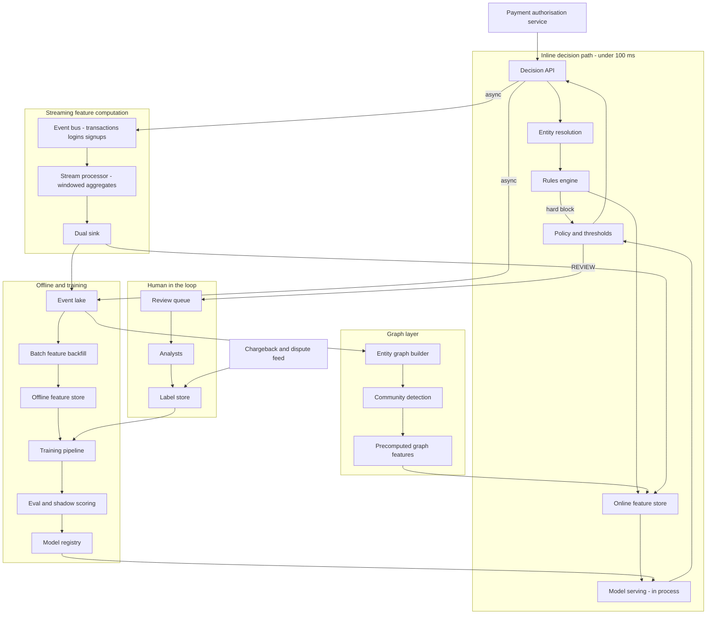
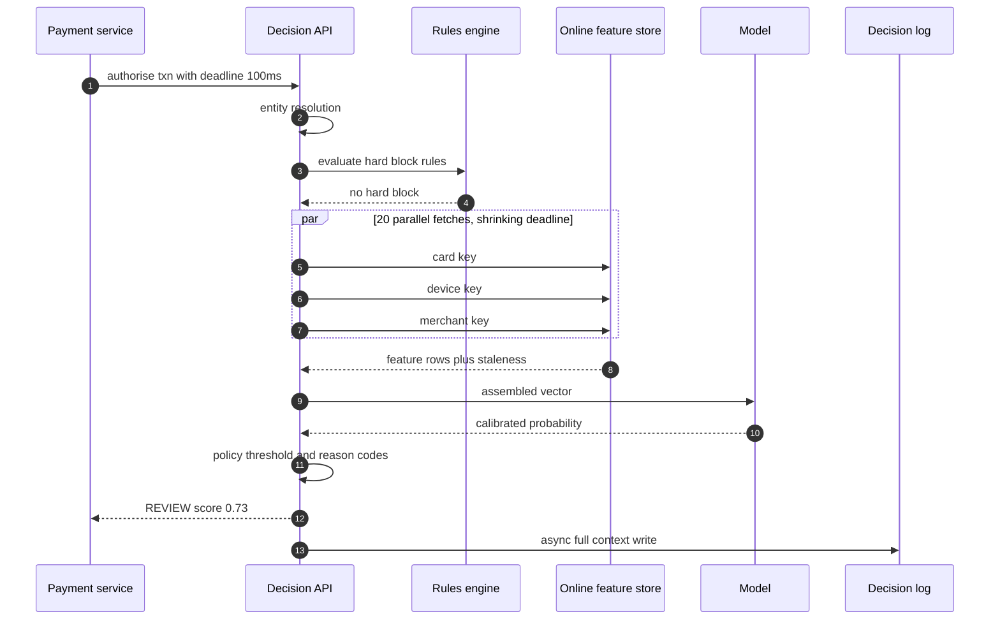
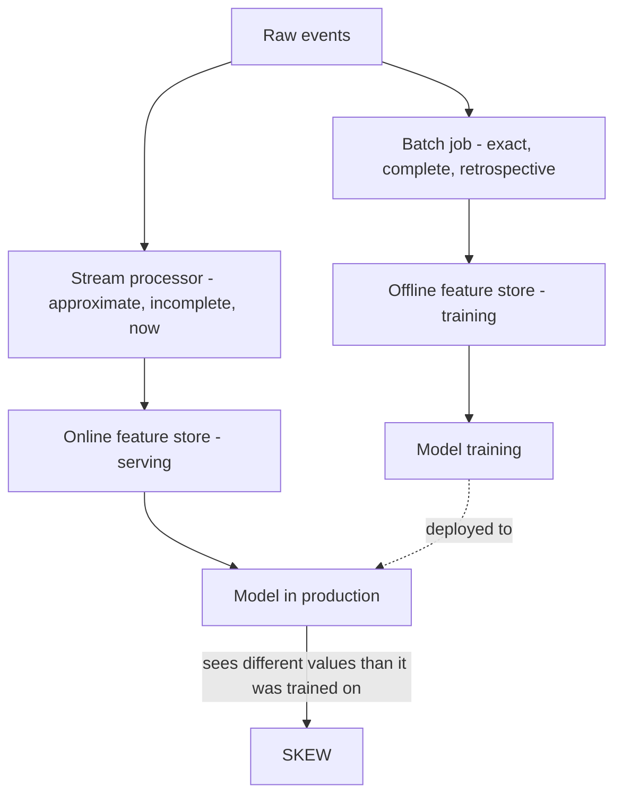
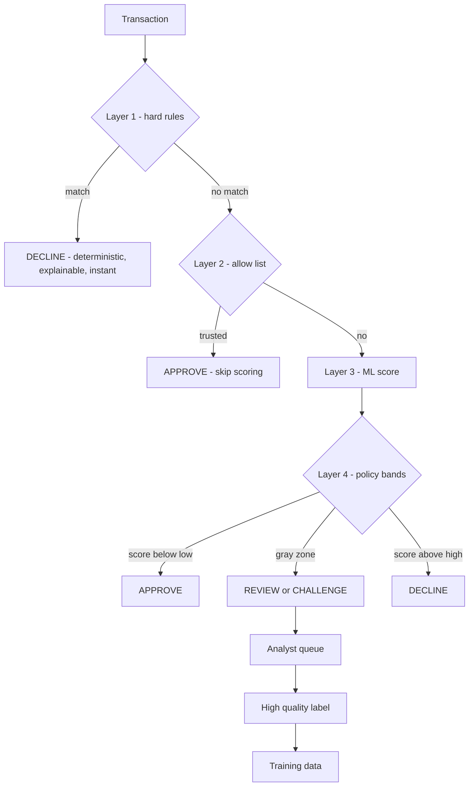
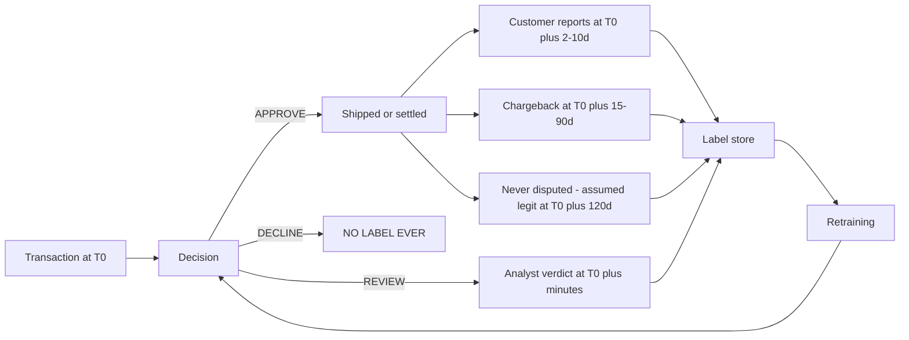
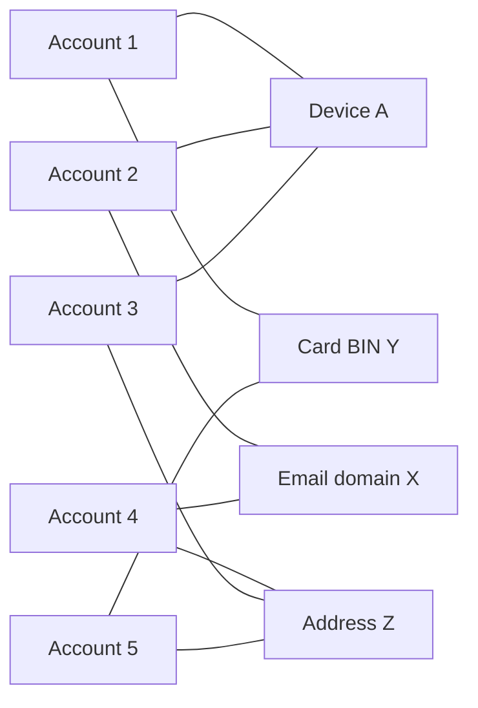
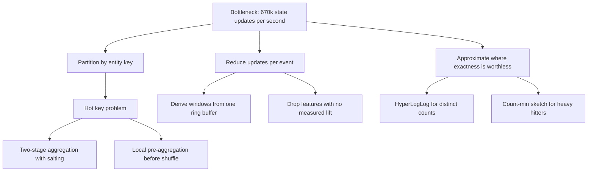

# 29 — Fraud / Abuse Detection

<span class="pill pill-core">Core</span> <span class="pill pill-hard">Hard</span>

**A machine learning system where the ground truth arrives six weeks late, the adversary reads your decisions in real time and adapts, and you have 100 milliseconds to decide — inline, in the payment path — whether to take someone's money or refuse a legitimate customer.**

| | |
|---|---|
| **Commonly asked at** | Stripe, Adyen, PayPal, Block, Visa, Mastercard, Coinbase, Uber, Airbnb, Booking, Amazon, Meta, Shopify, Revolut |
| **Time budget** | 45 min |
| **Core tension** | The features that catch fraud are behavioural aggregates over time windows, and they must be computed identically in two places that cannot be made identical — a streaming engine serving 100 ms decisions, and a batch pipeline building training data over years of history. Every gap between those two silently degrades the model in a way that does not show up in offline evaluation |
| **Prerequisites** | [F04 Caching](../fundamentals/f04-caching.md), [F06 Partitioning & Sharding](../fundamentals/f06-partitioning-sharding.md), [F12 Queues & Streams](../fundamentals/f12-queues-streams.md), [F13 Storage Engines](../fundamentals/f13-storage-engines.md), [F17 Rate Limiting & Load Shedding](../fundamentals/f17-rate-limiting-load-shedding.md), [F18 Resilience Patterns](../fundamentals/f18-resilience-patterns.md), [F20 Time, Clocks & Ordering](../fundamentals/f20-time-clocks-ordering.md), [F21 Probabilistic Structures](../fundamentals/f21-probabilistic-data-structures.md), [F22 Observability Fundamentals](../fundamentals/f22-observability-fundamentals.md), [F23 SLOs & Error Budgets](../fundamentals/f23-slo-error-budgets.md), [F25 Deployment & Release Safety](../fundamentals/f25-deployment-release-safety.md), [F27 Security in Design](../fundamentals/f27-security-design.md) |

---

## 1. Problem Statement

Build the system that decides, synchronously and in under 100 ms, whether a payment authorisation should be approved, declined, or held for review — and the offline machinery that keeps that decision good as fraudsters adapt.

Three properties make this different from every other ML serving problem, and naming them early is the whole interview:

1. **The label is late and partially unobservable.** A chargeback is confirmed 15 to 90 days after the transaction. Worse, transactions you *declined* never generate a label at all, so your training data is systematically censored — you only learn about the world you allowed to happen. Every naive retraining loop makes this worse over time.
2. **The adversary is intelligent, incentivised, and observes your output.** A fraudster with a stolen card tests it with a $1 charge. Your approve/decline response is a free oracle telling them exactly what your system thinks. They will probe, find the boundary, and route around it. This is not distribution drift; it is an opponent.
3. **Both errors are expensive and they trade off against each other.** A false negative costs you the transaction amount plus fees. A false positive costs you a customer who was trying to give you money, was publicly refused, and may never return. The optimal threshold is a business decision expressed in currency, not an F1 score.

The system is therefore not "a model". It is a layered decision stack — deterministic rules, a scored model, graph signals, and humans — wrapped in a streaming feature platform and a feedback loop that has to be deliberately protected from poisoning itself.

### Out of scope

The payment rails themselves (authorisation network, settlement, chargeback representment mechanics), KYC and onboarding identity verification, AML transaction monitoring (related, but batch-oriented and regulator-driven rather than latency-critical), and content moderation.

---

## 2. Requirements

### Functional

| # | Requirement | Notes |
|---|---|---|
| F1 | Synchronous decision on every transaction | `APPROVE`, `DECLINE`, `REVIEW`, `CHALLENGE` |
| F2 | Real-time behavioural aggregates | "Transactions on this card in the last 10 minutes", across many entities and windows |
| F3 | Deterministic rules evaluated before the model | Hard blocks, allow-lists, regulatory constraints |
| F4 | ML risk score with calibrated probability | Not just a ranking — a probability, so thresholds can be set in currency |
| F5 | Graph signals for coordinated fraud rings | Shared devices, emails, addresses, funding instruments |
| F6 | Human review queue with prioritisation | The gray zone, routed by expected value |
| F7 | Reason codes on every decision | Auditability and, in some jurisdictions, legally required adverse action notices |
| F8 | Label ingestion from chargebacks, disputes, and manual confirmations | With the original decision context preserved |
| F9 | Shadow evaluation of candidate models on live traffic | Score without acting |
| F10 | Full decision log, replayable | Every input feature value as it was at decision time |

### Non-functional

| # | Requirement | Target |
|---|---|---|
| N1 | End-to-end decision latency | p50 < 35 ms, p99 < 100 ms, p99.9 < 250 ms |
| N2 | Availability of the decision endpoint | 99.99%, with a defined fallback when it is not |
| N3 | Feature freshness, event to queryable | p99 < 2 s |
| N4 | Online/offline feature parity | > 99.9% of values match on a continuous audit |
| N5 | Decision log completeness | 100% — no sampling, ever |
| N6 | Model refresh cadence | Weekly retrain, daily threshold recalibration |
| N7 | Explainability | Top reason codes on 100% of non-approve decisions |
| N8 | Point-in-time correctness in training data | Zero future leakage, verified structurally |

!!! danger "The timeout behaviour is a product decision, not an engineering default"
    When the fraud service does not answer in time, the payment system must do something. Approve-on-timeout means an attacker who can induce latency gets a free pass — and inducing latency is much easier than beating a model. Decline-on-timeout means a fraud-service degradation becomes a revenue outage and a customer-trust event. The right answer is neither default: a **tiered fallback** that returns a cached or rules-only decision within the budget, with the fail-open/fail-closed choice made *per transaction risk tier* — high-value and high-risk-merchant transactions fail closed, small everyday purchases fail open. Any candidate who picks one global default has not thought about the adversary.

---

## 3. Scale Estimation

**Transaction volume**

$$
\begin{aligned}
\text{transactions} &= 1 \times 10^{8}\ \text{per day} \\
\text{mean} &= \frac{10^{8}}{86400} \approx 1{,}157\ \text{/s} \\
\text{peak factor} &= 6 \Rightarrow \approx 7{,}000\ \text{/s}
\end{aligned}
$$

**Feature read fan-out.** A decision needs ~250 features, but features are grouped by the entity they describe, and a fetch is per entity key:

| Entity | Example features | Keys per decision |
|---|---|---|
| Card / PAN token | txn count 1m/10m/1h/24h/7d, distinct merchants, amount stats | 1 |
| Account | account age, lifetime volume, prior disputes | 1 |
| Device fingerprint | accounts per device, txn velocity, emulator signal | 1 |
| IP address and /24 subnet | txn velocity, ASN reputation, proxy/VPN flag | 2 |
| Email and email domain | age, accounts sharing it, disposable-domain flag | 2 |
| Merchant and merchant category | fraud rate, ticket-size distribution, chargeback rate | 2 |
| Shipping address hash | accounts per address, distance from billing | 1 |
| BIN / issuer | approval rate, issuer fraud rate | 1 |
| Card-merchant pair | prior txns between this pair | 1 |
| Graph-derived | precomputed community risk, ring membership | 1 |
| Session | events this session, time on page, paste behaviour | 1 |
| Misc / cross-entity | | 6 |

$$
\begin{aligned}
\text{keys per decision} &\approx 20 \\
\text{feature reads at peak} &= 7{,}000 \times 20 = 1.4 \times 10^{5}\ \text{/s}
\end{aligned}
$$

**The tail amplification problem this creates.** With 20 parallel fetches, the decision waits for the slowest. If each fetch independently exceeds latency $t$ with probability $q$:

$$
P(\text{fan-out exceeds } t) = 1 - (1-q)^{20}
$$

To hold the fan-out at p99, solve $1 - (1-q)^{20} = 0.01$:

$$
q = 1 - 0.99^{1/20} = 1 - 0.99950 = 5.0 \times 10^{-4}
$$

**Each individual feature store read must meet its p99.95 at the latency you budgeted for p99 of the whole fan-out.** This single calculation reframes the problem: your model is not the latency risk, your fan-out is.

**Streaming aggregate update rate.** Each transaction updates counters for every entity across every window:

$$
\begin{aligned}
\text{entities per event} &= 12,\quad \text{windows per entity} \approx 8 \\
\text{state updates per event} &= 96 \\
\text{peak update rate} &= 7{,}000 \times 96 \approx 6.7 \times 10^{5}\ \text{/s}
\end{aligned}
$$

Two-thirds of a million state mutations per second is the real engineering load, and it is 100x the decision rate. The feature computation layer, not the model, is the system.

**Latency budget, p99 against a 100 ms SLA**

| Stage | p99 budget | Notes |
|---|---|---|
| Ingress: TLS termination, auth, routing | 4 ms | |
| Request validation and entity resolution | 3 ms | Normalise email, hash address, resolve device id |
| Rules engine, deterministic hard blocks | 2 ms | ~400 compiled predicates over already-fetched context |
| Feature fetch, 20 keys in parallel | 18 ms | Requires per-read p99.95 of 18 ms; see above |
| Feature assembly and transformation | 4 ms | Imputation, encoding, ratio derivation |
| Model inference, GBDT ensemble plus small NN | 12 ms | See below |
| Graph feature lookup, precomputed | 8 ms | Never a live traversal |
| Policy, calibration, threshold, reason codes | 2 ms | |
| Decision log publish, fire-and-forget | 1 ms | Async; never blocks the response |
| Network back to the caller | 4 ms | |
| **Subtotal** | **58 ms** | |
| **Reserve: retry, GC, cold start, jitter** | **42 ms** | |

**Model inference, actually costed.** A 500-tree gradient-boosted ensemble at depth 8:

$$
\begin{aligned}
\text{comparisons} &= 500 \times 8 = 4{,}000 \\
\text{at } \sim 15\ \text{ns each (cache-resident, branchy)} &\approx 60\ \mu s
\end{aligned}
$$

Sixty microseconds. The 12 ms budgeted for inference is almost entirely serialisation, RPC overhead, and framework tax — which is why in-process inference beats a model-server RPC here, and why "make the model smaller" is usually the wrong optimisation.

**Cost arithmetic that sets the threshold.** This is the calculation the business actually cares about:

$$
\begin{aligned}
N &= 10^{8}\ \text{txn/day},\quad \text{fraud rate } p = 6 \times 10^{-4} \\
\text{fraudulent} &= 60{,}000/\text{day},\quad \text{legitimate} = 99{,}940{,}000/\text{day} \\
L_{FN} &= \$180\ \text{(loss + fee + ops per missed fraud)} \\
C_{FP} &= \$12\ \text{(3\% churn} \times \$300\ \text{LTV} + \$3\ \text{support)}
\end{aligned}
$$

$$
\text{Cost}(t) = \bigl(1 - \mathrm{TPR}(t)\bigr) \cdot 60{,}000 \cdot 180 \;+\; \mathrm{FPR}(t) \cdot 99{,}940{,}000 \cdot 12
$$

| Threshold | TPR | FPR | FN cost/day | FP cost/day | **Total/day** | Precision |
|---|---|---|---|---|---|---|
| Very loose | 0.90 | 0.0200 | \$1.08 M | \$23.99 M | \$25.07 M | 2.6% |
| Loose | 0.80 | 0.0050 | \$2.16 M | \$6.00 M | \$8.16 M | 8.8% |
| Balanced | 0.70 | 0.0020 | \$3.24 M | \$2.40 M | **\$5.64 M** | 17.4% |
| Tight | 0.60 | 0.0010 | \$4.32 M | \$1.20 M | **\$5.52 M** | 26.5% |
| Very tight | 0.50 | 0.0005 | \$5.40 M | \$0.60 M | \$6.00 M | 37.5% |

No-model baseline is $60{,}000 \times \$180 = \$10.8$ M/day, so the system is worth roughly \$5.3 M/day at the optimum. Two things to notice and say out loud:

- **The optimum is at FPR 0.001-0.002, and even there precision is only about 26%.** Three out of four blocks are wrong. That is not a broken model; it is base-rate arithmetic. With 1,666 legitimate transactions for every fraudulent one, even a superb classifier drowns in false positives.
- **The cost curve is flat near the optimum and brutal away from it.** Moving from 0.60 to 0.70 TPR changes cost by 2%; moving to 0.90 TPR multiplies it by 4.5. Threshold tuning is not about squeezing the last dollar, it is about staying out of the cliff.

**Storage**

$$
\begin{aligned}
\text{decision log} &= 10^{8} \times 4\ \text{KB} = 400\ \text{GB/day (features + score + decision)} \\
\text{2-year retention, } 5{:}1\ \text{compression} &\approx 58\ \text{TB} \\
\text{online feature store} &= 4 \times 10^{8}\ \text{active keys} \times 2\ \text{KB} = 800\ \text{GB in RAM}
\end{aligned}
$$

---

## 4. API Design

### Synchronous decision

```json
POST /v1/decisions
Idempotency-Key: txn_9f3a21bc

{
  "transaction_id": "txn_9f3a21bc",
  "occurred_at": "2026-09-25T14:02:11.442Z",
  "amount": { "value": 24990, "currency": "USD" },
  "payment_instrument": { "type": "card", "token": "tok_7Hk2", "bin": "414720" },
  "account_id": "acct_5512",
  "merchant_id": "mrc_881",
  "context": {
    "ip": "203.0.113.44",
    "device_fingerprint": "dfp_a91c",
    "email": "user@example.com",
    "shipping_address_hash": "sha256:9ab1...",
    "session_id": "ses_4412",
    "user_agent_hash": "sha256:31cd..."
  },
  "deadline_ms": 100
}
```

```json
200 OK
{
  "decision": "REVIEW",
  "risk_score": 0.7314,
  "score_version": "model-2026-09-19-b",
  "policy_version": "policy-2026-09-23",
  "reason_codes": [
    { "code": "VELOCITY_CARD_10M", "contribution": 0.31,
      "detail": "7 transactions on this card in 10 minutes vs p99 of 2" },
    { "code": "DEVICE_ACCOUNT_FANOUT", "contribution": 0.22,
      "detail": "14 accounts seen on this device in 30 days" },
    { "code": "BILLING_SHIPPING_DISTANCE", "contribution": 0.11 }
  ],
  "degraded": false,
  "features_missing": [],
  "decision_id": "dec_01J9Q...",
  "latency_ms": 41
}
```

`deadline_ms` is passed by the caller and propagated to every downstream call as a **shrinking budget**, not a fixed per-hop timeout. This is the single most important latency-correctness detail in the API: a hop that has already consumed 60 ms must not start an 80 ms feature fetch.

`degraded` and `features_missing` are first-class in the response. The caller needs to know that a decision was made without the device history, because it changes what they should do with it.

### Label ingestion

```json
POST /v1/labels
{
  "transaction_id": "txn_9f3a21bc",
  "label": "FRAUD_CONFIRMED",
  "source": "CHARGEBACK",
  "reason_code": "10.4",
  "observed_at": "2026-11-02T09:14:00Z",
  "amount_lost": { "value": 24990, "currency": "USD" }
}
```

| Label source | Typical latency | Precision | Coverage |
|---|---|---|---|
| Customer-reported unauthorised | 2-10 days | Medium — some are friendly fraud | Low |
| Chargeback received | 15-90 days | High | Medium |
| Manual review confirmation | Minutes to hours | High | Only the review queue |
| Issuer fraud feed | 1-7 days | High | Partial |
| Account takeover confirmed by support | Hours to days | High | Low |
| **Declined transactions** | **Never** | — | **Zero** |

That last row is the one that matters and it is covered in depth in section 7.4.

### Async and control plane

```json
POST /v1/decisions:shadow      # score without acting, for candidate models
GET  /v1/decisions/{id}        # full replay context: every feature value at decision time
POST /v1/rules                 # publish a rule; requires shadow results attached
POST /v1/policies/{id}:rollout # staged threshold change with automatic rollback
```

---

## 5. Data Model

```sql
-- Decision log. Append-only, never sampled. This is the training set.
CREATE TABLE decision_log (
  decision_id        UUID PRIMARY KEY,
  transaction_id     TEXT NOT NULL,
  decided_at         TIMESTAMPTZ NOT NULL,
  account_id         TEXT, merchant_id TEXT, device_fp TEXT,
  amount_minor       BIGINT, currency CHAR(3),
  decision           TEXT,            -- APPROVE DECLINE REVIEW CHALLENGE
  risk_score         DOUBLE PRECISION,
  score_version      TEXT, policy_version TEXT, rules_fired TEXT[],
  feature_vector     JSONB,           -- EVERY value as observed at decision time
  feature_staleness  JSONB,           -- per-feature age in ms; needed for debugging
  degraded           BOOLEAN, features_missing TEXT[],
  latency_ms         INT
);

-- Labels arrive weeks later and join back by transaction_id.
CREATE TABLE label (
  transaction_id  TEXT NOT NULL,
  label           TEXT NOT NULL,     -- FRAUD_CONFIRMED, LEGIT_CONFIRMED, DISPUTED_FRIENDLY
  source          TEXT NOT NULL,
  observed_at     TIMESTAMPTZ NOT NULL,
  amount_lost     BIGINT,
  PRIMARY KEY (transaction_id, source)
);

-- Feature registry: ONE definition, consumed by both streaming and batch.
CREATE TABLE feature_definition (
  name            TEXT PRIMARY KEY,   -- card_txn_count_10m
  entity          TEXT NOT NULL,      -- card
  window_seconds  INT,                -- 600
  aggregation     TEXT,               -- COUNT SUM DISTINCT_COUNT STDDEV
  source_event    TEXT,
  filter_expr     TEXT,
  ttl_seconds     INT,
  owner           TEXT, version INT
);
```

**Online store**: a partitioned in-memory key-value store keyed by `entity_type:entity_id`, holding the full feature row for that entity so one read gets all its features. Partitioned by entity id hash; see [F06 Partitioning & Sharding](../fundamentals/f06-partitioning-sharding.md).

```text
Key:   card:tok_7Hk2
Value: { txn_count_1m: 2, txn_count_10m: 7, txn_count_1h: 9,
         txn_count_24h: 14, distinct_merchants_24h: 6,
         amount_sum_24h: 118400, amount_stddev_7d: 2210,
         decline_count_1h: 3, last_seen_ms: 1758808931442,
         updated_at_ms: 1758808931640 }
```

`updated_at_ms` is not decoration. It is how you detect that a feature is stale and how you populate `feature_staleness` in the decision log — without which, debugging a production score against a replayed score is guesswork.

**Offline store**: the same features in a columnar warehouse, partitioned by event date, written by the same aggregation definitions running in batch mode, with a mandatory `valid_from` / `valid_to` on every row so that training joins can be point-in-time correct.

---

## 6. High-Level Architecture



### Write path: an event becomes a feature

1. The decision API publishes the transaction to the event bus after responding — **never before**, and never blocking on it.
2. The stream processor consumes it, keys it by each of its 12 entities, and updates windowed aggregates in local state.
3. On every state update, the processor emits the new feature row to the **dual sink**: the online store for serving, and the event lake for offline reconstruction.
4. Freshness target is p99 under 2 s from event to queryable. That number matters: card testing happens in bursts of seconds, so a 30 s pipeline is blind to the attack it most needs to catch.

### Read path: a transaction becomes a decision

1. Entity resolution normalises the inputs into canonical keys (lowercase and dot-strip the email, hash the address, resolve the device fingerprint) — because a feature keyed on `User@Example.com` and one keyed on `user@example.com` are two different, useless features.
2. The rules engine evaluates hard blocks on data already in hand. A block short-circuits everything downstream, which is both correct and a latency saving on the worst traffic.
3. Twenty feature fetches issue in parallel against the online store with a shrinking deadline and a hedge on the slowest.
4. Features are assembled, missing values imputed with **explicitly recorded** defaults, and the vector is scored in-process.
5. Graph features were precomputed offline and are fetched like any other feature. No live graph traversal is ever on this path.
6. Policy maps the calibrated probability plus rule outcomes to one of four actions, attaches reason codes, and responds.
7. Everything — every feature value, its staleness, the score, the version of every component — is written asynchronously to the decision log.



---

## 7. Deep Dives

### 7.1 Streaming feature computation and windowing

"Transactions on this card in the last 10 minutes" sounds trivial and is the source of most of the system's complexity.

**Window types, and why the choice is not cosmetic:**

=== "Tumbling"

    Fixed, non-overlapping buckets: `[14:00, 14:10)`, `[14:10, 14:20)`. Cheapest — one counter per key per bucket. Fatal flaw for fraud: at 14:09:59 the window is almost full of history; at 14:10:01 it is empty. An attacker who learns the boundary times their burst across it. **Never use a bare tumbling window for a velocity feature.**

=== "Sliding"

    A true continuous window: exactly the last 600 seconds at every instant. Semantically ideal, expensive — it requires retaining individual event timestamps per key so that expiry is exact. Memory is $O(\text{events in window})$ rather than $O(1)$.

=== "Hopping"

    Overlapping windows: a 10-minute window advancing every 30 seconds. Approximates sliding with bounded cost. Each event lands in $600/30 = 20$ open windows, so update cost is 20x but memory is bounded and the boundary effect is reduced to the hop size. **This is usually the right production choice.**

=== "Sliding via ring buffer"

    The pragmatic compromise: keep a ring of $k$ fine-grained sub-buckets (e.g. 60 buckets of 10 s for a 10-minute window) and sum them. $O(1)$ memory per key, $O(k)$ read or an incrementally maintained sum, and the error is bounded by one sub-bucket width. **Chosen for most velocity features**: the 10-second granularity error is irrelevant to the signal, and the cost is flat.

```python
# Ring-buffer sliding window. O(1) update, bounded memory, bounded error.
# This is the workhorse behind most velocity features.

class SlidingCounter:
    def __init__(self, window_s=600, buckets=60):
        self.bucket_s = window_s // buckets
        self.buckets = buckets
        self.counts = [0] * buckets
        self.sums = [0.0] * buckets
        self.epoch = [-1] * buckets          # which absolute bucket each slot holds
        self.total = 0

    def _slot(self, ts_s):
        abs_bucket = ts_s // self.bucket_s
        i = abs_bucket % self.buckets
        if self.epoch[i] != abs_bucket:       # lazy expiry: slot is stale, reset it
            self.total -= self.counts[i]
            self.counts[i] = 0
            self.sums[i] = 0.0
            self.epoch[i] = abs_bucket
        return i

    def add(self, ts_s, amount=0.0):
        i = self._slot(ts_s)
        self.counts[i] += 1
        self.sums[i] += amount
        self.total += 1

    def read(self, now_s):
        cutoff = (now_s // self.bucket_s) - self.buckets + 1
        return sum(c for c, e in zip(self.counts, self.epoch) if e >= cutoff)
```

!!! warning "Lazy expiry is mandatory and is the bug people ship"
    A counter that is only decremented on write will report a stale value forever for a key that goes quiet. A card with 50 transactions an hour ago and none since must read zero for `txn_count_10m`, and it will only do so if the read path checks the epoch of each bucket. Writing the expiry into `add()` alone produces a feature that is correct during an attack and wrong afterwards — which is exactly backwards, because the post-attack reading is what tells you the attack stopped.

**Event time versus processing time.** Events arrive out of order: mobile clients buffer while offline, upstream services retry, partitions rebalance. Windowing on *processing time* gives you a feature that depends on your own infrastructure's behaviour, which means a Kafka lag spike silently changes every velocity feature in the system.

Window on **event time**, with a watermark, and then confront the unavoidable trade: the inline decision path cannot wait for the watermark. A 30-second allowed lateness means a feature that is not final for 30 seconds, but the decision is needed in 100 ms.

The resolution is to accept two different semantics and be explicit about it:

| Consumer | Semantics | Rationale |
|---|---|---|
| Online serving | Read the window "as of now", including everything received so far, excluding nothing | Must answer now; a slightly incomplete count is better than a late answer |
| Offline backfill | Event-time windows with full lateness allowance, recomputed once complete | Must be correct and reproducible for training |

And that difference is precisely the skew described next. You do not eliminate it — you measure it and you make the training data reflect the serving behaviour, not the other way round.

**State size.** 400 million active entity keys, ~40 aggregates each:

$$
400 \times 10^{6} \times 40 \times 50\ \text{B} \approx 800\ \text{GB}
$$

partitioned across the stream processor's stateful tasks, backed by a local embedded store with a changelog topic for recovery. See [F12 Queues & Streams](../fundamentals/f12-queues-streams.md) and [F13 Storage Engines](../fundamentals/f13-storage-engines.md). Where exact counts are unnecessary, approximate structures collapse the cost dramatically — HyperLogLog for `distinct_merchants_30d` is 12 KB regardless of cardinality versus potentially megabytes for an exact set; see [F21 Probabilistic Structures](../fundamentals/f21-probabilistic-data-structures.md).

### 7.2 Online/offline skew: the problem that quietly kills accuracy

Your model is trained on features computed by a batch job over historical events, and served on features computed by a stream processor over live events. These are two implementations of "the same" definition, and they are never actually the same.



**Every source of divergence, concretely:**

| Source | What actually happens | Effect on the model |
|---|---|---|
| Late events | Batch sees an event the stream had not received at decision time | Batch count is higher; model trained to expect a value it never sees live |
| Window boundary semantics | Batch uses exact event-time windows; stream uses a 10 s ring buffer | Systematic small offset in every velocity feature |
| Approximation | Stream uses HyperLogLog; batch uses exact `COUNT DISTINCT` | Stream values differ by up to 2% with a known error distribution |
| Time zone and DST | Batch partitions by local date, stream by UTC | Twice-yearly discontinuity that looks like drift |
| Null and default handling | Stream imputes 0 for a missing key; batch produces NULL and the trainer imputes the mean | The most common bug, and it flips the meaning of the feature |
| Type and precision | Stream keeps a float sum; batch uses decimal | Small, real, and invisible until you diff |
| Code drift | A fix lands in the streaming job; the batch job is a different codebase | Divergence appears instantly and silently |
| Upstream schema change | A new field is populated live but not backfilled historically | Feature is informative in training and constant in serving, or vice versa |

**The failure is silent and that is what makes it dangerous.** Offline evaluation shows AUC 0.94. Production catches half the fraud you expected. Nothing errors. No alert fires. The model is doing exactly what it was trained to do on inputs that mean something slightly different.

**The four defences, in order of value:**

**1. One definition, two execution modes.** The single highest-leverage fix. Features are declared once in a registry, and the *same* compiled expression runs in the streaming engine and in the batch engine. This eliminates code drift, which is the largest and most recurrent category.

```yaml
# feature_definitions/card_velocity.yaml
- name: card_txn_count_10m
  entity: card
  source_event: transaction.authorised
  aggregation: COUNT
  window: { type: sliding, size: 600s, granularity: 10s }
  filter: "status != 'VOIDED'"
  missing_policy: { strategy: constant, value: 0 }   # SAME in both paths
  approximation: exact
  owner: risk-platform
  version: 4

- name: card_distinct_merchants_30d
  entity: card
  source_event: transaction.authorised
  aggregation: DISTINCT_COUNT
  window: { type: sliding, size: 30d, granularity: 1h }
  approximation: { method: hyperloglog, precision: 14 }  # SAME in both paths
  missing_policy: { strategy: constant, value: 0 }
  version: 2
```

Note that the *approximation* is part of the definition. If serving uses HyperLogLog, training must use HyperLogLog too — you do not "improve" the training data by making it exact. **Training must reproduce serving's errors, not correct them.**

**2. Log the served features and train on those.** The most robust defence, because it makes skew structurally impossible for anything you log. The decision log already stores the exact feature vector used. Train on *that*, joined to labels later. You are now training on precisely the distribution you serve.

Cost and limits, stated honestly: you can only train on features you were already computing, so a genuinely new feature needs a backfill period before it is usable; and you accumulate a lot of data (400 GB/day here). The usual shape is a hybrid — logged features for everything in production, batch backfill only for new candidate features, with a mandatory parity audit before promotion.

**3. Continuous parity auditing.** Sample live decisions, recompute their features through the batch path at the same point in time, and diff.

```python
# Runs continuously on a sample of production decisions.
def audit_parity(decision_id):
    d = decision_log.get(decision_id)
    batch = batch_feature_engine.compute_as_of(
        entities=d.entities, as_of=d.decided_at, definitions=REGISTRY)
    report = []
    for name, served in d.feature_vector.items():
        expected = batch.get(name)
        if not close_enough(served, expected, REGISTRY[name].tolerance):
            report.append((name, served, expected))
            metrics.increment("feature_parity_mismatch", tags={"feature": name})
    return report

# Alert on a mismatch RATE per feature, not on individual mismatches.
# Some drift is expected and tolerated; a step change is a defect.
```

Track parity per feature, not in aggregate. A single broken feature out of 250 barely moves an aggregate metric and can still cost millions.

**4. Feature-level production monitoring.** Compare the live serving distribution of every feature against its training distribution using population stability index or a KS statistic. A feature whose distribution shifts is either genuine drift (interesting) or a pipeline defect (urgent), and you want to know which within hours rather than at the next retrain.

??? note "Point-in-time correctness, the other half of the same problem"
    Skew is about *space* — two systems computing differently. Point-in-time correctness is about *time* — using information in training that was not available at decision time. If you build the training set by joining today's `card_txn_count_10m` to a transaction from three weeks ago, you have leaked the future into the past. The model learns a relationship that cannot exist at serving time, evaluates beautifully offline, and fails in production. Every training join must be an as-of join against feature values `valid_from <= decision_time < valid_to`. The subtle version bites hardest: features derived from *labels*, like `merchant_fraud_rate`, must be computed only from chargebacks **confirmed before** the decision timestamp — not all chargebacks now known for that merchant. That one is responsible for an enormous number of models that looked excellent in evaluation and were worthless live.

### 7.3 The layered decision stack

A single model making a binary call is the wrong shape. Production systems layer four mechanisms with different latencies, costs, and failure characteristics.



**Layer 1 — deterministic hard rules.** Small in number, absolute in effect, and they exist for reasons a model cannot serve:

- **Regulatory and legal**: sanctioned entity, embargoed jurisdiction. Non-negotiable, and a probability is the wrong output for a legal obligation.
- **Known-bad exact matches**: a card confirmed compromised an hour ago. A rule acts immediately; a model requires retraining.
- **Physical impossibility**: same card, two countries, four minutes apart.
- **Emergency response**: during an active attack you need to block a pattern in minutes, not wait for a model release.

Rules are fast (2 ms for hundreds of compiled predicates), perfectly explainable, and instantly deployable. Their weakness is that they are brittle, they accumulate into an unmaintainable thicket, and an adversary can binary-search their thresholds. Keep the set small, require every rule to have an expiry date and a measured precision, and delete rules that the model has subsumed.

**Layer 2 — allow-lists.** A customer with four years of history and 200 clean transactions does not need to be scored. Short-circuiting saves latency and, more importantly, removes false-positive risk from exactly the customers whose false positives cost the most. Guard it: allow-list membership is a target, so it needs its own anomaly detection for accounts whose behaviour changes abruptly (the classic account-takeover-of-a-trusted-account pattern).

**Layer 3 — the model.** Gradient-boosted trees remain the workhorse for tabular fraud data: strong with heterogeneous features, robust to missing values, fast to score, and reasonably explainable via SHAP. A small neural component helps with sequence features (the ordered pattern of a session's events) and with learned embeddings for high-cardinality categoricals like merchant id. Output must be a **calibrated probability**, not a raw score, because the threshold is derived from a currency cost calculation and $0.7$ has to actually mean a 70% chance.

**Layer 4 — policy and the gray zone.** The policy maps probability to action using bands set from the cost model:

```python
def decide(p_fraud, amount, context, policy):
    ev_fraud_loss = p_fraud * amount * policy.loss_multiplier
    ev_fp_cost    = (1 - p_fraud) * policy.fp_cost(context.customer_tier)

    if p_fraud >= policy.hard_decline:          # cost of review exceeds its value
        return DECLINE
    if p_fraud <= policy.auto_approve:
        return APPROVE
    if ev_fraud_loss > policy.review_cost and review_queue.has_capacity():
        return REVIEW                            # human adjudicates
    if context.challenge_available:
        return CHALLENGE                         # step-up auth: 3DS, OTP, selfie
    # Queue is full and no challenge available: fall back to expected value.
    return DECLINE if ev_fraud_loss > ev_fp_cost else APPROVE
```

Two details worth saying explicitly in an interview. First, **thresholds must depend on amount**: a 0.4 probability on a \$5 purchase and on a \$5,000 purchase are not the same decision, and a single global threshold throws that away. Second, **the review queue is a finite resource that must appear in the decision function**. A policy that routes more to review than analysts can process produces a growing backlog, and a backlog means transactions timing out in a holding state — which is a worse customer experience than either a decline or an approval.

**CHALLENGE is the most underrated action.** Step-up authentication converts a binary approve/decline into "prove it's you". It recovers much of the false-positive population at a modest conversion cost, and it produces a strong label either way. Candidates who present only approve/decline have modelled the problem too narrowly.

**Human review is a label factory as much as a decision mechanism.** Analyst verdicts arrive in minutes with high precision, versus chargebacks at 15-90 days. That makes the review queue the fastest feedback channel you have — which is an argument for routing some transactions to review *for their label value* even when the immediate decision is not in doubt. It is also a sampling bias hazard, since reviewed transactions are by construction unrepresentative, so those labels need to be reweighted in training rather than pooled naively.

### 7.4 The feedback loop, label latency, and selection bias



**Label latency forces a hard choice.** Training a model today on data whose labels are complete means using transactions from at least 90 days ago, so the model is already a quarter behind an adversary that adapts weekly. Training on recent data means labels are incomplete, and incomplete in a *biased* way: the frauds confirmed fastest are the obvious ones, so recent data over-represents easy fraud and the model learns to catch what it already catches.

Practical resolutions, used together:

1. **Two-speed models.** A fast model retrained daily on recent partially-labelled data, using analyst verdicts and early customer reports, layered over a slow model retrained monthly on fully-matured labels. The fast model adapts; the slow model is stable and calibrated.
2. **Maturity weighting.** Weight a transaction's label by how much of the dispute window has elapsed. A 100-day-old "no chargeback" is strong evidence of legitimacy; a 5-day-old one is weak. Encode that rather than treating them as equal.
3. **Survival-style targets.** Instead of predicting "is fraud", predict "will be disputed within $t$ days", which handles censored observations natively and is a better match for the data-generating process.
4. **Deliberate label purchase.** Accept some fraud you could have blocked, specifically to generate labels. This sounds insane and is standard practice — see below.

**Selection bias is the deeper problem.** You only observe outcomes for transactions you approved. Declined transactions have no label, so the training set is censored exactly where the model is most confident. Over successive retrainings the model's view of the "declined" region degrades because nothing ever updates it, and it cannot discover that a pattern it learned to block in 2024 became legitimate behaviour in 2026.

| Mitigation | How it works | Cost |
|---|---|---|
| **Randomised holdout** | Approve a small random fraction (0.1-0.5%) of transactions the model would decline | Direct, measurable fraud loss — and it is a *budget line*, not an incident |
| **Exploration near the boundary** | Randomise only in the score band where the model is uncertain | Much cheaper per label; gives no information about the confident region |
| **Challenge instead of decline** | Step-up auth yields an outcome either way | Friction; some legitimate users abandon |
| **Proxy labels** | Issuer feeds, consortium data, device reputation networks | Noisy, and correlated with your own decisions |
| **Reject inference** | Statistically impute outcomes for declines via propensity weighting or a two-stage model | Assumption-heavy; can encode the bias it is meant to remove |

!!! tip "The randomised holdout is a cost line, not a bug"
    Letting through a fraction of a percent of predicted-fraud transactions costs real money and is the only way to obtain unbiased labels in the region where your model acts most decisively. Budget it explicitly — "we spend \$X per month on label acquisition" — measure the counterfactual value of the labels it generates, and make sure finance understands it is buying model quality. Teams that quietly kill the holdout to hit a quarterly loss target get a model that slowly stops being able to justify its own thresholds, and they find out eighteen months later.

### 7.5 Adversarial adaptation

The distribution does not drift; it is *pushed*. That difference changes the monitoring you need and the retraining cadence you can tolerate.

**The card-testing pattern, as an illustration of the dynamic.** An attacker with 10,000 stolen card numbers needs to know which are live. They run \$1 charges at a low-friction merchant. Your velocity features catch it: the same IP, the same device, dozens of cards in minutes. You block. They adapt:

| Attacker move | Signal it defeats | Your counter |
|---|---|---|
| Rotate IPs via a residential proxy pool | `ip_txn_velocity` | ASN reputation, proxy detection, /24 aggregates |
| Rotate device fingerprints | `device_account_count` | Fingerprint stability scoring; inconsistent attribute detection |
| Slow the rate below the threshold | `card_txn_count_10m` | Longer windows; cross-entity aggregates they cannot rotate |
| Spread across many merchants | `merchant_velocity` | Consortium signals; cross-merchant card velocity |
| Vary amounts to look organic | Amount-pattern features | Distributional features: entropy, Benford-style checks |
| Mix in real purchases | Behavioural profile | Sequence models over the session |

Each counter is met by a counter-counter. **You are never finished, and the design implication is that the system's retraining and rule-deployment cadence must be faster than the adversary's adaptation cadence.** Weekly retraining against an adversary that adapts in days is a losing race, which is why the rules layer exists — it is the fast path for responding in minutes.

**Probing and the oracle problem.** Every decision you return is information. A fraudster submits crafted transactions and reads your response, mapping your boundary for free. Mitigations:

- **Response uniformity.** `DECLINE` should look identical regardless of reason. Never leak which signal fired. Identical timing too — a decline that returns in 8 ms because it short-circuited a rule, versus 60 ms for a full model score, is a side channel that tells the attacker which layer caught them.
- **Randomised thresholds.** Small per-request jitter on the boundary makes binary search noisy and expensive.
- **Rate-limit the probing itself.** High-velocity, low-value, high-decline-rate traffic from one entity is itself the strongest signal available. Treat the *probing pattern* as fraud rather than evaluating each probe independently. See [F17 Rate Limiting & Load Shedding](../fundamentals/f17-rate-limiting-load-shedding.md).
- **Delay and batch responses for suspicious sources.** Slowing the oracle degrades its value enormously without affecting legitimate users.

!!! danger "Do not leak the reason code to the end user"
    Internal reason codes are for analysts, auditors, and regulators. If a decline response to the client says `VELOCITY_CARD_10M`, you have handed the attacker your feature list and your thresholds. The customer-facing message is generic; the detailed reason lives in the decision log and in the adverse-action channel, which is a separate, authenticated, often asynchronous path.

**Monitoring for adaptation, not just for drift:**

| Signal | What it indicates |
|---|---|
| Score distribution shifting toward the threshold | Someone is optimising against your boundary |
| Decline rate stable but chargeback rate rising | Fraud is getting through with scores below threshold — the model has been beaten |
| A feature's importance collapsing in the fast model | That signal has been neutralised; the counter is already deployed |
| Sudden spike in near-threshold transactions from few entities | Active probing right now |
| Precision falling at a fixed threshold | Either drift or adaptation; the response differs, so investigate rather than recalibrate blindly |

### 7.6 Graph-based detection of fraud rings

Per-transaction scoring evaluates each event against a profile. It structurally cannot see that 400 accounts share one device, three shipping addresses, and a funding pattern — because each individual transaction looks fine.



Nodes are entities (accounts, devices, cards, emails, addresses, IPs, phone numbers); edges are co-occurrences observed in events. The signal is **structural density**: legitimate users form sparse, shallow neighbourhoods; rings form dense, tight components.

**Why this is not on the inline path.** A multi-hop traversal over a graph with hundreds of millions of nodes cannot complete in 8 ms under load, and its latency is wildly variable because it depends on local degree — a supernode makes one query take seconds. So the graph runs **offline and continuously**, and materialises features into the online store:

| Materialised graph feature | Meaning |
|---|---|
| `community_id` | Which detected component this entity belongs to |
| `community_size` | How many entities in it |
| `community_fraud_rate` | Historical confirmed-fraud rate of that component |
| `community_density` | Edges over possible edges — tightness |
| `distance_to_known_fraud` | Shortest path hops to a confirmed-fraud node |
| `device_account_fanout_30d` | Simple one-hop degree; cheap and powerful |
| `shared_attribute_count` | Distinct attributes shared with any flagged entity |

Community detection via label propagation or Louvain over a graph of this size runs in tens of minutes on a distributed graph engine, refreshed hourly. Connected components and one-hop degree — which carry most of the signal for the least cost — can be maintained incrementally in the stream processor and are near-real-time.

!!! gotcha "Supernodes turn your graph into a single component"
    **Symptom:** community detection reports one community containing 60% of all entities, and `community_fraud_rate` becomes a useless global average.
    **Mechanism:** shared infrastructure creates edges that carry no relational meaning — a carrier-grade NAT IP with 200,000 accounts, `gmail.com` as an email domain, a corporate office address, a popular device model string mistaken for a fingerprint. One of these bridges every genuine cluster into one blob.
    **Mitigation:** cap node degree and drop edges through nodes above a degree threshold; weight edges by inverse entity frequency (an IDF-style weighting, so a rare shared address counts enormously and a shared Gmail domain counts for nothing); maintain an explicit exclusion list for known shared infrastructure; and use attribute *combinations* as edges rather than single attributes. Getting this wrong is the single most common reason graph fraud systems produce nothing useful.

**Acting on ring detection is a different operation from scoring a transaction.** Discovering a 400-account ring means a bulk action across accounts, retroactively, often including accounts that have not yet transacted. That needs: a review workflow with a human decision-maker, a bounded blast radius (a false positive here suspends 400 real customers at once), an audit trail, and a fast reversal path. **Never wire community detection directly to automated bulk suspension.** The failure mode — an incorrectly merged community triggering mass suspension of legitimate customers — is far worse than the fraud it prevents, and it has happened to real companies with real consequences.

### 7.7 Explainability

Explainability is a hard requirement here, for three separate reasons that need separate solutions:

1. **Regulatory.** In several jurisdictions, an adverse decision on a financial product requires a statement of specific reasons. "The model said so" is not compliant.
2. **Operational.** An analyst reviewing a flagged transaction needs to know *why* it was flagged, or the review adds no information.
3. **Debugging.** When the false-positive rate jumps, you need to know which feature drove it within minutes.

| Technique | Latency | Fidelity | Use |
|---|---|---|---|
| Rules that fired | ~0 | Perfect | Always available; covers the deterministic layer |
| Tree path extraction | ~0 | Exact for the tree | Cheap and surprisingly interpretable for GBDTs |
| **Precomputed SHAP approximation** | < 1 ms | Good | **Chosen for inline.** TreeSHAP with a cached background distribution |
| Full TreeSHAP | 5-20 ms | Exact | Offline, for analyst deep-dives and audits |
| Feature percentile comparison | ~0 | Descriptive, not causal | Excellent for human-readable text: "7 transactions in 10 minutes; this card's normal p99 is 2" |
| Counterfactual ("what would change this") | 50 ms+ | High value | Offline only; strongest for appeals and disputes |

The most useful analyst-facing explanation is not the SHAP value — it is the **percentile framing**. "Device fingerprint linked to 14 accounts in 30 days, which is above the 99.97th percentile" is immediately actionable in a way that "SHAP contribution 0.22" is not. Compute both: the SHAP value orders the reasons, the percentile framing renders them.

!!! warning "A model you cannot explain is a model you cannot deploy here"
    This constrains model choice, and the constraint is real rather than a preference. A large sequence model might gain a couple of AUC points and be unusable because you cannot produce a defensible reason for a specific declined transaction. The usual resolution is an ensemble where an interpretable GBDT carries the decision and any opaque component contributes a *feature* to it — so the explanation is "the behavioural sequence score was unusually high", which is defensible, rather than an unexplainable end-to-end verdict.

---

## 8. Scaling the Bottleneck

The bottleneck is **not** model inference (60 µs) and **not** decision QPS (7,000/s is unremarkable). It is the streaming feature computation layer at 670,000 state updates per second against 800 GB of partitioned state, and the 140,000/s fan-out read load with a p99.95 requirement on each read.



**1. Hot keys are guaranteed, not hypothetical.** Entity key distributions are extreme: a top merchant takes 5% of all transactions, meaning one partition gets 350 events/s where the average is a handful. A single carrier-grade NAT IP can carry 200,000 accounts. Two fixes:

- **Two-stage aggregation with salting.** Key on `merchant_id:{hash(txn_id) % 32}` in stage one, then aggregate the 32 partials in stage two. Spreads write load by 32x at the cost of a second shuffle and a small freshness delay on that entity.
- **Local pre-aggregation.** Combine events in the upstream operator before shuffling. A 200 ms local window over a hot merchant collapses 70 events into one shuffle record. Adds 200 ms of latency for that feature, which is acceptable for a merchant-level aggregate and not acceptable for a card-level one — so the policy is per-feature.

**2. Reduce the update count per event.** Ninety-six updates per event is mostly redundancy: a 1-minute, 10-minute, 1-hour and 24-hour count over the same event stream can all be derived from **one** ring buffer at the finest granularity, by summing different numbers of buckets at read time. That turns 4 writes into 1 write and 4 cheap reads. Applied across the feature set, it cuts write amplification substantially.

**3. Approximate deliberately.** Exact `distinct_merchants_30d` requires storing the merchant set per card. HyperLogLog at precision 14 is 12 KB with ~1% error, and a 1% error on a distinct count contributes nothing measurable to the model's discrimination. The rule to state: **be exact where the model is sensitive (small counts, recent windows) and approximate where it is not (large cardinalities, long windows).**

**4. Attack the read fan-out.** Twenty parallel reads with a p99.95 requirement is fragile. Three structural improvements:

- **Co-locate features by entity.** One read returns all features for that entity. This is why the value layout is a full row rather than per-feature keys — it turns 250 reads into 20.
- **Hedge the slowest requests.** Issue a duplicate request to another replica at the p95 latency mark. Costs ~5% extra load, removes the long tail. See [F18 Resilience Patterns](../fundamentals/f18-resilience-patterns.md).
- **Cache immutable and slow-moving features aggressively.** Merchant category, BIN metadata, and account age change rarely or never. A short-TTL local cache in the decision service removes them from the fan-out entirely; see [F04 Caching](../fundamentals/f04-caching.md).

**5. Degrade the feature set, not the decision.** Under load, drop the most expensive and least valuable features first, mark the decision `degraded`, and let the policy layer respond by widening the review band. This is graceful degradation applied to an ML system: **a decision made on 180 of 250 features is far better than a timeout**, provided the model was trained to handle missing values and provided the decision is labelled as degraded so downstream consumers know.

---

## 9. Failure Modes

| Failure | Blast radius | Detection | Mitigation | Degraded behaviour |
|---|---|---|---|---|
| Feature store partition unavailable | Transactions touching those entity keys | Fetch error rate, per-partition | Hedged reads to replicas; serve last-known values with staleness marked | Decision on partial features, `degraded: true`, review band widened |
| Streaming pipeline lag spike | All velocity features go stale venue-wide | Feature freshness p99, consumer lag | Autoscale stateful tasks; shed lowest-value features first | Velocity features stale; model weights them down via staleness input |
| Decision service timeout | The calling payment path | Caller-side timeout rate | Tiered fallback: rules-only decision within budget | High-risk tiers fail closed, low-risk fail open |
| Online/offline skew introduced by a deploy | Model accuracy, silently | Per-feature parity mismatch rate | Block model promotion on parity regression | Detected in hours, not at the next chargeback cycle |
| Model regression shipped | Approval rate and fraud loss | Shadow evaluation, then canary approval-rate delta | Automatic rollback on approval-rate or score-distribution deviation | Previous model version still loaded in memory |
| Label pipeline broken | Training data quality, invisible for weeks | Daily label volume by source vs forecast | Alert on label volume anomaly; block retraining if labels are incomplete | Retraining paused; existing model continues |
| Chargeback feed delayed by the processor | Recent training data biased toward easy fraud | Label arrival time distribution | Maturity weighting handles it; block retrain if maturity distribution shifts | Fast model paused, slow model serves |
| Review queue saturated | Gray-zone transactions | Queue depth, age of oldest item | Policy reads queue capacity; tighten bands to reduce inflow | Gray zone decided by expected value instead of a human |
| Graph community incorrectly merged | Potentially thousands of accounts | Community size distribution; sudden merge alerts | Degree caps, IDF edge weighting, human gate before bulk action | Graph features suppressed; per-transaction scoring only |
| Adversary defeats a key feature | Fraud loss rises at constant decline rate | Chargeback rate rising while decline rate flat | Emergency rule deployment (minutes), fast model retrain (hours) | Rules layer carries the load until the model catches up |
| Feedback loop poisoning | Model degrades over months | Holdout fraud rate diverging from production fraud rate | Randomised holdout is the detector; never remove it | Loop drift visible in weeks instead of never |
| Upstream schema change | One or more features become constant | Feature distribution monitoring; null-rate alerts | Schema contract tests in CI; alert on null-rate step change | Feature dropped; model runs with it imputed |
| Cache stampede on a hot entity | Feature store partition | Origin QPS spike on one key | Request coalescing; jittered TTLs | Brief staleness for that entity |

!!! danger "The worst failure produces no alert at all"
    Every failure above except two is detectable from infrastructure signals. Online/offline skew and feedback-loop poisoning are not: no error rate rises, no latency changes, nothing pages. The model simply becomes worse, and you discover it 60 days later when the chargeback numbers arrive. **The only defence is measurement you build on purpose** — continuous parity auditing, a permanent randomised holdout, and shadow scoring of the previous model version alongside the current one so you can see divergence directly.

---

## 10. SRE Lens

### SLIs and SLOs

| SLI | Definition | SLO | Rationale |
|---|---|---|---|
| Decision latency p99 | Ingress to response | < 100 ms | Caller's authorisation budget |
| Decision latency p99.9 | Same | < 250 ms | Tail matters: it is where fallbacks trigger |
| Decision availability | Non-5xx, non-timeout / total | 99.99% | It is inline with revenue |
| Feature freshness p99 | Event timestamp to queryable | < 2 s | Card-testing bursts last seconds |
| Feature parity rate | Audited features matching batch recomputation | > 99.9% per feature | Skew is the silent killer |
| Decision log completeness | Logged / decided | 100% | It is the training set; sampling it is not recoverable |
| Approval rate | Approved / total, per segment | Within ±0.3% of trailing 7-day baseline | The most sensitive regression detector available |
| Fraud loss rate | Confirmed fraud value / total value | < 8 bps | Business target |
| False-positive proxy | Declines later confirmed legitimate | < 0.15% of all transactions | Measured via appeals, holdout, and challenge outcomes |
| Review queue age p95 | Time in queue | < 30 min | Beyond that, the customer has abandoned anyway |
| Model staleness | Days since last successful retrain | < 10 days | Adversary adaptation cadence |
| Holdout coverage | Randomised-holdout transactions per day | > 20,000 | Statistical power for unbiased evaluation |

### Error budget

$$
\begin{aligned}
99.99\%\ \text{of } 10^{8}\ \text{txn/day} &\Rightarrow 10{,}000\ \text{failed decisions/day allowed} \\
\text{but a "failure" is not neutral:} &\ \text{it is a fallback decision, and fallback decisions} \\
&\ \text{are either revenue loss or fraud loss}
\end{aligned}
$$

The budget is best expressed in money rather than nines. If the fallback is rules-only, the incremental cost of a fallback decision is measurable: the delta in fraud loss plus the delta in false declines. That converts an availability incident into a dollar figure, which is the language this system should be operated in. **A four-hour degradation with a rules-only fallback has a computable cost, and computing it is far more useful than reporting a nines number.**

### Rollout plan

Model and policy changes are the highest-risk deploys, and they need a different pipeline from code:

1. **Offline evaluation with point-in-time-correct data.** Required, and insufficient on its own — it is where leakage and skew hide.
2. **Shadow scoring.** Run the candidate on 100% of live traffic, score, log, act on nothing. Compare score distributions, feature importances, and disagreement rate against the incumbent. Run for at least one full weekly cycle, because fraud is strongly weekly-seasonal and a Tuesday-only comparison will mislead you.
3. **Threshold calibration against the cost model** using shadow scores, not training-set scores. Publish the expected approval-rate change *before* the canary, so the canary is a confirmation rather than a discovery.
4. **Canary by segment, not by percentage.** Start with a low-risk merchant category where the cost of being wrong is bounded, rather than 1% of everything. A random 1% canary in a system with a 0.06% base rate takes days to accumulate statistical significance; a targeted segment gets there far sooner.
5. **Automatic rollback on approval-rate deviation.** Approval rate moves within minutes, while fraud loss takes weeks. So the automated guardrail watches approval rate and score distribution; the human review watches fraud loss.
6. **Keep the previous model loaded.** Rollback is a config flip, not a redeploy. During any incident you want the option available in seconds.
7. **Rule changes get the same pipeline.** A rule is a model with one feature and a hard threshold, and it can cause every failure a model can. Requiring shadow results before a rule can be published is the single most effective control on rule sprawl.

### Runbook notes

| Situation | First action |
|---|---|
| Approval rate drops suddenly | Diff rules fired and score distribution against the previous hour; check for a feature that went null |
| Fraud loss rising at flat decline rate | Assume adversarial adaptation, not drift. Find which feature lost importance in the fast model |
| Feature freshness alarm | Check consumer lag per partition before anything else; hot keys are the usual cause |
| Parity mismatch on one feature | Freeze model promotion; diff the streaming and batch execution of that definition |
| Review queue backing up | Tighten the gray band via policy (a config change), not by approving the backlog |
| Community size distribution changes | Suspect a new supernode; check degree distribution before trusting any graph feature |
| Suspected probing | Look for high-velocity low-value high-decline traffic by entity; rate-limit the source, do not just decline each attempt |

### Capacity model

$$
\begin{aligned}
\text{stream processing} &: \frac{6.7 \times 10^{5}\ \text{updates/s}}{2.5 \times 10^{4}\ \text{per task}} = 27\ \text{tasks},\ \text{run } 48\ \text{for headroom and rebalance} \\
\text{online store} &: 800\ \text{GB} \times 3\ \text{replicas} = 2.4\ \text{TB RAM} \\
\text{decision service} &: \frac{7{,}000\ \text{/s}}{200\ \text{/s per instance}} = 35,\ \text{run } 70\ \text{across two regions}
\end{aligned}
$$

Provision the decision service for **single-region failure at peak**, since the inline path cannot degrade to "unavailable" during a regional event. See [F24 Capacity Planning](../fundamentals/f24-capacity-planning.md).

### Cost

| Line | Scale | Note |
|---|---|---|
| Online feature store RAM | 2.4 TB across replicas | Largest infrastructure line |
| Stream processing compute | 48 stateful tasks plus changelog storage | Second largest |
| Decision service | 70 instances | Small; inference is cheap |
| Decision log storage | 58 TB over 2 years | Non-negotiable; it is the training set |
| Graph processing | Hourly batch over hundreds of millions of nodes | Bursty, suits spot capacity |
| Human review | The largest line overall in most organisations | Analyst headcount scales with the gray-zone width — so policy bands are a staffing decision |
| **Randomised holdout** | Deliberate fraud loss | Explicit label-acquisition budget |

The comparison that frames all of it: infrastructure here costs single-digit millions per year against \$5.3 M/day in avoided fraud loss. **Arguing about feature store costs while leaving the threshold 10 points off optimal is optimising the wrong thing by three orders of magnitude.** See [F28 Cost Engineering](../fundamentals/f28-cost-engineering.md).

---

## 11. Trade-offs & Alternatives

| Decision | Options | Chosen / rejected and why |
|---|---|---|
| Decision placement | Inline synchronous; async post-hoc; hybrid | **Inline chosen** for payments — you cannot unship a fulfilled order. Async review layered on top for slower-moving abuse |
| Feature computation | Streaming; on-demand at request time; batch precompute | **Streaming chosen.** On-demand cannot meet 100 ms for windowed aggregates; batch cannot meet 2 s freshness |
| Training feature source | Logged served features; batch-recomputed | **Logged primary, batch for new candidates.** Logging makes skew structurally impossible for everything already in production |
| Window implementation | Tumbling; hopping; exact sliding; ring buffer | **Ring buffer chosen.** $O(1)$ memory, bounded error, no exploitable boundary. Tumbling is exploitable; exact sliding is too expensive at 400 M keys |
| Model family | GBDT; deep learning; linear; rules only | **GBDT primary.** Strong on tabular data, fast, explainable via SHAP. Small NN contributes sequence features as inputs, not as the decision |
| Inference deployment | In-process library; model server RPC | **In-process chosen.** Inference is 60 µs; an RPC adds milliseconds and a failure domain for no benefit at this model size |
| Decision structure | Single model; layered rules plus model plus graph plus human | **Layered chosen.** Rules give minutes-to-deploy responses and legal determinism; models generalise; humans resolve the gray zone and produce fast labels |
| Actions available | Approve/decline; plus review; plus challenge | **All four.** Challenge recovers most false positives at modest friction and generates a label either way |
| Graph traversal | Inline; precomputed offline features | **Precomputed chosen.** Inline traversal latency depends on local degree, so it is unboundedly variable — exactly what an inline path cannot tolerate |
| Timeout behaviour | Fail open; fail closed; tiered | **Tiered chosen.** A global fail-open is an attack surface; a global fail-closed is a revenue outage. Risk tier decides |
| Label strategy | Wait for mature labels; use fast noisy labels | **Two-speed models.** Fast model on fresh partial labels, slow model on mature labels, layered |
| Selection bias | Ignore; reject inference; randomised holdout | **Randomised holdout chosen** as the primary, budgeted as a cost. Reject inference is assumption-heavy and can encode the bias it removes |
| Threshold setting | Fixed global; per-segment; expected-value with amount | **Expected value with amount and segment.** A single global threshold throws away the fact that a \$5 and a \$5,000 decision differ |
| Explainability | Post-hoc SHAP; inherently interpretable model; none | **Precomputed TreeSHAP plus percentile framing.** "None" is not available when adverse-action reasons are a legal requirement |

??? note "When is inline synchronous scoring the wrong architecture?"
    When the harmful action is reversible and the decision quality benefits substantially from more time or more context. Content abuse, fake account detection, and review-spam detection are usually better served by an async pipeline: score after the fact with a richer feature set, act within minutes, and accept brief exposure. Marketplace refund fraud sits between the two — you need an inline signal at checkout but the real decision can happen before fulfilment, hours later. The forcing function for inline is **irreversibility**: a card authorisation approved and captured is money gone, so the decision has to be made before the action. Naming that criterion, rather than assuming inline is always correct, is a strong signal.

---

## 12. Gotchas & Corner Cases

!!! gotcha "Training on batch features and serving on streaming features degrades the model with no alert"
    **Symptom:** offline AUC 0.94, production catching roughly half the expected fraud. No errors, no latency change, no alarm.
    **Mechanism:** the batch job saw late-arriving events the stream had not received at decision time, used exact distinct counts where the stream uses HyperLogLog, and imputed NULL as the mean where the stream imputes 0. The model learned relationships on values it never actually sees.
    **Mitigation:** one feature definition compiled into both execution paths; train on the logged served feature vector wherever possible; run a continuous per-feature parity audit and gate model promotion on it. Track parity **per feature**, because one broken feature out of 250 does not move an aggregate metric and can still cost millions.

!!! gotcha "Point-in-time leakage makes a worthless model look excellent"
    **Symptom:** AUC 0.97 offline, near-random behaviour in production.
    **Mechanism:** the training join used the *current* value of `merchant_fraud_rate` rather than its value at the transaction's timestamp. That current value was computed partly from the very chargeback the model is trying to predict. The model learned to read the answer.
    **Mitigation:** every training join is an as-of join with `valid_from <= decision_time < valid_to`, enforced structurally by the feature store API rather than by reviewer discipline. Treat any label-derived feature as radioactive: it must be computed only from labels **confirmed before** the decision timestamp. A useful smoke test is to check whether a feature's predictive power collapses when you shift it back by one day — if it does, it is leaking.

!!! gotcha "Tumbling windows have an exploitable boundary"
    **Symptom:** attackers reliably get through with bursts that should trip a velocity rule.
    **Mechanism:** `txn_count_10m` computed over fixed `[14:00, 14:10)` buckets resets to zero at each boundary. An attacker who observes the reset time — trivially discoverable by probing — splits the burst across it and each half stays under the threshold.
    **Mitigation:** sliding or hopping windows, implemented as a ring buffer of fine sub-buckets so cost stays $O(1)$. If a tumbling window is unavoidable for cost reasons, at least randomise the bucket phase per entity key so there is no global boundary to discover.

!!! gotcha "Feature staleness is invisible unless you make it a feature"
    **Symptom:** a decision that looks inexplicable in the log, and a replay that produces a different score from production.
    **Mechanism:** during a pipeline lag spike the feature was 45 seconds stale. `card_txn_count_10m` read 2 when the true value was 9. The logged vector shows 2, so replay is consistent, and nothing anywhere records that the value was stale.
    **Mitigation:** store `updated_at_ms` with every feature row, log per-feature staleness with every decision, and **feed staleness into the model as an input** so it can learn to discount a stale velocity count. Alert on the staleness distribution, not just on pipeline lag, because lag on one hot partition does not move an aggregate lag metric.

!!! gotcha "Fail-open on timeout is a documented attack path"
    **Symptom:** a coordinated fraud burst arrives precisely during a latency incident.
    **Mechanism:** the fraud service degrades, the payment path approves on timeout, and an attacker who can trigger or simply detect degradation gets a window with no controls. Inducing latency is far easier than beating a model, so this is the attack of choice.
    **Mitigation:** tiered fallback. A rules-only decision computed from data already in hand is achievable in single-digit milliseconds and is a vastly better fallback than a blanket approve. Set fail-open versus fail-closed per risk tier — high-value and high-risk-merchant transactions fail closed, everyday small purchases fail open — and alert loudly on fallback rate, because a rising fallback rate is both an availability signal and a security signal.

!!! gotcha "Removing the randomised holdout makes the feedback loop eat itself"
    **Symptom:** eighteen months of gradually declining model performance that no single change explains.
    **Mechanism:** the model only ever learns about transactions it approved. Its view of the declined region is frozen at whatever it believed when the holdout stopped. It cannot discover that a blocked pattern became legitimate, and it cannot measure its own precision on the blocks it makes. The loop confirms its own priors indefinitely.
    **Mitigation:** keep a permanent randomised holdout, budgeted as a line item, and defend it in every cost review. Concentrate it near the decision boundary to reduce its cost per label. Track the holdout's actual fraud rate against the model's predicted rate — **divergence between those two is the earliest and most reliable signal of loop degradation available.**

!!! gotcha "Reason codes leaked to the client hand the attacker your feature list"
    **Symptom:** attacks adapt to a new signal within days of its deployment.
    **Mechanism:** the API returned `VELOCITY_CARD_10M` to the merchant, whose checkout page surfaced it. The attacker now knows the entity, the window, and — through binary search on transaction counts — the threshold.
    **Mitigation:** decline responses are generic and uniform to the caller. Detailed reason codes live in the decision log and in an authenticated adverse-action channel. Equalise response *timing* too: a decline that returns in 8 ms because a rule short-circuited, versus 60 ms for a full score, tells the attacker which layer caught them, which is almost as useful to them as the reason code.

!!! gotcha "Supernodes collapse the entity graph into one giant useless community"
    **Symptom:** community detection reports a single component containing most of the graph; `community_fraud_rate` becomes a global constant.
    **Mechanism:** a carrier-grade NAT IP shared by 200,000 accounts, or `gmail.com` treated as a meaningful shared attribute, bridges every real cluster into one blob.
    **Mitigation:** cap node degree and prune edges through high-degree nodes; weight edges by inverse entity frequency so a rare shared address dominates and a common domain counts for nothing; maintain an exclusion list of known shared infrastructure; prefer attribute *combinations* as edges. Monitor the community size distribution as an SLI — a sudden merge event is an alert, not a discovery you make later.

!!! gotcha "Automated bulk action on a detected ring can suspend thousands of real customers"
    **Symptom:** a support surge from legitimate customers locked out simultaneously, and the resulting public incident.
    **Mechanism:** community detection merged two clusters through a weak edge (a shared office IP, a recycled phone number) and an automated workflow suspended every account in the merged component.
    **Mitigation:** graph detection proposes, humans dispose. Require review for any bulk action above a size threshold, cap the blast radius per action, stage the action (restrict before suspend), and build the reversal path *before* the action path. This failure is more damaging than the fraud it prevents, which makes the human gate an availability control rather than a nicety.

!!! gotcha "Class imbalance makes standard metrics actively misleading"
    **Symptom:** a model reporting 99.94% accuracy that catches no fraud at all.
    **Mechanism:** with a 0.06% base rate, a classifier that predicts "legitimate" for everything achieves 99.94% accuracy. AUC-ROC is nearly as bad: it is dominated by the enormous negative class and stays high while precision in the operating region is terrible.
    **Mitigation:** evaluate with precision-recall AUC, and specifically with **precision at the recall you actually operate at**. Better still, evaluate in currency using the cost model — the number that matters is expected daily cost at the chosen threshold, not any dimensionless score. And state the base-rate consequence out loud: at the optimum, roughly three of four blocks will be false positives, and that is arithmetic rather than a defect.

!!! gotcha "Entity resolution failures silently zero out your best features"
    **Symptom:** velocity features look unexpectedly low for an entity that is obviously being attacked.
    **Mechanism:** `User@Example.com`, `user@example.com`, and `u.ser@example.com` were keyed as three different entities, so each carries a third of the true count. Same for a device fingerprint that changes when the browser updates, or an address stored with and without an apartment suffix.
    **Mitigation:** canonicalise aggressively and in one place, before any keying: lowercase and dot-strip emails where the provider ignores dots, normalise addresses through a single library, use a fingerprint with a stability model rather than a raw hash. Monitor entity cardinality over time — **a step increase in distinct device fingerprints with flat traffic means your fingerprinting broke**, and every device-based feature just became useless without anything failing.

!!! gotcha "Seasonality gets misread as an attack or as drift"
    **Symptom:** an alert storm every Black Friday, and a threshold change made in response that costs money for the rest of the year.
    **Mechanism:** transaction volume, ticket size, ship-to-billing mismatch (gifts), and new-customer share all shift dramatically on known dates. A model trained on ordinary weeks sees the whole population as anomalous.
    **Mitigation:** seasonal features as explicit model inputs (day of week, proximity to known events, merchant-specific seasonality), baselines compared against the same period last year rather than last week, and separate calibration for known high-volume periods. Most importantly, make threshold changes during a seasonal peak **explicitly temporary with an automatic expiry**, because a "temporary" loosening made on Black Friday and never reverted is a recurring and expensive pattern.

---

## 13. Interview Angle

!!! interview "Open with the three properties that make this unlike other ML serving"
    Do not start with architecture. Start with: **"Three things make this different from a normal model-serving problem. The label arrives 15 to 90 days late, and for declined transactions it never arrives at all, so my training data is censored exactly where my model acts most decisively. The adversary reads my decisions in real time and adapts within days. And both errors cost real money in different currencies, so the threshold is a business calculation, not an F1 score. Everything in the design follows from those."** That frames you as someone who has run one of these rather than read about one, and it earns the right to go deep for the rest of the session.

!!! interview "Do the cost arithmetic on the whiteboard and land the precision point"
    Write $\text{Cost}(t) = (1-\mathrm{TPR})\cdot N_{fraud} \cdot L_{FN} + \mathrm{FPR}\cdot N_{legit}\cdot C_{FP}$, plug in numbers, and evaluate three thresholds. Then deliver the punchline: **"At the optimum, precision is about 26%. Three out of four things I block are legitimate. That is not a broken model, that is what a 0.06% base rate does to you, and anyone who promises high precision here has not done the arithmetic."** Very few candidates get to base-rate reasoning, and it immediately distinguishes you from people who quote AUC.

!!! interview "Name online/offline skew before you are asked"
    Say: **"The feature I train on and the feature I serve are computed by two different engines over two different data snapshots, and they will diverge — late events, approximation differences, null handling, code drift. The failure is silent: offline AUC stays at 0.94 and production catches half the fraud. My defences are one definition compiled into both paths, training on the logged served vector so skew is structurally impossible, and a continuous per-feature parity audit that gates model promotion."** This is the deepest available topic in the problem and volunteering it signals real operational experience.

!!! interview "Treat the randomised holdout as a budget line, not an afterthought"
    **"I deliberately approve a small random fraction of transactions my model wants to decline. That costs real money and it is the only way to get unbiased labels in the region where the model is most confident. I budget it, I measure the labels it produces, and I compare its observed fraud rate against the model's predicted rate — that divergence is my earliest signal that the feedback loop is degrading. Teams that cut the holdout to hit a quarterly loss target find out eighteen months later."** Candidates who understand that a feedback loop can poison itself, and who propose paying to prevent it, read as significantly more senior.

!!! interview "Make the latency argument about fan-out, not about the model"
    **"A 500-tree GBDT scores in about 60 microseconds. The model is not my latency problem. My problem is 20 parallel feature fetches where I wait for the slowest, and $1 - 0.99^{20}$ means each individual read has to hit its p99.95 for the fan-out to hit p99. So I co-locate features by entity to cut 250 reads to 20, hedge the slow tail, cache the immutable features out of the fan-out entirely, and degrade the feature set rather than time out."** This inverts the assumption most candidates make and shows distributed-systems instincts rather than ML-framework familiarity.

??? question "Follow-up 1: The model is catching less fraud than it did a month ago, but the decline rate has not moved. What is happening and what do you do?"
    **Answer.** A flat decline rate with rising losses means fraud is getting through *below* the threshold — the model is scoring genuinely fraudulent transactions as low risk. That rules out a threshold problem and rules out most infrastructure problems, which would move the decline rate. Three candidate causes, in the order I would check them. **One, adversarial adaptation**: someone found which signals matter and neutralised them. The diagnostic is feature importance in the fast model — a feature whose importance collapsed is a feature the adversary defeated. Also look for a shift in the score distribution of *confirmed fraud*: if it moved down while overall scores are stable, that is adaptation, definitively. **Two, a broken feature**: a pipeline change made a feature constant or null, so the model lost its signal without anything erroring. The diagnostic is the per-feature null rate and distribution monitoring, plus the parity audit. **Three, online/offline skew introduced by a recent deploy**, which the parity audit should catch. Response is layered by speed: immediately deploy rules targeting the specific pattern, because rules ship in minutes and a model ships in days; simultaneously trigger a fast-model retrain on recent labels; and if the signal loss is structural, build replacement features that are harder to rotate — cross-entity aggregates and graph features are much harder for an attacker to evade than single-entity velocity, because they cannot rotate their way out of a shared shipping address. The meta-point I would make is that **this symptom pattern is diagnostic**: rising loss with flat decline rate means adaptation or feature loss, whereas rising loss *with* a rising decline rate means calibration drift, and the responses are completely different.

??? question "Follow-up 2: Your model has 99.94% accuracy. Are you happy?"
    **Answer.** No, and the number is close to meaningless. With a 0.06% fraud rate, predicting "legitimate" for every transaction gives 99.94% accuracy while catching nothing. AUC-ROC is not much better here — it is dominated by the enormous negative class and can stay above 0.95 while precision in the region where I actually operate is unusable. What I would look at instead: **precision-recall AUC**, and specifically precision at the recall I operate at; the **confusion matrix in absolute counts** at my threshold, because "FPR 0.001" sounds tiny and means 99,940 blocked legitimate customers a day at 100 million transactions; and most importantly, **expected daily cost in currency** from the cost model, since that is the quantity the business is actually minimising. I would also want the metrics segmented — a model that performs well overall and badly on new customers, or on one geography, or on one merchant category, is a model with a concentrated failure that the aggregate hides, and those concentrations are exactly where adversaries operate. And I would want the number that most people never compute: precision at the operating point. Here it is about 26%, meaning three out of four blocks are wrong. Knowing that, and being able to say it is base-rate arithmetic rather than a defect, is more useful than any single headline metric.

??? question "Follow-up 3: Design the feature computation for 'number of distinct merchants this card transacted with in the last 30 days', for 400 million cards."
    **Answer.** Exact would require storing the merchant set per card — for a card with 200 merchants that is a few kilobytes, so at 400 million cards it is hundreds of gigabytes to terabytes of state and the expiry logic is expensive because you must timestamp each element. **HyperLogLog** gives a distinct count at precision 14 in about 12 KB regardless of cardinality, with roughly 1% error, and a 1% error on a distinct count contributes nothing measurable to the model's discrimination. For the 30-day window I would keep a ring of hourly HLL sketches — 720 of them is too many, so I would use a coarser ladder: 24 hourly sketches for the last day plus 30 daily sketches, merged on read, which exploits the fact that HLLs union losslessly. Read cost is a merge of ~54 sketches, which is microseconds, or I maintain the merged sketch incrementally and only recompute when a bucket expires. Key design points I would call out. **The same approximation must run in the batch path**, with the same precision parameter — if training uses exact distinct counts and serving uses HLL, I have manufactured skew, and the fix is to make training *worse*, not serving better. **Hot keys are guaranteed**: a card is fine, but if I key this by merchant instead of by card, the top merchant is 5% of traffic and I need two-stage aggregation with salting. And **the union property is why HLL specifically**, rather than any other sketch — I can compute 1-day, 7-day and 30-day distinct counts from one set of buckets by merging different subsets, which turns several features into one piece of state. If the model turned out to be sensitive at small cardinalities, where HLL's relative error is worst, I would keep an exact set below a threshold of, say, 100 elements and switch to HLL above it — a standard sparse-then-dense representation, and worth mentioning because it shows you know where the approximation actually hurts.

??? question "Follow-up 4: How do you know your model is getting worse before the chargebacks arrive 60 days later?"
    **Answer.** This is the core operational problem and there are five leading indicators, in roughly increasing order of value. **One, approval rate and score distribution**, which move within minutes. A shift in the score distribution at constant traffic composition means something changed in the features or the model, and it is the fastest signal I have — it is also what I wire automatic rollback to. **Two, feature-level distribution monitoring**: population stability index per feature against the training distribution. A feature that shifts is either drift or a broken pipeline, and I want to know which within hours. **Three, fast labels.** Analyst verdicts from the review queue arrive in minutes and early customer reports in days, so I compute a running precision estimate on that subpopulation. It is biased — reviewed transactions are unrepresentative by construction — but the *trend* is informative even when the level is not. **Four, the randomised holdout.** I compare the holdout's observed fraud rate against the model's predicted rate on those same transactions. Divergence there is the cleanest possible signal of calibration degradation, and it is unbiased because the holdout is random. **Five, shadow scoring the previous model version** alongside the current one. A rising disagreement rate between versions on live traffic tells me the input distribution has moved into territory where they differ, which is an early warning even before I know which one is right. What ties it together is that infrastructure alerts will never fire for any of this, so all five are measurements I have to build deliberately. The single most valuable one is the holdout comparison, which is another reason the holdout is non-negotiable.

??? question "Follow-up 5: A fraud ring is using 5,000 accounts across 200 devices. Per-transaction scoring sees nothing unusual. How do you catch them?"
    **Answer.** Per-transaction scoring structurally cannot catch this, because each individual transaction is within normal parameters — the signal exists only in the relationships between entities. So I build an entity graph from co-occurrences observed in events: accounts linked to devices, cards, emails, shipping addresses, IPs, phone numbers. Legitimate users form sparse shallow neighbourhoods; rings form dense tight components, and the detectable property is structural density rather than any per-transaction attribute. Concretely: run community detection (Louvain, or label propagation for speed) offline on an hourly cadence, and materialise the results as ordinary features into the online store — `community_id`, `community_size`, `community_density`, `community_fraud_rate`, `distance_to_known_fraud`. Those then feed the per-transaction model like any other feature, so the inline path never touches the graph. That placement is deliberate: a live multi-hop traversal has latency proportional to local degree, which is unboundedly variable, and an inline path cannot tolerate that. The cheap wins are worth naming too — simple one-hop degree, like `device_account_fanout_30d`, carries a surprising share of the signal and can be maintained incrementally in the stream processor in near real time. Two failure modes I would raise unprompted. **Supernodes**: a carrier-grade NAT IP with 200,000 accounts or `gmail.com` as a shared attribute will merge every genuine cluster into one useless component, so I cap node degree, weight edges by inverse entity frequency, and maintain an exclusion list for shared infrastructure. **Bulk action blast radius**: discovering a 5,000-account ring implies a bulk suspension, and if the community was wrongly merged I have just locked out thousands of real customers. So graph detection proposes and humans dispose — mandatory review above a size threshold, staged actions that restrict before they suspend, and a reversal path built before the action path. That failure is worse than the fraud it prevents.

??? question "Follow-up 6: The fraud service is down. What should the payment system do?"
    **Answer.** The wrong answers are the two obvious ones. Global fail-open means an attacker who can induce latency — much easier than beating a model — gets a window with no controls, and coordinated bursts arriving precisely during latency incidents is a known pattern, not a hypothetical. Global fail-closed converts a fraud-service degradation into a revenue and trust outage, which for a large processor is millions of dollars an hour and a customer-trust event that outlasts the incident. The right answer is a **tiered fallback with several stages before "down" is even reached**. Stage one: serve from stale features. A decision on 45-second-old velocity data, marked `degraded`, is far better than no decision. Stage two: rules-only. Hard blocks and allow-lists evaluate against data already in the request in single-digit milliseconds and need no feature store at all, which catches the obvious cases and approves the obviously safe ones. Stage three: a tiny model over request-only features — amount, merchant category, BIN, time of day — that needs no external lookups, pre-loaded in the decision service. Only if all of that fails do I reach the binary choice, and then it is **per risk tier**: high-value transactions, high-risk merchant categories, card-not-present with a shipping mismatch, and new accounts fail closed; everyday small purchases from established accounts fail open. That bounds the fraud exposure while preserving most of the revenue. Three things I would insist on around it. The `deadline_ms` must propagate as a **shrinking budget** so a hop that has already burned 60 ms does not start an 80 ms fetch. The fallback rate must be a monitored SLI with its own alert, because a rising fallback rate is simultaneously an availability signal and a security signal. And the fallback path must be **exercised continuously** — a small percentage of traffic routed through it deliberately — because an untested fallback is not a fallback, and the day you need it is the worst possible day to discover it does not work.

### Strong answer versus weak answer

| Dimension | Weak | Strong |
|---|---|---|
| Framing | "Train a classifier on transaction data and block high scores" | Names label latency, selection bias, and adversarial adaptation as the three defining properties before touching architecture |
| Metrics | "We got 0.94 AUC" | Base-rate reasoning; PR-AUC and precision at the operating recall; expected daily cost in currency; segmented metrics |
| Threshold | "Tune for the best F1" | Derives the threshold from $C_{FP}$ and $L_{FN}$ with real numbers; notes the curve is flat near the optimum and a cliff away from it |
| Features | "Use transaction amount, location, and history" | Streaming windowed aggregates across 12 entities; ring-buffer windows; HLL where exactness is worthless; hot-key handling |
| Skew | Not mentioned | Names it as the silent killer; one definition two engines; train on logged served features; per-feature parity audit gating promotion |
| Leakage | Not mentioned | As-of joins enforced by the feature store API; label-derived features restricted to labels confirmed before decision time |
| Labels | "Use chargebacks as labels" | 15-90 day latency; declines never labelled; two-speed models; maturity weighting; randomised holdout as a budgeted cost line |
| Latency | "Make the model smaller" | 60 µs inference vs 20-way fan-out; $1-0.99^{20}$; co-location, hedging, caching, feature-set degradation |
| Decision structure | Single model, approve or decline | Four layers with different latencies and failure modes; CHALLENGE as a first-class action; review queue capacity inside the policy function |
| Adversary | "Retrain periodically" | Probing as an oracle; uniform responses and equalised timing; randomised thresholds; treating the probing pattern itself as the signal |
| Graph | Not mentioned, or "use a graph database inline" | Offline community detection materialised as features; supernode handling; human gate before bulk action |
| Failure | "Fail open so payments keep working" | Tiered fallback with several stages; per-risk-tier open/closed; shrinking deadline; continuously exercised fallback path |
| Explainability | "SHAP values" | Separates regulatory, operational, and debugging needs; percentile framing for humans; constrains model choice deliberately |

---

## 14. Key Takeaways

1. **Three properties define this problem and everything follows from them**: labels arrive weeks late and never arrive for declines, the adversary reads your output and adapts, and both error types cost real money in different currencies. State them first.
2. **The threshold is a currency calculation, not a metric optimisation.** $\text{Cost}(t) = (1-\mathrm{TPR})N_{f}L_{FN} + \mathrm{FPR}\,N_{l}C_{FP}$. At the optimum, precision is around 26% — three out of four blocks are wrong, and that is base-rate arithmetic rather than a defect.
3. **Online/offline skew is the silent killer.** Training features and serving features are computed by different engines over different snapshots and will diverge. Offline AUC stays high while production quietly halves. One definition compiled into both paths, training on the logged served vector, and a per-feature parity audit that gates promotion.
4. **Point-in-time correctness is non-negotiable and must be structural.** As-of joins enforced by the feature store API, and any label-derived feature computed only from labels confirmed before the decision timestamp. Reviewer discipline is not a control.
5. **The feedback loop will poison itself unless you pay to prevent it.** Declined transactions generate no labels, so the model's view of its most confident region never updates. A permanent, budgeted randomised holdout is the only unbiased source of truth, and comparing its observed fraud rate to the predicted rate is your earliest degradation signal.
6. **Your latency problem is the feature fan-out, not the model.** A GBDT scores in 60 µs; 20 parallel reads with a p99 target demand p99.95 from each. Co-locate features by entity, hedge the tail, cache the immutable ones out of the path, and degrade the feature set rather than time out.
7. **Layer the decision.** Deterministic rules for legal obligations and minute-scale response, an ML model for generalisation, graph features for coordination that per-transaction scoring cannot see, and humans for the gray zone. CHALLENGE recovers most false positives at modest friction and produces a label either way.
8. **The adversary reads every response you send.** Uniform decline messages, equalised response timing, randomised thresholds, and treating the probing pattern itself as the strongest available signal — because it is.
9. **Graph detection belongs offline, materialised as features, with a human gate before bulk action.** Supernodes will collapse your graph into one useless component unless you cap degree and weight edges by inverse frequency, and an incorrectly merged community that triggers mass suspension is worse than the fraud it prevents.
10. **Fail-open and fail-closed are both wrong as global defaults.** Build a tiered fallback — stale features, then rules-only, then a request-only model — and make the final binary choice per risk tier. Then exercise that path continuously, because an untested fallback is not a fallback.
