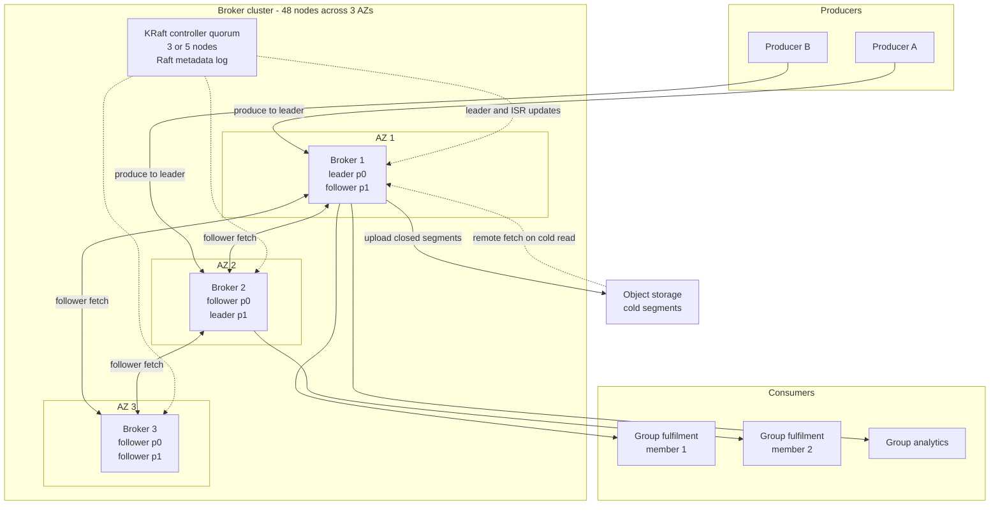
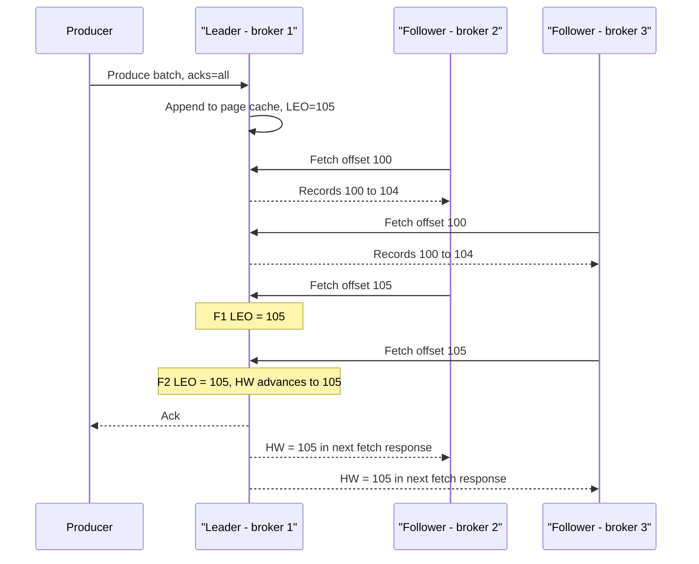
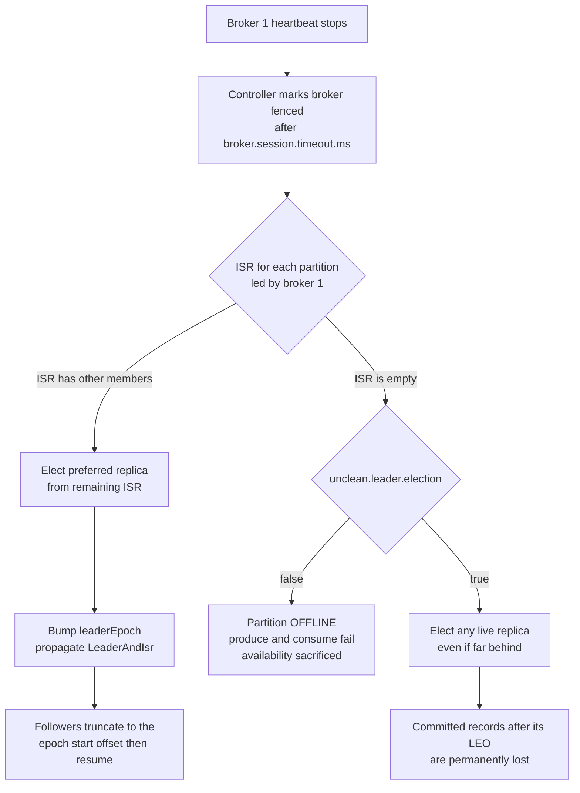
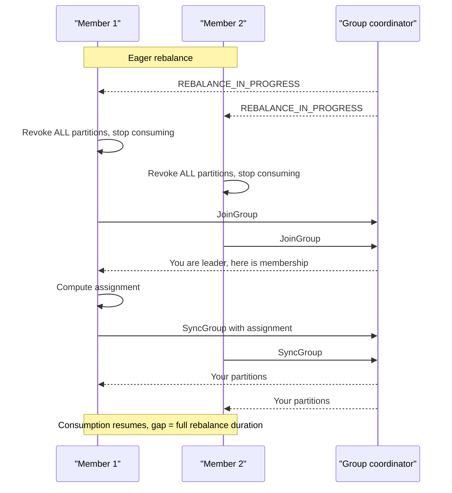
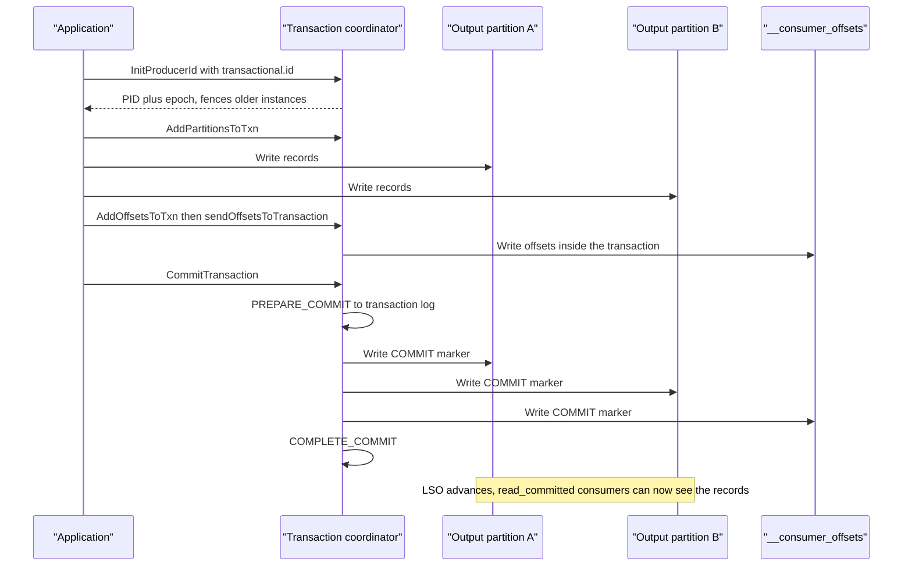

# 30 — Distributed Message Queue (Kafka-like)

<span class="pill pill-core">Core</span> <span class="pill pill-hard">Hard</span>

**A durable, partitioned, replayable commit log that decouples producers from consumers — and whose single hardest problem is that every durability, ordering and delivery guarantee you want is a different point on the same three-way trade-off between latency, availability and data loss, configured by people who usually do not know which point they have chosen.**

| | |
|---|---|
| **Commonly asked at** | Confluent, LinkedIn, Stripe, Datadog, Uber, Airbnb, Cloudflare, Databricks, Snowflake, any infrastructure or platform-SRE loop |
| **Time budget** | 45 min |
| **Core tension** | Replication gives you durability only while the replica set is healthy; the moment it degrades you must choose between stalling writes (consistency and durability) and accepting a weaker replica set (availability with a real risk of silent data loss), and that choice is encoded in three config values that interact non-obviously |
| **Prerequisites** | [F06 Partitioning & Sharding](../fundamentals/f06-partitioning-sharding.md), [F07 Replication & Consistency](../fundamentals/f07-replication-consistency.md), [F08 CAP & PACELC](../fundamentals/f08-cap-pacelc.md), [F09 Consensus](../fundamentals/f09-consensus.md), [F11 Idempotency](../fundamentals/f11-idempotency.md), [F12 Queues & Streams](../fundamentals/f12-queues-streams.md), [F13 Storage Engines](../fundamentals/f13-storage-engines.md), [F15 Object & Blob Storage](../fundamentals/f15-object-storage.md), [F20 Time, Clocks & Ordering](../fundamentals/f20-time-clocks-ordering.md), [F24 Capacity Planning](../fundamentals/f24-capacity-planning.md), [F28 Cost Engineering](../fundamentals/f28-cost-engineering.md) |

---

## 1. Problem Statement

Build the messaging substrate that an entire company's asynchronous communication runs through: every service publishes events to it, every service consumes events from it, and when it is down, the company is down.

The abstraction that makes this tractable is deliberately austere. Not a queue with per-message state, not a broker that tracks acknowledgements per consumer, not a database. **A partitioned, append-only, immutable commit log**, where:

- A topic is split into $P$ partitions. A partition is an ordered sequence of records addressed by a monotonically increasing 64-bit **offset**.
- The broker does not track which consumer has read what. The *consumer* tracks its position. The broker is a dumb, fast file server.
- Records are not deleted when read. They age out on a retention policy, so the same record can be read by ten consumers, and re-read next week by an eleventh replaying from the beginning.

Everything good about this design follows from those three properties. Writes are sequential appends, so a spinning disk does 600 MB/s and an NVMe device does several GB/s. Reads of recent data come from the OS page cache and go to the socket via `sendfile` with zero copies into user space. Broker state per consumer is a single integer. Fan-out is free because a second reader is just another cursor over the same bytes.

Everything hard about this design also follows from those three properties. Ordering exists only *within* a partition, so the partition key choice is a permanent data-modelling decision. The consumer owning its position means delivery semantics are a property of *consumer code*, not of the broker. And a log that never forgets means a poison record is re-read on every retry, forever.

### Out of scope

Stream processing semantics (windowing, joins, state stores), schema registry and evolution beyond a passing mention, connector frameworks, and the MQTT/AMQP per-message-acknowledgement broker model — which is a genuinely different system and appears in §11 only as the rejected alternative.

---

## 2. Requirements

### Functional

| # | Requirement | Notes |
|---|---|---|
| F1 | Publish records to a named topic with an optional key | Key determines partition and therefore ordering scope |
| F2 | Total order within a partition, no order across partitions | The only ordering guarantee we will ever make |
| F3 | Multiple independent consumer groups over the same topic | Each with its own independent position |
| F4 | Within a group, partitions are divided among members | Automatic reassignment when membership changes |
| F5 | Replay from an arbitrary offset or timestamp | Reprocessing after a bug fix is a first-class operation |
| F6 | Configurable retention by time and by size | Per topic |
| F7 | Log compaction: retain the latest value per key indefinitely | Changelog and cache-warming use cases |
| F8 | Configurable durability per producer | From fire-and-forget to full-ISR acknowledgement |
| F9 | Exactly-once processing for consume-process-produce pipelines | Atomic offset commit plus output write |
| F10 | Multi-tenancy with per-client quotas | One team cannot starve another |

### Non-functional

| # | Requirement | Target |
|---|---|---|
| N1 | Producer ack latency, `acks=all` | p99 < 20 ms same-region |
| N2 | End-to-end latency, produce to consumer receipt | p99 < 100 ms for a real-time consumer |
| N3 | Sustained ingest | 3.5 GB/s logical at peak |
| N4 | Durability | No acknowledged record lost given fewer than $f$ simultaneous broker failures, where $f$ is chosen by config |
| N5 | Availability of produce | 99.95% per topic-partition, surviving a full AZ loss |
| N6 | Retention | 7 days hot, 90 days for audit topics |
| N7 | Consumer catch-up rate | A consumer 2 hours behind recovers within 20 minutes |
| N8 | Rebalance disruption | A rolling restart of a 200-member consumer group causes no consumption stall longer than 5 s |

!!! note "The requirement that is always missed"
    N8. Candidates specify throughput and durability and forget that the *control plane* of the consumer group is the thing that causes most production incidents. A cluster that never loses a byte but stalls a 200-member group for four minutes on every deploy is an operational disaster, and that is the default behaviour of the naive design. See §7.3.

---

## 3. Scale Estimation

**Ingest.** A large single cluster for a mid-size company's event backbone:

$$
\begin{aligned}
\text{records/day} &= 1 \times 10^{11} \\
\text{mean rate} &= \frac{10^{11}}{86400} \approx 1.16 \times 10^{6}\ \text{rec/s} \\
\text{peak (3x)} &\approx 3.5 \times 10^{6}\ \text{rec/s} \\
\text{mean record} &= 1\ \text{KB uncompressed}
\end{aligned}
$$

Logical peak byte rate is therefore $3.5\ \text{GB/s}$. Producers compress at the **batch** level with zstd, which on structured JSON or Avro gets about 4:1 because a batch of similar records shares most of its dictionary:

$$
B_{\text{wire}} = \frac{3.5\ \text{GB/s}}{4} = 875\ \text{MB/s}
$$

**Replication amplification.** With $RF = 3$, the leader writes once and serves two follower fetches:

$$
\begin{aligned}
\text{cluster disk write} &= 875 \times 3 = 2.6\ \text{GB/s} \\
\text{replication network} &= 875 \times 2 = 1.75\ \text{GB/s} \\
\text{consumer egress at } 3 \text{ groups} &= 875 \times 3 = 2.6\ \text{GB/s}
\end{aligned}
$$

Total peak broker NIC traffic is roughly $0.875 + 1.75 + 2.6 = 5.2\ \text{GB/s} = 42\ \text{Gbps}$ across the cluster. This is why Kafka clusters are network-bound long before they are disk-bound.

**Storage.**

$$
\begin{aligned}
\text{stored/day} &= \frac{10^{11} \times 1\ \text{KB}}{4} = 25\ \text{TB/day} \\
\text{7-day hot set} &= 175\ \text{TB} \\
\times RF\ 3 &= 525\ \text{TB}
\end{aligned}
$$

At 48 brokers with 16 TB usable NVMe each, that is 768 TB of capacity at **68% utilisation** — which is about the right target, because you need headroom to absorb a broker loss without the remaining brokers filling up during reassignment.

**The page cache number, which is the one that matters for read latency.** Per-broker write rate is $2.6\ \text{GB/s} / 48 \approx 55\ \text{MB/s}$. With 256 GB RAM and roughly 200 GB available for page cache:

$$
T_{\text{cache}} = \frac{C_{\text{pagecache}}}{R_{\text{write,broker}}} = \frac{200\ \text{GB}}{55\ \text{MB/s}} \approx 3{,}600\ \text{s} = 1\ \text{hour}
$$

**Any consumer less than one hour behind is served entirely from RAM and never touches a disk.** Any consumer further behind than that falls off the cache cliff, starts doing random reads, and — this is the important part — *evicts the working set that every other consumer depends on*. The cache residency window is the single most useful derived number in Kafka capacity planning, and almost nobody computes it.

**Partition count.** Driven by consumer parallelism, not by broker throughput:

$$
P_{\min} = \frac{\text{peak rate}}{\text{per-consumer throughput}} = \frac{3.5 \times 10^{6}}{5{,}000} = 700
$$

for the busiest topic, if a consumer instance doing real work handles 5,000 rec/s. Across the fleet:

$$
\text{replicas/broker} = \frac{2{,}000\ \text{topics} \times 24\ \text{partitions} \times 3}{48} = 3{,}000
$$

which is inside the safe envelope. Past roughly 4,000 replicas per broker the controller's failover work, the open file handle count and the per-partition memory become the constraint — see §7.6.

---

## 4. API Design

The client API is deliberately tiny. The *configuration* is where the system's semantics actually live, which is the central operational fact about this system.

=== "Producer"

    ```java
    // send is async; the Future completes when the configured acks are satisfied
    producer.send(new ProducerRecord<>("orders", orderId, payload), callback);
    producer.flush();

    // transactional
    producer.initTransactions();
    producer.beginTransaction();
    producer.send(...);
    producer.sendOffsetsToTransaction(offsets, groupMetadata);
    producer.commitTransaction();
    ```

    ```properties
    acks=all
    enable.idempotence=true
    max.in.flight.requests.per.connection=5
    retries=2147483647
    delivery.timeout.ms=120000
    linger.ms=10
    batch.size=262144
    compression.type=zstd
    buffer.memory=67108864
    max.block.ms=5000
    ```

=== "Consumer"

    ```java
    consumer.subscribe(List.of("orders"), rebalanceListener);
    while (running) {
        var records = consumer.poll(Duration.ofMillis(500));
        process(records);            // must be synchronous, see 7.4
        consumer.commitSync();       // after processing, never before
    }
    ```

    ```properties
    group.id=fulfilment
    group.instance.id=fulfilment-7          # static membership
    enable.auto.commit=false
    isolation.level=read_committed
    partition.assignment.strategy=org.apache.kafka.clients.consumer.CooperativeStickyAssignor
    max.poll.records=200
    max.poll.interval.ms=300000
    session.timeout.ms=45000
    heartbeat.interval.ms=3000
    fetch.min.bytes=65536
    fetch.max.wait.ms=100
    ```

=== "Topic admin"

    ```bash
    kafka-topics --create --topic orders \
      --partitions 720 --replication-factor 3 \
      --config min.insync.replicas=2 \
      --config retention.ms=604800000 \
      --config cleanup.policy=delete \
      --config compression.type=producer \
      --config unclean.leader.election.enable=false \
      --config local.retention.ms=21600000    # 6h local, rest in tiered storage

    # the two commands you actually run during an incident
    kafka-consumer-groups --describe --group fulfilment
    kafka-topics --describe --topic orders --under-min-isr-partitions
    ```

!!! warning "The three settings that define durability, and the way they interact"
    `acks`, `replication.factor` and `min.insync.replicas` are not independent. `acks=all` means "all replicas **currently in the ISR**", not "all replicas". With `RF=3` and `min.insync.replicas=1`, a partition whose ISR has shrunk to the leader alone will happily accept `acks=all` writes that exist on exactly one disk — and the producer gets a success response that means nothing. The correct pairing is $RF = 3$, `min.insync.replicas=2`, `acks=all`: you tolerate one failure with no data loss, and the *second* failure stops writes rather than silently degrading them.

---

## 5. Data Model

### On-disk layout

A partition is a directory. A directory is a sequence of segments. A segment is three files named after its base offset.

```text
/data/orders-17/
  00000000000000000000.log        # record batches, append-only
  00000000000000000000.index      # sparse offset -> byte position, one entry per 4 KB
  00000000000000000000.timeindex  # sparse timestamp -> offset
  00000000000019284410.log        # active segment, the one being appended to
  00000000000019284410.index
  00000000000019284410.timeindex
  leader-epoch-checkpoint         # epoch -> start offset, used for truncation safety
  partition.metadata
```

Segments roll on `segment.bytes` (1 GB) or `segment.ms`. Only closed segments are eligible for deletion, compaction, or upload to tiered storage — which has consequences people trip over constantly (§12).

### Record batch

Compression, CRC and the idempotence metadata are all **per batch**, not per record. This is why batching is not merely a latency optimisation but the unit of nearly every mechanism in the system.

```text
RecordBatch
  baseOffset          int64
  batchLength         int32
  partitionLeaderEpoch int32     <- fencing, see 7.2
  magic               int8
  crc                 uint32
  attributes          int16      <- compression codec, timestamp type, isTransactional, isControl
  lastOffsetDelta     int32
  baseTimestamp       int64
  maxTimestamp        int64
  producerId          int64      <- PID, see 7.5
  producerEpoch       int16      <- zombie fencing
  baseSequence        int32      <- dedup window
  records[]                       <- varint-encoded, delta-coded offsets and timestamps
```

### The three offsets on every partition

| Name | Meaning | Who sees it |
|---|---|---|
| **LEO** — log end offset | Next offset the leader will assign | Internal |
| **HW** — high watermark | $\min(\text{LEO})$ across the ISR; everything below is on every in-sync replica | Consumers cannot read past it |
| **LSO** — last stable offset | Lowest offset of an open transaction | `read_committed` consumers cannot read past it |

The high watermark is the durability boundary and the reason consumers never see a record that could later be truncated away. The LSO is the transaction boundary and the reason a single stuck transaction can stall a consumer group on a perfectly healthy partition (§12).

### Consumer offsets

Offsets live in an internal **compacted** topic, `__consumer_offsets`, with 50 partitions. The group's coordinator broker is the leader of partition `hash(group.id) % 50`.

```text
key   = {group.id, topic, partition}
value = {offset, leaderEpoch, metadata, commitTimestamp, expireTimestamp}
```

Compaction is what makes this work: you write a commit every few seconds forever, and the log keeps only the latest value per key. The whole offset store is therefore one small compacted topic, replicated like any other, with no separate database.

---

## 6. High-Level Architecture



### Write path walkthrough

1. **Partition selection, client side.** With a key, partition $= \text{murmur2}(key) \bmod P$. Without a key, the sticky partitioner fills one partition's batch before moving on, which produces far better batching than round-robin. *This mapping is the permanent decision* — see §7.6.
2. **Accumulation.** The record lands in the producer's per-partition batch buffer in `buffer.memory`. The batch ships when it reaches `batch.size` or when `linger.ms` elapses, whichever comes first. If `buffer.memory` is exhausted, `send()` blocks for up to `max.block.ms` and then throws — this is the producer's backpressure signal and applications routinely swallow it.
3. **Routing.** The client already knows the leader for every partition from cached metadata. There is no proxy tier and no coordinator in the data path; **the client is the router**. A stale metadata cache produces `NOT_LEADER_OR_FOLLOWER`, which triggers a refresh and a retry.
4. **Leader append.** The leader validates the batch CRC, assigns offsets, checks the idempotence sequence number, appends to the active segment via `write()` into the page cache, and updates its LEO. It does **not** `fsync` — durability comes from replication, not from the disk (§7.1).
5. **Follower fetch.** Followers run a normal fetch loop against the leader. When a follower's fetch request arrives with `fetchOffset = X`, the leader learns that the follower has everything below $X$ and advances that replica's tracked offset.
6. **High watermark advance.** The leader recomputes $HW = \min(\text{LEO across ISR})$. Records below the HW are now durable on every in-sync replica and visible to consumers.
7. **Acknowledgement.** With `acks=all`, the pending produce request completes when the HW passes the batch's last offset. With `acks=1` it completed at step 4. With `acks=0` it completed before step 3.

### Read path walkthrough

1. **Group join.** A consumer finds its coordinator, sends `JoinGroup`, and the coordinator elects one member as group leader. The group leader computes the partition assignment and returns it via `SyncGroup`. Assignment is a *client-side* algorithm; the broker only distributes the result.
2. **Fetch.** The consumer issues a fetch per broker, multiplexing all partitions led by that broker into one request. `fetch.min.bytes` and `fetch.max.wait.ms` implement a long poll: the broker holds the request until enough bytes accumulate or the deadline passes. This is what keeps an idle topic from generating a request storm.
3. **Zero copy.** If the requested bytes are in the page cache and no re-compression or down-conversion is needed, the broker `sendfile`s directly from page cache to socket. The data never enters the JVM heap. Enabling a broker-side re-compression or serving an old client that needs message-format down-conversion **destroys this**, and the broker's CPU and GC profile change beyond recognition.
4. **Processing and commit.** The application processes the batch and commits the offset. Everything about delivery semantics is decided here (§7.4).
5. **Cold read.** If the offset is older than local retention, the broker fetches the segment from object storage (§7.7), which costs hundreds of milliseconds for the first byte but does not evict the page cache working set.

---

## 7. Deep Dives

### 7.1 Replication, the ISR, and what `acks` actually buys you

Kafka replication is **not** a consensus protocol on the data path. It is primary-backup replication with a dynamically-sized replica set, and the consensus is pushed out to the controller, which is the only component that decides membership.

A replica is in the **ISR** if it has fetched up to the leader's LEO within `replica.lag.time.max.ms` (default 30 s). Note that this is a *time* condition, not a byte-lag condition — a slow follower that is steadily 100 MB behind but always fetching stays in the ISR, and that is deliberate: a byte threshold makes the ISR flap under bursty load.



Two details that interviews probe:

- **The acknowledgement costs two round trips of follower fetch latency**, not one. The follower must fetch the data, then fetch *again* at the higher offset for the leader to learn it has it. This is why `acks=all` p99 is roughly $2 \times RTT + \text{fetch wait}$, and why `replica.fetch.wait.max.ms` matters for low-throughput latency-sensitive topics.
- **Durability does not come from `fsync`.** Kafka's default is to never explicitly flush; it relies on the page cache and the OS. A single broker losing power loses unflushed data. The guarantee is that $\text{min.insync.replicas}$ machines in different AZs have it in *their* page caches, and they will not all lose power simultaneously. If you set `flush.messages=1` to get real fsync durability, throughput drops by an order of magnitude and you have built a different system.

| `acks` | Ack when | Loses data if | Latency | Chosen / rejected |
|---|---|---|---|---|
| `0` | Written to producer socket | Anything at all — network drop, leader down, queue full | Lowest | **Rejected** except for high-volume metrics where the sampling loss is already in the error budget |
| `1` | Leader appended | Leader dies before any follower fetched — a silent window of tens of ms | Low | **Rejected as a default.** Chosen only for a small number of explicitly-marked lossy topics |
| `all` + `min.insync=2` | HW covers the batch on 2 of 3 replicas | Two simultaneous replica losses | +1 round trip | **Chosen as the platform default**, overridable per topic with sign-off |

### 7.2 Leader election, unclean election, and the truncation problem

The controller — a Raft quorum in KRaft, previously ZooKeeper — owns the mapping of partition to `{leader, ISR, leaderEpoch}`. When a broker dies:



**Unclean leader election is a deliberate data-loss switch.** With `unclean.leader.election.enable=false` (the correct default), a partition whose entire ISR is unavailable goes offline and stays offline until an ISR member returns. You have chosen consistency and durability over availability for that partition, which is the right call for anything transactional and the wrong call for a metrics firehose. State this as a per-topic decision, not a cluster-wide one.

The subtle part is **truncation safety**. Before KIP-101, followers truncated to the high watermark on becoming a follower of a new leader. Because the HW propagates to followers one fetch round trip *behind* the leader, two replicas could each believe they were correct and diverge in ways that lost or duplicated committed records. The fix is the **leader epoch**: every leadership change increments a monotonic epoch, each replica persists `(epoch -> start offset)`, and a follower asks the new leader "what is the end offset of epoch $N$?" and truncates to that. This turns a heuristic into an exact answer, and it is a genuinely good example of replacing a watermark with a version vector — worth citing in an interview because it shows you have read the design rather than the docs.

### 7.3 Consumer groups and the rebalance storm

The rebalance protocol is the control plane of consumption, and in the naive (eager) form it is a **stop-the-world** operation:



Every member stops consuming for the entire duration, even members whose assignment does not change. For a 200-member group with stateful consumers that must reload local state, a single rebalance is tens of seconds. Now consider a rolling restart: **each restart triggers two rebalances** (one on leave, one on rejoin), so 200 pods produce up to 400 stop-the-world events, and if the rebalance takes longer than `max.poll.interval.ms` for some member, that member is evicted mid-rebalance and triggers another one. This is the **rebalance storm**: a self-sustaining loop where the group never converges and lag grows without bound while every consumer is healthy.

Three fixes, applied together:

1. **Static membership** (KIP-345). Give each consumer a stable `group.instance.id` and set `session.timeout.ms` comfortably above the pod restart time. The coordinator remembers the instance and holds its assignment across the bounce, so a restart causes **zero** rebalances. This single change removes the deploy-triggered storm entirely and is the highest-leverage config in the whole system.
2. **Cooperative incremental rebalancing** (KIP-429, `CooperativeStickyAssignor`). Members do not revoke on the first round. The leader computes the new assignment, and only partitions that actually *move* are revoked in a second, short round. A member keeping 95% of its partitions keeps consuming from them throughout. Note the migration hazard: you cannot jump directly from eager to cooperative; you need a two-step rolling upgrade through a config that supports both.
3. **A `max.poll.interval.ms` that reflects reality.** The default 5 minutes is a liveness detector for "this consumer is stuck". If your processing of `max.poll.records` can legitimately exceed it — a batch DB write, an external API call with retries — you will be evicted mid-batch, and on rejoin your commit is rejected with "the group has already rebalanced", so the work is redone, takes just as long, and you are evicted again. Reduce `max.poll.records` before you increase the interval.

### 7.4 Offset commit semantics: the bug that is in most codebases

The broker does not know what "processed" means. The only thing that defines delivery semantics is **the position of the commit relative to the side effect**.

=== "At-least-once (correct default)"

    ```python
    while True:
        records = consumer.poll(timeout_ms=500)
        for r in records:
            process(r)          # side effect happens first
        consumer.commit_sync()  # then we record our position
    ```

    Crash between `process` and `commit` replays the batch. Requires idempotent processing — see [F11 Idempotency](../fundamentals/f11-idempotency.md). This is the right answer for 95% of pipelines.

=== "At-most-once (usually a bug)"

    ```python
    while True:
        records = consumer.poll(timeout_ms=500)
        consumer.commit_sync()  # position recorded before the work
        for r in records:
            process(r)          # crash here loses the batch, silently
    ```

    Nothing logs an error. The offset simply moved past records that were never processed. Correct only when dropping data is cheaper than duplicating it, which is rare and should be a written decision.

=== "The async-handoff bug"

    ```python
    # enable.auto.commit=true, auto.commit.interval.ms=5000
    while True:
        records = consumer.poll(timeout_ms=500)
        executor.submit(process_batch, records)   # returns immediately
    ```

    `poll()` commits the offsets of the *previous* poll's records. The handoff to the thread pool returns instantly, so the next `poll()` commits records that are still sitting in a work queue. A crash, an OOM kill, or a pod eviction discards the queue and the offsets say the work is done. **This is silent, unbounded, invisible data loss** and it is extremely common, because the code looks like a reasonable concurrency optimisation and it passes every test that does not kill the process mid-flight.

!!! danger "Auto-commit is not a delivery guarantee, it is a heuristic"
    `enable.auto.commit=true` commits on `poll()` boundaries at an interval. It gives at-least-once *only* if all processing is synchronous within the loop and completes before the next `poll()`. The moment anything becomes asynchronous — a thread pool, an async runtime, a buffered writer that has not flushed — it silently becomes at-most-once. The platform default should be `enable.auto.commit=false` with an explicit `commitSync` after processing.

### 7.5 Exactly-once: idempotent producer plus transactions

"Exactly-once" in this system means **exactly-once *processing* in a consume-process-produce loop**, not exactly-once delivery over a network, which is impossible. It is built from two independent mechanisms.

**Idempotent producer** removes duplicates caused by producer retries. The broker assigns a producer ID (PID) and the producer maintains a per-partition monotonic sequence number. The leader tracks the last five sequence numbers per PID per partition:

- Sequence $= \text{expected}$: append.
- Sequence $< \text{expected}$: duplicate from a retry, drop it, return success.
- Sequence $> \text{expected}$: a gap, meaning a batch was lost. Fail with `OUT_OF_ORDER_SEQUENCE_NUMBER` rather than silently creating a hole.

This is why `max.in.flight.requests.per.connection <= 5` is required with idempotence: the dedup window is five batches. Without idempotence and with in-flight > 1, a retried batch can land *after* a later batch, **reordering the partition** — which silently breaks the one ordering guarantee the whole system provides.

**Transactions** make a set of writes across multiple partitions, plus the consumer offset commit, atomic.



The `transactional.id` is the zombie-fencing key: a restarted instance calling `initTransactions` with the same id bumps the epoch, and the old instance's writes are rejected with `PRODUCER_FENCED`. That is what makes the guarantee survive a partially-failed process, and it is why the id must be **stable and unique per logical task** — deriving it from a random UUID or a pod name that changes on restart silently defeats fencing and leaves zombies writing.

Consumers must set `isolation.level=read_committed` to respect the LSO and skip aborted batches using the per-segment abort index. The costs are real and must be stated: two extra round trips per transaction, control records interleaved in the log, an end-to-end latency floor set by the commit interval (typically 100 ms), and — the operational one — **a hung transaction pins the LSO and stalls every `read_committed` consumer on that partition indefinitely** even though the partition is otherwise healthy.

### 7.6 Retention versus compaction, and the permanence of partition count

**Retention** (`cleanup.policy=delete`) deletes whole closed segments once the newest record in them is older than `retention.ms`, or once the partition exceeds `retention.bytes`. Note that `retention.bytes` is **per partition**, so a topic with 720 partitions and `retention.bytes=10GB` can consume 7.2 TB before RF — a mis-sizing that has filled many a broker.

**Compaction** (`cleanup.policy=compact`) keeps the most recent value for every key forever, turning the log into a durable, replayable materialised view — a changelog. A `null` value is a **tombstone** that deletes the key, retained for `delete.retention.ms` so that consumers get a chance to see the deletion before it disappears.

| Property | `delete` | `compact` | When to choose |
|---|---|---|---|
| Semantics | Event stream, time-bounded | Latest-state snapshot, key-bounded | Events vs entities |
| Bootstrap cost | Replay the retention window | Replay one value per key | Compact for cache warming |
| Key required | No | Yes, absolutely | Null keys are silently never compacted |
| Growth bound | Time or size | Number of distinct keys | Unbounded key space breaks compaction |
| Deletion | Automatic by age | Explicit tombstone | GDPR erasure needs tombstones |

Compaction never touches the **active segment**, and only runs when the ratio of uncompacted to total bytes exceeds `min.cleanable.dirty.ratio` (0.5 by default). Consequences: the latest value for a key can appear many times in the log; a low-write compacted topic may never compact at all; and the bootstrap of a "small" compacted topic can pull ten times the expected volume.

**Partition count is a one-way door.** Increasing $P$ changes $\text{hash}(key) \bmod P$, so a key that lived in partition 3 now lives in partition 11 while its history stays in partition 3. For an event stream where you only care about *future* per-key ordering, you can accept a brief ordering anomaly during the change. For a compacted topic, **it is data corruption**: the same key now has two live values in two partitions, and every consumer with local state built from that topic is wrong. Decreasing $P$ is not supported at all. Therefore:

- Size partitions for peak consumer parallelism plus growth headroom — the general guidance is 2-4x current need.
- Do not over-provision blindly either: each partition costs three open file handles per replica, a fetch entry in every follower's request, controller metadata, memory for the producer's per-partition batch buffer on *every* producer, and linear time in leader failover. 200,000 partitions in a cluster makes a controller failover a multi-minute event.
- Where the key space genuinely must be rescaled, publish to a **new topic** with the new partition count and migrate consumers, rather than expanding in place.

### 7.7 Tiered storage and rack-aware placement

**Tiered storage** (KIP-405) separates the two things a broker's disk is doing: serving hot reads and warehousing history. The leader uploads closed segments plus their indexes to object storage, tracks them in an internal remote-log-metadata topic, and applies `local.retention.ms` to the local copy while `retention.ms` governs the remote copy.

$$
\text{local} = 6\ \text{h} \Rightarrow 48\ \text{brokers} \times 55\ \text{MB/s} \times 21600\ \text{s} \approx 57\ \text{TB}
$$

against 525 TB for 7 days on local disk — a **9x reduction in provisioned block storage**, with the 7-day tail living in object storage at roughly one fifth the cost per GB.

The second-order benefits are bigger than the cost saving and are the ones to lead with:

- **Broker replacement becomes fast.** A replacement broker rebuilds only the local window, not the full retention. Replacing a 16 TB broker used to mean hours of cluster-wide replication traffic competing with production; now it is minutes.
- **Partition reassignment becomes cheap**, which means rebalancing the cluster stops being a scary operation you avoid.
- **Long retention becomes affordable**, which changes what the platform is for: 90-day replay for a reprocessing job is now a cost question rather than an architecture question.

The cost is a new tail-latency mode: a consumer reading cold data pays object-storage first-byte latency of 50-200 ms and the broker must stage the segment. Rate-limit remote fetches, and monitor them as a distinct SLI from local reads, because mixing them makes both meaningless.

**Rack-aware placement.** Brokers advertise `broker.rack` (the AZ), and replica assignment spreads the $RF$ replicas across distinct racks. This is what makes N5's "survive an AZ loss" true: losing an AZ takes exactly one replica of each partition, ISR shrinks from 3 to 2, `min.insync.replicas=2` is still satisfied, and **writes continue without interruption**. Two things to say about it:

- After a manual partition reassignment, rack constraints are only honoured if the tool was asked to honour them. Clusters drift into non-rack-aware placement one reassignment at a time, and nobody notices until an AZ evacuation takes partitions offline. Audit it continuously.
- Cross-AZ replication traffic is frequently **the largest line item in the cluster's bill** — at 1.75 GB/s of replication, most of it crossing AZ boundaries, the data transfer charge can exceed the compute. KIP-392 follower fetching lets consumers read from the closest replica instead of always the leader, which removes the consumer-side cross-AZ charge at the cost of reading data that may be slightly behind the leader.

---

## 8. Scaling the Bottleneck

The bottleneck moves in a predictable order as a cluster grows. Knowing the order is what separates someone who has operated one from someone who has read about one.

| Stage | Bottleneck | Symptom | Fix |
|---|---|---|---|
| 1 | Producer batching | High request rate, tiny batches, broker CPU burnt on request handling | Raise `linger.ms` to 5-20 ms and `batch.size` to 256 KB; enable zstd |
| 2 | Broker network | NIC at 70%+, replication and consumer fetch competing | More brokers; follower fetching to cut cross-AZ; verify compression is actually on |
| 3 | Page cache residency | p99 fetch latency spikes, disk read IOPS non-zero where it used to be zero | More RAM, shorter cache window per broker, isolate batch consumers, tiered storage |
| 4 | Partition count per broker | Slow controller failover, high open FDs, long leader election | Fewer, larger partitions; split into multiple clusters by domain |
| 5 | Consumer processing | Lag grows while broker metrics are flat | Scale consumers up to $P$; past that, increase $P$ on a new topic |
| 6 | Controller metadata | Cluster-wide operations take minutes | KRaft instead of ZooKeeper; cap partitions per cluster; federate |

!!! tip "The scaling limit nobody expects: the consumer cannot exceed the partition count"
    Adding consumers beyond $P$ does nothing — the extra members sit idle with zero assigned partitions. When lag is growing and the consumer group is already at $P$ members, your options are: make processing faster, increase `max.poll.records` and batch the downstream writes, or add partitions (with all of §7.6's caveats). There is no fourth option, and recognising that instantly is a strong signal in an interview.

**The dominant read-path optimisation is not an optimisation at all** — it is keeping consumers inside the page cache window. One batch consumer resetting to `earliest` on a large topic does a full sequential scan that evicts the hot set for every other consumer on that broker, converting a RAM-served workload into a disk-served one. p99 for *unrelated* real-time consumers goes from 8 ms to 400 ms while every dashboard shows healthy brokers. Fixes, in order of preference: tiered storage so the historical read goes to object storage instead of local disk; fetch-byte quotas on the batch consumer; and for genuinely heavy replay workloads, a dedicated set of brokers or a separate cluster fed by replication.

---

## 9. Failure Modes

| Failure | Blast radius | Detection | Mitigation | Degraded behaviour |
|---|---|---|---|---|
| Single broker crash | Partitions it led, for the election duration | Controller fencing, `UnderReplicatedPartitions > 0` | Elect from ISR, bump epoch; replacement rebuilds from tiered storage | Sub-second produce stall on affected partitions, then normal |
| Slow broker (disk or GC) | Every partition it follows — it drags the whole ISR | `ReplicaLag` rising, produce p99 up with no rate change | Eject from ISR after `replica.lag.time.max.ms`; fast-fail the node rather than letting it linger | `acks=all` latency doubles until ejection — a *slow* node is worse than a dead one |
| ISR shrinks to 1 with `min.insync=2` | Produce fails on that partition | `UnderMinIsrPartitionCount > 0` | Restore a replica; do not lower `min.insync` under pressure | Producers get `NOT_ENOUGH_REPLICAS` and buffer, then block, then throw |
| Full AZ loss | One replica per partition | AZ health, ISR size 3 to 2 | Rack-aware placement makes this survivable by design | Writes continue; no headroom for a second failure |
| Unclean leader election | Silent, permanent loss of committed records on that partition | Almost undetectable at the time; `leader-epoch` gap after the fact | Keep it disabled; make enabling it a break-glass action with an incident record | Consumers see offsets go backwards |
| Rebalance storm | Entire consumer group stops consuming | Group state stuck in `PreparingRebalance`, lag climbing, healthy brokers | Static membership, cooperative assignor, lower `max.poll.records` | Total consumption stall, recovers only when the loop breaks |
| Hung transaction | All `read_committed` consumers on the partition | Lag grows while `LogEndOffset` advances; LSO frozen | `transaction.timeout.ms` aborts it; manual abort as a break-glass | Consumers stall with data visibly present on the broker |
| Poison record | One partition, one group, indefinitely | Consumer restart loop on the same offset | Try-catch, route to a dead-letter topic, commit past it | Head-of-line block: one bad record stops the partition |
| Disk full | Broker crashes hard, taking all its leaderships | Free-space alerting well ahead of it | Alert at 75%; per-topic quotas; `retention.bytes` sized per partition | Cascading: its partitions move, filling the next broker |
| Controller quorum loss | No metadata changes cluster-wide | Quorum health metrics | 3 or 5 controllers across AZs | Data plane keeps serving with frozen metadata; no elections, no topic changes |
| Client metadata storm | Broker CPU saturated by metadata requests | Metadata request rate spike after a mass client restart | `metadata.max.age.ms` jitter, request quotas | Produce latency rises for everyone |
| Consumer offset reset to earliest | One group reprocesses everything; page cache poisoned for all | Offset lag jumps to retention size instantly | `auto.offset.reset=none` on critical groups and handle it explicitly | Mass duplicate side effects downstream — often worse than the data loss it was avoiding |

---

## 10. SRE Lens

### SLIs and SLOs

| SLI | Definition | Target |
|---|---|---|
| Produce availability | Successful produce responses / total, per topic | 99.95% |
| Produce latency | p99 `acks=all` ack time | < 20 ms |
| End-to-end freshness | p99 of `consume_time - produce_time` for a real-time group | < 100 ms |
| Consumer lag in time | $\text{lag}_{\text{records}} / \text{consumption rate}$ per group | < 60 s for tier-1 groups |
| Under-min-ISR partitions | Count | 0, alert immediately on > 0 |
| Cache residency | Fraction of fetches served without disk read | > 99% |
| Rebalance disruption | Seconds of zero consumption per deploy | < 5 s |

!!! tip "Measure lag in seconds, not in records"
    Records-of-lag is unitless and misleading: 1 million records behind is catastrophic on a slow enriching consumer and irrelevant on one doing 500k/s. **Time lag** — either $\text{lag} / \text{rate}$ or, better, the difference between wall clock and the timestamp of the last consumed record — is directly comparable across topics, directly meaningful to a product owner, and directly usable in an SLO. It also correctly reports a *stalled* consumer whose record lag is small but frozen, which the ratio form cannot.

### Error budget

99.95% produce availability over 30 days is 21.6 minutes. Spend against it comes almost entirely from three sources: leader elections during rolling restarts (a few seconds each, so a full rolling restart of 48 brokers is 2-4 minutes of aggregate partial unavailability), under-min-ISR events, and client-side buffer exhaustion that is usually not counted but absolutely should be. Budget explicitly for **one full rolling restart per week**; if you cannot afford that, you cannot afford to patch, and you will end up running unpatched brokers, which is a worse risk.

### Rollout plan

Kafka upgrades are unusually dangerous because a downgrade is often impossible once the inter-broker protocol version advances.

1. Upgrade the binaries on all brokers with `inter.broker.protocol.version` **pinned to the old version**. Rolling restart, one broker at a time, waiting for `UnderReplicatedPartitions = 0` between each. This step is fully reversible.
2. Soak for at least a week under a full peak cycle.
3. Bump `inter.broker.protocol.version` and roll again. **This step is one-way.**
4. Upgrade clients last. Old clients against a new broker are supported; the reverse generally is not.

Per-broker restart procedure: trigger a controlled shutdown so leaderships migrate gracefully rather than being discovered by timeout; wait for the ISR to fully rejoin; then move on. A restart script that does not gate on `UnderReplicatedPartitions` will cheerfully take three replicas of the same partition down in sequence.

### Runbook notes

```bash
# Is it the cluster or the consumer? This one command answers it.
kafka-consumer-groups --bootstrap-server $B --describe --group $G
# LAG growing + CURRENT-OFFSET frozen        -> consumer is stuck or rebalancing
# LAG growing + CURRENT-OFFSET advancing     -> consumer is too slow, scale or optimise
# LAG growing + LOG-END-OFFSET jumped        -> producer spike, check upstream

# Partitions at risk right now
kafka-topics --bootstrap-server $B --describe --under-min-isr-partitions
kafka-topics --bootstrap-server $B --describe --unavailable-partitions

# Who is hitting quotas
kafka-configs --bootstrap-server $B --describe --entity-type clients

# Hung transactions pinning the LSO
kafka-transactions --bootstrap-server $B list
kafka-transactions --bootstrap-server $B describe --transactional-id $TID
```

Three rules that belong in the runbook header:

- **Never lower `min.insync.replicas` to clear a produce outage.** It converts a loud, correct failure into silent under-replication, and it will be forgotten in place.
- **Never enable unclean leader election without an incident record**, an explicit acceptance of data loss by the data owner, and a plan to turn it off.
- **Never reset a consumer group offset without checking downstream idempotency.** Reprocessing a week of payment events is usually worse than the gap you were fixing.

### Capacity model

$$
N_{\text{brokers}} = \max\left(
\underbrace{\frac{S_{\text{retained}} \times RF}{C_{\text{disk}} \times 0.7}}_{\text{storage}},\;
\underbrace{\frac{B_{\text{in}}(1 + 2 + G)}{C_{\text{nic}} \times 0.6}}_{\text{network}},\;
\underbrace{\frac{N_{\text{replicas}}}{4000}}_{\text{metadata}}
\right)
$$

where $G$ is the consumer-group fan-out. For our numbers: storage gives $525 / (16 \times 0.7) \approx 47$; network gives $0.875 \times 6 / (3.1 \times 0.6) \approx 2.8$ brokers at 25 Gbps — so **this cluster is storage-bound, and tiered storage moves it to being network-bound**, which is exactly the point of adopting it. Always evaluate all three terms and name which one binds; a candidate who states "storage-bound today, network-bound after tiering" has demonstrated the model rather than recited a formula.

### Cost

| Line item | Driver | Typical share | Lever |
|---|---|---|---|
| Block storage | Retention × RF | 35-45% | Tiered storage, compression, per-topic retention review |
| Cross-AZ data transfer | Replication + consumer fetch | 25-40% | Follower fetching, compression, fewer consumer groups on hot topics |
| Compute | Broker instances | 20-30% | Higher `linger.ms`, avoid format down-conversion, zero-copy preserved |
| Object storage | Cold tier | 5% | Lifecycle to infrequent-access classes |

The single most surprising invoice line in a real cluster is **cross-AZ transfer**, which routinely exceeds the compute bill. The two levers with the best return are raising producer compression (it reduces replication bytes, storage bytes and consumer bytes simultaneously) and enabling follower fetching so consumers read locally. Both are config changes.

---

## 11. Trade-offs & Alternatives

| Decision | Alternative | Chosen / rejected and why |
|---|---|---|
| Partitioned log with consumer-held offsets | Per-message broker-held acks — RabbitMQ, SQS | **Chosen the log.** Broker-held per-message state gives you per-message retry, TTL and redelivery — genuinely useful — but it makes fan-out expensive, replay impossible, and throughput a function of per-message bookkeeping. **Rejected per-message acks** for the backbone; a task queue alongside it is the right complement, not a replacement |
| Pull-based consumers | Broker push | **Chosen pull.** Consumers control their own rate, so a slow consumer cannot be overwhelmed and backpressure is implicit. The cost is polling latency, which `fetch.min.bytes` plus long-poll reduces to near zero |
| Leader-based replication with a dynamic ISR | Quorum replication — Raft per partition | **Chosen ISR.** Quorum gives lower tail latency under a single slow replica because it only waits for a majority, but it needs $2f+1$ replicas to tolerate $f$ failures, where ISR needs $f+1$. At 525 TB, $RF=3$ vs $RF=5$ is a 1.7x storage bill. ISR pushes the consensus to the controller, where it is cheap |
| No `fsync` on the data path | `fsync` per batch | **Rejected fsync.** An order of magnitude of throughput for protection against simultaneous power loss in three AZs. Replication across failure domains is the better-value durability mechanism |
| Client-side partition assignment | Broker-side assignment | **Chosen client-side.** Custom assignors become possible without broker changes, and the broker stays stateless about group logic. The cost is that a bad assignor in one application can destabilise its own group, which is the correct blast radius |
| One large multi-tenant cluster | Cluster per team | **Chosen large-with-quotas, up to a partition ceiling.** Per-team clusters multiply operational surface and make cross-team topics awkward. Past ~150k partitions or when an isolation requirement is genuinely hard — regulated data, a workload with a hostile access pattern — split |
| Tiered storage | Longer local retention | **Chosen tiering.** The cost saving is real but secondary; the primary win is that broker replacement and partition reassignment stop being multi-hour operations |
| Kafka for request-response | Direct RPC | **Rejected Kafka.** Using a log for synchronous request-response — publish a request, poll a reply topic — adds tens of ms, forces correlation-ID plumbing, and makes timeouts ambiguous. A log is for asynchronous decoupled communication |

??? note "When a log is the wrong abstraction entirely"
    Three cases. **Per-message scheduling and delay:** "retry this in 4 hours" needs per-message state, which a log does not have; simulating it with delay topics is a well-known hack with poor properties. **High-cardinality, low-volume routing:** a million queues with a few messages each is a broker-held-state workload, and a million partitions is not viable. **Strict priority:** a log is FIFO by construction, and priority topics with weighted consumption is a poor imitation. If any of these are core requirements, the honest answer in an interview is "this is a task queue, not a log", and saying so is a strong signal.

---

## 12. Gotchas & Corner Cases

!!! gotcha "`acks=all` with `min.insync.replicas=1` guarantees nothing"
    **Symptom:** acknowledged records disappear after a broker loss, despite `acks=all` and `RF=3`. Every config review looked correct.
    **Mechanism:** `acks=all` means "all replicas in the *current* ISR". If two followers are lagging or restarting, the ISR is `{leader}`, and with `min.insync.replicas=1` the leader accepts and acknowledges writes that exist on exactly one machine. Lose it and the data is gone with a successful ack already returned to the caller.
    **Mitigation:** `min.insync.replicas=2` with `RF=3`, enforced as a cluster default and audited continuously. Alert on `UnderMinIsrPartitionCount > 0`. Accept that this makes produce *fail* when replication degrades — that is the entire point, and the failure is the feature.

!!! gotcha "Producer retries reorder your partition when idempotence is off"
    **Symptom:** a downstream state machine receives `updated` before `created` for the same key, on a single partition where ordering was supposed to be guaranteed.
    **Mechanism:** with `max.in.flight.requests.per.connection=5` and `enable.idempotence=false`, batch 1 fails transiently and is retried while batches 2 through 5 are already in flight and succeed. Batch 1 lands after them. The partition's ordering guarantee is violated by the *client*, and the broker has no idea.
    **Mitigation:** `enable.idempotence=true` — which pins in-flight to at most 5 and makes the broker enforce sequence ordering — or `max.in.flight=1` at a severe throughput cost. This is on by default in recent clients and explicitly disabled in a surprising number of inherited configs.

!!! gotcha "Auto-commit plus a thread pool is silent, unbounded data loss"
    **Symptom:** records are missing downstream. No errors, no lag, no alert. Discovered weeks later by a reconciliation job.
    **Mechanism:** `poll()` commits the previous batch's offsets. If processing was handed to an executor and has not completed, the commit records progress past work that is still in a queue. Any abnormal termination — OOM kill, node drain, SIGKILL on deploy — discards the queue and the offsets claim it was done.
    **Mitigation:** `enable.auto.commit=false` as a platform default, with `commitSync` after processing completes. If concurrency is required, track per-partition completion and commit only the contiguous prefix of finished offsets. Test by killing the process mid-batch — this bug is invisible to every graceful test.

!!! gotcha "`max.poll.interval.ms` eviction creates an infinite reprocessing loop"
    **Symptom:** a consumer group makes no forward progress while every instance is running, CPU is busy, and the logs show repeated "Commit cannot be completed since the group has already rebalanced".
    **Mechanism:** processing a poll batch takes longer than `max.poll.interval.ms`. The coordinator evicts the member, reassigns its partitions, and the member's subsequent commit is rejected. It rejoins, receives the same partitions, and reprocesses the same batch, which takes just as long. A stable livelock.
    **Mitigation:** cut `max.poll.records` until worst-case batch processing is comfortably inside the interval — this is the correct lever, not raising the interval, because a high interval also delays genuine failure detection. Instrument per-batch processing time as a histogram and alert when p99 exceeds 50% of the interval.

!!! gotcha "Increasing partition count corrupts a compacted topic"
    **Symptom:** after scaling a topic from 12 to 24 partitions, consumers with local state start returning stale values for some keys and correct values for others, non-deterministically.
    **Mechanism:** the key-to-partition mapping is $\text{hash}(k) \bmod P$. Changing $P$ relocates roughly half the keys. On a compacted topic, the old value remains live in the old partition forever, because compaction keeps the latest value *per partition*. The same key now has two live values, and which one a consumer sees depends on partition assignment order.
    **Mitigation:** never expand a compacted topic. Create a new topic with the target partition count, republish the compacted state into it, and cut consumers over. For event topics, an expansion causes a bounded ordering anomaly only for keys in flight — still worth a maintenance window and a note to consumers.

!!! gotcha "A hung transaction stalls consumers on a perfectly healthy partition"
    **Symptom:** consumer lag climbs steadily. The broker is fine, the log end offset is advancing, the network is fine, and restarting the consumers changes nothing.
    **Mechanism:** a transactional producer crashed after `AddPartitionsToTxn` and before commit, or its `transaction.timeout.ms` is very long. The LSO is pinned at the transaction's first offset, and `read_committed` consumers may not read past the LSO. The data is right there and is unreadable.
    **Mitigation:** keep `transaction.timeout.ms` short (60 s, and below `transaction.max.timeout.ms` on the broker) so the coordinator aborts abandoned transactions promptly. Monitor the LSO-to-LEO delta as a first-class metric — it is the only signal that distinguishes this from a slow consumer, and without it this incident takes hours.

!!! gotcha "One batch consumer resetting to earliest degrades every other consumer on the cluster"
    **Symptom:** p99 fetch latency across unrelated topics jumps from 8 ms to 400 ms. Broker CPU, network and error rates are all normal. Disk read IOPS, which is normally near zero, is saturated.
    **Mechanism:** Kafka's read performance comes from the page cache. A full-history scan streams terabytes through the cache, evicting the hot recent data that every real-time consumer was being served from. Those consumers now do physical disk reads.
    **Mitigation:** compute and monitor the cache residency window ($C_{\text{pagecache}} / R_{\text{write}}$). Apply fetch-byte quotas to batch consumers. Adopt tiered storage so historical reads go to object storage rather than the local disk. For heavy replay workloads, a dedicated cluster. And treat "offset reset to earliest" as a change-managed operation, not a self-service one.

!!! gotcha "`retention.bytes` is per partition, and the broker dies when the disk fills"
    **Symptom:** a broker crashes with an I/O error, its leaderships migrate, and the next broker fills and crashes. A cascading cluster failure from a configuration misreading.
    **Mechanism:** `retention.bytes=100GB` on a 500-partition topic means up to 50 TB before replication. Kafka does not handle `ENOSPC` gracefully — it shuts down. And the migration of the dead broker's partitions adds load to its neighbours, which are configured identically.
    **Mitigation:** compute retention per partition explicitly and alert on projected usage, not just current usage. Alarm at 75% with enough lead time to act. Use per-client produce quotas so one runaway producer cannot outrun retention. Keep at least one broker's worth of spare capacity so a loss does not fill the survivors.

!!! gotcha "Rack awareness silently disappears after a partition reassignment"
    **Symptom:** an AZ evacuation, which was supposed to be a non-event, takes hundreds of partitions offline.
    **Mechanism:** rack-aware placement is applied at topic-creation time and by reassignment tools *when asked*. Hand-written or auto-generated reassignment JSON that lists broker IDs without rack constraints will happily place all three replicas of a partition in one AZ. Nothing warns you, and the cluster is healthy until the AZ is not.
    **Mitigation:** a continuously-running audit that reports any partition whose replica set spans fewer than `min(RF, num_racks)` racks, alerting as a standing violation. Generate all reassignment plans with a rack-aware tool. Verify placement after every rebalance, and treat it as a release gate.

!!! gotcha "The `__consumer_offsets` topic is the thing that takes out your whole cluster"
    **Symptom:** every consumer group across every topic simultaneously fails to commit and stalls, while all data topics look perfectly healthy.
    **Mechanism:** all group coordination and offset storage lives in one internal topic with 50 partitions. If those partitions are under-replicated, if their leaders all landed on an overloaded broker, or if compaction has stopped running on them and they have grown enormous, group coordination breaks cluster-wide. It is a single point of failure hiding in plain sight.
    **Mitigation:** monitor `__consumer_offsets` as a tier-0 topic in its own right — replication status, leader distribution across brokers, partition size, and log-cleaner health. Ensure `offsets.topic.replication.factor >= 3` at cluster creation (it silently defaults lower on a small dev cluster and is then impossible to change without recreating the topic). Watch the log cleaner: if it dies, the offsets topic grows without bound and coordinator load times become minutes.

!!! gotcha "Old clients force message-format down-conversion and destroy zero-copy"
    **Symptom:** broker CPU and heap allocation rise sharply with no change in throughput, and GC pauses start correlating with fetch latency spikes.
    **Mechanism:** serving a consumer that speaks an older message format means the broker must read the batch into the heap, re-encode it, and write it out — abandoning `sendfile`. One legacy client can convert a whole broker from a zero-copy file server into a CPU-bound transcoder.
    **Mitigation:** track client versions via broker request metrics, enforce a minimum client version through quotas or connection rejection, and include client-version distribution in the platform's regular review. When a cluster's CPU inexplicably doubles after a new team onboards, this is the first thing to check.

---

## 13. Interview Angle

!!! interview "Open by naming the abstraction, not the components"
    Say: **"I am going to build a partitioned, append-only commit log, not a message broker. The three consequences that define everything else are: ordering exists only within a partition, so the key choice is a permanent data-modelling decision; the consumer holds its own offset, so delivery semantics are a property of consumer code rather than something I can guarantee at the broker; and records are retained rather than deleted on read, which makes fan-out and replay free but makes a poison record permanent."** That framing earns you the rest of the interview, because every subsequent question is a consequence of one of those three.

!!! interview "The `acks` question is the durability question — answer it as a triple"
    Never say "I would use `acks=all`". Say: **"`acks=all` alone means nothing, because it means all replicas in the *current* ISR, which can be one. The guarantee is the triple: `RF=3`, `min.insync.replicas=2`, `acks=all`. That tolerates one failure with zero loss, and on the second failure it *stops accepting writes* rather than silently degrading. The availability cost is deliberate and is the correct default; the topics that should opt out of it are the ones where losing data is cheaper than pausing."** Then mention that `acks=all` costs two follower round trips, not one, because the leader learns a follower has data only from its *next* fetch.

!!! interview "Volunteer the rebalance storm before you are asked"
    Most candidates describe consumer groups and stop. Say: **"The dangerous part of consumer groups is the control plane. The default eager protocol is stop-the-world: every member revokes everything on any membership change. A rolling restart of 200 pods causes up to 400 of these, and if one exceeds `max.poll.interval.ms` you get a self-sustaining storm where the group never converges and lag grows while every consumer is healthy. Three fixes together: static membership so a restart causes zero rebalances, the cooperative sticky assignor so only moving partitions are revoked, and a `max.poll.records` small enough that processing never exceeds the poll interval."** This is the single strongest thing you can say in this problem, because it is pure operational experience.

!!! interview "Know what exactly-once actually means and say the word 'fencing'"
    **"Exactly-once here means exactly-once *processing* in a consume-process-produce loop, not exactly-once delivery, which is impossible. It is two mechanisms: the idempotent producer, which is a PID plus a per-partition sequence number so the broker drops retry duplicates and rejects gaps, and transactions, which make writes to multiple output partitions plus the offset commit atomic via a transaction coordinator and commit markers. The part people miss is the `transactional.id`: it is the fencing key, so a restarted instance bumps the epoch and the zombie's writes are rejected. Derive it from a pod name that changes on restart and you have silently disabled fencing."**

??? question "Follow-up 1: Consumer lag is growing. Broker metrics are all flat. Walk me through the diagnosis."
    **Answer.** Flat broker metrics plus growing lag means the problem is on the consumer side or in the control plane, so I split on one observation: is `CURRENT-OFFSET` advancing? If it is advancing but slower than `LOG-END-OFFSET`, the consumer is simply too slow — check whether processing time per batch has regressed, whether a downstream dependency got slower (this is the most common cause by far, and the fix is downstream not here), and whether the group is already at $P$ members, because if it is, adding pods does nothing and I need to make processing faster or batch downstream writes. If `CURRENT-OFFSET` is frozen, the consumer is not consuming at all, and there are four candidates. **Rebalancing:** check group state, and if it is stuck in `PreparingRebalance` or cycling, that is a storm — look for `max.poll.interval.ms` evictions in the logs. **A hung transaction:** if the consumers are `read_committed`, compare LSO to LEO; a frozen LSO with an advancing LEO is diagnostic, and nothing else produces that signature. **A poison record:** a restart loop on the same offset, usually with a deserialisation exception. **A stuck external call:** the consumer thread is blocked on a dependency with no timeout, which also eventually shows as a `max.poll.interval` eviction. I would also check whether lag is uniform across partitions or concentrated: concentrated lag means either key skew sending disproportionate traffic to one partition, or one unhealthy consumer instance. The thing I would say explicitly is that I want lag measured in *seconds*, not records, because records-of-lag is not comparable across topics and does not distinguish a slow consumer from a stalled one.

??? question "Follow-up 2: A broker's disk is failing and it is slow but not dead. Why is that worse than it being dead?"
    **Answer.** Because a dead broker is removed from the ISR in `replica.lag.time.max.ms` and the system routes around it, whereas a slow broker stays in the ISR and holds the whole partition hostage. As a *leader*, every `acks=all` produce to its partitions waits for its degraded disk, so producer p99 rises for every client touching those partitions. As a *follower*, it is the $\min$ in the high watermark calculation for every partition it follows, so it delays acknowledgement on partitions it does not even lead. And because the ISR criterion is time-based rather than byte-based, a follower that is consistently slow but still fetching within the window never gets ejected — it is "in sync" by definition while being useless in practice. Worse, the slowness often manifests as *intermittent* lag, so the replica flaps in and out of the ISR, and each ejection and rejoin is a metadata change and a burst of catch-up replication traffic, which makes the problem worse. The operational rule this leads to is counter-intuitive but correct: **fail fast and hard**. Detect grey failure via latency outlier detection across brokers rather than waiting for a health check to go red, and when you find it, remove the broker from the cluster deliberately. Kafka handles a dead broker gracefully and a sick one terribly. It is also the argument for aggressive per-disk failure detection and for `log.dirs` isolation so one bad device does not take the whole broker with it.

??? question "Follow-up 3: A team wants strict global ordering across a whole topic. What do you tell them?"
    **Answer.** I would explain the constraint honestly and then find out what they actually need, because they almost never need what they asked for. Strict global ordering requires a single partition, which caps you at one consumer, one broker's disk, and roughly 50-100 MB/s — you have given up the entire scaling story of the system. So first I ask what invariant they are protecting. In the overwhelming majority of cases it is **per-entity ordering**: events for one order, one account, one device must be ordered relative to each other, and there is no meaningful relationship between different entities. That is exactly what a partition key gives you for free, and the answer is "key by entity id, and you have ordering where it matters with full parallelism". If they genuinely need cross-entity ordering, the options are: a single partition and accept the ceiling, which is occasionally right for a low-volume control topic; a sequencer that stamps a global monotonic sequence number and lets consumers reorder within a bounded window, which pushes the problem to the consumer and requires buffering; or, the usual correct answer, **redesign the consumer to not need it** — make operations commutative or idempotent so order does not matter, which is a better system in every respect because it also survives replays and retries. I would also flag that even with a single partition, ordering is only guaranteed if the producer has idempotence enabled, because retries with multiple in-flight requests reorder at the client. People forget that a single partition does not save them from client-side reordering.

??? question "Follow-up 4: How would you do a zero-downtime migration from one cluster to another?"
    **Answer.** The hard part is not moving bytes, it is the offset translation, because offsets are not portable between clusters — record at offset 5,000 in the source is at a completely different offset in the target. I would run it in five phases. **Phase 1: mirror.** Run a replication tool (MirrorMaker 2 or equivalent) from source to target for all topics, and let it build its offset-translation checkpoints, which map source group offsets to the corresponding target offsets by tracking the correspondence as it replicates. Let lag reach steady state and stay there, and verify record counts per partition. **Phase 2: move consumers first, not producers.** Stop a consumer group on the source, translate its committed offsets into target offsets using the checkpoints, seed the group on the target, start it there. It is now consuming mirrored data. The critical property is that consumers must be idempotent, because the offset translation is approximate at the boundary and you will reprocess a small window — if they are not idempotent, this whole approach is unsafe and you need a drain-and-cutover with a write pause instead. **Phase 3: move producers**, topic by topic, starting with the least critical. There is a brief window where a topic has records arriving on both clusters, which is why consumers move first and why this must be done per topic with verification between. **Phase 4: reverse the mirror** for a rollback path, so anything still produced to the source flows forward and anything on the target flows back. **Phase 5: drain and decommission** once nothing has produced to the source for a full retention period. Two things I would emphasise: keep the topic configuration in version control and apply it to the target *before* mirroring, because topics auto-created by the mirror get default partition counts and default retention, which is a silent disaster; and for compacted topics the mirror must preserve keys and tombstones exactly, which not every tool does correctly.

??? question "Follow-up 5: How much data does `acks=1` actually risk losing, quantitatively?"
    **Answer.** The exposure window is the replication lag at the moment the leader fails, which is the time between the leader appending a record and the last in-sync follower having fetched it. In a healthy same-region cluster that is one fetch round trip plus the fetch wait, so on the order of 5-20 ms. At our peak per-partition rate — 3.5 million records per second across 720 partitions is roughly 4,900 records per second per partition — a 20 ms window is about **100 records per partition**, and if the failed broker led 60 partitions, that is around 6,000 records in a single ungraceful failure. That is the *healthy* case. The number that matters is the unhealthy case: if a follower is lagging by seconds because of a GC pause, a disk stall, or catch-up after a restart, the same failure loses seconds' worth — tens of thousands of records per partition. So the honest characterisation is that `acks=1` loses an unbounded amount of data whose bound is set by your worst replication lag, and your worst replication lag is exactly what is elevated during the incidents that also cause broker failures. That correlation is the reason I would not use `acks=1` as a default. Where I *would* use it is a high-volume telemetry topic where the consumer is already statistically sampling and losing 6,000 of 300 million records is genuinely below the noise floor. I would also point out that the failure must be *ungraceful* for this to happen: a controlled shutdown migrates leadership cleanly and loses nothing, so the exposure is specifically to crashes, kernel panics, power loss and network partitions — which is also why people test with graceful restarts and conclude `acks=1` is safe.

??? question "Follow-up 6: Design the consumer for a payment pipeline where double-processing means double-charging."
    **Answer.** I would start by rejecting the framing that Kafka can solve this, because the charge happens in an external payment provider that Kafka has no transactional relationship with. Exactly-once semantics inside Kafka makes Kafka-to-Kafka atomic; it does nothing about a side effect in a third-party API. So the guarantee has to be built at the boundary. The design is **at-least-once delivery plus an idempotency key enforced at the point of the side effect**. Concretely: derive a deterministic idempotency key from the event — the payment intent id, not a generated UUID and not the offset, because offsets change across clusters and replays. Pass that key to the payment provider's idempotency mechanism, which every serious provider offers, so a duplicate request returns the original result rather than charging again. Back that with a local uniqueness constraint: insert the key into a table with a unique index inside the same database transaction that records the charge, so even if the provider's window has expired, the second attempt fails the constraint and is treated as an already-processed no-op. Consume with `enable.auto.commit=false`, process synchronously, commit after the database transaction commits. Route deserialisation failures and permanent errors to a dead-letter topic with the full context rather than blocking the partition forever, and alert on any non-empty DLQ because in a payment pipeline an unprocessed event is a real customer-facing problem, not a metric. Key by payment id so all events for one payment are ordered on one partition, which also means a retry of an earlier event cannot overtake a later one. Then the part people forget: **build the reconciliation job anyway**. Compare the ledger against the provider daily, because the guarantee is only as good as the weakest component, and in a payment system the correct posture is to detect the discrepancy rather than to assume the design prevents it.

### Strong answer versus weak answer

| Dimension | Weak | Strong |
|---|---|---|
| Framing | "Kafka has topics, partitions, producers and consumers" | "It is a partitioned commit log; ordering scope, consumer-held offsets and retention-not-deletion determine everything downstream" |
| Durability | "Use `acks=all` and replication factor 3" | The triple `RF=3` + `min.insync=2` + `acks=all`, why `acks=all` alone is meaningless, and that the second failure correctly *stops writes* |
| Replication | "Followers copy from the leader" | ISR membership is time-based; HW is $\min$(LEO) over ISR; ack costs two fetch round trips; leader epochs replaced HW-based truncation and why |
| Failure | "Another replica takes over" | Controller-driven election from the ISR, and unclean election as an explicit per-topic data-loss switch with an owner |
| Consumer groups | "Partitions are split among consumers" | Eager rebalance is stop-the-world; storms are self-sustaining; static membership + cooperative assignor + right-sized `max.poll.records` |
| Delivery semantics | "Kafka gives at-least-once" | Semantics are a property of *where the commit is*; names the auto-commit-plus-thread-pool silent-loss bug |
| Exactly-once | "Enable EOS" | PID + sequence dedup, transaction coordinator + markers + LSO, `transactional.id` as the fencing key, and the hung-transaction stall it introduces |
| Partitions | "Add more partitions to scale" | One-way door; breaks compacted topics outright; per-partition costs on broker, controller and *every producer*; migrate via a new topic |
| Storage | "Set retention to 7 days" | Page-cache residency window computed; cold reads evict the hot set; tiered storage makes replacement and reassignment cheap |
| Operations | "Monitor lag" | Lag in *seconds*; LSO-to-LEO delta; under-min-ISR; rack-placement audit; `__consumer_offsets` as a tier-0 topic |
| Cost | "Storage is the cost" | Cross-AZ transfer usually exceeds compute; compression and follower fetching as the two highest-return levers |

---

## 14. Key Takeaways

1. **The log is the abstraction; everything else is a consequence.** Ordering within a partition only, consumer-held offsets, and retention rather than deletion. If you can derive the rest of the system from those three properties in an interview, you have demonstrated understanding rather than recall.
2. **Durability is a triple, not a setting.** `RF=3` + `min.insync.replicas=2` + `acks=all`. `acks=all` with `min.insync=1` acknowledges writes that live on one disk, and the ack is a lie. The design deliberately fails writes on the second failure instead of silently degrading, and that is correct.
3. **Sequential I/O, the page cache and zero-copy are the performance story.** Compute the cache residency window, $C_{\text{pagecache}} / R_{\text{write}}$, and protect it — one batch consumer replaying from the beginning converts a RAM-served cluster into a disk-served one for everybody.
4. **The consumer group control plane causes more outages than the data plane.** Stop-the-world rebalances, restart storms, and `max.poll.interval` eviction livelocks. Static membership plus cooperative rebalancing plus a right-sized poll batch removes nearly all of it.
5. **Delivery semantics live in the consumer's commit placement.** Commit after processing for at-least-once, before for at-most-once, and asynchronously for silent data loss. Auto-commit plus a thread pool is the most common production bug in this entire space.
6. **Exactly-once is real but narrow.** Idempotent producer plus transactions gives atomic consume-process-produce *within Kafka*. Any external side effect still needs an idempotency key at the boundary, and the `transactional.id` must be stable or fencing silently does nothing.
7. **Partition count is a one-way door.** It sets consumer parallelism forever, it costs resources on brokers, the controller and every producer, and increasing it corrupts a compacted topic. Size for 2-4x and migrate via a new topic when you are wrong.
8. **Tiered storage changes operations more than it changes cost.** Broker replacement and partition reassignment stop being multi-hour, risk-laden events, which changes how willing you are to operate the cluster at all.
9. **Measure lag in seconds and watch the LSO.** Records-of-lag is not comparable across topics and cannot distinguish slow from stalled. The LSO-to-LEO gap is the only signal that identifies a hung transaction, and without it that incident takes hours instead of minutes.
10. **Cross-AZ replication is usually the biggest line on the bill.** Compression and follower fetching are config changes with immediate, large returns — reach for them before you reach for architecture.
