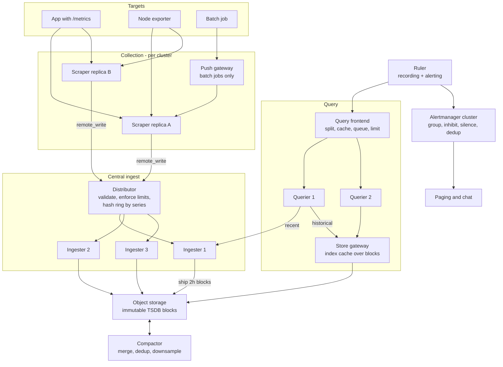
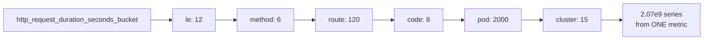
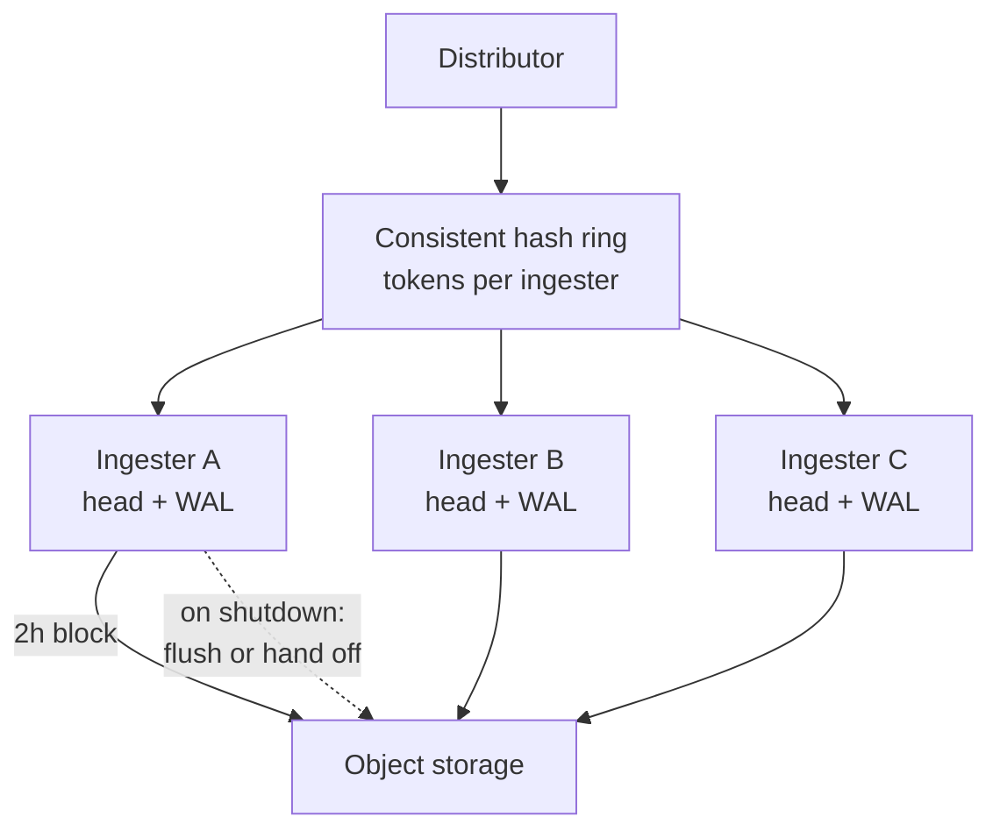
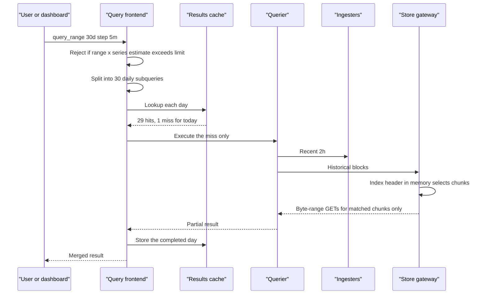
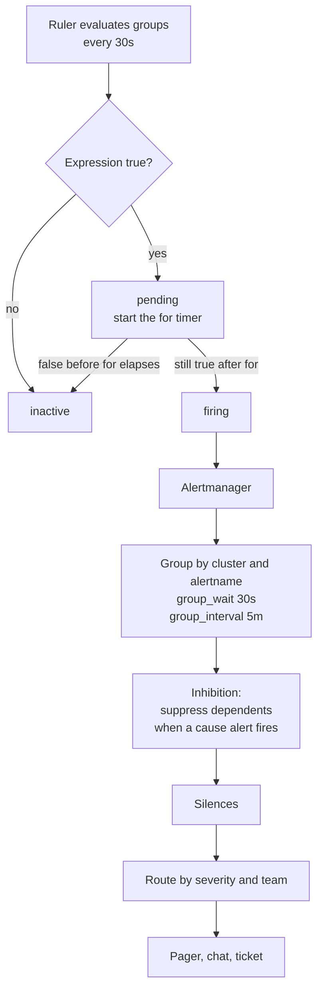

# 31 — Metrics & Monitoring System (Prometheus/Datadog-style)

<span class="pill pill-core">Core</span> <span class="pill pill-hard">Hard</span>

**A write-mostly time-series database with a hard real-time ingest path, a query engine that must answer over billions of samples in seconds, and one unforgiving constraint: it has to be more reliable than every system it observes, because it is the thing you use to find out that they are broken.**

| | |
|---|---|
| **Commonly asked at** | Datadog, Grafana Labs, Google, Meta, Cloudflare, Stripe, Netflix, Databricks, and effectively every senior SRE loop |
| **Time budget** | 45 min |
| **Core tension** | Every dimension a user adds to a metric multiplies the series count, and series count is simultaneously the memory bound, the index bound, the query cost and the bill — so the system's usefulness and the system's survival are driven by the same dial, controlled by people with no incentive to turn it down |
| **Prerequisites** | [F04 Caching](../fundamentals/f04-caching.md), [F06 Partitioning & Sharding](../fundamentals/f06-partitioning-sharding.md), [F07 Replication & Consistency](../fundamentals/f07-replication-consistency.md), [F12 Queues & Streams](../fundamentals/f12-queues-streams.md), [F13 Storage Engines](../fundamentals/f13-storage-engines.md), [F15 Object & Blob Storage](../fundamentals/f15-object-storage.md), [F17 Rate Limiting & Load Shedding](../fundamentals/f17-rate-limiting-load-shedding.md), [F18 Resilience Patterns](../fundamentals/f18-resilience-patterns.md), [F22 Observability Fundamentals](../fundamentals/f22-observability-fundamentals.md), [F23 SLOs & Error Budgets](../fundamentals/f23-slo-error-budgets.md), [F24 Capacity Planning](../fundamentals/f24-capacity-planning.md), [F26 Multi-Region & DR](../fundamentals/f26-multi-region-dr.md), [F28 Cost Engineering](../fundamentals/f28-cost-engineering.md) |

---

## 1. Problem Statement

Build the metrics platform for a company running tens of thousands of hosts and hundreds of thousands of containers: collect numeric time series from everything, store them cheaply for over a year, answer ad-hoc and dashboard queries in under a second, and evaluate alerting rules continuously with a latency budget measured in tens of seconds.

The thing that makes a TSDB a distinct problem rather than "a database with a timestamp column" is the shape of the workload:

- **Writes are overwhelmingly append-only, in timestamp order, at a near-constant rate.** There are no updates and effectively no deletes. The write rate is set by $(\text{series count}) / (\text{scrape interval})$ and does not spike with user traffic — it spikes with *deployments*, which is a very different and much nastier pattern.
- **Data is extremely compressible** in a way general-purpose databases cannot exploit: consecutive timestamps are evenly spaced and consecutive values are usually nearly identical. This is worth an order of magnitude, and it is the reason the whole thing is economically viable.
- **Queries are range scans over a selected subset of series**, almost always recent, almost always aggregated down to a few hundred points for a screen that is 1,200 pixels wide.
- **The identity of a series is a set of key-value labels**, and the number of distinct series is the product of the label cardinalities. This is the whole game (§7.3).

The second, non-technical half of the problem is that this is a **platform with adversarial users who are your own colleagues**. Nobody sets out to add a label with a million values. They add `user_id` to debug something on a Friday, the system falls over on Sunday, and the person who added it has no idea the two events are related. A metrics system that has no answer for that is not a production system.

### Out of scope

Logs and traces as primary data types — they are systems in their own right and are referenced here only where they integrate — plus profiling data and the visualisation layer beyond the query contract it depends on.

---

## 2. Requirements

### Functional

| # | Requirement | Notes |
|---|---|---|
| F1 | Collect series from heterogeneous sources | Pull via scrape and push via remote write; both are required |
| F2 | Multi-dimensional data model | Metric name plus arbitrary label key-values |
| F3 | The four core types | Counter, gauge, histogram, summary, with correct rate and quantile semantics |
| F4 | A query language with range vectors and aggregation | PromQL-compatible |
| F5 | Alerting rules evaluated continuously, with a `for` duration | Plus routing, grouping, silencing, inhibition |
| F6 | Recording rules to pre-compute expensive queries | The only way dashboards stay fast |
| F7 | Long retention with downsampling | 15 d raw, 90 d at 5 m, 13 months at 1 h |
| F8 | Global query across clusters and regions | One query surface over many ingest domains |
| F9 | Multi-tenancy with per-tenant limits | Series, samples/s, query concurrency, retention |
| F10 | Exemplars linking a sample to a trace | The metrics-to-traces jump |

### Non-functional

| # | Requirement | Target |
|---|---|---|
| N1 | Ingest availability | 99.99% — higher than anything it monitors |
| N2 | Ingest freshness | p99 sample queryable within 30 s of scrape |
| N3 | Dashboard query latency | p99 < 1 s for 24 h range over a recording rule |
| N4 | Ad-hoc query latency | p99 < 10 s for a 7 d range over raw series |
| N5 | Alert latency | p99 < 60 s from threshold breach to notification dispatch |
| N6 | Durability | Losing at most 2 minutes of data on an unclean ingester loss |
| N7 | Blast radius | No single query, tenant or cluster can degrade the platform |
| N8 | Self-observability | Failure of the platform is detected by something outside the platform |

!!! danger "N8 is the requirement that makes this problem different"
    Every other system in this curriculum is monitored by *this* one. This one has to be monitored by something else, or its failure mode is silence — and silence is indistinguishable from health. If your design does not include a dead-man's switch evaluated outside the platform's failure domain, you have built a system that cannot tell you it is broken. Say this in the first two minutes of the interview.

---

## 3. Scale Estimation

**Series and sample rate.**

$$
\begin{aligned}
N_{\text{series}} &= 5 \times 10^{7}\ \text{active} \\
I_{\text{scrape}} &= 30\ \text{s} \\
R_{\text{samples}} &= \frac{5 \times 10^{7}}{30} \approx 1.67 \times 10^{6}\ \text{samples/s}
\end{aligned}
$$

**Uncompressed storage.** A sample is a 64-bit timestamp plus a 64-bit float:

$$
\begin{aligned}
R_{\text{raw}} &= 1.67 \times 10^{6} \times 16\ \text{B} = 26.7\ \text{MB/s} \\
&= 2.31\ \text{TB/day}
\end{aligned}
$$

At 15 days that is **34.6 TB just for raw samples of one replica**, before indexes, before replication. That is the number that forces compression to be an architectural decision rather than an optimisation.

**Gorilla compression.** Two independent encodings (§7.2):

- *Timestamps, delta-of-delta.* A scrape at a fixed interval produces $\Delta t = 30, 30, 30, \ldots$, so the delta-of-delta is 0 and encodes as a **single bit**. Facebook's Gorilla paper measured 96% of timestamps compressing to that one bit.
- *Values, XOR.* Consecutive float64 values of a real metric share their sign, exponent and most of their mantissa. In Gorilla, 59% of values XOR to exactly zero — also a single bit — and most of the rest fit in a short window of meaningful bits.

The measured average is **1.37 bytes per sample**, so:

$$
\text{compression ratio} = \frac{16}{1.37} \approx 11.7\times
$$

$$
\begin{aligned}
R_{\text{compressed}} &= 1.67 \times 10^{6} \times 1.37\ \text{B} \approx 2.29\ \text{MB/s} \\
&\approx 198\ \text{GB/day} \\
\text{15 d raw retention} &\approx 2.9\ \text{TB per replica}
\end{aligned}
$$

**34.6 TB becomes 2.9 TB.** With a replication factor of 3 for the ingest tier and the block store, the 15-day hot set is roughly 8.9 TB — small enough to live in object storage at trivial cost. This single design decision is the difference between a viable product and an unviable one, which is why the arithmetic belongs in the interview.

**Memory, which is the real constraint.** Compression applies to *closed* chunks. The in-memory head holds, per active series, the label set, an index entry, and an open chunk being filled:

$$
M_{\text{series}} \approx \underbrace{600\ \text{B}}_{\text{labels + index postings}} + \underbrace{1{,}024\ \text{B}}_{\text{head chunk buffer}} + \underbrace{\sim 400\ \text{B}}_{\text{struct + map overhead}} \approx 2\ \text{KB}
$$

$$
M_{\text{total}} = 5 \times 10^{7} \times 2\ \text{KB} = 100\ \text{GB}
$$

spread across the ingest tier. **Memory scales with series count, not with sample rate.** Doubling the scrape frequency doubles disk and CPU and barely touches memory; adding one label with 20 values multiplies memory by 20. This asymmetry is the single most important operational fact about a TSDB.

**Churn.** Series are not eternal. Every pod restart creates a new series for every metric that carries a pod identifier:

$$
\begin{aligned}
\text{pods} &= 2 \times 10^{4},\quad \text{restarts/day} = 8,\quad \text{series/pod} = 300 \\
\text{new series/day} &= 2 \times 10^{4} \times 8 \times 300 = 4.8 \times 10^{7}
\end{aligned}
$$

That is **as many new series per day as there are active series**, and the *index* must retain every one of them for the full retention window because a query over the last 15 days must still find them. Total indexed series over the window approaches $7.2 \times 10^{8}$. Churn, not steady-state cardinality, is what kills most real deployments.

**Query cost, and why a single query can end you.**

$$
\begin{aligned}
\text{worst-case selection} &= 10^{7}\ \text{series} \times 15\ \text{d} \\
\text{samples touched} &= 10^{7} \times \frac{15 \times 86400}{30} = 4.32 \times 10^{11} \\
\text{decode + eval at } 20\ \text{ns/sample} &= 8{,}640\ \text{CPU-seconds} = 2.4\ \text{CPU-hours} \\
\text{bytes read} &= 4.32 \times 10^{11} \times 1.37\ \text{B} \approx 592\ \text{GB}
\end{aligned}
$$

One user pasting `sum(rate({__name__=~".+"}[5m]))` into a dashboard asks for 2.4 CPU-hours and 592 GB of reads. **Unbounded queries are a denial of service against your own control plane**, and the defence has to be structural (§7.5), not a wiki page asking people to be careful.

---

## 4. API Design

=== "Ingest: scrape config"

    ```yaml
    global:
      scrape_interval: 30s
      evaluation_interval: 30s
      external_labels:
        cluster: eu-west-1-prod
        replica: A                      # HA pair identity, stripped at dedup

    scrape_configs:
      - job_name: kubernetes-pods
        kubernetes_sd_configs: [{role: pod}]
        scrape_timeout: 10s
        sample_limit: 5000              # HARD CAP: reject the whole scrape above this
        label_limit: 30
        label_value_length_limit: 512
        relabel_configs:
          - source_labels: [__meta_kubernetes_pod_annotation_prometheus_io_scrape]
            action: keep
            regex: "true"
        metric_relabel_configs:
          # drop known-dangerous labels before they are ever stored
          - regex: "(user_id|session_id|request_id|email|trace_id)"
            action: labeldrop
          # drop an entire metric family that a team is abusing
          - source_labels: [__name__]
            regex: "debug_.*"
            action: drop

    remote_write:
      - url: https://ingest.metrics.internal/api/v1/write
        queue_config:
          capacity: 10000               # per-shard in-memory queue
          max_shards: 200               # parallelism ceiling
          min_shards: 4
          max_samples_per_send: 2000
          batch_send_deadline: 5s
          min_backoff: 30ms
          max_backoff: 5s
        metadata_config: {send: true}
    ```

=== "Query API"

    ```bash
    # instant vector at a point in time
    GET /api/v1/query?query=<expr>&time=<rfc3339|unix>

    # range vector for a graph; step controls the number of returned points
    GET /api/v1/query_range?query=<expr>&start=<t0>&end=<t1>&step=30s

    # label and series introspection - the cheap way to explore cardinality
    GET /api/v1/labels?match[]=<selector>&start=<t0>&end=<t1>
    GET /api/v1/label/<name>/values?match[]=<selector>
    GET /api/v1/series?match[]=<selector>            # metadata only, no samples

    # exemplars: the metrics-to-traces bridge
    GET /api/v1/query_exemplars?query=<expr>&start=<t0>&end=<t1>
    ```

    Every request carries per-tenant enforced limits: `max_samples` scanned, `max_series` selected, `timeout`, `max_concurrent`, and a maximum lookback range. A request that would exceed any of them is **rejected before execution**, not killed halfway through.

=== "Real PromQL you should be able to write"

    ```promql
    # Request rate by route. rate() handles counter resets; never use increase() on
    # a short window with a long scrape interval, it extrapolates and lies.
    sum by (route) (rate(http_requests_total{job="api"}[5m]))

    # p99 latency from a histogram. The quantile is computed from bucket boundaries,
    # so its accuracy is bounded by your bucket layout, not by the query.
    histogram_quantile(
      0.99,
      sum by (le, route) (rate(http_request_duration_seconds_bucket{job="api"}[5m]))
    )

    # Availability SLI: fraction of non-5xx requests over 30 days
    sum(rate(http_requests_total{job="api",code!~"5.."}[30d]))
      / sum(rate(http_requests_total{job="api"}[30d]))

    # Multi-window multi-burn-rate alert condition for a 99.9% SLO.
    # 14.4x burn over 1h exhausts a 30d budget in ~2d: page.
    (
      1 - sum(rate(http_requests_total{code!~"5.."}[1h]))
        / sum(rate(http_requests_total[1h]))
    ) > 14.4 * 0.001
    and
    (
      1 - sum(rate(http_requests_total{code!~"5.."}[5m]))
        / sum(rate(http_requests_total[5m]))
    ) > 14.4 * 0.001

    # Which metric names are eating the TSDB? Run this before the postmortem.
    topk(10, count by (__name__) ({__name__=~".+"}))

    # Which label is exploding within one metric family?
    count(count by (pod) (http_requests_total))

    # Self-observability: is ingestion healthy?
    sum(rate(prometheus_tsdb_head_samples_appended_total[5m]))
    prometheus_tsdb_head_series
    sum(rate(prometheus_target_scrapes_exceeded_sample_limit_total[5m])) > 0

    # Is remote_write keeping up? Growing pending samples means you are losing data soon.
    prometheus_remote_storage_samples_pending
    rate(prometheus_remote_storage_samples_dropped_total[5m]) > 0
    ```

=== "Rules"

    ```yaml
    groups:
      - name: api-recording
        interval: 30s
        rules:
          # Pre-aggregate the expensive dashboard query once, not per viewer.
          - record: job:http_requests:rate5m
            expr: sum by (job, route, code) (rate(http_requests_total[5m]))
          - record: job:http_request_duration:p99_5m
            expr: histogram_quantile(0.99,
                    sum by (job, le) (rate(http_request_duration_seconds_bucket[5m])))

      - name: api-alerting
        interval: 30s
        rules:
          - alert: HighErrorBudgetBurn
            expr: |
              (1 - sum(rate(http_requests_total{code!~"5.."}[1h]))
                 / sum(rate(http_requests_total[1h]))) > 14.4 * 0.001
            for: 2m
            labels: {severity: page, service: api}
            annotations:
              summary: "Burning 30d error budget 14.4x faster than sustainable"
              runbook: "https://runbooks.internal/api/error-budget-burn"

          # The dead-man's switch. It fires permanently and is routed OUT of the
          # platform. If the receiver stops hearing it, the platform is down.
          - alert: Watchdog
            expr: vector(1)
            labels: {severity: watchdog}
    ```

---

## 5. Data Model

### Series identity

A series is identified by the full, sorted label set. The metric name is just the label `__name__`.

```text
http_requests_total{job="api", instance="10.2.3.4:8080", route="/v2/orders",
                    method="POST", code="200", cluster="eu-west-1", pod="api-7f4-x9k2"}
     |                                                                              |
     +---------------------- series ID = hash of the entire sorted set -------------+
```

Change **any** label value and it is a different series with a different ID, a separate chunk stream and a separate index entry. This is why `pod` is the most expensive label in Kubernetes-land: it changes on every deploy, by design.

### Inverted index

Selection by labels is a set-intersection problem, so the index is postings lists — exactly like a search engine, which is why [F16 Search & Indexing](../fundamentals/f16-search-indexing.md) is directly relevant.

```text
postings["__name__=http_requests_total"] -> [17, 22, 31, 48, 95, ...]
postings["route=/v2/orders"]             -> [22, 31, 77, ...]
postings["code=200"]                     -> [17, 22, 95, ...]

query {__name__="http_requests_total", route="/v2/orders", code="200"}
  = intersect(three sorted lists) -> [22]
```

Two consequences worth stating unprompted. A regex matcher like `route=~".*orders.*"` cannot use a postings list directly: it enumerates every value of `route`, tests each, and unions the results — so a regex on a high-cardinality label is expensive in proportion to that label's cardinality, *not* to the number of matching series. And a **negative** matcher (`code!="200"`) must compute a set difference against all series for the metric, which is why `!=` and `!~` should never be the most selective term in a query.

### Block layout on disk

```text
/data
  wal/                          # write-ahead log, replayed on restart
    00000412  00000413
  chunks_head/                  # memory-mapped closed head chunks
  01HQ8F.../                    # a 2h block, immutable once written
    meta.json                   # min/max time, series count, compaction level
    chunks/000001               # Gorilla-encoded chunk streams
    index                       # postings + series -> chunk refs
    tombstones                  # deletion markers, applied at read time
```

Blocks are immutable and named by ULID, which makes them trivially shippable to object storage, trivially cacheable and trivially deduplicated. **Immutability is what lets the storage tier be object storage**, and object storage is what makes 13-month retention a rounding error on the bill.

### Aggregation tiers

| Tier | Resolution | Retention | Stored per window | Purpose |
|---|---|---|---|---|
| Raw | 30 s | 15 d | 1 value | Incident debugging, alert evaluation |
| 5 m rollup | 5 min | 90 d | count, sum, min, max, counter | Week-over-week comparison, capacity trends |
| 1 h rollup | 1 h | 13 months | count, sum, min, max, counter | Yearly seasonality, planning, audit |

!!! warning "5-minute downsampling is not primarily a storage win — do this arithmetic"
    A 30 s raw series has 10 samples per 5 minutes. The 5 m rollup stores **5 aggregates**. That is a 2x storage reduction, which is almost nothing. The 1 h rollup stores 5 aggregates per 120 raw samples, a **24x** reduction — that is where the storage win lives. So why build the 5 m tier at all? **Query cost.** A 90-day dashboard over raw data touches $2.6 \times 10^{5}$ samples per series; over the 5 m tier it touches $1.3 \times 10^{5}$ per aggregate but reads far fewer chunks and, critically, lets the query engine skip whole blocks. Downsampling is a *query latency* mechanism at 5 m and a *storage cost* mechanism at 1 h. Candidates who say "downsample to save storage" have not done the arithmetic.

    Storing five aggregates rather than one average is not optional: without `count` and `sum` you cannot correctly re-aggregate across series, and without a dedicated `counter` aggregate that preserves reset boundaries, `rate()` over downsampled data is wrong.

---

## 6. High-Level Architecture



### Write path walkthrough

1. **Discover and scrape.** Service discovery yields a target list. Two scraper replicas, A and B, scrape **the same targets independently** on the same interval but at uncorrelated phase offsets. Each attaches `external_labels` including its own `replica` identity.
2. **Enforce limits at the edge.** `sample_limit` rejects an entire scrape whose response exceeds the cap. This is deliberately brutal: partial acceptance would let a runaway exporter poison the store one scrape at a time, and a rejected scrape produces a loud, attributable signal.
3. **Relabel and drop.** `metric_relabel_configs` strips dangerous labels and drops abusive metric families *before anything is stored*. This is the only defence that works, because it runs before the cardinality cost is incurred.
4. **Local WAL, then remote write.** Samples land in the scraper's own head and WAL. The remote-write shards read from the WAL and ship batches to the central distributor. The WAL is the durability mechanism: if the network to the central tier fails, the scraper keeps scraping and the queue drains from the WAL when it recovers, bounded by `wal_truncate_frequency`.
5. **Distribute.** The distributor validates (label count, name syntax, sample age, per-tenant series limits), then hashes the series ID onto a consistent hash ring and forwards each series to $RF = 3$ ingesters. It returns success on a quorum of 2.
6. **Ingest.** The ingester appends into the in-memory head, writes to its own WAL for crash recovery, and every 2 hours cuts an immutable block and uploads it to object storage.
7. **Compact and downsample.** The compactor merges the 2-hour blocks into 12-hour and then multi-day blocks, deduplicates the A and B replicas, builds the 5 m and 1 h rollups, and applies retention. Compaction is what keeps the number of blocks — and therefore query fan-out — bounded.

### Read path walkthrough

1. **Query frontend.** Splits a long range query into per-24h sub-queries, serves what it can from a results cache keyed by `(query, step, interval)`, aligns the step so the cache actually hits, queues the rest per tenant, and enforces limits. **This tier is where survival lives** — a querier without a frontend in front of it will be killed by its users.
2. **Fan-out.** Queriers ask ingesters for anything within the last few hours and store-gateways for anything older, then merge. The store-gateway keeps block index headers and postings in memory so it can answer "which blocks and which chunks?" without reading object storage, then issues byte-range GETs for exactly the chunks needed.
3. **Deduplicate.** Samples from replica A and replica B are merged by dropping the `replica` label and resolving overlaps (§7.6).
4. **Evaluate.** PromQL executes over the merged series. Sample-count and series-count limits are enforced *during* evaluation, so a query that blows past its budget is aborted rather than completing at everyone else's expense.
5. **Return and cache.** Results, and subquery fragments, are cached for reuse by the next dashboard refresh — which matters enormously, because a dashboard on a wall refreshing every 15 seconds is a permanent load generator.

---

## 7. Deep Dives

### 7.1 Pull versus push, and what each one breaks

This argument is usually conducted as a religious dispute. It is actually a straightforward analysis of what each model makes *observable*.

| Property | Pull (scrape) | Push (remote write, StatsD, agent) |
|---|---|---|
| Liveness detection | Free. A failed scrape sets `up == 0`, and "target should exist but isn't responding" is directly expressible | Requires a separate heartbeat. Absence of data is ambiguous: dead, or never existed, or network |
| Target discovery | Needs SD. The SD system becomes a hard dependency | None; the client knows where to send |
| Firewall and NAT | Needs inbound reachability to every target | Works from anywhere, outbound only |
| Short-lived jobs | Fundamentally broken — the job exits before scrape | Natural fit |
| Rate control | Server-side. You choose the interval; a target cannot flood you | Client-side. A buggy client can flood you and you cannot stop it without rejecting |
| Cardinality control | Enforceable at scrape time with relabeling | Must be enforced at ingest, after the cost is partly paid |
| Failure mode | Missing data, loudly attributable to a target | Silent loss, or a thundering herd of retries that amplifies an outage |

The correct architecture is **pull as the default, push at the boundary**, and the reason is the `up` metric. Pull gives you "this thing should exist and is not answering" as a first-class, queryable fact. In a push world, a service that dies produces no data, and no data is also what you get from a service that was never deployed, a service whose agent crashed, or a network partition — the most important signal in monitoring becomes ambiguous exactly when you most need it.

The failure modes worth naming in an interview:

- **Pull's failure mode is the scrape timeout.** A target whose `/metrics` endpoint takes longer than `scrape_timeout` yields *nothing at all* — not partial data. An exporter that gets slower as the thing it monitors gets bigger (a common pattern: exporters that enumerate an external system) silently goes dark under exactly the load conditions where you need it. Alert on `scrape_duration_seconds / scrape_timeout > 0.7`.
- **Push's failure mode is amplification.** When the ingest tier degrades, every client retries, and the retries are the load. Without exponential backoff with jitter, client-side queue bounds and explicit 429 handling, remote write turns a partial outage into a total one. And the pathological case: the ingest tier returning 5xx causes clients to buffer in memory, then OOM, then lose everything in their buffer — so a *recoverable* ingest incident causes *permanent* data loss on the client side.
- **The push gateway is a trap.** It is the correct answer for batch jobs, and it is misused as a general push endpoint constantly. It holds metrics forever until explicitly deleted, so a job that pushes with a unique label and never cleans up leaks series permanently, and it becomes a single point of failure whose `up` metric describes the gateway rather than the jobs.

### 7.2 Gorilla compression, mechanically

This is the piece of the system where a candidate can demonstrate actual depth in ninety seconds.

**Timestamps: delta-of-delta.** Store the first timestamp raw and the first delta. Thereafter encode $D = (t_n - t_{n-1}) - (t_{n-1} - t_{n-2})$ with a variable-length prefix code:

| Range of $D$ | Encoding | Bits |
|---|---|---|
| $0$ | `0` | **1** |
| $[-63, 64]$ | `10` + 7 bits | 9 |
| $[-255, 256]$ | `110` + 9 bits | 12 |
| $[-2047, 2048]$ | `1110` + 12 bits | 16 |
| else | `1111` + 32 bits | 36 |

A scrape loop at a fixed interval produces $D = 0$ almost always. Jitter of a few hundred milliseconds falls into the 9-bit bucket. This is why **scrape jitter costs you storage**: a target whose scrape time wanders by seconds pushes every timestamp out of the 1-bit case and can inflate the timestamp stream by 10x.

**Values: XOR.** XOR the current float64 with the previous one:

- If the result is zero, the value is unchanged: emit `0`, one bit. Gauges that sit still (queue depth 0, replica count 3) and counters that are idle cost one bit per sample.
- Otherwise emit `1`, then either reuse the previous block of meaningful bits (`0` + payload) or write a new leading-zeros and length header (`1` + 5 bits + 6 bits + payload).

The property being exploited is that consecutive samples of a real metric differ in the low mantissa bits only, so sign, exponent and the high mantissa XOR to zero and get skipped.

$$
\text{Gorilla measured mean} = 1.37\ \text{bytes/sample},\quad \text{ratio} = 11.7\times
$$

Two practical corollaries you should volunteer:

- **Compression is a property of the data, not the algorithm.** A counter that increments by a steady amount compresses to near a bit per sample. A gauge reporting a raw float64 that changes in the last mantissa bit every scrape — an unrounded CPU percentage, a timestamp-valued gauge, a random-ish memory reading — defeats XOR entirely and costs 12-16 bytes per sample, ten times the budget. **Rounding a noisy gauge to 3 decimal places can cut its storage by an order of magnitude**, which is the sort of thing that sounds absurd until you have paid the bill.
- Compression happens per chunk, typically 120 samples. A series that is written once and never again still occupies a whole chunk plus a full index entry — which is precisely why churn (§3) is so much more expensive than the sample count suggests.

### 7.3 Cardinality explosion: mechanics, cost, and the only defences that work

The series count is the **product** of label value cardinalities, and humans reason additively about it. That mismatch is the entire failure mode.



$$
12 \times 6 \times 120 \times 8 \times 2000 \times 15 = 2.07 \times 10^{9}
$$

At 2 KB of head memory per series, that one metric family wants **4.1 TB of RAM**. It does not degrade; it OOM-kills the ingester, which shifts its share of the ring to the surviving ingesters, which now hold more series, and they OOM too. **Cardinality failures are cascading by construction**, and they take the platform down during the incident you were trying to debug, because incidents are when people add debug labels.

The realistic accident is smaller and just as fatal. A metric with 40 series gains a `customer_id` label with 250,000 values:

$$
\Delta N = 40 \times 250{,}000 = 10^{7}\ \text{new series} \Rightarrow 20\ \text{GB of head memory, appearing over one scrape interval}
$$

The defences, in the order they actually work:

1. **`sample_limit` on every scrape.** A hard per-target cap. The runaway target is rejected wholesale and generates `prometheus_target_scrapes_exceeded_sample_limit_total`, which names the culprit immediately. This is the only defence that acts *before* the memory is allocated, and it is the one most often left unset.
2. **`metric_relabel_configs` labeldrop for a known-dangerous list.** `user_id`, `session_id`, `request_id`, `email`, `ip`, `trace_id`, `url` — anything that is per-request rather than per-entity. Maintain it as a platform default, not per team.
3. **Per-tenant series limits at the distributor**, enforced with a hard rejection and a clear error. Tenants must be able to see their own headroom, or the limit just generates tickets.
4. **A cardinality budget per team, reviewed like a cost budget**, with the top-10 contributors published weekly. Make it social before it is technical.
5. **Admission control in CI.** Lint the instrumentation: any label whose value derives from a request parameter or a user identifier fails the build. This is the only one that prevents the problem rather than containing it.

!!! tip "The right question to ask an instrumentation author"
    "Will you ever want to graph one line per value of this label?" If the answer is no, it is not a label — it is either a log field or a trace attribute. High-cardinality dimensional data belongs in a system with a different storage model, which is exactly the argument for logs ([F22](../fundamentals/f22-observability-fundamentals.md)) and exemplars (§7.7). Metrics are for **bounded, low-cardinality dimensions you will aggregate over**, and that sentence is the whole design rule.

### 7.4 The ingester ring, replication, and the restart problem

Ingesters hold hours of unflushed data in memory. That makes a rolling restart the most dangerous routine operation in the system.



- **Replication factor 3, quorum 2.** The distributor writes each series to three ingesters and succeeds on two. One ingester can be lost, restarted, or slow with no data loss and no write failure. The query path must then deduplicate, which it does by merging on timestamp.
- **WAL for crash recovery.** An ingester that dies ungracefully replays its WAL on startup. Replay is slow — it is the dominant term in startup time — and during replay the ingester is not accepting writes, so its share of the ring is being served by its two replicas at elevated load.
- **Handoff or flush on graceful shutdown.** Either flush the head to a block and upload it, or hand the in-memory state to a replacement. Flush-on-shutdown is simpler and produces many small blocks that the compactor must clean up; handoff is faster but adds a coordination protocol that fails in interesting ways.
- **Restart one at a time, and wait.** Restarting two ingesters that share a token range concurrently drops below quorum for those series and **loses writes**. The rolling restart must gate on ring health, not on a fixed sleep.

The non-obvious operational consequence: **the whole ingest tier's memory is a sawtooth**, peaking just before each 2-hour block cut and dropping after. If you size memory at the average you will OOM at every boundary, and because all ingesters cut on the same schedule by default, they peak *together*. Jitter the block-cut time per ingester, and size headroom against the peak.

### 7.5 Query fan-out and defending against the query of death

A single instant query can touch every block in object storage. The query path's job is to make that bounded.



Splitting by day is what makes caching work: yesterday's answer never changes, so 29 of 30 days come from cache and only the current, still-changing day is computed. Step alignment matters more than it looks — if the step is not aligned to a fixed grid, every dashboard refresh produces a different cache key and the hit rate is zero.

**Query-of-death protection**, layered:

1. **Pre-execution rejection.** Estimate the selected series count from the index before touching data. Reject above `max_series_per_query`. Reject queries with no metric name selector at all, and reject a lookback range above a per-tenant ceiling.
2. **Mid-execution limits.** `max_samples` counted as evaluation proceeds; exceed it and abort with a clear error that names the limit and the query.
3. **Per-tenant concurrency queues.** A tenant gets $k$ concurrent slots. Their 200 queued queries are their own problem, not everyone's.
4. **Timeouts everywhere,** and crucially: **the timeout must actually free the resources.** A cancelled HTTP request that leaves a goroutine decoding 600 GB is the classic bug — you have the appearance of protection with none of the effect.
5. **A "shuffle sharding" assignment of queriers to tenants.** Each tenant is served by a random subset of $k$ of $n$ queriers. A tenant issuing poisonous queries can only damage their own subset, and the probability that two tenants share the *same* subset is tiny, so one bad actor cannot take down everyone. This is the highest-value isolation technique in multi-tenant query systems and is worth naming explicitly.
6. **Circuit-break the repeat offender.** The pathological pattern is not one query, it is a dashboard with a broken panel retrying every 15 seconds forever. Track per-query-fingerprint failure rates and reject the fingerprint rather than the tenant.

### 7.6 HA pairs, deduplication, and the graph that looks wrong

Two scrapers, A and B, scrape the same targets. They are not synchronised, so A samples at $t = 0, 30, 60$ and B at $t = 11, 41, 71$.

Naive dedup — merge both series and sort by timestamp — produces a series with samples at $0, 11, 30, 41, 60, 71$: **irregular intervals, doubled sample density, and a broken `rate()`**, because `rate()` divides by the time range and the sample spacing is now nonsense. It also destroys delta-of-delta compression on anything derived.

The correct approach is **penalty-based dedup**: pick one replica's series and serve it exclusively; only switch to the other replica when the chosen one has a gap exceeding a penalty threshold (typically a few scrape intervals). The output is a clean, regular series with the other replica used purely as gap-fill. The `replica` external label is dropped during dedup so both sides collapse to one identity.

What this buys and what it costs:

- **Buys:** a scraper can be restarted, redeployed or lost entirely with no gap in the data and no alerting blind spot. That is the point — the monitoring system must survive its own deploys.
- **Costs:** exactly 2x ingest, 2x storage until compaction dedups the blocks, and 2x load on every scrape target. The last one surprises people: your `/metrics` endpoint is being hit twice as often, and if it is expensive to generate, you have doubled that cost on the application.

Alerting has the same problem one level up. Both replicas run the ruler and both fire the same alert. **Alertmanager is clustered and gossips notification state**, so duplicate alerts from HA pairs are deduplicated at the notification layer by their label set. This means Alertmanager must *not* be behind a load balancer that breaks its gossip, and it means the alert's label set must be identical from both replicas — if `replica` leaks into the alert labels, dedup fails and everyone is paged twice.

### 7.7 Alerting evaluation and the thundering alert herd



Rules are evaluated in **groups**, sequentially within a group and in parallel across groups. Within a group, a recording rule can depend on the output of an earlier rule in the same group — that ordering guarantee is the reason groups exist. If a group's total evaluation time exceeds its interval, evaluations start being skipped and alerts silently become stale: `prometheus_rule_group_last_duration_seconds / prometheus_rule_group_interval_seconds > 0.8` is a mandatory alert, and its absence is why "the alert never fired" postmortems happen.

The `for` duration is the debounce. Too short and you page on a single bad scrape; too long and you add its full value to your detection time. **The `for` duration is part of your alert latency SLO and must be budgeted as such**, which almost nobody does.

**The thundering alert herd.** A shared dependency — the primary database, the auth service, a region's network — fails. Five hundred services detect it simultaneously and 4,000 alerts fire within one evaluation interval. What breaks:

- The on-call human cannot find the cause among 4,000 symptoms. This is the actual outage extension: mean time to *diagnosis* balloons.
- The notification provider rate-limits you, and now some alerts are dropped — including, with terrible luck, the one that identifies the cause.
- Alertmanager's own notification pipeline saturates and delivery latency blows past the SLO.

Mitigations, in order of effectiveness:

1. **Inhibition rules.** Declare that `DatabaseDown` inhibits `ServiceErrorRate` for every service labelled with that dependency. One cause alert pages; 500 symptom alerts are suppressed and remain visible in the UI for context. This requires a machine-readable dependency model, which is the real work.
2. **Grouping with `group_wait`.** Hold for 30 seconds and send one notification containing 500 grouped alerts rather than 500 notifications. Grouping by `(alertname, cluster)` rather than by instance is the difference between one page and a thousand.
3. **Alert on symptoms at the top, causes at the bottom.** Page on user-facing SLO burn for the whole service; make component alerts ticket-severity by default. Fewer, better alerts.
4. **Dependency-aware routing.** If the platform itself is degraded, route to the platform team and suppress the downstream storm entirely.

### 7.8 Exemplars, federation, and monitoring the monitor

**Exemplars** attach a trace ID to a specific sample, most usefully to a histogram bucket, so a user looking at a p99 latency spike can click through to a trace that was actually in that bucket. In OpenMetrics:

```text
http_request_duration_seconds_bucket{le="0.5"} 1734 # {trace_id="7a3b...c9"} 0.47 1716220800.123
```

They are stored in a separate, small, fixed-size circular buffer with a short retention, deliberately *not* in the TSDB proper, precisely because attaching a high-cardinality trace ID to a series would be the exact cardinality mistake §7.3 exists to prevent. This is the architecturally correct way to get high-cardinality context out of a low-cardinality system: **keep the pointer, not the payload**.

**Federation versus remote-write hierarchies.** `/federate` lets one Prometheus scrape aggregated series out of another. It is fine for a small set of pre-aggregated cross-cluster series and a bad idea for anything else: it is a single HTTP request whose payload grows with the selection, so it times out under exactly the conditions you care about, and a federation scrape that times out silently drops *everything*. The modern architecture is **remote-write into a central store**, with per-cluster Prometheus as a local buffer that keeps working during a central outage. Use federation only for a deliberately curated, tiny set of global aggregates.

**Monitoring the monitor.** Three independent layers, and you need all three:

1. **Self-metrics,** scraped by the platform itself: head series, ingest rate, WAL replay duration, rule group latency, remote-write queue depth. Useful for tuning; useless when the platform is down.
2. **Cross-monitoring.** Each region's platform scrapes the other region's platform. Catches a whole-region failure. Does not catch a global control-plane failure.
3. **A dead-man's switch outside the failure domain.** The `Watchdog` alert fires permanently and is routed to an external service (a third-party heartbeat monitor) that pages **when it stops arriving**. This is the only mechanism that detects "the monitoring system is silently dead", and it needs a path to paging that shares no dependency with the platform — not the same Alertmanager, not the same network, ideally not the same vendor. Test it quarterly by deliberately blocking it.

---

## 8. Scaling the Bottleneck

| Stage | Bottleneck | Symptom | Fix |
|---|---|---|---|
| 1 | Single-node scraper memory | OOM kill at a predictable head-series count | Shard by target hash across scraper pairs |
| 2 | Local disk retention | Disk full; retention silently shortened | Remote write to a central object-storage-backed store |
| 3 | Ingester memory | Sawtooth OOM at block-cut boundaries | Jitter block cuts, more ingesters, shrink the series count |
| 4 | Cardinality | Ingester OOM cascade; index growth outpaces samples | `sample_limit`, labeldrop, per-tenant limits, CI lint |
| 5 | Query latency on historical ranges | p99 seconds to minutes on 30 d dashboards | Recording rules, downsampling tiers, frontend result cache |
| 6 | Store gateway fan-out | Query touches thousands of blocks | Compaction levels, index caching, block time-partitioning |
| 7 | Multi-tenant contention | One tenant's queries starve everyone | Shuffle sharding, per-tenant queues, fingerprint circuit breakers |
| 8 | Alert evaluation | Rule groups exceeding their interval; stale alerts | Split groups, move heavy expressions into recording rules |

**Sharding by series hash versus by tenant.** Hashing the series ID spreads load evenly and is the right default for the ingest tier. It has one significant drawback: a query for one tenant fans out to *every* ingester, because that tenant's series are spread across all of them. Sharding by tenant gives locality and clean isolation but produces hot shards, because tenant sizes vary by orders of magnitude. The production answer is **hash within tenant, with shuffle sharding across a subset of ingesters per tenant** — you get spread, bounded fan-out, and the property that a poisonous tenant can only harm the small subset they were assigned.

!!! tip "The bottleneck that surprises everyone: the index, not the samples"
    Sample storage scales with $\text{series} \times \text{samples per series}$ and compresses 11.7x. The **index** scales with the number of *distinct series ever seen in the retention window*, compresses far less, and must be memory-resident to keep queries fast. In a high-churn Kubernetes environment where 48 million new series appear daily, the index can exceed the sample data despite holding no measurements at all. When someone says their TSDB is "storage bound", ask what fraction is index. It is usually the answer.

---

## 9. Failure Modes

| Failure | Blast radius | Detection | Mitigation | Degraded behaviour |
|---|---|---|---|---|
| Cardinality explosion from one team | Whole ingest tier, cascading OOM | `head_series` step change; `scrapes_exceeded_sample_limit` | `sample_limit`, labeldrop, per-tenant caps, emergency drop rule | Ingesters restart, quorum drops, recent data gaps |
| Query of death | Querier tier; all tenants without isolation | Query duration outliers, querier OOM | Pre-execution limits, shuffle sharding, fingerprint breaker | Queries rejected with a clear error instead of everything hanging |
| Scrape timeout on a slow exporter | That target only, silently | `scrape_duration / scrape_timeout > 0.7` | Fix the exporter; raise timeout as a stopgap only | Complete blind spot on that target, no partial data |
| Remote write backlog | One cluster's data delayed then lost | `samples_pending` rising, `samples_dropped > 0` | More shards, larger WAL window, ingest capacity | Delay first, then irrecoverable loss when the WAL truncates |
| Ingester OOM or crash | $1/N$ of series, 2 of 3 replicas remain | Ring health, replica count per series | RF 3 with quorum 2, WAL replay | Writes succeed; that ingester's unflushed head is rebuilt from WAL |
| Two ingesters in the same token range down | Write loss for those series | Ring quorum failure at the distributor | One-at-a-time restarts gated on ring health | Distributor rejects writes rather than losing them silently |
| Object storage unavailable | All historical queries; block upload | Store-gateway error rate; upload failures | Retry with backoff; ingesters hold blocks locally | Recent data still queryable from ingesters; history gone |
| Alertmanager cluster split | Duplicate or missing notifications | Gossip peer count | Odd-sized cluster, direct peer addressing, no LB in the gossip path | Duplicate pages, which is the correct failure direction |
| Rule group overrun | Alerts become stale without firing | `rule_group_last_duration / interval > 0.8` | Split groups, precompute with recording rules | Alerts evaluated late or skipped — silent detection failure |
| Thundering alert herd | On-call cognition; notification provider | Alerts-fired rate spike | Inhibition, grouping, symptom-level paging | Cause buried in symptoms; MTTD fine, MTTR terrible |
| Clock skew on a target | That target's series | Sample timestamps out of order or in the future | NTP enforcement; reject samples too far from ingest time | Rejected samples, or graphs that render into the future |
| Whole platform down | Everything, invisibly | **Only** the external dead-man's switch | Cross-region monitoring plus third-party heartbeat | Total blindness — the worst failure mode in this entire curriculum |

---

## 10. SRE Lens

### SLIs and SLOs

| SLI | Definition | Target |
|---|---|---|
| Ingest availability | Accepted samples / offered samples | 99.99% |
| Ingest freshness | p99 scrape-to-queryable latency | < 30 s |
| Query availability | Non-5xx, non-timeout / total queries | 99.9% |
| Dashboard query latency | p99 over recording rules, 24 h range | < 1 s |
| Ad-hoc query latency | p99, 7 d raw range | < 10 s |
| Alert latency | p99 threshold-breach to dispatch, excluding `for` | < 60 s |
| Rule evaluation health | Fraction of group evaluations finishing inside the interval | > 99.9% |
| Scrape coverage | Targets scraped successfully / targets discovered | > 99.5% |

!!! warning "Your SLO must be tighter than every SLO that depends on you"
    If a service runs a 99.9% SLO and uses this platform to measure it, the platform needs to be at least an order of magnitude more reliable, or the measurement error dominates the measurement. That is the justification for 99.99% on ingest and for the entire architecture of HA pairs, replication factor 3, and external dead-man switching. State it as a *derived* requirement, not an aspiration — it is a direct consequence of being the measuring instrument.

### Error budget

99.99% ingest availability over 30 days is **4.3 minutes**. That is an extremely tight budget and it shapes operations directly: rolling restarts must be non-disruptive by design (HA pairs, RF 3 with quorum 2), not merely quick. Query availability at 99.9% is 43 minutes and deliberately looser, because a failed dashboard load is recoverable by pressing refresh while a lost sample is gone forever. **Splitting write-path and read-path SLOs at different tiers is the correct design and is something interviewers listen for.** Reserve roughly half the ingest budget for cardinality incidents; they are the dominant consumer and they are not fully preventable.

### Rollout plan

1. **Ingesters: one at a time, gated on ring health**, never on a timer. Two ingesters sharing a token range going down together loses writes.
2. **Scrapers: one replica of each HA pair at a time**, with a soak between A and B so a bad build cannot take out both halves of the redundancy.
3. **Queriers and frontends: fully rolling**, they are stateless. Canary 5% of query traffic and compare p99 and error rate before proceeding.
4. **Rule changes go through CI:** syntax check, `promtool test rules` unit tests against recorded fixtures, and an evaluation-cost estimate that fails the build if the expression would exceed a budget.
5. **Compactor: never run two.** It is a singleton per tenant by construction; two concurrent compactors will corrupt blocks. Enforce with a lease, not with a deployment replica count.

### Runbook notes

```promql
# 1. Is it cardinality? This is the first question, always.
prometheus_tsdb_head_series
topk(10, count by (__name__) ({__name__=~".+"}))
topk(10, count by (job) ({__name__=~".+"}))

# 2. Which job suddenly started emitting more?
topk(5, sum by (job) (rate(prometheus_tsdb_head_samples_appended_total[10m])))

# 3. Are we dropping data anywhere?
sum(rate(prometheus_remote_storage_samples_dropped_total[5m]))
sum(rate(prometheus_target_scrapes_exceeded_sample_limit_total[5m]))
sum(rate(cortex_discarded_samples_total[5m])) by (reason)

# 4. Are alerts actually being evaluated on time?
prometheus_rule_group_last_duration_seconds
  / prometheus_rule_group_interval_seconds > 0.8

# 5. Is the read path being abused?
topk(10, sum by (user) (rate(cortex_query_frontend_queries_total[5m])))
```

Emergency cardinality procedure, in order: identify the offending metric or job with query 1; apply a `drop` relabel rule for that metric family and reload (this stops the bleeding within one scrape interval); if the head is already too large to survive, restart ingesters one at a time *after* the drop rule is in place so they do not immediately re-ingest; then delete the offending series from the store; and only then open the conversation with the owning team. **Do not start with the conversation.** The platform is degrading while you talk.

### Capacity model

$$
\begin{aligned}
N_{\text{ingesters}} &= \left\lceil \frac{N_{\text{series}} \times M_{\text{series}} \times RF}{M_{\text{node}} \times 0.6} \right\rceil
= \left\lceil \frac{5\times10^{7} \times 2\,\text{KB} \times 3}{128\,\text{GB} \times 0.6} \right\rceil = \lceil 3.9 \rceil = 4 \to 6\ \text{for headroom} \\[4pt]
S_{\text{object}} &= R_{\text{samples}} \times \bar{b} \times 86400 \times \left( D_{\text{raw}} + \frac{D_{5m}}{2} + \frac{D_{1h}}{24} \right) \\
&= 1.67\times10^{6} \times 1.37 \times 86400 \times \left(15 + 45 + 16.5\right) \approx 15.2\ \text{TB}
\end{aligned}
$$

The 0.6 utilisation factor is not conservatism padding — it covers the sawtooth peak at block-cut time, WAL replay memory on restart, and the headroom to absorb one ingester's share when it fails. Size at the average and you will OOM on a schedule.

Note what the second calculation shows: **13 months of downsampled retention costs about as much as the 15-day raw tier**, because the 1 h rollup is 24x cheaper per unit time. Long retention is nearly free once downsampling exists, and that reframes the retention conversation from a cost argument into a policy one.

### Cost

| Line item | Driver | Typical share | Lever |
|---|---|---|---|
| Ingester memory | Active series | 40-50% | Cardinality reduction — by far the biggest lever |
| Object storage | Retention × sample rate | 10-15% | Downsampling tiers, shorter raw retention |
| Query compute | Query volume × scanned samples | 20-30% | Recording rules, result cache, step alignment |
| Object storage API requests | Query fan-out to blocks | 5-10% | Compaction, index caching in store gateways |
| Cross-AZ / egress | Replication, remote write | 10% | Compression, AZ-aware ring placement |

The cost model has one dominant term and it is **series count**. Halving cardinality halves the largest line item, improves query latency, reduces the index, and removes your most common outage cause simultaneously. No other lever in this system does four good things at once, which is why "reduce cardinality" is the answer to most cost questions here and why the platform team's highest-value activity is often a cardinality review rather than an engineering project.

---

## 11. Trade-offs & Alternatives

| Decision | Alternative | Chosen / rejected and why |
|---|---|---|
| Custom TSDB with Gorilla encoding | Cassandra, ClickHouse, or a relational store | **Chosen custom.** 11.7x compression comes from exploiting fixed-interval timestamps and slow-moving floats, which a general-purpose engine cannot do. ClickHouse is a genuinely strong alternative for high-cardinality dimensional data and is the right choice if your workload is more analytical than alerting-driven; **rejected** here because the real-time rule-evaluation path needs predictable single-digit-millisecond series lookup |
| Pull by default | Push everywhere | **Chosen pull** for the `up` metric — expressing "this should exist and isn't responding" is worth the service-discovery dependency. **Push at the boundary** for batch jobs, serverless and anything behind NAT |
| Object storage for blocks | Local NVMe with replication | **Chosen object storage.** Blocks are immutable, which makes object storage a perfect fit; it decouples storage durability from compute lifecycle, so a querier is stateless and disposable. Costs first-byte latency, mitigated by index caching in the store gateway |
| Replication factor 3, quorum 2 | RF 2, or single copy with WAL | **Chosen RF 3.** Ingesters hold hours of unflushed data in memory; RF 2 means any single restart is at quorum, so routine operations become risky. The cost is 3x ingest memory, which is the largest line item — this is the most expensive decision in the design and it is still correct |
| HA scrape pairs with penalty dedup | Single scraper with fast restart | **Chosen HA pairs.** The monitoring system must survive its own deploys and node failures with no blind spot. Costs 2x everything including load on every scrape target. **Rejected naive timestamp-merge dedup** because it destroys `rate()` |
| Downsampling to 5 m and 1 h | Raw retention for 13 months | **Chosen downsampling.** Raw for 13 months is 24x the storage and makes long-range queries unusably slow. The cost is that aggregates must include count, sum, min, max and a reset-aware counter, or re-aggregation and `rate()` become silently wrong |
| Remote-write hierarchy | Prometheus `/federate` | **Rejected federation** for general use. A federation scrape is one HTTP request whose size grows with the selection; it times out under load and drops everything silently. Federation survives only for a small curated set of global aggregates |
| Shuffle sharding for tenant isolation | Dedicated clusters per tenant | **Chosen shuffle sharding.** Dedicated clusters give perfect isolation at multiples of the cost and operational surface. Shuffle sharding gives probabilistic isolation — a bad tenant damages only their random subset — at near-zero extra cost |
| Exemplars for high-cardinality context | Adding `trace_id` as a label | **Chosen exemplars.** Storing a pointer in a side buffer preserves the low-cardinality invariant the whole storage model depends on. Adding `trace_id` as a label is the single fastest way to destroy the platform |

---

## 12. Gotchas & Corner Cases

!!! gotcha "One label with unbounded values takes down the entire ingest tier in one scrape interval"
    **Symptom:** ingesters OOM-kill in sequence. As each dies, the ring reassigns its series to survivors, which now hold more and die faster. The platform is gone within minutes, during the incident you were trying to debug.
    **Mechanism:** series count is the *product* of label cardinalities. Adding `customer_id` with 250,000 values to a metric with 40 series creates 10 million series — 20 GB of head memory — arriving over one scrape. Memory is allocated on first sight of the series, before any limit that acts on stored data can help.
    **Mitigation:** `sample_limit` on every scrape config, without exception, because it is the only control that rejects *before* allocation. A platform-wide `labeldrop` list for per-request identifiers. Per-tenant series limits at the distributor. And CI linting of instrumentation, because containment is not prevention. Know the emergency drop-rule procedure by heart; you will need it at 3am.

!!! gotcha "Pod churn costs more than steady-state cardinality"
    **Symptom:** active series looks stable at 5 million, but memory keeps climbing, queries get slower every week, and the index is three times the size of the sample data.
    **Mechanism:** every pod restart creates a brand-new series for every metric carrying a pod identifier. Those series stop receiving samples but must stay in the index for the whole retention window so historical queries can find them. At 20,000 pods restarting 8 times daily with 300 series each, that is 48 million new series per day against 50 million active.
    **Mitigation:** do not put `pod` on metrics you will only ever aggregate over — use it only where per-pod investigation is genuinely required. Prefer stable identities such as `deployment` or `statefulset` ordinal. Track `head_series` against *distinct series over the retention window* as two separate metrics; they diverge and the second is the one driving cost.

!!! gotcha "A slow exporter goes completely dark instead of returning partial data"
    **Symptom:** a target's metrics vanish entirely under load. No partial data, no error metric from the target, and `up` flips to 0 with no explanation.
    **Mechanism:** scraping is all-or-nothing. If `/metrics` does not complete within `scrape_timeout`, the whole response is discarded. Exporters that query an external system to build their response get slower as that system gets bigger or sicker — so the exporter dies precisely when the monitored system is in trouble.
    **Mitigation:** alert on `scrape_duration_seconds / scrape_timeout > 0.7` as a leading indicator, long before it fails. Make exporters serve from a cached snapshot refreshed by a background goroutine rather than generating on request. Never let an exporter's response time be a function of the health of the thing it exports.

!!! gotcha "`rate()` on a counter with a short range or a long scrape interval silently returns nothing"
    **Symptom:** a panel is blank, or the alert never fires, even though the underlying counter is clearly increasing.
    **Mechanism:** `rate()` needs at least two samples inside the range. With a 60 s scrape interval and `rate(x[1m])`, you frequently have exactly one sample in the window and the result is empty — not zero, *empty*, so the alert expression yields no series and no alert. The rule of thumb is a range of at least 4x the scrape interval.
    **Mitigation:** always use a range of at least 4x the scrape interval; `rate(x[5m])` with a 30 s scrape is the safe default. Add an `absent()`-based alert for critical series so "no data" is itself an alertable condition instead of a silent pass. This is the single most common PromQL bug in production and it fails *open*.

!!! gotcha "The HA pair's naive deduplication makes every rate calculation wrong"
    **Symptom:** graphs are jagged, `rate()` produces spiky nonsense, and p99 latency panels show impossible values — but only for some series and only some of the time.
    **Mechanism:** two replicas scrape at different phase offsets. Merging both series by timestamp yields irregular spacing and double density. `rate()` divides by the range assuming regular sampling; with doubled, irregular samples the result is meaningless. Because it depends on scrape phase, it is intermittent and looks like a data quality problem.
    **Mitigation:** penalty-based dedup — choose one replica and only switch on a gap exceeding a threshold. Ensure the `replica` external label is applied consistently and stripped at query time. Verify after every change to external labels, because a typo in one replica's config makes the two sides un-mergeable and doubles your series count silently.

!!! gotcha "The rule group takes longer than its interval and alerts stop being evaluated"
    **Symptom:** an alert that should have fired did not. The expression is correct and returns true when run manually. The postmortem action item is "improve alerting" and nobody finds the cause.
    **Mechanism:** rules are evaluated sequentially within a group. If total evaluation exceeds the group interval, evaluations are skipped. A `for: 5m` alert whose expression is evaluated every 12 minutes instead of every 30 seconds may never accumulate the consecutive true evaluations it needs to fire. Nothing errors; it just does not happen.
    **Mitigation:** alert on `prometheus_rule_group_last_duration_seconds / prometheus_rule_group_interval_seconds > 0.8` and treat it as a page, because it is a failure of the detection system itself. Split large groups. Move expensive sub-expressions into recording rules evaluated in a separate group. Estimate rule cost in CI and fail the build above a budget.

!!! gotcha "Remote write buffers in memory during an ingest outage and the client OOMs, losing everything"
    **Symptom:** a recoverable, 20-minute central ingest degradation turns into permanent data loss across every cluster, and the clusters' own applications get evicted because the metrics agent consumed all the node memory.
    **Mechanism:** remote write queues samples when the endpoint is unhealthy. With a large `capacity` and `max_shards`, the queue grows until the process is OOM-killed, discarding the queue. The WAL-based design limits this, but a misconfigured queue or a too-short `wal_truncate_frequency` reintroduces it.
    **Mitigation:** bound the queue explicitly and prefer *dropping the oldest samples with a loud counter* over unbounded growth. Ensure the WAL, not RAM, is the buffer, and size `wal_truncate_frequency` to cover the longest plausible outage. Set memory limits on the agent so it cannot evict the workloads it is monitoring. Alert on `samples_pending` growth as a leading indicator, and on `samples_dropped_total > 0` as a data-loss event.

!!! gotcha "A noisy float64 gauge defeats XOR compression and costs ten times its budget"
    **Symptom:** one job accounts for a disproportionate share of storage growth while contributing an unremarkable number of series.
    **Mechanism:** XOR encoding wins because consecutive values share sign, exponent and high mantissa bits. A gauge reporting an unrounded CPU percentage, a raw nanosecond timestamp, or any quantity whose low mantissa bits change every scrape XORs to a full-width value each time and costs 12-16 bytes per sample instead of about 1.
    **Mitigation:** round gauges to the precision you will actually display — three decimal places is almost always enough. Never expose a timestamp as a gauge value when a duration would do. Measure bytes-per-sample per job and investigate outliers; it is a routine 5-10x win on the offending series and it is invisible unless you look for it.

!!! gotcha "A dashboard on a wall is a permanent, unbounded load generator"
    **Symptom:** baseline query load never drops, even at 3am. Query CPU is dominated by a handful of query fingerprints nobody is looking at.
    **Mechanism:** a TV dashboard with 30 panels refreshing every 15 seconds issues 172,800 queries per day forever. If the panels use raw series over long ranges and the step is not grid-aligned, every single one misses the result cache.
    **Mitigation:** force step alignment in the query frontend so cache keys are stable. Require recording rules for any panel with a range beyond 24 hours. Set a minimum refresh interval in the dashboard tool. Attribute query cost per dashboard and publish the top ten — the social feedback loop fixes this faster than any technical control.

!!! gotcha "`histogram_quantile` returns a confident number that is arbitrarily wrong"
    **Symptom:** the p99 latency panel reports exactly 10 seconds, forever, and the number does not move regardless of real behaviour.
    **Mechanism:** quantiles are interpolated from bucket boundaries. If the highest finite bucket is `le="10"` and real latencies exceed it, every observation lands in `+Inf` and the estimate saturates at the top finite bound. The function returns a number with no indication that it is meaningless. The mirror-image error is defining buckets at 1 s granularity for a service whose latencies are all under 100 ms, giving a p99 that is pure interpolation noise.
    **Mitigation:** choose bucket boundaries from observed latency distribution, not from round numbers, and revisit them when the service changes. Alert when the `+Inf` bucket's rate is a non-trivial fraction of the total, which is the direct signal that your buckets no longer cover reality. And never average quantiles across instances — sum the *bucket counts* first, then compute the quantile, which is what the correct query in §4 does.

!!! gotcha "Someone adds `trace_id` as a label because exemplars looked complicated"
    **Symptom:** immediate, total ingest-tier collapse. One series per request.
    **Mechanism:** a trace ID is unique per request by definition, so a metric labelled with it has a cardinality equal to the request count. At 10,000 requests per second, that is 10,000 new series per second and 864 million per day.
    **Mitigation:** exemplars exist precisely for this and store the pointer in a bounded side buffer rather than in the series identity. Block `trace_id`, `request_id`, `span_id` and `session_id` in the platform-wide labeldrop list so the mistake is impossible rather than merely discouraged. Make the exemplar path easy to use, because people reach for labels when the correct tool has friction.

!!! gotcha "The monitoring system fails silently and nothing tells you"
    **Symptom:** dashboards look fine — flat, green, no alerts. Everything has been perfect for six hours. Then a customer calls.
    **Mechanism:** when ingestion stops, existing panels render the last known data or go blank, and alerting rules over absent series evaluate to no result, which is not a firing alert. **Silence is indistinguishable from health.** Every alert you have is conditioned on data arriving, so the failure of the data path disables every alert simultaneously.
    **Mitigation:** a `Watchdog` alert that fires permanently, routed out of the platform to an external heartbeat service that pages when it *stops*. Cross-region monitoring where each region watches the other. `absent()` or `absent_over_time()` alerts on critical series so missing data is itself alertable. And test it: block the watchdog path deliberately, on a schedule, and confirm someone gets paged. An untested dead-man's switch is decoration.

---

## 13. Interview Angle

!!! interview "Open with the constraint that makes this problem unique"
    Say: **"This is the only system in the interview that has to be more reliable than everything it observes, because it is the instrument you use to measure them. That gives me two derived requirements nobody usually states: my SLO has to be an order of magnitude tighter than my users' SLOs, or measurement error dominates their measurement; and my failure mode is *silence*, which is indistinguishable from health, so I need a dead-man's switch evaluated entirely outside my own failure domain."** This reframes the whole conversation and is the single highest-signal opening available in this problem.

!!! interview "Do the compression math — it is the load-bearing calculation"
    16 bytes per sample raw; 1.67 million samples per second; 2.31 TB per day. Then: delta-of-delta puts 96% of timestamps in one bit because scrapes are evenly spaced, XOR puts 59% of values in one bit because consecutive floats share their exponent and high mantissa, measured average 1.37 bytes, **11.7x**, so 34.6 TB of raw becomes 2.9 TB. Then land the follow-through: **"and this is why a noisy unrounded gauge costs ten times what a rounded one does — compression is a property of the data, not of my code."** That last sentence is what separates someone who read the Gorilla paper from someone who has paid a storage bill.

!!! interview "Cardinality is the answer to most questions here — make it multiplicative out loud"
    **"Series count is the *product* of label cardinalities, and humans reason about it additively. That mismatch is the failure mode. Twelve buckets times six methods times 120 routes times eight status codes times 2,000 pods times 15 clusters is 2.07 billion series from one metric family, which at 2 KB of head memory is 4.1 TB of RAM. And it cascades: the first ingester OOMs, its share moves to the survivors, they OOM faster."** Then give the defence ladder in order — `sample_limit` first because it is the only one that acts before allocation — and finish with the design rule: *"if you will never graph one line per value of this label, it is not a label, it is a log field or a trace attribute."*

!!! interview "Show that you know downsampling is two different mechanisms"
    Most candidates say "downsample to save storage" and stop. Say: **"5-minute downsampling of a 30-second series stores five aggregates where there were ten samples — a 2x storage win, which is nothing. The 1-hour tier is 24x, and that is where the storage win is. So the 5-minute tier exists for *query latency*, not storage. And the aggregates have to be count, sum, min, max and a reset-aware counter, not an average, or re-aggregation across series and `rate()` over downsampled data are both silently wrong."** Correcting a common oversimplification with arithmetic is a strong move.

??? question "Follow-up 1: Ingesters are OOM-killing in a loop. Talk me through the next ten minutes."
    **Answer.** First I accept that the platform is partially blind and act fast, because every minute of this is a minute where I cannot see anything else. My first question is always cardinality, because it is the cause maybe 80% of the time. I run `topk(10, count by (__name__)({__name__=~".+"}))` and `topk(10, count by (job)(...))` from whatever query path still works — and if the query path is down too, I read the ingester's own logs and the last good `head_series` graph to find the step change and its timestamp, then correlate that timestamp with deployments. Once I have the metric or job, I apply a `drop` relabel rule for that family and reload the scrapers; that stops the bleeding within one scrape interval, which is the fastest available intervention. Then I restart ingesters **one at a time, gated on ring health**, because the drop rule does not shrink an already-oversized head and because restarting two in the same token range loses writes. If the head is so large that WAL replay itself OOMs on restart, I raise the memory limit temporarily to get through replay — you cannot replay a WAL you do not have memory for, and deleting the WAL is data loss. In parallel I check the alternatives so I do not tunnel: did someone change the scrape interval (samples up, series flat — that is CPU and disk pressure, not memory); did a large cluster onboard; did a compaction or WAL replay coincide with the block-cut sawtooth peak, which is a sizing problem rather than a cardinality one. Once stable, the follow-up work is the real fix: a `sample_limit` on the config that let this through, the label added to the platform-wide drop list, a CI lint rule, and a conversation with the team — **in that order**, because the technical containment must land before the social process starts.

??? question "Follow-up 2: A team wants per-customer metrics and they have 500,000 customers. What do you say?"
    **Answer.** I would say yes to the requirement and no to the implementation, then find out what they actually need, because "per-customer metrics" almost always decomposes into three different questions with three different answers. **If they need to alert on individual large customers:** that is a small set, maybe the top 200 by revenue, and a `customer` label bounded to that set with everything else bucketed into `other` is fine — 200 values is an ordinary label. The relabel rule that maps unknown customers to `other` is the whole implementation. **If they need to investigate one customer's behaviour reactively:** that is not a metrics question at all. They want to query "show me what happened to customer X between 14:00 and 14:10", which is a logs or traces query, and the right answer is structured logs with a `customer_id` field plus exemplars to jump from an aggregate latency spike to a specific trace. That is exactly what the exemplar mechanism exists for and it costs nothing in series count. **If they need per-customer analytics — billing, usage reports, SLA attestation:** that is an analytical workload over a columnar store or the data warehouse, not a real-time TSDB. It needs correctness and completeness over months, not 30-second freshness, and putting it in the metrics system gets you the worst of both. The framing I would give them is the design rule: *a label is for a dimension you will aggregate over and might want one graph line per value of.* Nobody wants 500,000 graph lines. And I would state the cost concretely rather than refusing abstractly: 500,000 values times their existing 40 series is 20 million new series, 40 GB of head memory across the tier, roughly a 40% increase in the platform's single largest cost line, funded from their team's budget. That converts an argument about engineering purity into a conversation about a number, which is a conversation that ends.

??? question "Follow-up 3: Design alerting so a database outage does not page 500 people."
    **Answer.** Four layers, and the ordering matters because each one reduces the load on the next. **Layer one, alert on symptoms not causes, at the top.** Each service pages on its own user-facing SLO burn — multi-window multi-burn-rate on the error and latency SLIs — and component-level alerts are ticket severity by default. This alone cuts alert volume by an order of magnitude because you stop paging on every CPU and disk threshold. **Layer two, inhibition.** I declare in Alertmanager that `DatabaseDown` inhibits `ServiceErrorRate` for every alert carrying a matching `depends_on` label. When the cause fires, the 500 symptoms are suppressed from notification but remain visible in the UI for context. The hard part is not the config, it is maintaining a machine-readable dependency graph — which is one of the genuinely good arguments for generating service dependencies from trace data, since it is derived from reality rather than from a wiki. **Layer three, grouping.** `group_by: [alertname, cluster]` with `group_wait: 30s` turns 500 notifications into one notification containing 500 alerts. Thirty seconds of added latency is a trivial price for a usable page. **Layer four, routing.** If a platform-level alert is firing, route to the platform on-call and suppress downstream teams entirely; they cannot act on it and paging them destroys their trust in the pager. Then two things people miss. First, **the alerting pipeline has its own capacity limits**: the notification provider rate-limits, and a 4,000-alert burst can cause dropped notifications — including the cause alert. So I rate-limit and prioritise by severity inside my own dispatch, rather than discovering the provider's limit during an incident. Second, I would measure this: alerts-per-incident as a tracked metric with a target, reviewed in postmortems. If a single-cause incident generates more than a handful of pages, the dependency model is wrong and that is a concrete, fixable action item rather than "improve alerting".

??? question "Follow-up 4: How do you support 13-month retention without the cost being absurd?"
    **Answer.** Three mechanisms compounding. **Downsampling tiers.** Raw 30-second data for 15 days, 5-minute rollups for 90 days, 1-hour rollups for 13 months. The 1-hour tier stores five aggregates per 120 raw samples, a 24x reduction, and that is where the win is — I would be explicit that the 5-minute tier is only 2x and exists for query latency rather than cost, because that distinction shows the arithmetic was actually done. **Object storage instead of block storage.** Blocks are immutable once written, which makes them a perfect fit for object storage at roughly a fifth the cost per GB of provisioned SSD, with lifecycle policies moving anything older than 90 days to an infrequent-access class. Immutability is the property that makes this work, and it also makes queriers stateless and disposable, which is a large operational win on its own. **Series-level retention policy.** Not every series deserves 13 months. Most long-range queries are against a small set of aggregates — SLI numerators and denominators, capacity drivers, business counters. I would keep recording-rule outputs for the full 13 months and apply a much shorter retention to raw per-pod detail, since nobody debugs a specific pod from nine months ago; that pod has not existed for most of a year. Then the arithmetic that makes the case: with these tiers the 13-month store is about 15 TB total, of which the 15-day raw tier is roughly a fifth. **Long retention costs about the same as the hot tier**, which turns retention from a cost argument into a policy discussion about what is worth keeping. The trade-off I would name explicitly: you cannot recover resolution you did not keep, so an incident investigation six months later sees hourly averages and cannot see a 90-second spike. For anything where that matters — a compliance-relevant SLI, a known-problematic service — keep raw longer for that specific selection, which is cheap because it is a small selection.

??? question "Follow-up 5: Why not just use a relational database, or ClickHouse?"
    **Answer.** I would take the ClickHouse question seriously, because it is a genuinely reasonable alternative and dismissing it is a weak answer. Against a **relational database** the case is easy: 1.67 million inserts per second with an index update per row, 16 bytes per sample with no domain-specific compression — so 2.3 TB per day instead of 198 GB — B-tree indexes that fragment badly under append-only insert, and no native concept of a range vector, counter reset, or rate over irregular samples, so `rate()` becomes a window function that is both slow and subtly wrong at reset boundaries. That is a 10x cost difference and a worse query model; it is not close. **ClickHouse is different and genuinely competitive.** It compresses well with Delta and Gorilla codecs, its columnar layout is excellent for scans, it handles high cardinality far better than a Prometheus-style inverted index because it does not need a postings list per label value, and it gives you full SQL with joins, which a TSDB cannot. For an observability product where users ask analytical questions over high-cardinality dimensions, ClickHouse is arguably the better engine, and several commercial vendors have made exactly that bet. The reasons I would still choose a purpose-built TSDB for **this** system are specific rather than dogmatic. The workload is dominated by rule evaluation, not ad-hoc analysis: thousands of alerting expressions every 30 seconds, each selecting a small set of series by exact label match, where an inverted index gives a millisecond lookup and a columnar scan does not. The `for` duration and alert-latency SLO make that latency budget hard. The PromQL ecosystem — exporters, dashboards, operators, alert libraries — is an enormous amount of leverage I would be discarding. And the operational model of immutable blocks in object storage with stateless queriers is simpler to run than a ClickHouse cluster with its own sharding and replication story. The honest summary: **TSDB for the alerting-driven real-time path, columnar store for the analytical high-cardinality path, and mature observability platforms end up running both.** Saying that, rather than defending one choice absolutely, is the senior answer.

??? question "Follow-up 6: Your monitoring system is down. Nobody noticed for six hours. Design so that cannot happen."
    **Answer.** The root problem is that the failure mode is silence, and silence is what health looks like. Every alert is conditioned on data arriving, so when the data path dies, every alert is disabled simultaneously — you do not get a storm, you get a calm. I would build three independent layers and insist on all three, because each catches what the previous one cannot. **Layer one, self-monitoring**, is the weakest but cheapest: the platform scrapes itself for head series, ingest rate, rule-group duration, remote-write queue depth. It is excellent for tuning and useless for total failure, and I would say that out loud so nobody mistakes it for a safety net. **Layer two, cross-monitoring.** Each region's platform scrapes the other region's platform and alerts on its absence via `absent_over_time()`. This catches a whole-region failure, which is the most common real case, and costs almost nothing. It does not catch a correlated global failure — a bad global config push, an expired certificate on a shared endpoint, a cloud-provider IAM change. **Layer three, an external dead-man's switch.** A `Watchdog` alert that evaluates to `vector(1)` permanently, routed through Alertmanager to a third-party heartbeat service. That service pages when the heartbeat *stops*. Crucially it must share no dependency with the platform: not the same Alertmanager cluster, not the same network path, not the same DNS, ideally not the same cloud provider — because otherwise the thing that killed the platform kills the switch, and you have built a very convincing illusion of safety. Then the parts that are not architecture. **Test it on a schedule:** block the watchdog path deliberately every quarter and confirm that a human is paged, because an untested dead-man's switch is decoration and every one I have seen that was never tested was broken. **Add `absent()` alerts on critical series**, so "the payment service has reported no metrics for ten minutes" is itself a firing alert rather than an empty graph. And **make blindness visible in the UI**: dashboards should render a loud, unmistakable banner when the data is stale rather than showing a flat green line, because a flat green line is the most dangerous rendering of missing data there is. Six hours of unnoticed downtime is almost always a UI failure as much as an alerting one — someone looked at the dashboard, saw green, and moved on.

### Strong answer versus weak answer

| Dimension | Weak | Strong |
|---|---|---|
| Framing | "Store metrics in a time-series database" | "This must be more reliable than what it monitors, and its failure mode is silence — so an external dead-man's switch is a requirement, not a nice-to-have" |
| Compression | "Time series compress well" | Delta-of-delta puts 96% of timestamps in 1 bit, XOR puts 59% of values in 1 bit, 1.37 B/sample measured, 11.7x, and a noisy unrounded gauge costs 10x |
| Cardinality | "Avoid too many labels" | Multiplicative math, 2 KB/series, the OOM cascade mechanism, and a defence ladder ordered by whether it acts before or after allocation |
| Churn | Not mentioned | 48 M new series/day from pod restarts; the index must retain all of them; index often exceeds sample data |
| Pull vs push | "Prometheus pulls, Datadog pushes" | Pull gives you `up` for free and makes "should exist but isn't" expressible; push amplifies outages via retries; push gateway leaks series forever |
| Downsampling | "Downsample old data to save space" | 5 m is 2x and exists for query latency; 1 h is 24x and is the storage win; aggregates must be count/sum/min/max/counter or `rate()` is wrong |
| Query protection | "Add a timeout" | Pre-execution series estimate, mid-execution sample limits, per-tenant queues, shuffle sharding, fingerprint circuit breakers, and "the timeout must actually free the resources" |
| HA | "Run two Prometheus servers" | Uncorrelated scrape phase breaks naive dedup and `rate()`; penalty-based dedup; Alertmanager gossip dedup; 2x load on every target |
| Alerting | "Set thresholds and page" | Multi-window burn rate, `for` as part of the latency budget, rule-group overrun as a silent detection failure, inhibition against the alert herd |
| Cost | "Storage is expensive" | Series count is the dominant term; halving cardinality fixes cost, latency, index size and the top outage cause at once |
| Self-observability | "We monitor Prometheus with Prometheus" | Three independent layers, an external watchdog outside the failure domain, and a quarterly test of it |

---

## 14. Key Takeaways

1. **The monitoring system is the measuring instrument, so its SLO is derived, not chosen.** An order of magnitude tighter than the SLOs measured with it, because otherwise measurement error dominates. Its failure mode is silence, so an externally-evaluated dead-man's switch is a hard requirement.
2. **Gorilla compression is the reason this is affordable.** Delta-of-delta on evenly-spaced timestamps and XOR on slow-moving floats give 1.37 bytes per sample, 11.7x. It is a property of the *data*, which is why a noisy unrounded gauge costs ten times a rounded one.
3. **Cardinality is multiplicative and memory scales with series, not samples.** Doubling scrape frequency is cheap; adding one label with twenty values is twenty times the memory. The failure is a cascading OOM across the ingest tier, and the only defence that acts before allocation is a per-scrape sample limit.
4. **Churn is the hidden cardinality.** Pod restarts create new series that receive no further samples yet must stay in the index for the entire retention window. In a high-churn environment the index can exceed the sample data.
5. **Pull is the default because `up` is a first-class fact.** "This should exist and is not responding" is the most valuable signal in monitoring, and push makes it ambiguous. Push at the boundary for batch jobs and anything behind NAT.
6. **Downsampling is two mechanisms.** 5 m is a 2x storage change and a large query-latency change; 1 h is 24x and is where the cost saving lives. Store count, sum, min, max and a reset-aware counter, never an average.
7. **The query path needs structural protection, not policy.** Pre-execution rejection, mid-execution sample limits, per-tenant queues, shuffle sharding and per-fingerprint circuit breakers. A single unbounded query is 2.4 CPU-hours and 592 GB of reads.
8. **HA pairs are mandatory and naive dedup is a trap.** Penalty-based deduplication preserves regular sample spacing; timestamp-merging destroys `rate()` intermittently in a way that looks like a data quality problem.
9. **The alert herd extends outages by burying the cause in symptoms.** Symptom-level paging, inhibition driven by a real dependency model, and grouping turn 4,000 notifications into one useful page.
10. **Cardinality reduction is the only lever that improves cost, latency, index size and reliability simultaneously.** When in doubt about anything in this system, the answer is usually fewer series.
