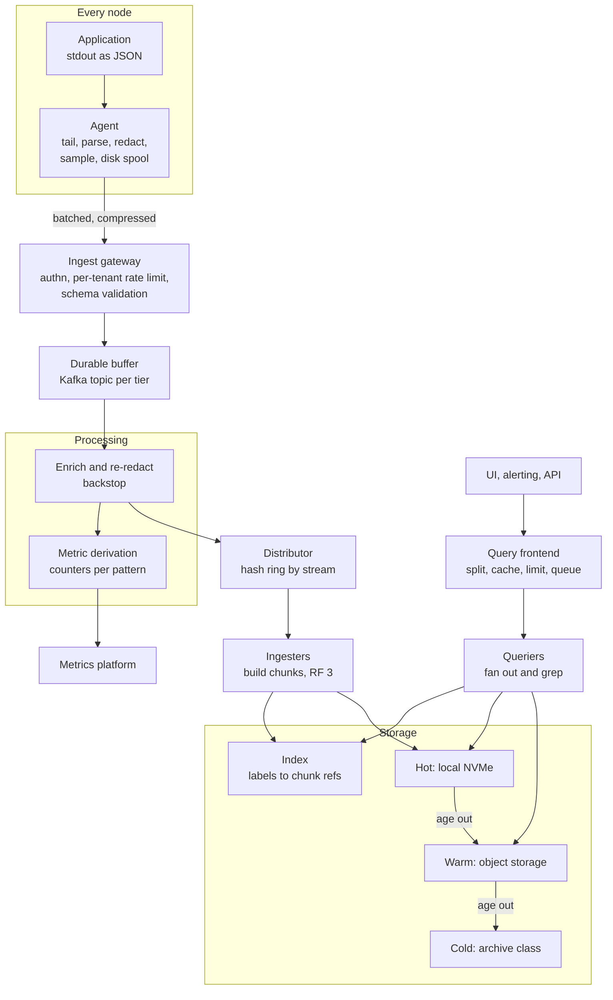
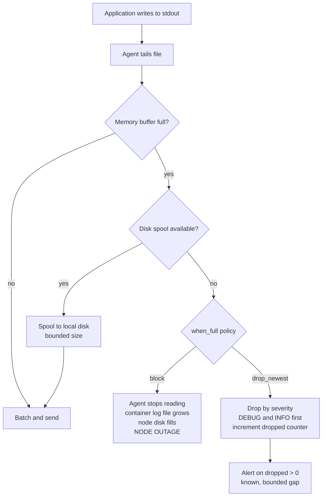
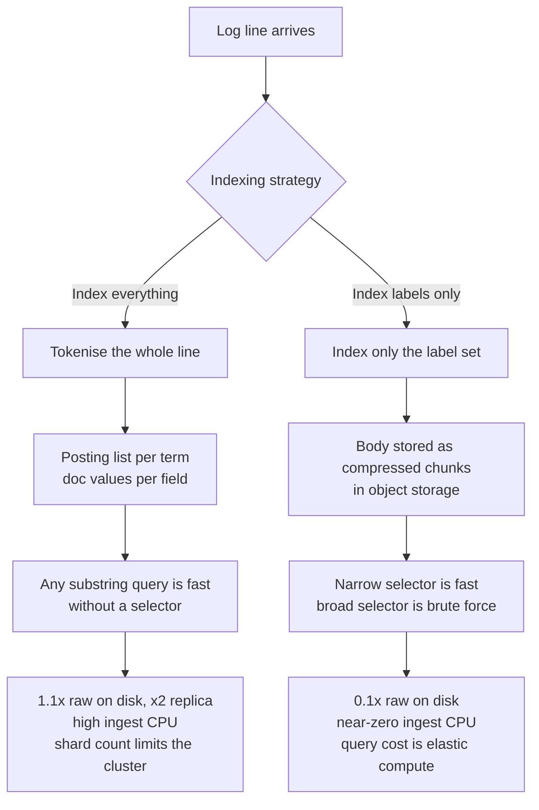
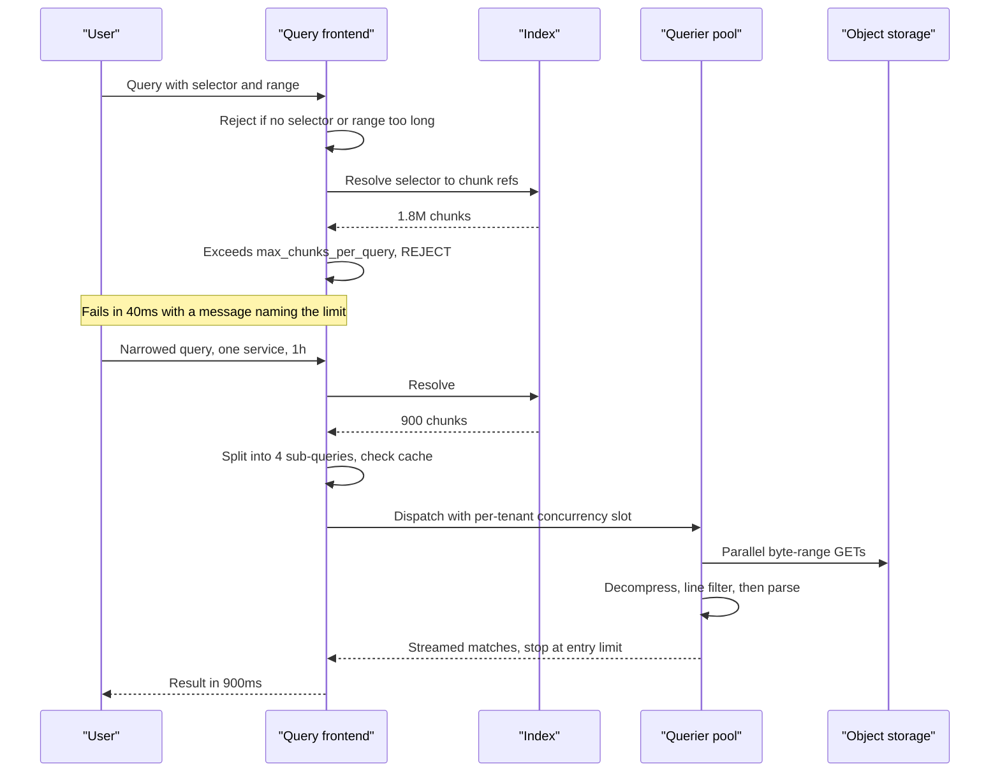

# 32 — Distributed Logging (ELK / Loki-style)

<span class="pill pill-core">Core</span> <span class="pill pill-hard">Hard</span>

**An unbounded, unstructured, adversarially-generated firehose that you must accept without backpressure onto production, store for a month at a price nobody will approve, and search in seconds during an incident — where the single architectural decision, whether to index the content or only its labels, changes the cost by more than an order of magnitude and the query latency in the opposite direction.**

| | |
|---|---|
| **Commonly asked at** | Elastic, Grafana Labs, Datadog, Splunk, Google, Cloudflare, Stripe, Confluent, Airbnb, and most platform and observability SRE loops |
| **Time budget** | 45 min |
| **Core tension** | Indexing every token makes any query fast and makes ingest cost 10-20x the raw bytes; indexing only labels makes ingest nearly free and makes an unselective query a brute-force scan of petabytes — and the choice is effectively permanent because it determines both your storage bill and your users' query habits |
| **Prerequisites** | [F06 Partitioning & Sharding](../fundamentals/f06-partitioning-sharding.md), [F07 Replication & Consistency](../fundamentals/f07-replication-consistency.md), [F12 Queues & Streams](../fundamentals/f12-queues-streams.md), [F13 Storage Engines](../fundamentals/f13-storage-engines.md), [F15 Object & Blob Storage](../fundamentals/f15-object-storage.md), [F16 Search & Indexing](../fundamentals/f16-search-indexing.md), [F17 Rate Limiting & Load Shedding](../fundamentals/f17-rate-limiting-load-shedding.md), [F18 Resilience Patterns](../fundamentals/f18-resilience-patterns.md), [F21 Probabilistic Structures](../fundamentals/f21-probabilistic-data-structures.md), [F22 Observability Fundamentals](../fundamentals/f22-observability-fundamentals.md), [F27 Security in Design](../fundamentals/f27-security-design.md), [F28 Cost Engineering](../fundamentals/f28-cost-engineering.md) |

---

## 1. Problem Statement

Build the logging platform for a company running tens of thousands of services: collect every log line, make it searchable within seconds, retain it for compliance-relevant periods, and do it without the logging system ever becoming the reason production went down.

Three properties make logs a different problem from metrics:

- **The volume is producer-controlled and unbounded.** A metrics endpoint emits a fixed number of series regardless of traffic. A log line is emitted per event, so volume scales with traffic — and then a developer adds a debug line inside a retry loop and volume scales with *failures*, which means your ingest peak coincides exactly with your worst incident. The logging system's load is highest when it is most needed and when everything else is already degraded.
- **The data is high-cardinality by nature.** Every line is potentially unique. The very thing that makes logs valuable — arbitrary context per event — is the thing that makes them unindexable cheaply.
- **You cannot apply backpressure to the source.** A metrics scrape that fails is retried later with no harm. Blocking an application's log write blocks the application. The logging agent must absorb, spool, or drop — and which one it does under pressure is one of the two or three decisions that actually define this system.

The second framing that matters: **logs are the only telemetry signal where you did not decide in advance what questions you would ask.** Metrics require pre-aggregation; traces require instrumentation. Logs are the fallback for the question nobody anticipated, which is exactly why people resist deleting them, why volume grows monotonically, and why cost control is a permanent organisational problem rather than a one-time engineering task.

### Out of scope

The metrics platform and the tracing platform as primary systems, SIEM-specific detection content, and log-derived business analytics, which belong in a warehouse with a completely different latency and correctness contract.

---

## 2. Requirements

### Functional

| # | Requirement | Notes |
|---|---|---|
| F1 | Collect from containers, VMs, managed services and network devices | Files, stdout, syslog, cloud provider APIs |
| F2 | Parse and normalise into a structured schema | Timestamp, severity, service, message, plus arbitrary fields |
| F3 | Full-text and field search with time-range narrowing | The core query |
| F4 | Aggregation over matched lines | Counts, rates, top-k, percentiles from numeric fields |
| F5 | Live tail | Follow a stream in near real time during an incident |
| F6 | Retention tiering | 7 d hot, 30 d warm, 13 months cold for a subset |
| F7 | PII detection and redaction in the ingest path | Before anything is persisted or indexed |
| F8 | Per-tenant isolation | Ingest quota, query quota, retention, access control |
| F9 | Alerting on log patterns | With the metric-derivation path as the preferred mechanism |
| F10 | Correlation with traces and metrics | Via `trace_id` and request ID fields |

### Non-functional

| # | Requirement | Target |
|---|---|---|
| N1 | Ingest availability | 99.9%, and **never** block the producing application |
| N2 | Ingest-to-searchable latency | p99 < 15 s |
| N3 | Query latency, narrow selector over 1 h | p99 < 2 s |
| N4 | Query latency, narrow selector over 7 d | p99 < 30 s |
| N5 | Durability during a platform outage | No loss for outages under 30 min, via agent-side spool |
| N6 | Blast radius | No tenant, query or service can degrade the platform for others |
| N7 | Compliance | Zero unredacted PII persisted; erasure within a stated bound |
| N8 | Cost | Bounded and attributable per team, with enforcement, not exhortation |

!!! danger "N1 has a sharp edge that candidates miss"
    "Never block the producing application" and "no data loss" are in direct conflict, and you must choose per severity level. If the pipeline is backed up and the agent's buffer is full, you either block the writer (and take production down with your logging system) or drop lines (and lose the data describing the incident). The correct answer is almost always **drop, loudly, with a counter** — but the *interesting* answer is that you drop by severity, shedding DEBUG and INFO first and preserving ERROR and above, so the lines you lose are the ones you were least likely to read. Say that and you have answered a question most candidates do not know exists.

---

## 3. Scale Estimation

**Volume.**

$$
\begin{aligned}
\text{services} &= 3{,}000,\quad \text{container instances} = 5 \times 10^{4} \\
\text{lines/s mean} &= 8 \times 10^{5},\quad \text{peak} = 2.4 \times 10^{6} \\
\text{mean line} &= 500\ \text{B} \\
B_{\text{mean}} &= 8\times10^{5} \times 500 = 400\ \text{MB/s} \\
V_{\text{day}} &= 400\ \text{MB/s} \times 86400 \approx 34.6\ \text{TB/day}
\end{aligned}
$$

**The index-everything path (Elasticsearch-style).** On-disk size is the compressed source document plus the inverted index plus doc values for aggregatable fields. With `best_compression`, the realistic multiplier against raw text is about 1.1x, and a replica doubles it:

$$
\begin{aligned}
V_{\text{ES/day}} &= 34.6\ \text{TB} \times 1.1 \times 2 = 76\ \text{TB/day} \\
\text{7 d hot} &= 533\ \text{TB} \\
\text{30 d total} &= 2.3\ \text{PB}
\end{aligned}
$$

**The index-labels-only path (Loki-style).** Only the label set is indexed; the log body is stored as compressed chunks in object storage. Log text compresses extremely well — repeated field names, timestamps, stack frames, and near-identical lines — typically 10:1:

$$
\begin{aligned}
V_{\text{Loki/day}} &= \frac{34.6\ \text{TB}}{10} \approx 3.5\ \text{TB/day} \\
\text{30 d total} &\approx 104\ \text{TB} \\
\text{index} &\approx 0.5\%\ \text{of that}
\end{aligned}
$$

$$
\boxed{\frac{2.3\ \text{PB}}{104\ \text{TB}} \approx 22\times}
$$

**A 22x storage difference from one architectural decision.** That number, and the query-latency consequence that comes with it, is the centre of this interview.

**Shard arithmetic, which is what actually limits an Elasticsearch cluster.** Target shard size is 30-50 GB; a node with a 30 GB heap safely holds roughly 20 shards per GB of heap:

$$
\begin{aligned}
\text{shards/day} &= \frac{76\ \text{TB}}{40\ \text{GB}} = 1{,}900 \\
\text{shards for 7 d hot} &= 13{,}300 \\
\text{shards/node} &= 30\ \text{GB} \times 20 = 600 \\
N_{\text{nodes}} &\ge \frac{13{,}300}{600} \approx 23\ \text{data nodes for shard count alone}
\end{aligned}
$$

and separately $533\ \text{TB} / (0.7 \times 16\ \text{TB}) \approx 48$ nodes for capacity. **The binding constraint is capacity here, but shard count binds first in many real clusters**, and a cluster that crosses the shard limit does not degrade gracefully — the master node's cluster-state updates become the bottleneck and everything stalls.

**Query cost, and why an unselective query is a denial of service.** Scanning one day of Loki chunks:

$$
\begin{aligned}
\text{compressed bytes} &= 3.5\ \text{TB} \\
\text{per-worker regex throughput} &\approx 250\ \text{MB/s of compressed input} \\
\text{with 200 workers} &= 50\ \text{GB/s} \\
t_{\text{1 day, no selector}} &= \frac{3.5\ \text{TB}}{50\ \text{GB/s}} = 70\ \text{s} \\
t_{\text{30 days}} &= 35\ \text{min},\quad \text{reading}\ 104\ \text{TB from object storage}
\end{aligned}
$$

With a label selector narrowing to one service — roughly 1% of volume — the same query is **0.7 seconds**. The entire performance model is the selector, and a user who omits it has issued a request for 35 minutes of the cluster's total capacity plus a five-figure object-storage read. This is not a tuning problem; it is a structural one requiring admission control (§7.5).

**Sampling headroom.** Log volume is famously top-heavy: in most estimates, the top 5 services produce 60-70% of lines, and within those, INFO-level lines are 85-90% of the volume and are read approximately never. Sampling INFO at 1:10 for the top producers:

$$
\Delta V = 34.6\ \text{TB} \times 0.65 \times 0.88 \times 0.9 \approx 17.8\ \text{TB/day saved} \approx 51\%
$$

Half the bill, from one policy, with no loss of ERROR or WARN data.

---

## 4. API Design

=== "Agent config (Vector)"

    ```yaml
    sources:
      containers:
        type: kubernetes_logs
        glob_minimum_cooldown_ms: 500

    transforms:
      # 1. Parse. Unparseable lines are kept, never dropped, but routed separately.
      parse:
        type: remap
        inputs: [containers]
        drop_on_error: false
        reroute_dropped: true
        source: |
          . = parse_json!(.message) ?? {"message": .message, "unparsed": true}
          .timestamp = parse_timestamp(.ts, "%+") ?? now()
          .severity = downcase(string!(.level ?? "info"))

      # 2. Redact BEFORE anything leaves the node. This is the compliance boundary.
      redact:
        type: remap
        inputs: [parse]
        source: |
          .message = replace(.message, r'\b[\w.+-]+@[\w-]+\.[\w.]+\b', "[EMAIL]")
          .message = replace(.message, r'\b(?:\d[ -]*?){13,16}\b', "[PAN]")
          .message = replace(.message, r'\b(eyJ[A-Za-z0-9_-]{10,})\b', "[JWT]")
          if exists(.user.email) { .user.email_hash = sha2(string!(.user.email), 256)
                                   del(.user.email) }

      # 3. Sample the cheap stuff, keep everything that matters.
      sample:
        type: sample
        inputs: [redact]
        rate: 10                       # keep 1 in 10
        exclude: '.severity != "info" || .trace_id != null'

      # 4. Derive metrics at the edge so alerting does not depend on the log store.
      to_metrics:
        type: log_to_metric
        inputs: [redact]
        metrics:
          - type: counter
            field: severity
            name: log_lines_total
            tags: {service: "{{service}}", severity: "{{severity}}"}

    sinks:
      loki:
        type: loki
        inputs: [sample]
        labels:
          service: "{{service}}"
          namespace: "{{namespace}}"
          severity: "{{severity}}"
          cluster: "prod-eu-west-1"
          # NEVER pod, request_id, trace_id, user_id - see 7.4
        buffer:
          type: disk                   # survives a platform outage
          max_size: 5368709120         # 5 GiB
          when_full: drop_newest       # drop, do not block the application
        batch: {max_bytes: 1048576, timeout_secs: 2}
        request: {retry_attempts: 10, retry_initial_backoff_secs: 1}
    ```

=== "LogQL"

    ```logql
    # The selector is mandatory and is the entire performance model.
    {service="checkout", cluster="prod-eu-west-1"} |= "timeout"

    # Structured pipeline: parse, filter on a typed field, format output
    {service="checkout"} | json | status >= 500 | latency_ms > 1000
      | line_format "{{.trace_id}} {{.route}} {{.latency_ms}}ms"

    # Derive a metric from logs over a window
    sum by (route) (
      rate({service="checkout"} | json | status >= 500 [5m])
    )

    # p99 latency computed from a log field - expensive, prefer a real histogram
    quantile_over_time(0.99,
      {service="checkout"} | json | unwrap latency_ms [5m]
    ) by (route)

    # Find the trace for the worst request, then jump to the tracing system
    {service="checkout"} | json | latency_ms > 5000 | line_format "{{.trace_id}}"

    # THIS IS THE DENIAL OF SERVICE. No selector, 30 day range, regex on the body.
    # {cluster=~".+"} |~ "(?i)error.*" [30d]
    ```

=== "Elasticsearch equivalents"

    ```json
    GET /logs-checkout-*/_search
    {
      "query": {
        "bool": {
          "filter": [
            {"range": {"@timestamp": {"gte": "now-1h"}}},
            {"term": {"service.keyword": "checkout"}},
            {"range": {"http.status": {"gte": 500}}}
          ],
          "must": [{"match_phrase": {"message": "connection timeout"}}]
        }
      },
      "size": 100,
      "sort": [{"@timestamp": "desc"}],
      "terminate_after": 100000,
      "timeout": "10s"
    }
    ```

    ```json
    PUT _ilm/policy/logs-standard
    {
      "policy": {"phases": {
        "hot":    {"actions": {"rollover": {"max_primary_shard_size": "40gb",
                                            "max_age": "1d"}}},
        "warm":   {"min_age": "2d",  "actions": {
                     "shrink": {"number_of_shards": 1},
                     "forcemerge": {"max_num_segments": 1},
                     "allocate": {"require": {"tier": "warm"},
                                  "number_of_replicas": 0}}},
        "cold":   {"min_age": "8d",  "actions": {
                     "searchable_snapshot": {"snapshot_repository": "s3-logs"}}},
        "delete": {"min_age": "30d", "actions": {"delete": {}}}
      }}
    }
    ```

=== "Tenant limits"

    ```yaml
    limits_config:
      ingestion_rate_mb: 40                 # per tenant, per distributor
      ingestion_burst_size_mb: 80
      max_streams_per_user: 25000           # the cardinality guardrail
      max_line_size: 262144
      max_label_names_per_series: 20
      reject_old_samples: true
      reject_old_samples_max_age: 168h

      max_query_length: 721h
      max_query_parallelism: 32
      max_entries_limit_per_query: 5000
      max_chunks_per_query: 2000000         # the query-of-death backstop
      max_query_series: 500
      cardinality_limit: 100000
      query_timeout: 300s

      retention_period: 744h
      retention_stream:                     # per-stream override
        - selector: '{namespace="audit"}'
          priority: 10
          period: 8760h
        - selector: '{severity="debug"}'
          priority: 20
          period: 72h
    ```

---

## 5. Data Model

### Structured logging is a prerequisite, not a nice-to-have

```text
BAD:  2024-05-20 14:03:11 ERROR Payment failed for user 8821 after 3421ms (order 99123)

GOOD: {"ts":"2024-05-20T14:03:11.221Z","level":"error","service":"payments",
       "event":"payment_failed","user_id_hash":"a91f...","order_id":"99123",
       "duration_ms":3421,"attempt":3,"error_code":"gateway_timeout",
       "trace_id":"7a3b9c1d...","span_id":"4f2e..."}
```

Everything in this document depends on the second form:

| Capability | Requires structure | Why |
|---|---|---|
| Field filters (`status >= 500`) | Yes | You cannot do a numeric comparison on a substring without parsing every line at query time |
| Aggregation and log-derived metrics | Yes | `sum by (route)` needs a `route` field, not a position in a sentence |
| Redaction with an allow-list | Yes | You can only allow-list fields you know the names of; on free text you are reduced to regex deny-lists, which fail open |
| Trace correlation | Yes | `trace_id` must be an extractable field |
| Sampling by attribute | Yes | "Keep everything with a `trace_id` or severity above INFO" needs those as fields |
| Stable parsing across releases | Yes | A regex against a human-readable message breaks the day someone improves the wording, and it breaks *silently* |

!!! warning "Regex parsing at query time is a tax you pay forever"
    Unstructured logs are not cheaper — the cost moves from write time to query time, where it is paid by every query by every user, repeatedly, during incidents. Worse, the grok pattern is coupled to a log message written by someone who does not know the pattern exists, so a cosmetic wording change silently breaks a dashboard and an alert, and nobody notices until the thing the alert was for happens. Structured logging moves the schema contract to where it belongs: the emitting code.

### Storage model, both forks

=== "Index-everything"

    ```text
    index: logs-checkout-2024.05.20-000173
      shard 0 (primary)            shard 0 (replica)
        segment _a1                  ... identical
          inverted index: term -> posting list of doc ids
          doc values:     field -> columnar values for sorting and aggregation
          stored fields:  _source, compressed with zstd/best_compression
          norms, term vectors (disable both for logs, they are pure overhead)
    ```

    Every token in every line gets a posting list entry at write time. That is the 1.1x-plus multiplier and the CPU cost of ingest, and it is what makes an arbitrary substring query fast without a selector.

=== "Index-labels-only"

    ```text
    index (tiny): {service="checkout", severity="error", cluster="prod"}
                    -> [chunk_ref_1, chunk_ref_2, ...]  with time ranges

    object storage (large):
      chunk: gzip/snappy block of ~1.5 MB of raw log lines for ONE stream,
             ordered by timestamp, with a per-block min/max time header
    ```

    A query resolves the selector against the small index to a chunk list, fetches only those chunks, and runs the filter expression over the decompressed bytes. **Fast when the selector is narrow, brute force when it is not.**

### The stream and the cardinality trap

A *stream* is a unique label-set, exactly as a *series* is in a TSDB, and it has the identical failure mode:

$$
N_{\text{streams}} = \prod_i \left| L_i \right|
$$

Adding `pod` to the label set of a 3,000-service deployment with 50,000 pods does not add 50,000 streams — it multiplies. And it has a second-order effect that metrics do not have: **each stream has its own chunk**, so 100x more streams means each chunk fills 100x more slowly, producing enormous numbers of tiny, poorly-compressed chunks. Compression ratio collapses from 10:1 toward 2:1, object storage request counts explode, and both the cost advantage and the query performance of the labels-only design evaporate simultaneously. The design rule is blunt: **labels are for the dimensions you filter by, fields are for everything else**, and `pod`, `request_id`, `trace_id` and `user_id` are always fields.

---

## 6. High-Level Architecture



### Write path walkthrough

1. **Emit.** The application writes structured JSON to stdout. It never writes directly to the network and never blocks on the logging platform. That decoupling is the first and most important reliability property in the design.
2. **Tail and parse at the node.** The agent reads the container log file, tracks offsets in a checkpoint, parses JSON, and normalises the timestamp and severity. A line that fails to parse is **kept and routed to a separate low-priority stream**, never dropped — the unparseable lines are disproportionately likely to be the crash you are looking for.
3. **Redact at the node.** PII scrubbing happens here, before the data crosses a network boundary. If it happens downstream, unredacted data has already been transmitted, buffered, and probably written to a Kafka topic with its own retention (§7.3).
4. **Sample at the node.** Sampling before the network saves bandwidth, gateway CPU, buffer space and storage simultaneously. Sampling downstream saves only storage, which is the cheapest of those.
5. **Buffer on local disk.** A bounded disk spool — 5 GiB is roughly two hours at a typical per-node rate — absorbs platform outages. When it fills, **drop by severity, increment a counter, and never block the writer** (§7.1).
6. **Gateway.** Authenticates the tenant, enforces per-tenant ingest rate limits with clear 429s, validates the schema, and rejects oversized lines.
7. **Durable buffer.** A Kafka topic decouples ingest from indexing. This is what lets you restart, resize, or reindex the storage tier without dropping a line, and what converts an indexing outage into an ingest *delay*. It is the single highest-value component for operability and the one most often omitted in interview designs.
8. **Derive metrics.** Counters for matched patterns are emitted to the metrics platform here, so pattern-based alerting does not depend on the log store being queryable (§7.7).
9. **Distribute and build chunks.** Hash the stream label-set onto a ring, replicate to 3 ingesters, accumulate lines into per-stream chunks, and flush at a size or idle threshold to object storage with an index entry.

### Read path walkthrough

1. **Frontend.** Rejects queries with no selector or an over-long range *before* execution, splits the time range into per-hour sub-queries for parallelism and caching, and queues per tenant.
2. **Resolve the selector** against the index into a chunk list with time ranges. This step is cheap and is where all the selectivity comes from.
3. **Reject on chunk count.** If the chunk list exceeds `max_chunks_per_query`, fail now with a message that tells the user to narrow their selector. Failing at this point costs milliseconds; failing later costs the cluster.
4. **Fan out and grep.** Queriers fetch chunks in parallel, decompress, apply the filter expression, and stream matches back. Line-filter expressions (`|=`, `|~`) run before JSON parsing because discarding a line cheaply beats parsing it expensively — the ordering of operations in the pipeline is a real performance lever users control without realising it.
5. **Merge, limit, cache.** Results are merged in timestamp order, truncated at the entry limit, and sub-query fragments cached for the next dashboard refresh.

---

## 7. Deep Dives

### 7.1 Ingest buffering and backpressure: spool versus drop

This is the decision that determines whether your logging system can take production down.



**Why blocking is catastrophic and not merely bad.** If the agent stops consuming the container log file, the runtime's log rotation eventually stops too, or the file grows until the node's disk fills. A full node disk evicts pods, breaks the container runtime, and takes down every workload on that node — **including workloads that have nothing to do with logging**. A logging platform incident becomes a compute incident. If instead the application writes to a synchronous network sink or a blocking library appender, the application's own request threads block on the logging system, and you have inserted your least critical dependency into your most critical path. Neither is acceptable, which is why "never block" is a requirement and not a preference.

**Why naive dropping is also bad.** Dropping the *newest* lines when the buffer is full preserves ordering but discards the freshest data — the data about the incident currently in progress. Dropping oldest preserves recency but loses the lead-up, which is often where the cause is. Either way, dropping uniformly across severities throws away the 1% of ERROR lines that you would actually have read along with the 90% of INFO that you would not.

**The design that works:**

- **Bounded disk spool**, sized for the longest outage you intend to survive. At 2 MB/s per node, 5 GiB is about 45 minutes. Size it from an explicit statement: "we survive a 45-minute platform outage with zero loss."
- **Severity-aware shedding.** Maintain separate queues per severity class. Under pressure, drop DEBUG entirely, then sample INFO, then sample WARN, and preserve ERROR and FATAL to the last byte. This changes the character of a degradation from "we lost the logs" to "we lost the noise".
- **Always keep lines carrying a `trace_id` that is sampled**, because those are the ones joined to traces and are worth far more than an average line.
- **Drop counters are a first-class SLI**, exported via the metrics platform rather than via logs — logging the fact that you are dropping logs is a well-known way to learn nothing.
- **Never retry infinitely against a dead endpoint** without a circuit breaker. Agent retries during a platform outage are a self-inflicted DDoS on the recovering platform; when the gateway comes back, 50,000 agents hit it simultaneously with full buffers. Exponential backoff with jitter, plus a gradual drain rate limit, is mandatory.

### 7.2 The architectural fork: index everything versus index labels only



| Dimension | Index everything | Index labels only | Chosen / rejected and why |
|---|---|---|---|
| Storage for 30 d at 34.6 TB/day | ~2.3 PB | ~104 TB | **22x.** The dominant input to the decision |
| Ingest CPU | High — tokenise, build postings, merge segments | Low — compress and store | Labels-only ingest scales almost linearly and cheaply |
| Query with a narrow selector | Fast, sub-second | Fast, sub-second | Tie; this is the common case |
| Query with no selector, broad range | Fast — that is what the index is for | Brute force, minutes, terabytes read | **The real cost of labels-only**, and it must be managed with admission control |
| Aggregation over arbitrary fields | Native and fast via doc values | Parse at query time, much slower | Index-everything wins clearly for analytics |
| Cardinality sensitivity | Tolerant — a unique term is just a posting list | Fragile — a high-cardinality *label* destroys chunking | Labels-only demands discipline you must enforce mechanically |
| Operational complexity | Cluster state, shard allocation, hot threads, JVM heap | Stateless queriers over object storage | Labels-only is substantially easier to run at scale |
| Cost shape | Fixed, paid at ingest, whether or not anyone queries | Variable, paid at query | **This is the deepest difference.** Logs are written a billion times and read a hundred times |

The last row is the argument that should close it. **Index-everything pays the full indexing cost for every line on the assumption that it will be queried, and the overwhelming majority of log lines are never read by anyone.** Paying at query time matches the cost to the value. The honest counter-argument, which you should raise yourself: when you genuinely need to find a rare string across everything — a security investigation, an unknown-unknown incident, tracking a leaked credential — labels-only is slow and expensive precisely when it matters most.

!!! tip "The answer that gets the offer is 'both, tiered'"
    Route by value, not uniformly. **Security, audit and payment logs** — a few percent of volume, high query value, compliance-mandated — go into the fully-indexed store with long retention. **Everything else** goes into the labels-only store. You get fast unselective search where you actually need it and 22x savings on the 95% of volume where you do not. Then state the cost of this design explicitly: two systems, two query languages, two operational models, and a routing decision that must be maintained. That is a real trade-off, and naming it is the point.

### 7.3 PII redaction in the ingest path, and the compliance cliff

Logs are the most common source of accidental PII disclosure in any company, because the data arrives from thousands of code paths written by people who were debugging something else.

**Redact as early as possible — at the node, in the agent.** Every hop past which unredacted data travels is a hop that has copies: the gateway's memory, the Kafka topic with its own multi-day retention and its own replicas, the ingester's WAL, the object store, snapshots, and the backup of all of it. "We redact before indexing" is not sufficient if the durable buffer in front of the indexer holds three days of raw text.

**Layered detection, because every layer fails differently:**

| Layer | Catches | Misses | Cost |
|---|---|---|---|
| Structured allow-list on known fields | Everything in fields you declared | Anything in free-text `message` | Cheap, exact |
| Regex deny-list: email, PAN, IBAN, JWT, SSN, phone, API keys | Well-formed known patterns | Unusual formats, PII in prose, names, addresses | Cheap, fails open |
| Checksum validation, e.g. Luhn for card numbers | Genuine card numbers | Nothing extra | Removes false positives that would corrupt useful data |
| Entropy heuristic for secrets | Random-looking tokens and keys | Low-entropy secrets | Moderate; noisy |
| Sampled scanning of stored data | Leaks that all of the above missed | Real-time protection | Expensive; detective, not preventive |

**Pseudonymise rather than delete where the value is correlation.** `user_id` is genuinely useful for debugging. Replacing it with `HMAC-SHA256(user_id, tenant_salt)` keeps every correlation property — the same user produces the same token, so you can follow a session across services — while making the store non-identifying on its own, and the salt lives in a KMS so the store cannot be reversed without a separate compromise. Rotating the salt breaks correlation across the rotation boundary, which is a real cost to state.

**The compliance cliff.** Once PII is in the store, removing it is genuinely expensive. In an inverted index, the term is in immutable segments; deleting a document marks a tombstone and only truly removes it on segment merge, and it is still present in every snapshot taken since. In a chunk store, the line is inside a compressed chunk shared with thousands of other lines, so erasure means rewriting the chunk and every downstream copy. Either way, "delete this user's data" turns into a multi-day reindexing project. Two mitigations that actually work: **short retention as a primary control** — 30 days makes most erasure requests resolve by waiting — and **per-tenant encryption with crypto-shredding** for the long-retention tiers, so destroying a key renders that tenant's data unreadable regardless of where copies live.

!!! danger "The redaction regex that ate production"
    A naive card-number pattern `\d{13,16}` matches trace IDs, order numbers, epoch-millisecond timestamps and byte counts. Deployed fleet-wide, it silently replaced a large fraction of useful numeric context with `[PAN]`, and because redaction is irreversible and applied before storage, the data was gone permanently — the bug was discovered during an incident when the numbers everyone needed were asterisks. Always validate a candidate match (Luhn for PANs), always require word boundaries, always dry-run a new pattern in shadow mode measuring its match rate against a sample, and always alert when a pattern's match rate changes by an order of magnitude. Redaction rules are code that destroys data; treat them with the review discipline that implies.

### 7.4 Query at petabyte scale and admission control



The defences, in the order they fire:

1. **Require a selector.** A query with no label matcher, or only a negative matcher, is rejected outright. This is the single most effective control and it is a one-line policy.
2. **Cap the range.** Per tenant, per tier. Thirty days for the cold tier requires an explicit opt-in and an async result rather than an interactive request.
3. **Estimate before executing.** Resolving the selector to a chunk count is cheap. Rejecting at 1.8 million chunks costs 40 ms; discovering it at minute 20 of execution costs the cluster.
4. **Per-tenant concurrency queues with shuffle sharding.** Each tenant is served by a random subset $k$ of $n$ queriers, so a tenant issuing expensive queries damages their own subset and, probabilistically, almost never the same subset as another tenant.
5. **Stream results and stop early.** A user asking for "the last 100 matching lines" needs the query to terminate at 100, not to scan the range and then truncate. Early termination on a descending time sort is worth orders of magnitude on the most common query shape in existence.
6. **Filter order matters and should be taught.** `|= "timeout"` before `| json` discards non-matching lines without paying the parse cost. Putting the parse first can be 10x slower for identical results, and users have no idea.
7. **Circuit-break the query fingerprint, not the user.** The pathological case is a dashboard panel retrying a broken expensive query every 30 seconds forever. Track failures per normalised query shape and reject that shape, which is both more precise and less disruptive than blocking a person.

### 7.5 Tiering, retention, and the shape of the cost curve

| Tier | Age | Medium | Replicas | Query latency | Relative cost/GB/month |
|---|---|---|---|---|---|
| Hot | 0-2 d | Local NVMe | 2 | < 1 s | 1.00 |
| Warm | 2-7 d | Object storage, index cached | 1 | 2-10 s | 0.09 |
| Cold | 7-30 d | Object storage, index on demand | 1 | 30-120 s | 0.05 |
| Archive | 30 d-13 mo | Archive class | 1 | Hours, restore required | 0.004 |

$$
C_{\text{month}} = V_{\text{day}} \times \sum_{t} d_t \times c_t \times r_t
$$

For the labels-only store at 3.5 TB/day compressed:

$$
\begin{aligned}
\text{hot} &= 3.5 \times 2 \times 2 = 14\ \text{TB-equivalents at 1.00} \\
\text{warm} &= 3.5 \times 5 \times 1 = 17.5\ \text{at 0.09} = 1.6 \\
\text{cold} &= 3.5 \times 23 \times 1 = 80.5\ \text{at 0.05} = 4.0 \\
\text{total} &\approx 19.6\ \text{cost units vs}\ 105\ \text{if everything stayed hot}
\end{aligned}
$$

**Tiering is a 5x saving; sampling is a 2x saving on top of it; choosing labels-only over index-everything is 22x.** Stating the three multipliers and their order is a much stronger answer than listing storage classes, because it shows you know which lever to pull first.

The retention curve is convex in *value* and linear in *cost*: 95% of queries target the last 24 hours, 99% the last 7 days, and the long tail is almost entirely compliance and security investigation. That shape is the argument for **per-stream retention**: audit logs at 13 months, application DEBUG at 3 days, everything else at 30. A single global retention setting is always simultaneously too short for the 1% and far too expensive for the 99%.

### 7.6 Multi-tenancy and noisy-neighbour isolation

A single tenant can harm the platform on four axes, and each needs a distinct control:

| Axis | Attack or accident | Control |
|---|---|---|
| Ingest volume | A debug line in a retry loop, 100x normal rate | Per-tenant rate limit with 429 and a visible quota dashboard |
| Stream cardinality | `pod` or `request_id` added as a label | `max_streams_per_user`, hard-rejected with a clear error |
| Query cost | Unselective 30-day regex | Chunk-count cap, per-tenant concurrency, shuffle sharding |
| Storage | 13-month retention on everything | Per-tenant retention policy and chargeback |

Two principles do most of the work. **Limits must be visible and self-serviceable** — a tenant who cannot see their own usage against their quota will open a ticket instead of fixing their code, and you have converted a technical control into a support queue. And **rejection must be loud and specific**: an error saying "stream limit 25,000 exceeded; your top label by cardinality is `pod` with 48,000 values" gets fixed the same day, whereas a generic 429 gets retried forever.

**Shuffle sharding** deserves its own note because it is the highest-value isolation mechanism available. With $n = 60$ queriers and $k = 4$ per tenant, the number of distinct subsets is $\binom{60}{4} = 487{,}635$; the probability that a second specific tenant draws the identical subset is about $2 \times 10^{-6}$. One tenant issuing poisonous queries degrades 4 of 60 queriers, and the probability that a given other tenant shares *all four* is negligible. You get near-dedicated isolation at near-zero cost, and you should name it explicitly.

### 7.7 Log-based alerting versus metric-based alerting, and trace correlation

| Property | Alert from logs | Alert from metrics |
|---|---|---|
| Latency | Ingest delay plus query interval, 30-120 s | 15-60 s |
| Cost per evaluation | A query over a time range, repeatedly, forever | A cheap TSDB lookup |
| Detects the unanticipated | Yes — this is its entire value | No; you must have instrumented it |
| Robustness to change | Fragile; a reworded message breaks it silently | Stable; a metric name is an explicit contract |
| Availability dependency | Depends on the log platform being queryable — precisely when it is under peak load | Depends on the metrics platform, which is engineered to be the most reliable component |

**The resolution is to derive metrics from logs at ingest and alert on the metric.** A pipeline stage matches patterns and increments counters — `log_lines_total{service, severity}`, `log_pattern_matches_total{pattern="oom_kill"}` — which are exported to the metrics platform. You get the low latency, low cost, and high reliability of metric alerting while keeping the ability to alert on things you only discovered from a log line. This also removes the worst structural property of log alerting: the log platform is most loaded exactly when an incident is producing a flood of errors, so log-based alerts get slower and less reliable during the incidents they exist to catch.

Keep genuine log-based alerting for a small, explicitly-maintained set: novel error signatures, security patterns, and anything where the *content* rather than the count is the signal.

**Trace correlation.** Every log line emitted inside a request must carry the `trace_id` and `span_id` from the propagated context — see [F22 Observability Fundamentals](../fundamentals/f22-observability-fundamentals.md). This gives you the three-way join that makes an incident tractable:

- Metrics show p99 latency spiking at 14:03.
- An exemplar on that histogram bucket gives a concrete `trace_id`.
- The trace shows which span was slow.
- `{service="payments"} | json | trace_id="7a3b..."` gives every log line from that exact request across every service.

Critically, **`trace_id` must be a structured *field*, never a label or an indexed term of its own dimension** — it is unique per request, so making it a label creates one stream per request and destroys the store (§5). The correct mechanism is a field extracted at query time, with the UI providing a "derived field" link that constructs the query for you.

---

## 8. Scaling the Bottleneck

| Stage | Bottleneck | Symptom | Fix |
|---|---|---|---|
| 1 | Agent CPU on parsing | Agent at 100% of its CPU limit, ingest lag on the node | Parse in the application; emit JSON rather than regex-parsing text |
| 2 | Network egress from nodes | Cross-AZ transfer bill; NIC saturation on busy nodes | Compress in the agent, sample at the node, batch aggressively |
| 3 | Gateway and durable buffer | Backlog growing, ingest-to-searchable latency rising | Scale the Kafka topic's partitions; this tier should be trivially scalable and it is what makes everything else recoverable |
| 4 | Index or chunk-build CPU | Indexing lag while the buffer grows | More ingesters; drop unnecessary indexed fields; disable norms and term vectors |
| 5 | Shard count or stream count | Cluster-state updates slow; tiny chunks; compression collapse | Fewer, larger shards; enforce label discipline hard |
| 6 | Query concurrency | Queries queue; one tenant starves others | Shuffle sharding, per-tenant queues, result caching |
| 7 | Object storage request rate | Throttling; query latency spikes with no CPU change | Larger chunks, index caching, request coalescing |
| 8 | Human attention | Nobody can find anything; people stop using it | Better structure, saved queries, correlation from traces rather than search |

**The elastic property of labels-only storage that is worth emphasising:** ingest capacity and query capacity scale independently, because queriers are stateless and read from object storage. You can triple query capacity for an incident by scaling a deployment and then scale it back, which is impossible in an index-everything design where query capacity is bound to the nodes that hold the shards. Conversely, a shard-based cluster's query capacity is fixed by its data placement, so your only lever during an incident is to make queries cheaper. That asymmetry is a strong argument and it rarely comes up.

---

## 9. Failure Modes

| Failure | Blast radius | Detection | Mitigation | Degraded behaviour |
|---|---|---|---|---|
| Pipeline backlog | Delayed search, then loss when spools fill | Ingest-to-searchable latency; spool utilisation | Durable Kafka buffer, severity-aware shedding | Search lags minutes; DEBUG and INFO dropped first |
| Agent blocks instead of dropping | **The node**, not just logging | Node disk filling; pod evictions | `when_full: drop_newest`, never block | Bounded log gap instead of a node outage |
| Retry storm on platform recovery | The recovering platform, re-downed | Request spike at the gateway on recovery | Backoff with jitter, drain rate limiting, circuit breaker in the agent | Slow, controlled recovery rather than repeated collapse |
| Label cardinality explosion | Whole tenant, sometimes the ingest tier | Stream count step change; chunk size collapse | `max_streams_per_user`, label allow-list in the agent | Tenant rejected with a specific error; compression ratio recovers |
| Unselective query | Querier pool, all tenants without isolation | Query duration outliers, object storage read spike | Selector requirement, chunk cap, shuffle sharding | Query rejected in 40 ms instead of running for 35 min |
| Redaction rule too broad | **Permanent data destruction** | Match-rate change by an order of magnitude | Shadow mode, checksum validation, staged rollout | Useful context irreversibly replaced with placeholders |
| Redaction rule too narrow | Compliance incident with a long tail | Sampled scanning of stored data | Layered detection; short retention as a control | Unredacted PII in indexes, snapshots and backups |
| Shard explosion in an indexed cluster | Whole cluster | Cluster-state update latency; master node CPU | ILM rollover by size, shrink and forcemerge in warm | Cluster becomes unresponsive to all operations, not just slow |
| Object storage throttling | All historical queries | 503 rate from the object store | Larger chunks, request coalescing, prefix spreading | Query latency spikes with flat CPU — a confusing signature |
| Clock skew on a node | That node's logs | Timestamps out of order or in the future | NTP enforcement; clamp future timestamps at ingest | Lines invisible in time-ordered views, or stuck at the top forever |
| Log flood from one service | Tenant quota, then platform | Per-tenant ingest rate spike | Per-tenant rate limit; per-service circuit breaker | That service's logs sampled hard; everyone else unaffected |
| Log platform down during an incident | Incident response itself | External monitoring | Keep node-local files with their own rotation; derive alert metrics at ingest | Engineers can still `kubectl logs` and read files on the node |

!!! gotcha "The last row is the one to say out loud"
    The logging platform is most likely to be saturated during a major incident, which is exactly when people need it. Two consequences follow. **Always keep node-local log files with their own independent rotation**, so a human can read logs on a node with no platform at all — this has saved more incidents than any feature in the platform. And **never make log-based alerting the only detection path for a critical failure**, because the query path is degraded precisely when the alert needs to fire.

---

## 10. SRE Lens

### SLIs and SLOs

| SLI | Definition | Target |
|---|---|---|
| Ingest acceptance | Lines accepted / lines offered, excluding policy sampling | 99.99% |
| Non-blocking guarantee | Occurrences of an agent blocking a writer | **Zero**, always |
| Ingest-to-searchable | p99 latency from emit to queryable | < 15 s |
| Query availability | Non-error, non-timeout queries / total | 99.9% |
| Query latency, narrow 1 h | p99 | < 2 s |
| Query latency, narrow 7 d | p99 | < 30 s |
| Redaction efficacy | Sampled lines containing detectable PII | < 0.01% |
| Drop rate by severity | Dropped ERROR+ lines / total ERROR+ lines | < 0.001% |

The last SLI is the one to highlight. **A uniform drop-rate SLO is the wrong metric**, because dropping 5% of INFO is a non-event and dropping 5% of ERROR is a data-loss incident. Splitting the objective by severity makes the system's behaviour under pressure an explicit, measured design property rather than an accident of queue ordering.

### Error budget

99.9% query availability over 30 days is 43 minutes, and the majority of real spend comes from unselective queries rather than infrastructure failures — which correctly frames admission control as an availability feature, not a user-hostile restriction. Ingest is held to 99.99% because a dropped line is unrecoverable while a failed query can be retried. That asymmetry between "recoverable" and "unrecoverable" failure is the right principle for setting differential SLOs across the read and write paths, and it generalises well beyond this system.

### Rollout plan

1. **Agent rollouts are the dangerous ones.** The agent runs on every node, including the nodes running your critical workloads. A bad agent build can fill disks or consume CPU fleet-wide. Canary 1% of nodes for 24 hours, then 10%, then by cluster, with automated rollback keyed on node disk usage, agent CPU and drop rate.
2. **Never change the parsing or redaction stage and the storage schema in the same release.** When something breaks, you must know which half.
3. **Redaction rules go out in shadow mode first:** compute the match, record the rate, do not apply. Compare against a sampled baseline. Promote only when the match rate is understood, because promotion destroys data irreversibly.
4. **Index and mapping changes** in an indexed cluster are effectively permanent per index; validate against a shadow index with real traffic before touching the live template.
5. **Query frontends and queriers** are stateless — roll freely, but canary against the top query fingerprints by cost, not against synthetic queries, because synthetic queries never look like what users actually do.

### Runbook notes

```bash
# 1. Is it ingest or query? This splits the entire problem space in one step.
#    (both of these come from the METRICS platform, not from logs)
sum(rate(agent_lines_dropped_total[5m])) by (severity, reason)
histogram_quantile(0.99, sum by (le) (rate(ingest_to_searchable_seconds_bucket[5m])))

# 2. Who is flooding?
topk(10, sum by (tenant, service) (rate(ingest_lines_total[5m])))
topk(10, sum by (tenant) (rate(ingest_bytes_total[5m])))

# 3. Cardinality check - the most common tenant-level failure
topk(10, sum by (tenant) (active_streams))
# then, for the offender, find the label doing it
logcli series '{tenant="X"}' --analyze-labels

# 4. Who is abusing the query path?
topk(10, sum by (tenant) (rate(query_chunks_fetched_total[5m])))
topk(10, sum by (query_fingerprint) (rate(query_duration_seconds_sum[5m])))

# 5. The emergency lever: shed a tenant's INFO at the gateway
#    Restores the platform in one scrape interval. Tell them afterwards.
```

Emergency ordering during a platform saturation event: **protect ingest before query**. Reject or heavily sample queries first, because a failed query is retryable and a dropped log line is not. This is counter-intuitive during an incident when everyone is demanding search, and it is correct, and it needs to be written down in advance precisely because nobody will agree to it in the moment.

### Capacity model

$$
\begin{aligned}
N_{\text{ingest}} &= \frac{B_{\text{peak}}}{T_{\text{node}} \times 0.6}
= \frac{1.2\ \text{GB/s}}{200\ \text{MB/s} \times 0.6} = 10\ \text{nodes} \\[4pt]
N_{\text{querier}} &= \frac{Q_{\text{concurrent}} \times \bar{C}_{\text{chunks}} \times t_{\text{chunk}}}{1\ \text{s} \times 0.5} \\[4pt]
S_{\text{spool}} &= B_{\text{node}} \times T_{\text{outage}} = 2\ \text{MB/s} \times 2700\ \text{s} = 5.4\ \text{GB}
\end{aligned}
$$

The spool calculation is the one to present, because it turns a vague reliability claim into a contract: **"we survive a 45-minute total platform outage with zero log loss on a node producing 2 MB/s, and we know exactly what happens at minute 46."** Most designs cannot state that sentence, and interviewers notice when you can.

### Cost

| Line item | Driver | Typical share | Lever |
|---|---|---|---|
| Storage | Volume × retention × replication | 40-55% in indexed, 25% in labels-only | Sampling, tiering, per-stream retention |
| Ingest compute | Indexing CPU | 30-40% indexed, ~5% labels-only | The architectural fork itself |
| Query compute | Query volume × scanned bytes | 10% indexed, 35% labels-only | Admission control, caching, selector discipline |
| Network egress | Node to platform, cross-AZ | 10-15% | Compress and sample at the node |
| Object storage requests | Chunk fetches per query | 5% | Larger chunks, index caching |

The chargeback model matters more than any of these levers. **Bill each team for their own ingest bytes, stream count, and query chunk-reads, and publish the ranking weekly.** Volume drops 30-50% within a quarter of introducing visible attribution, with no engineering work on the platform at all — because the team emitting a debug line in a retry loop does not know they are doing it, and a number next to their name is the cheapest possible detection mechanism.

---

## 11. Trade-offs & Alternatives

| Decision | Alternative | Chosen / rejected and why |
|---|---|---|
| Labels-only index for bulk, full index for high-value | One uniform store | **Chosen tiered.** 22x on 95% of volume, with fast unselective search retained for security, audit and payments where it is actually needed. Costs two systems and a routing policy that must be maintained — a real price, stated |
| Agent-side disk spool with severity-aware dropping | Block on backpressure, or drop uniformly | **Chosen spool-then-shed.** Blocking converts a logging incident into a node outage; uniform dropping loses ERROR alongside DEBUG. Costs local disk and a more complex agent |
| Durable Kafka buffer between ingest and indexing | Direct write from gateway to store | **Chosen buffer.** It is what converts an indexing outage into an ingest delay, and what makes reindexing and storage-tier migration possible at all. Costs a whole additional system to operate |
| Redact at the node | Redact at the pipeline | **Chosen node.** Every downstream hop is a copy in a buffer, replica, snapshot or backup. Costs agent CPU and makes rule rollout a fleet-wide operation |
| Structured JSON at the source | Regex parsing at ingest or query | **Chosen structured.** Regex couples the platform to prose written by people unaware of the coupling, and it breaks silently. Costs a migration and developer education, which is months of work and worth it |
| Derive alert metrics at ingest | Alert by querying logs | **Chosen derived metrics.** Log query alerting is slowest and least reliable exactly when it matters. Keep log alerting only for novel signatures and security patterns |
| Sampling by severity and attribute | Retain everything | **Chosen sampling.** 51% volume reduction with no loss of ERROR, WARN, or anything carrying a sampled `trace_id`. Costs the ability to answer "show me every INFO line" — which is almost never a real question |
| Shuffle sharding for query isolation | Per-tenant dedicated clusters | **Chosen shuffle sharding.** $\binom{60}{4}$ subsets makes collision negligible at near-zero cost, where dedicated clusters multiply operational surface |
| Per-stream retention | One global retention | **Chosen per-stream.** A single value is always too short for audit and far too expensive for DEBUG. Costs a policy surface someone must own |

??? note "Why not just put logs in the data warehouse?"
    It is a serious option and worth engaging with rather than dismissing. A columnar warehouse compresses well, supports SQL, handles high cardinality without a stream concept, and is something the company already runs. Three reasons it fails as the primary path. **Latency:** warehouse ingest is typically batched in minutes and query planning adds seconds, so live tail and a sub-15-second freshness SLO are out of reach; during an incident the difference between 10 seconds and 5 minutes is the difference between useful and useless. **Cost shape:** warehouses price on scanned bytes, so an unselective log query is spectacularly expensive in a way that is billed rather than merely slow, and the feedback arrives a month later. **Access pattern:** log queries are needle-in-haystack substring searches with a time filter, which columnar scans do adequately and inverted indexes do far better. The pattern that does work is **both**: the logging platform for interactive investigation at 30-day retention, and a nightly export of a curated subset into the warehouse for long-retention analytics, compliance and joins against business data. Saying that is much stronger than choosing one.

---

## 12. Gotchas & Corner Cases

!!! gotcha "The logging agent blocks and takes down the node"
    **Symptom:** pods evicted across a node with `DiskPressure`, workloads unrelated to logging failing. The logging platform had a 20-minute degradation two hours earlier.
    **Mechanism:** the agent's buffer filled and its `when_full` policy was to block. It stopped reading container log files, the runtime kept writing, rotation could not reclaim space, and the node disk filled. A logging incident became a compute incident with a two-hour delayed fuse.
    **Mitigation:** `when_full: drop_newest`, always, with a bounded disk spool sized for your stated survivable outage. Set a container log size limit at the runtime so the file cannot grow unbounded regardless of the agent. Alert on spool utilisation as a leading indicator. And test it deliberately: block the gateway in a staging cluster and confirm the node stays healthy.

!!! gotcha "Every agent retries at once when the platform recovers, and re-kills it"
    **Symptom:** the platform comes back, survives 90 seconds, and dies again. This repeats several times, and each cycle makes the backlog worse.
    **Mechanism:** 50,000 agents holding full buffers all detect recovery within a few seconds and flush simultaneously. The recovery traffic is many times normal peak because it includes the entire backlog, and the platform — which is cold, with empty caches and unwarmed connection pools — cannot absorb it.
    **Mitigation:** exponential backoff with **full jitter** on the agent, a per-agent drain rate limit so backlog flush is capped at some multiple of the normal rate, and a circuit breaker that probes with a small fraction of traffic before resuming. On the platform side, admit gradually: accept normal-rate traffic first and backlog traffic at lower priority, using a header the agent sets to identify backlog. Without this, your recovery procedure is an outage generator.

!!! gotcha "Adding `pod` as a label collapses compression and multiplies cost"
    **Symptom:** storage growth triples in a week with flat line volume. Query latency worsens. Object storage request charges jump sharply.
    **Mechanism:** a stream is a unique label-set, and each stream has its own chunk. Going from 3,000 service streams to 50,000 pod streams means each chunk fills 17x more slowly, so chunks flush at the idle timeout while nearly empty. Compression drops from 10:1 toward 2:1 because there is not enough similar text in a chunk to compress against, and every query now fetches many small objects instead of a few large ones.
    **Mitigation:** enforce a label allow-list *in the agent config*, so the wrong label is impossible rather than merely discouraged. `pod`, `request_id`, `trace_id`, `user_id` and `instance` are fields, never labels. Alert on stream count per tenant and on mean chunk size — a falling mean chunk size is the earliest signal and it precedes the bill by weeks.

!!! gotcha "The unselective query nobody meant to run"
    **Symptom:** the whole query tier is saturated for half an hour. One user ran one query. The object storage bill for the day is five figures.
    **Mechanism:** `{cluster=~".+"} |~ "(?i)error"` over 30 days resolves to every chunk in the store — 104 TB decompressed, scanned with a case-insensitive regex, which is itself an order of magnitude slower than a literal substring match.
    **Mitigation:** require a selector that is not a match-all. Reject on estimated chunk count before executing, which costs milliseconds. Cap query range per tier. Shuffle-shard queriers per tenant so the damage is contained. And make the rejection message *teach*: name the limit, the estimate, and a concrete narrower query the user can paste. People learn from a good error message and not at all from a wiki page.

!!! gotcha "The redaction regex silently destroyed the data you needed"
    **Symptom:** during an incident investigation, order IDs, trace IDs and durations are all `[PAN]`. The original data no longer exists anywhere.
    **Mechanism:** a card-number pattern of `\d{13,16}` with no word boundaries and no checksum validation matches trace IDs, epoch-millisecond timestamps, order numbers and byte counts. Redaction is applied at the node before any persistence, so it is irreversible by design.
    **Mitigation:** require word boundaries, validate with the appropriate checksum (Luhn for PANs), and run every new pattern in shadow mode for a week measuring its match rate against a sample corpus before it is allowed to modify data. Alert on order-of-magnitude changes in a pattern's match rate. Treat redaction rules as destructive migrations, with the review process that implies.

!!! gotcha "PII is removed from the index and still sits in the buffer, the snapshots and the backups"
    **Symptom:** a compliance audit finds unredacted customer data three months after the leak was "fixed".
    **Mechanism:** redaction was added at the indexing stage. Upstream of it sat a Kafka topic with 3-day retention and 3 replicas, the gateway's memory and disk buffers, and the ingesters' WALs. Downstream sat daily snapshots retained for a year. The index was clean; nothing else was.
    **Mitigation:** redact at the earliest possible point — the node — so that no durable copy ever contains the raw data. Enumerate every durable copy in the pipeline explicitly during design, including buffers and backups, and document the retention of each. For the long-retention tiers, per-tenant encryption keys enable crypto-shredding, which is the only erasure mechanism that works regardless of where copies ended up.

!!! gotcha "The grok pattern broke because someone improved a log message"
    **Symptom:** a dashboard has been showing zero errors for three weeks. The service has been erroring the whole time.
    **Mechanism:** the parser extracts fields by regex from a human-readable sentence. A developer changed `"Payment failed for user"` to `"Payment declined for user"` in an unrelated PR. The pattern stopped matching, the field stopped being extracted, the filter stopped matching, and the panel showed zero — which looks exactly like success.
    **Mitigation:** structured logging at the source, so the field is a schema contract rather than an accident of prose. Where regex parsing is unavoidable on legacy systems, emit a `parse_failure_total` counter per pattern and alert on it, and alert on *any* panel that transitions to permanently zero, because "zero errors forever" is far more often a broken pipeline than a perfect service.

!!! gotcha "Timestamps from the log line versus timestamps from ingest"
    **Symptom:** log lines from one service appear hours in the future, permanently pinned to the top of every time-ordered view. Lines from another service are invisible because they landed in a time bucket that has already been queried past.
    **Mechanism:** the pipeline trusts the application's own timestamp. A node with broken NTP, a container with the wrong timezone, or a library formatting local time as if it were UTC produces timestamps that are wrong by hours. Since storage and query are both time-partitioned, wrong timestamps mean the data is effectively unfindable.
    **Mitigation:** keep both: the parsed application timestamp *and* the ingest timestamp, as separate fields. Clamp the parsed value to a sane window around ingest time — reject or flag anything more than a few minutes in the future or older than a configured maximum. Alert on the distribution of `ingest_time - event_time` per service; a sudden shift is the signal and it is usually a timezone bug introduced in a dependency upgrade.

!!! gotcha "Multi-line stack traces arrive as 40 separate lines, or get merged with unrelated ones"
    **Symptom:** exceptions are unreadable, scattered across 40 entries that interleave with other threads' output; searching for the exception class returns the first line with no context.
    **Mechanism:** container runtimes deliver logs line by line. Multi-line joining requires a heuristic — usually "a line starting with whitespace or not matching a timestamp pattern continues the previous line" — which is inherently unreliable under concurrency, because two threads writing simultaneously interleave in the same stream.
    **Mitigation:** log exceptions as a **single structured event** with the stack trace as one string field. This is a one-line change in every modern logging library and it eliminates the entire class of problem. Where legacy applications cannot be changed, join at the agent with a conservative pattern and a hard line cap so a runaway trace cannot consume the buffer, and accept that it is best-effort.

!!! gotcha "The log platform is down and nobody can debug the outage"
    **Symptom:** a major incident is in progress, search is unavailable or minutes behind, and the incident channel is full of people who cannot see anything.
    **Mechanism:** log volume during an incident is often 10-50x normal, because errors trigger retries which trigger more error logs. The platform saturates from the incident it was supposed to help resolve. This is not a rare edge case — it is the expected behaviour of an unprotected system.
    **Mitigation:** keep node-local log files with independent rotation so `kubectl logs` and direct file reads always work with no platform involvement. Shed aggressively by severity so ERROR survives. Derive alert metrics at ingest so detection does not depend on the query path. Reserve query capacity for the incident-response team via a priority tenant. And rehearse the no-platform path, because it is the one you will be using.

!!! gotcha "Sampling is applied after the expensive part"
    **Symptom:** sampling is enabled at 1:10 and the bill barely moves. CPU on the ingest tier is unchanged.
    **Mechanism:** the sampler was placed in the central pipeline, after network transfer, gateway processing, buffering and parsing. Nine tenths of the work has already been paid for by the time a line is discarded; only the storage cost is saved, and storage is the cheapest component in a labels-only design.
    **Mitigation:** sample as early as possible — in the application if it supports it, otherwise in the node agent before the batch is sent. Sampling at the node saves network, gateway, buffer, indexing and storage simultaneously. And sample *consistently*: hash on `trace_id` so that if one line of a request is kept, all of them are, otherwise sampled logs become useless for following a single request through the system.

---

## 13. Interview Angle

!!! interview "Open with the two properties that make logs unlike metrics"
    Say: **"Two things make this a different problem. First, volume is producer-controlled and unbounded, and it peaks during incidents — a retry loop means my ingest peak coincides with my worst outage, so the system is most loaded when it is most needed. Second, I cannot apply backpressure to the source: blocking an application's log write blocks the application, so the agent must spool or drop, and *which one, under what conditions* is one of the two decisions that actually define this system. The other is whether I index the content or only the labels."** That opening frames the whole design and immediately signals operational experience.

!!! interview "The 22x number is the centre of the interview — compute it"
    34.6 TB/day raw. Index-everything at 1.1x on disk with a replica is 76 TB/day, 2.3 PB for 30 days. Labels-only with 10:1 compression on log text is 3.5 TB/day, 104 TB for 30 days. **22x.** Then give the consequence rather than stopping at the number: *"the cost moves from ingest to query. Index-everything pays the full indexing cost for every line on the assumption it will be read, and almost no log line is ever read. Labels-only matches cost to value — but it means an unselective query is a brute-force scan of petabytes, which is a denial of service against my own platform, so admission control stops being a nice-to-have and becomes load-bearing."*

!!! interview "Answer the backpressure question with severity, not with a binary"
    Most candidates say "buffer, then drop". Say: **"Blocking is unacceptable because a full agent buffer stops the agent reading container log files, the node disk fills, and pods get evicted — my logging incident becomes a compute incident on workloads that have nothing to do with me. But dropping uniformly is also wrong, because I lose the 1% of ERROR lines I would have read along with the 90% of INFO I would not. So: bounded disk spool sized for a stated survivable outage — 5 GiB is 45 minutes at 2 MB/s a node — then shed by severity, DEBUG first, INFO sampled, ERROR preserved to the last byte, plus always keep anything carrying a sampled `trace_id`. And the drop counters go to the *metrics* platform, because logging that you are dropping logs teaches you nothing."**

!!! interview "Name the incident-time inversion, because it is the most senior observation available here"
    **"There is an inversion at the heart of this system: it is most loaded exactly when it is most needed, because incidents generate 10-50x normal log volume. Three consequences shape my design. I derive alert metrics at ingest so detection does not depend on the query path being healthy. I keep node-local files with independent rotation so a human can always read logs with no platform at all. And when the platform is saturated I shed *queries* before I shed *ingest*, because a failed query is retryable and a dropped line is gone forever — which is counter-intuitive during an incident when everyone wants search, so it has to be written into the runbook in advance, when people are calm enough to agree with it."**

??? question "Follow-up 1: A team's logging bill tripled overnight. Diagnose it."
    **Answer.** I would split on whether it is volume or structure, because they have completely different causes and fixes. **Volume:** check ingest bytes and lines per service over the change window. A step change at a deploy boundary is almost always a log level changed to DEBUG in production, or a new log line added inside a retry or a loop — the classic being an error path that logs and then retries, so a downstream outage multiplies log volume by the retry count. If lines-per-second jumped but bytes-per-line is flat, it is a new emission site; if bytes-per-line jumped, someone is logging entire request or response bodies, which is both a cost and a PII problem. **Structure:** if bytes are flat and *cost* tripled, the cause is stream cardinality. Someone added `pod`, `request_id` or a user identifier as a label. The signature is unmistakable: stream count up by orders of magnitude, mean chunk size collapsed, object storage request count up sharply, and compression ratio down from around 10:1 toward 2:1. That last metric is the one I would look at first because it isolates this cause immediately. **Query:** in a labels-only architecture a large share of cost is query compute and object storage reads, so I would also check chunk-reads per tenant — a new dashboard with a badly-written panel refreshing every 30 seconds can genuinely triple a bill by itself, and it shows up as cost with no ingest change at all. **Fixes, in order:** for a cardinality problem, enforce the label allow-list in the agent and the stream limit at the distributor — this is the fastest and largest win. For volume, sampling at the node for INFO from the top producers is typically 50%. For query, admission control plus caching plus fixing the offending fingerprint. Then the organisational fix, which matters more than any of them: per-team chargeback with a weekly published ranking. Attribution alone reliably removes 30-50% of volume in a quarter, because nobody intends to do this and nobody currently knows they are.

??? question "Follow-up 2: Elasticsearch or Loki? Justify it properly."
    **Answer.** I would refuse the binary and route by value, because both answers are right for different data. The decision axis is the ratio of query value to volume. **Index everything** for security logs, audit logs, payment logs and anything under compliance — a few percent of volume, where the query pattern is genuinely "find this string anywhere, across everything, with no idea which service it is in", which is exactly what an inverted index is for and exactly what labels-only is worst at. **Index labels only** for the other 95%: application logs that are either read within minutes with the service and time already known, or never read at all. For those, the selector is always available because you already know which service you are debugging, so the index buys you nothing you were going to use and costs 22x. The deeper reason to prefer labels-only for bulk is the **cost shape**: index-everything pays the full indexing cost at write time for every line, betting it will be read, and the base rate of a log line being read is well under one in ten thousand. Labels-only defers cost to query, matching spend to value. The honest counter-argument, which I would raise myself: when you need to find a rare string across everything — a leaked credential, an unknown-unknown incident, a security investigation — labels-only is slow and expensive at exactly the moment you care most, which is why the high-value tier exists and why routing into it must be generous rather than minimal. I would also name the operational difference, because it is large and under-discussed: Elasticsearch at this scale means shard allocation, cluster state, JVM heap pressure and hot threads, and its query capacity is bound to the nodes holding the data. A labels-only store has stateless queriers over object storage, so I can triple query capacity during an incident by scaling a deployment and scale back afterwards. That elasticity is worth a great deal during the incidents that define whether the platform is trusted.

??? question "Follow-up 3: Design PII redaction. What is the failure mode you fear most?"
    **Answer.** The one I fear most is not missing PII — it is **redacting too much**, because that failure is silent and irreversible. A pattern like `\d{13,16}` with no word boundary and no checksum matches trace IDs, epoch-millisecond timestamps, order numbers and byte counts. Deployed fleet-wide, it permanently replaces the context you need with placeholders, and because redaction runs at the node before any persistence, there is no original to recover. You discover it during an incident, when everything you need is asterisks. So the design starts from "this code destroys data" and applies the discipline that implies: word boundaries, checksum validation where one exists, shadow mode for a week measuring the match rate against a sampled corpus, staged rollout, and an alert on any order-of-magnitude change in a pattern's match rate. **Placement** is the other half. Redact at the node, before anything crosses a network boundary, because every downstream hop has durable copies — the gateway's disk buffer, the Kafka topic with its own multi-day retention and three replicas, the ingesters' WALs, the object store, and the snapshots of all of it. "We redact before indexing" is a very common and completely inadequate answer. **Layers,** because each fails differently: an allow-list on structured fields is exact and only works because the logs are structured, which is one of the strongest arguments for structured logging; a regex deny-list for well-formed patterns catches the common cases and fails open on prose; entropy heuristics catch secrets; and sampled scanning of stored data is the detective control that tells you what the preventive ones missed. **Pseudonymise rather than delete** where the value is correlation: HMAC the user id with a per-tenant salt from a KMS, keeping every correlation property while making the store non-identifying by itself. And accept the structural truth: **you will not catch everything**, because PII arrives in free-text prose written by a person debugging something else. That is why short retention is itself a compliance control — 30 days means most erasure requests resolve by waiting — and why per-tenant encryption with crypto-shredding is the only erasure mechanism that actually works for long-retention tiers.

??? question "Follow-up 4: One user's query took down search for everyone. Prevent it structurally."
    **Answer.** Six layers, ordered by when they fire, because the earlier one fires the cheaper it is. **One, require a selector.** Reject any query whose label matchers are match-all or purely negative. This is a one-line policy and it eliminates most of the problem. **Two, cap the range per tier** — 7 days interactive, 30 days with an explicit opt-in, and anything beyond that becomes an asynchronous job that emails a result rather than holding an HTTP connection. **Three, estimate before executing.** Resolving the selector to a chunk count is a cheap index operation; rejecting at 1.8 million chunks costs 40 ms, while discovering the same fact at minute 20 of execution costs the cluster. The error must name the limit, the estimate and a concrete narrower query to paste, because a good error message is the only documentation anyone reads. **Four, shuffle sharding.** Sixty queriers, four per tenant, gives $\binom{60}{4}$ = 487,635 subsets; the chance another specific tenant draws the same four is about two in a million. A bad tenant degrades their own four queriers and essentially nobody else's. This is the highest-value isolation mechanism available and it costs nothing. **Five, per-tenant concurrency queues**, so a tenant's 200 queued queries are their own problem. **Six, circuit-break the query fingerprint rather than the user**, because the real pathology is never one human — it is a dashboard panel retrying a broken expensive query every 30 seconds forever, and blocking the shape is both more precise and less disruptive than blocking the person. Two things I would add that are not limits. **Streaming with early termination:** "show me the last 100 matching lines" should stop at 100, not scan the range and truncate, and that is worth orders of magnitude on the single most common query shape. **Teaching filter order:** `|= "timeout"` before `| json` discards non-matching lines without paying the parse cost and is routinely 10x faster for an identical result, and users have no idea, so the UI should suggest it.

??? question "Follow-up 5: Should you alert on logs or on metrics?"
    **Answer.** Metrics, almost always, and the reason is availability rather than cost. Log-based alerting depends on the log platform being queryable, and the log platform is under maximum load exactly when an incident is generating a flood of errors — so log alerts get slower and less reliable precisely during the events they exist to detect. That is a structurally bad property and no amount of tuning fixes it. Metrics alerting is also 30-120 seconds faster, because you skip ingest delay plus query execution, and it is far cheaper: a TSDB lookup versus a repeated range query over a time window, forever. And it is more robust — a metric name is an explicit contract, whereas a log query pattern is coupled to prose that someone will reword in an unrelated PR, breaking the alert **silently**, with the panel showing zero, which looks exactly like success. But logs have one irreplaceable property: they catch what you did not instrument. Metrics require you to have anticipated the failure; logs are where the unanticipated shows up. So the resolution is **derive metrics from logs at ingest**: a pipeline stage matches patterns and increments counters — `log_pattern_matches_total{pattern="oom_kill"}` — exported to the metrics platform. You alert on the counter, getting metric-grade latency, cost and reliability, while retaining the ability to alert on something you only discovered from a log line yesterday. Adding a new pattern is a config change, not a code deploy, which is what makes it practical during an incident. I would keep genuine log-query alerting for a small, explicitly-curated set where the *content* rather than the count is the signal — novel error signatures, specific security patterns — and I would hold that list to a size a human can review, because every entry on it is an alert that will be least reliable when it matters most.

??? question "Follow-up 6: How do logs, metrics and traces actually work together in an incident?"
    **Answer.** Each answers a different question and the value is in the joins, not in any one of them. **Metrics answer "is something wrong and how bad".** They are cheap, pre-aggregated, low-cardinality, and they are what alerts fire on. They cannot tell you *which* request was slow, only that the p99 moved. **Traces answer "where in the call graph".** A trace shows the span breakdown across services, so you go from "checkout is slow" to "checkout is slow because the inventory service's database call is slow" in one hop. They are sampled, so any individual request may not have one. **Logs answer "what exactly happened to this request".** Full detail, arbitrary context, the actual error message and stack trace. Too voluminous and too high-cardinality to alert on efficiently. The **join keys** are what make this work and they have to be designed deliberately. `trace_id` propagated through every service via W3C `traceparent` and written as a structured field on every log line emitted inside a request. **Exemplars** attach a `trace_id` to a specific histogram bucket sample, so a metrics dashboard has a clickable path into a trace that was genuinely in that bucket — that is the metrics-to-traces jump, and it works because the exemplar stores a pointer in a bounded side buffer rather than adding a high-cardinality label. From a trace span you construct a log query filtered on `trace_id` and get every line from that request across every service. So the incident flow is: **alert on a metric SLO burn; open the dashboard; click an exemplar on the p99 histogram; see in the trace which span is slow; query logs for that `trace_id` and read the actual error.** Four systems, three joins, about ninety seconds. The critical implementation detail people get wrong: **`trace_id` must be a structured field and never a label or a series dimension**, because it is unique per request — making it a label creates one stream or one series per request and destroys the store. The join happens at query time on an extracted field, not at index time on a dimension. Getting that wrong is the single fastest way to take down either the metrics or the logging platform.

### Strong answer versus weak answer

| Dimension | Weak | Strong |
|---|---|---|
| Framing | "Collect logs, index them, search them" | "Volume is producer-controlled and peaks during incidents; I cannot backpressure the source; those two facts define the design" |
| Indexing choice | "Use Elasticsearch" | 22x computed; cost shape moves from ingest to query; route by query-value-to-volume ratio and run both tiers |
| Backpressure | "Buffer and retry" | Blocking fills the node disk and evicts unrelated pods; severity-aware shedding; spool sized for a stated survivable outage |
| Recovery | Not mentioned | 50,000 agents flushing full buffers re-kills the platform; jittered backoff, drain rate limits, prioritised admission |
| Cardinality | "Too many labels is bad" | Streams multiply; each stream is a chunk; compression collapses 10:1 to 2:1 and object request counts explode |
| Query safety | "Add a timeout" | Selector requirement, chunk-count estimate before execution, shuffle sharding, fingerprint breakers, early termination, filter ordering |
| Redaction | "Regex out emails and card numbers" | Over-redaction is the feared failure; shadow mode; checksum validation; redact at the node because every hop is a durable copy |
| Structure | "Parse with grok" | Structured logging is a prerequisite; grok couples the platform to prose and breaks silently as a permanent zero |
| Alerting | "Alert on log patterns" | Derive metrics at ingest; log alerting is least reliable exactly when needed; keep a small curated content-based set |
| Correlation | "Add a request ID" | `trace_id` as a field not a label; exemplars for metrics-to-traces; the four-system, three-join incident flow |
| Cost control | "Shorter retention" | Ordered multipliers — architecture 22x, tiering 5x, sampling 2x — plus chargeback as the highest-return non-technical lever |
| Incident behaviour | Not mentioned | The system is most loaded when most needed; shed queries before ingest; keep node-local files as the no-platform path |

---

## 14. Key Takeaways

1. **The two defining decisions are the indexing fork and the backpressure policy.** Index everything or index labels only is 22x on storage and inverts where cost is paid; spool-then-shed-by-severity versus block is the difference between a logging incident and a node outage.
2. **Never block the producer, and never drop uniformly.** A bounded disk spool sized for a stated survivable outage, then shed DEBUG, then sample INFO, and preserve ERROR to the last byte. Export the drop counters to the *metrics* platform.
3. **Structured logging is a prerequisite for everything else.** Field filters, aggregation, allow-list redaction, trace correlation and attribute-based sampling all require it, and regex parsing of prose breaks silently in a way that looks like success.
4. **A stream is a series, and the same cardinality rules apply — with an extra penalty.** Each stream owns a chunk, so high-cardinality labels collapse compression from 10:1 toward 2:1 and multiply object storage requests. `pod`, `request_id` and `trace_id` are fields, never labels.
5. **An unselective query is a denial of service against your own platform.** Require a selector, estimate chunk count before executing, cap ranges, shuffle-shard queriers, break on query fingerprint, and terminate early. Make the rejection message teach.
6. **Redact at the node, and fear over-redaction more than under-redaction.** Every downstream hop is a durable copy in a buffer, replica or snapshot. Over-broad patterns destroy data irreversibly and you find out during an incident.
7. **Derive alert metrics at ingest.** Log-query alerting is slowest, most expensive and least reliable exactly when an incident is flooding the platform. Keep a small curated set for novel signatures and security patterns.
8. **Cost levers have an order: architecture 22x, tiering 5x, sampling 2x — and chargeback beats all of them.** Publishing per-team ingest, stream count and query cost reliably removes 30-50% of volume in a quarter with no platform engineering at all.
9. **The system is most loaded when it is most needed.** Shed queries before ingest, keep node-local files as the no-platform fallback, and reserve query capacity for incident responders. Rehearse the path where the platform is simply unavailable.
10. **`trace_id` is the join key for the whole observability stack.** Metrics say something is wrong, an exemplar gives a trace, the trace says where, and the logs say what — about ninety seconds end to end, but only if the join key is a field rather than a dimension.
