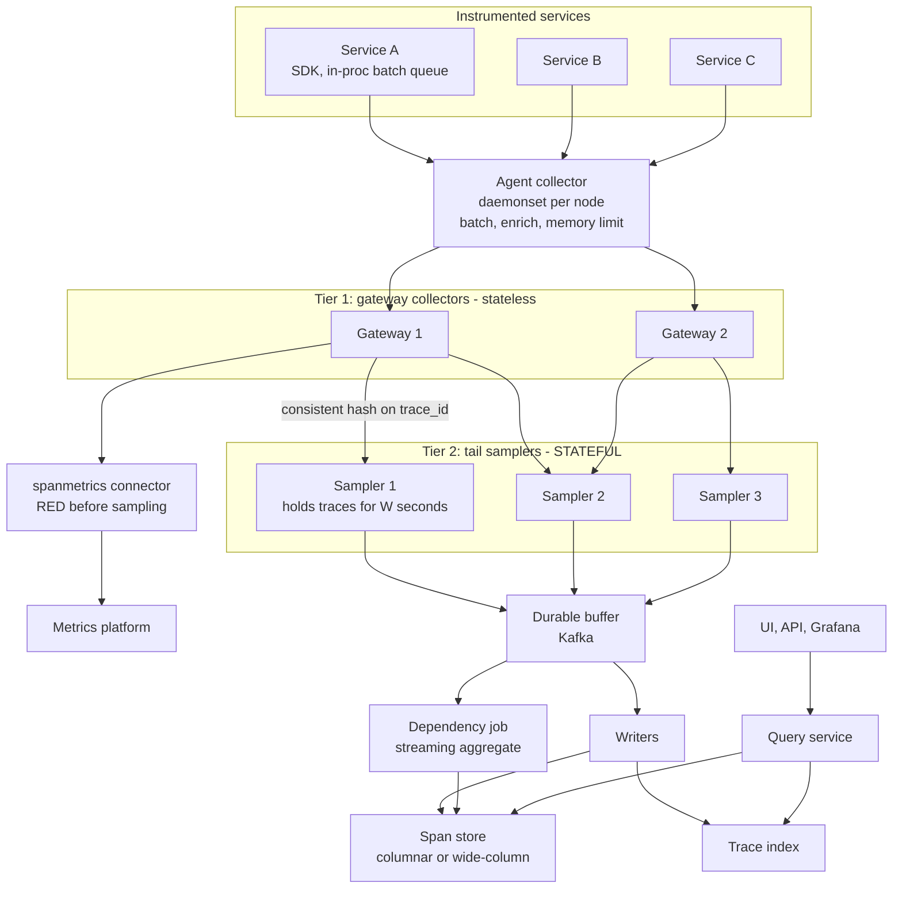
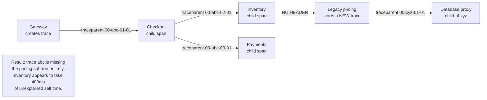
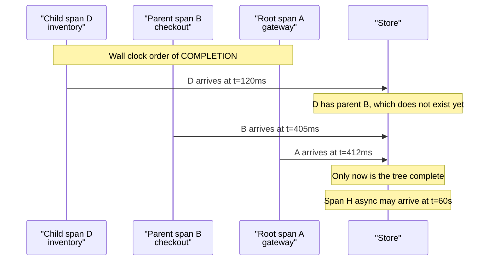
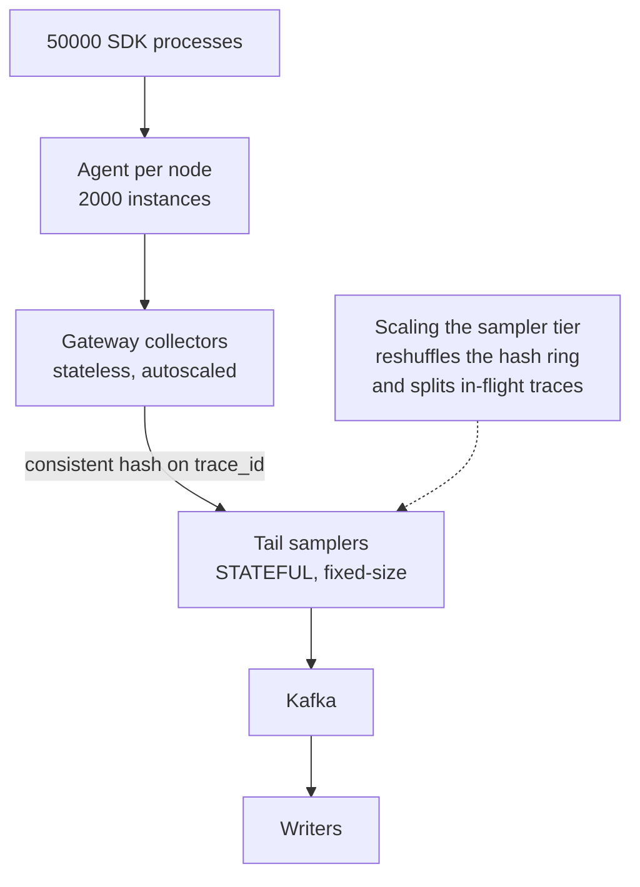

# 33 — Distributed Tracing (Jaeger / Zipkin-style)

<span class="pill pill-core">Core</span> <span class="pill pill-hard">Hard</span>

**Reconstructing the causal graph of one request across sixty services from spans that arrive out of order, from different machines, in different languages, with clocks that disagree — where a single service that forgets to forward one HTTP header silently severs the trace at exactly the hop you were trying to investigate.**

| | |
|---|---|
| **Commonly asked at** | Google, Datadog, Grafana Labs, Lightstep, Uber, Stripe, Shopify, Cloudflare, Elastic, and most platform or observability SRE loops |
| **Time budget** | 45 min |
| **Core tension** | You only know whether a trace was worth keeping *after* it has finished, but to decide after it has finished you must transport and buffer 100% of spans through a stateful collector tier — so the sampling decision is a direct trade between cost and the guarantee that you captured the one request you needed |
| **Prerequisites** | [F01 Networking Foundations](../fundamentals/f01-networking-foundations.md), [F03 Load Balancing](../fundamentals/f03-load-balancing.md), [F06 Partitioning & Sharding](../fundamentals/f06-partitioning-sharding.md), [F12 Queues & Streams](../fundamentals/f12-queues-streams.md), [F13 Storage Engines](../fundamentals/f13-storage-engines.md), [F15 Object & Blob Storage](../fundamentals/f15-object-storage.md), [F16 Search & Indexing](../fundamentals/f16-search-indexing.md), [F17 Rate Limiting & Load Shedding](../fundamentals/f17-rate-limiting-load-shedding.md), [F18 Resilience Patterns](../fundamentals/f18-resilience-patterns.md), [F20 Time, Clocks & Ordering](../fundamentals/f20-time-clocks-ordering.md), [F21 Probabilistic Structures](../fundamentals/f21-probabilistic-data-structures.md), [F22 Observability Fundamentals](../fundamentals/f22-observability-fundamentals.md), [F28 Cost Engineering](../fundamentals/f28-cost-engineering.md) |

---

## 1. Problem Statement

Build the tracing platform for a microservice estate where one user-facing request touches dozens of services: capture the causal structure of individual requests, store enough of them to be useful, and make a specific trace findable within seconds during an incident.

The reason tracing exists is that in a distributed system, **latency is not owned by any one service**. Every service reports a healthy p99 for its own handler while the end-to-end p99 is terrible, because the time is spread across twelve hops, a retry, and a queue nobody instrumented. Metrics tell you the p99 moved. Logs tell you what one service did. Only a trace tells you *where in the call graph the time went*, and it does so by reconstructing a causal tree from independently-emitted records.

Four properties make that genuinely hard:

- **The trace does not exist anywhere until you assemble it.** Each service emits its own spans independently. Nothing in the system holds a complete trace; it is materialised by grouping on `trace_id` at read time, from records that arrive seconds or minutes apart.
- **There is no completion signal.** A parent span finishes *after* all its children, so it arrives last. A fire-and-forget async span may arrive minutes later. You never definitively know a trace is complete — you only know you have waited long enough, which is a heuristic with a cost on both sides.
- **Correctness depends on universal participation.** One service that does not forward the propagation header breaks the causal chain for every trace that passes through it. The failure is silent and it is concentrated exactly where the untraced service is, which is usually the legacy one you most needed to see.
- **Volume is ruinous at 100% and biased at 1%.** Full capture is an order of magnitude more data than logs; naive sampling systematically discards the rare failures you are trying to find.

### Out of scope

Continuous profiling, eBPF-based zero-code instrumentation (mentioned as an alternative), real-user monitoring and browser tracing beyond the propagation boundary, and the metrics and logging platforms as systems in their own right.

---

## 2. Requirements

### Functional

| # | Requirement | Notes |
|---|---|---|
| F1 | Propagate trace context across process, language and protocol boundaries | W3C `traceparent` and `tracestate` |
| F2 | Record spans with timing, status, attributes, events and links | OpenTelemetry data model |
| F3 | Retrieve a complete trace by `trace_id` | The single most-used query, must be fast |
| F4 | Search traces by service, operation, duration, status and attributes | The second most-used query |
| F5 | Sampling policy configurable centrally, applied consistently | Head and tail |
| F6 | Tail sampling that retains errors and latency outliers | The core value proposition |
| F7 | Service dependency graph derived from trace data | Generated from reality, not from a wiki |
| F8 | RED metrics derived from spans | Rate, errors, duration per service and operation |
| F9 | Correlate to logs and metrics | `trace_id` in log lines, exemplars on histograms |
| F10 | Multi-tenant isolation | Per-tenant quotas, retention, access control |

### Non-functional

| # | Requirement | Target |
|---|---|---|
| N1 | Instrumentation overhead | < 1% of request p99 latency, < 3% CPU, bounded memory |
| N2 | Never block or fail the application | Export is async, buffered and droppable, always |
| N3 | Span ingest to queryable | p99 < 60 s including the tail-sampling decision window |
| N4 | Trace lookup by id | p99 < 1 s |
| N5 | Trace search by attributes | p99 < 5 s over 24 h |
| N6 | Capture guarantee | 100% of traces containing an error or exceeding a latency threshold |
| N7 | Retention | 7 d for sampled traces, 30 d for error traces |
| N8 | Propagation coverage | > 99.5% of spans have a valid parent link where one should exist |

!!! danger "N8 is the requirement that determines whether the system works at all"
    A tracing platform with 95% propagation coverage is not 95% useful — it is substantially worse than that, because the 5% of hops that drop context are not random. They are the old services, the message-queue boundaries, the thread-pool handoffs and the third-party SDKs, which is to say they are exactly the places where interesting failures live. **Propagation coverage must be measured continuously and treated as a platform SLI**, not assumed. Most organisations have never measured it and would be unpleasantly surprised.

---

## 3. Scale Estimation

**Span volume.**

$$
\begin{aligned}
R_{\text{edge}} &= 5 \times 10^{5}\ \text{req/s peak} \\
\bar{s} &= 60\ \text{spans per trace} \\
R_{\text{spans}} &= 5 \times 10^{5} \times 60 = 3 \times 10^{7}\ \text{spans/s}
\end{aligned}
$$

**Span size.** An OTLP protobuf span with a realistic attribute set — resource attributes, HTTP semantic conventions, a few custom tags, status:

$$
\begin{aligned}
\text{ids} &= 16 + 8 + 8 = 32\ \text{B} \\
\text{timings, status, kind} &\approx 40\ \text{B} \\
\text{name and service} &\approx 60\ \text{B} \\
\text{20 attributes} &\approx 400\ \text{B} \\
\bar{b}_{\text{span}} &\approx 550\text{-}600\ \text{B}
\end{aligned}
$$

**Full capture is not an option, and here is the number that proves it:**

$$
3 \times 10^{7} \times 600\ \text{B} = 18\ \text{GB/s} = 1.55\ \text{PB/day}
$$

That is roughly **45x the log volume** of the same estate. Even compressed 5:1 it is 311 TB/day. Sampling is not an optimisation; it is the only reason the system can exist.

**Head sampling at 1%.**

$$
\begin{aligned}
R_{\text{kept}} &= 3 \times 10^{5}\ \text{spans/s} \\
\text{raw} &= 180\ \text{MB/s} = 15.5\ \text{TB/day} \\
\text{compressed 5:1} &= 3.1\ \text{TB/day} \\
\text{7 d retention} &\approx 21.8\ \text{TB}
\end{aligned}
$$

Affordable. And it captures approximately none of the rare failures you care about (§7.3).

**Tail sampling, and its real cost.** The decision requires the whole trace, so **100% of spans must reach the collector tier** and be buffered until the trace is judged complete:

$$
\begin{aligned}
\text{ingress to collectors} &= 18\ \text{GB/s} \\
\text{decision window } W &= 30\ \text{s} \\
M_{\text{buffer}} &= 18\ \text{GB/s} \times 30\ \text{s} = 540\ \text{GB resident} \\
\text{collectors at 24 GB usable} &= \left\lceil \frac{540}{24} \right\rceil = 23\ \text{for memory alone}
\end{aligned}
$$

Add CPU for decode, policy evaluation and re-encode, plus headroom, and a realistic tier is 60-90 instances. **This is the honest cost of tail sampling and most candidates never compute it.** It is also why the production answer is a hybrid (§7.3): a consistent probabilistic pre-filter at, say, 25% at the edge, reducing collector ingress to 4.5 GB/s and buffer memory to 135 GB, combined with an unconditional keep-everything rule for any trace whose root or any span has already recorded an error.

**Storage index sizing.** The dominant index is `trace_id -> span rows`:

$$
\begin{aligned}
\text{traces/day kept} &= 5\times10^{5} \times 86400 \times 0.01 = 4.32 \times 10^{8} \\
\text{index entry} &\approx 16\ \text{B trace\_id} + 24\ \text{B location} = 40\ \text{B} \\
\text{index/day} &= 4.32\times10^{8} \times 40\ \text{B} \approx 17\ \text{GB} \\
\text{7 d} &\approx 121\ \text{GB}
\end{aligned}
$$

Comfortable. The **attribute** index is the one that hurts: indexing every key-value pair across 20 attributes per span gives $3\times10^{5} \times 20 = 6\times10^{6}$ index writes per second, and if any attribute is high-cardinality (`user_id`, a URL with an embedded id, a full SQL string) the index dwarfs the span data itself (§7.4).

**Instrumentation overhead budget.**

$$
\begin{aligned}
t_{\text{span}} &\approx 0.5\ \mu s\ \text{creation} + 1\ \mu s\ \text{serialise} \\
\text{per request} &= 60 \times 1.5\ \mu s = 90\ \mu s \\
\text{as a fraction of } p99 = 200\ \text{ms} &= 0.045\%
\end{aligned}
$$

Comfortably within a 1% budget — **for 60 spans**. The pathology is an N+1 query pattern emitting one span per database row: 5,000 spans is 7.5 ms of pure overhead per request, plus the memory to hold them and the export bandwidth to ship them. A span limit per trace is a mandatory guardrail, not a nicety.

---

## 4. API Design

=== "W3C context propagation"

    ```text
    traceparent: 00-4bf92f3577b34da6a3ce929d0e0e4736-00f067aa0ba902b7-01
                 |  |                                |                |
                 |  |                                |                +-- flags: 01 = sampled
                 |  |                                +------------------- parent span id, 8 bytes hex
                 |  +---------------------------------------------------- trace id, 16 bytes hex
                 +------------------------------------------------------- version

    tracestate: vendorA=t61rcWkgMzE,vendorB=00f067aa0ba902b7,ot=th:8
    ```

    Rules that matter operationally: a receiver that does not understand `tracestate` **must forward it unmodified** rather than dropping it; a malformed `traceparent` must be treated as absent and a new trace started rather than propagating garbage; and the sampled flag is a *decision already made upstream* that downstream services must respect, or sampling becomes inconsistent and traces arrive permanently half-complete.

=== "Span model"

    ```json
    {
      "traceId": "4bf92f3577b34da6a3ce929d0e0e4736",
      "spanId": "00f067aa0ba902b7",
      "parentSpanId": "0020000000000001",
      "name": "GET /orders/:id",
      "kind": "SPAN_KIND_SERVER",
      "startTimeUnixNano": "1716220800123456789",
      "endTimeUnixNano":   "1716220800187654321",
      "status": {"code": "STATUS_CODE_ERROR", "message": "upstream timeout"},
      "attributes": {
        "http.request.method": "GET",
        "http.route": "/orders/:id",
        "http.response.status_code": 504,
        "server.address": "orders.internal",
        "db.system": "postgresql"
      },
      "events": [
        {"timeUnixNano": "1716220800150000000", "name": "exception",
         "attributes": {"exception.type": "TimeoutError"}}
      ],
      "links": [{"traceId": "aa11...", "spanId": "bb22..."}],
      "resource": {
        "service.name": "orders-api",
        "service.version": "2024.5.18",
        "deployment.environment": "prod",
        "k8s.pod.name": "orders-api-7f4-x9k2"
      }
    }
    ```

    Note `http.route` rather than the raw path. `GET /orders/99123` as a span name creates one distinct operation name per order and destroys both the search index and any RED metrics derived from spans — the same cardinality failure that breaks a TSDB, arriving through a different door (§7.6).

=== "Query API"

    ```bash
    # 1. Retrieve a full trace. The most common query by far. Must be sub-second.
    GET /api/traces/{trace_id}

    # 2. Search. Time range is mandatory; the service filter almost always is too.
    GET /api/traces?service=checkout&operation=POST%20/v2/pay
        &minDuration=2s&tags={"http.response.status_code":"500"}
        &start=...&end=...&limit=50

    # 3. Dependency graph, precomputed by a batch job over span parent-child pairs
    GET /api/dependencies?endTs=...&lookback=24h

    # 4. TraceQL-style structured search - far more expressive, far more expensive
    POST /api/search
    { "q": "{ resource.service.name=\"checkout\" && span.http.status_code>=500 }
            | select(span.db.statement) | count() > 3" }
    ```

=== "Collector config: the load-balancer plus tail sampler"

    ```yaml
    # ---- TIER 1: gateway. Its ONLY job is routing all spans of a trace together.
    receivers:
      otlp: {protocols: {grpc: {endpoint: 0.0.0.0:4317}}}
    exporters:
      loadbalancing:
        routing_key: traceId          # MANDATORY for tail sampling to work at all
        protocol: {otlp: {tls: {insecure: true}}}
        resolver:
          k8s: {service: tailsampler.observability, ports: [4317]}
    service:
      pipelines:
        traces: {receivers: [otlp], exporters: [loadbalancing]}

    ---
    # ---- TIER 2: tail sampler. Stateful. Holds W seconds of spans in memory.
    processors:
      tail_sampling:
        decision_wait: 30s            # trade: completeness vs memory vs freshness
        num_traces: 4000000           # hard cap on resident traces
        expected_new_traces_per_sec: 150000
        policies:
          - name: errors
            type: status_code
            status_code: {status_codes: [ERROR]}
          - name: slow
            type: latency
            latency: {threshold_ms: 2000}
          - name: explicitly-marked
            type: boolean_attribute
            boolean_attribute: {key: sampling.force_keep, value: true}
          - name: rare-routes            # guarantee coverage of low-traffic paths
            type: and
            and:
              and_sub_policy:
                - {name: r, type: string_attribute,
                   string_attribute: {key: http.route, values: ["/v2/refund.*"],
                                      enabled_regex_matching: true}}
                - {name: p, type: probabilistic,
                   probabilistic: {sampling_percentage: 100}}
          - name: baseline
            type: probabilistic
            probabilistic: {sampling_percentage: 1}

      memory_limiter:
        check_interval: 1s
        limit_percentage: 80
        spike_limit_percentage: 15

    connectors:
      spanmetrics:                     # RED metrics from spans, pre-sampling
        histogram: {explicit: {buckets: [5ms,10ms,50ms,100ms,500ms,1s,5s]}}
        dimensions: [{name: http.route}, {name: http.response.status_code}]
        exemplars: {enabled: true}     # the metrics-to-traces jump
    ```

---

## 5. Data Model

### The trace as a tree that nobody owns

```text
trace_id = 4bf92f...

  [span A] gateway            GET /checkout                      0 - 412 ms
     |
     +-- [span B] checkout    POST /v2/pay                      12 - 405 ms
     |      |
     |      +-- [span C] auth       verifyToken                 14 -  31 ms
     |      +-- [span D] inventory  reserve                     33 - 118 ms
     |      |      +-- [span E] postgres  SELECT ...            40 - 115 ms   <-- 75 ms
     |      +-- [span F] payments   charge                     120 - 402 ms
     |             +-- [span G] http  POST psp.example         128 - 398 ms   <-- 270 ms
     |
     +-- [span H] notify      publish  (async, link not parent) 410 - 411 ms
```

Three structural facts that shape everything downstream:

1. **Parents end after children**, so the root span is typically the *last* record to arrive. Any assembly strategy that waits for the root before starting is waiting for the longest possible time.
2. **`links` are not `parentSpanId`.** A span produced by a queue consumer is causally *related* to the producer but is not a child — it has its own trace or is linked. Modelling async as parent-child produces traces that appear to last for hours, which breaks latency-based tail sampling and every duration statistic.
3. **Every span is independently emitted.** There is no transaction, no coordinator, and no guarantee that all of them arrive or that any of them do.

### Storage schema

```sql
-- Primary: retrieval by trace id. This is 80% of query volume.
CREATE TABLE spans (
  trace_id        FixedString(16),
  span_id         FixedString(8),
  parent_span_id  FixedString(8),
  service_name    LowCardinality(String),
  operation       LowCardinality(String),   -- MUST be the route template
  start_time      DateTime64(6),
  duration_ns     UInt64,
  status_code     Enum8('unset'=0,'ok'=1,'error'=2),
  attributes      Map(LowCardinality(String), String),
  events          Nested(ts DateTime64(6), name String, attrs String),
  INDEX idx_attr_keys  mapKeys(attributes)   TYPE bloom_filter GRANULARITY 4,
  INDEX idx_attr_vals  mapValues(attributes) TYPE bloom_filter GRANULARITY 4
) ENGINE = MergeTree
ORDER BY (service_name, operation, toStartOfHour(start_time), trace_id)
PARTITION BY toDate(start_time)
TTL start_time + INTERVAL 7 DAY;

-- Secondary: the search index. Deliberately narrow.
CREATE TABLE trace_index (
  trace_id, root_service, root_operation, start_time,
  duration_ns, has_error UInt8, span_count UInt16,
  indexed_tags Map(String, String)   -- an ALLOW-LIST, never everything
) ENGINE = MergeTree ORDER BY (root_service, start_time);
```

The critical design decision is in the last comment. **Indexing every attribute is what kills trace storage.** Twenty attributes per span at 300,000 spans/s is six million index writes per second, and a single high-cardinality attribute — a raw URL, a `user_id`, a full SQL statement — produces an index larger than the data. The workable approach is a **narrow allow-list of indexed attributes** (`http.route`, `http.response.status_code`, `service.version`, `deployment.environment`, plus a small per-tenant list) with everything else stored but only searchable via bloom-filter-accelerated scan within an already-narrowed time and service range.

### The three query shapes and their very different costs

| Query | Frequency | Cost | Mechanism |
|---|---|---|---|
| By `trace_id` | ~80% | Trivial | Point lookup on the primary key; this should always be sub-second |
| By service + time + duration | ~18% | Moderate | Range scan on the sort key, bounded by partition pruning |
| By arbitrary attribute value | ~2% | Severe | Bloom filter skip index then scan; must be bounded by service and time or it is a full scan |

Design the system so the 80% case is trivially fast and the 2% case is *possible but rate-limited*. Most of the value of a tracing system is delivered through the first row, usually arriving from a log line or an exemplar that already contains the `trace_id`.

---

## 6. High-Level Architecture



### Write path walkthrough

1. **Context extraction.** An inbound request's `traceparent` is parsed. If present and valid, this service's span becomes a child of the given parent and **inherits the sampled flag**. If absent, this service is a trace root and makes a fresh sampling decision.
2. **Span creation.** Spans live on a context object carried through the call stack — and across thread, goroutine and async-task boundaries, which is where most propagation bugs are (§7.1). Attributes are attached from semantic conventions plus application-specific context.
3. **Injection.** Every outbound call — HTTP, gRPC, database driver, message publish — injects the current span's id as the new `parentSpanId` in a `traceparent` header. **A single outbound call path that skips this severs the trace.**
4. **In-process batching.** Finished spans go to a bounded queue drained by a background exporter. The queue is bounded and drops when full; it must **never** block a request thread. This is N2, and it is non-negotiable.
5. **Agent tier.** A node-local collector receives OTLP over localhost, adds resource attributes the SDK cannot know (node, cluster, region), applies a memory limiter, and batches upstream. Putting it node-local means the SDK's network dependency is a loopback socket, which is about as reliable as a dependency gets.
6. **Gateway tier, and the one thing it must do.** Gateways are stateless *except* that they must route every span of a trace to the **same** tail sampler. That is the `loadbalancing` exporter with `routing_key: traceId` — consistent hashing over the sampler set. Without it, each sampler sees a random fragment of every trace, every policy evaluates on partial data, and tail sampling produces garbage while appearing to work.
7. **Span metrics before sampling.** RED metrics are derived here, from the **unsampled** stream, so rate, error and duration statistics are complete and unbiased even though only 1% of traces are stored. This is one of the highest-value design decisions in the system and it is frequently missed.
8. **Tail sampling.** Each sampler holds spans keyed by `trace_id` for `decision_wait`. When the timer fires, policies are evaluated against the accumulated spans in priority order and the trace is kept or dropped in its entirety.
9. **Durable buffer, then write.** Kept traces go through Kafka so that a storage outage is an indexing delay rather than data loss, and so the store can be reindexed or migrated without touching the collection path.

### Read path walkthrough

1. **Arrive with a `trace_id`** from a log line, an exemplar, or a search result — the dominant path.
2. **Point lookup** on the primary key returns all spans for that trace. Assemble the tree in the query service by linking `parentSpanId`, tolerating missing parents by promoting orphans to synthetic roots so a partially-broken trace still renders.
3. **Search**, when the id is unknown: narrow by service and time first, apply duration and status predicates against the index, then bloom-filter-accelerated scan for attribute predicates.
4. **Render**, with explicit visual marking of gaps, orphans and clock-skew corrections, because a trace that silently hides its own incompleteness is worse than one that admits it.

---

## 7. Deep Dives

### 7.1 Context propagation, and the single hop that breaks everything



**The mechanism of the damage.** The broken hop does not produce an error or a gap you can see. Inventory's span still spans the full 400 ms; it just has no children explaining where the time went. The natural reading is "inventory is slow", and a team spends a day profiling a service that is doing nothing but waiting on an untraced dependency. **The trace lies by omission, and the omission is invisible.** Meanwhile the pricing service's spans exist in a separate orphan trace whose root is a service nobody was looking at.

**Where propagation actually breaks, in rough order of frequency:**

| Boundary | Mechanism | Fix |
|---|---|---|
| Thread pools and executors | Context is thread-local; submitting to a pool loses it | Context-propagating executor wrappers; in Go pass `context.Context` explicitly, never store it in a struct |
| Async, futures, callbacks | The continuation runs on a different carrier | Instrumented async runtimes; explicit capture-and-restore around the boundary |
| Message queues | Headers are dropped or unsupported by the client wrapper | Inject into message metadata; use span **links**, not parent-child, since the consumer may run much later |
| Custom or old HTTP clients | Only an allow-list of headers is forwarded | Audit header allow-lists; this is a very common silent cause in gateways and service meshes |
| Cross-language boundaries | Incompatible legacy formats — B3 single vs multi, X-Ray, Jaeger `uber-trace-id` | Configure a **composite propagator** that reads several formats and writes W3C |
| Service meshes | The proxy creates its own span but does not propagate the app's context | The app must forward the headers the mesh injects; mesh-only tracing gives you hop timing with no application detail |
| Batch and cron jobs | No inbound request, so no context | Create an explicit root span per job; use links to relate items in the batch |

**Measure coverage; do not assume it.** The platform-level SLI is the fraction of *server-kind* spans that have a valid parent when their caller should have provided one. Practically: for each service pair observed in the dependency graph, compare the count of client spans naming a downstream service against the count of server spans in that downstream service with a parent in the same trace. A persistent deficit localises the broken hop to a specific edge. Publish this as a per-service scorecard — it is the only thing that makes propagation gaps get fixed, because they cost the owning team nothing and cost everyone else a great deal.

### 7.2 Head sampling versus tail sampling

```mermaid
flowchart TB
    subgraph Head["Head-based"]
      H1["Root service decides at request start"] --> H2["Decision encoded in the sampled flag"]
      H2 --> H3["All downstream services obey it"]
      H3 --> H4["Only 1% of spans ever leave the process"]
      H4 --> H5["Cheap and consistent<br/>BLIND to outcome"]
    end
    subgraph Tail["Tail-based"]
      T1["All services emit 100% of spans"] --> T2["Gateway routes by trace_id hash"]
      T2 --> T3["Sampler buffers spans for W seconds"]
      T3 --> T4["Policies evaluate the assembled trace"]
      T4 --> T5["Keep errors, slow traces, rare routes"]
      T5 --> T6["Outcome-aware<br/>EXPENSIVE and stateful"]
    end
```



**Head sampling is consistent because the decision is deterministic and propagated.** Best practice is not a coin flip per service but `hash(trace_id) < threshold`, so any service can independently compute the same decision from the trace id alone, and the W3C `tracestate` `ot=th:` field carries the threshold so downstream services know the effective rate and can correctly extrapolate counts. A per-service independent random decision is the classic error: at 1% per service across 60 services, the probability of a complete trace is $0.01^{60}$, which is zero. You get 60 fragments and no traces.

**Tail sampling's value proposition is simple:** at 1% head sampling you have a 1% chance of having captured any particular failed request. With tail sampling you keep **100% of traces containing an error** and 100% of traces above a latency threshold, plus a small probabilistic baseline for the healthy case. That converts "I hope we caught it" into "we definitely have it", which is the entire difference between a tracing system people trust and one they check out of habit.

**Its costs, all of which you should state:**

| Cost | Detail |
|---|---|
| Full-volume transport | 18 GB/s to the collector tier versus 180 MB/s with head sampling — a 100x network and CPU difference |
| Stateful collectors | $18\ \text{GB/s} \times 30\ \text{s} = 540\ \text{GB}$ resident; a collector restart drops every in-flight trace |
| Routing constraint | All spans of a trace must reach the same instance; scaling the tier reshuffles the hash ring and corrupts in-flight decisions |
| Freshness | Traces are queryable only after `decision_wait` elapses — 30 s of unavoidable added latency |
| Long traces | A trace exceeding $W$ is judged on partial data, and a very long trace may never be judged correctly at all |

**The production answer is a hybrid**, and it is worth presenting as such:

1. **Consistent probabilistic pre-filter at the edge**, e.g. 25%, reducing collector ingress to 4.5 GB/s and buffer memory to 135 GB.
2. **Except**: force the sampled flag on for any request already known to be interesting — an error recorded in the root span, a debug header, a canary deployment, a flagged tenant, a low-traffic route.
3. **Tail sampling on the surviving 25%** with error and latency policies.
4. **Derive RED metrics from the full 100% stream before any sampling**, so aggregate statistics stay complete regardless of what is stored.

That gives you error-trace capture that is 25% rather than 100%, at roughly a quarter of the tail-sampling cost — and the four-times reduction in guarantee is usually acceptable, while a 100-times cost reduction usually is not otherwise available. Stating that trade numerically is exactly what a senior answer looks like.

### 7.3 Sampling bias: why 1% hides the failures that matter

Let $R$ be the request rate for some slice of traffic, $p$ the failure probability within it, and $s$ the sample rate. Captured failing traces per second:

$$
\lambda = R \cdot p \cdot s
$$

| Scenario | $R$ | $p$ | $s$ | $\lambda$ | Expected wait for one trace |
|---|---|---|---|---|---|
| Global 5xx | $5\times10^{5}$ | $10^{-3}$ | $0.01$ | 5/s | Instant |
| One tenant, one endpoint | 50/s | $10^{-2}$ | $0.01$ | 0.005/s | **3.3 minutes** |
| Rare race condition | $5\times10^{5}$ | $10^{-6}$ | $0.01$ | 0.005/s | 3.3 minutes |
| One customer's specific bug | 5/s | $10^{-2}$ | $0.01$ | $5\times10^{-4}$/s | **33 minutes** |
| Failure in a cold code path | 0.5/s | $10^{-1}$ | $0.01$ | $5\times10^{-4}$/s | **33 minutes** |

The last two rows are the whole argument. **The failures you most need a trace for are, by construction, the rare ones — and rare is exactly what uniform sampling discards.** Worse, the bias is invisible: the UI shows plenty of traces, they all look healthy, and the natural conclusion is that the problem is not reproducible.

Three mitigations, in order of value:

1. **Tail sampling with an error policy.** $s = 1$ for anything that failed, so $\lambda = R \cdot p$ and the customer-specific bug yields a trace every 20 seconds instead of every 33 minutes.
2. **Per-route and per-tenant sampling rates,** inversely proportional to traffic. A route serving 5 rps is sampled at 100%; one serving 50,000 rps at 0.1%. Total cost is nearly unchanged and low-traffic coverage improves by orders of magnitude. Carry the effective rate in `tracestate` so any count derived from traces can be correctly scaled back up.
3. **Forced sampling as a debugging tool.** A `sampling.force_keep` attribute or a debug header, exposed as a documented, rate-limited capability so an engineer investigating a specific customer can capture 100% of that customer's traces for an hour. This is enormously valuable and is almost always absent because nobody thought to build it.

!!! warning "Never compute a rate or an error percentage from sampled traces"
    If someone asks "what is our error rate?" and you answer from the trace store, you are reporting the error rate *of the sampling policy*, not of the service — and with tail sampling biased toward errors, that number can be off by two orders of magnitude in the alarming direction. RED metrics must come from the **pre-sampling** span-metrics stream or from direct instrumentation. Traces answer "what happened in this request"; they must never be the source of an aggregate statistic.

### 7.4 Storage, and the high-cardinality tag problem

The tracing store has an unusual shape: extremely high write throughput, a tiny point-lookup read workload that dominates by count, and a small analytical read workload that dominates by cost.

| Store | Strength | Weakness | Chosen / rejected and why |
|---|---|---|---|
| Cassandra, wide-column | Excellent `trace_id` point lookups; linear write scaling | Attribute search is poor; needs a separate index; tombstones on TTL | **Rejected as primary.** The search experience is the product differentiator and it cannot deliver it |
| Elasticsearch | Rich attribute and full-text search out of the box | Indexing cost at 300k spans/s is brutal; high-cardinality tags explode the index; shard management at this volume | **Rejected.** The index-everything cost model is wrong for a workload where 80% of reads are a point lookup that needs no index |
| ClickHouse, columnar | Excellent compression on repetitive spans; fast scans; bloom skip indexes on maps; cheap aggregation for dependency graphs | Point lookup needs the sort key designed for it; no free-text search | **Chosen.** Sort key `(service, operation, hour, trace_id)` makes both the point lookup and the service-scoped scan efficient, and columnar compression on highly-repetitive span data is 8-12x |
| Object storage with an index | Cheapest possible long retention | Higher lookup latency | **Chosen for the cold tier** beyond 7 days, with error traces retained 30 days |

**The high-cardinality tag problem, mechanically.** Attributes are the most useful part of a span and the most dangerous. If you index them all:

$$
3 \times 10^{5}\ \text{spans/s} \times 20\ \text{attributes} = 6 \times 10^{6}\ \text{index writes/s}
$$

and a single attribute like `db.statement` containing a full parameterised SQL string, or `http.url` with embedded ids, or `user.id`, produces an index with cardinality equal to the span count. The index becomes larger than the data it indexes, and every write pays for an index nobody queries.

The workable design:

- **A narrow allow-list of indexed attributes:** `http.route`, `http.response.status_code`, `rpc.method`, `db.system`, `service.version`, `deployment.environment`, plus a small per-tenant extension list with a hard cap.
- **Everything else stored but unindexed**, searchable only within an already-narrowed `(service, time)` window via bloom-filter skip indexes — fast enough for real use, impossible to abuse across the whole store.
- **Value-length caps and attribute-count caps** enforced in the SDK, because an unbounded attribute value is both a storage and a PII problem, and a stack trace pasted into an attribute is a surprisingly common way to multiply span size by fifty.
- **Normalise at instrumentation time.** `http.route` must be the template `/orders/:id`. A raw path is the single most common cause of cardinality damage, and it hurts twice: once in the trace index and once in the span-derived RED metrics (§7.6).

### 7.5 Trace assembly from out-of-order arrival



There is **no completion signal**, so every strategy is a heuristic:

- **Assemble at read time** — store spans flat keyed by `trace_id` and build the tree on retrieval. Simple, always current, and the right default. A trace queried early simply renders incomplete, and re-querying later shows more.
- **Assemble at write time with a window** — required for tail sampling, since the policy needs the whole trace. Choosing $W$ is a genuine trade: too short and long traces are judged on fragments and truncated; too long and memory grows linearly with $W$ while freshness degrades. Thirty seconds covers the large majority of traces in a typical web estate; anything above the 99th percentile of trace duration should be handled by an explicit "long trace" policy rather than by raising $W$ for everyone.
- **Late spans** arriving after the decision must be handled explicitly. Either drop them with a counter, or keep a short-lived decision cache keyed by `trace_id` so a span arriving 45 seconds late can still be admitted if its trace was kept. Silently dropping them produces traces that are subtly missing their slowest branches — which is precisely the wrong bias.

**Render incompleteness honestly.** Orphan spans whose parent never arrived should be promoted to synthetic roots and visibly marked. A UI that silently hides orphans teaches users to trust a picture that is wrong, and the hidden subtree is disproportionately likely to be the one that mattered.

**Clock skew** is the other assembly problem. Spans carry timestamps from different machines, and a child span can legitimately appear to start before its parent or end after it because the two clocks differ by tens of milliseconds. See [F20 Time, Clocks & Ordering](../fundamentals/f20-time-clocks-ordering.md). The standard correction uses the causal constraint — a child must be contained within its parent — to compute a per-span offset and shift the child into range, and the UI should mark that it has done so. Do not silently "fix" the data: an engineer looking at a 40 ms unexplained gap needs to know whether it is real latency or a clock adjustment, and getting that wrong sends them down a multi-day investigation of something that does not exist.

### 7.6 The collector tier as a fan-in bottleneck

Every span in the company converges on one service, which makes the collector tier the highest-fan-in component in the observability stack and the one whose failure modes matter most.



**The three-tier split exists for specific reasons.** The agent gives the SDK a loopback-only network dependency and enriches with node-level resource attributes. The gateway is stateless, autoscales freely, and owns the trace-id-aware routing. The sampler is stateful and must be scaled deliberately. Collapsing these tiers is the most common architectural mistake, and it usually shows up as "we scaled the collectors during an incident and tail sampling started producing nonsense".

**Scaling the stateful tier is the hard part.** Adding an instance changes the consistent-hash mapping, so traces in flight have some spans on the old owner and some on the new one. Both evaluate policies on partial data. Mitigations: over-provision so the tier rarely scales; scale only during low-traffic windows; use a hash ring with virtual nodes so a single addition moves only $1/n$ of the key space; and accept a brief, measured window of degraded sampling accuracy, with a counter that makes it visible rather than silent.

**Backpressure must terminate in dropping, at the SDK.** The chain is: SDK queue bounded and dropping, agent memory-limited and dropping, gateway rate-limited returning a retryable status, sampler memory-limited and evicting oldest traces. At no point may any component block an application thread. The `memory_limiter` processor exists precisely because a collector that OOMs loses every buffered trace, whereas one that sheds load loses only the excess — and the difference between those two outcomes during an incident is total.

**The self-DDoS on recovery** is the same pattern as the logging platform: when the collector tier returns, thousands of SDK and agent queues flush simultaneously at many times normal rate against a cold tier. Exponential backoff with full jitter in every exporter, plus a drain rate limit, plus admission that prioritises fresh spans over backlog — because a 10-minute-old span is worth far less than a current one, and preferring the backlog is the wrong choice under pressure.

### 7.7 Deriving metrics and the dependency graph from spans

**Span metrics (RED).** A connector in the collector pipeline converts the span stream into `traces_span_metrics_calls_total` and `traces_span_metrics_duration_seconds` with dimensions for service, operation, span kind and status. Two properties make this valuable:

- **Computed before sampling**, so the metrics are complete and unbiased while storage holds 1%.
- **Free instrumentation.** Any service emitting spans gets RED metrics with no additional code, which is often the fastest route to coverage across a large legacy estate.

The failure mode is the one this section has already named twice: **the `operation` dimension becomes a metrics label**, so a raw URL path as the span name produces one time series per unique path. The tracing system then takes down the metrics system. Enforce route templating in the SDK, cap the dimension's cardinality in the connector, and alert on series count attributable to span metrics specifically.

**Exemplars** close the loop: each histogram bucket carries a `trace_id` of a request that landed in it, so a p99 latency panel is one click from a trace that was actually slow. That single link is the highest-leverage integration in the entire observability stack, because it converts "the p99 is bad" into "here is the specific request and the specific span that was slow" without any search step at all.

**The dependency graph** is derived by aggregating parent-child span pairs into service-to-service edges with call counts, error counts and latency distributions. It is generated from reality rather than from documentation, which makes it uniquely trustworthy, and it enables several things that are otherwise guesswork: blast-radius analysis before a change, alert inhibition rules that reflect actual dependencies (§31's alert-herd problem), detection of unexpected new edges as a security and architecture signal, and identification of circular dependencies. Compute it as a streaming aggregate over the **unsampled** stream where possible — a dependency graph built from 1% of traces will silently omit any rarely-used edge, and rarely-used edges are often the most interesting ones.

---

## 8. Scaling the Bottleneck

| Stage | Bottleneck | Symptom | Fix |
|---|---|---|---|
| 1 | SDK export queue | `dropped_spans` non-zero; memory growth in the app | Larger bounded queue, more exporter workers, reduce spans per request |
| 2 | Span count per request | Request latency regression traced to instrumentation | Span limit per trace; suppress per-row database spans; sample within the trace |
| 3 | Agent CPU | Ingest lag on the node | Batch harder, compress, move enrichment to the gateway |
| 4 | Gateway throughput | Queue depth rising; backpressure to agents | Stateless, so autoscale freely — this tier should never be the constraint |
| 5 | Tail sampler memory | OOM or trace eviction before the decision | Shorter $W$; pre-filter at the edge; more instances, scaled at low traffic |
| 6 | Storage write throughput | Kafka lag growing | More writers; larger batches; confirm no high-cardinality attribute index |
| 7 | Attribute search | Query timeouts on tag searches | Narrow the indexed allow-list; force service and time bounds; bloom skip indexes |
| 8 | Span metrics cardinality | The **metrics** platform degrades | Route templating, dimension caps, cardinality alerting on span-derived series |

!!! tip "The cheapest scaling lever is fewer spans, not more collectors"
    A service emitting a span per database row in an N+1 loop generates 5,000 spans for one request. That is 5,000x the export bandwidth, 5,000x the storage, 7.5 ms of added request latency, and a trace that is unusable in the UI because no human can read a 5,000-node tree. Capping spans per trace, and suppressing sibling spans that are identical apart from parameters, routinely removes 80% of span volume in an estate that has never looked. Do this before buying collectors — it is free, it improves the product, and it fixes a latency bug at the same time.

---

## 9. Failure Modes

| Failure | Blast radius | Detection | Mitigation | Degraded behaviour |
|---|---|---|---|---|
| One service drops the header | Every trace through that service, permanently | Parent-link coverage SLI per service edge | Composite propagator, mesh header allow-list audit, per-service scorecard | Trace silently truncates; the untraced hop appears as unexplained self time |
| Per-service independent sampling | Every trace, catastrophically | Median span count per trace collapses | Consistent `hash(trace_id)` decision propagated via the sampled flag | Fragments instead of traces; $0.01^{60}$ chance of completeness |
| Tail sampler restart | All traces in the decision window | Instance restarts; decision-count dip | Over-provision; graceful drain that flushes buffered traces | Up to $W$ seconds of traces lost including their errors |
| Gateway not routing by `trace_id` | All tail-sampling decisions | Traces stored with a fraction of their spans | `routing_key: traceId` on the loadbalancing exporter | Policies evaluate partial traces — looks like it works, produces garbage |
| Sampler tier scaled during peak | In-flight traces across the ring shift | Sampling accuracy metric dips | Scale at low traffic; virtual nodes; measured degradation window | Split traces, inconsistent decisions, for a bounded period |
| High-cardinality attribute | Storage and index; sometimes metrics too | Index size growth; span-metrics series count | Indexed allow-list; route templating; value length caps | Index exceeds data; search becomes unusable |
| SDK queue blocks | **The application** | Request latency correlated with exporter errors | Bounded queue that drops; never block a request thread | Spans dropped, which is correct and must be loud |
| Collector OOM | Everything buffered on that instance | Memory limiter trips before OOM | `memory_limiter` processor with a spike allowance | Sheds excess rather than losing everything |
| Recovery flush storm | The recovering collector tier | Ingress spike far above normal peak on restore | Jittered backoff, drain rate limit, prefer fresh spans over backlog | Slow controlled recovery instead of repeated collapse |
| Clock skew | Individual traces, confusingly | Negative durations; child outside parent | Causal-constraint skew adjustment, visibly marked in the UI | Spans shifted; must be labelled or it misleads investigation |
| Async modelled as parent-child | Traces spanning hours | Trace duration distribution has an absurd tail | Use `links` for async; separate trace per consumer | Latency policies misfire; trace duration statistics meaningless |
| Aggregates computed from sampled traces | Every decision made from them | Numbers disagree with service metrics | Derive RED from the pre-sampling stream | Error rate wrong by orders of magnitude, in the alarming direction |

---

## 10. SRE Lens

### SLIs and SLOs

| SLI | Definition | Target |
|---|---|---|
| Propagation coverage | Server spans with a valid in-trace parent / server spans that should have one | > 99.5% |
| Error-trace capture | Traces containing an error that were retained / traces containing an error | > 99% |
| Span ingest availability | Spans accepted / spans offered, excluding policy sampling | 99.9% |
| Span drop rate at the SDK | Dropped / produced | < 0.1% |
| Trace queryable latency | p99 from root span end to retrievable | < 60 s |
| Trace lookup latency | p99 for retrieval by `trace_id` | < 1 s |
| Search latency | p99 for a service-scoped 24 h attribute search | < 5 s |
| Instrumentation overhead | Added request p99 / total request p99 | < 1% |

**Propagation coverage and error-trace capture are the two that define whether the platform is actually useful.** Everything else measures whether the infrastructure is up. A platform with 99.99% ingest availability and 90% propagation coverage is an expensive way to produce misleading pictures, and the second number is the one nobody measures.

### Error budget

Span ingest at 99.9% over 30 days is 43 minutes, and it is deliberately looser than the metrics platform's 99.99%, because tracing is a debugging aid rather than a detection mechanism — you find out something is wrong from metrics, and then you use traces to find out why. Losing traces for 40 minutes is painful; losing metrics for 40 minutes is blindness. **Error-trace capture at 99% is the tighter and more meaningful budget**, because a missing error trace is missing exactly when someone needs it. Spend on that budget comes almost entirely from sampler restarts and decision-window truncation, both of which are addressable by over-provisioning and graceful drain rather than by heroics.

### Rollout plan

1. **SDK upgrades are application code** and deploy on each team's schedule, which means you will run five SDK versions simultaneously for months. Design for it: propagation format compatibility is a hard requirement, never a migration flag day.
2. **Propagator changes must be bidirectional-compatible.** Migrating from B3 to W3C means running a composite propagator that *reads* both and *writes* both for a full deployment cycle across every service before removing the old format. Skipping this severs every trace crossing an upgrade boundary, which is every trace.
3. **Collector rollouts:** agents first (largest fleet, lowest risk), then gateways (stateless), then samplers last and one at a time with graceful drain, since each restart costs $W$ seconds of buffered traces.
4. **Sampling policy changes go out shadowed:** evaluate the new policy, record what it *would* have decided, compare retained-volume and error-capture rates against the current policy, then promote. A policy change is a cost change and a coverage change simultaneously, and you want both numbers before it is live.
5. **Never change the sampling policy and the storage schema together.** When retention or search regresses you need to know which one did it.

### Runbook notes

```promql
# 1. Is the pipeline healthy? All from the METRICS platform, never from traces.
sum(rate(otelcol_processor_dropped_spans[5m])) by (processor)
sum(rate(otelcol_exporter_send_failed_spans[5m])) by (exporter)
otelcol_processor_tail_sampling_sampling_trace_dropped_too_early    # W too short
otelcol_processor_tail_sampling_count_traces_sampled

# 2. Is propagation broken, and where? The most valuable query in this system.
#    A persistent deficit on one edge localises the broken hop.
sum by (service, peer) (rate(traces_span_metrics_calls_total{span_kind="SPAN_KIND_CLIENT"}[5m]))
  - on(peer) group_left
sum by (service) (rate(traces_span_metrics_calls_total{span_kind="SPAN_KIND_SERVER"}[5m]))

# 3. Cardinality damage from span metrics - check before the metrics team calls you
count(count by (operation) (traces_span_metrics_calls_total))

# 4. Are applications being harmed by instrumentation?
sum(rate(otel_sdk_span_processor_dropped_spans_total[5m])) by (service)
```

Emergency levers, in order: drop the edge pre-filter rate to shed collector load; shorten `decision_wait` to cut sampler memory at the cost of truncating long traces; disable attribute indexing for the offending tenant; and, as the last resort, **turn off tail sampling entirely and fall back to head sampling** — you lose error-trace capture but the platform stays up and the applications are never affected either way. The ordering matters because the first three are reversible in seconds and the last one has a coverage gap you will have to explain.

### Capacity model

$$
\begin{aligned}
N_{\text{gateway}} &= \frac{R_{\text{spans}} \times \bar{b}}{T_{\text{node}} \times 0.6}
= \frac{18\ \text{GB/s}}{1.5\ \text{GB/s} \times 0.6} = 20 \\[4pt]
N_{\text{sampler}} &= \max\left(
  \frac{R_{\text{spans}} \times \bar{b} \times W}{M_{\text{node}} \times 0.7},\;
  \frac{R_{\text{spans}}}{C_{\text{decode}}}
\right) \\[4pt]
&= \max\left(\frac{18 \times 30}{24 \times 0.7},\; \frac{3\times10^{7}}{6\times10^{5}}\right)
= \max(32,\ 50) = 50 \\[4pt]
S_{\text{store}} &= R_{\text{spans}} \times s \times \bar{b} \times 86400 \times \frac{D}{\text{compression}}
\end{aligned}
$$

The sampler calculation is the one to show, because it makes the cost of tail sampling concrete and shows which term binds. Here **CPU binds, not memory** — decode and policy evaluation, not buffering — which is the opposite of most people's intuition and changes what you do about it: shortening $W$ would not help, but pre-filtering at the edge helps both terms at once.

### Cost

| Line item | Driver | Typical share | Lever |
|---|---|---|---|
| Collector compute | Unsampled span volume × decode cost | 35-45% with tail sampling | Edge pre-filter; fewer spans per request |
| Network | Full-volume transport to collectors | 15-20% | Node-local agents, compression, pre-filter |
| Storage | Sampled volume × retention | 20-25% | Sampling policy, retention tiering, columnar compression |
| Query | Attribute searches | 10% | Indexed allow-list, mandatory service and time bounds |
| Span-derived metrics | Series cardinality in the TSDB | 5-15%, and **billed to someone else** | Route templating and dimension caps |

The last row is a trap worth naming: span metrics are generated by the tracing platform and charged to the metrics platform, so a cardinality problem created here appears as someone else's incident and someone else's bill. Own the dimension cardinality explicitly and alert on span-derived series count as a tracing SLI, not as a metrics one.

---

## 11. Trade-offs & Alternatives

| Decision | Alternative | Chosen / rejected and why |
|---|---|---|
| Hybrid: edge pre-filter plus tail sampling | Pure head, or pure tail | **Chosen hybrid.** Pure head is blind to outcome and hides rare failures. Pure tail is 18 GB/s of transport and 540 GB of buffer. The hybrid gives error capture on 25% of traffic at roughly a quarter of the cost, and stating that ratio is the answer |
| Consistent `hash(trace_id)` sampling | Independent per-service decisions | **Chosen consistent.** Independent decisions give $s^{n}$ probability of a complete trace, which at 1% over 60 services is zero. This is the single most important correctness rule in sampling |
| Three collector tiers | One collector tier | **Chosen three.** The agent makes the SDK's dependency a loopback socket; the gateway is stateless and autoscales; the sampler is stateful and must be scaled deliberately. Collapsing them means scaling the stateless part corrupts the stateful part |
| Columnar store | Elasticsearch or Cassandra | **Chosen columnar.** 80% of reads are a point lookup needing no inverted index, and span data compresses 8-12x because it is extremely repetitive. Elasticsearch pays full indexing cost for a read pattern that does not use it |
| Indexed attribute allow-list | Index all attributes | **Chosen allow-list.** Six million index writes per second with one unbounded attribute produces an index larger than the data. Costs some search flexibility, recovered by bloom-filter scans inside a narrowed window |
| RED metrics from the unsampled stream | Compute aggregates from stored traces | **Chosen pre-sampling.** Aggregates from sampled traces measure the sampling policy, and with error-biased tail sampling they are wrong by orders of magnitude in the alarming direction |
| Kafka between sampler and store | Direct write | **Chosen buffer.** Converts a storage outage into an indexing delay, and makes schema migration and reindexing possible without touching collection. Costs another system to run |
| SDK instrumentation | eBPF or service-mesh-only tracing | **Chosen SDK, augmented by the mesh.** eBPF and meshes give zero-code hop-level coverage — excellent for legacy services and for measuring propagation gaps — but cannot see in-process structure, business context, or which database call was slow. Use the mesh for breadth and SDKs for depth |
| W3C `traceparent` | B3, Jaeger, X-Ray formats | **Chosen W3C.** It is the interoperability standard and the only one every vendor and proxy understands. Run a composite propagator during migration, reading all formats and writing W3C, for a full deployment cycle |

---

## 12. Gotchas & Corner Cases

!!! gotcha "One service drops the header and the trace lies by omission"
    **Symptom:** the inventory service shows 400 ms of unexplained self time in every trace. A team spends two days profiling it and finds nothing. The real cause is a downstream pricing service that is not in the trace at all.
    **Mechanism:** the inventory service calls pricing with an HTTP client that does not inject `traceparent`, or through a proxy whose header allow-list strips it. Pricing starts a brand-new trace. Inventory's span still covers the full duration; it simply has no children. The natural reading of the picture is wrong, and nothing indicates the picture is incomplete.
    **Mitigation:** measure propagation coverage as a platform SLI by comparing client-span counts per edge against server-span counts with an in-trace parent in the callee — a persistent deficit localises the broken hop precisely. Publish a per-service scorecard, because a gap costs the owning team nothing and costs everyone else a great deal. Audit proxy and mesh header allow-lists specifically; they are a very common silent cause.

!!! gotcha "Each service samples independently and you get fragments, never traces"
    **Symptom:** the UI is full of one-span and two-span traces. Nothing shows a full request path. Everything appears to be working — data is arriving.
    **Mechanism:** each service made its own random 1% decision instead of honouring the propagated sampled flag. The probability that all 60 services in a path independently choose to sample the same trace is $0.01^{60}$. You are storing 1% of spans and 0% of traces.
    **Mitigation:** the decision is made once at the trace root and propagated via the `traceparent` flags byte; every downstream service obeys it. Where a service must decide independently, use `hash(trace_id) < threshold` so the decision is deterministic and identical everywhere without coordination. Alert on median spans-per-trace — a collapse toward 1 is the unmistakable signature and it is otherwise invisible.

!!! gotcha "Tail sampling is silently useless because the load balancer is round-robin"
    **Symptom:** tail sampling is enabled and appears healthy — decisions are being made, traces are stored — but retained traces have a fraction of their spans and the error policy misses most errors.
    **Mechanism:** spans of one trace are spread across all sampler instances by an ordinary L4 or round-robin load balancer. Each sampler sees a random subset, so the error policy only fires if the erroring span happened to land on the instance that also held enough of the trace. Every policy evaluates on partial data. Nothing errors.
    **Mitigation:** `routing_key: traceId` on the loadbalancing exporter, consistently hashing every span of a trace to one sampler. Monitor spans-per-retained-trace against spans-per-trace from the unsampled span-metrics stream; a large gap is diagnostic. This misconfiguration is common precisely because the system looks like it is working.

!!! gotcha "Scaling the sampler tier during an incident corrupts sampling"
    **Symptom:** the autoscaler adds sampler instances under load and error-trace capture drops sharply for several minutes, right when traces matter most.
    **Mechanism:** adding an instance remaps part of the consistent-hash ring. Traces in flight have spans on both the old and the new owner; both evaluate partial traces; neither decides correctly. The degradation is invisible unless you are measuring capture rate against the unsampled stream.
    **Mitigation:** over-provision the stateful tier so it rarely scales, and disable autoscaling on it during incidents. Use virtual nodes so an addition moves only $1/n$ of the key space. Scale at low-traffic windows. Emit a "ring changed" counter and correlate it with capture rate so the degradation is at least visible and bounded rather than mysterious.

!!! gotcha "A raw URL as the span name takes down the metrics platform"
    **Symptom:** the metrics platform's ingest tier starts OOM-cycling. The cause is the tracing system, and the bill lands on the metrics team.
    **Mechanism:** span metrics use the operation name as a label. A span named `GET /orders/99123` rather than `GET /orders/:id` produces one time series per order id. At 500,000 requests per second that is effectively unbounded cardinality entering the TSDB through a door the metrics team does not control.
    **Mitigation:** enforce route templating at instrumentation time — `http.route` is a semantic convention for exactly this reason. Cap the cardinality of every dimension in the spanmetrics connector, with an `other` bucket for overflow. Alert on the series count attributable to span-derived metrics as a **tracing** SLI, because you created the problem and you should detect it first.

!!! gotcha "Async work modelled as parent-child produces traces that last for hours"
    **Symptom:** the trace duration distribution has a long tail of multi-hour traces. Latency-based tail sampling retains almost everything, blowing the storage budget, and p99 numbers derived from trace duration are meaningless.
    **Mechanism:** a service publishes to a queue and makes the consumer's span a child of the producer's span. The parent cannot complete until all children do, so the trace stays open until the message is eventually consumed — which might be hours later during a backlog.
    **Mitigation:** use span **links** for asynchronous causality, not parent-child. The consumer starts a new trace linked to the producer's span, so both are navigable and neither is unbounded in duration. Add a maximum trace duration in the sampler that force-decides and closes anything exceeding it, so one pathological pattern cannot consume the buffer.

!!! gotcha "An N+1 query pattern emits 5,000 spans and regresses request latency"
    **Symptom:** a latency regression appears immediately after tracing is enabled on a service, and the trace UI is unusable for that endpoint.
    **Mechanism:** the database instrumentation creates a span per query. An N+1 pattern over 5,000 rows creates 5,000 spans: roughly 7.5 ms of creation and serialisation on the request path, a large memory allocation, 3 MB of export payload for one request, and a tree no human can read.
    **Mitigation:** a hard span limit per trace in the SDK, with a counter when it trips. Suppress sibling spans identical apart from parameters, or aggregate them into one span with a count attribute. And note that the trace correctly identified a genuine performance bug — the N+1 query — so fix that too. Capping spans per trace routinely removes 80% of volume in an estate that has never measured it.

!!! gotcha "Clock skew makes a child span start before its parent"
    **Symptom:** negative durations, spans rendered outside their parent's bounds, and an apparent 40 ms gap between a client call and the server receiving it that sends someone hunting a nonexistent network problem.
    **Mechanism:** spans carry timestamps from different machines whose clocks differ by tens of milliseconds even with NTP. There is no global clock, and the trace is assembled from records that each believe their own clock.
    **Mitigation:** apply the causal constraint — a server span must be contained within its client span — to compute a per-span offset and shift the child into range. **Visibly mark adjusted spans in the UI.** Silently correcting is worse than not correcting, because an engineer needs to know whether a gap is real latency or a clock artefact. Monitor NTP offset per node as an infrastructure SLI; large skew also breaks log correlation and time-ordered views.

!!! gotcha "Someone reports the error rate from the trace store"
    **Symptom:** a dashboard says the error rate is 40%. The service's own metrics say 0.3%. An incident is declared for a problem that does not exist.
    **Mechanism:** tail sampling deliberately retains 100% of error traces and 1% of successful ones. The stored population is enormously biased toward errors *by design*. Any ratio computed from it measures the sampling policy, not the service.
    **Mitigation:** derive all aggregate statistics from the pre-sampling span-metrics stream or from direct instrumentation. Make the UI refuse to compute ratios over the stored trace population, or label them unmistakably as sample-based with the effective rate shown. Carry the effective sampling rate in `tracestate` so any count that must be extrapolated can be scaled correctly. Traces answer "what happened in this request" and must never be the source of an aggregate.

!!! gotcha "The SDK's export queue blocks and adds latency to every request"
    **Symptom:** application p99 latency correlates exactly with collector health. A tracing outage becomes an application outage.
    **Mechanism:** a misconfigured exporter uses a synchronous or unbounded-with-blocking queue. When the collector is slow, the queue fills and the request thread blocks on span export. The company's least critical dependency is now in the critical path of every request.
    **Mitigation:** the export queue must be bounded and must drop when full, always, with a loud counter. The agent should be node-local so the SDK's network dependency is a loopback socket. Test this deliberately: block the collector in staging and assert that application latency is unchanged. If tracing can take down the application, it will, and it will do so during an incident when the collector tier is already under strain.

!!! gotcha "Migrating propagation formats without a compatibility window severs every trace"
    **Symptom:** after a partial rollout, traces truncate at the boundary between upgraded and not-yet-upgraded services. Coverage drops by half overnight.
    **Mechanism:** a service writing only W3C `traceparent` calls one reading only B3. The header is unrecognised, the context is lost, and a new trace begins — at every boundary between the two populations, which during a multi-week rollout is most boundaries.
    **Mitigation:** configure a **composite propagator** that extracts from every format in use and injects *both* the old and the new, and deploy that everywhere first. Only after the entire estate is on the composite configuration do you remove the legacy injection. Treat it as a two-phase migration with a full deployment cycle in between, and measure propagation coverage continuously throughout so a regression is caught in hours rather than discovered during an incident.

---

## 13. Interview Angle

!!! interview "Open with why tracing exists, not with what a span is"
    Say: **"In a distributed system latency is not owned by any one service. Every service reports a healthy p99 for its own handler while the end-to-end p99 is terrible, because the time is spread across twelve hops, a retry and a queue nobody instrumented. Metrics tell me the p99 moved; traces tell me where in the call graph it went. And the hard part is structural: the trace does not exist anywhere until I assemble it at read time from records emitted independently by sixty processes, there is no completion signal because parents finish after children, and correctness depends on every single service forwarding a header — one that does not, and the trace lies by omission at exactly the hop I was investigating."**

!!! interview "Compute the tail-sampling cost, because almost nobody does"
    **"Tail sampling is obviously better — I keep 100% of error traces instead of 1% — so the interesting question is what it costs. Thirty million spans a second at 600 bytes is 18 GB/s that must all reach a stateful collector tier, buffered for a 30-second decision window, which is 540 GB resident. And when I work the capacity model, CPU binds before memory — decode and policy evaluation at 50 instances versus 32 for buffering — which means shortening the window would not help but pre-filtering at the edge helps both terms. So the production answer is a hybrid: consistent 25% probabilistic pre-filter, force-keep anything already known to be interesting, tail sample the remainder, and derive RED metrics from the full unsampled stream before any of it. Error capture at 25% instead of 100%, for about a quarter of the cost."**

!!! interview "Name the sampling-consistency rule — it is the one correctness invariant"
    **"The decision must be made once and propagated, or computed deterministically from the trace id. If each of 60 services independently samples at 1%, the probability of a complete trace is 0.01 to the sixtieth — zero. You store 1% of spans and 0% of traces, and the system looks healthy because data is arriving. The signature is median spans-per-trace collapsing toward one, and I would alert on it."**

!!! interview "Volunteer the sampling-bias arithmetic"
    Most candidates say "sampling loses data" and move on. Say: **"Captured failing traces per second is $R \cdot p \cdot s$. A global 5xx at 500k rps and 0.1% failure gives me five traces a second — fine. One customer's specific bug at 5 rps with a 1% failure rate gives me one trace every 33 minutes. The failures I most need a trace for are by construction the rare ones, and rare is exactly what uniform sampling discards — and the bias is invisible, because the UI is full of healthy traces and the natural conclusion is that the problem is not reproducible. So: tail sampling with an error policy, per-route rates inversely proportional to traffic with the effective rate carried in `tracestate`, and a documented force-sample capability so an engineer can capture 100% of one customer's traffic for an hour."**

??? question "Follow-up 1: A team says a service takes 400 ms with nothing explaining it. What is happening?"
    **Answer.** The overwhelmingly likely cause is a broken propagation hop: the service calls something downstream without forwarding `traceparent`, so the callee's spans are in a different trace and the time appears as unexplained self time. That is the first thing I would check, and I would check it with data rather than by asking — compare the count of client-kind spans from this service naming a given peer against the count of server-kind spans in that peer with an in-trace parent. A persistent deficit on one edge localises the broken hop precisely, and it usually turns out to be a custom HTTP client, a proxy header allow-list, or a message-queue boundary. Then I would rule out the alternatives in order. **Uninstrumented in-process work:** the time really is inside the service — a slow serialisation, a compression step, a large JSON parse — and there is no child span because nobody created one. The distinguishing evidence is CPU: if the service's CPU correlates with the gap it is real local work, and if it is idle it is waiting on something. **Thread-pool or async boundary:** the downstream call is instrumented but context was lost when the work moved to another thread, so the child span exists in an orphan trace — I would look for orphan traces with a matching time window and service, which confirms it immediately. **Queueing that nobody instruments:** time spent waiting in a connection pool, a semaphore, or a thread-pool queue before the outbound call is made. The client span starts when the call is issued, not when the request arrived, so pool wait is invisible by default — this is extremely common and the fix is to instrument pool acquisition explicitly. **Clock skew:** if the gap is tens of milliseconds rather than hundreds, and it appears between a client span and the corresponding server span, it may be an artefact rather than latency, which is why skew adjustment must be visibly marked in the UI. The general lesson I would state is that **a trace showing unexplained time is more often an instrumentation gap than a performance problem**, and the platform should make that hypothesis easy to test rather than leaving each team to rediscover it.

??? question "Follow-up 2: Design the sampling strategy end to end, with numbers."
    **Answer.** I would build it in four layers and give the cost of each. **Layer one, a consistent probabilistic pre-filter at the trace root**, using `hash(trace_id) < threshold` so the decision is deterministic and any service can recompute it without coordination, with the threshold carried in `tracestate` so downstream services and any extrapolation know the effective rate. I would set this at around 25%, which takes collector ingress from 18 GB/s to 4.5 GB/s — the single largest cost lever available. **Layer two, force-keep overrides**, because some traces are known to be interesting before they finish: an error already recorded in the root span, a debug header, a canary or newly-deployed version, a flagged tenant under investigation, and any route below a traffic threshold. These bypass the pre-filter entirely. **Layer three, tail sampling on what survives**, with policies in priority order — any span with an error status, any trace above a latency threshold, a rate-limited allocation for rare routes, and a 1% probabilistic baseline so the healthy case is represented and comparisons are possible. **Layer four, RED metrics derived from the full pre-sampling stream**, so rate, error and duration statistics are complete and unbiased no matter what the policy discards, and exemplars carry trace ids from the retained set so there is always a click-path from a metric to a real trace. Two numbers I would put on the table. The guarantee this actually provides is **error-trace capture at roughly 25%, not 100%** — I would say that explicitly rather than implying a stronger guarantee, and note that if the business needs 100% for a specific tier of traffic, that tier gets a force-keep rule rather than the whole system getting more expensive. And **per-route rates inversely proportional to traffic**: 100% for a route at 5 rps, 0.1% for one at 50,000 rps, which leaves total volume almost unchanged while improving low-traffic coverage by three orders of magnitude. That last one is the highest-value and least-implemented idea in sampling.

??? question "Follow-up 3: Why do all spans of a trace have to reach the same collector, and what breaks when they do not?"
    **Answer.** Because a tail-sampling decision is a function of the whole trace. "Did anything in this request error?" and "did the root exceed two seconds?" cannot be answered by an instance holding a random third of the spans. If an ordinary round-robin or L4 load balancer sits in front of the sampler tier, each instance sees a random subset, each evaluates its policies against partial data, and the decisions are wrong in a specific and nasty way: the error policy only fires on the instance that happened to receive the erroring span, so you retain a fragment of the trace containing the error and lose the context that explains it. **And nothing errors.** Decisions are being made, traces are being stored, every dashboard is green, and the system is producing garbage. That combination — broken but healthy-looking — is why this is one of the most common real misconfigurations. The fix is a load-balancing exporter with `routing_key: traceId`, consistently hashing every span of a trace onto one sampler. Three consequences follow that are worth stating. **The sampler tier is stateful**, which is why it belongs in its own tier behind the stateless gateways — collapsing the tiers means autoscaling the stateless part corrupts the stateful part. **Scaling it remaps the ring**, so traces in flight get split across old and new owners for the duration of the decision window; mitigate with over-provisioning, virtual nodes so an addition moves only $1/n$ of the key space, scaling at low-traffic times, and a counter on ring changes so the degradation is visible rather than mysterious. **A restart loses everything buffered**, up to $W$ seconds of traces including their errors, so graceful drain that flushes buffered traces before exit is worth building. For detection, I would monitor spans-per-retained-trace against spans-per-trace from the unsampled span-metrics stream — a large and persistent gap between those two numbers is the diagnostic signature and it is the only thing that catches this class of failure.

??? question "Follow-up 4: How do you generate a service dependency graph, and what can you do with it?"
    **Answer.** Mechanically it is an aggregation over parent-child span pairs: for each span, take its service and its parent's service, and that ordered pair is an edge. Aggregate over a window with call counts, error counts and latency distributions per edge, as a streaming job over the span stream. The critical detail is to compute it from the **unsampled** stream wherever possible, because a graph built from 1% of traces silently omits any rarely-traversed edge — and a rarely-traversed edge is often the most interesting one, whether it is a legacy fallback path, an admin tool, or something that should not exist at all. The reason this is valuable rather than merely pretty is that it is **derived from reality rather than from documentation**, so it is the only dependency model in the company that is correct. That makes several things possible that are otherwise guesswork. **Blast-radius analysis before a change:** who actually calls this service, at what rate, and which of those callers are on a critical path. **Alert inhibition:** the metrics platform's thundering-alert-herd problem needs a machine-readable dependency model to suppress 500 symptom alerts when one cause alert fires, and this is the best available source for it. **Detecting new edges** as both an architecture and a security signal — a service that suddenly starts calling the user database is either a feature you did not know about or an incident. **Finding circular dependencies** and unexpected depth, which are the structural causes of cascading failure and of latency that nobody can attribute. **Capacity and cost attribution:** edge call rates let you attribute a shared service's cost to the callers actually driving it. The main caveats to state: async boundaries modelled as links rather than parent-child do not appear as ordinary edges and need explicit handling or the graph will be wrong precisely where the queues are; a broken propagation hop produces a **missing** edge, so the graph inherits every propagation gap, which is another reason coverage must be measured; and the graph is a moving picture, so it needs a time dimension — "who called this service in the last 24 hours" is the useful query, not a static diagram.

??? question "Follow-up 5: What is the instrumentation overhead and how do you keep it acceptable?"
    **Answer.** In steady state it is small and easy to justify: span creation is roughly half a microsecond and serialisation about a microsecond, so 60 spans is about 90 microseconds per request, which against a 200 ms p99 is 0.045% — comfortably inside a 1% budget, plus a couple of percent of CPU for the background exporter and a bounded chunk of memory for the queue. The honest answer is that the *average* case is not the problem; the pathological cases are, and there are three. **Span explosion:** an N+1 database pattern emitting one span per row gives 5,000 spans for one request, which is 7.5 ms of pure overhead, a large allocation, 3 MB of export payload, and a trace no human can read. The guardrail is a hard span limit per trace with a counter when it trips, plus suppression or aggregation of sibling spans that differ only in parameters. **Attribute cost:** attributes are serialised per span, so a handful of large values — a full SQL statement, a serialised request body, a stack trace pasted into a tag — multiplies span size by an order of magnitude. Cap value length and attribute count in the SDK. **Synchronous export,** which is the one that turns an overhead question into an availability question: if the export queue blocks a request thread when the collector is slow, the company's least critical dependency is now in the critical path of every request, and a collector incident becomes an application incident. The queue must be bounded and must drop, always, with a loud counter — and I would test it deliberately by blocking the collector in staging and asserting that application latency is unchanged. Two further points. The **agent should be node-local**, so the SDK's network dependency is a loopback socket rather than a cross-AZ call, which is about as reliable a dependency as you can construct. And I would measure overhead rather than assert it: run a canary with tracing disabled alongside one with it enabled and compare p99 directly, because a 1% budget is only meaningful if someone is checking it, and instrumentation overhead has a way of growing one well-intentioned attribute at a time.

??? question "Follow-up 6: Tie traces, metrics and logs together. What actually happens during an incident?"
    **Answer.** Each signal answers a different question and the value is in the joins rather than in any one of them. **Metrics answer "is something wrong and how bad"** — cheap, pre-aggregated, low cardinality, and the only thing you should page on. They cannot tell you which request was slow. **Traces answer "where in the call graph"** — they take you from "checkout is slow" to "checkout is slow because inventory's database call is slow" in one hop, but they are sampled, so any specific request may not have one. **Logs answer "what exactly happened"** — full detail and the actual error message, but too voluminous and too high-cardinality to alert on efficiently. The join keys have to be designed deliberately. `trace_id` is propagated via W3C `traceparent` and written as a structured **field** on every log line emitted inside a request. **Exemplars** attach a `trace_id` to a specific histogram bucket sample, so a latency panel has a clickable path to a trace that genuinely landed in that bucket — and they work because they store a pointer in a bounded side buffer rather than adding a high-cardinality label, which is the correct way to get high-cardinality context out of a low-cardinality system. So the incident flow is: an SLO burn-rate alert fires from metrics; the dashboard shows p99 latency spiking; you click an exemplar on the slow bucket and land in a real trace; the trace shows the payments span waiting 270 ms on an external PSP call; you query logs filtered on that `trace_id` and read the actual timeout error with the endpoint and the retry count. **Four systems, three joins, about ninety seconds**, and no search step at any point. The implementation detail that people get wrong and that I would flag explicitly: **`trace_id` must be a field or an exemplar pointer, never a label or a series dimension**, because it is unique per request — making it a metrics label or a log stream label creates one series or one stream per request and takes down that platform. The join happens at query time on an extracted value, not at index time on a dimension. And the reverse direction matters too: from a trace you should be able to jump to the logs of that request and to the RED metrics of that operation, because investigations do not always start at the top.

### Strong answer versus weak answer

| Dimension | Weak | Strong |
|---|---|---|
| Framing | "Traces show requests across services" | "Latency is owned by no one service; the trace does not exist until assembled; there is no completion signal; correctness needs universal participation" |
| Propagation | "Pass a trace ID header" | W3C `traceparent` specifics, the enumerated list of boundaries where it breaks, and coverage measured as a platform SLI via client-versus-server span counts per edge |
| Sampling consistency | "Sample 1% of requests" | Decide once at the root and propagate, or `hash(trace_id)` deterministically; independent per-service sampling gives $s^{n}$ and zero complete traces |
| Head vs tail | "Tail sampling is better" | 18 GB/s transport, 540 GB buffer, CPU binds before memory, hybrid with an edge pre-filter at a quarter of the cost, and the honest reduced guarantee |
| Bias | "Sampling loses some data" | $\lambda = R\,p\,s$ worked through; one customer's bug is one trace every 33 minutes; the bias is invisible and reads as "not reproducible" |
| Collector | "Collectors receive spans" | Three tiers with distinct reasons; `routing_key: traceId` is mandatory; scaling the stateful tier corrupts in-flight decisions |
| Storage | "Store spans in Elasticsearch" | 80% of reads are point lookups needing no inverted index; columnar with a designed sort key; indexed attribute allow-list because 6M index writes/s with one unbounded attribute inverts the cost model |
| Assembly | "Group spans by trace ID" | Parents arrive last; no completion signal; late-span handling; orphans promoted and visibly marked; skew corrected and labelled |
| Async | Not mentioned | Links rather than parent-child, or traces last hours and every duration statistic is meaningless |
| Aggregates | "Compute error rate from traces" | Never — that measures the sampling policy. RED from the pre-sampling stream, effective rate carried in `tracestate` |
| Overhead | "Tracing has some overhead" | 90 µs per request budgeted; the N+1 span-explosion pathology; bounded dropping queue so tracing can never take down the app |
| Integration | "Correlate with logs" | `trace_id` as a field not a dimension; exemplars as the metrics-to-traces jump; the four-system, three-join, ninety-second incident flow |

---

## 14. Key Takeaways

1. **A trace is assembled, never stored.** Sixty processes emit spans independently, parents finish after children so the root arrives last, and there is no completion signal — every assembly strategy is a heuristic with a cost on both sides.
2. **One unpropagated hop breaks everything downstream of it, silently.** The untraced service appears as unexplained self time and sends teams profiling the wrong thing. Propagation coverage must be a measured SLI, computed from client-versus-server span counts per edge, published per service.
3. **The sampling decision must be made once and propagated, or computed deterministically from the trace id.** Independent per-service sampling gives $s^{n}$ probability of a complete trace, which is zero, and the system looks healthy the whole time.
4. **Tail sampling is worth it and you must know what it costs.** 18 GB/s to a stateful collector tier, 540 GB of buffer, CPU binding before memory. The production answer is a hybrid with an edge pre-filter, which trades a 100% error-capture guarantee for 25% at roughly a quarter of the cost.
5. **Uniform sampling systematically discards the failures you need.** $\lambda = R\,p\,s$: one customer's bug yields a trace every 33 minutes at 1%. Error-biased tail policies, per-route rates inversely proportional to traffic, and a documented force-sample capability.
6. **All spans of a trace must reach the same sampler.** `routing_key: traceId`, always. Without it every policy evaluates on partial data and the system produces garbage while appearing perfectly healthy — the worst possible failure signature.
7. **High-cardinality attributes destroy trace storage, and route templates matter twice.** A raw URL as the operation name breaks the trace index and then takes the metrics platform down through span-derived series, which shows up as someone else's incident.
8. **Derive RED metrics from the unsampled stream, and never compute an aggregate from stored traces.** With error-biased sampling, a ratio from the trace store is wrong by orders of magnitude in the alarming direction.
9. **Tracing must never be able to harm the application.** Bounded dropping export queues, node-local agents, memory limiters at every tier, and a deliberate test that blocks the collector and asserts application latency is unchanged.
10. **`trace_id` is the join key for the entire observability stack** — a field in logs, a pointer in exemplars, never a label or a series dimension. Alert from metrics, click an exemplar into a trace, read the logs for that trace: four systems, three joins, ninety seconds.
