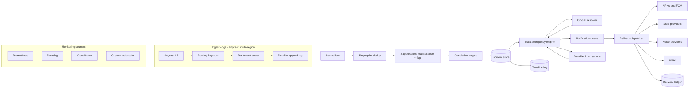
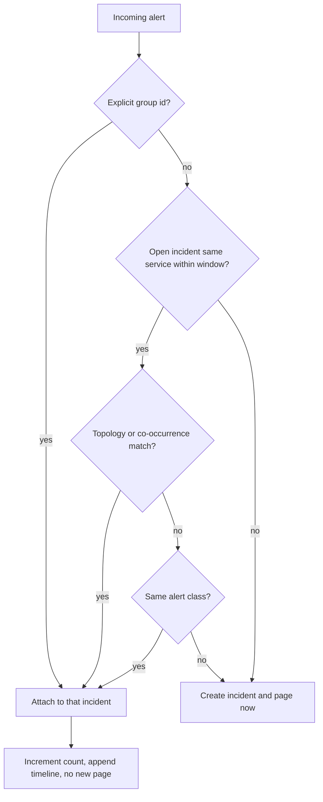
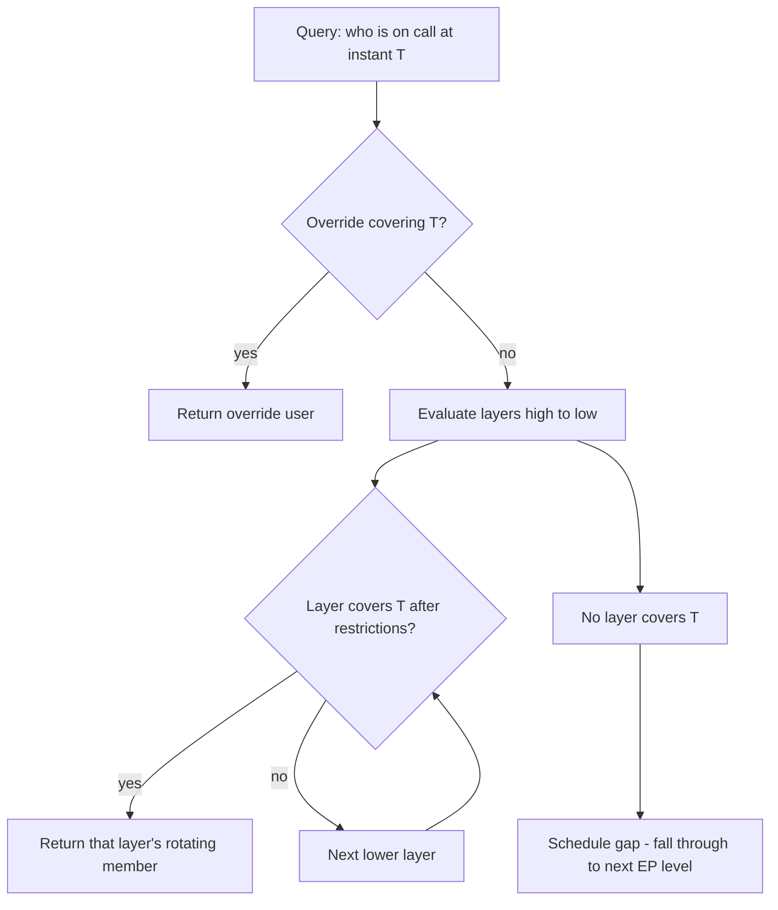
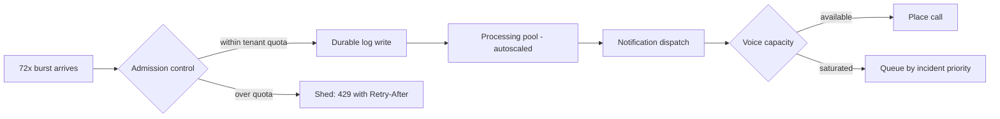

# 34 — Alerting & On-Call Paging (PagerDuty-style)

<span class="pill pill-core">Core</span> <span class="pill pill-hard">Hard</span>

**A paging system is the one service in your estate that is not allowed to fail at the exact moment everything else is failing — which means its hardest constraint is not scale, it is the requirement that it share no dependency with anything it monitors.**

| | |
|---|---|
| **Commonly asked at** | PagerDuty, Datadog, Splunk/SignalFx, Grafana Labs, Atlassian (Opsgenie), Google (SRE infra), Amazon, Stripe, Cloudflare |
| **Time budget** | 45 min |
| **Core tension** | Correlation reduces noise but adds latency and the risk of swallowing a distinct, real incident inside a group; every millisecond you wait to group alerts is a millisecond a human is not looking at a production outage |
| **Prerequisites** | [F09 Consensus](../fundamentals/f09-consensus.md), [F11 Idempotency](../fundamentals/f11-idempotency.md), [F12 Queues & Streams](../fundamentals/f12-queues-streams.md), [F17 Rate Limiting & Load Shedding](../fundamentals/f17-rate-limiting-load-shedding.md), [F18 Resilience Patterns](../fundamentals/f18-resilience-patterns.md), [F20 Time, Clocks & Ordering](../fundamentals/f20-time-clocks-ordering.md), [F22 Observability Fundamentals](../fundamentals/f22-observability-fundamentals.md), [F23 SLOs & Error Budgets](../fundamentals/f23-slo-error-budgets.md), [F26 Multi-Region & DR](../fundamentals/f26-multi-region-dr.md) |

---

## 1. Problem Statement

Build the system that turns machine-detected badness into a human being awake and looking at a screen.

Concretely: ingest alert events from thousands of heterogeneous monitoring systems across tens of thousands of customer accounts; normalise them into a common event shape; deduplicate and correlate them so that one root cause produces one incident rather than five hundred pages; route that incident through an escalation policy against a live on-call schedule; deliver notifications across push, SMS, voice and email with fallback; track acknowledgement; escalate if nobody acknowledges; and record an immutable timeline of everything that happened for the post-incident review.

Three things make this harder than it looks.

**One: the availability inversion.** Every other system in this book can degrade during an incident. This one cannot, because it is the system that tells you there is an incident. If your paging service runs in the same cloud region, behind the same DNS provider, or on the same Kubernetes control plane as the services it watches, then the correlated failure that takes out production also takes out the thing that would have told you. The design constraint is *dependency disjointness*, and it propagates into every layer — ingest, storage, notification, even the status page.

**Two: the correlation problem is adversarial to itself.** A database failover generates alerts from the app tier, the connection-pool exporter, the latency SLO burn alert, the synthetic prober, and the load balancer health check. That is one incident. But a database failover *during* a separate unrelated CDN outage is two incidents, and a system that groups aggressively will hide the second one inside the first. Every correlation heuristic you add reduces noise and increases the probability of a swallowed incident.

**Three: on-call scheduling is a genuinely hard computational problem** dressed up as a calendar. Rotations with arbitrary periods, restrictions ("weekdays 09:00-17:00 in the responder's local time"), overrides, layered schedules where a higher layer shadows a lower one, timezone rules that change by government decree, and DST transitions that make a day 23 or 25 hours long. "Who is on call right now?" is a query that must be correct, fast, and deterministic, and almost every naive implementation gets it wrong twice a year.

### Out of scope

Metric collection and threshold evaluation (that is a monitoring system — see [F22](../fundamentals/f22-observability-fundamentals.md)), log search, and automated remediation. We take alert events as input and produce a woken human as output.

---

## 2. Requirements

### Functional

| # | Requirement | Notes |
|---|---|---|
| F1 | Ingest alerts via HTTP webhook, email, and native integrations | Multi-tenant, untrusted, spiky |
| F2 | Normalise vendor payloads into a canonical event | Prometheus, Datadog, CloudWatch, Nagios, custom |
| F3 | Deduplicate repeated alerts for the same condition | Fingerprint-based; repeats update, not duplicate |
| F4 | Correlate related alerts into a single incident | Time window, service, topology, explicit grouping key |
| F5 | Evaluate an escalation policy with timed steps | Notify, wait, escalate, repeat |
| F6 | Compute the current on-call responder for any schedule | Rotations, restrictions, overrides, layers |
| F7 | Deliver notifications across push, SMS, voice, email | Per-user ordered fallback rules |
| F8 | Track acknowledge, resolve, reassign, snooze | Idempotent, auditable |
| F9 | Suppress during maintenance windows | Scheduled and ad hoc |
| F10 | Suppress flapping alerts without losing the signal | Rate-based and state-based |
| F11 | Immutable incident timeline | Every state transition, every notification attempt |
| F12 | Bidirectional sync with ticketing and chat | Slack, Jira, ServiceNow |

### Non-functional

| # | Requirement | Target |
|---|---|---|
| N1 | Ingest availability | 99.99% at minimum, designed for 99.999% |
| N2 | Event accepted to first notification dispatched | p50 < 2 s, p99 < 10 s |
| N3 | Notification delivery success, push channel | > 99.9% within 30 s |
| N4 | Notification delivery success, voice channel | > 99% connected within 60 s |
| N5 | Zero dropped alerts once accepted | Durability guarantee stronger than the latency guarantee |
| N6 | Ingest burst tolerance | 100x baseline for 5 minutes without shedding paid traffic |
| N7 | Schedule computation | p99 < 50 ms for "who is on call now" |
| N8 | Survive loss of any one region with no loss of accepted events | Active-active, not active-passive |

!!! danger "The non-negotiable requirement"
    **Once the ingest endpoint returns 202, the alert must eventually produce a notification or an explicit, auditable decision not to.** Everything else in this system can be degraded, delayed, or approximated. Silently dropping an accepted alert is the one failure that destroys the product, because the customer's entire operational model assumes the page will arrive. This drives durable-write-before-ack at ingest, at-least-once processing everywhere downstream, and idempotency keys on every side effect.

---

## 3. Scale Estimation

**Tenants and event volume.**

$$
\begin{aligned}
\text{accounts} &= 2 \times 10^{4} \\
\text{monitored services per account} &= 150 \\
\text{alert events per service per day} &= 20 \\
\text{events/day} &= 2\times10^{4} \times 150 \times 20 = 6 \times 10^{7}
\end{aligned}
$$

$$
\text{mean ingest} = \frac{6 \times 10^{7}}{86400} \approx 695\ \text{events/s}
$$

That mean is a lie, and saying so is the point of this section. Alert traffic is *not* Poisson; it is bursty in a correlated way, because the thing that generates alerts is the thing that breaks, and when it breaks it breaks everything at once.

**The burst model.** A single large customer losing an availability zone:

$$
\begin{aligned}
\text{hosts in AZ} &= 4{,}000 \\
\text{alert rules firing per host} &= 6 \\
\text{burst} &= 24{,}000\ \text{events in} \approx 30\ \text{s} = 800\ \text{events/s from one tenant}
\end{aligned}
$$

A large cloud provider regional event hits many tenants simultaneously. Plan for

$$
\text{peak ingest} \approx 50{,}000\ \text{events/s},\quad \frac{50{,}000}{695} \approx 72\times \text{ mean}
$$

**Deduplication yield.** This is the number that makes the system economically viable:

$$
\begin{aligned}
\text{events} &= 6 \times 10^{7}/\text{day} \\
\text{after fingerprint dedup (}\approx 12:1\text{)} &\approx 5 \times 10^{6}\ \text{alerts/day} \\
\text{after correlation into incidents (}\approx 4:1\text{)} &\approx 1.25 \times 10^{6}\ \text{incidents/day} \\
\text{after suppression and auto-resolve} &\approx 3 \times 10^{5}\ \text{paging incidents/day}
\end{aligned}
$$

$$
\text{end-to-end reduction} = \frac{6 \times 10^{7}}{3 \times 10^{5}} = 200\times
$$

Two hundred machine events per human interruption. If that ratio is 20 instead of 200, your customers stop trusting the pager and the product has failed — not technically, but in the only way that matters.

**Notification fan-out.**

$$
\begin{aligned}
\text{notifications per incident} &\approx 3.2\ \text{(initial + fallback + escalation)} \\
\text{notifications/day} &= 3\times10^{5} \times 3.2 \approx 9.6 \times 10^{5} \\
\text{mean} &\approx 11\ \text{/s},\quad \text{peak} \approx 2{,}000\ \text{/s}
\end{aligned}
$$

Voice calls are the constrained channel: a telephony provider gives you a fixed number of concurrent channels, and a 30-second call at 2,000 calls/s needs 60,000 concurrent channels. You will not have that. Section 8 deals with it.

**Storage.**

| Data | Rate | Retention | Size |
|---|---|---|---|
| Raw events (as received) | $6\times10^{7}$/day @ 2 KB | 30 days | 3.6 TB |
| Alerts (deduped) | $5\times10^{6}$/day @ 1.5 KB | 13 months | 3.0 TB |
| Incidents | $1.25\times10^{6}$/day @ 4 KB | 13 months | 2.0 TB |
| Timeline entries | $1.25\times10^{6} \times 12$/day @ 400 B | 13 months | 2.4 TB |
| Notification attempts | $10^{6}$/day @ 600 B | 13 months | 0.24 TB |

Total hot-ish data is under 15 TB. **This is not a big-data problem.** It is a tail-latency, correlated-burst, and availability problem, and candidates who spend the interview on sharding strategy for 15 TB have misread it.

**Schedule computation.** With 20,000 accounts and an average of 8 schedules each, 160,000 schedules. Every escalation step needs a resolution, plus a UI that renders a month of a schedule (which is thousands of interval computations per page load). Resolution must be cheap and cacheable, with an invalidation path on override creation.

---

## 4. API Design

### Ingest (the untrusted surface)

```http
POST /v2/enqueue HTTP/1.1
Host: events.pagerduty.example.com
Content-Type: application/json

{
  "routing_key": "R0ZK9X2QW7LM4V8N",
  "event_action": "trigger",
  "dedup_key": "prod-db-01/replication_lag",
  "payload": {
    "summary": "Replication lag 420s on prod-db-01",
    "severity": "critical",
    "source": "prod-db-01.us-east-1",
    "component": "postgresql",
    "group": "database",
    "class": "replication",
    "custom_details": { "lag_seconds": 420, "replica_of": "prod-db-00" }
  },
  "client": "Prometheus Alertmanager",
  "links": [ { "href": "https://grafana.example.com/d/abc", "text": "Dashboard" } ]
}
```

```http
HTTP/1.1 202 Accepted
Content-Type: application/json
X-Ingest-Region: us-east-1

{ "status": "success", "dedup_key": "prod-db-01/replication_lag",
  "message": "Event processed" }
```

Design notes that matter more than the field names:

- **`dedup_key` is client-supplied and authoritative when present.** This is the single most important field in the API. Alertmanager sends the same key every 4 hours for a firing alert; the system must update, not duplicate. If absent, the server computes a fingerprint (§7.1) — but a client that supplies a stable key gets deterministic behaviour, and you should document that loudly.
- **`event_action` is `trigger | acknowledge | resolve`.** Resolve with the same dedup key auto-resolves the alert. This closes the loop and is what keeps `300k incidents/day` from being `5M`.
- **202, not 200.** You are accepting for durable processing, not completing. Returning 200 implies the notification happened, which invites clients to treat a 500 as "no page was sent" and retry in ways that break your dedup.
- **Response time budget is under 50 ms** because Alertmanager and CloudWatch have short client timeouts, and a slow ingest causes *them* to retry, which multiplies your burst.

### Control plane

```text
POST   /v1/incidents/{id}/acknowledge      Idempotency-Key required
POST   /v1/incidents/{id}/resolve
POST   /v1/incidents/{id}/reassign         { "assignee_id": "...", "reason": "..." }
POST   /v1/incidents/{id}/snooze           { "duration_seconds": 1800 }
GET    /v1/schedules/{id}/oncall?at=2026-03-08T07:30:00Z
GET    /v1/schedules/{id}/rendered?since=...&until=...   -- interval list for UI
POST   /v1/schedules/{id}/overrides        { "start":..., "end":..., "user_id":... }
POST   /v1/maintenance_windows             { "services": [...], "start":..., "end":... }
GET    /v1/incidents/{id}/log_entries      -- the immutable timeline
```

```json
{
  "schedule_id": "PSCHED7A",
  "at": "2026-03-08T07:30:00Z",
  "oncall": [
    { "escalation_level": 1, "user_id": "PU4K2M1", "name": "A. Okafor",
      "start": "2026-03-08T06:00:00Z", "end": "2026-03-08T18:00:00Z",
      "source": "layer:2", "override_id": null }
  ],
  "computed_at": "2026-03-08T07:30:00.011Z",
  "cache_ttl_seconds": 60
}
```

!!! tip "Return the provenance of the on-call answer"
    `source: "layer:2"` and `override_id` look like debugging cruft. They are the difference between a five-minute and a five-hour investigation when someone asks "why did the page go to the wrong person at 02:00 on the day DST changed?" The schedule engine is the component most likely to produce a correct-looking wrong answer, so make every answer explain itself.

---

## 5. Data Model

```sql
-- Raw event as received. Append-only, short retention, the replay source of truth.
CREATE TABLE raw_event (
  event_id       UUID        PRIMARY KEY,
  account_id     BIGINT      NOT NULL,
  routing_key_id BIGINT      NOT NULL,
  received_at    TIMESTAMPTZ NOT NULL,
  ingest_region  TEXT        NOT NULL,
  body           JSONB       NOT NULL,
  body_sha256    BYTEA       NOT NULL   -- webhook-level replay detection
);

-- The deduplicated unit. One row per distinct condition, not per event.
CREATE TABLE alert (
  alert_id       BIGINT      PRIMARY KEY,
  account_id     BIGINT      NOT NULL,
  service_id     BIGINT      NOT NULL,
  fingerprint    BYTEA       NOT NULL,   -- see 7.1
  dedup_key      TEXT,                   -- client-supplied, if any
  status         SMALLINT    NOT NULL,   -- 0=triggered 1=resolved 2=suppressed
  severity       SMALLINT    NOT NULL,
  summary        TEXT        NOT NULL,
  first_seen_at  TIMESTAMPTZ NOT NULL,
  last_seen_at   TIMESTAMPTZ NOT NULL,
  occurrences    INT         NOT NULL DEFAULT 1,
  flap_count     INT         NOT NULL DEFAULT 0,
  incident_id    BIGINT,
  details        JSONB
);
CREATE UNIQUE INDEX ux_alert_dedup
  ON alert (account_id, service_id, fingerprint) WHERE status <> 1;

-- The human-facing unit. One incident may hold hundreds of alerts.
CREATE TABLE incident (
  incident_id    BIGINT      PRIMARY KEY,
  account_id     BIGINT      NOT NULL,
  service_id     BIGINT      NOT NULL,
  correlation_key BYTEA      NOT NULL,   -- see 7.2
  status         SMALLINT    NOT NULL,   -- 0=triggered 1=acknowledged 2=resolved
  urgency        SMALLINT    NOT NULL,   -- 0=low (no page) 1=high (page)
  title          TEXT        NOT NULL,
  alert_count    INT         NOT NULL DEFAULT 1,
  escalation_policy_id BIGINT NOT NULL,
  current_ep_level     SMALLINT NOT NULL DEFAULT 1,
  assignee_id    BIGINT,
  acknowledged_at TIMESTAMPTZ,
  ack_expires_at  TIMESTAMPTZ,           -- ack timeout re-escalation
  created_at     TIMESTAMPTZ NOT NULL,
  resolved_at    TIMESTAMPTZ,
  version        BIGINT      NOT NULL    -- optimistic concurrency, see 7.3
);

-- Immutable audit. Never UPDATE, never DELETE within retention.
CREATE TABLE log_entry (
  incident_id    BIGINT      NOT NULL,
  seq            BIGINT      NOT NULL,   -- per-incident monotonic
  occurred_at    TIMESTAMPTZ NOT NULL,   -- server clock, single source
  kind           TEXT        NOT NULL,   -- trigger|notify|ack|escalate|resolve|...
  actor_type     TEXT        NOT NULL,   -- user|system|integration
  actor_id       BIGINT,
  detail         JSONB       NOT NULL,
  PRIMARY KEY (incident_id, seq)
);

-- Every notification attempt, including failures. This is a delivery ledger.
CREATE TABLE notification (
  notification_id UUID       PRIMARY KEY,
  incident_id     BIGINT     NOT NULL,
  user_id         BIGINT     NOT NULL,
  channel         SMALLINT   NOT NULL,  -- 0=push 1=sms 2=voice 3=email
  provider        TEXT       NOT NULL,  -- twilio|messagebird|apns|fcm|ses
  idempotency_key TEXT       NOT NULL,  -- (incident, user, ep_level, attempt, channel)
  state           SMALLINT   NOT NULL,  -- queued|sent|delivered|failed|expired
  attempted_at    TIMESTAMPTZ NOT NULL,
  terminal_at     TIMESTAMPTZ,
  provider_ref    TEXT,
  failure_reason  TEXT
);
CREATE UNIQUE INDEX ux_notif_idem ON notification (idempotency_key);

-- Scheduling primitives. Deliberately normalised; see 7.4 for why.
CREATE TABLE schedule (
  schedule_id    BIGINT      PRIMARY KEY,
  account_id     BIGINT      NOT NULL,
  time_zone      TEXT        NOT NULL   -- IANA name, NEVER a UTC offset
);

CREATE TABLE schedule_layer (
  schedule_id    BIGINT      NOT NULL,
  layer_index    SMALLINT    NOT NULL,  -- higher index shadows lower
  rotation_type  SMALLINT    NOT NULL,  -- daily|weekly|custom_seconds
  rotation_seconds INT       NOT NULL,
  handoff_anchor TIMESTAMPTZ NOT NULL,  -- absolute epoch of rotation origin
  members        BIGINT[]    NOT NULL,  -- ordered user ids
  restrictions   JSONB,                 -- local-time windows
  layer_start    TIMESTAMPTZ NOT NULL,
  layer_end      TIMESTAMPTZ,
  PRIMARY KEY (schedule_id, layer_index)
);

CREATE TABLE schedule_override (
  override_id    BIGINT      PRIMARY KEY,
  schedule_id    BIGINT      NOT NULL,
  user_id        BIGINT      NOT NULL,
  starts_at      TIMESTAMPTZ NOT NULL,
  ends_at        TIMESTAMPTZ NOT NULL
);
CREATE INDEX ix_override_window ON schedule_override (schedule_id, starts_at, ends_at);
```

**Design choices worth defending.**

`alert` and `incident` are separate tables because they have different lifecycles and different cardinality. Merging them is the most common modelling mistake here: it makes correlation a mutation of the thing being correlated, and destroys your ability to say "this incident contains these 412 alerts" after the fact.

`log_entry` is append-only with a per-incident monotonic sequence rather than a timestamp primary key. Two events in the same millisecond must still have a total order, and that order must be stable when you re-render the timeline six months later during a customer dispute.

`schedule_layer.handoff_anchor` is an **absolute instant**, not a local wall-clock time. Rotations are computed as elapsed seconds since the anchor, so they are immune to DST. Restrictions are the only thing evaluated in local time, which confines the timezone hazard to one function. See §7.4.

---

## 6. High-Level Architecture



### Write path: event to page

1. **Anycast ingest.** The event lands at the nearest healthy region. The routing key is validated against a replicated, aggressively cached credential store — never a synchronous call to a central database, because that is a cross-region dependency in the most availability-critical path in the system.
2. **Quota check, then durable append.** The event is written to a replicated log (three replicas, two-of-three acks) *before* the 202 is returned. This is the durability boundary. Everything after this point is retryable; everything before it is the customer's problem to retry.
3. **Normalisation.** Vendor payload to canonical event. This is a pure function per integration type, versioned, and — critically — **failures here do not drop the event**; an unparseable payload produces a canonical event with a degraded summary and a `normalisation_failed` flag, because a badly-formatted alert about a real outage is still an alert about a real outage.
4. **Fingerprint and dedup.** Compute the fingerprint (§7.1), upsert into `alert`. A repeat increments `occurrences` and bumps `last_seen_at` and stops. Roughly 92% of events terminate here.
5. **Suppression.** Maintenance windows and flap detection (§7.6). A suppressed alert is *recorded*, not discarded.
6. **Correlation.** Attach to an existing open incident or create a new one (§7.2).
7. **Escalation policy engine.** On incident creation, resolve level 1 targets via the on-call resolver, enqueue notifications, and **set a durable timer** for the escalation timeout.
8. **Delivery.** Per-user notification rules produce an ordered channel list. Each attempt is idempotency-keyed and written to the ledger before dispatch.

### Read path: responder acknowledges

1. Mobile app opens a websocket to the nearest region; ack is a `POST` with an `Idempotency-Key`.
2. Ack applies a compare-and-set on `incident.version`. Losers of the race return the winning state, not an error — two responders acking simultaneously is normal and must not produce a 409 that the app shows as a failure.
3. Ack cancels pending escalation timers and pending un-dispatched notifications, writes a `log_entry`, and sets `ack_expires_at` so that an ack followed by the responder falling back asleep re-escalates after 30 minutes.

!!! warning "Ack does not stop in-flight notifications, only pending ones"
    If a voice call is already ringing when the incident is acked from the mobile app, you cannot un-ring it. Design the voice IVR to state the current incident status on answer rather than blindly reading the original alert, or you train responders to ignore calls that "arrive after I already fixed it".

---

## 7. Deep Dives

### 7.1 Fingerprinting and deduplication

Deduplication answers: "is this event describing a condition I already know about?" Get it wrong in one direction and a flapping alert creates 10,000 incidents. Get it wrong in the other and two genuinely different problems collapse into one.

The fingerprint is a hash over a **deliberately chosen subset** of the event, and the choice of subset is the entire design:

```python
FINGERPRINT_FIELDS = ("account_id", "service_id", "source", "component", "class")

def fingerprint(ev: dict) -> bytes:
    if ev.get("dedup_key"):
        # Client-supplied key wins. It knows more than we do.
        return blake2b(
            f"{ev['account_id']}|{ev['service_id']}|{ev['dedup_key']}".encode(),
            digest_size=16,
        ).digest()

    parts = []
    for f in FINGERPRINT_FIELDS:
        parts.append(str(ev.get(f, "")))
    # Summary is normalised, never raw: numbers and ids stripped.
    parts.append(normalise_summary(ev["payload"]["summary"]))
    return blake2b("|".join(parts).encode(), digest_size=16).digest()

_NUM = re.compile(r"\b\d+(\.\d+)?\b")
_UUID = re.compile(r"\b[0-9a-f]{8}-[0-9a-f]{4}-[0-9a-f]{4}-[0-9a-f]{4}-[0-9a-f]{12}\b")
_HEX = re.compile(r"\b[0-9a-f]{12,}\b")

def normalise_summary(s: str) -> str:
    s = _UUID.sub("<uuid>", s.lower())
    s = _HEX.sub("<hex>", s)
    s = _NUM.sub("<n>", s)
    return " ".join(s.split())[:200]
```

`normalise_summary` is the unglamorous function that does most of the work. Without it, `"Replication lag 420s"` and `"Replication lag 421s"` are different alerts, and a lag alert that re-evaluates every 30 seconds creates 2,880 incidents a day. With it, they are one alert with `occurrences = 2880`.

**Fields deliberately excluded from the fingerprint:** timestamp, severity, custom details, any counter or measurement, and the raw summary. Severity is excluded because an alert escalating from warning to critical is the *same condition getting worse*, and creating a second incident for it splits the responder's attention across two pages for one problem. Instead, severity changes update the alert and, if it crosses into a paging threshold, trigger a re-notification on the existing incident.

The dedup upsert must be atomic and must handle the resolved-then-refires case:

```sql
INSERT INTO alert (alert_id, account_id, service_id, fingerprint, status,
                   severity, summary, first_seen_at, last_seen_at, occurrences)
VALUES ($1, $2, $3, $4, 0, $5, $6, $7, $7, 1)
ON CONFLICT (account_id, service_id, fingerprint) WHERE status <> 1
DO UPDATE SET
  last_seen_at = GREATEST(alert.last_seen_at, EXCLUDED.last_seen_at),
  occurrences  = alert.occurrences + 1,
  severity     = GREATEST(alert.severity, EXCLUDED.severity),
  flap_count   = alert.flap_count + CASE WHEN alert.status = 1 THEN 1 ELSE 0 END
RETURNING alert_id, incident_id, (xmax = 0) AS was_insert;
```

`GREATEST` on `last_seen_at` matters because events arrive out of order across regions; without it a delayed event can move an alert's timestamp backwards and make an active alert look stale to the auto-resolve sweeper.

### 7.2 Correlation: turning 500 alerts into one incident

Dedup collapses *repeats of the same condition*. Correlation collapses *different conditions with the same cause*. It is strictly harder, because the system does not know the cause.

Four strategies, layered, evaluated in order:

=== "1. Explicit grouping key"

    The client tells you. Alertmanager's `group_by: [alertname, cluster]` already did the correlation upstream, and if the payload carries a group id you use it. **Always prefer this.** It is the only strategy with no false-positive risk, because the customer asserted the relationship.

    ```yaml
    # Alertmanager: correlate before it ever reaches the pager
    route:
      group_by: ['alertname', 'cluster', 'service']
      group_wait: 30s        # collect co-firing alerts before first send
      group_interval: 5m     # batch updates to an existing group
      repeat_interval: 4h    # re-send for a still-firing group
    ```

=== "2. Time-window plus scope"

    Alerts on the same `service_id` within a rolling window join the same open incident. The window is the knob:

    | Window | Effect | Verdict |
    |---|---|---|
    | 0 s (no grouping) | One incident per alert; 500 pages | Rejected — unusable |
    | 30 s | Good grouping, 30 s added latency to first page | **Chosen** as default for non-critical |
    | 5 min | Excellent grouping; 5 min blind to a second incident | Rejected as default, offered per-service |
    | Open incident lifetime | Everything for a service joins the open incident | Rejected — swallows unrelated incidents |

    The critical refinement: **do not delay the first page**. Page immediately on incident creation, then attach subsequent alerts to the existing incident silently. The window is for *attachment*, not for *notification delay*. This is the difference between a 30-second-slower page and a system that groups well.

=== "3. Topology-aware"

    If the customer models dependencies (service A depends on B depends on database C), alerts on A, B, and C within a window correlate into one incident rooted at the deepest node. This is the highest-value strategy and the hardest to operate, because it requires accurate topology that nobody maintains.

    ```text
    alert(api-gateway, latency)    depth 0
    alert(orders-svc, errors)      depth 1   -> parent: orders-db
    alert(orders-db, replication)  depth 2   -> root cause candidate
    => one incident, titled by the deepest failing node
    ```

    Ship it as an opt-in with a visible "grouped because" explanation, and make ungrouping one click. An unexplained grouping is indistinguishable from a bug.

=== "4. Statistical co-occurrence"

    Learn from history: alerts X and Y have fired within 2 minutes of each other 94% of the time over 90 days, so group them. This is the machine-learning pitch, and it works, with two hard rules: it must **never** suppress a page (only merge into an already-paging incident), and it must show its reasoning. A model that silently decides an alert is not worth paging for will eventually be wrong on the night it matters, and there is no recovering the customer's trust after that.



!!! warning "Correlation must be reversible"
    Every grouping decision must be undoable by a human in one action, and the split must preserve the timeline. Responders will encounter grouped incidents that are actually two problems, and if the only way out is to resolve and manually re-create, they will turn correlation off entirely. A "split incident" operation that moves a subset of alerts into a new incident — inheriting the escalation policy but starting a fresh escalation clock — is a functional requirement, not a nicety.

### 7.3 The escalation policy engine and durable timers

An escalation policy is a small state machine driven by a clock. The clock is the hard part.

```yaml
escalation_policy:
  id: PEP4X9
  name: "Payments - critical"
  repeat_count: 3           # loop the whole policy 3x before giving up
  rules:
    - level: 1
      escalation_delay_minutes: 5
      targets:
        - { type: schedule, id: PSCHED7A }     # primary on-call
    - level: 2
      escalation_delay_minutes: 10
      targets:
        - { type: schedule, id: PSCHED7B }     # secondary
        - { type: user, id: PU9Q2ZK }          # team lead, always
    - level: 3
      escalation_delay_minutes: 15
      targets:
        - { type: schedule, id: PSCHED_MGR }
        - { type: webhook, id: PWH_WARROOM }   # open a bridge
```

The engine's operations are: resolve targets for level N, dispatch notifications, arm a timer for `escalation_delay_minutes`, and on timer fire without ack, advance to level N+1.

**Timers are the load-bearing component, and they must be durable, exactly-once-ish, and survive process death.** Three implementations:

| Approach | Mechanism | Verdict |
|---|---|---|
| In-process timer wheel | `setTimeout` in the worker holding the incident | **Rejected.** Process dies, escalation never happens, incident sits unacked forever. Silent and fatal. |
| Delayed queue (SQS delay, Kafka + tumbling scan) | Enqueue with visibility delay | Partially chosen for short delays; SQS caps at 15 min, and cancellation on ack is not supported |
| DB-backed timer table with sharded pollers | `SELECT ... WHERE fire_at <= now() FOR UPDATE SKIP LOCKED` | **Chosen.** Cancellable, inspectable, survives everything, and the fire_at index is cheap |
| Dedicated timer service (hashed wheel + WAL) | Purpose-built, e.g. an internal "timer as a service" | Chosen at very large scale; same semantics, better tail latency |

```sql
CREATE TABLE timer (
  timer_id    UUID PRIMARY KEY,
  fire_at     TIMESTAMPTZ NOT NULL,
  shard       SMALLINT    NOT NULL,
  kind        TEXT        NOT NULL,   -- escalate | ack_timeout | auto_resolve
  incident_id BIGINT      NOT NULL,
  ep_level    SMALLINT,
  state       SMALLINT    NOT NULL,   -- 0=armed 1=fired 2=cancelled
  fence       BIGINT      NOT NULL    -- incident.version when armed
);
CREATE INDEX ix_timer_due ON timer (shard, fire_at) WHERE state = 0;
```

```sql
-- Poller loop, one per shard, runs every 250 ms
UPDATE timer SET state = 1
WHERE timer_id IN (
  SELECT timer_id FROM timer
  WHERE shard = $1 AND state = 0 AND fire_at <= now()
  ORDER BY fire_at
  LIMIT 500
  FOR UPDATE SKIP LOCKED
)
RETURNING timer_id, incident_id, ep_level, fence;
```

The `fence` column is what makes this safe. When the timer fires, the handler re-reads the incident and **only escalates if `incident.version = fence` and status is still triggered**. This closes the ack-and-timer-fire race without distributed locking: an ack bumps `version`, so any in-flight timer for the pre-ack state is now stale and self-cancels. This is the same fencing-token idea used to make leases safe under GC pauses.

**Delay accuracy.** A 250 ms poll with 500-row batches gives you sub-second escalation accuracy at up to 2,000 escalations/s per shard. Escalation delays are in minutes, so 250 ms of jitter is irrelevant — but *lateness under load* is not. Monitor `now() - fire_at` at the point of firing as a first-class SLI; when the poller falls behind, escalations silently become late, which is exactly the failure a paging system must never have.

### 7.4 On-call schedule computation: the gnarly part

"Who is on call?" looks like a calendar query. It is an interval-algebra problem with a timezone-shaped landmine in it.

**Layer model.** A schedule is an ordered list of layers. Each layer independently produces a set of covered intervals with an assigned user; higher layers shadow lower ones; overrides shadow everything.



**Rotation computation is pure arithmetic on absolute time**, which is what makes it safe:

```python
def rotating_member(layer, t: datetime) -> int | None:
    if t < layer.layer_start or (layer.layer_end and t >= layer.layer_end):
        return None
    elapsed = (t - layer.handoff_anchor).total_seconds()
    if elapsed < 0:
        return None
    idx = int(elapsed // layer.rotation_seconds) % len(layer.members)
    return layer.members[idx]
```

Because `handoff_anchor` is an absolute instant and `rotation_seconds` is a duration, a weekly rotation is exactly 604,800 seconds. It does not drift across DST and does not care about the responder's timezone. **If you instead compute "every Monday at 09:00 local", you have a rotation whose period is 604,800 seconds except twice a year when it is 601,200 or 608,400** — and in the 23-hour case the handoff happens an hour early, while in the 25-hour case there is an hour where the rotation logic disagrees with itself.

**Restrictions are where local time is unavoidable**, because "weekdays 09:00-17:00" means *the responder's 09:00*. Confine it:

```python
from zoneinfo import ZoneInfo

def restriction_covers(layer, t_utc: datetime) -> bool:
    if not layer.restrictions:
        return True
    tz = ZoneInfo(layer.time_zone)          # IANA name, e.g. Europe/Berlin
    local = t_utc.astimezone(tz)
    for r in layer.restrictions:            # e.g. {"days":[1,2,3,4,5],
                                            #       "start":"09:00","end":"17:00"}
        if local.isoweekday() not in r["days"]:
            continue
        start = local.replace(hour=r.start_h, minute=r.start_m,
                              second=0, microsecond=0)
        end = local.replace(hour=r.end_h, minute=r.end_m,
                            second=0, microsecond=0)
        if end <= start:                    # window crosses midnight
            end += timedelta(days=1)
        if start <= local < end:
            return True
    return False
```

The DST hazards, explicitly:

- **Spring forward:** local time 02:00-03:00 does not exist. A restriction window of 02:00-06:00 loses an hour of coverage. A *handoff* configured at 02:30 local never happens — and if your rotation logic is local-time-based, the rotation either skips or throws. Using `local.replace(hour=...)` on a nonexistent time produces a datetime that `zoneinfo` will resolve by a documented rule, not by the rule you assumed.
- **Fall back:** local time 02:00-03:00 occurs twice. A naive "is local time in window" check is satisfied twice, so a 25-hour day can double-fire a handoff or produce two people believing they are on call for the same wall-clock hour.
- **Government changes the rules.** Brazil abolished DST in 2019; Mexico in 2022; the EU keeps threatening to. Store IANA names, never fixed offsets, and treat `tzdata` as a versioned dependency whose upgrade can change who gets paged. Pin it, test it, and roll it out deliberately — a `tzdata` bump is a production change to the schedule engine.

**Caching and invalidation.** Resolution is deterministic given `(schedule, overrides, tzdata_version, t)`. Cache `oncall(schedule_id, minute_bucket)` for 60 seconds, and **invalidate on override write**. The 60-second staleness is acceptable for the "who do I page" query, with one exception: when an override is created for *right now* (the classic "I am taking over, page me"), the invalidation must be synchronous, or the person who just took over does not get the next page.

**Gaps are a real state, not an error.** A schedule with no one on call at 03:00 on a public holiday must produce a defined behaviour: fall through to the next escalation level immediately, and emit a `schedule_gap` warning at configuration time. Gaps discovered at page time are always discovered at the worst time.

### 7.5 Notification delivery and the availability inversion

This is the section that separates a competent answer from a senior one.

**The rule: the paging system must not share a failure domain with anything it monitors.** Work through the implications:

| Dependency | Naive choice | Why it fails | Chosen design |
|---|---|---|---|
| Cloud provider | Single provider, multi-AZ | Provider regional event is exactly when you need to page | Multi-cloud or at minimum multi-region active-active with independent control planes |
| DNS | Single authoritative provider | The 2016 Dyn outage took down everything using one provider | Two authoritative DNS providers, both live, NS records split |
| SMS/voice | One telephony vendor | Vendor outage means zero voice delivery | Minimum two per channel, with automatic failover on error-rate |
| Push notification | APNs and FCM only | These are single points of failure you cannot duplicate | Push is the *fast* path, never the *only* path — SMS/voice fallback is mandatory |
| Config store | Central DB in one region | Region loss stops routing-key auth for everyone | Replicated read-only cache in every region, tolerating minutes of staleness |
| Customer's own network | Webhooks in, app out | If the customer's VPN is down the app cannot reach you | Cellular-delivered channels (SMS, voice) must work without any customer infrastructure |

**Per-user notification rules** drive an ordered fallback chain:

```yaml
user: PU4K2M1
notification_rules:
  high_urgency:
    - { at_minutes: 0,  channel: push }
    - { at_minutes: 1,  channel: push }        # second device
    - { at_minutes: 2,  channel: sms }
    - { at_minutes: 5,  channel: voice }
    - { at_minutes: 10, channel: voice }       # different provider
  low_urgency:
    - { at_minutes: 0,  channel: email }
```

Each rule is an independent durable timer. The chain stops on ack, not on delivery: **"delivered" is not "acknowledged"**, and a push that reaches a locked phone in a pocket at 03:00 is not a page. This is why the voice call exists. It is the only channel with a physical alerting property strong enough to wake someone, and it is the channel with the worst reliability, the highest cost, and the tightest capacity ceiling.

**Provider failover.** Wrap each provider in a circuit breaker keyed on `(provider, channel, destination_country)` — because provider failures are frequently country-specific, and a global breaker will either trip on a Brazil-only failure or fail to trip at all:

```go
type Route struct {
    Provider string
    Weight   int
}

func (d *Dispatcher) pick(ch Channel, country string) (string, error) {
    routes := d.routes[key{ch, country}]
    healthy := routes[:0]
    for _, r := range routes {
        if d.breaker.State(r.Provider, ch, country) != Open {
            healthy = append(healthy, r)
        }
    }
    if len(healthy) == 0 {
        // Fail open to the primary rather than dropping the page.
        // A 5% chance of delivery beats a 0% chance.
        return routes[0].Provider, ErrAllBreakersOpen
    }
    return weightedPick(healthy), nil
}
```

The `ErrAllBreakersOpen` fail-open is deliberate and worth saying out loud in an interview: in almost every system, an open circuit means "stop sending". In a paging system, it means "send anyway and record that you did it blind", because the alternative is guaranteed non-delivery of a page about a production outage.

**Delivery confirmation is a lie you must plan around.** SMS carriers return delivery receipts that are frequently forged, delayed by minutes, or simply absent. Never build escalation logic on "SMS not delivered" — build it on "not acknowledged within N minutes". Acknowledgement is the only signal originating from a human, and it is the only one that means anything.

### 7.6 Flapping suppression and maintenance windows

A flapping alert is a condition oscillating between firing and resolved faster than a human can respond. Untreated, one flapping check produces hundreds of pages and trains the responder to ignore the pager.

**Detection.** Track state transitions per fingerprint in a sliding window:

$$
\text{flap score} = \frac{\text{transitions in }W}{\max\text{ transitions in }W},\quad W = 30\ \text{min}
$$

Suppress when the score exceeds a threshold (Nagios uses 0.5 over 21 state changes; a simpler rule — more than 5 transitions in 30 minutes — is adequate and far easier to explain):

```python
def should_suppress(alert, now) -> tuple[bool, str]:
    if alert.transitions_in(minutes=30) > 5:
        return True, "flapping"
    if alert.occurrences_in(minutes=5) > 100:
        return True, "storm"          # not flapping, just loud
    return False, ""
```

**Critical rule: suppression converts a paging alert into a low-urgency one; it never deletes it.** The system creates a single "X is flapping" incident at low urgency with the full transition history attached, and it auto-clears when the flapping stops. Silently dropping flapping alerts means a genuinely intermittent failure — the worst kind — becomes invisible.

**Maintenance windows** are simpler but have three traps.

1. **Scope.** A window on service `orders-api` must suppress alerts *about* that service, not alerts from hosts that happen to run it. Scope by service, and require explicit host lists if hosts are meant.
2. **Ending.** When the window ends, conditions still firing must page. A window that suppresses and then discards means a failed deploy inside a maintenance window is discovered by customers. On window close, re-evaluate every suppressed-still-active alert and page normally.
3. **Overrun.** Maintenance windows always run long. Auto-extension is tempting and wrong; instead, alert the window owner 10 minutes before close, and make extension one click. A window that silently extends is an alerting outage with a friendly name.

```sql
-- Windows must be indexed for a fast "is this suppressed right now" check
CREATE TABLE maintenance_window (
  window_id   BIGINT PRIMARY KEY,
  account_id  BIGINT NOT NULL,
  service_ids BIGINT[] NOT NULL,
  starts_at   TIMESTAMPTZ NOT NULL,
  ends_at     TIMESTAMPTZ NOT NULL,
  created_by  BIGINT NOT NULL,
  description TEXT NOT NULL
);
CREATE INDEX ix_mw_active ON maintenance_window
  USING GIST (tstzrange(starts_at, ends_at));
```

---

## 8. Scaling the Bottleneck

The bottleneck is not throughput. It is the **correlated burst**, because the event rate and the failure rate of everything else are perfectly positively correlated.



**Layer 1 — tenant isolation at ingest.** Per-tenant token buckets sized to plan, with burst credit. Shedding must be *per tenant*, never global: one customer's monitoring loop going berserk must not cost another customer a page. Return 429 with `Retry-After` so well-behaved clients back off, and emit a "your alerts are being rate limited" notification to the tenant, because silent shedding of a paying customer's alerts is the failure you cannot explain afterwards.

**Layer 2 — separate the durability path from the processing path.** The ingest tier does auth, quota, and an append to a replicated log. That is it. At 50,000 events/s with 2 KB events, that is 100 MB/s — trivially handled. Processing can fall behind by minutes and catch up; ingest cannot fall behind by seconds.

$$
\text{ingest CPU} \approx \frac{50{,}000\ \text{req/s}}{4{,}000\ \text{req/s/core}} \approx 13\ \text{cores},\ \text{call it 40 across 3 regions}
$$

**Layer 3 — prioritised processing.** During a burst the queue is not FIFO. Order by `(urgency, is_new_incident, received_at)`. A repeat event for an incident that has already paged someone is worthless during a storm; a first event for a new incident is the entire product. This single prioritisation change is what keeps p99 time-to-first-page flat while the queue depth goes up 50x.

**Layer 4 — the voice channel ceiling.** Concurrent voice channels are a hard, purchased quantity.

$$
\begin{aligned}
\text{channels needed} &= \text{calls/s} \times \text{mean call duration} \\
&= 2{,}000 \times 30\ \text{s} = 60{,}000\ \text{concurrent channels}
\end{aligned}
$$

You will have perhaps 2,000. So:

$$
\text{sustainable call rate} = \frac{2{,}000}{30} \approx 66\ \text{calls/s}
$$

Mitigations, in order of preference: aggressive correlation so fewer incidents reach voice at all; push and SMS first so voice is only the 5-minute fallback (which by itself removes 80% of voice demand because most pages are acked before then); multiple telephony vendors to multiply the ceiling; per-tenant voice quotas; and priority queueing so that when voice is saturated, high-urgency incidents get the channels and low-urgency ones degrade to SMS with a clear ledger entry.

**Layer 5 — schedule resolution.** At peak, every notification needs an on-call resolution. Cache per `(schedule_id, minute)`, precompute the next 24 hours of rendered intervals per schedule in a background job, and serve resolution from a local in-process cache with a 60-second TTL. This turns a potentially expensive interval computation into a map lookup, and it keeps the schedule service off the critical path of a burst.

---

## 9. Failure Modes

| Failure | Blast radius | Detection | Mitigation | Degraded behaviour |
|---|---|---|---|---|
| Ingest region loss | All tenants routed there | Anycast health check, ingest rate drop per region | Anycast withdraws the route; clients re-resolve within seconds | Brief 502s on in-flight requests; monitoring tools retry |
| Durable log unavailable | All new events | Write latency and error rate | Fail *closed* at ingest — return 503 so the sender retries | Customers' monitoring queues the alert; no silent loss |
| Correlation over-grouping | One tenant, one service | Ratio of alerts-per-incident jumps | Kill switch per strategy; split-incident tooling | Second incident hidden inside first — the dangerous one |
| Correlation under-grouping | One tenant | Incident creation rate spike | Auto-throttle: after 20 incidents/min on one service, force grouping | Alert storm reaching responders |
| Timer poller stalls | All incidents on that shard | `now() - fire_at` at fire time; poller heartbeat | Multiple pollers per shard with SKIP LOCKED; alert on lag > 30 s | **Escalations silently stop.** Highest-severity internal alert |
| Telephony provider outage | All voice pages in affected countries | Per-provider per-country error rate | Circuit break, route to secondary provider | Voice delayed by seconds; SMS/push unaffected |
| APNs/FCM outage | All push | Push receipt rate collapse | Immediately promote SMS to position 0 in fallback chains | Slower first notification, higher SMS cost |
| Schedule engine returns wrong user | One team | Hard to detect automatically | Provenance in every answer; "who is on call" widget in chat | Wrong person paged; right person is not |
| `tzdata` upgrade changes offsets | Teams in affected regions | Diff rendered schedules pre/post upgrade in CI | Pin tzdata, canary the upgrade, diff-test | Off-by-one-hour handoffs |
| Maintenance window never closed | One service, indefinitely | Window duration outlier alert; open-window dashboard | Max duration policy, owner notification before close | **Total alerting blindness for that service** |
| Webhook replay by a buggy integration | One tenant | Duplicate `body_sha256` rate | Content-hash dedup with 10-min TTL at ingest | Absorbed; no duplicate incidents |
| Mobile app cannot reach API | Responders using push | App heartbeat / websocket connect rate | SMS and voice paths are independent of the app | Ack must be done by SMS reply or phone keypad |
| Notification queue backlog | All pages delayed | Queue depth and oldest-message age | Priority drain, shed low-urgency, scale dispatchers | Low-urgency notifications delayed, high-urgency protected |

!!! danger "The failure with no external symptom"
    Every failure in this table except one announces itself. **A stalled escalation timer does not.** Incidents get created, the first notification goes out, nobody acks because they are asleep, and the escalation that would have woken the secondary never fires. From the outside the system looks healthy: ingest is fine, notifications were sent, no errors. The only detectable signal is internal — timer lag and the distribution of time-to-escalate. Instrument it as a primary SLI, page on it, and make it one of the few things that pages to a *different* system.

---

## 10. SRE Lens

### SLIs and SLOs

| SLI | Definition | SLO | Why this target |
|---|---|---|---|
| Ingest availability | Non-5xx / total on `/enqueue` | 99.99% monthly | 4.3 min/month; below this customers lose alerts during their own outages |
| Ingest latency | p99 of accept-to-202 | < 50 ms | Client timeouts in Alertmanager and CloudWatch are short |
| Time to first notification | p99 event-accepted to first dispatch | < 10 s | Anything slower and the customer's own dashboards beat the page |
| Notification delivery | Terminal-success / attempted, per channel | push 99.9%, SMS 99.5%, voice 99.0% | Bounded by carrier reality, not by us |
| Escalation timeliness | p99 of actual-fire minus scheduled-fire | < 5 s | The silent failure; must be a primary SLI |
| Schedule correctness | Sampled oracle comparison of `oncall()` vs reference impl | 100%, zero tolerance | A wrong answer is undetectable in production |
| Accepted-event loss | Events accepted with no terminal disposition | 0 | Hard requirement, tracked as a count not a rate |

### Error budget policy

The ingest availability budget is 4.3 minutes per month. Spending it is a company-level event, not a team-level one. Policy:

- **25% burned:** deploys to the ingest path require a second reviewer.
- **50% burned:** feature freeze on ingest and correlation; only reliability work ships.
- **100% burned:** ingest path is change-frozen until a review; the freeze applies to dependencies too, including config and tzdata.

Notice the asymmetry with a normal service: the budget for *correlation quality* is much looser (grouping heuristics can be wrong sometimes) while the budget for *accepted-event loss is zero*. Being explicit about which SLOs are negotiable is what makes the policy survivable.

### Rollout plan

Deploying a paging system is deploying the smoke detector. Rules:

1. **Never deploy all regions at once, ever.** Region-at-a-time, 60-minute bake between regions, with an automatic halt on ingest error rate or escalation lag.
2. **Shadow the correlation engine.** New grouping logic runs in parallel, produces shadow incidents that page nobody, and is compared against production groupings for a week. Report the diff: how many incidents would have merged, how many split.
3. **Synthetic end-to-end canaries, continuously.** Every 60 seconds, from outside your own infrastructure, fire a real event into a real test account with a real escalation policy targeting a synthetic responder, and assert a real SMS and a real voice call arrive. This is the only test that covers the telephony providers, and telephony providers break constantly.
4. **Never deploy the ingest path and the notification path in the same change.**
5. **`tzdata` and telephony SDK upgrades are production changes** with their own canary, because both can silently change behaviour.

### Runbook notes

??? note "Runbook: escalation lag rising"
    **Symptom.** `timer_fire_lag_p99 > 30s`. **Impact:** escalations are late; responders who did not ack are not being backed up. This is a sev-1 regardless of what else looks fine.
    **Checks, in order.** (1) Poller heartbeat per shard — is a poller dead, or just slow? (2) `SELECT shard, count(*) FROM timer WHERE state=0 AND fire_at <= now() GROUP BY shard` — is it one shard or all? (3) Lock contention on the timer table (`pg_stat_activity` waiting on `SKIP LOCKED`). (4) Incident-store write latency, which back-pressures the poller's handler.
    **Actions.** One shard: restart its poller, then check for a hot incident with thousands of timers. All shards: scale pollers horizontally first (they are stateless and `SKIP LOCKED` is safe to over-provision), then check the database. If the DB is the bottleneck, shed by *deferring* `auto_resolve` timers — never defer `escalate` timers.
    **Do not** truncate or bulk-cancel the timer table to "clear the backlog". Every row is an escalation somebody is waiting for.

??? note "Runbook: alert storm from a single tenant"
    **Symptom.** One `account_id` is more than 50% of global ingest. **Checks.** Incident creation rate for that tenant, top fingerprints, whether alerts are deduping (occurrences rising) or not (new fingerprints — usually an unstable id in the summary that `normalise_summary` is not catching).
    **Actions.** Confirm tenant quota is engaged and other tenants are unaffected — that is the only thing that makes this a sev-3 rather than a sev-1. Apply a temporary forced-grouping rule for the tenant's service. Contact the customer: the fix is almost always upstream in their Alertmanager `group_by`. Record the fingerprint pattern; if it is a normalisation miss, it is a code fix.

??? note "Runbook: 'the wrong person was paged'"
    **Checks.** Pull the incident timeline and the `oncall()` provenance recorded at dispatch time — not a re-query now, since the schedule may have changed. Determine which of: override present, layer shadowing, restriction boundary, DST transition, schedule gap falling through to the next level, or an EP targeting a user directly rather than a schedule.
    **Note.** Resolve time-of-page questions using the *recorded* resolution, never a fresh computation. Re-querying gives you today's answer to yesterday's question, and that has sent more than one investigation in entirely the wrong direction.

### Capacity model

| Component | Unit of scale | Peak sizing | Headroom rule |
|---|---|---|---|
| Ingest tier | 4,000 req/s/core | 40 cores across 3 regions | Each region must handle 100% of peak alone |
| Durable log | 100 MB/s write | 3 brokers per region, RF 3 | 5x burst headroom, disk for 7 days |
| Processing pool | 800 events/s/worker | 60 workers baseline, autoscale to 400 | Scale on queue age, not queue depth |
| Timer pollers | 2,000 fires/s/shard | 16 shards | Alert at 30% of shard capacity |
| Incident store | writes dominate | 3-node cluster/region, sync repl | Peak write 1,500/s |
| Voice channels | purchased concurrency | 2,000 across 2 vendors | Model as a hard ceiling, never as elastic |

**Region independence is the expensive part.** "Each region handles 100% of peak alone" means running at roughly 33% utilisation across three regions. That is a 3x infrastructure cost multiplier, and it is correct. Justify it in one sentence: the failure mode you are buying insurance against is a regional event at your cloud provider, which is simultaneously the moment of maximum alert volume and the moment your capacity drops by a third.

### Cost

| Line item | Monthly | Note |
|---|---|---|
| Compute, 3 regions at 33% utilisation | $48,000 | The redundancy premium |
| Storage and replication, 15 TB hot | $6,500 | |
| SMS, 600k/month at $0.0075 | $4,500 | Country-dependent; India and Brazil are outliers |
| Voice, 120k calls/month at $0.013/min | $2,400 | Small volume, large ceiling cost |
| Telephony reserved concurrency, 2 vendors | $9,000 | Paid for capacity you hope never to use |
| Second DNS provider | $900 | Cheapest insurance in the entire budget |
| Multi-region data transfer | $3,200 | |
| **Total** | **~$74,500** | ~$0.0025 per ingested event |

The cost story to tell: **SMS and voice look like the expensive part and are 9% of the bill. The redundancy premium is 64%.** That is the correct shape for this product, and a design that optimises it away has optimised away the thing customers are paying for.

---

## 11. Trade-offs & Alternatives

| Decision | Options | Chosen / rejected and why |
|---|---|---|
| Ingest durability | Ack-then-persist vs persist-then-ack | **Persist-then-ack chosen.** Costs ~8 ms of latency. Ack-then-persist rejected outright: a crash loses accepted alerts, which is the one unforgivable failure |
| Grouping window | 0 s / 30 s / 5 min | **30 s chosen, but only for attachment.** Page fires immediately on incident creation; the window never delays the first notification |
| Timer implementation | In-process / delayed queue / DB timer table / timer service | **DB timer table chosen.** Cancellable, inspectable, fenced, survives process death. In-process rejected as silently fatal |
| Escalation concurrency control | Distributed lock vs optimistic version + fence | **Optimistic with fencing token chosen.** Locks need lease management and fail badly under GC pauses; the fence gives correctness with no coordination |
| Schedule storage | Rendered intervals vs rules evaluated on demand | **Rules on demand with a 24 h precomputed cache.** Rendering everything is simple but an override write invalidates a huge range and historical answers become unreproducible |
| Rotation arithmetic | Local wall-clock recurrence vs elapsed seconds from an anchor | **Elapsed seconds chosen.** Immune to DST; local time confined to restriction evaluation only |
| Cloud topology | Multi-AZ single cloud vs multi-region vs multi-cloud | **Multi-region active-active, with a multi-cloud ingest edge.** Full multi-cloud rejected on operational cost; ingest is the part that must survive a provider event |
| Push as primary | Push only vs push with SMS/voice fallback | **Fallback mandatory.** Push depends on APNs/FCM and on the responder's data connection, neither of which you control |
| Circuit breaker on all-providers-down | Fail closed vs fail open | **Fail open chosen.** Sending blind beats guaranteed non-delivery; record it in the ledger so the failure is auditable |
| Correlation via ML | Rules only vs rules plus learned co-occurrence | **Rules first; learned grouping as an explainable, opt-in, never-suppressing layer.** An unexplainable grouping is indistinguishable from a bug |
| Flapping handling | Drop vs suppress-to-low-urgency | **Suppress to low urgency with full history.** Dropping hides intermittent failures, which are the hardest and most important class |
| Multi-tenancy | Shared everything vs per-tenant isolation | **Shared with strict per-tenant quotas and per-tenant shedding.** Hard isolation is unaffordable; noisy-neighbour protection is not optional |

??? note "Alternative architecture: self-hosted Alertmanager plus a notifier"
    For a single organisation, Prometheus Alertmanager already does inhibition, silencing, grouping and dedup, and it is a well-understood, small, highly available component (gossip-clustered, no external state). Bolt on a simple notifier for SMS/voice and you have 80% of this system for 2% of the effort.

    **Where it stops.** No on-call scheduling engine (you need an external one), no escalation policies beyond static receivers, no acknowledgement tracking, no incident timeline, no multi-tenancy, and crucially it typically runs *inside the infrastructure it monitors* — which violates the central constraint of this design. Alertmanager's gossip-based dedup across replicas is also eventually consistent by design and will occasionally send duplicate notifications; that is an acceptable trade for a small deployment and unacceptable as a product. Knowing exactly where the free thing stops is a strong interview answer.

---

## 12. Gotchas & Corner Cases

!!! gotcha "The paging system pages itself into a loop"
    **Symptom:** an internal alert about the paging system creates an incident, which fails to notify, which creates an alert about the notification failure, which fails to notify. Queue depth climbs and nobody hears anything.
    **Mechanism:** the system monitors itself through itself. Self-referential alerting has no base case.
    **Mitigation:** a completely separate, deliberately primitive out-of-band channel for internal alerts — a different cloud provider, a different telephony vendor, a hard-coded list of phone numbers in a config file, and no dependency on the primary datastore. Test it monthly by disabling the primary path on purpose. The rule is that the thing which watches the watcher must be simple enough to have no interesting failure modes of its own.

!!! gotcha "Ack from the mobile app races the escalation timer and the secondary gets paged anyway"
    **Symptom:** responder acks at T+4:58; the level-2 page fires at T+5:00; the secondary is woken for an already-handled incident. Repeat a few times and the secondary stops trusting escalations.
    **Mechanism:** ack and timer-fire are concurrent, and cancellation is not atomic with the fire path.
    **Mitigation:** fencing, not locking. The timer records `incident.version` when armed; the fire handler re-reads and aborts if the version moved. Additionally, notifications already handed to a provider cannot be recalled, so the voice IVR and SMS body must state current status rather than the status at enqueue time.

!!! gotcha "Alertmanager's repeat_interval quietly re-pages a resolved incident"
    **Symptom:** an incident resolved in the pager reopens four hours later with no new failure.
    **Mechanism:** Alertmanager re-sends still-firing alerts every `repeat_interval` (default 4 h). Your resolve was a state change in *your* system; the alert is still firing in *theirs*. The re-send arrives with the same dedup key and, if your unique index only covers unresolved alerts, creates a fresh alert and a fresh incident.
    **Mitigation:** a short re-trigger grace window — a trigger with a dedup key resolved less than 5 minutes ago reopens the existing incident instead of creating a new one, and appends a timeline entry saying so. Beyond the window, a new incident is correct: the condition genuinely persisted. And make sure responders understand that resolving in the pager does not fix the underlying alert — that confusion causes more repeat pages than any bug.

!!! gotcha "The DST fall-back hour double-fires the handoff"
    **Symptom:** twice a year, two people are paged for the same hour, or a handoff happens twice, or an alert at 01:30 local goes to yesterday's on-call.
    **Mechanism:** on the fall-back day, 01:00-02:00 local occurs twice with different UTC offsets. Any logic that converts to local time and compares against a wall-clock boundary matches both occurrences.
    **Mitigation:** compute rotations as elapsed seconds from an absolute anchor so they are DST-agnostic; evaluate restrictions in local time but with explicit fold handling; and add a CI test that renders every schedule across both transition days in every timezone the account uses, asserting exactly one responder per instant. This is the single highest-value test in the codebase.

!!! gotcha "A tzdata package upgrade changes who gets paged"
    **Symptom:** after a routine base-image update, handoffs shift by an hour for a subset of teams.
    **Mechanism:** `tzdata` encodes political decisions. When a country changes or abolishes DST, the upgrade changes the UTC offset for that zone, and every schedule anchored to local time moves.
    **Mitigation:** pin the tzdata version explicitly, treat upgrades as production changes with a canary, and run a differential test that renders the next 90 days of every schedule before and after the upgrade and reports any assignment that changed. Notify affected accounts when the change is real, because the change is *correct* and their handoff genuinely moved.

!!! gotcha "The maintenance window that never closed"
    **Symptom:** a service has not alerted in three weeks. Nobody noticed, because the absence of alerts looks exactly like health.
    **Mechanism:** someone opened an open-ended window during a migration and forgot it. Suppression is invisible by construction.
    **Mitigation:** a hard maximum window duration (24 h) requiring explicit renewal; notify the window creator 10 minutes before expiry; a permanently visible dashboard of active suppressions; and — the one that actually works — an alert when a service that normally alerts has produced zero alerts for longer than its historical p99 quiet period. Absence of signal must itself be a signal.

!!! gotcha "The webhook that retries forever because you returned 500"
    **Symptom:** a single malformed integration generates 40,000 requests per second, because every 500 you return triggers an immediate client retry.
    **Mechanism:** most monitoring tools retry 5xx aggressively and often without backoff. A bug in your normaliser that 500s on one payload shape turns one client into a DDoS.
    **Mitigation:** **never return 5xx for a payload you cannot parse** — return 400, which clients do not retry, and record the payload for debugging. Reserve 5xx strictly for "we could not durably store this, please retry". Add per-routing-key rate limiting with `Retry-After`, and a content-hash dedup with a short TTL so identical replayed bodies are absorbed at the edge.

!!! gotcha "Schedule gaps discovered at 03:00"
    **Symptom:** an incident escalates straight to level 3 because levels 1 and 2 resolved to nobody.
    **Mechanism:** a rotation's `layer_end` passed, or a member was removed from the team and the rotation silently shortened, or a restriction leaves nights uncovered on a schedule used for a 24/7 service.
    **Mitigation:** validate coverage at configuration time and continuously — a daily job that renders the next 30 days of every schedule attached to a high-urgency escalation policy and alerts on any uncovered instant. Treat "gap" as a defined runtime state that falls through immediately to the next level rather than as an error, and surface it prominently in the UI. The person who removed a team member should have been told, not the person who was about to be paged.

!!! gotcha "Correlation swallows the second incident"
    **Symptom:** a database outage is correctly grouped; forty minutes in, an unrelated payment-provider failure starts, its alerts attach to the open incident, and nobody notices for an hour.
    **Mechanism:** service-scoped time-window grouping with a window that extends for the incident's lifetime. Long incidents become alert black holes.
    **Mitigation:** cap the attachment window (30-60 minutes from incident creation, not from last alert); require alert-class similarity for late attachments; and notify the incident's assignee when a *new alert class* attaches to their incident — "3 new alerts of a type not seen in this incident" is a cheap, high-value signal. Make split-incident a one-click operation and measure how often it is used; frequent splitting means the grouping is too aggressive.

!!! gotcha "SMS delivery receipts are fiction"
    **Symptom:** dashboards show 99.9% SMS delivery while responders report never receiving pages.
    **Mechanism:** carrier delivery receipts are inconsistently implemented, frequently synthesised by intermediate aggregators, and in some countries simply fabricated. "Delivered" can mean "handed to the next hop".
    **Mitigation:** never gate escalation on delivery receipts — gate on acknowledgement, which is the only human-originated signal. Track receipt rates per carrier per country as an *operational* metric for vendor management, not as a correctness signal. Run continuous synthetic tests to real devices on real carriers in your top markets; it is the only ground truth available.

!!! gotcha "The routing key that was pasted into a public repository"
    **Symptom:** a tenant receives thousands of fabricated incidents, or an attacker suppresses real ones by triggering and resolving alerts with guessed dedup keys.
    **Mechanism:** integration routing keys are bearer tokens embedded in monitoring configs, which end up in Git, CI logs, and container images. The ingest endpoint is unauthenticated apart from the key.
    **Mitigation:** treat keys as secrets with rotation support and multiple active keys per integration so rotation is not an outage; scan public code hosts for your key format and auto-revoke; per-key anomaly detection on volume and source-IP entropy; optional source-IP allow-lists; and — importantly — make `resolve` require the same key as the `trigger`, so a leaked read-path key cannot silence alerts. See [F27 Security in Design](../fundamentals/f27-security-design.md).

!!! gotcha "Everyone acknowledges, nobody works"
    **Symptom:** MTTA is excellent, MTTR is terrible. Incidents are acked in 30 seconds and resolved in 6 hours.
    **Mechanism:** acknowledgement silences the pager, and responders learn to ack reflexively to stop the noise, especially from a locked phone. The metric you optimised for is the metric that got gamed.
    **Mitigation:** `ack_expires_at` — an ack is a 30-minute promise, not a permanent silence, and it re-escalates if the incident is still open. Report MTTA and MTTR together and never MTTA alone. Track the ack-then-no-activity pattern per user as a team-health signal, not a performance metric, because the root cause is almost always alert fatigue rather than individual behaviour.

---

## 13. Interview Angle

!!! interview "Lead with the availability inversion — it reframes the whole problem"
    Open with: **"The unusual constraint here is that this system must be more available than everything it monitors, and it must not share a failure domain with any of it. That rules out running in one cloud region, using one DNS provider, using one telephony vendor, or depending on a central database in the notification path. Most of my design decisions fall out of that constraint rather than from scale — because at 60 million events a day and 15 TB of data, this is not a scale problem."** This is the single highest-leverage sentence available in this question. Candidates who open with sharding strategy have misidentified the problem.

!!! interview "Distinguish deduplication from correlation explicitly, with numbers"
    Interviewers listen for whether you conflate these. **Dedup** collapses repeats of one condition via fingerprint — 12:1, mechanical, safe. **Correlation** collapses different conditions with one cause — 4:1, heuristic, risky. Then the punchline: "The end-to-end reduction is 200 machine events per human interruption. If that ratio falls to 20, the customer stops trusting the pager, and the product has failed in the only way that matters." Quantifying the noise-reduction pipeline shows you understand what the product is *for*.

!!! interview "Volunteer the scheduling problem as hard before being asked"
    Say: **"On-call scheduling looks like a calendar feature and is actually the most bug-prone component in the system. My rotations are elapsed-seconds arithmetic from an absolute anchor so they are immune to DST; only restrictions evaluate in local time, which confines the timezone hazard to one function. Every on-call answer carries its provenance — which layer, which override — because the schedule engine's characteristic failure is a correct-looking wrong answer, and I need to be able to reconstruct why a specific person was paged at 02:00 six months ago."** Very few candidates volunteer this, and it reads as someone who has debugged it at 03:00.

!!! interview "Name the silent failure"
    "Every failure mode in this system announces itself except one: a stalled escalation timer. Incidents get created, the first page goes out, nobody acks because they are asleep, and the escalation never fires. From the outside everything looks healthy. So `fire_at` lag is a primary SLI with a five-second p99 target, and it pages through the out-of-band channel." Identifying the failure with no external symptom is the kind of observation that only comes from operating this class of system.

??? question "Follow-up 1: 500 alerts arrive in 10 seconds from one customer. Walk me through what happens."
    **Answer.** Admission control first: the tenant's token bucket has burst credit sized to their plan, so the first few hundred are accepted and — if they exceed it — the rest get 429 with `Retry-After`, and the shed is *per tenant*, so no other customer is affected. Every accepted event is durably appended before the 202. Then dedup: in a real storm most of those 500 are repeats or near-repeats, so fingerprinting with summary normalisation typically collapses them to perhaps 40 distinct alerts. Then correlation: same service, within the 30-second window, so they attach to one incident. Critically, **the first alert pages immediately** — the window governs attachment, not notification, so time-to-first-page is unaffected by the storm. The remaining 39 update the incident's alert count and timeline without generating notifications. If the alerts span several services, I get several incidents, and a secondary guard kicks in: more than 20 incidents per minute on one account triggers forced cross-service grouping with a visible "grouped due to storm" marker, because at that rate the customer has a systemic problem and paging separately for each is actively harmful. The processing queue is prioritised by `(urgency, is_new_incident, received_at)`, so even with a 50x backlog, new incidents jump the repeats. The outcome: one or two pages, 500 events retained and visible, and a timeline that lets the responder see the full blast radius.

??? question "Follow-up 2: How do you guarantee exactly-once notification delivery?"
    **Answer.** You do not, and claiming you do is a red flag. The honest position: **at-least-once delivery with strong idempotency, and a bias toward duplicates over drops.** Mechanically: every notification attempt gets a deterministic idempotency key of `(incident_id, user_id, ep_level, attempt_number, channel)`, written to the ledger with a unique constraint *before* dispatch. A retry after a crash computes the same key, hits the constraint, and either finds a terminal state and stops, or finds a non-terminal state and must decide. That decision is the interesting part: if we dispatched to Twilio and crashed before recording the provider reference, we do not know whether the SMS was sent. **We re-send.** A duplicate page is a mild annoyance; a missed page is a missed outage. Secondly, providers themselves accept idempotency keys — Twilio and others deduplicate on client-supplied references — which collapses most double-sends at their end. Third, ack is idempotent via compare-and-set on `incident.version`, so a responder acking twice, or two responders acking simultaneously, converges rather than erroring. The framing to land: exactly-once is not achievable across a boundary you do not control, so you pick which error you prefer, and in a paging system you always prefer the duplicate.

??? question "Follow-up 3: Your entire primary region is down. What happens to in-flight escalations?"
    **Answer.** This is why the design is active-active rather than active-passive. Ingest is anycast: the route withdraws and new events land in a surviving region within seconds, with no DNS TTL involved. The incident store is replicated across regions — for the incident and timer tables I would accept the cost of synchronous quorum writes, because an escalation timer that exists in only one region is an escalation that vanishes with that region. Timer shards are assigned to regions with a standby owner, and on region loss the surviving regions take ownership of the orphaned shards; because timer firing is idempotent and fenced by `incident.version`, a brief period of two regions believing they own a shard produces at most duplicate notifications, not missed ones — again choosing the error we prefer. The genuinely lossy window is events accepted in the failed region but not yet replicated; synchronous quorum makes that window zero at the cost of ~15 ms of ingest latency, which I would pay. What I would *not* do is fail over by DNS, because the customer's monitoring tool caches DNS aggressively and often ignores TTLs. And I would rehearse this: a scheduled region evacuation, monthly, in production, with synthetic pages asserting end-to-end delivery throughout. A failover path that is not exercised is a failover path that does not work.

??? question "Follow-up 4: A customer says they were not paged for a real outage. How do you investigate?"
    **Answer.** Walk the pipeline forward, because the answer is at a different stage every time. **Was the event received?** Query `raw_event` by account and time window; if nothing is there, the problem is upstream — their monitoring never fired, or it fired at an endpoint they retired, or their egress was down, and the last one is common because the customer's network failing is precisely the scenario. **Was it deduped into an existing alert?** If an alert with that fingerprint was already open, the repeat correctly did not re-page — which is right behaviour and usually the real answer, and the follow-up conversation is about whether their alert design distinguishes "still broken" from "newly broken". **Was it suppressed?** Maintenance window or flap detection, both recorded with a reason. **Was it grouped?** Attached to an open incident that had already paged, so no new notification. **Did the incident have high urgency?** A low-urgency incident does not page by design, and a service misconfigured to low urgency is a top-three cause. **Did escalation fire?** Check the timer records and the schedule provenance recorded at dispatch time. **Were notifications dispatched, and did the provider accept them?** The ledger has every attempt with provider references, which is what lets you say "Twilio accepted it at 03:14:22 with reference SM3a..." and hand that to the carrier. Two things make this investigation possible at all: the raw event is retained unmodified, and every suppression, grouping and routing decision writes a reason to the immutable timeline. **Build the forensic path before you need it** — a system that cannot explain why it did not page is a system whose customers will leave after the first such incident.

??? question "Follow-up 5: Design the on-call schedule resolution for a team spanning three continents with overrides and DST."
    **Answer.** Three layers, each covering roughly eight hours of the follow-the-sun day, each with a restriction expressed in *that layer's* local timezone: APAC layer restricted to 09:00-17:00 Asia/Singapore, EMEA to 09:00-17:00 Europe/London, AMER to 09:00-17:00 America/New_York. Each layer rotates weekly among its members, and rotation is elapsed-seconds arithmetic from an absolute anchor — 604,800 seconds — so it never drifts with DST. Restrictions are the only local-time evaluation, and this is where the seams appear: the three zones do not switch DST on the same dates, so for a few weeks each spring and autumn there is either a one-hour gap or a one-hour overlap between EMEA ending and AMER starting. **This is not a bug to fix, it is a property to handle.** For gaps, add a low-priority fourth layer as a catch-all covering all hours, so there is always somebody. For overlaps, layer precedence resolves it deterministically — the higher layer wins, and the answer carries its provenance. Overrides shadow everything and are stored as absolute UTC instants, which sidesteps the ambiguity of "cover me from 2am" on a fall-back night. Operationally: a daily job renders the next 30 days of every schedule and alerts on any uncovered instant; a CI test renders every schedule across every DST transition in every zone the account uses and asserts exactly one responder per instant; `tzdata` is pinned and its upgrades are canaried with a differential render. And the UI shows the schedule in both the viewer's timezone and the layer's timezone simultaneously, because the most common *human* failure here is someone reading a schedule in the wrong timezone and thinking they are not on call.

??? question "Follow-up 6: How do you stop one tenant's runaway integration from degrading everyone else?"
    **Answer.** Isolation at four layers, because any single one fails. **Admission:** per-tenant token buckets at the edge, evaluated before any expensive work, so a shed costs a few microseconds. Quotas are sized to plan with burst credit, and the 429 carries `Retry-After`. **Queueing:** per-tenant queues or at least per-tenant fair-share dequeuing, never a single shared FIFO — with one FIFO, a tenant emitting 40,000 events/s puts every other tenant's events behind theirs, which is head-of-line blocking dressed up as a queue. Weighted fair queueing with per-tenant concurrency caps on the processing pool. **Resources:** cap the per-tenant share of processing workers so no tenant can occupy more than, say, 20% of the pool regardless of queue depth, and cap per-tenant notification concurrency separately, because voice channels are a global scarce resource and one tenant could otherwise consume the entire telephony ceiling. **Data:** the incident store is partitioned by account, so one tenant's write volume does not slow another's queries, and a hot-partition detector can move a pathological tenant to dedicated capacity. Then the operational layer on top: alert *the tenant* when they are being throttled, because silent shedding of a paying customer's alerts is unexplainable afterwards; expose their quota consumption in their own UI; and have a documented path to temporarily raise a quota during a genuine large-scale incident, since the customer having a very bad day is exactly when they legitimately generate 50x traffic. The distinction to draw explicitly: **fairness is about protecting other tenants, and it must never be the reason a real page was dropped** — which is why shedding happens at the edge with an explicit 429 the sender can retry, rather than by dropping work already accepted.

### Strong answer versus weak answer

| Dimension | Weak | Strong |
|---|---|---|
| Framing | "Receive alerts, send notifications, handle escalation" | "This must be more available than what it monitors and share no failure domain with it; that constraint drives the design, not scale" |
| Scale read | Spends time sharding 15 TB | "This is not a big-data problem; it is a correlated-burst and tail-latency problem. Mean is 695/s, peak is 50,000/s, and the burst correlates with the failures" |
| Dedup vs correlation | Uses the words interchangeably | Separates them: 12:1 mechanical fingerprint dedup, 4:1 heuristic correlation, 200:1 end to end |
| Grouping latency | "Wait 30 s to group, then page" | "Page immediately on incident creation; the window governs attachment, not notification" |
| Timers | "Set a timer for the escalation" | DB-backed timer table, `SKIP LOCKED`, fencing token against `incident.version`, fire-lag as a primary SLI |
| Scheduling | "Store a calendar of who is on call" | Layers, overrides, elapsed-seconds rotations immune to DST, local time only for restrictions, provenance on every answer, tzdata pinned and canaried |
| Delivery | "Send an SMS, then call them" | Ordered per-user fallback, multi-vendor circuit breakers keyed by country, fail-open when all breakers open, ack as the only real signal |
| Delivery receipts | Treats them as truth | "Carrier receipts are frequently fabricated; escalate on non-acknowledgement, never on non-delivery" |
| Self-monitoring | Not mentioned | Out-of-band, deliberately primitive internal alerting on a different provider, tested monthly |
| Exactly-once | Claims it | "At-least-once with idempotency keys; when uncertain, re-send — a duplicate page beats a missed outage" |
| Failure analysis | Lists obvious failures | Names the silent one: stalled escalation timers have no external symptom |
| Cost | "SMS is expensive" | "SMS and voice are 9% of the bill; the redundancy premium is 64%, and that is what the customer is buying" |

---

## 14. Key Takeaways

1. **The defining constraint is dependency disjointness, not scale.** 60 million events a day and 15 TB of data is small. A system that must page you about your cloud provider's regional outage cannot live in that provider's region, behind that provider's DNS, or on that provider's control plane. Every major architectural decision follows from this.
2. **Deduplication and correlation are different problems with different risk profiles.** Fingerprint dedup is mechanical and safe and does most of the reduction. Correlation is heuristic and can hide a real incident inside another one, so it must be explainable, reversible, capped in time, and must never suppress a page.
3. **Group for attachment, page immediately.** The grouping window should never delay the first notification. This one decision gives you both good correlation and fast time-to-page, and candidates who accept a 30-second page delay have given up something they did not need to.
4. **Escalation timers are the system's heartbeat and its only silent failure.** Make them durable and cancellable in a database with `SKIP LOCKED`, fence them with the incident version to kill the ack race without locking, and treat fire-lag as a primary SLI that pages through a different system.
5. **On-call scheduling is interval algebra with a timezone landmine.** Rotations as elapsed seconds from an absolute anchor; local time confined to restriction evaluation; overrides in UTC; provenance on every answer; `tzdata` pinned and canaried; coverage gaps detected at configuration time, not at 03:00.
6. **Delivery is at-least-once, and acknowledgement is the only signal that means anything.** Carrier delivery receipts are unreliable to the point of fiction. Escalate on non-acknowledgement. When uncertain whether a notification was sent, send it again — the duplicate is always the cheaper error.
7. **Fail open where everything else fails closed.** All telephony breakers open means send blind and log it, not stop sending. The default engineering instinct is exactly backwards in this one domain.
8. **Suppression must be visible and bounded.** Flapping alerts become low-urgency incidents with full history, never silence. Maintenance windows have a maximum duration, an expiry warning, and a dashboard — and the absence of alerts from a normally-noisy service is itself an alert.
9. **Per-tenant isolation at four layers: admission, queueing, resources, data.** And never let fairness be the reason a real page was dropped — shed at the edge with an explicit 429 the sender can retry, never by discarding work already accepted.
10. **Build the forensic path before you need it.** Retain the raw event, record every suppression, grouping, and routing decision with its reason, and capture the on-call resolution *at dispatch time*. "Why was I not paged?" is a question you will be asked, and a system that cannot answer it loses the customer regardless of whether it was at fault.
