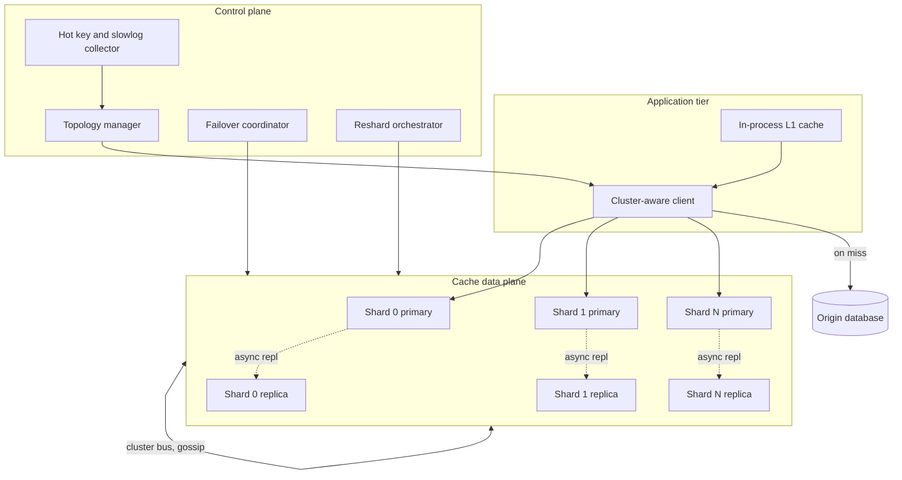
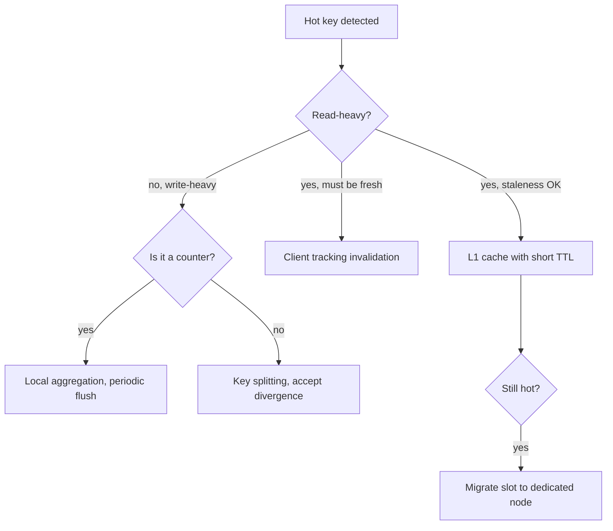
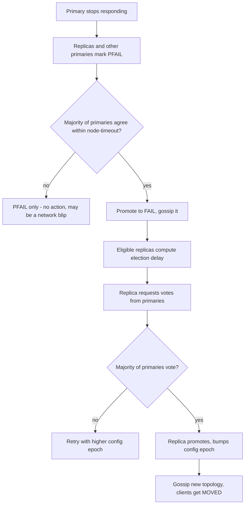
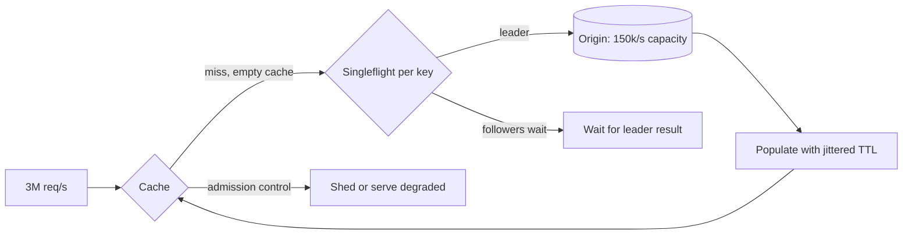
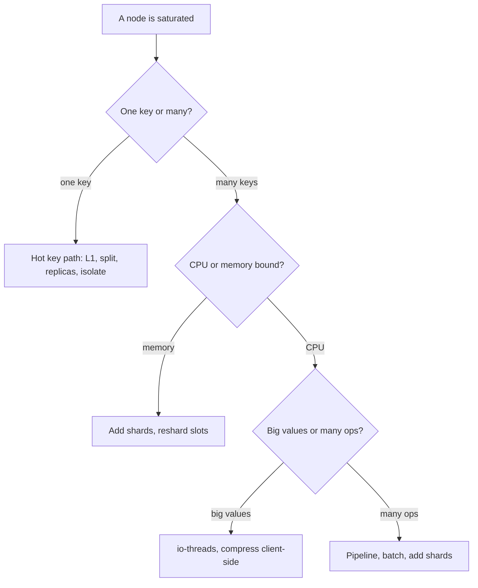

# 35 — Distributed Cache Service (Redis at Scale)

<span class="pill pill-core">Core</span> <span class="pill pill-hard">Hard</span>

**Redis is a single-threaded in-memory data structure server, and every hard problem in operating it at scale is a consequence of those three words: one slow command blocks everyone, memory is finite and eviction is lossy, and the data is gone unless you paid for durability you probably do not actually want.**

| | |
|---|---|
| **Commonly asked at** | Amazon (ElastiCache), Google (Memorystore), Redis Ltd, Datadog, Twitter, Shopify, Stripe, Coinbase, Snowflake |
| **Time budget** | 45 min |
| **Core tension** | Every mechanism that makes the cache more durable, more available, or more isolated costs you the latency predictability that is the only reason you deployed a cache instead of reading the database |
| **Prerequisites** | [F04 Caching](../fundamentals/f04-caching.md), [F06 Partitioning & Sharding](../fundamentals/f06-partitioning-sharding.md), [F07 Replication & Consistency](../fundamentals/f07-replication-consistency.md), [F08 CAP & PACELC](../fundamentals/f08-cap-pacelc.md), [F09 Consensus](../fundamentals/f09-consensus.md), [F13 Storage Engines](../fundamentals/f13-storage-engines.md), [F17 Rate Limiting & Load Shedding](../fundamentals/f17-rate-limiting-load-shedding.md), [F18 Resilience Patterns](../fundamentals/f18-resilience-patterns.md), [F19 Concurrency Control](../fundamentals/f19-concurrency-control.md), [F24 Capacity Planning](../fundamentals/f24-capacity-planning.md) |

---

## 1. Problem Statement

Design and operate a multi-tenant distributed caching service — the thing a platform team runs so that a hundred product teams can each get a Redis endpoint without each of them learning about fork latency the hard way.

The naive version of this problem ("put Redis in front of the database") is a ten-minute answer. The real problem is the operational surface:

- **Topology.** Where does a key live, who decides, and what happens to in-flight requests while that decision changes?
- **Skew.** Consistent hashing gives you uniform *key* distribution and says nothing about *traffic* distribution. One key can be 40% of your load.
- **Memory.** The cache is full from the moment it is warm. Which key dies when a new one arrives is a policy decision with a production-outage-shaped failure mode.
- **Durability.** Redis can persist. That does not make it a database, and the mechanism by which it persists can cause a 2-second latency spike on a 16 GB instance.
- **Failover.** Promoting a replica takes seconds and can lose writes. Doing it wrong takes minutes and can produce two primaries.
- **Isolation.** The single-threaded event loop means one tenant's `KEYS *` is everyone's outage.

The framing that makes this a senior-level answer: **a cache is a latency optimisation whose failure mode is a thundering herd on the system behind it.** Every design decision must be evaluated against what happens to the database when the cache goes away, because at some point it will.

### Out of scope

Redis as a primary database, Redis Streams as a message broker, RediSearch/RedisJSON module design, and client library internals beyond what affects topology.

---

## 2. Requirements

### Functional

| # | Requirement | Notes |
|---|---|---|
| F1 | GET/SET/DEL with TTL | The 95% case |
| F2 | Data structures: hash, sorted set, list, set, bitmap | Counters, leaderboards, rate limiters |
| F3 | Atomic multi-key operations within a slot | Lua scripts, `MULTI/EXEC` |
| F4 | Horizontal scaling without downtime | Add/remove capacity, online resharding |
| F5 | Automatic failover of a failed primary | No human in the loop |
| F6 | Multi-tenant provisioning | Self-service endpoint per team |
| F7 | Pub/sub and keyspace notifications | Invalidation fan-out |
| F8 | Point-in-time recovery for the small set of tenants who need it | Explicitly opt-in |
| F9 | Per-tenant observability | Hit rate, evictions, slow commands, top keys |

### Non-functional

| # | Requirement | Target |
|---|---|---|
| N1 | GET latency | p50 < 0.3 ms, p99 < 2 ms, p99.9 < 10 ms (server-side) |
| N2 | Throughput per node | > 150k ops/s single-threaded, > 500k with I/O threads |
| N3 | Availability per cluster | 99.99% |
| N4 | Failover time | < 15 s detection to promotion |
| N5 | Data loss on failover | Bounded and documented; not zero |
| N6 | Resharding | Online, no client errors beyond transient redirects |
| N7 | Noisy-neighbour blast radius | One tenant cannot exceed its CPU/memory/bandwidth share |
| N8 | Cold start | Cluster reaches useful hit rate within 10 min without collapsing the origin |

!!! warning "N5 is the requirement that gets misstated"
    Redis replication is asynchronous. A primary that accepts a write and dies before replicating it loses that write, and the promoted replica will happily serve the old value. `WAIT numreplicas timeout` gives you a *synchronous-ish* acknowledgement but is not a consensus protocol — it does not prevent a failover from choosing a replica that lacks the write. **The correct requirement is "bounded loss, documented, and the application tolerates it."** If your application cannot tolerate it, you need a database, and saying so early is worth more than any clever configuration.

---

## 3. Scale Estimation

**Workload.**

$$
\begin{aligned}
\text{QPS (peak)} &= 3 \times 10^{6}\ \text{ops/s} \\
\text{read:write} &= 9{:}1 \\
\text{mean value size} &= 1.2\ \text{KB} \\
\text{working set} &= 4\ \text{TB}
\end{aligned}
$$

**Node count from memory.** Usable memory per node is not the instance size. Budget for copy-on-write during snapshots, replication buffers, and fragmentation:

$$
\begin{aligned}
\text{instance} &= 64\ \text{GiB} \\
\text{maxmemory} &= 0.55 \times 64 = 35\ \text{GiB} \\
\text{nodes for data} &= \left\lceil \frac{4096\ \text{GiB}}{35\ \text{GiB}} \right\rceil = 118 \\
\text{with replicas (1:1)} &= 236\ \text{nodes}
\end{aligned}
$$

The 55% figure is the number people get wrong. Set `maxmemory` to 75-80% of RAM and the first `BGSAVE` under write load will OOM the box, because `fork()` copy-on-write can, in the worst case, double the resident set. Sections 7.4 and 12 return to this.

**Node count from throughput.**

$$
\begin{aligned}
\text{per-node capacity} &\approx 1.2 \times 10^{5}\ \text{ops/s (conservative, single-threaded, pipelined)} \\
\text{nodes needed} &= \frac{3 \times 10^{6}}{1.2 \times 10^{5}} = 25
\end{aligned}
$$

Memory is the binding constraint here (118 > 25), which is the usual case for a cache and the opposite of the usual case for a database. Say which constraint binds and why — it determines whether you scale by adding shards or by adding replicas.

**Hash slot distribution.** Redis Cluster fixes the keyspace at $2^{14} = 16384$ slots:

$$
\text{slot}(k) = \mathrm{CRC16}(k) \bmod 16384
$$

With $N$ primaries, each owns $16384/N$ slots. At $N = 118$:

$$
\frac{16384}{118} \approx 138.8\ \text{slots per node}
$$

which is not an integer, so slot counts are 138 or 139 — a 0.7% imbalance from rounding alone, which is negligible. The real imbalance comes from key distribution within slots. With $M = 4 \times 10^{9}$ keys uniformly hashed into 16384 slots, keys per slot is Binomial with mean $\mu = M/16384 \approx 244{,}140$ and standard deviation

$$
\sigma \approx \sqrt{M \cdot p (1-p)} \approx \sqrt{244{,}140} \approx 494
$$

so the relative deviation per slot is $494/244{,}140 \approx 0.2\%$. **Uniformity of key count is essentially perfect and completely beside the point.** The distribution that matters is over *access frequency* and *value size*, and both are Zipfian. Section 7.2 is where the real problem lives.

**The 16384 ceiling.** $N$ cannot exceed 16384, and practically you want at least 20-50 slots per node so that slot migration has useful granularity. That caps a single cluster at a few hundred to a couple of thousand nodes, which is a real architectural limit worth naming.

**Bandwidth.**

$$
3 \times 10^{6}\ \text{ops/s} \times 1.2\ \text{KB} = 3.6\ \text{GB/s} = 28.8\ \text{Gbps}
$$

Spread over 118 nodes that is 244 Mbps per node — fine. But a single hot node serving a viral key at 400k ops/s of a 10 KB value is $4\ \text{GB/s} = 32\ \text{Gbps}$ **on one NIC**, and that is the failure mode that takes down a node without any CPU or memory pressure to warn you.

**Cache miss cost.** At a 95% hit rate:

$$
\text{origin QPS} = 3\times10^{6} \times 0.05 = 150{,}000\ \text{/s}
$$

At 90%: 300,000/s. **Five points of hit rate is the difference between a healthy database and a dead one**, and if the cache disappears entirely the origin sees $3 \times 10^{6}$ QPS — 20x its provisioned capacity. That number is the reason §7.7 exists.

---

## 4. API Design

The client-facing API is the Redis protocol; the interesting API is the control plane.

### Data plane behaviours the client must implement

```text
GET user:1042:profile
  -> "-MOVED 12539 10.4.2.19:6379"     slot permanently relocated: update map
  -> "-ASK 12539 10.4.2.31:6379"       slot migrating: one-shot redirect, do not cache
  -> "-TRYAGAIN"                        multi-key op spans a migrating slot
  -> "-CLUSTERDOWN"                     a slot has no owner
```

`MOVED` versus `ASK` is the single most important protocol detail in Redis Cluster and a reliable interview probe. `MOVED` means "this slot now lives there, permanently — refresh your slot map." `ASK` means "this specific key has already been migrated but the slot as a whole has not; go ask that node *this once*, prefixed with `ASKING`, and do not update your map." A client that caches `ASK` redirects corrupts its topology view; a client that ignores `MOVED` generates a redirect on every single request.

```python
def execute(self, key, cmd):
    node = self.slot_map[crc16(hashtag(key)) % 16384]
    for attempt in range(MAX_REDIRECTS):     # 5 is typical
        try:
            return node.send(cmd)
        except MovedError as e:
            self.refresh_slot_map()          # rate-limited, see 12
            node = self.node(e.addr)
        except AskError as e:
            node = self.node(e.addr)
            node.send("ASKING")              # do NOT update slot_map
        except TryAgainError:
            time.sleep(backoff(attempt))
    raise TooManyRedirects()
```

### Hash tags: the escape hatch and the footgun

```text
MSET {user:1042}:profile "..." {user:1042}:prefs "..."   -- same slot, works
MSET user:1042:profile "..." user:1042:prefs "..."       -- CROSSSLOT error
```

Only the substring between the first `{` and the first following `}` is hashed. This is how you co-locate keys for multi-key operations and Lua scripts. It is also how you create a hot slot that cannot be split, because every key sharing a tag is permanently bound to one node. See §12.

### Control plane

```text
POST /v1/clusters                  { tier, memory_gb, replicas, eviction_policy }
POST /v1/clusters/{id}/reshard     { target_nodes, rate_limit_slots_per_min }
POST /v1/clusters/{id}/failover    { node_id, force: false }
GET  /v1/clusters/{id}/hotkeys?window=60s
GET  /v1/clusters/{id}/slowlog
POST /v1/clusters/{id}/acl         { tenant, allowed_commands, key_prefix }
```

```json
{
  "cluster_id": "cch-7f2a",
  "topology": {
    "shards": [
      { "shard_id": 0, "slots": "0-4095",
        "primary": "10.4.2.11:6379",
        "replicas": ["10.4.3.11:6379", "10.4.4.11:6379"] }
    ],
    "epoch": 4471
  },
  "eviction_policy": "allkeys-lfu",
  "maxmemory_bytes": 37580963840
}
```

!!! tip "Version the topology and make clients carry the epoch"
    `epoch` is the cluster's config epoch. When a client presents a stale epoch in a topology-refresh call, the service can respond with the delta rather than the full map — and, more importantly, you get a metric for "how many clients are running a stale topology", which is the leading indicator for a resharding that is about to go badly.

---

## 5. Data Model

Redis has no schema, so the "data model" is the **key naming convention and the memory accounting**, and both are load-bearing at scale.

```text
{tenant}:{entity}:{id}:{field}       flat keys
  cart:{u:1042}:items                hash tag binds related keys to one slot
  sess:9f2ae1c3                      session, TTL 1800
  lb:global:2026-03                  sorted set, leaderboard
  rl:{api:k9x}:60s                   rate limiter bucket
  feed:u:1042:v7                     versioned key = invalidation by rotation
```

```python
# Memory accounting per key. This is the calculation nobody does and everybody needs.
#   robj header                     16 B
#   sds header + embstr for value   ~3-11 B + len
#   dictEntry (key, val, next)      24 B (+8 for the key's own robj/sds)
#   jemalloc size-class rounding    up to +25% for small allocations
#   expires dict entry (if TTL)     +24 B
#
# A 40-byte key with a 100-byte value is ~230 bytes resident, not 140.
# 4e9 keys x ~90 B of pure overhead = 360 GB of overhead alone.
```

That last line is the point. At four billion keys, **per-key overhead is 360 GB — roughly 9% of a 4 TB working set spent on bookkeeping**, and it is much worse for small values. The mitigations are structural, not tuning:

| Technique | Mechanism | When it wins |
|---|---|---|
| Hash field packing | Store 100 small records as fields of one hash; `listpack` encoding when under `hash-max-listpack-entries` (128) and `hash-max-listpack-value` (64 B) | 5-10x memory reduction for many tiny values. Instagram's classic trick |
| Shorter keys | `u:1042:p` instead of `user:1042:profile` | Trivial and real: 20 bytes x 4e9 = 80 GB |
| Integer encoding | Values that parse as integers in range are stored as `long`, shared for 0-9999 | Free if you avoid stringifying counters |
| Client-side compression | LZ4/Zstd for values over ~1 KB | 2-4x on JSON; costs client CPU, and breaks server-side `APPEND`/`GETRANGE` |
| Binary serialisation | MessagePack or protobuf instead of JSON | 30-50% smaller and faster to parse |

```text
-- Encoding transitions are cliffs, not slopes
hash-max-listpack-entries 128     -- 129th field: listpack -> hashtable
hash-max-listpack-value   64      -- one 65-byte value converts the WHOLE hash
zset-max-listpack-entries 128
set-max-intset-entries    512
```

Crossing one of these thresholds can multiply that object's memory by 5-10x instantly, and it is a one-way transition — Redis never converts back. A hash that grows to 129 fields and then shrinks to 100 stays a hashtable forever. This is a real production surprise and appears again in §12.

---

## 6. High-Level Architecture



### Read path

1. **L1 in-process check.** A bounded local cache (10k-50k entries, 1-5 s TTL) in the application process. This exists specifically for hot keys (§7.2) and cuts network round trips to zero for the top of the Zipf distribution.
2. **Slot computation, client-side.** `CRC16(hashtag(key)) mod 16384`, looked up in the cached slot map. No proxy hop, no lookup service. This is why Redis Cluster's p50 is sub-millisecond.
3. **Single round trip to the owning primary** (or to a replica, if the client issued `READONLY` and the application accepts stale reads).
4. **On miss:** a singleflight-guarded fetch from the origin, then `SET` with a jittered TTL. The singleflight is not optional — see §7.7.

### Write path

1. Write to the origin database first (write-around / cache-aside is the default; write-through and write-behind are covered in §11).
2. Invalidate or update the cache key. **Invalidate, do not update**, unless you have thought hard about it: updating races with concurrent reads that repopulate with stale data, whereas deleting is idempotent and converges.
3. Optionally publish an invalidation to other regions' caches via a pub/sub or a change stream.

!!! note "Where the latency actually goes"
    On a healthy cluster, server-side command execution is 30-80 microseconds. A p50 of 300 microseconds is almost entirely network and client-side serialisation. This means **two things dominate your latency profile that have nothing to do with Redis**: the number of round trips (fix with pipelining and multi-key ops within a slot) and client-side connection pool contention. When someone reports "Redis is slow", the answer is in `SLOWLOG` and `latencystats` about 20% of the time and in the client about 80% of the time.

---

## 7. Deep Dives

### 7.1 Cluster topology: hash slots, client sharding, or a proxy

Three ways to distribute keys across nodes. The choice constrains everything downstream.

=== "Redis Cluster (hash slots)"

    16384 slots, each owned by exactly one primary. Nodes gossip topology over the cluster bus (port 6379 + 10000). Clients cache the slot map and are redirected via `MOVED`/`ASK` when it changes.

    **Wins:** no proxy hop (lowest possible latency), online resharding at slot granularity, automatic failover built in, and topology is self-describing.

    **Costs:** the client must be cluster-aware and correct — and many are not. Multi-key operations only work within a slot, so `MGET` across shards is a client-side scatter-gather. Cross-slot transactions and Lua scripts are impossible. Gossip is $O(N^2)$-ish in message volume, which is why very large clusters get unstable.

    ```text
    cluster-enabled yes
    cluster-node-timeout 15000          -- failure detection window
    cluster-require-full-coverage no    -- serve available slots if some are down
    cluster-allow-replica-migration yes -- auto-rebalance orphaned replicas
    cluster-migration-barrier 1         -- keep >=1 replica before donating one
    ```

=== "Client-side sharding"

    The client hashes the key onto a ring of independent Redis instances. No cluster mode, no gossip, no redirects.

    **Wins:** simplest server side; each node is a plain Redis you can reason about; no 16384-slot ceiling; you can run wildly heterogeneous nodes.

    **Costs:** **topology changes are a coordinated client deployment**, which is the killer. Every client must agree on the ring, so adding a node means a config rollout across every service, and during the rollout different clients disagree about where keys live — which silently produces cache misses, not errors. Failover must be built by you. This is where Twitter and Facebook started, and both moved away from it.

=== "Proxy (Twemproxy, Envoy, Redis Cluster Proxy)"

    A stateless proxy layer owns the topology; clients speak plain Redis to the proxy.

    **Wins:** dumb clients in any language work unchanged; topology changes are invisible to applications; connection multiplexing collapses $C \times N$ connections to $P \times N$ (§7.6 — this is a bigger deal than it sounds); central place for auth, ACLs, metrics, and per-tenant rate limiting.

    **Costs:** an extra network hop adds 0.2-0.5 ms, which can double your p50. The proxy is another tier to scale, monitor, and fail over. Twemproxy specifically does not support failover at all and needs Sentinel plus a config-reload sidecar. Proxies historically do not support pub/sub or transactions well.

| Dimension | Redis Cluster | Client sharding | Proxy |
|---|---|---|---|
| Added latency | 0 | 0 | +0.2-0.5 ms |
| Client complexity | High (must handle MOVED/ASK) | Medium | None |
| Topology change | Online, automatic | Client redeploy | Online, transparent |
| Connection count | $C \times N$ | $C \times N$ | $C \times P + P \times N$ |
| Multi-key ops | Same slot only | Same node only | Same node only |
| Failover | Built in | Build it yourself | Needs Sentinel or equivalent |
| Max practical nodes | ~500-1000 (gossip) | Unbounded | Unbounded |
| **Verdict** | **Chosen** for a platform with controlled client libraries | Rejected: topology change is a deploy | Chosen when clients are heterogeneous or connection counts are extreme |

**Chosen design: Redis Cluster, with an optional proxy tier for tenants that cannot use a cluster-aware client.** The hybrid is common and correct: the latency-sensitive services get direct cluster access, and the long tail of batch jobs and legacy applications go through Envoy.

### 7.2 Hot keys: the problem consistent hashing does not solve

Uniform key distribution and uniform *load* distribution are unrelated. Access frequency follows Zipf: with exponent $s \approx 1$ over $10^{6}$ keys, the most popular key gets

$$
P(1) = \frac{1/1^{s}}{\sum_{n=1}^{10^{6}} 1/n^{s}} \approx \frac{1}{\ln(10^6) + \gamma} \approx \frac{1}{14.4} \approx 7\%
$$

of all traffic — **on one node**. A celebrity post, a global feature flag, a config blob read by every request, or a rate-limit counter for a large customer can be far worse than Zipf, hitting 30-40% of cluster traffic on a single key.

At 3M ops/s, a 7% key is 210,000 ops/s to one node whose ceiling is ~150,000. It is saturated, and because Redis is single-threaded the saturation manifests as **latency increase for every other key on that node**, not as errors on the hot key.

**Detection first.** You cannot fix what you cannot see:

```bash
# Sampling-based hot key detection. Non-invasive, use this.
redis-cli --hotkeys                  # requires maxmemory-policy *lfu
redis-cli --memkeys                  # largest keys by memory

# Live sampling of the command stream. ~1% overhead at low rates.
redis-cli MONITOR | head -100000 | awk '{print $4}' | sort | uniq -c | sort -rn | head
```

!!! danger "Never run MONITOR on a loaded production node"
    `MONITOR` streams every command to the client. On a node doing 150k ops/s that is 150k lines per second, and the output buffer for that client grows faster than the socket drains. The event loop spends its time writing to your terminal, and then `client-output-buffer-limit` either kills your connection or — if it is set to zero for normal clients, as it is by default — the node OOMs. Use `--hotkeys` (which uses `OBJECT FREQ` sampling), or sample `MONITOR` through `head` with a hard line cap as above, or collect from a replica.

**Mitigations, in the order you should apply them:**

=== "1. L1 client-side cache"

    The highest-leverage fix by a wide margin. A 1-second TTL on a 10,000-entry in-process LRU absorbs essentially all of the Zipf head:

    $$
    \text{requests to Redis} = \frac{\text{app instances} \times 1}{\text{TTL}} = \frac{500}{1\ \text{s}} = 500\ \text{ops/s}
    $$

    210,000 ops/s becomes 500. The cost is bounded staleness of one second, which for a feature flag or a celebrity profile is almost always acceptable. Redis 6+ offers **client-side caching with tracking** (`CLIENT TRACKING ON`), where the server invalidates the client's local copy via RESP3 push messages — this gives you the same win with coherence instead of a TTL, at the cost of the server maintaining an invalidation table.

    ```python
    # Bounded, jittered, and it must be bounded or it becomes a memory leak.
    l1 = TTLCache(maxsize=10_000, ttl=1.0)

    def get(key):
        if (v := l1.get(key)) is not None:
            return v
        v = redis.get(key)
        # Jitter prevents all instances expiring the same key simultaneously.
        l1.set(key, v, ttl=1.0 + random.uniform(0, 0.3))
        return v
    ```

=== "2. Key splitting"

    Replicate the hot key across $N$ suffixed copies so it lands in $N$ different slots; readers pick one at random.

    ```python
    HOT_FANOUT = 32

    def read_hot(key):
        return redis.get(f"{key}:{random.randrange(HOT_FANOUT)}")

    def write_hot(key, val):
        # Fan-out write. Pipelined, but N times the write cost.
        with redis.pipeline(transaction=False) as p:
            for i in range(HOT_FANOUT):
                p.set(f"{key}:{i}", val, ex=TTL)
            p.execute()
    ```

    Load per copy drops to $1/N$. The costs are real: $N$ times the memory, $N$ times the write amplification, and **no atomicity across copies**, so during a write the copies disagree. This is fine for read-mostly data (config, feature flags) and wrong for counters. Note that the copies land on different slots only because the suffix changes the CRC16 — if the key has a hash tag, splitting does nothing, which is a subtle and common mistake.

=== "3. Read replicas"

    `READONLY` on the connection lets a client read from replicas. With 2 replicas per primary you get 3x read capacity for that slot.

    **Why this is the weakest mitigation:** replication is asynchronous, so reads are stale by the replication lag; the write still hits one primary, so write-hot keys are unhelped; and the replicas for a hot shard are now also hot, so you have tripled the hardware devoted to one key. Use it as a supplement, not a solution.

=== "4. Dedicated isolation"

    Move the hot key to its own shard, or out of the shared cluster entirely. With Redis Cluster you can migrate the specific slot containing the key to a node that owns only that slot.

    This is the operational escape hatch: it works, it is manual, and it does not scale past a handful of keys. Keep it in the runbook for the celebrity-account case.



### 7.3 Eviction policy: the choice with an outage attached

When `maxmemory` is reached, Redis applies `maxmemory-policy`. The default is `noeviction`.

| Policy | Behaviour | Right when | Failure mode if wrong |
|---|---|---|---|
| `noeviction` | Writes return OOM error; reads still work | Redis is a queue or a store of record | **Total write outage.** Every `SET` fails at exactly the moment traffic is highest |
| `allkeys-lru` | Approximate LRU over all keys | General-purpose cache | Evicts keys the app assumed were durable (sessions, locks) |
| `allkeys-lfu` | Approximate LFU with decay | Skewed access; one-hit-wonders should not displace hot data | Slow to adapt to genuine workload shifts |
| `allkeys-random` | Uniform random victim | Uniform access; want minimal CPU | Evicts hot keys as readily as cold ones |
| `volatile-lru` | LRU among keys with a TTL only | Mixed durable/ephemeral data in one instance | **OOM when no keys have TTLs** — degenerates to `noeviction` silently |
| `volatile-ttl` | Shortest remaining TTL first | TTL encodes value | Same degeneration as above |
| `volatile-random` | Random among keys with TTL | Rare | Same degeneration |

**`volatile-*` degenerating to `noeviction` is the classic production incident.** The policy looks safe ("only evict things that were going to expire anyway"), the instance runs fine for months, and then a code change starts writing keys without TTLs. Memory fills with non-evictable keys, the eviction candidate pool empties, and every write starts returning `OOM command not allowed when used memory > 'maxmemory'`. This is a hard, total write failure with no gradual degradation.

**LRU vs LFU mechanics.** Redis does not maintain a true LRU list (too expensive). It samples `maxmemory-samples` keys (default 5) and evicts the best candidate among them. With 5 samples the approximation is decent; with 10 it is close to true LRU at ~2x the eviction CPU.

LFU (Redis 4+) stores an 8-bit logarithmic counter per key plus a decay clock:

```text
maxmemory-policy allkeys-lfu
lfu-log-factor 10        -- higher = counter saturates more slowly
lfu-decay-time 1         -- minutes of idleness per counter halving
```

The counter increments probabilistically — $P(\text{incr}) = 1/(\text{counter} \times \text{factor} + 1)$ — so an 8-bit counter can represent access frequencies spanning many orders of magnitude. The decay is what makes it adaptive; **without decay, LFU is a trap**, because a key that was extremely popular last year outranks a key that is popular right now, forever.

**Chosen default: `allkeys-lfu` with `lfu-decay-time 1` and `maxmemory-samples 5`.** LFU beats LRU whenever there is a scanning or batch-job component to the workload, because a nightly job that touches a million keys once will, under LRU, evict your entire hot set. That scenario is universal and is the reason to prefer LFU as the platform default.

!!! danger "Eviction is not a memory limit, it is a memory *reaction*"
    Redis evicts *after* exceeding `maxmemory`, and eviction happens in the main event loop. Under a heavy write burst, it can be evicting continuously — each write triggers sampling and deletion — and deleting a 2 GB hash is an $O(n)$ blocking operation. Enable `lazyfree-lazy-eviction yes` so large objects are freed on a background thread. Without it, one eviction of a large collection is a multi-second stall for every client on the node.

### 7.4 Persistence: RDB, AOF, and the fork() latency cliff

Redis offers two persistence mechanisms, and the operational characteristics matter far more than the durability semantics — because if you genuinely need the durability semantics, you should not be using Redis.

**RDB (snapshot).** `BGSAVE` calls `fork()`, and the child writes a point-in-time snapshot while the parent keeps serving.

The `fork()` cost is the thing to understand. Modern Linux does not copy the parent's memory; it copies the **page table**, then relies on copy-on-write. But:

$$
\text{page table size} \approx \frac{\text{RSS}}{4\ \text{KiB}} \times 8\ \text{bytes} = \frac{\text{RSS}}{512}
$$

For a 64 GiB RSS that is 128 MiB of page tables to copy, and `fork()` blocks the entire process while doing it. Measured rates are roughly 10-20 ms per GB of RSS on typical hardware:

$$
t_{\text{fork}} \approx 64\ \text{GiB} \times 15\ \text{ms/GiB} \approx 960\ \text{ms}
$$

**A one-second stall, during which the single-threaded server serves nothing.** Every client sees a ~1 s p99.99, timeouts fire, and if your health checker is impatient the node gets marked down. On virtualised hardware without EPT/NPT hardware page-table support it is several times worse, which is why fork latency on some cloud instance families is dramatically worse than on bare metal.

Then copy-on-write: every page the parent writes to during the snapshot gets duplicated. Under heavy write load with good write locality you might copy 20-30% of the RSS; under pathological load (random writes across the whole keyspace) you approach 100%, which is why `maxmemory` must be ~50-55% of RAM if you snapshot.

```bash
# Measure it before you believe any of the above on your hardware.
redis-cli INFO stats | grep latest_fork_usec
# latest_fork_usec:872341      <- 872 ms. This node should not be snapshotting.

# Mitigations
echo never > /sys/kernel/mm/transparent_hugepage/enabled  # THP makes CoW 512x worse
# Take snapshots on a replica, never on a primary serving traffic.
```

!!! danger "Transparent Huge Pages turn a latency spike into an outage"
    With THP enabled, the copy-on-write unit is 2 MiB instead of 4 KiB. A single-byte write to a page during a snapshot copies 2 MiB. Memory usage during `BGSAVE` can balloon several-fold and latency degrades by an order of magnitude. Redis logs a warning about this at startup, and that warning is ignored in a large fraction of production deployments. Disable THP, and make it part of the node image, not a runbook step.

**AOF (append-only file).** Every write command is appended to a log.

```text
appendonly yes
appendfsync everysec       -- always | everysec | no
auto-aof-rewrite-percentage 100
auto-aof-rewrite-min-size 64mb
aof-use-rdb-preamble yes   -- hybrid: RDB snapshot + AOF tail. Best of both.
```

| `appendfsync` | Durability | Throughput cost | Verdict |
|---|---|---|---|
| `always` | Loses ~0 | 5-10x slower; fsync on every write in the event loop | **Rejected.** If you need this, use a database |
| `everysec` | Loses up to 1 s (2 s worst case) | ~5% | **Chosen** when AOF is used at all |
| `no` | Loses whatever the OS buffered, up to 30 s | 0 | Acceptable for pure caches |

AOF rewrite also forks, so it has the same latency cliff. And there is a nastier interaction: if the disk is slow and the background fsync from the previous second has not completed, the main thread **blocks** on the next write to avoid unbounded buffering. A slow EBS volume therefore stalls an in-memory database, which is a genuinely surprising causal chain the first time you see it.

**The actual recommendation for a cache tier: turn persistence off on primaries.** Run `appendonly no` and no `save` points on the primary; if you want a snapshot for warm restarts, take it on a replica that serves no traffic. Persistence on a cache primary buys you a faster restart and costs you a permanent p99.99 tax plus 45% of your RAM.

### 7.5 Failover: Sentinel, Cluster, and split-brain



**Redis Cluster failover.** Failure detection is gossip-based: a node that has not responded within `cluster-node-timeout` is marked `PFAIL` by its peers; when a majority of primaries agree, it becomes `FAIL`. An eligible replica (one whose disconnection time is under `cluster-replica-validity-factor × node-timeout`) waits a rank-based delay — replicas with more up-to-date data wait less — then requests votes from the primaries. A majority promotes it, and the new primary bumps the config epoch, which is what makes the new topology win over the old one in gossip.

**Sentinel** does the same job for non-clustered deployments: an odd number of Sentinel processes monitor a primary, agree on failure by quorum, elect a leader among themselves via a Raft-like protocol, and reconfigure the replicas. Clients discover the current primary by asking Sentinel.

| | Sentinel | Cluster |
|---|---|---|
| Sharding | None — one primary holds everything | 16384 slots across N primaries |
| Client support | `SENTINEL get-master-addr-by-name` | Slot map, MOVED/ASK |
| Failover quorum | Sentinel majority | Primary majority |
| Scale limit | Single-node memory and CPU | ~500-1000 nodes |
| Multi-key ops | All keys, no restriction | Same slot only |
| **Verdict** | Chosen for small deployments where the dataset fits one node and multi-key ops matter | **Chosen** for the platform |

**Split-brain.** Redis Cluster does not use a consensus protocol for *data*; it uses quorum for *failover decisions*. The gap between those two things is where writes get lost.

Partition a cluster so the primary for slot range S is on the minority side with its clients:

1. The primary is still up and still accepting writes. It has no idea it is partitioned.
2. The majority side marks it `FAIL` and promotes a replica.
3. For `cluster-node-timeout` milliseconds, **both nodes accept writes for the same slots.**
4. When the partition heals, the old primary sees a higher config epoch, demotes itself to a replica of the new primary, and **discards its entire dataset** to sync from the new primary.

Every write accepted on the minority side during the window is silently gone. Bound the window:

```text
cluster-node-timeout 15000                -- upper bound on the divergence window
min-replicas-to-write 1                   -- refuse writes if fewer than 1 replica
min-replicas-max-lag 10                   -- ...connected within 10 s
```

`min-replicas-to-write` is the important one and is off by default. With it set, a partitioned primary that loses contact with its replicas stops accepting writes, converting silent data loss into a visible write error. **That is the trade to state explicitly: you are choosing unavailability over inconsistency** for the minority partition, which is the C-over-A choice in CAP terms — see [F08](../fundamentals/f08-cap-pacelc.md). For a cache, many teams choose the opposite. Either is defensible; not knowing which you chose is not.

!!! warning "Failover promotes a replica that may be behind"
    Replication is asynchronous, and the election's rank-based delay only *prefers* the most up-to-date replica — it does not guarantee one. If the primary was 200 ms ahead of every replica when it died, those writes are gone. `WAIT 1 100` after critical writes gives you a stronger acknowledgement, but it is a client-side check, not a promotion constraint: it tells you the write reached a replica, not that *that* replica will be the one promoted. Redis is not a consensus system, and the correct engineering response is to design the application so that losing the last few hundred milliseconds of cache writes is survivable.

### 7.6 Multi-tenant isolation on a single-threaded event loop

Redis executes commands one at a time in one thread. There is no preemption, no per-tenant scheduler, and no way to cancel a running command. **The unit of isolation failure is one command.**

Worst offenders, with real numbers on a 10-million-key instance:

| Command | Complexity | Blocking time | Fix |
|---|---|---|---|
| `KEYS *` | $O(N)$ | 1-3 s | Disable via ACL; use `SCAN` |
| `FLUSHALL` (sync) | $O(N)$ | 2-5 s | `FLUSHALL ASYNC` |
| `DEL bighash` (2 GB) | $O(n)$ | 1-2 s | `UNLINK`, `lazyfree-lazy-user-del yes` |
| `SMEMBERS` on 5M members | $O(n)$ + huge reply | 500 ms+ | `SSCAN` |
| `HGETALL` on 1M fields | $O(n)$ | 200 ms+ | `HSCAN` or `HMGET` |
| `SORT` on a large list | $O(n \log n)$ | seconds | Precompute; use a sorted set |
| `ZRANGEBYSCORE ... LIMIT 0 -1` | $O(\log n + m)$ | $m$-dependent | Always bound `LIMIT` |
| Unbounded Lua script | Unbounded | until `busy-reply-threshold` | Review scripts; set the threshold low |
| `EXPIRE` avalanche | $O(\text{expired})$ | 25% of cycle by design | Jitter TTLs |

A 2-second stall is not "slow for that tenant". It is **2 seconds of total unavailability for every tenant on that node**, and it shows up in their dashboards as a network problem, which is where the next four hours of everyone's day goes.

**Defence in depth:**

```text
# 1. ACLs. Remove the sharp edges entirely, per tenant. Redis 6+.
ACL SETUSER tenant_orders on >SECRET ~orders:* \
    +@read +@write +@list +@hash +@sortedset \
    -@dangerous -keys -flushall -flushdb -monitor -debug -shutdown \
    -cluster|failover

# 2. Rename or disable globally as a backstop
rename-command KEYS ""
rename-command FLUSHALL ""
rename-command CONFIG "CONFIG_9f2ae1c3b7"

# 3. Bound what a script or a slow command can do
busy-reply-threshold 2000       -- after 2 s, reply BUSY to other clients
                                -- so at least they get an error, not a hang

# 4. Free large objects off-thread
lazyfree-lazy-eviction yes
lazyfree-lazy-expire yes
lazyfree-lazy-server-del yes
lazyfree-lazy-user-del yes
replica-lazy-flush yes

# 5. Bound per-client output buffers so one MONITOR cannot OOM the node
client-output-buffer-limit normal 256mb 128mb 60
client-output-buffer-limit pubsub 32mb 8mb 60

# 6. Per-tenant connection and bandwidth limits
maxclients 20000
```

**The `busy-reply-threshold` nuance:** once a Lua script has performed a write, Redis cannot abort it without breaking atomicity, so `SCRIPT KILL` fails and the only recovery is `SHUTDOWN NOSAVE`. That is the worst 3 AM situation in Redis operations, and the prevention is entirely at review time: scripts must be bounded, must not iterate over unbounded collections, and must be treated as production code rather than as configuration.

**Hard isolation.** Soft controls reduce the blast radius; they do not eliminate it. For tenants with genuinely incompatible workloads, the answer is separate clusters, and the platform should make that cheap:

| Tier | Isolation | Cost | For |
|---|---|---|---|
| Shared multi-tenant | ACLs, key prefixes, soft quotas | Lowest | Small, well-behaved, non-critical |
| Dedicated cluster, shared hardware | Separate processes, cgroup CPU/memory | Medium | Most production tenants |
| Dedicated hardware | Physical | Highest | Latency-critical or hostile workloads |

The platform decision worth articulating: **charge for isolation rather than policing behaviour.** A tenant whose workload requires dedicated capacity should be able to buy it in one click, because the alternative is a permanent negotiation that the platform team always loses at 3 AM.

### 7.7 Connection storms and the cold-cache stampede

Two failure modes that only appear during recovery, which is exactly when you cannot afford them.

**Connection storm.** A node restarts. Every application instance's connection pool is now full of dead connections and reconnects simultaneously.

$$
\begin{aligned}
\text{app instances} &= 500,\quad \text{pool size} = 50 \\
\text{simultaneous connects} &= 25{,}000
\end{aligned}
$$

Each TCP accept plus TLS handshake plus `AUTH` plus `CLIENT SETNAME` runs **on the single event loop**. TLS handshakes are the killer at roughly 1-3 ms of CPU each:

$$
25{,}000 \times 2\ \text{ms} \approx 50\ \text{seconds of pure handshake CPU}
$$

The node is effectively down for a minute *after* it came up, which triggers more client timeouts, which triggers more reconnects. This is a self-sustaining loop, and it is why "the restart made it worse" is such a common Redis story.

Mitigations:

```python
# Client: jittered reconnect with a cap, plus a per-process connect limiter.
backoff = min(cap, base * 2 ** attempt) * random.uniform(0.5, 1.5)

# Client: lazy pool growth. Do not pre-warm 50 connections on startup.
pool = ConnectionPool(max_connections=50, min_idle=2)
```

```text
# Server
io-threads 4                 -- offload socket read/write and TLS from the main thread
io-threads-do-reads yes
tcp-backlog 4096             -- and raise net.core.somaxconn to match
timeout 300                  -- reap idle connections so pools do not accumulate
```

And architecturally: a proxy tier collapses $C \times N$ connections into $P \times N$, which for 500 clients, 100 nodes and 20 proxies is 50,000 connections down to 2,000. **This is frequently the strongest argument for a proxy**, stronger than the topology-transparency argument that is usually given.

**Cold-cache stampede.** A cluster restarts empty. Every request misses. The origin, provisioned for 150,000 QPS, receives 3,000,000.



Three mechanisms, all needed:

1. **Singleflight / request coalescing.** Per-key, per-process: the first miss fetches, concurrent misses for the same key wait on that result. With 500 app instances this reduces origin load for a single key from $N$ concurrent requests to at most 500, and combined with an L1 cache, to far fewer.

    ```go
    var g singleflight.Group

    func Get(ctx context.Context, key string) ([]byte, error) {
        if v, ok := l1.Get(key); ok { return v, nil }
        if v, err := rdb.Get(ctx, key).Bytes(); err == nil { return v, nil }
        v, err, _ := g.Do(key, func() (interface{}, error) {
            b, err := origin.Fetch(ctx, key)
            if err != nil { return nil, err }
            rdb.Set(ctx, key, b, jitter(30*time.Minute))
            return b, nil
        })
        return v.([]byte), err
    }
    ```

2. **Origin-side admission control.** The database must protect itself: a concurrency limiter that queues beyond capacity and sheds beyond the queue, returning an error the cache layer translates into "serve stale" or "serve degraded". A cache that can DDoS its origin is a design flaw in the origin as much as in the cache.

3. **Staged warming.** Do not return a restarted node to full traffic immediately. Bring it back at 5% of traffic, warm it, and ramp — which requires the client or proxy to support weighted routing. Alternatively, restore an RDB snapshot from a replica so the node comes back warm, which is the strongest argument for keeping *any* persistence in a pure cache tier.

**TTL jitter is the cheap version of all of this.** A batch job that populates a million keys with `EX 3600` creates a synchronised expiry event one hour later:

```python
ttl = base_ttl + random.randint(0, base_ttl // 4)   # 3600-4500 s
```

This is one line and prevents a recurring hourly origin spike that is genuinely hard to diagnose after the fact.

---

## 8. Scaling the Bottleneck

**The bottleneck is the single-threaded event loop per node, and it saturates asymmetrically.** Adding nodes helps only if the load is distributed, which hot keys guarantee it is not.



### Online resharding

Redis Cluster migrates data at slot granularity, one key at a time, while serving traffic:

```bash
# 1. Mark destination importing and source migrating
redis-cli -h $DST CLUSTER SETSLOT 12539 IMPORTING $SRC_ID
redis-cli -h $SRC CLUSTER SETSLOT 12539 MIGRATING $DST_ID

# 2. Move keys in batches until the slot is empty
while keys=$(redis-cli -h $SRC CLUSTER GETKEYSINSLOT 12539 100); do
  [ -z "$keys" ] && break
  redis-cli -h $SRC MIGRATE $DST_HOST $DST_PORT "" 0 5000 KEYS $keys
done

# 3. Assign ownership; the epoch bump propagates via gossip
redis-cli -h $DST CLUSTER SETSLOT 12539 NODE $DST_ID
```

During step 2, the source node answers requests for keys still present normally, and returns `ASK` for keys already migrated. Multi-key operations spanning both sides return `TRYAGAIN`. **The client must handle all three or resharding produces application errors** — this is the single most common cause of "resharding broke production", and it is a client bug, not a server one.

`MIGRATE` is **synchronous and blocking on both nodes** for the duration. Migrating a 500 MB hash in one `MIGRATE` blocks both the source and the destination for seconds. Rate-limit the migration, migrate small batches (100 keys), and run resharding during low-traffic windows with a slot-per-minute cap. Never migrate a slot containing a known multi-gigabyte key without moving that key separately during a maintenance window.

$$
\begin{aligned}
\text{slots to move (118} \to \text{140 nodes)} &= 16384 \times \left(\frac{1}{118} - \frac{1}{140}\right) \times 118 \approx 2{,}574 \\
\text{at 20 slots/min} &\approx 2.1\ \text{hours}
\end{aligned}
$$

Two hours of degraded-but-working is the correct trade. Doing it in ten minutes means saturating `MIGRATE` and producing a latency incident.

### Vertical limits and when they bind

| Resource | Practical ceiling per node | Symptom at the ceiling |
|---|---|---|
| Memory | 64-100 GiB usable | Fork time, failover sync time, restart time all become unacceptable |
| Single-core throughput | ~150k ops/s | `instantaneous_ops_per_sec` plateaus, latency climbs |
| With `io-threads 4` | ~400-500k ops/s | Command execution is still serialised; only I/O parallelises |
| Network | 25 Gbps NIC | `total_net_output_bytes` rate plateaus; latency climbs with no CPU signal |
| Connections | ~50k with `io-threads` | Accept latency, handshake CPU |

**Keep nodes small.** A 200 GB node has a multi-second fork, a 20-minute full sync on failover, and a restart that takes a quarter of an hour to load its RDB. Forty 5 GB nodes have none of those problems and fail over in seconds. The instinct to consolidate for efficiency is exactly wrong for Redis: **node size is an availability parameter, not a cost parameter.**

---

## 9. Failure Modes

| Failure | Blast radius | Detection | Mitigation | Degraded behaviour |
|---|---|---|---|---|
| Primary node death | 1/N of keyspace, ~15 s | Cluster gossip `FAIL` | Automatic replica promotion | Errors for that slot range during election; sub-second writes lost |
| Primary and its replica both die | That slot range, until restore | `CLUSTER INFO` state `fail` | `cluster-require-full-coverage no` keeps other slots serving | Permanent loss of that data; origin absorbs those keys |
| Network partition, primary in minority | Writes on minority side | Replication link down | `min-replicas-to-write 1` refuses writes | Write errors instead of silent loss — chosen trade |
| `maxmemory` reached, `noeviction` | Entire node, all writes | `evicted_keys` flat while `used_memory` pinned; OOM errors | Alert at 80%; correct policy; capacity headroom | **Total write outage**, reads still fine |
| `volatile-*` with no TTLs | Entire node, all writes | Eviction pool empty, OOM errors | Policy audit; alert on "keys without TTL" ratio | Same as above, arrives without warning |
| Fork stall during `BGSAVE` | Entire node, ~1 s | `latest_fork_usec` | Snapshot on replicas only; disable THP | p99.99 spike; health checks may flap |
| Hot key saturating a node | Every tenant on that node | Per-node ops/s outlier, `--hotkeys` | L1 cache, key splitting, slot isolation | Latency for all keys on that node |
| `KEYS`/`FLUSHALL`/big `DEL` | Every tenant on that node, seconds | `SLOWLOG`, `latencystats` | ACL denial; `UNLINK`; lazyfree | Total stall for that node |
| Runaway Lua script | Entire node until threshold | `BUSY` replies | `busy-reply-threshold`; `SCRIPT KILL` if no writes | Unrecoverable without `SHUTDOWN NOSAVE` if it wrote |
| Connection storm on restart | The restarted node | `connected_clients` spike, accept latency | Jittered backoff, lazy pools, `io-threads`, proxy | Node unusable for ~1 min after "recovery" |
| Cold cache after full restart | The origin database | Hit rate near zero, origin QPS spike | Singleflight, admission control, staged warming, RDB restore | Origin overload; elevated latency everywhere |
| Replication buffer overflow | That replica, forces full resync | `client-output-buffer-limit` hits in log | Raise `replica` buffer limits; larger repl backlog | Full sync = fork on primary = latency spike, cascading |
| Synchronised TTL expiry | The origin | Sawtooth on `expired_keys` and origin QPS | TTL jitter | Periodic origin spikes, hard to attribute |
| Client running stale slot map | Those clients | `MOVED` redirect rate | Rate-limited map refresh on `MOVED` | Doubled latency; storm of `CLUSTER SLOTS` calls |

!!! danger "The cascading failure that kills the whole cluster"
    Node A's primary gets slow (hot key, fork, whatever). Its replica's replication link buffers, exceeds `client-output-buffer-limit replica`, and is dropped — forcing a **full resync**, which means a `fork()` on the already-struggling primary. That fork adds a second of stall, which causes client timeouts, which causes reconnects, which adds handshake CPU. Peers miss gossip pings and mark A as `PFAIL`, then `FAIL`. A replica is promoted — but it is cold and has every client reconnecting to it at once, so it immediately gets slow too. Meanwhile the clients that timed out are hammering the origin, which slows down, which increases the time each app request holds a Redis connection, which exhausts pools. The whole thing is a positive feedback loop that started with one slow key. **Break it with client-side circuit breakers that fail open to the origin, generous replication buffers, and hard per-node ops quotas** — not by adding retries.

---

## 10. SRE Lens

### SLIs and SLOs

| SLI | Measurement | SLO | Notes |
|---|---|---|---|
| Availability | Successful ops / attempted, per cluster | 99.99% | Client-observed, not server-reported |
| GET latency | Client-side p99 | < 2 ms | Client-side includes pool wait, which is where the problem usually is |
| GET latency tail | Client-side p99.9 | < 10 ms | This is the fork/eviction/stall detector |
| Hit rate | `keyspace_hits / (hits + misses)` | > 95% | Per tenant; a drop is a correctness signal, not just efficiency |
| Failover duration | `FAIL` to first successful write | < 15 s p99 | Measure in game days, not in theory |
| Eviction rate | `evicted_keys/s` | Steady is fine; a step change is not | Sudden change means working set grew or a policy changed |
| Blocked time | `latencystats` + `SLOWLOG` count > 100 ms | < 1/min/node | Direct measure of noisy-neighbour impact |
| Memory headroom | `used_memory / maxmemory` | < 80% | Page at 85%; 100% behaves differently per policy |

**Instrument client-side.** Server `INFO` metrics are measured *inside* the event loop, so a node blocked for two seconds reports excellent command latency for the commands it did run. The only honest latency measurement is from the client, including connection-pool wait time. Teams that monitor only `INFO commandstats` are blind to exactly the failure they most need to see.

### Error budget

99.99% is 4.3 minutes per month. A single unplanned failover costs 10-15 seconds, so roughly 17 failovers per month exhausts the budget on failover alone. Two consequences worth stating:

- **Failover is not free, so do not treat it as the answer to everything.** A tuning change that avoids one failover a month is worth more than most reliability work.
- **Planned failovers (`CLUSTER FAILOVER` with a graceful handoff) cost about 1 second, not 15**, because the replica syncs fully before promoting. Every planned maintenance should use the graceful path, and a team that fails over by killing the primary is burning 15x more budget than necessary.

Error budget policy: at 50% burn, freeze resharding and version upgrades; at 100%, the cluster goes into change freeze and the next work item is the top contributor to the burn.

### Rollout plan

1. **Config changes:** `CONFIG SET` on one replica, observe an hour, then replicas fleet-wide, then one primary, then the rest. Persist to the config file separately so a restart does not silently revert (`CONFIG REWRITE`).
2. **Version upgrades:** upgrade replicas first, then trigger *planned* failovers to make them primaries, then upgrade the old primaries. Never upgrade a primary in place.
3. **Resharding:** rate-limited, off-peak, with an abort path. Verify client library versions handle `ASK`/`MOVED`/`TRYAGAIN` before starting — in a *test* that actually performs a migration, not by reading the changelog.
4. **Client library upgrades are cluster changes.** A client bug in redirect handling looks identical to a server problem and is far more common.
5. **Game days:** kill a primary in production monthly. Failover works in staging and fails in production for reasons (connection counts, dataset size, cross-AZ latency) that only exist in production.

### Runbook notes

??? note "Runbook: p99 latency spike with normal ops rate"
    **Hypotheses in likelihood order.** (1) Fork — check `latest_fork_usec` and `rdb_bgsave_in_progress`/`aof_rewrite_in_progress`. (2) A blocking command — `SLOWLOG GET 128`, look for `KEYS`, `SMEMBERS`, `HGETALL`, big `DEL`, Lua. (3) Eviction churn — `evicted_keys` rate versus baseline and `used_memory`/`maxmemory`. (4) Network or NIC saturation — `total_net_output_bytes` rate against NIC capacity; a big-value hot key saturates a NIC with no CPU signal. (5) Client-side — pool exhaustion, GC pauses in the application, DNS. (6) Noisy neighbour on shared hardware — steal time.
    **Fast mitigations.** Disable snapshotting on the affected primary (`CONFIG SET save ""`), enable lazyfree if not already, ACL-block whichever command `SLOWLOG` is showing. **Confirm it is server-side at all** by comparing client-observed p99 against `latencystats` before touching anything — most of the time the server is fine.

??? note "Runbook: OOM errors on writes"
    **First, identify the policy:** `CONFIG GET maxmemory-policy`. If it is `noeviction` or a `volatile-*` with no evictable keys, that is the answer and the fix is immediate: `CONFIG SET maxmemory-policy allkeys-lfu` restores writes within seconds. This is safe for a cache and dangerous if the instance holds anything treated as durable — so **know which tenants are on that node before you type it**, which means the platform must record that per cluster.
    **Then find the growth:** `redis-cli --memkeys` for large keys; `INFO memory` for `mem_fragmentation_ratio` (over 1.5 means fragmentation, and `activedefrag yes` helps); `INFO keyspace` for the ratio of keys with TTLs — a falling ratio is the signature of code that stopped setting expiry.
    **Do not** raise `maxmemory` toward physical RAM as a fix. That converts an OOM error into an OOM kill, and the node loses everything instead of rejecting writes.

??? note "Runbook: cluster state is 'fail'"
    `CLUSTER INFO` shows `cluster_state:fail` when slots are uncovered (or, with `cluster-require-full-coverage yes`, when *any* slot is uncovered — the usual cause of a total outage from a partial failure).
    **Check** `CLUSTER SLOTS` for gaps and `CLUSTER NODES` for nodes in `fail` state. If a primary and all its replicas are gone, the data is gone; recover by assigning the slots to a new empty node (`CLUSTER SETSLOT <slot> NODE <id>`) and letting the origin repopulate — accepting the origin load spike, with admission control engaged.
    **If it is a partition rather than a death,** do nothing hasty. Forcing a failover on the minority side with `CLUSTER FAILOVER TAKEOVER` bypasses the vote and is the fastest way to turn a recoverable partition into permanent divergence.

### Capacity model

$$
\begin{aligned}
N_{\text{mem}} &= \left\lceil \frac{\text{working set} \times (1 + \text{overhead})}{\text{maxmemory per node}} \right\rceil \\
N_{\text{cpu}} &= \left\lceil \frac{\text{peak ops/s}}{\text{per-node ops/s} \times 0.6} \right\rceil \quad (\text{60\% target utilisation}) \\
N &= \max(N_{\text{mem}}, N_{\text{cpu}}) \\
\text{total nodes} &= N \times (1 + \text{replicas per primary})
\end{aligned}
$$

For the numbers in §3: $N_{\text{mem}} = 118$, $N_{\text{cpu}} = 42$ at 60% utilisation, so $N = 118$ primaries and 236 nodes with one replica each. Plan headroom for **90 days of working-set growth**, because resharding takes hours and cannot be done reactively during an incident.

### Cost

| Line item | Monthly | Note |
|---|---|---|
| 236 × r6g.2xlarge (64 GiB) | $56,600 | The dominant line by far |
| Cross-AZ replication traffic | $3,800 | Replicas must be in different AZs |
| Snapshot storage (replicas only) | $400 | |
| Proxy tier (20 × c6g.xlarge) | $2,000 | Only for tenants that need it |
| Control plane and observability | $2,400 | |
| **Total** | **~$65,200** | ~$0.0008 per 1,000 ops at peak |

**The cost lever nobody uses is memory efficiency.** Hash-packing small objects with listpack encoding routinely gives 5-10x, which on a 4 TB working set is the difference between 118 nodes and 20. Before adding nodes, run `--memkeys`, look at `OBJECT ENCODING` on the top key patterns, and check the biggest table of all: per-key overhead at four billion keys is 360 GB, or nine nodes, spent on `dictEntry` structs.

The second lever is the replica count. One replica per primary doubles the bill. For a pure cache where the origin can absorb a shard's worth of misses, **zero replicas with fast re-provisioning is a legitimate choice** — you trade a slot range's availability for half the infrastructure cost. State the trade explicitly rather than defaulting to replicas because databases have them.

---

## 11. Trade-offs & Alternatives

| Decision | Options | Chosen / rejected and why |
|---|---|---|
| Topology | Cluster / client sharding / proxy | **Cluster chosen**: online resharding and built-in failover. Client sharding rejected because topology change becomes a client deploy. Proxy offered as an opt-in tier for connection consolidation and dumb clients |
| Eviction policy | LRU / LFU / random / noeviction / volatile-* | **`allkeys-lfu` chosen.** LFU survives scan-heavy batch jobs that would flush an LRU hot set. `volatile-*` rejected as a default because it degenerates to `noeviction` silently |
| Persistence on primaries | RDB / AOF / hybrid / none | **None on primaries.** Snapshot on a no-traffic replica for warm restarts. AOF `always` rejected outright: 5-10x throughput cost for durability Redis still cannot really guarantee |
| Replication | Async / `WAIT` / none | **Async with `min-replicas-to-write 1`.** `WAIT` on every write rejected: it is a client-side check, not a promotion guarantee, and it adds an RTT to every write for an illusion of safety |
| Failover | Sentinel / Cluster / external orchestrator | **Cluster's native failover.** Sentinel does not shard; an external orchestrator duplicates what the cluster bus already does and adds a dependency |
| Partition behaviour | Minority keeps serving writes / refuses | **Refuses (`min-replicas-to-write`).** Chooses visible unavailability over silent loss. Defensible either way, but the choice must be deliberate and documented |
| Cache pattern | Cache-aside / write-through / write-behind | **Cache-aside.** Write-through doubles write latency and caches data nobody reads. Write-behind risks losing acknowledged writes in a system with no durability guarantee |
| Invalidation | Delete / update / versioned keys | **Delete on write, with versioned keys for bulk invalidation.** Updating races with concurrent readers repopulating stale values; deleting converges |
| Node size | Few large / many small | **Many small (35 GiB usable).** Node size is an availability parameter: fork time, resync time, and restart time all scale with it |
| Hot key handling | Replicas / split / L1 / isolate | **L1 first** (two orders of magnitude for one second of staleness), then split for read-mostly, replicas last, dedicated slot as the manual escape hatch |
| Multi-region | Active-active CRDT / per-region independent / global primary | **Per-region independent caches with origin-driven invalidation.** Active-active Redis CRDTs are a real product but add substantial complexity for a cache, where a regional cold start is survivable |
| Client-side caching | TTL-based / `CLIENT TRACKING` / none | **TTL-based by default**, `CLIENT TRACKING` for tenants needing coherence; tracking makes the server maintain per-client invalidation tables, which is memory and CPU on the constrained resource |

??? note "Alternative: Memcached"
    Multi-threaded, so no single-slow-command problem; a slab allocator with predictable memory behaviour and no fragmentation surprises; genuinely simpler to operate; and it scales vertically far better on modern many-core machines.

    **What you give up:** all data structures (no sorted sets, so no leaderboards or rate limiters without read-modify-write races), no persistence, no replication or failover primitives, no pub/sub, no Lua, and a 1 MB value limit. For a pure key-value cache of blobs with no atomicity requirements, Memcached is frequently the better engineering choice and is under-considered because Redis is the default answer. The honest comparison: **Redis is a data structure server that people use as a cache; Memcached is a cache.** If your usage is `GET`/`SET`/`DEL` only, say so and name Memcached — it demonstrates that you chose rather than defaulted.

??? note "Alternative: Dragonfly, KeyDB, Valkey"
    Multi-threaded, Redis-protocol-compatible engines. Dragonfly claims 25x throughput on a single node by sharding the keyspace across threads internally, and it does not fork for snapshots (it uses a versioned point-in-time algorithm instead), which eliminates the fork cliff entirely. KeyDB multi-threads the original Redis codebase. Valkey is the Linux Foundation fork after Redis's 2024 licence change and is now the default in several managed offerings.

    **The evaluation question is not throughput, it is operational maturity:** failover semantics under partition, behaviour at `maxmemory`, client ecosystem compatibility for cluster mode, and whether the on-call engineer's Redis knowledge transfers. For a platform team serving a hundred tenants, the boring answer is usually right, but the fork-free snapshot in Dragonfly is a genuinely compelling reason to evaluate it for large-memory nodes where fork latency is the binding constraint.

---

## 12. Gotchas & Corner Cases

!!! gotcha "`volatile-lru` silently becomes `noeviction`"
    **Symptom:** an instance that has been fine for a year suddenly returns `OOM command not allowed when used memory > 'maxmemory'` on every write. No gradual degradation, no warning.
    **Mechanism:** `volatile-*` policies can only evict keys that have a TTL. A code change started writing keys without expiry; those keys accumulate; eventually the evictable population is exhausted and there is no candidate to evict. Redis then behaves exactly like `noeviction`.
    **Mitigation:** use `allkeys-lfu` unless you have a specific, documented reason not to. If you must use `volatile-*`, alert on the ratio `db0.keys` versus `db0.expires` — a falling ratio is the leading indicator, visible weeks before the outage. And never mix data with different durability expectations in one instance; that is the actual root cause, and it is a design problem rather than a configuration one.

!!! gotcha "`maxmemory` at 80% of RAM plus a `BGSAVE` equals an OOM kill"
    **Symptom:** the Redis process is killed by the kernel OOM killer during a snapshot. Total data loss on that node, and the replica that gets promoted may be cold.
    **Mechanism:** `fork()` uses copy-on-write, but every page the parent modifies during the snapshot is duplicated. Under write-heavy load with poor locality, RSS can approach 2x `maxmemory`. At 80% of RAM there is no room for that.
    **Mitigation:** `maxmemory` at 50-55% of RAM **if the node ever snapshots**; set `vm.overcommit_memory = 1` so `fork()` does not fail outright; disable Transparent Huge Pages, which makes the CoW unit 2 MiB instead of 4 KiB and can multiply the problem by orders of magnitude; and preferably do not snapshot on primaries at all, which lets you run `maxmemory` at 75% safely.

!!! gotcha "A hash tag makes a hot key permanently unsplittable"
    **Symptom:** a tenant's keys are all in one slot, that slot is 30% of cluster traffic, and no amount of resharding helps because a slot cannot be split.
    **Mechanism:** someone used `{tenant_id}` as a hash tag so that Lua scripts could operate across a tenant's keys atomically. `CRC16` now maps every one of that tenant's keys to the same slot, and slots are the atomic unit of migration. A large tenant becomes a permanently hot node.
    **Mitigation:** hash tags should scope to the smallest set that genuinely needs atomicity — `{user:1042}` rather than `{tenant:acme}`. Audit hash tag cardinality as a first-class metric: a tag used by more than ~0.1% of keys is a future incident. Fixing it after the fact requires a key rename, which means a dual-write migration, so catch it in design review.

!!! gotcha "The one extra byte that multiplies memory by ten"
    **Symptom:** a hash's memory usage jumps 8x after what looked like a trivial change, and never comes back down.
    **Mechanism:** small collections are stored as `listpack`, a compact contiguous encoding. Exceeding `hash-max-listpack-entries` (128) or writing **one** field whose value exceeds `hash-max-listpack-value` (64 bytes) converts the whole object to a real hashtable with per-field overhead. The conversion is one-way — shrinking back below the threshold does not restore the compact encoding.
    **Mitigation:** design around the thresholds deliberately: bucket large collections into sub-hashes of under 128 fields (`h:{id}:{field_hash % 100}`), keep packed values small, and alert on `OBJECT ENCODING` changes for your top key patterns. Raising the thresholds trades CPU for memory (listpack operations are $O(n)$ linear scans), which is usually a good trade up to a few hundred entries and a bad one beyond.

!!! gotcha "`MONITOR` in production takes the node down"
    **Symptom:** an engineer runs `redis-cli MONITOR` to debug, and within seconds latency for every client on that node goes through the roof or the node OOMs.
    **Mechanism:** `MONITOR` streams every executed command to the subscribing client. At 150k ops/s the output buffer grows faster than a terminal (or a laggy SSH session) can drain it. The event loop spends its time on that one client's socket, and `client-output-buffer-limit normal` defaults to `0 0 0` — unlimited — so the buffer grows until the node OOMs.
    **Mitigation:** disable `MONITOR` by ACL for all tenants and all humans; provide `--hotkeys`, `SLOWLOG`, and `latencystats` as the sanctioned tools; set `client-output-buffer-limit normal 256mb 128mb 60` so even an accident is bounded; and if you truly must trace, do it on a replica with a hard `head -n` cap on the output.

!!! gotcha "The replication buffer overflow that causes an infinite resync loop"
    **Symptom:** a replica repeatedly disconnects, does a full sync, disconnects again. The primary forks on every cycle, so its p99 is permanently terrible, and it never converges.
    **Mechanism:** during a full sync the primary buffers all new writes for the replica in an output buffer. Under write-heavy load, that buffer exceeds `client-output-buffer-limit replica` (default `256mb 64mb 60`) before the sync completes. The primary drops the replica; the replica reconnects and starts a full sync again. Each cycle forks. Each fork stalls the primary, which slows the sync, which makes the next overflow more likely.
    **Mitigation:** raise the replica output buffer limit generously (`512mb 256mb 120` or higher for large datasets); size `repl-backlog-size` so brief disconnects use partial resync instead of full (`repl-backlog-size 256mb`, `repl-backlog-ttl 3600`); use `repl-diskless-sync yes` to skip the disk write; and keep nodes small, because the sync duration is proportional to dataset size and the whole failure is a race between sync time and write volume.

!!! gotcha "The client with the stale slot map generates a redirect storm"
    **Symptom:** after a failover or reshard, latency doubles cluster-wide and `CLUSTER SLOTS` calls spike to thousands per second.
    **Mechanism:** every request to a relocated slot returns `MOVED`. A naive client refreshes its entire topology on *every* `MOVED`, so N in-flight requests produce N `CLUSTER SLOTS` calls, each of which is served by the already-busy event loop. Meanwhile every application request takes two round trips.
    **Mitigation:** the client must rate-limit topology refreshes (at most one in flight, with a cooldown), apply the single-slot hint from the `MOVED` reply immediately rather than waiting for the refresh, and never refresh on `ASK`. Verify this behaviour in a test that performs a real migration — library documentation claims cluster support far more often than libraries actually implement redirect handling correctly.

!!! gotcha "`EXPIRE` does not run when you think it does"
    **Symptom:** `INFO keyspace` shows far more keys than expected, and memory does not drop after a TTL wave should have passed.
    **Mechanism:** Redis expires keys lazily (on access) and via an active sampling cycle that runs 10 times a second, samples 20 random keys with TTLs, deletes the expired ones, and repeats only if more than 25% were expired. It deliberately caps itself at 25% of CPU time. With millions of simultaneously-expired keys, reclamation takes minutes — and the memory stays counted against `maxmemory` the whole time, triggering evictions of *live* keys while dead ones sit there.
    **Mitigation:** jitter TTLs so expiry is spread rather than synchronised; expect `used_memory` to lag logical expiry and set alert thresholds accordingly; `lazyfree-lazy-expire yes` so freeing large expired objects does not block. And do not rely on expiry for correctness — a key past its TTL is logically gone from `GET`, but it is physically present and still consuming memory, and on a replica it is not deleted at all until the primary sends an explicit `DEL`.

!!! gotcha "Redis persistence convinced someone it was a database"
    **Symptom:** a team stores the only copy of something in Redis because "we have AOF enabled". A failover loses 800 ms of writes, or an OOM kill loses everything since the last fsync, and there is no source to recover from.
    **Mechanism:** `appendfsync everysec` loses up to a second (two in the worst case, since the fsync itself takes time). Failover promotes a replica that may be behind. An OOM kill loses the buffer. None of these are bugs; they are the documented semantics, but "persistence: enabled" reads as "durable" to anyone who has not read them.
    **Mitigation:** make it a platform policy that Redis is never a source of truth, and enforce it in review. If a team needs durability, give them a database and a cache in front of it. The one legitimate exception is genuinely ephemeral data where the *loss* is acceptable but the *cold start* is expensive — a warm-restart snapshot, not a durability guarantee — and the distinction should be written down in the service catalogue.

!!! gotcha "A Lua script that wrote cannot be killed"
    **Symptom:** the node returns `BUSY Redis is busy running a script` to every client. `SCRIPT KILL` returns `UNKILLABLE`. The only way out is `SHUTDOWN NOSAVE`, which loses all data on the node.
    **Mechanism:** scripts are atomic, so Redis cannot abort one that has already performed a write without violating atomicity. A script with an unbounded loop or one iterating over a collection that grew larger than the author expected runs until it finishes or forever.
    **Mitigation:** prevention only. Review every script as production code; forbid unbounded iteration; pass keys explicitly as `KEYS[]` rather than discovering them inside the script; set `busy-reply-threshold` to 2000 ms so clients get a fast error rather than hanging; and in Redis 7+ prefer *functions* with explicit flags. Rehearse the recovery: `SHUTDOWN NOSAVE` on a primary with a healthy replica costs a failover; on one without, it costs the shard.

!!! gotcha "Cross-slot operations silently become N round trips"
    **Symptom:** `MGET` of 100 keys is 40x slower in cluster mode than it was on a single instance, and nobody changed the code.
    **Mechanism:** the keys hash to different slots, so the client library transparently splits the `MGET` into per-node requests. A good library pipelines them concurrently; a poor one issues them serially, turning one round trip into up to 100. The code looks identical and the behaviour is a different order of magnitude.
    **Mitigation:** know your library's scatter-gather implementation and verify it concurrently pipelines. Where atomicity or locality genuinely matters, use hash tags — carefully, per the earlier gotcha. Otherwise design for single-key access patterns, and measure `MGET` fan-out in your load tests rather than assuming the single-instance numbers carry over.

---

## 13. Interview Angle

!!! interview "Open by naming the single-threaded consequence chain"
    Say: **"Redis is a single-threaded in-memory data structure server, and nearly every operational problem at scale falls out of those words. Single-threaded means one tenant's slow command is everyone's outage and that per-node throughput has a hard ceiling around 150k ops/s. In-memory means eviction policy is a production decision with an outage attached. Data structure server means the interesting operations are $O(n)$ and someone will run one of them on a million-element collection."** This frames the whole answer in twenty seconds and signals operational experience immediately.

!!! interview "Hot keys are the question behind the question"
    Whenever an interviewer asks about sharding or consistent hashing, they are usually setting up hot keys. Get there first: **"Consistent hashing gives me uniform key distribution and tells me nothing about traffic distribution. Access is Zipfian — the top key can be 7% of traffic under a mild Zipf and 40% for a celebrity or a global config blob. On one node. My first mitigation is not more shards, it is an L1 in-process cache with a one-second TTL, which turns 210,000 ops/s into 500 for one second of staleness. Two orders of magnitude for one line of code."** Then the ladder: L1, client tracking for coherence, key splitting for read-mostly, replicas, dedicated slot.

!!! interview "The fork calculation is the detail that marks an operator"
    "`BGSAVE` forks. On a 64 GiB RSS the page-table copy alone is roughly 960 ms, during which the single thread serves nothing — a one-second p99.99 spike, plus copy-on-write pressure that can approach 2x RSS under write-heavy load. That is why `maxmemory` is 55% of RAM if you snapshot, why THP must be off, and why I snapshot on a no-traffic replica rather than a primary. And it is a strong argument for small nodes: node size is an availability parameter, not a cost parameter." Very few candidates connect fork latency to `maxmemory` sizing to node sizing, and that chain is the whole operational model in three sentences.

!!! interview "State the durability position early and bluntly"
    **"Redis replication is asynchronous and Redis Cluster's quorum is for failover decisions, not for data. A failover can lose the last few hundred milliseconds of writes, and a partitioned primary accepts writes for up to `cluster-node-timeout` before being demoted and discarding them. `WAIT` does not fix this; it is a client-side check, not a promotion constraint. So my design assumption is that cache writes are losable, and if the application cannot tolerate that, the answer is a database, not a Redis configuration."** Candidates who claim strong durability for Redis lose credibility instantly; candidates who name the exact window and the exact reason gain it.

??? question "Follow-up 1: One key is 40% of your traffic. Walk me through your options in order."
    **Answer.** Measure first — `--hotkeys`, or `OBJECT FREQ` sampling, never `MONITOR` unpiped on a loaded node. Then the ladder, cheapest and highest-leverage first. **L1 in-process cache** with a short jittered TTL: with 500 app instances and a one-second TTL, traffic to Redis for that key drops to about 500 ops/s regardless of what the application is doing, which is two to three orders of magnitude. This is nearly always the right first move and its only cost is one second of staleness. **If staleness is unacceptable**, Redis 6+ `CLIENT TRACKING` gives the same shape with server-driven invalidation over RESP3 — coherent, at the cost of the server maintaining an invalidation table, which spends memory and CPU on the resource that is already constrained. **If it is read-heavy and staleness is fine but the L1 is insufficient** (many more app instances, or a very short acceptable TTL), split the key into N random-suffixed copies so they land in different slots; load per copy is $1/N$, cost is N times the memory and write amplification and no atomicity across copies — fine for config, wrong for counters. **If it is a counter**, do not split: aggregate locally in each app instance and flush periodically with `INCRBY`, trading exactness-at-an-instant for a massive reduction in write rate. **Read replicas** are the weakest option — async replication means staleness anyway, writes still funnel to one primary, and you have tripled the hardware devoted to one key. **Finally**, migrate the slot containing the key to a dedicated node; manual, effective, does not scale past a handful of keys, and belongs in the runbook for the celebrity case. The framing to land: hot keys are a *distribution* problem that no *partitioning* scheme solves, because the distribution is over access frequency and partitioning only controls key placement.

??? question "Follow-up 2: Why is the default eviction policy `noeviction`, and would you change it?"
    **Answer.** The default protects against silent data loss. Redis does not know whether you are using it as a cache or as a store, and silently deleting data from something being used as a store would be a catastrophic default. Returning an error on write is loud, recoverable, and forces a deliberate decision. **For a cache platform I change it to `allkeys-lfu`, universally, and I make that a platform-enforced setting rather than a per-tenant choice.** LFU over LRU because of one specific and universal scenario: a nightly batch job that scans a million keys once. Under LRU, those one-hit wonders are the most recently used keys and evict the entire hot working set, so the morning starts with a cold cache and an origin spike. LFU's frequency counter means they never accumulate enough hits to displace genuinely popular data. The critical companion setting is `lfu-decay-time`, without which LFU is a trap — a key that was wildly popular six months ago permanently outranks one that is popular today, and the cache becomes a monument to last quarter's traffic. `allkeys-*` rather than `volatile-*` because `volatile-*` degenerates into `noeviction` the moment someone writes keys without TTLs, which is an outage that arrives with no warning and looks like a memory leak. The one case I would keep `noeviction` is an instance being used deliberately as a queue or a lock store — and I would put that on separate hardware, because mixing durability expectations in one instance is the root cause of most eviction incidents.

??? question "Follow-up 3: Explain exactly what happens during a network partition."
    **Answer.** Assume a cluster split so that a primary for some slot range is on the minority side along with some of its clients. **Immediately:** the primary has no idea it is partitioned and keeps serving reads and writes. Its clients on that side are happy. **Within `cluster-node-timeout`** (default 15 s), the majority side's nodes have failed to ping it, mark it `PFAIL`, gossip that, reach majority agreement, and escalate to `FAIL`. An eligible replica — one whose data is not too stale, per `cluster-replica-validity-factor` — waits a rank-based delay that favours the most up-to-date replica, requests votes from the primaries, and on a majority promotes itself with a bumped config epoch. **Now there are two nodes claiming the same slots**, and both are accepting writes. **The minority-side primary** eventually notices it cannot reach a majority and, with `cluster-require-full-coverage yes`, stops serving; with `no` it keeps going for its own slots. **When the partition heals**, the old primary sees the higher config epoch, accepts that it lost, demotes itself to a replica, and **discards its entire dataset** to full-sync from the new primary. Every write accepted on the minority side during that window is silently gone — no error was ever returned to the client. **The mitigations and what they cost:** `min-replicas-to-write 1` with `min-replicas-max-lag 10` makes the partitioned primary refuse writes once it loses its replicas, converting silent loss into a visible error — that is choosing consistency over availability for the minority partition, which for a cache is a genuine choice and for a lock store is mandatory. Lowering `cluster-node-timeout` shrinks the window but increases spurious failovers on transient network blips, and spurious failovers are themselves a source of loss. The honest summary: **Redis Cluster uses quorum for failover decisions and asynchronous replication for data, so the window between those two things is a data-loss window by design.** If that is unacceptable, you need a system with consensus on the data path, and Redis is not one.

??? question "Follow-up 4: Your cache cluster just restarted empty. The origin is about to melt. What now?"
    **Answer.** In the moment: **protect the origin first, warm the cache second.** The origin needs admission control — a concurrency limiter that accepts up to its safe capacity, queues a bounded amount, and sheds the rest with a fast error rather than a slow timeout, because slow timeouts hold application threads and cause the cascade. On the cache side, three mechanisms have to already exist. **Singleflight** per key per process, so that N concurrent misses for the same key produce one origin fetch — with 500 app instances that bounds a single hot key to 500 origin requests instead of tens of thousands. **Staged traffic ramp**, bringing the cluster back at 5% and increasing as hit rate climbs, which requires the routing layer to support weighted traffic and is the piece most teams do not have. **Serve-stale:** if the client kept a last-known-good value, serving it with a degradation flag beats a cascading failure — this requires the application to have decided in advance what stale data is acceptable, which is a product conversation, not an infrastructure one. Prevention is where the real answer lives. **Do not restart everything at once** — rolling restarts, one shard at a time, mean the origin sees one shard's worth of misses. **Restore from an RDB snapshot taken on a replica**, which brings a node back warm; this is the single strongest reason to keep persistence anywhere in a pure cache tier, and it is a warm-start mechanism rather than a durability mechanism. **Jitter every TTL**, because a synchronised expiry wave is a self-inflicted version of this same incident that recurs on a schedule and is very hard to attribute after the fact. And the framing: **a cache that can take down its origin means the origin is under-provisioned relative to its real dependency graph.** Know your $\text{origin QPS} = \text{total QPS} \times (1 - \text{hit rate})$ and know what happens when hit rate goes to zero, because eventually it will.

??? question "Follow-up 5: Walk me through resharding from 100 to 150 nodes with zero downtime."
    **Answer.** First, verify the precondition that actually matters: **every client library in the fleet correctly handles `MOVED`, `ASK` with the `ASKING` prefix, and `TRYAGAIN`** — and verify it with a test that performs a real slot migration against a real cluster, not by reading a changelog. Redirect handling is the number one cause of "resharding broke production", and it is a client bug. Then compute the work: moving from 100 to 150 primaries means relocating $16384 \times (1/100 - 1/150) \times 100 \approx 5{,}461$ slots. Plan the target assignment so that migration is minimal and slots stay contiguous where possible for operational sanity. The mechanics per slot are: `SETSLOT IMPORTING` on the destination, `SETSLOT MIGRATING` on the source, then loop `GETKEYSINSLOT` in batches of 100 and `MIGRATE` them, then `SETSLOT NODE` to transfer ownership, which bumps the config epoch and propagates by gossip. During the migration the source serves keys it still has and returns `ASK` for keys already moved; multi-key operations spanning the boundary return `TRYAGAIN`. **The operational constraints are the answer.** `MIGRATE` is synchronous and blocking on *both* nodes for its duration, so a single multi-gigabyte key blocks both for seconds — find those with `--memkeys` beforehand and move them individually during a maintenance window. Rate-limit to something like 20 slots per minute, which makes this a two-hour operation rather than a ten-minute one; that is the correct trade, because doing it fast means saturating `MIGRATE` and creating a latency incident. Run it off-peak, monitor p99 and `MOVED` rate continuously, and have an abort path — a partially migrated cluster is a valid steady state, so stopping mid-way is safe. Watch for the redirect storm: if `CLUSTER SLOTS` calls spike, a client library is refreshing its whole topology on every `MOVED` instead of applying the single-slot hint, and that is a reason to pause. Finally, verify with `--cluster check` and confirm all 16384 slots are covered before declaring success.

??? question "Follow-up 6: Would you use Redis for distributed locking? Defend your answer."
    **Answer.** **For mutual exclusion that is an optimisation, yes. For mutual exclusion that is required for correctness, no.** The simple approach is `SET resource_name random_value NX PX 30000`, with release via a Lua script that compares the value before deleting so you cannot release someone else's lock. That is sound within a single Redis instance. The problems are at the system level. **First, failover loses locks:** replication is asynchronous, so a primary that grants a lock and dies before replicating leaves a promoted replica with no record of it, and a second client acquires the same lock. This is not a race condition you can tune away; it is the documented consequence of async replication. **Second, and more fundamentally, expiry-based locks are unsafe under process pauses:** a client acquires a 30-second lock, suffers a 35-second GC pause or a VM migration, wakes up believing it still holds the lock, and writes. The lock expired 5 seconds ago and someone else holds it. No amount of clock synchronisation fixes this, because the pause is in the lock holder, not in the lock service. **Redlock** — acquiring on a majority of N independent Redis instances — is the proposed answer and is contested: Martin Kleppmann's critique is that it depends on bounded clock drift and bounded pauses, neither of which is a safe assumption in a distributed system, and Salvatore Sanfilippo's response is essentially that the assumptions are reasonable in practice. **The resolution that matters for correctness is fencing tokens:** the lock service returns a monotonically increasing token, the client passes it to the resource being protected, and the resource rejects any write with a token lower than the highest it has seen. That makes a stale lock holder harmless. Redis can produce monotonic tokens with `INCR`, but `INCR` is not durable across failover, so the token sequence can go backwards — which defeats the entire mechanism. **So: ZooKeeper, etcd, or Consul for correctness-critical locking**, because they provide consensus on the data path and session-based ephemeral ownership rather than time-based expiry. Redis for "I would prefer only one worker does this job" where a duplicate is wasteful but not harmful — which, to be fair, is the large majority of real locking use cases, and it is worth saying that too rather than being dogmatic.

### Strong answer versus weak answer

| Dimension | Weak | Strong |
|---|---|---|
| Framing | "Use Redis as a cache in front of the DB" | "Single-threaded, in-memory, data-structure server — every operational problem follows from those three properties" |
| Sharding | "Consistent hashing distributes keys evenly" | "Key distribution is uniform to 0.2%; traffic distribution is Zipfian and one key can be 7-40% of load. Different problem" |
| Hot keys | "Add read replicas" | Ordered ladder: L1 with TTL (2-3 orders of magnitude), client tracking, key splitting, local counter aggregation, replicas, slot isolation — with the cost of each |
| Eviction | "Set maxmemory and use LRU" | LFU with decay for scan resistance; `volatile-*` degenerates to `noeviction`; eviction runs in the event loop and needs lazyfree |
| Persistence | "Enable AOF for durability" | Fork costs ~960 ms on 64 GiB; CoW forces `maxmemory` to 55%; THP makes it far worse; snapshot on replicas; AOF `always` is 5-10x slower for durability Redis still cannot guarantee |
| Failover | "A replica gets promoted automatically" | Quorum is on failover decisions, not data; async replication means a bounded loss window; `min-replicas-to-write` converts silent loss into visible errors |
| Multi-tenancy | "Use separate databases or key prefixes" | Single-threaded means one `KEYS *` is everyone's outage; ACLs, renamed commands, lazyfree, output buffer limits, and paid isolation tiers |
| Restart | "It reconnects and warms up" | 25,000 simultaneous TLS handshakes on one thread is ~50 s of CPU; jittered backoff, lazy pools, `io-threads`, proxy multiplexing |
| Cold cache | "The cache refills" | Origin sees 20x its provisioned load; singleflight, admission control, staged ramp, RDB warm-restore, TTL jitter |
| Node sizing | "Bigger nodes are more efficient" | "Node size is an availability parameter: fork time, resync time, restart time, failover time all scale with it" |
| Memory | "It is 1.2 KB per value" | Per-key overhead is ~90 B; 4e9 keys is 360 GB of `dictEntry`; listpack thresholds are one-way cliffs; hash packing gives 5-10x |
| Alternatives | Only knows Redis | Names Memcached for pure KV, Dragonfly for fork-free snapshots, Valkey post-licence-change — and says why not, not just why |

---

## 14. Key Takeaways

1. **Single-threaded is the root cause of most of this.** One tenant's `KEYS *` or 2 GB `DEL` is total unavailability for every tenant on that node, per-node throughput ceilings around 150k ops/s, and no preemption or cancellation. Defend with ACLs, lazyfree, bounded output buffers, and paid isolation tiers — and accept that soft controls only reduce the blast radius.
2. **Uniform key distribution is not uniform load distribution.** Consistent hashing and hash slots solve placement; Zipfian access solves nothing. A single key can be 7-40% of cluster traffic. The fix ladder starts with a client-side L1 cache, which buys two to three orders of magnitude for one second of staleness, and ends with manually isolating a slot.
3. **Eviction policy is an outage waiting for a trigger.** `volatile-*` silently degenerates to `noeviction` the first time someone writes a key without a TTL. Default to `allkeys-lfu` with decay, because a nightly batch scan will flush an LRU working set every night, and LFU is the only policy that survives it.
4. **`fork()` is the hidden latency cliff.** Roughly 15 ms per GB of RSS of pure stall, plus copy-on-write that can approach 2x RSS. This forces `maxmemory` to 55% of RAM if you snapshot, makes THP a production hazard rather than a tuning detail, and is the strongest argument for keeping nodes small. Snapshot on replicas that serve no traffic.
5. **Redis does not have consensus on the data path.** Quorum governs failover decisions; replication is asynchronous. A failover loses the last few hundred milliseconds, and a partitioned primary accepts writes for up to `cluster-node-timeout` before discarding them. `min-replicas-to-write` converts silent loss into a visible error — choose deliberately and write the choice down.
6. **Node size is an availability parameter.** Fork time, full-resync time, restart time, and failover duration all scale with dataset size. Forty 35 GiB nodes fail over in seconds; four 350 GiB nodes do not. Resist the instinct to consolidate.
7. **The cache's failure mode is a thundering herd on the origin.** $\text{origin QPS} = \text{total} \times (1 - \text{hit rate})$, and at hit rate zero the origin sees 20x its provisioned load. Singleflight, origin admission control, staged traffic ramp, warm restores, and jittered TTLs are all required, not optional.
8. **Per-key overhead is a first-class capacity line.** About 90 bytes per key means four billion keys spend 360 GB on bookkeeping. Hash-packing small objects into listpack-encoded hashes gives 5-10x, and encoding thresholds are one-way cliffs that a single 65-byte value can trigger.
9. **Persistence is not durability, and saying so is the most valuable thing you can tell a tenant.** `everysec` loses a second, failover loses whatever was unreplicated, an OOM kill loses the buffer. Redis is never a source of truth. The legitimate use of RDB in a cache tier is warm restart, not recovery.
10. **Redirect handling is a client-side correctness requirement.** `MOVED` updates the slot map, `ASK` does not, `TRYAGAIN` needs backoff, and topology refreshes must be rate-limited. Verify it with a real migration test before you reshard, because the failure looks exactly like a server problem and is not.
