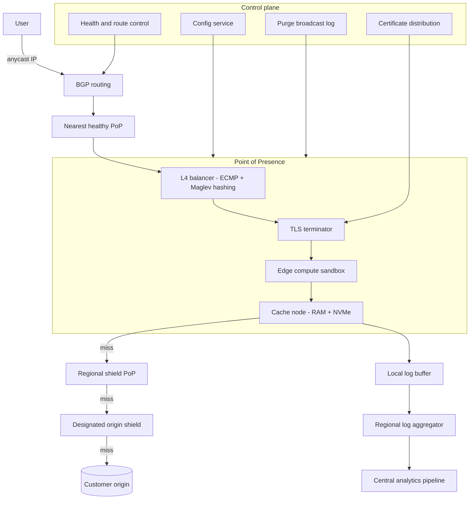
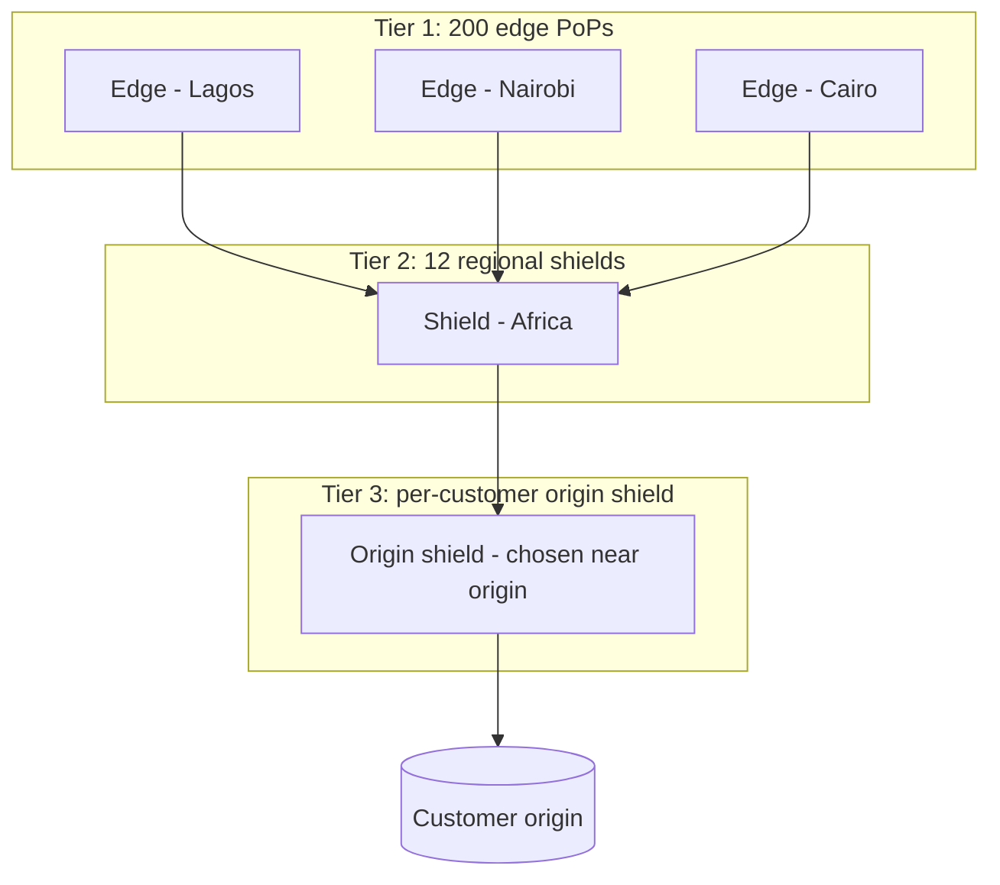
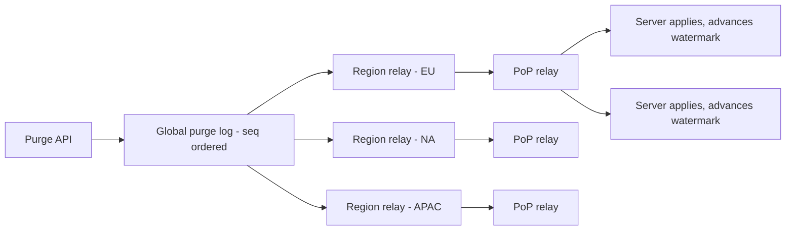
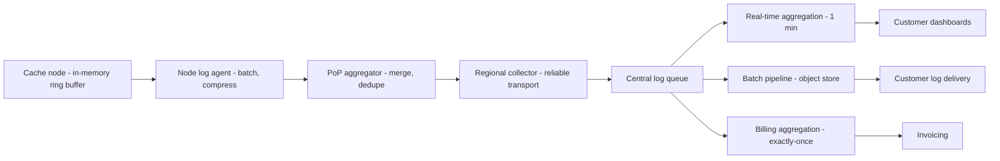
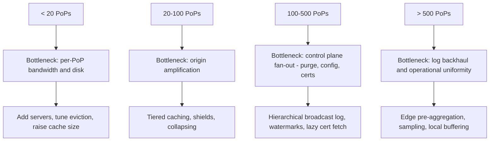

# 36 — CDN Design (build-your-own)

<span class="pill pill-core">Core</span> <span class="pill pill-hard">Hard</span>

**A CDN is a globally distributed cache whose hardest problems are not caching problems at all — they are the problems created by having a thousand independent caches: purges that must reach all of them, certificates that must be installed on all of them, and logs that must come back from all of them.**

| | |
|---|---|
| **Commonly asked at** | Cloudflare, Fastly, Akamai, Amazon (CloudFront), Google, Netflix (Open Connect), Meta, Shopify, Stripe |
| **Time budget** | 45 min |
| **Core tension** | Every PoP you add improves latency for nearby users and multiplies your origin load, your purge fan-out, your certificate distribution surface, and your log volume by one — the edge scales the user experience and the control plane linearly with it |
| **Prerequisites** | [F01 Networking Foundations](../fundamentals/f01-networking-foundations.md), [F02 DNS & Traffic Management](../fundamentals/f02-dns-traffic-management.md), [F03 Load Balancing](../fundamentals/f03-load-balancing.md), [F04 Caching](../fundamentals/f04-caching.md), [F05 CDN & Edge](../fundamentals/f05-cdn-edge.md), [F12 Queues & Streams](../fundamentals/f12-queues-streams.md), [F18 Resilience Patterns](../fundamentals/f18-resilience-patterns.md), [F22 Observability Fundamentals](../fundamentals/f22-observability-fundamentals.md), [F26 Multi-Region & DR](../fundamentals/f26-multi-region-dr.md), [F27 Security in Design](../fundamentals/f27-security-design.md), [F28 Cost Engineering](../fundamentals/f28-cost-engineering.md) |

---

## 1. Problem Statement

Build a content delivery network: a globally distributed fleet of caching proxies that terminate user connections close to the user, serve content from local storage, and fetch from customer origins on miss.

The naive model — "put nginx in 50 cities" — gets you the first 60% and then fails in five specific ways, each of which is an independent distributed systems problem:

1. **Origin amplification.** A flat topology means every PoP independently misses on the same object. 200 PoPs turn one cold object into 200 origin requests. The customer's origin was sized for one.
2. **Purge fan-out.** "Delete this URL everywhere" is a distributed state change that must reach thousands of servers in seconds, be resilient to servers that are down, and be correct for servers that come back up an hour later.
3. **Certificate distribution.** Terminating TLS at the edge for a million customer hostnames means a million certificates, each with a private key, installed on thousands of servers, rotated every 60-90 days, with revocation.
4. **Anycast routing.** BGP gets users to the nearest PoP with no client-side logic, and BGP is also a global routing protocol you do not control, whose convergence behaviour will break your long-lived connections.
5. **Log shipping.** A million requests per second across 200 PoPs producing 500 bytes of log each is 500 MB/s of log data that must cross the internet from every PoP to a central pipeline. **The logging system is a larger data-movement problem than the content delivery it observes.**

The senior framing: **a CDN is a cache whose data plane is embarrassingly parallel and whose control plane is a hard global consistency problem.** Candidates who spend the interview on cache replacement policy have inverted the difficulty.

### Out of scope

Video packaging and ABR ladders, DDoS scrubbing infrastructure, WAF rule engines, and the commercial/peering negotiation that actually determines where PoPs go.

---

## 2. Requirements

### Functional

| # | Requirement | Notes |
|---|---|---|
| F1 | Cache and serve HTTP/HTTPS content from the nearest PoP | HTTP/1.1, HTTP/2, HTTP/3 |
| F2 | Honour origin cache directives, with customer overrides | `Cache-Control`, `Surrogate-Control`, TTL rules |
| F3 | Purge by URL, by tag/surrogate key, and by wildcard | Tag purge is the one customers actually need |
| F4 | TLS termination for customer hostnames | Custom certs, managed certs, SNI, OCSP |
| F5 | Origin shielding and request collapsing | Protect origins from the PoP multiplier |
| F6 | Range requests and partial-object caching | Large files, video seek |
| F7 | Edge compute for request/response manipulation | Header rewriting, A/B, auth, redirects |
| F8 | Real-time and batch analytics | Hit rate, bandwidth, status codes, per-customer |
| F9 | Origin failover and health checking | Multi-origin, active/passive |
| F10 | Signed URLs and token authentication | Paid content, hotlink protection |

### Non-functional

| # | Requirement | Target |
|---|---|---|
| N1 | Cache hit latency (TTFB) | p50 < 20 ms, p95 < 50 ms from within the PoP's service region |
| N2 | Global offload (hit ratio) | > 92% by request, > 96% by byte |
| N3 | Availability | 99.99% per PoP; 99.999% globally (a PoP failure must be invisible) |
| N4 | Purge propagation | p99 < 5 s globally for tag purges |
| N5 | Certificate provisioning | < 60 s from request to serving on every PoP |
| N6 | Origin offload guarantee | Origin never sees more than $k$ concurrent requests per object |
| N7 | Log delivery | < 60 s for real-time stream, < 5 min for batch, no loss beyond 0.01% |
| N8 | Edge compute | < 50 ms CPU per request, < 128 MB memory, hard-enforced |

!!! note "N3 is the requirement that shapes the topology"
    99.99% per PoP is 4.3 minutes of downtime per month per PoP, which is achievable. 99.999% globally is 26 seconds per month, which is **only** achievable if a PoP failure is invisible to users — which means anycast withdrawal and rerouting must be faster than a user notices. This single requirement is why the answer is anycast plus BGP rather than DNS-based steering, and why §7.6's BGP failure modes matter so much.

---

## 3. Scale Estimation

**Traffic.**

$$
\begin{aligned}
\text{requests} &= 1.5 \times 10^{6}\ \text{/s global peak} \\
\text{mean object size} &= 80\ \text{KB (mixed: small HTML/API, large media)} \\
\text{egress} &= 1.5\times10^{6} \times 80\ \text{KB} = 120\ \text{GB/s} = 960\ \text{Gbps}
\end{aligned}
$$

**PoP sizing.** 200 PoPs, but traffic is Zipfian over metros. Model the top PoP at 5% of global traffic rather than $1/200 = 0.5\%$:

$$
\begin{aligned}
\text{top PoP} &= 0.05 \times 960\ \text{Gbps} = 48\ \text{Gbps} \\
\text{servers at 25 Gbps usable each} &= \left\lceil \frac{48}{25 \times 0.6} \right\rceil = 4\ \text{minimum} \\
\text{with N+2 redundancy and headroom} &= 12\ \text{servers}
\end{aligned}
$$

A tier-3 PoP at 0.1% of traffic is under 1 Gbps and runs 3 servers. **PoP sizes span two orders of magnitude**, which means the software must run identically on a 3-server PoP and a 60-server PoP, and the control plane must not assume uniformity.

**The origin amplification problem, quantified.** This is the central arithmetic of the whole design.

With a flat topology, a cold object is fetched independently by every PoP that receives a request for it. For an object requested globally:

$$
\text{origin requests per object} = P = 200
$$

Now add request collapsing within each PoP (concurrent misses for one object become one origin fetch): still 200, one per PoP. Add a **tier-2 shield layer** of 12 regional shields:

$$
\begin{aligned}
\text{edge} \to \text{shield} &: 200\ \text{requests} \to 12\ \text{shields} \\
\text{shield} \to \text{origin} &: 12\ \text{requests} \\
\text{reduction} &= \frac{200}{12} \approx 16.7\times
\end{aligned}
$$

Add a **single designated origin shield per customer** (one PoP is the sole origin-facing node for that customer):

$$
\text{origin requests per object} = 1,\quad \text{reduction} = 200\times
$$

Put concrete numbers on a content refresh: a customer publishes 10,000 new objects and traffic immediately requests all of them.

| Topology | Origin requests | Verdict |
|---|---|---|
| Flat, no collapsing | $10^{4} \times 200 \times C$ (C = concurrency per PoP, easily 50) = $10^{8}$ | Origin is destroyed |
| Flat, with collapsing | $10^{4} \times 200 = 2\times10^{6}$ | Origin is destroyed more slowly |
| Two-tier, 12 shields | $10^{4} \times 12 = 1.2\times10^{5}$ | Survivable |
| Two-tier + single origin shield | $10^{4}$ | Correct |

**Storage per PoP.**

$$
\begin{aligned}
\text{cacheable corpus} &= 500\ \text{TB across all customers} \\
\text{per-PoP working set (Zipf, 90\% of hits from 10\% of objects)} &\approx 50\ \text{TB} \\
\text{tier-1 PoP} &: 12 \times 8\ \text{TB NVMe} = 96\ \text{TB raw} \\
\text{tier-3 PoP} &: 3 \times 8\ \text{TB} = 24\ \text{TB}
\end{aligned}
$$

Hit ratio versus cache size follows a log curve; each doubling of cache buys progressively less:

$$
H(S) \approx 1 - \left(\frac{S_0}{S}\right)^{\alpha},\ \alpha \approx 0.6\ \text{for typical web traffic}
$$

**Purge fan-out.**

$$
\begin{aligned}
\text{servers} &= 200\ \text{PoPs} \times 8\ \text{mean} = 1{,}600 \\
\text{purge rate} &= 5{,}000\ \text{/s (aggregate across customers)} \\
\text{naive fan-out messages} &= 5{,}000 \times 1{,}600 = 8 \times 10^{6}\ \text{/s}
\end{aligned}
$$

Eight million messages per second is a distributed systems problem on its own, and §7.3 shows why the answer is a broadcast log rather than a fan-out.

**Log volume — the number that surprises people.**

$$
\begin{aligned}
\text{log lines} &= 1.5 \times 10^{6}\ \text{/s} \\
\text{bytes per line} &= 400\ \text{(structured, before compression)} \\
\text{raw} &= 600\ \text{MB/s} = 4.8\ \text{Gbps} \\
\text{compressed at 8:1} &= 75\ \text{MB/s} = 600\ \text{Mbps} \\
\text{daily} &= 600\ \text{MB/s} \times 86400 = 51.8\ \text{TB/day raw},\ 6.5\ \text{TB/day compressed}
\end{aligned}
$$

600 Mbps of *sustained* log traffic flowing from 200 PoPs back to a central pipeline, over the public internet, from locations chosen for user proximity rather than backhaul quality. **The log pipeline is 0.06% of content bandwidth and 100% of the operational headache**, because content delivery is stateless and loss-tolerant while logs are stateful, ordered-ish, and billing-relevant.

---

## 4. API Design

### Control plane

```http
POST /v1/services/{service_id}/purge HTTP/1.1
Authorization: Bearer <token>
Content-Type: application/json

{ "type": "tag", "tags": ["product-4471", "category-shoes"], "soft": true }
```

```json
{ "purge_id": "prg_9f2ae1c3",
  "accepted_at": "2026-03-08T14:22:01.442Z",
  "estimated_completion_ms": 1500,
  "scope": { "pops": 200, "servers": 1614 } }
```

```text
POST /v1/services/{id}/purge      { type: url | tag | wildcard | all }
GET  /v1/purges/{purge_id}        propagation status per region
POST /v1/services/{id}/config     versioned config, atomic activation
POST /v1/services/{id}/certificates
GET  /v1/services/{id}/stats?granularity=1m&by=pop,status
POST /v1/services/{id}/edge_functions
```

**Purge types, and why tag purge is the only interesting one:**

| Type | Mechanism | Latency | Use |
|---|---|---|---|
| URL | Exact cache-key match, direct index lookup | < 1 s | Single-object correction |
| Tag (surrogate key) | Origin tags responses; purge by tag hits all objects carrying it | < 5 s | **The one customers need.** "Product 4471 changed" purges 40 pages |
| Wildcard / prefix | Path prefix match requires a scan or a prefix index | Seconds to minutes | Expensive; rate-limit it |
| Purge-all | Invalidate the whole service | Instant to mark, catastrophic to origin | Generation-counter trick, §7.3 |
| Soft purge | Mark stale, serve stale-while-revalidate | < 5 s | **Default.** Avoids the origin stampede a hard purge causes |

!!! tip "Soft purge should be the default, and this is a product decision with an architectural payoff"
    A hard purge deletes the object. The next request is a miss, and if it is a popular object, every PoP misses at once — you have turned a content update into a self-inflicted origin stampede. A **soft purge** marks the object stale: the edge serves the stale copy immediately while revalidating in the background with an `If-None-Match`. The user gets a fast response, the origin gets one conditional request per shield, and a `304 Not Modified` costs almost nothing. The only case for a hard purge is content that must never be served again — a legal takedown or a leaked secret — and that should be an explicit, audited, separate operation.

### Surrogate keys at the origin

```http
HTTP/1.1 200 OK
Content-Type: text/html
Cache-Control: public, max-age=0, s-maxage=86400
Surrogate-Key: product-4471 category-shoes brand-nike homepage
Surrogate-Control: max-age=86400, stale-while-revalidate=600, stale-if-error=86400
```

`Cache-Control: max-age=0, s-maxage=86400` is the canonical CDN pattern: browsers do not cache, the CDN caches for a day, and purging becomes instantaneous from the user's perspective because there is no browser copy to wait out. `Surrogate-Control` is stripped at the edge and never reaches the client, so the CDN's TTL and the browser's TTL are decoupled — which is exactly what you want, since you control one and not the other.

---

## 5. Data Model

The edge's "data model" is the cache key and the on-disk object layout.

```python
# The cache key. Every field is a decision with a cardinality cost.
CacheKey = (
    service_id,        # customer isolation; mandatory
    scheme,            # usually normalised away: http and https share objects
    host,              # normalised: lowercase, strip default port
    path,              # normalised: decode %XX, collapse //, resolve ../
    query_allowlist,   # ONLY allowlisted params, sorted. See 7.2.
    vary_dimensions,   # derived from Vary, bucketed. See 7.2.
    range_bucket,      # for partial objects
)

def cache_key(req, cfg) -> bytes:
    host = req.host.lower().split(":")[0]
    path = normalise_path(unquote(req.path))
    qs = "&".join(f"{k}={v}" for k, v in sorted(
        (k, v) for k, v in req.query.items() if k in cfg.query_allowlist))
    vary = "|".join(bucket(req.headers.get(h, ""), h) for h in cfg.vary_headers)
    gen = cfg.generation          # bump to invalidate everything, see 7.3
    return blake3(f"{cfg.service_id}|{gen}|{host}|{path}|{qs}|{vary}".encode())
```

```text
-- On-disk object layout, per server
cache/
  index/           in-memory hash map: key -> (volume, offset, len, meta)
                   ~120 bytes per object in RAM
  vol_0000.dat     8 TB, append-only, 4 MiB blocks
  vol_0001.dat
  ...

-- Object record on disk
[ magic | key_hash(32) | meta_len | body_len | meta | body | crc32c ]
```

```python
# RAM cost of the index. This bounds objects-per-server, not disk size.
#   key hash 32 B + volume 2 B + offset 6 B + len 4 B
#   + TTL 8 B + last_access 4 B + freq 1 B + tag refs 8 B
#   + hashmap overhead ~40 B
#   ~= 105-130 B per object
#
# 8 TB of 80 KB objects = 100M objects = ~12 GB of index.
# 8 TB of 4 KB objects  = 2e9 objects  = ~240 GB of index. Does not fit.
```

**This is the constraint that shapes edge storage:** small objects are limited by index RAM, not by disk. The mitigations are a minimum object size for disk caching (small objects live in a separate memory tier), a two-level index with a disk-resident portion, or accepting a lower object count per server. Varnish's original design sidestepped this by being memory-only and letting the kernel page; that works until your working set exceeds RAM, which at CDN scale it always does.

```sql
-- Control-plane model (central, not at the edge)
CREATE TABLE service (
  service_id      BIGINT PRIMARY KEY,
  customer_id     BIGINT NOT NULL,
  generation      BIGINT NOT NULL DEFAULT 1,  -- purge-all counter
  config_version  BIGINT NOT NULL,
  shield_pop_id   INT                          -- designated origin shield
);

CREATE TABLE purge_log (
  purge_id     UUID PRIMARY KEY,
  service_id   BIGINT NOT NULL,
  seq          BIGINT NOT NULL,   -- global monotonic, the broadcast offset
  kind         SMALLINT NOT NULL, -- url|tag|wildcard|all
  selector     TEXT NOT NULL,
  soft         BOOLEAN NOT NULL,
  issued_at    TIMESTAMPTZ NOT NULL,
  issued_by    BIGINT NOT NULL
);
CREATE INDEX ix_purge_seq ON purge_log (seq);

-- Every server records the highest purge seq it has applied.
CREATE TABLE server_purge_watermark (
  server_id    TEXT PRIMARY KEY,
  pop_id       INT NOT NULL,
  applied_seq  BIGINT NOT NULL,
  updated_at   TIMESTAMPTZ NOT NULL
);
```

**The watermark table is the whole purge-correctness story in one relation.** A server that was down, or newly provisioned, or partitioned, knows exactly which purges it missed and replays from its watermark. Purge becomes a log-replication problem with a known catch-up procedure rather than a best-effort broadcast with unknown holes.

---

## 6. High-Level Architecture



### Read path (cache hit)

1. DNS returns an anycast IP. The user's packets reach the topologically nearest PoP announcing it.
2. ECMP across the PoP's L4 balancers; Maglev consistent hashing pins a flow to one cache node so that connection state survives balancer changes.
3. TLS termination. The certificate is selected by SNI from a local store (§7.5). Session resumption via a PoP-wide ticket key avoids a full handshake.
4. Edge compute runs, if configured, and may rewrite the cache key.
5. Cache lookup: RAM index hit, then RAM object or NVMe read.
6. Response served. Log line appended to a local buffer.

**Latency budget for a hit:** TCP+TLS 1.3 handshake 1 RTT (0 with resumption), cache lookup under 1 ms, NVMe read 100 microseconds, serialisation and network. Total TTFB p50 under 20 ms from within the service region — **and the dominant term is the user's RTT to the PoP**, which is why PoP placement matters more than software optimisation.

### Miss path

1. Request collapsing: concurrent requests for the same key within the node wait on one in-flight fetch (§7.4).
2. Fetch from the regional shield rather than the origin.
3. Shield repeats collapsing at its level, fetches from the designated origin shield.
4. Origin shield collapses again and fetches from the origin.
5. Response streams back down the chain, cached at every tier simultaneously — **do not wait for the full object before serving**; stream to the client while writing to disk, or you add the full download time to TTFB for large objects.

---

## 7. Deep Dives

### 7.1 PoP hierarchy and tiered caching

Flat topologies do not work at PoP counts above about 20. The arithmetic from §3: 200 PoPs means 200 independent misses for a cold object.



**Shield selection is per customer, not global.** The origin shield should be the PoP with the lowest latency to the *customer's origin*, because that is the connection that carries every miss. A customer with an origin in Frankfurt gets a Frankfurt origin shield; one with an origin in São Paulo gets a São Paulo shield. Getting this wrong adds a transatlantic RTT to every cache miss for that customer, and it is a configuration mistake that is invisible in aggregate metrics.

**The trade-off tiering creates:**

| Property | Flat | Two-tier | Three-tier |
|---|---|---|---|
| Origin requests per cold object | 200 | 12 | 1 |
| Miss latency | 1 origin RTT | 1 shield RTT + 1 origin RTT | 2 + 1 |
| Shield as SPOF | N/A | Regional blast radius | Per-customer blast radius |
| Cache efficiency | Each PoP holds everything | Shields hold the union | Better long-tail coverage |
| Operational complexity | Low | Medium | High |

**The miss-latency cost is real and must be stated.** A three-tier miss is edge → shield (20 ms) → origin shield (40 ms) → origin (30 ms) = 90 ms of added latency versus 30 ms direct. You are trading miss latency for origin protection. This is correct because misses are 8% of requests and origin capacity is the scarce resource — but it means **tiering makes your worst case worse while making your average case survivable**, and a candidate who does not name that is not thinking about it properly.

**Long-tail benefit.** A shield sees the union of its edges' traffic, so an object requested once per hour in each of 20 edges is requested 20 times per hour at the shield and stays resident there. Tiered caching therefore improves hit ratio for the long tail, not just origin load — typically 2-4 points of overall hit ratio, which at $1 - H$ origin load is a large relative reduction.

```yaml
# Per-customer topology config
service: acme-media
tiering:
  enabled: true
  shield_tier: regional            # regional | single
  origin_shield:
    pop: fra1                      # nearest to origin.acme.com (Frankfurt)
    failover_pop: ams1
  edge_to_shield_timeout_ms: 2000
  shield_to_origin_timeout_ms: 8000
  collapse_forwarding: true
  max_origin_concurrency: 20       # hard cap, see 7.4
```

### 7.2 Cache key normalisation and the Vary cardinality explosion

Every distinct cache key is a distinct stored object. **Cache key cardinality is inversely proportional to hit ratio**, and the two ways to blow it up are query strings and `Vary`.

**Query strings.** The default of including the whole query string is catastrophic in the presence of marketing parameters:

```text
/product/4471                                        -> object A
/product/4471?utm_source=twitter                     -> object B
/product/4471?utm_source=twitter&utm_campaign=spring -> object C
/product/4471?fbclid=IwAR2x9...                      -> object D (unbounded!)
```

`fbclid` and `gclid` are per-click unique. Including them means **every single request is a cache miss**, and the cache fills with single-use objects that evict real content. This is not a hypothetical; it is one of the most common real-world CDN misconfigurations.

The fix is an allowlist, not a denylist:

```yaml
cache_key:
  query_string:
    mode: allowlist               # allowlist | denylist | ignore_all | include_all
    allow: [id, page, size, sort, v, lang]
  sort_params: true               # ?b=2&a=1 and ?a=1&b=2 are one object
  case_normalize_path: false      # paths ARE case-sensitive; do not "fix" this
  strip_trailing_slash: false     # /a and /a/ may be genuinely different resources
```

A denylist fails open: the next tracking parameter someone invents silently destroys your hit ratio, and you find out from a bandwidth bill.

**The `Vary` explosion.** `Vary` tells caches that the response depends on request headers. Each varying header multiplies the object count:

$$
\text{objects per URL} = \prod_{h \in \text{Vary}} |\text{distinct values of } h|
$$

Concretely:

| `Vary` header | Distinct values seen in the wild | Multiplier |
|---|---|---|
| `Accept-Encoding` | ~50 raw (`gzip, deflate, br`, `br;q=1.0, gzip;q=0.8`, ...) | 50x raw, **3x if normalised** |
| `Accept-Language` | Thousands (`en-GB,en;q=0.9,fr;q=0.8`) | 1000x+ |
| `User-Agent` | **Millions.** Effectively unbounded | Cache disabled |
| `Cookie` | Per-user | Cache disabled |
| `Accept` | Hundreds | 100x+ |

`Vary: User-Agent` is the classic disaster. It is semantically honest — the response really does differ for mobile — and it means every browser version, every OS patch level, and every crawler gets its own copy. Hit ratio goes to approximately zero, and the customer reports "the CDN isn't working".

**Normalise before matching.** The edge rewrites the header into a small bucket *before* it becomes part of the cache key:

```python
def bucket(value: str, header: str) -> str:
    if header == "accept-encoding":
        # 50+ raw values collapse to 3
        if "br" in value:   return "br"
        if "gzip" in value: return "gzip"
        return "identity"
    if header == "accept-language":
        # Parse q-values, take the top match against supported set
        return best_match(value, SUPPORTED_LANGS) or "en"   # ~8 values
    if header == "user-agent":
        # NEVER key on raw UA. Bucket into device class.
        return device_class(value)                           # 3 values
    return value
```

```yaml
vary:
  normalize:
    accept-encoding: [br, gzip, identity]     # 3 buckets
    accept-language: supported_only            # 8 buckets
    user-agent: device_class                   # mobile | tablet | desktop
  strip_from_origin: [user-agent, cookie]      # do not let origin's Vary through
```

$3 \times 8 \times 3 = 72$ variants per URL, which is manageable. Without normalisation it is effectively unbounded.

!!! gotcha "The origin's `Vary` header is a loaded gun pointed at your hit ratio"
    An origin framework that emits `Vary: Accept-Encoding, Cookie, User-Agent` by default — and several do, including common Rails and Django configurations — disables CDN caching entirely for that customer. The edge must be able to override or strip `Vary` per service, and the control plane should *alert on it*: "your origin is sending `Vary: Cookie`, your hit ratio is 4%, here is the config change". This is the single highest-value automated diagnostic a CDN can offer its customers, and the one most likely to come up if the interviewer has operated a CDN.

**A note on `Vary: Cookie`.** The right answer is almost never to vary on the cookie. It is to **split the response**: cache the shared shell aggressively and fetch the personalised fragment separately (ESI, client-side hydration, or a separate uncached API call). Alternatively, strip all cookies except an allowlist before the cache lookup, so that analytics cookies do not fragment the cache. Both are origin-side changes, which is why CDN adoption is a joint engineering project rather than a DNS change.

### 7.3 Purge propagation at global scale

Purge is the CDN's hardest consistency problem: a state change that must reach 1,600 servers in under 5 seconds, be correct for servers that were offline, and handle 5,000 purges per second.

**Rejected: direct fan-out.** The control plane sends HTTP requests to all 1,600 servers. At 5,000 purges/s that is 8M requests/s, every server must be reachable from the control plane, a slow server backs up the whole broadcast, and there is no story for a server that was down. Beyond trivial scale this does not work.

**Chosen: a replicated broadcast log.** Purges are appended to a globally ordered log with a monotonic sequence number. Every PoP subscribes; every server tracks its applied watermark.



```python
class PurgeSubscriber:
    def run(self):
        while True:
            for entry in self.relay.stream(after=self.watermark):
                self.apply(entry)
                self.watermark = entry.seq        # durable, fsync periodically
            # Disconnect: reconnect and resume from watermark. No holes.

    def apply(self, e):
        if e.kind == "url":
            self.index.invalidate(cache_key_for(e.service_id, e.selector), soft=e.soft)
        elif e.kind == "tag":
            for key in self.tag_index.lookup(e.service_id, e.selector):
                self.index.invalidate(key, soft=e.soft)
        elif e.kind == "all":
            # O(1): bump the generation. Old keys become unreachable.
            self.config[e.service_id].generation = e.generation
```

Three properties make this work:

1. **Ordered and resumable.** A server that was down for an hour reconnects at its watermark and replays. No missed purges, no full-cache-flush recovery.
2. **Hierarchical relay.** The log fans out to 12 regional relays, each to its PoPs, each to its servers. Message count at the source is 12, not 1,600. Bandwidth at 5,000 purges/s of 200-byte entries is 1 MB/s at the top of the tree.
3. **Observable propagation.** Watermark lag per server is a direct SLI. "Purge p99 propagation" is computable rather than hoped for.

**Tag purge requires a reverse index at the edge.** Every cached object records its `Surrogate-Key` values; the edge maintains tag → set-of-keys:

```text
tag_index:  "product-4471" -> {key_a, key_b, key_c, ...}
```

Memory cost is the thing to bound: at 100M objects with a mean of 4 tags each and 8 bytes per reference, that is 3.2 GB per server of tag index. Cap tags per object (a common limit is 16) and use interned tag ids rather than strings. Some CDNs instead store tags on the object and mark-on-scan, trading purge latency for memory — a defensible choice for large objects.

**Purge-all must be $O(1)$.** Deleting millions of objects is unacceptable; instead bump a per-service generation counter that participates in the cache key. All existing keys become unreachable instantly, and the orphaned objects are reclaimed by normal LRU eviction. The catch: **purge-all is an origin stampede generator**, since the entire service is cold everywhere at once. Rate-limit it severely (one per service per hour), require explicit confirmation, and offer soft purge-all — which marks everything stale and lets `stale-while-revalidate` smooth the refill over the TTL window instead of concentrating it into one second.

!!! warning "Purge is eventually consistent and the API must say so"
    There is no globally consistent instant at which the object is gone everywhere. The honest contract is "p99 within 5 seconds, and we will report per-region propagation status". Customers who need stronger semantics — legal takedowns, leaked credentials — need a different mechanism: a synchronous purge that blocks until every region acknowledges, which takes tens of seconds and can fail if a PoP is unreachable. Offer both, price them differently, and **never let a customer believe an asynchronous purge is synchronous**, because the one time it matters they will be making a legal commitment based on your API's response.

### 7.4 Origin shielding and request collapsing

Request collapsing (also called coalescing or collapsed forwarding) is the mechanism that bounds concurrent origin requests per object to one per cache node.

```go
type Coalescer struct {
    mu     sync.Mutex
    inFlight map[string]*fetch
}

type fetch struct {
    done chan struct{}
    resp *Response
    err  error
}

func (c *Coalescer) Get(key string, fn func() (*Response, error)) (*Response, error) {
    c.mu.Lock()
    if f, ok := c.inFlight[key]; ok {
        c.mu.Unlock()
        <-f.done                       // wait for the leader
        return f.resp, f.err           // NOTE: body must be shareable
    }
    f := &fetch{done: make(chan struct{})}
    c.inFlight[key] = f
    c.mu.Unlock()

    f.resp, f.err = fn()
    close(f.done)

    c.mu.Lock()
    delete(c.inFlight, key)
    c.mu.Unlock()
    return f.resp, f.err
}
```

**The subtlety that bites people: the response body is a stream, and followers cannot all read the same `io.Reader`.** Either buffer the whole object (bounded memory, bad for large files) or implement a tee that writes to disk while fanning out to waiting readers from the partially-written file. The latter is what production caches do and it is genuinely fiddly — followers must be able to start reading before the fetch completes, which means tracking a write offset and waking readers as it advances.

**Collapsing is per node, not per PoP.** A 12-server PoP with a request for a cold object produces up to 12 origin fetches, since each server collapses independently. Reduce it by consistent-hashing the cache key across servers within the PoP, so one object lives on one server:

$$
\text{origin requests} = \underbrace{1}_{\text{per server}} \times \underbrace{1}_{\text{hash pins object to one server}} \times \underbrace{P}_{\text{PoPs}}
$$

Intra-PoP consistent hashing also improves effective cache size — a 12-server PoP with 8 TB each holds 96 TB of distinct content rather than 12 copies of an 8 TB working set — at the cost of an intra-PoP hop and a rebalance whenever a server is added or removed. Use bounded-load consistent hashing so a hot object does not pin unbounded load to one server.

**Hard concurrency cap to origin.** Collapsing bounds concurrency per object; it does nothing for 10,000 *distinct* cold objects. A semaphore per origin is the backstop:

```yaml
origin:
  max_connections: 200
  max_concurrent_requests: 20      # per origin-shield node
  queue_depth: 500
  queue_timeout_ms: 3000
  on_queue_full: serve_stale       # serve_stale | error_503 | shed
  connect_timeout_ms: 1000
  first_byte_timeout_ms: 15000
  retry: { attempts: 2, on: [connect_error, 502, 503, 504] }
```

`on_queue_full: serve_stale` is the important line. When the origin is saturated, serving expired content beats returning 503 — and `stale-if-error` makes this standards-compliant rather than a hack. **The CDN's job during an origin outage is to be the last line of defence**, which means keeping objects past their TTL specifically so they can be served when the origin is down. Make that an explicit config (`stale_if_error: 24h`) and tell customers it exists, because it converts an origin outage from a customer-visible incident into a stale-content inconvenience.

### 7.5 TLS at the edge: certificate distribution to thousands of servers

A CDN terminating TLS for a million customer hostnames faces a key-management problem, not a crypto problem.

$$
\begin{aligned}
\text{hostnames} &= 10^{6} \\
\text{certificate lifetime} &= 90\ \text{days (Let's Encrypt)} \\
\text{renewals} &= \frac{10^{6}}{90} \approx 11{,}111\ \text{/day} \approx 0.13\ \text{/s}
\end{aligned}
$$

Renewal rate is trivially low. **Distribution is the problem:** each renewed certificate plus private key must reach every server that might terminate that hostname, within seconds, without ever transiting in plaintext or landing on disk unencrypted.

=== "Push all certs to all servers"

    Every server holds every certificate. Simple lookup, no runtime dependency.

    $10^{6}$ certs × ~4 KB = 4 GB per server, plus the private keys. At 11,111 renewals/day that is 11,111 updates pushed to 1,600 servers daily, and any server that was offline needs a full reconciliation on return. **Rejected at a million hostnames; fine below about 50,000.**

=== "Lazy fetch on SNI with local cache"

    On an SNI for an uncached hostname, fetch the certificate from a regional cert service, cache it locally with a TTL, and complete the handshake.

    Memory holds only the active working set (typically a few percent of hostnames per PoP). The cost is a **first-handshake latency penalty** of one round trip to the cert service, and a hard runtime dependency in the TLS path — if the cert service is unreachable, new hostnames cannot be served. Mitigate with a regional cert service in every PoP, a long local TTL, aggressive prefetch for a customer's hostnames on config activation, and serving a slightly-expired-from-cache certificate rather than failing the handshake. **Chosen** for the long tail.

=== "Keyless TLS"

    The private key never leaves the customer's infrastructure. The edge performs the handshake but delegates the private-key operation to a remote key server over a mutually authenticated channel.

    This is Cloudflare's Keyless SSL and it exists for customers whose compliance regime forbids sharing keys. It adds a network round trip *inside* the handshake, so first-connection latency degrades badly and the customer's key server becomes a hard dependency for their own availability. **Offered as a premium option, never the default.**

**Chosen architecture:** a hybrid. The top N hostnames by traffic are pushed to every server (fast path, no dependency); the long tail is lazily fetched with a local cache and PoP-local cert service. Private keys are stored encrypted at rest, decrypted into memory only, never written to disk in plaintext, and the server's decryption key is delivered at boot from a secrets service and held in memory only.

```yaml
tls:
  cert_store:
    hot_set: 20000                # pushed to every server
    lazy_fetch: true
    local_cache_size: 50000
    local_cache_ttl: 24h
    stale_grace: 72h              # serve slightly-stale rather than fail handshake
  session:
    ticket_key_rotation: 12h      # PoP-wide; see gotcha
    ticket_key_overlap: 48h       # accept old keys during rotation
    resumption: [ticket, session_id]
  ocsp_stapling:
    enabled: true
    refresh_before_expiry: 24h
    must_staple_fallback: serve_without_staple
  protocols: [TLSv1.2, TLSv1.3]
  hsts: { max_age: 31536000, include_subdomains: false }
```

**Session ticket keys are a distributed systems problem hiding in a crypto setting.** A ticket issued by server A must be decryptable by server B, or resumption fails and you pay a full handshake. So the ticket key must be shared PoP-wide (or region-wide) and rotated — and rotation must overlap, accepting the previous key for the lifetime of outstanding tickets. Rotate too rarely and forward secrecy is weakened, since a leaked ticket key decrypts all sessions it covered; rotate without overlap and every rotation causes a handshake storm. Twelve-hour rotation with 48-hour acceptance is a reasonable point on that curve.

**OCSP stapling** is mandatory at scale: without it, every client independently queries the CA's OCSP responder, which is slow, privacy-leaking, and frequently down. The edge fetches and caches the OCSP response and staples it. The failure mode to plan for is the CA's responder being unavailable when your staple is about to expire — refresh 24 hours early, and if the certificate is marked `must-staple`, an expired staple means a hard handshake failure. Alert on staple age, not just on certificate expiry.

### 7.6 Anycast routing and the BGP failure modes

Anycast means announcing the same IP prefix from every PoP. The internet's routing protocol delivers each user to the PoP that is topologically closest *from BGP's perspective*, which is a hop-count-and-policy metric, not a latency metric.

```text
# Each PoP announces the same prefix
203.0.113.0/24  announced from LHR, FRA, IAD, NRT, SYD, ...

# BGP selection at each upstream router, in order:
#   1. Highest LOCAL_PREF        (the transit provider's own commercial policy)
#   2. Shortest AS_PATH
#   3. Lowest ORIGIN
#   4. Lowest MED
#   5. eBGP over iBGP
#   6. Lowest IGP cost to next hop
#   ...
```

**Wins:** no client-side logic, no DNS TTL to wait out, instant failover by withdrawing a route, and inherent DDoS absorption because attack traffic is distributed to the nearest PoP rather than concentrated.

**The failure modes are where the interview goes.**

!!! danger "TCP connections break when BGP reconverges"
    Anycast is designed for stateless traffic. A BGP change mid-connection routes subsequent packets of an **established TCP connection** to a different PoP, which has no state for it and responds with RST. The user sees a connection reset. This is fine for DNS (one UDP packet) and bad for a 2 GB download.

    **Mitigations:** keep announcements stable and damped, so routes change rarely; use QUIC/HTTP3 where possible, since connection IDs let a connection migrate across paths and survive re-routing; drain gracefully (stop accepting new connections, wait for existing ones, *then* withdraw the announcement) rather than withdrawing instantly; and design the application so that a reset on a large download is resumable via range requests.

!!! danger "The BGP flap that takes out a region"
    A PoP's upstream link flaps — up, down, up, down. Each transition propagates a BGP update globally. Upstream routers apply **route flap damping**, which suppresses a flapping prefix for an exponentially increasing penalty period — often 30-60 minutes. So a 30-second link problem can remove your PoP from a large portion of the internet for an hour, and the withdrawal is enforced by other people's routers that you cannot instruct.

    **Mitigations:** hold-down timers before re-announcing (announce only after the link has been stable for several minutes); BFD for sub-second *internal* failure detection so you make the decision deliberately rather than letting the link flap for you; graceful withdrawal via AS-path prepending or reduced LOCAL_PREF to shift traffic without a full withdrawal; and monitoring your own prefixes from external looking glasses so you see what the internet sees rather than what your routers think.

!!! danger "BGP does not optimise for latency"
    A user in Lagos may be routed to London rather than a Lagos PoP because their ISP's transit provider has a shorter AS path to your London announcement. BGP's selection is driven by commercial policy (`LOCAL_PREF`) before anything resembling distance.

    **Mitigations:** peer directly at local internet exchanges so the path is one AS hop; use communities to influence upstream preference; use per-PoP unicast IPs plus DNS-based steering as an override for specific badly-routed ASNs; and continuously measure real user latency per ASN per PoP (RUM data) so you know where BGP is lying to you. This is the single largest ongoing operational effort at a real CDN and it is almost entirely relationship and measurement work, not software.

**DNS-based steering as an alternative or complement:**

| | Anycast | DNS steering |
|---|---|---|
| Failover speed | Seconds (BGP withdrawal) | Minutes (TTL, and resolvers ignore TTLs) |
| Granularity | Per prefix, per PoP | Per resolver, can be per-ASN and per-geo |
| Load control | None — BGP decides | Fine-grained; can shift 10% of traffic |
| Connection stability | Breaks on reconvergence | Stable once resolved |
| Client visibility | Sees one IP | Sees different IPs; breaks IP allowlisting |
| Accuracy | Topological | Resolver location, not client location (EDNS Client Subnet helps) |

**Chosen: anycast as the primary, DNS steering as a control lever.** Anycast for its failover speed and DDoS properties; DNS for capacity management ("shift 20% of Frankfurt's traffic to Amsterdam for maintenance") and for correcting specific BGP pathologies. Neither alone is sufficient — anycast gives no load control and DNS gives no fast failover.

### 7.7 Log collection: the scale problem that observes the scale problem

600 MB/s of log data, generated in 200 locations chosen for user proximity, that must reach a central pipeline. Each stage has a specific failure mode.



**Stage 1: on the cache node.** Log writing must never block request serving. A lock-free ring buffer per worker thread, drained by a separate agent. **When the buffer is full, drop and count the drops** — logging must degrade rather than degrade the data plane. The drop counter is itself a metric, and it is the honest way to report the resulting gaps.

**Stage 2: node agent.** Batch (5 s or 1 MB, whichever first), compress (zstd at level 3 gives roughly 8:1 on structured logs at a few percent of a core), and buffer to local disk with a bounded size and a time-based eviction. Local disk buffering is what lets the PoP survive a backhaul outage: at 600 Mbps global, a single tier-1 PoP produces about 5 MB/s compressed, so 100 GB of local buffer holds

$$
\frac{100\ \text{GB}}{5\ \text{MB/s}} \approx 5.5\ \text{hours}
$$

of backhaul outage. That number should be explicit in the design, because it is the answer to "what happens when the PoP's uplink to the collector is down?"

**Stage 3: PoP aggregator.** One per PoP, which collapses $N$ server connections to the region into one and provides a natural place to pre-aggregate: most consumers want counters, not lines. Computing per-minute counters at the PoP and shipping *those* reduces volume by orders of magnitude for the dashboard path while the raw lines still flow to the batch path.

**Stage 4: regional to central transport.** This is the part people underestimate. It runs over the public internet from locations with variable-quality transit. Requirements: TLS, compression, resumable transfer with offsets, and **backpressure that degrades sampling rather than dropping wholesale**.

!!! warning "The catch-up thundering herd"
    A regional collector recovers after two hours down. Forty PoPs simultaneously begin uploading their buffered backlogs at full rate. The collector — sized for steady state — is immediately overwhelmed, falls over, and the cycle repeats.

    **Mitigation:** rate-limit catch-up to a fixed multiple of the steady-state rate (1.5x is typical), randomise the start of each PoP's catch-up over a window, prioritise fresh data over backlog so real-time dashboards recover first, and have the collector advertise a backpressure signal that agents honour. Designing the recovery path is more important than designing the steady-state path, because steady state is easy and recovery is when you are already in an incident.

**Stage 5: differentiated consumers.** Not all log consumers need the same guarantees, and treating them identically is the expensive mistake:

| Consumer | Latency | Completeness | Design |
|---|---|---|---|
| Real-time dashboard | < 60 s | Sampled is fine | Pre-aggregated counters from the PoP; 1% sampling acceptable |
| Customer log delivery | < 5 min | Best-effort, documented loss | Batch to object store, per-customer partitioned |
| Billing | Hours | **Exactly-once, no loss** | Separate path: deduplicated by line id, reconciled against counters |
| Security/abuse | < 30 s | Complete for flagged traffic | Separate high-priority stream, filtered at the edge |

**Billing deserves its own path.** Undercounting is lost revenue; overcounting is a customer dispute and a refund. It cannot share a pipeline that is allowed to drop 0.01% of lines. Use per-node monotonic counters that are cumulative rather than incremental, so a missing batch is self-healing (the next counter report includes what was missed), and reconcile against sampled raw logs. **Cumulative counters instead of event summation is the single design decision that makes CDN billing tractable**, because it turns "did I receive every event?" into "what is the latest value?", and the latter is idempotent.

**Sampling.** At the top of the volume curve, full-fidelity logging is unaffordable. Sample intelligently rather than uniformly: 100% of errors, 100% of cache misses, 100% of slow requests, and 1% of successful hits with the sample rate recorded on each line so aggregations can scale back up. This gives 20-50x volume reduction while preserving every line anyone actually investigates.

### 7.8 Edge compute constraints

Running customer code at the edge means running untrusted code on machines serving other customers, in the request path, on hardware you cannot easily scale up.

| Model | Cold start | Isolation | Memory | Verdict |
|---|---|---|---|---|
| Container per customer | 500 ms - 2 s | Strong (kernel namespaces) | 50-200 MB | **Rejected.** Cold start and memory make per-request invocation impossible |
| MicroVM (Firecracker) | 100-150 ms | Very strong (hypervisor) | 20-50 MB | Rejected at the edge; viable in regional compute |
| V8 isolate | **< 5 ms** | Process-level, V8 sandbox | 3-10 MB | **Chosen.** Thousands per process |
| WASM | < 1 ms | Memory-safe by construction | 1-5 MB | Chosen where a non-JS language story matters |

V8 isolates are what make edge compute economically possible: thousands of customer isolates in one process, sub-5-millisecond cold start, and a few megabytes each. The cost is that isolation is **process-level, not kernel-level** — a V8 escape or a Spectre-class side channel crosses tenant boundaries. The mitigations are real and ongoing: no high-resolution timers exposed to customer code, site isolation so that same-process isolates never hold each other's secrets, and prompt V8 patching treated as a security-critical rolling deploy.

```yaml
edge_function:
  runtime: v8-isolate
  limits:
    cpu_ms_per_request: 50          # WALL time is not the limit; CPU is
    startup_cpu_ms: 200
    memory_mb: 128
    subrequests: 50
    response_body_mb: 100
    kv_reads_per_request: 100
  disallowed:
    - unbounded_loops                # enforced by CPU limit, not statically
    - raw_sockets
    - filesystem
    - eval_of_remote_code
  on_limit_exceeded: fail_open       # serve origin response, log, alert customer
```

**`fail_open` is the important default.** If a customer's function exceeds its CPU budget or throws, the edge should fall back to normal proxying rather than returning a 500. The customer's bug then degrades their *feature* rather than their *site*. Make it configurable — some functions are authentication checks where failing open is a security hole, and those must fail closed — but the default protects availability.

**The CPU-versus-wall-time distinction is the one that confuses people.** A function that awaits a subrequest for 500 ms has used almost no CPU; a function that JSON-parses a 10 MB body uses 200 ms of CPU. Limiting wall time punishes the normal case (waiting on I/O) and limiting CPU punishes the actual resource consumer. Limit CPU, cap subrequests separately, and cap total wall time generously as a runaway backstop.

**State at the edge is the hard part.** Edge functions want key-value state, and 200 PoPs of state is a globally distributed database — the exact problem the CDN's simplicity was designed to avoid. The realistic offerings are: eventually consistent global KV with read-from-nearest and write-to-primary (tens of seconds of propagation), strongly consistent single-region objects with locality (Durable Objects style), and cache-backed state with explicit TTLs. **Be honest about which one a use case needs**; most customers asking for edge state want a cache and are better served by one.

---

## 8. Scaling the Bottleneck

The bottleneck moves as you grow, and naming which one binds at which scale is the mark of someone who has operated this.



**Hit ratio is the highest-leverage lever, and the arithmetic proves it.** Origin requests are

$$
R_{\text{origin}} = R_{\text{total}} \times (1 - H)
$$

At $R = 1.5 \times 10^{6}$/s:

| Hit ratio | Origin QPS | Relative to 95% |
|---|---|---|
| 99% | 15,000 | 0.2x |
| 95% | 75,000 | 1x |
| 92% | 120,000 | 1.6x |
| 85% | 225,000 | 3x |
| 70% | 450,000 | 6x |

**Going from 92% to 95% removes 45,000 requests per second from the customer's origin**, and it is almost always achieved by cache-key normalisation and TTL configuration rather than by adding hardware. This is the first thing to look at and the last thing candidates mention.

**Scaling within a PoP.** Add servers and rebalance the intra-PoP consistent hash — which is a cache-warming event, because a fraction $1/N$ of keys move to the new server. Use bounded-load consistent hashing to avoid hot-server pinning, and add servers during low traffic so the warm-up miss wave is absorbable.

**Scaling PoP count.** Every new PoP adds a leaf to the purge tree, a subscriber to config, a cert-cache to warm, and a log source. The control plane must be hierarchical from the start; converting a flat control plane to a hierarchical one at 300 PoPs is a rewrite. **Design the control plane for 10x the PoP count you have**, because the data plane scales linearly and gracefully while the control plane scales with fan-out and does not.

**Cache eviction at the edge.** LRU is wrong here for the same reason it is wrong in a database buffer pool: a single large-file download or a crawler sweep evicts the entire hot set. Use a segmented or frequency-aware policy:

```yaml
cache:
  policy: segmented-lru
  segments:
    probationary: 20%        # new admissions land here
    protected: 80%           # promoted on second hit
  admission:
    policy: tinylfu          # frequency sketch decides whether to admit at all
    min_object_size: 4096    # smaller objects go to the memory tier
    max_object_size: 5GB
  tiers:
    - { name: ram,  size: 256GB, for: "< 64KB" }
    - { name: nvme, size: 8TB,   for: "64KB - 5GB" }
```

**TinyLFU admission is the highest-value cache change available.** Rather than deciding what to *evict*, it decides what to *admit*: a new object is only admitted if its estimated frequency (from a compact count-min sketch) exceeds that of the eviction candidate. One-hit-wonders — which are a large fraction of CDN requests — never enter the cache at all, so they never evict anything. This typically buys several points of hit ratio for a few megabytes of sketch. See [F21 Probabilistic Structures](../fundamentals/f21-probabilistic-data-structures.md).

---

## 9. Failure Modes

| Failure | Blast radius | Detection | Mitigation | Degraded behaviour |
|---|---|---|---|---|
| Single cache server fails | 1/N of PoP capacity, key redistribution | Health check, ECMP removal | Maglev hashing minimises reshuffling | Brief miss spike for redistributed keys |
| Entire PoP fails | Users routed there | Synthetic probes, BGP session state | Withdraw anycast announcement | Users reroute to next PoP; higher latency, in-flight TCP resets |
| PoP overloaded but healthy | Users on that PoP | Per-PoP saturation metrics | AS-path prepend to shed traffic; DNS steering | Elevated latency; partial shed |
| BGP flap | Region-wide, up to an hour | External looking glass, route monitoring | Hold-down before re-announce; BFD; damping awareness | PoP effectively removed from the internet by others' damping |
| Origin down | All misses for that customer | Origin health check, 5xx rate | `stale-if-error` serves expired content | Stale content served; hits unaffected |
| Origin slow | Misses queue, connections pile up | Origin p99, queue depth | Concurrency cap, queue timeout, serve stale | Some requests time out; cache protects the rest |
| Purge relay down in a region | That region serves stale content | Watermark lag per server | Servers resume from watermark on reconnect | Stale content until catch-up; no permanent divergence |
| Purge log unavailable | All purges globally delayed | Purge API error rate, ack lag | Queue purges durably; replay in order on recovery | Purges delayed, never lost |
| Cert service unreachable | New hostnames cannot handshake | Handshake failure rate by SNI | Local cache with stale grace; hot set pre-pushed | Existing hostnames fine; new ones fail |
| Session ticket key rotation bug | Resumption fails PoP-wide | Full-handshake ratio spike | Overlapping key acceptance window | CPU spike on TLS; latency up; not an outage |
| Config push with a bad rule | Potentially global | Canary PoP metrics, config linting | Staged rollout, automatic rollback, config versioning | **Global outage if pushed everywhere at once** |
| Log backhaul down | Observability and billing for that PoP | Log ingestion rate by PoP | Local disk buffer (hours), resumable upload | Delayed logs; billing reconciles later |
| Log collector recovery herd | Central pipeline | Ingestion rate spike | Rate-limited catch-up, jittered start | Delayed backlog processing |
| Edge function infinite loop | That customer on that server | CPU limit enforcement | Hard CPU cap per request, isolate kill | That customer's function fails open to origin |
| Cache poisoning via unkeyed header | That customer's users, widely | Anomaly detection on response variance | Key on every header that influences the response | **Serving attacker content to real users** |
| Thundering herd after purge-all | Customer origin | Origin QPS spike correlated with purge | Soft purge, rate-limit purge-all, collapsing | Origin overload; stale-if-error is the backstop |

!!! danger "The config push is the most dangerous operation in a CDN"
    Everything else fails locally. A bad config — a cache rule that keys on a unique header, a routing rule with a typo, an edge function with a syntax error — is pushed *globally, by design*, and it fails everywhere simultaneously. Real CDNs have had global outages from exactly this: a regex with catastrophic backtracking, a config field that parsed differently in one version, a rule that matched more than intended.

    **The defences are all process, not architecture:** config is versioned and immutable; linted and simulated against recorded traffic before acceptance; pushed to one canary server, then one canary PoP, then a region, then globally, with automated metric gates at every stage; **and every stage has an automatic rollback that does not require the control plane to be healthy**, because the config push that broke everything may also have broken your ability to push a fix. That last clause is the one that separates people who have lived through it.

---

## 10. SRE Lens

### SLIs and SLOs

| SLI | Measurement | SLO | Notes |
|---|---|---|---|
| Global availability | Successful responses / total, all PoPs | 99.99% | Measured from synthetic probes in 50 networks, not from our own logs |
| Cache-hit TTFB | p95 of first byte, hits only | < 50 ms in-region | Split by PoP tier; a global p95 hides regional disasters |
| Offload ratio | Hits / total requests | > 92% request, > 96% byte | Per customer; a drop is a config regression |
| Origin protection | Max concurrent requests per origin | Never exceeds configured cap | Hard invariant; a breach is a bug |
| Purge propagation | Issue to last-server-applied | p99 < 5 s | Computed from watermarks, not estimated |
| Cert provisioning | Request to serving everywhere | p99 < 60 s | |
| Log completeness | Lines received / lines emitted | > 99.99% | Per-node counters make this measurable |
| Billing accuracy | Billed bytes vs sampled ground truth | Within 0.1% | Reconciled daily |
| Edge function overhead | Added latency p99 | < 5 ms | Isolate startup plus execution |

**Measure availability from outside.** A PoP that is unreachable serves no requests and therefore logs no errors — **your own logs report 100% success for a PoP that is entirely down.** This is the single most important measurement principle in CDN operations: synthetic probes from a diverse set of networks and ASNs, plus RUM data from real users, are the only honest availability signal. Teams that monitor CDN health from CDN logs have a blind spot precisely where their biggest failures live.

### Error budget

99.99% global is 4.3 minutes/month. Allocation:

| Category | Budget share | Reasoning |
|---|---|---|
| Config pushes | 40% | The highest-risk operation; needs the most room |
| Software rollouts | 25% | Continuous; staged |
| PoP/hardware failures | 20% | Should be invisible; any consumption means failover did not work |
| Network/BGP events | 10% | Partially outside our control |
| Reserve | 5% | |

The instructive line is "PoP failures should consume approximately zero budget." If a single PoP failure is user-visible, anycast withdrawal or capacity headroom is broken. That makes hardware-failure budget consumption a *design* signal rather than an operational one.

### Rollout plan

```text
Stage 0  Lint + simulate against 24h of recorded traffic       automated gate
Stage 1  One server in one tier-3 PoP        15 min bake       error rate, hit ratio
Stage 2  One full tier-3 PoP                 30 min bake       + origin QPS, p95 TTFB
Stage 3  One tier-1 PoP                      60 min bake       + per-customer deltas
Stage 4  One region                          2 h bake          + billing sanity
Stage 5  Global                              progressive       automatic halt on gate breach
```

Rules learned expensively:

1. **Never deploy software and config in the same change.** When metrics move you must know which one moved them.
2. **Rollback must not depend on the control plane.** Each server keeps the previous known-good config and reverts autonomously if health checks fail for 60 seconds. The control plane you would use to fix a bad push may be a casualty of the bad push.
3. **Canary on real traffic, not synthetic.** CDN bugs are shaped by the long tail of real requests: odd header combinations, malformed ranges, ancient TLS clients.
4. **Per-customer canaries.** A change that improves aggregate hit ratio can destroy it for one customer whose config interacts badly. Gate on per-customer deltas, not just global aggregates.

### Runbook notes

??? note "Runbook: hit ratio dropped for one customer"
    **Order of investigation.** (1) `Vary` — did the origin start sending `Vary: Cookie` or `Vary: User-Agent`? This is the most common cause by a wide margin, and it is usually a framework upgrade on the customer's side. (2) Cache key — new query parameters appearing? Check the top-cardinality parameter values; a new tracking parameter (`fbclid`, `gclid`, `msclkid`) will show as near-unique. (3) TTL — did origin `Cache-Control` change? A `max-age=0` or a `no-store` from a misconfigured deploy disables caching entirely. (4) Purge rate — is the customer purging in a loop? Some CI pipelines purge-all on every deploy. (5) Content churn — genuinely new content has a genuinely lower hit ratio, and this is not a bug. (6) Eviction pressure — is a noisy neighbour on shared PoPs pushing this customer's objects out?
    **Action.** The fix is almost always a config change (`Vary` override, query allowlist, TTL override) rather than an infrastructure change. Quantify it for the customer in origin QPS: "your origin is taking 45,000 more requests per second than it needs to" is more persuasive than a percentage.

??? note "Runbook: origin is being hammered"
    **Confirm the shape first:** is it many distinct objects (a content refresh or a purge-all) or one object (collapsing failure)? `origin_requests_by_object` distribution answers this immediately and determines everything that follows.
    **Many objects:** verify tiering is enabled and the origin shield is configured and healthy for this customer — a misconfigured or failed shield silently converts a 200:1 reduction into 1:1. Check whether a purge-all just ran. Apply the origin concurrency cap if it is not already engaged, and switch `on_queue_full` to `serve_stale`.
    **One object:** request collapsing is broken. Usual causes are a `Vary` that makes each request a distinct key (so collapsing sees no duplicates), a `Range` request pattern that bypasses collapsing, or a response the cache refuses to store (`no-store`, `Set-Cookie`, `Authorization` present) so every request is a forced miss. A non-cacheable response with collapsing disabled is the worst case and produces exactly this signature.
    **Emergency lever:** raise TTLs temporarily with a config override, and enable `stale-if-error` with a long window. Buying the customer's origin a few hours is usually the difference between an incident and an outage.

??? note "Runbook: purge propagation lag"
    **Check** `max(now - watermark_updated_at)` grouped by region and PoP. One server is a server problem (restart it; it will resume from its watermark). One PoP is a relay problem. One region is a regional relay or a network partition. Global is the purge log itself.
    **Key reassurance to give customers:** purges are never lost, only delayed, because each server resumes from its durable watermark. Give them the per-region propagation status from the purge API rather than a global "done".
    **Do not** work around lag by issuing a purge-all — that replaces a small consistency problem with a large origin-load problem, and it is a reflex worth explicitly training out of the team.

### Capacity model

$$
\begin{aligned}
\text{servers per PoP} &= \left\lceil \frac{\text{peak Gbps} \times (1 + h)}{\text{usable Gbps per server}} \right\rceil + r \\
h &= 0.4\ \text{(headroom for failover absorption)} \\
r &= 2\ \text{(N+2 redundancy)}
\end{aligned}
$$

The headroom term is doing important work: when a neighbouring PoP fails, its traffic arrives here. A PoP running at 80% cannot absorb a neighbour, so **the failure of one PoP cascades into the failure of the next**. Target 50-60% steady-state utilisation at tier-1 PoPs specifically so that anycast failover has somewhere to land, and treat "can my neighbour's traffic land here" as a capacity gate rather than an afterthought.

**Cache sizing** follows the log curve $H(S) \approx 1 - (S_0/S)^{0.6}$: doubling cache size from 4 TB to 8 TB per server might take a PoP from 91% to 93.5%; doubling again gives maybe 1.5 more points. Compute the marginal point where the cost of NVMe equals the cost of the origin bandwidth and origin capacity it saves, and stop there.

### Cost

| Line item | Monthly | Note |
|---|---|---|
| Bandwidth (transit + peering, 960 Gbps peak) | $780,000 | Dominant. Peering ratio is the single biggest lever |
| Servers (1,600 × amortised) | $260,000 | |
| Colocation (200 PoPs, power and space) | $180,000 | Tier-3 PoPs have poor cost-per-byte |
| Origin egress (the 8% of misses) | $45,000 | Falls directly with hit ratio |
| Log pipeline (transport, storage, processing) | $38,000 | Sampling and pre-aggregation are worth 5x here |
| Control plane | $22,000 | |
| **Total** | **~$1,325,000** | ~$0.0042 per GB delivered |

**The cost story has three levers, in order of magnitude.** First, **peering**: traffic delivered over settlement-free peering at an IX is far cheaper than transit, so the peering ratio is worth more than any software optimisation — a 10-point improvement dwarfs anything else in this table. Second, **hit ratio**, which reduces both origin egress and the transit needed to reach origins. Third, **log volume**, where sampling and edge pre-aggregation routinely give 5x, and where the naive "ship everything centrally" design costs several times what a tiered one does.

The counterintuitive point worth making: **adding a PoP frequently reduces total cost** even though it adds fixed colocation expense, because local delivery over an IX replaces long-haul transit. CDN economics are driven by network topology and commercial relationships, not by compute efficiency, and a design discussion that never mentions peering has missed where the money is.

---

## 11. Trade-offs & Alternatives

| Decision | Options | Chosen / rejected and why |
|---|---|---|
| Routing | Anycast / DNS steering / hybrid | **Hybrid chosen.** Anycast for second-scale failover and DDoS absorption; DNS as a load-shifting lever. Anycast alone gives no load control; DNS alone fails over in minutes and resolvers ignore TTLs |
| Topology | Flat / two-tier / three-tier | **Three-tier** (edge, regional shield, per-customer origin shield). Reduces origin load 200x; costs ~60 ms on misses, which is the right trade when misses are 8% |
| Cache key query handling | Include all / denylist / allowlist | **Allowlist.** A denylist fails open on the next tracking parameter someone invents, and `fbclid` alone can take hit ratio to zero |
| `Vary` handling | Honour raw / normalise / strip | **Normalise into small buckets, with per-service override.** Honouring raw `Vary: User-Agent` disables caching; stripping silently serves wrong content |
| Purge distribution | Direct fan-out / broadcast log / gossip | **Ordered broadcast log with per-server watermarks.** Fan-out is $8\times10^{6}$ msg/s and has no story for offline servers; gossip has no ordering or completeness guarantee |
| Purge semantics | Hard / soft | **Soft by default.** A hard purge on popular content is a self-inflicted origin stampede; hard purge reserved for takedowns and audited |
| Purge-all | Iterate and delete / generation counter | **Generation counter**, $O(1)$, with severe rate limiting because it makes the whole service cold at once |
| Cert distribution | Push all / lazy fetch / keyless | **Hybrid:** hot set pushed, long tail lazily fetched with stale grace. Push-all is 4 GB/server at a million hostnames; keyless adds an RTT inside the handshake |
| Request collapsing | Per node / per PoP via consistent hash | **Per PoP via bounded-load consistent hashing.** Also multiplies effective cache size by the server count; costs an intra-PoP hop |
| Eviction | LRU / LFU / segmented LRU + TinyLFU admission | **Segmented LRU with TinyLFU admission.** One-hit-wonders never enter the cache and therefore never evict anything; a few MB of sketch for several points of hit ratio |
| Edge compute isolation | Container / microVM / V8 isolate / WASM | **V8 isolates.** Sub-5 ms cold start and a few MB each are the only economics that work per-request; accepts process-level rather than kernel-level isolation |
| Edge function failure | Fail open / fail closed | **Fail open by default**, configurable. A customer's bug should degrade their feature, not their site — except for auth functions, which must fail closed |
| Log transport | Direct to central / hierarchical with buffering | **Hierarchical with hours of local disk buffer.** Direct means 1,600 connections to central and no survival of a backhaul outage |
| Billing data | Same pipeline as logs / separate cumulative counters | **Separate path with cumulative counters.** Turns "did I get every event" into "what is the latest value", which is idempotent and self-healing |
| Origin protection | Rely on caching / hard concurrency cap | **Hard cap with `serve_stale` on queue full.** Caching alone does not bound concurrency for 10,000 distinct cold objects |

??? note "Alternative: buy a CDN, or buy several"
    For almost every company, the correct answer is to buy. Building 200 PoPs requires colocation contracts, peering relationships, IP address space, an ASN, and a network engineering team — none of which are software problems, and all of which take years.

    **Multi-CDN** is the interesting middle ground and increasingly the default for large properties. Two or more providers behind a steering layer (typically DNS-based, using real-user measurement to pick the best performer per geography per minute) gives you: resilience against a provider-wide outage, which has happened to every major CDN; commercial leverage from being able to shift traffic; and per-region performance optimisation, because no single CDN is best everywhere.

    **The costs are real:** cache state is not shared, so your origin sees $N$ times the miss traffic unless you shield; purges must fan out to every provider with different APIs, different semantics, and different propagation times, so your effective purge latency is the slowest provider's; configuration must be maintained $N$ times, and drift between them is a source of subtle bugs; edge compute is provider-specific and essentially unportable; and committed-volume discounts are weaker when volume is split. The steering layer itself becomes a critical dependency with its own availability requirement. **Name multi-CDN in an interview even if the question says "build one"** — it demonstrates you know what the real-world answer is, and the purge-fan-out and shared-shield problems it creates are genuinely interesting design discussions.

---

## 12. Gotchas & Corner Cases

!!! gotcha "`Vary: User-Agent` silently disables your entire cache"
    **Symptom:** a customer's hit ratio is 3%. Their origin is melting. Nothing in the CDN config looks wrong.
    **Mechanism:** the origin emits `Vary: User-Agent`, often added automatically by a framework or a device-detection middleware. User-Agent is effectively unique per browser build, OS patch, and crawler, so every request produces a distinct cache key. The cache fills with single-use objects that evict real content, making things worse than no caching at all.
    **Mitigation:** normalise `Vary` at the edge into a device-class bucket of three values, or strip it entirely with a per-service override. Alert customers automatically when an origin `Vary` header contains a high-cardinality field — this one diagnostic catches more lost hit ratio than any other, and it should be surfaced in the customer dashboard rather than waiting for a support ticket.

!!! gotcha "Tracking parameters turn every request into a miss"
    **Symptom:** hit ratio collapses after a marketing campaign launches. Cache fill rate is enormous, object count explodes, eviction churns.
    **Mechanism:** `fbclid`, `gclid`, `msclkid` and their successors are unique per click. If the query string is part of the cache key, every shared link produces a unique object — and worse, those objects are never requested again, so they are pure eviction pressure on genuinely useful content.
    **Mitigation:** allowlist query parameters rather than denylisting them, so new tracking parameters are ignored by default. Sort the retained parameters so `?a=1&b=2` and `?b=2&a=1` are one object. Monitor cache-key cardinality per service, and alert when the ratio of distinct keys to distinct paths exceeds a threshold — that ratio is the leading indicator and it moves days before the bandwidth bill does.

!!! gotcha "The purge that never arrived because the server was rebuilt"
    **Symptom:** one server in one PoP serves content that was purged an hour ago. Every other server is correct. Customers see intermittent stale content depending on which server they hash to.
    **Mechanism:** the server was down during the purge broadcast, or was reimaged and came back with a stale or reset watermark, then resumed serving from a cache directory that survived the rebuild.
    **Mitigation:** the watermark must be durable and must be co-located with the cache data, so a cache that survives a rebuild brings its watermark with it. A server whose watermark is unknown or behind by more than a configured threshold must **flush its cache rather than serve from it** — a cold server is a performance problem, a stale server is a correctness problem. And a server must not accept traffic until its watermark is within threshold of the current log head, which makes this a startup gate rather than a background reconciliation.

!!! gotcha "Cache poisoning through an unkeyed header"
    **Symptom:** users receive a response containing an attacker-controlled redirect, script source, or host. It persists for the TTL and affects everyone hitting that PoP.
    **Mechanism:** the origin reflects a request header — `X-Forwarded-Host` is the classic — into the response body or into a `Location` header, but that header is not part of the cache key. An attacker sends one request with a poisoned header, the poisoned response is cached, and every subsequent user gets it.
    **Mitigation:** any header that can influence the response must be in the cache key or stripped before it reaches the origin. Strip all `X-Forwarded-*` and unknown `X-` headers at the edge unless explicitly allowlisted. Do not cache responses containing `Set-Cookie` or generated from requests carrying `Authorization` unless the customer explicitly opts in. Run an automated cache-poisoning scanner against customer origins as a product feature. This is a serious vulnerability class — see [F27 Security in Design](../fundamentals/f27-security-design.md) — and the CDN is the component best placed to prevent it.

!!! gotcha "Range requests bypass request collapsing and destroy the origin"
    **Symptom:** a video launch causes 50,000 concurrent origin requests for one file despite collapsing being enabled and working for everything else.
    **Mechanism:** each client requests a different byte range. Collapsing keys on the full cache key including the range, so no two requests collapse. The origin receives thousands of distinct partial requests for one object.
    **Mitigation:** on a range miss, fetch and cache the object in **aligned blocks** (1-4 MiB) rather than the exact requested range, and serve the requested range from those blocks. Then concurrent requests for overlapping ranges collapse onto the same block fetches. For very large objects, prefetch subsequent blocks on sequential access. And gate it: if the origin does not support range requests (`Accept-Ranges: none`), fetching the whole object once and serving ranges from it is correct, but you must bound memory for multi-gigabyte files.

!!! gotcha "Session ticket key rotation causes a PoP-wide handshake storm"
    **Symptom:** CPU on every TLS terminator in a PoP jumps sharply every N hours. Latency degrades. Nothing else changed.
    **Mechanism:** session tickets are encrypted with a PoP-wide key. When the key rotates without an overlap window, every outstanding ticket becomes undecryptable simultaneously, so every returning client performs a full handshake instead of a resumption. Full handshakes are one to two orders of magnitude more expensive.
    **Mitigation:** accept the previous key (and the one before) for the full ticket lifetime while issuing with the current key. Rotate keys on a stagger across PoPs rather than globally on the hour, and monitor the full-handshake ratio as a first-class metric — it is a clean signal that catches rotation bugs, ticket-key distribution failures, and client-side changes.

!!! gotcha "The config push that took the world down, and the rollback that could not"
    **Symptom:** global error rate goes to 100% within seconds of a config activation. The team attempts a rollback and discovers the control plane cannot reach the edge, or that the rollback config must traverse the same broken path.
    **Mechanism:** config is pushed globally by design because customers expect config changes to be immediate everywhere. A malformed rule, a regex with catastrophic backtracking, or a parser difference between versions fails identically everywhere at once.
    **Mitigation:** staged rollout with automated metric gates at every stage, so global is the last step and not the first. Critically, **autonomous rollback at the edge**: each server keeps the previous known-good config and reverts on its own after 60 seconds of failing health checks, with no control-plane involvement. Plus a dead-man's-switch config channel over a separate transport that can only do one thing — revert to last known good. Simulate every config against recorded traffic before it is accepted, and lint for known-dangerous constructs such as unbounded regex.

!!! gotcha "Purge-all as a deploy step"
    **Symptom:** every deploy causes an origin traffic spike, elevated latency for minutes, and occasionally an origin outage. The team believes deploys are inherently risky.
    **Mechanism:** the CI pipeline calls purge-all "to be safe". The entire service goes cold globally at once, and every subsequent request is a miss until the cache refills — concentrated into the seconds after the purge.
    **Mitigation:** replace it with tag purge scoped to what actually changed, or with content-addressed URLs (`/app.4f2a1b.js`) so that new content has new URLs and no purge is needed at all. Where purge-all is genuinely required, use the soft variant so `stale-while-revalidate` spreads the refill over the TTL window. And rate-limit purge-all at the API — one per service per hour — so it cannot be a deploy step even if someone wants it to be.

!!! gotcha "The log pipeline is the reason the PoP ran out of disk"
    **Symptom:** a PoP's cache hit ratio collapses. Investigation finds the cache has shrunk because the log buffer consumed the disk.
    **Mechanism:** the regional log collector was unreachable. The node agent buffered to local disk as designed, and the buffer had no hard cap or shared a filesystem with the cache.
    **Mitigation:** log buffers get a separate filesystem or a hard quota with time-based eviction, and **oldest-first drop with a counted drop metric**. Losing logs is acceptable; losing cache is not, because cache loss creates origin load during an incident you are already having. Alert on buffer utilisation long before it is full, and make the buffer's capacity in hours an explicit, documented design parameter rather than an emergent property of the disk size.

!!! gotcha "Anycast breaks long downloads during routine maintenance"
    **Symptom:** users report failed large-file downloads during a maintenance window, even though the maintenance was on a different PoP.
    **Mechanism:** withdrawing or re-announcing an anycast prefix causes BGP reconvergence, which reroutes in-flight TCP connections to a PoP that has no state for them. The new PoP sends RST. Short requests complete before reconvergence and are unaffected; multi-minute downloads are not.
    **Mitigation:** graceful drain — stop accepting new connections, wait for existing ones to finish (with a cap), *then* withdraw. Shift traffic with AS-path prepending or reduced LOCAL_PREF before a full withdrawal, so most new connections go elsewhere while existing ones survive. Prefer HTTP/3, whose connection IDs allow migration across network paths. And make large objects resumable via range requests so a reset costs a retry rather than a restart.

!!! gotcha "Tiered caching hides an origin problem until it is severe"
    **Symptom:** the customer's origin has been returning 502 for some objects for hours. Nobody noticed because the error rate at the edge was normal.
    **Mechanism:** shields absorb origin errors by serving cached or stale content. The edge sees healthy responses. Origin health is only visible at the shield layer, which is a small fraction of your fleet and easy to under-monitor.
    **Mitigation:** monitor origin health **at the shield tier** as a first-class per-customer SLI and surface it in the customer dashboard, not just internally. `stale-if-error` should emit a prominent metric and a customer-facing signal — "we are currently serving stale content because your origin is failing" — because the whole value of the feature is that it buys time, and time is only useful if someone is told to use it.

---

## 13. Interview Angle

!!! interview "Open by naming the PoP multiplier"
    Say: **"A CDN's data plane is embarrassingly parallel — caching HTTP is well understood. Every hard problem here comes from having a thousand independent caches. With 200 PoPs, one cold object becomes 200 origin requests, one purge becomes 1,600 messages, one certificate becomes 1,600 installations, and one log line becomes a global data-movement problem. So my design is mostly about the control plane and the origin-protection hierarchy, not about cache replacement."** This reframes the question in twenty seconds and tells the interviewer you have thought past nginx.

!!! interview "Do the origin amplification arithmetic out loud"
    "Flat with 200 PoPs and 50 concurrent requests each: a 10,000-object content refresh is $10^8$ origin requests. Add per-node collapsing: $2\times10^6$. Add 12 regional shields: $1.2\times10^5$. Add a per-customer origin shield: $10^4$ — one per object. That is a 200x reduction and it costs about 60 ms on the miss path, which is the right trade when misses are 8% of requests." Numbers like this are what separate a design from a description, and this particular chain is the core of the whole problem.

!!! interview "Bring up purge as a distributed systems problem, unprompted"
    **"Purge is the hardest consistency problem in a CDN. I reject direct fan-out — 5,000 purges/s to 1,600 servers is 8 million messages per second and has no answer for a server that was offline. Instead I use an ordered broadcast log with a global sequence number, hierarchically relayed, where every server records a durable watermark. A server that was down for an hour reconnects and replays from its watermark. That turns purge from best-effort broadcast into log replication with a known catch-up procedure, and it makes propagation lag directly measurable rather than hoped for."** Then add purge-all as an $O(1)$ generation-counter bump, and note that it is an origin-stampede generator that must be rate-limited.

!!! interview "Name the log pipeline as a scale problem in its own right"
    "1.5 million requests per second at 400 bytes of log is 600 MB/s of log data generated in 200 locations chosen for user proximity, not backhaul quality. That is 0.06% of my content bandwidth and most of my operational complexity, because content delivery is stateless and loss-tolerant while logs are stateful and billing-relevant. So: local ring buffers that drop rather than block, hours of local disk buffering, hierarchical aggregation, differentiated consumers, and a separate billing path using cumulative counters instead of event summation — which makes a missing batch self-healing." Very few candidates mention logging at all, and it is one of the two or three things a CDN engineer would actually ask about.

??? question "Follow-up 1: A customer's hit ratio is 40%. Walk me through diagnosing it."
    **Answer.** Six causes, checked roughly in order of frequency. **`Vary`** first, always: an origin sending `Vary: User-Agent` or `Vary: Cookie` produces an effectively unbounded number of cache keys per URL, and this is by far the most common cause. Fix is edge normalisation into device-class or language buckets, or a per-service strip. **Cache key cardinality** second: look at distinct keys per distinct path. If it is high, tracking parameters are in the key — `fbclid` is unique per click, so every shared link is a permanent miss and an eviction pressure source. Fix is an allowlist, not a denylist. **TTL** third: what is the origin actually sending? `max-age=0`, `no-cache`, `private`, or an absent `Cache-Control` with no default rule means nothing caches. The canonical fix is `Cache-Control: max-age=0, s-maxage=86400` so browsers revalidate and the CDN caches for a day. **Purge behaviour** fourth: is a CI pipeline calling purge-all on every deploy? That alone can hold a busy service permanently cold. **Content characteristics** fifth: genuinely unique content — personalised pages, per-user API responses — has a low hit ratio and that is correct; the fix is architectural (split the cacheable shell from the personalised fragment), not a CDN setting. **Cache capacity** sixth: is this customer's working set being evicted by a noisy neighbour, or is the PoP's cache too small for the aggregate working set? Check eviction age. **The framing that matters:** quantify the impact in origin QPS rather than percentage points — "at 1.5M req/s, going from 40% to 92% removes 780,000 requests per second from your origin" is what actually motivates the customer to make the origin-side changes, and most of these fixes are origin-side.

??? question "Follow-up 2: Purge one URL globally in under a second. Is it possible? What are the limits?"
    **Answer.** Sub-second global purge is achievable for the *common* case and cannot be guaranteed for *all* cases, and the distinction matters. The mechanism: an ordered broadcast log with hierarchical relay — control plane to 12 regional relays to 200 PoP relays to 1,600 servers. Propagation is bounded by speed-of-light RTT plus relay hops: the worst-case one-way to the most distant PoP is around 150-200 ms, plus a few tens of milliseconds per relay hop and the local index update, so 300-500 ms globally is realistic for a healthy fleet. **The limits.** A server that is down or partitioned cannot be purged, period — it applies the purge from its watermark on return, and until then it either serves stale content or, better, refuses traffic because its watermark is behind threshold. There is no global instant at which the object is gone everywhere; the honest API contract is "p99 under 5 seconds with per-region status", and I would report per-region propagation rather than a single boolean. For genuinely synchronous semantics — a legal takedown, a leaked credential — you need a purge that blocks until every region acknowledges, which takes tens of seconds and **can legitimately fail** if a PoP is unreachable. That is a different product with a different price, and it must be a different API call, because the failure mode of a customer believing an async purge was synchronous is that they make a legal commitment based on your 200 response. I would also point out the downstream limit: even a perfect CDN purge does not touch browser caches or ISP transparent caches, which is why `s-maxage` with a zero browser `max-age` is the canonical pattern — it makes the CDN the only cache you need to purge.

??? question "Follow-up 3: A BGP flap removes a PoP for an hour. Explain and mitigate."
    **Answer.** The mechanism is route flap damping, and the key insight is that **the suppression is enforced by other people's routers, not yours.** Your PoP's upstream link flaps repeatedly; each transition generates a BGP update that propagates globally; upstream routers accumulate a penalty per flap that decays exponentially, and when it crosses a threshold they suppress the prefix — typically for 30-60 minutes, with the penalty doubling on subsequent flaps. So a 30-second physical problem removes you from a chunk of the internet for an hour, and you cannot instruct those routers to stop. **Detection** must be external: your own routers believe they are announcing, and your own logs show no errors because no traffic is arriving. You need looking-glass probes and RUM data from real users in affected ASNs to see it at all — which is the general principle that **CDN availability cannot be measured from CDN logs**. **Mitigations.** Hold-down before re-announce: after a link recovers, wait several minutes of stability before announcing again, which prevents you from generating the flaps in the first place — this is the single most effective control. BFD for sub-second detection of your own link failures, so you make a deliberate decision rather than letting the physical layer flap on your behalf. Graceful degradation with AS-path prepending or reduced LOCAL_PREF to shift traffic without a full withdrawal, since prepending does not accumulate damping penalty the way withdrawal and re-announcement does. Redundant upstreams per PoP so a single transit problem does not require withdrawal at all. And architecturally: capacity headroom at neighbouring PoPs so losing one for an hour is a latency degradation rather than an outage, which means targeting 50-60% utilisation at tier-1 PoPs rather than 80%.

??? question "Follow-up 4: How do you distribute TLS private keys to 1,600 servers safely?"
    **Answer.** Three models with different trade-offs, and the answer is a hybrid. **Push everything** is simplest — every server holds every certificate, lookup is local, no runtime dependency — and at a million hostnames it is 4 GB of certificates plus keys per server, with 11,000 renewals a day to push and a full reconciliation for any server that was offline. Fine under about 50,000 hostnames, rejected above that. **Lazy fetch** holds only the working set: on an SNI for an unknown hostname, fetch from a PoP-local cert service, cache with a TTL, complete the handshake. Memory is proportional to active hostnames, but you have added a hard runtime dependency inside the TLS path and a first-handshake latency penalty. Mitigate with a cert service in every PoP, long local TTLs, prefetch of a customer's hostnames on config activation, and a stale grace period so a slightly-expired cached certificate is served rather than failing the handshake — availability beats freshness here, within bounds. **Keyless TLS** keeps the private key in the customer's infrastructure and delegates the private-key operation over a mutually authenticated channel; it exists for compliance regimes that forbid key sharing, adds a network round trip *inside* the handshake, and makes the customer's key server a hard dependency for their own availability. Premium option, never the default. **My design:** hot set of the top ~20,000 hostnames by traffic pushed everywhere for the fast path, long tail lazily fetched. **The security controls are where the real answer is:** private keys encrypted at rest with a per-server key delivered at boot from a secrets service and held only in memory; keys never written to disk in plaintext, including in core dumps, which means disabling core dumps or filtering them; mTLS between servers and the cert service; short-lived certificates (90 days or less) so that a compromise has a bounded window; automated revocation with OCSP stapling; and audit logging of every key access. And the operational detail people miss: **certificate expiry must be alerted on at the edge, not just in the control plane**, because a server with a stale local cache can serve an expired certificate while the control plane believes everything is renewed.

??? question "Follow-up 5: Design the log pipeline for a million requests per second across 200 PoPs."
    **Answer.** Start with the volume: $1.5\times10^6$ lines/s at 400 bytes is 600 MB/s raw, 75 MB/s at 8:1 zstd, 6.5 TB/day compressed. Generated in 200 locations chosen for user proximity rather than backhaul quality. **Stage 1, the cache node:** a lock-free ring buffer per worker so logging never blocks request serving, drained by a separate agent, and when it is full it **drops and counts** — the data plane must never be degraded by the observability plane, and the drop counter is the honest way to report the gap. **Stage 2, node agent:** batch on 5 seconds or 1 MB, compress with zstd, buffer to a local disk with a hard quota on its own filesystem. At about 5 MB/s compressed for a tier-1 PoP, 100 GB of buffer is 5.5 hours of backhaul outage survival, and that number should be an explicit design parameter. **Stage 3, PoP aggregator:** collapses N server connections to one regional connection, and — importantly — pre-aggregates per-minute counters locally, because most consumers want counters rather than lines, and shipping counters reduces the dashboard path's volume by orders of magnitude. **Stage 4, transport:** TLS, compressed, resumable with offsets, with backpressure that degrades to sampling rather than dropping wholesale. **The recovery path is where the design actually lives:** when a collector recovers, 40 PoPs begin uploading backlogs simultaneously and overwhelm it, so catch-up is rate-limited to 1.5x steady state, start times are jittered, and fresh data is prioritised over backlog so dashboards recover first. **Stage 5, differentiated consumers:** real-time dashboards get pre-aggregated counters with 1% sampling; customer log delivery gets batches to object store with documented best-effort completeness; security gets a filtered high-priority stream; and **billing gets its own path** with per-node cumulative counters rather than event summation, so a missing batch self-heals because the next report includes it. That last decision is the one I would emphasise — turning "did I receive every event?" into "what is the latest counter value?" makes billing idempotent, and billing is the one consumer where loss is unacceptable. Finally, sampling: 100% of errors, misses, and slow requests, 1% of successful hits with the rate recorded per line so aggregations scale back up. That is 20-50x volume reduction while keeping every line anyone would actually investigate.

??? question "Follow-up 6: Should a customer use one CDN or several, and what does multi-CDN cost them?"
    **Answer.** For most companies, one is correct and the operational cost of two exceeds the benefit. Multi-CDN makes sense above roughly a few petabytes a month, or when availability requirements exceed what a single provider will contract to, or when performance varies enough by region that no single provider is acceptable everywhere. **The benefits are real:** every major CDN has had a global outage, so provider-level redundancy is the only defence against that class of failure; commercial leverage is substantial when you can shift traffic between vendors in minutes; and per-region steering based on real-user measurements genuinely outperforms any single provider, because CDN performance varies a lot by ASN and geography. **The costs are underestimated.** Cache state is not shared, so a two-CDN setup doubles your origin miss traffic unless you put your own shield tier in front of the origin — which means building a piece of CDN infrastructure yourself, and that is often the right answer. Purge must fan out to every provider, each with different APIs, semantics, and propagation times, so your effective purge latency is the slowest one and your effective correctness is the weakest one. Configuration is maintained N times and drifts; the drift produces bugs that appear for a fraction of users and are extremely hard to reproduce. Edge compute is provider-specific and essentially unportable, so any logic at the edge either gets written twice or blocks you from steering. Committed-volume discounts weaken when volume is split. And the steering layer becomes a new critical dependency — usually DNS-based with RUM feedback — with its own availability requirement, its own failure modes, and the resolver-ignores-TTL problem. **My recommendation:** start with one, but architect for portability — keep edge logic minimal and standard, own your DNS so steering is possible, and keep configuration in your own version-controlled source of truth that renders to each provider rather than editing in their consoles. Then adding a second provider is a project rather than a rewrite. And if you do go multi-CDN, put your own origin shield in front of the origin, because otherwise the first thing you notice is that your origin load doubled.

### Strong answer versus weak answer

| Dimension | Weak | Strong |
|---|---|---|
| Framing | "Cache content at edge servers near users" | "The data plane is easy; every hard problem comes from having 1,600 independent caches and a control plane that must reach all of them" |
| Origin protection | "The cache reduces origin load" | Quantified: flat is $10^8$ requests for a content refresh, three-tier is $10^4$. 200x for ~60 ms of miss latency |
| Cache key | "Hash the URL" | Query allowlist not denylist; `Vary` normalised into buckets; cardinality monitored as a leading indicator |
| `Vary` | Not mentioned | "`Vary: User-Agent` disables the cache entirely; it is the most common cause of a low hit ratio and we should alert customers on it automatically" |
| Purge | "Send a delete to every server" | Ordered broadcast log, hierarchical relay, durable per-server watermarks, $O(1)$ purge-all via generation counter, soft purge by default |
| Purge semantics | Implies it is instant and global | "Eventually consistent, p99 5 s, per-region status; synchronous purge is a separate, slower, failable API" |
| Routing | "Use anycast" | Anycast for failover and DDoS; DNS for load control; names BGP flap damping, TCP reset on reconvergence, and that BGP does not optimise for latency |
| TLS | "Terminate TLS at the edge" | Hot set pushed, long tail lazy-fetched with stale grace, keyless as a premium option; session ticket key rotation with overlap |
| Logging | Not mentioned | 600 MB/s from 200 PoPs; ring buffers that drop, hours of local disk, hierarchical aggregation, separate cumulative-counter billing path |
| Edge compute | "Run functions at the edge" | V8 isolates for sub-5 ms cold start; CPU not wall-time limits; fail-open default with fail-closed for auth |
| Biggest risk | "A PoP goes down" | "A global config push. Everything else fails locally; config fails everywhere at once, and the rollback may need the path it just broke" |
| Availability measurement | Uses CDN logs | "A PoP that is unreachable logs nothing and reports 100% success. Measure from outside with synthetics and RUM" |
| Cost | "Bandwidth is expensive" | Peering ratio is the dominant lever; adding a PoP can reduce cost by replacing transit with local IX delivery |

---

## 14. Key Takeaways

1. **The PoP count multiplies every control-plane problem.** 200 PoPs means 200 independent origin misses, 1,600 purge targets, 1,600 certificate installations, and 200 log sources. The data plane scales linearly and gracefully; the control plane scales by fan-out and must be hierarchical from day one, because converting it later is a rewrite.
2. **Tiered caching with a per-customer origin shield is the single highest-impact design decision.** It reduces origin requests for a cold object from 200 to 1 — a 200x reduction — at the cost of roughly 60 ms on the miss path, which is the correct trade when misses are under 10% of requests and origin capacity is the scarce resource.
3. **Cache key cardinality is the hit ratio.** `Vary: User-Agent` and tracking query parameters are the two most common ways customers unknowingly disable their own cache. Allowlist query parameters, normalise `Vary` into small buckets, monitor distinct-keys-per-path as a leading indicator, and tell customers automatically when their origin is sabotaging them.
4. **Purge is log replication, not broadcast.** An ordered global log with hierarchical relay and durable per-server watermarks gives bounded propagation, correct recovery for servers that were offline, and directly measurable lag. Purge-all is an $O(1)$ generation-counter bump that must be severely rate-limited because it makes a whole service cold everywhere at once.
5. **Soft purge should be the default.** A hard purge on popular content is a self-inflicted origin stampede; marking stale and revalidating in the background gives the user a fast response and the origin a cheap `304`.
6. **Anycast buys second-scale failover and costs you connection stability.** BGP reconvergence resets in-flight TCP connections, route flap damping can remove a PoP for an hour by other people's policy, and BGP optimises for commercial policy rather than latency. Pair it with DNS steering for load control and measure real user latency per ASN, because BGP will lie to you.
7. **The log pipeline is a bigger data-movement problem than it looks and needs its own design.** Ring buffers that drop rather than block, hours of local disk buffering, hierarchical aggregation, rate-limited catch-up after recovery, and a separate billing path using cumulative counters so that a missing batch self-heals.
8. **Certificate distribution is a key-management problem, not a crypto problem.** Hybrid push-plus-lazy-fetch, keys encrypted at rest and only ever decrypted into memory, stale grace so the handshake succeeds when the cert service is unreachable, and expiry alerting at the edge rather than only in the control plane.
9. **Config pushes are the most dangerous operation you have.** They fail globally by design. Stage with automated gates, and give every server an autonomous rollback that requires no control-plane involvement — because the push that broke everything may have broken the path you would use to fix it.
10. **You cannot measure CDN availability from CDN logs.** An unreachable PoP logs nothing and reports perfect success. Synthetic probes from diverse networks plus real-user measurement are the only honest signals, and teams that skip this have a blind spot exactly where their largest failures live.
