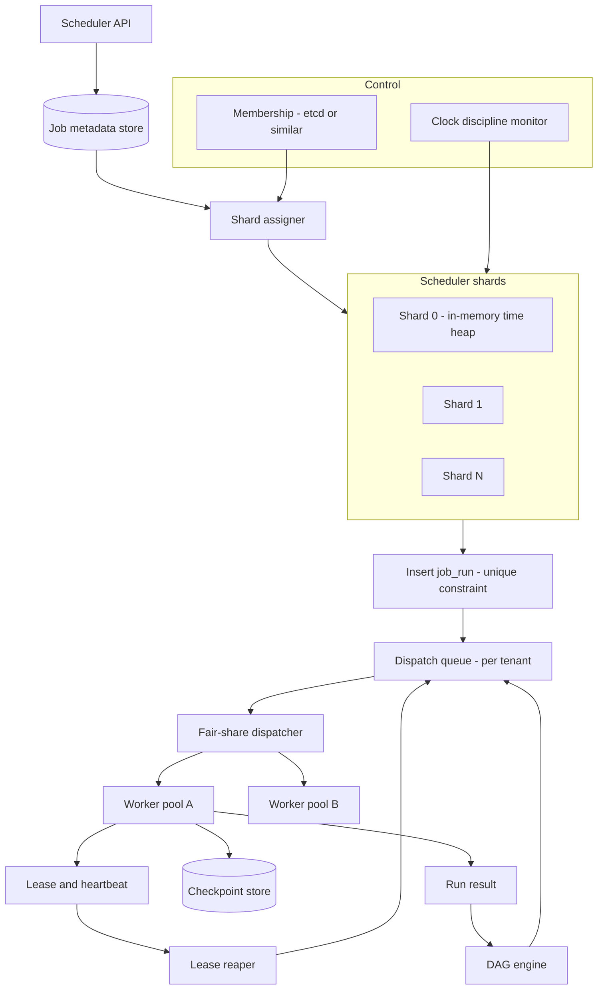
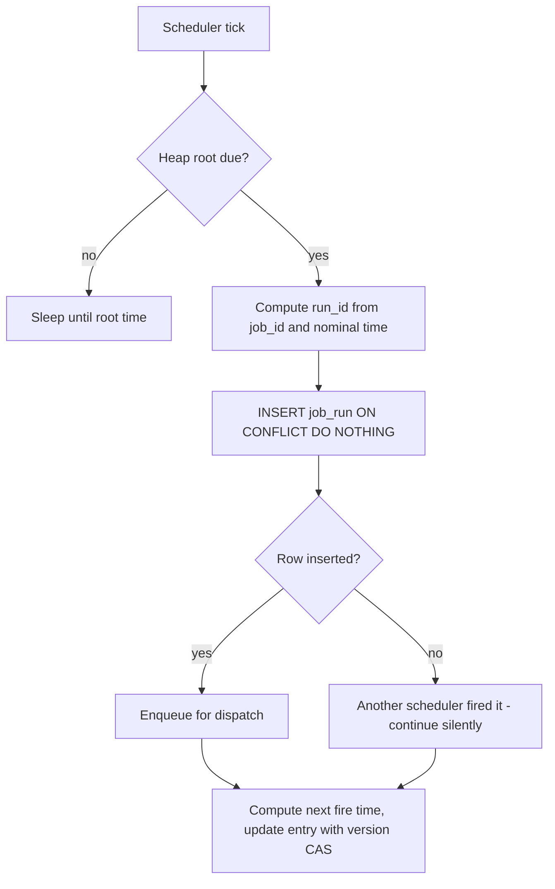
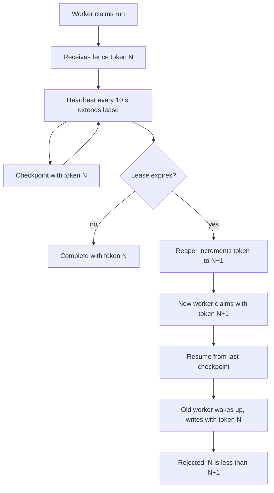
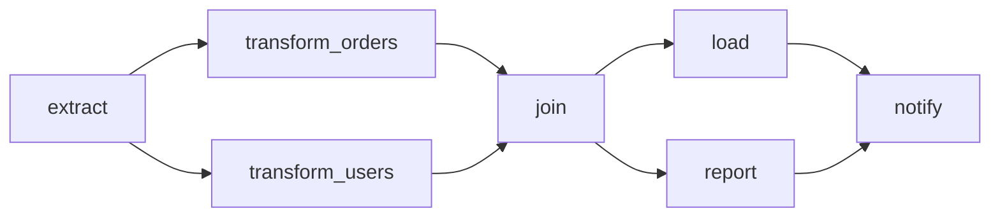
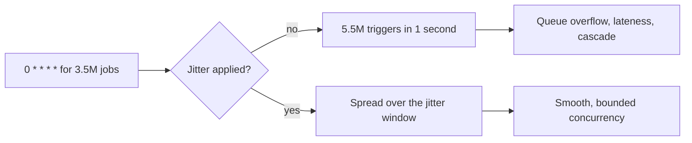
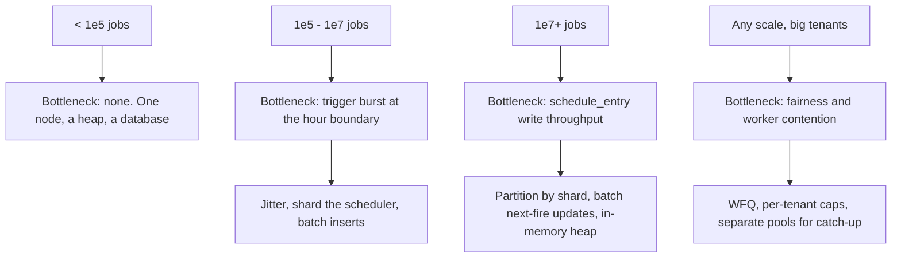

# 37 — Distributed Job Scheduler / Cron at Scale

<span class="pill pill-core">Core</span> <span class="pill pill-hard">Hard</span>

**Cron on one box is a hundred lines of code. Cron for a hundred thousand tenants is a distributed consensus problem wearing a calendar as a disguise — because the moment you run two schedulers for availability, you have to answer what "run exactly once at 03:00" means when your two nodes disagree about what time it is.**

| | |
|---|---|
| **Commonly asked at** | Google (Borg cron), Amazon (EventBridge Scheduler), Airbnb (Airflow), Netflix (Maestro/Conductor), Stripe, Databricks, Snowflake, Uber (Cadence/Temporal) |
| **Time budget** | 45 min |
| **Core tension** | Exactly-once triggering requires coordination, and coordination is exactly what fails during the network partition you are trying to survive — so you either accept duplicate triggers and push idempotency onto the job, or accept missed triggers and push detection onto the operator |
| **Prerequisites** | [F09 Consensus](../fundamentals/f09-consensus.md), [F10 Distributed Transactions](../fundamentals/f10-distributed-transactions.md), [F11 Idempotency](../fundamentals/f11-idempotency.md), [F12 Queues & Streams](../fundamentals/f12-queues-streams.md), [F17 Rate Limiting & Load Shedding](../fundamentals/f17-rate-limiting-load-shedding.md), [F18 Resilience Patterns](../fundamentals/f18-resilience-patterns.md), [F19 Concurrency Control](../fundamentals/f19-concurrency-control.md), [F20 Time, Clocks & Ordering](../fundamentals/f20-time-clocks-ordering.md), [F23 SLOs & Error Budgets](../fundamentals/f23-slo-error-budgets.md), [F24 Capacity Planning](../fundamentals/f24-capacity-planning.md) |

---

## 1. Problem Statement

Build a multi-tenant scheduling service: users register jobs with time-based triggers (cron expressions, fixed rates, one-shot future times) or dependency-based triggers (run after these other jobs succeed), and the system executes them reliably, at scale, with isolation between tenants.

The problem looks like a priority queue keyed on time. Five things make it not that:

1. **The scheduler must not be a single point of failure, and it must not double-fire.** Those two requirements point in opposite directions. Run one scheduler and it is an availability problem; run two and it is a correctness problem.
2. **"Exactly once" is not achievable** across a process boundary you do not control, which means the real design question is which failure you prefer and where you put the idempotency.
3. **Downtime creates a policy question, not a technical one.** The scheduler was down 03:00-05:00 and missed 400,000 job runs. Do you run them all now? Run the last one of each? Skip them and alert? Each answer is correct for a different job, so the system must let the job say.
4. **Dependencies turn a queue into a graph.** A DAG with partial failure has semantics that must be defined: does a failed node block its descendants forever, retry in place, or allow a skip? What does "the DAG succeeded" mean when one optional branch failed?
5. **Everyone schedules at the top of the hour.** The arrival distribution is not smooth, it is a set of delta functions at `0 * * * *`, `0 0 * * *`, and midnight UTC on the first of the month. Your peak-to-mean ratio is measured in hundreds.

The framing that makes this senior: **a job scheduler is a system whose correctness is defined by time, running on machines whose clocks disagree.** Every hard problem traces back to that sentence.

### Out of scope

The worker execution environment (containers, resource isolation, language runtimes), the data-processing semantics of what jobs actually do, and workflow authoring UX.

---

## 2. Requirements

### Functional

| # | Requirement | Notes |
|---|---|---|
| F1 | Register a job with a cron expression, rate, or one-shot time | Timezone-aware, with DST semantics defined |
| F2 | Trigger reliably at the scheduled time | Bounded lateness, measured |
| F3 | Configurable missed-run policy | Catch-up, skip, run-latest-only, alert |
| F4 | DAG dependencies between jobs | Topological execution, partial-failure semantics |
| F5 | Retries with backoff and a dead-letter path | Per-job policy |
| F6 | Long-running jobs with checkpointing | Resume after a worker crash, not restart |
| F7 | Per-tenant concurrency caps and fair scheduling | One tenant cannot starve others |
| F8 | Manual trigger, backfill, pause, resume | Operational necessities |
| F9 | Execution history and logs | Audit and debugging |
| F10 | Cancel and timeout a running job | Including cleanup semantics |

### Non-functional

| # | Requirement | Target |
|---|---|---|
| N1 | Trigger lateness | p50 < 1 s, p99 < 5 s, p99.9 < 30 s |
| N2 | Scheduler availability | 99.99% |
| N3 | Missed triggers | Zero for jobs with `catch_up: true`; a missed trigger is a bug, not a degradation |
| N4 | Duplicate triggers | Rare and always detectable by the job via a deterministic run id |
| N5 | Scale | $10^{7}$ registered jobs, $10^{5}$ triggers/s at peak |
| N6 | Tenant isolation | No tenant can consume more than its configured share of scheduler or worker capacity |
| N7 | Job execution duration | 100 ms to 24 h, with checkpointing beyond 5 minutes |
| N8 | Backfill | 30 days of missed runs replayable without affecting live scheduling |

!!! warning "N3 and N4 are in direct tension and the resolution must be explicit"
    You cannot have both zero missed triggers and zero duplicates without distributed transactions spanning the scheduler and every job's side effects — which is not available. **The chosen position: at-least-once triggering with a deterministic run id that makes deduplication trivially available to the job.** The run id is `hash(job_id, scheduled_time)`, which is stable across retries and across schedulers, so a job that writes it to a unique-constrained table gets exactly-once semantics for free. State this early; it makes every subsequent design decision follow.

---

## 3. Scale Estimation

**Job population and trigger rate.**

$$
\begin{aligned}
\text{registered jobs} &= 10^{7} \\
\text{mean triggers per job per day} &= 24\ \text{(hourly average across the mix)} \\
\text{triggers/day} &= 2.4 \times 10^{8} \\
\text{mean rate} &= \frac{2.4\times10^{8}}{86400} \approx 2{,}778\ \text{/s}
\end{aligned}
$$

**The mean is meaningless. Here is why.** Cron expressions cluster with extreme force. Estimating the distribution of registered schedules:

| Schedule | Share of jobs | Jobs | Fires at |
|---|---|---|---|
| `* * * * *` (every minute) | 5% | 500,000 | Every minute, spread by second? No — at :00 |
| `*/5 * * * *` | 15% | 1,500,000 | :00, :05, :10, ... |
| `0 * * * *` (hourly) | 35% | 3,500,000 | Top of every hour |
| `0 0 * * *` (daily) | 30% | 3,000,000 | Midnight (in the job's timezone) |
| `0 0 * * 0` (weekly) | 10% | 1,000,000 | Sunday midnight |
| `0 0 1 * *` (monthly) | 5% | 500,000 | First of month, midnight |

At the top of a normal hour, the hourly jobs plus the 5-minute jobs plus the per-minute jobs all fire:

$$
\begin{aligned}
N_{\text{hour}} &= 3.5\times10^{6} + 1.5\times10^{6} + 5\times10^{5} = 5.5 \times 10^{6}\ \text{in one second} \\
\text{peak:mean} &= \frac{5.5\times10^{6}}{2{,}778} \approx 1{,}980\times
\end{aligned}
$$

At **midnight UTC on the first of the month**, everything fires:

$$
N_{\text{worst}} = 5.5\times10^{6} + 3\times10^{6} + 1\times10^{6} + 5\times10^{5} = 10^{7}\ \text{in one second}
$$

**Ten million triggers in one second against a design target of $10^5$/s.** This is the defining number of the problem, and §7.7 is entirely about it. Two facts make it tractable: timezone diversity spreads "midnight" across roughly 38 distinct UTC offsets, and enforced jitter (§7.7) spreads each cluster over a window. But the raw arithmetic must be stated, because a candidate who reports "2,778 triggers per second" has not understood the workload at all.

**Timezone spreading.** If daily jobs are distributed across timezones proportionally to population:

$$
\text{midnight jobs per UTC hour} \approx \frac{3\times10^{6}}{24} = 125{,}000\ \text{per hour-boundary, on average}
$$

but weighted heavily toward UTC (default for machine-configured jobs), US Eastern, and CET. Assume the largest single bucket holds 40% of daily jobs: $1.2\times10^{6}$ in one second.

**Worker capacity.**

$$
\begin{aligned}
\text{mean job duration} &= 8\ \text{s} \\
\text{concurrent jobs at mean rate} &= 2{,}778 \times 8 \approx 22{,}200\ \text{(Little's law)} \\
\text{jobs per worker} &= 20\ \text{concurrent} \\
\text{workers at steady state} &= \frac{22{,}200}{20} \approx 1{,}110
\end{aligned}
$$

Bursts do not need proportional worker capacity because the work queues. A 5.5-million-trigger burst with 8-second jobs and 22,200 concurrent slots drains in

$$
\frac{5.5\times10^{6} \times 8\ \text{s}}{22{,}200} \approx 1{,}982\ \text{s} \approx 33\ \text{minutes}
$$

**which is unacceptable for an hourly job**, since the next hour's batch arrives before this one finishes. This is the capacity argument for jitter: spreading the same 5.5 million triggers over 15 minutes reduces required concurrency by roughly 55x for the same completion deadline.

**Storage.**

| Data | Volume | Retention | Size |
|---|---|---|---|
| Job definitions | $10^{7}$ @ 2 KB | Forever | 20 GB |
| Scheduled triggers (next-fire index) | $10^{7}$ @ 100 B | Rolling | 1 GB (fits in RAM) |
| Execution records | $2.4\times10^{8}$/day @ 500 B | 30 days | 3.6 TB |
| Checkpoints | $10^{6}$/day @ 10 KB | 7 days | 70 GB |
| DAG run state | $10^{7}$/day @ 1 KB | 30 days | 300 GB |

**The next-fire index fits in memory.** $10^7$ entries at 100 bytes is 1 GB, so the hot scheduling structure — a per-shard time-ordered heap — is a memory data structure with a durable backing store, not a database query per tick. That fact is what makes sub-second lateness achievable.

---

## 4. API Design

```http
POST /v1/jobs HTTP/1.1
Content-Type: application/json
Idempotency-Key: 4f2a1b9c-...

{
  "name": "nightly-rollup",
  "schedule": { "type": "cron", "expression": "0 3 * * *", "timezone": "Europe/Berlin" },
  "target": { "type": "http", "url": "https://api.acme.com/jobs/rollup",
              "method": "POST", "timeout_seconds": 3600 },
  "missed_run_policy": { "mode": "catch_up", "max_catch_up_runs": 3,
                         "max_staleness_seconds": 21600 },
  "retry": { "max_attempts": 3, "backoff": "exponential",
             "initial_delay_seconds": 30, "max_delay_seconds": 900 },
  "concurrency": { "max_concurrent_runs": 1, "on_overlap": "skip" },
  "jitter_seconds": 300,
  "checkpointing": { "enabled": true, "interval_seconds": 60 }
}
```

```json
{
  "job_id": "job_9f2ae1c3",
  "next_run_at": "2026-03-09T02:00:00Z",
  "next_run_local": "2026-03-09T03:00:00+01:00",
  "effective_jitter_seconds": 137,
  "state": "active"
}
```

```text
POST   /v1/jobs                        create; Idempotency-Key required
PATCH  /v1/jobs/{id}                   update; takes effect from the next fire
POST   /v1/jobs/{id}/pause             stop triggering; runs in flight continue
POST   /v1/jobs/{id}/resume            { catch_up: bool } -- explicit decision
POST   /v1/jobs/{id}/trigger           manual run; { as_of: "2026-03-08T03:00:00Z" }
POST   /v1/jobs/{id}/backfill          { from, to, max_concurrency }
GET    /v1/jobs/{id}/runs?since=...
GET    /v1/runs/{run_id}
POST   /v1/runs/{run_id}/cancel        { graceful: true, timeout_seconds: 60 }
POST   /v1/runs/{run_id}/checkpoint    worker-called; { cursor, state }
POST   /v1/runs/{run_id}/heartbeat     worker-called; extends the lease
POST   /v1/dags                        DAG definition
GET    /v1/dags/{id}/runs/{run_id}     per-node status
```

### The run id is the contract

```python
def run_id(job_id: str, scheduled_time: datetime, attempt: int = 0) -> str:
    # Deterministic. Same job, same scheduled instant -> same id, always,
    # from any scheduler, on any retry, after any failover.
    # The attempt number is NOT included: retries share the run id so that a
    # job's idempotency check catches a retry that already succeeded.
    base = f"{job_id}|{scheduled_time.astimezone(timezone.utc).isoformat()}"
    return "run_" + blake2b(base.encode(), digest_size=16).hexdigest()
```

```http
POST /jobs/rollup HTTP/1.1
X-Scheduler-Run-Id: run_7a3f91c2e8b4d0f6
X-Scheduler-Job-Id: job_9f2ae1c3
X-Scheduler-Scheduled-Time: 2026-03-09T02:00:00Z
X-Scheduler-Attempt: 2
X-Scheduler-Signature: v1=3a9f...
```

!!! tip "Hand the job the tool it needs to be idempotent, then say so loudly"
    Every trigger carries a run id that is a pure function of `(job_id, scheduled_time)`. A job that inserts that id into a unique-constrained table at the start of its work gets exactly-once execution with no coordination, no locks, and no scheduler involvement. **This single design decision converts an unsolvable distributed systems problem into a three-line change in the job.** Document it as the primary integration contract, put it in the quickstart, and include `X-Scheduler-Attempt` so a job can distinguish "this is a retry" from "this is a duplicate trigger" — they need different handling.

---

## 5. Data Model

```sql
CREATE TABLE job (
  job_id           BIGINT      PRIMARY KEY,
  tenant_id        BIGINT      NOT NULL,
  shard_id         INT         NOT NULL,     -- derived, see 7.2
  name             TEXT        NOT NULL,
  schedule_kind    SMALLINT    NOT NULL,     -- cron|rate|once|dag_triggered
  cron_expr        TEXT,
  timezone         TEXT        NOT NULL,     -- IANA name, never an offset
  interval_seconds INT,
  target           JSONB       NOT NULL,
  missed_policy    SMALLINT    NOT NULL,     -- catch_up|skip|latest_only|alert
  max_catch_up     INT         NOT NULL DEFAULT 1,
  jitter_seconds   INT         NOT NULL DEFAULT 0,
  max_concurrent   INT         NOT NULL DEFAULT 1,
  on_overlap       SMALLINT    NOT NULL,     -- skip|queue|allow|cancel_previous
  retry_policy     JSONB       NOT NULL,
  state            SMALLINT    NOT NULL,     -- active|paused|disabled
  created_at       TIMESTAMPTZ NOT NULL,
  updated_at       TIMESTAMPTZ NOT NULL
);
CREATE INDEX ix_job_shard ON job (shard_id) WHERE state = 0;

-- The scheduling index. This is the hot structure. Mirrored in memory.
CREATE TABLE schedule_entry (
  job_id           BIGINT      PRIMARY KEY,
  shard_id         INT         NOT NULL,
  next_fire_at     TIMESTAMPTZ NOT NULL,     -- includes jitter
  nominal_fire_at  TIMESTAMPTZ NOT NULL,     -- WITHOUT jitter: the run id key
  last_fired_at    TIMESTAMPTZ,
  version          BIGINT      NOT NULL      -- optimistic concurrency + fencing
);
CREATE INDEX ix_sched_due ON schedule_entry (shard_id, next_fire_at);

-- One row per (job, scheduled instant). The dedup point.
CREATE TABLE job_run (
  run_id           TEXT        PRIMARY KEY,  -- deterministic; see 4
  job_id           BIGINT      NOT NULL,
  tenant_id        BIGINT      NOT NULL,
  scheduled_at     TIMESTAMPTZ NOT NULL,     -- nominal, no jitter
  triggered_at     TIMESTAMPTZ,
  started_at       TIMESTAMPTZ,
  finished_at      TIMESTAMPTZ,
  state            SMALLINT    NOT NULL,     -- pending|running|succeeded
                                             -- |failed|skipped|timed_out|cancelled
  attempt          INT         NOT NULL DEFAULT 0,
  worker_id        TEXT,
  lease_expires_at TIMESTAMPTZ,              -- worker liveness, see 7.5
  fence_token      BIGINT,                   -- monotonic, see 7.5
  checkpoint_ref   TEXT,
  error            TEXT,
  UNIQUE (job_id, scheduled_at)              -- the exactly-once anchor
);
CREATE INDEX ix_run_lease ON job_run (lease_expires_at) WHERE state = 1;
CREATE INDEX ix_run_tenant ON job_run (tenant_id, state, scheduled_at);

-- DAG structure
CREATE TABLE dag (
  dag_id           BIGINT      PRIMARY KEY,
  tenant_id        BIGINT      NOT NULL,
  schedule_kind    SMALLINT    NOT NULL,
  cron_expr        TEXT,
  timezone         TEXT        NOT NULL,
  failure_policy   SMALLINT    NOT NULL      -- fail_fast|continue|all_done
);

CREATE TABLE dag_node (
  dag_id           BIGINT      NOT NULL,
  node_id          TEXT        NOT NULL,
  job_id           BIGINT      NOT NULL,
  trigger_rule     SMALLINT    NOT NULL,     -- all_success|all_done|one_success
                                             -- |none_failed|always
  PRIMARY KEY (dag_id, node_id)
);

CREATE TABLE dag_edge (
  dag_id           BIGINT      NOT NULL,
  upstream         TEXT        NOT NULL,
  downstream       TEXT        NOT NULL,
  PRIMARY KEY (dag_id, upstream, downstream)
);

CREATE TABLE dag_run (
  dag_run_id       TEXT        PRIMARY KEY,  -- hash(dag_id, scheduled_at)
  dag_id           BIGINT      NOT NULL,
  scheduled_at     TIMESTAMPTZ NOT NULL,
  state            SMALLINT    NOT NULL,
  node_states      JSONB       NOT NULL,     -- node_id -> {state, run_id, attempt}
  version          BIGINT      NOT NULL,
  UNIQUE (dag_id, scheduled_at)
);

-- Checkpoints. Small pointers; large state goes to object storage.
CREATE TABLE checkpoint (
  run_id           TEXT        NOT NULL,
  seq              INT         NOT NULL,
  created_at       TIMESTAMPTZ NOT NULL,
  cursor           JSONB       NOT NULL,     -- opaque to us, meaningful to the job
  blob_ref         TEXT,                     -- object store key for large state
  fence_token      BIGINT      NOT NULL,     -- rejects writes from a zombie worker
  PRIMARY KEY (run_id, seq)
);
```

**Three modelling decisions worth defending.**

`UNIQUE (job_id, scheduled_at)` on `job_run` is the exactly-once anchor. Two schedulers that both decide to fire the same job at the same nominal instant both attempt the insert; one wins, one gets a constraint violation and stops. **The database provides the mutual exclusion that consensus would otherwise be needed for**, and it does so with no leader, no lease, and no liveness assumption.

`nominal_fire_at` versus `next_fire_at` separates jitter from identity. Jitter must never change the run id, or two schedulers computing independent random jitter would produce different ids for the same logical run and the unique constraint would not fire. Jitter delays *when* we act; it does not change *what* we are acting on.

`fence_token` on both `job_run` and `checkpoint` is what makes lease-based worker ownership safe. §7.5 covers why a lease alone is not sufficient.

---

## 6. High-Level Architecture



### Trigger path

1. **Shard assignment.** Each job maps to a shard by `hash(job_id) mod S`. Shards are assigned to scheduler nodes through a membership service. There is **no global leader** (§7.1).
2. **In-memory time heap.** Each scheduler node holds a min-heap of `(next_fire_at, job_id)` for its shards. Ticking is a peek at the heap root, not a database query.
3. **Fire.** When the heap root is due, the scheduler attempts `INSERT INTO job_run` with the deterministic run id. Success means it owns the trigger. A unique-violation means someone else already fired it, and the scheduler simply moves on — no error, no alarm.
4. **Compute the next fire time** and update `schedule_entry` with an optimistic-concurrency check on `version`.
5. **Enqueue** to a per-tenant dispatch queue.
6. **Fair-share dispatch** pulls across tenant queues under per-tenant concurrency caps (§7.6) and assigns to a worker with a lease.

### Execution path

1. Worker claims the run, receives a **fence token** (monotonically increasing), and sets `lease_expires_at`.
2. Worker heartbeats every 10 seconds, extending the lease.
3. Worker checkpoints periodically, including its fence token; a checkpoint write with a stale token is rejected (§7.5).
4. On completion, the worker reports terminal state with its fence token.
5. The lease reaper finds runs whose lease expired, increments the fence token, and requeues — which is exactly when the zombie-worker problem arises.

### Recovery path

A scheduler node dies. Membership detects it, its shards are reassigned, and the new owner **rebuilds its heap from `schedule_entry`** for those shards — a single indexed range scan. Any job whose `next_fire_at` has passed is evaluated under the missed-run policy (§7.4). Recovery is a few seconds, and during it those shards fire late, not never.

!!! note "Why there is no leader in the trigger path"
    The obvious design is leader election: one scheduler owns all jobs, backups stand by. It is simple and it is wrong at this scale for three reasons. The leader is a throughput ceiling — $10^7$ triggers in one second will not come from one process. Leader failover is a full outage of *all* scheduling, not $1/S$ of it. And leader election has a split-brain window during which two nodes believe they lead, which reintroduces the exact double-fire problem the leader was supposed to prevent. **Sharding with a database unique constraint gives you correctness without a leader and scales horizontally** — see §7.1.

---

## 7. Deep Dives

### 7.1 Leader election versus sharded scheduling

This is the central architectural decision and the one interviewers push hardest on.

=== "Leader election"

    One scheduler is the leader; it owns the entire schedule. Standbys wait. Election via etcd/ZooKeeper lease or Raft.

    ```go
    sess, _ := concurrency.NewSession(etcdClient, concurrency.WithTTL(10))
    elec := concurrency.NewElection(sess, "/scheduler/leader")
    if err := elec.Campaign(ctx, nodeID); err != nil { return err }
    // We are leader... probably. See below.
    for range ticker.C {
        if sess.Done() != nil { break }   // lost the session; STOP scheduling
        scheduleDueJobs()
    }
    ```

    **The split-brain window is unavoidable and worth being precise about.** The leader's lease expires at time $T$. Node B acquires leadership at $T+\epsilon$. Node A does not learn it lost the lease until its next heartbeat fails — and if A was in a GC pause, a VM migration, or a network blip, it may act as leader well past $T$. Lowering the TTL shrinks the window and increases spurious failovers. The window never reaches zero.

    **Verdict: rejected as the primary mechanism.** Single-node throughput ceiling, failover is a total scheduling outage, and it does not actually eliminate double-firing.

=== "Sharded, no leader"

    Partition the job space into $S$ shards (say 1024). Assign shards to nodes via a membership service. Each node schedules only its shards.

    ```go
    func (n *Node) onMembershipChange(members []string) {
        mine := assignShards(members, n.id, numShards)   // rendezvous hashing
        n.releaseShards(diff(n.owned, mine))
        n.acquireShards(diff(mine, n.owned))             // rebuild heaps
        n.owned = mine
    }
    ```

    **Reassignment still has a window** in which two nodes believe they own shard 42. That is fine, because the unique constraint on `(job_id, scheduled_at)` makes a double-fire a no-op: both insert, one wins, the loser sees a constraint violation and continues. **Correctness does not depend on the membership service being perfect.** That is the key property — the membership service is a performance optimisation, not a correctness mechanism.

    **Verdict: chosen.** Scales linearly, a node failure affects $1/N$ of jobs, and correctness is enforced at the data layer where it belongs.

=== "Consensus per trigger"

    Raft/Paxos on every trigger decision. Correct, and a consensus round per trigger at $10^5$/s is absurd. **Rejected**, but worth naming so the interviewer knows you considered and dismissed it for concrete reasons.

| Property | Leader election | Sharded | Consensus per trigger |
|---|---|---|---|
| Throughput ceiling | One node | Linear in nodes | Consensus rate (~thousands/s) |
| Failure blast radius | 100% of scheduling | $1/N$ of shards | None |
| Double-fire possible | Yes (split-brain) | Yes (reassignment) | No |
| Double-fire handled by | Nothing | Unique constraint | Protocol |
| Operational complexity | Low | Medium | High |
| Recovery time | Full election + heap rebuild | Per-shard heap rebuild | N/A |
| **Verdict** | Rejected | **Chosen** | Rejected |



**The insert-first ordering is deliberate.** Insert the run record, *then* enqueue. If the process dies between them, a reconciliation loop finds `pending` runs with no queue entry and re-enqueues — recoverable. Enqueue first and the run may execute with no record, which is unrecoverable and invisible.

### 7.2 Exactly-once triggering, honestly

"Exactly once" requires atomicity across the scheduler's state and the job's side effects. Those live in different systems, so it is not achievable in general. What *is* achievable:

$$
\text{at-least-once triggering} + \text{deterministic run id} + \text{idempotent consumer} = \text{effectively-once execution}
$$

**Layer 1: at most one trigger per (job, scheduled_time) from the scheduler.** The unique constraint provides this, absolutely, with no liveness assumption. Two schedulers, ten schedulers, a partitioned cluster — only one insert succeeds.

**Layer 2: at-least-once delivery to the worker.** A run inserted but never dispatched (scheduler died between insert and enqueue) is found by reconciliation and dispatched. A worker that received the job but died before reporting has its lease expire and is requeued. Both paths can produce a second delivery of the *same run id*.

**Layer 3: idempotency at the job.** This is where effectively-once actually happens, and the scheduler's job is to make it easy:

```python
@app.post("/jobs/rollup")
def rollup(request):
    run_id = request.headers["X-Scheduler-Run-Id"]
    # The three-line contract.
    try:
        db.execute(
            "INSERT INTO job_executions (run_id, started_at) VALUES (%s, now())",
            (run_id,))
    except UniqueViolation:
        existing = db.fetch_one(
            "SELECT state, result FROM job_executions WHERE run_id = %s", (run_id,))
        if existing.state == "succeeded":
            return {"status": "already_done", "result": existing.result}
        # In progress: could be a genuine duplicate delivery, or a retry after
        # a crash. Return 409 and let the scheduler's retry policy handle it.
        return {"status": "in_progress"}, 409

    result = do_the_work()
    db.execute("UPDATE job_executions SET state='succeeded', result=%s "
               "WHERE run_id=%s", (result, run_id))
    return {"status": "ok", "result": result}
```

**What the scheduler must guarantee to make this work**, and each is a real design constraint:

1. The run id is a pure function of `(job_id, scheduled_time)` — no randomness, no attempt number, no wall-clock reading at trigger time.
2. Retries reuse the run id. A retry is not a new run; it is another attempt at the same one.
3. `scheduled_time` is the **nominal** time, never the jittered or actual time. Otherwise two schedulers with different jitter produce different ids.
4. Clock skew must not change the nominal time (§7.3), or the same logical run gets two ids.

!!! warning "The failure this does not cover"
    A job that starts, performs a non-idempotent side effect (sends an email, charges a card), and then crashes before recording success. On redelivery, the idempotency check sees no record and the side effect happens twice. **The only fixes are at the job level:** record intent before acting (write the row, then send, then mark sent — accepting that a crash between write and send means the email is never sent, which for most workloads is the better failure), or use an idempotency key with the downstream service so the *downstream* deduplicates. Say this out loud in an interview: the scheduler cannot solve it, and a candidate who claims otherwise is not thinking clearly about where the transaction boundary is.

### 7.3 Clock skew and what "run at time T" means

The scheduler's correctness is defined in terms of time, and the machines have different opinions about what time it is.

**Skew magnitudes:**

| Source | Typical | Worst case observed |
|---|---|---|
| NTP-synced datacentre | < 1 ms | 10-50 ms |
| NTP over WAN | 10-100 ms | Seconds |
| VM after live migration | — | Seconds to minutes |
| VM resumed from suspend | — | Hours |
| Failed NTP (ignored for months) | — | Minutes to hours |
| Deliberate step adjustment | — | Unbounded, in either direction |

**The three ways skew hurts:**

1. **Early fire.** Scheduler A's clock is 2 seconds fast, so it fires a job 2 seconds early. Usually harmless — but a job that reads "all data up to now" reads an incomplete window, and the resulting report is silently wrong.
2. **Split-brain during reassignment.** A fast clock makes a node believe a lease has expired when it has not. Mitigated by the unique constraint, not by clock accuracy.
3. **Ordering violations in DAGs.** Node A finishes at what it calls 10:00:05; node B starts and records a start time of 10:00:03. The audit trail shows a child starting before its parent finished, which is confusing at best and, if any logic depends on timestamp ordering, wrong.

**Mitigations, in order of importance:**

**Never derive identity from local wall-clock time.** The nominal fire time is computed from the cron expression and the *schedule's* anchor, not from "now". Two schedulers with 5 seconds of skew both compute `2026-03-09T02:00:00Z` for `0 3 * * *` in `Europe/Berlin`, because that is arithmetic on the expression, not a clock reading. They fire at slightly different real instants; they compute the same run id; the unique constraint resolves it. **Skew becomes a latency problem rather than a correctness problem**, which is exactly the transformation you want.

```python
def next_fire(cron_expr: str, tz: str, after: datetime) -> datetime:
    # `after` is the previous NOMINAL fire time, not now(). This makes the
    # sequence of fire times a deterministic function of the schedule, so it
    # cannot drift with the local clock.
    local = after.astimezone(ZoneInfo(tz))
    return croniter(cron_expr, local).get_next(datetime).astimezone(timezone.utc)
```

**Use monotonic clocks for durations, wall clocks only for scheduling.** Lease expiry, timeouts, and heartbeat intervals must use `CLOCK_MONOTONIC`, which cannot jump. A job with a 1-hour timeout measured against wall-clock time is cancelled instantly if NTP steps the clock forward.

**Refuse to schedule on a node with unhealthy time.** Monitor NTP offset, stratum, and last-sync age; if offset exceeds a threshold (say 500 ms), the node **releases its shards and stops scheduling**. Firing late because a node withdrew is far better than firing wrong.

```yaml
clock_discipline:
  max_offset_ms: 500
  max_sync_age_seconds: 300
  on_violation: release_shards        # release_shards | alert_only
  check_interval_seconds: 30
  require_stratum_below: 4
```

**Never use a step adjustment; always slew.** `ntpd -x` or `chronyd` with `maxslewrate` corrects gradually. A step backwards makes a monotonic sequence non-monotonic, and code that assumes `now() >= previous_now()` breaks in ways that are extremely hard to reproduce.

!!! danger "The DST bug that fires a job twice or zero times"
    `0 2 * * *` in `America/New_York`. **On the spring-forward day, 02:00 local does not exist** — the clock jumps 01:59:59 to 03:00:00. Naive implementations either skip the run entirely or throw an exception. **On the fall-back day, 02:00 local occurs twice**, so a naive implementation fires twice — and because the two occurrences have different UTC offsets, they produce *different* nominal UTC times and therefore different run ids, so the unique constraint does not save you.

    **The policy must be explicit, configurable, and documented:** for nonexistent times, either skip or fire at the next valid instant (03:00); for ambiguous times, fire on the first occurrence only, using the earlier UTC offset. Implement by converting to UTC with explicit `fold` handling and deduplicating on the resulting UTC instant. **Test it in CI across both transitions in every timezone you support** — this is the highest-value test in the codebase and the bug ships in a surprising number of production schedulers.

### 7.4 Missed runs: catch-up, skip, or alert

The scheduler was down from 03:00 to 05:00. Four hundred thousand runs did not happen. What now?

**This is a policy question and the system's job is to let the job answer it**, because the right answer differs completely by workload.

| Policy | Behaviour | Right for | Disaster if wrong |
|---|---|---|---|
| `catch_up` | Run every missed occurrence in order | Incremental ETL where each window matters | 400,000 simultaneous runs; a 2-hour outage becomes an 8-hour one |
| `latest_only` | Run once with the most recent nominal time | Snapshot/aggregate jobs that recompute from scratch | Silently skips windows an incremental job needed |
| `skip` | Do nothing; resume at the next scheduled time | Cache warmers, health checks, anything idempotent-by-recomputation | Data gap nobody notices |
| `alert` | Do not run; raise an incident | Compliance jobs where a human must decide | Requires a human at 05:00 |

```python
def handle_missed(job, now) -> list[datetime]:
    missed = occurrences_between(job.cron, job.timezone,
                                 after=job.last_nominal_fire, until=now)
    if not missed:
        return []

    if job.missed_policy == SKIP:
        emit_metric("missed_runs_skipped", len(missed), job=job.id)
        return []

    if job.missed_policy == ALERT:
        raise_incident(job, missed_count=len(missed))
        return []

    if job.missed_policy == LATEST_ONLY:
        return [missed[-1]]

    # CATCH_UP, with two independent guards.
    capped = missed[-job.max_catch_up:]                   # count guard
    fresh = [t for t in capped                            # staleness guard
             if (now - t).total_seconds() <= job.max_staleness_seconds]
    if len(fresh) < len(missed):
        emit_metric("missed_runs_dropped", len(missed) - len(fresh), job=job.id)
    return fresh
```

**Both guards are necessary and they catch different disasters.** `max_catch_up` prevents an unbounded queue after a long outage. `max_staleness_seconds` prevents running a job whose window is now meaningless — a "send the 03:00 reminder" job should not fire at 14:00, regardless of count.

**Catch-up must be rate-limited, ordered, and isolated.** Running 400,000 catch-up jobs at full speed is a self-inflicted denial of service on the worker pool, and it starves the *live* schedule:

```yaml
catch_up:
  enabled: true
  max_runs_per_job: 3
  max_staleness_seconds: 21600          # 6 hours
  global_rate_limit_per_second: 500
  per_tenant_rate_limit_per_second: 50
  priority: low                          # live schedule always preempts
  ordering: chronological                # incremental jobs depend on order
  separate_worker_pool: true             # hard isolation from live work
```

`separate_worker_pool: true` is the line that turns a bad recovery into a good one. Catch-up work competing with live work means a two-hour outage cascades into hours of degraded live scheduling, which is how a recoverable incident becomes a prolonged one.

**The reconciliation loop is what makes "zero missed triggers" achievable.** A background process scans for `schedule_entry` rows whose `next_fire_at` is well in the past and for `job_run` rows stuck in `pending`:

```sql
-- Jobs that should have fired and did not. The scheduler's own safety net.
SELECT job_id, next_fire_at
FROM schedule_entry
WHERE next_fire_at < now() - interval '60 seconds'
  AND shard_id = ANY($1)
LIMIT 10000;

-- Runs that were created but never dispatched.
SELECT run_id FROM job_run
WHERE state = 0 AND triggered_at < now() - interval '120 seconds'
LIMIT 10000;
```

This loop is the difference between a scheduler that mostly works and one whose missed-trigger SLO is zero, because every single-point failure in the trigger path — process death between insert and enqueue, a lost queue message, a shard that was briefly unowned — is caught here.

### 7.5 Long-running jobs, leases, and the zombie worker

A job running for 6 hours cannot be restarted from zero when its worker dies at hour 5.

**Lease plus heartbeat plus fence token.** The lease detects the dead worker; the fence token handles the worker that is not actually dead.



```python
def checkpoint(run_id, cursor, state, fence_token):
    # Conditional write. A zombie worker holding an old token cannot corrupt
    # the checkpoint of the worker that legitimately took over.
    updated = db.execute("""
        INSERT INTO checkpoint (run_id, seq, created_at, cursor, blob_ref, fence_token)
        SELECT %s, coalesce(max(seq), 0) + 1, now(), %s, %s, %s
        FROM checkpoint WHERE run_id = %s
        AND %s >= (SELECT fence_token FROM job_run WHERE run_id = %s)
    """, (run_id, cursor, state, fence_token, run_id, fence_token, run_id))
    if updated == 0:
        raise FencedOut(f"token {fence_token} is stale; another worker owns this run")
```

**Why a lease alone is insufficient**, which is the point of the fence token and the thing most candidates miss: the old worker is not necessarily dead. It may have been in a 90-second GC pause, or its VM was live-migrated, or its network was partitioned. It wakes up believing it still holds the lease and writes a checkpoint from hour 5 over the new worker's hour-1 checkpoint. The lease expired, but the worker never found out in time. **Fencing tokens are the only mechanism that makes lease-based ownership safe under unbounded pauses**, and they work because the *resource* rejects stale tokens rather than the *client* checking whether it is still the owner.

**Checkpoint design principles:**

| Principle | Reason |
|---|---|
| Checkpoint the **cursor**, not the data | A cursor is bytes; the data is gigabytes |
| Make work idempotent per checkpoint interval | Resume replays the interval since the last checkpoint |
| Checkpoint on a time interval, not a record count | Bounds recovery time predictably regardless of record size |
| Write the checkpoint *before* acknowledging the work | Otherwise resume skips completed-but-unacknowledged work |
| Keep the last N checkpoints | The most recent one may be corrupt or from a poisoned record |

```python
def process_large_dataset(run_id, ctx):
    ckpt = load_checkpoint(run_id)
    cursor = ckpt.cursor if ckpt else initial_cursor()
    last_ckpt = time.monotonic()          # monotonic, never wall clock

    for batch in read_batches(cursor):
        process(batch)                     # must be idempotent within an interval
        cursor = batch.next_cursor
        if time.monotonic() - last_ckpt > 60:
            checkpoint(run_id, cursor, state={}, fence_token=ctx.fence_token)
            last_ckpt = time.monotonic()
            ctx.heartbeat()                # extend the lease while we are here
```

**Lease duration is a trade-off with a clear shape.** Short leases detect death quickly and risk reaping a live-but-slow worker; long leases avoid false reaps and leave work stalled after a genuine crash. A reasonable rule is $\text{lease} = 3 \times \text{heartbeat interval}$, with the heartbeat short enough that a genuinely stuck worker is detected in under a minute. Crucially, **heartbeats must come from a thread that is not doing the work**, or a worker blocked on a slow I/O call stops heartbeating and gets reaped while perfectly healthy.

### 7.6 DAG execution and partial-failure semantics

A DAG turns scheduling into graph traversal with failure semantics that must be defined rather than assumed.



**The engine is event-driven, not polling.** On each node completion, re-evaluate which downstream nodes are now eligible:

```python
def on_node_complete(dag_run_id, node_id, state):
    with optimistic_retry():                       # CAS on dag_run.version
        run = load_dag_run(dag_run_id)
        run.node_states[node_id] = state

        if state == FAILED and run.failure_policy == FAIL_FAST:
            for n in descendants(run.dag, node_id):
                if run.node_states[n] == PENDING:
                    run.node_states[n] = UPSTREAM_FAILED
            cancel_running_siblings(run)

        for n in run.dag.nodes:
            if run.node_states[n] == PENDING and eligible(run, n):
                run.node_states[n] = QUEUED
                enqueue(node_run_id(dag_run_id, n), n)

        run.state = compute_dag_state(run)
        save(run)
```

**Trigger rules** (borrowed from Airflow's vocabulary, which is the de facto standard) define eligibility:

| Rule | Node runs when | Use |
|---|---|---|
| `all_success` | Every upstream succeeded | Default; correctness-critical chains |
| `all_done` | Every upstream reached a terminal state | Cleanup, teardown, notification |
| `one_success` | Any upstream succeeded | Racing redundant sources |
| `none_failed` | No upstream failed; skipped is acceptable | Conditional branches |
| `all_failed` | Every upstream failed | Fallback paths |
| `always` | Unconditionally | Alerting, metric emission |

**Retry semantics within a DAG are where the real subtlety lives.** A failed node retries in place; only after exhausting attempts does the failure propagate. Two questions the design must answer explicitly:

1. **Does retrying a node re-run its already-successful upstreams?** No. Upstream results are durable within the DAG run. This is why `dag_run.node_states` records the `run_id` per node — a retry of `join` reuses the outputs of `transform_orders` and `transform_users` rather than recomputing them. Recomputing would be safe only if every node were pure, which they are not.
2. **Can a human clear and re-run a subgraph?** Yes, and it must be a first-class operation. "Clear `join` and everything downstream, then re-run" is the single most common operational action on a failed DAG, and a system that requires re-running the entire DAG from `extract` makes a 10-minute fix into a 3-hour one.

**Cycle detection at definition time, not run time.** Reject a DAG with a cycle at `POST /v1/dags` via Kahn's algorithm or a DFS with colouring. Discovering a cycle at execution time means a run that hangs forever with nodes waiting on each other — and the symptom (a DAG that never completes) points nowhere near the cause.

**Cross-DAG dependencies** ("run after yesterday's run of DAG B finished") are where teams invent a distributed deadlock. A waits on B, B waits on C, C waits on yesterday's A. **Detect cross-DAG cycles at definition time as well, enforce a maximum wait with a defined timeout behaviour, and make the wait visible in the UI**, because a DAG blocked on an external dependency looks identical to a DAG that is broken.

**Scale note.** A DAG with 10,000 nodes stored as a single JSONB `node_states` column is a 10,000-key document rewritten on every node completion — $O(n^2)$ writes over the run, and a hot row with severe contention. Above a few hundred nodes, store node states as individual rows with a per-node conditional update and derive the DAG state from an aggregate, accepting the extra read cost for a write path that scales.

### 7.7 Tenant fairness and the top-of-the-hour thundering herd

Two problems that look separate and share a solution.

**The herd.** From §3: 5.5 million triggers at the top of every hour, 10 million at monthly midnight, against a $10^5$/s design target.



**Jitter is the fix, and it must be deterministic and mandatory above a threshold.**

```python
def effective_fire_time(job, nominal: datetime) -> datetime:
    if job.jitter_seconds == 0:
        return nominal
    # Deterministic: same job always gets the same offset within the window.
    # NOT random per fire, because that would make behaviour irreproducible
    # and would move a job's slot every run, defeating downstream assumptions.
    h = int(blake2b(str(job.job_id).encode(), digest_size=8).hexdigest(), 16)
    return nominal + timedelta(seconds=h % job.jitter_seconds)
```

Deterministic jitter has three properties that random jitter lacks: the same job always runs at the same offset, so its behaviour is reproducible and a user can reason about it; the distribution across jobs is uniform because the hash is uniform; and it requires no coordination between schedulers, since any scheduler computes the same offset.

```yaml
jitter_policy:
  default_seconds: 300                   # 5 min for jobs that do not specify
  minimum_for_hourly: 60
  minimum_for_daily: 900                 # 15 min: daily jobs cluster hardest
  maximum_seconds: 3600
  enforce_above_tenant_job_count: 100    # a tenant with 100+ jobs MUST jitter
```

Spreading 3.5 million hourly jobs over a 300-second window:

$$
\frac{3.5\times10^{6}}{300} \approx 11{,}667\ \text{triggers/s}
$$

Well within a $10^5$/s budget, from a peak of 5.5 million. **Jitter is a one-line change that removes a 500x spike**, and it is the single highest-leverage design decision in the entire system.

!!! warning "Jitter must not change the nominal time"
    The run id is computed from the *nominal* time. A job scheduled for 03:00 with 137 seconds of jitter fires at 03:02:17 and its run id is still the one for 03:00:00. Otherwise two schedulers computing jitter independently — or one scheduler before and after a config change — produce different run ids for the same logical run, and the unique constraint that provides your only exactly-once guarantee silently stops working. This is a subtle bug with catastrophic consequences: it does not fail, it just quietly doubles everything.

**Tenant fairness.** One tenant with 100,000 jobs must not starve a tenant with 10. A single FIFO dispatch queue guarantees they will, because the big tenant's work simply arrives first and more often.

**Weighted fair queueing across per-tenant queues**, using a virtual-time scheduler:

```python
class FairDispatcher:
    """Deficit round-robin across tenant queues with per-tenant concurrency caps."""

    def next_batch(self, n: int) -> list[Run]:
        out = []
        for tenant in self.active_tenants_round_robin():
            if len(out) >= n:
                break
            running = self.running_count[tenant]
            cap = self.concurrency_cap[tenant]
            if running >= cap:
                continue                         # tenant at its ceiling; skip
            take = min(cap - running, self.quantum[tenant], n - len(out))
            out.extend(self.queues[tenant].pop(take))
        return out
```

Four layers of isolation, because any single one has a gap:

| Layer | Mechanism | Prevents |
|---|---|---|
| Admission | Per-tenant job count and trigger-rate quota | Registering a million per-minute jobs |
| Scheduling | Jobs hashed across shards, so one tenant spans all shards | A tenant monopolising one scheduler node |
| Dispatch | Weighted fair queueing across tenant queues | Head-of-line blocking in a shared FIFO |
| Execution | Per-tenant concurrency cap on workers | One tenant occupying the whole worker pool |

**The dispatch layer is the one most often missed.** With a single shared FIFO, a tenant that enqueues 100,000 runs puts every other tenant's work behind theirs. That is head-of-line blocking wearing a queue costume, and no amount of worker scaling fixes it — it fixes the throughput and leaves the ordering unfair.

**Shard assignment must spread a tenant's jobs.** Hashing by `job_id` does this naturally. Hashing by `tenant_id` would be a disaster: one large tenant lands entirely on one scheduler node, which becomes a hotspot and a single point of failure for that tenant. This is a one-line decision with a large consequence, and it is worth stating explicitly in an interview because the tenant-based sharding instinct is strong and wrong here.

---

## 8. Scaling the Bottleneck

The bottleneck moves as you scale, and naming the progression is the answer to "how does this grow?"



**Bottleneck 1: the trigger burst.** Solved by jitter (§7.7), which is a 500x reduction for one line of code. After jitter, the residual burst is smooth enough to handle with horizontal sharding.

**Bottleneck 2: `schedule_entry` writes.** Every trigger requires a write to advance `next_fire_at`. At $10^5$/s that is 100,000 writes/s, which a single database will not do.

- **Batch.** A scheduler firing 10,000 jobs in a tick issues one multi-row update, not 10,000. This is a 50-100x reduction in round trips and the single biggest database win available.
- **Partition by `shard_id`.** Each shard's entries live in one partition, owned by one node, so there is no cross-node contention on the hot path.
- **Keep the heap in memory** and treat the table as a durable log. On restart, rebuild from the table; during steady state, the table is written asynchronously behind the in-memory state — accepting that a crash may lose the last few next-fire updates, which the reconciliation loop then repairs.

$$
\begin{aligned}
\text{shards} &= 1024 \\
\text{jobs per shard} &= \frac{10^{7}}{1024} \approx 9{,}766 \\
\text{heap memory per shard} &\approx 9{,}766 \times 100\ \text{B} \approx 1\ \text{MB} \\
\text{shards per node (64 GB)} &\gg 1024 \quad\text{— memory is not the constraint}
\end{aligned}
$$

Shard count is chosen for **reassignment granularity**, not memory: 1024 shards across 20 nodes means losing one node moves 51 shards, and each is a fast indexed range scan to rebuild.

**Bottleneck 3: worker capacity during catch-up.** A 2-hour outage produces 400,000 catch-up runs. Solved by rate-limiting catch-up, running it in a separate pool, and capping both count and staleness (§7.4). The principle: **recovery work must never compete with live work**, or an outage extends itself.

**Bottleneck 4: DAG engine contention.** A DAG with thousands of nodes rewriting one `node_states` document on every completion is $O(n^2)$ writes on a hot row. Above a few hundred nodes, move to per-node rows with conditional updates.

**Bottleneck 5: the execution history table.** $2.4\times10^8$ rows/day is 7.2 billion per month. Partition by day, drop old partitions rather than deleting rows (a `DELETE` of 240 million rows is an operational event; a `DROP PARTITION` is instant), and move anything older than a few days to columnar storage for analytics. The operational query — "show me this job's last 50 runs" — is served by an index on `(job_id, scheduled_at DESC)` against recent partitions only.

---

## 9. Failure Modes

| Failure | Blast radius | Detection | Mitigation | Degraded behaviour |
|---|---|---|---|---|
| Scheduler node dies | Its shards, ~10 s | Membership heartbeat | Shards reassigned, heaps rebuilt from `schedule_entry` | Triggers late by seconds, not missed |
| Membership service down | Shard reassignment frozen | etcd health | Nodes keep current assignments; unique constraint prevents doubles | No rebalancing; existing shards keep firing |
| Two nodes own one shard | That shard | Duplicate-insert rate on `job_run` | Unique constraint makes it a no-op | None — this is a designed-for case |
| Scheduler clock skewed | That node's shards | NTP offset monitor | Node releases shards above threshold | Shards move; brief lateness |
| All schedulers down | Everything | Trigger rate drops to zero | Reconciliation on recovery + missed-run policy | Runs execute late per policy |
| Database unavailable | All triggering | Insert error rate | Buffer triggers in memory, replay on recovery | **Bounded loss if the buffer overflows.** Hard availability dependency |
| Worker crashes mid-job | One run | Lease expiry | Reaper requeues; resume from checkpoint | Re-runs from last checkpoint, not from zero |
| Zombie worker returns | One run's checkpoint | Fence-token rejection | Stale-token writes rejected | Zombie's work is discarded, correctly |
| Worker pool exhausted | All tenants | Queue depth, dispatch latency | Fair queueing + per-tenant caps + autoscale | Queued, late, not lost |
| One tenant's cron storm | Potentially all tenants | Per-tenant trigger rate outlier | Admission quota, WFQ, concurrency cap | That tenant throttled; others unaffected |
| Top-of-hour herd | All tenants | Trigger-rate spike, lateness p99 | Jitter (primary), queue buffering | Small lateness increase |
| Catch-up storm after outage | Worker pool | Catch-up queue depth | Rate limit, staleness cap, separate pool | Catch-up slow; live schedule protected |
| Job runs longer than its interval | That job | Overlap detection | `on_overlap` policy: skip/queue/allow/cancel | Per policy; default skip prevents pile-up |
| DAG cycle at definition | That DAG | Validation at create | Reject at API | DAG never created |
| Cross-DAG deadlock | Multiple DAGs | Wait-time outlier | Cycle detection across DAGs, max wait timeout | DAGs time out with a clear reason |
| Target endpoint down | Jobs targeting it | Failure rate per target | Retry with backoff, circuit breaker, DLQ | Retries then dead-letter |
| Poison job crashes workers | Worker pool | Worker crash-loop correlated with one run id | Attempt cap, quarantine after N crashes | Job quarantined; pool recovers |
| DST transition | Jobs in that timezone | Run-count anomaly on transition days | Explicit fold policy, deduplicate on UTC instant | Defined behaviour rather than a surprise |

!!! danger "The database is a hard dependency and you must say so"
    The unique constraint on `(job_id, scheduled_at)` is what makes this design correct without a leader, and that means **the database is in the critical path of every trigger**. If it is unavailable, you can buffer in memory and replay, but the buffer is bounded and the guarantee degrades. The honest statement: this design trades a hard dependency on a highly available database for the elimination of leader election, split-brain, and a single-node throughput ceiling. Make the database genuinely highly available — multi-AZ synchronous replication, tested failover — and treat its availability SLO as the scheduler's ceiling. A candidate who presents the sharded design without acknowledging this has moved the single point of failure rather than removed it.

---

## 10. SRE Lens

### SLIs and SLOs

| SLI | Measurement | SLO | Notes |
|---|---|---|---|
| Trigger lateness | `triggered_at - scheduled_at`, jitter subtracted | p50 < 1 s, p99 < 5 s, p99.9 < 30 s | The primary SLI; must exclude jitter or it is meaningless |
| Missed triggers | Expected occurrences minus `job_run` rows | **Zero** for `catch_up` jobs | A count, not a rate. Any non-zero is an incident |
| Duplicate triggers | `job_run` inserts rejected by the unique constraint | Tracked, not bounded | High values mean shard thrash, not a correctness problem |
| Scheduler availability | Ticks completed / ticks expected, per shard | 99.99% | Per shard, so one bad node is visible |
| Dispatch latency | `started_at - triggered_at` | p99 < 10 s | Separates scheduling health from worker capacity |
| Worker success rate | Succeeded / terminal, excluding job-logic failures | > 99.5% | Infrastructure failures only; a job's own bug is not our SLI |
| Checkpoint resume ratio | Work redone after a crash / total work | < 5% | Direct measure of checkpoint interval fitness |
| Tenant fairness | Gini coefficient of per-tenant dispatch latency | < 0.3 | Catches starvation that per-tenant averages hide |
| DAG completion | Completed / started, within the expected window | > 99% | |

**Subtracting jitter from the lateness calculation is not a detail.** A job with 300 seconds of jitter is *supposed* to fire up to 300 seconds after its nominal time. Measuring raw `triggered_at - scheduled_at` makes jitter look like lateness, which means either your SLO is permanently violated or you set the threshold so loose that real lateness hides inside it. Measure against `effective_fire_time`, and report jitter separately.

### Error budget

99.99% is 4.3 minutes/month, but for a scheduler the more meaningful budget is **missed triggers**, because lateness is recoverable and a miss frequently is not.

| Category | Budget | Policy |
|---|---|---|
| Lateness (p99 > 5 s) | 4.3 min/month | Normal budget; spend on rollouts |
| Missed triggers | **Zero tolerance** | Any miss is a postmortem, regardless of count |
| Duplicate triggers | Tracked, alert on rate change | Not a budget; a signal of shard instability |

Policy: at 50% lateness budget burn, freeze non-critical deploys. At 100%, freeze all changes to the trigger path. **A missed trigger is an automatic postmortem** even if it is one job, because the mechanism that missed one can miss a million.

### Rollout plan

1. **Shadow mode first.** A new scheduler version runs alongside, computes what it *would* fire, and logs the diff against the production scheduler. A discrepancy in fire times is a blocking defect. This catches cron-parsing and timezone changes, which are the highest-risk class.
2. **Shard-at-a-time rollout.** Deploy to nodes owning 1% of shards, bake, expand. A bug affects 1% of jobs.
3. **Never deploy across a DST transition or a month boundary.** These are the highest-risk scheduling moments; do not add a deploy to them.
4. **Cron parser changes require golden tests.** A corpus of thousands of real expressions with expected fire times for the next 100 occurrences across many timezones, including both DST transitions, leap days, and month-end. `0 0 31 * *` in a 30-day month is a real behaviour question, not a theoretical one.
5. **Game day: kill the scheduler for 30 minutes in production.** Verify the recovery path, the catch-up rate limiting, and that live scheduling is not starved by catch-up work. Recovery is the path that only executes during incidents, so it is the path least likely to work.

### Runbook notes

??? note "Runbook: trigger lateness rising"
    **Checks in order.** (1) Is it one shard or all? `lateness_p99 by shard_id` answers the scope question immediately and determines everything downstream. (2) Shard ownership churn — are shards being reassigned repeatedly? Membership flapping produces repeated heap rebuilds. (3) Database write latency on `schedule_entry` — the trigger path's only synchronous dependency. (4) Heap size per shard — did a tenant register a million jobs that all landed on a few shards? (5) Is this a known herd moment (top of the hour, midnight, month boundary)? Correlate with the trigger-rate graph before assuming a regression. (6) Clock health on the affected nodes.
    **Actions.** One shard: check that node specifically; consider forcing reassignment. All shards at a herd moment: verify jitter is actually applied — a config regression that zeroes jitter is a common cause and looks exactly like a capacity problem. Database-bound: check batching is working; a regression that turns batch updates into per-row updates is a 50-100x write amplification.

??? note "Runbook: a job did not run"
    **Walk the pipeline forward; the answer is at a different stage each time.** (1) Is the job `active`? Paused jobs do not fire, and a pause is often forgotten. (2) Does `schedule_entry` exist with a sensible `next_fire_at`? A corrupt or far-future next-fire is the signature of a cron-parsing bug. (3) Does a `job_run` row exist for the expected `scheduled_at`? If yes, the trigger worked and the problem is downstream. (4) If the run exists but is `pending`, dispatch failed — check tenant concurrency caps and queue depth; a tenant at its cap looks exactly like a broken scheduler from the job owner's perspective. (5) If `skipped`, check `on_overlap` — the previous run was probably still executing. (6) If nothing exists, check the missed-run policy and whether the scheduler was down for that window.
    **The most common answer by a wide margin:** the previous run was still executing and `on_overlap: skip` did its job. The second most common: timezone confusion, where the user expected local time and configured UTC. Check both before investigating anything else.

??? note "Runbook: catch-up storm after an outage"
    **Symptom.** Recovery is complete but the worker pool is saturated and live jobs are late.
    **Immediate action:** verify catch-up is running in its own pool and that the rate limit is engaged. If catch-up and live work share a pool, cap catch-up concurrency *now* — live schedule must always preempt.
    **Then triage the catch-up queue itself:** how many runs are queued, and how stale are the oldest? Apply the staleness cap aggressively; a run whose window closed six hours ago is usually worthless and occasionally harmful. Review which jobs have `catch_up` enabled — many have it by default and do not need it, and this is the moment to find out.
    **Follow-up:** the postmortem action is almost always "set a sensible `max_catch_up` and `max_staleness_seconds` on these jobs", not "add workers".

### Capacity model

$$
\begin{aligned}
\text{scheduler nodes} &= \left\lceil \frac{\text{peak triggers/s after jitter}}{\text{per-node trigger rate}} \right\rceil \times (1 + h) \\
&= \left\lceil \frac{1.2\times10^{5}}{2\times10^{4}} \right\rceil \times 1.5 = 9\ \text{nodes} \\[6pt]
\text{workers} &= \left\lceil \frac{\text{concurrent jobs}}{\text{slots per worker}} \right\rceil = \left\lceil \frac{22{,}200}{20} \right\rceil = 1{,}110
\end{aligned}
$$

Worker autoscaling must key on **queue age, not queue depth**. Depth is a level; age is a rate of falling behind. A queue of 100,000 draining in 10 seconds is healthy; a queue of 1,000 whose oldest item is 5 minutes old is not, and depth-based scaling gets both backwards.

Provision for the **monthly midnight boundary**, not the mean. With jitter that is roughly 4x the normal hourly peak rather than 3,600x, which is the difference between a capacity plan and a fantasy.

### Cost

| Line item | Monthly | Note |
|---|---|---|
| Scheduler nodes (9 × c6i.2xlarge) | $1,900 | Trivially small — scheduling is cheap |
| Worker fleet (1,110 × c6i.xlarge, 60% spot) | $78,000 | The dominant line |
| Database (multi-AZ, high write throughput) | $12,000 | The hard dependency; worth the money |
| Queue infrastructure | $3,200 | |
| Execution history storage (3.6 TB hot, archive) | $1,800 | |
| Checkpoint storage (object store) | $400 | |
| **Total** | **~$97,300** | ~$0.0000135 per trigger |

**The cost story: scheduling is free, executing is expensive.** Schedulers are 2% of the bill; workers are 80%. So cost optimisation is entirely about worker efficiency — spot instances with checkpointing (which is what makes spot viable for long jobs at all), right-sizing per job class, and, most effectively, **eliminating jobs that do nothing**. A large fraction of cron jobs in any mature system poll for work that is not there. Event-driven triggering replaces a job polling every minute — 43,200 runs a month — with zero runs when nothing happened, and an audit of "jobs that succeeded with no work performed" is usually the largest single cost reduction available.

---

## 11. Trade-offs & Alternatives

| Decision | Options | Chosen / rejected and why |
|---|---|---|
| Coordination | Leader election / sharded / consensus per trigger | **Sharded, no leader.** Leader is a throughput ceiling and its failover is a total scheduling outage; it also still has a split-brain window. Consensus per trigger cannot do $10^5$/s |
| Double-fire prevention | Distributed lock / lease / DB unique constraint | **Unique constraint on `(job_id, scheduled_at)`.** No liveness assumption, no lock to lose, and it is correct during shard reassignment rather than merely unlikely to be wrong |
| Delivery semantics | Exactly-once / at-least-once / at-most-once | **At-least-once with a deterministic run id.** Exactly-once across a process boundary is not achievable; at-most-once loses runs, which is the worse error for a scheduler |
| Run id | Random UUID / deterministic hash | **Deterministic `hash(job_id, nominal_time)`.** This is what makes consumer-side dedup a three-line change; a random id makes it impossible |
| Scheduling structure | DB query per tick / in-memory heap | **In-memory heap with a durable backing table.** $10^7$ entries is 1 GB, so the hot path is a heap peek, not a query |
| Shard key | `tenant_id` / `job_id` | **`job_id`.** Tenant-based sharding concentrates a large tenant on one node, creating a hotspot and a tenant-specific single point of failure |
| Missed runs | Always catch up / always skip / per-job policy | **Per-job policy with count and staleness caps.** There is no globally correct answer; ETL needs catch-up, health checks need skip |
| Jitter | None / random per fire / deterministic per job | **Deterministic per job.** Removes a 500x spike, is reproducible, needs no coordination, and does not move a job's slot every run |
| Worker ownership | Lease only / lease + fence token | **Lease + fence token.** A lease alone is unsafe under GC pauses and live migration; the zombie worker overwrites the new owner's checkpoint |
| Checkpointing | None / periodic cursor / full state snapshot | **Periodic cursor on a time interval.** Full state is too large; no checkpointing makes long jobs unviable on spot instances |
| DAG failure policy | Fail-fast / continue / configurable | **Configurable per DAG with per-node trigger rules.** Cleanup nodes need `all_done`; correctness chains need `all_success` |
| DAG state storage | Single JSONB document / per-node rows | **Document below ~500 nodes, per-node rows above.** The document is $O(n^2)$ writes and a hot row at scale |
| Fairness | Shared FIFO / per-tenant queues with WFQ | **WFQ with per-tenant concurrency caps.** A shared FIFO is head-of-line blocking that worker scaling does not fix |
| Catch-up execution | Same pool / separate pool | **Separate pool with an independent rate limit.** Otherwise a 2-hour outage extends itself into hours of degraded live scheduling |
| Time source | Local wall clock / NTP-disciplined + monotonic durations | **Nominal times from cron arithmetic, durations from the monotonic clock, shard release on clock-health violation** |

??? note "Alternative: queue-native delayed messages"
    SQS delay queues, RabbitMQ delayed-message plugin, Redis sorted sets keyed on fire time, or Kafka with a tumbling time-bucket scan. Enqueue a message with a delay and let the broker deliver it at the right moment.

    **Where it wins.** For pure one-shot future execution ("send this reminder in 2 hours") this is dramatically simpler and you should use it. No scheduler to operate, no shard assignment, no heap.

    **Where it stops.** SQS caps delay at 15 minutes, so anything longer requires re-enqueue chains with their own failure modes. Recurring schedules must be re-enqueued after each fire, and a failure in that path silently stops the schedule forever — with no record that it was supposed to fire. There is no missed-run policy, no catch-up, no way to answer "did this run?", no DAG support, and no per-tenant fairness. Cancellation and rescheduling of an already-enqueued message range from awkward to impossible. **Redis sorted sets** (`ZADD schedule <fire_ts> <job>` plus `ZRANGEBYSCORE` polling) are a genuinely good fit at small-to-medium scale, and the honest boundary is Redis's durability: a failover loses the last few hundred milliseconds of `ZADD`s, which for a scheduler means silently losing jobs.

??? note "Alternative: Kubernetes CronJob"
    For a single organisation running on Kubernetes, `CronJob` is free, integrated, and well understood.

    **Where it stops.** No multi-tenancy or fairness — every job competes for the same cluster resources with no per-tenant caps. `startingDeadlineSeconds` is the only missed-run policy and its semantics are subtle (exceed 100 missed schedules and the controller stops scheduling entirely, which is a genuine footgun). No DAG support without adding Argo Workflows or Tekton. No checkpointing. The controller's scalability limits bite in the low thousands of CronJobs. And the timezone story was absent until recently and remains awkward. It is the right answer for hundreds of internal jobs and the wrong answer for a product.

??? note "Alternative: a durable execution engine (Temporal, Cadence, Step Functions)"
    A genuinely different model: instead of scheduling job *triggers*, you write workflow code whose entire execution state is durably persisted, so a worker crash resumes mid-function with local variables intact.

    **Where it wins.** Long-running workflows with complex control flow, retries, timers, and human-in-the-loop steps become ordinary code rather than a DAG definition. Checkpointing is automatic and complete rather than something the job author must implement. Cross-service saga orchestration is far cleaner — see [F10 Distributed Transactions](../fundamentals/f10-distributed-transactions.md).

    **Where it costs.** Workflow code must be deterministic (no `now()`, no random, no direct I/O outside activities), which is a real and frequently-violated constraint that produces confusing non-determinism errors. Versioning running workflows is genuinely hard, since a code change must remain compatible with in-flight executions that replay old history. The operational surface is large. **The synthesis worth offering in an interview:** use a scheduler for time-based triggering and a durable execution engine for the complex workflows it triggers. They compose well, and knowing that they are complementary rather than competing is a strong signal.

---

## 12. Gotchas & Corner Cases

!!! gotcha "DST fires your job twice, and the unique constraint does not save you"
    **Symptom:** twice a year, a daily job runs twice in one night, or does not run at all. Downstream data is double-counted or missing.
    **Mechanism:** `0 2 * * *` in `America/New_York`. On fall-back day, 02:00 local occurs twice with different UTC offsets, producing two *different* nominal UTC instants — 06:00Z and 07:00Z — and therefore two different run ids, so the unique constraint sees two legitimately distinct runs. On spring-forward day, 02:00 local does not exist at all, and naive implementations either skip silently or throw.
    **Mitigation:** define the policy explicitly — for ambiguous local times fire on the first occurrence only (earlier offset); for nonexistent times either skip or fire at the next valid instant, configurable per job. Implement by converting to UTC with explicit `fold` handling and deduplicating on the resulting UTC instant. **Test it in CI across both transitions in every supported timezone**, with golden expected fire times. This bug ships in a large fraction of production schedulers and is only discovered twice a year.

!!! gotcha "Catch-up turns a 2-hour outage into an 8-hour one"
    **Symptom:** the scheduler recovers, and then the worker pool is saturated for six hours while live jobs run progressively later. The incident gets worse after it is fixed.
    **Mechanism:** 400,000 missed runs all become eligible simultaneously, and `catch_up: true` is the default that nobody changed. Catch-up work competes with live work in the same pool, so live jobs queue behind historical ones.
    **Mitigation:** cap catch-up by count *and* by staleness — both, because they catch different disasters. Rate-limit catch-up globally and per tenant. Run it in a separate worker pool so live scheduling always preempts. And make `catch_up` opt-in rather than the default: the majority of jobs do not need it, and the ones that do are usually obvious to their owners when asked.

!!! gotcha "The job that takes longer than its interval"
    **Symptom:** a job scheduled every 5 minutes starts taking 7 minutes. Within hours there are dozens of concurrent instances, they contend on the same resources, each gets slower, and the system collapses.
    **Mechanism:** no overlap policy, so every trigger starts a new instance regardless of whether the previous one finished. The feedback loop is positive: more instances means more contention means slower runs means more overlap.
    **Mitigation:** `max_concurrent_runs: 1` with `on_overlap: skip` should be the **default**, not an option. Emit a metric when a run is skipped due to overlap, because a rising skip rate is the leading indicator that a job has outgrown its schedule — and it is visible days before the collapse. Offer `queue` for jobs where every window must eventually run, and `cancel_previous` for jobs where only the latest matters, but make skip the default because it is the only one that cannot cascade.

!!! gotcha "Jitter applied to the nominal time silently breaks exactly-once"
    **Symptom:** duplicate executions appear sporadically. Not reproducible. The unique constraint is in place and appears to be working.
    **Mechanism:** someone applied jitter *before* computing the run id, so the run id is derived from the jittered time. Two schedulers computing jitter independently, or one scheduler before and after a config reload, produce different ids for the same logical run. The unique constraint compares different keys and both inserts succeed.
    **Mitigation:** jitter must only affect *when* the scheduler acts, never *what* it is acting on. Store `nominal_fire_at` and `next_fire_at` as separate columns and derive the run id exclusively from the nominal value. Add a test that asserts the run id is invariant under jitter configuration changes. This failure mode is silent and catastrophic — it does not error, it just quietly doubles everything downstream.

!!! gotcha "The zombie worker overwrites the new worker's checkpoint"
    **Symptom:** a job resumes from a checkpoint that is *ahead* of where it actually got to, so records are silently skipped. Or it resumes from a much older checkpoint and redoes hours of work.
    **Mechanism:** worker A's lease expired during a 90-second GC pause. Worker B took over and processed an hour of work. Worker A woke up, still believing it held the lease, and wrote its hour-5 checkpoint over B's hour-1 state. A lease expiring does not stop a process that never noticed.
    **Mitigation:** fencing tokens. Every lease grant increments a monotonic token; every checkpoint and completion write is conditional on the token being current. Worker A's write is rejected because its token is stale. **The rejection must happen at the resource, not in the client** — a client that checks "do I still hold the lease?" and then writes has a window between the check and the write, which is precisely the failure being prevented.

!!! gotcha "Sharding by tenant creates a hotspot and a per-tenant SPOF"
    **Symptom:** one scheduler node is at 95% CPU while others idle. When that node dies, one specific large customer loses all scheduling while everyone else is fine.
    **Mechanism:** shards assigned by `hash(tenant_id)` put all of a tenant's jobs on one node. A tenant with a million jobs is a hotspot, and the node owning them is a single point of failure for that tenant specifically — the worst possible correlation, since large tenants are the ones who notice.
    **Mitigation:** shard by `job_id`, which spreads every tenant across all shards uniformly. Tenant isolation belongs at the dispatch and execution layers (fair queueing, concurrency caps), not at the scheduling layer. The instinct to co-locate a tenant's data is right for a database and wrong for a scheduler, and it is worth saying why: the scheduler has no per-tenant locality to exploit, only per-tenant load to spread.

!!! gotcha "Cron expressions that mean something other than what the user thinks"
    **Symptom:** `0 0 31 * *` does not run in February, April, June, September, or November. `0 0 * * 1` runs on Monday in most implementations and Sunday in a few. `0 0 1 * 1` runs on the first of the month **or** every Monday — the day-of-month and day-of-week fields are OR'd, not AND'd, when both are restricted, which surprises essentially everyone. `@midnight` means different things in different libraries.
    **Mechanism:** the cron specification has genuine ambiguities and every implementation resolves them slightly differently. Users bring intuitions from whichever one they used before.
    **Mitigation:** show the next 5 fire times at creation, in both the job's timezone and UTC, and make the user confirm them. That single UI element eliminates the overwhelming majority of "my job did not run" tickets. Maintain a golden test corpus of real expressions with expected fire times, and document the OR semantics prominently. Offer a structured schedule format (`{every: "day", at: "03:00", timezone: "..."}`) as an alternative for users who do not want to learn cron's edge cases.

!!! gotcha "Every job runs at midnight UTC because the default timezone is UTC"
    **Symptom:** the scheduler's largest burst is at 00:00 UTC by an enormous margin — far more than population distribution would suggest.
    **Mechanism:** the API defaults `timezone` to UTC. Users configuring jobs programmatically accept the default, so machine-created jobs pile onto one instant while human-created ones spread across real timezones.
    **Mitigation:** enforce mandatory jitter for jobs on the default timezone (larger jitter than for explicitly-configured ones, since these users demonstrably do not care about the exact time). Consider making `timezone` a required field with no default, forcing an explicit choice. And monitor the trigger-rate distribution across UTC hours as a capacity input — if one hour holds 40% of daily triggers, that is the number the capacity plan must use, not the mean.

!!! gotcha "The poison job that crash-loops the worker fleet"
    **Symptom:** workers restart repeatedly across the fleet. Throughput collapses for every tenant. The cause is one job.
    **Mechanism:** a job triggers a segfault, an OOM, or an unhandled crash in the worker runtime — not an exception the worker can catch, but a process death. The lease expires, the run is requeued, it kills the next worker, and it walks through the fleet. Retry logic designed for transient failures amplifies it.
    **Mitigation:** count *worker crashes* attributable to a run id separately from *job failures*. After N crashes (2 is reasonable), quarantine the run: mark it failed with a distinctive state, do not retry, alert the tenant. Additionally, cap per-job memory and CPU at the worker so an OOM kills a cgroup rather than the worker process. **The key distinction is between a job that fails and a job that kills its executor** — the retry policies for those must be completely different, and most systems only model the first.

!!! gotcha "Checkpoints that are more expensive than the work"
    **Symptom:** enabling checkpointing makes a job 3x slower and the checkpoint store becomes a bottleneck.
    **Mechanism:** checkpointing every record, or serialising a large in-memory state object each time, or checkpointing to a database row that becomes a hot write. A job processing 10,000 records per second that checkpoints each one is doing 10,000 durable writes per second for a recovery benefit measured in seconds.
    **Mitigation:** checkpoint on a **time interval** (30-60 s), not a record count, so cost is bounded regardless of throughput and recovery time is predictable regardless of record size. Checkpoint a cursor, not the data. Put large state in object storage with only a pointer in the database. And size the interval against the actual cost of redoing work: if reprocessing 60 seconds costs less than the checkpoint write, the interval is too short. The metric to watch is work-redone-after-crash as a fraction of total work — under 5% means the interval is right.

!!! gotcha "A DAG retry re-runs expensive upstream nodes"
    **Symptom:** a flaky final node in a 12-hour DAG causes the whole pipeline to re-run from the start, burning another 12 hours of compute.
    **Mechanism:** the retry unit is the DAG run rather than the node. Someone implemented "retry the DAG" because it was simpler than tracking per-node state and per-node idempotency.
    **Mitigation:** retry at node granularity, with upstream results durable within the DAG run — which is why `dag_run.node_states` stores a `run_id` per node rather than just a status. A retry of a node reuses its upstreams' outputs rather than recomputing them. Provide "clear this node and everything downstream, then re-run" as a first-class operation, because it is the most common operational action on a failed DAG and its absence turns a 10-minute fix into a full re-run.

---

## 13. Interview Angle

!!! interview "Open by killing leader election, with reasons"
    Say: **"The obvious design is leader election so only one scheduler fires. I would not do that, for three reasons: the leader is a single-node throughput ceiling and I need $10^5$ triggers per second; leader failover is a total outage of all scheduling rather than $1/N$ of it; and leader election still has a split-brain window, so it does not actually give me the exactly-once property it was supposed to buy. Instead I shard the job space, let multiple schedulers run, and enforce correctness at the data layer with a unique constraint on `(job_id, scheduled_time)`. Two schedulers firing the same job both insert, one wins, the other silently continues. Correctness no longer depends on the membership service being right."** This is the single strongest opening available in this problem.

!!! interview "Do the thundering herd arithmetic, because it reframes everything"
    "The mean trigger rate is 2,778 per second and that number is useless. Cron clusters: 35% of jobs are `0 * * * *`, 30% are `0 0 * * *`. At the top of the hour, 5.5 million jobs fire in one second — a peak-to-mean ratio of about 2,000x. At midnight UTC on the first of the month it is 10 million. **The fix is deterministic jitter derived from a hash of the job id: 3.5 million hourly jobs spread over 300 seconds is 11,667 per second instead of 5.5 million.** One line of code, a 500x reduction, no coordination needed because every scheduler computes the same offset." Then the trap: jitter must not change the nominal time, or the run id changes and exactly-once silently breaks.

!!! interview "Be honest about exactly-once and show where you put the idempotency"
    **"Exactly-once across a process boundary I do not control is not achievable. What I build is at-least-once triggering with a deterministic run id — `hash(job_id, nominal_scheduled_time)` — which is stable across schedulers, across retries, and across failover. A job that inserts that id into a unique-constrained table at the start of its work gets effectively-once execution in three lines with no coordination. That is the primary integration contract and it should be the first thing in the quickstart."** Then name the residual gap honestly: a job that performs a non-idempotent side effect and crashes before recording it will repeat the side effect, and only the job can fix that. Claiming exactly-once loses credibility instantly; naming the boundary precisely gains it.

!!! interview "Volunteer the fencing token before being asked"
    "Leases detect dead workers, but a lease expiring does not stop a process — it stops the *lease*. A worker in a 90-second GC pause wakes up believing it still owns the run and writes its checkpoint over the new owner's. So every lease grant increments a monotonic fence token, and every checkpoint and completion write is conditional on that token being current at the resource. The zombie's write is rejected because its token is stale. And the check has to be at the resource, not in the client — a client that verifies ownership and then writes has a window between the two, which is exactly the failure we are preventing." This is the distributed systems detail most candidates miss and the one that best demonstrates real experience.

??? question "Follow-up 1: Two schedulers both think a job is due. Exactly what happens?"
    **Answer.** Both compute the same nominal fire time — because that comes from cron arithmetic against the schedule's timezone, not from reading a local clock — so both compute the same run id, `hash(job_id, nominal_time)`. Both attempt `INSERT INTO job_run (run_id, ...) ON CONFLICT DO NOTHING`. The database serialises them: one insert succeeds and that scheduler proceeds to enqueue the run; the other gets zero rows affected, recognises that someone else owns this trigger, increments a `duplicate_trigger_suppressed` counter, and moves on without error or alarm. **The property that matters is that this works with no liveness assumption whatsoever** — no lease to lose, no lock to time out, no membership service that has to be correct. It works during a network partition, during a GC pause, during shard reassignment. Both schedulers then compute the next fire time and update `schedule_entry` with a compare-and-set on `version`; one wins there too, and the loser's failed CAS is harmless because the winner wrote the same value. The one real caveat: **the database is now a hard dependency in the trigger path**, and I would say so explicitly. I have traded leader election and its split-brain window for a dependency on a highly available database, which means multi-AZ synchronous replication and a tested failover, and the scheduler's availability SLO is capped by the database's. That is a deliberate trade, not an oversight, and a design that does not acknowledge it has moved the single point of failure rather than removed it.

??? question "Follow-up 2: The scheduler was down for two hours. Walk me through recovery."
    **Answer.** Recovery has four phases and the third is where systems fail. **Phase one, shard reclamation:** nodes rejoin the membership service, shards are assigned, and each node rebuilds its in-memory heap from `schedule_entry` with a single indexed range scan per shard — $10^7$ jobs across 1024 shards is about 10,000 rows per shard, so this is seconds, not minutes. **Phase two, live scheduling resumes immediately.** This must happen before catch-up is even considered; the current schedule takes absolute priority over history. **Phase three, missed-run evaluation**, per job, per its own policy: `skip` jobs emit a metric and move on; `latest_only` jobs get one run with the most recent nominal time; `alert` jobs raise an incident and run nothing; `catch_up` jobs compute missed occurrences and apply two independent caps — `max_catch_up` (count) and `max_staleness_seconds` (age), which catch different disasters. A 2-hour gap on an hourly job with `max_catch_up: 3` produces 2 runs; on a per-minute job it produces 3 runs out of 120, which is almost certainly what the user wants even though they never thought about it. **Phase four, catch-up execution** in a **separate worker pool** with its own rate limit, in chronological order, at strictly lower priority than live work. That isolation is the thing that decides whether recovery is clean: if catch-up shares the pool, 400,000 queued runs starve the live schedule and a 2-hour outage becomes an 8-hour degradation. Then the reconciliation loop runs continuously in the background regardless, finding `schedule_entry` rows whose `next_fire_at` is well past and `job_run` rows stuck in `pending` — that loop is what makes "zero missed triggers" an achievable SLO rather than an aspiration, because it catches every single-point failure in the trigger path. And I would make the entire recovery path a monthly game day, because recovery code only executes during incidents and is therefore the least-tested code you have.

??? question "Follow-up 3: A DAG node fails on attempt 3 of 3. What happens to the rest of the graph?"
    **Answer.** It depends on the DAG's failure policy and on each downstream node's trigger rule, and both must be explicit rather than assumed. With **`fail_fast`**, the engine marks every transitive descendant of the failed node as `upstream_failed` and cancels running siblings — appropriate when downstream work is worthless without this node, and when compute is expensive enough that finishing doomed work is waste. With **`continue`**, siblings and unrelated branches keep running and only the failed node's descendants are blocked — appropriate for a DAG with genuinely independent branches where partial success is useful. Then per-node **trigger rules** refine it: a cleanup node with `all_done` runs regardless of upstream success, which is exactly what you want for releasing resources or sending a completion notification; a node with `none_failed` runs if upstreams were skipped but not failed; a node with `one_success` runs if any upstream succeeded, which is how you model racing redundant data sources. The DAG's overall state is then `failed`, but the important detail is that **each successful node's output remains durable within the DAG run** — `node_states` records a `run_id` per node — so when a human fixes the underlying problem, "clear this node and everything downstream, then re-run" reuses all the upstream work. That operation must be first-class; without it, a flaky final node in a 12-hour pipeline costs another 12 hours. Two more things I would mention unprompted: cycles are rejected at definition time via Kahn's algorithm, because a cycle discovered at runtime is a DAG that hangs forever with a symptom that points nowhere near the cause; and cross-DAG dependencies need their own cycle detection plus a maximum wait with defined timeout behaviour, because A-waits-on-B-waits-on-yesterday's-A is a distributed deadlock that teams invent independently and repeatedly.

??? question "Follow-up 4: How do you stop one tenant's cron storm from starving everyone else?"
    **Answer.** Four layers, because every single one has a gap the others cover. **Admission control:** per-tenant quotas on registered job count and on aggregate trigger rate, enforced at the API. A tenant cannot register a million per-minute jobs, and if they try they get a clear error rather than a surprise bill and an outage for everyone else. **Scheduling layer:** shard by `hash(job_id)`, never by tenant. This spreads every tenant's jobs across all shards uniformly, so no tenant can monopolise one scheduler node. Sharding by tenant is the intuitive choice and it is wrong here — it creates a hotspot on the node owning a large tenant, and makes that node a single point of failure for precisely the customer most likely to notice. **Dispatch layer** — the one most often missed — **weighted fair queueing across per-tenant queues.** With a single shared FIFO, a tenant enqueueing 100,000 runs puts every other tenant's work behind theirs; that is head-of-line blocking, and adding workers fixes the throughput while leaving the ordering just as unfair. Deficit round-robin across tenant queues with per-tenant quanta is enough. **Execution layer:** hard per-tenant concurrency caps on the worker pool, so no tenant occupies more than its share of slots regardless of queue depth. Then the operational layer on top: expose quota consumption in the tenant's own dashboard; alert the tenant when they are being throttled, because silent throttling is unexplainable after the fact; and have a documented path to temporarily raise a cap, since a tenant having a genuinely bad day may legitimately need burst capacity. **The measurement that proves it works is the Gini coefficient of per-tenant dispatch latency**, not per-tenant averages — averages hide starvation, because a tenant whose jobs are all 10 minutes late has a perfectly normal-looking average.

??? question "Follow-up 5: Clock skew between scheduler nodes. What breaks and how do you handle it?"
    **Answer.** The crucial design decision is to make skew a **latency** problem rather than a **correctness** problem, and that comes from never deriving identity from a local clock reading. The nominal fire time is computed by cron arithmetic against the schedule's timezone and the previous nominal fire time — not from `now()`. So two schedulers with five seconds of skew both compute `2026-03-09T02:00:00Z` for the same job; they fire at slightly different real instants, they compute identical run ids, and the unique constraint resolves the race. Skew shows up as a few seconds of lateness, which the SLO absorbs. **What still breaks.** A job that reads "all data up to now" and fires early on a fast clock reads an incomplete window and produces a silently wrong result — that is unfixable from the scheduler side, and the guidance is that jobs should use the *scheduled* time passed in the trigger headers as their window boundary rather than their own `now()`. Lease expiry computed against a skewed wall clock reaps live workers or fails to reap dead ones, which is why **all durations — leases, heartbeats, timeouts, checkpoint intervals — use `CLOCK_MONOTONIC`**, which cannot jump; a 1-hour job timeout measured against wall-clock time is cancelled instantly when NTP steps the clock forward. Audit timestamps across nodes can show a child DAG node starting before its parent finished, which is confusing and becomes a real bug if any logic depends on timestamp ordering — so ordering within a DAG comes from state transitions, not from comparing timestamps. **The operational controls:** monitor NTP offset, stratum, and last-sync age on every node; **a node whose offset exceeds 500 ms releases its shards and stops scheduling**, because firing late because a node withdrew is far better than firing wrong; and never allow step adjustments — slew only, via `chronyd` with a bounded `maxslewrate` — because a backwards step makes a monotonic sequence non-monotonic and produces bugs that are essentially impossible to reproduce. And I would flag that VMs are the worst offenders: live migration and resume-from-suspend can produce seconds to hours of skew in an instant, and the clock-health check is the only thing that catches it.

??? question "Follow-up 6: A job needs to run for 18 hours. How do you make that survivable?"
    **Answer.** Four mechanisms, and they interact. **Checkpointing** is the foundation: the job periodically records a cursor — its position in the input, not its data — so a crash resumes from the last checkpoint rather than from zero. Checkpoint on a **time interval** of 30-60 seconds rather than a record count, because that bounds recovery time predictably regardless of how large or fast the records are, and it bounds checkpoint cost regardless of throughput. Store the cursor in the database and any large state in object storage with only a pointer in the row, so the checkpoint write stays small. The work between checkpoints must be idempotent, because resume replays that interval. **Lease and heartbeat** handle liveness: the worker heartbeats every 10 seconds to extend a 30-second lease, and the heartbeat must come from a thread that is not doing the work — otherwise a worker blocked on a slow I/O call stops heartbeating and gets reaped while perfectly healthy. When the lease genuinely expires, a reaper requeues the run and a new worker resumes from the checkpoint. **Fencing tokens** make that safe: the old worker may not be dead, only paused, and when it wakes it will try to write its stale checkpoint over the new worker's progress. Each lease grant increments a monotonic token, and the checkpoint write is conditional on the token being current *at the resource*, so the zombie's write is rejected. **Overlap policy** is the fourth: an 18-hour job on a daily schedule will eventually overrun, so `max_concurrent_runs: 1` with `on_overlap: skip` prevents a pile-up, and the skip metric is the leading indicator that the job has outgrown its schedule. Two additional points I would raise. First, **checkpointing is what makes spot instances viable for long jobs**, which is the dominant cost lever in this system — an 18-hour job on on-demand capacity is expensive, and on spot with 60-second checkpoints an interruption costs at most a minute of redone work. Second, **18 hours of monolithic work is usually a design smell**: if it can be decomposed into a DAG of shorter nodes, you get per-node retry, better parallelism, clearer progress reporting, and a much better failure story. I would ask what the job actually does before accepting the 18-hour framing, because the best answer is often to change the shape of the work rather than to make the scheduler tolerate it.

### Strong answer versus weak answer

| Dimension | Weak | Strong |
|---|---|---|
| Coordination | "Elect a leader so only one scheduler runs" | "Sharded, no leader. The leader is a throughput ceiling, its failover is a total outage, and it still has a split-brain window" |
| Exactly-once | Claims it | "At-least-once triggering plus a deterministic run id plus an idempotent consumer equals effectively-once. Here is exactly where the guarantee ends" |
| Double-fire | "Use a distributed lock" | "Unique constraint on `(job_id, scheduled_at)`. No liveness assumption, correct during reassignment rather than merely unlikely to be wrong" |
| Scale numbers | "2,778 triggers/s" | "The mean is useless. 5.5M at the top of the hour, 10M at monthly midnight — a 2,000x peak-to-mean ratio" |
| Thundering herd | Not mentioned | "Deterministic jitter from a hash of the job id: 500x reduction, no coordination, reproducible. And it must not change the nominal time" |
| Missed runs | "Run them when we come back" | Per-job policy with count *and* staleness caps, separate worker pool, rate limited, live schedule always preempts |
| Long jobs | "Retry the job" | Time-interval checkpointing of a cursor, lease plus heartbeat from a separate thread, fencing tokens at the resource |
| Zombie worker | Not considered | "A lease expiring does not stop a process. Fencing tokens rejected at the resource, not checked by the client" |
| Sharding | Shards by tenant | "Shard by `job_id`. Tenant sharding creates a hotspot and a per-tenant SPOF; isolation belongs at dispatch and execution" |
| Fairness | "Add more workers" | Four layers — admission, scheduling, WFQ dispatch, execution caps — and "a shared FIFO is head-of-line blocking that worker scaling does not fix" |
| Clocks | Assumes synchronised | "Nominal times from cron arithmetic so skew is latency not correctness; monotonic clocks for all durations; release shards above 500 ms offset" |
| DST | Not mentioned | "Ambiguous times fire once on the earlier offset; nonexistent times skip or advance; tested in CI across both transitions, because the unique constraint does not save you here" |
| Biggest risk | "A scheduler node fails" | "The database, because it is now a hard dependency in every trigger — and I chose that deliberately over leader election" |

---

## 14. Key Takeaways

1. **Shard instead of electing a leader.** A leader is a throughput ceiling, its failover is a total scheduling outage rather than a partial one, and it still leaves a split-brain window. Sharding by `job_id` with correctness enforced at the data layer scales linearly and degrades by $1/N$.
2. **The unique constraint on `(job_id, scheduled_at)` is the whole exactly-once story.** It requires no lease, no lock, and no liveness assumption, so it is correct during shard reassignment, network partitions, and GC pauses — which is precisely when lease-based schemes fail. The cost is a hard dependency on a highly available database, and that trade must be stated.
3. **Deterministic run ids make idempotency free for the job.** `hash(job_id, nominal_time)` is stable across schedulers, retries, and failovers, so a three-line unique-insert in the job converts at-least-once triggering into effectively-once execution. Make it the first thing in the integration docs.
4. **The mean trigger rate is a lie; cron clusters brutally.** 5.5 million triggers at the top of the hour, 10 million at monthly midnight, against a mean of 2,778 per second. Deterministic jitter derived from the job id removes a 500x spike for one line of code and needs no coordination — but it must never change the nominal time, or exactly-once silently breaks.
5. **Missed-run handling is a policy question the job must answer.** Catch-up, latest-only, skip, and alert are all correct for different workloads. Cap catch-up by count *and* staleness, rate-limit it, and run it in a separate worker pool — otherwise a two-hour outage extends itself into an eight-hour degradation.
6. **Leases detect dead workers; fencing tokens handle workers that are not dead.** A lease expiring does not stop a paused process. Every grant increments a monotonic token and every checkpoint is conditional on it being current *at the resource*, because a client that checks ownership and then writes has a window.
7. **Checkpoint a cursor on a time interval, not data on a record count.** This bounds recovery time predictably, bounds checkpoint cost regardless of throughput, and is what makes long jobs viable on spot instances — which is the dominant cost lever in the system.
8. **Tenant fairness needs four layers: admission, scheduling, dispatch, execution.** The dispatch layer is the one most often missed, and a shared FIFO is head-of-line blocking that adding workers does not fix. Shard by `job_id`, never by tenant, and measure fairness with a Gini coefficient because averages hide starvation.
9. **Never derive identity from a local clock.** Nominal fire times come from cron arithmetic, durations come from the monotonic clock, and a node whose NTP offset exceeds threshold releases its shards. This converts clock skew from a correctness problem into a latency problem, which is the only version of it you can live with.
10. **DST is the bug that ships.** Ambiguous local times produce two distinct UTC instants and therefore two distinct run ids, so the unique constraint does not protect you. Define the fold policy explicitly, deduplicate on the resulting UTC instant, and test both transitions in every supported timezone in CI — because otherwise you find out twice a year, in production.
