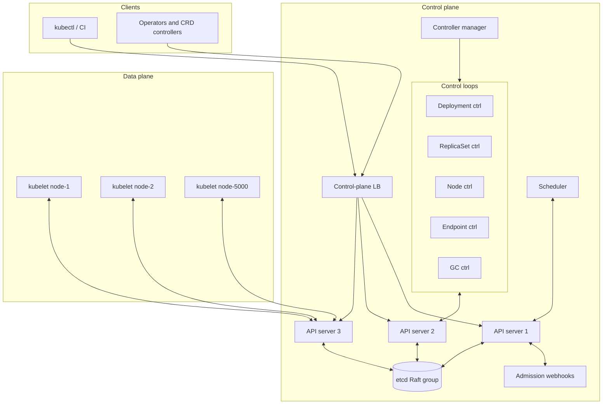
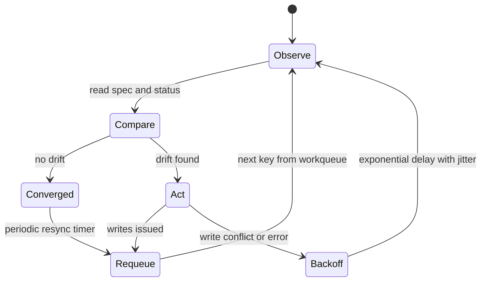
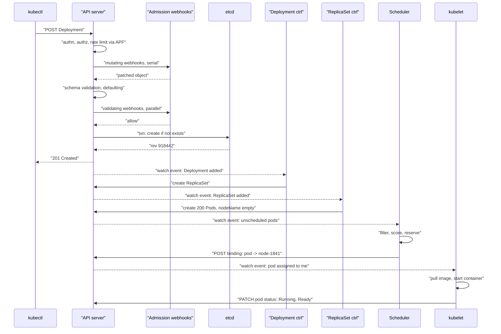
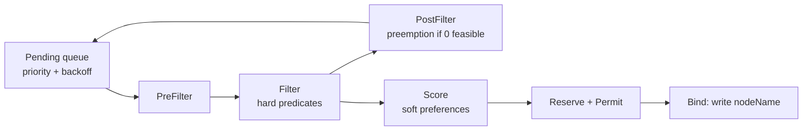
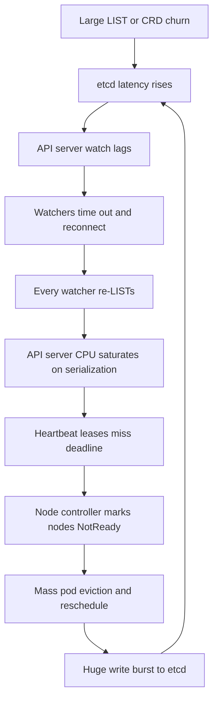
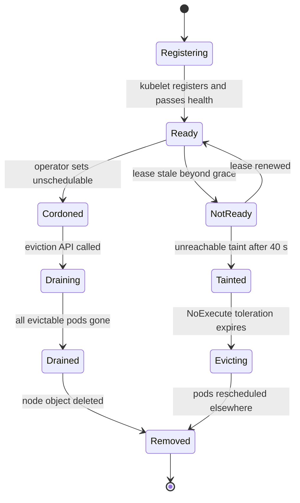
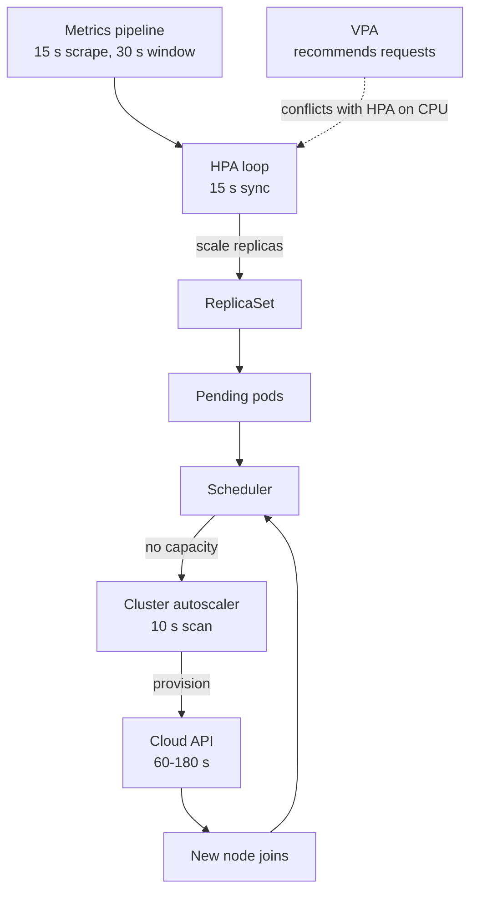

# 38 — Container Orchestrator / Cluster Scheduler (Kubernetes-style)

<span class="pill pill-core">Core</span> <span class="pill pill-hard">Hard</span>

**An orchestrator is not a job runner. It is a distributed system whose entire job is to hold a strongly-consistent copy of "what the cluster should look like" and let a few hundred independent control loops argue their way toward it — and the hardest thing about it is that the single consistent store at the centre has a hard write-throughput ceiling that arrives long before you run out of CPUs.**

| | |
|---|---|
| **Commonly asked at** | Google, Amazon, Meta, Microsoft, Datadog, Stripe, Cloudflare, Databricks, Snowflake, any platform or infrastructure team |
| **Time budget** | 45 min |
| **Core tension** | A single linearizable source of truth makes reconciliation correct and trivially reasoned about, but it caps cluster size at the write throughput of one Raft group — and every attempt to relieve that cap (caching, sharding, eventual consistency) reintroduces the split-brain and stale-decision problems the single store existed to prevent |
| **Prerequisites** | [F07 Replication & Consistency](../fundamentals/f07-replication-consistency.md), [F09 Consensus](../fundamentals/f09-consensus.md), [F11 Idempotency](../fundamentals/f11-idempotency.md), [F17 Rate Limiting & Load Shedding](../fundamentals/f17-rate-limiting-load-shedding.md), [F18 Resilience Patterns](../fundamentals/f18-resilience-patterns.md), [F19 Concurrency Control](../fundamentals/f19-concurrency-control.md), [F22 Observability Fundamentals](../fundamentals/f22-observability-fundamentals.md), [F24 Capacity Planning](../fundamentals/f24-capacity-planning.md), [F25 Deployment & Release Safety](../fundamentals/f25-deployment-release-safety.md), [F27 Security in Design](../fundamentals/f27-security-design.md) |

---

## 1. Problem Statement

Build the control plane for a compute cluster: users declare what they want running, the system makes it so, and it keeps it so through node failures, deploys, evictions, scale events and its own restarts.

The reframing that matters is this. The naive mental model is **imperative orchestration**: an API that says "start container X on node 7", a job queue, a state machine per deployment. That model works beautifully until the first partial failure, at which point you discover you have built a distributed state machine with no ground truth — the orchestrator believes it started a container, the node believes something else, and there is no way to reconcile except by writing increasingly elaborate compensation logic for every pair of states.

The model that actually works is **declarative desired-state reconciliation**. Users write only the *desired* state. Every component is a control loop that repeatedly reads desired state, observes actual state, computes the difference, and issues actions to close it. Critically the loop is **level-triggered, not edge-triggered**: it does not process a stream of "container died" events, it periodically looks at the world and fixes whatever is wrong. A missed event is not a correctness bug, it is at worst a latency bug, because the next pass will catch it. That single property is what makes the system survivable.

The cost of that model is that every loop needs a consistent view of desired state, which means one linearizable store in the middle, which means one Raft group, which means a write ceiling measured in low thousands per second. Everything hard about operating these systems at scale traces back to that sentence.

### Out of scope

Container runtime internals (namespaces, cgroups, image layering), the CNI dataplane and service mesh, storage provisioning (CSI), and the cloud provider APIs underneath the node pool. We design the control plane, the scheduler, and the node agent contract.

---

## 2. Requirements

### Functional

| # | Requirement | Notes |
|---|---|---|
| F1 | Declarative API: submit desired state, system converges | Create, update, delete, and a read/watch API |
| F2 | Schedule workloads onto nodes respecting constraints | Resources, affinity, anti-affinity, taints, spread |
| F3 | Self-healing: restart or reschedule failed workloads | Without operator action |
| F4 | Rolling updates with configurable surge and unavailability | And rollback to a previous revision |
| F5 | Node lifecycle: join, health report, cordon, drain, remove | Drain must respect disruption budgets |
| F6 | Horizontal and vertical autoscaling of workloads | Plus cluster-level node autoscaling |
| F7 | Extensibility: custom resources and custom controllers | Third parties extend the same reconciliation model |
| F8 | Admission control: validate and mutate objects on write | Policy enforced before persistence |
| F9 | Multi-tenant namespacing with quota and RBAC | Fair share of a shared cluster |
| F10 | Service discovery and stable identity for workloads | Endpoints follow pods as they move |

### Non-functional

| # | Requirement | Target |
|---|---|---|
| N1 | Cluster size | 5,000 nodes, 150,000 pods, 300,000 total objects |
| N2 | API read latency (from watch cache) | p99 < 100 ms for non-streaming `GET`/`LIST` |
| N3 | API write latency (mutating, through etcd) | p99 < 1 s |
| N4 | Scheduling throughput | > 100 pods/s sustained; > 300/s burst |
| N5 | Pod startup latency (schedulable image cached) | p99 < 5 s from create to running |
| N6 | Control-plane availability | 99.95% for the API; **100% for already-running workloads** |
| N7 | Watch propagation lag (write to watcher) | p99 < 1 s |
| N8 | Node failure detection to pod reschedule | < 5 min default, tunable to 40 s |
| N9 | Control-plane restart is invisible to running workloads | Data plane must survive full control-plane loss |

!!! note "N6 is the requirement that defines the architecture"
    "Already-running workloads keep running when the control plane is down" is not a nice-to-have, it is the reason the node agent owns a local copy of its assigned state and acts on it independently. The control plane is a *convergence* service, not a *runtime* service. Any design where a pod dies because the API server is unreachable has failed the only availability requirement anybody actually cares about. It also means your control-plane SLO can be 99.9% and nobody outside the platform team will ever notice — which is the correct place to spend your error budget.

---

## 3. Scale Estimation

### Object count and store size

$$
\begin{aligned}
\text{nodes} &= 5{,}000 \\
\text{pods} &= 150{,}000 \quad (30\ \text{per node}) \\
\text{other objects} &\approx 150{,}000 \quad (\text{services, endpoints, secrets, configmaps, CRs}) \\
\text{pod object size} &\approx 4\ \text{KiB serialized} \\
\text{node object size} &\approx 10\ \text{KiB} \ (\text{status, images list, conditions, allocatable})
\end{aligned}
$$

$$
\text{live bytes} \approx 150{,}000 \times 4\ \text{KiB} + 5{,}000 \times 10\ \text{KiB} + 150{,}000 \times 2\ \text{KiB} \approx 950\ \text{MiB}
$$

Against etcd's default 2 GiB backend quota (raised to 8 GiB in large clusters), a **1 GiB live dataset is already alarming**, because etcd is MVCC: every write creates a new revision and old revisions live until compaction. The on-disk size is the live set plus the uncompacted history plus B+tree free-page fragmentation, which routinely runs 2-3x the live set.

### The etcd write ceiling

A single etcd write is a Raft round: leader appends to its WAL and `fsync`s, replicates to followers, waits for quorum `fsync` acks, then applies to the boltdb B+tree.

$$
T_{\text{commit}} = t_{\text{fsync}} + t_{\text{RTT}} + t_{\text{apply}}
$$

With NVMe `fsync` at 1.2 ms, intra-AZ RTT 0.7 ms, apply 0.1 ms:

$$
T_{\text{commit}} \approx 2.0\ \text{ms} \implies \frac{1}{2.0\ \text{ms}} = 500\ \text{serial commits/s}
$$

etcd batches multiple proposals into a single Raft entry and a single `fsync`. With an effective batch factor $B$:

$$
W_{\max} = \frac{B}{T_{\text{commit}}}, \qquad B \approx 20 \implies W_{\max} \approx 10{,}000\ \text{writes/s}
$$

**That 10,000 writes/s is a hard ceiling for the entire cluster and it does not improve by adding etcd members — it gets worse**, because a 5-member cluster needs 3 `fsync`s to reach quorum instead of 2, and the slowest member in the quorum sets the pace. This is the single most important number on the page.

Write amplification per logical write, 3-member cluster, 10 KiB object:

| Stage | Bytes |
|---|---|
| Leader WAL append | 10 KiB |
| Network to 2 followers | 20 KiB |
| Follower WAL appends | 20 KiB |
| boltdb B+tree pages touched (4 KiB pages, ~4 pages, x3 members) | 48 KiB |
| **Total** | **~98 KiB, roughly 10x** |

### The steady-state write floor

The cluster writes constantly even when nothing is happening:

| Source | Rate | Object size | etcd writes/s |
|---|---|---|---|
| Node heartbeats as **leases** (every 10 s) | 5,000 / 10 s | 300 B | 500 |
| Full `NodeStatus` refresh (every 5 min) | 5,000 / 300 s | 10 KiB | 17 |
| Pod status updates (churn + probes) | — | 4 KiB | ~150 |
| Events (dedup'd, separate etcd) | — | 1 KiB | ~400 |
| Controller bookkeeping (leases, HPA status, endpoints) | — | 1 KiB | ~200 |
| **Floor** | | | **~1,270/s** |

That is 13% of the ceiling before a single user has deployed anything. Now note the historical version: before node leases existed, each node wrote its **full 10 KiB `NodeStatus`** every 10 seconds.

$$
5{,}000 \times \frac{10\ \text{KiB}}{10\ \text{s}} = 5\ \text{MB/s} \times 10\ (\text{amplification}) = 50\ \text{MB/s into Raft}
$$

With a 5-minute compaction interval that is **1.5 GiB of MVCC history between compactions** — over the default quota, from heartbeats alone. Splitting the heartbeat into a 300-byte lease object dropped it to 45 MiB. That one change is what made 5,000-node clusters possible, and it is a perfect illustration of the real lesson: **at this scale the bottleneck is never the interesting writes, it is the boring periodic ones.**

### Scheduler throughput

Scheduling one pod is a filter pass plus a score pass over candidate nodes.

$$
T_{\text{sched}} = N_{\text{considered}} \times (t_{\text{filter}} + t_{\text{score}})
$$

With $t_{\text{filter}} + t_{\text{score}} \approx 30\ \mu s$ per node:

| Nodes considered | Time per pod | Pods/s (single scheduling thread) |
|---|---|---|
| 5,000 (all) | 150 ms | 6.7 |
| 500 (10%) | 15 ms | 67 |
| 250 (5%) | 7.5 ms | 133 |
| 100 (floor) | 3 ms | 333 |

This is why the scheduler samples: `percentageOfNodesToScore` scales down as the cluster grows, with a floor of 100 nodes. **The scheduler deliberately gives up optimality to preserve throughput.** Rolling out a 10,000-replica deployment at 133 pods/s takes 75 seconds of pure scheduling, before image pull or container start.

### Watch fanout and the relist storm

Steady state is cheap: an API server holds watch connections and pushes deltas.

$$
\text{watchers} = 5{,}000\ (\text{kubelets}) + 5{,}000\ (\text{kube-proxy}) + \sim 300\ (\text{controllers, operators})
$$

The danger is the cold start. When an API server restarts, every watcher reconnects and re-`LIST`s:

$$
\begin{aligned}
\text{kubelet LIST} &: 30\ \text{pods} \times 4\ \text{KiB} = 120\ \text{KiB (field-selected by node)} \\
\text{controller LIST} &: 150{,}000 \times 4\ \text{KiB} = 600\ \text{MiB (full pod set)} \\
\text{storm} &= 5{,}000 \times 120\ \text{KiB} + 300 \times 600\ \text{MiB} \approx 176\ \text{GiB}
\end{aligned}
$$

At ~1 GiB/s of protobuf serialization per API server across 3 servers, that is **60 seconds of 100% CPU doing nothing but re-sending state that nobody's view of the world changed.** In JSON it is 5-8x worse. This is the watch storm, and it is self-amplifying: the API servers become slow, watchers time out, they reconnect and re-`LIST` again.

---

## 4. API Design

The API is uniform, declarative, and resource-oriented. Every object has the same shape: `apiVersion`, `kind`, `metadata`, `spec` (desired, written by users), `status` (observed, written by controllers).

```text
GET    /apis/{group}/{version}/namespaces/{ns}/{resource}          list
GET    /apis/{group}/{version}/namespaces/{ns}/{resource}?watch=1&resourceVersion=N
POST   /apis/{group}/{version}/namespaces/{ns}/{resource}          create
PUT    /apis/{group}/{version}/namespaces/{ns}/{resource}/{name}   replace (full object)
PATCH  .../{name}                                                  merge / apply
DELETE .../{name}?gracePeriodSeconds=30                            graceful delete
PUT    .../{name}/status                                           status subresource
POST   .../{name}/binding                                          scheduler assigns a node
```

Three properties carry all the weight:

**Optimistic concurrency via `resourceVersion`.** Every object carries the etcd MVCC revision at which it was last written. A write must supply the `resourceVersion` it read; etcd performs a compare-and-swap on it. A conflicting write returns `409 Conflict` and the caller re-reads and retries. This is what allows hundreds of controllers to write concurrently with no locks. See [F19 Concurrency Control](../fundamentals/f19-concurrency-control.md).

**Watch is a resumable stream keyed on `resourceVersion`.** A watcher says "send me everything after revision N". If N is still in etcd's uncompacted history, the server replays from there; if it has been compacted away, the server returns `410 Gone` and the client must re-`LIST`. That `410` is the trigger for the relist storm above.

**Status is a separate subresource.** Users own `spec`; controllers own `status`. Separate RBAC, separate write paths, and a controller updating status cannot accidentally clobber a user's spec change.

```yaml
apiVersion: apps/v1
kind: Deployment
metadata:
  name: checkout
  namespace: payments
spec:
  replicas: 200
  strategy:
    type: RollingUpdate
    rollingUpdate:
      maxSurge: 10%           # extra pods allowed above replicas during rollout
      maxUnavailable: 0       # never drop below 200 ready -> needs headroom
  selector:
    matchLabels: { app: checkout }
  template:
    metadata:
      labels: { app: checkout }
    spec:
      priorityClassName: production-critical
      terminationGracePeriodSeconds: 45
      topologySpreadConstraints:
        - maxSkew: 1
          topologyKey: topology.kubernetes.io/zone
          whenUnsatisfiable: DoNotSchedule      # hard: pod stays Pending
        - maxSkew: 2
          topologyKey: kubernetes.io/hostname
          whenUnsatisfiable: ScheduleAnyway     # soft: scoring hint only
      tolerations:
        - key: workload-class
          operator: Equal
          value: latency-sensitive
          effect: NoSchedule
      containers:
        - name: app
          image: registry.internal/checkout@sha256:3f9c...e1
          resources:
            requests: { cpu: "500m", memory: "1Gi" }   # scheduling input
            limits:   { memory: "1Gi" }                # enforcement; note: no CPU limit
          readinessProbe:
            httpGet: { path: /readyz, port: 8080 }
            periodSeconds: 2
            failureThreshold: 3
          lifecycle:
            preStop:
              exec: { command: ["/bin/sh", "-c", "sleep 8"] }   # see 7.5
```

```yaml
apiVersion: policy/v1
kind: PodDisruptionBudget
metadata: { name: checkout, namespace: payments }
spec:
  minAvailable: 95%          # drain blocks rather than violating this
  selector:
    matchLabels: { app: checkout }
```

!!! tip "`maxUnavailable: 0` plus `minAvailable: 100%` is a deadlock"
    A rollout that may not drop below full replicas needs surge headroom to make progress, and a PDB that forbids any voluntary disruption blocks drain forever. Pick one side of the budget to give: either allow surge (costs capacity) or allow a small unavailability window (costs a sliver of capacity during rollout). Requiring both is a very common misconfiguration that presents as "the node has been draining for six hours".

---

## 5. Data Model

etcd is a flat, sorted, MVCC key-value store. The entire object model is a key prefix convention.

```text
/registry/pods/payments/checkout-7d9f-abcde          -> protobuf-encoded Pod
/registry/nodes/node-1841                            -> protobuf-encoded Node
/registry/services/endpoints/payments/checkout       -> Endpoints
/registry/deployments/payments/checkout              -> Deployment
/registry/leases/kube-node-lease/node-1841           -> Lease (300 bytes, 10 s cadence)
/registry/customresources/db.example.com/postgres/... -> CR from a CRD
```

Range reads over a prefix implement `LIST`. The MVCC revision is global and monotonic across the whole keyspace, which is why `resourceVersion` is comparable across object kinds and why a watch can be resumed from a single integer.

```sql
-- Conceptual projection of what the control plane reasons about.
-- (Never actually stored relationally; shown to make the relationships explicit.)

CREATE TABLE object (
  key             TEXT PRIMARY KEY,        -- /registry/pods/ns/name
  kind            TEXT NOT NULL,
  namespace       TEXT,
  name            TEXT NOT NULL,
  uid             UUID NOT NULL,           -- identity across delete/recreate
  resource_version BIGINT NOT NULL,        -- etcd mod_revision, CAS token
  generation      BIGINT NOT NULL,         -- bumped only on spec change
  spec            BYTEA NOT NULL,          -- desired: user owns
  status          BYTEA,                   -- observed: controller owns
  owner_refs      JSONB,                   -- cascading delete + adoption
  finalizers      TEXT[],                  -- block deletion until cleared
  deletion_ts     TIMESTAMPTZ,             -- set on delete; object still exists
  labels          JSONB,
  annotations     JSONB
);

CREATE TABLE node_state (
  node_name       TEXT PRIMARY KEY,
  allocatable_cpu_milli  INT,              -- capacity minus system reservations
  allocatable_mem_bytes  BIGINT,
  taints          JSONB,                   -- NoSchedule | PreferNoSchedule | NoExecute
  unschedulable   BOOLEAN,                 -- cordoned
  lease_renewed_at TIMESTAMPTZ             -- the 10 s heartbeat
);

CREATE TABLE pod_placement (
  pod_uid         UUID PRIMARY KEY,
  node_name       TEXT,                    -- NULL => Pending, scheduler's queue
  requests_cpu_milli INT NOT NULL,         -- what the scheduler subtracts
  requests_mem_bytes BIGINT NOT NULL,
  limits_cpu_milli   INT,                  -- what the kernel throttles at
  limits_mem_bytes   BIGINT,               -- what the kernel OOM-kills at
  qos_class       SMALLINT NOT NULL,       -- 0=Guaranteed 1=Burstable 2=BestEffort
  priority        INT NOT NULL             -- preemption ordering
);
```

Four fields deserve a sentence each, because they encode the hard parts:

- **`generation` vs `observedGeneration`.** `generation` increments only when `spec` changes. A controller writes `status.observedGeneration` when it has acted on that spec. `generation != observedGeneration` is the universal "has not converged yet" signal, and it is how you write a correct "wait for rollout" without polling pod counts.
- **`uid`.** Names are reusable; UIDs are not. A controller that matches on name alone will happily adopt the *replacement* object for the one it was managing. Every owner reference carries a UID for exactly this reason.
- **`finalizers`.** A delete with a non-empty finalizer list does not remove the object; it sets `deletionTimestamp` and waits. Each responsible controller does its external cleanup (release a load balancer, detach a volume) then removes its own finalizer. When the list empties, the object is really deleted. **A controller that crashes permanently leaves objects stuck in `Terminating` forever**, and namespace deletion hanging on one stuck finalizer is the single most common "my cluster is broken" ticket.
- **`ownerReferences`.** Deployment owns ReplicaSet owns Pod. Garbage collection is a separate controller walking this graph, not a cascade in the write path — which means deletion is eventually consistent and can be observed mid-flight.

---

## 6. High-Level Architecture



Note what is **not** in that diagram: no arrows between controllers, no arrows between kubelets, no arrow from the scheduler to a node. **Every component talks only to the API server.** There is no service mesh of control components, no RPC graph to reason about, no ordering dependency between controllers. That is the architectural payoff of the reconciliation model, and it is why third-party operators are first-class citizens rather than integrations.

### The reconciliation loop



Every controller in the system is that diagram. The workqueue is **keyed and deduplicating**: ten events for the same object collapse into one work item, which is what stops event storms from becoming work storms. The periodic resync (default 10 minutes, jittered) is the safety net that makes a dropped watch event a latency problem rather than a correctness problem.

### Write path: `kubectl apply -f deployment.yaml`



Seven components, no direct calls between any of them, and every hop is idempotent. Kill any component at any point and the system resumes when it comes back, because the next pass re-derives what is missing from the difference between spec and status.

### Read path: "is my deployment healthy?"

A `GET` on a Deployment is served from the API server's **watch cache**, an in-memory snapshot maintained by a single watch against etcd per resource type. Requests with `resourceVersion=0` (accepting slightly stale data) never touch etcd at all — this is what makes 5,000 kubelets and 10,000 `kubectl get pods` viable. Requests that require linearizable reads go to etcd and cost a quorum read.

**The rule to internalise: reads are cheap and horizontally scalable by adding API servers; writes are expensive and bounded by one Raft group.** Every scaling decision in this system is an application of that asymmetry.

---

## 7. Deep Dives

### 7.1 Level-triggered reconciliation versus imperative orchestration

The distinction is not stylistic; it changes what failures are possible.

| Property | Imperative orchestration | Declarative reconciliation |
|---|---|---|
| Input | A stream of commands | A desired-state document |
| Missed message | Permanent divergence; needs compensation logic | Fixed on the next pass |
| Duplicate message | Double action; needs dedup keys everywhere | No-op, because the diff is empty |
| Out-of-order messages | Corrupt state | Irrelevant; only the latest level matters |
| Restart of the orchestrator | Must rebuild in-flight state from a journal | Reads current state and continues |
| New requirement | New command + new state transitions | New controller, ignores the others |
| Debugging | "What sequence of commands got us here?" | "What is the diff right now?" |

The implementation rule that follows: **a controller must never keep authoritative state in memory.** Its in-memory informer cache is an optimisation, not a source of truth, and it must be prepared for that cache to be stale. This is why every controller action is a conditional write on `resourceVersion` and why `409 Conflict` is a normal, expected, high-frequency response rather than an error.

```go
// The canonical shape. Note: no event type, no state machine, no "what changed".
func (c *Controller) Reconcile(key string) error {
    desired, err := c.lister.Get(key)          // from informer cache
    if apierrors.IsNotFound(err) {
        return c.cleanupExternalResources(key) // object gone: converge to absent
    }
    if err != nil {
        return err                              // requeue with backoff
    }

    observed, err := c.observeActualWorld(desired)
    if err != nil {
        return err
    }

    for _, action := range diff(desired.Spec, observed) {
        if err := action.Apply(); err != nil {
            return err                          // partial progress is fine; retry
        }
    }

    // Record what spec generation this status reflects.
    desired.Status.ObservedGeneration = desired.Generation
    _, err = c.client.UpdateStatus(desired)     // CAS on resourceVersion
    return err                                  // 409 -> requeue -> re-read -> retry
}
```

!!! warning "The edge-triggered trap inside a level-triggered system"
    Informers deliver `Add`/`Update`/`Delete` callbacks, which *look* edge-triggered, and the near-universal bug is to act on the delta inside the callback. The correct pattern is that the callback does exactly one thing: `queue.Add(key)`. All logic happens in the reconcile function, which re-reads current state and ignores what the event said. Any controller with business logic in `UpdateFunc` that compares `oldObj` to `newObj` will eventually corrupt state after a relist, because a relist synthesises `Update` events with `old == new`.

### 7.2 Scheduling as constrained bin packing

Scheduling a pod is a two-phase pipeline over nodes, plus a third phase that makes room.



**Filter (hard constraints).** A node either can or cannot host the pod:

- Does `allocatable - sum(requests of pods already on node) >= pod.requests`? Note: **requests, not limits, and not actual usage.**
- Do the node's labels satisfy `nodeAffinity` / `nodeSelector`?
- Does the pod tolerate every `NoSchedule` taint on the node?
- Is inter-pod anti-affinity satisfied? This is the expensive one — it requires examining every pod already on every candidate node, making the filter $O(N \times P)$ rather than $O(N)$.
- Are there free ports, volumes attachable, `topologySpreadConstraints` with `DoNotSchedule` satisfied?

**Score (soft preferences).** Each feasible node gets 0-100 per plugin, weighted and summed:

| Plugin | Rewards |
|---|---|
| `NodeResourcesFit` (`LeastAllocated`) | Spreading load — the default |
| `NodeResourcesFit` (`MostAllocated`) | Bin packing — for cost-optimised node pools |
| `ImageLocality` | Nodes that already have the image layers |
| `PodTopologySpread` | Even distribution across zones/hosts |
| `InterPodAffinity` | Co-location with preferred peers |
| `TaintToleration` | Fewer `PreferNoSchedule` violations |

**The sampling compromise.** From §3, scoring all 5,000 nodes costs 150 ms per pod. The scheduler therefore stops filtering once it has found `percentageOfNodesToScore` feasible nodes (adaptive: ~5% at 5,000 nodes, minimum 100). It then picks the best of that *sample*. Consequences worth stating in an interview:

- Placement is **good, not optimal**. Bin-packing quality degrades in large clusters.
- The node iterator is a **rotating cursor**, not a fresh random sample, so successive pods do not all land on the same "first 100 nodes".
- `MostAllocated` (aggressive bin packing for cost) suffers much more from sampling than `LeastAllocated`, because packing quality depends on seeing the tightest fit.

**Preemption.** If zero nodes pass the filter, `PostFilter` runs preemption: find a node where evicting some set of lower-priority pods would make this pod fit, choosing the victim set that minimises priority and count, and respecting PDBs on a best-effort basis. Victims get their full `terminationGracePeriodSeconds`, so the preempting pod waits — **preemption is not fast**, and a critical pod preempting a pod with a 5-minute grace period waits 5 minutes.

```yaml
apiVersion: scheduling.k8s.io/v1
kind: PriorityClass
metadata: { name: production-critical }
value: 1000000
preemptionPolicy: PreemptLowerPriority
globalDefault: false
---
apiVersion: scheduling.k8s.io/v1
kind: PriorityClass
metadata: { name: batch-best-effort }
value: -10                      # negative: preemptible filler
preemptionPolicy: Never
```

!!! gotcha "The scheduler's view of node capacity is a model, not a measurement"
    It subtracts *requests*, which are declarations of intent. Actual usage is irrelevant to scheduling. A node whose pods request 60 GiB and use 6 GiB is full as far as the scheduler is concerned, and a node whose pods request 6 GiB and use 60 GiB is empty. Everything in §7.7 flows from this.

### 7.3 etcd as the single source of truth, and why it breaks first

etcd is a **coordination store**, not a database. It was designed for a few thousand small, slowly-changing keys with strong consistency and a watch API. Kubernetes uses it as the primary store for every object in the cluster, which works — up to a point that arrives sooner than anyone expects.

**Ceiling 1: write throughput.** From §3, roughly 10,000 writes/s, and it *decreases* with member count, object size and database size. There is no sharding escape hatch: one Raft group, one leader, one serialized log.

**Ceiling 2: database size.** MVCC means every write retains the old revision until compaction, and compaction only marks pages free — it does not shrink the file. Only `defrag` does, and `defrag` **blocks the member it runs on**, so it must be done one member at a time with the member removed from the request path.

$$
\text{db growth between compactions} = \text{write rate} \times \text{mean object size} \times \text{compaction interval}
$$

At the §3 floor of 1,270 writes/s and 2 KiB mean, a 5-minute interval yields 760 MiB of history. Cross the 8 GiB quota and **etcd goes read-only cluster-wide** with `mvcc: database space exceeded`. The control plane stops accepting writes; the data plane keeps running (N6 holds); and you must alarm on `etcd_mvcc_db_total_size_in_use_in_bytes` well before this.

**Ceiling 3: watch fanout.** etcd sends every watch event to every matching watcher. Kubernetes shields it with the API server's watch cache — **one watch per resource type per API server**, fanned out in memory to thousands of clients. Without that indirection, 5,000 kubelets watching pods would multiply etcd's egress by 5,000.

**Ceiling 4: the range read.** A `LIST` of 150,000 pods is a 600 MiB range read. If it bypasses the watch cache (because the client asked for a linearizable read, or because the cache is cold), etcd must assemble it in memory. Two concurrent full `LIST`s of a large resource can OOM an etcd member, which triggers a leader election, which makes every client retry, which issues more `LIST`s.



That cycle is the canonical large-cluster outage, and it is a **metastable failure**: removing the original trigger does not stop it, because the retry traffic is now self-sustaining. Breaking it requires shedding load (API Priority and Fairness, or literally firewalling clients off the API servers), not adding capacity.

**Mitigations that actually work:**

| Mitigation | Effect |
|---|---|
| Events to a **separate etcd cluster** | Removes the highest-churn, lowest-value writes entirely |
| Node **leases** instead of full `NodeStatus` heartbeats | 30x reduction in heartbeat bytes |
| API server **watch cache** with `resourceVersion=0` reads | Most reads never reach etcd |
| **API Priority and Fairness** with per-flow concurrency shares | System traffic (leases, scheduler) protected from a runaway operator |
| **Compaction every 5 min + staggered defrag** | Bounds history; staggering avoids quorum loss |
| Dedicated NVMe for the WAL, `--quota-backend-bytes` alarms | `fsync` latency is the throughput term |
| Aggressive CRD review | A CRD with per-request writes is an outage waiting to happen |

!!! danger "The 'etcd is not a general database' lesson, stated concretely"
    Teams put high-churn state into CRDs because the API is convenient: per-request tracking objects, a CR per queue message, a CR per scrape target, status updated every second. Each one is an etcd write with 10x amplification going through a single Raft log shared with node heartbeats. **One operator writing 3,000 CR status updates per second will take down the control plane for a 5,000-node cluster**, and the failure will present as "nodes are flapping NotReady", which looks nothing like the cause. The review question for any new CRD is not "does this model my domain?" but "what is the write rate per object per second, times the expected object count?"

### 7.4 The API server: admission, priority, and the webhook in the write path

Every mutating request passes through a fixed pipeline:


**Admission webhooks are synchronous network calls inside your write path.** That sentence should make an SRE uncomfortable, and it should.

$$
T_{\text{write}} = T_{\text{auth}} + \sum_{i} T_{\text{mutating}_i} + T_{\text{validate}} + \max_j T_{\text{validating}_j} + T_{\text{etcd}}
$$

Mutating webhooks are **serial** (each may change the object the next one sees), so their latencies add. With 6 mutating webhooks at 40 ms each, you have added 240 ms to every single pod creation, which at 133 pods/s of scheduling throughput means the API server needs 32 concurrent in-flight requests just to keep up.

The `failurePolicy` choice is the sharp edge:

=== "failurePolicy: Fail"

    ```yaml
    apiVersion: admissionregistration.k8s.io/v1
    kind: MutatingWebhookConfiguration
    metadata: { name: sidecar-injector }
    webhooks:
      - name: inject.mesh.example.com
        failurePolicy: Fail          # webhook down => writes rejected
        timeoutSeconds: 5
        sideEffects: None
        reinvocationPolicy: IfNeeded
        namespaceSelector:
          matchExpressions:
            - key: kubernetes.io/metadata.name
              operator: NotIn
              values: [kube-system, mesh-system]   # MUST exclude own namespace
        rules:
          - operations: ["CREATE"]
            apiGroups: [""]
            apiVersions: ["v1"]
            resources: ["pods"]
    ```

    Secure and correct: policy cannot be bypassed by killing the webhook. But if the webhook is down, **no pods can be created anywhere the selector matches** — including the webhook's own replacement pods, if you forgot the namespace exclusion. That is a self-inflicted, unrecoverable-without-manual-intervention cluster outage, and it is one of the most common real incidents in managed Kubernetes.

=== "failurePolicy: Ignore"

    ```yaml
        failurePolicy: Ignore        # webhook down => object admitted unchanged
        timeoutSeconds: 2
    ```

    Available but not safe: when the webhook is down, objects are admitted *without the mutation or validation*. Pods start with no sidecar, no injected secrets, no policy labels. Worse, this fails **silently** — you get a healthy-looking cluster full of non-compliant workloads and you find out weeks later. For a security-critical policy this is unacceptable; for a convenience mutation it is correct.

The defensible position is **`Fail` for security policy with a hard namespace exclusion for system namespaces, `Ignore` for convenience mutations, an HA webhook deployment with a PDB and anti-affinity, timeouts under 3 seconds, and an alert on webhook p99 latency and error rate.** Modern clusters should also move as much validation as possible out of webhooks entirely and into in-process CEL validation (`ValidatingAdmissionPolicy`), which removes the network hop and the availability dependency.

**API Priority and Fairness** is the load-shedding layer that keeps the control plane alive under abuse. Requests are classified into flow schemas mapped to priority levels, each with a concurrency share and a queue. A runaway operator hammering the API lands in its own flow, exhausts its own share, and gets `429 Too Many Requests` with a `Retry-After` — while node leases, scheduler binds and leader-election renewals continue in their protected levels. Without APF, one buggy client starves node heartbeats and the cluster starts evicting healthy workloads. See [F17 Rate Limiting & Load Shedding](../fundamentals/f17-rate-limiting-load-shedding.md).

### 7.5 Node lifecycle and graceful eviction



**Failure detection is deliberately slow, and that is correct.** The node controller marks a node `NotReady` after its lease has been stale for `node-monitor-grace-period` (40 s), then applies `node.kubernetes.io/unreachable:NoExecute`. Pods carry a default 300-second toleration for that taint, so eviction begins 5 minutes after the node went quiet.

That 5-minute default is a bet: **a transient network partition is far more common than a real node death, and evicting 30 pods from a node that comes back in 90 seconds is strictly worse than waiting.** The failure mode of being too aggressive is much worse than being too slow, because aggressive eviction during a network blip evicts *many* nodes at once, and the resulting reschedule storm is exactly the write burst that keeps the partition's root cause alive.

For stateful workloads it is worse than merely disruptive: the control plane cannot distinguish "node is dead" from "node is unreachable but still writing to that volume". Force-deleting a StatefulSet pod on an unreachable node and letting the replacement mount the same volume is a **split-brain data corruption**, which is why StatefulSet pods are never force-deleted automatically and why the only safe automation is fencing (power off the node, or detach the volume at the storage layer) before recreating.

**Graceful eviction** is the voluntary path, and it is a four-party dance:

1. Operator cordons (`spec.unschedulable = true`) — no *new* pods land here.
2. Drain calls the **Eviction API** per pod. The API server checks the PDB: if evicting this pod would violate `minAvailable`, it returns `429` and drain retries.
3. The pod gets `deletionTimestamp`. **Simultaneously**, the endpoint controller notices and starts removing it from Service endpoints, and the kubelet runs `preStop` then sends `SIGTERM`.
4. After `terminationGracePeriodSeconds`, `SIGKILL`.

!!! danger "Endpoint removal and SIGTERM are concurrent, not ordered"
    Nothing guarantees that every load balancer, kube-proxy instance and service-mesh sidecar has stopped sending traffic before your process receives `SIGTERM`. Endpoint propagation to 5,000 kube-proxy instances takes hundreds of milliseconds to seconds; an external cloud load balancer can take 10-30 seconds. If your app exits promptly on `SIGTERM`, you drop in-flight requests and serve connection resets for the whole propagation window. **This is the single most common cause of "we see 502s during every deploy".**
    The fix is the ugly-but-correct `preStop: sleep 5-15`, which delays `SIGTERM` while endpoint removal propagates, combined with an app that fails readiness immediately, finishes in-flight requests, and only then exits. The `sleep` is not a hack covering a bug; it is the explicit acknowledgement that endpoint removal is eventually consistent.

### 7.6 Three autoscalers that do not know about each other



**Scale-up lag decomposed:**

| Stage | Typical | Worst case |
|---|---|---|
| Metric scrape + aggregation window | 30 s | 60 s |
| HPA sync interval | 15 s | 15 s |
| Scheduling (capacity available) | 1 s | 10 s |
| Node provisioning (capacity **not** available) | 90 s | 300 s |
| Image pull (cold, 800 MiB image) | 25 s | 120 s |
| Container start + app init | 10 s | 60 s |
| Readiness probe passes (`initialDelaySeconds` + periods) | 10 s | 60 s |
| LB / endpoint propagation | 3 s | 30 s |
| **Total, warm node pool** | **~95 s** | **~5 min** |
| **Total, cold, needs new nodes** | **~3 min** | **~10 min** |

Now put that against real traffic: a product launch, a push notification fan-out, or a cache flush can double request rate in **20 seconds**. The autoscaler responds in 95 seconds at best. **For 75+ seconds you are serving 2x traffic on 1x capacity, and autoscaling will not save you.**

The honest conclusion — the one that separates a senior answer from a junior one — is that **HPA is a cost-optimisation mechanism, not an availability mechanism.** Availability under spikes comes from:

- **Static headroom.** Run at 50-60% utilisation so you absorb 1.6-2x instantly.
- **Low-priority pause pods** occupying capacity that gets preempted instantly by real workloads, giving you pre-warmed nodes at the cost of a negative-priority placeholder. This converts a 90-second node provision into a 2-second preemption.
- **Predictive / scheduled scaling** for known events, because a marketing launch at 09:00 is not a surprise.
- **Load shedding and graceful degradation**, which are the only things that work on a 20-second timescale.

Two more traps:

- **Scale-down is deliberately asymmetric.** Default stabilisation window: 0 seconds up, 300 seconds down. Scaling down fast causes oscillation — you remove capacity, latency rises, you scale back up. Asymmetry is correct and intentional.
- **HPA and VPA both targeting CPU fight each other.** VPA lowers CPU requests because usage is low; HPA sees utilisation (usage/request) jump and scales out; more replicas lower per-pod usage; VPA lowers requests again. Never run both on CPU for the same workload — VPA on memory plus HPA on CPU is the workable combination.

### 7.7 Requests, limits, overcommit, and the noisy neighbour

This is where the abstraction meets the Linux kernel, and where most production pain lives.

| Knob | Enforced by | Mechanism | Failure mode |
|---|---|---|---|
| `requests.cpu` | Scheduler + kernel | `cpu.shares` / `cpu.weight` — proportional share **only under contention** | Under-request: starved when the node is busy |
| `limits.cpu` | Kernel | CFS bandwidth: `quota` per 100 ms `period` | **Throttling**, even at low average utilisation |
| `requests.memory` | Scheduler | Bin-packing input only; no enforcement | Under-request: eviction victim |
| `limits.memory` | Kernel | cgroup `memory.max` | **OOM kill**, immediate, no grace |

**Overcommit** is the ratio you deliberately choose:

$$
\text{overcommit} = \frac{\sum \text{limits}}{\text{node allocatable}}, \qquad \text{scheduled fill} = \frac{\sum \text{requests}}{\text{node allocatable}}
$$

A node with 64 GiB allocatable, pods requesting 60 GiB and limiting to 140 GiB, runs at 94% scheduled and 2.2x overcommit. It works as long as pods do not all use their limit simultaneously. When they do, the kernel resolves it by killing things.

**QoS classes determine who dies:**

| Class | Condition | Eviction order | `oom_score_adj` |
|---|---|---|---|
| Guaranteed | requests == limits, for every container, cpu and memory | Last | -997 |
| Burstable | requests set, limits higher or absent | Middle, by usage above request | 2..999 (higher when usage exceeds request) |
| BestEffort | nothing set | **First** | 1000 |

Two separate mechanisms, frequently confused: **kubelet eviction** is graceful (it observes node memory pressure, picks victims by QoS then by usage-above-request, and terminates them with grace); **kernel OOM kill** is not (it fires when a cgroup hits `memory.max` or the node runs out, and kills instantly). The kubelet's eviction thresholds exist precisely to act *before* the kernel does, because a kernel OOM can kill an arbitrary process — including the kubelet or container runtime, which takes down the whole node.

!!! danger "CPU limits cause p99 latency cliffs at 20% average utilisation"
    CFS bandwidth control gives a container `quota` microseconds of CPU every 100 ms `period`. A container with `limits.cpu: 1` gets 100 ms of CPU time per 100 ms period **across all threads combined**. A JVM or Go service with 8 worker threads handling a burst consumes its entire quota in 12.5 ms of wall clock, then is **hard-stopped for the remaining 87.5 ms**. Average utilisation reads 20%. p99 latency reads 90 ms. The metrics say the service is idle and the users say it is broken.
    This is why many mature platforms set memory limits (to contain leaks and make OOM blame-attributable) but **deliberately omit CPU limits**, relying on `requests` and `cpu.shares` for proportional fairness under contention. The trade-off is honest: no CPU limits means a busy neighbour can consume idle capacity — which is usually what you want — but also means one runaway pod can degrade its co-tenants, so you need per-pod CPU throttling and runaway detection as monitoring rather than as enforcement. Whichever you choose, **`container_cpu_cfs_throttled_seconds_total` must be on the dashboard**, because without it this failure is invisible.

The second-order effect: **requests are a cost allocation mechanism and a correctness mechanism at the same time, and those pull in opposite directions.** Teams over-request to avoid being evicted, which means the cluster reports 90% scheduled and 25% used, which means you are buying 3.6x the hardware you need. Squeezing requests toward real usage saves money and increases the probability of an OOM kill during a spike. There is no setting that is right; there is only a policy, with recommendation tooling (VPA in recommend-only mode), a per-namespace `LimitRange` for defaults, and utilisation-versus-request reporting that makes the waste visible to the team that owns it. See [F28 Cost Engineering](../fundamentals/f28-cost-engineering.md).

### 7.8 Multi-tenancy, namespaces, and blast radius

**A namespace is a name-scoping and policy-attachment mechanism. It is not a security boundary.** Say this explicitly in an interview; it is the single sentence that demonstrates you have operated a shared cluster.

What a namespace gives you: unique names within scope, RBAC attachment point, `ResourceQuota` and `LimitRange` attachment point, NetworkPolicy selector scope, a unit of deletion.

What it does not give you:

| Shared resource | Consequence |
|---|---|
| **Kernel** | A container escape (or any kernel LPE) reaches every pod on the node regardless of namespace |
| **Node** | Noisy neighbours across namespaces; a fork bomb exhausts node PIDs for everyone |
| **API server + etcd** | One tenant's runaway controller consumes the shared write budget |
| **Cluster-scoped objects** | CRDs, `ClusterRole`, `PriorityClass`, webhooks, StorageClasses, PVs — a tenant with CRD create rights affects the whole cluster |
| **Admission webhooks** | A tenant's webhook with `failurePolicy: Fail` and a sloppy selector blocks writes cluster-wide |
| **DNS and network** | Flat pod network by default; NetworkPolicy is opt-in and requires a CNI that enforces it |
| **Control-plane availability** | One control plane; one blast radius |

The escalation ladder, cheapest to strongest:

1. **Soft multi-tenancy**: namespaces + RBAC + quota + NetworkPolicy + Pod Security Admission (`restricted`) + no CRD/cluster-scope rights. Adequate for teams inside one trust domain.
2. **Node isolation**: dedicated node pools per tenant via taints and `nodeAffinity`. Removes the shared-kernel and noisy-neighbour problems; keeps the shared control plane.
3. **Sandboxed runtimes**: gVisor or Kata (a per-pod microVM). Removes the shared-kernel problem at 10-40% performance cost.
4. **Cluster per tenant**: the only real answer for mutually untrusted tenants. Costs a control plane each, which is why "virtual cluster" designs (per-tenant API server, shared nodes) exist as a middle point.

**The blast-radius conclusion drives cluster sizing.** One 5,000-node cluster is cheaper to run and easier to bin-pack than ten 500-node clusters, but it is also one etcd quota, one webhook misconfiguration, and one bad CRD away from a total outage. Mature platforms run **many medium clusters** (500-2,000 nodes) with a federation or fleet layer, explicitly trading bin-packing efficiency and operational overhead for a bounded blast radius. See [F26 Multi-Region & DR](../fundamentals/f26-multi-region-dr.md).

---

## 8. Scaling the Bottleneck

The bottleneck moves as you grow, and knowing the order is the expertise:

| Cluster size | Binding constraint | What you do |
|---|---|---|
| < 500 nodes | Nothing structural | Defaults are fine |
| 500-1,500 | API server CPU on `LIST` serialization | Protobuf everywhere, add API servers, field selectors on kubelet watches |
| 1,500-3,000 | etcd write rate from heartbeats and events | Node leases, events to a separate etcd, aggressive compaction |
| 3,000-5,000 | etcd db size + scheduler throughput | Raise quota, staggered defrag, node-score sampling, multiple scheduler profiles |
| 5,000+ | etcd, fundamentally | **Stop. Shard the cluster.** |

The scaling levers, in the order you should reach for them:

1. **Reduce writes.** Every optimisation here is worth more than any capacity addition, because the write ceiling does not move. Leases, separate events store, CRD review, controllers that use `ResourceVersion`-conditional updates instead of blind writes, and status updates that are rate-limited rather than emitted on every observation.
2. **Serve reads from cache.** `resourceVersion=0` for anything that tolerates seconds of staleness, and a hard rule that no controller ever does a full `LIST` in a hot path. Informers exist so that a controller `LIST`s once at start and then streams.
3. **Shrink watch payloads.** Field selectors so a kubelet watches only its own node's pods; protobuf rather than JSON; `metadata`-only watches where the controller only needs names.
4. **Add API servers.** Scales reads and admission linearly. Does nothing for writes.
5. **Split the scheduler.** Multiple scheduler profiles or a second scheduler handling a disjoint pod class (batch), partitioned by `schedulerName`, gives you parallel scheduling without the two-schedulers-race problem — as long as the partition is truly disjoint.
6. **Shard the cluster.** The real answer beyond 5,000 nodes. Fleet-level abstraction for placement, per-cluster control planes, and an explicit policy for which workloads land where.

!!! example "What does NOT work: sharding etcd by key prefix"
    Kubernetes supports routing different resource types to different etcd clusters (`--etcd-servers-overrides`), and this genuinely helps for events. But it does not generalise, because **the global MVCC revision is no longer global**. `resourceVersion` stops being comparable across shards, watches cannot be resumed with a single token, and any invariant spanning two resource types (pod plus its PVC, pod plus its node) loses its consistency guarantee. Splitting off events works precisely because nothing else in the system reads events for correctness. That is the exception that proves the rule.

---

## 9. Failure Modes

| Failure | Blast radius | Detection | Mitigation | Degraded behaviour |
|---|---|---|---|---|
| etcd loses quorum (2 of 3 members down) | **Entire control plane read-only-ish; no writes at all** | `etcd_server_has_leader`, write error rate | Odd member count across failure domains, fast automated member replacement, tested restore-from-snapshot | Running pods keep running (N6). No deploys, no scheduling, no self-healing. Node failures are not remediated |
| etcd database exceeds quota | Cluster-wide write rejection | `etcd_mvcc_db_total_size_in_use_in_bytes` vs quota | Auto-compaction, staggered defrag, alarm at 60% of quota, events on a separate cluster | Every write returns `database space exceeded`. Requires manual alarm disarm after defrag — a genuine 3 a.m. procedure |
| API server saturated by a runaway client | Control plane unusable for everyone | APF rejected-request metrics, inflight gauge | API Priority and Fairness with protected system flows; client-side rate limits; per-SA quotas | Well-behaved clients continue; abusive flow gets `429`. Without APF: total control-plane outage |
| Watch storm after API server restart | 30-120 s of control-plane unavailability | `LIST` request rate spike, API server CPU | Staggered API server restarts, client-side jittered reconnect, watch cache warm before serving, `Retry-After` on `410` | Slow convergence; scheduling stalls; possible cascade to node heartbeat failure |
| Admission webhook down with `failurePolicy: Fail` | **All matching writes rejected, possibly cluster-wide** | Webhook error rate and p99 latency | HA webhook with PDB and anti-affinity, hard exclusion of system namespaces, short timeouts, move logic to in-process CEL policy | No pod creation. If the webhook's own namespace is not excluded, it cannot restart itself — unrecoverable without editing the webhook config directly in etcd |
| Admission webhook slow (not down) | Every write latency inflated; scheduling throughput collapses | Write p99, webhook latency histogram | Timeout < 3 s, circuit breaker, latency SLO on the webhook owned by the webhook's team | Deploys crawl; HPA scale-up misses its window; looks like "Kubernetes is slow" |
| Network partition isolating 500 nodes | 15,000 pods evicted and rescheduled onto 4,500 nodes that cannot hold them | Node `NotReady` count, pending pod count | `--unhealthy-zone-threshold`: when a large fraction of nodes go unready, the node controller **stops evicting** and assumes it is the network, not the nodes | Partial: workloads on the isolated nodes are unreachable but alive. Without the threshold, a mass-eviction storm makes it far worse |
| Node kernel OOM kills the kubelet | That node becomes a zombie: containers run, nothing reports or reconciles | Lease staleness | Reserve system resources (`--system-reserved`, `--kube-reserved`), run kubelet at a protected `oom_score_adj` | Node marked `NotReady` after 40 s; pods evicted after 5 min; containers may keep serving traffic the whole time from stale endpoints |
| Scheduler crashloop | No new pods placed anywhere | Pending pod count and age | Leader election with a standby, fast restart, pending-pods alert | Existing pods unaffected. Deploys hang with pods `Pending`. Node failures leave workloads down |
| A controller's informer cache goes stale (missed relist) | That controller makes decisions on old state | `observedGeneration` lag, workqueue depth, resync duration | Periodic resync (10 min) is the safety net; alert on watch-event lag | Eventual convergence within one resync period. This is the designed-for case, not an emergency |
| Deadlocked drain (PDB never satisfiable) | One node stuck draining indefinitely; node pool upgrade halts | Drain duration, `Terminating` node age | Validate PDBs at admission (`minAvailable` must be satisfiable given `replicas`), drain timeout with escalation | Node never drains. Fleet-wide upgrades stop at the first such workload |
| Stuck finalizer | Object (often a whole namespace) stuck `Terminating` forever | `deletionTimestamp` age | Owner team must fix the controller; emergency break-glass is to strip the finalizer, **which leaks the external resource** | Namespace cannot be recreated; quota still consumed; looks like a cluster bug, is an operator bug |
| Image registry outage | No new pods start anywhere; existing pods unaffected | Image pull error rate | Registry mirror/pull-through cache per zone, `imagePullPolicy: IfNotPresent`, pre-pulled base layers | Running workloads fine; **any restart or reschedule fails**, so a concurrent node failure becomes an outage |
| Clock skew across control-plane nodes | Leases expire early or late; leader election flaps | NTP offset metric | NTP with monitoring, generous lease durations relative to skew | Spurious node evictions or split leadership. See [F20 Time, Clocks & Ordering](../fundamentals/f20-time-clocks-ordering.md) |

---

## 10. SRE Lens

### SLIs and SLOs

| SLI | Definition | SLO |
|---|---|---|
| API read availability | Non-5xx, non-429 fraction of `GET`/`LIST` | 99.95% |
| API write availability | Non-5xx fraction of mutating requests | 99.9% |
| API read latency | p99 of cached `GET`, excluding watch | < 100 ms |
| API write latency | p99 of mutating requests end to end | < 1 s |
| **Pod startup latency** | p99 from `Pod` create to `Ready`, image cached, schedulable | **< 5 s** |
| Scheduling latency | p99 from pod `Pending` to `Bound`, capacity available | < 2 s |
| Watch propagation lag | p99 etcd commit to watcher delivery | < 1 s |
| **Workload availability during control-plane outage** | Fraction of Ready pods still Ready | **100%** |
| etcd `fsync` latency | `wal_fsync_duration_seconds` p99 | < 10 ms |
| etcd db utilisation | in-use bytes / quota | < 60% |
| Node heartbeat health | Nodes with lease older than 30 s | < 0.1% |
| Reconcile staleness | p99 `generation - observedGeneration` age | < 30 s |

!!! note "The two SLIs that are not like the others"
    **Pod startup latency** is the one platform users actually feel — it sets deploy speed, autoscaling responsiveness and incident recovery time. Measure it end to end, excluding image pull (which is the registry's SLO, not yours) but including admission, scheduling and kubelet sync.
    **Workload availability during a control-plane outage** must be measured, not assumed. The way to measure it is to deliberately take the control plane away in a test cluster and assert that a running service keeps serving. Almost every team believes this property holds; a meaningful minority have accidentally broken it with an in-path admission webhook, a sidecar that renews a token against the API server, or a CNI that calls the API server on every pod network setup.

### Error budget

99.9% write availability over 30 days is **43 minutes** of write unavailability. That sounds generous until you price the real events: one etcd defrag gone wrong is 15 minutes, one webhook outage is 20, one quota exhaustion with manual alarm disarm is 30. **Two bad days and the budget is gone**, which is exactly the right forcing function for the policy: no discretionary control-plane changes when the budget is exhausted, and every etcd operation requires a written, rehearsed procedure.

Note the budget asymmetry that makes this tractable: control-plane unavailability does not mean application unavailability. Spending the control-plane budget costs you deploy velocity and self-healing latency, not user-facing errors — provided N6 actually holds. That is why verifying N6 is worth more than any amount of control-plane redundancy. See [F23 SLI/SLO & Error Budgets](../fundamentals/f23-slo-error-budgets.md).

### Rollout

- **Control-plane upgrades go etcd first, then API servers, then controllers/scheduler, then kubelets** — and never skip a minor version. The API server must never be older than the components talking to it, and kubelets may be up to three minor versions behind but never ahead.
- **Stagger API server restarts** with a gap of at least 60 seconds, so watchers reconnect to a warm server. Restarting all three simultaneously guarantees the §3 relist storm.
- **Upgrade one control plane per failure domain per day.** Control planes are the highest-blast-radius component in the platform; treat every change as a production deploy with a canary cluster in front of it.
- **Node pool upgrades are a rolling drain** with surge nodes, a per-node drain timeout, and a hard stop if the pending-pod count or PDB rejection rate crosses a threshold. Cap concurrency at a small percentage of the pool — 1% for a 5,000-node cluster is 50 nodes at a time, which is already 1,500 pods in motion.
- **Webhook configuration changes are the most dangerous change class in the system**, because they take effect instantly, cluster-wide, with no rollout. Deploy the webhook workload first, verify it, then add the `MutatingWebhookConfiguration` with `failurePolicy: Ignore`, watch its error rate for a day, and only then flip to `Fail`. See [F25 Deployment & Release Safety](../fundamentals/f25-deployment-release-safety.md).

### Runbook notes

```text
ALERT: etcd_db_size > 60% of quota
  1. Check revision gap: etcd_debug_store_revision - last compacted.
     Large gap => auto-compaction is not running or interval too long.
  2. Identify the write source BEFORE defragging:
     apiserver_request_total by resource+verb, sorted by rate.
     It is almost always events or one CRD. Fix the source first.
  3. Compact to current revision, then defrag ONE MEMBER AT A TIME.
     Remove the member from the LB, defrag (blocks, ~1 min/GB), verify
     it rejoins and catches up, then move to the next.
  4. NEVER defrag two members of a 3-member cluster concurrently.
     That is quorum loss, self-inflicted.

ALERT: nodes_notready_count > 5% in one zone
  1. Do NOT immediately assume node failure. Check whether the node
     controller has already tripped the unhealthy-zone threshold and
     stopped evicting. If it has, it agrees with you: this is network.
  2. Correlate: single zone? single rack? single API server? A partition
     shows as a clean topological cut; real node death does not.
  3. If network: fix the network. Do NOT force-delete pods or drain.
     Eviction here multiplies the incident.
  4. If genuinely dead: confirm fencing before recreating any StatefulSet
     pod. An unreachable node may still be writing to its volumes.

ALERT: apiserver_request_duration p99 > 1s (mutating)
  1. Webhook latency first: apiserver_admission_webhook_admission_
     duration_seconds by webhook name. One slow webhook explains this
     more often than anything else.
  2. etcd next: etcd_disk_wal_fsync_duration_seconds p99. > 25 ms means
     the disk is the problem (noisy neighbour, degraded NVMe, or you
     put the WAL on network storage, which is never acceptable).
  3. APF: apiserver_flowcontrol_rejected_requests_total. If a flow is
     saturating, identify the client by user agent and rate-limit or
     block it. Blocking one abusive controller is the correct action.
  4. LIST volume: apiserver_request_total{verb="LIST"} by resource.
     A controller doing full LISTs in a loop is a classic.

ALERT: pending_pods > 500 for > 5 min
  1. kubectl describe on a sample: the scheduler writes the reason.
     "Insufficient cpu" vs "didn't match affinity" vs "had taint" are
     completely different problems.
  2. Scheduler alive and holding leadership? Check its leader lease.
  3. Genuine capacity: is the cluster autoscaler scaling? Check for
     node-group size limits, quota errors from the cloud API, or an
     instance type with no availability in the zone.
  4. Unsatisfiable constraint: a DoNotSchedule topology spread against
     a zone that has no capacity will stay Pending forever by design.
     That is the constraint working; escalate to the workload owner.
```

### Capacity model

$$
\begin{aligned}
\text{nodes needed} &= \frac{\sum \text{pod requests}}{\text{allocatable per node} \times \text{target fill}} \times (1 + \text{surge}) \\[4pt]
\text{allocatable} &= \text{capacity} - \text{system reserved} - \text{kube reserved} - \text{eviction threshold} \\[4pt]
\text{API servers} &= \frac{\text{peak request rate} \times \text{mean CPU cost}}{\text{cores per server} \times 0.6} \\[4pt]
\text{etcd headroom} &= 1 - \frac{\text{observed writes/s}}{10{,}000}
\end{aligned}
$$

Two things people get wrong. First, **`allocatable` is meaningfully smaller than `capacity`** — a 64 GiB node typically offers 58 GiB after system and kube reservations and the eviction threshold, and a capacity model built on advertised instance size is 10% optimistic before it starts. Second, **target fill must leave room for the largest single pod**, or you get a cluster that is 92% full and cannot schedule one 16 GiB pod anywhere — classic bin-packing fragmentation, and the reason for a periodic descheduler.

**etcd headroom is the number to put on the executive dashboard.** It is the one resource you cannot buy more of. See [F24 Capacity Planning](../fundamentals/f24-capacity-planning.md).

### Cost

| Line | Driver | Lever |
|---|---|---|
| Worker nodes | $\sum$ requests / target fill | Right-size requests (VPA recommendations), raise target fill, bin-pack with `MostAllocated` |
| Idle headroom | Spike absorption policy | Pause pods instead of empty nodes; spot/preemptible for the headroom tier |
| Control plane | Cluster count | Fewer, larger clusters — traded against blast radius |
| etcd storage | Object count and churn | CRD hygiene; events elsewhere |
| Cross-zone traffic | Pod-to-pod across zones | Topology-aware routing; zone-local service endpoints |
| Image registry egress | Pull rate x image size | Regional pull-through cache, smaller base images, layer reuse |

The dominant cost line is almost always **the gap between requests and usage**, and it is invisible unless you build the report. A cluster at 88% scheduled and 24% used is paying 3.7x. The fix is organisational, not technical: per-namespace utilisation-versus-request dashboards, VPA recommendations surfaced as pull requests against the team's manifests, and chargeback based on requests so that over-requesting costs the team that does it.

---

## 11. Trade-offs & Alternatives

| Decision | Chosen | Alternative | Why |
|---|---|---|---|
| Control model | Declarative, level-triggered reconciliation | Imperative command queue | Missed and duplicated messages become no-ops; restart is free; extensibility is a new loop, not a new state machine |
| Source of truth | One linearizable store (Raft) | Eventually-consistent store | Two controllers acting on divergent views double-schedule pods and double-delete resources. Correctness beats scale here, and the scale limit is explicit |
| Store | etcd (Raft KV with watch and MVCC) | SQL with LISTEN/NOTIFY; custom Paxos | The watch-with-resume semantics and compare-and-swap on revision are the exact primitives needed; SQL notify has no resumable cursor |
| Read path | API server watch cache; stale reads default | All reads linearizable from etcd | Reads outnumber writes 100:1. Serving them from etcd would cap the cluster at a few hundred nodes |
| Heartbeats | 300-byte lease objects | Full `NodeStatus` every 10 s | 30x less etcd write volume; the change that unlocked 5,000-node clusters |
| Events | Separate etcd cluster | Same cluster as everything else | Highest write rate, lowest correctness value. The one safe place to break the global revision |
| Scheduler | Single scheduler, sampled node scoring | Score all nodes; or fully distributed schedulers | Sampling trades optimality for throughput. Distributed schedulers (Omega-style optimistic concurrency) scale further but need conflict resolution and lose global constraint guarantees |
| Scheduler scaling | Multiple profiles on disjoint pod classes | Multiple schedulers on the same pods | Two schedulers racing on the same pool double-book nodes; the kubelet rejects the loser, which is a retry storm |
| Node failure detection | 40 s to `NotReady`, 5 min to eviction | Aggressive sub-30 s eviction | Transient partitions vastly outnumber real deaths. Aggressive eviction turns a network blip into a reschedule storm |
| CPU enforcement | `requests` only; no CPU limits by default | CPU limits on everything | CFS throttling creates latency cliffs at low average utilisation; shares give proportional fairness only when it matters |
| Memory enforcement | Limits always set | No memory limits | Memory has no graceful degradation — without a limit, a leak takes the whole node instead of one pod |
| Admission | In-process CEL policy where possible; webhooks with `Fail` for security only | Webhooks for everything | Every webhook is a synchronous availability dependency in the write path |
| Extensibility | CRDs on the same API machinery | A separate plugin API | Operators get watch, RBAC, quota and admission for free. The cost is that a careless CRD can overwhelm etcd |
| Tenancy | Many medium clusters + node pools per sensitive tenant | One giant cluster | Bounded blast radius beats bin-packing efficiency once a cluster is large enough that its failure is a company-level event |

??? note "Why not a distributed, optimistic scheduler like Omega?"
    Omega's model gives every scheduler a full, shared copy of cluster state and lets them place optimistically, resolving conflicts at commit time via atomic compare-and-swap on the cell state. It scales much further than a single serialized scheduler and lets specialised schedulers (batch, ML, service) coexist with different algorithms. The costs are real: conflict rate grows with contention, so under high utilisation — precisely when scheduling is hardest — schedulers spend increasing effort on retries; global constraints such as "no more than 2 replicas per zone" are hard to enforce when two schedulers are placing concurrently and each sees pre-commit state; and debugging a placement becomes a question about a race rather than about a deterministic function. The pragmatic middle ground, and what production systems converge on, is a single scheduler per **disjoint partition** of the workload: separate scheduler profiles or a separate batch scheduler owning its own node pool, so there is no shared state to conflict over. You keep determinism and global constraints within each partition and get parallelism across them.

---

## 12. Gotchas & Corner Cases

!!! gotcha "The admission webhook that cannot restart itself"
    **Symptom:** the webhook pods are down, `failurePolicy: Fail`, and every attempt to create a replacement pod is rejected by the webhook that is down. The cluster cannot heal itself. `kubectl` works for reads and is useless for the fix.
    **Mechanism:** the `MutatingWebhookConfiguration` matched all namespaces including the one hosting the webhook. Creating the webhook's own pod requires calling the webhook. A perfectly circular dependency, invisible until the webhook has a bad day.
    **Mitigation:** every webhook configuration **must** carry a `namespaceSelector` excluding `kube-system` and the webhook's own namespace, plus `objectSelector` scoping where possible. Deploy webhooks HA with a PDB and hard anti-affinity. Rehearse the break-glass: delete the `ValidatingWebhookConfiguration`/`MutatingWebhookConfiguration` object (it is cluster-scoped, so this is a single `kubectl delete` if the API server is up — and a direct etcd edit if it is not). Write that procedure down before you need it, because you will need it at 3 a.m.

!!! gotcha "A custom controller with a hot reconcile loop takes down the cluster"
    **Symptom:** node heartbeats start missing, nodes flap `NotReady`, pods get evicted en masse, and the cluster appears to be having a hardware failure. Root cause turns out to be an operator someone installed last week.
    **Mechanism:** the controller writes `status` on every reconcile, unconditionally, without checking whether anything changed. Writing status bumps `resourceVersion`, which generates a watch event, which requeues the object, which writes status again. A self-sustaining write loop at thousands of writes per second, all landing in the same Raft log as node leases.
    **Mitigation:** never write status unless the computed status differs from the stored one — a deep-equal check before the write is mandatory, not an optimisation. Rate-limit the workqueue (default 5 qps per controller with exponential backoff, and mean it). Operationally: API Priority and Fairness with system flows protected, plus an alert on `apiserver_request_total` by user agent so a new top talker is visible within minutes. This is the most common self-inflicted control-plane outage in the industry.

!!! gotcha "etcd defrag on two members at once is instant quorum loss"
    **Symptom:** the entire control plane goes down during a planned maintenance window that was supposed to reduce risk.
    **Mechanism:** `defrag` rewrites the boltdb file and **blocks that member entirely** for the duration — a minute or more per GiB. Two blocked members out of three is no quorum, no leader, no writes, and clients pile up retries that make recovery slower once the defrag finishes.
    **Mitigation:** defrag strictly one member at a time, remove the member from the API servers' endpoint list first, wait for it to fully rejoin and catch up on the Raft log before touching the next, and never run it from a loop or a cron that fans out. Before defragging at all, find and fix the write source — defrag treats the symptom, and if a CRD is generating 3,000 writes/s the file will be large again next week.

!!! gotcha "Nodes go `NotReady` and Kubernetes evicts everything, making the partition worse"
    **Symptom:** a network blip affecting one rack turns into a cluster-wide incident: mass eviction, a reschedule storm, etcd saturation, and then *more* nodes going `NotReady` because the control plane is now overloaded.
    **Mechanism:** the node controller cannot distinguish "node dead" from "node unreachable". Its default response to unreachable is to taint and evict, which writes to etcd for every evicted pod, which delays heartbeat processing, which marks more nodes unreachable.
    **Mitigation:** the node controller's **unhealthy-zone threshold** exists precisely for this: when more than a configured fraction of nodes in a zone go unready simultaneously, it reduces or stops eviction on the reasonable assumption that the network is broken, not the machines. Verify that threshold is configured. Add `--node-eviction-rate` limits. And recognise the signature during an incident: a *clean topological cut* is a network event, and the correct action is to stop the automation, not to help it.

!!! gotcha "Pods are throttled to a latency cliff while the CPU dashboard says 20%"
    **Symptom:** p99 latency is 10x p50, the service looks idle by every CPU metric, adding replicas does not help, and the pattern is worst under bursty traffic.
    **Mechanism:** CFS bandwidth control. `limits.cpu: 1` means 100 ms of CPU per 100 ms period summed across all threads. An 8-threaded runtime burns that in 12.5 ms and is then frozen for 87.5 ms. Average utilisation averages away the freeze.
    **Mitigation:** put `container_cpu_cfs_throttled_seconds_total` and `throttled_periods / periods` on the default dashboard for every service — this failure is invisible without it. Then either remove CPU limits (relying on requests and shares for fairness under contention) or raise them substantially above requests and align runtime thread pools with the quota (`GOMAXPROCS`, JVM `ActiveProcessorCount`) so the runtime does not create 64 threads for a 1-core quota. Removing CPU limits is the more common production answer and it is defensible — say so, and name the noisy-neighbour trade-off you are accepting.

!!! gotcha "The deploy drops requests for 10 seconds on every rollout"
    **Symptom:** a reliable burst of 502s and connection resets at the start of every deploy, proportional to replica count, that no amount of `maxUnavailable: 0` fixes.
    **Mechanism:** pod deletion notifies the endpoint controller and the kubelet **concurrently**. The kubelet sends `SIGTERM` immediately; endpoint removal must propagate through the endpoint controller, then to 5,000 kube-proxy instances, then to sidecars, then possibly to an external cloud load balancer that reconciles every 10-30 seconds. The app exits cleanly on `SIGTERM` and traffic is still arriving.
    **Mitigation:** `preStop: sleep 5-15` to hold `SIGTERM` while endpoint removal propagates; `terminationGracePeriodSeconds` comfortably larger than `preStop` plus in-flight request drain; the app fails readiness immediately on shutdown signal, finishes in-flight work, then exits. For cloud load balancers, target pods directly rather than through a NodePort so removal is a single API call rather than a health-check timeout. The `sleep` looks like a hack and is in fact the correct encoding of "endpoint removal is eventually consistent".

!!! gotcha "Namespace stuck `Terminating` forever, and nobody can recreate it"
    **Symptom:** `kubectl delete namespace foo` hangs indefinitely. The namespace is in `Terminating`, its quota is still consumed, and recreating it fails because it already exists.
    **Mechanism:** some object in the namespace has a finalizer whose controller is gone — uninstalled operator, CRD deleted before its CRs, or a controller crashlooping. The namespace controller waits for every object to be fully deleted, and an object with a finalizer is never fully deleted.
    **Mitigation:** find the culprit with `kubectl api-resources --verbs=list --namespaced -o name | xargs -n1 kubectl get -n foo`, then decide deliberately: fix or reinstall the controller so cleanup happens properly, or strip the finalizer as break-glass — **knowing that stripping it leaks whatever external resource the finalizer was protecting** (an orphaned load balancer, an undeleted cloud disk, a dangling DNS record that will bill you monthly forever). Preventively: uninstall order matters, CRs before CRDs, and any operator you install should be audited for what its finalizers do.

!!! gotcha "`kubectl apply` silently reverts a field another controller owns"
    **Symptom:** an HPA sets `replicas: 40`; a CI pipeline runs `kubectl apply` with a manifest that still says `replicas: 3`; the deployment drops to 3 replicas during peak and takes several minutes to recover.
    **Mechanism:** `apply` reconciles the whole object against the manifest, and with client-side apply it uses a last-applied annotation that does not know another controller is authoritative for that field. Every CI run fights the HPA.
    **Mitigation:** remove `replicas` from any manifest for a workload with an HPA — the field's owner must be exactly one writer. Use **server-side apply** with field managers, which makes ownership explicit and returns a conflict rather than silently clobbering. The general rule is worth stating: **every field must have exactly one writer**, and where two systems both want to write a field you have a design bug, not a tooling problem.

!!! gotcha "A single CRD with a `status` field per request adds a terabyte to etcd"
    **Symptom:** etcd database size grows from 800 MiB to over quota in three days. Cluster goes read-only. The team that shipped the operator has no idea it is related.
    **Mechanism:** somebody modelled work items as custom resources — one CR per job, per scrape target, per request — with a status updated every few seconds. Every status write is a new MVCC revision, and between compactions the history is the write rate times object size times interval. The object count alone may be fine; the churn is what kills it.
    **Mitigation:** CRD review as a gate, with two mandatory questions: expected object count at steady state, and expected writes per object per second. High-churn ephemeral state does not belong in etcd — it belongs in a purpose-built store with the CR holding only a pointer and a slowly-changing summary. Enforce with per-namespace object quotas on custom resources and an alert on per-resource write rate. Nobody discovers this gradually; they discover it when the cluster stops accepting writes.

!!! gotcha "Cluster autoscaler will not remove a node because of one unevictable pod"
    **Symptom:** the cluster is at 30% utilisation and costing full price. Dozens of nodes each run a single small pod and never scale down.
    **Mechanism:** the autoscaler refuses to remove a node hosting any pod that is not safely evictable: bare pods with no controller, pods with local storage, pods whose PDB would be violated, pods in `kube-system` without a PDB, or anything with the `safe-to-evict: false` annotation. One such pod pins a whole node indefinitely.
    **Mitigation:** alert on "nodes with utilisation below 20% for over an hour" and attribute each to its blocking pod — the autoscaler logs the reason, so the diagnosis is mechanical. Run a **descheduler** to consolidate low-utilisation nodes by rebalancing evictable pods. Ensure DaemonSets are excluded (they are, by default) and that every system workload has a correct PDB. And treat "node cannot scale down" as a cost alert with a named owner, because it is invisible in every other metric.

!!! gotcha "Two schedulers, one node, double-booked"
    **Symptom:** pods are bound to a node, then immediately rejected by the kubelet with `OutOfcpu` or `OutOfmemory`, and re-enter the scheduling queue in a loop.
    **Mechanism:** a second scheduler was deployed to increase throughput without partitioning the pod set. Both schedulers read the same node state, both compute that node-1841 has room for a 4-core pod, both bind. The kubelet is the final admission authority and rejects whichever arrives second.
    **Mitigation:** schedulers must own **disjoint** sets of pods, partitioned by `schedulerName`, and ideally disjoint node pools too. If you genuinely need concurrent scheduling over shared state, you need optimistic concurrency with conflict detection at bind time (the Omega model) — which is a different system, not a second copy of this one. Note also that kubelet-side rejection is a feature: it is the last line of defence that makes an over-commit bug a retry rather than an OOM.

!!! gotcha "Restoring etcd from a snapshot resurrects deleted objects and breaks watchers"
    **Symptom:** after a disaster restore, deleted namespaces reappear, controllers behave erratically, and some clients error with `too old resource version` while others silently act on state from an hour ago.
    **Mechanism:** the restore rewinds the global MVCC revision. Clients holding a `resourceVersion` from *after* the snapshot now hold a revision that is in the future relative to the store. Objects deleted after the snapshot are back, and their controllers may have already performed external cleanup.
    **Mitigation:** treat an etcd restore as a **full control-plane restart**: restore, then restart every API server, then restart every controller and operator, then restart kubelets or at minimum force their informers to resync. Expect and plan for resurrection of deleted objects — reconcile external state (cloud load balancers, DNS, volumes) against the restored state deliberately. And rehearse the restore, because the first time you do it should not be during the outage.

---

## 13. Interview Angle

!!! interview "Lead with the reconciliation model, not the component list"
    Weak candidates enumerate: API server, scheduler, controller manager, kubelet, etcd. Every candidate does that. Instead open with: **"The core abstraction is a level-triggered reconciliation loop against a single consistent store of desired state. Every component is the same loop. That choice is what makes partial failure survivable, because a missed event is a latency problem rather than a correctness problem — and the cost of that choice is that one Raft group caps my write throughput at around ten thousand writes per second, which is the real limit on cluster size."** You have now stated the architecture, its justification, and its fundamental limit in three sentences, and set up every trade-off that follows.

!!! interview "Do the etcd arithmetic out loud"
    $T_{\text{commit}} = t_{\text{fsync}} + t_{\text{RTT}} \approx 2$ ms, so 500 serial commits/s, times a batch factor of ~20, gives **10,000 writes/s — and it does not improve with more members, it gets worse.** Then show the steady-state floor: 5,000 nodes heartbeating every 10 s is 500 writes/s of *nothing happening*, and before node leases it was full 10 KiB `NodeStatus` objects at 5 MB/s into Raft, which is 1.5 GiB of MVCC history between compactions — over the default quota from heartbeats alone. **The lesson to state explicitly: at scale the bottleneck is never the interesting writes, it is the boring periodic ones.** This calculation is the single highest-signal thing you can put on the whiteboard for this question.

!!! interview "Name the metastable cascade before you are asked about failure"
    "The failure I actually worry about is a feedback loop: big `LIST` or CRD churn raises etcd latency, watches lag, watchers time out and re-`LIST`, API server CPU saturates on serialization, node leases miss their deadline, the node controller marks nodes `NotReady`, mass eviction generates a huge write burst, and we are back at step one. **Removing the original trigger does not stop it** — the retry traffic is self-sustaining. You break it by shedding load with API Priority and Fairness, or by firewalling clients off the API servers, not by adding capacity." Naming metastability and the fact that it survives removal of its trigger is a strong senior signal.

!!! interview "State that namespaces are not a security boundary, unprompted"
    Say it plainly: **"Namespaces give me name scoping, an RBAC attachment point and a quota attachment point. They do not give me kernel isolation, node isolation, control-plane isolation, or protection from cluster-scoped objects like CRDs, `PriorityClass` and webhooks. For tenants inside one trust domain that is enough. For mutually untrusted tenants the answer is a cluster each, with node pools and sandboxed runtimes as the intermediate points on the ladder."** Then connect it to blast radius: one 5,000-node cluster is cheaper to bin-pack and is also a single etcd quota away from a company-level outage, which is why mature platforms run many medium clusters.

??? question "Follow-up 1: Why level-triggered instead of edge-triggered? Give me a concrete failure."
    **Answer.** Edge-triggered means acting on a delta: "container exited, restart it." The failure is any lost, duplicated or reordered event. Concretely: a controller is watching pods, the API server restarts, and during the reconnect window a pod is deleted. The controller never sees the delete. In an edge-triggered design that pod is permanently leaked — the controller believes it exists and will never learn otherwise, and the only fix is a periodic audit job, which is level-triggered reconciliation bolted on afterwards with none of the guarantees. Duplicates are just as bad: a replayed "scale up" event scales twice. Reordering is worse still: "scale to 10" then "scale to 3" delivered out of order leaves you at 10 forever, with no way to detect it. In a level-triggered design none of these are possible, because the controller never reads the event content. The event's only job is to put a key in a workqueue; reconcile then reads current desired state and current observed state and computes the difference. Dropped event: fixed by the next event or the 10-minute resync. Duplicate: the diff is empty, so it is a no-op. Reordered: irrelevant, only the current level matters. Crash mid-action: the next pass sees the partial state and finishes. The implementation discipline that makes this real is that the informer callback must do exactly one thing — `queue.Add(key)` — and **all** logic must live in reconcile. The classic bug is business logic inside `UpdateFunc` comparing `oldObj` to `newObj`, which silently breaks after a relist, because relist synthesises updates where old and new are identical. The price of the whole model is latency: you converge in bounded time rather than immediately, and you pay a steady background cost re-examining things that have not changed. For an orchestrator that is an outstanding trade.

??? question "Follow-up 2: Your 5,000-node cluster has etcd at 8,000 writes/s. What do you do?"
    **Answer.** First, do not add etcd members — a 5-member cluster needs three `fsync`s for quorum instead of two, so it is *slower*. Adding members buys read availability and fault tolerance, never write throughput. Second, find the writes before changing anything: `apiserver_request_total` by resource and verb, sorted by rate, and `etcd_debug_store_*` for object counts. In my experience the answer is one of four things, and it is almost never the workloads. **Events** are usually number one — move them to a dedicated etcd cluster, which is safe precisely because nothing reads events for correctness, so losing the shared global revision costs nothing. **Node heartbeats** are number two — if the cluster is not using 300-byte `Lease` objects, that change alone is a 30x reduction in heartbeat bytes. **A badly-behaved controller** is number three: a controller writing status unconditionally on every reconcile creates a self-sustaining write loop, since the status write bumps `resourceVersion`, which produces a watch event, which requeues the object. Find it by user agent and make it deep-equal its computed status against the stored status before writing, and rate-limit its workqueue. **A high-churn CRD** is number four: someone modelled work items as custom resources with per-second status updates, and that is fundamentally the wrong store — the CR should hold a pointer and a slowly-changing summary, with the churn living in a purpose-built system. After the writes are reduced, tune the platform: NVMe dedicated to the WAL (never network storage, ever), `fsync` p99 under 10 ms, auto-compaction every 5 minutes, staggered defrag one member at a time. Then protect it: API Priority and Fairness so system flows — leases, scheduler binds, leader election — cannot be starved by an application flow. And finally the honest answer: if after all of that the cluster is still at 8,000 writes/s of genuinely necessary traffic, **the cluster is too big and the answer is to shard it into multiple clusters with a fleet layer above.** Sharding etcd by key prefix is not a general solution, because the global MVCC revision is what makes `resourceVersion` comparable and watches resumable; events are the one safe exception.

??? question "Follow-up 3: Traffic doubles in 30 seconds. Walk me through what the autoscaler does."
    **Answer.** It does not save you, and being clear about that is the answer. Decompose the lag: metrics scrape and aggregation window 30-60 s, HPA sync interval up to 15 s, scheduling 1-10 s, image pull 25-120 s if cold, container start and app init 10-60 s, readiness probes 10-60 s, endpoint and load-balancer propagation 3-30 s. That is roughly 95 seconds best case with a warm node pool and a cached image, and 3-10 minutes if the cluster autoscaler has to provision nodes from the cloud API. Against a 30-second doubling, you are serving 2x traffic on 1x capacity for at least a minute and probably several. So what actually protects you is everything *except* autoscaling. **Static headroom**: run at 50-60% utilisation so 1.6-2x is absorbed instantly with zero reaction time. **Low-priority pause pods** occupying capacity, so a spike preempts a placeholder in 2 seconds instead of provisioning a node in 90 — this is the highest-leverage trick, because it converts a cloud-API-latency problem into a scheduler-latency problem. **Predictive or scheduled scaling** for anything foreseeable, since a product launch at 09:00 is not a surprise. And **load shedding with graceful degradation**, which is the only mechanism that operates on a 30-second timescale: shed the lowest-value traffic, serve stale cache, disable expensive features. I would also flag two adjacent traps. Scale-down is deliberately asymmetric — 300-second stabilisation window down versus 0 up — because fast scale-down oscillates, and that asymmetry is correct. And HPA plus VPA on the same CPU metric is a feedback loop: VPA lowers requests because usage is low, HPA sees utilisation-over-request spike and scales out, more replicas lower per-pod usage, VPA lowers requests again. VPA on memory with HPA on CPU is the combination that works. The summary line: **HPA is a cost-optimisation mechanism, not an availability mechanism.**

??? question "Follow-up 4: A pod is OOM-killed but the node had free memory. Explain."
    **Answer.** There are several distinct mechanisms here and the distinction matters for the fix. The most likely one is a **cgroup limit hit, not node exhaustion**: `limits.memory: 1Gi` sets `memory.max` on the container's cgroup, and the kernel kills the process when that cgroup exceeds it regardless of how much memory the node has free. That is by design — the limit is a contract, not a suggestion. The fix is to either raise the limit or fix the application, and the diagnostic is that the node's memory metrics look fine while the container's `container_memory_working_set_bytes` is pinned at the limit right before the kill. Second mechanism: **page cache counts toward the working set**. A container doing heavy file I/O accumulates page cache in its cgroup, and although clean pages are reclaimable, a fast enough allocation rate can outrun reclaim and trigger the kill. Applications that `mmap` large files or write large temp files hit this and it looks like a memory leak that is not one. Third: **the JVM or runtime does not know about the cgroup limit**, or knows an outdated one — a JVM without container awareness sizes its heap from the host's total memory and will happily plan to use 60 GiB inside a 1 GiB cgroup. Fourth: the kill was actually **kubelet eviction, not a kernel OOM**, and they are different systems. The kubelet watches node-level memory pressure against its eviction thresholds and terminates pods gracefully, picking victims by QoS class first (BestEffort, then Burstable by usage above request, then Guaranteed) — so a BestEffort pod can be evicted while the node still has a couple of gigabytes free, because the threshold is set to act *before* the kernel does. That is deliberate: a kernel OOM kill picks its victim by `oom_score` and can kill the kubelet or the container runtime, which takes the whole node down. Fifth, the subtle one: **memory limits apply per container, but `emptyDir` with `medium: Memory` is tmpfs and counts against the pod's memory**, so a pod writing 2 GiB to what looks like a scratch directory is allocating 2 GiB of RAM. The diagnostic sequence I would follow: check the container's working set against its limit at the time of death, check `kubectl get events` to distinguish kubelet eviction from kernel OOM, check whether the runtime is container-aware, and check for tmpfs volumes.

??? question "Follow-up 5: How do you drain 500 nodes for an urgent kernel patch without an outage?"
    **Answer.** The framing first: this is not one operation, it is a rate-limited rolling operation with a feedback loop, and the correct concurrency is far lower than people expect. At 30 pods per node, 500 nodes is 15,000 pods in motion; doing 10% at a time means 1,500 pods rescheduling simultaneously, which is a large write burst into the same etcd that is handling node heartbeats. I would start at 1-2% concurrency — 5 to 10 nodes at a time — and only increase it if the control plane is comfortable. Before starting: verify there is **surge capacity**, either spare nodes or the cluster autoscaler able to provision them, because draining into a full cluster just produces pending pods; verify every significant workload has a **PDB that is actually satisfiable** (a `minAvailable` equal to `replicas` blocks drain forever, and validating this beforehand is the difference between a four-hour operation and a four-day one); and verify PDBs are not *too* permissive, because `minAvailable: 1` on a 3-replica service means drain will happily take it to one replica. The sequence per node is cordon, then evict via the Eviction API (never `kubectl delete pod`, which bypasses PDBs entirely), respecting `429` responses and backing off, with a per-node drain timeout and an escalation path rather than a force-delete. Stateful workloads get special handling: they usually need to be drained one replica at a time with an explicit health check that the cluster has re-established quorum before the next, and they should be sequenced deliberately rather than left to the generic drain. The feedback loop is what makes it safe: pause the whole operation automatically if pending-pod count rises above a threshold, if PDB rejection rate spikes, if any service's error rate or latency SLI degrades, or if etcd write latency climbs. And the ordering choice: drain the least-critical node pools first so that if something is wrong with the new kernel you discover it on batch workloads rather than on the payments service. Finally, the thing most people forget — **`preStop` hooks and termination grace periods mean each pod takes 15-45 seconds to leave**, so 15,000 pods at 10 nodes of concurrency is genuinely hours. Plan the time, communicate it, and resist the temptation to raise concurrency to finish faster, because that is precisely how a maintenance window becomes an incident.

??? question "Follow-up 6: Design the scheduler for 50,000 nodes. What changes?"
    **Answer.** At 50,000 nodes almost nothing about the single-cluster design survives, and the honest first answer is that **you do not build one 50,000-node cluster, you build twenty-five 2,000-node clusters with a fleet placement layer.** etcd is the binding constraint and it does not shard: heartbeats alone at 50,000 nodes are 5,000 writes/s of leases, which is half the entire write ceiling before anything useful happens. But taking the question at face value, here is what has to change. **Storage**: the single Raft group must go. You need either a partitioned store with per-partition consistency and an explicit statement of which invariants no longer hold across partitions, or a purpose-built store — this is what makes it a different system rather than a tuned one. **Scheduling**: a single serialized scheduler at 30 µs per node cannot work, so you move to either sampled two-level scheduling (a resource manager offers a subset of nodes to per-framework schedulers, the Mesos model) or optimistic concurrent scheduling over shared state with compare-and-swap at commit (the Omega model). Omega scales further and lets specialised schedulers coexist, at the cost that conflict rate grows with utilisation — so scheduling gets *harder* exactly when the cluster is full — and global constraints like "at most two replicas per zone" become difficult to enforce when two schedulers place concurrently against pre-commit state. **Placement quality**: with node-score sampling already at 5% for 5,000 nodes, at 50,000 you are sampling a floor of 100 nodes out of 50,000, which is effectively random placement with a feasibility filter. You must accept that and compensate with a descheduler that continuously rebalances, plus topology-aware batching — schedule a whole replica set as a unit against a rack or zone rather than pod by pod, which both improves placement and amortises the filter cost. **Failure detection**: 40-second heartbeats for 50,000 nodes is unaffordable centrally, so heartbeating becomes hierarchical — nodes report to a rack or zone aggregator, which reports a summary upward, and the control plane learns about individual node death from its aggregator. **Tenancy and blast radius**: at this size a control-plane outage is a company-level event, which by itself justifies the sharded answer. What I would actually build is the fleet layer: a placement service that assigns *workloads* to clusters based on capacity, locality and policy, with each cluster running an ordinary well-tuned control plane. You give up cross-cluster bin packing — a few percent of efficiency — and you buy a blast radius of 2,000 nodes instead of 50,000, independent upgrade cadence, and the ability to reason about each cluster with the model that actually works.

### Strong answer versus weak answer

| Dimension | Weak | Strong |
|---|---|---|
| Opening | Lists components: API server, scheduler, etcd, kubelet | "Level-triggered reconciliation against one consistent store; a missed event is a latency bug, not a correctness bug — and one Raft group caps me at ~10k writes/s" |
| etcd | "It stores cluster state" | Derives the 10k writes/s ceiling from `fsync` + RTT + batch; explains why more members is *worse*; quantifies the heartbeat floor and the lease fix |
| Scheduler | "It picks a node with enough resources" | Filter/score/preempt pipeline, 30 µs/node, 150 ms/pod at 5,000 nodes, and the explicit sampling trade of optimality for throughput |
| Requests vs limits | Uses them interchangeably | Requests are a scheduling model; limits are kernel enforcement; CFS throttling causes p99 cliffs at 20% average CPU; QoS determines who dies |
| Failure | "A node dies, pods get rescheduled" | 40 s to `NotReady`, 5 min to eviction, *why* the slowness is correct, and the unhealthy-zone threshold that prevents partition-induced mass eviction |
| Cascades | Treats failures as independent | Names the metastable loop and states that removing the trigger does not stop it; load shedding, not capacity, is the fix |
| Autoscaling | "HPA handles traffic spikes" | Decomposes 95 s to 10 min of lag; concludes HPA is cost optimisation, and headroom, pause pods and shedding are the availability mechanisms |
| Deploys | "Rolling update with `maxUnavailable`" | Endpoint removal and `SIGTERM` are concurrent; `preStop` sleep; why `maxUnavailable: 0` plus a strict PDB deadlocks drain |
| Admission | Does not mention it | Synchronous network calls in the write path; serial mutating webhooks add latency; `failurePolicy` trade-off; the self-blocking webhook outage |
| Tenancy | "Use namespaces to isolate teams" | "Namespaces are not a security boundary" with the shared-kernel, shared-etcd, cluster-scoped-object list, and the isolation ladder |
| Biggest risk | "Losing a control-plane node" | "A well-meaning operator writing status in a loop. Hardware redundancy is solved; the write budget is a shared, unpriced resource with no admission control by default" |

---

## 14. Key Takeaways

1. **The abstraction is the reconciliation loop, not the container.** Level-triggered convergence against declared desired state makes missed, duplicated and reordered events into non-events, makes restart free, and makes extensibility a matter of adding another loop that ignores all the others. Everything else in the system is a consequence of this choice.
2. **One Raft group is the ceiling, and it is about 10,000 writes/s.** `fsync` plus RTT gives 500 serial commits/s; batching gives you 20x; more members make it worse, not better. You cannot buy your way past this, which is why every serious optimisation in large clusters is a *write reduction*.
3. **At scale the bottleneck is the boring periodic writes.** Node heartbeats, events and controller bookkeeping consume 13% of the write budget with an idle cluster. The single change that unlocked 5,000-node clusters was shrinking a heartbeat from a 10 KiB status object to a 300-byte lease.
4. **etcd is a coordination store, not a database.** High-churn state modelled as custom resources will take down the control plane, and the failure will present as nodes flapping `NotReady`. The CRD review question is "writes per object per second times object count", not "does this model my domain".
5. **Requests are a model; limits are kernel enforcement.** The scheduler bin-packs on declared requests and never looks at actual usage. CPU limits cause CFS throttling and p99 latency cliffs at 20% average utilisation; memory limits cause immediate OOM kills. Most mature platforms set memory limits and omit CPU limits deliberately — and put throttling on the default dashboard, because otherwise it is invisible.
6. **The dangerous failures are metastable.** Slow etcd causes relists, which saturate API servers, which delay heartbeats, which trigger mass eviction, which hammers etcd. Removing the trigger does not stop it. Load shedding with API Priority and Fairness is the brake; adding capacity is not.
7. **Autoscaling is a cost mechanism, not an availability mechanism.** Best-case reaction is 95 seconds and realistically several minutes. Spikes are survived with static headroom, preemptible pause pods, predictive scaling and load shedding — never by waiting for the HPA.
8. **Endpoint removal and process termination are concurrent.** That is why deploys drop requests, and why the `preStop` sleep that looks like a hack is the correct encoding of an eventually-consistent endpoint plane.
9. **Namespaces are not a security boundary.** Shared kernel, shared nodes, shared etcd write budget, shared cluster-scoped objects, shared admission webhooks, one blast radius. The ladder runs namespace, node pool, sandboxed runtime, separate cluster — and past a certain size, separate clusters win on blast radius alone regardless of efficiency.
10. **The data plane must survive the control plane.** Running workloads keep running when the control plane is gone, which is what lets you spend a control-plane error budget without user-visible impact. Verify it by actually taking the control plane away, because a single in-path admission webhook or API-calling CNI silently breaks the property everyone assumes they have.
