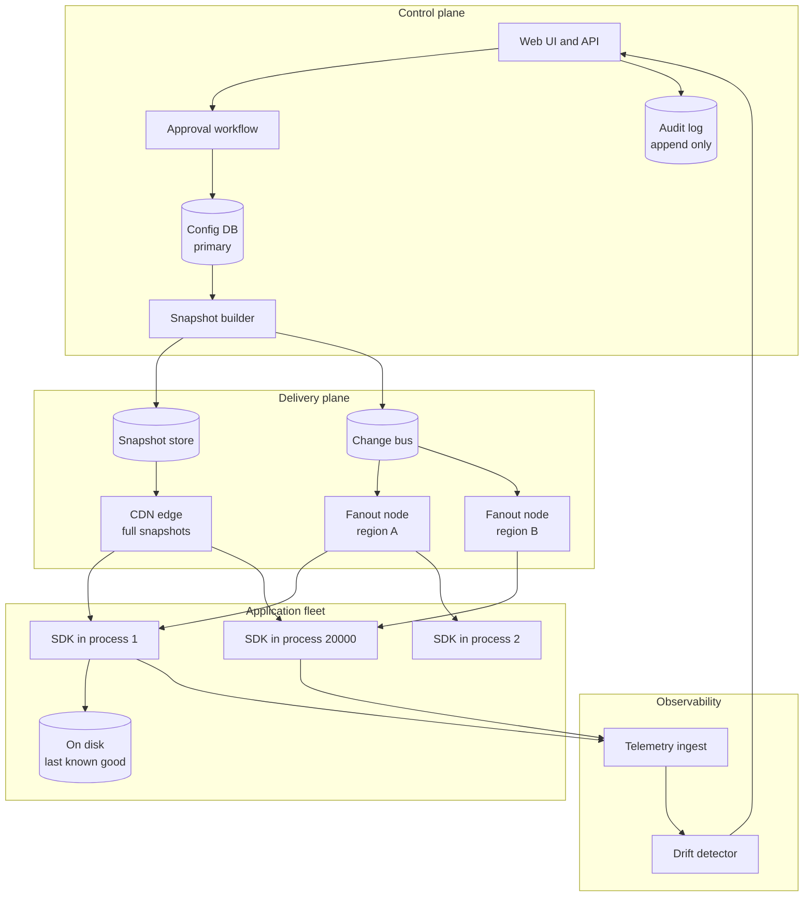
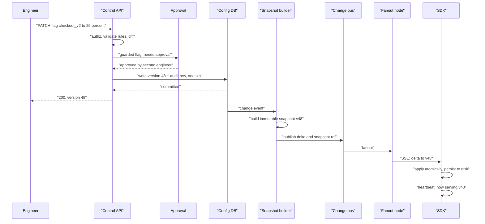
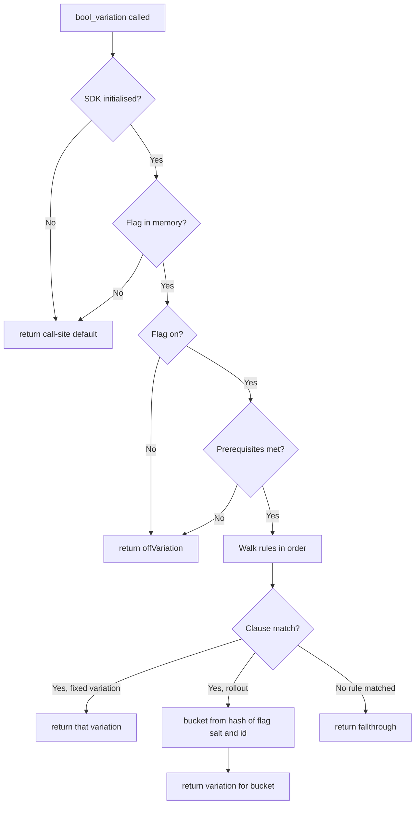
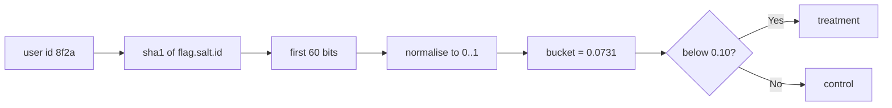
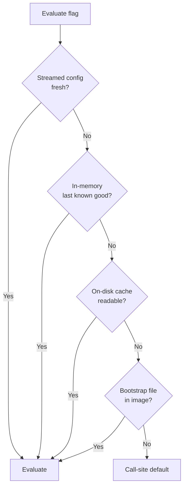
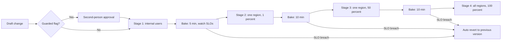
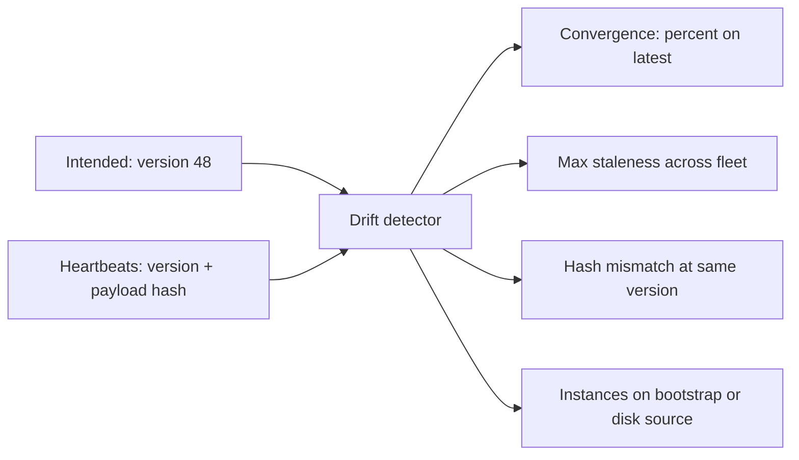

# 40 — Feature Flag & Config Service

<span class="pill pill-core">Core</span> <span class="pill pill-hard">Hard</span>

**A feature flag service is a deployment pipeline with no build, no tests, no canary and no rollback window, whose changes reach every process in the company in under a second. The hardest part is not serving the flags — it is that you have built the fastest possible way to break production and you must make it safe.**

| | |
|---|---|
| **Commonly asked at** | LaunchDarkly, Stripe, Netflix, Meta, Atlassian, Datadog, Shopify, Uber, Airbnb, any platform or developer-experience org |
| **Time budget** | 45 min |
| **Core tension** | Evaluation must be local and in-process so it costs nanoseconds and survives the control plane being down — but local evaluation means thousands of instances each hold their own cached copy of the rules, so there is always a consistency window during which different servers make different decisions about the same user, and a kill switch is only as fast as that window |
| **Prerequisites** | [F04 Caching](../fundamentals/f04-caching.md), [F05 CDN & Edge](../fundamentals/f05-cdn-edge.md), [F07 Replication & Consistency](../fundamentals/f07-replication-consistency.md), [F08 CAP & PACELC](../fundamentals/f08-cap-pacelc.md), [F11 Idempotency](../fundamentals/f11-idempotency.md), [F12 Queues & Streams](../fundamentals/f12-queues-streams.md), [F17 Rate Limiting & Load Shedding](../fundamentals/f17-rate-limiting-load-shedding.md), [F18 Resilience Patterns](../fundamentals/f18-resilience-patterns.md), [F20 Time, Clocks & Ordering](../fundamentals/f20-time-clocks-ordering.md), [F22 Observability Fundamentals](../fundamentals/f22-observability-fundamentals.md), [F25 Deployment & Release Safety](../fundamentals/f25-deployment-release-safety.md), [F27 Security in Design](../fundamentals/f27-security-design.md) |

---

## 1. Problem Statement

Build the system that lets engineers change production behaviour without deploying code: turn features on for 1% of users, kill a misbehaving code path instantly, target a beta to internal employees, and tune an operational parameter like a timeout or a rate limit at runtime.

Two reframings carry the design.

**First: this is a replication problem, not a request-serving problem.** The naive design is an API: the application calls `GET /flags/checkout_v2?user=123` and gets back `true`. That design fails on three independent axes — it adds a network round trip to every decision (and there are hundreds of decisions per request), it makes the flag service a hard availability dependency of every service in the company, and at 10 million evaluations per second it is a bigger system than most of the things it is gating. The design that works inverts it: **ship the rules to the process and evaluate locally in nanoseconds**, which turns the problem into "how do I reliably replicate a small, frequently-changing dataset to twenty thousand processes with a bounded staleness window?"

**Second: a flag change is an uncontrolled global deploy.** Code deploys go through review, CI, a canary, a bake time and a gradual rollout. A flag flip is a dropdown in a web UI, applied by one person, that takes effect in every region within a second, with no testing and no staged rollout. **The flag service is therefore the highest-blast-radius write path in the organisation**, and the design has to treat it as such — which means the interesting engineering is in change management, staged propagation and drift detection, not in the key-value lookup.

### Out of scope

Experimentation and A/B statistics (metric attribution, sequential testing, variance reduction) — this system provides deterministic assignment, and the analysis platform consumes it. Also out of scope: secrets management (different threat model, different durability requirements) and full application config management such as service discovery.

---

## 2. Requirements

### Functional

| # | Requirement | Notes |
|---|---|---|
| F1 | Boolean, multivariate, string, numeric and JSON flag types | Operational config is a flag with a number in it |
| F2 | Targeting rules: user attributes, segments, percentage rollout | Ordered rule list with a fallthrough |
| F3 | Deterministic, sticky bucketing | A user must stay in the same bucket across evaluations, processes, languages and time |
| F4 | Local in-process evaluation with a sub-microsecond budget | Rules shipped to the SDK |
| F5 | Near-real-time propagation of changes | Target under 1 second p50 |
| F6 | Kill switch that works when the control plane is down | The single most important requirement |
| F7 | Per-environment isolation (dev / staging / prod) | Separate configs, separate credentials, separate approvals |
| F8 | Full audit trail: who, what, when, why, previous value | Flags directly control production behaviour |
| F9 | Approval workflow and staged rollout for flag *changes* | Change management for the change-management system |
| F10 | Evaluation telemetry: which flags are read, which variations served | Drives drift detection and flag-debt cleanup |
| F11 | Prerequisite flags and dependency handling | "Only if parent flag is on" |
| F12 | Scheduled changes and automatic expiry | Temporary flags with a built-in end date |

### Non-functional

| # | Requirement | Target |
|---|---|---|
| N1 | Scale | 20,000 app instances, 2,000 flags per environment, 10M evaluations/s |
| N2 | Evaluation latency | p99 < 1 µs, in-process, zero network |
| N3 | Propagation latency (change committed to fleet serving it) | p50 < 500 ms, p99 < 5 s, **hard bound < 60 s** |
| N4 | Availability of evaluation | **100%** — the SDK must never fail a request because of this system |
| N5 | Availability of the control plane (UI, API, change writes) | 99.9% |
| N6 | Bucketing determinism | 100% identical across languages, SDK versions and time |
| N7 | Config delivery availability | 99.99% (it is a CDN-shaped problem) |
| N8 | Audit completeness | 100% of changes, immutable, retained 7 years |
| N9 | Fleet convergence | > 99.9% of instances on the latest version within 60 s |

!!! note "N4 is not a typo"
    The evaluation path has to be 100% available because it is inline in every request of every service. If the flag SDK can throw, block, or return an error, then every service in the company has taken a dependency on the flag service's uptime, and you have built a single point of failure for the entire product. The way you get 100% is that **evaluation never performs I/O**: it reads an in-memory structure that was populated by a background process, and if that structure is empty it returns a default that was supplied at the call site. The flag service being completely destroyed must degrade to "everything serves its code-level default", not to "everything is down".

---

## 3. Scale Estimation

### Why remote evaluation is disqualified by arithmetic

$$
\begin{aligned}
\text{services} &= 500,\quad \text{instances} = 20{,}000 \\
\text{requests/s} &= 2 \times 10^{6} \\
\text{flag reads per request} &\approx 5 \implies 10^{7}\ \text{evaluations/s}
\end{aligned}
$$

Remote evaluation at $10^7$ QPS would be, on its own, one of the largest RPC services in the company. Worse, the latency:

$$
\Delta_{\text{latency}} = 5\ \text{reads} \times 0.5\ \text{ms RTT} = 2.5\ \text{ms added to every request}
$$

against a typical 40 ms p50 budget — a 6% latency tax on the entire product, paid forever, to read five booleans. And it makes a flag-service outage a total product outage.

Local evaluation instead:

$$
10^{7}\ \text{evals/s} \times 200\ \text{ns} = 2\ \text{core-seconds/s} = 2\ \text{cores across a 20,000-instance fleet}
$$

**Two cores versus one of the largest RPC tiers in the company.** That is the entire argument, and it is not close.

### Config payload and propagation cost

$$
\begin{aligned}
\text{flags} &= 2{,}000,\quad \text{mean rule payload} = 400\ \text{B} \\
\text{full config} &= 2{,}000 \times 400\ \text{B} = 800\ \text{KB} \\
\text{full push to fleet} &= 20{,}000 \times 800\ \text{KB} = 16\ \text{GB per change}
\end{aligned}
$$

At 100 changes on a busy afternoon that is 1.6 TB of egress to distribute 40 KB of actual information. **Deltas are mandatory, not an optimisation:**

$$
\text{delta push} = 20{,}000 \times 400\ \text{B} = 8\ \text{MB per change}
$$

— a 2,000x reduction.

### Polling versus streaming

**Polling at interval $I$:**

$$
\begin{aligned}
\mathbb{E}[T_{\text{prop}}] &= \frac{I}{2}, \quad p99 \approx I \\
\text{bandwidth (naive, } I = 30\text{s)} &= \frac{20{,}000 \times 800\ \text{KB}}{30} = 533\ \text{MB/s} = 4.3\ \text{Gbit/s} \\
\text{bandwidth (ETag, 304)} &= \frac{20{,}000 \times 300\ \text{B}}{30} = 200\ \text{KB/s}
\end{aligned}
$$

Conditional requests collapse the steady-state cost by three orders of magnitude, and they are why a CDN in front of the config endpoint works so well — 99.9% of requests are a `304 Not Modified` served from the edge.

**Streaming (SSE/WebSocket):**

$$
\begin{aligned}
\text{connections} &= 20{,}000,\ \text{at } 10{,}000\ \text{per edge node} \implies 2\ \text{nodes} + \text{redundancy} \\
\text{idle cost} &\approx 20{,}000 \times 30\ \text{s keepalive} \times 20\ \text{B} \approx 13\ \text{KB/s} \\
T_{\text{prop}} &= T_{\text{commit}} + T_{\text{replicate}} + T_{\text{fanout}} + T_{\text{apply}} \\
&\approx 50 + 100 + 150 + 20 = 320\ \text{ms (p50)}
\end{aligned}
$$

**The reconnect thundering herd is the failure that matters.** If a fanout node dies and 10,000 clients reconnect simultaneously, each fetching the full 800 KB config:

$$
10{,}000 \times 800\ \text{KB} = 8\ \text{GB in a burst}
$$

Jittered reconnect over a 60-second window plus a CDN-cached full-config snapshot turns that into 133 MB/s of cache-hit traffic. Without jitter, the recovery attempt is a second outage.

### The consistency window

$$
W = T_{\text{prop}}^{p99} - T_{\text{prop}}^{p0}
$$

During $W$, some instances serve the old rules and some the new. At p50 320 ms and p99 5 s, **for roughly five seconds the fleet is not internally consistent**, and the same user hitting two servers can get two different answers. This is not a bug to be eliminated — it is a physical consequence of replicated local evaluation — but it must be designed around (§7.2), because a flag that gates a write path and a read path independently will corrupt data during $W$ unless the rollout is ordered.

### Telemetry volume

Evaluation telemetry drives drift detection and flag cleanup, and naively it is enormous:

$$
10^{7}\ \text{evals/s} \times 100\ \text{B} = 1\ \text{GB/s} = 86\ \text{TB/day}
$$

Unshippable. The SDK therefore **aggregates locally**: a per-(flag, variation, config version) counter flushed every 10 seconds.

$$
\frac{20{,}000\ \text{instances} \times 2{,}000\ \text{flags} \times 3\ \text{variations} \times 40\ \text{B}}{10\ \text{s}} = 480\ \text{MB/s}
$$

Still too much. Sample the *instances* (1 in 20 reports full detail, all report a config-version heartbeat) and only report flags actually evaluated in the window, which is typically 5% of the catalogue:

$$
\frac{1{,}000 \times 100 \times 3 \times 40\ \text{B}}{10\ \text{s}} = 1.2\ \text{MB/s}
$$

Tractable, and sufficient for both drift detection and "is this flag still read by anyone?".

---

## 4. API Design

Two distinct planes with completely different characteristics:

```text
# CONTROL PLANE — low volume, strongly consistent, heavily audited
POST   /api/v1/projects/{p}/flags                       create flag
PATCH  /api/v1/projects/{p}/envs/{e}/flags/{key}        change targeting (audited)
POST   /api/v1/projects/{p}/envs/{e}/flags/{key}/kill   emergency off (fast path)
GET    /api/v1/projects/{p}/envs/{e}/flags/{key}/audit  who changed what when
POST   /api/v1/.../flags/{key}/schedule                 timed change / auto-expiry
GET    /api/v1/.../flags/{key}/drift                    intended vs actually served

# DELIVERY PLANE — high volume, eventually consistent, CDN-friendly
GET    /sdk/v1/config?env={sdk_key}                     full snapshot (ETag'd)
GET    /sdk/v1/stream?env={sdk_key}&since={version}     SSE deltas
POST   /sdk/v1/events                                   aggregated telemetry
```

The **kill endpoint is deliberately separate** from the general update endpoint. It does one thing (set a flag to its off variation for everyone), it bypasses the approval workflow, it takes the highest-priority propagation path, and it is available even when the main control-plane API is degraded. Emergency paths that share code with normal paths are emergency paths that fail during emergencies.

### The SDK surface

```python
# The default is a required positional argument. This is a deliberate API
# choice: there is no way to call evaluate() without stating what should
# happen when the system knows nothing.
enabled = flags.bool_variation(
    key="checkout_v2",
    context={"key": user.id, "plan": user.plan, "country": user.country},
    default=False,                     # served if SDK uninitialised or flag unknown
)

timeout_ms = flags.int_variation("upstream_timeout_ms", ctx, default=2000)
```

Three non-negotiable SDK properties:

1. **`bool_variation` never blocks, never does I/O, never raises.** It reads an in-memory map. Any error path returns `default`.
2. **The default is supplied at the call site**, not configured centrally, because the call site is the only place that knows what safe means for this particular branch. A central default is a config value, and config values are exactly what is unavailable during the failure this protects against.
3. **Initialisation is asynchronous with a bounded wait.** `flags.wait_for_init(timeout=500ms)` at startup is fine; blocking forever is how a flag-service blip becomes a fleet-wide failure to start — the one scenario where the flag service *can* take down everything, and it does so at exactly the worst moment.

### A flag configuration, concretely

```json
{
  "key": "checkout_v2",
  "version": 47,
  "on": true,
  "variations": [
    { "id": 0, "value": false, "name": "control" },
    { "id": 1, "value": true,  "name": "treatment" }
  ],
  "prerequisites": [
    { "key": "new_payments_stack", "variationId": 1 }
  ],
  "salt": "c4f1a9e2",
  "bucketBy": "key",
  "rules": [
    {
      "id": "r1",
      "description": "internal employees always on",
      "clauses": [
        { "attribute": "email", "op": "endsWith",
          "values": ["@example.com"], "negate": false }
      ],
      "variationId": 1
    },
    {
      "id": "r2",
      "description": "exclude enterprise tier until GA",
      "clauses": [
        { "attribute": "plan", "op": "in", "values": ["enterprise"] }
      ],
      "variationId": 0
    },
    {
      "id": "r3",
      "description": "10 percent of EU users",
      "clauses": [
        { "attribute": "country", "op": "in", "values": ["DE","FR","NL","ES"] }
      ],
      "rollout": {
        "salt": "r3-9b2d",
        "bucketBy": "key",
        "weights": [ { "variationId": 0, "weight": 90000 },
                     { "variationId": 1, "weight": 10000 } ]
      }
    }
  ],
  "fallthrough": { "variationId": 0 },
  "offVariationId": 0,
  "killSwitch": { "failMode": "closed", "reason": null },
  "lifecycle": {
    "type": "temporary",
    "owner": "team-checkout",
    "createdAt": "2026-08-01T00:00:00Z",
    "expiresAt": "2026-11-01T00:00:00Z"
  }
}
```

Weights are in **hundred-thousandths, as integers**. Floating-point percentages are a correctness hazard: `0.1 + 0.2 != 0.3` means weights that should sum to 100% do not, and the resulting off-by-one-bucket behaviour is both real and maddening to debug. Integers that must sum to exactly 100,000 are validated at write time.

---

## 5. Data Model

```sql
CREATE TABLE flag (
  flag_id       BIGINT PRIMARY KEY,
  project_id    BIGINT NOT NULL,
  key           TEXT   NOT NULL,          -- stable identifier used in code
  kind          SMALLINT NOT NULL,        -- bool | multivariate | string | num | json
  salt          TEXT   NOT NULL,          -- per-flag bucketing salt, IMMUTABLE
  lifecycle     SMALLINT NOT NULL,        -- temporary | permanent-ops | experiment
  owner_team    TEXT   NOT NULL,          -- a flag without an owner is debt at birth
  created_at    TIMESTAMPTZ NOT NULL,
  expires_at    TIMESTAMPTZ,              -- forces the cleanup conversation
  archived_at   TIMESTAMPTZ,
  UNIQUE (project_id, key)
);

-- Per-environment state. The same flag is independently configured per env.
CREATE TABLE flag_env_config (
  flag_id        BIGINT NOT NULL,
  env_id         BIGINT NOT NULL,
  version        BIGINT NOT NULL,         -- monotonic per (flag, env)
  on_state       BOOLEAN NOT NULL,
  rules          JSONB  NOT NULL,         -- ordered; first match wins
  fallthrough    JSONB  NOT NULL,
  off_variation  SMALLINT NOT NULL,
  fail_mode      SMALLINT NOT NULL,       -- 0 = fail-closed, 1 = fail-open
  updated_at     TIMESTAMPTZ NOT NULL,
  PRIMARY KEY (flag_id, env_id)
);

-- Immutable, append-only. This table is the reason the system is trustworthy.
CREATE TABLE flag_audit (
  audit_id      BIGINT PRIMARY KEY,
  flag_id       BIGINT NOT NULL,
  env_id        BIGINT NOT NULL,
  version_from  BIGINT NOT NULL,
  version_to    BIGINT NOT NULL,
  actor_id      TEXT   NOT NULL,          -- human or service principal
  actor_kind    SMALLINT NOT NULL,        -- ui | api | automation | rollback
  change_diff   JSONB  NOT NULL,          -- full before/after, not a summary
  comment       TEXT,                     -- required for prod changes
  approved_by   TEXT[],                   -- required for guarded flags
  ticket_ref    TEXT,
  ip_address    INET,
  created_at    TIMESTAMPTZ NOT NULL
);
-- No UPDATE, no DELETE grant on this table for anyone, ever.

-- Reusable audience definitions, versioned like flags.
CREATE TABLE segment (
  segment_id    BIGINT PRIMARY KEY,
  env_id        BIGINT NOT NULL,
  key           TEXT   NOT NULL,
  rules         JSONB  NOT NULL,
  included      TEXT[],                   -- explicit allow list
  excluded      TEXT[],                   -- explicit deny, beats rules
  version       BIGINT NOT NULL
);

-- The delivered artifact: one immutable, versioned snapshot per environment.
CREATE TABLE env_snapshot (
  env_id        BIGINT NOT NULL,
  version       BIGINT NOT NULL,          -- global monotonic per environment
  payload_hash  BYTEA  NOT NULL,          -- what "correct" looks like
  payload_ref   TEXT   NOT NULL,          -- object store key
  created_at    TIMESTAMPTZ NOT NULL,
  PRIMARY KEY (env_id, version)
);

-- Fleet state, reported by SDKs. This is the drift detector's input.
CREATE TABLE instance_heartbeat (
  instance_id      TEXT PRIMARY KEY,
  service          TEXT NOT NULL,
  region           TEXT NOT NULL,
  env_id           BIGINT NOT NULL,
  config_version   BIGINT NOT NULL,       -- what it is ACTUALLY serving
  payload_hash     BYTEA NOT NULL,        -- detects corruption, not just lag
  sdk_version      TEXT NOT NULL,
  source           SMALLINT NOT NULL,     -- stream | poll | disk | bootstrap
  last_seen_at     TIMESTAMPTZ NOT NULL
);

-- Aggregated evaluation counts: drives flag-debt detection.
CREATE TABLE evaluation_rollup (
  flag_id        BIGINT NOT NULL,
  env_id         BIGINT NOT NULL,
  variation_id   SMALLINT NOT NULL,
  config_version BIGINT NOT NULL,
  window_start   TIMESTAMPTZ NOT NULL,
  count          BIGINT NOT NULL,
  PRIMARY KEY (flag_id, env_id, variation_id, config_version, window_start)
);
```

Two fields earn their place:

**`flag.salt` is immutable.** It is the per-flag input to the bucketing hash. Changing it reshuffles every user's assignment, which for an in-flight experiment invalidates the results and for a rollout means the 10% who had the feature yesterday are a different 10% today. Making it a column with no `UPDATE` path is cheaper than the incident.

**`instance_heartbeat.payload_hash`** is what separates a drift detector from a lag monitor. Version numbers tell you an instance is behind; the hash tells you an instance claiming version 47 is serving something that is not version 47 — corruption, a partially-applied delta, or a stale disk cache loaded over a newer in-memory state.

---

## 6. High-Level Architecture



### Write path: an engineer flips a flag



The config write and the audit row are **in the same transaction**. An audit log that can be missing entries is not an audit log, and the failure mode where the flag changed but the audit write failed is precisely the one an attacker would arrange.

### Read path: evaluating a flag

There is no network in the read path at all.



**Order is semantics, not implementation detail.** `off` beats everything, which is what makes the kill switch a kill switch. Prerequisites are evaluated before rules so a parent kill cascades. Rules are first-match-wins in declared order, so an exclusion rule must sit above the rollout rule that would otherwise capture those users — and that ordering is the single most common source of "why did this user get the feature?" tickets.

---

## 7. Deep Dives

### 7.1 Local evaluation versus remote evaluation

| Dimension | Remote (server evaluates) | Local (SDK evaluates) |
|---|---|---|
| Latency | 0.5-5 ms per read | ~200 ns |
| Availability coupling | Flag service outage = product outage | Flag service outage = invisible |
| QPS on the service | $10^7$/s | ~2,000/s (config polls + telemetry) |
| Consistency | Strong; all callers agree instantly | Eventually consistent; ~5 s window |
| PII exposure | User attributes leave the process | **Attributes never leave the process** |
| Rule secrecy | Rules stay server-side | Rules are shipped to every client |
| Client-side (browser/mobile) | Safe: rules hidden | Leaks rules and segment definitions |

The privacy asymmetry is worth stating in an interview because it cuts the opposite way from the usual instinct: **local evaluation is better for privacy**, since the user's email, plan, country and identifiers are used inside your own process and never transit to a third party. Remote evaluation means shipping a user attribute bundle to the flag vendor on every request.

The trade reverses at the client edge. A browser or mobile app that holds the full ruleset has told the user which segments exist, which competitors are named in a targeting rule, and what the unreleased feature is called. The standard resolution is **local evaluation for server-side SDKs, remote evaluation for client-side SDKs**, where "remote" means a relay in your own infrastructure that evaluates for a single user context and returns only that user's answers. Same design, different trust boundary.

!!! warning "Local evaluation means every attribute used in a rule must be available at the call site"
    A rule targeting `plan == "enterprise"` requires the calling code to *have* the user's plan in hand. If it does not, the SDK cannot fetch it — that would be I/O in the evaluation path. In practice this quietly constrains what rules can be written, and the failure is silent: a missing attribute does not error, it simply fails to match the clause, so users fall through to the default and nobody notices the targeting never worked. Mitigation: validate at rule-creation time that the attribute appears in recent evaluation telemetry for that flag, and surface "this rule has never matched" prominently in the UI.

### 7.2 Propagation and the consistency window

=== "Polling"

    ```python
    # Simple, robust, works through any proxy. The ETag is what makes it cheap.
    while True:
        resp = http.get(CONFIG_URL, headers={"If-None-Match": etag},
                        timeout=5)
        if resp.status == 200:
            store.swap(parse(resp.body))     # atomic pointer swap
            etag = resp.headers["ETag"]
            persist_to_disk(resp.body)
        elif resp.status == 304:
            pass                              # 300 bytes, served by the CDN
        sleep(interval * random.uniform(0.8, 1.2))   # jitter is mandatory
    ```

    Mean propagation $I/2$, p99 $\approx I$. At $I = 30$ s that is a 30-second kill-switch latency, which is often unacceptable. At $I = 1$ s the fleet generates 20,000 requests/s of mostly-304s — entirely servable from a CDN, and a completely legitimate design. Polling's real virtue is that it has almost no failure modes: no long-lived connections, no fanout tier, no reconnect storms, and it works through every corporate proxy and load balancer in existence.

=== "Streaming"

    ```python
    # SSE: one long-lived connection, server pushes deltas.
    for event in sse.connect(STREAM_URL, last_event_id=store.version):
        if event.type == "patch":
            store.apply_delta(event.data)     # incremental
        elif event.type == "put":
            store.swap(parse(event.data))     # full resync
        persist_to_disk(store.snapshot())
        heartbeat(store.version, store.hash)
    ```

    p50 propagation ~320 ms. The costs are real: 20,000 long-lived connections need a dedicated fanout tier; load balancers and proxies drop idle connections, so keepalives are required; and **reconnect storms** are the dominant failure mode — 10,000 clients reconnecting at once and full-fetching is an 8 GB burst that can take down the thing they are reconnecting to.

=== "Hybrid (recommended)"

    Stream as the primary path, poll as a background reconciliation at a long interval (60-300 s), CDN-cached full snapshots for cold start and resync.

    - Stream delivers p50 300 ms for the common case.
    - The slow poll guarantees a **hard upper bound** on staleness regardless of stream health, which is what makes N3's 60-second bound real rather than aspirational. A silently-dead SSE connection — the socket is open, the process thinks it is connected, nothing is arriving — is a genuine and common failure, and only an independent path detects it.
    - The CDN absorbs cold starts and reconnect storms, because a full snapshot is an immutable, cacheable object keyed by version.
    - Reconnects are jittered over 60 s and resume from `last_event_id`, so a reconnecting client usually receives a small delta rather than the whole config.

**The consistency window is a real correctness concern, not an aesthetic one.** For ~5 seconds, instance A serves the new rules and instance B the old ones. Two patterns break:

**The dual-path flag.** A flag gates both "write records in the new format" and "read records in the new format". During $W$, instance A writes new-format data that instance B cannot read. The fix is ordering, not speed: roll out read support to 100% first, bake, then roll out write. This is the same discipline as an expand/migrate/contract schema change, and the flag service does not exempt you from it. See [F25 Deployment & Release Safety](../fundamentals/f25-deployment-release-safety.md).

**Cross-service flag coupling.** Service A and Service B both read `new_protocol_v2` and must agree. During $W$ they disagree and the protocol negotiation fails. The fix is to make the protocol version a property of the *request* — A decides and passes its decision to B — rather than something each service independently looks up. **Propagate the decision, not the flag.** That principle also fixes the "user sees the feature on one page and not the next" class of bug: evaluate once at the request edge, attach the resolved variations to the request context, and use that everywhere downstream.

### 7.3 Targeting rules and the exact bucketing scheme

Sticky bucketing is the property that a given user always lands in the same bucket for a given flag — across processes, across languages, across SDK versions, across restarts, forever. It must be a **pure function of inputs with no stored state**, because storing assignments for hundreds of millions of users times thousands of flags is a database nobody wants.

```python
import hashlib

BUCKET_SCALE = 100_000          # weights are integer hundred-thousandths

def bucket(flag_key: str, salt: str, bucketing_id: str) -> float:
    """Return a value in [0, 1). Deterministic across languages and versions."""
    # Exact byte sequence: the separator and ordering are part of the spec.
    payload = f"{flag_key}.{salt}.{bucketing_id}".encode("utf-8")
    digest  = hashlib.sha1(payload).hexdigest()     # 40 hex chars
    # First 15 hex chars = 60 bits. Fits exactly in a float64 mantissa (53)
    # -> no, it does not; we divide as integers first to keep this portable.
    value   = int(digest[:15], 16)                  # 0 .. 2^60 - 1
    return value / 0xFFF_FFFF_FFFF_FFFF             # [0, 1)

def pick_variation(rollout, flag_key, context) -> int:
    bucketing_id = context[rollout.get("bucketBy", "key")]
    b = bucket(flag_key, rollout["salt"], bucketing_id) * BUCKET_SCALE
    cumulative = 0
    for w in rollout["weights"]:                    # declared order is part of the spec
        cumulative += w["weight"]
        if b < cumulative:
            return w["variationId"]
    return rollout["weights"][-1]["variationId"]    # float-safety backstop
```

**Every element of that function is load-bearing:**

| Element | Why it must be exactly this |
|---|---|
| SHA-1 (not a language hash) | `String.hashCode()` in Java, `hash()` in Python (randomised per process since 3.3), and Go's map hash all differ. A cryptographic hash is identical everywhere, forever. Speed is irrelevant: this runs once per rollout evaluation |
| UTF-8 encoding, explicit | Otherwise a Java SDK on a non-UTF-8 default charset buckets differently from a Go SDK for the same user with a non-ASCII id |
| `flag_key` in the input | Prevents cross-flag correlation. Without it, the same users are in every 10% rollout, so the "10% cohort" is a fixed population that receives every experiment — and your results are biased by that population forever |
| Per-flag `salt` | Lets you deliberately *re*-randomise for a new experiment on the same flag; immutable otherwise |
| First 15 hex chars (60 bits) | Enough entropy for uniformity at any realistic user count; fits in a signed 64-bit integer in every language, which a 64-hex-char SHA-256 does not |
| Integer division by $2^{60}-1$ | Portable and exact. Converting the full digest to a float first gives different results on different platforms |
| Integer weights summing to 100,000 | Floating-point percentages do not sum to 1.0, and the drift shows up as a bucket boundary being off |
| Declared weight order | The mapping from bucket to variation depends on iteration order; sorting it differently in one SDK reassigns users |

**Monotonicity is the property that makes progressive rollout safe:**

$$
\text{user in rollout at } p \implies \text{user in rollout at } p' \ \text{for all}\ p' > p
$$

Because the test is `bucket < threshold` and `bucket` does not depend on the threshold, increasing 10% to 20% keeps every original user and adds new ones. **Nobody loses the feature when you ramp up**, which would otherwise be a bizarre and very visible bug. Ramping *down* removes users from the top of the bucket range, which is the unavoidable and correct inverse.



**`bucketBy` deserves a paragraph of its own.** The default is the user key, and it is frequently wrong:

- **Bucket by user, effect is per-account.** A B2B feature rolled out to 10% of *users* means most accounts see it for some employees and not others, which looks broken to the customer. Bucket by `accountId`.
- **Bucket by session for anonymous traffic.** But note the session changes, so the user flips between variations across visits — usually unacceptable for anything visible, fine for a backend timeout.
- **Anonymous-to-identified transition.** A user bucketed on an anonymous device id who then logs in gets a different bucket under their user id, and the experience changes mid-session at exactly the moment they signed up. Handle it explicitly: either keep bucketing on a stable device id, or accept and design for the switch.
- **Bucketing on a null attribute** silently falls back — usually to the key, sometimes to "no match". Validate at write time that the attribute is present in telemetry.

### 7.4 The kill-switch guarantee

The requirement: **turning a flag off must work even if the flag service's entire control plane is down.** That sounds contradictory until you realise a kill switch is not a control-plane operation — it is a *data-plane* operation whose value was already delivered.

The resolution order in the SDK, and what each layer defends against:



| Layer | Defends against | Staleness |
|---|---|---|
| Streamed/polled config | Nothing; this is the happy path | < 5 s |
| In-memory last-known-good | Control-plane outage after the SDK started | Age of the outage |
| On-disk persisted cache | Process restart during a control-plane outage | Since last successful fetch |
| Bootstrap file baked into the image | Cold start of a new instance during an outage | Age of the image |
| Call-site default | Total loss, brand-new code path, unknown flag | Not applicable |

**The on-disk cache is what makes this real.** Without it, an in-memory-only SDK is fine during an outage until the first pod restarts — and a pod restart during a flag-service outage is not a coincidence, it is a certainty across 20,000 instances. That instance comes up with no config and reverts every flag to its call-site default, which for a flag that has been on for a year is almost certainly wrong.

**Fail-open versus fail-closed is per-flag and must be an explicit field**, because both are correct for different flags:

| Flag purpose | Mode | Reasoning |
|---|---|---|
| New feature rollout | **Closed** (off) | Unknown state means don't show the unfinished thing |
| Kill switch for a dependency ("disable recommendations") | **Open** (feature enabled) | The safe state is the long-standing normal behaviour |
| Circuit breaker ("stop calling flaky service X") | **Closed** (breaker open, i.e. don't call) | Unknown state during an incident should be the defensive one |
| Operational limit (timeout, page size) | Explicit safe constant | Neither on nor off; a number chosen to be survivable |
| Compliance gate (GDPR consent behaviour) | **Closed**, always | Unknown consent means no processing. Never fail open on a legal control |

!!! danger "The kill switch that could not fire"
    A real and recurring incident class: a bad deploy is causing errors, the team goes to kill the feature flag, and the flag UI will not load — because the flag control plane depends on a service that is currently on fire, or because the incident has saturated a shared network path, or because the auth provider needed to log into the flag UI is the thing that broke.
    Mitigations that must be designed in *before* the incident: a dedicated kill endpoint on a separate, minimal code path with its own credentials and no dependency on the main UI; a CLI that talks directly to the delivery plane; **break-glass write access to the snapshot store itself**, so an operator can publish a config without any control-plane component at all; and a documented, rehearsed procedure that at least two on-call engineers have executed in the last quarter. A kill switch whose activation path has never been tested under adverse conditions is a kill switch you do not have.

### 7.5 The flag service as a hidden distributed monolith

This is the deepest point in the design, and the one most candidates miss entirely.

Consider what a flag change actually is. It changes behaviour in every service that reads the flag, in every region, simultaneously, within one second. No build, no test suite, no code review (usually), no canary, no bake time, no gradual rollout, no automatic rollback. **It is the highest-velocity, lowest-controls change mechanism in the entire company, and it is exposed through a web UI with a toggle.**

The second-order effect is architectural: flags create hidden coupling. Fifteen services read `new_payments_stack`. They were designed as independent deployables with independent release cycles, and they now have a shared piece of global mutable state that changes their behaviour in lockstep. **The flag has reassembled a distributed monolith out of your microservices**, and nothing in the architecture diagram shows it.

The mitigation is to apply deployment discipline to flag changes themselves:



The controls, in rough order of value delivered per unit of friction:

1. **Guarded releases with automatic rollback.** The flag change is tied to an SLO; if error rate or latency degrades during the bake window, the flag reverts to its previous version automatically. This is progressive delivery applied to configuration, and it is the single highest-value control because it works at 3 a.m. without a human.
2. **Staged propagation of the change itself.** Apply to internal users, then one region, then everywhere, with bake times. Note this is *not* the same as the flag's percentage rollout — it is a staged rollout of the *change to the configuration*, and it bounds blast radius even for a flag being set to 100%.
3. **Approval workflow on guarded flags.** Not every flag — requiring approval for everything trains people to click through — but any flag touching payments, auth, data writes or compliance requires a second pair of eyes.
4. **Environment promotion.** A change must exist in staging before production, with a diff view. Prevents the "I thought I was in staging" class of incident, which is extremely common because the two UIs look identical.
5. **Change freezes** during incidents and high-risk windows, enforced by the system rather than by convention.
6. **Blast-radius display in the UI.** Before confirming, show: which services read this flag (from telemetry), how many instances, how many users are affected by the delta, and when it was last changed. Most bad flag changes are made by someone who genuinely did not know what the flag did.

!!! interview "The line that lands"
    **"A feature flag change is a production deploy that skips every control we built for production deploys. If I would not let someone push code to 100% of production in one click without review, tests or a canary, I should not let them flip a flag that way either. So the interesting engineering in this system is not the evaluation path — it is rebuilding deployment safety for a change mechanism that deliberately bypassed it."**

### 7.6 Audit, and why it is a correctness feature

Flags control production behaviour, so the audit log is the only way to answer the first question of every incident: *what changed?*

Non-negotiable properties:

- **Written in the same transaction as the change.** An audit log that can be missing entries is not an audit log.
- **Immutable and append-only**, with no `UPDATE` or `DELETE` grant for anyone, including administrators. Export to a separate system with independent retention for anything covered by compliance.
- **Full before/after diffs, not summaries.** "Changed targeting rules" is useless. The exact previous rule list is what you need at 3 a.m., and it is also what makes one-click revert possible.
- **Correlation IDs joining flag changes to deploys, incidents and traces**, so the incident timeline can be assembled automatically rather than by three people reading three UIs.
- **Required comment on production changes.** The friction is the point: it makes the person articulate what they are doing before they do it, and it is the cheapest intervention available.
- **Service principals are first-class actors.** Automation flips flags too, and "changed by ci-bot" without knowing *which* pipeline and *which* commit is an unanswerable audit trail.

The highest-value derived artifact is a **unified change timeline** overlaying flag changes, deploys and config pushes on the same axis as your SLI graphs. In practice a large fraction of incidents are "something changed", and a substantial share of those changes are flags — which are invisible in deploy dashboards precisely because they are not deploys.

### 7.7 Config drift detection

Drift is the gap between **intended state** (what the control plane says) and **served state** (what instances are actually evaluating). It is invisible without deliberate instrumentation, because every dashboard shows intent.



```sql
-- Fleet convergence for one environment. Run every 30 seconds.
WITH latest AS (
  SELECT env_id, MAX(version) AS v FROM env_snapshot GROUP BY env_id
)
SELECT h.env_id,
       h.region,
       COUNT(*)                                                   AS instances,
       SUM((h.config_version = l.v)::int)::real / COUNT(*)        AS on_latest,
       MAX(l.v - h.config_version)                                AS max_lag,
       SUM((h.source IN (2,3))::int)                              AS on_disk_or_bootstrap,
       COUNT(DISTINCT h.payload_hash)
         FILTER (WHERE h.config_version = l.v)                    AS distinct_hashes_at_latest
FROM instance_heartbeat h
JOIN latest l USING (env_id)
WHERE h.last_seen_at > now() - interval '2 minutes'
GROUP BY h.env_id, h.region;
```

Four alerts, each catching a distinct failure:

| Signal | Meaning | Severity |
|---|---|---|
| `on_latest < 99.9%` after 60 s | Propagation is broken for some subset | High |
| `max_lag` growing without bound | A fanout node is black-holing, or a region is partitioned | High |
| `distinct_hashes_at_latest > 1` | **Two instances claim the same version and serve different content.** Corruption or a bad partial delta | **Critical** |
| `on_disk_or_bootstrap > 0` in steady state | Instances have never successfully reached the delivery plane | Medium, trending critical |

The hash check is the one people omit and the one that catches genuine corruption. Version numbers are self-reported and monotonic; a bug in delta application produces an instance that believes it is current and is not. Comparing content hashes at the same version is the only way to see it.

Drift also has a *semantic* form worth catching: the control plane says 25% rollout, and evaluation telemetry says 31% of evaluations returned the treatment. That gap means either the fleet is split across versions, or an attribute used for bucketing is missing on some callers, or one service is passing a different `bucketBy` value. Comparing **expected versus observed variation distribution** is a cheap, high-yield check that catches targeting bugs no unit test will.

### 7.8 Flag debt and lifecycle

Every flag is a permanent branch in the code. With $n$ live flags, the number of reachable configuration states is $2^n$ for booleans alone. At $n = 2{,}000$, you are not testing the combinations, and you never will be. Flags are therefore a liability that accrues interest, and a system that does not actively remove them will drown.

**Classification at creation, enforced:**

| Type | Lifetime | Policy |
|---|---|---|
| Release / temporary | Days to weeks | Mandatory `expiresAt`; alert on expiry; automated cleanup PR |
| Experiment | Duration of the test | Auto-archive at experiment end |
| Operational / kill switch | Permanent | Exempt from expiry, but reviewed annually and must still be exercised |
| Permission / entitlement | Permanent | Arguably not a flag — this is authorisation and probably belongs elsewhere |

**Detection, from telemetry rather than from good intentions:**

- **Stale-value flags**: served exactly one variation for 100% of evaluations over 30 days. The branch is dead code; the flag is pure risk with no optionality.
- **Unread flags**: zero evaluations for 30 days. The code path was deleted; the flag remains, waiting for someone to flip it and discover it does nothing.
- **Expired flags**: past `expiresAt` and still live.
- **Orphaned flags**: the owning team no longer exists. These are the dangerous ones, because nobody will ever volunteer to remove them.

**Removal must be as mechanical as possible**, because it is nobody's priority. The pattern that actually works is automation: a bot that identifies a stale flag, opens a pull request removing the flag call and simplifying the branch to the served value, assigns it to the owning team, and archives the flag once the PR merges. Add a per-team flag budget so creating a new flag past the cap requires removing an old one — the same forcing function as a test-quarantine budget, and it works for the same reason.

**The removal order matters and is the source of a specific outage:** remove the code first, deploy it everywhere, *then* archive the flag. Archiving first means any instance still running the old code evaluates an unknown flag and gets its call-site default, which may be the wrong value — and it will be wrong for exactly the instances that have not yet deployed, which is a rollout-shaped partial outage.

---

## 8. Scaling the Bottleneck

The bottleneck depends entirely on which plane you are looking at, and they scale independently — which is the main reason to separate them.

| Component | Constraint | Scaling approach |
|---|---|---|
| Evaluation | None. 2 cores across a 20,000-instance fleet | Nothing to do; this is why local evaluation wins |
| Config delivery (full snapshots) | Egress bandwidth | Immutable versioned objects behind a CDN; `304` for the steady state |
| Streaming fanout | Concurrent connections and memory | Horizontal fanout nodes, ~10-50k connections each, sharded by environment |
| Change bus | Write rate (low) and ordering | Single ordered stream per environment; a few hundred changes a day is trivial |
| Control-plane DB | Write rate (low), audit table growth | Primary for writes, replicas for reads; partition audit by month |
| Telemetry ingest | $10^7$ evals/s raw | SDK-side aggregation plus instance sampling: 480 MB/s to 1.2 MB/s |
| Heartbeat/drift store | 20,000 instances every 30 s | 667 writes/s; a single node with a TTL suffices |

**The interesting scaling problem is connection fanout, and it is a CDN-shaped problem.** The config for an environment is the same bytes for every instance, so it is perfectly cacheable and perfectly shardable:

- **Immutable, version-addressed snapshots** (`/config/{env}/v48.json`) are cacheable forever, which means cold starts and reconnect storms are absorbed at the edge instead of at your origin.
- **Regional fanout nodes** so the last hop is short. A change published in `us-east` propagates to a regional fanout in `eu-west` once, then fans out locally to 6,000 connections.
- **Per-environment sharding** because environments are independent; there is no cross-environment consistency requirement to preserve.
- **Jittered reconnect with resume tokens**: a reconnecting client sends `last_event_id` and receives a delta, not a full config.

!!! example "The scaling trap that is not about scale"
    The failure that takes this system down is almost never QPS. It is the reconnect storm: a fanout node dies, 10,000 clients reconnect within a second, each fetching 800 KB, producing an 8 GB burst against a service sized for 200 KB/s of steady state. The fix is not capacity — it is **jitter, resume tokens, and a CDN-cached full snapshot**, which convert a self-inflicted outage into a cache-hit spike. Every long-lived-connection system has this failure, and designing for it up front is a strong signal.

---

## 9. Failure Modes

| Failure | Blast radius | Detection | Mitigation | Degraded behaviour |
|---|---|---|---|---|
| **Bad flag change** (wrong rule, 100% instead of 1%) | **Every user, every region, within 1 second** | SLO alerts; unified change timeline | Guarded releases with auto-revert, staged propagation, approval on guarded flags, blast-radius preview | This is the dominant real-world incident for this system. Mean time to detect is dominated by your SLO alerting, and mean time to recover by whether auto-revert exists |
| Control plane down | No new changes possible; **evaluation unaffected** | Control API error rate | SDK serves last-known-good from memory, then disk, then bootstrap | Fleet continues on the last config indefinitely. This is the designed-for case, not an emergency — provided the kill path has an independent route |
| Delivery plane down | Fleet frozen at current config; kill switches will not propagate | Heartbeat convergence; delivery error rate | Multi-region delivery, CDN for snapshots, independent poll path as a backstop | Running behaviour is correct but unchangeable. **This is worse than it sounds during an incident**, because the flag you need to flip is the mitigation for a different outage |
| Fanout node dies, clients reconnect at once | Potential cascading failure of the delivery plane | Connection count spike; origin request rate | Jittered reconnect over 60 s, resume tokens, CDN-cached snapshots, connection caps per node | With jitter: a cache-hit spike. Without: an 8 GB burst and a second outage |
| Silently dead stream (socket open, nothing arriving) | Affected instances frozen silently; no error anywhere | **Heartbeat staleness** — no other signal exists | Independent slow poll as a reconciliation path; server keepalives; client-side receive timeout forcing reconnect | Instances serve stale config believing they are current. The most insidious failure in the system and the reason the hybrid model exists |
| Corrupt config published | Every instance that applies it | Schema validation at write and at apply; payload hash mismatch | Validate at write time, sign snapshots, SDK rejects unparseable config and **keeps the previous one** | SDK must never apply a config it cannot fully parse. Partial application is worse than staleness |
| Bad delta application (SDK bug) | Subset of instances serving wrong values while claiming the right version | `distinct_hashes_at_latest > 1` | Payload hash in heartbeat; periodic full resync regardless of stream health | Silent wrong answers. Undetectable without the hash check |
| Salt or `bucketBy` changed | **Every user reshuffled**; in-flight experiments invalidated | Variation-distribution shift in telemetry | Make `salt` immutable at the schema level; require explicit confirmation for `bucketBy` changes | Users gain and lose features at random. Extremely confusing to users and to the team |
| SDK blocks on initialisation | **Entire fleet fails to start** during a delivery-plane outage | Startup latency; pod readiness failures | Async init with a bounded wait; bootstrap file in the image; never block indefinitely | The one scenario where this system can take down everything, and it happens at the worst possible moment |
| Missing attribute in rules | Targeting silently does not match; users fall through | Rule-match-rate telemetry; "rule never matched" warnings | Validate attributes against recent telemetry at rule-creation time | Silent wrong behaviour. Nobody notices for weeks |
| Clock skew on scheduled changes | Change fires early or late across the fleet | NTP offset; scheduled-change execution logs | Schedule server-side (publish a new version at time T) rather than client-side evaluation of a time condition | Inconsistent behaviour across instances during the window. See [F20 Time, Clocks & Ordering](../fundamentals/f20-time-clocks-ordering.md) |
| Flag archived before code removed | Instances still running old code get call-site defaults | Evaluation telemetry for an archived flag | Enforce removal order: code out, deploy everywhere, then archive | Partial rollout-shaped outage affecting exactly the not-yet-deployed instances |
| Audit write fails but change succeeds | Unattributable production change | Reconciliation between version bumps and audit rows | Same transaction. Non-negotiable | An unexplainable change during an incident, and an obvious attacker technique |

---

## 10. SRE Lens

### SLIs and SLOs

| SLI | Definition | SLO |
|---|---|---|
| **Evaluation availability** | Evaluations returning without error or block | **100%** (structural: no I/O in the path) |
| Evaluation latency | p99 in-process | < 1 µs |
| **Propagation latency** | Commit to p99 of fleet serving it | **p50 < 500 ms, p99 < 5 s, max < 60 s** |
| **Fleet convergence** | Instances on latest version within 60 s | **> 99.9%** |
| Max fleet staleness | Oldest config version in service | < 5 min |
| Config integrity | Distinct payload hashes at the same version | **Exactly 1, alarmed on any deviation** |
| Delivery availability | Successful config fetches / stream health | 99.99% |
| Control-plane availability | Non-5xx on the change API | 99.9% |
| **Kill-switch time to effect** | Kill invoked to 99.9% of fleet serving off | **< 10 s** |
| Bucketing determinism | Cross-SDK conformance suite pass rate | 100% |
| Audit completeness | Version bumps with a matching audit row | 100% |
| Flag hygiene | Flags past `expiresAt`, and stale-value flags | Tracked per team with a budget |

!!! note "Kill-switch time to effect is the SLI that justifies the system"
    Everything else is plumbing. The reason a company buys or builds this is to be able to turn something off faster than it can deploy. **Measure it end to end and measure it continuously**: a synthetic flag flipped every hour, with the heartbeat stream reporting when each instance began serving the new value, and the p99 of that distribution graphed. If you only measure propagation in aggregate you will not notice that one region's fanout has been degraded for a week — until the incident where you need it.

### Error budget

Evaluation availability has **no error budget** — it is structural, achieved by doing no I/O, and any incident where the SDK failed a request is a design bug rather than a budget event.

The budget that matters is **propagation**. 99.9% of changes propagating within 5 s over 30 days, at ~300 changes/day, allows 9 slow changes. That is tight, and deliberately so: a slow propagation during an incident is the difference between a 30-second outage and a 10-minute one.

The budget conversation this system forces is unusual: **most of the risk is generated by users of the system, not by the system itself.** The dominant incident class is a bad flag change, not a flag-service failure. So the error-budget policy has to reach into the change process — automatic rollback on SLO breach during the bake window, mandatory staged propagation for guarded flags, and a change freeze that the system enforces during an active incident. A pure platform-side budget policy would show all green through the exact incidents this system causes. See [F23 SLI/SLO & Error Budgets](../fundamentals/f23-slo-error-budgets.md).

### Rollout

- **SDK upgrades are the riskiest change in the ecosystem** because there are 20,000 copies owned by 500 teams and you do not control the deploy. Version the config schema, make old SDKs forward-compatible by ignoring unknown fields, and never remove a schema field until telemetry shows no SDK still reads it. Assume some instance somewhere is running a two-year-old SDK, because it is.
- **Bucketing is frozen forever.** A cross-language conformance suite — a fixed corpus of (flag key, salt, id) inputs with expected bucket values, run in CI for every SDK — is mandatory. A bucketing change is not a bug fix; it is a silent reshuffle of every user in every rollout.
- **Delivery-plane changes go region by region**, watching convergence, because a bug here freezes the fleet's ability to receive kill switches and you will not find out until you need one.
- **The control plane cannot depend on flags stored in itself.** That circularity means a bad flag change can prevent you from undoing the bad flag change. Bootstrap the flag service's own configuration from a static file. See [F25 Deployment & Release Safety](../fundamentals/f25-deployment-release-safety.md).

### Runbook notes

```text
ALERT: error_rate spike on service X
  Check flag changes BEFORE deploys. Flags are invisible in deploy
  dashboards and are a large share of "something changed" incidents.
  1. Unified change timeline, last 30 minutes, all environments.
  2. Any flag read by service X changed? The audit diff shows the
     exact previous rule list.
  3. Revert to previous version — one click, because the audit row
     contains the full before-state. Do this BEFORE root-causing.
  4. Confirm propagation: convergence should hit 99.9% within 60 s.
     If it does not, you have two incidents.

ALERT: fleet_convergence < 99.9% for > 2 min
  1. Which instances? Group by region, service, SDK version. A single
     region is a delivery problem; a single service is an SDK or
     network-policy problem; scattered is usually reconnect churn.
  2. Check heartbeat "source": instances on disk or bootstrap have
     never reached the delivery plane at all.
  3. Silently dead streams are the classic cause: the socket is open,
     the client believes it is connected, nothing is arriving. The
     background poll should have corrected it — if it did not, the
     poll path is also broken and that is the real finding.
  4. If you need a kill switch RIGHT NOW and convergence is broken,
     use the break-glass path: publish directly to the snapshot store
     and let the CDN + poll path deliver it.

ALERT: distinct_payload_hashes_at_same_version > 1
  Treat as a correctness incident. Two instances claim the same
  version and are serving different content.
  1. Identify the divergent instances and their SDK versions. A single
     SDK version on one side is a delta-application bug.
  2. Force a full resync (publish a "put" rather than a "patch") to
     the affected cohort.
  3. Compare the two payloads. If they differ in a flag that gates a
     write path, assume data written during the window may be
     inconsistent and scope it before closing.

ALERT: variation_distribution deviates from intended rollout
  Intended 25 percent, observed 31 percent.
  1. Fleet split across config versions? Check convergence first;
     this is the common explanation.
  2. bucketBy attribute missing on some callers? A null bucketing
     attribute silently falls back and skews the distribution.
  3. Two services passing different values for the same logical user
     (user id vs account id)? Propagate the decision, not the flag.
  4. Salt changed? Check the audit log. If so, every user has been
     reshuffled and any in-flight experiment is invalid.
```

### Capacity model

$$
\begin{aligned}
\text{fanout nodes} &= \left\lceil \frac{\text{instances}}{\text{connections per node}} \right\rceil \times (1 + \text{redundancy}) \\[4pt]
\text{delivery egress} &= \text{change rate} \times \text{instances} \times \text{delta size} \\[4pt]
\text{cold-start burst} &= \text{instances restarting} \times \text{full config size} \\[4pt]
\text{telemetry ingest} &= \frac{\text{sampled instances} \times \text{active flags} \times \text{variations} \times 40\ \text{B}}{\text{flush interval}}
\end{aligned}
$$

**Size for the cold-start burst, not the steady state.** Steady state is 200 KB/s. A full fleet restart — a platform-wide deploy, a cluster upgrade, a region failover — is 20,000 instances fetching 800 KB, and that is the only number that matters for provisioning. Immutable version-addressed snapshots behind a CDN make it a cache-hit spike rather than an origin event, which is the whole reason for that design choice. See [F24 Capacity Planning](../fundamentals/f24-capacity-planning.md).

### Cost

| Line | Driver | Lever |
|---|---|---|
| Delivery egress | Instances $\times$ change rate $\times$ payload | Deltas not full pushes; CDN; `304`s |
| Fanout compute | Concurrent connections | Higher connections per node; poll-only for low-tier services |
| Telemetry ingest and storage | Evaluation volume | SDK-side aggregation, instance sampling, short raw retention |
| Control-plane DB | Audit table growth | Partition by month; archive to object storage; never delete |
| Vendor per-seat or per-MAU pricing | Users or instances | Frequently the largest line; relay architecture can reduce billable connections |

The cost of this system is small relative to what it protects. The honest framing for the cost conversation is that **the alternative to a flag service is shipping code to change behaviour**, and the fully-loaded cost of a deploy-and-rollback cycle during an incident — engineer time plus the extra minutes of outage — dwarfs the infrastructure bill. See [F28 Cost Engineering](../fundamentals/f28-cost-engineering.md).

---

## 11. Trade-offs & Alternatives

| Decision | Chosen | Alternative | Why |
|---|---|---|---|
| Evaluation location | In-process, local | Remote API call per evaluation | 200 ns vs 0.5 ms, 2 cores vs $10^7$ QPS, and no availability coupling. Not close |
| Client-side SDKs | Remote evaluation via an owned relay | Ship rules to the browser | Rules in a browser leak segment definitions, unreleased feature names, and competitor references |
| Propagation | Streaming primary + slow poll backstop | Streaming only, or polling only | Streaming gives 300 ms; the poll guarantees a hard staleness bound and is the only thing that detects a silently dead stream |
| Config format | Immutable versioned snapshots + deltas | Mutable "current config" endpoint | Immutable objects are CDN-cacheable forever and make cold-start bursts free; deltas cut per-change egress 2,000x |
| Bucketing | SHA-1 over `flag.salt.id`, first 60 bits | Language `hashCode`; or stored assignments | Cross-language determinism with zero state. Stored assignments are a database of $10^8 \times 10^3$ rows that must also be consistent |
| Weights | Integers summing to 100,000 | Floating-point percentages | Float percentages do not sum to 1.0; the drift manifests as bucket-boundary bugs |
| Salt | Per-flag, immutable | One global salt | A global salt correlates every flag: the same users are in every 10% cohort, biasing every rollout and experiment |
| Default value | Required argument at the call site | Configured centrally | The default is needed precisely when central config is unavailable. A central default is unreachable in the failure it exists for |
| Fail mode | Per-flag, explicit field | One global policy | A new-feature flag must fail closed; a dependency kill switch must fail open. Both are correct |
| Kill path | Separate endpoint, separate code path, break-glass to the snapshot store | Same API as normal changes | An emergency path sharing code with the normal path fails during emergencies, and the emergency is often *caused* by whatever the normal path depends on |
| Change safety | Guarded rollout with auto-revert on SLO breach | Trust plus review | Auto-revert works at 3 a.m. without a human. It is the single highest-value control in the system |
| Approvals | Only on guarded flags | On every change | Approval on everything trains people to click through, which is worse than no approval |
| Audit | Same transaction, immutable, full diffs | Async event, summary text | A missing audit row is exactly what an attacker would arrange; a summary is useless at 3 a.m. and prevents one-click revert |
| Cross-service consistency | Evaluate once at the edge, propagate the decision | Each service evaluates independently | Independent evaluation during the consistency window produces disagreement, and disagreement in a protocol negotiation is a failure |
| Flag lifecycle | Mandatory expiry on temporaries, automated cleanup PRs, per-team budget | "Please clean up your flags" | $2^n$ states at $n=2{,}000$. Good intentions have never once removed a flag |

??? note "Build versus buy, honestly"
    The evaluation core is genuinely easy: a rule evaluator and a hash function are a weekend. That is why teams build it, and it is also why they underestimate. The hard parts are everywhere else, and they arrive over years: SDKs for eight languages that bucket **identically** and stay identical forever (this alone is a permanent maintenance obligation with a conformance suite in every CI); a delivery plane with CDN integration, jittered reconnect and resume tokens; drift detection; staged rollout of flag changes with automatic SLO-driven revert; an approval workflow; an immutable audit trail with retention that satisfies your auditors; and flag-debt tooling that actually removes flags. Buying gets you all of that plus experimentation integration, at a per-seat or per-MAU price that becomes conspicuous at scale, and it introduces a vendor in the request path of every service — which is exactly why local evaluation with an on-disk cache matters so much when you buy. The pattern I would actually recommend: buy the control plane and the SDKs, and run a **relay in your own infrastructure** so the delivery path is yours, your instances never talk to the vendor directly, a vendor outage cannot reach your fleet, and you control the connection count you are billed for. If you do build, budget for the SDK matrix honestly — it is the part that never stops costing.

---

## 12. Gotchas & Corner Cases

!!! gotcha "Changing the bucketing salt silently reshuffles every user"
    **Symptom:** a 10% rollout that has been stable for two weeks suddenly serves the feature to a *different* 10%. Users who had it lose it; users who never had it get a half-migrated experience. Any in-flight experiment's results are invalid and cannot be recovered.
    **Mechanism:** the salt is an input to the bucketing hash. Change it and every user's bucket value changes, so the set below the threshold is a fresh random sample. This happens through a "clean up the config" refactor, a copy-paste when cloning a flag, or an SDK that defaults the salt when the field is absent.
    **Mitigation:** make `salt` immutable at the schema level with no `UPDATE` path, generate it once at flag creation, and never default it in the SDK — a missing salt must be a hard error, not a fallback. If a deliberate re-randomisation is genuinely wanted (a new experiment on an existing flag), it must be an explicit, named operation with a confirmation that states "this will reassign all users", and it must appear in the audit log as its own change type.

!!! gotcha "A bad flag change is a 100% global deploy with no canary"
    **Symptom:** error rate goes from 0.01% to 40% in under two seconds, worldwide, with no deploy in the change window. The deploy dashboard is completely clean.
    **Mechanism:** someone typed 100 into the rollout field instead of 10, or selected the wrong environment (the staging and production UIs are identical), or added a targeting rule whose clause matched everyone. It propagated to every region in under a second with no build, no test, no canary and no bake.
    **Mitigation:** guarded releases with automatic revert on SLO breach during a bake window — this is the control that works without a human and it is the highest-value thing in the system. Then staged propagation of the *change itself* (internal users, one region, then global), approval on guarded flags, and a blast-radius preview before confirmation showing which services read the flag, how many instances, and how many users the delta affects. Environments must be visually unmistakable, not merely labelled. And put flag changes on the same timeline as deploys, because the first question of every incident is "what changed?" and right now flags are the answer that nobody can see.

!!! gotcha "The SDK blocks on initialisation and the entire fleet fails to start"
    **Symptom:** a delivery-plane blip during a routine deploy, and every pod in the rollout fails its readiness probe and crash-loops. What should have been a non-event becomes a fleet-wide outage.
    **Mechanism:** `flags.init()` blocks until it has fetched a config, with no timeout or with a very long one. Application startup is behind it. This is the single path by which a flag service — which is supposed to be invisible when it fails — takes down everything, and it triggers at the worst moment, because deploys and incidents co-occur.
    **Mitigation:** initialisation is asynchronous with a short bounded wait (200-500 ms), after which the process starts anyway and serves call-site defaults until config arrives. Bake a bootstrap config file into the container image so a cold start during an outage still has something reasonable. Persist the last-known-good config to disk so a restart recovers instantly. And test it: start the application with the flag service completely unreachable and assert that it comes up healthy. Almost nobody runs this test, and almost everybody believes they would pass it.

!!! gotcha "Two services disagree about the same user during the propagation window"
    **Symptom:** the user sees the new checkout on the first page and the old one after clicking through. Or a write succeeds in the new format and the subsequent read fails because the reader has not got the flag yet.
    **Mechanism:** the propagation window. For a few seconds, some instances have version 48 and some have 47. Each service independently evaluates the flag and they get different answers for the same user, because they are consulting different rule sets.
    **Mitigation:** **propagate the decision, not the flag.** Evaluate once at the request edge, attach the resolved variations to the request context, and have every downstream service use the propagated value rather than re-evaluating. This also gives you a free debugging win, because the exact variation set is on the trace. For flags that gate a read path and a write path, ordering fixes it structurally: roll out read support to 100%, bake, then roll out the write — the same expand/migrate/contract discipline as a schema change. The window cannot be eliminated; it can only be designed around.

!!! gotcha "The kill switch cannot be reached because the incident broke the path to it"
    **Symptom:** production is failing, the team knows exactly which flag to turn off, and the flag UI will not load — because it depends on the auth provider that is down, or the shared network path that is saturated, or the very service that is on fire.
    **Mechanism:** the emergency path shares infrastructure with the normal path. That coupling is invisible in normal operation and is revealed exactly once, at the worst time.
    **Mitigation:** a dedicated kill endpoint on a minimal, separately-deployed code path with its own credentials and a break-glass auth mechanism that does not depend on the primary identity provider. A CLI that talks directly to the delivery plane. **Break-glass write access to the snapshot store itself**, so an operator can publish a config with no control-plane component involved at all. Then rehearse it — a documented procedure that at least two on-call engineers have executed in the last quarter, during a game day where the control plane is deliberately unreachable. A kill switch whose activation path has never been tested under adverse conditions is not a kill switch.

!!! gotcha "The stream is silently dead and instances serve stale config believing they are current"
    **Symptom:** a kill switch is flipped and 8% of instances never receive it. They report no errors. Their logs show a healthy connection. Every dashboard is green.
    **Mechanism:** a middlebox, load balancer or NAT silently dropped the connection without sending a FIN. The client's socket remains open from its perspective and it waits forever for data that will never come. No error is ever raised, because from the TCP stack's point of view nothing happened.
    **Mitigation:** three independent layers. Server-side keepalive events on a fixed interval, plus a **client-side receive timeout** — if no event (including keepalive) arrives within 2-3 intervals, tear down and reconnect. A background reconciliation poll at a long interval that runs regardless of stream health, which is the only thing that bounds staleness when the stream lies. And server-side heartbeat monitoring with the config version, because the authoritative detection of "this instance is not getting updates" lives on the server, not the client — the client is, by construction, the component that does not know.

!!! gotcha "The flag is archived before the code is removed, causing a partial outage"
    **Symptom:** a routine flag cleanup, and a subset of instances immediately start serving the wrong behaviour. The affected set correlates with deploy progress, not with region or service.
    **Mechanism:** the flag was archived first. Instances still running code that calls `bool_variation("old_flag", default=False)` now get an unknown flag and fall back to the call-site default — which is `False`, while the flag had been `True` in production for a year. Every instance that has not yet picked up the code-removal deploy flips behaviour.
    **Mitigation:** enforce the removal order in tooling: remove the code, deploy everywhere, verify via evaluation telemetry that the flag has had zero reads for a full retention window, *then* archive. Automated cleanup PRs should perform exactly this sequence and refuse to archive while telemetry shows reads. And make archival reversible for a grace period, because the recovery from this is to un-archive, which must be instant.

!!! gotcha "A rule matches nobody because the attribute is never passed"
    **Symptom:** a carefully-built targeting rule for enterprise customers has been live for six weeks and has affected zero users. Nobody noticed because nothing errored.
    **Mechanism:** the rule targets `plan == "enterprise"`, and the calling service never includes `plan` in the evaluation context. Local evaluation cannot fetch a missing attribute — that would be I/O in the hot path — so the clause simply does not match and the user falls through to the default. Silent, by design.
    **Mitigation:** validate at rule-creation time that the attribute appears in recent evaluation telemetry for this flag, and refuse or loudly warn if it does not. Surface per-rule match counts in the UI so "this rule has never matched" is visible at a glance. Add a linting pass on the context object at the SDK level in non-production environments that warns about attributes referenced by rules but absent from the context. The general principle: **in a system where the failure mode is silence, you have to manufacture the signal.**

!!! gotcha "Flag combinations create states that were never tested and cannot be reasoned about"
    **Symptom:** a bug reproduces only for users who are simultaneously in the treatment of flag A, the control of flag B, and a segment defined by flag C. It is unreproducible locally and took three days to identify.
    **Mechanism:** $n$ boolean flags produce $2^n$ reachable configurations. At even 20 flags in one code path that is a million states; across 2,000 flags in a fleet the number is meaningless. Tests exercise one configuration — usually all-defaults — and production exercises an arbitrary one per user.
    **Mitigation:** you cannot test the combinations, so reduce them. Aggressive flag removal with mandatory expiry and per-team budgets is the primary control. Prerequisite relationships turn independent flags into a tree, which collapses the state space dramatically and is the reason prerequisites exist. Make the resolved variation set part of the request context and attach it to logs and traces, so a bug report carries the exact configuration and reproduction is a lookup rather than an investigation. And test the two configurations that matter most: all-defaults (what a cold-start instance serves) and current-production-state (what users actually get).

!!! gotcha "Percentage rollout uses floating-point weights and users land on the wrong side"
    **Symptom:** a 33/33/33 three-way split reports as 33.4/33.3/33.3, and a handful of users flip variation between SDK versions.
    **Mechanism:** `0.33 + 0.33 + 0.33 = 0.9899999999999999`. Cumulative floating-point comparison against a bucket value produces boundary behaviour that differs between languages, and a user sitting exactly on a boundary can be assigned differently by a Go SDK and a Java SDK.
    **Mitigation:** integer weights in hundred-thousandths, validated at write time to sum to exactly 100,000, with cumulative comparison done entirely in integers. Keep a final `return last_variation` backstop so a bucket value of exactly 1.0 (or any rounding artefact) cannot fall off the end of the loop and return null. Then prove it: a cross-language conformance suite with a fixed corpus of inputs and expected outputs, run in every SDK's CI. Bucketing is a frozen specification, and the conformance suite is what freezes it.

!!! gotcha "The flag service's own configuration is stored in the flag service"
    **Symptom:** a bad flag change breaks the flag service's control plane. Undoing it requires the control plane. Nothing can be changed, including the change that broke everything.
    **Mechanism:** the team dogfooded, which is usually admirable, and put the flag service's own feature flags and operational config into itself. The circular dependency is invisible until the one moment it matters.
    **Mitigation:** the flag service bootstraps from a static file, not from itself. Its own operational configuration lives in a separate, simpler mechanism with a deploy-based change path. Break-glass write access to the snapshot store bypasses the control plane entirely. This is the same lesson as a CI platform that deploys itself or an admission webhook that gates its own pods: **any system that controls production must have an out-of-band path to control itself**, and that path must be exercised on a schedule rather than kept for emergencies, because unexercised emergency paths do not work.

!!! gotcha "Scheduled flag changes fire at different times across the fleet"
    **Symptom:** a launch scheduled for 09:00 UTC goes live across a three-minute window, with some instances flipping early and a few late. For a coordinated launch with a marketing dependency, that is visible.
    **Mechanism:** the schedule was implemented as a client-side condition — the rule contains "on after time T" and each SDK evaluates it against its own clock. Clock skew across 20,000 instances is routinely tens of seconds and occasionally much worse, and an instance with a badly-wrong clock flips hours early.
    **Mitigation:** schedule server-side. The control plane publishes a *new config version* at time T, and propagation handles the rest — which converges the fleet within the normal propagation window rather than within the clock-skew window. Client-side time conditions should be reserved for cases where coarse granularity genuinely is acceptable, and even then the skew should be stated explicitly. See [F20 Time, Clocks & Ordering](../fundamentals/f20-time-clocks-ordering.md).

---

## 13. Interview Angle

!!! interview "Kill the remote-evaluation design with arithmetic in the first minute"
    "The obvious design is an API call per flag check. Let me price it: 2 million requests per second, five flag reads per request, so $10^7$ evaluations per second — that is one of the largest RPC tiers in the company, built to read five booleans. It adds 2.5 ms to every request against a 40 ms budget, and it makes a flag-service outage a total product outage. **Local evaluation is 200 nanoseconds, which is two cores across a 20,000-instance fleet, and it cannot fail.** So the design is: ship the rules to the process, and the real problem becomes replicating a small, frequently-changing dataset to twenty thousand processes with a bounded staleness window." Reframing it as a replication problem in the first minute is the strongest opening available.

!!! interview "Write the bucketing function on the whiteboard, exactly"
    `bucket = int(sha1(f"{flag_key}.{salt}.{user_id}").hexdigest()[:15], 16) / (2^60 - 1)`, and then justify every term: SHA-1 rather than a language hash because `String.hashCode` and Python's randomised `hash()` differ across languages and processes; `flag_key` in the input so the same users are not in every 10% cohort, which would bias every rollout you ever run; a per-flag salt so you can deliberately re-randomise; 15 hex characters because 60 bits fits a signed 64-bit integer in every language; integer weights in hundred-thousandths because floats do not sum to 1.0. Then state the property that makes progressive rollout safe: **because the test is `bucket < threshold` and the bucket does not depend on the threshold, ramping 10% to 20% keeps everyone who already had the feature.** Very few candidates get to monotonicity, and it is the property that makes the whole thing usable.

!!! interview "Make the kill-switch guarantee the centrepiece"
    "The requirement I care most about is that turning a flag off works when my own control plane is down, because that is precisely when I need it — the flag service and the thing it is protecting often fail for the same underlying reason. So evaluation does no I/O, and the resolution order is streamed config, then in-memory last-known-good, then an **on-disk cache**, then a bootstrap file baked into the image, then the call-site default. The disk cache is the layer people forget, and it is the one that matters, because a pod restart during a flag-service outage is not a coincidence across twenty thousand instances — it is a certainty. And fail-open versus fail-closed is per-flag, because a new-feature flag must fail closed while a dependency kill switch must fail open."

!!! interview "Name the hidden distributed monolith"
    **"There is a second-order problem worth naming. A flag change is a production deploy that skips every control we built for production deploys: no build, no tests, no review, no canary, no bake, no rollback window, and it reaches every region in under a second. Worse, fifteen services reading the same flag are now coupled through shared global mutable state — the flag has reassembled a distributed monolith out of my microservices, and nothing in the architecture diagram shows it. So the interesting engineering here is not the evaluation path, it is rebuilding deployment safety for a change mechanism that deliberately bypassed it: guarded releases with automatic SLO-driven revert, staged propagation of the change itself, approvals on guarded flags, and a blast-radius preview before you click confirm."** This is the observation that separates someone who has run one of these from someone who has read about one.

??? question "Follow-up 1: How do you guarantee a user stays in the same bucket forever?"
    **Answer.** Make it a pure function of inputs with no stored state: `bucket = hash(flag_key, salt, bucketing_id)` normalised to $[0,1)$, compared against a threshold. Because nothing is stored, there is no cache to go stale, no database to be inconsistent across regions, and no migration when you add a flag. The alternative — storing assignments — is a table of hundreds of millions of users times thousands of flags that must itself be consistent across regions and available in the evaluation path, which reintroduces every problem local evaluation solved. Now, stickiness holds only if every input is stable, so each one needs a guarantee. **The hash function must be specified byte-exactly**: SHA-1 over a UTF-8-encoded string with a defined separator, taking the first 15 hex characters, divided as integers. Language-native hashes are disqualified — Java's `String.hashCode`, Go's map hash, and Python's `hash()` (randomised per process since 3.3) all differ, and a mismatch between two SDKs means the same user gets different variations from different services. **The salt must be immutable**, generated once at flag creation, with no update path and no SDK-side default, because changing it reshuffles everyone. **`flag_key` must be in the hash**, or every 10% rollout in the company selects the same users, which means one fixed population receives every experiment and your results are permanently biased. **The bucketing id must be stable and semantically correct**, which is where the real-world bugs live: bucketing a B2B feature by user id means most accounts see it for some employees and not others, which looks broken to the customer — bucket by account id. Anonymous-to-identified transitions reshuffle the user at exactly the moment they sign up, so either bucket on a stable device id or design for the switch deliberately. And a null bucketing attribute silently falls back, which skews the distribution without any error. **Weights must be integers** summing to exactly 100,000, with cumulative comparison in integer arithmetic, because floating-point percentages do not sum to 1.0 and users on a boundary flip between SDK implementations. Finally, the property that makes ramping safe: since the comparison is `bucket < threshold` and the bucket is independent of the threshold, increasing the rollout is strictly additive — nobody loses the feature. I would prove all of this with a **cross-language conformance suite**: a fixed corpus of inputs with expected bucket values, run in every SDK's CI, forever. Bucketing is a frozen specification, and the conformance suite is what freezes it.

??? question "Follow-up 2: Your flag service is completely down. What happens to the product?"
    **Answer.** Nothing, and that is a design requirement rather than an aspiration. Evaluation is in-process and performs no I/O, so every running instance keeps evaluating against the config it already holds. What is lost is the *ability to change* behaviour, not the behaviour itself. Then the question becomes what happens over the following hours as normal churn occurs. A pod restarts: it reads the **on-disk last-known-good config** that the SDK persisted on every update, so it comes up with the same behaviour it had before. This layer is the one people omit, and across 20,000 instances a restart during an outage is a certainty, not a risk. A brand-new instance with no disk cache — a scale-out event, or a fresh node — falls back to a **bootstrap config file baked into the container image**, which is stale by the age of the image but is dramatically better than nothing, particularly for flags that have been at 100% for a year. If even that is absent, evaluation returns the **call-site default**, which is why the default is a required positional argument in the SDK API rather than a central configuration value — a central default is unreachable in exactly the failure it would need to cover. The genuinely dangerous case, and the one I would call out unprompted, is an SDK that **blocks on initialisation**: if `init()` waits indefinitely and application startup is behind it, then a delivery-plane blip during a routine deploy crash-loops the entire rollout, and a system designed to be invisible when it fails becomes the cause of a fleet-wide outage. Initialisation must be async with a bounded wait of a few hundred milliseconds, and I would test it explicitly by starting the application with the flag service unreachable and asserting it comes up healthy. The second dangerous case is that **the kill switch you need is now unavailable**, and during an incident that is often the thing you were reaching for. That is why the kill path gets its own minimal code path, its own credentials, and break-glass write access straight to the snapshot store so a config can be published with no control-plane component at all. Summary: a flag-service outage should be a change freeze, not an outage — and the layers that make that true are the disk cache, the bootstrap file, the call-site default, and non-blocking init.

??? question "Follow-up 3: Two servers give the same user different answers. Is this a bug?"
    **Answer.** Usually not — it is the consistency window, and it is an unavoidable consequence of replicated local evaluation. A change propagates over roughly 300 ms at p50 and up to a few seconds at p99, and during that window some instances hold version 47 and some version 48. If you want zero window you need remote evaluation with strong consistency, which costs 2.5 ms per request and makes the flag service a hard dependency of everything. That is a bad trade, so the window is bought deliberately. It becomes a bug when the application is sensitive to disagreement, and there are three patterns worth naming. **The dual-path flag**: one flag gates both writing records in a new format and reading them. During the window, instance A writes data that instance B cannot read, and that is data corruption rather than a cosmetic glitch. The fix is ordering, not speed — roll out read support to 100%, bake, then enable writes, which is exactly expand/migrate/contract, and the flag service does not exempt you from it. **Cross-service coupling**: services A and B both read `new_protocol_v2` and must agree for the handshake to work; during the window they do not. The fix is to make the decision a property of the request — A evaluates and passes its answer to B — rather than having each service independently look up global state. **User-visible flapping**: the user sees the feature on one page and not the next, because two requests hit instances on different versions. Same fix: evaluate once at the request edge, attach the resolved variation set to the request context, and use that everywhere downstream. That also puts the exact configuration on the trace, which turns "unreproducible bug" into a lookup. So my general principle is **propagate the decision, not the flag**. Now, the other possibility is that it genuinely is a bug, and I would check for it: if two instances report the same config version but different payload hashes, that is corruption or a bad delta application and it is a critical incident, not a consistency window. That is precisely why the heartbeat carries a payload hash and not just a version number — a version is self-reported and monotonic, and a delta-application bug produces an instance that sincerely believes it is current. Finally I would check whether the two services are passing different bucketing ids for the same logical user (user id versus account id), which produces persistent rather than transient disagreement and is far more common than people expect.

??? question "Follow-up 4: An engineer sets a flag to 100% and takes down production. Design the prevention."
    **Answer.** I would start by naming the framing, because it drives everything: **this is the dominant incident class for this system, and it is caused by users of the platform rather than by the platform failing.** A flag change is a production deploy that skips every control we built for production deploys — no build, no tests, no review, no canary, no bake, no rollback window — and it reaches every region in under a second. So the work is rebuilding those controls. In order of value per unit of friction: **Guarded releases with automatic revert.** The flag change is tied to one or more SLOs; during a bake window the system watches error rate and latency, and reverts to the previous config version automatically if they degrade. This is the highest-value control by a distance, because it works at 3 a.m. without a human and it bounds damage to the bake window rather than to the time it takes someone to notice. **Staged propagation of the change itself**, which is distinct from the flag's own percentage rollout: apply to internal users, then one region at low percentage, then one region at high, then globally, with bake times between. Even a flag being set to 100% gets a bounded blast radius. **Approval on guarded flags only.** Anything touching payments, auth, data writes or compliance needs a second pair of eyes; requiring approval for everything trains people to click through, which is strictly worse than no approval. **Environment promotion with a diff**: a change must exist in staging before production. A large share of these incidents are "I thought I was in staging", because the two UIs are identical — so make them visually unmistakable, not merely labelled. **Blast-radius preview before confirmation**: which services read this flag (from evaluation telemetry), how many instances, how many users the delta affects, when it last changed, and who changed it. Most bad flag changes are made by someone who genuinely did not know what the flag did, and this is the cheapest way to tell them. **System-enforced change freezes** during active incidents and high-risk windows. **A unified change timeline** overlaying flag changes with deploys and SLI graphs, because right now flags are the invisible answer to "what changed?" and mean-time-to-detect is dominated by how long it takes someone to think of checking. And **one-click revert**, which falls out for free from storing full before/after diffs in the audit row rather than summaries. I would close by noting what I would *not* do: make every change slow. If the platform is annoying, people route around it — they will build their own config mechanism, or batch up changes into one risky flip. The controls have to be proportional to blast radius, which is what "guarded flags" encodes.

??? question "Follow-up 5: How do you know what the fleet is actually serving right now?"
    **Answer.** You do not, unless you build for it, and this is the gap that makes flag incidents hard to diagnose: **every dashboard shows intent, and nothing shows reality.** The mechanism is a heartbeat from each SDK every 30 seconds carrying the instance id, service, region, the config version it is serving, a **hash of the config payload**, the SDK version, and the *source* of its current config — stream, poll, disk cache, or bootstrap file. At 20,000 instances that is 667 writes per second into a TTL'd store, which is trivial. From that I derive four signals, each catching a different failure. **Convergence**: the fraction of live instances on the latest version, which should exceed 99.9% within 60 seconds of a change; anything less means propagation is broken for some subset, and grouping by region, service and SDK version localises it immediately. **Max staleness**: the oldest version still in service, which catches a slow leak that convergence percentage can hide. **Distinct payload hashes at the same version**, which must be exactly one — if two instances claim version 48 and hash differently, that is corruption or a bad delta application, and it is a critical correctness incident that a version number alone cannot detect, because versions are self-reported and monotonic while content is not. **Source distribution**: any instance reporting `disk` or `bootstrap` as its source in steady state has never successfully reached the delivery plane, which is a different and more serious problem than being a version behind. On top of that I would add a *semantic* drift check, which is the one that catches targeting bugs no unit test will: compare the intended rollout percentage against the observed variation distribution from evaluation telemetry. If the control plane says 25% and telemetry says 31%, the fleet is split across versions, or a bucketing attribute is missing on some callers, or two services are passing different bucketing ids for the same logical user. And I would measure the thing that actually justifies the system: **kill-switch time to effect**, end to end and continuously, via a synthetic flag flipped every hour with the heartbeat stream reporting when each instance began serving the new value. Graph the p99 of that distribution. If you only measure propagation in aggregate you will not notice that one region's fanout has been degraded for a week — you will find out during the incident where you needed it.

??? question "Follow-up 6: You have 2,000 flags and nobody removes them. Fix it."
    **Answer.** First I would make the cost concrete, because "flag debt" sounds like tidiness and is actually a correctness problem: $n$ boolean flags produce $2^n$ reachable configurations, so at 2,000 flags the number of states the system can be in is not a number anyone can reason about. Tests exercise one configuration, usually all-defaults; production exercises an arbitrary one per user. That is why a bug reproduces only for users simultaneously in the treatment of A, the control of B, and a segment from C, and why it takes three days to find. Second, **classify at creation and enforce it**: temporary release flags get a mandatory `expiresAt`; experiment flags auto-archive at experiment end; operational kill switches are permanent by design but reviewed annually and — importantly — *exercised*, because a kill switch nobody has flipped in two years probably does not work; entitlement flags are arguably authorisation and belong in a different system entirely. Third, **detect from telemetry rather than from good intentions**, which is what makes this tractable: a flag that has served exactly one variation for 100% of evaluations over 30 days is dead code with residual risk and zero optionality; a flag with zero evaluations for 30 days has had its call sites deleted already; a flag past its expiry is a policy violation; a flag whose owning team no longer exists is the most dangerous category, because nobody will ever volunteer to remove it. Fourth, **make removal mechanical**, because it is nobody's priority and never will be: a bot identifies a stale flag, opens a pull request that deletes the call and simplifies the branch to the served value, assigns it to the owning team, and archives the flag once the PR merges. Automation is the only thing I have seen actually work here. Fifth, **a per-team flag budget** — past the cap, creating a new flag requires removing an old one. This is the same forcing function as a test-quarantine budget and it works for the same reason: it converts a diffuse cost into a specific, immediate trade-off for the person creating the cost. Sixth, **prerequisites collapse the state space**: making flags into a tree rather than $n$ independent booleans dramatically reduces reachable combinations, and it is the reason the prerequisite feature exists. And one critical operational detail: **the removal order is code first, then archive.** Archiving first means every instance still running the old code evaluates an unknown flag, gets its call-site default, and may flip behaviour — a partial, rollout-shaped outage affecting exactly the instances that have not yet deployed. Tooling should enforce that order and refuse to archive while telemetry shows reads.

### Strong answer versus weak answer

| Dimension | Weak | Strong |
|---|---|---|
| Architecture | "API returns the flag value for a user" | Prices remote evaluation at $10^7$ QPS and 2.5 ms per request, then reframes it as a replication problem |
| Evaluation | "The SDK calls the service" | In-process, no I/O, 200 ns, and therefore structurally 100% available |
| Bucketing | "Hash the user id mod 100" | Exact scheme with SHA-1, flag key and salt in the input, 60 bits, integer weights — and explains monotonicity under ramp-up |
| Determinism | Does not consider cross-language issues | Names `String.hashCode` vs Python's randomised `hash()`; requires a cross-language conformance suite in every SDK's CI |
| Propagation | "Poll every 30 seconds" | Hybrid stream plus slow poll; explains that the poll exists to bound staleness and to detect a silently dead stream |
| Consistency | "It's eventually consistent, that's fine" | Quantifies the window, names the dual-path and cross-service failures, and answers with "propagate the decision, not the flag" |
| Kill switch | "Set the flag to off" | Full resolution ladder including the on-disk cache and bootstrap file; per-flag fail-open vs fail-closed; break-glass path to the snapshot store |
| Failure | "The service has replicas" | The dominant incident is a bad flag change, not a service failure — and the mitigation is guarded release with auto-revert |
| Blast radius | Not mentioned | "A flag change is a 100% global deploy with no canary; it has reassembled a distributed monolith out of my microservices" |
| Observability | "We log flag evaluations" | Heartbeats with config version *and payload hash*; convergence, staleness, hash divergence, source distribution, and semantic drift |
| Operations | Does not mention lifecycle | $2^n$ states, telemetry-driven staleness detection, automated cleanup PRs, per-team budgets, and the code-before-archive ordering |
| Biggest risk | "The flag service going down" | "A correct flag change, applied to the wrong environment, in one click, at 100%, with no canary — and it is invisible on the deploy dashboard" |

---

## 14. Key Takeaways

1. **Evaluation must be local, in-process and I/O-free.** $10^7$ evaluations per second is two cores when local and one of the company's largest RPC tiers when remote — and local evaluation is the only version that cannot fail, which is what a flag SDK inline in every request must be.
2. **The problem is replication, not serving.** Reliably delivering a small, frequently-changing dataset to twenty thousand processes with a bounded staleness window, and knowing which of them actually have it.
3. **Bucketing is a frozen specification.** `sha1(flag_key.salt.id)`, first 60 bits, integer weights in hundred-thousandths, with a cross-language conformance suite in every SDK's CI. The flag key in the hash prevents cross-flag correlation; the immutable salt prevents silent reshuffling; `bucket < threshold` makes ramping up strictly additive.
4. **Hybrid propagation beats either pure model.** Streaming gives 300 ms p50; the slow background poll is what bounds worst-case staleness and what detects a silently dead stream that reports no error anywhere.
5. **The consistency window is physics, not a bug.** Design around it by propagating the resolved decision rather than the flag, and by ordering read-then-write rollouts the same way you would a schema migration.
6. **The kill-switch ladder is the product.** Streamed config, in-memory last-known-good, **on-disk cache**, bootstrap file in the image, call-site default. The disk cache is the layer people forget and the one that matters, because a restart during an outage is a certainty across twenty thousand instances.
7. **Fail-open versus fail-closed is per-flag and explicit.** A new-feature flag fails closed; a dependency kill switch fails open; a compliance gate always fails closed. One global policy is wrong for most of your flags.
8. **A flag change is a production deploy with every control removed**, and fifteen services reading the same flag are coupled through shared global mutable state that no architecture diagram shows. Guarded release with automatic SLO-driven revert is the single highest-value control, because it works without a human.
9. **Intent is not reality — measure what the fleet is serving.** Heartbeats with config version *and payload hash*; alert on convergence, staleness, hash divergence at the same version, and on the gap between intended and observed variation distribution.
10. **Flags are debt with $2^n$ interest.** Mandatory expiry, telemetry-driven staleness detection, automated cleanup pull requests, per-team budgets, and always remove the code before archiving the flag.
