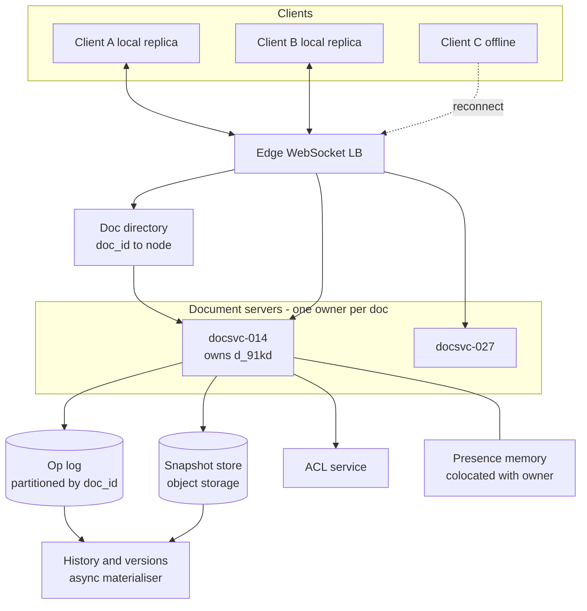
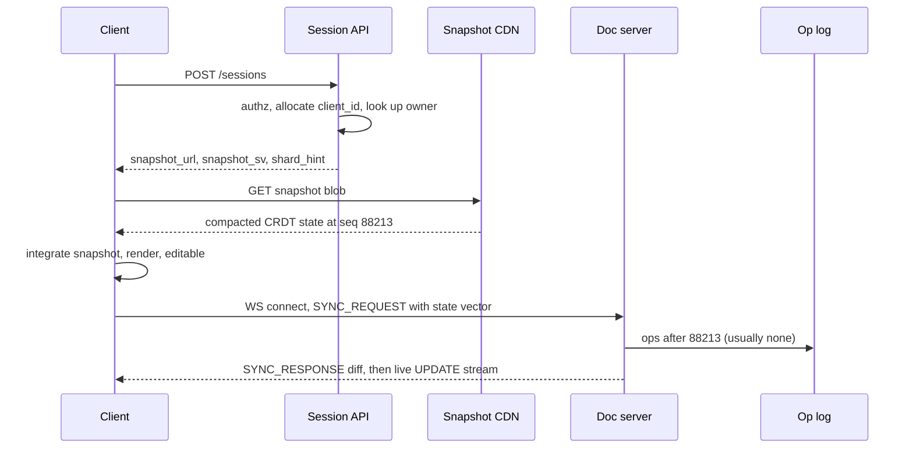
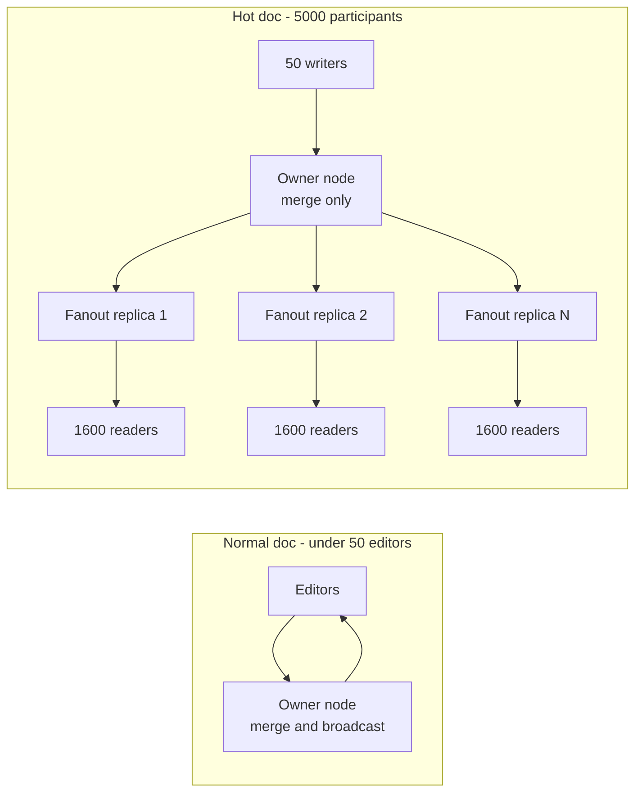

# 41 — Collaborative Editor (Google Docs)

<span class="pill pill-core">Core</span> <span class="pill pill-medium">Medium</span>

**A collaborative editor is a replicated data structure with a UI bolted on: every keystroke is an operation applied optimistically to a local replica and asynchronously to every other replica, and the entire design exists to guarantee that replicas which received those operations in different orders end up byte-identical — while a single hot document can never be sharded, so it remains a single-node bottleneck forever.**

| | |
|---|---|
| **Commonly asked at** | Google, Figma, Notion, Atlassian, Microsoft, Dropbox, Miro, Linear, Coda, Canva, any real-time collaboration or productivity org |
| **Time budget** | 45 min |
| **Core tension** | Convergence requires that concurrent edits commute or be transformed into a canonical order — CRDTs get commutativity by attaching immutable identity to every character, which costs unbounded metadata that can never be fully garbage-collected; OT gets it by transforming operations against a server-imposed total order, which costs a stateful central authority and transformation functions that are notoriously difficult to prove correct. You pay in metadata or you pay in a single point of serialisation, and a document with 500 concurrent editors makes you pay in both |
| **Prerequisites** | [F01 Networking Foundations](../fundamentals/f01-networking-foundations.md), [F06 Partitioning & Sharding](../fundamentals/f06-partitioning-sharding.md), [F07 Replication & Consistency](../fundamentals/f07-replication-consistency.md), [F08 CAP & PACELC](../fundamentals/f08-cap-pacelc.md), [F11 Idempotency](../fundamentals/f11-idempotency.md), [F12 Queues & Streams](../fundamentals/f12-queues-streams.md), [F13 Storage Engines](../fundamentals/f13-storage-engines.md), [F15 Object Storage](../fundamentals/f15-object-storage.md), [F18 Resilience Patterns](../fundamentals/f18-resilience-patterns.md), [F19 Concurrency Control](../fundamentals/f19-concurrency-control.md), [F20 Time, Clocks & Ordering](../fundamentals/f20-time-clocks-ordering.md), [F23 SLOs & Error Budgets](../fundamentals/f23-slo-error-budgets.md), [F27 Security in Design](../fundamentals/f27-security-design.md) |

---

## 1. Problem Statement

Build a system where multiple people edit the same rich-text document simultaneously, see each other's changes within a hundred milliseconds, see each other's cursors, can work offline and merge cleanly on reconnect, and never lose data or see two people's screens diverge permanently.

Three reframings carry the whole design.

**First: this is a replicated data structure problem, not a request/response problem.** There is no "save" button. Every keystroke is a write to a replica that the user is looking at, applied locally with zero latency because a 60 ms round trip per character is unusable, and propagated asynchronously. That means every client is an eventually-consistent replica of a shared mutable data structure, and the system's only real correctness obligation is **strong eventual convergence**: any two replicas that have received the same set of operations, *in any order*, must be in the same state. The database, the WebSocket tier and the storage layer are details. The data structure is the design.

**Second: convergence is not sufficient — intention preservation is the actual requirement.** A system that resolves every conflict by "last writer wins on the whole document" converges perfectly and is useless. If Alice types at the start of a paragraph while Bob types at the end, both edits must survive *and land where their authors meant them to land*. This is what makes text collaboration much harder than key-value replication: the coordinate that an operation refers to (character index 47) is invalidated by every concurrent operation that inserts or deletes before it. Either you fix up the coordinate (Operational Transformation) or you stop using positional coordinates entirely (CRDTs).

**Third: a document is an unshardable unit.** Every partitioning technique in the toolkit — hash the key, range the key, consistent hashing — works because independent keys can live on independent machines. A document is one key. When 5,000 people open the same all-hands document at 09:00, every one of their operations must be merged against the same state and broadcast to all the others, and no amount of horizontal scale changes that. **The ceiling on a single document is the ceiling of one process**, and the design work is about raising that ceiling and degrading gracefully when it is hit.

### Out of scope

Rendering, layout and pagination (genuinely hard, but a client concern); rich-text schema design beyond what affects merge semantics; document search and indexing; and the office-suite surface area (comments threading, suggestions workflow, export to PDF), which are applications built on top of the core convergent store.

---

## 2. Requirements

### Functional

| # | Requirement | Notes |
|---|---|---|
| F1 | Multiple users edit the same document concurrently | Target 50 simultaneous editors, 500 viewers |
| F2 | Local edits apply instantly with no server round trip | Optimistic local application is non-negotiable |
| F3 | Remote edits appear within ~100 ms on the same continent | Perceived-simultaneity threshold |
| F4 | Strong eventual convergence | All replicas with the same op set are identical |
| F5 | Intention preservation for concurrent inserts and deletes | Edits land where their author meant |
| F6 | Rich text: bold, italic, headings, lists, links, tables, images | Formatting has different merge semantics to text |
| F7 | Live cursor and selection presence | Ephemeral, high frequency, not document content |
| F8 | Offline editing with automatic merge on reconnect | Bounded offline window |
| F9 | Document history, named versions, restore | Reconstruct any point in time |
| F10 | Per-document ACL enforced per operation, not only at open | Revocation must take effect mid-session |
| F11 | Comments and suggestions anchored to ranges that survive edits | Anchors must be identity-based, not index-based |
| F12 | Undo/redo that is user-local, not global | Undoing your edit must not undo a colleague's |

### Non-functional

| # | Requirement | Target |
|---|---|---|
| N1 | Local echo latency | p99 < 16 ms (one frame) |
| N2 | Remote propagation latency | p50 < 60 ms, p99 < 250 ms intra-region |
| N3 | Durability of acknowledged operations | 0 loss once the client has seen an ack |
| N4 | Document open (cold, 200-page doc) | p95 < 1.5 s to editable |
| N5 | Availability of the edit path | 99.95% |
| N6 | Convergence | 100% — a permanent divergence is a Sev-1 |
| N7 | Max concurrent editors per doc | 50 hard cap, 100 degraded |
| N8 | Offline window supported | 30 days, then snapshot-based re-sync |
| N9 | Storage overhead vs plain text | < 5x steady state after compaction |

!!! danger "N6 has no error budget"
    Latency SLOs have error budgets. Convergence does not. If two users' screens permanently disagree about the content of a document, there is no "the next request will succeed" recovery — the document is corrupt, and the user's trust is gone in a way that a slow load never achieves. This is why the merge algorithm is chosen for provability rather than elegance, why every replica runs a periodic **convergence checksum** (a hash of the document state at a given version vector, compared across clients and server), and why a checksum mismatch triggers an immediate forced re-sync from the server snapshot plus an alert with the full op log attached.

---

## 3. Scale Estimation

### Operation rate

$$
\begin{aligned}
\text{DAU} &= 50 \times 10^{6} \\
\text{peak concurrent editing sessions} &= 10 \times 10^{6} \\
\text{sustained typing rate} &= 6\ \text{chars/s} \\
\text{typing duty cycle} &= 8\% \\
\text{ops/s per session} &= 6 \times 0.08 = 0.48
\end{aligned}
$$

$$
\text{total op rate} = 10^{7} \times 0.48 = 4.8 \times 10^{6}\ \text{ops/s}
$$

### Fanout is the real number

An operation is not delivered once; it is delivered to every other participant in the document. With a mean of $k = 2.5$ participants per active document:

$$
\text{egress messages/s} = 4.8 \times 10^{6} \times (k - 1) = 4.8 \times 10^{6} \times 1.5 = 7.2 \times 10^{6}
$$

At an encoded op size of roughly 40 B plus 20 B of framing:

$$
7.2 \times 10^{6} \times 60\ \text{B} = 432\ \text{MB/s} \approx 3.5\ \text{Gb/s}
$$

That is comfortable. But note the shape: **egress scales as $O(k)$ per op, so a document with 500 participants costs 500x per keystroke.** One 500-person document generates as much broadcast traffic as 200 normal two-person documents. This is why the per-document ceiling matters more than the aggregate.

### Presence dominates document traffic

Cursor position updates are sent at 10–30 Hz while a user is moving, throttled to ~2 Hz sustained:

$$
\begin{aligned}
\text{presence msgs/s} &= 10^{7} \times 2\ \text{Hz} \times 1.5\ \text{fanout} = 3.0 \times 10^{7} \\
\frac{\text{presence}}{\text{document ops}} &= \frac{3.0 \times 10^{7}}{7.2 \times 10^{6}} \approx 4.2
\end{aligned}
$$

!!! warning "Presence is 4x your document traffic and 0% of your durability requirement"
    The highest-volume message class in a collaborative editor carries no user data, needs no ordering guarantees beyond last-write-wins per user, and is worthless three seconds after it is sent. If presence shares a queue, a persistence path, or a rate limiter with document operations, then a mouse-waggling user can delay a colleague's keystroke. Presence gets its own channel, its own budget, and is the **first thing shed under load**.

### Document memory and CRDT overhead

A CRDT where each character is an independently addressable node carries per-character metadata:

$$
\begin{aligned}
\text{client id} &= 8\ \text{B},\quad \text{logical clock} = 4\ \text{B} \\
\text{left origin id} &= 12\ \text{B},\quad \text{right origin id} = 12\ \text{B} \\
\text{struct ptrs and flags} &\approx 24\ \text{B} \\
\hline
\text{per-character} &\approx 60\ \text{B for 1 B of content} = \mathbf{60\times}
\end{aligned}
$$

A 60x blowup is fatal. The fix is **run-length item encoding**: consecutive characters inserted by the same client with consecutive clocks and no interleaved remote insert collapse into a single item with a length field. Typing produces runs; measured mean run length is 15–40 characters.

$$
\text{effective overhead} = \frac{60\ \text{B} + L}{L}\Bigg|_{L = 25} = \frac{85}{25} = 3.4\times
$$

$$
\text{20,000-char document} \Rightarrow 20\,\text{KB} \times 3.4 \approx 68\ \text{KB in memory}
$$

### Tombstone growth is the one that bites

Deleted content cannot be physically removed (see §7.5), so the structure grows with **lifetime edits**, not current length:

$$
\begin{aligned}
\text{heavily-edited doc, 3 years} &: 5 \times 10^{6}\ \text{lifetime ops} \\
\text{items after run-merging} &\approx 5 \times 10^{5} \\
\text{tombstone-heavy size} &= 5 \times 10^{5} \times 60\ \text{B} = 30\ \text{MB} \\
\text{current visible text} &= 20\ \text{KB}
\end{aligned}
$$

**A 1,500x overhead on a document whose visible content never exceeded 20 KB.** This is the single most under-appreciated property of CRDT text and the reason §7.5 exists.

### Server capacity

$$
\begin{aligned}
\text{active documents (peak)} &= \frac{10^{7}\ \text{sessions}}{2.5} = 4 \times 10^{6} \\
\text{mean resident doc size} &= 250\ \text{KB} \Rightarrow 1\ \text{TB of hot state} \\
\text{merge CPU} &= 4.8\times10^{6}\ \text{ops/s} \times 5\ \mu s = 24\ \text{core-s/s}
\end{aligned}
$$

Merge CPU is trivial. The binding constraint is **connections**:

$$
\frac{10^{7}\ \text{WebSockets}}{30{,}000\ \text{per node}} \approx 333\ \text{nodes}
$$

so ~400 document-server nodes with 64 GB each, sized by socket count and memory, not by CPU.

---

## 4. API Design

### Session establishment

```http
POST /v1/documents/{doc_id}/sessions
Authorization: Bearer <token>

200 OK
{
  "session_id":  "s_7f3a",
  "doc_id":      "d_91kd",
  "client_id":   4412887301,        // unique per session, never reused
  "permission":  "write",
  "shard_hint":  "docsvc-eu-014",   // affinity target for the WebSocket
  "snapshot_url":"https://cdn/.../d_91kd/snap_88213.bin",
  "snapshot_sv": "AQTBkP4BCQ==",    // state vector at the snapshot
  "expires_at":  "2026-09-25T11:04:00Z"
}
```

`client_id` is allocated by the server and must be globally unique and **never reused**, because it is baked into the identity of every character the client inserts. A reused client id after a crash produces two different characters claiming the same identity, which is unrecoverable corruption.

### Edit channel (WebSocket, binary frames)

```text
CLIENT -> SERVER
  0x01 SYNC_REQUEST      { state_vector }
  0x02 UPDATE            { encoded_ops, client_clock_hi }
  0x03 AWARENESS         { cursor_anchor_id, cursor_head_id, selection, ttl }
  0x04 PING              { last_applied_server_seq }

SERVER -> CLIENT
  0x81 SYNC_RESPONSE     { encoded_diff, server_seq }
  0x82 UPDATE            { encoded_ops, origin_client_id, server_seq }
  0x83 AWARENESS         { [ { client_id, cursor, name, colour, ttl } ] }
  0x84 ACK               { client_clock_hi_acked, server_seq }
  0x85 RESYNC_REQUIRED   { reason: "gc_barrier_passed" | "checksum_mismatch" }
  0x86 PERMISSION_CHANGED{ permission: "read" | "none" }
```

!!! note "Why a state vector and not a sequence number"
    A single monotonic sequence number assumes a total order, which forces every client through one serialiser and makes offline merge impossible. A **state vector** — a map from `client_id` to the highest clock seen from that client — describes exactly what a replica knows, independent of ordering. `SYNC_REQUEST` sends it, and the peer replies with precisely the operations the requester is missing. This is one round trip regardless of how long the client was offline, and it is symmetric: the same encoding works client-to-server, server-to-client, and client-to-client in a peer-to-peer deployment.

### History and versions

```http
GET  /v1/documents/{doc_id}/versions?from=2026-09-01&to=2026-09-25
GET  /v1/documents/{doc_id}/at?server_seq=881204      # materialise a past state
POST /v1/documents/{doc_id}/versions                  # pin a named version
POST /v1/documents/{doc_id}/restore { "server_seq": 881204 }
```

`restore` never rewrites history. It computes a diff from current state to the target state and applies it as **new operations**, so concurrent editors converge normally and the restore itself is undoable. Rewinding the op log would break every client's state vector and force a global resync.

---

## 5. Data Model

### The op log is the source of truth

```sql
-- Append-only. Partition key is doc_id; a document never spans partitions.
CREATE TABLE doc_ops (
  doc_id        BIGINT      NOT NULL,
  server_seq    BIGINT      NOT NULL,   -- server-assigned, per-doc monotonic
  client_id     BIGINT      NOT NULL,
  clock_lo      INT         NOT NULL,   -- first logical clock in this batch
  clock_hi      INT         NOT NULL,   -- last logical clock in this batch
  payload       BYTEA       NOT NULL,   -- encoded CRDT update
  actor_user_id BIGINT      NOT NULL,   -- for audit + ACL, NOT part of merge
  created_at    TIMESTAMPTZ NOT NULL,
  PRIMARY KEY (doc_id, server_seq)
);

-- Idempotency: the same client batch must never be applied twice.
CREATE UNIQUE INDEX doc_ops_dedup
  ON doc_ops (doc_id, client_id, clock_lo);

CREATE TABLE doc_snapshots (
  doc_id       BIGINT     NOT NULL,
  server_seq   BIGINT     NOT NULL,     -- snapshot includes ops <= this
  state_vector BYTEA      NOT NULL,
  blob_url     TEXT       NOT NULL,     -- object storage; DB holds the pointer
  gc_barrier   BYTEA,                   -- SV below which tombstones were dropped
  size_bytes   BIGINT     NOT NULL,
  PRIMARY KEY (doc_id, server_seq DESC)
);
```

`server_seq` exists for replay, pagination and history — **not** for merge. Merge is driven entirely by the `(client_id, clock)` identities inside the payload, which is what makes the log replayable in any order.

### The in-memory document: a sequence CRDT

```text
Item {
  id:           (client_id, clock)   // identity of the FIRST char in this run
  origin_left:  (client_id, clock)?  // the item this run was inserted after
  origin_right: (client_id, clock)?  // the item it was inserted before
  content:      bytes | Format | Embed
  length:       u32                  // run-length encoding
  deleted:      bool                 // tombstone flag; content freed
  left, right:  *Item                // doubly linked list for O(1) traversal
}
```

Two indexes over the same items:

- a **doubly linked list** in document order, for sequential rendering and neighbour lookup;
- a **hash map** `(client_id, clock) -> *Item` for O(1) resolution of origins when integrating a remote op.

A third structure, an **order-statistic tree** over run lengths, converts "give me character index 4,812" into $O(\log n)$ instead of a list walk — required because the editor UI speaks in indices even though the CRDT speaks in identities.

### Formatting as a separate layer

Text content and formatting have different merge semantics and must not share a representation:

| Aspect | Text content | Formatting |
|---|---|---|
| Merge rule | Insert/delete with unique identity, never overwritten | Last-writer-wins per attribute over a range |
| Concurrent conflict | Both survive, ordered deterministically | One wins; the other is discarded |
| Representation | `Item` with content bytes | Sparse `FormatMarker` items in the same sequence |
| Why | Losing a typed character is data loss | Losing a "bold" is a cosmetic annoyance |

Formatting markers are inserted **into the same sequence** as text, so a bold-start marker anchors to a position that moves correctly as text is inserted around it. A range-based side table keyed by character index would be invalidated by every concurrent insert.

### Presence: deliberately not in the data model

```json
{
  "client_id": 4412887301,
  "user_id": 8812,
  "cursor": { "anchor": [4412887301, 1204], "head": [991823, 77] },
  "colour": "#e65100",
  "ts": 1758794640123,
  "ttl_ms": 30000
}
```

Held in an in-memory map on the document server, replicated to nobody, persisted nowhere, expired by TTL. The cursor is expressed as **CRDT item identities**, not integer offsets, so it stays anchored correctly when remote edits shift the text underneath it.

---

## 6. High-Level Architecture



### Write path (a keystroke)

1. **Local apply, zero latency.** The keypress is turned into a CRDT insert with id `(client_id, clock++)`, integrated into the local replica, and rendered. The user sees the character in under one frame. Nothing about this step touches the network.
2. **Batch and encode.** The client accumulates ops for 20–50 ms and emits one encoded `UPDATE` frame. A 50 ms batch turns a 6 ops/s typist into 20 frames/s containing 0.3 ops each — and because consecutive ops run-length merge, the batch is often a single item.
3. **Route to the owner.** The WebSocket is pinned to the node that owns `doc_id`. If the client landed on the wrong node it is redirected once; the LB caches the mapping.
4. **Authorize the operation.** The document server checks the cached session permission (§7.7) and the op type against the ACL. A read-only session's `UPDATE` is rejected with `PERMISSION_CHANGED`, not silently dropped.
5. **Integrate server-side.** The server applies the update to its own authoritative replica. Because the operation is a CRDT op, integration is commutative and requires no transformation against concurrent ops.
6. **Durably append, then ack.** The encoded update is appended to the op log with the `(doc_id, client_id, clock_lo)` unique constraint providing idempotency. **The ack is sent only after the append is durable** — this is the boundary of N3.
7. **Broadcast.** The update is fanned out to every other session on this document, tagged with `server_seq`. Recipients integrate it into their local replicas, which is again commutative and order-independent.
8. **Snapshot asynchronously.** Every $N$ ops or $T$ seconds, a background task writes a compacted snapshot to object storage so that new joiners do not replay the log.

### Read path (opening a document)



The document becomes **editable immediately after the snapshot loads**, before the live sync completes. Edits made in that window are ordinary local CRDT ops that merge when the socket comes up — there is no "read-only until connected" state, because the local replica is a first-class replica.

---

## 7. Deep Dives

### 7.1 Operational Transformation, concretely

OT represents an edit as a positional operation and repairs the position when concurrent operations invalidate it.

Start from the document `"abc"`. Two users edit concurrently, each having seen only `"abc"`:

```text
  Alice:  Ins("X", pos=1)      intent: a X b c
  Bob:    Ins("Y", pos=2)      intent: a b Y c
```

Alice applies her own op locally: `"aXbc"`. Bob's op arrives. Applying it verbatim at position 2:

```text
  "aXbc"  +  Ins("Y", 2)  ->  "aXYbc"     WRONG - Bob meant after 'b'
```

Bob's position 2 was computed against a document that no longer exists. The transform function repairs it:

$$
T\big(\text{Ins}(c_2, p_2),\ \text{Ins}(c_1, p_1)\big) =
\begin{cases}
\text{Ins}(c_2, p_2 + |c_1|) & p_2 > p_1 \\
\text{Ins}(c_2, p_2) & p_2 < p_1 \\
\text{tie-break by site id} & p_2 = p_1
\end{cases}
$$

```text
  T(Ins("Y",2), Ins("X",1)) = Ins("Y",3)
  "aXbc" + Ins("Y",3) -> "aXbYc"          CORRECT
```

Symmetrically, Bob has `"abYc"`, receives Alice's `Ins("X",1)`, transforms it against `Ins("Y",2)` — position 1 < 2, unchanged — and gets `"aXbYc"`. Converged, intentions preserved.

??? note "TP1, TP2, and why OT implementations are almost always centralised"
    Correctness of OT is stated as two properties.

    **TP1 (convergence for two concurrent ops).** For any concurrent $o_1, o_2$:

    $$o_1 \circ T(o_2, o_1) \equiv o_2 \circ T(o_1, o_2)$$

    Both sites reach the same state. TP1 is achievable and most published transform functions satisfy it.

    **TP2 (transformation order independence).** For three concurrent ops:

    $$T\big(T(o_3, o_1), T(o_2, o_1)\big) = T\big(T(o_3, o_2), T(o_1, o_2)\big)$$

    TP2 says the result of transforming $o_3$ does not depend on the order in which you transformed it against $o_1$ and $o_2$. TP2 is required **only when operations can be applied in different orders at different sites** — that is, in a peer-to-peer deployment. It is extremely difficult: the original dOPT algorithm was published in 1989 and a TP2 violation in it was found in 1998; several subsequent "proved correct" algorithms were also later shown to violate TP2, including implementations that had shipped.

    The escape hatch is to **impose a total order with a central server**. If every operation is sequenced by one authority and every client applies operations in that sequence order, no site ever transforms in a divergent order, and TP2 is never exercised — only TP1 is needed. This is precisely what Google Wave, Google Docs, Etherpad and ShareDB do.

    So the real statement is not "OT is hard". It is: **OT is tractable if and only if you accept a central transform authority**, which means the server is a stateful, per-document, single-writer serialiser that must hold the op history and cannot be a dumb relay.

### 7.2 CRDTs, concretely — and why they won

A sequence CRDT removes positions from the problem. Every inserted character gets an immutable identity and records *which characters it was inserted between*. Merge is then a deterministic integration, not a transformation.

Take the same document, now with identities:

```text
  "ab"   =  [ A:(s1,1)='a', B:(s1,2)='b' ]

  Alice:  Insert 'X' with id=(alice,1), origin_left=(s1,1), origin_right=(s1,2)
  Bob:    Insert 'Y' with id=(bob,1),   origin_left=(s1,1), origin_right=(s1,2)
```

Both inserts claim the same gap. The YATA/RGA integration rule resolves it without any knowledge of the other op's arrival order:

```python
def integrate(new, doc):
    # Scan the candidate region between the resolved origins.
    left  = doc.find(new.origin_left)
    right = doc.find(new.origin_right)
    scan  = left.next
    while scan is not right:
        # Conflict: 'scan' was also inserted into this gap concurrently.
        if origin_precedes(scan.origin_left, new.origin_left):
            break                      # scan's anchor is to our left: stop
        if scan.origin_left == new.origin_left:
            # Same anchor -> deterministic, symmetric tiebreak on client id.
            if scan.id.client_id > new.id.client_id:
                break
        scan = scan.next
    doc.insert_before(new, scan)
```

With `alice < bob` by client id, **every replica** produces `"aXYb"`, whether it saw Alice's op first, Bob's op first, or received them a week apart.

The properties that matter:

| Property | OT | CRDT |
|---|---|---|
| Op carries | Integer position | Immutable id plus origins |
| Merge requires knowing other concurrent ops | **Yes** — must transform against each | **No** — integration is self-contained |
| Requires central serialiser for correctness | Yes, in practice (TP2) | No |
| Ops commute | No | **Yes** |
| Idempotent on replay | No — applying twice double-inserts | **Yes** — duplicate id is a no-op |
| Works offline for weeks | Painful: must retain and transform full history | Natural: exchange state vectors |
| Metadata cost | ~0 per character | 60 B per run, tombstones forever |
| Correctness proof difficulty | High (TP2 counterexamples found post-publication) | Moderate; several machine-checked proofs exist |

!!! tip "The three reasons CRDTs won, in order of importance"
    **1. Idempotence and commutativity make the distributed system trivial.** With CRDT ops, "at-least-once delivery" is sufficient. You can replay the log, deliver out of order, deliver twice, deliver from a different server, or merge two divergent branches, and the answer is the same. With OT, every one of those is a corruption bug, so you need exactly-once ordered delivery per document — which means sequence-number tracking, gap detection, and a server that can never lose its place.

    **2. Offline is a first-class case, not a special case.** A client offline for three weeks reconnects, exchanges state vectors, and merges. In OT the server must transform three weeks of the client's ops against three weeks of everyone else's — an $O(n \times m)$ transformation cascade that is both slow and the most bug-dense code path in the system.

    **3. The server stops being load-bearing for correctness.** With CRDTs the server can be a relay, which means it can be restarted, rescheduled, failed over, or replaced mid-session without a correctness story. With OT the server *is* the algorithm.

    And the reason the metadata cost became acceptable: run-length item encoding dropped the overhead from 60x to roughly 3x (§3), which moved it from disqualifying to merely annoying. Yjs's encoding and Automerge's columnar compression are the engineering that made the theory shippable.

### 7.3 What the server actually does under a CRDT

Because CRDT merge needs no authority, the server's role is a design choice rather than a requirement. Three options:

=== "Pure relay"

    Server receives an opaque encoded update, appends it to the log, broadcasts the bytes. It never decodes the CRDT.

    - Cheapest: no document state in memory, no merge CPU, any node can serve any document, trivially horizontally scalable.
    - **New joiners must replay the entire op log** — a three-year-old document is 5M ops and a 30-second open.
    - Cannot enforce ACL at operation granularity (it cannot tell an insert from a delete).
    - Cannot garbage-collect, cannot produce a server-side render, cannot index for search.
    - Compatible with end-to-end encryption, which is the one case where it is the *only* option.

=== "Merge and broadcast (chosen)"

    Server maintains an authoritative decoded replica per active document.

    - Serves a **compacted snapshot** to joiners: open time is $O(\text{document size})$, not $O(\text{lifetime ops})$.
    - Can authorize per operation and per range (§7.7).
    - Can run tombstone GC because it knows the global state vector (§7.5).
    - Can export, index, render thumbnails, and run server-side validation of the rich-text schema.
    - Costs memory per active doc and forces **per-document affinity**, which is the source of §8.

=== "Merge, broadcast, and serialise"

    As above, but the server also assigns a per-document total order and clients apply strictly in that order.

    - Gives you a simple linear history for version restore and audit.
    - Makes server-side checksums trivially comparable.
    - Reintroduces the OT-style bottleneck (single writer per document) without the OT benefit, so only worth it if the product genuinely needs a linear history. Chosen here **only for the log**, not for client application order: `server_seq` is assigned for history, and clients still apply ops as they arrive.

**Chosen: merge-and-broadcast.** The deciding factor is cold-open latency (N4). A relay-only design cannot meet a 1.5 s open on a long-lived document without a snapshot, and producing a snapshot requires decoding the CRDT, which means you have chosen merge-and-broadcast anyway. Having paid that cost, per-op ACL and GC come free.

### 7.4 Presence: the high-frequency ephemeral tier

Cursor and selection state has the inverse profile of document content in every dimension:

| | Document ops | Presence |
|---|---|---|
| Rate | 0.48/s per user | 2–30/s per user |
| Durability | Must never be lost | Must never be stored |
| Ordering | Causal order required | Last-write-wins per client, stale drops silently |
| Value after 3 s | Permanent | Zero |
| Correct behaviour under overload | Queue, never drop | **Drop immediately** |

Design consequences:

1. **Separate frame type, separate queue, separate rate limiter.** Presence is never allowed to consume the document-op budget. Under CPU pressure, the presence broadcast loop is the first thing disabled — users keep editing, cursors freeze, nobody files a ticket.
2. **Anchor to CRDT identities, never to indices.**

    ```json
    { "anchor": [4412887301, 1204], "head": [4412887301, 1211] }
    ```

    An index-based cursor `{"pos": 482}` is wrong the instant a remote insert lands before position 482 — the remote user's caret visibly drifts while someone else types above them. Identity-based anchors resolve to the correct visual position after any concurrent edit, and degrade gracefully when the anchored character is deleted (fall back to the nearest live neighbour).
3. **Server-side coalescing.** The document server keeps a `client_id -> latest` map and flushes on a 100 ms tick, so 30 Hz mouse movement becomes 10 Hz broadcast, and a burst of 20 updates in one tick becomes one. This cuts the dominant traffic class by roughly 3x for free.
4. **TTL expiry, no explicit disconnect required.** Each entry carries a 30 s TTL refreshed by pings. A client that dies without closing its socket disappears on its own. An explicit "leave" message is an optimisation, never a correctness requirement, because it is exactly the message that fails to arrive when a laptop lid closes.
5. **Presence leaks identity.** Showing a cursor reveals that a named person is reading a specific paragraph. For sensitive documents, presence must respect the same ACL as content, and "anonymous viewer" mode exists because the privacy answer is sometimes "do not broadcast at all".

### 7.5 Offline editing, tombstones, and the GC barrier

**Offline is easy; forgetting is hard.**

Offline works because the local replica is authoritative for the user's own edits and CRDT merge is order-independent. The client buffers ops in IndexedDB; on reconnect:

```text
  C -> S : SYNC_REQUEST { sv_client }
  S      : diff_to_client = encodeDiff(server_state, sv_client)
  S -> C : SYNC_RESPONSE { diff_to_client, sv_server }
  C -> S : UPDATE        { encodeDiff(client_state, sv_server) }
```

One round trip, symmetric, independent of offline duration. Merge is automatic and conflict-free *syntactically*. It is not conflict-free *semantically* — two weeks of divergent edits produce a document that is the union of both, which may be nonsense. That is a product problem (offer a diff view, a named branch, or a "review changes" surface), not an algorithm problem, and saying so is a senior signal.

**Why deletes leave tombstones.** Delete marks an item `deleted = true` and frees its content, but the item stays. It must, for two reasons:

1. A concurrent insert may reference the deleted item as its `origin_left`. If the item is gone, the insert cannot be positioned, and different replicas would position it differently — divergence.
2. Without the identity record, a late-arriving *re-delivery* of the original insert would be indistinguishable from a new insert, and the character would resurrect.

**The growth problem.** Tombstone count is proportional to lifetime edits. §3 computed a 20 KB document carrying 30 MB of structure. Symptoms escalate in this order: snapshot size grows, open time grows, memory per active doc grows, and eventually a single document cannot be loaded into a server process.

**Garbage collection requires causal stability.** A tombstone can be physically removed only when **every** replica that could ever send an op referencing it has already seen the delete. Formally, with $SV_i$ the state vector of replica $i$:

$$
B = \min_i SV_i \quad\text{(componentwise)}
$$

Items whose id is dominated by the GC barrier $B$, and which are deleted, can be dropped. The barrier is the **slowest replica**, which is the fatal detail:

!!! gotcha "One laptop in a drawer blocks garbage collection for every document it ever touched"
    **Symptom.** Snapshots for a handful of documents grow without bound; GC reports "0 items collected" for months.
    **Mechanism.** $B = \min_i SV_i$ is dominated by the least-recently-synced replica. A client that went offline in March and has not reconnected pins the barrier at its March state vector, so nothing deleted since March is collectable.
    **Mitigation.** Declare a **bounded offline window** (N8: 30 days). Replicas that have not synced within the window are evicted from the barrier calculation. When such a client eventually reconnects, the server replies `RESYNC_REQUIRED { reason: "gc_barrier_passed" }`: the client cannot merge its ops, because the state they reference no longer exists. It must download a fresh snapshot, and its local edits are surfaced as a **separate recovery document** rather than merged. This is a deliberate, documented, user-visible trade — unbounded offline support and bounded storage are mutually exclusive, and pretending otherwise ships a system that dies slowly.

**Compaction as the practical answer.** Even within the barrier, run-merging adjacent live items and rewriting the snapshot recovers most of the loss:

```python
def compact(doc, barrier):
    out, prev = [], None
    for item in doc.items_in_order():
        if item.deleted and dominated(item.id, barrier):
            continue                      # physically drop
        if (prev and not item.deleted and not prev.deleted
                and item.id.client == prev.id.client
                and item.id.clock == prev.id.clock + prev.length
                and item.origin_left == prev.last_id()):
            prev.length += item.length    # merge runs
            prev.content += item.content
            continue
        out.append(item); prev = item
    return out
```

Compaction runs on snapshot write, is idempotent, and never changes the visible document — so it is safe to run continuously and to verify with a before/after text hash.

### 7.6 Structural edits: moving a paragraph someone is editing inside

This is where every naive design breaks, and it is the most productive question to raise unprompted.

**The failure.** A move implemented as delete-then-reinsert is not a move:

```text
  t0: doc = [ P1, P2, P3 ],  P2 = "the quarterly numbers"
  Alice: move P2 above P1      -> del(P2 items), ins(copy of P2 before P1)
  Bob:   (concurrently) types " are final" inside P2
```

Bob's insert anchors to items inside the *original* P2, which Alice tombstoned. The insert integrates correctly — onto tombstones — and is therefore invisible. Bob's text is not lost from the data structure; it is lost from the document. **Silent data loss with no error anywhere**, which is the worst possible failure mode.

**Three treatments:**

=== "Move as delete plus insert (rejected)"

    Simple, requires no new CRDT machinery, and is what you get by default if the editor implements move in the UI layer.

    - Concurrent edits inside the moved range are silently orphaned onto tombstones.
    - Concurrent moves of the same block by two users produce **two copies** of the block.
    - Rejected: the failure is silent and it is data loss.

=== "Tree CRDT with LWW parent pointers (chosen for blocks)"

    Model the document as a tree of blocks; text lives inside blocks as a sequence CRDT. A move is `set_parent(node, new_parent, position)` with a last-writer-wins register on the parent pointer, following Kleppmann's highly-available move operation for replicated trees.

    - The node keeps its identity, so concurrent inserts *inside* it survive the move exactly as intended. This is the whole point.
    - Concurrent moves of the same node resolve to one winner by timestamp; the loser's move is discarded, which is the right semantics (a block exists in one place).
    - Cycles — Alice moves A under B while Bob moves B under A — are prevented by the **undo-do-redo** protocol: on receiving a remote move with a lower timestamp than already-applied local moves, undo the later local moves, apply the remote one, then redo, skipping any redo that would create a cycle.
    - Costs an operation log per node for the undo/redo window and a stricter requirement on timestamp quality.

=== "Server-mediated structural lock (rejected)"

    Take a short lease on the subtree being moved.

    - Trivially correct and easy to explain.
    - Reintroduces a coordination round trip into the edit path, fails when the lease holder goes offline mid-move, and makes offline structural editing impossible.
    - Rejected: it breaks the local-first property that the rest of the design is built on.

!!! example "The two-level model that makes this work"
    ```text
    Document
      └── Tree CRDT over blocks        move = LWW parent pointer, identity preserved
            ├── Block b1  (paragraph)  ── Sequence CRDT over characters
            ├── Block b2  (table)      ── nested: rows/cells are tree nodes
            └── Block b3  (list item)  ── Sequence CRDT over characters
    ```
    Text edits are local to a block, so an insert inside `b2` is unaffected by `b2` moving. The two CRDTs are composed, not merged, and each uses the merge rule appropriate to its semantics. Notion, and the block model in most modern editors, is this shape — and the reason is exactly the move problem, not aesthetics.

### 7.7 Authorization per operation, not per open

A session established at 09:00 with write permission must stop being able to write the instant permission is revoked at 09:05. Checking only at open is a real vulnerability: the attacker's socket is already established, and the ACL service is never consulted again.

Checking per operation against the ACL service is also wrong — at 4.8M ops/s it is a 4.8M QPS dependency in the critical path with a latency budget of zero.

**The design that works:**

```python
class SessionAuthz:
    def __init__(self, session, acl_client, bus):
        self.perm = session.permission
        self.epoch = session.acl_epoch        # ACL version at session open
        bus.subscribe(f"acl:{session.doc_id}", self._on_acl_change)

    def _on_acl_change(self, evt):
        # Push invalidation: authoritative, ~50 ms, no polling.
        if evt.user_id in (None, self.user_id):
            self.perm = evt.resolve_for(self.user_id)
            if self.perm != "write":
                self.send(PERMISSION_CHANGED, self.perm)
                self.drain_pending_ops()      # reject, do not silently drop

    def authorize(self, op):
        if self.perm == "none":  raise Forbidden
        if self.perm == "read":  raise Forbidden
        if self.perm == "comment" and op.kind != "comment":  raise Forbidden
        if self.perm == "suggest" and op.kind == "direct_edit": raise Forbidden
        return True                           # in-memory, sub-microsecond
```

Three layers:

1. **Permission snapshot in session state** — the hot path is an in-memory field comparison, zero I/O.
2. **Push invalidation over a per-document pub/sub channel** — revocation propagates in tens of milliseconds to exactly the sessions that care, because the document server already knows every session on that document.
3. **Bounded TTL re-validation (60 s)** as a backstop for missed pub/sub messages, so the worst-case revocation window is bounded even if the bus drops a message.

Two subtleties worth raising:

- **Rejection must be explicit.** Silently discarding a revoked user's ops means their local replica has content the server does not, and they keep typing into a document that no longer accepts them. Send `PERMISSION_CHANGED`, force the client into read-only, and show the ops that could not be saved.
- **Permission modes are operation-type filters, not booleans.** "Comment-only" and "suggestion mode" are enforced by the op kind, which is only possible because the server decodes the CRDT (§7.3). A pure relay cannot implement suggestion mode at all.

---

## 8. Scaling the Bottleneck

**The bottleneck is a single document, and it cannot be sharded.** Everything else scales by adding nodes.



### Why affinity is mandatory

Two nodes both owning the same document would each hold a replica. CRDT merge means they would still converge — but only if every op reaches both, which requires a broadcast bus between them with at-least-once delivery, and it doubles snapshot writers, doubles GC calculations, and creates a window where a client synced to node A sees content that node B has not yet integrated. The complexity buys nothing, because a single document's merge cost is 24 µs/s. **One owner per document** is the right call; the directory service maps `doc_id -> node` with a lease.

### Raising the ceiling

| Technique | Effect | Cost |
|---|---|---|
| **Split merge from fanout** | Owner merges and emits an ordered op stream to $N$ stateless fanout replicas; readers connect to replicas. Converts $O(k)$ owner egress into $O(N)$ | One extra hop, ~5 ms added propagation for readers |
| **Reader/writer split** | Cap concurrent *editors* (50) but allow thousands of viewers on the fanout tier. Viewers need no merge, no client_id, no presence broadcast | Product must express "view-only while full" honestly |
| **Presence sampling** | Above 30 participants, broadcast only the $N$ nearest cursors plus an aggregate count. Removes the $O(k^2)$ presence term | Cursors of distant users disappear |
| **Adaptive batching** | Raise the client batch window from 20 ms to 200 ms as participant count grows. Op count per second falls roughly linearly | Propagation latency degrades, which is correct: slower is better than broken |
| **Block-level sharding (limit case)** | Shard a *huge* document by block subtree across owners | Only works when edits are block-local; cross-block structural moves need coordination. Worth it for whiteboards, rarely for text |

### The $O(k^2)$ term

Total message volume on one document:

$$
M(k) = \underbrace{k \cdot r_{\text{op}}}_{\text{ops produced}} \times \underbrace{(k-1)}_{\text{fanout}} = O(k^2)
$$

At $r_{\text{op}} = 0.48$ ops/s:

| $k$ | Doc messages/s | Presence messages/s (2 Hz) | Total |
|---|---|---|---|
| 5 | 9.6 | 40 | ~50 |
| 50 | 1,176 | 4,900 | ~6,100 |
| 500 | 119,760 | 499,000 | **~619,000** |
| 5,000 | 11,995,200 | 49,990,000 | **~62,000,000** |

**A single 5,000-participant document generates more messages than the entire steady-state fleet.** This table is the justification for the editor cap, and quoting it is far more convincing than asserting "we cap at 50".

### The whiteboard and plugin limit

Whiteboards break the model quantitatively, not qualitatively. Dragging a shape emits position updates at frame rate:

$$
r_{\text{op}}^{\text{whiteboard}} = 60\ \text{ops/s} = 125\times\ \text{a text editor}
$$

Applying the $O(k^2)$ formula, a whiteboard hits the same message volume as a 500-person document at **45 participants**. Mitigations are all lossy and all correct: treat in-flight drags as *presence* (ephemeral, droppable) and commit a single CRDT op on mouse-up; quantise coordinates; interpolate on the receiver. The generalisation is worth stating: **the editor's ceiling is set by op rate times participants squared, and any plugin that raises op rate lowers the participant cap proportionally** — which is why plugin APIs must expose an ephemeral channel, or plugin authors will use the durable one and silently destroy the document's scaling headroom.

---

## 9. Failure Modes

| Failure | Blast radius | Detection | Mitigation | Degraded behaviour |
|---|---|---|---|---|
| **Replica divergence** (merge bug, corrupt op) | One document, all its users; potentially a class of documents | Periodic convergence checksum: clients report `hash(state @ SV)`, server compares | Force `RESYNC_REQUIRED` to server snapshot; quarantine the op range; alert with full op log attached | Users see a brief flicker as the doc reloads; **no error budget** — always a Sev-1 |
| **Owner node crash** | All documents owned by that node (~10k) | Lease expiry in the directory, ~3 s | New owner elected, loads latest snapshot plus op-log tail, clients reconnect and `SYNC_REQUEST` | 3–8 s where edits are local-only; nothing is lost because the local replica is authoritative for its own ops |
| **Op log unavailable** | Fleet-wide write durability | Append latency and error rate | Stop acking; keep serving reads and broadcasting; clients buffer locally and retry | **Editing continues** with an "offline" badge. The correct behaviour is to degrade to local-first, not to block typing |
| **Client clock reuse after crash** (duplicate `client_id`) | One document, permanent corruption | Duplicate `(client_id, clock)` with differing content at integration | Server-allocated, never-reused `client_id`; reject conflicting ids at integration and force resync | Offending client resyncs; a shipped bug here is unrecoverable, which is why allocation is server-side |
| **Tombstone explosion** | One document becomes unopenable | Snapshot size and open-latency alerting per document | Bounded offline window, aggressive compaction, block-level split of pathological docs | Slow opens degrading to failures; needs a per-doc size SLO and an escape hatch |
| **Presence flood** (buggy client at 200 Hz) | One document's CPU, spilling to co-tenant docs | Per-session presence rate metric | Per-session presence rate limit, server coalescing tick, shed presence entirely above a threshold | Cursors freeze; document ops unaffected |
| **Hot document thundering herd** (5,000 people open at 09:00) | One owner node and its co-tenants | Connection rate per doc | Snapshot served from CDN not the owner; jittered connect; admission control to read-only tier | Late arrivals get view-only with a queue position |
| **Split brain in the directory** (two nodes claim one doc) | One document | Lease epoch mismatch on op append | Fence with a monotonic epoch in the op-log append; the stale owner's writes are rejected | Stale owner's clients reconnect; CRDT merge means no data is lost even if both accepted ops briefly |
| **ACL revocation message dropped** | One user retains write access up to the TTL | Compare op `actor_user_id` against ACL at audit time | 60 s TTL re-validation backstop; async audit that flags post-revocation writes | Bounded 60 s exposure window, documented in the threat model |
| **Snapshot corrupt or missing** | Every new joiner on that doc | Checksum on snapshot read | Fall back to previous snapshot plus longer op replay; snapshots are immutable and versioned, never overwritten | Slower opens; never a data-loss event because the op log is the source of truth |

---

## 10. SRE Lens

### SLIs and SLOs

| SLI | Definition | SLO | Why this number |
|---|---|---|---|
| Local echo latency | Keypress to painted glyph, client-instrumented | p99 < 16 ms | One frame at 60 Hz; above this typing feels laggy |
| Remote propagation | Op emitted at A to applied at B, same region | p50 < 60 ms, p99 < 250 ms | 250 ms is the edge of "they are typing now" perception |
| Cold open to editable | Session POST to first keystroke accepted | p95 < 1.5 s | Above 2 s users re-click and double-open |
| Ack durability lag | Client op to durable ack | p99 < 400 ms | Bounds the window where a client crash loses unsynced ops |
| Convergence | Documents with a checksum mismatch per day | **0** | No error budget |
| Edit availability | Non-5xx, non-timeout op submissions | 99.95% monthly | 21.6 min/month |
| Presence freshness | Cursor update to render | p95 < 500 ms | Explicitly loose; presence is the shed target |

### Error budget policy

$$
\text{budget} = (1 - 0.9995) \times 30\ \text{days} = 21.6\ \text{min/month}
$$

- Over 50% consumed: feature freeze on the document server; only reliability work ships.
- Over 100%: freeze extends to client SDK releases, since client bugs manifest as server-side op storms.
- **Convergence incidents bypass the budget entirely.** One divergence triggers a full postmortem regardless of duration, because the failure is silent correctness loss rather than visible unavailability.

### Rollout plan

Merge-algorithm changes are the highest-risk deploys in this system, because a merge bug corrupts data permanently and rolling back does not repair already-corrupted documents.

```yaml
stages:
  - name: shadow
    description: >
      New merge implementation runs alongside the old one on the server.
      Both integrate every op; states are hashed and compared. Old result
      is served. Divergence is logged with the exact op that caused it.
    duration: 14d
    gate: zero divergences across 10^9 ops

  - name: internal
    cohort: employees
    duration: 7d
    gate: zero convergence checksum mismatches, open p95 not regressed

  - name: canary
    cohort: 0.1% of documents, selected by hash(doc_id)
    duration: 7d
    gate: divergence == 0, snapshot size delta < 5%, ack p99 < 400ms

  - name: ramp
    steps: [1%, 5%, 25%, 50%, 100%]
    soak_per_step: 48h
    auto_rollback_on:
      - convergence_mismatch_total > 0
      - op_integration_error_rate > 0.0001
```

!!! warning "Rolling back a merge change does not undo the damage"
    If a merge bug ran for six hours, six hours of documents may already hold operations whose correct interpretation depends on the buggy code. Rollback stops the bleeding; it does not heal. This is why the shadow stage is 14 days and non-negotiable, and why every merge change ships with a **forward-repair script** that can re-derive affected documents from the op log using the corrected algorithm. Write the repair script before the rollout, not during the incident.

### Runbook notes

| Symptom | First checks | Action |
|---|---|---|
| Single document reported "changes not saving" | Owner node health, ack lag for that `doc_id`, op-log append errors, `PERMISSION_CHANGED` sent recently | Force owner re-election for the doc; if append is failing, confirm clients are in local-first mode and communicate |
| Convergence alert fires | Compare the two state hashes, extract the divergent op range from the log, identify the client SDK versions involved | Quarantine the document (force all clients read-only), snapshot both states, replay op log offline in both SDK versions to find the divergence point |
| Doc open latency spike | Snapshot size for the affected docs, snapshot age (how much log tail must be replayed), CDN hit rate on snapshot blobs | Trigger on-demand snapshot; check whether the snapshotter has been failing silently, which shows up as growing log-tail replay |
| Owner node CPU saturated | Top documents by op rate and participant count; presence rate per doc | Shed presence for the top docs; move the hottest doc to a dedicated node; enable adaptive batching |
| Tombstone alert on a doc | Current GC barrier, list of replicas pinning it, deleted-item count | Evict stale replicas past the offline window, force compaction, verify text hash unchanged before/after |

### Capacity model

$$
\begin{aligned}
N_{\text{nodes}} &= \max\left(
\frac{C_{\text{sessions}}}{30{,}000},\;
\frac{D_{\text{active}} \times S_{\text{doc}}}{48\ \text{GB}},\;
\frac{R_{\text{ops}} \times 5\mu s}{24\ \text{cores}}
\right) \times 1.4 \\[4pt]
&= \max\left(\frac{10^{7}}{3\times10^{4}},\; \frac{4\times10^{6} \times 250\text{KB}}{4.8\times10^{10}},\; \frac{4.8\times10^{6}\times5\times10^{-6}}{24}\right) \times 1.4 \\[4pt]
&= \max(333,\; 21,\; 1) \times 1.4 = \mathbf{467\ \text{nodes}}
\end{aligned}
$$

**Connections dominate by 16x.** The capacity conversation is therefore about socket density, kernel tuning and memory per connection — not about merge performance, which is free. A common interview mistake is to size this tier on CRDT merge throughput.

### Cost

| Component | Sizing | Monthly |
|---|---|---|
| Document servers | 467 × 16 vCPU / 64 GB | $210k |
| Op log (NVMe-backed, replicated 3x) | 4.8M ops/s × 60 B × 3 = 864 MB/s sustained; 90 d hot | $95k |
| Snapshot storage + CDN | 400M docs × 250 KB = 100 TB, 80% CDN hit on opens | $38k |
| Egress | 3.5 Gb/s sustained document + presence | $65k |
| History materialisation, GC, compaction | Batch tier | $22k |
| **Total** | | **~$430k/month** |

$$
\frac{\$430\text{k}}{50\times10^{6}\ \text{DAU}} = \$0.0086\ \text{per DAU per month}
$$

!!! tip "Where the cost actually goes"
    Note that storage — the thing people worry about with CRDTs — is 9% of the bill, while holding idle WebSockets is 49%. The highest-leverage cost optimisation is **aggressive idle-session eviction**: a document open in a background tab with no edits for 10 minutes can be downgraded to a long-poll or disconnected entirely, since the CRDT makes reconnection cheap and lossless. That single change removes 30–40% of sessions. Tombstone anxiety is a correctness and latency concern, not a cost concern.

---

## 11. Trade-offs & Alternatives

| Decision | Chosen | Rejected | Why |
|---|---|---|---|
| Merge algorithm | **Sequence CRDT (YATA-style) with run-length items** | OT with central transform authority | CRDT ops are commutative and idempotent, so at-least-once delivery suffices, offline merge is one round trip, and the server is not load-bearing for correctness. OT's TP2 problem forces a central serialiser and makes offline merge an $O(n \times m)$ transformation cascade |
| | | Last-writer-wins on whole document | Converges, destroys intention, useless |
| | | Diff-and-patch (git style) | Requires explicit save points and a human conflict resolver; incompatible with per-keystroke sync |
| Server role | **Merge and broadcast** | Pure relay | Relay cannot serve compacted snapshots (fails N4 on old documents), cannot enforce per-op ACL, cannot GC. Relay is correct only for end-to-end-encrypted documents |
| | | Merge, broadcast and serialise client application order | Reintroduces a per-document single-writer bottleneck with no compensating benefit |
| Document ownership | **One owner node per doc, leased** | Multi-owner with inter-node merge | Merge is 24 µs/s per doc; multi-owner buys nothing and adds a sync window plus duplicate snapshot writers |
| Structural moves | **Tree CRDT with LWW parent + undo-do-redo cycle prevention** | Delete plus reinsert | Silently orphans concurrent edits onto tombstones — data loss with no error |
| | | Server-side structural lock | Adds a coordination round trip to the edit path and breaks offline editing |
| Formatting merge | **LWW per attribute over ranges** | Same insert/delete semantics as text | Concurrent bold and italic on the same range would produce duplicated markers; losing a format is cosmetic, losing a character is not |
| Cursor representation | **CRDT item identities** | Integer offsets | Offsets drift visibly whenever a remote user edits above the cursor |
| Presence transport | **Separate channel, coalesced, sheddable** | Same channel as document ops | Presence is 4x the volume and 0% of the durability need; sharing a channel lets a mouse delay a keystroke |
| Offline window | **Bounded at 30 days, then snapshot resync** | Unbounded offline support | An unbounded window pins the GC barrier forever and makes tombstone growth unbounded. The trade must be explicit and user-visible |
| Op storage | **Append-only log + periodic snapshots** | Snapshot-only (store current state) | History, audit, restore and forward-repair after a merge bug all require the log. The log is also the only thing that makes a merge-algorithm rollout survivable |
| Version restore | **Apply an inverse diff as new ops** | Rewind the log | Rewinding invalidates every client's state vector and forces a global resync; restore-as-new-ops is itself undoable |
| Editor cap | **50 editors hard, viewers on fanout tier** | Unlimited editors | $O(k^2)$ message volume: 5,000 participants generate 62M messages/s on one document |

??? note "When OT is still the right answer"
    Three cases. **(1) Retrofitting an existing product** whose entire storage layer is a linear op log with positional ops — migrating to CRDTs means rewriting the storage format and every client, and the payoff may not justify it. **(2) Hard memory ceilings**, such as an embedded or mobile-only editor where 3x metadata overhead on a large document is genuinely unaffordable. **(3) A strictly centralised product with no offline story**, where the central server exists anyway and TP2 is never exercised — here OT's simplicity is real and the CRDT metadata buys nothing. Google Docs is case 3 plus case 1, which is precisely why it still runs OT while every greenfield editor built since about 2018 does not. Naming this trade-off, rather than declaring CRDTs universally superior, is the senior answer.

---

## 12. Gotchas & Corner Cases

!!! gotcha "Interleaving: two users typing different words in the same spot produce character salad"
    **Symptom.** Alice types `"Hello"` and Bob types `"World"` at the same position; the merged result is `"HWeolrllod"`. Both texts are present, convergence holds, and the document is garbage.
    **Mechanism.** Naive sequence CRDTs (and Logoot/LSEQ in particular) order concurrent inserts position by position. Each character is integrated independently, so the two runs interleave character by character rather than staying contiguous.
    **Mitigation.** Use an algorithm with **origin-based anchoring** (RGA, YATA/Yjs): each character records the character it follows, so Alice's `"e"` anchors to her own `"H"`, keeping her run contiguous. Verify with an explicit test — concurrent multi-character inserts at the same position must produce `"HelloWorld"` or `"WorldHello"`, never an interleave. Automerge shipped an interleaving bug of exactly this class and fixed it by changing the integration rule; it is not hypothetical.

!!! gotcha "A reused client_id after a crash is unrecoverable corruption"
    **Symptom.** A document intermittently shows characters in the wrong order or duplicated; forcing a resync fixes it, then it recurs.
    **Mechanism.** The client derived its `client_id` from something non-unique — a hash of the user id, a random number from an unseeded PRNG, or a value persisted to localStorage and then restored into two tabs. Two sessions now mint items with identical `(client_id, clock)` but different content. The integration hash map resolves an origin to whichever item it saw first, so different replicas resolve it differently.
    **Mitigation.** **Server-allocated, never-reused `client_id`** at session creation, from a monotonic allocator. Detect violations at integration: if an incoming item's id already exists with different content, refuse the op and force a resync rather than corrupting state. Never derive the id from user identity — one user with three tabs is three replicas.

!!! gotcha "The cursor drifts while a colleague types above you"
    **Symptom.** Remote users' carets slide a few characters out of place and only correct themselves when that user moves.
    **Mechanism.** The cursor was transmitted as an integer offset. Every insert before that offset shifts the true position, but the transmitted number does not change until the owner sends a new update.
    **Mitigation.** Transmit `(client_id, clock)` item identities for anchor and head, and resolve to a visual index locally after integrating all pending ops. Handle the deleted-anchor case explicitly: when the anchored item is a tombstone, bind to the nearest live neighbour to the left rather than dropping the cursor to position 0 — which is the bug users notice most.

!!! gotcha "Undo undoes your colleague's work"
    **Symptom.** Alice presses Ctrl-Z and Bob's last sentence vanishes.
    **Mechanism.** Undo was implemented as "revert to the previous document state" or "invert the last operation in the shared log". In a shared log, the last operation is frequently someone else's.
    **Mitigation.** Undo must be **user-scoped**: maintain a per-client stack of that client's own ops, and undo by generating a new inverse operation for the user's most recent op that is still applicable. It is a new forward op, not a log rewind, so it merges normally. Two subtleties: undoing an insert whose characters a colleague has since edited around must delete only the original items; and the undo stack must survive reconnection or users lose history whenever the network blips.

!!! gotcha "Garbage collection is blocked forever by one offline replica"
    **Symptom.** Snapshot sizes climb monotonically; GC logs "collected 0 items" for months; eventually a document exceeds the per-process memory budget and cannot be opened at all.
    **Mechanism.** The GC barrier is $\min_i SV_i$ over all replicas. Any replica that has not synced pins the barrier at its last-seen state vector. One laptop in a drawer is enough, and the documents affected are exactly the ones that person touched — an arbitrary, hard-to-predict subset.
    **Mitigation.** Bounded offline window (30 days), evict stale replicas from the barrier, and return `RESYNC_REQUIRED` when they return. Alert on **barrier age**, not on snapshot size: barrier age is the leading indicator and snapshot size is the lagging symptom.

!!! gotcha "Moving a block silently deletes the edits someone made inside it"
    **Symptom.** A user swears they typed a sentence; it is nowhere in the document; the op log contains their insert.
    **Mechanism.** Move implemented as delete-then-reinsert. The concurrent insert anchored to items inside the original block, which are now tombstones. The op integrated correctly onto dead nodes and rendered nowhere.
    **Mitigation.** Tree CRDT with an LWW parent pointer so the block retains identity across the move (§7.6). If you must keep delete-and-reinsert, at minimum detect concurrent ops anchored into a moved-away range and surface them as a recovery banner rather than discarding them silently.

!!! gotcha "The client acks its own op before the server has durably stored it"
    **Symptom.** A user edits, closes the laptop, reopens it, and the last thirty seconds are gone — with no error ever shown.
    **Mechanism.** Local-first rendering makes the edit look saved instantly. If the UI shows "All changes saved" based on local application rather than on the server ack, there is a window where the user believes durable state exists and it does not.
    **Mitigation.** Track `clock_hi_acked` per session and drive the save indicator from it. Show "Saving..." until the ack covers the highest local clock, and persist unacked ops to IndexedDB **before** rendering them, so a crash in the window is recoverable. The indicator is a correctness surface, not decoration.

!!! gotcha "Format markers survive their text and bleed into new typing"
    **Symptom.** A user deletes a bold word; text typed at that position afterwards is unexpectedly bold, or an entire paragraph suddenly becomes a heading.
    **Mechanism.** Formatting is represented as start/end markers inside the sequence. Deleting the text between them tombstones the characters but leaves both markers live and now adjacent, so the next insert lands between them and inherits the format.
    **Mitigation.** Treat format markers as part of the deleted range when the text they wrap is fully removed, and run a normalisation pass on integration that collapses empty format spans. Make this an explicit invariant checked by the convergence hash so a regression shows up as a divergence rather than as a cosmetic bug report months later.

!!! gotcha "A 200-page document opens in twelve seconds because the snapshotter has been failing"
    **Symptom.** Open latency for a small set of documents degrades gradually over weeks and eventually breaches SLO.
    **Mechanism.** Snapshot writes fail silently (object-store permissions, a size limit, a serialisation bug on one rich-text node type). Each open falls back to replaying the entire op-log tail since the last good snapshot, which grows daily.
    **Mitigation.** Alert on **snapshot age per document**, not on snapshotter error rate — a snapshotter that skips one pathological document has a 0.001% error rate and a document that will be unopenable in a month. Make the log-tail replay length a first-class metric and page when p99 exceeds a threshold.

!!! gotcha "Two owners for one document after a network partition"
    **Symptom.** Some users' edits are invisible to others for a period, then everything merges at once.
    **Mechanism.** The directory lease expired during a partition and a new owner was elected while the old owner remained alive and reachable by some clients. Both accepted ops and appended to the log.
    **Mitigation.** CRDT merge means **nothing is lost** — this is a genuine CRDT benefit worth stating. But the user-visible split is still bad, so fence it: include a monotonic lease epoch in every op-log append and reject appends from a stale epoch. The stale owner then fails fast, disconnects its clients, and they reconnect to the real owner and merge.

!!! gotcha "Presence reveals who is reading which paragraph of a confidential document"
    **Symptom.** A security review flags that a viewer can enumerate which executives opened a sensitive document and where they lingered.
    **Mechanism.** Presence broadcast is implemented as a pure performance concern, outside the ACL path, and carries user name, avatar and precise document position at 2 Hz.
    **Mitigation.** Presence is subject to the same ACL as content; support an anonymous-viewer mode; suppress presence entirely for documents above a sensitivity label; and never include presence in audit-exempt paths. Positional presence is behavioural telemetry about a named person, and it should be treated with the same care as any other such data.

---

## 13. Interview Angle

!!! interview "Lead with the data structure, not the architecture"
    The weak opening draws a box diagram with WebSockets, a load balancer and a database. Everybody draws that diagram, and it is not where the difficulty is. The strong opening is: **"The core of this system is a replicated sequence data structure whose only hard requirement is that replicas receiving the same operations in different orders converge to identical state. Everything else — the socket tier, the log, the snapshots — is plumbing around that structure. So let me start by choosing between the two families that can provide it, OT and CRDTs, work a concrete concurrent-insert example through both, and then let that choice determine what the server has to be."** That framing lets you derive the architecture instead of asserting it: because you chose CRDTs, the server can be a relay; because cold-open latency forces snapshots, the server must decode the CRDT; because it decodes, per-op ACL becomes possible; because it holds state, per-document affinity is required; and because affinity is required, a hot document is a single-node bottleneck. One decision, five consequences, all derived.

!!! interview "The unprompted observation that lands hardest"
    **"There is one thing this design cannot do, and I want to name it rather than hide it: a single document cannot be sharded. Every partitioning tool I have works because independent keys go to independent machines, and a document is one key. When five thousand people open the same all-hands doc, message volume goes as $k^2$ — that is 62 million messages per second on one document, more than my entire steady-state fleet. So the honest design has a hard editor cap, a separate broadcast-only fanout tier for viewers, and a product decision that the 51st person gets view-only. Anyone claiming a collaborative editor scales horizontally has not looked at the fanout term."** Interviewers remember the candidate who volunteers the ceiling and then engineers around it.

!!! interview "Know exactly where CRDTs are weak"
    Advocating CRDTs without naming their cost reads as fashion-following. The cost is that **you can never fully forget anything**: deletes leave tombstones, tombstones are collectable only below $\min_i SV_i$, and a single stale replica pins that barrier indefinitely. A 20 KB document can carry 30 MB of structure. State the bounded-offline-window trade explicitly — unbounded offline support and bounded storage are mutually exclusive — and describe what happens to the client that comes back after the barrier moved. Candidates who present CRDTs as free are the ones who have only read the blog posts.

??? question "Follow-up 1: Walk me through exactly what happens when two users insert at the same position at the same time."
    **Answer.** Take `"ab"` where `a` has identity `(s1,1)` and `b` has `(s1,2)`. Alice inserts `X` with `id=(alice,1)`, `origin_left=(s1,1)`, `origin_right=(s1,2)`. Bob concurrently inserts `Y` with `id=(bob,1)` and the identical origins. Neither has seen the other.

    On Alice's replica: she applies her own op, getting `aXb`. Bob's op arrives. Integration resolves the origins, finds the gap between `a` and `b` is not empty — `X` is there — and enters the conflict scan. `X` and `Y` share `origin_left`, so the deterministic tiebreak applies: compare client ids, `alice < bob`, so `Y` is placed after `X`. Result `aXYb`.

    On Bob's replica the mirror happens: he has `aYb`, Alice's op arrives, the same scan runs, the same tiebreak says `alice < bob`, so `X` goes *before* `Y`. Result `aXYb`. Identical, with no communication between them and no knowledge of arrival order.

    The properties doing the work are: the tiebreak is a **total order on client ids** so it is antisymmetric and consistent everywhere; the decision depends only on the two ops' own fields, not on replica state; and integration is idempotent, so redelivering either op is a no-op because the id is already in the hash map.

    Contrast with OT on the same input: Alice would receive `Ins("Y", pos=1)` and must transform it against her own `Ins("X", pos=1)`. Equal positions, so the transform needs its own tiebreak, and critically Alice can only compute that transform because she knows precisely which operations Bob had seen. That is the structural difference — OT's merge needs context about concurrency, CRDT's does not — and it is why OT needs a central authority to pin down that context and CRDT does not.

??? question "Follow-up 2: If CRDTs do not need a central server, why do you still have one?"
    **Answer.** Correctness does not need it; four other things do.

    **Cold-open latency.** A three-year-old document is five million operations. A relay-only server hands a new joiner the op log and the client replays it — thirty seconds on a laptop. To hand over a compacted snapshot instead, someone must hold a decoded, merged, compacted replica. That is the server, and it alone fails N4.

    **Authorization granularity.** Comment-only mode, suggestion mode, and revoking write access mid-session all require inspecting what an operation *is*. A relay sees opaque bytes. Only a server that decodes the CRDT can reject a direct edit from a suggest-only user.

    **Garbage collection.** The GC barrier is the componentwise minimum of all replicas' state vectors. Clients do not know about each other; the server is the only party that can compute it and the only party that can decide to evict a stale replica from the calculation.

    **Everything downstream of the document.** Search indexing, export, thumbnails, DLP scanning, version materialisation — all need the current text, and none of them should each implement a CRDT engine.

    I would also flip the question, because the interesting part is what the server *stops* being: it is no longer load-bearing for correctness. I can restart it, fail it over, reschedule it, or run two of them briefly during a partition, and the worst outcome is a temporary visibility split that merges cleanly. With OT, the server holds the canonical sequence and the transform state, so losing it mid-session is a correctness event, not an availability event. That is the real dividend, and it changes the operational posture of the whole system.

??? question "Follow-up 3: A user was offline for three months. What happens when they reconnect?"
    **Answer.** Two cases, and the split is the GC barrier.

    **Within the offline window.** Client sends its state vector; the server computes the diff and sends everything the client missed; the client sends its own diff back. One round trip regardless of duration. The merge is syntactically conflict-free. Note that the *first* thing to check is payload size: three months of a busy document might be tens of megabytes, so the server should compare the diff size against a fresh snapshot and send whichever is smaller — often the snapshot, which is a cheap optimisation people forget.

    **Past the GC barrier.** The server has already collected tombstones the client's operations may reference, so those ops cannot be positioned deterministically any more. The server returns `RESYNC_REQUIRED { reason: "gc_barrier_passed" }`. The client downloads a current snapshot and its three months of local edits **cannot be merged** — they are extracted into a separate recovery document and the user is told, explicitly, that their offline work is in a new file.

    That is a bad experience and I would not pretend otherwise. It exists because unbounded offline support and bounded storage are mutually exclusive: honouring a three-month-old replica means never collecting anything it might reference, which means tombstones accumulate forever across every document that replica ever touched. So the window is a product decision with a storage consequence, and it should be chosen explicitly and surfaced in the UI — "you have been offline for 27 days, reconnect soon to merge automatically" — rather than discovered as a data-loss incident.

    The semantic point is worth adding too: even a successful three-month merge produces the union of two divergent documents, which may be incoherent. Automatic merge guarantees convergence, not usefulness. For long divergences the right product answer is a review-changes view or a branch, not a silent merge.

??? question "Follow-up 4: How do you handle five thousand people opening the same document at 09:00?"
    **Answer.** I separate the three loads, because they scale differently.

    **The open stampede** is a read problem and is solved by not touching the document server at all: the snapshot is an immutable, content-addressed blob in object storage served through a CDN. Five thousand opens are five thousand CDN hits and one origin fetch. The session API is stateless and scales horizontally. Add connect jitter so the WebSocket connections arrive spread over ten seconds rather than in one burst.

    **The broadcast load** is the $k^2$ term and is solved by splitting merge from fanout. The owner node merges operations and emits a single ordered stream to $N$ stateless fanout replicas; readers connect to replicas, not to the owner. Owner egress becomes $O(N)$ instead of $O(k)$. Readers pay one extra hop, about 5 ms, which is invisible.

    **The edit load** is the one I cap, because it cannot be split — every operation must be merged against the same state. Fifty concurrent editors is a hard limit; beyond that, arrivals join as viewers with an explicit "view only, document is full" state and can request an editor slot as one frees up. Presence is sampled above thirty participants: broadcast the nearest cursors plus an aggregate count.

    I would also check the numbers out loud rather than asserting the cap: at $k=5000$ and 0.48 ops/s per editor, document messages alone are 12 million per second on one document, and presence adds 50 million. That is why the cap exists, and quoting the arithmetic is more persuasive than quoting the policy.

    Finally, a failure-mode note: the thing that actually breaks first in this scenario in production is not the merge, it is the connection establishment — five thousand TLS handshakes plus five thousand session-API calls plus five thousand ACL lookups in a few seconds. Admission control and a jittered client backoff matter more than any CRDT concern.

??? question "Follow-up 5: How do you guarantee two clients never permanently diverge, and how would you even know?"
    **Answer.** Guaranteeing it is a property of the algorithm; knowing it is a property of the system, and the second is where the engineering is.

    **The guarantee** comes from strong eventual convergence: integration is commutative, associative and idempotent, so any two replicas with the same op set are identical regardless of order. That holds only if three things are true in practice — identities are globally unique and never reused, the tiebreak is a total order evaluated identically in every client version, and delivery is at-least-once with no silent drops. Every real divergence I have seen traces to a violation of one of those three, not to a flaw in the algorithm.

    **Detecting it** is the harder half, because divergence is silent: nothing errors, both users are happy, and they only discover it when one of them reads the other's paragraph out loud on a call. So I run a **convergence checksum**. Each client periodically computes a hash of its document state together with its state vector and sends it with a heartbeat. The server computes the same hash at that state vector, using the op log to materialise it, and compares. A mismatch fires immediately, with the state vector telling you exactly which operation set to replay.

    On mismatch: force all clients on the document to read-only, capture both states and the full op log, push a `RESYNC_REQUIRED` from the server snapshot to restore user service, and take the captured artefacts offline to replay through both SDK versions and bisect to the exact operation that diverged. The captured op log is the whole investigation — without it you have two corrupt states and no way to explain them.

    And the prevention that matters most: a **cross-SDK conformance suite**. A fixed corpus of concurrent operation sequences with expected output states, run in CI for every client implementation, every language, every version, forever. Divergence is almost always two SDK versions disagreeing about a tiebreak or an edge case in the integration scan, and a conformance suite catches that before it reaches a document. I would treat the merge algorithm as a frozen specification with the suite as its executable definition.

??? question "Follow-up 6: Access control — a user's edit permission is revoked while they are typing. What happens?"
    **Answer.** Their very next operation must be rejected, and they must be told.

    The mechanism has three layers. The session holds a **permission snapshot in memory**, so the hot path is a field comparison at sub-microsecond cost — checking the ACL service per operation would be a 4.8M QPS dependency in the critical path, which is absurd. Revocation arrives by **push invalidation** on a per-document pub/sub channel: the document server already knows every session on that document, so the update reaches exactly the sessions that care in tens of milliseconds. A **60-second TTL re-validation** backstops a dropped bus message, bounding worst-case exposure.

    What matters as much as the mechanism is the behaviour. The rejection must be explicit — send `PERMISSION_CHANGED`, flip the client to read-only, and show the operations that could not be saved. Silently dropping their operations is the worst outcome: their local replica happily holds text the server refused, they keep typing into a document that no longer accepts them, and they discover the loss later with no explanation.

    Two things I would raise unprompted. First, permission is not a boolean: comment-only and suggestion mode are enforced per operation *type*, which is only possible because the server decodes the CRDT — a pure relay cannot implement suggestion mode at all, which is a concrete example of §7.3's trade-off having product consequences. Second, revoking write access does not revoke what they already saw; if the real requirement is "they must lose access to the content", you also have to invalidate their local replica and their offline cache, and accept that a determined user already has the bytes. Being honest about that boundary is better than implying the server can claw data back.

??? question "Follow-up 7: Someone moves a paragraph while a colleague is typing inside it. What happens?"
    **Answer.** With the naive implementation, the colleague's text is silently lost, and I think this is the best single question for separating people who have built one of these from people who have read about one.

    The naive move is delete-plus-reinsert: tombstone every item in the block, insert copies elsewhere. The colleague's insert anchored to items inside the original block. Those items are now tombstones. The insert integrates perfectly correctly — onto dead nodes — so it renders nowhere. No error, no conflict, no log line. The op log contains their text; the document does not.

    The fix is to stop modelling documents as one flat character sequence. Use a **tree of blocks** where each block is a node with an identity, text inside a block is its own sequence CRDT, and a move is `set_parent(node, new_parent, position)` with a last-writer-wins register on the parent pointer. Because the block keeps its identity, the colleague's insert anchors to items that are still live; the block moves and their text moves with it. Two concurrent moves of the same block resolve to one winner by timestamp, which is correct semantics — a block exists in one place, unlike a character where both concurrent inserts must survive.

    The subtlety that catches people is cycles: Alice moves A under B while Bob moves B under A. Applied naively you get a detached cycle and the subtree vanishes from the document. Kleppmann's move operation handles it with **undo-do-redo**: when a remote move arrives with an earlier timestamp than moves you have already applied, undo the later local moves, apply the remote one, then redo them in timestamp order, skipping any redo that would create a cycle. It is an expensive protocol, which is why you want moves to be rare relative to text edits — and they are.

    This is also the reason the block model won in modern editors. It is usually explained as a UX or extensibility choice, but the technical driver is that flat-sequence CRDTs cannot express a move that preserves identity.

### Strong answer vs weak answer

| Dimension | Weak | Strong |
|---|---|---|
| Opening move | Draws WebSocket + LB + database, then asks "what next?" | Names the replicated data structure as the core problem and derives the architecture from the merge-algorithm choice |
| OT vs CRDT | "CRDTs are better, they're conflict-free" | Works a concrete concurrent insert through both; explains that TP2 is why OT needs a central authority; gives three ranked reasons CRDTs won, including idempotent at-least-once delivery |
| CRDT cost | Does not mention metadata | Computes 60 B/char naive, 3.4x after run-length encoding, then 1,500x on a heavily-edited document from tombstones, and explains the GC barrier |
| Server role | "The server merges and broadcasts" as a given | Presents relay vs merge-and-broadcast as a real choice, picks merge-and-broadcast because of cold-open latency, and notes per-op ACL and GC come free once you have paid that cost |
| Presence | Treated as a minor feature | Identifies it as 4x the document traffic with zero durability need, gives it a separate sheddable channel, and anchors cursors to item identities |
| Sharding | "Shard by document id" and moves on | Says a hot document cannot be sharded at all, quantifies the $O(k^2)$ term, and designs the fanout tier and the editor cap around it |
| Offline | "CRDTs handle offline automatically" | Explains the state-vector exchange, then the GC barrier, then what actually happens past the window, and that merge guarantees convergence not coherence |
| Structural moves | Never considered | Raises it unprompted as silent data loss; proposes the tree CRDT with LWW parent and undo-do-redo cycle prevention |
| Correctness ops | "We have tests" | Convergence checksums in production, a cross-SDK conformance suite as the frozen spec, a 14-day shadow stage, and a forward-repair script written before rollout |
| Failure handling | "The server fails over" | Notes that local replicas remain authoritative so editing continues, that CRDT merge makes split-brain lossless, and fences the op log with a lease epoch anyway |

---

## 14. Key Takeaways

1. **The data structure is the system.** A collaborative editor is a replicated sequence CRDT with transport and storage attached. Choosing the merge algorithm determines what the server must be, whether offline works, whether delivery must be exactly-once, and where the scaling ceiling sits. Everything else follows.

2. **OT needs a central authority; CRDTs do not.** OT's transform functions must satisfy TP2 for peer-to-peer correctness, which is notoriously hard and has defeated published algorithms. Imposing a server-side total order sidesteps TP2 — at the cost of a stateful per-document serialiser. CRDTs get commutativity from immutable identity instead, so at-least-once delivery suffices and the server becomes optional for correctness.

3. **CRDT metadata is affordable; CRDT tombstones are the real cost.** Run-length item encoding takes overhead from 60x to roughly 3x, which is fine. But deleted content can only be collected below $\min_i SV_i$, so a single stale replica blocks garbage collection indefinitely, and a 20 KB document can carry 30 MB of structure. Bounded offline windows are not a convenience — they are the price of bounded storage.

4. **A document is unshardable.** Message volume on one document scales as $O(k^2)$: 5,000 participants produce 62M messages/s. The only real levers are splitting merge from fanout, capping concurrent editors, and shedding presence. Any plugin that raises the per-user op rate — whiteboard drags at 60 Hz — lowers the participant cap proportionally.

5. **Presence is the highest-volume, lowest-value traffic class.** It is 4x document traffic, needs no durability and no ordering, and is worthless after three seconds. Give it a separate channel, coalesce it server-side, shed it first under load, and anchor cursors to CRDT identities so they do not drift.

6. **Authorization is per operation, not per open.** A session that was authorized at open must stop writing the instant permission is revoked, which means an in-memory permission snapshot, push invalidation over a per-document channel, and a TTL backstop. Rejection must be explicit, because silently dropping a revoked user's edits is data loss they will not discover until later.

7. **Structural moves are where naive designs silently lose data.** Delete-plus-reinsert orphans concurrent edits onto tombstones with no error anywhere. A tree CRDT with LWW parent pointers preserves block identity so inner edits survive, and undo-do-redo prevents move cycles. This, not extensibility, is the technical reason modern editors use block models.

8. **Divergence has no error budget, so invest in detecting it.** Convergence checksums in production, a cross-SDK conformance suite that freezes the merge specification, a shadow stage measured in weeks, and a forward-repair script written before the rollout — because rolling back a merge bug stops the bleeding but does not heal the documents it already touched.
