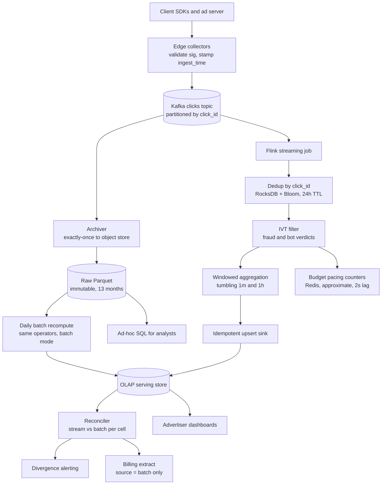
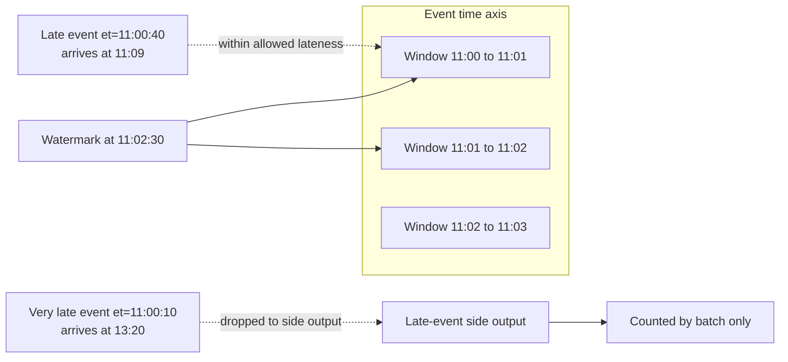
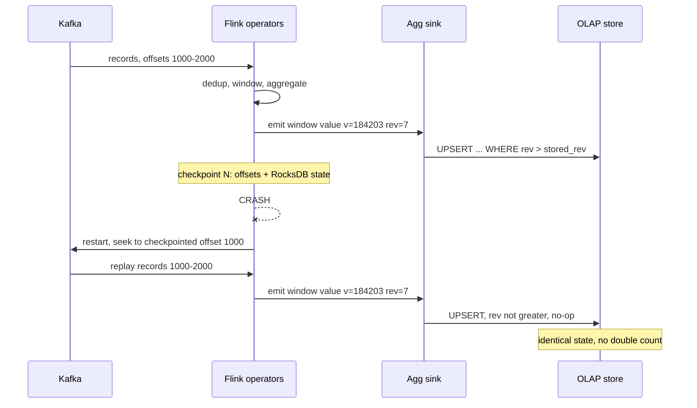
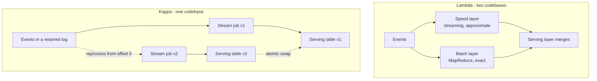
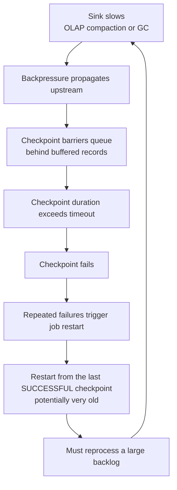

# 42 — Ad Click Aggregation / Real-Time Analytics

<span class="pill pill-core">Core</span> <span class="pill pill-hard">Hard</span>

**This looks like a counting problem and is actually a money problem: the numbers this pipeline emits are the numbers on an advertiser's invoice, so a duplicate is theft, a dropped event is uncollected revenue, and "eventually consistent" is a legal position rather than an engineering one.**

| | |
|---|---|
| **Commonly asked at** | Google, Meta, Amazon, Criteo, The Trade Desk, TikTok, Snap, Pinterest, Reddit, Uber, DoorDash, any ads, marketplace or real-time analytics org |
| **Time budget** | 45 min |
| **Core tension** | A streaming pipeline can be fast or complete, never both at the same instant. Waiting longer for late events raises accuracy and destroys the sub-minute freshness that budget pacing needs; closing windows early ships numbers you will later have to correct on an invoice. The design is therefore not "pick one" — it is running an approximate fast path and an exact slow path simultaneously and engineering the reconciliation between them |
| **Prerequisites** | [F06 Partitioning & Sharding](../fundamentals/f06-partitioning-sharding.md), [F07 Replication & Consistency](../fundamentals/f07-replication-consistency.md), [F10 Distributed Transactions](../fundamentals/f10-distributed-transactions.md), [F11 Idempotency](../fundamentals/f11-idempotency.md), [F12 Queues & Streams](../fundamentals/f12-queues-streams.md), [F13 Storage Engines](../fundamentals/f13-storage-engines.md), [F15 Object Storage](../fundamentals/f15-object-storage.md), [F17 Rate Limiting & Load Shedding](../fundamentals/f17-rate-limiting-load-shedding.md), [F18 Resilience Patterns](../fundamentals/f18-resilience-patterns.md), [F20 Time, Clocks & Ordering](../fundamentals/f20-time-clocks-ordering.md), [F21 Probabilistic Data Structures](../fundamentals/f21-probabilistic-data-structures.md), [F22 Observability Fundamentals](../fundamentals/f22-observability-fundamentals.md), [F24 Capacity Planning](../fundamentals/f24-capacity-planning.md), [F27 Security in Design](../fundamentals/f27-security-design.md), [F28 Cost Engineering](../fundamentals/f28-cost-engineering.md) |

---

## 1. Problem Statement

Ingest ad click events at scale, aggregate them by arbitrary dimension combinations over time windows, serve the results to two consumers with incompatible requirements — an advertiser dashboard that wants sub-minute freshness and a billing system that wants an auditable, exact, immutable number — and do it while the event stream is out of order, partially duplicated, and actively attacked.

Three reframings.

**First: "count the clicks" is the easy half.** A counter is trivial. What makes this hard is that the events arrive out of order by minutes to hours, arrive more than once because every layer between the phone and your Kafka topic retries, arrive fraudulently because there is money in it, and arrive in bursts that exceed steady state by 5x. Every one of those properties attacks correctness rather than throughput, and throughput is the thing that is easy to buy.

**Second: correctness has two definitions here and you must serve both.** The dashboard's definition is "close enough, right now" — an advertiser refreshing a campaign page will tolerate 0.5% error but not a 20-minute delay. Billing's definition is "exactly right, and I can prove it" — a 0.5% error on a $10M daily spend is $50k/day of disputes and, in some jurisdictions, a regulatory problem. A design that serves only one of these fails. **The interesting engineering is the reconciliation between the fast approximate answer and the slow exact answer**, including what you do when they disagree.

**Third: this pipeline is a billing system wearing an analytics costume.** That single fact raises every guarantee. Normal analytics tolerates duplicates; billing does not, because a duplicate is an overcharge. Normal analytics tolerates drops; billing does not, because a drop is revenue you never collected. Normal analytics has no audit requirement; billing must reproduce any invoice line from immutable raw events months later. If you design this as "Flink job writes to Druid" you will be correct about the architecture and wrong about the requirements.

### Out of scope

Ad serving and auction mechanics (a separate sub-millisecond system), attribution modelling and conversion windows, bid optimisation and ML ranking, and the fraud-detection scoring models themselves — though where fraud signals enter this pipeline is very much in scope.

---

## 2. Requirements

### Functional

| # | Requirement | Notes |
|---|---|---|
| F1 | Ingest click, impression and conversion events | Clicks are the billable event here |
| F2 | Aggregate counts by time window and dimension combination | `ad_id`, `campaign_id`, `geo`, `device`, `placement`, `creative` |
| F3 | Tumbling minute and hour windows for dashboards and billing | Minute for freshness, hour for the billing grain |
| F4 | Sliding windows for trend and anomaly detection | 5-minute window, 1-minute slide |
| F5 | Deduplicate events by `click_id` | Across a 24-hour horizon |
| F6 | Filter invalid traffic before it reaches billable aggregates | Fraud, bots, self-clicks, test traffic |
| F7 | Support late events with a bounded allowed-lateness window | 15 minutes to the streaming path |
| F8 | Daily batch recomputation from immutable raw events | The billing ground truth |
| F9 | Reconcile the streaming result against the batch result, and alert on divergence | The correctness control loop |
| F10 | Ad-hoc queries over arbitrary dimension slices | Analyst access to the raw layer |
| F11 | Near-real-time spend counters for budget pacing | Sub-30-second, approximate is acceptable |
| F12 | Full lineage: any invoice line reproducible from raw events | Audit and dispute resolution |

### Non-functional

| # | Requirement | Target |
|---|---|---|
| N1 | Peak ingest | 60k clicks/s, 1.2M impressions/s |
| N2 | Streaming freshness (event to queryable) | p95 < 45 s for the speculative result |
| N3 | Window finalisation latency | Window close + 15 min allowed lateness |
| N4 | Streaming vs batch divergence | < 0.1% per campaign-day |
| N5 | Billable duplicate rate | < 0.001% (1 in 100,000) |
| N6 | Billable drop rate | **0** — every accepted event reaches a billing aggregate exactly once |
| N7 | Dashboard query latency | p99 < 500 ms |
| N8 | Raw event retention | 13 months (billing dispute window + 1) |
| N9 | Pipeline availability | 99.9%; ingest buffer availability 99.99% |
| N10 | Recovery time after a full pipeline failure | < 30 min to catch up 1 hour of backlog |

!!! danger "N5 and N6 are financial controls, not SLOs"
    A duplicate click is an overcharge to a customer who can dispute it, a dropped click is revenue you will never invoice, and neither is discovered by looking at a latency graph. Both are silent. That is why this design carries a batch ground truth (§7.4) whose only job is to disagree with the streaming path loudly enough to be noticed, and why the reconciliation divergence metric is treated as a **paging alert rather than a dashboard tile**. The pipeline's most important output is not the counts — it is the confidence interval around them.

---

## 3. Scale Estimation

### Event volume

$$
\begin{aligned}
\text{impressions/day} &= 100 \times 10^{9} \\
\text{CTR} &= 1\% \Rightarrow \text{clicks/day} = 1 \times 10^{9} \\
\text{mean clicks/s} &= \frac{10^{9}}{86{,}400} = 11{,}574 \\
\text{peak factor} &= 5\times \Rightarrow \mathbf{58{,}000\ \text{clicks/s}}
\end{aligned}
$$

Event payload (compressed Avro on the wire):

$$
\begin{aligned}
\text{raw JSON} &\approx 1.2\ \text{KB},\quad \text{Avro} \approx 400\ \text{B} \\
\text{peak ingest} &= 58{,}000 \times 400\ \text{B} = 23\ \text{MB/s} \\
\text{daily raw} &= 10^{9} \times 400\ \text{B} = 400\ \text{GB/day} \\
\text{columnar, 5:1} &\Rightarrow 80\ \text{GB/day} = 29\ \text{TB over 13 months}
\end{aligned}
$$

Clicks are comfortable. **Impressions are 100x larger** — 40 TB/day raw — which is why impressions are aggregated at the edge and only clicks are kept as individual events. Stating that split unprompted is a good signal.

### Dimensional cardinality — the number people get wrong

The naive fear is the cross product:

$$
\begin{aligned}
|\text{ad\_id}| &= 10^{7} \text{ (active/day)} \\
|\text{geo}| &= 2{,}000 \text{ (country} \times \text{region)} \\
|\text{device}| &= 6,\quad |\text{placement}| = 50 \\
\hline
\text{theoretical cells} &= 10^{7} \times 2{,}000 \times 6 \times 50 = 6 \times 10^{12}
\end{aligned}
$$

Six trillion cells per hour is impossible. But **materialised cardinality is bounded by event count, not by the cross product** — a cell only exists if an event landed in it:

$$
\text{cells/hour} \le \frac{10^{9}}{24} = 4.17 \times 10^{7}
$$

and because ad traffic is strongly Zipfian (a small number of campaigns get most of the volume, and each campaign's traffic concentrates in a few geos), the observed distinct cell count is far lower:

$$
\text{observed cells/hour} \approx 6 \times 10^{6} \quad(\text{compression factor} \approx 7\times\text{ vs the bound})
$$

$$
\begin{aligned}
\text{hourly rollup storage} &= 6\times10^{6} \times 80\ \text{B} \times 24 = 11.5\ \text{GB/day} \\
\text{vs raw} &= 80\ \text{GB/day compressed} \Rightarrow \textbf{7x smaller, and 1000x faster to query}
\end{aligned}
$$

!!! tip "Say this out loud in the interview"
    "The cross product is six trillion cells, but materialised cardinality is capped by the event count — 42 million per hour — and Zipfian concentration takes the real number to about 6 million. So pre-aggregation is cheap and I should do it. The number that would kill me is not dimension count, it is a **high-cardinality dimension with no concentration**, like `user_id` or a raw URL, because there the cell count approaches the event count and pre-aggregation stops compressing anything."

### Streaming state size

Deduplication state, keyed by `click_id` with a 24-hour TTL:

$$
\begin{aligned}
\text{keys} &= 10^{9} \\
\text{RocksDB entry} &\approx 16\ \text{B key} + 8\ \text{B ts} + 36\ \text{B overhead} = 60\ \text{B} \\
\text{state} &= 10^{9} \times 60\ \text{B} = \mathbf{60\ \text{GB}}
\end{aligned}
$$

Window aggregation state, at 15 minutes of allowed lateness over minute windows:

$$
\begin{aligned}
\text{open windows} &= 15 + 1 = 16 \\
\text{cells per minute window} &\approx 10^{5} \\
\text{window state} &= 16 \times 10^{5} \times 100\ \text{B} = 160\ \text{MB}
\end{aligned}
$$

**Dedup state is 375x the window state.** The intuition that "the aggregation is the expensive part" is wrong; the expensive part is remembering what you already counted.

### Watermark and completeness

Measured event-time delay distribution (event timestamp to broker arrival):

| Percentile | Delay | Cause |
|---|---|---|
| p50 | 1.2 s | Normal network |
| p90 | 4 s | Mobile radio wake-up |
| p99 | 25 s | Retry after a transient failure |
| p99.9 | 4 min | SDK batching on a backgrounded app |
| p99.99 | 2 h | Device offline, SDK buffered to disk |
| p99.999 | 3 d | Device offline for a weekend |

With allowed lateness $L$, the fraction of events the streaming path captures:

$$
\begin{aligned}
L = 1\ \text{min} &\Rightarrow 99.7\% \text{ captured},\ 3 \times 10^{6}\ \text{events/day missed} \\
L = 15\ \text{min} &\Rightarrow 99.98\% \text{ captured},\ 2 \times 10^{5}\ \text{events/day missed} \\
L = 2\ \text{h} &\Rightarrow 99.995\% \text{ captured},\ 5 \times 10^{4}\ \text{events/day missed}
\end{aligned}
$$

Now convert to money at a $0.50 average CPC:

$$
\begin{aligned}
L = 1\ \text{min} &\Rightarrow \$1.5\text{M/day unbilled if never corrected} \\
L = 15\ \text{min} &\Rightarrow \$100\text{k/day} \\
L = 2\ \text{h} &\Rightarrow \$25\text{k/day}
\end{aligned}
$$

**No value of $L$ reaches zero, and the marginal return collapses fast:** going from 15 minutes to 2 hours recovers $75k/day but costs 8x the streaming state and delays every finalised window by two hours. This is the entire argument for a batch ground truth — **you buy the last 0.02% with a different system, not with a bigger $L$.** $L = 15$ min is chosen as the knee of the curve.

### Query tail latency across shards

The serving store is sharded; a dashboard query scatter-gathers across $n$ shards and waits for the slowest:

$$
P(\text{query} > t) = 1 - \big(1 - P(\text{shard} > t)\big)^{n}
$$

With $n = 32$ shards each at p99 = 50 ms:

$$
P(\text{query} > 50\text{ms}) = 1 - 0.99^{32} = 1 - 0.725 = \mathbf{27.5\%}
$$

A 1% per-shard tail becomes a **27.5% query tail**. To hold a 500 ms p99 overall you need per-shard $p$ such that:

$$
1 - (1-p)^{32} = 0.01 \implies p = 1 - 0.99^{1/32} = 3.1 \times 10^{-4}
$$

— per-shard p99.97, which nobody achieves by tuning. The practical answers are **hedged requests** (fire a duplicate at
the p95 mark; effective tail becomes $p^2$), **dimension-aligned partitioning** so a campaign dashboard touches 1–2 shards instead of 32, and **pre-aggregation** so the scanned row count per shard is small enough that the tail is dominated by network rather than by work.

---

## 4. API Design

### Ingest

```http
POST /v1/events:batch
Content-Type: application/vnd.ads.events.v3+avro
X-Idempotency-Key: 7f3a2b91-...          # batch-level, for HTTP retries

{
  "events": [
    {
      "click_id":    "01J8ZQ4K7N9P2R5T",  # server-minted at impression, signed
      "impression_id":"01J8ZQ4K7N9P2R4A",
      "event_time":  1758794640123,        # device clock, UNTRUSTED
      "ingest_time": 1758794641877,        # edge clock, trusted
      "ad_id":       "ad_88213",
      "campaign_id": "cmp_1204",
      "advertiser_id":"adv_77",
      "geo":         { "country": "DE", "region": "BY" },
      "device":      "ios",
      "placement":   "feed_inline",
      "price_micros": 480000,              # resolved at auction, not here
      "sig":         "ed25519:..."         # HMAC over click_id + ad_id + ts
    }
  ]
}

202 Accepted
{ "accepted": 412, "rejected": 3, "reject_reasons": { "bad_signature": 3 } }
```

Three deliberate choices:

- **`click_id` is minted server-side at impression time and signed.** A client-generated id can be forged, replayed and collided. Signing makes replay detectable even before dedup, and makes "this click never had a corresponding impression" a cheap check.
- **Both `event_time` and `ingest_time` are carried.** Windowing uses event time; watermarks and fraud heuristics use the difference between them. A device clock that is 6 hours fast will otherwise place events in windows that closed yesterday or have not opened yet (§12).
- **202, not 200.** The edge writes to the durable buffer and returns; it never waits for aggregation. The only thing the caller learns is that the event is safely in the log.

### Query

```http
GET /v1/metrics?metric=clicks
    &from=2026-09-25T00:00:00Z&to=2026-09-25T12:00:00Z
    &granularity=hour
    &filter=campaign_id:cmp_1204,geo.country:DE
    &group_by=device
    &consistency=realtime            # realtime | finalized | billing

200 OK
{
  "source": "speculative",
  "watermark": "2026-09-25T11:46:00Z",
  "complete_through": "2026-09-25T11:00:00Z",
  "rows": [
    { "ts": "2026-09-25T11:00:00Z", "device": "ios",     "clicks": 184203, "final": false },
    { "ts": "2026-09-25T10:00:00Z", "device": "ios",     "clicks": 201887, "final": true  }
  ]
}
```

!!! note "`complete_through` and `final` are the most important fields in the response"
    Every row returned by a streaming aggregate is either provisional or final, and the API must say which. Omitting this is the single most common design error: a dashboard renders 184,203 clicks, the advertiser screenshots it, the number later settles at 186,910 after late events, and you have a support ticket that is really a trust incident. Exposing `final: false` and `complete_through` turns an apparent inconsistency into a documented, explainable property. The `consistency` parameter lets billing ask for `finalized` and get an error rather than a provisional number.

### Budget pacing (separate path, separate guarantees)

```http
GET /v1/budget/{campaign_id}/spend:approx

200 OK
{ "spend_micros": 4820000000, "as_of_lag_ms": 1800, "accuracy": "approximate" }
```

Budget enforcement reads a different store with different guarantees: ~2 s lag, approximate, no dedup, no late-event handling. **It is deliberately not the billing number** — its job is to stop overdelivery, and being 2 seconds fresh and 0.5% wrong beats being 16 minutes stale and exact.

---

## 5. Data Model

### Raw event layer (immutable, the ground truth)

```sql
-- Parquet in object storage, Hive-partitioned. Written once, never updated.
-- s3://ads-raw/clicks/dt=2026-09-25/hour=11/part-00137.parquet
CREATE EXTERNAL TABLE raw_clicks (
  click_id        STRING,
  impression_id   STRING,
  event_time      TIMESTAMP,
  ingest_time     TIMESTAMP,
  ad_id           STRING,
  campaign_id     STRING,
  advertiser_id   STRING,
  geo_country     STRING,
  geo_region      STRING,
  device          STRING,
  placement       STRING,
  price_micros    BIGINT,
  ivt_score       DOUBLE,     -- invalid-traffic score, joined in later
  ivt_verdict     STRING      -- valid | suspect | invalid
)
PARTITIONED BY (dt STRING, hour STRING)
STORED AS PARQUET;
```

Partitioned by **ingest hour, not event hour**. Partitioning by event time would mean a late event rewrites a partition that was already read by yesterday's batch job, which destroys immutability and makes the audit story fall apart. Batch jobs filter by event time *within* a wider ingest-time scan — a trade of a few percent of extra scan for an append-only guarantee.

### Aggregate serving layer

```sql
-- Columnar OLAP store (Druid / Pinot / ClickHouse).
CREATE TABLE agg_clicks_hourly (
  window_start  TIMESTAMP,
  ad_id         STRING,
  campaign_id   STRING,
  geo_country   STRING,
  device        STRING,
  clicks        BIGINT,
  spend_micros  BIGINT,
  -- provenance, not decoration:
  source        STRING,      -- 'stream' | 'batch'
  revision      INT,         -- monotonic per key; batch always outranks stream
  is_final      BOOLEAN,
  computed_at   TIMESTAMP,
  PRIMARY KEY (window_start, ad_id, geo_country, device, source)
)
PARTITION BY (window_start);
```

Two properties do the heavy lifting:

1. **The primary key includes the full dimension tuple and the window**, which makes every write an idempotent upsert (§7.3).
2. **`source` and `revision` are stored, not overwritten.** Keeping the stream row alongside the batch row is what makes reconciliation a query rather than a forensic exercise — you can ask "show me every cell where stream and batch differ by more than 0.5%" directly.

### Dedup state

```text
RocksDB keyed state in the stream processor, partitioned by hash(click_id):

  key:   click_id (16 B)
  value: first_seen_ingest_ms (8 B)
  TTL:   24 h, compaction-filter based

Pre-filter: per-partition Bloom filter, 10^9 keys at 1% FPP = 1.2 GB.
  Bloom says NOT PRESENT -> definitely new -> skip the RocksDB read.
  Bloom says MAYBE       -> do the RocksDB read to confirm.
```

!!! note "Why the Bloom filter is safe here and would not be elsewhere"
    A Bloom filter has false positives but no false negatives. Used as a **negative** pre-filter — "if it says absent, it is definitely absent" — it eliminates 99% of RocksDB reads with zero correctness impact, because every positive is confirmed against the real store. Using it as the dedup decision itself would drop 1% of genuine clicks as false duplicates, which at $0.50 CPC is $5M/day of unbilled revenue. Same structure, same 1.2 GB, opposite consequences, and the difference is entirely in which direction you trust it.

---

## 6. High-Level Architecture



### Write path

1. **Edge collection.** The collector verifies the `click_id` signature, stamps `ingest_time` from a trusted clock, rejects malformed and unsigned events, and writes to Kafka. It performs no aggregation and holds no state — it must be able to absorb a 5x burst by doing almost nothing.
2. **Durable buffer.** Kafka is partitioned by `hash(click_id)` with replication factor 3 and `acks=all`. **Partitioning by `click_id` rather than `ad_id` is deliberate**: it co-locates all copies of a duplicated event on one partition, so dedup is a local keyed-state lookup rather than a distributed one. It also avoids the hot-partition problem that `ad_id` partitioning creates when one campaign takes 15% of traffic.
3. **Archive to raw.** A dedicated exactly-once sink writes Kafka batches to Parquet in object storage, partitioned by ingest hour. This runs independently of the aggregation job so that a bug in aggregation never costs you the ground truth. **This is the most important reliability property in the design**: as long as raw events are safe, every downstream number is recomputable.
4. **Stream processing.** Dedup by `click_id`, join the invalid-traffic verdict, assign to event-time windows, aggregate by dimension tuple.
5. **Speculative emission.** Windows emit an early result on a 30-second trigger so the dashboard is fresh, then re-emit on every late arrival, then emit a final result when the watermark passes window end plus allowed lateness.
6. **Idempotent sink.** Every emission is an upsert of the *complete current value* for `(window, dimensions)`, never an increment (§7.3).
7. **Batch recompute.** A daily job reads the raw Parquet, runs the same aggregation logic in batch mode, and writes rows with `source='batch'`. This is the billing number.
8. **Reconcile.** Compare stream and batch per cell, alert on divergence beyond threshold, and publish the batch result to billing.

### Read path

- **Dashboards** query the OLAP store with `consistency=realtime`, get stream rows plus `final` flags, and render provisional values with a freshness indicator.
- **Billing** queries with `consistency=billing`, which filters to `source='batch'` and errors if the batch has not landed. It is structurally impossible for billing to read a provisional number.
- **Analysts** query raw Parquet directly through a SQL engine for slices the rollups do not cover, accepting minutes-scale latency.

---

## 7. Deep Dives

### 7.1 Windows and watermarks

**Window types and when each is right:**

=== "Tumbling"

    Fixed, non-overlapping, every event in exactly one window.

    ```python
    window_start = (event_time // 60_000) * 60_000
    ```

    - Chosen for all billable aggregates. Non-overlap means each event contributes exactly once, which is a precondition for "sum of windows equals total".
    - Cheap: state is $O(\text{open windows} \times \text{cells})$.
    - Rejected for trend detection: a spike straddling a boundary is split across two windows and may breach no threshold in either.

=== "Sliding"

    Fixed length, advancing by a smaller step; events belong to multiple windows.

    ```python
    # 5-minute window, 1-minute slide: each event is in 5 windows
    windows = [t - i*60_000 for i in range(5)]
    ```

    - Chosen for anomaly detection and rate alerting, where boundary-straddling spikes matter.
    - **Never used for billing**: summing sliding windows counts each event $\text{length}/\text{slide}$ times. This is a real production bug, not a theoretical one.
    - Costs 5x the state and 5x the emission volume.

=== "Session"

    Dynamic length, closed by a gap of inactivity.

    ```python
    # merge into an existing session if within the gap, else start a new one
    if event_time - last_event_time <= GAP_MS: extend(session)
    else: close(session); open(new_session)
    ```

    - Used for user-journey analysis and for a specific fraud signal: a session containing 40 clicks on one ad is not a human.
    - Hardest state model, because a late event arriving in the gap between two sessions **merges them**, retracting two previously-emitted results and emitting one.
    - Not used for billing aggregates.

**Watermarks.** A watermark is an assertion: *"I believe no further event with `event_time < W` will arrive."* It is the mechanism that converts an infinite stream into finite, closable windows.

$$
W(t) = \max_{e \in \text{seen}}\big(\text{event\_time}(e)\big) - \delta
$$

with $\delta$ the out-of-orderness allowance. When $W$ passes a window's end, that window can produce a result.



The three timestamps that must never be confused:

| Timestamp | Meaning | Used for |
|---|---|---|
| `event_time` | When the user clicked, per the device | **Window assignment** — the only correct basis for billing |
| `ingest_time` | When the edge received it | Watermark generation, fraud heuristics, raw partitioning |
| Processing time | When the operator handled it | Nothing that affects correctness; debugging and latency SLIs only |

!!! warning "Watermark generation is per-partition and advances at the speed of the slowest partition"
    Flink takes the **minimum** watermark across input partitions, which is correct — you cannot claim completeness for a time range if one partition might still deliver older events. The operational consequence is that **one idle or stalled Kafka partition freezes the watermark for the entire job**, so no window ever closes, state grows without bound, and the job eventually dies on memory. This is the single most common streaming outage, and the mitigations are `withIdleness()` to exclude quiescent partitions after a timeout, plus a **watermark-lag alert per source partition** rather than only on the job-level aggregate.

**Emission strategy** — a window emits three times, and this is what reconciles freshness with completeness:

```java
WindowedStream
  .trigger(EarlyAndLateTrigger.of(Duration.ofSeconds(30)))  // speculative
  .allowedLateness(Duration.ofMinutes(15))                  // update window
  .sideOutputLateData(veryLateTag)                          // beyond that
  .aggregate(new ClickCountAggregator());
```

1. **Speculative**, every 30 s while the window is open: `is_final=false`, feeds dashboards.
2. **On-watermark**, when $W$ passes window end: still `is_final=false`, because late events are still accepted.
3. **Final**, at window end + 15 min: `is_final=true`, state is released.

Anything later than that goes to the side output, is archived, and is picked up by the batch job — which is exactly the 0.02% that §3 priced at $100k/day.

### 7.2 Late, duplicate and fraudulent events

Three failure sources that look identical in the data and require completely different handling:

| Source | Signature | Handling | Why it is not the others |
|---|---|---|---|
| **Genuine late** | Same `click_id` never seen; large `ingest_time - event_time` | Apply to the correct event-time window if within lateness; else side output to batch | The event is real and billable; dropping it is lost revenue |
| **Client retry double-fire** | Identical `click_id`, seconds apart | Dedup: drop silently, count in a metric | Network retries after a timeout are normal and expected; treat as a non-event |
| **Replay attack** | Identical `click_id`, hours/days apart, often from a different IP or ASN | Drop, **raise a fraud signal**, flag the source | The interval is the tell. A 4-hour-old `click_id` reappearing is not a retry |

**Deduplication is the load-bearing mechanism**, and its horizon is a direct correctness/cost trade:

$$
\begin{aligned}
\text{24 h horizon} &\Rightarrow 60\ \text{GB state},\ \text{catches } 99.97\% \text{ of duplicates} \\
\text{7 d horizon} &\Rightarrow 420\ \text{GB state},\ \text{catches } 99.995\% \\
\text{1 h horizon} &\Rightarrow 2.5\ \text{GB state},\ \text{catches } 96\%
\end{aligned}
$$

At 1 in 100,000 billable duplicates (N5) against $10M/day of spend, the 24-hour horizon leaves ~$100/day of duplicate exposure — negligible — while the 1-hour horizon leaves ~$400k/day. **The horizon is chosen by the money, not by the memory.**

```python
def process(event, state, bloom, metrics):
    # 1. Signature: unforgeable, checked before any state is touched.
    if not verify_sig(event.click_id, event.ad_id, event.sig):
        metrics.inc("reject.bad_signature"); return None

    # 2. Clock sanity BEFORE windowing, or a bad clock corrupts a window.
    skew = event.ingest_time - event.event_time
    if skew < -CLOCK_TOLERANCE_MS:                  # event "from the future"
        metrics.inc("clamp.future_event")
        event.event_time = event.ingest_time        # clamp, do not drop
    if skew > MAX_PLAUSIBLE_DELAY_MS:               # older than the SDK buffer
        metrics.inc("reject.implausible_age"); return None

    # 3. Dedup. Bloom is a negative filter only; positives are confirmed.
    if bloom.might_contain(event.click_id):
        first_seen = state.get(event.click_id)
        if first_seen is not None:
            gap = event.ingest_time - first_seen
            if gap < RETRY_WINDOW_MS:
                metrics.inc("dedup.client_retry")
            else:
                metrics.inc("dedup.replay_suspect")
                fraud_signal(event, reason="late_replay", gap_ms=gap)
            return None
    bloom.add(event.click_id)
    state.put(event.click_id, event.ingest_time)

    # 4. Invalid traffic. Suspect traffic is counted separately, not dropped,
    #    so a bad classifier is recoverable without replaying raw events.
    if event.ivt_verdict == "invalid":
        metrics.inc("ivt.excluded"); return event.with(billable=False)
    return event.with(billable=True)
```

!!! tip "Never drop suspect traffic — route it"
    Dropping IVT-flagged events makes the classifier's decisions irreversible in the aggregate layer: if the model is retuned next week, you cannot recover what it wrongly excluded without a full replay. Instead, carry `billable` as a dimension and aggregate both. Billing reads `billable=true`; fraud analysis reads both; a reclassification is a batch recompute rather than a data-recovery project. This pattern — **filter by annotation, not by deletion** — applies to every irreversible decision made early in a pipeline.

### 7.3 Exactly-once sinks

"Exactly-once" in a stream processor means **effectively-once end-to-end state updates**, not that a message is physically delivered once. Two mechanisms achieve it and they have very different operational profiles.

=== "Idempotent upsert keyed by window and dimensions (chosen)"

    ```sql
    INSERT INTO agg_clicks_hourly
      (window_start, ad_id, geo_country, device, source, clicks, revision, is_final)
    VALUES (?, ?, ?, ?, 'stream', ?, ?, ?)
    ON CONFLICT (window_start, ad_id, geo_country, device, source)
    DO UPDATE SET
      clicks   = EXCLUDED.clicks,       -- SET the total, never add to it
      revision = EXCLUDED.revision,
      is_final = EXCLUDED.is_final
    WHERE EXCLUDED.revision > agg_clicks_hourly.revision;
    ```

    The critical property: **the value written is the complete aggregate for that window, not a delta.** Replaying the same emission ten times produces the same row. Replaying from a checkpoint an hour old produces the same row. The sink requires no transactions, no coordination, and no participation in the checkpoint protocol.

    - Works with any store that supports upsert-with-condition.
    - Survives arbitrary replay, which is exactly what happens after a restart.
    - Requires that the aggregate is **recomputable from window state** — true for counts, sums, min/max, HLL sketches; false for anything that consumed input it no longer holds.
    - The `revision` guard prevents an in-flight stale emission from overwriting a newer one after a restart.

=== "Two-phase commit sink"

    ```text
    checkpoint N barrier arrives
      -> sink pre-commits: write to a transaction, do not commit
      -> checkpoint N completes across all operators
      -> JobManager notifies operators of completion
      -> sink commits the transaction
    crash between pre-commit and commit
      -> on restart, recover the transaction id from checkpoint state and commit it
    ```

    - Required when the sink is **append-only and non-idempotent** — writing individual rows to Kafka or to an event store where you cannot upsert.
    - Couples sink availability to checkpoint success: a slow sink stalls checkpoints, and stalled checkpoints eventually kill the job (§7.6).
    - Transaction timeouts are a notorious failure: Kafka's `transaction.max.timeout.ms` must exceed the worst-case checkpoint interval plus recovery time, or the broker aborts transactions the job is about to commit and you lose the window.
    - Rejected here for aggregates; retained for the **raw archiver**, which is genuinely append-only.

**The chosen combination is the point:** the raw archiver uses 2PC because it appends immutable files, and the aggregate sink uses idempotent upserts because it writes recomputable totals. Applying one mechanism to both is the mistake — 2PC for aggregates buys nothing over upserts and adds a fragile coupling; upserts for raw archival would mean mutable ground truth, which destroys auditability.



### 7.4 Lambda vs kappa, and the reconciliation loop



| | Lambda | Kappa | Chosen here |
|---|---|---|---|
| Codebases | Two implementations of the same logic | One | **One implementation, two execution modes** |
| Reprocessing | Rerun the batch job | Replay the log from an earlier offset | Batch over raw Parquet |
| Correction of late events | Batch naturally sees everything | Requires log retention ≥ max lateness | 13-month raw retention |
| Risk | **Logic drift** — the two implementations diverge subtly and nobody notices for months | Replay of 13 months from Kafka is impractical and expensive | Avoids both |
| Audit | Batch output is reproducible | Depends on log retention, and Kafka is not an archive | Immutable Parquet is a real audit substrate |

**Chosen: a kappa-shaped codebase with a lambda-shaped topology.** Concretely:

- **One set of aggregation operators**, written once, executed in two modes — streaming over Kafka for freshness, batch over raw Parquet for ground truth. Flink, Spark Structured Streaming and Beam all support this. It removes lambda's fatal flaw (two implementations drifting apart) while keeping lambda's real benefit (a recomputation substrate that is not the message broker).
- **Kafka is a buffer, not an archive.** Seven days of retention for operational replay; the 13-month record lives in object storage, which is 20x cheaper per TB, scannable by SQL engines, and immutable.
- **Reprocessing means rerunning the batch job over a date range**, not rewinding a 13-month Kafka offset. The kappa purist's "just replay the log" does not survive contact with a 13-month audit requirement.

!!! example "Why pure kappa fails the billing requirement specifically"
    Pure kappa says: fix the bug, replay the log, swap the output table. For billing you must additionally answer, six months later, "prove that this $4,182.20 line item is correct." That requires the exact input events, in their original form, still available, and provably unmodified. Kafka with 13-month retention is technically possible and operationally absurd — it is a replicated log on hot storage being used as cold archival. The moment you accept object storage as the archive, you have a batch layer, and the only question left is whether it shares code with the streaming layer. Make it share code.

**The reconciliation job** is the control loop that makes the whole thing trustworthy:

```sql
-- Runs after the batch layer lands for a given hour.
WITH s AS (
  SELECT window_start, campaign_id, geo_country, device, clicks AS stream_clicks
  FROM agg_clicks_hourly WHERE source='stream' AND window_start = :hour
),
b AS (
  SELECT window_start, campaign_id, geo_country, device, clicks AS batch_clicks
  FROM agg_clicks_hourly WHERE source='batch'  AND window_start = :hour
)
SELECT
  COALESCE(s.campaign_id, b.campaign_id) AS campaign_id,
  COALESCE(stream_clicks, 0) AS stream_clicks,
  COALESCE(batch_clicks, 0)  AS batch_clicks,
  COALESCE(batch_clicks,0) - COALESCE(stream_clicks,0) AS delta,
  ABS(COALESCE(batch_clicks,0) - COALESCE(stream_clicks,0))
    / NULLIF(COALESCE(batch_clicks,0), 0)::float AS rel_error
FROM s FULL OUTER JOIN b USING (window_start, campaign_id, geo_country, device)
WHERE ABS(COALESCE(batch_clicks,0) - COALESCE(stream_clicks,0))
        / NULLIF(COALESCE(batch_clicks,0), 0)::float > 0.001
   OR s.campaign_id IS NULL      -- stream missed the cell entirely
   OR b.campaign_id IS NULL      -- stream invented a cell: always a bug
ORDER BY ABS(delta) DESC;
```

Alert thresholds, and the reasoning behind each:

| Condition | Severity | Reasoning |
|---|---|---|
| Fleet-wide $\lvert\Delta\rvert / \text{batch} > 0.1\%$ | Page | Above the modelled late-event residual; something systemic is wrong |
| Any single campaign $> 1\%$ and $> 10{,}000$ clicks | Page | Large enough to appear on an invoice and be disputed |
| **`stream > batch` for any cell** | **Page immediately** | Late events can only make batch *larger*. Stream exceeding batch means double-counting — the expensive direction |
| Batch absent for an hour | Page | Billing has no ground truth; block the billing extract |
| Divergence trend rising over 7 days | Ticket | Slow drift is a dedup-horizon or watermark regression |

!!! gotcha "The sign of the divergence tells you the bug class before you look at anything else"
    **`batch > stream`** is expected and benign: late events the streaming path missed, bounded by the completeness curve in §3. If it grows, your watermark or allowed lateness regressed.
    **`stream > batch`** is never benign. The streaming path counted something the batch path — which sees strictly more input — did not. Candidates in likelihood order: a non-idempotent sink doing increments instead of upserts, a dedup state TTL that expired too early, a sliding window accidentally used for a billable aggregate, or a restart that replayed without the `revision` guard. Every one of those is an overcharge. Train the on-call to check the sign first; it collapses the hypothesis space instantly.

### 7.5 Pre-aggregation vs raw storage

| | Pre-aggregated rollups | Raw events |
|---|---|---|
| Storage | 11.5 GB/day | 80 GB/day compressed |
| Query latency | 10–50 ms | 5–120 s |
| Flexibility | Only pre-chosen dimension combinations | Any question, including ones not yet imagined |
| New dimension | Requires a backfill | Already there |
| Cost per query | ~$0.0001 | ~$0.05 |
| Correctness after a logic fix | Must recompute | Re-derivable by definition |

**Both, with a clear division of labour:**

```text
Tier 1  Pre-aggregated cubes    dashboards, budget pacing, alerting     10-50 ms
Tier 2  Raw Parquet + SQL       analyst ad-hoc, fraud investigation     5-120 s
Tier 3  Raw Parquet + batch     billing ground truth, reconciliation    hours
```

The design decision that matters is **which cubes to materialise**, because the lattice of possible rollups is exponential in dimension count. With $d$ dimensions there are $2^d$ possible groupings; at $d=6$ that is 64 cubes, and materialising all of them costs more than the raw data.

The selection rule:

$$
\text{value}(c) = \text{query\_frequency}(c) \times \big(\text{cost}_{\text{raw}} - \text{cost}_{\text{cube}}\big) - \text{cost}_{\text{maintain}}(c)
$$

In practice: materialise the 6–10 cubes that serve 95% of dashboard queries (measured from the query log, not guessed), and let everything else fall through to raw. Re-evaluate monthly; cube popularity shifts as the product changes.

!!! warning "The dimension that breaks pre-aggregation"
    Pre-aggregation compresses only when many events share a cell. Add `user_id` and the cell count approaches the event count, the "rollup" is now the same size as the raw data plus aggregate overhead, and you have paid for a cube that compresses nothing. The same applies to raw URLs, session ids, timestamps at second granularity, and free-text search terms. The guard is a **cardinality budget per cube**: reject a cube definition whose estimated distinct-cell count exceeds, say, 1% of the event count. Compute it with HyperLogLog over a sample before you build it, not after.

### 7.6 Backpressure and checkpointing

Backpressure in a well-built stream processor is a **feature**: when a downstream operator cannot keep up, credit-based flow control propagates the slowdown upstream until it reaches the Kafka source, which simply reads more slowly. Kafka absorbs the difference. Nothing is dropped and nothing crashes.

The failure is what backpressure does to **checkpointing**, and the interaction is the thing that takes pipelines down.



**Each iteration of this loop starts further behind.** A 10-minute-old last-good checkpoint means replaying 10 minutes of a 58k/s stream — 35 million events — through an already-overloaded pipeline. This is the death spiral, and it is how a five-minute sink hiccup becomes a four-hour outage.

Defences, in order of effectiveness:

1. **Unaligned checkpoints.** Aligned checkpointing makes a barrier wait for all input channels, so under backpressure the barrier is stuck behind buffered records. Unaligned checkpoints let the barrier overtake in-flight data by storing that data in the checkpoint. Checkpoint duration becomes largely independent of backpressure — which is exactly the property needed to break the loop. The cost is a larger checkpoint.
2. **Incremental RocksDB checkpoints.** With 60 GB of dedup state, a full checkpoint every 60 s is 1 GB/s of sustained upload. Incremental checkpointing uploads only new SST files, typically 1–3% of state. Without this, large keyed state is simply not viable.
3. **Checkpoint interval tuned to recovery cost, not to habit.**

    $$
    \text{worst-case replay} = \text{checkpoint interval} + \text{checkpoint duration} + \text{restart time}
    $$

    At a 60 s interval, 20 s duration and 90 s restart, the worst case is 170 s of replay — about 10M events at peak. Sized against N10 (30 min to catch up 1 hour), that is comfortable, so 60 s is right. Chasing a 10 s interval would multiply checkpoint overhead for no recovery benefit.
4. **Decouple the sink from the pipeline.** An async I/O operator with bounded in-flight requests stops a slow OLAP store from directly stalling the aggregation operators, converting a hard stall into a measurable queue.
5. **Alert on the leading indicators, not on the outage.** `checkpoint_duration`, `checkpoint_failure_count`, `backpressure_ratio` per operator, and `kafka_consumer_lag` per partition. The pageable condition is **two consecutive failed checkpoints**, not "the job is down" — by the time the job is down you are in the spiral.

!!! tip "The load-shedding decision that is specific to billing"
    Most systems shed load by dropping data. This one cannot: a dropped click is uncollected revenue and an unhappy advertiser. So the shedding hierarchy is **by output, not by input** — under pressure, (1) stop emitting speculative results and emit only on watermark, which cuts sink writes by ~30x; (2) suspend the sliding-window anomaly job, which costs 5x the state of the tumbling job; (3) degrade budget-pacing freshness from 2 s to 30 s. Only then, if the ingest buffer itself is at risk, do you shed at the edge — and even then you shed *impressions*, never clicks, because impressions are 100x the volume and a fraction of the value.

---

## 8. Scaling the Bottleneck

The binding constraint moves as you grow. Knowing which one you are against is most of the answer.

| Scale | Binding constraint | Symptom | Fix |
|---|---|---|---|
| 10k clicks/s | Nothing | — | Single Flink job, 20 slots |
| 60k clicks/s | Dedup state I/O | RocksDB read amplification, checkpoint duration climbing | Bloom pre-filter, incremental checkpoints, SSD-backed state dirs |
| 200k clicks/s | Key skew | One campaign is 15% of traffic; one subtask at 100% while others idle | Two-phase aggregation (§below) |
| 500k clicks/s | Sink write amplification | Speculative emission writes the same cell 30x per window | Raise the early-trigger interval; batch writes; emit only on change |
| 1M+ clicks/s | Shuffle network | Repartition between dedup and aggregation saturates the network | Pre-aggregate locally before the shuffle; co-partition dedup and aggregation keys |

### Key skew and two-phase aggregation

The dominant scaling problem in ad aggregation is that traffic is Zipfian. Partitioning by `campaign_id` sends 15% of all events to one subtask.

```python
# Phase 1: local pre-aggregation on a salted key. Spreads the hot key across
# N subtasks; each emits a partial count per window instead of raw events.
salt = random.randint(0, SALT_FACTOR - 1)          # SALT_FACTOR = 64
stream.key_by(lambda e: (e.campaign_id, e.geo, e.device, salt)) \
      .window(TumblingEventTimeWindows.of(MINUTES(1))) \
      .aggregate(CountAggregator())                # 64 partials per cell

# Phase 2: global merge on the real key. Input volume is now 64 rows per
# cell per window, not millions of events.
      .key_by(lambda p: (p.campaign_id, p.geo, p.device)) \
      .window(TumblingEventTimeWindows.of(MINUTES(1))) \
      .reduce(lambda a, b: a + b)
```

$$
\begin{aligned}
\text{before} &: 8{,}700\ \text{events/s to one subtask} \\
\text{after} &: 136\ \text{events/s per subtask} + 64\ \text{partials/min to the merger} \\
\text{skew reduction} &= 64\times
\end{aligned}
$$

The cost is one extra shuffle and one extra window of latency. The constraint is that the aggregation must be **associative and commutative** — true for counts, sums, min, max, HLL union; false for percentiles computed exactly, median, or anything order-dependent. For those you need a mergeable sketch (t-digest) instead, which is the same trick at a different level.

### Sink write amplification

Speculative emission at 30 s intervals on a 1-minute window means each cell is written twice while open, plus once per late arrival, plus once at finalisation. With 100k cells per minute window and 16 concurrently-open windows under allowed lateness:

$$
\text{writes/s} = \frac{100{,}000 \times 16 \times \sim4\ \text{revisions}}{60} \approx 107{,}000\ \text{upserts/s}
$$

against an actual information content of 100k cells per minute — **a 64x amplification**. Mitigations: emit only cells whose value changed since the last emission (most cells in old windows are static, cutting writes by ~90%), batch upserts into 1,000-row transactions, and increase the early-trigger interval for windows older than the current one, since nobody is watching a dashboard for a window that closed 12 minutes ago.

---

## 9. Failure Modes

| Failure | Blast radius | Detection | Mitigation | Degraded behaviour |
|---|---|---|---|---|
| **Stream job crash loop** | All real-time metrics stale; billing unaffected | Job restart count; Kafka consumer lag | Restart from last checkpoint; Kafka retains 7 d so nothing is lost | Dashboards freeze with a stale-data banner; batch still produces correct invoices |
| **Watermark stall** (idle partition) | Windows never close; state grows until OOM | Per-partition watermark lag; state size growth rate | `withIdleness()` on sources; alert on watermark lag > 5 min | Everything appears to work until the job dies; this is why the alert is on lag, not on errors |
| **Dedup state loss** (checkpoint corruption) | Up to 24 h of duplicates enter billable aggregates | Reconciliation shows `stream > batch` | Rebuild dedup state by replaying raw events; **hold the billing extract until batch confirms** | Billing runs a day late rather than wrong; batch is authoritative so no overcharge ships |
| **Sink unavailable** (OLAP down) | Real-time serving down; pipeline backpressures | Sink error rate; backpressure ratio | Async sink with bounded queue; buffer in Kafka; do not block aggregation | Dashboards 503; ingest and archival continue; catch-up on recovery |
| **Raw archiver failure** | **Ground truth lost — the worst failure in the system** | Parquet file count vs Kafka offsets per hour | Archiver runs as an independent job with 2PC; alert within 5 min; Kafka's 7 d retention is the recovery window | Batch and audit are impossible for the gap; this is why the archiver is isolated from aggregation and monitored separately |
| **Clock skew flood** (SDK ships a bad clock) | Events land in wrong windows; some windows reopen, some never close | Distribution of `ingest_time - event_time`; sudden shift in the tail | Clamp future-dated events to `ingest_time`; reject implausibly old; alert on skew distribution shift | Affected traffic is counted in the ingest window rather than the true window; batch can correct with the right heuristic |
| **Click fraud burst** | Inflated counts; advertiser overcharged; budget exhausted | Sudden CTR spike; IVT rate; per-IP and per-device click rate | Real-time IVT scoring; `billable=false` annotation; post-hoc credit via batch reclassification | Numbers inflate in real time and are corrected in batch; the credit process is a product requirement, not a bug fix |
| **Reconciliation job fails** | Divergence goes undetected | Job success heartbeat | Page on missing reconciliation run, not only on divergence found | **Silent loss of the correctness control loop** — the most dangerous failure because nothing looks broken |
| **Kafka partition leader loss** | Ingest stalls for that partition | Under-replicated partitions; producer error rate | RF=3, `acks=all`, `min.insync.replicas=2`; producer retries with idempotence enabled | Brief ingest latency spike; no data loss |
| **Batch job produces wrong results** | **Wrong invoices ship** | Reconciliation is symmetric: stream diverging from batch flags either side | Never auto-publish billing; require the divergence check to pass, plus a day-over-day sanity check on totals | Billing blocks and is investigated; the stream path's independence is what makes the batch path checkable |

---

## 10. SRE Lens

### SLIs and SLOs

| SLI | Definition | SLO | Rationale |
|---|---|---|---|
| Ingest availability | Non-5xx on `/events:batch` | 99.99% | The buffer must accept events; everything downstream is recoverable, this is not |
| Streaming freshness | Event ingest to queryable in OLAP | p95 < 45 s, p99 < 120 s | Dashboard refresh feels live below a minute |
| Watermark lag | Wall clock minus job watermark | p95 < 3 min, alert at 5 min | Leading indicator for every window problem |
| Window finalisation | Window end to `is_final=true` | 99% within 16 min | Window close plus 15 min lateness plus slack |
| **Stream/batch divergence** | $\lvert\text{batch}-\text{stream}\rvert/\text{batch}$ per campaign-day | **p99 < 0.1%, max < 1%** | Directly bounds invoice error |
| Billable duplicate rate | Duplicates surviving into billable aggregates | < 0.001% | Overcharge control |
| Billable drop rate | Accepted events not reaching a billing aggregate | **0** | Revenue control; enforced by batch, not by hope |
| Dashboard query latency | End-to-end at the API | p99 < 500 ms | Interactive threshold |
| Batch completion | Daily job done by 06:00 local | 99.5% | Billing close depends on it |

### Error budget policy

$$
\text{ingest budget} = (1 - 0.9999) \times 30\text{d} = 4.3\ \text{min/month}
$$

Two tiers, because the consequences differ by orders of magnitude:

- **Freshness budget (99.9%)**: normal policy — over 50% consumed, reliability work is prioritised; over 100%, feature freeze on the pipeline.
- **Correctness budget (divergence)**: **any breach is an incident regardless of duration.** A 30-second divergence spike that touches an invoice is worse than an hour of stale dashboards. Breaching the divergence SLO blocks the billing extract automatically, which converts a correctness problem into a visible availability problem — deliberately, because a late invoice is recoverable and a wrong one is not.

### Rollout plan

```yaml
# Aggregation-logic changes are financial changes. Treat them accordingly.
stages:
  - name: shadow
    description: >
      New job version consumes the same topic with a different consumer group
      and writes to source='stream_shadow'. Reconcile shadow vs current vs
      batch on every hour. Nothing user-visible.
    duration: 7d
    gate: shadow-vs-batch divergence <= current-vs-batch divergence

  - name: backfill_validation
    description: >
      Run the new logic in batch mode over 30 days of historical raw events.
      Compare against the archived batch results for those days.
    gate: max per-campaign-day divergence < 0.01%

  - name: canary
    cohort: 1% of campaigns by hash(campaign_id)
    duration: 3d
    gate: divergence within SLO, no stream>batch cells, sink write rate stable

  - name: ramp
    steps: [5%, 25%, 100%]
    soak_per_step: 24h
    auto_rollback_on:
      - any cell where stream > batch by more than 0.5%
      - checkpoint_failure_count > 1 in 10m
      - watermark_lag_p95 > 5m
```

!!! warning "Savepoint compatibility is the constraint that dictates the deploy"
    A stream job with 60 GB of keyed state cannot be redeployed by restarting from scratch — that would drop 24 hours of dedup state and admit a day of duplicates. Upgrades go through a **savepoint**: stop with savepoint, deploy the new binary, restore from the savepoint. This requires that every stateful operator keeps a stable `uid()` and that state schema changes are backward-compatible. Adding a field to a state POJO is fine with Avro-based serializers; changing a key type is not, and requires a state-migration job. **Assign explicit `uid()`s to every operator on day one** — retrofitting them after the fact invalidates every existing savepoint, and discovering this during an incident is a bad afternoon.

### Runbook notes

| Symptom | First checks | Action |
|---|---|---|
| Dashboards stale | Job status, checkpoint duration trend, Kafka lag per partition, watermark lag per partition | If lag is on one partition: check for an idle or stuck producer. If checkpoints are failing: enable unaligned checkpoints, raise the timeout, and look for the slow sink |
| Reconciliation shows `stream > batch` | Which cells; whether it started at a deploy; sink write pattern (upsert vs increment); dedup state size vs expected | **Block the billing extract.** Bisect to a deploy. Double-counting is almost always a sink or restart-replay bug |
| Reconciliation shows `batch >> stream` | Watermark lag history, late-event side-output volume, allowed-lateness config | Usually a watermark regression or an upstream producer buffering. Batch will correct billing; fix the streaming path before it becomes routine |
| Checkpoint duration climbing | State size per operator, incremental checkpointing enabled, backpressure ratio by operator | Find the backpressured operator; if it is the sink, bound the async queue. Verify TTL compaction is actually removing dedup keys |
| Sudden CTR spike on a campaign | IVT rate, per-IP click distribution, user-agent mix, `ingest-event` skew distribution | Likely fraud. Confirm the IVT path is annotating rather than dropping, so reclassification stays possible |
| Batch job missing | Upstream Parquet partition completeness, cluster capacity, previous run duration trend | **Do not publish billing.** A missing ground truth means no invoice, not an invoice from the stream |

### Capacity model

$$
\begin{aligned}
\text{slots} &= \max\left(\frac{R_{\text{peak}}}{r_{\text{slot}}},\; \frac{S_{\text{state}}}{s_{\text{slot}}}\right) \times \text{headroom} \\[4pt]
&= \max\left(\frac{58{,}000}{4{,}000},\; \frac{60\ \text{GB}}{8\ \text{GB}}\right) \times 1.5 \\[4pt]
&= \max(14.5,\; 7.5) \times 1.5 = \mathbf{22\ \text{slots}}
\end{aligned}
$$

But peak is not the sizing input — **recovery is**. After a 30-minute outage the job must drain 30 minutes of backlog while still consuming live traffic:

$$
\text{catch-up rate needed} = R_{\text{peak}} \times \left(1 + \frac{T_{\text{backlog}}}{T_{\text{recovery}}}\right) = 58{,}000 \times \left(1 + \frac{30}{30}\right) = 116{,}000/\text{s}
$$

$$
\text{slots} = \frac{116{,}000}{4{,}000} \times 1.3 = \mathbf{38\ \text{slots}}
$$

**Sizing for catch-up costs 73% more than sizing for peak, and it is the correct number.** A pipeline that can exactly handle peak can never catch up from an outage, which turns every incident into an unbounded one. This is the most commonly missed calculation in streaming capacity planning.

### Cost

| Component | Sizing | Monthly |
|---|---|---|
| Edge collectors | 60 × 8 vCPU, autoscaled | $18k |
| Kafka | 30 brokers, 7 d retention, RF=3, 2.4 TB/day raw | $52k |
| Flink streaming | 38 slots ≈ 10 × 16 vCPU / 64 GB + SSD state | $34k |
| Raw storage | 80 GB/day × 13 months = 31 TB, object storage | $0.7k |
| Batch compute | Daily recompute + reconciliation, 400 vCPU-hours/day | $9k |
| OLAP serving | 32 nodes, 4 TB hot rollups | $58k |
| **Total** | | **~$172k/month** |

$$
\frac{\$172\text{k}}{10^{9}\ \text{clicks/day} \times 30} = \$5.7\ \text{per million clicks}
$$

against $0.50 CPC revenue — **0.001% of revenue**, which is the number that ends every "can we cut the batch layer" conversation. The batch layer costs $9.7k/month and protects a $100k/day correctness exposure.

!!! tip "The cost line that surprises people"
    Raw storage — 31 TB for 13 months of the ground truth — is **$700/month**, 0.4% of the bill, while the OLAP serving tier is 34%. Retaining raw events is essentially free relative to serving them. Any proposal to shorten raw retention to save money is optimising the smallest line in the budget while destroying the audit story, and framing it that way kills the idea faster than any correctness argument.

---

## 11. Trade-offs & Alternatives

| Decision | Chosen | Rejected | Why |
|---|---|---|---|
| Architecture | **One codebase, two execution modes (stream + batch over immutable raw)** | Pure lambda (two implementations) | Logic drift between two implementations is the classic lambda failure and it is silent for months |
| | | Pure kappa (replay Kafka) | 13-month billing retention on a replicated hot log is absurd; object storage is 20x cheaper and immutable |
| Window type for billing | **Tumbling** | Sliding | Sliding windows count each event $\text{length}/\text{slide}$ times when summed — a real overbilling bug |
| Allowed lateness | **15 min** | 1 min | Misses 0.3% of events = $1.5M/day if uncorrected |
| | | 2 h | Recovers only $75k/day more, costs 8x state, delays every finalised window by 2 h |
| Late-event fallback | **Side output, corrected by batch** | Drop | Dropping billable events is uncollected revenue with no recovery path |
| | | Extend lateness indefinitely | State grows without bound; windows never finalise |
| Exactly-once for aggregates | **Idempotent upsert of complete values** | Two-phase commit | 2PC couples sink availability to checkpoint success; upserts survive arbitrary replay and need no coordination |
| Exactly-once for raw archive | **Two-phase commit** | Idempotent upsert | The archive is append-only immutable files; upsert semantics would make ground truth mutable |
| Kafka partition key | **`click_id`** | `campaign_id` | `click_id` co-locates duplicates for local dedup and avoids the Zipfian hot partition |
| Dedup horizon | **24 h** | 1 h | Catches only 96% of duplicates; $400k/day exposure |
| | | 7 d | 420 GB state for $100/day of additional protection |
| IVT handling | **Annotate `billable=false`** | Drop the events | Dropping makes classifier decisions irreversible; reclassification then needs a full raw replay |
| Serving store | **Pre-aggregated cubes + raw fallback** | Raw only | 5–120 s queries fail the 500 ms dashboard SLO |
| | | Cubes only | Analysts cannot ask new questions; fraud investigation is impossible |
| Budget pacing source | **Separate approximate counter, 2 s lag** | The billing aggregate | Billing is 16 min behind; overdelivery in that window is unbillable spend |
| Skew handling | **Two-phase aggregation with salted keys** | Larger parallelism | Parallelism does not help when one key is 15% of traffic; only key splitting does |
| Capacity sizing basis | **Catch-up rate after a 30 min outage** | Peak throughput | A pipeline sized for peak can never drain a backlog, making every incident unbounded |

??? note "When the batch layer is genuinely unnecessary"
    If the output is not financial and nobody will ever audit it — internal product metrics, engagement dashboards, A/B readouts with wide confidence intervals — then the batch layer is overhead. Run streaming only, accept 0.02% error, and spend the saved complexity elsewhere. The batch layer earns its keep when **someone can lose money because of a number**, when **a regulator or auditor can demand reproduction**, or when **the aggregation logic is likely to change and history must be recomputed under the new logic**. Ad billing hits all three. Being able to say when *not* to build it is a stronger signal than always building it.

---

## 12. Gotchas & Corner Cases

!!! gotcha "Summing sliding windows double-counts every event"
    **Symptom.** A weekly total is roughly 5x the sum of the daily totals, or campaign spend inexplicably exceeds the budget cap by a constant factor.
    **Mechanism.** A 5-minute sliding window with a 1-minute slide places every event in 5 windows. That is correct for "clicks in the last 5 minutes" and catastrophic if the results are summed, because each event is counted $\text{length}/\text{slide}$ times.
    **Mitigation.** Structurally separate the two: sliding-window outputs go to a metrics namespace that billing cannot read, tagged `aggregation=sliding`, and the billing extract filters on `aggregation=tumbling`. Relying on people remembering the distinction fails; encode it in the schema. Add a monotonic sanity check — hourly totals must equal the sum of their minute windows to within the late-event residual.

!!! gotcha "A device with a wrong clock lands events in windows that closed yesterday"
    **Symptom.** Windows from three days ago suddenly receive events; watermarks jump forward by hours and then refuse to advance; some windows never close.
    **Mechanism.** `event_time` comes from a device clock that can be arbitrarily wrong — a phone with the date set to 2027 emits an event whose event time is in the future, which advances the watermark by a year and instantly finalises every open window with incomplete data. A phone set to 2019 produces events so old that every window they belong to has been garbage-collected.
    **Mitigation.** Sanitise before windowing: clamp future-dated events to `ingest_time`, reject events older than the maximum plausible SDK buffer, and generate watermarks from a **percentile** of event time rather than the maximum so a single rogue event cannot advance them. Alert on shifts in the skew distribution; an SDK release with a clock bug shows up there hours before it shows up in revenue.

!!! gotcha "The dedup TTL expires mid-retry and the same click bills twice"
    **Symptom.** Reconciliation shows `stream > batch` by a small, steady margin that correlates with an upstream system's retry schedule.
    **Mechanism.** Dedup state has a 24-hour TTL. An upstream producer with a 25-hour retry backoff — a dead-letter queue drain, a nightly replay job, a mobile SDK that flushes a disk buffer on next app open — re-delivers events just past the horizon. They look brand new.
    **Mitigation.** Set the dedup horizon from the **maximum upstream retry horizon**, not from a round number. Enumerate every producer's retry policy and take the max plus margin. Where a producer legitimately needs a longer horizon, give those events a durable dedup store (a DynamoDB conditional put keyed by `click_id`) rather than stretching the streaming state, because state size grows linearly with the horizon and checkpoint duration grows with it.

!!! gotcha "An idle Kafka partition freezes the entire job's watermark"
    **Symptom.** No window has closed in 40 minutes; state size is growing linearly; the job looks perfectly healthy — no errors, no backpressure, normal throughput.
    **Mechanism.** The job watermark is the minimum across all input partitions. A partition with no traffic — a decommissioned region, a paused producer, an over-partitioned topic — never advances its watermark, so the minimum stays pinned and nothing downstream can close.
    **Mitigation.** `withIdleness(Duration.ofMinutes(1))` on the watermark strategy, which excludes quiescent partitions from the minimum. Alert on **per-partition watermark lag**, not on the job-level aggregate, because the job-level watermark is the very thing being held back and looks fine on a dashboard until memory runs out. This is the most common streaming outage in production and it is invisible to error-rate monitoring.

!!! gotcha "Reconciliation silently stops running and nobody notices for weeks"
    **Symptom.** No divergence alerts for a month; everyone assumes the pipeline is healthy; a customer dispute reveals two weeks of systematic overcharging.
    **Mechanism.** The reconciliation job alerts on divergence found. It does not alert on *not running*. A scheduler change, an expired credential, an upstream partition-completeness check that started returning false — any of these silently disables the entire correctness control loop, and the absence of alerts is indistinguishable from health.
    **Mitigation.** Alert on **job heartbeat absence**, and make the billing extract hard-depend on a fresh reconciliation record: no reconciliation row for the period means the extract refuses to run. Convert "the check stopped" from a silent failure into a loud, blocking one. This is the general pattern — every monitor needs a monitor, and the cheapest version is making the downstream consumer refuse to proceed without the monitor's output.

!!! gotcha "Restarting the job double-counts because the sink increments instead of upserts"
    **Symptom.** Every job restart adds a visible step to the counters; `stream > batch` grows in discrete jumps that line up exactly with deploys.
    **Mechanism.** The sink executes `UPDATE ... SET clicks = clicks + ?`. On restart the job replays from the last checkpoint and re-emits window results that were already written. An increment applied twice is wrong; an upsert applied twice is not.
    **Mitigation.** The sink must write the **complete current value** for the window, never a delta, and must be guarded by a monotonic `revision` so a stale in-flight emission cannot overwrite a newer one. Test it directly: kill the job mid-window, restart, and assert the final value is unchanged. This test belongs in CI, because the bug is invisible in normal operation and only appears under exactly the conditions you are least able to debug.

!!! gotcha "Backpressure from a slow sink kills the job through checkpoint timeouts"
    **Symptom.** A brief OLAP compaction pause turns into a multi-hour outage. Checkpoints fail repeatedly, the job restarts, and each restart resumes from an older checkpoint with a larger backlog.
    **Mechanism.** Aligned checkpoint barriers queue behind buffered records under backpressure, so checkpoint duration tracks backpressure. Once duration exceeds the timeout, checkpoints fail; repeated failures trigger a restart; the restart replays from the last *successful* checkpoint, which is now old; replaying a large backlog deepens the backpressure. Positive feedback.
    **Mitigation.** Unaligned checkpoints so barriers overtake in-flight data, incremental RocksDB checkpoints so upload size is bounded, an async sink with a bounded in-flight queue so the sink cannot stall operators directly, and a page on **two consecutive checkpoint failures** — the only point at which intervention is still cheap.

!!! gotcha "Adding one high-cardinality dimension makes the rollup larger than the raw data"
    **Symptom.** A "small schema change" to add `user_id` to a cube raises OLAP storage 40x and query latency 10x, and the cube stops being faster than scanning raw.
    **Mechanism.** Pre-aggregation compresses only when many events share a cell. `user_id` makes cells nearly unique, so the cube has one row per event plus aggregate column overhead — strictly worse than the raw Parquet it was meant to replace.
    **Mitigation.** Enforce a **cardinality budget**: estimate distinct cells with HyperLogLog over a 1% sample before building the cube, and reject any definition exceeding ~1% of event count. Route genuinely high-cardinality questions to the raw tier where columnar scan is the right tool. The reflex "just add the dimension to the cube" is how OLAP clusters quietly triple in cost.

!!! gotcha "Late events reopen a window whose result was already invoiced"
    **Symptom.** A finalised hour's count changes after the invoice was generated, producing a mismatch between what was billed and what the dashboard now says.
    **Mechanism.** Allowed lateness is 15 minutes, but the batch layer sees events that arrive days later and produces a different total for the same hour. If billing read the stream result, or if the batch result is published without a freeze, the invoiced number and the stored number drift apart.
    **Mitigation.** Define an explicit **billing freeze**: the batch result for day $D$ is computed at $D+2$ and is immutable thereafter. Events arriving after the freeze are counted in an adjustment ledger for the next cycle rather than mutating a closed period — exactly how financial systems handle late transactions. The technical fix is easy; the discipline of never mutating a closed period is the part that is skipped.

!!! gotcha "Fraud filtering upstream of archival makes reclassification impossible"
    **Symptom.** The IVT model is improved and found to have wrongly excluded 2% of legitimate clicks for the past quarter. There is no way to recover them.
    **Mechanism.** Events flagged as invalid were dropped at the edge, before the raw archiver. The ground truth does not contain them, so no recomputation can bring them back.
    **Mitigation.** **Archive everything, filter downstream.** The raw layer must contain every event that passed signature validation, including ones scored as fraudulent, with the score and verdict as columns. Filtering is then a predicate in the batch job and reclassification is a recompute. The general rule: any irreversible decision must happen *after* the immutable write, never before it.

!!! gotcha "Timezone handling makes daily totals wrong for exactly one hour twice a year"
    **Symptom.** Daily campaign totals are off by roughly one hour's traffic on two specific dates, and advertisers in some regions complain while others do not.
    **Mechanism.** Windows are computed in UTC but billing days are defined in the advertiser's local timezone. Across a DST transition a local day is 23 or 25 hours long, so a fixed 24-hour UTC roll-up either misses an hour or counts one twice.
    **Mitigation.** Aggregate in UTC at hour granularity — always — and perform the local-day roll-up at query time using the advertiser's timezone with a real timezone library. Never store pre-aggregated "local days". Test explicitly with a DST-transition date in a southern-hemisphere timezone, which catches sign errors that a northern-hemisphere test does not.

---

## 13. Interview Angle

!!! interview "Open by naming it as a billing system"
    The weak opening is "ingest into Kafka, process with Flink, store in Druid" — architecturally correct and completely uninformative, because it is the same sentence for every streaming problem. The strong opening is: **"The architecture here is standard; what is not standard is that these numbers appear on an invoice. That changes three things. A duplicate is an overcharge, so I need dedup with a horizon set by upstream retry policy, not by memory budget. A dropped event is uncollected revenue, so I cannot shed load by dropping input. And six months from now someone will ask me to prove a line item, so I need immutable raw events and a batch recomputation that is independent of the streaming path. Those three requirements, not throughput, are what shape the design."** From there every subsequent decision has a reason, and you are discussing correctness economics while other candidates are discussing broker counts.

!!! interview "The freshness/completeness trade-off, with numbers"
    Everyone says "there is a trade-off between latency and accuracy". Almost nobody quantifies it, and quantifying it is the differentiator. **"One minute of allowed lateness captures 99.7% of events; fifteen minutes captures 99.98%; two hours captures 99.995%. At a billion clicks a day and a fifty-cent CPC, those residuals are $1.5M, $100k and $25k per day. So going from one minute to fifteen buys $1.4M a day and costs fifteen minutes of finalisation latency — obvious. Going from fifteen minutes to two hours buys $75k a day and costs 8x the state plus two hours of delay on every window — not obvious, and I would not take it. Instead I buy that last 0.02% with a batch layer that costs ten thousand dollars a month."** The point is that the knee of the curve is a computable thing, not a matter of taste.

!!! interview "Show that you know which direction of divergence is scary"
    A senior-level detail that almost nobody volunteers: **"When I reconcile stream against batch, the sign of the difference tells me the bug class before I look at a single log line. Batch larger than stream is expected — those are late events, bounded by my completeness curve. Stream larger than batch is never okay: the batch path sees strictly more input, so if streaming counted more, streaming double-counted. That is a sink doing increments instead of upserts, or a dedup TTL expiring early, or a sliding window leaking into a billable aggregate. One is a tuning question, the other is an overcharge. So the alert on `stream > batch` is a page with no threshold, while `batch > stream` is a threshold alert."** This demonstrates you have actually operated one of these.

??? question "Follow-up 1: Explain watermarks to someone who has never seen a stream processor."
    **Answer.** A watermark is a promise about the past. It says: "I believe I have now seen every event that happened before time $W$." That promise is what lets you close a window — without it, a one-minute window from 11:00 to 11:01 can never be finalised, because another event stamped 11:00:30 might still arrive tomorrow.

    It is generated heuristically, usually as the maximum event time seen minus a fixed out-of-orderness allowance. With a 30-second allowance, once you have seen an event stamped 11:02:30 you assert the watermark is 11:02:00, and every window ending at or before 11:02:00 can produce a result.

    Three properties matter in practice. **It is a heuristic, not a guarantee** — events later than the watermark do arrive, which is why you also need an allowed-lateness policy and a side output for what falls outside it. **It is computed per partition and combined by taking the minimum**, which is correct but means one idle partition pins the whole job's watermark, and that is the single most common streaming outage I have seen: no errors, normal throughput, nothing closing, state growing until the job dies. **It trades latency for completeness directly** — a larger allowance means later finalisation and more captured events, and choosing it is a business decision, not a tuning knob.

    The clearest way to say why it exists: event time is the only correct basis for aggregation because a click that happened at 11:00:30 belongs in the 11:00 window regardless of when the network delivered it. But event time does not advance on its own — nothing tells you "11:01 is over" except observing events from later. The watermark is that observation made into an explicit, propagatable signal.

??? question "Follow-up 2: How do you get exactly-once when the pipeline can restart at any moment?"
    **Answer.** First I would reframe it, because "exactly-once delivery" is not achievable and claiming it is a red flag. What is achievable is **effectively-once state updates**: a message may be delivered many times, but the effect on the final state occurs once. That distinction determines everything.

    The mechanism I prefer for aggregates is an **idempotent upsert keyed by window and dimension tuple, writing the complete value rather than a delta**. The sink writes "the 11:00 window for this ad in Germany on iOS has 184,203 clicks", not "add 12 clicks". Replaying that emission any number of times produces the same row. So after a crash, the job restarts from the last checkpoint, reprocesses a few minutes of Kafka, re-emits the same window values, and the store converges to the identical state. No transactions, no coordination, no sink participation in the checkpoint protocol. I add a monotonic `revision` column with a conditional update so an in-flight stale emission cannot overwrite a newer one after a restart.

    The alternative is a **two-phase commit sink**: pre-commit on the checkpoint barrier, commit on checkpoint completion, recover and commit pending transactions on restart. That is necessary when the sink is append-only and genuinely cannot be made idempotent — writing individual records to Kafka, for instance. I use it for the raw archiver, which appends immutable Parquet files. But I avoid it for aggregates because it couples sink health to checkpoint success: a slow sink stalls checkpoints, stalled checkpoints kill the job, and Kafka transaction timeouts add a failure mode where the broker aborts a transaction the job was about to commit.

    So the answer is: both, chosen per sink by whether the write is recomputable. Recomputable totals get upserts; immutable appends get 2PC. Using one mechanism for everything is the mistake.

    The precondition worth stating: idempotent upserts only work if the aggregate is fully derivable from window state. Counts, sums, min, max and HLL sketches are. An exact median is not, and for that you need a mergeable sketch instead.

??? question "Follow-up 3: A click arrives two hours late. Walk me through what happens to it."
    **Answer.** Its fate depends on which of three regimes it lands in.

    At ingest it is signature-verified and written to Kafka and then to raw Parquet, partitioned by **ingest** hour, not event hour. That matters: the event is now permanently in the ground truth regardless of what the streaming path does with it, and the raw partition it landed in is still append-only.

    In the streaming job it is deduplicated, then assigned to its event-time window — the one from two hours ago. That window's watermark passed long ago and its allowed lateness of 15 minutes has expired, so the window state has been released. There is nothing to update. The event is routed to the **late side output**, where it is logged and counted so I know the volume, and then dropped from the streaming aggregate. Dropping it here is safe precisely because of the next step.

    In the batch layer, the daily recomputation reads raw Parquet filtered by event time across a wider ingest-time range, so it picks the event up naturally and includes it in the correct hour. The batch result for that hour is therefore larger than the stream result, and that difference shows up in reconciliation as `batch > stream` — the expected, benign direction.

    Billing reads only the batch number, so **the advertiser is correctly charged for this click**. The dashboard briefly showed a number that was low by one click and later settled higher, which is why the API returns `is_final` and `complete_through` on every row.

    Two things I would add. If late events were 5% of volume rather than 0.02%, the answer would change — I would extend allowed lateness or investigate the producer, because routinely relying on batch to fix a large fraction means the streaming numbers are not usable for decisions. And if it arrived after the **billing freeze** at day+2, it does not retroactively change a closed invoice; it goes into an adjustment ledger for the next cycle. Mutating a closed accounting period is not acceptable regardless of what the data says.

??? question "Follow-up 4: Lambda or kappa? Defend your choice."
    **Answer.** Neither as usually described. I would take **one codebase executed in two modes**, which keeps kappa's main benefit and lambda's main benefit while avoiding both failure modes.

    Lambda's real problem is not operational cost, it is **logic drift**. Two implementations of the same aggregation, in different frameworks, maintained by different people, will diverge — a rounding rule here, a timezone assumption there — and because both produce plausible numbers, the drift is invisible until someone reconciles carefully. I have seen that take months to surface.

    Kappa's real problem for *this* system is retention. "Just replay the log" assumes the log holds everything you might need to replay. Billing needs 13 months of auditable input. Keeping 13 months in Kafka means a replicated hot log on fast storage being used as a cold archive, at roughly 20x the cost of object storage, with none of the queryability. And Kafka is not an audit substrate: it has retention policies, compaction, and rebalances, none of which are properties you want in something an auditor will examine.

    So: **the streaming path and the batch path run the same operators.** Flink executes them over Kafka for freshness and over raw Parquet for ground truth. Kafka keeps 7 days for operational replay; object storage keeps 13 months for correctness and audit. Reprocessing after a logic fix means rerunning the batch job over a date range, not rewinding a year of offsets.

    The topology is lambda-shaped, which people sometimes object to. My answer is that lambda's topology was never the problem — the two codebases were. Once the code is shared, having a second, independent, more-complete computation is not duplicated effort, it is a **control**: it is the only reason I can detect that the streaming path has a bug. A single pipeline with no independent check is fine for engagement metrics and inadequate for money.

    I would also say when I would drop the batch layer entirely: non-financial metrics with no audit requirement and stable aggregation logic. Then it is pure overhead and I would not build it.

??? question "Follow-up 5: Your real-time number and your batch number disagree by 3%. Walk me through the investigation."
    **Answer.** First, the sign, because it halves the search space immediately.

    **If batch is 3% higher than stream**, the streaming path missed events. The candidates in order: watermark lag regressed so windows closed early — I check per-partition watermark lag history around the affected hours. Allowed lateness was reduced, or an upstream producer started buffering, which shows up as a shift in the `ingest_time - event_time` distribution. The late side-output volume jumped, which I should already be graphing. Or a subtask was failing silently and its partition's events were delayed past the lateness window. Note that 3% is a factor of 150 above the 0.02% residual I modelled, so this is not "normal lateness" — something structural changed.

    **If stream is 3% higher than batch**, the streaming path counted things twice, and this is the urgent case because it means overcharging. I block the billing extract first, then investigate. Candidates: the sink is incrementing rather than upserting, so every restart adds a step — I check whether the divergence rose in discrete jumps aligned with deploys. Dedup state was lost or its TTL expired early relative to an upstream retry horizon. A sliding window leaked into a billable aggregate. Or a savepoint restore dropped keyed state.

    **If the divergence is concentrated rather than fleet-wide**, that is diagnostic on its own. One campaign means a producer-side issue or fraud. One geo means a regional collector. One hour means an incident. One device type means an SDK release. I would `GROUP BY` each dimension in the reconciliation output before forming any hypothesis, because the shape of the concentration usually names the cause.

    Then the timeline: correlate the onset against the deploy log for the streaming job, the SDK release train, and any Kafka or cluster changes. A 3% step change has an edge; find the edge.

    Throughout, billing is blocked and the batch number is the one I trust, because the batch path reads strictly more input and has no restart-replay semantics. And when it is fixed, the follow-up is the important part: the reconciliation should have caught 3% much earlier than whoever reported it, so either the threshold is wrong or the reconciliation was not running — and the second possibility is the one I would check first.

??? question "Follow-up 6: How do you handle a dimension with 100 million distinct values?"
    **Answer.** I do not pre-aggregate it, and the reason is arithmetic rather than preference.

    Pre-aggregation is worthwhile only when many events share a cell. The compression ratio is $\text{events} / \text{distinct cells}$. With `ad_id` × `geo` × `device` I get about 42 million possible materialised cells per hour against a bound of 42 million events, and Zipfian concentration takes the real figure to roughly 6 million — a 7x compression, and the cube is 1000x faster to query. Add `user_id` and distinct cells approach event count, compression goes to roughly 1, and the "rollup" is now the raw data plus aggregate column overhead. I have paid storage and write amplification for negative benefit.

    So the rule is a **cardinality budget**, enforced before the cube exists: estimate distinct cells with HyperLogLog over a 1% sample, and reject any cube whose estimate exceeds about 1% of event count. This is cheap and it prevents the most common way OLAP clusters triple in cost.

    High-cardinality questions get routed differently depending on what is being asked. **"How many distinct users clicked this ad?"** is a cardinality question, so store an HLL sketch per cell rather than the user ids: 12 KB for 0.8% error, and critically the sketches are mergeable, so hourly sketches union into daily and shard-local sketches union into global. That gives distinct counts at cube cost. **"Which users clicked this ad?"** is a retrieval question and belongs in the raw tier — columnar scan with predicate pushdown, seconds not milliseconds, and that is the correct latency for that question. **"Top 100 users by clicks"** is a heavy-hitters question, so a Count-Min sketch or Space-Saving structure gives the top-k at bounded memory without materialising the full distribution.

    The general framing I would offer: high cardinality does not mean "impossible", it means "the exact answer is not the affordable one". Pick the sketch that matches the question — HLL for distinct counts, CMS for heavy hitters, t-digest for quantiles — and keep exact retrieval on the raw tier where scan cost is linear and honest.

??? question "Follow-up 7: Traffic spikes 10x for two hours. What breaks and in what order?"
    **Answer.** In order, and the order is the useful part.

    **The edge collectors do not break** — they are stateless, autoscaled, and do almost nothing per event. They are sized for this.

    **Kafka does not break either**, which is the whole reason it is there. 10x of 58k/s is 580k/s at 400 B, about 230 MB/s across 30 brokers — comfortable. Disk retention shortens proportionally, so 7 days becomes 17 hours for the duration of the spike, which is worth knowing but not urgent.

    **The stream job backpressures first.** Consumer lag climbs, and this is intentional and safe: backpressure propagates to the source, the source reads more slowly, and Kafka holds the difference. Freshness degrades from 45 seconds to minutes. No data is lost.

    **Checkpoints degrade next, and this is where real damage starts.** Under backpressure, aligned checkpoint barriers queue behind buffered records, so checkpoint duration climbs toward the timeout. If checkpoints start failing, repeated failures trigger a restart, the restart resumes from an older successful checkpoint, and now there is even more backlog to replay. That is the death spiral, and it turns a two-hour spike into a much longer outage. Unaligned checkpoints and incremental RocksDB checkpoints are the specific defences, and a page on two consecutive checkpoint failures is the intervention point.

    **Dedup state grows 10x**, so 60 GB becomes 600 GB. That is the hardest thing to absorb quickly, because rescaling keyed state requires a savepoint and a restart — the exact operation you least want to perform while behind.

    **The sink saturates around the same time**, since write amplification is roughly 64x the cell count.

    My response would be, in order: shed **output** rather than input — disable speculative emission so the sink write rate drops about 30x, and suspend the sliding-window anomaly job which costs 5x the state of the tumbling one. Confirm unaligned checkpointing is on. Only if the ingest buffer itself is at risk would I shed at the edge, and then only impressions, never clicks, because impressions are 100x the volume and a small fraction of the value.

    The prevention is a capacity decision made in advance: size the job for **catch-up**, not for peak. A job that can exactly handle peak can never drain a backlog, which makes every incident unbounded. In §10 that came to 38 slots against 22 for peak — 73% more, and the difference between a two-hour degradation and a two-day one.

### Strong answer vs weak answer

| Dimension | Weak | Strong |
|---|---|---|
| Framing | "Kafka to Flink to Druid" | "This is a billing system; duplicates are overcharges, drops are lost revenue, and someone will audit a line item in six months" |
| Windowing | Names tumbling/sliding/session | Explains that summing sliding windows double-counts and that this is a real overbilling bug; keeps sliding out of billable namespaces structurally |
| Watermarks | "Handles out-of-order events" | Explains min-across-partitions, the idle-partition stall, percentile-based generation to resist clock-skewed events, and why the alert is on per-partition lag |
| Lateness | "We allow late events" | Quantifies the completeness curve and converts each point to dollars per day; picks the knee; buys the residual with a batch layer instead of a bigger window |
| Exactly-once | "Flink gives exactly-once" | Distinguishes delivery from effect; picks idempotent upserts of complete values for aggregates and 2PC for the append-only archiver, with reasons for each |
| Lambda vs kappa | Picks one from memory | One codebase, two execution modes; Kafka as buffer, object storage as archive; names logic drift as lambda's real failure and retention cost as kappa's |
| Reconciliation | Not mentioned | Treats it as the correctness control loop, alerts on the *sign* of divergence, and makes the billing extract hard-depend on a fresh reconciliation record |
| Cardinality | Fears the cross product | Notes cells are bounded by event count and Zipf-compressed; enforces a cardinality budget with HLL sampling; routes distinct-count questions to sketches |
| Backpressure | "Flink handles backpressure" | Describes the checkpoint death spiral explicitly and the four specific defences; sheds output rather than input because input is revenue |
| Capacity | Sizes for peak | Sizes for catch-up after an outage — 73% more — and explains why peak-sized pipelines make every incident unbounded |
| Fraud | "We filter bots" | Annotates rather than drops so reclassification is possible; archives before filtering so no irreversible decision precedes the immutable write |

---

## 14. Key Takeaways

1. **The requirements come from the invoice, not from the throughput.** Duplicates are overcharges, drops are uncollected revenue, and audit means immutable raw events with reproducible derivation. These three constraints — not event volume — determine dedup horizons, sink semantics, retention and the existence of a batch layer. Designing this as generic analytics gets the architecture right and the system wrong.

2. **Freshness and completeness trade on a computable curve, so compute it.** One minute of lateness captures 99.7%, fifteen minutes 99.98%, two hours 99.995%. In dollars: $1.5M, $100k, $25k per day. The knee is at fifteen minutes; the last 0.02% is bought with a $10k/month batch layer rather than with 8x the streaming state.

3. **Exactly-once means effectively-once state updates, and the mechanism should match the sink.** Idempotent upserts of complete window values survive arbitrary replay with no coordination, and are right for recomputable aggregates. Two-phase commit is right for append-only immutable archives. Using one mechanism everywhere is the error.

4. **Reconciliation is the correctness control loop, and its sign is diagnostic.** `batch > stream` is expected late events; `stream > batch` is double-counting and always urgent. The reconciliation job needs its own liveness alert, and the billing extract must refuse to run without a fresh reconciliation record — every monitor needs a monitor.

5. **One codebase, two execution modes.** Lambda's fatal flaw is logic drift between two implementations; kappa's fatal flaw for billing is that a 13-month replicated hot log is not an archive. Share the operators, run them over Kafka for freshness and over immutable Parquet for truth.

6. **Materialised cardinality is bounded by event count, not by the cross product.** Six trillion theoretical cells collapse to six million real ones under Zipfian concentration, which is why pre-aggregation works. It stops working the moment a dimension has no concentration — enforce a cardinality budget with HLL sampling before building a cube, and route distinct-count questions to mergeable sketches.

7. **Backpressure is safe; the checkpoint death spiral is not.** Aligned barriers stall behind buffered records, checkpoint duration climbs, failures trigger restarts, and each restart resumes from an older checkpoint with a bigger backlog. Unaligned and incremental checkpoints break the loop; page on two consecutive checkpoint failures, not on the outage.

8. **Size for catch-up, not for peak, and shed output rather than input.** A pipeline that exactly handles peak can never drain a backlog, so every incident becomes unbounded — catch-up sizing cost 73% more here and is the correct number. And because input is revenue, load shedding means disabling speculative emission and auxiliary jobs, never dropping clicks.
