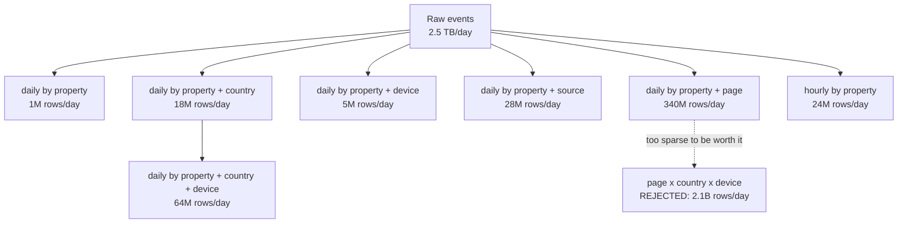
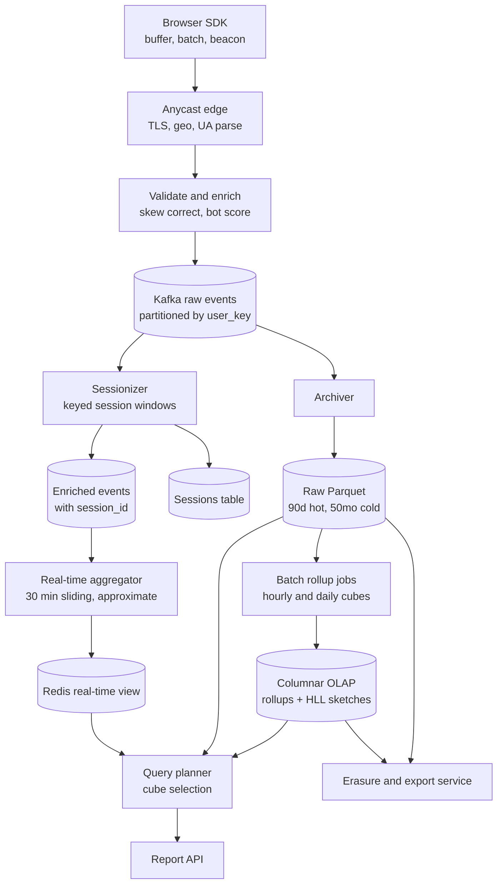
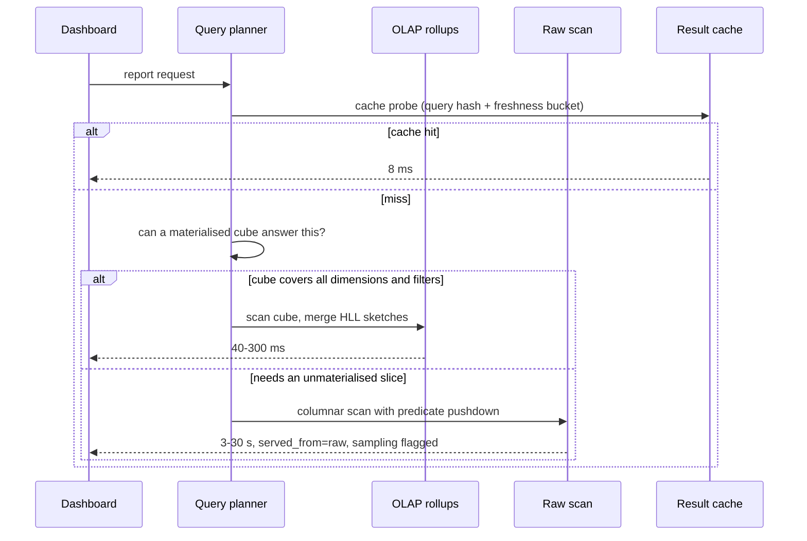
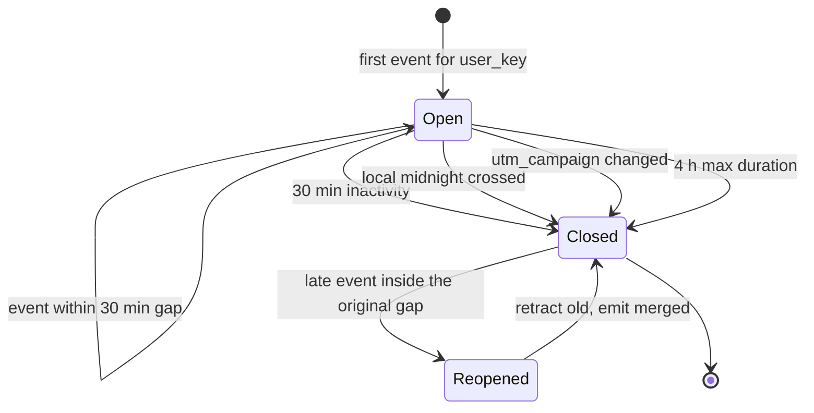
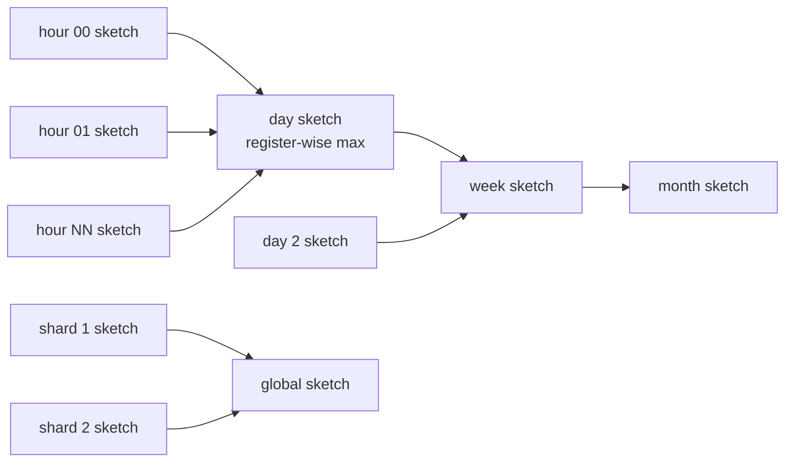
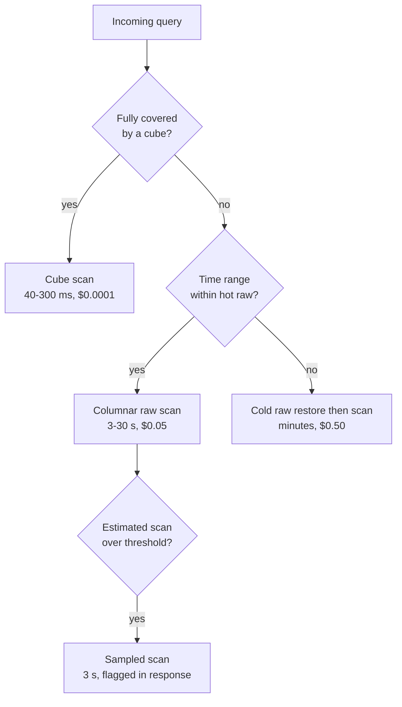
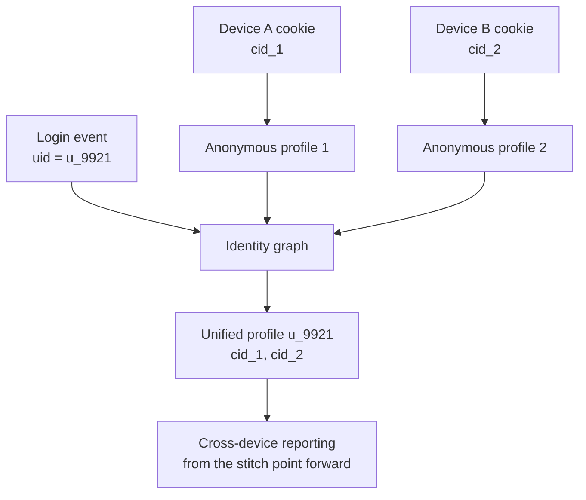
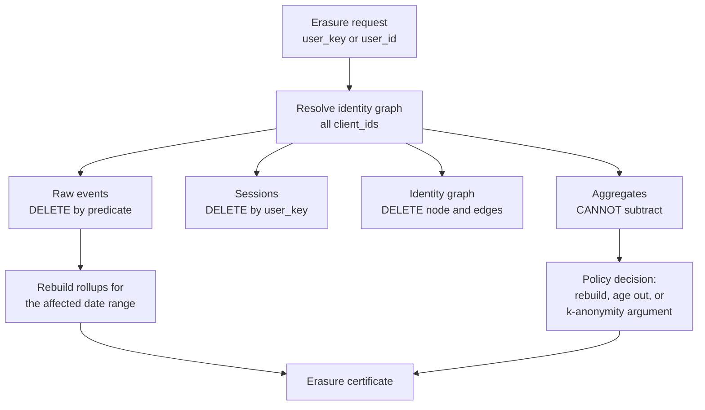

# 43 — Web Analytics (Google Analytics-style)

<span class="pill pill-core">Core</span> <span class="pill pill-medium">Medium</span>

**Every number this system reports is an estimate of an estimate: you cannot see 30% of the traffic, you cannot exactly count unique visitors at this scale, and the "user" whose journey you are reporting is really a cookie that expires in seven days — so the hardest engineering problem is being precise about how imprecise you are.**

| | |
|---|---|
| **Commonly asked at** | Google, Adobe, Amplitude, Mixpanel, Segment, Cloudflare, Fastly, Shopify, Snowplow, Meta, any product-analytics or measurement org |
| **Time budget** | 45 min |
| **Core tension** | Analytics wants to answer arbitrary questions over arbitrary time ranges at dashboard latency, but the only structures that serve arbitrary questions are raw event scans (seconds to minutes, expensive) and the only structures that serve dashboard latency are pre-aggregated rollups (milliseconds, but they answer exactly the questions you anticipated). Every design decision here — which cubes to build, HyperLogLog instead of exact distincts, how long to retain raw — is a position on that line, and privacy regulation then demands that an aggregate built from millions of inputs can selectively forget one of them |
| **Prerequisites** | [F01 Networking Foundations](../fundamentals/f01-networking-foundations.md), [F04 Caching](../fundamentals/f04-caching.md), [F05 CDN & Edge](../fundamentals/f05-cdn-edge.md), [F06 Partitioning & Sharding](../fundamentals/f06-partitioning-sharding.md), [F11 Idempotency](../fundamentals/f11-idempotency.md), [F12 Queues & Streams](../fundamentals/f12-queues-streams.md), [F13 Storage Engines](../fundamentals/f13-storage-engines.md), [F14 SQL vs NoSQL](../fundamentals/f14-sql-vs-nosql.md), [F15 Object Storage](../fundamentals/f15-object-storage.md), [F17 Rate Limiting & Load Shedding](../fundamentals/f17-rate-limiting-load-shedding.md), [F20 Time, Clocks & Ordering](../fundamentals/f20-time-clocks-ordering.md), [F21 Probabilistic Data Structures](../fundamentals/f21-probabilistic-data-structures.md), [F22 Observability Fundamentals](../fundamentals/f22-observability-fundamentals.md), [F24 Capacity Planning](../fundamentals/f24-capacity-planning.md), [F27 Security in Design](../fundamentals/f27-security-design.md), [F28 Cost Engineering](../fundamentals/f28-cost-engineering.md) |

---

## 1. Problem Statement

Collect behavioural events from millions of websites, turn a raw event stream into sessions and users, and serve pageviews, unique visitors, bounce rate, conversion funnels and arbitrary dimensional breakdowns to a dashboard fast enough to feel interactive — while complying with privacy law that lets any individual demand erasure from a system built entirely on aggregation.

Four reframings.

**First: collection is lossy and you must own that number.** Between 10% and 40% of your intended events never arrive: ad blockers strip the script, privacy modes discard the identifier, users close the tab before the beacon fires, corporate proxies block the endpoint, and browser tracking-prevention deletes the cookie after seven days. An analytics system that presents its numbers as counts rather than as estimates is lying, and the engineering task is to **measure and bound the loss** rather than to pretend it away.

**Second: "unique visitors" is the hardest metric in the product.** Pageviews are a sum and sums are trivially distributed — add them up across shards, across hours, across anything. Unique visitors is a set cardinality, and **cardinalities do not add**: the same person visiting on Monday and Tuesday is one monthly unique, not two. So either you keep every identifier you have ever seen (which is enormous, and is also the exact data privacy law wants you to delete), or you use a mergeable sketch and accept a quantified error.

**Third: sessionization is a stateful stream problem, not a definition.** A session is not in the data. It is an inference — "these events belong to one visit" — computed from a gap-based rule over a per-user stream, which means the pipeline must hold open state for every currently-active visitor, decide when a session ends without ever receiving an "end" event, and cope with a late event that arrives *after* a session was closed and merges two sessions into one.

**Fourth: privacy law changes the shape of the data model.** GDPR gives an individual the right to erasure. In a raw event store that is a delete. In an aggregate it is not: a count of 1,482,003 pageviews contains one person's contribution irreversibly, and a HyperLogLog sketch cannot be decremented at all. **The sum cannot easily forget one input**, and any credible design has an explicit answer for that rather than a hopeful one.

### Out of scope

Attribution modelling and marketing-mix analysis, A/B testing statistics, session replay and heatmaps (a different storage problem entirely — full DOM mutation streams), and the tag-management product surface.

---

## 2. Requirements

### Functional

| # | Requirement | Notes |
|---|---|---|
| F1 | Collect pageviews, custom events, ecommerce events, timing | One endpoint, one schema, versioned |
| F2 | Client-side buffering, batching and retry | Must survive tab close and flaky networks |
| F3 | Sessionize raw events into visits | 30-minute inactivity gap, plus campaign and midnight rules |
| F4 | Unique visitors and unique sessions per dimension slice | Mergeable across time and shards |
| F5 | Pre-aggregated rollups: hourly, daily, by dimension | The dashboard's working set |
| F6 | Ad-hoc queries over raw events | Analyst escape hatch |
| F7 | Real-time view: last 30 minutes of activity | Separate, cheaper, approximate path |
| F8 | Bot and invalid-traffic filtering | Before aggregation, annotated not deleted |
| F9 | Cross-device identity stitching on login | Deterministic; probabilistic is optional and labelled |
| F10 | Funnels, retention cohorts, path analysis | Require per-user sequence, not just counts |
| F11 | Configurable retention per property | 2 / 14 / 26 / 38 / 50 months |
| F12 | Per-user data export and erasure within 30 days | GDPR Articles 15 and 17 |

### Non-functional

| # | Requirement | Target |
|---|---|---|
| N1 | Peak collection rate | 1.7M events/s |
| N2 | Collector availability | 99.99% — a failed beacon is unrecoverable |
| N3 | Collector response time | p99 < 50 ms (it is in the page's network path) |
| N4 | Real-time view freshness | < 60 s |
| N5 | Standard report freshness | < 4 h for the previous day, finalised by T+24h |
| N6 | Dashboard query latency | p95 < 500 ms for rollup-served queries |
| N7 | Ad-hoc query latency | p95 < 30 s over 90 days of raw |
| N8 | Unique-visitor accuracy | Relative error < 1% at 1σ, disclosed in the UI |
| N9 | Erasure SLA | 30 days end to end, including aggregates |
| N10 | Cost per billion events | < $400 |

!!! note "N2 deserves the extra nine"
    Almost every subsystem here is recoverable: if the aggregation job fails, rerun it; if the rollup is wrong, rebuild it from raw. The collector is the one place where a failure is **permanent data loss**, because the browser that tried to send a beacon is gone. The client retries a little, but only until the tab closes. That asymmetry justifies spending the reliability budget at the edge — anycast, multi-region, aggressively stateless, no dependency that can be down — and running everything downstream at a softer target.

---

## 3. Scale Estimation

### Event volume

$$
\begin{aligned}
\text{tracked properties} &= 10^{7},\quad \text{active daily} = 10^{6} \\
\text{events/day} &= 50 \times 10^{9} \\
\text{mean rate} &= \frac{5 \times 10^{10}}{86{,}400} = 578{,}700\ \text{events/s} \\
\text{peak (3x, 19:00 UTC)} &= \mathbf{1.74 \times 10^{6}\ \text{events/s}}
\end{aligned}
$$

$$
\begin{aligned}
\text{event on the wire} &\approx 900\ \text{B (batched, gzipped} \approx 300\ \text{B)} \\
\text{peak ingress} &= 1.74 \times 10^{6} \times 300\ \text{B} = 522\ \text{MB/s} = 4.2\ \text{Gb/s} \\
\text{raw/day} &= 5 \times 10^{10} \times 300\ \text{B} = 15\ \text{TB/day} \\
\text{Parquet, 6:1} &\Rightarrow 2.5\ \text{TB/day} = 225\ \text{TB over 90 days hot}
\end{aligned}
$$

### Collection loss — the number nobody computes

$$
\begin{aligned}
\text{ad blockers (general audience)} &\approx 12\% \\
\text{ad blockers (developer/tech audience)} &\approx 38\% \\
\text{beacon lost on unload} &\approx 3\text{--}6\% \\
\text{privacy mode / storage disabled} &\approx 4\% \\
\text{network failure, no retry window} &\approx 1\% \\
\hline
\text{effective loss (general)} &\approx \mathbf{18\%},\quad \text{(tech)} \approx \mathbf{45\%}
\end{aligned}
$$

!!! warning "Loss is not random, so it biases every ratio"
    An 18% uniform loss would be harmless — scale everything by 1.22 and move on. But the loss correlates with exactly the dimensions people slice by. Chrome-on-desktop-with-uBlock is lost far more than Safari-on-iPhone; developers are lost more than retirees; Germany is lost more than Brazil. So **conversion rate by browser is biased, device-mix reporting is biased, and geographic comparisons are biased** — in ways that look like real product signal. The mitigation is not a correction factor; it is measuring the loss independently (server-side log comparison on a sample of properties) and publishing a per-segment coverage estimate alongside the numbers.

### HyperLogLog sizing and error

HLL estimates set cardinality from the maximum count of leading zeros observed across $m = 2^p$ registers. Its relative standard error is:

$$
\sigma \approx \frac{1.04}{\sqrt{m}} = \frac{1.04}{\sqrt{2^{p}}}
$$

Register width is $\lceil \log_2(64 - p + 1) \rceil = 6$ bits for a 64-bit hash, so dense size is $6m/8$ bytes:

| $p$ | $m$ | $\sigma$ | Dense size | 95% CI on 1,000,000 uniques |
|---|---|---|---|---|
| 10 | 1,024 | 3.25% | 768 B | ±65,000 |
| 12 | 4,096 | 1.625% | 3 KB | ±32,500 |
| **14** | **16,384** | **0.8125%** | **12 KB** | **±16,250** |
| 16 | 65,536 | 0.406% | 48 KB | ±8,100 |
| 18 | 262,144 | 0.203% | 192 KB | ±4,060 |

**$p = 14$ is chosen.** It meets N8 at 1σ, and the cost of the next step is a 4x size increase for a 2x error reduction — the classic $\sigma \propto 1/\sqrt{m}$ wall. Going to $p=16$ across the sketch inventory would add hundreds of terabytes to buy an accuracy improvement no user can perceive.

**Sparse representation matters more than dense sizing**, because the cardinality distribution across properties is extremely skewed:

$$
\begin{aligned}
\text{sparse encoding} &: \text{explicit (index, value) pairs, 4 B each} \\
\text{crossover} &: 4n < 12{,}288 \implies n < 3{,}072\ \text{distinct values} \\
\text{properties with} &< 3{,}072\ \text{daily uniques} \approx \mathbf{94\%}
\end{aligned}
$$

So the average stored sketch is roughly 1.2 KB, not 12 KB — a 10x saving that comes entirely from the shape of the customer base.

$$
\begin{aligned}
\text{sketches/day} &= 10^{6}\ \text{properties} \times \underbrace{(24 + 200 + 6 + 30)}_{\text{hour, country, device, source}} \approx 2.6 \times 10^{8} \\
\text{storage/day} &= 2.6 \times 10^{8} \times 1.2\ \text{KB} = 312\ \text{GB/day}
\end{aligned}
$$

with hourly sketches retained 7 days and daily sketches retained for the property's full retention period.

### Mergeability — the property that makes HLL non-negotiable

$$
\text{HLL}(A \cup B)[i] = \max\big(\text{HLL}(A)[i],\ \text{HLL}(B)[i]\big)
$$

Union is a register-wise maximum: associative, commutative, idempotent. Three consequences that exact counting cannot provide:

1. **Time roll-up is free.** Monthly uniques = union of 30 daily sketches. With exact counting, $\sum_{d} |U_d| \ne |\bigcup_d U_d|$ because visitors recur — you would have to store every identifier for 30 days and deduplicate at query time.
2. **Shard merge is free.** A query fans out to 64 shards, each returns a 12 KB sketch, and the coordinator unions them. Exact distincts would require shipping identifier sets.
3. **Error does not accumulate under union.** The merged sketch is exactly the sketch you would have built from the union directly, so $\sigma$ stays 0.81% relative to the true union cardinality regardless of how many sketches you merged.

!!! danger "Intersections are where HLL quietly betrays you"
    Union is exact-in-structure. Intersection is not — it must be derived by inclusion-exclusion:

    $$|A \cap B| = |A| + |B| - |A \cup B|$$

    Each term carries $\sigma \approx 0.81\%$ **relative to its own magnitude**, but the result can be far smaller than any of them. With $|A| = |B| = 10^{6}$ and a true intersection of $10^{4}$:

    $$\text{absolute error} \approx \sqrt{3} \times 0.0081 \times 10^{6} \approx 14{,}000$$

    on a true value of 10,000 — **an error larger than the answer**. So "visitors who saw page A *and* page B" and any retention or returning-visitor metric derived by intersecting sketches is unusable. Those questions must go to a different structure: exact sets for small cohorts, a bitmap index (Roaring) over dense integer user ids, or a raw-event scan. Knowing that union is safe and intersection is not is the detail that separates someone who has used HLL from someone who has read about it.

### Sessionization state

$$
\begin{aligned}
\text{events/session} &\approx 20 \Rightarrow \text{sessions/day} = 2.5 \times 10^{9} \\
\text{session starts/s} &= 28{,}900 \\
\text{state lifetime} &= 5\ \text{min active} + 30\ \text{min gap} = 2{,}100\ \text{s} \\
\text{concurrently open sessions} &= 28{,}900 \times 2{,}100 = 6.1 \times 10^{7} \\
\text{state size} &= 6.1 \times 10^{7} \times 200\ \text{B} = \mathbf{12\ \text{GB}}
\end{aligned}
$$

Manageable — but note that it scales with the **timeout**, not with traffic patterns. Raising the session gap from 30 to 120 minutes multiplies open-session state by roughly 3.4x, which is the kind of "harmless config change" that takes a pipeline down.

---

## 4. API Design

### Collection endpoint

```http
POST https://m.example-analytics.com/c/v3
Content-Type: text/plain;charset=UTF-8      # avoids a CORS preflight
X-Client-Sent-At: 1758794640123

{
  "sid": "UA-PROP-88213",
  "cid": "a3f9...",                 # first-party client id, from localStorage
  "uid": null,                      # set only after login
  "sent_at": 1758794640123,
  "events": [
    { "t": "pv",  "ts": 1758794631002, "url": "/pricing", "ref": "google.com",
      "title": "Pricing", "vp": "1440x900", "lang": "de-DE" },
    { "t": "evt", "ts": 1758794638551, "cat": "cta", "act": "click",
      "lbl": "start_trial" }
  ]
}

204 No Content
```

Design choices with reasons:

- **`text/plain` content type.** `application/json` on a cross-origin POST triggers a CORS preflight `OPTIONS`, doubling requests and adding a round trip to the page's critical path. `text/plain` is a CORS-simple request. This is the standard trick and it halves collector QPS.
- **204, empty body, no cookies set in the response.** Nothing the client can act on, nothing to parse, and the response is as small as HTTP allows.
- **Per-event `ts` plus a batch `sent_at`.** The server computes `skew = received_at - sent_at` and applies it to each event timestamp, correcting for wrong device clocks without discarding relative ordering within the batch. This one line fixes a large class of timestamp problems.
- **Events are batched.** One request carrying 4 events is not 4x cheaper than 4 requests — it is roughly 8x cheaper once TLS, headers and connection overhead are counted.

### Client transport, in reliability order

```javascript
function send(payload) {
  const body = JSON.stringify(payload);
  // 1. Best: survives page unload, browser-queued, non-blocking.
  if (navigator.sendBeacon && navigator.sendBeacon(ENDPOINT, body)) return;
  // 2. Next: keepalive lets the request outlive the document.
  if (window.fetch) {
    fetch(ENDPOINT, { method: 'POST', body, keepalive: true,
                      mode: 'no-cors' }).catch(() => buffer(payload));
    return;
  }
  // 3. Last resort: GET pixel. Bounded by URL length, no retry, but it
  //    works when POST is blocked and in very old clients.
  new Image().src = ENDPOINT + '/p.gif?d=' + encodeURIComponent(b64(body));
}

// Flush triggers, in order of how much data each one saves:
document.addEventListener('visibilitychange', () => {
  if (document.visibilityState === 'hidden') flush();   // the important one
});
window.addEventListener('pagehide', flush);
setInterval(flush, 15000);                               // periodic drip
```

!!! tip "`visibilitychange` is the flush that matters; `unload` is the one that does not fire"
    Mobile Safari and Chrome on Android frequently do not fire `unload` or `beforeunload` at all — a backgrounded tab can be killed outright. `visibilitychange` to `hidden` fires reliably in every case that matters: tab switch, app switch, screen lock, navigation away. Measured impact of switching the primary flush from `unload` to `visibilitychange` is a **3–6 percentage point reduction in lost events**, which at 50B events/day is 1.5–3 billion events. It is a two-line change and one of the highest-leverage things in the entire collection stack.

### Query API

```http
GET /v1/report
    ?property=UA-PROP-88213
    &metrics=pageviews,sessions,users,bounce_rate
    &dimensions=country,deviceCategory
    &start=2026-08-26&end=2026-09-25
    &filters=country==DE;deviceCategory!=bot
    &orderBy=-pageviews&limit=50

200 OK
{
  "served_from": "rollup_daily_country_device",
  "freshness":   "2026-09-25T10:00:00Z",
  "rows": [
    { "country":"DE","deviceCategory":"mobile",
      "pageviews": 4820113,
      "sessions":  1204887,
      "users":     { "value": 881204, "estimate": true, "rel_stderr": 0.0081 },
      "bounce_rate": 0.412 }
  ],
  "sampling": { "applied": false },
  "coverage_estimate": 0.83
}
```

Four fields carry the honesty of the whole product:

- **`served_from`** tells you whether a rollup or a raw scan answered the question, which explains both the latency and any discrepancy between two reports.
- **`estimate` and `rel_stderr`** on `users` — never present an HLL estimate as an exact integer. `881,204` implies six significant figures of precision on a number with a ±16,250 confidence interval.
- **`sampling.applied`** — if the query fell back to a sampled raw scan, say so. Silent sampling is the single most damaging behaviour an analytics product can have, because the user compares two reports and concludes the system is broken.
- **`coverage_estimate`** — the modelled fraction of real traffic that was collected for this slice. Publishing it converts "your numbers do not match my server logs" from a support escalation into a documented property.

---

## 5. Data Model

### Raw event layer

```sql
-- Parquet in object storage, partitioned by ingest date/hour, then property.
-- s3://wa-raw/events/dt=2026-09-25/hour=11/prop_bucket=0042/part-000.parquet
CREATE EXTERNAL TABLE raw_events (
  property_id     STRING,
  client_id       STRING,       -- first-party device identifier
  user_id         STRING,       -- set after login, nullable
  user_key        BINARY,       -- HMAC(client_id, per_property_salt) for joins
  session_id      STRING,       -- assigned by the sessionizer, nullable on land
  event_type      STRING,
  event_time      TIMESTAMP,    -- device clock, skew-corrected
  received_time   TIMESTAMP,
  page_url        STRING,
  page_path       STRING,       -- normalised: no query string, no fragment
  referrer        STRING,
  utm_source      STRING,
  utm_campaign    STRING,
  geo_country     STRING,
  geo_city        STRING,       -- dropped when the city has < k visitors
  device_category STRING,
  browser         STRING,
  os              STRING,
  bot_verdict     STRING,       -- valid | suspect | bot
  bot_reasons     ARRAY<STRING>,
  custom_dims     MAP<STRING,STRING>
)
PARTITIONED BY (dt STRING, hour STRING, prop_bucket INT)
STORED AS PARQUET;
```

`prop_bucket = hash(property_id) % 256` is a sub-partition, and it is doing real work: it makes a single property's data physically localised, so a per-property retention delete or a per-property export reads and rewrites a small fraction of each hour instead of the whole thing.

### Sessions

```sql
CREATE TABLE sessions (
  property_id     STRING,
  session_id      STRING,
  user_key        BINARY,
  session_start   TIMESTAMP,
  session_end     TIMESTAMP,
  duration_sec    INT,
  pageview_count  INT,
  event_count     INT,
  is_bounce       BOOLEAN,        -- computed at close, not at start
  entry_path      STRING,
  exit_path       STRING,
  source_medium   STRING,         -- attribution frozen at session start
  is_new_user     BOOLEAN,
  bot_verdict     STRING,
  closed_reason   STRING,         -- timeout | midnight | campaign | max_duration
  PRIMARY KEY (property_id, session_id)
);
```

`closed_reason` looks like debug metadata and is not. When a customer asks why their session count jumped, the distribution of close reasons is the answer — a spike in `max_duration` means bot traffic, a spike in `campaign` means someone changed their UTM tagging.

### Rollups: the star schema

```sql
CREATE TABLE rollup_daily (
  property_id     STRING,
  date            DATE,
  -- dimension columns; NULL means "aggregated over this dimension"
  country         STRING,
  device_category STRING,
  source_medium   STRING,
  page_path       STRING,
  -- additive metrics
  pageviews       BIGINT,
  sessions        BIGINT,
  bounces         BIGINT,
  total_duration  BIGINT,
  -- non-additive metrics kept as mergeable sketches
  users_hll       BINARY,        -- 12 KB dense / ~1.2 KB sparse
  -- derived at query time: bounce_rate = bounces / sessions
  PRIMARY KEY (property_id, date, country, device_category,
               source_medium, page_path)
);
```

!!! note "Store bounces and sessions, never bounce_rate"
    Ratios are not additive. If you store `bounce_rate` per country, you cannot compute the global bounce rate without weighting by session count, and someone will eventually average the ratios and publish a wrong number. Store the numerator and the denominator as separate additive columns and compute the ratio at query time. The same rule applies to averages (`total_duration` and `sessions`, never `avg_duration`) and to every percentage in the product. This is a one-line schema decision that eliminates an entire category of bug.

### The cube lattice

With $d$ dimensions there are $2^d$ possible groupings, and materialising all of them is exponential nonsense. Selection is driven by the query log:



The rule: materialise a cube when

$$
\underbrace{f_c \times (C_{\text{raw}} - C_{\text{cube}})}_{\text{query savings}} > \underbrace{C_{\text{build}} + C_{\text{store}}}_{\text{maintenance}}
$$

Measured from the actual query log, 7 cubes serve 96% of dashboard queries. The rejected `page × country × device` cube is instructive: it has 2.1B rows/day because page path is high-cardinality and combining it with other dimensions makes cells nearly unique — the rollup stops compressing, which is the general failure mode of cube design.

---

## 6. High-Level Architecture



### Write path

1. **Client buffers and batches.** Events accumulate in memory with a localStorage fallback, flushed on `visibilitychange`, on a 15 s timer, or when the buffer hits 20 events. Failed sends are retried from localStorage on the next pageview, which recovers a meaningful slice of the network-failure loss.
2. **Anycast edge.** The nearest PoP terminates TLS, resolves geo from IP, parses the user agent, and returns 204. It performs no lookups and holds no state. Median RTT is 15 ms, which matters because this request competes with the page's own resources.
3. **Validate and enrich.** Reject malformed payloads and unknown property ids; apply clock-skew correction; compute `user_key = HMAC(client_id, per_property_salt)`; score for bot likelihood. **Then discard the raw IP**, keeping only the derived geo — a data-minimisation decision that removes the highest-risk field before it is ever persisted.
4. **Kafka, partitioned by `user_key`.** This is the key decision in the topology: sessionization requires all of one visitor's events on one consumer, and partitioning by `property_id` instead would both break that and create a catastrophic hot partition for the largest customer.
5. **Archive.** Exactly-once write to Parquet, partitioned by ingest hour and property bucket. Independent of everything downstream, so no aggregation bug can cost the ground truth.
6. **Sessionize.** A keyed session-window operator per `(property_id, user_key)` assigns `session_id`, emits closed sessions, and re-emits enriched events.
7. **Roll up.** Hourly and daily batch jobs build the cubes and the HLL sketches. Ratios are stored as numerator/denominator pairs.
8. **Real time, separately.** A parallel lightweight aggregator maintains a 30-minute sliding view in Redis — approximate, un-sessionized, unfiltered, and clearly labelled as such.

### Read path



The planner's cube-selection logic is the product's perceived quality: choosing the smallest cube that can answer the question is the difference between 40 ms and 30 seconds, and a wrong choice looks to the user like an outage.

---

## 7. Deep Dives

### 7.1 Sessionization

A session is an inference from a gap rule, and the rules interact in ways that surprise people. Google Analytics' definition — which has become the de facto standard — closes a session on **any** of:

| Rule | Trigger | Why it exists |
|---|---|---|
| Inactivity timeout | 30 min with no event | The core definition of "a visit" |
| Midnight | Property-local day boundary | Daily reports must partition sessions cleanly |
| Campaign change | New `utm_source`/`utm_campaign` mid-session | Attribution requires one source per session |
| Max duration | 4 h hard cap | Defence against the immortal session (§12) |



```python
class Sessionizer:
    GAP_MS      = 30 * 60 * 1000
    MAX_DUR_MS  =  4 * 60 * 60 * 1000

    def process(self, event, state, out):
        s = state.get()                       # keyed by (property_id, user_key)

        if s is None:
            state.put(self.open(event)); self.set_timer(event.ts + self.GAP_MS)
            return

        if event.ts < s.last_event_ts:
            # OUT OF ORDER. The common bug is treating this as a new session.
            if event.ts >= s.start_ts - self.GAP_MS:
                s.absorb(event)               # belongs to the open session
                state.put(s)
                return
            # Older than the current session's reach: it belongs to a session
            # we already closed. Emit a retraction and a corrected replacement.
            out.side(RETRACT_TAG, self.find_closed_session(event))
            return

        gap = event.ts - s.last_event_ts
        if (gap > self.GAP_MS
                or self.crosses_midnight(s.last_event_ts, event.ts, s.tz)
                or self.campaign_changed(s, event)
                or event.ts - s.start_ts > self.MAX_DUR_MS):
            out.collect(s.close(reason=self.reason(s, event, gap)))
            state.put(self.open(event))
        else:
            s.absorb(event); state.put(s)
        self.set_timer(event.ts + self.GAP_MS)

    def on_timer(self, ts, state, out):
        s = state.get()
        if s and ts - s.last_event_ts >= self.GAP_MS:
            out.collect(s.close(reason="timeout"))
            state.clear()                     # release state; this is the GC
```

Three properties that make this hard:

**A session has no end event.** It ends because nothing happened, which means closing it requires an event-time timer, which means it depends on the watermark advancing, which means a stalled source partition leaves sessions open indefinitely and state growing without bound.

**Late events merge sessions.** If a session closed at 11:30 by timeout and an event stamped 11:05 arrives at 11:40, that event was inside the gap — the session should never have closed. The correct handling is a **retraction**: emit a negative record for the previously-emitted session and a positive record for the merged one. Downstream aggregates must therefore be retraction-aware, which is a real constraint on the rollup design. The cheaper alternative is to let the batch layer fix it, accepting that the real-time session count is slightly high.

**Bounce rate is defined at close, not at start.** A bounce is a session with exactly one pageview, so it cannot be computed until the session is closed — which is up to 30 minutes after the user left. Any "real-time bounce rate" is structurally wrong, and the honest product answer is to not offer one.

### 7.2 HyperLogLog in production

```python
def hll_add(registers, item, p=14):
    h = xxhash64(item)                          # must be well-distributed
    idx = h >> (64 - p)                         # top p bits pick the register
    w   = (h << p) & MASK64                     # remaining bits
    rho = leading_zeros(w) + 1                  # position of the first 1-bit
    registers[idx] = max(registers[idx], rho)

def hll_merge(a, b):
    return [max(x, y) for x, y in zip(a, b)]    # the whole reason HLL works

def hll_estimate(registers, m):
    # HLL++ bias correction; plain HLL is badly biased at low cardinality.
    if all_zero_count(registers) and raw_estimate(registers) < 2.5 * m:
        z = count_zero_registers(registers)
        if z != 0:
            return m * math.log(m / z)          # linear counting
    return bias_corrected_raw_estimate(registers, m)
```

Four production details that the textbook description omits:

**1. Sparse-to-dense transition.** Below roughly $m/4$ distinct values, storing explicit `(index, rho)` pairs beats 12 KB of mostly-zero registers. Since 94% of properties never leave sparse mode, the average sketch is ~1.2 KB. Implementing only the dense form multiplies storage by 10x for no benefit.

**2. Low-cardinality bias.** Raw HLL is significantly biased below $2.5m$ — a site with 40 real visitors might estimate 61. HLL++ switches to **linear counting** ($m \ln(m/z)$ where $z$ is the zero-register count) in that range, which is near-exact for small sets. Without it, small customers see obviously wrong numbers and lose trust in the whole product, and small customers are most of your customers.

**3. Hash quality is load-bearing.** HLL assumes uniformly distributed hashes. A weak hash (Java's `String.hashCode`, a truncated MD5, anything with structure) clusters register indices and produces systematic error that no bias correction can repair. Use xxHash64 or MurmurHash3-128 and **pin the choice forever** — changing the hash function invalidates every stored sketch, because sketches built with different hashes cannot be merged.

**4. Sketches are a stored format, so they are a compatibility contract.** A stored sketch encodes $p$, the hash function, and the encoding version. Merging sketches with different $p$ requires folding down to the smaller $p$ (possible, lossy) and merging across hash functions is impossible. Version the serialisation from day one.

$$
\text{HLL sketch} \xrightarrow{\ \cup\ } \text{daily} \xrightarrow{\ \cup\ } \text{weekly} \xrightarrow{\ \cup\ } \text{monthly}
$$



The same operator composes across **both** axes — time and shard — which is why one 12 KB structure replaces an entire identifier-retention system.

### 7.3 Pre-aggregation vs raw, and the latency/freshness/cost triangle



You may pick two of three:

| Combination | Mechanism | Cost of the third |
|---|---|---|
| **Fast + fresh** | Real-time aggregator over a 30-min window in memory | Expensive per unit, and only pre-chosen aggregates exist |
| **Fast + cheap** | Pre-computed rollups | Stale by up to 4 h; only anticipated questions |
| **Fresh + cheap** | On-demand raw scan | Slow — seconds to minutes |

The design serves all three by routing: real-time path for the last 30 minutes (fast + fresh, small and bounded), rollups for standard reports (fast + cheap, 96% of queries), raw scan for ad-hoc (fresh + cheap, 4% of queries and 60% of query cost).

**Sampling is the escape valve, and how you handle it defines the product.** When an ad-hoc scan would exceed a cost threshold, sample:

$$
\sigma_{\text{sample}} = \sqrt{\frac{1 - f}{f \cdot n}} \quad\text{with } f \text{ the sampling fraction, } n \text{ the sampled count}
$$

At $f = 0.01$ and a true population of $10^{8}$, the sampled count is $10^{6}$ and relative error is about 0.1% — invisible. At a true population of $10^{4}$, the sampled count is 100 and relative error is 10% — visibly wrong, and worse, **unstable**: refreshing the page gives a different number. So sampling must be adaptive (higher $f$ for smaller populations), always disclosed in the response, and never applied to a metric the customer is billed on.

!!! warning "Silent sampling destroys trust faster than downtime"
    The failure sequence is always the same: a user runs a report and gets 4,820,113. They add a filter that should reduce the number and get 4,891,002. Both are within sampling error; neither is wrong; the product is now untrustworthy in that user's mind permanently. Two defences: return `sampling.applied` and the sampling rate on every response so the UI can show it, and **make sampling deterministic on a hash of the identifier** so the same query returns the same answer every time. Deterministic sampling does not reduce the error, but it removes the instability that makes users notice.

### 7.4 Bot filtering

Bot traffic is 35–50% of raw web requests. Filtering it is not a nice-to-have; unfiltered, it dominates small properties' reports entirely.

| Layer | Signal | Catches | Cost | False positives |
|---|---|---|---|---|
| **UA list** | IAB/ABC known spiders | Declared bots, ~60% of bot volume | Trivial | Near zero |
| **ASN / IP** | Datacenter ranges (AWS, GCP, Azure, OVH) | Undeclared scrapers | Cheap lookup | Corporate VPNs, some mobile carriers |
| **Headless** | `navigator.webdriver`, missing plugins, impossible screen metrics, WebGL fingerprint anomalies | Puppeteer/Selenium | Client-side JS | Privacy-hardened browsers |
| **Behavioural** | No mouse movement, no scroll, perfectly regular inter-event timing, impossible navigation speed | Sophisticated bots | Stateful, needs session context | Keyboard-only and assistive-tech users — **a real accessibility concern** |
| **Volumetric** | Per-`client_id` event rate, per-IP session count | Load generators, click farms | Aggregate windows | Shared NAT, large offices |

```python
def bot_score(event, session_ctx):
    reasons, score = [], 0.0
    if UA_SPIDER_RE.search(event.user_agent):
        return 1.0, ["ua_known_spider"]                 # declared, done
    if asn_is_datacenter(event.ip_asn):
        score += 0.4; reasons.append("datacenter_asn")
    if event.client_hints.get("webdriver"):
        score += 0.5; reasons.append("webdriver_flag")
    if session_ctx.event_count > 200 and session_ctx.duration_sec < 60:
        score += 0.4; reasons.append("impossible_rate")
    if session_ctx.timing_stddev_ms is not None and session_ctx.timing_stddev_ms < 5:
        score += 0.3; reasons.append("robotic_timing")
    if event.viewport in ("0x0", "1x1") or event.viewport is None:
        score += 0.2; reasons.append("degenerate_viewport")
    return min(score, 1.0), reasons
```

!!! tip "Annotate, never delete — and the reason is the same one as in any irreversible pipeline"
    Write `bot_verdict` and `bot_reasons` into the raw event and let every downstream consumer filter. If bots are dropped at the edge, then when the classifier is improved six months later you cannot reprocess, cannot measure the old classifier's false-positive rate, and cannot restore traffic it wrongly excluded. The cost of retaining bot traffic is about 40% more raw storage — roughly $0.03 per property per month — against permanently losing the ability to audit or correct your own filtering. Every irreversible decision belongs *after* the immutable write, never before it.

### 7.5 Cross-device identity and its limits



**Deterministic stitching** — the same `user_id` observed on two devices — is the only kind that should be used without heavy caveats. Even it has hard limits:

1. **It is not retroactive without a rewrite.** Pre-login events were counted under the anonymous `client_id`. Merging them into the unified profile means rewriting history, which changes already-published reports. The usual choice is to stitch forward only and accept that pre-login activity stays anonymous — simpler, stable, and defensible.
2. **Shared devices create false merges.** A family tablet where three people log in produces one identity graph node with three humans' behaviour. There is no signal that reliably separates them.
3. **Logged-out sessions are invisible to the graph.** For most consumer properties, the majority of sessions have no `user_id` at all, so cross-device coverage is a minority of traffic and reporting it as if it were complete is misleading.

**Probabilistic stitching** — same IP, similar UA, temporally adjacent — is offered by some vendors. Published accuracy is 60–80% under favourable conditions and much worse behind carrier-grade NAT, on shared office IPs, or on mobile networks. A false merge is worse than no merge: it fabricates a cross-device journey that never happened, and the resulting insight is confidently wrong. If offered at all, it must be a labelled, separately-toggled metric.

**Browser tracking prevention is the dominant error term now**, and it swamps everything above:

| Mechanism | Effect on `client_id` lifetime |
|---|---|
| Safari ITP | JS-written cookies capped at **7 days**; 24 hours under some conditions |
| Firefox ETP | Third-party storage partitioned; known trackers blocked outright |
| Chrome | Third-party cookie deprecation; first-party still works |
| CNAME cloaking | Treated as JS-set by ITP, so capped at 7 days anyway |

$$
\text{inflation factor} \approx \frac{\text{observed uniques}}{\text{true uniques}} \approx 1 + \frac{T_{\text{window}}}{T_{\text{cookie}}} \times r_{\text{return}}
$$

With a 30-day window, a 7-day cookie and a 40% return rate:

$$
1 + \frac{30}{7} \times 0.4 \approx \mathbf{1.7\times}
$$

**Monthly unique visitors on Safari are overstated by roughly 70%.** This dwarfs HLL's 0.81% error by a factor of 85, which is the point worth making: obsessing over sketch precision while ignoring identifier churn is optimising the wrong term by two orders of magnitude. The honest mitigations are server-side first-party identifiers where the customer's architecture allows it, reporting shorter windows where the estimate is stable, and disclosing the browser mix behind any unique-visitor number.

### 7.6 GDPR erasure in an aggregated system

The request is "delete everything you hold about me." The system holds four things, and they have four different answers.



| Layer | Deletable? | Mechanism |
|---|---|---|
| Raw events | Yes | Predicate delete on `user_key`; Iceberg/Delta make this a metadata-level rewrite of affected files, and `prop_bucket` partitioning keeps the rewrite small |
| Sessions | Yes | Row delete |
| Identity graph | Yes | Node and edge delete |
| **Additive aggregates** (pageviews, sessions) | **Not directly** | Cannot subtract without per-user contribution, which would defeat aggregation |
| **HLL sketches** (unique visitors) | **Structurally impossible** | Registers hold maxima; there is no inverse of `max`. You cannot know whether removing one item lowers a register |

**Four strategies, and the production answer is a layered combination:**

=== "Crypto-shredding"

    Store identifiers encrypted with a per-user key held in a key vault. Erasure deletes the key; the ciphertext remains but is unreadable.

    - O(1) erasure regardless of data volume, and it works across backups, which is otherwise the hardest part of any deletion story.
    - Does **not** help with aggregates — the count was computed from plaintext before encryption and does not contain the identifier at all.
    - Adds a key lookup to every join on identity, and losing the key vault means losing all attributable data.
    - **Used for identifier columns**, which is where it fits.

=== "Rebuild from raw"

    Delete the raw events, then recompute the affected rollups and sketches.

    - Exact. The aggregates genuinely no longer contain the person's data.
    - Costs a full recompute of every cube touching those dates. One request over a 3-year retention is a 1,095-day rebuild.
    - Batches well: accumulate a day of erasure requests and rebuild once, which amortises to a manageable daily job.
    - **Used for the trailing window** (90 days), where recomputation is affordable and the data is most identifying.

=== "Aging out"

    Rely on retention: aggregates older than the retention period are deleted wholesale.

    - Free, and it is the only viable answer for very long histories.
    - Does not satisfy "delete now" on its own for the retention window.
    - **Used beyond 90 days**, in combination with the next strategy.

=== "K-anonymity argument"

    Argue that an aggregate over $\ge k$ individuals is no longer personal data, and therefore is not in scope for erasure.

    - Zero cost, and widely relied upon in practice.
    - Requires enforcing the threshold: suppress any cell with fewer than $k$ (commonly 10–25) users, or the aggregate genuinely is identifying — a city-level cell with 2 visitors is a person.
    - **Used for aggregates beyond the rebuild window**, with a documented lawful basis and enforced cell suppression.

**The chosen policy:**

```text
Erasure request accepted (30-day SLA, GDPR Art.17)
  D+0  Identity resolved across the graph; all client_ids collected.
       user_key added to a suppression list -> new events for it are dropped.
  D+1  Raw events deleted for the full retention period (predicate delete).
       Sessions and identity graph nodes deleted.
  D+2  Crypto-shred: per-user key destroyed, including in backups.
  D+3  Batched rebuild of rollups and HLL sketches for the last 90 days,
       run once per day across all that day's erasure requests.
  D+4  Aggregates older than 90 days: retained under a documented
       k-anonymity basis with k >= 20 cell suppression enforced.
       Erasure certificate issued, naming exactly what was removed
       and what was retained and why.
```

!!! danger "The honest answer is that aggregates beyond the rebuild window are not deleted, and you should say so"
    Claiming full erasure from a three-year aggregate history is either false or ruinously expensive. The defensible position — that aggregates over a sufficiently large population are not personal data, backed by enforced cell suppression, a published threshold, and a rebuild of the recent window where data is genuinely identifying — is both legally standard and technically honest. **The failure mode to avoid is a policy your architecture cannot execute**: promising deletion from all aggregates and then quietly not doing it is far worse, legally and ethically, than documenting the boundary. In an interview, stating this boundary explicitly is a strong signal; hand-waving "we delete everything" is a weak one.

---

## 8. Scaling the Bottleneck

| Scale | Binding constraint | Symptom | Fix |
|---|---|---|---|
| 10k events/s | None | — | Single region, one pipeline |
| 100k events/s | Collector connection handling | TLS handshake CPU; p99 climbing | Anycast, session resumption, HTTP/2, terminate at the edge |
| 500k events/s | Sessionizer state | Checkpoint duration; rebalance times | RocksDB state backend, incremental checkpoints, partition by `user_key` |
| 1.7M events/s | Rollup job wall-clock | Daily job runs past the freshness SLO | Incremental rollups; build hourly, compose daily from hourly |
| 5M events/s | Query-tier fan-out tail | p99 query latency degrades while p50 is fine | Property-aligned sharding so a query touches 1–2 shards; hedged requests |
| Any | **One property with 30% of traffic** | One partition, one shard, one cube saturated | Sub-partition by `property_id + bucket`; dedicated pipeline for top accounts |

### The whale-property problem

Analytics customer distribution is brutally Zipfian: the largest property can be 20–40% of all events.

```text
  Partition by property_id     -> one partition holds 30% of traffic: dead
  Partition by user_key        -> even distribution, sessionization works,
                                  but every property's data is spread over
                                  all partitions, so a per-property delete
                                  touches everything
  Partition by user_key,
    sub-partition storage by
    (property_id, bucket)      -> CHOSEN: even compute, localised storage
```

The resolution is that **compute partitioning and storage partitioning do not have to agree**. Kafka partitions by `user_key` so sessionization has the locality it needs; Parquet partitions by `(dt, hour, prop_bucket)` so per-property retention and erasure read a small slice. The shuffle between them costs one repartition in the archiver, and it buys both properties.

Beyond that, the top ~50 accounts get a **dedicated pipeline**: their own Kafka topic, their own sessionizer, their own rollup schedule. This is operationally unglamorous and it is the right answer, because it converts noisy-neighbour incidents into isolated ones and lets those accounts have different freshness SLOs.

### Incremental rollups

A daily rollup recomputed from 15 TB of raw takes hours and re-reads the same data 24 times over the course of a day.

$$
\begin{aligned}
\text{naive daily} &: \text{scan 15 TB} \\
\text{incremental} &: \text{scan 625 GB/hour, compose day from 24 hourly rollups}
\end{aligned}
$$

Composition works for additive metrics trivially and for uniques via HLL union — which is, again, the property that makes the whole architecture hold together. Bounce rate composes because it is stored as `bounces` and `sessions` rather than as a ratio. The only metrics that do not compose are session-scoped ones spanning an hour boundary, which are handled by the sessionizer emitting a session exactly once, at close, into the hour of its **start**.

---

## 9. Failure Modes

| Failure | Blast radius | Detection | Mitigation | Degraded behaviour |
|---|---|---|---|---|
| **Collector regional outage** | Permanent loss of events from that region | Per-PoP request rate vs 7-day baseline | Anycast withdraws the PoP; client retries from the localStorage buffer on the next pageview | Some events recovered on the user's next visit; the rest are gone forever — the only unrecoverable failure here |
| **Sessionizer state loss** | Sessions split incorrectly for up to 30 min of traffic | Session count spike; `closed_reason` distribution shift | Rebuild from raw in batch; sessions are re-derivable | Real-time session counts wrong for one window; daily reports correct after the batch rebuild |
| **Watermark stall** | Sessions never close; state grows unbounded | Per-partition watermark lag; open-session count | `withIdleness()` on sources; alert on lag > 5 min | Looks healthy — normal throughput, no errors — until the job OOMs. Alert on the leading indicator |
| **Rollup job failure** | Reports stale for affected dates | Job heartbeat; per-cube freshness metric | Rerun; cubes are idempotent and derived from immutable raw | Dashboard shows a staleness banner; ad-hoc raw queries still work |
| **HLL sketch corruption** | Unique-visitor metrics wrong for affected cells | Sanity invariant: `users <= sessions <= pageviews` per cell | Rebuild sketches from raw; version the serialisation so bad versions are identifiable | Uniques wrong while pageviews are right, which is a confusing user-facing state — hence the invariant check |
| **Bot classifier regression** | Traffic wrongly included or excluded across all properties | Bot-rate distribution shift; per-reason breakdown | Verdicts are annotations, so reclassify and rebuild; never drop at the edge | Reports move; reversible because the raw data was retained |
| **Whale property traffic spike** | Shared pipeline saturated, all customers affected | Per-property event rate; partition skew | Per-property rate limiting; dedicated pipeline for top accounts; shed to sampled ingestion for that property only | One property is sampled; everyone else is unaffected |
| **Erasure job failure** | GDPR SLA breach — a legal exposure, not just an SLO | Queue age for pending erasure requests | Dead-letter queue with alerting; manual runbook; track oldest pending request as a first-class metric | Regulatory risk grows with time, so the metric that matters is age, not rate |
| **Cold-storage restore needed** | Ad-hoc queries over old data time out | Query latency by time range | Tiered storage with transparent restore; warn the user before running the query | Multi-minute queries with an explicit "this will take a while" prompt |
| **Clock skew flood** (bad SDK release) | Events land in wrong hours/days | Distribution of `received_at - sent_at` | Batch-level skew correction; clamp implausible timestamps; alert on distribution shift | Some traffic attributed to the wrong hour; correctable in batch if raw retains both timestamps |

---

## 10. SRE Lens

### SLIs and SLOs

| SLI | Definition | SLO | Rationale |
|---|---|---|---|
| Collector availability | Non-5xx on `/c/v3` | **99.99%** | The only unrecoverable loss in the system |
| Collector latency | Edge request duration | p99 < 50 ms | It sits in the page's network path; slow collection is a customer performance complaint |
| Real-time freshness | Event to visible in the live view | p95 < 60 s | "Real time" must mean under a minute or do not call it that |
| Standard report freshness | Event to visible in daily rollups | p95 < 4 h; finalised T+24h | Matches the batch cadence and the late-event window |
| Dashboard query latency | Rollup-served report API | p95 < 500 ms, p99 < 2 s | Interactive threshold |
| Ad-hoc query latency | Raw-scan report API | p95 < 30 s over 90 days | Slow is acceptable; timing out is not |
| Unique-visitor accuracy | HLL relative error vs exact on a sampled audit | < 1% at 1σ | N8; audited weekly against an exact count on 100 sampled properties |
| Pipeline completeness | Events archived / events accepted | > 99.999% | Ground truth must not leak |
| Erasure SLA | Requests completed within 30 days | 100% | Legal requirement; the tracked metric is **oldest pending request age** |

### Error budget policy

$$
\text{collector budget} = (1 - 0.9999) \times 30\text{d} = 4.3\ \text{min/month}
$$

Tiered, because the consequences differ:

- **Collector (99.99%)**: strictest. Any burn over 25% in a week triggers an immediate review. Collector changes ship behind a separate, slower release train than everything else.
- **Processing (99.9%)**: standard policy. Failures are recoverable by rerunning against immutable raw, so the budget reflects customer annoyance rather than data loss.
- **Erasure (100%)**: not an error budget at all. A missed 30-day SLA is a regulatory event. The alert is on the **age of the oldest pending request** at 20 days, giving 10 days of slack to resolve manually.

### Rollout plan

```yaml
# The SDK is the risky component: it runs in someone else's page, cannot be
# rolled back on clients that already loaded it, and can break a customer's site.
sdk_rollout:
  - stage: internal_properties
    cohort: first-party properties only
    duration: 7d
    gate: no JS errors attributable to the SDK, collection rate flat

  - stage: canary
    cohort: 0.5% of properties by hash(property_id)
    duration: 7d
    gate:
      - collection_rate_delta within +/- 0.5% vs control
      - page_load_impact_p95 < 15ms
      - zero customer-reported console errors

  - stage: ramp
    steps: [2%, 10%, 50%, 100%]
    soak_per_step: 48h
    auto_rollback_on:
      - collection_rate_delta < -1%
      - sdk_error_rate > 0.01%

pipeline_rollout:
  - stage: shadow
    description: >
      New sessionizer runs on the same input, writes to a shadow table.
      Compare session counts, durations and bounce rates per property
      against production for 7 days.
    gate: per-property session count delta < 0.1%
```

!!! warning "The SDK cannot be rolled back on pages that already loaded it"
    A server rollback takes seconds. An SDK rollback takes as long as the CDN TTL plus however long users keep pages open — and a page opened before the rollback keeps running the bad code until it is closed, which for a dashboard or a webmail tab can be days. Consequences: keep the SDK CDN TTL short (5 minutes for the loader, long for the versioned bundle), never ship a bug that can break the host page (wrap every SDK entry point in try/catch and fail silent, because breaking a customer's checkout flow is a far worse outcome than losing analytics), and include a **remote kill switch** fetched with the config so a bad version can disable itself without a redeploy.

### Runbook notes

| Symptom | First checks | Action |
|---|---|---|
| "My numbers dropped 30% overnight" | Collection rate for that property vs baseline; SDK version change; the customer's own deploy history; ad-blocker share of their traffic | Usually a customer-side change — tag removed, CSP tightened, consent banner now blocking by default. Check `coverage_estimate` trend before assuming a pipeline fault |
| "Your numbers do not match my server logs" | Expected: server logs count bots and non-JS clients; analytics counts neither | Walk through the coverage model. A 20–40% gap is normal and expected; a gap that *changed* is the real signal |
| Unique visitors exceed sessions | HLL sketch version; bias-correction path; whether the sketch and the session count came from different jobs | Violates the invariant `users <= sessions <= pageviews`. Rebuild the sketch from raw; check for a hash-function or `p` mismatch between producers |
| Session count doubled | `closed_reason` distribution | A spike in `campaign` means the customer changed UTM tagging. A spike in `timeout` means an SDK heartbeat change. A spike in `max_duration` means bot traffic |
| Real-time view empty but reports fine | Real-time aggregator health, Redis, watermark | The real-time path is deliberately independent; failure here must never block the batch path |
| Erasure queue age climbing | Failed requests in the DLQ; rollup rebuild job status; identity-resolution failures | Escalate at 20 days. Manual execution is a documented, practised runbook, not an improvisation |

### Capacity model

$$
\begin{aligned}
\text{collector nodes} &= \frac{1.74 \times 10^{6}\ \text{req/s}}{25{,}000\ \text{req/s per node}} \times 1.5 = \mathbf{105} \\[6pt]
\text{sessionizer slots} &= \max\left(\frac{1.74\times10^{6}}{30{,}000},\ \frac{12\ \text{GB}}{4\ \text{GB/slot}}\right) \times 1.5 = \mathbf{87} \\[6pt]
\text{OLAP nodes} &= \frac{\text{hot rollups } 40\ \text{TB}}{2\ \text{TB/node}} \times 1.3 = \mathbf{26}
\end{aligned}
$$

The collector's 1.5x headroom is not conservatism: traffic peaks are driven by the **customers' traffic**, so a single large customer's product launch or a news event can add 50% within minutes, with no warning and no ability to shed — because shed events are lost forever.

### Cost

| Component | Sizing | Monthly |
|---|---|---|
| Edge collectors | 105 × 8 vCPU, multi-region anycast | $42k |
| Kafka | 60 brokers, 3-day retention, RF=3 | $88k |
| Sessionizer + enrichment | 87 slots ≈ 22 × 16 vCPU / 64 GB + SSD | $61k |
| Raw storage | 2.5 TB/day; 90 d hot (225 TB) + 50 mo cold (3.7 PB) | $96k |
| Batch rollups | 6,000 vCPU-hours/day | $38k |
| OLAP serving | 26 nodes, 40 TB hot | $71k |
| Egress + CDN (SDK delivery) | SDK is 14 KB gzipped × 50B loads | $24k |
| **Total** | | **~$420k/month** |

$$
\frac{\$420\text{k}}{50 \times 10^{9} \times 30\ \text{events}} = \$0.28\ \text{per billion events}
$$

comfortably inside N10.

!!! tip "Cold storage is 3.7 PB and costs less than the SDK's CDN bill"
    Fifty months of raw retention sounds like the dominant cost and is not — at cold-tier pricing, 3.7 PB is roughly $15k/month, about 3.5% of the total, and less than delivering a 14 KB JavaScript file 50 billion times. The real cost centres are Kafka (21%) and raw hot storage plus OLAP (40%). The highest-leverage optimisation is **shortening Kafka retention** from 3 days to 24 hours, since the archiver is the only consumer that needs history and it is always within minutes of head. That single change is a $30k/month saving with no capability loss. Cutting retention to "save storage" would optimise the smallest line while destroying the ability to recompute.

---

## 11. Trade-offs & Alternatives

| Decision | Chosen | Rejected | Why |
|---|---|---|---|
| Unique-visitor counting | **HyperLogLog, $p=14$** | Exact distinct via stored identifier sets | Exact requires retaining every identifier for the full window — enormous, and it is precisely the data privacy law wants deleted |
| | | $p=16$ | 4x storage for 2x accuracy nobody perceives, when identifier churn already causes 70% error |
| | | Theta sketches | Support set difference, which HLL cannot, but are 4–8x larger; not worth it when the product does not expose difference metrics |
| Intersection metrics | **Raw scan or Roaring bitmaps** | HLL inclusion-exclusion | Error is relative to the union, so a small intersection can have error larger than the answer |
| Collection transport | **`sendBeacon` → `fetch keepalive` → pixel** | XHR on `unload` | `unload` frequently does not fire on mobile; `visibilitychange` plus beacon recovers 3–6 percentage points |
| Content type | **`text/plain`** | `application/json` | JSON triggers a CORS preflight, doubling requests and adding a round trip to the page |
| Kafka partition key | **`user_key`** | `property_id` | Sessionization needs per-user locality; `property_id` creates a fatal hot partition for the largest customer |
| Storage partition key | **`(dt, hour, prop_bucket)`** | Same as the Kafka key | Per-property retention and erasure must read a small slice; compute and storage partitioning need not agree |
| Session definition | **30 min gap + midnight + campaign + 4 h cap** | Gap only | Without midnight, sessions straddle daily reports; without the cap, heartbeat bots create immortal sessions |
| Bot handling | **Annotate `bot_verdict`** | Drop at the edge | Dropping makes classification irreversible and unauditable, for ~40% more raw storage — pennies per property |
| Serving | **Rollups + raw fallback + separate real-time path** | Rollups only | Cannot answer unanticipated questions; analysts are a core persona |
| | | Raw only | 3–30 s per query fails the interactive SLO and costs 500x per query |
| Sampling | **Adaptive, deterministic, always disclosed** | Silent sampling | Unstable numbers across refreshes destroy trust permanently |
| Ratio metrics | **Store numerator and denominator** | Store the ratio | Ratios are not additive; someone will average them and publish a wrong number |
| Identity stitching | **Deterministic on login, forward-only** | Probabilistic | 60–80% accuracy at best, and a false merge fabricates a journey that never happened |
| | | Retroactive stitching | Rewrites already-published reports |
| Erasure | **Layered: raw delete + crypto-shred + 90 d rebuild + k-anonymity beyond** | "Delete everything" | Not executable across three years of aggregates; a promise the architecture cannot keep is worse than a documented boundary |
| | | K-anonymity alone | Recent aggregates on small cells genuinely are identifying |

??? note "When to build none of this and use a log-based approach instead"
    If the requirement is "how many people visited each page yesterday" for a single property with modest traffic, this entire architecture is malpractice. Parse the server access logs nightly, load them into one columnar table, and query with SQL. No SDK, no collection loss, no ad-blocker problem, no consent banner, no cookie, no GDPR identifier question — server logs have none of those issues because the server was going to record the request anyway. The things that justify a client-side analytics stack are specifically: client-side events the server never sees (clicks, scroll depth, SPA route changes), cross-session user identity, and multi-tenant reporting for customers who do not give you their logs. If none of those apply, the log-based approach is more accurate and roughly free. Knowing when the sophisticated answer is the wrong one is a stronger signal than knowing how to build it.

---

## 12. Gotchas & Corner Cases

!!! gotcha "Summing daily unique visitors to get a monthly number"
    **Symptom.** A dashboard reports 4.2M monthly uniques while the sum of daily uniques is 11.8M, and someone opens a bug.
    **Mechanism.** Cardinality is not additive. A visitor who comes on Monday and Tuesday is two daily uniques and one monthly unique. Any product surface that lets a user sum a unique-visitor column across rows is generating wrong numbers by design.
    **Mitigation.** Never expose uniques in a summable column without a warning, compute multi-day uniques by unioning HLL sketches rather than by summing, and have the API refuse to sum a column flagged `additive: false`. This is the single most common misunderstanding in every analytics product and it must be handled in the schema, not in documentation.

!!! gotcha "The immortal session created by a heartbeat"
    **Symptom.** A handful of sessions run for 19 hours with 4,000 pageviews; average session duration for that property is wildly inflated; sessionizer state grows without bound.
    **Mechanism.** A monitoring bot, an open dashboard tab with a polling widget, or an SDK heartbeat fires an event every 29 minutes — just inside the 30-minute gap. The session never times out, and its state is never released.
    **Mitigation.** A hard `MAX_DURATION` cap of 4 hours that force-closes with `closed_reason='max_duration'`, and exclusion of heartbeat-type events from the activity that resets the gap timer. The `closed_reason` distribution then becomes the detector: a rising `max_duration` share is bot traffic arriving.

!!! gotcha "Late events silently split one session into two"
    **Symptom.** Session counts are 2–4% higher in the real-time view than in the next day's batch numbers, consistently.
    **Mechanism.** A user's event at 11:05 is delayed and arrives at 11:40, after the 11:00–11:30 session closed on timeout. Naive handling opens a new session for it, so one visit is reported as two — and bounce rate is corrupted too, because both halves may now look like single-pageview sessions.
    **Mitigation.** Check whether a late event falls inside a closed session's reach before opening a new one, and emit a **retraction plus a merged replacement** if it does. Downstream aggregates must be retraction-aware. The cheaper alternative is to let the batch layer be authoritative and accept that the real-time session count runs slightly high — but choose deliberately and document it, because "real time and batch disagree" is otherwise a recurring support load.

!!! gotcha "HyperLogLog reports 61 visitors for a site that had 40"
    **Symptom.** Small properties see obviously wrong unique counts; customers who can verify against their own records lose confidence in every number in the product.
    **Mechanism.** Raw HLL is significantly biased below about $2.5m$ distinct values. At $p=14$ that is 40,000 — so the majority of properties live entirely in the biased regime.
    **Mitigation.** Implement HLL++ with **linear counting** below the threshold: $\hat{n} = m \ln(m/z)$ with $z$ the count of zero registers, which is near-exact for small sets. Also implement the sparse representation, which both reduces storage 10x and makes small-cardinality estimates exact. Shipping only the dense, uncorrected form is the most common HLL implementation error and it damages trust with exactly the customers who can check.

!!! gotcha "Ratios stored pre-computed produce wrong aggregates"
    **Symptom.** Global bounce rate displayed as 51% when the true figure is 38%; the number changes depending on which breakdown the user is viewing.
    **Mechanism.** `bounce_rate` was stored per dimension cell. Rolling up across cells averages the ratios, giving each cell equal weight regardless of session count — so a country with 12 sessions and a 90% bounce rate pulls the global figure as hard as one with 12 million sessions.
    **Mitigation.** Store `bounces` and `sessions` as separate additive columns and divide at query time. Apply the same rule to every average and percentage in the system. Enforce it with a schema convention that forbids column names ending in `_rate` or `_avg` in any rollup table.

!!! gotcha "A 7-day cookie cap inflates monthly uniques by 70%"
    **Symptom.** Monthly unique visitors on Safari are far higher than on Chrome for the same audience; the "new vs returning" split is nonsense; year-over-year comparisons break at the point where a browser changed its policy.
    **Mechanism.** Safari's ITP caps JS-written cookie lifetime at 7 days (24 hours in some conditions), so a returning visitor after 8 days is a brand-new `client_id`. Over a 30-day window with a 40% return rate this is roughly a 1.7x overstatement — 85x larger than HLL's sampling error.
    **Mitigation.** Report shorter windows where the estimate is stable, disclose the browser mix behind any unique-visitor figure, offer server-side first-party identifiers where the customer's architecture permits, and annotate historical charts at the dates browser policies changed so a step function is not mistaken for a product event. Do not "correct" the number with a fudge factor — an undocumented correction is worse than a disclosed error.

!!! gotcha "Silent sampling makes a filter increase the count"
    **Symptom.** A user adds a filter that can only reduce the result set and the number goes **up**. They report the product as broken, and they are not wrong to.
    **Mechanism.** Both queries were sampled at different rates or with different random seeds. Each result is within its sampling error; the pair is incoherent.
    **Mitigation.** Disclose `sampling.applied` and the rate on every response so the UI can show it, and make sampling **deterministic** on a hash of the identifier so the same query always returns the same answer and nested filters behave monotonically. Deterministic sampling does not reduce the error — it removes the incoherence that makes the error visible and alarming.

!!! gotcha "Erasure completes but the aggregates still contain the person"
    **Symptom.** An audit shows raw events deleted while unique-visitor sketches and rollups for the same period are untouched, contradicting the erasure certificate that was issued.
    **Mechanism.** The deletion job only handled the layers that support `DELETE`. HLL registers hold maxima and have no inverse; additive counters cannot be decremented without per-user contributions the system deliberately does not keep.
    **Mitigation.** Be explicit and layered: rebuild rollups and sketches for a bounded recent window (90 days) where the data is most identifying, and retain older aggregates under a documented k-anonymity basis with enforced cell suppression at $k \ge 20$. The erasure certificate must state exactly what was removed and what was retained and why. **A policy your architecture cannot execute is worse than a narrower policy it can.**

!!! gotcha "Bot filtering removes keyboard-only and assistive-technology users"
    **Symptom.** Accessibility-focused customers report that their engaged users are missing from reports; conversion rates for screen-reader traffic are implausibly low.
    **Mechanism.** The behavioural classifier treats "no mouse movement" and "highly regular timing" as bot signals. Screen-reader and keyboard-only navigation produces exactly those patterns.
    **Mitigation.** Never let a single behavioural signal reach a bot verdict; require corroboration from an independent axis such as ASN or a headless flag. Because verdicts are annotations rather than deletions, a false positive is fully reversible by reclassification and rebuild — which is the strongest argument for the annotate-don't-delete pattern. Audit classifier false-positive rate against a labelled sample that deliberately includes assistive-technology sessions.

!!! gotcha "Timezone handling makes one day of the year have 23 or 25 hours"
    **Symptom.** Daily reports are visibly wrong on two dates per year for properties in DST-observing timezones, and cross-timezone comparisons drift by an hour.
    **Mechanism.** Rollups are keyed by UTC day but customers configure a reporting timezone. A local day spanning a DST transition is 23 or 25 hours long, so a fixed 24-hour UTC roll-up double-counts or misses an hour. Session midnight-splitting compounds it.
    **Mitigation.** Aggregate at **hourly UTC granularity always**, and compose local days at query time using a real timezone database. Never materialise "local day" rollups. Test with a southern-hemisphere DST date, which catches sign errors that northern-hemisphere tests pass.

!!! gotcha "The SDK breaks a customer's site and cannot be rolled back"
    **Symptom.** A customer's checkout flow throws a JavaScript error traced to the analytics SDK. The fix is deployed in two minutes and errors continue for hours.
    **Mechanism.** Pages that loaded the bad bundle keep running it until they are closed. Long-lived tabs — dashboards, webmail, kiosks — can run it for days. CDN caching extends the window further.
    **Mitigation.** Wrap every SDK entry point in try/catch and fail silent, because losing analytics is always better than breaking the host page. Keep the loader's CDN TTL short (5 min) and version the bundle immutably. Ship a **remote kill switch** in the config the SDK fetches on init, so a bad version can neutralise itself without a redeploy. Canary by property, never by percentage of page loads, so a bad release is contained to properties you can name and notify.

!!! gotcha "Page path cardinality explodes because query strings were not stripped"
    **Symptom.** The page-level rollup grows from 340M to 4B rows per day; page reports show thousands of near-identical URLs; the cube stops being faster than a raw scan.
    **Mechanism.** URLs carry session ids, tracking parameters, timestamps and pagination cursors. Without normalisation, every pageview has a unique path, so the page dimension is effectively as high-cardinality as the event stream itself.
    **Mitigation.** Normalise at ingest: strip the fragment, strip all query parameters except an allow-list the customer configures, collapse numeric path segments into placeholders (`/order/88213` → `/order/:id`), and lowercase the host. Enforce a **cardinality budget per property** — alert when distinct paths exceed a threshold, because it is almost always a normalisation gap rather than genuine content, and it is the fastest way for one customer to make a shared cube unusable for everyone.

---

## 13. Interview Angle

!!! interview "Open with the measurement problem, not the pipeline"
    The weak opening is "collect events, put them in Kafka, aggregate with Spark, serve from Druid" — correct, and identical to the answer for every other data-pipeline question. The strong opening is: **"Before I draw anything I want to state what this system can and cannot know. I will lose 15 to 40 percent of events to ad blockers, privacy modes and beacons that never fire, and that loss correlates with browser and audience, so it biases every ratio I report. I cannot exactly count unique visitors at this scale, so that metric is an estimate with a stated error bar. And the 'user' in my reports is a cookie that Safari deletes after seven days, which inflates monthly uniques by about 70 percent. Those three facts drive more of the design than throughput does — they determine that I need HyperLogLog rather than exact sets, that I must publish coverage estimates rather than bare counts, and that identifier churn, not sketch error, is the dominant uncertainty."** That reframes the problem from plumbing to measurement, which is what the system actually is.

!!! interview "Know precisely where HLL breaks"
    Everyone names HyperLogLog. The differentiator is knowing its boundaries. **"Union is a register-wise maximum, so it is associative, commutative and idempotent — which is why one 12 KB structure gives me time roll-ups and shard merges for free, and why error does not accumulate no matter how many sketches I merge. Intersection is a completely different story: it has to go through inclusion-exclusion, and the error is relative to the union, so with two million-visitor sets and a true intersection of ten thousand my error bar is fourteen thousand — larger than the answer. So returning-visitor and cohort-overlap metrics cannot come from HLL. Those go to Roaring bitmaps over dense integer user ids, or to a raw scan."** Also worth volunteering: raw HLL is badly biased below 40,000 distinct values at $p=14$, which is most properties, so HLL++ with linear counting is mandatory rather than optional.

!!! interview "The GDPR question is a design question, and most candidates dodge it"
    **"A count of 1.4 million pageviews contains one person's contribution irreversibly, and an HLL register holds a maximum, which has no inverse — I literally cannot subtract someone from a sketch. So 'delete everything about me' has four different answers in four layers. Raw events and sessions: real deletes, made cheap by partitioning storage by property bucket. Identifiers: crypto-shredding, which is the only mechanism that also reaches backups. Aggregates for the last 90 days: batched nightly rebuild from the post-deletion raw data. Aggregates older than that: retained under a documented k-anonymity basis with enforced cell suppression, because a 1,095-day rebuild per request is not executable. I would write that boundary into the erasure certificate rather than claiming complete deletion, because a policy the architecture cannot execute is worse than a narrower one it can."** Stating the boundary is the senior move; claiming total erasure signals not having thought it through.

??? question "Follow-up 1: How do you count unique visitors across a 30-day window for a million properties?"
    **Answer.** Not exactly, and the reason is that cardinality is not additive — a visitor on Monday and Tuesday is two daily uniques but one monthly unique, so summing daily figures is simply the wrong operation. Exact counting would mean retaining every identifier seen in the window and deduplicating at query time: across a million properties that is hundreds of terabytes of the most privacy-sensitive data in the system, kept specifically so it can be counted.

    So: HyperLogLog at $p=14$. That is 16,384 registers, 12 KB dense, 0.81% relative standard error — a ±16,250 confidence interval on a million uniques, which is far finer than any decision a customer makes from that number.

    The property that makes it work is that **union is a register-wise maximum**. Monthly uniques are the union of 30 daily sketches; a global figure is the union of per-shard sketches. Both compose with the same operator, error does not accumulate under union, and the merged sketch is bit-identical to one built from the union directly.

    Two production details I would not skip. **Sparse encoding**: below about 3,000 distinct values, explicit index-value pairs beat 12 KB of mostly-zero registers, and 94% of properties never exceed that, so the average stored sketch is around 1.2 KB rather than 12 KB. **HLL++ bias correction**: raw HLL is badly biased below roughly 40,000 distinct values, which is most properties, so linear counting below the threshold is mandatory — otherwise a site with 40 visitors reports 61 and the customer stops believing anything in the product.

    And the caveat I would raise unprompted: my sketch error is 0.81%, while Safari's seven-day cookie cap inflates monthly uniques by about 70%. Tuning $p$ is optimising the wrong term by two orders of magnitude, and I would rather spend the effort on disclosing the identifier-churn error than on a bigger sketch.

??? question "Follow-up 2: Define a session and explain why it is hard to compute."
    **Answer.** A session is a visit — a contiguous run of activity by one visitor — and it is hard because it is an inference, not something present in the data. Nobody sends a "session ended" event; the session ends because nothing happened.

    The standard definition closes on four conditions: 30 minutes of inactivity, a local midnight crossing, a campaign source change, and a hard maximum duration. Each exists for a reason. Midnight, so daily reports partition cleanly. Campaign change, so attribution has one source per session. Max duration, because without it a heartbeat every 29 minutes creates an immortal session.

    Three things make the implementation genuinely hard.

    **Termination requires a timer, and the timer requires a watermark.** Closing a session means firing an event-time timer 30 minutes after the last event, which depends on event time advancing, which depends on the watermark. If one source partition stalls, the watermark stops, no session ever closes, and state grows until the job dies — with no errors and normal throughput the whole time.

    **Late events merge sessions.** An event stamped 11:05 arriving at 11:40, after the session closed by timeout at 11:30, was inside the gap — the session should never have closed. Correct handling is a retraction of the previously-emitted session plus a merged replacement, which means every downstream aggregate must be retraction-aware. The alternative is to let batch be authoritative and accept real-time session counts running 2–4% high, which is a legitimate choice if documented.

    **State is proportional to the timeout, not to traffic.** About 61 million sessions are open at any moment, roughly 12 GB, and raising the gap from 30 to 120 minutes multiplies that by 3.4x. It looks like a config change and it is a capacity change.

    One more thing worth stating: bounce rate can only be computed at session close, up to 30 minutes after the user left. So a "real-time bounce rate" is structurally impossible, and the honest product decision is not to offer one.

??? question "Follow-up 3: Pre-aggregate or query raw? Defend it."
    **Answer.** Both, with a query planner routing between them, because the two options sit at opposite corners of a triangle and neither corner is acceptable alone.

    Rollups give 40 to 300 millisecond queries at about $0.0001 each, and they answer only the questions I anticipated when I defined the cube. Raw columnar scans answer anything, take 3 to 30 seconds, and cost around $0.05 — five hundred times more per query. Measured against the actual query log, seven cubes serve 96% of dashboard traffic, and the remaining 4% accounts for about 60% of query cost. That split is the whole argument: pre-aggregate the fat head, scan for the tail.

    The interesting part is **which** cubes. With six dimensions there are 64 possible groupings and materialising them all costs more than the raw data. I select by measured value — query frequency times the cost saved, minus build and storage cost — recomputed monthly from the query log rather than guessed. And I enforce a cardinality guard: a cube only compresses if many events share a cell, so combining `page_path` with `country` and `device` produces 2.1 billion rows a day and is strictly worse than scanning raw. I estimate distinct cells with HLL over a sample before building, and reject anything above about 1% of event count.

    Two design rules that come out of this. Store numerators and denominators, never ratios, because ratios are not additive and someone will eventually average them. And build daily rollups incrementally from hourly ones rather than rescanning 15 TB — which works precisely because both additive metrics and HLL sketches compose.

    The third corner is freshness, handled by a separate, deliberately cheap real-time path over the last 30 minutes: approximate, un-sessionized, clearly labelled, and completely independent so its failure cannot affect the batch numbers.

??? question "Follow-up 4: 30% of your events never arrive. What do you do about it?"
    **Answer.** Recover what I can, measure what I cannot, and disclose the remainder. In that order, because only the first two are engineering.

    **Recovery.** Switch the primary flush trigger from `unload` to `visibilitychange`, since `unload` frequently does not fire on mobile — measured at 3 to 6 percentage points of recovered events, which at 50 billion a day is billions of events for a two-line change. Use `sendBeacon` with `fetch keepalive` as a fallback so requests survive page teardown. Buffer failed sends to localStorage and retry on the user's next pageview. Serve collection from a first-party subdomain so origin-level blocking is harder. Use `text/plain` to avoid a CORS preflight, halving request count.

    **Measurement.** This is the part most people skip and it matters more than the recovery. On a sample of properties that share server logs, compare collected events against server-side request counts to derive a coverage estimate per segment — browser, country, device, audience type. That gives a real number instead of a folk belief.

    **Disclosure.** Return `coverage_estimate` on every report response. The critical insight is that the loss is **not uniform**: Chrome-desktop-with-uBlock is lost far more than Safari-on-iPhone, developers more than general consumers, Germany more than Brazil. So a 30% aggregate loss does not just scale everything down — it biases conversion-by-browser, device mix, and geographic comparison in ways that look exactly like real product signal. Publishing per-segment coverage is what lets a customer know not to trust a browser comparison.

    What I would not do is apply an inflation factor to make the numbers look complete. An undocumented correction is worse than a disclosed error: it hides the bias rather than removing it, and it makes the numbers unreconcilable with anything else the customer measures.

    I would also name the alternative honestly: if a customer only needs pageviews for a single property, server-log analysis has none of these problems and is more accurate. The client-side stack earns its place only for events the server never sees, cross-session identity, and multi-tenant reporting.

??? question "Follow-up 5: A user invokes their right to erasure. Walk me through it."
    **Answer.** Four layers, four different answers, and the honest part is that they are not all "delete".

    **Raw events and sessions** are straightforward deletes. Resolve the identity graph first to collect every `client_id` associated with the person, then do a predicate delete on `user_key`. With a table format like Iceberg or Delta this is a metadata-level rewrite of the affected files, and because storage is sub-partitioned by property bucket, the rewrite touches a small slice of each hour rather than everything.

    **Identifiers** get crypto-shredded: they are stored encrypted under a per-user key, and destroying the key makes the ciphertext unreadable. This is the only mechanism that also reaches **backups**, which is otherwise the hardest part of any deletion story — you cannot run a predicate delete against a year of immutable snapshots.

    **Aggregates from the last 90 days** are rebuilt from the post-deletion raw data. One request triggering a rebuild is expensive, so I batch: accumulate a day of erasure requests and rebuild once nightly, which amortises to a routine job.

    **Aggregates older than 90 days** are not deleted, and I would say so plainly. An additive counter cannot be decremented without per-user contributions I deliberately do not keep, and an HLL register holds a maximum, which has no inverse — there is no operation that removes one item from a sketch. A full rebuild across a three-year retention per request is not executable. So those are retained under a documented k-anonymity basis with enforced cell suppression at $k \ge 20$, which also requires suppressing small cells at write time, because a city-level cell with two visitors genuinely is identifying.

    Operationally: a suppression list stops new events for that `user_key` on day zero, the whole flow completes well inside the 30-day statutory window, and the tracked SLI is the **age of the oldest pending request** with an alert at 20 days — because what matters legally is not the rate but the tail.

    And the erasure certificate states exactly what was removed and what was retained and why. A policy the architecture cannot execute is worse than a narrower one it can.

??? question "Follow-up 6: Your biggest customer is 30% of all traffic. What breaks?"
    **Answer.** Partitioning, if I chose the obvious key.

    Partitioning Kafka by `property_id` puts 30% of all events on one partition, which no amount of parallelism fixes — one consumer, one shard, permanently saturated, and every other customer degraded by the noisy neighbour.

    So I partition by `user_key` instead. Distribution is even, and it gives sessionization the per-visitor locality it requires. But that creates a second problem: every property's data is now spread across every partition, so a per-property retention delete or GDPR export has to touch everything.

    The resolution is that **compute and storage partitioning do not have to agree.** Kafka partitions by `user_key`; Parquet partitions by `(dt, hour, prop_bucket)` where the bucket is a hash of `property_id`. The archiver does one repartition between them, and I get even compute distribution and localised per-property storage. That decoupling is the key idea and it generalises well beyond this system.

    On top of that, the top few dozen accounts get a **dedicated pipeline**: their own topic, sessionizer and rollup schedule. This is unglamorous and it is correct — it turns noisy-neighbour incidents into isolated ones, and it lets those accounts have different freshness SLOs, which they usually want anyway.

    The remaining exposure is a traffic spike. Their product launch is my capacity event, with no warning. I cannot shed load the way a normal service does, because a shed event is permanently lost. So: per-property rate limiting that degrades **that** property to sampled ingestion rather than degrading everyone, 1.5x standing headroom on the collectors, and an explicit runbook. The cube layer needs guarding too — one customer with unnormalised URLs full of session ids can blow up the shared page-path cube for everybody, so there is a per-property cardinality budget with alerting.

??? question "Follow-up 7: Why can you not compute returning visitors from your HLL sketches?"
    **Answer.** Because returning visitors is an intersection, and HLL does not support intersection natively — only union.

    Union is a register-wise maximum, which is exact in structure: merging sketches for week 1 and week 2 gives precisely the sketch you would have built from the combined stream, so the error stays at 0.81% of the true union.

    Intersection must be derived by inclusion-exclusion: $|A \cap B| = |A| + |B| - |A \cup B|$. Each of those three terms carries about 0.81% error relative to **its own** magnitude, but the result can be far smaller than any of them. Concretely: two sets of a million with a true intersection of ten thousand gives an absolute error around $\sqrt{3} \times 0.0081 \times 10^{6} \approx 14{,}000$ — larger than the answer itself. The estimate can come out negative. So any returning-visitor, cohort-retention or audience-overlap metric built from HLL intersections is noise presented as insight.

    The alternatives, by cohort size. For small-to-medium cohorts, **Roaring bitmaps** over densely-assigned integer user ids give exact intersection, union and difference with excellent compression — the cost is maintaining a dense id assignment and much larger structures than 12 KB. For large-scale cohort analysis, a **raw scan** with a self-join over the period is correct and slow, which is the right latency profile for a retention report nobody expects in 40 milliseconds. **Theta sketches** are the middle ground: they support set difference with bounded error and are 4 to 8 times larger than HLL, worth adopting if the product commits to overlap metrics as a first-class feature.

    The general lesson I would draw: a sketch is not a general-purpose replacement for a set. It supports specific operations with specific error behaviour, and using it outside that envelope produces answers that are confidently wrong rather than obviously wrong — which is the more dangerous failure. Choosing a structure means choosing which questions you can answer.

### Strong answer vs weak answer

| Dimension | Weak | Strong |
|---|---|---|
| Framing | "Collect events, aggregate, serve dashboards" | Opens with what the system cannot know — 15–40% collection loss, non-uniform bias, cookie churn — and derives the design from measurement limits |
| Unique visitors | "Use HyperLogLog" | Gives $\sigma = 1.04/\sqrt{m}$, picks $p=14$ with reasons, insists on sparse encoding and HLL++ linear counting, and notes cardinality is not additive |
| HLL limits | Not mentioned | Union is safe, intersection is not; computes a case where intersection error exceeds the answer; routes overlap metrics to bitmaps or raw |
| Sessionization | "30-minute timeout" | Names all four close conditions; explains timer/watermark dependency, retraction on late merge, and that state scales with the timeout not with traffic |
| Collection | "Send a pixel" | `sendBeacon` → `fetch keepalive` → pixel; `visibilitychange` over `unload` with a measured 3–6 point recovery; `text/plain` to avoid preflight |
| Data loss | "Some events are lost" | Quantifies by cause, stresses that loss is non-uniform so it biases ratios, and publishes a per-segment coverage estimate instead of a fudge factor |
| Serving | "Pre-aggregate everything" | Query planner over cubes and raw; selects cubes from the measured query log; enforces a cardinality budget; stores numerator/denominator not ratios |
| Sampling | Not mentioned, or silent | Adaptive, deterministic on identifier hash, always disclosed — and explains that instability across refreshes is what destroys trust |
| Bot filtering | "Filter by user agent" | Layered signals requiring corroboration; annotate rather than delete so reclassification is possible; flags the assistive-technology false-positive risk |
| Identity | "Stitch by user id" | Deterministic forward-only; names shared-device false merges; quantifies ITP inflation at ~70%, which dwarfs sketch error by 85x |
| GDPR | "We delete the user's data" | Four layers with four answers; crypto-shredding for backups; bounded rebuild window; documented k-anonymity beyond it with enforced cell suppression |
| Whale customer | "Shard by property" | Recognises 30%-of-traffic hot partition; separates compute key from storage key; dedicated pipelines for top accounts |

---

## 14. Key Takeaways

1. **Every number is an estimate, and the engineering is in bounding the error.** Collection loses 15–40% of events non-uniformly, so it biases ratios rather than just scaling them; unique visitors are sketch estimates; the "user" is a cookie a browser may delete after seven days. Publishing coverage estimates and error bars is a design requirement, not a UI nicety.

2. **Cardinality is not additive, which is why HyperLogLog is structural rather than an optimisation.** Union is a register-wise max, so time roll-ups and shard merges compose for free with no error accumulation. $p=14$ gives 0.81% error in 12 KB — and sparse encoding plus HLL++ linear counting are mandatory because 94% of properties live in the low-cardinality regime where raw HLL is visibly biased.

3. **Union is safe; intersection is not.** Inclusion-exclusion over sketches carries error relative to the union, so a small intersection can have error larger than the answer. Returning-visitor and cohort-overlap metrics need Roaring bitmaps, theta sketches or raw scans. Using a sketch outside its operation envelope produces confidently wrong answers.

4. **Sessionization is the hardest stateful operation in the pipeline.** Sessions have no end event, so closing them depends on event-time timers and therefore on watermarks; late events merge closed sessions and require retractions; state scales with the timeout rather than with traffic. And bounce rate cannot exist in real time, because it is only defined at close.

5. **Serve from cubes, fall back to raw, and keep the real-time path separate.** Seven cubes answer 96% of queries at 1/500th the cost of a scan; the remaining 4% is 60% of query spend and must go to raw. Select cubes from the measured query log, enforce a cardinality budget before building, and store numerators and denominators rather than ratios.

6. **Never make an irreversible decision before the immutable write.** Bot verdicts, fraud flags and normalisation are annotations on retained raw data, so a classifier improvement is a reprocess rather than a permanent loss. The cost is about 40% more raw storage; the alternative is losing the ability to audit or correct your own filtering.

7. **Identifier churn dominates every other error term.** A seven-day cookie cap inflates 30-day uniques by roughly 70% — 85 times HLL's sampling error. Optimising sketch precision while ignoring this is the wrong priority by two orders of magnitude; disclosing browser mix and annotating policy-change dates on charts is worth more than any sketch tuning.

8. **An aggregate cannot forget one input, so the erasure policy must be layered and honest.** Raw and sessions delete; identifiers crypto-shred, which is the only mechanism that reaches backups; recent aggregates rebuild on a batched nightly job; older aggregates are retained under a documented k-anonymity basis with enforced cell suppression. A deletion promise the architecture cannot execute is worse than a narrower one it can.
