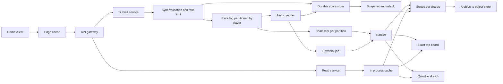
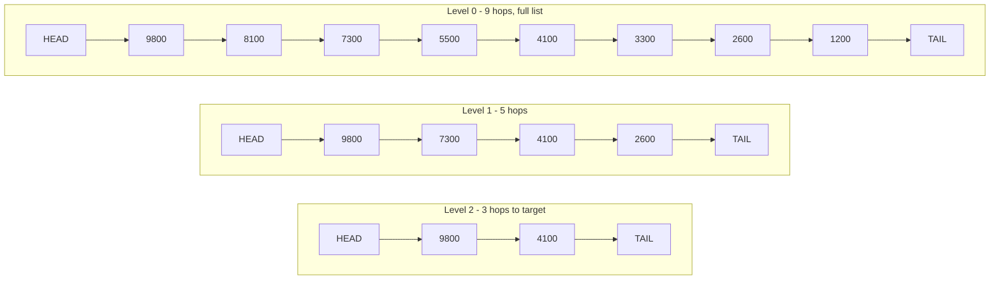
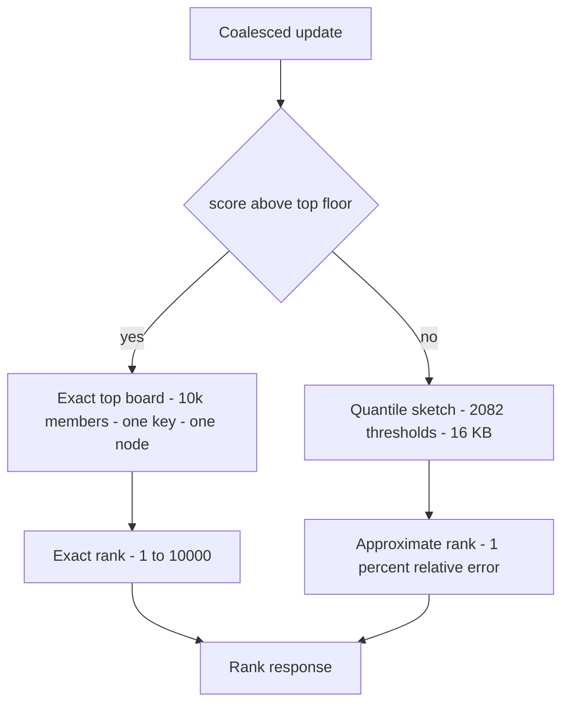
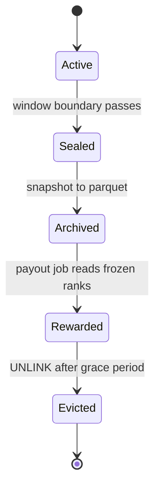
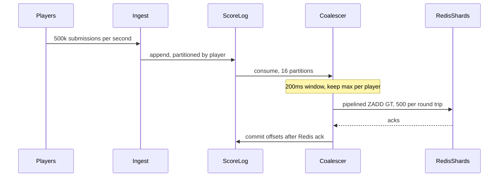

# 44 — Leaderboard / Gaming Ranking

<span class="pill pill-core">Core</span> <span class="pill pill-easy">Easy</span>

**A leaderboard looks like a sorted list and is actually a global-order query over a set that mutates millions of times a second — and global order is the one property that does not shard, so every design here is a negotiation over how much exactness you are willing to buy and where you are willing to stop buying it.**

| | |
|---|---|
| **Commonly asked at** | Riot, Blizzard, Epic, Supercell, King, Zynga, Roblox, Unity/PlayFab, Xbox Live, PlayStation Network, Discord, Twitch, Duolingo, Strava, Peloton, Robinhood, any consumer app with a "top users" surface |
| **Time budget** | 45 min |
| **Core tension** | A single skip-list-backed sorted set gives exact rank in $O(\log n)$ and exact ranges in $O(\log n + k)$ — but only inside one process's memory, on one core, behind one key. The moment score volume or write rate exceeds that node you must shard, and the instant you shard, rank stops being a local property: an exact global rank now costs a scatter-gather over every shard, at every read, against shards that were never sampled at the same instant. Everything else in this design — quantile sketches, tiers, leagues, windowed keys, write coalescing, TTL caching — exists to avoid paying that merge on the read path |
| **Prerequisites** | [F03 Load Balancing](../fundamentals/f03-load-balancing.md), [F04 Caching](../fundamentals/f04-caching.md), [F06 Partitioning & Sharding](../fundamentals/f06-partitioning-sharding.md), [F07 Replication & Consistency](../fundamentals/f07-replication-consistency.md), [F08 CAP & PACELC](../fundamentals/f08-cap-pacelc.md), [F11 Idempotency](../fundamentals/f11-idempotency.md), [F12 Queues & Streams](../fundamentals/f12-queues-streams.md), [F13 Storage Engines](../fundamentals/f13-storage-engines.md), [F14 SQL vs NoSQL](../fundamentals/f14-sql-vs-nosql.md), [F17 Rate Limiting & Load Shedding](../fundamentals/f17-rate-limiting-load-shedding.md), [F18 Resilience Patterns](../fundamentals/f18-resilience-patterns.md), [F19 Concurrency Control](../fundamentals/f19-concurrency-control.md), [F20 Time, Clocks & Ordering](../fundamentals/f20-time-clocks-ordering.md), [F21 Probabilistic Data Structures](../fundamentals/f21-probabilistic-data-structures.md), [F22 Observability Fundamentals](../fundamentals/f22-observability-fundamentals.md), [F23 SLOs & Error Budgets](../fundamentals/f23-slo-error-budgets.md), [F24 Capacity Planning](../fundamentals/f24-capacity-planning.md), [F25 Deployment & Release Safety](../fundamentals/f25-deployment-release-safety.md), [F26 Multi-Region & DR](../fundamentals/f26-multi-region-dr.md), [F27 Security in Design](../fundamentals/f27-security-design.md), [F28 Cost Engineering](../fundamentals/f28-cost-engineering.md) |

---

## 1. Problem Statement

Accept score submissions from a billion accounts, maintain many concurrent ranked views of those scores — global, regional, per-mode, daily, weekly, seasonal, among friends — and answer "who is on top", "where am I", and "who is near me" fast enough to render on a game's home screen, under a workload that spikes by an order of magnitude the instant a tournament ends.

Four reframings that decide the design.

**First: score is a per-entity attribute; rank is a global aggregate.** Storing and updating a score is embarrassingly shardable — hash the player id, write the row, done. Rank is a function of *every other player's score at the same instant*. It is the one field in the system whose value changes when you do nothing. That asymmetry is why a leaderboard is not a key-value problem with a sort on top: the sort is the problem.

**Second: exactness has a steep and very uneven value curve.** Rank 1 versus rank 2 decides a prize. Rank 9 versus rank 10 decides whether you appear on a page. Rank 4,317,222 versus rank 4,338,900 decides nothing at all, and no human on earth can tell the difference. The naive design spends the same $O(\log n)$ on both. **The good design spends a scatter-gather on the top ten thousand and a 16 KB lookup table on everyone else**, because the population where exactness matters is small enough to hold exactly and the population where it does not is large enough that approximation is free.

**Third: the write burst is structurally adversarial.** Leaderboard writes are not Poisson. A tournament has an announced end time, so millions of clients settle their final scores inside the same few seconds, all targeting **the same key**, which in any sorted-set implementation means the same shard, which in Redis means the same thread. You cannot shard your way out of a hot key by adding nodes; you have to change what a write is — coalesce, batch, or defer.

**Fourth: every score is untrusted input until proven otherwise.** The leaderboard is the single most attacked surface in a game, because it is where the rewards are and because it is the only place a cheat is *publicly visible*. If the client computes the score, you do not have a leaderboard; you have a high-score submission form with an HMAC on it. Design decisions about server-authoritative scoring, replay verification and retroactive removal belong in the architecture, not in a footnote.

### Out of scope

Skill rating and matchmaking mathematics (Elo, Glicko-2, TrueSkill — related but a different system: MMR is a *hidden* rating optimised for match quality, a leaderboard is a *public* ranking optimised for motivation, and conflating them is a product error). Client-side anti-tamper and integrity attestation. The reward fulfilment and payments pipeline beyond its interface with rank finalisation.

---

## 2. Requirements

### Functional

| # | Requirement | Notes |
|---|---|---|
| F1 | Submit a score: absolute best-wins, or incremental sum | Two different consistency stories; both must exist |
| F2 | Top-N for any board | $N \le 1000$ served; deeper needs pagination |
| F3 | A player's own score, rank, percentile and tier | The single highest-volume read in the system |
| F4 | Window around a player's rank | "The ten above and ten below me" |
| F5 | Deterministic total order, including ties | Two players never see the same rank number |
| F6 | Time-windowed boards: daily, weekly, monthly, season, all-time | Plus a rolling 7-day variant, which is the expensive one |
| F7 | Board dimensions: game, mode, region, platform, friends | Multiplicative fan-out on the write path |
| F8 | Season rollover: seal, archive, reward, reset | A scheduled, announced, non-idempotent-looking event |
| F9 | Score validation and anti-cheat verdicts | Synchronous cheap checks, asynchronous expensive ones |
| F10 | Retroactive removal of a player and their scores | Must not corrupt already-paid rewards |
| F11 | Idempotent submission under at-least-once delivery | Retries and replays must not inflate scores |
| F12 | Full rebuild of every ranked index from the durable store | The in-memory structure is a cache, not the truth |

### Non-functional

| # | Requirement | Target |
|---|---|---|
| N1 | Submission accept latency | p99 < 60 ms |
| N2 | Read latency, own rank | p99 < 40 ms |
| N3 | Read latency, top-N | p99 < 30 ms, edge-cacheable |
| N4 | Score-to-visible freshness | p95 < 2 s steady, < 30 s during a burst |
| N5 | Steady write rate | 23k submissions/s |
| N6 | Burst write rate, tournament seal | 500k submissions/s sustained for 90 s |
| N7 | Steady read rate | 800k/s, peak 2M/s |
| N8 | Approximate rank error | $\le 1\%$ relative, and exact for rank $\le 10{,}000$ |
| N9 | Availability, reads | 99.95% |
| N10 | Availability, writes | 99.9% — a submission may be buffered, never dropped |
| N11 | Durability of accepted submissions | No loss after a 202; the log is the contract |
| N12 | Rebuild time, full ranked index | < 15 min from cold |
| N13 | Cost | < $3 per million submissions |

!!! note "Why write availability can be a nine lower than read availability"
    Reads are the product: a home screen that cannot render its leaderboard widget is a visibly broken game for every player at once. Writes are recoverable, because the write path is a log — if the ranking tier is unavailable, the submission service still accepts, still persists to the durable store and still produces to the topic, and the ranked index catches up when the tier returns. The player sees a stale rank for a while, which is annoying; they do not lose the score, which would be unforgivable. **N11 is therefore stricter than N10**: accepting and then losing is far worse than refusing.

---

## 3. Scale Estimation

### Population and traffic

$$
\begin{aligned}
\text{registered accounts} &= 1 \times 10^{9} \\
\text{DAU} &= 1 \times 10^{8} \\
\text{peak concurrent} &= 8 \times 10^{6}
\end{aligned}
$$

$$
\begin{aligned}
\text{submissions/day} &= 10^{8} \times 20 = 2 \times 10^{9} \\
\text{mean} &= \frac{2\times10^{9}}{86{,}400} = \mathbf{23{,}150\ \text{/s}} \\
\text{diurnal peak } (5\times) &= 116{,}000\ \text{/s} \\
\text{tournament seal} &: 45\times10^{6}\ \text{players settle in } 90\ \text{s} = \mathbf{500{,}000\ \text{/s}}
\end{aligned}
$$

Reads come from a widget that refreshes every 10 s while the app is in the foreground:

$$
\text{steady reads} = \frac{8\times10^{6}}{10} = 800{,}000\ \text{/s},\qquad
\text{peak} \approx 2\times10^{6}\ \text{/s}
$$

$$
\text{read : write} = \frac{800{,}000}{23{,}150} \approx \mathbf{35:1}
$$

### Write amplification — the number that actually sizes the cluster

One logical submission fans out to every board the player is in:

| Board | Written per submission |
|---|---|
| All-time global | 1 |
| Current season | 1 |
| Current month | 1 |
| Current week | 1 |
| Current day | 1 |
| Regional season | 1 |
| Platform season | 1 |
| **Total ZADDs** | **7** |

$$
\begin{aligned}
\text{steady ZADD/s} &= 23{,}150 \times 7 = 162{,}000 \\
\text{burst ZADD/s} &= 500{,}000 \times 7 = \mathbf{3.5 \times 10^{6}}
\end{aligned}
$$

!!! warning "Fan-out, not submission rate, is the capacity driver"
    Every time product adds a board dimension — a new region split, a new game mode, a "this hour" board — the write rate multiplies, not adds. Seven boards is already a 7x amplifier; adding a per-guild board takes it to 8x and adding a per-country board on top of per-region takes it to 9x. The lever that makes this survivable is **coalescing before fan-out**: coalesce once, then fan out the single coalesced write, so a 4x coalescing ratio and 7x fan-out nets 1.75x rather than 7x.

### Sorted-set memory — what an element actually costs

A Redis sorted set above the listpack threshold is a skip list plus a hash table. Per member, on a 64-bit build with jemalloc:

| Component | Bytes | Allocated |
|---|---|---|
| `sds` member string, 18-char id | 3 hdr + 18 + 1 | 32 |
| `zskiplistNode`: member ptr 8, score double 8, backward 8, level array $\bar{L} \times 16$ | $24 + 1.33\times16 \approx 45$ | 56 |
| `dictEntry`: key, value, next | 24 | 32 |
| Bucket array share, load factor $\approx 0.75$ | — | 11 |
| **Total** | | $\approx \mathbf{131\ \text{B}}$ |

The expected skip-list level count is $\bar{L} = \frac{1}{1-p} = \frac{1}{1-0.25} = 1.33$.

$$
\begin{aligned}
\text{all-time board, } 10^{9} \text{ members} &= 10^{9}\times131\ \text{B} = \mathbf{131\ \text{GB}} \\
\text{season board, } 2\times10^{8} &= 26\ \text{GB} \\
\text{monthly } 3\times10^{8} &= 39\ \text{GB} \\
\text{weekly } 1.5\times10^{8} &= 20\ \text{GB} \\
\text{daily } \times 2\ \text{retained} &= 26\ \text{GB} \\
\text{regional + platform season} &= 45\ \text{GB} \\
\hline
\text{total resident} &\approx \mathbf{287\ \text{GB}}
\end{aligned}
$$

With 1.6x headroom for fragmentation and copy-on-write during persistence, **459 GB of usable memory**.

!!! tip "The listpack cliff is worth a sentence in the interview"
    Below `zset-max-listpack-entries` (128) and `zset-max-listpack-value` (64 B), Redis stores the whole sorted set as a flat listpack — roughly 22 B per member instead of 131 B, a 6x saving, at the cost of $O(n)$ operations that are irrelevant when $n < 128$. This matters enormously for **friend leaderboards**: a friend board is 40 members, so it costs 900 B instead of 5.2 KB. It is also exactly why you do not materialise 100 million of them — $10^{8} \times 900\ \text{B} = 90\ \text{GB}$ to store data that is a `ZSCORE` fan-out away, and that goes stale the moment anyone's score changes.

### Operation cost — what $O(\log n)$ costs in nanoseconds

Expected skip-list search cost is $\frac{1}{p}\log_{1/p} n$ pointer hops. At $n = 10^{9}$, $p=0.25$:

$$
\text{hops} = 4 \times \log_{4}(10^{9}) = 4 \times 14.95 = 59.8
$$

Each hop is a pointer chase into a 131 GB structure — effectively a guaranteed LLC miss at $\approx 90$ ns:

$$
t_{\text{ZADD}} \approx 60 \times 90\ \text{ns} = 5.4\ \mu s
\;\Longrightarrow\;
\frac{1}{5.4\,\mu s} \approx 185{,}000\ \text{ops/s}
$$

That is the *memory-bound ceiling on one core*, before protocol parsing, before replication, before the event loop. Measured reality on a large sorted set is **90k–130k ZADD/s per Redis process**, not the 1M/s people quote from `redis-benchmark` on an empty instance.

$$
\text{shards needed by write rate} = \frac{3.5\times10^{6}}{110{,}000} = 32
\qquad
\text{shards needed by memory} = \frac{459}{45} = 11
$$

!!! danger "The burst, not the average, sizes the cluster — and you cannot shard a single key"
    32 shards by burst write rate against 11 by memory means the design is **write-burst-bound by a factor of three**, and worse, all 3.5M of those writes target a handful of *named keys*. Redis Cluster assigns a key to a slot by hashing the key name: `lb:g1:solo:all` is one slot on one node no matter how many nodes you own. Adding shards does nothing. The only three levers are: split the logical board into $S$ physical sub-keys, coalesce writes so there are fewer of them, or buffer them in a log and apply them more slowly. This design uses all three.

### Read cost, if you did it naively

Exact global rank on an $S$-way sharded board requires a `ZCOUNT` on every shard:

$$
\text{Redis ops/s} = 2\times10^{6} \times 16 = 3.2\times10^{7}\ \text{ops/s}
$$

Thirty-two million operations per second to answer a question whose answer nobody can verify. This single number is the entire justification for the quantile-sketch tier in section 7.2.

---

## 4. API Design

```text
POST   /v1/boards/{board}/scores              submit
GET    /v1/boards/{board}/top?limit=100       top-N, public, edge-cacheable
GET    /v1/boards/{board}/players/{player}    score + rank + percentile + tier
GET    /v1/boards/{board}/around/{player}     window centred on the player
GET    /v1/boards/{board}/page?cursor=&limit= keyset pagination, deep
GET    /v1/boards/{board}/friends/{player}    computed, never materialised
POST   /v1/boards/{board}/seal                admin: freeze + archive + reward
DELETE /v1/boards/{board}/players/{player}    admin: retroactive removal
```

A `board` is a structured identifier, not an opaque string, because the ranker has to parse it to know which key family and which window to write:

```text
g.clash/m.solo/r.eu/w.d2026-09-25
g.clash/m.solo/r.global/w.s14
g.clash/m.solo/r.global/w.all
```

### Submission

```json
POST /v1/boards/g.clash%2Fm.solo%2Fr.global%2Fw.s14/scores
{
  "player_id": "p_8f3a91c2",
  "submission_id": "01J8Z3K5QW7YV9R2N4XB6M0TCD",
  "mode": "best",
  "score": 152340,
  "achieved_at": "2026-09-25T14:03:11.442Z",
  "match_id": "m_77c31e",
  "evidence": {
    "session_token": "...",
    "server_sig": "base64...",
    "tick_count": 18422
  }
}
```

```json
202 Accepted
{
  "accepted": true,
  "submission_id": "01J8Z3K5QW7YV9R2N4XB6M0TCD",
  "durable_offset": "scores-17@884213991",
  "visible_in_ms_estimate": 1200,
  "verdict": "pending_async_review"
}
```

!!! note "202 with a durable offset, not 200 with a rank"
    Returning the new rank synchronously forces the submission path to wait for the ranked index to apply, coupling write latency to the hottest, most contended component in the system — exactly the coupling you do not want during a tournament seal. Returning **202 plus the durable log offset** makes the contract explicit: the score is safe, its position is not yet computed, and the client can poll with `?after_offset=` to get read-your-writes when it matters. Clients that want an immediate number get an *optimistic* rank computed from the quantile sketch, which is free and usually right.

### Rank response

```json
GET /v1/boards/g.clash%2Fm.solo%2Fr.global%2Fw.s14/players/p_8f3a91c2
{
  "player_id": "p_8f3a91c2",
  "score": 152340,
  "rank": 4317200,
  "rank_exactness": "approximate",
  "rank_error_bound": 43172,
  "percentile": 97.84,
  "tier": "diamond_2",
  "tier_progress": 0.61,
  "population": 198441230,
  "as_of": "2026-09-25T14:03:12.900Z",
  "board_version": 14
}
```

!!! tip "`rank_exactness` and `rank_error_bound` are load-bearing fields, not decoration"
    The moment you ship approximate rank, three things happen: a player screenshots two different rank values seconds apart, support cannot tell whether it is a bug, and an engineer "fixes" it by making the read path exact — which is the outage. Putting exactness in the payload means the client can render `~4.3M` instead of `4,317,200`, support has a documented answer, and the contract is enforced by the schema rather than by tribal memory. Rounding the displayed number to the error bound is the cheapest reliability feature in this design.

### Pagination

```text
GET /v1/boards/{board}/page?cursor=eyJzIjoxNTIzNDAsIm0iOiJwXzhmM2E5MWMyIn0&limit=50
```

The cursor is base64 of `{"s": <packed_score>, "m": <member>}` — a keyset cursor on the composite total order, never an offset. Section 7.2 explains why offsets are unusable here.

---

## 5. Data Model

### Layer 1 — the durable truth

Nothing in Redis is authoritative. The truth is an append-only event log plus a current-value table.

```sql
-- Cassandra / ScyllaDB. Note the bucket in the partition key: partitioning on
-- board_id alone would put 200M rows in one partition.
CREATE TABLE score_current (
    board_id     text,
    player_bucket int,          -- murmur3(player_id) % 4096
    player_id    text,
    score        bigint,
    tiebreak     bigint,        -- inverted achieved_at, seconds since season start
    version      bigint,        -- monotonic per player+board, for GT semantics
    updated_at   timestamp,
    PRIMARY KEY ((board_id, player_bucket), player_id)
) WITH compaction = {'class': 'LeveledCompactionStrategy'};

CREATE TABLE score_events (
    board_id      text,
    player_id     text,
    submission_id text,         -- ULID, sortable, also the idempotency key
    delta         bigint,
    absolute      bigint,
    verdict       text,         -- accepted | quarantined | reversed
    match_id      text,
    achieved_at   timestamp,
    PRIMARY KEY ((board_id, player_id), submission_id)
) WITH default_time_to_live = 7776000;   -- 90d, then it lives in Parquet
```

`score_events` exists for three reasons and only three: idempotency lookups on replay, retroactive reversal when a cheat verdict lands, and full index rebuild. It is deliberately TTL'd, because a permanent event log at 2B/day is a different and much more expensive system.

### Layer 2 — the ranked index

```redis
# Board keys. The hash tag controls slot placement; see the gotcha in s12.
ZADD  lb:{g.clash:solo:s14}:p03 GT CH 6389203337215 p_8f3a91c2
ZSCORE lb:{g.clash:solo:s14}:p03 p_8f3a91c2
ZREVRANK lb:{g.clash:solo:s14}:p03 p_8f3a91c2
ZCOUNT lb:{g.clash:solo:s14}:p03 (6389203337215 +inf
ZREVRANGEBYSCORE lb:{g.clash:solo:s14}:p03 (6389203337215 -inf LIMIT 0 10 WITHSCORES

# The exact top board: one key, tiny, trimmed on every write that qualifies.
ZADD lb:top:{g.clash:solo:s14} GT CH 6389203337215 p_8f3a91c2
ZREMRANGEBYRANK lb:top:{g.clash:solo:s14} 0 -10001

# The quantile sketch: rank boundary -> score threshold. 2082 fields, ~16 KB.
HGETALL qs:{g.clash:solo:s14}
```

### Layer 3 — the packed score

Ties are not an edge case; on a board where 40% of players score exactly zero and thousands land on round numbers, ties are the *common* case. Rather than resolve them at read time, encode the tiebreaker into the sort key:

```python
SCORE_BITS = 32            # max raw score 4,294,967,295
TS_BITS    = 21            # seconds since season start: 2,097,151 s = 24.3 days
MAX_TS     = (1 << TS_BITS) - 1

def pack(score: int, secs_since_season_start: int) -> int:
    """Earlier achiever wins a tie, so the timestamp is inverted."""
    if not 0 <= score < (1 << SCORE_BITS):
        raise ValueError("score out of packable range")
    t = min(max(secs_since_season_start, 0), MAX_TS)
    return (score << TS_BITS) | (MAX_TS - t)

def unpack(packed: int) -> tuple[int, int]:
    return packed >> TS_BITS, MAX_TS - (packed & MAX_TS)
```

$$
\text{SCORE\_BITS} + \text{TS\_BITS} = 32 + 21 = 53
$$

!!! danger "53 is not a coincidence and it is not a safety margin"
    Redis sorted-set scores are IEEE-754 doubles. Integers are represented exactly only up to $2^{53}$; above that, consecutive integers collapse onto the same double and two genuinely different packed scores compare equal. The packing above consumes **exactly** the available precision, which means it works and has zero headroom. Any product request that widens the score range or lengthens the season breaks it silently — no error, no exception, just ranks that stop being a total order. The mitigation is an explicit range assertion on the way in (as above) and a CI test that asserts `pack(s, t) != pack(s, t+1)` at the extremes. A season longer than 24.3 days must switch the tiebreaker granularity to minutes, not "just add bits".

### Layer 4 — archives

Sealed windows go to columnar object storage and out of memory entirely:

```text
s3://lb-archive/board=g.clash.solo/window=s14/part-0000.parquet
  player_id: string, score: int64, rank: int64, percentile: float32,
  tier: string, sealed_at: timestamp
```

An archived board is immutable, cheap, and queryable for "what was my rank in season 12" without a single byte of RAM.

---

## 6. High-Level Architecture



### Write path

1. **Gateway** authenticates the session and applies a per-player token bucket (see [F17](../fundamentals/f17-rate-limiting-load-shedding.md)). A player physically cannot complete twenty matches a minute; a limit of 10/min with a burst of 30 costs nothing legitimate and kills the cheapest abuse class outright.
2. **Submit service** runs only the checks that are cheap and synchronous: schema, server signature over `(player, match, score, nonce, expiry)`, nonce replay check against a short-TTL set, and a plausibility bound derived from match duration. Anything expensive is deferred.
3. **Durable write** to `score_events` and a conditional update of `score_current` guarded by `version`. This is the point of no return; after it, the submission cannot be lost.
4. **Produce to the log**, partitioned by `player_id` so that all updates for one player are ordered on one partition and one consumer — which is what makes coalescing lock-free and makes `GT` semantics correct under replay.
5. **Respond 202** with the durable offset. Median path is three network hops and no contact with the ranked index at all.
6. **Coalescer** holds a per-player slot for a 200 ms window, keeping the maximum for best-wins boards and the sum for incremental boards, then flushes a pipelined batch.
7. **Ranker** fans the coalesced update out to the seven board keys, updates the exact top board if the score qualifies, and adjusts the quantile sketch's dirty counters.

### Read path

1. **Edge**: `GET /top` is identical for every player on a board, so it is cached at the CDN with `max-age=5, stale-while-revalidate=25`. This is the difference between 2M req/s hitting your origin and 2M req/s hitting someone else's.
2. **In-process cache**: `top-N` for the twenty hottest boards is held in each API instance for 1 s with jitter, behind a single-flight guard. At 2,000 instances and a 1 s TTL the origin sees 2,000 req/s, not 2M.
3. **Own rank**: one `ZSCORE` against the player's shard for the score, then a binary search in the locally-cached quantile sketch for the rank. **One round trip, no fan-out.**
4. **If the player's score exceeds the top-board floor**, the read is served from the exact top board instead — exact rank, exact neighbours, same single round trip.
5. **Around-me**: two `ZREVRANGEBYSCORE ... LIMIT 0 k` calls per shard (above and below), merged $S$-way. This is the only genuinely fan-out read, it is a small fraction of traffic, and it is score-anchored rather than rank-anchored, which is what makes it possible at all.

---

## 7. Deep Dives

### 7.1 The sorted set: what $O(\log n)$ buys, and exactly where it stops

A Redis `ZSET` is two structures over the same members: a **hash table** from member to score, giving $O(1)$ `ZSCORE`, and a **skip list** ordered by `(score, member)`, giving $O(\log n)$ insert, delete and rank.

The property that makes rank cheap is the **span**. Each forward pointer at each level records how many level-0 nodes it jumps over. Accumulating spans along a search path yields the element's index without walking the list.



| Operation | Complexity | What it is for |
|---|---|---|
| `ZADD` | $O(\log n)$ | Submit a score |
| `ZSCORE` | $O(1)$ | Read own score |
| `ZREVRANK` | $O(\log n)$ | Own rank via span accumulation |
| `ZCOUNT min max` | $O(\log n)$ | Rank by counting, tie-correct |
| `ZREVRANGE start stop` | $O(\log n + k)$ | Top-N, or a rank-anchored window |
| `ZREVRANGEBYSCORE ... LIMIT` | $O(\log n + k)$ | Score-anchored window — the shardable one |
| `ZREMRANGEBYRANK` | $O(\log n + k)$ | Trim the top board |
| `ZUNIONSTORE` | $O(n \log n)$ | Rolling windows — the dangerous one |

??? note "Why a skip list rather than a balanced tree, and why it matters operationally"
    Redis's author chose a skip list over a red-black tree for reasons that turn out to be operational rather than asymptotic. Range queries are a simple forward walk at level 0 with no successor traversal. There are no rotations, so insertion under load has uniform cost and no latency cliffs. The structure is trivially augmentable — adding the span field to support $O(\log n)$ rank was a local change, where in a balanced tree it is order-statistic bookkeeping through every rebalance. And the implementation is short enough to audit. The cost is probabilistic rather than worst-case bounds and roughly 1.33 forward pointers per node of overhead. For a leaderboard the trade is overwhelmingly correct: the workload is insert-heavy with frequent ranked range reads, which is the skip list's best case and the B-tree's worst.

**The single-node ceiling has four independent walls, and you hit them in this order:**

1. **Throughput.** One Redis process is one command-executing thread. Section 3's arithmetic gives $\approx 110$k `ZADD/s` on a billion-element set. Nothing you configure changes this.
2. **Memory.** 131 B/member is a hard floor; 131 GB for a billion-member board is more than most instance types offer with room for replication buffers.
3. **Fork.** `BGSAVE` and replica sync fork the process. Copy-on-write means memory grows with the *write rate during the fork*. At 110k writes/s against a 131 GB heap, a 90 s save can dirty tens of gigabytes. This is why a leaderboard OOMs at tournament seal specifically.
4. **Blast radius.** One node holding the entire ranking for a title means one failover is a total product outage.

!!! warning "Replicas scale reads and do nothing whatsoever for the hot write key"
    The reflex when a sorted set saturates is "add read replicas". That helps `ZSCORE` and `ZREVRANGE`, which is real, but the tournament-seal problem is *write* contention on one key, and every replica applies **the same write stream on the same single thread**. Adding replicas increases total write work in the system while leaving the primary's ceiling untouched. Worse, a saturated primary lengthens the replication backlog, and a replica that falls too far behind triggers a full resync — which forks the primary, at exactly the moment it is least able to afford it.

### 7.2 Sharding, and the rank problem it creates

Split the board into $S$ sub-keys by `murmur3(player_id) % S`. Memory and write throughput now scale linearly. Three query classes react very differently:

=== "Top-N: still exact, cheaply"

    The global top $N$ is necessarily contained in the union of the per-shard top $N$ sets. So:

    ```python
    def global_top(shards, n):
        # S parallel O(log n + N) reads, then a k-way merge of S*N candidates
        parts = gather(s.zrevrange(key, 0, n - 1, withscores=True) for s in shards)
        return heapq.merge(*parts, key=lambda kv: -kv[1])[:n]
    ```

    Cost $O(S(\log n + N))$ and the answer is **exact**. With $S=16$ and $N=100$ this is 16 parallel reads of 100 elements — a millisecond. Top-N is the easy case, and this is why people underestimate the whole problem.

=== "My exact rank: correct, and unaffordable"

    ```python
    def exact_rank(shards, packed_score):
        counts = gather(s.zcount(key, f"({packed_score}", "+inf") for s in shards)
        return sum(counts) + 1
    ```

    Also exact, also $O(S\log n)$ — but now it runs on **every read**, 2M times a second, which section 3 priced at 32M Redis ops/s. And the latency is not the mean of $S$ calls but the maximum:

    $$
    p99(\text{fan-out of } 16) \approx \text{the } p_{99.94}\ \text{of a single shard}
    $$

    A shard whose p99 is 2 ms and whose p99.94 is 45 ms turns a 2 ms read into a 45 ms read. Tail amplification is the real cost, not the op count.

=== "Around me: rank-anchored is impossible"

    `ZREVRANGE key 4317190 4317210` is meaningless on a shard: the shard holds one sixteenth of the players and knows only *local* index 4317190. There is no way to translate a global rank into a local index without already knowing the global distribution.

    So the window must be **score-anchored**:

    ```python
    def around_me(shards, packed_score, k):
        above = gather(s.zrevrangebyscore(key, "+inf", f"({packed_score}",
                                          start=0, num=k) for s in shards)
        below = gather(s.zrevrangebyscore(key, f"({packed_score}", "-inf",
                                          start=0, num=k) for s in shards)
        return merge_desc(above)[-k:] + [me] + merge_desc(below)[:k]
    ```

    Each shard returns its $k$ nearest neighbours by score; the merge picks the true $k$. This is exact, costs $O(S(\log n + k))$, and is the reason the score must encode a tiebreaker: without a total order, "the 10 players just below score 152340" is ambiguous across shards and the merge is non-deterministic.

**The approximate-rank tier.** Exactness is worth paying for at the top and worthless in the tail, so serve the two populations with two structures:



The sketch stores score thresholds at geometrically spaced rank boundaries $r_i = \lceil (1+\epsilon)^i \rceil$. The bucket count is:

$$
B = \log_{1+\epsilon} N = \frac{\ln 10^{9}}{\ln 1.01} = \frac{20.72}{0.00995} = \mathbf{2082}
$$

Because boundaries are geometric, the **relative** rank error is bounded at $\epsilon = 1\%$ everywhere: $\pm 43{,}000$ at rank 4.3M, $\pm 1{,}000$ at rank 100k, $\pm 100$ at rank 10k — where the exact top board takes over. Storage is 2082 int64 pairs, about **16 KB**, which every API instance holds in memory and refreshes every 30 s. A rank lookup is a binary search over 2082 entries: 11 comparisons in L1 cache, no network at all.

Each shard maintains a mergeable local summary (GK or t-digest, see [F21](../fundamentals/f21-probabilistic-data-structures.md)); a builder merges them and publishes the 16 KB table. Merging is associative, so sharding does not degrade accuracy.

$$
\text{Redis ops/s for rank reads}: \;3.2\times10^{7} \;\longrightarrow\; 2\times10^{6}\ (\text{one ZSCORE each})
$$

A 16x reduction, and the ZSCORE is $O(1)$ rather than $O(\log n)$.

!!! gotcha "Sharded rank is not monotonic and players will notice"
    **Symptom.** A player refreshes twice without playing and sees rank 91,204 then 91,198 then 91,211. They post a screenshot captioned "your leaderboard is broken".
    **Mechanism.** A fan-out rank is a sum of `ZCOUNT`s sampled at sixteen *different instants* while millions of scores move. The sum is a valid rank at no single point in time. The quantile sketch has the same property across refresh boundaries.
    **Mitigation.** Clamp the displayed rank monotonically within a session — never show a worse rank than the last one shown unless the population or the player's score changed — round the display to the error bound so small jitter is invisible, and return `as_of` so the client can suppress an update that is older than what it already rendered. It is a presentation fix because the underlying non-monotonicity is inherent to a distributed count, not a bug to be fixed in storage.

**Why not range-shard by score?** Because score distributions drift. Partitioning score space into bands gives $O(\log n)$ rank with no fan-out — local rank plus cached counts of all higher bands — which is genuinely elegant for about three weeks. Then seasonal score inflation pushes the whole population upward, the top band accumulates most of the writes, and you are rebalancing band boundaries live while the counts that make rank cheap are exactly the thing being invalidated. Hash sharding has a boring, uniform, permanent distribution. Take boring.

### 7.3 Time windows: write amplification, rollover, and the rolling-window trap

There are two shapes of time-windowed board and they are not variants of each other.

**Bucketed windows** (today, this week, September, season 14) are trivial *if* you make the window part of the key and write to all of them on submission. Rollover then requires no work at all: at 00:00 the ranker simply starts writing to `w.d2026-09-26`, and the previous day's key is already complete, already correct, and already sealed by virtue of nothing writing to it. There is **no rebuild**, because there was never a moving window to rebuild.



**Rolling windows** ("last 7 days", "trailing 30 days") have no such key. The naive implementation is a periodic union:

```redis
ZUNIONSTORE lb:rolling7 7 lb:d1 lb:d2 lb:d3 lb:d4 lb:d5 lb:d6 lb:d7 AGGREGATE SUM
```

!!! danger "ZUNIONSTORE on production sorted sets is an availability incident with a cron schedule"
    Seven daily boards of 20M members each is a 140M-element union. `ZUNIONSTORE` is $O(N\log N)$ **on the single command thread**, so the node executes nothing else for several seconds. Every client hits its timeout, every client retries, and the retry storm arrives at a node that is still blocked — a textbook metastable failure ([F18](../fundamentals/f18-resilience-patterns.md)). It also allocates a second 140M-element sorted set, roughly 18 GB, on a node you sized for its steady state. Three ways out, in order of preference: (1) run the union on a dedicated non-serving instance and swap the result key in atomically with `RENAME`; (2) maintain the rolling total incrementally, applying `ZINCRBY +delta` on arrival and `ZINCRBY -delta` when a day ages out, which requires keeping per-day per-player deltas — exactly the seven daily boards you already have; (3) tell product that "last 7 days" means "the last 7 completed days plus today", which is a single union of pre-merged parts and costs nothing.

Bucketed windows are not free either. They multiply memory and write rate, and they create a **memory cliff at expiry**:

$$
\text{daily key} = 10^{8} \times 131\ \text{B} = 13\ \text{GB freed in one operation}
$$

```bash
# DEL frees 13 GB synchronously on the command thread: a multi-second stall.
# UNLINK hands it to the lazyfree thread.
redis-cli UNLINK lb:{g.clash:solo:d2026-09-18}:p03
```

Set `lazyfree-lazy-expire yes` so TTL-driven eviction takes the same path, and stagger expiry times per shard so sixteen shards do not free 13 GB simultaneously.

??? note "Whose midnight? The timezone question that quietly doubles your board count"
    "Daily leaderboard" is underspecified. UTC midnight is simple and globally consistent, but it lands at 09:00 in Tokyo and resets mid-session for a large population. Local midnight is fair but means a player travelling from Auckland to Los Angeles experiences two rollovers in one day, or none, depending on which timezone you pinned them to — and it means the board is no longer one board but one per timezone offset, which is 38 boards including the half-hour and quarter-hour offsets. The defensible answer for a global title: pick a fixed reset instant per **region** (which you already shard by), publish it in the client, show a countdown, and pin a player's region at account creation with an explicit, rate-limited change flow. Never derive it from the device clock — the device clock is attacker-controlled, and "set your phone to 23:59 to get a fresh daily board" is a five-minute exploit.

### 7.4 Trust: server-authoritative scoring and the layers below it

The leaderboard is where cheating becomes visible and where rewards live, so it receives more attack effort than any other surface in the game.

**The only real answer is that the client never sends a score.** The client sends inputs; the authoritative simulation runs server-side; the score is an output of a process the player cannot touch. Where that is possible — session-based competitive games — every other control is defence in depth. Where it is not possible — single-player mobile, idle games, offline modes — you are validating a claim, and you should say so in the design rather than pretending an HMAC makes the client trustworthy.

| Layer | Runs | Cost | Catches |
|---|---|---|---|
| Session auth + per-submission signature | Sync | Microseconds | Unauthenticated and forged submissions |
| Nonce + expiry replay check | Sync | One Redis op | Resubmission of a captured valid payload |
| Rate limit, per player and per device | Sync | One token bucket | Scripted submission floods |
| Plausibility bounds | Sync | Arithmetic | Scores impossible for the elapsed match time |
| Population outlier detection | Async, seconds | Streaming z-score | Scores far outside the distribution |
| Behavioural / telemetry model | Async, minutes | ML scoring | Aimbots, macro patterns, input regularity |
| Full replay re-simulation | Async, minutes | Seconds of CPU per match | Everything, but only affordable for the top |

!!! tip "Replay verification is affordable precisely where it matters"
    Re-simulating a match server-side costs real CPU and cannot run on two billion submissions a day. It does not have to. Cheating is a problem in proportion to visibility and reward, both of which are concentrated in the top few thousand ranks. **Verify every submission that would enter the top 10,000, and sample everything else at 0.1%.** At a top-board churn of a few thousand entries an hour, that is a handful of cores. The sampled tail exists to keep the population model honest and to make cheating in obscurity unrewarding rather than impossible.

**Plausibility bounds are the highest-value cheap check:**

```python
def implausible(sub, match) -> str | None:
    dur = (sub.achieved_at - match.started_at).total_seconds()
    if dur < match.min_duration_s:
        return "match_too_short"
    if sub.score > match.max_score_rate * dur + match.max_score_intercept:
        return "score_rate_exceeded"
    if sub.score > PLAYER_CLASS_CEILING[match.mode]:
        return "above_theoretical_max"
    if sub.tick_count and sub.score / max(sub.tick_count, 1) > MAX_PER_TICK:
        return "score_per_tick_exceeded"
    return None
```

These catch the overwhelming majority of casual cheating — the modified APK submitting `999999999` — for the cost of four comparisons.

**Quarantine, do not reject.** A failed check writes `verdict = "quarantined"` and skips the ranked index; it does not return an error. Returning "your score was rejected as impossible" is a free oracle: the attacker binary-searches your bounds in twenty submissions and then sits just underneath them forever. Silent quarantine costs them days and gives you a labelled dataset.

**Retroactive removal has to be a first-class operation:**

```python
def reverse_player(board, player):
    # 1. Suppress: stop accepting, before touching anything
    suppression.add(player, board)
    # 2. Remove from every window key on every shard
    for key in board.window_keys():
        redis.zrem(shard_for(player, key), player)
    redis.zrem(top_key(board), player)
    # 3. Mark events reversed so a rebuild does not resurrect them
    store.mark_reversed(board, player)
    # 4. Recompute reward eligibility for ranks that shifted upward
    rewards.reconcile(board, from_rank=removed_rank)
```

!!! warning "Removing a cheater from rank 3 is not a delete, it is a settlement"
    Everyone below moves up one. That is correct and it is also, if rewards were already paid, a financial event: the player who was 4th is now 3rd and is owed the difference. The architectural consequence is that **rank finalisation and reward payout must be separated by a dispute window** — typically 24 to 72 hours between sealing a board and paying out — during which reversals are cheap. After payout, a reversal is a support case with a compensation policy, not a database operation. Systems that pay instantly on seal end up choosing between leaving cheaters on the podium and clawing back prizes from innocent players. Both are bad, and the fix is a calendar decision made at design time.

---

## 8. Scaling the Bottleneck

The bottleneck is not one thing; it is two, at opposite ends of the same key.

### 8.1 The write bottleneck: tournament seal

3.5M `ZADD/s` against seven named keys. Four layers, applied in order, each multiplying the previous:

**Layer 1 — coalescing (4-8x).** Per-player state in a 200 ms window collapses to one write. A player finishing a match emits several events; a leaderboard only needs the final state.

```go
// One coalescer per log partition. The player -> slot map is owned exclusively
// by this goroutine, so no locking.
type slot struct {
    best  int64
    delta int64
    dirty bool
}

func (c *Coalescer) run(ctx context.Context) {
    tick := time.NewTicker(200 * time.Millisecond)
    defer tick.Stop()
    for {
        select {
        case m := <-c.in:
            s := c.pending[m.Player]
            if m.Absolute {
                if m.Packed > s.best {
                    s.best = m.Packed // GT semantics, replay-safe
                }
            } else {
                s.delta += m.Delta // SUM semantics, NOT replay-safe
            }
            s.dirty = true
            c.pending[m.Player] = s
        case <-tick.C:
            c.flush(ctx) // pipeline, then commit offsets
        }
    }
}
```

Order matters on flush: **write to Redis, then commit the offset.** A crash between them replays the window, which `ZADD GT` absorbs idempotently. Incremental boards cannot rely on that and need the per-window sequence guard described in section 12.

$$
3.5\times10^{6} \;\xrightarrow{\;\text{coalesce } 5\times\;}\; 700{,}000\ \text{ZADD/s}
$$

**Layer 2 — pipelining (2-3x).** Batching 500 `ZADD`s per round trip removes syscall and RTT overhead. The gain is bounded, not 10x, because a `ZADD` on a billion-element set is memory-stall-bound, not syscall-bound — the pointer chases still happen.

**Layer 3 — sub-key splitting (linear).** One logical board becomes $S$ physical keys with distinct hash tags so they land on distinct slots and distinct nodes. Top-N merges exactly; rank fans out or goes to the sketch.

$$
\frac{700{,}000}{16} = 43{,}750\ \text{ZADD/s per shard} \ll 110{,}000
$$

**Layer 4 — the log as a shock absorber.** If the ranking tier still cannot keep up, the log accumulates and the coalescer widens its window from 200 ms to 2 s, which raises the coalescing ratio further — an automatic, self-correcting response. Freshness degrades from 2 s to 30 s (N4's burst clause). Nothing is dropped, nothing errors, and the system recovers by itself when the burst passes. **Backpressure that degrades a soft SLO is infinitely better than backpressure that degrades a hard one.**



### 8.2 The read bottleneck: 2M/s against a constantly changing list

The classic framing is "cache invalidation is hard because the leaderboard changes constantly". That framing is the trap. **Do not invalidate. Expire.**

| Strategy | Behaviour at 500k writes/s | Verdict |
|---|---|---|
| Invalidate on write | 500k invalidations/s; top-N hit rate near zero; the cache is pure overhead | Rejected |
| Write-through to cache | Every write touches both tiers; doubles the hot-key problem | Rejected |
| **Short TTL + stale-while-revalidate** | Origin load is $\frac{\text{instances}}{\text{TTL}}$, independent of write rate | **Chosen** |
| Long TTL + manual purge | Correct-ish, but purge latency is the freshness SLO and it is unpredictable | Rejected |

The decisive property: **with a TTL, origin load is a function of cache-instance count and TTL, not of write rate.**

$$
\text{origin req/s} = \frac{2{,}000\ \text{instances}}{1\ \text{s TTL}} = 2{,}000\ \text{req/s}
$$

Two thousand, from two million. And it does not change when writes go up 20x.

```python
TTL = 1.0
JITTER = 0.25   # prevents 2000 instances expiring on the same tick

async def get_top(board, n):
    e = local.get(board)
    if e and e.expires > now():
        return e.value
    if e and e.expires + 5 > now():
        spawn(refresh, board, n)      # stale-while-revalidate
        return e.value                # serve stale, do not block
    async with singleflight(board):   # one origin call per instance, not per request
        v = await merge_shard_tops(board, n)
        local.set(board, v, now() + TTL * (1 + random.uniform(-JITTER, JITTER)))
        return v
```

Three mechanisms, each fixing a distinct failure: **jittered TTL** stops synchronised expiry across the fleet, **single-flight** stops a thundering herd within one instance, and **stale-while-revalidate** stops a slow origin from becoming a read outage.

**Version the key, never purge it.** Season rollover embeds `board_version` in every cache key, so incrementing the version invalidates every cached entry everywhere — CDN, process caches, client — atomically and for free. No purge API, no propagation delay, no partial state where some players see season 14 and others season 15.

### 8.3 The structural escape: stop computing global rank at all

The strongest scaling move is not a better index. It is noticing that **global rank among 200 million players is a bad product**, and that the systems which actually retain players abandoned it years ago.

=== "Tiers"

    Map percentile ranges onto named tiers: Bronze, Silver, Gold, Platinum, Diamond, Master, Grandmaster. A tier is a single comparison against the quantile sketch — no rank computation at all. Two sub-choices:

    - **Fixed score thresholds.** Simple, stable, and wrong within a season: score inflation puts 60% of the population in Grandmaster by week six.
    - **Population percentiles.** "Grandmaster is the top 0.1%" recomputed hourly. Stable distribution forever, at the cost that a player can be demoted while asleep because others improved. Mitigate with hysteresis — promote at the 0.1% boundary, demote only below 0.15% — and with a floor that a tier, once earned, holds until the season ends.

=== "Leagues"

    Assign every player to a cohort of 30-50 with similar skill, ranked only within that cohort, promoted or demoted at the end of each period. This is the Duolingo and Clash Royale model and it is the correct answer to the scaling question, not a dodge.

    The engineering consequences are dramatic. $n = 50$ per board means every board is a listpack: ~1.1 KB, $O(n)$ operations that are trivially fast, exact rank always, no sharding, no fan-out, no sketch, no hot key. Cohort assignment is a periodic batch job. The product consequences are better too: rank 7 of 50 is motivating, rank 4,317,200 of 200,000,000 is not, and a small cohort is far harder to game meaningfully.

    The cost is that the *global* ranking effectively disappears, which top players and esports actually want. Hence: leagues for the population, an exact global top board for the elite. That combination is what most large titles converge on.

=== "Percentile only"

    The cheapest of all: show "Top 12%" and never a rank number. One sketch lookup, no exactness contract, no monotonicity complaints, and it communicates more to a player than a seven-digit integer does.

!!! interview "Proposing leagues is the senior move, but only after you have shown you can build the hard thing"
    Opening with "I would just use leagues of fifty" reads as dodging the question. Building the sharded sorted-set design, deriving its costs, and *then* saying "note that a league model reduces this entire system to a listpack per cohort, which is why most shipped games use it" demonstrates that you chose it rather than avoided the alternative. Requirements are negotiable and the best engineers negotiate them — but you have to earn the right by first proving you could have paid the bill.

---

## 9. Failure Modes

| Failure | Blast radius | Detection | Mitigation | Degraded behaviour |
|---|---|---|---|---|
| **Hot-key saturation at seal** | One board's writes stall; freshness collapses for that board | Per-key command rate; Redis `instantaneous_ops_per_sec`; coalescer lag | Widen the coalescing window automatically; shed to the log; sub-key split if chronic | Scores land, ranks lag 30 s; no data loss |
| **Redis shard failure** | 1/16 of players cannot be read or written | Sentinel/cluster health; per-shard error rate | Automatic failover to replica; log replays anything lost after the replica's offset | Affected players see `as_of` staleness; top-N is missing up to 1/16 of candidates until recovery |
| **Fork OOM during a burst** | Node killed at the worst moment; full resync storm | `used_memory_rss` vs `maxmemory`; `latest_fork_usec` | `maxmemory` at 60% of instance RAM; disable save-on-schedule during announced seals; replicate from a designated replica, not the primary | Failover; ranked index rebuilds from snapshot plus log |
| **ZUNIONSTORE on a serving node** | Whole node blocked for seconds; client retry storm | `slowlog`; p999 latency; blocked-clients gauge | Run unions on a dedicated instance and `RENAME` in; forbid the command via ACL on serving nodes | Rolling-window board stale; everything else unaffected once the command is banned |
| **Log consumer lag** | Global freshness degradation | Consumer group lag per partition | Scale consumers to partition count; widen coalescing; the log is sized for 24 h of retention | Ranks stale but monotonic and eventually correct |
| **Quantile sketch stale or wrong** | Every approximate rank is wrong, plausibly | Sketch age; invariant `rank(top_floor) <= 10000`; drift vs sampled exact ranks | Fall back to fan-out `ZCOUNT` for a degraded but exact answer; rebuild sketch from shard summaries | Higher latency and Redis load; correctness preserved |
| **Cheat wave enters the top board** | Public credibility damage, reward exposure | Top-board churn rate; score distribution skew; verification failure rate | Raise verification coverage; freeze the top board pending review; quarantine in bulk | Top-N frozen with a visible "under review" banner — far better than a visibly fraudulent board |
| **Clock skew on ranker hosts** | Tiebreakers inconsistent; ties resolved differently per host | NTP offset per host; distribution of `achieved_at` minus `received_at` | Derive the tiebreaker from the log's assigned timestamp, not the ranker's wall clock | Ties broken by log order, which is arbitrary but consistent |
| **Season seal job partial failure** | Some boards archived, some not; rewards blocked | Per-board seal state machine | Seal is an idempotent state machine with explicit per-board states; resume from the last completed state | Rewards delayed; the dispute window exists to absorb exactly this |
| **Mass expiry of daily keys** | Multi-second stall across shards simultaneously | Expired-keys rate; latency spike correlated with the hour boundary | `UNLINK` plus `lazyfree-lazy-expire`; stagger per-shard expiry by a random offset | Brief latency bump instead of a stall |
| **Cache stampede after a version bump** | Origin sees full read rate for one TTL period | Origin QPS spike at a known timestamp | Jittered TTL, single-flight, pre-warm the new version before flipping | One second of elevated origin load, then normal |

---

## 10. SRE Lens

### SLIs and SLOs

| SLI | Definition | SLO | Rationale |
|---|---|---|---|
| Read availability | Non-5xx on rank and top endpoints | **99.95%** | The leaderboard is on the home screen of every session |
| Read latency, own rank | Server duration, p99 | < 40 ms | One `ZSCORE` plus an in-memory binary search; anything slower means fan-out crept in |
| Read latency, top-N | Server duration, p99 | < 30 ms | Cache-served; a miss here is a design regression |
| Write acceptance | Non-5xx on submit | 99.9% | Buffered, never dropped |
| Submission durability | Accepted submissions present in the log | **100%** | N11; the only unrecoverable failure in the system |
| Freshness | Submit to visible in rank | p95 < 2 s; < 30 s during declared bursts | Two-tier, because a single target would either be unmeetable at seal or embarrassing at steady state |
| Rank accuracy, top 10k | Exact match against a fan-out audit | 100% | Rewards depend on it |
| Rank accuracy, tail | Sampled relative error vs fan-out | p99 < 1% | N8; audited hourly on 1,000 sampled players |
| Rebuild time | Cold index to serving | < 15 min | N12; exercised monthly in game-day |
| Verification coverage, top entries | Replayed / entered top 10k | > 99.5% | The anti-cheat contract |

### Error budget policy

$$
\text{read budget} = (1-0.9995)\times30\text{d} = 21.6\ \text{min/month}
$$

Budgets are split by consequence, not applied uniformly:

- **Reads (99.95%)**: standard policy. Burn above 50% in a week freezes feature work on the read path.
- **Submission durability (100%)**: not a budget. Any confirmed loss after a 202 is an incident with a written postmortem regardless of volume, because the player's trust cost is not proportional to the count.
- **Freshness**: explicitly spendable. During an announced tournament seal the freshness SLO relaxes to 30 s by policy, and that relaxation is *announced in the client* with a "ranks updating" indicator. An SLO you deliberately and visibly relax is a design feature; one you quietly miss is an outage.

### Rollout plan

```yaml
# The dangerous changes here are score-packing changes and shard-count changes.
# Both rewrite the meaning of data already in the index.

score_format_change:
  - stage: dual_write
    detail: >
      Ranker writes both old and new packed formats to parallel key families.
      Read path stays on old. Runs for 7 days.
    gate: per-player rank delta between families is zero for 10k sampled players

  - stage: shadow_read
    detail: Read path computes both, serves old, emits a divergence metric.
    gate: divergence_rate < 0.001% for 48h

  - stage: cutover
    detail: Flip board_version. Old family retained for 14 days.
    rollback: decrement board_version - instant, because keys were never deleted

reshard:
  - stage: expand_writes
    detail: Ranker writes to both S=16 and S=32 key families.
  - stage: backfill
    detail: Bulk load S=32 from the durable store, not by copying Redis.
  - stage: verify
    gate: ZCARD sum matches; 100k sampled ranks agree exactly
  - stage: flip_reads
  - stage: retire_old
    delay: 14d

seal_day_freeze:
  description: >
    No deploys to submit, ranker or Redis tiers from T-4h to T+2h around any
    announced tournament seal. Scheduled persistence disabled on primaries.
  exceptions: rollbacks only
```

!!! warning "A shard-count change is a data migration, not a config change"
    `murmur3(player) % 16` and `murmur3(player) % 32` place 15/16 of the population differently. There is no in-place rehash: a player's score is in the old shard's skip list and nowhere else, and the new shard cannot compute a rank without it. This is why the rebuild path from the durable store is a *first-class* capability with its own SLO rather than a disaster-recovery afterthought — **you need it for routine capacity growth**. Using consistent hashing instead reduces movement to $1/S$ but does not eliminate the migration, and it makes the "which shard holds this player" question stateful. For a rebuildable derived index, modulo plus a fast bulk reload is the simpler and more honest choice.

### Runbook notes

| Symptom | First checks | Action |
|---|---|---|
| "My rank went down and I didn't play" | Is `rank_exactness` approximate? Population change? Sketch refresh timestamp | Expected behaviour: others improved, or fan-out sampling jitter. Confirm the client is applying monotonic clamping; if it is not, that is the bug |
| Freshness lag climbing | Consumer group lag; coalescer flush duration; per-shard `ZADD` latency | If a burst: confirm the coalescing window widened automatically and wait. If not a burst: one shard is slow — check `slowlog` and `latest_fork_usec` |
| Top-N missing a known player | Top-board floor; shard health; was the player quarantined | A missing top entry with all shards healthy almost always means a quarantine verdict landed. Check `score_events.verdict` before touching the index |
| p99 read latency tripled, p50 flat | Fan-out rate; sketch age; single-shard outlier | Classic tail amplification: the sketch went stale and reads fell back to fan-out. Fix the sketch builder; do not "fix" the latency by removing the fallback |
| Redis memory climbing between deploys | `ZCARD` per key family; expired-keys rate; are old window keys being unlinked | Almost always an orphaned window key family after a season or format change. Verify with `MEMORY USAGE` before deleting anything |
| Reward payout blocked | Seal state machine per board; dispute window timer; pending reversals | Never force payout past a pending reversal. The dispute window exists for this; extending it is cheap, clawback is not |
| Suspected cheat wave | Top-board churn; score z-score distribution; verification queue depth | Freeze the top board with a visible banner, raise verification sampling, quarantine in bulk. A frozen board beats a fraudulent one |

### Capacity model

$$
\begin{aligned}
\text{memory-bound shards} &= \frac{287\ \text{GB} \times 1.6}{45\ \text{GB usable}} = 10.2 \\[6pt]
\text{write-bound shards} &= \frac{3.5\times10^{6}\ /\ 5_{\text{coalesce}}}{110{,}000} = 6.4 \\[6pt]
\text{chosen} &= \mathbf{16}\ \text{primaries (power of two, 1.5x headroom)} \\[6pt]
\text{nodes} &= 16 \times 3\ (1\ \text{primary} + 2\ \text{replicas}) = \mathbf{48}
\end{aligned}
$$

$$
\begin{aligned}
\text{rebuild time} &= \frac{10^{9}\ \text{members} \times 7\ \text{boards}}{16\ \text{shards}\times 400{,}000\ \text{ZADD/s pipelined}} = 1{,}094\ \text{s} = 18\ \text{min}
\end{aligned}
$$

!!! danger "18 minutes fails N12, and the fix is not more parallelism"
    A ZADD-by-ZADD rebuild is bounded by skip-list insertion cost, which parallelism inside a shard cannot help because a shard is single-threaded. The fix is to stop rebuilding element by element: keep a periodic `DUMP` of each board key in object storage and rebuild with `RESTORE`, which deserialises a pre-built structure at roughly 1.5 GB/s rather than inserting 60 pointer-chases at a time. **Restore the snapshot, then replay only the log tail since the snapshot.** A 4-hour-old snapshot plus 4 hours of log at 5x coalescing rebuilds in about 4 minutes. This also means snapshot freshness is a capacity parameter with a direct line to your recovery SLO — worth stating explicitly, because it is the kind of second-order dependency that only shows up in a real game day.

### Cost

| Component | Sizing | Monthly |
|---|---|---|
| Redis cluster | 48 × 64 GB memory-optimised | $14.0k |
| Log (Kafka) | 24 brokers, 24 h retention, RF=3 | $19.0k |
| Submit + read services | 2,000 × 4 vCPU across 3 regions | $41.0k |
| Durable score store | 12 TB, 2B writes/day | $22.0k |
| Async verification | 400 vCPU steady, 2,000 at seal | $11.0k |
| Edge / CDN | 2M req/s, 96% offload | $9.0k |
| Archive (object storage) | 40 TB Parquet, all seasons | $0.9k |
| Observability | High-cardinality per-board metrics | $6.0k |
| **Total** | | **~$123k/month** |

$$
\frac{\$123{,}000}{2\times10^{9}\times30\ \text{submissions}} = \$2.05\ \text{per million submissions}
$$

Inside N13.

!!! tip "The surprising line item is not Redis"
    Everyone assumes the in-memory cluster dominates. It is 11% of spend. **The stateless API tier is 33%** — two thousand instances exist to hold local caches and terminate 2M req/s, not to compute anything. The two highest-leverage optimisations follow directly: push the top-N cache to the edge so fewer origin instances are needed (already at 96% offload; each additional point is worth roughly $1k/month), and cut log retention from 24 h to 6 h once snapshot-based rebuild lands, since the log's only long-horizon consumer is the rebuild path. Cutting the Redis cluster to "save money" would optimise the third-largest line while destroying the thing the product is.

---

## 11. Trade-offs & Alternatives

| Decision | Chosen | Rejected | Why |
|---|---|---|---|
| Ranked index | **Sharded skip-list sorted sets** | SQL table with a B-tree index on score | `ORDER BY score DESC LIMIT 100` is fine; `COUNT(*) WHERE score > x` for rank is an index scan over millions of rows per query, and it is the query that runs 2M times a second |
| | | Sorted set in a single node | Correct until 131 GB, 110k writes/s, or the first failover — all three arrive on the same day |
| Shard key | **`murmur3(player) % S`** | Score-range bands | Uniform and permanent, versus elegant for three weeks and then a rebalancing project driven by score inflation |
| Tail rank | **Geometric quantile sketch, $\epsilon=1\%$** | Fan-out `ZCOUNT` on every read | 32M Redis ops/s to produce a number no human can verify |
| | | Uniform-width histogram | Constant *absolute* error means useless precision at the top and wasted buckets at the bottom |
| Top rank | **Exact top-10k board, one key** | Sketch for everyone | Rank 3 versus rank 4 pays out real money; 1% relative error at rank 10 is a lawsuit |
| Tie-breaking | **Tiebreaker packed into the score** | Resolve ties at read time | Read-time resolution is $O(\text{tied group})$, and the tied group at score zero is tens of millions |
| | | `ZREVRANK` index as the rank | Returns a 0-based index, so ties are broken by member-id lexicography — rank depends on your user id string |
| Update semantics | **`ZADD GT` for best-wins** | Plain `ZADD` | Out-of-order replay overwrites a higher score with a stale lower one, silently |
| Increments | **`ZINCRBY` + per-window sequence guard** | `ZINCRBY` alone | Not idempotent; at-least-once delivery inflates scores permanently and undetectably |
| Time windows | **Window id in the key** | Rebuild the board at rollover | A keyed window needs no rebuild at all; the boundary is a naming change |
| Rolling windows | **Pre-merged completed days + today** | `ZUNIONSTORE` over 7 live keys | $O(N\log N)$ on the command thread with an 18 GB allocation, on a serving node |
| Cache | **Short TTL + jitter + single-flight + SWR** | Invalidate on write | 500k invalidations/s and a near-zero hit rate at exactly the moment the cache is needed |
| Cache reset | **Version in the key** | Purge API | Atomic, instantaneous, globally consistent, and free |
| Write ingestion | **Log with per-player partitioning** | Direct writes to Redis | The log is what makes coalescing possible, bursts absorbable, replays idempotent and rebuilds cheap |
| Submission response | **202 + durable offset** | 200 + computed rank | Couples the write path's latency to the most contended component in the system |
| Friend boards | **Computed on read via `ZSCORE` fan-out** | Materialised per-player sorted sets | 90 GB to store data that is one pipelined fan-out away, and every friend's write invalidates it |
| Cheat handling | **Quarantine silently** | Reject with a reason | A rejection reason is a free oracle for probing your thresholds |
| Verification | **100% of top-10k entrants, 0.1% sampled tail** | Verify everything | Replay is seconds of CPU per match against 2B submissions/day |
| Reward timing | **Seal, then a 24-72 h dispute window** | Pay on seal | Reversals after payout force a choice between leaving cheaters on the podium and clawing back from innocents |
| Product shape | **Leagues + exact global top** | Global rank for everyone | $n=50$ per cohort is a listpack: exact, unsharded, hot-key-free — and it is better product design |

??? note "When a SQL table genuinely is the right answer"
    If you have fewer than about a million ranked entities and a write rate under a few thousand per second, a single indexed table is the correct design and everything above is malpractice. `SELECT ... ORDER BY score DESC LIMIT 100` on a covering index is a sub-millisecond index scan. Rank via `SELECT COUNT(*) WHERE score > $1` is an index-only scan over however many rows are above you — fast at the top, slower deep in the table, and entirely acceptable at a million rows. Window functions give you `RANK()` and `DENSE_RANK()` with correct tie semantics for free, which the Redis design had to hand-build with score packing. You get transactions, joins to player metadata, point-in-time recovery, and no second system to keep consistent. The thresholds that move you off it are specific: a working set that stops fitting in the buffer pool, a rank query whose `COUNT(*)` scans millions of rows, or a write rate that makes index maintenance the bottleneck. State those thresholds in the interview — the ability to say "at your scale this is one Postgres table" is worth more than the ability to draw sixteen Redis shards.

---

## 12. Gotchas & Corner Cases

!!! gotcha "`ZREVRANK` returns an index, not a rank"
    **Symptom.** Two players with identical scores see ranks 7 and 8. The one showing 8 files a ticket. You check, and the difference correlates with nothing except their user ids.
    **Mechanism.** `ZREVRANK` returns the 0-based position in the sorted set's total order. Redis orders equal scores **lexicographically by member**, so the player whose id sorts later is permanently one rank worse. Competition ranking (1, 2, 2, 4) is what products mean by "rank"; ordinal indexing is what Redis gives.
    **Mitigation.** Either compute competition rank as `ZCOUNT (score +inf` plus one, which is also $O(\log n)$ and tie-correct, or eliminate ties entirely by packing a meaningful tiebreaker into the score. Packing is better: it makes the total order deterministic *and* explainable to players ("earlier achiever wins"), where lexicographic-by-user-id is neither.

!!! gotcha "`ZINCRBY` is not idempotent, and your delivery guarantee is at-least-once"
    **Symptom.** A handful of players have scores 10-20% higher than their event history justifies. It does not reproduce, it is not reversible without a rebuild, and it first appears after a consumer restart.
    **Mechanism.** A consumer crash between writing to Redis and committing its offset replays the window. `ZADD GT` absorbs a replay harmlessly because max is idempotent. `ZINCRBY` applies the delta a second time, because addition is not.
    **Mitigation.** Carry a monotonic per-player sequence number and store the last applied sequence alongside the score — a Lua script that reads `HGET seq player`, compares, and only then increments, all atomically on one slot. Or pre-aggregate deltas into an absolute value in the durable store and use `ZADD GT` for everything, which trades a read in the write path for making the entire pipeline replay-safe. The second option is usually right.

!!! gotcha "Out-of-order delivery silently overwrites a better score"
    **Symptom.** A player's personal best on the board is lower than their best in the event log. Rare, permanent, and invisible until someone compares the two.
    **Mechanism.** Retries, partition rebalances and multi-region replication all reorder. A plain `ZADD` is last-writer-wins by arrival, so a delayed submission of 90,000 lands after a fresh 150,000 and clobbers it.
    **Mitigation.** `ZADD key GT CH score member`, available since Redis 6.2, applies only if the new score is greater. Expressing the semantic in the command makes ordering irrelevant — a CRDT-flavoured design where the merge function is `max`, which is commutative, associative and idempotent. This one flag is the difference between a pipeline that needs ordering guarantees and one that does not.

!!! gotcha "Score packing silently dies above $2^{53}$"
    **Symptom.** Two players with different scores show the same rank. Or a player's score appears to decrease by one when nothing wrote it. No errors anywhere.
    **Mechanism.** Sorted-set scores are doubles. Above $2^{53}$ consecutive integers are not representable and round to the same value. `SCORE_BITS + TS_BITS = 53` consumes the entire budget, so raising the score cap or extending the season past 24.3 days pushes packed values into the lossy region.
    **Mitigation.** Assert the input range on every pack (as in section 5), add a CI test asserting `pack(MAX_SCORE, t) != pack(MAX_SCORE, t+1)`, and alert on any submission within 10% of the cap. When the season must be longer, drop the tiebreaker to minute granularity rather than borrowing bits from the score — a coarser tiebreaker degrades fairness slightly, while a truncated score is silently wrong.

!!! gotcha "The Redis Cluster hash tag that puts every board for your biggest game on one node"
    **Symptom.** One node in a sixteen-node cluster runs at 90% CPU while the others idle at 8%. Resharding slots does not help.
    **Mechanism.** Hash tags exist to force multi-key operations onto one slot. `lb:{g.clash}:solo:s14:p00` through `p15` all hash on `g.clash`, so the sub-key split you carefully designed lands entirely on one slot — and one slot is one node, permanently. The tag that made your Lua script legal destroyed your sharding.
    **Mitigation.** Put the shard index **inside** the tag: `lb:{g.clash:solo:s14:p03}`. Sub-keys now spread across slots, and any multi-key operation is scoped to one sub-shard, which is all you actually needed. Assert distribution in CI by hashing every key family your code can generate and failing if any slot holds more than $2/S$ of them.

!!! gotcha "`DEL` on a 13 GB daily key stalls the node for seconds"
    **Symptom.** A precise multi-second latency spike at the top of every hour, or right after a cleanup job runs. Redis reports no errors and CPU looks normal.
    **Mechanism.** `DEL` frees every allocation synchronously on the command thread. Thirteen gigabytes across 100 million allocations takes seconds of pure `free()`. Naturally-expiring keys take the same path unless lazy-free is configured.
    **Mitigation.** `UNLINK` instead of `DEL`, set `lazyfree-lazy-expire yes` and `lazyfree-lazy-server-del yes`, and stagger expiry across shards with a random offset so sixteen nodes do not free simultaneously. Then alert on `expired_keys` rate spikes, because the next such key is always larger than the last.

!!! gotcha "`BGSAVE` during a tournament seal is how you get an OOM kill"
    **Symptom.** The Redis primary is OOM-killed at the exact moment of peak traffic. Replicas full-resync, which forks the new primary, which is also under peak load.
    **Mechanism.** `BGSAVE` forks. Copy-on-write means the parent's RSS grows by roughly the number of pages dirtied during the save. At 110k writes/s over a 90 s save against a 131 GB heap, pages are dirtied in scattered locations across the whole address space, and the worst case approaches a full copy.
    **Mitigation.** Cap `maxmemory` at 60% of instance RAM, not 80%. Disable scheduled saves on primaries entirely and take snapshots from a designated replica. Put a deploy-and-persistence freeze around every announced seal window. And monitor `latest_fork_usec` — a fork time that is creeping upward is the leading indicator, and it creeps for days before it kills you.

!!! gotcha "Offset pagination on a live leaderboard shows duplicates and skips"
    **Symptom.** A player scrolling page 3 sees someone they already saw on page 2, and someone else never appears at all. QA cannot reproduce it on a quiet environment.
    **Mechanism.** `ZREVRANGE key 100 149` computes offsets against the list *as it is at that instant*. Between page 2 and page 3, thousands of players overtook the page boundary, shifting everyone down — so rows slide across the cut in both directions. This is the classic offset-pagination bug, made vivid by a list that mutates 500k times a second.
    **Mitigation.** Keyset pagination on the composite total order: the cursor is the last row's `(packed_score, member)`, and the next page is `ZREVRANGEBYSCORE key (cursor -inf LIMIT 0 50`. Stable, $O(\log n + k)$, shardable, and it is the same reason you use keyset cursors in SQL. It also happens to be the only form that works at all once the board is sharded.

!!! gotcha "The daily board reset that players control from their device settings"
    **Symptom.** A cluster of accounts consistently top the daily board. Their submissions look legitimate and their scores are plausible.
    **Mechanism.** The client sent its local date, or the server derived the window from a client-supplied timestamp. Setting the device clock forward gives you a fresh, empty daily board while everyone else competes on a full one — and being rank 1 of 400 rather than 1 of 40 million is worth a lot.
    **Mitigation.** The window key is derived **server-side** from the server's clock and the player's pinned region, never from anything in the request. `achieved_at` from the client is advisory metadata only; the authoritative timestamp is assigned by the log. Pin region at account creation and rate-limit changes to once per season. This is the general rule: any value that selects which partition of a competition you enter is security-relevant input.

!!! gotcha "Percentiles and tiers are nonsense on a board with twelve players"
    **Symptom.** A new regional board launches and every one of its first forty players is shown as "Top 3% — Diamond". Screenshots circulate. The tier system loses all meaning in a week.
    **Mechanism.** Percentile is a function of population. With $n=12$, the second player *is* the 92nd percentile. The quantile sketch has no opinion about whether its population is statistically meaningful.
    **Mitigation.** A minimum-population gate — below, say, 10,000 members, suppress percentile and tier entirely and show raw rank with a "new board" label. Also apply tier-assignment hysteresis and a per-season floor so a legitimately earned tier cannot be lost to population drift. Related and equally important: enforce a minimum cohort size before *any* aggregate is displayed, for the same reason analytics systems suppress small cells.

!!! gotcha "Removing a cheater from rank 3 is a financial event"
    **Symptom.** A verified cheat verdict lands four days after a tournament paid out. Removing them promotes 40,000 players by one rank, several of them across a prize boundary.
    **Mechanism.** Rank is relative. A deletion is not local: every rank below the removed entry changes, and any decision already derived from those ranks — payouts, tier assignments, qualification for the next round — is now inconsistent with the index.
    **Mitigation.** Insert a dispute window of 24 to 72 hours between sealing a board and paying out, during which reversals are free. Snapshot the **sealed** ranks to the archive and pay from the snapshot, not from the live index, so the payout has a stable, auditable input. After payout, reversal becomes a documented support and compensation policy rather than an index operation. Design this at the start: retrofitting a dispute window into a system that pays instantly means changing the product promise.

---

## 13. Interview Angle

!!! interview "Open with why rank is different from score"
    The weak opening is "use a Redis sorted set, `ZADD` to write, `ZREVRANGE` for top-N". It is correct, it takes forty seconds, and it is where 80% of candidates stop. The strong opening is: **"The thing that makes this hard is that score is a per-player attribute and rank is a global aggregate. Score shards trivially. Rank is a function of everyone else's score at the same instant, so it is the one field whose value changes when the player does nothing. A single sorted set gives me exact rank in $O(\log n)$ and exact ranges in $O(\log n + k)$, and that is genuinely the right structure — but it works because everything is in one process's memory on one thread, and I can show you exactly where that ends: about 131 gigabytes and 110 thousand writes a second on a billion-member board. Past that I have to shard, and the moment I shard, exact rank costs a scatter-gather on every read. So the real design question is not which data structure — it is where I stop paying for exactness."** That framing generates every subsequent decision, and it signals that you know what the structure costs rather than just what it does.

!!! interview "Derive the single-node ceiling out loud, with numbers"
    Most candidates say "Redis can do a million ops a second". Say instead: **"Skip-list search is about $\frac{1}{p}\log_{1/p} n$ hops, so at a billion elements with $p = 0.25$ that is roughly 60 pointer chases. Every one of those is a cache miss in a 131 gigabyte structure — call it 90 nanoseconds — so a `ZADD` is about five microseconds of pure memory stall, which is 185 thousand a second theoretical on one core and 90 to 130 thousand measured. The million-ops number comes from benchmarking `SET` on an empty instance and it does not survive contact with a large sorted set."** Follow with the memory arithmetic — sds, skiplist node, dict entry, bucket share, about 131 bytes a member — and you have derived both walls from first principles. Interviewers remember the candidate who computed the ceiling over the one who asserted it.

!!! interview "The hot key is the trap, and 'add more shards' is the wrong answer"
    When the interviewer says "a tournament ends and a million players submit at once", the reflex answer is to add nodes. **"That does not help, and it is worth being precise about why: Redis Cluster maps a key to a slot by hashing the key name, so `lb:global:s14` is one slot on one node regardless of cluster size, and it is executed by one thread. Adding replicas is worse than useless because every replica applies the same write stream on its own single thread, so I have increased total work without raising the primary's ceiling. The three things that actually work are: coalesce, so there are fewer writes — a two-hundred-millisecond per-player window collapses five writes into one; split the logical board into physical sub-keys with distinct hash tags, which is a real change to the read path because top-N now needs a merge; and buffer in a log so the burst becomes lag instead of errors. I would do all three, and I would make the coalescing window widen automatically under lag, so the system's response to a burst is to get more efficient rather than to fall over."**

??? question "Follow-up 1: Why not a SQL table with an index on score?"
    **Answer.** For a small board it is the right answer and I would say so. Under about a million rows with a few thousand writes a second, one indexed Postgres table beats everything above: `ORDER BY score DESC LIMIT 100` is a sub-millisecond index scan, `RANK()` and `DENSE_RANK()` give correct competition-tie semantics for free — which the Redis design had to hand-build with score packing — and you get transactions, joins to player metadata, and point-in-time recovery with no second system to keep consistent.

    What breaks it at this scale is not top-N; it is the rank query, and specifically its *frequency*. Rank means `SELECT COUNT(*) WHERE score > $1`, which is an index-only scan over every row above you. At rank four million that is four million index entries, maybe 30 to 80 milliseconds. Fine once. It runs two million times a second.

    Maintaining a materialised rank column does not save you either, because a single new high score invalidates the rank of everyone below it — one write, millions of rows to update. That is the property that makes rank fundamentally unlike every other column.

    The sorted set wins for one specific reason: the skip list's span field makes rank an **accumulation along the search path** rather than a count of rows. $O(\log n)$ instead of $O(n)$, with the ordering maintained incrementally on write. That is the whole argument, and it is worth stating as a property of the structure rather than as a property of Redis.

    I would also name the middle ground: keep the durable truth in SQL and treat Redis as a rebuildable derived index. That is exactly what I proposed — it is not either/or.

??? question "Follow-up 2: You sharded the board. How do I get my exact global rank?"
    **Answer.** You can, and my position is that you mostly should not.

    Exact rank on $S$ shards is `ZCOUNT(my_score, +inf)` on each shard, summed, plus one. Each is $O(\log n)$ and they run in parallel, so it is correct and the mean latency is fine. Two things make it unaffordable on the read path. First, volume: two million reads a second times sixteen shards is thirty-two million Redis operations a second, to produce a number no human can verify. Second, and more interesting, **tail amplification** — a fan-out's p99 is roughly the p99.94 of a single shard, so a shard with a 2 ms p99 and a 45 ms p99.94 turns a 2 ms read into a 45 ms read.

    There is also a subtler problem: sixteen `ZCOUNT`s are evaluated at sixteen different instants while millions of scores move, so the sum is a valid rank at no single point in time. It is not exact in the way the word implies; it is a sum of exact counts of different moments.

    So I split the population. The top ten thousand live in a single exact sorted set that the ranker trims on write — small, one key, one node, genuinely exact, and it covers everyone whose rank has consequences. Everyone else gets a **geometric quantile sketch**: score thresholds at rank boundaries $\lceil (1.01)^i \rceil$, which is 2,082 entries, about 16 kilobytes, held in memory by every API instance and refreshed every thirty seconds from mergeable per-shard summaries. Because the boundaries are geometric the *relative* error is bounded at 1% everywhere — plus or minus 43,000 at rank 4.3 million, plus or minus 100 at rank 10,000 where the exact board takes over.

    A rank read becomes one `ZSCORE` plus an eleven-step binary search in L1 cache. Sixteen times less Redis load, no fan-out, no tail amplification.

    The thing I would insist on is exposing it: the response carries `rank_exactness` and `rank_error_bound`, and the client rounds the display to the bound. An approximation you have documented is an engineering decision; an approximation you have hidden is a bug report you cannot close.

??? question "Follow-up 3: A tournament ends. A million players submit within five seconds. Walk me through it."
    **Answer.** Five million submissions across five seconds, fanning out to seven boards, is thirty-five million sorted-set writes aimed at a handful of named keys. Untreated, that is a dead node.

    First thing I would say: adding shards does not fix a hot key. A key hashes to one slot which lives on one node and is executed by one thread. Cluster size is irrelevant.

    Four layers, applied in order.

    **Coalesce.** The log is partitioned by player id, so all of one player's updates land on one partition and one consumer, which means a per-player slot needs no locking. A 200 ms window keeps the max for best-wins boards and the sum for incremental ones. A player emitting five events becomes one write. That is a 4 to 8x cut and it is by far the largest single lever.

    **Pipeline.** Five hundred `ZADD`s per round trip. Two to three times, not ten — because a `ZADD` on a billion-element set is memory-stall-bound, not syscall-bound. Worth knowing the ceiling of your own optimisation.

    **Sub-key split.** Sixteen physical keys with distinct hash tags, so the write lands on sixteen threads instead of one. Thirty-five million becomes seven million after coalescing, divided by sixteen is about 44 thousand per shard against a 110 thousand ceiling.

    **The log as a shock absorber.** If it still does not keep up, lag builds rather than errors, and the coalescer widens its window from 200 ms to 2 s — which raises the coalescing ratio, which is self-correcting. Freshness degrades from two seconds to thirty. Nothing is dropped and nothing 500s.

    The last part is the part I care most about: **I would relax the freshness SLO by policy during announced seals, and show it in the client.** A "ranks updating" indicator during a known event costs nothing in player trust; ranks that are quietly thirty seconds stale with no explanation costs a lot. An SLO you deliberately spend is a design feature.

    One operational detail I would volunteer unprompted: disable scheduled persistence on the primaries during the seal window. A `BGSAVE` fork at 110 thousand writes a second against a 131 gigabyte heap dirties enough pages to OOM the node, and it happens at precisely the worst moment.

??? question "Follow-up 4: How do daily, weekly and all-time boards work without rebuilding anything?"
    **Answer.** By making the window part of the key and writing to all of them on submission. `lb:...:d2026-09-25`, `:w2026-W39`, `:m2026-09`, `:s14`, `:all`. At midnight the ranker simply starts writing to tomorrow's key. Yesterday's is already complete and already correct, because nothing writes to it any more. **There is no rollover job, because there was never a moving window.**

    The cost is write amplification, and I would put the number on the table: seven boards means seven `ZADD`s per submission, so 23 thousand submissions a second is 162 thousand writes a second steady and 3.5 million at seal. Fan-out, not submission rate, is what sizes the cluster — and every new board dimension product asks for is a multiplier, not an addition. Coalescing *before* fan-out is what keeps that survivable: coalesce five-to-one, then multiply by seven, and you net 1.4x rather than 7x.

    The case that genuinely does not work this way is a **rolling** window — "trailing seven days". There is no key for it. The naive implementation is `ZUNIONSTORE` over seven daily boards, and I would flag that as an availability incident with a cron schedule: 140 million elements, $O(N\log N)$ on the single command thread, seconds of total blocking, an 18 gigabyte allocation on a node sized for its steady state, and then a retry storm from every client that timed out. Three ways out. Run the union on a dedicated non-serving instance and `RENAME` the result in atomically. Maintain the rolling total incrementally with `ZINCRBY` on arrival and a compensating decrement when a day ages out. Or negotiate the requirement down to "the last seven completed days plus today", which is a single union of pre-merged parts and costs nothing — and which no player can distinguish from the real thing.

    Two operational details. Expiring a daily key frees 13 gigabytes, so `UNLINK` with lazy-free and stagger the expiry across shards. And "daily" needs a defined midnight: derive it server-side from the player's pinned region, never from a client-supplied timestamp, or players will set their device clock forward to get a fresh empty board.

??? question "Follow-up 5: Show me players ranked near me. How do you paginate that?"
    **Answer.** The instinct is `ZREVRANGE key (myrank-10) (myrank+10)`, which is perfect on a single node — $O(\log n + k)$, exact, done. On a sharded board it is impossible, and the reason is worth being precise about: a shard holds one sixteenth of the players and knows only *local* indices. There is no way to turn a global rank into a local index without already knowing the global distribution, which is the thing you were trying to compute.

    So the window has to be **score-anchored rather than rank-anchored**. Each shard answers `ZREVRANGEBYSCORE key +inf (my_score LIMIT 0 10` for the players above and the mirror query for below; the coordinator merges sixteen sorted lists and keeps the true ten on each side. Exact, $O(S(\log n + k))$, and it is a small fraction of traffic because it is a deliberate user action rather than a home-screen render.

    This is also why the tiebreaker must be packed into the score. Without a strict total order, "the ten players just below 152,340" is ambiguous — forty million players share a round score, and the merge picks arbitrarily different ones each time. Packing the inverted achievement timestamp into the low bits makes the order total, deterministic, identical on every shard, and explainable to players as "earlier achiever wins".

    For deep pagination the cursor is `(packed_score, member)` — keyset, never offset. Offsets are broken here for the same reason they are broken in SQL, only much more vividly: between page two and page three, thousands of players cross the page boundary, so rows slide across the cut and the user sees duplicates and skips. QA never reproduces it because a quiet environment does not mutate under the query.

    One more thing worth raising: `ZREVRANK` returns a zero-based *index*, not a competition rank. Under ties it breaks by member-id lexicography, so two players with identical scores get different ranks based on their user id strings. If ties are possible, rank is `ZCOUNT (score +inf` plus one — same complexity, correct semantics.

??? question "Follow-up 6: A player is caught cheating three days after winning a tournament. Now what?"
    **Answer.** This is the question that separates a data-structures answer from a systems answer, because the hard part is not the delete.

    Mechanically: suppress first so nothing new is accepted, `ZREM` from every window key on every shard, mark the events reversed in the durable store so a rebuild does not resurrect them, and recompute anything derived from the ranks that shifted.

    The real problem is that **rank is relative, so a removal is not local.** Taking someone out of rank 3 promotes everyone below by one — that is forty thousand tier assignments, some qualification boundaries for the next round, and if prizes were already paid, several players who crossed a prize threshold and are now owed money.

    So the architectural answer is a **dispute window**: 24 to 72 hours between sealing a board and paying out, during which reversals are free because nothing downstream has consumed the ranks yet. Payout reads from the archived sealed snapshot, not from the live index, so it has a stable and auditable input. After payout, a reversal stops being a database operation and becomes a documented compensation policy — you top up the promoted players rather than clawing back from anyone, because clawback from an innocent player is a worse outcome than the cost.

    This has to be designed in at the start. Retrofitting a dispute window into a system that pays instantly on seal is not an engineering change, it is a change to the product promise, and you will be making it during an incident.

    I would add the preventive half, since it is cheap. Verification coverage should be concentrated where cheating pays: **replay-verify every submission that would enter the top ten thousand, sample the rest at 0.1%.** Cheating matters in proportion to visibility and reward, both concentrated at the top, and a few thousand top-board entries an hour is a handful of cores. And quarantine silently rather than returning a rejection reason — a rejection reason is a free oracle that lets an attacker binary-search your thresholds in twenty submissions.

??? question "Follow-up 7: Reads outnumber writes 35 to 1 and the list changes constantly. Cache strategy?"
    **Answer.** The phrase "changes constantly" is the trap in the question, because it pushes you toward invalidation, and invalidation is exactly what does not work. At 500 thousand writes a second, invalidate-on-write produces 500 thousand invalidations a second and a top-N hit rate near zero — the cache becomes pure overhead precisely when you need it most.

    **Do not invalidate. Expire.** The decisive property is that with a TTL, origin load is a function of cache-instance count and TTL, not of write rate: two thousand API instances with a one-second TTL means two thousand origin requests a second, from two million. And that number does not move when writes increase twentyfold.

    The justification is that there is no correctness requirement that a leaderboard be current. There is a requirement that it be *eventually right* and *not visibly jumpy*. One second of staleness is invisible; the same one second bought at the cost of half a million invalidations a second is not.

    Three mechanisms on top, each fixing a distinct failure. **Jittered TTL**, because two thousand instances that all started together will otherwise expire on the same tick and stampede. **Single-flight**, so one instance makes one origin call rather than one per in-flight request. **Stale-while-revalidate**, so a slow origin degrades freshness instead of becoming a read outage.

    Layering: top-N is identical for every player on a board, so it goes to the CDN with `max-age=5, stale-while-revalidate=25` and gets 96% offload. Own-rank is per-player and not edge-cacheable, but it does not need to be — it is one `ZSCORE` plus an in-memory binary search.

    The part I would make sure to mention is **key versioning**. Every cache key embeds a board version, so a season rollover is an atomic global invalidation of the CDN, every process cache and every client, by incrementing an integer. No purge API, no propagation delay, and no window where some players see season 14 while others see season 15. It is also the rollback mechanism for the score-format migration — decrement the version, because the old keys were never deleted.

??? question "Follow-up 8: You lose the entire Redis cluster. How long until the leaderboard is back?"
    **Answer.** The first thing to establish is that this is survivable by design: **Redis holds no truth.** Every accepted submission is in the durable store and in the log before the 202 goes out, so losing the cluster loses a derived index, not data. Reads fail, writes keep being accepted, and the product degrades to "leaderboard temporarily unavailable" rather than "your scores are gone".

    The naive rebuild is to replay everything as `ZADD`s, and I would do the arithmetic rather than assert a number: a billion members across seven boards, divided by sixteen shards, at 400 thousand pipelined `ZADD`s a second per shard, is about eighteen minutes. That misses my fifteen-minute target, and the instinct to fix it with more parallelism is wrong — a shard is single-threaded, so intra-shard parallelism does nothing.

    The fix is to stop rebuilding element by element. Snapshot each board key with `DUMP` to object storage on a schedule; recovery is `RESTORE`, which deserialises a pre-built structure at roughly gigabytes per second instead of paying sixty pointer chases per insertion. **Restore the snapshot, then replay only the log tail since the snapshot offset.** A four-hour-old snapshot plus four hours of log at five-to-one coalescing rebuilds in about four minutes.

    The consequence I would highlight is that **snapshot age is now a capacity parameter with a direct line to the recovery SLO** — halve the snapshot interval and you halve the replay tail. That is a knob you want to have found during a game day rather than during an incident, which is why I would put a monthly rebuild exercise in the runbook and treat rebuild time as a tracked SLI rather than a disaster-recovery footnote.

    And the same machinery has a routine use: a shard-count change from sixteen to thirty-two is a data migration, because `murmur3(player) % 16` and `% 32` place fifteen sixteenths of the population differently and there is no in-place rehash. You rebuild the new key family from the durable store, verify by comparing sampled ranks, then flip. So the rebuild path is not exercised only in disasters — it is how you grow.

### Strong answer vs weak answer

| Dimension | Weak | Strong |
|---|---|---|
| Framing | "Redis sorted set, `ZADD` and `ZREVRANGE`" | Score is per-entity, rank is a global aggregate; derives every decision from where exactness stops being worth paying for |
| Data structure | "Sorted sets are $O(\log n)$" | Explains the skip-list span field as the reason rank is $O(\log n)$ rather than $O(n)$, and why a B-tree would need order-statistic bookkeeping |
| Single-node limit | "Redis does a million ops a second" | Derives ~60 pointer chases at $n=10^9$, ~90 ns per cache miss, ~110k `ZADD/s` measured; and 131 B/member giving 131 GB |
| Sharding | "Shard by player id" | Names what sharding destroys: rank-anchored ranges become impossible, exact rank becomes a fan-out, and the fan-out's p99 is a single shard's p99.94 |
| Approximate rank | Not mentioned, or "use a histogram" | Geometric rank buckets for constant *relative* error; computes $B = \log_{1.01}10^9 = 2082$ entries in 16 KB; exact top-10k board above it |
| Hot key | "Add more shards" | Explains that a key is one slot on one thread; coalesce, sub-key split, and log-buffer with an auto-widening window |
| Idempotency | "Use an idempotency key" | `ZADD GT` makes replay safe because max is commutative and idempotent; `ZINCRBY` is not, and needs a sequence guard |
| Ties | Ignored | `ZREVRANK` is an index not a rank; packs an inverted timestamp into the low 21 bits; knows the $2^{53}$ double-precision wall exactly |
| Time windows | "Rebuild at midnight" | Window in the key means no rebuild exists; quantifies 7x fan-out; flags `ZUNIONSTORE` as an availability incident and offers three exits |
| Pagination | "`ZREVRANGE` with an offset" | Offsets break on a mutating list; keyset cursor on `(score, member)`; score-anchored windows are the only shardable form |
| Caching | "Invalidate on write" | TTL makes origin load independent of write rate; jitter, single-flight, SWR each fix a distinct failure; version the key instead of purging |
| Anti-cheat | "Validate the score server-side" | Layered: sync signature and plausibility bounds, async outlier and replay; verify 100% of top-10k entrants and sample the tail; quarantine silently |
| Reversal | "Delete the cheater" | Rank is relative, so removal is a settlement; dispute window between seal and payout; pay from the archived snapshot |
| Product judgement | Builds global rank for 200M players | Proposes leagues of 50 and tiers *after* proving the hard design, and quantifies the collapse to a 1.1 KB listpack per cohort |
| Operations | Not mentioned | Fork OOM at seal, `UNLINK` versus `DEL`, hash-tag placement, snapshot-based rebuild, reshard as a migration |

---

## 14. Key Takeaways

1. **Score shards; rank does not.** Rank is the only field whose value changes when the entity does nothing, because it is a function of every other entity's state at the same instant. That single property is why a leaderboard is not a key-value problem with a sort bolted on, and it is the sentence to open with.

2. **The skip list's span field is the whole trick, and it has a measurable ceiling.** Accumulating spans along the search path turns rank from $O(n)$ counting into $O(\log n)$ traversal. But at a billion members that is about 60 cache misses per operation — roughly 110k `ZADD/s` on one thread — and 131 bytes per member, or 131 GB. Derive both walls with arithmetic rather than asserting them.

3. **Buy exactness only where it is worth something.** Exact rank at position 3 decides a prize; exact rank at position 4,317,222 decides nothing. An exact top-10k sorted set plus a 16 KB geometric quantile sketch with 1% *relative* error replaces a 32-million-op/s fan-out with one `ZSCORE` and a binary search — and the approximation must be exposed in the API, because a documented approximation is a design decision and a hidden one is a bug report.

4. **You cannot shard a hot key; you can only make fewer writes.** A key is one slot on one node executed by one thread, so cluster size is irrelevant to a tournament seal. Coalescing in a per-player window is the dominant lever (4-8x), sub-key splitting buys linear scale at the cost of merged reads, and a log turns an unabsorbable burst into recoverable lag with an auto-widening coalescing window.

5. **Make the merge function commutative, associative and idempotent and ordering stops mattering.** `ZADD GT` is max, which absorbs replays and out-of-order delivery for free. `ZINCRBY` is addition, which is not idempotent and will silently inflate scores after any consumer restart. Choosing the semantic at the command level removes an entire class of distributed-systems requirement.

6. **Put the window in the key and rollover ceases to exist.** Bucketed boards are complete and correct the moment nothing writes to them. The costs move to write amplification — seven boards is a 7x multiplier that grows every time product adds a dimension — and to rolling windows, where `ZUNIONSTORE` over live serving keys is an availability incident on a cron schedule.

7. **Do not invalidate a constantly changing cache; expire it.** With a TTL, origin load is a function of instance count and TTL and is completely independent of write rate: 2,000 req/s from 2M req/s, unchanged if writes go up twentyfold. Jitter, single-flight and stale-while-revalidate each fix a distinct failure, and versioning the key makes season rollover an atomic global invalidation for free.

8. **The leaderboard is the most attacked surface in the product, so trust must be layered and reversal must be designed in.** Server-authoritative scoring first, then cheap synchronous plausibility bounds, then expensive asynchronous replay concentrated on the top-10k where cheating actually pays. Quarantine silently rather than rejecting with a reason. And because rank is relative, removing a cheater promotes everyone below them — which is why a dispute window between sealing and payout is an architectural requirement, not a policy detail.

9. **The strongest scaling move is a product move, and you have to earn the right to make it.** Cohorts of fifty collapse this entire system into a 1.1 KB listpack per board: exact rank, no sharding, no fan-out, no hot key, no sketch — and rank 7 of 50 motivates a player where rank 4,317,200 of 200,000,000 does not. Propose it *after* demonstrating the sharded design and its costs, so it reads as a choice rather than an evasion.
