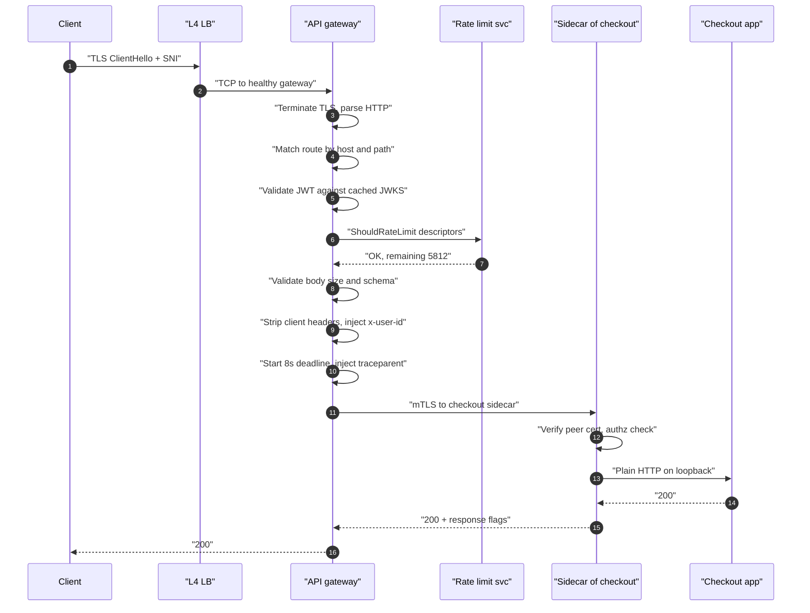
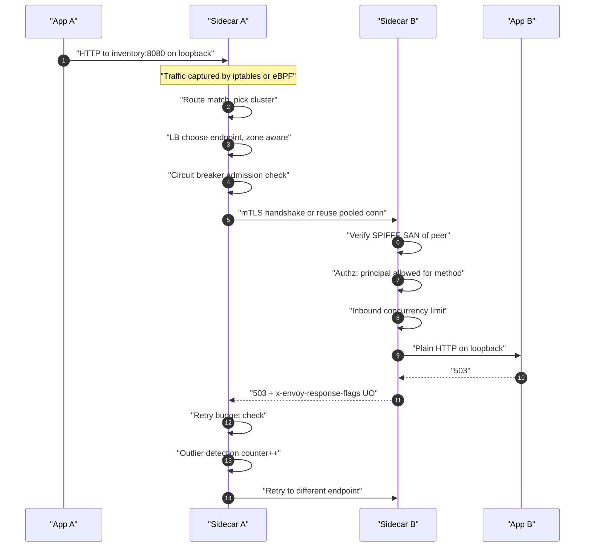
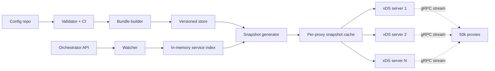
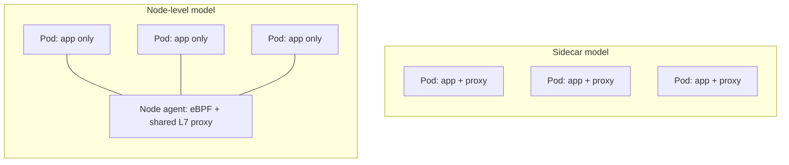
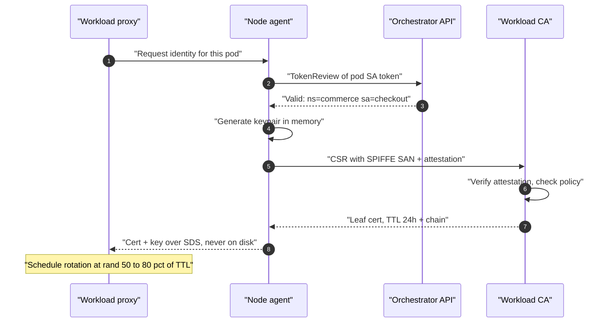
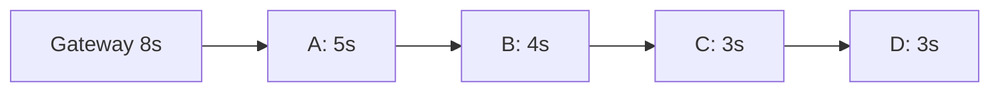
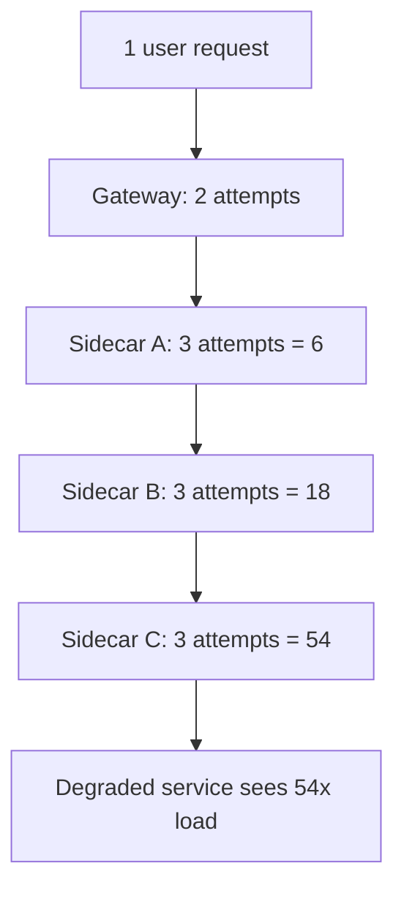
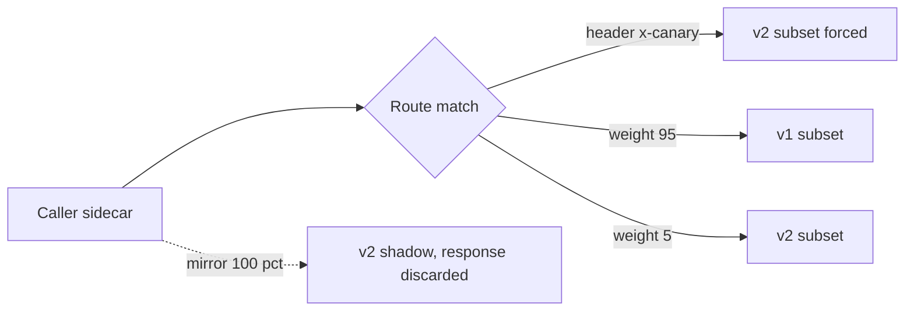

# 45 — API Gateway & Service Mesh

<span class="pill pill-core">Core</span> <span class="pill pill-hard">Hard</span>

**You are building the layer that every single request in the company passes through — twice — which means every capability you add is multiplied by the entire fleet and every bug you ship is a company-wide outage with no blast-radius containment.**

| | |
|---|---|
| **Commonly asked at** | Google, Lyft, Netflix, Airbnb, Stripe, Datadog, Cloudflare, HashiCorp, Solo.io, Tetrate, Isovalent, any platform-infrastructure or "traffic team" org |
| **Time budget** | 45 min |
| **Core tension** | Every property you want — mTLS everywhere, uniform retries, per-service golden signals, transparent canaries — is cheapest to implement once, in a shared layer that sits in the path of 100% of traffic. But that shared layer is then a single failure domain with no bulkhead: a bad config push, an expired CA, or a control-plane bug takes down every service simultaneously, and the thing that would normally save you — incremental rollout — is exactly what the layer's promise of *uniformity* works against |
| **Prerequisites** | [F01 Networking Foundations](../fundamentals/f01-networking-foundations.md), [F02 DNS & Traffic Management](../fundamentals/f02-dns-traffic-management.md), [F03 Load Balancing](../fundamentals/f03-load-balancing.md), [F04 Caching](../fundamentals/f04-caching.md), [F07 Replication & Consistency](../fundamentals/f07-replication-consistency.md), [F09 Consensus](../fundamentals/f09-consensus.md), [F11 Idempotency](../fundamentals/f11-idempotency.md), [F17 Rate Limiting & Load Shedding](../fundamentals/f17-rate-limiting-load-shedding.md), [F18 Resilience Patterns](../fundamentals/f18-resilience-patterns.md), [F22 Observability Fundamentals](../fundamentals/f22-observability-fundamentals.md), [F23 SLOs & Error Budgets](../fundamentals/f23-slo-error-budgets.md), [F24 Capacity Planning](../fundamentals/f24-capacity-planning.md), [F25 Deployment & Release Safety](../fundamentals/f25-deployment-release-safety.md), [F26 Multi-Region & DR](../fundamentals/f26-multi-region-dr.md), [F27 Security in Design](../fundamentals/f27-security-design.md), [F28 Cost Engineering](../fundamentals/f28-cost-engineering.md) |

---

## 1. Problem Statement

Design the traffic layer for a company running roughly 1,200 microservices across 50,000 pods in 8 regions: an **API gateway** terminating untrusted traffic from the public internet, and a **service mesh** governing authenticated, encrypted, policy-controlled communication between internal services.

The framing that separates a senior answer from a junior one is refusing to treat these as one product.

**North-south and east-west are different problems that happen to share a proxy binary.** At the edge the caller is hostile, unauthenticated, arbitrarily shaped, and there are hundreds of millions of them. Your job is *translation and defence*: terminate TLS from a client you do not control, authenticate a token, enforce a quota against an abusive tenant, rewrite a public URL into an internal one, reject a malformed body before it reaches anything stateful. Inside the cluster the caller is a workload you deployed, with a cryptographic identity you issued, speaking a protocol you chose. Your job there is *not* defence against a stranger — it is **uniform enforcement of behaviour across code you cannot all modify**: making every hop mutually authenticated, every call timed out, every failure counted, without asking 400 engineers across 11 languages to each implement it correctly.

Confusing the two produces both classic failure shapes. Push edge concerns into the mesh and you get sidecars doing JWT validation on every internal hop — the same token verified twelve times for one user request. Push mesh concerns into the gateway and you get a monolithic gateway config with 1,200 services' routing, retry and circuit-breaking rules in one file that one team owns and every team is blocked on.

**The second reframing: this layer's value comes from being unavoidable, and that is also its defect.** A library can be adopted incrementally. A mesh's promise — "mTLS on every hop", "every service has golden signals", "no call is ever untimed" — is only true if coverage is 100%. The moment you accept exceptions, the security and observability guarantees become "mostly", which is worth far less. So the design pressure is toward total coverage, and total coverage means a single change can affect every service at once. **You are building a system whose entire value proposition is the absence of a bulkhead.** Every subsequent design decision — config versioning, push scoping, fail-static data planes, certificate lifetimes — is an attempt to reintroduce blast-radius containment into an architecture that structurally resists it.

**The third reframing: the control plane is a new dependency class.** Before the mesh, service A calling service B depended on A, B, DNS and the network. After the mesh it also depends on the control plane being reachable, the CA being able to sign, the config being coherent, and two proxy processes not being OOM-killed. You have added dependencies to *every* call path in the company in exchange for consistency. That trade is often correct, but stating it out loud — and then engineering the data plane to survive control-plane absence — is the whole game.

### Out of scope

The L7 protocol implementations themselves (HTTP/2 and HTTP/3 stack internals), WAF rule authoring, API product management (developer portals, monetisation), and multi-cluster federation mechanics beyond the trust-domain discussion.

---

## 2. Requirements

### Functional

| # | Requirement | Layer | Notes |
|---|---|---|---|
| F1 | TLS termination for public traffic, SNI-based routing | Gateway | Thousands of customer domains, some with custom certs |
| F2 | Authentication offload: JWT/OIDC validation, API keys, mTLS client certs | Gateway | Verify once at the edge, propagate identity inward |
| F3 | Per-tenant, per-route, per-method rate limiting and quota | Gateway | Global counters, not per-instance |
| F4 | Path/host/header-based routing, rewrites, versioning | Gateway | Declarative, per-team ownership |
| F5 | Request/response transformation, payload limits, schema validation | Gateway | Reject malformed before it reaches a service |
| F6 | Automatic mTLS between all workloads with workload identity | Mesh | SPIFFE-style identities, no static credentials |
| F7 | Automatic certificate issuance and rotation | Mesh | Thousands of workloads, no human in the loop |
| F8 | L7-aware load balancing across endpoints | Both | Least-request, zone-aware, subset-aware |
| F9 | Timeouts, retries, circuit breaking, outlier ejection | Mesh | Uniform defaults, per-route override |
| F10 | Authorization policy: which identity may call which method | Mesh | Deny-by-default achievable |
| F11 | Traffic shifting: weighted routing, header-based routing, mirroring | Both | Canary and shadow traffic |
| F12 | Golden-signal telemetry per source-destination pair | Both | Rate, errors, duration, without app changes |
| F13 | Distributed-trace context propagation | Both | Proxy injects and forwards; app must propagate |
| F14 | Fault injection: delay and abort by percentage | Mesh | For resilience testing |
| F15 | Config distribution with versioning and rollback | Control plane | Every push is an artefact with an ID |

### Non-functional

| # | Requirement | Target |
|---|---|---|
| N1 | Gateway peak throughput | 250k rps per region, 2M rps fleet-wide |
| N2 | Mesh peak throughput | 3.0M rps east-west (fan-out ≈ 12 per user request) |
| N3 | Proxy added latency (p50 / p99) | < 0.5 ms / < 3 ms per hop |
| N4 | Gateway availability | 99.99% |
| N5 | Data-plane availability during full control-plane outage | 100% for existing config — fail-static, no request impact |
| N6 | Config propagation latency (p50 / p99) | < 1 s / < 5 s fleet-wide |
| N7 | Certificate issuance p99 | < 2 s; CA availability 99.99% |
| N8 | Certificate rotation coverage | 100% of workloads, zero expiry-caused outages |
| N9 | Sidecar resource overhead | < 0.15 vCPU and < 80 MB RSS at p95 per pod |
| N10 | Control-plane push capacity | Full fleet reconverge in < 10 min |
| N11 | Cost of the traffic layer | < 6% of total compute spend |

!!! danger "N5 is the requirement everything else bends around"
    "The data plane must keep serving with the control plane completely gone" is not a nice-to-have. It converts the control plane from a **hard dependency of every request** into a *configuration* dependency — the difference between a control-plane bug being a company-wide outage and it being a change-freeze. Concretely it means: proxies cache the last-known-good config on local disk, never flush endpoints because a config source went away, treat an empty response from the control plane as "no update" rather than "delete everything", and boot successfully from cached config if the control plane is unreachable at startup. Nearly every catastrophic mesh incident in public postmortems is a violation of one of those four rules — most commonly the third.

---

## 3. Scale Estimation

### Fleet shape

$$
\begin{aligned}
\text{services} &= 1{,}200 \\
\text{pods (= sidecars)} &= 50{,}000 \\
\text{regions} &= 8,\ \text{clusters} = 24 \\
\text{mean endpoints/service} &= \frac{50{,}000}{1{,}200} \approx 42 \\
\text{user-facing rps (peak)} &= 2.0 \times 10^{6} \\
\text{internal fan-out} &\approx 12 \Rightarrow \text{east-west rps} = 2.4 \times 10^{7}\ \text{proxy hops}
\end{aligned}
$$

Note the last line carefully: at fan-out 12 with a sidecar on both ends, **one user request traverses 25 proxies** (1 gateway + 12 client-side + 12 server-side). Every millisecond you add per hop costs 25 ms of user-visible latency, and every 0.1% failure rate per hop compounds to $1 - 0.999^{25} = 2.5\%$ request failure. This single number is why N3 is sub-millisecond and why proxy reliability is a harder bar than service reliability.

### Config size per proxy — the number that decides your architecture

$$
\begin{aligned}
\text{CDS (clusters)} &: 1{,}200 \times 1.2\ \text{KB} = 1.44\ \text{MB} \\
\text{EDS (endpoints)} &: 50{,}000 \times 120\ \text{B} = 6.00\ \text{MB} \\
\text{LDS + RDS (listeners, routes)} &: \approx 1.10\ \text{MB} \\
\hline
\text{full config} &\approx \mathbf{8.5\ \text{MB}}\ \text{serialized protobuf}
\end{aligned}
$$

In-memory expansion in the proxy is roughly 5x serialized protobuf once indexes, header matchers and per-cluster stat structures are built:

$$
\text{RSS}_{\text{config}} \approx 8.5\ \text{MB} \times 5 = 42.5\ \text{MB},\quad
\text{RSS}_{\text{total}} \approx 42.5 + 35 = \mathbf{78\ \text{MB}}
$$

$$
\text{fleet sidecar memory} = 50{,}000 \times 78\ \text{MB} = \mathbf{3.9\ \text{TB}}
$$

**Naive full-mesh config does not scale, and the arithmetic shows exactly why.** Scoping each proxy to only the services it actually calls (measured from telemetry: median service talks to 9 others, p95 talks to 31) cuts it hard:

$$
\begin{aligned}
\text{scoped CDS} &: 31 \times 1.2\ \text{KB} = 37\ \text{KB} \\
\text{scoped EDS} &: 31 \times 42 \times 120\ \text{B} = 156\ \text{KB} \\
\text{scoped total} &\approx 250\ \text{KB} \Rightarrow \text{RSS} \approx 35 + 1.3 = \mathbf{36\ \text{MB}} \\
\text{fleet memory} &= 50{,}000 \times 36\ \text{MB} = \mathbf{1.8\ \text{TB}}\ (\text{54\% saved})
\end{aligned}
$$

### Config propagation latency

A full push of unscoped config to the whole fleet:

$$
\begin{aligned}
\text{bytes} &= 50{,}000 \times 8.5\ \text{MB} = 425\ \text{GB} \\
\text{control-plane egress} &= 20\ \text{Gb/s} = 2.5\ \text{GB/s} \\
t_{\text{full push}} &= \frac{425}{2.5} = 170\ \text{s} \approx \mathbf{2.8\ \text{min}}
\end{aligned}
$$

With scoping and **delta/incremental xDS** (send only the changed resources), a single endpoint change is:

$$
\begin{aligned}
\text{delta payload} &\approx 120\ \text{B} + \text{framing} \approx 400\ \text{B} \\
\text{proxies subscribed to that service} &\approx 31 \times 42 = 1{,}302\ \text{(callers × their pods)} \\
\text{bytes per change} &= 1{,}302 \times 400\ \text{B} = 0.5\ \text{MB}
\end{aligned}
$$

Six orders of magnitude smaller. End-to-end propagation:

$$
\begin{aligned}
t_{\text{detect}}\ (\text{k8s watch}) &\approx 50\ \text{ms} \\
t_{\text{debounce}} &= 100\ \text{ms} \\
t_{\text{build + serialize}} &\approx 20\ \text{ms (p50)},\ 400\ \text{ms (p99 under churn)} \\
t_{\text{network + ack}} &\approx 30\ \text{ms} \\
t_{\text{proxy apply}} &\approx 25\ \text{ms} \\
\hline
t_{\text{p50}} &\approx \mathbf{225\ \text{ms}},\quad t_{\text{p99}} \approx \mathbf{1.6\ \text{s}}
\end{aligned}
$$

!!! warning "Propagation latency is not the interesting number — propagation *divergence* is"
    A 225 ms p50 is fine. The operationally dangerous property is that during the window between the first proxy applying version $N$ and the last applying it, **the fleet is running two different routing policies simultaneously**. Under heavy churn (a large rolling deploy plus a config change plus a scale-out event) the p99 stretches to seconds and the tail to tens of seconds. A weighted traffic shift from 90/10 to 50/50 therefore does not happen atomically: for some seconds, different callers of the same service are using different weights, and your canary metrics are computed over a mixed population. Design for it: never assume a config change is globally visible, make every shift monotonic and idempotent, and alert on **xDS convergence lag** as a first-class SLI, not on push count.

### Certificate rotation load

$$
\begin{aligned}
\text{workloads} &= 50{,}000,\quad \text{cert TTL} = 24\ \text{h},\quad \text{rotate at } 50\% \\
\text{mean signing rate} &= \frac{50{,}000}{12 \times 3600} = \mathbf{1.16\ \text{signings/s}} \\
\text{churn adds} &: \frac{50{,}000\ \text{pods}}{3\ \text{day lifetime}} = 0.19\ \text{new identities/s}
\end{aligned}
$$

Trivially small **on average**, which is precisely the trap:

$$
\begin{aligned}
\text{synchronized herd (all certs issued at } T_0) &: 50{,}000\ \text{CSRs at } T_0 + 12\text{h} \\
\text{CA capacity} &= 150\ \text{signings/s (RSA-2048, HSM-backed)} \\
t_{\text{drain}} &= \frac{50{,}000}{150} = 333\ \text{s} = \mathbf{5.5\ \text{min of saturation}}
\end{aligned}
$$

and with a 1-hour cert TTL rotating at 50%, the grace window is 30 minutes — so a CA outage longer than 30 minutes is a **total mesh outage**, not a degradation. Jittering rotation over $[0.5, 0.8] \times \text{TTL}$ spreads 50,000 rotations over 7.2 hours:

$$
\text{jittered peak} \approx \frac{50{,}000}{7.2 \times 3600} \times 3\ (\text{burstiness}) = 5.8\ \text{signings/s}
$$

### Retry amplification

With retries configured independently at $L$ layers, each allowing $R$ total attempts:

$$
\text{worst-case load multiplier} = R^{L}
$$

$$
\begin{aligned}
\text{client SDK} &: R = 3 \\
\text{gateway} &: R = 2 \\
\text{mesh sidecar (client side)} &: R = 3 \\
\text{mesh sidecar (nested hop)} &: R = 3 \\
\hline
\text{multiplier} &= 3 \times 2 \times 3 \times 3 = \mathbf{54\times}
\end{aligned}
$$

A service that is degraded but alive at 100k rps receives 5.4M rps the moment the tail starts timing out. **This is the single most common way a mesh converts a partial degradation into a total outage**, and it is why retry *budgets* (a cap on retries as a fraction of primary requests) rather than retry *counts* are the only safe configuration at scale.

### Sidecar tax

$$
\begin{aligned}
\text{CPU} &: 50{,}000 \times 0.12\ \text{vCPU} = 6{,}000\ \text{vCPU} \\
\text{Memory} &: 50{,}000 \times 36\ \text{MB} = 1.8\ \text{TB} \\
\text{cost} &= 6{,}000 \times \$0.028/\text{h} \times 730 + 1{,}800 \times \$0.004/\text{h} \times 730 \\
&= \$122\text{k} + \$5.3\text{k} = \mathbf{\$127\text{k/month}}
\end{aligned}
$$

Against a fleet compute bill of roughly $2.4M/month that is 5.3% — inside N11, but only just, and only with scoping. Without scoping the memory alone would push it past 9%.

---

## 4. API Design

Three distinct API surfaces, and conflating them is a design smell.

### 4.1 Config authoring API (what humans and CI write)

```yaml
# Gateway route — owned by the team that owns the service, validated in CI,
# merged into a per-namespace config bundle. Deliberately narrow: a team can
# only express routing for hostnames delegated to it.
apiVersion: gateway.platform/v1
kind: HTTPRoute
metadata:
  name: checkout-public
  namespace: commerce
spec:
  parentRefs:
    - name: public-gateway
      sectionName: https
  hostnames: ["api.example.com"]
  rules:
    - matches:
        - path: { type: PathPrefix, value: /v2/checkout }
      filters:
        - type: RequestAuthentication
          jwt:
            issuer: https://auth.example.com
            audiences: ["api.example.com"]
            forwardClaims:            # identity propagated inward as headers
              sub: x-user-id
              tier: x-user-tier
        - type: RateLimit
          descriptors:
            - key: x-user-tier
              value: free
              limit: { requests: 60, unit: minute }
            - key: x-user-tier
              value: pro
              limit: { requests: 6000, unit: minute }
        - type: RequestValidation
          maxBodyBytes: 262144
          schemaRef: checkout-v2.openapi.yaml
      backendRefs:
        - name: checkout
          port: 8080
      timeouts:
        request: 8s               # hard edge deadline, always present
```

```yaml
# Mesh traffic policy — east-west. Note what is absent: no authentication,
# because identity is already established by mTLS and asserted by the proxy.
apiVersion: mesh.platform/v1
kind: TrafficPolicy
metadata:
  name: inventory
  namespace: commerce
spec:
  host: inventory.commerce.svc
  timeout: 400ms                  # must be < caller's remaining deadline
  retries:
    attempts: 2                   # total 2, not 2 extra
    perTryTimeout: 150ms
    retryOn: [connect-failure, refused-stream, unavailable]
    # NOT retryOn: 5xx  -- see deep dive 7.4
    budget:
      ratio: 0.15                 # retries <= 15% of primary request rate
      minConcurrent: 3
  circuitBreaker:
    maxConnections: 512
    maxPendingRequests: 64        # the queue depth that actually sheds load
    maxRequestsPerConnection: 0
  outlierDetection:
    consecutive5xx: 5
    interval: 10s
    baseEjectionTime: 30s
    maxEjectionPercent: 20        # never eject more than 20% -- see gotchas
  loadBalancer:
    policy: LEAST_REQUEST
    localityLbSetting:
      enabled: true
      failover: [{ from: us-east-1, to: us-east-2 }]
```

```yaml
# Authorization -- deny by default, allow by SPIFFE identity and method.
apiVersion: mesh.platform/v1
kind: AuthorizationPolicy
metadata:
  name: inventory-callers
  namespace: commerce
spec:
  selector: { app: inventory }
  action: ALLOW
  rules:
    - from:
        - principals:
            - spiffe://example.com/ns/commerce/sa/checkout
            - spiffe://example.com/ns/commerce/sa/cart
      to:
        - operation: { methods: [GET], paths: ["/v1/stock/*"] }
    - from:
        - principals: ["spiffe://example.com/ns/commerce/sa/fulfilment"]
      to:
        - operation: { methods: [POST], paths: ["/v1/reserve"] }
```

### 4.2 Config distribution API (control plane to data plane)

xDS is a **streaming, versioned, ack/nack protocol** — not a config fetch. The properties that matter:

```text
DiscoveryRequest  { node, type_url, version_info, resource_names, response_nonce, error_detail }
DiscoveryResponse { type_url, version_info, nonce, resources[] }

Delta variant:
DeltaDiscoveryRequest  { node, type_url, resource_names_subscribe[], resource_names_unsubscribe[],
                         initial_resource_versions{}, response_nonce, error_detail }
DeltaDiscoveryResponse { type_url, resources[], removed_resources[], nonce, system_version_info }
```

Four properties earn their complexity:

1. **Ack/nack with `error_detail`.** The proxy tells the control plane it *rejected* a config and why. Without this, a bad push is invisible: the control plane reports success while half the fleet is running stale config. The `nack` rate is one of the two most important control-plane SLIs.
2. **Explicit `resource_names` subscription.** This is what makes scoping possible — the proxy asks for the 31 clusters it needs, not all 1,200.
3. **Delta with `removed_resources`.** Critical distinction from state-of-the-world: an empty resource list in delta means "nothing changed"; in SotW it means "delete everything you have". Conflating those has caused multiple public full-mesh outages.
4. **`initial_resource_versions` on reconnect.** After a control-plane restart, 50,000 proxies reconnect and declare what they already have, so the control plane sends only diffs instead of 425 GB.

### 4.3 Operational API

```bash
# Every push is an artefact with an identity you can roll back to.
POST /v1/config/publish        { bundle_sha, author, change_ticket, canary_selector }
GET  /v1/config/version        -> { version, sha, published_at, converged_pct }
POST /v1/config/rollback       { to_version }
GET  /v1/fleet/convergence     -> { version, acked: 49213, nacked: 4, stale: 783, p99_lag_ms }
GET  /v1/proxy/{id}/config_dump
POST /v1/ca/rotate_root        { new_root_pem, overlap_hours: 168 }
```

!!! tip "`converged_pct` is the deploy gate nobody builds until after the first incident"
    A config publish is not "done" when the API returns 200; it is done when the fleet has acked it. Exposing convergence as a first-class, queryable value lets CI block on it, lets the rollout automation wait for it, and lets an on-call engineer answer "is this config actually live?" in one command instead of by SSHing into a proxy and dumping its config.

---

## 5. Data Model

```sql
-- Control-plane source of truth. Small, highly-read, rarely-written --
-- the classic shape for a coordination store rather than a database.

CREATE TABLE service (
  service_id      TEXT PRIMARY KEY,         -- checkout.commerce.svc
  owner_team      TEXT NOT NULL,
  protocol        TEXT NOT NULL,            -- http1 | http2 | grpc | tcp
  trust_domain    TEXT NOT NULL,            -- example.com
  created_at      TIMESTAMPTZ NOT NULL
);

-- Endpoints are NOT stored here in steady state; they are watched from the
-- orchestrator and held in memory. Persisting them would make the control
-- plane a write-heavy database and couple config durability to pod churn.
-- They are snapshotted only for cold-start and disaster recovery.
CREATE TABLE endpoint_snapshot (
  service_id      TEXT NOT NULL,
  cluster         TEXT NOT NULL,
  snapshot_at     TIMESTAMPTZ NOT NULL,
  endpoints       JSONB NOT NULL,           -- [{ip, port, locality, weight, health}]
  PRIMARY KEY (service_id, cluster, snapshot_at)
);

CREATE TABLE config_bundle (
  version         BIGSERIAL PRIMARY KEY,
  sha256          TEXT NOT NULL,
  content         BYTEA NOT NULL,           -- fully-rendered, validated
  author          TEXT NOT NULL,
  change_ticket   TEXT,
  published_at    TIMESTAMPTZ,
  rolled_back_at  TIMESTAMPTZ,
  parent_version  BIGINT REFERENCES config_bundle(version)
);

CREATE TABLE workload_identity (
  spiffe_id       TEXT PRIMARY KEY,         -- spiffe://example.com/ns/x/sa/y
  service_account TEXT NOT NULL,
  namespace       TEXT NOT NULL,
  cluster         TEXT NOT NULL
);

CREATE TABLE issued_cert (
  serial          TEXT PRIMARY KEY,
  spiffe_id       TEXT NOT NULL REFERENCES workload_identity(spiffe_id),
  not_before      TIMESTAMPTZ NOT NULL,
  not_after       TIMESTAMPTZ NOT NULL,
  ca_generation   INT NOT NULL,             -- which root signed it
  revoked_at      TIMESTAMPTZ
);
CREATE INDEX ON issued_cert (not_after);    -- the expiry-horizon query
```

The `not_after` index exists for exactly one query, and that query is the difference between a controlled rotation and a 3 a.m. outage:

```sql
-- "How many workloads lose their identity in the next N hours?"
-- Run every minute; alert if any bucket is non-trivial and the CA is unhealthy.
SELECT date_trunc('hour', not_after) AS expiry_hour, count(*)
FROM issued_cert
WHERE revoked_at IS NULL AND not_after BETWEEN now() AND now() + interval '24 hours'
GROUP BY 1 ORDER BY 1;
```

### Telemetry cardinality model

The mesh's "free" observability is not free; it is a cardinality bill.

$$
\begin{aligned}
\text{series} &= |\text{src}| \times |\text{dst}| \times |\text{method}| \times |\text{code}| \times |\text{le buckets}| \\
\text{naive} &= 1{,}200 \times 1{,}200 \times 30 \times 20 \times 12 \\
&= 1.04 \times 10^{10}\ \text{potential series}
\end{aligned}
$$

Ten billion is absurd. What saves you is that the service graph is sparse — the median service talks to 9 others, so actual source-destination pairs number around $1{,}200 \times 9 \approx 10{,}800$, not 1.44M:

$$
\text{realistic} = 10{,}800 \times 8\ (\text{path templates}) \times 12\ (\text{code classes}) \times 12\ (\text{buckets}) = 1.24 \times 10^{7}
$$

12.4M active series is expensive but tractable. The failure mode is anything that makes the graph dense or a label unbounded — see the gotchas.

---

## 6. High-Level Architecture

```mermaid
flowchart TB
    subgraph EXT["Internet"]
        CL["Clients"]
    end

    subgraph EDGE["Edge - north-south"]
        DNS["Anycast DNS"]
        LB["L4 load balancer"]
        GW["API gateway fleet"]
        RL["Global rate limit service"]
        JWKS["JWKS cache"]
    end

    subgraph CP["Control plane"]
        REG["Service registry watcher"]
        XDS["xDS servers"]
        CA["Workload CA"]
        POL["Policy compiler"]
        STORE["Config store"]
    end

    subgraph MESH["Mesh - east-west"]
        SA["Svc A + sidecar"]
        SB["Svc B + sidecar"]
        SC["Svc C + sidecar"]
    end

    subgraph OBS["Telemetry"]
        MET["Metrics"]
        TR["Traces"]
        LOG["Access logs"]
    end

    CL --> DNS --> LB --> GW
    GW <--> RL
    GW --> JWKS
    GW --> SA
    SA --> SB
    SB --> SC

    REG --> XDS
    POL --> STORE --> XDS
    XDS -. "config" .-> GW
    XDS -. "config" .-> SA
    XDS -. "config" .-> SB
    XDS -. "config" .-> SC
    CA -. "certs" .-> SA
    CA -. "certs" .-> SB
    CA -. "certs" .-> GW

    GW --> MET
    SA --> MET
    SA --> TR
    SA --> LOG
```



### North-south walkthrough (a public request)



Five things are happening at the edge that must **not** happen inside the mesh:

1. **TLS termination from an untrusted peer**, including SNI routing across thousands of customer domains and certs the platform does not own.
2. **Token validation.** The JWT is verified once here. Inside, the assertion travels as a signed header or is re-derived from the mTLS peer identity. Verifying the user token on all 12 internal hops is pure waste — an RS256 verification is 60–150 µs, so 12 hops is 1–2 ms of pointless CPU per request, plus a hard dependency on the JWKS endpoint from every service.
3. **Header hygiene.** Every inbound `x-user-id`, `x-internal-*`, `x-forwarded-*` from the client is stripped and re-derived. Forgetting this is a direct privilege-escalation vulnerability: a client sets `x-user-id: 1` and becomes the admin.
4. **Quota against a hostile caller.** Rate limiting at the edge is a defence; inside the mesh it is a capacity-protection mechanism with different semantics.
5. **The deadline is born here.** The gateway stamps an absolute deadline; every inner hop derives its timeout from the remaining budget rather than from a fixed local value.

### East-west walkthrough (an internal call)



The crucial property: **App A never knew any of this happened.** It made a plain HTTP call to a DNS name. It did not negotiate TLS, did not choose an endpoint, did not implement a retry, did not emit a metric. That is the entire value proposition — and also why a mesh misconfiguration produces behaviour the application team cannot explain from their own code.

### Control plane internals



The xDS servers are **stateless and horizontally scalable**; all the expensive work (computing the per-proxy snapshot) happens once in the snapshot generator and is cached keyed by the proxy's scope signature. Since the median proxy shares a scope with 41 siblings (the other pods of its service), the cache hit rate is above 97% and the generator computes roughly 1,200 distinct snapshots, not 50,000.

---

## 7. Deep Dives

### 7.1 North-south and east-west: same proxy, different problem

They share an Envoy-class binary and almost nothing else.

| Dimension | North-south (gateway) | East-west (mesh) |
|---|---|---|
| Caller trust | Hostile, unauthenticated | Deployed workload with issued identity |
| Caller count | $10^8$ clients | $10^3$ services |
| Primary job | Translate and defend | Enforce uniformly |
| Auth model | JWT / OIDC / API key / client cert | mTLS peer identity (SPIFFE) |
| Rate limiting | Per tenant, per user — abuse control | Per caller — capacity protection |
| Protocols | HTTP/1.1, HTTP/2, HTTP/3, WebSocket | Mostly gRPC and HTTP/2 |
| Failure of the layer | Customers see errors | *Every* service sees errors |
| Config ownership | Central team + delegated routes | Per-service team |
| Deployment unit | A fleet of ~40 pods you can canary | 50,000 sidecars you cannot easily canary |
| Change velocity | Low, reviewed | High, continuous with deploys |

The row that matters most is the second-to-last. **A gateway is a normal service you can deploy carefully.** It has its own pods, its own rollout, its own canary. You can run 5% of the fleet on a new version for a day.

**A sidecar fleet is not a service.** The sidecar's lifecycle is bound to the application pod's lifecycle, so "upgrade the data plane" means restarting 50,000 application pods. That single structural fact drives more mesh operational pain than anything else: data-plane upgrades are slow (weeks), version skew between control plane and data plane is permanent and must be supported (typically $n-2$), and rolling back the data plane is as expensive as rolling it forward.

!!! example "The concrete consequence of the lifecycle coupling"
    A CVE lands in the proxy. On the gateway you patch 40 pods in 20 minutes. In the mesh you must restart 50,000 application pods, each of which is a real service disruption subject to PodDisruptionBudgets, each of which is owned by a different team with a different change window, and many of which are stateful and slow to restart. Realistic fleet-wide data-plane upgrade time is **2 to 6 weeks**. Plan your security posture around that number rather than being surprised by it. This is also the single strongest argument for a sidecar-less data plane, where the proxy is a node-level component you can upgrade like any DaemonSet.

### 7.2 Sidecar versus sidecar-less: the per-pod tax



The arithmetic from section 3, restated as a decision:

$$
\begin{aligned}
\text{sidecar model} &: 50{,}000 \times (0.12\ \text{vCPU} + 36\ \text{MB}) = 6{,}000\ \text{vCPU} + 1.8\ \text{TB} \\
\text{node model} &: 2{,}000\ \text{nodes} \times (1.2\ \text{vCPU} + 700\ \text{MB}) = 2{,}400\ \text{vCPU} + 1.4\ \text{TB}
\end{aligned}
$$

A 60% CPU saving, which at our prices is roughly $73k/month. But the raw saving is the least interesting part of the comparison.

=== "Sidecar (Envoy-per-pod)"

    **Isolation is per-pod.** A proxy OOM or crash-loop affects one pod. Resource accounting is honest: the proxy's CPU is charged to the workload that caused it.

    **Policy enforcement is at the pod boundary**, so a compromised pod cannot bypass its own proxy without breaking out of its network namespace.

    **Per-workload config is natural.** Each proxy holds only its own identity and its own policy.

    **Costs:** ~36 MB and ~0.12 vCPU per pod; two extra network hops with their latency; pod startup ordering problems (app starts before proxy is ready and its first calls fail); pod shutdown ordering problems (proxy exits before app finishes draining); `Job`/`CronJob` pods that never terminate because the sidecar does not exit; and the 2–6 week upgrade horizon.

    **Chosen for:** multi-tenant clusters, strict per-workload isolation requirements, heterogeneous L7 policy.

=== "Sidecar-less (eBPF + node proxy)"

    **L4 in the kernel.** Identity-aware L4 policy, mTLS, and load balancing are enforced by eBPF programs at the socket and TC layers, with no userspace hop for L4-only traffic. The added latency for an L4 policy decision drops from ~250 µs (two proxy hops) to a few microseconds.

    **L7 only when needed.** Traffic that requires HTTP-level policy is steered to a shared per-node proxy; everything else never leaves the kernel path. Since a large fraction of internal traffic needs only mTLS and L4 authorization, most flows avoid userspace entirely.

    **Upgrades are a DaemonSet roll**, not a fleet-wide pod restart. This is arguably the biggest operational win.

    **Costs:** the node agent is a **shared failure domain for every pod on the node** — a crash affects 25 pods, not 1. Resource accounting becomes shared (a noisy workload's proxy CPU is charged to the node agent, making chargeback and throttling harder). Kernel version dependencies are real and a kernel upgrade becomes a mesh upgrade. Debugging spans kernel and userspace. And the security boundary is softer: policy is enforced outside the pod's namespace.

    **Chosen for:** large single-tenant fleets where the per-pod tax dominates and upgrade velocity matters more than per-pod isolation.

=== "Proxyless gRPC (xDS in the client library)"

    The application's gRPC library speaks xDS directly and does its own load balancing, retries and mTLS. Zero proxy overhead, zero extra hops, lowest possible latency.

    **Costs:** you are back to a library — so you need it in every language, you must get every team to upgrade it, and the "uniform enforcement without touching app code" promise is gone. It also cannot do inbound authorization for a compromised workload, because the enforcement point is inside the process being protected.

    **Chosen for:** a small number of latency-critical, high-QPS gRPC paths inside an otherwise sidecar mesh — a targeted exception, not a fleet strategy.

!!! tip "The honest recommendation"
    Do not pick one. Run **sidecar-less/eBPF as the fleet default** for its upgrade story and per-pod cost, keep **sidecars for workloads with genuine isolation requirements** (multi-tenant, regulated, or untrusted code), and allow **proxyless** for a handful of measured, latency-critical gRPC paths. The mesh must support heterogeneous data planes anyway, because during any migration it will have them whether you designed for it or not.

### 7.3 mTLS and certificate rotation at fleet scale

This is where meshes actually break in production.



**The identity is derived from attestation, not from a secret.** The node agent proves *which pod is asking* using platform-level attestation (the kubelet's view of the pod, the projected service-account token, the process's cgroup) rather than accepting a claimed identity. This is the entire reason mesh mTLS is better than "give every service a client cert in a Secret": there is no credential to steal, because the credential is minted on demand against an unforgeable property of the runtime.

**Certificates are delivered over SDS and never written to disk.** They live in the proxy's memory, so a container filesystem compromise or a leaked volume snapshot does not yield a usable identity, and rotation does not require a restart or a file-watch race.

#### The failure mode: expiry causes a full-mesh outage

Certificate expiry is uniquely dangerous because it has three properties almost no other failure has:

1. **It is scheduled.** The outage happens at a precise, predictable, but usually unnoticed time.
2. **It is synchronized.** If a population of certs was issued together, it expires together.
3. **It is bilateral.** Both peers validate, so one expired cert breaks the connection in both directions, and "just restart the client" does not help.

```text
T+0h    Mesh installed. 50,000 workloads receive certs. TTL 24h.
T+11h   CA deployment pushes a config change that breaks signing.
        Nothing happens. No alerts. All existing certs are valid.
        Mesh traffic is 100% healthy. The change looks successful.
T+12h   First workloads attempt rotation at 50% TTL. Signing fails.
        Proxies keep using existing certs (correct: do not discard on failure).
        A "cert rotation failure" counter increments. Nobody alerts on it.
T+24h   Certs begin expiring. Every mTLS handshake in the mesh fails.
        Every service is simultaneously down. The gateway is up and healthy,
        returning 503 for 100% of requests because nothing behind it is reachable.
        Dashboards are down (they are in the mesh). Logging is down.
        The CA cannot be fixed by a deploy because the deploy pipeline is in the mesh.
```

That last line is the one that turns a 20-minute fix into a 4-hour outage. Mitigations, in order of importance:

!!! danger "The five rules of certificate lifecycle at fleet scale"
    1. **Alert on rotation *failure*, not on expiry.** The signal exists 12 hours before the outage. `cert_rotation_failures_total > 0` for 15 minutes is a page, always, even though nothing is broken yet. This is the highest-value alert in the entire mesh.
    2. **Alert on the expiry horizon.** The `not_after` histogram query from section 5, evaluated continuously: "how many workloads lose identity in the next 6 hours?" A non-zero value with an unhealthy CA is a page.
    3. **Jitter rotation across $[0.5, 0.8] \times \text{TTL}$.** Prevents the synchronized herd and turns a 5.5-minute CA saturation spike into a flat 6/s.
    4. **TTL is a trade-off, not a security maximum.** Short TTLs limit the value of a stolen key but shrink the CA-outage grace window proportionally. A 24-hour TTL with 50% rotation gives 12 hours of grace, which is enough for a human to respond. A 1-hour TTL gives 30 minutes, which is not. Choose 24h unless you have a specific threat model demanding less, and if you go shorter, make the CA's availability target stricter than the mesh's.
    5. **Keep a break-glass path outside the mesh.** The CA, the deploy pipeline, and at least one shell into each cluster must work when mTLS is completely broken. If every one of your recovery tools is itself a mesh workload, you have built an unrecoverable system.

#### Root rotation

Leaf rotation is routine. Root rotation is the genuinely hard one, and it must be a **dual-trust overlap**, never a swap:

```text
Phase 1  Distribute NEW root to every proxy's TRUST BUNDLE. Do not sign with it.
         Every proxy now trusts {old, new}. Signing still uses old.
         Wait for 100% convergence. Verify via fleet config dump, not by assumption.
Phase 2  Switch the CA to sign with NEW. Leaves rotate over the next 24h.
         Peers trust both, so old-signed and new-signed workloads interoperate.
Phase 3  Wait >= 2x leaf TTL, confirm zero certs remain from the old root.
Phase 4  Remove OLD root from trust bundles. Wait for convergence again.
```

Skipping phase 1's convergence wait is the classic mistake: you start signing with a root that 3% of the fleet does not trust yet, and those 3% reject every new connection. The fleet-convergence API exists precisely so phase 1 has a machine-checkable exit condition.

### 7.4 Retries, timeouts, circuit breaking — and retry amplification

The mesh makes resilience patterns free to enable, which means they get enabled everywhere, which is how they become the outage.

#### Timeouts must be deadlines, not durations



A fixed per-hop timeout is wrong in a way that is subtle. If the gateway's budget is 8 s and A spent 4.5 s before calling B, B's 4 s timeout is meaningless — the client gave up 3.5 s into B's work, but B, C and D keep working, keep holding connections, keep consuming CPU on a result nobody will read. At high fan-out this is a large fraction of your capacity spent on already-abandoned work.

The fix is **deadline propagation**: the gateway stamps an absolute deadline; each hop computes $\min(\text{local timeout}, \text{remaining budget})$ and forwards the reduced deadline. gRPC does this natively; for HTTP the proxy propagates a header and enforces it.

```yaml
# Deadline propagation at the proxy, expressed as policy
deadlines:
  source: header            # grpc-timeout, or x-request-deadline for HTTP
  enforce: true             # abort locally when the deadline passes
  propagate: true           # forward the reduced remaining budget downstream
  floor: 10ms               # below this, fail fast rather than start work
  default_if_absent: 5s     # never allow an unbounded call
```

The `floor` matters more than it looks: if 8 ms of budget remain, starting a 50 ms database query guarantees wasted work. Failing immediately with `DEADLINE_EXCEEDED` returns the capacity to requests that can still succeed.

#### Retry amplification

The $R^L = 54\times$ multiplier from section 3 is not hypothetical. The mechanism:



Three defences, all necessary:

**1. Retry budgets, not retry counts.** A budget caps retries as a *fraction of the concurrent primary request rate*. At normal error rates the budget is never hit and retries work as intended; during a broad degradation the budget clamps total load.

$$
\text{retries allowed} = \max(\text{minConcurrent},\ \text{ratio} \times \text{active primary requests})
$$

With `ratio: 0.15`, a service at 100k rps can absorb at most 15k rps of retries no matter how many layers want to retry — the amplification is bounded at $1.15\times$, not $54\times$.

**2. Retry only what is safe, and only what indicates a *different* endpoint might work.** `retryOn: 5xx` is almost always wrong, because a 500 usually means the request itself is bad or the whole service is broken; retrying sends the same poison to another instance. Retry on `connect-failure`, `refused-stream`, `reset` — signals that *this endpoint* failed rather than *this request* failed. And never retry a non-idempotent method without an idempotency key ([F11 Idempotency](../fundamentals/f11-idempotency.md)); an auto-retried `POST /charge` is a duplicate charge.

**3. Own retries at exactly one layer.** Pick the mesh, disable them in application SDKs, and enforce it. In practice you cannot fully enforce it, so add a hop counter: the proxy increments `x-retry-depth` on every retry and refuses to retry above a threshold, which caps amplification even when a team ships an SDK with its own retry loop.

!!! gotcha "Retries plus circuit breaking without jitter is a synchronized-recovery loop"
    When a service recovers, every circuit breaker in the fleet half-opens at approximately the same moment (they all tripped at the same moment), all send probe traffic simultaneously, overwhelm the just-recovered service, and trip again. The system oscillates and never recovers. Jitter both the ejection time and the half-open probe schedule, and ramp probe traffic rather than restoring it in one step.

#### Outlier detection and the ejection cliff

Outlier detection ejects endpoints returning consecutive errors. It is enormously valuable — it routes around a single bad host in seconds without any human. It is also how a partial failure becomes a total one:

```text
Service has 42 endpoints. A bad deploy makes 60% of them return 503.
Outlier detection ejects 25 endpoints in 30 seconds.
Remaining 17 endpoints now receive 100% of the traffic -- 2.5x their capacity.
They saturate and start returning 503.
They are ejected too. Zero healthy endpoints. The load balancer has
no destinations. Every request fails instantly.
```

`maxEjectionPercent` exists for this and its default is often too permissive. Cap it at 20–30%: past that point the problem is systemic and removing more capacity makes it strictly worse. Pair it with **panic mode** — when healthy endpoints fall below a threshold (commonly 50%), the load balancer ignores health status entirely and spreads load across all endpoints, on the theory that a degraded endpoint is better than no endpoint.

### 7.5 Observability: free telemetry and its cardinality bill

The mesh emits per-hop golden signals with no application changes. That is genuinely transformative — you get an accurate service dependency graph, per-pair latency distributions, and error attribution across services written in 11 languages that never agreed on a metrics library.

The bill arrives as cardinality. From section 5, the realistic steady state is ~12.4M active series, at roughly $\$0.20$ per 1,000 series per month in a managed TSDB:

$$
12.4 \times 10^{6} \times \frac{\$0.20}{1000} = \$2{,}480/\text{month}
$$

Manageable. Now watch how it explodes:

| Change | New cardinality | Multiplier |
|---|---|---|
| Baseline | 12.4M | 1x |
| Add `pod_name` as a label | 12.4M × 42 | **42x** |
| Add raw `path` instead of templated route | 12.4M × ~400 | **400x** |
| Add `request_id` (someone will try) | unbounded | fleet-ending |
| Add 3 more latency buckets | 12.4M × 1.25 | 1.25x |
| Batch job creates 5,000 short-lived pods | +churned series retained for 2h | spiky |

!!! danger "The metrics backend is a shared dependency of the mesh and everything else"
    A cardinality explosion from one service's bad label takes down the metrics system for the entire company, which means you lose observability into *all* services at the moment you most need it. Controls: a per-namespace cardinality quota enforced at the proxy (drop the metric, increment a `metrics_dropped_total` counter, alert the owning team); an allowlist of label keys with everything else dropped by default; path templating enforced in the proxy rather than trusted from the app; and aggressive use of the proxy's ability to emit a *reduced* label set for high-volume paths.

The deeper point: "observability for free" is not free, it is **deferred and centralized**. Instead of 400 teams each paying a small instrumentation cost, one platform team pays a large aggregation cost. That is usually a good trade — but only if that team has quota enforcement, because they now own a resource that 400 teams can consume without limit.

### 7.6 Traffic shifting and canaries at the mesh layer



Three mechanisms with different properties:

| Mechanism | What it proves | What it cannot prove | Chosen / rejected |
|---|---|---|---|
| **Weighted shift** (5% → 50% → 100%) | Real user impact under real traffic | Nothing about rare paths; slow to reach significance for low-rate errors | **Chosen** as the default progressive delivery primitive |
| **Header-based routing** | Behaviour for a chosen cohort (internal users, a specific tenant) | Anything about the general population | **Chosen** for pre-canary dogfooding |
| **Mirroring / shadow** | Correctness and performance under production traffic shape, with zero user risk | Anything involving writes, and it **doubles** downstream load | **Chosen** for read-path changes only, with explicit downstream capacity headroom |
| **Sticky-session canary** | Consistent per-user experience during a shift | — | **Rejected** as a default: it makes the canary population non-random, which invalidates the statistics |

!!! warning "Mirroring is not free and it is not safe by default"
    Shadow traffic hits the same databases, the same caches, the same downstream services, and the same rate limits as production. Mirroring 100% of a service's read traffic to a v2 deployment doubles load on everything behind it. Worse, if any code path in the shadow service writes — an audit log, a cache fill, a metric with a side effect, a "record last seen" update — you have duplicated writes in production with no user-visible signal. Mirror at a percentage, point the shadow at a read-only or isolated data path, and verify with a write-blocking policy rather than a code review.

The mesh can shift traffic; it cannot tell you whether the shift is going well. The analysis component — comparing the canary's error rate and latency against the baseline with enough samples to be significant — is a separate system consuming mesh telemetry ([F25 Deployment & Release Safety](../fundamentals/f25-deployment-release-safety.md)). The convergence caveat from section 3 applies directly: during the seconds it takes a weight change to propagate, your canary population is not what you configured it to be.

---

## 8. Scaling the Bottleneck

The bottleneck is not request throughput — the data plane scales horizontally with the workloads by construction. **The bottleneck is the control plane's push fan-out under churn.**

$$
\text{push work} \propto (\text{rate of config change}) \times (\text{proxies affected per change}) \times (\text{config size})
$$

All three terms grow with the fleet, so naive control-plane cost grows **superlinearly**:

$$
O(\text{churn} \times N_{\text{proxies}} \times S_{\text{config}}) \approx O(N^2)
$$

because churn itself is proportional to $N$ and config size is proportional to $N$.

Attacking each term:

| Term | Technique | Effect | Cost |
|---|---|---|---|
| Config size | **Scope each proxy** to the services it actually calls | 8.5 MB → 250 KB (34x) | Requires an accurate dependency graph; too-narrow scope breaks a new call path |
| Config size | **Delta xDS** — send changed resources only | 8.5 MB → 400 B per change | More complex protocol; strict resource-version bookkeeping |
| Proxies affected | **Endpoint pushes go only to subscribers** | 50,000 → ~1,300 per change | Follows from scoping |
| Change rate | **Debounce 100 ms** | Collapses a 500-pod deploy from 500 pushes to ~30 | Adds up to 100 ms of propagation latency |
| Change rate | **Rate-limit pushes per proxy** | Bounds worst-case | A proxy can fall behind; needs a staleness SLI |
| CPU | **Snapshot cache keyed by scope signature** | 50,000 computations → ~1,200 | Cache invalidation must be exactly right or you serve stale config |
| Connections | **Shard proxies across xDS servers by consistent hash** | 50,000 gRPC streams / $M$ servers | Rebalancing on server restart causes a reconnect storm |
| Reconnect storm | **`initial_resource_versions` + jittered backoff** | Avoids 425 GB thundering herd | Requires delta xDS |

!!! danger "The reconnect storm is the control plane's defining failure mode"
    Restart or lose the xDS server fleet and 50,000 proxies reconnect within seconds. Each wants a full config. Without mitigations that is 425 GB of serialization and egress, the control plane falls over under the load, proxies time out and reconnect again, and you have a **stable failure state** that does not self-heal — the classic metastable congestion collapse.

    Four mitigations, all required: (1) **jittered reconnect backoff** with a 0–30 s spread, so the herd arrives over half a minute instead of instantly; (2) **`initial_resource_versions`** so a reconnecting proxy declares what it already has and receives only diffs; (3) **admission control on the xDS server** — accept new streams at a bounded rate and let the rest retry, because serving 5,000 proxies well beats failing 50,000; (4) **fail-static data plane** (N5), which makes the whole event a non-incident for user traffic since every proxy keeps serving from cached config while it waits.

The control plane itself should be **stateless and regional**. Each region's xDS servers serve only that region's proxies from that region's registry watch, so a control-plane failure is contained to one region and cross-region config is distributed by replicating the (small, slow-changing) config bundle rather than by streaming endpoints globally. The global config bundle is on the order of megabytes and changes tens of times a day; the endpoint stream is gigabytes and changes thousands of times a second. **Replicate the former, never the latter.**

---

## 9. Failure Modes

| Failure | Blast radius | Detection | Mitigation | Degraded behaviour |
|---|---|---|---|---|
| **Bad config pushed fleet-wide** | Every service, instantly | xDS nack rate spike; 5xx across unrelated services within seconds of a push | Staged config rollout (canary namespaces → 1% → 10% → 100%) with automatic rollback on nack rate or error-rate delta; every bundle is a versioned artefact | Rollback restores previous bundle in one push; proxies that nacked kept old config and never broke |
| **Certificate expiry (CA outage > grace)** | Total mesh outage — every mTLS handshake fails | Rotation-failure counter (12 h early); expiry-horizon histogram | Jittered rotation, 24 h TTL, rotation-failure paging, break-glass path outside the mesh | None. This is a hard down. The only real mitigation is the 12-hour early warning |
| **Control-plane outage** | Zero user impact if fail-static is correct; no new endpoints, no config changes | xDS stream count drop; convergence lag | Proxies serve last-known-good from local cache; never flush on empty response; boot from cache | Routing is frozen at the last known state. New pods cannot get config and stay `NotReady`. Deploys are blocked |
| **Reconnect storm after CP restart** | Control plane in congestion collapse; data plane fine | Stream churn, CPU saturation, p99 push latency | Jittered backoff, `initial_resource_versions`, stream admission control | Config propagation delayed minutes; traffic unaffected |
| **Retry amplification** | Degraded service → total outage; cascades upstream | Retry rate vs primary rate ratio; sudden multi-x load on a degraded service | Retry budgets, retry-depth header cap, narrow `retryOn`, one retrying layer | Budget clamps amplification at 1.15x; requests fail fast rather than queueing |
| **Outlier detection ejects everything** | One service to zero endpoints | Healthy-endpoint ratio per cluster | `maxEjectionPercent: 20`, panic-mode threshold at 50% | Panic mode sends traffic to unhealthy endpoints — some succeed, which beats zero |
| **Sidecar OOM-killed** | One pod, but correlated across a service if config grew | Container restart count; proxy RSS vs limit | Scoped config; RSS alert at 70% of limit; limit set from p99 + 50% | Pod fails readiness and is removed from endpoints; capacity drops |
| **Sidecar/app startup race** | New pods fail their first calls | 5xx concentrated in the first seconds of pod life | Proxy declared a startup dependency; app readiness gated on proxy readiness | Brief elevated errors during deploys — often misattributed to the app |
| **Gateway regional outage** | All public traffic to that region | Health checks from the L4 tier; per-region rps drop | Anycast/DNS withdrawal; other regions absorb | Elevated latency for users near the failed region; capacity must be pre-provisioned for $N-1$ |
| **JWKS endpoint unavailable** | All authenticated public traffic rejects | JWT validation error rate; JWKS fetch failures | Cache keys with a long TTL, serve stale on fetch failure, pre-warm on rotation | Tokens signed by an already-cached key still validate; only a key rotation during the outage breaks |
| **Rate-limit service outage** | All gateway traffic, depending on failure policy | RL call error rate and latency | **Fail open** with a local fallback limiter at a generous rate | Global quotas are not enforced for the duration; abuse is possible but the site stays up |
| **Metrics cardinality explosion** | Observability for the whole company | Series count growth rate; ingest rejections | Per-namespace quota enforced at the proxy; label allowlist | Offending namespace's metrics dropped; everyone else keeps observability |
| **Policy compiler bug: deny-all** | Every service rejects every call | Authz denial rate across all services | Policy diff review in CI with a "denies added" count; staged rollout of policy separately from routing | Rollback; but note policy changes propagate as fast as any other config, so detection speed is everything |
| **Node agent crash (sidecar-less)** | Every pod on that node | Node-level connection error rate | DaemonSet restart; drain node if repeated; eBPF datapath continues for established flows | Pods on that node lose new-connection policy enforcement; existing flows may survive |

---

## 10. SRE Lens

### SLIs and SLOs

| SLI | Definition | SLO | Rationale |
|---|---|---|---|
| Gateway availability | Non-5xx responses originating from the gateway itself | **99.99%** | It is the front door; 4.3 min/month |
| Gateway added latency | p99 of gateway processing time excluding upstream | < 3 ms | It is in every request path |
| Mesh added latency per hop | p50 / p99 proxy overhead | < 0.5 ms / < 3 ms | 25 hops per user request makes this multiply |
| Data-plane availability during CP outage | Successful requests while control plane is down | **100%** | N5 — the fail-static guarantee |
| Config propagation | Time from publish to 99% fleet ack | p50 < 1 s, p99 < 5 s | Slower means canaries and rollbacks are imprecise |
| Fleet convergence | Fraction of proxies on the current version after 60 s | > 99.5% | The stale tail is where surprise behaviour lives |
| xDS nack rate | Rejected configs / total pushes | < 0.01% | Any nack means some proxy is running stale config |
| CA availability | Successful CSR signings / attempts | **99.99%** | Stricter than the mesh, because the mesh depends on it |
| Cert rotation success | Workloads rotating before 80% of TTL | **100%** | Any failure is a scheduled future outage |
| Cert expiry horizon | Workloads expiring within 6 h with rotation failing | **0** | The leading indicator that matters |
| Retry ratio | Retry rps / primary rps, per service | < 0.15 | Amplification guard |
| Sidecar resource p95 | CPU and RSS per proxy | < 0.15 vCPU, < 80 MB | The tax stays bounded |

### Error budget policy

$$
\begin{aligned}
\text{gateway budget} &= (1 - 0.9999) \times 30\text{d} = 4.32\ \text{min/month} \\
\text{CA budget} &= 4.32\ \text{min/month} \\
\text{mesh data plane} &: \text{no independent budget — it consumes every service's budget}
\end{aligned}
$$

The last line is the one to say out loud in an interview. **The mesh does not have its own error budget; it spends everyone else's.** A 30-second mesh incident consumes 30 seconds from all 1,200 services' budgets simultaneously. The policy consequence is that the traffic layer must hold itself to a stricter standard than any service it carries, and its change process must be more conservative than any of theirs — which is uncomfortable for a platform team that wants to ship features.

Concretely:

- **Config changes** (routes, policies) are a customer-facing change class: staged, canaried, auto-rolled-back, with a convergence gate.
- **Control-plane binary changes** ship behind a separate, slower train; the control plane runs $n$ and $n-1$ simultaneously during rollout and must serve both.
- **Data-plane binary changes** are a multi-week campaign, coordinated with service owners, never urgent unless it is a CVE — and if it is a CVE you should already know the number is 2–6 weeks.

### Rollout plan

```yaml
control_plane_rollout:
  - stage: shadow
    description: >
      New control-plane version computes snapshots for the full fleet but
      serves none. Diff its output against production byte-for-byte.
    gate: snapshot_diff_count == 0 for 24h over live churn

  - stage: canary_cluster
    scope: one non-critical cluster, ~400 proxies
    duration: 48h
    gate: [nack_rate == 0, convergence_p99 < 5s, zero request-path regression]

  - stage: ramp
    steps: [1 cluster, 3 clusters, 12 clusters, all]
    soak: 24h
    auto_rollback_on: [nack_rate > 0.001, convergence_p99 > 15s, cp_oom]

config_rollout:
  - stage: validate      # CI: schema, policy lint, "denies added" diff, dry-run compile
  - stage: canary_ns     # 3 low-traffic namespaces
    gate: error_rate_delta < 0.1pp for 10m
  - stage: percent       # 1% -> 10% -> 100% of proxies by consistent hash
    gate_each: [nack_rate == 0, fleet 5xx delta < 0.2pp]
  - stage: converge
    gate: converged_pct > 99.5 within 60s
  auto_rollback: true

data_plane_rollout:
  strategy: opt-in-then-default
  phases:
    - platform-owned services       # week 1-2
    - volunteer teams               # week 2-4
    - default for new pods          # week 4
    - forced restart campaign       # week 5-8, coordinated with owners
  compatibility: control plane must support data plane n, n-1, n-2
```

!!! warning "Config rollout percentage must be by *proxy*, not by *service*"
    Rolling a config to "10% of services" means those services are 100% affected — if the config is bad, 120 services are fully down. Rolling to "10% of proxies by consistent hash of proxy ID" means every service is 10% affected, which is a degradation rather than an outage and is recoverable by the service's own redundancy. The second is almost always the right granularity for anything fleet-wide, and it is the opposite of the intuition most people bring from application deploys.

### Runbook notes

| Symptom | First checks | Action |
|---|---|---|
| "Everything is 503" | Cert expiry horizon; CA health; last config push version and time; xDS nack rate | If a push preceded it by < 5 min, roll back first and diagnose after. If certs, the CA is the incident — use the break-glass path |
| One service unreachable from one caller only | Authz policy for that principal; caller's scope (does it have the destination cluster?); subset/label match | Usually a scoping or authz mismatch, not a network fault. `config_dump` on the caller's proxy shows whether the cluster exists at all |
| Latency up 5 ms fleet-wide with no deploy | Proxy CPU throttling; connection pool exhaustion; a config push that added a filter | Check `cpu.cfs_throttled_seconds` on proxies first — the most common cause is a proxy hitting its CPU limit, which looks like a network problem |
| Config push "succeeded" but behaviour unchanged | `converged_pct`; nack rate with `error_detail`; the specific proxy's `config_dump` version | A nack is silent from the publisher's side. Always check convergence, never trust the publish response |
| Retry storm suspected | Retry-to-primary ratio per service; `x-retry-depth` distribution; which layers have retries enabled | Emergency: set the retry budget ratio to 0 for the affected destination. It is a config push and it takes seconds |
| Sidecar OOM loop after a config change | Proxy RSS trend; number of clusters in `config_dump` vs before | Someone widened a scope selector. Revert the scope, not the memory limit |
| New pods fail readiness | Proxy can reach xDS? Can it reach the CA? Node agent healthy? | If the control plane is down, this is expected and existing traffic is fine — do not make it worse by restarting things |
| Canary metrics look wrong | Convergence lag during the shift; whether the canary cohort is actually random | During propagation the population is mixed; wait for convergence before reading canary statistics |

### Capacity model

$$
\begin{aligned}
\text{gateway pods} &= \frac{250{,}000\ \text{rps}}{9{,}000\ \text{rps/pod}} \times 1.6\ (N{-}1 + \text{headroom}) = \mathbf{45\ \text{per region}} \\[6pt]
\text{xDS servers} &= \frac{50{,}000\ \text{streams}}{4{,}000\ \text{streams/server}} \times 2 = \mathbf{25} \\[6pt]
\text{CA replicas} &= \frac{6\ \text{signings/s jittered} \times 10\ (\text{burst})}{150\ \text{signings/s}} \times 3 = \mathbf{3\ \text{(min for HA)}} \\[6pt]
\text{rate-limit shards} &= \frac{250{,}000\ \text{checks/s}}{80{,}000\ \text{/shard}} \times 1.5 = \mathbf{5}
\end{aligned}
$$

The gateway's 1.6x factor is $N-1$ regional failover plus burst headroom: when a region withdraws from anycast, its traffic lands on neighbours within seconds with no opportunity to scale out first.

### Cost

| Component | Sizing | Monthly |
|---|---|---|
| Sidecar CPU tax | 6,000 vCPU | $122k |
| Sidecar memory tax | 1.8 TB | $5k |
| Gateway fleet | 45 pods × 8 regions × 4 vCPU | $37k |
| Control plane (xDS + registry) | 25 × 8 vCPU / 32 GB | $14k |
| CA + HSM | 3 replicas + managed HSM | $9k |
| Rate-limit service | 5 shards + Redis | $6k |
| Mesh telemetry (12.4M series) | Managed TSDB + retention | $31k |
| Access logs (sampled 1%) | 2.4 TB/month | $8k |
| **Total** | | **~$232k/month** |

Against $2.4M/month fleet compute: **9.7%** — over the 6% target of N11. The gap is almost entirely the sidecar CPU tax.

!!! tip "Where the 4 points actually come from, and the two levers that matter"
    Sidecar CPU is 53% of the traffic-layer bill and dwarfs everything else. Two levers move it meaningfully. **First, sidecar-less for the ~70% of the fleet that does not need per-pod isolation**: 6,000 vCPU → roughly 3,200, saving $78k/month and bringing the total to 6.4%. **Second, trim the per-request work**: disabling access logs for high-volume internal paths (sampling at 0.1% instead of 1%), reducing the stats label set for the top 20 services by volume, and turning off the L7 filter chain entirely for pure-TCP traffic together recover another 10–15% of proxy CPU.

    What does *not* work is what people try first: shrinking the sidecar's CPU limit. The proxy then gets CFS-throttled, p99 latency rises across every hop, and you have converted a cost problem into a latency incident across the whole company. Sidecar CPU limits should be set from measured p99 plus 50%, and the honest answer to "this is expensive" is to remove the sidecar, not to starve it.

---

## 11. Trade-offs & Alternatives

| Decision | Chosen | Rejected | Why |
|---|---|---|---|
| Gateway and mesh | **Separate products, shared proxy binary** | One unified product | Different trust models, different owners, different change velocity. Sharing the binary shares the bug surface and the expertise; sharing the config shares the blast radius |
| | | Fully separate proxies | Doubles operational knowledge and CVE surface for no benefit |
| Data plane default | **Sidecar-less / eBPF with node proxy** | Sidecar everywhere | 60% CPU saving and, more importantly, DaemonSet-speed upgrades instead of a 2–6 week fleet restart |
| | | Proxyless gRPC everywhere | Reintroduces the multi-language library problem the mesh exists to solve |
| Isolation exceptions | **Sidecars for multi-tenant and regulated workloads** | Uniform data plane | A shared node agent is a shared failure and security domain; some workloads cannot accept that |
| Config protocol | **Delta xDS with per-proxy scoping** | State-of-the-world xDS | 425 GB full push vs 0.5 MB per change; SotW's empty-means-delete semantics is a known outage generator |
| Config scope | **Derived from the observed dependency graph, with a manual override** | Full mesh visibility | 34x config reduction. Risk: a genuinely new call path is not in the scope and fails — mitigated by an "unknown destination" metric that auto-widens with an alert |
| Cert TTL | **24 h, rotate at jittered 50–80%** | 1 h | A 30-minute CA-outage grace window is not survivable by humans; 12 h is |
| | | 90 days | Defeats the point — a stolen key is useful for a quarter |
| Cert delivery | **SDS, memory only** | Kubernetes Secret + file mount | Secrets are readable by anyone with namespace access and survive in etcd backups; file rotation has restart and watch-race problems |
| Retry configuration | **Budget-based, narrow `retryOn`, one owning layer** | Count-based retries per layer | $R^L$ amplification turns degradation into outage |
| Timeouts | **Propagated absolute deadlines** | Fixed per-hop durations | Fixed timeouts spend capacity on work nobody will read |
| Rate limiting on RL-service failure | **Fail open with local fallback** | Fail closed | Failing closed converts a quota-service blip into a full outage. Abuse for a few minutes is cheaper than downtime — but this must be a *conscious, documented* choice, and it is the wrong choice for anything financial |
| Telemetry | **Proxy-emitted, quota-enforced, allowlisted labels** | Trust the proxy defaults | Default label sets include `pod_name`-class labels that multiply cardinality by 42 |
| Control plane topology | **Regional, stateless, independent per region** | Single global control plane | A global CP is a global failure domain and streams gigabytes of endpoints cross-region for no benefit |
| Control-plane consistency | **Eventually consistent config, versioned bundles** | Strongly consistent fleet-wide config | Strong consistency across 50,000 proxies means the slowest proxy gates every change; versioned bundles plus convergence measurement give the operational property you actually want |
| Data plane on CP loss | **Fail static from local cache** | Fail closed / fail to default route | Fail-static is the single property that keeps a CP bug from being a company outage |
| Mesh adoption | **Opt-in, then default for new pods, then a coordinated campaign** | Mandate and force-restart | A forced fleet restart is itself an outage risk, and teams that were surprised become permanent opponents of the platform |

??? note "When not to build any of this"
    Below roughly 25–40 services, a mesh is a net negative. You are adding a control plane, a CA, a config distribution system, a new class of outage, and 2–6 week upgrade cycles, in order to solve problems (uniform mTLS, uniform retries, per-pair telemetry) that a handful of teams can solve with a shared library and a code review. The honest threshold is about **language diversity and team count, not service count**: if three teams writing two languages own 30 services, a library works fine and everybody understands it. If 40 teams writing 11 languages own 400 services, no library will ever reach 100% adoption and the mesh's "works without touching your code" property becomes the only way to get a guarantee rather than a best effort.

    The intermediate answer that is often correct and rarely proposed: **deploy the gateway first, skip the mesh.** North-south problems (TLS, auth, quota, routing) are real at every scale and a gateway is a normal, deployable, canary-able service. East-west problems become acute only at organizational scale. Many companies would be better served by an excellent gateway and a mandatory gRPC library than by a half-adopted mesh.

??? note "Multi-cluster and trust domains"
    Two shapes. **Shared trust domain**: one root CA across all clusters, workloads in cluster A and cluster B can mTLS directly, service discovery is federated. Simple mental model, but the root CA is now a global single point of compromise and a global single point of failure, and a bad config in one cluster can be pushed to all.

    **Separate trust domains with federation**: each cluster has its own root, and a federation bundle lets clusters trust each other's roots explicitly. Cross-cluster calls traverse east-west gateways that terminate and re-originate mTLS. More moving parts and an extra hop, but the blast radius of a compromised or broken cluster stops at its boundary, and you can revoke one cluster's trust without touching anything else. For anything regulated, or any environment with a clear production/non-production split, **separate domains is the right default** — the extra hop costs a millisecond and buys a real security boundary.

---

## 12. Gotchas & Corner Cases

!!! gotcha "The empty-config push that deletes every endpoint"
    **Symptom.** At the instant of a routine control-plane deploy, 100% of requests across every service fail with "no healthy upstream". Recovery takes as long as it takes someone to restart the control plane and wait for a full push.
    **Mechanism.** In state-of-the-world xDS, a `DiscoveryResponse` containing an empty resource list means *"the correct state is: nothing"*. A control plane that starts up, opens its xDS listener before its registry watch has synced, and answers a request with what it currently knows — nothing — instructs every proxy to delete every endpoint. The proxies are behaving correctly. The control plane lied.
    **Mitigation.** Never serve xDS before the registry cache is fully synced — gate the listener on a readiness condition, not on process start. Implement a **sanity floor**: refuse to push an endpoint set that is more than X% smaller than the previous one without an explicit override, and alert instead. Prefer delta xDS, where removals are explicit (`removed_resources`) and an empty response unambiguously means "no change". This exact bug has caused multi-hour, company-wide outages at more than one large company.

!!! gotcha "Certificate rotation has been failing for twelve hours and nothing is wrong yet"
    **Symptom.** All green. Traffic normal. Then, at a time that turns out to be exactly 24 hours after a deploy, every mTLS handshake in the mesh fails at once.
    **Mechanism.** Proxies correctly keep using a valid cert when rotation fails — discarding it would be worse. So a broken CA produces *zero* user-visible symptoms for the entire remaining lifetime of the existing certificates. The failure signal exists (a rotation-failure counter) but nobody alerts on a counter that has never fired.
    **Mitigation.** `cert_rotation_failures_total > 0` sustained for 15 minutes is a **page**, not a ticket, even though nothing is broken. Additionally run the expiry-horizon query continuously and page when any workload will lose identity within 6 hours. Practise the CA-down runbook, including a break-glass path that does not itself require the mesh.

!!! gotcha "Root CA rotation done as a swap instead of an overlap"
    **Symptom.** Immediately after a planned CA root rotation, a few percent of connections fail, then more, and the failures are asymmetric — A can call B but B cannot call A.
    **Mechanism.** The new root was distributed and signing switched over in one step. Proxies that had not yet received the new trust bundle reject peers presenting new-root-signed certs. Because propagation is not atomic (section 3), you get a partial, confusing, moving failure rather than a clean one.
    **Mitigation.** Strict four-phase overlap: distribute trust, **verify 100% convergence by querying actual proxy config dumps**, then switch signing, then wait $\geq 2\times$ leaf TTL, then remove the old root and verify convergence again. Each phase needs a machine-checkable exit condition. "We waited ten minutes, should be fine" is how this fails.

!!! gotcha "Retries at four layers turn a brownout into a blackout"
    **Symptom.** A downstream service degrades to 80% success. Within 90 seconds it is at 0%, and so are three services that do not even call it.
    **Mechanism.** The client SDK retries 3x, the gateway 2x, and two mesh hops 3x each — a $54\times$ worst-case multiplier. Load on the degraded service explodes, its queue saturates, and its own upstream calls start timing out, which triggers *those* retries, consuming connection pools and CPU on services that share no dependency with the original failure.
    **Mitigation.** Retry **budgets** (retries capped at 15% of primary rate) rather than retry counts, so the multiplier is bounded at $1.15\times$ regardless of layer count. A retry-depth header incremented by every retrying proxy, with a hard refusal above depth 2. Retry only on connection-level signals, never blanket `5xx`. And have an emergency lever: setting a destination's retry budget to zero is a config push that takes seconds — know the command before you need it.

!!! gotcha "Outlier detection ejects the entire upstream"
    **Symptom.** A deploy makes 60% of a service's pods unhealthy. Thirty seconds later the service is at 0% availability, worse than the 40% the healthy pods could have served.
    **Mechanism.** Outlier detection ejects the 60%, the remaining 40% receives 2.5x load, saturates, returns 503, and is ejected too. With no endpoints left, every request fails instantly. Health-based routing has removed all capacity.
    **Mitigation.** `maxEjectionPercent` at 20–30%: beyond that the problem is systemic and removing capacity makes it worse. Enable panic mode so that when healthy endpoints fall below 50%, health status is ignored and load is spread across everything. Alert on healthy-endpoint *ratio*, not on ejection count.

!!! gotcha "The sidecar starts after the app and the first requests fail"
    **Symptom.** Every deploy produces a small burst of 503s and connection refusals in the first 2–5 seconds of each new pod's life, consistently, for years, and everyone has learned to ignore it.
    **Mechanism.** Container start order is not guaranteed. The application initialises, immediately calls a dependency, and the proxy that is supposed to intercept that call is not listening yet — so the connection is refused or, worse, escapes the mesh unencrypted. The mirror image happens at shutdown: the proxy receives SIGTERM and exits while the app is still draining, so in-flight requests fail.
    **Mitigation.** Declare the proxy a startup dependency (native sidecar containers, or a startup gate the app must pass). Gate application readiness on proxy readiness. On shutdown, delay the proxy's exit until the app has drained — a `preStop` sleep is the crude version, an explicit drain endpoint is the correct one. This is also a strong argument for the node-level data plane, where the datapath exists before any pod starts.

!!! gotcha "Batch jobs never finish because the sidecar never exits"
    **Symptom.** A `Job` completes its work in 40 seconds and then sits in `Running` forever. Thousands of them accumulate, consuming quota, and someone eventually writes a cleanup cron.
    **Mechanism.** A pod terminates when all containers exit. The proxy is a server; it has no reason to exit. The job container finished, the proxy did not, the pod is immortal.
    **Mitigation.** Native sidecar container lifecycle where the runtime terminates sidecars after the main container exits, or an explicit call to the proxy's quit endpoint in the job's exit path. Alert on pods with a completed main container and a running proxy — it is a trivially detectable state and it wastes real money.

!!! gotcha "One service's label blows up the metrics backend for everyone"
    **Symptom.** The TSDB starts rejecting writes; dashboards go blank across the entire company; the mesh's "observability for free" evaporates at the exact moment of an incident.
    **Mechanism.** A team enabled a proxy stat option that adds the raw request path, or a per-pod label, or — the fatal one — a header value that is effectively unbounded. Cardinality goes from 12.4M to hundreds of millions in minutes, and because the metrics system is shared, everyone loses visibility, not just the offender.
    **Mitigation.** A per-namespace cardinality quota enforced **at the proxy**, dropping metrics beyond the quota and incrementing a visible `metrics_dropped_total`. A label-key allowlist with default-deny. Path templating done by the proxy from route config rather than taken from the request. And an alert on series *growth rate*, not absolute count, because absolute count is always slowly rising and growth rate is what catches an explosion in the first two minutes.

!!! gotcha "Mirrored traffic writes to production"
    **Symptom.** After enabling shadow traffic to a v2 deployment for a "read-only" service, duplicate audit rows appear, a downstream cache is filled with wrong data, and a third-party API bills double.
    **Mechanism.** "Read-only" was a belief, not a property. The service updated a `last_accessed` column, emitted an event to a topic with a consumer that writes, and called a metered external API. The shadow deployment shares all of production's backends.
    **Mitigation.** Point shadow deployments at isolated or read-only credentials so a write physically cannot succeed, mirror at a low percentage first, and mark mirrored requests with a header that downstream write paths assert on. Also remember mirroring **doubles downstream load** — verify capacity before enabling it, not after.

!!! gotcha "Scoped config means a genuinely new dependency silently fails"
    **Symptom.** A team adds a call to a service they have never called before. In staging it works. In production it fails with "unknown cluster" or an unexplained 503, and nothing in their code or config is wrong.
    **Mechanism.** Config scoping (the 34x saving in section 3) means each proxy only receives config for the services it is *known* to call, derived from the observed dependency graph. A brand-new edge is not in the graph, so the destination cluster does not exist in that proxy's config.
    **Mitigation.** Emit a distinct metric and access-log flag for "request to an unconfigured destination" — never let it look like a generic 503. Auto-widen the scope on first occurrence with an alert to the platform team, so the failure is one request rather than an outage. And make the dependency declaration part of the service's manifest so intentional new edges are declared ahead of the deploy.

!!! gotcha "The gateway forwards client-supplied internal headers"
    **Symptom.** A penetration test (or an incident) shows that setting `x-user-id: 1` on a public request makes the system treat the caller as a specific privileged user.
    **Mechanism.** The gateway validated the JWT and *added* `x-user-id` from the claims — but did not **remove** a client-supplied `x-user-id` first. Depending on header-merge semantics, downstream sees either two values or the client's. Internal services trust the header because "it comes from the gateway".
    **Mitigation.** Explicit strip-then-set for every internal header at the edge, with an allowlist of headers permitted to cross the boundary inbound. Better: propagate identity as a **signed** token (a short-lived internal JWT minted by the gateway) so that trust is cryptographic rather than positional, and an internal service can verify it rather than assuming the header's provenance. Test it with a request that sets every internal header you use.

!!! gotcha "Proxy CPU limits cause latency incidents that look like network problems"
    **Symptom.** p99 latency rises fleet-wide by several milliseconds per hop. Network metrics are clean. Application metrics are clean. Nothing was deployed.
    **Mechanism.** The sidecar hit its CPU limit and is being CFS-throttled. Throttling is bursty and quantised to the scheduler period, so it appears as latency spikes rather than as saturation. Because the proxy is invisible to the application team, they report a "network issue". Traffic growth, an added filter, or increased TLS handshake rate can all cause it without any deploy.
    **Mitigation.** Alert on `container_cpu_cfs_throttled_seconds_total` for proxy containers as a first-class signal — it should be near zero. Size the limit from measured p99 CPU plus 50%, and resist the instinct to shrink proxy limits for cost reasons (section 10). Include per-hop proxy overhead in the trace so a latency regression is attributable to the proxy rather than to "the network".

---

## 13. Interview Angle

!!! interview "Open by splitting the problem, not by drawing boxes"
    Almost everyone starts with "gateway at the edge, sidecars everywhere, control plane pushes config". That is the shape of the answer and it earns nothing, because the interviewer already knows it.

    The opening that changes the conversation: **"These are two systems, and I want to separate them before I design either. North-south is a defence problem against a caller I do not control. East-west is a uniform-enforcement problem across code I cannot all modify. They share a proxy binary and almost nothing else — different trust models, different owners, different change velocity, and critically, a gateway is a deployable service I can canary while a sidecar fleet is 50,000 pods I cannot restart in under a month. That last asymmetry drives most of the design."**

    Then state the constraint that organises everything else: **"The mesh's value comes entirely from covering 100% of traffic, which means it has no bulkhead. So the central engineering problem is reintroducing blast-radius containment into a layer that structurally resists it — and my first requirement is that the data plane keeps serving with the control plane completely gone."**

!!! interview "Have the four numbers ready"
    Senior candidates quantify. Four numbers carry most of the weight here:

    - **25 proxies per user request** (1 gateway + 12 client-side + 12 server-side at fan-out 12). This justifies sub-millisecond per-hop latency and explains why per-hop reliability must exceed per-service reliability.
    - **8.5 MB of unscoped config per proxy × 50,000 = 425 GB per full push.** This single number kills naive full-mesh config and motivates scoping and delta xDS.
    - **$R^L$ retry amplification: $3 \times 2 \times 3 \times 3 = 54\times$.** This is the mechanism by which a mesh converts a brownout into a blackout.
    - **$50{,}000 / (12 \times 3600) = 1.16$ signings/s average, but a synchronized herd is 50,000 at once.** Averages hide the failure; jitter is the fix.

!!! interview "The question behind the question"
    When an interviewer asks about service mesh, they are usually probing one of three things: whether you understand that **adding a layer to every request path is a reliability liability, not just a feature**; whether you know the **operational** reality (data-plane upgrades take weeks, certs expire on a schedule, config propagation is not atomic) rather than the marketing; and whether you can say **when not to use one**. Volunteer all three without being asked.

??? question "Follow-up 1: Why not just put all the gateway features in the mesh and have one system?"
    **Answer.** Because the two have incompatible trust models, ownership models and change velocities, and merging them makes each worse.

    **Trust.** At the edge the caller is anonymous and hostile: you validate a bearer token, enforce a quota against an abusive tenant, strip forged headers, and reject a 900 MB body. Inside, the caller is a workload whose cryptographic identity you minted; there is no token to validate because identity comes from the mTLS peer certificate. Running edge authentication on internal hops means verifying the same user JWT twelve times — 1 to 2 ms of pointless RS256 CPU per user request, plus a hard dependency on the JWKS endpoint from every service in the company.

    **Ownership and velocity.** Gateway config is reviewed, centrally governed, and changes slowly. Mesh config changes with every service deploy, dozens of times a day, owned by the deploying team. Putting them in one config surface means either the gateway inherits the mesh's change rate (unacceptable for the front door) or the mesh inherits the gateway's review process (unacceptable for velocity).

    **The deployment asymmetry is the strongest argument.** A gateway is ~45 pods per region. I can canary it at 5% for a day, roll it back in two minutes, and patch a CVE in twenty. A sidecar fleet is 50,000 pods whose lifecycle is bound to application pods — upgrading it means restarting the entire company's workloads, realistically 2 to 6 weeks, coordinated across hundreds of teams and PodDisruptionBudgets. Treating those as one deployable is a category error.

    **What I would share:** the proxy binary (one codebase, one CVE surface, one set of expertise), the telemetry pipeline, and the identity system. **What I would not share:** the config surface, the rollout process, or the failure domain.

??? question "Follow-up 2: What exactly happens when the control plane goes down for an hour?"
    **Answer.** If I have designed it correctly, **nothing happens to user traffic**, and that is a deliberate, testable property rather than a hope.

    Every proxy serves from its last-known-good config, cached in memory and persisted on local disk. Routing, load balancing, mTLS with existing certificates, retries, and policy all keep working exactly as before. The mesh is frozen, not broken.

    What *is* broken: endpoint updates stop, so a pod that dies is not removed from the load-balancing set and receives traffic that fails until active health checking ejects it — which is why passive outlier detection and active health checks both matter and cannot be replaced by endpoint updates alone. New pods cannot fetch config or certificates, so they never become ready, so deploys and scale-outs are blocked. Config changes cannot be applied, including the rollback you might want to perform. And certificate rotation stops, which starts a clock: with a 24-hour TTL rotating at 50%, I have roughly 12 hours before the first expiries, which comfortably covers a one-hour outage.

    Four implementation rules make this true, and every one of them has caused a public outage when violated: proxies must **persist config to disk** and boot from it; they must **never interpret an empty or absent config as a deletion**; they must **not gate readiness on a live control-plane connection** once bootstrapped; and the control plane must **not serve xDS before its registry watch is synced**.

    The failure I would worry about more is not the outage itself but the **recovery**: 50,000 proxies reconnecting simultaneously is 425 GB of config if done naively, which pushes the recovering control plane straight back over. So jittered reconnect backoff, `initial_resource_versions` so proxies declare what they already have, and stream admission control on the server are all part of the design, not afterthoughts.

    And I would say explicitly: I would test this. A quarterly game day where the control plane is killed in production for 30 minutes is the only way to know the fail-static property is real, because it is the kind of property that silently regresses.

??? question "Follow-up 3: Walk me through a certificate-expiry mesh outage and how you prevent it."
    **Answer.** It is the most dangerous failure class in a mesh because it is scheduled, synchronized and bilateral.

    **Timeline.** At T+0 the CA is broken by a config change. Nothing happens — every existing cert is valid, traffic is 100% healthy, the change looks successful. At T+12h workloads begin attempting rotation at 50% of TTL; signing fails; proxies correctly keep their existing certificates, and a rotation-failure counter starts incrementing that nobody alerts on. At T+24h certificates begin expiring and **every mTLS handshake in the mesh fails simultaneously**. The gateway is healthy and returns 503 for 100% of requests because nothing behind it is reachable. Dashboards are down because the observability stack is in the mesh. The deploy pipeline is down for the same reason, so you cannot ship the CA fix.

    Three properties make it uniquely bad. It is **scheduled** — the outage happens at a precise time nobody is watching. It is **synchronized** — certs issued together expire together, so it is not a gradual degradation, it is a cliff. And it is **bilateral** — both peers validate, so there is no "client-side workaround".

    **Prevention, in priority order.** First and most important: **alert on rotation failure, not on expiry.** The signal exists twelve hours before the outage, and `cert_rotation_failures_total > 0` for fifteen minutes must page even though nothing is broken. Second: continuously query the expiry horizon — "how many workloads lose identity in the next six hours?" — from the issued-cert table. Third: **jitter rotation** across 50–80% of TTL so 50,000 workloads spread over 7.2 hours instead of hitting the CA as a 5.5-minute saturation spike. Fourth: choose TTL as a trade-off, not a security maximum — 24 hours with 50% rotation gives a 12-hour human-response window; a 1-hour TTL gives 30 minutes, which is not survivable, and if you insist on it then the CA's availability target must be stricter than the mesh's. Fifth, and the one people skip: **a break-glass path that does not depend on the mesh** — the CA, the deploy pipeline, and cluster shell access must all work when mTLS is entirely broken, or you have built an unrecoverable system.

    I would also mention root rotation as the harder cousin: it must be a four-phase dual-trust overlap with a verified-convergence gate between phases, never a swap.

??? question "Follow-up 4: Sidecar or sidecar-less? Defend your choice with numbers."
    **Answer.** Sidecar-less as the fleet default, sidecars as a deliberate exception, and both supported simultaneously because any migration will have both anyway.

    **The numbers.** Sidecars at 50,000 pods cost 6,000 vCPU and 1.8 TB of RAM — about $127k/month, 5.3% of a $2.4M compute bill, and that is *after* scoping config down from 8.5 MB to 250 KB per proxy. Without scoping the memory alone would be 3.9 TB. A node-level data plane on 2,000 nodes costs roughly 2,400 vCPU and 1.4 TB: a 60% CPU reduction, around $73k/month.

    **But cost is the weaker half of the argument.** The stronger half is the upgrade story. A sidecar's lifecycle is bound to its application pod, so a data-plane upgrade means restarting 50,000 application pods across hundreds of teams — realistically 2 to 6 weeks, and that is your CVE response time whether you like it or not. A node-level data plane upgrades as a DaemonSet roll: hours, owned entirely by the platform team, no coordination with service owners. For a security-sensitive component sitting in 100% of request paths, that difference dominates.

    **What I give up, and why it is acceptable.** The node agent is a shared failure domain — a crash affects 25 pods instead of 1 — so I need fast restart, connection-draining behaviour, and node-level alerting. Resource accounting becomes shared, which complicates chargeback and makes it harder to throttle a noisy neighbour. The kernel becomes a dependency, so a kernel upgrade is now partly a mesh upgrade. And the security boundary is softer, because enforcement happens outside the pod's namespace.

    **So I keep sidecars where that last point matters**: multi-tenant clusters, anything running customer-supplied code, and regulated workloads where "the enforcement point is inside the pod boundary" is an audit requirement. Roughly 30% of the fleet in most organisations. That hybrid lands the traffic layer at about 6.4% of compute instead of 9.7%, while keeping a real isolation story where it is needed.

    **What I would not do** is starve the sidecars to save money. Lowering the CPU limit gets you CFS throttling, which shows up as multi-millisecond p99 increases on every hop and looks exactly like a network problem. The correct way to reduce sidecar cost is to remove the sidecar, not to under-provision it.

??? question "Follow-up 5: A downstream service degrades to 80% success and the whole system collapses. Explain and fix."
    **Answer.** Retry amplification, and it is arithmetic rather than bad luck.

    **Mechanism.** Retries are configured independently at multiple layers: the client SDK does 3 attempts, the gateway 2, the client-side sidecar 3, and a nested hop 3 more. Those multiply: $3 \times 2 \times 3 \times 3 = 54$. A service comfortably handling 100k rps at 80% success suddenly receives up to 5.4M rps. It saturates completely, goes to 0%, and its own upstream calls start timing out — which triggers retries there too, consuming connection pools and CPU on services that have no dependency on the original failure. That is how an isolated brownout becomes a fleet-wide blackout.

    **Fix one: retry budgets instead of retry counts.** A budget caps retries as a fraction of the concurrent primary request rate — 15% is a reasonable default. At normal error rates the budget is never reached and retries behave exactly as intended. During a broad degradation, total load is clamped at $1.15\times$ regardless of how many layers want to retry. This is the single highest-leverage change, because it bounds the damage without requiring every team to agree on anything.

    **Fix two: retry the right signals.** `retryOn: 5xx` is almost always wrong — a 500 usually means either the request is bad or the whole service is broken, and retrying sends the same poison elsewhere. Retry on `connect-failure`, `refused-stream`, `reset`: signals that *this endpoint* failed, where a different endpoint plausibly succeeds. And never auto-retry a non-idempotent method without an idempotency key, or you have built a duplicate-charge generator.

    **Fix three: cap the depth.** I cannot actually stop every team from shipping an SDK with its own retry loop, so the proxy increments an `x-retry-depth` header on every retry and refuses to retry above depth 2. That bounds amplification even under non-compliance.

    **Related failure I would raise unprompted:** outlier detection makes this worse. As pods get ejected, the survivors take more load, saturate, and get ejected too, until there are zero endpoints and availability is 0% — worse than the 40% the healthy pods could have served. Cap `maxEjectionPercent` at 20–30% and enable panic mode below 50% healthy, so the load balancer ignores health status rather than routing to nothing.

    **And the operational lever:** setting a destination's retry budget to zero is a config push that propagates in under a second. That is a command on-call should know before the incident, not discover during it.

??? question "Follow-up 6: The mesh gives you observability for free. What does it actually cost?"
    **Answer.** It costs cardinality, and cardinality is a shared resource that any single team can exhaust for everyone.

    **The arithmetic.** Naively, series count is sources × destinations × methods × codes × histogram buckets: $1{,}200 \times 1{,}200 \times 30 \times 20 \times 12 \approx 10^{10}$. What saves you is that the service graph is sparse — the median service talks to about 9 others — so real source-destination pairs number around 10,800, and realistic steady state is roughly 12.4M active series. At managed-TSDB prices that is a few thousand dollars a month plus query cost: acceptable.

    **How it explodes.** Adding `pod_name` multiplies by the endpoints-per-service factor, about 42x. Using the raw request path instead of a templated route multiplies by a few hundred. Adding anything derived from a request ID or a user ID is unbounded and ends the metrics system. None of these require malice — they are all options someone will enable while debugging and forget to turn off.

    **Why it is worse than an ordinary cost problem.** The metrics backend is shared with every other team, so one namespace's bad label takes down observability for the entire company — at exactly the moment you most need it, because a cardinality explosion usually happens during an incident when someone adds labels to debug.

    **Controls.** A per-namespace cardinality quota enforced **at the proxy**, which drops excess series and increments a visible `metrics_dropped_total` so the offender is identifiable. A label-key allowlist with default-deny, so new labels are an opt-in decision rather than an accident. Path templating performed by the proxy from route configuration, never taken from the request. And alerting on series **growth rate** rather than absolute count, because absolute count always drifts upward while growth rate catches an explosion within two minutes.

    **The framing I would leave them with:** "free observability" is not free, it is *centralized*. Instead of 400 teams each paying a small instrumentation cost, one platform team pays a large aggregation cost. That is usually the right trade — but only with quota enforcement, because that team now owns a resource 400 teams can consume without limit.

??? question "Follow-up 7: How do you roll out a config change to 50,000 proxies safely?"
    **Answer.** Four properties: staged by proxy rather than by service, gated on convergence rather than on publish success, automatically rolled back on a measured signal, and versioned so rollback is a single artefact swap.

    **Staging granularity is the non-obvious part.** The instinct from application deploys is to roll out to 10% of *services*. That is wrong here: those 120 services would be 100% affected, so a bad config is a full outage for them. Rolling out to 10% of *proxies* by consistent hash of proxy ID means every service is 10% affected — a degradation their own redundancy absorbs, not an outage. For anything fleet-wide, horizontal slicing across all services beats vertical slicing into some services.

    **Convergence, not publish success.** A publish API returning 200 means the control plane accepted the bundle. It says nothing about whether proxies applied it. xDS nacks are silent from the publisher's perspective: a proxy that rejects a config keeps running the old one and reports an `error_detail` the publisher never sees. So the gate is `converged_pct > 99.5` within 60 seconds and `nack_rate == 0`, both queried from the fleet, and CI blocks on them.

    **Automatic rollback on a signal, with a versioned artefact.** Every bundle has a version, a SHA and a parent, so rollback is publishing the parent version — seconds, not a git revert and a rebuild. Auto-rollback triggers on nack rate, on fleet 5xx delta above 0.2 percentage points, and on convergence lag. Crucially the rollback path must be independent of whatever broke: if the bad config made the control plane unable to serve, rollback needs a path that does not require the control plane to be healthy.

    **Policy changes get their own, stricter pipeline.** An authorization policy change can take everything down instantly and its blast radius is not proportional to traffic share. CI computes a "denies added" diff and any non-trivial increase requires explicit approval. I ship policy changes separately from routing changes so that when something breaks, the attribution is unambiguous.

    **The caveat I would raise:** propagation is not atomic. During the seconds it takes a weight change to reach the fleet, different callers use different weights, so a canary population is not exactly what you configured. Wait for convergence before reading canary statistics, or you are computing significance over a mixed population.

### Strong answer versus weak answer

| Dimension | Weak | Strong |
|---|---|---|
| Framing | "Gateway at the edge, Envoy sidecars, Istio control plane" | Separates north-south from east-west by trust model, ownership and **deployability**, and names the lack of a bulkhead as the central problem |
| Control-plane failure | "It's HA, three replicas, Raft" | "User traffic is unaffected because the data plane is fail-static — and here are the four implementation rules that make that true, plus the reconnect storm that is the real risk" |
| Certificates | "mTLS everywhere, certs auto-rotate" | Describes the T+0 / T+12h / T+24h expiry timeline, alerts on rotation failure rather than expiry, jitters rotation, and insists on a break-glass path outside the mesh |
| Retries | "The mesh retries failed requests for you" | Computes $R^L = 54\times$, prescribes budgets over counts, narrows `retryOn` to connection-level signals, and adds a depth cap for non-compliant SDKs |
| Config distribution | "xDS pushes config to proxies" | Computes 425 GB for a full push, prescribes scoping plus delta xDS plus snapshot caching, and treats convergence lag as a first-class SLI |
| Observability | "You get metrics for free" | Computes 12.4M series, names the 42x and 400x multipliers, and enforces quota at the proxy because the backend is a shared dependency |
| Data plane choice | Picks sidecar or eBPF as an identity | Gives the vCPU and memory numbers, weights the **upgrade horizon** above the cost saving, and proposes a hybrid with a stated exception rule |
| Rollout | "Canary 10% of services" | Rolls to 10% of *proxies* so every service is degraded rather than some services being down; gates on convergence, not on publish |
| Cost | Does not mention it | $127k/month sidecar tax, 5.3% of compute, names the two levers that work and the one (shrinking CPU limits) that backfires into a latency incident |
| Scope | Builds the full mesh regardless | States the threshold — team count and language diversity, not service count — and proposes gateway-first as the frequently-correct intermediate |

---

## 14. Key Takeaways

1. **North-south and east-west are different problems sharing a proxy binary.** Edge traffic is a defence problem against an untrusted caller; internal traffic is a uniform-enforcement problem across code you cannot all modify. The decisive asymmetry is deployability: a gateway is 45 pods you can canary in a day, a sidecar fleet is 50,000 pods you cannot restart in under a month.

2. **The mesh's value is that it has no bulkhead, and that is also its defining risk.** Guarantees like "mTLS on every hop" are only worth something at 100% coverage, so the layer is structurally a single failure domain. Every serious design decision here is an attempt to reintroduce blast-radius containment.

3. **Fail-static is the requirement that makes the control plane survivable.** Proxies must persist config, boot from cache, never treat an empty response as a deletion, and never gate readiness on a live control-plane connection. With those four properties a control-plane outage is a change freeze; without any one of them it is a company-wide outage.

4. **Config size is the number that decides the architecture.** 8.5 MB unscoped × 50,000 proxies is 425 GB per full push and 3.9 TB of fleet memory. Scoping to the observed dependency graph plus delta xDS brings that to 250 KB and 1.8 TB — a 34x reduction that is the difference between a design that works and one that does not.

5. **Propagation is not atomic, and the interesting metric is divergence, not latency.** During the window between the first and last proxy applying a change, the fleet runs two policies simultaneously. Treat convergence lag as a first-class SLI, gate rollouts on it, and never read canary statistics before the fleet has converged.

6. **Certificate expiry is scheduled, synchronized and bilateral — the worst combination.** The outage arrives at a precise time, affects everything at once, and cannot be worked around from one side. Alert on rotation *failure* twelve hours early, jitter rotation across 50–80% of TTL, choose TTL as a grace-window trade-off rather than a security maximum, and keep a break-glass path that does not require the mesh.

7. **Retry amplification is $R^L$, and it is how a brownout becomes a blackout.** Four layers with independent retries give a 54x multiplier. Budgets bound it at 1.15x, narrow `retryOn` avoids retrying poison, and a depth cap survives teams that ignore the policy. The same logic applies to outlier detection: cap ejection at 20–30% and enable panic mode, or health-based routing will remove all your capacity.

8. **Observability for free is observability centralized.** 12.4M series is fine; one `pod_name` label is 42x and one raw path label is 400x, and the backend is shared with every other team. Quota at the proxy, allowlist labels, template paths in the proxy, and alert on growth rate.

9. **The sidecar tax is real and the wrong lever makes it worse.** $127k/month, 5.3% of compute. Removing sidecars where isolation is not required saves 60% of it; starving them with tight CPU limits produces CFS throttling that looks like a fleet-wide network problem.

10. **The mesh has no error budget of its own — it spends everyone else's.** A 30-second mesh incident consumes 30 seconds from 1,200 services simultaneously. That obliges the traffic layer to a stricter reliability standard and a more conservative change process than anything it carries, and it is the most important sentence to say out loud when someone proposes shipping fast in this layer.

11. **Know when not to build it.** Below roughly 25–40 services with few languages and few teams, a shared library is better and everyone understands it. The real threshold is organisational — team count and language diversity — not service count. Gateway-first, mesh-later is the frequently-correct intermediate answer that almost nobody proposes.
