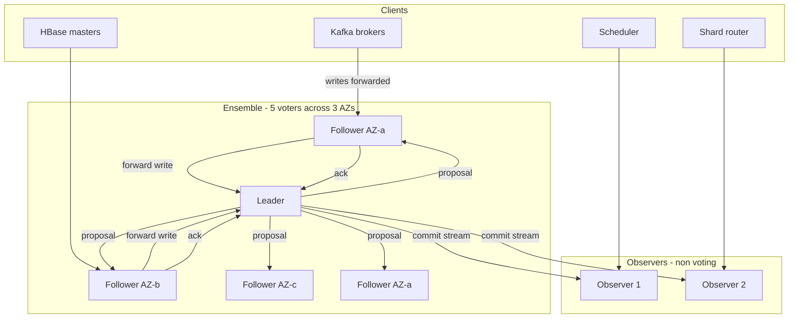
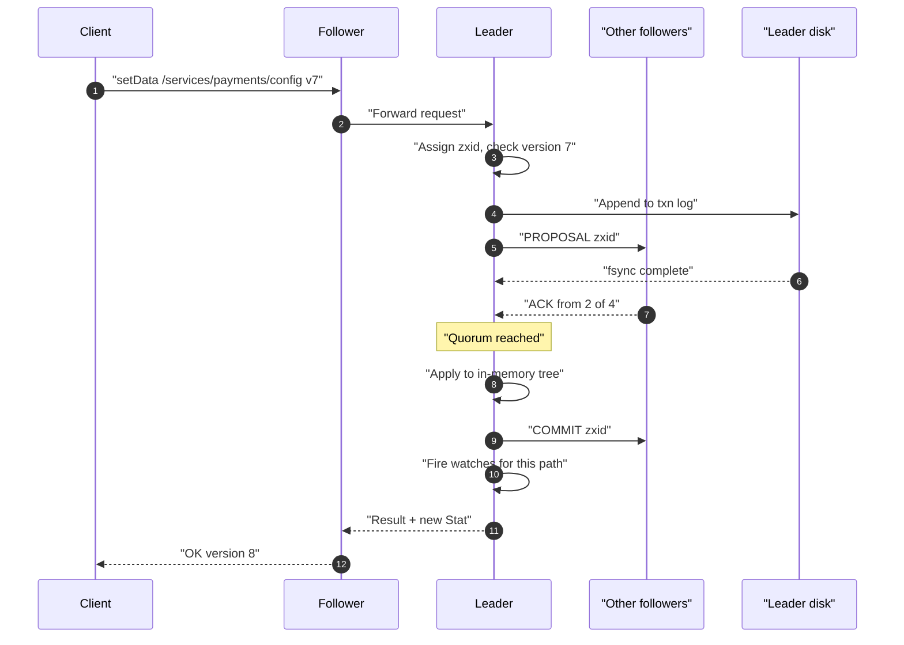
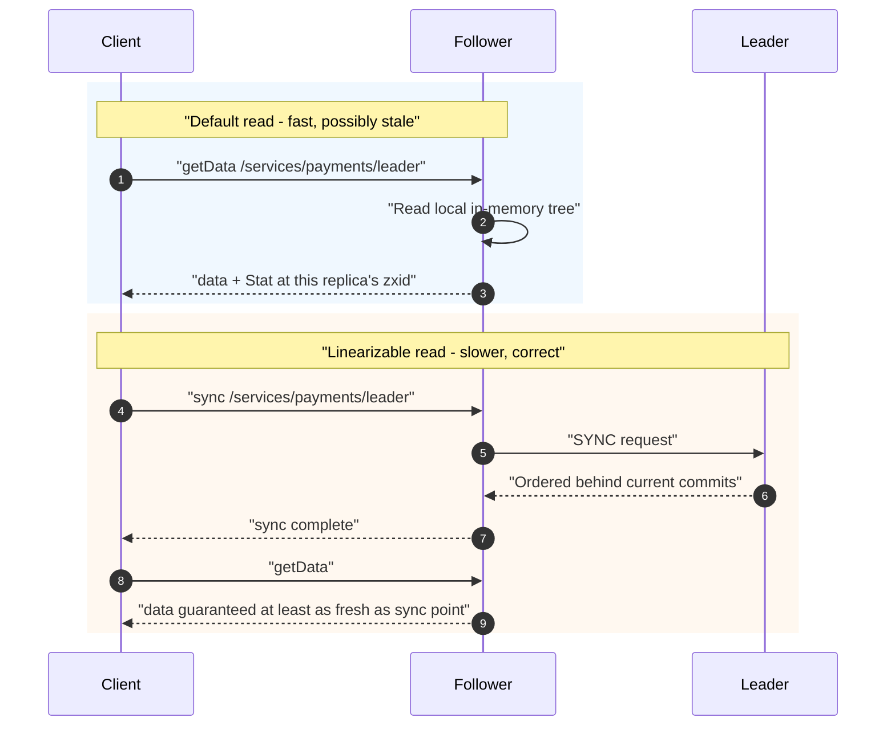
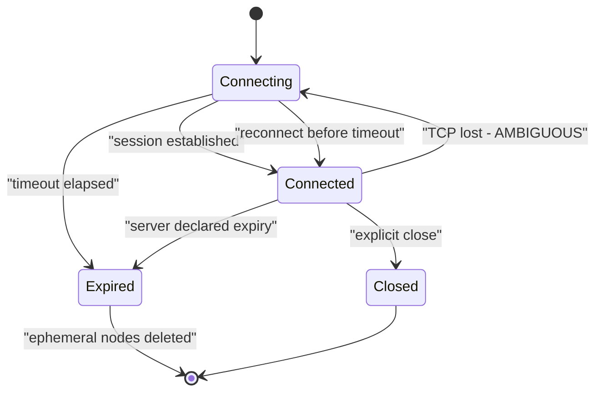
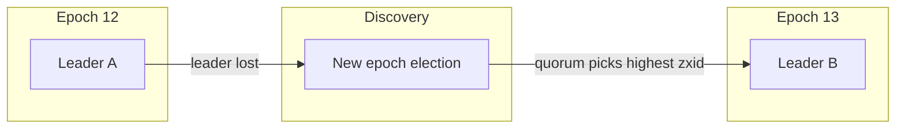
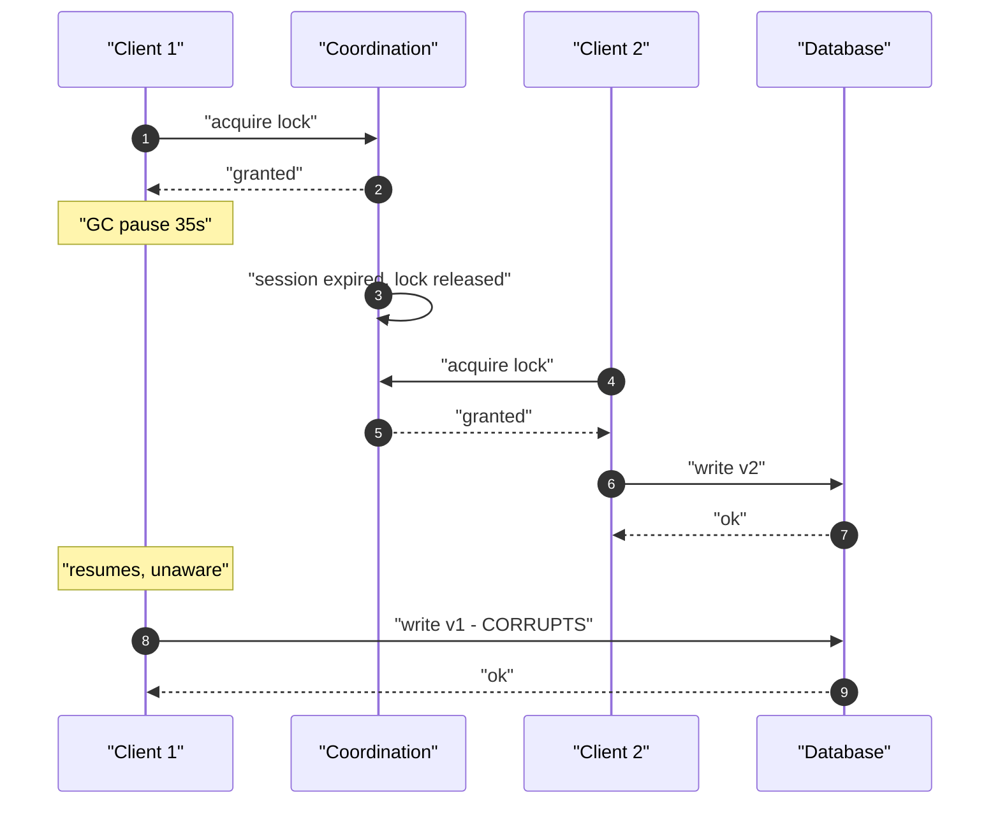
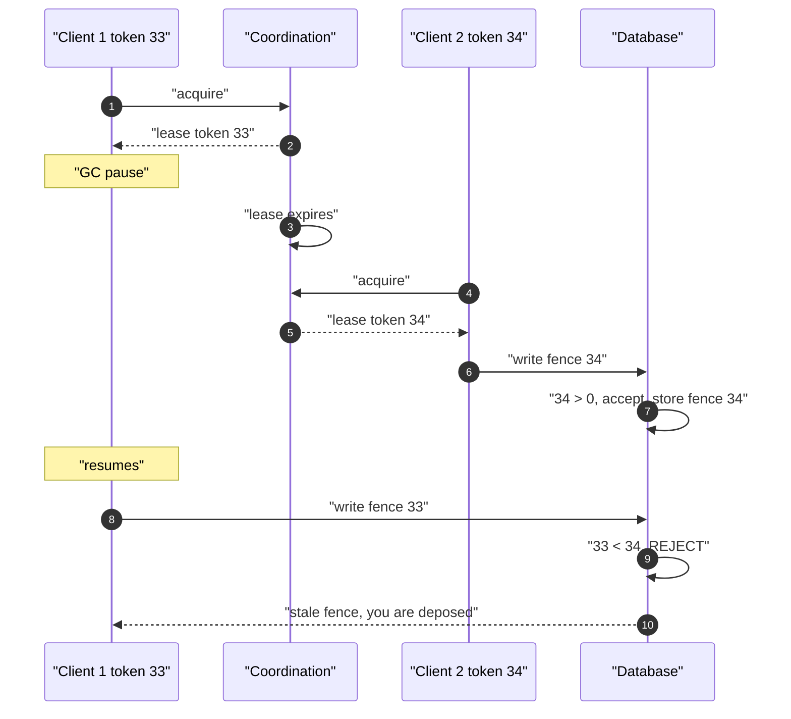
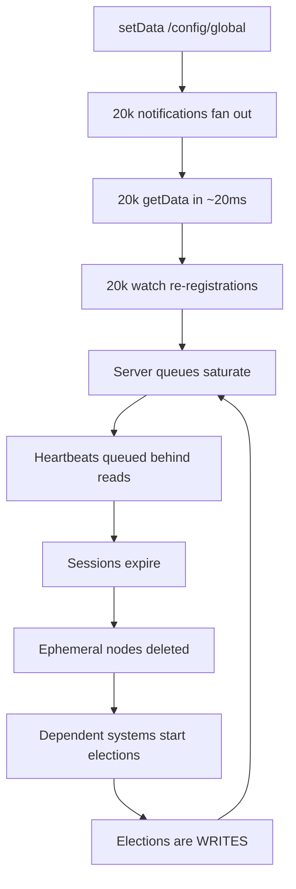
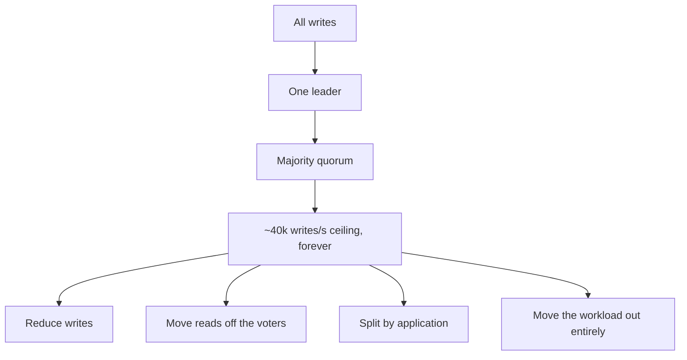
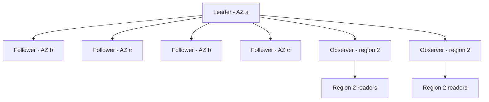

# 46 — Distributed Coordination Service (ZooKeeper / Chubby)

<span class="pill pill-core">Core</span> <span class="pill pill-hard">Hard</span>

**A tiny, strongly-consistent, replicated filesystem that exists so that every other distributed system in the company does not have to implement consensus — which makes it the one service whose availability must exceed the availability of everything that depends on it, including the tools you would use to fix it.**

| | |
|---|---|
| **Commonly asked at** | Google, Yahoo, Confluent, Cloudera, Pinterest, Airbnb, Uber, Databricks, HashiCorp, any infrastructure or storage-platform org |
| **Time budget** | 45 min |
| **Core tension** | The service's value comes from being strongly consistent and totally ordered, which forces every write through a single leader and a majority quorum — a hard, low, non-negotiable throughput ceiling. Everything depending on it wants more: more writes, more watches, more data. Every capacity problem is therefore solved by *pushing work out of the service*, not by scaling it up, and every outage is caused by someone who did the opposite |
| **Prerequisites** | [F07 Replication & Consistency](../fundamentals/f07-replication-consistency.md), [F08 CAP & PACELC](../fundamentals/f08-cap-pacelc.md), [F09 Consensus](../fundamentals/f09-consensus.md), [F10 Distributed Transactions](../fundamentals/f10-distributed-transactions.md), [F11 Idempotency](../fundamentals/f11-idempotency.md), [F13 Storage Engines](../fundamentals/f13-storage-engines.md), [F19 Concurrency Control](../fundamentals/f19-concurrency-control.md), [F20 Time, Clocks & Ordering](../fundamentals/f20-time-clocks-ordering.md), [F18 Resilience Patterns](../fundamentals/f18-resilience-patterns.md), [F22 Observability Fundamentals](../fundamentals/f22-observability-fundamentals.md), [F23 SLOs & Error Budgets](../fundamentals/f23-slo-error-budgets.md), [F24 Capacity Planning](../fundamentals/f24-capacity-planning.md), [F26 Multi-Region & DR](../fundamentals/f26-multi-region-dr.md), [F27 Security in Design](../fundamentals/f27-security-design.md) |

---

## 1. Problem Statement

Design the service that 40 other distributed systems use to agree on things: who is the leader, which nodes are alive, what the current configuration is, who holds the lock, which shard lives where.

The standard framing — "a hierarchical key-value store with watches" — is accurate and useless, because it describes the API rather than the purpose. Four reframings that actually drive the design.

**First: this is a consensus service wearing a filesystem costume.** The znode tree, the paths, the `create`/`getData`/`setData` API are a *familiar interface* over a replicated state machine. Every write is a proposal that must be committed by a majority of an odd-sized ensemble before it is acknowledged. That is not an implementation detail to be optimised away later; it is the entire product. It is why writes are slow and bounded, why the ensemble is 5 nodes and not 500, why you cannot shard it, and why "just put it in ZooKeeper" is sometimes brilliant and sometimes the cause of a company-wide outage. **If a candidate cannot immediately name the consensus core as the thing that constrains everything, the rest of their answer is decoration.**

**Second: the primitive being sold is not storage, it is *agreement about liveness*.** The genuinely hard distributed-systems problem is not "where do I put this value", it is "is that node still alive, and can everyone agree on the answer at the same moment". Sessions with ephemeral nodes are the service's answer: a client holds a session by heartbeating; if it stops, the session expires and everything it created vanishes, and *every observer sees that happen at the same point in the total order*. That shared, ordered view of liveness is what you cannot build yourself without reimplementing consensus. It is also, as we will see, a lie in one specific and dangerous way: the service can only tell you that a client *stopped heartbeating*, which is not the same as the client being dead.

**Third: it is a coordination store, not a database, and the distinction is quantitative.** Small values (kilobytes, not megabytes), a small total dataset (the whole tree lives in memory on every node), a read-heavy ratio (100:1 or better), and a low absolute write rate (thousands per second, not hundreds of thousands). Violate any of these and the service degrades in a way that takes down everything depending on it — which is everything. The most common production incident involving a coordination service is not a bug in the service; it is a team using it as a general-purpose database.

**Fourth: it sits at the bottom of the dependency graph, which creates a bootstrapping paradox.** If 40 systems depend on it, its availability must be higher than all of theirs — but the tooling you would use to diagnose and repair it (service discovery, config management, the deploy pipeline, possibly your metrics system) very likely depends on it too. Designing this service is partly an exercise in designing its own recovery path to not need itself.

### Out of scope

The consensus protocol's correctness proof (see [F09 Consensus](../fundamentals/f09-consensus.md)), general-purpose distributed transactions, and the design of the systems that *use* coordination — we care here about the coordination service and the contract it offers.

---

## 2. Requirements

### Functional

| # | Requirement | Notes |
|---|---|---|
| F1 | Hierarchical namespace of znodes with small data payloads | Path-addressed, like a filesystem |
| F2 | Linearizable writes with a global total order | Every write gets a monotonically increasing transaction id |
| F3 | Reads served from any replica; explicit `sync` for linearizable reads | The read/write asymmetry is the scaling story |
| F4 | Sessions with negotiated timeout and heartbeats | The liveness primitive |
| F5 | Ephemeral znodes tied to a session | Auto-deleted on session expiry |
| F6 | Sequential znodes with a monotonic counter per parent | The ordering primitive for queues and locks |
| F7 | One-shot watches on data and children changes | Notification, not a stream |
| F8 | Conditional writes with version (compare-and-set) | Optimistic concurrency ([F19](../fundamentals/f19-concurrency-control.md)) |
| F9 | Multi-op: atomic apply of a set of operations | All-or-nothing within one transaction |
| F10 | ACLs per znode, with authentication schemes | Including mTLS/SPIFFE identity |
| F11 | Quotas per namespace: node count, data size, watch count | The defence against misuse |
| F12 | Dynamic ensemble reconfiguration | Add/remove members without a full restart |
| F13 | Read-only observer members | Read scale-out without write cost |
| F14 | Snapshot and transaction-log based durability and recovery | |

### Non-functional

| # | Requirement | Target |
|---|---|---|
| N1 | Availability | **99.99%** (see the bootstrapping argument below) |
| N2 | Write latency | p50 < 5 ms, p99 < 25 ms within a region |
| N3 | Read latency (local replica) | p50 < 1 ms, p99 < 5 ms |
| N4 | Sustained write throughput | 10k writes/s, with a documented ceiling near 40k |
| N5 | Sustained read throughput | 500k reads/s across the ensemble |
| N6 | Watch notification latency | p99 < 100 ms from commit |
| N7 | Leader election time after leader loss | p99 < 10 s |
| N8 | Session expiry detection | Within the negotiated timeout, 2σ accuracy |
| N9 | Total dataset size | < 4 GB (must fit in memory, with headroom) |
| N10 | Max znode size | 1 MB hard, 100 KB soft-warned, 10 KB recommended |
| N11 | Durability | Zero committed-write loss on a minority failure |

!!! danger "Why N1 must be 99.99% and not 99.9%"
    Availability composes multiplicatively for a hard dependency. If 40 systems each target 99.95% and every one of them hard-depends on coordination:

    $$
    A_{\text{effective}} = A_{\text{service}} \times A_{\text{zk}}
    $$

    At $A_{\text{zk}} = 99.9\%$, a service targeting 99.95% can achieve at most $0.9995 \times 0.999 = 99.85\%$ — it has already missed its SLO before it has a single bug of its own. The coordination service must be **an order of magnitude more available than its most demanding dependent**, which in practice means 99.99% minimum and a change process far more conservative than anything it serves.

    The corollary is the one people miss: this constraint means you should aggressively *reduce* the number of hard dependencies on it. A system that degrades gracefully when coordination is unavailable (keeps serving with its cached leadership view, refuses only operations that genuinely need fresh consensus) converts a hard multiplicative dependency into a soft one. **Designing your clients to not need the service is a more effective reliability strategy than making the service more reliable.**

---

## 3. Scale Estimation

### Ensemble shape

$$
\begin{aligned}
\text{ensemble size } N &= 5,\quad \text{quorum } Q = \left\lfloor \frac{N}{2} \right\rfloor + 1 = 3 \\
\text{tolerated failures} &= N - Q = 2 \\
\text{observers} &= 6\ \text{(non-voting read replicas)} \\
\text{clients} &= 20{,}000\ \text{processes} \\
\text{watches per client} &\approx 50 \Rightarrow 10^{6}\ \text{total watches} \\
\text{znodes} &= 2 \times 10^{6},\ \text{mean 400 B} \Rightarrow 800\ \text{MB of data}
\end{aligned}
$$

### The write-throughput ceiling

Every write is: leader serialises it, appends to its transaction log, fsyncs, broadcasts a proposal to all followers, waits for $Q-1$ acks, commits, applies to the in-memory tree, fires watches, responds.

$$
\begin{aligned}
t_{\text{serialize + tree apply}} &\approx 18\ \mu\text{s} \\
t_{\text{fsync (NVMe, group commit)}} &\approx 300\ \mu\text{s per batch} \\
t_{\text{RTT to follower, same AZ}} &\approx 250\ \mu\text{s} \\
t_{\text{RTT to follower, cross AZ}} &\approx 900\ \mu\text{s}
\end{aligned}
$$

Latency for a single write with a 3-AZ ensemble is dominated by the slowest of the quorum:

$$
t_{\text{write}} \approx t_{\text{fsync}} + t_{\text{RTT}}^{(Q-1)} + t_{\text{apply}} \approx 300 + 900 + 18\ \mu\text{s} \approx \mathbf{1.2\ \text{ms}}
$$

Throughput is *not* $1/t_{\text{write}}$, because proposals pipeline and the log fsync is group-committed. The real ceiling is the **single-threaded leader critical path**:

$$
\begin{aligned}
T_{\text{fsync-bound}} &= \frac{B}{t_{\text{fsync}}} = \frac{64}{300\ \mu\text{s}} = 213{,}000\ \text{writes/s} \\
T_{\text{leader-CPU-bound}} &= \frac{1}{18\ \mu\text{s} + 7\ \mu\text{s (watch fan-out)}} = \mathbf{40{,}000\ \text{writes/s}} \\
T_{\text{leader-egress}} &= \frac{10\ \text{Gb/s}}{400\ \text{B} \times (N-1+\text{observers})} = \frac{1.25\ \text{GB/s}}{4{,}000\ \text{B}} = 312{,}000\ \text{writes/s}
\end{aligned}
$$

$$
T_{\max} = \min(213\text{k},\ 40\text{k},\ 312\text{k}) = \mathbf{40{,}000\ \text{writes/s}}
$$

!!! warning "Design for 25% of the ceiling, not 90%"
    Throughput ceilings in a consensus system are *latency cliffs*, not plateaus. As you approach $T_{\max}$, the leader's request queue grows, p99 latency goes from 25 ms to seconds, client sessions start timing out because their heartbeats are queued behind writes, sessions expire, ephemeral nodes are deleted, leader elections fire in every dependent system, and those systems respond by **writing more** to re-acquire leadership. The system does not gracefully saturate; it collapses into a self-sustaining storm. Target N4's 10k writes/s — 25% of the measured ceiling — and treat sustained utilisation above 40% as a capacity emergency.

### The counterintuitive part: more nodes make writes slower

$$
\begin{aligned}
N = 3,\ Q = 2 &: \text{leader waits for 1 of 2 followers},\ \text{egress} = 2 \times 400\ \text{B} \\
N = 5,\ Q = 3 &: \text{leader waits for 2 of 4 followers},\ \text{egress} = 4 \times 400\ \text{B} \\
N = 7,\ Q = 4 &: \text{leader waits for 3 of 6 followers},\ \text{egress} = 6 \times 400\ \text{B}
\end{aligned}
$$

Leader egress and per-write CPU grow linearly in $N$, while fault tolerance grows as $\lfloor N/2 \rfloor$. Going from 5 to 7 buys one more tolerated failure and costs roughly 40% of write throughput. **Five is almost always right**: it tolerates two failures (enough for one planned maintenance plus one surprise) and keeps the fan-out small. Three tolerates only one, which means any maintenance leaves you with zero headroom. Seven is for ensembles spanning many failure domains where you genuinely expect two concurrent losses.

### Read throughput and why it is the easy half

Reads are served entirely from the local replica's in-memory tree with no coordination:

$$
\begin{aligned}
T_{\text{read per node}} &\approx 120{,}000\ \text{reads/s} \\
T_{\text{read total}} &= (5\ \text{voters} + 6\ \text{observers}) \times 120\text{k} = \mathbf{1.3 \times 10^{6}\ \text{reads/s}}
\end{aligned}
$$

Observers replicate the committed stream but do not vote, so adding them scales reads **without** adding to the write quorum cost. This asymmetry — reads scale horizontally, writes do not scale at all — is the single most important capacity fact about the service.

### Transaction id exhaustion

The transaction id is 64 bits: a 32-bit epoch (incremented per leader election) and a 32-bit counter (incremented per write).

$$
\begin{aligned}
\text{counter space} &= 2^{32} = 4.295 \times 10^{9} \\
\text{at } 10^{4}\ \text{writes/s} &: \frac{4.295 \times 10^{9}}{10^{4}} = 429{,}500\ \text{s} = \mathbf{4.97\ \text{days}} \\
\text{at } 4 \times 10^{4}\ \text{writes/s} &: \frac{4.295 \times 10^{9}}{4 \times 10^{4}} = 107{,}374\ \text{s} = \mathbf{29.8\ \text{hours}}
\end{aligned}
$$

When the counter is about to overflow, the leader must step down so a new epoch begins — a **forced leader election every five days at nominal load, or every 30 hours at the ceiling**. This is real: an ensemble running hot experiences periodic unexplained leader elections that are not a bug. It is also an excellent reason to keep write rate low, and a wonderful interview detail.

### Session and watch load

$$
\begin{aligned}
\text{sessions} &= 20{,}000 \\
\text{session timeout} &= 30\ \text{s},\ \text{heartbeat interval} = \frac{30}{3} = 10\ \text{s} \\
\text{heartbeat rate} &= \frac{20{,}000}{10} = \mathbf{2{,}000\ \text{pings/s}}\ (\text{reads, not writes})
\end{aligned}
$$

Heartbeats are cheap. **Session creation is not** — it is a write through consensus:

$$
\text{mass reconnect: } 20{,}000\ \text{session creates at } 40\text{k/s ceiling} = 0.5\ \text{s of 100\% write saturation}
$$

and that is before any of those clients re-register their watches or re-read their state.

### The watch storm

$$
\begin{aligned}
\text{clients watching } \texttt{/config/global} &= 20{,}000 \\
\text{one setData fires} &: 20{,}000\ \text{notifications} \\
\text{each client reacts} &: 1\ \text{getData} + 1\ \text{watch re-register} \\
\text{burst} &= 40{,}000\ \text{operations in} \approx 20\ \text{ms} \\
\text{instantaneous rate} &= \frac{40{,}000}{0.02} = \mathbf{2 \times 10^{6}\ \text{ops/s}}
\end{aligned}
$$

Against a read capacity of 1.3M/s, that burst is a **1.5x overload lasting tens of milliseconds** — survivable once, fatal if the config changes five times in a minute, and catastrophic if the notification triggers a *write* in each client rather than a read.

$$
\text{if each client writes in response: } 20{,}000\ \text{writes at } 40\text{k/s} = 0.5\ \text{s saturation per config change}
$$

### Memory

$$
\begin{aligned}
\text{znode overhead} &\approx 200\ \text{B (stat, ACL ref, child list pointers)} \\
\text{tree} &= 2 \times 10^{6} \times (400 + 200)\ \text{B} = 1.2\ \text{GB} \\
\text{watch table} &= 10^{6} \times 120\ \text{B} = 120\ \text{MB} \\
\text{session table} &= 2 \times 10^{4} \times 400\ \text{B} = 8\ \text{MB} \\
\hline
\text{working set} &\approx 1.35\ \text{GB} \Rightarrow \text{heap } 6\ \text{GB},\ \text{RAM } 16\ \text{GB}
\end{aligned}
$$

!!! danger "The heap size is a session-expiry risk, not just a memory budget"
    A larger heap means longer garbage-collection pauses, and a GC pause longer than the session timeout causes the *server* to be considered dead by its peers, or the *client* to have its session expired. With a 30-second session timeout, a 35-second full GC on an 8 GB heap is a mesh of false failures across every dependent system. Keep the heap small enough that worst-case pauses stay well under the session timeout — which is another reason N9 caps the dataset at 4 GB. The dataset limit is a **liveness** constraint disguised as a capacity constraint.

---

## 4. API Design

### Core operations

```java
// Session lifecycle. The negotiated timeout is a contract: the server promises
// not to expire the session before it elapses; the client promises to heartbeat.
connect(servers, sessionTimeoutMs, sessionId?, sessionPasswd?) -> Session
close(session)

// Reads. watch=true installs a ONE-SHOT trigger, not a subscription.
getData(path, watch) -> (bytes, Stat)
getChildren(path, watch) -> (List<String>, Stat)
exists(path, watch) -> Stat?

// Writes. Every one of these is a consensus round.
create(path, data, acl, mode) -> String        // mode: PERSISTENT | EPHEMERAL
                                               //     | *_SEQUENTIAL
setData(path, data, expectedVersion) -> Stat   // -1 means unconditional: avoid
delete(path, expectedVersion)
multi(List<Op>) -> List<OpResult>              // atomic, all-or-nothing

// The linearizable-read escape hatch.
sync(path)                                     // flush this replica up to the
                                               // leader's current commit point
```

### The `Stat` structure is the design

```java
class Stat {
  long czxid;           // zxid of the create -- a global fencing token
  long mzxid;           // zxid of the last modification
  long ctime, mtime;
  int  version;         // data version -- the CAS token
  int  cversion;        // children version
  int  aversion;        // ACL version
  long ephemeralOwner;  // session id, or 0 if persistent
  int  dataLength;
  int  numChildren;
}
```

Three fields carry most of the system's power:

- **`version`** makes every write a compare-and-swap. `setData(path, data, expectedVersion)` fails if someone else wrote first. Passing `-1` means "unconditional", which is convenient and is how almost every lost-update bug in a coordination-backed system happens.
- **`czxid` / `mzxid`** are positions in the global total order. Because the order is global and monotonic, a zxid is a **fencing token** that is valid across the entire system, not just for one znode. This is the single most useful property the service offers and it is the one most often ignored.
- **`ephemeralOwner`** binds the node's lifetime to a session, which is how liveness becomes observable state.

### Consistency guarantees — state them precisely

```text
Linearizable writes.         All writes are totally ordered; a committed write
                             is visible to any subsequent operation that syncs.

Sequentially consistent      A client's operations appear in the order it
reads per client.            issued them, but a read may return stale data:
                             it is served from one replica that may lag the
                             leader. Reads are NOT linearizable by default.

Client FIFO order.           A single client's requests are processed in order,
                             and its watch notifications are delivered in order
                             relative to its own operations.

Watch ordering.              A client is guaranteed to see the watch event for
                             a change BEFORE it sees the new data via any
                             subsequent read. You never read new data and then
                             get told it changed.

No atomic multi-path         `multi()` is atomic, but there are no cross-request
transactions across          transactions. There is no BEGIN/COMMIT.
requests.
```

!!! warning "The stale-read trap is a correctness bug, not a performance detail"
    Reads are served locally without contacting the leader, so a read can return a value that is arbitrarily stale — bounded in practice by replication lag (milliseconds) but unbounded in theory if a replica is partitioned from the leader and still serving. A client that reads "am I the leader?" from a lagging replica can get `yes` after it has already been deposed.

    Two correct patterns. Call `sync(path)` before the read, which forces the replica to catch up to the leader's commit point (and costs a round trip to the leader, so it is not free). Or — better — **never read leadership from the tree at all**: derive authority from the fencing token you obtained at acquisition time and let the *downstream resource* reject stale tokens. The second pattern is strictly stronger because it survives the case where the read is fresh but the answer becomes wrong one microsecond later.

### Recipe-level API (what clients should actually use)

Nobody should call `create` and `getChildren` directly to build a lock. Wrap the primitives in a library with the correct behaviour built in:

```python
# The library owns the hard parts: fencing tokens, jittered retries,
# connection-loss ambiguity, and refusing to do dangerous things.

class CoordinationClient:
    def lock(self, path, ttl) -> Lease:
        """Returns a Lease carrying a fencing token. Never returns a bare
        boolean, because a bare boolean cannot be used safely."""

    def leader_election(self, path, on_elected, on_deposed) -> Election:
        """Callback-based. on_deposed MUST be treated as authoritative and
        MUST be able to stop in-flight work."""

    def watch_config(self, path, on_change) -> Watcher:
        """Re-registers the watch automatically, applies jittered backoff to
        the post-notification read, and coalesces rapid changes."""

    def register_ephemeral(self, path, data) -> Registration:
        """Recreates the node after session recovery. The application must
        NOT assume its ephemeral node still exists after a disconnect."""
```

```java
// Session state transitions the application MUST handle explicitly.
// Treating CONNECTING as "fine, it will come back" is the root cause of
// most split-brain incidents in coordination-backed systems.
enum State {
  CONNECTED,      // normal
  CONNECTING,     // AMBIGUOUS: session may or may not still be alive.
                  // You must act as if you have ALREADY LOST leadership.
  EXPIRED,        // definitive: ephemeral nodes are gone, someone else
                  // may already be leader. Not recoverable -- new session.
  CLOSED
}
```

---

## 5. Data Model

### The tree

```text
/
├── services/
│   ├── payments/
│   │   ├── leader                 EPHEMERAL, data = {host, port, epoch}
│   │   ├── members/
│   │   │   ├── n_0000000042       EPHEMERAL_SEQUENTIAL, session A
│   │   │   ├── n_0000000043       EPHEMERAL_SEQUENTIAL, session B
│   │   │   └── n_0000000044       EPHEMERAL_SEQUENTIAL, session C
│   │   └── config                 PERSISTENT, data = 1.2 KB of JSON
│   └── search/
│       └── ...
├── locks/
│   └── shard-migration/
│       ├── lock-0000000917        EPHEMERAL_SEQUENTIAL  <- holder
│       └── lock-0000000918        EPHEMERAL_SEQUENTIAL  <- waiter
├── shards/
│   └── assignment                 PERSISTENT, data = 48 KB assignment map
└── barriers/
    └── reindex-2026-03/
        └── ready/
            ├── worker-11          EPHEMERAL
            └── worker-12          EPHEMERAL
```

### What belongs here and what absolutely does not

| Data | Belongs? | Why |
|---|---|---|
| Current leader of a service | **Yes** | Small, critical, must be agreed, changes rarely |
| Live membership of a cluster | **Yes** | Exactly the liveness primitive the service exists for |
| Shard-to-node assignment map | **Yes, if small** | Tens of KB, read constantly, written on rebalance only |
| Feature flags / config | **Yes, with care** | Small and read-heavy — but see the watch-storm gotcha |
| Distributed lock state | **Yes, with fencing** | The canonical use case, done wrong more often than right |
| Barrier / phase coordination | **Yes** | Small, ephemeral, exactly the right shape |
| Job queue with 10k tasks | **No** | High write rate, unbounded growth, huge child lists |
| Service metrics / heartbeat payloads | **No** | High write rate for data nobody needs totally ordered |
| Offsets committed per message | **No** | This is why Kafka moved offsets out of ZooKeeper |
| A 40 MB serialised topology blob | **No** | Exceeds znode limits, blows the snapshot, stalls the leader |
| User sessions, cache entries, anything per-request | **No** | Wrong system entirely |

!!! danger "The anti-pattern that causes the most real outages"
    A team needs "a small amount of coordinated state" and puts it in the coordination service. It works. The state grows. The write rate grows. A year later there are 900,000 znodes under one parent, a 60 MB assignment blob, and 12,000 writes/s of per-task status updates. Then something triggers a leader election, the new leader must load a 3 GB snapshot and replay a long transaction log, that takes 90 seconds, **every session in the company expires during those 90 seconds**, every ephemeral node is deleted, every dependent system simultaneously believes its leader died and starts an election, and those elections are writes into an ensemble that is already on its knees.

    There is no incremental degradation on the way there. It works fine, and then it is a total outage of everything. The defences must be **preventive and enforced by the server**: per-namespace quotas on node count, total bytes, children per parent and watches, enforced at write time with a hard rejection; a soft warning at 10 KB per znode and a hard cap at 1 MB; and an alert on total dataset growth rate. A quota that rejects a write is a bug report for one team. No quota is an outage for forty.

### Storage engine

```text
On disk (per server):

  transaction log      Append-only, fsynced before ack. Pre-allocated in 64 MB
                       chunks so the filesystem never extends a file on the
                       write path. MUST be on its own device -- sharing a spindle
                       or an IOPS budget with snapshots is a latency disaster.

  snapshots            Periodic full serialisation of the in-memory tree, taken
                       by a background thread. Fuzzy (taken without stopping
                       writes), so recovery = load snapshot + replay log from
                       the snapshot's zxid. Idempotent replay makes this safe.

Recovery time = t_load_snapshot + t_replay_log
              = (dataset / read_bandwidth) + (txns_since_snapshot * apply_cost)
```

$$
\begin{aligned}
\text{1.35 GB snapshot at 900 MB/s} &= 1.5\ \text{s} \\
\text{log replay: 10k writes/s} \times 300\ \text{s since snapshot} \times 18\ \mu\text{s} &= 54\ \text{s} \\
\hline
t_{\text{recovery}} &\approx \mathbf{56\ \text{s}}
\end{aligned}
$$

56 seconds is longer than a 30-second session timeout. **Snapshot frequency is therefore a liveness parameter**: snapshotting every 60 seconds instead of every 300 cuts replay to 11 s and total recovery to 12.5 s, comfortably inside the timeout. The cost is more background I/O, which is exactly why the transaction log needs its own device.

### Server-side metadata

```sql
-- Not a real table -- this is in-memory state, shown relationally to make
-- the operational queries explicit.

session(session_id PK, timeout_ms, last_seen_zxid, expiry_deadline, owner_addr)
ephemeral_owner(session_id, path)           -- what dies when a session dies
watch(session_id, path, type)               -- what fires on a change
quota(namespace, max_nodes, max_bytes, max_children, max_watches, current_*)

-- The operational queries that matter:
--   Which session owns the most ephemeral nodes?  (a client leaking nodes)
--   Which path has the most watchers?             (a watch storm waiting to happen)
--   Which namespace is closest to quota?          (the next outage)
--   Which sessions are within 5s of expiry?       (a GC pause in progress)
```

---

## 6. High-Level Architecture



### Write path



Four properties to state explicitly:

1. **Writes are forwarded to the leader regardless of which server the client connected to.** Connection distribution does not distribute write load; it only distributes read load and session-heartbeat load.
2. **The fsync happens before the quorum ack, not after.** Durability is per-node and precedes agreement, so a committed write survives a simultaneous power loss on all nodes — this is the property that makes N11 true and the reason the transaction log device's fsync latency directly caps write throughput.
3. **Watches fire on the leader after apply**, and are delivered to each client through its own connected server. A change watched by 20,000 clients generates 20,000 notification sends, fanned out across the servers holding those sessions — which is why observers help with storms and why a single server holding a disproportionate share of sessions is a hotspot.
4. **The client sees the new version.** That version is the token for its next conditional write, and it is the mechanism that makes a read-modify-write safe without a lock.

### Read path



The read path is the entire scaling story: **no coordination, no leader involvement, purely local memory access.** That is why reads are 30x cheaper than writes and why adding observers scales reads linearly while writes stay pinned at one leader forever.

### Session lifecycle



The `Connecting` state is where correctness is won or lost. It means **"I do not know whether my session is alive."** The client cannot tell whether the server already expired it and deleted its ephemeral nodes, or whether it will reconnect in 200 ms with everything intact. A leader that keeps acting as leader in this state is running a coin-flip on split brain.

---

## 7. Deep Dives

### 7.1 The consensus core is a hidden hard dependency

Everything above is an interface over an atomic broadcast protocol (Zab, or Raft/Paxos in equivalent systems). The protocol guarantees: total order of all writes, durability on a quorum, and a single leader per epoch.



**Leader election is a write outage.** During the election — typically 2 to 10 seconds, longer with a large dataset — no writes can be committed at all. Reads continue from replicas but are increasingly stale. Every dependent system experiences this as elevated write latency, and if the election takes longer than a session timeout, as mass session expiry.

$$
t_{\text{election}} = t_{\text{detect}} + t_{\text{vote}} + t_{\text{sync followers}} \approx 2\ \text{s} + 0.5\ \text{s} + t_{\text{data-dependent}}
$$

That last term is why dataset size is a liveness constraint: followers that have fallen behind must be brought up to the new leader's state before the ensemble serves writes, and with a large tree that is a full snapshot transfer.

#### The three things that force a leader election

| Trigger | Frequency | Avoidable? |
|---|---|---|
| Leader process death / node failure | Rare | No — this is what the design is for |
| Leader GC pause > tick threshold | **Common at large heaps** | Yes: small heap, low-pause collector, dataset limits |
| zxid counter overflow | Every 5 days at 10k writes/s | Yes: reduce write rate |
| Network partition isolating the leader | Occasional | Partially: AZ-aware placement |
| Rolling restart / deploy | Planned | Yes: always restart the leader **last** |

!!! tip "Restart the leader last, always"
    A naive rolling restart walks the server list in order. If the leader is first, you trigger an election, then a second election when the new leader is restarted, and possibly a third. Each is a write outage. The correct procedure queries for the current leader, restarts every follower first (waiting for each to fully sync before proceeding), and restarts the leader once at the end — exactly one election for the whole operation. This belongs in automation, not in a human's head.

#### Why you cannot shard it

The obvious capacity fix — split the tree across multiple ensembles — breaks the property people actually depend on: **a single global total order**. A fencing token from ensemble A is not comparable with one from ensemble B. A `multi()` cannot span ensembles. A watch on a path in one shard cannot be ordered against a change in another.

You *can* run multiple independent ensembles for independent concerns (one for Kafka, one for the scheduler, one for the shard router), and this is often the right operational choice because it contains blast radius. But it is **partitioning by application, not sharding by key**, and any application that needs coordination across two of them is back to distributed-transaction territory ([F10](../fundamentals/f10-distributed-transactions.md)).

### 7.2 Sessions, ephemeral nodes, and the GC-pause false positive

The liveness primitive:

```java
// Client establishes a session with a 30s negotiated timeout.
// It must heartbeat at least every ~10s (timeout/3) to stay alive.
session = connect(servers, timeoutMs=30_000);

// Creating an ephemeral node binds that path's existence to the session.
create("/services/payments/members/n_", data, EPHEMERAL_SEQUENTIAL);

// If the process dies, is partitioned, or pauses for >30s, the server
// expires the session and deletes every ephemeral node it owns.
// Every watcher sees the deletion at the same position in the total order.
```

This is genuinely powerful: you get **distributed failure detection with a globally consistent view**, which is the thing you cannot build without consensus. Everyone agrees, at the same logical instant, that node X is gone.

#### The lie inside it

The service cannot detect death. It detects **the absence of heartbeats**, which has at least four causes:

| Cause | Process state | Correct response |
|---|---|---|
| Process crashed | Dead | Expire — correct |
| Node lost power | Dead | Expire — correct |
| Network partition | **Alive, still running** | Expire — and now you have two leaders |
| GC pause / kernel stall / VM freeze | **Alive, frozen, about to resume** | Expire — and the process wakes up believing it is still leader |

The last two are the dangerous ones, and the fourth is the one that actually happens in production.

```text
T+0.0s   Process P holds ephemeral node /services/payments/leader.
         Session timeout 30s. Heartbeats every 10s. All healthy.
T+2.0s   P begins a full GC on an 8 GB heap. All threads stopped.
         The heartbeat thread is stopped too -- it is a Java thread.
T+12s    Missed heartbeat 1. Server still patient.
T+22s    Missed heartbeat 2.
T+32s    Session timeout exceeded. Server expires the session,
         deletes /services/payments/leader. Watch fires.
T+32.1s  Process Q sees the deletion, creates the node, becomes leader.
         Q begins writing to the shared database.
T+38s    GC completes. P resumes. From P's perspective, ZERO time passed.
         P's next line of code writes to the shared database as leader.
         TWO LEADERS ARE NOW WRITING.
T+38.4s  P's client library delivers the EXPIRED event -- 400ms later,
         because it had to notice, reconnect, and be told.
```

**The window between "the service decided you are dead" and "your process finds out" is unbounded and is exactly when the damage happens.** No amount of tuning the session timeout eliminates it; a longer timeout only makes failure detection slower without removing the race.

!!! danger "Three mitigations, and only one of them actually works"
    **Shorter timeouts: makes it worse.** A 10-second timeout means a 12-second GC pause causes an expiry. You get more false positives, more elections, more churn, and the same race.

    **Longer timeouts: trades one problem for another.** A 90-second timeout tolerates long GC pauses but means genuine failures take 90 seconds to detect — and during those 90 seconds a crashed leader's work is stalled with nobody taking over. It also means a mass-expiry event is delayed rather than prevented.

    **Fencing tokens: actually solves it.** Accept that two processes will occasionally both believe they are leader, and make it *harmless* by ensuring the downstream resource rejects the stale one. This is section 7.3 and it is the only mitigation that closes the hole rather than narrowing it.

    Supporting practices that reduce frequency (but do not fix correctness): a low-pause collector with a heap small enough that worst-case pauses are a small fraction of the timeout; a **heartbeat thread that is not subject to the same stall** where possible; and monitoring `session_expiry_rate` broken down by cause, so a GC-driven expiry pattern is visible before it causes an incident. And on the application side: on entering `CONNECTING`, **immediately stop doing leader work** and only resume on a confirmed `CONNECTED` with the session intact.

### 7.3 Locks: leases and fencing tokens

#### The naive lock, and why it is broken

```python
# WRONG. This is the lock that every tutorial shows and it is unsafe.
def do_critical_work():
    if zk.create("/locks/resource", ephemeral=True, ok_if_exists=False):
        write_to_database(data)         # <-- the unsafe line
        zk.delete("/locks/resource")
```

The failure is not in the lock service. The lock service is behaving perfectly. The failure is that **`write_to_database` has no idea whether the caller still holds the lock at the moment the write lands.**



The database accepted a write from a process that lost its lock 35 seconds ago, and it had no way to know.

#### The correct lock: a lease carrying a fencing token

```python
# CORRECT. The token travels with every operation and the resource enforces it.
def do_critical_work():
    lease = zk.acquire_lease("/locks/resource")
    # The znode's czxid is a globally monotonic id. It IS the fencing token.
    token = lease.token          # e.g. 0x0000000C_00003A91

    # The token is passed to the resource, which enforces monotonicity.
    write_to_database(data, fencing_token=token)
```

```sql
-- The resource side. This is where safety is actually enforced.
-- The database -- not the lock service -- is the arbiter.
UPDATE resource
SET    value = :data,
       fence = :token
WHERE  id = :id
  AND  fence < :token;          -- reject anything from an older lease

-- 0 rows affected  =>  a newer lease holder has already written.
-- The caller must treat this as "I am no longer the leader", not as a retry.
```



Three properties make this work, and all three are required:

1. **The token is monotonic and globally comparable.** The zxid gives this for free because the whole service is one total order. A per-znode version counter would not, because it resets scope.
2. **The token travels with the operation**, not just with the acquisition. A token checked only at acquire time proves nothing about the moment the write lands.
3. **The resource enforces it.** This is the part that gets skipped, and skipping it makes the other two decorative. If your storage layer cannot do a conditional write on a monotonic fence, you do not have a safe lock, and the honest thing to do is redesign the operation to be idempotent ([F11](../fundamentals/f11-idempotency.md)) rather than to pretend the lock is protecting you.

!!! example "When the resource genuinely cannot fence"
    A legacy system, a third-party API, or a filesystem may have no conditional-write facility. Three options, in order of preference. **Make the operation idempotent** so a duplicate from a stale leader is harmless — this is usually possible and usually better than a lock. **Put a fencing proxy in front** of the resource that holds the current token and rejects stale callers, turning an unfenceable resource into a fenceable one at the cost of a hop and a new component. **Accept the risk explicitly**, with a written note of what a double-write would do and a detection mechanism for it — this is a legitimate engineering decision, but only when it is a decision rather than an oversight.

#### The herd-free lock recipe

The naive "everyone watches the lock node" recipe creates a storm every time the lock is released. The correct recipe has each waiter watch only its immediate predecessor:

```python
def acquire(path):
    # 1. Create an ephemeral sequential node under the lock parent.
    me = zk.create(f"{path}/lock-", ephemeral=True, sequential=True)
    while True:
        children = sorted(zk.get_children(path))
        idx = children.index(basename(me))
        if idx == 0:
            return Lease(token=zk.exists(me).czxid)   # lowest = holder

        # 2. Watch ONLY the node immediately before mine.
        #    One release wakes exactly one waiter, not all of them.
        predecessor = f"{path}/{children[idx - 1]}"
        if zk.exists(predecessor, watch=True) is None:
            continue    # predecessor already gone; re-evaluate
        wait_for_watch_event()
```

$$
\begin{aligned}
\text{naive (watch the lock node)} &: \text{1 release} \to N\ \text{notifications} \to N\ \text{reads} \\
\text{with } N = 500 &: 1{,}000\ \text{operations per release} \\
\text{predecessor-watching} &: \text{1 release} \to 1\ \text{notification} \to 1\ \text{read} \\
\text{reduction} &= \mathbf{1000\times}
\end{aligned}
$$

!!! gotcha "The connection-loss ambiguity in lock acquisition"
    `create` returns the generated sequential path. If the connection drops *after the server created the node but before the response arrived*, the client does not know its own node's name — and it cannot list the children and identify "its" node, because they all look the same. On reconnect it creates a second node, and now it holds two positions in the queue, one of which it will never release until its session ends. Under repeated flapping this fills the lock queue with orphans and can deadlock it.

    The fix is to **embed a unique client-generated id in the node's data or name** (`lock-{uuid}-` as the sequential prefix, or the uuid in the payload), so that after a reconnect the client can scan the children and recognise its own. This is a small detail that separates a library written by someone who has operated the system from one written from the documentation.

### 7.4 Watches and the thundering herd

Watches have three properties people misread, and each misreading causes a distinct production incident.

**One-shot, not a subscription.** A watch fires exactly once and is then removed. If you want continuous notification you must re-register, and between the fire and the re-registration there is a gap in which changes are missed. The guarantee is *not* "you see every change"; it is "you see *that* something changed, and any read you do afterwards reflects at least that change".

**Edge-triggered, not level-triggered.** The event carries the path and the event type — **not the new value**. You must issue a read to get it. So every notification costs two operations, and a fan-out of $N$ watchers costs $2N$.

**Ordered before the data.** You are guaranteed to receive the watch event before any read that would show you the new value. This is what makes the re-registration gap safe: you cannot observe new data and only later be told it changed.

#### The storm



That feedback loop — the arrow from `WR` back to `LAT` — is what makes it an incident rather than a spike. The system's response to overload is to generate more load.

From section 3: a single change watched by 20,000 clients produces a burst of roughly 2M operations/s for tens of milliseconds. Survivable in isolation. Now consider the reconnect case:

```text
A network blip partitions half the fleet from the ensemble for 8 seconds.
10,000 clients reconnect within ~1 second of the partition healing.
Each reconnect is:
  - 1 session re-establishment          -> a WRITE through consensus
  - ~50 watch re-registrations          -> 50 reads
  - ~5 ephemeral node recreations       -> 5 WRITES through consensus

Writes generated: 10,000 x 6 = 60,000 writes in ~1 second.
Write ceiling:    40,000/s.
Result: 1.5 seconds of total write saturation, during which OTHER clients'
        heartbeats and session renewals are delayed, so THEY start to expire,
        so THEY reconnect. The storm feeds itself.
```

!!! danger "Mitigations for watch and reconnect storms"
    **Client-side, in the library, not in each application:**

    - **Jittered backoff before reacting to a notification.** Sleep `uniform(0, 500ms)` before the follow-up read. The change is not usually urgent to the millisecond, and this alone converts a 20 ms spike into a 500 ms ramp — a 25x reduction in peak rate for a latency cost nobody notices.
    - **Coalesce rapid changes.** If three notifications arrive while you are backing off, do one read. Since watches are edge-triggered and reads always return the latest value, this is free correctness-wise.
    - **Jittered reconnect backoff**, `uniform(0, 30s)` with exponential growth, so a mass reconnect spreads over half a minute instead of arriving as a wall.
    - **Cache the value locally** and serve from cache during coordination outages. Most watched config does not need to be fresh to the millisecond.

    **Server-side:**

    - **Per-path watch quotas.** Refuse to register the 5,001st watch on a single path and return a distinct error, forcing the application toward a fan-out design. A path with 20,000 watchers is a loaded gun.
    - **Rate-limit notification delivery** per server so a storm degrades notification latency rather than causing session expiry. Heartbeat processing must be prioritised above everything else — a queue where a ping waits behind 40,000 reads is the proximate cause of most cascades.
    - **Admission control on session establishment**: accept new sessions at a bounded rate during a mass reconnect. Serving 5,000 clients correctly beats failing 20,000.

    **Architectural:**

    - **Do not fan out config through watches to 20,000 clients.** Have a small number of relay processes (tens) watch the coordination service and re-publish through a system designed for fan-out — a message bus, a CDN-backed config endpoint, or a gossip layer. The coordination service is the *source of truth*; it is a poor *distribution channel*. This is the single most effective change and it is architectural, not operational.

### 7.5 Leader election and configuration distribution

#### Leader election recipe

```python
def elect(path, on_elected, on_deposed):
    me = zk.create(f"{path}/n_", data=my_identity,
                   ephemeral=True, sequential=True)
    def evaluate():
        children = sorted(zk.get_children(path))
        idx = children.index(basename(me))
        if idx == 0:
            token = zk.exists(me).czxid      # fencing token for this term
            on_elected(token)
        else:
            # Watch only the predecessor: one departure wakes one candidate.
            pred = f"{path}/{children[idx-1]}"
            if zk.exists(pred, watch=evaluate) is None:
                evaluate()
    evaluate()

    # CRITICAL: session state changes are authoritative and must be wired up.
    zk.on_state(CONNECTING, lambda: on_deposed("ambiguous"))
    zk.on_state(EXPIRED,    lambda: on_deposed("definitive"))
```

Three details that are always missing in a whiteboard answer:

1. **`on_deposed` must fire on `CONNECTING`, not just on `EXPIRED`.** `CONNECTING` means "I cannot prove I am still leader", and the safe interpretation of that is "I am not". A leader that waits for a definitive `EXPIRED` before stopping has already been doing unauthorised work for the whole ambiguous window.
2. **`on_elected` receives a fencing token**, and the application must thread it through every subsequent side effect. Leadership without a token is unenforceable.
3. **Predecessor-watching, not lock-node-watching**, for the same $N \to 1$ reason as the lock recipe.

!!! warning "The deposed callback must be able to stop in-flight work"
    `on_deposed` is easy to implement as "set a boolean". That is insufficient: a request that already passed the boolean check and is now blocked in a 30-second database call will still complete after deposition. The callback needs to *cancel* in-flight operations — close the connection pool, cancel outstanding futures, fail the request — and the downstream resource needs the fencing check as the final backstop for whatever escapes. Designing `on_deposed` to be genuinely effective is harder than designing the election, and it gets far less attention.

#### Configuration distribution

The pattern is trivially attractive and is a trap at scale:

```python
# The obvious version. Fine at 50 clients, an outage generator at 20,000.
def watch_config(path):
    def reload():
        data, stat = zk.get_data(path, watch=reload)
        apply_config(json.loads(data))
    reload()
```

=== "Direct watch (small fleets)"

    Every client watches the config znode directly.

    **Good:** minimal moving parts, propagation in tens of milliseconds, strong ordering.

    **Breaks at:** roughly 1,000–2,000 watchers per path, where a single change produces a burst that competes with heartbeat processing.

    **Chosen for:** control-plane components and small fleets — tens to low hundreds of processes.

=== "Relay fan-out (large fleets)"

    Tens of relay processes watch the coordination service; everything else consumes from a system built for fan-out.

    ```mermaid
    flowchart LR
        Z["Coordination"] --> R1["Relay 1"]
        Z --> R2["Relay 2"]
        Z --> R3["Relay 3"]
        R1 --> B["Pub-sub bus or CDN config endpoint"]
        R2 --> B
        R3 --> B
        B --> C1["5k clients"]
        B --> C2["5k clients"]
        B --> C3["10k clients"]
    ```

    **Good:** coordination-service load is 30 watchers instead of 20,000, and the fan-out layer is one designed for it. Clients get a cached copy and survive coordination outages.

    **Costs:** an extra hop of propagation latency (hundreds of milliseconds), a new component, and eventual consistency between relays — so config must be version-stamped and clients must ignore a version older than one they have already applied.

    **Chosen** as the default for anything above a few hundred consumers.

=== "Poll with version check"

    Clients poll a version znode on a jittered interval and fetch the body only when the version changed.

    **Good:** no watches at all, so no storm is possible; load is smooth and predictable; trivially rate-limited.

    **Costs:** propagation latency equal to the poll interval (seconds to tens of seconds), and constant baseline read load even when nothing changes — though reads are the cheap direction, so this is usually acceptable.

    **Chosen for:** config that is not latency-sensitive, and as the fallback path when the watch mechanism is degraded.

---

## 8. Scaling the Bottleneck

The bottleneck is **the single leader's write path**, and it cannot be scaled. It can only be avoided.



| Strategy | Mechanism | Effect | Cost / limit |
|---|---|---|---|
| **Observers** | Non-voting members that receive the commit stream | Linear read scale-out; more session capacity | Zero help for writes; observers add leader egress |
| **Client-side caching** | Cache watched values; serve locally between changes | Eliminates most steady-state reads | Staleness; cache must be invalidated by a watch, which reintroduces the watch |
| **Batching with `multi()`** | Combine $k$ operations into one transaction | $k$ operations, one consensus round | Only works if the operations are genuinely related; a failed multi fails all |
| **Reduce write rate at the source** | Stop storing per-event state; store only decisions | Often 10–100x reduction | Requires changing the dependent system — the real work |
| **Split by application** | Separate ensembles for separate concerns | Isolates blast radius; each gets its own leader | No cross-ensemble ordering or atomicity |
| **Hierarchical coordination** | Local coordinator per cluster, global only for cross-cluster | Cross-cluster writes drop by the locality factor | Two levels of failure semantics to reason about |
| **Move the workload out** | Queues to a queue system, offsets to the log, metrics to a TSDB | Removes the load entirely | The correct answer, and the most work |
| **Faster fsync device** | NVMe, dedicated log device | Raises the fsync-bound ceiling | Leader CPU is the binding constraint anyway |
| **Larger ensemble** | 5 → 7 nodes | More fault tolerance | **Reduces** write throughput ~40% |

!!! tip "The Kafka example is the canonical lesson"
    Early Kafka stored consumer offsets in ZooKeeper — one write per consumer per commit interval. At a few hundred consumers this is fine. At thousands of consumers committing every few seconds it is tens of thousands of writes per second into a system whose ceiling is tens of thousands of writes per second, and ZooKeeper became the scaling limit of the entire platform.

    The fix was not a bigger ensemble. It was to **move offsets into Kafka itself** — a compacted internal topic, which is a log, which is exactly the right structure for a high-write-rate, per-key-latest-value workload. Kafka later removed the ZooKeeper dependency entirely by embedding its own Raft-based metadata quorum.

    The lesson generalises: when a coordination service is your bottleneck, the answer is almost never to scale the coordination service. It is to notice that the workload you put there was never coordination. **Coordination is for decisions. Data goes somewhere else.**

### The observer topology



Observers are also the correct answer to **cross-region reads**. Placing a voting member in a distant region drags the write quorum's latency up to that region's RTT for every single write in the system — a 70 ms cross-continent RTT turns a 1.2 ms write into a 70 ms write, globally, forever. An observer in the remote region gets local reads with no effect on write latency, at the cost of higher staleness and no contribution to durability. **Voting members stay within one low-latency region; observers go everywhere else.**

---

## 9. Failure Modes

| Failure | Blast radius | Detection | Mitigation | Degraded behaviour |
|---|---|---|---|---|
| **Leader fails** | All writes stall 2–10 s | Leader-election counter; write latency spike | Automatic election; restart leader last during maintenance | Reads continue and grow stale; writes queue or fail; dependent systems see elevated latency |
| **Quorum lost (3 of 5 down)** | **Total write outage, indefinite** | Ensemble size < quorum | Multi-AZ placement; never co-locate 3 voters in one failure domain | Reads may continue from surviving replicas but are unbounded-stale; no writes at all until quorum returns. This is the CP choice made explicit ([F08](../fundamentals/f08-cap-pacelc.md)) |
| **Leader GC pause > tick** | Spurious election; write stall | GC log; leader-change rate | Small heap, low-pause collector, dataset quota | Looks exactly like a leader failure; usually the real cause of "random" elections |
| **Client GC pause > session timeout** | **Split brain in the dependent system** | Session-expiry rate by cause; app-side pause metrics | **Fencing tokens** — the only real fix | Two processes believe they lead; without fencing, corrupted writes |
| **Mass session expiry** (overload or long election) | Every dependent system elects simultaneously | Session-expiry rate; ephemeral-node delete rate | Keep utilisation < 40%; snapshot frequently to shorten recovery; admission control on session creation | A company-wide, synchronized leadership change. Each election is a write into an already-saturated ensemble |
| **Watch storm** | Ensemble saturated; heartbeats delayed; cascade into mass expiry | Watch-fire rate; notification queue depth; per-path watcher count | Jittered client reaction; per-path watch quota; relay fan-out architecture | Notification latency degrades; if heartbeats are not prioritised, it escalates to session expiry |
| **Reconnect storm after a partition heals** | Write saturation from session re-establishment | Session-create rate; connection churn | Jittered reconnect backoff; session-creation admission control | Some clients wait seconds to reconnect — far better than saturating and expiring everyone |
| **Dataset growth past memory** | OOM, or GC pauses long enough to cause expiry | Znode count and total bytes trend; heap usage | Hard quotas enforced at write time; alert on growth rate | Writes rejected at quota — a bug report for one team instead of an outage for forty |
| **Oversized znode** (a 40 MB blob) | Leader stalls serialising it; snapshot bloat; replication hiccup | Znode size histogram | 1 MB hard cap; warn at 10 KB | The write is rejected; the alternative is a latency spike affecting everything |
| **Transaction log device saturation** | Every write slows; fsync latency dominates | fsync latency p99; device queue depth | Dedicated NVMe for the log, never shared with snapshots | Write latency rises smoothly then cliffs; the classic "nothing changed but ZooKeeper is slow" |
| **zxid counter overflow** | Forced leader election | Leader-change events correlating with write volume | Reduce write rate | A brief write outage every few days at high load; harmless but alarming if unexplained |
| **Split-brain attempt during partition** | None to the service itself | Quorum metrics | Majority quorum makes it impossible by construction | The minority side refuses writes. This is correct behaviour and will be reported as an outage |
| **Cross-region voter added** | Every write in the system slows to the remote RTT | Write latency p50 jump with no load change | Use observers for remote regions, never voters | Global write latency degradation with no obvious cause |
| **Snapshot/restore needed** | Recovery time proportional to dataset | Recovery duration | Frequent snapshots; small dataset | Recovery longer than the session timeout means mass expiry on top of the original failure |

---

## 10. SRE Lens

### SLIs and SLOs

| SLI | Definition | SLO | Rationale |
|---|---|---|---|
| Availability | Fraction of minutes with a quorum and an elected leader | **99.99%** | Must exceed every dependent's target |
| Write latency | p50 / p99 of committed write | < 5 ms / < 25 ms | p99 above ~100 ms starts delaying heartbeats |
| Read latency | p50 / p99 local read | < 1 ms / < 5 ms | Reads are on many hot paths |
| Write throughput headroom | Sustained writes / measured ceiling | < 40% | The ceiling is a latency cliff, not a plateau |
| Leader election duration | Time from leader loss to new leader serving | p99 < 10 s | Must stay well under the session timeout |
| Leader election frequency | Elections per week | < 2 (excluding planned) | More means GC, network or zxid-overflow problems |
| Session expiry rate | Expiries per hour, **broken down by cause** | < 5/h, near zero from timeout | Distinguishes real process death from false positives |
| Watch notification latency | Commit to delivery | p99 < 100 ms | Config propagation depends on it |
| Dataset size | Total bytes in the tree | < 4 GB, alert at 2 GB | A liveness constraint, not just capacity |
| Znode count | Total nodes | < 3M, alert at 1.5M | Drives snapshot and recovery time |
| Max watchers on any path | Per-path watch count | < 5,000 | The leading indicator of a watch storm |
| fsync latency | p99 on the transaction log device | < 2 ms | The direct input to write latency |
| Recovery time | Snapshot load + log replay | < 15 s | Must be far under session timeout |

!!! tip "Session expiry rate broken down by cause is the highest-value SLI here"
    A raw expiry count is uninformative — clients legitimately come and go. What matters is the breakdown: expiries from **explicit close** (normal), from **connection loss then timeout** (network), and from **heartbeat timeout while the connection was healthy** (the GC-pause signature). That third bucket climbing is a leading indicator of a split-brain incident in a dependent system, and it is visible hours or days before anything breaks. Most teams never build this breakdown and are then surprised.

### Error budget policy

$$
\begin{aligned}
\text{budget} &= (1 - 0.9999) \times 30\ \text{days} = \mathbf{4.32\ \text{min/month}} \\
\text{one leader election} &\approx 5\ \text{s of write outage} = 1.9\%\ \text{of the monthly budget} \\
\text{one rolling restart, done right} &= 1\ \text{election} = 1.9\% \\
\text{one rolling restart, done wrong} &= 5\ \text{elections} = 9.6\%
\end{aligned}
$$

That arithmetic is the whole argument for automating the restart order. Beyond the numbers, the policy is unusual in two ways:

- **The budget is shared, not owned.** Burning this service's budget burns a slice of forty other teams' budgets simultaneously. There is no such thing as a low-risk change here.
- **Changes are rare and boring by policy.** Version upgrades are quarterly at most, soaked in a mirror ensemble for weeks, applied one node at a time with a full sync verification between each, leader last. Configuration changes to `tickTime`, session limits, or quota go through the same process, because `tickTime` silently redefines every session timeout in the fleet.

### Rollout plan

```yaml
ensemble_upgrade:
  - stage: mirror
    description: >
      Shadow ensemble replaying a captured production workload at 1.5x rate.
      Verify write latency, GC behaviour, snapshot size, recovery time.
    duration: 14d
    gate: [no unexplained elections, recovery_time < 15s, p99_write < 25ms]

  - stage: observer_first
    description: Upgrade observers only. They carry no voting weight.
    gate: observers stay in sync for 48h under full read load

  - stage: followers
    description: >
      One follower at a time. After each, wait for FULL sync (verify the
      follower's last zxid matches the leader's) before touching the next.
      Never have two followers out of sync simultaneously -- with N=5 that
      leaves exactly quorum and zero margin.
    gate_each: [follower synced, quorum healthy, zero session expiries]

  - stage: leader_last
    description: >
      Trigger a controlled leader handoff to an already-upgraded follower,
      THEN restart the old leader. Exactly one election for the entire upgrade.
    gate: election < 10s, zero session expiries

rollback:
  strategy: >
    Snapshot format compatibility must be verified BOTH directions before
    starting. A one-way-compatible upgrade has no rollback, only roll-forward,
    and that must be a conscious decision recorded before the first node is
    touched.
```

!!! danger "Never have two voters down at once in a 5-node ensemble"
    With $N=5$ and $Q=3$, two nodes down leaves exactly quorum. A third failure — a GC pause, a disk hiccup, a network blip — is a total write outage. Upgrades must therefore be strictly one-at-a-time with verified full sync between steps, and the "verified full sync" part is the one people skip because it is slow. A follower that has *started* but not *caught up* counts as down for quorum purposes while contributing nothing.

### Runbook notes

| Symptom | First checks | Action |
|---|---|---|
| Write latency spiked, no load change | fsync p99 on the log device; GC logs on the leader; is there a large znode being written? | Almost always disk or GC. Check whether snapshots and the transaction log share a device — the single most common misconfiguration |
| Frequent unexplained leader elections | GC pause duration on the leader; zxid counter proximity to $2^{32}$; network errors between voters | zxid overflow produces elections at a *predictable interval* correlated with write rate — compute it before assuming a bug |
| Mass session expiry | Write saturation at the time; leader election duration; dataset size driving recovery time | Stop the bleeding first: enable session-creation admission control so reconnects do not re-saturate. Diagnose after |
| One client holds thousands of ephemeral nodes | Ephemeral count by session | A client leaking nodes across reconnects — almost always the missing-unique-id bug from 7.3 |
| "ZooKeeper is slow" from one team only | Which server are they connected to? Session distribution across servers | Session imbalance is common: one server holding 60% of sessions is doing 60% of the heartbeat and notification work |
| Dataset growing steadily | Znode count by namespace; bytes by namespace | Find the namespace and talk to the team. Enforce quota **before** it becomes urgent — a rejected write is a conversation, a full ensemble is an outage |
| Config change caused a latency spike fleet-wide | Watcher count on the changed path | A watch storm. Immediate mitigation: stagger subsequent changes. Real fix: relay fan-out |
| Quorum lost | Which nodes, which AZs, why | Do **not** force a single-node quorum to "restore service" unless you fully accept the data-loss and split-brain risk and have confirmed the other nodes are permanently gone. This is a one-way door |

### Capacity model

$$
\begin{aligned}
\text{voters} &= 5\ \text{across 3 AZs},\ \text{16 GB RAM},\ \text{8 vCPU},\ \text{dedicated NVMe log} \\
\text{observers} &= \left\lceil \frac{500\text{k reads/s}}{120\text{k per node}} \right\rceil + 2\ (\text{HA}) = \mathbf{6} \\
\text{write headroom} &= \frac{10\text{k sustained}}{40\text{k ceiling}} = 25\% \\
\text{sessions per server} &= \frac{20{,}000}{11} \approx 1{,}800 \\
\text{heap} &= 6\ \text{GB (dataset 1.35 GB} \times 4\ \text{for GC headroom)}
\end{aligned}
$$

The heap sizing is deliberately generous relative to the dataset because GC pause duration — not memory pressure — is the binding constraint. A heap running at 85% occupancy collects more often and pauses longer, and a long pause is a mass-expiry event.

### Cost

| Component | Sizing | Monthly |
|---|---|---|
| Voters | 5 × 8 vCPU / 16 GB / 500 GB NVMe | $2.1k |
| Observers | 6 × 8 vCPU / 16 GB | $2.0k |
| Cross-AZ traffic | ~40 GB/day replication | $0.4k |
| Backup storage | Snapshots + logs, 30-day retention | $0.2k |
| Monitoring and log shipping | | $0.3k |
| **Total** | | **~$5.0k/month** |

!!! tip "The cheapest critical system you will ever run, and that is a hazard"
    Five thousand dollars a month for the dependency underneath forty systems is nothing — this will never appear on a cost-optimisation review. The hazard is the inverse: because it is cheap and small, it gets **under-invested in operationally**. It has no dedicated owner, its monitoring is whatever shipped by default, nobody has practised the quorum-loss runbook, and the version is four years old because "it has never given us trouble".

    The right way to think about the budget is not dollars but **engineering attention**. Spend real time on: the session-expiry-by-cause breakdown, per-namespace quotas, automated leader-last rolling restarts, a quarterly game day that kills the leader in production, and a written, practised procedure for quorum loss. That attention is worth vastly more than the infrastructure and is the thing that is actually missing when this service causes a company-wide outage.

---

## 11. Trade-offs & Alternatives

| Decision | Chosen | Rejected | Why |
|---|---|---|---|
| Consistency model | **CP: refuse writes without a quorum** | AP with eventual convergence | The entire value is agreement. An AP coordination service can elect two leaders, which is precisely the thing it exists to prevent |
| Ensemble size | **5 voters** | 3 | Tolerates only one failure, so any maintenance leaves zero margin |
| | | 7+ | Roughly 40% less write throughput for one extra tolerated failure |
| Voter placement | **3 AZs, one region** | Multi-region voters | A remote voter drags every write to the remote RTT — 1.2 ms becomes 70 ms globally |
| Remote regions | **Observers** | Voters, or a separate ensemble per region | Local reads without write cost; a per-region ensemble loses global ordering |
| Read consistency | **Local reads by default, `sync` on demand** | Always-linearizable reads | Leader-routed reads destroy the read scale-out that makes the service usable |
| Lock semantics | **Leases with fencing tokens enforced downstream** | Locks without fencing | Unsafe under GC pauses and partitions, which are not rare events |
| Failure detection | **Sessions with 30 s negotiated timeout** | Shorter (10 s) | More false positives from ordinary GC; more churn; same race |
| | | Longer (90 s) | Real failures take 90 s to detect, stalling work |
| Config fan-out | **Relay processes re-publishing to a fan-out system** | Direct watches from 20k clients | A single change becomes a 2M ops/s burst that competes with heartbeats |
| Watch pattern for locks | **Watch predecessor only** | Watch the lock node | 1000x fewer operations per release |
| Data policy | **Hard server-enforced quotas** | Guidelines and code review | Guidelines are not enforced at 3 a.m. by a team under deadline pressure |
| Sharding | **Separate ensembles per application domain** | Sharding one logical service by key | Sharding breaks global ordering, cross-path atomicity and comparable fencing tokens |
| High-write workloads | **Move them out entirely** | Scale the ensemble | There is no scaling the leader. The workload was never coordination |
| Heap size | **6 GB with 1.35 GB of data** | Tightly sized heap | GC pause duration is a liveness constraint; occupancy pressure lengthens pauses |
| Snapshot cadence | **Every 60 s** | Every 300 s (default-ish) | Recovery must finish inside the session timeout; 300 s of replay does not |

??? note "Chubby versus ZooKeeper versus etcd versus a built-in quorum"
    **Chubby** (Google, internal) is explicitly a *lock service* with a file-like interface, coarse-grained locking, and — importantly — **client-side caching with server-invalidated leases**. That caching is the reason a single Chubby cell serves tens of thousands of clients: most reads never reach the server. It also leans on longer lease times and a grace period that lets a client survive a Chubby outage without losing its lock, which is a different point on the false-positive/detection-speed curve than ZooKeeper's.

    **ZooKeeper** is the open-source realisation of the same ideas with Zab, a hierarchical namespace, watches, and a client library that does *not* cache by default — pushing the caching decision to the application, which is why so many applications get it wrong.

    **etcd** uses Raft (simpler to reason about and to operate than Zab), a flat keyspace with range queries, MVCC with historical revisions, and streaming watches from a revision — which fixes ZooKeeper's one-shot watch gap. Leases are explicit first-class objects rather than implicit in sessions. For new systems it is generally the better choice; the MVCC revision doubles as a clean fencing token and the streaming watch removes a whole class of missed-change bugs.

    **Built-in quorum** (Kafka's KRaft, CockroachDB's internal Raft, Kubernetes' etcd-as-implementation-detail) is the direction the industry has moved: rather than depending on an external coordination service, embed the consensus you need. This removes an external dependency and a whole operational surface, at the cost of every system implementing and operating its own consensus. That trade favours embedding when you have a handful of very large systems, and favours a shared service when you have forty medium ones.

??? note "When you do not need a coordination service at all"
    Three common cases where reaching for one is over-engineering.

    **Your database already provides it.** A row lock, an advisory lock, a conditional update on a monotonic column, or a `SELECT ... FOR UPDATE` gives you mutual exclusion with a fencing token for free, inside a system you already operate and already page on. For anything where the protected resource *is* that database, this is strictly better: fewer components, and the lock and the resource share a failure domain, which eliminates the entire class of "lock says yes, resource disagrees" bugs.

    **You can make the operation idempotent instead.** Most uses of a distributed lock are protecting a non-idempotent operation. Making it idempotent with a natural key removes the need for the lock entirely, and is more robust because it survives the cases where the lock fails. This is the highest-leverage alternative and it is under-used ([F11](../fundamentals/f11-idempotency.md)).

    **Your orchestrator already does leader election.** Kubernetes lease objects, a cloud provider's managed election primitive, or your service framework's built-in mechanism all provide leader election backed by someone else's consensus. Running your own ensemble to elect a leader for one application is a lot of operational surface for one bit of state.

    The honest threshold: you need a dedicated coordination service when **multiple independent systems** need to agree about the **same** facts, with a **shared global ordering** between them. One system electing one leader does not clear that bar.

---

## 12. Gotchas & Corner Cases

!!! gotcha "A GC pause makes a healthy leader into a split brain"
    **Symptom.** Two processes write conflicting data to the same resource, seconds apart, both logging "I am the leader". Neither process crashed. Neither log shows an error at the time of the conflict.
    **Mechanism.** A full GC on a large heap stops all threads, including the one sending session heartbeats. The server sees no heartbeats, expires the session at the negotiated timeout, deletes the ephemeral leader node, and a standby is promoted. When the paused process resumes, no time has passed from its perspective: its next instruction does leader work. The `EXPIRED` event arrives hundreds of milliseconds *after* it resumed — the notification cannot precede the resumption that is required to receive it.
    **Mitigation.** Fencing tokens threaded through every downstream operation, with the resource rejecting stale tokens — this is the only mitigation that makes the double-leader harmless rather than merely less likely. Supporting measures: low-pause collector, heap small enough that worst-case pauses are a fraction of the session timeout, treating `CONNECTING` as immediate deposition, and an `on_deposed` handler that cancels in-flight work rather than setting a flag.

!!! gotcha "A lock without a fencing token is not a lock"
    **Symptom.** Duplicate charges, double-processed batches, or corrupted state in a system that demonstrably acquired a lock correctly every single time. The lock service's own logs are clean.
    **Mechanism.** The lock guarantees *"you held it at acquisition time"*. It cannot guarantee *"you still hold it at the moment your write lands on the resource"*, because between those two instants there is a network, a scheduler, and a garbage collector. The resource, receiving a write, has no way to distinguish the current holder from one deposed thirty seconds ago.
    **Mitigation.** Every lease carries a monotonically increasing token (the znode's `czxid` or etcd's revision), the token accompanies every protected operation, and the resource performs a conditional write with `WHERE fence < :token`. Where the resource cannot enforce a fence, either make the operation idempotent or put a fencing proxy in front — and if you do neither, write down that you accepted the risk, because otherwise the next person will assume the lock was protecting them.

!!! gotcha "A single znode watched by twenty thousand clients"
    **Symptom.** A one-line config change causes fleet-wide latency spikes, delayed heartbeats, a burst of session expiries, and — in the worst case — leader elections in a dozen unrelated systems.
    **Mechanism.** Watches are edge-triggered, so every notified client must issue a read to get the value and then re-register its watch. One change becomes $2N$ operations arriving within tens of milliseconds: roughly 2M ops/s at $N = 20{,}000$. Those operations queue ahead of session heartbeats, and a heartbeat that waits too long is a session expiry, and a session expiry triggers an election in the dependent system, and an election is a write.
    **Mitigation.** Jittered client-side backoff before the follow-up read (a 500 ms uniform delay cuts peak rate 25x for latency nobody notices); coalescing of rapid notifications; a server-side per-path watch quota that refuses registration beyond ~5,000; and architecturally, relay processes that watch on behalf of the fleet and re-publish through a system actually designed for fan-out.

!!! gotcha "Everyone reconnects at once after a brief network blip"
    **Symptom.** An 8-second network event resolves, and the coordination service then becomes *less* healthy than during the partition — saturated writes, growing latency, cascading session expiries that were not happening while the network was down.
    **Mechanism.** Session re-establishment is a write through consensus, and so is recreating each ephemeral node. Ten thousand clients reconnecting in one second generate roughly 60,000 writes against a 40,000/s ceiling. The resulting saturation delays *other* clients' heartbeats, expiring them, so they reconnect too. The storm is self-feeding and does not require the original fault to persist.
    **Mitigation.** Jittered exponential reconnect backoff in the client library (`uniform(0, 30s)` spread), so the herd arrives over half a minute; server-side admission control on session creation, accepting new sessions at a bounded rate; and strict prioritisation of heartbeat processing above all other request types, since a delayed ping is the trigger for the whole cascade.

!!! gotcha "The connection dropped during create and the client lost its own sequential node"
    **Symptom.** A lock queue slowly fills with orphaned nodes. Over days, lock acquisition latency climbs and eventually the queue deadlocks. Each orphan belongs to a session that is still alive, so nothing cleans them up.
    **Mechanism.** `create` with `SEQUENTIAL` generates the name server-side. If the connection drops after the server created the node but before the response reached the client, the client does not know its node's name — and since all the siblings look identical, it cannot identify its own by listing children. On reconnect it creates a second node and waits on that one, leaving the first as a permanent queue position it will never release.
    **Mitigation.** Embed a client-generated unique id in the node name (`lock-{uuid}-` as the sequential prefix) or in its data, so after any reconnect the client scans the children and recognises its own. Additionally alert on ephemeral-node count per session — a client with an unexpectedly high count is leaking.

!!! gotcha "Stale reads make a deposed leader think it is still leading"
    **Symptom.** A process reads the leader znode, sees its own identity, and proceeds — but it was deposed several seconds earlier and the data it read was stale.
    **Mechanism.** Reads are served from the local replica with no leader involvement. That replica may lag, and if it is partitioned from the leader it will happily serve arbitrarily old data indefinitely while believing it is healthy. The read returns successfully; it is simply wrong.
    **Mitigation.** Never derive current authority from a read. Authority comes from the fencing token obtained at acquisition and is validated by the *resource*, not by re-reading the tree. Where you genuinely must read fresh state, call `sync()` first and accept the leader round trip. And treat any code of the form `if get("/leader") == me:` as a bug on sight.

!!! gotcha "The transaction log and the snapshots share a disk"
    **Symptom.** Write latency is fine for minutes at a time and then spikes to hundreds of milliseconds in a periodic pattern. Nothing correlates with request rate. Someone concludes "ZooKeeper is just slow sometimes".
    **Mechanism.** The transaction-log fsync is on the critical path of every write. Snapshotting writes hundreds of megabytes sequentially in the background. Sharing a device — or an EBS IOPS budget, or a virtualised host's I/O allocation — means every snapshot starves the fsync path, and the spike period is exactly the snapshot interval.
    **Mitigation.** A dedicated device for the transaction log, never shared with snapshots, the OS, or anything else. Pre-allocate log files so the filesystem is never extending a file on the write path. Alert on fsync p99 directly, because it is the most direct predictor of write latency and it moves before anything user-visible does.

!!! gotcha "Someone stored a 40 MB blob and the ensemble started flapping"
    **Symptom.** Intermittent leader elections, replication hiccups, and snapshot times that grew from seconds to minutes. No obvious change in request rate.
    **Mechanism.** A large znode must be serialised, fsynced, transmitted to every follower and observer, and held in memory on every node — all on the leader's single-threaded critical path. A 40 MB write blocks every other write behind it for the duration, potentially long enough to trip the tick timeout and trigger an election. It also inflates every subsequent snapshot, lengthening recovery.
    **Mitigation.** A hard 1 MB cap enforced at write time and a warning at 10 KB. Store large objects in object storage and keep only a pointer plus a version in the coordination service — which is the correct pattern anyway, because a 40 MB blob was never coordination data. Alert on the znode size histogram, not just on total dataset size.

!!! gotcha "Changing tickTime silently redefines every session timeout in the fleet"
    **Symptom.** After an "unrelated" server configuration change, dependent systems across the company begin experiencing session expiries and leader elections under load patterns they previously handled fine.
    **Mechanism.** The negotiated session timeout is bounded by the server's `tickTime`: typically a minimum of $2 \times \text{tickTime}$ and a maximum of $20 \times \text{tickTime}$. A client requesting 30 seconds against a server with `tickTime` reduced from 2 s to 1 s gets silently clamped to 20 seconds. The client's library does not warn; the negotiated value is simply different from the requested one, and almost no application logs it.
    **Mitigation.** Treat `tickTime` as a fleet-wide behavioural parameter with the same change process as a code deploy. Have client libraries **log the negotiated timeout at startup and alert if it differs from the requested value** — a two-line change that would have prevented several well-known incidents. Export the negotiated timeout as a metric.

!!! gotcha "A cross-region voter slows down every write on the planet"
    **Symptom.** After adding a node in another region "for disaster recovery", write latency p50 jumps from 1.2 ms to 70 ms globally, for every client, permanently.
    **Mechanism.** A voting member participates in the quorum. With $N=5, Q=3$ the leader waits for the second-fastest of four followers, and adding a distant voter changes which followers are in that set often enough to pull the latency distribution toward the remote RTT. With $N=3$ it is worse — the remote node may be required for every quorum.
    **Mitigation.** Voting members stay within one low-latency region across multiple AZs. Remote regions get **observers**, which receive the commit stream and serve local reads but never vote, so they add zero write latency. Accept that this means the remote region has no durability vote — which is the correct trade, because the alternative is a permanent global latency tax.

!!! gotcha "Forcing a single-node quorum to 'restore service' during a partition"
    **Symptom.** During a severe partition, an engineer reconfigures a surviving node to form a one-node ensemble so that writes resume. Service is restored. Later, when the original nodes return, committed writes have vanished and two divergent histories exist.
    **Mechanism.** Forcing quorum on a minority discards the guarantee that made the service trustworthy. Writes committed by the true majority before the partition — and any committed on the other side during it — are now unreachable or conflicting. The service cannot merge two histories; there is only one total order by construction, and you created two.
    **Mitigation.** Treat this as a **one-way door requiring explicit sign-off**, documented in the runbook as a data-loss operation and never as a routine recovery step. The correct response to quorum loss is to restore quorum — bring nodes back, or restore from a snapshot into a fresh ensemble with all clients pointed at it. Refusing writes without a quorum is the service working exactly as designed ([F08](../fundamentals/f08-cap-pacelc.md)), and it will nonetheless be reported as an outage, so the trade-off must be understood before the incident, not argued during it.

!!! gotcha "Unexplained leader elections every few days at a predictable interval"
    **Symptom.** A brief write stall recurs on a regular cadence — roughly every five days — with no correlated deploy, network event, or GC pause. Extensive investigation finds nothing.
    **Mechanism.** The transaction id's low 32 bits are a per-epoch counter. When it approaches $2^{32}$, the leader must step down so a new epoch begins. At 10,000 writes/s that is $2^{32}/10^4 \approx 4.97$ days; at the 40,000/s ceiling it is 29.8 hours.
    **Mitigation.** Recognise it: the interval is a direct function of write rate, so compute $2^{32}/\text{writes per second}$ and check whether it matches before opening an investigation. It is benign, but it is also a strong signal that write volume is higher than it should be — the correct response is usually to find and remove the write load, which shortens nothing except your risk.

---

## 13. Interview Angle

!!! interview "Lead with the consensus core, not with the API"
    The weak opening describes the product: "a hierarchical key-value store with watches and ephemeral nodes, used for leader election and config". Every candidate says this.

    The strong opening names the constraint: **"This is a replicated state machine with a filesystem interface. Every write is a consensus round through a single leader and a majority quorum, which gives it a hard write ceiling around 40,000 per second that cannot be sharded away. Reads scale horizontally because they are served from local replicas with no coordination at all. That asymmetry — unbounded read scale, fixed write ceiling — determines every other decision: what you can store here, how you distribute config, why a job queue in here is an outage waiting to happen, and why the answer to a capacity problem is always to remove load rather than to add nodes."**

    Then add the second constraint immediately: **"And because forty systems hard-depend on it, its availability multiplies into all of theirs. It needs 99.99% minimum, and more usefully, I want to design its clients so they do not hard-depend on it at all."**

!!! interview "The four numbers that carry the answer"
    - **$T_{\max} \approx 40{,}000$ writes/s, and you operate at 25% of it** — because a consensus system's throughput ceiling is a latency cliff that ends in mass session expiry, not a plateau.
    - **Reads scale to 1.3M/s across 11 nodes; writes stay at one leader forever.** This is the only capacity fact that matters.
    - **A 35-second GC pause with a 30-second session timeout produces two leaders**, and the deposed one finds out *after* it resumes. Unbounded window, fixed by fencing tokens only.
    - **One config change watched by 20,000 clients is a 2M ops/s burst.** Watches are edge-triggered, so fan-out costs $2N$ operations, and those operations queue ahead of heartbeats.

!!! interview "The three things interviewers are actually testing"
    Whether you know that **a lock without a fencing token is unsafe** and can explain the exact mechanism. Whether you know **what does not belong in this service** and can say why in terms of write rate and dataset size rather than taste. And whether you recognise the **bootstrapping paradox** — that the tools you would use to fix it may depend on it. Volunteer all three.

??? question "Follow-up 1: Why can't you just shard this service to get more write throughput?"
    **Answer.** Because sharding destroys the single property people are actually buying: a global total order.

    Every write gets a position in one totally-ordered sequence, and three things depend on that being *one* sequence. **Fencing tokens** are only comparable within an order — a token from ensemble A and one from ensemble B cannot be ranked, so a resource protected by locks from both has no way to reject the stale one. **Atomic multi-operations** cannot span ensembles; you would need two-phase commit across them, which means building a distributed transaction protocol on top of your coordination service, which is a strong sign you have taken a wrong turn. And **ordering between related changes** disappears: a watcher of a path in shard A has no way to know whether a change in shard B happened before or after.

    What you *can* do, and should, is run **separate ensembles for independent concerns** — one for the streaming platform, one for the scheduler, one for the shard router. That is partitioning by application boundary, and its real benefit is blast-radius containment rather than throughput: one team's misuse no longer takes down the other two. The moment an application needs coordination across two of them, you are back in distributed-transaction territory and should instead move that application onto one ensemble.

    **The honest answer to a write-throughput problem is that you have the wrong workload in the service.** At 40,000 writes/s the question is not "how do I get to 80,000" but "what is generating 40,000 coordination decisions per second?" Almost always it is per-item state — job status, offsets, heartbeat payloads, metrics — that was never coordination data. Kafka is the canonical case: consumer offsets in ZooKeeper made ZooKeeper the platform's scaling limit, and the fix was moving offsets into a compacted Kafka topic, not a bigger ensemble. **Coordination is for decisions. Data goes somewhere designed for data.**

??? question "Follow-up 2: Walk me through exactly how a GC pause causes a split brain, and how you fix it."
    **Answer.** Precisely, because the timing is the whole point.

    At T+0 process P holds the ephemeral leader node with a 30-second session timeout, heartbeating every 10 seconds. At T+2 a full GC begins on an 8 GB heap and stops every thread — including the heartbeat thread, because it is an ordinary application thread. Missed heartbeats at T+12 and T+22. At T+32 the server's expiry deadline passes: it expires the session, deletes the ephemeral node, and fires the watch. At T+32.1 standby Q observes the deletion, creates the node, becomes leader, and starts writing. At T+38 the GC finishes and P resumes. **From P's perspective, zero time has elapsed.** Its next instruction writes to the shared resource as leader. Only at T+38.4 does the client library deliver the `EXPIRED` event, because P had to be running in order to notice, reconnect, and be told.

    That window — from "the service decided you are dead" to "your process finds out" — is **unbounded and is exactly when the damage occurs.** No timeout tuning removes it. A shorter timeout makes the expiry more likely for the same pause; a longer one just delays genuine failure detection.

    **The fix is fencing tokens, and it works by giving up on prevention.** Accept that two processes will sometimes both believe they lead, and make it harmless. Each leadership term carries a monotonically increasing token — the znode's `czxid`, or etcd's revision — and that token travels with every protected operation. The resource does a conditional write: `WHERE fence < :token`. Q writes with token 34 and the resource records it. P writes with token 33 and is rejected. P learns it is deposed from the *resource*, which is the only component that observes the actual ordering of the writes.

    Three details matter. The token must be **globally monotonic**, which the total order gives for free. It must travel with **every operation**, not just the acquisition, because a check at acquire time says nothing about when the write lands. And the **resource must enforce it** — this is the part people skip, and skipping it makes the rest ceremonial.

    Supporting practices reduce frequency but not risk: a low-pause collector, a heap small enough that worst-case pauses are a fraction of the session timeout, treating the `CONNECTING` state as immediate deposition rather than as a transient hiccup, and a deposed-handler that actually cancels in-flight work rather than setting a flag a blocked thread will never check.

??? question "Follow-up 3: Why is a job queue in ZooKeeper a bad idea? Be specific."
    **Answer.** Four independent reasons, each sufficient on its own, and they compound.

    **Write rate.** Every enqueue, dequeue and status update is a consensus round. A queue doing 5,000 operations per second is consuming 12.5% of a 40,000/s ceiling shared by forty systems — for a workload where nobody needs total ordering across all tasks.

    **Unbounded growth.** Queues grow when consumers fall behind. The entire tree lives in memory on every node, so a backed-up queue grows the dataset, which grows the heap, which lengthens GC pauses, which causes session expiries, which causes leader elections in every dependent system. The queue's backlog becomes everyone else's outage.

    **Huge child lists.** `getChildren` on a parent with 900,000 children returns all of them in one response — potentially tens of megabytes, serialised on the leader's single-threaded critical path, blocking every other operation behind it. There is no pagination.

    **Recovery time.** After a leader election, the new leader loads a snapshot and replays the transaction log. A large dataset makes that take a minute or more, which is longer than a 30-second session timeout, so **every session in the company expires during recovery**, every ephemeral node is deleted, and every dependent system starts a leadership election simultaneously — each of which is a write into an ensemble that is already struggling.

    **And the reason it is insidious:** there is no incremental degradation. It works perfectly at 1,000 tasks. It works at 50,000. Then one day a consumer is down for six hours, the queue reaches 900,000 nodes, something triggers a leader election, and forty systems go down at once with no prior warning signal.

    **The defence must be server-enforced quotas**, not guidelines — per-namespace limits on node count, total bytes, children per parent, and watches, rejecting the write at the boundary. A rejected write is a conversation with one team; no quota is an outage for forty. Use a real queue system for queues ([F12](../fundamentals/f12-queues-streams.md)); the coordination service should hold at most *which worker owns which partition*, which is a handful of small nodes that change rarely.

??? question "Follow-up 4: How do you distribute configuration to 20,000 processes?"
    **Answer.** Not by having 20,000 processes watch a znode, which is the obvious design and is an outage generator.

    **Why the obvious design fails.** Watches are edge-triggered and one-shot: the notification carries only the path, so every client must issue a read to get the value and then re-register. One `setData` becomes 40,000 operations landing in about 20 milliseconds — roughly 2M ops/s instantaneous. That queues ahead of session heartbeats, and a heartbeat delayed past its deadline is a session expiry, and a session expiry triggers an election in the dependent system, and an election is a write into the ensemble you are already overloading. It is a self-feeding cascade, and it is triggered by a one-line config change.

    **The architecture that works is a relay tier.** Twenty to fifty relay processes watch the coordination service. They re-publish to a system designed for fan-out — a pub-sub bus, or a version-stamped config object behind a CDN. Coordination-service load drops from 20,000 watchers to 30. Clients get a locally cached copy, which means they also **survive a coordination outage**, converting a hard dependency into a soft one. The costs are honest: an extra few hundred milliseconds of propagation, one more component, and eventual consistency between relays — so config must carry a monotonic version and clients must ignore any version older than one they have applied.

    **If you must use direct watches** — for a control-plane component with a few hundred consumers — the client library needs three things: jittered backoff before the follow-up read (a uniform 0–500 ms delay cuts peak rate 25x for latency nobody perceives), coalescing so several notifications during the backoff produce one read, and a local cache that keeps serving when the service is unreachable.

    **And server-side**, enforce a per-path watch quota around 5,000. A path with 20,000 watchers should be impossible to create, because by the time you notice it exists you are one config change away from an incident.

??? question "Follow-up 5: What happens when the ensemble loses quorum, and what do you do?"
    **Answer.** All writes stop, indefinitely, and that is the system working correctly.

    With five voters and a quorum of three, losing three means no write can be committed. Reads may continue from surviving replicas but are unbounded-stale and should be treated as untrustworthy. Session heartbeats cannot be processed as writes, so sessions begin expiring, so ephemeral nodes disappear, so every dependent system sees its leader vanish and tries to elect a new one — and those elections are writes, which cannot commit. **Every leadership decision in the company is frozen, and the systems most eager to fix themselves make the most noise.**

    This is the CP choice made explicit ([F08](../fundamentals/f08-cap-pacelc.md)). An AP coordination service would keep accepting writes on both sides of a partition and elect two leaders, which is exactly the outcome the service exists to prevent. Refusing to serve is the correct behaviour, and it will still be reported to you as an outage.

    **What you do:** restore quorum. Bring the failed nodes back; if they are permanently gone, restore from a snapshot into a fresh ensemble and repoint clients. If the surviving nodes have intact data, quorum returns as soon as a third node is up and synced.

    **What you do not do, without explicit sign-off:** force a single-node quorum to "restore service". That discards writes committed by the true majority, creates two divergent histories that the system has no way to merge, and turns a recoverable outage into permanent data loss. It is a one-way door and belongs in the runbook flagged as such, never as a routine step.

    **What actually determines the damage is how the clients were built.** A dependent system that hard-reads leadership from the service on every operation is completely down. One that holds a lease with a fencing token, keeps operating on its cached leadership view, and refuses only operations genuinely requiring fresh consensus is degraded but serving. **Making clients survive a coordination outage is a higher-leverage reliability investment than making the ensemble more available**, because the ensemble's availability is bounded by physics and the clients' behaviour is not.

??? question "Follow-up 6: Five nodes or seven? And where do you put them?"
    **Answer.** Five voters, all in one region across three availability zones, with observers everywhere else.

    **Five versus three.** Three tolerates one failure, which means any planned maintenance leaves you with zero margin — a single GC pause or disk hiccup during a rolling restart is a total write outage. Five tolerates two, which covers one planned absence plus one surprise. That is the operational difference and it is decisive.

    **Five versus seven.** Seven tolerates three failures, which sounds better, but the leader must fan every proposal out to six followers instead of four and wait for three acks instead of two. Per-write CPU and egress grow linearly in $N$ while fault tolerance grows as $\lfloor N/2 \rfloor$, so you pay roughly 40% of write throughput for one extra tolerated failure you will probably never need. Seven makes sense only when you genuinely expect two concurrent losses — an ensemble deliberately spread across many independent failure domains.

    **Placement: three AZs, one region.** Three AZs means no single AZ holds a quorum, so losing one AZ leaves you with at least three voters. Two AZs is a trap: whichever holds three voters is the only side that can serve, so an AZ failure has a 50% chance of being a total outage.

    **The mistake people make is adding a voter in another region for DR.** A voting member participates in the quorum, so a remote voter drags write latency toward the remote RTT — 1.2 ms becomes 70 ms, globally, for every write in the system, permanently. The right answer is **observers**: they receive the committed stream, serve local reads in their region, and never vote, so they cost nothing in write latency. You give up their durability vote, which is the correct trade because the alternative is a permanent global latency tax on every coordination decision in the company.

    **For true cross-region DR**, the answer is a separate ensemble in the second region with asynchronous state replication and an explicit, practised failover procedure that accepts bounded data loss — not a stretched quorum ([F26](../fundamentals/f26-multi-region-dr.md)).

??? question "Follow-up 7: This service is at the bottom of everything. How do you operate it safely?"
    **Answer.** By accepting that its availability multiplies into everyone else's, and by attacking the problem from both ends — making the service more reliable *and* making its clients need it less.

    **The arithmetic first.** Availability composes multiplicatively for a hard dependency: a service targeting 99.95% that hard-depends on a 99.9% coordination layer can achieve at most 99.85%, so it has already missed its SLO before writing a single bug. The coordination service must be an order of magnitude better than its most demanding dependent, which means 99.99% and a budget of 4.3 minutes a month — of which a single leader election costs about 5 seconds, or 1.9%.

    **The change process follows from that budget.** Upgrades are quarterly at most, soaked for two weeks in a mirror ensemble replaying captured production load at 1.5x. Rolling restarts go observers first, then followers one at a time with verified full sync between each, then a controlled leader handoff so the entire operation causes exactly one election instead of five. Never two voters down at once in a five-node ensemble, because that leaves exactly quorum and zero margin. And `tickTime` changes are treated as code deploys, because they silently clamp every session timeout in the fleet.

    **The bootstrapping paradox is the part people miss.** The tools you would use to diagnose and repair this service — service discovery, configuration management, the deploy pipeline, sometimes the metrics stack — frequently depend on it. If all of them are down when it is down, your recovery time is dominated by improvisation. So there must be a documented, practised break-glass path: direct addresses for the ensemble nodes that do not require discovery, a way to deploy that does not require the pipeline, and shell access that does not require an authentication path routed through coordination. Practise it quarterly, because it is the kind of thing that silently stops working.

    **The highest-leverage investment, though, is on the client side.** Every dependent system should hold a lease with a fencing token, keep operating on its cached leadership view during a coordination outage, and refuse only the operations that genuinely require fresh consensus. That converts a hard multiplicative dependency into a soft one, and it is the difference between "coordination is down so everything is down" and "coordination is down so nothing can change leaders for ten minutes". **Designing clients to not need the service is more effective than making the service more available**, because the second is bounded by consensus physics and the first is not.

    And the operational detail I would insist on: **session expiry rate broken down by cause** — explicit close, connection loss, and heartbeat timeout on a healthy connection. That third bucket rising is the GC-pause signature, and it is visible days before it causes a split brain. Almost nobody builds it.

### Strong answer versus weak answer

| Dimension | Weak | Strong |
|---|---|---|
| Framing | "Hierarchical key-value store with watches, used for leader election" | "A replicated state machine with a filesystem interface; a fixed write ceiling at one leader and unbounded read scale from local replicas, and that asymmetry decides everything" |
| Write capacity | "Scale it out with more nodes" | Computes the ~40k/s leader-bound ceiling, notes that more nodes make writes *slower*, and concludes that the fix is removing load |
| Locks | "Create an ephemeral node; whoever creates it holds the lock" | Gives the GC-pause timeline, explains why the lock service is behaving correctly, and prescribes fencing tokens enforced by the resource |
| Sessions | "Ephemeral nodes disappear when a client dies" | "They disappear when a client *stops heartbeating*, which is not the same thing — and the deposed process learns about it after it resumes" |
| Config fan-out | "Everyone watches the config znode" | Computes the 2M ops/s burst, explains the heartbeat-starvation cascade, and proposes a relay tier plus jittered client reaction |
| What to store | "Small amounts of coordination data" | Names concrete anti-patterns with mechanisms — child-list size, recovery time, GC pause length — and insists on server-enforced quotas |
| Quorum loss | "It fails over automatically" | "All writes stop indefinitely, that is correct CP behaviour, and forcing a single-node quorum is a one-way data-loss door" |
| Topology | "Five nodes, spread them around" | Three AZs one region for voters, observers for other regions, with the 1.2 ms → 70 ms cost of a remote voter computed |
| Operations | "It's HA, it handles failures" | Leader-last rolling restarts, mirror-ensemble soaks, the break-glass path that does not depend on the service, session-expiry-by-cause as the key SLI |
| Dependency management | Treats the service as infinitely reliable | Shows the multiplicative availability argument and argues that the best investment is making clients degrade gracefully without it |
| Alternatives | Does not mention any | Compares Chubby's client caching, etcd's MVCC revisions and streaming watches, and the industry move to embedded quorums |

---

## 14. Key Takeaways

1. **It is a consensus service wearing a filesystem costume.** Every write is a proposal committed by a majority through one leader. That single fact explains the ~40,000 writes/s ceiling, the 5-node ensemble, the inability to shard, and why "just put it in ZooKeeper" is sometimes brilliant and sometimes a company-wide outage.

2. **Reads scale horizontally; writes never scale at all.** Local replica reads need no coordination, so observers multiply read capacity linearly. Writes are pinned to one leader forever. Every capacity strategy is therefore about *removing* writes, never about adding nodes — and adding voters actively makes writes slower.

3. **Operate at 25% of the write ceiling, because the ceiling is a cliff.** Approaching saturation delays heartbeats, which expires sessions, which deletes ephemeral nodes, which triggers leadership elections in every dependent system, which generates more writes. The failure mode is a self-feeding cascade, not a gentle degradation.

4. **Ephemeral nodes detect the absence of heartbeats, not death.** A GC pause, a kernel stall, or a partition produces the same signal as a crash — and the paused process finds out it was deposed only *after* it resumes, which is an unbounded window during which two processes both act as leader.

5. **A lock without a fencing token is not a lock.** The service can prove you held it at acquisition; it cannot prove you still hold it when your write lands. Thread a globally monotonic token through every protected operation and have the *resource* reject stale ones. Where the resource cannot fence, make the operation idempotent instead.

6. **Watches are one-shot and edge-triggered, so fan-out costs $2N$ operations.** One config change watched by 20,000 clients is a 2M ops/s burst that starves heartbeat processing. Watch your predecessor, not the lock node; jitter every reaction; and fan config out through a relay tier rather than through the coordination service itself.

7. **Dataset size is a liveness constraint, not a capacity one.** A large tree means long GC pauses and slow recovery after a leader election. When recovery exceeds the session timeout, every session in the company expires at once. Keep it under a few gigabytes with server-enforced per-namespace quotas, because guidelines are not enforced at 3 a.m.

8. **It is a coordination store, not a database.** Small values, small dataset, read-heavy, low write rate. Queues, offsets, metrics and blobs do not belong. The Kafka offsets story is the canonical lesson: the fix for coordination being your bottleneck is almost never a bigger ensemble.

9. **Voters in one region across three AZs; observers everywhere else.** A remote voting member drags every write in the system to the remote RTT, permanently and globally. Observers give local reads for free.

10. **Quorum loss means no writes, indefinitely, and that is correct.** Forcing a minority quorum to restore service is a one-way data-loss door that creates two histories the system cannot merge. Restoring quorum is the only safe recovery.

11. **Its availability multiplies into everyone else's, which creates a bootstrapping paradox.** It needs 99.99% because forty systems depend on it, and the tools to fix it often depend on it too — so a break-glass path that bypasses discovery, deployment and auth must exist and be practised. But the highest-leverage investment is the opposite direction: **build clients that degrade gracefully without it**, turning a hard multiplicative dependency into a soft one.
