# 48 — ML Inference / Recommendation Serving

<span class="pill pill-core">Core</span> <span class="pill pill-hard">Hard</span>

**Choose the best 20 items out of 500 million, in 100 milliseconds, 200,000 times per second — and do it with a model whose training data was generated by the previous version of itself, which means the system is quietly teaching itself its own biases every single day.**

| | |
|---|---|
| **Commonly asked at** | Meta, Google, TikTok, Netflix, Spotify, Pinterest, Amazon, Instacart, DoorDash, LinkedIn, any ads or recommendations org |
| **Time budget** | 45 min |
| **Core tension** | Quality scales with how many candidates you score and how expensive the scoring is, but latency and GPU cost scale the same way — so the entire architecture is a funnel that spends progressively more compute on progressively fewer items. Every stage boundary is a place where you permanently discard something you can never recover, and you cannot measure what you discarded because you never showed it to anyone |
| **Prerequisites** | [F04 Caching](../fundamentals/f04-caching.md), [F06 Partitioning & Sharding](../fundamentals/f06-partitioning-sharding.md), [F07 Replication & Consistency](../fundamentals/f07-replication-consistency.md), [F12 Queues & Streams](../fundamentals/f12-queues-streams.md), [F13 Storage Engines](../fundamentals/f13-storage-engines.md), [F14 SQL vs NoSQL](../fundamentals/f14-sql-vs-nosql.md), [F15 Object Storage](../fundamentals/f15-object-storage.md), [F16 Search & Indexing](../fundamentals/f16-search-indexing.md), [F17 Rate Limiting & Load Shedding](../fundamentals/f17-rate-limiting-load-shedding.md), [F18 Resilience Patterns](../fundamentals/f18-resilience-patterns.md), [F20 Time, Clocks & Ordering](../fundamentals/f20-time-clocks-ordering.md), [F21 Probabilistic Data Structures](../fundamentals/f21-probabilistic-data-structures.md), [F22 Observability Fundamentals](../fundamentals/f22-observability-fundamentals.md), [F23 SLOs & Error Budgets](../fundamentals/f23-slo-error-budgets.md), [F24 Capacity Planning](../fundamentals/f24-capacity-planning.md), [F25 Deployment & Release Safety](../fundamentals/f25-deployment-release-safety.md), [F28 Cost Engineering](../fundamentals/f28-cost-engineering.md) |

---

## 1. Problem Statement

Serve a personalised feed: given a user and a context, select and order roughly 20 items from a corpus of 500 million, within a 100 ms serving budget, at 208,000 requests per second peak.

Four reframings that separate a system-design answer from a machine-learning answer.

**First: this is a compute-allocation problem, not a modelling problem.** The best model in the world scoring 500 million items takes minutes. The fastest possible scoring of 500 million items is too cheap to be any good. So the architecture is a **funnel**: retrieve thousands cheaply, score hundreds expensively, re-rank dozens very expensively. Every stage exists because the previous stage's output is small enough to justify the next stage's cost. The design question at every boundary is the same: *how many items do I pass forward, and what do I spend per item?* Get that allocation right and a mediocre model performs well; get it wrong and a state-of-the-art model is either too slow to ship or starved of good candidates.

**Second: the latency budget is spent somewhere surprising.** Engineers assume the GPU is the bottleneck. In a well-built system, model inference is typically 25–35% of the budget, and the largest single line is **feature hydration** — fetching the features for two thousand candidates from an online store and assembling them into a tensor. That is a fan-out read problem, a serialization problem and a memory-layout problem, and it is solved with caching, precomputation and data-layout work rather than with better models.

**Third: training and serving must compute features identically, and they structurally cannot.** Training reads a warehouse with batch SQL over months of history. Serving reads a low-latency store with streaming updates under a 10 ms budget. Two implementations of "the user's 7-day click count" written by two teams in two languages against two data sources will disagree, and the disagreement is invisible offline — offline metrics look excellent because the offline feature is computed with information the online path does not have. **Online/offline skew is the single most common reason a model that wins offline loses online**, and it is a data-engineering failure, not an ML failure.

**Fourth: the system generates its own training data, so it has a feedback loop.** The model ranks, the user interacts with what was ranked, those interactions become tomorrow's training labels. Items never shown generate no data, so the model never learns they are good, so it never shows them. The corpus collapses toward whatever the model already liked — an echo chamber that looks like improving metrics because your metrics are also computed on what you showed. **Exploration is not a nice-to-have feature; it is the mechanism that keeps the training distribution from degenerating**, and it costs real engagement in the short term to preserve the system's ability to learn in the long term.

### Out of scope

Model architecture design (two-tower, DLRM, transformer rankers), training infrastructure and distributed training, labelling and data collection ethics, and the full online experimentation platform beyond what the rollout needs.

---

## 2. Requirements

### Functional

| # | Requirement | Notes |
|---|---|---|
| F1 | Candidate generation from multiple sources | Embedding ANN, co-engagement, follows, trending, fresh-item pool |
| F2 | Feature hydration for user, item, context and cross features | The real latency sink |
| F3 | Heavy ranking of ~2,000 candidates with a deep model | GPU-served, batched |
| F4 | Re-ranking: diversity, freshness, business rules, multi-objective blending | Cross-item, sequence-aware |
| F5 | Filtering: already-seen, blocked, policy-violating, eligibility | Must be correct, not approximate |
| F6 | Online feature store with p99 < 10 ms reads | |
| F7 | Offline feature store with point-in-time-correct joins | The anti-leakage requirement |
| F8 | Model registry with versioning and atomic rollout | Model, feature spec and preprocessing versioned together |
| F9 | Shadow traffic, A/B, and interleaving for evaluation | Three tools, three purposes |
| F10 | Exploration slots with bandit-based allocation | |
| F11 | Cold-start paths for new users and new items | |
| F12 | Real-time signal ingestion into the online store | Sub-minute for engagement counters |
| F13 | Full request logging with the candidate set and propensities | Required for unbiased training |
| F14 | Graceful degradation to a cheaper ranker or a cached feed | |

### Non-functional

| # | Requirement | Target |
|---|---|---|
| N1 | End-to-end serving latency | p50 < 45 ms, p99 < 100 ms, p999 < 180 ms |
| N2 | Peak throughput | 208,000 req/s |
| N3 | Availability | 99.95% (a degraded feed is acceptable; no feed is not) |
| N4 | Candidate recall@2000 vs exact search | > 0.92 |
| N5 | Online/offline feature parity | > 99.9% of features within tolerance on a daily audit |
| N6 | Feature freshness (engagement counters) | p99 < 60 s |
| N7 | Model rollout | Zero-downtime, reversible in < 2 min |
| N8 | Exploration share of impressions | 3–7%, enforced |
| N9 | Serving cost | < $6 per million requests |
| N10 | GPU utilisation | > 55% sustained (cost discipline) |
| N11 | New-item time to first impression | p95 < 10 min |

!!! note "N3 is 99.95%, not 99.99%, and that is a deliberate choice"
    A recommender can degrade in ways a payments system cannot. If ranking fails, serve the candidate-generation order. If candidate generation fails, serve a cached feed. If everything fails, serve a trending list. **Every failure mode has a strictly worse but still useful fallback**, so the correct reliability investment is in making those fallbacks good and automatic rather than in chasing another nine on the primary path.

    The asymmetry matters in the other direction too: **a fast bad feed beats a slow good feed.** Above roughly 150 ms of added latency, measured engagement loss from slowness exceeds the engagement gain from better ranking. That makes the latency SLO a *product* metric, and it is why the funnel's stage budgets are defended as hard deadlines with degradation rather than as soft targets.

---

## 3. Scale Estimation

### Request volume

$$
\begin{aligned}
\text{DAU} &= 2 \times 10^{8},\quad \text{feed requests/user/day} = 30 \\
\text{requests/day} &= 6 \times 10^{9} \\
\text{mean rate} &= \frac{6 \times 10^{9}}{86{,}400} = 69{,}444\ \text{/s} \\
\text{peak (3x)} &= \mathbf{208{,}000\ \text{req/s}} \\
\text{items returned} &= 20 \Rightarrow 1.2 \times 10^{11}\ \text{impressions/day}
\end{aligned}
$$

### The funnel

| Stage | In | Out | Cost per item | Stage cost per request |
|---|---|---|---|---|
| Corpus | $5 \times 10^{8}$ | — | — | — |
| Candidate generation (ANN + heuristics) | $5 \times 10^{8}$ | 2,000 | $\sim 3\ \text{ns}$ amortised | 1.5 ms |
| Filtering (seen, blocked, eligibility) | 2,000 | 1,800 | 0.5 µs | 1.0 ms |
| Feature hydration | 1,800 | 1,800 | 14 µs | **25 ms** |
| Heavy ranking (GPU) | 1,800 | 200 | 17 µs | 30 ms |
| Re-ranking / blending | 200 | 20 | 40 µs | 8 ms |

The funnel exists because the alternative does not fit in the universe:

$$
\begin{aligned}
\text{scoring all items with the heavy ranker} &= 5 \times 10^{8} \times 17\ \mu\text{s} = 8{,}500\ \text{s} \\
&= \mathbf{2.4\ \text{hours per request}}
\end{aligned}
$$

$$
\frac{\text{cost of scoring everything}}{\text{cost of scoring 1,800}} = \frac{5 \times 10^{8}}{1.8 \times 10^{3}} = \mathbf{278{,}000\times}
$$

**Each stage buys a ~250x reduction in the item count for roughly a 10x increase in per-item cost**, which is why a four-stage funnel is close to optimal and why adding a fifth rarely pays.

### Latency budget

$$
\begin{aligned}
\text{parse, auth, context} &= 3\ \text{ms} \\
\text{user feature fetch} &= 8\ \text{ms} \\
\text{candidate generation (16 shards, parallel)} &= 20\ \text{ms} \\
\text{filtering} &= 1\ \text{ms} \\
\text{feature hydration (1,800 items)} &= 25\ \text{ms} \\
\text{ranking (queue wait + GPU)} &= 30\ \text{ms} \\
\text{re-ranking and policy} &= 8\ \text{ms} \\
\text{serialisation and response} &= 5\ \text{ms} \\
\hline
\text{total (p99)} &= \mathbf{100\ \text{ms}}
\end{aligned}
$$

!!! warning "Feature hydration is 25% of the budget and nobody budgets for it"
    The intuition is that the GPU dominates. It does not. Fetching 40 features for each of 1,800 candidates is **72,000 feature values per request**, which at 208,000 req/s is $1.5 \times 10^{10}$ feature lookups per second fleet-wide. No remote store serves that. The only workable designs are: keep item features **resident in the ranking node's memory** rather than fetching them; precompute per-item feature vectors so hydration is a memory gather rather than a deserialisation; and fetch only *user* and *cross* features remotely, which is one request per feed rather than 1,800.

    A design that fetches per-candidate features from a remote store is the most common architectural mistake in this problem, and it is fatal at this scale rather than merely slow.

### ANN index sizing

$$
\begin{aligned}
\text{items} &= 5 \times 10^{8},\quad d = 768\ \text{(fp32)} \\
\text{raw vectors} &= 5 \times 10^{8} \times 768 \times 4\ \text{B} = \mathbf{1.54\ \text{TB}} \\
\text{HNSW graph, } M = 32 &: 5 \times 10^{8} \times 64 \times 4\ \text{B} = 128\ \text{GB} \\
\text{total HNSW fp32} &\approx 1.67\ \text{TB}
\end{aligned}
$$

Reduce to $d = 256$ via a learned projection and store fp16:

$$
5 \times 10^{8} \times 256 \times 2\ \text{B} + 128\ \text{GB} = 256 + 128 = \mathbf{384\ \text{GB}}
$$

Sharded over 16 replicas-of-shards:

$$
\frac{384\ \text{GB}}{16} = 24\ \text{GB per shard} \Rightarrow \text{fits a 32 GB host with headroom}
$$

Or with IVF-PQ ($m = 96$ subquantizers, 8 bits each):

$$
5 \times 10^{8} \times (96 + 12)\ \text{B} = \mathbf{54\ \text{GB total}}
$$

### The recall-latency-memory trade-off

Measured on a 500M-item corpus, recall@2000 against exact search:

| Index | Recall@2000 | p99 search | Memory | Build | Chosen / rejected |
|---|---|---|---|---|---|
| Flat (exact) | 1.000 | 850 ms | 1.54 TB | 0 | **Rejected** — 850 ms is the whole budget 8x over |
| HNSW $M{=}32$, $ef{=}256$ | 0.990 | 2.9 ms | 1.67 TB | 16 h | **Rejected** — memory forces 64 shards, and fan-out tail dominates |
| HNSW $d{=}256$ fp16, $ef{=}128$ | **0.962** | **1.4 ms** | 384 GB | 12 h | **Chosen** — the knee of the curve |
| HNSW $d{=}256$ fp16, $ef{=}64$ | 0.931 | 0.8 ms | 384 GB | 12 h | Fallback under load shedding |
| HNSW $d{=}256$ fp16, $ef{=}32$ | 0.884 | 0.4 ms | 384 GB | 12 h | Emergency mode only |
| IVF-PQ $m{=}96$, $nprobe{=}64$ | 0.897 | 2.2 ms | 54 GB | 6 h | Rejected as primary; **chosen** for the long-tail/cold index |
| IVF-PQ + exact refine top-5000 | 0.958 | 3.6 ms | 54 GB + SSD | 6 h | Considered; refine latency is too spiky |

$$
\text{recall}@k = \frac{|\text{ANN top-}k \cap \text{exact top-}k|}{k}
$$

Two properties of this curve matter operationally. **Recall is strongly sublinear in $ef$**: going from $ef{=}64$ to $ef{=}256$ costs 3.6x the latency for 6 percentage points of recall. And **recall loss is not recoverable downstream** — an item the retriever never returned cannot be rescued by a better ranker, no matter how good it is.

!!! tip "Recall loss is sublinear in quality impact, which is why 0.96 is enough"
    A 4% recall loss does not cost 4% of engagement, because the top-2000 contains substantial redundancy: for most users there are many near-equivalent good items, and missing one leaves 1,999 others. Empirically, in this class of system, **1 point of recall@2000 is worth roughly 0.1–0.3% of relative engagement** near the knee of the curve.

    That ratio is what justifies spending 1.4 ms instead of 850 ms. It is also what justifies *degrading* recall under load: dropping $ef$ from 128 to 64 during a traffic spike costs about 0.5% of engagement and halves retrieval latency, which is an excellent trade when the alternative is timing out.

### GPU batching

Model: 1,800 candidates scored per request, dominated by embedding gathers and a moderate MLP.

$$
\begin{aligned}
T_{\text{compute}}(B) &\approx 1.8\ \text{ms} + 0.14\ \text{ms} \times B \quad \text{(fixed overhead + marginal)} \\
\text{throughput}(B) &= \frac{B}{T_{\text{compute}}(B)}
\end{aligned}
$$

| Batch $B$ | $T_{\text{compute}}$ | Throughput | GPU utilisation |
|---|---|---|---|
| 1 | 1.94 ms | 515 req/s | 7% |
| 4 | 2.36 ms | 1,695 req/s | 24% |
| 8 | 2.92 ms | 2,740 req/s | 38% |
| 16 | 4.04 ms | 3,960 req/s | 55% |
| 32 | 6.28 ms | 5,096 req/s | 71% |
| 64 | 10.76 ms | 5,948 req/s | 83% |
| 128 | 19.72 ms | 6,491 req/s | 91% |

**Throughput at $B{=}128$ is 12.6x throughput at $B{=}1$, for 10.2x the per-batch latency.** That is the whole argument for batching, and the whole problem with it.

#### Dynamic batching with a deadline

Requests arrive at rate $\lambda$ per GPU. The batcher closes a batch when it reaches $B_{\max}$ or when the oldest request has waited $W$:

$$
B_{\text{actual}} = \min\left(B_{\max},\ \lceil \lambda W \rceil\right)
$$

$$
T_{\text{p99}} \approx W + T_{\text{compute}}(B_{\text{actual}})
$$

With $W = 6$ ms and $B_{\max} = 32$:

$$
\begin{aligned}
\lambda = 1{,}000\ \text{/s} &: B = 6,\ T = 6 + 2.64 = 8.6\ \text{ms},\ \text{util } 31\% \\
\lambda = 3{,}000\ \text{/s} &: B = 18,\ T = 6 + 4.32 = 10.3\ \text{ms},\ \text{util } 59\% \\
\lambda = 5{,}000\ \text{/s} &: B = 30,\ T = 6 + 6.0 = 12.0\ \text{ms},\ \text{util } 70\% \\
\lambda = 8{,}000\ \text{/s} &: B = 32\ (\text{capped}),\ \text{queue grows} \Rightarrow \textbf{saturation}
\end{aligned}
$$

!!! danger "Low traffic is where batching hurts, and that is exactly backwards from intuition"
    At $\lambda = 1{,}000$/s the batcher waits the full 6 ms to accumulate only 6 requests, so **every request pays 6 ms of pure waiting for a batch that barely improves efficiency.** At high load the batch fills in under a millisecond and the wait is negligible.

    Consequences. Off-peak latency is *worse* than peak latency, which confuses everyone looking at a latency graph for the first time. A canary deployment receiving 1% of traffic sees terrible latency that is an artefact of its own low request rate, not of the model — this causes real canaries to be rolled back for no reason. And the max-wait must be **adaptive**: shrink $W$ when the arrival rate is low so the wait is not wasted, grow it when the rate is high so batches fill efficiently. A static `max_wait` is a latency bug at one end of the traffic curve or a throughput bug at the other.

### GPU fleet sizing

$$
\begin{aligned}
\text{per-GPU throughput at } B{=}16 &= 3{,}960\ \text{req/s} \\
\text{target utilisation} &= 60\%\ \Rightarrow 2{,}376\ \text{effective req/s} \\
\text{GPUs for peak} &= \frac{208{,}000}{2{,}376} = 87.5 \\
N{-}1\ \text{across 4 regions} &: \times \frac{4}{3} = 117 \\
\text{shadow + canary + experiment capacity} &: \times 1.35 = 158 \\
\text{spare and maintenance} &: \times 1.15 = \mathbf{182\ \text{GPUs}}
\end{aligned}
$$

$$
\text{cost} = 182 \times \$1.10/\text{h} \times 730 = \mathbf{\$146\text{k/month}}\ \text{(ranking GPUs alone)}
$$

The 1.35x multiplier for shadow and experiments is the line people forget. **Running a shadow deployment at 100% of production traffic doubles your ranking GPU bill**, and running six simultaneous A/B variants means six model copies resident in memory across the fleet.

### A/B test sample size

Detecting a 0.5% relative lift in CTR from a 4% baseline, at $\alpha = 0.05$, power $= 0.8$:

$$
\begin{aligned}
p_0 &= 0.04,\quad \delta = 0.005 \times 0.04 = 2 \times 10^{-4} \\
n_{\text{per arm}} &= \frac{2(z_{\alpha/2} + z_\beta)^2 \, p_0(1 - p_0)}{\delta^2}
= \frac{2(1.96 + 0.84)^2 (0.0384)}{4 \times 10^{-8}} \\
&= \mathbf{1.51 \times 10^{7}\ \text{impressions per arm}}
\end{aligned}
$$

But randomisation is by **user**, not by impression, and a user's impressions are correlated. The design effect:

$$
\begin{aligned}
\text{DEFF} &= 1 + (m - 1)\rho,\quad m = 30\ \text{impressions/user/day},\ \rho \approx 0.15 \\
&= 1 + 29 \times 0.15 = 5.35 \\
n_{\text{effective}} &= 1.51 \times 10^{7} \times 5.35 = 8.1 \times 10^{7}\ \text{impressions} \\
&= \frac{8.1 \times 10^{7}}{30} = \mathbf{2.7 \times 10^{6}\ \text{users per arm per day}}
\end{aligned}
$$

At 200M DAU a 1.4% holdout per arm reaches this in a day — for CTR. For a 7-day retention metric with a smaller effect size, the same calculation gives weeks.

**Interleaving** compares two rankers *within the same user's result list*, eliminating all between-user variance:

$$
n_{\text{interleaving}} \approx \frac{n_{\text{AB}}}{50} = \frac{2.7 \times 10^{6}}{50} \approx \mathbf{54{,}000\ \text{users}}
$$

That 50x sensitivity gain is why interleaving is the right first gate for a ranking change and why A/B remains necessary as the second: interleaving measures *relative preference between two rankers*, not the business metric you actually care about.

### Cost

$$
\begin{aligned}
\text{total serving cost} &\approx \$862\text{k/month (section 10)} \\
\text{requests/month} &= 6 \times 10^{9} \times 30 = 1.8 \times 10^{11} \\
\text{cost per million} &= \frac{\$862{,}000}{1.8 \times 10^{5}} = \mathbf{\$4.79}
\end{aligned}
$$

Inside N9's $6 ceiling, but not by much — and every quality improvement that adds candidates or model capacity moves that number directly.

---

## 4. API Design

### Serving

```json
POST /v1/feed
{
  "user_id": "u_8823711",
  "context": {
    "surface": "home_feed",
    "device": "ios",
    "session_id": "s_91baf",
    "position_offset": 0,
    "locale": "en-GB",
    "network": "wifi"
  },
  "num_items": 20,
  "exclude": ["i_44", "i_912"],
  "deadline_ms": 100
}

-> 200
{
  "items": [
    { "item_id": "i_77213", "score": 0.8241, "source": "ann_embed",
      "propensity": 0.031, "is_exploration": false, "rank": 1 },
    { "item_id": "i_10094", "score": 0.4102, "source": "fresh_pool",
      "propensity": 0.004, "is_exploration": true,  "rank": 2 }
  ],
  "request_id": "r_3f81c2",
  "model_version": "ranker-v41",
  "feature_spec_version": "fs-v19",
  "degraded": false,
  "stage_latency_ms": { "cg": 18, "hydrate": 23, "rank": 29, "rerank": 7 }
}
```

Three fields carry disproportionate weight:

- **`propensity`** — the probability this system assigned to showing this item in this slot. Without it, every model trained on this log is biased by the logging policy, and there is no way to correct it after the fact. **Logging propensities is a serving-time decision with a training-time consequence you cannot undo.**
- **`model_version` and `feature_spec_version` together.** A model is only valid against the feature specification it was trained with. Versioning them independently guarantees that someone eventually serves model v41 with feature spec v18 and produces silently wrong scores — no error, just worse recommendations.
- **`deadline_ms`** — the client's budget, propagated so each stage can compute its remaining allowance and degrade rather than overrun.

### Feature store

```python
# ONLINE: one call per request for user and context features.
# Note what is NOT here: per-candidate item features. Those are resident
# in the ranking node's memory (see 7.2), because fetching them would be
# 1,800 lookups per request and 1.5e10/s fleet-wide.
GET /v1/features/online
{
  "entity": {"user_id": "u_8823711"},
  "feature_view": "user_realtime_v19",
  "features": ["clicks_7d", "dwell_p50_1d", "topic_affinity_64d", "session_seq_20"]
}
-> { "values": {...}, "as_of": "2026-03-14T09:22:41Z", "staleness_ms": 340 }

# OFFLINE: point-in-time correct join. The timestamp is mandatory.
# This is the API that prevents label leakage, and it does so by making
# "give me the current value" impossible to express.
POST /v1/features/historical
{
  "entity_df": "s3://ml/labels/2026-03-01.parquet",   # must contain event_timestamp
  "feature_views": ["user_realtime_v19", "item_stats_v11"],
  "timestamp_column": "event_timestamp"
}
```

!!! danger "The offline API must make leakage impossible to express, not merely discouraged"
    If an engineer can write `SELECT clicks_7d FROM user_features WHERE user_id = ?` without a timestamp, they will, and they will get the value as of *today* joined against a label from three months ago. The model learns from the future, offline AUC is spectacular, and online performance is worse than the model it replaced.

    The fix is architectural: the historical API **requires** a timestamp column and performs an as-of join against the feature's value history. Point-in-time correctness must be a property of the API surface, not a code-review checklist item, because code review catches this roughly never.

### Model registry and rollout

```yaml
# A model, its feature spec, and its preprocessing are ONE deployable artefact.
apiVersion: ml.platform/v1
kind: ModelDeployment
metadata: { name: ranker, version: v41 }
spec:
  artifact: s3://models/ranker/v41/model.pt
  feature_spec: fs-v19                # pinned, not "latest"
  preprocessing: s3://models/ranker/v41/preprocess.pkl
  runtime:
    accelerator: a100
    precision: fp16
    dynamic_batching:
      max_batch_size: 32
      max_queue_delay_ms: 6
      adaptive_wait: true             # shrink W at low arrival rate
      preferred_batch_sizes: [8, 16, 32]
  validation:
    golden_set: s3://ml/golden/2026-03.parquet
    max_score_drift: 0.005            # vs v40 on identical inputs
    required_feature_parity: 0.999
  rollout:
    - stage: shadow      { traffic: 1.00, duration: 48h, compare_to: v40 }
    - stage: interleave  { traffic: 0.05, duration: 24h, min_users: 60000 }
    - stage: ab          { traffic: 0.05, duration: 168h }
    - stage: ramp        { steps: [0.20, 0.50, 1.00], soak: 24h }
  auto_rollback_on:
    - metric: p99_latency_ms        threshold: 110
    - metric: ctr_relative_delta    threshold: -0.005
    - metric: feature_null_rate     threshold: 0.001
    - metric: score_distribution_ks threshold: 0.05
```

### Logging — the training data contract

```json
{
  "request_id": "r_3f81c2",
  "timestamp": "2026-03-14T09:22:41.880Z",
  "user_id": "u_8823711",
  "model_version": "ranker-v41",
  "feature_spec_version": "fs-v19",
  "candidates": [
    { "item_id": "i_77213", "cg_source": "ann_embed", "cg_score": 0.71,
      "rank_score": 0.8241, "final_rank": 1, "propensity": 0.031, "shown": true },
    { "item_id": "i_55102", "cg_source": "cooccur", "cg_score": 0.66,
      "rank_score": 0.6003, "final_rank": 47, "propensity": 0.0002, "shown": false }
  ],
  "feature_snapshot_ref": "s3://feature-logs/2026/03/14/09/r_3f81c2.pb"
}
```

!!! tip "Log the features you actually served, not the features you could recompute"
    The strongest possible defence against online/offline skew is to **log the exact feature vector that was fed to the model** and train on that, rather than reconstructing features later from a warehouse. Reconstruction is where skew is born: a different code path, a different data source, a different point in time.

    It costs storage — roughly 4 KB per request at 6 billion requests/day is 24 TB/day raw, around 4 TB compressed. Sampling at 5% for training and 100% for a daily parity audit keeps it to a few hundred GB per day while preserving both properties. **This is the single highest-return investment in the entire system**, and it is invariably descoped in the first version and added after the first skew incident.

---

## 5. Data Model

### Online store

```text
user:{user_id}                   HASH, ~4 KB   TTL 30d
  clicks_7d, impressions_7d, dwell_p50_1d,
  topic_affinity[64] (fp16), embedding[128] (fp16),
  session_seq[20] (recent item ids), country, device_class

item:{item_id}                   HASH, ~1.2 KB  -- NOT fetched per request;
  ctr_smoothed, engagement_1h/24h/7d,           -- replicated to rankers
  age_seconds, creator_id, topic_ids[8],
  quality_score, policy_flags, embedding[256] (fp16)

seen:{user_id}                   Bloom filter, 8 KB, ~15k items, fp 1%
                                 -- approximate is fine: showing a seen item
                                 -- occasionally is cheap; a false negative
                                 -- on a BLOCK is not, so blocks use an exact set

block:{user_id}                  Exact set -- correctness matters here
```

$$
\begin{aligned}
\text{user rows} &= 4 \times 10^{8} \times 4\ \text{KB} = 1.6\ \text{TB} \\
\text{seen filters} &= 4 \times 10^{8} \times 8\ \text{KB} = 3.2\ \text{TB} \\
\text{item rows} &= 5 \times 10^{8} \times 1.2\ \text{KB} = 600\ \text{GB} \\
\hline
\text{online store} &\approx \mathbf{5.4\ \text{TB}}\ \text{in memory, sharded}
\end{aligned}
$$

!!! note "The `seen` filter is a deliberate use of approximation, and the asymmetry is the point"
    A Bloom filter at 1% false-positive rate means one in a hundred *unseen* items is wrongly excluded — costing nothing, since 1,999 other candidates remain. Storing exact seen-sets for 400M users at 15,000 items each would be 24 TB instead of 3.2 TB.

    The asymmetry is what makes it safe: a false positive drops a good item (cheap), and a false negative is impossible for the filter by construction. **Blocks and policy exclusions use an exact set** precisely because their error asymmetry runs the other way — showing a blocked item is a user-trust incident, not a minor quality loss. Matching the data structure to the error asymmetry is the whole discipline ([F21](../fundamentals/f21-probabilistic-data-structures.md)).

### Offline store

```sql
-- Versioned feature values with validity intervals. This shape is what makes
-- point-in-time-correct joins possible, and it is why you cannot simply
-- snapshot the online store nightly.
CREATE TABLE feature_values (
  entity_type   TEXT,
  entity_id     TEXT,
  feature_name  TEXT,
  value         DOUBLE,
  event_time    TIMESTAMP,      -- when the underlying event happened
  created_time  TIMESTAMP,      -- when this value became KNOWN to the system
  PRIMARY KEY (entity_type, entity_id, feature_name, event_time)
);

-- The as-of join. Note that it filters on created_time, not just event_time:
-- a value derived from events at T but only computed at T+6h was NOT
-- available to a model serving at T+1h, and training on it is leakage.
SELECT l.*, f.value AS clicks_7d
FROM labels l
ASOF JOIN feature_values f
  ON  f.entity_id    = l.user_id
  AND f.feature_name = 'clicks_7d'
  AND f.event_time  <= l.event_timestamp
  AND f.created_time <= l.event_timestamp;   -- the line people omit
```

That last predicate is the difference between a model that works and one that does not. A daily batch job computing `clicks_7d` at 02:00 produces a value whose `event_time` is yesterday but whose `created_time` is 02:00 today. A model serving at 18:00 yesterday could not have seen it. Joining on `event_time` alone gives the model six hours of future knowledge — **a leak that inflates offline AUC and evaporates online.**

### Model artefacts

```text
s3://models/ranker/v41/
  model.pt                 TorchScript / ONNX graph
  preprocess.pkl           Bucketisation edges, vocabularies, normalisation stats
  feature_spec.yaml        Exact feature list, order, dtype, default-on-null
  embedding_tables/        Sharded, ~180 GB for the full sparse tables
  golden_predictions.pq    Reference outputs for 100k inputs -- the parity test
  metadata.json            Training data range, offline metrics, git sha
```

`golden_predictions.pq` is the regression test that catches everything else: load the model in the serving runtime, score the 100,000 golden inputs, and compare against the reference. Any drift above tolerance means the serving path differs from the training path — a different preprocessing version, a different numeric precision, a different feature order. **This one file catches the majority of "the model behaves differently in production" incidents before they ship.**

---

## 6. High-Level Architecture

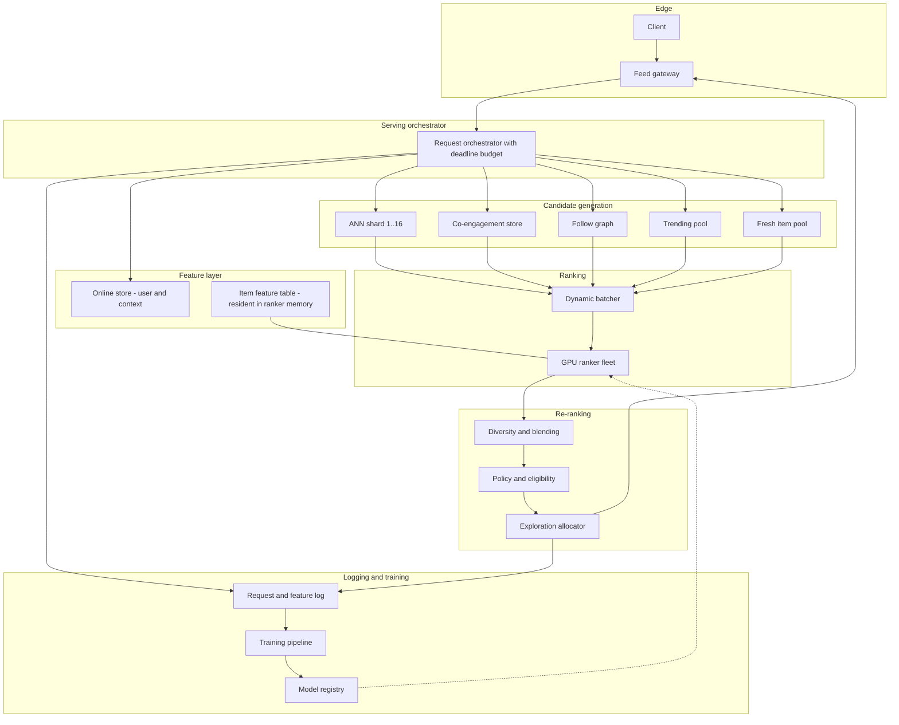

### Read path (a feed request)

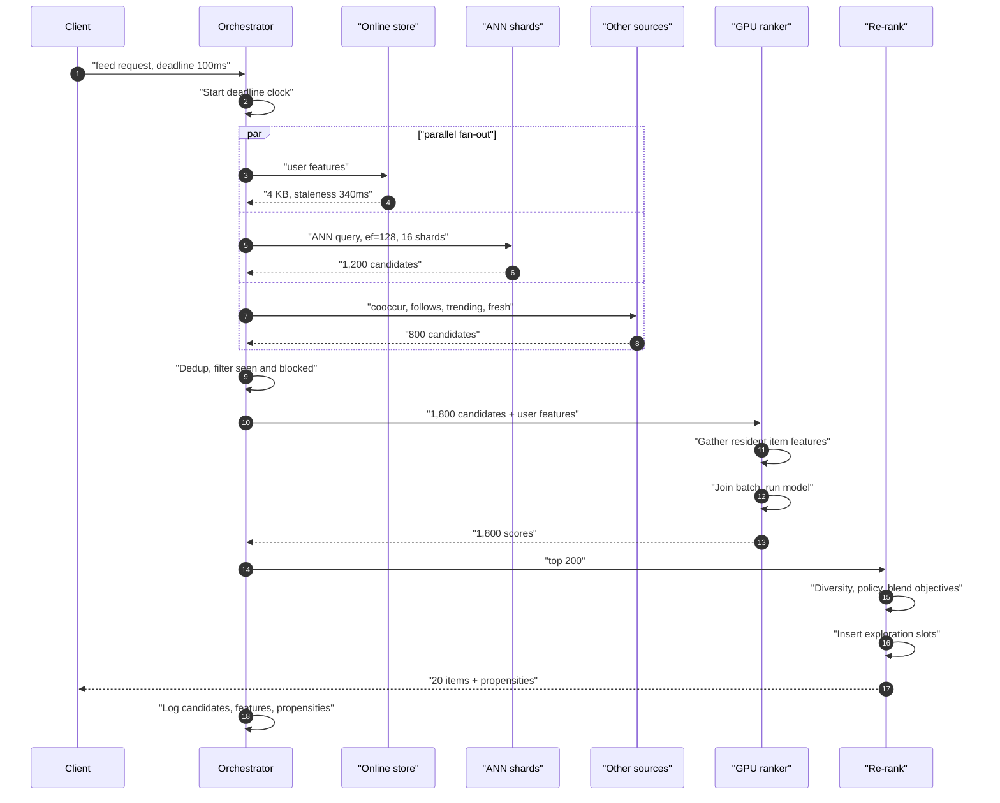

The parallel fan-out is essential: user features and candidate generation are independent, so running them sequentially would add 8 ms to the critical path for nothing. **Every stage that can run concurrently must, and every stage must respect the remaining deadline** — if candidate generation has consumed 60 ms of a 100 ms budget, the ranker gets 25 ms, not 30, and must degrade to a smaller batch or a cheaper model rather than overrun.

### Write path (signals to features)

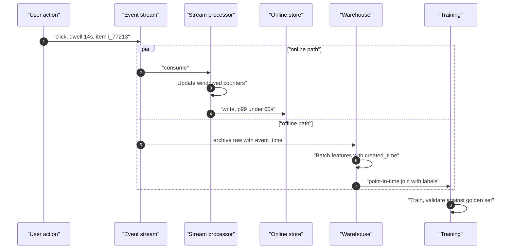

**The two paths are the skew.** The online counter is computed by a streaming job in one language with one windowing semantics; the offline counter is computed by a batch job in another language over the warehouse. They will disagree, and the disagreement will be invisible until the model underperforms online. Section 7.2 is entirely about closing that gap.

### Degradation ladder

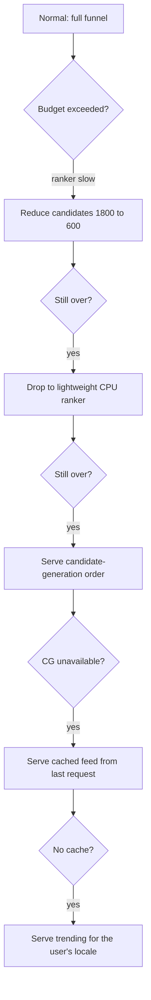

Five rungs, each strictly worse and strictly cheaper, each automatic. Engagement loss is roughly 3% at rung 1, 12% at rung 2, 35% at rung 3, 55% at rung 4, and 70% at rung 5 — all vastly better than an error page, and each rung must be **exercised regularly in production** or it will be broken when needed.

---

## 7. Deep Dives

### 7.1 The funnel: why each stage narrows

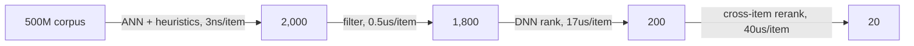

The governing constraint at every boundary:

$$
\text{cost}_{\text{stage}} = N_{\text{in}} \times c_{\text{per item}} \leq \text{budget}_{\text{stage}}
$$

and the design question is always the same: given a fixed budget, do you score more items more cheaply, or fewer items more expensively?

| Stage | Why it cannot be merged with its neighbour |
|---|---|
| **Candidate generation** | Must touch all 500M items, so per-item cost must be nanoseconds. That rules out any model with per-item features — only a metric-space lookup (ANN) or a precomputed list works |
| **Filtering** | Cheap per item but must be exact for blocks and policy. Doing it *before* ranking saves scoring items that would be discarded; doing it *after* would waste 10% of GPU |
| **Ranking** | Can afford per-item features and a deep model, but must score each item **independently** so the batch is a matrix multiply. This is why it cannot do diversity |
| **Re-ranking** | Operates on the *set*, not on items: diversity, de-duplication by creator, position-aware blending, business rules. Cross-item computation is quadratic, so it is only affordable at 200 items |

!!! example "Why ranking cannot do diversity, and re-ranking cannot do ranking"
    The heavy ranker scores items independently — that independence is what makes it a single batched matrix operation on a GPU. Diversity is inherently a property of the *selected set*: "do not show three videos by the same creator" cannot be expressed as a per-item score, because whether item $j$ should be included depends on whether item $i$ was.

    Conversely, re-ranking's cross-item computation is $O(k^2)$ in the worst case. At $k = 200$ that is 40,000 pairwise interactions — affordable. At $k = 1{,}800$ it is 3.24 million, which does not fit in the budget.

    **The two stages exist because independence and set-awareness have opposite computational profiles.** Trying to merge them gives you either a ranker that cannot batch or a re-ranker that cannot scale, and this is one of the clearest "explain why the architecture is shaped this way" answers available in the interview.

#### Multi-source candidate generation

A single ANN source is a mistake, even with perfect recall, because an embedding similarity index has systematic blind spots:

| Source | Share | Covers | Blind spot |
|---|---|---|---|
| Embedding ANN | 45% | Semantic similarity to the user's interest profile | Brand-new items with untrained embeddings; anything outside the learned manifold |
| Item-item co-engagement | 20% | "Users who engaged with X also engaged with Y" | Cold items with no co-engagement history |
| Social graph | 15% | Content from followed accounts | Discovery beyond the user's existing graph |
| Trending / popular | 12% | Broadly good content, robust cold-start fallback | Personalisation — it is the same for everyone in a locale |
| Fresh pool | 8% | Items published in the last hour | Nothing; it is deliberately unfiltered by quality |

The fresh pool's 8% is not a quality decision, it is an **ecosystem** decision. Without a guaranteed path for brand-new items to receive impressions, no new item ever accumulates the engagement data that would let any other source retrieve it — the cold-start trap of 7.6. That 8% is the tax paid to keep the corpus alive.

### 7.2 The feature store and online/offline skew

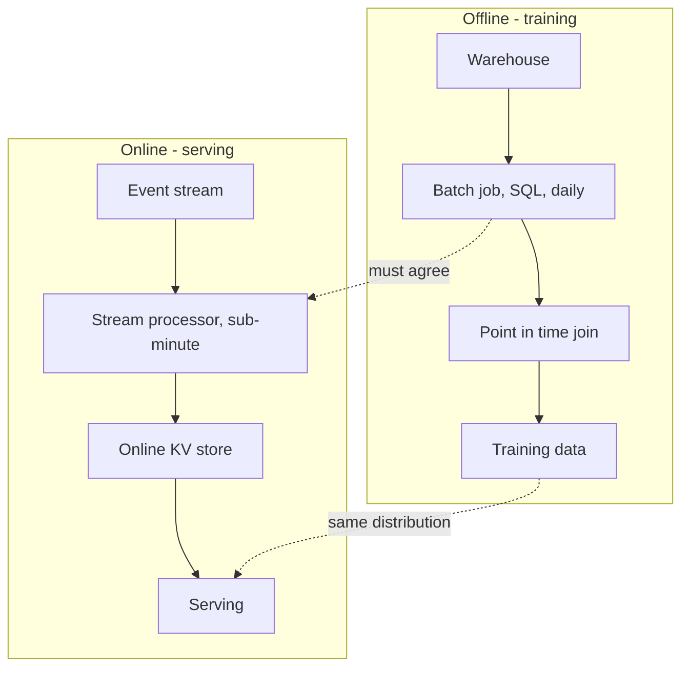

Four mechanisms by which they diverge, each with a distinct fix:

| Mechanism | Example | Symptom | Fix |
|---|---|---|---|
| **Different implementations** | `clicks_7d` as SQL over a warehouse vs a streaming counter | Systematic offset; offline AUC 0.82, online 0.74 | One definition, compiled to both engines; or log-and-train-on-served |
| **Different time semantics** | Offline uses calendar days; online uses a 168-hour sliding window | Divergence varies by hour of day, so it hides in daily averages | Identical windowing specification, tested |
| **Label leakage** | Offline joins on `event_time` only, ignoring `created_time` | Offline metrics spectacular, online worse than the previous model | Mandatory `created_time` filter in the as-of join |
| **Default handling** | Missing feature is 0 offline, `-1` online | A user cohort with missing data scores wildly wrong | Defaults in the feature spec, shared by both paths |

!!! danger "The skew is invisible offline by construction"
    This is what makes it so expensive. Offline evaluation uses offline features, so a model trained on a leaky or differently-computed feature evaluates beautifully. The problem appears only in an online test, weeks later, as "the model that won offline lost online" — at which point the team usually blames the online test rather than the features.

    **Three defences, in increasing order of effectiveness.**

    **A daily parity audit.** Sample 100,000 serving requests, recompute their features through the offline path, and compare value by value. Alert when any feature drifts beyond tolerance for more than 0.1% of samples. This catches divergence in days instead of weeks and it is cheap to build.

    **A single feature definition compiled to both engines.** One declarative spec; the platform generates the streaming job and the batch job. This eliminates the "two implementations" class entirely and is the standard modern approach.

    **Log-and-train-on-served.** Log the exact feature vector fed to the model and train on that. **Skew becomes structurally impossible** because there is only one computation path — the serving one. It costs storage (about 4 TB/day compressed at 5% sampling) and it means you cannot backfill a new feature without waiting for it to accumulate, but it removes the entire failure class rather than detecting it.

    A mature system runs all three: log-and-train for the main path, one definition for features that must be backfilled, and a parity audit as the safety net.

#### Why item features live in the ranker, not in the store

$$
\begin{aligned}
\text{naive} &: 1{,}800\ \text{candidates} \times 40\ \text{features} = 72{,}000\ \text{lookups/request} \\
&\quad \times 208{,}000\ \text{req/s} = \mathbf{1.5 \times 10^{10}\ \text{lookups/s}} \\
\text{resident} &: \text{one memory gather per candidate from a local array}
\end{aligned}
$$

The item feature table is 600 GB, which does not fit on one node. Three ways to make it resident:

=== "Hot-set replication (chosen)"

    The top 20M items by impression volume cover 96% of candidates retrieved. At 1.2 KB each that is 24 GB — resident on every ranking node. The 4% tail is fetched remotely with a deadline, and on timeout the item is scored with default features rather than dropping the request.

    **Why this works:** candidate retrieval is extremely head-heavy, so a small resident set covers nearly everything. The remote fallback bounds the worst case without putting it on the common path.

=== "Shard by item, route candidates"

    Partition items across ranking nodes; route each candidate to the node holding its features. Full coverage, no remote fetch.

    **Why rejected:** a request's 1,800 candidates scatter across every shard, so each request fans out to the whole fleet and the p99 becomes the max of 64 sub-requests. Fan-out tail latency ([F18](../fundamentals/f18-resilience-patterns.md)) makes this strictly worse than a 4% remote-fetch rate.

=== "Precompute per-item embeddings only"

    Store only a 256-dim embedding per item rather than 40 raw features: $5 \times 10^{8} \times 512\ \text{B} = 256\ \text{GB}$, still too large, but at $d = 128$ fp16 it is 128 GB — resident across a 6-node ring.

    **Why partially adopted:** it loses the raw features the ranker wants (age, CTR, policy flags), so it is used *in combination* with the hot set rather than instead of it.

### 7.3 Approximate nearest neighbour retrieval

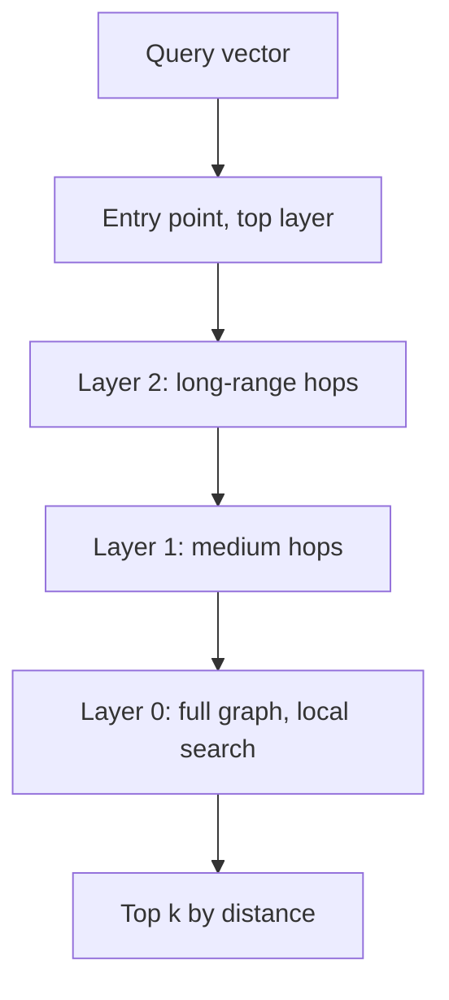

HNSW builds a multi-layer proximity graph. Upper layers are sparse and give long-range jumps; the bottom layer is dense and refines locally. Search is greedy with a candidate priority queue of size $ef$, and the complexity is $O(\log N)$ hops with roughly $ef \times M$ distance computations.

#### The three-way trade-off

$$
\text{recall} \uparrow\ \Leftrightarrow\ \text{latency} \uparrow \quad\text{and}\quad \text{memory} \downarrow\ \Rightarrow\ \text{recall} \downarrow
$$

| Lever | Raises recall | Costs |
|---|---|---|
| $ef_{\text{search}}$ | Yes, sublinearly | Latency, linearly |
| $M$ (graph degree) | Yes | Memory ($4M$ bytes/vector) and build time |
| $ef_{\text{construction}}$ | Yes | Build time only — **this is the free lunch** |
| Full dimension $d$ | Yes | Memory and distance-computation cost, both linear in $d$ |
| fp32 over fp16 | Marginally | 2x memory for typically < 0.3% recall |
| Exact refine on top-$k$ | Yes, substantially | A second pass over full vectors; spiky latency |

!!! tip "Raise `ef_construction` before raising `ef_search`"
    `ef_construction` improves graph quality at index-build time and costs **nothing at query time**. Going from 200 to 500 typically adds 2–3 points of recall at the same search latency, in exchange for a longer nightly build. Since the index is rebuilt daily anyway, a 12-hour build instead of 8 is usually free.

    Teams tune `ef_search` first because it is the knob exposed at query time, and pay for the same recall in latency forever. **Build-time quality is the cheapest recall you will ever buy.**

#### Index freshness: the two-index pattern

A 500M-vector HNSW index takes 12 hours to build. New items must be retrievable in under 10 minutes (N11). These are irreconcilable in one index, so use two:

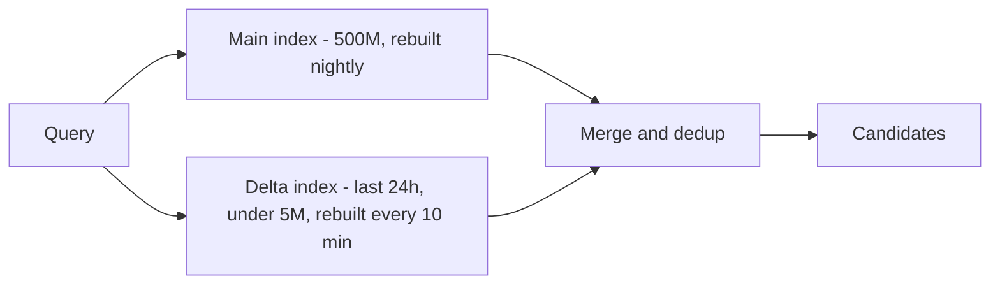

$$
\begin{aligned}
\text{main} &: 5 \times 10^{8}\ \text{vectors, 12 h build, } ef{=}128 \\
\text{delta} &: < 5 \times 10^{6}\ \text{vectors, 4 min build, } ef{=}256\ (\text{cheap at this size}) \\
\text{merge} &: \text{union, dedup, then a single distance-based top-}k
\end{aligned}
$$

The delta index can afford a higher $ef$ precisely because it is 100x smaller, so new items get *better* retrieval quality than established ones — which is a useful bias, since new items need help.

!!! gotcha "Deletions are the hard part of an incremental index"
    HNSW does not support true deletion; removing a node would disconnect the graph. Standard practice is a tombstone plus filtering at query time, which means a deleted item still consumes graph edges and search effort. After a large takedown or policy sweep, the index can carry 15–20% tombstones, quietly degrading both recall (search effort spent on dead nodes) and latency.

    Monitor the tombstone ratio as a first-class metric and trigger a rebuild above ~10%. And **never rely on the index for policy enforcement** — a tombstoned item may still be returned by a stale replica, so the exact policy filter must run after retrieval. Retrieval is a hint; policy is a gate.

### 7.4 GPU batching and the latency budget

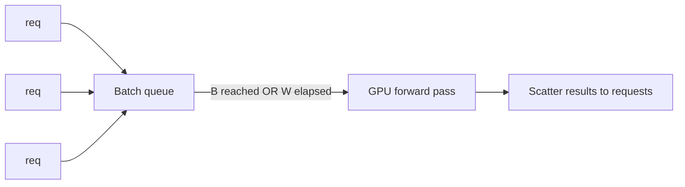

The fundamental relation, restated:

$$
T_{\text{p99}} = \underbrace{\min\left(W,\ \frac{B_{\max}}{\lambda}\right)}_{\text{queue wait}} + \underbrace{T_{\text{fixed}} + c \cdot B}_{\text{compute}}
$$

**Batching trades latency for throughput, and throughput is cost.** From the table in section 3, $B{=}32$ gives 9.9x the throughput of $B{=}1$ — a 10x reduction in GPU fleet size, which is $1.3M/month at our scale. That is why batching is not optional.

#### Three refinements that matter in production

**Adaptive max-wait.** A static $W$ is wrong at one end of the traffic curve. At low $\lambda$, every request waits the full $W$ for a batch that barely fills. Make $W$ a function of observed arrival rate:

$$
W_{\text{eff}} = \min\left(W_{\max},\ \max\left(W_{\min},\ \frac{B_{\text{target}}}{\hat{\lambda}}\right)\right)
$$

With $W_{\min} = 1$ ms and $W_{\max} = 8$ ms, off-peak latency drops by 5 ms and peak efficiency is unchanged.

**Deadline-aware admission.** A request arriving with 12 ms of budget left must not be placed in a queue that will take 14 ms. Reject it into the degradation ladder immediately — the lightweight CPU ranker returns in 4 ms and produces a usable result, whereas queueing produces a timeout and nothing.

**Bucketed padding.** Variable candidate counts (1,200 to 2,000) force either ragged tensors or padding to the maximum. Padding to 2,000 when the median is 1,800 wastes 10% of GPU. Use `preferred_batch_sizes` with length bucketing so each batch pads to the next bucket rather than to the global maximum.

!!! danger "The canary latency trap"
    A new model deployed to 1% of traffic receives $\lambda/100$. Its batches never fill, so every request waits the full $W$ and runs at $B \approx 2$. Its p99 latency is 2–3x production's, and its GPU utilisation looks catastrophic.

    **Nothing is wrong with the model.** The canary is a victim of its own traffic share. Teams roll back perfectly good models over this, repeatedly.

    Three fixes: give the canary its own batcher tuned for low $\lambda$; compare canary latency against a *control group of the same size* rather than against full production; or co-locate canary and production in the same batch with a version tag per row, which is the cleanest solution because both then experience identical batching dynamics.

### 7.5 Model rollout and statistical significance

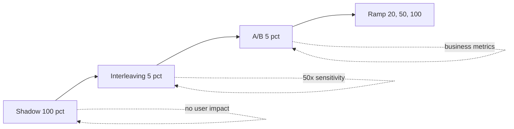

Three evaluation tools, three different questions:

| Tool | Question answered | Sensitivity | Risk | Duration |
|---|---|---|---|---|
| **Shadow** | Does it run correctly at production scale and latency? Do scores drift? | N/A — no user sees it | **Zero** to users; doubles GPU cost | 24–48 h |
| **Interleaving** | Do users prefer ranker B's items over ranker A's? | ~50x an A/B | Users see a mixed list | 24 h, ~54k users |
| **A/B** | What is the effect on the business metric I actually optimise? | Baseline | 5% of users get a worse experience if it is bad | 7 days, ~2.7M users/arm |

**Shadow answers engineering questions; interleaving answers ranking questions; A/B answers product questions.** Skipping shadow means discovering a preprocessing bug with real users. Skipping interleaving means spending a week of A/B on a change that a day of interleaving would have rejected. Skipping A/B means shipping a ranking win that reduces retention — which happens more often than anyone likes.

#### Why interleaving is 50x more sensitive

A/B compares two *populations* of users, so its variance includes all between-user variation — and users differ enormously in baseline engagement. Interleaving constructs a single list from both rankers' outputs and attributes each click to the ranker that contributed the item, so **each user is their own control** and between-user variance cancels entirely.

$$
\begin{aligned}
\text{A/B variance} &\propto \sigma^2_{\text{between users}} + \sigma^2_{\text{within}} \\
\text{interleaving variance} &\propto \sigma^2_{\text{within}} \\
\text{with } \sigma^2_{\text{between}} \gg \sigma^2_{\text{within}} &\Rightarrow \text{a } \sim 50\times\ \text{sample reduction}
\end{aligned}
$$

The limitation is real: interleaving measures *relative preference between two ranked lists*. It cannot measure session length, retention, revenue, or any effect that depends on the whole experience. A ranker that wins interleaving convincingly can still lose on 7-day retention because it optimises for immediate clicks at the expense of satisfaction. **Interleaving is a fast filter, not a verdict.**

!!! warning "Peeking at an A/B test invalidates it, and everyone peeks"
    A test powered for 7 days, checked daily and stopped when it first crosses significance, has a **true false-positive rate above 20%** rather than the nominal 5%. With multiple metrics checked simultaneously it is worse. This is the single most common statistical error in production experimentation, and it silently fills the model registry with changes that were noise.

    Fixes that actually work in practice: fix the duration in advance and enforce it in the tooling so the dashboard does not show significance before the end; or use a **sequential testing** method (always-valid p-values, mixture sequential probability ratio tests) that is explicitly designed for continuous monitoring. Do not rely on discipline — build the guardrail into the platform, because the pressure to ship a winner early is constant and will win.

#### Guardrail metrics

The primary metric is not enough. Every rollout must fail closed on:

```yaml
guardrails:
  - p99_latency_ms:        { max: 110 }
  - error_rate:            { max: 0.001 }
  - feature_null_rate:     { max: 0.001, comment: "detects a broken feature path" }
  - score_distribution_ks: { max: 0.05,  comment: "detects a silently wrong model" }
  - creator_gini:          { max_delta: 0.02, comment: "concentration of impressions" }
  - fresh_item_share:      { min: 0.06,  comment: "the ecosystem guardrail" }
  - policy_violation_rate: { max_delta: 0.0 }
  - exploration_share:     { min: 0.03 }
```

`fresh_item_share` and `creator_gini` are the ones that get omitted and should not be. A ranker can improve CTR by concentrating impressions on a small set of proven items and creators — which is a real short-term win and a slow-motion ecosystem collapse, because new content stops getting distribution and creators leave.

### 7.6 Cold start, feedback loops and exploration

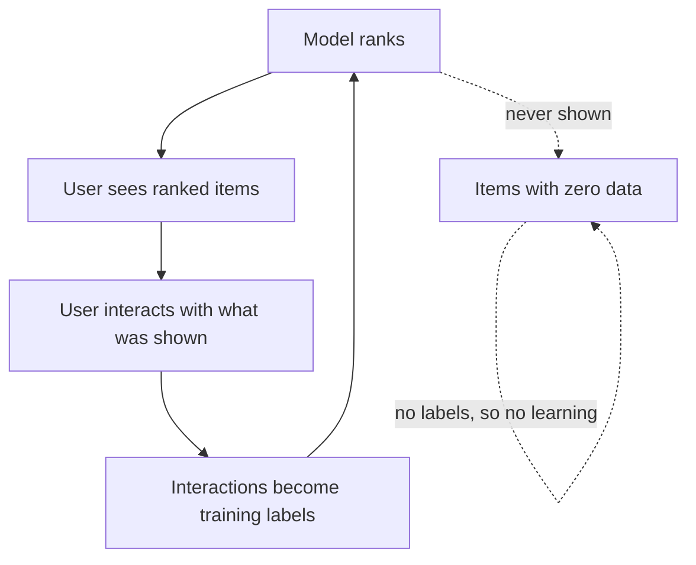

The loop is closed and it is degenerate by default. Items never shown generate no labels, so the model never learns whether they are good, so it never shows them. The corpus's effective size shrinks toward whatever the model already favoured, and **the metrics look fine because they are computed on what was shown.**

#### Cold start

| Case | Problem | Approach |
|---|---|---|
| **New item** | No engagement history, so no collaborative signal and no ANN neighbours from co-engagement | Content embedding from text/image/audio; a guaranteed impression floor from the fresh pool; optimistic prior on quality with high uncertainty |
| **New user** | No history, so personalisation has nothing to personalise on | Context-only features (locale, device, referrer, time); popularity prior for that segment; aggressive exploration in the first sessions; rapid within-session adaptation |
| **New surface** | The model was trained on a different surface's distribution | Transfer from the nearest surface, then fine-tune once enough data accrues; explicit surface feature |

For a new item, the exploration cost is quantifiable:

$$
\begin{aligned}
\text{impressions to estimate CTR}\ p \approx 0.04\ \text{within}\ \pm 20\% &: \\
n = \frac{z^2 p(1-p)}{(0.2p)^2} = \frac{3.84 \times 0.0384}{6.4 \times 10^{-5}} &= \mathbf{2{,}304\ \text{impressions}} \\
\text{new items/day} = 2 \times 10^{6} \Rightarrow \text{exploration impressions} &= 4.6 \times 10^{9}/\text{day} \\
\text{as a share of } 1.2 \times 10^{11}\ \text{daily impressions} &= \mathbf{3.8\%}
\end{aligned}
$$

That 3.8% is the cost of knowing whether new content is good — it is N8's exploration budget, derived rather than guessed.

#### Exploration

=== "Epsilon-greedy"

    Reserve a fixed fraction of slots for uniformly-random eligible items.

    **Good:** trivially simple, unbiased, easy to reason about and to audit.

    **Bad:** uniformly random is *very* bad content much of the time, so the user experience cost per exploration impression is high.

    **Chosen for:** a small guaranteed floor (1%) that guarantees coverage even if the smarter mechanisms have a bug.

=== "Thompson sampling"

    Maintain a posterior over each item's engagement rate; sample from it and rank by the sample. Items with high uncertainty are sometimes sampled high, so they get shown.

    **Good:** exploration is proportional to uncertainty, so it concentrates where information is most valuable. Cost per exploration impression is far lower than uniform.

    **Bad:** requires per-item posteriors (state to maintain and serve) and assumes the reward distribution is stationary, which it is not — an item's CTR decays with age and varies by audience.

    **Chosen** as the primary mechanism for the fresh and cold pools.

=== "Upper confidence bound"

    Score items by $\hat{\mu} + c\sqrt{\ln t / n}$, deterministically favouring under-explored items.

    **Good:** deterministic, so it is easy to test and reproduce; strong theoretical regret bounds.

    **Bad:** the same items are boosted for every user simultaneously, creating synchronized traffic spikes to particular items rather than spreading exploration.

    **Rejected** as primary for that reason; useful for global item-level exploration budgets rather than per-request slots.

#### Correcting the training data with propensities

Exploration fixes the future. **Inverse propensity scoring** fixes the past, by reweighting the logged data to undo the logging policy's bias:

$$
\hat{V}_{\text{IPS}} = \frac{1}{n}\sum_{i=1}^{n} \frac{\pi_{\text{new}}(a_i \mid x_i)}{\pi_{\text{log}}(a_i \mid x_i)} \, r_i
$$

An item shown with probability 0.001 that got a click carries 1,000x the weight of one shown with probability 1.0 — correcting for the fact that the logging policy almost never gave it a chance.

The practical problem is variance: as $\pi_{\text{log}} \to 0$ the weight explodes and a single lucky click dominates the estimate.

$$
\text{Var}(\hat{V}_{\text{IPS}}) \propto \mathbb{E}\left[\frac{1}{\pi_{\text{log}}}\right] \to \infty\ \text{as}\ \pi_{\text{log}} \to 0
$$

Standard mitigations: **clip** propensities at a floor (0.01), trading a little bias for a lot of variance reduction; **self-normalise** by dividing by the sum of weights; or use a **doubly-robust** estimator combining IPS with a direct reward model, which is unbiased if either component is correct.

!!! danger "You cannot add propensity logging retroactively"
    IPS requires $\pi_{\text{log}}$ — the probability the *serving system at the time* assigned to showing that item in that slot. If you did not log it, it is gone. You cannot reconstruct it later, because the model version, the feature values and the candidate set at that moment are all irrecoverable.

    This makes propensity logging a **serving-time decision with a permanent training-time consequence**. It is invariably descoped from v1 as "we'll add it when we need debiasing", and the team then discovers that debiasing requires months of new data before it can begin. Log propensities from day one, even before anything consumes them.

---

## 8. Scaling the Bottleneck

Two bottlenecks compete, and which one binds depends on where you are on the quality curve.

$$
\text{GPU demand} \propto \lambda \times N_{\text{candidates}} \times \text{model FLOPs}
$$

$$
\text{hydration demand} \propto \lambda \times N_{\text{candidates}} \times \text{features per item}
$$

Both are linear in $N_{\text{candidates}}$, which makes the candidate count the single most consequential number in the system — it is simultaneously the primary quality lever and the primary cost driver.

| Lever | Mechanism | Effect | Cost |
|---|---|---|---|
| **Larger batches** | $B{=}16 \to 32$ | 1.29x throughput | +2.2 ms p99 |
| **Quantisation** | fp16 → int8 with calibration | 1.8x throughput, 2x memory headroom | 0.1–0.4% quality loss; needs careful calibration |
| **Distillation** | Train a small student on the teacher's scores | 3–5x throughput | 1–3% quality loss |
| **Two-stage ranking** | Cheap ranker 1,800 → 400, heavy ranker 400 → 200 | 3.5x fewer heavy scorings | Another recall cliff; a cheap-ranker mistake is unrecoverable |
| **Fewer candidates** | 1,800 → 1,200 | 33% less GPU and hydration | ~0.6% engagement |
| **Embedding cache** | Cache user embeddings across requests in a session | Removes a tower's compute | Staleness within a session |
| **Request coalescing** | Same user, concurrent requests share work | Small; helps multi-surface clients | Complexity |
| **Resident item features** | Hot 20M items in ranker memory | Removes $1.5 \times 10^{10}$ lookups/s | 24 GB per node; a 4% remote tail |
| **Adaptive candidate count** | Fewer candidates when the system is loaded | Graceful degradation instead of timeouts | Quality varies with load, so metrics need load as a covariate |

!!! tip "Distillation is the highest-leverage cost lever and it is systematically under-used"
    A student model with 4x fewer parameters, trained to match the teacher's *scores* rather than the original labels, typically recovers 97–99% of the teacher's ranking quality at 3–5x the throughput. At 182 GPUs, a 3.5x throughput gain is roughly 130 GPUs freed — about $104k/month.

    Why it is under-used: it requires a second training pipeline, its quality loss is small but real and therefore politically hard to justify against a team whose metric is quality, and it must be re-done every time the teacher changes. The organisational answer is to make distillation an automatic step in the training pipeline rather than a project — the teacher trains, the student distils from it, and the student is what ships. Then the cost saving is structural rather than a recurring negotiation.

### Adaptive load shedding

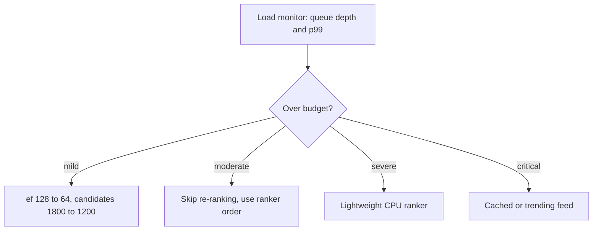

Each rung has a measured engagement cost (3%, 8%, 12%, 55%) and a measured capacity gain (1.5x, 1.15x, 12x, 200x). **Shedding quality is always better than shedding requests**, because a 3% worse feed is invisible to a user and a timeout is not. The essential discipline is to exercise these paths continuously in production — 0.1% of traffic permanently routed through each rung — so they work when they are needed and so you have current measurements of their cost.

---

## 9. Failure Modes

| Failure | Blast radius | Detection | Mitigation | Degraded behaviour |
|---|---|---|---|---|
| **ANN index corrupted or stale** | Recall collapses; feed becomes irrelevant | Recall@2000 vs a nightly exact-search sample; index build timestamp | Keep $N-1$ index generations; atomic swap with validation; auto-revert | Other candidate sources still fire; feed is worse but coherent |
| **ANN shard down** | $1/16$ of candidates missing | Per-shard latency and error rate | Replicate each shard 3x; serve partial results past the deadline | Slightly lower recall; usually imperceptible |
| **Feature store latency spike** | Ranking starved of user features | Feature fetch p99; null rate | Per-feature deadline; serve defaults on timeout; local user-feature cache | Model runs on defaults for those users — measurably worse, not broken |
| **Online/offline skew** | **New models silently underperform** | Daily parity audit; online-offline metric correlation | Log-and-train-on-served; single feature definition | No symptom until an A/B loses; the most expensive failure here |
| **GPU OOM on a large batch** | That batch fails; retries can cascade | OOM count; batch-size distribution | Cap batch size by memory, not just count; pad to buckets; pre-flight memory estimate | Batch retried at half size; adds latency |
| **Model artefact/feature-spec mismatch** | Silently wrong scores fleet-wide | Golden-set parity check at load; score-distribution KS test | Model + spec + preprocessing as one atomic artefact; refuse to load on mismatch | Load fails and the previous version stays — the correct outcome |
| **Feedback loop collapse** | Corpus diversity shrinks over weeks | `creator_gini`, `fresh_item_share`, distinct-items-shown | Enforced exploration floor; IPS-corrected training; ecosystem guardrails in every rollout | Slow degradation that looks like improving CTR — the most insidious failure |
| **Canary latency false alarm** | A good model is rolled back | Compare canary vs an equal-sized control, not vs production | Shared batcher with version tags; canary-specific batch tuning | Wasted cycles and lost confidence in the rollout system |
| **Traffic spike (viral event)** | Queues grow, deadlines missed | Queue depth; deadline-miss rate | Adaptive shedding ladder; shed quality before requests | Feed quality drops 3–12%; no errors |
| **Training pipeline failure** | Model staleness grows | Model age; training job heartbeat | Serve the last good model; alert on age > 48 h | Recommendations slowly stale; usable for days |
| **Propensity logging broken** | **Future debiasing impossible; unnoticed for months** | Propensity null rate; distribution sanity | Treat as a tier-1 pipeline with its own alert | No serving impact at all, which is exactly why it goes unnoticed |
| **Policy filter bypassed** | Prohibited content shown | Post-hoc audit of served items against the policy store | Exact filter after retrieval, never relying on index state; independent audit sampler | User-trust incident; the one failure here with no acceptable degraded mode |
| **Region loss** | That region's traffic shifts | Regional health | $N-1$ GPU capacity provisioned; DNS failover | Higher latency for affected users; possibly a shed rung |

---

## 10. SRE Lens

### SLIs and SLOs

| SLI | Definition | SLO | Rationale |
|---|---|---|---|
| Availability | Non-error feed responses, including degraded | **99.95%** | Degraded is acceptable; nothing is not |
| Latency | End-to-end feed response | p50 < 45 ms, p99 < 100 ms, p999 < 180 ms | Above ~150 ms, slowness costs more engagement than ranking gains |
| Deadline-miss rate | Requests hitting the degradation ladder | < 1% normal, < 8% at peak | The ladder is designed to be used, just not often |
| Candidate recall | recall@2000 vs a daily exact-search sample | > 0.92 | Unrecoverable loss if it drops |
| Feature parity | Features within tolerance in the daily audit | > 99.9% | The leading indicator for model underperformance |
| Feature freshness | Event to online store visibility | p99 < 60 s | Real-time signals are a large quality lever |
| GPU utilisation | Sustained across the ranking fleet | > 55% | Cost discipline; below this you are paying for idle silicon |
| Model staleness | Age of the deployed model | < 48 h | Recommendation quality decays with corpus and taste drift |
| Exploration share | Impressions from exploration slots | 3–7% | Below 3% the feedback loop degenerates |
| Fresh-item share | Impressions to items < 24 h old | > 6% | The ecosystem guardrail |
| Creator Gini | Concentration of impressions across creators | < baseline + 0.02 | Detects the concentration failure mode |
| Propensity completeness | Served items with a logged propensity | > 99.99% | Silent, unrecoverable, and permanently damaging if broken |

!!! tip "Two SLIs here have no user-visible symptom, and they are the two that matter most long-term"
    **Feature parity** and **propensity completeness** are both invisible in every user-facing metric. A parity break shows up weeks later as "the new model lost its A/B", by which time you have burned a quarter of modelling effort. A propensity-logging break shows up months later as "we cannot debias our training data", and the data for that period is permanently unusable for off-policy evaluation.

    Both are silent, both are unrecoverable after the fact, and both are cheap to monitor. Put them on the same alerting tier as latency, even though nothing breaks when they fire.

### Error budget policy

$$
\begin{aligned}
\text{budget} &= (1 - 0.9995) \times 30\ \text{d} = \mathbf{21.6\ \text{min/month}} \\
\text{quality-degraded time} &: \text{tracked separately, not against availability}
\end{aligned}
$$

The unusual feature of this system is **a second budget for quality**. Serving a degraded feed is not an availability failure — the request succeeded — but it is not free either. So track a "quality-degraded minutes" budget alongside availability, with its own threshold (say, 2% of impressions served from rung 2 or worse per month). Without it, the degradation ladder becomes a way to hide capacity problems: latency looks perfect because you are always shedding, and nobody notices the feed has quietly become worse.

### Rollout plan

```yaml
model_rollout:
  - stage: offline_eval
    gate: [auc_delta > 0, no feature leakage detected by the audit]

  - stage: golden_parity
    description: Load in the serving runtime, score 100k golden inputs, diff vs reference.
    gate: max_score_drift < 0.005

  - stage: shadow
    traffic: 1.00
    duration: 48h
    gate: [p99 < 110ms at production batch sizes, score_ks < 0.05,
           feature_null_rate < 0.001, zero OOMs]

  - stage: interleaving
    traffic: 0.05
    duration: 24h
    gate: preference_delta > 0 with p < 0.05, min 60k users

  - stage: ab
    traffic: 0.05
    duration: 168h          # FIXED. Tooling hides significance until the end.
    gate:
      primary:    ctr_delta > 0
      guardrails: [retention_7d >= baseline, fresh_item_share > 0.06,
                   creator_gini <= baseline + 0.02, p99 < 100ms]

  - stage: ramp
    steps: [0.20, 0.50, 1.00]
    soak: 24h
    auto_rollback_on: [ctr_delta < -0.005, p99 > 110, error_rate > 0.001]

feature_rollout:
  # A new feature is riskier than a new model: it touches BOTH paths.
  - stage: dual_write        # write to online store, do not read
  - stage: parity_audit      # 7 days of online vs offline comparison
    gate: parity > 0.999
  - stage: train_with
  - stage: serve_with        # only now is it in the model
```

!!! warning "Adding a feature is a higher-risk change than swapping a model"
    A model change touches one artefact with a clear rollback. A feature change touches the streaming job, the batch job, the online store schema, the feature spec, the training pipeline and the serving path — and its failure mode is silent divergence rather than an error. Hence the four-stage feature rollout with a seven-day parity gate *before* the feature is ever used by a model. Teams routinely ship features in the same change as the model that uses them, which makes attribution impossible when something goes wrong.

### Runbook notes

| Symptom | First checks | Action |
|---|---|---|
| p99 latency up, no deploy | GPU queue depth; batch-size distribution; ANN shard latency; feature-store p99 | Most often a traffic-mix change raising the candidate count, or a slow ANN shard raising fan-out tail. Check stage latencies before blaming the model |
| Engagement dropped, no model change | Recall@2000; index build timestamp; feature null rate; exploration share | A stale or partially-built ANN index is the most common cause and is invisible in latency metrics |
| New model lost its A/B despite great offline metrics | Feature parity audit for the features it relies on most; `created_time` filter in the training join | Assume skew or leakage before assuming the online test is wrong. It usually is skew |
| Canary p99 terrible | Canary traffic share; canary batch sizes | Almost certainly the low-$\lambda$ batching artefact, not the model. Compare against an equal-sized control |
| GPU utilisation fell | Batch-size distribution; arrival rate; has `max_queue_delay` changed? | Under-batching wastes money silently. Utilisation below 40% is a capacity bug, not a safety margin |
| Fresh-item share dropping | Exploration allocator health; fresh-pool candidate share; ranker's freshness feature | The ecosystem failure mode. Acts over weeks and is invisible in CTR, which is *improving* while it happens |
| Item shown that should be blocked | Policy filter placement; index tombstone ratio; block-set freshness | Never rely on the ANN index for policy. Verify the exact post-retrieval filter ran |
| Feature nulls spiked for a cohort | Streaming job lag; a schema change upstream; the cohort's entity-id format | Defaults mask this from erroring, so it shows as a quality drop for a subset of users rather than as an error |

### Capacity model

$$
\begin{aligned}
\text{GPU (ranking)} &= 182\ \text{A100 (section 3)} \\
\text{ANN nodes} &= 16\ \text{shards} \times 3\ \text{replicas} \times 4\ \text{regions} = 192 \\
\text{online store} &= \frac{5.4\ \text{TB}}{128\ \text{GB/node}} \times 3\ \text{replicas} = 126\ \text{nodes} \\
\text{orchestrator} &= \frac{208{,}000}{1{,}800\ \text{req/s per node}} \times 1.5 = 174\ \text{nodes} \\
\text{stream processing} &= 60\ \text{slots for signal ingestion}
\end{aligned}
$$

### Cost

| Component | Sizing | Monthly |
|---|---|---|
| Ranking GPUs | 182 × A100, 3-yr reserved | $146k |
| GPU hosts | 23 × 8-GPU hosts, CPU and memory | $58k |
| ANN serving | 192 × 32 GB memory-optimised | $94k |
| Online feature store | 126 × 128 GB in-memory | $181k |
| Orchestrator fleet | 174 × 16 vCPU | $71k |
| Stream processing | 60 slots + event bus | $62k |
| Feature + request logging | 4 TB/day compressed, 90 d hot | $88k |
| Training compute | Daily retrain + experiments | $124k |
| Index builds | Nightly 12 h × 16 shards | $38k |
| **Total** | | **~$862k/month** |

$$
\frac{\$862{,}000}{1.8 \times 10^{11}\ \text{requests}} = \$4.79\ \text{per million requests}
$$

!!! tip "The GPU is 24% of the bill and the feature store is 21% — optimise both, and beware the third"
    The instinct is that this is a GPU cost problem. It is not: ranking GPUs plus their hosts are $204k of $862k. The **online feature store at $181k is nearly as large**, and it is expensive purely because it is an in-memory store holding 5.4 TB with 3x replication.

    Three levers with real numbers. **Distillation** on the ranker: 3.5x throughput frees ~130 GPUs, roughly $104k/month. **Tiering the feature store**: the top 15% of users generate 70% of requests, so a memory tier plus an SSD tier for the tail cuts the in-memory footprint by half, roughly $80k/month, at the cost of a p99 tail on infrequent users. **Trimming the `seen` filters**: 3.2 TB of the 5.4 TB is Bloom filters, and reducing the retained window from 30 days to 14 halves that with negligible quality impact.

    The line to *not* cut is **feature and request logging at $88k**. It is the cheapest insurance in the system — it is what makes skew detectable, debiasing possible, and offline replay of a production incident feasible. Cutting it saves 10% of the bill and removes your ability to diagnose the most expensive failure class you have.

---

## 11. Trade-offs & Alternatives

| Decision | Chosen | Rejected | Why |
|---|---|---|---|
| Architecture | **Four-stage funnel** | Single-stage scoring of everything | 2.4 hours per request; 278,000x too expensive |
| | | Two-stage (retrieve then rank) | No place for set-level diversity, and the ranker cannot both batch and be set-aware |
| Candidate sources | **Five heterogeneous sources** | ANN only | Embedding search has systematic blind spots: cold items and anything off the learned manifold |
| ANN index | **HNSW, $d{=}256$ fp16, $ef{=}128$** | Flat exact | 850 ms — the entire budget 8x over |
| | | IVF-PQ as primary | 0.897 recall; the 6.5-point deficit is not worth 330 GB when memory is affordable |
| | | HNSW $ef{=}256$ | 2x latency for 2.8 points of recall, well past the knee |
| Index freshness | **Main + delta two-index** | Single index rebuilt nightly | New items invisible for up to 24 h; violates N11 and starves the ecosystem |
| Item features | **Resident hot set + remote tail** | Remote fetch per candidate | $1.5 \times 10^{10}$ lookups/s — not a latency problem, an impossibility |
| | | Shard by item and route | Every request fans out to the whole fleet; the p99 becomes the max of 64 sub-requests |
| Feature parity | **Log-and-train-on-served + single definition + daily audit** | Recompute features offline for training | Two code paths guarantee divergence, and the divergence is invisible offline |
| Batching | **Dynamic, adaptive max-wait, bucketed padding** | Static batch size | Wrong at one end of the traffic curve; a static $W$ is either a latency bug or a throughput bug |
| | | No batching | 12.6x more GPUs; roughly $1.3M/month |
| Evaluation | **Shadow → interleaving → A/B → ramp** | A/B only | Discovers engineering bugs with real users, and spends a week on changes a day of interleaving would reject |
| | | Interleaving only | Measures relative list preference, not retention or revenue |
| A/B duration | **Fixed, enforced by tooling** | Stop when significant | Peeking raises the true false-positive rate above 20% |
| Exploration | **Thompson sampling + a 1% uniform floor** | Pure exploitation | The feedback loop degenerates and the corpus collapses over weeks |
| | | UCB as primary | Boosts the same items for everyone simultaneously, creating synchronized spikes |
| Propensity logging | **From day one, tier-1 pipeline** | Add it when debiasing is needed | Unrecoverable — you cannot reconstruct the serving policy after the fact |
| Degradation | **Five-rung ladder, continuously exercised** | Fail the request | A 3% worse feed is invisible; a timeout is not |
| Availability target | **99.95% with strong fallbacks** | 99.99% | Effort is better spent on making degraded modes good than on another nine on the primary path |
| Model + features | **One atomic artefact** | Independently versioned | Guarantees an eventual mismatch that produces silently wrong scores with no error |

??? note "Why not just use a large language model to rank everything?"
    Because the arithmetic does not work, and understanding *why* is more useful than the conclusion.

    An LLM forward pass over a candidate and a user context is on the order of $10^{10}$–$10^{12}$ FLOPs. Scoring 1,800 candidates per request at 208,000 requests/s would be $10^{19}$–$10^{21}$ FLOPS — six to eight orders of magnitude beyond any plausible fleet. And the latency of a single autoregressive generation exceeds the entire 100 ms budget.

    Where LLMs genuinely fit is **off the request path**: generating item embeddings and content understanding offline (already standard and highly effective); producing training labels or synthetic relevance judgements; explaining recommendations; and powering a conversational surface where the latency budget is seconds rather than milliseconds and the candidate set is tens rather than thousands.

    The pattern generalises beyond LLMs: **expensive models belong at the narrow end of the funnel or entirely offline.** The funnel is precisely the mechanism for making an expensive model affordable, by ensuring it only ever sees a few hundred items.

??? note "When a much simpler system is the right answer"
    With a corpus under about a million items and fewer than a few thousand requests per second, most of this architecture is over-engineering.

    Below ~100k items you can **score everything with a gradient-boosted tree on CPU** in a few milliseconds. No ANN index, no GPU, no funnel, no candidate-generation stage. The entire retrieval and batching apparatus disappears, and GBDTs on tabular features are frequently competitive with deep models at this scale.

    Below ~10k items, **precompute the full ranking per user segment nightly** and serve it from a cache. Latency becomes a key lookup and the serving system is a key-value store.

    The genuine thresholds for this architecture are: a corpus too large to score exhaustively (roughly $10^{6}$+), a request rate high enough that per-request cost matters (roughly $10^{4}$/s+), and a quality ceiling that simpler models have demonstrably hit. **Reaching for a funnel before those conditions hold buys you an ANN index's operational burden, a GPU fleet, and a skew problem, in exchange for nothing.** Knowing that is a stronger signal in an interview than knowing how to build the complex version.

---

## 12. Gotchas & Corner Cases

!!! gotcha "The model that won offline loses online, and the cause is a missing timestamp predicate"
    **Symptom.** A new ranker shows a 3-point AUC improvement offline. In the A/B it loses by 2% on CTR. The team re-runs the offline evaluation, gets the same excellent result, and concludes the online test is broken.
    **Mechanism.** The training join filtered on `event_time <= label_time` but not on `created_time <= label_time`. A feature computed by a nightly batch job at 02:00 has an event time of yesterday but only became *known* at 02:00 today — so a model serving at 18:00 yesterday could not have had it. Training on it gives the model hours of future knowledge, which no online system can reproduce.
    **Mitigation.** Make `created_time` a mandatory predicate in the historical-feature API, so leakage is impossible to express rather than merely discouraged. Add an automated leakage test: train on data shifted forward by one day and confirm metrics collapse — if they do not, the model is reading the future. Review every feature's computation lag explicitly, since it varies per feature and per pipeline.

!!! gotcha "The ANN index rebuilt with a bad config and nobody noticed for six hours"
    **Symptom.** Engagement drops 8% overnight. Latency is perfect, error rates are zero, no deploys happened, every dashboard is green.
    **Mechanism.** The nightly index build ran with a lowered `ef_construction` (a config change intended for a dev environment), producing a lower-quality graph. Recall@2000 fell from 0.96 to 0.78. The feed still returns 20 items with plausible scores — they are just worse items, and no operational metric measures item *quality*.
    **Mitigation.** Validate every index build **before** the atomic swap: sample 10,000 queries, run exact search, compute recall@2000, and refuse the swap below a threshold. Keep the previous generation for instant revert. Expose recall as a first-class SLI, because it is the one quality metric that is directly measurable without an experiment — everything else requires users.

!!! gotcha "The canary's p99 is terrible and the model is fine"
    **Symptom.** A new model at 1% traffic shows p99 of 240 ms against production's 95 ms, and GPU utilisation of 4%. It gets rolled back as a regression.
    **Mechanism.** Dynamic batching. The canary receives $1/100$ of the arrival rate, so its batches never fill and every request waits the full `max_queue_delay` for a batch of two. Latency is an artefact of traffic share, not of the model. Utilisation is low for the same reason.
    **Mitigation.** Compare the canary against an **equal-sized control group**, never against full production. Better: run canary and production in the **same batch** with a per-row version tag, so both experience identical batching dynamics and the comparison is genuinely apples to apples. At minimum, tune the canary's batcher for its own arrival rate.

!!! gotcha "Propensity logging silently broke and nobody found out for four months"
    **Symptom.** A project to debias training data discovers that `propensity` has been null for 40% of logged impressions since a refactor in November. Four months of data are unusable for off-policy evaluation.
    **Mechanism.** Propensity affects nothing at serving time. No user notices, no latency changes, no error fires, no dashboard moves. It is consumed only by a training pipeline that may not exist yet when the field is introduced.
    **Mitigation.** Treat propensity completeness as a **tier-1 SLI with its own alert**, even though nothing breaks when it fires — because by the time something does break, the data is gone and cannot be reconstructed. Add a schema-level constraint rejecting log records without a propensity. And log it from day one, before anything consumes it, because retrofitting is impossible.

!!! gotcha "Engagement improves for six weeks while the corpus quietly collapses"
    **Symptom.** CTR is up 4% over the quarter. Creator complaints rise. Content submissions fall. Eventually retention drops and nobody can explain why, because every engagement metric was improving throughout.
    **Mechanism.** The feedback loop. The ranker learned to concentrate impressions on proven items and established creators, which genuinely raises short-term CTR. New items get fewer impressions, generate less data, remain unrankable, and effectively disappear. The corpus's usable size shrinks week by week. **The metrics improve because they are computed on what was shown**, and what was shown is exactly the shrinking subset the model already liked.
    **Mitigation.** Ecosystem guardrails as mandatory gates in every rollout: `fresh_item_share` with a floor, `creator_gini` with a maximum delta, and distinct-items-shown. Enforce an exploration floor so new items get a guaranteed impression budget. Train with inverse-propensity weighting so the model learns from what *would* have happened rather than only from what did. And review these metrics on a quarterly horizon, because the failure operates over weeks and is invisible in a week-long A/B.

!!! gotcha "Feature nulls default to zero and one user cohort gets nonsense"
    **Symptom.** Users in a newly-launched market receive obviously poor recommendations. No errors, no latency change, normal-looking scores.
    **Mechanism.** A feature pipeline does not cover the new region, so `topic_affinity` is missing. The serving path defaults missing features to zero. But zero is a *meaningful value* in the model's learned space — it is not "unknown", it is "this user has zero affinity for everything", which is a real and strongly negative signal the model acts on confidently.
    **Mitigation.** Distinguish "missing" from "zero" explicitly: use a companion `is_present` indicator per feature, or a sentinel the model was trained to recognise as missing. Specify defaults in the feature spec and share them between training and serving. Monitor `feature_null_rate` **segmented by cohort**, because a fleet-wide rate of 0.3% can be 100% for one country and look fine in aggregate.

!!! gotcha "Model version 41 loaded with feature spec 18 and scored everything wrong"
    **Symptom.** Scores look plausible — within the normal range, correctly ordered-looking — but recommendations are subtly bad. No error, no crash, no alert.
    **Mechanism.** Model and feature spec were versioned and deployed independently. A feature was reordered or a bucketisation boundary changed between spec 18 and 19. The model receives a tensor of the right shape with values in the wrong columns and produces confident, meaningless output. Neural networks do not error on wrong input; they extrapolate.
    **Mitigation.** Ship model, feature spec and preprocessing as **one atomic artefact** with a single version, and refuse to load on any mismatch. Run a golden-set parity check at load time: score 100,000 reference inputs and compare against stored reference outputs, failing the load on drift. This one check catches most of this failure class before any traffic is served.

!!! gotcha "The seen-filter Bloom filter saturated and users see the same items forever"
    **Symptom.** Heavy users report seeing repeated content. Engagement for the most active cohort — the most valuable one — degrades.
    **Mechanism.** The Bloom filter was sized for 15,000 items at 1% false-positive rate. A power user accumulated 60,000 impressions. The filter is now near-saturated with a false-positive rate above 40%, so it excludes almost everything — including items the user has not seen. Paradoxically the filter now *causes* repetition, because the remaining candidate pool is tiny and heavily re-ranked.
    **Mitigation.** Size for the p99 user, not the median, and monitor the **fill ratio** rather than the nominal error rate. Use a rotating pair of filters so the effective window slides rather than accumulating forever. Or switch heavy users to an exact set — there are few enough of them that the memory cost is negligible, and they are the users who matter most ([F21](../fundamentals/f21-probabilistic-data-structures.md)).

!!! gotcha "GPU utilisation is 22% and everyone thinks it is a safety margin"
    **Symptom.** The GPU fleet costs $146k/month and runs at 22% utilisation. Capacity planning treats this as healthy headroom.
    **Mechanism.** Under-batching. `max_queue_delay` was set to 2 ms during a latency incident and never revisited, so batches average 4 instead of 24. Throughput per GPU is a quarter of what it could be, and the fleet is 4x larger than necessary.
    **Mitigation.** Track batch-size distribution, not just utilisation — the distribution tells you *why* utilisation is low. Use adaptive max-wait so the parameter self-tunes with arrival rate. Set a utilisation SLO with a **floor** (N10's 55%), because a metric with only an upper bound is one nobody optimises. And re-examine every latency-motivated parameter change after the incident that prompted it, since these are never reverted.

!!! gotcha "Stopping the A/B as soon as it goes green"
    **Symptom.** A model ships on a "significant" +1.2% CTR result after three days of a seven-day test. The gain does not appear in the following month's aggregate metrics, and nobody can find where it went.
    **Mechanism.** Repeated significance testing. Checking daily and stopping at the first crossing raises the true false-positive rate from 5% to above 20%. The result was noise that happened to cross a threshold on day three, and the model registry slowly fills with changes that never did anything.
    **Mitigation.** Fix the duration in advance and **hide significance in the tooling until the test completes** — relying on discipline fails because the pressure to ship a winner early is constant. Where continuous monitoring is genuinely needed, use a sequential method (always-valid p-values, mSPRT) designed for it. And correct for multiple comparisons when several metrics are checked, which is always.

!!! gotcha "The ANN index returned a policy-violating item because the tombstone had not propagated"
    **Symptom.** Content removed by the policy team two minutes ago appears in a user's feed.
    **Mechanism.** Deletion in an HNSW index is a tombstone, not a removal, and tombstones propagate to replicas asynchronously. A replica that has not yet received the tombstone happily returns the item. The retrieval layer was treated as authoritative.
    **Mitigation.** **Never rely on the index for policy enforcement.** Retrieval is a hint; the exact policy filter must run after retrieval against a strongly-consistent policy store, on the critical path, every request. Also monitor the tombstone ratio, because a heavily-tombstoned index degrades both recall (search effort spent traversing dead nodes) and latency, and triggers a rebuild above ~10%.

!!! gotcha "The degradation ladder had been broken for months and nobody knew"
    **Symptom.** During a real traffic spike the system tries to fall back to the lightweight CPU ranker, which fails to load because its model artefact was deleted in a storage cleanup. The ladder collapses straight to the trending feed and engagement drops 70% instead of 12%.
    **Mechanism.** Fallback paths are exercised only during incidents, which are rare, so they rot silently: artefacts get garbage-collected, dependencies drift, configuration references break. The fallback is untested code that runs only when everything else is already failing.
    **Mitigation.** Route a permanent slice of production traffic — 0.1% per rung — through every degradation path continuously. This keeps them working, and it also gives you a **current measurement of each rung's engagement cost**, which is exactly the number you need to decide when to shed during a real incident. An untested fallback is not a fallback; it is a second failure waiting for the first one.

---

## 13. Interview Angle

!!! interview "Open with the funnel arithmetic, not with the model"
    The weak opening is architectural nouns: "candidate generation, ranking, re-ranking, feature store, GPU serving". The interviewer knows the nouns.

    The strong opening is the constraint that forces the shape: **"Scoring all 500 million items with the heavy ranker is 8,500 seconds per request — 2.4 hours. So the architecture has to be a funnel that spends progressively more compute on progressively fewer items: nanoseconds each for 500 million, microseconds each for 2,000, tens of microseconds each for 200. Each stage buys roughly a 250x reduction in item count for about a 10x increase in per-item cost, and every stage boundary permanently discards items I can never recover and can never measure, because I never showed them to anyone."**

    Then immediately correct the expected assumption: **"And I want to flag early that the GPU is not where the latency budget goes. In a well-built system, model inference is about 30% and the biggest single line is feature hydration — 1,800 candidates times 40 features is 72,000 lookups per request, which at 208,000 requests per second is 1.5 times 10 to the tenth lookups per second. No remote store serves that, so item features have to be resident in the ranker's memory. That constraint shapes more of the design than the model does."**

!!! interview "Four numbers to have ready"
    - **278,000x** — the ratio between scoring everything and scoring 1,800. This is why the funnel exists.
    - **$1.5 \times 10^{10}$ feature lookups/s** if you fetch per-candidate features remotely. This is why they must be resident.
    - **Batch 32 gives 9.9x the throughput of batch 1** — a 10x GPU fleet reduction, about $1.3M/month — and low traffic makes latency *worse*, not better, which is the canary trap.
    - **Interleaving needs ~54,000 users where A/B needs 2.7 million per arm.** The 50x comes from eliminating between-user variance.

!!! interview "The three things being tested"
    Whether you understand **online/offline skew** and can name the specific mechanisms rather than just the phrase. Whether you know the **feedback loop degenerates by default** and that exploration is a structural requirement, not a feature. And whether you can **quantify a quality/cost/latency trade-off** rather than asserting one. Volunteer all three.

??? question "Follow-up 1: Why a funnel? Why not just use a better model on more candidates?"
    **Answer.** Because the arithmetic forbids it, and the arithmetic also tells you exactly how many stages to have.

    Scoring 500 million items with a ranker that costs 17 microseconds per item is 8,500 seconds — 2.4 hours per request, against a 100 millisecond budget. That is 278,000 times too expensive. So the only question is how to allocate a fixed compute budget across a quality/coverage trade-off.

    The funnel's structure falls out of that. Candidate generation must touch all 500 million items, so its per-item cost has to be nanoseconds, which rules out anything with per-item features — only a metric-space lookup or a precomputed list qualifies. Ranking can afford microseconds per item because it only sees 2,000. Re-ranking can afford tens of microseconds because it only sees 200. **Each stage buys about a 250x reduction in item count for about a 10x increase in per-item cost**, which is why four stages is close to optimal and a fifth rarely pays for itself.

    **The subtler reason the stages cannot merge** is computational shape rather than cost. The heavy ranker scores items *independently* — that independence is exactly what lets it be a single batched matrix operation on a GPU. Diversity is a property of the selected *set*: whether item $j$ belongs depends on whether item $i$ was chosen. You cannot express that as a per-item score without destroying the batching. Conversely, cross-item computation is $O(k^2)$ — 40,000 pairs at $k{=}200$ is affordable, 3.2 million at $k{=}1{,}800$ is not. **The two stages exist because independence and set-awareness have opposite computational profiles.**

    **What it costs me** is honest: each boundary is an unrecoverable loss. An item the retriever never returned cannot be rescued by any ranker, and I cannot measure what I lost because I never showed it. That is why I monitor recall@2000 against a nightly exact-search sample as a first-class SLI, and why I use five heterogeneous candidate sources rather than relying on ANN alone — embedding search has systematic blind spots for cold items and anything off the learned manifold.

??? question "Follow-up 2: How do you choose the ANN index, and what does approximation cost you?"
    **Answer.** By finding the knee of a three-way curve between recall, latency and memory, and then quantifying what recall loss actually costs in engagement.

    **The measurements on a 500M corpus.** Exact flat search gives perfect recall at 850 milliseconds — the entire budget eight times over, so it is out. HNSW at $d{=}768$ fp32 with $ef{=}256$ gives 0.990 recall at 2.9 ms, but needs 1.67 TB, which forces 64 shards, and at 64-way fan-out the p99 becomes the maximum of 64 sub-requests, which is worse than the retrieval time itself. HNSW with a learned projection to 256 dimensions in fp16 at $ef{=}128$ gives **0.962 recall at 1.4 ms in 384 GB** — 16 shards, 24 GB each. That is the knee, and that is what I would choose. IVF-PQ gives 0.897 at 54 GB, which I would use for a cold long-tail index but not as the primary.

    **What recall loss costs.** It is sublinear, and that is the key insight. A 4% recall loss does not cost 4% of engagement, because the top-2000 has enormous redundancy — for most users there are many near-equivalent good items, so missing one leaves 1,999 others. Empirically, near the knee, **one point of recall@2000 is worth roughly 0.1 to 0.3 percent of relative engagement.** That ratio is what justifies 1.4 ms instead of 850 ms, and it also justifies *degrading* recall under load: dropping $ef$ from 128 to 64 costs about half a percent of engagement and halves retrieval latency, which is a great trade when the alternative is missing the deadline.

    **Two things I would raise unprompted.** First, tune `ef_construction` before `ef_search` — build-time graph quality improves recall at **zero query cost**, typically 2 to 3 points for a longer nightly build. Teams tune the query-time knob because it is the one exposed, and then pay for that recall in latency forever. Second, index freshness is irreconcilable in a single index: a 500M HNSW build takes 12 hours, but new items must be retrievable in 10 minutes. So I run a **main index rebuilt nightly plus a delta index of the last 24 hours rebuilt every 10 minutes**, queried in parallel and merged. The delta can afford a much higher $ef$ because it is 100x smaller, so new items actually get better retrieval than established ones — a useful bias.

    **And the operational trap:** HNSW cannot truly delete. Deletion is a tombstone, tombstones propagate asynchronously, and a stale replica will happily return a removed item. So I never rely on the index for policy enforcement — the exact policy filter runs after retrieval, every request, against a consistent store. Retrieval is a hint; policy is a gate.

??? question "Follow-up 3: Explain online/offline skew and how you eliminate it."
    **Answer.** It is when the same named feature has different values at training time and serving time, and it is the most common reason a model that wins offline loses online.

    **Four distinct mechanisms**, each needing a different fix. **Different implementations**: `clicks_7d` computed as batch SQL over a warehouse for training and as a streaming counter for serving, written by different people in different languages — they will disagree systematically. **Different time semantics**: calendar days offline versus a 168-hour sliding window online, which diverges differently by hour of day and therefore hides in daily averages. **Label leakage**: the training join filters on `event_time` but not `created_time`, so a feature computed by a 02:00 batch job is joined against an 18:00-yesterday label, giving the model hours of future knowledge. **Default handling**: missing means zero offline and minus-one online, so a cohort with missing data scores wildly differently.

    **Why it is so expensive** is that it is invisible offline by construction. Offline evaluation uses offline features, so a model trained on a leaky feature evaluates beautifully. You only find out in an online test, weeks later, and the team's first instinct is to blame the online test rather than the features.

    **Three defences, increasing in strength.** A **daily parity audit** — sample 100,000 serving requests, recompute their features through the offline path, compare value by value, alert on drift beyond tolerance. Cheap to build, catches divergence in days rather than weeks. A **single feature definition compiled to both engines**, so the platform generates the streaming job and the batch job from one declarative spec; this eliminates the "two implementations" class entirely. And **log-and-train-on-served**: log the exact feature vector that was fed to the model and train on that, which makes skew *structurally impossible* because there is only one computation path — the serving one.

    Log-and-train costs about 4 TB/day compressed at 5% sampling, and it means you cannot backfill a new feature without waiting for data to accumulate. So a mature system runs all three: log-and-train for the main path, single-definition for features that need backfilling, parity audit as the safety net.

    **And the architectural fix for leakage specifically:** make the historical feature API *require* a timestamp and perform an as-of join filtering on both `event_time` and `created_time`. Point-in-time correctness has to be a property of the API surface, because code review catches this roughly never.

??? question "Follow-up 4: Walk me through GPU batching and its latency cost."
    **Answer.** Batching is how you afford the GPU fleet, and its latency cost behaves in a way that is exactly backwards from intuition.

    **The economics.** On our ranker, batch size 1 gives about 515 requests per second per GPU at 7% utilisation; batch 32 gives 5,096 at 71%. That is **9.9x the throughput**, which translates directly to a 10x smaller fleet — roughly $1.3 million a month at our scale. Batching is not an optimisation, it is the difference between the system being affordable and not.

    **The latency model.** Total latency is queue wait plus compute, where the wait is $\min(W, B_{\max}/\lambda)$ and compute grows roughly linearly in batch size: about 1.8 ms of fixed overhead plus 0.14 ms per request in the batch. With $W = 6$ ms and $B_{\max} = 32$, at 3,000 requests per second per GPU you get batches of 18, about 10.3 ms total, and 59% utilisation. That fits comfortably in a 30 ms ranking budget.

    **The counterintuitive part, and the one I would emphasise: low traffic makes latency worse.** At 1,000 requests per second, the batcher waits the full 6 milliseconds to accumulate only six requests — so every request pays maximum wait for a batch that barely improves efficiency. At high load the batch fills in under a millisecond and the wait is negligible. **Off-peak p99 is worse than peak p99**, which confuses everyone the first time they see the graph.

    **This directly causes a real production failure: the canary latency trap.** A new model at 1% traffic receives one-hundredth the arrival rate, so its batches never fill, every request waits the full $W$, and it runs at batch size 2. Its p99 is two to three times production's and its utilisation looks catastrophic. **Nothing is wrong with the model** — and teams roll back perfectly good models over this repeatedly. The fixes are to compare against an equal-sized control rather than against production, or better, to run canary and production **in the same batch with a per-row version tag** so both experience identical batching dynamics.

    **Three refinements I would build in.** **Adaptive max-wait**, scaling $W$ with observed arrival rate so off-peak does not pay for batches that will not fill — worth about 5 ms of off-peak p99. **Deadline-aware admission**: a request arriving with 12 ms of budget must not enter a queue that will take 14 — reject it to the lightweight CPU ranker, which returns in 4 ms with a usable result, rather than queueing it into a guaranteed timeout. And **bucketed padding**, because padding every batch to the maximum candidate count when the median is 10% lower wastes 10% of the GPU fleet.

??? question "Follow-up 5: How do you know a new ranking model is actually better?"
    **Answer.** Three tools answering three different questions, in sequence, because none of them is sufficient alone.

    **Shadow, at 100% traffic for 48 hours, answers the engineering question**: does it run correctly at production scale, at production batch sizes, without OOMs, with a score distribution that has not silently shifted? Zero user risk. It costs double GPU for the duration, which is why the fleet has a 1.35x multiplier for shadow and experiments. Skipping this means discovering a preprocessing bug with real users.

    **Interleaving, at 5% for 24 hours, answers the ranking question**: do users prefer B's items to A's? It builds one list from both rankers' outputs and attributes each click to the contributing ranker, so **each user is their own control** and all between-user variance cancels. That makes it about 50 times more sensitive — roughly 54,000 users instead of the 2.7 million per arm an A/B needs. A day instead of a week. Its limitation is real: it measures relative list preference and cannot measure session length, retention or revenue.

    **A/B, at 5% for a fixed seven days, answers the product question**: what happened to the metric I actually care about? The sample-size arithmetic matters here. Detecting a 0.5% relative CTR lift from a 4% baseline needs about 15 million impressions per arm by the naive formula — but randomisation is by user, and with 30 impressions per user and an intraclass correlation around 0.15 the design effect is 5.35, so it is really **81 million impressions, or 2.7 million users per arm per day.** At 200M DAU that is a 1.4% holdout reaching power in a day for CTR, and weeks for a retention metric.

    **The statistical trap I would raise unprompted: peeking.** A test powered for seven days, checked daily and stopped at first significance, has a true false-positive rate above 20% instead of 5%. Everyone peeks, because the pressure to ship a winner is constant. So the fix has to be in the tooling — **hide significance until the test completes**, or use a sequential method designed for continuous monitoring. Discipline is not a control.

    **And guardrails, which are where ranking evaluations most often go wrong.** The primary metric is not enough. A ranker can improve CTR by concentrating impressions on proven items and established creators — a real short-term win and a slow ecosystem collapse. So every rollout fails closed on `fresh_item_share`, `creator_gini`, 7-day retention, p99 latency, feature null rate, and a KS test on the score distribution. The ecosystem guardrails are the ones people omit and the ones that catch the most damaging failures.

??? question "Follow-up 6: What is the feedback loop problem and how do you break it?"
    **Answer.** The system generates its own training data, so it is a closed loop that degenerates by default.

    **The mechanism.** The model ranks, users interact with what was ranked, those interactions become tomorrow's labels. Items never shown generate no labels, so the model never learns whether they are good, so it never shows them. The corpus's *effective* size shrinks week by week toward whatever the model already favoured. And the metrics look excellent throughout — **because they are computed on what was shown**, and what was shown is exactly the shrinking subset the model liked.

    I have seen this present as CTR up 4% over a quarter while content submissions fall and creators leave, with no engagement metric ever flagging it.

    **Breaking it requires acting on both the future and the past.**

    **The future is exploration.** I would use Thompson sampling as the primary mechanism, because exploration proportional to uncertainty concentrates effort where information is most valuable and costs far less per impression than uniform randomness — plus a 1% uniform floor as a backstop in case the smarter mechanism has a bug. The budget is derivable rather than guessed: estimating a new item's CTR of about 4% to within ±20% needs roughly 2,300 impressions; at 2 million new items a day that is 4.6 billion exploration impressions, which against 120 billion daily impressions is **3.8%**. That is where N8's 3-to-7% band comes from.

    **The past is inverse propensity scoring.** Reweight each logged example by the inverse of the probability the serving system assigned to showing it, so an item shown with probability 0.001 that got a click carries 1,000 times the weight. That corrects for the logging policy's bias. The practical problem is variance — as propensity approaches zero the weight explodes and one lucky click dominates — so clip propensities at a floor around 0.01, self-normalise, or use a doubly-robust estimator.

    **And the critical operational point: you cannot add propensity logging retroactively.** It requires the probability the system assigned *at serving time*, which depends on the model version, the feature values and the candidate set at that moment — none of which are recoverable. It is invariably descoped from v1 as "we'll add it when we need debiasing", and then debiasing requires months of new data before it can even start. Log it from day one, treat it as a tier-1 pipeline with its own alert, and reject log records without it at the schema level.

    **Detection, finally.** `creator_gini`, `fresh_item_share`, distinct-items-shown — reviewed on a quarterly horizon, because the failure operates over weeks and is completely invisible inside a week-long A/B.

??? question "Follow-up 7: This is expensive. Where does the money go and what would you cut?"
    **Answer.** About $862k a month, or $4.79 per million requests — and the instinct about where it goes is wrong.

    **The breakdown.** Ranking GPUs plus their hosts are $204k, about 24%. The **online feature store is $181k, about 21%** — nearly as much, and it is expensive purely because it holds 5.4 TB in memory with 3x replication. ANN serving is $94k, training compute $124k, orchestration $71k, logging $88k, stream processing $62k, index builds $38k.

    **Three levers with real numbers.**

    **Distillation on the ranker.** A student model with four times fewer parameters, trained on the teacher's scores rather than on labels, typically recovers 97 to 99% of ranking quality at three to five times the throughput. At 182 GPUs that frees around 130 — roughly **$104k a month**. It is systematically under-used because it requires a second pipeline, its quality loss is small but real and therefore politically hard to argue for against a team measured on quality, and it must be redone whenever the teacher changes. The organisational fix is to make distillation an automatic step in the training pipeline so the student is simply what ships, rather than a recurring negotiation.

    **Tiering the feature store.** The top 15% of users generate about 70% of requests. A memory tier for them plus an SSD tier for the tail halves the in-memory footprint — roughly **$80k a month** — at the cost of a p99 tail for infrequent users, which is exactly the population where a few extra milliseconds matters least.

    **Trimming the seen-filters.** Of the 5.4 TB, 3.2 TB is Bloom filters for seen-items. Cutting the retained window from 30 days to 14 halves that with negligible quality impact, since 30-day-old impressions rarely matter.

    **What I would not cut is the $88k of feature and request logging**, even though it is 10% of the bill and looks like pure overhead. It is what makes skew detectable, debiasing possible, and offline replay of a production incident feasible. Cutting it saves a tenth of the bill and removes your ability to diagnose the single most expensive failure class you have — a model that wins offline and loses online.

    **And one thing I would check before optimising anything: GPU utilisation.** If it is at 22% because `max_queue_delay` was lowered during a latency incident eighteen months ago and never restored, the fleet is four times larger than it needs to be and the fix is a config change. That is why N10 sets a utilisation **floor** rather than a ceiling — a metric with only an upper bound is one nobody ever optimises.

### Strong answer versus weak answer

| Dimension | Weak | Strong |
|---|---|---|
| Framing | "Candidate generation, then ranking, then re-ranking" | Computes 2.4 hours per request for exhaustive scoring, derives the 250x-per-10x stage economics, and explains why independence and set-awareness cannot merge |
| Latency budget | "The GPU is the bottleneck" | "Inference is ~30%; feature hydration is the biggest line, and $1.5 \times 10^{10}$ lookups/s forces item features resident in the ranker" |
| ANN | "Use HNSW or FAISS" | Gives the recall/latency/memory table, picks the knee, quantifies 1 recall point ≈ 0.1–0.3% engagement, and tunes `ef_construction` before `ef_search` |
| Index freshness | Does not mention it | Main + delta two-index with build-time arithmetic, plus the tombstone problem and why policy must never trust the index |
| Skew | "Make sure training and serving features match" | Names four distinct mechanisms, explains why it is invisible offline, and prescribes log-and-train-on-served plus a `created_time` predicate |
| Batching | "Batch requests for GPU efficiency" | Gives the throughput table, models $\min(W, B/\lambda)$, and explains why **low** traffic worsens latency and kills good canaries |
| Evaluation | "Run an A/B test" | Shadow → interleaving → A/B with the 50x sensitivity derivation, the DEFF-corrected sample size, and the peeking problem solved in tooling |
| Feedback loop | Does not mention it | Explains degeneration, derives the 3.8% exploration budget from CTR estimation, prescribes Thompson sampling plus IPS with clipping |
| Propensity | Does not mention it | "Unrecoverable if not logged from day one; tier-1 SLI with no user-visible symptom" |
| Degradation | "Return an error" | Five-rung ladder with measured engagement costs, continuously exercised at 0.1% so it works when needed |
| Cost | Does not mention it | $4.79/million; names GPU and feature store as co-equal, gives three levers with dollar figures, and refuses to cut logging |
| Scope | Builds the full funnel regardless | States the thresholds — $10^6$ items, $10^4$ req/s — below which GBDT-scores-everything is the correct answer |

---

## 14. Key Takeaways

1. **The funnel is forced by arithmetic, not by convention.** Scoring 500 million items with the heavy ranker is 2.4 hours per request. Each stage buys roughly a 250x reduction in item count for a 10x increase in per-item cost, which is why four stages is close to optimal.

2. **Ranking and re-ranking cannot merge because independence and set-awareness have opposite computational profiles.** Per-item independence is what makes GPU batching possible; diversity is inherently a property of the selected set and is $O(k^2)$, affordable at 200 items and not at 1,800.

3. **Feature hydration, not the GPU, is the biggest line in the latency budget.** Fetching per-candidate features remotely would be $1.5 \times 10^{10}$ lookups/s fleet-wide — not slow, impossible. Item features must be resident in the ranking node's memory, with a remote fallback for the tail.

4. **Approximate retrieval is a three-way trade-off, and recall loss is sublinear in quality impact.** One point of recall@2000 is worth roughly 0.1–0.3% of engagement near the knee, which justifies 1.4 ms instead of 850 ms and justifies degrading recall under load. Tune build-time quality before query-time effort — it is the only free recall available.

5. **Online/offline skew is the most expensive failure class and it is invisible offline by construction.** Four mechanisms: different implementations, different time semantics, label leakage from a missing `created_time` predicate, and mismatched defaults. Log-and-train-on-served eliminates it structurally; a daily parity audit catches what remains.

6. **Batching is a 10x fleet reduction, and low traffic makes latency worse.** Batch 32 gives 9.9x the throughput of batch 1. At low arrival rates every request waits the full max-wait for a batch that barely fills — which is why canaries at 1% traffic show terrible p99 and get rolled back for no reason.

7. **Three evaluation tools answer three different questions.** Shadow answers engineering, interleaving answers ranking at 50x sensitivity by making each user their own control, and A/B answers product. Fix the test duration in tooling, because peeking raises the false-positive rate above 20% and everyone peeks.

8. **The feedback loop degenerates by default and the metrics hide it.** Items never shown generate no labels, so the corpus collapses toward what the model already liked — while CTR improves, because CTR is computed on what was shown. Exploration is structural, its budget is derivable (about 3.8%), and IPS corrects the past.

9. **Propensity logging is a serving-time decision with a permanent training-time consequence.** You cannot reconstruct the serving policy after the fact. It has no user-visible symptom, so it must be a tier-1 SLI with a schema-level constraint, logged from day one before anything consumes it.

10. **Degrade quality, never requests — and exercise every rung continuously.** Five rungs at 3%, 12%, 35%, 55% and 70% engagement cost all beat an error page. Route 0.1% of production through each permanently, so they still work when needed and so you have current numbers for deciding when to shed.

11. **GPU and feature store are co-equal cost centres, and the cheapest line is the one you must not cut.** $4.79 per million requests; distillation frees ~$104k/month and feature-store tiering ~$80k/month, but the $88k of feature and request logging is what makes the most expensive failure class diagnosable at all.

12. **Know when none of this is needed.** Below roughly a million items and ten thousand requests per second, a gradient-boosted tree scoring everything on CPU is simpler, cheaper and frequently just as good. Reaching for the funnel early buys an ANN index, a GPU fleet and a skew problem in exchange for nothing.
