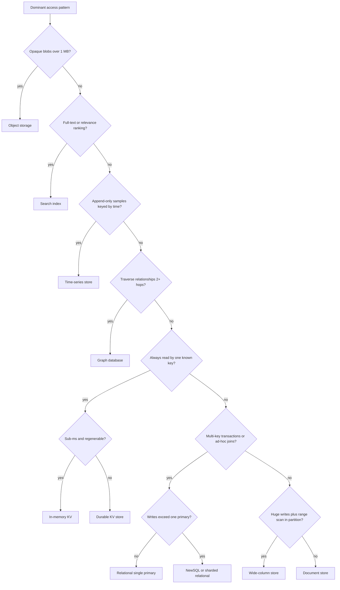
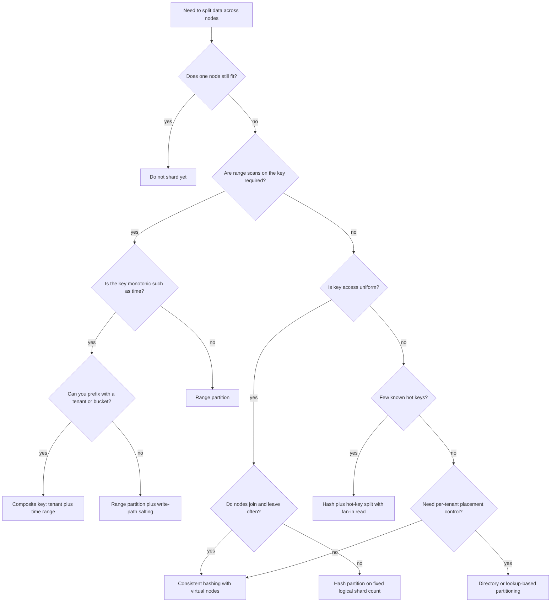
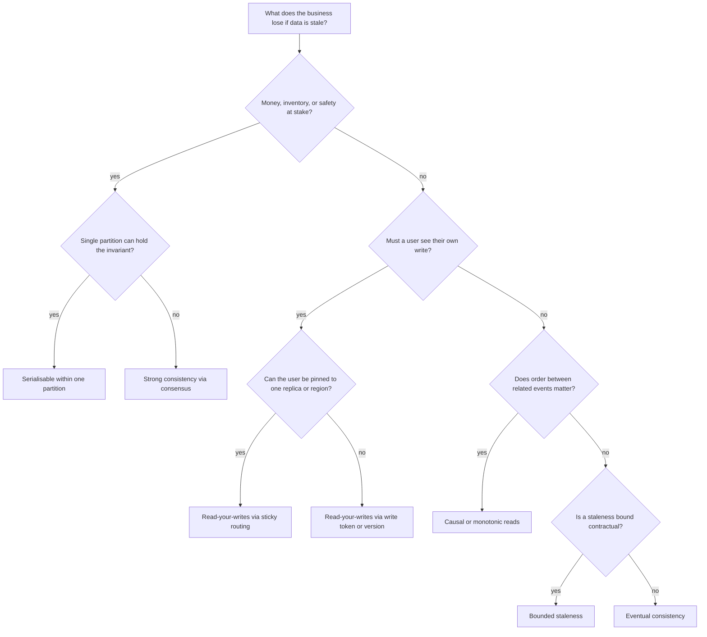
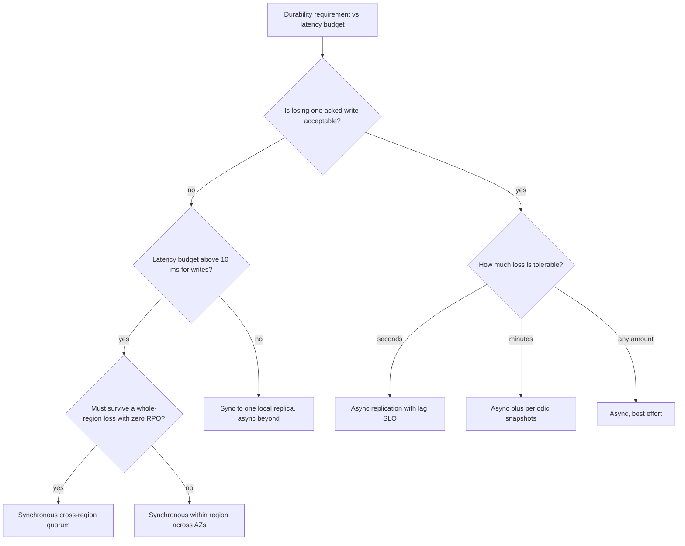
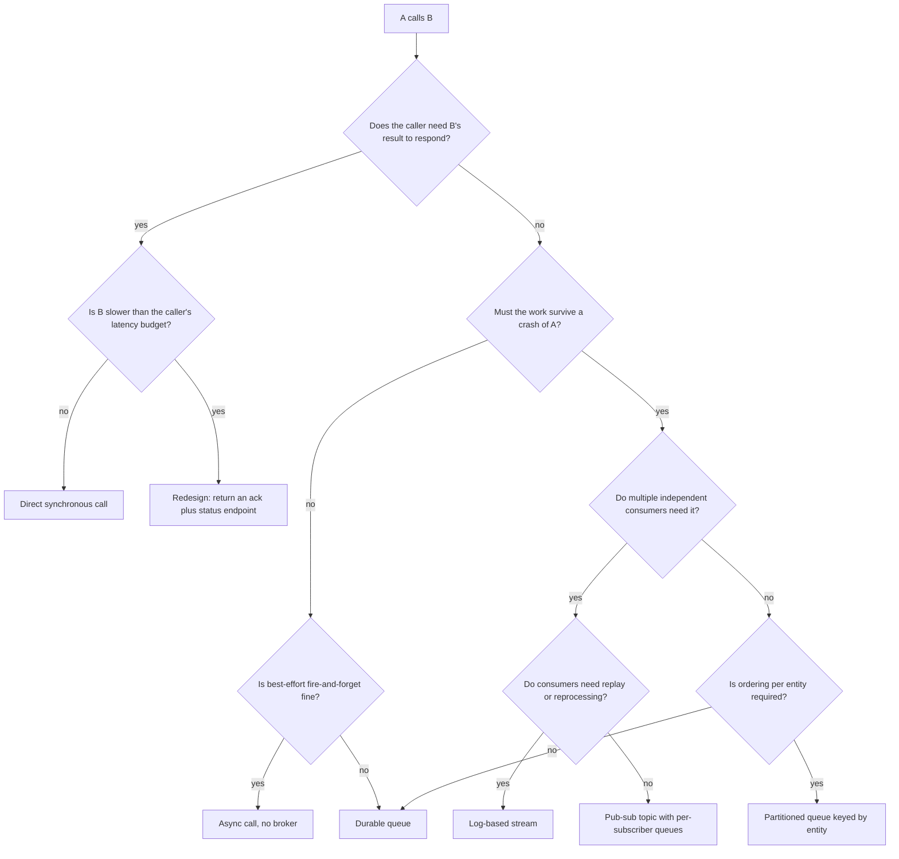
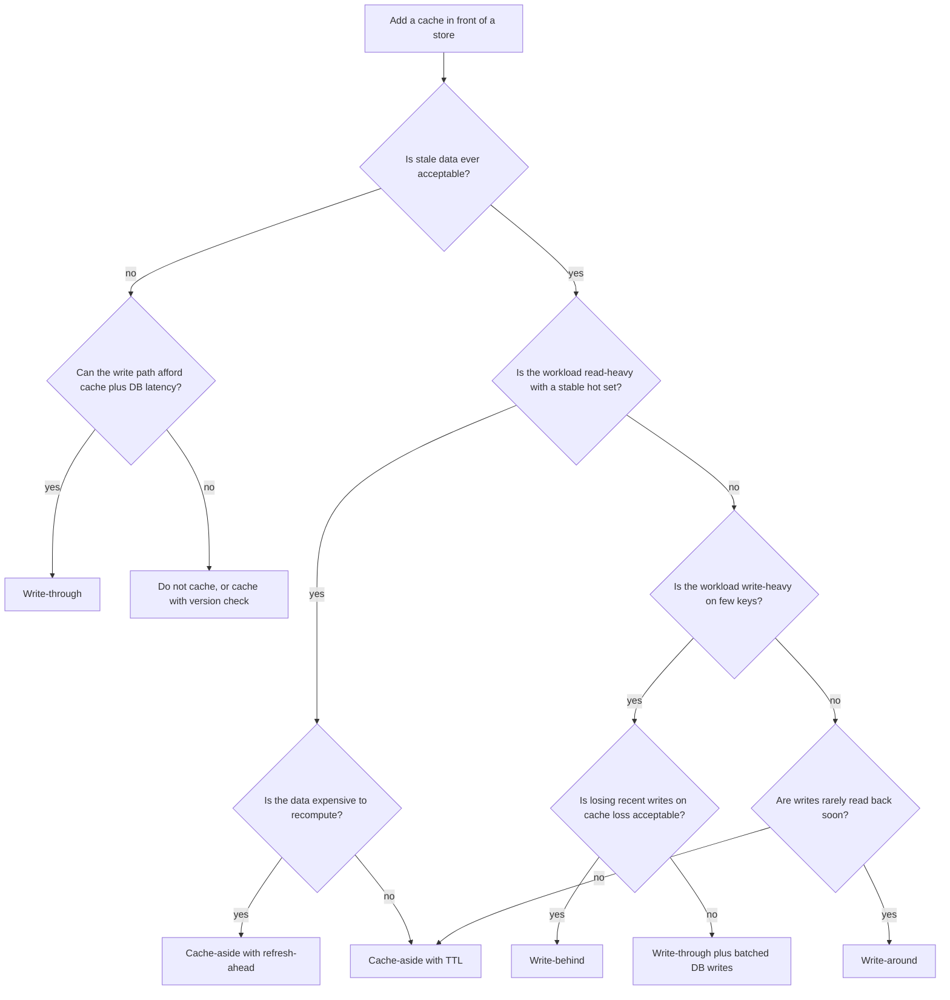
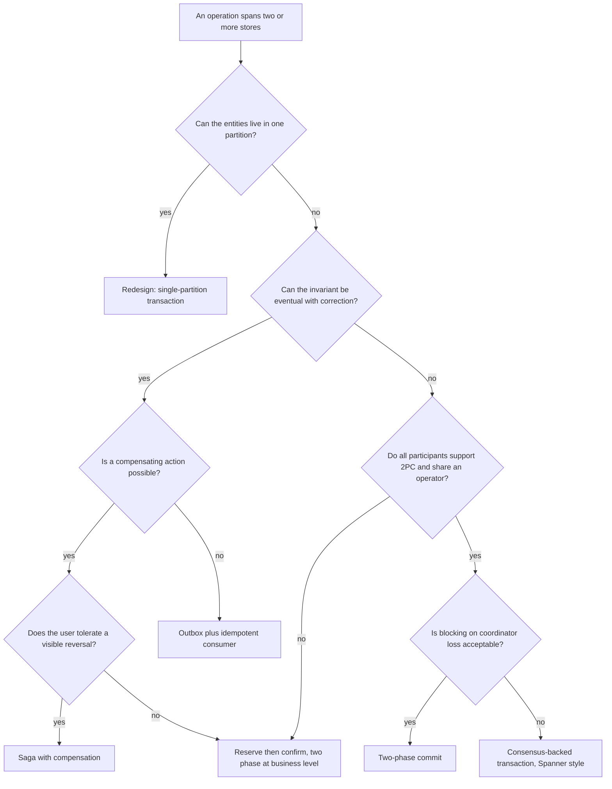

# Decision Trees

**Seven recurring interview decisions, each reduced to a traversal you can walk out loud in under sixty seconds — the tree is not the answer, it is the argument for the answer.**

Use these to structure reasoning, never to skip it. The value in an interview comes from naming the branch condition ("the question is whether reads need range scans within a partition") and then stating what you give up at the leaf.

---

## 1. Which Database?

| Leaf | Picks it when | Costs you | Representative systems | Worked example |
|---|---|---|---|---|
| Object storage | Immutable bytes, streamed or served via CDN, metadata kept elsewhere | No query, no transactions, per-request latency in tens of ms | S3, GCS, MinIO | [18 S3-style Object Store](../case-studies/18-object-store-s3.md) |
| Search index | Relevance ranking, tokenisation, faceting, fuzzy match | Near-real-time not real-time; index is a derived copy that can diverge | Elasticsearch, Lucene, Vespa | [12 Distributed Search Engine](../case-studies/12-distributed-search.md) |
| Time-series store | High-cardinality metrics, downsampling, retention tiers | Poor fit for updates and for joins; cardinality explosions are fatal | Prometheus, InfluxDB, Gorilla-style | [31 Metrics & Monitoring](../case-studies/31-metrics-monitoring.md) |
| Graph database | Variable-depth traversal, shortest path, recommendation walks | Hard to shard; traversals cross partitions; smaller operational ecosystem | Neo4j, JanusGraph | [09 News Feed](../case-studies/09-news-feed.md) |
| In-memory KV | Hot set fits in RAM, loss tolerable or backed by source of truth | Durability is best-effort; memory is the cost ceiling | Redis, Memcached | [35 Distributed Cache Service](../case-studies/35-distributed-cache.md) |
| Durable KV store | Key lookup at scale with tunable quorum and linear write scaling | No joins, no secondary query without building the index yourself | DynamoDB, Cassandra as KV, FoundationDB | [05 Distributed Key-Value Store](../case-studies/05-key-value-store.md) |
| Relational single primary | Integrity, joins, transactions; write volume fits one node | Vertical ceiling on writes; failover is a real event | PostgreSQL, MySQL | [26 E-commerce Checkout](../case-studies/26-ecommerce-checkout.md) |
| NewSQL or sharded relational | Transactions required *and* write volume exceeds one node | Cross-shard transactions cost latency; clock or consensus dependency | Spanner, CockroachDB, Vitess | [27 Payment System & Wallet](../case-studies/27-payment-system.md) |
| Wide-column store | Massive write rate, time-ordered reads inside a partition | Query shapes fixed at design time; compaction and tombstones to operate | Cassandra, HBase, Bigtable | [10 Chat System](../case-studies/10-chat-system.md) |
| Document store | Nested, evolving records read as a unit | Weak cross-document guarantees; unindexed queries become collection scans | MongoDB, DocumentDB | [17 Google Drive](../case-studies/17-google-drive.md) |

!!! tip "Say the polyglot sentence"
    Real systems land on several leaves at once: object storage for bytes, relational for the ledger, wide-column for the timeline, search for discovery, in-memory for the hot set. The senior move is to name the **source of truth** and then describe every other store as a derived view with a defined staleness bound and a rebuild path.

!!! warning "The tree cannot see your team"
    A store you cannot operate at 3 a.m. is the wrong store regardless of where the tree lands. If the existing platform runs Postgres and Kafka well, "Postgres until the arithmetic says otherwise" is frequently the correct, defensible answer. See [F14 SQL vs NoSQL](../fundamentals/f14-sql-vs-nosql.md).

---

## 2. How to Partition or Shard?

| Leaf | Mechanism | Wins | Costs | Watch for |
|---|---|---|---|---|
| Do not shard yet | One primary plus read replicas | Simplicity; transactions stay local | Vertical ceiling; failover is an event | Have the trigger written down: "shard when storage passes N TB or writes pass M/s" |
| Range partition | Contiguous key ranges per shard | Efficient range scans; trivially splittable | Hotspots follow the active range | Sequential IDs and timestamps put 100% of writes on the last shard |
| Composite key | Partition on tenant/entity, cluster on time within it | Range scans inside a partition, spread across partitions | Cross-tenant queries fan out to all shards | Tenant skew: one tenant can exceed a single partition |
| Range plus salting | Prefix key with a small bucket value | Removes the monotonic write hotspot | Reads must fan in across buckets | Choose bucket count from measured write rate, not a round number |
| Hash partition, fixed logical shards | Hash to N logical shards, map logical to physical | Uniform spread; resharding moves whole logical shards | No range scans; N is hard to change | Pick N generously, e.g. 1,024, and map many-to-one onto physical nodes |
| Consistent hashing with vnodes | Ring with many virtual nodes per host | Adding or removing a node moves ~1/N of keys | More metadata; still no range scans | Too few vnodes gives poor balance; this is the classic Dynamo design |
| Hash plus hot-key split | Suffix the hot key with a bucket index | Removes the celebrity hotspot | Read amplification proportional to bucket count | Detecting which keys are hot needs sketching; see [F21 Probabilistic Structures](../fundamentals/f21-probabilistic-data-structures.md) |
| Directory-based | Explicit shard map in a metadata service | Arbitrary placement, per-tenant isolation, easy migration | The directory is a new dependency and a new SPOF | Cache the map at clients with a version and an invalidation path |

!!! warning "The partition key is the least reversible decision in the design"
    Changing a partition key after launch means a full rewrite of the dataset plus a dual-read/dual-write migration window. Spend interview time here proportional to that cost. See [F06 Partitioning & Sharding](../fundamentals/f06-partitioning-sharding.md) and [S03 Zero-Downtime Migration](../sre/s03-zero-downtime-migration.md).

---

## 3. Which Consistency Model?

| Leaf | What it guarantees | Typical cost | Implementation | When it is the right answer |
|---|---|---|---|---|
| Serialisable within one partition | Full isolation for the invariant, no coordination beyond the shard | One shard becomes the throughput ceiling for that entity | Single-partition transactions, per-entity queue | Seat inventory, one account balance, one order |
| Strong consistency via consensus | Linearizable reads and writes across replicas | Quorum round trip per operation; unavailable on minority side | Raft or Paxos replicated state machine | Ledgers, leader election, config that must not fork |
| Read-your-writes via sticky routing | Session sees its own effects | Routing affinity breaks on failover and on client mobility | Session-to-replica affinity in the LB | Profile edits, settings, "my posts" views |
| Read-your-writes via version token | Session sees its own effects without affinity | Client must carry and honour a version; replicas must wait or redirect | Return a version on write, require min-version on read | Mobile clients that roam between regions |
| Causal or monotonic reads | Related events never appear out of order; reads never go backwards | Version vectors or logical clocks to carry and compare | Lamport or vector clocks, per-key sequence numbers | Comments under a post, message threads |
| Bounded staleness | Reads are no older than $t$ seconds or $k$ versions | Requires replication-lag monitoring and enforcement | Lag-aware replica selection; reject reads from lagging replicas | Dashboards, leaderboards, cache-backed reads |
| Eventual consistency | Convergence eventually, no ordering promise | Application must tolerate and resolve conflicts | Last-write-wins, CRDTs, or application merge | Feeds, view counts, recommendations, presence |

!!! note "Choose per data path, never per system"
    The same product almost always needs a ledger at linearizable and a feed at eventual. Saying "this system is strongly consistent" is a mid-level answer; saying "the balance path is linearizable through a single-partition transaction, the activity feed is eventual with a 5-second bound, and here is why that split is safe" is the senior one. See [F07 Replication & Consistency](../fundamentals/f07-replication-consistency.md) and [F08 CAP & PACELC](../fundamentals/f08-cap-pacelc.md).

---

## 4. Sync or Async Replication?

| Leaf | RPO | Write latency added | Availability effect | Use it for |
|---|---|---|---|---|
| Synchronous cross-region quorum | Zero | One cross-region RTT, 60-150 ms | Survives region loss; minority region cannot accept writes | Financial ledgers, regulated records |
| Synchronous within region, across AZs | Zero for AZ loss, non-zero for region loss | 1-3 ms | Survives AZ loss transparently | The default for most transactional systems |
| Sync to one local replica plus async fan-out | Near zero locally | Sub-ms to 1 ms | Local failover safe; remote failover loses the async tail | Low-latency writes that still need durability |
| Async with lag SLO | Seconds, equal to observed lag | Zero | Failover to a replica loses the lag window | Read scaling, analytics replicas, feeds |
| Async plus periodic snapshots | Minutes to the snapshot interval | Zero | Recovery is a restore, not a failover | Cold standby, cost-sensitive DR |
| Async best effort | Unbounded during incidents | Zero | Unreliable for failover; useful only for derived data | Caches, search indexes, derived views |

Three sentences that separate levels on this question:

- **"Semi-sync is not synchronous."** Acknowledging when *one* replica has the write, while others lag, means a failover to the wrong replica still loses data unless failover is quorum-aware.
- **"Replication lag is a capacity signal, not just a data signal."** Lag grows when the replica cannot keep up with the primary's write throughput, so it predicts future failover risk.
- **"RPO and RTO are separate promises."** Zero RPO with a 30-minute RTO is a completely different system from 60-second RPO with a 60-second RTO, and the business usually cares more about one of them.

See [F07 Replication & Consistency](../fundamentals/f07-replication-consistency.md), [F26 Multi-Region & DR](../fundamentals/f26-multi-region-dr.md), and [S02 Multi-Region Active-Active](../sre/s02-multi-region-active-active.md).

---

## 5. Message Queue or Direct Call?

| Leaf | Gives you | Costs you | Required companion |
|---|---|---|---|
| Direct synchronous call | Simplest model, immediate errors, easy tracing | Caller's availability becomes the product of both; latency adds | Timeout from measured p99, circuit breaker, bounded retries |
| Return ack plus status endpoint | Removes a slow dependency from the critical path | Client must poll or subscribe; new status state to store | Job ID, terminal states, TTL on job records |
| Async call, no broker | No infrastructure | Work lost on crash; no backpressure; invisible failures | Only acceptable for genuinely disposable work |
| Durable queue | Crash survival, buffering, retry, rate decoupling | New component, ordering questions, poison messages, lag | DLQ, redrive policy, idempotent consumers |
| Log-based stream | Replay, multiple independent consumers, ordered partitions | Retention and storage cost; consumer offset management | Partition key choice, consumer lag SLO |
| Pub-sub topic | Fan-out to many subscribers with independent failure | Usually no replay; per-subscriber backlog | Per-subscriber DLQ and lag alarms |
| Partitioned queue by entity | Per-entity ordering with parallelism across entities | Hot partitions; one slow key blocks its partition | Key selection plus head-of-line-blocking mitigation |

!!! warning "A queue does not remove the failure, it relocates it"
    Adding a broker converts "the call failed and the user saw an error" into "the work is somewhere in a backlog and the user thinks it succeeded". That is often the right trade, but it obligates you to lag monitoring, a DLQ with an owner, idempotent consumers, and a defined behaviour when the backlog exceeds what you can ever drain. See [F12 Queues & Streams](../fundamentals/f12-queues-streams.md), [F11 Idempotency](../fundamentals/f11-idempotency.md), and [30 Message Queue](../case-studies/30-message-queue-kafka.md).

!!! note "The queue-depth question you should raise unprompted"
    "What happens when the consumer is down for four hours?" The answer must cover retention, whether the producer blocks or sheds, whether drain rate exceeds produce rate on recovery, and whether stale messages should be dropped rather than processed.

---

## 6. Cache-Aside, Write-Through, or Write-Behind?

| Strategy | Write path | Read path | Failure behaviour | Best for |
|---|---|---|---|---|
| Cache-aside with TTL | Write DB, then invalidate or delete the key | Miss reads DB and populates | Cache loss means a thundering herd at the origin | The default; read-heavy with tolerable staleness |
| Cache-aside with refresh-ahead | Same as above plus proactive refresh before expiry | Hot keys never expire under traffic | Refresh storms if all keys share an expiry | Expensive computations, feeds, aggregations |
| Write-through | Write cache and DB synchronously | Always a hit for written keys | Consistent but slower; cache is on the write critical path | Small hot datasets where staleness is unacceptable |
| Write-behind | Write cache, acknowledge, flush to DB asynchronously | Always a hit | Cache loss loses unflushed writes; needs durable buffer | Counters, view counts, high write rates on few keys |
| Write-around | Write DB only, do not populate cache | Miss reads DB | Avoids polluting the cache with never-read data | Bulk imports, write-once-read-rarely data |

Three failure modes to name without being asked:

| Failure | Mechanism | Mitigation |
|---|---|---|
| Thundering herd | Many concurrent misses on the same key hit the origin at once | Request coalescing or single-flight, plus a short lock on the miss path |
| Synchronised expiry | Keys populated together expire together | Randomised TTL jitter, e.g. base TTL plus up to 10% |
| Cache stampede after a cold start | Whole tier restarts with an empty cache | Admission control on the origin, gradual traffic ramp, serve-stale-while-revalidate |

Invalidation correctness deserves a sentence: **delete, do not update**. Updating the cache from the writer races with concurrent readers repopulating an older value; deleting makes the next read authoritative. If you must update, carry a version and refuse to overwrite a newer one. See [F04 Caching](../fundamentals/f04-caching.md) and [35 Distributed Cache Service](../case-studies/35-distributed-cache.md).

---

## 7. Distributed Transaction, Saga, or Redesign?

| Leaf | How it works | Guarantee | Operational cost | Example |
|---|---|---|---|---|
| Single-partition transaction | Co-locate the entities so the invariant is local | Full ACID, no coordination | Partition becomes the throughput unit; requires the right key | Wallet balance and its ledger entries under one account key |
| Saga with compensation | Local transaction per step, compensating action on failure | Eventual consistency with business-level correctness | Compensations must exist, be idempotent, and be tested | Order, payment, fulfilment across services |
| Reserve then confirm | Hold a resource with a TTL, confirm or let it expire | No permanent inconsistency; user never sees a reversal | Reservation store, expiry sweeper, double-booking window | [24 Ticket Booking](../case-studies/24-ticket-booking.md), [25 Hotel Reservation](../case-studies/25-hotel-reservation.md) |
| Outbox plus idempotent consumer | Write state and event in one local transaction, relay the event | At-least-once delivery with effectively-once effects | Relay process, dedup keys, outbox table growth | [26 E-commerce Checkout](../case-studies/26-ecommerce-checkout.md) |
| Two-phase commit | Prepare all, then commit all, via a coordinator | Atomicity across participants | Blocking on coordinator loss; locks held across the round trip | Single-vendor DBs under one operator |
| Consensus-backed transaction | 2PC over consensus-replicated participants | Atomic and non-blocking on coordinator loss | Requires tight clocks or a global consensus layer | Spanner-style distributed SQL |

!!! warning "The strongest answer to this question is usually a redesign"
    Most interview problems that appear to need a distributed transaction do not: they need the entities co-located under a better partition key, or a reservation with a TTL, or an idempotency key that makes a retried step harmless. Reach for a saga when you genuinely cross service and ownership boundaries, and reach for 2PC almost never — and when you do, say the word "blocking" and explain what happens when the coordinator dies between prepare and commit. See [F10 Distributed Transactions](../fundamentals/f10-distributed-transactions.md) and [F11 Idempotency](../fundamentals/f11-idempotency.md).

---

## Using These Under Pressure

| Situation | Move |
|---|---|
| You are asked "which database" cold | Ask the two branch questions first: access pattern and transactional need. Do not name a product before those answers. |
| The interviewer disagrees with a leaf | Restate the branch condition. Disagreement is nearly always about an input, not about the logic. |
| Two leaves both look defensible | Say so, name the tiebreaker (operability, existing platform, team familiarity, cost), and pick. Refusing to pick is the only wrong answer. |
| You picked a leaf and later evidence contradicts it | Change it explicitly and say what changed: "you said writes are 50k/s, so single primary is out; I am moving to hash partitioning on a 1,024 logical-shard space." |
| Time is short | Walk only the branches that matter and say the rest are defaults: "standard cache-aside with jittered TTL, nothing exotic." |

---

## Related Pages

| Decision | Depth page |
|---|---|
| Database family selection | [F14 SQL vs NoSQL](../fundamentals/f14-sql-vs-nosql.md), [F13 Storage Engines](../fundamentals/f13-storage-engines.md) |
| Partitioning scheme | [F06 Partitioning & Sharding](../fundamentals/f06-partitioning-sharding.md) |
| Consistency model | [F07 Replication & Consistency](../fundamentals/f07-replication-consistency.md), [F08 CAP & PACELC](../fundamentals/f08-cap-pacelc.md) |
| Replication mode and DR | [F26 Multi-Region & DR](../fundamentals/f26-multi-region-dr.md) |
| Messaging | [F12 Queues & Streams](../fundamentals/f12-queues-streams.md) |
| Caching | [F04 Caching](../fundamentals/f04-caching.md) |
| Transactions and sagas | [F10 Distributed Transactions](../fundamentals/f10-distributed-transactions.md) |
| Consensus mechanics behind the leaves | [F09 Consensus](../fundamentals/f09-consensus.md), [46 Coordination Service](../case-studies/46-coordination-service.md) |
| Estimation that feeds every branch condition | [Numbers & Estimation](numbers.md) |
