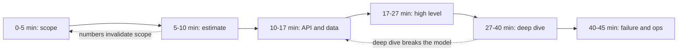

# Interview Framework Cheat Sheet

**A system design interview is a 45-minute time-boxed exercise in demonstrating judgement under ambiguity — the design is the artifact, but the grading is on how you narrowed the problem, what you quantified, and which failures you anticipated without being asked.**

This page is the clock, the question list, the scoring rubric, and the recovery script.

---

## The 45-Minute Clock

| Phase | Minutes | Elapsed | Concrete output on the board | Failure mode if skipped |
|---|---|---|---|---|
| 1. Requirements & scoping | 5 | 0-5 | Numbered functional requirements, explicit non-goals, non-functional targets | You design the wrong system beautifully |
| 2. Scale estimation | 5 | 5-10 | QPS, storage/year, bandwidth, one sentence naming the bottleneck | Every later decision is unjustifiable |
| 3. API + data model | 7 | 10-17 | 3-5 endpoint signatures, core entities with keys and access patterns | Hand-waving hides the real partitioning problem |
| 4. High-level design | 10 | 17-27 | Boxes and arrows, request path traced end to end for one read and one write | You never get a shared picture to reason over |
| 5. Deep dive | 13 | 27-40 | One or two components decomposed; the hard trade-off argued with numbers | Reads as breadth-only, mid-level |
| 6. Failure, ops, wrap-up | 5 | 40-45 | Failure table, SLOs, degraded mode, what you would do with more time | Reads as "has never run this in production" |



!!! tip "Announce the clock in the first minute"
    "I will spend about five minutes on requirements and estimates, ten on a high-level design, and then I would like to spend most of the time on whichever component you find most interesting." This does three things: it shows you have a plan, it makes the interviewer a collaborator on time allocation, and it gives you permission to cut a tangent later by pointing at the plan.

!!! warning "The two most common time failures"
    **Over-scoping requirements** past eight minutes leaves no deep dive, and breadth without depth reads as mid-level. **Skipping estimation** to get to the diagram faster means every capacity claim afterwards is an assertion rather than a derivation. If you are behind at minute 20, cut the data model to key choices only and go straight to the high-level design.

---

## Phase 1: Clarifying Questions Checklist

Ask 5-8 of these, not all of them. Choose the ones whose answers would actually change your design, and say *why* you are asking.

### Functional scope

| Question | Why it changes the design |
|---|---|
| Who are the users and what is the single most important action they take? | Identifies the critical path that gets the latency budget |
| What is explicitly out of scope for today? | Buys permission to ignore auth, billing, admin, analytics |
| Is this a new system or a rewrite of something with existing traffic? | Rewrite means migration and dual-write, which is half the design |
| Do users see their own writes immediately, or is a delay acceptable? | Read-your-writes is the single most expensive consistency requirement |
| Is there a mobile client, and does it work offline? | Offline forces client-side IDs, conflict resolution, and sync protocol |
| Do we need search, or is lookup by key sufficient? | Search adds an entire indexing subsystem |

### Scale

| Question | Why it changes the design |
|---|---|
| DAU or MAU, and how many actions per user per day? | The only inputs to the QPS estimate |
| What is the read-to-write ratio? | Decides whether caching or partitioning is the core problem |
| What is peak-to-average, and are there scheduled spikes? | 3x diurnal and 100x on-sale are different systems |
| How large is a single item, and how many items per user? | Storage growth and whether it fits in one node |
| What is the retention requirement? | "Forever" versus 30 days changes cost by an order of magnitude |
| What growth rate should I design for, and over what horizon? | Prevents over-engineering for scale that never arrives |

### Consistency

| Question | Why it changes the design |
|---|---|
| What is the business cost of showing stale data for one second? For one minute? | Converts "strong consistency" from a reflex into a requirement |
| What is the business cost of losing one acknowledged write? | Separates durability from availability; changes replication mode |
| Can two users act on the same item at the same time, and what should happen? | Decides optimistic versus pessimistic concurrency control |
| Does any operation need to be atomic across two entities? | The distributed-transaction question, asked before it bites |
| Is duplicate processing acceptable, or must it be exactly-once at the effect level? | Drives idempotency keys and dedup windows |

### Latency

| Question | Why it changes the design |
|---|---|
| What is the p99 latency target for the critical read? For the critical write? | Sets the round-trip budget |
| Is this user-facing synchronous, or can the response be an acknowledgement? | Async acknowledgement unlocks queues and removes the hard constraint |
| Where are the users geographically? | Single-region versus multi-region is decided here, not later |
| What is the acceptable propagation delay for a write to become visible globally? | The multi-region consistency budget |

### Read/write shape

| Question | Why it changes the design |
|---|---|
| Is the read access pattern by key, by range, or by arbitrary query? | Chooses the datastore family |
| What fraction of reads hit recent data? | Decides cache and tiering strategy |
| Is the write pattern uniform, or concentrated on a few entities? | Hot partitions and celebrity problems |
| Are reads and writes correlated in time (write-then-immediately-read)? | Cache invalidation and read-your-writes design |

### Existing constraints

| Question | Why it changes the design |
|---|---|
| What is already running that I should use rather than reinvent? | Reusing the existing Kafka/Postgres/K8s is the realistic answer |
| Are we in one cloud, multi-cloud, or on-prem? | Changes what managed services can be assumed |
| Is there a team-size or operational constraint on how many systems we can run? | Justifies choosing boring technology |
| Any compliance constraints such as data residency, PII handling, or audit? | Forces regional partitioning and encryption decisions early |

!!! note "Turn every answer into a written line on the board"
    Requirements said out loud evaporate. Requirements written in the top-left corner get referenced at minute 35 when you justify a trade-off: "I am choosing eventual consistency here because we agreed a 5-second propagation delay is acceptable for the feed."

---

## Phase 1 Output: The Requirements Block

Write exactly this structure, and keep it visible for the whole interview.

```text
FUNCTIONAL (in scope)
  F1. <verb> <object>            e.g. user posts a message to a channel
  F2. ...
  F3. ...
NON-GOALS (agreed out of scope)
  moderation, billing, admin console, analytics
NON-FUNCTIONAL
  scale     50M DAU, 20 req/user/day, 100:1 read:write, 3x peak
  latency   p99 read < 200 ms, p99 write < 500 ms
  consistency  read-your-writes for author; 5 s eventual for others
  availability 99.95% read, 99.9% write
  durability   no acknowledged write may be lost
```

---

## Mid-Level vs Staff/Lead Signals

The same design can be delivered at two completely different levels. The difference is almost never the boxes.

| Dimension | Mid-level answer | Staff/Lead answer |
|---|---|---|
| **Quantification** | "It will be a lot of traffic, so we need to scale horizontally." | "1B requests/day is 11.6k average, 35k peak QPS. At 2k RPS per instance that is 18 instances, 30 with AZ redundancy. Writes are only 345/s, so the write path is not the problem." |
| **Bottleneck identification** | Scales every tier uniformly. | Names the single binding constraint and designs around it: "storage growth, not QPS, forces sharding in year two." |
| **Failure-mode awareness** | "We add retries and a load balancer." | "Retries need a budget and jitter or they cause the outage. Here is the retry storm scenario, here is the circuit breaker placement, and here is what the system returns in degraded mode." |
| **Trade-off articulation** | Names a technology: "use Cassandra." | Names the trade-off and the price: "wide-column gives me linear write scaling and cheap range scans within a partition; I pay with no multi-key transactions and with tombstone/compaction management, which is acceptable because the workload is append-mostly." |
| **Consistency reasoning** | "It should be consistent." | "This is PACELC: during a partition I choose availability for the feed and consistency for the ledger; in normal operation I accept 10 ms extra latency on the ledger path for synchronous quorum." |
| **Operational maturity** | Design ends at the architecture diagram. | Defines SLIs, alert conditions on symptoms, rollout strategy, rollback trigger, and what the on-call runbook says at 3 a.m. |
| **Cost awareness** | Cost is not mentioned. | "120 TB/month egress is roughly USD 8k; CDN offload of the cacheable 70% pays for itself, and cross-AZ replication traffic is a real line item." |
| **Scope discipline** | Designs everything mentioned, shallowly. | Explicitly defers: "I am treating moderation as out of scope; if you want, I will trade the deep dive on sharding for it." |
| **Handling pushback** | Defends the original answer or abandons it instantly. | Restates the constraint, says what would change their mind, and revises with reasons: "if writes are 10x what I assumed, single-primary breaks and I would move to hash-partitioned writes with a 64-shard logical space." |
| **Communication** | Narrates implementation details serially. | Signposts: "here is the high level, then I will go deep on X; stop me if you would rather see Y." Checks in every few minutes. |
| **Ambiguity handling** | Waits to be told, or assumes silently. | States assumptions explicitly, marks them as assumptions, and continues: "I will assume 100:1 read:write; tell me if that is wrong because it changes the caching layer." |
| **Prior art** | Reinvents from first principles. | References known systems and known failure reports: "this is the Dynamo model; the operational cost is anti-entropy and hinted handoff." |

---

## Things to Say Early

These sentences are cheap, take under ten seconds each, and move the interviewer's internal rating before you have drawn a single box.

| Say this | Signal it sends |
|---|---|
| "Before I design, let me state what I am assuming, and flag anything you want to correct." | Handles ambiguity deliberately rather than silently |
| "I want to identify the binding constraint first — is this read-scale, write-scale, storage, or latency?" | Thinks in bottlenecks, not tiers |
| "Let me name the CAP/PACELC position explicitly: during a partition this path prefers availability; in normal operation it prefers latency over strict consistency." | Uses the vocabulary precisely instead of as a buzzword |
| "I will design for 3x the current number and make sure nothing in the design blocks a 10x move, but I will not build for 10x today." | Avoids over-engineering; shows growth thinking |
| "There are three plausible approaches here; let me name them, then pick one and say what I am giving up." | Demonstrates option generation, not just execution |
| "I will use the boring option here because the team has to operate it, and reserve novelty for the one place it earns its keep." | Operational maturity and team awareness |
| "Let me trace one write and one read end to end before I add anything else." | Keeps the design grounded in an actual request path |
| "This is the part I would want to load-test before committing, because my estimate has the widest error bars here." | Intellectual honesty; knows where the model is weak |
| "What does this look like when the dependency is slow rather than down? Slow is the harder case." | Real production experience; grey failure awareness |
| "I would put an SLO on this path at 99.9% and 200 ms p99, and alert on the symptom, not on CPU." | SRE depth without being asked |

!!! warning "Do not say these"
    "We will just use Kafka" (before knowing why). "It is web scale." "We can add caching later." "That is a detail." "We would use microservices." Each is an assertion where a derivation belongs.

---

## Interviewer Pushback and How to Respond

Pushback is usually a probe, not a correction. The wrong reactions are instant capitulation and rigid defence. The right one is: acknowledge, reason out loud, revise or justify with a reason.

| Pushback | What they are actually testing | Response pattern |
|---|---|---|
| "What if this component fails?" | Do you know the blast radius and the degraded mode? | Name the failure class (crash, slow, partitioned, corrupt), the detection signal, the automatic response, and what the user sees. Then name the failure this does *not* cover. |
| "How would you scale this 100x?" | Do you know which part breaks first? | "The first thing to break is X at roughly N. Here is the change: partition by K. That works to roughly M, where the next constraint is Y." Give the order of breakage, not a list of buzzwords. |
| "What if the data model changes?" | Schema evolution and coupling awareness | Versioned schemas, additive-only changes, expand/contract migration, dual-write with backfill and shadow reads, and how long the transition window lasts. |
| "Why not just use a single database?" | Are you sharding out of habit? | Do the arithmetic in front of them. If one node fits, agree loudly: "you are right, at 345 writes/second one primary is correct; the reason I would shard is storage growth in year two, not QPS." |
| "Is this not over-engineered?" | Scope discipline | Name the simplest version that meets stated requirements, then name the specific requirement that forces each added component. Delete anything you cannot justify that way. |
| "What happens during a network partition?" | CAP/PACELC in practice | Name which side you choose per data path (not per system), what the minority side returns, and how reconciliation works on heal. |
| "How do you know your estimate is right?" | Calibration and humility | "I do not. Here is the assumption with the widest error bar, here is how I would measure it in week one, and here is the design decision that would change if it is 10x off." |
| "What would you do differently with more time?" | Self-assessment | Have two real answers ready: the deep dive you skipped, and the part of your design you are least confident in. |
| "Have you considered X?" (a component you omitted) | Whether you omitted it deliberately | "I considered it and left it out because of Y. If Z is true, it becomes necessary, and here is where it would slot in." Never pretend you had it all along. |
| Silence after you finish a point | Whether you can go deeper unprompted | Go one level deeper on the most interesting sub-problem, or offer a menu: "I can go deeper on the sharding scheme, the consistency model, or the failure handling — which is most useful?" |
| "Your design has a bug." (and it does) | Ego and debugging under pressure | "You are right." Then trace the failing case out loud, fix it in the diagram, and state what you missed and why. Recovering well from a real mistake scores higher than never making one. |

!!! tip "The 100x question has a structure"
    Answer it as an ordered list of breaking points, not a list of technologies: *what breaks first, at what number, what the fix is, and what the next constraint becomes*. That structure is exactly the content of [S04 Capacity for 10x Growth](../sre/s04-capacity-planning-10x.md).

---

## Phase 5: Deep-Dive Selection

You get one or two deep dives. Choose the one where the hard trade-off lives, not the one you know best.

| Design type | The deep dive that scores | Supporting page |
|---|---|---|
| Read-heavy consumer product | Cache strategy, invalidation, hot key handling | [F04 Caching](../fundamentals/f04-caching.md) |
| Write-heavy ingestion | Partitioning scheme and hot-partition mitigation | [F06 Partitioning & Sharding](../fundamentals/f06-partitioning-sharding.md) |
| Money, inventory, booking | Concurrency control and exactly-once effects | [F19 Concurrency Control](../fundamentals/f19-concurrency-control.md), [F11 Idempotency](../fundamentals/f11-idempotency.md) |
| Multi-entity workflow | Saga design and compensation | [F10 Distributed Transactions](../fundamentals/f10-distributed-transactions.md) |
| Real-time or streaming | Backpressure, ordering, replay semantics | [F12 Queues & Streams](../fundamentals/f12-queues-streams.md) |
| Global product | Regional topology and failover | [F26 Multi-Region & DR](../fundamentals/f26-multi-region-dr.md) |
| Platform or infra system | Control plane vs data plane separation, blast radius | [S09 Cell-Based Architecture](../sre/s09-cell-based-architecture.md) |
| Anything at very high QPS | Load shedding and admission control | [F17 Rate Limiting & Load Shedding](../fundamentals/f17-rate-limiting-load-shedding.md) |

---

## Phase 6: The Closing Five Minutes

Do not let the interview end on the deep dive. Spend the last five minutes on the material that most candidates never reach, because it is where senior signal is cheapest to demonstrate.

| Item | What to say | Time |
|---|---|---|
| Failure table | Three to five rows: component, failure mode, detection, response, user impact | 90 s |
| SLIs and SLOs | Two SLIs with targets, tied back to the stated requirements | 45 s |
| Degraded mode | What the system serves when the cache, the DB, or a region is gone | 45 s |
| Rollout and rollback | Canary, the metric that gates promotion, the rollback trigger | 45 s |
| Known weaknesses | The two things you would fix first with more time | 45 s |

A compact failure table worth memorising as a shape:

| Component | Failure mode | Detection | Automatic response | User-visible impact |
|---|---|---|---|---|
| Cache tier | Node loss | Hit-rate drop, client errors | Consistent-hash rebalance; origin absorbs | Higher p99 for the affected key range |
| Cache tier | Total loss | Hit rate near zero | Admission control on origin; serve stale where legal | Degraded latency, no errors if shed correctly |
| Primary DB | Slow, not down | Rising queue depth, saturation signal | Shed writes, circuit-break non-critical paths | Writes rejected with a retry hint |
| Primary DB | Failover | Health check plus consensus | Promote replica; clients reconnect | 10-30 s of write errors |
| Region | Loss | Health checks plus traffic-level anomaly | DNS or anycast shift to the healthy region | Elevated latency; bounded data loss up to the RPO |
| Queue consumer | Lag growth | Lag over threshold and rising | Scale consumers; shed lowest-priority topic | Delayed side effects, no data loss |

See [F18 Resilience Patterns](../fundamentals/f18-resilience-patterns.md) and [F22 Observability](../fundamentals/f22-observability-fundamentals.md).

---

## The Whiteboard Artifact

At minute 45 the board should be readable by someone who walked in late. Target this layout.

```text
+--------------------------------------------------------------------------+
| TOP-LEFT: REQUIREMENTS (written at minute 4, never erased)                |
|   F1 post message   F2 read channel   F3 presence                        |
|   NON-GOALS: moderation, billing, search                                 |
|   50M DAU * 20 = 1B/day = 11.6k avg / 35k peak QPS                       |
|   100:1 R:W  |  p99 read 200ms  |  99.95%  |  RYW for author             |
+--------------------------------------------------------------------------+
| TOP-RIGHT: ESTIMATES (minute 9)                                          |
|   writes 345/s peak   reads 34.5k/s peak                                 |
|   storage 20 GB/day -> 40 TB/yr provisioned (RF3, idx, headroom)         |
|   egress 1.1 Gbps peak  |  cache working set 60 GB                       |
|   BOTTLENECK: read fan-out + storage growth, NOT write QPS               |
+--------------------------------------------------------------------------+
| CENTRE: ARCHITECTURE (minutes 17-27)                                     |
|                                                                          |
|   client -> CDN -> LB -> API tier -> cache -> DB(primary + replicas)     |
|                              |                                           |
|                              +-> queue -> workers -> side effects        |
|                                                                          |
|   Numbered request path:  (1) write  (2) read  drawn as arrows w/ labels |
|   Each arrow annotated: protocol, sync/async, timeout                    |
+--------------------------------------------------------------------------+
| LOWER-CENTRE: DATA MODEL (minute 15)                                     |
|   message(channel_id PK, ts CK, msg_id, author, body)   part: channel_id |
|   channel_member(user_id PK, channel_id CK)                              |
|   ACCESS: "last N by channel" -> range scan in partition                 |
+--------------------------------------------------------------------------+
| RIGHT COLUMN: DEEP DIVE (minutes 27-40)                                  |
|   chosen: partitioning + hot channel                                     |
|   scheme: hash(channel_id) % 64 logical -> N physical                    |
|   hot key: split into channel_id#bucket, fan-in on read                  |
|   trade-off: read amplification 4x vs write hotspot removed              |
+--------------------------------------------------------------------------+
| BOTTOM STRIP: FAILURE + OPS (minutes 40-45)                              |
|   cache loss -> shed + serve stale        SLI: read p99, write success   |
|   DB failover -> 20s write errors         SLO: 99.95% / 200ms            |
|   region loss -> shift traffic, RPO 60s   alert on symptom, not CPU      |
|   degraded mode: read-only, last-known-good                              |
+--------------------------------------------------------------------------+
```

Properties of a strong board that interviewers notice without naming:

| Property | Why it reads as senior |
|---|---|
| Requirements still visible at the end | Decisions can be traced to constraints |
| Numbers written next to components | Sizing was derived, not asserted |
| Arrows labelled sync/async with timeouts | Latency budget and failure semantics are explicit |
| One numbered read path and one numbered write path | The design was traced, not just drawn |
| Partition key written next to each table | The hardest choice was made deliberately |
| A failure strip exists at all | Most candidates never get there |
| Erasures and revisions visible | You responded to new information rather than defending |

---

## Anti-Patterns

| Anti-pattern | What it looks like | Correction |
|---|---|---|
| Buzzword architecture | Kafka, Redis, Cassandra, and K8s appear before any requirement | Each component must be introduced by the requirement that forces it |
| Silent design | Long pauses while thinking, then a finished answer | Narrate the option set and the elimination |
| Over-scoping | Minute 12 still on requirements | Box the scope, write non-goals, move |
| Premature depth | Ten minutes on the ID generation scheme | Depth belongs in phase 5 and should be the interviewer's pick |
| Ignoring the interviewer's hint | They ask twice about consistency, you keep drawing | Hints repeated are instructions |
| Consistency-by-default | "Everything is strongly consistent" | Choose per data path; strong for money, eventual for feeds |
| Designing for infinite scale | Global multi-region active-active for 500 QPS | Design for stated scale plus a stated growth horizon |
| No failure discussion | Design ends at the happy path | Reserve the last five minutes unconditionally |

---

## Related Pages

| Topic | Page |
|---|---|
| Estimation arithmetic for phase 2 | [Numbers & Estimation](numbers.md) |
| Choosing components under pressure | [Decision Trees](decision-trees.md) |
| Self-review before you stop talking | [Review Checklists](checklists.md) |
| CAP/PACELC vocabulary | [F08 CAP & PACELC](../fundamentals/f08-cap-pacelc.md) |
| SLO framing for the closing minutes | [F23 SLI/SLO & Error Budgets](../fundamentals/f23-slo-error-budgets.md) |
| Release safety answers | [F25 Deployment & Release Safety](../fundamentals/f25-deployment-release-safety.md) |
| A worked end-to-end example | [01 URL Shortener](../case-studies/01-url-shortener.md) |
| A hard consistency example | [27 Payment System & Wallet](../case-studies/27-payment-system.md) |
