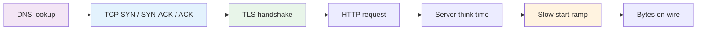
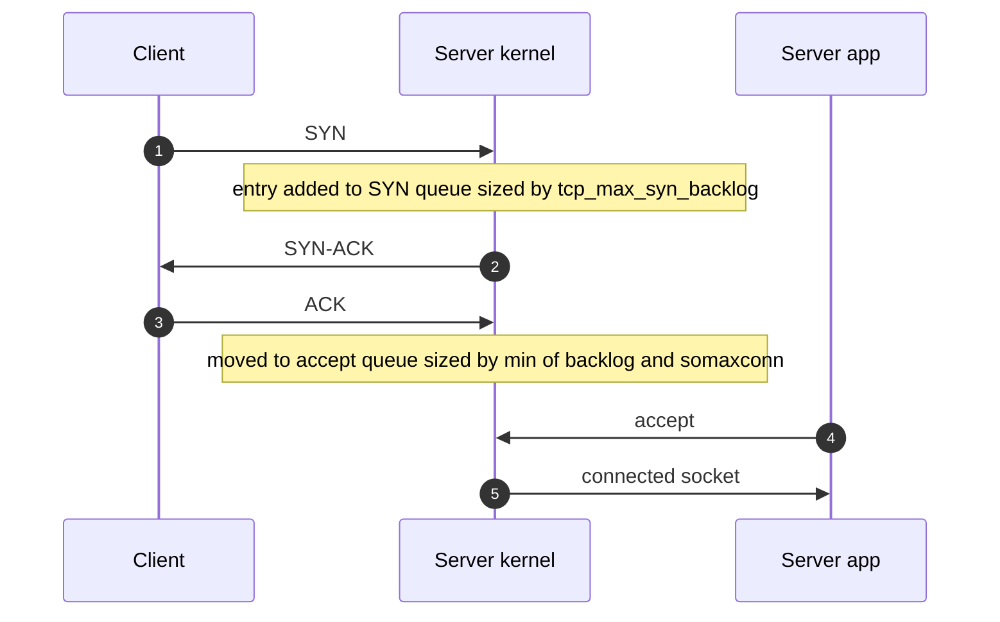
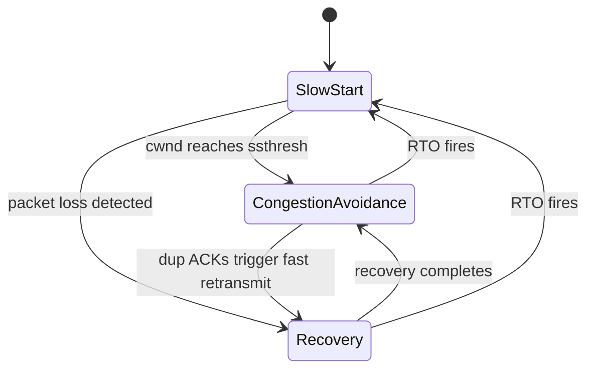
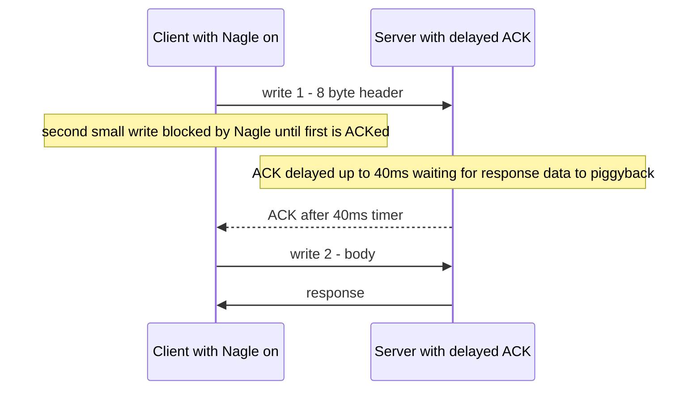
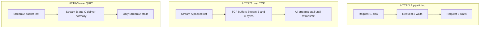
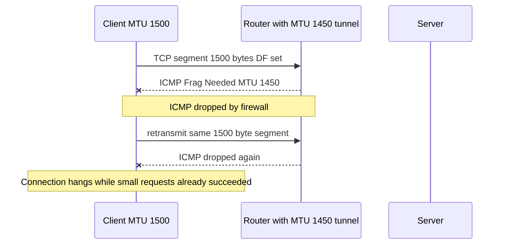
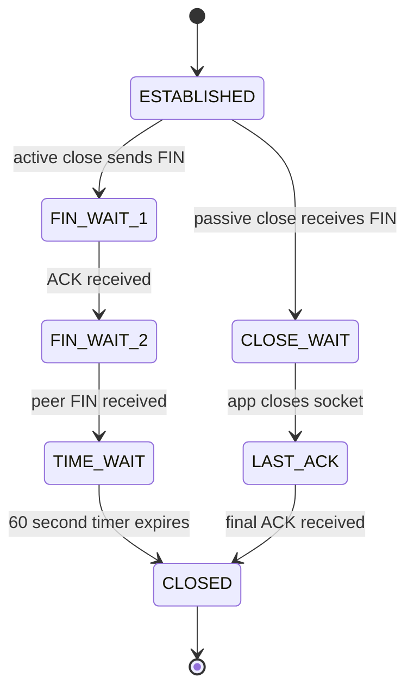

# F01 — Networking Foundations

**Wide-area latency is dominated by the number of round trips your stack requires, not by the bandwidth you bought; almost every technique on this page exists to delete an RTT, avoid a stall, or stop a queue from silently eating your tail latency.**

## The Latency Model That Matters

For a transfer of size $S$ bytes over a path with round-trip time $R$ and bottleneck bandwidth $B$, with initial congestion window $IW$ segments of size $MSS$:

$$
T \;\approx\; \underbrace{T_{dns}}_{0\text{--}1\ R} + \underbrace{R}_{\text{TCP}} + \underbrace{k_{tls} \cdot R}_{\text{TLS}} + \underbrace{R \cdot \left\lceil \log_2\!\left(\frac{S}{IW \cdot MSS} + 1\right) \right\rceil}_{\text{slow start}} + \underbrace{\frac{S}{B}}_{\text{serialization}}
$$

The term that people optimize (the last one) is usually the smallest. Concrete anchors:

| Path | RTT | 1 KB response, cold conn, TLS 1.2 | Same, TLS 1.3 + warm pool |
| --- | --- | --- | --- |
| Same rack | 0.1 ms | ~0.5 ms | ~0.15 ms |
| Same AZ | 0.5 ms | ~2.5 ms | ~0.6 ms |
| Cross-AZ | 1–2 ms | ~8 ms | ~2 ms |
| US-East to US-West | 70 ms | ~350 ms | ~75 ms |
| US-East to Frankfurt | 90 ms | ~450 ms | ~95 ms |
| US-East to Singapore | 230 ms | ~1150 ms | ~235 ms |

!!! note "Speed of light is a hard floor"
    Fiber propagates at roughly $2 \times 10^8$ m/s (refractive index ~1.47). New York to London is ~5585 km great-circle, so the theoretical minimum RTT is ~56 ms; real paths measure 70–80 ms. You cannot engineer this away — you can only stop paying it repeatedly.

### Why bandwidth stops helping

Slow start means a cold connection cannot use the pipe. Linux uses `IW=10` (RFC 6928), so `10 × 1460 = 14,600` bytes in the first RTT. Delivering 1 MB requires:

$$
\left\lceil \log_2\!\left(\frac{1{,}048{,}576}{14{,}600} + 1\right) \right\rceil = \lceil 6.19 \rceil = 7 \text{ RTTs}
$$

At 90 ms RTT that is 630 ms of pure window growth — independent of whether the link is 100 Mbps or 100 Gbps. Upgrading bandwidth changes nothing until the window is large enough to fill it.



---

## TCP Connection Establishment

### Handshake and the two kernel queues



Two distinct queues, two distinct failure modes:

| Queue | Sized by | Overflow behaviour | Counter |
| --- | --- | --- | --- |
| SYN queue (half-open) | `net.ipv4.tcp_max_syn_backlog` | Drop SYN, or emit SYN cookies if `tcp_syncookies=1` | `TcpExtTCPReqQFullDrop`, `TcpExtSyncookiesSent` |
| Accept queue (established, unaccepted) | `min(listen(backlog), net.core.somaxconn)` | Silently drop the ACK unless `tcp_abort_on_overflow=1` | `ListenOverflows`, `ListenDrops` |

```bash
# The two counters that actually tell you the truth
nstat -az | grep -Ei 'ListenOverflows|ListenDrops|SyncookiesSent|TCPReqQFullDrop'

# Per-listener accept queue: Recv-Q = current backlog depth, Send-Q = configured max
ss -ltn
```

Defaults worth memorizing: `somaxconn` was `128` until Linux 5.4, now `4096`. Many runtimes still pass a small `backlog` to `listen()` — Node.js defaults to `511`, Python's `http.server` to `5`, Go's `net.Listen` uses `somaxconn`. The effective value is the minimum, so raising the sysctl alone often changes nothing.

!!! warning "Accept-queue overflow is invisible to the application"
    When the accept queue is full, Linux drops the client's final ACK. The client believes the connection is established and sends its request; the server never sees it. The client retransmits with exponential backoff (1s, 2s, 4s...) and eventually times out. Your server logs show nothing, your error rate looks fine, and the client sees multi-second latency spikes. `ListenOverflows` is the only signal.

### TCP Fast Open

TFO carries data in the SYN using a server-issued cookie, saving one RTT on repeat connections. In practice it is rarely deployable: middleboxes strip unknown TCP options, `net.ipv4.tcp_fastopen` defaults to `1` (client only) on most distributions, and the data in the SYN is replayable — it must be idempotent. Treat it as a same-datacenter or controlled-client optimization.

---

## Congestion Control

### Slow start, congestion avoidance, and the loss signal



Slow start doubles `cwnd` every RTT. Congestion avoidance grows it roughly linearly (Reno) or cubically as a function of time since the last loss (Cubic). An RTO — minimum 200 ms on Linux (`TCP_RTO_MIN`), 1 s in the RFC — collapses `cwnd` to 1 and is catastrophic for tail latency.

### Cubic vs BBR

| Dimension | Cubic (Linux default) | BBRv1 / BBRv2 |
| --- | --- | --- |
| Signal | Packet loss | Estimated bottleneck bandwidth and min RTT |
| Model | Loss means congestion | Loss and congestion are decoupled |
| Behaviour on lossy links | Collapses; 1% loss caps throughput severely | Largely unaffected up to several percent loss |
| Bufferbloat | Fills the bottleneck buffer, inflating RTT | Paces at estimated BtlBw, keeps queues shallow |
| Fairness vs Cubic | n/a | BBRv1 can starve Cubic flows in deep buffers; BBRv2 adds loss and ECN response |
| RTT unfairness | Short-RTT flows win | Better, but BBRv1 favours long-RTT flows in some regimes |
| Where it shines | Datacenter, clean links | Mobile, transcontinental, lossy last mile |

The Mathis approximation makes the loss sensitivity concrete for Reno-like control:

$$
\text{Throughput} \le \frac{MSS}{RTT} \cdot \frac{C}{\sqrt{p}}
$$

At `MSS=1460`, `RTT=100 ms`, `p=1%` loss, this caps you around 1.5 Mbps regardless of link capacity. This is why a 10 Gbps transcontinental link delivers single-digit Mbps per flow when there is any loss — and why Google reported significant throughput gains switching YouTube to BBR.

=== "Enable BBR"

    ```bash
    # Requires fq or fq_codel qdisc for correct pacing
    sysctl -w net.core.default_qdisc=fq
    sysctl -w net.ipv4.tcp_congestion_control=bbr
    ```

=== "Verify per-socket"

    ```bash
    ss -tin | head -40
    # look for: bbr wscale:7,7 rtt:71.2/0.4 bbr:(bw:94.3Mbps,mrtt:70.9,...)
    ```

=== "Buffer sizing"

    ```bash
    # min / default / max in bytes. Max must exceed BDP for a single flow to fill the pipe.
    sysctl -w net.ipv4.tcp_rmem="4096 131072 33554432"
    sysctl -w net.ipv4.tcp_wmem="4096 16384 33554432"
    sysctl -w net.ipv4.tcp_moderate_rcvbuf=1
    ```

### Bandwidth-delay product

$$
BDP = B \times RTT
$$

| Link | RTT | BDP | Window scale needed |
| --- | --- | --- | --- |
| 1 Gbps | 1 ms | 125 KB | Yes, >64 KB |
| 1 Gbps | 80 ms | 10 MB | Yes |
| 10 Gbps | 100 ms | 125 MB | Yes, plus large `tcp_rmem` max |
| 100 Mbps | 20 ms | 250 KB | Yes |

Without window scaling (RFC 7323) the receive window caps at 65,535 bytes, limiting a single flow to `65535 / RTT`. At 100 ms that is 5.2 Mbps. Window scaling is on by default in Linux, but a middlebox that strips or mangles the option silently reintroduces the cap.

---

## Nagle and Delayed ACK

Nagle's algorithm (RFC 896) buffers small writes until the previous small segment is ACKed. Delayed ACK (RFC 1122) holds the ACK hoping to piggyback it on response data — Linux waits between 40 ms (`TCP_DELACK_MIN`) and 200 ms (`TCP_DELACK_MAX`).

Combine them and you get a deadlock broken only by the timer:



Symptom: a request/response protocol shows a bimodal latency histogram with a hard cluster at 40 ms. Classic triggers are a header write followed by a body write, or a length prefix followed by a payload.

```go
// Go disables Nagle by default on TCPConn, but be explicit at boundaries you own.
tcpConn.SetNoDelay(true)

// Better: eliminate the small-write pattern entirely.
buf := make([]byte, 0, len(header)+len(body))
buf = append(buf, header...)
buf = append(buf, body...)
conn.Write(buf) // one syscall, one segment
```

`TCP_NODELAY` is the usual fix, but `TCP_CORK` (batch deliberately, then uncork) is better when you genuinely produce fragments. `writev`/`sendmsg` avoids the problem without touching options at all.

---

## TLS: Handshake Cost and 0-RTT

| Property | TLS 1.2 | TLS 1.3 | TLS 1.3 + 0-RTT | QUIC 1-RTT | QUIC 0-RTT |
| --- | --- | --- | --- | --- | --- |
| RTTs before app data (cold) | 2 (plus 1 for TCP) | 1 (plus 1 for TCP) | 1 (plus 1 for TCP) | 1 total | 0 total |
| RTTs on resumption | 1 with session tickets | 0 with PSK + early data | 0 | 1 | 0 |
| Cipher negotiation | Full menu, downgrade risk | 5 AEAD suites only | Same | Same | Same |
| Forward secrecy | Optional | Mandatory | Early data is **not** forward secret against ticket-key compromise | Mandatory | Same caveat |
| Replay safety | n/a | n/a | **Not replay safe** | n/a | **Not replay safe** |

Cost anchors: an RSA-2048 signature costs roughly 1–2 ms of CPU per handshake; ECDSA P-256 signing is ~10x cheaper and verification ~5x more expensive. A single core does on the order of 1–2k ECDHE-ECDSA handshakes/sec, versus hundreds of thousands of AES-GCM-encrypted requests/sec on an existing session. **Handshakes, not bulk crypto, are what burns your TLS CPU budget.**

!!! danger "0-RTT early data is replayable by design"
    An on-path attacker can capture the 0-RTT flight and resend it; the server has no anti-replay state to reject it. Only send requests that are safe to execute more than once. Practically: allow 0-RTT for `GET`/`HEAD` with no side effects, reject it for anything mutating, and force those to wait for the 1-RTT handshake. NGINX exposes `ssl_early_data on;` plus the `$ssl_early_data` variable so you can return `425 Too Early` for unsafe methods.

Session resumption has its own operational teeth. TLS session tickets are encrypted with a key (STEK) that must be shared across your fleet for resumption to work behind a load balancer, and rotated frequently — a static, never-rotated ticket key destroys forward secrecy for every session it ever encrypted.

---

## Connection Pooling and Keep-Alive

The whole point of a pool is to amortize the `1 + k_{tls}` RTT setup cost across many requests. Pool sizing follows Little's Law:

$$
N_{conns} = \text{RPS} \times \text{latency}_{p50} \times \text{safety factor}
$$

At 2,000 RPS and 20 ms p50, you need ~40 concurrent connections steady-state; size for p99 and burst, so 100–150. Oversizing is not free: each idle connection consumes a server file descriptor, an accept-queue slot's worth of memory (a few KB of socket buffers minimum, growing to `tcp_rmem` max under load), and — with `keepalive_timeout` set long — pins capacity during a scale-down.

| Timeout | Typical default | What to set it to | Why |
| --- | --- | --- | --- |
| Client idle timeout | Varies | Strictly **less** than the server's | Prevents racing a server-side close |
| Server `keepalive_timeout` | NGINX 75 s, Envoy 1 h stream idle | 60–120 s at edge, 5–10 min internal | Balance reuse against fd pressure |
| ALB/ELB idle timeout | 60 s | Must exceed backend keep-alive | Otherwise LB closes mid-flight |
| `SO_KEEPALIVE` probe start | `tcp_keepalive_time` 7200 s | 60–300 s | Detect dead peers behind NAT |
| NAT/stateful firewall idle | 300–3600 s | Probe more often than this | Silent connection blackhole otherwise |

!!! tip "The keep-alive timeout inequality"
    `client_idle < server_keepalive < LB_idle < NAT_idle`. Violate it anywhere and you get sporadic, unreproducible connection resets that look like application bugs.

---

## HTTP/1.1 vs HTTP/2 vs HTTP/3

| Dimension | HTTP/1.1 | HTTP/2 | HTTP/3 (QUIC) |
| --- | --- | --- | --- |
| Transport | TCP | TCP | QUIC over UDP |
| Concurrency | 6 connections/origin, no multiplexing | Streams over 1 TCP connection | Streams over 1 QUIC connection |
| Application HOL blocking | Yes, per connection | No | No |
| Transport HOL blocking | Yes | **Yes** — one lost segment stalls all streams | No — independent stream delivery |
| Header compression | None | HPACK | QPACK |
| Handshake to first byte | 1 (TCP) + 2 (TLS 1.2) | 1 + 1 | 1 total, 0 on resumption |
| Connection migration | No | No | Yes, via connection ID |
| Congestion control | Kernel | Kernel | Userspace, per-implementation |
| CPU cost | Low | Low | 2–3x higher (userspace, per-packet syscalls) unless GSO/GRO offload |
| Middlebox friendliness | Universal | Universal | UDP blocked or deprioritized on some networks |
| Head-of-line at proxy | n/a | Backpressure per stream | Same |

!!! gotcha "HTTP/2 over a lossy link can be slower than HTTP/1.1"
    HTTP/2 removes application-layer HOL blocking but concentrates every stream onto one TCP connection. A single lost segment stalls the receive buffer for *all* streams until retransmission — one RTT minimum, or 200 ms+ if it takes an RTO. HTTP/1.1's six parallel connections mean a loss only stalls one sixth of your requests, and it also gets six independent congestion windows. On a clean datacenter link H2 wins decisively; on a lossy mobile link H1.1 sometimes wins, which is exactly the problem QUIC exists to solve.

### Head-of-line blocking, by layer



There is a fourth layer people forget: **application HOL blocking**. A single-threaded worker, a mutex held across an I/O call, or a shared connection to a downstream database reintroduces HOL blocking no matter how good your transport is.

---

## MTU, MSS, and PMTUD Blackholes

$$
MSS_{IPv4} = MTU - 20_{IP} - 20_{TCP} = 1460 \text{ for } MTU{=}1500
$$

| Encapsulation | Overhead | Effective MTU on 1500 underlay |
| --- | --- | --- |
| None (Ethernet) | 0 | 1500 |
| VXLAN over IPv4 | 50 B | 1450 |
| Geneve (typical) | 50–70 B | 1430–1450 |
| GRE | 24 B | 1476 |
| IPsec ESP (tunnel, AES-GCM) | 54–73 B | 1427–1446 |
| WireGuard over IPv4 | 60 B | 1440 |
| PPPoE | 8 B | 1492 |
| IPv6 minimum guaranteed | — | 1280 |

Path MTU Discovery sets the DF bit and relies on routers returning **ICMP Type 3 Code 4 "Fragmentation Needed"**. If a firewall or security group drops ICMP, the sender never learns and retransmits the same oversized segment forever.



Mitigations, in order of preference:

1. **MSS clamping** at the tunnel ingress — `iptables -t mangle -A FORWARD -p tcp --tcp-flags SYN,RST SYN -j TCPMSS --clamp-mss-to-pmtu`. Deterministic, no ICMP dependency.
2. **Allow ICMP fragmentation-needed** through every firewall and security group. This is not optional; blocking all ICMP is a network-breaking configuration, not a security control.
3. **`net.ipv4.tcp_mtu_probing=1`** (or `2`) — enables PLPMTUD (RFC 4821), which probes by halving segment size when retransmissions look MTU-shaped. Slow but self-healing.
4. **Lower the MTU uniformly** on overlay interfaces (e.g. 1450 for VXLAN CNI). Costs ~3% throughput, buys determinism.

---

## Ephemeral Ports and TIME_WAIT

A TCP connection is identified by the 4-tuple `(src IP, src port, dst IP, dst port)`. From one client IP to one server IP:port, you have exactly `ip_local_port_range` connections available.

```bash
sysctl net.ipv4.ip_local_port_range
# net.ipv4.ip_local_port_range = 32768 60999   -> 28,232 ports
```

TIME_WAIT lasts `2 × MSL`, hardcoded to **60 seconds** in Linux (`TCP_TIMEWAIT_LEN`) — `tcp_fin_timeout` controls FIN_WAIT_2, not TIME_WAIT, despite endless blog posts claiming otherwise. So the sustainable churn rate is:

$$
\text{max new conns/sec} = \frac{28{,}232}{60} \approx 470 \text{ per destination IP:port}
$$



| Lever | Effect | Verdict |
| --- | --- | --- |
| Connection reuse (keep-alive) | Eliminates the churn entirely | **The real fix** |
| Widen `ip_local_port_range` to `1024 65535` | ~64k ports, ~1070 conns/sec | Safe, do it |
| `net.ipv4.tcp_tw_reuse=1` | Reuse TIME_WAIT sockets for **outbound** connections when timestamps allow | Safe for clients; default is `2` (loopback only) on modern kernels |
| `net.ipv4.tcp_tw_recycle` | Broke behind NAT; **removed in Linux 4.12** | Never |
| `SO_REUSEPORT` | Multiple listeners, load spread across accept queues | Different problem, but useful |
| More client IPs / SNAT pool | Multiplies the 4-tuple space | Standard NAT-gateway scaling move |
| More destination ports/IPs | Same effect from the other side | Useful for internal meshes |

!!! gotcha "TIME_WAIT lives on whichever side closes first"
    If your servers close idle keep-alive connections, *they* accumulate TIME_WAIT — but server-side TIME_WAIT is on a fixed local port, so it costs memory (~few hundred bytes/socket) and hash-bucket lookups, not port exhaustion. If clients close, clients exhaust ports. Decide deliberately: for a high-churn internal proxy, having the **server** close is usually preferable because the server has a fixed port and the client's ephemeral range is the scarce resource.

---

## Gotchas & Corner Cases

!!! gotcha "PMTUD blackholes: large POSTs hang, small GETs work"
    **Symptom:** health checks pass, `curl` of a small endpoint works, but any request with a body over ~1400 bytes hangs and eventually times out. Often appears only for clients behind a VPN or in a specific VPC-peered region. **Mechanism:** a tunnel on the path has a lower MTU; the router's ICMP "Fragmentation Needed" is dropped by a firewall or security group, so the sender never lowers its MSS and retransmits the same oversized segment until RTO exhaustion. **Mitigation:** MSS-clamp at the tunnel, allow ICMP type 3 code 4 everywhere, and set `net.ipv4.tcp_mtu_probing=1` as a backstop. **Detection:** `tcpdump` shows repeated identical segments with no ACK; `ping -M do -s 1472` fails while `-s 1200` succeeds.

!!! gotcha "The 40 ms latency cluster is Nagle plus delayed ACK, not your database"
    **Symptom:** p50 is 3 ms but a stubborn band of requests lands at 40–45 ms with no correlated CPU, GC, or query time. **Mechanism:** the client writes a header then a body as two `write()` calls; Nagle holds the second write until the first is ACKed, and the peer's delayed-ACK timer holds that ACK for 40 ms because it has no response data to piggyback on. **Mitigation:** coalesce writes (`writev`, buffer then single `write`) or set `TCP_NODELAY`. **Detection:** histogram the latency — a Nagle stall produces a sharp spike at exactly 40 ms, not a smooth tail.

!!! gotcha "`tcp_slow_start_after_idle=1` re-slow-starts your warm connection pool"
    **Symptom:** a low-traffic internal service shows high latency on the *first* request after a quiet period, even though the connection was already open. **Mechanism:** Linux defaults `net.ipv4.tcp_slow_start_after_idle=1`, which resets `cwnd` to the initial window after one RTO of idleness. Your carefully pooled connection behaves like a cold one. **Mitigation:** `sysctl -w net.ipv4.tcp_slow_start_after_idle=0` on servers with well-behaved traffic, or keep connections busy with application-level pings. **Caution:** disabling it means a long-idle connection may burst at a stale window into a path whose capacity has changed.

!!! gotcha "`listen(backlog)` in your framework silently overrides `somaxconn`"
    **Symptom:** you raise `net.core.somaxconn` to 65535, run a load test, and still see connection timeouts under burst. **Mechanism:** the effective accept queue is `min(backlog_arg, somaxconn)`. Many runtimes hardcode a small backlog. **Mitigation:** set both; verify with `ss -ltn` where `Send-Q` on a LISTEN socket shows the configured maximum. **Detection:** `nstat | grep ListenOverflows` incrementing while CPU is idle is definitive.

!!! gotcha "TIME_WAIT exhaustion looks like a downstream outage"
    **Symptom:** an API gateway starts returning connect timeouts to one specific backend during peak, while the backend reports healthy and underutilized. **Mechanism:** the gateway opens a fresh connection per request; at >470 conn/sec to a single backend IP:port it exhausts the 28k ephemeral port range against that 4-tuple. **Mitigation:** enable keep-alive on the outbound client (this is almost always the true bug), widen `ip_local_port_range`, set `tcp_tw_reuse=1`, and add backend IPs. **Detection:** `ss -s` showing tens of thousands of `timewait`, and `nstat` counter `TcpExtTCPTimeWaitOverflow` or connect() returning `EADDRNOTAVAIL`.

!!! gotcha "Load balancer idle timeout shorter than backend keep-alive causes 502s"
    **Symptom:** a low but persistent rate of 502/504s with no server-side error logs, clustered around low-traffic periods. **Mechanism:** the LB closes an idle pooled connection at its 60 s timeout at the same moment the backend or client dispatches a request onto it; the request lands on a half-closed socket and is reset. It is a race, so it is rate-proportional to idle connection count. **Mitigation:** make backend `keepalive_timeout` strictly *shorter* than the LB idle timeout so the backend always initiates the close, and ensure clients retry idempotent requests on `ECONNRESET` for a connection that was reused without a response.

!!! gotcha "BBR without `fq` qdisc gives you neither pacing nor throughput"
    **Symptom:** you enable BBR, measure no improvement, and conclude BBR is overhyped. **Mechanism:** BBR depends on packet pacing. On older kernels this requires `net.core.default_qdisc=fq`; without it, BBR's rate estimates fight a bursty transmit path. On containers, the qdisc on the *host* egress interface is what matters, not the one inside the netns. **Mitigation:** set `default_qdisc=fq` and confirm with `tc qdisc show dev eth0`. **Also:** BBRv1 is aggressive against Cubic in deep-buffered links — do not enable it on an internal network where it will starve Cubic-controlled flows.

!!! gotcha "Window scaling is negotiated only in the SYN, so a mid-path reset breaks large transfers"
    **Symptom:** transfers between two specific regions cap at ~5 Mbps per flow regardless of tuning, while the same hosts hit line rate locally. **Mechanism:** a middlebox strips or rewrites the TCP window-scale option in the SYN, so the effective receive window is capped at 65,535 bytes and throughput at `65535/RTT`. It cannot be renegotiated later. **Mitigation:** verify with `tcpdump -v` on the SYN for `wscale`; compare `ss -ti` `wscale:X,Y` on both ends. Route around the middlebox or use parallel flows as a stopgap.

!!! gotcha "SYN cookies silently disable TCP options"
    **Symptom:** during a traffic spike, throughput for new connections collapses and selective-acknowledgement behaviour changes. **Mechanism:** with `tcp_syncookies=1`, once the SYN queue overflows Linux stops storing connection state and encodes it in the sequence number — which has room for only a coarse MSS and drops window scaling and SACK for those connections. **Mitigation:** treat `TcpExtSyncookiesSent` as a capacity alarm, not a normal state; raise `tcp_max_syn_backlog` and fix accept latency so the queue drains.

!!! gotcha "Connection-per-request retry storms amplify a partial outage into a full one"
    **Symptom:** one backend slows down, and within seconds the *entire* fleet's connection setup latency climbs. **Mechanism:** slow responses hold connections open, the pool exhausts, clients open new connections, the server's accept queue and SYN queue fill, SYN cookies engage, handshakes get slower, and retries multiply the offered load. This is congestive collapse at the connection layer. **Mitigation:** bounded pools with fail-fast on pool exhaustion, retry budgets (cap retries at a small percentage of total requests, not per-call attempt counts), and circuit breaking on connect latency, not just on error rate.

!!! gotcha "IPv6 changes your MSS by 20 bytes and your PMTU floor by 220"
    **Symptom:** a service works over IPv4 and blackholes over IPv6 for a subset of clients. **Mechanism:** IPv6 has a 40-byte header, so `MSS = MTU - 60 = 1440`. More importantly, IPv6 routers **do not fragment** — PMTUD is mandatory, so filtering ICMPv6 Packet Too Big breaks IPv6 completely rather than degrading it. **Mitigation:** explicitly allow ICMPv6 types 1, 2, 3, 4, 128, 129; never apply a blanket ICMP drop to IPv6.

!!! gotcha "0-RTT replay turns an at-most-once operation into at-least-once"
    **Symptom:** duplicate charges or duplicate writes appear from a small number of clients, uncorrelated with application retries. **Mechanism:** TLS 1.3 / QUIC early data has no anti-replay guarantee; a network observer or a retrying CDN edge can resubmit the early-data flight. **Mitigation:** only permit early data for safe methods, return `425 Too Early` otherwise, and rely on server-side idempotency keys for anything mutating. Anti-replay windows in the CDN are best-effort and are not a correctness boundary.

---

## SRE Lens

### SLIs worth defining

| SLI | Definition | Why it catches network problems |
| --- | --- | --- |
| Connect success rate | Successful `connect()` / attempts, measured at the client | Catches accept-queue overflow and port exhaustion that server metrics miss |
| TTFB p99 split from total | Time to first byte vs total transfer time | Separates think time from slow start and bandwidth |
| Handshake rate | TLS full handshakes/sec vs resumptions/sec | Resumption ratio dropping means ticket keys or session cache broke |
| Retransmission rate | `TcpExtTCPLostRetransmit`, `TcpRetransSegs / TcpOutSegs` | Above ~0.5% on an internal link means a real problem |
| RTO count | `TcpExtTCPTimeouts` | Every RTO is a 200 ms+ tail-latency event |
| Connection reuse ratio | Requests per connection | Below ~10 at the edge means keep-alive is broken somewhere |

### Detection

```bash
# Retransmissions, RTOs, queue drops, cookies — one snapshot
nstat -az | grep -E 'TcpRetransSegs|TcpOutSegs|TCPTimeouts|TCPLostRetransmit|ListenOverflows|ListenDrops|SyncookiesSent|TCPBacklogDrop|TCPMemoryPressures'

# Socket state census — timewait explosion, orphan sockets, memory
ss -s

# Per-connection RTT, cwnd, retransmits, congestion control
ss -tin dst 10.0.0.0/8 | head -60

# NIC-level drops that never reach TCP counters
ethtool -S eth0 | grep -Ei 'drop|discard|error|no_buf|fifo'
cat /proc/net/softnet_stat   # column 2 nonzero = backlog drops
```

### Rollout and migration risk

- **Changing congestion control** is a fleet-wide behaviour change with no per-request rollback. Roll it out per-AZ, watch retransmit rate, p99 TTFB, and — critically — the latency of *other* services sharing the same links.
- **Enabling HTTP/3** changes the transport from TCP to UDP. Networks that rate-limit or block UDP will fail; always keep `Alt-Svc` advertisement behind a flag and ensure fallback to H2 works, then verify the fallback actually gets exercised in the field.
- **Lowering MTU on an overlay** requires every node to agree. A partial rollout produces asymmetric blackholes that only appear for large payloads across the mixed boundary.
- **Enabling 0-RTT** must be paired with method gating *before* it goes live, not after.

### Capacity signals

| Signal | Threshold to care | Action |
| --- | --- | --- |
| `ListenOverflows` rate | Any sustained nonzero | Increase backlog, add accept threads, reduce accept latency |
| Ephemeral port utilization | >60% of range | Keep-alive, more source IPs, wider range |
| Conntrack table | >70% of `nf_conntrack_max` | Raise limit or bypass conntrack with `NOTRACK` for high-churn paths |
| TLS handshakes/sec/core | >1000 | Add cores, offload, or fix resumption |
| Retransmit rate internal | >0.1% | Investigate NIC, buffers, or a hot link |
| fd usage on proxies | >70% of `nofile` | Raise limit and re-check pool sizes |

### Runbook notes

1. Latency spike with normal CPU → check `nstat` retransmits and `TCPTimeouts` before touching the application.
2. Sporadic connection resets → compare the four idle timeouts in the keep-alive inequality; the shortest one that is *not* yours is the culprit.
3. Works small, hangs large → PMTU. Test with `ping -M do -s <size>` bisecting between 1200 and 1472.
4. Throughput plateau at a suspiciously round number → window scaling stripped, or a policer on the path.
5. Never respond to connection errors by increasing client concurrency; that is the accelerant, not the extinguisher.

### Cost implications

- Cross-AZ traffic is billed in most clouds (order of 0.01 USD/GB each way); a chatty service that could batch is a line item, not just a latency problem.
- Keep-alive reduces TLS handshake CPU, which for a TLS-terminating edge fleet is often 30–50% of total CPU. Fixing resumption can be a double-digit percentage fleet-size reduction.
- HTTP/3 currently costs 2–3x the CPU per byte compared to kernel TCP unless you have UDP GSO/GRO; budget for it before enabling at the edge.
- Every retransmission is paid-for bandwidth that delivered no value, and every RTO is a request that likely also consumed a retry.

---

## Interview Angle

!!! interview "Probe: why is your API slow for users in Sydney?"
    **What they want:** an RTT-count decomposition, not "add a CDN."
    **Strong answer:** "Sydney to us-east-1 is ~200 ms RTT. A cold HTTPS request costs 1 RTT for DNS if uncached, 1 for TCP, 1 for TLS 1.3 — 600 ms before the first byte. Then slow start needs ~5 RTTs for a 500 KB response, another second. So I'd first check connection reuse and TLS resumption ratio, then terminate TLS at an edge PoP close to Sydney so only the warm, pooled backhaul pays the long RTT, then consider moving read-path data closer. Bandwidth is irrelevant here."
    **Weak answer:** "Add a CDN" with no model, or jumping to multi-region writes before establishing that the cost is handshake RTTs.

!!! interview "Probe: HTTP/2 or HTTP/3 for this service, and why?"
    **Follow-ups:** What does H2 fix and what does it not? When is H1.1 actually better? What is the operational cost of H3?
    **Strong answer:** names transport HOL blocking as the thing H2 does *not* fix, explains that H2 concentrates loss impact onto one connection, notes QUIC solves it with per-stream delivery plus connection migration for mobile, and then raises the tradeoffs: higher CPU, UDP blocking, userspace congestion control, and harder middlebox debugging. Mentions that for internal RPC on a clean network, H2 multiplexing is a clear win and H3 usually is not worth it.
    **Weak answer:** "H3 is newer so it's faster."

!!! interview "Probe: your service intermittently returns 502s. Walk me through it."
    **What they want:** the timeout inequality and the half-closed-connection race.
    **Strong answer:** enumerates client idle, server keep-alive, LB idle, and NAT idle timeouts; explains that if the LB's idle timeout is shorter than the backend's, the backend can hand a request to a socket the LB just closed; proposes making the backend always the closer, and adding safe retry on `ECONNRESET` for requests that received no bytes.
    **Weak answer:** "increase the timeout" without identifying which one or why.

!!! interview "Probe: how do you handle a thundering herd of connections after a deploy?"
    **Follow-ups:** What breaks first — the SYN queue, the accept queue, or the TLS CPU? How do you shed?
    **Strong answer:** TLS handshake CPU is usually the first wall (order 1–2k handshakes/sec/core), then the accept queue. Mitigations: stagger restarts, pre-warm connections, drain gracefully so clients reconnect over time rather than simultaneously, cap concurrent handshakes, and add jitter to client reconnect backoff. Names `ListenOverflows` and `SyncookiesSent` as the detection signals.
    **Weak answer:** "autoscale."

!!! interview "Probe: would you enable TLS 1.3 0-RTT?"
    **Strong answer:** "For static GETs at the edge, yes — it removes a full RTT on resumption. But early data is replayable and not forward secret against ticket-key compromise, so I gate it: safe methods only, `425 Too Early` for everything else, short-lived and frequently rotated session ticket keys, and idempotency keys server-side for anything that mutates state. The CDN's replay-detection window is best-effort and I don't treat it as a correctness boundary."
    **Weak answer:** "Yes, it's faster" — this is the trap; the interviewer is testing whether you know the security cost.

---

## Key Takeaways

- Latency at distance is **RTT count × RTT**, plus serialization. Optimize by deleting round trips: connection reuse, TLS 1.3, session resumption, edge termination.
- Slow start, not bandwidth, gates cold transfers. `IW=10` means ~14.6 KB in the first RTT and $\lceil \log_2(S/14600 + 1) \rceil$ RTTs to deliver $S$ bytes.
- Cubic reacts to loss; BBR models bandwidth and min-RTT. On lossy or high-BDP paths BBR wins large, but it needs `fq` pacing and can be unfair to Cubic neighbours.
- The SYN queue and the accept queue are different queues with different sysctls and different silent failure modes; `ListenOverflows` is the canary.
- HTTP/2 removes application HOL blocking but inherits TCP's; only QUIC removes both — at a real CPU and middlebox cost.
- PMTUD depends on ICMP surviving your firewalls. When it does not, large payloads blackhole while small ones work. Clamp MSS and allow ICMP fragmentation-needed.
- TIME_WAIT is a fixed 60 s on Linux and lands on whoever closes first; connection reuse is the fix, sysctls are the band-aid.
- The keep-alive timeout inequality `client < server < LB < NAT` prevents an entire class of unreproducible reset bugs.

---

## Further Reading

- RFC 9293 — *Transmission Control Protocol (TCP)*, the consolidated TCP specification.
- RFC 5681 — *TCP Congestion Control*; RFC 6928 — *Increasing TCP's Initial Window*.
- RFC 7323 — *TCP Extensions for High Performance* (window scaling, timestamps, PAWS).
- RFC 896 — Nagle, *Congestion Control in IP/TCP Internetworks*.
- RFC 8899 — *Packetization Layer Path MTU Discovery for Datagram Transports*; RFC 4821 for the TCP case.
- RFC 8446 — *The Transport Layer Security (TLS) Protocol Version 1.3*, especially Appendix E.5 on 0-RTT replay.
- RFC 9000 / 9001 / 9002 — *QUIC: A UDP-Based Multiplexed and Secure Transport*, TLS binding, and loss detection.
- RFC 9113 — *HTTP/2*; RFC 9114 — *HTTP/3*; RFC 9204 — *QPACK*.
- Cardwell, Cheng, Gunn, Yeganeh, Jacobson — *BBR: Congestion-Based Congestion Control*, ACM Queue, 2016.
- Ha, Rhee, Xu — *CUBIC: A New TCP-Friendly High-Speed TCP Variant*, ACM SIGOPS Operating Systems Review, 2008.
- Mathis, Semke, Mahdavi, Ott — *The Macroscopic Behavior of the TCP Congestion Avoidance Algorithm*, ACM SIGCOMM CCR, 1997.
- Ilya Grigorik — *High Performance Browser Networking* (O'Reilly), chapters on TCP, TLS, and HTTP/2.
- Marc Brooker's blog — posts on timeouts, retries, and retry budgets.
- Cloudflare Engineering Blog — *SYN packet handling in the wild*, *The story of one latency spike*, and the HTTP/3 and QUIC series.
- Netflix Technology Blog — posts on TLS session resumption and kernel TLS offload.
- Google — *TCP BBR v2 Alpha/Preview Release* materials from the IETF ICCRG.

---

Related pages: [F02 — DNS & Global Traffic Management](f02-dns-traffic-management.md), [F03 — Load Balancing](f03-load-balancing.md), [F05 — CDN & Edge](f05-cdn-edge.md).
